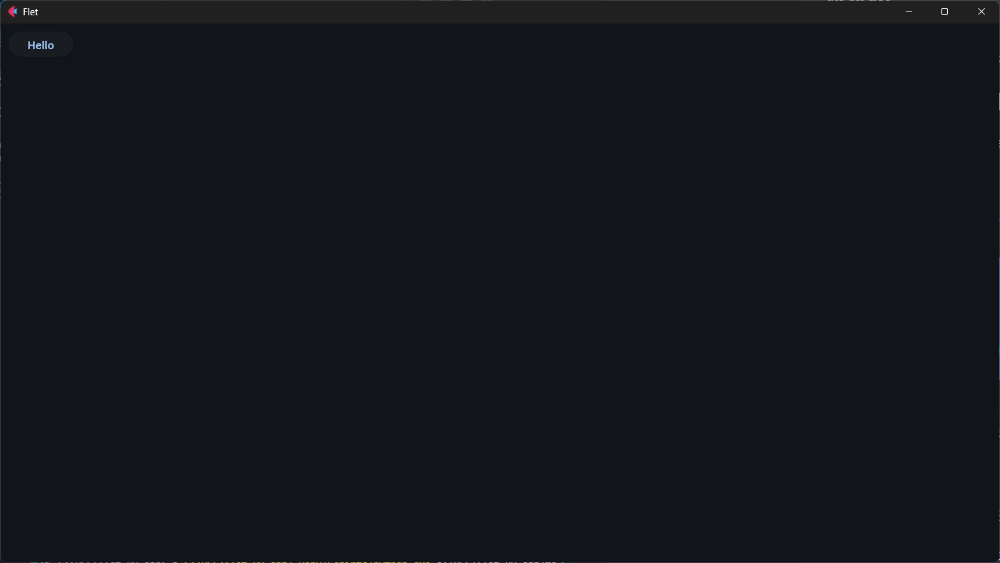
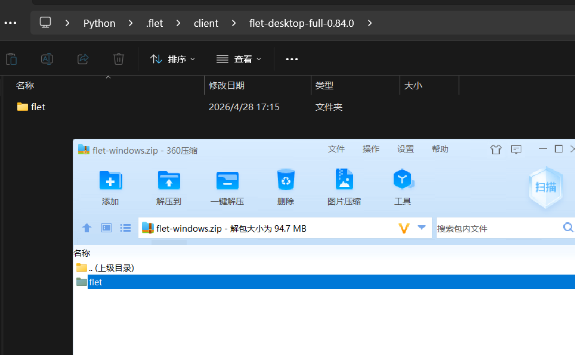
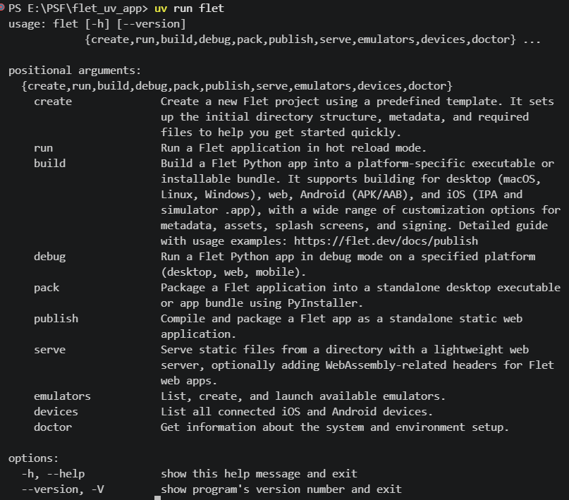
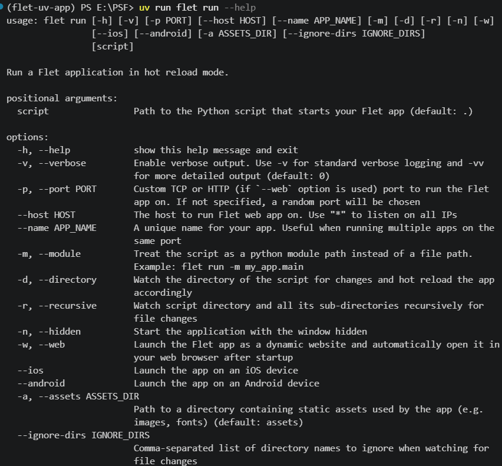
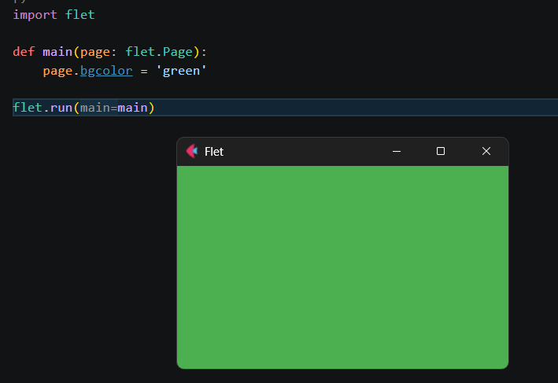
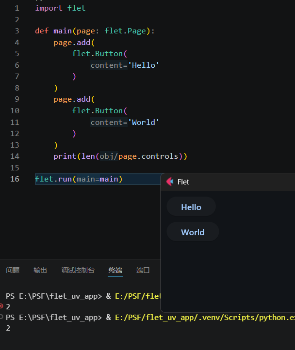
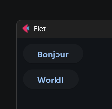
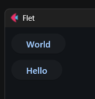
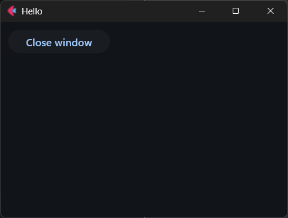

# Flet札记（2026）

[TOC]

## 0 为何而写

Flet框架（官网https://flet.dev/）是一款优秀的WebUI、GUI框架，底层使用谷歌的Flutter框架实现，所以控件比较美观。而Flet框架实现了Flutter框架的Python接口，方便Python开发者使用Flutter框架的控件快速搭建出美观的UI界面。

虽然Flet框架类似其他基于Web的GUI框架（比如NiceGUI），但Flet框架提供了运行时，使其作为桌面程序运行时，不需要额外安装类似浏览器的框架（比如`pywebview`库）来提供壳子，因为框架自带壳子。另外Flet框架也提供了完善的打包、编译支持（虽然体积依然比较大），方便分发给客户（无需安装Python）。

因此，基于对各方面优缺点的考量，笔者觉得有必要给读者介绍一下Flet框架，算是作为NiceGUI、Qt等现有方案的补充，也是使用Python开发GUI程序时一个不错的备选方案。

注意，因为笔者2026年需要完成其他作品，更新精力有限，加上Flet官方教程相对完善，故本教程将采用敏捷风格，部分基础内容不做详细介绍。如果读者有需求或者遇到问题，可以及时留言，后续笔者会第一时间补充、解答。

## 1 安装Flet

一如既往，依然使用uv创建初始环境。

首先，新建一个空白文件夹，笔者这里新建了`flet_app`文件夹。进入该文件夹，运行`uv init`，即可初始化该文件夹为项目文件夹（`uv`命令需要使用`pip install uv`安装）。

此时创建的项目是空白项目，没有添加任何依赖，还需要使用`uv add flet`添加依赖（或者使用`uv add flet[all]`包含其他运行方式的可选依赖，但不包括特定控件所需的扩展），并自动创建虚拟环境。

如果想要将虚拟环境中的所有库升级至最新稳定版，可以使用`uv sync -U`。

若是只想升级指定库，比如`flet`，则使用`uv sync -P flet`。

升级指定库至最新测试版，可以使用`uv sync -P flet --prerelease allow`命令，用于体验最新测试版的功能。

## 2 认识Flet程序

官网教程、文档：https://flet.dev/docs/

### 2.1 基本结构

先看示例，简单了解一下Flet程序的基本结构：

```python3
# 导入模块
import flet
# 创建控件
def main(page: flet.Page):
    page.add(flet.Button('Hello'))
# 运行程序
flet.run(main)
```

从代码看，Flet程序的风格不像Qt、FastAPI那样需要先创建程序实例，而是类似NiceGUI，可以直接用`run`方法运行构建好的界面。

因此，Flet程序可以简化为三个基本组成：

- 导入模块（对象）。`flet`库直接提供了创建控件和运行程序的魔术方法，无需导入子模块即可快速使用构建界面的功能。
- 创建控件。导入了模块之后，控件并不会自动创建，还需要访问具体的控件类，将其实例化，才算真正创建。并且控件的创建必须放在指定的函数中，函数默认接收一个`flet.Page`类型的参数，表示当前页面。
- 运行程序。完成前面的步骤之后，直接运行Python文件，并不会显示控件，因为Flet程序需要通过特殊的方法运行。比如示例中的`flet.run`方法就是运行程序的方法，显示模式不同，该方法使用的参数也有所不同。

### 2.2 运行方法

了解了Flet程序的基本结构之后，上面的示例即可直接运行，在激活虚拟环境的前提下（或者全局环境安装了`flet[all]`库），直接运行Python文件，就能看到程序窗口：



注意，第一次运行会从官方仓库下载运行时，因为在Github上，可能部分读者的网络不太通畅，导致第一次运行时卡很久。

以Windows系统为例，可以到官方发布地址（ https://github.com/flet-dev/flet/releases 具体加速方法参考网络，这里不提供）找与当前版本一致的系统包（`flet-windows.zip`）并下载，然后在文件管理器的地址栏输入`%homepath%`并回车。在当前文件夹下创建如`.flet\client\flet-desktop-full-{flet库版本号}`一样层级的目录（版本号请灵活替换，对于教程使用的版本，实际为`.flet\client\flet-desktop-full-0.84.0`），然后将系统包内的`flet`文件夹直接复制到刚刚创建的目录中：



这是最简单、直接的运行方法。不过，Flet框架还提供了一个更加好用、强大的命令——`flet`，可以实现远超直接运行的功能。

激活虚拟环境或者加上`uv run `前缀即可运行`flet`命令：



运行`flet run`也可以运行Flet程序（默认运行`main.py`，如果Python文件是其他名字、路径，需要后面追加），运行`flet run -h`可以查看该命令的完整用法：



`flet run`命令支持的参数很多，本节只讲几个后续比较常用的：

- `-p`、`--port`，用于指定网页模式的端口。
- `-w`、`--web`，以网页模式运行Flet程序。
- `-d`、`--directory`，监视指定文件夹下（不含子文件夹）的文件，如果文件发生变化，实时重载程序。该参数适合习惯使用热重载实时调试界面的场景。
- `-r`、`--recursive`，监视指定文件夹时包含子文件夹。

根据上面的内容，如果运行的是`flet run -d`，修改Python文件，窗口界面会实时生效，无需重启程序。

### 2.3 显示模式

上一节提到了`flet run`命令的`-w`、`--web`参数能以网页模式运行Flet程序。这就涉及到Flet程序的几种显示模式：

- 窗口模式，直接运行或者使用`flet run`命令在开发环境上运行，Flet程序是以窗口的形式显示。
- 网页模式，`flet run`命令使用`-w`、`--web`参数，`flet.run`方法的`view`参数传入`flet.AppView.WEB_BROWSER`时直接运行，Flet程序将以网页形式显示，同时Flet程序会自动打开默认浏览器，访问网页模式对应的网址。
- 移动端远程模式，需要使用`flet run`命令配合对应移动端的参数，此时终端会显示一个二维码，使用移动设备扫码即可在移动设备上的Flet APP中显示Flet程序。注意，因为笔者没有iOS设备，也没法访问谷歌Play商店，故此模式无法展示。如果读者具备相关条件，可以访问官网（ https://flet.dev/docs/getting-started/testing-on-mobile ）了解具体用法。

直接以网页模式运行的示例如下：

```python3
# 导入模块
import flet
# 创建控件
def main(page: flet.Page):
    page.add(flet.Button('Hello'))
# 运行程序
flet.run(
    main,
    view=flet.AppView.WEB_BROWSER
)
```

## 3 创建（添加）控件

控件是界面的重要组成部分，对于Flet程序而言，创建控件也是如此。上一章说过，要在指定函数内创建控件，这个函数就是Flet程序的主函数。

主函数固定接收一个`flet.Page`类型的参数，表示程序的当前页面，同时也是主页面。这里就不得不简单梳理一下Flet程序的控件树，这样才能理解后续创建控件的操作。

虽然Flet程序在WIndows系统上运行时显示了一个窗口，但这个窗口实际上归主页面管理。对于Flet程序而言，主页面就是程序的根本，相当于根控件（树根），其余控件（树干、树叶）都要挂载在主页面之下。窗口的管理、其余控件的控制，很多时候也要通过主页面提供的属性、方法来操作。因此，在后续的学习中，将会看到控件创建之后，需要通过调用主页面的方法才能显示（比如对话框）

当程序什么控件都不添加时，实际上默认还有一个主页面控件：

```python3
import flet

def main(page: flet.Page):
    page.bgcolor = 'green'

flet.run(main)
```



主页面的`add`方法用于添加控件到页面中，而所有控件都可以通过`flet`（或者其别名）直接调用。添加的控件都会追加到`controls`属性中，默认以列布局的形式显示：

```python3
import flet

def main(page: flet.Page):
    page.add(
        flet.Button(
            'Hello'
        )
    )
    page.add(
        flet.Button(
            'World'
        )
    )
    print(len(page.controls))

flet.run(main)
```



`add`方法支持不定参数，无需每次添加一个控件，可以一次性添加所有控件：

```python3
import flet

def main(page: flet.Page):
    page.add(
        flet.Button(
            'Hello'
        ),
        flet.Button(
            'World'
        )
    )

flet.run(main)
```

注意，虽然可以通过索引`controls`属性访问对应控件，但依然建议给每个控件分配变量，因为`controls`属性没法提示具体控件支持的属性，需要读者对具体控件比较熟悉才能这样使用：

```python3
import flet

def main(page: flet.Page):
    button = flet.Button(
        'Hello'
    )
    button2 = flet.Button(
        'World'
    )
    page.add(
        button,button2
    )
    page.controls[0].content = 'Bonjour'
    button2.content = 'World!'

flet.run(main)
```



除了使用`add`方法按顺序添加控件，也可以使用`insert`方法，在指定位置插入控件，改变控件顺序：

```python3
import flet

def main(page: flet.Page):
    page.add(
        flet.Button(
            'Hello'
        )
    )
    page.insert(
        0,
        flet.Button(
            'World'
        )
    )

flet.run(main)
```



最后再补充一个相关的用法，添加了控件之后，很有可能会有移除的需求，主页面支持以下与移除控件相关的方法（其实就是操作`controls`属性）：

- `clean`方法，移除所有控件。
- `remove`方法，移除指定控件。
- `remove_at`方法，移除指定索引值的控件。

## 4 命令式与声明式

在介绍更多具体内容前，请允许笔者打断一下节奏，介绍一个抽象但至关重要的概念——Flet程序的编程模型。

之前示例中介绍的是命令式风格，本章将简单介绍一下Flet框架在0.80.0版本引入声明式风格，二者不可混用。

说到这里，读者可能会产生疑问，什么是命令式，什么是声明式？

那就先看一个声明式的示例，通过代码来见真章：

```python3
import flet

@flet.component
def App():
    return flet.Column(
        [
            flet.Button(
                'Hello'
            ),
            flet.Button(
                'World'
            )
        ]
    )

def main(page: flet.Page):
    # 声明式风格的关键
    page.render(App)

flet.run(main)
```

关键就在于`page.render(App)`，这就是声明式风格的标志。之前的命令式风格，使用`add`方法添加（创建）控件；而声明式风格，则改为使用`render`方法渲染（创建）组件（多个控件预先做好布局的集合）。

这样一对比，声明式风格的特点就很明显：控件布局（组合）一步到位，通常不在主函数中；使用`@flet.component`装饰器装饰返回控件的函数，将其包装为组件；在主函数中使用 `page.render`方法渲染组件，而不是添加组件。

因此，关于声明式编程，有**一条关键规则**：一旦代码中选择使用 `page.render`方法，程序必须从上到下都是声明式的。

至于选择建议，可以参考下面的意见：

命令式快捷、简单，可以精细控制（有的控件属性没法在创建控件时候调整），但不适合复杂界面。

声明式性能、维护性更好，但部分（很少）控件不支持或者存在问题，相关教程还不够完善，并且相关概念的学习难度有点高。

目前Flet框架二者均支持，不存在谁替代谁或者全面转向声明式可能。恰如上面的总结，对于习惯命令式或者代码不是特别复杂的情况，使用命令式更合适。当然，如果读者有其他声明式UI框架的基础，使用声明式反而更简单，性能上也更好（差别不是特别大）。

注意，因为声明式风格是新添加的功能，官网文档也没有太多资料（可以先参考 https://flet.dev/blog/introducing-declarative-ui-in-flet/ ，后续官网会逐步更新相关内容），很多资料还是使用命令式风格；另外本教程很多示例比较简单，没有必要使用声明式风格，因此本教程还是优先使用命令式风格，除非介绍到声明式风格的相关内容。

## 5 主页面的`window`属性——解决示例代码中窗口的显示问题

有的读者问笔者，前面几章的示例中，为什么有个窗口截图只截取局部，或者窗口比较小，而他运行示例代码之后，窗口默认比较大，而且位置还是左上角。

其实，结果没错，笔者只是为了方便展示手动调整了窗口大小、位置。可以手动，但不想每次都手动调整的话，本章就简单介绍一些调整窗口的操作，以便于后续学习时更方便。

先说窗口是什么。肯定有读者不解，窗口就是窗口呗，还能是什么？这么理解是没错，但在Flet程序中，窗口其实也是一个控件，只是这个控件不是和其他控件一样显示在主页面内，而是代表包在外面的窗口。简单理解，Flet程序的窗口“控件”相当于实际窗口的代理人，一切与窗口有关的操作，都是通过窗口“控件”进行。

因此，主页面的`window`属性，即窗口的代理人，就成了调整窗口的入口。

`window`属性支持以下属性：

- `title`属性，字符串类型，表示窗口标题。
- `icon`属性，字符串类型，表示窗口图标的路径（仅Windows系统系统生效）。
- `width`属性，数字类型（包含整数、浮点数），表示窗口宽度。
- `height`属性，数字类型（包含整数、浮点数），表示窗口高度。
- `max_width`属性，数字类型（包含整数、浮点数），表示窗口最大宽度。
- `max_height`属性，数字类型（包含整数、浮点数），表示窗口最大高度。
- `min_width`属性，数字类型（包含整数、浮点数），表示窗口最小宽度。
- `min_height`属性，数字类型（包含整数、浮点数），表示窗口最小高度。
- `opacity`属性，浮点类型，表示窗口的透明度。
- `aspect_ratio`属性，数字类型（包含整数、浮点数），表示窗口的宽高比，需要同时指定窗口的宽度或者高度才能生效。
- `maximized`属性，布尔类型，表示窗口是否最大化，默认为`False`。
- `minimized`属性，布尔类型，表示窗口是否最小化，默认为`False`。
- `maximizable`属性，布尔类型，表示窗口是否可以最大化，默认为`True`。
- `minimizable`属性，布尔类型，表示窗口是否可以最小化，默认为`True`。
- `resizable`属性，布尔类型，表示窗口是否可以调整尺寸，默认为`True`。
- `movable`属性，布尔类型，表示窗口是否可以移动，默认为`True`。
- `full_screen`属性，布尔类型，表示窗口是否全屏，默认为`False`。
- `always_on_top`属性，布尔类型，表示窗口是否始终置顶，默认为`False`。
- `always_on_bottom`属性，布尔类型，表示窗口是否始终置底，默认为`False`。
- `prevent_close`属性，布尔类型，表示是否阻止关闭窗口（点击关闭按钮、调用`close`方法），默认为`False`。
- `skip_task_bar`属性，布尔类型，表示窗口是否隐藏其任务栏上的图标，默认为`False`。
- `title_bar_hidden`属性，布尔类型，表示是否隐藏标题栏，默认为`False`。
- `title_bar_buttons_hidden`属性，布尔类型，表示是否隐藏标题栏的按钮（仅MacOS生效），默认为`False`。
- `frameless`属性，布尔类型，表示是否启用无边框模式，默认为`False`。
- `focused`属性，布尔类型，表示程序启动之后窗口是否自动获得焦点，默认为`True`。
- `visible`属性，布尔类型，表示程序启动之后窗口是否可见，默认为`True`。
- `shadow`属性，布尔类型，表示程序启动之后窗口是否有阴影效果，默认为`True`。
- `alignment`属性，`flet.Alignment`类型，表示窗口的对齐位置。该属性包含`x`属性、`y`属性，表示窗口位置相对于屏幕中心在X方向、Y方向的偏移比例（下、右为正，范围为`-1.0`到`1.0`）。
- `badge_label`属性，字符串类型，表示显示在托盘图标上的角标（仅MacOS生效）。
- `ignore_mouse_events`属性，布尔类型，表示是否忽略鼠标事件（相当于禁用鼠标支持，此时窗口会变成穿透模式，即鼠标会穿过窗口）。
- `on_event`属性，可调用类型，表示窗口任意事件的响应函数。
- `progress_bar`属性，浮点类型，表示任务栏图标中显示的进度。
- `brightness`属性，`flet.Brightness`类型（枚举类型），表示窗口的明暗模式。
- `bgcolor`属性，字符串类型、`flet.Colors`类型（枚举类型）、`flet.CupertinoColors`类型（枚举类型），表示窗口的背景颜色。

`window`属性支持以下异步方法（调用方法必须在属性设置完之后，否则属性可能不会生效）：

- `wait_until_ready_to_show`方法，用于等待窗口显示完成。
- `destroy`方法，销毁窗口。
- `center`方法，将窗口居中。
- `close`方法，关闭窗口。此方法比`destroy`方法更优雅，相当于点击了窗口的关闭按钮。
- `to_front`方法，将窗口置顶。
- `start_dragging`方法，让窗口进入拖动状态。
- `start_resizing`方法，让窗口进入大小调整状态。

根据上面的内容，可以得知：

- 想要调整窗口的宽高，应该修改`width`属性、`height`属性。
- 想要调整窗口的位置，可以修改`left`属性、`top`属性。但想要居中的话，最好、最简单的方法，是使用`alignment`属性或者`center`方法。

完整示例如下：

```python3
import flet

def main(page: flet.Page):
    page.window.width = 400
    page.window.height = 300
    page.window.alignment = flet.Alignment(0,0)
    page.title = 'Hello'
    page.add(
        flet.Button(
            'Close window',
            on_click=page.window.close
        )
    )

flet.run(main)
```



## 6 xxx（更新中）


## x 灵感

参考cookbook介绍一些基础，后续单独介绍一些实践用法。

控件与服务（https://flet.dev/docs/reference/），每章详细介绍一个：

- [控件](https://flet.dev/docs/controls) - 具有属性、事件和使用示例的用户界面构建块。
- [服务](https://flet.dev/docs/services) - 设备和平台的功能，如传感器、存储和权限。
- [类型](https://flet.dev/docs/types/) - 核心类型、枚举、事件、异常和在整个SDK中共享的实用工具。


后台运行任务，

事件响应，

颜色系统，

控件布局，

快捷键，


手势控件结合窗口状态进入函数的使用：

```python3
import flet

async def main(page: flet.Page):
    page.window.width = 400
    page.window.height = 300
    page.title = 'Hello'
    async def starting():
        # 拖动窗口空白处来拖动窗口或者调整窗口大小，二选一
        await page.window.start_dragging()
        #await page.window.start_resizing(flet.WindowResizeEdge.BOTTOM_RIGHT)
    page.add(
        flet.GestureDetector(
            on_tap_down=starting,
        ),
    )

flet.run(main)
```

