# Flet札记（2026）

[TOC]

## 0 为何而写

Flet框架（官网https://flet.dev/）是一款优秀的WebUI、GUI框架，底层使用谷歌的Flutter框架实现，所以控件比较美观。而Flet框架实现了Flutter框架的Python接口，方便Python开发者使用Flutter框架的控件快速搭建出美观的UI界面。

虽然Flet框架类似其他基于Web的GUI框架（比如NiceGUI），但Flet框架提供了运行时，使其作为桌面程序运行时，不需要额外安装类似浏览器的框架（比如`pywebview`库）来提供壳子，因为框架自带壳子。另外Flet框架也提供了完善的打包、编译支持（虽然体积依然比较大），方便分发给客户（无需安装Python）。

因此，基于对各方面优缺点的考量，笔者觉得有必要给读者介绍一下Flet框架，算是作为NiceGUI、Qt等现有方案的补充，也是使用Python开发GUI程序时一个不错的备选方案。

注意，因为笔者2026年需要完成其他作品，更新精力有限，加上Flet官方教程相对完善，故本教程将采用敏捷风格，部分基础内容不做详细介绍。如果读者有需求或者遇到问题，可以及时留言，后续笔者会第一时间补充、解答。

## 1 安装Flet

一如既往，依然使用uv创建初始环境。

首先，新建一个空白文件夹，笔者这里新建了`flet_app`文件夹。进入该文件夹，运行`uv init`，即可初始化该文件夹为项目文件夹（`uv`命令需要使用`pip install uv`安装）。

此时创建的项目是空白项目，没有添加任何依赖，还需要使用`uv add flet`添加依赖（或者使用`uv add flet[all]`包含其他运行方式的可选依赖，但不包括特定控件所需的扩展），并自动创建虚拟环境。

如果想要将虚拟环境中的所有库升级至最新稳定版，可以使用`uv sync -U`。

若是只想升级指定库，比如`flet`，则使用`uv sync -P flet`。

升级指定库至最新测试版，可以使用`uv sync -P flet --prerelease allow`命令，用于体验最新测试版的功能。

## 2 认识Flet程序

官网教程、文档：https://flet.dev/docs/

### 2.1 基本结构

先看示例，简单了解一下Flet程序的基本结构：

```python3
# 导入模块
import flet
# 创建控件
def main(page: flet.Page):
    page.add(flet.Button('Hello'))
# 运行程序
flet.run(main)
```

从代码看，Flet程序的风格不像Qt、FastAPI那样需要先创建程序实例，而是类似NiceGUI，可以直接用`run`方法运行构建好的界面。

因此，Flet程序可以简化为三个基本组成：

- 导入模块（对象）。`flet`库直接提供了创建控件和运行程序的魔术方法，无需导入子模块即可快速使用构建界面的功能。
- 创建控件。导入了模块之后，控件并不会自动创建，还需要访问具体的控件类，将其实例化，才算真正创建。并且控件的创建必须放在指定的函数中，函数默认接收一个`flet.Page`类型的参数，表示当前页面。
- 运行程序。完成前面的步骤之后，直接运行Python文件，并不会显示控件，因为Flet程序需要通过特殊的方法运行。比如示例中的`flet.run`方法就是运行程序的方法，显示模式不同，该方法使用的参数也有所不同。

### 2.2 运行方法

了解了Flet程序的基本结构之后，上面的示例即可直接运行，在激活虚拟环境的前提下（或者全局环境安装了`flet[all]`库），直接运行Python文件，就能看到程序窗口：


注意，第一次运行会从官方仓库下载运行时，因为在Github上，可能部分读者的网络不太通畅，导致第一次运行时卡很久。

以Windows系统为例，可以到官方发布地址（ https://github.com/flet-dev/flet/releases 具体加速方法参考网络，这里不提供）找与当前版本一致的系统包（`flet-windows.zip`）并下载，然后在文件管理器的地址栏输入`%homepath%`并回车。在当前文件夹下创建如`.flet\client\flet-desktop-full-{flet库版本号}`一样层级的目录（版本号请灵活替换，对于教程使用的版本，实际为`.flet\client\flet-desktop-full-0.84.0`），然后将系统包内的`flet`文件夹直接复制到刚刚创建的目录中：


这是最简单、直接的运行方法。不过，Flet框架还提供了一个更加好用、强大的命令——`flet`，可以实现远超直接运行的功能。

激活虚拟环境或者加上`uv run `前缀即可运行`flet`命令：


运行`flet run`也可以运行Flet程序（默认运行`main.py`，如果Python文件是其他名字、路径，需要后面追加），运行`flet run -h`可以查看该命令的完整用法：


`flet run`命令支持的参数很多，本节只讲几个后续比较常用的：

- `-p`、`--port`，用于指定网页模式的端口。
- `-w`、`--web`，以网页模式运行Flet程序。
- `-d`、`--directory`，监视指定文件夹下（不含子文件夹）的文件，如果文件发生变化，实时重载程序。该参数适合习惯使用热重载实时调试界面的场景。
- `-r`、`--recursive`，监视指定文件夹时包含子文件夹。

根据上面的内容，如果运行的是`flet run -d`，修改Python文件，窗口界面会实时生效，无需重启程序。

### 2.3 显示模式

上一节提到了`flet run`命令的`-w`、`--web`参数能以网页模式运行Flet程序。这就涉及到Flet程序的几种显示模式：

- 窗口模式，直接运行或者使用`flet run`命令在开发环境上运行，Flet程序是以窗口的形式显示。
- 网页模式，`flet run`命令使用`-w`、`--web`参数，`flet.run`方法的`view`参数传入`flet.AppView.WEB_BROWSER`时直接运行，Flet程序将以网页形式显示，同时Flet程序会自动打开默认浏览器，访问网页模式对应的网址。
- 移动端远程模式，需要使用`flet run`命令配合对应移动端的参数，此时终端会显示一个二维码，使用移动设备扫码即可在移动设备上的Flet APP中显示Flet程序。注意，因为笔者没有iOS设备，也没法访问谷歌Play商店，故此模式无法展示。如果读者具备相关条件，可以访问官网（ https://flet.dev/docs/getting-started/testing-on-mobile ）了解具体用法。

直接以网页模式运行的示例如下：

```python3
# 导入模块
import flet
# 创建控件
def main(page: flet.Page):
    page.add(flet.Button('Hello'))
# 运行程序
flet.run(
    main,
    view=flet.AppView.WEB_BROWSER
)
```

## 3 创建（添加）控件

控件是界面的重要组成部分，对于Flet程序而言，创建控件也是如此。上一章说过，要在指定函数内创建控件，这个函数就是Flet程序的主函数。

主函数固定接收一个`flet.Page`类型的参数，表示程序的当前页面，同时也是主页面。这里就不得不简单梳理一下Flet程序的控件树，这样才能理解后续创建控件的操作。

虽然Flet程序在Windows系统上运行时显示了一个窗口，但这个窗口实际上归主页面管理。对于Flet程序而言，主页面就是程序的根本，相当于根控件（树根），其余控件（树干、树叶）都要挂载在主页面之下。窗口的管理、其余控件的控制，很多时候也要通过主页面提供的属性、方法来操作。因此，在后续的学习中，将会看到控件创建之后，需要通过调用主页面的方法才能显示（比如对话框）

当程序什么控件都不添加时，实际上默认还有一个主页面控件：

```python3
import flet

def main(page: flet.Page):
    page.bgcolor = 'green'

flet.run(main)
```


主页面的`add`方法用于添加控件到页面中，而所有控件都可以通过`flet`（或者其别名）直接调用。添加的控件都会追加到`controls`属性中，默认以列布局的形式显示：

```python3
import flet

def main(page: flet.Page):
    page.add(
        flet.Button(
            'Hello'
        )
    )
    page.add(
        flet.Button(
            'World'
        )
    )
    print(len(page.controls))

flet.run(main)
```


`add`方法支持不定参数，无需每次添加一个控件，可以一次性添加所有控件：

```python3
import flet

def main(page: flet.Page):
    page.add(
        flet.Button(
            'Hello'
        ),
        flet.Button(
            'World'
        )
    )

flet.run(main)
```

注意，虽然可以通过索引`controls`属性访问对应控件，但依然建议给每个控件分配变量，因为`controls`属性没法提示具体控件支持的属性，需要读者对具体控件比较熟悉才能这样使用：

```python3
import flet

def main(page: flet.Page):
    button = flet.Button(
        'Hello'
    )
    button2 = flet.Button(
        'World'
    )
    page.add(
        button,button2
    )
    page.controls[0].content = 'Bonjour'
    button2.content = 'World!'

flet.run(main)
```


除了使用`add`方法按顺序添加控件，也可以使用`insert`方法，在指定位置插入控件，改变控件顺序：

```python3
import flet

def main(page: flet.Page):
    page.add(
        flet.Button(
            'Hello'
        )
    )
    page.insert(
        0,
        flet.Button(
            'World'
        )
    )

flet.run(main)
```


最后再补充一个相关的用法，添加了控件之后，很有可能会有移除的需求，主页面支持以下与移除控件相关的方法（其实就是操作`controls`属性）：

- `clean`方法，移除所有控件。
- `remove`方法，移除指定控件。
- `remove_at`方法，移除指定索引值的控件。

## 4 命令式与声明式

在介绍更多具体内容前，请允许笔者打断一下节奏，介绍一个抽象但至关重要的概念——Flet程序的编程模型。

之前示例中介绍的是命令式风格，本章将简单介绍一下Flet框架在0.80.0版本引入声明式风格，二者不可混用。

说到这里，读者可能会产生疑问，什么是命令式，什么是声明式？

那就先看一个声明式的示例，通过代码来见真章：

```python3
import flet

@flet.component
def App():
    return flet.Column(
        [
            flet.Button(
                'Hello'
            ),
            flet.Button(
                'World'
            )
        ]
    )

def main(page: flet.Page):
    # 声明式风格的关键
    page.render(App)

flet.run(main)
```

关键就在于`page.render(App)`，这就是声明式风格的标志。之前的命令式风格，使用`add`方法添加（创建）控件；而声明式风格，则改为使用`render`方法渲染（创建）组件（多个控件预先做好布局的集合）。

这样一对比，声明式风格的特点就很明显：控件布局（组合）一步到位，通常不在主函数中；使用`@flet.component`装饰器装饰返回控件的函数，将其包装为组件；在主函数中使用 `page.render`方法渲染组件，而不是添加组件。

因此，关于声明式编程，有**一条关键规则**：一旦代码中选择使用 `page.render`方法，程序必须从上到下都是声明式的。

至于选择建议，可以参考下面的意见：

命令式快捷、简单，可以精细控制（有的控件属性没法在创建控件时候调整），但不适合复杂界面。

声明式性能、维护性更好，但部分（很少）控件不支持或者存在问题，相关教程还不够完善，并且相关概念的学习难度有点高。

目前Flet框架二者均支持，不存在谁替代谁或者全面转向声明式可能。恰如上面的总结，对于习惯命令式或者代码不是特别复杂的情况，使用命令式更合适。当然，如果读者有其他声明式UI框架的基础，使用声明式反而更简单，性能上也更好（差别不是特别大）。

注意，因为声明式风格是新添加的功能，官网文档也没有太多资料（可以先参考 https://flet.dev/blog/introducing-declarative-ui-in-flet/ ，后续官网会逐步更新相关内容），很多资料还是使用命令式风格；另外本教程很多示例比较简单，没有必要使用声明式风格，因此本教程还是优先使用命令式风格，除非介绍到声明式风格的相关内容。

## 5 主页面的`window`属性——解决示例代码中窗口的显示问题

有的读者问笔者，前面几章的示例中，为什么有个窗口截图只截取局部，或者窗口比较小，而他运行示例代码之后，窗口默认比较大，而且位置还是左上角。

其实，结果没错，笔者只是为了方便展示手动调整了窗口大小、位置。可以手动，但不想每次都手动调整的话，本章就简单介绍一些调整窗口的操作，以便于后续学习时更方便。

先说窗口是什么。肯定有读者不解，窗口就是窗口呗，还能是什么？这么理解是没错，但在Flet程序中，窗口其实也是一个控件，只是这个控件不是和其他控件一样显示在主页面内，而是代表包在外面的窗口。简单理解，Flet程序的窗口“控件”相当于实际窗口的代理人，一切与窗口有关的操作，都是通过窗口“控件”进行。

因此，主页面的`window`属性，即窗口的代理人，就成了调整窗口的入口。

`window`属性支持以下属性：

- `title`属性，字符串类型，表示窗口标题。
- `icon`属性，字符串类型，表示窗口图标的路径（仅Windows系统系统生效）。
- `width`属性，数字类型（包含整数、浮点数），表示窗口宽度。
- `height`属性，数字类型（包含整数、浮点数），表示窗口高度。
- `max_width`属性，数字类型（包含整数、浮点数），表示窗口最大宽度。
- `max_height`属性，数字类型（包含整数、浮点数），表示窗口最大高度。
- `min_width`属性，数字类型（包含整数、浮点数），表示窗口最小宽度。
- `min_height`属性，数字类型（包含整数、浮点数），表示窗口最小高度。
- `opacity`属性，浮点类型，表示窗口的透明度。
- `aspect_ratio`属性，数字类型（包含整数、浮点数），表示窗口的宽高比，需要同时指定窗口的宽度或者高度才能生效。
- `maximized`属性，布尔类型，表示窗口是否最大化，默认为`False`。
- `minimized`属性，布尔类型，表示窗口是否最小化，默认为`False`。
- `maximizable`属性，布尔类型，表示窗口是否可以最大化，默认为`True`。
- `minimizable`属性，布尔类型，表示窗口是否可以最小化，默认为`True`。
- `resizable`属性，布尔类型，表示窗口是否可以调整尺寸，默认为`True`。
- `movable`属性，布尔类型，表示窗口是否可以移动，默认为`True`。
- `full_screen`属性，布尔类型，表示窗口是否全屏，默认为`False`。
- `always_on_top`属性，布尔类型，表示窗口是否始终置顶，默认为`False`。
- `always_on_bottom`属性，布尔类型，表示窗口是否始终置底，默认为`False`。
- `prevent_close`属性，布尔类型，表示是否阻止关闭窗口（点击关闭按钮、调用`close`方法），默认为`False`。
- `skip_task_bar`属性，布尔类型，表示窗口是否隐藏其任务栏上的图标，默认为`False`。
- `title_bar_hidden`属性，布尔类型，表示是否隐藏标题栏，默认为`False`。
- `title_bar_buttons_hidden`属性，布尔类型，表示是否隐藏标题栏的按钮（仅MacOS生效），默认为`False`。
- `frameless`属性，布尔类型，表示是否启用无边框模式，默认为`False`。
- `focused`属性，布尔类型，表示程序启动之后窗口是否自动获得焦点，默认为`True`。
- `visible`属性，布尔类型，表示程序启动之后窗口是否可见，默认为`True`。
- `shadow`属性，布尔类型，表示程序启动之后窗口是否有阴影效果，默认为`True`。
- `alignment`属性，`flet.Alignment`类型，表示窗口的对齐位置。该属性包含`x`属性、`y`属性，表示窗口位置相对于屏幕中心在X方向、Y方向的偏移比例（下、右为正，范围为`-1.0`到`1.0`）。
- `badge_label`属性，字符串类型，表示显示在托盘图标上的角标（仅MacOS生效）。
- `ignore_mouse_events`属性，布尔类型，表示是否忽略鼠标事件（相当于禁用鼠标支持，此时窗口会变成穿透模式，即鼠标会穿过窗口）。
- `on_event`属性，可调用类型，表示窗口任意事件的响应函数。
- `progress_bar`属性，浮点类型，表示任务栏图标中显示的进度。
- `brightness`属性，`flet.Brightness`类型（枚举类型），表示窗口的明暗模式。
- `bgcolor`属性，字符串类型、`flet.Colors`类型（枚举类型）、`flet.CupertinoColors`类型（枚举类型），表示窗口的背景颜色。

`window`属性支持以下异步方法（调用方法必须在属性设置完之后，否则属性可能不会生效）：

- `wait_until_ready_to_show`方法，用于等待窗口显示完成。
- `destroy`方法，销毁窗口。
- `center`方法，将窗口居中。
- `close`方法，关闭窗口。此方法比`destroy`方法更优雅，相当于点击了窗口的关闭按钮。
- `to_front`方法，将窗口置顶。
- `start_dragging`方法，让窗口进入拖动状态。
- `start_resizing`方法，让窗口进入大小调整状态。

根据上面的内容，可以得知：

- 想要调整窗口的宽高，应该修改`width`属性、`height`属性。
- 想要调整窗口的位置，可以修改`left`属性、`top`属性。但想要居中的话，最好、最简单的方法，是使用`alignment`属性或者`center`方法。

完整示例如下：

```python3
import flet

def main(page: flet.Page):
    page.window.width = 400
    page.window.height = 300
    page.window.alignment = flet.Alignment(0,0)
    page.title = 'Hello'
    page.add(
        flet.Button(
            'Close window',
            on_click=page.window.close
        )
    )

flet.run(main)
```


## 6 事件响应

用户与界面交互就会触发事件，事件也可以理解为交互的过程或者动作。想要让程序响应用户的动作，就要创建（定义）对应事件的响应函数。在Flet程序中，“on_”开头的属性、参数用于定义对应事件的响应函数，后面接着的，就是对应的事件名。

就以上一章最后的示例为基础，看一下创建（定义）如何事件的响应函数：

```python3
import flet

def main(page: flet.Page):
    page.window.width = 400
    page.window.height = 300
    page.window.alignment = flet.Alignment(0,0)
    page.title = 'Hello'
    button = flet.Button(
        'Close window (1)',        
    )
    button.on_click = page.window.close
    page.add(
        button,
        flet.Button(
            'Close window (2)',
            on_click=page.window.close,
        )
    )
    
flet.run(main)
```

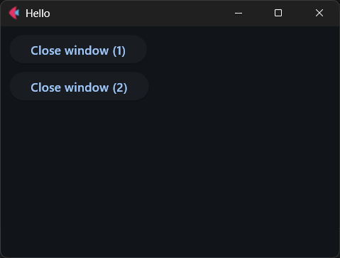

修改之后的示例中，添加了两个同样功能的按钮，分别用不同的方法创建（定义）了点击事件的响应函数：

- `on_click`属性，可以先创建控件，再创建响应函数，适合修改响应函数、创建控件之后随时创建响应函数的需求、
- `on_click`参数，必须在创建控件前创建响应函数，否则会报错。

上面的示例中，响应函数没有接收任何参数，其实，响应函数也可以接收参数，具体支持的参数可以参考官方文档（https://flet.dev/docs/types/event）或者代码提示（对应源代码）。

一般来说，响应函数的参数支持以下属性（部分，可能会更多或者有变动）：

- `control`属性，表示触发事件的控件。
- `name`属性，字符串类型，表示事件名称。
- `page`属性，表示控件所属的页面。

示例如下：

```python3
import flet

def main(page: flet.Page):
    page.window.width = 400
    page.window.height = 300
    page.window.alignment = flet.Alignment(0,0)
    page.title = 'Hello'
    button = flet.Button(
        'Save', 
        data=['abc']       
    )
    def on_button_clicked(e:flet.Event):
        e.control.content = 'ok'
        e.control.disabled = True
        e.page.title = 'ok'
        
    button.on_click = on_button_clicked
    page.add(
        button,
        flet.Button(
            'Close window',
            on_click=page.window.close,
        )
    )
    

flet.run(main)
```

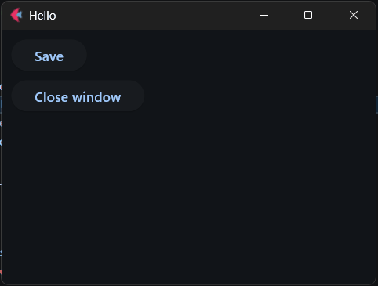

## 7 控件布局

控件不能一味堆砌，想要界面直观、整洁，还需要设计控件的布局，这时就要用到布局控件。

布局控件（通常）包含`controls`参数，表示哪些控件放在布局控件内。

顺便说一句，容器控件通常使用`controls`参数、`content`参数表示哪些（哪个）控件放在容器控件内。二者用法类似，实际设计布局时经常会同时使用，因此，`controls`参数是区分布局控件和容器控件的唯一标准，也无需严格区分。只要控件的作用能满足需求，必要时可以用容器控件设计布局。

常见的布局控件有:

- 行布局控件（`flet.Row`），所有控件排成一行。
- 列布局控件（`flet.Column`），所有控件排成一列。

简单的控件布局使用这两个布局控件也能实现。

此外，如果`flet.Container`容器控件（这是个具体控件，不是一类控件）启用了自动扩展（`expand`参数，布尔类型，大部分控件都有此参数，启用之后，控件会自动调整大小，来填充指定方向的可用空间，完整用法参考 https://flet.dev/docs/cookbook/expanding-controls ），可以化身自动填充可用空间的弹性控件，与上面的布局控件组合使用，

比如，让两个控件分别靠边，而不是紧挨着：

```python3
import flet

def main(page: flet.Page):
    page.window.width = 400
    page.window.height = 300
    page.window.alignment = flet.Alignment(0,0)
    page.title = 'Hello'
    button = flet.Button(
        'World',
    )
    page.add(
        flet.Row(
            [
                button,
                flet.Container(expand=True),
                flet.Button(
                    'Close window',
                    on_click=page.window.close,
                )
            ]
        )
    )
    
flet.run(main)
```

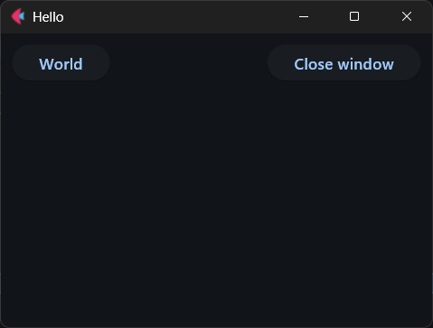

如果两种布局组合使用，发挥一点想象力，很容易将按钮放在窗口的右下角：

```python3
import flet

def main(page: flet.Page):
    page.window.width = 400
    page.window.height = 300
    page.window.alignment = flet.Alignment(0,0)
    page.title = 'Hello'
    button = flet.Button(
        'World',
    )
    row = flet.Row(
        [
            flet.Container(expand=True),
            button,
            flet.Button(
                'Close window',
                on_click=page.window.close,
            )
        ]
    )
    column = flet.Column(
        [
            flet.Container(expand=True),
            row
        ],
        expand=True
    )
    page.add(
        column
    )

flet.run(main)
```

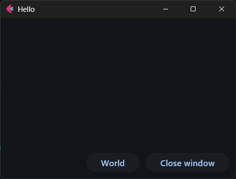

布局控件、容器控件有很多，控件的具体用法也远比想象中复杂，更别说实际开发时还会遇到各种各样的问题。本章只是简单介绍一下布局设计的基本思路，后续会详细介绍其他布局控件、容器控件，以及具体控件的具体用法、常见问题。

## 8 后台运行任务

如果想让Flet程序在后台运行任务，那就离不开主页面的`run_task`方法（https://flet.dev/docs/controls/page/#flet.Page.run_task）和`run_thread`方法（https://flet.dev/docs/controls/page/#flet.Page.run_thread）。从表面上看，这两种方法的参数、用法几乎一样，只是前者是后台运行异步方法，后者是后台运行同步方法。但是，一旦深入研究，就会发现这两种方法暗含的坑远没有看上去那么简单。

先说`run_task`方法，官方介绍异步用法的文档（https://flet.dev/docs/cookbook/async-apps/#threading）中提到了该方法，这里使用该方法实现了一个可以随时启动的、实时显示时间的程序：

```python3
import flet
import asyncio
import datetime

def main(page: flet.Page):
    page.window.width = 400
    page.window.height = 300
    page.window.alignment = flet.Alignment(0,0)
    page.title = 'Hello'
    async def update_text():
        while True:
            await asyncio.sleep(1)
            if text:
                text.value = datetime.datetime.now().strftime('%H:%M:%S')
                text.update()

    button = flet.Button(
        'Start',
        on_click=lambda :page.run_task(update_text)
    )
    text = flet.Text(
        datetime.datetime.now().strftime('%H:%M:%S')
    )
    page.add(
        text,
        button
    )

flet.run(main)
```

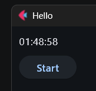

参考示例中的代码，可知`run_task`方法在实际使用时有以下要点：

- 如第19行所写，该方法仅支持运行异步方法，只需将异步的可调用对象传给该方法即可。
- 如第12行所写，异步函数内部必须使用`asyncio.sleep`方法来延迟。
- 如第13行所写，后台运行的任务内部可以使用控件，但必须判断一下控件是否存在；或者按照官方介绍异步用法的文档中所写，妥善设计停止循环的机制。以免退出程序后，控件已经销毁的情况下，后台任务依然获取控件的属性，导致程序报错。
- 如第15行所写，通过程序修改控件显示的内容，如果没有用户同时进行交互刷新显示的话，必须手动调用控件的`update`方法来刷新显示。

对于`run_thread`方法，用起来就不如`run_task`方法轻量、自由，先看示例：

```python3
import flet
import time
import datetime

def main(page: flet.Page):
    page.window.width = 400
    page.window.height = 300
    page.window.alignment = flet.Alignment(0,0)
    page.title = 'Hello'
    def run_in_thread():
        for _ in range(9):
            time.sleep(1)
            print(datetime.datetime.now().strftime('%H:%M:%S'))
        print('Finished')

    button = flet.Button(
        'Start',
        on_click=lambda e:page.run_thread(run_in_thread)
    )
    text = flet.Text(
        'Run in thread'
    )
    page.add(
        text,
        button
    )

flet.run(main)
```

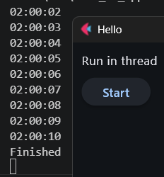

需要注意的是，相比于`run_task`方法，`run_thread`方法在实际使用时有以下要点：

- 不支持异步方法，只能传入同步方法。
- 不能在后台任务中操作控件。
- 必须妥善设置循环的结束方法，或者执行有限次数的循环，因为程序没法强制结束该后台任务。

如果后台任务支持接收参数，也可以给`run_task`方法，`run_thread`方法同时传入额外的位置参数、关键字参数，这些额外的参数会传给后台任务：

```python3
import flet
import time
import datetime

def main(page: flet.Page):
    page.window.width = 400
    page.window.height = 300
    page.window.alignment = flet.Alignment(0,0)
    page.title = 'Hello'
    def run_in_thread(times=1):
        for _ in range(times):
            time.sleep(1)
            print(datetime.datetime.now().strftime('%H:%M:%S'))
        print('Finished')

    button = flet.Button(
        'Start',
        on_click=lambda e:page.run_thread(run_in_thread,times=4)
    )
    text = flet.Text(
        'Run in thread'
    )
    page.add(
        text,
        button
    )

flet.run(main)
```

## 9 颜色

本章参考文档：https://flet.dev/docs/cookbook/colors

在实际给控件设置样式时，最常设置的就是颜色。对于Flet程序而言，支持以下两种类型：

- 字符串。
- 枚举成员。

先说字符串类型，一般为“0x”开头或者“#”开头的十六进制六位数，每两位表示一个颜色通道，合起来表示RGB颜色。

示例如下：

```python3
import flet


def main(page: flet.Page):
    page.window.width = 400
    page.window.height = 300
    page.window.alignment = flet.Alignment(0, 0)
    page.title = '认识颜色'
    page.add(
        flet.Button(
            '0xff0000',
            bgcolor='0xff0000'
        ),
        flet.Button(
            '#ff0000',
            bgcolor='#ff0000'
        )
    )


flet.run(main)

```

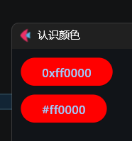

除了用十六进制数，也可以直接使用颜色的名字（支持的颜色名字可参考 https://flet.dev/docs/cookbook/colors/#named-color ）：

```python3
import flet


def main(page: flet.Page):
    page.window.width = 400
    page.window.height = 300
    page.window.alignment = flet.Alignment(0, 0)
    page.title = '认识颜色'
    page.add(
        flet.Button(
            'red',
            bgcolor='red'
        )
    )


flet.run(main)

```

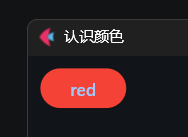

可能有的读者觉得十六进制数和颜色名字都不太好记，用起来不方便，没关系，还可以使用`Colors`和`CupertinoColors`的枚举成员（本质上是颜色名字）：

```python3
import flet


def main(page: flet.Page):
    page.window.width = 400
    page.window.height = 300
    page.window.alignment = flet.Alignment(0, 0)
    page.title = '认识颜色'
    page.add(
        flet.Button(
            'flet.Colors.RED',
            bgcolor=flet.Colors.RED
        )
    )


flet.run(main)

```

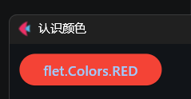

对于颜色而言，还可以设置其透明度，让颜色变得淡一些。

如果是使用十六进制数表达，则在原本的颜色前扩展两位，表示透明度（比如`7f`表示50%透明度）：

```python3
import flet


def main(page: flet.Page):
    page.window.width = 400
    page.window.height = 300
    page.window.alignment = flet.Alignment(0, 0)
    page.title = '认识颜色'
    page.add(
        flet.Button(
            '0x7fff000011',
            bgcolor='0x7fff0000'
        ),
        flet.Button(
            '#7fff0000',
            bgcolor='#7fff0000'
        )
    )


flet.run(main)

```

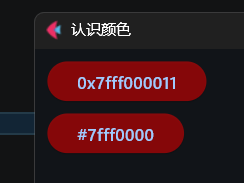

如果是使用`Colors`和`CupertinoColors`的枚举成员，则可以使用`with_opacity`方法：

```python3
import flet


def main(page: flet.Page):
    page.window.width = 400
    page.window.height = 300
    page.window.alignment = flet.Alignment(0, 0)
    page.title = '认识颜色'
    page.add(
        flet.Button(
            'flet.Colors.RED',
            bgcolor=flet.Colors.with_opacity(
                0.5,
                flet.Colors.RED
            )
        )
    )


flet.run(main)

```

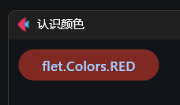

## 10 主题

本章参考文档：https://flet.dev/docs/cookbook/theming

上一章介绍了Flet程序支持的颜色表达方式，对于大部分控件而言，设置颜色主要是用于覆盖默认颜色，以便于做出区分。但是，如果想要修改所有控件的默认颜色，一个一个修改就太过麻烦，这时需要用到Flet程序的主题，一次性修改所有控件的默认颜色。

主页面和部分容器控件支持以下与主题相关的参数（属性）：

- `theme`参数（属性），表示明亮模式的主题。
- `dark_theme`参数（属性），表示黑暗模式的主题。
- `theme_mode`参数（属性），表示主题的模式（明亮还是黑暗）。

而且，容器控件主题生效优先级高于主页面主题：

```python3
import flet


def main(page: flet.Page):
    page.window.width = 400
    page.window.height = 300
    page.window.alignment = flet.Alignment(0, 0)
    page.title = '认识主题'
    page.theme = flet.Theme(
        'red'
    )
    page.dark_theme = flet.Theme(
        'blue'
    )
    page.theme_mode = flet.ThemeMode.DARK
    page.add(
        flet.Container(
            content = flet.Button(
                'button in container',
            ),
            theme = flet.Theme(
                'green'
            ),
            dark_theme = flet.Theme(
                'yellow'
            ),
            theme_mode = page.theme_mode
        ),
        flet.Button(
            'button not in container',
        )
    )


flet.run(main)

```

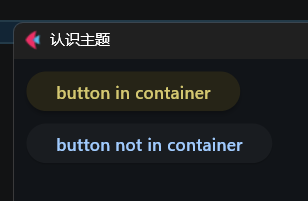

创建主题需要用到`flet.Theme`类的参数（属性，完整用法可参考https://flet.dev/docs/types/theme/）有（部分）：

- `color_scheme_seed`参数（属性），表示主题的种子色，主题会基于该颜色自动生成其他控件的相应颜色。
- `color_scheme`参数（属性），表示主题的颜色方案，需要手动指定主题具体的场景的颜色。
- `*_theme`参数（属性），表示特定控件的主题。该类参数（属性）会涉及很多控件类型，因为比较多，这里使用通配符代替。
- `*_color`参数（属性），表示特定交互行为的颜色。该类参数（属性）会涉及很多交互类型，因为比较多，这里使用通配符代替。

## 11 快捷键

本章参考文档：https://flet.dev/docs/cookbook/keyboard-shortcuts/

定义Flet程序的快捷键，只需给主页面设置按键事件的响应函数（`on_keyboard_event`属性）即可：

```python3
import flet


def main(page: flet.Page):
    page.window.width = 400
    page.window.height = 300
    page.window.alignment = flet.Alignment(0, 0)
    page.title = '认识快捷键'

    text = flet.Text('Press any key with a combination of CTRL, ALT, SHIFT and META keys...')
    page.add(
        text
    )
    def on_key(e:flet.KeyboardEvent):
        text.value = f'Key: {e.key}, Shift: {e.shift}, Control: {e.ctrl}, Alt: {e.alt}, Meta: {e.meta}'
    page.on_keyboard_event = on_key


flet.run(main)
```

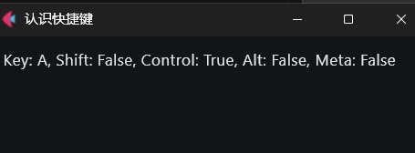

按键事件支持以下属性：

- `key`属性，字符串类型，按键中包含的可打印字符按键。
- `shift`属性，布尔类型，表示是否按下了`shift`键。
- `ctrl`属性，布尔类型，表示是否按下了`ctrl`键。
- `alt`属性，布尔类型，表示是否按下了`alt`键（对应Mac的`opt`键）。
- `meta`属性，布尔类型，表示是否按下了`meta`键（Mac的专属按键）。

## 12 两种风格的控件（以按钮为例）

本章参考文档：https://flet.dev/docs/controls/button 和 https://flet.dev/docs/controls/cupertinobutton

从本章开始，就要断断续续介绍Flet程序的具体控件了。但是在介绍具体控件之前，需要先分辨一下控件的两种风格：Material风格和Cupertino风格。

从控件名上看，前缀为“Cupertino”的控件（比如本章使用的`CupertinoButton`控件）就是Cupertino风格。前缀不是“Cupertino”的控件就是Material风格。

Material风格通常包含阴影、圆角；Cupertino风格也叫iOS风格，通常为扁平风格。

以下为两种风格的按钮的对比：

```python3
import flet


def main(page: flet.Page):
    page.window.width = 400
    page.window.height = 300
    page.window.alignment = flet.Alignment(0, 0)
    page.title = '认识控件'

    page.add(
        flet.Button(
            'Button'
        ),
        flet.CupertinoButton(
            'Button'
        )
    )


flet.run(main)

```

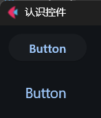

出于风格统一的要求，一般建议控件使用相同风格。不过，Flet程序的Material风格控件数量更多，使用Material风格的控件可以实现更多功能。

## 13 `Button`控件（按钮）

本章参考文档：https://flet.dev/docs/controls/button

上一章介绍两种风格的控件时用到了按钮，本章那就详细介绍一下`Button`控件的用法。

大部分控件的参数、属性、方法差不多，因此，后续其他控件将不再详细介绍重复的参数、属性、方法，只会重点介绍常用的、需要特别说明的部分。

另外，Flet框架使用数据类设计控件，可以说控件的参数也就是同名的属性。因此，控件的参数、属性不再单独标注，默认**参数**可以当作**属性**使用。控件的参数、属性包含其父类的参数、属性，本章或者当前控件的参数、属性只是部分，后续如果需要用到父类的，届时再单独介绍。

`content`参数，字符串类型或控件类型，表示按钮的主要内容。

```python3
import flet


def main(page: flet.Page):
    page.window.width = 400
    page.window.height = 300
    page.window.alignment = flet.Alignment(0, 0)
    page.title = '认识控件'

    page.add(
        flet.Button(
            flet.Checkbox(
                content='Button',
            ),
        ),
    )


flet.run(main)
```

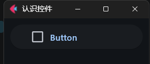

`icon`参数，图标数据类型（`Icons`的成员或者`CupertinoIcons`的成员）或控件类型，表示按钮的图标。

```python3
import flet


def main(page: flet.Page):
    page.window.width = 400
    page.window.height = 300
    page.window.alignment = flet.Alignment(0, 0)
    page.title = '认识控件'

    page.add(
        flet.Button(
            content='Button',
            icon=flet.CupertinoIcons.ALARM
        ),
    )


flet.run(main)
```

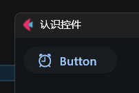

注意，`content`参数和`icon`参数需要至少给其中一个传值，都不传值的话，程序会报错。

`icon_color`参数，字符串类型或者颜色类型（`Colors`的成员或者`CupertinoColors`的成员），表示图标的颜色。

`color`参数，字符串类型或者颜色类型（`Colors`的成员或者`CupertinoColors`的成员），表示按钮的前景色（图标、内容）。

`bgcolor`参数，字符串类型或者颜色类型（`Colors`的成员或者`CupertinoColors`的成员），表示按钮的背景色。

`elevation`参数，整数类型或者浮点类型，表示按钮的阴影高度，默认为`1`。

```python3
import flet


def main(page: flet.Page):
    page.window.width = 400
    page.window.height = 300
    page.window.alignment = flet.Alignment(0, 0)
    page.title = '认识控件'
    page.theme_mode = 'light'
    page.add(
        flet.Button(
            content='Button',
            elevation=2
        ),
        flet.Button(
            content='Button',
            elevation=10
        )
    )


flet.run(main)
```

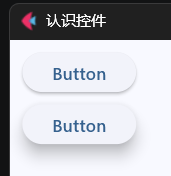

`style`参数，`ButtonStyle`类型，表示按钮的样式。

```python3
import flet


def main(page: flet.Page):
    page.window.width = 400
    page.window.height = 300
    page.window.alignment = flet.Alignment(0, 0)
    page.title = '认识控件'

    page.add(
        flet.Button(
            content='Button',
            icon=flet.CupertinoIcons.ALARM,
            style=flet.ButtonStyle(
                color='red'
            )
        ),
    )


flet.run(main)
```

`autofocus`参数，布尔类型，表示按钮是否在窗口显示时默认获得焦点。注意，同一页面内，只能有一个控件的该属性按创建顺序优先生效。

`clip_behavior`参数，裁切行为类型（`ClipBehavior`的成员），表示按钮的主要内容超出按钮边界时如何裁切，非必要不建议修改。

```python3
import flet


def main(page: flet.Page):
    page.window.width = 400
    page.window.height = 600
    page.window.alignment = flet.Alignment(0, 0)
    page.title = '认识控件'

    page.add(
        flet.Button(
            content=flet.Container(
                width=100,
                height=100,
                bgcolor=flet.Colors.RED,
                content=flet.Text('NONE', size=20),
                alignment=flet.Alignment.CENTER
            ),
            bgcolor=flet.Colors.GREEN,
            clip_behavior=flet.ClipBehavior.NONE
        ),
        flet.Button(
            content=flet.Container(
                width=100,
                height=100,
                bgcolor=flet.Colors.RED,
                content=flet.Text('ANTI_ALIAS', size=20),
                alignment=flet.Alignment.CENTER
            ),
            bgcolor=flet.Colors.GREEN,
            clip_behavior=flet.ClipBehavior.ANTI_ALIAS
        ),
        flet.Button(
            content=flet.Container(
                width=100,
                height=100,
                bgcolor=flet.Colors.RED,
                content=flet.Text('ANTI_ALIAS_WITH_SAVE_LAYER', size=20),
                alignment=flet.Alignment.CENTER
            ),
            bgcolor=flet.Colors.GREEN,
            clip_behavior=flet.ClipBehavior.ANTI_ALIAS_WITH_SAVE_LAYER
        ),
        flet.Button(
            content=flet.Container(
                width=100,
                height=100,
                bgcolor=flet.Colors.RED,
                content=flet.Text('HARD_EDGE', size=20),
                alignment=flet.Alignment.CENTER
            ),
            bgcolor=flet.Colors.GREEN,
            clip_behavior=flet.ClipBehavior.HARD_EDGE
        ),
    )


flet.run(main)
```

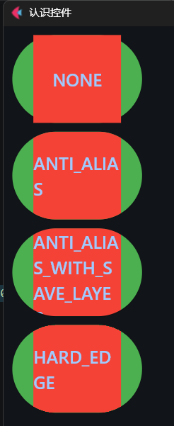

`url`参数，字符串类型或者`Url`类型，表示点击按钮之后访问的网址。

```python3
import flet


def main(page: flet.Page):
    page.window.width = 400
    page.window.height = 300
    page.window.alignment = flet.Alignment(0, 0)
    page.title = '认识控件'

    page.add(
        flet.Button(
             content='Url',
             url='https://baidu.com'
        ),
    )


flet.run(main)
```

`on_click`参数，可调用类型，表示点击控件之后执行的操作。

`on_long_press`参数，可调用类型，表示长按控件之后执行的操作。

`on_hover`参数，可调用类型，表示鼠标悬停在控件上之后执行的操作。

`on_focus`参数，可调用类型，表示控件获得焦点之后执行的操作。

`on_blur`参数，可调用类型，表示控件失去焦点之后执行的操作。

## 14 `ContextMenu`控件（上下文菜单）与`PopupMenuItem`控件（菜单项）

本章参考文档：https://flet.dev/docs/controls/contextmenu/ 和 https://flet.dev/docs/controls/popupmenubutton/#flet.PopupMenuItem-properties

先看示例：

```python3
import flet


def main(page: flet.Page):
    page.window.width = 400
    page.window.height = 300
    page.window.alignment = flet.Alignment(0, 0)
    page.title = '认识控件'

    async def open_menu(e:flet.TapEvent[flet.GestureDetector]):
        await menu.open(
            local_position=e.local_position,
            global_position=e.global_position,
        )

    menu = flet.ContextMenu(
        content=flet.GestureDetector(
            content=flet.Container(
                content=flet.Text(
                    value='左键点击、左键长按、右键点击、中键点击弹出不同的菜单'
                ),
                expand=True,
                bgcolor=flet.Colors.BLUE,
                alignment=flet.Alignment.CENTER
            ),
            on_tap=open_menu,
            expand=True,
        ),
        expand=True,
        items=[
            flet.PopupMenuItem(
                content='items'
            )
        ],
        primary_items=[
            flet.PopupMenuItem(
                content='primary_items'
            )
        ],
        primary_trigger=flet.ContextMenuTrigger.LONG_PRESS,
        secondary_items=[
            flet.PopupMenuItem(
                content='secondary_items'
            )
        ],
        tertiary_items=[
            flet.PopupMenuItem(
                content='tertiary_items'
            )
        ]
    )
    page.add(
        menu
    )


flet.run(main)
```


读者可以运行代码之后，按照文字提示尝试弹出不同的菜单。

示例代码看上去比较多，不太好理解菜单的正确用法。因此，笔者将其控件树转换为示意图，以便于读者理解：

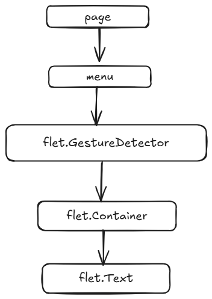

从父子关系看，Flet程序的菜单（`menu`）不像其他框架的菜单一样独立于可视控件、由控件的响应函数负责弹出，而是“插在”主页面与其他控件之间。其实，Flet程序的菜单可以理解为菜单（`menu`）与负责弹出菜单的控件（`flet.GestureDetector`控件）绑定，或者说菜单通过监听其子控件的事件来弹出菜单。

因此，可以将菜单控件理解为一层壳，哪个控件需要弹出菜单，就用壳包装哪个控件，然后用壳代替原来的控件，挂载到其原来的位置，这就是菜单的正确用法。

示例中还展示了菜单的四种触发方式：

- `open`方法（通过手势控件的按下操作调用）。
- 鼠标左键（默认无触发操作，需要同时定义触发操作才能生效，示例中定义为长按）。
- 鼠标右键（默认为短按）。
- 鼠标中键（默认为短按）。

每种触发方式对应的菜单内容，分别对应控件的不同参数：

- `open`方法，对应`items`参数。
- 鼠标左键，对应`primary_items`参数。
- 鼠标右键，对应`secondary_items`参数。
- 鼠标中键，对应`tertiary_items`参数。

除了`open`方法外，其他三种触发方式都可以通过对应参数修改其触发操作的类型（短按还是长按）：

- 鼠标左键，对应`primary_trigger`参数。
- 鼠标右键，对应`secondary_trigger`参数。
- 鼠标中键，对应`tertiary_trigger`参数。

`ContextMenu`控件支持以下参数：

- `content`参数，可视控件类型（必须是渲染出可见内容的控件），表示菜单绑定、监听的控件。
- `items`参数，元素为`PopupMenuItem`控件的列表，表示调用`open`方法显示菜单时的菜单内容。
- `primary_items`参数，元素为`PopupMenuItem`控件的列表，表示通过鼠标左键显示菜单时的菜单内容。
- `secondary_items`参数，元素为`PopupMenuItem`控件的列表，表示通过鼠标右键显示菜单时的菜单内容。
- `tertiary_items`参数，元素为`PopupMenuItem`控件的列表，表示通过鼠标中键显示菜单时的菜单内容。
- `primary_trigger`参数，`ContextMenuTrigger`类型，表示通过鼠标左键显示菜单的触发操作的类型，默认为`None`，即无法触发。
- `secondary_trigger`参数，`ContextMenuTrigger`类型，表示通过鼠标右键显示菜单的触发操作的类型，默认为`ContextMenuTrigger.DOWN`，即短按触发。
- `tertiary_trigger`参数，`ContextMenuTrigger`类型，表示通过鼠标中键显示菜单的触发操作的类型，默认为`ContextMenuTrigger.DOWN`，即短按触发。
- `on_select`参数，可调用类型，表示点击、选择菜单项之后执行的操作。
- `on_dismiss`参数，可调用类型，表示点击空白处、菜单小时之后执行的操作。

`ContextMenu`控件支持以下方法：

- `open`方法，异步方法，在指定位置显示菜单（`items`参数的内容）。该方法支持以下参数：
  - `global_position`参数，`Offset`类型、双元素元组（元素为整数或者浮点数），表示菜单的显示位置（相对于页面的原点）。
  - `local_position`参数，`Offset`类型、双元素元组（元素为整数或者浮点数），表示菜单的显示位置（相对于`content`参数对应控件的原点）。

菜单的具体内容只能是`PopupMenuItem`控件（菜单项）。`PopupMenuItem`控件支持以下参数：

- `content`参数，字符串类型或控件类型，表示菜单项的主要内容。
- `icon`参数，图标数据类型（`Icons`的成员或者`CupertinoIcons`的成员）或控件类型，表示菜单项的图标。
- `checked`参数，布尔类型，表示菜单项的勾选状态。
- `height`参数，浮点类型或者整数类型，表示菜单项的高度。
- `padding`参数，浮点类型或者整数类型或者`Padding`类型，表示菜单项的内边距。
- `label_text_style`参数，`TextStyle`类型，表示文字的样式。
- `mouse_cursor`参数，鼠标光标类型（`MouseCursor`的成员），表示鼠标悬停再菜单项上时光标的样式。
- `on_click`参数，可调用类型，表示点击菜单项之后执行的操作。

最后，针对菜单项之间的分隔线和自动切换勾选状态的需求提供一个简单的示例：

```python3
import flet


def main(page: flet.Page):
    page.window.width = 400
    page.window.height = 300
    page.window.alignment = flet.Alignment(0, 0)
    page.title = '认识控件'

    menu = flet.ContextMenu(
        content=flet.Container(
            content=flet.Text(
                value='右键点击弹出菜单'
            ),
            expand=True,
            bgcolor=flet.Colors.BLUE,
            alignment=flet.Alignment.CENTER
        ),
        expand=True,
        secondary_items=[
            flet.PopupMenuItem(
                content='菜单项1',
                icon=flet.Icons.MENU,
                on_click=lambda e: setattr(
                    e.control, 'checked', not e.control.checked
                )
            ),
            flet.PopupMenuItem(
                content=flet.Divider(),
                height=9,
                padding=0,
                disabled=True
            ),
            flet.PopupMenuItem(
                content='菜单项2',
                checked=True,
                on_click=lambda e: setattr(
                    e.control, 'checked', not e.control.checked)
            )
        ],
    )
    page.add(
        menu
    )


flet.run(main)
```

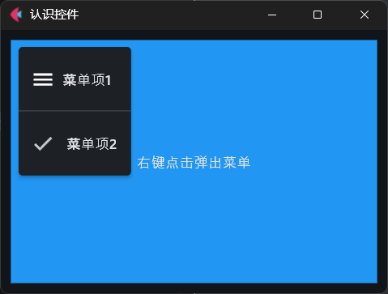

本章只是简单介绍上下文菜单，上下文菜单在实际使用时遇到的问题，以及和菜单有关、结合的控件还有很多，将在后续的章节中介绍。

## 15 多页面（视图）与路由（命令式）

本章参考文档：https://flet.dev/docs/cookbook/navigation-and-routing/

### 15.1 多页面（视图）

Flet程序不支持多窗口，对于想要显示多套界面的需求，就要用到Flet的多页面（视图）。

简单来说，主页面的`views`属性是一个列表，存储了视图（`View`控件）。默认情况下，该属性包含一个默认视图，如果给该属性添加视图，那程序只会显示最上面的视图：

```python3
import flet


def main(page: flet.Page):
    page.window.width = 400
    page.window.height = 300
    page.window.alignment = flet.Alignment(0, 0)
    page.title = '认识多页面（视图）'

    page.add(
        flet.Button(
            content='Index',
        )
    )
    page.views.append(
        flet.View(
            [
                flet.Button(
                    content='Root',
                )
            ],
        )
    )


flet.run(main)
```

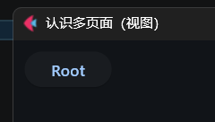

因此，可以创建包含来一套界面的视图，在需要显示时将其放置（追加）在`views`属性的末尾。相应的，返回上一级视图，就是将`views`属性的末尾移除（弹出）。

就可以基于这样的设计，创建出一个可以访问指定视图、返回上一级视图的程序：

```python3
import flet


def main(page: flet.Page):
    page.window.width = 400
    page.window.height = 300
    page.window.alignment = flet.Alignment(0, 0)
    page.title = '认识多页面（视图）'

    page.add(
        flet.Button(
            content='Goto A',
            on_click=lambda :view_a()
        ),
        flet.Button(
            content='Goto B',
            on_click=lambda :view_b()
        )
    )

    def view_a():
        page.views.append(
            flet.View(
                [
                    flet.Text('Page A'),
                    flet.Button(
                        content='Back',
                        on_click=lambda :page.views.pop()
                    )
                ],
            )
        )
    def view_b():
        page.views.append(
            flet.View(
                [
                    flet.Text('Page B'),
                    flet.Button(
                        content='Back',
                        on_click=lambda :page.views.pop()
                    )
                ],
            )
        )


flet.run(main)
```

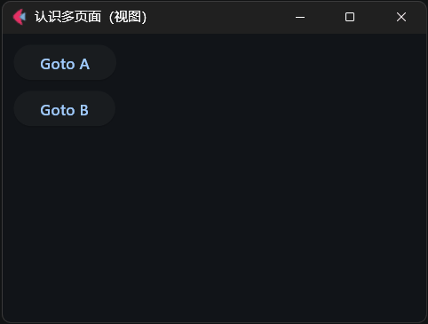

### 15.2 路由（命令式）

上一节介绍了视图的切换方式，但是，如果以网页模式显示Flet程序，如何实现访问指定路径，自动跳转至对应页面（视图）？

主页面的`route`属性表示当前路径，不过，在上一节的代码中，改变视图，当前路径并不会改变：

```python3
import flet


def main(page: flet.Page):
    page.window.width = 400
    page.window.height = 300
    page.window.alignment = flet.Alignment(0, 0)
    page.title = '认识多页面（视图）'

    page.add(
        flet.Text(page.route),
        flet.Button(
            content='Goto A',
            on_click=lambda :view_a()
        ),
        flet.Button(
            content='Goto B',
            on_click=lambda :view_b()
        )
    )

    def view_a():
        page.views.append(
            flet.View(
                [
                    flet.Text('Page A'),
                    flet.Text(page.route),
                    flet.Button(
                        content='Back',
                        on_click=lambda :page.views.pop()
                    )
                ],
            )
        )
    def view_b():
        page.views.append(
            flet.View(
                [
                    flet.Text('Page B'),
                    flet.Text(page.route),
                    flet.Button(
                        content='Back',
                        on_click=lambda :page.views.pop()
                    )
                ],
            )
        )


flet.run(
    main,
    view=flet.AppView.WEB_BROWSER,
    port=80
)
```

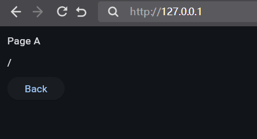

这是因为代码中其他视图不是基于主页面的`route`属性构建，而且跳转其他视图的方法不会改变主页面的`route`属性。因此，想要实现本节一开始的需求，首先做的，就是给主页面的`on_route_change`方法定义当前路径变化后执行的操作：

```python3
import flet


def main(page: flet.Page):
    page.window.width = 400
    page.window.height = 300
    page.window.alignment = flet.Alignment(0, 0)
    page.title = '认识多页面（视图）'

    def view_index():
        page.views.append(
            flet.View(
                [
                    flet.Text(page.route),
                    flet.Button(
                        content='Goto A',
                        on_click=lambda :page.navigate('/a')
                    ),
                    flet.Button(
                        content='Goto B',
                        on_click=lambda :page.navigate('/b')
                    )
                ]
            )
        )

    def view_a():
        page.views.append(
            flet.View(
                [
                    flet.Text('Page A'),
                    flet.Text(page.route),
                    flet.Button(
                        content='Back',
                        on_click=lambda :page.navigate('/')
                    )
                ],
            )
        )

    def view_b():
        page.views.append(
            flet.View(
                [
                    flet.Text('Page B'),
                    flet.Text(page.route),
                    flet.Button(
                        content='Back',
                        on_click=lambda :page.navigate('/')
                    )
                ],
            )
        )

    def route_change():
        page.views.clear()
        match page.route:
            case '/a':
                view_a()
            case '/b':
                view_b()
            case '/':
                view_index()
            case '':
                view_index()

    page.on_route_change = route_change
    # 第一次运行时需要手动触发一次
    route_change()

flet.run(
    main,
    view=flet.AppView.WEB_BROWSER,
    port=80
)
```

可能读者发现了，除了给主页面的`on_route_change`方法定义了具体方法，笔者还将跳转至对应视图的按钮改为使用主页面的`navigate`方法。该方法可以同步修改主页面的`route`属性，因此可以在跳转视图之后，看到浏览器地址栏和主页面的`route`属性都变成一致的：

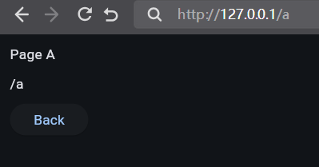

这种根据路径显示对应页面（视图）的设计，就叫路由。

对于上面示例中页面内容和路径相关、几乎相同的页面，可以使用模板路由（`TemplateRoute`）来匹配路径，并从中捕获符合匹配规则的部分，基于模板生成所需内容：

```python3
import flet


def main(page: flet.Page):
    page.window.width = 400
    page.window.height = 300
    page.window.alignment = flet.Alignment(0, 0)
    page.title = '认识多页面（视图）'

    def view_index():
        page.views.append(
            flet.View(
                [
                    flet.Text(page.route),
                    flet.Button(
                        content='Goto A',
                        on_click=lambda :page.navigate('/a')
                    ),
                    flet.Button(
                        content='Goto B',
                        on_click=lambda :page.navigate('/b')
                    )
                ]
            )
        )

    def route_change():
        page.views.clear()
        troute = flet.TemplateRoute(page.route)
        if troute.match('/:id'):
            page.views.append(
            flet.View(
                [
                    flet.Text(f'Page {troute.id.upper()}'),
                    flet.Text(page.route),
                    flet.Button(
                        content='Back',
                        on_click=lambda :page.navigate('/')
                    )
                ],
            )
        )
        else:
            view_index()

    page.on_route_change = route_change
    # 第一次运行时需要手动触发一次
    route_change()

flet.run(
    main,
    view=flet.AppView.WEB_BROWSER,
    port=80
)
```

这样的话，只要符合匹配规则，其他类似的页面不用重复写几乎相同的代码：

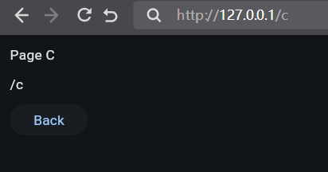

注意，命令式的路由设计比较复杂，使用时也比较繁琐。可能本章介绍之后，读者还是不太理解，或者不太喜欢Flet程序的设计，请不要因此产生厌烦情绪。后面会重点介绍声明式的路由，设计更加成熟，使用起来也更简单，敬请期待。

## 16 消息订阅（主页面的`pubsub`属性）

本章参考文档：https://flet.dev/docs/cookbook/pub-sub/

主页面的`pubsub`属性提供了消息订阅、发布功能，可以实现一个页面发布消息之后，其他订阅了消息的页面接收该消息。

比如，在一个页面发送，所有页面都能收到该消息（需要使用多个浏览器标签打开`http://127.0.0.1`）：

```python3
import flet


def main(page: flet.Page):
    page.window.width = 400
    page.window.height = 300
    page.window.alignment = flet.Alignment(0, 0)
    page.title = '认识消息订阅'

    result = flet.Text('无响应')
    name = flet.TextField('no name')
    text = flet.TextField()

    def receive_msg(topic,msg):
        result.value = f'{msg["text"]} from {msg["name"]}'
        result.update()

    page.pubsub.subscribe_topic(
        'console',
        receive_msg
    )
    page.add(
        result,
        name,
        text,
        flet.Button(
            content='Send',
            on_click=lambda :page.pubsub.send_all_on_topic(
                'console',
                {
                    'name':name.value,
                    'text':text.value
                }
            )
        ),
    )
    page.on_close = page.pubsub.unsubscribe_all

flet.run(
    main,
    view=flet.AppView.WEB_BROWSER,
    port=80
)
```

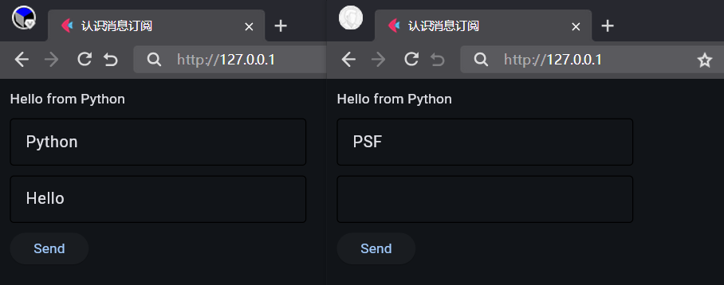

`pubsub`属性支持以下方法：

- `send_all`方法，给所有会话发送消息。
- `send_all_on_topic`方法，在指定话题中给所有会话发送消息。
- `send_others`方法，给除了当前会话外的所有会话发送消息。
- `send_others_on_topic`方法，在指定话题中给除了当前会话外的所有会话发送消息。
- `subscribe`方法，给当前页面订阅消息，并将消息作为参数传递给响应函数。
- `subscribe_topic`方法，给当前页面订阅指定话题的消息，并将消息作为参数传递给响应函数。
- `unsubscribe`方法，取消当前页面的订阅（不包括话题订阅）。
- `unsubscribe_topic`方法，取消当前页面对指定话题的订阅。
- `unsubscribe_all`方法，取消当前页面的所有订阅（包括话题订阅）。

建议在主页面的`on_close`方法中执行`unsubscribe_all`方法，避免因为订阅而导致内存泄露。

## 17 会话（主页面的`session`属性）

上一章介绍消息订阅时，提到了会话的概念，那什么是会话呢？简单来说，每新建页面打开一次网址，都是创建一个会话。因此，如果使用`page.session.id`检查上一章示例中的会话ID，就会看到新建页面打开相同的网址之后，不同页面的会话ID不同，而相同页面的会话ID不会因为刷新而改变：

```python3
import flet


def main(page: flet.Page):
    page.window.width = 400
    page.window.height = 300
    page.window.alignment = flet.Alignment(0, 0)
    page.title = '认识会话'

    result = flet.Text('无响应')
    name = flet.TextField(page.session.id)
    text = flet.TextField()

    def receive_msg(topic,msg):
        result.value = f'{msg["text"]} from {msg["name"]}'
        result.update()

    page.pubsub.subscribe_topic(
        'console',
        receive_msg
    )
    page.add(
        result,
        name,
        text,
        flet.Button(
            content='Send',
            on_click=lambda :page.pubsub.send_all_on_topic(
                'console',
                {
                    'name':name.value,
                    'text':text.value
                }
            )
        ),
    )
    page.on_close = page.pubsub.unsubscribe_all

flet.run(
    main,
    view=flet.AppView.WEB_BROWSER,
    port=80
)
```

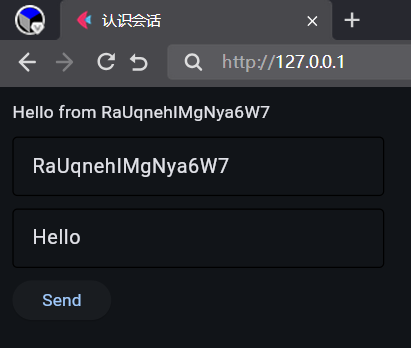

## 18 数据存储（会话）

本章参考文档：https://flet.dev/docs/cookbook/session-storage/

上一章介绍了会话的特性，假如需要将数据存储到会话中，让不同会话之间的数据存取是隔离的话，不使用主页面的`session`属性，代码可以这样写：

```python3
import flet


def main(page: flet.Page):
    page.window.width = 400
    page.window.height = 300
    page.window.alignment = flet.Alignment(0, 0)
    page.title = '认识数据存储'

    var = {}
    result = flet.Text()
    text = flet.TextField()

    page.add(
        result,
        text,
        flet.Button(
            content='Save',
            on_click=lambda :var.update(
                {'value':text.value}
            )
        ),
        flet.Button(
            content='Update',
            on_click=lambda :setattr(
                result,
                'value',
                var['value']
            )
        ),
    )

flet.run(
    main,
    view=flet.AppView.WEB_BROWSER,
    port=80
)
```

这种写法看上去没问题，但是，在数据不存在时程序会报错。还好主页面的`session`属性提供了更好用的属性`store`，能避免在数据不存在时程序报错：

```python3
import flet


def main(page: flet.Page):
    page.window.width = 400
    page.window.height = 300
    page.window.alignment = flet.Alignment(0, 0)
    page.title = '认识数据存储'

    result = flet.Text()
    text = flet.TextField()

    page.add(
        result,
        text,
        flet.Button(
            content='Save',
            on_click=lambda :page.session.store.set(
                'text',
                text.value
            )
        ),
        flet.Button(
            content='Update',
            on_click=lambda :setattr(
                result,
                'value',
                page.session.store.get('text')
            )
        ),
    )

flet.run(
    main,
    view=flet.AppView.WEB_BROWSER,
    port=80
)
```

`store`属性支持以下方法：

- `get`方法，获取指定键的数据。
- `set`方法，将数据存入指定键中。
- `contains_key`方法，判断键是否存在。
- `remove`方法，移除指定键。
- `get_keys`方法，获取所有键。
- `clear`方法移除所有键。

## 19 数据存储（持久化）

### 19.1 存入文件（服务端）

本节参考文档：https://flet.dev/docs/cookbook/read-and-write-files/

上一章介绍的数据存储方式，虽然说不同会话之间是独立的，但也存在一个弊端，那就是程序重启之后数据会丢失。当然，如果有时候需要不同会话之间共享数据，使用上一章的数据存储方式也不行，需要改为将数据存储到文件中：

```python3
import flet


def main(page: flet.Page):
    page.window.width = 400
    page.window.height = 300
    page.window.alignment = flet.Alignment(0, 0)
    page.title = '认识数据存储'

    result = flet.Text()
    text = flet.TextField()

    
    async def save():
        with open('./temp.txt','w') as f:
            f.write(text.value)
    async def update():
        with open('./temp.txt','r') as f:
            result.value = f.read()
            result.update()

    page.add(
        result,
        text,
        flet.Button(
            content='Save',
            on_click=save
        ),
        flet.Button(
            content='Update',
            on_click=update
        ),
    )

flet.run(
    main,
    view=flet.AppView.WEB_BROWSER,
    port=80
)
```

### 19.2 `SharedPreferences`服务（Flet框架定义存储方式）

本节参考文档：https://flet.dev/docs/services/sharedpreferences

使用文件存储数据可以符合要求，但有点麻烦。好在Flet提供了方便好用的`SharedPreferences`服务，支持的方法和`store`属性相同，只是这些方法都是异步的（因为存储到文件中，必须异步操作）：

```python3
import flet


def main(page: flet.Page):
    page.window.width = 400
    page.window.height = 300
    page.window.alignment = flet.Alignment(0, 0)
    page.title = '认识数据存储'

    result = flet.Text()
    text = flet.TextField()

    
    async def save():
        await flet.SharedPreferences().set(
            'text',
            text.value
        )
    async def update():
        result.value = await flet.SharedPreferences().get('text')
        result.update()
        
    page.add(
        result,
        text,
        flet.Button(
            content='Save',
            on_click=save
        ),
        flet.Button(
            content='Update',
            on_click=update
        ),
    )

flet.run(
    main,
    view=flet.AppView.WEB_BROWSER,
    port=80
)
```

## 20 加密敏感数据

本章参考文档：https://flet.dev/docs/cookbook/encrypting-sensitive-data/

使用`SharedPreferences`服务存取数据固然方便，但数据是明文存储，如果存储的是敏感数据（比如密码），则不应该这样存储。

好在Flet的`security`模块提供了加密（`encrypt`方法）、解密（`decrypt`方法）功能，可以将数据加密后存储，也能解密出原始内容：

```python3
import flet
from flet.security import encrypt, decrypt

key = '密码'

def main(page: flet.Page):
    page.window.width = 400
    page.window.height = 300
    page.window.alignment = flet.Alignment(0, 0)
    page.title = '认识数据存储'

    result = flet.Text()
    text = flet.TextField()
    
    async def save():
        with open('./temp.txt','w') as f:
            f.write(encrypt(text.value,key))
    async def update():
        with open('./temp.txt','r') as f:
            result.value = decrypt(f.read(),key)
            result.update()

    page.add(
        result,
        text,
        flet.Button(
            content='Save',
            on_click=save
        ),
        flet.Button(
            content='Update',
            on_click=update
        ),
    )

flet.run(
    main,
    view=flet.AppView.WEB_BROWSER,
    port=80
)
```

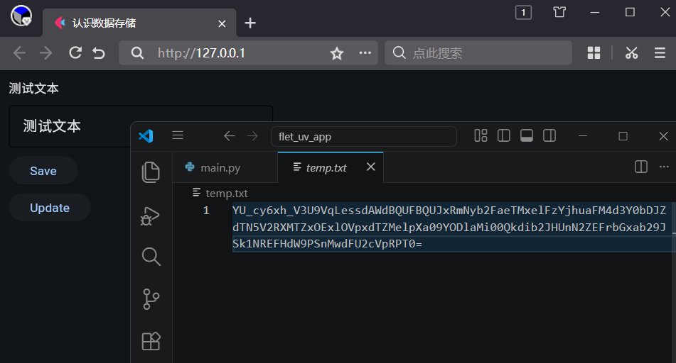

为了方便演示，示例在源代码中存储密码，并且将加密后的数据存储到指定文件中，读者在实际开发时，请使用更加稳妥的存储方式存储密码和加密后的数据。

可以看到，使用加密方法之后，存储的数据不再是明文，而是意义不明的加密数据。

## 21 自定义控件（更新中）

本章参考文档：https://flet.dev/docs/cookbook/custom-controls/

自定义控件


正常注入初始化方法：

```python3
import flet

@flet.control
class MyButton(flet.Button):
    def init(self):
        self.bgcolor = flet.Colors.ORANGE_300
        self.color = flet.Colors.GREEN_800
        self.style = flet.ButtonStyle(
            shape=flet.RoundedRectangleBorder(radius=10)
        )

def main(page: flet.Page):
    page.window.width = 400
    page.window.height = 300
    page.window.alignment = flet.Alignment(0, 0)
    page.title = '认识自定义控件'

    page.add(
        MyButton(
            content='Button',
        ),
        flet.Button(
            content='Button',
        ),
    )

flet.run(
    main
)
```

直接使用数据类的特性：

```python3
import flet
from dataclasses import field

@flet.control
class MyButton(flet.Button):
    bgcolor:flet.Colors = flet.Colors.ORANGE_300
    color:flet.Colors = flet.Colors.GREEN_800
    style:flet.ButtonStyle = field(
        default_factory=lambda: flet.ButtonStyle(
            shape=flet.RoundedRectangleBorder(radius=10)
        )
    )

def main(page: flet.Page):
    page.window.width = 400
    page.window.height = 300
    page.window.alignment = flet.Alignment(0, 0)
    page.title = '认识自定义控件'

    page.add(
        MyButton(
            content='Button',
        ),
        flet.Button(
            content='Button',
        ),
    )

flet.run(
    main
)
```


```python3
import flet
from dataclasses import field,dataclass

@dataclass
class MyButton(flet.Button):
    bgcolor:flet.Colors = flet.Colors.ORANGE_300
    color:flet.Colors = flet.Colors.GREEN_800
    style:flet.ButtonStyle = field(
        default_factory=lambda: flet.ButtonStyle(
            shape=flet.RoundedRectangleBorder(radius=10)
        )
    )

def main(page: flet.Page):
    page.window.width = 400
    page.window.height = 300
    page.window.alignment = flet.Alignment(0, 0)
    page.title = '认识自定义控件'

    page.add(
        MyButton(
            content='Button',
        ),
        flet.Button(
            content='Button',
        ),
    )

flet.run(
    main
)
```


（生命周期的魔法方法did_mount）


隔离控件


## 22 `xxx`控件（更新中）

本章参考文档：

`xxx`控件


## 3x 详解声明式——xxx（更新中）

本章参考文档：https://flet.dev/docs/cookbook/declarative-vs-imperative-crud-app/

详解声明式

核心在于装饰器的使用，有点所见即所得的意味。


## 3x 详解声明式——路由（更新中）

本章参考文档：https://flet.dev/docs/cookbook/navigation-and-routing/ 和 https://flet.dev/docs/cookbook/router/

路由


## x 灵感

参考cookbook介绍一些基础，后续单独介绍一些实践用法。

控件与服务（https://flet.dev/docs/reference/），每章详细介绍一个：

- [控件](https://flet.dev/docs/controls) - 具有属性、事件和使用示例的用户界面构建块。
- [服务](https://flet.dev/docs/services) - 设备和平台的功能，如传感器、存储和权限。
- [类型](https://flet.dev/docs/types/) - 核心类型、枚举、事件、异常和在整个SDK中共享的实用工具。


页面设计（页面支持的部分属性比如`navigation_bar`属性、`bottom_appbar`属性、`appbar`属性、`drawer`属性、`end_drawer`属性等对应特定的区域，其他属性负责页面样式等等），https://flet.dev/docs/controls/basepage/，主要介绍页面支持的属性。


手势控件结合窗口状态进入函数的使用：

```python3
import flet

async def main(page: flet.Page):
    page.window.width = 400
    page.window.height = 300
    page.title = 'Hello'
    async def starting():
        # 拖动窗口空白处来拖动窗口或者调整窗口大小，二选一
        await page.window.start_dragging()
        #await page.window.start_resizing(flet.WindowResizeEdge.BOTTOM_RIGHT)
    page.add(
        flet.GestureDetector(
            on_tap_down=starting,
        ),
    )

flet.run(main)
```

