# NiceGUI札记（2026）

[TOC]

## 0 为何而写

NiceGUI（官网https://nicegui.io/）是一款优秀的WebUI、GUI框架，只需学习一定量的前端知识，就能使用NiceGUI快速搭建出美观的UI界面。

但是，官方更新很快，加上笔者2024年开始创作的《NiceGUI的中文入门教程》受限于笔者当时的思路、水平，时至今日，很多内容已经不适合最新版本。

于是，笔者结合其他框架的敏捷式教程创作经验，决定为NiceGUI的最新版本创作新的入门教程，摒弃之前事无巨细的风格，采用按时间顺序、主要内容为补充官方教程、不断穿插实际示例的敏捷开发风格。

并且，为了节省读者的付费成本，适应读者的碎片化阅读习惯，本教程不再采用整本付费的方式，而是根据章节内容的质量、字数单章付费，让读者按需购买。

当然，对于喜欢一次看个爽、不想被免费章节广告打扰的读者，也有整本买断的方式（每年两次机会）。不过，笔者不推荐这种方式。因为内容一直在更新、追加，只能提供当前内容进度的整本。而且整本买断是完全基于字数（本地编辑器统计，非微信那边的字数，会少一些）计费，虽然部分章节没有质量溢价，但免费章节和预览部分也会计费，整体价格会比全部单买略高。

## 1 安装NiceGUI

之前《NiceGUI的中文入门教程》使用PDM作为环境管理工具，这一次，将使用uv管理环境。

为什么要用uv？

原因只有一个，那就是快！速度对比如下：


首先，新建一个空白文件夹，笔者这里新建了`nicegui_uv_app`文件夹。进入该文件夹，运行`uv init`，即可初始化该文件夹为项目文件夹（`uv`命令需要使用`pip install uv`安装）。

此时创建的项目是空白项目，没有添加任何依赖，还需要使用`uv add nicegui`添加依赖，并自动创建虚拟环境。

NiceGUI还提供了一些可选的依赖：

- `pywebview`库，以Native Mode（窗口模式）运行NiceGUI程序时依赖该库，使用`uv add nicegui[native]`命令添加。
- `plotly`库，`ui.plotly`控件依赖该库，使用`uv add nicegui[plotly]`命令添加。
- `matplotlib`库，`ui.matplotlib`控件、`ui.pyplot`控件和`ui.line_plot`控件依赖该库，使用`uv add nicegui[matplotlib]`命令添加。
- `nicegui-highcharts`库，`ui.highchart`控件依赖该库，使用`uv add nicegui[highcharts]`命令添加。
- `libsass`库，`ui.add_sass`方法和`ui.add_scss`方法依赖该库，使用`uv add nicegui[sass]`命令添加。
- `redis`库，使用Redis存储`app.storage`时（定义环境变量`NICEGUI_REDIS_URL`）依赖该库，使用`uv add nicegui[redis]`命令添加。

如果想要将虚拟环境中的所有库升级至最新稳定版，可以使用`uv sync -U`。

若是只想升级指定库，比如`nicegui`，则使用`uv sync -P nicegui`。

升级指定库至最新测试版。因为本章节创作时，NiceGUI的3.0.0版本尚未正式发布，需要升级至最新测试版才行，或者读者想要使用其他最新测试版的功能，则可以使用`uv sync -P nicegui --prerelease allow`命令，将指定库升级至最新测试版。

## 1 安装NiceGUI（3.5.0版本更新）

更新说明：

官方在3.4.0版本移除了`libsass`库的依赖，在3.5.0版本新增`altair`库、`anywidget`库的依赖，故合并在在3.5.0版本更新之后修改本章内容，并移除了测试版的使用说明。

以下为正文：

之前《NiceGUI的中文入门教程》使用PDM作为环境管理工具，这一次，将使用uv管理环境。

为什么要用uv？

原因只有一个，那就是快！速度对比如下：


首先，新建一个空白文件夹，笔者这里新建了`nicegui_uv_app`文件夹。进入该文件夹，运行`uv init`，即可初始化该文件夹为项目文件夹（`uv`命令需要使用`pip install uv`安装）。

此时创建的项目是空白项目，没有添加任何依赖，还需要使用`uv add nicegui`添加依赖，并自动创建虚拟环境。

NiceGUI还提供了一些可选的依赖：

- `pywebview`库，以Native Mode（窗口模式）运行NiceGUI程序时依赖该库，使用`uv add nicegui[native]`命令添加。
- `plotly`库，`ui.plotly`控件依赖该库，使用`uv add nicegui[plotly]`命令添加。
- `matplotlib`库，`ui.matplotlib`控件、`ui.pyplot`控件和`ui.line_plot`控件依赖该库，使用`uv add nicegui[matplotlib]`命令添加。
- `nicegui-highcharts`库，`ui.highchart`控件依赖该库，使用`uv add nicegui[highcharts]`命令添加。
- `redis`库，使用Redis存储`app.storage`时（定义环境变量`NICEGUI_REDIS_URL`）依赖该库，使用`uv add nicegui[redis]`命令添加。
- `altair`库，`ui.altair`控件依赖该库，使用`uv add nicegui[altair]`命令添加。
- `anywidget`库，`ui.anywidget`控件、`ui.altair`控件依赖该库，使用`uv add nicegui[anywidget]`命令添加。

如果想要将虚拟环境中的所有库升级至最新稳定版，可以使用`uv sync -U`。

若是只想升级指定库，比如`nicegui`，则使用`uv sync -P nicegui`。

## 2 认识NiceGUI程序

### 2.1 基本结构

先看示例，简单了解一下NiceGUI程序的基本结构：

```python3
# 导入模块
from nicegui import ui
# 创建控件
ui.button('Hello')
# 运行程序
ui.run()
```

示例很简单，正好对应着NiceGUI程序的三个基本组成：

- 导入模块（对象）。NiceGUI的`ui`模块提供了创建控件和运行程序的基本功能。当然除了该模块，NiceGUI还提供了其他模块和魔术对象（无需实例化即可直接访问具体单一实例对象的特殊对象），具体模块和对象会在后续使用时详细介绍，这里暂不展开。
- 创建控件。导入了模块之后，控件并不会自动创建，还需要访问具体的控件类，将其实例化，才算真正创建。关于具体控件的用法和创建，将在单独的章节中详细介绍，本章暂不展开。
- 运行程序。完成前面的步骤之后，直接运行Python文件，并不会显示控件，因为NiceGUI程序需要通过特殊的方法运行。比如示例中的`ui.run`方法就是一种运行程序的方法，构建模式、显示模式不同，该方法使用的参数也有所不同。此外，运行程序的方法也不止这一种，还有与现有FastAPI应用组合运行使用的`ui.run_with`方法。

### 2.2 构建模式

NiceGUI程序用于构建界面的代码结构不同时，对应的构建过程（模式）也有所不同。

从NiceGUI 3.0.0开始，NiceGUI程序按照是否使用`ui.page`创建页面，可划分为三种构建模式：

- 脚本模式。不使用`ui.page`创建页面、不给`ui.run`的第一位置参数`root`传值的话，所有的控件都在全局作用域内创建，这样的构建模式就是脚本模式。此时，虽然每个访问者打开“主页面”（地址为网站的根路径）都能看到所有的控件，但多个“主页面”之间的内容互相独立。

  以下为示例：

  ```python3
  from nicegui import ui
  
  ui.button('Hello')
  
  ui.run()
  ```

  在使用脚本模式时，需要**注意**以下几点：

  - “主页面”**不是**真正意义上的主页面。因为脚本模式只支持一个页面（即“主页面”），并不支持多个页面（后面的单页面应用可以实现脚本模式下支持多个页面，但这里只是为了区分构建模式，暂不展开介绍）。没有其他页面，自然不存在真正意义上的主页面。

  - “主页面”**不是**完整的页面。脚本模式没法接收、传递页面参数，“主页面”自然没法处理，但页面特殊区域的布局控件依然可以使用。

  - “全局作用域”（脚本模式的全局作用域）**不是**真正意义上的全局作用域。因为所有在全局作用域内创建的对象都会被包装到“主页面”内，对于那些需要全局共享的对象，实际上只是在“主页面”的局部作用域内共享，并非在全局作用域内共享。因此，多个“主页面”之间的内容才会互相独立。对于真正需要在全局作用域内共享的对象，请**不要**使用脚本模式。

  - 使用脚本模式的NiceGUI程序**不能**打包为可执行文件。因为脚本模式的NiceGUI程序需要基于命令行参数对应的源码路径运行源码。如果使用`nicegui-pack`命令或者`pyinstaller`命令将源码打包为可执行文件，则会导致程序无法获取到源码路径（只能获取到可执行文件的路径，而且也不存在源码），进而报错。

- 多页面模式。脚本模式只支持一个“主页面”，一旦想创建多个页面展示不同的内容，就只能使用`ui.page`创建其他页面，这样的构建模式就是多页面模式。

  `ui.page`是一个类，其参数`path`表示页面对应的网站路径。但是，这样直接构建出来的页面不包含控件，需要调用`ui.page`对象，并传入函数内创建控件的函数名：

  ```python3
  from nicegui import ui
  
  def index():
      ui.button('Hello')
  
  index_page = ui.page('/')
  index = index_page(index)
  
  ui.run()
  ```

  看起来有点复杂，但如果读者细心观察的话，就会发现，这段看似复杂的代码，其实就是一个装饰器：

  ```python3
  from nicegui import ui
  
  @ui.page('/')
  def index():
      ui.button('Hello')
  
  ui.run()
  ```

- 单页面模式、根页面模式。除了上面这种明显使用`ui.page`的多页面模式，还可以将所有创建控件的过程放在函数中用来构建页面，并将构建页面的函数名传给`ui.run`方法的第一位置参数`root`。这种构建模式也算多页面模式，但只能创建一个页面，所以叫单页面模式（与后面介绍的单页面应用不同，请注意区分）。因为单页面模式下的网站只有一个“主页面”（地址为网站的根路径），所以，单页面模式也可以被称为根页面模式。

  示例如下：

  ```python3
  from nicegui import ui
  
  def index():
      ui.button('Hello')
  
  ui.run(
      root=index
  )
  ```

  代码看上去有点像脚本模式，但是，相比于不用函数打包的脚本模式，单页面模式可以自由定义“主页面”其他部分的创建顺序。

  比如，想要在当前内容的前面添加一些文字作为标题，如果是脚本模式，只能这样写：
  
  ```python3
  from nicegui import ui
  
  ui.label('标题')
  ui.button('Hello')
  
  ui.run()
  ```

  单页面模式的话，可以将添加的部分打包到函数中，提前使用，最后定义具体内容：
  
  ```python3
  from nicegui import ui
  
  def index():
      title()
      ui.button('Hello')
  
  def title():
      ui.label('标题')
  
  ui.run(
      root=index
  )
  ```
  
  

需要注意的是，三种构建模式，只能同时使用一种，不能同时使用两种。即一旦使用了`ui.page`创建页面（多页面模式），就不能在页面之外创建控件（脚本模式），也不能使用`ui.run`的`root`参数（单页面模式），否则会报错、代码异常、显示异常，其他构建模式亦是如此。

以上只是构建模式的简单介绍，其余参数和更多用法将在后面的章节中展开介绍。

### 2.3 单页面应用（SPA）

与多页面模式效果类似的是单页面应用（Single Page Application，简称SPA），单页面应用可以在不增加普通页面的前提下，增加多个子页面，让脚本模式、单页面模式实现多页面模式的效果。

单页面应用需要使用`ui.sub_pages`类，其第一位置参数`routes`是一个字典，子页面路径为键，子页面构建函数的函数名为值，表示路径与具体子页面的对应关系。

单页面模式的示例如下：

```python3
from nicegui import ui

def index():
    ui.label('Main')
    ui.separator()
    ui.sub_pages(
        {
            '/':main,
            '/a':a,
            '/b':b
        }
    )

def main():
    ui.link('Page A','/a')
    ui.link('Page B','/b')

def a():
    ui.link('Page Main','/')
    ui.link('Page B','/b')

def b():
    ui.link('Page Main','/')
    ui.link('Page A','/a')

ui.run(
    root=index
)
```

可能读者实际运行代码之后，会产生一个疑问：既然效果与多页面模式相同，那为何不直接使用多页面模式？

这里就要说一下单页面应用的特殊之处：三种构建模式均可以设计为单页面应用。

上面单页面模式的示例，可以改为脚本模式的示例：

```python3
from nicegui import ui

def main():
    ui.link('Page A', '/a')
    ui.link('Page B', '/b')

def a():
    ui.link('Page Main', '/')
    ui.link('Page B', '/b')

def b():
    ui.link('Page Main', '/')
    ui.link('Page A', '/a')

ui.label('Main')
ui.separator()
ui.sub_pages(
    {
        '/': main,
        '/a': a,
        '/b': b
    }
)

ui.run()
```

至于将多页面模式设计为单页面应用，用法会更加复杂一些。

假如多页面模式中，有一个`/main`页面，可以将上面单页面模式的单页面应用套用到多页面模式中：

```python3
from nicegui import ui

@ui.page('/main')
def index():
    ui.label('Main')
    ui.separator()
    ui.sub_pages(
        routes={
            # 子页面的路径必须与实际路径一致
            '/main':main,
            '/main/a':a,
            '/main/b':b
        }
    )

def main():
    ui.link('Page A','/main/a')
    ui.link('Page B','/main/b')

def a():
    ui.link('Page Main','/main')
    ui.link('Page B','/main/b')

def b():
    ui.link('Page Main','/main')
    ui.link('Page A','/main/a')

ui.run()
```

但与单页面模式的单页面应用不同，多页面模式的单页面应用，除了将指定路径关联为子页面之外，还可以同时关联一个普通页面：

```python3
from nicegui import ui

@ui.page('/main')
def index():
    ui.label('Main')
    ui.separator()
    ui.sub_pages(
        routes={
            # 子页面的路径必须与实际路径一致
            '/main':main,
            '/main/a':a,
            '/main/b':b
        }
    )

def main():
    ui.link('Page A','/main/a')
    ui.link('Page B','/main/b')

def a():
    ui.link('Page Main','/main')
    ui.link('Page B','/main/b')

def b():
    ui.link('Page Main','/main')
    ui.link('Page A','/main/a')

@ui.page('/main/a')
def page_a():
    ui.label('Real Page A')

@ui.page('/main/b')
def page_b():
    ui.label('Real Page B')

ui.run()
```

通过点击`/main`页面的超链接跳转至`/main/a`的话，显示的只是单页面应用的子页面：

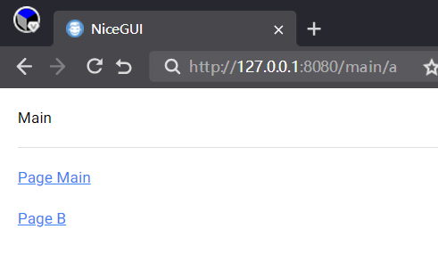

但是，此时刷新页面或者直接访问`/main/a`的话，则会显示`/main/a`页面：

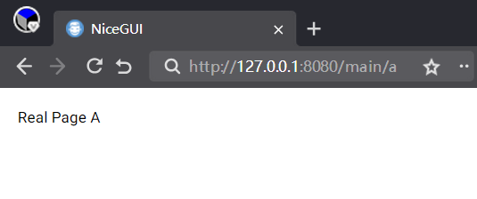

以上只是单页面应用的简单介绍，其余参数和更多用法将在后面的章节中展开介绍。

单页面应用与不同的构建模式组合使用时，学习难度会陡然而升，容易遇到很多难以解决的问题。因此，这部分内容不太理解的话可以暂时跳过，等后续学习了其他基础之后再回过头学习。

### 2.4 显示模式

NiceGUI程序支持两种显示模式：

- 网页模式，可以将NiceGUI程序部署为网站。
- 窗口模式，可以将NiceGUI程序部署为桌面程序。

除了前面示例中以网页形式显示NiceGUI程序之外（即网页模式），还可以给`ui.run`方法的`native`参数传入`True`，以窗口形式显示NiceGUI程序（即窗口模式）。

注意，窗口模式依赖`pywebview`库，需要先安装`pywebview`库才能使用，可以参考安装NiceGUI一章，使用`uv add nicegui[native]`命令提前添加依赖库。

示例如下：

```python3
from nicegui import ui

def index():
    title()
    ui.button('Hello')

def title():
    ui.label('标题')

ui.run(
    root=index,
    native=True
)
```


### 2.5 运行方法

NiceGUI有两种运行NiceGUI程序的方法：

- `ui.run`方法是前面介绍的，而且后续示例中一般使用该方法，支持网页模式和窗口模式。
- `ui.run_with`方法，则一般用于将NiceGUI程序挂载到现有的FastAPI程序中，仅支持网页模式。

以下为`ui.run_with`方法的示例：

```python3
import uvicorn
from fastapi import FastAPI
from nicegui import ui

fast_app = FastAPI()
  
@ui.page('/')
def index():
    title()
    ui.button('Hello')

def title():
    ui.label('标题')

ui.run_with(
    app=fast_app,
)

uvicorn.run(
    app=fast_app,
    host='127.0.0.1',
    port=80
)
```

也可以将NiceGUI程序挂载到指定的路径：

```python3
import uvicorn
from fastapi import FastAPI
from nicegui import ui

fast_app = FastAPI()

@fast_app.get('/')
def root():
    return '请访问 /gui 查看NiceGUI程序'

# 这里的路径是相对挂载路径而言
@ui.page('/')
def index():
    title()
    ui.button('Hello')

def title():
    ui.label('标题')

ui.run_with(
    app=fast_app,
    # 省略挂载路径的话，直接访问根路径（/）即可看到NiceGUI程序，但要注释掉@fast_app.get('/')和其装饰的函数
    mount_path='/gui' 
)

uvicorn.run(
    app=fast_app,
    host='127.0.0.1',
    port=80
)
```

### 2.6 退出程序

NiceGUI程序一般是通过终端运行，关闭终端，程序自动退出。

此外，在终端按下`ctrl + c`键，也能强制退出NiceGUI程序。

如果需要通过代码退出NiceGUI程序，则要使用`app.shutdown()`。

## 3 创建控件

创建控件看似简单，只是了解一下具控件的参数、属性、方法，没有多少难点。但在实际使用时，具体参数、方法的使用，创建的技巧，远没有看上去那么简单。

### 3.1 实例化

实例化控件类，即可创建控件：

```python3
from nicegui import ui

def index():
    ui.label('标题')
    ui.button('Hello')

ui.run(
    root=index,
    native=True
)
```

除了不分配变量的用法，对于某些需要重复使用的控件，想要在后续代码中访问这些控件的属性、方法的话，则要给这些控件分配变量。因为每次实例化都是创建一个控件，即使是相同类型的控件，重复实例化也是重复创建：

```python3
from nicegui import ui

def index():
    label = ui.label('标题')
    button = ui.button('Hello')
    ui.button('World')
    button.disable()

ui.run(
    root=index,
    native=True
)
```


### 3.2 `with`的技巧

NiceGUI本质上是一个基于Quasar框架实现的网页框架，很多控件也都是网页控件。如果读者熟悉网页的话，应该知道网页的元素可以多重嵌套，进而实现复杂的布局。当然，读者不熟悉也没关系，可以将控件想象成一个盒子，盒子里可以装另一个盒子，控件也一样。

对于NiceGUI的控件来说，想要在控件中嵌入另一个控件，只需使用上下文管理器进入控件的上下文，在上下文中创建其他控件，相当于在控件内嵌入其他控件：

```python3
from nicegui import ui

def index():
    with ui.button('Hello'):
        ui.button('World')

ui.run(
    root=index,
    native=True
)
```


除了嵌套一层，还可以嵌套多层：

```python3
from nicegui import ui

def index():
    with ui.button('Hello'):
        with ui.button('World'):
            ui.button('!')

ui.run(
    root=index,
    native=True
)
```

或者使用一个`with`，后接英文逗号分隔的多个对象，同样表示嵌套多层（和上个示例效果一样）：

```python3
from nicegui import ui

def index():
    with ui.button('Hello'), ui.button('World'):
        ui.button('!')
```

对于使用上下文管理器进入上下文的控件，如果想要访问该控件，可以使用`as`关键字，后接变量名，即可在控件的上下文，甚至与`with`同一缩进的作用域内，访问该控件。比如：

```python3
from nicegui import ui

def index():
    with ui.button('Hello') as button1:
        ui.button('World')
    with ui.button('Hello') as button2:
        with ui.button('World') as button3:
            ui.button('!')
    with ui.button('Hello') as button4, ui.button('World') as button5:
        ui.button('!')

ui.run(
    root=index,
    native=True
)
```

请牢记这些技巧，后续使用具体控件时，这些都是基本操作。

### 3.3 控件的插槽（slot）

前面说了使用上下文管理器进入控件的上下文，进而在控件内嵌入其他控件。其实，这种操作就是进入了控件的“default”插槽（插槽的概念来自Quasar框架的控件，相关资料可以查看 https://quasar.dev/components ，具体控件支持的插槽有所不同）。

以`ui.input`输入框控件为例，下面示例中两种写法的效果是一样的：

```python3
from nicegui import ui

def index():
    with ui.input('Name'):
        ui.button('Ok')
    with ui.input('Name').add_slot('default'):
        ui.button('Ok')

ui.run(
    root=index,
    native=True
)
```


简单来说，插槽可以看作是一个控件中可以插入其他控件的位置，“default”插槽就是默认状态的控件。而不少控件有多个插槽，如果想要在其他插槽中插入其他控件，则要使用`add_slot`方法，指定具体插槽。以输入框控件（具体参考https://quasar.dev/vue-components/input）为例：

```python3
from nicegui import ui

def index():
    my_input = ui.input('Name')
    with my_input.add_slot('before'):
        ui.button('Pre')
    with my_input.add_slot('after'):
        ui.button('Next')

ui.run(
    root=index,
    native=True
)
```

可以在输入框控件前后分别添加不同的按钮：


就是因为输入框控件前、后分别对应着不同的插槽。

### 3.4 `for`的技巧

需要创建多个有规律的控件时，熟悉Python的读者肯定第一时间想到了`for`，可以使用该关键字遍历可以迭代的对象，同时创建控件：

```python3
from nicegui import ui

def index():
    for i in range(4):
        ui.button(i)

ui.run(
    root=index,
    native=True
)
```

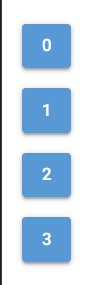

看上去没什么问题，可是，一旦涉及到可调用对象，这个操作就会出现问题：

```python3
from nicegui import ui

def index():
    for i in range(4):
        ui.button(
            i,
            on_click=lambda :ui.notify(
                i
            )
        )

ui.run(
    root=index,
    native=True
)
```


在创建控件的同时，给控件设置了对应的响应函数，让其在点击时，弹出对应数字的消息。不过，代码看似没有问题，点击第三个按钮时，却弹出来不一致的数字。

请读者不要着急寻找解决代码，在解决问题之前，需要先了解一下问题产生的原因：问题源于Python的延迟绑定。

简单来说，在遍历时定义函数（不限于lambda表达式）的话，如果函数直接使用遍历中间变量（即代码中的`i`），则该变量会在遍历结束时统一绑定，而非第一时间使用变量的当时值，这是函数的特性。

函数的这一特性其实在前面介绍构建模式的时候说过，就是在函数中可以使用在当前代码位置后定义的函数、对象，不会直接报错。

因此，将出错的代码中，NiceGUI的部分去掉的话，复现错误的核心代码为：

```python3
funcs = []

for i in range(4):
    funcs.append(
        lambda:print(i)
    )

for func in funcs:
    func()
```

结果如下：

```shell
3
3
3
3
```

想要解决这个问题也很简单，就是让定义函数时使用该变量的值，而非该变量（为了避免混淆，lambda表达式的参数名改为`x`）：

```python3
funcs = []

for i in range(4):
    funcs.append(
        lambda x=i:print(x)
    )

for func in funcs:
    func()
```

结果如下：

```shell
0
1
2
3
```

这一次，结果总算对了。

接下来，回到NiceGUI程序，执行类似的修改即可：

```python3
from nicegui import ui

def index():
    for i in range(4):
        ui.button(
            i,
            on_click = lambda x=i:ui.notify(
                x
            )
        )

ui.run(
    root=index,
    native=True
)
```

## 4 修改样式

NiceGUI提供了丰富美观的控件，但控件默认的样式是统一的，实际使用时总不能全用默认样式，肯定要美化一番。因此，如何修改控件的样式，值得读者认真学习。

### 4.1 修改样式的方法

在学习修改控件的样式之前，先了解一下NiceGUI的控件支持哪些添加、删除、修改样式的方法：

- `style`方法（属性），支持CSS样式，可以为控件添加、删除、修改CSS样式，比如颜色、边距等。CSS的语法可参考 https://developer.mozilla.org/zh-CN/docs/Web/CSS。
- `classes`方法（属性），支持各种样式类，可以为控件添加、删除、修改Tailwind CSS框架定义的样式类，也可以添加、删除、修改在CSS代码中定义并引入的样式类。Tailwind CSS的语法可参考 https://tailwindcss.com/。
- `props`方法（属性），支持Quasar控件属性（Quasar控件的属性）或者HTML属性（HTML标签的属性），可以为控件添加、删除、修改Quasar控件（大部分NiceGUI控件的前端部分）的属性或者HTML标签（NiceGUI控件对应的顶层HTML标签）的属性，包括但不限于样式相关的属性。具体控件支持的属性可参考 https://quasar.dev/components。

可能读者看到上面的介绍有点疑惑，为何这些方法后，还用括号补充说明是属性？在NiceGUI最新版本中，这三种方法，可以通过调用的方式添加、修改样式。同时，控件还支持同名的字典（或者列表）属性，可以使用字典（或者列表支持的方式添加、修改样式，字典的键即为样式名。

### 4.2 `style`方法（属性）

示例如下：

```python3
from nicegui import ui

def index():
    button = ui.button('Hello')
    button.style(
        'color:red!important'
    )
    button.style['background'] = 'green!important'

ui.run(
    root=index,
    native=True
)
```


需要注意的是，默认控件的样式优先级较高，需要通过添加`!important`来提高自定义样式的优先级，否则不会生效。

部分样式支持使用`props`方法（属性）去掉，比如控件的背景色、前景色（文字颜色）。此时不用添加`!important`来提高自定义样式的优先级：

```python3
from nicegui import ui

def index():
    button = ui.button('Hello')
    button.props(
        'color text-color'
    )
    button.style('color:red')
    button.style['background'] = 'green'

ui.run(
    root=index,
    native=True
)
```


### 4.3 `classes`方法（属性）

示例如下：

```python3
from nicegui import ui

def index():
    label = ui.label('Hello')
    label.classes(
        'bg-yellow-400'
    )
    label.classes.append(
        'text-blue-600'
    )

ui.run(
    root=index,
    native=True
)
```


`classes`属性是一个列表，因此只能使用列表的方法。

NiceGUI的很多控件自带样式，其样式源于Quasar框架，而部分样式使用`!important`修饰，优先级高于没有使用`!important`修饰的普通样式。

虽然Tailwind CSS框架的普通样式默认优先级高于Quasar框架的普通样式，但添加“!”为前缀或者后缀（在Tailwind CSS中等效于使用`!important`修饰）的Tailwind CSS框架的样式类，遇到Quasar框架使用`!important`修饰的相同样式（比如背景颜色）时，优先级反而会比Quasar框架的低。

想要理解这个反常现象，需要先了解两个相关知识：

- 从NiceGUI 3.0.0开始，内部使用了级联层（`@layer`）决定样式的优先级，具体顺序如下：

  ```css
  theme, 
  base, 
  quasar(Quasar框架的预定义样式类类名在这一层), 
  nicegui, 
  components, 
  utilities(Tailwind CSS框架的预定义样式类类名在这一层), 
  overrides
  ```

  对于普通样式，越靠下的层级，优先级越高。

- 对于同样使用`!important`修饰的相同样式，则基于上面的级联层顺序，优先级则是相反的，具体可以参考 https://developer.mozilla.org/en-US/docs/Web/CSS/@layer#layer_order_and_the_!important_flag，完整的优先级顺序如下图所示：

  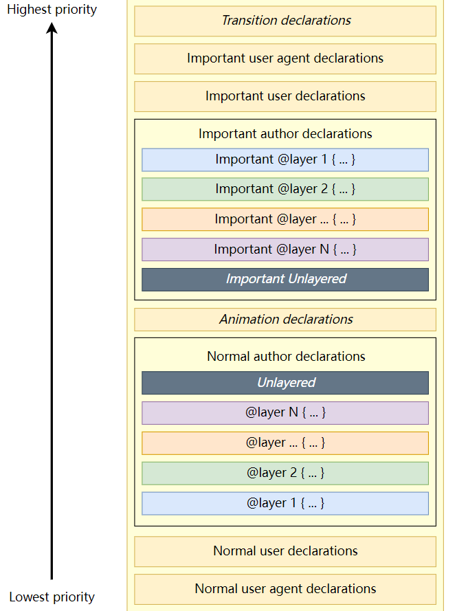

那么，问题来了，默认控件的颜色样式就是使用`!important`修饰的，如果想要将其改为Tailwind CSS框架的颜色，该怎么解决？

可以使用`props`方法（属性）去掉控件原本的背景色、前景色（文字颜色），再使用`classes`方法（属性）修改为指定的背景色、前景色（文字颜色），此时不用添加“!”为前缀或者后缀：

```python3
from nicegui import ui

def index():
    button = ui.button('Hello')
    button.props(
        'color text-color'
    )
    button.classes(
        'bg-red-700 text-green-700'
    )

ui.run(
    root=index,
    native=True
)
```


从NiceGUI 3.0.0正式版开始，官方修复了添加“!”为前缀或者后缀（在Tailwind CSS框架中等效于使用`!important`修饰）的Tailwind CSS框架的样式类生效顺序，因此，下面的代码可以正常生效：

```python3
from nicegui import ui

def index():
    ui.button('Hello').classes(
        '!bg-red-700 !text-green-700'
    )
    ui.button('World').classes(
        'bg-red-700! text-green-700!'
    )

ui.run(
    root=index,
    native=True
)
```

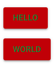

### 4.4 `props`方法（属性）

示例如下：

```python3
from nicegui import ui

def index():
    button = ui.button('Hello')
    button.props(
        'text-color=green'
    )
    button.props['color'] = 'red'

ui.run(
    root=index,
    native=True
)
```


需要注意的是，Quasar控件的属性有两种类型，布尔类型和其他类型。如果是布尔类型的属性，可以不用赋值，添加该属性相当于给该属性赋值为`True`。

## 5 创建事件的响应函数

NiceGUI中，如果用户执行了动作（比如点击），会产生相应的事件，控件就会执行对应事件的响应函数。因此，想要根据用户的动作执行对应的函数，只需定义事件对应的响应函数即可。

### 5.1 响应控件的事件

 对于控件而言，定义事件的响应函数有三种方式：

- “on”开头的参数。比如`ui.button`按钮控件的`on_click`参数，支持可调用对象。

  示例如下：

  ```python3
  from nicegui import ui
  
  def index():
      ui.button(
          'Hello',
          on_click = lambda :ui.notify(
              'Hello'
          )
      )
  
  ui.run(
      root=index,
      native=True
  )
  ```

- “on”开头的方法。比如`ui.button`按钮控件的`on_click`方法，该方法的参数为可调用对象。

  示例如下：

  ```python3
  from nicegui import ui
  
  def index():
      ui.button(
          'Hello'
      ).on_click(
          lambda :ui.notify(
              'Hello'
          )
      )
  
  ui.run(
      root=index,
      native=True
  )
  ```

- `on`方法。效果类似“on”开头的方法，但该方法的第一个参数为事件类型，可以定义任意JavaScript中支持的事件类型。比如，`on_click`方法，效果等于`on`方法的第一个参数为`'click'`。

  示例如下：

  ```python3
  from nicegui import ui
  
  def index():
      ui.button(
          'Hello'
      ).on(
          'click',
          lambda :ui.notify(
              'Hello'
          )
      )
  
  ui.run(
      root=index,
      native=True
  )
  ```

### 5.2 响应NiceGUI程序的事件

除了可以定义控件的响应函数，NiceGUI程序也支持一些事件，可以定义这些事件的响应函数。

想要定义NiceGUI程序事件的响应函数，需要导入`app`对象，调用该对象的“on”开头的方法。比如，`on_startup`方法用于定义NiceGUI程序启动完成时的响应函数：

```python3
from nicegui import ui,app
app.on_disconnect(
    app.shutdown
)

def index():
    ui.button(
        'Hello'
    ).on(
        'click',
        lambda :ui.notify(
            'Hello'
        )
    )

app.on_startup(
    lambda :print(
        '程序已启动……'
    )
)
ui.run(
    root=index,
    native=True
)
```

注意，因为在Windows下，直接关闭窗口不会自动退出NiceGUI程序，代码中使用了`app.on_disconnect(app.shutdown)`实现关闭窗口后自动退出程序，这是一个临时解决方法，且仅适用于窗口模式。如果后续示例中，读者想要实现同样效果，可以自行添加该代码，笔者写相关示例时不再特意添加。

### 5.3 响应信号（`Event`类）

事件类——`Event`类（使用`from nicegui import Event`导入）虽然从名字上看应该和事件、响应函数相关，但要是从用法看，该类被称作信号更合适。

信号是NiceGUI 3.0.0引入的新功能。之前版本中类似脚本模式的NiceGUI程序可以共享全局作用域内控件的状态、数据，但在NiceGUI 3.0.0版本中，全局作用域内的控件相当于放在单独的函数中，无法在全局作用域中共享其状态、数据。为了解决此需求，NiceGUI新增了具备信号功能的`Event`类。

先创建`Event`类对象，然后通过下面的方法使用`Event`类对象：

- `subscribe`方法，该方法用于将指定可调用对象绑定为信号的订阅者，当信号发射、呼叫时，会自动执行对应的可调用对象。
- `unsubscribe`方法，该方法用于给绑定为订阅者的可调用对象取消绑定。
- `emit`方法，该方法用于发射信号，可以传入额外参数。如果信号的订阅者支持额外的参数，那么这里传入的额外参数，就会传给订阅者。
- `emitted`方法，该方法是一个异步方法，可以使用异步等待来等待新的信号发射。
- `call`方法，该方法是一个异步方法，用于呼叫信号，作用等同于发射信号，但可以使用异步等待来确保信号订阅者执行完毕。

注意，如果需要`Event`类对象在全局作用域内生效，让其他页面通过信号共享控件的状态、数据，就**不能**在脚本模式中使用`Event`类对象，因为脚本模式没有真正意义上的全局作用域，都是局部作用域。但可以将脚本模式转换为单页面模式，划分出全局作用域后使用。

示例如下：

```python3
from nicegui import ui,Event

signal_obj = Event()
shared_value = ''
def update_shared_value(x):
    global shared_value
    shared_value=x

def index():
    # 订阅信号，更新全局变量，以便于新打开的页面自动使用该值作为初始值
    signal_obj.subscribe(
        update_shared_value
    )
    input = ui.input(
        value=shared_value
    )
    # 订阅信号
    signal_obj.subscribe(
        lambda x:input.set_value(
            x
        )
    )
    # 发射信号
    input.on_value_change(
        lambda :signal_obj.emit(
            input.value
        )
    )

ui.run(
    root=index,
    port=80
)
```

在运行代码之后，可以在浏览器中打开多个标签页，地址为`http://127.0.0.1/`，在任意一个标签页中输入框内输入内容，其他标签页中输入框的内容会自动同步。

除了上面这种使用形式，对于需要在订阅时定义可调用对象的情况，还可以采取装饰器的形式，看上去更加简洁：

```python3
from nicegui import ui,Event

signal_obj = Event()
shared_value = ''

# 订阅信号，更新全局变量，以便于新打开的页面自动使用该值作为初始值
@signal_obj.subscribe
def update_shared_value(x):
    global shared_value
    shared_value=x

def index():
    input = ui.input(
        value=shared_value
    )
    # 订阅信号
    @signal_obj.subscribe
    def update(x):
        input.set_value(x)
    # 发射信号
    input.on_value_change(
        lambda :signal_obj.emit(
            input.value
        )
    )

ui.run(
    root=index,
    port=80
)
```

## 6 绑定属性

上一章介绍了如何同步脚本模式同一控件之间的状态、数据，但是，如果想要同步同一页面（脚本模式、多页面模式、单页面模式）中不同控件之间、控件与任意对象属性之间的状态、数据，则不用那么复杂，控件提供了简单的属性绑定方法，可以单向或者双向绑定控件的可绑定属性、对象的属性。

如果控件存在可绑定属性，则该控件会存在以下三种相关的属性绑定方法：

- `bind_{属性名}_from`方法，将该属性与其他对象的指定属性反向绑定，其他对象的指定属性发生改变，该控件的该属性同步发生变化，反之不会触发同步。
- `bind_{属性名}_to`方法，将该属性与其他对象的指定属性正向绑定，该控件的该属性发生改变，其他对象的指定属性同步发生变化，反之不会触发同步。
- `bind_{属性名}`方法，将该属性与其他对象的指定属性双向绑定，发起绑定和被绑定的属性中，只要一方发生变化，另一方同步发生变化。

示例如下：

```python3
from nicegui import ui

class data_class:
    value = 'no value'

def index():
    ui.input('输入').bind_value(
        data_class,
        'value'
    )
    ui.button(
        '显示',
        on_click = lambda :ui.notify(
            data_class.value
        )
    )

ui.run(
    root=index,
    native=True
)
```

## 7 刷新控件

### 7.1 调用手动刷新方法

绑定属性可以单向或者双向绑定控件的可绑定属性、对象的属性，无需额外执行控件的刷新方法，即可刷新控件。

比如：

```python3
from nicegui import ui

def index():
    my_label = ui.label('')
    my_input = ui.input('输入')
    my_input.bind_value(
        my_label,
        'text')  

ui.run(
    root=index,
    native=True
)
```


同样的，如果直接修改控件的这类属性，一般无需额外执行控件的刷新方法，也能刷新控件：

```python3
from nicegui import ui

def index():
    my_input = ui.input('输入')
    def update_input():
        my_input.value = 'Hello'
    ui.button(
        'update input',
        on_click=update_input
    )

ui.run(
    root=index,
    native=True
)
```

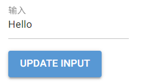

但是，控件的部分属性需要刷新控件才能正确显示，就需要调用控件的刷新方法——`update`方法，比如：

```python3
from nicegui import ui

def index():
    my_ratio = ui.radio(
        ['a','b','c'],
        value='a'
    )
    def update_ratio():
        my_ratio.options += ['Hello']
        my_ratio.update()
    ui.button(
        'update ratio',
        on_click=update_ratio
    )

ui.run(
    root=index,
    native=True
)
```

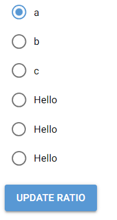

使用`ui.update`方法和直接调用控件的`update`方法的效果一样，但`ui.update`方法支持传入任意数量控件，可以同时刷新多个控件：

```python3
from nicegui import ui

def index():
    my_ratio = ui.radio(
        ['a','b','c'],
        value='a'
    )
    def update_ratio():
        my_ratio.options += ['Hello']
        ui.update(my_ratio)
    ui.button(
        'update ratio',
        on_click=update_ratio
    )

ui.run(
    root=index,
    native=True
)
```

### 7.2 创建可刷新方法

控件的刷新方法不是万能的。

如果控件的个数与某个控件的属性相关，只是调用刷新方法的话，没法重新创建指定数量的控件。需要先清除原来的控件，再重新创建所有控件，才能实现想要的效果。

比如，想要字母的个数与输入框内的数字同步：

```python3
from nicegui import ui

count = 2
def index():
    my_input = ui.number(
        '个数',
        value=1,
        min=1,
        max=10,
        format='%d'
    )
    e = ui.element()
    def rebuild():
        e.clear()
        with e:
            for i in range(
                int(my_input.value)
            ):
                ui.label('A')
    rebuild()
    my_input.bind_value(
        globals(),
        'count',
    )
    my_input.on_value_change(rebuild)

ui.run(
    root=index,
    native=True
)
```


字母的个数与输入框内的数字是同步了，但需要使用全局变量存储个数，还需要借助额外的控件作为容器，容器内的多个控件比较紧凑，样式还要额外调整。

其实，可以使用NiceGUI提供的`refreshable`类（用于装饰函数）、`refreshable_method`类（用于装饰类的方法）创建可刷新方法（函数），直接调用其`refresh`方法，一步实现清除创建的控件、重新创建控件：

```python3
from nicegui import ui

def index():
    my_input = ui.number(
        '个数',
        value=1,
        min=1,
        max=10,
        format='%d'
    )
    @ui.refreshable
    def rebuild():
        for i in range(
            int(my_input.value)
        ):
            ui.label('A')
    my_input.on_value_change(
        rebuild.refresh
    )
    rebuild()

ui.run(
    root=index,
    native=True
)
```

代码简洁不少，但效果更好：

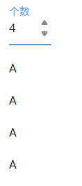

需要注意的是，在`refreshable`类、`refreshable_method`类装饰的函数（方法）内，所有创建的控件都会在调用`refresh`方法时重新创建，不会保存控件的状态：

```python3
from nicegui import ui

def index():
    @ui.refreshable
    def rebuild():
        my_input = ui.number(
            '个数',
            value=1,
            min=1,
            max=10,
            format='%d'
        )
        my_input.on_value_change(
            rebuild.refresh
        )
        for i in range(
            int(my_input.value)
        ):
            ui.label('A')
    rebuild()

ui.run(
    root=index,
    native=True
)
```

如果想要保存控件的状态，可以使用前面用过的绑定属性：

```python3
from nicegui import ui

count = 1
def index():
    @ui.refreshable
    def rebuild():
        my_input = ui.number(
            '个数',
            value=1,
            min=1,
            max=10,
            format='%d'
        )
        my_input.bind_value(
            globals(),
            'count',
        )
        my_input.on_value_change(
            rebuild.refresh
        )
        for i in range(
            int(my_input.value)
        ):
            ui.label('A')
    rebuild()

ui.run(
    root=index,
    native=True
)
```

也可以使用只与`refreshable`类、`refreshable_method`类配合使用的`ui.state`状态方法。

`ui.state`状态方法的参数为初始值，该方法返回一个元组。元组的第一个元素为调用`refresh`方法之后的保存值（第一次返回的是初始值），元组的第二个元素为修改保存值的赋值方法。

于是，将所有控件一股脑地塞入可刷新方法中之后，代码如下：

```python3
from nicegui import ui

def index():
    @ui.refreshable
    def rebuild():
        num,set_num = ui.state(1)
        my_input = ui.number(
            '个数',
            value=num,
            min=1,
            max=10,
            format='%d'
        )
        # 修改保存值
        my_input.on_value_change(
            lambda :set_num(my_input.value)
        )
        my_input.on_value_change(
            rebuild.refresh
        )
        for i in range(
            int(my_input.value)
        ):
            ui.label('A')
    rebuild()

ui.run(
    root=index,
    native=True
)
```

### 7.3 触发自动刷新

除了上面提供的手动刷新控件的方法之外，执行以下操作之后，无需手动刷新，会自动控件的触发刷新：

- 调用（或者修改）`style`方法（属性）、`classes`方法（属性）、`props`方法（属性）。
- 除了上面提到的属性之外，控件中的字典类型属性等引用类型属性或者其他类型属性，如果最终成为`_props`属性或者`props`属性的元素，修改这类属性。

示例如下：

```python3
from nicegui import ui

def index():
    ur = ui.range(
        min=1,
        max=10,
        value={
            'min':5,
            'max':6
        }
    )
    def change_data():
        ur.min = 9
    ui.button(
        'change_data',
        on_click=change_data
    )

ui.run(
    root=index,
    native=True
)
```

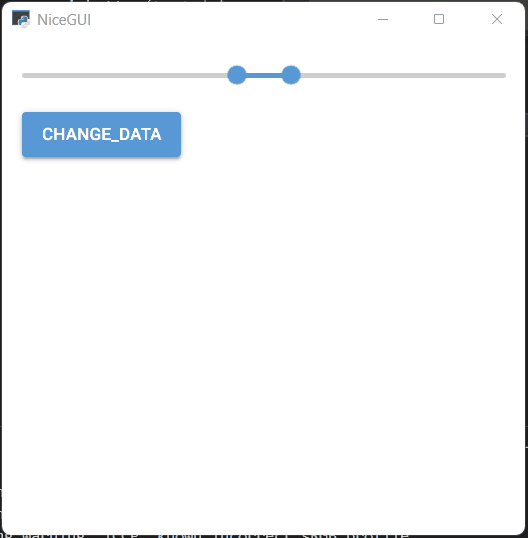

需要特别注意的是，虽然字典类型、列表类型、集合类型是引用类型，但这里处理过后，这些引用类型的属性实际上是原来引用类型的副本，无法通过修改原始值影响控件的内容，然后手动调用刷新方法的方式刷新控件。只能修改属性，然后让其触发控件的自动刷新。

示例如下：

```python3
from nicegui import ui

def index():
    json = {'a':'abc'}
    je = ui.json_editor(
        {
            'content': {
                'json': json
            }
        }
    )
    def change_data():
        je.properties['content']['json']['a'] = 'def'
    ui.button(
        'change_data',
        on_click=change_data
    )

ui.run(
    root=index,
    native=True
)
```

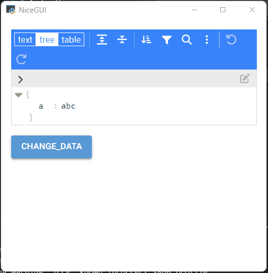

若引用类型的属性最终不是`_props`属性或者`props`属性的元素的话，则只能且必须在修改引用类型属性对应的引用值或者属性之后，手动调用刷新方法来刷新控件。

示例如下：

```python3
from nicegui import ui

def index():
    up = ui.plotly(
        {
            'data': [
                {
                    'type': 'scatter',
                    'line': {'color': '#636EFA'},
                    'x': [0, 1, 2],
                    'y': [1, 2, 4],
                }
            ],
            'layout': {
                'margin': {
                    'l': 20,
                    'r': 0,
                    't': 0,
                    'b': 25
                },
                'plot_bgcolor': '#E5ECF6',
                'xaxis': {
                    'gridcolor': 'white',
                    'dtick': '0.5',
                    'zeroline': False
                },
                'yaxis': {
                    'gridcolor': 'white',
                    'dtick': '0.5',
                    'zeroline': False
                },
            }
        }
    ).classes('w-64 h-64')
    def change_data():
        up.figure['data'] = [
                {
                    'type': 'scatter',
                    'line': {'color': '#636EFA'},
                    'x': [0, 1, 2],
                    'y': [1, 2, 3],
                }
            ]
        up.update()
    ui.button(
        'change_data',
        on_click=change_data
    )

ui.run(
    root=index,
    native=True
)
```

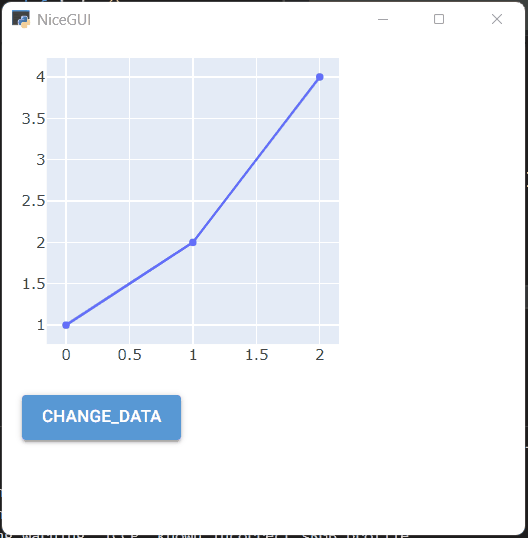

## 8 使用异步函数

### 8.1 NiceGUI中的异步函数

在Python中，有一种函数叫异步函数。与之相对的，就是同步函数。同步函数就是常见的函数，异步函数就是在定义函数时使用`async`修饰的函数。

一般来说，函数执行之后，就会立即得到结果。但是，如果函数执行的操作比较耗时，程序就会卡住，需要等函数执行完，程序才会恢复。这个就是同步函数的执行过程。

于是，异步函数为了解决卡住程序的问题，使用异步处理要执行的耗时操作。所谓异步，就是执行之后不会立即要求得到结果，而是按照顺序继续执行后续的代码，并按照完成顺序依次得到结果。

光说的话，不太直观，那就用代码对比一下。

先看同步函数的示例：

```python3
from nicegui import ui
import time

def do_something():
    ui.notify('start')
    time.sleep(3)
    ui.notify('ok')

def index():
    ui.button(
        'Do Something',
        on_click=do_something
    )

ui.run(
    root=index,
    native=True
)
```


可以看到，虽然函数中，两个通知之间加入了延时，但两个通知还是同时弹出。

换成异步函数的话，结果就符合预期了：

```python3
from nicegui import ui
import asyncio

async def do_something():
    ui.notify('start')
    await asyncio.sleep(3)
    ui.notify('ok')

def index():
    ui.button(
        'Do Something',
        on_click=do_something
    )

ui.run(
    root=index,
    native=True
)
```


NiceGUI使用异步函数的情况如下：

- 响应函数可以是异步函数。

- 多页面模式、单页面模式、单页面应用的页面构建函数可以是异步函数。注意，脚本模式的全局作用域可以看作是一个同步函数，不能在其中直接使用异步函数。

  示例如下：

  ```python3
  from nicegui import ui
  import asyncio
  
  async def do_something():
      ui.notify('start')
      await asyncio.sleep(3)
      ui.notify('ok')
  
  async def index():
      ui.button(
          'Do Something',
          on_click=do_something
      )
  
  ui.run(
      root=index,
      native=True
  )
  ```

- 部分控件、对象提供了可以异步等待的方法，用于实现在指定动作、状态之后才执行后续操作。

  比如，`ui.button`按钮控件的`clicked`方法就是一个异步函数，只有在点击按钮之后，该函数才会执行：
  
  ```python3
  from nicegui import ui
  
  async def index():
      await ui.button('Do Something One').clicked()
      await ui.button('Do Something Two').clicked()
      await ui.button('Do Something Three').clicked()
  
  ui.run(
      root=index,
      native=True
  )
  ```
  
  

### 8.2 `Event`类的异步函数

部分控件、对象提供了可以异步等待的方法，用于实现在指定动作、状态之后才执行后续操作。这部分内容还有不少示例，所以单开一节，重点说一下。比如，前面介绍的`Event`类，就有两个可以异步等待的方法：`call`方法和`emitted`方法。

先说`call`方法。

如果信号的订阅者需要执行耗时的操作，想要等待操作完成再发射新的信号，使用`emit`方法就不合适，比如下面的代码：

```python3
from nicegui import ui,Event
import asyncio

signal_obj = Event()
shared_value = ''

# 订阅信号，更新全局变量，以便于新打开的页面自动使用该值作为初始值
@signal_obj.subscribe
async def update_shared_value(x):
    global shared_value
    shared_value=x

async def index():
    input = ui.input(value=shared_value)
    button = ui.button('submit')
    # 订阅信号
    @signal_obj.subscribe
    async def update(x):
        # 模拟耗时操作
        await asyncio.sleep(3)
        input.set_value(x)
    # 发射信号
    async def submit():
        button.disable()
        signal_obj.emit(input.value)
        button.enable()

    button.on_click(submit)

ui.run(
    root=index,
    port=80
)
```

通过模拟耗时操作让其他页面输入框的内容延迟同步，笔者想让提交按钮在内容完成同步之前保持禁用状态，但实际执行时，提交按钮不会等待耗时操作执行完毕才恢复为可用状态，而是立即恢复为可用状态。这个很好理解，因为`emit`方法是同步方法，不支持异步等待，一旦执行就会立刻完成，随即执行后续的代码，将提交按钮恢复为可用状态。

因此，需要将`emit`方法替换为支持异步等待的`call`方法，并添加异步等待，让提交按钮在内容完成同步之前保持禁用状态，只有内容完成同步，才将提交按钮恢复为可用状态：

```python3
from nicegui import ui,Event
import asyncio

signal_obj = Event()
shared_value = ''

# 订阅信号，更新全局变量，以便于新打开的页面自动使用该值作为初始值
@signal_obj.subscribe
async def update_shared_value(x):
    global shared_value
    shared_value=x

async def index():
    input = ui.input(value=shared_value)
    button = ui.button('submit')
    # 订阅信号
    @signal_obj.subscribe
    async def update(x):
        # 模拟耗时操作
        await asyncio.sleep(3)
        input.set_value(x)
    # 发射信号
    async def submit():
        button.disable()
        await signal_obj.call(input.value)
        button.enable()
    button.on_click(submit)

ui.run(
    root=index,
    port=80
)
```


至于`emitted`方法，可以实现类似`ui.button`按钮控件`clicked`方法的效果：

```python3
from nicegui import ui,Event

signal_obj = Event()

async def index():
    ui.button(
        'Do Something One',
        on_click=signal_obj.emit
    )
    await signal_obj.emitted()
    ui.button(
        'Do Something Two',
        on_click=signal_obj.emit
    )
    await signal_obj.emitted()
    ui.button(
        'Do Something Three',
        on_click=signal_obj.emit
    )
    await signal_obj.emitted()

ui.run(
    root=index,
    native=True
)
```


## 9 创建后台任务

上一章节介绍异步的时候，可以看到直接执行包含`time.sleep`的同步函数会导致问题，但是，如果在后台任务中执行同步函数，就不会有这样问题。

NiceGUI的`run`模块、`background_tasks`模块都提供了后台执行任务的方法。

其中，由`run`模块提供的是：

-   `run.cpu_bound`方法，常用于占用较多CPU资源的后台任务，该方法会创建新的进程操作，让进程池的进程数扩大。
-   `run.io_bound`方法，常用于占用较多IO资源的后台任务开，因为这类后台任务不会占用太多CPU资源，因此，该方法只是创建新的线程操作，操作完线程会关闭。

示例如下：

```python3
from nicegui import ui,run
import time

def sleep():
    time.sleep(3)

async def do_something():
    ui.notify('start')
    await run.cpu_bound(sleep)
    ui.notify('ok')

def index():
    ui.button(
        'Do Something',
        on_click=do_something
    )

ui.run(
    root=index,
    native=True
)
```


可以看到，虽然执行的是包含`time.sleep`的同步函数，但因为将其放在后台任务中执行，所以，结果符合预期。

而`background_tasks`模块提供的是：

- `background_tasks.create`方法，在后台运行一个协程任务，需要传入异步函数的调用结果。

-   `background_tasks.create_lazy`方法，在后台无重复地运行一个协程任务，需要传入异步函数的调用结果，还要指定任务名（给`name`参数传入字符串）。所谓无重复地运行，即相同任务名的后台任务没有完成之前，无法重复执行同名任务。

-   `background_tasks.await_on_shutdown`装饰器，如果某些任务需要确保即使程序结束也能顺利完成，则在定义函数时需要使用该装饰器装饰。

    注意，该装饰器无法在窗口模式中正常生效（但不会报错），只有网页模式可以正常使用该装饰器。

示例如下：

```python3
from nicegui import ui, background_tasks, app
import asyncio

@background_tasks.await_on_shutdown
async def do_something():
    print('start')
    await asyncio.sleep(10)
    print('ok')

def index():
    ui.button(
        'Do Something',
        on_click=lambda: background_tasks.create(
            do_something(),
            name='print'
        )
    )
    ui.button(
        'Do Something no repeat',
        on_click=lambda: background_tasks.create_lazy(
            do_something(),
            name='print'
        )
    )
    ui.button(
        'shutdown',
        on_click=app.shutdown
    )

ui.run(
    root=index,
    native=False
)
```

注意，与`run`模块不同的是，`background_tasks`模块提供的运行后台任务的方法不支持在后台任务中使用NiceGUI的控件。

## 10 使用定时器

上一章讲了在后台任务中执行函数，这一章说一下效果有点类似，但是常用于重复执行函数的定时器。

NiceGUI提供了两种定时器：

- `ui.timer`定时器，控件层级的定时器。
- `app.timer`定时器，程序层级的定时器。

`ui.timer`定时器和`app.timer`定时器基本用法相同，但使用场景有所差别。

先看基本用法：

```python3
from nicegui import ui

def index():
    button = ui.button('Do Something')
    def do_something():
        button.disable()
        ui.timer(
            3,
            lambda :ui.notify(
                'ok'
            )
        )
    button.on_click(do_something)

ui.run(
    root=index,
    native=True
)
```

点击按钮之后，响应函数先禁用按钮，防止重复点击。然后创建一个定时器，每隔三秒弹出一条通知。

如果是`app.timer`定时器，则不能使用这种创建控件的操作：

```python3
from nicegui import ui,app

def index():
    button = ui.button('Do Something')
    def do_something():
        button.disable()
        app.timer(
            3,
            lambda :print(
                'ok'
            )
        )
    button.on_click(do_something)

ui.run(
    root=index,
    native=True
)
```

除此以外，两种定时器还有一个区别：控件的响应函数创建了`ui.timer`定时器，那`ui.timer`定时器就属于这个控件的父控件（或者创建定时器位置所属上下文的控件）；一旦父控件清空所有子控件，`ui.timer`定时器也会随之清除。而`app.timer`定时器属于当前程序，不会因为这样的操作而被清除掉。

示例如下：

```python3
from nicegui import ui,app

def index():
    with ui.element() as element:
        ui.timer(
            3,
            lambda :print(
                'ui is ok'
            )
        )
        app.timer(
            3,
            lambda :print(
                'app is ok'
            )
        )
    ui.button(
        'Clear Timers',
        on_click = element.clear
    )

ui.run(
    root=index,
    native=True
)
```

点击按钮之后，终端只会输出`app is ok`，因为`app.timer`定时器属于当前程序，不受影响。

## 11 绑定快捷键

就像使用定时器需要添加一个定时器一样，想要绑定快捷键，也要添加一个`ui.keyborad`键盘响应器，用于响应指定快捷键。

注意，和`ui.timer`定时器类似，键盘响应器同样属于创建位置的父控件，一旦父控件清空所有子控件，键盘响应器也会随之清除。

`ui.keyborad`键盘响应器支持以下：

- `on_key`参数，可调用类型，表示按键的响应函数。
- `active`参数，布尔类型，表示是否激活该键盘响应器，默认为`True`。
- `repeating`参数，布尔类型，表示当按键持续按下的时候是否重复执行按键的响应函数，默认为`True`。
- `ignore`参数，元素为字符串的列表，表示当哪些控件激活时，不执行按键的响应函数，默认为`['input', 'select', 'button', 'textarea']`。

对于`on_key`参数对应响应函数，可以传递一个`KeyEventArguments`类型的响应对象，作为响应函数的参数。响应对象有以下属性：

-   `sender`属性，表示执行响应函数的键盘响应器。
-   `client`属性，表示客户端对象。
-   `action`属性，`KeyboardAction`类型，表示按键具体的动作，该属性有以下子属性：
    -   `keydown`属性，布尔类型，表示按键按下。
    -   `keyup`属性，布尔类型，表示按键松开。
    -   `repeat`属性，布尔类型，表示按键重复按下中。
-   `key`属性，`KeyboardKey`类型，表示当前按键具体是哪个键（如果是组合键，则表示除了修饰键之外的具体按键）。该属性有以下子属性：
    -   `name`属性，字符串类型，表示按键名。比如：`'a'`、`'Enter'`、`'ArrowLeft'`等。 可以参考 https://developer.mozilla.org/zh-CN/docs/Web/API/UI_Events/Keyboard_event_key_values 提供的按键名清单。
    -   `code`属性，字符串类型，表示按键的代号。比如：`'KeyA'`、`'Enter'`、`'ArrowLeft'`等。
    -   `location`属性，整数类型，表示按键的位置。`0`表示标准键盘区，`1`表示左边的按键（指的是`ctrl`键、`alt`键、`shift`键这种左右都有的按键），`2`表示右边的按键指的是`ctrl`键、`alt`键、`shift`键这种左右都有的按键），`3`表示数字键盘区。
-   `modifiers`属性，`KeyboardModifiers`类型，表示组合键中的修饰键（`ctrl`键、`alt`键、`shift`键、`win`键这种可以与字母键、数字键、功能键等组合使用的按键），该属性有以下子属性：
    -   `alt`属性，布尔类型，表示修饰键中是否有`Alt`键（Mac下的`opt`键）。
    -   `ctrl`属性，布尔类型，表示修饰键中是否有`ctrl`键。
    -   `meta`属性，布尔类型，表示修饰键中是否有`meta`键（Windows的`win`键或者Mac下的`cmd`键）。
    -   `shift`属性，布尔类型，表示修饰键中是否有`shift`键。

为了方便使用，`KeyboardKey`类支持以下属性：:

-   `is_cursorkey`属性，布尔类型，表示方向键是否被按下（数字键盘区的方向键不算）。
-   `number`属性，整数类型，表示按下了哪个主键盘区上方的数字键。`0`到`9`表示对应的数字键，`None` 没有按下上方的数字键。
-   `backspace`、`tab`、`enter`、`shift`、`control`、`alt`、`pause`、`caps_lock`、`escape`、`space`、`page_up`、`page_down`、`end`、`home`、`arrow_left`、`arrow_up`、`arrow_right`、`arrow_down`、`print_screen`、`insert`、`delete`、`meta`、`f1`、`f2`、`f3`、`f4`、`f5`、`f6`、`f7`、`f8`、`f9`、`f10`、`f11`、`f12`等属性，均为布尔类型，表示对应的按键是否被按下。

示例如下：

```python3
from nicegui import ui
from nicegui.events import KeyEventArguments

def handle_key_ctrl(e: KeyEventArguments):
    if e.modifiers.ctrl and not e.key.control:
        if e.action.keyup:
            ui.notify(f'松开了 ctrl+{e.key} 键')

def handle_key_alt(e: KeyEventArguments):
    if e.modifiers.alt and not e.key.alt:
        if e.action.keyup:
            ui.notify(f'松开了 alt+{e.key} 键')

def index():
    ui.label('按下ctrl键或者alt键与其他键的组合')
    with ui.element() as element:
        ui.keyboard(on_key=handle_key_ctrl,active=True)
        ui.keyboard(on_key=handle_key_alt,active=True)
    ui.button(
        '清除快捷键',
        on_click = element.clear
    )

ui.run(
    root=index,
    native=True
)
```


## 版本速览——3.5.0版本新增对anywidget控件的支持

NiceGUI 3.5.0 主要新增了两个控件：`ui.altair`控件和`ui.anywidget`控件。从本质上说，它们都是基于`anywidget.AnyWidget`实现的NiceGUI控件，尤其是后者，可以将任意anywidget控件包装为NiceGUI控件，可以说，该版本属于引入anywidget控件的里程碑。

从该版本开始，NiceGUI新增了两个可选的依赖：

- `altair`库，`ui.altair`控件依赖该库，使用`uv add nicegui[altair]`命令添加。
- `anywidget`库，`ui.anywidget`控件、`ui.altair`控件依赖该库，使用`uv add nicegui[anywidget]`命令添加。

### 1 `ui.altair`控件

注意，使用该控件需要额外安装`altair`库和`anywidget`库，可参考上面的安装命令。

`ui.altair`控件可以使用`altair`库渲染图表，并将其转换为NiceGUI控件（示例需要额外安装`pandas`库）：

```python3
from nicegui import ui
import altair
import pandas as pd

def index():
    ui.altair(
        altair.Chart(
            pd.DataFrame(
                {
                    'x': [
                        'A', 'B', 'C', 'D', 'E'
                    ],
                    'y': [
                        5, 3, 6, 7, 2
                    ]
                }
            )
        ).mark_bar().encode(
            x='x',
            y='y',
        )
    )


ui.run(
    root=index,
    native=True
)
```

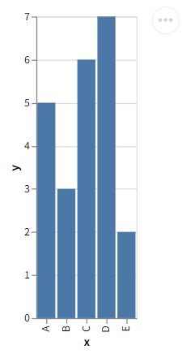

控件的完整用法，将在后面更新的《学习控件——渲染图表》一章中介绍，这里不做展开。

有兴趣的读者可以参考下面的资料提前学习：

-  NiceGUI文档：https://nicegui.io/documentation/altair
- `altair`库文档：https://altair-viz.github.io/user_guide/data.html
- altair官方示例：https://altair-viz.github.io/gallery/index.html

### 2 `ui.anywidget`控件

注意，使用该控件需要额外安装`anywidget`库和具体用法相关的依赖库，可参考上面的安装命令。

`ui.anywidget`控件可以将任意anywidget控件包装为NiceGUI控件，上面介绍的`ui.altair`控件就是其中一种。因此，可以使用`ui.anywidget`控件实现与`ui.altair`控件相同的效果，但需要额外安装`altair`库：

```python3
from nicegui import ui
import altair
import pandas as pd

def index():
    ui.anywidget(
        altair.JupyterChart(
            altair.Chart(
                pd.DataFrame(
                    {
                        'x': [
                            'A', 'B', 'C', 'D', 'E'
                        ],
                        'y': [
                            5, 3, 6, 7, 2
                        ]
                    }
                )
            ).mark_bar().encode(
                x='x',
                y='y',
            )
        )
    )


ui.run(
    root=index,
    native=True
)
```


当然，增加`ui.anywidget`控件更多是为了引入anywidget控件的丰富生态，只是复刻`ui.altair`控件的话，不如直接使用`ui.altair`控件。因此，用`ui.anywidget`控件渲染自定义的控件，实现和anywidget控件一样效果，才是`ui.anywidget`控件存在的意义：

```python3
from nicegui import ui
import anywidget
import traitlets

class CounterWidget(anywidget.AnyWidget):
    _esm = '''
        function render({ model, el }) {
            const button = document.createElement("button");
            button.innerHTML = `Count is ${model.get("value")}`;
            button.addEventListener("click", () => {
                model.set("value", model.get("value") + 1);
                model.save_changes();
            });
            model.on("change:value", () => {
                button.innerHTML = `Count is ${model.get("value")}`;
            });
            el.classList.add("counter-widget");
            el.appendChild(button);
        }
        export default { render };
    '''
    _css = '''
        .counter-widget button {
            color: white;
            background-color: DarkOrange;
            padding: 0.5rem 1rem;
            border-radius: 0.25rem;
            cursor: pointer;

            &:hover {
                opacity: 0.8;
            }
        }
    '''
    value = traitlets.Int(0).tag(sync=True)

    def increment(self) -> None:
        self.value += 1

def index():
    counter = CounterWidget(value=42)
    ui.anywidget(counter)
    ui.label('↑ anywidget')
    ui.separator()
    ui.label('↓ NiceGUI')
    ui.button(
        on_click=counter.increment
    ).bind_text_from(
        counter, 
        'value', 
        backward=lambda c: f'Count is {c}'
    )

ui.run(
    root=index,
    native=True
)
```

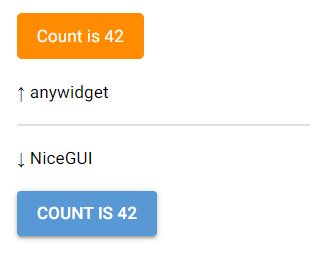

控件的完整用法，将在后面更新的《创建自定义控件》一章详细介绍，这里不做展开。

有兴趣的读者可以参考下面的资料提前学习：

- NiceGUI文档：https://nicegui.io/documentation/anywidget
- `anywidget`库文档：https://anywidget.dev/en/getting-started/
- anywidget官方示例：https://try.anywidget.dev/

## 12 运行JavaScript代码

NiceGUI的页面本质上是网页，而网页的很多操作离不开JavaScript代码。因此，NiceGUI程序虽然是用Python写的，但支持运行JavaScript代码，只需调用`ui.run_javascript`方法即可：

```python3
from nicegui import ui

def index():
    ui.button(
        'Run JavaScript',
        on_click=lambda :ui.run_javascript(
            'alert("Hello World!")'
        )
    )

ui.run(
    root=index,
    native=True
)
```


## 13 设计控件的布局

### 13.1 基本布局控件

在NiceGUI中，有以下三种基本布局，用于组合实现复杂的界面布局：

- 列（column）布局，所有的子控件排成一列。
- 行（row）布局，所有的子控件排成一行。
- 网格（grid）布局，所有的子控件都放在指定规格（默认为`1x1`）的单元格中。

三种基本布局的示意图如下：

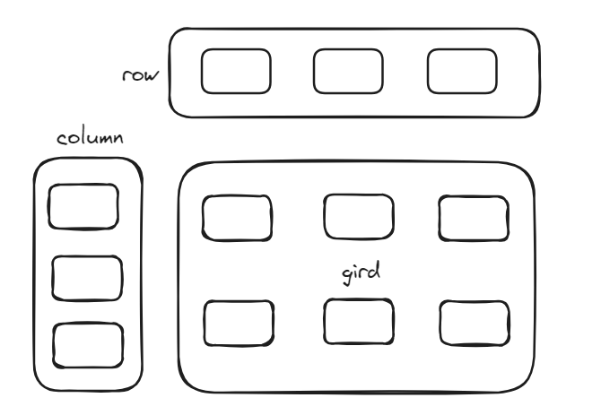

默认情况下，直接创建控件的话，就和在`ui.column`列控件中添加子控件一样，都是列布局：

```python3
from nicegui import ui

def index():
    for i in range(4):
        ui.button(i)
    with ui.column().classes(
        'border-2 border-red-700 p-1'
    ):
        for i in range(4):
            ui.button(i)

ui.run(
    root=index,
    native=True
)
```


在`ui.row`行控件中添加子控件，则为行布局：

```python3
from nicegui import ui

def index():
    with ui.row().classes(
        'border-2 border-red-700 p-1'
    ):
        for i in range(4):
            ui.button(i)

ui.run(
    root=index,
    native=True
)
```

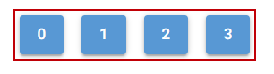

在`ui.grid`网格控件中添加子控件，则为网格布局：

```python3
from nicegui import ui

def index():
    with ui.grid(
        columns=3,
        rows=2
    ).classes(
        'border-2 border-red-700 p-1'
    ):
        ui.label('label 1').classes(
            'row-span-2 border-1 border-black p-1'
        )
        ui.label('label 2').classes(
            'col-span-2 border-1 border-black p-1'
        )
        ui.label('label 3').classes(
            'border-1 border-black p-1'
        )

ui.run(
    root=index,
    native=True
)
```

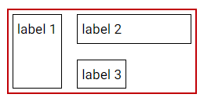

### 13.2 布局辅助控件

只是使用基本布局控件的话，虽然能实现几乎所有常见的布局，但是，不使用下面的辅助控件的话，效果还是差点意思：

- `ui.space`空白控件，可以填充布局方向上可用的剩余空间，一般用于行布局、列布局中，让最后的控件可以紧贴父控件的边界：

  ```python3
  from nicegui import ui
  
  def index():
      with ui.column().classes(
          'border-2 border-red-700 p-1 h-72'
      ):
          for i in range(4):
              ui.button(i)
          ui.space()
          ui.button(4)
  
  ui.run(
      root=index,
      native=True
  )
  ```

  

- `ui.separator`分隔控件，可以创建一个占用空间极小且不太明显的分隔符：

  ```python3
  from nicegui import ui
  
  def index():
      with ui.column().classes(
          'border-2 border-red-700 p-1'
      ):
          for i in range(4):
              ui.button(i)
          ui.space()
          ui.separator()
          ui.button(4)
  
  ui.run(
      root=index,
      native=True
  )
  ```
  
  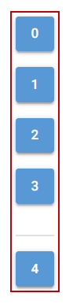

## 版本速览——3.6.0版本新增的功能

NiceGUI 3.6.0 新增的功能有点零碎，没有单一的主题，主要分两方面：

- 颜色相关
- 功能相关

颜色相关的新增功能之一就是颜色主题类——`app.colors`类，用于定义控件的颜色主题，用法和`ui.colors`类一样（之后会有专门的章节介绍具体用法，这里简单说一下，不做展开），但可以在所有页面生效，而`ui.colors`类只能在当前页面生效。

读者可以修改下面示例中的`app.colors`为`ui.colors`之后再运行一次，分别点击最上面的超链接，跳转至其他页面，看看效果：

```python3
from nicegui import ui,app

def index():
    app.colors(
        primary = 'red',
        dark='yellow',
        my_color = 'green'
    )
    ui.link('go to page_a','/page_a')
    ui.button('Hello')
    ui.chip('Hello')
    ui.avatar('home')
    with ui.card():
        ui.button(
            'Hello',
            color='my-color'
        )
        ui.button(
            'Hello'
        ).style(
            'background-color:var(--q-my-color)!important;'
        )
    dark_mode = ui.dark_mode(True)
    ui.switch().bind_value(
        dark_mode
    )

@ui.page('/page_a')
def page_a():
    ui.link('go to index','/')
    ui.button('Hello')
    ui.chip('Hello')
    ui.avatar('home')
    with ui.card():
        ui.button(
            'Hello',
            color='my-color'
        )
        ui.button(
            'Hello'
        ).style(
            'background-color:var(--q-my-color)!important;'
        )
    dark_mode = ui.dark_mode(True)
    ui.switch().bind_value(
        dark_mode
    )

ui.run(
    root=index,
    native=True
)
```

颜色相关的另一个新增功能，就是控件新增表示背景色的`background_color`属性和表示前景色（文本颜色）的`text_color`属性。

注意，不是所有控件都有两个属性，可能只有其中一个属性或者都没有。与这两个属性同时增加的，还有以下方法（如果控件有对应属性的话），用于修改、绑定对应的属性：

- `set_background_color`方法，修改`background_color`属性为指定值。
- `set_text_color`方法，修改`text_color`属性为指定值。
- `bind_background_color`方法，将控件的`background_color`属性与指定对象的指定属性双向绑定。
- `bind_background_color_from`方法，将控件的`background_color`属性与指定对象的指定属性反向绑定。
- `bind_background_color_to`方法，将控件的`background_color`属性与指定对象的指定属性正向绑定。
- `bind_text_color`方法，将控件的`text_color`属性与指定对象的指定属性双向绑定。
- `bind_text_color_from`方法，将控件的`text_color`属性与指定对象的指定属性反向绑定。
- `bind_text_color_to`方法，将控件的`text_color`属性与指定对象的指定属性正向绑定。

具体方法支持的参数将在后面的章节详细介绍，这里仅提供简单演示的示例：

```python3
from nicegui import ui

def index():
    color =  ui.button('test button')
    ui.color_input(
        'choose test button\'s background color'
    ).bind_value_to(
        color,
        'background_color'
    )

ui.run(
    root=index,
    native=True
)
```

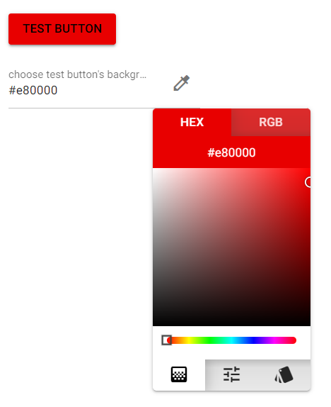

功能相关，一是`ui.on_exception`方法，用于响应客户端连接之后、页面内控件交互时触发的异常：

```python3
from nicegui import ui

async def index():
    ui.on_exception(
        lambda e:print(e)
    )
    def raise_error():
        raise Exception('erro has happened')
    # 点击按钮之后看终端输出
    ui.button('raise error',on_click=raise_error)
    await ui.context.client.connected()
    # 客户端连接之后看终端输出
    raise Exception('erro has happened')

ui.run(
    root=index,
    native=True
)
```

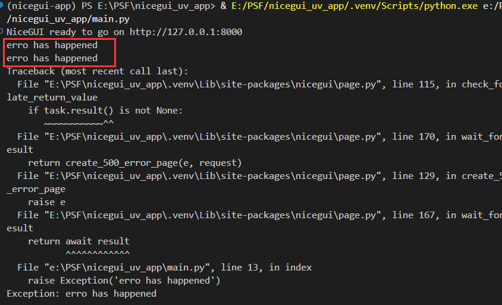

二是`ui.run`方法的布尔类型`show`参数增加字符串类型的支持。当该参数为字符串类型时，表示以网页模式启动后，使用默认浏览器打开指定页面，而非主页面：

```python3
from nicegui import ui

def index():
    ui.colors(
        primary = 'red',
        dark='yellow',
        my_color = 'green'
    )
    ui.link('go to page_a','/page_a')
    ui.button('Hello')
    ui.chip('Hello')
    ui.avatar('home')
    with ui.card():
        ui.button(
            'Hello',
            color='my-color'
        )
        ui.button(
            'Hello'
        ).style(
            'background-color:var(--q-my-color)!important;'
        )
    dark_mode = ui.dark_mode(True)
    ui.switch().bind_value(
        dark_mode
    )

@ui.page('/page_a')
def page_a():
    ui.link('go to index','/')
    ui.button('Hello')
    ui.chip('Hello')
    ui.avatar('home')
    with ui.card():
        ui.button(
            'Hello',
            color='my-color'
        )
        ui.button(
            'Hello'
        ).style(
            'background-color:var(--q-my-color)!important;'
        )
    dark_mode = ui.dark_mode(True)
    ui.switch().bind_value(
        dark_mode
    )

ui.run(
    root=index,
    show='/page_a'
)
```

注意，更新3.6.0版本之后，热重载功能存在问题，无法自动刷新页面，如果需要使用该功能，请及时更新至3.6.1版本。

## 14 设计页面的特殊区域

页面除了主内容区域外，还有一些特殊的区域，可以自由添加控件。这些区域的位置都是固定的，并且创建（使用）这些区域并不会影响这些区域的实际位置。

特殊区域相关的控件与其对应位置为：

- `ui.header`页头控件，对应位置为页头，即主内容区域的上方。
- `ui.footer`页脚控件，对应位置为页脚，即主内容区域的下方。
- `ui.left_drawer`左抽屉控件，对应位置为左抽屉，即主内容区域的左边，该区域的隐藏状态支持动态切换。
- `ui.right_drawer`右抽屉控件，对应位置为右抽屉，即主内容区域的右边，该区域的隐藏状态支持动态切换。
- `ui.page_sticky`便签控件，对应位置在主内容区域的八个边角。
- `ui.page_scroller`页面快速滚动控件，对应位置和`ui.page_sticky`便签控件一样在主内容区域的八个边角，但该控件多了一个点击之后跳转到页面最顶部、最底部的功能。

它们的位置关系如下：

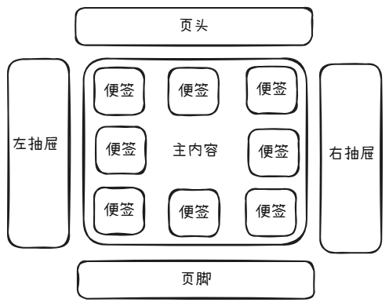

示例如下：

```python3
from nicegui import ui

def index():
    ui.label('主内容').classes('h-screen')
    with ui.header():
        ui.label('页头')
    with ui.footer():
        ui.label('页脚')
    with ui.left_drawer().classes('bg-grey'):
        ui.label('左抽屉')
    with ui.right_drawer().classes('bg-grey'):
        ui.label('右抽屉')
    with ui.page_sticky():
        ui.button('便签')
    with ui.page_scroller(
        position='top-right',
        scroll_offset=10,
        reverse=True
    ):
        ui.button('到底部')

ui.run(
    root=index,
    native=True
)
```

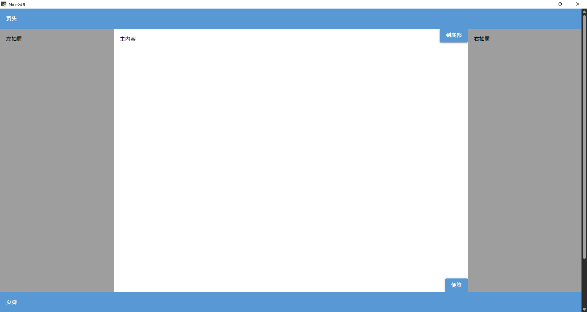

注意，如果窗口太小，左右抽屉默认为隐藏状态：

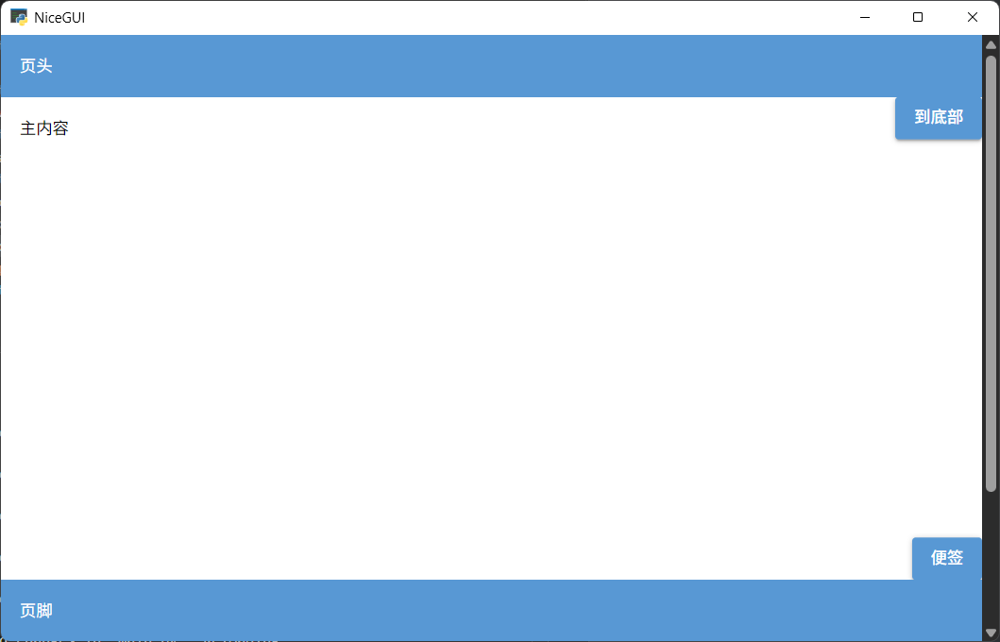

## 15 认识控件

NiceGUI的`ui`模块提供了程序所需的全部控件。不过控件数量较多、功能各异，为了方便读者快速了解，笔者将特点、用途类似的控件划分为一类，先按照类别简单介绍一下这些控件。

### 15.1 显示简单文本

想要在页面中显示一些简单文本的话，可以使用下面的控件：

- `ui.label`控件，直接显示文本。
- `ui.link`控件，将文本显示为超链接。
- `ui.link_target`控件，与超链接相关，用于创建一个锚点，但不显示任何文本。比如，`ui.link_target('link')`可以创建锚点`link`，使用`ui.link('link_target','#link')`可以创建指向该锚点的超链接，点击该超链接，页面会自动跳转到该控件所在位置。对于下面的示例，需要将页面高度调到无法看到全部控件，点击超链接才能看到跳转效果。
- `ui.chat_message`控件，将文本放入聊天消息的气泡中。
- `ui.badge`控件，将文本放入类似按钮的紧凑容器中，常用于当作现有控件的角标。

示例如下：

```python3
from nicegui import ui

def index():
    ui.link('link','#link')
    ui.label('label')
    ui.chat_message('chat_message')
    with ui.button(
        'button'
    ).props(
        'no-caps'
    ):
        ui.badge(
            'badge',
            color='red'
        ).props(
            'floating'
        )
    ui.link_target('link')

ui.run(
    root=index,
    native=True
)
```


### 15.2 渲染格式文本

有些格式文本会在渲染之后显示，显示出来的不是文本原文，而是特定的内容，比如下面的控件：

- `ui.markdown`控件，可以渲染使用Markdown语法的文本。
- `ui.restructured_text`控件，可以渲染使用RST语法（规则类似Markdown，但比较复杂且不如Markdown应用范围广）的文本。
- `ui.mermaid`控件，可以将使用Mermaid语法的文本渲染为流程图。
- `ui.code`控件，可以渲染代码的语法高亮。
- `ui.log`控件，可以逐条显示日志内容。如果推送日志时额外指定了样式，则该条日志会被渲染为对应样式。
- `ui.xterm`控件，可以使用Xterm终端渲染包含ANSI控制符的内容。

示例如下：

```python3
from nicegui import ui

def index():
    ui.markdown('*markdown*')
    ui.restructured_text(
        '*restructured_text*'
    )
    ui.mermaid(
        '''
        graph LR;
        A[NiceGUI] --> |Render| B{mermaid};
        '''
    )

ui.run(
    root=index,
    native=True
)
```

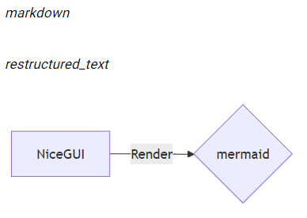

```python3
from nicegui import ui

def index():
    ui.code('print("Python Code")')
    ui.log(3).classes(
        'w-64 h-16'
    ).push(
        'log',
        classes='text-red-700'
    )
    ui.xterm(
        {
            'cols':20,
            'rows':3
        }
    ).write('\x1b[31mHello\x1b[0m')

ui.run(
    root=index,
    native=True
)
```

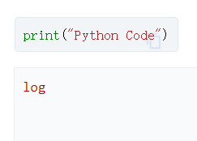

### 15.3 使用任意HTML标签

NiceGUI的页面本质上是网页，很多控件也是通过底层的前端框架和HTML标签实现的。如果想要直接使用HTML标签，可以使用下面的控件或者模块：

- `ui.element`控件，可以创建指定的HTML标签，但是想要在标签内添加内容的话，需要进入控件的上下文。

- `ui.html`控件，可以创建指定的HTML标签，并在标签内添加内容。

  注意，从NiceGUI 3.0.0版本开始，`ui.html`控件额外添加了一个关键字参数`sanitize`，用于强制过滤`content`参数中的注入攻击。官方建议给该值传入`Sanitizer().sanitize`（使用`from html_sanitizer import Sanitizer`导入，需要安装`html-sanitizer`库），但本教程因为默认没有安装`html-sanitizer`库，所以给该参数传入了`False`，禁用了安全过滤功能。但读者在实际使用时，请**不要**这样做。

- `html`模块，提供了部分常用的HTML标签，直接调用该模块中标签名对应的方法即可。但是，想要在标签内添加内容的话，需要进入控件的上下文。

示例如下：

```python3
from nicegui import ui,html

def index():
    with ui.element('h1'):
        ui.label('element')
    ui.html('html',tag='h1',sanitize=False)
    with html.h1():
        ui.label(text='html')

ui.run(
    root=index,
    native=True
)
```

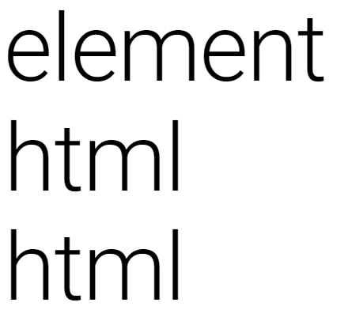

### 15.4 创建各种按钮

在NiceGUI的所有控件，唯有按钮相关的控件最多，因此，这些控件在创建按钮时都有用：

- `ui.button`控件，就是普通的按钮。
- `ui.button_group`控件，用于将多个普通按钮组合成一个外观上是单个按钮、功能上每个按钮都可以点击的巨大按钮。
- `ui.dropdown_button`控件，本身具备按钮功能，还能在其上下文中嵌入其他内容。点击右侧图标，会以下拉的形式弹出嵌入的内容。
- `ui.fab`控件，本身具备按钮功能，还能在其上下文中嵌入其他内容（建议嵌入`ui.fab_action`控件）。点击控件，即可弹出嵌入的内容。
- `ui.chip`控件，本身具备按钮功能，还支持选择、删除自身。

示例如下：

```python3
from nicegui import ui

def index():
    ui.button('button')
    with ui.button_group():
        ui.button('button1')
        ui.button('button2')
    with ui.dropdown_button(
        'dropdown_button',
        auto_close=True
    ):
        ui.item('item1')
        ui.item('item2')
    with ui.fab('menu',label='fab'):
        ui.fab_action('home')
        ui.fab_action('replay')
    ui.chip(
        'chip',
        selectable=True,
        removable=True
    )

ui.run(
    root=index,
    native=True
)
```


### 15.5 获取用户的选择

想要获取用户的选择，可以使用下面的控件：

- `ui.radio`控件，提供了只能单选的多个选项。
- `ui.toggle`控件，用法和`ui.radio`控件一样，不同的是，该控件看上去更像一个可以点击切换选项的按钮。
- `ui.select`控件，需要点击控件才能看到所有选项，允许单选、多选。
- `ui.checkbox`控件，点击之后可以切换选项选择状态，可用于组成多选的选项，也可以像一个开关一样单独使用。
- `ui.switch`控件，用法和`ui.checkbox`控件一样，不同的是，该控件看上去更像一个可以点击切换状态的开关。

示例如下：

```python3
from nicegui import ui

def index():
    ui.radio(
        ['a','b','c'],
        value='a'
    )
    ui.toggle(
        ['a','b','c'],
        value='a'
    )
    ui.select(
        ['a','b','c'],
        value='a',
        label='select'
    ).classes('w-32')
    ui.checkbox(
        'checkbox',
        value=True
    )
    ui.switch(
        'switch',
        value=True
    )

ui.run(
    root=index,
    native=True
)
```

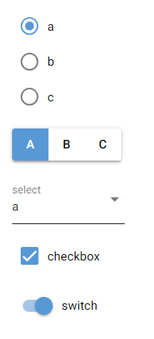

### 15.6 获取用户的直接输入

除了让用户点击控件，从给定的选项中选择，还可以使用下面的控件，让用户直接输入：

- `ui.input`控件，就是一个输入框，用户可以通过键盘输入任何内容。
- `ui.number`控件，外观、用法与`ui.input`控件基本相同，但该控件只允许输入数字，并提供了额外的按钮，用于快捷调整数字。
- `ui.input_chips`控件，外观、用法与`ui.input`控件基本相同，但该控件可以在按下`Enter`键之后将当前输入的内容转换为`ui.chip`控件，并支持继续转换后续输入的内容。当然，也可以在创建该控件时传入一个元素为字符串的列表，作为默认已经转换的`ui.chip`控件。
- `ui.color_input`控件，外观、用法与`ui.input`控件基本相同，但该控件主要用于获取具体颜色的表示方式，并提供了额外的按钮，用于弹出调色盘，用户的选择转换为颜色表达式。
- `ui.textarea`控件，允许用户输入多行内容。
- `ui.editor`控件，允许用户输入多行内容，同时该控件提供了一些设置内容格式的按钮。
- `ui.codemirror`控件，允许用户输入多行代码，并使用指定的编程语言语法高亮渲染输入的内容。
- `ui.json_editor`控件，允许用户输入JSON格式的内容，并自动验证输入的内容是否符合语法。

示例如下：

```python3
from nicegui import ui

def index():
    ui.input('input',value='a')
    ui.number('number',value=0)
    ui.input_chips(
        'input_chips',
        value=['a','b','c']
    )
    ui.color_input(
        'color_input',
        value='rgb(255,0,0)'
    )
    ui.textarea(
        'textarea',
        value='Hello'
    )
    ui.editor(
        value='Hello'
    ).classes('h-16')
    ui.codemirror(
        'print("hello")',
        language='python'
    ).classes('h-16 w-64')
    ui.json_editor(
        {
            'content': {
                'json': {
                    'name':'json_editor'
                }
            }
        }
    ).classes('h-16')

ui.run(
    root=index,
    native=True
)
```


### 15.7 获取用户的间接输入

有些用户输入可以直接获取，有些用户“输入”则需要通过下面的控件转换之后才能获取：

- `ui.slider`控件，用户拖动滑块之后，将滑块位置转换为具体数值。
- `ui.range`控件，和`ui.slider`控件类似，用户拖动滑块之后，将滑块位置转换为具体数值。不过，与`ui.slider`控件不同的是，该控件有两个滑块，得到的是两个数值，即两个滑块所代表的范围值。
- `ui.knob`控件，用法上和`ui.slider`控件类似（参数不完全一样），只不过外观上是一个旋钮。
- `ui.rating`控件，用法上和`ui.slider`控件类似（参数不完全一样），但最小值是固定的，外观上就是常见的评分控件，通过点击确定具体数值。
- `ui.color_picker`控件，用于弹出调色盘，让用户选择颜色。
- `ui.upload`控件，让用户上传文件。
- `ui.joystick`控件，提供一个虚拟的摇杆，捕获用户操作摇杆的具体动作。
- `ui.date`控件，让用户选择日期。
- `ui.time`控件，让用户选择时间。
- `ui.date_input`控件，点击输入框的嵌入图标之后弹出`ui.date`控件，让用户选择日期。
- `ui.time_input`控件，点击输入框的嵌入图标之后弹出`ui.time`控件，让用户选择时间。

示例如下：

```python3
from nicegui import ui

def index():
    ui.slider(
        min=0,
        max=10,
        value=2
    )
    ui.range(
        min=0,
        max=10,
        value={
            'min':2,
            'max':4
        }
    )
    ui.knob(
        2,
        min=0,
        max=10
    )
    ui.rating(
        max=10,
        value=2
    )
    with ui.button('color_picker'):
        ui.color_picker()
    ui.upload()
    ui.joystick(
        on_move=lambda e:print(e)
    )
    ui.date('2026-01-01')
    ui.time('20:26')
    ui.date_input(value='2026-01-01')
    ui.time_input(value='20:26')

ui.run(
    root=index,
    native=True
)
```


### 15.8 显示图片

在NiceGUI程序中，想要显示图形，通常使用下面的控件：

- `ui.image`控件，简单显示提供的图片。
- `ui.interactive_image`控件，在显示图片的基础上，提供了额外的内容和交互功能。

示例如下：

```python3
from nicegui import ui

def index():
    ui.image(
        'https://nicegui.io/static/logo.png'
    ).classes('w-64 h-64')
    ui.interactive_image(
        'https://nicegui.io/static/logo.png'
    ).classes('w-64 h-64')

ui.run(
    root=index,
    native=True
)
```


默认情况下，两种控件的基本用法相同，但`ui.interactive_image`控件会自动调整图片的比例，让其适应控件本身的大小。`ui.interactive_image`控件还支持一些额外的交互和SVG内容：

```python3
from nicegui import ui

def index():
    ui.interactive_image(
        'https://nicegui.io/static/logo.png',
        size=(100,120),
        content=f'''
            <circle
                cx='120'
                cy='180' 
                r='10' 
                fill='green'
            />
        ''',
        on_mouse=lambda e:e.sender.set_content(
            f'''
                <circle
                    cx='{e.image_x}'
                    cy='{e.image_y}' 
                    r='10' 
                    fill='red'
                />
            '''
        )
    )

ui.run(
    root=index,
    native=True
)
```


### 15.9 播放音视频

在NiceGUI程序中，音频和视频对应的控件用法基本相同，只是外观有所不同：

- `ui.audio`控件，播放音频。
- `ui.video`控件，播放视频。

示例如下：

```python3
from nicegui import ui

def index():
    ui.audio(
        'https://www.soundhelix.com/examples/mp3/SoundHelix-Song-1.mp3'
    )
    ui.video(
        'https://test-videos.co.uk/vids/bigbuckbunny/mp4/h264/360/Big_Buck_Bunny_360_10s_1MB.mp4'
    )

ui.run(
    root=index,
    native=True
)
```


### 15.10 显示矢量图（SVG或者其他格式）

除了前面提到过的图片文件，NiceGUI还支持矢量图。所谓矢量图，即不是记录所有像素、而是记录图形绘制方法的图片，其内容不会因为缩放而变得模糊。

以下控件的内容都是矢量图：

- `ui.icon`控件，用于显示SVG格式或者PNG格式的图标。
- `ui.avatar`控件，和`ui.icon`控件支持的图标一样，但该控件默认套了一个边框，用于表示头像。
- `ui.spinner`控件，提供了一些使用SVG作为基础图形的加载动画。
- `ui.html`控件，没错，该控件也支持SVG，但是用法没有前面几个控件简单，需要传入SVG源代码，然后该控件会将其渲染为矢量图。

示例如下：

```python3
from nicegui import ui

def index():
    ui.icon(
        'home',
        size='6em'
    )
    ui.avatar(
        'home',
        size='6em'
    )
    ui.avatar(
        'img:https://nicegui.io/logo_square.png',
        size='6em'
    )
    ui.spinner(size='6em')
    ui.html(
        '''
        <svg viewBox='0 0 200 200' width='100' height='100'>
        <circle cx='100' cy='100' r='78' fill='#ffde34' stroke='black' stroke-width='3' />
        <circle cx='80' cy='85' r='8' />
        <circle cx='120' cy='85' r='8' />
        <path 
        d='m60,120 C75,150 125,150 140,120' 
        style='fill:none; stroke:black; stroke-width:8; stroke-linecap:round' 
        />
        </svg>
        ''',
        sanitize=False
    )

ui.run(
    root=index,
    native=True
)
```


### 15.11 显示进度

下面的控件用于显示进度，都是进度条控件：

- `ui.linear_progress`控件，常见的直线进度条。
- `ui.circular_progress`控件，使用圆形表示进度的进度条。

示例如下：

```python3
from nicegui import ui

def index():
    ui.linear_progress(
        0.6
    )
    ui.circular_progress(
        0.6
    )

ui.run(
    root=index,
    native=True
)
```


### 15.12 显示表格

NiceGUI提供了两种显示表格的控件：

- `ui.table`控件，为内置的表格实现，由Quasar框架提供，优点是用法简单，但很多功能不够强大。
- `ui.aggrid`控件，由AG Grid框架提供，功能强大，有付费的企业版本，同时用法也会复杂一些。

示例如下：

```python3
from nicegui import ui

def index():
    ui.table(
        columns=[
            {
                'label': 'Name', 
                'field': 'name'
            },
            {
                'label': 'Age', 
                'field': 'age'
            },
        ],
        rows=[
            {'name': 'Alice', 'age': 18},
            {'name': 'Bob', 'age': 21},
            {'name': 'Carol'},
        ]
    )
    ui.aggrid(
        {
            'columnDefs': [
                {
                    'headerName': 'Name', 
                    'field': 'name'
                },
                {
                    'headerName': 'Age', 
                    'field': 'age'
                },
            ],
            'rowData': [
                {'name': 'Alice', 'age': 18},
                {'name': 'Bob', 'age': 21},
                {'name': 'Carol'},
            ]
        }
    )

ui.run(
    root=index,
    native=True
)
```

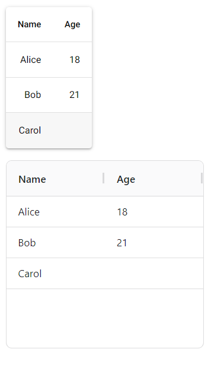

### 15.13 渲染线形图

以下控件可以将提供的数据渲染为线形图：

- `ui.matplotlib`控件，使用`matplotlib`库绘制线形图，可以使用`with`进入`figure`属性的上下文，调用上下文对象的子对象的`plot`方法绘制线形图。

  注意，`ui.matplotlib`控件依赖`matplotlib`库，需要先安装依赖库才能使用对应控件。可以参考安装NiceGUI一章，使用`uv add nicegui[matplotlib]`命令提前添加依赖库。

  示例如下：

  ```python3
  from nicegui import ui
  
  def index():
      with ui.matplotlib().classes(
          'w-64 h-64'
      ).figure as fig:
          fig.gca().plot(
              [
                  0, 1, 2
              ],
              [
                  1, 2, 4
              ]
          )
      with ui.matplotlib().classes(
          'w-64 h-64'
      ).figure as fig:
          fig.add_subplot().plot(
              [
                  0, 1, 2
              ],
              [
                  1, 2, 4
              ]
          )
  
  ui.run(
      root=index,
      native=True
  )
  ```

  

- `ui.pyplot`控件，使用`matplotlib`库绘制线形图，可以使用`with`进入控件的上下文，调用上下文对象`fig`属性的子对象的`plot`方法绘制线形图。除了在控件上下文中调用上下文对象`fig`属性的子对象的`plot`方法绘制线形图，也可以直接调用`matplotlib.pyplot`模块的`plot`方法绘制线形图。

  注意，`ui.pyplot`控件依赖`matplotlib`库，需要先安装依赖库才能使用对应控件。可以参考安装NiceGUI一章，使用`uv add nicegui[matplotlib]`命令提前添加依赖库。

  示例如下：

  ```python3
  from nicegui import ui
  
  def index():
      with ui.pyplot().classes(
          'w-64 h-64'
      ) as plt:
          plt.fig.gca().plot(
              [
                  0, 1, 2
              ],
              [
                  1, 2, 4
              ]
          )
      with ui.pyplot().classes(
          'w-64 h-64'
      ) as plt:
          plt.fig.add_subplot().plot(
              [
                  0, 1, 2
              ],
              [
                  1, 2, 4
              ]
          )
  
      from matplotlib import pyplot
      with ui.pyplot().classes(
          'w-64 h-64'
      ):
          pyplot.plot(
              [
                  0, 1, 2
              ],
              [
                  1, 2, 4
              ]
          )
  
  ui.run(
      root=index,
      native=True
  )
  ```

  

- `ui.line_plot`控件，使用`matplotlib`库绘制线形图，可以使用`with`进入控件的上下文，调用上下文对象`fig`属性的子对象的`plot`方法绘制线形图；也可以使用`with`进入控件的上下文或者不进入上下文，直接调用控件的`push`方法绘制线形图。此外，调用`with_legend`方法，还能添加图例。

  注意，`ui.line_plot`控件依赖`matplotlib`库，需要先安装依赖库才能使用对应控件。可以参考安装NiceGUI一章，使用`uv add nicegui[matplotlib]`命令提前添加依赖库。

  示例如下：

  ```python3
  from nicegui import ui
  
  def index():
      with ui.line_plot().classes(
          'w-64 h-64'
      ) as lp:
          lp.fig.clear()
          lp.fig.gca().plot(
              [
                  0, 1, 2
              ],
              [
                  1, 2, 4
              ]
          )
          lp.with_legend(['number'])
  
      with ui.line_plot().classes(
          'w-64 h-64'
      ) as lp:
          lp.fig.clear()
          lp.fig.add_subplot().plot(
              [
                  0, 1, 2
              ],
              [
                  1, 2, 4
              ]
          )
          lp.with_legend(['number'])
          
      with ui.line_plot().classes(
          'w-64 h-64'
      ) as lp:
          lp.push(
              [
                  0, 1, 2
              ],
              [
                  [1, 2, 4]
              ]
          )
          lp.with_legend(['number'])
  
      ui.line_plot().classes(
          'w-64 h-64'
      ).push(
              [
                  0, 1, 2
              ],
              [
                  [1, 2, 4]
              ]
          )
      
      ui.line_plot().classes(
          'w-64 h-64'
      ).with_legend(
          ['number']
      ).push(
              [
                  0, 1, 2
              ],
              [
                  [1, 2, 4]
              ]
          )
  
  ui.run(
      root=index,
      native=True
  )
  ```

  

- `ui.plotly`控件，使用`plotly`库绘制线形图。

  注意，`ui.plotly`控件依赖`plotly`库，需要先安装依赖库才能使用对应控件。可以参考安装NiceGUI一章，使用`uv add nicegui[plotly]`命令提前添加依赖库。

  示例如下：

  ```python3
  from nicegui import ui
  
  def index():
      import plotly.graph_objects as go
      ui.plotly(
          go.Figure(
              go.Scatter(
                  x=[0, 1, 2],
                  y=[1, 2, 4]
              ),
              layout={
                  'margin': {
                      'l': 0,
                      'r': 0,
                      't': 0,
                      'b': 0
                  }
              }
          )
      ).classes('w-64 h-64')
      ui.plotly(
          {
              'data': [
                  {
                      'type': 'scatter',
                      'line': {'color': '#636EFA'},
                      'x': [0, 1, 2],
                      'y': [1, 2, 4],
                  }
              ],
              'layout': {
                  'margin': {
                      'l': 20,
                      'r': 0,
                      't': 0,
                      'b': 25
                  },
                  'plot_bgcolor': '#E5ECF6',
                  'xaxis': {
                      'gridcolor': 'white',
                      'dtick': '0.5',
                      'zeroline': False
                  },
                  'yaxis': {
                      'gridcolor': 'white',
                      'dtick': '0.5',
                      'zeroline': False
                  },
              }
          }
      ).classes('w-64 h-64')
  
  ui.run(
      root=index,
      native=True
  )
  ```
  
  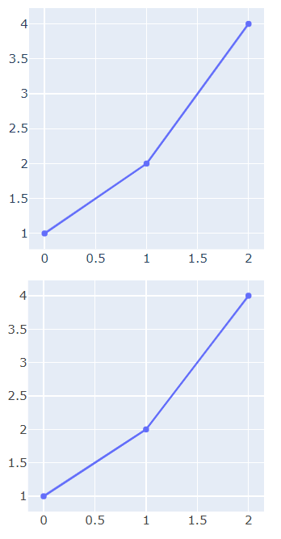

### 15.14 渲染图表

以下控件可以将提供的数据渲染为表格图形：

- `ui.highchart`控件，使用Highcharts框架渲染图表，支持多种类型的图表。但是，Highcharts框架商用需要付费。

  注意，`ui.highchart`控件依赖`nicegui-highcharts`库，需要先安装依赖库才能使用对应控件。可以参考安装NiceGUI一章，使用`uv add nicegui[highcharts]`命令提前添加依赖库。

- `ui.echart`控件，使用ECharts框架渲染图表，支持多种类型的图表，商用无需付费。

- `ui.altair`控件，使用`altair`库渲染交互式图表。

示例如下：

```python3
from nicegui import ui
import altair
import pandas as pd

def index():
    ui.highchart(
        {
            'title': {'text': 'A and B'},
            'chart': {'type': 'bar'},
            'xAxis': {
                'categories': ['A', 'B']
            },
            'yAxis': {
                'title': False,
            },
            'series': [
                {
                    'name': '2025',
                    'data': [0.1, 0.2]
                },
                {
                    'name': '2026',
                    'data': [0.3, 0.4]
                },
            ],
            'credits': {'enabled': False}
        }
    ).classes('w-64 h-64')
    ui.echart(
        {
            'title': {'text': 'A and B'},
            'xAxis': {'type': 'value'},
            'yAxis': {
                'type': 'category',
                'data': ['A', 'B'],
                'inverse': True
            },
            'legend': {'show': True},
            'series': [
                {
                    'type': 'bar',
                    'name': '2025',
                    'data': [0.1, 0.2]
                },
                {
                    'type': 'bar',
                    'name': '2026',
                    'data': [0.3, 0.4]
                },
            ],
        }
    ).classes('w-64 h-64')
    ui.altair(
        altair.Chart(
            pd.DataFrame(
                {
                    'x': [
                        'A', 'B', 'C', 'D', 'E'
                    ],
                    'y': [
                        5, 3, 6, 7, 2
                    ]
                }
            )
        ).mark_bar().encode(
            x='y',
            y='x',
        )
    )

ui.run(
    root=index,
    native=True
)
```

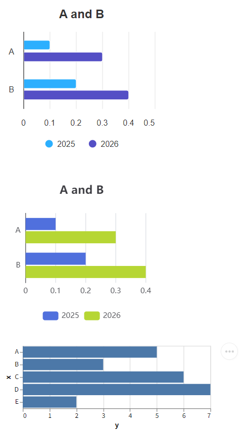

### 15.15 渲染复杂数据

除了前面提到的数据图形化展示方式之外，下面的控件提供了针对特定类型数据、文件的展示方式：

- `ui.tree`控件，用于渲染树类型的数据。

  示例如下：

  ```python3
  from nicegui import ui
  
  def index():
      ui.tree(
          nodes=[
              {
                  'id': 'lang',
                  'label': 'Language',
                  'icon': 'dashboard',
                  'children': [
                      {
                          'id': '1',
                          'label': 'Python'
                      },
                      {
                          'id': '2',
                          'label': 'JavaScript'
                      }
                  ]
              },
          ],
          node_key='id',
          label_key='label',
          children_key='children',
          on_select=lambda e: ui.notify(
              f'选择了 {e.value}'
          ),
          on_expand=lambda e: ui.notify(
              f'展开了 {e.value}'
          ),
          on_tick=lambda e: ui.notify(
              f'勾选了 {e.value}'
          ),
      ).expand()
  
  ui.run(
      root=index,
      native=True
  )
  ```

  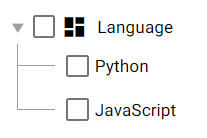

- `ui.leaflet`控件，用于渲染地图数据。

  示例如下：

  ```python3
  from nicegui import ui
  
  def index():
      ui.leaflet(
          center=(39.9072, 116.3912),
          zoom=18,
          options={
              'attributionControl':False,
          }
      ).classes(
          'w-64 h-64'
      ).marker(
          latlng=(39.9072, 116.3912)
      )
  
  ui.run(
      root=index,
      native=True
  )
  ```

  

- `ui.scene`控件、`ui.scene_view`控件，使用ThreeJs框架渲染三维模型，前者为可以交换的3D视图，后者则是基于前者创建、不可交互的固定视角视图。

  示例如下：

  ```python3
  from nicegui import ui
  
  def index():
      scene = ui.scene().classes(
          'w-64 h-64'
      )
      scene.box().material(
          'red'
      )
      ui.scene_view(scene).classes(
          'w-64 h-64'
      )
      
  ui.run(
      root=index,
      native=True
  )
  ```
  
  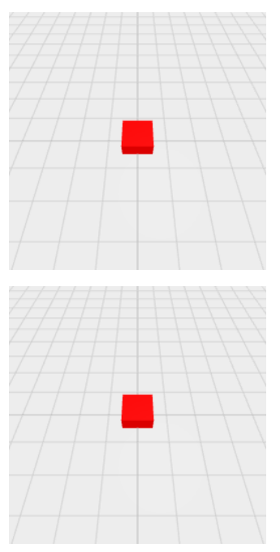

### 15.16 创建布局

尽管前面介绍布局的时候已经说了几种和布局相关的控件，但那些只是常用的控件，本节开始，将介绍所有和布局有关的控件。

以下是可以创建布局的控件：

- `ui.column`控件，在上下文中添加的控件排成一列。
- `ui.row`控件，在上下文中添加的控件排成一行。
- `ui.grid`控件，在上下文中添加的控件都放在指定规格（默认为`1x1`）的单元格中。
- `ui.list`控件，在上下文中添加的`ui.item`控件、`ui.menu_item`控件、`ui.slide_item`控件排成一列，看上去与`ui.column`控件类似，但该控件的子控件之间更加紧凑。
- `ui.card`控件、`ui.card_actions`控件、`ui.card_section`控件，`ui.card`控件表示卡片主体，在上下文中添加的控件会放在默认带边框的卡片中；`ui.card_actions`控件表示卡片的动作区域，只能在`ui.card`控件的上下文添加，一般在该控件上下文添加可以点击的控件，并且默认靠左对齐；`ui.card_section`控件表示内容分区，只能在`ui.card`控件的上下文添加，一般在该控件上下文添加只是显示内容的控件，并且默认居中对齐。
- `ui.item`控件、`ui.item_label`控件、`ui.item_section`控件，通常组合在一起使用，共同组成一个内容项目的整体，每个控件对应着内容的指定部分。

示例如下：

```python3
from nicegui import ui

def index():
    with ui.list().classes(
        'border-2 border-red-700'
    ):
        for i in range(4):
            ui.item(str(i))
    with ui.column().classes(
        'border-2 border-red-700'
    ):
        for i in range(4):
            ui.item(str(i))
    with ui.card():
        ui.label('card')
        with ui.card_section():
            ui.label('card section')
        with ui.card_actions():
            ui.button('Yes')
            ui.button('No')
    with ui.item('item'):
        with ui.item_section():
            ui.item_label('label1')
            ui.item_label('label2').props(
                'caption'
            )
        with ui.item_section().props(
            'side'
        ):
            ui.icon('home')

ui.run(
    root=index,
    native=True
)
```

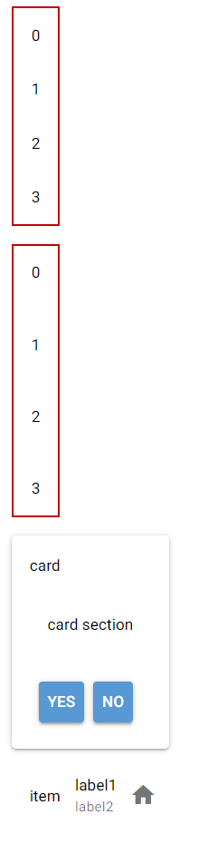

### 15.17 辅助设计布局

除了直接创建布局，还有一些控件可以让布局的设计更加灵活、美观、直观：

- `ui.separator`控件，创建一个占用空间极小且不太明显的分隔符。
- `ui.space`控件，填充布局方向上可用的剩余空间。
- `ui.skeleton`控件，创建一个代替控件的占位控件，通常在页面没有完全加载时表示页面的布局。

示例如下：

```python3
from nicegui import ui

def index():
    with ui.column().classes(
        'border-2 border-red-700 h-64 w-32'
    ):
        ui.skeleton('QBtn')
        ui.space()
        ui.separator()
        ui.skeleton('QChip')

ui.run(
    root=index,
    native=True
)
```


### 15.18 调整布局空间

前面控件创建的布局，所有子控件都是平铺展示，一旦控件较多，布局就会占据较多空间，甚至超出屏幕，只能滚动页面查看超出屏幕的部分。

不过，下面的控件可以调整布局占据的空间：

- `ui.expansion`控件，可以通过向下展开的方式扩展空间，显示原本隐藏的控件。

  示例如下：

  ```python3
  from nicegui import ui
  
  def index():
      with ui.card(),ui.expansion(
          'More',
          caption='info'
      ).props('header-class=bg-blue'):
          ui.button('Hello')
          ui.button('World')
      with ui.card(),ui.expansion(
          'More',
          caption='info',
          value=True
      ).props('header-class=bg-blue'):
          ui.button('Hello')
          ui.button('World')
  
  ui.run(
      root=index,
      native=True
  )
  ```

  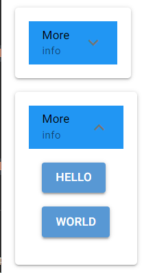

- `ui.scroll_area`控件，将原本固定大小的区域，变成可以无限扩展的滚动区域，确保可以容纳所有控件。

  示例如下：

  ```python3
  from nicegui import ui
  
  def index():
      with ui.card(),ui.scroll_area().classes(
          'w-64 h-64'
      ):
          for i in range(99):
              ui.button(
                  str(i)
              )
  
  ui.run(
      root=index,
      native=True
  )
  ```

  

- `ui.slide_item`控件，创建一个可以四向滑动的固定区域，向对应方向的反方向滑动，会将当前区域变为对应方向的独立区域，所有区域都可以放置其他控件。

  示例如下：

  ```python3
  from nicegui import ui
  
  def index():
      with ui.list().classes(
          'border-2 border-red-700'
      ), ui.slide_item(
          'center'
      ).classes(
          'w-32'
      ) as slide:
          ui.label('center')
      with slide.left(
          'left',
          on_slide=slide.reset
      ):
          ui.label('left')
      with slide.right(
          'right',
          on_slide=slide.reset
      ):
          ui.label('right')
      with slide.top(
          'top',
          on_slide=slide.reset
      ):
          ui.label('top')
      with slide.bottom(
          'bottom',
          on_slide=slide.reset
      ):
          ui.label('bottom')
  
  ui.run(
      root=index,
      native=True
  )
  ```

  

- `ui.splitter`控件，创建一个划分为左中右（或者上中下）三块区域的区域，可以通过拖动中间区域（实际上是一条间隔线）来改变其余两块区域的大小。

  示例如下：

  ```python3
  from nicegui import ui
  
  def index():
      with ui.card():
          splitter = ui.splitter(
              value=75
          ).classes('w-64 h-64')
          with splitter.separator:
              ui.icon('lightbulb')
          with splitter.before:
              ui.card().classes(
                  'w-full h-full bg-red'
              )
          with splitter.after:
              ui.card().classes(
                  'w-full h-full bg-blue'
              )
  
  ui.run(
      root=index,
      native=True
  )
  ```
  
  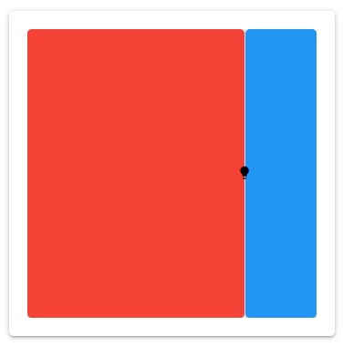

### 15.19 管理多页内容

对于内容多到需要分页的情况，下面的控件可以很好处理这种情况：

- `ui.tabs`控件、`ui.tab`控件、`ui.tab_panels`控件、`ui.tab_panel`控件，共同组成完整的选项卡控件。其中，`ui.tabs`控件为选项卡的页标签容器，用于容纳表示页标签的`ui.tab`控件。`ui.tab_panels`控件是标签页的容器，用于容纳表示标签页的`ui.tab_panel`控件。标签页用于容纳需要分页的内容，点击页标签，标签页容器也会切换到对应的标签页。

  示例如下：

  ```python3
  from nicegui import ui
  
  def index():
      with ui.tabs().props(
          'no-caps'
      ) as tabs:
          ui.tab(
              'a',
              label='标签a'
          )
          ui.tab(
              'b',
              label='标签b'
          )
      with ui.tab_panels(
          tabs,
          value='a'
      ).classes(
          'w-64 h-64 border'
      ):
          with ui.tab_panel('a'):
              ui.label('标签页a')
          with ui.tab_panel('b'):
              ui.label('标签页b')
  
  ui.run(
      root=index,
      native=True
  )
  ```

  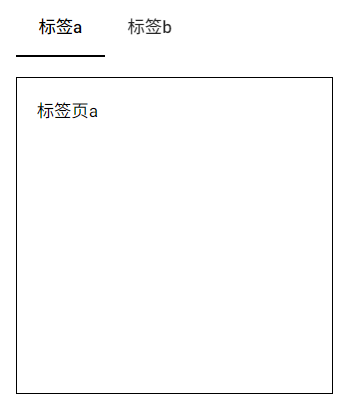

- `ui.carousel`控件、`ui.carousel_slide`控件，共同组成轮播图控件，用法类似选项卡控件，只不过轮播图控件没有页标签，直接就是标签页。`ui.carousel`控件就是`ui.carousel_slide`控件的容器，`ui.carousel_slide`控件用于容纳需要分页的内容。

  示例如下：

  ```python3
  from nicegui import ui
  
  def index():
      with ui.carousel(
          arrows=True,
          navigation=True,
          animated=True
      ).classes('w-64 h-64 border'):
          with ui.carousel_slide().classes(
              'border bg-red'
          ):
              ui.label('内容a')
          with ui.carousel_slide().classes(
              'border bg-blue'
          ):
              ui.label('内容b')
  
  ui.run(
      root=index,
      native=True
  )
  ```

  

- `ui.pagination`控件，用于切换内容的分页，该控件提供了页码显示和调整功能。

  示例如下：

  ```python3
  from nicegui import ui
  
  def index():
      label = ui.label('当前页为第1页')
      ui.pagination(
          1,
          5,
          direction_links=True,
          value=1,
          on_change=lambda e:label.set_text(
              f'当前页为第{e.value}页'
          )
      )
  
  ui.run(
      root=index,
      native=True
  )
  ```

  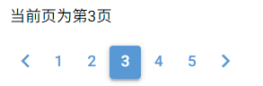

- `ui.stepper`控件、`ui.step`控件、`ui.stepper_navigation`控件，共同组成步骤控件，用于将需要分页的内容按步骤显示，具体结构如下图所示：

  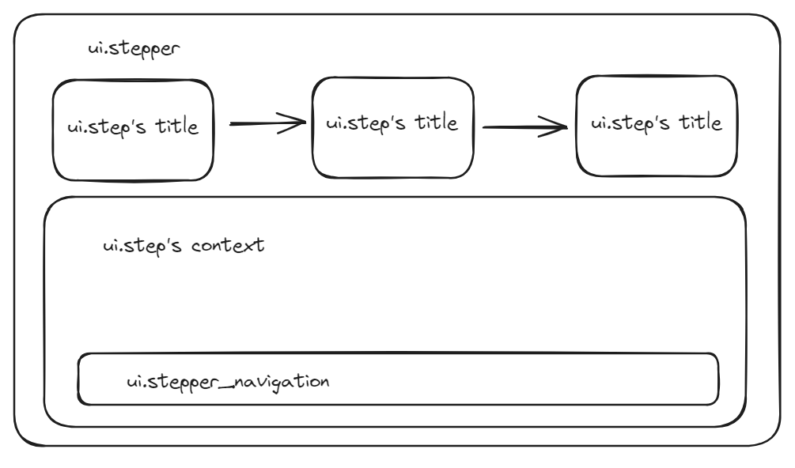

  其中，`ui.stepper`控件是所有步骤的容器；`ui.step`控件为具体的步骤，必须设置不重复的`name`参数；`ui.stepper_navigation`控件用于放置控制当前步骤的按钮。

  示例如下：

  ```python3
  from nicegui import ui
  
  def index():
      with ui.stepper() as stepper:
          with ui.step('first'):
              ui.label('first')
              with ui.stepper_navigation():
                  ui.button(
                      'next',
                      on_click=stepper.next
                  )
          with ui.step('second'):
              ui.label('second')
              with ui.stepper_navigation():
                  ui.button(
                      'next',
                      on_click=stepper.next
                  )
                  ui.button(
                      'back',
                      on_click=stepper.previous
                  ).props('flat')
          with ui.step('third'):
              ui.label('third')
              with ui.stepper_navigation():
                  ui.button(
                      'done',
                      on_click=lambda :ui.notify(
                          'done'
                      )
                  )
                  ui.button(
                      'back',
                      on_click=stepper.previous
                  ).props('flat')
  
  ui.run(
      root=index,
      native=True
  )
  ```

  

- `ui.timeline`控件、`ui.timeline_entry`控件，共同组成时间线控件，其中，`ui.timeline`控件是容器，`ui.timeline_entry`控件是具体时间点对应的内容。

  示例如下：

  ```python3
  from nicegui import ui
  
  def index():
      with ui.timeline(side='right'):
          ui.timeline_entry('first')
          ui.timeline_entry('second')
          ui.timeline_entry('third')
  
  ui.run(
      root=index,
      native=True
  )
  ```
  
  

### 15.20 使用菜单

NiceGUI提供了两种菜单，分别是左键点击弹出的一般菜单和右键点击弹出上下文菜单。想要创建它们，会涉及到以下控件：

- `ui.menu_item`控件，用于创建一般的菜单项，只能用于一般菜单、上下文菜单中。

- `ui.menu`控件，用于创建一般菜单。如果是在其他控件的上下文中创建，则点击其他控件，自动弹出菜单。

  示例如下：

  ```python3
  from nicegui import ui
  
  def index():
      with ui.button(icon='menu'):
          with ui.menu() as menu:
              ui.menu_item('auto close')
              ui.menu_item(
                  'no auto close',
                  auto_close=False
              )
              ui.separator()
              ui.menu_item(
                  'manual close',
                  auto_close=False,
                  on_click=menu.close
              )
  
  ui.run(
      root=index,
      native=True
  )
  ```

  

- `ui.context_menu`控件，用于创建上下文菜单。用法与`ui.menu`控件相同，但只能通过右键弹出菜单。

  示例如下：

  ```python3
  from nicegui import ui
  
  def index():
      with ui.button(icon='menu'):
          with ui.context_menu() as menu:
              ui.menu_item('auto close')
              ui.menu_item(
                  'no auto close',
                  auto_close=False
              )
              ui.separator()
              ui.menu_item(
                  'manual close',
                  auto_close=False,
                  on_click=menu.close
              )
  
  ui.run(
      root=index,
      native=True
  )
  ```
  
  

### 15.21 弹出提示信息

NiceGUI还提供了一类弹出提示信息的控件，用于提醒用户：

- `ui.tooltip`控件，添加到任意控件的上下文，可以给其添加一个鼠标悬停后弹出的工具提示。比如：

  ```python3
  from nicegui import ui
  
  def index():
      with ui.button('tooltip'):
          ui.tooltip('Hello')
  
  ui.run(
      root=index,
      native=True
  )
  ```

  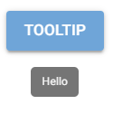

  另外，大部分控件支持`tooltip`方法，可以实现同样的效果：

  ```python3
  from nicegui import ui
  
  def index():
      ui.button(
          'tooltip'
      ).tooltip(
          'Hello'
      )
  
  ui.run(
      root=index,
      native=True
  )
  ```

- `ui.notify`控件，创建之后立马弹出一条文字消息。

  示例如下：

  ```python3
  from nicegui import ui
  
  def index():
      ui.button(
          'notify',
          on_click=lambda:ui.notify(
              'Hello'
          )
      )
  
  ui.run(
      root=index,
      native=True
  )
  ```

  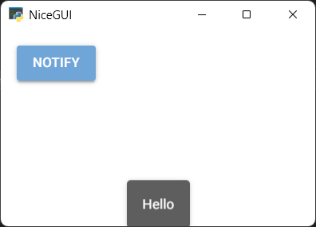

- `ui.notification`控件，用法和效果与`ui.notify`控件基本相同，但该控件允许更新消息的内容，也支持主动通过`dismiss`方法隐藏消息，一般用于提供实时更新的弹出消息。

  示例如下：

  ```python3
  from nicegui import ui
  import asyncio
  
  def index():
      async def notify():
          n = ui.notification(
              'Hello',
              timeout=None
          )
          await asyncio.sleep(2)
          n.message = 'World'
          await asyncio.sleep(1)
          n.dismiss()
      ui.button(
          'notification',
          on_click=notify
      )
  
  ui.run(
      root=index,
      native=True
  )
  ```

  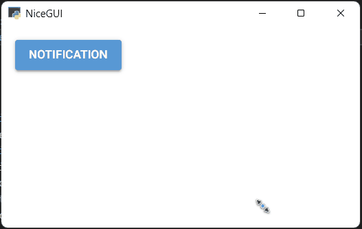

- `ui.dialog`控件，用于弹出一个基于控件设计界面、非系统原生的对话框。

  示例如下：

  ```python3
  from nicegui import ui
  
  def index():
      with ui.dialog() as dialog,ui.card():
          ui.label('dialog')
          ui.button(
              'close',
              on_click=dialog.close
          )
      ui.button(
          'dialog',
          on_click=dialog.open
      )
  
  ui.run(
      root=index,
      native=True
  )
  ```
  
  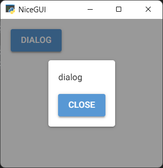

## 版本速览——3.7.0版本新增对UnoCSS框架的支持

NiceGUI 3.7.0 新增对UnoCSS框架（https://unocss.dev/）的支持，成为替代Tailwind CSS框架（https://tailwindcss.com/）的轻量级选择，并且具备以下特点：

- 文件体积更小，加载速度更快。
- 兼容Tailwind CSS框架（仅限`'wind3'`和`'wind4'`版本）的语法。

注意，因为UnoCSS框架是Tailwind CSS框架的替代，一旦启用，NiceGUI将自动禁用Tailwind CSS框架。

`ui.run`方法增加`unocss`参数，用于启用UnoCSS框架。该参数的三个值对应框架的三个版本：

- `'mini'`表示迷你版本，该版本仅支持最基本、必要的功能，但文件体积最小。完整用法可参考 https://unocss.dev/presets/mini 。
- `'wind3'`表示Tailwind CSS框架3.0版本，该版本兼容Tailwind CSS框架3.0版本的语法，一定程度上算是Tailwind CSS框架3.0版本的平替。完整用法可参考 https://unocss.dev/presets/wind3 。
- `'wind4'`表示Tailwind CSS框架4.0版本，该版本兼容Tailwind CSS框架4.0版本的语法，一定程度上算是Tailwind CSS框架4.0版本的平替，同时兼容Tailwind CSS框架3.0版本的语法。完整用法可参考 https://unocss.dev/presets/wind4 。

示例如下：

```python3
from nicegui import ui

def index():
    ui.label('Hello').classes('bg-blue-500')

ui.run(
    root=index,
    native=True,
    unocss='mini',
    tailwind=False
)
```

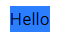

读者可以依次注释掉`unocss`参数、`tailwind`参数所在行，查看样式的效果，借此判断相关样式框架是否生效。

注意，如果读者使用的是Windows系统，并且安装了可以打开`.mjs`文件的编辑器或者开发工具，升级NiceGUI 3.7.0可能会导致程序无法正常显示，可以将下面代码添加到程序开头临时解决：

```python3
import mimetypes
mimetypes.add_type('text/javascript', '.mjs')
```

或者更新至NiceGUI 3.7.1及以上版本。

或者修改注册表`\HKEY_CLASSES_ROOT\.mjs`下`Content Type`键的值为`text/javascript`（这个方法不推荐，因为不太稳定，有可能被其他软件再次修改）。

## 16 使用环境变量

原文参考自 https://nicegui.io/documentation/section_configuration_deployment#environment_variables 。

在NiceGUI中，有些设置项只能通过修改环境变量实现：

- `MATPLOTLIB`，默认为`'true'`，表示是否自动导入`matplotlib`(`ui.matplotlib`控件、`ui.pyplot`控件和`ui.line_plot`控件依赖此库），可以将此环境变量设置为`'false'`来避免自动导入，减少导入`nicegui`所需的时间，同时也会导致`ui.matplotlib`控件、`ui.pyplot`控件和`ui.line_plot`控件无法使用。

  以下为用于对比的示例，读者可以修改环境变量值，冷启动（完全退出再重新打开）看看导入所需的时间：

  ```python3
  import os
  os.environ['MATPLOTLIB'] = 'false'
  
  import time
  start_time = time.time()
  
  from nicegui import ui
  
  end_time = time.time()
  
  print(f'used {end_time- start_time}')
  
  ui.button('Test')
  
  ui.run(
    native=True
  )
  ```

- `NICEGUI_STORAGE_PATH`，默认为`'.nicegui'`，表示使用`app.storage`时，需要在服务器磁盘存储数据的空间，具体使用哪个位置，默认为运行命令时当前路径下的`.nicegui`文件夹。

- `NICEGUI_REDIS_URL`，默认未设置（即为`None`），表示使用`app.storage`时，相关数据存储在哪个Redis服务器中，该环境变量需要设置为包含Redis协议的完整地址，比如`'redis://redis_server_host:6379'`，如果不设置（即默认值），则表示相关数据存储在本地文件夹中。

  注意，使用Redis存储`app.storage`时依赖`redis`库，需要先安装依赖库才能使用对应功能。可以参考安装NiceGUI一章，使用`uv add nicegui[redis]`命令提前添加依赖库。

- `NICEGUI_REDIS_KEY_PREFIX`，默认为`'nicegui'`，表示使用`app.storage`，相关数据存储在Redis服务器中时，相关数据的键使用什么作为前缀。

- `MARKDOWN_CONTENT_CACHE_SIZE`，默认为`'1000'`，表示`ui.markdown`在内存中缓存多少个内容片段，如果使用`ui.markdown`时，程序占用内存太高，可以调整该值。

- `RST_CONTENT_CACHE_SIZE`，默认为`'1000'`，表示`ui.restructured_text`在内存中缓存多少个内容片段，如果使用`ui.restructured_text`时，程序占用内存太高，可以调整该值。

  ```python3
  from nicegui import ui
  from nicegui.elements import markdown,restructured_text
  
  import os
  os.environ['MARKDOWN_CONTENT_CACHE_SIZE'] = '1'
  os.environ['RST_CONTENT_CACHE_SIZE'] = '1'
  
  ui.label(f'MARKDOWN_CONTENT_CACHE_SIZE is {markdown.prepare_content.cache_info().maxsize}')
  ui.label(f'RST_CONTENT_CACHE_SIZE is {restructured_text.prepare_content.cache_info().maxsize}')
  
  ui.run(
      native=True
  )
  ```

## 17 创建自定义控件

虽然NiceGUI内置了数量丰富的控件，但总会遇到控件功能无法满足需求的情况。此时，就可以创建自定义控件，来实现所需的功能。

在NiceGUI中，可以通过下面几种方法创建自定义控件：

- 继承现有控件。比较简单，只需了解原控件，有Python基础即可实现，推荐此方法。
- 使用Quasar框架或者其他基于VUE的前端UI框架的控件。稍微难一些，需要了解具体前端UI框架的用法，最好懂一些JavaScript、VUE基础，有一定基础的读者可以使用此方法。
- 创建VUE组件并在Python中创建对应的控件。比较困难，需要熟悉JavaScript、VUE语法，还要了解NiceGUI框架的实现原理，仅推荐有前端基础、熟悉NiceGUI框架的读者使用此方法。
- 创建自定义anywidget控件、使用anywidget控件。创建自定义anywidget控件需要需要熟悉JavaScript、VUE语法，比较困难。但是，使用的话，可以选择使用现有的anywidget控件，会简单不少，推荐熟悉anywidget控件的读者直接使用。

### 17.1 继承现有控件

在Python中，通过继承来扩展现有类的功能很简单。只是对于NiceGUI控件而已，还要注意控件的外观变化需要额外调用刷新控件的方法。

假如，现在想要基于`ui.button`控件实现一个可以通过点击切换颜色的按钮，那么，可以这样做：

1. 继承现有类。因为是基于`ui.button`控件实现，所以需要先继承`ui.button`类。
2. 增加`state`属性，默认为`False`，用于保存状态。在`__init__`内初始化`state`属性，然后调用父类的初始化方法。注意，如果要新增自定义属性，必须在调用父类的初始化方法前声明。
3. 定义点击事件的响应函数为调用自身的`toggle`方法。`toggle`方法用于切换`state`属性的值。
4. 完成`toggle`方法的定义和`update`方法的修改。因为涉及到控件外观的变化，所以需要将基于`state`属性修改控件外观的代码写到`update`方法中。

代码如下：

```python3
from nicegui import ui

class ToggleButton(ui.button):
    def __init__(self, *args, **kwargs):
        self.state = False
        super().__init__(*args, **kwargs)
        self.on('click', self.toggle)
    def toggle(self):
        self.state = not self.state
        self.update()
    def update(self):
        if self.state:
            self.props('color=green')
        else:
            self.props('color=red')
        super().update()

def index():
    ToggleButton('Toggle')

ui.run(
    root=index,
    native=True
)
```


### 17.2 使用前端UI框架的控件

Quasar框架作为基于VUE的前端UI框架，提供了大量控件，但NiceGUI框架并没有实现全部的控件的Python端绑定。因此，可以使用`ui.element`控件，创建这些控件。

Quasar框架有一个浮动功能按钮（具体用法参考文档 https://quasar.dev/vue-components/floating-action-button#introduction），但NiceGUI没有实现（之前版本没有实现，当前版本已经实现，就是`ui.fab`控件，这里只是用来演示）。浮动功能按钮在前端中的使用代码是：

```html
<q-fab color="green" icon="navigation" >
    <q-fab-action color="green-5" icon="train" />
    <q-fab-action color="green-5" icon="sailing" />
    <q-fab-action color="green-5" icon="rocket" />
</q-fab>
```

上面的前端代码可以使用`ui.element`控件转换为Python代码：`q-fab`标签变为`ui.element('q-fab')`，`q-fab-action`标签变为`ui.element('q-fab-action')`，嵌套就是在对应控件的上下文中创建该控件。

完整代码如下：

```python3
from nicegui import ui

def index():
    with ui.element('q-fab').props(
        'icon=navigation color=green'
    ):
        ui.element('q-fab-action').props(
            'icon=train color=green-5'
        )
        ui.element('q-fab-action').props(
            'icon=sailing color=green-5'
        )
        ui.element('q-fab-action').props(
            'icon=rocket color=green-5'
        )

ui.run(
    root=index,
    native=True
)
```


虽然可以使用原本深度绑定的Quasar框架提供的控件，但因为大部分控件已经在NiceGUI中实现，几乎很少没有（示例中的控件就已经实现了）。因此，NiceGUI框架提供了另一种扩展控件的途径——使用基于VUE的前端UI框架的控件。

以Element Plus框架（https://cn.element-plus.org/zh-CN/component/button.html）和Naive UI框架（https://www.naiveui.com/zh-CN/os-theme/components/button）为例，需要先使用`ui.add_body_html`方法（该方法的用法后面会介绍，并且只能使用该方法）添加框架所需的JavaScript文件和CSS文件，然后给`app.config.vue_config_script`属性（该属性的作用域不会影响构建模式）追加其他框架的初始化代码。

如果不是给该属性追加初始化代码，而是直接替换的话，需要添加原始的初始化代码到新属性值的最前面：

```javascript
app.use(Quasar, {config: vue_config});
Quasar.lang.set(Quasar.lang[language.replace('-', '')]);
Quasar.Dark.set(dark === None ? 'auto' : dark);
app.use(ElementPlus);
app.use(naive);
```

注意，该功能仅是实验性功能，不能确保NiceGUI默认使用的Quasar框架与其他基于VUE的框架百分百兼容，也无法保证使用其他框架之后，NiceGUI程序依然正常，请慎重使用该功能。

示例如下：

```python3
from nicegui import ui, app

def index():
    ui.add_body_html(
        '''
        <link rel='stylesheet' href='https://unpkg.com/element-plus/dist/index.css'/>
        <script defer src='https://unpkg.com/element-plus'></script>
        <script defer src='https://unpkg.com/naive-ui'></script>
        '''
    )
    app.config.vue_config_script += '''
        app.use(ElementPlus);
        app.use(naive);
    '''
    with ui.element('el-button').props(
        'type=primary'
    ):
        ui.label('Element Plus button')
    with ui.element('n-button').props(
        'type=primary'
    ):
        ui.label('Naive UI button')
    ui.button('Quasar button')

ui.run(
    root=index
)
```

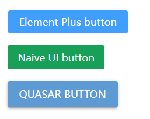

注意，使用`ui.add_body_html`方法时，默认该方法必须与控件属于同一页面时才能正常生效。如果该方法与创建的控件不属于同一页面，则需要给该方法的`shared`参数传入`True`，将加载的JavaScript文件和CSS文件共享给其他页面。

单页面模式，但是加载相关文件和初始化代码在全局作用域：

```python3
from nicegui import ui, app

app.config.vue_config_script += '''
    app.use(ElementPlus);
    app.use(naive);
'''

ui.add_body_html(
    '''
    <link rel='stylesheet' href='https://unpkg.com/element-plus/dist/index.css'/>
    <script defer src='https://unpkg.com/element-plus'></script>
    <script defer src='https://unpkg.com/naive-ui'></script>
    ''',
    shared=True
)

def index():
    with ui.element('el-button').props(
        'type=primary'
    ):
        ui.label('Element Plus button')
    with ui.element('n-button').props(
        'type=primary'
    ):
        ui.label('Naive UI button')
    ui.button('Quasar button')

ui.run(
    root=index
)
```

多页面模式，加载相关文件和初始化代码在全局作用域，并且建议这样放置：

```python3
from nicegui import ui, app

app.config.vue_config_script += '''
    app.use(ElementPlus);
    app.use(naive);
'''
ui.add_body_html(
    '''
    <link rel='stylesheet' href='https://unpkg.com/element-plus/dist/index.css'/>
    <script defer src='https://unpkg.com/element-plus'></script>
    <script defer src='https://unpkg.com/naive-ui'></script>
    ''',
    shared=True
)

@ui.page('/')
def index():
    ui.link('page a', '/a')
    with ui.element('el-button').props(
        'type=primary'
    ):
        ui.label('Element Plus button')
    with ui.element('n-button').props(
        'type=primary'
    ):
        ui.label('Naive UI button')
    ui.button('Quasar button')

@ui.page('/a')
def page_a():
    ui.link('page index', '/')
    with ui.element('el-button').props(
        'type=primary'
    ):
        ui.label('Element Plus button')
    with ui.element('n-button').props(
        'type=primary'
    ):
        ui.label('Naive UI button')
    ui.button('Quasar button')

ui.run()
```

如果只是放在某个页面中，则必须先访问该页面，再访问其他页面，才能正确创建控件：

```python3
from nicegui import ui, app

@ui.page('/')
def index():
    ui.link('page a', '/a')
    with ui.element('el-button').props(
        'type=primary'
    ):
        ui.label('Element Plus button')
    with ui.element('n-button').props(
        'type=primary'
    ):
        ui.label('Naive UI button')
    ui.button('Quasar button')

@ui.page('/a')
def page_a():
    app.config.vue_config_script += '''
        app.use(ElementPlus);
        app.use(naive);
    '''
    ui.add_body_html(
        '''
        <link rel='stylesheet' href='https://unpkg.com/element-plus/dist/index.css'/>
        <script defer src='https://unpkg.com/element-plus'></script>
        <script defer src='https://unpkg.com/naive-ui'></script>
        ''',
        shared=True
    )
    ui.link('page index', '/')
    with ui.element('el-button').props(
        'type=primary'
    ):
        ui.label('Element Plus button')
    with ui.element('n-button').props(
        'type=primary'
    ):
        ui.label('Naive UI button')
    ui.button('Quasar button')

ui.run()
```

注意，如果嫌使用网络地址响应太慢（上面的示例不使用窗口模式就是因为加载太慢），想将框架所需的文件下载到本地来使用，则需要使用`app.add_static_file`方法或`app.add_static_files`方法，为所需的文件生成地址映射。这两个方法的用法后续会单开章节，这里不展开介绍。

示例如下：

```python3
from nicegui import ui, app

def index():
    app.add_static_file(
        local_file='element_plus.index.css',
        url_path='/css/element_plus.index.css'
    )
    app.add_static_file(
        local_file='element_plus.index.full.js',
        url_path='/js/element_plus.index.full.js'
    )
    app.add_static_file(
        local_file='NaiveUI.index.js',
        url_path='/js/NaiveUI.index.js'
    )
    ui.add_body_html(
        '''
        <link rel='stylesheet' href='/css/element_plus.index.css'/>
        <script defer src='/js/element_plus.index.full.js'></script>
        <script defer src='/js/NaiveUI.index.js'></script>
        '''
    )
    app.config.vue_config_script += '''
        app.use(ElementPlus);
        app.use(naive);
    '''
    with ui.element('el-button').props(
        'type=primary'
    ):
        ui.label('Element Plus button')
    with ui.element('n-button').props(
        'type=primary'
    ):
        ui.label('Naive UI button')
    ui.button('Quasar button')

ui.run(
    root=index,
    native=True
)
```

这样就能使用窗口模式运行了。

### 17.3 创建VUE组件

如果基于VUE的前端UI框架还是不能满足需求或者对于简单的一个控件来说负担太重（需要额外添加UI框架的JavaScript文件、CSS文件，确实不太轻松），那可以试试创建VUE组件，在VUE中定义界面和部分交互，比在Python中更自由。

不过，创建VUE组件需要熟悉JavaScript、VUE语法，还要了解NiceGUI框架的实现原理，由于笔者不擅长VUE，以下来自官方示例（https://github.com/zauberzeug/nicegui/tree/main/examples/custom_vue_component）的代码就不做详细的解释了，只简单说一下基本思路。

先创建`counter.js`，内容为：

```javascript
// NOTE: Make sure to reload the browser with cache disabled after making changes to this file.
export default {
  template: `
  <button @click="handle_click">
    <strong>{{title}}: {{value}}</strong>
  </button>`,
  data() {
    return {
      value: 0,
    };
  },
  methods: {
    handle_click() {
      this.value += 1;
      this.$emit("change", {value:this.value});
    },
    reset() {
      this.value = 0;
    },
  },
  props: {
    title: String,
  },
};
```

然后在`counter.js`同目录下创建`counter.py`，内容为：

```python3
from typing import Callable, Optional
from nicegui.element import Element

class Counter(Element, component='counter.js'):
    def __init__(self, title: str, *, on_change: Optional[Callable] = None) -> None:
        super().__init__()
        self.props['title'] = title
        self.on('change', on_change)
    def reset(self) -> None:
        self.run_method('reset')
```

`counter.js`同目录下的`main.py`中，使用自定义控件的代码为：

```python3
from nicegui import ui
# 导入代码取决于当前文件与counter.py的相对路径
from counter import Counter

def index():
    ui.markdown(
        '''
        #### 试试点击方框中的文本
        点击会让当前值加一
        '''
    )
    counter = Counter(
        '当前值为', 
        on_change=lambda e: ui.notify(
            f'当前值变为 {e.args['value']}'
        )
    ).classes('border')
    ui.button(
        '复位',
        on_click=counter.reset
    )

ui.run(
    root=index,
    native=True
)
```

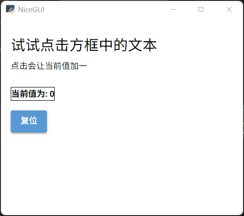

自定义控件的核心在`counter.js`文件中，由VUE暴露需要用到的属性和JavaScript方法。在`counter.py`文件中，通过`props`属性接收和设置暴露的属性，使用`run_method`方法执行暴露出的JavaScript方法。如果在`counter.js`文件中发射（`$emit`）了事件，还可以在`counter.py`文件中使用`on`方法响应对应的事件。

### 17.4 创建、使用anywidget控件

anywidget控件相关的文档：

- NiceGUI文档：https://nicegui.io/documentation/anywidget
- `anywidget`库文档：https://anywidget.dev/en/getting-started/
- anywidget官方示例：https://try.anywidget.dev/

不同于创建VUE组件需要单独创建JavaScript文件，需要熟悉JavaScript、VUE语法，还要了解NiceGUI框架的实现原理，每个部分缺一不可；创建自定义的anywidget控件可以简单到只需一个Python类，更别说anywidget控件丰富的生态带来大量现成的控件，可以简单到如同使用其他前端UI框架一样。

先通过示例看一下如何创建一个自定义的anywidget控件，其实这个示例在前面版本速览里已经看过，这里简化了无关的Python代码：

```python3
from nicegui import ui
import anywidget
import traitlets

class CounterWidget(anywidget.AnyWidget):
    _esm = '''
        function render({ model, el }) {
            const button = document.createElement("button");
            button.innerHTML = `Count is ${model.get("value")}`;
            button.addEventListener("click", () => {
                model.set("value", model.get("value") + 1);
                model.save_changes();
            });
            model.on("change:value", () => {
                button.innerHTML = `Count is ${model.get("value")}`;
            });
            el.classList.add("counter-widget");
            el.appendChild(button);
        }
        export default { render };
    '''
    _css = '''
        .counter-widget button {
            color: white;
            background-color: DarkOrange;
            padding: 0.5rem 1rem;
            border-radius: 0.25rem;
            cursor: pointer;

            &:hover {
                opacity: 0.8;
            }
        }
    '''
    value = traitlets.Int(0).tag(sync=True)

    def increment(self) -> None:
        self.value += 1

def index():
    counter = CounterWidget(value=42)
    ui.anywidget(counter)

ui.run(
    root=index,
    native=True
)
```

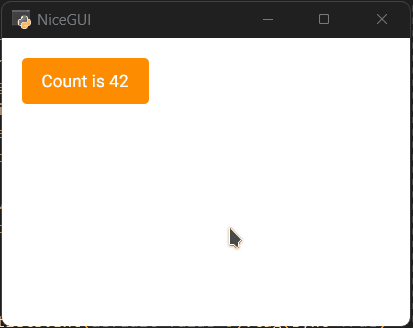

创建自定义anywidget控件主要有以下几个要点：

- 继承`anywidget.AnyWidget`类，并在给类变量`_esm`传入创建控件的JavaScript代码（VUE语法），这是最基本、最简单的必要操作，其余类变量则根据实际所需的功能添加。创建控件的JavaScript代码有固定的格式，定义参数为`{ model, el }`的JavaScript函数`render`（函数名固定）之后，必须将其导出（使用`export default { render }`，模块语法要求）。注意，这部分涉及到VUE、模块相关知识，笔者不擅长VUE、JavaScript，可能存在描述不准确的地方，具体语法请读者以VUE官方文档为准。
- 类变量`_css`负责定义控件所需的CSS样式，定义的CSS样式类可以在类变量`_esm`中直接使用。
- 使用`traitlets`提供的类实例化的Python类变量（在示例中为`value`），根据其是否使用`tag(sync=True)`，可以定义为Python端与前端共享（可在JavaScript代码中访问）的控件变量，或者纯Python端（后端，只能在Python代码中访问）的控件变量。
- 至于多出来的函数，则是Python端按需定义的接口函数，当控件变量前后端共享时，可以在Python端通过该接口函数影响前端显示。

总的来说，创建自定义anywidget控件可以在Python端一个文件内完成，方便了一些，但依然需要VUE相关基础，对于笔者这样目前不太擅长VUE的Python代码使用者，有一定门槛。

不过，anywidget控件丰富的生态带来大量现成的控件，如果有合适的控件，可以跳过这一步，直接学习如何使用现成的anywidget控件。

anywidget官方示例（https://try.anywidget.dev/）中有不少基于Jupyter的示例代码，对于NiceGUI来说，使用时可以照搬其代码，只需最后将anywidget控件实例传给`ui.anywidget`控件的`widget`参数即可。

`ui.anywidget`控件支持以下参数：

- `widget`参数，表示要在NiceGUI中使用的anywidget控件。
- `throttle`参数，关键字参数，浮点类型，表示anywidget控件在Python端与前端更新相关控件变量的时间间隔（单位秒），默认为`0`，即最短间隔（即时更新）。

就以anywidget官方示例中的ITables（官方仓库 https://github.com/mwouts/itables）为例，看看其在NiceGUI中的示例：

```python3
from nicegui import ui
import pandas as pd
from itables.widget import ITable

def index():
    table = ITable(
        pd.DataFrame(
            {
                'x': [
                    'A', 'B', 'C', 'D', 'E'
                ],
                'y': [
                    5, 3, 6, 7, 2
                ]
            }
        )
    )
    ui.anywidget(
        table
    )


ui.run(
    root=index,
    native=True
)
```

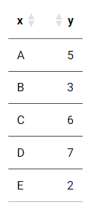

受限于篇幅，更多更详细的anywidget控件示例这里就不展开介绍了，等后续有机会再结合实际情况介绍相关示例。

## 18 管理静态文件、媒体文件

NiceGUI的页面本质上是网页，而网页中通常包含图片、音频、视频、JavaScript代码、CSS代码等文件。NiceGUI提供了一些方法，可以更好管理、使用这些文件：

- `app.add_static_file`方法和`app.add_static_files`方法，用于管理静态文件。
- `app.add_media_file`方法和`app.add_media_files`方法，用于管理媒体文件。

### 18.1 `app.add_static_file`方法和`app.add_static_files`方法

前面提到过`ui.image`控件、`ui.audio`控件、`ui.video`控件用于处理图片、音频、视频文件。不过，前面的示例中只用了网络地址，并没有使用本地地址，肯定有读者在尝试使用本地地址之后发现了异常，以为NiceGUI有bug。

以下面的代码为例，`os.path.dirname(os.path.abspath(__file__))`可以获取代码文件的当前目录，在代码文件的同目录下放一个图片文件`LOGO.png`，下面的代码就能显示这个图片。看起来没问题。但是，一旦复制这个图片的地址，将后面的文件名换成其他同目录下的文件名之后，粘贴到浏览器中访问，还是会自动跳转到“主页面”：

```python3
from nicegui import ui
import os

def index():
    ui.image(
        f'{os.path.dirname(os.path.abspath(__file__))}/LOGO.png'
    ).classes('w-64 h-64')

ui.run(
    root=index
)
```


其实这不是NiceGUI的bug，而是默认的安全和缓存机制，只有代码中使用的静态文件才会生成地址映射，其他没有使用的文件即使存在，直接输入地址访问也无法访问。以上面的代码为例，图片文件的地址是`http://127.0.0.1:8080/_nicegui/auto/static/380768c7e814c88ecab818d3d9850e11/LOGO.png`，中间的`380768c7e814c88ecab818d3d9850e11`是图片的hash码，而不是真实存在的目录。之所以会变成这样，是因为NiceGUI会对小的静态文件进行缓存，提高访问速度。因为网页中通常包含大量图片、JavaScript代码、CSS代码等文件，使用缓存可以提高访问速度，不必每次刷新都要从服务器获取。此外，采用缓存机制，还能避免黑客恶意猜测服务器的文件目录，进而获取到影响安全的文件。

这个时候，理解这一切的读者想必已经恍然大悟。但不要高兴得太早，随之而来的是另一个问题——如果`ui.link`控件想使用图片的链接但图片会不定时修改怎么办？总不能每次都用`ui.image`控件生成一次图片地址，然后复制地址过去吧？倒不用那么笨拙，只需使用`ui.image`控件的`auto_route`属性即可：

```python3
from nicegui import ui
import os

def index():
    img = ui.image(
        f'{os.path.dirname(os.path.abspath(__file__))}/LOGO.png'
    ).classes('w-64 h-64')
    ui.link('pic',img.auto_route)

ui.run(
    root=index
)
```

`ui.audio`控件、`ui.video`控件也有`auto_route`属性。

不过，这并不能解决文件变化会导致地址随之变化的问题，一旦非NiceGUI程序或者外部网站需要使用图片地址，还是需要一个可以获取或者固定图片地址的方法。

这时，就需要正式介绍一下本节要说的方法——`app.add_static_file`方法。`app.add_static_file`方法可以返回本地文件的服务器地址，也可以将本地文件映射为固定的服务器地址。

还是以代码为例：

```python3
from nicegui import ui, app
import os

def index():
    src = app.add_static_file(
        local_file=f'{os.path.dirname(os.path.abspath(__file__))}/LOGO.png',
        url_path=None,
        single_use=False
    )
    ui.link('pic', src)
    ui.label(src)
    ui.image(
        src
    ).classes('w-64 h-64')

ui.run(
    root=index
)
```


可以看到，给`app_add_static_file`方法的`local_file`参数传入本地文件地址之后，该方法返回的正是服务器地址，和`ui.image`控件的图片地址一致。这样的话，`ui.link`控件可以直接使用该地址，也可以将该地址直接传给其他需要的控件，无需通过特定控件中转。

不过，这只是`app_add_static_file`方法其中一个用法，该方法更好用的用法藏在其参数中。

`app_add_static_file`支持以下关键字参数（部分）：

- `local_file`参数，字符串类型或者`Path`类型，表示本地文件地址。
- `url_path`参数，字符串类型，表示服务器地址，默认为`None`，即自动生成服务器地址，也可以传入参数，例如`'/logo.png'`，就是固定的服务器地址。
- `single_use`参数，布尔类型，表示文件是否在下载一次后移除服务器地址，默认为`False`。

没错，只需给`url_path`参数传入指定地址，就能将文件映射为固定地址：

```python3
from nicegui import ui, app
import os

def index():
    src = app.add_static_file(
        local_file=f'{os.path.dirname(os.path.abspath(__file__))}/LOGO.png',
        url_path='/logo.png',
        single_use=False
    )
    ui.link('pic', src)
    ui.label(src)
    ui.image(
        src
    ).classes('w-64 h-64')

ui.run(
    root=index
)
```

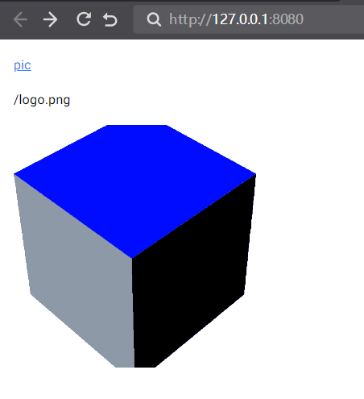

假如要添加的图片比较多，但都在一个文件夹内，是不是还要一个一个添加？不用，`app_add_static_files`方法可以将本地文件夹映射为服务器地址。

`app_add_static_files`支持以下参数（部分）：

- `local_directory`参数，字符串类型或者`Path`类型，表示本地文件夹地址。
- `url_path`参数，字符串类型，表示服务器目录地址，必须传入'/'开头的字符串，例如`'/pic'`，同时不能为`'/'`，不然会报错。
- `follow_symlink`参数，布尔类型，关键字参数，表示是否追踪符号链接，即目录下如果存在符号链接的话，会将符号链接代表的实际路径连接到当前路径下，让服务器地址访问符号链接就和本地访问符号链接一样。这个参数默认为`False`，即不处理符号链接，服务器地址没法访问符号链接。注意，此参数为`True`并且在Windows平台下的话，代码中使用的`os.path.abspath(__file__)`会导致获取到文件路径中的磁盘符号为小写，将导致底层代码出错进而上报404错误。此时应该将`os.path.abspath(__file__)`换成`os.path.realpath(__file__)`。如果后续遇到Windows平台下开启`app_add_static_files`的追踪符号链接后，报404错误，可以按照这个思路检查一下传入的`local_directory`参数中，磁盘符号是不是小写。

### 18.2 `app.add_media_file`方法和`app.add_media_files`方法

前面介绍的`app.add_static_file`方法、`app.add_static_files`方法一般用于添加小的静态文件，本节要介绍的`app.add_media_file`方法、`app.add_media_files`方法则用于添加媒体文件。看名字的话，和前两者相似，一个是添加单个文件，一个是添加文件夹，那NiceGUI为何要设计重复的功能？为什么不能将媒体文件当作静态文件处理？

重复当然是不可能重复的，既然是用于媒体文件，肯定与静态文件不同。媒体文件通常是音视频等需要流式传输的文件，不会一下子全部加载，而是一点一点加载，这种加载方式就叫流式传输。这一点与静态文件不同。毕竟媒体文件通常比较大，一下子全部缓存，一不小心就会让缓存空间爆满。之所以采用流式传输，是因为媒体文件需要支持播放时跳转到指定时间点，如果是采用静态文件那种缓存全部再加载的机制，跳转到指定时间点的功能会失效，只有流式传输才支持跳转到指定时间点。

`app.add_media_file`方法、`app.add_media_files`方法得到的服务器地址就是采用流式传输，而不是缓存机制。

以下面的代码为例，可以看一下区别，因为此代码需要本地视频文件，这里就不提供直接运行的代码了，视频文件地址由读者自己修改：

```python3
from nicegui import ui, app

def index():
    video = r'mv.mp4'
    app.add_static_file(
        local_file=video,url_path='/video1'
    )
    app.add_media_file(
        local_file=video,url_path='/video2'
    )

    ui.video('/video1')
    ui.video('/video2')

ui.run(
    root=index
)
```

通常情况下，`app.add_static_file`方法得到的视频文件地址，在播放器中没法自由拖动进度条，只能跳转到关键帧。`app.add_media_file`方法得到的视频文件地址，在播放器中和正常播放一样，可以自由拖动进度条。但是，大多数服务器、浏览器、播放器有优化，实际上两种方法得到的视频地址都可以正常播放、拖动进度条，只有某些要求严格的接口、播放程序才会有区别。一般建议读者使用`app.add_media_file`方法添加媒体文件，以免特定情况下出现不兼容的问题。

`app.add_media_file`方法的参数和`app.add_static_file`方法的一样，这里不再赘述。`app.add_media_files`方法则相比于`app.add_static_files`方法少了`follow_symlink`参数。

## 19 给页面添加额外的HTML、CSS代码

NiceGUI的页面本质上是网页，而网页有时候需要添加一些额外的HTML代码、CSS代码才能使用特定的功能。想要添加额外的外码，就要使用以下方法：

- `ui.add_head_html`方法和`ui.add_body_html`方法。
- `ui.add_css`方法、`ui.add_scss`方法和`ui.add_sass`方法。

#### 19.1 `ui.add_head_html`方法和`ui.add_body_html`方法

`ui.add_head_html`方法可以添加HTML代码到页面的`head`标签内，`ui.add_body_html`方法可以添加HTML代码到页面的`body`标签内。对于页面加载来说，`head`标签内的内容一般不显示，而且因为是从上到下加载，`head`标签内的内容会先被加载，这里通常放着需要第一时间执行的前置脚本和样式设置。`body`标签内放着页面显示内容的主体，使用`ui.add_body_html`方法会在NiceGUI其他控件加载前嵌入HTML代码，因此，使用`ui.add_body_html`方法通常是为了实现在NiceGUI其他内容显示之前放置内容，包括但不限于显示的内容、执行前置脚本和样式设置。

这两个方法都有两个参数字符串参数`code`和布尔参数`shared`。前者表示要嵌入的HTML代码，后者表示是否在所有页面执行嵌入操，即在所属页面执行一次嵌入操作，就能在所有页面上生效。

注意，单页面应用的子页面从属于主页面或者页面，因此，嵌入操作不会在子页面上生效。

前面的`ui.html`控件也可以添加HTML代码，那和`ui.add_head_html`方法、`ui.add_body_html`方法有什么区别？

`ui.html`控件是一个控件，可以使用控件的方法，`ui.add_head_html`方法和`ui.add_body_html`方法是直接将HTML代码嵌入页面，不会返回任何对象，没法调用空间的方法。不过，它们支持嵌入JavaScript代码，而`ui.html`控件只能是纯HTML。

示例如下：

```python3
from nicegui import ui

def index():
    ui.add_head_html(
        '<script>alert("head")</script>'
    )
    ui.add_head_html(
        '<h3>add_head_html</h3>'
    )
    ui.add_body_html(
        '<script>alert("body")</script>'
    )
    ui.add_body_html(
        '<h3>add_body_html</h3>'
    )
    ui.html(
        '<h3>ui.html</h3>',
        sanitize=False
    )

ui.run(
    root=index,
    native=True
)
```


#### 19.2 `ui.add_css`方法、`ui.add_sass`方法（不推荐）和`ui.add_scss`方法（不推荐）

这三个方法都可以添加样式描述代码，只是对应代码的语法不同。

注意，从NiceGUI 3.4.0版本开始，`ui.add_sass`方法和`ui.add_scss`方法被标记为弃用（不推荐使用，在移除前依然可用），同时不再依赖`libsass`库。后续这两个方法将在NiceGUI 4.0.0版本之后彻底移除，以后只能使用`ui.add_css`方法。

SASS是一种基于CSS语法实现、可以编译为CSS代码的样式描述语言，它在CSS语法的基础上增加了变量 (variables)、嵌套 (nested rules)、混合 (mixins)、导入 (inline imports) 等高级功能，这些拓展令SASS比CSS更加强大与优雅。简单一点理解的话，SASS是CSS扩展版本。SASS在具体代码中有两种语法：文件扩展名通常为`.scss`的SASS语法，和CSS语法一致，即采用大括号表示所属，用分号表示一句内容的结束；文件扩展名通常为`.sass`的SCSS语法，变成用缩进代替大括号、用换行代替分号。

`ui.add_css`方法、`ui.add_sass`方法、`ui.add_scss`方法分别用于添加标准CSS语法的代码、SASS语法的代码、SCSS语法的代码。因为SCSS语法和CSS语法一致，基本兼容CSS语法，所以，可以用`ui.add_scss`方法添加CSS代码，`ui.add_sass`方法则不行。另外，也不能用`ui.add_css`方法添加SCSS语法的SASS代码。

`ui.add_css`方法的示例：

```python3
from nicegui import ui

def index():
    ui.add_css(
        '''
        .red {
            color: red;
        }
        '''
    )
    ui.label(
        'This is red with CSS.'
    ).classes('red')

ui.run(
    root=index,
    native=True
)
```

`ui.add_sass`方法的示例：

```python3
from nicegui import ui

def index():
    ui.add_sass(
        '''
        .yellow
            background-color: yellow
            .purple
                color: purple
        '''
    )
    with ui.element().classes('yellow'):
        ui.label(
            'This is purple on yellow with SASS.'
        ).classes('purple')

ui.run(root=index, native=True)
```

`ui.add_scss`方法的示例：

```python3
from nicegui import ui

def index():
    ui.add_scss(
        '''
        .green {
            background-color: lightgreen;
            .blue {
                color: blue;
            }
        }
        '''
    )
    with ui.element().classes('green'):
        ui.label(
            'This is blue on green with SCSS.'
        ).classes('blue')

ui.run(
    root=index,
    native=True
)
```

注意，NiceGUI的很多控件自带样式，其样式源于Quasar框架，而部分样式使用`!important`修饰，优先级高于没有使用`!important`修饰的普通样式。

从NiceGUI 3.0.0开始，内部使用了级联层（`@layer`）决定样式的优先级，具体顺序如下：

```css
theme, 
base, 
quasar(Quasar框架的预定义样式类类名在这一层), 
nicegui, 
components, 
utilities(Tailwind CSS框架的预定义样式类类名在这一层), 
overrides
```

对于普通样式，越靠下的层级，优先级越高。

因此，如果想要覆盖NiceGUI的很多控件自带样式，除了添加样式描述代码时需要使用`!important`修饰，还要正确设置级联层，默认使用`quasar`层即可：

```python3
from nicegui import ui

def index():
    ui.add_css(
        '''
        @layer quasar{
            .red {
                background: red!important;
            }
        }
        '''
    )
    ui.button(
        'This is red with CSS.'
    ).classes('red')

ui.run(
    root=index,
    native=True
)
```

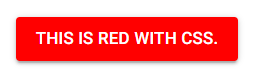

## 20 精准匹配指定内容（HTML标签、控件）

在CSS中，有个非常重要的概念叫选择器。

每一条CSS样式定义由两部分组成，形式如下：

 ```css
选择器{样式}
 ```

在`{`之前的部分就是选择器。 选择器指明了`{样式}`中的样式的作用对象或者作用范围，也就是样式作用于网页中的哪些HTML标签。

选择器有一套自己的语法规则（https://developer.mozilla.org/zh-CN/docs/Learn/CSS/Building_blocks/Selectors），通过合理设置选择器，可以实现精准匹配指定HTML标签。

NiceGUI简化了不少CSS上的操作，但不代表不需要CSS的基础。如果读者掌握了CSS的选择器，与`ui.query`方法和`ui.teleport`方法结合使用，那就如同得到了屠龙宝刀，操作界面布局、美化界面将更加得心应手。

而`ElementFilter`类则另辟蹊径，直接实现了一种新的Python接口，将`ui.query`方法和`ui.teleport`方法的功能完美结合，但无需读者具备CSS的基础。

注意，使用`ui.query`方法和`ui.teleport`方法要求读者具备CSS选择器基础，没有相应基础的读者可以跳过相关内容，直接学习`ElementFilter`类。

### 20.1 使用`ui.query`方法修改指定HTML标签的样式

前面讲过使用`props`方法、`classes`方法、`style`方法修改控件的样式，也就是在控件定义好之后，直接调用控件或者控件对应变量的相应方法。但是，如果想要修改样式的控件、HTML标签就不是定义出来的，而是框架、程序自带的，想要修改样式就有点麻烦。当然，直接修改内置样式、源码很直观，但麻烦。要是有种方法能直接匹配到这些内容，，那就方便不少。正巧，`ui.query`方法就有这样的功能。

注意，`ui.query`方法返回值的`props`方法修改的是HTML标签的属性（`attribute`），而不是控件或者属性（`props`）。

`ui.query`方法只有一个字符串类型参数`selector`，顾名思义，就是前面提到的选择器。通过给`ui.query`方法传入选择器，`ui.query`方法将返回该选择器能够选择的内容，然后就能调用`props`方法、`classes`方法、`style`方法修改样式。

下面的代码就是使用`ui.query`方法匹配了`body`标签（网页的主体），并设置`body`标签的背景颜色：

```python3
from nicegui import ui

def index():
    ui.query(
        'body'
    ).classes(
        'bg-blue-400'
    )

ui.run(
    root=index,
    native=True
)
```

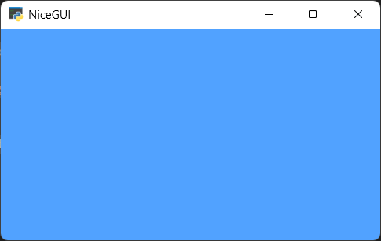

`ui.query`方法的用法很简单，难点在于确定CSS选择器的写法，这一部分属于CSS基础知识，这里就不再赘述，有能力的读者可以抽时间深入学习CSS选择器的语法。

### 20.2 使用`ui.teleport`方法传送（移动）控件

一般而言，控件创建时的位置是固定，但是，如果想在创建完之后移动位置，倒不用删掉重来，还是有方法可以实现的。

比如，先创建了按钮，后创建了卡片，想要将按钮放到卡片里的话，可以使用`move`方法可以移动按钮的位置：

```python3
from nicegui import ui

def index():
    button = ui.button('ok')
    card = ui.card()
    button.move(card)

ui.run(
    root=index,
    native=True
)
```

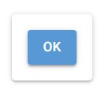

当然，本节主要介绍的是`ui.teleport`方法，自然可以使用`ui.teleport`方法实现：

```python3
from nicegui import ui

def index():
    card = ui.card()
    with ui.teleport(card):
        ui.button('ok')

ui.run(
    root=index,
    native=True
)
```

除了传送（移动）控件，`ui.teleport`方法远比看上去强大。因为其不仅支持传入控件，还支持支持选择器，所以可以做到和`ui.query`方法一样的匹配能力。

就以上面的示例为基础，稍微改动一下下。还是分别创建按钮和卡片，想要的结果依然是按钮在卡片之中，不过这次卡片没有对应的变量：

```python3
from nicegui import ui

def index():
    ui.card().classes('card')

ui.run(
    root=index,
    native=True
)
```

虽然卡片没有对应的变量，但设置了样式。于是，可以借助`ui.query`方法匹配：

```python3
from nicegui import ui

def index():
    ui.card().classes('card')
    ui.query('.card').classes('bg-red')

ui.run(
    root=index,
    native=True
)
```


肯定有读者看到上面的结果后突发奇想，想要进入其上下文，然后添加控件：

```python3
from nicegui import ui

def index():
    ui.card().classes('card')
    with ui.query('.card'):
        ui.button('ok')

ui.run(
    root=index,
    native=True
)
```

很可惜，这段代码并不能成功运行，因为`ui.query`方法不支持这样做。如果想要实现目的，需要将`ui.query`换成`ui.teleport`：

```python3
from nicegui import ui

def index():
    ui.card().classes('card')
    with ui.teleport('.card'):
        ui.button('ok')

ui.run(
    root=index,
    native=True
)
```


移动已经创建好的控件也可以：

```python3
from nicegui import ui

def index():
    ui.card().classes('card')
    button = ui.button('ok')
    with ui.teleport(
        '.card'
    ) as here:
        button.move(here)

ui.run(
    root=index,
    native=True
)
```

`ui.teleport`方法就是这样一个基于CSS选择器语法将任意控件传送至指定位置的控件。

### 20.3 使用`ElementFilter`类匹配指定控件

暂时不会CSS选择器语法的读者也不用着急，尽管CSS选择器语法很强大，但在Python中不够直观，想要快速确定选择器还要去网页中开启调试模式。好在NiceGUI提供了另一种不需要CSS选择器的定位指定标签、控件的工具，那就是`ElementFilter`类。

`ElementFilter`类和`ui`模块同级，使用`from nicegui import ElementFilter`来导入。

`ElementFilter`类的功能等于`ui.query`方法加`ui.teleport`方法。`ElementFilter`类既能设置指定控件的样式，又能将控件传送到指定位置。但与`ui.query`方法和`ui.teleport`方法使用CSS选择器语法来匹配具体HTML标签、控件不同，`ElementFilter`类的匹配方式更直观，更契合Python编程习惯。

以下是用于匹配的模板内容，就以其为基础，分别看看`ElementFilter`类不同参数、方法的用途：

```python3
from nicegui import ui,ElementFilter

with ui.card():
    ui.button('button A')
    ui.label('label A_A')
    ui.label('label A_B')

with ui.card():
    ui.button('button B')
    ui.label('label B_A')
    ui.label('label B_B')

ui.run(
    native=True
)
```

#### 20.3.1 初始化方法

`ElementFilter`类需要初始化为实例对象才能使用。`ElementFilter`类的初始化方法有四个关键字参数：

- `kind`参数，`Element`类型，表示匹配什么类型的控件。
- `marker`参数，字符串类型或者字符串列表类型，表示匹配包含指定记号或者指定记号列表的控件。
- `content`参数，字符串类型或者字符串列表类型，表示匹配包含指定内容的控件。匹配范围包括控件的`value`属性、`text`属性、`label`属性、`icon`属性、`placeholder`属性等字符串类型属性。只有完全包含指定字符串或者字符串列表才能匹配成功。
- `local_scope`参数，布尔类型，表示`ElementFilter`类实例对象的匹配范围是当前作用域还是全局作用域，默认为`False`，即匹配全局作用域。如果设置为`True`，则只匹配当前作用域。

在下面的代码中，传给`kind`参数是`ui.label`，`ElementFilter`类实例对象就会匹配`ui.label`控件，这样给匹配结果设置背景颜色为红色的时候，页面内所有`ui.label`控件的背景颜色都会变成红色：

```python3
from nicegui import ui,ElementFilter

def index():
    with ui.card():
        ui.button('button A')
        ui.label('label A_A')
        ui.label('label A_B')
    with ui.card():
        ui.button('button B')
        ui.label('label B_A')
        ui.label('label B_B')
    ElementFilter(kind=ui.label).classes('bg-red')

ui.run(
    root=index,
    native=True
)
```


`marker`参数表示匹配包含指定记号或者指定记号列表的控件。

在此，需要额外介绍一下控件的`mark`方法，也就是如何给控件添加记号。对于每一个控件，都可以通过`mark`方法定义一组记号，可通过指定`ElementFilter`类的`marker`参数被`ElementFilter`类实例对象匹配。

`mark`方法的参数是一个支持解包、分解的字符串类型参数`markers`，可以传入多个字符串，也可以传入包含空格的字符串。其中，包含空格的字符串会被分解为多个子字符串。也就是说，传入`'A'` 、`'A','B','AB'`、`'B A BA'`、`'A','B BA'`都是可以的。

从本质上说，`mark`方法就是将传入的字符串转换为该对象的`_markers`列表。对于`'A','B','AB'`这样多个字符串，该方法会转化为`['B','A','AB']`这样的列表来使用。对于`'B A BA'`这样用空格划分的字符串，该方法会自动以空格为分隔符分解为`['B','A','BA']`这样的列表来使用。当然，两种方法混用也没问题，`'A','B BA'`这样的多个字符串，则会转化为`['A','B','BA']`这样的列表。注意，虽然`mark`方法支持串联、重复使用，但最好不要这样做，因为后执行的`mark`方法结果会覆盖先前`mark`方法的结果，如果是想清除之前的记号，倒是可以重复执行。

说完给控件添加记号，下面回归正题，说说如何筛选记号。`marker`参数和`mark`方法的`markers`参数类似，只不过`marker`参数没有解包过程，想要传入多个字符串，只能使用字符串列表。

与`mark`方法的宽松不同，`marker`参数的要求比较严格：要么是纯字符串，带空格的会自动划分，并转化为列表；要么是无空格的字符串组成列表，不支持正确解析内含带空格字符串的列表。所以，只有以下格式才是正确的用法：`'A'` 、`['A','B','AB']`、`'B A BA'`。

示例如下：

```python3
from nicegui import ui,ElementFilter

def index():
    with ui.card():
        ui.button('button A')
        ui.label('label A_A').mark(
            'A'
        )
        ui.label('label A_B').mark(
            'A','B','AB'
        )

    with ui.card():
        ui.button('button B')
        ui.label('label B_B').mark(
            'B'
        )
        ui.label('label B_A').mark(
            'B A BA'
        )
    
    ElementFilter(
        marker='BA'
    ).classes('bg-red')
    # 下面两行代码的结果相同
    # ElementFilter(marker='A B').classes('bg-red')
    # ElementFilter(marker=['A','B']).classes('bg-red')

ui.run(root=index,native=True)
```


`content`参数的用法很简单，就不做解释了，直接看示例：

```python3
from nicegui import ui,ElementFilter

def index():
    with ui.card():
        ui.button('button A')
        ui.label('label A_A')
        ui.label('label A_B')

    with ui.card():
        ui.button('button B')
        ui.label('label B_B')
        ui.label('label B_A')
    ElementFilter(
        content=['B','A']
    ).classes('bg-red')

ui.run(
    root=index,
    native=True
)
```


`local_scope`参数的示例如下：

```python3
from nicegui import ui,ElementFilter

def index():
    with ui.card():
        ui.button('button A')
        ui.label('label A_A')
        ui.label('label A_B')

    with ui.card():
        ui.button('button B')
        ui.label('label B_B')
        ui.label('label B_A')
        ElementFilter(
            content=['B','A'],
            local_scope=True
        ).classes('bg-red')

ui.run(
    root=index,
    native=True
)
```


示例中，修改了`ElementFilter`类实例对象的缩进之后，并将`local_scope`参数设置为`True`，此时`ElementFilter`类实例对象就只能匹配同一缩进内的控件。

#### 20.3.2 `within`方法和`not_within`方法

顾名思义，这两个方法就是在`ElementFilter`类实例对象的匹配结果中进一步筛选出父控件符合匹配条件的结果——得到在指定父控件上下文之内或者不在指定父控件上下文之内的控件。

对`within`方法而言，会筛选出符合该方法匹配条件的控件。对`not_within`方法而言，会排除符合该方法匹配条件的控件。

两个方法的参数都一样，都是三个：

- `kind`参数。
- `marker`参数。
- `instance`参数。

`kind`参数和`marker`参数的用法与初始化方法的同名参数一样，这里不再赘述。只是`within`方法和`not_within`方法的`marker`参数不支持字符串列表。

`instance`参数，控件或者控件列表，表示具体的父控件。

以 `within`方法为例，给`instance`参数传入具体控件，`ElementFilter`类实例对象将筛选出该控件上下文内的`ui.label`控件：

```python3
from nicegui import ui,ElementFilter

def index():
    with ui.card() as card1:
        ui.button('button A')
        ui.label('label A_A')
        ui.label('label A_B')

    with ui.card() as card2:
        ui.button('button B')
        ui.label('label B_B')
        ui.label('label B_A')

    ElementFilter(
        kind=ui.label
    ).within(
        instance=card2
    ).classes('bg-red')

ui.run(
    root=index,
    native=True
)
```


这两个方法都是返回`ElementFilter`类实例对象，这也就意味着它们支持串联调用。串联调用之后相当于扩展了同名方法同名参数所表示的匹配条件的内部列表。

#### 20.3.3 `exclude`方法

该方法可以在`ElementFilter`类实例对象的匹配结果中，将该方法匹配到的控件排除。

该方法有三个参数：

- `kind`参数。
- `marker` 参数。
- `content` 参数。

这些参数的用法同初始化方法同名的参数基本一样，只是**不支持**传入列表；`marker`参数**不支持**将带空格的字符串划分、转化为列表。这两点需要注意。

示例如下：

```python3
from nicegui import ui,ElementFilter
from nicegui.elements.mixins.text_element import TextElement

def index():
    with ui.card() as card1:
        ui.button('button A')
        ui.label('label A_A')
        ui.label('label A_B')

    with ui.card() as card2:
        ui.button('button B')
        ui.label('label B_B')
        ui.label('label B_A')

    ElementFilter(
        kind=TextElement
    ).exclude(
        kind=ui.label
    ).classes('bg-red')

ui.run(
    root=index,
    native=True
)
```


`ui.label`控件和`ui.button`控件是`TextElement`类的子类，因此匹配`TextElement`类会同时匹配到这两种控件。因为在`exclude`方法中指定`kind`参数为`ui.label`之后，匹配结果就排除了`ui.label`控件，所以，只有`ui.button`控件的颜色变成红色。

`exclude`方法也是返回`ElementFilter`类实例对象，所以，它也支持串联调用。

#### 20.3.4 传送（移动）控件

对于`ElementFilter`类实例对象，想要传送（移动）控件到匹配结果的上下文中也很简单：只需遍历`ElementFilter`类实例对象，就能访问匹配结果的每一个具体控件；可以进入控件的上下文之后创建控件，也可以使用控件的`move`方法或者`ui.teleport`方法。

如下面代码所示，使用`for`遍历了`ElementFilter`类实例对象之后，然后使用`with`进入每个控件的上下文，添加了`ui.icon`控件：

```python3
from nicegui import ui,ElementFilter

def index():
    with ui.card():
        ui.button('button A')
        ui.label('label A_A')
        ui.label('label A_B')

    with ui.card():
        ui.button('button B')
        ui.label('label B_B')
        ui.label('label B_A')

    for ele in ElementFilter(
        kind=ui.button
    ).classes('bg-red'):
        with ele:
            ui.icon('home')

ui.run(
    root=index,
    native=True
)
```


需要注意的是，即使匹配结果只有一个控件，也要遍历之后才能操作具体控件：

```python3
from nicegui import ui,ElementFilter

def index():
    with ui.card() as card1:
        ui.button('button A')
        ui.label('label A_A')
        ui.label('label A_B')

    with ui.card() as card2:
        ui.button('button B')
        ui.label('label B_B')
        ui.label('label B_A')
    icon = ui.icon('home')
    for ele in ElementFilter(
        kind=ui.button
    ).within(
        instance=card2
    ).classes('bg-red'):
        icon.move(ele)
        with ui.teleport(ele):
            ui.icon('home')

ui.run(
    root=index,
    native=True
)
```


#### 20.3.5 修改控件样式

其实前面的示例已经用过修改控件样式的方法，这里还是在详细说一下。

对于`ElementFilter`类实例对象，有两种方法修改匹配结果中的每个控件的样式：

- 遍历之后，调用每个控件的`props`方法、`classes`方法、`style`方法，修改控件的样式。
- 直接调用`ElementFilter`类实例对象的`props`方法、`classes`方法、`style`方法，相当于调用匹配结果中的每个控件的`props`方法、`classes`方法、`style`方法。

示例如下：

```python3
from nicegui import ui,ElementFilter

def index():
    with ui.card() as card1:
        ui.button('button A')
        ui.label('label A_A')
        ui.label('label A_B')
    with ui.card() as card2:
        ui.button('button B')
        ui.label('label B_B')
        ui.label('label B_A')
    
    for ele in ElementFilter(
        kind=ui.label
    ).within(instance=card1):
        ele.classes('bg-red')

    ElementFilter(
        kind=ui.label
    ).within(
        instance=card2
    ).classes('bg-green')

ui.run(
    root=index,
    native=True
)
```


## 21 使用主题

NiceGUI的每个控件都支持单独设置颜色，但是，如果想省点事，统一设置所有控件的颜色，实现类似主题色的效果，那就要用特别的方法了。

### 21.1 修改所有控件的颜色

修改所有控件的颜色，简单一些的方法，就是用上一章学过的使用`ElementFilter`类匹配所有控件：

```python3
from nicegui import ui,ElementFilter

def index():
    ui.button('Hello')
    ui.button('World')
    ElementFilter(
        kind=ui.button
    ).classes('bg-red')

ui.run(
    root=index,
    native=True
)
```


不过，使用`ElementFilter`类的话，只能在创建完所有控件之后使用才能生效，想要提前设置的话，需要调用控件的类方法：

- `default_classes`方法。
- `default_props`方法。
- `default_style`方法。

示例如下：

```python3
from nicegui import ui

def index():
    ui.button.default_classes('bg-red')
    ui.button('Hello')
    ui.button('World')

ui.run(
    root=index,
    native=True
)
```

### 21.2 颜色主题

调用控件的类方法来修改该控件的默认样式，间接实现主题的效果，并非完美。对于用到的每个控件，都需要调用对应控件的类方法。

幸好，NiceGUI提供了实现颜色主题的特殊类——`ui.colors`类（当前页面生效）和`app.colors`类（所有页面生效），该类支持以下关键字参数：

- `primary`参数，字符串类型，表示主题的主要颜色，默认值为`'#5898d4'`。

- `secondary`参数，字符串类型，表示主题的次要颜色，默认值为`'#26a69a'`。

- `accent`参数，字符串类型，表示主题的强调颜色，默认值为`'#9c27b0'`。

- `dark`参数，字符串类型，表示主题的暗黑颜色，默认值为`'#1d1d1d'`。

  注意，只有部分控件在暗黑模式下使用暗黑颜色，大部分控件在暗黑模式下使用主要颜色。

- `dark_page`参数，字符串类型，表示页面在暗黑模式下的背景颜色，默认值为`'#121212'`。

- `positive`参数，字符串类型，表示主题的肯定颜色，默认值为`'#21ba45'`。

- `negative`参数，字符串类型，表示主题的否定颜色，默认值为`'#c10015'`。

- `info`参数，字符串类型，表示主题的信息颜色，默认值为`'#31ccec'`。

- `warning`参数，字符串类型，表示主题的警告颜色，默认值为`'#f2c037'`。

- `**custom_colors`参数，字符串类型，表示主题的自定义颜色。不与前面参数同名的其余参数会被映射为自定义颜色，可以传给控件的`color`参数或者当作样式变量使用。

  注意，将参数名映射为自定义颜色名时，如果参数名包含下划线，NiceGUI内部会将下划线（`_`）替换为短横线（`-`）。如果是将自定义颜色名当作样式变量来使用，则实际的变量名为`--q-{自定义颜色名}`。

示例如下：

```python3
from nicegui import ui

def index():
    ui.colors(
        primary = 'red',
        dark='yellow',
        my_color = 'green'
    )
    ui.button('Hello')
    ui.chip('Hello')
    ui.avatar('home')
    with ui.card():
        ui.button(
            'Hello',
            color='my-color'
        )
        ui.button(
            'Hello'
        ).style(
            'background-color:var(--q-my-color)!important;'
        )
    dark_mode = ui.dark_mode(True)
    ui.switch().bind_value(
        dark_mode
    )

ui.run(
    root=index,
    native=True
)
```


### 21.3 暗黑模式

上一节提到了暗黑模式——一种以深色为主题基本色的主题，而现在大多数程序也实现了暗黑模式。在NiceGUI中，使用`ui.dark_mode`类，就可以实现自动、手动切换程序的暗黑模式。

将`ui.dark_mode`类的`value`参数设置为`True`或者`False`表示启用或者禁用暗黑模式。如果将此参数设置为`None`或者调用`auto`方法，即可启用自动切换暗黑模式，即程序是否启用暗黑模式取决于系统当前是否为暗黑模式。

示例如下：

```python3
from nicegui import ui

def index():
    ui.button('Hello')
    dark_mode = ui.dark_mode(True)
    ui.switch().bind_value(
        dark_mode
    )
    # 启用跟随系统的自动切换
    # dark_mode.auto()

ui.run(
    root=index,
    native=True
)
```


## 22 保存数据

有时候，网页上不同页面、用户需要存储、共享特定数据，不使用现有的库，从零开始实现的话确实麻烦。好在NiceGUI提供了一种简单有效的数据存储功能，那就是`app.storage`属性。 该属性有5个子字典，分别对应着不同的存储空间，有不同的应用范围：

-   `app.storage.tab`字典，数据存储在服务器的内存中，此字典对于每个选项卡、会话都是唯一的，可以存储任意对象。需要注意的是，在实现 `https://github.com/zauberzeug/nicegui/discussions/2841` 之前，重启服务器会导致此字典的数据丢失，但是，使用Redis持久化存储时，重启服务器此字典的数据不会丢失。对于使用复制选项卡功能（右键选项卡点复制）创建的新选项卡，二者的`tab_id`（`ui.context.client.tab_id`）是相同的，因此，复制的选项卡与原选项卡共享此字典。此外，此字典需要等待客户端建立连接（确保读写此字典的操作在异步函数内的 `await ui.context.client.connected()`之后）。
-   `app.storage.client`字典，数据存储在服务器的内存中，对于每个客户端连接都是唯一的，并且可以存储任意对象。当页面重新加载或用户导航到另一个页面时，数据将被销毁。不同于能在服务器上保存数据好几天的`app.storage.tab`，`app.storage.client`更适合缓存频繁使用、一次性的数据。比如，需要动态更新的数据或者数据库连接，但希望在用户离开页面或关闭浏览器时立即销毁。
-   `app.storage.user`字典，数据存储在服务器磁盘中，每个字典都与浏览器cookie中保存的唯一标识符相关联，换句话说，此字典对于每个用户都是唯一的，并与浏览器的其他选项卡共享。可以通过存储在`app.storage.browser['id']`的标识符识别用户、会话。这个字典需要设置`ui.run()`的`storage_secret`参数来签名浏览器会话cookie。
-   `app.storage.general`字典，数据存储在服务器磁盘中，提供了所有用户都可以访问的共享存储空间。
-   `app.storage.browser`字典，与前几个字典不同，该字典的数据直接存储为浏览器会话cookie，在同一用户的所有浏览器选项卡之间共享。虽然很多方面看起来很像`app.storage.user`，不过，`app.storage.user`因为其在减少数据负载、增强安全性和提供更大存储容量方面的优势，在实际使用中比`app.storage.browser`更受欢迎。默认情况下，NiceGUI会在`app.storage.browser['id']`中为每个浏览器会话保留一个唯一标识符。此外，这个字典需要设置`ui.run()`的`storage_secret`参数来签名浏览器会话cookie。

如果因为上述介绍看起来不够直观，而在选用存储字典时候头疼，可以参考下面的对比表格快速选用（✅表示是，❌表示否）：

| 存储的子字典                     |              `tab`              |  `client`  |   `user`   | `general`  | `browser` |
| :------------------------------- | :-----------------------------: | :--------: | :--------: | :--------: | :-------: |
| 存储位置                         |           服务器内存            | 服务器内存 | 服务器磁盘 | 服务器磁盘 |  浏览器   |
| 是否在不同选项卡之间共享         |                ❌                |     ❌      |     ✅      |     ✅      |     ✅     |
| 是否在不同浏览器客户端之间共享   |                ❌                |     ❌      |     ❌      |     ✅      |     ❌     |
| 是否在服务器重启后保留数据       | ❌<br>✅（使用Redis持久化存储时） |     ❌      |     ❌      |     ✅      |     ❌     |
| 是否在页面重载后保留数据         |                ✅                |     ❌      |     ✅      |     ✅      |     ✅     |
| 是否只能用在`ui.page`内          |                ✅                |     ✅      |     ✅      |     ❌      |     ✅     |
| 是否需要客户端建立连接           |                ✅                |     ❌      |     ❌      |     ❌      |     ❌     |
| 是否只能在响应之前写入           |                ❌                |     ❌      |     ❌      |     ❌      |     ✅     |
| 是否要求数据可序列化             |                ❌                |     ❌      |     ✅      |     ✅      |     ✅     |
| 是否需要设置`storage_secret`参数 |                ❌                |     ❌      |     ✅      |     ❌      |     ✅     |

下面是个使用存储字典的简单例子：

```python3
from nicegui import app, ui

@ui.page('/')
def index():
    app.storage.user['count'] = app.storage.user.get('count', 0) + 1
    with ui.row():
       ui.label(
           f'该页面被访问了{app.storage.user['count']}次。'
       )

ui.run(
    storage_secret='private_key'
)
```

每次刷新页面，这里的访问次数就会加一：


默认数据是以无缩进的JSON格式存储在`app.storage.user` 和`app.storage.general`中，可以将`app.storage.user.indent`、`app.storage.general.indent`设置为`True`来让对应存储字典的数据采用2个空格的缩进格式。

以下环境变量与`app.storage`属性相关，可以通过修改环境变量来改变默认设置：

- `NICEGUI_STORAGE_PATH`，默认为`'.nicegui'`，表示使用`app.storage`时，需要在服务器磁盘存储数据的空间，具体使用哪个位置，默认为运行命令时当前路径下的`.nicegui`文件夹。

- `NICEGUI_REDIS_URL`，默认未设置（即为`None`），表示使用`app.storage`时，相关数据存储在哪个Redis服务器中，该环境变量需要设置为包含Redis协议的完整地址，比如`'redis://redis_server_host:6379'`，如果不设置（即默认值），则表示相关数据存储在本地文件夹中。

  注意，使用Redis存储`app.storage`时依赖`redis`库，需要先安装依赖库才能使用对应功能。可以参考安装NiceGUI一章，使用`uv add nicegui[redis]`命令提前添加依赖库。

- `NICEGUI_REDIS_KEY_PREFIX`，默认为`'nicegui'`，表示使用`app.storage`，相关数据存储在Redis服务器中时，相关数据的键使用什么作为前缀。

## 23 控制地址

如果想要通过代码控制当前页面的地址，可以使用`ui.navigate`对象。该对象本质上是`Navigate`类（使用`from nicegui.functions.navigate import Navigate`导入）的实例对象，手动创建实例对象后调用其方法的效果是一样的。

`Navigate`类支持以下方法：

- `back`方法，可以回到历史记录中的上一个地址。

- `forward`方法，回到历史记录中的上一个地址之后，可以前往历史记录中的下一个地址。

- `reload`方法，重新载入当前页面。

- `to`方法，跳转至指定目标。该方法支持以下参数：

  - `target`参数，表示目标地址。该参数有三种类型，分别对应不同的目标地址，执行之后跳转到不同的目标：

    | 参数类型      | 参数含义       | 跳转目标           |
    | ------------- | -------------- | ------------------ |
    | 字符串类型    | 超链接         | 超链接所表示的页面 |
    | `Element`类型 | 控件           | 控件所在位置       |
    | 可调用类型    | 页面的构建函数 | 构建函数对应的页面 |

  - `new_tab`参数，布尔类型，表示是否在新的标签页打开目标。

调用`Navigate`类`history`属性的方法，可以直接操作当前页面的历史记录（仅限相同主机）。而`history`属性本质上是`History`类的实例对象。

`History`类支持以下方法：

- `push`方法，给当前页面的历史记录追加一条并替换当前地址（不会跳转）。该方法支持以下参数：
  - `url`参数，字符串类型，表示追加并替换的地址。
- `replace`方法，替换当前地址（不会跳转）。该方法支持以下参数：
  - `url`参数，字符串类型，表示替换的地址。

示例如下：

```python3
from nicegui import ui

def index():
    def navigate():
        ui.navigate.to('https://baidu.com')
    ui.button(
        'goto baidu',
        on_click=navigate
    )
    
ui.run(
    root=index,
    native=True
)
```

## 24 控制页面、窗口的全屏状态

想让NiceGUI程序默认全屏打开的话，可以`ui.run`方法的`fullscreen`参数设置为`True`。不过，一旦设置了`fullscreen`参数为`True`，也会同时设置`native`参数为`True`，强制启用窗口模式。因此，通过参数让程序默认全屏的结果，就是以全屏窗口模式运行NiceGUI程序。

对于窗口模式，可以使用`app.native.main_window.toggle_fullscreen`方法切换全屏状态，也可以使用`app.native.main_window.fullscreen`属性获取窗口当前的全屏状态。

若是想要设置网页模式的全屏状态，那就只能使用`ui.fullscreen`类。

`ui.fullscreen`类支持以下参数：

- `require_escape_hold`参数，布尔类型，表示退出网页模式的全屏状态时，是否需要长按`escape`键。
- `on_value_change`参数，可调用类型，表示当全屏状态切换时执行的操作。

`ui.fullscreen`类支持以下方法：

- `enter`方法，进入全屏状态。
- `exit`方法，退出全屏状态。
- `toggle`方法，切换全屏状态。

示例如下：

```python3
from nicegui import ui,app

def index():
    ui.button(
        'toggle fullscreen for native mode',
        on_click=app.native.main_window.toggle_fullscreen
    )
    ui.button(
        'toggle fullscreen for page mode',
        on_click=ui.fullscreen().toggle
    )
    
ui.run(
    root=index,
    native=True
)
```

在程序弹出窗口的同时，可以使用浏览器访问`http://127.0.0.1:8000`，点击不同的按钮，查看切换全屏的效果。

## 25 读写剪贴板

`ui.clipboard`模块提供了读写剪贴板的功能，可以使用下面的方法读写剪贴板：

- `read`方法，从剪贴板读取内容。
- `write`方法，向剪贴板写入内容。
- `read_image`方法，从剪贴板读取图片。

注意，从剪贴板读取内容、图片是异步方法，需要使用异步等待获取结果。另外，因为浏览器、运行时的安全设置，第一次读取剪贴板时，会弹出允许权限的对话框，只有点击允许之后，才能正常读取剪贴板。

示例如下：

```python3
from nicegui import ui

def index():
    ui.textarea(
        value='''
    第一次读取剪贴板时一定要选择弹窗中的允许，
    允许之后才能正常读取剪贴板。
    不重启程序的话，后续读取就不再弹窗。
    如果剪贴板的内容是图片，
    点击读取按钮会显示图片。
        '''
    ).classes('w-96').props('autogrow')
    ui.button(
        '写入剪贴板', 
        on_click=lambda: ui.clipboard.write(
            '你好！'
        )
    )

    async def read() -> None:
        img = await ui.clipboard.read_image()
        if img:
            with ui.dialog() as dialog:
                with ui.column().classes(
                    'w-72 items-center'
                ):
                    ui.image(img)
                    ui.button(
                        '关闭',
                        on_click=dialog.close
                    )
            dialog.open()
        else:
            ui.notify(
                await ui.clipboard.read()
            )
    ui.button(
        '读取剪贴板',
        on_click=read
    )

ui.run(
    root=index,
    native=True
)
```


在Python中执行读写剪贴板的操作会让服务器执行相关代码，难免给服务器添加额外的压力。这时可以使用JavaScript的接口读写剪贴板，这样的操作完全由客户端完成，可以减小服务器的压力。当然，JavaScript中同样需要异步读取，所以，JavaScript的实现会复杂一点：

```python3
from nicegui import ui

def index():
    ui.button('写入剪贴板').on(
        'click', 
        js_handler='''
        	() => navigator.clipboard.writeText("你好！")
        '''
    )
    ui.button('读取剪贴板').on(
        'click', 
        js_handler='''
        	async () => emitEvent("clipboard",
        	await navigator.clipboard.readText())
        '''
    )
    ui.on(
        'clipboard', 
        lambda e: ui.notify(e.args)
    )

ui.run(
    root=index,
    native=True
)
```

除了使用JavaScript读写剪贴板，为了方便查看剪贴板的读写效果，代码中还是额外定义一部分Python代码，不过这部分不是必须的：

由JavaScript代码发射一个名为“clipboard”的自定义事件，并把读取结果通过事件的`args`属性随事件传递；Python代码中通过响应自定义事件（后面会介绍如何响应自定义事件，这里不展开解释）来接收事件并获取`args`属性，完成剪贴板的读取。

## 26 下载文件

用`ui.link`控件提供超链接让用户点击，这是经典的提供下载文件的方法。但是，这样的方法并不完美，如果目标文件是浏览器支持直接浏览的格式，那点击链接就不一定触发下载：

```python3
from nicegui import ui,app

app.native.settings['ALLOW_DOWNLOADS'] = True

def index():
    ui.link(
        '下载',
        target = app.add_static_file(
            local_file=__file__
        )
    )

ui.run(
    root=index,
    native=True
)
```


注意，因为PyWebview框架默认禁止下载，在测试下载时，需要设置`app.native.settings['ALLOW_DOWNLOADS']`为`True`来允许下载。

为了解决此问题，就需要使用`ui.download`对象的方法（实际上是对`ui.context.client.download`方法的包装，在`ui.context`对象的章节中不再重复介绍）来触发下载，而非点击超链接：

```python3
from nicegui import ui,app

app.native.settings['ALLOW_DOWNLOADS'] = True

def index():
    ui.link(
        '下载',
        target = app.add_static_file(
            local_file=__file__
        )
    )
    ui.button(
        '下载', 
        on_click=lambda: ui.download(
            src=__file__
        )
    )

ui.run(
    root=index,
    native=True
)
```

`ui.download`对象支持以下方法：

- `__call__`方法，这是一个魔法函数，也就是为什么上面示例中可以将`ui.download`对象当函数一样使用。该方法支持以下参数：

  - `src`参数，字符串类型、`Path`类型、字节类型，表示要下载的文件的路径或者内容。其中，字符串类型表示文件的本地路径或者网络路径；`Path`类型表示文件的本地路径；字节类型表示文件的内容。

    需要注意的是，如果字符串类型的文件路径使用了其他主机的资源，部分格式不一定支持下载，可能会被当做资源引用处理，浏览器会直接查看。遇到这种情况，建议将资源下载到本地，并处理为基于本机的相对、绝对路径。

  - `filename`参数，字符串类型，表示触发下载后，文件保存时的文件名。

  - `media_type`参数，字符串类型，表示下载文件的媒体类型。

- `file`方法，从本地路径下载文件。该方法支持以下参数：

  - `path`参数，字符串类型、`Path`类型，表示下载文件的本地路径。
  - `filename`参数，字符串类型，表示触发下载后，文件保存时的文件名。
  - `media_type`参数，字符串类型，表示下载文件的媒体类型。

- `from_url`方法，从网络地址下载文件。该方法支持以下参数：

  - `url`参数，字符串类型，表示下载文件的网络路径。
  - `filename`参数，字符串类型，表示触发下载后，文件保存时的文件名。
  - `media_type`参数，字符串类型，表示下载文件的媒体类型。

- `content`方法，将指定内容下载为文件。该方法支持以下参数：

  - `content`参数，字符串类型、字节类型，表示下载文件的内容。
  - `filename`参数，字符串类型，表示触发下载后，文件保存时的文件名。
  - `media_type`参数，字符串类型，表示下载文件的媒体类型。

示例如下：

```python3
from nicegui import ui,app

app.native.settings['ALLOW_DOWNLOADS'] = True

def index():
    path = __file__
    ui.button(
        '下载本地文件', 
        on_click=lambda: ui.download.file(path)
    )
    url = app.add_static_file(
        local_file=__file__
    )
    ui.button(
        '下载网络文件', 
        on_click=lambda: ui.download.from_url(url)
    )
    content = ''
    with open(
        __file__,
        encoding='utf-8'
    ) as file:
        content = ''.join(file.readlines())
    ui.button(
        '下载指定内容', 
        on_click=lambda: ui.download.content(
            content,
            filename='main.py'
        )
    )

ui.run(
    root=index,
    native=True
)
```


## 27 修改窗口标题

对于网页模式，修改窗口标题很简单，最简单的方式莫过于直接运行JavaScript代码来修改：

```python3
from nicegui import ui

def index():
    title = ui.input(
        '窗口标题',
        value='NiceGUI程序'
    )
    ui.button(
        '修改', 
        on_click=lambda:ui.run_javascript(
            f'document.title = "{title.value}"'
        )
    )

ui.run(
    root=index,
    native=True
)
```

对于窗口模式，则可以使用`app.native.main_window.set_title`方法来修改窗口标题：

```python3
from nicegui import ui,app

def index():
    title = ui.input(
        '窗口标题',
        value='NiceGUI程序'
    )
    ui.button(
        '修改', 
        on_click=lambda:app.native.main_window.set_title(
            title.value
        )
    )

ui.run(
    root=index,
    native=True
)
```

不过，如果不想针对不同的显示模式使用不同的方法，则可以使用`ui.page_title`方法同时修改窗口模式、网页模式的窗口标题：

```python3
from nicegui import ui

def index():
    title = ui.input(
        '窗口标题',
        value='NiceGUI程序'
    )
    ui.button(
        '修改', 
        on_click=lambda:ui.page_title(
            title.value
        )
    )

ui.run(
    root=index,
    native=True
)
```


## 28 响应任意事件

在NiceGUI程序中，除了通过指定参数或者指定方法创建指定类型事件的响应函数外，还可以使用控件的`on`方法，创建任意类型事件的响应函数。

比如，`ui.button`控件的`on_click`参数（方法）可以创建点击事件的响应函数，也可以使用`on`方法创建同样的响应函数，只不过响应的事件类型是点击事件（对应值为`'click'`）：

```python3
from nicegui import ui

def index():
    ui.button('Click me').on(
        'click',
        lambda :ui.notify(
            'You clicked button.'
        )
    )

ui.run(
    root=index,
    native=True
)
```


对于原本没有参数（方法）创建点击事件响应函数的控件，就可以使用`on`方法创建点击事件响应函数：

```python3
from nicegui import ui

def index():
    ui.label('Click me').on(
        'click',
        lambda :ui.notify(
            'You clicked label.'
        )
    )

ui.run(
    root=index,
    native=True
)
```


除了创建点击事件（对应值为`'click'`）的响应函数，还可以创建其他类型事件的响应函数，比如鼠标进入事件（对应值为`'mouseenter'`）：

```python3
from nicegui import ui

def index():
    ui.label('Click me').on(
        'click',
        lambda :ui.notify(
            'You clicked label.'
        )
    )
    ui.label('Enter me').on(
        'mouseenter',
        lambda :ui.notify(
            'You entered label.'
        )
    )

ui.run(
    root=index,
    native=True
)
```


控件的`on`方法，可以为控件创建任意类型事件的响应函数。若是使用`ui.on`方法，则可以为页面创建任意类型事件的响应函数：

```python3
from nicegui import ui

def index():
    ui.label('Click me')
    ui.on(
        'click',
        lambda e:ui.notify(
            f'You clicked {e.sender}.'
        )
    )

ui.run(
    root=index,
    native=True
)
```


除了响应已知类型的事件，`ui.on`方法还能为自定义事件创建响应函数。

首先，要在JavaScript中使用`emitEvent`方法发射（除非）自定义事件。然后，使用`ui.on`方法创建对应名字事件的响应函数：

```python3
from nicegui import ui

def index():
    ui.label('Click me').on(
        'click',
        lambda :ui.run_javascript(
            'emitEvent("label_clicked")'
        )
    )
    ui.on(
        'label_clicked',
        lambda e:ui.notify(
            f'You clicked a label.'
        )
    )

ui.run(
    root=index,
    native=True
)
```


控件和`ui`的`on`方法支持的参数基本相同（只有控件的`on`方法有`js_handler`参数），接下来就以控件的`on`方法为例，介绍一下`on`方法的参数。

控件的`on`方法支持以下参数：

-   `type`参数，字符串类型，表示响应什么类型的事件。

-   `handler`参数，可调用类型，表示服务器端的Python响应函数。响应函数接收一个表示事件对象的`events.GenericEventArguments`类型参数，该参数包含一个`args`属性。

-   `arge`参数，`None`或者元素为字符串的序列或者元素为序列（元素为字符串）的单元素序列，表示客户端的哪些参数及其值在触发事件、执行响应函数时，会传给响应函数接收参数的`args`属性（字典形式）。如果为`None`的话，表示将客户端所有的参数传入响应函数接收参数的`args`属性。比如，可以检查客户端触发事件时，有没有按下`ctrl`键：

    ```python3
    from nicegui import ui
    
    def index():
        ui.label('Click me').on(
            type='click', 
            handler=lambda e: ui.notify(
                f'You clicked label{" with ctrl" if e.args["ctrlKey"] else ""}.'
            ),
            args=['ctrlKey']
            # 或者 args = [['ctrlKey']]
        )
    ui.run(
        root=index,
        native=True
    )
    ```

-   `throttle`参数，浮点类型，表示事件之间的最短触发间隔，两次事件之间的间隔小于该参数值时，不会重复执行响应函数（默认响应第一个和最后一个事件），该参数默认为`0.0`。从此参数开始，只能通过关键字传入。

-   `leading_events`参数，布尔类型，表示事件之间的最短触发间隔内的第一个事件触发时是否立即执行响应函数，默认为`True`。

-   `trailing_events`参数，布尔类型，表示事件之间的最短触发间隔内的最后一个事件触发后是否立即执行响应函数，默认为`True`。

-   `js_handler`参数，字符串类型，表示客户端的JavaScript响应函数，默认为`'(...args) => emit(...args)'`。该参数推荐使用ES6标准的箭头函数，也就是默认值的格式。如果是普通的JavaScript函数，则需要使用括号包围，否则无法使用，比如`'(function click(e){emit("Python","Pan");})'`。

    注意，如果JavaScript响应函数内不使用`emit`方法且与`handler`参数同时定义的话，`handler`参数表示的响应函数不会执行。

    如果JavaScript响应函数内使用了`emit`方法且`handler`参数对应的响应函数接收参数的话，那么传给`emit`方法的参数，会成为响应函数接收参数的`args`属性。

以下为示例代码：

```python3
from nicegui import ui

def index():
    ui.label('Click me').on(
        type='click', 
        handler=lambda e: ui.notify(
            f'Event\'s args from client are {e.args}.'
        ),
        js_handler='(e)=>emit("Python","Pan")'
    )
ui.run(
    root=index,
    native=True
)
```


## 29 获取当前上下文

前面讲创建控件的时候，提到过使用`with`进入控件的上下文，也就是控件的插槽。

而在本章，将要介绍的`ui.context`对象，则是将上下文的概念扩大了。不仅包含控件的插槽，还包括访问页面的客户端。

使用`ui.context`对象获取到当前上下文之后，有些操作就会更加简单。

### 29.1 插槽

使用`ui.context`对象的`slot`属性，可以获取到相同上下文对应的控件插槽，对于某些没法或者没有分配变量名的控件，可以使用该属性捕获对应的插槽。比如，虽然创建第二个按钮是在第一个上下文之内，但可以事先获取页面的上下文，此时进入页面的插槽，就可以做到创建的第二个按钮依然在页面中，而非第一个按钮中。

示例如下：

```python3
from nicegui import ui

def index():
    slot = ui.context.slot
    with ui.button('my button'):
        with slot:
            ui.button('ok')

ui.run(
    root=index,
    native=True
)
```


如果是想用前面学过的方法实现同样的效果，则可以使用`ui.teleport`方法：

```python3
from nicegui import ui

def index():
    with ui.button('my button'):
        with ui.teleport('.nicegui-content'):
            ui.button('ok')

ui.run(
    root=index,
    native=True
)
```

### 29.2 客户端

如果是一开始没考虑直接在页面的上下文创建控件，想要在创建之后移动到页面的上下文中，那就要使用`ui.context`对象的`client`属性，该属性的`content`属性对应页面这个容器，使用`move`方法就能将任意控件移动到页面的上下文中：

```python3
from nicegui import ui

def index():
    with ui.button('my button'):
        button = ui.button('ok')
    button.move(
        ui.context.client.content
    )

ui.run(
    root=index,
    native=True
)
```


此外，`client`属性还支持其他与客户端相关的功能，比如，`connected`方法是一个表示客户端已经连接的异步方法，异步等待该方法的调用结果，可以确保之后的代码是在客户端连接之后才执行：

```python3
from nicegui import ui

async def index():
    ui.label(
        f'客户端的链接状态为{ui.context.client.has_socket_connection}'
    )
    await ui.context.client.connected()
    ui.label(
        f'客户端的链接状态为{ui.context.client.has_socket_connection}'
    )

ui.run(
    root=index,
    native=True
)
```


为什么要在客户端连接之后才执行代码？

对于一些需要在客户端获取属性、修改属性、执行JavaScript代码（区别于直接在服务端运行Python代码）的情况，需要确保客户端连接成功，才能正常执行：

- 控件的`run_method`方法，该方法用于在客户端执行控件支持的JavaScript方法。

- 控件的`get_computed_prop`方法，该方法用于在客户端获取控件的计算后属性。

- `ui.query`方法，使用选择器匹配对应的HTML标签。

- `ui.run_javascript`方法，在客户端运行JavaScript代码，可以运行JavaScript中的`getElement`方法、`getHtmlElement`方法、`emitEvent`方法。

- `ui.download`方法，让客户端下载文件。

- 控件的`on`方法的`js_handler`参数，可以定义事件的响应函数为在客户端执行的JavaScript函数。

- `props`方法中，给属性名前添加英文冒号，可以启用客户端计算表达式的功能。

  比如，通过`props`属性（方法）修改输入框的背景颜色，如果其样式值为字符串，则只有启用了客户端计算表达式的功能之后才能生效：

  ```python3
  from nicegui import ui
  
  def index():
      ui.input('Name0').props.update(
          {
              'input-style': {
                  'backgroundColor': 'red'
              }
          }
      )
      ui.input('Name1').props.update(
          {
              'input-style': "{'backgroundColor':'red'}"
          }
      )
      ui.input('Name1').props.update(
          {
              ':input-style': "{'backgroundColor':'red'}"
          }
      )
  
  ui.run(
      root=index,
      native=True
  )
  ```

  

  不过，当前版本的`props`方法已经支持更加灵活的字典表达方式，可以让代码更简单：
  
  ```python3
  from nicegui import ui
  
  
  def index():
      ui.input('Name0').props.update(
          {
              'input-style': {
                  'backgroundColor': 'red'
              }
          }
      )
      ui.input('Name1').props.update(
          {
              ':input-style': "{'backgroundColor':'red'}"
          }
      )
      ui.input('Name2').props(
          'input-style={"backgroundColor":"red"}'
      )
      ui.input('Name3').props(
          f'input-style={dict(backgroundColor="red")}'
      )
  
  ui.run(
      root=index,
      native=True
  )
  ```
  
  
  
  这个功能更多是用于支持复杂配置的控件，其配置项若是支持JavaScript表达式的话，则需要给对应的配置项名字添加英文冒号作为前缀：
  
  ```python3
  from nicegui import ui
  
  def index():
      ui.echart(
          {
              'title': {'text': 'A和B的利润'},
              'xAxis': {
                  'type': 'value',
                  'axisLabel':{
                      ':formatter': r'(val, idx) => `${val}元`'
                  }
              },
              'yAxis': {
                  'type': 'category',
                  'data': ['A', 'B'],
                  'inverse': True
              },
              'legend': {'show': True},
              'series': [
                  {
                      'type': 'bar',
                      'name': '2025年',
                      'data': [0.1, 0.2]
                  },
                  {
                      'type': 'bar',
                      'name': '2026年',
                      'data': [0.3, 0.4]
                  },
              ],
          }
      ).classes('w-64 h-64')
  
  ui.run(
      root=index, 
      native=True
  )
  ```
  
  

`ui.context.client`的其他属性也可能经常使用：

- `content`属性，表示所有控件的容器，需要在顶层控件的后面添加控件时，可以使用该属性。
- `page`属性，表示页面，需要获取页面相关的属性（标题、是否为暗黑模式等）时，可以使用该属性。
- `page_container`属性，表示页面的容器，也可以视为整个页面，需要修改整个页面的样式时，可以使用该属性。
- `title`属性，表示页面的标题。

## 30 通过URL给NiceGUI程序传参

因为NiceGUI是基于FastAPI实现的，所以，FastAPI的URL参数注入（用法参考 https://fastapi.tiangolo.com/tutorial/path-params/ 、https://fastapi.tiangolo.com/tutorial/query-params/ 、https://fastapi.tiangolo.com/advanced/using-request-directly/ ）在NiceGUI程序中也能使用。

NiceGUI程序支持两种URL参数注入：

- 嵌在URL中的路径参数（路径中的部分字段即为参数的值，比如`/icon/star`中的`star`），需要通过定义通配路径来捕获参数的值：`'/icon/{icon}'`。
- 放在英文问号之后的查询参数（需要显式指明参数和对应的值，比如`/icon/star?amount=5`中的`amount=5`），则会自动捕获参数名和对应的值。

在`ui.page`装饰的函数、页面构建函数的参数列表中创建同名参数后，即可在函数内部使用上面提到的URL参数：

```python3
from nicegui import ui

@ui.page('/icon/{icon}')
def icons(icon: str, amount: int = 1):
    ui.label(icon).classes('text-h3')
    with ui.row():
        [
            ui.icon(icon).classes('text-h3') 
            for _ in range(amount)
        ]

@ui.page('/')
def index():
    ui.link('Star', '/icon/star?amount=5')
    ui.link('Home', '/icon/home')
    ui.link('Water', '/icon/water_drop?amount=3')

ui.run()
```

访问名为Star的超链接或者访问`http://127.0.0.1:8080/icon/star?amount=5`即可看到：


对于单页面模式，则可以给页面构建函数增加`request`参数（必须是这个参数名，`Request`类型，要求NiceGUI 3.1.0版本），进而捕捉相关参数。

查询参数比较简单，直接使用字典类型的`query_params`属性即可。路径参数没有可以直接使用的属性，需要利用正则表达式来匹配路径中所需的部分。

示例如下：

```python3
from nicegui import ui
from fastapi import Request
import re

def index(request:Request):
    icon = re.match(
        '^/icon/(.+)',
        request.url.path
    ).group(1)
    amount = int(
        request.query_params.get(
            'amount',
            default=1
        )
    )
    ui.link('Star', '/icon/star?amount=5')
    ui.link('Home', '/icon/home')
    ui.link('Water', '/icon/water_drop?amount=3')
    ui.label(icon).classes('text-h3')
    with ui.row():
        [
            ui.icon(icon).classes('text-h3') 
            for _ in range(amount)
        ]

ui.run(
    root=index
)
```

从NiceGUI 3.4.0开始，单页面应用的子页面将支持路径通配。同时，子页面也支持路径参数和查询参数。

从NiceGUI 3.4.0开始，可以将`show_404`参数设置为`False`，此时子页面的构建函数将额外支持一个添加`PageArguments`类型（使用`from nicegui.page_arguments import PageArguments`导入）注释的参数，该参数的`remaining_path`属性表示额外多出来的几级子路径，即路径参数；该参数的`query_parameters`属性表示查询参数。

示例如下：

```python3
from nicegui import ui
from nicegui.page_arguments import PageArguments

@ui.page('/')
@ui.page('/{_:path}')  # 不使用这个的话，刷新子页面时会变成多页面模式的具体页面
def index():
    ui.link('到其他页面（不存在）', '/other')
    ui.separator()
    ui.sub_pages(
        {
            '/': main,
            '/page1': page1
        },
        show_404=False
    )

def main():
    ui.label('/（子页面）的内容')
    ui.link('去page1（子页面）', '/page1')
    # 包含子路径的子页面，NiceGUI 3.4.0之前、show_404不为False的话都不能正常访问。
    ui.link('去page1（子页面）的子路径（含查询参数）', '/page1/page1_1?name=page_1')

def page1(args:PageArguments):
    ui.label('page1（子页面）的内容')
    ui.label(f'路径参数为：{args.remaining_path}')
    ui.label(f'查询参数为：{args.query_parameters}')
    ui.link('回到/（子页面）', '/')

ui.run()
```


## 31 对话框背景模糊

前面更新太多长章节，本章简单一点，提供一个简单的示例。

如果想要`ui.dialog`控件弹出时，背景呈现模糊的效果，只需在`props`属性中添加`backdrop-filter`属性（完整用法参考 https://quasar.dev/vue-components/dialog ）即可：

```python3
from nicegui import ui

def index():
    with ui.dialog().props(
        'backdrop-filter="blur(8px) brightness(40%)"'
    ) as dialog:
        ui.label('Hello').classes(
            'text-3xl text-white'
        )

    ui.button(
        'Open',
        on_click=dialog.open
    )

ui.run(
    root=index, 
    native=True
)
```


## 32 忽略额外的动作

在NiceGUI程序中，经常遇到一个动作触发额外动作的情况：

- 点击嵌入按钮的图标时会触发按钮的点击事件。
- 使用特定快捷键时，会执行快捷键默认的动作（比如`ctrl+a`键默认执行全选）。

想要让控件或者绑定的快捷键只执行单一动作，忽略额外的动作，那就要在JavaScript中使用`stopPropagation`方法、`preventDefault`方法。

### 32.1 点击嵌入按钮的图标时不触发按钮的点击事件

如果在按钮的上下文中嵌入图标，给图标的点击事件设置单独的响应函数，点击图标的话，会同时触发按钮和图标的点击响应函数。这是因为HTML处理子级元素的事件时，会把该事件传播到父级元素中，同时触发父级元素的同类事件。

解决方法也很简单，只需给子级元素的响应函数中，添加JavaScript代码，执行对应事件的`stopPropagation()`方法，来阻止事件的传播即可：

```python3
from nicegui import ui

with ui.button('Item').classes('w-96') as button:
    button.on_click(lambda :ui.notify('button'))
    ui.space()
    icon = ui.icon('delete')
    icon.on(
        'click',
        js_handler='(e)=>{e.stopPropagation()}'
    )
    icon.on(
        'click',
        lambda :ui.notify('icon')
    )
    
ui.run(
    native=True
)
```


### 32.2 使用特定快捷键时不执行快捷键默认的动作

如果想要绑定的快捷键本身就有默认的动作（比如`enter`键会执行换行，`ctrl+a`键会全选当前页面的所有内容），而不想让这些快捷键执行额外的动作，可以使用`on`方法的`js_handler`参数，在JavaScript中调用参数的`event`属性的`preventDefault`方法，来阻止按键默认动作的执行：

```python3
from nicegui import ui
from nicegui.events import KeyEventArguments

def handle_key_ctrl(e: KeyEventArguments):
    if e.modifiers.ctrl and e.key == 'a':
        if e.action.keydown:
            ui.notify(f'按下了 ctrl+{e.key} 键')

def index():
    ui.label('按下 ctrl+a 不会全选')
    ui.keyboard(
        on_key=handle_key_ctrl,
        active=True
    ).on(
        'key', 
        js_handler='''(e) => {
            if (e.key === 'a' && (e.ctrlKey || e.metaKey) && e.action === 'keydown') {
                e.event.preventDefault();
            }
        }'''
    )

ui.run(
    root=index
)
```

## 33 自定义错误页面

在NiceGUI程序中，如果是页面内发生的错误，并不会像在页面外一样导致程序无法运行。很多时候，页面依然正常显示，只是终端和页面中会显示具体的错误信息。如何定义终端显示的内容涉及到框架源码和相关依赖，修改起来没那么简单。但是，如果想要自定义错误发生时页面显示的内容，那就简单不少，NiceGUI提供了比较方便的接口。

页面内发生的错误有两种，对应的自定义功能也有所不同：

- Python程序异常，一般是`Exception`类实例或者其子类实例，使用`raise`触发。
- HTTP状态码，4或者5开头的状态码表示页面或者服务器发生错误，通常是访问的资源出现异常，由服务器程序检查并触发。

对于Python程序异常，只需像定义普通页面一样，使用`app.on_page_exception`装饰器或者`app.on_page_exception`装饰器装饰页面构建函数，接收具体异常作为参数，并使用该参数展示具体异常信息。

其中，`app.on_page_exception`装饰器用于捕获页面创建时触发的异常：

```python3
from nicegui import ui, app

@app.on_page_exception
def error_handler(exception: Exception) -> None:
    ui.label(f'页面创建时触发的异常为 {exception}')
   
@ui.page('/')
def index():
    raise Exception('主动触发错误')

ui.run()
```

`app.on_page_exception`装饰器则用于捕获页面创建完成后触发的异常：

```python3
from nicegui import ui, app

@app.on_exception
def error_handler(exception: Exception) -> None:
    ui.label(f'页面创建完成后触发的异常为 {exception}')

@ui.page('/')
def index():
    def error():
        raise Exception('主动触发错误')
    ui.button('error',on_click=error)

ui.run()
```

至于HTTP状态码，这里仅提供示例作为参考，因为其涉及到部分框架相关的原理，故不做展开：

```python3
from nicegui import ui,app, Client
from fastapi import Request

@app.exception_handler(404)
def exception_handler_404(request:Request, exception: Exception):
    with Client(ui.page('/404'),request=request) as client:
        ui.label('页面不存在')
    return client.build_response(request, 404)

ui.run()
```

注意，脚本模式的单页面应用**不支持**自定义404页面，强行使用会导致单页面应用失效。

## 34 `ui.run`方法的参数

说起来，前面那么多示例使用了`ui.run`方法，零星使用过该方法的不少参数，还没有完整介绍过该方法的每个参数。为了方便读者使用其参数时不知用法，本章特地介绍一下该方法的各个参数。

`root`参数，可调用类型，表示单页面模式的页面构建函数。该参数为第一个位置参数，可以通过位置、关键字方式传入。

示例如下：

```python3
from nicegui import ui

def index():
    ui.button('Hello')

ui.run(
    index
    #root=index
)
```

`host`参数，字符串类型，仅限关键字参数（只能通过关键字传入），并且从该参数开始，后续所有的参数都是仅限关键字参数。该参数表示NiceGUI程序启动服务的监听地址，默认为`127.0.0.1`（窗口模式）或者`0.0.0.0`（网页模式）。

因为NiceGUI程序的本质是网页，程序本身也使用供了服务器程序来渲染网页中的后端部分，所以需要定义监听地址。

注意，`0.0.0.0`表示监听所有可用地址，如果使用网页模式时不想将NiceGUI程序暴露给外网，请务必修改该参数为本地地址。

示例如下：

```python3
from nicegui import ui

def index():
    ui.button('Hello')

ui.run(
    root=index,
    host='127.0.0.1'
)
```

`port`参数，字符串类型，表示NiceGUI程序启动服务的监听端口。

示例如下：

```python3
from nicegui import ui,native

def index():
    ui.button('Hello')

ui.run(
    root=index,
    host='127.0.0.1',
    port=native.find_open_port(
        1,
        9999
    )
)
```

示例中，使用了`native.find_open_port`方法，该方法会返回指定范围内可用的端口号。不过，当指定范围是从0开始，或者指定`port`参数为0时，虽然系统可以自动分配可用端口，但NiceGUI内部做了短路判断，将默认使用`native.find_open_port()`的结果。

`title`参数，字符串类型，表示网页模式、窗口模式默认的窗口标题，默认为`'NiceGUI'`。

`viewport`参数，字符串类型，表示网页的VIewport属性，常用于优化移动端的显示效果，默认为`'width=device-width, initial-scale=1'`，更多用法可以参考 https://developer.mozilla.org/zh-CN/docs/Web/HTML/Reference/Elements/meta/name/viewport。比如，看可以添加`user-scalable=no`来禁止移动端用户缩放网页：

```python3
from nicegui import ui

def index():
    ui.button('Hello')

ui.run(
    root=index,
    viewport='user-scalable=no, width=device-width, initial-scale=1'
)
```

`favicon`参数，字符串类型或者`Path`类型，表示网站在标题栏的图标。

如果该参数为单个字符（可以是汉字、emoji符号等单个unicode字符），则标题栏图标直接为该字符，例如：`ui.run(favicon='🚀')`。


如果该参数为字符串类型或者`Path`类型的图片文件路径，则使用图片文件作为标题栏图标。

以下为示例，图片文件与源代码在同一目录下：

```python3
from nicegui import ui
from pathlib import Path

def index():
    ui.button('Hello')
    
ui.run(
    root = index,
    # 简单使用字符串表示的路径
    # favicon='favicon.ico'
    # favicon = Path('favicon.ico')
    # 或者使用基于当前文件所在目录的相对路径
    favicon = Path(
        __file__
    ).parent.joinpath(
        '../nicegui_uv_app/favicon.ico'
    )
)
```


对于图片文件，有以下要求：

- 像素不低于16x16。
- 图片格式仅支持`.ico`、`.png`、`.jpg`、`.svg`、`.gif`。注意，这里指的是图片格式，并不是后缀，哪怕后缀不是这些格式，但图片本身是这些格式，依然可以。

完整的favicon支持情况，可以参考 https://en.wikipedia.org/wiki/Favicon 。

除了支持单个字符和图片文件，还支持使用字符串表示的图片：

- DataUrl支持的图片，比如，Base64编码的图片文件（图片格式仅支持`.ico`、`.png`、`.jpg`、`.svg`、`.gif`）或者原始表达的SVG矢量图。
- SVG矢量图的原始表达。

示例如下：

```python3
from nicegui import ui

def index():
    ui.button('Hello')

icon = 'data:image/x-icon;base64,AAABAAEAEBAAAAEAIABoBAAAFgAAACgAAAAQAAAAIAAAAAEAIAAAAAAAQAQAABMLAAATCwAAAAAAAAAAAAAAAAAAAAAAAAAAAAAAAAAAAAAAAAAAAADz8e8ct6md5gUBAP9cUVGAAAAAAAAAAAAAAAAAAAAAAAAAAAAAAAAAAAAAAAAAAAAAAAAAAAAAAAAAAADn4+E4qZqN8KmXiP8aGRf/AAAA/05DQqgAAAAAAAAAAAAAAAAAAAAAAAAAAAAAAAAAAAAAAAAAAAAAAADc19JUnY2A/6OThf+xopb/Ih8c/wAAAP8AAAD/KyYlz9vEwRkAAAAAAAAAAAAAAAAAAAAAAAAAAAAAAADSysRzmIh6/5+Qg/+wopX/rp+T/xwZF/8AAAD/AAAA/wAAAP8JBATwtpyaOwAAAAAAAAAAAAAAAAAAAADIv7iQloV3/6KUh/+omo//r6GU/6ydj/8ZFxX/AAAA/wAAAP8AAAD/AAAA/wAAAP+bjYtcAAAAAAAAAADHvrYdno6B/6OUiP+omo7/p5mN/7Kilf+lm4//EBQS/wAAAP8AAAD/AAAA/wAAAP8AAAD/CwMD6AAAAAAAAAAAxby0PaOUiP+mmIz/p5mN/6mWiv+srqH/oKqc/wAODv8AAAD/AAAA/wAAAP8AAAD/AAAA/woGBucAAAAAAAAAAMG3sF6gkYT/p5iM/6iXi/+Xsqb/oamb/+9COf+zBAH/EgEB/wAAAP8AAAD/AAAA/wAAAP8AAAD0AAAAAAAAAAC+s6qCoI2A/6Sekv+Tua3/sol8//AaFf//AAD//wwA/+4NAf9VBQH/AAAA/wAAAP8AAAD/AAAA8wAAAAAAAAAAt6acopWilf+YtKb/ymBW//8AAP//AAD//w0A//8MAP//DQD//w4A/58JAf8JAQH/AAAA/wAAAPIAAAAAAAAAAKC/tMWfl4j/5DMs//8AAP//AwD//w4A//8MAP//DAD//wwA//8MAP//DgD/5A0B/0gFAf8AAADyAAAAAAAAAADCXVD//AAA//8AAP//CwD//w0A//8MAP//DAD//wwA//8MAP//DAD//wwA//8PAP//BwD/lgAA/wAAAAAAAAAA8oqDYv8aF9r/AAD//wAA//8NAP//DQD//wwA//8MAP//DAD//w0A//8IAP//AAD//wAA//9kWp0AAAAAAAAAAAAAAAAAAAAA64uHbPscF+X/AAD//wAA//8NAP//DQD//wsA//8AAP//AAD/+EdEuO3DwTcAAAAAAAAAAAAAAAAAAAAAAAAAAAAAAADh6eUF7IF9d/wSDPD/AAD//wAA//8AAP/6My/N7rCtSwAAAAAAAAAAAAAAAAAAAAAAAAAAAAAAAAAAAAAAAAAAAAAAAAAAAADe3dgP72Fcj/oqJ9HxkY5jAAAAAAAAAAAAAAAAAAAAAAAAAAAAAAAA//8AAPwfAAD4DwAA+A8AAPwPAAD8DwAA/A8AAPgPAAD4HwAA8B8AAPAfAADwHwAA+AcAAP4PAAD/fwAA/v8AAA=='

icon2 = '''
    data:image/svg+xml;
    charset=utf8,
    <svg viewBox="0 0 200 200" xmlns="http://www.w3.org/2000/svg">
        <circle cx="100" cy="100" r="78" fill="red" stroke="black" stroke-width="3" />
        <circle cx="80" cy="85" r="8" />
        <circle cx="120" cy="85" r="8" />
        <path d="m60,120 C75,150 125,150 140,120" style="fill:none; stroke:black; stroke-width:8; stroke-linecap:round" />
    </svg>
'''

smile_icon = '''
    <svg viewBox="0 0 200 200" xmlns="http://www.w3.org/2000/svg">
        <circle cx="100" cy="100" r="78" fill="#ffde34" stroke="black" stroke-width="3" />
        <circle cx="80" cy="85" r="8" />
        <circle cx="120" cy="85" r="8" />
        <path d="m60,120 C75,150 125,150 140,120" style="fill:none; stroke:black; stroke-width:8; stroke-linecap:round" />
    </svg>
'''

ui.run(
    root = index,
    favicon = icon
    #favicon = icon2
    #favicon = smile_icon
)
```

`dark`参数，布尔类型，表示是否默认启用暗黑模式。使用`None`的话，表示跟随系统。

`language`参数，字符串类型，表示网页默认的语言，默认为`'en-US'`。注意，该参数只会影响框架内提供多语言内容的部分，对于非框架自带的内容，则需要通过其他方法实现多语言功能，无法通过此参数切换语言。

`binding_refresh_interval`参数，浮点类型，表示绑定属性的刷新间隔，单位秒，默认为`0.1`。该参数不宜过小，否则会在添加较多活动链接类（绑定属性种类会在后面的章节介绍，这里不做展开）绑定属性时导致卡顿。

`reconnect_timeout`参数，浮点类型，表示服务器等待客户端重新连接的最长时间，超过该时间，服务器就会关闭客户端对应的连接，单位秒，默认为`3.0`。

`message_history_length`参数，整数类型，表示对于服务器而言，每个连接最多缓存多少条WebSocket消息，默认为`1000`。

`cache_control_directives`参数，字符串类型，表示静态文件的缓存策略，默认为`'public, max-age=31536000, immutable, stale-while-revalidate=31536000'`。

`fastapi_docs`参数，布尔类型或者`DocsConfig`类型（使用`from nicegui.ui_run import DocsConfig`导入），表示是否启用或者配置FastAPI提供的接口文档，默认为`False`。

如果参数为布尔类型，表示启用、禁用，通过以下地址（可参考https://fastapi.tiangolo.com/tutorial/metadata/#docs-urls）访问默认提供的接口文档：

- `/redoc`是ReDoc框架生成的文档。
- `/docs`是SwaggerUI框架生成的文档。

如果参数为`DocsConfig`类型，表示启用接口文档并配置相关参数（可参考https://fastapi.tiangolo.com/tutorial/metadata/#metadata-for-api）：

- `title`参数，字符串类型，表示接口文档的标题。
- `summary`参数，字符串类型，表示接口文档的简要说明。
- `description`参数，字符串类型，表示接口文档的具体说明。
- `version`参数，字符串类型，表示接口文档的版本号。
- `terms_of_service`参数，字符串类型，表示服务协议的链接，可以使用绝对地址或者相对地址。
- `contact`参数，`ContactDict`类型（使用`from nicegui.ui_run import ContactDict`导入），表示文档所有者的联系方式。`ContactDict`类支持以下参数：
  - `name`参数，字符串类型，表示所有者的名字（人名或者公司名）。
  - `url`参数，字符串类型，表示所有者的网站（链接，可以使用绝对地址或者相对地址）。
  - `email`参数，字符串类型，表示所有者的电子邮箱地址。
- `license_info`参数，`LicenseInfoDict`类型（使用`from nicegui.ui_run import LicenseInfoDict`导入），表示文档的许可证信息。`LicenseInfoDict`类支持以下参数：
  - `name`参数，字符串类型，表示许可证的名字。
  - `identifier`参数，字符串类型，表示许可证识别代码。
  - `url`参数，字符串类型，表示许可证完整内容的链接，可以使用绝对地址或者相对地址。如果没设置该参数，则框架会根据许可证识别代码，自动使用基于https://spdx.org/licenses/ 拼接的地址作为许可证完整内容的链接。比如，许可证识别代码为`'MIT'`，则完整内容的链接为`https://spdx.org/licenses/MIT.html`。

示例如下：

```python3
from nicegui import ui,app
from nicegui.ui_run import DocsConfig,ContactDict,LicenseInfoDict


@app.get('/api/', tags=['测试接口'])
async def api_test():
    return '测试结果'

@ui.page('/')
def index():
    ui.button('Hello')

ui.run(
    fastapi_docs=DocsConfig(
        title='文档标题',
        summary='简单说明',
        description='具体说明',
        version='版本号',
        terms_of_service='http://服务协议.net',
        contact=ContactDict(
            name='联系人',
            url='http://联系网址.net',
            email='联系人@联系网址.net'
        ),
        license_info=LicenseInfoDict(
            name='使用许可',
            identifier='许可证识别代码',
            url='http://许可证正文链接.net'
        )
    )
)
```

访问`http://127.0.0.1:8080/docs`可以看到：


访问`http://127.0.0.1:8080/redoc`可以看到：


`show`参数，布尔类型或者字符串类型，表示以网页模式启动时，是否启动默认浏览器，打开主页面或者指定页面，默认为`True`。当该参数为基于网站主机表示的绝对路径字符串时，则表示打开指定页面而非主页面。

`on_air`参数，布尔类型，表示启动程序的同时，是否使用NiceGUI官方提供的地址映射工具，映射一个免费的公网地址，默认为`False`。该功能由https://on-air.io/提供在线转发服务，默认免费使用，付费的高级版功能更强大。

`native`参数，布尔类型，表示是否以窗口模式启动，默认为`False`。

`window_size`参数，元组类型（两个整数元素，分别代表宽度、高度），表示以窗口模式启动时，指定窗口的大小。默认为`None`，由系统决定。注意，设置此参数的话，会同时将`native`参数设置为`True`。

示例如下：

```python3
from nicegui import ui

def index():
    ui.button('Hello')

ui.run(
    root=index,
    window_size=(400,300)
)
```

`fullscreen`参数，布尔类型，表示以窗口模式启动时，是否为全屏，默认为`False`。注意，设置此参数为`True`的话，会同时将`native`参数设置为`True`。

`frameless`参数，布尔类型，表示以窗口模式启动时，是否启用无边框窗口，默认为`False`。注意，设置此参数为`True`的话，会同时将`native`参数设置为`True`。

另外，使用无边框窗口的话，需要额外添加关闭程序的按钮，或者通过终端、任务管理器关闭程序。

`reload`参数，布尔类型，表示当文件被修改时，是否自动刷新界面，默认为`True`。

`uvicorn_logging_level`参数，字符串类型，表示服务器的日志级别，默认为`'warning'`。

`uvicorn_reload_dirs`参数，字符串类型，表示哪个文件夹（含子文件夹）内的文件被修改时触发自动刷新界面，默认为`'.'`，即当前目录。

`uvicorn_reload_includes`参数，字符串类型，表示哪些格式（后缀）的文件被修改时触发自动刷新界面，默认为`'*.py'`。

`uvicorn_reload_excludes`参数，字符串类型，表示哪些格式（后缀，同Git的匹配规则）的文件被修改时**不会**触发自动刷新界面，默认为`'.*, .py[cod], .sw.*, ~*'`。

`tailwind`参数，布尔类型，表示是否启用Tailwind CSS框架，默认为`True`。

`unocss`参数，字符串类型，仅支持`['mini', 'wind3', 'wind4'] `中的值，表示是否启用以及启用哪个版本（迷你版本、Tailwind CSS框架3.0版本、Tailwind CSS框架4.0版本）的UnoCSS框架，默认为`None`，即不启用。注意，因为UnoCSS框架是Tailwind CSS框架的替代，一旦启用，NiceGUI将自动禁用Tailwind CSS框架。

`prod_js`参数，布尔类型，表示是否启用Vue、Quasar框架的生产环境版本（去除多余的换行和空格，可以加快客户端的下载速度），默认为`True`。

`endpoint_documentation`参数，字符串类型，仅支持中的`['none', 'internal', 'page', 'all']`值，表示启用接口文档时，包含NiceGUI框架提供的哪些接口（都不包含、仅包含内部接口、仅包含页面接口、包含内部接口和页面接口）默认为`none`。

示例如下：

```python3
from nicegui import ui

@ui.page('/')
def index():
    ui.context.client.content.classes('absolute-center')
    ui.button('Hello')

ui.run(
    fastapi_docs=True,
    endpoint_documentation='all'
)
```


`storage_secret`参数，字符串类型，表示用来签名浏览器会话cookie的密钥，在使用部分存储字典时需要定义此密钥。

`session_middleware_kwargs`参数，字典类型，表示传递给`starlette.middleware.sessions.SessionMiddleware`的额外关键字参数，用于创建浏览器会话cookie。

`show_welcome_message`参数，布尔类型，表示是否在终端显示欢迎信息（即终端显示的可以直接访问主页面的所有地址），默认为`True`。

`**kwargs`参数，除了上面部分参数外，还可以通过关键字的形式，传入其他`uvicorn.Server`类支持的初始化参数。比如下面两个实用的参数：

- `ssl_certfile`参数，字符串类型，表示证书文件的路径。
- `ssl_keyfile`参数，字符串类型，表示公钥文件的路径。

同时给上面两个参数传值的话，NiceGUI程序将支持通过HTTPS协议访问。

## 35 详解窗口模式

窗口模式相关的用法与`app.native`支持的属性相关：

- `settings`属性，表示窗口模式中与网页功能相关的设置。

- `start_args`属性，表示启动Webview实例时使用的参数，与运行环境相关。

- `window_args`属性，表示创建窗口时使用的参数，与窗口属性相关。

- `main_window`属性，表示窗口对象，常用于执行窗口相关的动作。

### 35.1 `settings`属性

`settings`属性是字典，修改相关功能的设置，实际上就是设置键对应的值。

该属性支持的键如下：

- `'ALLOW_DOWNLOADS'`键，布尔类型，表示是否允许触发下载，默认为`False`。需要将该参数设置为`True`，才能在窗口模式中下载文件。

  示例如下：

  ```python3
  from nicegui import ui, app
  
  app.native.settings['ALLOW_DOWNLOADS'] = True
  
  def index():
      ui.button(
          'Download', 
          on_click=lambda: ui.download(
              b'Demo text',
              'demo_file.txt'
          )
      )
  
  ui.run(
      root=index,
      native=True
  )
  ```

- `'OPEN_EXTERNAL_LINKS_IN_BROWSER'`键，布尔类型，表示点击之后会在新窗口（标签页）打开的链接时，是否使用默认浏览器打开，默认为`True`。

  示例如下：

  ```python3
  from nicegui import ui, app
  
  app.native.settings['OPEN_EXTERNAL_LINKS_IN_BROWSER'] = False
  
  def index():
      ui.link(
          '百度',
          'https://baidu.com',
          new_tab=True
      )
  
  ui.run(
      root=index,
      native=True
  )
  ```

  将此键设置为`False`，可以强制所有链接在窗口内打开，不会使用默认浏览器打开。

- `'OPEN_DEVTOOLS_IN_DEBUG'`键，布尔类型，表示启用调试模式（启用方法参考`start_args`属性的用法）之后，是否在启动时同时打开调试工具，默认为`True`。

- `'REMOTE_DEBUGGING_PORT'`键，整数类型，表示调试工具的远程调试端口，默认为`None`。

- `'IGNORE_SSL_ERRORS'`键，布尔类型，表示是否忽略网页中的SSL错误，默认为`False`。

### 35.2 `start_args`属性

`start_args`属性是字典，修改相关功能的设置，实际上就是设置键对应的值。

该属性支持的键如下：

- `'func'`键，可调用类型，表示启动窗口模式时执行一次的操作。

- `'args'`键，可迭代类型，表示给`'func'`键对应的函数传入的参数。

  示例如下：

  ```python3
  from nicegui import ui, app
  
  app.native.start_args['func'] = print
  app.native.start_args['args'] = ['Hello']
  
  def index():
      ui.label('Hello')
  
  ui.run(
      root=index,
      native=True
  )
  ```

- `'localization'`键，字典类型，表示PyWebview框架内使用的相关文字对应的本地化翻译。具体支持的字段如下：

  ```python3
  {
      'global.quitConfirmation': 'Do you really want to quit?',
      'global.ok': 'OK',
      'global.quit': 'Quit',
      'global.cancel': 'Cancel',
      'global.saveFile': 'Save file',
      'cocoa.menu.about': 'About',
      'cocoa.menu.services': 'Services',
      'cocoa.menu.view': 'View',
      'cocoa.menu.hide': 'Hide',
      'cocoa.menu.hideOthers': 'Hide Others',
      'cocoa.menu.showAll': 'Show All',
      'cocoa.menu.quit': 'Quit',
      'cocoa.menu.fullscreen': 'Enter Fullscreen',
      'windows.fileFilter.allFiles': 'All files',
      'windows.fileFilter.otherFiles': 'Other file types',
      'linux.openFile': 'Open file',
      'linux.openFiles': 'Open files',
      'linux.openFolder': 'Open folder',
  }
  ```

  示例如下：

  ```python3
  from nicegui import ui, app
  
  app.native.window_args['confirm_close'] = True
  app.native.start_args['localization'] = {
      'global.quitConfirmation': '确认关闭窗口？\n注意：程序需要手动退出！',
  }
  
  def index():
      ui.label('Hello')
  
  ui.run(
      root=index,
      native=True
  )
  ```

  关闭窗口时，结果如下：

  

- `'gui'`键，字符串类型，仅支持`['qt', 'gtk', 'cef', 'mshtml', 'edgechromium', 'android']`中的值，表示强制窗口使用特定的浏览器外壳。

  注意，虽然该键支持多种值，但系统不同，可用的值也不同，具体参考 https://pywebview.flowrl.com/guide/web_engine.html 。对于Windows系统，仅推荐（支持）`['edgechromium','qt']`。

  `'edgechromium'`为默认值，表示使用Webview2运行时作为浏览器外壳，需要安装：.NET框架（http://dot.net/）和EdgeWebview运行时（微软提供的Webview2运行时，https://developer.microsoft.com/zh-cn/microsoft-edge/webview2）。

  `'qt'`则表示使用Qt的WebEngine作为浏览器外壳，需要安装Python库：`QtPy`（必需），`PyQt6`和`PyQt6-WebEngine`（由PyQt6提供WebEngine，与PySide6二选一），`PySide6`（由PySide6提供WebEngine，与PyQt6二选一）。

  安装Qt的WebEngine所需的Python库，可以使用下面的命令：

  ```shell
  # 使用PyQt6
  uv add pywebview[qt]
  # 或者
  uv add pywebview[qt6]
  # 使用PySide6
  uv add pywebview[pyside6]
  ```

  示例如下：

  ```python3
  from nicegui import ui, app
  
  app.native.start_args['gui'] = 'qt'
  
  def index():
      ui.label('Hello')
  
  ui.run(
      root=index,
      native=True
  )
  ```

- `'debug'`键，布尔类型，表示启用调试模式，默认为`False`。启用调试模式后，PyWebview框架的调试信息输出会显示在终端，并根据`settings`属性`'OPEN_DEVTOOLS_IN_DEBUG'`键的值决定是否同时打开调试工具。

- `'user_agent'`键，字符串类型，表示窗口的用户代理信息。

  示例如下：

  ```python3
  from nicegui import ui, app
  
  app.native.start_args['user_agent'] = 'NiceGUI of PSF'
  
  def index():
      ui.label(
          ui.context.client.request.headers.get(
              'user-agent'
          )
      )
  
  ui.run(
      root=index,
      native=True
  )
  ```

- `'private_mode'`键，布尔类型，表示是否启用隐私模式，即cookie和本地存储不会保存，默认为`True`。

- `'storage_path'`键，字符串类型，表示cookie、本地存储以及其他浏览网页产生的数据会保存在哪个位置。

- `'menu'`键，元素为`Menu`类型（使用`from webview.menu import Menu`导入）的列表，表示窗口的菜单栏。

  `Menu`类支持以下参数：

  - `title`参数，字符串类型，表示菜单的文本。
  - `items`参数，元素为`Menu`类型（可以包含子菜单的菜单）、`MenuSeparator`类型（菜单的分隔符）、`MenuAction`类型（点击之后执行指定操作的菜单）的列表，表示菜单的子菜单。

  `MenuAction`类支持以下参数：

  - `title`参数，字符串类型，表示菜单的文本。
  - `function`参数，可调用类型，表示点击菜单执行的操作。

  示例如下：

  ```python3
  from nicegui import ui, app
  from webview.menu import Menu,MenuAction,MenuSeparator
  
  app.native.start_args['menu'] = [
      Menu(
          'Hello',
          [
              MenuAction(
                  'Say Hello',
                  lambda:print('Hello')
              ),
              MenuSeparator(),
              MenuAction(
                  'Say Hi',
                  lambda:print('Hi')
              )
          ]
      ),
      Menu('World')
  ]
  
  
  def index():
      ui.label('Hello')
  
  ui.run(
      root=index,
      native=True
  )
  ```

  

- `'icon'`键，字符串类型，表示窗口图标的路径（仅当`'gui'`键为`'qt'`或者`'gtk'`时支持）。

  示例如下：

  ```python3
  from nicegui import ui, app
  
  app.native.start_args['gui'] = 'qt'
  app.native.start_args['icon'] = 'favicon.ico'
  
  def index():
      ui.label('Hello')
  
  ui.run(
      root=index,
      native=True
  )
  ```

### 35.3 `window_args`属性

`window_args`属性是字典，修改相关功能的设置，实际上就是设置键对应的值。

该属性支持的键如下：

- `'resizable'`键，布尔类型，表示是否允许手动调整窗口大小，默认为`True`。

  示例如下：

  ```python3
  from nicegui import ui, app
  
  app.native.window_args['resizable'] = False
  
  def index():
      ui.label('Hello')
  
  ui.run(
      root=index,
      native=True
  )
  ```

- `'fullscreen'`键，布尔类型，表示启动时是否为全屏，默认为`False`。

  注意，该键的优先级高于`ui.run`方法的`fullscreen`参数。

- `'min_size'`键，元素为整数的元组，表示窗口可以调整的最小尺寸，默认为`(200,100)`。

- `'hidden'`键，布尔类型，表示是否隐藏窗口，默认为`False`。

  示例如下：

  ```python3
  from nicegui import ui, app
  
  app.native.window_args['hidden'] = True
  
  def index():
      ui.label('Hello')
      ui.timer(
          3,
          app.native.main_window.show,
          once=True
      )
  
  ui.run(
      root=index,
      native=True,
  )
  ```

  注意，一般不推荐隐藏窗口（通过`window_args`属性的`'hidden'`键或者`main_window`属性的`hide`方法），因为隐藏窗口之后，没法通过交互、按键让窗口再次显示。但上面的示例中使用定时器再次显示了窗口，避免了此问题。

- `'frameless'`键，布尔类型，表示是否启用无边框窗口，默认为`False`。

- `'easy_drag'`键，布尔类型，表示是否允许通过拖动任意空白处来拖动无边框窗口，默认为`True`。

- `'shadow'`键，布尔类型，表示无边框窗口是否添加圆角边框和阴影，默认为`True`。

- `'focus'`键，布尔类型，表示窗口是否支持通过鼠标点击获得焦点（使用系统的窗口管理系统不受限制），默认为`True`。如果为`False`，即使点击窗口，焦点依然不会变为窗口，而是保持在原位置。

  示例如下：

  ```python3
  from nicegui import ui, app
  
  app.native.window_args['focus'] = False
  
  def index():
      ui.input(label='无法在输入框中输入')
  
  ui.run(
      root=index,
      native=True
  )
  ```

  只有启动时窗口获取了焦点，可以在输入框中输入；一旦点击了其他窗口，就无法通过点击该窗口的输入框，让该窗口的输入框获得焦点，也无法在输入框中输入。

- `'minimized'`键，布尔类型，表示窗口是否默认为最小化状态，默认为`False`。

- `'maximized'`键，布尔类型，表示窗口是否默认为最大化状态，默认为`False`。

- `'on_top'`键，布尔类型，表示窗口是否默认为置顶状态，默认为`False`。处于置顶状态的窗口无法被其他非置顶状态的窗口覆盖。

  示例如下：

  ```python3
  from nicegui import ui, app
  
  app.native.window_args['on_top'] = True
  
  def index():
      ui.label('Hello')
  
  ui.run(
      root=index,
      native=True
  )
  ```

- `'confirm_close'`键，布尔类型，表示关闭窗口时是否弹出二次确认的对话框，默认为`False`。

- `'background_color'`键，字符串类型，表示窗口的背景色（仅当网页背景色为透明时才能看到），仅支持“#”开头的十六进制RGB颜色，默认为`'#FFFFFF'`。

- `'transparent'`键，布尔类型，表示是否启用透明背景的窗口，默认为`False`。

  想要启用透明背景的窗口，除了该键设置为`True`，还要启用无边框窗口（通过`window_args`属性的`'frameless'`键或者`ui.run`方法的`frameless`参数），并且网页的背景必须是透明的。

  注意，本功能在NiceGUI当前依赖的PyWebview版本（5.4.0）下**无法**正常使用，示例仅作为功能演示，不是当前NiceGUI版本（3.2.0）的可用代码，后续版本升级或许会修复相关问题：

  ```python3
  from nicegui import ui, app
  
  app.native.window_args['transparent'] = True
  app.native.window_args['frameless'] = True
  app.native.start_args['gui'] = 'qt'
  
  def index():
      ui.label('Hello').classes('bg-red')
  
  ui.run(
      root=index,
      native=True
  )
  ```

  

- `'text_select'`键，布尔类型，表示是否允许选择窗口内的文字，默认为`False`。

  示例如下：

  ```python3
  from nicegui import ui, app
  
  app.native.window_args['text_select'] = True
  
  def index():
      ui.label('Hello')
  
  ui.run(
      root=index,
      native=True
  )
  ```

- `'zoomable'`键，布尔类型，表示是否允许缩放窗口内的内容，默认为`False`。

- `'draggable'`键，布尔类型，表示是否将网页内所有的超链接和图片设置为可以拖动，默认为`False`。

  不过，需要注意的是，NiceGUI中用于显示图片的控件，需要额外使用`props('draggable')`来允许拖动。如果是`ui.element('img')`之类的普通HTML标签，则无需额外设置。

  示例如下：

  ```python3
  from nicegui import ui, app
  
  app.native.window_args['draggable'] = True
  
  def index():
      ui.link('Hello','/')
      ui.element('img').props(
          'src="favicon.ico"'
      )
  
  ui.run(
      root=index,
      native=True
  )
  ```

- `'menu'`键，元素为`Menu`类型（使用`from webview.menu import Menu`导入）的列表，表示窗口的菜单栏。

- `'localization'`键，字典类型，表示PyWebview框架内使用的相关文字对应的本地化翻译。

### 35.4 `main_window`属性

`main_window`属性是`WindowProxy`类型的对象，`WindowProxy`类支持的方法和属性，就是`main_window`属性支持的方法和属性。不过需要注意的是，`WindowProxy`类型的对象是一个代表实际窗口的代理，只有窗口完成初始化并显示的时候，才能调用其支持的方法和属性。

`WindowProxy`类支持的方法如下：

- `create_confirmation_dialog`方法，创建确认对话框。该方法支持以下参数：

  - `title`参数，字符串类型，表示对话框的标题。
  - `message`参数，字符串类型，表示对话框的内容。

  注意，确认对话框会根据用户的选择返回布尔值，需要使用异步等待获取返回值。

  示例如下：

  ```python3
  from nicegui import ui, app
  
  def index():
      async def open_dialog():
      # 确认对话框返回布尔值
          result =  await app.native.main_window.create_confirmation_dialog(
              title='选择',
              message='是否继续'
          )
          ui.notify(result)
      ui.button(
          'Open Dialog', 
          on_click=open_dialog
      )
      
  ui.run(
      root=index,
      native=True
  )
  ```

  

- `create_file_dialog`方法，创建文件对话框。该方法支持以下参数：

  - `dialog_type`参数，整数类型，表示文件对话框的类型，默认为`webview.OPEN_DIALOG`。仅支持`[10,20,30]`中的值，分别对应打开文件、打开目录、保存文件。其中保存文件并不会直接创建该文件，只是返回该文件的最终路径，后续需要基于此路径额外执行创建文件的过程，该方法并不负责创建文件。

    除了直接使用整数表示文件对话框的类型，`webview`库还提供了三个预定义常量（也就是该参数默认值的用法），可以根据变量名判断出不同值的含义：

    ```python3
    OPEN_DIALOG = 10
    FOLDER_DIALOG = 20
    SAVE_DIALOG = 30
    ```

    注意，`webview`库升级为6.0之后，这三个预定义常量已经标记为弃用，推荐改用`webview.FileDialog`的成员`LOAD`（对应`OPEN_DIALOG`）、`FOLDER`（对应`FOLDER_DIALOG`）和 `SAVE`（对应`SAVE_DIALOG`）。

    示例如下：

    ```python3
    from nicegui import ui, app
    import webview
    
    def index():
        async def open_dialog():
            result = await app.native.main_window.create_file_dialog(
                dialog_type=webview.SAVE_DIALOG
            )
            ui.notify(result)
        ui.button(
            'Open Dialog', 
            on_click=open_dialog
        )
    
    ui.run(
        root=index,
        native=True
    )
    ```

  - `directory`参数，字符串类型，表示文件对话框的初始路径，默认为`''`，取决于上次打开文件对话框时的路径。

    注意，该参数不支持`r`前缀修饰字符串，也不支持斜杠`'/'`作为路径分隔，仅支持反斜杠`'\'`作为路径分隔，并且为了避免转义导致误解，需要使用双反斜杠代替单反斜杠。比如：

    ```python3
    from nicegui import ui, app
    
    def index():
        async def open_dialog():
            result = await app.native.main_window.create_file_dialog(
                directory='E:\\'
            )
            ui.notify(result)
    
        ui.button(
            'Open Dialog', 
            on_click=open_dialog
        )
    
    ui.run(
        root=index,
        native=True
    )
    ```

  - `allow_multiple`参数，布尔类型，表示是否允许选择多个文件（按住`ctrl`键可以同时选择多个，仅限打开文件、打开目录），默认为`False`

  - `save_filename`参数，字符串类型，表示保存文件时的默认文件名，默认为`''`。

  - `file_types`参数，元素为字符串类型的元组，表示默认允许的文件后缀（仅限打开文件、保存文件）。

    在对话框的文件类型下拉框中，元组的每个元素表示一个文件类型选项。而每个元素对应的字符串，其格式为`'{文件类型的简短描述，支持空格} (*.{文件后缀1};*.{文件后缀2};...)'`。一个文件类型选项相当于一个文件格式筛选器，字符串中，英文括号内的文件后缀就是被筛选出来的文件后缀（支持多个，如果只筛选单个文件后缀，则不能添加英文分号）

    示例如下：

    ```python3
    from nicegui import ui,app
    
    async def open_dialog():
        result =  await app.native.main_window.create_file_dialog(
            file_types=('Python File (*.py)','CPP File (*.cpp)')
        )
        ui.notify(result)
    
    ui.button(
        'Open Dialog',
        on_click=open_dialog
    )
    
    ui.run(
        native=True
    )
    ```

    

  注意，文件对话框会根据用户的选择返回文件路径，需要使用异步等待获取返回值。

- `destroy`方法，销毁（关闭）窗口。

- `evaluate_js`方法，执行任意JavaScript代码并返回结果。该方法支持以下参数：

  - `script`参数，字符串类型，表示要执行的JavaScript代码。

  注意，需要使用异步等待获取该方法返回的执行结果。

  示例如下：

  ```python3
  from nicegui import ui, app
  
  def index():
      async def do_sth():
          result = await app.native.main_window.evaluate_js('1+1')
          print(result)
      ui.button(
          'Hello', 
          on_click=do_sth
      )
  
  ui.run(
      root=index,
      native=True
  )
  ```

- `get_always_on_top`方法，获取窗口的置顶状态。需要使用异步等待获取该方法的返回值：

  ```python3
  from nicegui import ui, app
  
  def index():
      async def do_sth():
          result = await app.native.main_window.get_always_on_top()
          print(result)
      ui.button(
          'Hello', 
          on_click=do_sth
      )
  
  ui.run(
      root=index,
      native=True
  )
  ```

- `get_cookies`方法，获取cookie。需要使用异步等待获取该方法的返回值。

- `get_current_url`方法，获取当前地址。需要使用异步等待获取该方法的返回值。

- `get_position`方法，获取窗口的位置。需要使用异步等待获取该方法的返回值。

- `get_size`方法，获取窗口的大小。需要使用异步等待获取该方法的返回值。

- `hide`方法，隐藏窗口。

- `load_css`方法，给当前窗口添加指定的CSS代码。该方法支持以下参数：

  - `stylesheet`参数，字符串类型，表示要添加的CSS代码。

  示例如下：

  ```python3
  from nicegui import ui, app
  
  def index():
      def do_sth():
          app.native.main_window.load_css(
              '.a {background:red;}'
          )
      ui.button(
          'Hello', 
          on_click=do_sth
      )
      ui.label('ello').classes('a')
  
  ui.run(
      root=index,
      native=True
  )
  ```

  

- `load_html`方法，让当前窗口加载指定的HTML代码。该方法支持以下参数：

  - `html`参数，字符串类型，表示要加载的HTML代码。

  示例如下：

  ```python3
  from nicegui import ui, app
  
  def index():
      def do_sth():
          app.native.main_window.load_html(
              '<a href="http://127.0.0.1:8000/">Back</a>'
          )
      ui.button(
          'Hello', 
          on_click=do_sth
      )
  
  ui.run(
      root=index,
      native=True
  )
  ```

  

- `load_url`方法，让当前窗口加载指定的地址。该方法支持以下参数：

  - `url`参数，字符串类型，表示要加载的地址。

  示例如下：

  ```python3
  from nicegui import ui, app
  
  def index():
      def do_sth():
          app.native.main_window.load_url(
              'http://baidu.com/'
          )
      ui.button(
          'Hello', 
          on_click=do_sth
      )
  
  ui.run(
      root=index,
      native=True
  )
  ```

- `maximize`方法，最大化窗口。

- `minimize`方法，最小化窗口。

- `move`方法，移动窗口到指定位置。该方法支持以下参数：

  - `x`参数，整数类型，表示目标位置的X坐标。
  - `y`参数，整数类型，表示目标位置的Y坐标。

- `resize`方法，调整窗口为指定大小。该方法支持以下参数：

  - `width`参数，整数类型，表示窗口宽度。
  - `height`参数，整数类型，表示窗口高度。

- `restore`方法，让窗口从最小化、最大化、贴边、对齐状态恢复为原始的平铺状态。

- `set_always_on_top`方法，设置窗口的置顶状态。该方法支持以下参数：

  - `on_top`参数，布尔类型，表示窗口的置顶状态。

- `set_title`方法，设置窗口的标题。该方法支持以下参数：

  - `title`参数，字符串类型，表示窗口的标题。

- `show`方法，显示窗口。

- `toggle_fullscreen`方法，切换窗口的全屏状态。

### 35.5 扩展用法

#### 35.5.1 使用非系统的EdgeWebview运行时

默认情况下，如果Windows系统安装了EdgeWebview运行时，窗口模式将优先使用系统的EdgeWebview运行时。

但是，系统的EdgeWebview运行时更新很快，而且是自动更新，若是开发的程序与最新版EdgeWebview运行时不兼容或者想要避免系统EdgeWebview运行时更新导致的潜在问题，则可以设置环境变量`WEBVIEW2_BROWSER_EXECUTABLE_FOLDER`为指定版本EdgeWebview运行时解压之后的路径，让窗口模式使用非系统的EdgeWebview运行时。

固定版本EdgeWebview运行时可以到官网（https://developer.microsoft.com/zh-cn/microsoft-edge/webview2）下载，本解决方案参考自微软开发者文档（https://learn.microsoft.com/zh-cn/microsoft-edge/webview2/concepts/distribution?tabs=dotnetcsharp#details-about-the-fixed-version-runtime-distribution-mode）。

示例如下：

```python3
from nicegui import ui, app
import os
from pathlib import Path

# 修改webview运行时的路径，只能使用绝对路径
os.environ['WEBVIEW2_BROWSER_EXECUTABLE_FOLDER'] = str(
    Path(
        __file__
    ).parent.joinpath(
        'webview2'
    )
)

def index():
    ui.label('Hello')
    
ui.run(
    root=index,
    native=True
)
```

这里是将固定版本EdgeWebview运行时解压之后，将包含可执行文件`msedgewebview2.exe`的文件夹改名为`webview2`，然后放到源代码的同级目录中，读者在实际使用时可以根据文件夹名字和位置自行变换路径。

## 36 详解单页面应用

### 36.1 基本用法

尽管前面已经简单介绍过单页面应用，但怕读者遗忘，也为了加深读者的理解，这里还是有必要详细介绍一下单页面应用（Single Page Application，SPA）。

所谓单页面应用，就是可以将页面的一部分内容划分为子页面，刷新子页面内容无需重新加载整个页面（即使路径变化，也只有子页面是变化的，非子页面的部分无需变化）的特殊页面。

单页面应用的基本结构如下图：


说是特殊页面，但单页面应用与构建模式并非同级概念，而是特指页面结构。因此，三种构建模式均可以设计为单页面应用。

此外，上面的示意图虽然将子页面与其余部分画得泾渭分明，还像有固定顺序一样，但实际上二者之间可以互相任意排列组合（不能分割完整的子页面），子页面可以放置在整个页面中的任意位置：

```python3
from nicegui import ui


def index():
    with ui.card():
        ui.label('页眉')
    with ui.card(),ui.row():
        with ui.card():
            ui.label('左抽屉')
        with ui.card():
            ui.sub_pages(
                {
                    '/': main,
                    '/a': a,
                    '/b': b
                }
            )
        with ui.card():
            ui.label('右抽屉')
    with ui.card():
        ui.label('页脚')


def main():
    ui.link('Page A', '/a')
    ui.link('Page B', '/b')


def a():
    ui.link('Page Main', '/')
    ui.link('Page B', '/b')


def b():
    ui.link('Page Main', '/')
    ui.link('Page A', '/a')


ui.run(
    root=index
)
```


`ui.sub_pages`类支持以下参数：

- `routes`参数，字典类型（键为子页面的路径，值为子页面构建函数的函数名），表示子页面与具体构建函数的对应关系。

  注意，子页面的路径`'/'`是必须的，不定义的话，单页面应用会报404错误。另外，子页面的路径表示的是相对与单页面应用所属页面的路径。如果单页面应用挂载在`/index`页面下，那所有子页面的路径在转换为实际路径时，全部添加在`/index`之后。

- `root_path`参数，字符串类型，表示单页面应用所属页面的路径。当所属页面的路径非`'/'`时，必须给该参数传入所属页面的路径才能让子页面正常生效。比如：

  ```python3
  from nicegui import ui
  from uuid import uuid4
  
  @ui.page('/index')
  @ui.page('/index/{_:path}')  # 不使用这个的话，刷新子页面时会变成多页面模式的具体页面
  def index():
      ui.label('这部内容为普通页面，切换子页面不会刷新（注意页面ID）。')
      ui.label(f'页面ID为 {str(uuid4())[:6]}')
      ui.separator()
      ui.sub_pages(
          {
              '/': main,
              '/page1': page1
          },
          root_path='/index'
      )
  
  def main():
      ui.label('/（子页面）的内容')
      ui.link('去page1（子页面）', '/index/page1')
      #ui.link('去pagex（子页面不存在）', '/pagex')
  
  def page1():
      ui.label('page1（子页面）的内容')
      ui.link('回到/（子页面）', '/index')
  
  ui.run(
      port=80
  )
  ```

  从此参数开始，只能通过关键字传入。

- `data`参数，字典类型（键为使用字符串表示的子页面构建函数的参数，值为参数对应的值），表示传给子页面构建函数具体参数的值，可以在不同页面之间共享变量、控件。比如：

  ```python3
  from nicegui import ui
  from uuid import uuid4
  
  @ui.page('/index')
  @ui.page('/index/{_:path}')  # 不使用这个的话，刷新子页面时会变成多页面模式的具体页面
  def index():
      title = ui.label('主页面')
      ui.label('这部内容为普通页面，切换子页面不会刷新（注意页面ID）。')
      ui.label(f'页面ID为 {str(uuid4())[:6]}')
      ui.separator()
      ui.sub_pages(
          routes={
              '/': main,
              '/page1': page1
          },
          root_path='/index',
          data={
              'title':title
          }
      )
  
  def main(title:ui.label):
      title.text = '/（子页面）'
      ui.label('/（子页面）的内容')
      ui.link('去page1（子页面）', '/index/page1')
  
  def page1(title:ui.label):
      title.text = 'page1（子页面）'
      ui.label('page1（子页面）的内容')
      ui.link('回到/（子页面）', '/index')
  
  ui.run(
      port=80
  )
  ```

- `show_404`参数，布尔类型，表示如果子页面没有对应的构建函数，是否显示一段展示该错误的简短字符串，默认为`True`。如果该参数为`False`，则没有任何提示内容。示例如下：

  ```python3
  from nicegui import ui
  from uuid import uuid4
  
  @ui.page('/index')
  @ui.page('/index/{_:path}')  # 不使用这个的话，刷新子页面时会变成多页面模式的具体页面
  def index():
      title = ui.label('主页面')
      ui.label('这部内容为普通页面，切换子页面不会刷新（注意页面ID）。')
      ui.label(f'页面ID为 {str(uuid4())[:6]}')
      ui.separator()
      ui.sub_pages(
          routes={
              '/': main,
              '/page1': page1
          },
          root_path='/index',
          data={
              'title':title
          },
          show_404=True
      )
  
  def main(title:ui.label):
      title.text = '/（子页面）'
      ui.label('/（子页面）的内容')
      ui.link('去page1（子页面）', '/index/page1')
      ui.link('去pagex（子页面不存在）', '/index/pagex')
  
  def page1(title:ui.label):
      title.text = 'page1（子页面）'
      ui.label('page1（子页面）的内容')
      ui.link('回到/（子页面）', '/index')
  
  ui.run(
      port=80
  )
  ```
  
  


`ui.sub_pages`类支持以下方法：

- `add`方法，添加、更新子页面。该方法支持以下参数：

  - `path`参数，字符串类型，表示子页面的路径。
  - `page`参数，可调用类型，表示子页面对应的构建函数。

  示例如下：

  ```python3
  from nicegui import ui
  from uuid import uuid4
  
  @ui.page('/index')
  @ui.page('/index/{_:path}')  # 不使用这个的话，刷新子页面时会变成多页面模式的具体页面
  def index():
      title = ui.label('主页面')
      ui.label('这部内容为普通页面，切换子页面不会刷新（注意页面ID）。')
      ui.label(f'页面ID为 {str(uuid4())[:6]}')
      ui.separator()
      pages = ui.sub_pages(
          routes={
              '/': main,
              '/page1': page1
          },
          root_path='/index',
          data={
              'title':title
          },
          show_404=True
      )
      pages.add('/page1',page1_x)
  
  def main(title:ui.label):
      title.text = '/（子页面）'
      ui.label('/（子页面）的内容')
      ui.link('去page1（子页面）', '/index/page1')
      ui.link('去pagex（子页面不存在）', '/index/pagex')
  
  def page1(title:ui.label):
      title.text = 'page1（子页面）'
      ui.label('page1（子页面）的内容')
      ui.link('回到/（子页面）', '/index')
  
  def page1_x(title:ui.label):
      title.text = 'page1_x（子页面）'
      ui.label('page1_x（子页面）的内容')
      ui.link('回到/（子页面）', '/index')
  
  ui.run(
      port=80
  )
  ```

  

- `refresh`方法，刷新子页面。

### 36.2 注意事项

本节内容可以视为当前功能的局限性，也可以视为问题，这些注意事项可能会随着版本更新而失效，具体以最新版本为准，本章内容仅保证与本章编写时使用的版本（3.1.0）表现一致。

#### 36.2.1 直达子页面

可能读者也注意到了，上节示例中，额外使用了`@ui.page('/index/{_:path}')`装饰包含子页面的页面，为什么要这么做？

在探究原因之前，先来看看这行代码的含义。结合前面关于通过URL给NiceGUI程序传参的介绍可知，这里的`'/index/{_:path}'`是一个路径参数。

不过，看上去和之前介绍的不太一样，那就先简化一下：`@ui.page('/index/{_}')`。这下能看懂了，下划线通常表示不需要使用的变量，如果改成一个需要使用的变量的话，示例可以改成这样：

```python3
from nicegui import ui
from uuid import uuid4

@ui.page('/index')
@ui.page('/index/{page_name:path}')  # 不使用这个的话，刷新子页面时会变成多页面模式的具体页面
def index(page_name='Main'):
    ui.label(f'page name is {page_name}')
    ui.label('这部内容为普通页面，切换子页面不会刷新（注意页面ID）。')
    ui.label(f'页面ID为 {str(uuid4())[:6]}')
    ui.separator()
    ui.sub_pages(
        {
            '/': main,
            '/page1': page1
        },
        root_path='/index'
    )

def main():
    ui.label('/（子页面）的内容')
    ui.link('去page1（子页面）', '/index/page1')

def page1():
    ui.label('page1（子页面）的内容')
    ui.link('回到/（子页面）', '/index')

ui.run(
    port=80
)
```

当然，后面的`':path'`是为了将路径中后面所有的内容都捕获，当子页面的路径包含多级路径时，可以避免出错，这就不做过多解释，简单记住就好。

回归之前的问题，为什么要这样做？

不使用这行代码的话，直接访问子页面对应的完整路径是没法打开的：

```python3
from nicegui import ui
from uuid import uuid4

@ui.page('/index')
#@ui.page('/index/{page_name:path}')  # 不使用这个的话，刷新子页面时会变成多页面模式的具体页面
def index(page_name='Main'):
    ui.label(f'page name is {page_name}')
    ui.label('这部内容为普通页面，切换子页面不会刷新（注意页面ID）。')
    ui.label(f'页面ID为 {str(uuid4())[:6]}')
    ui.separator()
    ui.sub_pages(
        {
            '/': main,
            '/page1': page1
        },
        root_path='/index'
    )

def main():
    ui.label('/（子页面）的内容')
    ui.link('去page1（子页面）', '/index/page1')

def page1():
    ui.label('page1（子页面）的内容')
    ui.link('回到/（子页面）', '/index')

ui.run(
    port=80
)
```

访问`http://127.0.0.1/index/page1`的结果为：


不过，这个结果实际上是不准确的。虽然直接访问会报404，但是，如果先访问`http://127.0.0.1/index/`，再通过超链接访问`http://127.0.0.1/index/page1`，那就没问题：


此时刷新，则会看到熟悉的404页面。这个结果看上去有些反常。这个反常现象将在下一节继续讨论，这里暂时先放在一边。接下来，笔者将重点说说什么时候才需要这一行代码。

本章的第一个示例没有这一行代码，可以访问`http://127.0.0.1:8080/b`直达子页面：

```python3
from nicegui import ui


def index():
    with ui.card():
        ui.label('页眉')
    with ui.card(),ui.row():
        with ui.card():
            ui.label('左抽屉')
        with ui.card():
            ui.sub_pages(
                {
                    '/': main,
                    '/a': a,
                    '/b': b
                }
            )
        with ui.card():
            ui.label('右抽屉')
    with ui.card():
        ui.label('页脚')


def main():
    ui.link('Page A', '/a')
    ui.link('Page B', '/b')


def a():
    ui.link('Page Main', '/')
    ui.link('Page B', '/b')


def b():
    ui.link('Page Main', '/')
    ui.link('Page A', '/a')


ui.run(
    root=index
)
```

再往前，初次介绍单页面应用的章节中，脚本模式的单页面应用示例也没有这一行代码，也可以访问`http://127.0.0.1:8080/b`直达子页面：

```python3
from nicegui import ui

def main():
    ui.link('Page A', '/a')
    ui.link('Page B', '/b')

def a():
    ui.link('Page Main', '/')
    ui.link('Page B', '/b')

def b():
    ui.link('Page Main', '/')
    ui.link('Page A', '/a')

ui.label('Main')
ui.separator()
ui.sub_pages(
    {
        '/': main,
        '/a': a,
        '/b': b
    }
)

ui.run()
```

结论很明显：如果想要通过链接直达子页面，多页面模式**必须添加**这一行代码，单页面模式和脚本模式则**不需要**也**无法添加**。

注意，因为脚本模式的特殊性，脚本模式的单页面应用**不支持**自定义404页面，强行使用会导致单页面应用的子页面失效。而单页面模式虽然在直达子页面上和脚本模式一样，但单页面模式**支持**自定义404页面。

#### 36.2.2 单页面应用的404页面

前面说过`show_404`参数决定子页面的404页面，而上一节也提到特定情况下刷新页面看到页面而非子页面的404页面。

总之，涉及到单页面应用的话，页面和子页面的404页面的出现条件千奇百怪，难以捉摸。

于是，为了避免读者在实际使用单页面应用时，错把正常出现的404页面当成问题，这里特地梳理了一下与之相关的404页面出现条件。

注意，本节内容基于NiceGUI 3.3.1重新测试，该版本修复了一个与本节内容相关的错误，不保证后续版本中相关代码变动后，表现与本节内容一致。

需要强调的是，脚本模式和单页面模式**没有**404页面：

```python3
from nicegui import ui

ui.link('到其他页面（不存在）', '/other')

ui.run()
```

或者：

```python3
from nicegui import ui

def index():
    ui.link('到其他页面（不存在）', '/other')

ui.run(
    root=index
)
```

上面的示例中，即便超链接指向的页面不存在，点击访问之后，依然显示主页面，不会出现404页面。

接下来，基于上面的前提，加入单页面应用的话，再访问不存在页面的超链接，结果会如何？

根据上一节的内容可知，不使用了`@ui.page('/index/{_:path}')`的话，直接访问超链接指向的子页面会出现404页面，但依然可以通过点击跳转链接打开子页面，并且此时刷新才会404页面。

为了严谨，下面的情况列表中，所有多页面模式的情况均使用`@ui.page('/index/{_:path}')`。此外，所有的情况，单页面应用均挂载在`/`页面下（与脚本模式、单页面模式统一），`/page1`为单页面应用的子页面，`/other`为不存在任何页面的超链接。并且都在点击跳转之后，额外刷新一次。

接下来，正文开始。

先看脚本模式的单页面应用：

```python3
from nicegui import ui

def main():
    ui.label('/（子页面）的内容')
    ui.link('去page1（子页面）', '/page1')

def page1():
    ui.label('page1（子页面）的内容')
    ui.link('回到/（子页面）', '/')

ui.link('到其他页面（不存在）', '/other')
ui.separator()
ui.sub_pages(
    {
        '/': main,
        '/page1': page1
    }
)

ui.run()
```

结果如下表所示：

| 当前地址 | 点击访问不存在页面的超链接后                     | 刷新后                                           |
| -------- | ------------------------------------------------ | ------------------------------------------------ |
| `/`      | 地址变为`/other`，子页面显示404页面。            | 显示500页面，报错为404错误。                     |
| `/page1` | 地址变为`/other`，子页面显示404页面。            | 显示500页面，报错为404错误。                     |
| `/other` | 无法执行此操作，默认显示500页面，报错为404错误。 | 无法执行此操作，默认显示500页面，报错为404错误。 |

单页面模式的单页面应用：

```python3
from nicegui import ui

def index():
    ui.link('到其他页面（不存在）', '/other')
    ui.separator()
    ui.sub_pages(
        {
            '/': main,
            '/page1': page1
        }
    )

def main():
    ui.label('/（子页面）的内容')
    ui.link('去page1（子页面）', '/page1')

def page1():
    ui.label('page1（子页面）的内容')
    ui.link('回到/（子页面）', '/')

ui.run(
    root=index
)
```

结果如下表所示：

| 当前地址 | 点击访问不存在页面的超链接后                     | 刷新后                                           |
| -------- | ------------------------------------------------ | ------------------------------------------------ |
| `/`      | 地址变为`/other`，子页面显示404页面。            | 显示500页面，报错为404错误。                     |
| `/page1` | 地址变为`/other`，子页面显示404页面。            | 显示500页面，报错为404错误。                     |
| `/other` | 无法执行此操作，默认显示500页面，报错为404错误。 | 无法执行此操作，默认显示500页面，报错为404错误。 |

多页面模式的单页面应用：

```python3
from nicegui import ui

@ui.page('/')
@ui.page('/{_:path}')  # 不使用这个的话，刷新子页面时会变成多页面模式的具体页面
def index():
    ui.link('到其他页面（不存在）', '/other')
    ui.separator()
    ui.sub_pages(
        {
            '/': main,
            '/page1': page1
        }
    )

def main():
    ui.label('/（子页面）的内容')
    ui.link('去page1（子页面）', '/page1')

def page1():
    ui.label('page1（子页面）的内容')
    ui.link('回到/（子页面）', '/')

ui.run()
```

结果如下表所示：

| 当前地址 | 点击访问不存在页面的超链接后          | 刷新后                            |
| -------- | ------------------------------------- | --------------------------------- |
| `/`      | 地址变为`/other`，子页面显示404页面。 | 显示404页面。                     |
| `/page1` | 地址变为`/other`，子页面显示404页面。 | 显示404页面。                     |
| `/other` | 无法执行此操作，默认显示404页面。     | 无法执行此操作，默认显示404页面。 |

简单总结一下：

- 脚本模式和单页面模式的单页面应用，点击访问不存在页面的超链接后，地址改变，子页面显示404页面；刷新后显示地址对应的页面。不过，访问不存在的页面的话，显示的是报错为404的**500页面**，而非404页面。
- 多页面模式的单页面应用，点击访问不存在页面的超链接后，地址改变，子页面显示404页面；刷新后显示地址对应的页面。访问不存在的页面的话，显示的是**404页面**。

#### 36.2.3 路径的通配

从NiceGUI 3.4.0开始，单页面应用的子页面将支持路径通配。

先说没有路径通配的情况。如果访问子页面时，路径的开头一级虽然与子页面匹配，但额外多了几级子路径，按照之前的访问规律，此时应该显示为404页面。

从NiceGUI 3.4.0开始，可以将`show_404`参数设置为`False`，此时子页面的构建函数将额外支持一个添加`PageArguments`类型（使用`from nicegui.page_arguments import PageArguments`导入）注释的参数，该参数的`remaining_path`属性表示额外多出来的几级子路径。这种额外多了几级子路径但子页面依然可以支持访问的情况，就是由路径通配功能实现的。

示例如下：

```python3
from nicegui import ui
from nicegui.page_arguments import PageArguments

@ui.page('/')
@ui.page('/{_:path}')  # 不使用这个的话，刷新子页面时会变成多页面模式的具体页面
def index():
    ui.link('到其他页面（不存在）', '/other')
    ui.separator()
    ui.sub_pages(
        {
            '/': main,
            '/page1': page1
        },
        show_404=False
    )

def main():
    ui.label('/（子页面）的内容')
    ui.link('去page1（子页面）', '/page1')
    # 包含子路径的子页面，NiceGUI 3.4.0之前、show_404不为False的话都不能正常访问。
    ui.link('去page1（子页面）的子路径', '/page1/page1_1')

def page1(args:PageArguments):
    ui.label('page1（子页面）的内容')
    ui.label(f'通配的路径为：{args.remaining_path}')
    ui.link('回到/（子页面）', '/')

ui.run()
```


## 37 详解绑定属性

### 37.1 绑定的类型

尽管前面用了不止一次绑定属性，但有个真相一直没有说过，那就是：不同的绑定之间是有区别的。

在此之前，需要先了解一下给控件绑定属性时使用的特殊属性——可绑定属性（`BindableProperty`）。可绑定属性特殊之处在于，当其作为绑定的源头时，会自动监测属性值的变动，并主动触发其下游属性的变化。对于大部分控件而言，有对应“bind”开头的绑定方法的属性，都是可绑定属性。

因此，根据绑定源头是否为可绑定属性，可以将绑定分成两种：

- 活动链接，绑定源头不是可绑定属性的绑定。
- 属性绑定，使用可绑定属性作为绑定源头的绑定。

#### 37.1.1 活动链接

活动链接没有可绑定属性作为源头，只能通过循环执行`refresh_loop`方法来检查相关属性有没有变化，进而触发其下游属性的变化。这个循环的执行间隔取决于`ui.run`方法的`binding_refresh_interval`参数，默认为`0.1`，即一秒检查十次。

注意，如果一个页面内存在太多活动链接，会导致单次检查时间过长，一旦超过`nicegui.binding.MAX_PROPAGATION_TIME`定义的阈值（默认为 0.01 秒），终端就会输出警告。

虽然修改`nicegui.binding.MAX_PROPAGATION_TIME`可以消除警告，但是，这个警告是有意义的，是在告诉开发者性能可能存在问题。比如，CPU在检查绑定花费太长时间的话，主线程就没法做别的事情，程序界面会因此卡住。

为了避免因为绑定出现卡顿问题，请尽量使用属性绑定，而非活动链接。

当然，绑定数量比较少的话，使用活动链接不会对性能产生较大影响，而且可以简化代码，也并非一无是处。

前面绑定属性的示例，就是一个活动链接：

```python3
from nicegui import ui

class data_class:
    value = 'no value'

def index():
    ui.input('输入').bind_value(
        data_class,
        'value'
    )
    ui.button(
        '显示',
        on_click = lambda :ui.notify(
            data_class.value
        )
    )

ui.run(
    root=index,
    native=True
)
```

活动链接的典型用法之一就是与字典绑定。与字典绑定时，可以直接使用字典的键作为字典的“属性名”，绑定方法内部会自动识别并处理字典，得到对应的值。

示例如下：

```python3
from nicegui import ui

data_dict = {'value':'no value'}

def index():
    ui.input('输入').bind_value(
        data_dict,
        'value'
    )
    ui.button(
        '显示',
        on_click = lambda :ui.notify(
            data_dict['value']
        )
    )

ui.run(
    root=index,
    native=True
)
```

另一个典型用法则是与全局变量绑定。使用`globals()`即可得到一个包含全局变量的字典，这样就和与字典绑定一样。

示例如下：

```python3
from nicegui import ui

value = 'no value'

def index():
    ui.input('输入').bind_value(
        globals(),
        'value'
    )
    ui.button(
        '显示',
        on_click = lambda :ui.notify(
            globals()['value']
        )
    )

ui.run(
    root=index,
    native=True
)
```

#### 37.1.2 属性绑定

因为可绑定属性只有在属性值变动时才会触发下游属性的变动，没有活动链接那种无限循环检查绑定的过程，因此属性绑定性能较好，建议优先使用属性绑定。

但是，除了绑定控件自带的可绑定属性之外，很多时候都是活动链接那种绑定普通属性、字典、全局变量，该如何尽可能避免潜在的性能问题呢？

对于字典、全局变量，除非将其转换为使用可绑定属性的类，否则无能为力。但是，对于普通属性，则可以在定义的时候将其定义为可绑定属性，从一开始避免产生活动链接。

`binding`模块提供了两种定义可绑定属性的方式：

- `BindableProperty`类。
- `bindable_dataclass`方法。

实例化`BindableProperty`类即可创建为可绑定属性，绑定时直接使用：

```python3
from nicegui import ui
from nicegui.binding import BindableProperty

class DataClass:
    value = BindableProperty()
    def __init__(self):
        self.value = 'no value'

def index():
    data_class = DataClass()
    ui.input('输入').bind_value(
        data_class,
        'value'
    )
    ui.button(
        '显示',
        on_click = lambda :ui.notify(
            data_class.value
        )
    )

ui.run(
    root=index,
    native=True
)
```

`BindableProperty`类的`on_change`参数用于定义属性值变化时执行的操作。该参数对应的可调用对象支持两个参数，分别代表可绑定属性所属的对象、可绑定属性的当前值。

示例如下：

```python3
from nicegui import ui
from nicegui.binding import BindableProperty

class DataClass:
    value = BindableProperty(
        on_change=lambda d,v:print(
            f'{d.value}:{v}'
        )
    )
    def __init__(self):
        self.value = 'no value'

def index():
    data_class = DataClass()
    ui.input('输入').bind_value(
        data_class,
        'value'
    )
    ui.button(
        '显示',
        on_click = lambda :ui.notify(
            data_class.value
        )
    )

ui.run(
    root=index,
    native=True
)
```

`bindable_dataclass`方法用起来就像一个装饰器，用于代替`@dataclass`创建数据类，只不过，`bindable_dataclass`方法会将所有数据类的字段转换为可绑定属性：

```python3
from nicegui import ui
from nicegui.binding import bindable_dataclass

@bindable_dataclass
class DataClass:
    value : str = 'no value'

def index():
    data_class = DataClass()
    ui.input('输入').bind_value(
        data_class,
        'value'
    )
    ui.button(
        '显示',
        on_click = lambda :ui.notify(
            data_class.value
        )
    )

ui.run(
    root=index,
    native=True
)
```

对于不想或者不支持转换为可绑定属性的字段，可以使用`bindable_dataclass`方法的另一种用法，其列表类型的`bindable_fields`参数用于指定要转换为可绑定属性的字段，不在该参数内的字段则不会转换：

```python3
from nicegui import ui
from nicegui.binding import bindable_dataclass

@bindable_dataclass(bindable_fields=['value'])
class DataClass:
    value : str = 'no value'

def index():
    data_class = DataClass()
    ui.input('输入').bind_value(
        data_class,
        'value'
    )
    ui.button(
        '显示',
        on_click = lambda :ui.notify(
            data_class.value
        )
    )

ui.run(
    root=index,
    native=True
)
```

### 37.2 通用绑定方法

前面控件使用的属性绑定方法，实际上是借由通用绑定方法实现的。对于前面定义的可绑定属性，除了直接用控件绑定，可以使用通用的绑定方法来绑定。

`binding`模块提供了以下通用的绑定方法：

- `bind_from`方法，将前者的指定属性与后者的指定属性反向绑定，后者的指定属性发生改变，前者的指定属性同步发生变化，反之不会触发同步。该方法支持以下参数：

  - `self_obj`参数，任意类型，表示前者对象。

  - `self_name`参数，字符串类型，表示前者对象的指定属性。

  - `other_obj`参数，任意类型，表示后者对象。

  - `other_name`参数，字符串类型，表示后者对象的指定属性。

  - `backward`参数，可调用类型，表示后者对象的属性值赋予前者对象的属性之前，如何处理该属性值。

    从该参数开始，只能通过关键字传入。

  - `self_strict`参数，布尔类型，表示是否检查前者对象的指定属性（检查属性是否存在）。

  - `other_strict`参数，布尔类型，表示是否检查后者对象的指定属性（检查属性是否存在）。

- `bind_to`方法，将前者的指定属性与后者的指定属性正向绑定，前者的指定属性发生改变，后者的指定属性同步发生变化，反之不会触发同步。该方法支持以下参数：

  - `self_obj`参数，任意类型，表示前者对象。

  - `self_name`参数，字符串类型，表示前者对象的指定属性。

  - `other_obj`参数，任意类型，表示后者对象。

  - `other_name`参数，字符串类型，表示后者对象的指定属性。

  - `forward`参数，可调用类型，表示前者对象的属性值赋予后者对象的属性之前，如何处理该属性值。

    从该参数开始，只能通过关键字传入。

  - `self_strict`参数，布尔类型，表示是否检查前者对象的指定属性（检查属性是否存在）。

  - `other_strict`参数，布尔类型，表示是否检查后者对象的指定属性（检查属性是否存在）。

- `bind`方法，将前者的指定属性与后者的指定属性双向绑定，只要一方发生变化，另一方同步发生变化。该方法支持以下参数：

  - `self_obj`参数，任意类型，表示前者对象。

  - `self_name`参数，字符串类型，表示前者对象的指定属性。

  - `other_obj`参数，任意类型，表示后者对象。

  - `other_name`参数，字符串类型，表示后者对象的指定属性。

  - `forward`参数，可调用类型，表示前者对象的属性值赋予后者对象的属性之前，如何处理该属性值。

    从该参数开始，只能通过关键字传入。

  - `backward`参数，可调用类型，表示后者对象的属性值赋予前者对象的属性之前，如何处理该属性值。

  - `self_strict`参数，布尔类型，表示是否检查前者对象的指定属性（检查属性是否存在）。

  - `other_strict`参数，布尔类型，表示是否检查后者对象的指定属性（检查属性是否存在）。

示例如下：

```python3
from nicegui import ui
from nicegui.binding import bind,bindable_dataclass

@bindable_dataclass
class DataClass:
    value : str = 'no value'

@bindable_dataclass
class DataClass2:
    value : str = 'no value'

def index():
    data_class = DataClass()
    data_class2 = DataClass2()
    my_input = ui.input('输入')
    bind(
        my_input,
        'value',
        data_class,
        'value'
    )
    bind(
        data_class,
        'value',
        data_class2,
        'value'
    )
    ui.button(
        '显示',
        on_click = lambda :ui.notify(
            data_class2.value
        )
    )

ui.run(
    root=index,
    native=True
)
```

## 38 可观察类集合

当一个集合对象的元素发生变化时，另一个对象的属性值随之发生变化，听上去很耳熟，没错，这就是上一章介绍的绑定字典。

不过，若是想要当一个集合类对象（包括但不限于字典，可以是列表或者集合）的元素发生变化时，除了让另一个对象的属性值随之发生变化之外，还要执行一些其他操作，该如何实现？

先不说支持列表或者集合，若只是字典的话，可以修改绑定方法的`backward`参数，给其添加额外的操作：

```python3
from nicegui import ui

data_dict = {'value':'no value'}

def index():
    input = ui.input('输入')
    def change(x):
        print(x)
        return x
    input.bind_value_from(
        data_dict,
        'value',
        backward=change
    )
    ui.button(
        '更新',
        on_click = lambda :data_dict.update(
            {'value':'one'}
        )
    )

ui.run(
    root=index,
    native=True
)
```

不过，笔者并不推荐读者运行上面的代码，因为上面的代码存在以下缺陷：

- 为了实时监测字典的变化，`change`函数会不断执行，并非只有字典变化时才执行，因为与字典绑定是活动链接，而非属性绑定。
- 受限于属性绑定的实现原理，`change`函数内不能使用NiceGUI控件（比如`ui.notify`控件），只能执行一些终端输出或者不产生UI的操作。

不过，属性绑定倒是可以实现属性值变化时使用NiceGUI控件：

````python3
from nicegui import ui
from nicegui.binding import BindableProperty

class DataClass:
    value = BindableProperty(
        on_change=lambda d,v:ui.notify(
            f'{d.value}:{v}'
        )
    )
    def __init__(self):
        self.value = 'no value'

def index():
    data_class = DataClass()
    ui.input('输入').bind_value(
        data_class,
        'value'
    )
    ui.button(
        '更新',
        on_click = lambda :setattr(
            data_class,
            'value',
            'one'
        )
    )

ui.run(
    root=index,
    native=True
)
````

但是，即使集合类对象的元素发生变化，可绑定属性也监测不到集合类对象的变化，也就是说，可绑定属性不支持集合类对象。

问题看似无解，但天无绝人之路，NiceGUI提供了一种更简单、更完美、应用更广泛的解决方案——可观察类（源于NiceGUI的`observables`模块）。上面使用字典的示例就可以转换为：

```python3
from nicegui import ui
from nicegui.observables import ObservableDict

data_dict = ObservableDict({'value':'no value'})

def index():
    input = ui.input('输入')
    data_dict.on_change(
        lambda e:ui.notify(e.sender['value'])
    )
    data_dict.on_change(
        lambda e:input.set_value(e.sender['value'])
    )
    ui.button(
        '更新',
        on_click = lambda :data_dict.update(
            {'value':'one'}
        )
    )

ui.run(
    root=index,
    native=True
)
```

`observables`模块提供了以下类可供使用：

- `ObservableDict`类，可观察字典类，用于存储字典类型的数据。该类支持以下参数：

  - `data`参数，字典类型，表示存储的数据。

  - `on_change`参数，可调用类型，表示数据变化时执行的操作。

    该参数对应的可调用对象可以接收0个或者1个参数。当接收1个参数时，该参数为`ObservableChangeEventArguments`类型，参数的`sender`属性即为可观察字典类对象本身。

    示例如下：

    ```python3
    from nicegui import ui
    from nicegui.observables import ObservableDict
    
    data_dict = ObservableDict(
        {'value':'no value','name':'data_dict'},
        on_change=lambda e:print(e.sender)
    )
    
    def index():
        ui.button(
            '更新',
            on_click = lambda :data_dict.update(
                {'value':'one'}
            )
        )
    
    ui.run(
        root=index,
        native=True
    )
    ```

  控件的`_props`属性或者`props`属性其实就是基于`ObservableDict`类实现的，修改这些属性中元素，都会触发自动刷新，无需手动调用控件的刷新方法。

- `ObservableList`类，可观察列表类，用于存储列表类型的数据。该类支持以下参数：

  - `data`参数，列表类型，表示存储的数据。

  - `on_change`参数，可调用类型，表示数据变化时执行的操作。

    该参数对应的可调用对象可以接收0个或者1个参数。当接收1个参数时，该参数为`ObservableChangeEventArguments`类型，参数的`sender`属性即为可观察列表类对象本身。

- `ObservableSet`类，可观察集合类，用于存储字集合类型的数据。该类支持以下参数：

  - `data`参数，集合类型，表示存储的数据。

  - `on_change`参数，可调用类型，表示数据变化时执行的操作。

    该参数对应的可调用对象可以接收0个或者1个参数。当接收1个参数时，该参数为`ObservableChangeEventArguments`类型，参数的`sender`属性即为可观察集合类对象本身。

## 39 让控件绝对居中

本章灵感来源于笔者浏览官方社区时发现的问题，因为解决和思考的过程包含多个知识点，故将问题的解决过程提炼出来，采用虚拟演绎的形式展示该问题如何解决。因此，故事纯属虚构，切勿对号入座，但相关知识点确实有用，请按需学习。

事情的起因很简单，笔者想要在一个占据全部可用空间的`ui.card`控件中，居中显示其他控件，做到类似登录窗口的效果。

不过，在实现的时候，第一步就出问题了：`ui.card`控件无法占据全部可用空间！

已知，`'w-full'`样式可以让控件的宽度占据可用宽度，`'h-full'`样式可以让控件的高度占据可用高度。按理来说，添加这两个样式，就能让`ui.card`控件占据全部可用空间，但实际效果却并非如此：

```python3
from nicegui import ui

def index():
    with ui.card().classes('w-full h-full'):
        ui.button('Hello')

ui.run(
    root=index,
    native=True
)
```


宽度是符合预期的，可高度却没有生效，这是为什么？

这就不得不说承载整个页面的容器——带有`'nicegui-content'`样式的`div`标签。该元素默认没有高度，是基于内容的高度自动扩充，因此，才会让页面呈现出`'h-full'`样式没有生效的结果。

既然问题已经找到，下一步就是解决问题，如何给该HTML标签设置最大高度？

注意，`'h-full'`样式仅限父容器有具体高度值时，才能让控件的高度占据可用高度，相当于最大高度。现在需要解决的是，给HTML标签设置一个高度值，其父元素也是没有高度值的。如果使用`'h-full'`样式的话，问题依然没有解决。

很简单，只需使用`'h-screen'`样式（具体含义参考https://tailwindcss.com/docs/height#matching-viewport）、`'h-dvh'`样式（具体含义参考https://tailwindcss.com/docs/height#matching-dynamic-viewport）、`'h-lvh'`样式（具体含义参考 https://tailwindcss.com/docs/height#matching-large-viewport）、`'h-svh'`样式（具体含义参考https://tailwindcss.com/docs/height#matching-small-viewport）中的任意一种，该样式可以自动识别浏览器可见区域的高度，并将其作为使用该样式的HTML标签的高度。

根据前面学过的方法，下面两种方式都可以实现所需的效果：

```python3
# 使用ui.query
ui.query('.nicegui-content').classes('h-lvh')
# 使用客户端上下文
ui.context.client.content.classes('h-lvh')
```

完整示例如下：

```python3
from nicegui import ui

def index():
    ui.query('.nicegui-content').classes('h-lvh')
    #ui.context.client.content.classes('h-lvh')
    with ui.card().classes('w-full h-full'):
        ui.button('Hello')

ui.run(
    root=index,
    native=True
)
```


上面的示例中添加了一个按钮，接下来就想办法让这个按钮居中，来作为目标达成的结果。

根据前面学过的布局知识，很容易想到，使用行、列布局组合，在首尾添加空白，将按钮挤压到行中间，将行挤压到列中间，其布局大致如下：


对应到具体代码的话如下：

```python3
from nicegui import ui

def index():
    ui.context.client.content.classes('h-lvh')
    with ui.card().classes('w-full h-full'):
        with ui.column().classes('w-full h-full'):
            ui.space()
            with ui.row().classes('w-full'):
                ui.space()
                ui.button('Hello')
                ui.space()
            ui.space()
            
ui.run(
    root=index,
    native=True
)
```


看上去和目标一样了。

注意，行布局作为第二层的时候，需要添加`'w-full'`样式来确保宽度为最大。

当然，行、列布局的嵌套顺序也可以换一下，但是要注意，列布局作为第二层的时候，需要添加`'h-full'`样式来确保高度为最大：

```python3
from nicegui import ui

def index():
    ui.context.client.content.classes('h-lvh')
    with ui.card().classes('w-full h-full'):
        with ui.row().classes('w-full h-full'):
            ui.space()
            with ui.column().classes('h-full'):
                ui.space()
                ui.button('Hello')
                ui.space()
            ui.space()

ui.run(
    root=index,
    native=True
)
```

事情到了这一步，似乎已经完美解决了，但是，从代码行数和使用的简洁程度上看，另一个方案更好。

`'absolute-center'`样式（具体含义参考https://quasar.dev/style/positioning）可以让使用该样式的控件处于可用空间的中心，两个方向都是居中：

```python3
from nicegui import ui

def index():
    ui.context.client.content.classes('h-lvh')
    with ui.card().classes('w-full h-full'):
        ui.button('Hello').classes(
            'absolute-center'
        )

ui.run(
    root=index,
    native=True
)
```


这样的话，就不用搭建复杂的行、列布局，还可以将按钮替换为普通的容器控件，在容器内使用的控件无需额外添加该样式：

```python3
from nicegui import ui

def index():
    ui.context.client.content.classes('h-lvh')
    with ui.card().classes('w-full h-full'):
        with ui.element().classes(
            'absolute-center'
        ):
            with ui.column():
                ui.button('Hello')
                ui.button('World')

ui.run(
    root=index,
    native=True
)
```


## 学习控件——先导篇

NiceGUI的`ui`模块提供了程序所需的全部控件。不过，前面只是简单认识了这些控件，并没有介绍控件的用法。对于想要深入学习控件用法的读者来说，浅尝辄止显然没法满足胃口。

但是，本教程是敏捷式教程，事无巨细不符合本教程的风格，介绍控件的用法又需要全面且详细，还要补充大量示例，像前面一样按类别介绍控件用法，会让章节变得冗长。

于是，笔者思量再三，决定采用新的内容结构介绍控件的用法——期刊，每期只介绍一个控件的基本用法，至于难点和相关的实际问题，则随时更新、补充。因为不是所有控件都有难点，所以，部分用法简单的控件就会一笔带过甚至不讲。而大部分控件的部分方法基本相同，因此，这些相同的方法在第一次登场时会详细介绍，后面就不会详细介绍甚至不会列出，以免读者因为重复而感到厌倦。

本期为先导内容，不介绍具体控件。从下期开始，每期介绍一个控件的用法。

另外，《学习控件》的每一期不一定按照发布顺序连续发布，有可能穿插在其他内容中。例如，《学习控件》发布一期之后，下一章就是该控件的相关内容，或者其他内容。

## 40 学习控件——`ui.button`控件

`ui.button`控件就是普通的按钮。点击按钮，执行指定操作，按钮用起来就是这么简单。不过，虽然前面的章节使用了不止一次，但没有深入学习过。因此，本章将从参数开始，一点一点拆解该控件的用法，确保读者在日常使用乃至遇到疑难问题时，都有可以参考的示例。

下面是相关文档的地址：

NiceGUI框架文档：https://nicegui.io/documentation/button

Quasar框架文档：https://quasar.dev/vue-components/button

### 40.1 基本用法

该控件支持以下参数：

- `text`参数，字符串类型，表示显示在按钮中的文字。

- `on_click`参数，可调用类型，表示点击按钮时执行的操作。该参数对应的可调用对象，可以接收0个或者1个参数，接收1个参数时，该参数为`ClickEventArguments`类型，其`sender`属性表示触发点击事件的控件本身。示例如下：

  ```python3
  from nicegui import ui
  
  def index():
      ui.button(
          'Hello',
          on_click=lambda e:print(
              e.sender.text
          )
      )
      
  ui.run(
      root=index,
      native=True
  )
  ```

  从该参数开始，只能通过关键字传入。

- `color`参数，字符串类型，表示按钮的颜色。支持各种字符串类型的颜色类（可以是Quasar框架、 Tailwind CSS框架、CSS的颜色名）或者`None`（即让按钮变成默认颜色），默认为`'primary'`，即和主题的主要颜色一致。

  示例如下：

  ```python3
  from nicegui import ui
  
  def index():
      ui.button(
          'Hello',
          color='red'
      )
      
  ui.run(
      root=index,
      native=True
  )
  ```

  

- `icon`参数，字符串类型，表示在按钮内显示额外的图标。该参数支持的图标表达格式和`ui.icon`控件`name`参数支持的格式一致，这里先提前介绍一下。`ui.icon`控件的`name`参数或者其他控件的`icon`参数、图标类控件属性支持以下几种图标的表达格式：

  - 图标的名字。NiceGUI默认加载了Material Icons图标字体，可以直接使用图标字体中对应图标的名字。如果加载了其他图标字体，也可以使用名字来显示对应的图标。
  - “img:”为前缀的图片文件。“img:”为开头，后接图片链接（推荐使用SVG格式的矢量图，支持外部链接、内部链接）、原始表达的SVG矢量图、Base64编码的图片文件，则会加载对应的图片作为图标。

  关于图标表达格式的完整内容可参考 https://quasar.dev/vue-components/icon。

  示例如下：
  
  ```python3
  from nicegui import ui
  
  def index():
      button = ui.button(
          'Hello',
          icon='home'
      )
      ui.button(
          'Hello',
          icon='img:/favicon.ico'
      )
      ui.button(
          'Hello',
          icon='img:https://cdn.quasar.dev/logo-v2/svg/logo.svg'
      )
      ui.button(
          'Hello',
          icon='''img:
              data:image/svg+xml;
              charset=utf8,
              <svg viewBox="0 0 200 200" xmlns="http://www.w3.org/2000/svg">
                  <circle cx="100" cy="100" r="78" fill="yellow" stroke="black" stroke-width="3" />
                  <circle cx="80" cy="85" r="8" />
                  <circle cx="120" cy="85" r="8" />
                  <path d="m60,120 C75,150 125,150 140,120" style="fill:none; stroke:black; stroke-width:8; stroke-linecap:round" />
              </svg>
          '''
      )
      ui.button(
          'Hello',
          icon='img:data:image/x-icon;base64,AAABAAEAEBAAAAEAIABoBAAAFgAAACgAAAAQAAAAIAAAAAEAIAAAAAAAQAQAABMLAAATCwAAAAAAAAAAAAAAAAAAAAAAAAAAAAAAAAAAAAAAAAAAAADz8e8ct6md5gUBAP9cUVGAAAAAAAAAAAAAAAAAAAAAAAAAAAAAAAAAAAAAAAAAAAAAAAAAAAAAAAAAAADn4+E4qZqN8KmXiP8aGRf/AAAA/05DQqgAAAAAAAAAAAAAAAAAAAAAAAAAAAAAAAAAAAAAAAAAAAAAAADc19JUnY2A/6OThf+xopb/Ih8c/wAAAP8AAAD/KyYlz9vEwRkAAAAAAAAAAAAAAAAAAAAAAAAAAAAAAADSysRzmIh6/5+Qg/+wopX/rp+T/xwZF/8AAAD/AAAA/wAAAP8JBATwtpyaOwAAAAAAAAAAAAAAAAAAAADIv7iQloV3/6KUh/+omo//r6GU/6ydj/8ZFxX/AAAA/wAAAP8AAAD/AAAA/wAAAP+bjYtcAAAAAAAAAADHvrYdno6B/6OUiP+omo7/p5mN/7Kilf+lm4//EBQS/wAAAP8AAAD/AAAA/wAAAP8AAAD/CwMD6AAAAAAAAAAAxby0PaOUiP+mmIz/p5mN/6mWiv+srqH/oKqc/wAODv8AAAD/AAAA/wAAAP8AAAD/AAAA/woGBucAAAAAAAAAAMG3sF6gkYT/p5iM/6iXi/+Xsqb/oamb/+9COf+zBAH/EgEB/wAAAP8AAAD/AAAA/wAAAP8AAAD0AAAAAAAAAAC+s6qCoI2A/6Sekv+Tua3/sol8//AaFf//AAD//wwA/+4NAf9VBQH/AAAA/wAAAP8AAAD/AAAA8wAAAAAAAAAAt6acopWilf+YtKb/ymBW//8AAP//AAD//w0A//8MAP//DQD//w4A/58JAf8JAQH/AAAA/wAAAPIAAAAAAAAAAKC/tMWfl4j/5DMs//8AAP//AwD//w4A//8MAP//DAD//wwA//8MAP//DgD/5A0B/0gFAf8AAADyAAAAAAAAAADCXVD//AAA//8AAP//CwD//w0A//8MAP//DAD//wwA//8MAP//DAD//wwA//8PAP//BwD/lgAA/wAAAAAAAAAA8oqDYv8aF9r/AAD//wAA//8NAP//DQD//wwA//8MAP//DAD//w0A//8IAP//AAD//wAA//9kWp0AAAAAAAAAAAAAAAAAAAAA64uHbPscF+X/AAD//wAA//8NAP//DQD//wsA//8AAP//AAD/+EdEuO3DwTcAAAAAAAAAAAAAAAAAAAAAAAAAAAAAAADh6eUF7IF9d/wSDPD/AAD//wAA//8AAP/6My/N7rCtSwAAAAAAAAAAAAAAAAAAAAAAAAAAAAAAAAAAAAAAAAAAAAAAAAAAAADe3dgP72Fcj/oqJ9HxkY5jAAAAAAAAAAAAAAAAAAAAAAAAAAAAAAAA//8AAPwfAAD4DwAA+A8AAPwPAAD8DwAA/A8AAPgPAAD4HwAA8B8AAPAfAADwHwAA+AcAAP4PAAD/fwAA/v8AAA=='
      )
      
  ui.run(
      root=index,
      native=True
  )
  ```
  
  

该控件支持以下属性：

- `background_color`属性，字符串类型，表示按钮的颜色。
- `enabled`属性，布尔类型，表示控件是否被禁用，默认为`False`。
- `icon`属性，字符串类型，含义与同名参数相同。
- `text`属性，字符串类型，含义与同名参数相同。
- `visible`属性，布尔类型，表示控件是否可见，默认为`True`。
- `classes`属性，作为属性使用时，该属性可以看作是可观察列表类型，表示控件额外的样式类。
- `props`属性，作为属性使用时，该属性可以看作是可观察字典类型，表示控件额外的Quasar控件属性或者HTML属性。
- `style`属性，作为属性使用时，该属性可以看作是可观察字典类型，表示控件额外的CSS样式。
- `client`属性，`Client`类型，表示控件所属的客户端。
- `component`属性，`Component`类型，表示控件使用JavaScript文件或者VUE文件注册的前端组件。因为本控件没有使用JavaScript文件或者VUE文件实现所需的功能，因此该属性为`None`。
- `default_slot`属性，`Slot`类型，表示控件的“default”插槽。
- `exposed_libraries`属性，表示创建控件时，使用`dependencies`参数注册的JavaScript依赖库。注意，现在版本已经改用`esm`参数注册JavaScript依赖库，此属性基本都为空。
- `id`属性，整数类型，表示每个控件的ID，用于查询或者识别控件。
- `html_id`属性，字符串类型，表示控件HTML属性中的`id`属性。相比于表示控件ID的`id`属性，该属性在前面加了“c”作为前缀，可以直接用于HTML的查询方法。
- `ignores_events_when_disabled`属性，布尔类型，表示控件被禁用时是否忽略所有事件（即不响应事件），默认为`True`。
- `ignores_events_when_hidden`属性，布尔类型，表示控件隐藏时是否忽略所有事件（即不响应事件），默认为`True`。
- `is_deleted`属性，布尔类型，表示控件是否被删除，默认为`False`。
- `is_ignoring_events`属性，布尔类型，表示控件现在是否忽略所有事件（即不响应事件）。
- `parent_slot`属性，表示控件所属的插槽。
- `slots`属性，表示控件当前拥有的插槽。
- `tag`属性，表示控件对应的HTML标签的标签名。

该控件支持以下方法：

- `add_dynamic_resource`方法，添加一个动态资源的地址。所谓动态资源，即访问该方法绑定的动态资源地址时，该地址返回的结果是该方法绑定的可调用对象的执行结果。该方法支持以下参数：

  - `name`参数，字符串类型，表示添加的动态资源名。动态资源对应的地址为`'http://{主机}:{端口号}/_nicegui/{NiceGUI的版本号}/dynamic_resources/{动态资源名}'`，可以使用`props['dynamic_resource_path']`获取到动态资源名到端口号之间的部分地址，无需额外获取NiceGUI的版本号。
  - `function`参数，可调用类型，表示动态资源对应的获取方法，该方法的返回值即为所谓的动态资源。

  示例如下：

  ```python3
  from nicegui import ui
  
  def index():
      button = ui.button(
          'Hello'
      )
      button.add_dynamic_resource('hello',lambda:str(button))
      ui.link(
          'go to dynamic_resource',
          button.props['dynamic_resource_path']+'/hello'
      )
      
  ui.run(
      root=index,
      native=True
  )
  ```

  点击超链接之后，页面的内容为：

  ```python3
  "Button [label=Hello]"
  ```

- `add_resource`方法，添加一个文件夹为资源目录。将文件夹添加为资源目录之后，文件夹下的所有文件都可以通过资源目录访问。该方法支持以下参数：

  - `path`参数，字符串类型或者`Path`类型，表示要添加为资源目录的文件夹的路径。添加之后，文件夹对应的地址为`'http://{主机}:{端口号}/_nicegui/{NiceGUI的版本号}/resources/{资源的key}'`，可以使用`props['resource_path']`获取到端口号之后的部分。

  示例如下：

  ```python3
  from nicegui import ui
  from pathlib import Path
  import os
  
  def index():
      button = ui.button(
          'Hello'
      )
      button.add_resource(Path(__file__).parent)
      ui.link(
          'go to resource',
          button.props['resource_path']+f'/{os.path.basename(__file__)}'
      )
  
  ui.run(
      root=index,
      native=True
  )
  ```

  点击超链接之后，可以看到上面的源代码。

- `add_slot`方法，给控件添加插槽，修改插槽对应部分的内容，并返回添加的插槽。如果新添加的插槽是已经存在的插槽，则会覆盖原来的内容。该方法支持以下参数：

  - `name`参数，字符串类型，表示插槽的名字。
  - `template`参数，字符串类型，表示插槽对应的内容模板，支持VUE语法。

  注意，该方法有两种修改插槽内容的途径，一是通过`template`参数，支持VUE语法；二是使用`with`进入该方法返回值的上下文，支持NiceGUI的控件。两种途径同时使用不会互相覆盖，并且`template`参数优先生效。

  示例如下：

  ```python3
  from nicegui import ui
  
  def index():
      button = ui.button(
          'Hello'
      )
      with button.add_slot(
          'default',
          '<h6>is</h6>'
      ):
          ui.label('World')
  
  ui.run(
      root=index,
      native=True
  )
  ```

  

- `ancestors`方法，以生成器的形式返回控件的所有父控件（包括父控件的父控件，含HTML标签，向上追溯到`body`标签的子标签为止）。该方法支持以下关键字参数：

  - `include_self`参数，表示返回结果时是否包含控件本身。

  示例如下：

  ```python3
  from nicegui import ui
  
  def index():
      button = ui.button(
          'Hello'
      )
      for i in button.ancestors(include_self=True):
          if i.html_id == button.html_id:
              print(f'it is {i.html_id}.')
  
  ui.run(
      root=index,
      native=True
  )
  ```

- `bind_enabled`方法，将控件的`enabled`属性与指定对象的指定属性双向绑定。该方法支持以下参数：

  - `target_object`参数，任意类型，表示目标对象。

  - `target_name`参数，字符串类型，表示目标对象的指定属性，默认为`'enabled'`。

  - `forward`参数，可调用类型，表示控件的`enabled`属性值赋予目标对象的指定属性之前，如何处理该属性值。

    从该参数开始，只能通过关键字传入。

  - `backward`参数，可调用类型，表示目标对象的指定属性值赋予控件的`enabled`属性之前，如何处理该属性值。

  - `strict`参数，布尔类型，表示是否检查目标对象的指定属性（检查属性是否存在）。

  示例如下：

  ```python3
  from nicegui import ui
  
  def index():
      switch = ui.switch('button\'s enabled')
      button = ui.button(
          'Hello'
      )
      button.bind_enabled(
          switch,
          'value'
      )
  
  ui.run(
      root=index,
      native=True
  )
  ```

- `bind_enabled_from`方法，将控件的`enabled`属性与指定对象的指定属性反向绑定。该方法支持以下参数：

  - `target_object`参数，任意类型，表示目标对象。

  - `target_name`参数，字符串类型，表示目标对象的指定属性，默认为`'enabled'`。

  - `backward`参数，可调用类型，表示目标对象的指定属性值赋予控件的`enabled`属性之前，如何处理该属性值。

    从该参数开始，只能通过关键字传入。

  - `strict`参数，布尔类型，表示是否检查目标对象的指定属性（检查属性是否存在）。

- `bind_enabled_to`方法，将控件的`enabled`属性与指定对象的指定属性正向绑定。该方法支持以下参数：

  - `target_object`参数，任意类型，表示目标对象。

  - `target_name`参数，字符串类型，表示目标对象的指定属性，默认为`'enabled'`。

  - `forward`参数，可调用类型，表示控件的`enabled`属性值赋予目标对象的指定属性之前，如何处理该属性值。

    从该参数开始，只能通过关键字传入。

  - `strict`参数，布尔类型，表示是否检查目标对象的指定属性（检查属性是否存在）。

- `bind_icon`方法，将控件的`icon`属性与指定对象的指定属性双向绑定。该方法支持的参数参考前面类似的属性绑定方法。

- `bind_icon_from`方法，将控件的`icon`属性与指定对象的指定属性反向绑定。该方法支持的参数参考前面类似的属性绑定方法。

- `bind_icon_to`方法，将控件的`icon`属性与指定对象的指定属性正向绑定。该方法支持的参数参考前面类似的属性绑定方法。

- `bind_text`方法，将控件的`text`属性与指定对象的指定属性双向绑定。该方法支持的参数参考前面类似的属性绑定方法。

- `bind_text_from`方法，将控件的`text`属性与指定对象的指定属性反向绑定。该方法支持的参数参考前面类似的属性绑定方法。

- `bind_text_to`方法，将控件的`text`属性与指定对象的指定属性正向绑定。该方法支持的参数参考前面类似的属性绑定方法。

- `bind_visibility`方法，将控件的`visible`属性与指定对象的指定属性双向绑定。该方法支持的参数参考前面类似的属性绑定方法。

- `bind_visibility_from`方法，将控件的`visible`属性与指定对象的指定属性反向绑定。该方法支持的参数参考前面类似的属性绑定方法。

- `bind_visibility_to`方法，将控件的`visible`属性与指定对象的指定属性正向绑定。该方法支持的参数参考前面类似的属性绑定方法。

- `bind_background_color`方法，将控件的`background_color`属性与指定对象的指定属性双向绑定。该方法支持的参数参考前面类似的属性绑定方法。

- `bind_background_color_from`方法，将控件的`background_color`属性与指定对象的指定属性反向绑定。该方法支持的参数参考前面类似的属性绑定方法。

- `bind_background_color_to`方法，将控件的`background_color`属性与指定对象的指定属性正向绑定。该方法支持的参数参考前面类似的属性绑定方法。

- `classes`方法，作为方法使用时，用于修改控件的`classes`属性。该方法支持以下参数：

  - `add`参数，字符串类型，表示要给`classes`属性添加的样式类。如果传给该参数的值是使用空格间隔的多个合法变量名，则每个变量名会被当作单独的样式类。比如，传入的是`'a b c'`，会被处理为`'a'`、`'b'`、`'c'`三个样式类。下面给几个参数传值时也会执行同样的操作。

  - `remove`参数，字符串类型，表示要从`classes`属性中移除的样式类。

    从该参数开始，只能通过关键字传入。

  - `toggle`参数，字符串类型，表示要在`classes`属性中切换的样式类。所谓切换，即如果`classes`属性有该样式类就移除，没有就添加。

  - `replace`参数，字符串类型，表示将`classes`属性原始的样式类完全替换为指定的样式类。

  示例如下：

  ```python3
  from nicegui import ui
  
  def index():
      button = ui.button(
          'Hello'
      )
      button.classes(
          'a b c'
      )
      print(button.classes)
      button.classes(
          'd',
          remove='a',
          toggle='b'
      )
      print(button.classes)
      button.classes(
          replace='a'
      )
      print(button.classes)
  
  ui.run(
      root=index,
      native=True
  )
  ```

  输入如下：

  ```python3
  ['a', 'b', 'c']
  ['c', 'd']
  ['a']
  ```

- `clear`方法，移除所有子控件（如果有的话）。

- `clicked`方法，返回一个可异步等待的协程，直到按钮被点击之后才会完成，并执行后续的代码。

  示例如下：

  ```python3
  from nicegui import ui
  
  async def index():
      button = ui.button(
          'Hello'
      )
      await button.clicked()
      ui.button(
          'World'
      )
  
  ui.run(
      root=index,
      native=True
  )
  ```

- `delete`方法，删除控件（含子控件）。

- `descendants`方法，以生成器的形式返回控件的所有子控件（包括子控件的子控件，含HTML标签，向下追溯到`body`标签的子标签为止）。该方法支持以下关键字参数：

  - `include_self`参数，表示返回结果时是否包含控件本身。

  示例如下：

  ```python3
  from nicegui import ui
  
  def index():
      button = ui.button(
          'Hello'
      )
      with button:
          button2 = ui.button('World')
      with button2:
          button3 = ui.button('!')
      for i in button.descendants():
          print(i)
  
  ui.run(
      root=index,
      native=True
  )
  ```

  除了调用此方法，直接遍历控件，效果是一样的：

  ```python3
  from nicegui import ui
  
  def index():
      button = ui.button(
          'Hello'
      )
      with button:
          button2 = ui.button('World')
      with button2:
          button3 = ui.button('!')
      for i in button:
          print(i)
  
  ui.run(
      root=index,
      native=True
  )
  ```

- `disable`方法，禁用控件。

- `enable`方法，启用控件。

- `get_computed_prop`方法，以异步的方式返回需要在客户端计算的HTML属性。该方法支持以下参数：

  - `prop_name`参数，字符串类型，表示属性名。
  - `timeout`参数，关键字参数，浮点类型，表示超时时间（单位秒），因为是异步返回，超过一定时间就不再等待结果，默认为`1`。

- `mark`方法，给控件添加记号，具体用法参考前面章节中`ElementFilter`类的用法介绍（第20章），有该方法的用法说明。

- `move`方法，将控件移动至指定控件的指定插槽内。该方法支持以下参数：

  - `target_container`参数，`Element`类型，表示目标控件。
  - `target_index`参数，整数类型，表示插入的位置，默认为`-1`，即末尾。
  - `target_slot`参数，关键字参数，字符串类型，表示目标插槽，默认为`None`，即使用默认插槽。

  示例如下：

  ```python3
  from nicegui import ui
  
  async def index():
      button = ui.button(
          'Hello'
      )
      button2 = ui.button(
          'World'
      )
      button2.move(
          button,
          target_slot='default'
      )
  
  ui.run(
      root=index,
      native=True
  )
  ```

  

- `on`方法，为控件的任意事件注册响应函数。该方法支持以下参数：

  - `type`参数，字符串类型，表示事件类型。

  - `handler`参数，可调用类型，表示服务器端的Python响应函数。响应函数接收一个表示事件对象的`events.GenericEventArguments`类型参数，该参数包含一个`args`属性。

  - `arge`参数，`None`或者元素为字符串的序列或者元素为序列（元素为字符串）的单元素序列，表示客户端的哪些参数及其值在执行响应函数时，会传给响应函数接收参数的`args`属性（字典形式）。如果为`None`的话，表示将客户端所有的参数传入响应函数接收参数的`args`属性。比如，可以检查客户端响应事件时，有没有按下其他功能键：

    ```python3
    from nicegui import ui
    
    def index():
        button = ui.button(
            'Hello'
        )
        button.on(
            type='click', 
            handler=lambda e: ui.notify(f'hello {e}'),
            args=['ctrlKey','shiftKey','altKey'],
            #或者[['ctrlKey','shiftKey','altKey']]
        )
    
    ui.run(
        root=index,
        native=True
    )
    ```

  - `throttle`参数，浮点类型，表示事件之间的发生间隔，小于该间隔的事件不会重复处理（默认第一个和最后一个都会处理），该参数默认为`0.0`。从此参数开始，只能通过关键字传入。

  - `leading_events`参数，布尔类型，事件发生间隔内的第一个事件发生时是否立即执行响应函数，默认为`True`。

  - `trailing_events`参数，布尔类型，事件发生间隔内的最后一个事件发生后是否也要执行响应函数，默认为`True`。

  - `js_handler`参数，字符串类型，表示客户端的JavaScript响应函数，默认为`'(...args) => emit(...args)'`。注意，如果JavaScript响应函数内不执行`emit`方法且与`handler`参数同时定义的话，`handler`参数表示的响应函数不会执行。而JavaScript响应函数内执行`emit`方法，会把传给该方法的参数，传给`handler`参数表示的响应函数中，接收参数的`args`属性。

- `on_click`方法，为控件的点击事件注册响应函数。该方法支持以下参数：

  - `callback`参数，可调用类型，表示点击按钮时执行的操作。该参数对应的可调用对象，可以接收0个或者1个参数，接收1个参数时，该参数为`ClickEventArguments`类型，其`sender`属性表示触发点击事件的控件本身。

- `props`方法，作为方法使用时，用于修改控件的`props`属性。该方法支持以下参数：

  - `add`参数，字符串类型，表示要给`props`属性添加的Quasar控件属性或者HTML属性。如果传给该参数的值是使用空格间隔的多个属性值对（使用“=”连接的属性名及属性值，实际上就是字典的键值对），则每个属性值对会被当作单独的属性值对。比如，传入的是`'a=1 b=2 c=3'`，会被处理为`{'a':1}`、`{'b':2}`、`{'c':3}`三个属性值对。

  - `remove`参数，字符串类型，表示要从`props`属性中移除的Quasar控件属性或者HTML属性。

    从该参数开始，只能通过关键字传入。

- `style`方法，作为方法使用时，用于修改控件的`style`属性。该方法支持以下参数：

  - `add`参数，字符串类型，表示要给`style`属性添加的CSS样式。如果传给该参数的值是使用英文分号间隔的多个CSS样式表达式（使用“:”连接的样式名及值，实际上就是字典的键值对），则每个CSS样式表达式会被当作单独的CSS样式表达式。比如，传入的是`'a:1;b:2;c=3;'`，会被处理为`{'a':1}`、`{'b':2}`、`{'c':3}`三个CSS样式表达式。给`replace`参数传值时也会执行同样的操作。

  - `remove`参数，字符串类型，表示要从`style`属性中移除的CSS样式。

    从该参数开始，只能通过关键字传入。

  - `replace`参数，字符串类型，表示将`style`属性原始的CSS样式完全替换为指定的CSS样式。

- `remove`方法，删除子控件。该方法支持以下参数：

  - `element`参数，`Element`类型或者整数类型，表示要删除的控件或者控件在直接子控件中的位置索引值。

  示例如下：

  ```python3
  from nicegui import ui
  
  def index():
      button = ui.button(
          'Hello'
      )
      with button:
          button2 = ui.button(
              'World'
          )
      button.remove(
          button2
      )
      # 或者使用索引
      # button.remove(0)
  
  ui.run(
      root=index,
      native=True
  )
  ```

- `run_method`方法，在客户端允许控件支持的JavaScript方法，返回一个可以异步等待的对象。该方法支持以下参数：

  - `name`参数，字符串类型，表示JavaScript方法名。
  - `*args`参数，任意类型，表示传递给JavaScript方法的参数。注意，该参数为不定参数，支持解包，同时只支持可以转换为JavaScript类型的对象，不是所有Python对象都支持。
  - `timeout`参数，关键字参数，浮点类型，表示异步等待的超时时间（单位秒），默认为`1`。

  注意，如果需要获取该方法的返回值，就要使用异步等待，这种情况下，只能在异步函数内使用。另外，因为该方法是在客户端执行JavaScript方法，最好先使用`await ui.context.client.connected()`，确保客户端已连接。

  示例如下：

  ```python3
  from nicegui import ui
  
  async def index():
      button = ui.button(
          'Hello',
          on_click=lambda :print('ok')
      )
      await ui.context.client.connected()
      await button.run_method(
          'click'
      )
  
  ui.run(
      root=index,
      native=True
  )
  ```

- `set_enabled`方法，设置控件的`enabled`属性。该方法支持以下参数：

  - `value`参数，布尔类型，表示`enabled`属性的值。

- `set_icon`方法，设置控件的`icon`属性。该方法支持以下参数：

  - `icon`参数，字符串类型，表示`icon`属性的值。

- `set_text`方法，设置控件的`text`属性。该方法支持以下参数：

  - `text`参数，字符串类型，表示`text`属性的值。

- `set_visibility`方法，设置控件的`visible`属性。该方法支持以下参数：

  - `visible`参数，布尔类型，表示`visible`属性的值。

- `set_background_color`方法，设置控件的`background_color`属性。该方法支持以下参数：

  - `background_color`参数，字符串类型，表示`background_color`属性的值。

- `tooltip`方法，为控件添加简单的工具提示。该方法支持以下参数：

  - `text`参数，字符串类型，表示工具提示的内容。

- `update`方法，在客户端刷新控件的显示。

该控件支持以下类方法：

- `default_classes`方法，修改控件`classes`属性的默认值。该方法支持的参数参考`classes`方法。
- `default_props`方法，修改控件`props`属性的默认值。该方法支持的参数参考`props`方法。
- `default_style`方法，修改控件`style`属性的默认值。该方法支持的参数参考`style`方法。

### 40.2 扩展用法

#### 40.2.1 绑定多个响应函数

`on_click`参数和`on_click`方法可以同时使用，对应的响应函数不会被顶替，会同时生效。同样的，多次使用`on_click`方法的话，也是同时生效。

因为`on_click`方法返回的是控件本身，因此，`on_click`方法支持链式调用。链式调用相当于多次调用。

另外，对于任意控件而言，定义了响应函数之后，目前没有方法取消、删除响应函数，除非删除原控件，重新创建控件。

示例如下：

```python3
from nicegui import ui

def index():
    button = ui.button(
        'Hello',
        on_click=lambda:print('World1')
    )
    button.on_click(
        lambda:print('World2')
    )
    button.on_click(
        lambda:print('World3')
    ).on_click(
        lambda:print('World4')
    )

ui.run(
    root=index,
    native=True
)
```

点击按钮之后，输出如下：

```python3
World1
World2
World3
World4
```

#### 40.2.2 使用“loading”插槽

控件的“loading”插槽对应控件的加载状态，需要先启用Quasar控件属性`loading`。默认情况下，处于加载状态的控件会显示一个加载动画，也可以进入“loading”插槽，修改显示的内容。

示例如下：

```python3

from nicegui import ui

def index():
    ui.button(
        'Hello'
    ).props(
        'loading'
    )
    button = ui.button(
        'Hello'
    ).props(
        'loading'
    )
    with button.add_slot('loading'):
        ui.label('loading')

ui.run(
    root=index,
    native=True
)
```


#### 40.2.3 使用控件属性

控件属性除了可以控制控件的样式之外，还可以修改控件的行为、内容，可以提供NiceGUI框架没有实现的功能。因此，控件属性也是NiceGUI控件不可或缺的部分。

在介绍`ui.button`控件的具体控件属性之前，需要先学习一下使用`props`方法（属性）设置控件属性的要点。

`props`作为方法使用时，支持以下参数：

- `add`参数，字符串类型，表示要添加的控件属性名及其属性值，使用`'{控件属性名}={属性值}'`的格式。

  注意，默认属性值为字符串类型，对于非字符串类型的值（比如布尔值、列表），需要在控件属性名前添加英文冒号（`':'`）前缀。添加布尔类型的控件属性时，可以不指定属性值并省略等号，此时表示该控件属性的值为`True`。

- `remove`参数，关键字参数，字符串类型，表示要移除的控件属性。

`props`作为属性使用时，可以将其看作字典，一般的字典操作都支持。此时，控件属性名就是字典的键，控件属性的值就是键对应的值。因此，添加控件属性，就是给字典添加元素；更新控件属性，就是更新指定元素的值；移除控件属性，就是移除指定元素。

以禁用按钮文字全部大写的`no-caps`属性为例，示例如下：

```python3
from nicegui import ui

def index():
    ui.button(
        'Hello'
    ).props(
        'no-caps'
    )
    ui.button(
        'Hello'
    ).props[
        'no-caps'
    ] = True

ui.run(
    root=index,
    native=True
)
```


除了上面这些常规用法之外，`props`方法（属性）还有一些特殊的进阶用法：

- 在控件属性名前添加英文冒号（`':'`）前缀，启用计算表达式功能。

  如果属性值是非字符串类型的值、以字符串形式表示的JavaScript语法中非字符串类型的值（比如布尔值、列表），而非直接使用Python中对应类型的值，则需要启用计算表达式功能，在客户端完成计算。

  示例如下：

  ```python3
  from nicegui import ui
  
  def index():
      ui.button(
          'Hello'
      ).props(
          ':no-caps=true'
      )
      ui.button(
          'Hello'
      ).props[
          ':no-caps'
      ] = 'true'
  
  ui.run(
      root=index,
      native=True
  )
  ```

- 控件属性名不是Python中合法变量名时，在使用控件属性名时**可以**或者**必须**将其转换为小驼峰命名法（即去掉蛇形命名法的下划线或者连字符之后，除了第一个字段，每个字段的首字母都大写），比如，`'no-caps'`转换成`'noCaps'`。

  示例如下：

  ```python3
  from nicegui import ui
  
  def index():
      ui.button(
          'Hello'
      ).props(
          'noCaps'
      )
      ui.button(
          'Hello'
      ).props.update(
          noCaps=True
      )
      ui.button(
          'Hello'
      ).props[
          'noCaps'
      ] = True
  
  ui.run(
      root=index,
      native=True
  )
  ```

- 启用计算表达式功能可以和小驼峰命名法同时使用。

  示例如下：

  ```python3
  from nicegui import ui
  
  def index():
      ui.button(
          'Hello'
      ).props(
          ':noCaps=true'
      )
      ui.button(
          'Hello'
      ).props[
          ':noCaps'
      ] = 'true'
  
  ui.run(
      root=index,
      native=True
  )
  ```

以`ui.button`控件为例，支持的控件属性有：

- `loading`属性，布尔类型，表示控件是否处于加载状态。

- `disable`属性，布尔类型，表示控件是否处于禁用状态。

- `percentage`属性，整数类型，当控件处于加载状态时，在背景之上显示一个进度条，该属性表示当前进度，限定属性值为`0`到`100`。

  示例如下：

  ```python3
  from nicegui import ui
  
  def index():
      ui.button(
          'Hello'
      ).props(
          'percentage=20 loading'
      )
  
  ui.run(
      root=index,
      native=True
  )
  ```

  

- `dark-percentage`属性，布尔类型，表示`percentage`属性对应的进度条是否使用暗色系。

- `icon-right`属性，字符串类型，默认按钮内额外显示的图标在文字左边，此属性表示文字右边额外显示的图标。

  示例如下：

  ```python3
  from nicegui import ui
  
  def index():
      ui.button(
          'Hello',
          icon='home'
      ).props(
          'icon-right=menu'
      )
  
  ui.run(
      root=index,
      native=True
  )
  ```

  

- `no-caps`属性，布尔类型，表示是否禁用按钮文字全部大写。

- `no-wrap`属性，布尔类型，表示是否禁用按钮文字自动换行。

- `align`属性，字符串类型，表示按钮文字的对齐方向，仅支持`['left','right','center','around','between','evenly']`中的值。

  示例如下：

  ```python3
  from nicegui import ui
  
  def index():
      for i in [
          'left','right','center',
          'around','between','evenly'
      ]:
          ui.label(i+':')
          ui.button(
              'Hello',
              icon='home'
          ).props(
              f'align={i} icon-right=menu'
          ).classes('w-64')
  
  ui.run(
      root=index,
      native=True
  )
  ```

  

- `stack`属性，布尔类型，表示是否将按钮内额外显示的图标放在文字的上下。

  示例如下：

  ```python3
  from nicegui import ui
  
  def index():
      ui.button(
          'Hello',
          icon='home'
      ).props(
          'stack icon-right=menu'
      )
  
  ui.run(
      root=index,
      native=True
  )
  ```

  

- `stretch`属性，布尔类型，表示是否扩展控件的高度（或者宽度）直至填满父控件的可用空间。

  示例如下：

  ```python3
  from nicegui import ui
  
  def index():
      with ui.element().classes('w-64 h-64 border-2 flex flex-col'):
          ui.button(
              'Hello'
          ).props(
              'stretch'
          )
      with ui.element().classes('w-64 h-64 border-2 flex flex-row'):
          ui.button(
              'World'
          ).props(
              'stretch'
          )
  
  ui.run(
      root=index,
      native=True
  )
  ```

  

- `size`属性，字符串类型，表示按钮的整体大小。

  示例如下：

  ```python3
  from nicegui import ui
  
  def index():
      ui.button(
          'Hello'
      )
      ui.button(
          'Hello'
      ).props(
          'size=xl'
      )
  
  ui.run(
      root=index,
      native=True
  )
  ```

  

- `outline`属性，布尔类型，表示是否将按钮风格改为轮廓线版本。

  示例如下：

  ```python3
  from nicegui import ui
  
  def index():
      ui.button(
          'Hello'
      )
      ui.button(
          'Hello'
      ).props(
          'outline'
      )
  
  ui.run(
      root=index,
      native=True
  )
  ```

  

- `flat`属性，布尔类型，表示是否将按钮风格改为扁平版本。

  示例如下：

  ```python3
  from nicegui import ui
  
  def index():
      ui.button(
          'Hello'
      )
      ui.button(
          'Hello'
      ).props(
          'flat'
      )
  
  ui.run(
      root=index,
      native=True
  )
  ```

  

- `unelevated`属性，布尔类型，表示是否去掉按钮的阴影。

  示例如下：

  ```python3
  from nicegui import ui
  
  def index():
      ui.button(
          'Hello'
      )
      ui.button(
          'Hello'
      ).props(
          'unelevated'
      )
  
  ui.run(
      root=index,
      native=True
  )
  ```

  

- `rounded`属性，布尔类型，表示是否将按钮形状改为腰圆形。

  示例如下：

  ```python3
  from nicegui import ui
  
  def index():
      ui.button(
          'Hello'
      )
      ui.button(
          'Hello'
      ).props(
          'rounded'
      )
  
  ui.run(
      root=index,
      native=True
  )
  ```

  

- `push`属性，布尔类型，表示是否给按钮添加额外的点击动画（同时形状有细微改变）。

  示例如下：

  ```python3
  from nicegui import ui
  
  def index():
      ui.button(
          'Hello'
      )
      ui.button(
          'Hello'
      ).props(
          'push'
      )
  
  ui.run(
      root=index,
      native=True
  )
  ```

  

- `square`属性，布尔类型，表示是否将按钮形状改为矩形（相比于默认去掉了原本不易察觉的圆角）。

  示例如下：

  ```python3
  from nicegui import ui
  
  def index():
      ui.button(
          'Hello'
      )
      ui.button(
          'Hello'
      ).props(
          'square'
      )
  
  ui.run(
      root=index,
      native=True
  )
  ```

  

- `glossy`属性，布尔类型，表示是否给按钮添加立体效果。

  示例如下：

  ```python3
  from nicegui import ui
  
  def index():
      ui.button(
          'Hello'
      )
      ui.button(
          'Hello'
      ).props(
          'glossy'
      )
  
  ui.run(
      root=index,
      native=True
  )
  ```

  

- `fab`属性，布尔类型，表示是否将按钮形状改为类似`ui.fab`控件的形状（腰圆形）。

  注意，只是形状改变，功能上与`ui.fab`控件不相同。

- `fab-mini`属性，布尔类型，表示是否将按钮形状改为类似`ui.fab`控件的形状（腰圆形）的迷你版本（更紧凑）。

  示例如下：

  ```python3
  from nicegui import ui
  
  def index():
      ui.button(
          'Hello'
      ).props(
          'rounded'
      )
      ui.button(
          'Hello'
      ).props(
          'fab'
      )
      ui.button(
          'Hello'
      ).props(
          'fab-mini'
      )
  
  ui.run(
      root=index,
      native=True
  )
  ```

  

- `dense`属性，布尔类型，表示是否将按钮风格改为紧凑版本。

  示例如下：

  ```python3
  from nicegui import ui
  
  def index():
      ui.button(
          'Hello'
      )
      ui.button(
          'Hello'
      ).props(
          'dense'
      )
  
  ui.run(
      root=index,
      native=True
  )
  ```

  

- `round`属性，布尔类型，表示是否将按钮形状改为圆形。

  示例如下：

  ````python3
  from nicegui import ui
  
  def index():
      ui.button(
          'Hello'
      )
      ui.button(
          'Hello'
      ).props(
          'round'
      )
  
  ui.run(
      root=index,
      native=True
  )
  ````

  

- `ripple`属性，布尔类型或者字典类型，表示点击按钮之后的涟漪动画效果。

  使用布尔值可以禁用或者启用默认的涟漪动画效果，默认为`True`。

  使用字典定义涟漪动画的效果、触发按键。字典支持以下键：

  - `'color'`键，字符串类型，表示涟漪动画的颜色。
  - `'center'`键，布尔类型，表示是否在按钮中心触发动画，默认为`False`，在鼠标位置触发动画。
  - `'early'`键，布尔类型，表示是否在鼠标按键按下时触发，默认为`False`，在鼠标按键松开时才触发动画。
  - `'keyCodes'`键，元素为整数的列表类型，表示在按钮获得焦点的情况下，可以触发动画的快捷键，其键码参考 https://developer.mozilla.org/zh-CN/docs/Web/API/KeyboardEvent/keyCode#%E5%B8%B8%E6%95%B0%E5%80%BC%E7%9A%84%E9%94%AE%E7%A0%81 。

  示例如下：

  ```python3
  from nicegui import ui
  
  def index():
      ui.button(
          'Hello'
      )
      ui.button(
          'Hello'
      ).props['ripple'] = {
          'color':'red',
          'center':True,
          'early':True,
          # 参考 https://developer.mozilla.org/zh-CN/docs/Web/API/KeyboardEvent/keyCode#%E5%B8%B8%E6%95%B0%E5%80%BC%E7%9A%84%E9%94%AE%E7%A0%81
          'keyCodes':[
              13, # enter键
              65, # a键
              32  # space键
          ]
      }
  
  ui.run(
      root=index,
      native=True
  )
  ```

  

  注意，如果是使用`props`方法，则要启用计算表达式功能，并且要将整个字典放在字符串内，其中字符串类型的值要用反单引号包围：

  ```python3
  from nicegui import ui
  
  def index():
      ui.button(
          'Hello'
      )
      ui.button(
          'Hello'
      ).props(
          ':ripple="{color:`red`,center:true,early:true,keyCodes:[13,65,32]}"'
      )
  
  ui.run(
      root=index,
      native=True
  )
  ```

- `padding`属性，字符串类型，表示按钮中文字到按钮边界的距离（内边距）。

  示例如下：

  ```python3
  from nicegui import ui
  
  def index():
      ui.button(
          'Hello'
      )
      ui.button(
          'Hello'
      ).props(
          'padding=30px'
      )
  
  ui.run(
      root=index,
      native=True
  )
  ```

  

- `text-color`属性，字符串类型，表示按钮中文字的颜色。

  示例如下：

  ```python3
  from nicegui import ui
  
  def index():
      ui.button(
          'Hello'
      )
      ui.button(
          'Hello'
      ).props(
          'text-color=red'
      )
  
  ui.run(
      root=index,
      native=True
  )
  ```

  

## 41 学习控件——显示简单文本

`ui.button`控件讲得那么细，是因为很多方法、属性是第一次介绍。接下来，就不会重复这些内容，只会详细介绍控件独特的方法、属性，以及控件的参数，避免内容单调重复。

显示简单文本的控件方法都比较简单，因此，本章就合并介绍这些控件：

- `ui.label`控件，直接显示文本。
- `ui.link`控件，将文本显示为超链接。
- `ui.link_target`控件，与超链接相关，用于创建一个锚点，但不显示任何文本。
- `ui.chat_message`控件，将文本放入消息气泡。
- `ui.badge`控件，将文本放入类似按钮的紧凑容器中，常用于当作现有控件的角标。

### 41.1 参数简单的控件

部分控件的参数简单，因此合并介绍。

`ui.label`控件支持以下参数：

- `text`参数，字符串类型，表示显示的文本，默认为`''`。

`ui.link`控件支持以下参数：

- `text`参数，字符串类型，表示显示的文本，默认为`''`。

- `target`参数，字符串类型或者可调用类型或者`Element`类型，表示超链接指向的位置，默认为`#`。

  参数为字符串类型时，可以为任意合法的外部网络地址或者内部网络地址（相对路径和绝对路径）。

  参数为可调用类型时，则只能时被`ui.page`对象装饰的页面构建函数，点击链接则跳转到对应页面。

  参数为`Element`类型时，则只能是当前页面内的控件，点击链接则跳转到控件所在位置。

- `new_tab`参数，布尔类型，表示是否在新的标签页打开链接，默认为`False`。

示例如下：

```python3
from nicegui import ui

@ui.page('/')
def index():
    link = ui.link(
        'baidu',
        'https://www.baidu.com/',
        new_tab=True
    )
    ui.link('page a','/a')
    ui.link('page a',page_a).classes('h-screen')
    ui.link('first link',link)

@ui.page('/a')
def page_a():
    ui.link('index','/')

ui.run()
```

`ui.link_target`控件支持以下参数：

- `name`参数，字符串类型，表示锚点的名字，在创建超链接时，可以在锚点所在页面的地址之后加上`'#{锚点名字}'`，点击超链接就会跳转到锚点所在位置。

将上个示例中第一个超链接替换为`ui.link_target`控件，则跳转到该位置的超链接可以改为`ui.link('go to baidu','#baidu')`：

```python3
from nicegui import ui

@ui.page('/')
def index():
    with ui.link_target('baidu'):
        ui.label('baidu')
    ui.link('page a','/a')
    ui.link('page a',page_a).classes('h-screen')
    ui.link('go to baidu','#baidu')

@ui.page('/a')
def page_a():
    ui.link('index','/')
    ui.link('parent','../')

ui.run()
```

`ui.badge`控件支持以下参数：

- `text`参数，字符串类型，表示显示的文本，默认为`''`。

- `color`参数，字符串类型，表示控件的背景颜色，默认为`'primary'`，即和主题的主要颜色一致。

  从该参数开始，只能通过关键字传入。

- `text_color`参数，字符串类型，表示文字的颜色。

- `outline`参数，布尔类型，表示是否添加轮廓线，默认为`False`。添加轮廓线之后，背景颜色将变为透明，此时`color`参数表示轮廓线和文字的颜色。

示例如下：

```python3
from nicegui import ui

def index():
    with ui.button('button'):
        ui.badge(
            'Hello',
            color='red',
            text_color='green',
            #outline=True
        ).props('floating')

ui.run(
    root=index,
    native=True
)
```

### 41.2 `ui.chat_message`控件

`ui.chat_message`控件的参数比较多，也支持较多插槽，因此单开一节介绍。

NiceGUI框架文档：https://nicegui.io/documentation/chat_message

Quasar框架文档：https://quasar.dev/vue-components/chat/

#### 41.2.1 参数

该控件支持以下参数：

- `text`参数，字符串类型或者元素为字符串的列表类型，表示聊天消息的内容。如果为列表，则表示短时间内连续发送的多条消息，会以合并发送者的样式呈现。

  示例如下：

  ```python3
  from nicegui import ui
  
  def index():
      ui.chat_message(
          text=['Hello','World'],
          name='Peter'
      )
  
  ui.run(
      root=index,
      native=True
  )
  ```

  

- `name`参数，字符串类型，表示聊天消息发送者的名字。

- `label`参数，字符串类型，表示在整个聊天消息区域最上方中间的内容，常用于显示日期之类的信息。

- `stamp`参数，字符串类型，表示消息对应的时间戳，显示在聊天气泡内。

- `avatar`参数，字符串类型，表示消息发送者头像的路径。

- `sent`参数，布尔类型，表示消息的发送者是当前用户还是其他用户，默认为`False`。`True`表示发送者是当前用户，发送者的头像在消息右侧；`False`表示发送者是其他用户，发送者的头像在消息左侧。

- `text_html`参数，布尔类型，表示是否允许渲染消息内容中的HTML标签，默认为`False`。

- `sanitize`参数，布尔类型或者可调用类型，表示`text_html`参数为`True`时，是否强制过滤`text`参数中的注入攻击。可调用类型表示过滤的方法，同时启用强制过滤。

  官方建议给该值传入`Sanitizer().sanitize`（使用`from html_sanitizer import Sanitizer`导入，需要安装`html-sanitizer`库），但本教程因为默认没有安装`html-sanitizer`库，所以给该参数传入了`False`，禁用了安全过滤功能。但读者在实际使用时，请**不要**这样做。

示例如下：

```python3
from nicegui import ui

def index():
    ui.chat_message(
        text=['<b>Hello</b>','World'],
        name='Peter',
        label='Friday 2026-1-1',
        stamp='1 minute ago',
        avatar='/favicon.ico',
        sent=True,
        text_html=True,
        sanitize=False
    )

ui.run(
    root=index,
    native=True
)
```


#### 41.2.2 插槽

对于“default”插槽，如果插入多个控件，则每个控件都会当作一条信息，但发送者是同一人：

```python3
from nicegui import ui

def index():
    with ui.chat_message(
        avatar='/favicon.ico'
    ):
        ui.html('<b>Hello</b>',sanitize=False)
        ui.label('World')

ui.run(
    root=index,
    native=True
)
```


除了“default”插槽之外，该控件还额外支持以下插槽：

- “avatar”插槽，对应`avatar`参数的部分。
- “name”插槽，对应`name`参数的部分。
- “stamp”插槽，对应`stamp`参数的部分。
- “label”插槽，对应`label`参数的部分。

示例如下：

```python3
from nicegui import ui

def index():
    with ui.chat_message() as msg:
        ui.html('<b>Hello</b>',sanitize=False)
        ui.label('World')
    with msg.add_slot('avatar'):
        ui.spinner().classes('w-8 h-8')
    with msg.add_slot('name'):
        ui.html('<b>P</b>eter',sanitize=False)
    with msg.add_slot('stamp'):
        ui.html('<b>1</b> minute ago',sanitize=False)
    with msg.add_slot('label'):
        ui.link('refresh','/')

ui.run(
    root=index,
    native=True
)
```


## 42 学习控件——渲染格式文本

有些格式文本会在渲染之后显示，显示出来的不是文本原文，而是特定的内容，比如下面的控件：

- `ui.markdown`控件，可以渲染使用Markdown语法的文本。
- `ui.restructured_text`控件，可以渲染使用RST语法（规则类似Markdown，但比较复杂且不如Markdown应用范围广）的文本。
- `ui.mermaid`控件，可以将使用Mermaid语法的文本渲染为流程图。
- `ui.code`控件，可以渲染代码的语法高亮。
- `ui.log`控件，可以逐条显示日志内容。如果推送日志时额外指定了样式，则该条日志会被渲染为对应样式。
- `ui.xterm`控件，可以使用Xterm终端渲染包含ANSI控制符的内容。

### 42.1 `ui.markdown`控件

`ui.markdown`控件支持以下参数：

- `content`参数，字符串类型，表示原始（未渲染）的内容。
- `extras`参数，元素为字符串的列表类型，表示启用哪些Markdown扩展语法支持（markdown2的扩展），默认为`['fenced-code-blocks', 'tables']`。

`extras`参数常用的Markdown扩展语法（markdown2的扩展）有：

- `'cuddled-lists'`，表示启用无额外换行的无序列表支持，即无序列表的上一行可以不是空白行。示例如下：

  ```python3
  from nicegui import ui
  
  def index():
      content = '''
      Items:
      - 1
      - 2
      - 3
      '''
      # 未启用
      ui.markdown(
          content,
          extras=[]
      )
      # 启用后
      ui.markdown(
          content,
          extras=[
              'cuddled-lists'
          ]
      )
  
  ui.run(
      root=index,
      native=True
  )
  ```

  

- `'fenced-code-blocks'`，表示启用代码块支持。示例如下：

  ```python3
  from nicegui import ui
  
  def index():
      content = '''
      ```python3
      print('Hello')
      ```'''
      # 未启用
      ui.markdown(
          content,
          extras=[]
      )
      # 启用后
      ui.markdown(
          content,
          extras=[
              'fenced-code-blocks'
          ]
      )
  
  ui.run(
      root=index,
      native=True
  )
  ```

  

- `'footnotes'`，表示启用脚注支持。示例如下：

  ```python3
  from nicegui import ui
  
  def index():
      content = '''
      一段简单的文字[^id]
      [^id]:这是脚注
      '''
      # 未启用
      ui.markdown(
          content,
          extras=[]
      )
      # 启用后
      ui.markdown(
          content,
          extras=[
              'footnotes'
          ]
      )
  
  ui.run(
      root=index,
      native=True
  )
  ```

  

- `'header-ids'`，表示为标题设置ID属性。

- `'highlightjs-lang'`，表示在启用代码块支持之后，将原本渲染为语法高亮的内容改为无高亮但是添加了表明语言种类的样式类。

- `'latex'`，表示启用LaTeX的公式支持，即将“\$”或者“\$\$”包围的LaTeX公式为MathML（HTML格式的公式表达）。

  注意，该功能需要额外安装`latex2mathml`库。此外，因为LaTeX公式会包含类似转移符号的表达格式，字符串必须为原始字符串（在字符串前加`r`修饰符）。

  示例如下：

  ```python3
  from nicegui import ui
  
  def index():
      content = r'''
      $x = 2^2$
  
      $$
      x = \frac{-b \pm \sqrt{b^2 -4ac}}{2a}
      $$
  
      $$
      \sum_{x=1}^5 y^z
      $$
  
      $$
      \int_1^2 f(x)
      $$
  
      $$
      \sqrt[x]{y^2}
      $$
      '''
      # 未启用
      ui.markdown(
          content,
          extras=[]
      )
      # 启用后
      ui.markdown(
          content,
          extras=[
              'latex'
          ]
      )
  
  ui.run(
      root=index,
      native=True
  )
  ```

  

- `'pyshell'`，表示允许将指定格式的内容渲染为Python Shell。示例如下：

  ```python3
  from nicegui import ui
  
  def index():
      content = '''
      Python Shell:
      >>> import sys
      >>> sys.platform
      'win32'
      '''
      # 未启用
      ui.markdown(
          content,
          extras=[]
      )
      # 启用后
      ui.markdown(
          content,
          extras=[
              'pyshell'
          ]
      )
  
  ui.run(
      root=index,
      native=True
  )
  ```

  

  也可以与`'fenced-code-blocks'`同时使用，增加语法高亮：

  ```python3
  from nicegui import ui
  
  def index():
      content = '''
      Python Shell:
      >>> import sys
      >>> sys.platform
      'win32'
      '''
      # 未启用
      ui.markdown(
          content,
          extras=[]
      )
      # 启用后
      ui.markdown(
          content,
          extras=[
              'pyshell',
              'fenced-code-blocks'
          ]
      )
  
  ui.run(
      root=index,
      native=True
  )
  ```

  

- `'tables'`，表示启用表格支持。示例如下：

  ```python3
  from nicegui import ui
  
  def index():
      content = '''
      | 名称 | *内容* |
      | -------- | -------- |
      | `Python` | [Python](https://www.python.org/) |
      | JavaScript| **JavaScript** |
      '''
      # 未启用
      ui.markdown(
          content,
          extras=[]
      )
      # 启用后
      ui.markdown(
          content,
          extras=[
              'tables'
          ]
      )
  
  ui.run(
      root=index,
      native=True
  )
  ```

  

- `'target-blank-links'`，表示给所有的超链接添加`target='_blank'`，确保点击超链接之后在新窗口打开。

- `'toc'`，表示启用目录支持。

- `'task_list'`，表示启用GItHub风格的任务列表支持。示例如下：

  ```python3
  from nicegui import ui
  
  def index():
      content = '''
      - [x] 任务1
      - [ ] 任务2
      '''
      # 未启用
      ui.markdown(
          content,
          extras=[]
      )
      # 启用后
      ui.markdown(
          content,
          extras=[
              'task_list'
          ]
      )
  
  ui.run(
      root=index,
      native=True
  )
  ```

  

- `'mermaid'`，表示启用Mermaid支持。示例如下：

  ```python3
  from nicegui import ui
  
  def index():
      content = '''
      ```mermaid
      graph LR;
      A[NiceGUI] --> |Render| B{mermaid};
      ```'''
      # 未启用
      ui.markdown(
          content,
          extras=[]
      )
      # 启用后
      ui.markdown(
          content,
          extras=[
              'mermaid'
          ]
      )
  
  ui.run(
      root=index,
      native=True
  )
  ```

  

完整的Markdown扩展语法（markdown2的扩展）支持可以参考 https://github.com/trentm/python-markdown2/wiki/Extras#implemented-extras ，但不是所有扩展语法都可以启用，因为部分扩展语法需要通过字典传入配置项，`extras`参数无法传入。

### 42.2 `ui.mermaid`控件

`ui.mermaid`控件支持以下参数：

- `content`参数，字符串类型，表示原始（未渲染）的内容（语法规则参考 https://mermaid.js.org/intro/syntax-reference.html ）。

- `config`参数，字典类型，表示传入JavaScript库的配置（支持的配置参考 https://mermaid.js.org/config/schema-docs/config.html#mermaid-config-properties ），默认为`None`，即不传入任何配置。比如，配置流程图的主题：

  ```python3
  from nicegui import ui
  
  def index():
      ui.mermaid(
          '''
          graph LR;
          A[NiceGUI] --> |Render| B{mermaid};
          ''',
          {'theme':'forest'},
  
      )
  
  ui.run(
      root=index,
      native=True
  )
  ```

  

- `on_node_click`参数，关键字参数，可调用类型，表示点击节点时执行的操作。该参数对应的可调用对象，可以接收0个或者1个参数，接收1个参数时，该参数为`MermaidNodeClickEventArguments`类型，其`node_id`属性表示触发点击事件的节点ID。示例如下：

  ```python3
  from nicegui import ui
  
  def index():
      ui.mermaid(
          '''
          graph LR;
          A[NiceGUI] --> |Render| B{mermaid};
          ''',
          on_node_click=lambda e:ui.notify(
              e.node_id
          )
      )
  
  ui.run(
      root=index,
      native=True
  )
  ```

`ui.mermaid`控件支持以下方法：

- `on_node_click`方法，用途同`on_node_click`参数。示例如下：

  ```python3
  from nicegui import ui
  
  def index():
      ui.mermaid(
          '''
          graph LR;
          A[NiceGUI] --> |Render| B{mermaid};
          '''
      ).on_node_click(
          lambda e:ui.notify(
              e.node_id
          )
      )
  
  ui.run(
      root=index,
      native=True
  )
  ```

如果想要让流程图支持点击之后的交互动作，可以使用下面的语法：

```
#点击调用JavaScript函数
click taskId call callback(arguments)
#点击访问指定链接
click taskId href URL
```

注意，因为流程图一般是用来展示的，不是用来交互的，因此默认的安全等级不允许执行交互，需要设置安全等级为宽松`{'securityLevel': 'loose'}`才可以执行点击之后的交互动作（完整用法参考 https://mermaid.js.org/syntax/flowchart.html#interaction ）。

示例如下：

```python3
from nicegui import ui

def index():
    ui.mermaid(
        '''
        graph LR;
        A[NiceGUI] --> |Render| B{mermaid};
        click A href "https://nicegui.io/";
        click A call confirm("You clicked A!");
        click B call emitEvent("mermaid_click", "You clicked B!");
        ''',
        {'securityLevel': 'loose'}
    )
    ui.on(
        'mermaid_click',
        lambda e:ui.notify(
            e.args
        )
    )

ui.run(
    root=index,
    native=True
)
```


`ui.mermaid`控件额外支持`error`事件，仅当原始（未渲染）的内容发生语法错误时，才会触发此事件：

```python3
from nicegui import ui

def index():
    ui.mermaid(
        '''
        graph LR;
        A[NiceGUI] -> |Render| B{mermaid};
        '''
    ).on(
        'error',
        lambda e: ui.notify(
            e.args
        )
    )

ui.run(
    root=index,
    native=True
)
```


除了流程图，`ui.mermaid`控件还以绘制其他类型的图，比如饼状图（完整用法参考 https://mermaid.js.org/syntax/pie.html ，更多类型的图可以点击侧边栏的其他目录）：

```python3
from nicegui import ui

def index():
    ui.mermaid(
        '''
        pie title Python GUI框架市场份额（非真实数据）
        'PySide/PyQt' : 45
        'Tkinter' : 20
        'NiceGUI' : 10
        'Flet' : 10
        '其他' : 15
        '''
    ).classes('w-96 h-96')

ui.run(
    root=index,
    native=True
)
```


### 42.3 `ui.xterm`控件

`ui.xterm`控件支持以下参数：

- `options`参数，字典类型，表示传入JavaScript库的配置（支持的配置参考 https://xtermjs.org/docs/api/terminal/interfaces/iterminalinitonlyoptions/ 和 https://xtermjs.org/docs/api/terminal/interfaces/iterminaloptions/ ），默认为`None`，即不传入任何配置。

常用的配置有：

- `'cols'`，整数类型，表示终端的列数。

- `'rows'`，整数类型，表示终端的行数。

  示例如下：

  ```python3
  from nicegui import ui
  
  def index():
      ui.xterm(
          {
              'cols':10,
              'rows':3
          }
      ).classes(
          'w-96 h-full'
      ).write(
          '12345678901234567890'
      )
  
  ui.run(
      root=index,
      native=True
  )
  ```

  

  尽管控件的尺寸很大，但终端可以输出内容的行数和列数却受限于终端的行数和列数。

- `'fontFamily'`，字符串类型，表示输出内容的字体。

- `'fontSize'`，整数类型，表示输出内容的字号（大小）。

- `'lineHeight'`，整数类型，表示输出内容的行高。

- `'cursorBlink'`，布尔类型，表示是否启用光标闪烁。

- `'cursorStyle'`，字符串类型，表示光标的风格，仅支持`['block','underline','bar']`中的值。

- `'letterSpacing'`，整数类型，表示输出内容的左右间距。

- `'convertEol'`，布尔类型，表示是否转换行尾结束标志。

除了大部分控件通用的方法外，`ui.xterm`控件额外支持以下方法：

- `get_rows`方法，获取终端的行数。

- `get_columns`方法，获取终端的列数。

  注意，获取终端的行数和列数本质上是运行`run_method`方法，在客户端执行JavaScript方法并返回结果，因此需要使用异步等待才行。

  示例如下：

  ```python3
  from nicegui import ui
  
  def index():
      term = ui.xterm(
          {
              'cols':30,
              'rows':6,
          }
      ).classes('size-full')
      async def term_method():
          result = await term.get_columns()
          ui.notify(f'result is {result}.')
      ui.button(
          'term method',
          on_click=term_method
      )
  
  ui.run(
      root=index,
      native=True
  )
  ```

- `fit`方法，重新调整终端的尺寸，让其适配父控件（容器）。注意，想要此方法正确生效，需要给控件添加样式类`'size-full'`。

  示例如下：

  ```python3
  from nicegui import ui
  
  def index():
      with ui.element().classes('w-96 h-96'):
          term = ui.xterm(
              {
                  'cols':30,
                  'rows':6,
              }
          ).classes('size-full')
      ui.button(
          'term method',
          on_click=term.fit
      )
  
  ui.run(
      root=index,
      native=True
  )
  ```

- `input`方法，用于在终端模拟用户输入。

  注意，模拟的输入不会回显，需要用`on_data`方法添加处理输入数据的响应函数，在响应函数内决定是否输出到终端中。该方法支持以下参数：

  - `data`参数，字符串类型，表示输入的内数据。
  - `was_user_input`参数，关键字参数，布尔类型，表示模拟输入是是否触发真实的用户输入事件（比如获得焦点等），默认为`False`。

  示例如下：

  ```python3
  from nicegui import ui
  
  def index():
      with ui.element().classes('w-96 h-96'):
          term = ui.xterm(
              {
                  'cols':30,
                  'rows':6,
              }
          ).classes('size-full')
      async def term_method():
          await term.input(
              'Hello'
          )
      term.on_data(
          lambda e:term.writeln('输入的是：'+e.data)
      )
      ui.button(
          'term method',
          on_click=term_method
      )
  
  
  ui.run(
      root=index,
      native=True
  )
  ```

  

- `on_data`方法，可调用类型，表示终端接收到**输入**数据时执行的操作。该参数对应的可调用对象，可以接收0个或者1个参数，接收1个参数时，该参数为`XtermDataEventArguments`类型，其`data`属性表示输入的数据。

- `on_bell`方法，可调用类型，表示终端**输出**数据包含`'\x07'`（响铃对应的转义控制序列）时执行的操作。该参数对应的可调用对象，可以接收0个或者1个参数，接收1个参数时，该参数为`XtermBellEventArguments`类型。

  示例如下：

  ```python3
  from nicegui import ui
  
  def index():
      with ui.element().classes('w-96 h-96'):
          term = ui.xterm(
              {
                  'cols':30,
                  'rows':6,
              }
          ).classes('size-full')
  
      def handle_data_and_bell(data):
          if '\x07' in data:
              term.write(data)
          else:
              term.writeln(
                  '输入的是：'+data
              )
      term.on_data(
          lambda e:handle_data_and_bell(
              e.data
          )
      )
      term.on_bell(
          lambda :term.writeln(
              '响铃了'
          )
      )
      ui.button(
          'input data',
          on_click=lambda :term.input(
              'Hello'
          )
      )
      ui.button(
          'input bell',
          on_click=lambda :term.input(
              '\x07'
          )
      )
  
  ui.run(
      root=index,
      native=True
  )
  ```
  
  
  
- `write`方法，在终端输出数据。该方法支持以下参数：

  - `data`参数，字符串类型或者字节类型，表示输出的数据。

- `writeln`方法，在终端输出数据并换行。该方法支持以下参数：

  - `data`参数，字符串类型或者字节类型，表示输出的数据。

  可以使用转义控制序列修改输出内容的样式：

  ```python3
  from nicegui import ui
  
  def index():
      ui.xterm(
          {
              'cols':20,
              'rows':3
          }
      ).write('\x1b[31mHello\x1b[0m')
  
  ui.run(
      root=index,
      native=True
  )
  ```

  

- `run_terminal_method`方法，在客户端执行终端实例支持的方法（支持的方法参考 https://xtermjs.org/docs/api/terminal/classes/terminal/#methods ）。该方法支持以下参数：

  - `name`参数，字符串类型，表示方法名。
  - `*args`参数，表示传给被执行方法的参数。
  - `timeout`参数，关键字参数，浮点类型，表示超时时间（单位秒），因为是异步返回，超过一定时间就不再等待结果，默认为`1`。

  示例如下：

  ```python3
  from nicegui import ui
  
  def index():
      with ui.element().classes('w-96 h-96'):
          term = ui.xterm(
              {
                  'cols':30,
                  'rows':6,
              }
          ).classes('size-full')
  
      ui.button(
          'write data',
          on_click=lambda :term.writeln(
              'Hello'
          )
      )
      ui.button(
          'clear term',
          on_click=lambda :term.run_terminal_method(
              'clear'
          )
      )
  
  ui.run(
      root=index,
      native=True
  )
  ```

### 42.4 参数简单的控件

部分控件的参数简单，因此合并介绍。

`ui.restructured_text`控件支持以下参数：

- `content`参数，字符串类型，表示原始（未渲染）的内容。

`ui.code`控件支持以下参数：

- `content`参数，字符串类型，表示原始（未渲染）的内容。
- `language`参数，字符串类型，表示原始（未渲染）的内容使用的语法高亮方案，即原始内容是哪个语言，默认为`'python'`。

`ui.log`控件支持以下参数：

- `max_lines`参数，整数类型，表示日志支持的最大行数。

`ui.log`控件支持以下方法：

- `push`方法，在控件中添加一行日志（实际添加的是`ui.label`控件）。该方法支持以下参数：

  - `line`参数，任意类型，表示用作日志信息的对象。

  - `classes`参数，字符串类型，表示日志使用的样式类。

    从该参数开始，只能通过关键字传入。

  - `style`参数，字符串类型，表示日志使用的CSS样式。

  - `props`参数，字符串类型，表示日志（`ui.label`控件）额外的HTML属性。

  示例如下：

  ```python3
  from nicegui import ui
  
  def index():
      ui.log(
          3
      ).classes(
          'w-64 h-16'
      ).push(
          'log',
          classes='text-red-700',
          style='background:silver;',
          props='disabled'
      )
  
  ui.run(
      root=index,
      native=True
  )
  ```

  

## 43 学习控件——其余按钮

在NiceGUI中，按钮相关的控件最多，除了前面已经介绍过的`ui.button`控件，还有以下控件：

- `ui.button_group`控件，用于将多个普通按钮组合成一个外观上是单个按钮、功能上每个按钮都可以点击的巨大按钮。
- `ui.dropdown_button`控件，本身具备按钮功能，还能在其上下文中嵌入其他内容。点击右侧图标，会以下拉的形式弹出嵌入的内容。
- `ui.fab`控件，本身具备按钮功能，还能在其上下文中嵌入其他内容（建议嵌入`ui.fab_action`控件）。点击控件，即可弹出嵌入的内容。
- `ui.chip`控件，本身具备按钮功能，还支持选择、删除自身。

`ui.button_group`控件没有参数，因此本章不介绍。

### 43.1 `ui.dropdown_button`控件

`ui.dropdown_button`控件支持以下参数：

- `text`参数，字符串类型，表示显示在按钮中的文字。

- `value`参数，布尔类型，表示是否弹出嵌入的内容，默认为`False`。

  从该参数开始，只能通过关键字传入。

- `on_value_change`参数，可调用类型，表示弹出状态变化时执行的操作。该参数对应的可调用对象，可以接收0个或者1个参数，接收1个参数时，该参数为`ValueChangeEventArguments`类型，其`value`属性表示当前弹出状态，`previous_value`属性表示先前弹出状态。

- `on_click`参数，可调用类型，表示点击按钮时执行的操作。该参数对应的可调用对象，可以接收0个或者1个参数，接收1个参数时，该参数为`ClickEventArguments`类型，其`sender`属性表示触发点击事件的控件本身。

- `color`参数，字符串类型，表示按钮的颜色。支持各种字符串类型的颜色类（可以是Quasar框架、 Tailwind CSS框架、CSS的颜色名）或者`None`（即让按钮变成默认颜色），默认为`'primary'`，即和主题的主要颜色一致。

- `icon`参数，字符串类型，表示在按钮内显示额外的图标。该参数支持的图标表达格式和`ui.icon`控件`name`参数支持的格式一致，这里先提前介绍一下。`ui.icon`控件的`name`参数或者其他控件的`icon`参数、图标类控件属性支持以下几种图标的表达格式：

  - 图标的名字。NiceGUI默认加载了Material Icons图标字体，可以直接使用图标字体中对应图标的名字。如果加载了其他图标字体，也可以使用名字来显示对应的图标。
  - “img:”为前缀的图片文件。“img:”为开头，后接图片链接（推荐使用SVG格式的矢量图，支持外部链接、内部链接）、原始表达的SVG矢量图、Base64编码的图片文件，则会加载对应的图片作为图标。

  关于图标表达格式的完整内容可参考 https://quasar.dev/vue-components/icon。

- `auto_close`参数，布尔类型，表示点击弹出的嵌入内容之后是否自动收回，默认为`False`。

- `split`参数，布尔类型，表示是否在按钮的文字和表示可以下拉弹出的图标之间添加分隔线，默认为`False`。

`ui.dropdown_button`控件支持以下方法：

- `on_click`方法，为控件的点击事件注册响应函数。该方法支持以下参数：
  - `callback`参数，可调用类型，表示点击按钮时执行的操作。该参数对应的可调用对象，可以接收0个或者1个参数，接收1个参数时，该参数为`ClickEventArguments`类型，其`sender`属性表示触发点击事件的控件本身。
- `on_value_change`方法，为控件的弹出状态变化注册响应函数。该方法支持以下参数：
  - `callback`参数，可调用类型，表示控件的弹出状态变化时执行的操作。该参数对应的可调用对象，可以接收0个或者1个参数，接收1个参数时，该参数为`ValueChangeEventArguments`类型，其`value`属性表示当前弹出状态，`previous_value`属性表示先前弹出状态。
- `open`方法，弹出嵌入的内容。
- `close`方法，收起嵌入的内容。
- `toggle`方法，切换嵌入内容弹出状态。

`ui.dropdown_button`控件支持嵌入复杂布局的控件，比如开关等。示例如下：

```python3
from nicegui import ui

def index():
    with ui.dropdown_button(
        '设置',
        icon='settings',
        split=True
    ):
        with ui.row().classes(
            'p-4 items-center'
        ):
            ui.icon(
                'volume_up',
                size='sm'
            )
            ui.switch()

ui.run(
    root=index,
    native=True
)
```


### 43.2 `ui.fab`控件

`ui.fab`控件支持以下参数：

- `icon`参数，字符串类型，表示在按钮内显示额外的图标。

  从该参数开始，只能通过关键字传入。

- `value`参数，布尔类型，表示是否弹出嵌入的内容，默认为`False`。

- `label`参数，字符串类型，表示显示在按钮中的文字。

- `color`参数，字符串类型，表示按钮的颜色。支持各种字符串类型的颜色类（可以是Quasar框架、 Tailwind CSS框架、CSS的颜色名）或者`None`（即让按钮变成默认颜色），默认为`'primary'`，即和主题的主要颜色一致。

- `direction`参数，字符串类型，仅支持`['up', 'down', 'left', 'right']`中的值，表示嵌入内容的弹出方向，默认为`'right'`。

`ui.fab`控件支持以下方法：

- `on_value_change`方法，为控件的弹出状态变化注册响应函数。该方法支持以下参数：
  - `callback`参数，可调用类型，表示控件的弹出状态变化时执行的操作。该参数对应的可调用对象，可以接收0个或者1个参数，接收1个参数时，该参数为`ValueChangeEventArguments`类型，其`value`属性表示当前弹出状态，`previous_value`属性表示先前弹出状态。
- `open`方法，弹出嵌入的内容。
- `close`方法，收起嵌入的内容。
- `toggle`方法，切换嵌入内容弹出状态。

`ui.fab_action`控件支持以下参数：

- `icon`参数，字符串类型，表示在按钮内显示额外的图标。

  从该参数开始，只能通过关键字传入。

- `label`参数，字符串类型，表示显示在按钮中的文字。

- `on_click`参数，可调用类型，表示点击按钮时执行的操作。该参数对应的可调用对象，可以接收0个或者1个参数，接收1个参数时，该参数为`ClickEventArguments`类型，其`sender`属性表示触发点击事件的控件本身。

- `color`参数，字符串类型，表示按钮的颜色。支持各种字符串类型的颜色类（可以是Quasar框架、 Tailwind CSS框架、CSS的颜色名）或者`None`（即让按钮变成默认颜色），默认为`'primary'`，即和主题的主要颜色一致。

- `auto_close`参数，布尔类型，表示点击弹出的嵌入内容之后是否自动收回，默认为`True`。

`ui.fab_action`控件支持以下方法：

- `on_click`方法，为控件的点击事件注册响应函数。该方法支持以下参数：
  - `callback`参数，可调用类型，表示点击控件时执行的操作。该参数对应的可调用对象，可以接收0个或者1个参数，接收1个参数时，该参数为`ClickEventArguments`类型，其`sender`属性表示触发点击事件的控件本身。

示例如下：

```python3
from nicegui import ui

def index():
    with ui.fab(
        'menu',
        label='fab',
        direction='down'
    ):
        ui.fab_action('home')
        ui.fab_action('replay')

ui.run(
    root=index,
    native=True
)
```


### 43.3 `ui.chip`控件

`ui.chip`控件支持以下参数：

- `text`参数，字符串类型，表示显示在按钮中的文字。

- `icon`参数，字符串类型，表示在按钮内显示额外的图标。该参数支持的图标表达格式和`ui.icon`控件`name`参数支持的格式一致，这里先提前介绍一下。`ui.icon`控件的`name`参数或者其他控件的`icon`参数、图标类控件属性支持以下几种图标的表达格式：

  - 图标的名字。NiceGUI默认加载了Material Icons图标字体，可以直接使用图标字体中对应图标的名字。如果加载了其他图标字体，也可以使用名字来显示对应的图标。
  - “img:”为前缀的图片文件。“img:”为开头，后接图片链接（推荐使用SVG格式的矢量图，支持外部链接、内部链接）、原始表达的SVG矢量图、Base64编码的图片文件，则会加载对应的图片作为图标。

  关于图标表达格式的完整内容可参考 https://quasar.dev/vue-components/icon。

  从该参数开始，只能通过关键字传入。

- `color`参数，字符串类型，表示按钮的颜色。支持各种字符串类型的颜色类（可以是Quasar框架、 Tailwind CSS框架、CSS的颜色名）或者`None`（即让按钮变成默认颜色），默认为`'primary'`，即和主题的主要颜色一致。

- `text_color`参数，字符串类型，表示按钮内文字、图标的颜色。

- `on_click`参数，可调用类型，表示点击按钮时执行的操作。该参数对应的可调用对象，可以接收0个或者1个参数，接收1个参数时，该参数为`ClickEventArguments`类型，其`sender`属性表示触发点击事件的控件本身。

- `selectable`参数，布尔类型，表示按钮是否可以选择，默认为`False`。

- `selected`参数，布尔类型，表示按钮是否为已选择状态，默认为`False`。

- `on_selection_change`参数，可调用类型，表示控件的选择状态变化时执行的操作。该参数对应的可调用对象，可以接收0个或者1个参数，接收1个参数时，该参数为`ValueChangeEventArguments`类型，其`value`属性表示当前的选择状态，`previous_value`属性表示先前的选择状态。

- `removable`参数，布尔类型，表示按钮是否可以被移除，默认为`False`。

- `on_value_change`参数，可调用类型，表示控件的移除状态变化时执行的操作。该参数对应的可调用对象，可以接收0个或者1个参数，接收1个参数时，该参数为`ValueChangeEventArguments`类型，其`value`属性表示当前移除状态，`previous_value`属性表示先前移除状态。

`ui.chip`控件支持以下方法：

- `on_click`方法，为控件的点击事件注册响应函数。该方法支持以下参数：
  - `callback`参数，可调用类型，表示点击控件时执行的操作。该参数对应的可调用对象，可以接收0个或者1个参数，接收1个参数时，该参数为`ClickEventArguments`类型，其`sender`属性表示触发点击事件的控件本身。
- `on_selection_change`方法，为控件的选择状态变化注册响应函数。该方法支持以下参数：
  - `callback`参数，可调用类型，表示控件的选择状态变化时执行的操作。该参数对应的可调用对象，可以接收0个或者1个参数，接收1个参数时，该参数为`ValueChangeEventArguments`类型，其`value`属性表示当前的选择状态，`previous_value`属性表示先前的选择状态
- `on_value_change`方法，为控件的移除状态变化注册响应函数。该方法支持以下参数：
  - `callback`参数，可调用类型，表示控件的移除状态变化时执行的操作。该参数对应的可调用对象，可以接收0个或者1个参数，接收1个参数时，该参数为`ValueChangeEventArguments`类型，其`value`属性表示当前移除状态，`previous_value`属性表示先前移除状态。

示例如下：

```python3
from nicegui import ui

def index():
    ui.chip(
        'chip',
        icon='home',
        selectable=True,
        selected=True,
        removable=True,
        text_color='red'
    )

ui.run(
    root=index,
    native=True
)
```


## 44 学习控件——选择

想要获取用户的选择，可以使用下面的控件：

- `ui.radio`控件，提供了只能单选的多个选项。
- `ui.toggle`控件，用法和`ui.radio`控件一样，不同的是，该控件看上去更像一个可以点击切换选项的按钮。
- `ui.select`控件，需要点击控件才能看到所有选项，允许单选、多选。
- `ui.checkbox`控件，点击之后可以切换选项选择状态，可用于组成多选的选项，也可以像一个开关一样单独使用。
- `ui.switch`控件，用法和`ui.checkbox`控件一样，不同的是，该控件看上去更像一个可以点击切换状态的开关。

### 44.1 `ui.select`控件

下面是`ui.select`控件相关文档的地址：

NiceGUI框架文档：https://nicegui.io/documentation/select

Quasar框架文档：https://quasar.dev/vue-components/select

`ui.select`控件支持以下参数：

- `options`参数，列表类型或者字典类型，表示控件的所有选项。如果是列表，每个元素既是当前选择的值，也是显示出来的文本。如果是字典，则键（key）是当前选择的值，值（value）是显示出来的文本。

- `label`参数，字符串类型，表示显示在选择框上方的文本，但不是选择的文本，如果当前选择的内容是空的，点击选择之前会显示在选择框内，点击之后会移动到选择框上方。

  从该参数开始，只能通过关键字传入。

- `value`参数，表示控件初始选择的值。

- `on_change`参数，可调用类型，表示当选择的值变化时执行什么操作。该参数对应的可调用对象，可以接收0个或者1个参数，接收1个参数时，该参数为`ValueChangeEventArguments`类型，其`value`属性表示当前选择的值，`previous_value`属性表示先前选择的值。

- `with_input`参数，布尔类型，表示是否在选择框内显示一个输入框，用输入的内容筛选选项，默认为`False`，即不显示输入框，也不支持通过输入的方式筛选选项。

  示例如下：

  ```python3
  from nicegui import ui
  
  def index():
      ui.select(
          options=['a','b','c'],
          value='a',
          label='select',
          with_input=True
      ).classes('w-32')
      
  ui.run(
      root=index,
      native=True
  )
  ```

  

- `new_value_mode`参数，字符串类型或`None`，表示在选择框内输入值后直接回车，而不是选择现有选项的话，执行什么样的操作。这个参数只支持以下值：

  - `'add-unique'`表示只能添加没有的值，即根据输入的值筛选当前已有的选项，如果有筛选结果，选择第一个，没有筛选结果则添加这个值。

  - `'add'`表示添加当前值到选项中，哪怕值是相同的，也能添加为新的选项。

  - `'toggle'`表示没有就和`'add-unique'`一样的添加；如果有就删除。

    注意，删除时候需要取消下拉弹出选项的焦点，确保选择框为输入状态，选项不是弹出状态，此时回车才能删除与当前输入框的内容相同的新增选项，`options`参数定义的选项无法被删除。

  - 默认为`None`，表示不会添加新的选项。

  注意，该参数非`None`时，会同时将`with_input`参数设为`True`，并且优先级高于`with_input`参数。该参数相关的几种添加选项的方式都是添加为字符串类型的选项，如果存在看起来相同但是非字符串类型的选项，则被认为是不同的选项。

- `multiple`参数，布尔类型，表示选项是否支持多选。

  示例如下：

  ```python3
  from nicegui import ui
  
  def index():
      ui.select(
          options=['a','b','c'],
          value='a',
          label='select',
          multiple=True
      ).classes('w-32')
  
  ui.run(
      root=index,
      native=True
  )
  ```

  

- `clearable`参数，布尔类型，表示是否添加一个清除当前选择的按钮。

  示例如下：

  ```python3
  from nicegui import ui
  
  def index():
      ui.select(
          options=['a','b','c'],
          value='a',
          label='select',
          clearable=True
      ).classes('w-32')
      
  ui.run(
      root=index,
      native=True
  )
  ```

  

- `validation`参数，可调用类型、字典类型或者`None`，表示验证选择的内容是否有效。默认值为`None`，表示不验证选择的内容。

  如果传入可调用类型参数，该参数返回错误信息表示内容无效，返回`None`表示内容有效。

  如果传入字典类型参数，则字典的键（key）表示错误信息，字典的值（value）为可调用类型参数，字典的值（value）返回`True`表示内容有效，返回`False`则表示内容无效并输出错误信息。

  示例如下：

  ```python3
  from nicegui import ui
  
  def index():
      ui.select(
          options=[1, 2, 3],
          value=1,
          validation={
              'value is less than 3': lambda v: v >= 3
          }
      ).classes('w-48')
      ui.select(
          options=[1, 2, 3],
          value=1,
          validation=lambda v: 'value is less than 3' if v < 3 else None,
      ).classes('w-48')
  
  ui.run(
      root=index,
      native=True
  )
  ```

  

- `key_generator`参数，生成器类型、迭代器类型或者可调用类型，当`options`为字典类型且`new_value_mode`参数不为`None`时，此参数用于生成字典的键（key）。

  当此参数为生成器类型和迭代器类型，每次新添加选项时，选项的键（key）就是通过依次遍历此参数获得，该选项的显示文本就是输入的内容。当此参数不能继续遍历时，新的选项将无法添加。

  如果此参数为可调用类型，每次新添加选项的键（key）就是将输入内容当做参数、可调用参数返回的执行结果，该选项的显示文本就是输入的内容。

  注意，当`new_value_mode`参数为`'add'`时，此参数必须正确设置，否则会报错。

  示例如下：

  ```python3
  from nicegui import ui
  
  def index():
      select = ui.select(
          options={1: 'One', 2: 'Two', 3: 'Three'},
          value=1,
          new_value_mode='add',
          key_generator=(i for i in [ '', 4, 5, 6])
      ).classes('w-48')
      ui.select(
          options={1: 'One', 2: 'Two', 3: 'Three'},
          value=1,
          new_value_mode='add',
          key_generator=iter([4, 5, 6])
      ).classes('w-48')
  
  ui.run(
      root=index,
      native=True
  )
  ```
  

注意，将生成器传给`key_generator`参数的话，控件会先执行一次`next`方法，然后才开始执行`send`方法，这将导致生成器的第一个生成（`yield`）值被抛弃。其中，执行一次`next`方法的目的是确保遍历的每一步都能接收到`send`方法的参数。

因此，如果是传入的是简易生成器，可以在头部插入任意值，专门用来抛弃，避免可额外添加的选项数少一，或者避免每次添加的选项与实际值错位。

若是读者不太熟悉生成器语法的话，也可以使用`iter`方法，将生成器转换为迭代器来使用，这样就不用在头部额外插入任意值。

`ui.select`控件支持以下方法（部分）：

- `on_value_change`方法，当值变化时执行什么操作。该方法支持以下参数：
  - `callback`参数，可调用类型，表示当值变化时执行的操作。该参数对应的可调用对象，可以接收0个或者1个参数，接收1个参数时，该参数为`ValueChangeEventArguments`类型，其`value`属性表示当前值，`previous_value`属性表示先前值。
- `without_auto_validation`方法，禁用选项内容有效性的验证并返回控件。

`ui.select`控件支持以下插槽：

- “default”插槽，对应选项框的主要内容，默认添加到当前主要内容的后面。

  示例如下：

  ```python3
  from nicegui import ui
  
  def index():
      select = ui.select(
          options=['a','b','c'],
          value='a',
          label='select'
      ).classes('w-32')
      with select.add_slot('default'):
          ui.label('点击').classes('w-full')
  
  ui.run(
      root=index,
      native=True
  )
  ```
  
  
  
- “prepend”插槽，对应选项框主要内容前面的区域。

- “append”插槽，对应选项框主要内容后面的区域。

  示例如下：

  ```python3
  from nicegui import ui
  
  def index():
      select = ui.select(
          options=['a','b','c'],
          value='a',
          label='select'
      ).classes('w-64')
      with select.add_slot('default'):
          ui.label(
              '点击'
          ).classes('w-full')
      with select.add_slot('prepend'):
          ui.icon('home')
      with select.add_slot('append'):
          ui.icon('replay')
  
  ui.run(
      root=index,
      native=True
  )
  ```

  

- “before”插槽，对应选项框前面的区域。

- “after”插槽，对应选项框后的区域。

  示例如下：

  ```python3
  from nicegui import ui
  
  def index():
      select = ui.select(
          options=['a','b','c'],
          value='a',
          label='select'
      ).classes('w-64')
      with select.add_slot('default'):
          ui.label(
              '点击'
          ).classes('w-full')
      with select.add_slot('before'):
          ui.icon('home')
      with select.add_slot('after'):
          ui.icon('replay')
  
  ui.run(
      root=index,
      native=True
  )
  ```

  

- “label”插槽，对应`label`参数的部分。注意，只有设置了`label`参数之后，该插槽才能生效，并且`label`参数的值会被忽略。

  示例如下：

  ```python3
  from nicegui import ui
  
  def index():
      select = ui.select(
          options=['a','b','c'],
          value='a',
          label=''
      ).classes('w-32')
      with select.add_slot('label'):
          ui.icon(
              'home'
          )
  
  ui.run(
      root=index,
      native=True
  )
  ```

  

- “loading”插槽，对应控件的加载状态，需要在启用Quasar控件属性`loading`，建议插入同样表示加载动画的`ui.spinner`控件。

  示例如下：

  ```python3
  from nicegui import ui
  
  def index():
      ui.select(
          options=[1, 2, 3],
          value=1,
          validation={
              'value is less than 3': lambda v: v >= 3
          }
      ).classes('w-48').props('loading')
      
      select = ui.select(
          options=[1, 2, 3],
          value=1,
          validation={
              'value is less than 3': lambda v: v >= 3
          }
      ).classes('w-48').props('loading')
      with select.add_slot('loading'):
          ui.spinner(
              'box'
          )
      
  ui.run(
      root=index,
      native=True
  )
  ```

  

- “selected”插槽，对应主要内容区域已选选项。注意，使用该插槽会覆盖掉已选选项的显示文本，并且不支持插入已选选项的任何属性值。但是，使用“selected-item”插槽的话可以插入已选选项的任何属性值，并且“selected-item”插槽优先级高于“selected”插槽。

  示例如下：

  ```python3
  from nicegui import ui
  
  def index():
      select = ui.select(
          options=[1, 2, 3],
          value=1,
          validation={
              'value is less than 3': lambda v: v >= 3
          }
      ).classes('w-64')
      with select.add_slot('selected'):
          ui.label(
              'selected'
          )
      
  ui.run(
      root=index,
      native=True
  )
  ```

- “before-options”插槽，对应所有选项前面的部分。

- “after-options”插槽，对应所有选项后面的部分。

  示例如下：

  ```python3
  from nicegui import ui
  
  def index():
      select = ui.select(
          options=['a','b','c'],
          value='a',
          label='select'
      ).classes('w-64')
      with select.add_slot('before-options'):
          ui.label('home')
      with select.add_slot('after-options'):
          ui.icon('replay')
  
  ui.run(
      root=index,
      native=True
  )
  ```

  

- “no-option”插槽，对应启用筛选选项后、无匹配结果时的下拉菜单。

  示例如下：

  ```python3
  from nicegui import ui
  
  def index():
      select = ui.select(
          options=['a','b','c'],
          value='a',
          label='select',
          with_input=True
      ).classes('w-64')
      with select.add_slot('no-option'):
          ui.label('no option')
  
  ui.run(
      root=index,
      native=True
  )
  ```

  

- “selected-item”插槽，对应主要内容区域已选选项，支持插入已选选项的任何属性值，优先级高于“selected”插槽。

  注意，想要插入已选选项的任何属性值，需要先使用Quasar控件属性`props`绑定指定变量`'scope'`才能使用（需要添加英文冒号前缀，启用客户端计算表达式），并且变量部分要放在双大括号内，此时`props.opt`就代表已选选项。因为该插槽需要一定的VUE基础，故仅提供示例，不做VUE语法的解释。

  示例如下：

  ```python3
  from nicegui import ui
  
  def index():
      select = ui.select(
          options=[1, 2, 3],
          value=1
      ).classes('w-64')
      select.props(
          ':props="scope"'
      ).add_slot(
          'selected-item',
          '{{props.opt.label}} selected'
      )
      
  ui.run(
      root=index,
      native=True
  )
  ```

  

- “option”插槽，对应每个选项。

  示例如下：

  ```python3
  from nicegui import ui
  
  def index():
      select = ui.select(
          options=[1, 2, 3],
          value=1
      ).classes('w-64')
      select.props(
          ':props="scope"'
      ).add_slot(
          'option',
          '''
          <q-item :props='scope' clickable @click='props.toggleOption(props.opt)'>
              <q-item-section>
                  <span>
                      <p v-if='props.selected'>选择</p>
                      option {{props.opt.label}} {{props.selected ? '✔️':''}}
                      <p v-show='props.selected'>完成</p>
                  </span>
              </q-item-section>
          </q-item>
          '''
      )
      
  ui.run(
      root=index,
      native=True
  )
  ```

  

### 44.2 参数简单的控件

部分控件的参数简单，因此合并介绍。

`ui.radio`控件支持以下参数：

- `options`参数，列表类型或者字典类型，表示控件的所有选项。如果是列表，每个元素既是当前选择的值，也是显示出来的文本。如果是字典，则键（key）是当前选择的值，值（value）是显示出来的文本。

  从该参数开始，只能通过关键字传入。

- `value`参数，表示控件初始选择的值。

- `on_change`参数，可调用类型，当值变化时执行什么操作。该参数对应的可调用对象，可以接收0个或者1个参数，接收1个参数时，该参数为`ValueChangeEventArguments`类型，其`value`属性表示当前选择的值，`previous_value`属性表示先前选择的值。

`ui.toggle`控件支持以下参数：

- `options`参数，列表类型或者字典类型，表示控件的所有选项。如果是列表，每个元素既是当前选择的值，也是显示出来的文本。如果是字典，则键（key）是当前选择的值，值（value）是显示出来的文本。

  从该参数开始，只能通过关键字传入。

- `value`参数，表示控件初始选择的值。

- `on_change`参数，可调用类型，表示当值变化时执行什么操作。该参数对应的可调用对象，可以接收0个或者1个参数，接收1个参数时，该参数为`ValueChangeEventArguments`类型，其`value`属性表示当前选择的值，`previous_value`属性表示先前选择的值。

- `clearable`参数，布尔类型，表示是否可以通过点击已选选项清除选择，默认为`False`。

`ui.checkbox`控件支持以下参数：

- `text`参数，字符串类型，表示选项标签的文字。

  从该参数开始，只能通过关键字传入。

- `value`参数，布尔类型，表示选项初始的勾选状态，默认为`False`。

- `on_change`参数，可调用类型，表示当勾选状态变化时执行什么操作。该参数对应的可调用对象，可以接收0个或者1个参数，接收1个参数时，该参数为`ValueChangeEventArguments`类型，其`value`属性表示当前的勾选状态，`previous_value`属性表示先前的勾选状态。

`ui.switch`控件支持以下参数：

- `text`参数，字符串类型，表示控件标签的文字。
- `value`参数，布尔类型，表示控件初始的开关状态，默认为`False`。
- `on_change`参数，可调用类型，表示当开关状态变化时执行什么操作。该参数对应的可调用对象，可以接收0个或者1个参数，接收1个参数时，该参数为`ValueChangeEventArguments`类型，其`value`属性表示当前的开关状态，`previous_value`属性表示先前的开关状态。

## 45 学习控件——直接输入

除了让用户点击控件，从给定的选项中选择，还可以使用下面的控件，让用户直接输入：

- `ui.input`控件，就是一个输入框，用户可以通过键盘输入任何内容。
- `ui.number`控件，外观、用法与`ui.input`控件基本相同，但该控件只允许输入数字，并提供了额外的按钮，用于快捷调整数字。
- `ui.input_chips`控件，外观、用法与`ui.input`控件基本相同，但该控件可以在按下`Enter`键之后将当前输入的内容转换为`ui.chip`控件，并支持继续转换后续输入的内容。当然，也可以在创建该控件时传入一个元素为字符串的列表，作为默认已经转换的`ui.chip`控件。
- `ui.color_input`控件，外观、用法与`ui.input`控件基本相同，但该控件主要用于获取具体颜色的表示方式，并提供了额外的按钮，用于弹出调色盘，用户的选择转换为颜色表达式。
- `ui.textarea`控件，允许用户输入多行内容。
- `ui.editor`控件，允许用户输入多行内容，同时该控件提供了一些设置内容格式的按钮。
- `ui.codemirror`控件，允许用户输入多行代码，并使用指定的编程语言语法高亮渲染输入的内容。
- `ui.json_editor`控件，允许用户输入JSON格式的内容，并自动验证输入的内容是否符合语法。

### 45.1 `ui.input`控件

下面是`ui.input`控件相关文档的地址：

NiceGUI框架文档：https://nicegui.io/documentation/input

Quasar框架文档：https://quasar.dev/vue-components/input

`ui.input`控件支持以下参数：

- `label`参数，字符串类型，表示显示在输入框上方的文本，但不是输入的文本，如果当前输入的内容是空的，点击输入之前会显示在输入框内，点击之后会移动到输入框上方。

- `placeholder`参数，字符串类型，表示输入框获得焦点且输入框无内容时，显示在输入框内的提示性文本，输入任意内容之后会消失。

  示例如下：

  ```python3
  from nicegui import ui
  
  def index():
      ui.input(
          label='姓名',
          placeholder='仅支持常见的中文'
      )
  
  ui.run(
      root=index,
      native=True
  )
  ```

  

  从该参数开始，只能通过关键字传入。

- `value`参数，字符串类型，表示输入框初始输入的内容。

- `password`参数，布尔类型，表示输入框是否设置为密码输入框，如果设置为`True`，输入的内容将不显示明文，转而显示统一的密码符号。

- `password_toggle_button`参数，布尔类型，表示输入框内是否添加显示密码按钮，显示密码按钮可以切换输入框内的密码、明文状态。

  示例如下：

  ```python3
  from nicegui import ui
  
  def index():
      ui.input(
          label='密码',
          value='123',
          password=True,
          password_toggle_button=True
      )
  
  ui.run(
      root=index,
      native=True
  )
  ```

  

- `on_change`参数，可调用类型，表示当输入框内容变化时执行什么操作。该参数对应的可调用对象，可以接收0个或者1个参数，接收1个参数时，该参数为`ValueChangeEventArguments`类型，其`value`属性表示当前输入的内容，`previous_value`属性表示先前输入的内容。

- `autocomplete`参数，字符串列表类型，表示在输入框输入内容时候，搜索这个字符串列表，来自动提示、补全要输入的内容，按`tab`键可以补全内容。

  示例如下：

  ```python3
  from nicegui import ui
  
  def index():
      ui.input(
          label='支持自动补全的输入',
          autocomplete=[
              '123',
              'abc',
              'qwe'
          ]
      )
  
  ui.run(
      root=index,
      native=True
  )
  ```

  

- `validation`参数，可调用类型、字典类型或者`None`，表示验证输入的内容是否有效。默认值为`None`，表示不验证输入的内容。

  如果传入可调用类型参数，该参数返回错误信息表示内容无效，返回`None`表示内容有效。

  如果传入字典类型参数，则字典的键（key）表示错误信息，字典的值（value）为可调用类型参数，字典的值（value）返回`True`表示内容有效，返回`False`则表示内容无效并输出错误信息。

  示例如下：

  ```python3
  from nicegui import ui
  
  def index():
      ui.input(
          label='输入内容的长度不可超过3',
          validation={
              '长度不可超过3': lambda v: len(v) <= 3
          }
      )
      ui.input(
          label='输入内容的长度不可超过3',
          validation=lambda v: '长度不可超过3' if len(v) > 3 else None,
      )
  
  ui.run(
      root=index,
      native=True
  )
  ```

  

`ui.input`控件支持以下属性（部分，其余属性可以参考第40章的`ui.button`控件）：

- `error`属性，字符串类型，表示验证输入的内容无效时的提示信息。示例如下：

  ```python3
  from nicegui import ui
  
  def index():
      i = ui.input(
          label='输入内容的长度不可超过3',
          validation={
              '长度不可超过3': lambda v: len(v) <= 3
          }
      )
      ui.label(
          'No Error'
      ).bind_text_from(
          i,
          'error'
      )
  
  ui.run(
      root=index,
      native=True
  )
  ```

  

- `label`属性，字符串类型，含义同`label`参数。

- `value`属性，字符串类型，含义同`value`参数。

- `validation`属性，字符串类型，含义同`validation`参数。

`ui.input`控件支持以下方法（部分，其余方法可以参考第40章的`ui.button`控件）：

- `bind_label`方法，将控件的`label`属性与指定对象的指定属性双向绑定。支持的参数可以参考第40章的`ui.button`控件类似方法。

- `bind_label_from`方法，将控件的`label`属性与指定对象的指定属性反向绑定。支持的参数可以参考第40章的`ui.button`控件类似方法。

- `bind_label_to`方法，将控件的`label`属性与指定对象的指定属性正向绑定。支持的参数可以参考第40章的`ui.button`控件类似方法。

- `bind_value`方法，将控件的`value`属性与指定对象的指定属性双向绑定。支持的参数可以参考第40章的`ui.button`控件类似方法。

- `bind_value_from`方法，将控件的`value`属性与指定对象的指定属性反向绑定。支持的参数可以参考第40章的`ui.button`控件类似方法。

- `bind_value_to`方法，将控件的`value`属性与指定对象的指定属性正向绑定。支持的参数可以参考第40章的`ui.button`控件类似方法。

- `on_value_change`方法，当输入框内容变化时执行什么操作。该方法支持以下参数：

  - `callback`参数，可调用类型，表示当输入框内容变化时执行什么操作。该参数对应的可调用对象，可以接收0个或者1个参数，接收1个参数时，该参数为`ValueChangeEventArguments`类型，其`value`属性表示当前输入的内容，`previous_value`属性表示先前输入的内容。

- `set_autocomplete`方法，设置控件的`autocomplete`参数。该方法支持以下参数：

  - `autocomplete`参数，字符串列表类型，表示在输入框输入内容时候，搜索这个字符串列表，来自动提示、补全要输入的内容，按`tab`键可以补全内容。

- `set_label`方法，设置控件的`label`属性。该方法支持以下参数：

  - `label`参数，字符串类型，表示显示在输入框上方的文本，但不是输入的文本，如果当前输入的内容是空的，点击输入之前会显示在输入框内，点击之后会移动到输入框上方。

- `set_value`方法，设置控件的`value`属性。该方法支持以下参数：

  - `value`参数，字符串类型，表示输入框初始输入的内容。

- `validate`方法，在给控件`validation`传入有效值的前提下验证输入的内容是否有效。

- `without_auto_validation`方法，返回一个禁用自动验证输入内容的`ui.input`控件，此时需要手动调用`validate`方法。

  示例如下：

  ```python3
  from nicegui import ui
  
  def index():
      i = ui.input(
          label='输入内容的长度不可超过3',
          validation={
              '长度不可超过3': lambda v: len(v) <= 3
          }
      ).without_auto_validation()
      ui.button(
          'validate',
          on_click=i.validate
      )
  
  ui.run(
      root=index,
      native=True
  )
  ```

  

`ui.input`控件支持以下插槽：

- “default”插槽，对应输入框的主要内容，默认添加到当前主要内容的后面。

  示例如下：

  ```python3
  from nicegui import ui
  
  def index():
      i = ui.input(
          label='输入框',
      )
      with i:
          ui.label('default').classes('border')
  
  ui.run(
      root=index,
      native=True
  )
  ```

  

- “prepend”插槽，对应输入框主要内容前面的区域。

- “append”插槽，对应输入框主要内容后面的区域。

  示例如下：

  ```python3
  from nicegui import ui
  
  def index():
      i = ui.input(
          label='输入框',
      )
      with i.add_slot('prepend'):
          ui.label('prepend').classes('border')
      with i.add_slot('append'):
          ui.label('append').classes('border')
  
  ui.run(
      root=index,
      native=True
  )
  ```

  

- “before”插槽，对应输入框前面的区域。

- “after”插槽，对应输入框后的区域。

  示例如下：

  ```python3
  from nicegui import ui
  
  def index():
      i = ui.input(
          label='输入框',
      )
      with i.add_slot('before'):
          ui.label('before').classes('border')
      with i.add_slot('after'):
          ui.label('after').classes('border')
  
  ui.run(
      root=index,
      native=True
  )
  ```

  

- “label”插槽，对应`label`参数的部分。注意，只有设置了`label`参数之后，该插槽才能生效，并且`label`参数的值会被忽略。示例如下：

  ```python3
  from nicegui import ui
  
  def index():
      i = ui.input(
          label='输入框',
      )
      with i.add_slot('label'):
          ui.label('label').classes('border')
  
  ui.run(
      root=index,
      native=True
  )
  ```

  

- “loading”插槽，对应控件的加载状态，需要在启用Quasar控件属性`loading`，建议插入同样表示加载动画的`ui.spinner`控件。示例如下：

  ```python3
  from nicegui import ui
  
  def index():
      i = ui.input(
          label='输入框',
      ).props('loading')
      with i.add_slot('loading'):
          ui.spinner(
              'box'
          )
  
  ui.run(
      root=index,
      native=True
  )
  ```

  

`ui.input`控件支持不少控件属性，全部介绍的话会导致篇幅太长，因此，这里挑了几个使用的控件属性，详细介绍一下。

如果想要快速清除输入的内容，可以使用`clearable`属性（完整用法可以参考 https://quasar.dev/vue-components/input#clearable），使用该属性之后，输入框内将添加一个快速清除输入内容的按钮，同时，可以使用`clear-icon`属性自定义该按钮的图标：

```python3
from nicegui import ui

def index():
    ui.input(
        value='输入的内容'
    ).props(
        'clearable clear-icon=home'
    )

ui.run(
    root=index,
    native=True
)
```


除了前面提到的几种插槽，还可以使用`prefix`属性和`suffix`属性（完整用法可以参考 https://quasar.dev/vue-components/input#prefix-and-suffix）给输入的内容添加前缀和后缀：

```python3
from nicegui import ui

def index():
    i = ui.input(
        value='输入的内容'
    ).props(
        'prefix="姓名：" suffix="先生"'
    )
    with i.add_slot('prepend'):
        ui.label('prepend').classes('border')
    with i.add_slot('append'):
        ui.label('append').classes('border')
    with i.add_slot('before'):
        ui.label('before').classes('border')
    with i.add_slot('after'):
        ui.label('after').classes('border')

ui.run(
    root=index,
    native=True
)
```


对于需要限定输入内容格式的情况，比如，序列号、许可证、电话号码等的只有数字或者字母且格式规整的内容，则可以使用`mask`属性（完整用法可以参考 https://quasar.dev/vue-components/input#mask）：

```python3
from nicegui import ui

def index():
    mask = 'SS-SS'
    i = ui.input(
        value='ab-cd',
        placeholder=f'格式掩码为{mask}'
    ).props(
        f'mask={mask}'
    )
    ui.label().bind_text_from(
        i,
        'value'
    )

ui.run(
    root=index,
    native=True
)
```


在`mask`属性中，除了下表中的格式符用于表示一类字符外，其余字符均与实际显示一致，都是用于分隔输入内容的分隔符：

| 格式符 | 含义                               |
| :----- | :--------------------------------- |
| `#`    | 数字                               |
| `S`    | 英文字母（不强制转换大小写）       |
| `N`    | 数字和英文字母（不强制转换大小写） |
| `A`    | 英文字母（强制转换为大写）         |
| `a`    | 英文字母（强制转换为小写）         |
| `X`    | 数字和英文字母（强制转换为大写）   |
| `x`    | 数字和英文字母（强制转换为小写）   |

示例如下：

```python3
from nicegui import ui

def index():
    mask = 'AA-XX'
    i = ui.input(
        value='ab-cd',
        placeholder=f'格式掩码为{mask}'
    ).props(
        f'mask={mask}'
    )
    ui.label().bind_text_from(
        i,
        'value'
    )

ui.run(
    root=index,
    native=True
)
```


如果不希望输入框的实际值包含分隔符，则可以使用`unmasked-value`属性：

```python3
from nicegui import ui

def index():
    mask = 'AA-XX'
    i = ui.input(
        placeholder=f'格式掩码为{mask}'
    ).props(
        f'mask={mask} unmasked-value'
    )
    ui.label().bind_text_from(
        i,
        'value'
    )

ui.run(
    root=index,
    native=True
)
```


如果需要使用指定字符填充未输入的部分，可以使用`fill-mask`属性：

```python3
from nicegui import ui

def index():
    mask = 'AA-XX'
    i = ui.input(
        value='ab',
        placeholder=f'格式掩码为{mask}'
    ).props(
        f'mask={mask} fill-mask="*"'
    )
    ui.label().bind_text_from(
        i,
        'value'
    )

ui.run(
    root=index,
    native=True
)
```


### 45.2 `ui.number`控件

`ui.number`控件实际上是`ui.input`控件将控件属性`type`设置为`'number'`的变体，因此大部分参数、属性、方法与`ui.input`控件一致，不过依然存在`ui.number`控件独有的参数、属性、方法。

`ui.number`控件支持以下参数：

- `label`参数，字符串类型，表示显示在输入框上方的文本，但不是输入的文本，如果当前输入的内容是空的，点击输入之前会显示在输入框内，点击之后会移动到输入框上方。

- `placeholder`参数，字符串类型，表示输入框获得焦点且输入框无内容时，显示在输入框内的提示性文本，输入任意内容之后会消失。

  从该参数开始，只能通过关键字传入。

- `value`参数，浮点类型，表示输入框初始输入的值。

- `min`参数，浮点类型，表示输入框允许的最小的值。

- `max`参数，浮点类型，表示输入框允许的最大的值。

- `precision`参数，整数类型，表示小数精度，即保留小数点后多少位。

- `step`参数，浮点类型，表示步长，即点击输入框内右侧的增减按钮一次，输入框内的值增减多少。

- `prefix`参数，字符串类型，表示给输入值添加的前缀。

- `suffix`参数，字符串类型，表示给输入值添加的后缀。

  示例如下：

  ```python3
  from nicegui import ui
  
  def index():
      ui.number(
          value=1.23,
          prefix='单价 ',
          suffix=' 元/公斤'
      )
  
  ui.run(
      root=index,
      native=True
  )
  ```

- `format`参数，字符串类型，表示输入值的显示格式，该字符串采用类似`'%.2f'`的旧式百分号格式字符串。注意，不要尝试其他输出非纯浮点数的格式，会导致显示异常，包括但不限于前导填充、正负号等，输入框不支持添加正号的浮点数。

  示例如下：

  ```python3
  from nicegui import ui
  
  def index():
      ui.number(
          value=1.23,
          format='%.1f'
      )
  
  ui.run(
      root=index,
      native=True
  )
  ```

- `on_change`参数，可调用类型，表示当输入框值变化时执行什么操作。该参数对应的可调用对象，可以接收0个或者1个参数，接收1个参数时，该参数为`ValueChangeEventArguments`类型，其`value`属性表示当前输入的值，`previous_value`属性表示先前输入的值。

- `validation`参数，可调用类型、字典类型或者`None`，表示验证输入的值是否有效。默认值为`None`，表示不验证输入的值。

  如果传入可调用类型参数，该参数返回错误信息表示值无效，返回`None`表示值有效。

  如果传入字典类型参数，则字典的键（key）表示错误信息，字典的值（value）为可调用类型参数，字典的值（value）返回`True`表示值有效，返回`False`则表示值无效并输出错误信息。

`ui.number`控件支持以下属性（部分，其余属性可以参考`ui.input`控件）：

- `min`属性，含义同`min`参数。
- `max`属性，含义同`max`参数。
- `precision`属性，含义同`precision`参数。
- `out_of_limits`属性，布尔类型，表示输入框输入的值是否超出最小值、最大值的限制。

`ui.number`控件支持以下方法（部分，其余方法可以参考`ui.input`控件）：

- `sanitize`方法，可以将输入框输入的值处理，使其符合要求（精度、最大值、最小值等）。

### 45.3 `ui.input_chips`控件

`ui.input_chips`控件看起来像是和`ui.input`控件类似，但实际上它和`ui.select`控件的关系更近一些，其前端部分使用的标签是一样的，因此用法与`ui.select`控件更接近。但是，部分控件属性让其具备`ui.input`控件的特征，所以放在本章介绍。

`ui.input_chips`控件支持以下参数：

- `label`参数，字符串类型，表示显示在输入框上方的文本，但不是输入的文本，如果当前输入的内容是空的，点击输入之前会显示在输入框内，点击之后会移动到输入框上方。

- `value`参数，元素为字符串的列表类型，表示输入框初始的选项。

  示例如下：

  ```python3
  from nicegui import ui
  
  def index():
      ui.input_chips(
          value=[
              '123',
              'abc',
              'qwe'
          ]
      )
  
  ui.run(
      root=index,
      native=True
  )
  ```

  

  从该参数开始，只能通过关键字传入。

- `on_change`参数，可调用类型，表示当输入框内的选项变化时执行什么操作。该参数对应的可调用对象，可以接收0个或者1个参数，接收1个参数时，该参数为`ValueChangeEventArguments`类型，其`value`属性表示当前输入框内的选项，`previous_value`属性表示先前输入框内的选项。

- `new_value_mode`参数，字符串类型，表示在输入框内输入值后直接回车，将当前输入的内容转换为选项时，执行什么样的操作。这个参数只支持以下值：

  - `'add-unique'`表示只能添加没有的值，即根据输入的值筛选当前已有的选项，如果有匹配结果，则不执行任何操作，没有匹配结果则添加这个值。
  - `'add'`表示将当前值添加为选项，哪怕值是相同的，也能添加为新的选项。
  - `'toggle'`表示没有就和`'add-unique'`一样的添加；如果有就删除。

  该参数默认为`'toggle'`。

  注意，该参数相关的几种添加选项的方式都是添加为字符串类型的选项，如果存在看起来相同但是非字符串类型的选项，则被认为是不同的选项。

  示例如下：

  ```python3
  from nicegui import ui
  
  def index():
      ui.input_chips(
          value=[
              123,
              'abc',
              'qwe'
          ]
      )
  
  ui.run(
      root=index,
      native=True
  )
  ```

  

- `clearable`参数，布尔类型，表示是否添加一个清除当前选项的按钮，默认为`False`。

- `validation`参数，可调用类型、字典类型或者`None`，表示验证当前选项是否有效。默认值为`None`，表示不验证当前选项。

  如果传入可调用类型参数，该参数返回错误信息表示当前选项无效，返回`None`表示当前选项有效。

  如果传入字典类型参数，则字典的键（key）表示错误信息，字典的值（value）为可调用类型参数，字典的值（value）返回`True`表示当前选项有效，返回`False`则表示当前选项无效并输出错误信息。

  示例如下：

  ```python3
  from nicegui import ui
  
  def index():
      ui.input_chips(
          value=[
              '123',
              'abc',
              'qwe'
          ],
          validation={
              'options is more than 3': lambda v: len(v) <= 3
          }
      )
  
  ui.run(
      root=index,
      native=True
  )
  ```

  

### 45.4 `ui.color_input`控件

`ui.color_input`控件支持以下参数：

- `label`参数，字符串类型，表示显示在输入框上方的文本，但不是输入的文本，如果当前输入的内容是空的，点击输入之前会显示在输入框内，点击之后会移动到输入框上方。

- `placeholder`参数，字符串类型，表示输入框获得焦点且输入框无内容时，显示在输入框内的提示性文本，输入任意内容之后会消失。

  从该参数开始，只能通过关键字传入。

- `value`参数，字符串类型，表示输入框初始输入的内容。

- `on_change`参数，可调用类型，表示当输入框内容变化时执行什么操作。该参数对应的可调用对象，可以接收0个或者1个参数，接收1个参数时，该参数为`ValueChangeEventArguments`类型，其`value`属性表示当前输入的内容，`previous_value`属性表示先前输入的内容。

- `preview`参数，布尔类型，表示是否将输入框内右侧图标的背景颜色设置为选定的颜色，以便于预览效果，默认为`False`。

示例如下：

```python3
from nicegui import ui

def index():
    ui.color_input(
        label='笔迹颜色',
        value='#ff0000',
        preview=True
    )

ui.run(
    root=index,
    native=True
)
```


### 45.5 `ui.textarea`控件

`ui.textarea`控件实际上是`ui.input`控件将控件属性`type`设置为`'textarea'`的变体，因此大部分参数、属性、方法与`ui.input`控件一致。

`ui.textarea`控件支持以下参数：

- `label`参数，字符串类型，表示显示在输入框上方的文本，但不是输入的文本，如果当前输入的内容是空的，点击输入之前会显示在输入框内，点击之后会移动到输入框上方。

- `placeholder`参数，字符串类型，表示输入框获得焦点且输入框无内容时，显示在输入框内的提示性文本，输入任意内容之后会消失。

  从该参数开始，只能通过关键字传入。

- `value`参数，字符串类型，表示输入框初始输入的内容。

- `on_change`参数，可调用类型，表示当输入框内容变化时执行什么操作。该参数对应的可调用对象，可以接收0个或者1个参数，接收1个参数时，该参数为`ValueChangeEventArguments`类型，其`value`属性表示当前输入的内容，`previous_value`属性表示先前输入的内容。

- `validation`参数，可调用类型、字典类型或者`None`，表示验证输入的内容是否有效。默认值为`None`，表示不验证输入的内容。

  如果传入可调用类型参数，该参数返回错误信息表示内容无效，返回`None`表示内容有效。

  如果传入字典类型参数，则字典的键（key）表示错误信息，字典的值（value）为可调用类型参数，字典的值（value）返回`True`表示内容有效，返回`False`则表示内容有效并输出错误信息。

### 45.6 `ui.editor`控件

下面是`ui.editor`控件相关文档的地址：

NiceGUI框架文档：https://nicegui.io/documentation/editor

Quasar框架文档：https://quasar.dev/vue-components/editor

`ui.editor`控件支持以下关键字参数：

- `placeholder`参数，字符串类型，表示编辑器获得焦点且编辑器无内容时，显示在编辑器内的提示性文本，输入任意内容之后会消失。
- `value`参数，字符串类型，表示编辑器初始内容的HTML格式源代码。
- `on_change`参数，可调用类型，表示当编辑器内容变化时执行什么操作。该参数对应的可调用对象，可以接收0个或者1个参数，接收1个参数时，该参数为`ValueChangeEventArguments`类型，其`value`属性表示当前输入的内容，`previous_value`属性表示先前输入的内容。

`ui.editor`控件支持的参数不多，其更多用法主要在控件属性上。

修改`content-class`属性可以自定义内容区域的样式：

```python3
from nicegui import ui

def index():
    editor = ui.editor(
        value='<b>Hello</b>'
    ).props(
        'content-class=bg-green-100'
    )
    ui.markdown().bind_content_from(
        editor, 
        'value',
        backward=lambda v: f'HTML code:\n```\n{v}\n```'
    )

ui.run(
    root=index,
    native=True
)
```


如果想要重新定义现有按钮的样式，可以参考 https://quasar.dev/vue-components/editor#example--redefine-bold-command，修改`definitions`属性，示例如下：

```python3
from nicegui import ui

def index():
    ui.editor().props['definitions'] = {
        'bold': {
            'label': '粗体', 
            'icon': 'format_bold', 
            'tip': '设置为粗体'
        }
    }
    ui.editor().props(
        ''':definitions="{bold: {label: '粗体', icon: 'format_bold', tip: '设置为粗体'}}"'''
    )

ui.run(
    root=index,
    native=True
)
```


注意，如果是使用`props`方法设置`definitions`属性，则需要在属性名前添加英文冒号，启用客户端计算表达式的功能，才能正常生效。

`ui.editor`控件自带的按钮有：

- `left`按钮，用于将内容向左对齐。
- `center`按钮，用于将内容居中对齐。
- `right`按钮，用于将内容向右对齐。
- `justify`按钮，用于将内容向两边分散对齐。
- `bold`按钮，用于将内容的格式设置为粗体。
- `italic`按钮，用于将内容的格式设置为斜体。
- `underline`按钮，给内容添加下划线。
- `strike`按钮，给内容添加删除线。
- `undo`按钮，撤销内容变动。
- `redo`按钮，恢复被撤销的操作。
- `unordered`按钮，将该行内容设置为无序列表。
- `ordered`按钮，将该行内容设置为有序列表。
- `subscript`按钮，将内容转换为下标。
- `superscript`按钮，将内容转换为上标。
- `link`按钮，将当前内容转换为为超链接。
- `fullscreen`按钮，将编辑器切换为全屏状态（网页全屏，非屏幕全屏）。
- `quote`按钮，将该行内容设置为引用。
- `print`按钮，将编辑器内的当前内容打印。
- `outdent`按钮，减少列表（无序、有序）的缩进（层级）。
- `indent`按钮，增加列表（无序、有序）的缩进（层级）。
- `removeFormat`按钮，将内容转换为纯文本。
- `code`按钮，将内容转换为编程代码。
- `p`按钮，将内容转换为段落。
- `hr`按钮，添加一条水平分隔线。
- `h1`按钮到`h6`按钮，将内容转换为对应级别的标题（字体变大，级别越小字体越大）。
- `size-1`按钮到`size-7`按钮，将内容字体大小设置为对应级别（级别越大字体越大）。

注意，仅部分按钮默认显示，其余按钮需要通过`toolbar`属性添加才能显示，并且不是所有按钮都支持重新定义。如果按钮名不是合法变量名（比如`size-1`按钮），使用时必须使用引号包起来。

如果想要添加新的按钮，可以参考 https://quasar.dev/vue-components/editor#example--add-new-commands，修改`toolbar`属性，示例如下：

```python3
from nicegui import ui

def index():
    editor = ui.editor()
    editor.props['toolbar'] = [
        ['left','center','right','justify'],
        ['bold','italic','underline','strike'],
        [
            {
                'icon':'home',
                'list':'only-icons',
                'options':['redo','undo']
            }
        ],
        # 添加的自定义按钮
        ['color','bgcolor','save']
    ]
    editor.props['definitions'] = {
        'color': {
            'icon': 'format_color_text',
        },
        'bgcolor': {
            'icon': 'colorize'
        },
        'save': {
            'icon': 'save'
        }
    }
    ui.editor().props(
        '''
        :toolbar="[['left','center','right','justify'],['bold','italic','underline','strike'], ['undo','redo'],['color','bgcolor','save']]"
        ':definitions="{'color': {'icon': 'format_color_text'},'bgcolor': {'icon': 'colorize'},'save': {'icon': 'save'}}"
        '''
    )

ui.run(
    root=index,
    native=True
)
```


从上面的示例可以了解到，`toolbar`属性的语法规则如下：

- 列表的元素只能是列表，子列表的元素只能是字符串或者字典。每个子列表表示一组按钮；字典表示可以弹出的一组按钮，其中键`'options'`的值表示具体包含的按钮。
- 子列表的元素如果是`ui.editor`控件自带的按钮，则表示重新排序自带按钮。如果元素不是自带按钮，则表示添加新的按钮，需要同时使用`definitions`属性定义对应新按钮的图标、文本等样式才能正常显示。

虽然成功添加了自定义的按钮，但上面的代码其实是有问题的，那就是按钮没有实际的功能，不能点击！

为了定义这些自定义按钮的功能，让其在点击之后执行特定功能，可以使用按钮名对应的插槽：

```python3
from nicegui import ui

def index():
    editor = ui.editor()
    editor.props['toolbar'] = [
        ['left','center','right','justify'],
        ['bold','italic','underline','strike'],
        ['undo','redo'],
        # 添加的自定义按钮
        ['color','bgcolor','save']
    ]
    with editor.add_slot('save'):
        with ui.button(
            icon='save', 
            on_click=lambda: ui.notify('已保存！')
        ).props(
            'flat dense size=0.8em'
        ).classes(
            'text-black ms-2'
        ):
            ui.tooltip(
                '保存文本'
            ).props(
                'delay=1200 transition-duration=300'
            )
    with editor.add_slot('color'):
        with ui.icon(
            'format_color_text', 
            size='1.2em'
        ).classes(
            'ps-2'
        ) as icon1:
            ui.tooltip(
                '修改字体颜色'
            ).props(
                'delay=1200 transition-duration=300'
            )
            picker1 = ui.color_picker(
                on_pick=lambda e: editor.run_method(
                    'runCmd', 
                    'foreColor', 
                    f'{e.color}'
                )
            ).props(
                'no-focus no-refocus auto-close'
            )
            picker1.q_color.props(
                'no-header no-footer default-view=palette'
            )
            picker1.on_pick(
                lambda e:icon1.style(
                    f'color:{e.color}'
                )
            )
    with editor.add_slot('bgcolor'):
        with ui.icon(
            'colorize', 
            size='1.2em'
        ).classes(
            'text-black ml-3'
        ) as icon2:
            ui.tooltip(
                '修改背景颜色'
            ).props(
                'delay=1200 transition-duration=300'
            )
            picker2 = ui.color_picker(
                on_pick=lambda e:editor.run_method(
                    'runCmd', 
                    'backColor', 
                    f'{e.color}'
                )
            ).props(
                'no-focus no-refocus auto-close'
            )
            picker2.q_color.props(
                'no-header no-footer default-view=palette'
            )
            picker2.on_pick(
                lambda e:icon2.style(
                    f'background:{e.color}'
                )
            )

ui.run(
    root=index,
    native=True
)
```


注意，如果是使用`props`方法设置`toolbar`属性，则需要在属性名前添加英文冒号，启用客户端计算表达式的功能，才能正常生效。

### 45.7 `ui.codemirror`控件

下面是`ui.codemirror`控件相关文档的地址：

NiceGUI框架文档：https://nicegui.io/documentation/codemirror

CodeMirror框架文档：https://codemirror.net/docs/

`ui.codemirror`控件支持以下参数：

- `value`参数，字符串类型，表示编辑器的初始内容。

- `on_change`参数，可调用类型，当编辑器内容变化时执行什么操作。该参数对应的可调用对象，可以接收0个或者1个参数，接收1个参数时，该参数为`ValueChangeEventArguments`类型，其`value`属性表示当前输入的内容，`previous_value`属性表示先前输入的内容。

  从该参数开始，只能通过关键字传入。

- `language`参数，字符串类型，表示编辑器使用的语法高亮方案，即对应的编程语言。可以通过调用控件实例的`supported_languages`属性获取控件支持的语言。

- `theme`参数，字符串类型，表示编辑器使用的主题，默认为`'basicLight'`。可以通过调用控件实例的`supported_themes`属性获取控件支持的主题。

- `indent`参数，字符串类型，表示代码一个级别的缩进使用的字符，默认为4个英文空格。

- `line_wrapping`参数，布尔类型，表示是否自动换行，默认为`False`。

- `highlight_whitespace`参数，布尔类型，表示是否高亮显示出空白字符，默认为`False`。

`ui.codemirror`控件支持以下属性（部分）：

- `theme`属性，含义同`theme`参数。
- `language`属性，含义同`language`参数。
- `line_wrapping`属性，含义同`line_wrapping`参数。
- `supported_themes`属性，表示控件支持的主题。
- `supported_languages`属性，表示控件支持的语言。

`ui.codemirror`控件支持以下方法（部分）：

- `set_theme`方法，设置`theme`属性。该方法支持以下参数：
  - `theme`参数，字符串类型，表示编辑器使用的主题。
- `set_language`方法，设置`language`属性。该方法支持以下参数：
  - `language`参数，字符串类型，表示编辑器使用的语法高亮方案，即对应的编程语言。
- `set_line_wrapping`方法，设置`line_wrapping`属性。该方法支持以下参数：
  - `line_wrapping`参数，布尔类型，表示是否自动换行。

示例如下：

```python3
from nicegui import ui

def index():
    codemirror = ui.codemirror(
        value='''print('Hello')''',
        language='Python'
    )
    ui.select(
        codemirror.supported_languages, 
        label='Language', 
        clearable=True
    ).classes('w-64').bind_value(
        codemirror, 
        'language'
    )
    ui.select(
        codemirror.supported_themes, 
        label='Theme'
    ).classes('w-64').bind_value(
        codemirror, 
        'theme'
    )

ui.run(
    root=index,
    native=True
)
```


### 45.8 `ui.json_editor`控件

下面是`ui.json_editor`控件相关文档的地址：

NiceGUI框架文档：https://nicegui.io/documentation/json_editor

svelte-jsoneditor框架文档：https://github.com/josdejong/svelte-jsoneditor

`ui.json_editor`控件支持以下参数：

- `properties`参数，字典类型，表示控件的复合属性，其键（key）是JSON编辑器支持的属性（参考 https://github.com/josdejong/svelte-jsoneditor?tab=readme-ov-file#properties）。常用属性如下：

  - `content`属性，字典类型，表示内容主体（参考 https://github.com/josdejong/svelte-jsoneditor?tab=readme-ov-file#content ）。字典包含`'json'`和`'text'`两个键，分别代表内容的JSON格式和TEXT格式。
  - `mainMenuBar`属性，布尔类型，表示是否显示编辑器的主菜单栏，默认为`True`。
  - `navigationBar`属性，布尔类型，表示是否显示编辑器的导航栏，默认为`True`。
  - `statusBar`属性，布尔类型，表示是否显示编辑器文本模式的状态栏，默认为`True`。
  - `readOnly`属性，布尔类型，表示是否启用编辑器内容的只读模式，默认为`False`。

  更多属性可参考 https://github.com/josdejong/svelte-jsoneditor?tab=readme-ov-file#properties。

  注意，如果想要在创建控件之后修改`content`属性中的内容主体，虽然其内容对应的是字典，但不能通过修改原始内容的形式修改内容主体，而是要修改控件的`properties`属性。

  示例如下：

  ```python3
  from nicegui import ui
  
  def index():
      json = {
          'array': [1, 2, 3],
          'boolean': True,
          'color': '#82b92c',
          None: None,
          'number': 123,
          'object': {
              'a': 'b',
              'c': 'd',
          },
          'time': 1575599819000,
          'string': 'Hello World',
      }
      jse = ui.json_editor(
          {
              'content': {'json': json},
          }
      )
      jse.properties['content']['json']['string'] = '你好'
  
  
  ui.run(
      root=index,
      native=True
  )
  ```

  

- `on_select`参数，可调用类型，表示当选择编辑器内容时执行什么操作。该参数对应的可调用对象，可以接收0个或者1个参数，接收1个参数时，该参数为`JsonEditorSelectEventArguments`类型，其`selection`属性表示被选择的内容（类型是键还是值，以及路径）。

- `on_change`参数，可调用类型，表示当编辑器内容变化时执行什么操作。该参数对应的可调用对象，可以接收0个或者1个参数，接收1个参数时，该参数为`JsonEditorChangeEventArguments`类型，其`content`属性表示当前内容主体，`errors`属性表示内容的格式错误（如果存在的话）。

  示例如下：

  ```python3
  from nicegui import ui
  
  def index():
      json = {
          'array': [1, 2, 3],
          'boolean': True,
          'color': '#82b92c',
          None: None,
          'number': 123,
          'object': {
              'a': 'b',
              'c': 'd',
          },
          'time': 1575599819000,
          'string': 'Hello World',
      }
      jse = ui.json_editor(
          {
              'content': {'json': json},
          },
          on_select=lambda e: ui.notify(f'Select: {e.selection}'),
          on_change=lambda e: ui.notify(f'Change: {e.content}')
      )
  
  ui.run(
      root=index,
      native=True
  )
  ```

  

- `schema`参数，字典类型，表示内容主体的格式限制，其语法可以参考 https://json-schema.org/understanding-json-schema/about 。

  示例如下：

  ```python3
  from nicegui import ui
  
  def index():
      json = {
          'array': [1, 2, 3],
          'boolean': True,
          'color': '#82b92c',
      }
      schema = {
          'type':'object',
          'properties':{
              'array': {'type':'array'},
              # 'boolean'会提示类型不符
              'boolean': {'type':'string'},
              'color': {'type':'string'},
          }
      }
      jse = ui.json_editor(
          {
              'content': {'json': json},
          },
          schema=schema
      )
  
  ui.run(
      root=index,
      native=True
  )
  ```

  

`ui.json_editor`控件支持以下属性（部分）：

- `properties`属性，含义同`properties`参数。

`ui.json_editor`控件支持以下方法（部分）：

- `on_select`方法，当选择编辑器内容时执行什么操作。该方法支持以下参数：

  - `callback`参数，可调用类型，表示当选择编辑器内容时执行什么操作。该参数对应的可调用对象，可以接收0个或者1个参数，接收1个参数时，该参数为`JsonEditorSelectEventArguments`类型，其`selection`属性表示被选择的内容（类型是键还是值，以及路径）。

- `on_change`方法，当编辑器内容变化时执行什么操作。该方法支持以下参数：

  - `callback`参数，可调用类型，表示当编辑器内容变化时执行什么操作。该参数对应的可调用对象，可以接收0个或者1个参数，接收1个参数时，该参数为`JsonEditorChangeEventArguments`类型，其`content`属性表示当前内容主体，`errors`属性表示内容的格式错误（如果存在的话）。

- `run_editor_method`方法，运行JSON编辑器支持的方法（参考 https://github.com/josdejong/svelte-jsoneditor?tab=readme-ov-file#methods ）。该方法支持以下参数：

  - `name`参数，字符串类型，表示方法名。
  - `*args`参数，表示传给被执行方法的参数。
  - `timeout`参数，关键字参数，浮点类型，表示超时时间（单位秒），因为是异步返回，超过一定时间就不再等待结果，默认为`1`。

  示例如下：

  ```python3
  from nicegui import ui
  
  def index():
      json = {
          'array': [1, 2, 3],
          'boolean': True,
          'color': '#82b92c',
      }
      jse = ui.json_editor(
          {
              'content': {'json': json},
          }
      )
      ui.button(
          'Expand All', 
          on_click=lambda: jse.run_editor_method(
              ':expand',
              '[]',
              'path=>true'
          )
      )
      ui.button(
          'Collapse All', 
          on_click=lambda: jse.run_editor_method(
              'collapse',
              [],
              True
          )
      )
      ui.button(
          'Readonly Mode',
          on_click=lambda: jse.run_editor_method(
              'updateProps', 
              {'readOnly': True}
          )
      )
      ui.button(
          'Edit Mode', 
          on_click=lambda: jse.run_editor_method(
              'updateProps', 
              {'readOnly': False}
          )
      )
  
  ui.run(
      root=index,
      native=True
  )
  ```

  

  注意，如果传给被执行方法的参数是使用字符串表示的JavaScript代码，则需要在方法名前添加英文冒号，启用客户端计算表达式的功能，才能正常生效。

## 46 学习控件——间接输入

有些用户输入可以直接获取，有些用户“输入”则需要通过下面的控件转换之后才能获取：

- `ui.slider`控件，用户拖动滑块之后，将滑块位置转换为具体数值。
- `ui.range`控件，和`ui.slider`控件类似，用户拖动滑块之后，将滑块位置转换为具体数值。不过，与`ui.slider`控件不同的是，该控件有两个滑块，得到的是两个数值，即两个滑块所代表的范围值。
- `ui.knob`控件，用法上和`ui.slider`控件类似（参数不完全一样），只不过外观上是一个旋钮。
- `ui.rating`控件，用法上和`ui.slider`控件类似（参数不完全一样），但最小值是固定的，外观上就是常见的评分控件，通过点击确定具体数值。
- `ui.color_picker`控件，用于弹出调色盘，让用户选择颜色。
- `ui.upload`控件，让用户上传文件。
- `ui.joystick`控件，提供一个虚拟的摇杆，捕获用户操作摇杆的具体动作。
- `ui.date`控件，让用户选择日期。
- `ui.time`控件，让用户选择时间。
- `ui.date_input`控件，点击输入框的嵌入图标之后弹出`ui.date`控件，让用户选择日期。
- `ui.time_input`控件，点击输入框的嵌入图标之后弹出`ui.time`控件，让用户选择时间。

### 46.1 `ui.slider`控件

下面是`ui.slider`控件相关文档的地址：

NiceGUI框架文档：https://nicegui.io/documentation/slider

Quasar框架文档：https://quasar.dev/vue-components/slider

`ui.slider`控件支持以下关键字参数：

- `min`参数，浮点类型，表示滑块在最小值位置时的数值。
- `max`参数，浮点类型，表示滑块在最大值位置时的数值。
- `step`参数，浮点类型，表示移动滑块时的最小步进表示的数值，默认为`1.0`。
- `value`参数，浮点类型，表示滑块当前位置表示的数值。
- `on_change`参数，可调用类型，表示当拖动滑块时执行什么操作。该参数对应的可调用对象，可以接收0个或者1个参数，接收1个参数时，该参数为`ValueChangeEventArguments`类型，其`value`属性表示当前滑块位置表示的数值，`previous_value`属性表示先前滑块位置表示的数值。

`ui.slider`控件支持的参数不多，其更多用法主要在控件属性上。

如果想要控件从水平方向改成竖直方向，可以使用`vertical`属性：

```python3
from nicegui import ui

def index():
    ui.slider(
        min=2,
        max=10,
        value=2
    ).props('vertical')

ui.run(
    root=index,
    native=True
)
```


如果想要限制滑块的范围在首尾两端额外保留一部分，可以使用`inner-min`属性和`inner-max`属性：

```python3
from nicegui import ui

def index():
    ui.slider(
        min=2,
        max=10,
        value=4
    ).props('inner-min=4 inner-max=8')

ui.run(
    root=index,
    native=True
)
```


如果想要让滑块显示当前位置表示的数值，可以使用以下相关的控件属性：

- `label`属性，表示当滑块获得焦点时，在滑块上方显示数值。
- `inner-max`属性，表示无论滑块是否获得焦点，在滑块上方始终显示数值。
- `switch-label-side`属性，与前面的两个属性中任一属性组合使用，将数值显示的位置改为另一个方向。

示例如下：

```python3
from nicegui import ui

def index():
    ui.slider(
        min=2,
        max=10,
        value=4
    ).props('label')
    ui.slider(
        min=2,
        max=10,
        value=5
    ).props('label-always')
    ui.slider(
        min=2,
        max=10,
        value=6
    ).props('label-always switch-label-side')

ui.run(
    root=index,
    native=True
)
```


一般来说，滑块都是将左边开始的位置当作起点，但是，如果使用`reverse`属性的话，那右边就成了起点：

```python3
from nicegui import ui

def index():
    ui.slider(
        min=2,
        max=10,
        value=4
    ).props('reverse')

ui.run(
    root=index,
    native=True
)
```


如果不希望用户随意修改数值，只是用控件展示数值，则可以启用只读模式（使用`readonly`属性）或者禁用控件（使用`disable`属性）：

```python3
from nicegui import ui

def index():
    ui.slider(
        min=2,
        max=10,
        value=4
    ).props('readonly')
    ui.slider(
        min=2,
        max=10,
        value=4
    ).props('disable')

ui.run(
    root=index,
    native=True
)
```


### 46.2 `ui.range`控件

下面是`ui.range`控件相关文档的地址：

NiceGUI框架文档：https://nicegui.io/documentation/range

Quasar框架文档：https://quasar.dev/vue-components/range

`ui.range`控件支持以下关键字参数：

- `min`参数，浮点类型，表示滑块在最小值位置时的数值。

- `max`参数，浮点类型，表示滑块在最大值位置时的数值。

- `step`参数，浮点类型，表示移动滑块时的最小步进表示的数值，默认为`1.0`。

- `value`参数，字典类型，表示滑块当前位置表示的数值。

  注意，因为`ui.range`控件有两个滑块，不像`ui.slider`控件只有一个滑块，所以，`ui.slider`控件的`value`参数是一个浮点类型，而`ui.range`控件的`value`参数是字典类型。比如，`{'min': 20, 'max': 80}`。字典的键（key）是字符串，必须包含`'min'`和`'max'`这两个键，对应的值（value）就是左右滑块的当前位置。虽然在交互过程中，左边的滑块可以越过右边的滑块位置，不会影响两个滑块当前位置表示的数值，但在指定`value`参数值的时候，`'min'`键对应的值必须小于`'max'`键对应的值，否则会显示异常。

- `on_change`参数，可调用类型，表示当拖动滑块时执行什么操作。该参数对应的可调用对象，可以接收0个或者1个参数，接收1个参数时，该参数为`ValueChangeEventArguments`类型，其`value`属性表示当前滑块位置表示的数值，`previous_value`属性表示先前滑块位置表示的数值。

示例如下：

```python3
from nicegui import ui

def index():
    ui.range(
        min=2,
        max=10,
        value={
            'min':4,
            'max':6
        }
    )

ui.run(
    root=index,
    native=True
)
```


### 46.3 `ui.knob`控件

下面是`ui.knob`控件相关文档的地址：

NiceGUI框架文档：https://nicegui.io/documentation/knob

Quasar框架文档：https://quasar.dev/vue-components/knob

`ui.knob`控件支持以下参数：

- `value`参数，浮点类型，表示滑块当前位置表示的数值，默认为`0`。

  从该参数开始，只能通过关键字传入。

- `min`参数，浮点类型，表示滑块在最小值位置时的数值，默认为`0`。

- `max`参数，浮点类型，表示滑块在最大值位置时的数值，默认为`1`。

- `step`参数，浮点类型，表示移动滑块时的最小步进表示的数值，默认为`0.01`。

- `color`参数，字符串类型，表示滑块轨迹的颜色。支持各种字符串类型的颜色类（可以是Quasar框架、 Tailwind CSS框架、CSS的颜色名）或者`None`（即让滑块轨迹变成默认颜色），默认为`'primary'`，即和主题的主要颜色一致。

- `center_color`参数，字符串类型，表示轨道包围的空白区域的颜色。

- `track_color`参数，字符串类型，表示滑块轨迹之外的其余轨道的颜色。

  示例如下：

  ```python3
  from nicegui import ui
  
  def index():
      ui.knob(
          2,
          min=0,
          max=10,
          color='red',
          center_color='green',
          track_color='blue'
      )
  
  ui.run(
      root=index,
      native=True
  )
  ```

  

- `size`参数，字符串类型，表示控件的大小，采用CSS语法的大小表示方式。

- `show_value`参数，布尔类型，是否在轨道包围的空白区域中间显示滑块当前位置表示的数值，默认为`False`。

- `on_change`参数，可调用类型，表示当拖动滑块时执行什么操作。该参数对应的可调用对象，可以接收0个或者1个参数，接收1个参数时，该参数为`ValueChangeEventArguments`类型，其`value`属性表示当前滑块位置表示的数值，`previous_value`属性表示先前滑块位置表示的数值。

### 46.4 `ui.rating`控件

下面是`ui.rating`控件相关文档的地址：

NiceGUI框架文档：https://nicegui.io/documentation/rating

Quasar框架文档：https://quasar.dev/vue-components/rating

`ui.rating`控件支持以下参数：

- `value`参数，浮点类型，表示初始的分值。
- `max`参数，整数类型，表示最多的分值，同时也是显示在控件中评分图标的个数，默认为`5`。
- `icon`参数，字符串类型，表示没有选定的评分图标，默认为`'star'`。
- `icon_selected`参数，字符串类型，表示选定之后的评分图标，默认同`icon`参数。
- `icon_half`参数，字符串类型，表示半分的评分图标，默认同`icon`参数。
- `color`参数，字符串类型或者`None`，表示评分图标的颜色，支持传入字符串类型的颜色类（Quasar、 Tailwind、CSS的颜色名）或者`None`（即让评分图标变成默认颜色），默认为`'primary'`，即和主题颜色一致。
- `size`参数，字符串类型，表示评分图标的大小，采用CSS语法的大小表示方式。
- `on_change`参数，可调用类型，表示评分改变时执行的操作。该参数对应的可调用对象，可以接收0个或者1个参数，接收1个参数时，该参数为`ValueChangeEventArguments`类型，其`value`属性表示当前的分值，`previous_value`属性表示先前的分值。

如果想让不同的分值图标显示不同的颜色，可以使用`color-selected`属性：

```python3
from nicegui import ui

def index():
    ui.rating(
        max=5,
        value=5
    ).props(
        'color-selected=["red","green","blue","yellow","purple"]'
    )

ui.run(
    root=index,
    native=True
)
```


控件除了正常添加工具提示的方法和方式之外，还可以使用`'tip-{name}'`插槽添加工具提示。相比于正常添加的工具提示，该插槽可以给单个评分图标添加工具提示，其中`name`为从1开始的评分图标索引值：

```python3
from nicegui import ui

def index():
    ui.rating(
        max=3,
        size='2em'
    ).tooltip('选择合适的评分')
    rating = ui.rating(
        max=3,
        size='2em'
    )
    with rating.add_slot('tip-1'):
        ui.tooltip('差')
    with rating.add_slot('tip-2'):
        ui.tooltip('中')
    with rating.add_slot('tip-3'):
        ui.tooltip('好')

ui.run(
    root=index,
    native=True
)
```


### 46.5 `ui.color_picker`控件

下面是`ui.color_picker`控件相关文档的地址：

NiceGUI框架文档：https://nicegui.io/documentation/color_picker

Quasar框架文档：https://quasar.dev/vue-components/color-picker

`ui.color_picker`控件支持以下关键字参数：

- `on_pick`参数，可调用类型，表示颜色选择器完成选择之后执行的操作。该参数对应的可调用对象，可以接收0个或者1个参数，接收1个参数时，该参数为`ColorPickEventArguments`类型，其`color`属性表示当前选择的颜色。
- `value`参数，布尔类型，表示默认颜色选择器的弹出状态，默认为`False`，即不弹出。

`ui.color_picker`控件支持以下属性（部分）：

- `q_color`属性，表示实际的颜色选择器，如果需要设置颜色选择器的控件属性，需要先使用该属性。

`ui.color_picker`控件支持以下方法（部分）：

- `set_color`方法，设置当前选择的颜色。该方法支持以下参数：
  - `color`参数，字符串类型，表示当前选择的颜色。
- `on_pick`方法，颜色选择器完成选择之后执行的操作。该方法支持以下参数：
  - `callback`参数，可调用类型，表示颜色选择器完成选择之后执行的操作。该参数对应的可调用对象，可以接收0个或者1个参数，接收1个参数时，该参数为`ColorPickEventArguments`类型，其`color`属性表示当前选择的颜色。

`ui.color_picker`控件支持的参数不多，其更多用法主要在控件属性上。

默认情况下弹出的颜色选择器包含头尾的额外功能，如果希望颜色选择器界面更加精简，隐藏下图中的对应部分：


可以使用以下控件属性：

- `no-header-tabs`属性，可以隐藏`header-tabs`对应的区域。示例如下：

  ```python3
  from nicegui import ui
  
  def index():
      with ui.button('no-header-tabs'):
          cp = ui.color_picker()
          cp.q_color.props(
              'no-header-tabs'
          )
  
  ui.run(
      root=index,
      native=True
  )
  ```

  

- `no-header`属性，可以隐藏`header`对应的区域。示例如下：

  ```python3
  from nicegui import ui
  
  def index():
      with ui.button('no-header'):
          cp = ui.color_picker()
          cp.q_color.props(
              'no-header'
          )
  
  ui.run(
      root=index,
      native=True
  )
  ```

  

- `no-footer`属性，可以隐藏`footer`对应的区域。示例如下：

  ```python3
  from nicegui import ui
  
  def index():
      with ui.button('no-footer'):
          cp = ui.color_picker()
          cp.q_color.props(
              'no-footer'
          )
  
  ui.run(
      root=index,
      native=True
  )
  ```

  

颜色选择器默认提供了三种颜色选择方式，默认选择的是第一种。如果想要修改默认的颜色选择方式，可以使用`default-view`属性（三种颜色选择方式分别对应`'spectrum'`、`'tune'`、`'palette'`）：

```python3
from nicegui import ui

def index():
    with ui.button('color picker'):
        cp = ui.color_picker()
        cp.q_color.props(
            'default-view=palette'
        )

ui.run(
    root=index,
    native=True
)
```


如果默认的颜色选择方式是`'palette'`，则可以使用`palette`属性定制其允许选择的颜色：

```python3
from nicegui import ui

def index():
    with ui.button('color picker'):
        cp = ui.color_picker()
        cp.q_color.props(
            'default-view=palette palette=["red","green","blue","yellow"]'
        )

ui.run(
    root=index,
    native=True
)
```


### 46.6 `ui.upload`控件

下面是`ui.upload`控件相关文档的地址：

NiceGUI框架文档：https://nicegui.io/documentation/upload

Quasar框架文档：https://quasar.dev/vue-components/uploader

`ui.upload`控件支持以下关键字参数：

- `multiple`参数，布尔类型，表示是否支持上传多个文件，默认为`False`。

- `max_file_size`参数，整数类型，表示上传文件的大小限制，单位字节，默认不限制。

- `max_total_size`参数，整数类型，表示上传文件的总大小限制，单位字节，默认不限制。

- `max_files`参数，整数类型，表示上传文件的数量限制，默认不限制。

- `on_begin_upload`参数，可调用类型，表示开始上传一个文件时执行的操作。该参数对应的可调用对象，可以接收0个或者1个参数，接收1个参数时，该参数为`UiEventArguments`类型。

  通常与完成文件上传之后执行的操作组合使用，比如，在大文件上传过程中禁止操作控件，避免中断上传：

  ```python3
  from nicegui import ui
  
  def index():
      ui.upload(
          on_begin_upload=lambda e:e.sender.set_enabled(False),
          on_upload=lambda e:e.sender.set_enabled(True)
      )
  
  ui.run(
      root=index,
      native=True
  )
  ```

- `on_upload`参数，可调用类型，表示完成一个文件的上传之后执行的操作。该参数对应的可调用对象，可以接收0个或者1个参数，接收1个参数时，该参数为`UploadEventArguments`类型，其`file`属性（`FileUpload`类型）表示上传的文件。

  示例如下：

  ```python3
  from nicegui import ui
  
  async def read_file(e):
      result = await e.file.text()
      ui.notify(result)
      
  def index():
      # 如果文件名为main.py的话，相当于热更新
      ui.upload(
          on_upload=lambda e:e.file.save(
              f'./{e.file.name}'
          ),
          label='文件上传完成后保存到当前目录'
      )
      ui.upload(
          on_upload=read_file,
          label='文件上传完成后立刻读取'
      )
  
  ui.run(
      root=index,
      native=True
  )
  ```

  注意，读取、保存文件等操作需要使用`FileUpload`类提供的属性、方法，受限于篇幅，这里不做展开介绍，下面会单独详细介绍。

- `on_multi_upload`参数，可调用类型，表示完成所有文件上传之后执行的操作（需要`multiple`参数为`True`才能使用该参数）。该参数对应的可调用对象，可以接收0个或者1个参数，接收1个参数时，该参数为`UploadEventArguments`类型，其`file`属性（元素为`FileUpload`类型的列表）表示上传的文件。

- `on_rejected`参数，可调用类型，表示上传文件被拒绝（超出大小限制或者不符合要求的扩展名等）之后执行的操作。该参数对应的可调用对象，可以接收0个或者1个参数，接收1个参数时，该参数为`UiEventArguments`类型。

- `label`参数，字符串类型，显示在控件上部的说明性文字。

- `auto_upload`参数，布尔类型，表示是否开启自动上传，即完成选择之后就上传，默认为`False`。

  注意，默认情况下，选择完文件之后，需要点击右上角的图标才开始上传：

  

  只有将该参数设置为`True`，才不需要点击该图标，选择完之后，立即开始上传。

`ui.upload`控件支持以下方法（部分）：

- `on_begin_upload`方法，开始上传一个文件时执行的操作。该方法支持以下参数：
  - `callback`参数，可调用类型，表示开始上传一个文件时执行的操作。该参数对应的可调用对象，可以接收0个或者1个参数，接收1个参数时，该参数为`UiEventArguments`类型。
- `on_upload`方法，完成一个文件的上传之后执行的操作。该方法支持以下参数：
  - `callback`参数，可调用类型，表示完成一个文件的上传之后执行的操作。该参数对应的可调用对象，可以接收0个或者1个参数，接收1个参数时，该参数为`UploadEventArguments`类型，其`file`属性（`FileUpload`类型）表示上传的文件。
- `on_multi_upload`方法，完成所有文件上传之后执行的操作（需要`multiple`参数为`True`才能使用该方法）。该方法支持以下参数：
  - `callback`参数，可调用类型，表示完成所有文件上传之后执行的操作。参数对应的可调用对象，可以接收0个或者1个参数，接收1个参数时，该参数为`UploadEventArguments`类型，其`file`属性（元素为`FileUpload`类型的列表）表示上传的文件。
- `on_rejected`方法，上传文件被拒绝（超出大小限制或者不符合要求的扩展名等）之后执行的操作。该方法支持以下参数：
  - `callback`参数，可调用类型，表示上传文件被拒绝（超出大小限制或者不符合要求的扩展名等）之后执行的操作。该参数对应的可调用对象，可以接收0个或者1个参数，接收1个参数时，该参数为`UiEventArguments`类型。
- `reset`方法，复位上传文件的队列。

前面提到了读取、保存文件等操作需要使用`FileUpload`类提供的属性、方法，而这部分内容不是三言两语能说清的，因此，这里单独介绍一下`FileUpload`类提供的属性、方法。

`FileUpload`类支持以下参数（`FileUpload`类是数据类，因此参数同时也是属性）：

- `name`参数，字符串类型，表示上传文件的文件名。
- `content_type`参数，字符串类型，表示上传文件的内容类型。

`FileUpload`类支持以下方法：

- `read`方法，异步方法，返回以二进制格式返回上传文件的内容。

- `text`方法，异步方法，返回以字符串格式返回上传文件的内容。该方法支持以下参数：

  - `encoding`参数，字符串类型，表示以什么编码方式编码文件内容为字符串，默认为`'utf-8'`。

- `json`方法，异步方法，返回以JSON格式（字典）返回上传文件的内容。该方法支持以下参数：

  - `encoding`参数，字符串类型，表示以什么编码方式编码文件内容为JSON格式，默认为`'utf-8'`。

  注意，此方法要求文件内容为JSON格式的合法数据，如果不是的话会报错。

- `iterate`方法，将上传文件分割为指定大小的二进制格式分块，以异步迭代器的形式返回。该方法支持以下关键字参数：

  - `chunk_size`参数，整数类型，表示分块大小，单位字节，默认为`1024 * 1024`。

  示例如下：

  ```python3
  from nicegui import ui
  
  async def read_file(e):
      result = e.file.iterate()
      async for i in result:
          print(i)
      
  def index():
      ui.upload(
          on_upload=read_file,
          label='文件上传完成后立刻读取'
      )
  
  ui.run(
      root=index,
      native=True
  )
  ```

- `save`方法，将上传文件保存为指定文件。该方法支持以下参数：

  - `path`参数，字符串类型或者`Path`类型，表示保存文件的路径（含文件名）。

- `size`方法，返回上传文件的大小。

因为底层`starlette`库默认文件大小参数的设置，上传大文件可能会导致一些潜在的问题。为了让上传大文件更平滑，可以调整`starlette`库`MultiPartParser` 类的`max_file_size`属性，将默认的`1024 * 1024`（1 MB）调大。下面的代码就将该参数调大到5MB，来让更大的文件切片保存到服务器内存中。加大此参数并不是解除大文件的限制，而是让缓存到内存的文件块更大，以便快速处理，不然，文件会直接存入磁盘，可能会产生卡顿现象。另外，此参数也不能无限制加大，此参数过大会导致占用太多的内存，反而会导致内存不足的问题。

```python3
from nicegui import ui
from starlette.formparsers import MultiPartParser

# 改为 5 MB
MultiPartParser.max_file_size = 1024 * 1024 * 5  

def index():
    ui.upload(
        on_upload=lambda e:print(
            e.file.name
        ),
    )

ui.run(
    root=index,
    native=True
)
```

### 46.7 `ui.joystick`控件

下面是`ui.joystick`控件相关文档的地址：

NiceGUI框架文档：https://nicegui.io/documentation/joystick

nippleJS框架文档：https://github.com/yoannmoinet/nipplejs

`ui.joystick`控件支持以下关键字参数：

- `on_start`参数，可调用类型，表示当用户开始触摸摇杆（此时虚拟摇杆显示）时执行的操作。该参数对应的可调用对象，可以接收0个或者1个参数，接收1个参数时，该参数为`JoystickEventArguments`类型，其`action`属性表示动作类型；其`x`属性和`y`属性表示摇杆当前位置的相对开始触摸位置的坐标。

- `on_move`参数，可调用类型，表示当用户开始移动摇杆时执行的操作。该参数对应的可调用对象，可以接收0个或者1个参数，接收1个参数时，该参数为`JoystickEventArguments`类型，其`action`属性表示动作类型；其`x`属性和`y`属性表示摇杆当前位置的相对开始触摸位置的坐标。

- `on_end`参数，可调用类型，表示当用户停止触摸控件（此时虚拟摇杆消失）时执行的操作。该参数对应的可调用对象，可以接收0个或者1个参数，接收1个参数时，该参数为`JoystickEventArguments`类型，其`action`属性表示动作类型；其`x`属性和`y`属性表示摇杆当前位置的相对开始触摸位置的坐标。

  示例如下：

  ```python3
  from nicegui import ui
  
  def index():
      ui.joystick(
          color='blue', size=50,
          on_move=lambda e: coordinates.set_text(
              f'{e.x:.3f}, {e.y:.3f}'
          ),
          on_end=lambda : coordinates.set_text(
              '0, 0'
          ),
      ).classes('bg-slate-300')
      coordinates = ui.label('0, 0')
  
  ui.run(
      root=index,
      native=True
  )
  ```

  

- `throttle`参数，浮点类型，表示检测用户移动事件的间隔，默认为`0.05`，单位秒。

- `options`参数，关键字参数，表示通过关键字参数的形式传递给此参数、nippleJS框架支持的其他选项（可以参考下表或者https://github.com/yoannmoinet/nipplejs#options ）：

  ```javascript
  var options = {
      zone: Element,                  // active zone
      color: String,
      size: Integer,
      threshold: Float,               // before triggering a directional event
      fadeTime: Integer,              // transition time
      multitouch: Boolean,
      maxNumberOfNipples: Number,     // when multitouch, what is too many?
      dataOnly: Boolean,              // no dom element whatsoever
      position: Object,               // preset position for 'static' mode
      mode: String,                   // 'dynamic', 'static' or 'semi'
      restJoystick: Boolean|Object,   // Re-center joystick on rest state
      restOpacity: Number,            // opacity when not 'dynamic' and rested
      lockX: Boolean,                 // only move on the X axis
      lockY: Boolean,                 // only move on the Y axis
      catchDistance: Number,          // distance to recycle previous joystick in
                                      // 'semi' mode
      shape: String,                  // 'circle' or 'square'
      dynamicPage: Boolean,           // Enable if the page has dynamically visible elements
      follow: Boolean,                // Makes the joystick follow the thumbstick
  };
  ```

  常用的选项也就以下几个：

  - `color`参数，字符串类型，表示虚拟摇杆的颜色。
  - `size`参数，整数类型，表示虚拟摇杆的大小。
  - `mode`参数，字符串类型，表示虚拟摇杆的显示模式。`'dynamic'`即动态显示，按下的话，不显示虚拟摇杆。`'static'`是静态显示，无论是否按下，虚拟摇杆都一直显示。`'semi'`是半动态，不按下之前，不显示，一旦按下，就会在按下位置始终显示。
  - `shape`参数，字符串类型，表示虚拟摇杆的形状，`'circle'`圆形或者`'square'`方形。

  示例如下：

  ```python3
  from nicegui import ui
  
  def index():
      ui.joystick(
          color='blue',
          size=50,
          mode='dynamic',
          shape='square'
      ).classes('bg-slate-300')
  
  ui.run(
      root=index,
      native=True
  )
  ```

  

`ui.joystick`控件支持以下方法（部分）：

- `on_start`方法，当用户开始触摸摇杆（此时虚拟摇杆显示）时执行的操作。该方法支持以下参数：
  - `callback`参数，可调用类型，表示当用户开始触摸摇杆（此时虚拟摇杆显示）时执行的操作。该参数对应的可调用对象，可以接收0个或者1个参数，接收1个参数时，该参数为`JoystickEventArguments`类型，其`action`属性表示动作类型；其`x`属性和`y`属性表示摇杆当前位置的相对开始触摸位置的坐标。
- `on_move`方法，当用户开始移动摇杆时执行的操作。该方法支持以下参数：
  - `callback`参数，可调用类型，表示当用户开始移动摇杆时执行的操作。该参数对应的可调用对象，可以接收0个或者1个参数，接收1个参数时，该参数为`JoystickEventArguments`类型，其`action`属性表示动作类型；其`x`属性和`y`属性表示摇杆当前位置的相对开始触摸位置的坐标。
- `on_end`方法，当用户停止触摸控件（此时虚拟摇杆消失）时执行的操作。该方法支持以下参数：
  - `callback`参数，可调用类型，表示当用户停止触摸控件（此时虚拟摇杆消失）时执行的操作。该参数对应的可调用对象，可以接收0个或者1个参数，接收1个参数时，该参数为`JoystickEventArguments`类型，其`action`属性表示动作类型；其`x`属性和`y`属性表示摇杆当前位置的相对开始触摸位置的坐标。

### 46.8 `ui.date`控件

下面是`ui.date`控件相关文档的地址：

NiceGUI框架文档：https://nicegui.io/documentation/date

Quasar框架文档：https://quasar.dev/vue-components/date

`ui.date`控件支持以下参数：

- `value`参数，字符串类型、字典类型、元素为前述的字符串或者字典的列表类型，表示初始选择的日期。

  当该参数为字符串类型时，表示选择单个日期。

  当该参数为字典类型时，表示选择日期范围，键`'from'`对应的值表示范围起点，键`'to'`对应的值表示范围终点，此类选择需要额外启用`range`属性。

  当该参数为列表类型时，表示单个日期和日期范围的混合选择，此类选择需要额外启用`multiple`属性。

  示例如下：

  ```python3
  from nicegui import ui
  
  def index():
      for i in [
          '2026-01-01',
          {'from':'2026-01-01','to':'2026-01-02'},
          ['2026-01-01','2026-01-02'],
          [{'from':'2026-01-01','to':'2026-01-02'}],
          [{'from':'2026-01-01','to':'2026-01-02'},'2026-01-03']
      ]:
          ui.label(str(i)+'的效果为：')
          ui.date(i).props('multiple range')
      
  ui.run(
      root=index,
      native=True
  )
  ```

  

- `mask`参数，字符串类型，表示日期的格式，默认为`'YYYY-MM-DD'`。

  `mask`参数使用的格式代码可以参考 https://quasar.dev/quasar-utils/date-utils#format-for-display 或者下表：

  | 时间单位              | 格式代码及效果                                               |
  | :-------------------- | :----------------------------------------------------------- |
  | 年                    | **YY**：70，71……29，30 <br/>**YYYY**：1970，1971……2029，2030 |
  | 月                    | **M**：1，2……11，12 <br/>**Mo**：1st，2nd……11th，12th <br/>**MM**：01，02……11，12 <br/>**MMM**：Jan，Feb……Nov，Dec <br/>**MMMM**：January，February……November，December |
  | 季度                  | **Q**：1，2，3，4 <br/>**Qo**：1st，2nd，3rd，4th            |
  | 本月第几天            | **D**：1，2……30，31 <br/>**Do**：1st，2nd……30th，31st <br/>**DD**：01，02……30，31 |
  | 本年第几天            | **DDD**：1，2……364，365 <br/>**DDDo**：1st，2nd……364th，365th <br/>**DDDD**：001，002……364，365 |
  | 本周第几天            | **d**：0，1……5，6 <br/>**do**：0th，1st……5th，6th <br/>**dd**：Su，Mo……Fr，Sa <br/>**ddd**：Sun，Mon……Fri，Sat <br/>**dddd**：Sunday，Monday……Friday，Saturday |
  | 本周第几天（ISO标准） | **E**：1，2……6，7                                            |
  | 本年第几周            | **w**：1，2……52，53 <br/>**wo**：1st，2nd……52nd，53rd <br/>**ww**：01，02……52，53 |

  更多设计属性可以参考 https://quasar.dev/vue-components/date#qdate-api 。

  注意，如果`mask`参数使用了非格式代码，`value`参数必须使用相同的非格式代码。比如，只有`'2026-01-01'`才能与`'YYYY-MM-DD'`匹配。

  另外，如果想要使用格式代码作为非格式代码，则要使用英文中括号包起来不想被匹配的部分。比如，`'YYYY-MM-DD:2026-01-01'`能与`'[YYYY-MM-DD]:YYYY-MM-DD'`匹配。

  从该参数开始，只能通过关键字传入。

- `on_change`参数，可调用类型，表示当选择的日期变化时执行什么操作。该参数对应的可调用对象，可以接收0个或者1个参数，接收1个参数时，该参数为`ValueChangeEventArguments`类型，其`value`属性表示当前选择的日期，`previous_value`属性表示先前选择的日期。

`ui.date`控件支持的参数不多，其更多用法主要在控件属性上。

如果不想要控件头部的区域，可以使用`minimal`属性：

```python3
from nicegui import ui

def index():
    ui.date('2026-01-01')
    ui.date('2026-01-01').props('minimal')
    
ui.run(
    root=index,
    native=True
)
```


如果不想要修改控件头部区域的位置为左侧，可以使用`landscape`属性：

```python3
from nicegui import ui

def index():
    ui.date('2026-01-01')
    ui.date('2026-01-01').props('landscape')
    
ui.run(
    root=index,
    native=True
)
```


默认情况下，选择日期时，只能单选单个日期，添加`multiple`属性将允许多选，添加`range`属性将允许选择日期范围，同时添加`multiple`属性和`range`属性将允许多选日期范围：

```python3
from nicegui import ui

def index():
    ui.date('2026-01-01')
    ui.date('2026-01-01').props('range')
    ui.date('2026-01-01').props('multiple')
    ui.date('2026-01-01').props('range multiple')
    
ui.run(
    root=index,
    native=True
)
```

控件包含标题与副标题，点击标题切换日视图，点击副标题切换年视图，可以使用`title`属性和`subtitle`属性设置其内容，默认显示的是星期月份、年份：

```python3
from nicegui import ui

def index():
    ui.date('2026-01-01').props('title=日视图 subtitle=年视图')
    
ui.run(
    root=index,
    native=True
)
```


上面提到年视图，可以使用`default-view`属性指定默认视图，注意，该属性仅支持`['Calendar','Months','Years']`中的值。

示例如下：

```python3
from nicegui import ui

def index():
    ui.date('2026-01-01').props('default-view=Years')
    
ui.run(
    root=index,
    native=True
)
```


使用`years-in-month-view`属性，则可以在月视图中显示年份选择器：

```python3
from nicegui import ui

def index():
    ui.date('2026-01-01').props('default-view=Months')
    ui.date('2026-01-01').props('default-view=Months years-in-month-view')
    
ui.run(
    root=index,
    native=True
)
```


有些地区的每周第一天是周一，有些地区是周日，可以使用`first-day-of-week`属性定义每周的第一天，数`0-9`字依次表示周日、周一到周六：

```python3
from nicegui import ui

def index():
    ui.date('2026-01-01')
    ui.date('2026-01-01').props('first-day-of-week=1')
    
ui.run(
    root=index,
    native=True
)
```


很多日期选择控件有一个回到今天的按钮，可以参考下面的代码手动添加一个：

```python3
from nicegui import ui

def index():
    with ui.date('2026-01-01') as date:
        ui.button('today',on_click=lambda:date.run_method('setToday'))
    
ui.run(
    root=index,
    native=True
)
```


也可以使用`today-btn`属性启用控件内置的回到今天按钮：

```python3
from nicegui import ui

def index():
    ui.date('2026-01-01').props('today-btn')
    
ui.run(
    root=index,
    native=True
)
```


默认情况下，控件显示的日期表达文字都是英文，如果想要让其显示本地化语言，比如中文，可以给`ui.run`方法的`language`参数传入具体的本地化语言代码（`'zh-CN'`）：

```python3
from nicegui import ui

def index():
    ui.date('2026-01-01')
    
ui.run(
    root=index,
    native=True,
    language='zh-CN'
)
```


也可以使用`locale`属性（完整用法参考 https://quasar.dev/vue-components/date#custom-ad-hoc-locale ），定制部分本地化的表达（有局限，比如不能定制`title`属性的格式，因此建议额外添加`minimal`属性）：

```python3
from nicegui import ui

def index():
    ui.date('2026-01-01').props('''
        locale={
            "days":["星期日","星期一","星期二","星期三","星期四","星期五","星期六"],
            "daysShort":["周日","周一","周二","周三","周四","周五","周六"],
            "months":["一月","二月","三月","四月","五月","六月","七月","八月","九月","十月","十一月","十二月"],
            "monthsShort":["一月","二月","三月","四月","五月","六月","七月","八月","九月","十月","十一月","十二月"],
            "firstDayOfWeek":1
        }
        minimal
    ''')
    
ui.run(
    root=index,
    native=True
)
```


使用`events`属性和`event-color`属性可以定义节假日的高亮。

注意，当`events`属性为JavaScript函数时（需要在属性名前添加英文冒号，启用客户端计算表达式的功能，才能正常生效），日期的格式取决于`mask`参数；当`events`属性为数组时，日期的格式只能是`'YYYY/MM/DD'`。`event-color`属性除了支持字符串，同样支持JavaScript函数（需要在属性名前添加英文冒号，启用客户端计算表达式的功能，才能正常生效），使用时的注意事项与`events`属性相同。

示例如下：

```python3
from nicegui import ui

def index():
    ui.date('2026-01-01')
    ui.date('2026-01-01').props('''
        events=['2026/01/02']
    ''')
    ui.date('2026-01-01').props('''
        :events="(date)=>date=='2026/01/03'"
    ''')
    ui.date('2026-01-01').props('''
        :events="(date)=>date.substring(8,10)==7"
    ''')
    ui.date('2026-01-01').props('''
        :events="(date)=>date.slice(8,10)==7"
    ''')
    ui.date('2026-01-01').props('''
        :events="(date)=>date.substring(8,10)%7==0"
        event-color="blue"
    ''')
    ui.date('2026-01-01').props('''
        :events="(date)=>date.substring(8,10)%7==0"
        :event-color="(date)=>(date.slice(8,10)>14?'red':'green')"
    ''')
    
ui.run(
    root=index,
    native=True
)
```


`options`属性（完整用法参考 https://quasar.dev/vue-components/date#limiting-options ）用于限制可选的日期（支持JavaScript函数、数组，使用时的注意事项与`events`属性相同。对于值为JavaScript函数的情况下，需要在属性名前添加英文冒号，启用客户端计算表达式的功能，才能正常生效），其余日期将被禁用：

```python3
from nicegui import ui

def index():
    ui.date('2026-01-01')
    ui.date('2026-01-01').props('''
        options=['2026/01/02']
    ''')
    ui.date('2026-01-01').props('''
        :options="(date)=>date=='2026/01/03'"
    ''')
    ui.date('2026-01-01').props('''
        :options="(date)=>date.substring(8,10)==7"
    ''')
    ui.date('2026-01-01').props('''
        :options="(date)=>date.slice(8,10)==7"
    ''')
    
ui.run(
    root=index,
    native=True
)
```


`navigation-min-year-month`属性和`navigation-max-year-month`属性用于限制可选日期的范围（以月为最小单位，完整用法参考 https://quasar.dev/vue-components/date#applying-navigation-boundaries），示例如下：

```python3
from nicegui import ui

def index():
    ui.date('2026-01-01')
    ui.date('2026-01-01').props('''
        navigation-min-year-month="2026/01"
        navigation-max-year-month="2026/02"
    ''')
    
ui.run(
    root=index,
    native=True
)
```


### 46.9 `ui.time`控件

下面是`ui.time`控件相关文档的地址：

NiceGUI框架文档：https://nicegui.io/documentation/time

Quasar框架文档：https://quasar.dev/vue-components/time

`ui.time`控件支持以下参数：

- `value`参数，字符串类型，表示初始选择的时间。

- `mask`参数，字符串类型，表示时间的格式，默认为`'HH:mm'`。

  `mask`参数使用的格式代码可以参考 https://quasar.dev/quasar-utils/date-utils#format-for-display 或者下表：

  | 时间单位               | 格式代码及效果                                               |
  | :--------------------- | :----------------------------------------------------------- |
  | 时                     | **H**：0，1……22，23<br/>**HH**：00，01……22，23<br/>**h**：0，1……11，12<br/>**hh**：01，02……11，12 |
  | 分                     | **m**：0，1……58，59<br/>**mm**：00，01……58，59               |
  | 秒                     | **s**：0，1……58，59<br/>**ss**：00，01……58，59               |
  | 小数秒（秒的小数部分） | **S**：0，1……8，9<br/>**SS**：00，01……98，99<br/>**SSS**：000，001……998，999 |
  | 时区                   | **Z**：-07:00，-06:00……+06:00，+07:00<br/>**ZZ**：-0700，-0600……+0600，+0700 |
  | 上下午                 | **A**：AM，PM<br/>**a**：am，pm<br/>**aa**：a.m，p.m         |
  | Unix时间戳             | **X**：1360013296<br/>**x**（毫秒）：1360013296123           |

  更多设计属性可以参考 https://quasar.dev/vue-components/time#qtime-api 。

  注意，如果`mask`参数使用了非格式代码，`value`参数必须使用相同的非格式代码。比如，只有`'01:02:03'`才能与`'HH:mm:ss'`匹配。

  另外，如果想要使用格式代码作为非格式代码，则要使用英文中括号包起来不想被匹配的部分。比如，`'01h02m03s'`能与`'HH[h]mm[m]ss[s]'`匹配。

  从该参数开始，只能通过关键字传入。

- `on_change`参数，可调用类型，表示当选择的时间变化时执行什么操作。该参数对应的可调用对象，可以接收0个或者1个参数，接收1个参数时，该参数为`ValueChangeEventArguments`类型，其`value`属性表示当前选择的时间，`previous_value`属性表示先前选择的时间。

`ui.time`控件支持的参数不多，其更多用法主要在控件属性上。

想要默认情况下控件显示秒，可以使用`with-seconds`属性增加秒的显示：

```python3
from nicegui import ui

def index():
    ui.time(
        '01:02:03',
        mask='HH:mm:ss'
    ).props(
        'with-seconds'
    )
    
ui.run(
    root=index,
    native=True
)
```


注意，默认情况下初始选择的时间不包括秒，需要修改`mask`参数。

`landscape`属性和`ui.date`控件的同名属性效果相同：

```python3
from nicegui import ui

def index():
    ui.time(
        '01:02:03',
        mask='HH:mm:ss'
    ).props(
        'with-seconds landscape'
    )
    
ui.run(
    root=index,
    native=True
)
```


可能读者也发现了上面的示例中有问题，明明`mask`参数使用的格式代码`'HH'`会给个位数的时添加前导0，可上面的示例中没有。其实，这不是问题，而是因为没有使用24小时制导致的，添加`format24h`属性，即可看到前导0：

```python3
from nicegui import ui

def index():
    ui.time(
        '01:02:03',
        mask='HH:mm:ss'
    ).props(
        'with-seconds format24h'
    )
    
ui.run(
    root=index,
    native=True
)
```


很多时间选择控件有一个选择当前时间的按钮，可以参考下面的代码手动添加一个：

```python3
from nicegui import ui

def index():
    with ui.time(
        '01:02:03',
        mask='HH:mm:ss'
    ) as time:
        ui.button(
            'now',
            on_click=lambda:time.run_method('setNow')
        )
    
ui.run(
    root=index,
    native=True
)
```


也可以使用`now-btn`属性启用控件内置的选择当前时间的按钮：

```python3
from nicegui import ui

def index():
    ui.time(
        '01:02:03',
        mask='HH:mm:ss'
    ).props(
        'now-btn'
    )
    
ui.run(
    root=index,
    native=True
)
```


`hour-options`属性、`minute-options`属性、`second-options`属性用于限制时、分、秒的可选范围，仅支持数组。也可以使用仅支持JavaScript函数的`options`属性（需要在属性名前添加英文冒号，启用客户端计算表达式的功能，才能正常生效）。

示例如下：

```python3
from nicegui import ui

def index():
    ui.time(
        '01:02',
    ).props(
        '''
        hour-options=[1,2,3]
        :options="(h,m,s)=>m%2==0"
        '''
    )
    
ui.run(
    root=index,
    native=True
)
```


### 46.10 `ui.date_input`控件

下面是`ui.date_input`控件相关文档的地址：

NiceGUI框架文档：https://nicegui.io/documentation/date_input

`ui.date_input`控件支持以下参数：

- `label`参数，字符串类型，表示显示在输入框上方的文本，但不是输入的文本，如果当前输入的内容是空的，点击输入之前会显示在输入框内，点击之后会移动到输入框上方。

- `range_input`参数，布尔类型，表示是否允许选择日期范围，默认为`False`。

  从该参数开始，只能通过关键字传入。

- `placeholder`参数，字符串类型，表示输入框获得焦点且输入框无内容时，显示在输入框内的提示性文本，输入任意内容之后会消失。

- `value`参数，字符串类型，表示输入框初始输入的内容。

- `on_change`参数，可调用类型，表示当输入框内容变化时执行什么操作。该参数对应的可调用对象，可以接收0个或者1个参数，接收1个参数时，该参数为`ValueChangeEventArguments`类型，其`value`属性表示当前输入的内容，`previous_value`属性表示先前输入的内容。

`ui.date_input`控件支持以下属性（部分）：

- `picker`属性，表示弹出的日期选择器，本质上是`ui.date`控件，因此支持相关的方法：

  ```python3
  from nicegui import ui
  
  def index():
      ui.date_input(
          value='2026-01-01',
      ).picker.props('minimal')
      
  ui.run(
      root=index,
      native=True
  )
  ```

  

- `button`属性，表示点击之后弹出选择器的按钮，本质上是`ui.button`控件，因此支持相关的方法：

  ```python3
  from nicegui import ui
  
  def index():
      date = ui.date_input(
          value='2026-01-01',
      )
      date.button.set_text('date')
      
  ui.run(
      root=index,
      native=True
  )
  ```

- `menu`属性，表示点击之后弹出的选择器的容器，本质上是`ui.menu`控件，因此支持相关的方法：

  ```python3
  from nicegui import ui
  
  def index():
      date = ui.date_input(
          value='2026-01-01',
      )
      date.menu.open()
      
  ui.run(
      root=index,
      native=True
  )
  ```

### 46.11 `ui.time_input`控件

下面是`ui.time_input`控件相关文档的地址：

NiceGUI框架文档：https://nicegui.io/documentation/time_input

`ui.time_input`控件支持以下参数：

- `label`参数，字符串类型，表示显示在输入框上方的文本，但不是输入的文本，如果当前输入的内容是空的，点击输入之前会显示在输入框内，点击之后会移动到输入框上方。

- `placeholder`参数，字符串类型，表示输入框获得焦点且输入框无内容时，显示在输入框内的提示性文本，输入任意内容之后会消失。

  从该参数开始，只能通过关键字传入。

- `value`参数，字符串类型，表示输入框初始输入的内容。

- `on_change`参数，可调用类型，表示当输入框内容变化时执行什么操作。该参数对应的可调用对象，可以接收0个或者1个参数，接收1个参数时，该参数为`ValueChangeEventArguments`类型，其`value`属性表示当前输入的内容，`previous_value`属性表示先前输入的内容。

`ui.time_input`控件支持以下属性（部分）：

- `picker`属性，表示弹出的时间选择器，本质上是`ui.time`控件，因此支持相关的方法：

  ```python3
  from nicegui import ui
  
  def index():
      ui.time_input(
          value='01:02',
      ).picker.props('now-btn')
      
  ui.run(
      root=index,
      native=True
  )
  ```

- `button`属性，表示点击之后弹出选择器的按钮，本质上是`ui.button`控件，因此支持相关的方法：

  ```python3
  from nicegui import ui
  
  def index():
      time = ui.time_input(
          value='01:02',
      )
      time.button.set_text('time')
      
  ui.run(
      root=index,
      native=True
  )
  ```

- `menu`属性，表示点击之后弹出的选择器的容器，本质上是`ui.menu`控件，因此支持相关的方法：

  ```python3
  from nicegui import ui
  
  def index():
      time = ui.time_input(
          value='01:02',
      )
      time.menu.open()
      
  ui.run(
      root=index,
      native=True
  )
  ```

## 47 学习控件——显示图片

在NiceGUI程序中，想要显示图形，通常使用下面的控件：

- `ui.image`控件，简单显示提供的图片。
- `ui.interactive_image`控件，在显示图片的基础上，提供了额外的内容和交互功能。

### 47.1 `ui.image`控件

下面是`ui.image`控件相关文档的地址：

NiceGUI框架文档：https://nicegui.io/documentation/image

Quasar框架文档：https://quasar.dev/vue-components/img

`ui.image`控件支持以下参数：

- `source`参数，字符串类型、`Path`类型（使用`from pathlib import Path`导入）、`Image`类型（使用`from PIL import Image`导入），表示显示的图片。

  如果提供的是网络图片，则可以使用字符串类型的网络路径。

  如果提供的是本地图片，则可以使用字符串类型、`Path`类型的本地路径。

  如果提供的是图片的直接表达，则可以使用DataUrl支持的图片（“data:”开头的字符串）和`Image`类型的图片。

  示例如下：

  ```python3
  from nicegui import ui
  from pathlib import Path
  from PIL import Image
  import numpy as np
  
  def index():
      # 网络地址
      ui.image(
          'https://nicegui.io/static/logo.png'
      ).classes('w-16 h-16')
      ui.image(
          '/favicon.ico'
      ).classes('w-16 h-16')
      # 本地地址
      ui.image(
          './favicon.ico'
      ).classes('w-16 h-16')
      ui.image(
          Path('./favicon.ico')
      ).classes('w-16 h-16')
      # 二进制数据
      ui.image(
          'data:image/x-icon;base64,AAABAAEAEBAAAAEAIABoBAAAFgAAACgAAAAQAAAAIAAAAAEAIAAAAAAAQAQAABMLAAATCwAAAAAAAAAAAAAAAAAAAAAAAAAAAAAAAAAAAAAAAAAAAADz8e8ct6md5gUBAP9cUVGAAAAAAAAAAAAAAAAAAAAAAAAAAAAAAAAAAAAAAAAAAAAAAAAAAAAAAAAAAADn4+E4qZqN8KmXiP8aGRf/AAAA/05DQqgAAAAAAAAAAAAAAAAAAAAAAAAAAAAAAAAAAAAAAAAAAAAAAADc19JUnY2A/6OThf+xopb/Ih8c/wAAAP8AAAD/KyYlz9vEwRkAAAAAAAAAAAAAAAAAAAAAAAAAAAAAAADSysRzmIh6/5+Qg/+wopX/rp+T/xwZF/8AAAD/AAAA/wAAAP8JBATwtpyaOwAAAAAAAAAAAAAAAAAAAADIv7iQloV3/6KUh/+omo//r6GU/6ydj/8ZFxX/AAAA/wAAAP8AAAD/AAAA/wAAAP+bjYtcAAAAAAAAAADHvrYdno6B/6OUiP+omo7/p5mN/7Kilf+lm4//EBQS/wAAAP8AAAD/AAAA/wAAAP8AAAD/CwMD6AAAAAAAAAAAxby0PaOUiP+mmIz/p5mN/6mWiv+srqH/oKqc/wAODv8AAAD/AAAA/wAAAP8AAAD/AAAA/woGBucAAAAAAAAAAMG3sF6gkYT/p5iM/6iXi/+Xsqb/oamb/+9COf+zBAH/EgEB/wAAAP8AAAD/AAAA/wAAAP8AAAD0AAAAAAAAAAC+s6qCoI2A/6Sekv+Tua3/sol8//AaFf//AAD//wwA/+4NAf9VBQH/AAAA/wAAAP8AAAD/AAAA8wAAAAAAAAAAt6acopWilf+YtKb/ymBW//8AAP//AAD//w0A//8MAP//DQD//w4A/58JAf8JAQH/AAAA/wAAAPIAAAAAAAAAAKC/tMWfl4j/5DMs//8AAP//AwD//w4A//8MAP//DAD//wwA//8MAP//DgD/5A0B/0gFAf8AAADyAAAAAAAAAADCXVD//AAA//8AAP//CwD//w0A//8MAP//DAD//wwA//8MAP//DAD//wwA//8PAP//BwD/lgAA/wAAAAAAAAAA8oqDYv8aF9r/AAD//wAA//8NAP//DQD//wwA//8MAP//DAD//w0A//8IAP//AAD//wAA//9kWp0AAAAAAAAAAAAAAAAAAAAA64uHbPscF+X/AAD//wAA//8NAP//DQD//wsA//8AAP//AAD/+EdEuO3DwTcAAAAAAAAAAAAAAAAAAAAAAAAAAAAAAADh6eUF7IF9d/wSDPD/AAD//wAA//8AAP/6My/N7rCtSwAAAAAAAAAAAAAAAAAAAAAAAAAAAAAAAAAAAAAAAAAAAAAAAAAAAADe3dgP72Fcj/oqJ9HxkY5jAAAAAAAAAAAAAAAAAAAAAAAAAAAAAAAA//8AAPwfAAD4DwAA+A8AAPwPAAD8DwAA/A8AAPgPAAD4HwAA8B8AAPAfAADwHwAA+AcAAP4PAAD/fwAA/v8AAA=='
      ).classes('w-16 h-16')
      icon = '''
          data:image/svg+xml;charset=utf8,
          <svg viewBox="0 0 200 200" xmlns="http://www.w3.org/2000/svg">
              <circle cx="100" cy="100" r="78" fill="red" stroke="black" stroke-width="3" />
              <circle cx="80" cy="85" r="8" />
              <circle cx="120" cy="85" r="8" />
              <path d="m60,120 C75,150 125,150 140,120" style="fill:none; stroke:black; stroke-width:8; stroke-linecap:round" />
          </svg>
      '''
      ui.image(
          icon
      ).classes('w-16 h-16')
      ui.image(
          Image.fromarray(
              np.random.randint(
                  0, 
                  255, 
                  (100, 100), 
                  dtype=np.uint8
              )
          )
      ).classes('w-16 h-16')
  
  ui.run(
      root=index,
      native=True
  )
  ```

  

`ui.image`控件支持以下方法（部分）：

- `set_source`方法，修改显示的图片。该方法支持以下参数：
  - `source`参数，字符串类型、`Path`类型（使用`from pathlib import Path`导入）、`Image`类型（使用`from PIL import Image`导入），表示修改后的图片。
- `force_reload`方法，当图片是网络图片时，使用此方法可以重新加载网络图片。

`ui.image`控件支持的参数不多，其更多用法主要在控件属性上。

上面的示例中，使用样式类限制图片的大小，如果不限制的话，效果将会是这个样子：

```python3
from nicegui import ui

def index():
    ui.image(
        'https://nicegui.io/static/logo.png'
    )
    
ui.run(
    root=index,
    native=True
)
```


图片保持比例无限缩放，直至宽度或者高度占满所有可用空间，显然不符合要求。

可以使用`'w-[{具体宽度}]'`、`'h-[{具体高度}]'`来指定控件的宽度、高度，让显示效果符合预期：

```python3
from nicegui import ui

def index():
    ui.image(
        'https://nicegui.io/static/logo.png'
    ).classes('w-[100px] h-[120px]')

ui.run(
    root=index,
    native=True
)
```


也可使用`width`属性、`height`属性指定控件的宽度、高度：

```python3
from nicegui import ui

def index():
    ui.image(
        'https://nicegui.io/static/logo.png'
    ).classes('w-[100px] h-[120px]')
    ui.image(
        'https://nicegui.io/static/logo.png'
    ).props('width=100px height=120px')

ui.run(
    root=index,
    native=True
)
```


可能有的读者会苦恼，记不住需要多少像素的宽度、高度，只想让图片按照原来的样式类调整宽度、高度，有没有方法实现？

当然有，使用`fit`属性即可。该属性仅支持`['cover','fill','contain','none','scale-down']`中的值，具体含义可以参考 https://developer.mozilla.org/zh-CN/docs/Web/CSS/Reference/Properties/object-fit 。

示例如下：

```python3
from nicegui import ui

def index():
    for fit in ['cover','fill','contain','none','scale-down']:
        ui.label(fit)
        ui.image(
            'https://nicegui.io/static/logo.png'
        ).classes(
            'w-16 h-16'
        ).props(
            f'fit={fit}'
        )

ui.run(
    root=index,
    native=True
)
```


需要注意的是，`ui.image`控件支持嵌入其他内容，但需要设置内容的样式类来让内容的位置、样式符合预期：

```python3
from nicegui import ui

def index():
    with ui.image(
        'https://nicegui.io/static/logo.png'
    ).classes('w-64 h-64'):
        ui.label('Hello').classes(
            'absolute-bottom text-center'
        )

ui.run(
    root=index,
    native=True
)
```


也可以使用透明的内容叠加到图片上：

```python3
from nicegui import ui

def index():
    with ui.image(
        'https://nicegui.io/static/logo.png'
    ).classes('w-64 h-64'):
        ui.html(
            '''
                <svg viewBox="0 0 960 960" width="100%" height="100%" xmlns="http://www.w3.org/2000/svg">
                    <circle cx="480" cy="640" r="60" fill="none" stroke="red" stroke-width="10" />
                </svg>
            ''',
            sanitize=False
        ).classes('w-full bg-transparent')

ui.run(
    root=index,
    native=True
)
```


如果想要实现点击图片相当于访问指定超链接的功能，只需将图片嵌入到显示文字（即`text`参数）为空的超链接即可：

```python3
from nicegui import ui

def index():
    with ui.link(target='https://baidu.com'):
        ui.image(
            'https://nicegui.io/static/logo.png'
        ).classes('w-64 h-64')

ui.run(
    root=index,
    native=True
)
```

### 47.2 `ui.interactive_image`控件

下面是`ui.interactive_image`控件相关文档的地址：

NiceGUI框架文档：https://nicegui.io/documentation/image

`ui.interactive_image`控件支持以下参数：

- `source`参数，字符串类型、`Path`类型（使用`from pathlib import Path`导入）、`Image`类型（使用`from PIL import Image`导入），表示显示的图片。

- `content`参数，字符串类型，表示覆盖在图片之上的SVG内容，SVG的画布大小就是图片的大小。

  从该参数开始，只能通过关键字传入。

- `size`参数，元组类型（宽度，高度），表示画布的大小。如果`source`参数没有传值的话，画布的大小同时也是图片的尺寸。

- `on_mouse`参数，可调用类型，表示触发鼠标事件之后要执行的操作。该参数对应的可调用对象，可以接收0个或者1个参数，接收1个参数时，该参数为`MouseEventArguments`类型，其`image_x`属性表示鼠标交互位置的X坐标，`image_y`属性表示鼠标交互位置的Y坐标。

- `events`参数，字符串列表，表示JavaScript订阅的事件，默认订阅点击事件，即`['click']`，也可以指定其他要订阅的事件。

- `cross`参数，字符串类型或者布尔类型，表示要不要显示十字线来指示鼠标位置，默认为`False`。如果为`True`或者表示颜色的字符串，就会显示指定颜色（即字符串表示的颜色）的十字线。

- `sanitize`参数，布尔类型或者可调用类型，表示是否强制过滤`content`参数中的注入攻击。可调用类型表示过滤的方法，同时启用强制过滤。

  官方建议给该值传入`Sanitizer().sanitize`（使用`from html_sanitizer import Sanitizer`导入，需要安装`html-sanitizer`库），但本教程因为默认没有安装`html-sanitizer`库，所以给该参数传入了`False`，禁用了安全过滤功能。但读者在实际使用时，请**不要**这样做。

`ui.interactive_image`控件支持以下方法（部分）：

- `set_source`方法，修改显示的图片。该方法支持以下参数：

  - `source`参数，字符串类型、`Path`类型（使用`from pathlib import Path`导入）、`Image`类型（使用`from PIL import Image`导入），表示修改后的图片。

- `force_reload`方法，当图片是网络图片时，使用此方法可以重新加载网络图片。

- `on_mouse`方法，触发鼠标事件之后要执行的操作。该方法支持以下参数：

  - `on_mouse`参数，可调用类型，表示触发鼠标事件之后要执行的操作。该参数对应的可调用对象，可以接收0个或者1个参数，接收1个参数时，该参数为`MouseEventArguments`类型，其`image_x`属性表示鼠标交互位置的X坐标，`image_y`属性表示鼠标交互位置的Y坐标。

- `add_layer`方法，给控件添加一层新的SVG画布，并返回该画布。该方法支持以下关键字参数：

  - `content`参数，字符串类型，表示画布的SVG内容。

  示例如下：

  ```python3
  from nicegui import ui
  
  def index():
      ii = ui.interactive_image(
          'https://nicegui.io/static/logo.png',
          content='''
              <svg viewBox="0 0 960 960" width="100%" height="100%" xmlns="http://www.w3.org/2000/svg">
                  <circle cx="480" cy="640" r="60" fill="none" stroke="red" stroke-width="10" />
              </svg>
          ''',
          sanitize=False
      ).classes('w-64 h-64')
      ii.add_layer(
          content='''
              <svg viewBox="0 0 960 960" width="100%" height="100%" xmlns="http://www.w3.org/2000/svg">
                  <circle cx="480" cy="640" r="40" fill="none" stroke="green" stroke-width="10" />
              </svg>
          '''
      )
      
  
  ui.run(
      root=index,
      native=True
  )
  ```

  

默认情况下，嵌套的内容是在控件的SVG画布之后，因此需要修改嵌套内容位置才能符合预期：

```python3
from nicegui import ui

def index():
    with ui.interactive_image(
        'https://nicegui.io/static/logo.png',
        sanitize=False
    ).classes('w-64 h-64'):
        ui.html(
            '''
                <svg viewBox="0 0 960 960" width="100%" height="100%" xmlns="http://www.w3.org/2000/svg">
                    <circle cx="480" cy="640" r="60" fill="none" stroke="red" stroke-width="10" />
                </svg>
            ''',
            sanitize=False
        ).classes('w-full bg-transparent absolute left-0 top-0')

ui.run(
    root=index,
    native=True
)
```


不过，对于嵌入SVG内容的情况，可以简化为直接将其传给`content`参数：

```python3
from nicegui import ui

def index():
    ui.interactive_image(
        'https://nicegui.io/static/logo.png',
        content='''
            <svg viewBox="0 0 960 960" width="100%" height="100%" xmlns="http://www.w3.org/2000/svg">
                <circle cx="480" cy="640" r="60" fill="none" stroke="red" stroke-width="10" />
            </svg>
        ''',
        sanitize=False
    ).classes('w-64 h-64')

ui.run(
    root=index,
    native=True
)
```


除了在创建控件时给画布添加内容，还可以利用触发鼠标事件之后要执行的操作，实现在点击位置即时绘制：

```python3
from nicegui import ui

def index():
    ui.interactive_image(
        'https://nicegui.io/static/logo.png',
        sanitize=False,
        on_mouse=lambda e:e.sender.set_content(
            f'''
            <circle cx="{e.image_x}" cy="{e.image_y}" r="10" fill="red" />
            '''
        )
    ).classes('w-64 h-64')
    

ui.run(
    root=index,
    native=True
)
```


如果给`'loaded'`事件创建响应函数，即可实现图片加载完成之后执行指定操作：

```python3
from nicegui import ui

def index():
    ii = ui.interactive_image(
        'https://nicegui.io/static/logo.png'
    ).classes('w-64 h-64')
    ii.on('loaded',lambda e:ui.notify(e.args))
    ui.button('reload',on_click=ii.force_reload)

ui.run(
    root=index,
    native=True
)
```


使用`cross`参数可以使用默认的十字线来指示鼠标位置：

```python3
from nicegui import ui

def index():
    ui.interactive_image(
        'https://nicegui.io/static/logo.png',
        sanitize=False,
        on_mouse=lambda e:e.sender.set_content(
            f'''
            <circle cx="{e.image_x}" cy="{e.image_y}" r="10" fill="red" />
            '''
        ),
        cross='red'
    ).classes('w-64 h-64')

ui.run(
    root=index,
    native=True
)
```


使用`'cross'`插槽则可以修改其样式：

```python3
from nicegui import ui

def index():
    ii = ui.interactive_image(
        'https://nicegui.io/static/logo.png',
        sanitize=False,
        on_mouse=lambda e:e.sender.set_content(
            f'''
            <circle cx="{e.image_x}" cy="{e.image_y}" r="10" fill="red" />
            '''
        )
    ).classes('w-64 h-64')
    ii.add_slot(
        'cross',
        '''
        <circle :cx="props.x" :cy="props.y" r="30" stroke="red" fill="none" />
        <line :x1="props.x - 30" :y1="props.y" :x2="props.x + 30" :y2="props.y" stroke="red" />
        <line :x1="props.x" :y1="props.y - 30" :x2="props.x" :y2="props.y + 30" stroke="red" />
        '''
    )

ui.run(
    root=index,
    native=True
)
```


覆盖在图片之上的SVG内容添加了`pointer-events="all"`属性之后，可以使用`on`方法给前缀为“SVG:”的SVG事件添加响应函数。

目前控件支持以下SVG事件：

- `pointermove`事件，鼠标移动时触发。
- `pointerdown`事件，鼠标按键按下时触发。
- `pointerup`事件，鼠标按键松开时触发。
- `pointerover`事件，鼠标进入时触发，支持冒泡。
- `pointerout`事件，鼠标离开时触发，支持冒泡。
- `pointerenter`事件，鼠标进入时触发，不支持冒泡。
- `pointerleave`事件，鼠标离开时触发，不支持冒泡。
- `pointercancel`事件，鼠标操作被中断时触发。

示例如下：

```python3
from nicegui import ui

def index():
    ui.interactive_image(
        'https://nicegui.io/static/logo.png',
        content='''
            <svg viewBox="0 0 960 960" width="100%" height="100%" xmlns="http://www.w3.org/2000/svg">
                <circle id="A" cx="480" cy="640" r="60" fill="none" stroke="red" stroke-width="10" pointer-events="all" cursor="pointer" />
            </svg>
        ''',
        sanitize=False
    ).classes(
        'w-64 h-64'
    ).on(
        'svg:pointerdown', 
        lambda e: ui.notify(
            f'SVG clicked: {e.args}'
        )
    )

ui.run(
    root=index,
    native=True
)
```


## 48 学习控件——播放音视频

下面是`ui.audio`控件相关文档的地址：

NiceGUI框架文档：https://nicegui.io/documentation/audio

`ui.audio`控件支持以下参数：

- `src`参数，字符串类型、`Path`类型（使用`from pathlib import Path`导入），表示播放的音频。

  如果提供的是网络音频，则可以使用字符串类型的网络路径。

  如果提供的是本地音频，则可以使用字符串类型、`Path`类型的本地路径。

  示例如下：

  ```python3
  from nicegui import ui
  from pathlib import Path
  
  def index():
      with ui.label('网络音频'):
          ui.audio(
              'https://www.soundhelix.com/examples/mp3/SoundHelix-Song-1.mp3'
          )
      # test.mp3 请自行准备并放在源代码同目录下
      with ui.label('本地音频'):
          ui.audio(
              './test.mp3'
          )
          ui.audio(
              Path('./test.mp3')
          )
  
  ui.run(
      root=index,
      native=True
  )
  ```

  

- `controls`参数，布尔类型，表示是否显示控制按钮，默认为`True`。该参数配合`autoplay`参数一起使用，可以实现给网页添加背景音乐的功能：

  ```python3
  from nicegui import ui
  
  def index():
      audio = ui.audio(
          'https://www.soundhelix.com/examples/mp3/SoundHelix-Song-1.mp3',
          controls=False,
          autoplay=True
      )
      ui.switch(
          '背景音乐',
          value=True,
          on_change=lambda e:audio.play() if e.value else audio.pause()
      )
      
  ui.run(
      root=index,
      native=True
  )
  ```

  

  从该参数开始，只能通过关键字传入。

- `autoplay`参数，布尔类型，表示是否自动开始播放，默认为`False`。

- `muted`参数，布尔类型，表示是否为静音状态，默认为`False`。

- `loop`参数，布尔类型，表示是否循环播放，默认为`False`。

`ui.audio`控件支持以下方法（部分）：

- `set_source`方法，修改播放的音频。该方法支持以下参数：
  - `source`参数，字符串类型、`Path`类型（使用`from pathlib import Path`导入），表示修改后的音频。
- `seek`方法，跳转到指定进度。该方法支持以下参数：
  - `seconds`参数，浮点类型，表示进度，单位秒。
- `play`方法，播放音频。
- `pause`方法，暂停音频。

下面是`ui.video`控件相关文档的地址：

NiceGUI框架文档：https://nicegui.io/documentation/video

`ui.video`控件支持的参数、方法与`ui.audio`控件一致，这里不做赘述，仅提供一个获取视频播放进度的示例：

```python3
from nicegui import ui

def index():
    v = ui.video(
        'https://test-videos.co.uk/vids/bigbuckbunny/mp4/h264/360/Big_Buck_Bunny_360_10s_1MB.mp4'
    )
    label = ui.label(f'当前播放进度为 {0} 秒。')
    async def get_current_time():
        time = await ui.run_javascript(f'getHtmlElement({v.id}).currentTime')
        label.set_text(f'当前播放进度为 {int(time)} 秒。')
    ui.timer(0.1,get_current_time,immediate=False)
    
ui.run(
    root=index,
    native=True
)
```


## 49 学习控件——页面的特殊区域

页面除了主内容区域外，还有一些特殊的区域，可以自由添加控件。这些区域的位置都是固定的，并且创建（使用）这些区域并不会影响这些区域的实际位置。

特殊区域相关的控件与其对应位置为：

- `ui.header`页头控件，对应位置为页头，即主内容区域的上方。
- `ui.footer`页脚控件，对应位置为页脚，即主内容区域的下方。
- `ui.left_drawer`左抽屉控件，对应位置为左抽屉，即主内容区域的左边，该区域的隐藏状态支持动态切换。
- `ui.right_drawer`右抽屉控件，对应位置为右抽屉，即主内容区域的右边，该区域的隐藏状态支持动态切换。
- `ui.page_sticky`便签控件，对应位置在主内容区域的八个边角。
- `ui.page_scroller`页面快速滚动控件，对应位置和`ui.page_sticky`便签控件一样在主内容区域的八个边角，但该控件多了一个点击之后跳转到页面最顶部、最底部的功能。

### 49.1 `ui.header`控件和`ui.footer`控件

下面是`ui.header`控件和`ui.footer`控件相关文档的地址：

NiceGUI框架文档：https://nicegui.io/documentation/page_layout#reference_for_ui_header

https://nicegui.io/documentation/page_layout#reference_for_ui_footer

Quasar框架文档：https://quasar.dev/layout/header-and-footer

`ui.header`控件和`ui.footer`控件支持的参数、方法基本相同，只是`ui.footer`控件没有`add_scroll_padding`参数，因此合并介绍。下面就以`ui.header`控件为例，介绍其支持的参数、方法。

`ui.header`控件支持以下关键字参数：

- `value`参数，布尔类型，表示是否显示，默认为`True`。

- `fixed`参数，布尔类型，表示是否固定位置，即不随内容一同滚动，默认为`True`。

- `bordered`参数，布尔类型，表示是否显示边框，默认为`False`。

  注意，框架定义该控件的边框样式来源于样式类`'q-header--bordered'`，默认效果不明显，以下示例通过修改该样式让边框变得明显：

  ```python3
  from nicegui import ui
  
  def index():
      ui.label('主内容').classes('h-screen')
      with ui.header(
          bordered=True
      ):
          ui.label('页头')
      ui.query('.q-header--bordered').style('border-bottom: 10px solid rgb(0 0 0)')
  ui.run(
      root=index,
      native=True
  )
  ```

  

- `elevated`参数，布尔类型，表示是否添加悬浮的阴影，默认为`False`。

- `wrap`参数，布尔类型，表示内容宽度超过可用宽度时是否将内容换行显示，默认为`True`。

- `add_scroll_padding`参数，布尔类型，表示点击锚点跳转至页面内指定位置时，跳转滚动的过程是否考虑页头的高度，默认为`True`。

  如果考虑页头的高度，则除了页头区域外的部分，可以视为完整的页面，操作过程符合直觉。如果不考虑，则将页头区域视作悬浮状态，将其当作页面的一部分。

  示例如下：

  ```python3
  from nicegui import ui
  
  def index():
      with ui.header(
          add_scroll_padding=False
      ):
         ui.label('页头')
      for i in range(100):
          with ui.link_target(f'line{i}'):
              ui.link(f'Line {i}', f'#line{i}')
  
  ui.run(
      root=index,
      native=True
  )
  ```

  在该参数为`False`时，点击锚点之后，该链接会跳转至包含页头部分的页面最上方，此时会被页头覆盖。

`ui.header`控件支持以下方法（部分）：

- `toggle`方法，切换控件的显示隐藏状态。
- `show`方法，显示该控件。
- `toggle`方法，隐藏该控件。

### 49.2 `ui.left_drawer`控件和`ui.right_drawer`控件

下面是`ui.left_drawer`控件和`ui.right_drawer`控件相关文档的地址：

NiceGUI框架文档：https://nicegui.io/documentation/page_layout#reference_for_ui_left_drawer

https://nicegui.io/documentation/page_layout#reference_for_ui_right_drawer

Quasar框架文档：https://quasar.dev/layout/drawer

`ui.left_drawer`控件和`ui.right_drawer`控件支持的参数、方法完全相同，因此合并介绍。

`ui.left_drawer`控件和`ui.right_drawer`控件支持以下关键字参数：

- `value`参数，布尔类型，表示是否显示，默认为`None`。

- `fixed`参数，布尔类型，表示是否固定位置，即不随内容一同滚动，默认为`True`。

- `bordered`参数，布尔类型，表示是否显示边框，默认为`False`。

  注意，框架定义该控件的边框样式来源于样式类`'q-drawer--bordered'`，默认效果不明显，以下示例通过修改该样式让边框变得明显：

  ```python3
  from nicegui import ui
  
  def index():
      ui.label('主内容').classes('h-screen')
      with ui.left_drawer(
          bordered=True
      ).classes('bg-grey'):
          ui.label('左抽屉')
      with ui.right_drawer().classes('bg-grey'):
          ui.label('右抽屉')
      ui.query('.q-drawer--bordered').style('border-bottom: 10px solid rgb(255 0 0)')
  
  ui.run(
      root=index,
      native=True
  )
  ```

  

- `elevated`参数，布尔类型，表示是否添加悬浮的阴影，默认为`False`。

- `top_corner`参数，布尔类型，表示控件是否向上延伸，占据顶部角落，默认为`False`。

- `bottom_corner`参数，布尔类型，表示控件是否向下延伸，占据底部角落，默认为`False`。

  示例如下：

  ```python3
  from nicegui import ui
  
  def index():
      ui.label('主内容').classes('h-screen')
      with ui.header():
          ui.label('页头')
      with ui.footer():
          ui.label('页脚')
      with ui.left_drawer(
          top_corner=True
      ).classes('bg-grey'):
          ui.label('左抽屉')
      with ui.right_drawer(
          bottom_corner=True
      ).classes('bg-grey'):
          ui.label('右抽屉')
  
  ui.run(
      root=index,
      native=True
  )
  ```

  

`ui.left_drawer`控件和`ui.right_drawer`控件支持以下方法（部分）：

- `toggle`方法，切换控件的显示隐藏状态。
- `show`方法，显示该控件。
- `toggle`方法，隐藏该控件。

注意，当页面尺寸小于一定像素或者客户端为移动设备时，控件的部分样式会变为移动端版本，不受参数、控件属性影响。

示例如下：

```python3
from nicegui import ui

def index():
    with ui.header():
        ui.label('页头')
    with ui.footer():
        ui.label('页脚')
    with ui.left_drawer().classes(
        'bg-grey'
    ) as drawer:
        ui.label('左抽屉')
    ui.label('主内容')
    ui.button('显示、隐藏抽屉',on_click=drawer.toggle)

ui.run(
    root=index,
    native=True
)
```

虽然`top_corner`参数、`bottom_corner`参数使用默认的`False`，但控件依然向上、向下延伸：


上面的示例中，还展示了移动端版本中的重叠模式。虽然控件遮住了控制显示、隐藏的按钮，但可以点击空白处或者向弹出方向的反方向滑动隐藏控件。如果是非移动端版本，想要让控件在弹出时这不显示的内容，则可以添加`overlay`属性，启用重叠模式。

注意，非移动版本不支持手势、点击空白处处隐藏控件，最好在`ui.header`控件中添加额外的按钮。

示例如下：

```python3
from nicegui import ui

def index():
    with ui.header():
        ui.button(icon='menu',on_click=lambda:drawer.toggle())
        ui.label('页头')
    with ui.footer():
        ui.label('页脚')
    with ui.left_drawer().classes(
        'bg-grey'
    ).props(
        'overlay'
    ) as drawer:
        ui.label('左抽屉')
    ui.label('主内容')
    
ui.run(
    root=index,
    native=True
)
```


除了上面常规大小的控件工作模式，控件还支持一种迷你模式（参考 https://quasar.dev/layout/drawer#mini-mode），通过添加、移除`mini`属性来实现迷你模式的切换：

```python3
from nicegui import ui

def index():
    with ui.header():
        ui.button(
            icon='menu',
            on_click=lambda:drawer.props(
                remove='mini'
            ) if 'mini' in drawer.props.keys() else drawer.props(
                'mini'
            )
        )
        ui.label('页头')
    with ui.footer():
        ui.label('页脚')
    with ui.left_drawer().classes(
        'bg-grey'
    ).props(
        'mini'
    ) as drawer:
        with ui.item():
            with ui.item_section().props(
                'avatar'
            ):
                ui.icon('home')
            with ui.item_section():
                ui.label('主页')
    ui.label('主内容')
    
ui.run(
    root=index,
    native=True
)
```


上面的示例中，使用Quasar框架内置的规则，将在添加了`avatar`属性的`ui.item_section`控件中嵌入迷你模式下的内容，实现迷你模式与常规模式的不同效果。

如果想要让迷你模式的内容与常规模式的内容完全不同，则可以使用“mini”插槽：

```python3
from nicegui import ui

def index():
    with ui.header():
        ui.button(
            icon='menu',
            on_click=lambda:drawer.props(
                remove='mini'
            ) if 'mini' in drawer.props.keys() else drawer.props(
                'mini'
            )
        )
        ui.label('页头')
    with ui.footer():
        ui.label('页脚')
    with ui.left_drawer().classes(
        'bg-grey'
    ).props(
        'mini'
    ) as drawer:
        ui.label('主页')
        ui.label('菜单')
        with drawer.add_slot('mini'):
            ui.icon('home',size='1.5em')
            ui.icon('menu',size='1.5em')
    ui.label('主内容')
    
ui.run(
    root=index,
    native=True
)
```

`mini-to-overlay`属性可以让迷你模式变成重叠模式（不影响常规模式）：

```python3
from nicegui import ui

def index():
    with ui.header():
        ui.button(
            icon='menu',
            on_click=lambda:drawer.props(
                remove='mini'
            ) if 'mini' in drawer.props.keys() else drawer.props(
                'mini'
            )
        )
        ui.label('页头')
    with ui.footer():
        ui.label('页脚')
    with ui.left_drawer().classes(
        'bg-grey'
    ).props(
        'mini mini-to-overlay'
    ) as drawer:
        ui.label('主页')
        ui.label('菜单')
        with drawer.add_slot('mini'):
            ui.icon('home',size='1.5em')
            ui.icon('menu',size='1.5em')
    ui.label('主内容')
    
ui.run(
    root=index,
    native=True
)
```

### 49.3 `ui.page_sticky`控件

下面是`ui.page_sticky`控件相关文档的地址：

NiceGUI框架文档：https://nicegui.io/documentation/page_layout#reference_for_ui_page_sticky

Quasar框架文档：https://quasar.dev/layout/page-sticky

`ui.page_sticky`控件支持以下参数：

- `position`参数，字符串类型，仅支持`['top-right', 'top-left', 'bottom-right', 'bottom-left', 'top', 'right', 'bottom', 'left']`中的值，表示控件在整个页面的位置，默认为`'bottom-right'`。

- `x_offset`参数，浮点类型，表示控件在X方向上到页面边界的距离，默认为`0`。

- `y_offset`参数，浮点类型，表示控件在Y方向上到页面边界的距离，默认为`0`。

- `expand`参数，布尔类型，关键字参数，当`position`参数为`['top', 'right', 'bottom', 'left']`时，是否扩展控件的X方向（控件位置为上下）或者Y方向大小（控件位置为左右）至最大可用值，默认为`False`。

  示例如下：

  ```python3
  from nicegui import ui
  
  def index():
      ui.label('主内容').classes('h-screen')
      with ui.header():
          ui.label('页头')
      with ui.footer():
          ui.label('页脚')
      with ui.page_sticky(
          position='top',
          x_offset=10,
          y_offset=10
      ):
          ui.button('便签').classes('w-full')
      with ui.page_sticky(
          position='bottom',
          x_offset=10,
          y_offset=10,
          expand=True
      ):
          ui.button('便签').classes('w-full')
          
  ui.run(
      root=index,
      native=True
  )
  ```

  

### 49.4 `ui.page_scroller`控件

下面是`ui.page_scroller`控件相关文档的地址：

NiceGUI框架文档：https://nicegui.io/documentation/page_layout#reference_for_ui_page_scroller

Quasar框架文档：https://quasar.dev/layout/page-scroller

`ui.page_scroller`控件支持以下参数：

- `position`参数，字符串类型，仅支持`['top-right', 'top-left', 'bottom-right', 'bottom-left', 'top', 'right', 'bottom', 'left']`中的值，表示控件在整个页面的位置，默认为`'bottom-right'`。

- `x_offset`参数，浮点类型，表示控件在X方向上到页面边界的距离，默认为`0`。

- `y_offset`参数，浮点类型，表示控件在Y方向上到页面边界的距离，默认为`0`。

- `expand`参数，布尔类型，当`position`参数为`['top', 'right', 'bottom', 'left']`时，是否扩展控件的X方向（控件位置为上下）或者Y方向大小（控件位置为左右）至最大可用值，默认为`False`。

  从该参数开始，只能通过关键字传入。

- `scroll_offset`参数，浮点类型，表示页面当前位置距离起点位置多少像素之后才会显示该控件，默认为`1000`。

- `duration`参数，浮点类型，表示点击控件之后在多少时间（单位秒）内完成滚动操作，默认为`0.3`。

- `reverse`参数，布尔类型，表示点击控件之后页面的滚动方向是否为反，默认为`False`。

  参数值为`False`，跳转目标是在页面最底部，起点位置在页面最顶部；参数值为`True`，跳转目标是在页面最顶部，起点位置在页面最底部。

  示例如下：

  ```python3
  from nicegui import ui
  
  def index():
      ui.label('主内容').classes('h-screen')
      with ui.header():
          ui.label('页头')
      with ui.footer():
          ui.label('页脚')
      with ui.page_scroller(
          position='top-right',
          scroll_offset=1,
          reverse=True,
          duration=1
      ):
          ui.button('到底部')
          
  ui.run(
      root=index,
      native=True
  )
  ```

  

## 50 学习控件——显示矢量图（SVG或者其他格式）

所谓矢量图，即不是记录所有像素、而是记录图形绘制方法的图片，其内容不会因为缩放而变得模糊。

以下控件的内容都是矢量图：

- `ui.icon`控件，用于显示SVG格式或者PNG格式的图标。
- `ui.avatar`控件，和`ui.icon`控件支持的图标一样，但该控件默认套了一个边框，用于表示头像。
- `ui.spinner`控件，提供了一些使用SVG作为基础图形的加载动画。
- `ui.html`控件，没错，该控件也支持SVG，但是用法没有前面几个控件简单，需要传入SVG源代码，然后该控件会将其渲染为矢量图。

### 50.1 `ui.icon`控件

下面是`ui.icon`控件相关文档的地址：

NiceGUI框架文档：https://nicegui.io/documentation/icon

Quasar框架文档：https://quasar.dev/vue-components/icon

`ui.icon`控件支持以下参数：

- `name`参数，字符串类型，表示显示的图标。该参数支持以下几种图标的表达格式：

  - 图标的名字。NiceGUI默认加载了Material Icons图标字体，可以直接使用图标字体中对应图标的名字。也可以添加其他图标字体所需的文件，使用其他图标字体中的图标。比如使用Eva icons（官网 https://akveo.github.io/eva-icons/）或者Themify icons（官网 https://themify.me/themify-icons）。
  - “img:”为前缀的图片文件。“img:”为开头，后接图片链接（推荐使用SVG格式的矢量图，支持外部链接、内部链接）、原始表达的SVG矢量图、Base64编码的图片文件，则会加载对应的图片作为图标。

  对于Material Icons图标字体而言，图标名（具体名称可以参考https://fonts.google.com/icons?icon.set=Material+Icons）的前缀对应不同的风格版本：

  - 无前缀表示实心填充。
  - “o_”前缀表示空心。
  - “r_”前缀表示圆角风格（实心填充）。
  - “s_”前缀表示锐角风格（实心填充）。
  - “sym_o_”前缀表示空心的符号化版本。
  - “sym_r_”前缀表示圆角风格（实心填充）的符号化版本。
  - “sym_s_”前缀表示锐角风格（实心填充）的符号化版本。

- `size`参数，字符串类型，表示图标的大小，采用CSS语法的大小表示方式。

  从该参数开始，只能通过关键字传入。

- `color`参数，字符串类型或者`None`，表示图标的颜色，支持传入字符串类型的颜色类（Quasar、 Tailwind、CSS的颜色名）或者`None`（即让图标变成默认颜色），默认为`'None'`。

介绍`name`参数时说过可以使用其他图标字体中的图标，这里单独说一下注意事项：

- 只有使用`i`标签渲染图标的图标字体，`ui.icon`控件才支持其图标名。如果是其他标签渲染的，可以参考后面使用`ui.html`控件渲染矢量图内容的方法。
- 引用图标字体的相关文件时，只能使用`add_head_html`方法引用。
- 如果通过本地地址引用，则必须先使用`app.add_static_files`方法，为所需的文件生成地址映射，再使用`add_head_html`方法引用。

示例如下：

```python3
from nicegui import ui,app

def index():
    ui.icon(
        'home',
        size='6em'
    )

    ui.add_head_html(
        '<link href="https://unpkg.com/eva-icons/style/eva-icons.css" rel="stylesheet" />'
    )
    ui.icon('eva-shield-outline',size='6em')

    # 下载地址 https://themify.me/files/themify-icons-font/themify-icons-font.zip
    # 将压缩包内顶层文件夹解压到源代码同目录下
    app.add_static_files(
        # 使用压缩文件解压之后顶层文件夹的路径
        local_directory='themify-icons/',
        url_path='/themify-icons/'
    )
    ui.add_head_html(
        '<link href="/themify-icons/themify-icons.css" rel="stylesheet" />'
    )
    ui.icon('ti-car',size='6em')

    ui.icon(
        'img:https://nicegui.io/logo_square.png',
        size='6em'
    )

ui.run(
    root=index,
    native=True
)
```


### 50.2 `ui.avatar`控件

下面是`ui.avatar`控件相关文档的地址：

NiceGUI框架文档：https://nicegui.io/documentation/avatar

Quasar框架文档：https://quasar.dev/vue-components/avatar

`ui.avatar`控件支持以下参数：

- `icon`参数，字符串类型，表示控件内的图标。只用法与`ui.icon`控件的`name`参数完全一样，甚至直接将上一节示例中的`icon`全部替换为`avatar`都不会出错：

  ```python3
  from nicegui import ui,app
  
  def index():
      ui.avatar(
          'home',
          size='6em'
      )
  
      ui.add_head_html(
          '<link href="https://unpkg.com/eva-icons/style/eva-icons.css" rel="stylesheet" />'
      )
      ui.avatar('eva-shield-outline',size='6em')
  
      # 下载地址 https://themify.me/files/themify-icons-font/themify-icons-font.zip
      # 将压缩包内顶层文件夹解压到源代码同目录下
      app.add_static_files(
          # 使用压缩文件解压之后顶层文件夹的路径
          local_directory='themify-icons/',
          url_path='/themify-icons/'
      )
      ui.add_head_html(
          '<link href="/themify-icons/themify-icons.css" rel="stylesheet" />'
      )
      ui.avatar('ti-car',size='6em')
  
      ui.avatar(
          'img:https://nicegui.io/logo_square.png',
          size='6em'
      )
  
  ui.run(
      root=index,
      native=True
  )
  ```

  

- `color`参数，字符串类型或者`None`，表示控件背景的颜色，支持传入字符串类型的颜色类（Quasar、 Tailwind、CSS的颜色名）或者`None`（即让背景变成默认颜色），默认为`'primary'`，即和主题颜色一致。

  从该参数开始，只能通过关键字传入。

- `text_color`参数，字符串类型或者`None`，表示控件内文字（含图标字体）的颜色，支持传入字符串类型的颜色类（Quasar、 Tailwind、CSS的颜色名）或者`None`（即让文字变成默认颜色），默认为`'None'`。

- `size`参数，字符串类型，表示控件的大小，采用CSS语法的大小表示方式。

- `font_size`参数，字符串类型，表示文字的大小，采用CSS语法的大小表示方式。

- `square`参数，布尔类型，控件是否使用正方形作为外轮廓，默认为`False`。

- `rounded`参数，布尔类型，控件是否使用圆角矩形作为外轮廓，默认为`False`。

### 50.3 `ui.spinner`控件

下面是`ui.spinner`控件相关文档的地址：

NiceGUI框架文档：https://nicegui.io/documentation/spinner

Quasar框架文档：https://quasar.dev/vue-components/spinners

`ui.spinner`控件支持以下参数：

- `type`参数，字符串类型，仅支持`['default', 'audio', 'ball', 'bars', 'box', 'clock', 'comment', 'cube', 'dots', 'facebook', 'gears', 'grid', 'hearts', 'hourglass', 'infinity', 'ios', 'orbit', 'oval', 'pie', 'puff', 'radio', 'rings', 'tail']`中的值，表示动画类型。

  示例如下：

  ```python3
  from nicegui import ui
  
  def index():
      spinner_type = ['default','audio','ball','bars','box','clock',
                  'comment','cube','dots','facebook','gears','grid',
                  'hearts','hourglass','infinity','ios','orbit','oval',
                  'pie','puff','radio','rings','tail']
      with ui.card().classes('w-64'),ui.label('All Spinners:'),ui.row():
          for i in spinner_type:
              with ui.element():
                  ui.spinner(i,size='lg')
                  ui.label(i)
  
  ui.run(
      root=index,
      native=True
  )
  ```

  

- `size`参数，字符串类型，表示图标的大小，采用CSS语法的大小表示方式，默认为`'1em'`。

  从该参数开始，只能通过关键字传入。

- `color`参数，字符串类型或者`None`，表示图标的颜色，支持传入字符串类型的颜色类（Quasar、 Tailwind、CSS的颜色名）或者`None`（即让图标变成默认颜色），默认为`'primary'`，即和主题颜色一致。

- `thickness`参数，浮点类型，表示当`type`参数为`'default'`时圆环的宽度，默认为`5.0`。

### 50.4 `ui.html`控件

下面是`ui.html`控件相关文档的地址：

NiceGUI框架文档：https://nicegui.io/documentation/html

`ui.html`控件支持以下参数：

- `content`参数，字符串类型，表示标签闭合区间内的具体内容。

- `sanitize`参数，布尔类型或者可调用类型，表示是否强制过滤`content`参数中的注入攻击。可调用类型表示过滤的方法，同时启用强制过滤。

  官方建议给该值传入`Sanitizer().sanitize`（使用`from html_sanitizer import Sanitizer`导入，需要安装`html-sanitizer`库），但本教程因为默认没有安装`html-sanitizer`库，所以给该参数传入了`False`，禁用了安全过滤功能。但读者在实际使用时，请**不要**这样做。

  从该参数开始，只能通过关键字传入。

- `tag`参数，字符串类型，表示该控件使用什么HTML标签作为最外围的标签，默认为`'div'`。

介绍`ui.icon`控件时说过，如果是其他标签渲染的图标，则要使用`ui.html`控件渲染矢量图内容的方法。

没错，因为`ui.html`控件可以使用任意标签，并指定标签闭合区间内的具体内容，就可以使用该控件模拟`ui.icon`控件：

```python3
from nicegui import ui

def index():
    ui.icon('home',size='6em')
    ui.html(
        'home',
        tag='i',
        sanitize=False
    ).classes(
        'material-icons'
    ).style(
        'font-size:6em'
    )

ui.run(
    root=index,
    native=True
)
```


当然，这种平添代码复杂度的示例，除非是让领导看到更多的工作量，一般人不会这么做的。真正需要使用`ui.html`控件的地方，自然是现有控件没有提供的功能，比如直接渲染SVG图形的原始内容。

因为SVG图形的原始内容和HTML代码的语法一致，因此可以使用`ui.html`控件渲染：

```python3
from nicegui import ui

def index():
    ui.html(
        '''
        <svg viewBox='0 0 200 200' width='100' height='100'>
        <circle cx='100' cy='100' r='78' fill='#ffde34' stroke='black' stroke-width='3' />
        <circle cx='80' cy='85' r='8' />
        <circle cx='120' cy='85' r='8' />
        <path 
        d='m60,120 C75,150 125,150 140,120' 
        style='fill:none; stroke:black; stroke-width:8; stroke-linecap:round' 
        />
        </svg>
        ''',
        sanitize=False
    )

ui.run(
    root=index,
    native=True
)
```


虽然`ui.html`控件从某种程度上看和`ui.element`控件很像，但在实际使用中，除非现有控件无法满足需求，一般不建议使用`ui.html`控件，因为有时候需要写很多HTML代码，或者需要调试很久才能实现相同样式。但`ui.html`控件的自由度更高，仅推荐对前端比较熟悉的读者深度学习。

比如，下面的示例中，为了模拟前面使用其他前端UI框架的控件，使用`ui.html`控件代替`ui.element`控件：

```python3
from nicegui import ui, app

def index():
    ui.add_body_html(
        '''
        <link rel='stylesheet' href='https://unpkg.com/element-plus/dist/index.css'/>
        <script defer src='https://unpkg.com/element-plus'></script>
        <script defer src='https://unpkg.com/naive-ui'></script>
        '''
    )
    app.config.vue_config_script += '''
        app.use(ElementPlus);
        app.use(naive);
    '''
    ui.label('from ui.element:')
    with ui.element('el-button').props(
        'type=primary'
    ):
        ui.label('Element Plus button')
    with ui.element('n-button').props(
        'type=primary'
    ):
        ui.label('Naive UI button')
    ui.button('Quasar button')
    ui.label('from ui.html:')
    ui.html(
        'Element Plus button',
        tag='el-button',
        sanitize=False
    ).props(
        'type=primary'
    )
    ui.html(
        'Naive UI button',
        tag='n-button',
        sanitize=False
    ).props(
        'type=primary'
    )
    ui.html(
        'Quasar button',
        tag='q-btn',
        sanitize=False
    ).props(
        'color=primary'
    )

ui.run(
    root=index
)
```


扯远了，回到本章主题。上一节介绍过内置的矢量图动画，其实，NiceGUI框架还可以使用其他矢量图动画框架，比如LottieFiles框架（相关文档 https://nicegui.io/documentation/image#lottie_files，官网 https://lottiefiles.com/）。

参考上面`ui.html`控件和`ui.element`控件的等效表达方式，下面的示例中包含了两种使用LottieFiles框架的方式：

```python3
from nicegui import ui

def index():
    ui.add_body_html('<script src="https://unpkg.com/@lottiefiles/lottie-player@latest/dist/lottie-player.js"></script>')

    src = 'https://assets5.lottiefiles.com/packages/lf20_MKCnqtNQvg.json'
    
    ui.element('lottie-player').props(f'src="{src}" loop autoplay').classes('w-24')
    ui.html(f'<lottie-player src="{src}" loop autoplay />', sanitize=False).classes('w-24')
    

ui.run(
    root=index,
    native=True
)
```


## 51 学习控件——显示进度

下面的控件用于显示进度，都是进度条控件：

- `ui.linear_progress`控件，常见的直线进度条。
- `ui.circular_progress`控件，使用圆形表示进度的进度条。

下面是`ui.linear_progress`控件相关文档的地址：

NiceGUI框架文档：https://nicegui.io/documentation/linear_progress

Quasar框架文档：https://quasar.dev/vue-components/linear-progress

`ui.linear_progress`控件支持以下参数：

- `value`参数，浮点类型，表示当前进度（`0.0`到`1.0`），默认为`0.0`。

- `size`参数，字符串类型，表示控件的大小，采用CSS语法的大小表示方式。

  从该参数开始，只能通过关键字传入。

- `show_value`参数，布尔类型，表示是否在控件中显示当前进度，默认为`True`。

- `color`参数，字符串类型或者`None`，表示控件的颜色，支持传入字符串类型的颜色类（Quasar、 Tailwind、CSS的颜色名）或者`None`（即让控件变成默认颜色），默认为`'primary'`，即和主题颜色一致。

下面是`ui.circular_progress`控件相关文档的地址：

NiceGUI框架文档：https://nicegui.io/documentation/circular_progress

Quasar框架文档：https://quasar.dev/vue-components/circular-progress

`ui.circular_progress`控件支持以下参数：

- `value`参数，浮点类型，表示当前进度（`0.0`到`1.0`），默认为`0.0`。

- `min`参数，浮点类型，表示进度条的起点，默认为`0.0`。

  从该参数开始，只能通过关键字传入。

- `max`参数，浮点类型，表示进度条的终点，默认为`1.0`。

- `size`参数，字符串类型，表示控件的大小，采用CSS语法的大小表示方式，默认为`'xl'`。

- `show_value`参数，布尔类型，表示是否在控件中显示当前进度，默认为`True`。

- `color`参数，字符串类型或者`None`，表示控件的颜色，支持传入字符串类型的颜色类（Quasar、 Tailwind、CSS的颜色名）或者`None`（即让控件变成默认颜色），默认为`'primary'`，即和主题颜色一致。

`ui.linear_progress`控件和`ui.circular_progress`控件支持的参数不多，其更多用法主要在控件属性上。

如果想调换进度条的起点、终点位置，可以使用`reverse`属性：

```python3
from nicegui import ui

def index():
    ui.linear_progress(
        0.6
    ).props('reverse')
    ui.circular_progress(
        0.6,
        min=0.5,
        max=0.7
    ).props('reverse')

ui.run(
    root=index,
    native=True
)
```


如果想要以动画的形式展示当前进度不确定，可以使用`indeterminate`属性：

```python3
from nicegui import ui

def index():
    ui.linear_progress(
        0.6
    ).props('indeterminate')
    ui.circular_progress(
        0.6,
        min=0.5,
        max=0.7
    ).props('indeterminate')

ui.run(
    root=index,
    native=True
)
```


默认情况下，修改当前进度的话，控件显示为新的进度时，会自动添加过渡动画，让变化过程没那么唐突。但是，有时候这个动画会让进度变化过程显得有点“迟钝”。因此，如果想要禁用动画，让变化过程变得更快，可以使用`instant-feedback`属性：

```python3
from nicegui import ui

def index():
    slider = ui.slider(
        min=0,
        max=1,
        step=0.1,
        value=0.6
    )
    ui.linear_progress().bind_value_from(slider)
    ui.linear_progress().props(
        'instant-feedback'
    ).bind_value_from(slider)
    ui.circular_progress().bind_value_from(slider)
    ui.circular_progress().props(
        'instant-feedback'
    ).bind_value_from(slider)


ui.run(
    root=index,
    native=True
)
```


## 52 学习控件——显示表格（更新中）

NiceGUI提供了两种显示表格的控件：

- `ui.table`控件，为内置的表格实现，由Quasar框架提供，优点是用法简单，但很多功能不够强大。
- `ui.aggrid`控件，由AG Grid框架提供，功能强大，有付费的企业版本，同时用法也会复杂一些

在学习表格控件之前，先简单介绍一下下HTML的表格结构。在HTML中，定义表格常用这几种标签：`table`、`tbody`、`thead`、`tr`、`td`、`th`。`table`表示整个表格，`thead`表示表头，`tbody`表示表格内容主体，`tr`表示一整行，`td`表示每个单元格，`th`表示表头中的单元格。具体结构如下图所示：


想要定义一个表格，需要写一堆标签。哪怕有插件，对于每个单元格内的数据，操作起来也没那么简单。好在表格控件简化了这个过程，让开发者更加专注于数据的处理，无需过分关心这些标签。

### 52.1 `ui.table`控件

#### 52.1.1 基本用法

下面是`ui.table`控件相关文档的地址：

NiceGUI框架文档：https://nicegui.io/documentation/table

Quasar框架文档：https://quasar.dev/vue-components/table

在正式介绍`ui.table`控件的参数、用法前，先对照下面的示例学习一下列定义（完整用法参考 https://quasar.dev/vue-components/table#defining-the-columns）：

```python3
from nicegui import ui

def index():
    columns = [
        {
            'name': 'firstname', 
            'label': 'Name', 
            'field': 'firstname',
            'required': True, 
            'align': 'left'
        },
        {
            'name': 'age', 
            'label': 'Age', 
            'field': 'age', 
            'sortable': True
        },
    ]
    rows = [
        {
            'firstname': 'Alice', 
            'age': 18
        },
        {
            'firstname': 'Bob', 
            'age': 21
        },
        {
            'firstname': 'Carol'
        },
    ]
    ui.table(
        columns=columns, 
        rows=rows, 
        row_key='firstname'
    )

ui.run(
    root=index,
    native=True
)
```


在上面的示例中，`columns`变量是一个元素为字典的列表。其中，每个字典表示一列，字典中的键、值表示该列相关的定义，所以，接收该变量的`columns`参数表示的是列定义。

在列定义字典中，不同的键对应不同配置项：

- `'name'`键，字符串类型，表示表格每一列的独特的ID。这个配置项并不是该列的表头，只是表示这一列的变量标识符，就和在Python中定义一个变量一样。这个配置项的值后续会用在“body-cell-[{name}]” 插槽中的`name`、`pagination`控件属性值的`sortBy`属性等一系列API中使用列名（column name）的地方。

- `'label'`键，字符串类型，表示每一列表头显示的内容。如果没有传入列定义，则会取`rows`参数里行数据字典中对应列的键当表头（详见后面创建表格最简代码）。

- `'field'`键，字符串类型，表示在行数据字典中，该行哪个键的值在该列对应位置显示。

- `'required'`键，布尔类型，表示该列的数据是否为必需的。数据为必需的列，将不受`visible-columns`控件属性的影响，始终显示。

  示例如下：

  ```python3
  from nicegui import ui
  
  def index():
      columns = [
          {
              'name': 'firstname', 
              'label': 'Name', 
              'field': 'firstname',
              'required': True, 
              'align': 'left'
          },
          {
              'name': 'age', 
              'label': 'Age', 
              'field': 'age', 
              'sortable': True
          },
      ]
      rows = [
          {
              'age': 18,
              'firstname': 'Alice', 
              
          },
          {
              'firstname': 'Bob', 
              'age': 21
          },
          {
              'firstname': 'Carol'
          },
      ]
      ui.table(
          columns=columns, 
          rows=rows, 
          row_key='firstname'
      ).props('visible-columns=[]')
  
  ui.run(
      root=index,
      native=True
  )
  ```

- `'align'`键，字符串类型，表示该列内容的对齐方向。

  示例如下：

  ```python3
  from nicegui import ui
  
  def index():
      columns = [
          {
              'name': 'firstname', 
              'label': 'Name', 
              'field': 'firstname',
              'align': 'right'
          },
          {
              'name': 'age', 
              'label': 'Age', 
              'field': 'age', 
              'sortable': True
          },
      ]
      rows = [
          {
              'age': 18,
              'firstname': 'Alice', 
              
          },
          {
              'firstname': 'Bob', 
              'age': 21
          },
          {
              'firstname': 'Carol'
          },
      ]
      ui.table(
          columns=columns, 
          rows=rows, 
          row_key='firstname'
      )
  
  ui.run(
      root=index,
      native=True
  )
  ```

- `'sortable'`键，布尔类型，表示该列的数据是否可以排序（支持从小到大、从大到小、不排序），默认数据不排序，点击表头可以排序该列数据。

- `'sort'`键，使用字符串表达的JavaScript函数，表示排序该列数据使用的计算方法。该JavaScript函数支持以下位置参数（为了方便记忆，这里命名了参数，但实际使用时不限制参数名）：

  - `valA`参数，字符串类型，表示用于比较的第一行数据。
  - `valB`参数，字符串类型，表示用于比较的第二行数据。
  - `rowA`参数，表示用于比较的第一行对象，其支持的属性与该行数据字典包含的键相同。
  - `rowB`参数，表示用于比较的第二行对象。

  根据函数的返回值是否小于0来判断前者是否小于后者。

  注意，因为是使用字符串表达的JavaScript函数，所以需要在键名前添加英文冒号，启用客户端计算表达式的功能，才能正常生效。

  示例如下：

  ```python3
  from nicegui import ui
  
  def index():
      columns = [
          {
              'name': 'firstname', 
              'label': 'Name', 
              'field': 'firstname',
          },
          {
              'name': 'age', 
              'label': 'Age', 
              'field': 'age', 
              'sortable': True,
              ':sort':'(valA, valB, rowA, rowB) => parseInt(valA, 10) - parseInt(valB, 10)',
              # ':sort':'(valA, valB, rowA, rowB) => parseInt(rowA.age, 10) - parseInt(rowB.age, 10)'
          },
      ]
      rows = [
          {
              'age': 18,
              'firstname': 'Alice', 
              
          },
          {
              'firstname': 'Bob', 
              'age': 21
          },
          {
              'firstname': 'Carol'
          },
      ]
      ui.table(
          columns=columns, 
          rows=rows, 
          row_key='firstname'
      )
  
  ui.run(
      root=index,
      native=True
  )
  ```

- `'rawSort'`键的用法与`'sort'`键完全相同，优先级比`'sort'`键高，但与`'sort'`键不同的是，使用该键的话，点击表头排序该列数据时，不会处理数据为空的行。

  示例如下：

  ```python3
  from nicegui import ui
  
  def index():
      columns = [
          {
              'name': 'firstname', 
              'label': 'Name', 
              'field': 'firstname',
          },
          {
              'name': 'age', 
              'label': 'Age', 
              'field': 'age', 
              'sortable': True,
              ':rawSort':'(a, b, rowA, rowB) => parseInt(a, 10) - parseInt(b, 10)'
          },
      ]
      rows = [
          {
              'age': 18,
              'firstname': 'Alice', 
              
          },
          {
              'firstname': 'Bob', 
              'age': 21
          },
          {
              'firstname': 'Carol'
          },
      ]
      ui.table(
          columns=columns, 
          rows=rows, 
          row_key='firstname'
      )
  
  ui.run(
      root=index,
      native=True
  )
  ```

- `'format'`键，使用字符串表达的JavaScript函数，表示每一行对应该列的数据使用什么方法格式化，并得到最终显示的内容。该JavaScript函数支持以下位置参数（为了方便记忆，这里命名了参数，但实际使用时不限制参数名）：

  - `val`参数，字符串类型，表示每一行对应该列的数据。
  - `row`参数，表示每一行的行对象，其支持的属性与该行数据字典包含的键相同。

  函数的返回值是最终显示的内容。

  示例如下：

  ```python3
  from nicegui import ui
  
  def index():
      columns = [
          {
              'name': 'firstname', 
              'label': 'Name', 
              'field': 'firstname',
          },
          {
              'name': 'age', 
              'label': 'Age', 
              'field': 'age', 
              'sortable': True,
              ':format':'(val, row) => val?`${val}岁`:`未定义`',
              # ':format':'(val, row) => row.age?`${row.age}岁`:`未定义`',
              # ':format':'val => val?`${val}岁`:`未定义`'
          },
      ]
      rows = [
          {
              'age': 18,
              'firstname': 'Alice', 
              
          },
          {
              'firstname': 'Bob', 
              'age': 21
          },
          {
              'firstname': 'Carol'
          },
      ]
      ui.table(
          columns=columns, 
          rows=rows, 
          row_key='firstname'
      )
  
  ui.run(
      root=index,
      native=True
  )
  ```

- `'sortOrder'`键，字符串类型，表示点击表头排序该列数据时，是先使用递增还是先使用递减。只支持`'ad`‘（递增）或`'da'`（递减），默认先使用递增。注意，此键优先于`column-sort-order`属性生效。也就是说，如果定义了此键，`column-sort-order`属性会失效。

- `'style'`键，字符串类型，表示非表头部分的内容使用的样式。

- `'classes'`键，字符串类型，表示非表头部分的内容使用的样式类。

- `'headerStyle'`键，字符串类型，表示表头部分的内容使用的样式。

- `'headerClasses'`键，字符串类型，表示表头部分的内容使用的样式类。

`ui.table`控件支持以下关键字参数：

- `rows`参数，元素为字典（行数据字典）的列表，表示表格的数据。

- `columns`参数，元素为字典（列定义，具体定义的含义参考上面内容）的列表，表示表格每一个列如何显示。如果没有此参数，控件会自动选取行数据字典的键来生成表头。只使用`rows`参数，也可以正常显示，但显示的内容不一定符合要求：

  ```python3
  from nicegui import ui
  
  def index():
      rows = [
          {
              'firstname': 'Alice', 
              'age': 18,            
          },
          {
              'firstname': 'Bob', 
              'age': 21
          },
          {
              'firstname': 'Carol'
          },
      ]
      ui.table(
          rows=rows
      )
  
  ui.run(
      root=index,
      native=True
  )
  ```

  

- `column_defaults`参数，字典类型，表示默认的列定义。对于每列都相同的列定义，为了减少重复操作的工作量，可以使用此参数传递。

  示例如下：

  ```python3
  from nicegui import ui
  
  def index():
      columns = [
          {
              'name': 'firstname', 
              'label': 'Name', 
              'field': 'firstname',
          },
          {
              'name': 'age', 
              'label': 'Age', 
              'field': 'age',
          },
      ]
      rows = [
          {
              'age': 18,
              'firstname': 'Alice', 
              
          },
          {
              'firstname': 'Bob', 
              'age': 21
          },
          {
              'firstname': 'Carol'
          },
      ]
      ui.table(
          columns=columns, 
          rows=rows, 
          column_defaults={'sortable': True}
      )
  
  ui.run(
      root=index,
      native=True
  )
  ```

- `row_key`参数，字符串类型，表示确定每行数据唯一性的键（取自于行数据字典的键），默认是`'id'`。注意，如果该参数使用了某个键，请确保所有行数据字典中该键对应的值**没有**重复，否则会导致数据异常。

- `title`参数，字符串类型，表示表格的标题。

- `selection`参数，字符串类型，仅支持`[None, 'single', 'multiple']`中的值，表示是否启用选择指定行的勾选框，以及选择的类型是单选还是多选。如果启用了单选或者多选，控件的`selected`属性会返回当前选择的行。

  示例如下：

  ```python3
  from nicegui import ui
  
  def index():
      columns = [
          {
              'name': 'firstname', 
              'label': 'Name', 
              'field': 'firstname',
          },
          {
              'name': 'age', 
              'label': 'Age', 
              'field': 'age',
          },
      ]
      rows = [
          {
              'age': 18,
              'firstname': 'Alice', 
              
          },
          {
              'firstname': 'Bob', 
              'age': 21
          },
          {
              'firstname': 'Carol'
          },
      ]
      table = ui.table(
          columns=columns, 
          rows=rows, 
          row_key='firstname',
          selection='single'
      )
      ui.button(
          'Selected',
          on_click=lambda:ui.notify(
              table.selected
          )
      )
  
  ui.run(
      root=index,
      native=True
  )
  ```

  

- `pagination`参数，字典类型或整数类型，表示表格的分页方式，默认为`None`，不分页。

  如果为整数类型，表示分页时每页显示几行数据，可以手动修改。`0`表示无数行，等于不分页。

  如果为字典类型，则不同的键有不同的含义：

  - `'rowsPerPage'`键，整数类型，分页时每页显示几行数据，可以手动修改。
  - `'sortBy'`键，字符串类型，表示分页时使用行数据字典中哪个键对应的数据作为排序依据，
  - `'descending'`键，布尔类型，表示分页时非排序方式是否为递减，默认为`False`。
  - `'page'`键，整数类型，表示分页时的当前显示第几页（使用自然排序，非索引值），默认为`1`。

  示例如下：

  ```python3
  from nicegui import ui
  
  def index():
      columns = [
          {
              'name': 'firstname', 
              'label': 'Name', 
              'field': 'firstname',
          },
          {
              'name': 'age', 
              'label': 'Age', 
              'field': 'age',
          },
      ]
      rows = [
          {
              'age': 18,
              'firstname': 'Alice', 
              
          },
          {
              'firstname': 'Bob', 
              'age': 21
          },
          {
              'firstname': 'Carol'
          },
      ]
      ui.table(
          columns=columns, 
          rows=rows, 
          row_key='firstname',
          pagination={
              'rowsPerPage':2,
              'sortedBy':'age',
              'page':2
          }
      )
  
  ui.run(
      root=index,
      native=True
  )
  ```

  

- `on_select`参数，可调用类型，表示当选择的行变化时执行什么操作。该参数对应的可调用对象，可以接收0个或者1个参数，接收1个参数时，该参数为`TableSelectionEventArguments`类型，其`selection`属性表示当前选择的行。

- `on_pagination_change`参数，可调用类型，表示当分页相关属性（每页多少行、当前页、排序等）变化时执行什么操作。该参数对应的可调用对象，可以接收0个或者1个参数，接收1个参数时，该参数为`ValueChangeEventArguments`类型，其`value`属性表示当前分页方式字典，`previous_value`属性表示先前分页方式字典。

`ui.table`控件支持以下属性（部分）：

- `rows`属性，含义与同名参数相同。

- `columns`属性，含义与同名参数相同。

- `column_defaults`属性，含义与同名参数相同。

- `row_key`属性，含义与同名参数相同。

- `selected`属性，元素为字典的列表，表示当前选择的行。需要通过`selection`参数启用勾选，该属性才能获取到有效值。

- `selection`属性，含义与同名参数相同。

- `pagination`属性，字典类型，含义与同名参数相同。注意，修改该属性时仅支持字典类型，不支持整数类型。

- `is_fullscreen`属性，布尔类型，表示表格是否为全屏显示。可以通过设置该属性值切换表格的全屏显示状态：

  ```python3
  from nicegui import ui
  
  def index():
      columns = [
          {
              'name': 'firstname', 
              'label': 'Name', 
              'field': 'firstname',
          },
          {
              'name': 'age', 
              'label': 'Age', 
              'field': 'age',
          },
      ]
      rows = [
          {
              'age': 18,
              'firstname': 'Alice', 
              
          },
          {
              'firstname': 'Bob', 
              'age': 21
          },
          {
              'firstname': 'Carol'
          },
      ]
      table = ui.table(
          columns=columns, 
          rows=rows, 
          row_key='firstname',
      )
      def toggle_fullscreen():
          table.is_fullscreen = not table.is_fullscreen
      with table.add_slot('top'):
          ui.button(
              'toggle_fullscreen',
              on_click=toggle_fullscreen
          )
  
  ui.run(
      root=index,
      native=True
  )
  ```

  

- `filter`属性，字符串类型，表示用于在表格中搜索包含指定内容的单元格时的关键字。

  示例如下：

  ```python3
  from nicegui import ui
  
  def index():
      columns = [
          {
              'name': 'firstname', 
              'label': 'Name', 
              'field': 'firstname',
          },
          {
              'name': 'age', 
              'label': 'Age', 
              'field': 'age',
          },
      ]
      rows = [
          {
              'age': 18,
              'firstname': 'Alice', 
              
          },
          {
              'firstname': 'Bob', 
              'age': 21
          },
          {
              'firstname': 'Carol'
          },
      ]
      table = ui.table(
          columns=columns, 
          rows=rows, 
          row_key='firstname',
      )
      ui.input('Search').bind_value_to(
          table,
          'filter'
      )
  
  ui.run(
      root=index,
      native=True
  )
  ```

  

`ui.table`控件支持以下方法（部分）：

- `on_select`方法，当选择的行变化时执行什么操作。该方法支持以下参数：

  - `callback`参数，可调用类型，表示当选择的行变化时执行什么操作。该参数对应的可调用对象，可以接收0个或者1个参数，接收1个参数时，该参数为`TableSelectionEventArguments`类型，其`selection`属性表示当前选择的行。

- `on_pagination_change`方法，当分页相关属性（每页多少行、当前页、排序等）变化时执行什么操作。该方法支持以下参数：

  - `callback`参数，可调用类型，表示当分页相关属性（每页多少行、当前页、排序等）变化时执行什么操作。该参数对应的可调用对象，可以接收0个或者1个参数，接收1个参数时，该参数为`ValueChangeEventArguments`类型，其`value`属性表示当前分页方式字典，`previous_value`属性表示先前分页方式字典。

- `bind_filter`方法，将控件的`filter`属性与指定对象的指定属性双向绑定。支持的参数可以参考第40章的`ui.button`控件类似方法。

- `bind_filter_from`方法，将控件的`filter`属性与指定对象的指定属性反向绑定。支持的参数可以参考第40章的`ui.button`控件类似方法。

- `bind_filter_to`方法，将控件的`filter`属性与指定对象的指定属性正向绑定。支持的参数可以参考第40章的`ui.button`控件类似方法。

- `set_selection`方法，设置控件的`selection`属性。该方法支持以下参数：

  - `value`参数，字符串类型，仅支持`[None, 'single', 'multiple']`中的值，表示是否启用选择指定行的勾选框，以及选择的类型是单选还是多选。

- `set_fullscreen`方法，设置控件的`is_fullscreen`属性。该方法支持以下参数：

  - `value`参数，布尔类型，表示表格是否为全屏显示。

- `set_filter`方法，设置控件的`filter`属性。该方法支持以下参数：

  - `filter_`参数，字符串类型，表示用于在表格中搜索包含指定内容的单元格时的关键字。

- `get_filtered_sorted_rows`方法，异步方法，按当前顺序、当前搜索状态（`filter`属性）、当前分页状态返回表格所有页的数据。该方法支持以下参数：

  - `timeout`参数，关键字参数，浮点类型，表示超时时间（单位秒），因为是异步返回，超过一定时间就不再等待结果，默认为`1`。

  示例如下：

  ```python3
  from nicegui import ui
  
  def index():
      columns = [
          {
              'name': 'firstname', 
              'label': 'Name', 
              'field': 'firstname',
          },
          {
              'name': 'age', 
              'label': 'Age', 
              'field': 'age',
              'sortable':True
          },
      ]
      rows = [
          {
              'age': 18,
              'firstname': 'Alice', 
              
          },
          {
              'firstname': 'Bob', 
              'age': 21
          },
          {
              'firstname': 'Carol'
          },
      ]
      table = ui.table(
          columns=columns, 
          rows=rows, 
          row_key='firstname',
      )
      ui.input('Search').bind_value_to(
          table,
          'filter'
      )
      
      async def get_result():
          result =  await table.get_filtered_sorted_rows()
          ui.notify(result)
          
      ui.button(
          'get_filtered_sorted_rows',
          on_click=get_result
      )
  
  ui.run(
      root=index,
      native=True
  )
  ```

  

- `get_computed_rows`方法，异步方法，按当前顺序、当前搜索状态（`filter`属性）、当前分页状态返回表格当前页的数据。该方法支持以下参数：

  - `timeout`参数，关键字参数，浮点类型，表示超时时间（单位秒），因为是异步返回，超过一定时间就不再等待结果，默认为`1`。

- `get_computed_rows_number`方法，异步方法，按当前顺序、当前搜索状态（`filter`属性）、当前分页状态返回表格所有数据的行数。该方法支持以下参数：

  - `timeout`参数，关键字参数，浮点类型，表示超时时间（单位秒），因为是异步返回，超过一定时间就不再等待结果，默认为`1`。

- `toggle_fullscreen`方法，切换表格的全屏显示状态。

  示例如下：

  ```python3
  from nicegui import ui
  
  def index():
      columns = [
          {
              'name': 'firstname', 
              'label': 'Name', 
              'field': 'firstname',
          },
          {
              'name': 'age', 
              'label': 'Age', 
              'field': 'age',
          },
      ]
      rows = [
          {
              'age': 18,
              'firstname': 'Alice', 
              
          },
          {
              'firstname': 'Bob', 
              'age': 21
          },
          {
              'firstname': 'Carol'
          },
      ]
      table = ui.table(
          columns=columns, 
          rows=rows, 
          row_key='firstname',
      )
      with table.add_slot('top'):
          ui.button(
              'toggle_fullscreen',
              on_click=table.toggle_fullscreen
          )
  
  ui.run(
      root=index,
      native=True
  )
  ```

- `add_rows`方法，一次添加多行数据。该方法支持以下参数：

  - `rows`参数，元素为字典（行数据字典）的列表，表示添加的数据。

- `add_row`方法，一次添加一行数据。该方法支持以下参数：

  - `row`参数，字典类型（行数据字典），表示添加的数据。

  使用`add_rows`方法、`add_row`方法添加数据和直接操作`rows`属性的效果是一样的。示例如下：

  ```python3
  from nicegui import ui
  
  def index():
      columns = [
          {
              'name': 'firstname', 
              'label': 'Name', 
              'field': 'firstname',
          },
          {
              'name': 'age', 
              'label': 'Age', 
              'field': 'age',
              'sortable':True
          },
      ]
      rows = [
          {
              'age': 18,
              'firstname': 'Alice', 
              
          },
          {
              'firstname': 'Bob', 
              'age': 21
          },
          {
              'firstname': 'Carol'
          },
      ]
      table = ui.table(
          columns=columns, 
          rows=rows, 
          row_key='firstname',
      )
      table.rows.extend(
          [
              {
                  'firstname': 'Duke', 
                  'age': 17
              }
          ]
      )
      table.add_rows(
          [
              {
                  'firstname': 'Duke', 
                  'age': 17
              }
          ]
      )
      table.rows.append(
          {
              'firstname': 'Eric', 
              'age': 25
          }
      )
      table.add_row(
          {
              'firstname': 'Eric', 
              'age': 25
          }
      )
  
  ui.run(
      root=index,
      native=True
  )
  ```

  

- `remove_rows`方法，一次删除多行数据。该方法支持以下参数：

  - `rows`参数，元素为字典（行数据字典）的列表，表示要删除的数据。

- `remove_row`方法，一次删除一行数据。该方法支持以下参数：

  - `row`参数，字典类型（行数据字典），表示要删除的数据。

  注意，删除数据是基于`row_key`参数对应的键查找数据，如果该键对应的值**有**重复，都会一并删除：

  ```python3
  from nicegui import ui
  
  def index():
      columns = [
          {
              'name': 'firstname', 
              'label': 'Name', 
              'field': 'firstname',
          },
          {
              'name': 'age', 
              'label': 'Age', 
              'field': 'age',
              'sortable':True
          },
      ]
      rows = [
          {
              'age': 18,
              'firstname': 'Alice', 
              
          },
          {
              'firstname': 'Bob', 
              'age': 21
          },
          {
              'firstname': 'Carol'
          },
      ]
      table = ui.table(
          columns=columns, 
          rows=rows, 
          row_key='firstname',
      )
      # 添加数据
      table.add_rows(
          [
              {
                  'firstname': 'Duke', 
                  'age': 17
              },
              {
                  'firstname': 'Duke', 
                  'age': 18
              }
          ]
      )
      # 删除数据
      table.remove_row(
              {
                  'firstname': 'Duke', 
                  'age': 17
              }
      )
  
  ui.run(
      root=index,
      native=True
  )
  ```

  

  相比之下，直接操作`rows`属性的话，想要删除的数据必须与被删除的数据完全一致：

  ```python3
  from nicegui import ui
  
  def index():
      columns = [
          {
              'name': 'firstname',
              'label': 'Name',
              'field': 'firstname',
          },
          {
              'name': 'age',
              'label': 'Age',
              'field': 'age',
              'sortable': True
          },
      ]
      rows = [
          {
              'age': 18,
              'firstname': 'Alice',
  
          },
          {
              'firstname': 'Bob',
              'age': 21
          },
          {
              'firstname': 'Carol'
          },
      ]
      table = ui.table(
          columns=columns,
          rows=rows,
          row_key='firstname',
      )
      # 添加数据
      table.add_rows(
          [
              {
                  'firstname': 'Duke',
                  'age': 17
              },
              {
                  'firstname': 'Duke',
                  'age': 18
              }
          ]
      )
      # 删除数据
      table.rows.remove(
          {
              'firstname': 'Duke',
              'age': 17
          }
      )
      table.rows.remove(
          {
              'firstname': 'Duke',
              'age': 18
          }
      )
  
  ui.run(
      root=index,
      native=True
  )
  ```

- `update_rows`方法，一次更新多行数据。该方法支持以下参数：

  - `rows`参数，元素为字典（行数据字典）的列表，表示要更新的数据。
  - `clear_selection`参数，关键字参数，布尔类型，表示更新数据的同时是否清除原本选择的行，默认为`True`。

  注意，使用更新数据方法（该方法和下面介绍的两个方法）会完全覆盖原始的数据，不会保留原始数据。

- `update_from_pandas`方法，使用此方法需要需要额外安装`pandas`库，该方法可以使用`pandas`库提供的`DataFrame`类型数据更新表格。该方法支持以下参数：

  - `df`参数，`DataFrame`类型，表示要更新的数据。

  - `clear_selection`参数，布尔类型，表示更新数据的同时是否清除原本选择的行，默认为`True`。

    从该参数开始，只能通过关键字传入。

  - `columns`参数，元素为字典（列定义，具体定义的含义参考上面内容）的列表，表示数据更新之后表格每一个列如何显示。

  - `column_defaults`参数，字典类型，表示数据更新之后默认的列定义。

  注意，不同于常规字典类型的行数据，`DataFrame`类型表示的行数据虽然类似字典，但其键为列定义中相应列`'field'`键对应的值，其键对应的值是列表类型，表示该列的所有数据。此外，每一列的数据数量应当**相同**，对于空白单元格，使用`None`表示。

  示例如下：

  ```python3
  from nicegui import ui
  import pandas as pd
  
  def index():
      columns = [
          {
              'name': 'firstname',
              'label': 'Name',
              'field': 'firstname',
          },
          {
              'name': 'age',
              'label': 'Age',
              'field': 'age',
              'sortable': True
          },
      ]
      rows = [
          {
              'age': 18,
              'firstname': 'Alice',
  
          },
      ]
      table = ui.table(
          columns=columns,
          rows=rows,
          row_key='firstname',
      )
      # 更新数据
      table.update_from_pandas(
          pd.DataFrame(
              {
                  'firstname':['Alice','Bob'],
                  'age':[19,21],
              }
          )
      )
  
  ui.run(
      root=index,
      native=True
  )
  ```

  

- `update_from_polars`方法，使用此方法需要需要额外安装`polars`库，该方法可以使用`polars`库提供的`DataFrame`类型数据更新表格。该方法支持以下参数：

  - `df`参数，`DataFrame`类型，表示要更新的数据。

  - `clear_selection`参数，布尔类型，表示更新数据的同时是否清除原本选择的行，默认为`True`。

    从该参数开始，只能通过关键字传入。

  - `columns`参数，元素为字典（列定义，具体定义的含义参考上面内容）的列表，表示数据更新之后表格每一个列如何显示。

  - `column_defaults`参数，字典类型，表示数据更新之后默认的列定义。

  示例如下：

  ```python3
  from nicegui import ui
  import polars as pl
  
  def index():
      columns = [
          {
              'name': 'firstname',
              'label': 'Name',
              'field': 'firstname',
          },
          {
              'name': 'age',
              'label': 'Age',
              'field': 'age',
              'sortable': True
          },
      ]
      rows = [
          {
              'age': 18,
              'firstname': 'Alice',
  
          },
      ]
      table = ui.table(
          columns=columns,
          rows=rows,
          row_key='firstname',
      )
      # 更新数据
      table.update_from_polars(
          pl.DataFrame(
              {
                  'firstname':['Alice','Carol'],
                  'age':[20,None],
              }
          )
      )
  
  ui.run(
      root=index,
      native=True
  )
  ```

  

`ui.table`控件支持以下类方法（部分）

- `from_pandas`方法，使用此方法需要需要额外安装`pandas`库，该方法可以使用`pandas`库提供的`DataFrame`类型数据创建表格。该方法支持以下参数：

  - `df`参数，`DataFrame`类型，表示表格的数据。

  - `columns`参数，元素为字典（列定义，具体定义的含义参考上面内容）的列表，表示表格每一个列如何显示。

    从该参数开始，只能通过关键字传入。

  - `column_defaults`参数，字典类型，表示默认的列定义。

  - `row_key`参数，字符串类型，表示确定每行数据唯一性的键（取自于行数据字典的键），默认是`'id'`。

  - `title`参数，字符串类型，表示表格的标题。

  - `selection`参数，字符串类型，仅支持`[None, 'single', 'multiple']`中的值，表示是否启用选择指定行的勾选框，以及选择的类型是单选还是多选。

  - `pagination`参数，字典类型或整数类型，表示表格的分页方式，默认为`None`，不分页。具体含义参考前面`pagination`参数的介绍。

  - `on_select`参数，可调用类型，表示当选择的行变化时执行什么操作。该参数对应的可调用对象，可以接收0个或者1个参数，接收1个参数时，该参数为`TableSelectionEventArguments`类型，其`selection`属性表示当前选择的行。

- `from_polars`方法，使用此方法需要需要额外安装`polars`库，该方法可以使用`polars`库提供的`DataFrame`类型数据创建表格。该方法支持以下参数：

  - `df`参数，`DataFrame`类型，表示表格的数据。

  - `columns`参数，元素为字典（列定义，具体定义的含义参考上面内容）的列表，表示表格每一个列如何显示。

    从该参数开始，只能通过关键字传入。

  - `column_defaults`参数，字典类型，表示默认的列定义。

  - `row_key`参数，字符串类型，表示确定每行数据唯一性的键（取自于行数据字典的键），默认是`'id'`。

  - `title`参数，字符串类型，表示表格的标题。

  - `selection`参数，字符串类型，仅支持`[None, 'single', 'multiple']`中的值，表示是否启用选择指定行的勾选框，以及选择的类型是单选还是多选。

  - `pagination`参数，字典类型或整数类型，表示表格的分页方式，默认为`None`，不分页。具体含义参考前面`pagination`参数的介绍。

  - `on_select`参数，可调用类型，表示当选择的行变化时执行什么操作。该参数对应的可调用对象，可以接收0个或者1个参数，接收1个参数时，该参数为`TableSelectionEventArguments`类型，其`selection`属性表示当前选择的行。

  示例如下：

  ```python3
  from nicegui import ui
  import pandas as pd
  import polars as pl
  
  def index():
      columns = [
          {
              'name': 'firstname',
              'label': 'Name',
              'field': 'firstname',
          },
          {
              'name': 'age',
              'label': 'Age',
              'field': 'age',
              'sortable': True
          },
      ]
      ui.table.from_pandas(
          pd.DataFrame(
              {
                  'firstname':['Alice','Bob'],
                  'age':[19,21],
              }
          ),
          columns=columns
      )
      ui.table.from_polars(
          pl.DataFrame(
              {
                  'firstname':['Alice','Carol'],
                  'age':[20,None],
              }
          ),
          columns=columns
      )
  
  ui.run(
      root=index,
      native=True
  )
  ```

  

#### 52.1.2 扩展用法

##### 52.1.2.1 控件属性

介绍列定义字典的`'required'`键时，提到了`visible-columns`控件属性，因此，这里先介绍一下啊`visible-columns`属性的含义和用法。

设置`visible-columns`属性为字符串列表之后，只有该列的`name`在字符串列表中，该列才会显示出来。比如：

```python3
table.props['visible-columns'] = [
    'age',
    'firstname'
]
table.props.update(
    visibleColumns = [
        'age',
        'firstname'
    ]
)
table.props(
    ''' :visible-columns="['firstname','age']" '''
)
table.props(
    f''' :visible-columns="{['firstname','ages']}" '''
)
```

示例如下：

```python3
from nicegui import ui

def index():
    columns = [
        {
            'name': 'firstname', 
            'label': 'Name', 
            'field': 'firstname',
            'align': 'left'
        },
        {
            'name': 'age', 
            'label': 'Age', 
            'field': 'age', 
            'sortable': True
        },
    ]
    rows = [
        {
            'firstname': 'Alice', 
            'age': 18
        },
        {
            'firstname': 'Bob', 
            'age': 21
        },
        {
            'firstname': 'Carol'
        },
    ]
    table = ui.table(
        columns=columns, 
        rows=rows, 
        row_key='firstname'
    )
    table.props['visible-columns'] = [
        'firstname'
    ]

ui.run(
    root=index,
    native=True
)
```


表格控件除了上面示例中“常规”的表格模式之外，还支持网格模式（完整用法参考 https://quasar.dev/vue-components/table#grid-style），可以使用类似网格布局的形式，使用单独的卡片展示每一行数据：

```python3
from nicegui import ui

def index():
    columns = [
        {
            'name': 'firstname', 
            'label': 'Name', 
            'field': 'firstname',
            'align': 'left'
        },
        {
            'name': 'age', 
            'label': 'Age', 
            'field': 'age', 
            'sortable': True
        },
    ]
    rows = [
        {
            'firstname': 'Alice', 
            'age': 18
        },
        {
            'firstname': 'Bob', 
            'age': 21
        },
        {
            'firstname': 'Carol'
        },
    ]
    table = ui.table(
        columns=columns, 
        rows=rows, 
        row_key='firstname',
        selection='multiple'
    ).classes('border-2')
    table.props('grid')
    
ui.run(
    root=index,
    native=True
)
```


与网格模式相关控件属性如下：

- `grid`属性，布尔类型，表示是否启用网格模式。

- `grid-header`属性，布尔类型，表示是否显示网格模式的表头。因为网格模式是使用单独的卡片展示每一行数据，如果想要排序某一列的数据，则需要点击网格模式的表头。

  示例如下：

  ```python3
  from nicegui import ui
  
  def index():
      columns = [
          {
              'name': 'firstname', 
              'label': 'Name', 
              'field': 'firstname',
              'align': 'left'
          },
          {
              'name': 'age', 
              'label': 'Age', 
              'field': 'age', 
              'sortable': True
          },
      ]
      rows = [
          {
              'firstname': 'Alice', 
              'age': 18
          },
          {
              'firstname': 'Bob', 
              'age': 21
          },
          {
              'firstname': 'Carol'
          },
      ]
      table = ui.table(
          columns=columns, 
          rows=rows, 
          row_key='firstname',
          selection='multiple'
      ).classes('border-2')
      table.props('grid grid-header')
      
  ui.run(
      root=index,
      native=True
  )
  ```

  

- `card-container-style`属性，字符串类型，表示卡片容器使用的样式。

- `card-container-class`属性，字符串类型，表示卡片容器使用的样式类。

- `card-style`属性，字符串类型，表示卡片使用的样式。

- `card-class`属性，字符串类型，表示卡片使用的样式类。

- `card-style-fn`属性，使用字符串表达的JavaScript函数，表示卡片使用的样式。该JavaScript函数支持以下位置参数（为了方便记忆，这里命名了参数，但实际使用时不限制参数名）：

  - `row`参数，表示每一行的行对象，其支持的属性与该行数据字典包含的键相同。

- `card-class-fn`属性，使用字符串表达的JavaScript函数，表示卡片使用的样式类。该JavaScript函数支持以下位置参数（为了方便记忆，这里命名了参数，但实际使用时不限制参数名）：

  - `row`参数，表示每一行的行对象，其支持的属性与该行数据字典包含的键相同。

  示例如下：

  ```python3
  from nicegui import ui
  
  def index():
      columns = [
          {
              'name': 'firstname', 
              'label': 'Name', 
              'field': 'firstname',
              'align': 'left'
          },
          {
              'name': 'age', 
              'label': 'Age', 
              'field': 'age', 
              'sortable': True
          },
      ]
      rows = [
          {
              'firstname': 'Alice', 
              'age': 18
          },
          {
              'firstname': 'Bob', 
              'age': 21
          },
          {
              'firstname': 'Carol'
          },
      ]
      table = ui.table(
          columns=columns, 
          rows=rows, 
          row_key='firstname',
          selection='multiple'
      ).classes('border-2')
      table.props(
          '''
          grid grid-header
          :card-class-fn='row=>row.age>20?`bg-red`:`bg-green`'
          '''
      )
      
  ui.run(
      root=index,
      native=True
  )
  ```

  

在介绍分页相关的图标类控件属性之前，需要先回顾一下图标类控件属性支持的图标表达格式：

- 图标的名字。NiceGUI默认加载了Material Icons图标字体，可以直接使用图标字体中对应图标的名字。如果加载了其他图标字体，也可以使用名字来显示对应的图标。
- “img:”为前缀的图片文件。“img:”为开头，后接图片链接（推荐使用SVG格式的矢量图，支持外部链接、内部链接）、原始表达的SVG矢量图、Base64编码的图片文件，则会加载对应的图片作为图标。

关于图标表达格式的完整内容可参考 https://quasar.dev/vue-components/icon。

了解了图标类控件属性支持的图标表达格式之后，接下来正式介绍和分页相关的图标类控件属性：

- `icon-first-page`属性，字符串类型，表示首页按钮的图标。注意，只有分页数超过3页时才会显示首页按钮。
- `icon-prev-page`属性，字符串类型，表示前一页按钮的图标。
- `icon-next-page`属性，字符串类型，表示后一页按钮的图标。
- `icon-last-page`属性，字符串类型，表示尾页按钮的图标。注意，只有分页数超过3页时才会显示尾页按钮。

示例如下：

```python3
from nicegui import ui

def index():
    columns = [
        {
            'name': 'firstname', 
            'label': 'Name', 
            'field': 'firstname',
            'align': 'left'
        },
        {
            'name': 'age', 
            'label': 'Age', 
            'field': 'age', 
            'sortable': True
        },
    ]
    rows = [
        {
            'firstname': 'Alice', 
            'age': 18
        },
        {
            'firstname': 'Bob', 
            'age': 21
        },
        {
            'firstname': 'Carol'
        },
    ]
    table = ui.table(
        columns=columns, 
        rows=rows, 
        row_key='firstname',
        pagination=1
    ).classes('border-2')
    table.props('icon-first-page="img:/favicon.ico" icon-prev-page=左 icon-next-page=arrow_right_alt')
    table.props['icon-last-page'] = '''img:
        data:image/svg+xml;
        charset=utf8,
        <svg viewBox="0 0 200 200" xmlns="http://www.w3.org/2000/svg">
            <circle cx="100" cy="100" r="78" fill="yellow" stroke="black" stroke-width="3" />
            <circle cx="80" cy="85" r="8" />
            <circle cx="120" cy="85" r="8" />
            <path d="m60,120 C75,150 125,150 140,120" style="fill:none; stroke:black; stroke-width:8; stroke-linecap:round" />
        </svg>
    '''
    ui.icon('left-arrow')
    
ui.run(
    root=index,
    native=True
)
```


除了表头和数据之外，表格还会显示一些额外区域。这些区域可能是展示特定的信息，也可能是执行特定功能的按钮。不过，在实际使用中，可能开发者希望隐藏这些额外区域甚至表头，只展示表格的数据，那就要用到以下的属性：

- `hide-header`属性，布尔类型，表示是否隐藏表头。

  示例如下：

  ```python3
  from nicegui import ui
  
  def index():
      columns = [
          {
              'name': 'firstname', 
              'label': 'Name', 
              'field': 'firstname',
              'align': 'left'
          },
          {
              'name': 'age', 
              'label': 'Age', 
              'field': 'age', 
              'sortable': True
          },
      ]
      rows = [
          {
              'firstname': 'Alice', 
              'age': 18
          },
          {
              'firstname': 'Bob', 
              'age': 21
          },
          {
              'firstname': 'Carol'
          },
      ]
      ui.table(
          columns=columns, 
          rows=rows, 
          row_key='firstname'
      ).classes('border-2')
      ui.table(
          columns=columns, 
          rows=rows, 
          row_key='firstname',
      ).classes(
          'border-2'
      ).props(
          'hide-header'
      )
      
  ui.run(
      root=index,
      native=True
  )
  ```

  

- `hide-pagination`属性，布尔类型，表示是否底部区域中分页相关的部分。

  示例如下：

  ```python3
  from nicegui import ui
  
  def index():
      columns = [
          {
              'name': 'firstname', 
              'label': 'Name', 
              'field': 'firstname',
              'align': 'left'
          },
          {
              'name': 'age', 
              'label': 'Age', 
              'field': 'age', 
              'sortable': True
          },
      ]
      rows = [
          {
              'firstname': 'Alice', 
              'age': 18
          },
          {
              'firstname': 'Bob', 
              'age': 21
          },
          {
              'firstname': 'Carol'
          },
      ]
      ui.table(
          columns=columns, 
          rows=rows, 
          row_key='firstname',
          selection='multiple',
          pagination=1
      ).classes('border-2')
      ui.table(
          columns=columns, 
          rows=rows, 
          row_key='firstname',
          selection='multiple',
          pagination=1
      ).classes(
          'border-2'
      ).props(
          'hide-pagination'
      )
      
  ui.run(
      root=index,
      native=True
  )
  ```

  

- `hide-selected-banner`属性，布尔类型，表示是否底部区域中选择信息的部分。

  示例如下：

  ```python3
  from nicegui import ui
  
  def index():
      columns = [
          {
              'name': 'firstname', 
              'label': 'Name', 
              'field': 'firstname',
              'align': 'left'
          },
          {
              'name': 'age', 
              'label': 'Age', 
              'field': 'age', 
              'sortable': True
          },
      ]
      rows = [
          {
              'firstname': 'Alice', 
              'age': 18
          },
          {
              'firstname': 'Bob', 
              'age': 21
          },
          {
              'firstname': 'Carol'
          },
      ]
      ui.table(
          columns=columns, 
          rows=rows, 
          row_key='firstname',
          selection='multiple',
          pagination=1
      ).classes('border-2')
      ui.table(
          columns=columns, 
          rows=rows, 
          row_key='firstname',
          selection='multiple',
          pagination=1
      ).classes(
          'border-2'
      ).props(
          'hide-selected-banner'
      )
      
  ui.run(
      root=index,
      native=True
  )
  ```

  

- `hide-no-data`属性，布尔类型，表示是否底部区域中提示无数据的警告。

  示例如下：

  ```python3
  from nicegui import ui
  
  def index():
      columns = [
          {
              'name': 'firstname', 
              'label': 'Name', 
              'field': 'firstname',
              'align': 'left'
          },
          {
              'name': 'age', 
              'label': 'Age', 
              'field': 'age', 
              'sortable': True
          },
      ]
      ui.table(
          columns=columns, 
          rows=[]
      ).classes('border-2')
      ui.table(
          columns=columns, 
          rows=[],
      ).classes(
          'border-2'
      ).props(
          'hide-no-data'
      )
      
  ui.run(
      root=index,
      native=True
  )
  ```

  

- `hide-bottom`属性，布尔类型，表示是否底部区域。

  示例如下：

  ```python3
  from nicegui import ui
  
  def index():
      columns = [
          {
              'name': 'firstname', 
              'label': 'Name', 
              'field': 'firstname',
              'align': 'left'
          },
          {
              'name': 'age', 
              'label': 'Age', 
              'field': 'age', 
              'sortable': True
          },
      ]
      rows = [
          {
              'firstname': 'Alice', 
              'age': 18
          },
          {
              'firstname': 'Bob', 
              'age': 21
          },
          {
              'firstname': 'Carol'
          },
      ]
      ui.table(
          columns=columns, 
          rows=rows, 
          row_key='firstname',
          selection='multiple',
          pagination=1
      ).classes('border-2')
      ui.table(
          columns=columns, 
          rows=rows, 
          row_key='firstname',
          selection='multiple',
          pagination=1
      ).classes(
          'border-2'
      ).props(
          'hide-bottom'
      )
      
  ui.run(
      root=index,
      native=True
  )
  ```

  

虽然默认每行数据之间有分隔线，让多行数据看起来没那么容易串行，但难免在数据少的时候，想要隐藏分隔线，或者在列数多的时候额外添加每列数据之间的分隔线，亦或是只显示列之间的分隔线，那就要用到`separator`属性。该属性为字符串类型，仅支持`['horizontal','vertical','cell','none']`中的值，实际使用时的效果如下：

```python3
from nicegui import ui

def index():
    columns = [
        {
            'name': 'firstname', 
            'label': 'Name', 
            'field': 'firstname',
            'align': 'left'
        },
        {
            'name': 'age', 
            'label': 'Age', 
            'field': 'age', 
            'sortable': True
        },
    ]
    rows = [
        {
            'firstname': 'Alice', 
            'age': 18
        },
        {
            'firstname': 'Bob', 
            'age': 21
        },
        {
            'firstname': 'Carol'
        },
    ]
    with ui.row():
        for separator in ['horizontal','vertical','cell','none']:
            with ui.card():
                ui.label(separator)
                ui.table(
                    columns=columns, 
                    rows=rows, 
                    row_key='firstname'
                ).props(f'separator={separator}')
    
ui.run(
    root=index,
    native=True
)
```


`wrap-cells`属性，布尔类型，表示是否启用单元格的自动换行样式。示例如下：

```python3
from nicegui import ui

def index():
    columns = [
        {
            'name': 'firstname', 
            'label': 'Name', 
            'field': 'firstname',
            'align': 'left'
        },
        {
            'name': 'age', 
            'label': 'Age', 
            'field': 'age', 
            'sortable': True
        },
    ]
    rows = [
        {
            'firstname': 'Alice', 
            'age': 18
        },
        {
            'firstname': 'Bob', 
            'age': 21
        },
        {
            'firstname': 'Carol  very long'
        },
    ]
    table = ui.table(
        columns=columns, 
        rows=rows, 
        row_key='firstname'
    ).classes('border-2 w-32')
    table.props('wrap-cells ')
    
ui.run(
    root=index,
    native=True
)
```


虽然给`ui.run`方法的`language`参数传入具体的本地化语言代码（`'zh-CN'`）可以让控件的部分提示语显示为本地化语言，比如中文：

```python3
from nicegui import ui

def index():
    columns = [
        {
            'name': 'firstname', 
            'label': 'Name', 
            'field': 'firstname',
            'align': 'left'
        },
        {
            'name': 'age', 
            'label': 'Age', 
            'field': 'age', 
            'sortable': True
        },
    ]
    rows = [
        {
            'firstname': 'Alice', 
            'age': 18
        },
        {
            'firstname': 'Bob', 
            'age': 21
        },
        {
            'firstname': 'Carol'
        },
    ]
    ui.table(
        columns=columns, 
        rows=rows, 
        row_key='firstname',
        pagination=1
    ).classes('border-2')
    
ui.run(
    root=index,
    native=True,
    language='zh-CN'
)
```


但有时候时想修改提示语为自定义内容，而非只是让其显示为本地化语言，那就可以使用下面几个的属性：

- `rows-per-page-label`属性，字符串类型，表示每页行数前的提示语。比如，可以使用下面的代码，实现与上面示例相同的效果：

  ```python3
  from nicegui import ui
  
  def index():
      columns = [
          {
              'name': 'firstname', 
              'label': 'Name', 
              'field': 'firstname',
              'align': 'left'
          },
          {
              'name': 'age', 
              'label': 'Age', 
              'field': 'age', 
              'sortable': True
          },
      ]
      rows = [
          {
              'firstname': 'Alice', 
              'age': 18
          },
          {
              'firstname': 'Bob', 
              'age': 21
          },
          {
              'firstname': 'Carol'
          },
      ]
      table = ui.table(
          columns=columns, 
          rows=rows, 
          row_key='firstname',
          pagination=1
      ).classes('border-2')
      table.props(
          'rows-per-page-label=每页的行数:'
      )
      
  ui.run(
      root=index,
      native=True
  )
  ```

  

- `pagination-label`属性，使用字符串表达的JavaScript函数，表示分页的行数状况（当前页的首尾行、总行数）。该JavaScript函数支持以下位置参数（为了方便记忆，这里命名了参数，但实际使用时不限制参数名）：

  - `start`参数，整数类型，表示当前页第一行数据为整个表格总行数的第几行。
  - `end`参数，整数类型，表示当前页最后一行数据为整个表格总行数的第几行。
  - `total`参数，整数类型，表示整个表格的总行数。

  示例如下：

  ```python3
  from nicegui import ui
  
  def index():
      columns = [
          {
              'name': 'firstname', 
              'label': 'Name', 
              'field': 'firstname',
              'align': 'left'
          },
          {
              'name': 'age', 
              'label': 'Age', 
              'field': 'age', 
              'sortable': True
          },
      ]
      rows = [
          {
              'firstname': 'Alice', 
              'age': 18
          },
          {
              'firstname': 'Bob', 
              'age': 21
          },
          {
              'firstname': 'Carol'
          },
      ]
      table = ui.table(
          columns=columns, 
          rows=rows, 
          row_key='firstname',
          pagination=1
      ).classes('border-2')
      table.props(
          ':pagination-label="(start, end, total) => `表格共${total}行数据，本页自第${start}行起，至第${end}行止。`"'
      )
      
  ui.run(
      root=index,
      native=True
  )
  ```

  

  可能有细心的读者发现了，`rows-per-page-label`属性的示例效果和前面切换语言的效果相比，有一点小差异。没错，就是因为`pagination-label`属性没有根据语言对应的格式同步修改。因此，读者可以使用下面的代码，完美复刻切换语言的效果：

  ```python3
  from nicegui import ui
  
  def index():
      columns = [
          {
              'name': 'firstname', 
              'label': 'Name', 
              'field': 'firstname',
              'align': 'left'
          },
          {
              'name': 'age', 
              'label': 'Age', 
              'field': 'age', 
              'sortable': True
          },
      ]
      rows = [
          {
              'firstname': 'Alice', 
              'age': 18
          },
          {
              'firstname': 'Bob', 
              'age': 21
          },
          {
              'firstname': 'Carol'
          },
      ]
      table = ui.table(
          columns=columns, 
          rows=rows, 
          row_key='firstname',
          pagination=1
      ).classes('border-2')
      table.props(
          '''
          rows-per-page-label=每页的行数:
          :pagination-label="(start, end, total) => `${start}-${end}/${total}`"
          '''
      )
      
  ui.run(
      root=index,
      native=True
  )
  ```

  

- `selected-rows-label`属性，使用字符串表达的JavaScript函数，表示选择了几行。该JavaScript函数支持以下位置参数（为了方便记忆，这里命名了参数，但实际使用时不限制参数名）：

  - `numberOfRows`参数，整数类型，表示选择了几行。

  示例如下：

  ```python3
  from nicegui import ui
  
  def index():
      columns = [
          {
              'name': 'firstname', 
              'label': 'Name', 
              'field': 'firstname',
              'align': 'left'
          },
          {
              'name': 'age', 
              'label': 'Age', 
              'field': 'age', 
              'sortable': True
          },
      ]
      rows = [
          {
              'firstname': 'Alice', 
              'age': 18
          },
          {
              'firstname': 'Bob', 
              'age': 21
          },
          {
              'firstname': 'Carol'
          },
      ]
      table = ui.table(
          columns=columns, 
          rows=rows, 
          row_key='firstname',
          selection='multiple',
          pagination=1
      ).classes('border-2')
      table.props(
          '''
          rows-per-page-label=每页的行数:
          :selected-rows-label="(numberOfRows) => `选择了${numberOfRows}行`"
          '''
      )
      
  ui.run(
      root=index,
      native=True
  )
  ```

  

- `no-results-label`属性，字符串类型，表示在表格中搜索包含指定内容的单元格，没有匹配结果时的提示语。

  示例如下：

  ```python3
  from nicegui import ui
  
  def index():
      columns = [
          {
              'name': 'firstname', 
              'label': 'Name', 
              'field': 'firstname',
              'align': 'left'
          },
          {
              'name': 'age', 
              'label': 'Age', 
              'field': 'age', 
              'sortable': True
          },
      ]
      rows = [
          {
              'firstname': 'Alice', 
              'age': 18
          },
          {
              'firstname': 'Bob', 
              'age': 21
          },
          {
              'firstname': 'Carol'
          },
      ]
      table = ui.table(
          columns=columns, 
          rows=rows, 
          row_key='firstname'
      ).classes('border-2')
      table.set_filter('test')
      table.props('no-results-label=无结果')
      
  ui.run(
      root=index,
      native=True
  )
  ```

  

- `no-data-label`属性，字符串类型，表示表格无数据时的提示语。

  示例如下：

  ```python3
  from nicegui import ui
  
  def index():
      columns = [
          {
              'name': 'firstname', 
              'label': 'Name', 
              'field': 'firstname',
              'align': 'left'
          },
          {
              'name': 'age', 
              'label': 'Age', 
              'field': 'age', 
              'sortable': True
          },
      ]
      table = ui.table(
          columns=columns, 
          rows=[], 
          row_key='firstname'
      ).classes('border-2')
      table.props('no-data-label=无数据')
      
  ui.run(
      root=index,
      native=True
  )
  ```

  

- `loading-label`属性，字符串类型，表示表格处于加载状态时的提示语。注意，仅在使用`loading`属性且表格无可展示数据（无数据或者未搜索到包含`filter`属性的单元格）时，该属性才会生效，并且优先级比`no-data-label`属性、`no-results-label`属性高。

  示例如下：

  ```python3
  from nicegui import ui
  
  def index():
      columns = [
          {
              'name': 'firstname', 
              'label': 'Name', 
              'field': 'firstname',
              'align': 'left'
          },
          {
              'name': 'age', 
              'label': 'Age', 
              'field': 'age', 
              'sortable': True
          },
      ]
      table = ui.table(
          columns=columns, 
          rows=[], 
          row_key='firstname'
      ).classes('border-2')
      table.props('no-data-label=无数据 loading loading-label=加载中')
      
  ui.run(
      root=index,
      native=True
  )
  ```

  

控件还有一些与样式相关的属性：

- `color`属性，字符串类型，表示勾选框、加载进度条、分页按钮、分页选择器的颜色。

  示例如下：

  ```python3
  from nicegui import ui
  
  def index():
      columns = [
          {
              'name': 'firstname', 
              'label': 'Name', 
              'field': 'firstname',
              'align': 'left'
          },
          {
              'name': 'age', 
              'label': 'Age', 
              'field': 'age', 
              'sortable': True
          },
      ]
      rows = [
          {
              'firstname': 'Alice', 
              'age': 18
          },
          {
              'firstname': 'Bob', 
              'age': 21
          },
          {
              'firstname': 'Carol'
          },
      ]
      table = ui.table(
          columns=columns, 
          rows=rows, 
          row_key='firstname',
          selection='single',
          pagination=1
      ).classes('border-2')
      table.props('color=red loading')
      
  ui.run(
      root=index,
      native=True
  )
  ```

  

- `dense`属性，布尔类型，表示是否启用紧凑风格。

  示例如下：

  ```python3
  from nicegui import ui
  
  def index():
      columns = [
          {
              'name': 'firstname', 
              'label': 'Name', 
              'field': 'firstname',
              'align': 'left'
          },
          {
              'name': 'age', 
              'label': 'Age', 
              'field': 'age', 
              'sortable': True
          },
      ]
      rows = [
          {
              'firstname': 'Alice', 
              'age': 18
          },
          {
              'firstname': 'Bob', 
              'age': 21
          },
          {
              'firstname': 'Carol'
          },
      ]
      ui.table(
          columns=columns, 
          rows=rows, 
          row_key='firstname'
      ).classes('border-2')
      table = ui.table(
          columns=columns, 
          rows=rows, 
          row_key='firstname'
      ).classes('border-2')
      table.props('dense')
      
  ui.run(
      root=index,
      native=True
  )
  ```

  

- `dark`属性，布尔类型，表示是否启用暗黑主题。

  示例如下：

  ```python3
  from nicegui import ui
  
  def index():
      columns = [
          {
              'name': 'firstname', 
              'label': 'Name', 
              'field': 'firstname',
              'align': 'left'
          },
          {
              'name': 'age', 
              'label': 'Age', 
              'field': 'age', 
              'sortable': True
          },
      ]
      rows = [
          {
              'firstname': 'Alice', 
              'age': 18
          },
          {
              'firstname': 'Bob', 
              'age': 21
          },
          {
              'firstname': 'Carol'
          },
      ]
      ui.table(
          columns=columns, 
          rows=rows, 
          row_key='firstname'
      ).classes('border-2')
      table = ui.table(
          columns=columns, 
          rows=rows, 
          row_key='firstname'
      ).classes('border-2')
      table.props('dark')
      
  ui.run(
      root=index,
      native=True
  )
  ```

  

- `flat`属性，布尔类型，表示是否启用扁平化风格（移除边框的阴影）。

  示例如下：

  ```python3
  from nicegui import ui
  
  def index():
      columns = [
          {
              'name': 'firstname', 
              'label': 'Name', 
              'field': 'firstname',
              'align': 'left'
          },
          {
              'name': 'age', 
              'label': 'Age', 
              'field': 'age', 
              'sortable': True
          },
      ]
      rows = [
          {
              'firstname': 'Alice', 
              'age': 18
          },
          {
              'firstname': 'Bob', 
              'age': 21
          },
          {
              'firstname': 'Carol'
          },
      ]
      ui.table(
          columns=columns, 
          rows=rows, 
          row_key='firstname'
      )
      table = ui.table(
          columns=columns, 
          rows=rows, 
          row_key='firstname'
      )
      table.props('flat')
      
  ui.run(
      root=index,
      native=True
  )
  ```

  

- `bordered`属性，布尔类型，表示是否添加边框。注意，因为表格默认有阴影效果，添加边框并不会特别明显。因此，可以与`flat`属性组合使用，查看效果：

  ```python3
  from nicegui import ui
  
  def index():
      columns = [
          {
              'name': 'firstname', 
              'label': 'Name', 
              'field': 'firstname',
              'align': 'left'
          },
          {
              'name': 'age', 
              'label': 'Age', 
              'field': 'age', 
              'sortable': True
          },
      ]
      rows = [
          {
              'firstname': 'Alice', 
              'age': 18
          },
          {
              'firstname': 'Bob', 
              'age': 21
          },
          {
              'firstname': 'Carol'
          },
      ]
      ui.table(
          columns=columns, 
          rows=rows, 
          row_key='firstname'
      ).props('flat')
      table = ui.table(
          columns=columns, 
          rows=rows, 
          row_key='firstname'
      )
      table.props('bordered flat')
      
  ui.run(
      root=index,
      native=True
  )
  ```

  

- `square`属性，布尔类型，表示是否移除边框的圆角。

  示例如下：

  ```python3
  from nicegui import ui
  
  def index():
      columns = [
          {
              'name': 'firstname', 
              'label': 'Name', 
              'field': 'firstname',
              'align': 'left'
          },
          {
              'name': 'age', 
              'label': 'Age', 
              'field': 'age', 
              'sortable': True
          },
      ]
      rows = [
          {
              'firstname': 'Alice', 
              'age': 18
          },
          {
              'firstname': 'Bob', 
              'age': 21
          },
          {
              'firstname': 'Carol'
          },
      ]
      ui.table(
          columns=columns, 
          rows=rows, 
          row_key='firstname'
      ).props('bordered flat')
      table = ui.table(
          columns=columns, 
          rows=rows, 
          row_key='firstname'
      )
      table.props('bordered flat square')
      
  ui.run(
      root=index,
      native=True
  )
  ```

  

- `table-style`属性，字符串类型，表示整个表格使用的样式。

- `table-class`属性，字符串类型，表示整个表格使用的样式类。

- `table-header-style`属性，字符串类型，表示表头使用的样式。

- `table-header-class`属性，字符串类型，表示表头使用的样式类。

- `table-row-style-fn`属性，使用字符串表达的JavaScript函数，表示除了表头外的每行使用的样式。该JavaScript函数支持以下位置参数（为了方便记忆，这里命名了参数，但实际使用时不限制参数名）：

  - `row`参数，表示每一行的行对象，其支持的属性与该行数据字典包含的键相同。

- `table-row-class-fn`属性，使用字符串表达的JavaScript函数，表示除了表头外的每行的样式类。该JavaScript函数支持以下位置参数（为了方便记忆，这里命名了参数，但实际使用时不限制参数名）：

  - `row`参数，表示每一行的行对象，其支持的属性与该行数据字典包含的键相同。

- `title-class`属性，字符串类型，表示表格标题使用的样式类。

##### 52.1.2.2 控件方法

在正式学习本节之前，需要先了解以下问题：

- 什么是控件方法？和控件属性类似，控件方法是由Quasar控件提供的JavaScript函数，在NiceGUI中，需要借助`run_method`方法调用。
- 为什么要用控件方法？虽然NiceGUI的控件提供了足够日常使用的Python函数，但依然无法满足所有的需求。因此，如果Quasar控件提供的JavaScript函数正好符合要求，那就可以直接使用控件方法，不用创建单独的Python函数或者JavaScript函数。

`ui.table`控件支持以下控件方法（部分）：

- `toggleFullscreen`方法，切换表格的全屏显示状态。

  示例如下：

  ```python3
  from nicegui import ui
  
  def index():
      columns = [
          {
              'name': 'firstname', 
              'label': 'Name', 
              'field': 'firstname',
              'align': 'left'
          },
          {
              'name': 'age', 
              'label': 'Age', 
              'field': 'age', 
              'sortable': True
          },
      ]
      rows = [
          {
              'firstname': 'Alice', 
              'age': 18
          },
          {
              'firstname': 'Bob', 
              'age': 21
          },
          {
              'firstname': 'Carol'
          },
      ]
      table = ui.table(
          columns=columns, 
          rows=rows, 
          row_key='firstname',
          selection='multiple',
          pagination=1
      )
      method = 'toggleFullscreen'
      with table.add_slot('top-left'):
          ui.button(
              f'run method "{method}"',
              on_click=lambda:table.run_method(
                  f'{method}'
              )
          ).props('no-caps')
      
  ui.run(
      root=index,
      native=True
  )
  ```

- `setFullscreen`方法，加入表格的全屏显示状态。

- `exitFullscreen`方法，退出表格的全屏显示状态。

- `requestServerInteraction`方法，让表格发射一次“reques”事件（JavaScript事件，可以在Python代码中使用`on`方法响应）。与控件有关的独特属性会成为事件参数`args`属性的字典类型属性，因此，`args`属性的键对应着不同的值：

  - `'pagination'`键，其值为字典类型，含义同控件的`pagination`参数。
  - `'filter'`键，其值为字符串类型，含义同控件的`filter`属性。

  示例如下：

  ```python3
  from nicegui import ui
  
  def index():
      columns = [
          {
              'name': 'firstname', 
              'label': 'Name', 
              'field': 'firstname',
              'align': 'left'
          },
          {
              'name': 'age', 
              'label': 'Age', 
              'field': 'age', 
              'sortable': True
          },
      ]
      rows = [
          {
              'firstname': 'Alice', 
              'age': 18
          },
          {
              'firstname': 'Bob', 
              'age': 21
          },
          {
              'firstname': 'Carol'
          },
      ]
      table = ui.table(
          columns=columns, 
          rows=rows, 
          row_key='firstname',
          selection='multiple',
          pagination=1
      )
      method = 'requestServerInteraction'
      table.set_filter('a')
      table.on('request',lambda e:print(e))
      with table.add_slot('top-left'):
          ui.button(
              f'run method "{method}"',
              on_click=lambda:table.run_method(
                  f'{method}',
              )
          ).props('no-caps')
      
  ui.run(
      root=index,
      native=True
  )
  ```

- `setPagination`方法，修改表格的分页方式。该方法支持以下位置参数（为了方便记忆，这里命名了参数，但实际使用时不需要参数名）：

  - `pagination`参数，字典类型（同控件的`pagination`参数），表示表格的分页方式。

  示例如下：

  ```python3
  from nicegui import ui
  
  def index():
      columns = [
          {
              'name': 'firstname', 
              'label': 'Name', 
              'field': 'firstname',
              'align': 'left'
          },
          {
              'name': 'age', 
              'label': 'Age', 
              'field': 'age', 
              'sortable': True
          },
      ]
      rows = [
          {
              'firstname': 'Alice', 
              'age': 18
          },
          {
              'firstname': 'Bob', 
              'age': 21
          },
          {
              'firstname': 'Carol'
          },
      ]
      table = ui.table(
          columns=columns, 
          rows=rows, 
          row_key='firstname',
          selection='multiple',
          pagination=1
      )
      method = 'setPagination'
      with table.add_slot('top-left'):
          ui.button(
              f'run method "{method}"',
              on_click=lambda:table.run_method(
                  f'{method}',
                  {
                      'rowsPerPage':2,
                      'sortedBy':'age',
                      'page':2
                  }
              )
          ).props('no-caps')
      
  ui.run(
      root=index,
      native=True
  )
  ```

- `firstPage`方法，跳转至首页。

- `prevPage`方法，跳转至前一页。

- `nextPage`方法，跳转至下一页。

- `lastPage`方法，跳转至尾页。

- `isRowSelected`方法，判断某一行是否被选中。该方法支持以下位置参数（为了方便记忆，这里命名了参数，但实际使用时不需要参数名）：

  - `key`参数，字符串类型，表示被检查行确定唯一性的键对应的值。

  示例如下：

  ```python3
  from nicegui import ui
  
  def index():
      columns = [
          {
              'name': 'firstname', 
              'label': 'Name', 
              'field': 'firstname',
              'align': 'left'
          },
          {
              'name': 'age', 
              'label': 'Age', 
              'field': 'age', 
              'sortable': True
          },
      ]
      rows = [
          {
              'firstname': 'Alice', 
              'age': 18
          },
          {
              'firstname': 'Bob', 
              'age': 21
          },
          {
              'firstname': 'Carol'
          },
      ]
      table = ui.table(
          columns=columns, 
          rows=rows, 
          row_key='firstname',
          selection='multiple',
          pagination=1
      )
      method = 'isRowSelected'
      async def get_result():
          result = await table.run_method(
              f'{method}',
              'Bob'
          )
          if result:
              ui.notify('Bob 被选中了！')
      with table.add_slot('top-left'):
          ui.button(
              f'run method "{method}"',
              on_click=get_result
          ).props('no-caps')
      
  ui.run(
      root=index,
      native=True
  )
  ```

  

- `sort`方法，将某一列设为排序状态。该方法支持以下位置参数（为了方便记忆，这里命名了参数，但实际使用时不需要参数名）：

  - `col`参数，字符串类型，表示要设定为排序状态的列名（即列的`'name'`键对应的值）。

  示例如下：

  ```python3
  from nicegui import ui
  
  def index():
      columns = [
          {
              'name': 'firstname', 
              'label': 'Name', 
              'field': 'firstname',
              'align': 'left'
          },
          {
              'name': 'age', 
              'label': 'Age', 
              'field': 'age', 
              'sortable': True
          },
      ]
      rows = [
          {
              'firstname': 'Alice', 
              'age': 18
          },
          {
              'firstname': 'Bob', 
              'age': 21
          },
          {
              'firstname': 'Carol'
          },
      ]
      table = ui.table(
          columns=columns, 
          rows=rows, 
          row_key='firstname',
          selection='multiple',
          pagination=1
      )
      method = 'sort'
      with table.add_slot('top-left'):
          ui.button(
              f'run method "{method}"',
              on_click=lambda:table.run_method(
                  f'{method}',
                  'firstname'
              )
          ).props('no-caps')
      
  ui.run(
      root=index,
      native=True
  )
  ```

##### 52.1.2.3 插槽

注意，和一般的控件不同，`ui.table`控件不支持“default”插槽。

考虑到直接写模板会用到较难的前端知识（主要是VUE），而读者的前端知识不一定丰富，因此，部分插槽仅介绍对应的区域，不提供具体示例。

不过，虽然直接写模板是插槽的基本用法，但为了降低对读者前端知识的要求，笔者还是为部分插槽提供了特殊的简化用法示例。

简化用法有以下要点：

- JavaScript变量`props`对应插槽的当前作用域（scope），当前作用域支持的属性，也是`props`变量的属性。因此，可以使用`props`变量得到单元格对应的相关数据。
- 控件属性`innerHTML`表示控件的“default”插槽或者HTML标签的子节点内容。因此，在Python代码中，可以在该控件属性中使用包含`props`变量的表达式，尽可能少地写前端代码。

`ui.table`控件支持以下插槽：

- “loading”插槽，对应控件的加载状态。建议使用`ui.spinner`控件，并适当调整控件显示的位置和背景：

  ```python3
  from nicegui import ui
  
  def index():
      columns = [
          {
              'name': 'firstname', 
              'label': 'Name', 
              'field': 'firstname',
              'align': 'left'
          },
          {
              'name': 'age', 
              'label': 'Age', 
              'field': 'age', 
              'sortable': True
          },
      ]
      rows = [
          {
              'firstname': 'Alice', 
              'age': 18
          },
          {
              'firstname': 'Bob', 
              'age': 21
          },
          {
              'firstname': 'Carol'
          },
      ]
      table = ui.table(
          columns=columns, 
          rows=rows, 
          row_key='firstname',
          selection='multiple',
          pagination=1
      ).props('loading')
      table2 = ui.table(
          columns=columns, 
          rows=rows, 
          row_key='firstname',
          selection='multiple',
          pagination=1
      ).props('loading')
      # 使用现有控件实现
      with table.add_slot('loading'):
          with ui.element('q-inner-loading').props('showing'):
              ui.spinner(size='5em')
      # 使用样式类实现
      with table2.add_slot('loading'):
          with ui.element().classes('absolute-full flex-center column bg-white/60'):
              ui.spinner(size='5em')
  
  ui.run(
      root=index,
      native=True
  )
  ```

  

- “item”插槽，对应网格模式的每一行数据。该插槽的当前作用域支持以下属性：

  - `key`属性，字符串类型，表示该行确定唯一性的键对应的值。
  - `row`属性，表示每一行的行对象，其支持的属性与行数据字典包含的键相同。
  - `rowIndex`属性，整数类型，表示当前排序、筛选状态下，该行位置的索引值。
  - `pageIndex`属性，整数类型，表示当前排序、筛选状态下，该行所属页的索引值。
  - `cols`属性，元素为列定义的数组，与`columns`参数相同。每个元素支持的属性与`columns`参数中每个元素对应字典包含的键相同。
  - `colsMap`属性，将列名（column name）映射为列定义的对象，其支持的属性与列名相同，通过子属性可以访问列名对应列的列定义。
  - `sort`属性，JavaScript函数类型，用法同`sort`方法（控件方法）。
  - `selected`属性，布尔类型，表示该行是否被选择。
  - `expand`属性，布尔类型，表示该行是否被展开。注意，该属性默认没有相关的交互动作，需要手动实现相关代码和前端样式。
  - `color`属性，字符串类型，表示勾选框、加载进度条、分页按钮、分页选择器的颜色。
  - `dark`属性，布尔类型，表示是否启用暗黑主题。
  - `dense`属性，布尔类型，表示是否启用紧凑风格。

  示例如下：

  ```python3
  from nicegui import ui
  
  def index():
      columns = [
          {
              'name': 'firstname', 
              'label': 'Name', 
              'field': 'firstname',
              'align': 'left'
          },
          {
              'name': 'age', 
              'label': 'Age', 
              'field': 'age', 
              'sortable': True
          },
      ]
      rows = [
          {
              'firstname': 'Alice', 
              'age': 18
          },
          {
              'firstname': 'Bob', 
              'age': 21
          },
          {
              'firstname': 'Carol'
          },
      ]
      table = ui.table(
          columns=columns, 
          rows=rows, 
          row_key='firstname',
          selection='multiple',
      ).props('grid')
      with table.add_slot('item'):
          with ui.card():
              ui.label().props(':innerHTML=props.row.firstname')
              ui.separator()
              ui.label().props(':innerHTML=props.row.age')
  
  ui.run(
      root=index,
      native=True
  )
  ```

  

- “body”插槽，对应表格的内容主体的每一行区域。建议参考本章开头的表格结构，使用`tr`标签内嵌套`td`标签的结构作为该插槽的模板。该插槽的当前作用域支持以下属性：

  - `key`属性，字符串类型，表示该行确定唯一性的键对应的值。
  - `row`属性，表示每一行的行对象，其支持的属性与行数据字典包含的键相同。
  - `rowIndex`属性，整数类型，表示当前排序、筛选状态下，该行位置的索引值。
  - `pageIndex`属性，整数类型，表示当前排序、筛选状态下，该行所属页的索引值。
  - `cols`属性，元素为列定义的数组，与`columns`参数相同。每个元素支持的属性与`columns`参数中每个元素对应字典包含的键相同。
  - `colsMap`属性，将列名（column name）映射为列定义的对象，其支持的属性与列名相同，通过子属性可以访问列名对应列的列定义。
  - `sort`属性，JavaScript函数类型，用法同`sort`方法（控件方法）。
  - `selected`属性，布尔类型，表示该行是否被选择。
  - `expand`属性，布尔类型，表示该行是否被展开。注意，该属性默认没有相关的交互动作，需要手动实现相关代码和前端样式。
  - `color`属性，字符串类型，表示勾选框、加载进度条、分页按钮、分页选择器的颜色。
  - `dark`属性，布尔类型，表示是否启用暗黑主题。
  - `dense`属性，布尔类型，表示是否启用紧凑风格。

  示例如下：

  ```python3
  from nicegui import ui
  
  def index():
      columns = [
          {
              'name': 'firstname', 
              'label': 'Name', 
              'field': 'firstname',
              'align': 'left'
          },
          {
              'name': 'age', 
              'label': 'Age', 
              'field': 'age', 
              'sortable': True
          },
      ]
      rows = [
          {
              'firstname': 'Alice', 
              'age': 18
          },
          {
              'firstname': 'Bob', 
              'age': 21
          },
          {
              'firstname': 'Carol'
          },
      ]
      table = ui.table(
          columns=columns, 
          rows=rows, 
          row_key='firstname'
      )
      with table.add_slot('body'):
          with ui.element('q-tr'):
              with ui.element('q-td'):
                  ui.badge().props(':innerHTML=props.row.firstname')
              with ui.element('q-td'):
                  ui.label().props(':innerHTML=props.row.age')
  
  ui.run(
      root=index,
      native=True
  )
  ```

  

- “body-cell”插槽，对应表格的内容主体的每一行中的每个单元格区域。建议参考本章开头的表格结构，使用`td`标签作为该插槽的模板。该插槽的当前作用域支持以下属性：

  - `col`属性，表示每个单元格对应列的列定义。该属性支持的属性与列定义对应字典包含的键相同。
  - `value`属性，表示每个单元格的值。
  - `key`属性，字符串类型，表示单元格所属行确定唯一性的键对应的值。
  - `row`属性，表示单元格所属行的行对象，其支持的属性与行数据字典包含的键相同。
  - `rowIndex`属性，整数类型，表示当前排序、筛选状态下，单元格所属行位置的索引值。
  - `pageIndex`属性，整数类型，表示当前排序、筛选状态下，单元格所属行的所属页的索引值。
  - `cols`属性，元素为列定义的数组，与`columns`参数相同。每个元素支持的属性与`columns`参数中每个元素对应字典包含的键相同。
  - `colsMap`属性，将列名（column name）映射为列定义的对象，其支持的属性与列名相同，通过子属性可以访问列名对应列的列定义。
  - `sort`属性，JavaScript函数类型，用法同`sort`方法（控件方法）。
  - `selected`属性，布尔类型，表示单元格所属行是否被选择。
  - `expand`属性，布尔类型，表示单元格所属行是否被展开。注意，该属性默认没有相关的交互动作，需要手动实现相关代码和前端样式。
  - `color`属性，字符串类型，表示勾选框、加载进度条、分页按钮、分页选择器的颜色。
  - `dark`属性，布尔类型，表示是否启用暗黑主题。
  - `dense`属性，布尔类型，表示是否启用紧凑风格。

  示例如下：

  ```python3
  from nicegui import ui
  
  def index():
      columns = [
          {
              'name': 'firstname', 
              'label': 'Name', 
              'field': 'firstname',
              'align': 'left'
          },
          {
              'name': 'age', 
              'label': 'Age', 
              'field': 'age', 
              'sortable': True
          },
      ]
      rows = [
          {
              'firstname': 'Alice', 
              'age': 18
          },
          {
              'firstname': 'Bob', 
              'age': 21
          },
          {
              'firstname': 'Carol'
          },
      ]
      table = ui.table(
          columns=columns, 
          rows=rows, 
          row_key='firstname'
      )
      with table.add_slot('body-cell'):
          with ui.element('q-td'):
              ui.badge().props(':innerHTML="props.value?props.value:`无效值`"')
  
  ui.run(
      root=index,
      native=True
  )
  ```

  

- “body-cell-[{name}]”插槽，对应表格的内容主体的每一行中的指定列（列名为插槽名中`name`的列）单元格区域。建议参考本章开头的表格结构，使用`td`标签作为该插槽的模板。该插槽的当前作用域支持以下属性：

  - `col`属性，表示每个单元格对应列的列定义。该属性支持的属性与列定义对应字典包含的键相同。
  - `value`属性，表示每个单元格的值。
  - `key`属性，字符串类型，表示单元格所属行确定唯一性的键对应的值。
  - `row`属性，表示单元格所属行的行对象，其支持的属性与行数据字典包含的键相同。
  - `rowIndex`属性，整数类型，表示当前排序、筛选状态下，单元格所属行位置的索引值。
  - `pageIndex`属性，整数类型，表示当前排序、筛选状态下，单元格所属行的所属页的索引值。
  - `cols`属性，元素为列定义的数组，与`columns`参数相同。每个元素支持的属性与`columns`参数中每个元素对应字典包含的键相同。
  - `colsMap`属性，将列名（column name）映射为列定义的对象，其支持的属性与列名相同，通过子属性可以访问列名对应列的列定义。
  - `sort`属性，JavaScript函数类型，用法同`sort`方法（控件方法）。
  - `selected`属性，布尔类型，表示单元格所属行是否被选择。
  - `expand`属性，布尔类型，表示单元格所属行是否被展开。注意，该属性默认没有相关的交互动作，需要手动实现相关代码和前端样式。
  - `color`属性，字符串类型，表示勾选框、加载进度条、分页按钮、分页选择器的颜色。
  - `dark`属性，布尔类型，表示是否启用暗黑主题。
  - `dense`属性，布尔类型，表示是否启用紧凑风格。

  示例如下：

  ```python3
  from nicegui import ui
  
  def index():
      columns = [
          {
              'name': 'firstname', 
              'label': 'Name', 
              'field': 'firstname',
              'align': 'left'
          },
          {
              'name': 'age', 
              'label': 'Age', 
              'field': 'age', 
              'sortable': True
          },
      ]
      rows = [
          {
              'firstname': 'Alice', 
              'age': 18
          },
          {
              'firstname': 'Bob', 
              'age': 21
          },
          {
              'firstname': 'Carol'
          },
      ]
      table = ui.table(
          columns=columns, 
          rows=rows, 
          row_key='firstname'
      )
      with table.add_slot('body-cell-age'):
          with ui.element('q-td'):
              ui.badge().props(':innerHTML="props.value?props.value:`无效值`"')
  
  ui.run(
      root=index,
      native=True
  )
  ```

  

- “header”插槽，对应表格表头的区域。建议参考本章开头的表格结构，使用`tr`标签内嵌套`th`标签的结构作为该插槽的模板。该插槽的当前作用域支持以下属性：

  - `cols`属性，元素为列定义的数组，与`columns`参数相同。每个元素支持的属性与`columns`参数中每个元素对应字典包含的键相同。
  - `colsMap`属性，将列名（column name）映射为列定义的对象，其支持的属性与列名相同，通过子属性可以访问列名对应列的列定义。
  - `sort`属性，JavaScript函数类型，用法同`sort`方法（控件方法）。
  - `selected`属性，布尔类型，表示所有行是否被选择（`true`表示全选，`false`表示全不选，`null`表示部分选择）。
  - `expand`属性，布尔类型，表示该行是否被展开。注意，该属性默认没有相关的交互动作，需要手动实现相关代码和前端样式。
  - `color`属性，字符串类型，表示勾选框、加载进度条、分页按钮、分页选择器的颜色。
  - `dark`属性，布尔类型，表示是否启用暗黑主题。
  - `dense`属性，布尔类型，表示是否启用紧凑风格。

  示例如下：

  ```python3
  from nicegui import ui
  
  def index():
      columns = [
          {
              'name': 'firstname', 
              'label': 'Name', 
              'field': 'firstname',
              'align': 'left'
          },
          {
              'name': 'age', 
              'label': 'Age', 
              'field': 'age', 
              'sortable': True
          },
      ]
      rows = [
          {
              'firstname': 'Alice', 
              'age': 18
          },
          {
              'firstname': 'Bob', 
              'age': 21
          },
          {
              'firstname': 'Carol'
          },
      ]
      table = ui.table(
          columns=columns, 
          rows=rows, 
          row_key='firstname'
      )
      with table.add_slot('header'):
          with ui.element('q-tr'):
              with ui.element('q-th'):
                  ui.badge().props(':innerHTML="props.cols[0].label"')
              with ui.element('q-th'):
                  ui.badge().props(':innerHTML="props.cols[1].label"')
  
  ui.run(
      root=index,
      native=True
  )
  ```

  

- “header-cell”插槽，对应表格表头的每一个单元格区域。建议参考本章开头的表格结构，使用`th`标签作为该插槽的模板。该插槽的当前作用域支持以下属性：

  - `col`属性，表示每个单元格对应列的列定义。该属性支持的属性与列定义对应字典包含的键相同。
  - `cols`属性，元素为列定义的数组，与`columns`参数相同。每个元素支持的属性与`columns`参数中每个元素对应字典包含的键相同。
  - `colsMap`属性，将列名（column name）映射为列定义的对象，其支持的属性与列名相同，通过子属性可以访问列名对应列的列定义。
  - `sort`属性，JavaScript函数类型，用法同`sort`方法（控件方法）。
  - `selected`属性，布尔类型，表示所有行是否被选择（`true`表示全选，`false`表示全不选，`null`表示部分选择）。
  - `expand`属性，布尔类型，表示该行是否被展开。注意，该属性默认没有相关的交互动作，需要手动实现相关代码和前端样式。
  - `color`属性，字符串类型，表示勾选框、加载进度条、分页按钮、分页选择器的颜色。
  - `dark`属性，布尔类型，表示是否启用暗黑主题。
  - `dense`属性，布尔类型，表示是否启用紧凑风格。

  示例如下：

  ```python3
  from nicegui import ui
  
  def index():
      columns = [
          {
              'name': 'firstname', 
              'label': 'Name', 
              'field': 'firstname',
              'align': 'left'
          },
          {
              'name': 'age', 
              'label': 'Age', 
              'field': 'age', 
              'sortable': True
          },
      ]
      rows = [
          {
              'firstname': 'Alice', 
              'age': 18
          },
          {
              'firstname': 'Bob', 
              'age': 21
          },
          {
              'firstname': 'Carol'
          },
      ]
      table = ui.table(
          columns=columns, 
          rows=rows, 
          row_key='firstname'
      )
      with table.add_slot('header-cell'):
          with ui.element('q-th'):
              ui.badge().props(':innerHTML=props.col.label')
  
  ui.run(
      root=index,
      native=True
  )
  ```

  

- “header-cell-[{name}]”插槽，对应表头中的指定列（列名为插槽名中`name`的列）单元格区域。建议参考本章开头的表格结构，使用`th`标签作为该插槽的模板。该插槽的当前作用域支持以下属性：

  - `col`属性，表示单元格对应列的列定义。该属性支持的属性与列定义对应字典包含的键相同。
  - `cols`属性，元素为列定义的数组，与`columns`参数相同。每个元素支持的属性与`columns`参数中每个元素对应字典包含的键相同。
  - `colsMap`属性，将列名（column name）映射为列定义的对象，其支持的属性与列名相同，通过子属性可以访问列名对应列的列定义。
  - `sort`属性，JavaScript函数类型，用法同`sort`方法（控件方法）。
  - `selected`属性，布尔类型，表示所有行是否被选择（`true`表示全选，`false`表示全不选，`null`表示部分选择）。
  - `expand`属性，布尔类型，表示单元格所属行是否被展开。注意，该属性默认没有相关的交互动作，需要手动实现相关代码和前端样式。
  - `color`属性，字符串类型，表示勾选框、加载进度条、分页按钮、分页选择器的颜色。
  - `dark`属性，布尔类型，表示是否启用暗黑主题。
  - `dense`属性，布尔类型，表示是否启用紧凑风格。

  示例如下：

  ```python3
  from nicegui import ui
  
  def index():
      columns = [
          {
              'name': 'firstname', 
              'label': 'Name', 
              'field': 'firstname',
              'align': 'left'
          },
          {
              'name': 'age', 
              'label': 'Age', 
              'field': 'age', 
              'sortable': True
          },
      ]
      rows = [
          {
              'firstname': 'Alice', 
              'age': 18
          },
          {
              'firstname': 'Bob', 
              'age': 21
          },
          {
              'firstname': 'Carol'
          },
      ]
      table = ui.table(
          columns=columns, 
          rows=rows, 
          row_key='firstname'
      )
      with table.add_slot('header-cell-age'):
          with ui.element('q-th'):
              ui.badge().props(':innerHTML=props.col.label')
  
  ui.run(
      root=index,
      native=True
  )
  ```

  

- “body-selection”插槽，对应表格的内容主体的每一行中选择该行的勾选框区域。该插槽的当前作用域支持以下属性：

  - `key`属性，字符串类型，表示该行确定唯一性的键对应的值。
  - `row`属性，表示每一行的行对象，其支持的属性与行数据字典包含的键相同。
  - `rowIndex`属性，整数类型，表示当前排序、筛选状态下，该行位置的索引值。
  - `pageIndex`属性，整数类型，表示当前排序、筛选状态下，该行所属页的索引值。
  - `cols`属性，元素为列定义的数组，与`columns`参数相同。每个元素支持的属性与`columns`参数中每个元素对应字典包含的键相同。
  - `colsMap`属性，将列名（column name）映射为列定义的对象，其支持的属性与列名相同，通过子属性可以访问列名对应列的列定义。
  - `sort`属性，JavaScript函数类型，用法同`sort`方法（控件方法）。
  - `selected`属性，布尔类型，表示该行是否被选择。
  - `expand`属性，布尔类型，表示该行是否被展开。注意，该属性默认没有相关的交互动作，需要手动实现相关代码和前端样式。
  - `color`属性，字符串类型，表示勾选框、加载进度条、分页按钮、分页选择器的颜色。
  - `dark`属性，布尔类型，表示是否启用暗黑主题。
  - `dense`属性，布尔类型，表示是否启用紧凑风格。

- “header-selection”插槽，对应表头中选择所有行的勾选框区域。该插槽的当前作用域支持以下属性：

  - `cols`属性，元素为列定义的数组，与`columns`参数相同。每个元素支持的属性与`columns`参数中每个元素对应字典包含的键相同。
  - `colsMap`属性，将列名（column name）映射为列定义的对象，其支持的属性与列名相同，通过子属性可以访问列名对应列的列定义。
  - `sort`属性，JavaScript函数类型，用法同`sort`方法（控件方法）。
  - `selected`属性，布尔类型，表示所有行是否被选择（`true`表示全选，`false`表示全不选，`null`表示部分选择）。
  - `expand`属性，布尔类型，表示该行是否被展开。注意，该属性默认没有相关的交互动作，需要手动实现相关代码和前端样式。
  - `color`属性，字符串类型，表示勾选框、加载进度条、分页按钮、分页选择器的颜色。
  - `dark`属性，布尔类型，表示是否启用暗黑主题。
  - `dense`属性，布尔类型，表示是否启用紧凑风格。

  示例如下：

  ```python3
  from nicegui import ui
  
  def index():
      columns = [
          {
              'name': 'firstname', 
              'label': 'Name', 
              'field': 'firstname',
              'align': 'left'
          },
          {
              'name': 'age', 
              'label': 'Age', 
              'field': 'age', 
              'sortable': True
          },
      ]
      rows = [
          {
              'firstname': 'Alice', 
              'age': 18
          },
          {
              'firstname': 'Bob', 
              'age': 21
          },
          {
              'firstname': 'Carol'
          },
      ]
      table = ui.table(
          columns=columns, 
          rows=rows, 
          row_key='firstname',
          selection='multiple',
      )
      with table.add_slot('header-selection'):
          ui.label().props(
              ':innerHTML="props.selected?`✅`:(props.selected===false?`⬛`:`🔲`)"'
          ).on(
              'click',
              js_handler='() => {props.selected = !props.selected}'
          )
      with table.add_slot('body-selection'):
          ui.label().props(
              ':innerHTML="props.selected?`✅`:`⬛`"'
          ).on(
              'click',
              js_handler='() => {props.selected = !props.selected}'
          )
  
  ui.run(
      root=index,
      native=True
  )
  ```

  

- “top-row”插槽、“bottom-row”插槽，对应主要内容中所有数据最上面、最下面的额外一行（默认不显示）。建议参考本章开头的表格结构，使用`tr`标签内嵌套`td`标签的结构作为该插槽的模板。该插槽的当前作用域支持以下属性：

  - `cols`属性，元素为列定义的数组，与`columns`参数相同。每个元素支持的属性与`columns`参数中每个元素对应字典包含的键相同。

  示例如下：

  ```python3
  from nicegui import ui
  
  def index():
      columns = [
          {
              'name': 'firstname', 
              'label': 'Name', 
              'field': 'firstname',
              'align': 'left'
          },
          {
              'name': 'age', 
              'label': 'Age', 
              'field': 'age', 
              'sortable': True
          },
      ]
      rows = [
          {
              'firstname': 'Alice', 
              'age': 18
          },
          {
              'firstname': 'Bob', 
              'age': 21
          },
          {
              'firstname': 'Carol'
          },
      ]
      table = ui.table(
          columns=columns, 
          rows=rows, 
          row_key='firstname'
      )
      with table.add_slot('top-row'):
          with ui.element('q-tr'):
              with ui.element('q-td'):
                  ui.badge().props(':innerHTML="props.cols[0].label"')
              with ui.element('q-td'):
                  ui.badge().props(':innerHTML="props.cols[1].label"')
      with table.add_slot('bottom-row'):
          with ui.element('q-tr'):
              with ui.element('q-td'):
                  ui.badge().props(':innerHTML="props.cols[0].label"')
              with ui.element('q-td'):
                  ui.badge().props(':innerHTML="props.cols[1].label"')
  
  ui.run(
      root=index,
      native=True
  )
  ```

  

- “pagination”插槽，对应表格底部与分页相关的区域。该插槽的当前作用域支持以下属性：

  - `pagination`属性，表示表格的分页方式，支持的属性与`pagination`参数为字典类型时包含的键相同。
  - `pagesNumber`属性，整数类型，表示表格一共多少页。
  - `isFirstPage`属性，布尔类型，表示当前页是否为表格的第一页。
  - `isLastPage`属性，布尔类型，表示当前页是否为表格的最后一页。
  - `firstPage`属性，JavaScript函数类型，用法同`firstPage`方法（控件方法）。
  - `prevPage`属性，JavaScript函数类型，用法同`prevPage`方法（控件方法）。
  - `nextPage`属性，JavaScript函数类型，用法同`nextPage`方法（控件方法）。
  - `lastPage`属性，JavaScript函数类型，用法同`lastPage`方法（控件方法）。
  - `inFullscreen`属性，布尔类型，表示表格是否为全屏显示。
  - `toggleFullscreen`属性，JavaScript函数类型，用法同`toggleFullscreen`方法（控件方法）。

  示例如下：

  ```python3
  from nicegui import ui
  
  def index():
      columns = [
          {
              'name': 'firstname', 
              'label': 'Name', 
              'field': 'firstname',
              'align': 'left'
          },
          {
              'name': 'age', 
              'label': 'Age', 
              'field': 'age', 
              'sortable': True
          },
      ]
      rows = [
          {
              'firstname': 'Alice', 
              'age': 18
          },
          {
              'firstname': 'Bob', 
              'age': 21
          },
          {
              'firstname': 'Carol'
          },
      ]
      table = ui.table(
          columns=columns, 
          rows=rows, 
          row_key='firstname',
          pagination=1
      )
      with table.add_slot('pagination'):
          ui.label().props(':innerHTML="`当前为第`+props.pagination.page+`页`"')
          ui.button(
              '<',
              on_click=lambda:table.run_method('prevPage')
          ).props('flat')
          ui.button(
              '>',
              on_click=lambda:table.run_method('nextPage')
          ).props('flat')
  
  ui.run(
      root=index,
      native=True
  )
  ```

  

- “top”插槽、“top-left”插槽、“top-right”插槽、“bottom”插槽，对应表格顶部、顶部左半部分、顶部右半部分、底部的区域。该插槽的当前作用域支持的属性同“pagination”插槽。

  注意，“top-left”插槽、“top-right”插槽均不能与“top”插槽同时使用。

  示例如下：

  ```python3
  from nicegui import ui
  
  def index():
      columns = [
          {
              'name': 'firstname', 
              'label': 'Name', 
              'field': 'firstname',
              'align': 'left'
          },
          {
              'name': 'age', 
              'label': 'Age', 
              'field': 'age', 
              'sortable': True
          },
      ]
      rows = [
          {
              'firstname': 'Alice', 
              'age': 18
          },
          {
              'firstname': 'Bob', 
              'age': 21
          },
          {
              'firstname': 'Carol'
          },
      ]
      table = ui.table(
          columns=columns, 
          rows=rows, 
          row_key='firstname',
          pagination=1
      )
      table2 = ui.table(
          columns=columns, 
          rows=rows, 
          row_key='firstname',
          pagination=1
      )
      with table.add_slot('top-left'):
          ui.label('top-left')
      with table.add_slot('top-right'):
          ui.label('top-right')
      with table2.add_slot('top'):
          ui.label('top')
      with table2.add_slot('bottom'):
          ui.label('bottom')
  
  ui.run(
      root=index,
      native=True
  )
  ```

  

- “top-selection”插槽，对应选择了任意一行以上数据时才显示的表格顶部区域。该插槽的当前作用域支持的属性同“pagination”插槽。

  示例如下：

  ```python3
  from nicegui import ui
  
  def index():
      columns = [
          {
              'name': 'firstname', 
              'label': 'Name', 
              'field': 'firstname',
              'align': 'left'
          },
          {
              'name': 'age', 
              'label': 'Age', 
              'field': 'age', 
              'sortable': True
          },
      ]
      rows = [
          {
              'firstname': 'Alice', 
              'age': 18
          },
          {
              'firstname': 'Bob', 
              'age': 21
          },
          {
              'firstname': 'Carol'
          },
      ]
      table = ui.table(
          columns=columns, 
          rows=rows, 
          row_key='firstname',
          selection='multiple'
      )
      with table.add_slot('top-selection'):
          ui.label('top-selection')
  
  ui.run(
      root=index,
      native=True
  )
  ```

  

- “no-data”插槽，对应表格无可展示数据（无数据或者未搜索到包含`filter`属性的单元格）时提示语的区域。该插槽的当前作用域支持以下属性：

  - `message`属性，字符串类型，表示Quasar框架提供的消息文字（会被`no-data-label`属性、`no-results-label`属性修改）。
  - `icon`属性，字符串类型，表示Quasar框架提供的表格无可展示数据（无数据或者未搜索到包含`filter`属性的单元格）时的图标。
  - `filter`属性，含义与同名控件属性相同。

  示例如下：

  ```python3
  from nicegui import ui
  
  def index():
      columns = [
          {
              'name': 'firstname', 
              'label': 'Name', 
              'field': 'firstname',
              'align': 'left'
          },
          {
              'name': 'age', 
              'label': 'Age', 
              'field': 'age', 
              'sortable': True
          },
      ]
      table = ui.table(
          columns=columns, 
          rows=[], 
          row_key='firstname'
      )
      ui.input('关键字').bind_value_to(table,'filter')
      with table.add_slot('no-data'):
          with ui.column():
              with ui.row():
                  ui.icon('',size='2em').props(':name=props.icon')
                  ui.label().props(':innerHTML=props.message')
              with ui.row():
                  ui.icon('',size='2em').props(
                      '''
                      :name="props.filter?`search`:`warning`"
                      '''
                  )
                  ui.label().props(
                      '''
                      :innerHTML="props.filter?`未搜索到包含“`+props.filter+`”的单元格`:`表格无数据`"
                      '''
                  )
  
  ui.run(
      root=index,
      native=True
  )
  ```

  

### 52.2 `ui.aggrid`控件（更新中）

#### 52.2.1 基本用法

下面是`ui.aggrid`控件相关文档的地址：

NiceGUI框架文档：https://nicegui.io/documentation/aggrid

AG Grid框架文档：https://www.ag-grid.com/javascript-data-grid/reference/

在正式介绍`ui.aggrid`控件之前，先看示例：

```python3
from nicegui import ui

def index():
    options = {
        'columnDefs': [
            {'headerName': 'Name', 'field': 'name'},
            {'headerName': 'Age', 'field': 'age'},
        ],
        'rowData': [
            {'name': 'Alice', 'age': 18},
            {'name': 'Bob', 'age': 21},
            {'name': 'Carol', 'age': None},
        ]
    }
    ui.aggrid(
        options=options
    )

ui.run(
    root=index,
    native=True
)
```


从上面的示例可知，和同为表格控件的`ui.table`控件类似，`ui.aggrid`控件（本节中以下简称该控件）有类似列定义的表格定义——`options`参数，该控件的数据也是相似的数据结构。

但与`ui.table`控件不同的是，该控件不是由Quasar框架实现，而是来自AG Grid框架的社区版（使用企业版需要到框架官网付费，NiceGUI社区有使用企业版的方法，这里不做展开），因此很多用法又存在差异：

- 数据不是传给单独的参数，而是融合在`options`参数中。
- 列定义与数据一样融合在`options`参数中。
- 没有定义表格交互行为的单独参数，可以使用`on`方法、`options`参数的表格定义、`options`参数的数据嵌入等形式定义交互行为。

上面介绍的那些差异也导致该控件支持参数不多，只有以下参数：

- `options`参数，字典类型，表示表格定义（包含数据和列定义）。表格定义以及列定义具体键的含义需要介绍的内容较多，故放在扩展用法中单独介绍，这里不做展开。有兴趣或者需求的读者可以直接跳至对应章节。

- `html_columns`参数，元素为整数的列表，表示哪些列的数据当作HTML来渲染，元素为列的索引值，默认为空列表，即所有列的数据不当作HTML格式渲染。

  从该参数开始，只能通过关键字传入。

- `theme`参数，字符串类型，仅支持`l['quartz', 'balham', 'material', 'alpine']`中的值，表示表格的样式主题，默认为`'quartz'`。

- `auto_size_columns`参数，布尔类型，表示是否根据表格可用空间自动调节列宽，默认为`True`。

该控件支持以下属性（部分）：

- `options`属性，含义与同名参数相同。
- `html_columns`属性，含义与同名参数相同。
- `theme`属性，含义与同名参数相同。
- `auto_size_columns`属性，含义与同名参数相同。

该控件支持以下方法（部分）：

- `run_grid_method`方法，运行单元格支持的方法（参考 https://www.ag-grid.com/javascript-data-grid/grid-api/ ）。该方法支持以下参数：

  - `name`参数，字符串类型，表示方法名。
  - `*args`参数，表示传给被执行方法的参数。
  - `timeout`参数，关键字参数，浮点类型，表示超时时间（单位秒），因为是异步返回，超过一定时间就不再等待结果，默认为`1`。

- `run_row_method`方法，运行行对象支持的方法（参考 https://www.ag-grid.com/javascript-data-grid/row-object/ ）。该方法支持以下参数：

  - `row_id`参数，字符串类型，表示行对象的ID（行的索引值或者表格定义中JavaScript函数类型`'getRowId'`键的返回值）。
  - `name`参数，字符串类型，表示方法名。
  - `*args`参数，表示传给被执行方法的参数。
  - `timeout`参数，关键字参数，浮点类型，表示超时时间（单位秒），因为是异步返回，超过一定时间就不再等待结果，默认为`1`。

- `get_selected_rows`方法，异步方法，以列表形式返回多个勾选行的数据。

- `get_selected_row`方法，异步方法，返回首次勾选行的数据。

- `get_client_data`方法，异步方法，以列表形式返回客户端当前状态的表格数据。该方法支持以下关键字参数：

  - `timeout`参数，关键字参数，浮点类型，表示超时时间（单位秒），因为是异步返回，超过一定时间就不再等待结果，默认为`1`。
  - `method`参数，字符串类型，仅支持`['all_unsorted', 'filtered_unsorted', 'filtered_sorted', 'leaf']`中的值，表示获取数据的方法（所有行不排序、过滤后的行不排序、过滤后的行排序、仅限树形结构数据的叶子节点），默认为 `'all_unsorted'`。

  对于该方法而言，如果表格数据支持编辑，编辑之后没有同步数据到后端的话，该方法返回的数据就与后端方法获取到的数据不同，示例如下：

  ```python3
  from nicegui import ui
  
  def index():
      options = {
          'columnDefs': [
              {'headerName': 'Name', 'field': 'name'},
              {'headerName': 'Age', 'field': 'age','editable':True},
          ],
          'rowData': [
              {'name': 'Alice', 'age': 18},
              {'name': 'Bob', 'age': 21},
              {'name': 'Carol', 'age': None},
          ]
      }
      aggrid = ui.aggrid(
          options=options
      )
      async def get_data():
          result = await aggrid.get_client_data()
          print(result)
      ui.button('print client data',on_click=get_data)
      ui.button('print server data',on_click=lambda:print(aggrid.options['rowData']))
  
  ui.run(
      root=index,
      native=True
  )
  ```

  

  如上图所示，修改了数据之后，依次点击两个按钮，得到的数据不相同。

- `load_client_data`方法，将表格客户端的数据同步到后端。

  如果表格数据支持编辑，编辑之后使用该方法将表格客户端的数据同步到后端，`get_client_data`方法返回的数据就与后端方法获取到的数据相同，示例如下：

  ```python3
  from nicegui import ui
  
  def index():
      options = {
          'columnDefs': [
              {'headerName': 'Name', 'field': 'name'},
              {'headerName': 'Age', 'field': 'age','editable':True},
          ],
          'rowData': [
              {'name': 'Alice', 'age': 18},
              {'name': 'Bob', 'age': 21},
              {'name': 'Carol', 'age': None},
          ]
      }
      aggrid = ui.aggrid(
          options=options
      )
      async def get_data():
          result = await aggrid.get_client_data()
          print(result)
      ui.button('print client data',on_click=get_data)
      ui.button('update data',on_click=aggrid.load_client_data)
      ui.button('print server data',on_click=lambda:print(aggrid.options['rowData']))
  
  ui.run(
      root=index,
      native=True
  )
  ```

  
  
- `on`方法，为控件的任意事件注册响应函数。该方法支持以下参数：

  - `type`参数，字符串类型，表示事件类型。支持的事件可以参考 https://www.ag-grid.com/javascript-data-grid/grid-events/ 和 https://www.ag-grid.com/javascript-data-grid/column-events/ 。

  - `handler`参数，可调用类型，表示服务器端的Python响应函数。响应函数接收一个表示事件对象的`events.GenericEventArguments`类型参数，该参数包含一个`args`属性。

  - `arge`参数，`None`或者元素为字符串的序列或者元素为序列（元素为字符串）的单元素序列，表示客户端的哪些参数及其值在执行响应函数时，会传给响应函数接收参数的`args`属性（字典形式）。如果为`None`的话，表示将客户端所有的参数传入响应函数接收参数的`args`属性。

  - `throttle`参数，浮点类型，表示事件之间的发生间隔，小于该间隔的事件不会重复处理（默认第一个和最后一个都会处理），该参数默认为`0.0`。从此参数开始，只能通过关键字传入。

  - `leading_events`参数，布尔类型，事件发生间隔内的第一个事件发生时是否立即执行响应函数，默认为`True`。

  - `trailing_events`参数，布尔类型，事件发生间隔内的最后一个事件发生后是否也要执行响应函数，默认为`True`。

  - `js_handler`参数，字符串类型，表示客户端的JavaScript响应函数，默认为`'(...args) => emit(...args)'`。注意，如果JavaScript响应函数内不执行`emit`方法且与`handler`参数同时定义的话，`handler`参数表示的响应函数不会执行。而JavaScript响应函数内执行`emit`方法，会把传给该方法的参数，传给`handler`参数表示的响应函数中，接收参数的`args`属性。

  示例如下：

  ```python3
  from nicegui import ui
  
  def index():
      options = {
          'columnDefs': [
              {'headerName': 'Name', 'field': 'name'},
              {'headerName': 'Age', 'field': 'age'},
          ],
          'rowData': [
              {'name': 'Alice', 'age': 18},
              {'name': 'Bob', 'age': 21},
              {'name': 'Carol', 'age': None},
          ],
      }
      ui.aggrid(
          options=options
      ).on(
          'cellClicked', 
          lambda event: ui.notify(
              f'Cell value: {event.args["value"]}'
          )
      )
  
  ui.run(
      root=index,
      native=True
  )
  ```

  

该控件支持以下类方法：

- `from_pandas`方法，使用此方法需要需要额外安装`pandas`库，该方法可以使用`pandas`库提供的`DataFrame`类型数据创建表格。该方法支持以下参数：

  - `df`参数，`DataFrame`类型，表示表格的数据。

  - `html_columns`参数，元素为整数的列表，表示哪些列的数据当作HTML来渲染，元素为列的索引值，默认为空列表，即所有列的数据不当作HTML格式渲染。

    从该参数开始，只能通过关键字传入。

  - `theme`参数，字符串类型，仅支持`l['quartz', 'balham', 'material', 'alpine']`中的值，表示表格的样式主题，默认为`'quartz'`。

  - `auto_size_columns`参数，布尔类型，表示是否根据表格可用空间自动调节列宽，默认为`True`。

- `from_polars`方法，使用此方法需要需要额外安装`polars`库，该方法可以使用`polars`库提供的`DataFrame`类型数据创建表格。该方法支持以下参数：

  - `df`参数，`DataFrame`类型，表示表格的数据。

  - `html_columns`参数，元素为整数的列表，表示哪些列的数据当作HTML来渲染，元素为列的索引值，默认为空列表，即所有列的数据不当作HTML格式渲染。

    从该参数开始，只能通过关键字传入。

  - `theme`参数，字符串类型，仅支持`l['quartz', 'balham', 'material', 'alpine']`中的值，表示表格的样式主题，默认为`'quartz'`。

  - `auto_size_columns`参数，布尔类型，表示是否根据表格可用空间自动调节列宽，默认为`True`。

#### 52.2.2 扩展用法（更新中）

##### 52.2.2.1 表格定义

表格定义的参考文档：https://www.ag-grid.com/javascript-data-grid/grid-options/

表格定义支持的键（部分）如下：

- `'columnDefs'`键，元素为字典的列表，依照列表元素的排序，依次表示对应列的列定义。列定义支持的键可以参考后面的详细介绍，这里不做展开。

- `'rowData'`键，元素为字典的列表，依照列表元素的排序，依次表示对应行的行数据。行数据字典中的键对应列定义中`'field'`键的值。行数据字典中，键对应的值，则是该行对应该列的单元格的数据（最终显示内容取决于渲染方式）。

- `'rowSelection'`键，字典类型，表示行数据的选择方式。不使用该键，表示行数据无法选择。字典的`'mode'`键可以指定单选、多选模式，`'singleRow'`表示单选，`'multiRow'`表示多选。其他字典键的用法可参考 https://www.ag-grid.com/javascript-data-grid/grid-options/#reference-selection-rowSelection，本章后续章节也会详细介绍。

  示例如下：

  ```python3
  from nicegui import ui
  
  def index():
      options = {
          'columnDefs': [
              {'headerName': 'Name', 'field': 'name'},
              {'headerName': 'Age', 'field': 'age'},
          ],
          'rowData': [
              {'name': 'Alice', 'age': 18},
              {'name': 'Bob', 'age': 21},
              {'name': 'Carol', 'age': None},
          ],
          'rowSelection':{
              'mode':'multiRow'
          }
      }
      ui.aggrid(
          options=options
      )
  
  ui.run(
      root=index,
      native=True
  )
  ```

  

- `'rowHeight'`键，整数类型，表示所有行统一的行高。

- `'getRowHeight'`键，使用字符串表达的JavaScript函数，表示每一行确定行高的方法。该JavaScript函数支持以下位置参数（为了方便记忆，这里命名了参数，但实际使用时不限制参数名）：

  - `params`参数，`RowHeightParams`类型，为该函数专用的参数。`RowHeightParams`类型参数支持以下属性：
    - `data`属性，表示表格每一行的数据，该属性的子属性名与行数据字典的键名相同，对应的子属性即为对应列单元格的数据。
    - `node`属性，表示单元格每一行的节点对象（支持更多的相关属性，可参考 https://www.ag-grid.com/javascript-data-grid/row-object/）。
    - `api`属性，表示接口对象，用于调用该行的支持的方法。
    - `context`属性，表示上下文对象，用于调用当前上下文的支持的方法。

  示例如下：

  ```python3
  from nicegui import ui
  
  def index():
      options = {
          'columnDefs': [
              {'headerName': 'Name', 'field': 'name'},
              {'headerName': 'Age', 'field': 'age'},
          ],
          'rowData': [
              {'name': 'Alice', 'age': 18},
              {'name': 'Bob', 'age': 21},
              {'name': 'Carol', 'age': None},
          ],
          ':getRowHeight':'params => (params.data.age>18?50:25)'
      }
      ui.aggrid(
          options=options
      )
  
  ui.run(
      root=index,
      native=True
  )
  ```

  

- `'getRowId'`键，使用字符串表达的JavaScript函数，表示获取每一行ID的方法。该JavaScript函数支持以下位置参数（为了方便记忆，这里命名了参数，但实际使用时不限制参数名）：

  - `params`参数，`GetRowIdParams`类型，为该函数专用的参数。`GetRowIdParams`类型支持的属性可以参考 https://www.ag-grid.com/javascript-data-grid/row-ids/#reference-rowModels-getRowId 。

  该方法与`run_row_method`方法的`row_id`参数相关，可以定义该方法，在使用`run_row_method`方法时，给其`row_id`参数传入该方法的返回值，相当于定义哪一列的数据（或者处理后的数据）为ID（要求数据具备唯一性）。

  示例如下：

  ```python3
  from nicegui import ui
  
  def index():
      options = {
          'columnDefs': [
              {'headerName': 'Name', 'field': 'name'},
              {'headerName': 'Age', 'field': 'age'},
          ],
          'rowData': [
              {'name': 'Alice', 'age': 18},
              {'name': 'Bob', 'age': 21},
              {'name': 'Carol', 'age': None},
          ],
          ':getRowId': '(params) => params.data.name'
      }
      aggrid = ui.aggrid(
          options=options
      )
      aggrid.run_row_method(
          'Bob',
          'setDataValue', 
          'age', 
          99
      )
  
  ui.run(
      root=index,
      native=True
  )
  ```

  

- `'defaultColDef'`键，字典类型，表示默认的列定义，如果列没有指定同名列定义，那该键定义的列定义就会生效。

  示例如下：

  ```python3
  from nicegui import ui
  
  def index():
      options = {
          'columnDefs': [
              {'headerName': 'Name', 'field': 'name'},
              {'headerName': 'Age', 'field': 'age'},
          ],
          'rowData': [
              {'name': 'Alice', 'age': 18},
              {'name': 'Bob', 'age': 21},
              {'name': 'Carol', 'age': None},
          ],
          'defaultColDef':{
              'editable':True
          }
      }
      aggrid = ui.aggrid(
          options=options
      )
  
  ui.run(
      root=index,
      native=True
  )
  ```

- `'defaultColGroupDef'`键，字典类型，表示默认的列组定义，如果列没有指定同名列组定义，那该键定义的列组定义就会生效。列组定义支持的键与列定义基本相同。

  注意，受限于篇幅，列组的含义、相关用法、示例将在后面的章节介绍，本节中与列组相关的键均不提供示例代码。

- `'floatingFiltersHeight'`键，整数类型，表示浮动过滤器所在行的行高，默认与一般行的行高相同。

  注意，受限于篇幅，过滤器的含义、相关用法、示例将在后面的章节介绍，本节中与过滤器相关的键均不提供示例代码。

- `'groupHeaderHeight'`键，整数类型，列组表头的高度，默认与一般行的行高相同。

- `'hidePaddedHeaderRows'`键，布尔类型，表示是否隐藏列组折叠之后不可见层级对应的行（即行高只等于可见层级数乘以列组表头的高度，列组折叠**会**导致表头的高度发生变化），默认为`False`（即行高等于总层级数乘以列组表头的高度，列组折叠**不会**导致表头的高度发生变化）。

- `'headerHeight'`键，整数类型，表示表头的高度。

- `'suppressMovableColumns'`键，布尔类型，表示是否禁止通过拖动表头来调整列的顺序，默认为`False`。

- `'suppressMoveWhenColumnDragging'`键，布尔类型，在拖动表头来调整列的顺序时，表示是否禁止调整结果实时生效，默认为`False`。

- `'suppressColumnMoveAnimation'`键，布尔类型，在拖动表头来调整列的顺序时，表示是否禁止调整结果实时生效的动画效果，默认为`False`。

- `'suppressDragLeaveHidesColumns'`键，布尔类型，在拖动表头到表格外时，表示是否禁止隐藏该列的操作生效，默认为`False`。

- `'colResizeDefault'`键，字符串类型，表示调整列宽时，按下哪个键并调整列宽时本列与右边列的列宽总和不变，默认为`'shift'`。

- `'autoSizeStrategy'`键，字典类型，表示自动调整列宽的策略（完整用法参考 https://www.ag-grid.com/javascript-data-grid/column-sizing/#reference-columnSizing-autoSizeStrategy）。

  字典的`'type'`键表示策略类型，支持`['fitGridWidth','fitProvidedWidth','fitCellContents']`中的值，当该键使用不同的值时，字典支持的键也有所不同。

  `'type'`键为`'fitGridWidth'`时，将自动调整所有列宽，使其总和等于表格总宽度。此时字典额外支持以下键：

  - `'columnLimits'`键，元素为字典的列表类型，表示特定列的列宽限制。字典的键及其含义参考下表：

    | 键名         | 值类型 | 含义                          |
    | ------------ | ------ | ----------------------------- |
    | `'colId'`    | 字符串 | 列的ID（`'field'`键对应的值） |
    | `'minWidth'` | 整数   | 列宽最小值                    |
    | `'maxWidth'` | 整数   | 列宽最大值                    |

  示例如下：

  ```python3
  from nicegui import ui
  
  def index():
      options = {
          'columnDefs': [
              {'headerName': 'Name', 'field': 'name'},
              {'headerName': 'Age', 'field': 'age'},
          ],
          'rowData': [
              {'name': 'Alice', 'age': 18},
              {'name': 'Bob', 'age': 21},
              {'name': 'Carol', 'age': None},
          ],
          'autoSizeStrategy':{
              'type':'fitGridWidth',
              'columnLimits':[
                  {
                      'colId':'age',
                      'maxWidth':100,
                      'minWidth':100
                  }
              ]
          }
      }
      ui.aggrid(
          options=options
      )
  
  ui.run(
      root=index,
      native=True
  )
  ```

  

  `'type'`键为`'fitProvidedWidth'`时，将调整所有列宽，使其总和等于指定的宽度。此时字典额外支持以下键：

  - `'width'`键，整数类型，表示指定的宽度。

  示例如下：

  ```python3
  from nicegui import ui
  
  def index():
      options = {
          'columnDefs': [
              {'headerName': 'Name', 'field': 'name'},
              {'headerName': 'Age', 'field': 'age'},
          ],
          'rowData': [
              {'name': 'Alice', 'age': 18},
              {'name': 'Bob', 'age': 21},
              {'name': 'Carol', 'age': None},
          ],
          'autoSizeStrategy':{
              'type':'fitProvidedWidth',
              'width':200
          }
      }
      ui.aggrid(
          options=options
      )
  
  ui.run(
      root=index,
      native=True
  )
  ```

  

  `'type'`键为`'fitCellContents'`时，将根据单元格内容调整列宽。此时字典额外支持以下键：

  - `'skipHeader'`键，布尔类型，表示是否将表头的内容考虑在内，默认为`False`。

  - `'colIds'`键，元素为字符串（列的ID）的列表类型，表示该策略仅适用于哪些列。

  - `'columnLimits'`键，元素为字典的列表类型，表示特定列的列宽限制。字典的键及其含义参考下表：

    | 键名         | 值类型 | 含义                          |
    | ------------ | ------ | ----------------------------- |
    | `'colId'`    | 字符串 | 列的ID（`'field'`键对应的值） |
    | `'minWidth'` | 整数   | 列宽最小值                    |
    | `'maxWidth'` | 整数   | 列宽最大值                    |

  - `'scaleUpToFitGridWidth'`键，布尔类型，表示是否按比例扩宽列以填满剩余空间，默认为`False`。

  - `'defaultMinWidth'`键，整数类型，表示默认最小列宽。

  - `'defaultMaxWidth'`键，整数类型，表示默认最大列宽。

- `'suppressAutoSize'`键，布尔类型，表示是否禁止通过双击调整列宽的区域手动触发列宽自动调整（将根据单元格内容调整列宽），默认为`False`。

- `'autoSizePadding'`键，整数类型，表示通过双击调整列宽的区域手动触发列宽自动调整之后，内容水平方向到单元格边界之间留白的宽度，默认为`20`。

- `'skipHeaderOnAutoSize'`键，布尔类型，表示在自动调整列宽时是否将表头排除在外，默认为`False`。

- `'animateColumnResizing'`键，布尔类型，表示在自动调整列宽时是否启用动画效果，默认为`False`。

- `'editType'`键，字符串类型，表示当该行的一列或者多列支持编辑时，双击单元格（或者按下`enter`键）之后使用的编辑模式类型，仅支持`['singleCell','fullRow']`中的值，对应单个单元格编辑、整行编辑，默认为`'singleCell'`。单个单元格编辑时，每次只能编辑一个单元格，如果需要切换到其他单元格，只能双击。整行编辑时，每次可以编辑一行支持编辑的单元格，切换同一行的其他单元格，只需单击，不用双击。

  示例如下：

  ```python3
  from nicegui import ui
  
  def index():
      options = {
          'columnDefs': [
              {'headerName': 'Name', 'field': 'name','editable':True},
              {'headerName': 'Age', 'field': 'age','editable':True},
          ],
          'rowData': [
              {'name': 'Alice', 'age': 18},
              {'name': 'Bob', 'age': 21},
              {'name': 'Carol', 'age': None},
          ],
          'editType':'fullRow'
      }
      ui.aggrid(
          options=options
      )
  
  ui.run(
      root=index,
      native=True
  )
  ```

  

- `'singleClickEdit'`键，布尔类型，表示是否允许单击进入编辑模式，默认为`False`。

- `'suppressClickEdit'`键，布尔类型，表示是否禁止单击、双击进入编辑模式（可以使用`enter`键进入），默认为`False`。

- `'stopEditingWhenCellsLoseFocus'`键，布尔类型，表示进入编辑模式后，是否在编辑框失去焦点时退出编辑模式，默认为`False`。

- `'suppressStartEditOnTab'`键，布尔类型，表示进入编辑模式后，按`tab`键时，是否切换下一个单元格（或者下一行，取决于编辑模式的类型）时退出编辑模式，默认为`False`。

- `'enterNavigatesVertically'`键，布尔类型，表示按`enter`键时，焦点是否切换到下一行的单元格，默认为`False`。

- `'enterNavigatesVerticallyAfterEdit'`键，布尔类型，表示进入编辑模式后，按`enter`键时，焦点是否切换下一行的单元格并保持编辑模式，默认为`False`。

- `'enableCellEditingOnBackspace'`键，布尔类型，表示对于MacOS用户来说，是否可以按下`enter`键进入编辑模式，默认为`False`。

- `'undoRedoCellEditing'`键，布尔类型，表示退出编辑模式之后，是否允许撤销、重做对单元格内容的修改，默认为`False`。

- `'undoRedoCellEditingLimit'`键，整数类型，表示单元格内容修改记录的条数，会影响撤销或重做次数，默认为`10`。

- `'readOnlyEdit'`键，布尔类型，表示是否启用只读编辑模式（编辑单元格内容之后不会自动更新表格数据，而是触发`cellEditRequest`事件，由事件的响应函数处理编辑前后的相关内容以及更新单元格），默认为`False`。

  示例如下：

  ```python3
  from nicegui import ui
  import asyncio
  
  def index():
      options = {
          'columnDefs': [
              {'headerName': 'Name', 'field': 'name','editable':True},
              {'headerName': 'Age', 'field': 'age','editable':True},
          ],
          'rowData': [
              {'name': 'Alice', 'age': 18},
              {'name': 'Bob', 'age': 21},
              {'name': 'Carol', 'age': None},
          ],
          'readOnlyEdit':True
      }
      aggrid = ui.aggrid(
          options=options
      )
      async def on_event(event):
          args = event.args
          row = aggrid.options['rowData'][args['rowIndex']]
          await asyncio.sleep(3)
          row[args['colId']] = args['newValue']
          ui.notify('Updated!')
      aggrid.on(
          'cellEditRequest', 
          on_event
      )
  
  ui.run(
      root=index,
      native=True
  )
  ```

  

- `'quickFilterText'`键，字符串类型，表示用于在表格中搜索包含指定内容的行的关键字。如果包含空格，则先使用空格分割出多个关键字，结果的内容必须同时包含每个关键字。

  示例如下：

  ```python3
  from nicegui import ui
  
  def index():
      options = {
          'columnDefs': [
              {'headerName': 'Name', 'field': 'name'},
              {'headerName': 'Age', 'field': 'age'},
          ],
          'rowData': [
              {'name': 'Alice', 'age': 18},
              {'name': 'Bob', 'age': 21},
              {'name': 'Carol', 'age': 20},
          ]
      }
      aggrid = ui.aggrid(
          options=options
      )
      ui.input(
          'quickFilterText'
      ).bind_value_to(aggrid.options,'quickFilterText')
  
  ui.run(
      root=index,
      native=True
  )
  ```

  

- `'cacheQuickFilter'`键，布尔类型，表示是否开启针对`'quickFilterText'`键的缓存，默认为`False`。

- `'includeHiddenColumnsInQuickFilter'`键，布尔类型，表示使用关键字搜索时是否包含隐藏的列，默认为`False`。

  示例如下：

  ```python3
  from nicegui import ui
  
  def index():
      options = {
          'columnDefs': [
              {'headerName': 'Name', 'field': 'name'},
              {'headerName': 'Age', 'field': 'age','hide':True},
          ],
          'rowData': [
              {'name': 'Alice', 'age': 18},
              {'name': 'Bob', 'age': 21},
              {'name': 'Carol', 'age': 20},
          ],
          'includeHiddenColumnsInQuickFilter':True
      }
      aggrid = ui.aggrid(
          options=options
      )
      ui.input(
          'quickFilterText'
      ).bind_value_to(aggrid.options,'quickFilterText')
  
  ui.run(
      root=index,
      native=True
  )
  ```

  

- `'localeText'`键，字典类型，表示控件界面指定内容对应的本地化内容。

  示例如下：

  ```python3
  from nicegui import ui
  
  def index():
      options = {
          'columnDefs': [
              {'headerName': 'Name', 'field': 'name'},
              {'headerName': 'Age', 'field': 'age'},
          ],
          'rowData': [
              {'name': 'Alice', 'age': 18},
              {'name': 'Bob', 'age': 21},
              {'name': 'Carol', 'age': 20},
          ],
          'pagination':True,
          'localeText':{
              'page':'页',
              'of':'共',
              'to':'到',
              'pageSizeSelectorLabel':'每页行数'
          }
      }
      ui.aggrid(
          options=options
      )
  
  ui.run(
      root=index,
      native=True
  )
  ```

  

  当然，这样设置本地化内容属实费劲。其实，AG Grid框架提供了不少语言的本地化文件，只需从 https://github.com/ag-grid/ag-grid/releases 下载特定版本的`@ag-grid-community-locale.tgz`（企业版已经包含，社区版需要额外下载），然后将压缩包内的`@ag-grid-community-locale.tar\package\dist\umd\@ag-grid-community\locale.js`或者`@ag-grid-community-locale.tar\package\dist\umd\@ag-grid-community\locale.min.js`复制出来，粘贴到任意路径（这里粘贴到`main.py`的同目录下）。使用`app.add_static_file`方法创建该文件的URL，再用`ui.add_head_html`方法使用该文件，即可给该键设置格式为`'AG_GRID_LOCALE_{语言代码}'`的值，使用该语言包。其他语言对应的语言代码可参考 https://www.ag-grid.com/javascript-data-grid/localisation/ 。

  示例如下：

  ```python3
  from nicegui import ui, app
  
  def index():
      app.add_static_file(
          local_file='./locale.js',
          url_path='/ag-grid-community-locale'
      )
      ui.add_head_html(
          '''
          <script src='/ag-grid-community-locale'></script>
          '''
      )
      options = {
          'columnDefs': [
              {'headerName': 'Name', 'field': 'name'},
              {'headerName': 'Age', 'field': 'age'},
          ],
          'rowData': [
              {'name': 'Alice', 'age': 18},
              {'name': 'Bob', 'age': 21},
              {'name': 'Carol', 'age': 20},
          ],
          'pagination': True,
          ':localeText': 'AG_GRID_LOCALE_CN'
      }
      ui.aggrid(
          options=options
      )
  
  ui.run(
      root=index,
      native=True
  )
  ```

  

  如果读者不方便下载官方提供的本地化文件，可以直接使用CDN服务商提供的地址`https://unpkg.com/@ag-grid-community/locale/dist/umd/@ag-grid-community/locale.js`或者`https://unpkg.com/@ag-grid-community/locale/dist/umd/@ag-grid-community/locale.min.js`，代码如下：

  ```python3
  from nicegui import ui
  
  def index():
      ui.add_head_html(
          '''
          <script src='https://unpkg.com/@ag-grid-community/locale/dist/umd/@ag-grid-community/locale.min.js'></script>
          '''
      )
      options = {
          'columnDefs': [
              {'headerName': 'Name', 'field': 'name'},
              {'headerName': 'Age', 'field': 'age'},
          ],
          'rowData': [
              {'name': 'Alice', 'age': 18},
              {'name': 'Bob', 'age': 21},
              {'name': 'Carol', 'age': 20},
          ],
          'pagination': True,
          ':localeText': 'AG_GRID_LOCALE_CN'
      }
      ui.aggrid(
          options=options
      )
  
  ui.run(
      root=index,
      native=True
  )
  ```

- `'initialState'`键，字典类型，表示当前表格的状态，支持的键类似列定义（`'columnDefs'`键）。

  注意，虽然表格状态和列定义都可以实现某些效果（比如下面示例中的隐藏指定列），但表格状态优先级高于列定义，并且可以通过传入空值来恢复表格的默认状态，而不用像列定义那种必须传入初始的列定义。另外，表格状态支持的配置项比列定义更多（可以参考 https://www.ag-grid.com/javascript-data-grid/grid-state/#state-contents ）。

  示例如下：

  ```python3
  from nicegui import ui
  
  def index():
      options = {
          'columnDefs': [
              {'headerName': 'Name', 'field': 'name'},
              {'headerName': 'Age', 'field': 'age'},
          ],
          'rowData': [
              {'name': 'Alice', 'age': 18},
              {'name': 'Bob', 'age': 21},
              {'name': 'Carol', 'age': 20},
          ],
          'initialState':{
              'columnVisibility':{
                  'hiddenColIds':['age']
              }
          },
      }
      aggrid = ui.aggrid(
          options=options
      )
      # 获取当前表格状态
      async def get_state():
          result = await aggrid.run_grid_method(
              'getState'
          )
          ui.notify(result)
      ui.button('get state',on_click=get_state)
      # 修改当前表格状态
      def set_state():
          aggrid.options['initialState'] = {
              'columnVisibility':{
                  'hiddenColIds':['name']
              }
          }
      ui.button('set state',on_click=set_state)
      # 重置当前表格状态
      def reset_state():
          aggrid.options['initialState'] = None
      ui.button('reset state',on_click=reset_state)
      # 隐藏所有列
      def hide_cols():
          aggrid.options['columnDefs'] = [
              {'headerName': 'Name', 'field': 'name','hide':True},
              {'headerName': 'Age', 'field': 'age','hide':True},
          ]
      ui.button('hide cols',on_click=hide_cols)
      # 显示所有列
      def show_cols():
          aggrid.options['columnDefs'] = [
              {'headerName': 'Name', 'field': 'name'},
              {'headerName': 'Age', 'field': 'age'},
          ]
      ui.button('show cols',on_click=show_cols)
  
  ui.run(
      root=index,
      native=True
  )
  ```

  

- `'context'`键，任意值类型（JavaScript中有相同的数据类型，比如字典、列表、集合、字符串、整数、小数等），表示自定义的上下文数据。所谓上下文数据，可以理解为一个实时共享的数据，一个地方修改该数据，其他使用该数据的地方也会随之变化。

  使用时，JavaScript函数的参数支持的`context`属性即为该键对应的值。如果该键对应的值是字典，则字典的键名为`context`属性的子属性，子属性的值即为字典中对应键的值。

  示例如下：

  ```python3
  from nicegui import ui
  
  def index():
      options = {
          'columnDefs': [
              {
                  'headerName': 'Name',
                  'field': 'name'
              },
              {
                  'headerName': 'Age', 
                  'field': 'age',
                  ':valueFormatter':'params => `${params.value}${params.context}`'
              },
          ],
          'rowData': [
              {'name': 'Alice', 'age': 18},
              {'name': 'Bob', 'age': 21},
              {'name': 'Carol', 'age': 20},
          ],
          'context':'岁',
      }
      aggrid = ui.aggrid(
          options=options
      )
      input = ui.input(
          '单位',
          value='岁'
      )
      def update_context():
          aggrid.options['context'] = input.value
      ui.button(
          'Update context',
          on_click=update_context
      )
  
  ui.run(
      root=index,
      native=True,
  )
  ```

  

- `'valueCache'`键，布尔类型，表示是否启用计算值缓存，默认为`False`。计算值缓存可以在较多单元格内容需要计算时改善表格的性能。

- `'valueCacheNeverExpires'`键，布尔类型，表示是否计算值缓存是否永不过期，默认为`False`。

- `'enableCellExpressions'`键，布尔类型，表示单元格是否计算包含公式的字符串，默认为`False`。

  所谓公式，就是类似Excel中，单元格使用“=”开头，后接表达式（可以包含函数调用等语法）的字符串。最终单元格显示的是计算之后的结果。

  出于安全考虑，**不建议**在启用该键的同时允许用户编辑单元格的内容，因为用户可以通过表达式执行敏感操作。下面的示例仅为了方便对比效果，**不推荐**实际使用时允许编辑。

  对于想要在年龄的基础上实时计算出生年份的情况，不使用表达式的话，可能要这样写：

  ```python3
  from nicegui import ui
  from datetime import datetime
  
  def index():
      options = {
          'columnDefs': [
              {'headerName': 'Name', 'field': 'name'},
              {'headerName': 'Age', 'field': 'age','editable':True},
              {'headerName': 'Year','field': 'year'},
          ],
          'rowData': [
              {'name': 'Alice', 'age': 18,'year':datetime.now().year-18},
              {'name': 'Bob', 'age': 21,'year':datetime.now().year-21},
              {'name': 'Carol', 'age': 20,'year':datetime.now().year-20},
          ],
          'enableCellExpressions':True
      }
      ui.aggrid(
          options=options
      )
  
  ui.run(
      root=index,
      native=True
  )
  ```

  

  但是上面这种写法需要手动记录每行数据的年龄列，数据多了或者有修改的话，就不太方便。如果启用了该键，就可以使用统一的公式，示例如下：

  ```python3
  from nicegui import ui
  from datetime import datetime
  
  def index():
      formula = f'={datetime.now().year}-getValue("age")'
      options = {
          'columnDefs': [
              {'headerName': 'Name', 'field': 'name'},
              {'headerName': 'Age', 'field': 'age','editable':True},
              {'headerName': 'Year','field': 'year'},
          ],
          'rowData': [
              {'name': 'Alice', 'age': 18,'year':formula},
              {'name': 'Bob', 'age': 21,'year':formula},
              {'name': 'Carol', 'age': 20,'year':formula},
          ],
          'enableCellExpressions':True
      }
      ui.aggrid(
          options=options
      )
  
  ui.run(
      root=index,
      native=True
  )
  ```

  

  读者可以编辑每行的年龄，看到出生年份的实时变化。

- `'suppressTouch'`键，布尔类型，表示是否禁用触摸操作的支持（但浏览器通过模拟鼠标交互提供的触摸支持不受影响），默认为`False`。

- `'suppressFocusAfterRefresh'`键，布尔类型，表示是否禁止在刷新之后恢复焦点位置，默认为`False`。

- `'suppressChangeDetection'`键，布尔类型，表示是否禁用单元格的数据变化监测（数据变化时自动刷新相关显示、计算），默认为`False`。

- `'debug'`键，布尔类型，表示是否启用调试模式，将调试信息输出到浏览器的控制台，默认为`False`。

- `'loading'`键，布尔类型或者`None`（对应JavaScript的`undefined`），表示是否显示加载状态覆盖层（背景模糊，无法操作表格，并多一个表示加载状态文本）。其中，JavaScript的`undefined`表示仅在列定义和行数据同时提供的情况下不显示加载状态覆盖层。示例如下：

  ```python3
  from nicegui import ui
  
  def index():
      options = {
          'columnDefs': [
              {'headerName': 'Name', 'field': 'name'},
              {'headerName': 'Age', 'field': 'age'},
          ],
          'loading':None
          # 或者使用JavaScript的undefined
          # ':loading':'undefined'
      }
      aggrid = ui.aggrid(
          options=options
      )
      def add_data():
          aggrid.options['rowData'] = [
              {'name': 'Alice', 'age': 18},
              {'name': 'Bob', 'age': 21},
              {'name': 'Carol', 'age': 20},
          ]
      ui.button('add data',on_click=add_data)
      def clear_data():
          aggrid.options['rowData'] = None
      ui.button('clear data',on_click=clear_data)
  
  ui.run(
      root=index,
      native=True
  )
  ```

  

- `'suppressNoRowsOverlay'`键，布尔类型，仅在`'loading'`键为`False`时生效，此时如果没有行数据，表格将会显示无数据提示，该键表示是否禁用该提示，默认为`False`。

  示例如下：

  ```python3
  from nicegui import ui
  
  def index():
      options = {
          'columnDefs': [
              {'headerName': 'Name', 'field': 'name'},
              {'headerName': 'Age', 'field': 'age'},
          ],
          'loading':False,
          'suppressNoRowsOverlay':True
      }
      aggrid = ui.aggrid(
          options=options
      )
      def show():
          aggrid.options['suppressNoRowsOverlay'] = False
      ui.button('show',on_click=show)
      def hide():
          aggrid.options['suppressNoRowsOverlay'] = True
      ui.button('hide',on_click=hide)
  
  ui.run(
      root=index,
      native=True
  )
  ```

  

- `'pagination'`键，布尔类型，表示是否启用分页，默认为`False`。

- `'paginationPageSize'`键，整数类型，表示分页时每页显示多少行，默认为`100`。

- `'paginationPageSizeSelector'`键，布尔类型或者元素为整数的列表，表示是否显示每页行数的选择器或者定义选择器的选项，默认为`True`。

  示例如下：

  ```python3
  from nicegui import ui
  
  def index():
      options = {
          'columnDefs': [
              {'headerName': 'Name', 'field': 'name'},
              {'headerName': 'Age', 'field': 'age'},
          ],
          'rowData': [
              {'name': 'Alice', 'age': 18},
              {'name': 'Bob', 'age': 21},
              {'name': 'Carol', 'age': 20},
          ],
          'pagination':True,
          'paginationPageSize':5,
          'paginationPageSizeSelector':[
              1,2,5
          ]
      }
      ui.aggrid(
          options=options
      )
  
  ui.run(
      root=index,
      native=True
  )
  ```

  

- `'paginationNumberFormatter'`键，使用字符串表达的JavaScript函数，表示每行对应该列的单元格内容获取来源。该JavaScript函数支持以下位置参数（为了方便记忆，这里命名了参数，但实际使用时不限制参数名）：

  - `params`参数，`PaginationNumberFormatterParams`类型，为该函数专用的参数。`PaginationNumberFormatterParams`类型支持的属性可以参考 https://www.ag-grid.com/javascript-data-grid/row-pagination/#reference-pagination-paginationNumberFormatter 。

  示例如下：

  ```python3
  from nicegui import ui
  
  def index():
      options = {
          'columnDefs': [
              {'headerName': 'Name', 'field': 'name'},
              {'headerName': 'Age', 'field': 'age'},
          ],
          'rowData': [
              {'name': 'Alice', 'age': 18},
              {'name': 'Bob', 'age': 21},
              {'name': 'Carol', 'age': 20},
          ],
          'pagination':True,
          'paginationPageSize':5,
          'paginationPageSizeSelector':[
              1,2,5
          ],
          ':paginationNumberFormatter':'params => `[`+params.value.toLocaleString()+`]`'
      }
      ui.aggrid(
          options=options
      )
  
  ui.run(
      root=index,
      native=True
  )
  ```

  

- `'paginationAutoPageSize'`键，布尔类型，表示是否根据表格的高度自动调整每页显示多少行，确保表格不显示额外的滚动条。注意，该键优先级比`'paginationPageSize'`键高。

  示例如下：

  ```python3
  from nicegui import ui
  
  def index():
      options = {
          'columnDefs': [
              {'headerName': 'Name', 'field': 'name'},
              {'headerName': 'Age', 'field': 'age'},
          ],
          'rowData': [
              {'name': 'Alice', 'age': 18},
              {'name': 'Bob', 'age': 21},
              {'name': 'Carol', 'age': 20},
              {'name': 'Alice', 'age': 18},
              {'name': 'Bob', 'age': 21},
              {'name': 'Carol', 'age': 20},
              {'name': 'Alice', 'age': 18},
              {'name': 'Bob', 'age': 21},
              {'name': 'Carol', 'age': 20},
          ],
          'pagination':True,
          'paginationAutoPageSize':True
      }
      ui.aggrid(
          options=options
      ).classes('h-[300px]')
  
  ui.run(
      root=index,
      native=True
  )
  ```

  

- `'suppressPaginationPanel'`键，布尔类型，表示是否隐藏分页控制按钮所属区域，默认为`False`。

- `'animateRows'`键，布尔类型，表示是否启用行的动画效果（点击表头排序时可以看到行的动画），默认为`True`。

  示例如下：

  ```python3
  from nicegui import ui
  
  def index():
      options = {
          'columnDefs': [
              {'headerName': 'Name', 'field': 'name'},
              {'headerName': 'Age', 'field': 'age'},
          ],
          'rowData': [
              {'name': 'Alice', 'age': 18},
              {'name': 'Bob', 'age': 21},
              {'name': 'Carol', 'age': 20},
          ],
          'animateRows':False
      }
      aggrid = ui.aggrid(
          options=options
      )
      ui.switch(
          'animateRows'
      ).bind_value_to(
          aggrid.options,
          'animateRows'
      )
  
  ui.run(
      root=index,
      native=True
  )
  ```

  

  可以通过开关对比启用、禁用动画效果后，排序行数据有无动画的效果。

- `'cellFlashDuration'`键，整数类型，表示当单元格的数据发生变化时，闪烁动画的持续时间，单位毫秒，默认为`500`。注意，需要在列定义中启用`'enableCellChangeFlash'`键。

- `'cellFadeDuration'`键，整数类型，表示当单元格的数据发生变化时，闪烁动画的淡出时间，单位毫秒，默认为`1000`。注意，需要在列定义中启用`'enableCellChangeFlash'`键。

- `'domLayout'`键，字符串类型，仅限`['normal', 'autoHeight','print']`中的值，表示表格高度的渲染方式（固定高度、高度随内容高度变化、专为打印优化），默认为`'normal'`。

- `'ensureDomOrder'`键，布尔类型，表示DOM元素顺序是否与数据逻辑顺序一致，默认为`False`。当该键为`False`时，性能较好，适合于数据量比较大的情况。但是，如果数据量不大且需要按照DOM元素的顺序访问对应数据模型中的对应行，则需要启用该键。

- `'gridId'`键，字符串类型，表示表格实例的唯一标识符。

- `'enableRtl'`键，布尔类型，表示是否启用从右到左的布局支持，默认为`False`。

- `'suppressColumnVirtualisation'`键，布尔类型，表示是否禁用列虚拟化，默认为`False`。当该键为`False`时，性能较好，适合于列比较多的情况。但是，如果列不多且需要依据DOM的结构直接访问所有列，则需要启用该键。

- `'suppressRowVirtualisation'`键，布尔类型，布尔类型，表示是否禁用行虚拟化，默认为`False`。当该键为`False`时，性能较好，适合于行比较多的情况。但是，如果行不多且需要依据DOM的结构直接访问所有行，则需要启用该键。

- `'suppressMaxRenderedRowRestriction'`键，布尔类型，表示是否禁用渲染行数限制，默认为`False`。启用渲染行数限制可以在行数较多时减少渲染数量，减少内存占用，避免网页崩溃。

- `'enableCellSpan'`键，布尔类型，表示是否允许合并单元格，默认为`False`。想要查看合并单元格的效果，需要在列定义中启用`'spanRows'`键：

  ```python3
  from nicegui import ui
  
  def index():
      options = {
          'columnDefs': [
              {'headerName': 'Name', 'field': 'name','spanRows':True},
              {'headerName': 'Age', 'field': 'age'},
          ],
          'rowData': [
              {'name': 'Alice', 'age': 18},
              {'name': 'Bob', 'age': 21},
              {'name': 'Carol', 'age': 20},
              {'name': 'Carol', 'age': 21},
          ],
          'enableCellSpan':True
      }
      ui.aggrid(
          options=options
      )
  
  ui.run(
      root=index,
      native=True
  )
  ```

  

- `'rowDragManaged'`键，布尔类型，表示是否托管拖动行的操作，默认为`False`。

  注意，启用`'rowDragEntireRow'`键或者在列定义中启用`'rowDrag'`键，只是允许拖动行，但如果想要被拖动的行正确执行拖动操作，需要额外启用`'rowDragManaged'`键。

  示例如下：

  ```python3
  from nicegui import ui
  
  def index():
      options = {
          'columnDefs': [
              {'headerName': 'Name', 'field': 'name','rowDrag':True},
              {'headerName': 'Age', 'field': 'age'},
          ],
          'rowData': [
              {'name': 'Alice', 'age': 18},
              {'name': 'Bob', 'age': 21},
              {'name': 'Carol', 'age': 20},
          ],
          'rowDragManaged':True
      }
      ui.aggrid(
          options=options
      )
  
  ui.run(
      root=index,
      native=True
  )
  ```

  

- `'rowDragEntireRow'`键，布尔类型，表示是否允许该行任意位置支持拖动，默认为`False`。

- `'rowDragMultiRow'`键，布尔类型，表示是否允许拖动多行，默认为`False`。

  注意，想要拖动多行，除了启用该键，还要启用多选：

  ```python3
  from nicegui import ui
  
  def index():
      options = {
          'columnDefs': [
              {'headerName': 'Name', 'field': 'name',},
              {'headerName': 'Age', 'field': 'age'},
          ],
          'rowData': [
              {'name': 'Alice', 'age': 18},
              {'name': 'Bob', 'age': 21},
              {'name': 'Carol', 'age': 20},
          ],
          'rowDragManaged':True,
          'rowDragEntireRow':True,
          'rowDragMultiRow':True,
          'rowSelection': {'mode': 'multiRow'}
      }
      ui.aggrid(
          options=options
      )
  
  ui.run(
      root=index,
      native=True
  )
  ```

  

- `'suppressRowDrag'`键，布尔类型，表示是否禁止拖动行，默认为`False`。该键的优先级高于`'rowDragEntireRow'`键、列定义的`'rowDrag'`键。

- `'suppressMoveWhenRowDragging'`键，布尔类型，表示是否禁止拖动行时，实时生成拖动操作的结果，默认为`False`。

  示例如下：

  ```python3
  from nicegui import ui
  
  def index():
      options = {
          'columnDefs': [
              {'headerName': 'Name', 'field': 'name',},
              {'headerName': 'Age', 'field': 'age'},
          ],
          'rowData': [
              {'name': 'Alice', 'age': 18},
              {'name': 'Bob', 'age': 21},
              {'name': 'Carol', 'age': 20},
          ],
          'rowDragManaged':True,
          'rowDragEntireRow':True,
          'rowDragMultiRow':True,
          'rowSelection': {'mode': 'multiRow'},
          'suppressMoveWhenRowDragging':True
      }
      ui.aggrid(
          options=options
      )
  
  ui.run(
      root=index,
      native=True
  )
  ```

  

- `'rowDragText'`键，使用字符串表达的JavaScript函数，表示拖动行时鼠标旁边显示的提示性文字。

  该JavaScript函数支持以下位置参数（为了方便记忆，这里命名了参数，但实际使用时不限制参数名）：

  - `params`参数，`IRowDragItem`类型，为该函数专用的参数。`IRowDragItem`类型支持的属性可以参考 https://www.ag-grid.com/javascript-data-grid/row-dragging-customisation/#reference-rowDragging-rowDragText 。
  - `dragItemCount`参数，整数类型，表示一共拖动了多少行。

  注意，列定义中也有同名键，用法一样，但列定义中的同名键优先级更高。比如，在下面的示例中，如果拖动的是列定义中启用`'rowDrag'`键的列（需要拖动该列的拖动图标），则显示的是列定义中的同名键。若是拖动该行的其他位置，则显示的是表格定义中的同名键：

  ```python3
  from nicegui import ui
  
  def index():
      options = {
          'columnDefs': [
              {
                  'headerName': 'Name', 
                  'field': 'name',
                  'rowDrag':True,
                  ':rowDragText':'(params,dragItemCount) => `总共`+dragItemCount+`行`'
              },
              {'headerName': 'Age', 'field': 'age'},
          ],
          'rowData': [
              {'name': 'Alice', 'age': 18},
              {'name': 'Bob', 'age': 21},
              {'name': 'Carol', 'age': 20},
          ],
          'rowDragManaged':True,
          'rowDragEntireRow':True,
          'rowDragMultiRow':True,
          'rowSelection': {'mode': 'multiRow'},
          'suppressMoveWhenRowDragging':True,
          ':rowDragText':'(params,dragItemCount) => `共`+dragItemCount+`行`',
      }
      ui.aggrid(
          options=options
      )
  
  ui.run(
      root=index,
      native=True
  )
  ```

  

  

- `'enableRowPinning'`键，布尔类型或者字符串类型（仅支持`['top','bottom']`中的值），表示是否启用行固定（被固定的行不随其他行一起上下滚动），或者行固定的位置（顶部、底部）。

- `'isRowPinnable'`键，使用字符串表达的JavaScript函数，函数返回的布尔值表示哪些行可以被手动固定。

  该JavaScript函数支持以下位置参数（为了方便记忆，这里命名了参数，但实际使用时不限制参数名）：

  - `node`参数，` IRowNode`类型，表示每一行的节点对象（支持的属性，可参考 https://www.ag-grid.com/javascript-data-grid/row-object/）。

- `'isRowPinned'`键，使用字符串表达的JavaScript函数，函数返回值（仅支持JavaScript中的`['top','bottom',null,undefined]`）表示行的固定状态（顶部、底部、不固定、不固定）。

  该JavaScript函数支持以下位置参数（为了方便记忆，这里命名了参数，但实际使用时不限制参数名）：

  - `node`参数，` IRowNode`类型，表示每一行的节点对象（支持的属性，可参考 https://www.ag-grid.com/javascript-data-grid/row-object/）。

  示例如下：

  ```python3
  from nicegui import ui
  
  def index():
      options = {
          'columnDefs': [
              {
                  'headerName': 'Name', 
                  'field': 'name',
              },
              {'headerName': 'Age', 'field': 'age'},
          ],
          'rowData': [
              {'name': 'Alice', 'age': 18},
              {'name': 'Bob', 'age': 21},
              {'name': 'Carol', 'age': 20},
              {'name': 'Bob', 'age': 21},
              {'name': 'Carol', 'age': 20},
              {'name': 'Bob', 'age': 21},
              {'name': 'Carol', 'age': 20},
          ],
          'enableRowPinning':True,
          ':isRowPinned':'node => (node.data.age <= 18?`top`:null)',
      }
      ui.aggrid(
          options=options
      )
  
  ui.run(
      root=index,
      native=True,
  )
  ```

  

- `'pinnedTopRowData'`键，元素为字典的列表（具体要求同`'rowData'`键），表示固定在顶部的数据。注意，只有`'enableRowPinning'`键为`False`时，该键才会生效。

- `'pinnedBottomRowData'`键，元素为字典的列表（具体要求同`'rowData'`键），表示固定在底部的数据。注意，只有`'enableRowPinning'`键为`False`时，该键才会生效。

  示例如下：

  ```python3
  from nicegui import ui
  
  def index():
      options = {
          'columnDefs': [
              {
                  'headerName': 'Name', 
                  'field': 'name',
              },
              {'headerName': 'Age', 'field': 'age'},
          ],
          'rowData': [
              {'name': 'Alice', 'age': 18},
              {'name': 'Bob', 'age': 21},
              {'name': 'Carol', 'age': 20},
              {'name': 'Alice', 'age': 18},
              {'name': 'Bob', 'age': 21},
              {'name': 'Carol', 'age': 20},
          ],
          'pinnedTopRowData':[
              {'name': '第一行'},
          ],
          'pinnedBottomRowData':[
              {'name': '最后一行'},
          ]
      }
      ui.aggrid(
          options=options
      )
  
  ui.run(
      root=index,
      native=True,
  )
  ```

  

- `'alwaysShowHorizontalScroll'`键，布尔类型，表示是否始终显示水平滚动条，默认为`False`。

- `'alwaysShowVerticalScroll'`键，布尔类型，表示是否始终显示垂直滚动条，默认为`False`。

- `'debounceVerticalScrollbar'`键，布尔类型，表示是否对垂直滚动条进行防抖处理，默认为`False`。建议在性能比较差的场景下开启，但可能存在渲染延迟，性能比较好的场景下不建议开启。

- `'suppressHorizontalScroll'`键，布尔类型，表示是否完全禁用水平滚动（不显示水平滚动条，也不允许水平滚动），默认为`False`。

- `'suppressScrollWhenPopupsAreOpen'`键，布尔类型，当弹窗元素（如右键菜单、列菜单、筛选器等）打开时，表示是否禁止行滚动，默认为`False`。

  示例如下：

  ```python3
  from nicegui import ui
  
  def index():
      options = {
          'columnDefs': [
              {
                  'headerName': 'Name', 
                  'field': 'name',
                  'filter':True
              },
              {'headerName': 'Age', 'field': 'age'},
          ],
          'rowData': [
              {'name': 'Alice', 'age': 18},
              {'name': 'Bob', 'age': 21},
              {'name': 'Carol', 'age': 20},
              {'name': 'Alice', 'age': 18},
              {'name': 'Bob', 'age': 21},
              {'name': 'Carol', 'age': 20},
          ],
          'suppressScrollWhenPopupsAreOpen':True
      }
      ui.aggrid(
          options=options
      )
  
  ui.run(
      root=index,
      native=True,
  )
  ```

  

- `'selectionColumnDef'`键，字典类型，表示行选择列（即启用行选择之后，每行勾选框对应列）的列定义。注意，该列定义仅支持**部分**表格列定义的键，具体支持的键可以参考 https://www.ag-grid.com/javascript-data-grid/row-selection-single-row/#reference-selection-selectionColumnDef 。

  示例如下：

  ```python3
  from nicegui import ui
  
  def index():
      options = {
          'columnDefs': [
              {
                  'headerName': 'Name', 
                  'field': 'name'
              },
              {'headerName': 'Age', 'field': 'age'},
          ],
          'rowData': [
              {'name': 'Alice', 'age': 18},
              {'name': 'Bob', 'age': 21},
              {'name': 'Carol', 'age': 20},
          ],
          'rowSelection':{
              'mode':'multiRow'
          },
          'selectionColumnDef':{
              'headerName':'选择'
          }
      }
      ui.aggrid(
          options=options
      )
  
  ui.run(
      root=index,
      native=True,
  )
  ```

  

- `'suppressCellFocus'`键，布尔类型，表示是否禁止除了表头外的单元格通过方向键切换焦点，默认为`False`。

- `'suppressHeaderFocus'`键，布尔类型，布尔类型，表示是否禁止表头的单元格通过方向键切换焦点，默认为`False`。

- `'enableCellTextSelection'`键，布尔类型，表示是否允许选择单元格内的文字，默认为`False`。

- `'accentedSort'`键，布尔类型，表示排序时是否区分带重音符号的字符（比如“á”和“à”），默认为`False`。

- `'suppressMultiSort'`键，布尔类型，表示是否禁用多列同时排序（按住`shift`键依次点击表头各列），默认为`False`。

- `'alwaysMultiSort'`键，布尔类型，表示是否总是启用多列同时排序，无需按住`shift`键，只要依次点击表头各列即可，默认为`False`。

- `'multiSortKey'`键，字符串类型，表示通过按键进行多列同时排序时的快捷键，默认为`shift`键。

- `'icons'`键，字典类型，表示表格中的图标。虽然表格默认使用了内部统一的图标，但依然可以通过指定键（键名可参考 https://www.ag-grid.com/javascript-data-grid/custom-icons/#icon-names 中左边的名字）修改其图标。支持以下两种图标表达方式：

  - （方法简单，比较推荐）字符串即为图标，比如`'⬇️'`。

  - （格式复杂，但功能强大）字符串为HTML格式的图标，可以为图标字体、SVG，比如`'<i class="material-icons">keyboard_arrow_up</i>'`（源于`ui.icon`控件），或者：

    ```html
    <svg viewBox='0 0 200 200' width='20' height='20'>
    <circle cx='100' cy='100' r='78' fill='#ffde34' stroke='black' stroke-width='3' />
    <circle cx='80' cy='85' r='8' />
    <circle cx='120' cy='85' r='8' />
    <path d='m60,120 C75,150 125,150 140,120' style='fill:none; stroke:black; stroke-width:8; stroke-linecap:round'/>
    </svg>
    ```

  示例如下：

  ```python3
  from nicegui import ui
  
  def index():
      options = {
          'columnDefs': [
              {
                  'headerName': 'Name',
                  'field': 'name',
                  'unSortIcon': True
              },
              {'headerName': 'Age', 'field': 'age'},
          ],
          'rowData': [
              {'name': 'Alice', 'age': 18},
              {'name': 'Bob', 'age': 21},
              {'name': 'Carol', 'age': 20},
          ],
          'icons': {
              'sortAscending': '<i class="material-icons">keyboard_arrow_up</i>',
              'sortDescending': '⬇️',
              'sortUnSort': '''<svg viewBox='0 0 200 200' width='20' height='20'>
  <circle cx='100' cy='100' r='78' fill='#ffde34' stroke='black' stroke-width='3' />
  <circle cx='80' cy='85' r='8' />
  <circle cx='120' cy='85' r='8' />
  <path d='m60,120 C75,150 125,150 140,120' style='fill:none; stroke:black; stroke-width:8; stroke-linecap:round'/>
  </svg>
          '''
          }
      }
      ui.aggrid(
          options=options
      )
  
  ui.run(
      root=index,
      native=True,
  )
  ```

  

- `'rowStyle'`键，字典类型，表示行的样式。

  示例如下：

  ```python3
  from nicegui import ui
  
  def index():
      options = {
          'columnDefs': [
              {
                  'headerName': 'Name',
                  'field': 'name',
              },
              {'headerName': 'Age', 'field': 'age'},
          ],
          'rowData': [
              {'name': 'Alice', 'age': 18},
              {'name': 'Bob', 'age': 21},
              {'name': 'Carol', 'age': 20},
          ],
          'rowStyle':{
              'background':'gray'
          }
      }
      ui.aggrid(
          options=options
      )
  
  ui.run(
      root=index,
      native=True,
  )
  ```

  

- `'getRowStyle'`键，使用字符串表达的JavaScript函数，表示行的样式。该键为JavaScript函数时支持以下位置参数（为了方便记忆，这里命名了参数，但实际使用时不限制参数名）：

  - `params`参数，`RowClassParams`类型，为该函数专用的参数。`RowClassParams`类型支持的属性可以参考 https://www.ag-grid.com/javascript-data-grid/row-styles/#reference-styling-getRowStyle 。

  不同于`'rowStyle'`键只能设置所有行的样式，该键可以根据条件设置指定行的样式：

  ```python3
  from nicegui import ui
  
  def index():
      options = {
          'columnDefs': [
              {
                  'headerName': 'Name',
                  'field': 'name',
              },
              {'headerName': 'Age', 'field': 'age'},
          ],
          'rowData': [
              {'name': 'Alice', 'age': 18},
              {'name': 'Bob', 'age': 21},
              {'name': 'Carol', 'age': 20},
          ],
          ':getRowStyle':'params => !(params.node.rowIndex % 2)?{"background":"gray"}:{}'
      }
      ui.aggrid(
          options=options
      )
  
  ui.run(
      root=index,
      native=True,
  )
  ```

  

- `'rowClass'`键，字符串类型或者元素为字符串的列表，表示行的样式类。

- `'getRowClass'`键，使用字符串表达的JavaScript函数，表示行的样式类。该键为JavaScript函数时支持以下位置参数（为了方便记忆，这里命名了参数，但实际使用时不限制参数名）：

  - `params`参数，`RowClassParams`类型，为该函数专用的参数。`RowClassParams`类型支持的属性可以参考 https://www.ag-grid.com/javascript-data-grid/row-styles/#reference-styling-getRowClass 。

  不同于`'rowClass'`键只能设置所有行的样式类，该键可以根据条件设置指定行的样式类。

- `'rowClassRules'`键，字典类型（键为样式类，值为使用字符串表达的JavaScript函数或者表达式），表示行的样式类。不同于`'rowClass'`键只能设置所有行的样式类，该键可以将符合字典值对应条件的行，设置为字典键同名的样式类。完整用法可参考 https://www.ag-grid.com/javascript-data-grid/row-styles/#reference-styling-rowClassRules 。

  示例如下：

  ```python3
  from nicegui import ui
  
  def index():
      options = {
          'columnDefs': [
              {
                  'headerName': 'Name',
                  'field': 'name',
              },
              {'headerName': 'Age', 'field': 'age'},
          ],
          'rowData': [
              {'name': 'Alice', 'age': 18},
              {'name': 'Bob', 'age': 21},
              {'name': 'Carol', 'age': 20},
          ],
          'rowClassRules':{
              'bg-red':'data.age === 18',
              ':bg-green':'params => (params.data.age === 20)'
          }
      }
      ui.aggrid(
          options=options
      )
  
  ui.run(
      root=index,
      native=True,
  )
  ```

  

- `'suppressRowHoverHighlight'`键，布尔类型，表示是否在鼠标悬停某一行时禁止高亮该行，默认为`False`。

- `'columnHoverHighlight'`键，布尔类型，表示是否在鼠标悬停某一列时高亮该列，默认为`False`。

- `'enableBrowserTooltips'`键，布尔类型，表示是否启用浏览器原生的工具提示（性能好但样式固定，且不支持后续的相关配置），默认为`False`。

- `'tooltipShowDelay'`键，整数类型，表示鼠标悬停之后多长时间显示工具提示，单位毫秒，默认为`2000`。

- `'tooltipSwitchShowDelay'`键，整数类型，表示鼠标切换可显示工具提示的元素时，间隔多长时间显示另一个工具提示，单位毫秒，默认为`200`。

- `'tooltipHideDelay'`键，整数类型，表示工具提示显示之后，持续多长时间才消失，单位毫秒，默认为`10000`。

- `'tooltipMouseTrack'`键，布尔类型，表示工具提示的位置是否跟随鼠标移动，默认为`False`。

- `'tooltipShowMode'`键，字符串类型（仅支持`['standard','whenTruncated']`中的值），表示工具提示在什么时候显示（始终显示工具提示，还是仅在内容无法完整显示时显示工具提示），默认为`'standard'`。

- `'tooltipTrigger'`键，字符串类型（仅支持`['hover','focus']`中的值），表示工具提示的触发方式（悬停、获得焦点），默认为`'hover'`。

- `'tooltipInteraction'`键，布尔类型，表示工具提示是否允许交互（鼠标移动到工具提示上时，工具提示会持续显示，而不是超时消失），默认为`False`。

  示例如下：

  ```python3
  from nicegui import ui
  
  def index():
      options = {
          'columnDefs': [
              {
                  'headerName': 'Name',
                  'field': 'name',
                  'headerTooltip':'姓名'
              },
              {
                  'headerName': 'Age', 
                  'field': 'age'
              },
          ],
          'rowData': [
              {'name': 'Alice', 'age': 18},
              {'name': 'Bob', 'age': 21},
              {'name': 'Carol', 'age': 20},
          ],
          'enableBrowserTooltips':False,
          'tooltipHideDelay':1000,
          'tooltipInteraction':True
      }
      ui.aggrid(
          options=options
      )
  
  ui.run(
      root=index,
      native=True,
  )
  ```

  

- `'columnTypes'`键，字典类型，表示自定义的列类型，其中键名为类型名，值为字典（该字典的支持的键同列定义）。该键一般与列定义的`'type'`键组合使用，完整用法可参考 https://www.ag-grid.com/javascript-data-grid/column-definitions/#column-types 。

- `'dataTypeDefinitions'`键，字典类型，表示自定义的数据类型，其中键名为类型名，值为字典（该字典部分支持列定义的键）。该键一般与列定义的`'cellDataType'`键组合使用，完整用法可参考 https://www.ag-grid.com/javascript-data-grid/cell-data-types/#reference-columns-dataTypeDefinitions 。

##### 52.2.2.2 列定义（更新中）

列定义的参考文档：https://www.ag-grid.com/javascript-data-grid/column-properties/

列定义支持的键（部分）如下：

- `'field'`键，字符串类型，表示在行数据字典中，该行哪个键的值在该列对应位置显示。除了简单使用单层行数据字典，对于多层行数据字典，还可以用`'{第一层字典的键}.{第二层字典的键}...{最后一层字典的键}'`的格式，直接使用多层行数据字典的数据。

  示例如下：

  ```python3
  from nicegui import ui
  
  def index():
      options = {
          'columnDefs': [
              {
                  'headerName': 'FirstName',
                  'field': 'name.first',
              },
              {
                  'headerName': 'LastName',
                  'field': 'name.last',
              },
              {
                  'headerName': 'Age', 
                  'field': 'age'
              },
          ],
          'rowData': [
              {
                  'name': {
                      'first':'Alice',
                      'last':'Ash'
                  }, 
                  'age': 18
              },
              {
                  'name': {
                      'first':'Bob',
                      'last':'Bluce'
                  }, 
                  'age': 21
              },
              {
                  'name': {
                      'first':'Carol',
                      'last':'Cart'
                  }, 
                  'age': 20
              },
          ],
      }
      ui.aggrid(
          options=options
      )
  
  ui.run(
      root=index,
      native=True,
  )
  ```

  

- `'colId'`键，字符串类型，表示列的ID（不可重复）。如果该键为空，则会自动生成。

- `'type'`键，字符串类型或者元素为字符串的列表，表示该列的列类型。

  所谓列类型，可以理解为多个特定列定义组合之后的简化别名，能够一步到位设置指定列的多个列定义。

  默认提供了`'rightAligned'`和`'numericColumn'`两种预定义的列类型（完整用法参考 https://www.ag-grid.com/javascript-data-grid/column-definitions/#provided-column-types）：

  ```python3
  from nicegui import ui
  
  def index():
      options = {
          'columnDefs': [
              {
                  'headerName': 'Name',
                  'field': 'name',
              },
              {
                  'headerName': 'Age', 
                  'field': 'age',
                  'type':'numericColumn'
              },
          ],
          'rowData': [
              {'name': 'Alice', 'age': 18},
              {'name': 'Bob', 'age': 21},
              {'name': 'Carol', 'age': 20},
          ],
      }
      ui.aggrid(
          options=options
      )
  
  ui.run(
      root=index,
      native=True,
  )
  ```

  

  也可以通过表格定义的`'columnTypes'`键添加自定义的列类型：

  ```python3
  from nicegui import ui
  
  def index():
      options = {
          'columnTypes':{
              'inputCol':{
                  'editable':True
              }
          },
          'columnDefs': [
              {
                  'headerName': 'Name',
                  'field': 'name',
              },
              {
                  'headerName': 'Age', 
                  'field': 'age',
                  'type':'inputCol'
              },
          ],
          'rowData': [
              {'name': 'Alice', 'age': 18},
              {'name': 'Bob', 'age': 21},
              {'name': 'Carol', 'age': 20},
          ],
      }
      ui.aggrid(
          options=options
      )
  
  ui.run(
      root=index,
      native=True,
  )
  ```

  

- `'cellDataType'`键，布尔类型或者字符串类型，表示单元格的数据类型，默认为`True`。字符串类型表示设定了单元格的数据类型，则该列的所有单元格只能使用指定类型的数据，其他类型的数据会报数据无效。布尔类型则表示启用自动推断数据类型或者禁用数据类型限制。

  默认提供了几个预定义的数据类型（完整用法参考 https://www.ag-grid.com/javascript-data-grid/cell-data-types/#pre-defined-cell-data-types），也可以通过表格定义的`'dataTypeDefinitions'`键添加自定义的数据类型。但自定义数据类型需要对框架用法、JavaScript语法比较了解，这里就不提供相关介绍，仅提供简单示例：

  ```python3
  from nicegui import ui
  
  def index():
      options = {
          'dataTypeDefinitions':{
              'myDate':{
                  'baseDataType':'date',
                  'extendsDataType':'date',
                  ':valueFormatter':'''(params) => {
                      if (!params.value) return '未定义';
                      const date = new Date(params.value);
                      return `${date.getFullYear()}年${String(date.getMonth()+1).padStart(2,'0')}月${String(date.getDate()).padStart(2,'0')}日`;
                  }'''
              }
          },
          'columnDefs': [
              {
                  'headerName': 'Name',
                  'field': 'name',
              },
              {
                  'headerName': 'Age', 
                  'field': 'age',
              },
              {
                  'headerName': '生日', 
                  'field': 'birthday',
                  'cellDataType':'myDate'
              },
              {
                  'headerName': 'Birthday（可编辑）', 
                  'field': 'birthday',
                  'cellDataType':'dateString',
                  'editable':True
              },
          ],
          'rowData': [
              {'name': 'Alice', 'age': 18,'birthday':'2026-01-01'},
              {'name': 'Bob', 'age': 21},
              {'name': 'Carol', 'age': 20},
          ],
      }
      ui.aggrid(
          options=options
      )
  
  ui.run(
      root=index,
      native=True,
  )
  ```

  

- `'valueGetter'`键，使用字符串表达的JavaScript函数或者表达式，表示每行对应该列的单元格内容获取来源，优先级高于`'field'`键。

  该键为表达式时，可以直接使用前面介绍`'enableCellExpressions'`键时引入的单元格公式，但与之不同的是，因为不是在单元格内使用，不用“=”开头，也不用启用`'enableCellExpressions'`键。

  因此，复刻`'enableCellExpressions'`键的示例会简单一些：

  ```python3
  from nicegui import ui
  from datetime import datetime
  
  def index():
      options = {
          'columnDefs': [
              {'headerName': 'Name', 'field': 'name'},
              {'headerName': 'Age', 'field': 'age','editable':True},
              {'headerName': 'Year','valueGetter':f'{datetime.now().year}-getValue("age")'}
          ],
          'rowData': [
              {'name': 'Alice', 'age': 18},
              {'name': 'Bob', 'age': 21},
              {'name': 'Carol', 'age': 20},
          ],
      }
      ui.aggrid(
          options=options
      )
  
  ui.run(
      root=index,
      native=True
  )
  ```

  

  该键为JavaScript函数时支持以下位置参数（为了方便记忆，这里命名了参数，但实际使用时不限制参数名）：

  - `params`参数，`ValueGetterParams`类型，为该函数专用的参数。`ValueGetterParams`类型支持的属性可以参考 https://www.ag-grid.com/javascript-data-grid/value-getters/#reference-columns-valueGetter 。

  虽然同样不用启用`'enableCellExpressions'`键，但字符串变成了JavaScript函数，如果想要正确生效，需要在该键的键名前添加英文冒号，示例如下：

  ```python3
  from nicegui import ui
  from datetime import datetime
  
  def index():
      options = {
          'columnDefs': [
              {'headerName': 'Name', 'field': 'name'},
              {'headerName': 'Age', 'field': 'age','editable':True},
              {'headerName': 'Year',':valueGetter':f'(params)=>{datetime.now().year}-params.getValue("age")'},
          ],
          'rowData': [
              {'name': 'Alice', 'age': 18},
              {'name': 'Bob', 'age': 21},
              {'name': 'Carol', 'age': 20},
          ],
      }
      ui.aggrid(
          options=options
      )
  
  ui.run(
      root=index,
      native=True
  )
  ```

  

- `'valueFormatter'`键，使用字符串表达的JavaScript函数或者表达式，表示每行对应该列的单元格内容呈现格式，直接编辑时**不会**影响原始内容。用法类似`'valueGetter'`键，但`'valueGetter'`键中用于获取任意列数据的`getValue`函数被换成了表示当前单元格数据的`value`属性。

  该键为JavaScript函数时支持的位置参数（为了方便记忆，这里命名了参数，但实际使用时不限制参数名）：

  - `params`参数，`ValueFormatterParams`类型，为该函数专用的参数。`ValueFormatterParams`类型支持的属性可以参考 https://www.ag-grid.com/javascript-data-grid/value-formatters/#reference-columns-valueFormatter 。

  因此，使用字符串表达的JavaScript函数，就不能使用`getValue`函数，需要改用其他方法：

  ```python3
  from nicegui import ui
  from datetime import datetime
  
  def index():
      options = {
          'columnDefs': [
              {'headerName': 'Name', 'field': 'name'},
              {'headerName': 'Age', 'field': 'age','editable':True},
              {'headerName': 'Year',':valueFormatter':f'(params)=>{datetime.now().year}-params.data.age'},
          ],
          'rowData': [
              {'name': 'Alice', 'age': 18},
              {'name': 'Bob', 'age': 21},
              {'name': 'Carol', 'age': 20},
          ],
      }
      ui.aggrid(
          options=options
      )
  
  ui.run(
      root=index,
      native=True
  )
  ```

  

  至于表达式，也要做相应修改：

  ```python3
  from nicegui import ui
  from datetime import datetime
  
  def index():
      options = {
          'columnDefs': [
              {'headerName': 'Name', 'field': 'name'},
              {'headerName': 'Age', 'field': 'age','editable':True},
              {'headerName': 'Year','valueFormatter':f'{datetime.now().year}-data.age'}
          ],
          'rowData': [
              {'name': 'Alice', 'age': 18},
              {'name': 'Bob', 'age': 21},
              {'name': 'Carol', 'age': 20},
          ],
      }
      ui.aggrid(
          options=options
      )
  
  ui.run(
      root=index,
      native=True
  )
  ```

  

  当然，上面用来复刻`'valueGetter'`键的用法属于少数，更多时候，该键是用来修改单元格内容呈现格式，使用`value`属性足矣，无需获取其他列的数据：

  ```python3
  from nicegui import ui
  
  def index():
      options = {
          'columnDefs': [
              {'headerName': 'Name', 'field': 'name'},
              {
                  'headerName': 'Age', 
                  'field': 'age',
                  'editable':True,
                  'valueFormatter':'value+"岁"'
              },
          ],
          'rowData': [
              {'name': 'Alice', 'age': 18},
              {'name': 'Bob', 'age': 21},
              {'name': 'Carol', 'age': 20},
          ],
      }
      ui.aggrid(
          options=options
      )
  
  ui.run(
      root=index,
      native=True
  )
  ```

  

- `'refData'`键，字典类型，表示每行对应该列的单元格内容最终呈现结果，直接编辑时**会**影响原始内容。`'refData'`键与`'valueFormatter'`键作用类似，但用法上完全不同：`'refData'`键使用字典映射关系将原始内容转换为最终结果，而不是使用表达式或者函数套用固定格式。

  因此，`'refData'`键相比于`'valueFormatter'`键，有以下特点：

  - 最终结果存在多种格式的情况下，`'refData'`键更灵活、简单。
  - 最终结果使用相同格式时，不如`'valueFormatter'`键简单。
  - 直接编辑时会影响原始内容。

  示例如下：

  ```python3
  from nicegui import ui
  
  def index():
      options = {
          'columnDefs': [
              {'headerName': 'Name', 'field': 'name'},
              {
                  'headerName': 'Age', 
                  'field': 'age',
                  'editable':True,
                  'refData':{
                      18:'18岁',
                      20:'二十岁',
                      21:'21岁',
                  }
              },
          ],
          'rowData': [
              {'name': 'Alice', 'age': 18},
              {'name': 'Bob', 'age': 21},
              {'name': 'Carol', 'age': 20},
          ],
      }
      ui.aggrid(
          options=options
      )
  
  ui.run(
      root=index,
      native=True
  )
  ```

  

- `'columnGroupShow'`键，字符串类型（仅支持`['open','closed']`中的值），当该列为列组的子列时，表示该列在列组展开、收起时显示。如果该键未定义，则表示始终显示。

  示例如下（为了方便看出列组的展开状态，额外配置了`'icons'`键）：

  ```python3
  from nicegui import ui
  
  def index():
      options = {
          'columnDefs': [
              {
                  'headerName': 'Info', 
                  'children': [
                      {'headerName': '展开时显示', 'field': 'name','columnGroupShow':'open'},
                      {'headerName': '收起时显示', 'field': 'name','columnGroupShow':'closed'},
                      {'headerName': '始终显示', 'field': 'age'},
                  ]
              },
          ],
          'rowData': [
              {'name': 'Alice', 'age': 18},
              {'name': 'Bob', 'age': 21},
              {'name': 'Carol', 'age': 20},
          ],
          'icons':{
              'columnGroupOpened':'已展开',
              'columnGroupClosed':'已收起'
          }
      }
      ui.aggrid(
          options=options
      )
  
  ui.run(
      root=index,
      native=True
  )
  ```

  

- `'icons'`键，用法同表格定义的`'icons'`键，但优先级更高。

  示例如下：

  ```python3
  from nicegui import ui
  
  def index():
      options = {
          'columnDefs': [
              {
                  'headerName': 'Name',
                  'field': 'name',
                  'unSortIcon': True,
                  'icons':{
                      'sortUnSort': '〓'
                  }
              },
              {'headerName': 'Age', 'field': 'age','unSortIcon': True},
          ],
          'rowData': [
              {'name': 'Alice', 'age': 18},
              {'name': 'Bob', 'age': 21},
              {'name': 'Carol', 'age': 20},
          ],
          'icons': {
              'sortUnSort': '<i class="material-icons">menu</i>'
          }
      }
      ui.aggrid(
          options=options
      )
  
  ui.run(
      root=index,
      native=True,
  )
  ```

  

- `'suppressNavigable'`键，布尔类型或者使用字符串表达的JavaScript函数，表示是否禁止通过键盘切换焦点到该列的单元格，默认为`False`。该键为JavaScript函数时支持的位置参数（为了方便记忆，这里命名了参数，但实际使用时不限制参数名）：

  - `params`参数，`SuppressNavigableCallbackParams`类型，为该函数专用的参数。`SuppressNavigableCallbackParams`类型支持的属性可以参考 https://www.ag-grid.com/javascript-data-grid/column-properties/#reference-columns-suppressNavigable 。

  使用JavaScript函数的话，可以根据条件决定是否禁用：

  ```python3
  from nicegui import ui
  
  def index():
      options = {
          'columnDefs': [
              {
                  'headerName': 'Name',
                  'field': 'name',
                  ':suppressNavigable':'params => params.data.age%2 === 0'
              },
              {'headerName': 'Age', 'field': 'age'},
          ],
          'rowData': [
              {'name': 'Alice', 'age': 18},
              {'name': 'Bob', 'age': 21},
              {'name': 'Carol', 'age': 20},
          ],
      }
      ui.aggrid(
          options=options
      )
  
  ui.run(
      root=index,
      native=True,
  )
  ```

  

- `'suppressKeyboardEvent'`键，布尔类型或者使用字符串表达的JavaScript函数，表示是否禁止响应键盘事件，默认为`False`。该键为JavaScript函数时支持的位置参数（为了方便记忆，这里命名了参数，但实际使用时不限制参数名）：

  - `params`参数，`SuppressKeyboardEventParams`类型，为该函数专用的参数。`SuppressKeyboardEventParams`类型支持的属性可以参考 https://www.ag-grid.com/javascript-data-grid/keyboard-navigation/#reference-columns-suppressKeyboardEvent 。

- `'suppressPaste'`键，布尔类型或者使用字符串表达的JavaScript函数，表示是否禁止粘贴，默认为`False`。该键为JavaScript函数时支持的位置参数（为了方便记忆，这里命名了参数，但实际使用时不限制参数名）：

  - `params`参数，`SuppressPasteCallbackParams`类型，为该函数专用的参数。`SuppressPasteCallbackParams`类型支持的属性可以参考 https://www.ag-grid.com/javascript-data-grid/column-properties/#reference-columns-suppressPaste 。

- `'context'`键，含义、用法类似表格定义的`'context'`键，表示该列的自定义上下文数据。

  但在使用时，JavaScript函数的参数支持的`context`属性不是该键对应的值。而是挂载在`colDef`属性下`context`属性：

  ```python3
  from nicegui import ui
  
  def index():
      options = {
          'columnDefs': [
              {
                  'headerName': 'Name',
                  'field': 'name'
              },
              {
                  'headerName': 'Age', 
                  'field': 'age',
                  'context':'岁',
                  ':valueFormatter':'params => `${params.value}${params.colDef.context}`'
              },
          ],
          'rowData': [
              {'name': 'Alice', 'age': 18},
              {'name': 'Bob', 'age': 21},
              {'name': 'Carol', 'age': 20},
          ],
      }
      aggrid = ui.aggrid(
          options=options
      )
      input = ui.input(
          '单位',
          value='岁'
      )
      def update_context():
          aggrid.options['columnDefs'][1]['context'] = input.value
      ui.button(
          'Update context',
          on_click=update_context
      )
  
  ui.run(
      root=index,
      native=True,
  )
  ```

  

- `'hide'`键，布尔类型，表示该列是否隐藏，默认为`False`。

- `'initialHide'`键，大部分情况下和`'hide'`键含义、用法一样，用起来没有差异。但使用控件方法`setGridOption`修改表格定义的话，该键不会像`'hide'`键一样生效。

  对比示例如下：

  ```python3
  from nicegui import ui
  
  async def index():
      options = {
          'columnDefs': [
              {
                  'headerName': 'Name',
                  'field': 'name',
                  'hide': False,
              },
              {
                  'headerName': 'Age',
                  'field': 'age',
                  'initialHide': False
              },
          ],
          'rowData': [
              {'name': 'Alice', 'age': 18},
              {'name': 'Bob', 'age': 21},
              {'name': 'Carol', 'age': 20},
          ],
      }
      aggrid = ui.aggrid(
          options=options
      )
      ui.label('开关会永久影响表格定义：')
      ui.switch(
          'switch Name hide',
          value=False
      ).bind_value_to(
          aggrid.options['columnDefs'][0],
          'hide'
      )
      ui.switch(
          'switch Age initialHide',
          value=False
      ).bind_value_to(
          aggrid.options['columnDefs'][1],
          'initialHide'
      )
      ui.button('reset',on_click=aggrid.update)
      ui.label('控件方法setColumnsVisible对二者来说没有区别：')
      async def setColumnsVisible():
          await aggrid.run_grid_method('setColumnsVisible', ['name','age'], False)
      ui.button('setColumnsVisible', on_click=setColumnsVisible).props('no-caps')
      ui.label('控件方法setGridOption修改表格定义无法让initialHide生效：')
      async def setGridOption():
          await aggrid.run_grid_method(
              'setGridOption',
              'columnDefs',
              [
                  {
                      'headerName': 'Name',
                      'field': 'name',
                      'hide': True,
                  },
                  {
                      'headerName': 'Age',
                      'field': 'age',
                      'initialHide': True
                  },
              ]
          )
      ui.button('setGridOption', on_click=setGridOption).props('no-caps')
  
  ui.run(
      root=index,
      native=True,
  )
  ```

  

  注意，这里为了区分`'hide'`键和`'initialHide'`键，特意使用了控件方法`setGridOption`来修改表格定义，但这种修改不会永久影响表格定义，因为表格定义由NiceGUI存储在Python的字典中，只有Python侧的修改才能生效。但该示例引出另一个概念，就是在AG Grid框架中，额外标记了`Initial`的配置项（即定义字典的键）。这些配置项就是仅在初始化时生效的配置项，后续使用控件方法`setGridOption`修改后不会生效，比如`'initialHide'`键。但在NiceGUI中，因为NiceGUI做了特殊处理，这类配置项在大部分情况下用起来和普通配置项一样（只要修改了就会生效，因为表格会重新创建），因此前面没有单独标明这些配置项（定义字典的键）。如果读者需要使用这样的配置项，可以额外关注一下该特性，避免产生意料之外的问题。

- `'lockVisible'`键，布尔类型，表示是否锁定用户手动修改列可见性的操作（不锁定通过接口执行相关操作），默认为`False`。

- `'lockPosition'`键，布尔类型或者字符串类型（仅支持`['left','right']`中的值），表示是否将该列的位置固定以及固定到哪个位置（`True`的话视作最左边），默认为`False`。注意，该键的作用和后面将要介绍的`'Pinned'`键相同，但该键会禁止用户手动修改固定列，`'Pinned'`键不会。

- `'suppressMovable'`键，布尔类型，表示是否禁止拖动该列，默认为`False`。

- `'useValueFormatterForExport'`键，布尔类型，表示导出表格数据时，是否使用`'valueFormatter'`键处理之后的数据，默认为`True`。

- `'editable'`键，布尔类型或者使用字符串表达的JavaScript函数，表示该列的单元格的内容是否可以编辑（双击、单击、按下`enter`键、按下`backspace`键进入编辑状态，具体是否支持取决于其他配置项），默认为`False`。该键为JavaScript函数时支持的位置参数（为了方便记忆，这里命名了参数，但实际使用时不限制参数名）：

  - `params`参数，`EditableCallbackParams`类型，为该函数专用的参数。`EditableCallbackParams`类型支持的属性可以参考 https://www.ag-grid.com/javascript-data-grid/column-properties/#reference-editing-editable 。

- `'valueSetter'`键，使用字符串表达的JavaScript函数或者表达式，根据表达式或者函数的返回值是否为`true`来确定单元格的数据是否发生变化，进而将其修改。该键为JavaScript函数时支持的位置参数（为了方便记忆，这里命名了参数，但实际使用时不限制参数名）：

  - `params`参数，`ValueSetterParams`类型，为该函数专用的参数。`ValueSetterParams`类型支持的属性可以参考 https://www.ag-grid.com/javascript-data-grid/value-setters/#reference-editing-valueSetter 。

  因此，可以使用`'false'`这个表达式实现单元格可以编辑但数据不会保存的效果（类似启用表格定义的`'readOnlyEdit'`键）：

  ```python3
  from nicegui import ui
  
  async def index():
      options = {
          'columnDefs': [
              {
                  'headerName': 'Name',
                  'field': 'name',
              },
              {
                  'headerName': 'Age',
                  'field': 'age',
                  'editable':True,
                  'valueSetter':'false'
              },
          ],
          'rowData': [
              {'name': 'Alice', 'age': 18},
              {'name': 'Bob', 'age': 21},
              {'name': 'Carol', 'age': 20},
          ],
      }
      ui.aggrid(
          options=options
      )
  
  ui.run(
      root=index,
      native=True,
  )
  ```

  

  启用表格定义`'readOnlyEdit'`键的效果是一样的：

  ```python3
  from nicegui import ui
  
  async def index():
      options = {
          'columnDefs': [
              {
                  'headerName': 'Name',
                  'field': 'name',
              },
              {
                  'headerName': 'Age',
                  'field': 'age',
                  'editable':True,
              },
          ],
          'rowData': [
              {'name': 'Alice', 'age': 18},
              {'name': 'Bob', 'age': 21},
              {'name': 'Carol', 'age': 20},
          ],
          'readOnlyEdit':True
      }
      ui.aggrid(
          options=options
      )
  
  ui.run(
      root=index,
      native=True,
  )
  ```

- `'valueParser'`键，使用字符串表达的JavaScript函数或者表达式，表示如何解析输入的内容。因为默认输入的内容是字符串，通过该键可以将输入的内容转换为所需的数据类型。该键为JavaScript函数时支持的位置参数（为了方便记忆，这里命名了参数，但实际使用时不限制参数名）：

  - `params`参数，`ValueParserParams`类型，为该函数专用的参数。`ValueParserParams`类型支持的属性可以参考 https://www.ag-grid.com/javascript-data-grid/value-parsers/#reference-editing-valueParser 。

  示例如下（四舍五入取整）：

  ```python3
  from nicegui import ui
  
  async def index():
      options = {
          'columnDefs': [
              {
                  'headerName': 'Name',
                  'field': 'name',
              },
              {
                  'headerName': 'Age',
                  'field': 'age',
                  'editable':True,
                  'valueParser':'Math.round(parseFloat(newValue))'
              },
          ],
          'rowData': [
              {'name': 'Alice', 'age': 18},
              {'name': 'Bob', 'age': 21},
              {'name': 'Carol', 'age': 20},
          ],
      }
      ui.aggrid(
          options=options
      )
  
  ui.run(
      root=index,
      native=True,
  )
  ```

  

- `'cellEditor'`键，字符串类型，表示编辑单元格内容时使用的编辑器。注意，不同于其他键与企业版功能严格绑定，该键部分功能为企业版专属，本章不做介绍，仅介绍部分社区版可用的功能（本章介绍的功能基本上都是社区版可用）。关于该键的支持的全部功能，可参考 https://www.ag-grid.com/javascript-data-grid/provided-cell-editors/ 。

  该键支持以下值，分别代表不同类型的编辑器：

  - `'agTextCellEditor'`，表示单行文本编辑器，会生成一个单元格大小的输入框，仅支持单行文本。实际上前面很多编辑单元格内容的示例就是使用该编辑器：

    

  - `'agLargeTextCellEditor'`，表示多行文本编辑器，会生成一个宽度固定、高度可调的文本框，可以输入多行文本（`shift + enter`键可换行）。对于包含多行文本或者文本较长的单元格，应当使用该编辑器：

    

  - `'agSelectCellEditor'`，表示下拉选择编辑器，会生成下拉选择框，可以从给定的选项中选择。对于仅允许选择指定内容的单元格，应当使用该编辑器：

    

  - `'agNumberCellEditor'`，表示数字编辑器，---

  - `'agDateCellEditor'`，表示日期编辑器，---

  - `'agCheckboxCellEditor'`，表示勾选编辑器，---

  示例如下：

  ```python3
  from nicegui import ui
  
  async def index():
      options = {
          'columnDefs': [
              {
                  'headerName': 'Name',
                  'field': 'name',
              },
              {
                  'headerName': 'Age',
                  'field': 'age',
                  'editable':True,
                  'cellEditor':'agSelectCellEditor',
                  'cellEditorParams':{
                      'values':[i for i in range(14,25)]
                  }
              },
          ],
          'rowData': [
              {'name': 'Alice', 'age': 18},
              {'name': 'Bob', 'age': 21},
              {'name': 'Carol', 'age': 20},
          ],
      }
      ui.aggrid(
          options=options
      ).classes('h-96')
  
  ui.run(
      root=index,
      native=True,
  )
  ```

  

- `'cellEditorParams'`键，字典类型，表示单元格内容编辑器支持的配置项。注意，不同编辑器支持的配置项有所不同。

  `'agTextCellEditor'`单行文本编辑器支持以下配置（完成用法可参考 https://www.ag-grid.com/javascript-data-grid/provided-cell-editors-text/#api-reference）：

  - `'maxLength'`键，整数类型，表示可输入内容的最大长度，默认为`524288`。
  - `'useFormatter'`键，布尔类型，---

  示例如下：

  ```python3
  from nicegui import ui
  
  async def index():
      options = {
          'columnDefs': [
              {
                  'headerName': 'Name',
                  'field': 'name',
              },
              {
                  'headerName': 'Age',
                  'field': 'age',
                  'editable':True,
                  'cellEditor':'agTextCellEditor',
                  'cellEditorParams':{
                      'maxLength':2
                  }
              },
          ],
          'rowData': [
              {'name': 'Alice', 'age': 18},
              {'name': 'Bob', 'age': 21},
              {'name': 'Carol', 'age': 20},
          ],
      }
      ui.aggrid(
          options=options
      )
  
  ui.run(
      root=index,
      native=True,
  )
  ```

  `'agLargeTextCellEditor'`多行文本编辑器支持以下配置（完成用法可参考 https://www.ag-grid.com/javascript-data-grid/provided-cell-editors-large-text/#api-reference）：

  - `'maxLength'`键，整数类型，表示可输入内容的最大长度，默认为`200`。
  - `'rows'`键，整数类型，---

  `'agSelectCellEditor'`下拉选择编辑器支持以下配置（完成用法可参考 https://www.ag-grid.com/javascript-data-grid/provided-cell-editors-select/#api-reference）：

  - `'values'`键，元素为值类型（整数、小数、字符串）的列表，---

  

- `'cellEditorSelector'`键，使用字符串表达的JavaScript函数，表示编辑单元格使用什么编辑器。该键为JavaScript函数时支持的位置参数（为了方便记忆，这里命名了参数，但实际使用时不限制参数名）：

  - `params`参数，`ICellEditorParams`类型，为该函数专用的参数。`ICellEditorParams`类型支持的属性可以参考 https://www.ag-grid.com/javascript-data-grid/cell-editors/#reference-editing-cellEditorSelector 。

- `'cellEditorPopup'`键，---

- `'cellEditorPopupPosition'`键，---

- 

- `'headerName'`键，---

- `'width'`键，整数类型，表示列宽，优先于自动调整列宽的策略，默认为`200`。

- `'filter'`键，https://nicegui.io/documentation/aggrid#filter_rows_using_mini_filters

- `'floatingFilter'`键，布尔类型，---

- `'cellClassRules'`键，https://nicegui.io/documentation/aggrid#ag_grid_with_conditional_cell_formatting

- `'getQuickFilterText'`键，---

- 

- `'enableCellChangeFlash'`键，布尔类型，表示当单元格的数据发生变化时，是否闪烁一次，默认为`False`。注意，只有通过框架方法或者前端交互产生的数据变化才有闪烁，直接在Python代码中修改数据不会触发。

  示例如下：

  ```python3
  from nicegui import ui
  
  def index():
      options = {
          'columnDefs': [
              {'headerName': 'Name', 'field': 'name'},
              {'headerName': 'Age', 'field': 'age','editable':True,'enableCellChangeFlash':True},
          ],
          'rowData': [
              {'name': 'Alice', 'age': 18},
              {'name': 'Bob', 'age': 21},
              {'name': 'Carol', 'age': 20},
          ],
          
      }
      aggrid = ui.aggrid(
          options=options
      )
      def set_data():
          aggrid.options['rowData'][0] = {
              'name': 'Alice', 
              'age': 19
          }
      ui.button('set data',on_click=set_data)
      def reset_data():
          aggrid.options['rowData'] = [
              {'name': 'Alice', 'age': 18},
              {'name': 'Bob', 'age': 21},
              {'name': 'Carol', 'age': 20},
          ]
      ui.button('reset data',on_click=reset_data)
  
  ui.run(
      root=index,
      native=True
  )
  ```

  （运行效果动图）

- `'spanRows'`键，布尔类型或者字符串表示的JavaScript函数，表示是否跨行合并邻值相同的单元格，默认为`False`。

- `'rowDrag'`键，布尔类型，表示是否允许通过拖动每行对应该列的单元格来拖动该行，默认为`False`。


##### 52.2.2.3 控件方法（更新中）

单元格支持的控件方法可参考 https://www.ag-grid.com/javascript-data-grid/grid-api/ 。

行对象支持的控件方法可参考 https://www.ag-grid.com/javascript-data-grid/row-object/ 。

单元格支持的控件方法（部分）如下：

- 

行对象支持的控件方法（部分）如下：

- 


实例：

https://nicegui.io/documentation/aggrid#run_row_methods


使用箭头函数作为控件方法名：

https://nicegui.io/documentation/aggrid#filter_return_values


##### 52.2.2.4 控件事件（更新中）


https://www.ag-grid.com/javascript-data-grid/column-events/


#### 52.2.3 总结（更新中）

受限于篇幅，前面详细介绍定义、方法时，部分用法没有提供示例，或者虽然常用但没做汇总介绍。因此，在讲完用法之后，这里再做个简单的总结，汇总介绍一些可以合并为一类用法的相关用法，并提供必要的概念解释和一些清晰的示例。

##### 52.2.3.1 列组（更新中）


列组的使用：

https://www.ag-grid.com/javascript-data-grid/column-groups/

`'defaultColGroupDef'`键，`'groupHeaderHeight'`键，`'hidePaddedHeaderRows'`键，

示例：

```python3
from nicegui import ui

def index():
    options = {
        'columnDefs': [
            {
                'headerName': 'Info', 
                'children': [
                    {'headerName': '展开时显示', 'field': 'name','columnGroupShow':'open'},
                    {'headerName': '收起时显示', 'field': 'name','columnGroupShow':'closed'},
                    {'headerName': '始终显示', 'field': 'age'},
                ]
            },
        ],
        'rowData': [
            {'name': 'Alice', 'age': 18},
            {'name': 'Bob', 'age': 21},
            {'name': 'Carol', 'age': 20},
        ],
        'icons':{
            'columnGroupOpened':'已展开',
            'columnGroupClosed':'已收起'
        }
    }
    ui.aggrid(
        options=options
    )

ui.run(
    root=index,
    native=True
)
```


##### 52.2.3.2 过滤（或者叫筛选）（更新中）

过滤器相关：

`'floatingFiltersHeight'`键，`'floatingFilter'`键，列定义的`'filter'`键，


```python3
from nicegui import ui

def index():
    options = {
        'columnDefs': [
            {'headerName': 'Name', 'field': 'name'},
            {'headerName': 'Age', 'field': 'age',
             'filter': 'agNumberColumnFilter',
             'floatingFilter':True
            }
        ],
        'rowData': [
            {'name': 'Alice', 'age': 18},
            {'name': 'Bob', 'age': 21},
            {'name': 'Carol', 'age': None},
        ],
        'floatingFiltersHeight':100,
    }
    ui.aggrid(
        options=options
    )

ui.run(
    root=index,
    native=True
)
```


##### 52.2.2.3 编辑（更新中）


https://www.ag-grid.com/javascript-data-grid/cell-editors/


这个类型下相关的键：https://www.ag-grid.com/javascript-data-grid/column-properties/#reference-editing

`'editable'`键，`'valueSetter'`键，`'valueParser'`键，`'cellEditor'`键，`'cellEditorParams'`键，`'cellEditorSelector'`键，`'cellEditorPopup'`键，`'cellEditorPopupPosition'`键，


##### 52.2.2.5 选择（更新中）

`'rowSelection'`键的其他键（https://www.ag-grid.com/javascript-data-grid/grid-options/#reference-selection-rowSelection），

获取已选择的行：

- `get_selected_rows`方法，异步方法，以列表形式返回多个勾选行的数据。
- `get_selected_row`方法，异步方法，返回首次勾选行的数据。
- `get_client_data`方法，异步方法，以列表形式返回客户端当前状态的表格数据。
- `load_client_data`方法，将表格客户端的数据同步到后端。

总述

https://www.ag-grid.com/javascript-data-grid/row-selection/

单选技巧

https://www.ag-grid.com/javascript-data-grid/row-selection-single-row/

多选技巧

https://www.ag-grid.com/javascript-data-grid/row-selection-multi-row/

接口文档

https://www.ag-grid.com/javascript-data-grid/row-selection-api-reference/


##### 52.2.2.6 排序（更新中）


https://www.ag-grid.com/javascript-data-grid/row-sorting/


##### 52.2.2.7 美化（更新中）

样式：

https://www.ag-grid.com/javascript-data-grid/row-styles/


图标：

https://www.ag-grid.com/javascript-data-grid/custom-icons/


## 样式技巧——先导篇

在NiceGUI新增了对UnoCSS框架（https://unocss.dev/）的支持之后，同时受第39章的启发以及公众号粉丝的要求，笔者想到之前没怎么说过样式的使用。虽说NiceGUI降低了前端的基础要求，但要是想让界面好看，还是不可避免地用到样式。

因此，笔者决定针对样式的使用开一个系列《样式技巧》，专门介绍使用样式遇到的各种实际问题，内容主要涉及Tailwind CSS框架（https://tailwindcss.com/）、UnoCSS框架的相关用法。如果框架未提供相关功能或者不想使用框架，也会有纯CSS的用法。

本期为先导内容，不介绍具体控件。从下期开始，不定期介绍使用样式的技巧和具体示例。

## 5x 样式技巧——（待定）（更新中）


## 5x 学习控件——渲染线形图（更新中）

以下控件可以将提供的数据渲染为线形图：

- `ui.matplotlib`控件，使用`matplotlib`库绘制线形图，可以使用`with`进入`figure`属性的上下文，调用上下文对象的子对象的`plot`方法绘制线形图。

  注意，`ui.matplotlib`控件依赖`matplotlib`库，需要先安装依赖库才能使用对应控件。可以参考安装NiceGUI一章，使用`uv add nicegui[matplotlib]`命令提前添加依赖库。

  示例如下：

  ```python3
  from nicegui import ui
    
  def index():
      with ui.matplotlib().classes(
          'w-64 h-64'
      ).figure as fig:
          fig.gca().plot(
              [
                  0, 1, 2
              ],
              [
                  1, 2, 4
              ]
          )
      with ui.matplotlib().classes(
          'w-64 h-64'
      ).figure as fig:
          fig.add_subplot().plot(
              [
                  0, 1, 2
              ],
              [
                  1, 2, 4
              ]
          )
    
  ui.run(
      root=index,
      native=True
  )
  ```

  

- `ui.pyplot`控件，使用`matplotlib`库绘制线形图，可以使用`with`进入控件的上下文，调用上下文对象`fig`属性的子对象的`plot`方法绘制线形图。除了在控件上下文中调用上下文对象`fig`属性的子对象的`plot`方法绘制线形图，也可以直接调用`matplotlib.pyplot`模块的`plot`方法绘制线形图。

  注意，`ui.pyplot`控件依赖`matplotlib`库，需要先安装依赖库才能使用对应控件。可以参考安装NiceGUI一章，使用`uv add nicegui[matplotlib]`命令提前添加依赖库。

  示例如下：

  ```python3
  from nicegui import ui
    
  def index():
      with ui.pyplot().classes(
          'w-64 h-64'
      ) as plt:
          plt.fig.gca().plot(
              [
                  0, 1, 2
              ],
              [
                  1, 2, 4
              ]
          )
      with ui.pyplot().classes(
          'w-64 h-64'
      ) as plt:
          plt.fig.add_subplot().plot(
              [
                  0, 1, 2
              ],
              [
                  1, 2, 4
              ]
          )
    
      from matplotlib import pyplot
      with ui.pyplot().classes(
          'w-64 h-64'
      ):
          pyplot.plot(
              [
                  0, 1, 2
              ],
              [
                  1, 2, 4
              ]
          )
    
  ui.run(
      root=index,
      native=True
  )
  ```

  

- `ui.line_plot`控件，使用`matplotlib`库绘制线形图，可以使用`with`进入控件的上下文，调用上下文对象`fig`属性的子对象的`plot`方法绘制线形图；也可以使用`with`进入控件的上下文或者不进入上下文，直接调用控件的`push`方法绘制线形图。此外，调用`with_legend`方法，还能添加图例。

  注意，`ui.line_plot`控件依赖`matplotlib`库，需要先安装依赖库才能使用对应控件。可以参考安装NiceGUI一章，使用`uv add nicegui[matplotlib]`命令提前添加依赖库。

  示例如下：

  ```python3
  from nicegui import ui
    
  def index():
      with ui.line_plot().classes(
          'w-64 h-64'
      ) as lp:
          lp.fig.clear()
          lp.fig.gca().plot(
              [
                  0, 1, 2
              ],
              [
                  1, 2, 4
              ]
          )
          lp.with_legend(['number'])
    
      with ui.line_plot().classes(
          'w-64 h-64'
      ) as lp:
          lp.fig.clear()
          lp.fig.add_subplot().plot(
              [
                  0, 1, 2
              ],
              [
                  1, 2, 4
              ]
          )
          lp.with_legend(['number'])
            
      with ui.line_plot().classes(
          'w-64 h-64'
      ) as lp:
          lp.push(
              [
                  0, 1, 2
              ],
              [
                  [1, 2, 4]
              ]
          )
          lp.with_legend(['number'])
    
      ui.line_plot().classes(
          'w-64 h-64'
      ).push(
              [
                  0, 1, 2
              ],
              [
                  [1, 2, 4]
              ]
          )
        
      ui.line_plot().classes(
          'w-64 h-64'
      ).with_legend(
          ['number']
      ).push(
              [
                  0, 1, 2
              ],
              [
                  [1, 2, 4]
              ]
          )
    
  ui.run(
      root=index,
      native=True
  )
  ```

  

- `ui.plotly`控件，使用`plotly`库绘制线形图。

  注意，`ui.plotly`控件依赖`plotly`库，需要先安装依赖库才能使用对应控件。可以参考安装NiceGUI一章，使用`uv add nicegui[plotly]`命令提前添加依赖库。

  示例如下：

  ```python3
  from nicegui import ui
    
  def index():
      import plotly.graph_objects as go
      ui.plotly(
          go.Figure(
              go.Scatter(
                  x=[0, 1, 2],
                  y=[1, 2, 4]
              ),
              layout={
                  'margin': {
                      'l': 0,
                      'r': 0,
                      't': 0,
                      'b': 0
                  }
              }
          )
      ).classes('w-64 h-64')
      ui.plotly(
          {
              'data': [
                  {
                      'type': 'scatter',
                      'line': {'color': '#636EFA'},
                      'x': [0, 1, 2],
                      'y': [1, 2, 4],
                  }
              ],
              'layout': {
                  'margin': {
                      'l': 20,
                      'r': 0,
                      't': 0,
                      'b': 25
                  },
                  'plot_bgcolor': '#E5ECF6',
                  'xaxis': {
                      'gridcolor': 'white',
                      'dtick': '0.5',
                      'zeroline': False
                  },
                  'yaxis': {
                      'gridcolor': 'white',
                      'dtick': '0.5',
                      'zeroline': False
                  },
              }
          }
      ).classes('w-64 h-64')
    
  ui.run(
      root=index,
      native=True
  )
  ```


## 54 学习控件——渲染图表（更新中）

以下控件可以将提供的数据渲染为表格图形：

- `ui.highchart`控件，使用Highcharts框架渲染图表，支持多种类型的图表。但是，Highcharts框架商用需要付费。

  注意，`ui.highchart`控件依赖`nicegui-highcharts`库，需要先安装依赖库才能使用对应控件。可以参考安装NiceGUI一章，使用`uv add nicegui[highcharts]`命令提前添加依赖库。

- `ui.echart`控件，使用ECharts框架渲染图表，支持多种类型的图表，商用无需付费。

- `ui.altair`控件，使用`altair`库渲染交互式图表。


## 55 学习控件——渲染复杂数据（更新中）

除了前面提到的数据图形化展示方式之外，下面的控件提供了针对特定类型数据、文件的展示方式：

- `ui.tree`控件，用于渲染树类型的数据。

  示例如下：

  ```python3
  from nicegui import ui
    
  def index():
      ui.tree(
          nodes=[
              {
                  'id': 'lang',
                  'label': 'Language',
                  'icon': 'dashboard',
                  'children': [
                      {
                          'id': '1',
                          'label': 'Python'
                      },
                      {
                          'id': '2',
                          'label': 'JavaScript'
                      }
                  ]
              },
          ],
          node_key='id',
          label_key='label',
          children_key='children',
          on_select=lambda e: ui.notify(
              f'选择了 {e.value}'
          ),
          on_expand=lambda e: ui.notify(
              f'展开了 {e.value}'
          ),
          on_tick=lambda e: ui.notify(
              f'勾选了 {e.value}'
          ),
      ).expand()
    
  ui.run(
      root=index,
      native=True
  )
  ```

  

- `ui.leaflet`控件，用于渲染地图数据。

  示例如下：

  ```python3
  from nicegui import ui
    
  def index():
      ui.leaflet(
          center=(39.9072, 116.3912),
          zoom=18,
          options={
              'attributionControl':False,
          }
      ).classes(
          'w-64 h-64'
      ).marker(
          latlng=(39.9072, 116.3912)
      )
    
  ui.run(
      root=index,
      native=True
  )
  ```

  

- `ui.scene`控件、`ui.scene_view`控件，使用ThreeJs框架渲染三维模型，前者为可以交换的3D视图，后者则是基于前者创建、不可交互的固定视角视图。

  示例如下：

  ```python3
  from nicegui import ui
    
  def index():
      scene = ui.scene().classes(
          'w-64 h-64'
      )
      scene.box().material(
          'red'
      )
      ui.scene_view(scene).classes(
          'w-64 h-64'
      )
        
  ui.run(
      root=index,
      native=True
  )
  ```

  

## 56 学习控件——创建布局（更新中）

尽管前面介绍布局的时候已经说了几种和布局相关的控件，但那些只是常用的控件，本章开始，将介绍所有和布局有关的控件。

以下是可以创建布局的控件：

- `ui.column`控件，在上下文中添加的控件排成一列。
- `ui.row`控件，在上下文中添加的控件排成一行。
- `ui.grid`控件，在上下文中添加的控件都放在指定规格（默认为`1x1`）的单元格中。
- `ui.list`控件，在上下文中添加的`ui.item`控件、`ui.menu_item`控件、`ui.slide_item`控件排成一列，看上去与`ui.column`控件类似，但该控件的子控件之间更加紧凑。
- `ui.card`控件、`ui.card_actions`控件、`ui.card_section`控件，`ui.card`控件表示卡片主体，在上下文中添加的控件会放在默认带边框的卡片中；`ui.card_actions`控件表示卡片的动作区域，只能在`ui.card`控件的上下文添加，一般在该控件上下文添加可以点击的控件，并且默认靠左对齐；`ui.card_section`控件表示内容分区，只能在`ui.card`控件的上下文添加，一般在该控件上下文添加只是显示内容的控件，并且默认居中对齐。
- `ui.item`控件、`ui.item_label`控件、`ui.item_section`控件，通常组合在一起使用，共同组成一个内容项目的整体，每个控件对应着内容的指定部分。

示例如下：

```python3
from nicegui import ui

def index():
    with ui.list().classes(
        'border-2 border-red-700'
    ):
        for i in range(4):
            ui.item(str(i))
    with ui.column().classes(
        'border-2 border-red-700'
    ):
        for i in range(4):
            ui.item(str(i))
    with ui.card():
        ui.label('card')
        with ui.card_section():
            ui.label('card section')
        with ui.card_actions():
            ui.button('Yes')
            ui.button('No')
    with ui.item('item'):
        with ui.item_section():
            ui.item_label('label1')
            ui.item_label('label2').props(
                'caption'
            )
        with ui.item_section().props(
            'side'
        ):
            ui.icon('home')

ui.run(
    root=index,
    native=True
)
```


## 57 学习控件——辅助设计布局（更新中）

除了直接创建布局，还有一些控件可以让布局的设计更加灵活、美观、直观：

- `ui.separator`控件，创建一个占用空间极小且不太明显的分隔符。
- `ui.space`控件，填充布局方向上可用的剩余空间。
- `ui.skeleton`控件，创建一个代替控件的占位控件，通常在页面没有完全加载时表示页面的布局。

示例如下：

```python3
from nicegui import ui

def index():
    with ui.column().classes(
        'border-2 border-red-700 h-64 w-32'
    ):
        ui.skeleton('QBtn')
        ui.space()
        ui.separator()
        ui.skeleton('QChip')

ui.run(
    root=index,
    native=True
)
```


## 58 学习控件——调整布局空间（更新中）

前面控件创建的布局，所有子控件都是平铺展示，一旦控件较多，布局就会占据较多空间，甚至超出屏幕，只能滚动页面查看超出屏幕的部分。

不过，下面的控件可以调整布局占据的空间：

- `ui.expansion`控件，可以通过向下展开的方式扩展空间，显示原本隐藏的控件。

  示例如下：

  ```python3
  from nicegui import ui
    
  def index():
      with ui.card(),ui.expansion(
          'More',
          caption='info'
      ).props('header-class=bg-blue'):
          ui.button('Hello')
          ui.button('World')
      with ui.card(),ui.expansion(
          'More',
          caption='info',
          value=True
      ).props('header-class=bg-blue'):
          ui.button('Hello')
          ui.button('World')
    
  ui.run(
      root=index,
      native=True
  )
  ```

  

- `ui.scroll_area`控件，将原本固定大小的区域，变成可以无限扩展的滚动区域，确保可以容纳所有控件。

  示例如下：

  ```python3
  from nicegui import ui
    
  def index():
      with ui.card(),ui.scroll_area().classes(
          'w-64 h-64'
      ):
          for i in range(99):
              ui.button(
                  str(i)
              )
    
  ui.run(
      root=index,
      native=True
  )
  ```

  

- `ui.slide_item`控件，创建一个可以四向滑动的固定区域，向对应方向的反方向滑动，会将当前区域变为对应方向的独立区域，所有区域都可以放置其他控件。

  示例如下：

  ```python3
  from nicegui import ui
    
  def index():
      with ui.list().classes(
          'border-2 border-red-700'
      ), ui.slide_item(
          'center'
      ).classes(
          'w-32'
      ) as slide:
          ui.label('center')
      with slide.left(
          'left',
          on_slide=slide.reset
      ):
          ui.label('left')
      with slide.right(
          'right',
          on_slide=slide.reset
      ):
          ui.label('right')
      with slide.top(
          'top',
          on_slide=slide.reset
      ):
          ui.label('top')
      with slide.bottom(
          'bottom',
          on_slide=slide.reset
      ):
          ui.label('bottom')
    
  ui.run(
      root=index,
      native=True
  )
  ```

  

- `ui.splitter`控件，创建一个划分为左中右（或者上中下）三块区域的区域，可以通过拖动中间区域（实际上是一条间隔线）来改变其余两块区域的大小。

  示例如下：

  ```python3
  from nicegui import ui
    
  def index():
      with ui.card():
          splitter = ui.splitter(
              value=75
          ).classes('w-64 h-64')
          with splitter.separator:
              ui.icon('lightbulb')
          with splitter.before:
              ui.card().classes(
                  'w-full h-full bg-red'
              )
          with splitter.after:
              ui.card().classes(
                  'w-full h-full bg-blue'
              )
    
  ui.run(
      root=index,
      native=True
  )
  ```

  

## 59 学习控件——管理多页内容（更新中）

对于内容多到需要分页的情况，下面的控件可以很好处理这种情况：

- `ui.tabs`控件、`ui.tab`控件、`ui.tab_panels`控件、`ui.tab_panel`控件，共同组成完整的选项卡控件。其中，`ui.tabs`控件为选项卡的页标签容器，用于容纳表示页标签的`ui.tab`控件。`ui.tab_panels`控件是标签页的容器，用于容纳表示标签页的`ui.tab_panel`控件。标签页用于容纳需要分页的内容，点击页标签，标签页容器也会切换到对应的标签页。

  示例如下：

  ```python3
  from nicegui import ui
    
  def index():
      with ui.tabs().props(
          'no-caps'
      ) as tabs:
          ui.tab(
              'a',
              label='标签a'
          )
          ui.tab(
              'b',
              label='标签b'
          )
      with ui.tab_panels(
          tabs,
          value='a'
      ).classes(
          'w-64 h-64 border'
      ):
          with ui.tab_panel('a'):
              ui.label('标签页a')
          with ui.tab_panel('b'):
              ui.label('标签页b')
    
  ui.run(
      root=index,
      native=True
  )
  ```

  

- `ui.carousel`控件、`ui.carousel_slide`控件，共同组成轮播图控件，用法类似选项卡控件，只不过轮播图控件没有页标签，直接就是标签页。`ui.carousel`控件就是`ui.carousel_slide`控件的容器，`ui.carousel_slide`控件用于容纳需要分页的内容。

  示例如下：

  ```python3
  from nicegui import ui
    
  def index():
      with ui.carousel(
          arrows=True,
          navigation=True,
          animated=True
      ).classes('w-64 h-64 border'):
          with ui.carousel_slide().classes(
              'border bg-red'
          ):
              ui.label('内容a')
          with ui.carousel_slide().classes(
              'border bg-blue'
          ):
              ui.label('内容b')
    
  ui.run(
      root=index,
      native=True
  )
  ```

  

- `ui.pagination`控件，用于切换内容的分页，该控件提供了页码显示和调整功能。

  示例如下：

  ```python3
  from nicegui import ui
    
  def index():
      label = ui.label('当前页为第1页')
      ui.pagination(
          1,
          5,
          direction_links=True,
          value=1,
          on_change=lambda e:label.set_text(
              f'当前页为第{e.value}页'
          )
      )
    
  ui.run(
      root=index,
      native=True
  )
  ```

  

- `ui.stepper`控件、`ui.step`控件、`ui.stepper_navigation`控件，共同组成步骤控件。其中，`ui.stepper`控件是所有步骤的容器；`ui.step`控件为具体的步骤，必须设置不重复的`name`参数；`ui.stepper_navigation`控件用于放置控制当前步骤的按钮。

  示例如下：

  ```python3
  from nicegui import ui
    
  def index():
      with ui.stepper() as stepper:
          with ui.step('first'):
              ui.label('first')
              with ui.stepper_navigation():
                  ui.button(
                      'next',
                      on_click=stepper.next
                  )
          with ui.step('second'):
              ui.label('second')
              with ui.stepper_navigation():
                  ui.button(
                      'next',
                      on_click=stepper.next
                  )
                  ui.button(
                      'back',
                      on_click=stepper.previous
                  ).props('flat')
          with ui.step('third'):
              ui.label('third')
              with ui.stepper_navigation():
                  ui.button(
                      'done',
                      on_click=lambda :ui.notify(
                          'done'
                      )
                  )
                  ui.button(
                      'back',
                      on_click=stepper.previous
                  ).props('flat')
    
  ui.run(
      root=index,
      native=True
  )
  ```

  

- `ui.timeline`控件、`ui.timeline_entry`控件，共同组成时间线控件，其中，`ui.timeline`控件是容器，`ui.timeline_entry`控件是具体时间点对应的内容。

  示例如下：

  ```python3
  from nicegui import ui
    
  def index():
      with ui.timeline(side='right'):
          ui.timeline_entry('first')
          ui.timeline_entry('second')
          ui.timeline_entry('third')
    
  ui.run(
      root=index,
      native=True
  )
  ```

  

## 60 学习控件——使用菜单（更新中）

NiceGUI提供了两种菜单，分别是左键点击弹出的一般菜单和右键点击弹出上下文菜单。想要创建它们，会涉及到以下控件：

- `ui.menu_item`控件，用于创建一般的菜单项，只能用于一般菜单、上下文菜单中。

- `ui.menu`控件，用于创建一般菜单。如果是在其他控件的上下文中创建，则点击其他控件，自动弹出菜单。

  示例如下：

  ```python3
  from nicegui import ui
    
  def index():
      with ui.button(icon='menu'):
          with ui.menu() as menu:
              ui.menu_item('auto close')
              ui.menu_item(
                  'no auto close',
                  auto_close=False
              )
              ui.separator()
              ui.menu_item(
                  'manual close',
                  auto_close=False,
                  on_click=menu.close
              )
    
  ui.run(
      root=index,
      native=True
  )
  ```

  

- `ui.context_menu`控件，用于创建上下文菜单。用法与`ui.menu`控件相同，但只能通过右键弹出菜单。

  示例如下：

  ```python3
  from nicegui import ui
    
  def index():
      with ui.button(icon='menu'):
          with ui.context_menu() as menu:
              ui.menu_item('auto close')
              ui.menu_item(
                  'no auto close',
                  auto_close=False
              )
              ui.separator()
              ui.menu_item(
                  'manual close',
                  auto_close=False,
                  on_click=menu.close
              )
    
  ui.run(
      root=index,
      native=True
  )
  ```


这个还是放到具体控件——弹出菜单中学习介绍中吧。

#### 3.9.13 `ui.menu`补充

`ui.menu`中除了可以嵌入`ui.menu_item`，还可以嵌入其他控件，有时候会有意想不到的效果：

```python3
from nicegui import ui

with ui.row().classes('w-full items-center'):
    icon = ui.icon('', size='md').classes('mr-auto') 
    ui.space()
    with ui.button(icon='menu')as button:
        with ui.menu().props('auto-close'):
            with ui.column():
                switch =ui.switch('Show icon')
                toggle = ui.toggle(['fastfood', 'cake', 'icecream'], value='fastfood')
    icon.bind_name_from(toggle, 'value').bind_visibility_from(switch,'value')

ui.run(
    native=True
)
```


## 61 学习控件——弹出提示信息（更新中）

NiceGUI还提供了一类弹出提示信息的控件，用于提醒用户：

- `ui.tooltip`控件，添加到任意控件的上下文，可以给其添加一个鼠标悬停后弹出的工具提示。比如：

  ```python3
  from nicegui import ui
    
  def index():
      with ui.button('tooltip'):
          ui.tooltip('Hello')
    
  ui.run(
      root=index,
      native=True
  )
  ```

  

  另外，大部分控件支持`tooltip`方法，可以实现同样的效果：

  ```python3
  from nicegui import ui
    
  def index():
      ui.button(
          'tooltip'
      ).tooltip(
          'Hello'
      )
    
  ui.run(
      root=index,
      native=True
  )
  ```

- `ui.notify`控件，创建之后立马弹出一条文字消息。

  示例如下：

  ```python3
  from nicegui import ui
    
  def index():
      ui.button(
          'notify',
          on_click=lambda:ui.notify(
              'Hello'
          )
      )
    
  ui.run(
      root=index,
      native=True
  )
  ```

  

- `ui.notification`控件，用法和效果与`ui.notify`控件基本相同，但该控件允许更新消息的内容，也支持主动通过`dismiss`方法隐藏消息，一般用于提供实时更新的弹出消息。

  示例如下：

  ```python3
  from nicegui import ui
  import asyncio
    
  def index():
      async def notify():
          n = ui.notification(
              'Hello',
              timeout=None
          )
          await asyncio.sleep(2)
          n.message = 'World'
          await asyncio.sleep(1)
          n.dismiss()
      ui.button(
          'notification',
          on_click=notify
      )
    
  ui.run(
      root=index,
      native=True
  )
  ```

  

- `ui.dialog`控件，用于弹出一个基于控件设计界面、非系统原生的对话框。

  示例如下：

  ```python3
  from nicegui import ui
    
  def index():
      with ui.dialog() as dialog,ui.card():
          ui.label('dialog')
          ui.button(
              'close',
              on_click=dialog.close
          )
      ui.button(
          'dialog',
          on_click=dialog.open
      )
    
  ui.run(
      root=index,
      native=True
  )
  ```

  

这个还是放到具体控件学习介绍中吧。

#### 3.9.14 `ui.tooltip`补充（2025.01.21更新）

对于像`ui.html`、`ui.markdown`、`ui.upload`、`ui.table`等不支持在其上下文内添加`tooltip`的元素，可以使用`ui.element`包装来间接实现：

```python3
from nicegui import ui

with ui.element().tooltip('...with a tooltip!'):
    ui.html('This is <u>HTML</u>...')

ui.run(
    native=True
)
```

注意，NiceGUI 3.4版本之后，任何控件都可以使用`tooltip`方法添加工具提示，没有上面的限制。

因此，任意控件的添加工具提示可以改为：

```python3
from nicegui import ui

def index():
    markdown = ui.markdown('markdown')
    tooltip = ui.tooltip('tooltip')
    tooltip.props['target'] = f'#{markdown.html_id}'
    tooltip.set_text('tooltip for markdown')

ui.run(
    root=index,
    native=True
)
```


`tooltip`里除了显示一般的文本，还可以显示图像等其他内容。不过，不建议在`tooltip`内放置需要交互的内容，因为被添加`tooltip`的控件一旦失去焦点，`tooltip`就会消失，里面的交互内容永远无法交互：

```python3
from nicegui import ui

with ui.label('Mountains...'):
    with ui.tooltip().classes('bg-transparent'):
        ui.image('https://picsum.photos/id/377/640/360').classes('w-64')

ui.run(
    native=True
)
```


前面说过`tooltip`方法返回的是控件本身，而不是`tooltip`。但是，这并不是说就没有办法设置`tooltip`方法生成的`tooltip`。如果想要获取到控件`tooltip`方法设置的`tooltip`，可以遍历控件来获取控件内部的其他控件，再判断控件是不是需要的类型：

```python3
from nicegui import ui

with ui.button(icon='thumb_up'):
    ui.tooltip('I like this').classes('bg-green')

button = ui.button(icon='thumb_up')
button.tooltip('I like this')
for i in button:
    if isinstance(i,ui.tooltip):
        i.classes('bg-green')

ui.run(
    native=True
)
```

也可以使用`ElementFilter`方法，简单快捷地设置控件内部的`tooltip`：

```python3
from nicegui import ui,ElementFilter

with ui.button(icon='thumb_up'):
    ui.tooltip('I like this').classes('bg-green')

button = ui.button(icon='thumb_up')
button.tooltip('I like this')

with button:
    ElementFilter(kind=ui.tooltip,local_scope=True).classes('bg-green')

ui.run(
    native=True
)
```


## 62 学习控件——`ui.anywidget`控件（更新中）


## x 灵感（待定）

更多内容参考 https://nicegui.io/documentation#map-of-nicegui ，看看有没有前面遗漏的。

强制刷新页面（忽略缓存，只从服务器加载资源）：

```javascript
window.location.reload(true)
```

