## 《Qt For Python 札记》（2026）

## 2026版更新计划

2025版（即2025年创作的部分）在创作过程中已经覆盖了不少内容，但Qt提供了数量庞大的控件，支持的用法也多种多样，更别说各种控件在实际使用时遇到的问题数不胜数。

2025版立项较晚，加上笔者要预研其他教程，还有其他工作要做，导致2025版的内容只是介绍了Qt用法的很小一部分。

因此，笔者将在2026年继续本教程系列的更新，也就是本教程的2026版。2026版将延续2025版的任务，为读者介绍Qt控件的用法和更多Qt模块。同时，对于之前已经介绍过的控件，将搜集实际使用时的各种用法和遇到的问题，深入、扩展常用控件的用法，解决相关问题。当然，之前内容如果存在遗漏、错误，后续也将会发布补充、修正的章节。

2026年，更新不止，学习不止，愿每一位读者都能学有所得。当然，为了适应新的更新节奏，2026版教程将改为敏捷更新风格，争取提高更新频率。

## 控件学习指南

### 为什么会有本章

因为2026版改为敏捷更新风格，如果将官方教程完全复刻，需要付出太多精力，也有太多重复。因此，在2026版中，笔者将告诉读者如何查阅官方文档，以及本教程主要介绍哪些内容，让需要了解重点难点、有一定基础的读者无需回头查看官方文档，让基础不太扎实但有自学能力的读者可以学会如何查阅官方文档，让每位读者掌握官方文档和本教程之间的平衡。

### 如何学习官方文档

官方文档：https://doc.qt.io/qtforpython-6/modules.html

上面提供了官方的文档地址，打开之后，可以点击各个模块的链接，跳转至响应模块的文档。因此，只需使用在所使用模块的文档中，查找对应类、方法的链接，即可查阅其使用方法。

以QtWidgets程序的控件文档为例，模块名为`PySide6.QtWidgets`，但其名称为“Qt Widgets”，因此需要点击图示的链接（ https://doc.qt.io/qtforpython-6/PySide6/QtWidgets/index.html ）：


跳转之后，页面如下：


图中红框内的链接分别为：

1. 按照功能分类的类文档：https://doc.qt.io/qtforpython-6/overviews/qtwidgets-widget-classes.html#widgets-classes
2. 按照名称首字母分类的类文档（就在当前页面）：https://doc.qt.io/qtforpython-6/PySide6/QtWidgets/index.html#list-of-classes
3. 按照名称首字母分类的方法文档（就在当前页面）：https://doc.qt.io/qtforpython-6/PySide6/QtWidgets/index.html#list-of-functions

一般而言，常用的是模块的类，因此，只需使用1、2提供的文档即可。如果想要了解模块提供了哪些功能，可以看看1；若只是在使用具体类时遇到问题，直接在当前页面查找对应类名，跳转到类的文档即可。

比如，查找下一章要学习的`QPushButton`类：


需要注意的是，官方文档看似类别清晰、内容丰富，但并非没有问题，点击上图的链接（ https://doc.qt.io/qtforpython-6/PySide6/QtWidgets/QPushButton.html ）之后，会跳转到下面的页面：


图中箭头所指的链接是初始化函数的文档，但跳转之后，会看到下面的内容：


看起来连重载的初始化方法都标明了，好像很全面，但别急着高兴，这里有一个坑。

先放下文档，在VSCode中写下如下代码：

```python
from PySide6.QtWidgets import QPushButton
```

这是一段导入`QPushButton`类的代码，随后，选中其中的`QPushButton`，按`f12`键或者 右键-转到定义，可以看到以下内容（部分代码）：

```python
class QPushButton(PySide6.QtWidgets.QAbstractButton):

    @typing.overload
    def __init__(self, text: str, /, parent: PySide6.QtWidgets.QWidget | None = ..., *, autoDefault: bool | None = ..., default: bool | None = ..., flat: bool | None = ...) -> None: ...
    @typing.overload
    def __init__(self, icon: PySide6.QtGui.QIcon | PySide6.QtGui.QPixmap, text: str, /, parent: PySide6.QtWidgets.QWidget | None = ..., *, autoDefault: bool | None = ..., default: bool | None = ..., flat: bool | None = ...) -> None: ...
    @typing.overload
    def __init__(self, /, parent: PySide6.QtWidgets.QWidget | None = ..., *, autoDefault: bool | None = ..., default: bool | None = ..., flat: bool | None = ...) -> None: ...
```


该文件是PySide6提供的类型声明，用于代码提示和类型检查。从上面内容中可以发现，该类提供的几种初始化方法，参数远比文档中多，而文档没有提供相应的说明。

因此，在实际学习时，最好结合代码提示和官方文档，只看官方文档的话，会忽略掉实际支持的参数。

回到文档（ https://doc.qt.io/qtforpython-6/PySide6/QtWidgets/QPushButton.html ）：


大部分控件的文档都会在开头这里提供快速跳转的链接，包括：

- 控件属性。除了这里标明的控件属性，控件还会继承父类的控件属性，因此实际控件支持的控件属性会比文档中看上去要多。

  注意，这里标明的控件属性表示其可用于该控件初始化方法中的关键字参数。

  另外，不同于Python中的属性可以直接设置、获取，控件属性是指其作为方法（或者控件属性名加了“is”前缀的方法）调用之后的返回值，想要设置控件属性，则要调用控件属性名加了“set”前缀的方法。其实，这里可以看出，Qt采用的是小驼峰命名法，因此，后续可以在得知控件属性名之后，猜测相关的获取、设置方法。

- 方法、虚拟方法、槽。方法中大部分是控件属性相关的方法（获取、设置），也就初始化方法是有确定功能的方法。而虚拟方法、槽本质上也是方法，只不过槽一般与信号组合使用，但也可以当作一个普通方法来调用。

  需要注意的是，虽然部分方法可以在创建控件时直接调用，但依然存在部分延迟生效的方法，需要先创建控件并将其分配给变量之后，才能调用其支持的方法。

- 信号。虽然示例中没有看到，但其继承了父类的信号，实际上支持不少信号（可以参考其父类`QAbstractButton`的文档）。信号一般是调用其连接函数，将其与指定的槽函数连接，实现信号的响应。

注意，这里也有一个坑。看文档（ https://doc.qt.io/qtforpython-6/PySide6/QtWidgets/QPushButton.html ）最上面的部分：


这里标明了控件的继承关系，而控件实际支持的方法、控件属性、信号、槽，除了控件文档中写明的，还包含其父类（比如`QAbstractButton`类）的。想要了解其父类提供的方法、控件属性、信号、槽，可以点击继承关系中对应的父类，跳转至父类的文档。

### 关于本教程

了解完官方文档如何学习，最后简单介绍一下本教程后续章节的大概结构（后续可能会修改），如果读者觉得不太适合，可以及时反馈或者暂时先去学习官方文档。

后续章节的大概结构如下：

1. 引言。简单介绍控件功能，让读者对该控件有个简单的了解。
2. 初始化方法。前面说过官方文档的初始化方法有点“混乱”，因此笔者会重新整理控件的初始化方法，并配上必要的示例，方便读者学习。
3. 方法（部分介绍）、控件属性（部分介绍）。因为控件属性很多也是方法，因此将其归类至方法。不过，一个控件支持的方法、控件属性很多，有些控件是继承自别的控件，无限向上追溯的话，内容会很多，也会重复。而不少方法、控件属性一般不怎么用或者其他控件也有，全部介绍也比较占用时间，因此这部分内容将挑选部分来介绍，不常用的、其他控件也有的，可能会省略。读者如有需求，可以及时反馈，后续通过其他章节补充。
4. 信号和槽（尽量完整地详细介绍）。因为信号和槽属于Qt独特的机制，虽然槽本质上也是方法，但为了方便快速学习，这两个功能将单独介绍，并且尽量完整地详细介绍。
5. 扩展用法（主要是技巧相关的代码）。实际开发时，很多时候遇到的问题没有教程中说的那么简单，就是因为控件是组合使用，只看当前控件的文档或者教程，很难解决问题，因此需要扩展其他控件或者相关知识，才能解决实际遇到的问题。所以，对于部分控件，会在学完基础之后，额外补充一些和实际问题相关的扩展用法。当然，如果读者遇到了其他与控件相关的问题但当时没有介绍，也可以留言反馈，笔者将后续通过其他章节补充。

## 25 `QPushButton`普通按钮控件

本章介绍的`QPushButton`普通按钮控件算是最常用、最普通的按钮。如果程序中需要一个简单的、可以点击的按钮，那非普通按钮控件莫属：

```python
from PySide6.QtWidgets import (
    QApplication,
    QWidget,
    QPushButton
)

app = QApplication()
window = QWidget()
window.setWindowTitle('认识各种按钮')
window.resize(400, 300)

button = QPushButton('普通按钮',window)

window.show()
app.exec()
```


`QPushButton`普通按钮控件的继承关系如下：


相关文档的链接如下：

- https://doc.qt.io/qtforpython-6/PySide6/QtWidgets/QPushButton.html
- https://doc.qt.io/qtforpython-6/PySide6/QtWidgets/QAbstractButton.html
- https://doc.qt.io/qtforpython-6/PySide6/QtWidgets/QWidget.html

### 25.1 初始化方法

`QPushButton`普通按钮控件有多种初始化方法（参数名及类型提示来自`QtWidgets.pyi`）。

第一种初始化方法支持以下参数：

- `text`参数，仅限位置参数（第一个位置参数），字符串类型，表示显示在按钮上的文字。

- `parent`参数，`PySide6.QtWidgets.QWidget`类型，表示父控件。如果指定了父控件，那么该控件显示时，会使用父控件的位置或者嵌在父控件内（取决于该控件是否支持嵌入到其他控件）。不指定或者为`None`，则控件会在独立窗口中显示。

- `autoDefault`参数，仅限关键字参数，布尔类型，表示控件是否为自动默认按钮，默认为`False`，如果父控件为`QDialog`控件（含子类控件），则默认值为`True`。当控件获得焦点时，自动默认按钮会变为默认按钮。

- `default`参数，仅限关键字参数，布尔类型，表示控件是否为默认按钮（按钮边缘有高亮），默认为`False`。

  父控件为`QDialog`控件（含子类控件）的话，默认按钮首先获得焦点，并且优先于默认焦点顺序。此外，对于同一个`QDialog`控件而言，最多存在一个默认按钮，以控件设置该参数的顺序为最终生效顺序。无论默认按钮是否获得焦点，默认按钮都可以响应`enter`键。按下`enter`键时，会触发默认按钮的`clicked`信号。

  父控件不为`QDialog`控件（含子类控件）的话，则可以存在多个默认按钮，只有获得焦点的默认按钮可以响应`enter`键。按下`enter`键时，会触发获得焦点的默认按钮的`clicked`信号。

- `flat`参数，仅限关键字参数，布尔类型，表示控件是否为扁平按钮（鼠标悬停在按钮上的话没有悬浮特效），默认为`False`。

第二种初始化方法支持以下参数：

- `icon`参数，仅限位置参数（第一个位置参数），`PySide6.QtGui.QIcon`类型或者`PySide6.QtGui.QPixmap`类型，表示按钮的图标或者图片。

  示例如下（所需的图片`LOGO.png`请保存至源代码的同目录下）：

  ```python
  from PySide6.QtWidgets import (
      QApplication,
      QWidget,
      QPushButton
  )
  
  from PySide6.QtGui import QIcon,QPixmap
  
  app = QApplication()
  window = QWidget()
  window.setWindowTitle('认识各种按钮')
  window.resize(400, 300)
  
  QPushButton(
      QIcon.fromTheme(
          QIcon.ThemeIcon.Battery
      ),
      '普通按钮',
      window
  )
  QPushButton(
      QPixmap('LOGO.png'),
      '普通按钮',
      window
  ).move(0,30)
  
  window.show()
  app.exec()
  ```

  

- `text`参数，仅限位置参数（第二个位置参数），含义、用法参考前面。

- `parent`参数，含义、用法参考前面。

- `autoDefault`参数，仅限关键字参数，含义、用法参考前面。

- `default`参数，仅限关键字参数，含义、用法参考前面。

- `flat`参数，仅限关键字参数，含义、用法参考前面。

第三种初始化方法支持以下参数：

- `parent`参数，含义、用法参考前面。
- `autoDefault`参数，仅限关键字参数，含义、用法参考前面。
- `default`参数，仅限关键字参数，含义、用法参考前面。
- `flat`参数，仅限关键字参数，含义、用法参考前面。

### 25.2 方法、控件属性

`QPushButton`普通按钮控件支持以下方法（部分，含控件属性）：

- `autoExclusive`方法（控件属性，可使用`setAutoExclusive`方法设置），返回控件是否启用自动独占。当多个按钮的父控件相同时，这些按钮就属于同一独占组。如果这些按钮启用了勾选和自动独占，那么，将只允许同时勾选最多一个按钮：

  ```python
  from PySide6.QtWidgets import (
      QApplication,
      QWidget,
      QPushButton
  )
  
  app = QApplication()
  window = QWidget()
  window.setWindowTitle('认识各种按钮')
  window.resize(400, 300)
  
  button = QPushButton(
      '按钮1',
      window
  )
  button.setCheckable(True)
  button.setAutoExclusive(True)
  
  button2 = QPushButton(
      '按钮2',
      window
  )
  button2.move(0,30)
  button2.setCheckable(True)
  button2.setChecked(True)
  button2.setAutoExclusive(True)
  
  window.show()
  app.exec()
  ```

  

- `autoRepeat`方法（控件属性，可使用`setAutoRepeat`方法设置），返回控件是否启用了自动重复。自动重复是按钮的控件属性，默认该控件属性为`False`。所谓自动重复（使用`setAutoRepeat`方法设置），即按住按钮时，是否以指定的初始延迟（使用`setAutoRepeatDelay`方法设置）和间隔（使用`setAutoRepeatInterval`方法设置）重复发射`clicked`、`pressed`、`released`这三个信号。

  示例如下：

  ```python
  from PySide6.QtWidgets import (
      QApplication,
      QWidget,
      QPushButton
  )
  
  app = QApplication()
  window = QWidget()
  window.setWindowTitle('认识各种按钮')
  window.resize(400, 300)
  
  button = QPushButton(
      '按钮1',
      window
  )
  
  button.setAutoRepeat(True)
  button.setAutoRepeatDelay(3000)
  button.setAutoRepeatInterval(1000)
  button.clicked.connect(lambda :print('clicked'))
  button.pressed.connect(lambda :print('pressed'))
  button.released.connect(lambda :print('released'))
  
  window.show()
  app.exec()
  ```

  使用鼠标按住按钮不松手，即可在终端看到持续不断的输出。

- `autoRepeatDelay`方法（控件属性，可使用`setAutoRepeatDelay`方法设置），返回控件的自动重复初始延迟。

- `autoRepeatInterval`方法（控件属性，可使用`setAutoRepeatInterval`方法设置），获取控件的自动重复间隔。

- `group`方法，获取按钮所属的按钮分组。

  所谓按钮分组，即当按钮启用`autoExclusive`控件属性时，属于同一分组的按钮，将只允许同时勾选最多一个按钮。前面介绍时没有使用按钮分组，默认父控件相同时算作同一分组。但这样的用法会导致一个问题，如果父控件相同，想要让两组以上的按钮分别自动独占，就无法实现。因此，可以使用`QButtonGroup`控件的`addButton`方法，将需要分组的按钮添加到同一组，可以实现组与组之间的隔离。

  示例如下：

  ```python
  from PySide6.QtWidgets import (
      QApplication,
      QWidget,
      QPushButton,
      QButtonGroup
  )
  
  app = QApplication()
  window = QWidget()
  window.setWindowTitle('认识各种按钮')
  window.resize(400, 300)
  
  buttons = []
  for i in range(1,5):
      # 批量生成按钮
      button = QPushButton(
      	f'按钮{i}',
          window,
      )
      button.setCheckable(True)
      button.setAutoExclusive(True)
      button.move(
          0,
          30*(i-1)
      )
      # 点击按钮会在终端输出按钮所属的按钮组
      button.clicked.connect(
          lambda e,button=button:print(
              button.group()
          )
      )
      # 最后将按钮添加到数组中
      buttons.append(button)
  
  # 两个按钮分组
  group1 = QButtonGroup(
      window,
  )
  group1.addButton(
      buttons[0],
  )
  group1.addButton(
      buttons[1],
  )
  group2 = QButtonGroup(
      window,
  )
  group2.addButton(
      buttons[2],
  )
  group2.addButton(
      buttons[3],
  )
  
  window.show()
  app.exec()
  ```

  依次点击每个按钮，可以看到四个按钮明显分为两组，控制台的输出也证明了这一点：

  

- `icon`方法（控件属性，可使用`setIcon`方法设置），返回按钮的图标或者图片。

- `iconSize`方法（控件属性，可使用`setIconSize`方法设置），返回按钮图标的大小。

- `isCheckable`方法（控件属性`checkable`的获取方法，可使用`setCheckable`方法设置），返回按钮是否可勾选。

- `isChecked`方法（控件属性`checked`的获取方法，可使用`setChecked`方法设置），返回按钮是否已勾选。

- `isDefault`方法（控件属性`default`的获取方法，可使用`setDefault`方法设置），返回按钮是为默认按钮。

- `isDown`方法（控件属性`down`的获取方法，可使用`setDown`方法设置），返回按钮是否已按下。

- `isFlat`方法（控件属性`flat`的获取方法，可使用`setFlat`方法设置），返回按钮是否为扁平按钮（鼠标悬停在按钮上的话没有悬浮特效）。

- `menu`方法（控件属性，可使用`setMenu`方法设置），返回点击按钮之后弹出的菜单。

- `setMenu`方法，设置点击按钮之后弹出的菜单。

  示例如下：

  ```python
  from PySide6.QtWidgets import (
      QApplication,
      QWidget,
      QPushButton,
      QMenu
  )
  
  app = QApplication()
  window = QWidget()
  window.setWindowTitle('认识各种按钮')
  window.resize(400, 300)
  
  button = QPushButton(
      '按钮',
      window,
  )
  
  menu = QMenu()
  menu.addAction('Hello')
  menu.addAction('World')
  button.setMenu(
      menu
  )
  
  window.show()
  app.exec()
  ```

  

  该方法支持以下参数：

  - `menu`参数，`PySide6.QtWidgets.QMenu`类型，表示弹出的菜单。

- `setToolTip`方法，设置按钮的工具提示（鼠标悬停时自动弹出的文字）。该方法支持以下参数：

  - `arg__1`参数，仅限位置参数（第一个位置参数），字符串类型，表示工具提示的内容。

- `setShortcut`方法，给按钮绑定快捷键，按下快捷键时触发按钮的`clicked`信号。该方法支持以下参数：

  - `key`参数，仅限位置参数（第一个位置参数），`PySide6.QtCore.Qt.Key`类型、`PySide6.QtGui.QKeySequence`类型、`PySide6.QtCore.QKeyCombination`类型、`PySide6.QtGui.QKeySequence.StandardKey`类型、字符串类型、整数类型，表示绑定的快捷键。

- `setText`方法，设置按钮的文本。该方法支持以下参数：

  - `text`参数，仅限位置参数（第一个位置参数），字符串类型，表示按钮的文本。

- `shortcut`方法，返回按钮绑定的快捷键。

- `text`方法，返回按钮的文本。

- `toolTip`方法，返回按钮的工具提示。

### 25.3 信号和槽

`QPushButton`普通按钮控件支持以下信号（部分）：

- `clicked`信号，点击（包含鼠标按键按下、弹起两个过程）按钮时触发。

- `pressed`信号，按下按钮时触发。

- `released`信号，松开按钮时触发。

- `toggled`信号，切换按钮的勾选状态时触发。

  注意，按钮默认为不可勾选，需要通过`setCheckable(True)`启用勾选，才能在点击时切换勾选状态。

  示例如下：

  ```python
  from PySide6.QtWidgets import (
      QApplication,
      QWidget,
      QPushButton
  )
  
  app = QApplication()
  window = QWidget()
  window.setWindowTitle('认识各种按钮')
  window.resize(400, 300)
  
  button = QPushButton(
      '可以勾选的按钮',
      window
  )
  button.setCheckable(True)
  button.toggled.connect(lambda:print('状态切换。'))
  
  window.show()
  app.exec()
  ```

`QPushButton`普通按钮控件支持以下槽（部分）：

- `showMenu`方法，弹出点击按钮之后弹出的菜单。
- `click`方法，点击按钮。
- `toggle`方法，切换按钮的勾选状态。
- `animateClick`方法，点击按钮，同时播放点击动画。

### 25.4 扩展用法

#### 25.4.1 自动创建快捷键

使用`setShortcut`方法可以给按钮设置任意快捷键，但是，如果在按钮文本中包含了“&｛符号｝”（比如`'&q'`），相当于创建了`alt + {符号对应的按键}`键为按钮的快捷键，则无需使用`setShortcut`方法。

注意，如果符号为大写字母，则默认在小写状态下也可以生效。

示例如下：

```python
from PySide6.QtWidgets import (
    QApplication,
    QWidget,
    QPushButton
)

app = QApplication()
window = QWidget()
window.setWindowTitle('认识各种按钮')
window.resize(400, 300)

button = QPushButton(
    '按钮（&q）',
    window,
)

button.clicked.connect(lambda e:print('Clicked!'))

window.show()
app.exec()
```

可以按下`alt + q`键，查看终端的输出结果。

## 26 `QRadioButton`单选按钮控件

上一章介绍`autoExclusive`方法时使用的示例看上去像是单选按钮，但那种费事、妥协的单选按钮并不完美，需要额外设置属性，样式上也不够直观。因此，本章要介绍的`QRadioButton`单选按钮控件，在支持不少`QPushButton`普通按钮控件功能的基础上，更适合作为单选按钮使用，代码也更简洁：

```python
from PySide6.QtWidgets import (
    QApplication,
    QWidget,
    QRadioButton
)

app = QApplication()
window = QWidget()
window.setWindowTitle('认识各种按钮')
window.resize(400, 300)

button = QRadioButton(
    '选项1',
    window,
)
button.setChecked(True)
button2 = QRadioButton(
    '选项2',
    window,
)
button2.move(
    0,
    30
)

window.show()
app.exec()
```


`QRadioButton`单选按钮控件的继承关系如下：


相关文档的链接如下：

- https://doc.qt.io/qtforpython-6/PySide6/QtWidgets/QRadioButton.html
- https://doc.qt.io/qtforpython-6/PySide6/QtWidgets/QAbstractButton.html
- https://doc.qt.io/qtforpython-6/PySide6/QtWidgets/QWidget.html

### 26.1 初始化方法

`QRadioButton`单选按钮控件有多种初始化方法（参数名及类型提示来自`QtWidgets.pyi`）。

第一种初始化方法支持以下参数：

- `text`参数，仅限位置参数（第一个位置参数），字符串类型，表示显示在按钮上的文字。
- `parent`参数，`PySide6.QtWidgets.QWidget`类型，表示父控件。如果指定了父控件，那么该控件显示时，会使用父控件的位置或者嵌在父控件内（取决于该控件是否支持嵌入到其他控件）。不指定或者为`None`，则控件会在独立窗口中显示。

第二种初始化方法支持以下参数：

- `parent`参数，含义、用法参考前面。

### 26.2 方法、控件属性

`QRadioButton`单选按钮控件支持以下方法（部分，含控件属性）：

- `autoExclusive`方法（控件属性，可使用`setAutoExclusive`方法设置），返回控件是否启用自动独占。不同于`QPushButton`普通按钮控件需要单独设置，该控件默认为`True`，因此，当多个按钮的父控件相同时，这些按钮就属于同一独占组。那么，将只允许同时勾选最多一个按钮。

- `group`方法，获取按钮所属的按钮分组。因为该控件默认启用了`autoExclusive`控件属性，因此，想要将不同的单选隔离开，必须要分组（使用`QButtonGroup`控件的`addButton`方法，将需要分组的按钮添加到同一组）。

  示例如下：

  ```python
  from PySide6.QtWidgets import (
      QApplication,
      QWidget,
      QRadioButton,
      QButtonGroup
  )
  
  app = QApplication()
  window = QWidget()
  window.setWindowTitle('认识各种按钮')
  window.resize(400, 300)
  
  buttons = []
  for i in range(1,5):
      # 批量生成选项
      button = QRadioButton(
      	f'选项{i}',
          window,
      )
      button.move(
          0,
          30*(i-1)
      )
      # 点击选项会在终端输出选项所属的按钮组
      button.clicked.connect(
          lambda e,button=button:print(
              button.group()
          )
      )
      # 最后将选项添加到数组中
      buttons.append(button)
    
  # 两个按钮分组
  group1 = QButtonGroup(
      window,
  )
  group1.addButton(
      buttons[0],
  )
  group1.addButton(
      buttons[1],
  )
  group2 = QButtonGroup(
      window,
  )
  group2.addButton(
      buttons[2],
  )
  group2.addButton(
      buttons[3],
  )
  
  window.show()
  app.exec()
  ```

  

- `icon`方法（控件属性，可使用`setIcon`方法设置），返回按钮的图标或者图片。虽然该控件一般用于选项，但依然支持设置图标（该控件属性实际上来源于`QAbstractButton`抽象按钮控件）。

  示例如下：

  ```python
  from PySide6.QtWidgets import (
      QApplication,
      QWidget,
      QRadioButton
  )
  from PySide6.QtGui import QIcon
  
  app = QApplication()
  window = QWidget()
  window.setWindowTitle('认识各种按钮')
  window.resize(400, 300)
  
  button = QRadioButton(
      '选项1',
      window,
  )
  button.setChecked(True)
  button2 = QRadioButton(
      '选项2',
      window,
  )
  button2.move(
      0,30
  )
  button.setIcon(
      QIcon.fromTheme(
          QIcon.ThemeIcon.Battery
      )
  )
  
  window.show()
  app.exec()
  ```

  

其他的方法大部分和`QPushButton`普通按钮控件一样（部分没有。比如`menu`方法和相关方法），具体可以看官方文档。

### 26.3 信号和槽

`QRadioButton`单选按钮控件支持以下信号（部分）：

- `clicked`信号，点击（包含鼠标按键按下、弹起两个过程）按钮时触发。

- `pressed`信号，按下按钮时触发。

- `released`信号，松开按钮时触发。

- `toggled`信号，切换按钮的勾选状态时触发。

`QRadioButton`单选按钮控件支持以下槽（部分）：

- `click`方法，点击按钮。
- `toggle`方法，切换按钮的勾选状态。
- `animateClick`方法，点击按钮，同时播放点击动画。

## 27 `QCheckBox`多选按钮控件

`QCheckBox`多选按钮控件用起来几乎和`QRadioButton`单选按钮控件一样，上一章的例子，直接改名就能用：

```python
from PySide6.QtWidgets import (
    QApplication,
    QWidget,
    QCheckBox
)

app = QApplication()
window = QWidget()
window.setWindowTitle('认识各种按钮')
window.resize(400, 300)

button = QCheckBox(
    '选项1',
    window,
)
button.setChecked(True)
button2 = QCheckBox(
    '选项2',
    window,
)
button2.move(
    0,30
)

window.show()
app.exec()
```


当然，几乎一样不代表完全一样，二者还是有一些差异，首先，既然是多选，哪怕父控件相同，每个选项的勾选状态也是独立的，默认不会自动独占（也可以启用）。此外，`QCheckBox`多选按钮控件的勾选状态也不是简单的两种。具体相关差异的示例可以参考官方文档或者后面的内容。

`QCheckBox`多选按钮控件的继承关系如下：


相关文档的链接如下：

- https://doc.qt.io/qtforpython-6/PySide6/QtWidgets/QCheckBox.html
- https://doc.qt.io/qtforpython-6/PySide6/QtWidgets/QAbstractButton.html
- https://doc.qt.io/qtforpython-6/PySide6/QtWidgets/QWidget.html

### 27.1 初始化方法

`QCheckBox`多选按钮控件有多种初始化方法（参数名及类型提示来自`QtWidgets.pyi`）。

- 第一种初始化方法支持以下参数：

  - `text`参数，仅限位置参数（第一个位置参数），字符串类型，表示显示在按钮上的文字。

  - `parent`参数，`PySide6.QtWidgets.QWidget`类型，表示父控件。如果指定了父控件，那么该控件显示时，会使用父控件的位置或者嵌在父控件内（取决于该控件是否支持嵌入到其他控件）。不指定或者为`None`，则控件会在独立窗口中显示。

  - `tristate`参数，仅限关键字参数，布尔类型，表示按钮的勾选状态是否为三种（未勾选、半勾选、勾选）。

    示例如下：

    ```python
    from PySide6.QtWidgets import (
        QApplication,
        QWidget,
        QCheckBox
    )
    from PySide6.QtCore import Qt
    
    app = QApplication()
    window = QWidget()
    window.setWindowTitle('认识各种按钮')
    window.resize(400, 300)
    
    button = QCheckBox(
        '选项1',
        window,
        tristate=True,
    )
    button.setCheckState(
        Qt.CheckState.PartiallyChecked
    )
    button2 = QCheckBox(
        '选项2',
        window,
    )
    button2.move(
        0,30
    )
    
    window.show()
    app.exec()
    ```

    

  第二种初始化方法支持以下参数：

  - `parent`参数，含义、用法参考前面。
  - `tristate`参数，含义、用法参考前面。

### 27.2 方法、控件属性

`QCheckBox`多选按钮控件支持以下方法（部分，含控件属性）：

- `checkState`方法（控件属性，可使用`setCheckState`方法设置），返回控件的勾选状态。

- `isTristate`方法（控件属性`tristate`的获取方法，，可使用`setTristate`方法设置），返回控件的勾选状态是否为三种。

- `setCheckState`方法，设置控件的勾选状态。

  该方法支持以下参数：

  - `state`参数，仅限位置参数（第一个位置参数），`PySide6.QtCore.Qt.CheckState`类型，表示控件的勾选状态。`PySide6.QtCore.Qt.CheckState`类型为枚举类型，包含以下枚举成员：
    - `Unchecked`，表示未勾选。
    - `PartiallyChecked`，表示部分勾选。
    - `Checked`，表示勾选。

- `setTristate`方法，设置控件的勾选状态是否为三种。

  该方法支持以下参数：

  - `y`参数，布尔类型，表示控件的勾选状态是否为三种。

### 27.3 信号和槽

`QCheckBox`多选按钮控件支持以下信号（部分）：

- `checkStateChanged`信号，控件的勾选状态变化时触发。

  示例如下：

  ```python
  from PySide6.QtWidgets import (
      QApplication,
      QWidget,
      QCheckBox
  )
  from PySide6.QtCore import Qt
  
  app = QApplication()
  window = QWidget()
  window.setWindowTitle('认识各种按钮')
  window.resize(400, 300)
  
  button = QCheckBox(
      '选项1',
      window,
      tristate=True,
  )
  button.setCheckState(
      Qt.CheckState.PartiallyChecked
  )
  
  def check_state(state):
      match state:
          case Qt.CheckState.Unchecked:
              print('Unchecked!')
          case Qt.CheckState.PartiallyChecked:
              print('PartiallyChecked!')
          case Qt.CheckState.Checked:
              print('Checked!')
          case _:
              print('Unexpected!')
  
  button.checkStateChanged.connect(check_state)
  
  window.show()
  app.exec()
  ```

- `clicked`信号，点击（包含鼠标按键按下、弹起两个过程）按钮时触发。

- `pressed`信号，按下按钮时触发。

- `released`信号，松开按钮时触发。

- `toggled`信号，切换按钮的勾选状态时触发。

`QCheckBox`多选按钮控件支持以下槽（部分）：

- `click`方法，点击按钮。
- `toggle`方法，切换按钮的勾选状态。
- `animateClick`方法，点击按钮，同时播放点击动画。

## 28 `QCommandLinkButton`命令链接按钮控件

`QCommandLinkButton`命令链接按钮控件看起来、用起来都很像`QPushButton`普通按钮控件：

```python
from PySide6.QtWidgets import (
    QApplication,
    QWidget,
    QCommandLinkButton,
    QPushButton
)

app = QApplication()
window = QWidget()
window.setWindowTitle('认识各种按钮')
window.resize(400, 300)

button = QCommandLinkButton(
    '命令链接按钮',
    '解释性的文本',
    window,
)

button2 = QPushButton(
    '普通按钮\n解释性的文本',
    window,
)
button2.move(
    0,
    60
)
button2.setIcon(
    button.icon()
)

window.show()
app.exec()
```


从上面的运行结果看，二者主要区别在于`QCommandLinkButton`命令链接按钮控件看上去更“宽松”，自带一个图标，而且解释性文本与按钮文本有样式的差异，而非普通按钮那种字体完全一样。因此，如果希望用户直接了解按钮的功能，而不是将鼠标悬停在按钮上，看工具提示的话，使用`QCommandLinkButton`命令链接按钮控件更合适。

`QCommandLinkButton`命令链接按钮控件的继承关系如下：


相关文档的链接如下：

- https://doc.qt.io/qtforpython-6/PySide6/QtWidgets/QCommandLinkButton.html
- https://doc.qt.io/qtforpython-6/PySide6/QtWidgets/QPushButton.html
- https://doc.qt.io/qtforpython-6/PySide6/QtWidgets/QAbstractButton.html
- https://doc.qt.io/qtforpython-6/PySide6/QtWidgets/QWidget.html

### 28.1 初始化方法

`QCommandLinkButton`命令链接按钮控件有多种初始化方法（参数名及类型提示来自`QtWidgets.pyi`）。

第一种初始化方法支持以下参数：

- `text`参数，仅限位置参数（第一个位置参数），字符串类型，表示显示在按钮上的文字。
- `description`参数，仅限位置参数（第二个位置参数），字符串类型，表示显示在按钮上的解释性文字。
- `parent`参数，`PySide6.QtWidgets.QWidget`类型，表示父控件。如果指定了父控件，那么该控件显示时，会使用父控件的位置或者嵌在父控件内（取决于该控件是否支持嵌入到其他控件）。不指定或者为`None`，则控件会在独立窗口中显示。
- `flat`参数，仅限关键字参数，布尔类型，表示控件是否为扁平按钮（鼠标悬停在按钮上的话没有悬浮特效），默认为`False`。

第二种初始化方法支持以下参数：

- `text`参数，仅限位置参数（第一个位置参数），含义、用法参考前面。
- `parent`参数，含义、用法参考前面。
- `description`参数，仅限关键字参数，含义、用法参考前面。
- `flat`参数，仅限关键字参数，含义、用法参考前面。

第三种初始化方法支持以下参数：

- `parent`参数，含义、用法参考前面。
- `description`参数，仅限关键字参数，含义、用法参考前面。
- `flat`参数，仅限关键字参数，含义、用法参考前面。

### 28.2 方法、控件属性

`QCommandLinkButton`命令链接按钮控件支持以下方法（部分，含控件属性）：

- `description`方法（控件属性，可使用`setDescription`方法设置），返回显示在按钮上的解释性文字。

### 28.3 信号和槽

`QCommandLinkButton`命令链接按钮控件支持以下信号（部分）：

- `clicked`信号，点击（包含鼠标按键按下、弹起两个过程）按钮时触发。
- `pressed`信号，按下按钮时触发。

- `released`信号，松开按钮时触发。

- `toggled`信号，切换按钮的勾选状态时触发。

### 28.4 扩展用法

#### 28.4.1 修改图标

`QCommandLinkButton`命令链接按钮控件默认使用了箭头作为图标，那是因为该按钮的外观实际上来源于Windows Vista系统引入的同名控件，Qt通过自己的方式实现了类似的控件。该控件一般用在向导窗口中，用于指示下一步执行什么（直接执行）并且无需查看工具提示。因此，才会默认使用箭头作为图标。

不过，因为是继承自`QPushButton`普通按钮控件，所以，依然可以使用`setIcon`方法修改按钮的图标：

```python
from PySide6.QtWidgets import (
    QApplication,
    QWidget,
    QCommandLinkButton
)
from PySide6.QtGui import QIcon

app = QApplication()
window = QWidget()
window.setWindowTitle('认识各种按钮')
window.resize(400, 300)

button = QCommandLinkButton(
    '命令链接按钮',
    '解释性的文本',
    window,
)
button.setIcon(
    QIcon.fromTheme(
        QIcon.ThemeIcon.ApplicationExit
    )
)

window.show()
app.exec()
```


## 29 `QToolButton`工具按钮控件

前面介绍的按钮都比较简单，难免有读者觉得笔者有点“敷衍”。那么，本章就顺势介绍一下用起来有点复杂的`QToolButton`工具按钮控件。

先看一下该控件的“错误”用法：

```python
from PySide6.QtWidgets import (
    QApplication,
    QWidget,
    QToolButton
)

app = QApplication()
window = QWidget()
window.setWindowTitle('认识各种按钮')
window.resize(400, 300)

button = QToolButton(
    window,
)
button.setText('工具按钮')

window.show()
app.exec()
```


运行起来没有报错，看上去也没有异常，为何说这是“错误”用法呢？那是因为该控件一般与`QToolBar`工具栏控件、`QMainWindow`主窗口控件搭配使用，因此，“正确”用法应当是：

```python
from PySide6.QtWidgets import (
    QApplication,
    QMainWindow,
    QToolButton,
    QToolBar
)

app = QApplication()
window = QMainWindow()
window.setWindowTitle('认识各种按钮')
window.resize(400, 300)

toolbar = QToolBar('工具栏')
window.addToolBar(toolbar)

button = QToolButton()
button.clicked.connect(lambda:print('Clicked!'))
button.setText('工具按钮')
toolbar.addWidget(
    button
)

window.show()
app.exec()
```


读者可以在运行之后拖动按钮左边的虚线，移动工具栏到任意位置。

这里提前为好学的读者预告一下注意事项（不是本章重点，后续介绍相关控件时再细讲），免得读者探索`QToolBar`工具栏控件的初始化参数时遇到难以理解的问题：

`QToolBar`工具栏控件的初始化参数并非都可以使用，官方文档中的只读属性——`floating`控件属性，被`QtWidgets.pyi`的生成工具错误捕获，导致初始化方法中包含了`floating`参数，但实际上该参数并不存在也不能使用。

`QToolButton`工具按钮控件的继承关系如下：


相关文档的链接如下：

- https://doc.qt.io/qtforpython-6/PySide6/QtWidgets/QToolButton.html
- https://doc.qt.io/qtforpython-6/PySide6/QtWidgets/QAbstractButton.html
- https://doc.qt.io/qtforpython-6/PySide6/QtWidgets/QWidget.html

### 29.1 初始化方法

`QToolButton`工具按钮控件的初始化方法（参数名及类型提示来自`QtWidgets.pyi`）支持以下参数：

- `parent`参数，`PySide6.QtWidgets.QWidget`类型，表示父控件。
- `popupMode`参数，仅限关键字参数，`PySide6.QtWidgets.QToolButton.ToolButtonPopupMode`类型，表示如何显示按钮的弹出菜单，默认为`PySide6.QtWidgets.QToolButton.ToolButtonPopupMode.MenuButtonPopup`，需要按住按钮一段时间（由`PySide6.QtWidgets.QStyle.StyleHint.SH_Menu_SubMenuPopupDelay`定义）才能弹出。
- `toolButtonStyle`参数，仅限关键字参数，`PySide6.QtCore.Qt.ToolButtonStyle`类型，表示按钮的显示样式（仅文本、仅图标、图标加文本），默认为`PySide6.QtCore.Qt.ToolButtonStyle.ToolButtonIconOnlyp`（仅图标）。
- `autoRaise`参数，仅限关键字参数，布尔类型，表示是否启用鼠标悬停的样式。当该控件与`QToolBar`工具栏控件组合使用时，该参数始终为`True`，其他情况默认为`False`。注意，应用程序的主题非`'Fusion'`时，该样式受限于系统主题，可能不明显。
- `arrowType`参数，仅限关键字参数，`PySide6.QtCore.Qt.ArrowType`类型，当是否将按钮图标强制设置为箭头，默认为`PySide6.QtCore.Qt.ArrowType.NoArrow`，即不设置为箭头。

### 29.2 方法、控件属性

`QToolButton`工具按钮控件支持以下方法（部分，含控件属性）：

- `arrowType`方法（控件属性，可使用`setArrowType`方法设置），含义同`arrowType`参数。
- `autoRaise`方法（控件属性，可使用`setAutoRaise`方法设置），含义同`autoRaise`参数。
- `defaultAction`方法（控件属性，可使用`setDefaultAction`方法设置），表示按钮的默认动作。
- `menu`方法（控件属性，可使用`setMenu`方法设置），返回弹出的菜单。
- `popupMode`方法（控件属性，可使用`setPopupMode`方法设置），含义同`popupMode`参数。

### 29.3 信号和槽

`QToolButton`工具按钮控件支持以下信号（部分）：

- `triggered`信号，按钮的默认动作触发时触发。
- `clicked`信号，点击（包含鼠标按键按下、弹起两个过程）按钮时触发。
- `pressed`信号，按下按钮时触发。
- `released`信号，松开按钮时触发。
- `toggled`信号，切换按钮的勾选状态时触发。

`QToolButton`工具按钮控件支持以下槽（部分）：

- `showMenu`方法，弹出菜单。
- `click`方法，点击按钮。
- `toggle`方法，切换按钮的勾选状态。
- `animateClick`方法，点击按钮，同时播放点击动画。

### 29.4 扩展用法

#### 29.4.1 按钮的显示样式

前面介绍过`toolButtonStyle`参数表示按钮的显示样式（仅文本、仅图标、图标加文本），以下为该参数各个参数值的对比示例：

```python
from PySide6.QtWidgets import (
    QApplication,
    QMainWindow,
    QToolButton,
    QToolBar
)
from PySide6.QtCore import Qt
from PySide6.QtGui import QIcon

app = QApplication()
window = QMainWindow()
window.setWindowTitle('认识各种按钮')
window.resize(400, 300)

# 使用Fusion主题，让悬停效果更明显
app.setStyle('Fusion')
toolbar = QToolBar('工具栏')
window.addToolBar(toolbar)

buttons = []
for i in [
    Qt.ToolButtonStyle.ToolButtonFollowStyle,
    Qt.ToolButtonStyle.ToolButtonIconOnly,
    Qt.ToolButtonStyle.ToolButtonTextBesideIcon,
    Qt.ToolButtonStyle.ToolButtonTextOnly,
    Qt.ToolButtonStyle.ToolButtonTextUnderIcon
]:
    button = QToolButton(
        toolButtonStyle=i,
    )
    button.setText('工具按钮')
    button.setIcon(
        QIcon.fromTheme(
            QIcon.ThemeIcon.Battery
        )
    )
    buttons.append(button)
    toolbar.addWidget(
        buttons[-1]
    )

window.show()
app.exec()
```


注意，`Qt.ToolButtonStyle.ToolButtonFollowStyle`表示取决于系统默认样式，在Windows系统上为只显示图标。

#### 29.4.2 菜单的弹出模式

`popupMode`参数表示如何显示按钮的弹出菜单，以下为该参数各个参数值的对比示例：

```python
from PySide6.QtWidgets import (
    QApplication,
    QMainWindow,
    QToolButton,
    QToolBar,
    QMenu
)

app = QApplication()
window = QMainWindow()
window.setWindowTitle('认识各种按钮')
window.resize(400, 300)

# 使用Fusion主题，让悬停效果更明显
app.setStyle('Fusion')
toolbar = QToolBar('工具栏')
window.addToolBar(toolbar)

buttons = []
menu = QMenu()
menu.addAction('菜单项')
for i in [
    QToolButton.ToolButtonPopupMode.DelayedPopup,
    QToolButton.ToolButtonPopupMode.InstantPopup,
    QToolButton.ToolButtonPopupMode.MenuButtonPopup,

]:
    button = QToolButton(
        popupMode=i,
    )
    button.setText('工具按钮')
    button.setMenu(menu)
    buttons.append(button)
    toolbar.addWidget(
        buttons[-1]
    )

window.show()
app.exec()
```

#### 29.4.3 按钮的默认动作

前面介绍`defaultAction`方法时说过一个概念——“动作”，这里简单说一下这个方法和动作的用法。至于动作的完整用法，将在后面介绍`QAction`类时展开。

动作（`QAction`类）可以理解为有形交互之后执行的无形操作：点击按钮、菜单之后打开文件，按下按键之后退出程序。

总之，动作是个抽象的概念，可以视作比响应函数更统一的响应操作。

对于支持动作的控件而言（不是所有控件都支持动作），定义动作时，可以设置一些控件支持的样式（比如文本、图标）。这样，当控件设置动作时，动作的样式会优先生效。

示例如下：

```python
from PySide6.QtWidgets import (
    QApplication,
    QMainWindow,
    QToolButton,
    QToolBar
)
from PySide6.QtGui import QAction

app = QApplication()
window = QMainWindow()
window.setWindowTitle('认识各种按钮')
window.resize(400, 300)

# 使用Fusion主题，让悬停效果更明显
app.setStyle('Fusion')
toolbar = QToolBar('工具栏')
window.addToolBar(toolbar)

button = QToolButton()
button.setText('工具按钮')

action = QAction(
    '退出程序', 
    toolTip='关闭窗口并退出程序'
)
action.triggered.connect(app.quit)
button.setDefaultAction(
    action
)
toolbar.addWidget(
    button
)

window.show()
app.exec()
```


## 30 槽函数的自动连接

一般来说，槽函数与直接使用函数没什么区别，就好像下面改自前面的示例，使用普通函数代替槽函数：

```python
from PySide6.QtWidgets import (
    QApplication,
    QWidget,
    QPushButton
)

app = QApplication()
window = QWidget()
window.setWindowTitle('信号与事件')
window.resize(400,300)
button = QPushButton('click',window)

# 信号，支持连接多个槽
button.clicked.connect(lambda :print('button is clicked'))
# 定义槽函数（伪），其实就是一般函数，可以勉强用，但功能上不如真的槽函数强大
def on_clicked():
    print('button is clicked2')

button.clicked.connect(on_clicked)

window.show()
app.exec()
```

执行效果是一样的，但为什么还要定义槽函数呢？这就不得不说槽函数的自动连接功能，即无需手动连接所有的信号和槽，有一个简单的方法自动将槽函数与特定信号连接。

想要自动连接生效，有以下关键点：

- 发出信号的控件必须设置`objectName`（在UI文件中定义，或者使用`setObjectName`方法显式设置）。

- 槽函数必须在类（继承自`QWidget`）内定义，并且命名符合要求。

  示例如下：

  ```python
  @Slot()
  def on_{objectName}_{signalName}(self, ...):
      ...
  ```

  命名要求如下：

  - 必须使用“on_”为前缀。

  - 必须包含“{objectName}”——发送信号的控件的对象名（ 控件属性`objectName`）。
  - 必须包含“{signalName}”，——信号的变量名（即信号被分配给哪个变量，并且信号的参数签名与槽函数装饰器一致）。

- 在控件挂载、初始化完毕之后，执行`QMetaObject.connectSlotsByName(self)`，进行自动连接。

具体示例如下：

```python
from PySide6.QtWidgets import (
    QApplication,
    QWidget,
    QPushButton
)
from PySide6.QtCore import Slot,QMetaObject

app = QApplication()

class Window(QWidget):
    def __init__(self):
        super().__init__()
        self.setWindowTitle('自动连接槽函数')
        self.resize(400,300)
        self.button = QPushButton('click',self)
        self.button.setObjectName('button')
        QMetaObject.connectSlotsByName(self)
    @Slot()
    def on_button_clicked(self):
        print('clicked!!!')

window = Window()

window.show()
app.exec()
```

只要是信号都可以自动连接，自定义信号也可以：

```python
from PySide6.QtWidgets import (
    QApplication,
    QWidget,
    QPushButton
)
from PySide6.QtCore import Slot,QMetaObject,Signal

app = QApplication()

class Window(QWidget):
    # 创建自定义信号
    mySignal = Signal(str)
    def __init__(self):
        super().__init__()
        self.setWindowTitle('自动连接槽函数（自定义信号）')
        self.resize(400,300)
        self.button = QPushButton('click',self)
        self.button.clicked.connect(lambda:self.mySignal.emit('Hello'))
        self.setObjectName('window')
        QMetaObject.connectSlotsByName(self)
    
    @Slot(str)
    def on_window_mySignal(self,string):
        print(string)
        print('window is clicked!!!')

window = Window()

window.show()
app.exec()
```

## 31 重载信号

上一章介绍槽函数的自动连接时，最后一个示例使用了自定义的信号，本章顺便介绍一下自定义信号的进阶用法——重载信号。

为什么要用重载信号？上一章定义了一个简单的信号，只传入一个字符串类型的参数。假如，一个信号支持多种类型的参数（甚至无参数），想让同一个信号接收不同参数时对应不同的槽函数，就要用到重载信号。

所谓重载信号，可以简单理解为定义信号时，一次性定义信号支持的各种参数类型及其组合，无需为每一种组合分配一个变量，同时使用时也比较清晰明了：

```python
mySignal = Signal((),(str,),(int,))
```

不使用元组的话，表示信号仅支持一种参数组合；当使用元组表示每一种参数组合时，表示信号支持每个元组对应的参数组合。此时，可以使用`mySignal[str].connect`方法连接对应参数组合的信号与槽函数。

注意，可能其他教程中使用列表表示参数组合，但在当版本（6.10.x）中，只能使用元组。

示例如下：

```python
from PySide6.QtWidgets import (
    QApplication,
    QWidget,
    QPushButton
)
from PySide6.QtCore import Slot,Signal

app = QApplication()

class Window(QWidget):
    # 支持的其他类型必须使用元组来表明同级
    mySignal = Signal((),(str,),(int,))
    def __init__(self):
        super().__init__()
        self.setWindowTitle('重载信号')
        self.resize(400,300)
        self.mySignal.connect(self.on_mySignal)
        self.mySignal[str].connect(self.on_mySignal_str)
        self.mySignal[int].connect(self.on_mySignal_int)
        self.button1 = QPushButton('click[]',self)
        self.button1.clicked.connect(lambda:self.mySignal.emit())
        self.button2 = QPushButton('click[str]',self)
        self.button2.clicked.connect(lambda:self.mySignal[str].emit('Hello'))
        self.button2.move(0,30)
        self.button3 = QPushButton('click[int]',self)
        self.button3.clicked.connect(lambda:self.mySignal[int].emit(2026))
        self.button3.move(0,60)

    @Slot()
    def on_mySignal(self):
        print('mySignal[] is emitted!!!')

    @Slot(str)
    def on_mySignal_str(self,string):
        print(string)
        print('mySignal[str] is emitted!!!')

    @Slot(int)
    def on_mySignal_int(self,integer):
        print(integer)
        print('mySignal[int] is emitted!!!')

window = Window()

window.show()
app.exec()
```

当然，如果觉得每个参数组合都要单独连接一次槽函数甚至单独连接一个槽函数，有点麻烦的话，槽函数同样也支持类似的“重载”操作，只需将装饰器用在同一个函数上即可：

```python
@Slot()
@Slot(int)
@Slot(str)
def on_window_mySignal(self,x=None):
    if x:
        print(x)
    print(f'mySignal[{type(x).__name__ if x else ""}] is emitted!!!')
```

可能读者也发现了上面的槽函数名与上一章最后的自定义信号示例相同。没错，如果参数组合包含无参数的情况，只能使用槽函数的自动连接注册：

```python
from PySide6.QtWidgets import (
    QApplication,
    QWidget,
    QPushButton
)
from PySide6.QtCore import Slot,Signal,QMetaObject

app = QApplication()

class Window(QWidget):
    # 支持的其他类型必须使用元组来表明同级
    mySignal = Signal((),(str,),(int,))
    def __init__(self):
        super().__init__()
        self.setWindowTitle('重载信号')
        self.resize(400,300)
        self.button1 = QPushButton('click[]',self)
        self.button1.clicked.connect(lambda:self.mySignal.emit())
        self.button2 = QPushButton('click[str]',self)
        self.button2.clicked.connect(lambda:self.mySignal[str].emit('Hello'))
        self.button2.move(0,30)
        self.button3 = QPushButton('click[int]',self)
        self.button3.clicked.connect(lambda:self.mySignal[int].emit(2026))
        self.button3.move(0,60)
        self.setObjectName('window')
        QMetaObject.connectSlotsByName(self)

    @Slot()
    @Slot(int)
    @Slot(str)
    def on_window_mySignal(self,x=None):
        if x:
            print(x)
        print(f'mySignal[{type(x).__name__ if x else ""}] is emitted!!!')

window = Window()

window.show()
app.exec()
```

若是不使用槽函数的自动连接，则信号、槽函数的无参数版本不能与有参数版本共用槽函数，并且槽函数的装饰器不能组合（也无需组合）：

```python
from PySide6.QtWidgets import (
    QApplication,
    QWidget,
    QPushButton
)
from PySide6.QtCore import Slot,Signal

app = QApplication()

class Window(QWidget):
    # 支持的其他类型必须使用元组来表明同级
    mySignal = Signal((),(str,),(int,))
    def __init__(self):
        super().__init__()
        self.setWindowTitle('重载信号')
        self.resize(400,300)
        self.mySignal.connect(self.on_mySignal_zero)
        self.mySignal[str].connect(self.on_mySignal)
        self.mySignal[int].connect(self.on_mySignal)
        self.button1 = QPushButton('click[]',self)
        self.button1.clicked.connect(lambda:self.mySignal.emit())
        self.button2 = QPushButton('click[str]',self)
        self.button2.clicked.connect(lambda:self.mySignal[str].emit('Hello'))
        self.button2.move(0,30)
        self.button3 = QPushButton('click[int]',self)
        self.button3.clicked.connect(lambda:self.mySignal[int].emit(2026))
        self.button3.move(0,60)

    @Slot()
    def on_mySignal_zero(self):
        print('mySignal[] is emitted!!!')

    @Slot()
    def on_mySignal(self,x):
        print(x)
        print(f'mySignal[{type(x).__name__}] is emitted!!!')

window = Window()

window.show()
app.exec()
```

需要注意，信号与槽函数手动连接时，槽函数装饰器的参数类型并非必需的，因此上面的示例才能正常使用。实际上，本章第一个示例中，去掉槽函数装饰器的参数，全部使用无参数的装饰器，也不会报错：

```python
from PySide6.QtWidgets import (
    QApplication,
    QWidget,
    QPushButton
)
from PySide6.QtCore import Slot,Signal

app = QApplication()

class Window(QWidget):
    # 支持的其他类型必须使用元组来表明同级
    mySignal = Signal((),(str,),(int,))
    def __init__(self):
        super().__init__()
        self.setWindowTitle('重载信号')
        self.resize(400,300)
        self.mySignal.connect(self.on_mySignal)
        self.mySignal[str].connect(self.on_mySignal_str)
        self.mySignal[int].connect(self.on_mySignal_int)
        self.button1 = QPushButton('click[]',self)
        self.button1.clicked.connect(lambda:self.mySignal.emit())
        self.button2 = QPushButton('click[str]',self)
        self.button2.clicked.connect(lambda:self.mySignal[str].emit('Hello'))
        self.button2.move(0,30)
        self.button3 = QPushButton('click[int]',self)
        self.button3.clicked.connect(lambda:self.mySignal[int].emit(2026))
        self.button3.move(0,60)

    @Slot()
    def on_mySignal(self):
        print('mySignal[] is emitted!!!')

    @Slot()
    def on_mySignal_str(self,string):
        print(string)
        print('mySignal[str] is emitted!!!')

    @Slot()
    def on_mySignal_int(self,integer):
        print(integer)
        print('mySignal[int] is emitted!!!')

window = Window()

window.show()
app.exec()
```

但还是建议读者写代码时加上参数，方便自动连接，避免意料之外的错误（现在不报错不代表其他场景和后续版本没问题），也方便后续调试代码时检查参数类型。

## 32 后台运行

### 32.1 事出有因

笔者在阅读《Qt for Python PySide6 GUI界面开发详解与实例》时，偶然看到`QApplication`实例的`setQuitOnLastWindowClosed`方法用于设置关闭最后一个窗口后是否退出程序，也就是是否在关闭最后一个窗口后程序是否继续运行。笔者心想，这不就是传说中的“后台运行”吗？

于是，抱着验证代码的想法，笔者做了个简单的小程序，没想到，由此引发了一系列的问题。

### 32.2 简单实现

代码很简单，只需给`setQuitOnLastWindowClosed`方法传入`False`，关闭最后一个窗口后，程序就不会退出：

```python
from PySide6.QtWidgets import (
    QApplication,
    QWidget
)

app = QApplication()
app.setQuitOnLastWindowClosed(False)

window = QWidget()
window.setWindowTitle('后台运行')
window.resize(400, 300)

window.show()
app.exec()
```

不过，看似简单的代码，却在实际使用时，遇到了小问题——程序没法正常退出了。

### 32.3 解决问题

解决方法很简单，只需提供退出程序的方法即可。但是，如何让用户交互成了问题。现在程序的窗口关闭（隐藏）了，在窗口中添加任何控件都没法显示，用户只能使用任务管理器或者快捷键退出程序。

快捷键是个不错的方案，但是需要注意的是，快捷键默认只在程序获得焦点时生效，想要程序在后台时生效，只能注册全局热键，而Qt默认不提供这样的功能。当然，其他库提供了类似的功能，并非不能实现，只是使用起来会有诸多不便，并非完美的解决方案。

快捷键这条路走不通，难道程序后台运行之后只能强制结束，也不能让窗口重新显示吗？

笔者看着右下角诸多的托盘图标，忽然来了灵感。既然其他程序后台运行时，可以通过点击托盘图标显示主窗口，那Qt有没有类似功能？

笔者简单搜索了一下，找到了提供系统托盘功能的`QSystemTrayIcon`系统托盘图标类。该类可以为程序生成一个系统托盘，这样就能通过系统托盘图标操作主窗口和程序了。

说干就干，代码并不难，但是需要注意的是，有的系统不一定支持系统托盘，需要使用`QSystemTrayIcon.isSystemTrayAvailable`方法检查一下。另外，`QSystemTrayIcon`系统托盘图标类的初始化参数`visible`必须手动设置为`True`，否则要额外调用一次`show`方法，不然系统托盘图标不会显示：

```python
from PySide6.QtWidgets import (
    QApplication,
    QWidget,
    QSystemTrayIcon
)

app = QApplication()

if QSystemTrayIcon.isSystemTrayAvailable():
    app.setQuitOnLastWindowClosed(False)
    tray = QSystemTrayIcon(
        app.style().standardIcon(
            app.style().StandardPixmap.SP_ComputerIcon
        ),
        app,
        visible=True
    )
    #tray.show()
else:
    print('当前系统不支持系统托盘。')

window = QWidget()
window.setWindowTitle('后台运行')
window.resize(400, 300)

window.show()
app.exec()
```

看似有了解决方法，但结果依然不符合要求：无论单击、双击还是右击系统托盘图标，后台运行之后的窗口都不会再次显示。

思路是对的，只是解决方法还没做完，因为默认情况下，系统托盘没有人任何交互逻辑，需要开发者手动添加。

点击系统托盘图标，会触发`activated`信号。因此，只需将该信号连接到显示窗口的槽函数，就能解决之前的问题（笔者顺便在窗口中加了个退出程序的按钮）：

```python
from PySide6.QtWidgets import (
    QApplication,
    QWidget,
    QSystemTrayIcon,
    QPushButton
)

app = QApplication()

if QSystemTrayIcon.isSystemTrayAvailable():
    app.setQuitOnLastWindowClosed(False)
    tray = QSystemTrayIcon(
        app.style().standardIcon(
            app.style().StandardPixmap.SP_ComputerIcon
        ),
        app,
        visible=True
    )
    tray.activated.connect(lambda:window.show())
else:
    print('当前系统不支持系统托盘。')

window = QWidget()
window.setWindowTitle('后台运行')
window.resize(400, 300)

button = QPushButton(
    '退出程序',
    window
)
button.clicked.connect(app.quit)

window.show()
app.exec()
```

### 32.4 完善方案

问题已经解决，但方案还有优化的空间：任意键点击系统托盘都会显示主窗口，能不能实现只有左键点击才会显示？

当然可以！`activated`信号会接收一个表示原因的参数，也就是使用什么按键触发的信号（左键单击、右键单击、中间单击、左键双击）。因此，只需给槽函数添加一个参数，并判断该参数的值即可：

```python
from PySide6.QtWidgets import (
    QApplication,
    QWidget,
    QSystemTrayIcon,
    QPushButton
)

app = QApplication()

if QSystemTrayIcon.isSystemTrayAvailable():
    app.setQuitOnLastWindowClosed(False)
    tray = QSystemTrayIcon(
        app.style().standardIcon(
            app.style().StandardPixmap.SP_ComputerIcon
        ),
        app,
        visible=True
    )
    # 只有左键单击托盘图标才会显示主窗口
    tray.activated.connect(
        lambda e:window.show() if e == QSystemTrayIcon.ActivationReason.Trigger else None)
else:
    print('当前系统不支持系统托盘。')

window = QWidget()
window.setWindowTitle('后台运行')
window.resize(400, 300)

button = QPushButton(
    '退出程序',
    window
)
button.clicked.connect(app.quit)

window.show()
app.exec()
```

注意，左键双击包括左键单击，因此双击、单击都会显示窗口，如果想要仅限双击生效，需要修改判断的值：

```python
from PySide6.QtWidgets import (
    QApplication,
    QWidget,
    QSystemTrayIcon,
    QPushButton
)

app = QApplication()

if QSystemTrayIcon.isSystemTrayAvailable():
    app.setQuitOnLastWindowClosed(False)
    tray = QSystemTrayIcon(
        app.style().standardIcon(
            app.style().StandardPixmap.SP_ComputerIcon
        ),
        app,
        visible=True
    )
    # 只有左键双击托盘图标才会显示主窗口
    tray.activated.connect(
        lambda e:window.show() if e == QSystemTrayIcon.ActivationReason.DoubleClick else None)
else:
    print('当前系统不支持系统托盘。')

window = QWidget()
window.setWindowTitle('后台运行')
window.resize(400, 300)

button = QPushButton(
    '退出程序',
    window
)
button.clicked.connect(app.quit)

window.show()
app.exec()
```

左键功能有了，右键的菜单也要安排上：

```python
from PySide6.QtWidgets import (
    QApplication,
    QWidget,
    QSystemTrayIcon,
    QPushButton,
    QMenu
)

app = QApplication()

if QSystemTrayIcon.isSystemTrayAvailable():
    app.setQuitOnLastWindowClosed(False)
    tray = QSystemTrayIcon(
        app.style().standardIcon(
            app.style().StandardPixmap.SP_ComputerIcon
        ),
        app,
        visible=True
    )
    # 只有左键双击托盘图标才会显示主窗口
    tray.activated.connect(
        lambda e:window.show() if e == QSystemTrayIcon.ActivationReason.DoubleClick else None
    )
    # 给托盘添加一个右键菜单，可以退出
    tray_menu = QMenu()
    tray_menu.addAction(
        '显示主窗口'
    ).triggered.connect(lambda:window.show())
    tray_menu.addAction(
        '退出程序'
    ).triggered.connect(app.quit)
    tray.setContextMenu(tray_menu)
else:
    print('当前系统不支持系统托盘。')

window = QWidget()
window.setWindowTitle('后台运行')
window.resize(400, 300)

button = QPushButton(
    '退出程序',
    window
)
button.clicked.connect(app.quit)

window.show()
app.exec()
```

也可以添加一个多选按钮控件，用于切换是否启用后台运行：

```python
from PySide6.QtWidgets import (
    QApplication,
    QWidget,
    QSystemTrayIcon,
    QPushButton,
    QMenu,
    QCheckBox
)

app = QApplication()

if QSystemTrayIcon.isSystemTrayAvailable():
    tray = QSystemTrayIcon(
        app.style().standardIcon(
            app.style().StandardPixmap.SP_ComputerIcon
        ),
        app,
        visible=True
    )
    # 只有左键双击托盘图标才会显示主窗口
    tray.activated.connect(
        lambda e:window.show() if e == QSystemTrayIcon.ActivationReason.DoubleClick else None
    )
    # 给托盘添加一个右键菜单，可以退出
    tray_menu = QMenu()
    tray_menu.addAction(
        '显示主窗口'
    ).triggered.connect(lambda:window.show())
    tray_menu.addAction(
        '退出程序'
    ).triggered.connect(app.quit)
    tray.setContextMenu(tray_menu)
else:
    print('当前系统不支持系统托盘。')

window = QWidget()
window.setWindowTitle('后台运行')
window.resize(400, 300)

# 虽然下面判断的是字符串，但仍然需要导入Qt类
from PySide6.QtCore import Qt  # noqa: E402, F401
checkbox = QCheckBox(
    '后台运行',
    window,
)
checkbox.checkStateChanged.connect(
    # 判断枚举对象
    #lambda e: (app.setQuitOnLastWindowClosed(False) if e == Qt.CheckState.Checked else app.setQuitOnLastWindowClosed(True))
    lambda e: (app.setQuitOnLastWindowClosed(False) if str(e) == 'CheckState.Checked' else app.setQuitOnLastWindowClosed(True))
)

button = QPushButton(
    '退出程序',
    window
)
button.clicked.connect(app.quit)
button.move(
    0,
    30
)

window.show()
app.exec()
```

也可以在关闭窗口时询问是否后台运行：

```python
from PySide6.QtWidgets import (
    QApplication,
    QWidget,
    QSystemTrayIcon,
    QPushButton,
    QMenu,
    QMessageBox
)
from PySide6.QtCore import QEvent

app = QApplication()

if QSystemTrayIcon.isSystemTrayAvailable():
    #app.setQuitOnLastWindowClosed(False)
    tray = QSystemTrayIcon(
        app.style().standardIcon(
            app.style().StandardPixmap.SP_ComputerIcon
        ),
        app,
        visible=True
    )
    # 只有左键双击托盘图标才会显示主窗口
    tray.activated.connect(
        lambda e:window.show() if e == QSystemTrayIcon.ActivationReason.DoubleClick else None
    )
    # 给托盘添加一个右键菜单，可以退出
    tray_menu = QMenu()
    tray_menu.addAction(
        '显示主窗口'
    ).triggered.connect(lambda:window.show())
    tray_menu.addAction(
        '退出程序'
    ).triggered.connect(app.exit)
    tray.setContextMenu(tray_menu)
else:
    print('当前系统不支持系统托盘。')

window = QWidget()
window.setWindowTitle('后台运行')
window.resize(400, 300)

def on_close(e:QEvent):
    result = QMessageBox.question(
        window,
        '消息',
        '是否后台运行？',
        QMessageBox.Yes | QMessageBox.No,
        QMessageBox.No
    )
    if result == QMessageBox.Yes:
        app.setQuitOnLastWindowClosed(False)
    else:
        app.setQuitOnLastWindowClosed(True)


window.closeEvent = on_close

button = QPushButton(
    '退出程序',
    window
)
button.clicked.connect(app.exit)

window.show()
app.exec()
```


不过，此时需要注意，`app.quit`方法也会触发关闭事件的弹窗，需要改用`app.exit`方法来强制退出程序。

## 33 `QComboBox`下拉组合框控件

`QComboBox`下拉组合框控件也叫下拉选择框，相比于前面介绍过的单选、多选控件，下拉组合框可以将选项折叠起来，节省直接占用的空间：

```python
from PySide6.QtWidgets import (
    QApplication,
    QWidget,
    QComboBox
)

app = QApplication()
window = QWidget()
window.setWindowTitle('认识下拉组合框')
window.resize(400, 300)

box = QComboBox(
    window,
)
for i in range(1,4):
    box.addItem(
        f'选项{i}',
        i
    )

window.show()
app.exec()
```

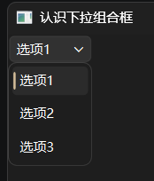

`QComboBox`下拉组合框控件的继承关系如下：

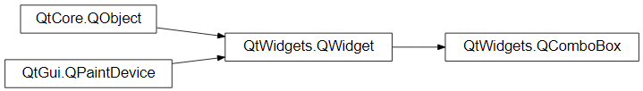

相关文档的链接如下：

- https://doc.qt.io/qtforpython-6/PySide6/QtWidgets/QComboBox.html
- https://doc.qt.io/qtforpython-6/PySide6/QtWidgets/QWidget.html

### 33.1 初始化方法

`QComboBox`下拉组合框控件的初始化方法（参数名及类型提示来自`QtWidgets.pyi`）支持以下参数：

- `parent`参数，`PySide6.QtWidgets.QWidget`类型，表示父控件。如果指定了父控件，那么该控件显示时，会使用父控件的位置或者嵌在父控件内（取决于该控件是否支持嵌入到其他控件）。不指定或者为`None`，则控件会在独立窗口中显示。

- `editable`参数，仅限关键字参数，布尔类型，表示是否允许编辑组合框内的选项，默认为`False`。编辑之后，直接回车的话，会添加新的选项。

- `maxVisibleItems`参数，仅限关键字参数，整数类型，表示下拉框最多显示多少个选项，默认不限制。

- `maxCount`参数，仅限关键字参数，整数类型，表示控件最多有多少个选项，默认不限制。

- `insertPolicy`参数，仅限关键字参数，`PySide6.QtWidgets.QComboBox.InsertPolicy`类型，表示启用`editable`参数时添加新选项的策略。

  `PySide6.QtWidgets.QComboBox.InsertPolicy`类型是枚举类型，包含以下枚举成员：

  - `NoInsert`，表示不允许添加新选项。
  - `InsertAtTop`，表示在所有选项的前面添加新选项。
  - `InsertAtCurrent`，表示替换当前选项。
  - `InsertAtBottom`，表示在所有选项的后面添加新选项。这也是该参数的默认值。
  - `InsertAfterCurrent`，表示在当前选项的前面添加新选项。
  - `InsertBeforeCurrent`，表示在当前选项的后面添加新选项。
  - `InsertAlphabetically`，表示按字符顺序插入。

- `sizeAdjustPolicy`参数，仅限关键字参数，`PySide6.QtWidgets.QComboBox.SizeAdjustPolicy`类型，表示选项内容变化时（比如启用`editable`参数、添加新选项）控件尺寸的调整策略。

  `PySide6.QtWidgets.QComboBox.InsertPolicy`类型是枚举类型，包含以下枚举成员：

  - `AdjustToContents`，表示始终根据选项内容多少调整控件大小。
  - `AdjustToContentsOnFirstShow`，表示在第一次显示时根据选项内容多少调整控件大小。这也是该参数的默认值。
  - `AdjustToMinimumContentsLengthWithIcon`，表示`minimumContentsLength`控件属性加图标的选项大小调整控件大小。注意，启用`editable`参数的话，该策略将无法生效。

- `minimumContentsLength`参数，仅限关键字参数，整数类型，表示选项内容的最小长度，仅在`sizeAdjustPolicy`参数为`PySide6.QtWidgets.QComboBox.InsertPolicy.AdjustToMinimumContentsLengthWithIcon`时生效。默认不限制。

- `iconSize`参数，仅限关键字参数，`PySide6.QtCore.QSize`类型，表示选项图标的大小。

- `placeholderText`参数，仅限关键字参数，字符串类型，表示默认没有选择任何选项时的占位文本。如果不设置该参数，将默认选择第一个选项。

- `duplicatesEnabled`参数，仅限关键字参数，布尔类型，表示启用`editable`参数时添加新选项是否允许重复添加，默认为`False`。注意，使用`addItem`方法、`addItems`方法添加选项的话不受该参数限制，始终可以添加重复选项。

- `frame`参数，仅限关键字参数，布尔类型，表示控件是否额外带一个边框，默认为`True`。

- `labelDrawingMode`参数，仅限关键字参数，`PySide6.QtWidgets.QComboBox.LabelDrawingMode`类型，表示选项文本的渲染模式。

  `PySide6.QtWidgets.QComboBox.LabelDrawingMode`类型是枚举类型，包含以下枚举成员：

  - `UseStyle`，表示使用样式。这也是该参数的默认值。
  - `UseDelegate`，表示使用委托。

### 33.2 方法、控件属性

`QComboBox`下拉组合框控件支持以下方法（部分，含控件属性）：

- `addItem`方法，添加一个选项。
- `addItems`方法，添加多个选项。
- `completer`方法（控件属性，可使用`setCompleter`方法设置），返回控件的自动补全器。
- `count`方法（控件属性），返回控件的选项数。
- `currentData`方法（控件属性），返回控件当前选择选项的选项数据。
- `currentIndex`方法（控件属性，可使用`setCurrentIndex`方法设置），返回控件当前选择选项的索引值。
- `currentText`方法（控件属性，可使用`setCurrentText`方法设置），返回控件当前选择选项的选项文本。
- `duplicatesEnabled`方法（控件属性，可使用`setDuplicatesEnabled`方法设置），返回启用`editable`参数时添加新选项是否允许重复添加。
- `findData`方法，查找选项数据，返回选项的索引值。
- `findText`方法，查找选项文本，返回选项的索引值。
- `hasFrame`方法（控件属性`frame`的获取方法），返回控件是否额外带一个边框。
- `iconSize`方法（控件属性，可使用`setIconSize`方法设置），返回选项图标的大小。
- `insertItem`方法，在指定位置插入一个选项。
- `insertItems`方法，在指定位置插入多个选项。
- `insertPolicy`方法（控件属性，可使用`setInsertPolicy`方法设置），返回启用`editable`参数时添加新选项的策略。
- `insertSeparator`方法，在指定位置插入一条分隔线。
- `isEditable`方法（控件属性`editable`的获取方法，可使用`setEditable`方法设置），返回是否允许编辑组合框内的选项。
- `itemData`方法，返回指定选项的选项数据。
- `itemIcon`方法，返回指定选项的选项图标。
- `itemText`方法，返回指定选项的选项文本。
- `lineEdit`方法，返回启用`editable`参数时的编辑框。
- `maxCount`方法（控件属性，可使用`setMaxCount`方法设置），返回控件最多有多少个选项。
- `maxVisibleItems`方法（控件属性，可使用`setMaxVisibleItems`方法设置），返回下拉框最多显示多少个选项。
- `minimumContentsLength`方法（控件属性，可使用`setMinimumContentsLength`方法设置），返回选项内容的最小长度。
- `model`方法（控件属性，可使用`setModel`方法设置），返回控件的数据模型。
- `modelColumn`方法（控件属性，可使用`setModelColumn`方法设置），返回控件使用数据模型列的索引值。
- `placeholderText`方法（控件属性，可使用`setPlaceholderText`方法设置），返回默认没有选择任何选项时的占位文本。。
- `removeItem`方法，移除指定选项。
- `sizeAdjustPolicy`方法（控件属性，可使用`setSizeAdjustPolicy`方法设置），返回选项内容变化时（比如启用`editable`参数、添加新选项）控件尺寸的调整策略。
- `validator`方法（控件属性，可使用`setValidator`方法设置），返回控件的验证器。
- `view`方法（控件属性，可使用`setView`方法设置），返回下拉框对应的控件。

### 33.3 信号和槽

`QComboBox`下拉组合框控件支持以下信号（部分）：

- `activated`信号，选择选项时触发。
- `currentIndexChanged`信号，当前选择选项的索引值改变时触发。
- `currentTextChanged`信号，当前选择选项的文本改变时触发。
- `editTextChanged`信号，启用`editable`参数时，输入框文本改变时触发（无论是否选择）。
- `highlighted`信号，下拉框中选择选项改变时触发。
- `textActivated`信号，启用`editable`参数时，输入框文本对应选项选择时触发（含创建新选项、选择已有选项之后改变了输入框的文本）。
- `textHighlighted`信号，启用`editable`参数时，下拉框中选择选项改变时触发（无论是否选择）。

`QComboBox`下拉组合框控件支持以下槽（部分）：

- `clear`方法，移除所有选项。
- `clearEditText`方法，启用`editable`参数时，清除输入框文本。
- `setCurrentIndex`方法，修改当前选择的选项。
- `setCurrentText`方法，修改当前选择的选项文本（不影响对应选项的文本）。
- `setEditText`方法，启用`editable`参数时，修改输入框文本。

### 33.4 扩展用法

#### 33.4.1 设置选项图标

添加选项时，可以同时设置选项的图标：

```python
from PySide6.QtWidgets import (
    QApplication,
    QWidget,
    QComboBox,
)
from PySide6.QtCore import QSize
from PySide6.QtGui import QIcon

app = QApplication()
window = QWidget()
window.setWindowTitle('认识下拉组合框')
window.resize(400, 300)

box = QComboBox(
    window,
    iconSize=QSize(
        40,40
    )
)

for i in range(1,4):
    box.addItem(
        QIcon.fromTheme(
            QIcon.ThemeIcon.Computer
        ),
        f'选项{i}',
        i
    )

window.show()
app.exec()
```

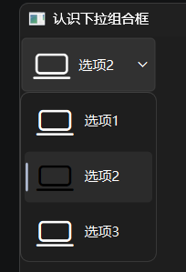

#### 33.4.2 使用数据模型添加选项

除了单独调用`addItem`方法、`addItems`方法添加选项，还可以使用`setModel`方法何止数据模型，控件将自动基于数据模型中的数据生成对应选项：

```python
from PySide6.QtWidgets import (
    QApplication,
    QWidget,
    QComboBox,
)
from PySide6.QtGui import QStandardItemModel,QStandardItem

app = QApplication()
window = QWidget()
window.setWindowTitle('认识下拉组合框')
window.resize(400, 300)

box = QComboBox(
    window,
)
box2 = QComboBox(
    window,
)
box2.move(
    0,30
)
model = QStandardItemModel()
model.appendRow([QStandardItem('1'),QStandardItem('a')])
model.appendRow([QStandardItem('2'),QStandardItem('b')])
box.setModel(
    model
)
box.setModelColumn(0)
box2.setModel(
    model
)
box2.setModelColumn(1)

window.show()
app.exec()
```

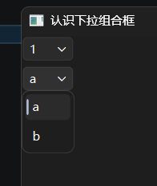

也可以使用自动补全器，搜索数据模型，手动添加数据模型内的数据：

```python
from PySide6.QtWidgets import (
    QApplication,
    QWidget,
    QComboBox,
    QCompleter
)
from PySide6.QtGui import QStandardItemModel,QStandardItem

app = QApplication()
window = QWidget()
window.setWindowTitle('认识下拉组合框')
window.resize(400, 300)

box = QComboBox(
    window,
    editable=True
)
for i in range(1,4):
    box.addItem(
        f'选项{i}',
        i
    )

model = QStandardItemModel()
model.appendRow([QStandardItem('1'),QStandardItem('a')])
model.appendRow([QStandardItem('2'),QStandardItem('b')])
completer = QCompleter(
    model
)
completer.setCompletionColumn(1)
box.setCompleter(
    completer
)

window.show()
app.exec()
```

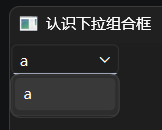

#### 33.4.3 设置选项样式

设置选项样式的方法有两种，一是使用委托（比较复杂），二是使用样式（QSS）。

使用委托的示例（因为用法比较复杂，这里不做展开，后续章节再具体介绍）：

```python
from PySide6.QtWidgets import (
    QApplication,
    QWidget,
    QComboBox,
    QStyledItemDelegate
)
from PySide6.QtCore import QSize

app = QApplication()
window = QWidget()
window.setWindowTitle('认识下拉组合框')
window.resize(400, 300)

box = QComboBox(
    window,
    labelDrawingMode=QComboBox.LabelDrawingMode.UseDelegate
)
for i in range(1,4):
    box.addItem(
        f'选项{i}',
        i
    )

class CustomComboDelegate(QStyledItemDelegate):
    def __init__(self, parent=None):
        super().__init__(parent)

    def sizeHint(self, option, index):
        # 默认高度
        original_size = super().sizeHint(option, index)
        return QSize(original_size.width()+10, original_size.height()+40)
    
box.setItemDelegate(
    CustomComboDelegate()
)

window.show()
app.exec()
```

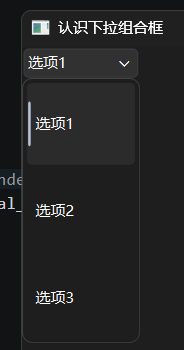

使用样式（QSS）的示例：

```python
from PySide6.QtWidgets import (
    QApplication,
    QWidget,
    QComboBox
)

app = QApplication()
window = QWidget()
window.setWindowTitle('认识下拉组合框')
window.resize(400, 300)

box = QComboBox(
    window,
    labelDrawingMode=QComboBox.LabelDrawingMode.UseDelegate
)
for i in range(1,4):
    box.addItem(
        f'选项{i}',
        i
    )
box.setStyleSheet(
    '''
    QComboBox QAbstractItemView::item {
        /*对应上右下左的边距*/
        margin: 0px 0px 10px 20px; 
    }
    '''
)
window.show()
app.exec()
```

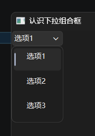

## 34 `QDateTimeEdit`日期时间编辑框控件

`QDateTimeEdit`日期时间编辑框控件主要用于快捷编辑日期、时间，除了直接输入，右侧还有直接调整数字用的按钮，对于微调场景，操作更方便。

示例如下：

```python
from PySide6.QtWidgets import (
    QApplication,
    QWidget,
    QDateTimeEdit,
)
from PySide6.QtCore import QDateTime

app = QApplication()
window = QWidget()
window.setWindowTitle('认识时间控件')
window.resize(400, 300)

date = QDateTimeEdit(
    window,
    dateTime=QDateTime(
        2026,
        1,
        1,
        12,
        30,
        0
    )
)

window.show()
app.exec()
```

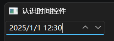

`QDateTimeEdit`日期时间编辑框控件的继承关系如下：

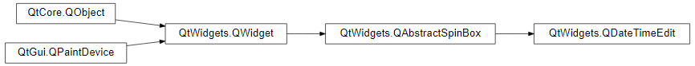

相关文档的链接如下：

- https://doc.qt.io/qtforpython-6/PySide6/QtWidgets/QDateTimeEdit.html
- https://doc.qt.io/qtforpython-6/PySide6/QtWidgets/QAbstractSpinBox.html
- https://doc.qt.io/qtforpython-6/PySide6/QtWidgets/QWidget.html

### 34.1 初始化方法

`QDateTimeEdit`日期时间编辑框控件有多种初始化方法（参数名及类型提示来自`QtWidgets.pyi`）。

第一种初始化方法支持以下参数：

- `d`参数，仅限位置参数（第一个位置参数），`PySide6.QtCore.QDate`类型，表示默认日期，优先级低于`dateTime`参数、`date`参数。
- `parent`参数，`PySide6.QtWidgets.QWidget`类型，表示父控件。如果指定了父控件，那么该控件显示时，会使用父控件的位置或者嵌在父控件内（取决于该控件是否支持嵌入到其他控件）。不指定或者为`None`，则控件会在独立窗口中显示。
- `dateTime`参数，仅限关键字参数，`PySide6.QtCore.QDateTime`类型，表示默认日期和时间，优先级低于`date`参数、`time`参数。
- `date`参数，仅限关键字参数，`PySide6.QtCore.QDate`类型，表示默认日期。
- `time`参数，仅限关键字参数，`PySide6.QtCore.QTime`类型，表示默认时间。
- `maximumDateTime`参数，仅限关键字参数，`PySide6.QtCore.QDateTime`类型，表示日期和时间的最大值。
- `minimumDateTime`参数，仅限关键字参数，`PySide6.QtCore.QDateTime`类型，表示日期和时间的最小值。
- `maximumDate`参数，仅限关键字参数，`PySide6.QtCore.QDate`类型，表示日期的最大值。
- `minimumDate`参数，仅限关键字参数，`PySide6.QtCore.QDate`类型，表示日期的最小值。
- `maximumTime`参数，仅限关键字参数，`PySide6.QtCore.QTime`类型，表示时间的最大值。注意，需要同时指定日期的最大值才能生效。
- `minimumTime`参数，仅限关键字参数，`PySide6.QtCore.QTime`类型，表示时间的最小值。注意，需要同时指定日期的最小值才能生效。
- `displayFormat`参数，仅限关键字参数，字符串类型，表示时间日期的显示格式。支持的格式符如下：
  - “y”表示年，支持“yy”（仅后两位）和“yyyy”两种形式。
  - “M”表示月，支持“M”、“MM”（含补位的前导零）、“MMM”（月份缩写，与系统格式一致）、“MMMM”（月份全称，与系统格式一致）四种形式。
  - “d”表示日期，支持“d”、“dd”（含补位的前导零）、“ddd”（星期缩写，与系统格式一致）、“dddd”（星期全称，与系统格式一致）四种形式。
  - “h”表示小时（12小时制），支持“h”、“hh”（含补位的前导零）两种形式。
  - “H”表示小时（24小时制），支持“H”、“HH”（含补位的前导零）两种形式。
  - “m”表示分钟，支持“m”、“mm”（含补位的前导零）两种形式。
  - “s”表示秒，支持“s”、“ss”（含补位的前导零）两种形式。“z”表示毫秒。
  - “AP”、“A”表示上下午的大写，“ap”、“a”表示上下午的小写。
  - “t”表示时区的缩写，“tt”表示时区偏移量，“ttt”表示时区偏移值（转换为`±{小时}:{分钟}`的表达格式），“tttt”表示时区的名称。

- `calendarPopup`参数，仅限关键字参数，布尔类型，表示是否将调整按钮替换为可弹出日历选择器的按钮，用于快捷选定日期。
- `timeSpec`参数，仅限关键字参数，`PySide6.QtCore.Qt.TimeSpec`类型，表示显示时间的时区基准。
- `timeZone`参数，仅限关键字参数，`PySide6.QtCore.QTimeZone`类型，表示显示时间的时区。

第二种初始化方法支持以下参数：

- `dt`参数，仅限位置参数（第一个位置参数），`PySide6.QtCore.QDateTime`类型，表示默认日期和时间，优先级低于`dateTime`参数、`date`参数、`time`参数。
- `parent`参数，`PySide6.QtWidgets.QWidget`类型，表示父控件。如果指定了父控件，那么该控件显示时，会使用父控件的位置或者嵌在父控件内（取决于该控件是否支持嵌入到其他控件）。不指定或者为`None`，则控件会在独立窗口中显示。
- 仅限关键字参数与第一种初始化方法相同。

第三种初始化方法支持以下参数：

- `t`参数，仅限位置参数（第一个位置参数），`PySide6.QtCore.QTime`类型，表示默认时间，优先级低于`dateTime`参数、`time`参数。
- `parent`参数，`PySide6.QtWidgets.QWidget`类型，表示父控件。如果指定了父控件，那么该控件显示时，会使用父控件的位置或者嵌在父控件内（取决于该控件是否支持嵌入到其他控件）。不指定或者为`None`，则控件会在独立窗口中显示。
- 仅限关键字参数与第一种初始化方法相同。

第四种初始化方法支持以下参数：

- `parent`参数，`PySide6.QtWidgets.QWidget`类型，表示父控件。如果指定了父控件，那么该控件显示时，会使用父控件的位置或者嵌在父控件内（取决于该控件是否支持嵌入到其他控件）。不指定或者为`None`，则控件会在独立窗口中显示。
- 仅限关键字参数与第一种初始化方法相同。

### 34.2 方法、控件属性

`QDateTimeEdit`日期时间编辑框控件支持以下方法（部分，含控件属性）：

- `calendar`方法（控件属性，可使用`setCalendar`方法设置），返回控件使用的日历系统。注意，该控件属性仅当`calendarPopup`参数为`True`时可用。
- `calendarPopup`方法（控件属性，可使用`setCalendarPopup`方法设置），返回控件是否将调整按钮替换为可弹出日历选择器的按钮。
- `calendarWidget`方法（控件属性，可使用`setCalendarWidget`方法设置），返回控件的日历选择器。注意，该控件属性仅当`calendarPopup`参数为`True`时可用。
- `clearMaximumDate`方法，重置控件属性`maximumDate`。
- `clearMaximumDateTime`方法，重置控件属性`maximumDateTime`。
- `clearMaximumTime`方法，重置控件属性`maximumTime`。
- `clearMinimumDate`方法，重置控件属性`minimumDate`。
- `clearMinimumDateTime`方法，重置控件属性`minimumDateTime`。
- `clearMinimumTime`方法，重置控件属性`minimumTime`。
- `currentSection`方法，（控件属性，可使用`setCurrentSection`方法设置），返回当前编辑的时间日期区段。
- `currentSectionIndex`方法，（控件属性，可使用`setCurrentSectionIndex`方法设置），返回当前编辑的时间日期区段的索引值。
- `date`方法，（控件属性，可使用`setDate`方法设置），返回默认日期。
- `dateTime`方法，（控件属性，可使用`setDateTime`方法设置），返回默认日期时间。
- `displayFormat`方法，（控件属性，可使用`setDisplayFormat`方法设置），返回时间日期的显示格式。
- `displayedSections`方法，返回当前显示的时间日期区段。
- `maximumDate`方法，（控件属性，可使用`setMaximumDate`方法设置），返回日期的最大值。
- `maximumDateTime`方法，（控件属性，可使用`setMaximumDateTime`方法设置），返回日期时间的最大值。
- `maximumTime`方法，（控件属性，可使用`setMaximumTime`方法设置），返回时间的最大值。
- `minimumDate`方法，（控件属性，可使用`setMinimumDate`方法设置），返回日期的最小值。
- `minimumDateTime`方法，（控件属性，可使用`setMinimumDateTime`方法设置），返回日期时间的最小值。
- `minimumTime`方法，（控件属性，可使用`setMinimumTime`方法设置），返回时间的最小值。
- `sectionAt`方法，返回指定位置（索引值）的时间日期区段。
- `sectionCount`方法，返回时间日期区段的数量。
- `sectionText`方法，返回指定时间日期区段的文本。
- `setDateRange`方法，设置日期的范围（最小值、最大值）。
- `setDateTimeRange`方法，设置日期时间的范围（最小值、最大值）。
- `setSelectedSection`方法，设置当前选中的时间日期区段。
- `setTimeRange`方法，设置时间的范围（最小值、最大值）。
- `time`方法，（控件属性，可使用`setTime`方法设置），返回默认时间。
- `timeSpec`方法，（控件属性，可使用`setTimeSpec`方法设置），返回显示时间的时区基准。
- `timeZone`方法，（控件属性，可使用`setTimeZone`方法设置），返回显示时间的时区。

### 34.3 信号和槽

`QDateTimeEdit`日期时间编辑框控件支持以下信号（部分）：

- `dateChanged`信号，控件属性`date`改变时触发。
- `dateTimeChanged`信号，控件属性`dateTime`改变时触发。
- `timeChanged`信号，控件属性`time`改变时触发。

`QDateTimeEdit`日期时间编辑框控件支持以下槽（部分）：

- `setDate`方法，修改控件属性`date`。
- `setDateTime`方法，修改控件属性`dateTime`。
- `setTime`方法，修改控件属性`time`。

### 34.4 扩展用法

#### 34.4.1 需要延迟执行的方法

`setCurrentSection`方法、`setCurrentSectionIndex`方法、`setSelectedSection`方法不能立即执行，必须延迟一段时间再执行，这样才能正常生效：

```python
from PySide6.QtWidgets import (
    QApplication,
    QWidget,
    QDateTimeEdit,
)
from PySide6.QtCore import QTimer

app = QApplication()
window = QWidget()
window.setWindowTitle('认识时间控件')
window.resize(400, 300)

date = QDateTimeEdit(
    window,
)
# 使用定时器延时操作
# 建议不大于100ms，取决于机器性能，机器性能太差的话可以适当延长
# 不小于21ms，取决于机器性能，机器性能太差的话可以适当延长
QTimer.singleShot(100,lambda :date.setCurrentSection(QDateTimeEdit.Section.DaySection))

window.show()
app.exec()
```

#### 34.4.2 `QDateEdit`日期编辑框控件

`QDateEdit`日期编辑框控件继承自`QDateTimeEdit`日期时间编辑框控件，默认只显示日期。

示例如下：

```python
from PySide6.QtWidgets import (
    QApplication,
    QWidget,
    QDateEdit,
)
from PySide6.QtCore import QDate

app = QApplication()
window = QWidget()
window.setWindowTitle('认识时间控件')
window.resize(400, 300)

QDateEdit(
    QDate(
        2026,
        1,
        1,
    ),
    window
)

window.show()
app.exec()
```

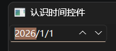

`QDateEdit`日期编辑框控件的继承关系如下：

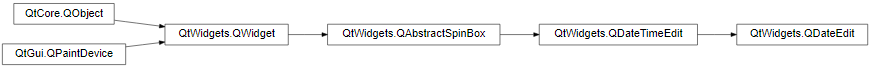

相关文档的链接如下：

- https://doc.qt.io/qtforpython-6/PySide6/QtWidgets/QDateEdit.html
- https://doc.qt.io/qtforpython-6/PySide6/QtWidgets/QDateTimeEdit.html
- https://doc.qt.io/qtforpython-6/PySide6/QtWidgets/QAbstractSpinBox.html
- https://doc.qt.io/qtforpython-6/PySide6/QtWidgets/QWidget.html

支持`QDateTimeEdit`日期时间编辑框控件的第一种、第四种初始化方法。

`QDateEdit`日期编辑框控件支持以下方法（部分，含控件属性）：

- `date`方法（控件属性，可使用`setDate`方法设置），表示默认日期。

`QDateEdit`日期编辑框控件支持以下信号（部分）：

- `userDateChanged`信号，控件属性`date`改变时触发。

#### 34.4.3 `QTimeEdit`时间编辑框控件

`QTimeEdit`时间编辑框控件继承自`QDateTimeEdit`日期时间编辑框控件，默认只显示时间。

示例如下：

```python
from PySide6.QtWidgets import (
    QApplication,
    QWidget,
    QTimeEdit,
)
from PySide6.QtCore import QTime

app = QApplication()
window = QWidget()
window.setWindowTitle('认识时间控件')
window.resize(400, 300)

QTimeEdit(
    QTime(
        12,
        30,
        0,
    ),
    window
)

window.show()
app.exec()
```

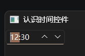

`QTimeEdit`时间编辑框控件的继承关系如下：

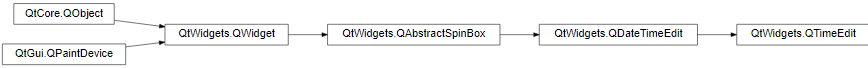

相关文档的链接如下：

- https://doc.qt.io/qtforpython-6/PySide6/QtWidgets/QTimeEdit.html
- https://doc.qt.io/qtforpython-6/PySide6/QtWidgets/QDateTimeEdit.html
- https://doc.qt.io/qtforpython-6/PySide6/QtWidgets/QAbstractSpinBox.html
- https://doc.qt.io/qtforpython-6/PySide6/QtWidgets/QWidget.html

支持`QDateTimeEdit`日期时间编辑框控件的第三种、第四种初始化方法。

`QTimeEdit`时间编辑框控件支持以下方法（部分，含控件属性）：

- `time`方法（控件属性，可使用`setTime`方法设置），表示默认时间。

`QTimeEdit`时间编辑框控件支持以下信号（部分）：

- `userTimeChanged`信号，控件属性`time`改变时触发。

## 35 `PySide6.QtWidgets`模块提供的控件、类

`PySide6.QtWidgets`模块提供了不少控件，前面的章节介绍了一部分，有的读者反馈有些控件用的时候想不起来，或者部分控件还没开始介绍，不知道需要特定功能时该用哪个控件。

还好官网文档（ https://doc.qt.io/qtforpython-6/overviews/qtwidgets-widget-classes.html#widgets-classes ）提供了按功能分类的功能目录（仅包含部分控件），可以按需选择使用的控件。

基础部分（最常用的控件）：

| 类名                                                         | 说明                   |
| ------------------------------------------------------------ | ---------------------- |
| [`PySide6.QtWidgets.QWidget`](https://doc.qt.io/qtforpython-6/PySide6/QtWidgets/QWidget.html#PySide6.QtWidgets.QWidget) | 基本控件               |
| [`PySide6.QtWidgets.QCheckBox`](https://doc.qt.io/qtforpython-6/PySide6/QtWidgets/QCheckBox.html#PySide6.QtWidgets.QCheckBox) | 勾选框、复选框         |
| [`PySide6.QtWidgets.QComboBox`](https://doc.qt.io/qtforpython-6/PySide6/QtWidgets/QComboBox.html#PySide6.QtWidgets.QComboBox) | 下拉选择框             |
| [`PySide6.QtWidgets.QCommandLinkButton`](https://doc.qt.io/qtforpython-6/PySide6/QtWidgets/QCommandLinkButton.html#PySide6.QtWidgets.QCommandLinkButton) | 带解释文本的预制按钮   |
| [`PySide6.QtWidgets.QDateTimeEdit`](https://doc.qt.io/qtforpython-6/PySide6/QtWidgets/QDateTimeEdit.html#PySide6.QtWidgets.QDateTimeEdit) | 日期时间编辑框         |
| [`PySide6.QtWidgets.QTimeEdit`](https://doc.qt.io/qtforpython-6/PySide6/QtWidgets/QTimeEdit.html#PySide6.QtWidgets.QTimeEdit) | 时间编辑框             |
| [`PySide6.QtWidgets.QDateEdit`](https://doc.qt.io/qtforpython-6/PySide6/QtWidgets/QDateEdit.html#PySide6.QtWidgets.QDateEdit) | 日期编辑器             |
| [`PySide6.QtWidgets.QDial`](https://doc.qt.io/qtforpython-6/PySide6/QtWidgets/QDial.html#PySide6.QtWidgets.QDial) | 旋钮                   |
| [`PySide6.QtWidgets.QFocusFrame`](https://doc.qt.io/qtforpython-6/PySide6/QtWidgets/QFocusFrame.html#PySide6.QtWidgets.QFocusFrame) | 给其他控件套个边框     |
| [`PySide6.QtWidgets.QFontComboBox`](https://doc.qt.io/qtforpython-6/PySide6/QtWidgets/QFontComboBox.html#PySide6.QtWidgets.QFontComboBox) | 字体的下拉选择框       |
| [`PySide6.QtWidgets.QLabel`](https://doc.qt.io/qtforpython-6/PySide6/QtWidgets/QLabel.html#PySide6.QtWidgets.QLabel) | 显示文本或者图片       |
| [`PySide6.QtWidgets.QLCDNumber`](https://doc.qt.io/qtforpython-6/PySide6/QtWidgets/QLCDNumber.html#PySide6.QtWidgets.QLCDNumber) | 以LCD风格显示数字      |
| [`PySide6.QtWidgets.QLineEdit`](https://doc.qt.io/qtforpython-6/PySide6/QtWidgets/QLineEdit.html#PySide6.QtWidgets.QLineEdit) | 单行的文本编辑框       |
| [`PySide6.QtWidgets.QMenu`](https://doc.qt.io/qtforpython-6/PySide6/QtWidgets/QMenu.html#PySide6.QtWidgets.QMenu) | 菜单                   |
| [`PySide6.QtWidgets.QProgressBar`](https://doc.qt.io/qtforpython-6/PySide6/QtWidgets/QProgressBar.html#PySide6.QtWidgets.QProgressBar) | 进度条                 |
| [`PySide6.QtWidgets.QPushButton`](https://doc.qt.io/qtforpython-6/PySide6/QtWidgets/QPushButton.html#PySide6.QtWidgets.QPushButton) | 普通按钮               |
| [`PySide6.QtWidgets.QRadioButton`](https://doc.qt.io/qtforpython-6/PySide6/QtWidgets/QRadioButton.html#PySide6.QtWidgets.QRadioButton) | 单选框                 |
| [`PySide6.QtWidgets.QScrollArea`](https://doc.qt.io/qtforpython-6/PySide6/QtWidgets/QScrollArea.html#PySide6.QtWidgets.QScrollArea) | 可以滚动的区域         |
| [`PySide6.QtWidgets.QScrollBar`](https://doc.qt.io/qtforpython-6/PySide6/QtWidgets/QScrollBar.html#PySide6.QtWidgets.QScrollBar) | 滚动条                 |
| [`PySide6.QtWidgets.QSizeGrip`](https://doc.qt.io/qtforpython-6/PySide6/QtWidgets/QSizeGrip.html#PySide6.QtWidgets.QSizeGrip) | 调整窗口大小的拖放控件 |
| [`PySide6.QtWidgets.QSlider`](https://doc.qt.io/qtforpython-6/PySide6/QtWidgets/QSlider.html#PySide6.QtWidgets.QSlider) | 滑块                   |
| [`PySide6.QtWidgets.QSpinBox`](https://doc.qt.io/qtforpython-6/PySide6/QtWidgets/QSpinBox.html#PySide6.QtWidgets.QSpinBox) | 带调整按钮的整数编辑框 |
| [`PySide6.QtWidgets.QDoubleSpinBox`](https://doc.qt.io/qtforpython-6/PySide6/QtWidgets/QDoubleSpinBox.html#PySide6.QtWidgets.QDoubleSpinBox) | 带调整按钮的小数编辑框 |
| [`PySide6.QtWidgets.QTabBar`](https://doc.qt.io/qtforpython-6/PySide6/QtWidgets/QTabBar.html#PySide6.QtWidgets.QTabBar) | 选项卡的标签页         |
| [`PySide6.QtWidgets.QTabWidget`](https://doc.qt.io/qtforpython-6/PySide6/QtWidgets/QTabWidget.html#PySide6.QtWidgets.QTabWidget) | 选项卡的内容           |
| [`PySide6.QtWidgets.QToolBox`](https://doc.qt.io/qtforpython-6/PySide6/QtWidgets/QToolBox.html#PySide6.QtWidgets.QToolBox) | 垂直的手风琴式折叠面板 |
| [`PySide6.QtWidgets.QToolButton`](https://doc.qt.io/qtforpython-6/PySide6/QtWidgets/QToolButton.html#PySide6.QtWidgets.QToolButton) | 一般用在工具栏中的按钮 |

高级部分（视图类控件）：

| 类名                                                         | 说明                 |
| ------------------------------------------------------------ | -------------------- |
| [`PySide6.QtWidgets.QColumnView`](https://doc.qt.io/qtforpython-6/PySide6/QtWidgets/QColumnView.html#PySide6.QtWidgets.QColumnView) | 列视图               |
| [`PySide6.QtWidgets.QDataWidgetMapper`](https://doc.qt.io/qtforpython-6/PySide6/QtWidgets/QDataWidgetMapper.html#PySide6.QtWidgets.QDataWidgetMapper) | 展示数据模型         |
| [`PySide6.QtWidgets.QListView`](https://doc.qt.io/qtforpython-6/PySide6/QtWidgets/QListView.html#PySide6.QtWidgets.QListView) | 列表视图，可以带图标 |
| [`PySide6.QtWidgets.QTableView`](https://doc.qt.io/qtforpython-6/PySide6/QtWidgets/QTableView.html#PySide6.QtWidgets.QTableView) | 表格                 |
| [`PySide6.QtWidgets.QTreeView`](https://doc.qt.io/qtforpython-6/PySide6/QtWidgets/QTreeView.html#PySide6.QtWidgets.QTreeView) | 树形图               |
| [`PySide6.QtWidgets.QUndoView`](https://doc.qt.io/qtforpython-6/PySide6/QtWidgets/QUndoView.html#PySide6.QtWidgets.QUndoView) | 展示可撤销的操作     |
| [`PySide6.QtWidgets.QCalendarWidget`](https://doc.qt.io/qtforpython-6/PySide6/QtWidgets/QCalendarWidget.html#PySide6.QtWidgets.QCalendarWidget) | 日历                 |

抽象部分（其他控件的基类，不单独使用，但提供的方法、属性需要了解）：

| 类名                                                         | 说明             |
| ------------------------------------------------------------ | ---------------- |
| [`PySide6.QtWidgets.QDialog`](https://doc.qt.io/qtforpython-6/PySide6/QtWidgets/QDialog.html#PySide6.QtWidgets.QDialog) | 对话框的基类     |
| [`PySide6.QtWidgets.QAbstractButton`](https://doc.qt.io/qtforpython-6/PySide6/QtWidgets/QAbstractButton.html#PySide6.QtWidgets.QAbstractButton) | 按钮的基类       |
| [`PySide6.QtWidgets.QAbstractScrollArea`](https://doc.qt.io/qtforpython-6/PySide6/QtWidgets/QAbstractScrollArea.html#PySide6.QtWidgets.QAbstractScrollArea) | 滚动区域的基类   |
| [`PySide6.QtWidgets.QAbstractSlider`](https://doc.qt.io/qtforpython-6/PySide6/QtWidgets/QAbstractSlider.html#PySide6.QtWidgets.QAbstractSlider) | 滑块的基类       |
| [`PySide6.QtWidgets.QAbstractSpinBox`](https://doc.qt.io/qtforpython-6/PySide6/QtWidgets/QAbstractSpinBox.html#PySide6.QtWidgets.QAbstractSpinBox) | 数字编辑框的基类 |
| [`PySide6.QtWidgets.QFrame`](https://doc.qt.io/qtforpython-6/PySide6/QtWidgets/QFrame.html#PySide6.QtWidgets.QFrame) | 带框架控件的基类 |

组织控件（不是布局控件，但可以编排其他控件）：

| 类名                                                         | 说明                                               |
| ------------------------------------------------------------ | -------------------------------------------------- |
| [`PySide6.QtWidgets.QButtonGroup`](https://doc.qt.io/qtforpython-6/PySide6/QtWidgets/QButtonGroup.html#PySide6.QtWidgets.QButtonGroup) | 给按钮编组                                         |
| [`PySide6.QtWidgets.QGroupBox`](https://doc.qt.io/qtforpython-6/PySide6/QtWidgets/QGroupBox.html#PySide6.QtWidgets.QGroupBox) | 带有标题的编组控件                                 |
| [`PySide6.QtWidgets.QSplitterHandle`](https://doc.qt.io/qtforpython-6/PySide6/QtWidgets/QSplitterHandle.html#PySide6.QtWidgets.QSplitterHandle) | 分离器控件的把手（内部控件）                       |
| [`PySide6.QtWidgets.QSplitter`](https://doc.qt.io/qtforpython-6/PySide6/QtWidgets/QSplitter.html#PySide6.QtWidgets.QSplitter) | 分离器控件，将一块区域分隔成可以自由调整比例的两块 |
| [`PySide6.QtWidgets.QStackedWidget`](https://doc.qt.io/qtforpython-6/PySide6/QtWidgets/QStackedWidget.html#PySide6.QtWidgets.QStackedWidget) | 子控件可以堆叠的容器                               |
| [`PySide6.QtWidgets.QTabWidget`](https://doc.qt.io/qtforpython-6/PySide6/QtWidgets/QTabWidget.html#PySide6.QtWidgets.QTabWidget) | 选项卡的内容                                       |

图形视图相关：

| 类名                                                         | 说明                           |
| ------------------------------------------------------------ | ------------------------------ |
| [`PySide6.QtWidgets.QGraphicsEffect`](https://doc.qt.io/qtforpython-6/PySide6/QtWidgets/QGraphicsEffect.html#PySide6.QtWidgets.QGraphicsEffect) | 图形效果类的基类               |
| [`PySide6.QtWidgets.QGraphicsAnchorLayout`](https://doc.qt.io/qtforpython-6/PySide6/QtWidgets/QGraphicsAnchorLayout.html#PySide6.QtWidgets.QGraphicsAnchorLayout) | 在图形中用于固定控件的布局控件 |
| [`PySide6.QtWidgets.QGraphicsAnchor`](https://doc.qt.io/qtforpython-6/PySide6/QtWidgets/QGraphicsAnchor.html#PySide6.QtWidgets.QGraphicsAnchor) | 固定控件用的锚点               |
| [`PySide6.QtWidgets.QGraphicsGridLayout`](https://doc.qt.io/qtforpython-6/PySide6/QtWidgets/QGraphicsGridLayout.html#PySide6.QtWidgets.QGraphicsGridLayout) | 网格布局                       |
| [`PySide6.QtWidgets.QGraphicsItem`](https://doc.qt.io/qtforpython-6/PySide6/QtWidgets/QGraphicsItem.html#PySide6.QtWidgets.QGraphicsItem) | 图形的基类                     |
| [`PySide6.QtWidgets.QGraphicsObject`](https://doc.qt.io/qtforpython-6/PySide6/QtWidgets/QGraphicsObject.html#PySide6.QtWidgets.QGraphicsObject) | 有信号、槽、属性的图形的基类   |
| [`PySide6.QtWidgets.QAbstractGraphicsShapeItem`](https://doc.qt.io/qtforpython-6/PySide6/QtWidgets/QAbstractGraphicsShapeItem.html#PySide6.QtWidgets.QAbstractGraphicsShapeItem) | 路径图形的基类                 |
| [`PySide6.QtWidgets.QGraphicsPathItem`](https://doc.qt.io/qtforpython-6/PySide6/QtWidgets/QGraphicsPathItem.html#PySide6.QtWidgets.QGraphicsPathItem) | 可添加到场景中的路径图形       |
| [`PySide6.QtWidgets.QGraphicsRectItem`](https://doc.qt.io/qtforpython-6/PySide6/QtWidgets/QGraphicsRectItem.html#PySide6.QtWidgets.QGraphicsRectItem) | 可添加到场景中的矩形           |
| [`PySide6.QtWidgets.QGraphicsEllipseItem`](https://doc.qt.io/qtforpython-6/PySide6/QtWidgets/QGraphicsEllipseItem.html#PySide6.QtWidgets.QGraphicsEllipseItem) | 可添加到场景中的椭圆形         |
| [`PySide6.QtWidgets.QGraphicsPolygonItem`](https://doc.qt.io/qtforpython-6/PySide6/QtWidgets/QGraphicsPolygonItem.html#PySide6.QtWidgets.QGraphicsPolygonItem) | 可添加到场景中的多边形         |
| [`PySide6.QtWidgets.QGraphicsLineItem`](https://doc.qt.io/qtforpython-6/PySide6/QtWidgets/QGraphicsLineItem.html#PySide6.QtWidgets.QGraphicsLineItem) | 可添加到场景中的线             |
| [`PySide6.QtWidgets.QGraphicsPixmapItem`](https://doc.qt.io/qtforpython-6/PySide6/QtWidgets/QGraphicsPixmapItem.html#PySide6.QtWidgets.QGraphicsPixmapItem) | 可添加到场景中的图片           |
| [`PySide6.QtWidgets.QGraphicsTextItem`](https://doc.qt.io/qtforpython-6/PySide6/QtWidgets/QGraphicsTextItem.html#PySide6.QtWidgets.QGraphicsTextItem) | 可添加到场景中的文本           |
| [`PySide6.QtWidgets.QGraphicsSimpleTextItem`](https://doc.qt.io/qtforpython-6/PySide6/QtWidgets/QGraphicsSimpleTextItem.html#PySide6.QtWidgets.QGraphicsSimpleTextItem) | 可添加到场景中的简单文本       |
| [`PySide6.QtWidgets.QGraphicsItemGroup`](https://doc.qt.io/qtforpython-6/PySide6/QtWidgets/QGraphicsItemGroup.html#PySide6.QtWidgets.QGraphicsItemGroup) | 将可添加到场景中的图形编组     |
| [`PySide6.QtWidgets.QGraphicsItemAnimation`](https://doc.qt.io/qtforpython-6/PySide6/QtWidgets/QGraphicsItemAnimation.html#PySide6.QtWidgets.QGraphicsItemAnimation) | 可添加到场景中的图形添加动画   |
| [`PySide6.QtWidgets.QGraphicsLayout`](https://doc.qt.io/qtforpython-6/PySide6/QtWidgets/QGraphicsLayout.html#PySide6.QtWidgets.QGraphicsLayout) | 图形布局的基类                 |
| [`PySide6.QtWidgets.QGraphicsLayoutItem`](https://doc.qt.io/qtforpython-6/PySide6/QtWidgets/QGraphicsLayoutItem.html#PySide6.QtWidgets.QGraphicsLayoutItem) | 只有该类和子类可添加到布局中   |
| [`PySide6.QtWidgets.QGraphicsLinearLayout`](https://doc.qt.io/qtforpython-6/PySide6/QtWidgets/QGraphicsLinearLayout.html#PySide6.QtWidgets.QGraphicsLinearLayout) | 水平、垂直布局                 |
| [`PySide6.QtWidgets.QGraphicsProxyWidget`](https://doc.qt.io/qtforpython-6/PySide6/QtWidgets/QGraphicsProxyWidget.html#PySide6.QtWidgets.QGraphicsProxyWidget) | 将`QWidget`控件添加到场景      |
| [`PySide6.QtWidgets.QGraphicsScene`](https://doc.qt.io/qtforpython-6/PySide6/QtWidgets/QGraphicsScene.html#PySide6.QtWidgets.QGraphicsScene) | 放置图形的场景                 |
| [`PySide6.QtWidgets.QGraphicsSceneEvent`](https://doc.qt.io/qtforpython-6/PySide6/QtWidgets/QGraphicsSceneEvent.html#PySide6.QtWidgets.QGraphicsSceneEvent) | 场景事件的基类                 |
| [`PySide6.QtWidgets.QGraphicsSceneMouseEvent`](https://doc.qt.io/qtforpython-6/PySide6/QtWidgets/QGraphicsSceneMouseEvent.html#PySide6.QtWidgets.QGraphicsSceneMouseEvent) | 场景的鼠标事件                 |
| [`PySide6.QtWidgets.QGraphicsSceneWheelEvent`](https://doc.qt.io/qtforpython-6/PySide6/QtWidgets/QGraphicsSceneWheelEvent.html#PySide6.QtWidgets.QGraphicsSceneWheelEvent) | 场景的鼠标滚轮事件             |
| [`PySide6.QtWidgets.QGraphicsSceneContextMenuEvent`](https://doc.qt.io/qtforpython-6/PySide6/QtWidgets/QGraphicsSceneContextMenuEvent.html#PySide6.QtWidgets.QGraphicsSceneContextMenuEvent) | 场景的上下文菜单事件           |
| [`PySide6.QtWidgets.QGraphicsSceneHoverEvent`](https://doc.qt.io/qtforpython-6/PySide6/QtWidgets/QGraphicsSceneHoverEvent.html#PySide6.QtWidgets.QGraphicsSceneHoverEvent) | 场景的鼠标悬停事件             |
| [`PySide6.QtWidgets.QGraphicsSceneHelpEvent`](https://doc.qt.io/qtforpython-6/PySide6/QtWidgets/QGraphicsSceneHelpEvent.html#PySide6.QtWidgets.QGraphicsSceneHelpEvent) | 场景的提示信息显示事件         |
| [`PySide6.QtWidgets.QGraphicsSceneDragDropEvent`](https://doc.qt.io/qtforpython-6/PySide6/QtWidgets/QGraphicsSceneDragDropEvent.html#PySide6.QtWidgets.QGraphicsSceneDragDropEvent) | 场景的（从窗口外）拖放事件     |
| [`PySide6.QtWidgets.QGraphicsSceneResizeEvent`](https://doc.qt.io/qtforpython-6/PySide6/QtWidgets/QGraphicsSceneResizeEvent.html#PySide6.QtWidgets.QGraphicsSceneResizeEvent) | 场景的控件尺寸调整事件         |
| [`PySide6.QtWidgets.QGraphicsSceneMoveEvent`](https://doc.qt.io/qtforpython-6/PySide6/QtWidgets/QGraphicsSceneMoveEvent.html#PySide6.QtWidgets.QGraphicsSceneMoveEvent) | 场景的控件移动事件             |
| [`PySide6.QtWidgets.QGraphicsTransform`](https://doc.qt.io/qtforpython-6/PySide6/QtWidgets/QGraphicsTransform.html#PySide6.QtWidgets.QGraphicsTransform) | 高级的图形变换                 |
| [`PySide6.QtWidgets.QGraphicsView`](https://doc.qt.io/qtforpython-6/PySide6/QtWidgets/QGraphicsView.html#PySide6.QtWidgets.QGraphicsView) | 用于承载场景的控件             |
| [`PySide6.QtWidgets.QGraphicsWidget`](https://doc.qt.io/qtforpython-6/PySide6/QtWidgets/QGraphicsWidget.html#PySide6.QtWidgets.QGraphicsWidget) | 场景中所有控件的基类           |
| [`PySide6.QtWidgets.QStyleOptionGraphicsItem`](https://doc.qt.io/qtforpython-6/PySide6/QtWidgets/QStyleOptionGraphicsItem.html#PySide6.QtWidgets.QStyleOptionGraphicsItem) | 渲染图形相关的参数             |

模型（MVC架构）、视图（MVC架构）相关：

| 类名                                                         | 说明                           |
| ------------------------------------------------------------ | ------------------------------ |
| [`PySide6.QtWidgets.QAbstractItemDelegate`](https://doc.qt.io/qtforpython-6/PySide6/QtWidgets/QAbstractItemDelegate.html#PySide6.QtWidgets.QAbstractItemDelegate) | 显示、编辑数据的方式（基类）   |
| [`PySide6.QtWidgets.QAbstractItemView`](https://doc.qt.io/qtforpython-6/PySide6/QtWidgets/QAbstractItemView.html#PySide6.QtWidgets.QAbstractItemView) | 视图的抽象基类                 |
| [`PySide6.QtWidgets.QColumnView`](https://doc.qt.io/qtforpython-6/PySide6/QtWidgets/QColumnView.html#PySide6.QtWidgets.QColumnView) | 列视图                         |
| [`PySide6.QtWidgets.QDataWidgetMapper`](https://doc.qt.io/qtforpython-6/PySide6/QtWidgets/QDataWidgetMapper.html#PySide6.QtWidgets.QDataWidgetMapper) | 将数据模型映射到控件           |
| [`PySide6.QtWidgets.QHeaderView`](https://doc.qt.io/qtforpython-6/PySide6/QtWidgets/QHeaderView.html#PySide6.QtWidgets.QHeaderView) | 行、列的标题                   |
| [`PySide6.QtWidgets.QItemDelegate`](https://doc.qt.io/qtforpython-6/PySide6/QtWidgets/QItemDelegate.html#PySide6.QtWidgets.QItemDelegate) | 显示、编辑数据的方式           |
| [`PySide6.QtWidgets.QItemEditorFactory`](https://doc.qt.io/qtforpython-6/PySide6/QtWidgets/QItemEditorFactory.html#PySide6.QtWidgets.QItemEditorFactory) | 提供编辑数据的控件             |
| [`PySide6.QtWidgets.QItemEditorCreatorBase`](https://doc.qt.io/qtforpython-6/PySide6/QtWidgets/QItemEditorCreatorBase.html#PySide6.QtWidgets.QItemEditorCreatorBase) | 提供创建、编辑数据的控件       |
| [`PySide6.QtWidgets.QListView`](https://doc.qt.io/qtforpython-6/PySide6/QtWidgets/QListView.html#PySide6.QtWidgets.QListView) | 列表视图                       |
| [`PySide6.QtWidgets.QListWidgetItem`](https://doc.qt.io/qtforpython-6/PySide6/QtWidgets/QListWidgetItem.html#PySide6.QtWidgets.QListWidgetItem) | 列表视图的项                   |
| [`PySide6.QtWidgets.QListWidget`](https://doc.qt.io/qtforpython-6/PySide6/QtWidgets/QListWidget.html#PySide6.QtWidgets.QListWidget) | 列表视图控件                   |
| [`PySide6.QtWidgets.QStyledItemDelegate`](https://doc.qt.io/qtforpython-6/PySide6/QtWidgets/QStyledItemDelegate.html#PySide6.QtWidgets.QStyledItemDelegate) | 显示、编辑数据的方式（带样式） |
| [`PySide6.QtWidgets.QTableView`](https://doc.qt.io/qtforpython-6/PySide6/QtWidgets/QTableView.html#PySide6.QtWidgets.QTableView) | 表格视图                       |
| [`PySide6.QtWidgets.QTableWidgetSelectionRange`](https://doc.qt.io/qtforpython-6/PySide6/QtWidgets/QTableWidgetSelectionRange.html#PySide6.QtWidgets.QTableWidgetSelectionRange) | 直接与表格视图中选择的数据交互 |
| [`PySide6.QtWidgets.QTableWidgetItem`](https://doc.qt.io/qtforpython-6/PySide6/QtWidgets/QTableWidgetItem.html#PySide6.QtWidgets.QTableWidgetItem) | 表格视图的项                   |
| [`PySide6.QtWidgets.QTableWidget`](https://doc.qt.io/qtforpython-6/PySide6/QtWidgets/QTableWidget.html#PySide6.QtWidgets.QTableWidget) | 表格视图控件                   |
| [`PySide6.QtWidgets.QTreeView`](https://doc.qt.io/qtforpython-6/PySide6/QtWidgets/QTreeView.html#PySide6.QtWidgets.QTreeView) | 树形视图                       |
| [`PySide6.QtWidgets.QTreeWidgetItem`](https://doc.qt.io/qtforpython-6/PySide6/QtWidgets/QTreeWidgetItem.html#PySide6.QtWidgets.QTreeWidgetItem) | 树形视图的项                   |
| [`PySide6.QtWidgets.QTreeWidget`](https://doc.qt.io/qtforpython-6/PySide6/QtWidgets/QTreeWidget.html#PySide6.QtWidgets.QTreeWidget) | 树形视图控件                   |
| [`PySide6.QtWidgets.QTreeWidgetItemIterator`](https://doc.qt.io/qtforpython-6/PySide6/QtWidgets/QTreeWidgetItemIterator.html#PySide6.QtWidgets.QTreeWidgetItemIterator) | 树形视图的项的迭代器           |

`QMainWindow`主窗口控件相关：

| 类名                                                         | 说明                   |
| ------------------------------------------------------------ | ---------------------- |
| [`PySide6.QtWidgets.QWidgetAction`](https://doc.qt.io/qtforpython-6/PySide6/QtWidgets/QWidgetAction.html#PySide6.QtWidgets.QWidgetAction) | 给动作嵌入控件         |
| [`PySide6.QtWidgets.QDockWidget`](https://doc.qt.io/qtforpython-6/PySide6/QtWidgets/QDockWidget.html#PySide6.QtWidgets.QDockWidget) | 让控件可浮动、停靠     |
| [`PySide6.QtWidgets.QMainWindow`](https://doc.qt.io/qtforpython-6/PySide6/QtWidgets/QMainWindow.html#PySide6.QtWidgets.QMainWindow) | 主窗口                 |
| [`PySide6.QtWidgets.QMdiArea`](https://doc.qt.io/qtforpython-6/PySide6/QtWidgets/QMdiArea.html#PySide6.QtWidgets.QMdiArea) | 多个浮动的内部子窗口   |
| [`PySide6.QtWidgets.QMdiSubWindow`](https://doc.qt.io/qtforpython-6/PySide6/QtWidgets/QMdiSubWindow.html#PySide6.QtWidgets.QMdiSubWindow) | 内部子窗口             |
| [`PySide6.QtWidgets.QMenu`](https://doc.qt.io/qtforpython-6/PySide6/QtWidgets/QMenu.html#PySide6.QtWidgets.QMenu) | 菜单                   |
| [`PySide6.QtWidgets.QMenuBar`](https://doc.qt.io/qtforpython-6/PySide6/QtWidgets/QMenuBar.html#PySide6.QtWidgets.QMenuBar) | 菜单栏                 |
| [`PySide6.QtWidgets.QSizeGrip`](https://doc.qt.io/qtforpython-6/PySide6/QtWidgets/QSizeGrip.html#PySide6.QtWidgets.QSizeGrip) | 调整窗口大小的拖放控件 |
| [`PySide6.QtWidgets.QStatusBar`](https://doc.qt.io/qtforpython-6/PySide6/QtWidgets/QStatusBar.html#PySide6.QtWidgets.QStatusBar) | 状态栏                 |
| [`PySide6.QtWidgets.QToolBar`](https://doc.qt.io/qtforpython-6/PySide6/QtWidgets/QToolBar.html#PySide6.QtWidgets.QToolBar) | 工具栏                 |

控件外观、样式相关：

| 类名                                                         | 说明                               |
| ------------------------------------------------------------ | ---------------------------------- |
| [`PySide6.QtWidgets.QGraphicsAnchorLayout`](https://doc.qt.io/qtforpython-6/PySide6/QtWidgets/QGraphicsAnchorLayout.html#PySide6.QtWidgets.QGraphicsAnchorLayout) | 在图形中用于固定控件的布局控件     |
| [`PySide6.QtWidgets.QGraphicsAnchor`](https://doc.qt.io/qtforpython-6/PySide6/QtWidgets/QGraphicsAnchor.html#PySide6.QtWidgets.QGraphicsAnchor) | 固定控件用的锚点                   |
| [`PySide6.QtWidgets.QCommonStyle`](https://doc.qt.io/qtforpython-6/PySide6/QtWidgets/QCommonStyle.html#PySide6.QtWidgets.QCommonStyle) | 继承自基类的通用实现（不直接使用） |
| [`PySide6.QtWidgets.QStyle`](https://doc.qt.io/qtforpython-6/PySide6/QtWidgets/QStyle.html#PySide6.QtWidgets.QStyle) | 样式的基类                         |
| [`PySide6.QtWidgets.QStyleFactory`](https://doc.qt.io/qtforpython-6/PySide6/QtWidgets/QStyleFactory.html#PySide6.QtWidgets.QStyleFactory) | 用于创建控件内部使用的样式对象     |
| [`PySide6.QtWidgets.QStyleOption`](https://doc.qt.io/qtforpython-6/PySide6/QtWidgets/QStyleOption.html#PySide6.QtWidgets.QStyleOption) | 样式相关的配置项                   |
| [`PySide6.QtWidgets.QStyleHintReturn`](https://doc.qt.io/qtforpython-6/PySide6/QtWidgets/QStyleHintReturn.html#PySide6.QtWidgets.QStyleHintReturn) | 样式提示的返回值                   |
| [`PySide6.QtWidgets.QStyleHintReturnMask`](https://doc.qt.io/qtforpython-6/PySide6/QtWidgets/QStyleHintReturnMask.html#PySide6.QtWidgets.QStyleHintReturnMask) | 样式提示的返回值（遮罩层）         |
| [`PySide6.QtWidgets.QStyleHintReturnVariant`](https://doc.qt.io/qtforpython-6/PySide6/QtWidgets/QStyleHintReturnVariant.html#PySide6.QtWidgets.QStyleHintReturnVariant) | 样式提示的返回值（任意值）         |
| [`PySide6.QtWidgets.QStylePainter`](https://doc.qt.io/qtforpython-6/PySide6/QtWidgets/QStylePainter.html#PySide6.QtWidgets.QStylePainter) | 绘制样式的画笔                     |

布局相关：

| 类名                                                         | 说明                           |
| ------------------------------------------------------------ | ------------------------------ |
| [`PySide6.QtWidgets.QGraphicsAnchorLayout`](https://doc.qt.io/qtforpython-6/PySide6/QtWidgets/QGraphicsAnchorLayout.html#PySide6.QtWidgets.QGraphicsAnchorLayout) | 在图形中用于固定控件的布局控件 |
| [`PySide6.QtWidgets.QGraphicsAnchor`](https://doc.qt.io/qtforpython-6/PySide6/QtWidgets/QGraphicsAnchor.html#PySide6.QtWidgets.QGraphicsAnchor) | 固定控件用的锚点               |
| [`PySide6.QtWidgets.QBoxLayout`](https://doc.qt.io/qtforpython-6/PySide6/QtWidgets/QBoxLayout.html#PySide6.QtWidgets.QBoxLayout) | 垂直布局、水平布局的基类       |
| [`PySide6.QtWidgets.QHBoxLayout`](https://doc.qt.io/qtforpython-6/PySide6/QtWidgets/QHBoxLayout.html#PySide6.QtWidgets.QHBoxLayout) | 水平布局                       |
| [`PySide6.QtWidgets.QVBoxLayout`](https://doc.qt.io/qtforpython-6/PySide6/QtWidgets/QVBoxLayout.html#PySide6.QtWidgets.QVBoxLayout) | 垂直布局                       |
| [`PySide6.QtWidgets.QFormLayout`](https://doc.qt.io/qtforpython-6/PySide6/QtWidgets/QFormLayout.html#PySide6.QtWidgets.QFormLayout) | 表单布局                       |
| [`PySide6.QtWidgets.QGridLayout`](https://doc.qt.io/qtforpython-6/PySide6/QtWidgets/QGridLayout.html#PySide6.QtWidgets.QGridLayout) | 网格布局                       |
| [`PySide6.QtWidgets.QLayout`](https://doc.qt.io/qtforpython-6/PySide6/QtWidgets/QLayout.html#PySide6.QtWidgets.QLayout) | 所有布局的基类                 |
| [`PySide6.QtWidgets.QLayoutItem`](https://doc.qt.io/qtforpython-6/PySide6/QtWidgets/QLayoutItem.html#PySide6.QtWidgets.QLayoutItem) | 布局项目                       |
| [`PySide6.QtWidgets.QSpacerItem`](https://doc.qt.io/qtforpython-6/PySide6/QtWidgets/QSpacerItem.html#PySide6.QtWidgets.QSpacerItem) | 空白的布局项目                 |
| [`PySide6.QtWidgets.QWidgetItem`](https://doc.qt.io/qtforpython-6/PySide6/QtWidgets/QWidgetItem.html#PySide6.QtWidgets.QWidgetItem) | 将普通控件转换为布局项目       |
| [`PySide6.QtWidgets.QSizePolicy`](https://doc.qt.io/qtforpython-6/PySide6/QtWidgets/QSizePolicy.html#PySide6.QtWidgets.QSizePolicy) | 尺寸策略                       |
| [`PySide6.QtWidgets.QStackedLayout`](https://doc.qt.io/qtforpython-6/PySide6/QtWidgets/QStackedLayout.html#PySide6.QtWidgets.QStackedLayout) | 堆叠布局                       |
| [`PySide6.QtWidgets.QButtonGroup`](https://doc.qt.io/qtforpython-6/PySide6/QtWidgets/QButtonGroup.html#PySide6.QtWidgets.QButtonGroup) | 给按钮编组                     |
| [`PySide6.QtWidgets.QGroupBox`](https://doc.qt.io/qtforpython-6/PySide6/QtWidgets/QGroupBox.html#PySide6.QtWidgets.QGroupBox) | 带有标题的编组控件             |
| [`PySide6.QtWidgets.QStackedWidget`](https://doc.qt.io/qtforpython-6/PySide6/QtWidgets/QStackedWidget.html#PySide6.QtWidgets.QStackedWidget) | 子控件可以堆叠的容器           |

最后再附上一份`PySide6.QtWidgets`模块提供的所有控件类清单（功能目录不包含所有控件类，参考自 https://doc.qt.io/qtforpython-6/PySide6/QtWidgets/index.html ）：

```python
QAbstractButton
QAbstractGraphicsShapeItem
QAbstractItemDelegate
QAbstractItemView
QAbstractScrollArea
QAbstractSlider
QAbstractSpinBox
QAccessibleWidget
QApplication
QBoxLayout
QButtonGroup
QCalendarWidget
QCheckBox
QColorDialog
QColormap
QColumnView
QComboBox
QCommandLinkButton
QCommonStyle
QCompleter
QDataWidgetMapper
QDateEdit
QDateTimeEdit
QDial
QDialog
QDialogButtonBox
QDockWidget
QDoubleSpinBox
QErrorMessage
QFileDialog
QFileIconProvider
QFileSystemModel
QFocusFrame
QFontComboBox
QFontDialog
QFormLayout
QFrame
QGesture
QGestureEvent
QGestureRecognizer
QGraphicsAnchor
QGraphicsAnchorLayout
QGraphicsBlurEffect
QGraphicsColorizeEffect
QGraphicsDropShadowEffect
QGraphicsEffect
QGraphicsEllipseItem
QGraphicsGridLayout
QGraphicsItem
QGraphicsItemAnimation
QGraphicsItemGroup
QGraphicsLayout
QGraphicsLayoutItem
QGraphicsLineItem
QGraphicsLinearLayout
QGraphicsObject
QGraphicsOpacityEffect
QGraphicsPathItem
QGraphicsPixmapItem
QGraphicsPolygonItem
QGraphicsProxyWidget
QGraphicsRectItem
QGraphicsRotation
QGraphicsScale
QGraphicsScene
QGraphicsSceneContextMenuEvent
QGraphicsSceneDragDropEvent
QGraphicsSceneEvent
QGraphicsSceneHelpEvent
QGraphicsSceneHoverEvent
QGraphicsSceneMouseEvent
QGraphicsSceneMoveEvent
QGraphicsSceneResizeEvent
QGraphicsSceneWheelEvent
QGraphicsSimpleTextItem
QGraphicsTextItem
QGraphicsTransform
QGraphicsView
QGraphicsWidget
QGridLayout
QGroupBox
QHBoxLayout
QHeaderView
QInputDialog
QItemDelegate
QItemEditorCreatorBase
QItemEditorFactory
QKeySequenceEdit
QLCDNumber
QLabel
QLayout
QLayoutItem
QLineEdit
QListView
QListWidget
QListWidgetItem
QMainWindow
QMdiArea
QMdiSubWindow
QMenu
QMenuBar
QMessageBox
QPanGesture
QPinchGesture
QPlainTextDocumentLayout
QPlainTextEdit
QProgressBar
QProgressDialog
QProxyStyle
QPushButton
QRadioButton
QRhiWidget
QRubberBand
QScrollArea
QScrollBar
QScroller
QScrollerProperties
QSizeGrip
QSizePolicy
QSlider
QSpacerItem
QSpinBox
QSplashScreen
QSplitter
QSplitterHandle
QStackedLayout
QStackedWidget
QStatusBar
QStyle
QStyleFactory
QStyleHintReturn
QStyleHintReturnMask
QStyleHintReturnVariant
QStyleOption
QStyleOptionButton
QStyleOptionComboBox
QStyleOptionComplex
QStyleOptionDockWidget
QStyleOptionFocusRect
QStyleOptionFrame
QStyleOptionGraphicsItem
QStyleOptionGroupBox
QStyleOptionHeader
QStyleOptionHeaderV2
QStyleOptionMenuItem
QStyleOptionMenuItemV2
QStyleOptionProgressBar
QStyleOptionRubberBand
QStyleOptionSizeGrip
QStyleOptionSlider
QStyleOptionSpinBox
QStyleOptionTab
QStyleOptionTabBarBase
QStyleOptionTabWidgetFrame
QStyleOptionTitleBar
QStyleOptionToolBar
QStyleOptionToolBox
QStyleOptionToolButton
QStyleOptionViewItem
QStylePainter
QStyledItemDelegate
QSwipeGesture
QSystemTrayIcon
QTabBar
QTabWidget
QTableView
QTableWidget
QTableWidgetItem
QTableWidgetSelectionRange
QTapAndHoldGesture
QTapGesture
QTextBrowser
QTextEdit
QTileRules
QTimeEdit
QToolBar
QToolBox
QToolButton
QToolTip
QTreeView
QTreeWidget
QTreeWidgetItem
QTreeWidgetItemIterator
TakeRowResult
QUndoView
QVBoxLayout
QWhatsThis
QWidget
QWidgetAction
QWidgetItem
QWizard
QWizardPage
```

注意，部分术语、概念的翻译、表述受限于笔者水平和创作时的想法，可能存在偏差或者错误，后续更新中，部分表述可能会有变动、改正。如果读者发现相关表述存在错误或者不准确，请不吝指正。

## 36 `QDial`旋钮控件

`QDial`旋钮控件用于调整数值，提供了类似真实旋钮的交互体验，可以看作是滑块的一种特殊类别。

示例如下：

```python
from PySide6.QtWidgets import (
    QApplication,
    QWidget,
    QDial
)

app = QApplication()
window = QWidget()
window.setWindowTitle('认识旋钮控件')
window.resize(400, 300)

dial = QDial(
    window,
    notchesVisible=True,
    wrapping=False,
    notchTarget=10,
    value=40,
    minimum=0,
    maximum=100,
)

window.show()
app.exec()
```

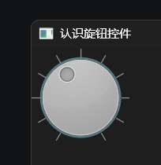

`QDial`旋钮控件的继承关系如下：

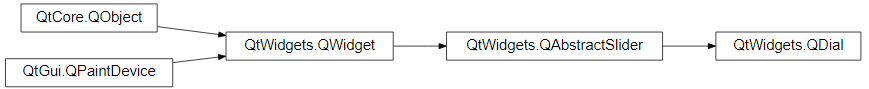

相关文档的链接如下：

- https://doc.qt.io/qtforpython-6/PySide6/QtWidgets/QDial.html
- https://doc.qt.io/qtforpython-6/PySide6/QtWidgets/QAbstractSlider.html
- https://doc.qt.io/qtforpython-6/PySide6/QtWidgets/QWidget.html

### 36.1 初始化方法

`QDial`旋钮控件（部分参数名及类型提示来自`QtWidgets.pyi`）的初始化方法支持以下参数：

- `parent`参数，`PySide6.QtWidgets.QWidget`类型，表示父控件。如果指定了父控件，那么该控件显示时，会使用父控件的位置或者嵌在父控件内（取决于该控件是否支持嵌入到其他控件）。不指定或者为`None`，则控件会在独立窗口中显示。
- `wrapping`参数，仅限关键字参数，布尔类型，表示是否将旋钮最小值位置和最大值位置连接在一起，默认为`False`。如果不连接，从最小值调整至最大值时会有一个明显的跳变。
- `notchesVisible`参数，仅限关键字参数，布尔类型，表示是否显示刻度，默认为`False`。
- `notchTarget`参数，仅限关键字参数，浮点类型，表示刻度的分度值，默认为`{最大值-最小值}/20`（动态计算）。
- `value`参数，仅限关键字参数，整数类型，表示旋钮当前位置对应的值。
- `sliderPosition`参数，仅限关键字参数，整数类型，表示旋钮当前位置。
- `minimum`参数，仅限关键字参数，整数类型，表示旋钮的最小值。
- `maximum`参数，仅限关键字参数，整数类型，表示旋钮的最大值。

注意，关于初始化参数，官方文档和`QtWidgets.pyi`中的参数提示有两个坑需要了解：

- 参数提示中对应控件属性的参数，如果是**只读**属性（没有对应的设置方法），则该参数**不能**在初始化时传入，会报错。
- 除了控件提供的初始化参数提示，其父类控件提供的初始化参数提示也有部分可用。这一部分可以简单理解为，所有控件支持的**可读写**属性，都可以在初始化时通过**关键字**传入。

### 36.2 方法、控件属性

`QDial`旋钮控件的方法、控件属性大多来自其基类——`QAbstractSlider`类，这里简单介绍几个实用的方法、控件属性。

`invertedAppearance`方法（控件属性，可使用`invertedAppearance`方法设置），表示是否左右镜像旋钮。

`invertedControls`方法（控件属性，可使用`setInvertedControls`方法设置），表示鼠标滚轮调整旋钮的方向是否反转。

`hasTracking`方法（控件属性`tracking`的获取方法，可使用`setTracking`方法设置），返回是否在调整旋钮时实时触发`valueChanged`信号。

`singleStep`方法（控件属性，可使用`setSingleStep`方法设置），返回使用方向键调整旋钮时的步长。

`sliderPosition`方法，（控件属性，可使用`setSliderPosition`方法设置），返回旋钮的位置。

`value`方法，（控件属性，可使用`setValue`方法设置），返回旋钮当前位置对应的值。

### 36.3 信号和槽

`QDial`旋钮控件支持以下信号（部分）：

- `rangeChanged`信号，设置旋钮的最小值、最大值时触发。
- `sliderMoved`信号，鼠标拖动旋钮时触发。
- `sliderPressed`信号，按下旋钮时触发。
- `sliderReleased`信号，松开旋钮时触发。
- `valueChanged`信号，旋钮位置改变（包括通过按键调整）时触发。

`QDial`旋钮控件支持以下槽（部分）：

- `setRange`方法，设置旋钮的最小值、最大值。
- `setValue`方法，设置旋钮的当前位置。

## 37 `QLabel`标签控件

### 37.0 前言

因部分读者反馈2026版介绍控件的章节有些呆板，不及其他章节以及2025版介绍控件的章节有趣，而且公众号那边因为内容格式相似而认定为文章的原创度较低。

因此，从本章开始，将改用故事演绎或者更多解释性文字的形式介绍控件，不再套用模板介绍控件的参数、方法、控件属性、信号、槽，着重介绍学习该控件用法的学习思路和方法，希望可以激发读者的学习兴趣。

如果读者觉得故事演绎的方式没法充分了解控件的用法，依然可以通过笔者提供的文档链接自行学习官网文档。

相关文档：https://doc.qt.io/qtforpython-6/PySide6/QtWidgets/QLabel.html

### 37.1 显示文本很简单

不管使用什么框架，显示文本都很简单，在PySide6中也不例外：

```python
from PySide6.QtWidgets import (
    QApplication,
    QWidget,
    QLabel
)

app = QApplication()
window = QWidget()
window.setWindowTitle('认识标签控件')
window.resize(400, 300)

label = QLabel(
    'Hello',
    window
)


window.show()
app.exec()
```

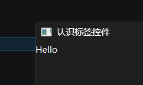

用起来很简单，看上去用法也没有多复杂，但事实真的如此吗？

上面只是展示了显示文本且不做多余调整的情况，如果看一下定义（按`f12`键或者 右键-转到定义），就能看到更多初始化参数（并非都可以用，部分参数对应的控件属性为只读，实际上不可用）：

```python
    @typing.overload
    def __init__(self, text: str, /, parent: PySide6.QtWidgets.QWidget | None = ..., f: PySide6.QtCore.Qt.WindowType = ..., *, textFormat: PySide6.QtCore.Qt.TextFormat | None = ..., pixmap: PySide6.QtGui.QPixmap | None = ..., scaledContents: bool | None = ..., alignment: PySide6.QtCore.Qt.AlignmentFlag | None = ..., wordWrap: bool | None = ..., margin: int | None = ..., indent: int | None = ..., openExternalLinks: bool | None = ..., textInteractionFlags: PySide6.QtCore.Qt.TextInteractionFlag | None = ..., hasSelectedText: bool | None = ..., selectedText: str | None = ...) -> None: ...
    @typing.overload
    def __init__(self, /, parent: PySide6.QtWidgets.QWidget | None = ..., f: PySide6.QtCore.Qt.WindowType = ..., *, text: str | None = ..., textFormat: PySide6.QtCore.Qt.TextFormat | None = ..., pixmap: PySide6.QtGui.QPixmap | None = ..., scaledContents: bool | None = ..., alignment: PySide6.QtCore.Qt.AlignmentFlag | None = ..., wordWrap: bool | None = ..., margin: int | None = ..., indent: int | None = ..., openExternalLinks: bool | None = ..., textInteractionFlags: PySide6.QtCore.Qt.TextInteractionFlag | None = ..., hasSelectedText: bool | None = ..., selectedText: str | None = ...) -> None: ...
```

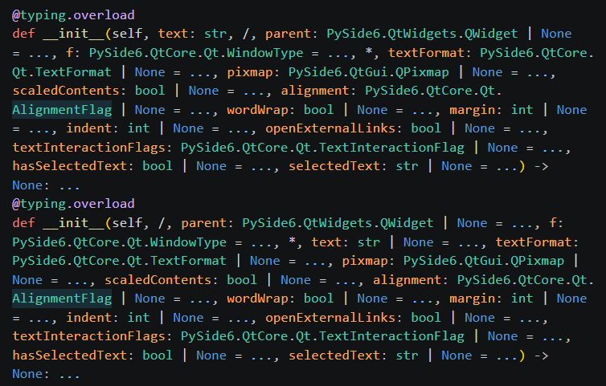

### 37.2 普通文本也可以是超链接

在了解其他参数之前，继续挖掘一下`text`参数的秘密。上一节只是简单将字符串传给该参数，但是，如果传入的字符串是HTML呢？比如，传入HTML的超链接：

```python
from PySide6.QtWidgets import (
    QApplication,
    QWidget,
    QLabel
)

app = QApplication()
window = QWidget()
window.setWindowTitle('认识标签控件')
window.resize(400, 300)

label = QLabel(
    '<a href="https://www.python.org">点击访问 Python 官网</a>',
    window,
    #openExternalLinks=True,
)
label.linkActivated.connect(print)

window.show()
app.exec()
```

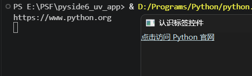

此时文本会变成可以点击的超链接，点击的话会触发`linkActivated`信号。如果给`openExternalLinks`控件属性设置为`True`，点击超链接则会使用默认浏览器打开。

也可以设置`textFormat`参数为`PySide6.QtCore.Qt.TextFormat.MarkdownText`，让其支持解析Markdown，使用Markdown语法的超链接：

```python
from PySide6.QtWidgets import (
    QApplication,
    QWidget,
    QLabel
)
from PySide6.QtCore import Qt

app = QApplication()
window = QWidget()
window.setWindowTitle('认识标签控件')
window.resize(400, 300)

label = QLabel(
    '[点击访问 Python 官网](https://www.python.org)',
    window,
    #openExternalLinks=True,
    textFormat=Qt.TextFormat.MarkdownText
)
label.linkActivated.connect(print)

window.show()
app.exec()
```

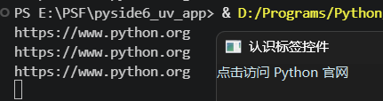

### 37.3 甚至可以显示图片

`QLabel`标签控件看名字好像只能显示文本，但是，前一节介绍了可以显示超链接，再看参数中有个`pixmap`参数，那它显示图片也是可以的（需要用到的图片请自备）：

```python
from PySide6.QtWidgets import (
    QApplication,
    QWidget,
    QLabel
)
from PySide6.QtGui import QPixmap

app = QApplication()
window = QWidget()
window.setWindowTitle('认识标签控件')
window.resize(400, 300)

label = QLabel(
    window,
    pixmap=QPixmap(
        'LOGO.png',
    ).scaled(100,100)
)

window.show()
app.exec()
```

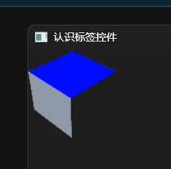

### 37.4 允许选择文本

默认情况下，标签控件的文本不允许选择，但设置`textInteractionFlags`参数的值包含（该参数支持使用`|`同时设置多个值）`PySide6.QtCore.Qt.TextInteractionFlag.TextSelectableByMouse`，即可允许选择：

```python
from PySide6.QtWidgets import (
    QApplication,
    QWidget,
    QLabel
)
from PySide6.QtCore import Qt

app = QApplication()
window = QWidget()
window.setWindowTitle('认识标签控件')
window.resize(400, 300)

label = QLabel(
    '[点击访问 Python 官网](https://www.python.org)',
    window,
    #openExternalLinks=True,
    textFormat=Qt.TextFormat.MarkdownText,
    textInteractionFlags=Qt.TextInteractionFlag.TextSelectableByMouse
)
label.linkActivated.connect(print)

window.show()
app.exec()
```

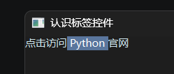

## 38 `QLineEdit`单行编辑框控件

相关文档：https://doc.qt.io/qtforpython-6/PySide6/QtWidgets/QLineEdit.html

简单的点击控件（按钮）和简单的文本控件（标签控件）都说过，本章那就沿着这个思路，说一个简单的输入控件——`QLineEdit`单行编辑框控件。

示例简单到不能再简单，不需要多复杂的参数，就能创建一个输入框：

```python
from PySide6.QtWidgets import (
    QApplication,
    QWidget,
    QLineEdit
)

app = QApplication()
window = QWidget()
window.setWindowTitle('认识单行编辑框控件')
window.resize(400, 300)

edit = QLineEdit(
    window,
)

window.show()
app.exec()
```

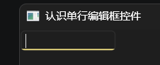

输入不是目的，目的是获取输入的内容，`text`方法（控件属性）即可轻松做到：

```python
from PySide6.QtWidgets import (
    QApplication,
    QWidget,
    QLineEdit,
    QPushButton,
    QLabel
)

app = QApplication()
window = QWidget()
window.setWindowTitle('认识单行编辑框控件')
window.resize(400, 300)

edit = QLineEdit(
    window,
)
label = QLabel(
    '获取文本',
    window
)
label.move(
    0,
    30
)
button = QPushButton(
    '获取文本',
    window
)
button.move(
    0,
    50
)
button.clicked.connect(
    lambda :label.setText(
        edit.text()
    )
)

window.show()
app.exec()
```

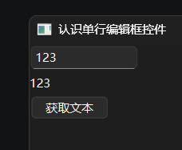

不仅可以获取输入的文本，还能使用`selectedText`方法（控件属性）获取到选择的文本（仅在控件获得焦点时可以获取）：

```python
from PySide6.QtWidgets import (
    QApplication,
    QWidget,
    QLineEdit,
    QLabel
)

app = QApplication()
window = QWidget()
window.setWindowTitle('认识单行编辑框控件')
window.resize(400, 300)

edit = QLineEdit(
    window,
)
label = QLabel(
    '获取文本',
    window
)
label.move(
    0,
    30
)
edit.selectionChanged.connect(
    lambda :label.setText(
        edit.selectedText()
    )
)

window.show()
app.exec()
```

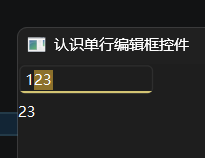

设置`echoMode`参数（表示回显模式），还能将单行输入框变成密码输入框：

```python
from PySide6.QtWidgets import (
    QApplication,
    QWidget,
    QLineEdit
)

app = QApplication()
window = QWidget()
window.setWindowTitle('认识单行编辑框控件')
window.resize(400, 300)

edit = QLineEdit(
    window,
    echoMode=QLineEdit.EchoMode.Password
)

window.show()
app.exec()
```

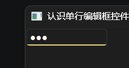

想要限制输入的内容可以设置`inputMask`参数（表示输入掩码，具体格式要求参考 https://doc.qt.io/qtforpython-6/PySide6/QtWidgets/QLineEdit.html#PySide6.QtWidgets.QLineEdit.inputMask ）：

```python
from PySide6.QtWidgets import (
    QApplication,
    QWidget,
    QLineEdit
)

app = QApplication()
window = QWidget()
window.setWindowTitle('认识单行编辑框控件')
window.resize(400, 300)

edit = QLineEdit(
    window,
    inputMask='0.0'
)

window.show()
app.exec()
```

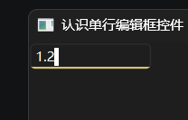

`placeholderText`参数表示不输入任何内容时的占位文本，相比于只有鼠标悬停时才显示的工具提示，占位文本的提示效果更直接：

```python
from PySide6.QtWidgets import (
    QApplication,
    QWidget,
    QLineEdit
)

app = QApplication()
window = QWidget()
window.setWindowTitle('认识单行编辑框控件')
window.resize(400, 300)

edit = QLineEdit(
    window,
    placeholderText='请输入中文'
)

window.show()
app.exec()
```

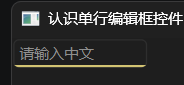

本章最后，介绍几个`QLineEdit`单行编辑框控件的信号：

- `cursorPositionChanged`信号，光标位置改变时触发。
- `editingFinished`信号，编辑完成（失去焦点或者按`enter`键）时触发。
- `returnPressed`信号，按`enter`键时触发。
- `selectionChanged`信号，选择的文本改变时触发。
- `textChanged`信号，输入框的文本改变时触发。

`QLineEdit`单行编辑框控件的用法远比上面介绍的多，实际使用时肯定会遇到不少需求和问题，有机会后面的章节继续深入学习。

## 39 `QLCDNumber`液晶数字控件

相关文档：https://doc.qt.io/qtforpython-6/PySide6/QtWidgets/QLCDNumber.html

`QLCDNumber`液晶数字控件是个有点复古的控件，在显示Qt程序的点阵液晶显示器上，实现了计算器上类似数码管的液晶显示效果：

```python
from PySide6.QtWidgets import (
    QApplication,
    QWidget,
    QLCDNumber
)

app = QApplication()
window = QWidget()
window.setWindowTitle('认识液晶数字控件')
window.resize(400, 300)

lcd = QLCDNumber(
    window,
    value=12345
)
lcd.setFixedSize(
    400,
    120
)

window.show()
app.exec()
```

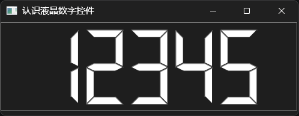

`QLCDNumber`液晶数字控件看名字能显示数字，但该控件不只能显示数字，还能显示字母：

```python
from PySide6.QtWidgets import (
    QApplication,
    QWidget,
    QLCDNumber
)

app = QApplication()
window = QWidget()
window.setWindowTitle('认识液晶数字控件')
window.resize(400, 300)

lcd = QLCDNumber(
    window,
    value='ABC',
)
lcd.setFixedSize(
    400,
    120
)

window.show()
app.exec()
```

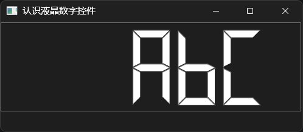

控件支持以下字符的显示：

```python
# 所有的数字
0123456789
# 部分字母
AaBbCcDdEeFfgHhLlOoPpRrSsUuYy
# 特定符号（英文）和空格
-:.' （英文空格，不支持的字符都会转换为英文空格）
```

示例如下：

```python
from PySide6.QtWidgets import (
    QApplication,
    QWidget,
    QLCDNumber
)

app = QApplication()
window = QWidget()
window.setWindowTitle('认识液晶数字控件')
window.resize(700, 300)

lcd = QLCDNumber(
    window,
)
lcd.setDigitCount(45)
lcd.display("0123456789 AaBbCcDdEeFfgHhLlOoPpRrSsUuYy -:.'")
lcd.resize(
    700,
    50
)

window.show()
app.exec()
```

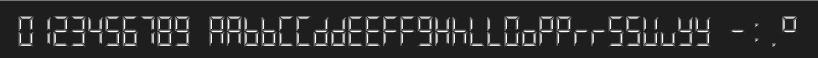

注意，虽然控件能显示字母，但控件实际上**只能**处理、存储**数字**，其`value`方法（控件属性）返回的是浮点数。如果想要让控件显示支持的字符同时，还想准确获取显示的字符，最好是将字符串单独存储，不要传递给控件的初始化参数`value`，而是传递给控件的`display`方法。

注意，在使用`setDigitCount`方法调整控件可显示的位数之前，初始化参数`value`、控件的`display`方法都只能最多显示五位。如果需要显示的内容超过五位，**必须先**调用`setDigitCount`方法调整控件可显示的**位数**。

本章最后简单总结一下，`QLCDNumber`液晶数字控件主要用于以复古的风格显示数字，但控件可以显示部分字母。

## 40 `QMenu`菜单控件

相关文档：https://doc.qt.io/qtforpython-6/PySide6/QtWidgets/QMenu.html

### 40.1 定义（创建）菜单

一旦需要用菜单，就离不开`QMenu`菜单控件，该控件几乎就是菜单的代名词。

在使用菜单之前，必须要先定义（创建）一个菜单，并给菜单添加菜单项。

定义（创建）菜单只需实例化控件即可（核心代码，不含其他部分，不可直接运行）：

```python
from PySide6.QtWidgets import (
    QMenu
)
menu = QMenu(
    window
)
```

注意，必须给菜单控件分配变量，因为很多菜单相关的操作依赖菜单控件本身，并且需要多次操作。

创建完菜单，此时的菜单还只是个空菜单，没有具体的菜单项，想要添加菜单项，就要用到“add”开头方法：

- `addAction`方法，添加一个菜单项。
- `addActions`方法，添加多个菜单项。
- `addMenu`方法，添加一个菜单作为菜单项。
- `addSection`方法，添加一条带文字、图标的分隔线。
- `addSeparator`方法，添加一条不带文字的分隔线。

完整示例如下：

```python
from PySide6.QtWidgets import (
    QApplication,
    QWidget,
    QMenu
)

app = QApplication()
window = QWidget()
window.setWindowTitle('认识菜单控件')
window.resize(400, 300)

menu = QMenu(
    window
)
menu.addAction(
    'test'
)


window.show()
app.exec()
```

注意，上面的示例只是创建菜单的示例，想要让菜单显示（弹出），需要看下一节介绍的弹出方式。

### 40.2 弹出菜单

只是创建菜单，不将其添加、绑定到控件，不使用正确的弹出方式的话，没法看到菜单。因此，正确添加、设置菜单，才能使用对应的弹出方式。

一般来说，设置菜单的控件大体分为两种：任意控件，特定控件。

设置完菜单之后，弹出方式也可以分为两种：右键点击（也可以将这种菜单称为上下文菜单），左键点击。

通过信号给任意控件（`QWidget`控件）设置上下文菜单（右键点击），需要先设置控件的上下文菜单策略为自定义上下文菜单，然后将自定义上下文菜单的触发信号与菜单的弹出方法（`exec`方法）绑定：

```python
from PySide6.QtWidgets import (
    QApplication,
    QWidget,
    QMenu
)
from PySide6.QtCore import Qt

app = QApplication()
window = QWidget()
window.setWindowTitle('认识菜单控件')
window.resize(400, 300)

menu = QMenu(
    window
)
menu.addAction(
    'test'
)

window.setContextMenuPolicy(
    Qt.ContextMenuPolicy.CustomContextMenu
)
window.customContextMenuRequested.connect(
    lambda e:menu.exec(
        window.mapToGlobal(e)
    )
)


window.show()
app.exec()
```

通过事件给任意控件（`QWidget`控件）设置上下文菜单（右键点击）也是类似的操作：

```python
from PySide6.QtWidgets import (
    QApplication,
    QWidget,
    QMenu
)

app = QApplication()
window = QWidget()
window.setWindowTitle('认识菜单控件')
window.resize(400, 300)

menu = QMenu(
    window
)
menu.addAction(
    'test'
)

window.contextMenuEvent = lambda e:menu.exec(
    e.globalPos()
)


window.show()
app.exec()
```

如果想自由地在鼠标位置弹出菜单，就需要自定义菜单弹出方法，按需调用。示例为按下任意键都会在鼠标位置弹出菜单：

```python
from PySide6.QtWidgets import (
    QApplication,
    QWidget,
    QMenu
)
from PySide6.QtGui import QCursor

app = QApplication()
window = QWidget()
window.setWindowTitle('认识菜单控件')
window.resize(400, 300)

menu = QMenu(
    window
)
menu.addAction(
    'test'
)
def open_menu(e):
    pos = QCursor.pos()
    menu.exec(pos)

window.keyPressEvent = open_menu

window.show()
app.exec()
```

支持`setContextMenu`方法的控件比较少，右键点击即可弹出菜单。示例来自第32章：

```python
from PySide6.QtWidgets import (
    QApplication,
    QWidget,
    QSystemTrayIcon,
    QPushButton,
    QMenu,
    QCheckBox
)

app = QApplication()

if QSystemTrayIcon.isSystemTrayAvailable():
    tray = QSystemTrayIcon(
        app.style().standardIcon(
            app.style().StandardPixmap.SP_ComputerIcon
        ),
        app,
        visible=True
    )
    # 只有左键双击托盘图标才会显示主窗口
    tray.activated.connect(
        lambda e:window.show() if e == QSystemTrayIcon.ActivationReason.DoubleClick else None
    )
    # 给托盘添加一个右键菜单，可以退出
    tray_menu = QMenu()
    tray_menu.addAction(
        '显示主窗口'
    ).triggered.connect(lambda:window.show())
    tray_menu.addAction(
        '退出程序'
    ).triggered.connect(app.quit)
    tray.setContextMenu(tray_menu)
else:
    print('当前系统不支持系统托盘。')

window = QWidget()
window.setWindowTitle('后台运行')
window.resize(400, 300)

# 虽然下面判断的是字符串，但仍然需要导入Qt类
from PySide6.QtCore import Qt  # noqa: E402, F401
checkbox = QCheckBox(
    '后台运行',
    window,
)
checkbox.checkStateChanged.connect(
    # 判断枚举对象
    #lambda e: (app.setQuitOnLastWindowClosed(False) if e == Qt.CheckState.Checked else app.setQuitOnLastWindowClosed(True))
    lambda e: (app.setQuitOnLastWindowClosed(False) if str(e) == 'CheckState.Checked' else app.setQuitOnLastWindowClosed(True))
)

button = QPushButton(
    '退出程序',
    window
)
button.clicked.connect(app.quit)
button.move(
    0,
    30
)

window.show()
app.exec()
```

部分按钮类控件支持`setMenu`方法，左键点击按钮的特定位置即可弹出菜单：

```python
from PySide6.QtWidgets import (
    QApplication,
    QWidget,
    QMenu,
    QPushButton
)

app = QApplication()
window = QWidget()
window.setWindowTitle('认识菜单控件')
window.resize(400, 300)

button = QPushButton(
    '普通按钮',
    window
)
menu = QMenu(
    window
)
menu.addAction(
    'test'
)
button.setMenu(menu)


window.show()
app.exec()
```

若是给`QMenuBar`菜单栏控件添加菜单（左键点击），则菜单只能在固定位置显示：

```python
from PySide6.QtWidgets import (
    QApplication,
    QWidget,
    QMenu,
    QMenuBar
)

app = QApplication()
window = QWidget()
window.setWindowTitle('认识菜单控件')
window.resize(400, 300)

menubar = QMenuBar(
    window
)
menu = QMenu(
    menubar,
    title='菜单'
)
menu.addAction(
    'test'
)
menubar.addMenu(menu)

window.show()
app.exec()
```

而`QMainWindow`主窗口控件自带菜单栏，添加菜单的代码和单独使用`QMenuBar`菜单栏控件一样（注意操作顺序）：

```python
from PySide6.QtWidgets import (
    QApplication,
    QMainWindow,
    QMenu,
    QMenuBar
)

app = QApplication()
window = QMainWindow()
window.setWindowTitle('认识菜单控件')
window.resize(400, 300)

menubar = window.menuBar()
menu = QMenu(
    menubar,
    title='菜单'
)
menu.addAction(
    'test'
)
menubar.addMenu(menu)


window.show()
app.exec()
```

关于菜单的用法还有很多，更多相关用法、问题可以期待后续的更新。

## 41 `QProgressBar`进度条控件

相关文档：https://doc.qt.io/qtforpython-6/PySide6/QtWidgets/QProgressBar.html

`QProgressBar`进度条控件用于指示进度，外观简单，用起来也很简单：

```python
from PySide6.QtWidgets import (
    QApplication,
    QWidget,
    QProgressBar
)

app = QApplication()
window = QWidget()
window.setWindowTitle('认识进度条控件')
window.resize(400, 300)

progress = QProgressBar(
    window,
    value=60
)


window.show()
app.exec()
```

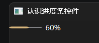

进度条控件主要用于展示进度，因此不具备交互能力。需要修改当前进度的话，就要使用`setValue`方法修改`value`控件属性。当然，该控件属性发生变化时，还会触发`valueChanged`信号。

为了发布展示效果，这里借用了下一章介绍的滑块控件，将滑块控件的`valueChanged`信号与进度条控件的`setValue`方法连接。当拖动滑块时，进度条也会随之发生改变：

```python
from PySide6.QtWidgets import (
    QApplication,
    QWidget,
    QProgressBar,
    QSlider,
    QLineEdit
)
from PySide6.QtCore import Qt

app = QApplication()
window = QWidget()
window.setWindowTitle('认识进度条控件')
window.resize(400, 300)

progress = QProgressBar(
    window,
    value=60,
)
slider = QSlider(
    window,
    value=60,
    orientation=Qt.Orientation.Horizontal,
    maximum=100
)
slider.move(
    0,30
)
edit = QLineEdit(
    window
)
edit.move(
    0,60
)

slider.valueChanged.connect(progress.setValue)
progress.valueChanged.connect(lambda e:edit.setText(str(e)))

window.show()
app.exec()
```

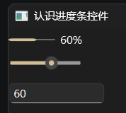

进度条控件的`text`控件属性表示显示的文本（而非当前进度值）：

```python
from PySide6.QtWidgets import (
    QApplication,
    QWidget,
    QProgressBar,
    QSlider,
    QLineEdit
)
from PySide6.QtCore import Qt

app = QApplication()
window = QWidget()
window.setWindowTitle('认识进度条控件')
window.resize(400, 300)

progress = QProgressBar(
    window,
    value=60,
)
slider = QSlider(
    window,
    value=60,
    orientation=Qt.Orientation.Horizontal,
    maximum=100
)
slider.move(
    0,30
)
edit = QLineEdit(
    window
)
edit.move(
    0,60
)

slider.valueChanged.connect(progress.setValue)
progress.valueChanged.connect(
    lambda :edit.setText(
   		progress.text()
	)
)

window.show()
app.exec()
```

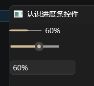

如果想要修改显示的文本，需要修改的是`format`控件属性（可以使用`['%v','%m','%p']`中的固定表达表示当前值、总步数、当前值的百分比，默认值为`'%p%'`）：

```python
from PySide6.QtWidgets import (
    QApplication,
    QWidget,
    QProgressBar,
    QSlider,
    QLineEdit
)
from PySide6.QtCore import Qt

app = QApplication()
window = QWidget()
window.setWindowTitle('认识进度条控件')
window.resize(400, 300)

progress = QProgressBar(
    window,
    value=60,
)
slider = QSlider(
    window,
    value=60,
    orientation=Qt.Orientation.Horizontal,
    maximum=100
)
slider.move(
    0,30
)
edit = QLineEdit(
    window
)
edit.move(
    0,60
)

slider.valueChanged.connect(progress.setValue)
progress.setFormat(
    '%v/%m=%p%'
)
progress.valueChanged.connect(
    lambda :edit.setText(
        progress.text()
    )
)

window.show()
app.exec()
```

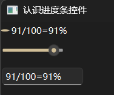

默认总步数是`100`（最大值减去最小值），因此总步数和当前值的百分比看起来一样。可以通过修改（直接或者使用`setRange`方法）`minimum`控件属性、`maximum`控件属性，间接调整总步数：

```python
from PySide6.QtWidgets import (
    QApplication,
    QWidget,
    QProgressBar,
    QSlider,
    QLineEdit
)
from PySide6.QtCore import Qt

app = QApplication()
window = QWidget()
window.setWindowTitle('认识进度条控件')
window.resize(400, 300)

progress = QProgressBar(
    window,
    value=60,
)
slider = QSlider(
    window,
    value=60,
    orientation=Qt.Orientation.Horizontal,
    maximum=100
)
slider.move(
    0,30
)
edit = QLineEdit(
    window
)
edit.move(
    0,60
)

slider.valueChanged.connect(progress.setValue)
progress.setFormat(
    '%v/%m=%p%'
)
progress.setMinimum(
    10
)
progress.setMaximum(
    60
)
progress.valueChanged.connect(
    lambda :edit.setText(
        progress.text()
    )
)

window.show()
app.exec()
```

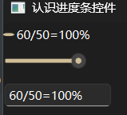

如果想要进度条反向，可以使用`setInvertedAppearance`方法：

```python
from PySide6.QtWidgets import (
    QApplication,
    QWidget,
    QProgressBar,
    QSlider
)
from PySide6.QtCore import Qt

app = QApplication()
window = QWidget()
window.setWindowTitle('认识进度条控件')
window.resize(400, 300)

progress = QProgressBar(
    window,
    value=60,
)
slider = QSlider(
    window,
    value=60,
    orientation=Qt.Orientation.Horizontal,
    maximum=100
)
slider.move(
    0,30
)

slider.valueChanged.connect(progress.setValue)
progress.setInvertedAppearance(
    True
)

window.show()
app.exec()
```

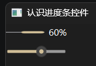

关于进度条的用法还有很多，更多相关用法、问题可以期待后续的更新。

## 42 `QSlider`滑块控件

相关文档：https://doc.qt.io/qtforpython-6/PySide6/QtWidgets/QSlider.html

上一章在介绍进度条控件时用到了滑块控件，本章那就顺势介绍一下滑块控件：

```python
from PySide6.QtWidgets import (
    QApplication,
    QWidget,
    QSlider
)
from PySide6.QtCore import Qt

app = QApplication()
window = QWidget()
window.setWindowTitle('认识滑块控件')
window.resize(400, 300)

QSlider(
    window,
    value=60,
    orientation=Qt.Orientation.Horizontal,
    maximum=100
)

window.show()
app.exec()
```

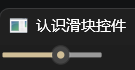

滑块控件用起来有点像旋钮控件，用法几乎一样，从继承关系就能看出端倪：

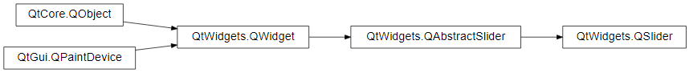

`QDial`旋钮控件的继承关系如下：


可以看到，二者的父类是一样的。因此，大部分用法二者是相同的，本章就不再赘述。本章重点说一说`QSlider`滑块控件独有的方法、控件属性。

`tickInterval`方法（控件属性，可使用`setTickInterval`方法设置），表示刻度的间隔（需要先设置`tickPosition`控件属性来显示刻度）。

`tickPosition`方法（控件属性，可使用`setTickPosition`方法设置），表示刻度的显示位置。

示例如下：

```python
from PySide6.QtWidgets import (
    QApplication,
    QWidget,
    QSlider
)
from PySide6.QtCore import Qt

app = QApplication()
window = QWidget()
window.setWindowTitle('认识滑块控件')
window.resize(400, 300)

QSlider(
    window,
    value=60,
    orientation=Qt.Orientation.Horizontal,
    maximum=100,
    tickInterval=20,
    tickPosition=QSlider.TickPosition.TicksBothSides
)

window.show()
app.exec()
```

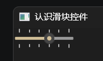

## 43 `QSpinBox`整数编辑框控件和`QDoubleSpinBox`小数编辑框控件

相关文档：https://doc.qt.io/qtforpython-6/PySide6/QtWidgets/QSpinBox.html 和 https://doc.qt.io/qtforpython-6/PySide6/QtWidgets/QDoubleSpinBox.html

`QSpinBox`整数编辑框控件和`QDoubleSpinBox`小数编辑框控件的用法完全相同，唯一区别就是二者存储的数据类型不同：前者为整数，后者为小数。

因此，本章只介绍`QSpinBox`整数编辑框控件：

```python
from PySide6.QtWidgets import (
    QApplication,
    QWidget,
    QSpinBox
)

app = QApplication()
window = QWidget()
window.setWindowTitle('认识数字编辑框控件')
window.resize(400, 300)

QSpinBox(
    window,
)

window.show()
app.exec()
```

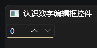

整数编辑框控件恰如其名，就是一个存储整数的编辑框。但该控件在编辑框的基础上，多了两个可以快捷调整数值大小的按钮（图中控件右部）。

`QSpinBox`整数编辑框控件的继承关系如下：

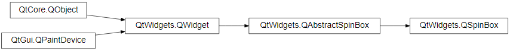

相关文档的链接如下：

- https://doc.qt.io/qtforpython-6/PySide6/QtWidgets/QSpinBox.html
- https://doc.qt.io/qtforpython-6/PySide6/QtWidgets/QAbstractSpinBox.html#PySide6.QtWidgets.QAbstractSpinBox
- https://doc.qt.io/qtforpython-6/PySide6/QtWidgets/QWidget.html

### 43.1 初始化方法

`QSpinBox`整数编辑框控件初始化方法支持参数还包括其父类的，这里一并介绍一下常用的部分。

`value`参数，整数类型，表示当前数值。

`prefix`参数，字符串类型，表示显示内容的前缀。

`suffix`参数，字符串类型，表示显示内容的后缀。

示例如下：

```python
from PySide6.QtWidgets import (
    QApplication,
    QWidget,
    QSpinBox
)

app = QApplication()
window = QWidget()
window.setWindowTitle('认识数字编辑框控件')
window.resize(400, 300)

QSpinBox(
    window,
    prefix='共 ',
    suffix=' 个',
    value=6
)

window.show()
app.exec()
```

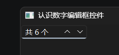

`minimum`参数，整数类型，表示允许的最小值。

`maximum`参数，整数类型，表示允许的最大值。

`singleStep`参数，整数类型，表示点击按钮单次调整的差值（即步长）。

`stepType`参数，`PySide6.QtWidgets.QSpinBox.StepType`类型或者`PySide6.QtWidgets.QAbstractSpinBox.StepType`类型，表示步长的类型。

`PySide6.QtWidgets.QSpinBox.StepType`类型或者`PySide6.QtWidgets.QAbstractSpinBox.StepType`类型是枚举类型，包含以下枚举成员：

- `DefaultStepType`，表示使用`singleStep`控件属性作为固定步长。
- `AdaptiveDecimalStepType`，表示根据当前值大小自动调整步长为10的次幂（`1,10,100...10^x`）。

`displayIntegerBase`参数，整数类型，表示数值是多少进制（支持`2`到`16`）。

`accelerated`参数，布尔类型，表示长按调整按钮时，是否加快调整速度（按的时间越长，调整速度越快）。

`readOnly`参数，布尔类型，表示数值是否为可读（不允许通过交互调整）。

`showGroupSeparator`参数，布尔类型，表示是否添加大数分组符（每三位一组）。

`specialValueText`参数，字符串类型，表示当数值小于最小值时显示什么内容。

### 43.2 方法、控件属性

`QSpinBox`整数编辑框控件支持的方法、控件属性还包括其父类的，这里一并介绍一下常用的部分。

`value`方法（控件属性，可使用`setValue`方法设置），返回当前数值（整数类型）。

`cleanText`方法（控件属性，只读属性），返回当前数值（字符串类型）。

`text`方法（控件属性，只读属性），返回编辑框的当前内容（含前缀、数值、后缀）。

`lineEdit`方法（控件属性，可使用`setLineEdit`方法设置），返回单行编辑框本体。没错，整数编辑框可以看作是单行编辑框加上了点击按钮调整编辑框内容的功能。因此，该方法可以返回单行编辑框本体，进而修改整数编辑框使用的单行编辑框。

### 43.3 信号和槽

`QSpinBox`整数编辑框控件支持的信号和槽还包括其父类的，这里一并介绍一下常用的部分。

该控件的数值变化时会触发两个信号：`textChanged`信号和`valueChanged`信号。但是，两个信号接收的参数不同，前者是`text`控件属性，后者是`value`控件属性：

```python
from PySide6.QtWidgets import (
    QApplication,
    QWidget,
    QSpinBox
)

app = QApplication()
window = QWidget()
window.setWindowTitle('认识数字编辑框控件')
window.resize(400, 300)

box = QSpinBox(
    window,
    prefix='共 ',
    suffix=' 个',
    value=6
)
box.valueChanged.connect(
    lambda e:print(f'valueChanged接收的是: {e}')
)
box.textChanged.connect(
    lambda e:print(f'textChanged接收的是: {e}')
)

window.show()
app.exec()
```

输出结果为：

```python
textChanged接收的是: 共 7 个
valueChanged接收的是: 7
textChanged接收的是: 共 6 个
valueChanged接收的是: 6
textChanged接收的是: 共 5 个
valueChanged接收的是: 5
```

槽函数包括（部分）：

- `setValue`方法，设置数值。
- `stepUp`方法，增加数值（大小为步进）。
- `stepDown`方法，减小数值（大小为步进）。
- `selectAll`方法，选择数值部分的文本。

## 44 `QToolBox`工具箱控件

相关文档：https://doc.qt.io/qtforpython-6/PySide6/QtWidgets/QToolBox.html

`QToolBox`工具箱控件恰如其名，就像一个可以存放工具的多层工具箱，但每次只能展开一层，其他层会自动收起：

```python
from PySide6.QtWidgets import (
    QApplication,
    QWidget,
    QToolBox,
    QPushButton,
    QVBoxLayout
)

app = QApplication()
window = QWidget()
window.setWindowTitle('认识工具箱控件')
window.resize(400, 300)

box = QToolBox(
    window,
)
for i in 'abc':
    widget = QWidget()
    layout = QVBoxLayout(widget)
    for k in '123':
        layout.addWidget(
            QPushButton(
                k,
            ),
        )
    box.addItem(
        widget,
        i
    )


window.show()
app.exec()
```

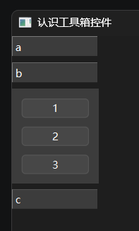

`QToolBox`工具箱控件的初始化参数没有需要单独介绍的，因为本身就没几个初始化参数。不过，管理控件的项目（即工具箱每一层的内容），倒是需要重点说说。 

控件提供的方法中，带“Item”的方法就是与项目有关的方法（增删改查）。

`addItem`方法，用于添加项目。该方法的所有参数都是仅限位置参数：

- 第一个位置参数始终是要添加的控件，仅支持单个控件。因此，上面的示例中，添加了布局控件，让布局控件容纳更多控件，同时还能调整子控件的显示效果。
- 第二个位置参数在传入两个位置参数时是项目名称，在传入三个位置参数时是项目图标。
- 第三个位置参数是项目名称。

示例如下：

```python
from PySide6.QtWidgets import (
    QApplication,
    QWidget,
    QToolBox,
    QPushButton,
    QVBoxLayout,
)
from PySide6.QtGui import QIcon

app = QApplication()
window = QWidget()
window.setWindowTitle('认识工具箱控件')
window.resize(400, 300)

box = QToolBox(
    window,
)
for i in 'abc':
    widget = QWidget()
    layout = QVBoxLayout(widget)
    for k in '123':
        layout.addWidget(
            QPushButton(
                k,
            ),
        )
    box.addItem(
        widget,
        QIcon.fromTheme(
            QIcon.ThemeIcon.Computer
        ),
        i,
    )


window.show()
app.exec()
```

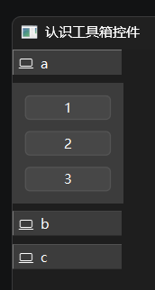

`insertItem`方法，用于在指定位置插入项目。该方法的所有参数都是仅限位置参数，第一个位置参数表示插入位置的索引值，后面几个位置参数则是`addItem`方法的参数顺延（即第二个位置参数是`addItem`方法的第一个位置参数）。

`itemIcon`方法、`setItemIcon`方法可用于获取、修改项目的图标，参数均为对应项目的索引值。

`itemText`方法、`setItemText`方法可用于获取、修改项目的名称，参数均为对应项目的索引值。

`currentIndex`方法、` currentWidget`方法可用于获取当前项目的索引值、对应控件。

`setCurrentIndex`方法、` setCurrentWidget`方法可用于将指定索引值、控件对应的项目设置为当前项目。同时，这两个方法也是槽函数。

`itemToolTip`方法、`setItemToolTip`方法可以获取、设置项目的工具提示，参数均为对应项目的索引值。

`removeItem`方法可以移除项目。

`widget`方法可以获取项目对应的控件。

示例如下：

```python
from PySide6.QtWidgets import (
    QApplication,
    QWidget,
    QToolBox,
    QPushButton,
    QVBoxLayout,
)
from PySide6.QtGui import QIcon

app = QApplication()
window = QWidget()
window.setWindowTitle('认识工具箱控件')
window.resize(400, 300)

box = QToolBox(
    window,
)
for i in 'abc':
    widget = QWidget()
    layout = QVBoxLayout(widget)
    for k in '123':
        layout.addWidget(
            QPushButton(
                k,
            ),
        )
    box.addItem(
        widget,
        QIcon.fromTheme(
            QIcon.ThemeIcon.Computer
        ),
        i,
    )
box.widget(0).layout().addWidget(
    QPushButton(
        '4',
    )
)


window.show()
app.exec()
```

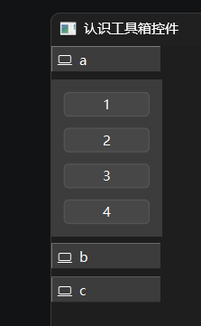

切换当前项目时，会同时触发`currentChanged`信号。

预告一下，该控件的操作逻辑很像选项卡，而后面的章节会解压该控件介绍选项卡控件，读者就会发现类似的方法。

## 45 `QScrollArea`滚动区域控件

相关文档：https://doc.qt.io/qtforpython-6/PySide6/QtWidgets/QScrollArea.html

窗口再大，也没法完整展示尺寸过大的控件，此时就需要使用`QScrollArea`滚动区域控件，添加到其中的控件尺寸过大的话，可以通过滚动的方式展示全貌：

```python
from PySide6.QtWidgets import (
    QApplication,
    QWidget,
    QScrollArea,
    QPushButton
)

app = QApplication()
window = QWidget()
window.setWindowTitle('认识滚动区域')
window.resize(400, 300)

scroll = QScrollArea(
    window
)
scroll.setFixedSize(
    120,
    200
)
button = QPushButton(
    'Hello',
    window
)
button.setFixedSize(
    100,
    600
)
scroll.setWidget(
    button
)

window.show()
app.exec()
```

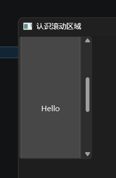

`QScrollArea`滚动区域控件的初始化方法支持参数还包括其父类的，这里一并介绍一下常用的部分。

`widgetResizable`参数，关键字参数，布尔类型，表示是否自动调整滚动区域内的控件大小，让其填满滚动区域（仅限没有固定尺寸的控件，并且仅调整允许自动调整的方向）。

`alignment`参数，关键字参数，`PySide6.QtCore.Qt.AlignmentFlag`类型，表示滚动区域内的控件对齐方向。

除了上面参数对应的控件属性及其设置方法之外，控件还支持其他方法。

`widget`方法（控件属性，可使用`setWidget`方法设置），返回滚动区域内的控件。

`takeWidget`方法，从滚动区域移除控件，并将控件返回。

`ensureVisible`方法，自动滚动以确保指定位置（相对坐标）可见。示例如下：

```python
from PySide6.QtWidgets import (
    QApplication,
    QWidget,
    QScrollArea,
    QPushButton
)

app = QApplication()
window = QWidget()
window.setWindowTitle('认识滚动区域')
window.resize(400, 300)

scroll = QScrollArea(
    window
)
scroll.setFixedSize(
    120,
    100
)
button = QPushButton(
    'Hello',
    window
)
button.setFixedSize(
    100,
    400
)
scroll.setWidget(
    button
)
scroll.move(
    100,200
)
button.clicked.connect(
    lambda:scroll.ensureVisible(
        100,200
    )
)

window.show()
app.exec()
```

`ensureWidgetVisible`方法，自动滚动以确保指定控件可见。

## 46 `QTabBar`选项卡标签控件

相关文档：https://doc.qt.io/qtforpython-6/PySide6/QtWidgets/QTabBar.html

之前的章节介绍`QToolBox`工具箱控件时说过工具箱控件的操作逻辑很像选项卡，本章要介绍的`QTabBar`选项卡标签控件就是选项卡的标签部分，对于需要自定义选项卡内容的场景，该控件必不可少。因此，本章就借着实现该控件与自定义选项卡内容联动的思路，顺便介绍一下该控件的用法。

因为自定义选项卡内容控件还需要写不少切换内容的代码，为了避免额外的代码导致混淆，这里借用`QToolBox`工具箱控件作为选项卡内容控件，让读者可以聚焦于联动代码上。先看没有联动代码时的基本代码：

```python
from PySide6.QtWidgets import (
    QApplication,
    QWidget,
    QToolBox,
    QPushButton,
    QVBoxLayout,
    QTabBar
)

app = QApplication()
window = QWidget()
window.setWindowTitle('认识选项卡')
window.resize(400, 300)


tabbar = QTabBar(
    window
)
box = QToolBox(
    window,
)
box.move(
    0,30
)
for i in 'abc':
    tabbar.addTab(
        i
    )
    widget = QWidget()
    layout = QVBoxLayout(widget)
    for k in '123':
        layout.addWidget(
            QPushButton(
                k,
            ),
        )
    box.addItem(
        widget,
        i
    )

window.show()
app.exec()
```

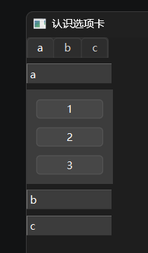

可以看到，原本工具箱控件的上方多了一个选项卡标签控件，并且添加了三个标签，用于对应工具箱控件的三层内容。因为代码还没有添加联动，因此点击标签不会切换工具箱控件当前显示的内容。

联动代码很简单，就是将选项卡标签控件标签切换时触发的`currentChanged`信号，与工具箱控件切换当前项目的槽函数——`setCurrentIndex`方法连接。二者的参数都是整数类型的索引值，因此可以轻松联动。代码如下：

```python
# 正向联动代码
tabbar.currentChanged.connect(
    box.setCurrentIndex
)
```

读者可以动手将上述代码复制到本章开头示例中的合适位置，并运行代码查看联动效果。

上面的联动代码只是实现了点击标签然后切换工具箱控件的当前项目，基于类似思路，还可以将工具箱控件的`currentChanged`信号与选项卡标签控件的槽函数——`setCurrentIndex`方法，简单到只是换一下控件对应的变量名，即可实现反向联动：

```python
# 反向联动代码
box.currentChanged.connect(
    tabbar.setCurrentIndex
)
```

双向联动的完整示例如下：

```python
from PySide6.QtWidgets import (
    QApplication,
    QWidget,
    QToolBox,
    QPushButton,
    QVBoxLayout,
    QTabBar
)

app = QApplication()
window = QWidget()
window.setWindowTitle('认识选项卡')
window.resize(400, 300)


tabbar = QTabBar(
    window
)
box = QToolBox(
    window,
)
box.move(
    0,30
)
for i in 'abc':
    tabbar.addTab(
        i
    )
    widget = QWidget()
    layout = QVBoxLayout(widget)
    for k in '123':
        layout.addWidget(
            QPushButton(
                k,
            ),
        )
    box.addItem(
        widget,
        i
    )

# 正向联动代码
tabbar.currentChanged.connect(
    box.setCurrentIndex
)

# 反向联动代码
box.currentChanged.connect(
    tabbar.setCurrentIndex
)

window.show()
app.exec()
```

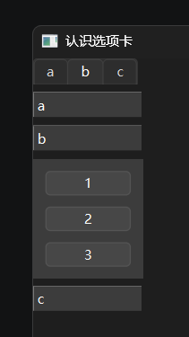

如果嫌弃自定义选项卡内容麻烦，下一章会介绍一步到位的`QTabWidget`选项卡控件，无需写额外代码处理联动，直接添加内容即可，敬请期待。

不过，虽然`QTabWidget`选项卡控件用起来更简单，但选项卡控件本身还包含了一个选项卡标签控件，而且有不少参数、控件属性、方法与选项卡标签控件有关。因此，本章还是有必要介绍一下选项卡标签控件，后续使用选项卡控件时才更得心应手。

### 46.1 初始化参数

`shape`参数，关键字参数，`PySide6.QtWidgets.QTabBar.Shape`类型，表示选项卡标签的形状（同时还定义了形状对应的位置）。

示例如下：

```python
from PySide6.QtWidgets import (
    QApplication,
    QWidget,
    QToolBox,
    QPushButton,
    QVBoxLayout,
    QTabBar
)

app = QApplication()
window = QWidget()
window.setWindowTitle('认识选项卡')
window.resize(400, 300)

app.setStyle('Fusion')
tabbar = QTabBar(
    window,
    shape=QTabBar.Shape.TriangularNorth
)
box = QToolBox(
    window,
)
box.move(
    0,30
)
for i in 'abc':
    tabbar.addTab(
        i
    )
    widget = QWidget()
    layout = QVBoxLayout(widget)
    for k in '123':
        layout.addWidget(
            QPushButton(
                k,
            ),
        )
    box.addItem(
        widget,
        i
    )

# 正向联动代码
tabbar.currentChanged.connect(
    box.setCurrentIndex
)

# 反向联动代码
box.currentChanged.connect(
    tabbar.setCurrentIndex
)

window.show()
app.exec()
```

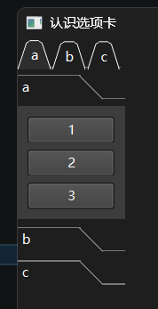

`drawBase`参数，关键字参数，布尔类型，表示是否绘制基底，即下面示例图中的横线：

```python
from PySide6.QtWidgets import (
    QApplication,
    QWidget,
    QToolBox,
    QPushButton,
    QVBoxLayout,
    QTabBar
)

app = QApplication()
window = QWidget()
window.setWindowTitle('认识选项卡')
window.resize(400, 300)

app.setStyle('Fusion')
tabbar = QTabBar(
    window,
    drawBase=True
)
box = QToolBox(
    window,
)
box.move(
    0,30
)
for i in 'abc':
    tabbar.addTab(
        i
    )
    widget = QWidget()
    layout = QVBoxLayout(widget)
    for k in '123':
        layout.addWidget(
            QPushButton(
                k,
            ),
        )
    box.addItem(
        widget,
        i
    )

# 正向联动代码
tabbar.currentChanged.connect(
    box.setCurrentIndex
)

# 反向联动代码
box.currentChanged.connect(
    tabbar.setCurrentIndex
)

window.show()
app.exec()
```

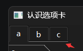

`elideMode`参数，关键字参数，`PySide6.QtCore.Qt.TextElideMode`类型，表示当标签内的文字长度超过单个标签的宽度时如何省略无法完整显示的部分。

示例如下：

```python
from PySide6.QtWidgets import (
    QApplication,
    QWidget,
    QToolBox,
    QPushButton,
    QVBoxLayout,
    QTabBar
)
from PySide6.QtCore import Qt

app = QApplication()
window = QWidget()
window.setWindowTitle('认识选项卡')
window.resize(400, 300)

app.setStyle('Fusion')
tabbar = QTabBar(
    window,
    elideMode=Qt.TextElideMode.ElideMiddle
)
tabbar.resize(
    160,30
)
box = QToolBox(
    window,
)
box.move(
    0,30
)
for i in 'abc':
    tabbar.addTab(
        i*6
    )
    widget = QWidget()
    layout = QVBoxLayout(widget)
    for k in '123':
        layout.addWidget(
            QPushButton(
                k,
            ),
        )
    box.addItem(
        widget,
        i
    )

# 正向联动代码
tabbar.currentChanged.connect(
    box.setCurrentIndex
)

# 反向联动代码
box.currentChanged.connect(
    tabbar.setCurrentIndex
)

window.show()
app.exec()
```


`usesScrollButtons`参数，关键字参数，布尔类型，表示当标签数量较多导致超过允许的总宽度时，是否显示滚动按钮来滚动无法完整显示的部分。

示例如下：

```python
from PySide6.QtWidgets import (
    QApplication,
    QWidget,
    QToolBox,
    QPushButton,
    QVBoxLayout,
    QTabBar
)
from PySide6.QtCore import Qt

app = QApplication()
window = QWidget()
window.setWindowTitle('认识选项卡')
window.resize(400, 300)

app.setStyle('Fusion')
tabbar = QTabBar(
    window,
    elideMode=Qt.TextElideMode.ElideRight,
    usesScrollButtons=True
)
tabbar.resize(
    100,30
)
box = QToolBox(
    window,
)
box.move(
    0,30
)
for i in 'abc':
    tabbar.addTab(
        i*6
    )
    widget = QWidget()
    layout = QVBoxLayout(widget)
    for k in '123':
        layout.addWidget(
            QPushButton(
                k,
            ),
        )
    box.addItem(
        widget,
        i
    )

# 正向联动代码
tabbar.currentChanged.connect(
    box.setCurrentIndex
)

# 反向联动代码
box.currentChanged.connect(
    tabbar.setCurrentIndex
)

window.show()
app.exec()
```


`tabsClosable`参数，关键字参数，布尔类型，表示选项卡标签是否允许关闭。注意，允许关闭只是显示关闭按钮，想要真正实现关闭功能（移除标签和选项卡内容）需要额外处理`tabCloseRequested`信号。但是，相关逻辑设计比较复杂，这里不做展开，仅提供移除标签的功能：

```python
from PySide6.QtWidgets import (
    QApplication,
    QWidget,
    QToolBox,
    QPushButton,
    QVBoxLayout,
    QTabBar
)

app = QApplication()
window = QWidget()
window.setWindowTitle('认识选项卡')
window.resize(400, 300)

app.setStyle('Fusion')
tabbar = QTabBar(
    window,
    tabsClosable=True
)
box = QToolBox(
    window,
)
box.move(
    0,30
)
for i in 'abc':
    tabbar.addTab(
        i
    )
    widget = QWidget()
    layout = QVBoxLayout(widget)
    for k in '123':
        layout.addWidget(
            QPushButton(
                k,
            ),
        )
    box.addItem(
        widget,
        i
    )

# 正向联动代码
tabbar.currentChanged.connect(
    box.setCurrentIndex
)

# 反向联动代码
box.currentChanged.connect(
    tabbar.setCurrentIndex
)

# 处理选项卡关闭信号
tabbar.tabCloseRequested.connect(
    tabbar.removeTab
)


window.show()
app.exec()
```

`selectionBehaviorOnRemove`参数，关键字参数，`PySide6.QtWidgets.QTabBar.SelectionBehavior`类型，表示移除当前选择的标签后，如何选择下一个标签。

`expanding`参数，关键字参数，布尔类型，表示是否展开标签来占据可用空间。

`movable`参数，关键字参数，布尔类型，表示标签是否可以移动。

`autoHide`参数，关键字参数，布尔类型，表示当仅剩一个标签数时是否隐藏标签。注意，该参数会同时启用`usesScrollButtons`参数。

### 46.2 方法、控件属性

除了初始化参数对应的控件属性及其设置方法之外，控件还支持其他方法。

`addTab`方法，添加一个选项卡标签。该方法的所有参数都是仅限位置参数：

- 第一个位置参数在传入一个位置参数时是标签名称，在传入两个位置参数时是标签图标。
- 第二个位置参数是标签名称。

示例如下：

```python
from PySide6.QtWidgets import (
    QApplication,
    QWidget,
    QPushButton,
    QVBoxLayout,
    QTabBar
)
from PySide6.QtGui import QIcon

app = QApplication()
window = QWidget()
window.setWindowTitle('认识选项卡')
window.resize(400, 300)


tabbar = QTabBar(
    window,
)
for i in 'abc':
    tabbar.addTab(
        QIcon.fromTheme(
            QIcon.ThemeIcon.Computer
        ),
        i
    )
    widget = QWidget()
    layout = QVBoxLayout(widget)
    for k in '123':
        layout.addWidget(
            QPushButton(
                k,
            ),
        )


window.show()
app.exec()
```


`count`方法（控件属性），返回标签数量。

`currentIndex`方法（控件属性，可使用`setCurrentIndex`方法设置），返回当前激活标签的索引值。

`insertTab`方法，在指定位置插入选项卡标签。该方法的所有参数都是仅限位置参数，第一个位置参数表示插入位置的索引值，后面几个位置参数则是`addTab`方法的参数顺延（即第二个位置参数是`addTab`方法的第一个位置参数）。

`moveTab`方法，移动选项卡标签。

`removeTab`方法，移除选项卡标签。

`tabAt`方法，返回指定位置的标签索引值。

`tabButton`方法，返回指定标签在指定位置处附加的控件（可使用`setTabButton`方法附加）。

示例如下：

```python
from PySide6.QtWidgets import (
    QApplication,
    QWidget,
    QPushButton,
    QVBoxLayout,
    QTabBar
)
from PySide6.QtGui import QIcon

app = QApplication()
window = QWidget()
window.setWindowTitle('认识选项卡')
window.resize(400, 300)


tabbar = QTabBar(
    window,
)
for i in 'abc':
    tabbar.addTab(
        QIcon.fromTheme(
            QIcon.ThemeIcon.Computer
        ),
        i
    )
    widget = QWidget()
    layout = QVBoxLayout(widget)
    for k in '123':
        layout.addWidget(
            QPushButton(
                k,
            ),
        )
    
tabbar.setTabButton(
    1,
    QTabBar.ButtonPosition.RightSide,
    QPushButton(
        'x',
    )
)

window.show()
app.exec()
```


`tabData`方法，返回指定标签绑定的数据（可使用`setTabData`方法绑定）。

`tabIcon`方法，返回指定标签的图标（可使用`setTabIcon`方法设置）。

`tabRect`方法，返回指定标签的可视区域。

`tabText`方法，返回指定标签的文本（可使用`setTabText`方法设置）。

`tabTextColor`方法，返回指定标签的文本颜色（可使用`setTabTextColor`方法设置）。

`tabToolTip`方法，返回指定标签的工具提示（可使用`setTabToolTip`方法设置）。

`tabWhatsThis`方法，返回指定标签的帮助文本（可使用`setTabWhatsThis`方法设置）。

### 46.3 信号和槽

`currentChanged`信号，改变当前激活的标签后触发。

`tabBarClicked`信号，单击选项卡标签后触发。

`tabBarDoubleClicked`信号，双击选项卡标签后触发。

`tabCloseRequested`信号，请求关闭选项卡标签时触发。

`tabMoved`信号，移动选项卡标签时触发。

`setCurrentIndex`方法，槽函数，设置当前激活的标签。

## 47 `QTabWidget`选项卡控件

相关文档：https://doc.qt.io/qtforpython-6/PySide6/QtWidgets/QTabWidget.html

相比于使用`QTabBar`选项卡标签控件自定义选项卡内容还要写额外代码处理联动，本章介绍的`QTabWidget`选项卡控件使用时简单不少，直接添加内容即可：

```python
from PySide6.QtWidgets import (
    QApplication,
    QWidget,
    QTabWidget,
    QPushButton,
    QVBoxLayout
)

app = QApplication()
window = QWidget()
window.setWindowTitle('认识选项卡')
window.resize(400, 300)

tab = QTabWidget(
    window,
)

for i in 'abc':
    widget = QWidget()
    layout = QVBoxLayout(widget)
    for k in '123':
        layout.addWidget(
            QPushButton(
                i+k,
            ),
        )
    tab.addTab(
        widget,
        i
    )

window.show()
app.exec()
```


选项卡控件用起来简单，是因为控件内部实现了直接使用选项卡标签控件时所需的所有代码，包括创建内容显示区域、联动选项卡标签和内容。因此，选项卡控件实际上是包含了选项卡标签控件和内容显示控件的复合控件。

选项卡控件支持的关键字参数中，很多与选项卡标签控件一致，这里就不详细介绍了：

- `tabPosition`参数，`PySide6.QtWidgets.QTabWidget.TabPosition`类型，表示选项卡标签的位置。
- `tabShape`参数，`PySide6.QtWidgets.QTabWidget.TabShape`类型，表示选项卡标签的形状。
- `elideMode`参数，`PySide6.QtCore.Qt.TextElideMode`类型，表示当标签内的文字长度超过单个标签的宽度时如何省略无法完整显示的部分。
- `usesScrollButtons`参数，布尔类型，表示当标签数量较多导致超过允许的总宽度时，是否显示滚动按钮来滚动无法完整显示的部分。
- `tabsClosable`参数，布尔类型，表示选项卡标签是否允许关闭。注意，允许关闭只是显示关闭按钮，想要真正实现关闭功能（移除标签和选项卡内容）需要额外处理`tabCloseRequested`信号。
- `movable`参数，布尔类型，表示标签是否可以移动。
- `tabBarAutoHide`参数，布尔类型，表示当仅剩一个标签数时是否隐藏标签。注意，该参数会同时启用`usesScrollButtons`参数。

示例如下：

```python
from PySide6.QtWidgets import (
    QApplication,
    QWidget,
    QTabWidget,
    QPushButton,
    QVBoxLayout
)

app = QApplication()
window = QWidget()
window.setWindowTitle('认识选项卡')
window.resize(400, 300)

tab = QTabWidget(
    window,
    tabsClosable=True,
    tabBarAutoHide=True
)

for i in 'abcedf':
    widget = QWidget()
    layout = QVBoxLayout(widget)
    for k in '123':
        layout.addWidget(
            QPushButton(
                i+k,
            ),
        )
    tab.addTab(
        widget,
        i
    )

# 处理选项卡关闭信号
tab.tabCloseRequested.connect(
    tab.removeTab
)

window.show()
app.exec()
```


除了初始化参数对应的控件属性及其设置方法之外，控件还支持其他方法：

`addTab`方法，添加一个选项卡，同时添加对应的标签。该方法的所有参数都是仅限位置参数：

- 第一个位置参数是选项卡的内容。
- 第二个位置参数在传入两个位置参数时是标签名称，在传入三个位置参数时是标签图标。
- 第三个位置参数是标签名称。

示例如下：

```python
from PySide6.QtWidgets import (
    QApplication,
    QWidget,
    QTabWidget,
    QPushButton,
    QVBoxLayout
)
from PySide6.QtGui import QIcon

app = QApplication()
window = QWidget()
window.setWindowTitle('认识选项卡')
window.resize(400, 300)

tab = QTabWidget(
    window,
)

for i in 'abc':
    widget = QWidget()
    layout = QVBoxLayout(widget)
    for k in '123':
        layout.addWidget(
            QPushButton(
                i+k,
            ),
        )
    tab.addTab(
        widget,
        QIcon.fromTheme(
            QIcon.ThemeIcon.Computer
        ),
        i
    )


window.show()
app.exec()
```


`clear`方法，移除所有选项卡。

`cornerWidget`方法（控件属性，可使用`setCornerWidget`方法设置），返回选项卡标签栏的角落控件。注意，仅当`tabPosition`为`PySide6.QtWidgets.QTabWidget.TabPosition.North`或`PySide6.QtWidgets.QTabWidget.TabPosition.South`时该控件才能生效：

```python
from PySide6.QtWidgets import (
    QApplication,
    QWidget,
    QTabWidget,
    QPushButton,
    QVBoxLayout
)
from PySide6.QtCore import Qt

app = QApplication()
window = QWidget()
window.setWindowTitle('认识选项卡')
window.resize(400, 300)

tab = QTabWidget(
    window,
    tabPosition=QTabWidget.TabPosition.South
)

for i in 'abc':
    widget = QWidget()
    layout = QVBoxLayout(widget)
    for k in '123':
        layout.addWidget(
            QPushButton(
                i+k,
            ),
        )
    tab.addTab(
        widget,
        i
    )
tabbar = tab.tabBar()
tab.resize(
    300,300
)
tab.setCornerWidget(
    QPushButton(
        '角落按钮'
    ),
    Qt.Corner.TopRightCorner
)

window.show()
app.exec()
```


`count`方法，返回选项卡的数量。

`currentIndex`方法（控件属性，可使用`setCurrentIndex`方法设置），返回当前激活选项卡的索引值。

`currentWidget`方法（控件属性，可使用`setCurrentWidget`方法设置），返回当前激活选项卡的内容。注意，使用`setCurrentWidget`方法设置当前激活选项卡的内容时，该内容必须是某一选项卡的内容。

`indexOf`方法，返回指定内容对应选项卡的索引值。注意，该内容必须是某一选项卡的内容。

`insertTab`方法，在指定位置插入选项卡。该方法的所有参数都是仅限位置参数，第一个位置参数表示插入位置的索引值，后面几个位置参数则是`addTab`方法的参数顺延（即第二个位置参数是`addTab`方法的第一个位置参数）。

`removeTab`方法，移除选项卡。

`tabBar`方法，返回选项卡标签控件。

`tabIcon`方法，返回指定选项卡的图标（可使用`setTabIcon`方法设置）。

`tabText`方法，返回指定选项卡的文本（可使用`setTabText`方法设置）。

`tabToolTip`方法，返回指定选项卡的工具提示（可使用`setTabToolTip`方法设置）。

`tabWhatsThis`方法，返回指定选项卡的帮助文本（可使用`setTabWhatsThis`方法设置）。

信号和槽也基本与选项卡标签控件相似：

`currentChanged`信号，改变当前激活的选项卡后触发。

`tabBarClicked`信号，单击选项卡标签后触发。

`tabBarDoubleClicked`信号，双击选项卡标签后触发。

`tabCloseRequested`信号，请求关闭选项卡标签时触发。

`setCurrentIndex`方法，槽函数，设置当前激活的选项卡。

`setCurrentWidget`方法，槽函数，设置当前激活的选项卡。

## 48 `QTextEdit`富文本控件

相关文档：https://doc.qt.io/qtforpython-6/PySide6/QtWidgets/QTextEdit.html

### 48.0 选择富文本控件的原因

#### 48.0.1 单行编辑框无法正确显示多行文本

第38章介绍过单行编辑框，只能显示、编辑单行文本，一旦原始文本是多行文本，控件就会无法显示原始的格式：

```python
from PySide6.QtWidgets import (
    QApplication,
    QWidget,
    QLineEdit
)

app = QApplication()
window = QWidget()
window.setWindowTitle('多行文本的显示')
window.resize(400, 300)

text = '''\
Hello,
World.
'''

edit = QLineEdit(
    text,
    window
)

window.show()
app.exec()
```


#### 48.0.2 可以正确显示多行文本的标签控件不是完美的平替

使用标签控件可以正确显示多行文本：

```python
from PySide6.QtWidgets import (
    QApplication,
    QWidget,
    QLabel
)

app = QApplication()
window = QWidget()
window.setWindowTitle('多行文本的显示')
window.resize(400, 300)

text = '''\
Hello,
World.
'''

QLabel(
    text,
    window
)

window.show()
app.exec()
```


但是，一旦需要编辑，标签控件也无能为力，总不能额外添加一个单行编辑框，然后联动编辑框和标签，变相实现编辑多行文本吧？

可这样的编辑体验很糟糕：

```python
from PySide6.QtWidgets import (
    QApplication,
    QWidget,
    QLabel,
    QLineEdit
)

app = QApplication()
window = QWidget()
window.setWindowTitle('多行文本的显示')
window.resize(400, 300)

text = '''\
Hello,
World.
'''

label = QLabel(
    text,
    window
)
edit = QLineEdit(
    text,
    window
)
edit.move(
    0,60
)
edit.textChanged.connect(
    label.setText
)


window.show()
app.exec()
```


不能直接输入换行符就是最让人头疼的问题。

#### 48.0.3 富文本控件是正确答案？

聪明的读者看了看本章标题，一下子猜到了`QTextEdit`富文本控件就是正确答案，便有了下面的代码：

```python
from PySide6.QtWidgets import (
    QApplication,
    QWidget,
    QTextEdit
)

app = QApplication()
window = QWidget()
window.setWindowTitle('多行文本的显示')
window.resize(400, 300)

text = '''\
Hello,
World.
'''

edit = QTextEdit(
    text,
    window
)


window.show()
app.exec()
```

可运行结果却令人大跌眼镜：


想象中的显示效果没有出现，富文本控件不是正确答案！

#### 48.0.4 富文本控件是正确答案！

先别急，结果不符合预期，那是因为写代码时偷了懒。前面的几次尝试都是使用位置参数传入多行文本，在使用富文本控件时，想当然地用了一样的参数。

对于富文本控件而言，初始化参数中，将文本传给不同参数（只能设置其中一个），对应不同类型的渲染方式：

- `text`参数，自动判断文本类型并渲染。
- `plainText`参数，将文本作为纯文本渲染。
- `html`参数，将文本作为HTML渲染。
- `markdown`参数，将文本作为Markdown渲染。

使用位置参数传入多行文本，看代码提示像是传了`text`参数，应该自动判断文本类型，但实际上是强制将文本作为HTML渲染。因此，显示的格式不对。

明白这个原理，想要让多行文本正确显示，只需将文本通过关键字传给`text`参数或者`plainText`参数（最好用改参数，不要用自动判断）即可：

```python
from PySide6.QtWidgets import (
    QApplication,
    QWidget,
    QTextEdit
)

app = QApplication()
window = QWidget()
window.setWindowTitle('多行文本的显示')
window.resize(400, 300)

text = '''\
Hello,
World.
'''

edit = QTextEdit(
    window,
    plainText=text
)


window.show()
app.exec()
```


### 48.1 初始化参数

`autoFormatting`参数，`PySide6.QtWidgets.QTextEdit.AutoFormattingFlag`类型，表示是否开启自动格式化。目前Qt版本支持自动格式化列表，即用户在行首输入`*`或`-`时，会自动将其转换为列表。

`tabChangesFocus`参数，布尔类型，表示按下`tab`键时切换焦点还是输入制表符。

`documentTitle`参数，字符串类型，表示文档标题，对应HTML格式中的title标签。

`undoRedoEnabled`参数，布尔类型，表示是否启用撤销、重做。

`lineWrapMode`参数，`PySide6.QtWidgets.QTextEdit.LineWrapMode`类型，表示自动换行的模式（是否启用以及换行的基准宽度）。

`lineWrapColumnOrWidth`参数，整数类型，表示自动换行的基准宽度（列数或宽度）。

`readOnly`参数，布尔类型，表示是否启用只读模式。

`markdown`参数，字符串类型，表示作为Markdown渲染的文本。

`html`参数，字符串类型，表示作为HTML渲染的文本。

`plainText`参数，字符串类型，表示作为纯文本渲染的文本。

`overwriteMode`参数，布尔类型，表示是否启用覆盖模式（即光标后有其他文本的话是否覆盖）.

`tabStopDistance`参数，浮点类型，表示一个制表符的宽度（相当于多少像素），默认为`80`。

`acceptRichText`参数，布尔类型，表示是否允许粘贴富文本。

`cursorWidth`参数，浮点类型，表示光标的宽度，默认为`1`。

`textInteractionFlags`参数，`PySide6.QtCore.Qt.TextInteractionFlag`类型的联合体，表示文本交互标志。可以设置文本的能否复制、编辑，一般不用修改该参数。

`document`参数，`PySide6.QtGui.QTextDocument`类型，表示实际存储内容的文档对象。一般不用修改该参数，通常是使用该参数对应的文档对象，因为文档对象支持一系列内容相关的操作（修改、导出等）。

`placeholderText`参数，字符串类型，表示没有任何内容时的占位文本。

`alignment`参数，`PySide6.QtCore.Qt.AlignmentFlag`类型，表示文本的对齐方向。

`wordWrapMode`参数，`PySide6.QtGui.QTextOption.WrapMode`类型，表示完整单词的换行模式（是否启用换行以及换行的规则）。

### 48.2 方法、控件属性

除了初始化参数对应的控件属性及其设置方法之外，控件还支持其他方法（部分）。

`anchorAt`方法，返回指定位置对应的锚点。

`canPaste`方法，返回剪贴板的内容能不能粘贴到编辑框中。

`createStandardContextMenu`方法，创建编辑框默认的标准上下文菜单。

`currentCharFormat`方法（控件属性，可使用`setCurrentCharFormat`方法设置），返回光标位置的字符格式。

`currentFont`方法（控件属性，可使用`setCurrentFont`方法设置），返回光标位置的字符字体。

`cursorForPosition`方法，返回指定位置的光标对象，常用于后续获取该位置的格式、内容，或者在该位置插入文本。

`cursorRect`方法，返回覆盖光标的最小矩形，用于判断光标的位置。

`ensureCursorVisible`方法，滚动内容来确保光标可见。

`extraSelections`方法（控件属性，可使用`setExtraSelections`方法设置），表示选择并高亮的部分。返回值为列表类型，表示多个。

`find`方法，查找指定文本并返回是否找到结果。

`fontFamily`方法（控件属性，可使用`setFontFamily`方法设置），返回光标位置的字体家族。

`fontItalic`方法（控件属性，可使用`setFontItalic`方法设置），返回光标位置的字体是否为斜体。

`fontPointSize`方法（控件属性，可使用`setFontPointSize`方法设置），返回光标位置的字体大小。

`fontUnderline`方法（控件属性，可使用`setFontUnderline`方法设置），返回光标位置的字体是否有下划线。

`fontWeight`方法（控件属性，可使用`setFontWeight`方法设置），返回光标位置的字体粗细。

`inputMethodQuery`方法，向输入法查询结果。一般不用或者不需要重写该方法，仅当自定义虚拟键盘、输入法时需要用到该方法。

`mergeCurrentCharFormat`方法，合并指定格式到光标位置。

`moveCursor`方法，移动光标。

`print_`方法，让打印机打印内容。

`textBackgroundColor`方法（控件属性，可使用`setTextBackgroundColor`方法设置），返回光标位置的背景色。

`textColor`方法（控件属性，可使用`setTextColor`方法设置），返回光标位置的字体颜色。

`textCursor`方法（控件属性，可使用`setTextCursor`方法设置），返回光标位置的光标对象副本。

`toHtml`方法，将内容转换为HTML格式。

`toMarkdown`方法，将内容转换为Markdown格式。

`toPlainText`方法，将内容转换纯文本。

`zoomInF`方法，放大显示内容的字体大小。

### 48.3 信号、槽

`QTextEdit`富文本控件支持以下信号（部分）：

- `copyAvailable`信号，当文本可被复制的状态发生改变（一般对应文本被选择或者取消选择）后触发。
- `currentCharFormatChanged`信号，光标位置的字符格式发生改变后触发。
- `cursorPositionChanged`信号，光标位置发生改变后触发。
- `redoAvailable`信号，当重做的可用状态发生改变（一般对应无可重做的步骤）后触发。
- `selectionChanged`信号，选择的内容发生改变后触发。
- `textChanged`信号，内容发生改变后触发。
- ` undoAvailable`信号，当撤销的可用状态发生改变（一般对应无可撤销的步骤）后触发。

`QTextEdit`富文本控件支持以下槽（部分）：

- `append`方法，追加内容。
- `clear`方法，清除内容。
- ` copy`方法，复制选择的内容。
- `cut`方法，剪切选择的内容。
- `insertHtml`方法，在光标位置插入HTML格式文本。
- `insertPlainText`方法，在光标位置插入纯文本。
- `paste`方法，粘贴内容。
- `redo`方法，重做一步。
- `scrollToAnchor`方法，滚动到指定锚点。
- `selectAll`方法，选择所有内容。
- `setAlignment`方法，设置文本的对齐方向。
- `setCurrentFont`方法，设置光标位置的字体。
- `setFontFamily`方法，设置光标位置的字体家族。
- `setFontItalic`方法，设置光标位置的斜体启用情况。
- `setFontPointSize`方法，设置光标位置的字体大小。
- `setFontUnderline`方法，设置光标位置的下划线启用情况。
- `setFontWeight`方法，设置光标位置的字体粗细。
- `setHtml`方法，设置作为HTML渲染的文本。
- `setMarkdown`方法，设置作为Markdown渲染的文本。
- `setPlainText`方法，设置作为纯文本渲染的文本。
- `setText`方法，设置自动判断格式的文本。
- `setTextBackgroundColor`方法，设置光标处的背景色。
- `setTextColor`方法，设置光标处的文本颜色。
- `undo`方法，撤销一步。
- `zoomIn`方法，放大显示内容的字体大小。
- `zoomOut`方法，缩小显示内容的字体大小。

## 49 `QTextBrowser`文本浏览器控件

相关文档：https://doc.qt.io/qtforpython-6/PySide6/QtWidgets/QTextBrowser.html

虽然启用只读模式的富文本控件可以当显示多行文本的控件来用，但是，在显示文本方面，使用继承了富文本控件的`QTextBrowser`文本浏览器控件更好用：

```python
from PySide6.QtWidgets import (
    QApplication,
    QWidget,
    QTextBrowser
)

app = QApplication()
window = QWidget()
window.setWindowTitle('认识文本浏览器')
window.resize(400, 300)

text = '''\
Hello,
World.
'''

browser = QTextBrowser(
    window,
    text=text
)

window.show()
app.exec()
```


从外观上看，几乎和直接使用富文本控件没有区别，但文本浏览器控件默认不能编辑，只是显示。

因为文本浏览器控件继承了富文本控件，除了支持富文本控件的初始化参数、方法、控件属性、信号、槽之外，文本浏览器控件还额外添加了独有的初始化参数、方法、控件属性、信号、槽。

文本浏览器控件额外支持以下关键字参数：

- `source`参数，`PySide6.QtCore.QUrl`类型，表示本地文档的路径。
- `searchPaths`参数，元素为字符串的列表，表示搜索文档使用的相对路径资源时，在哪些路径下搜索这些资源。
- `openExternalLinks`参数，布尔类型，表示是否使用默认浏览器打开外部超链接。
- `openLinks`参数，布尔类型，表示是否允许打开超链接。

因此，可以在同目录下创建`README.md`，内容如下：

```markdown
### Test

列表：

- 1，Python

- 2，Java

[链接](https://www.baidu.com/)
```

然后示例如下：

```python
from PySide6.QtWidgets import (
    QApplication,
    QWidget,
    QTextBrowser
)

app = QApplication()
window = QWidget()
window.setWindowTitle('认识文本浏览器')
window.resize(400, 300)

browser = QTextBrowser(
    window,
    source='README.md',
    openLinks=True,
    openExternalLinks=True
)

window.show()
app.exec()
```


除了初始化参数对应的控件属性及其设置方法之外，文本浏览器控件额外支持以下方法：

- `backwardHistoryCount`方法，返回允许后退的步数。
- `clearHistory`方法，清除历史记录。
- `forwardHistoryCount`方法，返回允许前进的步数。
- `historyTitle`方法，返回指定历史记录的文档标题。
- `isBackwardAvailable`方法，返回后退操作是否可用。
- `isForwardAvailable`方法，返回前进操作是否可用。
- `sourceType`方法，返回文档的类型。
- `backward`方法，后退一步。
- `forward`方法，前进一步。
- `home`方法，返回主页。
- `reload`方法，重新载入。

文本浏览器控件额外支持以下信号：

- `anchorClicked`信号，点击锚点后触发。
- `backwardAvailable`信号，后退操作可用时触发。
- `forwardAvailable`信号，前进操作可用时触发。
- `highlighted`信号，链接被高亮（鼠标悬停）后触发。
- `historyChanged`信号，历史记录发生改变后触发。
- `sourceChanged`信号，文档地址改变后触发。

文本浏览器控件额外支持以下槽：

- `setSource`方法，设置文档地址。

注意，虽然上面内容展示的方法、示例使得文本浏览器控件看起来像是网页浏览器，但该控件像网页浏览器一样支持网络地址，也没法正常显示网页内容，仅能显示HTML4标准的网页，且不保证所有资源都能正常加载。

## 2026版完