# Qt For Python 札记（2026）

## 2026版更新计划

2025版（即2025年创作的部分）在创作过程中已经覆盖了不少内容，但Qt提供了数量庞大的控件，支持的用法也多种多样，更别说各种控件在实际使用时遇到的问题数不胜数。

2025版立项较晚，加上笔者要预研其他教程，还有其他工作要做，导致2025版的内容只是介绍了Qt用法的很小一部分。

因此，笔者将在2026年继续本教程系列的更新，也就是本教程的2026版。2026版将延续2025版的任务，为读者介绍Qt控件的用法和更多Qt模块。同时，对于之前已经介绍过的控件，将搜集实际使用时的各种用法和遇到的问题，深入、扩展常用控件的用法，解决相关问题。当然，之前内容如果存在遗漏、错误，后续也将会发布补充、修正的章节。

2026年，更新不止，学习不止，愿每一位读者都能学有所得。当然，为了适应新的更新节奏，2026版教程将改为敏捷更新风格，争取提高更新频率。

## 控件学习指南

### 为什么会有本章

因为2026版改为敏捷更新风格，如果将官方教程完全复刻，需要付出太多精力，也有太多重复。因此，在2026版中，笔者将告诉读者如何查阅官方文档，以及本教程主要介绍哪些内容，让需要了解重点难点、有一定基础的读者无需回头查看官方文档，让基础不太扎实但有自学能力的读者可以学会如何查阅官方文档，让每位读者掌握官方文档和本教程之间的平衡。

### 如何学习官方文档

官方文档：https://doc.qt.io/qtforpython-6/modules.html

上面提供了官方的文档地址，打开之后，可以点击各个模块的链接，跳转至响应模块的文档。因此，只需使用在所使用模块的文档中，查找对应类、方法的链接，即可查阅其使用方法。

以QtWidgets程序的控件文档为例，模块名为`PySide6.QtWidgets`，但其名称为“Qt Widgets”，因此需要点击图示的链接（https://doc.qt.io/qtforpython-6/PySide6/QtWidgets/index.html）：

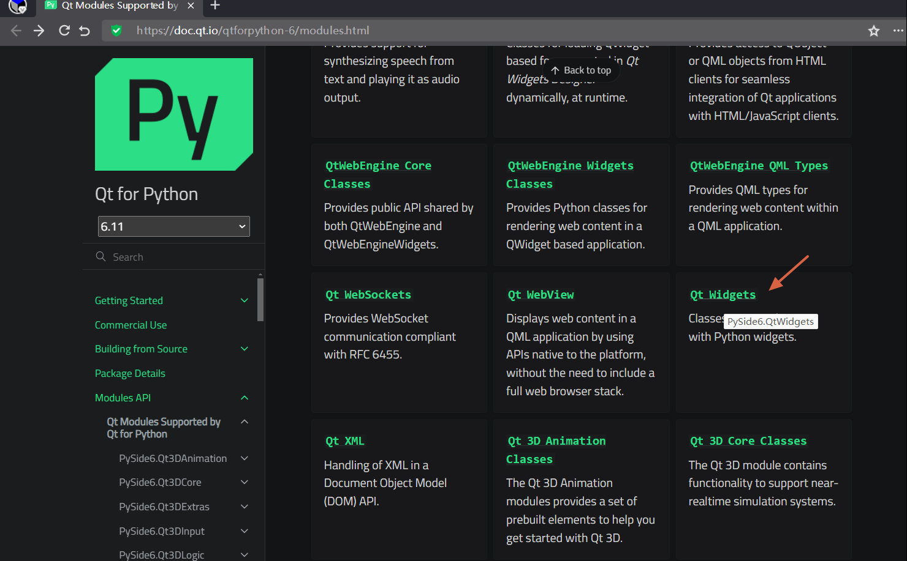

跳转之后，页面如下：

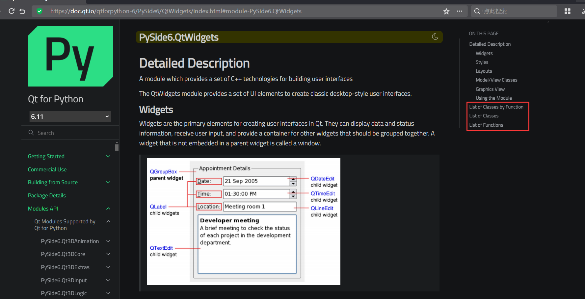

图中红框内的链接分别为：

1. 按照功能分类的类文档：https://doc.qt.io/qtforpython-6/overviews/qtwidgets-widget-classes.html#widgets-classes
2. 按照名称首字母分类的类文档（就在当前页面）：https://doc.qt.io/qtforpython-6/PySide6/QtWidgets/index.html#list-of-classes
3. 按照名称首字母分类的方法文档（就在当前页面）：https://doc.qt.io/qtforpython-6/PySide6/QtWidgets/index.html#list-of-functions

一般而言，常用的是模块的类，因此，只需使用1、2提供的文档即可。如果想要了解模块提供了哪些功能，可以看看1；若只是在使用具体类时遇到问题，直接在当前页面查找对应类名，跳转到类的文档即可。

比如，查找下一章要学习的`QPushButton`类：

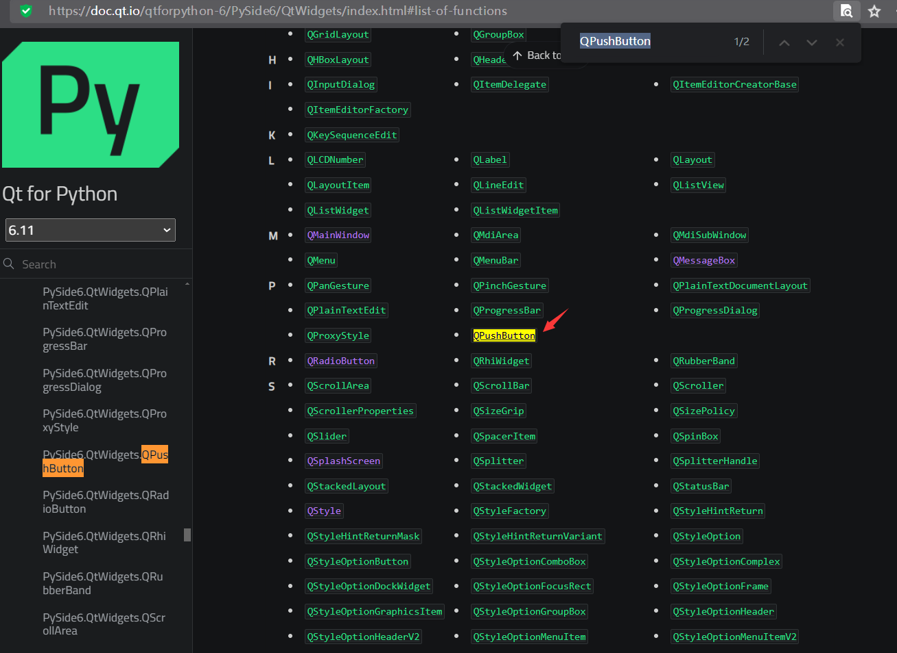

需要注意的是，官方文档看似类别清晰、内容丰富，但并非没有问题，点击上图的链接（https://doc.qt.io/qtforpython-6/PySide6/QtWidgets/QPushButton.html）之后，会跳转到下面的页面：

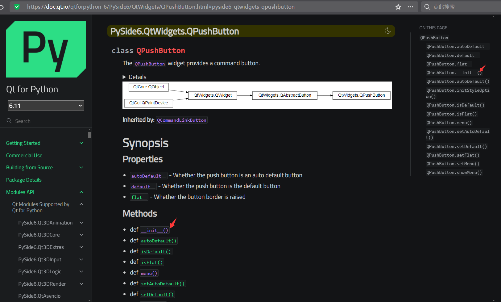

图中箭头所指的链接是初始化函数的文档，但跳转之后，会看到下面的内容：

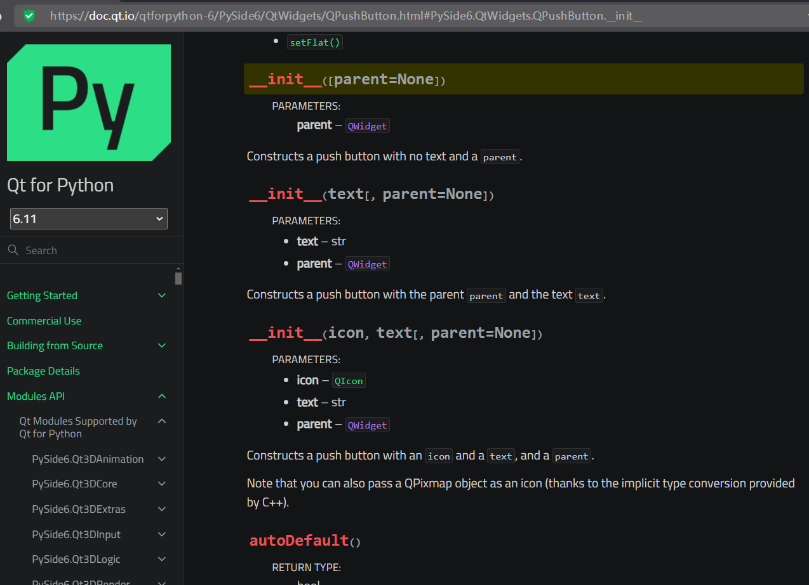

看起来连重载的初始化方法都标明了，好像很全面，但别急着高兴，这里有一个坑。

先放下文档，在VSCode中写下如下代码：

```python3
from PySide6.QtWidgets import QPushButton
```

这是一段导入`QPushButton`类的代码，随后，选中其中的`QPushButton`，按`f12`键或者 右键-转到定义，可以看到以下内容（部分代码）：

```python3
class QPushButton(PySide6.QtWidgets.QAbstractButton):

    @typing.overload
    def __init__(self, text: str, /, parent: PySide6.QtWidgets.QWidget | None = ..., *, autoDefault: bool | None = ..., default: bool | None = ..., flat: bool | None = ...) -> None: ...
    @typing.overload
    def __init__(self, icon: PySide6.QtGui.QIcon | PySide6.QtGui.QPixmap, text: str, /, parent: PySide6.QtWidgets.QWidget | None = ..., *, autoDefault: bool | None = ..., default: bool | None = ..., flat: bool | None = ...) -> None: ...
    @typing.overload
    def __init__(self, /, parent: PySide6.QtWidgets.QWidget | None = ..., *, autoDefault: bool | None = ..., default: bool | None = ..., flat: bool | None = ...) -> None: ...
```

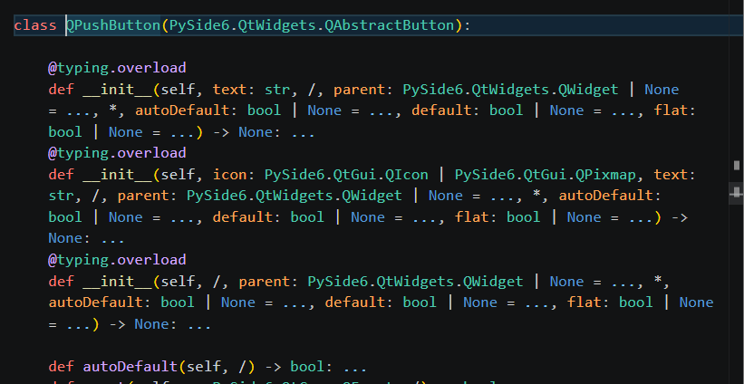

该文件是PySide6提供的类型声明，用于代码提示和类型检查。从上面内容中可以发现，该类提供的几种初始化方法，参数远比文档中多，而文档没有提供相应的说明。

因此，在实际学习时，最好结合代码提示和官方文档，只看官方文档的话，会忽略掉实际支持的参数。

回到文档（https://doc.qt.io/qtforpython-6/PySide6/QtWidgets/QPushButton.html）：

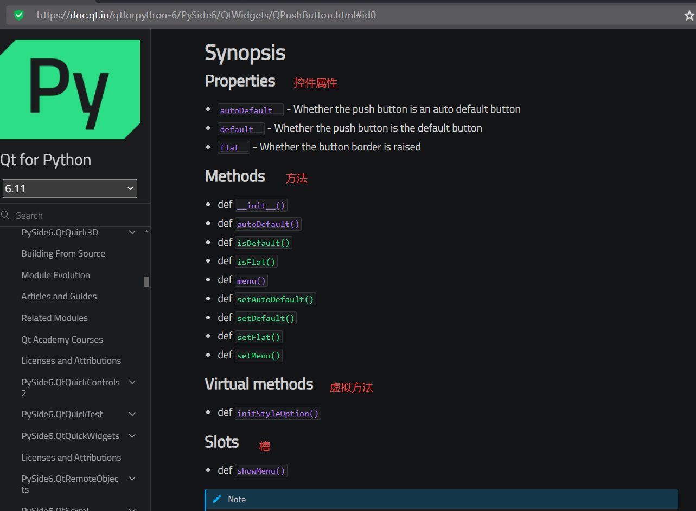

大部分控件的文档都会在开头这里提供快速跳转的链接，包括：

- 控件属性。除了这里标明的控件属性，控件还会继承父类的控件属性，因此实际控件支持的控件属性会比文档中看上去要多。

  注意，这里标明的控件属性表示其可用于该控件初始化方法中的关键字参数。

  另外，不同于Python中的属性可以直接设置、获取，控件属性是指其作为方法（或者控件属性名加了“is”前缀的方法）调用之后的返回值，想要设置控件属性，则要调用控件属性名加了“set”前缀的方法。其实，这里可以看出，Qt采用的是小驼峰命名法，因此，后续可以在得知控件属性名之后，猜测相关的获取、设置方法。

- 方法、虚拟方法、槽。方法中大部分是控件属性相关的方法（获取、设置），也就初始化方法是有确定功能的方法。而虚拟方法、槽本质上也是方法，只不过槽一般与信号组合使用，但也可以当作一个普通方法来调用。

  需要注意的是，虽然部分方法可以在创建控件时直接调用，但依然存在部分延迟生效的方法，需要先创建控件并将其分配给变量之后，才能调用其支持的方法。

- 信号。虽然示例中没有看到，但其继承了父类的信号，实际上支持不少信号（可以参考其父类`QAbstractButton`的文档）。信号一般是调用其连接函数，将其与指定的槽函数连接，实现信号的响应。

注意，这里也有一个坑。看文档（https://doc.qt.io/qtforpython-6/PySide6/QtWidgets/QPushButton.html）最上面的部分：

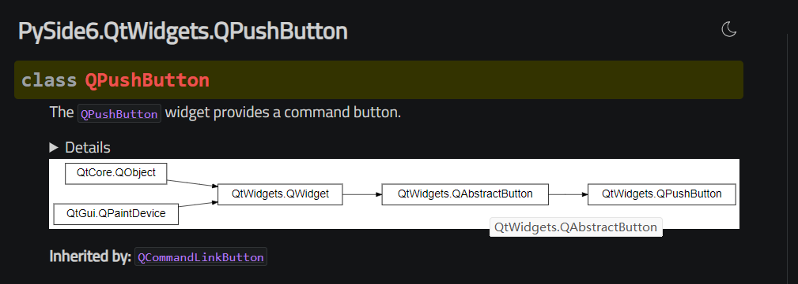

这里标明了控件的继承关系，而控件实际支持的方法、控件属性、信号、槽，除了控件文档中写明的，还包含其父类（比如`QAbstractButton`类）的。想要了解其父类提供的方法、控件属性、信号、槽，可以点击继承关系中对应的父类，跳转至父类的文档。

### 关于本教程

了解完官方文档如何学习，最后简单介绍一下本教程后续章节的大概结构（后续可能会修改），如果读者觉得不太适合，可以及时反馈或者暂时先去学习官方文档。

后续章节的大概结构如下：

1. 引言。简单介绍控件功能，让读者对该控件有个简单的了解。
2. 初始化方法。前面说过官方文档的初始化方法有点“混乱”，因此笔者会重新整理控件的初始化方法，并配上必要的示例，方便读者学习。
3. 方法（部分介绍）、控件属性（部分介绍）。因为控件属性很多也是方法，因此将其归类至方法。不过，一个控件支持的方法、控件属性很多，有些控件是继承自别的控件，无限向上追溯的话，内容会很多，也会重复。而不少方法、控件属性一般不怎么用或者其他控件也有，全部介绍也比较占用时间，因此这部分内容将挑选部分来介绍，不常用的、其他控件也有的，可能会省略。读者如有需求，可以及时反馈，后续通过其他章节补充。
4. 信号和槽（尽量完整地详细介绍）。因为信号和槽属于Qt独特的机制，虽然槽本质上也是方法，但为了方便快速学习，这两个功能将单独介绍，并且尽量完整地详细介绍。
5. 扩展用法（主要是技巧相关的代码）。实际开发时，很多时候遇到的问题没有教程中说的那么简单，就是因为控件是组合使用，只看当前控件的文档或者教程，很难解决问题，因此需要扩展其他控件或者相关知识，才能解决实际遇到的问题。所以，对于部分控件，会在学完基础之后，额外补充一些和实际问题相关的扩展用法。当然，如果读者遇到了其他与控件相关的问题但当时没有介绍，也可以留言反馈，笔者将后续通过其他章节补充。

## 25 `QPushButton`普通按钮控件

本章介绍的`QPushButton`普通按钮控件算是最常用、最普通的按钮。如果程序中需要一个简单的、可以点击的按钮，那非普通按钮控件莫属：

```python3
from PySide6.QtWidgets import (
    QApplication,
    QWidget,
    QPushButton
)

app = QApplication()
window = QWidget()
window.setWindowTitle('认识各种按钮')
window.resize(400, 300)

button = QPushButton('普通按钮',window)

window.show()
app.exec()
```

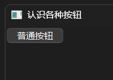

`QPushButton`普通按钮控件的继承关系如下：

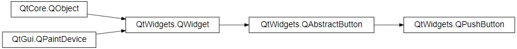

相关文档的链接如下：

- https://doc.qt.io/qtforpython-6/PySide6/QtWidgets/QPushButton.html
- https://doc.qt.io/qtforpython-6/PySide6/QtWidgets/QAbstractButton.html
- https://doc.qt.io/qtforpython-6/PySide6/QtWidgets/QWidget.html

### 25.1 初始化方法

`QPushButton`普通按钮控件有多种初始化方法（参数名及类型提示来自`QtWidgets.pyi`）。

第一种初始化方法支持以下参数：

- `text`参数，仅限位置参数（第一个位置参数），字符串类型，表示显示在按钮上的文字。

- `parent`参数，`PySide6.QtWidgets.QWidget`类型，表示父控件。如果指定了父控件，那么该控件显示时，会使用父控件的位置或者嵌在父控件内（取决于该控件是否支持嵌入到其他控件）。不指定或者为`None`，则控件会在独立窗口中显示。

- `autoDefault`参数，仅限关键字参数，布尔类型，表示控件是否为自动默认按钮，默认为`False`，如果父控件为`QDialog`控件（含子类控件），则默认值为`True`。当控件获得焦点时，自动默认按钮会变为默认按钮。

- `default`参数，仅限关键字参数，布尔类型，表示控件是否为默认按钮（按钮边缘有高亮），默认为`False`。

  父控件为`QDialog`控件（含子类控件）的话，默认按钮首先获得焦点，并且优先于默认焦点顺序。此外，对于同一个`QDialog`控件而言，最多存在一个默认按钮，以控件设置该参数的顺序为最终生效顺序。无论默认按钮是否获得焦点，默认按钮都可以响应`enter`键。按下`enter`键时，会触发默认按钮的`clicked`信号。

  父控件不为`QDialog`控件（含子类控件）的话，则可以存在多个默认按钮，只有获得焦点的默认按钮可以响应`enter`键。按下`enter`键时，会触发获得焦点的默认按钮的`clicked`信号。

- `flat`参数，仅限关键字参数，布尔类型，表示控件是否为扁平按钮（鼠标悬停在按钮上的话没有悬浮特效），默认为`False`。

第二种初始化方法支持以下参数：

- `icon`参数，仅限位置参数（第一个位置参数），`PySide6.QtGui.QIcon`类型或者`PySide6.QtGui.QPixmap`类型，表示按钮的图标或者图片。

  示例如下（所需的图片`LOGO.png`请保存至源代码的同目录下）：

  ```python3
  from PySide6.QtWidgets import (
      QApplication,
      QWidget,
      QPushButton
  )
  
  from PySide6.QtGui import QIcon,QPixmap
  
  app = QApplication()
  window = QWidget()
  window.setWindowTitle('认识各种按钮')
  window.resize(400, 300)
  
  QPushButton(
      QIcon.fromTheme(
          QIcon.ThemeIcon.Battery
      ),
      '普通按钮',
      window
  )
  QPushButton(
      QPixmap('LOGO.png'),
      '普通按钮',
      window
  ).move(0,30)
  
  window.show()
  app.exec()
  ```

  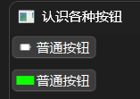

- `text`参数，仅限位置参数（第二个位置参数），含义、用法参考前面。

- `parent`参数，含义、用法参考前面。

- `autoDefault`参数，仅限关键字参数，含义、用法参考前面。

- `default`参数，仅限关键字参数，含义、用法参考前面。

- `flat`参数，仅限关键字参数，含义、用法参考前面。

第三种初始化方法支持以下参数：

- `parent`参数，含义、用法参考前面。
- `autoDefault`参数，仅限关键字参数，含义、用法参考前面。
- `default`参数，仅限关键字参数，含义、用法参考前面。
- `flat`参数，仅限关键字参数，含义、用法参考前面。

### 25.2 方法、控件属性

`QPushButton`普通按钮控件支持以下方法（部分，含控件属性）：

- `autoExclusive`方法（控件属性，可使用`setAutoExclusive`方法设置），返回控件是否启用自动独占。当多个按钮的父控件相同时，这些按钮就属于同一独占组。如果这些按钮启用了勾选和自动独占，那么，将只允许同时勾选最多一个按钮：

  ```python3
  from PySide6.QtWidgets import (
      QApplication,
      QWidget,
      QPushButton
  )
  
  app = QApplication()
  window = QWidget()
  window.setWindowTitle('认识各种按钮')
  window.resize(400, 300)
  
  button = QPushButton(
      '按钮1',
      window
  )
  button.setCheckable(True)
  button.setAutoExclusive(True)
  
  button2 = QPushButton(
      '按钮2',
      window
  )
  button2.move(0,30)
  button2.setCheckable(True)
  button2.setChecked(True)
  button2.setAutoExclusive(True)
  
  window.show()
  app.exec()
  ```

  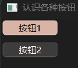

- `autoRepeat`方法（控件属性，可使用`setAutoRepeat`方法设置），返回控件是否启用了自动重复。自动重复是按钮的控件属性，默认该控件属性为`False`。所谓自动重复（使用`setAutoRepeat`方法设置），即按住按钮时，是否以指定的初始延迟（使用`setAutoRepeatDelay`方法设置）和间隔（使用`setAutoRepeatInterval`方法设置）重复发射`clicked`、`pressed`、`released`这三个信号。

  示例如下：

  ```python3
  from PySide6.QtWidgets import (
      QApplication,
      QWidget,
      QPushButton
  )
  
  app = QApplication()
  window = QWidget()
  window.setWindowTitle('认识各种按钮')
  window.resize(400, 300)
  
  button = QPushButton(
      '按钮1',
      window
  )
  
  button.setAutoRepeat(True)
  button.setAutoRepeatDelay(3000)
  button.setAutoRepeatInterval(1000)
  button.clicked.connect(lambda :print('clicked'))
  button.pressed.connect(lambda :print('pressed'))
  button.released.connect(lambda :print('released'))
  
  window.show()
  app.exec()
  ```

  使用鼠标按住按钮不松手，即可在终端看到持续不断的输出。

- `autoRepeatDelay`方法（控件属性，可使用`setAutoRepeatDelay`方法设置），返回控件的自动重复初始延迟。

- `autoRepeatInterval`方法（控件属性，可使用`setAutoRepeatInterval`方法设置），获取控件的自动重复间隔。

- `group`方法，获取按钮所属的按钮分组。

  所谓按钮分组，即当按钮启用`autoExclusive`控件属性时，属于同一分组的按钮，将只允许同时勾选最多一个按钮。前面介绍时没有使用按钮分组，默认父控件相同时算作同一分组。但这样的用法会导致一个问题，如果父控件相同，想要让两组以上的按钮分别自动独占，就无法实现。因此，可以使用`QButtonGroup`控件的`addButton`方法，将需要分组的按钮添加到同一组，可以实现组与组之间的隔离。

  示例如下：

  ```python3
  from PySide6.QtWidgets import (
      QApplication,
      QWidget,
      QPushButton,
      QButtonGroup
  )
  
  app = QApplication()
  window = QWidget()
  window.setWindowTitle('认识各种按钮')
  window.resize(400, 300)
  
  buttons = []
  for i in range(1,5):
      # 批量生成按钮
      button = QPushButton(
      	f'按钮{i}',
          window,
      )
      button.setCheckable(True)
      button.setAutoExclusive(True)
      button.move(
          0,
          30*(i-1)
      )
      # 点击按钮会在终端输出按钮所属的按钮组
      button.clicked.connect(
          lambda e,button=button:print(
              button.group()
          )
      )
      # 最后将按钮添加到数组中
      buttons.append(button)
  
  # 两个按钮分组
  group1 = QButtonGroup(
      window,
  )
  group1.addButton(
      buttons[0],
  )
  group1.addButton(
      buttons[1],
  )
  group2 = QButtonGroup(
      window,
  )
  group2.addButton(
      buttons[2],
  )
  group2.addButton(
      buttons[3],
  )
  
  window.show()
  app.exec()
  ```

  依次点击每个按钮，可以看到四个按钮明显分为两组，控制台的输出也证明了这一点：

  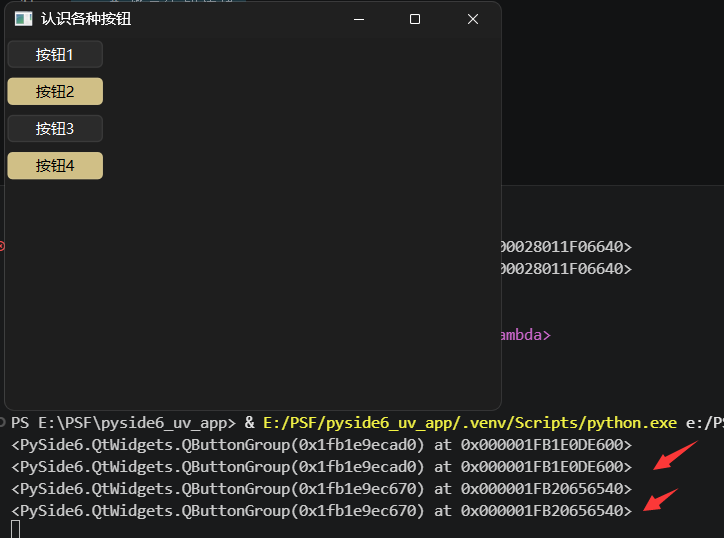

- `icon`方法（控件属性，可使用`setIcon`方法设置），返回按钮的图标或者图片。

- `iconSize`方法（控件属性，可使用`setIconSize`方法设置），返回按钮图标的大小。

- `isCheckable`方法（控件属性`checkable`的获取方法，可使用`setCheckable`方法设置），返回按钮是否可勾选。

- `isChecked`方法（控件属性`checked`的获取方法，可使用`setChecked`方法设置），返回按钮是否已勾选。

- `isDefault`方法（控件属性`default`的获取方法，可使用`setDefault`方法设置），返回按钮是为默认按钮。

- `isDown`方法（控件属性`down`的获取方法，可使用`setDown`方法设置），返回按钮是否已按下。

- `isFlat`方法（控件属性`flat`的获取方法，可使用`setFlat`方法设置），返回按钮是否为扁平按钮（鼠标悬停在按钮上的话没有悬浮特效）。

- `menu`方法（控件属性，可使用`setMenu`方法设置），返回点击按钮之后弹出的菜单。

- `setMenu`方法，设置点击按钮之后弹出的菜单。

  示例如下：

  ```python3
  from PySide6.QtWidgets import (
      QApplication,
      QWidget,
      QPushButton,
      QMenu
  )
  
  app = QApplication()
  window = QWidget()
  window.setWindowTitle('认识各种按钮')
  window.resize(400, 300)
  
  button = QPushButton(
      '按钮',
      window,
  )
  
  menu = QMenu()
  menu.addAction('Hello')
  menu.addAction('World')
  button.setMenu(
      menu
  )
  
  window.show()
  app.exec()
  ```

  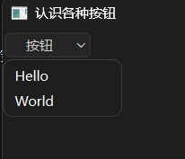

  该方法支持以下参数：

  - `menu`参数，`PySide6.QtWidgets.QMenu`类型，表示弹出的菜单。

- `setToolTip`方法，设置按钮的工具提示（鼠标悬停时自动弹出的文字）。该方法支持以下参数：

  - `arg__1`参数，仅限位置参数（第一个位置参数），字符串类型，表示工具提示的内容。

- `setShortcut`方法，给按钮绑定快捷键，按下快捷键时触发按钮的`clicked`信号。该方法支持以下参数：

  - `key`参数，仅限位置参数（第一个位置参数），`PySide6.QtCore.Qt.Key`类型、`PySide6.QtGui.QKeySequence`类型、`PySide6.QtCore.QKeyCombination`类型、`PySide6.QtGui.QKeySequence.StandardKey`类型、字符串类型、整数类型，表示绑定的快捷键。
  
- `setText`方法，设置按钮的文本。该方法支持以下参数：

  - `text`参数，仅限位置参数（第一个位置参数），字符串类型，表示按钮的文本。

- `shortcut`方法，返回按钮绑定的快捷键。

- `text`方法，返回按钮的文本。

- `toolTip`方法，返回按钮的工具提示。

### 25.3 信号和槽

`QPushButton`普通按钮控件支持以下信号（部分）：

- `clicked`信号，点击（包含鼠标按键按下、弹起两个过程）按钮时触发。

- `pressed`信号，按下按钮时触发。

- `released`信号，松开按钮时触发。

- `toggled`信号，切换按钮的勾选状态时触发。

  注意，按钮默认为不可勾选，需要通过`setCheckable(True)`启用勾选，才能在点击时切换勾选状态。

  示例如下：

  ```python3
  from PySide6.QtWidgets import (
      QApplication,
      QWidget,
      QPushButton
  )
  
  app = QApplication()
  window = QWidget()
  window.setWindowTitle('认识各种按钮')
  window.resize(400, 300)
  
  button = QPushButton(
      '可以勾选的按钮',
      window
  )
  button.setCheckable(True)
  button.toggled.connect(lambda:print('状态切换。'))
  
  window.show()
  app.exec()
  ```

`QPushButton`普通按钮控件支持以下槽（部分）：

- `showMenu`方法，弹出点击按钮之后弹出的菜单。
- `click`方法，点击按钮。
- `toggle`方法，切换按钮的勾选状态。
- `animateClick`方法，点击按钮，同时播放点击动画。

### 25.4 扩展用法

#### 25.4.1 自动创建快捷键

使用`setShortcut`方法可以给按钮设置任意快捷键，但是，如果在按钮文本中包含了“&｛符号｝”（比如`'&q'`），相当于创建了`alt + {符号对应的按键}`键为按钮的快捷键，则无需使用`setShortcut`方法。

注意，如果符号为大写字母，则默认在小写状态下也可以生效。

示例如下：

```python3
from PySide6.QtWidgets import (
    QApplication,
    QWidget,
    QPushButton
)

app = QApplication()
window = QWidget()
window.setWindowTitle('认识各种按钮')
window.resize(400, 300)

button = QPushButton(
    '按钮（&q）',
    window,
)

button.clicked.connect(lambda e:print('Clicked!'))

window.show()
app.exec()
```

可以按下`alt + q`键，查看终端的输出结果。

## 26 `QRadioButton`单选按钮控件

上一章介绍`autoExclusive`方法时使用的示例看上去像是单选按钮，但那种费事、妥协的单选按钮并不完美，需要额外设置属性，样式上也不够直观。因此，本章要介绍的`QRadioButton`单选按钮控件，在支持不少`QPushButton`普通按钮控件功能的基础上，更适合作为单选按钮使用，代码也更简洁：

```python3
from PySide6.QtWidgets import (
    QApplication,
    QWidget,
    QRadioButton
)

app = QApplication()
window = QWidget()
window.setWindowTitle('认识各种按钮')
window.resize(400, 300)

button = QRadioButton(
    '选项1',
    window,
)
button.setChecked(True)
button2 = QRadioButton(
    '选项2',
    window,
)
button2.move(
    0,
    30
)

window.show()
app.exec()
```

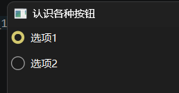

`QRadioButton`单选按钮控件的继承关系如下：


相关文档的链接如下：

- https://doc.qt.io/qtforpython-6/PySide6/QtWidgets/QRadioButton.html
- https://doc.qt.io/qtforpython-6/PySide6/QtWidgets/QAbstractButton.html
- https://doc.qt.io/qtforpython-6/PySide6/QtWidgets/QWidget.html

### 26.1 初始化方法

`QRadioButton`单选按钮控件有多种初始化方法（参数名及类型提示来自`QtWidgets.pyi`）。

第一种初始化方法支持以下参数：

- `text`参数，仅限位置参数（第一个位置参数），字符串类型，表示显示在按钮上的文字。
- `parent`参数，`PySide6.QtWidgets.QWidget`类型，表示父控件。如果指定了父控件，那么该控件显示时，会使用父控件的位置或者嵌在父控件内（取决于该控件是否支持嵌入到其他控件）。不指定或者为`None`，则控件会在独立窗口中显示。

第二种初始化方法支持以下参数：

- `parent`参数，含义、用法参考前面。

### 26.2 方法、控件属性

`QRadioButton`单选按钮控件支持以下方法（部分，含控件属性）：

- `autoExclusive`方法（控件属性，可使用`setAutoExclusive`方法设置），返回控件是否启用自动独占。不同于`QPushButton`普通按钮控件需要单独设置，该控件默认为`True`，因此，当多个按钮的父控件相同时，这些按钮就属于同一独占组。那么，将只允许同时勾选最多一个按钮。

- `group`方法，获取按钮所属的按钮分组。因为该控件默认启用了`autoExclusive`控件属性，因此，想要将不同的单选隔离开，必须要分组（使用`QButtonGroup`控件的`addButton`方法，将需要分组的按钮添加到同一组）。

  示例如下：

  ```python3
  from PySide6.QtWidgets import (
      QApplication,
      QWidget,
      QRadioButton,
      QButtonGroup
  )
  
  app = QApplication()
  window = QWidget()
  window.setWindowTitle('认识各种按钮')
  window.resize(400, 300)
  
  buttons = []
  for i in range(1,5):
      # 批量生成选项
      button = QRadioButton(
      	f'选项{i}',
          window,
      )
      button.move(
          0,
          30*(i-1)
      )
      # 点击选项会在终端输出选项所属的按钮组
      button.clicked.connect(
          lambda e,button=button:print(
              button.group()
          )
      )
      # 最后将选项添加到数组中
      buttons.append(button)
    
  # 两个按钮分组
  group1 = QButtonGroup(
      window,
  )
  group1.addButton(
      buttons[0],
  )
  group1.addButton(
      buttons[1],
  )
  group2 = QButtonGroup(
      window,
  )
  group2.addButton(
      buttons[2],
  )
  group2.addButton(
      buttons[3],
  )
  
  window.show()
  app.exec()
  ```

  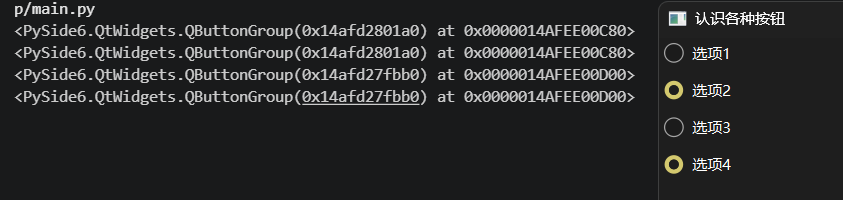

- `icon`方法（控件属性，可使用`setIcon`方法设置），返回按钮的图标或者图片。虽然该控件一般用于选项，但依然支持设置图标（该控件属性实际上来源于`QAbstractButton`抽象按钮控件）。

  示例如下：

  ```python3
  from PySide6.QtWidgets import (
      QApplication,
      QWidget,
      QRadioButton
  )
  from PySide6.QtGui import QIcon
  
  app = QApplication()
  window = QWidget()
  window.setWindowTitle('认识各种按钮')
  window.resize(400, 300)
  
  button = QRadioButton(
      '选项1',
      window,
  )
  button.setChecked(True)
  button2 = QRadioButton(
      '选项2',
      window,
  )
  button2.move(
      0,30
  )
  button.setIcon(
      QIcon.fromTheme(
          QIcon.ThemeIcon.Battery
      )
  )
  
  window.show()
  app.exec()
  ```

  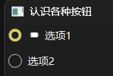

其他的方法大部分和`QPushButton`普通按钮控件一样（部分没有。比如`menu`方法和相关方法），具体可以看官方文档。

### 26.3 信号和槽

`QRadioButton`单选按钮控件支持以下信号（部分）：

- `clicked`信号，点击（包含鼠标按键按下、弹起两个过程）按钮时触发。

- `pressed`信号，按下按钮时触发。

- `released`信号，松开按钮时触发。

- `toggled`信号，切换按钮的勾选状态时触发。

`QRadioButton`单选按钮控件支持以下槽（部分）：

- `click`方法，点击按钮。
- `toggle`方法，切换按钮的勾选状态。
- `animateClick`方法，点击按钮，同时播放点击动画。

## 27 `QCheckBox`多选按钮控件

`QCheckBox`多选按钮控件用起来几乎和`QRadioButton`单选按钮控件一样，上一章的例子，直接改名就能用：

```python3
from PySide6.QtWidgets import (
    QApplication,
    QWidget,
    QCheckBox
)

app = QApplication()
window = QWidget()
window.setWindowTitle('认识各种按钮')
window.resize(400, 300)

button = QCheckBox(
    '选项1',
    window,
)
button.setChecked(True)
button2 = QCheckBox(
    '选项2',
    window,
)
button2.move(
    0,30
)

window.show()
app.exec()
```

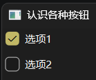

当然，几乎一样不代表完全一样，二者还是有一些差异，首先，既然是多选，哪怕父控件相同，每个选项的勾选状态也是独立的，默认不会自动独占（也可以启用）。此外，`QCheckBox`多选按钮控件的勾选状态也不是简单的两种。具体相关差异的示例可以参考官方文档或者后面的内容。

`QCheckBox`多选按钮控件的继承关系如下：

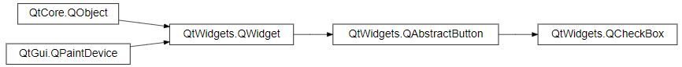

相关文档的链接如下：

- https://doc.qt.io/qtforpython-6/PySide6/QtWidgets/QCheckBox.html
- https://doc.qt.io/qtforpython-6/PySide6/QtWidgets/QAbstractButton.html
- https://doc.qt.io/qtforpython-6/PySide6/QtWidgets/QWidget.html

### 27.1 初始化方法

`QCheckBox`多选按钮控件有多种初始化方法（参数名及类型提示来自`QtWidgets.pyi`）。

- 第一种初始化方法支持以下参数：

  - `text`参数，仅限位置参数（第一个位置参数），字符串类型，表示显示在按钮上的文字。

  - `parent`参数，`PySide6.QtWidgets.QWidget`类型，表示父控件。如果指定了父控件，那么该控件显示时，会使用父控件的位置或者嵌在父控件内（取决于该控件是否支持嵌入到其他控件）。不指定或者为`None`，则控件会在独立窗口中显示。

  - `tristate`参数，仅限关键字参数，布尔类型，表示按钮的勾选状态是否为三种（未勾选、半勾选、勾选）。

    示例如下：

    ```python3
    from PySide6.QtWidgets import (
        QApplication,
        QWidget,
        QCheckBox
    )
    from PySide6.QtCore import Qt
    
    app = QApplication()
    window = QWidget()
    window.setWindowTitle('认识各种按钮')
    window.resize(400, 300)
    
    button = QCheckBox(
        '选项1',
        window,
        tristate=True,
    )
    button.setCheckState(
        Qt.CheckState.PartiallyChecked
    )
    button2 = QCheckBox(
        '选项2',
        window,
    )
    button2.move(
        0,30
    )
    
    window.show()
    app.exec()
    ```

    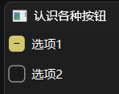

  第二种初始化方法支持以下参数：

  - `parent`参数，含义、用法参考前面。
  - `tristate`参数，含义、用法参考前面。

### 27.2 方法、控件属性

`QCheckBox`多选按钮控件支持以下方法（部分，含控件属性）：

- `checkState`方法（控件属性，可使用`setCheckState`方法设置），返回控件的勾选状态。

- `isTristate`方法（控件属性`tristate`的获取方法，，可使用`setTristate`方法设置），返回控件的勾选状态是否为三种。

- `setCheckState`方法，设置控件的勾选状态。

  该方法支持以下参数：

  - `state`参数，仅限位置参数（第一个位置参数），`PySide6.QtCore.Qt.CheckState`类型，表示控件的勾选状态。`PySide6.QtCore.Qt.CheckState`类型为枚举类型，包含以下枚举值：
    - `Unchecked`（`0x0`），表示未勾选。
    - `PartiallyChecked`（`0x1`），表示部分勾选。
    - `Checked`（`0x2`），表示勾选。

- `setTristate`方法，设置控件的勾选状态是否为三种。

  该方法支持以下参数：

  - `y`参数，布尔类型，表示控件的勾选状态是否为三种。

### 27.3 信号和槽

`QCheckBox`多选按钮控件支持以下信号（部分）：

- `checkStateChanged`信号，控件的勾选状态变化时触发。

  示例如下：

  ```python3
  from PySide6.QtWidgets import (
      QApplication,
      QWidget,
      QCheckBox
  )
  from PySide6.QtCore import Qt
  
  app = QApplication()
  window = QWidget()
  window.setWindowTitle('认识各种按钮')
  window.resize(400, 300)
  
  button = QCheckBox(
      '选项1',
      window,
      tristate=True,
  )
  button.setCheckState(
      Qt.CheckState.PartiallyChecked
  )
  
  def check_state(state):
      match state:
          case Qt.CheckState.Unchecked:
              print('Unchecked!')
          case Qt.CheckState.PartiallyChecked:
              print('PartiallyChecked!')
          case Qt.CheckState.Checked:
              print('Checked!')
          case _:
              print('Unexpected!')
  
  button.checkStateChanged.connect(check_state)
  
  window.show()
  app.exec()
  ```

- `clicked`信号，点击（包含鼠标按键按下、弹起两个过程）按钮时触发。

- `pressed`信号，按下按钮时触发。

- `released`信号，松开按钮时触发。

- `toggled`信号，切换按钮的勾选状态时触发。

`QCheckBox`多选按钮控件支持以下槽（部分）：

- `click`方法，点击按钮。
- `toggle`方法，切换按钮的勾选状态。
- `animateClick`方法，点击按钮，同时播放点击动画。

## 28 `QCommandLinkButton`命令链接按钮控件

`QCommandLinkButton`命令链接按钮控件看起来、用起来都很像`QPushButton`普通按钮控件：

```python3
from PySide6.QtWidgets import (
    QApplication,
    QWidget,
    QCommandLinkButton,
    QPushButton
)

app = QApplication()
window = QWidget()
window.setWindowTitle('认识各种按钮')
window.resize(400, 300)

button = QCommandLinkButton(
    '命令链接按钮',
    '解释性的文本',
    window,
)

button2 = QPushButton(
    '普通按钮\n解释性的文本',
    window,
)
button2.move(
    0,
    60
)
button2.setIcon(
    button.icon()
)

window.show()
app.exec()
```

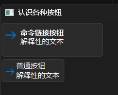

从上面的运行结果看，二者主要区别在于`QCommandLinkButton`命令链接按钮控件看上去更“宽松”，自带一个图标，而且解释性文本与按钮文本有样式的差异，而非普通按钮那种字体完全一样。因此，如果希望用户直接了解按钮的功能，而不是将鼠标悬停在按钮上，看工具提示的话，使用`QCommandLinkButton`命令链接按钮控件更合适。

`QCommandLinkButton`命令链接按钮控件的继承关系如下：

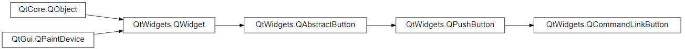

相关文档的链接如下：

- https://doc.qt.io/qtforpython-6/PySide6/QtWidgets/QCommandLinkButton.html
- https://doc.qt.io/qtforpython-6/PySide6/QtWidgets/QPushButton.html
- https://doc.qt.io/qtforpython-6/PySide6/QtWidgets/QAbstractButton.html
- https://doc.qt.io/qtforpython-6/PySide6/QtWidgets/QWidget.html

### 28.1 初始化方法

`QCommandLinkButton`命令链接按钮控件有多种初始化方法（参数名及类型提示来自`QtWidgets.pyi`）。

第一种初始化方法支持以下参数：

- `text`参数，仅限位置参数（第一个位置参数），字符串类型，表示显示在按钮上的文字。
- `description`参数，仅限位置参数（第二个位置参数），字符串类型，表示显示在按钮上的解释性文字。
- `parent`参数，`PySide6.QtWidgets.QWidget`类型，表示父控件。如果指定了父控件，那么该控件显示时，会使用父控件的位置或者嵌在父控件内（取决于该控件是否支持嵌入到其他控件）。不指定或者为`None`，则控件会在独立窗口中显示。
- `flat`参数，仅限关键字参数，布尔类型，表示控件是否为扁平按钮（鼠标悬停在按钮上的话没有悬浮特效），默认为`False`。

第二种初始化方法支持以下参数：

- `text`参数，仅限位置参数（第一个位置参数），含义、用法参考前面。
- `parent`参数，含义、用法参考前面。
- `description`参数，仅限关键字参数，含义、用法参考前面。
- `flat`参数，仅限关键字参数，含义、用法参考前面。

第三种初始化方法支持以下参数：

- `parent`参数，含义、用法参考前面。
- `description`参数，仅限关键字参数，含义、用法参考前面。
- `flat`参数，仅限关键字参数，含义、用法参考前面。

### 28.2 方法、控件属性

`QCommandLinkButton`命令链接按钮控件支持以下方法（部分，含控件属性）：

- `description`方法（控件属性，可使用`setDescription`方法设置），返回显示在按钮上的解释性文字。

### 28.3 信号和槽

`QCommandLinkButton`命令链接按钮控件支持以下信号（部分）：

- `clicked`信号，点击（包含鼠标按键按下、弹起两个过程）按钮时触发。
- `pressed`信号，按下按钮时触发。

- `released`信号，松开按钮时触发。

- `toggled`信号，切换按钮的勾选状态时触发。

### 28.4 扩展用法

#### 28.4.1 修改图标

`QCommandLinkButton`命令链接按钮控件默认使用了箭头作为图标，那是因为该按钮的外观实际上来源于Windows Vista系统引入的同名控件，Qt通过自己的方式实现了类似的控件。该控件一般用在向导窗口中，用于指示下一步执行什么（直接执行）并且无需查看工具提示。因此，才会默认使用箭头作为图标。

不过，因为是继承自`QPushButton`普通按钮控件，所以，依然可以使用`setIcon`方法修改按钮的图标：

```python3
from PySide6.QtWidgets import (
    QApplication,
    QWidget,
    QCommandLinkButton
)
from PySide6.QtGui import QIcon

app = QApplication()
window = QWidget()
window.setWindowTitle('认识各种按钮')
window.resize(400, 300)

button = QCommandLinkButton(
    '命令链接按钮',
    '解释性的文本',
    window,
)
button.setIcon(
    QIcon.fromTheme(
        QIcon.ThemeIcon.ApplicationExit
    )
)

window.show()
app.exec()
```

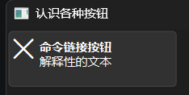

## 29 `QToolButton`工具按钮控件

前面介绍的按钮都比较简单，难免有读者觉得笔者有点“敷衍”。那么，本章就顺势介绍一下用起来有点复杂的`QToolButton`工具按钮控件。

先看一下该控件的“错误”用法：

```python3
from PySide6.QtWidgets import (
    QApplication,
    QWidget,
    QToolButton
)

app = QApplication()
window = QWidget()
window.setWindowTitle('认识各种按钮')
window.resize(400, 300)

button = QToolButton(
    window,
)
button.setText('工具按钮')

window.show()
app.exec()
```

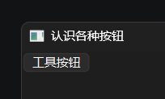

运行起来没有报错，看上去也没有异常，为何说这是“错误”用法呢？那是因为该控件一般与`QToolBar`工具栏控件、`QMainWindow`主窗口控件搭配使用，因此，“正确”用法应当是：

```python3
from PySide6.QtWidgets import (
    QApplication,
    QMainWindow,
    QToolButton,
    QToolBar
)

app = QApplication()
window = QMainWindow()
window.setWindowTitle('认识各种按钮')
window.resize(400, 300)

toolbar = QToolBar('工具栏')
window.addToolBar(toolbar)

button = QToolButton()
button.clicked.connect(lambda:print('Clicked!'))
button.setText('工具按钮')
toolbar.addWidget(
    button
)

window.show()
app.exec()
```

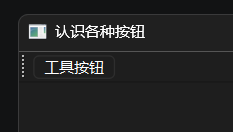

读者可以在运行之后拖动按钮左边的虚线，移动工具栏到任意位置。

这里提前为好学的读者预告一下注意事项（不是本章重点，后续介绍相关控件时再细讲），免得读者探索`QToolBar`工具栏控件的初始化参数时遇到难以理解的问题：

`QToolBar`工具栏控件的初始化参数并非都可以使用，官方文档中的只读属性——`floating`控件属性，被`QtWidgets.pyi`的生成工具错误捕获，导致初始化方法中包含了`floating`参数，但实际上该参数并不存在也不能使用。

`QToolButton`工具按钮控件的继承关系如下：

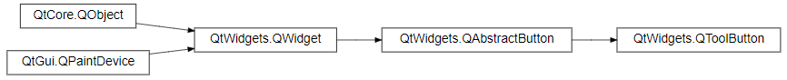

相关文档的链接如下：

- https://doc.qt.io/qtforpython-6/PySide6/QtWidgets/QToolButton.html
- https://doc.qt.io/qtforpython-6/PySide6/QtWidgets/QAbstractButton.html
- https://doc.qt.io/qtforpython-6/PySide6/QtWidgets/QWidget.html

### 29.1 初始化方法

`QToolButton`工具按钮控件的初始化方法（参数名及类型提示来自`QtWidgets.pyi`）支持以下参数：

- `parent`参数，`PySide6.QtWidgets.QWidget`类型，表示父控件。
- `popupMode`参数，仅限关键字参数，`PySide6.QtWidgets.QToolButton.ToolButtonPopupMode`类型，表示如何显示按钮的弹出菜单，默认为`PySide6.QtWidgets.QToolButton.ToolButtonPopupMode.MenuButtonPopup`，需要按住按钮一段时间（由`PySide6.QtWidgets.QStyle.StyleHint.SH_Menu_SubMenuPopupDelay`定义）才能弹出。
- `toolButtonStyle`参数，仅限关键字参数，`PySide6.QtCore.Qt.ToolButtonStyle`类型，表示按钮的显示样式（仅文本、仅图标、图标加文本），默认为`PySide6.QtCore.Qt.ToolButtonStyle.ToolButtonIconOnlyp`（仅图标）。
- `autoRaise`参数，仅限关键字参数，布尔类型，表示是否启用鼠标悬停的样式。当该控件与`QToolBar`工具栏控件组合使用时，该参数始终为`True`，其他情况默认为`False`。注意，应用程序的主题非`'Fusion'`时，该样式受限于系统主题，可能不明显。
- `arrowType`参数，仅限关键字参数，`PySide6.QtCore.Qt.ArrowType`类型，当是否将按钮图标强制设置为箭头，默认为`PySide6.QtCore.Qt.ArrowType.NoArrow`，即不设置为箭头。

### 29.2 方法、控件属性

`QToolButton`工具按钮控件支持以下方法（部分，含控件属性）：

- `arrowType`方法（控件属性，可使用`setArrowType`方法设置），含义同`arrowType`参数。
- `autoRaise`方法（控件属性，可使用`setAutoRaise`方法设置），含义同`autoRaise`参数。
- `defaultAction`方法（控件属性，可使用`setDefaultAction`方法设置），表示按钮的默认动作。
- `menu`方法（控件属性，可使用`setMenu`方法设置），返回弹出的菜单。
- `popupMode`方法（控件属性，可使用`setPopupMode`方法设置），含义同`popupMode`参数。

### 29.3 信号和槽

`QToolButton`工具按钮控件支持以下信号（部分）：

- `triggered`信号，按钮的默认动作触发时触发。
- `clicked`信号，点击（包含鼠标按键按下、弹起两个过程）按钮时触发。
- `pressed`信号，按下按钮时触发。
- `released`信号，松开按钮时触发。
- `toggled`信号，切换按钮的勾选状态时触发。

`QToolButton`工具按钮控件支持以下槽（部分）：

- `showMenu`方法，弹出菜单。
- `click`方法，点击按钮。
- `toggle`方法，切换按钮的勾选状态。
- `animateClick`方法，点击按钮，同时播放点击动画。

### 29.4 扩展用法

#### 29.4.1 按钮的显示样式

前面介绍过`toolButtonStyle`参数表示按钮的显示样式（仅文本、仅图标、图标加文本），以下为该参数各个参数值的对比示例：

```python3
from PySide6.QtWidgets import (
    QApplication,
    QMainWindow,
    QToolButton,
    QToolBar
)
from PySide6.QtCore import Qt
from PySide6.QtGui import QIcon

app = QApplication()
window = QMainWindow()
window.setWindowTitle('认识各种按钮')
window.resize(400, 300)

# 使用Fusion主题，让悬停效果更明显
app.setStyle('Fusion')
toolbar = QToolBar('工具栏')
window.addToolBar(toolbar)

buttons = []
for i in [
    Qt.ToolButtonStyle.ToolButtonFollowStyle,
    Qt.ToolButtonStyle.ToolButtonIconOnly,
    Qt.ToolButtonStyle.ToolButtonTextBesideIcon,
    Qt.ToolButtonStyle.ToolButtonTextOnly,
    Qt.ToolButtonStyle.ToolButtonTextUnderIcon
]:
    button = QToolButton(
        toolButtonStyle=i,
    )
    button.setText('工具按钮')
    button.setIcon(
        QIcon.fromTheme(
            QIcon.ThemeIcon.Battery
        )
    )
    buttons.append(button)
    toolbar.addWidget(
        buttons[-1]
    )

window.show()
app.exec()
```

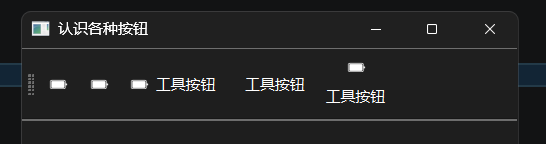

注意，`Qt.ToolButtonStyle.ToolButtonFollowStyle`表示取决于系统默认样式，在Windows系统上为只显示图标。

#### 29.4.2 菜单的弹出模式

`popupMode`参数表示如何显示按钮的弹出菜单，以下为该参数各个参数值的对比示例：

```python3
from PySide6.QtWidgets import (
    QApplication,
    QMainWindow,
    QToolButton,
    QToolBar,
    QMenu
)

app = QApplication()
window = QMainWindow()
window.setWindowTitle('认识各种按钮')
window.resize(400, 300)

# 使用Fusion主题，让悬停效果更明显
app.setStyle('Fusion')
toolbar = QToolBar('工具栏')
window.addToolBar(toolbar)

buttons = []
menu = QMenu()
menu.addAction('菜单项')
for i in [
    QToolButton.ToolButtonPopupMode.DelayedPopup,
    QToolButton.ToolButtonPopupMode.InstantPopup,
    QToolButton.ToolButtonPopupMode.MenuButtonPopup,

]:
    button = QToolButton(
        popupMode=i,
    )
    button.setText('工具按钮')
    button.setMenu(menu)
    buttons.append(button)
    toolbar.addWidget(
        buttons[-1]
    )

window.show()
app.exec()
```

#### 29.4.3 按钮的默认动作

前面介绍`defaultAction`方法时说过一个概念——“动作”，这里简单说一下这个方法和动作的用法。至于动作的完整用法，将在后面介绍`QAction`类时展开。

动作（`QAction`类）可以理解为有形交互之后执行的无形操作：点击按钮、菜单之后打开文件，按下按键之后退出程序。

总之，动作是个抽象的概念，可以视作比响应函数更统一的响应操作。

对于支持动作的控件而言（不是所有控件都支持动作），定义动作时，可以设置一些控件支持的样式（比如文本、图标）。这样，当控件设置动作时，动作的样式会优先生效。

示例如下：

```python3
from PySide6.QtWidgets import (
    QApplication,
    QMainWindow,
    QToolButton,
    QToolBar
)
from PySide6.QtGui import QAction

app = QApplication()
window = QMainWindow()
window.setWindowTitle('认识各种按钮')
window.resize(400, 300)

# 使用Fusion主题，让悬停效果更明显
app.setStyle('Fusion')
toolbar = QToolBar('工具栏')
window.addToolBar(toolbar)

button = QToolButton()
button.setText('工具按钮')

action = QAction(
    '退出程序', 
    toolTip='关闭窗口并退出程序'
)
action.triggered.connect(app.quit)
button.setDefaultAction(
    action
)
toolbar.addWidget(
    button
)

window.show()
app.exec()
```

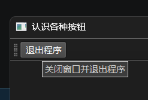

## 30 槽函数的自动连接

一般来说，槽函数与直接使用函数没什么区别，就好像下面改自前面的示例，使用普通函数代替槽函数：

```python3
from PySide6.QtWidgets import (
    QApplication,
    QWidget,
    QPushButton
)

app = QApplication()
window = QWidget()
window.setWindowTitle('信号与事件')
window.resize(400,300)
button = QPushButton('click',window)

# 信号，支持连接多个槽
button.clicked.connect(lambda :print('button is clicked'))
# 定义槽函数（伪），其实就是一般函数，可以勉强用，但功能上不如真的槽函数强大
def on_clicked():
    print('button is clicked2')

button.clicked.connect(on_clicked)

window.show()
app.exec()
```

执行效果是一样的，但为什么还要定义槽函数呢？这就不得不说槽函数的自动连接功能，即无需手动连接所有的信号和槽，有一个简单的方法自动将槽函数与特定信号连接。

想要自动连接生效，有以下关键点：

- 发出信号的控件必须设置`objectName`（在UI文件中定义，或者使用`setObjectName`方法显式设置）。

- 槽函数必须在类（继承自`QWidget`）内定义，并且命名符合要求。

  示例如下：

  ```python3
  @Slot()
  def on_{objectName}_{signalName}(self, ...):
      ...
  ```

  命名要求如下：

  - 必须使用“on_”为前缀。

  - 必须包含“{objectName}”——发送信号的控件的对象名（ 控件属性`objectName`）。
  - 必须包含“{signalName}”，——信号的变量名（即信号被分配给哪个变量，并且信号的参数签名与槽函数装饰器一致）。

- 在控件挂载、初始化完毕之后，执行`QMetaObject.connectSlotsByName(self)`，进行自动连接。

具体示例如下：

```python3
from PySide6.QtWidgets import (
    QApplication,
    QWidget,
    QPushButton
)
from PySide6.QtCore import Slot,QMetaObject

app = QApplication()

class Window(QWidget):
    def __init__(self):
        super().__init__()
        self.setWindowTitle('自动连接槽函数')
        self.resize(400,300)
        self.button = QPushButton('click',self)
        self.button.setObjectName('button')
        QMetaObject.connectSlotsByName(self)
    @Slot()
    def on_button_clicked(self):
        print('clicked!!!')

window = Window()

window.show()
app.exec()
```

只要是信号都可以自动连接，自定义信号也可以：

```python3
from PySide6.QtWidgets import (
    QApplication,
    QWidget,
    QPushButton
)
from PySide6.QtCore import Slot,QMetaObject,Signal

app = QApplication()

class Window(QWidget):
    # 创建自定义信号
    mySignal = Signal(str)
    def __init__(self):
        super().__init__()
        self.setWindowTitle('自动连接槽函数（自定义信号）')
        self.resize(400,300)
        self.button = QPushButton('click',self)
        self.button.clicked.connect(lambda:self.mySignal.emit('Hello'))
        self.setObjectName('window')
        QMetaObject.connectSlotsByName(self)
    
    @Slot(str)
    def on_window_mySignal(self,string):
        print(string)
        print('window is clicked!!!')

window = Window()

window.show()
app.exec()
```

## 31 重载信号

上一章介绍槽函数的自动连接时，最后一个示例使用了自定义的信号，本章顺便介绍一下自定义信号的进阶用法——重载信号。

为什么要用重载信号？上一章定义了一个简单的信号，只传入一个字符串类型的参数。假如，一个信号支持多种类型的参数（甚至无参数），想让同一个信号接收不同参数时对应不同的槽函数，就要用到重载信号。

所谓重载信号，可以简单理解为定义信号时，一次性定义信号支持的各种参数类型及其组合，无需为每一种组合分配一个变量，同时使用时也比较清晰明了：

```python3
mySignal = Signal((),(str,),(int,))
```

不使用元组的话，表示信号仅支持一种参数组合；当使用元组表示每一种参数组合时，表示信号支持每个元组对应的参数组合。此时，可以使用`mySignal[str].connect`方法连接对应参数组合的信号与槽函数。

注意，可能其他教程中使用列表表示参数组合，但在当版本（6.10.x）中，只能使用元组。

示例如下：

```python3
from PySide6.QtWidgets import (
    QApplication,
    QWidget,
    QPushButton
)
from PySide6.QtCore import Slot,Signal

app = QApplication()

class Window(QWidget):
    # 支持的其他类型必须使用元组来表明同级
    mySignal = Signal((),(str,),(int,))
    def __init__(self):
        super().__init__()
        self.setWindowTitle('重载信号')
        self.resize(400,300)
        self.mySignal.connect(self.on_mySignal)
        self.mySignal[str].connect(self.on_mySignal_str)
        self.mySignal[int].connect(self.on_mySignal_int)
        self.button1 = QPushButton('click[]',self)
        self.button1.clicked.connect(lambda:self.mySignal.emit())
        self.button2 = QPushButton('click[str]',self)
        self.button2.clicked.connect(lambda:self.mySignal[str].emit('Hello'))
        self.button2.move(0,30)
        self.button3 = QPushButton('click[int]',self)
        self.button3.clicked.connect(lambda:self.mySignal[int].emit(2026))
        self.button3.move(0,60)

    @Slot()
    def on_mySignal(self):
        print('mySignal[] is emitted!!!')

    @Slot(str)
    def on_mySignal_str(self,string):
        print(string)
        print('mySignal[str] is emitted!!!')

    @Slot(int)
    def on_mySignal_int(self,integer):
        print(integer)
        print('mySignal[int] is emitted!!!')

window = Window()

window.show()
app.exec()
```

当然，如果觉得每个参数组合都要单独连接一次槽函数甚至单独连接一个槽函数，有点麻烦的话，槽函数同样也支持类似的“重载”操作，只需将装饰器用在同一个函数上即可：

```python3
@Slot()
@Slot(int)
@Slot(str)
def on_window_mySignal(self,x=None):
    if x:
        print(x)
    print(f'mySignal[{type(x).__name__ if x else ""}] is emitted!!!')
```

可能读者也发现了上面的槽函数名与上一章最后的自定义信号示例相同。没错，如果参数组合包含无参数的情况，只能使用槽函数的自动连接注册：

```python3
from PySide6.QtWidgets import (
    QApplication,
    QWidget,
    QPushButton
)
from PySide6.QtCore import Slot,Signal,QMetaObject

app = QApplication()

class Window(QWidget):
    # 支持的其他类型必须使用元组来表明同级
    mySignal = Signal((),(str,),(int,))
    def __init__(self):
        super().__init__()
        self.setWindowTitle('重载信号')
        self.resize(400,300)
        self.button1 = QPushButton('click[]',self)
        self.button1.clicked.connect(lambda:self.mySignal.emit())
        self.button2 = QPushButton('click[str]',self)
        self.button2.clicked.connect(lambda:self.mySignal[str].emit('Hello'))
        self.button2.move(0,30)
        self.button3 = QPushButton('click[int]',self)
        self.button3.clicked.connect(lambda:self.mySignal[int].emit(2026))
        self.button3.move(0,60)
        self.setObjectName('window')
        QMetaObject.connectSlotsByName(self)

    @Slot()
    @Slot(int)
    @Slot(str)
    def on_window_mySignal(self,x=None):
        if x:
            print(x)
        print(f'mySignal[{type(x).__name__ if x else ""}] is emitted!!!')

window = Window()

window.show()
app.exec()
```

若是不使用槽函数的自动连接，则信号、槽函数的无参数版本不能与有参数版本共用槽函数，并且槽函数的装饰器不能组合（也无需组合）：

```python3
from PySide6.QtWidgets import (
    QApplication,
    QWidget,
    QPushButton
)
from PySide6.QtCore import Slot,Signal

app = QApplication()

class Window(QWidget):
    # 支持的其他类型必须使用元组来表明同级
    mySignal = Signal((),(str,),(int,))
    def __init__(self):
        super().__init__()
        self.setWindowTitle('重载信号')
        self.resize(400,300)
        self.mySignal.connect(self.on_mySignal_zero)
        self.mySignal[str].connect(self.on_mySignal)
        self.mySignal[int].connect(self.on_mySignal)
        self.button1 = QPushButton('click[]',self)
        self.button1.clicked.connect(lambda:self.mySignal.emit())
        self.button2 = QPushButton('click[str]',self)
        self.button2.clicked.connect(lambda:self.mySignal[str].emit('Hello'))
        self.button2.move(0,30)
        self.button3 = QPushButton('click[int]',self)
        self.button3.clicked.connect(lambda:self.mySignal[int].emit(2026))
        self.button3.move(0,60)

    @Slot()
    def on_mySignal_zero(self):
        print('mySignal[] is emitted!!!')

    @Slot()
    def on_mySignal(self,x):
        print(x)
        print(f'mySignal[{type(x).__name__}] is emitted!!!')

window = Window()

window.show()
app.exec()
```

需要注意，信号与槽函数手动连接时，槽函数装饰器的参数类型并非必需的，因此上面的示例才能正常使用。实际上，本章第一个示例中，去掉槽函数装饰器的参数，全部使用无参数的装饰器，也不会报错：

```python3
from PySide6.QtWidgets import (
    QApplication,
    QWidget,
    QPushButton
)
from PySide6.QtCore import Slot,Signal

app = QApplication()

class Window(QWidget):
    # 支持的其他类型必须使用元组来表明同级
    mySignal = Signal((),(str,),(int,))
    def __init__(self):
        super().__init__()
        self.setWindowTitle('重载信号')
        self.resize(400,300)
        self.mySignal.connect(self.on_mySignal)
        self.mySignal[str].connect(self.on_mySignal_str)
        self.mySignal[int].connect(self.on_mySignal_int)
        self.button1 = QPushButton('click[]',self)
        self.button1.clicked.connect(lambda:self.mySignal.emit())
        self.button2 = QPushButton('click[str]',self)
        self.button2.clicked.connect(lambda:self.mySignal[str].emit('Hello'))
        self.button2.move(0,30)
        self.button3 = QPushButton('click[int]',self)
        self.button3.clicked.connect(lambda:self.mySignal[int].emit(2026))
        self.button3.move(0,60)

    @Slot()
    def on_mySignal(self):
        print('mySignal[] is emitted!!!')

    @Slot()
    def on_mySignal_str(self,string):
        print(string)
        print('mySignal[str] is emitted!!!')

    @Slot()
    def on_mySignal_int(self,integer):
        print(integer)
        print('mySignal[int] is emitted!!!')

window = Window()

window.show()
app.exec()
```

但还是建议读者写代码时加上参数，方便自动连接，避免意料之外的错误（现在不报错不代表其他场景和后续版本没问题），也方便后续调试代码时检查参数类型。

## 32 后台运行

### 32.1 事出有因

笔者在阅读《Qt for Python PySide6 GUI界面开发详解与实例》时，偶然看到`QApplication`实例的`setQuitOnLastWindowClosed`方法用于设置关闭最后一个窗口后是否退出程序，也就是是否在关闭最后一个窗口后程序是否继续运行。笔者心想，这不就是传说中的“后台运行”吗？

于是，抱着验证代码的态度，笔者做了个简单的小程序，没想到，由此牵出一系列的问题。

### 32.2 简单实现

代码很简单，只需给`setQuitOnLastWindowClosed`方法传入`False`，关闭最后一个窗口后，程序就不会退出：

```python3
from PySide6.QtWidgets import (
    QApplication,
    QWidget
)

app = QApplication()
app.setQuitOnLastWindowClosed(False)

window = QWidget()
window.setWindowTitle('后台运行')
window.resize(400, 300)

window.show()
app.exec()
```

不过，看似简单的代码，却在实际使用时，遇到了小问题——程序没法正常退出了。

### 32.3 解决问题

解决方法很简单，只需提供退出程序的方法即可。但是，如何让用户交互成了问题。现在程序的窗口关闭（隐藏）了，在窗口中添加任何控件都没法显示，用户只能使用任务管理器或者快捷键退出程序。

快捷键是个不错的方案，但是需要注意的是，快捷键默认只在程序获得焦点时生效，想要程序在后台时生效，只能注册全局热键，而Qt默认不提供这样的功能。当然，其他库提供了类似的功能，并非不能实现，只是使用起来会有诸多不便，并非完美的解决方案。

快捷键这条路走不通，难道程序后台运行之后只能强制结束，也不能让窗口重新显示吗？

笔者看着右下角诸多的托盘图标，忽然来了灵感。既然其他程序后台运行时，可以通过点击托盘图标显示主窗口，那Qt有没有类似功能？

笔者简单搜索了一下，找到了提供系统托盘功能的`QSystemTrayIcon`系统托盘图标类。该类可以为程序生成一个系统托盘，这样就能通过系统托盘图标操作主窗口和程序了。

说干就干，代码并不难，但是需要注意的是，有的系统不一定支持系统托盘，需要使用`QSystemTrayIcon.isSystemTrayAvailable`方法检查一下。另外，`QSystemTrayIcon`系统托盘图标类的初始化参数`visible`必须手动设置为`True`，否则要额外调用一次`show`方法，不然系统托盘图标不会显示：

```python3
from PySide6.QtWidgets import (
    QApplication,
    QWidget,
    QSystemTrayIcon
)

app = QApplication()

if QSystemTrayIcon.isSystemTrayAvailable():
    app.setQuitOnLastWindowClosed(False)
    tray = QSystemTrayIcon(
        app.style().standardIcon(
            app.style().StandardPixmap.SP_ComputerIcon
        ),
        app,
        visible=True
    )
    #tray.show()
else:
    print('当前系统不支持系统托盘。')

window = QWidget()
window.setWindowTitle('后台运行')
window.resize(400, 300)

window.show()
app.exec()
```

看似有了解决方法，但结果依然不符合要求：无论单击、双击还是右击系统托盘图标，后台运行之后的窗口都不会再次显示。

思路是对的，只是解决方法还没做完，因为默认情况下，系统托盘没有人任何交互逻辑，需要开发者手动添加。

点击系统托盘图标，会触发`activated`信号。因此，只需将该信号连接到显示窗口的槽函数，就能解决之前的问题（笔者顺便在窗口中加了个退出程序的按钮）：

```python3
from PySide6.QtWidgets import (
    QApplication,
    QWidget,
    QSystemTrayIcon,
    QPushButton
)

app = QApplication()

if QSystemTrayIcon.isSystemTrayAvailable():
    app.setQuitOnLastWindowClosed(False)
    tray = QSystemTrayIcon(
        app.style().standardIcon(
            app.style().StandardPixmap.SP_ComputerIcon
        ),
        app,
        visible=True
    )
    tray.activated.connect(lambda:window.show())
else:
    print('当前系统不支持系统托盘。')

window = QWidget()
window.setWindowTitle('后台运行')
window.resize(400, 300)

button = QPushButton(
    '退出程序',
    window
)
button.clicked.connect(app.quit)

window.show()
app.exec()
```

### 32.4 完善方案

问题已经解决，但方案还有优化的空间：任意键点击系统托盘都会显示主窗口，能不能实现只有左键点击才会显示？

当然可以！`activated`信号会接收一个表示原因的参数，也就是使用什么按键触发的信号（左键单击、右键单击、中间单击、左键双击）。因此，只需给槽函数添加一个参数，并判断该参数的值即可：

```python3
from PySide6.QtWidgets import (
    QApplication,
    QWidget,
    QSystemTrayIcon,
    QPushButton
)

app = QApplication()

if QSystemTrayIcon.isSystemTrayAvailable():
    app.setQuitOnLastWindowClosed(False)
    tray = QSystemTrayIcon(
        app.style().standardIcon(
            app.style().StandardPixmap.SP_ComputerIcon
        ),
        app,
        visible=True
    )
    # 只有左键单击托盘图标才会显示主窗口
    tray.activated.connect(
        lambda e:window.show() if e == QSystemTrayIcon.ActivationReason.Trigger else None)
else:
    print('当前系统不支持系统托盘。')

window = QWidget()
window.setWindowTitle('后台运行')
window.resize(400, 300)

button = QPushButton(
    '退出程序',
    window
)
button.clicked.connect(app.quit)

window.show()
app.exec()
```

注意，左键双击包括左键单击，因此双击、单击都会显示窗口，如果想要仅限双击生效，需要修改判断的值：

```python3
from PySide6.QtWidgets import (
    QApplication,
    QWidget,
    QSystemTrayIcon,
    QPushButton
)

app = QApplication()

if QSystemTrayIcon.isSystemTrayAvailable():
    app.setQuitOnLastWindowClosed(False)
    tray = QSystemTrayIcon(
        app.style().standardIcon(
            app.style().StandardPixmap.SP_ComputerIcon
        ),
        app,
        visible=True
    )
    # 只有左键双击托盘图标才会显示主窗口
    tray.activated.connect(
        lambda e:window.show() if e == QSystemTrayIcon.ActivationReason.DoubleClick else None)
else:
    print('当前系统不支持系统托盘。')

window = QWidget()
window.setWindowTitle('后台运行')
window.resize(400, 300)

button = QPushButton(
    '退出程序',
    window
)
button.clicked.connect(app.quit)

window.show()
app.exec()
```

左键功能有了，右键的菜单也要安排上：

```python3
from PySide6.QtWidgets import (
    QApplication,
    QWidget,
    QSystemTrayIcon,
    QPushButton,
    QMenu
)

app = QApplication()

if QSystemTrayIcon.isSystemTrayAvailable():
    app.setQuitOnLastWindowClosed(False)
    tray = QSystemTrayIcon(
        app.style().standardIcon(
            app.style().StandardPixmap.SP_ComputerIcon
        ),
        app,
        visible=True
    )
    # 只有左键双击托盘图标才会显示主窗口
    tray.activated.connect(
        lambda e:window.show() if e == QSystemTrayIcon.ActivationReason.DoubleClick else None
    )
    # 给托盘添加一个右键菜单，可以退出
    tray_menu = QMenu()
    tray_menu.addAction(
        '显示主窗口'
    ).triggered.connect(lambda:window.show())
    tray_menu.addAction(
        '退出程序'
    ).triggered.connect(app.quit)
    tray.setContextMenu(tray_menu)
else:
    print('当前系统不支持系统托盘。')

window = QWidget()
window.setWindowTitle('后台运行')
window.resize(400, 300)

button = QPushButton(
    '退出程序',
    window
)
button.clicked.connect(app.quit)

window.show()
app.exec()
```

也可以添加一个多选按钮控件，用于切换是否启用后台运行：

```python3
from PySide6.QtWidgets import (
    QApplication,
    QWidget,
    QSystemTrayIcon,
    QPushButton,
    QMenu,
    QCheckBox
)

app = QApplication()

if QSystemTrayIcon.isSystemTrayAvailable():
    tray = QSystemTrayIcon(
        app.style().standardIcon(
            app.style().StandardPixmap.SP_ComputerIcon
        ),
        app,
        visible=True
    )
    # 只有左键双击托盘图标才会显示主窗口
    tray.activated.connect(
        lambda e:window.show() if e == QSystemTrayIcon.ActivationReason.DoubleClick else None
    )
    # 给托盘添加一个右键菜单，可以退出
    tray_menu = QMenu()
    tray_menu.addAction(
        '显示主窗口'
    ).triggered.connect(lambda:window.show())
    tray_menu.addAction(
        '退出程序'
    ).triggered.connect(app.quit)
    tray.setContextMenu(tray_menu)
else:
    print('当前系统不支持系统托盘。')

window = QWidget()
window.setWindowTitle('后台运行')
window.resize(400, 300)

# 虽然下面判断的是字符串，但仍然需要导入Qt类
from PySide6.QtCore import Qt  # noqa: E402, F401
checkbox = QCheckBox(
    '后台运行',
    window,
)
checkbox.checkStateChanged.connect(
    # 判断枚举对象
    #lambda e: (app.setQuitOnLastWindowClosed(False) if e == Qt.CheckState.Checked else app.setQuitOnLastWindowClosed(True))
    lambda e: (app.setQuitOnLastWindowClosed(False) if str(e) == 'CheckState.Checked' else app.setQuitOnLastWindowClosed(True))
)

button = QPushButton(
    '退出程序',
    window
)
button.clicked.connect(app.quit)
button.move(
    0,
    30
)

window.show()
app.exec()
```

也可以在关闭窗口时询问是否后台运行：

```python3
from PySide6.QtWidgets import (
    QApplication,
    QWidget,
    QSystemTrayIcon,
    QPushButton,
    QMenu,
    QMessageBox
)
from PySide6.QtCore import QEvent

app = QApplication()

if QSystemTrayIcon.isSystemTrayAvailable():
    #app.setQuitOnLastWindowClosed(False)
    tray = QSystemTrayIcon(
        app.style().standardIcon(
            app.style().StandardPixmap.SP_ComputerIcon
        ),
        app,
        visible=True
    )
    # 只有左键双击托盘图标才会显示主窗口
    tray.activated.connect(
        lambda e:window.show() if e == QSystemTrayIcon.ActivationReason.DoubleClick else None
    )
    # 给托盘添加一个右键菜单，可以退出
    tray_menu = QMenu()
    tray_menu.addAction(
        '显示主窗口'
    ).triggered.connect(lambda:window.show())
    tray_menu.addAction(
        '退出程序'
    ).triggered.connect(app.exit)
    tray.setContextMenu(tray_menu)
else:
    print('当前系统不支持系统托盘。')

window = QWidget()
window.setWindowTitle('后台运行')
window.resize(400, 300)

def on_close(e:QEvent):
    result = QMessageBox.question(
        window,
        '消息',
        '是否后台运行？',
        QMessageBox.Yes | QMessageBox.No,
        QMessageBox.No
    )
    if result == QMessageBox.Yes:
        app.setQuitOnLastWindowClosed(False)
    else:
        app.setQuitOnLastWindowClosed(True)


window.closeEvent = on_close

button = QPushButton(
    '退出程序',
    window
)
button.clicked.connect(app.exit)

window.show()
app.exec()
```

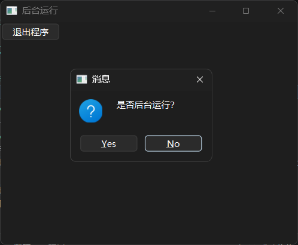

不过，此时需要注意，`app.quit`方法也会触发关闭事件的弹窗，需要改用`app.exit`方法来强制退出程序。

## 33 `Qxxx`xxx控件（更新中）

`Qxxx`xxx控件主要用于……


https://doc.qt.io/qtforpython-6/PySide6/QtWidgets/QComboBox.html


示例如下：

```python3
from PySide6.QtWidgets import (
    QApplication,
    QWidget
)

app = QApplication()
window = QWidget()
window.setWindowTitle('认识控件')
window.resize(400, 300)

# 添加相关控件

window.show()
app.exec()
```

（运行效果图）

`Qxxx`xxxx控件的继承关系如下：

（截图继承关系）

相关文档的链接如下：

- （由近到远每一层级对应的文档链接）
- https://doc.qt.io/qtforpython-6/PySide6/QtWidgets/QWidget.html

### x.1 初始化方法（更新中）

`Qxxx`xxx控件有多种初始化方法（参数名及类型提示来自`QtWidgets.pyi`）。

第一种初始化方法支持以下参数：

- `xxx`参数，仅限位置参数（第一个位置参数），---

第二种初始化方法支持以下参数：

- `xxx`参数，仅限位置参数（第一个位置参数），---

### x.2 方法、控件属性（更新中）

`Qxxx`xxx控件支持以下方法（部分，含控件属性）：

- `xxx`方法，---

  该方法支持以下参数：

  - `xxx`参数，仅限位置参数（第一个位置参数），---

### x.3 信号和槽（更新中）

`Qxxx`xxx控件支持以下信号（部分）：

- `xxx`信号，---

`Qxxx`xxx控件支持以下槽（部分）：

- `xxx`方法，---

### x.4 扩展用法（更新中）

#### x.4.1 xxx（更新中）


## x 其他控件（更新中）

按这个目录介绍控件（先依照类别顺序，再依照字母顺序）：

https://doc.qt.io/qtforpython-6/overviews/qtwidgets-widget-classes.html#widgets-classes


## x 创作灵感（非正式内容）

灵感来源（官方）：

- `QtWidgets`模块：https://doc.qt.io/qtforpython-6/overviews/qtwidgets-widget-classes.html
- `QtGui`模块：https://doc.qt.io/qtforpython-6/overviews/qtwidgets-widget-classes.html#widgets-classes
- `QtCore`模块：https://doc.qt.io/qtforpython-6/PySide6/QtCore/index.html#list-of-classes-by-function

模块一览表（Qt 6.10.x）：

| 模块名                 | 主要用途                         | 文档链接                                                     |
| ---------------------- | -------------------------------- | ------------------------------------------------------------ |
| `Qt3DAnimation`        | 处理3D动画                       | https://doc.qt.io/qtforpython-6/PySide6/Qt3DAnimation/index.html#module-PySide6.Qt3DAnimation |
| `Qt3DCore`             | 3D相关的基础功能                 | https://doc.qt.io/qtforpython-6/PySide6/Qt3DCore/index.html#module-PySide6.Qt3DCore |
| `Qt3DExtras`           | 3D相关的额外功能                 | https://doc.qt.io/qtforpython-6/PySide6/Qt3DExtras/index.html#module-PySide6.Qt3DExtras |
| `Qt3DInput`            | 3D相关的输入功能                 | https://doc.qt.io/qtforpython-6/PySide6/Qt3DInput/index.html#module-PySide6.Qt3DInput |
| `Qt3DLogic`            | 3D相关的逻辑功能                 | https://doc.qt.io/qtforpython-6/PySide6/Qt3DLogic/index.html#module-PySide6.Qt3DLogic |
| `Qt3DRender`           | 渲染3D模型                       | https://doc.qt.io/qtforpython-6/PySide6/Qt3DRender/index.html#module-PySide6.Qt3DRender |
| `QtAsyncio`            | 相当于Qt版asyncio框架            | https://doc.qt.io/qtforpython-6/PySide6/QtAsyncio/index.html#module-PySide6.QtAsyncio |
| `QtBluetooth`          | 操作蓝牙设备                     | https://doc.qt.io/qtforpython-6/PySide6/QtBluetooth/index.html#module-PySide6.QtBluetooth |
| `QtConcurrent`         | 并行编程相关的功能               | https://doc.qt.io/qtforpython-6/PySide6/QtConcurrent/index.html#module-PySide6.QtConcurrent |
| `QtCore`               | Qt相关的基础功能                 | https://doc.qt.io/qtforpython-6/PySide6/QtCore/index.html#module-PySide6.QtCore |
| `QtDBus`               | D-Bus相关的功能                  | https://doc.qt.io/qtforpython-6/PySide6/QtDBus/index.html#module-PySide6.QtDBus |
| `QtDesigner`           | 可视化设计工具                   | https://doc.qt.io/qtforpython-6/PySide6/QtDesigner/index.html#module-PySide6.QtDesigner |
| `QtGraphs`             | 二维、三维图表                   | https://doc.qt.io/qtforpython-6/PySide6/QtGraphs/index.html#module-PySide6.QtGraphs |
| `QtGraphsWidgets`      | 三维图表                         | https://doc.qt.io/qtforpython-6/PySide6/QtGraphsWidgets/index.html#module-PySide6.QtGraphsWidgets |
| `QtGui`                | GUI相关的基础功能                | https://doc.qt.io/qtforpython-6/PySide6/QtGui/index.html#module-PySide6.QtGui |
| `QtHelp`               | 集成在线文档                     | https://doc.qt.io/qtforpython-6/PySide6/QtHelp/index.html#module-PySide6.QtHelp |
| `QtHttpServer`         | 创建HTTP服务器                   | https://doc.qt.io/qtforpython-6/PySide6/QtHttpServer/index.html#module-PySide6.QtHttpServer |
| `QtLocation`           | 定位、地图相关功能               | https://doc.qt.io/qtforpython-6/PySide6/QtLocation/index.html#module-PySide6.QtLocation |
| `QtMultimedia`         | 处理多媒体文件                   | https://doc.qt.io/qtforpython-6/PySide6/QtMultimedia/index.html#module-PySide6.QtMultimedia |
| `QtMultimediaWidgets`  | 处理多媒体文件的额外功能         | https://doc.qt.io/qtforpython-6/PySide6/QtMultimediaWidgets/index.html#module-PySide6.QtMultimediaWidgets |
| `QtNetwork`            | 网络功能                         | https://doc.qt.io/qtforpython-6/PySide6/QtNetwork/index.html#module-PySide6.QtNetwork |
| `QtNetworkAuth`        | 网络授权                         | https://doc.qt.io/qtforpython-6/PySide6/QtNetworkAuth/index.html#module-PySide6.QtNetworkAuth |
| `QtNfc`                | 操作NFC设备                      | https://doc.qt.io/qtforpython-6/PySide6/QtNfc/index.html#module-PySide6.QtNfc |
| `QtOpenGL`             | 与OpenGL库交互                   | https://doc.qt.io/qtforpython-6/PySide6/QtOpenGL/index.html#module-PySide6.QtOpenGL |
| `QtOpenGLWidgets`      | 显示OpenGL内容的控件             | https://doc.qt.io/qtforpython-6/PySide6/QtOpenGLWidgets/index.html#module-PySide6.QtOpenGLWidgets |
| `QtPdf`                | 处理PDF文件                      | https://doc.qt.io/qtforpython-6/PySide6/QtPdf/index.html#module-PySide6.QtPdf |
| `QtPdfWidgets`         | 显示PDF文件的控件                | https://doc.qt.io/qtforpython-6/PySide6/QtPdfWidgets/index.html#module-PySide6.QtPdfWidgets |
| `QtPositioning`        | 实时定位                         | https://doc.qt.io/qtforpython-6/PySide6/QtPositioning/index.html#module-PySide6.QtPositioning |
| `QtPrintSupport`       | 打印文件相关的功能               | https://doc.qt.io/qtforpython-6/PySide6/QtPrintSupport/index.html#module-PySide6.QtPrintSupport |
| `QtQml`                | 处理QML文件                      | https://doc.qt.io/qtforpython-6/PySide6/QtQml/index.html#module-PySide6.QtQml |
| `QtQuick`              | QtQuick程序的基础功能            | https://doc.qt.io/qtforpython-6/PySide6/QtQuick/index.html#module-PySide6.QtQuick |
| `QtQuick3D`            | 在QtQuick程序中显示3D内容        | https://doc.qt.io/qtforpython-6/PySide6/QtQuick3D/index.html#module-PySide6.QtQuick3D |
| `QtQuickControls2`     | QtQuick程序的配套控件            | https://doc.qt.io/qtforpython-6/PySide6/QtQuickControls2/index.html#module-PySide6.QtQuickControls2 |
| `QtQuickTest`          | QtQuick程序的测试框架            | https://doc.qt.io/qtforpython-6/PySide6/QtQuickTest/index.html#module-PySide6.QtQuickTest |
| `QtQuickWidgets`       | 在QtWidgets程序中显示QtQuick控件 | https://doc.qt.io/qtforpython-6/PySide6/QtQuickWidgets/index.html#module-PySide6.QtQuickWidgets |
| `QtRemoteObjects`      | 提供进程间通信使用的对象         | https://doc.qt.io/qtforpython-6/PySide6/QtRemoteObjects/index.html#module-PySide6.QtRemoteObjects |
| `QtScxml`              | 从SCXML文件创建状态机            | https://doc.qt.io/qtforpython-6/PySide6/QtScxml/index.html#module-PySide6.QtScxml https://www.w3.org/TR/scxml/ |
| `QtSensors`            | 操作传感器硬件                   | https://doc.qt.io/qtforpython-6/PySide6/QtSensors/index.html#module-PySide6.QtSensors |
| `QtSerialBus`          | 串行总线相关功能                 | https://doc.qt.io/qtforpython-6/PySide6/QtSerialBus/index.html#module-PySide6.QtSerialBus |
| `QtSerialPort`         | 串口通讯相关功能                 | https://doc.qt.io/qtforpython-6/PySide6/QtSerialPort/index.html#module-PySide6.QtSerialPort |
| `QtSpatialAudio`       | 空间音频相关功能                 | https://doc.qt.io/qtforpython-6/PySide6/QtSpatialAudio/index.html#module-PySide6.QtSpatialAudio |
| `QtSql`                | SQL、数据库相关功能              | https://doc.qt.io/qtforpython-6/PySide6/QtSql/index.html#module-PySide6.QtSql |
| `QtStateMachine`       | 状态机相关功能                   | https://doc.qt.io/qtforpython-6/PySide6/QtStateMachine/index.html#module-PySide6.QtStateMachine |
| `QtSvg`                | 处理SVG文件                      | https://doc.qt.io/qtforpython-6/PySide6/QtSvg/index.html#module-PySide6.QtSvg |
| `QtSvgWidgets`         | 显示SVG文件的控件                | https://doc.qt.io/qtforpython-6/PySide6/QtSvgWidgets/index.html#module-PySide6.QtSvgWidgets |
| `QtTest`               | GUI测试和基准测试                | https://doc.qt.io/qtforpython-6/PySide6/QtTest/index.html#module-PySide6.QtTest |
| `QtTextToSpeech`       | 文本转语音                       | https://doc.qt.io/qtforpython-6/PySide6/QtTextToSpeech/index.html#module-PySide6.QtTextToSpeech |
| `QtUiTools`            | 加载UI文件                       | https://doc.qt.io/qtforpython-6/PySide6/QtUiTools/index.html#module-PySide6.QtUiTools |
| `PySide6.QtWebChannel` | 服务器、客户端之间的点对点通讯   | https://doc.qt.io/qtforpython-6/PySide6/QtWebChannel/index.html#module-PySide6.QtWebChannel |
| `QtWebEngineCore`      | WebEngine的基础功能              | https://doc.qt.io/qtforpython-6/PySide6/QtWebEngineCore/index.html#module-PySide6.QtWebEngineCore |
| `QtWebEngineQuick`     | 在QtQuick程序中嵌入WebEngine     | https://doc.qt.io/qtforpython-6/PySide6/QtWebEngineQuick/index.html#module-PySide6.QtWebEngineQuick |
| `QtWebEngineWidgets`   | 在QtWidgets程序中嵌入WebEngine   | https://doc.qt.io/qtforpython-6/PySide6/QtWebEngineWidgets/index.html#module-PySide6.QtWebEngineWidgets |
| `QtWebSockets`         | 处理WebSocket协议                | https://doc.qt.io/qtforpython-6/PySide6/QtWebSockets/index.html#module-PySide6.QtWebSockets |
| `QtWebView`            | 显示网页内容                     | https://doc.qt.io/qtforpython-6/PySide6/QtWebView/index.html#module-PySide6.QtWebView |
| `QtWidgets`            | QtWidgets程序的基础功能          | https://doc.qt.io/qtforpython-6/PySide6/QtWidgets/index.html#module-PySide6.QtWidgets |
| `QtXml`                | 处理XML文件                      | https://doc.qt.io/qtforpython-6/PySide6/QtXml/index.html#module-PySide6.QtXml |


## x `Qxxx`xxx控件（更新中）（模板）

`Qxxx`xxx控件主要用于……

示例如下：

```python3
from PySide6.QtWidgets import (
    QApplication,
    QWidget
)

app = QApplication()
window = QWidget()
window.setWindowTitle('认识控件')
window.resize(400, 300)

# 添加相关控件

window.show()
app.exec()
```

（运行效果图）

`Qxxx`xxxx控件的继承关系如下：

（截图继承关系）

相关文档的链接如下：

- （由近到远每一层级对应的文档链接）
- https://doc.qt.io/qtforpython-6/PySide6/QtWidgets/QWidget.html

### x.1 初始化方法（更新中）

`Qxxx`xxx控件有多种初始化方法（参数名及类型提示来自`QtWidgets.pyi`）。

第一种初始化方法支持以下参数：

- `xxx`参数，仅限位置参数（第一个位置参数），---

第二种初始化方法支持以下参数：

- `xxx`参数，仅限位置参数（第一个位置参数），---

### x.2 方法、控件属性（更新中）

`Qxxx`xxx控件支持以下方法（部分，含控件属性）：

- `xxx`方法，---

  该方法支持以下参数：

  - `xxx`参数，仅限位置参数（第一个位置参数），---

### x.3 信号和槽（更新中）

`Qxxx`xxx控件支持以下信号（部分）：

- `xxx`信号，---

`Qxxx`xxx控件支持以下槽（部分）：

- `xxx`方法，---

### x.4 扩展用法（更新中）

（扩展用法包含前面参数、方法、信号、槽相关的示例）

#### x.4.1 xxx（更新中）

