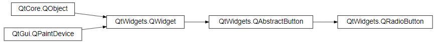

# Qt For Python 札记（2026）

## 2026版更新计划

2025版（即2025年创作的部分）在创作过程中已经覆盖了不少内容，但Qt提供了数量庞大的控件，支持的用法也多种多样，更别说各种控件在实际使用时遇到的问题数不胜数。

2025版立项较晚，加上笔者要预研其他教程，还有其他工作要做，导致2025版的内容只是介绍了Qt用法的很小一部分。

因此，笔者将在2026年继续本教程系列的更新，也就是本教程的2026版。2026版将延续2025版的任务，为读者介绍Qt控件的用法和更多Qt模块。同时，对于之前已经介绍过的控件，将搜集实际使用时的各种用法和遇到的问题，深入、扩展常用控件的用法，解决相关问题。当然，之前内容如果存在遗漏、错误，后续也将会发布补充、修正的章节。

2026年，更新不止，学习不止，愿每一位读者都能学有所得。当然，为了适应新的更新节奏，2026版教程将改为敏捷更新风格，争取提高更新频率。

## 控件学习指南

### 为什么会有本章

因为2026版改为敏捷更新风格，如果将官方教程完全复刻，需要付出太多精力，也有太多重复。因此，在2026版中，笔者将告诉读者如何查阅官方文档，以及本教程主要介绍哪些内容，让需要了解重点难点、有一定基础的读者无需回头查看官方文档，让基础不太扎实但有自学能力的读者可以学会如何查阅官方文档，让每位读者掌握官方文档和本教程之间的平衡。

### 如何学习官方文档

官方文档：https://doc.qt.io/qtforpython-6/modules.html

上面提供了官方的文档地址，打开之后，可以点击各个模块的链接，跳转至响应模块的文档。因此，只需使用在所使用模块的文档中，查找对应类、方法的链接，即可查阅其使用方法。

以QtWidgets程序的控件文档为例，模块名为`PySide6.QtWidgets`，但其名称为“Qt Widgets”，因此需要点击图示的链接（https://doc.qt.io/qtforpython-6/PySide6/QtWidgets/index.html）：


跳转之后，页面如下：


图中红框内的链接分别为：

1. 按照功能分类的类文档：https://doc.qt.io/qtforpython-6/overviews/qtwidgets-widget-classes.html#widgets-classes
2. 按照名称首字母分类的类文档（就在当前页面）：https://doc.qt.io/qtforpython-6/PySide6/QtWidgets/index.html#list-of-classes
3. 按照名称首字母分类的方法文档（就在当前页面）：https://doc.qt.io/qtforpython-6/PySide6/QtWidgets/index.html#list-of-functions

一般而言，常用的是模块的类，因此，只需使用1、2提供的文档即可。如果想要了解模块提供了哪些功能，可以看看1；若只是在使用具体类时遇到问题，直接在当前页面查找对应类名，跳转到类的文档即可。

比如，查找下一章要学习的`QPushButton`类：


需要注意的是，官方文档看似类别清晰、内容丰富，但并非没有问题，点击上图的链接（https://doc.qt.io/qtforpython-6/PySide6/QtWidgets/QPushButton.html）之后，会跳转到下面的页面：


图中箭头所指的链接是初始化函数的文档，但跳转之后，会看到下面的内容：


看起来连重载的初始化方法都标明了，好像很全面，但别急着高兴，这里有一个坑。

先放下文档，在VSCode中写下如下代码：

```python3
from PySide6.QtWidgets import QPushButton
```

这是一段导入`QPushButton`类的代码，随后，选中其中的`QPushButton`，按`f12`键或者 右键-转到定义，可以看到一下内容（部分代码）：

```python3
class QPushButton(PySide6.QtWidgets.QAbstractButton):

    @typing.overload
    def __init__(self, text: str, /, parent: PySide6.QtWidgets.QWidget | None = ..., *, autoDefault: bool | None = ..., default: bool | None = ..., flat: bool | None = ...) -> None: ...
    @typing.overload
    def __init__(self, icon: PySide6.QtGui.QIcon | PySide6.QtGui.QPixmap, text: str, /, parent: PySide6.QtWidgets.QWidget | None = ..., *, autoDefault: bool | None = ..., default: bool | None = ..., flat: bool | None = ...) -> None: ...
    @typing.overload
    def __init__(self, /, parent: PySide6.QtWidgets.QWidget | None = ..., *, autoDefault: bool | None = ..., default: bool | None = ..., flat: bool | None = ...) -> None: ...
```


该文件是PySide6提供的类型声明，用于代码提示和类型检查。从上面内容中可以发现，该类提供的几种初始化方法，参数远比文档中多，而文档没有提供相应的说明。

因此，在实际学习时，最好结合代码提示和官方文档，只看官方文档的话，会忽略掉实际支持的参数。

回到文档（https://doc.qt.io/qtforpython-6/PySide6/QtWidgets/QPushButton.html）：


大部分控件的文档都会在开头这里提供快速跳转的链接，包括：

- 控件属性。除了这里标明的控件属性，控件还会继承父类的控件属性，因此实际控件支持的控件属性会比文档中看上去要多。

  注意，这里标明的控件属性表示其可用于该控件初始化方法中的关键字参数。

  另外，不同于Python中的属性可以直接设置、获取，控件属性是指其作为方法（或者控件属性名加了“is”前缀的方法）调用之后的返回值，想要设置控件属性，则要调用控件属性名加了“set”前缀的方法。其实，这里可以看出，Qt采用的是小驼峰命名法，因此，后续可以在得知控件属性名之后，猜测相关的获取、设置方法。

- 方法、虚拟方法、槽。方法中大部分是控件属性相关的方法（获取、设置），也就初始化方法是有确定功能的方法。而虚拟方法、槽本质上也是方法，只不过槽一般与信号组合使用，但也可以当作一个普通方法来调用。

  需要注意的是，虽然部分方法可以在创建控件时直接调用，但依然存在部分延迟生效的方法，需要先创建控件并将其分配给变量之后，才能调用其支持的方法。

- 信号。虽然示例中没有看到，但其继承了父类的信号，实际上支持不少信号（可以参考其父类`QAbstractButton`的文档）。信号一般是调用其连接函数，将其与指定的槽函数连接，实现信号的响应。

注意，这里也有一个坑。看文档（https://doc.qt.io/qtforpython-6/PySide6/QtWidgets/QPushButton.html）最上面的部分：


这里标明了控件的继承关系，而控件实际支持的方法、控件属性、信号、槽，除了控件文档中写明的，还包含其父类（比如`QAbstractButton`类）的。想要了解其父类提供的方法、控件属性、信号、槽，可以点击继承关系中对应的父类，跳转至父类的文档。

### 关于本教程

了解完官方文档如何学习，最后简单介绍一下本教程后续章节的大概结构（后续可能会修改），如果读者觉得不太适合，可以及时反馈或者暂时先去学习官方文档。

后续章节的大概结构如下：

1. 引言。简单介绍控件功能，让读者对该控件有个简单的了解。
2. 初始化方法。前面说过官方文档的初始化方法有点“混乱”，因此笔者会重新整理控件的初始化方法，并配上必要的示例，方便读者学习。
3. 方法（部分介绍）、控件属性（部分介绍）。因为控件属性很多也是方法，因此将其归类至方法。不过，一个控件支持的方法、控件属性很多，有些控件是继承自别的控件，无限向上追溯的话，内容会很多，也会重复。而不少方法、控件属性一般不怎么用或者其他控件也有，全部介绍也比较占用时间，因此这部分内容将挑选部分来介绍，不常用的、其他控件也有的，可能会省略。读者如有需求，可以及时反馈，后续通过其他章节补充。
4. 信号和槽（尽量完整地详细介绍）。因为信号和槽属于Qt独特的机制，虽然槽本质上也是方法，但为了方便快速学习，这两个功能将单独介绍，并且尽量完整地详细介绍。
5. 扩展用法（主要是技巧相关的代码）。实际开发时，很多时候遇到的问题没有教程中说的那么简单，就是因为控件是组合使用，只看当前控件的文档或者教程，很难解决问题，因此需要扩展其他控件或者相关知识，才能解决实际遇到的问题。所以，对于部分控件，会在学完基础之后，额外补充一些和实际问题相关的扩展用法。当然，如果读者遇到了其他与控件相关的问题但当时没有介绍，也可以留言反馈，笔者将后续通过其他章节补充。

## 25 `QPushButton`普通按钮控件

本章介绍的`QPushButton`普通按钮控件算是最常用、最普通的按钮。如果程序中需要一个简单的、可以点击的按钮，那非普通按钮控件莫属：

```python3
from PySide6.QtWidgets import (
    QApplication,
    QWidget,
    QPushButton
)

app = QApplication()
window = QWidget()
window.setWindowTitle('认识各种按钮')
window.resize(400, 300)

button = QPushButton('普通按钮',window)

window.show()
app.exec()
```


`QPushButton`普通按钮控件的继承关系如下：


相关文档的链接如下：

- https://doc.qt.io/qtforpython-6/PySide6/QtWidgets/QPushButton.html
- https://doc.qt.io/qtforpython-6/PySide6/QtWidgets/QAbstractButton.html
- https://doc.qt.io/qtforpython-6/PySide6/QtWidgets/QWidget.html

### 25.1 初始化方法

`QPushButton`普通按钮控件有多种初始化方法（参数名及类型提示来自`QtWidgets.pyi`）。

第一种初始化方法支持以下参数：

- `text`参数，仅限位置参数（第一个位置参数），字符串类型，表示显示在按钮上的文字。

- `parent`参数，`PySide6.QtWidgets.QWidget`类型，表示父控件。如果指定了父控件，那么该控件显示时，会使用父控件的位置或者嵌在父控件内（取决于该控件是否支持嵌入到其他控件）。不指定或者为`None`，则控件会在独立窗口中显示。

- `autoDefault`参数，仅限关键字参数，布尔类型，表示控件是否为自动默认按钮，默认为`False`，如果父控件为`QDialog`控件（含子类控件），则默认值为`True`。当控件获得焦点时，自动默认按钮会变为默认按钮。

- `default`参数，仅限关键字参数，布尔类型，表示控件是否为默认按钮（按钮边缘有高亮），默认为`False`。

  父控件为`QDialog`控件（含子类控件）的话，默认按钮首先获得焦点，并且优先于默认焦点顺序。此外，对于同一个`QDialog`控件而言，最多存在一个默认按钮，以控件设置该参数的顺序为最终生效顺序。无论默认按钮是否获得焦点，默认按钮都可以响应`enter`键。按下`enter`键时，会触发默认按钮的`clicked`信号。

  父控件不为`QDialog`控件（含子类控件）的话，则可以存在多个默认按钮，只有获得焦点的默认按钮可以响应`enter`键。按下`enter`键时，会触发获得焦点的默认按钮的`clicked`信号。

- `flat`参数，仅限关键字参数，布尔类型，表示控件是否为扁平按钮（鼠标悬停在按钮上的话没有悬浮特效），默认为`False`。

第二种初始化方法支持以下参数：

- `icon`参数，仅限位置参数（第一个位置参数），`PySide6.QtGui.QIcon`类型或者`PySide6.QtGui.QPixmap`类型，表示按钮的图标或者图片。

  示例如下（所需的图片`LOGO.png`请保存至源代码的同目录下）：

  ```python3
  from PySide6.QtWidgets import (
      QApplication,
      QWidget,
      QPushButton
  )
  
  from PySide6.QtGui import QIcon,QPixmap
  
  app = QApplication()
  window = QWidget()
  window.setWindowTitle('认识各种按钮')
  window.resize(400, 300)
  
  QPushButton(
      QIcon.fromTheme(
          QIcon.ThemeIcon.Battery
      ),
      '普通按钮',
      window
  )
  QPushButton(
      QPixmap('LOGO.png'),
      '普通按钮',
      window
  ).move(0,30)
  
  window.show()
  app.exec()
  ```

  

- `text`参数，仅限位置参数（第二个位置参数），含义、用法参考前面。

- `parent`参数，含义、用法参考前面。

- `autoDefault`参数，仅限关键字参数，含义、用法参考前面。

- `default`参数，仅限关键字参数，含义、用法参考前面。

- `flat`参数，仅限关键字参数，含义、用法参考前面。

第三种初始化方法支持以下参数：

- `parent`参数，含义、用法参考前面。
- `autoDefault`参数，仅限关键字参数，含义、用法参考前面。
- `default`参数，仅限关键字参数，含义、用法参考前面。
- `flat`参数，仅限关键字参数，含义、用法参考前面。

### 25.2 方法、控件属性

`QPushButton`普通按钮控件支持以下方法（部分，含控件属性）：

- `autoExclusive`方法（控件属性，可使用`setAutoExclusive`方法设置），返回控件是否启用自动独占。当多个按钮的父控件相同时，这些按钮就属于同一独占组。如果这些按钮启用了勾选和自动独占，那么，将只允许同时勾选最多一个按钮：

  ```python3
  from PySide6.QtWidgets import (
      QApplication,
      QWidget,
      QPushButton
  )
  
  app = QApplication()
  window = QWidget()
  window.setWindowTitle('认识各种按钮')
  window.resize(400, 300)
  
  button = QPushButton(
      '按钮1',
      window
  )
  button.setCheckable(True)
  button.setAutoExclusive(True)
  
  button2 = QPushButton(
      '按钮2',
      window
  )
  button2.move(0,30)
  button2.setCheckable(True)
  button2.setChecked(True)
  button2.setAutoExclusive(True)
  
  window.show()
  app.exec()
  ```

  

- `autoRepeat`方法（控件属性，可使用`setAutoRepeat`方法设置），返回控件是否启用了自动重复。自动重复是按钮的控件属性，默认该控件属性为`False`。所谓自动重复（使用`setAutoRepeat`方法设置），即按住按钮时，是否以指定的初始延迟（使用`setAutoRepeatDelay`方法设置）和间隔（使用`setAutoRepeatInterval`方法设置）重复发射`clicked`、`pressed`、`released`这三个信号。

  示例如下：

  ```python3
  from PySide6.QtWidgets import (
      QApplication,
      QWidget,
      QPushButton
  )
  
  app = QApplication()
  window = QWidget()
  window.setWindowTitle('认识各种按钮')
  window.resize(400, 300)
  
  button = QPushButton(
      '按钮1',
      window
  )
  
  button.setAutoRepeat(True)
  button.setAutoRepeatDelay(3000)
  button.setAutoRepeatInterval(1000)
  button.clicked.connect(lambda :print('clicked'))
  button.pressed.connect(lambda :print('pressed'))
  button.released.connect(lambda :print('released'))
  
  window.show()
  app.exec()
  ```

  使用鼠标按住按钮不松手，即可在终端看到持续不断的输出。

- `autoRepeatDelay`方法（控件属性，可使用`setAutoRepeatDelay`方法设置），返回控件的自动重复初始延迟。

- `autoRepeatInterval`方法（控件属性，可使用`setAutoRepeatInterval`方法设置），获取控件的自动重复间隔。

- `group`方法，获取按钮所属的按钮分组。

  所谓按钮分组，即当按钮启用`autoExclusive`控件属性时，属于同一分组的按钮，将只允许同时勾选最多一个按钮。前面介绍时没有使用按钮分组，默认父控件相同时算作同一分组。但这样的用法会导致一个问题，如果父控件相同，想要让两组以上的按钮分别自动独占，就无法实现。因此，可以使用`QButtonGroup`控件的`addButton`方法，将需要分组的按钮添加到同一组，可以实现组与组之间的隔离。

  示例如下：

  ```python3
  from PySide6.QtWidgets import (
      QApplication,
      QWidget,
      QPushButton,
      QButtonGroup
  )
  
  app = QApplication()
  window = QWidget()
  window.setWindowTitle('认识各种按钮')
  window.resize(400, 300)
  
  buttons = []
  for i in range(1,5):
      # 批量生成按钮
      button = QPushButton(
      	f'按钮{i}',
          window,
      )
      button.setCheckable(True)
      button.setAutoExclusive(True)
      button.move(
          0,
          30*(i-1)
      )
      # 点击按钮会在终端输出按钮所属的按钮组
      button.clicked.connect(
          lambda e,button=button:print(
              button.group()
          )
      )
      # 最后将按钮添加到数组中
      buttons.append(button)
  
  # 两个按钮分组
  group1 = QButtonGroup(
      window,
  )
  group1.addButton(
      buttons[0],
  )
  group1.addButton(
      buttons[1],
  )
  group2 = QButtonGroup(
      window,
  )
  group2.addButton(
      buttons[2],
  )
  group2.addButton(
      buttons[3],
  )
  
  window.show()
  app.exec()
  ```

  依次点击每个按钮，可以看到四个按钮明显分为两组，控制台的输出也证明了这一点：

  

- `icon`方法（控件属性，可使用`setIcon`方法设置），返回按钮的图标或者图片。

- `iconSize`方法（控件属性，可使用`setIconSize`方法设置），返回按钮图标的大小。

- `isCheckable`方法（控件属性`checkable`的获取方法，可使用`setCheckable`方法设置），返回按钮是否可勾选。

- `isChecked`方法（控件属性`checked`的获取方法，可使用`setChecked`方法设置），返回按钮是否已勾选。

- `isDefault`方法（控件属性`default`的获取方法，可使用`setDefault`方法设置），返回按钮是为默认按钮。

- `isDown`方法（控件属性`down`的获取方法，可使用`setDown`方法设置），返回按钮是否已按下。

- `isFlat`方法（控件属性`flat`的获取方法，可使用`setFlat`方法设置），返回按钮是否为扁平按钮（鼠标悬停在按钮上的话没有悬浮特效）。

- `menu`方法（控件属性，可使用`setMenu`方法设置），返回点击按钮之后弹出的菜单。

- `setMenu`方法，设置点击按钮之后弹出的菜单。该方法支持以下参数：

  - `menu`参数，`PySide6.QtWidgets.QMenu`类型，表示弹出的菜单。

  示例如下：

  ```python3
  from PySide6.QtWidgets import (
      QApplication,
      QWidget,
      QPushButton,
      QMenu
  )
  #from PySide6.QtCore import Qt
  
  app = QApplication()
  window = QWidget()
  window.setWindowTitle('认识各种按钮')
  window.resize(400, 300)
  
  button = QPushButton(
      '按钮',
      window,
  )
  
  menu = QMenu()
  menu.addAction('Hello')
  menu.addAction('World')
  button.setMenu(
      menu
  )
  
  window.show()
  app.exec()
  ```

  

- `setToolTip`方法，设置按钮的工具提示（鼠标悬停时自动弹出的文字）。该方法支持以下参数：

  - `arg__1`参数，仅限位置参数（第一个位置参数），字符串类型，表示工具提示的内容。

- `setShortcut`方法，给按钮绑定快捷键，按下快捷键时触发按钮的`clicked`信号。该方法支持以下参数：

  - `key`参数，仅限位置参数（第一个位置参数），`PySide6.QtCore.Qt.Key`类型、`PySide6.QtGui.QKeySequence`类型、`PySide6.QtCore.QKeyCombination`类型、`PySide6.QtGui.QKeySequence.StandardKey`类型、字符串类型、整数类型，表示绑定的快捷键。
  
- `setText`方法，设置按钮的文本。该方法支持以下参数：

  - `text`参数，仅限位置参数（第一个位置参数），字符串类型，表示按钮的文本。

- `shortcut`方法，返回按钮绑定的快捷键。

- `text`方法，返回按钮的文本。

- `toolTip`方法，返回按钮的工具提示。

### 25.3 信号和槽

`QPushButton`普通按钮控件支持以下信号（部分）：

- `clicked`信号，点击（包含鼠标按键按下、弹起两个过程）按钮时触发。

- `pressed`信号，按下按钮时触发。

- `released`信号，松开按钮时触发。

- `toggled`信号，切换按钮的勾选状态时触发。

  注意，按钮默认为不可勾选，需要通过`setCheckable(True)`启用勾选，才能在点击时切换勾选状态。

  示例如下：

  ```python3
  from PySide6.QtWidgets import (
      QApplication,
      QWidget,
      QPushButton
  )
  
  app = QApplication()
  window = QWidget()
  window.setWindowTitle('认识各种按钮')
  window.resize(400, 300)
  
  button = QPushButton(
      '可以勾选的按钮',
      window
  )
  button.setCheckable(True)
  button.toggled.connect(lambda:print('状态切换。'))
  
  window.show()
  app.exec()
  ```

`QPushButton`普通按钮控件支持以下槽（部分）：

- `showMenu`方法，弹出点击按钮之后弹出的菜单。
- `click`方法，点击按钮。
- `toggle`方法，切换按钮的勾选状态。
- `animateClick`方法，点击按钮，同时播放点击动画。

### 25.4 扩展用法

#### 25.4.1 自动创建快捷键

使用`setShortcut`方法可以给按钮设置任意快捷键，但是，如果在按钮文本中包含了“&｛符号｝”（比如`'&q'`），相当于创建了`alt + {符号对应的按键}`键为按钮的快捷键，则无需使用`setShortcut`方法。

注意，如果符号为大写字母，则默认在小写状态下也可以生效。

示例如下：

```python3
from PySide6.QtWidgets import (
    QApplication,
    QWidget,
    QPushButton
)

app = QApplication()
window = QWidget()
window.setWindowTitle('认识各种按钮')
window.resize(400, 300)

button = QPushButton(
    '按钮（&q）',
    window,
)

button.clicked.connect(lambda e:print('Clicked!'))

window.show()
app.exec()
```

可以按下`alt + q`键，查看终端的输出结果。

## 26 `QRadioButton`单选按钮控件（更新中）


（从普通按钮中类似单选按钮的行为引出本章，真正的单选按钮）


`Q`xx控件主要用于……


```python3
from PySide6.QtWidgets import (
    QApplication,
    QWidget,
    QRadioButton
)

app = QApplication()
window = QWidget()
window.setWindowTitle('认识各种按钮')
window.resize(400, 300)

button = QRadioButton(
    '选项1',
    window,
)
button.setChecked(True)
button2 = QRadioButton(
    '选项2',
    window,
)
button2.move(
    0,30
)

window.show()
app.exec()
```


`QRadioButton`单选按钮控件的继承关系如下：



相关文档的链接如下：

- https://doc.qt.io/qtforpython-6/PySide6/QtWidgets/QRadioButton.html
- https://doc.qt.io/qtforpython-6/PySide6/QtWidgets/QAbstractButton.html
- https://doc.qt.io/qtforpython-6/PySide6/QtWidgets/QWidget.html

### 26.1 初始化方法（更新中）

`Qxxx`xxx控件有多种初始化方法（参数名及类型提示来自`xxx.pyi`）。

第一种初始化方法支持以下参数：

- `xxx`参数，仅限位置参数（第一个位置参数），---

第二种初始化方法支持以下参数：

- `xxx`参数，仅限位置参数（第一个位置参数），---

### 26.2 方法、控件属性（更新中）

`Qxxx`xxx控件支持以下方法（部分，含控件属性）：

- `xxx`方法，---

  该方法支持以下参数：

  - `xxx`参数，仅限位置参数（第一个位置参数），---

### 26.3 信号和槽（更新中）

`Qxxx`xxx控件支持以下信号（部分）：

- `xxx`信号，---

`Qxxx`xxx控件支持以下槽（部分）：

- `xxx`方法，---

### 26.4 扩展用法（更新中）

#### 26.4.1 xxx（更新中）


## 27 `QCheckBox`多选按钮控件（更新中）

`Q`xx控件主要用于……

完整用法可以参考 https://doc.qt.io/qtforpython-6/PySide6/QtWidgets/QCheckBox.html 和 https://doc.qt.io/qtforpython-6/PySide6/QtWidgets/QAbstractButton.html。


### 26.1 初始化方法（更新中）

`Qxxx`xxx控件有多种初始化方法（参数名及类型提示来自`xxx.pyi`）。

第一种初始化方法支持以下参数：

- `xxx`参数，仅限位置参数（第一个位置参数），---

第二种初始化方法支持以下参数：

- `xxx`参数，仅限位置参数（第一个位置参数），---

### 26.2 方法、控件属性（更新中）

`Qxxx`xxx控件支持以下方法（部分，含控件属性）：

- `xxx`方法，---

  该方法支持以下参数：

  - `xxx`参数，仅限位置参数（第一个位置参数），---

### 26.3 信号和槽（更新中）

`Qxxx`xxx控件支持以下信号（部分）：

- `xxx`信号，---

`Qxxx`xxx控件支持以下槽（部分）：

- `xxx`方法，---

### 26.4 扩展用法（更新中）

#### 26.4.1 xxx（更新中）


## 28 `QCommandLinkButton`按钮控件（更新中）

`Q`xx控件主要用于……

完整用法可以参考 https://doc.qt.io/qtforpython-6/PySide6/QtWidgets/QCommandLinkButton.html 和 https://doc.qt.io/qtforpython-6/PySide6/QtWidgets/QAbstractButton.html。


### 26.1 初始化方法（更新中）

`Qxxx`xxx控件有多种初始化方法（参数名及类型提示来自`xxx.pyi`）。

第一种初始化方法支持以下参数：

- `xxx`参数，仅限位置参数（第一个位置参数），---

第二种初始化方法支持以下参数：

- `xxx`参数，仅限位置参数（第一个位置参数），---

### 26.2 方法、控件属性（更新中）

`Qxxx`xxx控件支持以下方法（部分，含控件属性）：

- `xxx`方法，---

  该方法支持以下参数：

  - `xxx`参数，仅限位置参数（第一个位置参数），---

### 26.3 信号和槽（更新中）

`Qxxx`xxx控件支持以下信号（部分）：

- `xxx`信号，---

`Qxxx`xxx控件支持以下槽（部分）：

- `xxx`方法，---

### 26.4 扩展用法（更新中）

#### 26.4.1 xxx（更新中）


## 29 `QToolButton`按钮控件（更新中）

`Q`xx控件主要用于……

完整用法可以参考 https://doc.qt.io/qtforpython-6/PySide6/QtWidgets/QPushButton.html 和 https://doc.qt.io/qtforpython-6/PySide6/QtWidgets/QAbstractButton.html。


### 26.1 初始化方法（更新中）

`Qxxx`xxx控件有多种初始化方法（参数名及类型提示来自`xxx.pyi`）。

第一种初始化方法支持以下参数：

- `xxx`参数，仅限位置参数（第一个位置参数），---

第二种初始化方法支持以下参数：

- `xxx`参数，仅限位置参数（第一个位置参数），---

### 26.2 方法、控件属性（更新中）

`Qxxx`xxx控件支持以下方法（部分，含控件属性）：

- `xxx`方法，---

  该方法支持以下参数：

  - `xxx`参数，仅限位置参数（第一个位置参数），---

### 26.3 信号和槽（更新中）

`Qxxx`xxx控件支持以下信号（部分）：

- `xxx`信号，---

`Qxxx`xxx控件支持以下槽（部分）：

- `xxx`方法，---

### 26.4 扩展用法（更新中）

#### 26.4.1 xxx（更新中）


## 30 弹出菜单（更新中）


菜单栏点击后弹出菜单，任意按钮点击后弹出菜单，右键弹出菜单，


## 31 `QWizard`向导对话框控件和`QWizardPage`向导页控件（更新中）


https://doc.qt.io/qtforpython-6/PySide6/QtWidgets/QWizard.html

https://doc.qt.io/qtforpython-6/PySide6/QtWidgets/QWizardPage.html


## 32 日期时间控件（更新中）


## 33 临时数据控件（更新中）


## 34 表格控件（更新中）


## 35 树形图控件（更新中）


## x 创作灵感（非正式内容）

灵感来源（官方）：

- Qt Core：https://doc.qt.io/qt-6/zh/qtcore-index.html
- Qt GUI：https://doc.qt.io/qt-6/zh/qtgui-index.html
- Qt Network：https://doc.qt.io/qt-6/zh/qtnetwork-index.html
- Qt Quick：https://doc.qt.io/qt-6/zh/qtquick-index.html
- Qt Widgets：https://doc.qt.io/qt-6/zh/qtwidgets-index.html
- Qt Test：https://doc.qt.io/qt-6/zh/qttest-index.html
- Additional Modules：https://doc.qt.io/qt-6/zh/qt-additional-modules.html
- Tools and utilities：https://doc.qt.io/qt-6/zh/qt-tools-utilities.html


QtWidgets程序槽函数

前面说过槽函数与直接使用函数没什么区别，就好像下面改自前面的示例，使用普通函数代替槽函数：

```python3
from PySide6.QtWidgets import (
    QApplication,
    QWidget,
    QPushButton
)

app = QApplication()
window = QWidget()
window.setWindowTitle('信号与事件')
window.resize(400,300)
button = QPushButton('click',window)

# 信号，支持连接多个槽
button.clicked.connect(lambda :print('button is clicked'))
# 定义槽函数（伪），其实就是一般函数，可以勉强用，但功能上不如真的槽函数强大
def on_clicked():
    print('button is clicked2')

button.clicked.connect(on_clicked)

window.show()
app.exec()
```


执行效果是一样的，但为什么还要定义槽函数呢？这就不得不说槽函数的自动连接功能，即无需手动连接所有的信号和槽，有一个简单的方法自动将槽函数与特定信号链接。

想要自动连接生效，有以下关键点：

- 发出信号的控件必须设置`objectName`（在UI文件中定义，或者使用`setObjectName`方法显式设置）。

- 槽函数必须在类（继承自`QWidget`）内定义，并且命名符合要求。

  示例如下：

  ```python3
  @Slot()
  def on_{objectName}_{signalName}(self, ...):
      ...
  ```

  命名要求如下：

  - 必须使用“on_”为前缀。

  - 必须包含“{objectName}”——发送信号的控件的对象名（ 控件属性`objectName`）。
  - 必须包含“{signalName}”，——信号的变量名（即信号被分配给哪个变量，并且信号的参数签名与槽函数装饰器一致）。

- 在控件挂载、初始化完毕之后，调用`QMetaObject.connectSlotsByName(self)`。

具体示例如下：

```python3
from PySide6.QtWidgets import (
    QApplication,
    QWidget,
    QPushButton
)
from PySide6.QtCore import Slot,QMetaObject

app = QApplication()

class Window(QWidget):
    def __init__(self):
        super().__init__()
        self.setWindowTitle('自动连接槽函数')
        self.resize(400,300)
        self.button = QPushButton('click',self)
        self.button.setObjectName('button')
        QMetaObject.connectSlotsByName(self)
    @Slot()
    def on_button_clicked(self):
        print('clicked!!!')

window = Window()

window.show()
app.exec()
```


与自定义信号结合：

```python3
from PySide6.QtWidgets import (
    QApplication,
    QWidget,
    QPushButton
)
from PySide6.QtCore import Slot,QMetaObject,Signal

app = QApplication()

class Window(QWidget):
    mySignal = Signal(str)
    def __init__(self):
        super().__init__()
        self.setWindowTitle('自动连接槽函数（自定义信号）')
        self.resize(400,300)
        self.button = QPushButton('click',self)
        self.button.clicked.connect(lambda:self.mySignal.emit('Hello'))
        self.setObjectName('window')
        QMetaObject.connectSlotsByName(self)
    
    @Slot(str)
    def on_window_mySignal(self,string):
        print(string)
        print('window is clicked!!!')

window = Window()

window.show()
app.exec()
```


重载信号：

```python3
from PySide6.QtWidgets import (
    QApplication,
    QWidget,
    QPushButton
)
from PySide6.QtCore import Slot,Signal

app = QApplication()

class Window(QWidget):
    # 支持的其他类型必须使用元组来表明同级
    mySignal = Signal((),(str,),(int,))
    def __init__(self):
        super().__init__()
        self.setWindowTitle('重载信号')
        self.resize(400,300)
        self.mySignal.connect(self.on_mySignal)
        self.mySignal[str].connect(self.on_mySignal_str)
        self.mySignal[int].connect(self.on_mySignal_int)
        self.button1 = QPushButton('click[]',self)
        self.button1.clicked.connect(lambda:self.mySignal.emit())
        self.button2 = QPushButton('click[str]',self)
        self.button2.clicked.connect(lambda:self.mySignal[str].emit('Hello'))
        self.button2.move(0,30)
        self.button3 = QPushButton('click[int]',self)
        self.button3.clicked.connect(lambda:self.mySignal[int].emit(2026))
        self.button3.move(0,60)

    @Slot()
    def on_mySignal(self):
        print('window[] is clicked!!!')

    @Slot(str)
    def on_mySignal_str(self,string):
        print(string)
        print('window[str] is clicked!!!')

    @Slot(int)
    def on_mySignal_int(self,integer):
        print(integer)
        print('window[int] is clicked!!!')

window = Window()

window.show()
app.exec()
```


后台运行+系统托盘+托盘的菜单+点击托盘显示主窗口：

`QApplication`实例的`setQuitOnLastWindowClosed`方法可以实现后台运行。配合托盘图标的右键菜单（在右键菜单中可以添加退出`QApplication`实例、显示主窗口的菜单项），能够实现完善的后台运行、恢复前台的功能。

完整的示例代码（通过勾选复选框启用后台运行功能）：

```python3
from PySide6.QtWidgets import (
    QApplication,
    QWidget,
    QSystemTrayIcon,
    QCheckBox,
    QMenu
)

app = QApplication()

if QSystemTrayIcon.isSystemTrayAvailable():
    # 注意，只有系统支持托盘时才能这样用，否则只能使用快捷键或者命令行强制退出程序
    # 关闭最后一个窗口时不退出程序
    # app.setQuitOnLastWindowClosed(False)
    tray = QSystemTrayIcon(
        app.style().standardIcon(
            app.style().StandardPixmap.SP_ComputerIcon
        ),
        app,
        visible=True
    )
    tray.showMessage(
        '提示',
        '系统托盘可用，可以启用后台运行。'
    )
    # show方法必须单独执行。
    # visible为True的话，show方法不是必须执行的。
    # tray.show()

    # 任意类型的点击托盘图标都会显示主窗口
    # tray.activated.connect(lambda:window.show())
    # 只有左键单击托盘图标才会显示主窗口
    tray.activated.connect(lambda e:window.show() if e == QSystemTrayIcon.ActivationReason.Trigger else None)
    # 给托盘添加一个右键菜单，可以退出
    tray_menu = QMenu()
    tray_menu.addAction(
        '显示主窗口'
    ).triggered.connect(lambda:window.show())
    tray_menu.addAction(
        '退出程序'
    ).triggered.connect(app.quit)
    tray.setContextMenu(tray_menu)
else:
    print('当前系统不支持系统托盘。')

window = QWidget()
window.setWindowTitle('后台运行')
window.resize(400, 300)

# 虽然下面判断的是字符串，但仍然需要导入Qt类
from PySide6.QtCore import Qt  # noqa: E402, F401
checkbox = QCheckBox(
    '后台运行',
    window,
)
checkbox.checkStateChanged.connect(
    # 判断枚举对象
    # lambda e: (app.setQuitOnLastWindowClosed(False) if e == Qt.CheckState.Checked else app.setQuitOnLastWindowClosed(True))
    lambda e: (app.setQuitOnLastWindowClosed(False) if str(e) == 'CheckState.Checked' else app.setQuitOnLastWindowClosed(True))
)
checkbox.setToolTip('最好在显示系统托盘后启用后台运行')

window.show()
app.exec()
```


## x `Qxxx`xxx控件（更新中）（模板）

`Qxxx`xxx控件主要用于……

示例如下：

```python3
from PySide6.QtWidgets import (
    QApplication,
    QWidget
)

app = QApplication()
window = QWidget()
window.setWindowTitle('认识控件')
window.resize(400, 300)

# 添加相关控件

window.show()
app.exec()
```

（运行效果图）

`Qxxx`xxxx控件的继承关系如下：

（截图继承关系）

相关文档的链接如下：

- （由近到远每一层级对应的文档链接）
- https://doc.qt.io/qtforpython-6/PySide6/QtWidgets/QWidget.html

### x.1 初始化方法（更新中）

`Qxxx`xxx控件有多种初始化方法（参数名及类型提示来自`xxx.pyi`）。

第一种初始化方法支持以下参数：

- `xxx`参数，仅限位置参数（第一个位置参数），---

第二种初始化方法支持以下参数：

- `xxx`参数，仅限位置参数（第一个位置参数），---

### x.2 方法、控件属性（更新中）

`Qxxx`xxx控件支持以下方法（部分，含控件属性）：

- `xxx`方法，---

  该方法支持以下参数：

  - `xxx`参数，仅限位置参数（第一个位置参数），---

### x.3 信号和槽（更新中）

`Qxxx`xxx控件支持以下信号（部分）：

- `xxx`信号，---

`Qxxx`xxx控件支持以下槽（部分）：

- `xxx`方法，---

### x.4 扩展用法（更新中）

#### x.4.1 xxx（更新中）

