## 《易森》（2027）

学Python很容易，只需从现在开始坚持“种树”（学习），终能收获一片森林。

《易森》一般周更（可能每一周或者每两周，特殊情况加更或者停更），专注于提供与Python相关的文章（不限于基础知识，还有框架教程和实际问题的解决方案）。

封面图：


LOGO图：


## 2701期：起点

### 0 写在创刊号的特别章

做事大多有原因，《易森》的创立也不是无缘无故。

第一次见面，需要了解的事情有很多。

因此，在这个特别章节中，会解释一下和《易森》有关的概念、深意和缘由。

#### 0.1 《易森》（英文名《Easython》）的名字有何含义

从中文名字看，可以拆分为两部分易和森。从英文名字看，可以看作easy和Python的合体。其中，易表示做起来容易；森，表示森林。合起来理解就是：学习Python很容易，就和植树造林一样，从一点一滴开始积累。

因此，《易森》的目标就是：让学习Python变简单，日拱一卒，先种小树，终有一天汇聚成森林。正所谓，种树的最佳时间是十年前，其次就是现在。

#### 0.2 《易森》的内容形式、发展方向和创作动机

《易森》是一本随时创新的新式电子杂志，内容主题不固定，更新频率不固定（可能会快或者慢），力求让不同层次的Python学习者、使用者都能有所收获。

《易森》每一期除了固定的期号之外，还会简单概括一下本期的主题或者选取本期亮点章节的标题，让读者对每一期的内容有个大概的印象。

既然是随时创新，那《易森》在后续更新中就会根据读者的反馈，适当调整内容主题和内容形式，因此，内容主题、更新频率都不固定。

最后说一下《易森》的创作动机。其实，笔者是因为其他有明确主题的教程已经进入尾声，后续可以持续更新的内容有限。同时，为了方便笔者、读者开阔眼界，笔者才想到写一些主题不固定但可能有所得的内容，《易森》因此立项。

### 1 学习Python的起点——准备开发环境

完事开头难，但对于学习Python而言，这个却不太难。不像C语言一开始要装编译器而没有官方提供下载，不像Java语言下载时需要区分运行环境（JRE）和开发工具（JDK），Python语言作为一门脚本语言，只需下载、安装Python解释器，即可运行后续所需的一切，可以说简化了不少步骤。

因此，安装Python解释器就是几乎所有初学者、开发者必须经历的第一步。一般而言，推荐使用官方提供的安装程序（Windows系统），从 https://www.python.org/downloads/ 进入官方下载地址，选择当前正式支持（处于bugfix阶段）的第二新的版本，单击`Windows installer (64-bit)`下载即可。

这里解释一下为何要下载第二新而不是最新版本。Python版本更新较快，新版本往往包含较多新功能。而很多Python库在开发时主动限制了适用的Python版本，直接使用最新版本的话，可能导致部分库无法安装。而第二新的Python版本发布了较长时间之后，官方还在提供安装程序，大部分Python库都已经跟进，可以正常安装。因此，出于兼容性的考虑，建议安装第二新的Python版本。当然，有的库维护比较积极，最新版本发布一段时间之后也会跟进。如果不使用那些不支持最新Python版本的库，直接安装最新版本也没问题。

对于Linux系统，则需要使用对应发行版提供的包，各个版本的命令均不同，这里不再赘述。

官方提供的安装方法固然方便，但当系统不支持运行安装程序，或者需要一个绿色的Python版本，官方的嵌入式绿色包又有兼容性问题的话，就可以试试下面讲到的绿色版Python。

WinPython（ https://winpython.github.io/ ）是专为Windows系统提供的绿色发行版，可在 https://github.com/winpython/winpython/releases 下载到特定版本的绿色包，提供的是解压文件（exe后缀的是自解压程序，不是安装程序），可以解压到指定位置，设置环境变量之后即可全局使用。也可以不设置环境变量，直接在开发工具中指定。该绿色发行版的特点是包含一系列常用的库，当使用者不太会解决库的安装问题时，可以做到开箱即用。

不同于WinPython只提供Windows系统的发行版，Python Standalone Builds（ https://github.com/astral-sh/python-build-standalone/releases ）提供了各个版本、各个系统的Python发行版，包括官方都不提供安装程序、只提供源码的版本。如果使用者需要针对旧版本项目做维护，或者针对不同Python版本测试代码兼容性，该发行版无疑是最好的选择。当然，该版本因为都是绿色版本，使用时需要使用者设置环境变量或者调试开发工具，需要一定的基础，但相关问题不太难，很好解决。

安装好Python解释器，就是要准备开发工具（IDE）。就目前而言，虽然AI加持的开发工具眼花缭乱，但笔者依然首推VScode（ https://code.visualstudio.com/ ）、PyCharm（ https://www.jetbrains.com/pycharm/ ）。前者虽然需要安装扩展之后才能有较好的开发体验，但性能较好，并且扩展性强；后者则提供了Python开箱即用的开发体验，只不过内存占用较高，读者可以按需选择。除此以外，Python官方版本自带的IDLE也能满足一些简单的开发需求，更加轻量。如果读者只是简单学习Python基础，IDLE也不错。

最后简单说一下虚拟环境。一般而言，开发Python程序应当创建独立的虚拟环境（推荐使用`uv`命令，操作简单，使用`pip install uv`安装后即可使用）。但是，有人觉得虚拟环境占用额外空间，操作还有点麻烦，不如直接使用全局环境简单。此言差矣，虚拟环境可以实现不同开发场景的隔离，避免不同版本的库存在兼容冲突时，破坏其他开发场景的版本限制。假如A程序需要用到a库的1.0.1版本，而B程序（或者依赖a库的b库）需要用到a库的2.0.0版本，而a库2.0.0版本存在不兼容旧版本的更新，那两个程序运行时，势必有一个程序的a库存在问题。因此，如果是实际开发，请使用虚拟环境。

### 2 参考资料的起点——选择适合自己的资料

现在AI发展已经很成熟，很多人习惯于用AI寻找答案，代替传统的搜索引擎，操作更便捷。但是在本章，笔者依然会强调一些不太“古法”资料的重要性。

AI的资料来源自网络，可以看作是一个智能的搜索引擎。用起来比搜索引擎更自由、智能，不用费心构造关键字、翻找随时失效的网页，只需和AI聊天，就能一步步定位到所需的资料。

不过，问题和搜索引擎一样明显。资料来自网络，同样存在时效问题。因此，有些AI回答可能会过时，尤其是部分资料尚未被搜索引擎爬取的时候。

AI的另一个问题就是幻觉或者叫编瞎话。很多时候，问题的答案没有公开或者没有，需要等待技术人员给出解决方案或者其他人主动公开。此时，AI会煞有介事地给出一个可能的回答，这个答案需要使用者验证并反馈结果。另外，如果AI使用的资料本身存在错误的话，AI就会给出错误的答案，浪费使用者的时间。

因此，可靠的信息来源尤为重要。官方文档（ https://docs.python.org/zh-cn/3/ ）由官方出品，对于需要寻求准确资料的读者来说，无疑是最佳选择。

其次就是正式出版的电子书。书籍虽然看上去有点枯燥，但作者一般都是有较高水平的从业人员，文字表达相对严谨，且花费了较多时间打磨、校对，而且内容编排也更有趣，更适合需要沉下心学习的读者。

可能有的读者就是不喜欢看枯燥的文字，喜欢视频教程的形式，也不是不可以，不过笔者就不太推荐了。初学时可能此方法能让读者快速入门，但记忆不够深刻，而且很多陌生的问题依赖于使用者的主动学习能力，不一定有人出视频教程。另外，相比于视频教程，文字教程或者文字资料更适合搜索，能一眼找到相关文字，查找更快更方便。因此，可能读者是通过视频教程入门、精通，但依然推荐读者多看文字类资料，以适应之后工作中独自查找文档、资料的方式，避免一看枯燥的文字就犯困或者产生厌烦情绪。

### 3 学习的起点——学习方法

虽然学习编程语言离不开电脑，很多资料都可以电脑上看，但笔者依然推荐处于基础学习阶段的读者多做**手写笔记**、多实操代码。

实操代码这个不用多说，不亲自尝试看到结果，没有尝过甜头，学习编程只会变成枯燥的重复。但是，手写笔记这种“古典”的学习方法，为何也要坚持？

首先，笔记就是对学习结果的检验。如果读者没有理解学习的内容，笔记只会出现视频、书籍、文档中提到的要点，没有自己理解的东西，写不出用自己的话重复的内容。一旦读者可以用自己的话解释一遍学习的内容，那就证明读者学会了，记忆就会更加深刻。

其次，手写代表图形，而不是简单敲击键盘的重复工作。使用输入法输入文字，人会因为输入习惯而变得麻木，记忆没那么深刻。而手写文字、思维导图，就有点像绘画，图形先在大脑中形成一遍，再经由手变成纸上的文字、图形，通过多个感官重复感受，记忆更立体深刻。

最后，虽然计算机、AI的发展已经做到动口不动手，但笔者依然希望读者不要丧失手写能力，让手部肌肉不要沦为键盘鼠标的奴隶。避免写字变得陌生，也避免鼠标手、腱鞘炎，还能稍微放松一下眼睛，适当在纸上写写字也挺好的。

接下来说一下学习Python的内容路线。

Python是一门语法简单的编程语言，但语法简单不代表不需要基础就可以直接上手，相关的基础和概念依然要熟悉。

因此，计算机基础、编程思维就是在学习Python基础的过程中，需要不断补充、学习的。如果读者不太理解什么函数的设计、逻辑判断，可以暂时放下Python，了解一下计算机基础、编程思维，或者玩一玩流水线游戏，甚至可以回顾一下数理化学科，感受一下相关基础对应的抽象概念，形成自己对编程、计算机的理解。不一定准确，但要有。这样才有助于培养兴趣，以免一时的挫折影响接下来的学习。

之后就是建议先看看Python的基础语法、关键字、数据类型、逻辑判断、函数、类等相关概念，可以直接上手，也可以先有个系统性的了解，再回过头尝试相关代码。张弛有度，难的内容不要急于求成，简单的内容也不要一笔带过，要**温故而知新**、常用常新。

可能有的读者就会不屑一顾，别人的视频、书籍都是有由简到繁的线性过程，怎么到笔者这里就成了不要急于求成、基础要多看？

这就是编程的复杂性。很多时候，基础概念不是独立的，一个简单的程序也会包含较多基础甚至复杂的概念，更别说不同概念直接还会互相引用，甚至不同的组合还会产生奇妙的反应，导致难以解释的问题。因此，有些内容在学习的时候，可能会涉及到后面才会介绍的内容，或者与前面内容组合之后产生的新问题。这时候，就需要读者有个系统性思维，就是有些概念之间会交织起来，像网一样。想要掌握一个概念，往往需要同时掌握多个概念，才能更好理解每个概念。这就是温故而知新、常用常新的原因。更何况每次Python版本更新，都有不少基础内容的变动，更要求使用者了解相关变动，改变之前的编程习惯，以免因为新语法的出现而不适应。比如，新增的`match`关键字，实现了更优雅的逻辑判断，就需要在日常使用中下意识替换之前的 if-else 判断，才能慢慢习惯，并发现各种潜在的问题。而不是突然看到代码中出现`match`关键字，才开始找资料，才发现这是几个版本之前已经有的东西，贸然在项目中使用，因为对语法了解不够透彻而产生新的问题。

（完）

## 2702期：重温Python基础

不管学什么编程语言，基础总是最先开始接触，也是容易被人忽略的。看似简单的基础内容，实际上也有可能忽略的重点。本期将简单介绍一些Python中可能被忽略、被用错的基础知识。

### 1 Python的关键字

关键字相关文档：https://docs.python.org/zh-cn/3/reference/lexical_analysis.html#keywords

软关键字相关文档：https://docs.python.org/zh-cn/3/reference/lexical_analysis.html#soft-keywords

Python的关键字不多，而且语法上比较接近关键字语义，学起来不太难：

```python
False      await      else       import     pass
None       break      except     in         raise
True       class      finally    is         return
and        continue   for        lambda     try
as         def        from       nonlocal   while
assert     del        global     not        with
async      elif       if         or         yield
```

上面这些就是Python的关键字，定义变量名时不能使用这些关键字。

除了上面提到的关键字，`match`、`case`、`_`用在 match 语句中，`type`用在 type 语句中，虽然也是关键字，但属于软关键字。即这些关键字能用作变量名，并且对应关键字依然可以生效：

```python
match = 1
print(match)

match match:
    case 1:
        print(match+1)
```

虽然`match`被当作变量使用，但没有语法错误，且 match 语句正常生效。

### 2 Python的表达式与语句

表达式相关文档：https://docs.python.org/zh-cn/3/reference/expressions.html

简单语句相关文档：https://docs.python.org/zh-cn/3/reference/simple_stmts.html

符合语句相关文档：https://docs.python.org/zh-cn/3/reference/compound_stmts.html

在Python中，有两个非常重要的概念：表达式与语句。可以说，这两个就是划分程序的最小单元。

一句话区分，表达式的结果可以赋值给变量，语句的结果不能赋值给变量。语句通常包含表达式、语句，是更加复杂的结构。但部分表达式也会包含表达式、语句，复杂度不逊于语句。

那么，这里为什么要区分一下这两个基础概念呢？因为，接下来要讲的表达式、语句才是重头戏，为了明确含义，需要先理解基础概念。

赋值表达式，也就是使用海象运算符`:=`的表达式，实现了赋值的同时还可以作为变量使用：

```python
if (a := len(globals())) > 2:
    print(a)

```

无需预先定义变量`a`，赋值表达式可在使用该变量的同时定义该变量。

对于Python而言，没有类似C语言的三元运算符，让部分有C语言基础的读者不太习惯。好在Python有条件表达式，可以实现同样的效果。

在C语言中，三元运算符的表达式为：

```c
变量 = {条件}?{条件为真时的值}:{条件为假时的值}
```

在Python中，对应的表达式为：

```python
变量 = {条件为真时的值} if {条件} else {条件为假时的值}
```

实际代码为（最好给表达式加括号，避免歧义）：

```python
a = ( 1 if False else 0)
print(a)
```

lambda 表达式是简化的函数，对于匿名函数或者简单的函数，该表达式可以更快定义：

```python
变量 = lambda {参数}:{表达式}
```

lambda 表达式的基本用法这里不赘述，但对于遍历的同时使用lambda 表达式，这里有一个需要注意的坑。

先看代码：

```python
a = []
for i in range(9):
    a.append(
        lambda:print(i)
    )

a[3]()
```

代码中想要通过 for 语句批量创建 lambda 表达式，但实际执行时，结果输出的不是`2`，而是`8`。

和函数一样，lambda 表达式也具有延迟绑定的特性（即函数定义时不要求使用的变量已经赋值，而是在调用时才获取使用变量的值）。因此，上面的示例才会输出错误的结果。想要避免该问题，就要在创建 lambda 表达式时使用参数默认值的形式，即时绑定对应的值，表达式内部使用绑定了默认值的参数而不是未绑定的变量：

```python
a = []
for i in range(9):
    a.append(
        lambda i=i:print(i)
    )

a[3]()
```

上面使用了 for 语句给指定列表创建有规律的元素，实际上， for 语句可以改成类似的列表推导式，这样就得到一个表达式列表（使用列表推导式创建的列表）：

```python
a = [
    lambda i=i:print(i) 
    for i in range(9)
]
a[3]()
```

列表推导式分为两部分（对应上面代码的第2行、第3行）：元素的表达式，遍历语句。推导式的展开表达就是前一个示例，使用列表推导式可以简化有规律列表的创建，但会使代码变得复杂晦涩，建议不要轻易用在复杂的列表上。

关于 for 语句，其同样支持 if 语句支持的 else 子句，不过，只有正常、完整执行了循环（使用`continue`也算）之后才会执行 else 子句，即使用`break`、`raise`等异常结束时不执行：

```python
for i in range(9):
    if i == 5:
        break
else:
    print('else')
```

同为循环的 while 语句的 else 子句也是一样的结果：

```python
a = 100000
while a:
    a-=1
    if a == 9999:
        break
else:
    print('else')
```

C语言支持 switch 语句，适用于判断同一变量的不同值，用于对应不同的分支。Python语言在很长一段时间中，对于同样的情况，只能使用 if 语句代替。好在3.10版本引入了 match 语句，解决了这一痛点：

```python
for i in range(9):
    match i:
        case 2:
            print('二')
        case 4:
            print('four')
        case _:
            continue
```

（完）

## 2703期：NiceGUI的多页面模式

### 0 《易森》新增系列内容

从本期开始，《NiceGUI札记》、《Flet札记》、《PySide6札记》（原《Qt For Python 札记》）的2027版内容将改为在《易森》上更新，原教程对应合集停更。

如果读者有相关问题或者比较期待某一框架的内容，可以在当期文章下留言，最快下期更新相关内容。

### 1 NiceGUI的多页面模式

《NiceGUI札记》的教程几乎都是用单页面模式、窗口模式作为示例，而很多读者实际开发中，可能会用多页面模式作为程序的主要运行模式。因此，作为登陆新合集的第一章，就先来回顾一下多页面模式，学习一下多页面模式中相关的功能。

相关文档：https://nicegui.io/documentation/page

#### 1.1 `ui.page`类

说到多页面模式，就离不开`ui.page`类：

```python
from nicegui import ui

@ui.page(
    path='/',
)
def index():
    ui.button('Hello')

ui.run()
```

如上面示例所展示的，表示页面对应路径的`path`参数不可缺失，这个一般都比较熟悉。但是，除了这个参数，`ui.page`类还支持一些关键字参数，如果读者有特定需求，则需要用到这些参数。

`ui.page`类支持以下参数：

- `path`参数，字符串类型，表示页面对应的路径。路径支持URL参数（路径参数、查询参数）注入，具体用法可以参考前面的第30章，这里不做展开。

- `title`参数，字符串类型，表示页面对应的标题（会显示为浏览器窗口、标签页的标题）。

  从该参数开始，只能通过关键字传入。

- `viewport`参数，字符串类型，表示网页的VIewport属性。

- `favicon`参数，字符串类型或者`Path`类型，表示页面在标题栏的图标。

- `dark`参数，布尔类型，表示页面是否默认启用暗黑模式。使用`None`的话，表示跟随系统。

- `language`参数，字符串类型，表示页面的语言。注意，该参数只会影响框架内提供多语言内容的部分，对于非框架自带的内容，则需要通过其他方法实现多语言功能，无法通过此参数切换语言。

- `response_timeout`参数，浮点类型，表示页面的响应超时，默认为`3.0`。

- `reconnect_timeout`参数，浮点类型，表示页面的重新连接超时。

- `markdown`参数，布尔类型，表示是否为AI工具提供页面的Markdown格式版本，以减少AI工具获取页面时的Token消耗。

- `api_router`参数，`APIRouter`类型，表示页面所属的子路由。

- `**kwargs`参数，其余不与上述关键字参数同名的其他关键字参数将会传给`APIRouter`类。

关于`api_router`参数的示例如下：

```python
from nicegui import ui,APIRouter,app

router = APIRouter(prefix='/psf')

@ui.page(
    path='/',
    title='Hello',
    api_router=router
)
def index():
    ui.button('Hello')

app.include_router(router)

ui.run()
```

此时，想要访问该页面，就要改为`http://{host}:{port}/psf/`。关于子路由的详细介绍，请看本章的下一节。

#### 1.2 `APIRouter`类

上一节中，`api_router`参数表示页面所属的子路由。这就引出了本节要介绍的子路由和`APIRouter`类。

子路由和单页面应用类似，但每个路径对应的页面是独立的，没有页面的公共部分。

而上一节的示例可以改为以下相同结果的示例：

```python
from nicegui import ui,APIRouter,app

router = APIRouter(prefix='/psf')

@router.page(
    path='/',
    title='Hello',
)
def index():
    ui.button('Hello')

app.include_router(router)

ui.run()
```

注意，`app.include_router`方法用于注册子路由，可以注册多个，但必须在子路由的页面添加完成后注册，不能提前注册。

使用子路由之后，如果一个网站包含多个架构类似的子网站，无需单独记录每个页面对应的完整路径（不含主机、端口号的部分），只需添加对应子路由即可。即使页面的路径一样，完整路径也会因为子路由的存在而不同，不会冲突：

```python
from nicegui import ui,APIRouter,app

router1 = APIRouter(prefix='/test')
router2 = APIRouter(prefix='/psf')

@router1.page(
    path='/',
    title='Hello',
)
def _():
    ui.button('Hello')

@router2.page(
    path='/',
    title='Hello psf',
)
def _():
    ui.button('Hello')

app.include_router(router1)
app.include_router(router2)

ui.run()
```


`APIRouter`类支持以下关键字参数（部分，其余参数可参考 https://fastapi.tiangolo.com/reference/apirouter/ ）：

- `prefix`参数，字符串类型，表示子路由路径（或者叫页面路径的前缀）。

`APIRouter`类支持以下方法（部分，其余方法可参考 https://fastapi.tiangolo.com/reference/apirouter/ ）：

- `page`方法，用法、参数和`ui.page`类相同。

#### 1.3 `app.clients`方法

之前的版本速览说过，给`app.clients`方法传入`None`（默认值）时，可以获取所有客户端链接，可用于广播、消息发送、信息收集等。

其实，`app.clients`方法还可以传入完整路径（不含主机、端口号的部分），获取所有连接指定完整路径的客户端链接：

```python
from nicegui import ui,APIRouter,app

router1 = APIRouter(prefix='/test')
router2 = APIRouter(prefix='/psf')

@router1.page(
    path='/',
    title='Hello',
)
def _():
    def test():
        for client in app.clients('/psf/'):
            with client:
                ui.notify(client.id)
    ui.button('test',on_click=test)

@router2.page(
    path='/',
    title='Hello psf',
)
def _():
    ui.button('Hello')

app.include_router(router1)
app.include_router(router2)

ui.run()
```


因此，点击右边窗口中的按钮，所有路径与左边窗口相同的客户端，都会执行指定操作。

（完）

## 2704期：菜单

### 0 本期主要内容

NiceGUI、PySide6、Flet三个GUI框架都有菜单控件，本期主要介绍NiceGUI的菜单，同时简单介绍其他两个框架的菜单。

### 1 NiceGUI的菜单

相关文档：https://nicegui.io/documentation/menu 和 https://nicegui.io/documentation/context_menu

NiceGUI提供了两种菜单，分别是左键点击弹出的一般菜单（`ui.menu`控件）和右键点击弹出上下文菜单（`ui.context_menu`控件）。它们的用法几乎一样，都是将其添加至需要弹出菜单的控件上下文：

```python
from nicegui import ui
  
def index():
    with ui.button(icon='menu'):
        with ui.menu() as menu:
            ui.menu_item('auto close')
            ui.menu_item(
                'no auto close',
                auto_close=False
            )
            ui.separator()
            ui.menu_item(
                'manual close',
                auto_close=False,
                on_click=menu.close
            )
        with ui.context_menu() as context_menu:
            ui.menu_item('auto close')
            ui.menu_item(
                'no auto close',
                auto_close=False
            )
            ui.separator()
            ui.menu_item(
                'manual close',
                auto_close=False,
                on_click=context_menu.close
            )
  
ui.run(
    root=index,
    native=True
)
```

一般使用`ui.menu_item`控件作为菜单项，但并不限制菜单项的控件类型，因此，可以使用其他控件：

```python
from nicegui import ui
  
def index():
    with ui.button(icon='menu'):
        with ui.menu():
            with ui.column():
                ui.switch('switch')
                ui.toggle(
                    ['a', 'b', 'c'],
                    value='a'
                )
  
ui.run(
    root=index,
    native=True
)
```


`ui.menu`控件支持以下方法：

- `open`方法，弹出菜单。
- `close`方法，隐藏菜单。
- `toggle`方法，切换菜单的弹出状态。

`ui.context_menu`控件支持以下方法：

- `open`方法，弹出菜单。
- `close`方法，隐藏菜单。

`ui.menu_item`控件支持以下参数：

- `text`参数，字符串类型，表示菜单项的文本。

- `on_click`参数，可调用类型，表示点击菜单项之后执行的操作。

  从该参数开始，只能通过关键字传入。

- `auto_close`参数，布尔类型，表示点击菜单项之后是否自动隐藏菜单。

NiceGUI的菜单可以简单理解为点击左键、右键使其弹出的容器，将其放在哪个控件的上下文，哪个控件就可以弹出菜单。

### 2 PySide6的菜单

相关文档：https://doc.qt.io/qtforpython-6/PySide6/QtWidgets/QMenu.html

和NiceGUI的菜单类似，在PySide6中，不管怎么触发（弹出），创建菜单就是创建一个`QMenu`菜单控件，然后调用其方法添加菜单项（具体用法参考《Qt For Python 札记》第40章），最后将其添加、绑定到控件。

但与NiceGUI的菜单不同，除了部分控件默认提供了弹出方式，无需手动绑定相关操作，大部分控件添加了菜单之后，需要额外设置触发（弹出）的方式。

比如，通过信号给任意控件（`QWidget`控件）设置上下文菜单前，需要先设置控件的上下文菜单策略为自定义上下文菜单，然后将自定义上下文菜单的触发信号与菜单的弹出方法（`exec`方法、`open`方法均可）绑定：

```python
from PySide6.QtWidgets import (
    QApplication,
    QWidget,
    QMenu
)
from PySide6.QtCore import Qt

app = QApplication()
window = QWidget()
window.setWindowTitle('认识菜单控件')
window.resize(400, 300)

menu = QMenu(
    window
)
menu.addAction(
    'test'
)

window.setContextMenuPolicy(
    Qt.ContextMenuPolicy.CustomContextMenu
)
window.customContextMenuRequested.connect(
    lambda e:menu.exec(
        window.mapToGlobal(e)
    )
)


window.show()
app.exec()
```

通过事件给任意控件设置上下文菜单，也是类似的操作：

```python
from PySide6.QtWidgets import (
    QApplication,
    QWidget,
    QMenu
)

app = QApplication()
window = QWidget()
window.setWindowTitle('认识菜单控件')
window.resize(400, 300)

menu = QMenu(
    window
)
menu.addAction(
    'test'
)

window.contextMenuEvent = lambda e:menu.exec(
    e.globalPos()
)


window.show()
app.exec()
```

若是想自由地在鼠标位置弹出菜单，还需要单独定义菜单弹出函数，在需要弹出菜单时调用函数。示例为按下任意键都会在鼠标位置弹出菜单：

```python
from PySide6.QtWidgets import (
    QApplication,
    QWidget,
    QMenu
)
from PySide6.QtGui import QCursor

app = QApplication()
window = QWidget()
window.setWindowTitle('认识菜单控件')
window.resize(400, 300)

menu = QMenu(
    window
)
menu.addAction(
    'test'
)
def open_menu(e):
    pos = QCursor.pos()
    menu.exec(pos)

window.keyPressEvent = open_menu

window.show()
app.exec()
```

总的来说，Qt作为传统且稳定的商业项目，框架机制成熟，很多设计看似比NiceGUI繁琐，但总体契合Qt的设计理念，用起来也符合逻辑。

### 3 Flet的菜单

相关文档：https://flet.dev/docs/controls/contextmenu/ 和 https://flet.dev/docs/controls/popupmenubutton/#flet.PopupMenuItem-properties

相比之下，Flet的菜单用法就有点费解了。详细用法可参考《Flet札记》第40章，本节不做重复的详细介绍。

先说菜单的绑定关系，NiceGUI和PySide6中，都是将菜单添加到弹出菜单的控件上，从父子关系上看，控件是父，菜单是子。但在Flet中，弹出菜单的控件，是菜单的子控件（图片来自《Flet札记》第40章）：


`flet.GestureDetector`控件负责弹出菜单，但其为菜单的子控件。因此，想要理解Flet的菜单，就不能沿用绑定的概念，而是理解为菜单主动监听子控件的事件，根据事件的发生来弹出菜单。

再说菜单的内容。其他两种控件，每个菜单的内容都是固定的，即一个菜单控件对应一组菜单项。而Flet的菜单控件，包含多组菜单项，对应不同的弹出方式。弹出方式对应的参数如下：

- `open`方法，对应`items`参数。
- 鼠标左键，对应`primary_items`参数。
- 鼠标右键，对应`secondary_items`参数。
- 鼠标中键，对应`tertiary_items`参数。

完整示例代码如下：

```python
import flet


def main(page: flet.Page):
    page.window.width = 400
    page.window.height = 300
    page.window.alignment = flet.Alignment(0, 0)
    page.title = '认识控件'

    async def open_menu(e:flet.TapEvent[flet.GestureDetector]):
        await menu.open(
            local_position=e.local_position,
            global_position=e.global_position,
        )

    menu = flet.ContextMenu(
        content=flet.GestureDetector(
            content=flet.Container(
                content=flet.Text(
                    value='左键点击、左键长按、右键点击、中键点击弹出不同的菜单'
                ),
                expand=True,
                bgcolor=flet.Colors.BLUE,
                alignment=flet.Alignment.CENTER
            ),
            on_tap=open_menu,
            expand=True,
        ),
        expand=True,
        items=[
            flet.PopupMenuItem(
                content='items'
            )
        ],
        primary_items=[
            flet.PopupMenuItem(
                content='primary_items'
            )
        ],
        primary_trigger=flet.ContextMenuTrigger.LONG_PRESS,
        secondary_items=[
            flet.PopupMenuItem(
                content='secondary_items'
            )
        ],
        tertiary_items=[
            flet.PopupMenuItem(
                content='tertiary_items'
            )
        ]
    )
    page.add(
        menu
    )


flet.run(main)
```


总的来说，虽然Flet的菜单结构不好理解，但其一个菜单控件支持多组菜单项，这个倒是其他框架不具备的特点。

（完）

## 2705期：打开链接

### 0 本期主要内容

本期将探究NiceGUI、PySide6、Flet三个GUI框架中如何创建可以直接点击的超链接，以及其他打开（跳转）链接的方法。

### 1 NiceGUI中如何打开链接

在网页中，点击超链接，跳转到对应网页，是再简单不过的操作。对于NiceGUI这样的WebUI框架来说，实现相同的超链接也很简单，`ui.link`控件就是超链接，甚至还可以使用`ui.html`控件、`ui.element`控件这样的万能控件实现：

```python
from nicegui import ui

  
def index():
    url = 'https://nicegui.io'
    ui.link(
        '超链接',
        url
    )
    ui.html(
        '超链接',
        tag='a',
        sanitize=False
    ).props(f'href={url}')
    with ui.element(
        'a'
    ).props(f'href={url}'):
        ui.label('超链接')
  
ui.run(
    root=index,
    title='易森-NiceGUI',
    native=True
)
```


如果不使用超链接的话，则可以使用`ui.navigate.to`方法打开链接。绑定到响应函数，或是在特定条件下执行，让打开链接这个操作不再局限于点击超链接，任意控件或者任何情况都可以：

```python
from nicegui import ui

  
def index():
    url = 'https://nicegui.io'
    ui.button(
        '打开链接',
        on_click=lambda:ui.navigate.to(
            url
        )
    )
    # 3秒之后自动在新标签页打开链接
    ui.timer(
        3,
        lambda:ui.navigate.to(
            url,
            new_tab=True
        ),
        once=True
    )
  
ui.run(
    root=index,
    title='易森-NiceGUI',
    native=True
)
```


### 2 PySide6中如何打开链接

本章参考文档：https://doc.qt.io/qtforpython-6/PySide6/QtGui/QDesktopServices.html

在PySide6中，创建超链接的方法多种多样，不过核心点都是使用HTML中的超链接，但有的控件可以使用Markdown语法：

```python
from PySide6.QtWidgets import (
    QApplication,
    QWidget,
    QLabel,
    QTextBrowser
)

app = QApplication()
window = QWidget()
window.setWindowTitle('易森-PySide6')
window.resize(400, 300)

url='https://doc.qt.io/qtforpython-6/index.html'
label =QLabel(
    window,
    text=f'<a href={url}>超链接</a>',
    openExternalLinks=True
)
browser = QTextBrowser(
    window,
    #text=f'<a href={url}>超链接(HTML)</a>',
    markdown=f'[超链接(Markdown)]({url})',
    openExternalLinks=True
)
browser.move(
    0,30
)

window.show()
app.exec()
```


都是《PySide6札记》（原《Qt For Python 札记》）2026版介绍过的控件，具体用法这里不再赘述，示例中可以清晰看到。不过，如果想要实现不点击超链接来打开链接，就要使用类似NiceGUI的`ui.navigate.to`方法才行。

在PySide6中，`QDesktopServices.openUrl`方法（静态方法）可以随时随地打开指定链接：

```python
from PySide6.QtWidgets import (
    QApplication,
    QWidget,
    QPushButton
)
from PySide6.QtGui import QDesktopServices

app = QApplication()
window = QWidget()
window.setWindowTitle('易森-PySide6')
window.resize(400, 300)

url='https://doc.qt.io/qtforpython-6/index.html'
button = QPushButton(
    window,
    text='点击打开超链接'
)
button.clicked.connect(
    lambda :QDesktopServices.openUrl(
        url
    )
)


window.show()
app.exec()
```


### 3 Flet中如何打开链接

本章参考文档：

- https://flet.dev/docs/controls/text/#flet.Text.spans
- https://flet.dev/docs/controls/button#flet.Button.url
- https://flet.dev/docs/services/urllauncher

Flet虽然也支持WebUI模式（网页模式），但其控件都是绘制出来的图形，不是传统意义上的HTML元素。因此，Flet中并没有直接对标NiceGUI的超链接控件。不过，`Text`控件的`spans`参数可以让部分文字支持超链接的功能，`Button`控件的`url`参数也能让按钮平替超链接：

```python
import flet


def main(page: flet.Page):
    page.window.width = 400
    page.window.height = 300
    page.window.alignment = flet.Alignment(0, 0)
    page.title = '易森-Flet'
    
    url = 'https://flet.dev/docs/'
    page.add(
        flet.Text(
            spans=[
            	flet.TextSpan(
                	text='超链接',
                	url=url,
            	)
        	]
        ),
        flet.Button(
            content='超链接按钮',
            url=url
        ),
    )


flet.run(
    main,
)
```


如果不使用超链接的平替，在Flet中，使用`UrlLauncher`服务提供的`launch_url`方法可以打开任意链接（后面再详细介绍服务，这里简单理解为类似PySide6的`QDesktopServices.openUrl`方法）。

以按钮为例，不使用`url`参数，看看如何实现点击按钮、打开链接：

```python
import flet


def main(page: flet.Page):
    page.window.width = 400
    page.window.height = 300
    page.window.alignment = flet.Alignment(0, 0)
    page.title = '易森-Flet'
    # 创建并注册服务
    launcher = flet.UrlLauncher()
    page.services.append(launcher)
    # 将url通过控件的data参数传给响应函数
    async def open_url(e):
        await launcher.launch_url(
            e.control.data['url'],
        )

    url = 'https://flet.dev/docs/'
    page.add(
        flet.Button(
            content='点击访问链接（on_click）',
            on_click=open_url,
            data={'url':url}
        ),
        # 下面为对比效果的按钮
        flet.Button(
            content='点击访问链接（url）',
            url=url
        ),
        flet.Button(
            content='点击访问链接（同时使用两种方法）',
            on_click=open_url,
            data={'url':url},
            url=url
        )
    )


flet.run(
    main,
)
```


（完）

## 2705期+：尝鲜（首期免费）

### 0 增刊的更新说明及本期主要内容

从本期开始，《易森》将不定期发行增刊，作为粉丝的福利。因为本期是首期增刊，特免费提供，顺便介绍一下增刊的特点：

- 命名。增刊没有单独的期号，与同一周发布的正刊期号相同，但是在末尾额外添加了加号，用于区分。
- 更新频率。增刊没有固定的更新频率，仅在某一周内容较多或者存在高难度内容时更新。
- 收费。增刊每期单独收费（首期除外），价格为千字1豆，不足1千字的按1千字计算，1千字以上的每满1千字才算1千字。
- 内容。正如更新频率的部分中所介绍，增刊一般是超过正刊篇幅的额外内容，或是笔者灵感迸发之后的奇思妙想，或是殚精竭虑之后才解答的绝世难题。
- 公平。增刊只是笔者想为支持笔者的粉丝提供福利，并不是为了创造焦虑。因此，增刊的内容会在后续正刊的更新中免费提供，支持笔者的粉丝解锁增刊，只是获得了提前几周学习的机会，并不会解锁其他读者接触不到的独特内容。如果读者手头拮据或者不认可笔者的文笔，只需耐心等待几周，即可**免费**阅读。

本期主要补充了2705期NiceGUI社区一个关于点击按钮跳转链接的问题，因为篇幅较多且与打开链接相关，故独立为增刊。

### 1 NiceGUI：开发实战——先导篇

《NiceGUI札记》（2026版）前面的章节不止一次介绍过实际开发中遇到的问题如何解决，也在介绍具体控件时提供了相关用法的示例。但是，实际开发时，遇到的问题千千万，只是几千字的教程远不能覆盖。因此，笔者才在本教程中多次更新具体问题的解决思路和示例代码。

然而，随着教程（指的是《NiceGUI札记》）2026版的完成，2027版的持续更新，笔者发现一个令人头疼的问题：标题中只是体现问题，并没体现具体控件名、类名、方法名；知道具体问题如何准确描述倒还好找对应文章，要是只知道控件名、类名、方法名、模块（NiceGUI的模块以及所依赖的库、模块，下同）名，只搜关键字的话，很容易跑偏，文章中使用的控件、类、方法、模块不是眼下使用的。

于是，笔者思索再三，决定给原有标题添加相关的件名、类名、方法名，并将其归为系列——《开发实战》。章节的命名格式不像其他系列一样破破折号前是系列名，而是采用`{控件名、类名、方法名、模块名}——{问题描述、运行结果}`的格式，不包含系列名。

本章为先导内容，不介绍具体控件、类、方法、模块。从下一章开始，不定期介绍具体控件、类、方法、模块实际开发时遇到的问题、使用技巧、具体示例。

### 2 NiceGUI：`ui.button`控件——简化跳转链接的代码

#### 2.1 背景

Flet的`Button`控件提供了`url`参数，可以让点击按钮、打开链接变得很简单。当然，Flet的按钮也支持`on_click`参数，使用响应函数打开链接也可以，只不过稍微麻烦一点。

对NiceGUI来说，虽然NiceGUI的`ui.button`控件（按钮）也支持使用响应函数打开链接，但每次都要至少构造一个匿名函数（lambda表达式），并不比Flet简单多少，这个痛点在NiceGUI的社区也有人提起。

因此，给NiceGUI的按钮添加类似Flet按钮的`url`参数，可以让点击按钮、打开链接的操作更加简洁。

#### 2.2 思路

既然是给按钮添加参数、功能，继承`ui.button`类，并在初始化时增加参数、功能，无疑是最简单的修改方法。

考虑到原来的`ui.button`控件（按钮）也很好用，那新按钮最好支持原来的功能，并尽量做到完美兼容。因此，增加的参数就放到原有参数的后面，原来的参数都不动。

至于打开链接的方法，自然是沿用`ui.navigate.to`方法。

#### 2.3 实施

第一步就是继承：

```python
from nicegui import ui
from nicegui.defaults import DEFAULT_PROP, resolve_defaults
from nicegui.events import ClickEventArguments, Handler

class UrlButton(ui.button):
    @resolve_defaults
    def __init__(
        self,
        text: str = '', *,
        on_click: Handler[ClickEventArguments] | None = None,
        color: str | None = DEFAULT_PROP | 'primary',
        icon: str | None = DEFAULT_PROP | None,
        # 扩展的两个参数
        url: str | None = None,
        new_tab: bool = False,
    ) -> None:
        super().__init__(text, on_click=on_click, color=color, icon=icon)
```

为了保证原来的类型注释不失效，还额外导入了一些相关的类。代码中扩展了两个参数，是因为`ui.navigate.to`方法要用到这两个参数。因为怕后续不只是打开链接，还想在新的标签也打开，故两个参数都有。

扩展完参数，自然是用这两个参数。就和直接使用按钮一样，在初始化函数中添加一个响应函数即可：

```python
from nicegui import ui
from nicegui.defaults import DEFAULT_PROP, resolve_defaults
from nicegui.events import ClickEventArguments, Handler

class UrlButton(ui.button):
    @resolve_defaults
    def __init__(
        self,
        text: str = '', *,
        on_click: Handler[ClickEventArguments] | None = None,
        color: str | None = DEFAULT_PROP | 'primary',
        icon: str | None = DEFAULT_PROP | None,
        # 扩展的两个参数
        url: str | None = None,
        new_tab: bool = False,
    ) -> None:
        super().__init__(text, on_click=on_click, color=color, icon=icon)
        # 使用扩展的参数添加响应函数
        if url:
            self.on_click(
                lambda:ui.navigate.to(
                    url,
                    new_tab
                )
            )
```

注意，为了避免不设置`url`参数也会错误添加响应函数，需要先判断`url`参数，在其未传值或者传值为空时，不应该添加响应函数。

这里命名为`UrlButton`，含义为“支持直接打开链接的按钮”。

创建完成，那就简单测试一下效果，示例代码如下：

```python
from nicegui import ui
from nicegui.defaults import DEFAULT_PROP, resolve_defaults
from nicegui.events import ClickEventArguments, Handler

class UrlButton(ui.button):
    @resolve_defaults
    def __init__(
        self,
        text: str = '', *,
        on_click: Handler[ClickEventArguments] | None = None,
        color: str | None = DEFAULT_PROP | 'primary',
        icon: str | None = DEFAULT_PROP | None,
        # 扩展的两个参数
        url: str | None = None,
        new_tab: bool = False,
    ) -> None:
        super().__init__(text, on_click=on_click, color=color, icon=icon)
        # 使用扩展的参数添加响应函数
        if url:
            self.on_click(
                lambda:ui.navigate.to(
                    url,
                    new_tab
                )
            )
  
def index():
    url = 'https://nicegui.io'
    # 兼容原控件的用法
    UrlButton(
        '打开链接（on_click）',
        on_click=lambda:ui.navigate.to(url)
    ).props('no-caps')
    # 可以单独使用url参数
    UrlButton(
        '打开链接（url）',
        url=url
    ).props('no-caps')
    # 也可以两种用法同时使用
    # 但建议至少启用一种用法的使用新标签页打开
    UrlButton(
        '打开链接（同时使用两种方法）',
        on_click=lambda:ui.navigate.to(
            url,
            new_tab=True
        ),
        url=url
    ).props('no-caps')
  
ui.run(
    root=index,
    title='易森-NiceGUI',
    native=True
)
```


从上面的示例中可以看到，不仅新的按钮兼容原来的用法，而且新用法简单到只需传入链接即可实现原来需要编写匿名函数的效果。另外，即使同时使用两种方法，也不会冲突，和Flet的按钮效果一样。

#### 2.4 总结

本章主要目的就是按钮简化跳转链接的代码。为了让用的时候更加方便，就继承原按钮的代码，将有点麻烦的创建响应函数改为内部操作，在后续使用时只需将链接传给`url`参数即可。

总体的思路是扩展、兼容，因此很多原来的参数和代码都没改。同时尽可能保留了相关功能的扩展性，增加了`url`参数和`new_tab`参数。

后续如果读者觉得有些操作比较频繁但没有更简单写法，可以尝试继承原控件，然后将其操作包装一下，让新的包装函数变成控件的方法，或者为控件增加参数（尽量使用关键字参数，不要动原本的位置参数，可以提高旧代码的兼容性）。

（完）

## 2706期：NiceGUI的样式技巧

### 0 本期主要内容

介绍NiceGUI中的样式技巧，让样式仅在特定状态下、特定大小的屏幕中生效。涉及纯CSS实现，以及使用UnoCSS框架、Tailwind CSS框架实现的方法。

### 1 NiceGUI：样式技巧——仅在特定状态下生效

相关文档：

- https://tailwindcss.com/docs/hover-focus-and-other-states
- https://developer.mozilla.org/zh-CN/docs/Web/CSS/Reference/Selectors/Pseudo-classes

一般情况下，样式是静态的，即设定之后立即显示，不会因为用户的交互而改变。但是，CSS支持使用伪类组合器，让样式仅在特定状态下生效，进而实现特定状态下样式发生改变。比如，想要让控件在鼠标悬停时的样式与一般情况不同，就要用到`:hover`这个伪类，将其放置在指定样式名之后（不要有空格），即表示使用该样式的控件并且鼠标悬停在控件上时，使用相应的样式：

```python
from nicegui import ui

  
def index():
    ui.add_css(
        '''
        .my_class:hover {
            background-color: red;
        }
        '''
    )
    label = ui.label('Label')
    label.classes('my_class')
  
ui.run(
    root=index,
    title='易森-NiceGUI',
    native=True
)
```

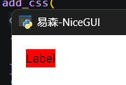

这是使用CSS实现的标准解法。

如果读者对UnoCSS框架和Tailwind CSS框架比较熟悉，则可以换一种解法。给样式类前添加表示状态、不含英文冒号的伪类，使用“:”分隔状态和样式类：

```python
from nicegui import ui

  
def index():
    label = ui.label('Label')
    label.classes('hover:bg-red-500')
  
ui.run(
    root=index,
    title='易森-NiceGUI',
    native=True
)
```

这样的话，就能完美使用UnoCSS框架和Tailwind CSS框架预定义的样式类。

如果启用了UnoCSS框架支持，状态和样式类之间的分隔符还可以改为“-”：

```python
from nicegui import ui

  
def index():
    label = ui.label('Label')
    label.classes('hover-bg-red-500')
  
ui.run(
    root=index,
    title='易森-NiceGUI',
    unocss='wind4',
    native=True
)
```

除了上面示例中鼠标悬停的状态，还可以定义其他状态的样式，具体参考相关文档，这里不做展开。

### 2 NiceGUI：样式技巧——仅在特定大小的屏幕中生效

相关文档：

- https://tailwindcss.com/docs/responsive-design
- https://developer.mozilla.org/zh-CN/docs/Web/CSS/Guides/Media_queries/Using

与伪类的用法一样，想要让样式仅在特定大小的屏幕中生效，只需将状态改成预定义的断点即可（断点含义可参考相关文档）：

```python
from nicegui import ui

  
def index():
    label = ui.label('Label')
    label.classes('bg-red-500 sm:bg-yellow-500 md:bg-green-500')
  
ui.run(
    root=index,
    title='易森-NiceGUI',
    native=True
)
```

上面添加的样式表示当屏幕宽度大于特定值（`sm`表示`640px`，`md`表示`768px`）时，相关样式就会生效（可以拖动窗口宽度查看效果）。

除了预定义的断点，还可以使用`min-[{任意值}px]`（表示屏幕宽度大于任意值），在任意值上定义断点：

```python
from nicegui import ui

  
def index():
    label = ui.label('Label')
    label.classes('bg-red-500 min-[400px]:bg-yellow-500 min-[600px]:bg-green-500')
  
ui.run(
    root=index,
    title='易森-NiceGUI',
    native=True
)
```

对应CSS的话，想要实现相同效果，就是在媒体查询的生效范围内定义样式类：

```python
from nicegui import ui

  
def index():
    ui.add_css(
        '''
        .my_class {
            background-color:red;
        }
        @media (min-width:400px){
            .my_class {
                background-color:yellow;
            }
        }
        @media (min-width:600px){
            .my_class {
                background-color:green;
            }
        }
        '''
    )
    label = ui.label('Label')
    label.classes('my_class')
  
ui.run(
    root=index,
    title='易森-NiceGUI',
    native=True
)
```

CSS用起来有点麻烦，具体语法可以参考相关文档和网络，这里仅供参考，不做展开介绍。

如果是使用UnoCSS框架和Tailwind CSS框架，同时使用`max-[{任意值}px]`（表示屏幕宽度小于任意值）和`min-[{任意值}px]`（使用英文冒号连接），则表示样式仅在该屏幕宽度范围内（被连接的两个断点应当为有限的闭合区间）生效：

```python
from nicegui import ui

  
def index():
    label = ui.label('Label')
    # 第二个样式仅当屏幕宽度在400px-600px时生效
    label.classes('bg-red-500 min-[400px]:max-[600px]:bg-yellow-500')
  
ui.run(
    root=index,
    title='易森-NiceGUI',
    native=True
)
```

关于断点的用法还有很多，可以参考相关文档，或者期待后续的更新。

（完）

## 2707期：NiceGUI的布局控件

### 0 本期主要内容

本期主要介绍NiceGUI中布局控件（`ui.row`控件、`ui.column`控件、`ui.separator`控件、`ui.grid`控件）的参数（如果有的话），以及和这些控件相关的扩展用法（控件属性、技巧等）。

### 1 参数几乎相同的`ui.column`控件和`ui.row`控件

相关文档：

- https://nicegui.io/documentation/column
- https://nicegui.io/documentation/row

`ui.column`控件和`ui.row`控件在实际使用时，用法、效果几乎一样，只是布局方向存在差异，前者是垂直排布，后者是水平排布：

```python
from nicegui import ui

def index():
    with ui.column().classes(
        'border-2 border-red-700'
    ):
        for i in range(4):
            ui.item(str(i))
    with ui.row().classes(
        'border-2 border-red-700'
    ):
        for i in range(4):
            ui.item(str(i))

ui.run(
    root=index,
    title='易森-NiceGUI',
    native=True
)
```


两个控件支持的参数也一样，只是其中一个参数的默认值不一样：

- `wrap`参数，关键字参数，布尔类型，表示子控件的宽度（高度）总和超过控件的宽度（高度）时，是否换行（换列）。对于`ui.column`控件，该参数默认为`False`。对于`ui.row`控件，该参数默认为`True`。
- `align_items`参数，关键字参数，字符串类型（仅支持`['start', 'end', 'center', 'baseline', 'stretch']`中的值），表示子控件的对齐方向。

以`ui.column`控件为例，其参数用法的示例如下：

```python
from nicegui import ui

def index():
    with ui.column(
        wrap=True,
        align_items='center'
    ).classes(
        'border-2 border-red-700 h-32'
    ):
        for i in range(4):
            ui.item(str(i)*(i+1)*3)
    with ui.column().classes(
        'border-2 border-red-700 h-32'
    ):
        for i in range(4):
            ui.item(str(i)*(i+1)*3)

ui.run(
    root=index,
    title='易森-NiceGUI',
    native=True
)
```


### 2 改变`ui.separator`控件的方向只需一个控件属性

相关文档：

- https://nicegui.io/documentation/separator
- https://quasar.dev/vue-components/separator

`ui.separator`控件可以创建一个占用空间极小且不太明显的分隔符，但是，默认是水平方向的，如果用在行布局中，分隔线需要改为垂直方向：

```python
from nicegui import ui

def index():
    with ui.row().classes(
        'border-2 border-red-700 p-1'
    ):
        for i in range(4):
            ui.button(i)
        ui.space()
        ui.separator()
        ui.button(4)

ui.run(
    root=index,
    title='易森-NiceGUI',
    native=True
)
```


操作其实很简单，只需添加控件属性`vertical`即可：

```python
from nicegui import ui

def index():
    with ui.row().classes(
        'border-2 border-red-700 p-1'
    ):
        for i in range(4):
            ui.button(i)
        ui.space()
        ui.separator().props('vertical')
        ui.button(4)

ui.run(
    root=index,
    title='易森-NiceGUI',
    native=True
)
```


### 3 改变`ui.grid`控件的网格大小

相关文档：

- https://nicegui.io/documentation/grid
- https://tailwindcss.com/docs/grid-column
- https://tailwindcss.com/docs/grid-row

在《NiceGUI札记》（2026版）第13章中，简单介绍过网格布局，涉及到自定义网格规格的用法，有点类似于表格的合并单元格（跨列、跨行），算是一种自定义网格大小的方法，这里先通过示例复习一下：

```python
from nicegui import ui

def index():
    with ui.grid(columns=4).classes('w-64 h-64 gap-0'):
        # 第一行
        ui.label('columns*1').classes('col-span-full border p-1')
        # 第二行
        ui.label('2*2').classes('col-span-2 row-span-2 border p-1')
        ui.label('2*1').classes('col-span-2 row-span-1 border p-1')
        # 第三行
        ui.label('1*1').classes('border p-1')
        # 第四行
        ui.label('3*1').classes('col-span-3 border p-1')
        

ui.run(
    root=index,
    title='易森-NiceGUI',
    native=True
)
```


在4列的网格中，通过给子控件添加样式类`'col-span-{列数}'`、`'row-span-{行数}'`，表示该子控件对应网格的规格（`{列数}*{行数}`）。

除了给子控件添加样式来修改网格的规格，还可以给控件的参数传入字符串（使用空格分隔，表示每一列的列宽或者每一行的行高），变相修改网格的宽度、高度：

```python
from nicegui import ui

def index():
    size = ['100px','200px','300px']
    with ui.grid(
        columns=' '.join(size),
        rows=' '.join(size)
    ).classes('gap-0'):
        for k in size:
            for i in size:
                ui.label(f'{i}*{k}').classes('border p-1')
        

ui.run(
    root=index,
    title='易森-NiceGUI',
    native=True
)
```

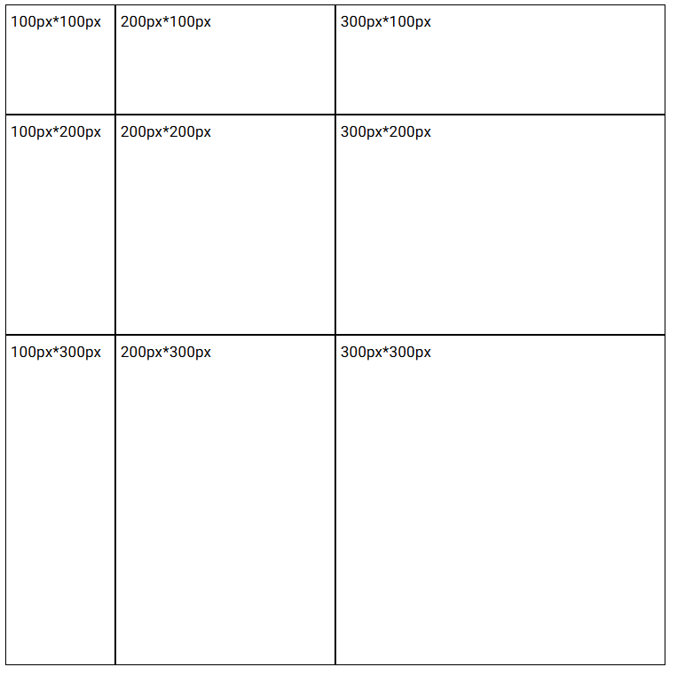

没错，`ui.grid`控件支持的两个参数，传入整数时表示一共多少列、多少行，传入字符串的话，除了表示有多少列、多少行，还表示对应列、行的宽度、高度。字符串使用空格分隔，每个单词表示宽度、高度，使用CSS中的长度表示方法（`'auto'`表示自动，`'fr'`表示份数，`'px'`表示具体的像素值）。

注意，给子控件添加样式类可以修改子控件的大小，但不会影响网格的大小。

（完）

## 2707期+：NiceGUI的布局控件

### 0 本期主要内容

本期主要介绍NiceGUI中布局控件（`ui.skeleton`控件、`ui.list`控件、`ui.item`控件）的参数（如果有的话），以及和这些控件相关的扩展用法（控件属性、技巧等）。

因为布局控件较多，故将其余布局控件放在增刊中。

### 1 `ui.skeleton`控件

相关文档：

- https://nicegui.io/documentation/skeleton
- https://quasar.dev/vue-components/skeleton

`ui.skeleton`控件用于创建一个代替控件的占位控件，通常在页面没有完全加载时表示页面的布局。

`ui.skeleton`控件支持以下参数：

- `type`参数，字符串类型（仅支持`['text','rect','circle','QBtn','QBadge','QChip','QToolbar','QCheckbox','QRadio','QToggle','QSlider','QRange','QInput','QAvatar']`中的值），表示骨架类型，即使用哪种控件作为骨架的轮廓，默认为`'rect'`。

- `tag`参数，字符串类型，表示使用哪种HTML元素渲染该控件，默认为`'div'`。

  从该参数开始，只能通过关键字传入。

- `animation`参数，字符串类型（仅支持`['wave','pulse','pulse-x','pulse-y','fade','blink','none',]`中的值），表示加载动画的类型，默认为`'wave'`。

- `animation_speed`参数，浮点类型，表示加载动画的速度（在多少秒内播放完一遍动画），默认为`1.5`。

- `square`参数，布尔类型，表示是否移除轮廓的圆角。

- `bordered`参数，布尔类型，表示是否添加边框。

- `size`参数，字符串类型，表示控件的大小（使用CSS的尺寸表达方式）。

- `width`参数，字符串类型，表示控件的宽度（使用CSS的尺寸表达方式）。

- `height`参数，字符串类型，表示控件的高度（使用CSS的尺寸表达方式）。

示例如下：

```python
from nicegui import ui

def index():
    ui.skeleton('rect',bordered=True,size='5em')
    ui.skeleton('rect',size='5em')

ui.run(
    root=index,
    title='易森-NiceGUI',
    native=True
)
```


### 2 `ui.card`控件及其配套控件（`ui.card_actions`控件和`ui.card_section`控件）

相关文档：

- https://nicegui.io/documentation/card
- https://quasar.dev/vue-components/card

`ui.card`控件本身用法不复杂，仅支持一个表示子控件对齐方向`align_items`参数，无需单独解释。要说特别之处，那就该控件支持`tight`方法，用于生成一个移除内边距的副本：

```python
from nicegui import ui

def index():
    with ui.card().tight():
        ui.label('card')
        with ui.card_section():
            ui.label('card section')
        with ui.card_actions():
            ui.button('Yes')
            ui.button('No')

ui.run(
    root=index,
    title='易森-NiceGUI',
    native=True
)
```

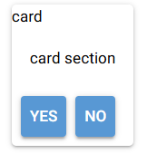

这样得到的卡片会显得更紧凑。

除此以外值得说道的，就是与之配套的`ui.card_actions`控件和`ui.card_section`控件。`ui.card`控件表示卡片主体，在上下文中添加的控件会放在默认带边框的卡片中；`ui.card_actions`控件表示卡片的动作区域，只能在`ui.card`控件的上下文添加，一般在该控件上下文添加可以点击的控件，并且默认靠左对齐；`ui.card_section`控件表示内容分区，只能在`ui.card`控件的上下文添加，一般在该控件上下文添加只是显示内容的控件，并且默认居中对齐。

配套控件没有额外的参数、方法，如果想修改配套控件的样式，就要用到控件属性（`props`）。

`ui.card_actions`控件支持以下控件属性：

- `vertical`属性，布尔类型，表示子控件是否采用垂直布局。
- `align`属性，字符串类型（仅支持`['left', 'right', 'center', 'evenly', 'stretch', 'between', 'around']`中的值），表示子控件的对齐方向。

`ui.card_section`控件持以下控件属性：

- `horizontal`属性，布尔类型，表示子控件是否采用水平布局。
- `tag`属性，字符串类型，表示使用哪种HTML元素渲染该控件，默认为`'div'`。

示例如下：

```python
from nicegui import ui

def index():
    with ui.card():
        ui.label('card')
        with ui.card_section():
            ui.label('card section 1 ')
            ui.label('card section 2 ')
        with ui.card_actions():
            ui.button('Yes')
            ui.button('No')
    with ui.card():
        ui.label('card')
        with ui.card_section().props('horizontal'):
            ui.label('card section 1 ')
            ui.label('card section 2 ')
        with ui.card_actions().props('vertical'):
            ui.button('Yes')
            ui.button('No')

ui.run(
    root=index,
    title='易森-NiceGUI',
    native=True
)
```


### 3 `ui.list`控件的配套控件（`ui.item`控件）与`ui.item`控件的配套控件（`ui.item_label`控件和`ui.item_section`控件）

相关文档：

- https://nicegui.io/documentation/list
- https://quasar.dev/vue-components/list-and-list-items

`ui.list`控件看上去与`ui.column`控件类似，只是子控件之间更加紧凑，用法上没有需要注意的点。不过，通常用在该控件上下文的`ui.item`控件，值得说一说。

`ui.item`控件从用法上看，就像是功能简化的按钮，只保留了两个参数：`text`参数和`on_click`参数。这两个参数的含义、用法，与按钮控件相同，这里就不再赘述。

但与按钮控件不同的是，有两个一般在`ui.item`控件上下文中使用的控件：`ui.item_label`控件和`ui.item_section`控件。这两个控件与`ui.item`控件组合在一起使用，共同组成一个内容项目的整体，每个控件分别对应着内容的指定部分。

`ui.item_section`控件和`ui.item_label`控件的参数一样，都是`text`参数，使得这两个控件用起来就像`ui.label`控件一样，但事实真的如此吗？一旦将其放在`ui.item`控件的上下文中，对比效果之后，就会发现不同：

```python
from nicegui import ui

def index():
    with ui.item('item1').classes('border-red-400 border-2'):
        ui.label('label1 ')
        ui.label('label2 ')
    with ui.item('item2').classes('border-red-400 border-2'):
        ui.item_label('item_label1 ')
        ui.item_label('item_label2 ')
    with ui.item('item3').classes('border-red-400 border-2'):
        ui.item_section('section1 ')
        ui.item_section('section2 ')

ui.run(
    root=index,
    title='易森-NiceGUI',
    native=True
)
```

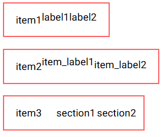

从结果看，要是直接放在`ui.item`控件上下文中的话，`ui.item_section`控件的效果最好，起码垂直方向是对齐的。

当然，这并不是说`ui.item_label`控件就一无是处，暂且用一下后面才会讲到的控件属性，看一下和`ui.label`控件相比，使用相同的控件属性，二者有何区别：

```python
from nicegui import ui

def index():
    with ui.item('item').classes('border-red-400 border-2'):
        with ui.item_section():
            ui.label('label1 ').props('overline')
            ui.label('label2 ').props('caption')
        with ui.item_section():
            ui.item_label('item_label1 ').props('overline')
            ui.item_label('item_label2 ').props('caption')
        # 占位用的空白控件
        ui.item_section().props('avatar')

ui.run(
    root=index,
    title='易森-NiceGUI',
    native=True
)
```


可以看到，都是放在`ui.item_section`控件上下文的话，两种控件都是垂直布局，但这个不是重点，重点在于，都添加了相同的控件属性之后，只有`ui.item_label`控件的控件属性**生效**了，`ui.label`控件**无动于衷**。没错，这就配套的原因：只有**配套使用**时，特定**控件属性**对应的特定样式才会**生效**。

这三个控件配套使用时，一般用在`ui.list`控件的上下文中。因此，既然要介绍这三个控件的控件属性，索性连`ui.list`控件的控件属性也说说。

`ui.list`控件支持以下控件属性：

- `separator`属性，布尔类型，表示是否在子控件之间添加分隔线。
- `padding`属性，布尔类型，表示是否在列表开头、末尾额外添加内边距。
- `bordered`属性，布尔类型，表示是否给整个列表添加边框。
- `dense`属性，布尔类型，表示是否调小各个子控件之间的距离，使得整个列表更加紧凑。

示例如下：

```python
from nicegui import ui

def index():
    with ui.list():
        for _ in range(5):
            ui.item('Test')

    with ui.list().props(
        'dense separator bordered'
    ):
        for _ in range(5):
            ui.item('Test')

ui.run(
    root=index,
    title='易森-NiceGUI',
    native=True
)
```


`ui.item`控件支持以下控件属性：

- `inset-level`属性，整数类型，表示该项目的缩进等级（`0`表示不缩进）。
- `disable`属性，布尔类型，表示是否禁用控件。
- `active`属性，布尔类型，表示是否激活控件。
- `clickable`属性，布尔类型，表示点击控件时是否显示点击效果。
- `dense`属性，布尔类型，表示是否调小控件的内边距。

示例如下：

```python
from nicegui import ui

def index():
    with ui.list():
        ui.item('Test').props(
            'inset-level=1'
        )
        ui.item('Test').props(
            'disable'
        )
        ui.item('Test').props(
            'active'
        )
        ui.item('Test').props(
            'clickable'
        )
        ui.item('Test').props(
            'dense'
        )
        ui.item('Test')

ui.run(
    root=index,
    title='易森-NiceGUI',
    native=True
)
```


`ui.item_section`控件支持以下控件属性：

- `side`属性，布尔类型，当控件在首尾时，使用该属性可以将控件样式修改为不太突出的效果（适合作为侧边的陪衬）。
- `avatar`属性，布尔类型，当控件的子控件为图标时，使用该属性可以得到类似`ui.avatar`控件的显示效果。
- `thumbnail`属性，布尔类型，当控件的子控件为图片时，使用该属性可以得到图片的缩略图效果。
- `top`属性，布尔类型，表
- `no-wrap`属性，布尔类型，当控件的文本存在空格时，控件会使用空格作为分词符号而让多个单词自动换行，该属性表示是否禁用自动换行。

示例如下：

```python
from nicegui import ui

def index():
    with ui.item().classes('border-2 border-red-400'):
        ui.item_section('section').props(
            'side'
        )
        ui.item_section('section')
        ui.item_section('section').props(
            'side'
        )
    with ui.item().classes('border-2 border-red-400'):
        with ui.item_section().props(
            'avatar'
        ):
            ui.icon('home')
        ui.item_section('section')
        with ui.item_section():
            ui.avatar('home',color=None)

ui.run(
    root=index,
    title='易森-NiceGUI',
    native=True
)
```


`ui.item_label`控件支持以下控件属性：

- `lines`属性，整数类型，表示文本太多无法在指定行数内完整展示时，多余部分显示为省略号。
- `overline`属性，布尔类型，表示该控件的显示样式是否为上标效果。
- `caption`属性，布尔类型，表示该控件的显示样式是否为说明文字效果。
- `header`属性，布尔类型，表示该控件的显示样式是否为标题效果。

示例如下：

```python
from nicegui import ui

def index():
    with ui.item().classes('border-2 border-red-400'):
        with ui.item_section():
            ui.item_label('label').props(
                'overline'
            )
            ui.item_label('label').props(
                'caption'
            )
            ui.item_label('label').props(
                'header'
            )
        with ui.item_section():
            ui.item_label('label')
            ui.item_label('label')
            ui.item_label('label')

ui.run(
    root=index,
    title='易森-NiceGUI',
    native=True
)
```

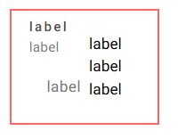

（完）

## 2708期：查漏补缺——PySide6的`QWidget`控件

### 0 本期主要内容

《Qt For Python 札记》中，在一开始介绍基础内容时首先使用了`QWidget`控件，介绍QtWidgets程序的三种主窗口控件时对比过该控件与其他主窗口控件，同时该控件也是大部分控件的基类，很多示例也离不开该控件创建的主窗口。可以说，`QWidget`控件几乎贯穿了《Qt For Python 札记》。

用了这么多次`QWidget`控件，却没有像介绍其他控件一样认真介绍该控件，有点说不过去。不过，这并不是笔者偷懒，而是该控件作为其他控件的基类，一方面支持的参数、方法、控件属性确实多且偏向基础；另一方面就是大部分控件提供了简单直观的参数、方法、控件属性，远比直接使用该控件便捷，没必要刻意制造难度。

但是，魔鬼藏于细节，突破始于基础，有些藏在基础中的用法，有时候反而会成为被忽略的地方，或者是难题突破的关键。

因此，从本期开始，笔者将不定期更新《查漏补缺》系列，从基础入手，探求那些可能被忽略的用法，寻找解决问题的奇淫巧技。

那么，本期要介绍的，自然是前面铺垫许久的`QWidget`控件。

相关文档：https://doc.qt.io/qtforpython-6/PySide6/QtWidgets/QWidget.html

### 1 初始化参数

关于初始化参数，官方文档和`QtWidgets.pyi`中的参数提示有两个坑需要复习一下：

- 参数提示中对应控件属性的参数，如果是**只读**属性（没有对应的设置方法），则该参数**不能**在初始化时传入，会报错。
- 除了控件提供的初始化参数提示，其父类控件提供的初始化参数提示也有部分可用。这一部分可以简单理解为，所有控件支持的**可读写**属性，都可以在初始化时通过**关键字**传入。

如果看官方文档（ https://doc.qt.io/qtforpython-6/PySide6/QtWidgets/QWidget.html#properties ）的话，提供的可读写控件属性很多，全介绍难免有些枯燥，而且会导致篇幅较长。因此，笔者实测对应的参数之后，挑选了几个实用的。后面介绍方法、信号、槽时也是一样的原则。

#### 1.1 定义窗口的初始大小，用`resize`方法还`size`参数？

前面很多PySide6程序的示例中，都单独调用了`resize`方法来设置窗口的初始大小。其实，该方法就是`size`控件属性的设置方法，因此，该属性可以在初始化时直接传参：

```python
from PySide6.QtWidgets import (
    QApplication,
    QWidget
)
from PySide6.QtCore import QSize


app = QApplication()
window = QWidget(
    size=QSize(400, 300)
)
window.setWindowTitle('易森-PySide6')


window.show()
app.exec()

```

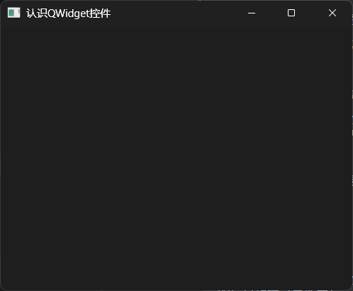

效果是一样的，但代码复杂度有一点差异。虽然可以一步到位，但参数仅限`QSize`类型，不像`resize`方法可以传入两个整数或者`QSize`类型：

```python
from PySide6.QtWidgets import (
    QApplication,
    QWidget
)
from PySide6.QtCore import QSize

app = QApplication()
window = QWidget()
window.setWindowTitle('易森-PySide6')
# window.resize(400, 300)
window.resize(
    QSize(400, 300)
)

window.show()
app.exec()

```

当然，`resize`方法支持的参数灵活，用的时候也灵活，甚至特定场景下只能使用该方法——修改控件属性只能使用该方法。参数与方法不是对立的两面，而是有机的结合，按需选择。因此，笔者为了方便，避免导入`QSize`，选择只用`resize`方法。

#### 1.2 决定鼠标样式的`cursor`参数

`cursor`参数（控件属性）决定了鼠标停留在该控件时的样式，传入（设置）`QCursor`对象即可：

```python
from PySide6.QtWidgets import (
    QApplication,
    QWidget
)
from PySide6.QtGui import QCursor
from PySide6.QtCore import Qt

app = QApplication()
window = QWidget(
    cursor=QCursor(
        Qt.CursorShape.WhatsThisCursor
    )
)
window.setWindowTitle('易森-PySide6')
window.resize(400, 300)

window.show()
app.exec()

```

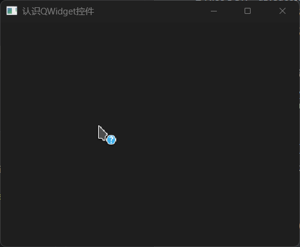

`QCursor`对象支持自定义图片，因笔者手头没有合适的素材，为了避免侵权，就不做演示了，具体用法可以参考官网文档（ https://doc.qt.io/qtforpython-6/PySide6/QtGui/QCursor.html ）。

#### 1.3 定义窗口的初始位置，用`move`方法还`geometry`参数？

在之前介绍PySide6中，经常使用`move`方法来修改控件的位置。当同样为控件的`QWidget`控件作为主窗口使用时，则该方法可以用来修改窗口的位置：

```python
from PySide6.QtWidgets import (
    QApplication,
    QWidget
)

app = QApplication()
window = QWidget()
window.setWindowTitle('易森-PySide6')
window.resize(400, 300)
window.move(
    10, 10
)

window.show()
app.exec()

```

那么，有没有一个初始化参数可以实现同样的效果呢？

当然有，那就是`geometry`参数：

```python
from PySide6.QtWidgets import (
    QApplication,
    QWidget
)
from PySide6.QtCore import QRect

app = QApplication()
window = QWidget(
    geometry=QRect(
        10, 10,
        400, 300
    )
)
window.setWindowTitle('易森-PySide6')

window.show()
app.exec()

```

如示例所示，`geometry`参数同时决定了窗口位置和大小，但这里的窗口位置不含标题栏的高度，这一点与`move`方法不同。

注意，如果窗口位置是`(0,0)`，则操作系统会强制移动窗口来确保标题栏不在屏幕外，将导致`geometry`参数的显示结果违反直觉——标题栏完整显示。

最后简单总结一下，如果想同时初始化窗口位置和大小，使用`geometry`参数可以一步到位。但考虑到该参数会忽略标题栏，如非必要，还是建议使用`move`方法。

#### 1.4 设置窗口的图标与标题，也有对应的参数

如同`resize`方法是`size`控件属性的设置方法，前面示例中用来设置窗口标题的`setWindowTitle`方法也是对应控件属性的设置方法，因此，可以在创建窗口时直接指定窗口标题（使用`windowTitle`参数）：

```python
from PySide6.QtWidgets import (
    QApplication,
    QWidget
)

app = QApplication()
window = QWidget(
    windowTitle='易森-PySide6'
)
window.resize(400, 300)


window.show()
app.exec()

```

窗口图标和窗口标题一样，也可以使用参数（`windowIcon`参数）或者方法（`setWindowIcon`方法）来设置：

```python
from PySide6.QtWidgets import (
    QApplication,
    QWidget
)
from PySide6.QtGui import QIcon

app = QApplication()
window = QWidget(
    windowIcon=QIcon.fromTheme(
        QIcon.ThemeIcon.Computer
    ),
    windowTitle='易森-PySide6'
)
window.setWindowIcon(
    QIcon.fromTheme(
        QIcon.ThemeIcon.Computer
    )
)
window.resize(400, 300)


window.show()
app.exec()

```

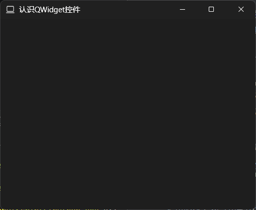

#### 1.5 修改窗口透明度，一个参数（控件属性）搞定

 修改窗口透明度，只要了解一个参数（控件属性）就够了，那就是`windowOpacity`参数。该参数使用与百分比等值的小数表示透明度（0对应0%，0.5对应50%，1对应100%）：

```python
from PySide6.QtWidgets import (
    QApplication,
    QWidget
)
from PySide6.QtGui import QIcon

app = QApplication()
window = QWidget(
    windowIcon=QIcon.fromTheme(
        QIcon.ThemeIcon.Computer
    ),
    windowTitle='易森-PySide6',
    windowOpacity=0.5
)

window.resize(400, 300)


window.show()
app.exec()

```

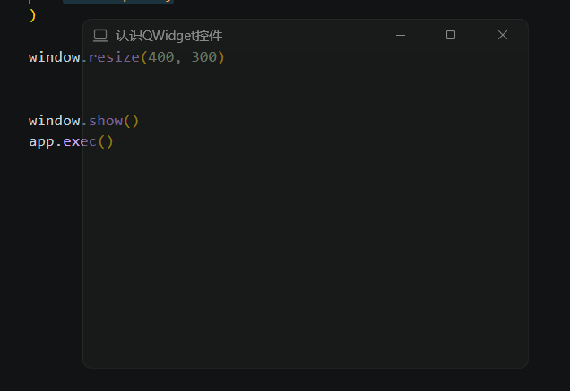

### 2 方法（含控件属性）

#### 2.1 获取窗口的信息（宽高、位置等）

除了可以在初始化时可作为参数使用的控件属性，还有一些只读的控件属性，可用于获取窗口的信息（宽高、位置等）：

- `pos`方法，获取窗口（含标题栏）的左上角坐标。
- `x`方法，，获取窗口（含标题栏）的左上角X坐标。
- `y`方法，，获取窗口（含标题栏）的左上角Y坐标。
- `width`方法，获取窗口（不含标题栏）的宽度。
- `height`方法，获取窗口（不含标题栏）的高度。
- `isFullScreen`方法，获取窗口是否为全屏状态。
- `isHidden`方法，获取窗口是否为隐藏状态。
- `isMaximized`方法，获取窗口是否为最大化状态。
- `isMinimized`方法，获取窗口是否为最小化状态。

示例如下：

```python
from PySide6.QtWidgets import (
    QApplication,
    QWidget,
    QPushButton,
    QTextEdit
)

app = QApplication()
window = QWidget(
    windowTitle='易森-PySide6',
)
window.resize(400, 300)
edit = QTextEdit(
    window
)
button = QPushButton(
    'get window info',
    window
)
button.move(
    0,
    200
)
button.clicked.connect(
    lambda:edit.setText(
        str(window.pos())
    )
)

window.show()
app.exec()

```

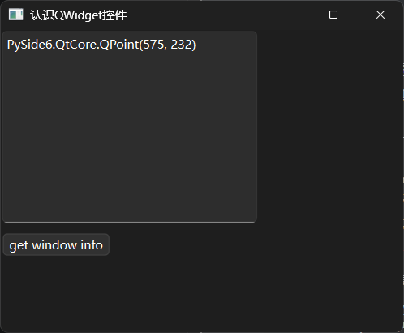

#### 2.2 设置窗口的状态，用`setWindowState`方法

上一节介绍的方法中，有获取窗口最大化、最小化、全屏状态的，那么，如何让窗口进入对应状态呢？

就Windows系统而已，默认窗口提供了最大化、最小化按钮，想要进入全屏状态的话，需要程序实现对应的交互方式才行。不过，不管是点击按钮还是绑定快捷键，都需要了解调用什么方法可以让窗口全屏。问题的答案很简单，那就是用`setWindowState`方法（参数为`Qt.WindowState`枚举类型，具体用法参考 https://doc.qt.io/qtforpython-6/PySide6/QtWidgets/QWidget.html#PySide6.QtWidgets.QWidget.setWindowState ）。用`setWindowState`方法，不仅可以进入全屏状态，还可以进入最大化、最小化状态：

```python
from PySide6.QtWidgets import (
    QApplication,
    QWidget,
    QPushButton
)
from PySide6.QtCore import Qt

app = QApplication()
window = QWidget(
    windowTitle='易森-PySide6',
)
window.resize(400, 300)

for i in [
    Qt.WindowState.WindowNoState,
    Qt.WindowState.WindowMinimized,
    Qt.WindowState.WindowMaximized,
    Qt.WindowState.WindowFullScreen,
    Qt.WindowState.WindowActive    
]:
    button = QPushButton(
        str(i),
        window
    )
    button.clicked.connect(
        lambda e,i=i:window.setWindowState(
            i
        )
    )
    button.move(
        0,
        30*len(bin(i.value*2)[3:])
    )

window.show()
app.exec()

```

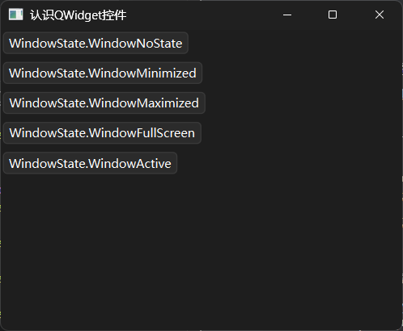

上面的示例中，点击不同的按钮可以让窗口进入不同的状态，结合上一节提供的方法，就可以实现一个切换全屏状态的功能：

```python
from PySide6.QtWidgets import (
    QApplication,
    QWidget,
    QPushButton
)
from PySide6.QtCore import Qt

app = QApplication()
window = QWidget(
    windowTitle='易森-PySide6',
)
window.resize(400, 300)

button = QPushButton(
    'Toggle FullScreen',
    window
)
button.clicked.connect(
    lambda:window.setWindowState(
        Qt.WindowState.WindowNoState if window.isFullScreen() else Qt.WindowState.WindowFullScreen
    )
)


window.show()
app.exec()

```

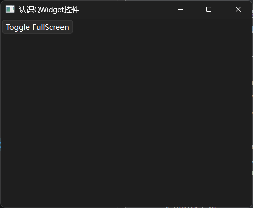

#### 2.3 移动窗口位置，用`move`方法或`setGeometry`方法

前面说过，初始化窗口位置和大小，使用`geometry`参数可以一步到位；使用`move`方法，也可以初始化窗口位置。

对于移动窗口位置，`geometry`参数（控件属性）和`move`方法都可以实现。不过，对于`geometry`参数（控件属性）而言，因为需要同时指定窗口宽度和高度，因此需要结合原窗口的信息使用，才能避免窗口大小发生变化：

```python
from PySide6.QtWidgets import (
    QApplication,
    QWidget
)
from PySide6.QtCore import QRect

app = QApplication()
window = QWidget(
    windowTitle='易森-PySide6',
    geometry=QRect(
        10, 10,
        400, 300
    )
)
window .setGeometry(
    100,
    100,
    window.width(),
    window.height()
)

window.show()
app.exec()

```

### 3 槽

#### 3.1 不同的“show”方法，显示不同状态的窗口

对于设置窗口的状态，有的读者可能觉得前面的方法有点麻烦，尤其是给按钮的信号做绑定时，需要写lambda表达式。好在`QWidget`控件提供了一些槽，可以很方便地绑定信号：

- `show`方法，显示窗口。
- `showFullScreen`方法，以全屏状态显示窗口。
- `showMaximized`方法，以最大化状态显示窗口。
- `showMinimized`方法，以最小化状态显示窗口。
- `showNormal`方法，以正常状态（非全屏、非最大化、非最小化）显示窗口。

示例如下：

```python
from PySide6.QtWidgets import (
    QApplication,
    QWidget,
    QPushButton
)

app = QApplication()
window = QWidget(
	windowTitle='易森-PySide6',
)
window.resize(400, 300)

button = QPushButton(
    '退出全屏',
    window
)
button.clicked.connect(
    window.showNormal
)

# 全屏显示
window.showFullScreen()
app.exec()

```

注意，除了`show`方法外，其余几种以特定状态显示窗口的方法均为互斥方法，即对应的状态不能同时存在。

（完）

## 2709期：查漏补缺——PySide6的信号和槽

### 0 本期主要内容

虽然《Qt For Python 札记》的2025版和2026版已经介绍过信号和槽（2025版中的第6章与2026版中的第30章）的基础用法（连接信号、发射信号、重载信号、自动连接信号与槽），但还是存在一些与之有关的用法没有介绍。

因此，本期将介绍另一种连接信号的方式（`connect`方法）和信号屏蔽器。

### 1 `connect`方法——使用签名代替信号和槽

相关文档：https://doc.qt.io/qtforpython-6/PySide6/QtCore/QObject.html#PySide6.QtCore.QObject.connect

点击按钮，窗口关闭，实现这个功能，只需用到按钮的`clicked`信号，将其连接到窗口的关闭方法（`close`方法）即可，代码很简单：

```python
from PySide6.QtWidgets import (
    QApplication,
    QWidget,
    QPushButton
)

app = QApplication()
window = QWidget(
    windowTitle='易森-PySide6',
)
window.resize(400, 300)
button = QPushButton('close window', window)

button.clicked.connect(window.close)

window.show()
app.exec()

```

除了这种简单的连接方法，PySide6还提供了一种基于签名字符串的连接方法。使用`SIGNAL`方法转换签名为信号字符串，使用`SLOT`方法转换签名为槽字符串，然后调用`QObject`类的`connect`方法（有静态方法也有实例方法），将两者连接（这里使用的是实例方法）：

```python
from PySide6.QtWidgets import (
    QApplication,
    QWidget,
    QPushButton
)
from PySide6.QtCore import SIGNAL, SLOT

app = QApplication()
window = QWidget(
	windowTitle='易森-PySide6',
)
window.resize(400,300)
button = QPushButton('close window',window)

button.connect(
    SIGNAL('clicked()'),
    window,
    SLOT('close()')
)

window.show()
app.exec()

```

对于信号、槽而言，其签名格式如下：

```python
'{信号名或槽名}( {参数类型1}, ..., {参数类型n} )'
```

签名中不需要包含参数的具体值，Qt的信号系统会自动处理，只需在签名中明确参数类型即可。

`QObject`类的`connect`方法有多种参数情况，上面示例中使用了实例方法，因此，可以省略信号的发送者，默认为调用该方法的对象，参数中只是明确了信号的接收者（槽的提供者）。如果是静态方法，则要在参数中表明信号的发送者：

```python
from PySide6.QtWidgets import (
    QApplication,
    QWidget,
    QPushButton
)
from PySide6.QtCore import QObject, SIGNAL, SLOT

app = QApplication()
window = QWidget(
	windowTitle='易森-PySide6',
)
window.resize(400,300)
button = QPushButton('close window',window)

QObject.connect(
    button,
    SIGNAL('clicked()'),
    window,
    SLOT('close()')
)

window.show()
app.exec()

```

### 2 信号屏蔽器

信号屏蔽器（`QSignalBlocker`类）在进入其上下文是可以屏蔽特定对象的所有信号，常用于避免重复发送信号、执行耗时操作时临时屏蔽特定对象的所有信号。

这么干说，想必读者不一定能理解信号屏蔽器的作用和用法，直接给出示例，也不够直观。那么，笔者就用一个循序渐进的代码修改过程，演示一下信号屏蔽器的用法和优点。

先假设一个场景：为一个按钮实现功能，要求点击按钮后2秒再响应，在终端输出当前时间。

基于这样的需求，需要用到定时器，完整代码如下：

```python
from PySide6.QtWidgets import (
    QApplication,
    QWidget,
    QPushButton
)
from PySide6.QtCore import QTimer
from datetime import datetime

app = QApplication()
window = QWidget(
    windowTitle='易森-PySide6',
)
window.resize(400, 300)
button = QPushButton('show time', window)

def show_time():
    QTimer.singleShot(
        2000,
        lambda:print(
            datetime.now()
        )
    )


button.clicked.connect(show_time)

window.show()
app.exec()

```

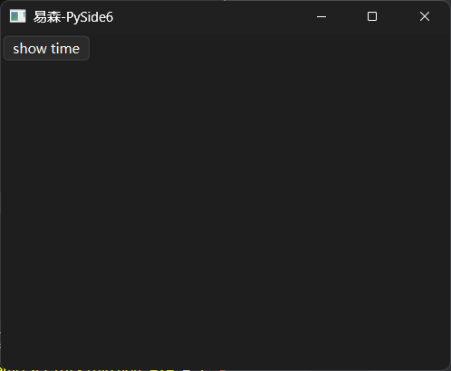

点击按钮，确实会在2秒之后，终端才打印时间，但是，存在一个问题：如果多次重复点击，这些操作也都会在2秒之后按顺序依次响应。

这是正常的，如果没有特殊需要的话，这个功能可以正常交付了，但是，笔者要为这个功能提出新的需求：点击按钮之后2秒内，不允许重复点击按钮，或者即使重复点击也不能重复响应，除非上一次操作执行完毕。

按照一般思路，不允许重复点击，那就把按钮禁用就好，等执行完操作再启用。于是，便有了通过禁用按钮来避免重复点击的**失败版**代码：

```python
from PySide6.QtWidgets import (
    QApplication,
    QWidget,
    QPushButton
)
from PySide6.QtCore import QTimer
from datetime import datetime

app = QApplication()
window = QWidget(
    windowTitle='易森-PySide6',
)
window.resize(400, 300)
button = QPushButton('show time', window)

def show_time():
    button.setEnabled(False)
    QTimer.singleShot(2000,lambda:print(datetime.now()))
    button.setEnabled(True)


button.clicked.connect(show_time)

window.show()
app.exec()

```

读者先不要急着看后面的代码，先回头看一下这个失败版的失败原因。

首先，按照思路添加了按钮禁用、启用的代码，但定时器计时的时候并不会阻塞操作，后面的代码在创建完定时器之后立刻执行了。因此，如果运行失败版的代码，按钮最多闪一下禁用状态，实际操作时和之前的示例没什么区别。

既然定时器计时的时候并不会阻塞操作，那么，如果改为异步，使用异步等待或者添加额外的异步等待能否实现阻塞的效果？

当然可以，但需要注意的是，Qt内部有很多机制，不建议使用其他框架的异步等待，会导致代码变得复杂甚至难以解决的问题。

笔者这里创建了新的Qt事件循环，并将定时器的动作设定为结束该事件循环，然后执行事件循环的`exec`方法，来实现计时阻塞的效果。因此，就有了通过禁用按钮来避免重复点击的**成功版**代码：

```python
from PySide6.QtWidgets import (
    QApplication,
    QWidget,
    QPushButton
)
from PySide6.QtCore import QTimer, QEventLoop
from datetime import datetime

app = QApplication()
window = QWidget(
    windowTitle='易森-PySide6',
)
window.resize(400, 300)
button = QPushButton('show time', window)

def show_time():
    button.setEnabled(False)
    loop = QEventLoop(window)         
    QTimer.singleShot(2000,loop.quit)
    loop.exec()
    print(datetime.now())
    button.setEnabled(True)


button.clicked.connect(show_time)

window.show()
app.exec()

```

上面的代码可以简单理解为将定时器变成纯计时的工具，创建新的事件循环并进入阻塞状态，而计时器最终执行的操作就是退出事件循环，进而变相实现计时期间阻塞其他代码。

虽然结果差强人意，但实现总比无法实现强。不过，聪明读者已经发现了问题，本章要介绍信号屏蔽器，到现在都还没用到，代码已经实现目标了。

没错，代码是符合要求了，但不算完美，如果想要即使重复点击也不能重复响应，那就不能禁用按钮，该怎么办？

还是上面的代码，首先去掉禁用、启用按钮的部分，然后导入信号屏蔽器（`from PySide6.QtCore import QSignalBlocker`），创建针对按钮的信号屏蔽器，关键代码如下：

```python
# 省略其他代码
from PySide6.QtCore import QSignalBlocker

QSignalBlocker(button)
```

先用`with`关键字进入信号屏蔽器的上下文，然后把上面计时、阻塞的代码全部塞到上下文中：

```python
from PySide6.QtWidgets import (
    QApplication,
    QWidget,
    QPushButton
)
from PySide6.QtCore import QTimer, QSignalBlocker, QEventLoop
from datetime import datetime

app = QApplication()
window = QWidget(
    windowTitle='易森-PySide6',
)
window.resize(400, 300)
button = QPushButton('show time', window)

def show_time():
    with QSignalBlocker(button):
        loop = QEventLoop(window)         
        QTimer.singleShot(2000,loop.quit)
        loop.exec()
        print(datetime.now())

button.clicked.connect(show_time)

window.show()
app.exec()

```

这样一来，即使按钮不禁用，重复点击也不会重复响应，除非上一次操作执行完毕。

信号屏蔽器的用法很简单，支持的其他方法可以参考官网文档（ https://doc.qt.io/qtforpython-6/PySide6/QtCore/QSignalBlocker.html#PySide6.QtCore.QSignalBlocker ），考虑到相关示例会比较复杂，这里不做展开，等后续用到时再单独讲解。

（完）

## 2710期：查漏补缺——PySide6的事件

### 0 本期主要内容

虽然《Qt For Python 札记》的2025版已经介绍过事件（2025版中的第6章）的基础用法，但还是存在一些与事件有关的用法没有介绍。此外，当时介绍事件时的示例代码不够典型，部分用法的解释有些片面。

因此，本期将复习之前的用法，并介绍事件过滤器，顺便厘清一些易错、难理解的知识点。

### 1 重写是最简单的用法

事件的用法之前介绍过，同时也是最简单的用法，那就重写对应事件的响应函数（示例改编自《易森》2704期第2节）：

```python
from PySide6.QtWidgets import (
    QApplication,
    QWidget,
    QMenu
)

app = QApplication()
window = QWidget(
    windowTitle='易森-PySide6',
)
window.resize(400, 300)

menu = QMenu(
    window
)
menu.addAction(
    'test'
)

window.contextMenuEvent = lambda e:menu.exec(
    e.globalPos()
)


window.show()
app.exec()
```

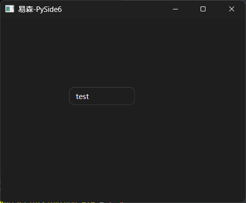

该示例是直接给对应属性重新赋值，但实际更推荐规整的“继承-重写”结构，即先继承，然后在类内重写事件的响应函数：

```python
from PySide6.QtWidgets import (
    QApplication,
    QWidget,
    QMenu
)
from PySide6.QtGui import QContextMenuEvent


class MyWindow(QWidget):
    def contextMenuEvent(self, event: QContextMenuEvent):
        menu = QMenu(
            self
        )
        menu.addAction(
            'test'
        )
        menu.exec(
            event.globalPos()
        )
        return super().contextMenuEvent(event)


app = QApplication()
window = MyWindow(
    windowTitle='易森-PySide6',
)
window.resize(400, 300)

window.show()
app.exec()

```

### 2 过滤器虽然复杂但更强大

#### 2.1 过滤器的基本用法

重写虽然简单，但有个致命缺点，也就是之前介绍信号与事件时说过的，重写只支持一个响应函数，没法像信号一样有多个响应函数。

但是，如果不重写，改用事件过滤器为事件创建响应函数，就可以摆脱这个限制，让单个事件拥有多个响应函数。

使用事件过滤器很简单，只要调用事件所属控件的`installEventFilter`方法，给该方法传入写好的事件过滤器，即可将事件过滤器安装到对应控件上。

同一控件支持安装多个事件过滤器，生效顺序遵循堆栈原则，即后安装的先生效，此外，事件过滤器内还可以拦截对应事件，阻止其他事件响应函数执行。

合法的事件过滤器需要具备以下条件：

- 必须继承自`QObject`类。
- 必须实现`eventFilter`方法。该方法额外接收两个位置参数，分别表示安装事件过滤器的控件、表示事件本身的事件对象。该方法返回布尔值，表示该事件是否被拦截。

基于上面的原则，第1节的示例可以这样写：

```python
from PySide6.QtWidgets import (
    QApplication,
    QWidget,
    QMenu
)
from PySide6.QtCore import QObject, QEvent

class MyEventFilter(QObject):
    def eventFilter(self, obj, event):
        if event.type() == QEvent.Type.ContextMenu:
            menu = QMenu(
                obj
                #self.parent()
            )
            menu.addAction(
                'test'
            )
            menu.exec(
                event.globalPos()
            )
            return False
        return False


app = QApplication()
window = QWidget(
    windowTitle='易森-PySide6',
)
window.resize(400, 300)
window.installEventFilter(MyEventFilter(window))


window.show()
app.exec()

```

为了方便区分，注册多个事件过滤器的示例，则额外写了一个新的事件过滤器（注意菜单内容）：

```python
from PySide6.QtWidgets import (
    QApplication,
    QWidget,
    QMenu
)
from PySide6.QtCore import QObject, QEvent

class MyEventFilter(QObject):
    def eventFilter(self, obj, event):
        if event.type() == QEvent.Type.ContextMenu:
            menu = QMenu(
                obj
                #self.parent()
            )
            menu.addAction(
                'test 1'
            )
            menu.exec(
                event.globalPos()
            )
            return False
        return False


class MyEventFilter2(QObject):
    def eventFilter(self, obj, event):
        if event.type() == QEvent.Type.ContextMenu:
            menu = QMenu(
                obj
                #self.parent()
            )
            menu.addAction(
                'test 2'
            )
            menu.exec(
                event.globalPos()
            )
            return False
        return False

app = QApplication()
window = QWidget(
    windowTitle='易森-PySide6',
)
window.resize(400, 300)
# 遵循堆栈的后入先出原则，后注册的先生效
window.installEventFilter(MyEventFilter(window))
window.installEventFilter(MyEventFilter2(window))


window.show()
app.exec()

```

如果将第二个事件过滤器中事件响应函数（分支）的返回值改为`True`，则事件会被拦截，第一个事件过滤器中的相同事件的响应函数不会执行：

```python
from PySide6.QtWidgets import (
    QApplication,
    QWidget,
    QMenu
)
from PySide6.QtCore import QObject, QEvent

class MyEventFilter(QObject):
    def eventFilter(self, obj, event):
        if event.type() == QEvent.Type.ContextMenu:
            menu = QMenu(
                obj
                #self.parent()
            )
            menu.addAction(
                'test 1'
            )
            menu.exec(
                event.globalPos()
            )
            return False
        return False


class MyEventFilter2(QObject):
    def eventFilter(self, obj, event):
        if event.type() == QEvent.Type.ContextMenu:
            menu = QMenu(
                obj
                #self.parent()
            )
            menu.addAction(
                'test 2'
            )
            menu.exec(
                event.globalPos()
            )
            return True
        return False

app = QApplication()
window = QWidget(
    windowTitle='易森-PySide6',
)
window.resize(400, 300)
# 遵循堆栈的后入先出原则，后注册的先生效
window.installEventFilter(MyEventFilter(window))
window.installEventFilter(MyEventFilter2(window))


window.show()
app.exec()

```

#### 2.2 过滤器的拦截与冒泡的拦截不一样

上一节介绍了事件过滤器的拦截，其基于生效顺序的拦截过程，有点像事件冒泡中的拦截。

什么是事件冒泡？

当不同控件之间存在父子关系时，子控件触发并响应事件之后，如果选择忽略该事件，则会把事件传递给父控件，由父控件继续响应。因为这个过程就像水底的气泡一直上浮，因此该过程也被成为事件冒泡。

事件冒泡中的拦截是通过调用`accept`方法实现的，调用该方法之后，父控件的响应函数就不会执行。

注意，即使不调用`accept`方法，默认也会拦截冒泡。另外，事件冒泡中的拦截不会影响到事件过滤器中的响应函数。

关于事件冒泡，可以试一试下面的示例：

```python
from PySide6.QtWidgets import (
    QApplication,
    QWidget,
    QMenu
)
from PySide6.QtGui import QContextMenuEvent


class MyWindow(QWidget):
    def contextMenuEvent(self, event: QContextMenuEvent):
        menu = QMenu(
            self
        )
        menu.addAction(
            'test'
        )
        menu.exec(
            event.globalPos()
        )
        # 接收则表示不需要父控件处理（即拦截），默认为接受
        event.accept()
        # 忽略则表示需要父控件处理
        # event.ignore()
        # 注意，接受之后不能调用父类的同名方法，因为QWidget类的同名方法会调用忽略方法
        # return super().contextMenuEvent(event)


app = QApplication()

# 父窗口
parentWindow = QWidget()
parentWindow.resize(400, 300)
parentWindow.contextMenuEvent = print

window = MyWindow(
    parent=parentWindow,
    windowTitle='易森-PySide6',
)
window.resize(400, 300)


parentWindow.show()
app.exec()

```

读者可以尝试修改示例代码，看看不拦截冒泡的话，终端会显示什么？

事件过滤器与事件冒泡都有拦截的功能，如果同时使用，情况会变得复杂一些。为了方便学习，这里先了解一下用于测试的模板代码，后续的对比测试将基于下面的代码做微调：

```python
from PySide6.QtWidgets import (
    QApplication,
    QWidget,
    QMenu
)
from PySide6.QtCore import QObject, QEvent
from PySide6.QtGui import QContextMenuEvent


class MyWindow(QWidget):
    def contextMenuEvent(self, event: QContextMenuEvent):
        menu = QMenu(
            self
        )
        menu.addAction(
            'test 0'
        )
        menu.exec(
            event.globalPos()
        )
        # 忽略则表示需要父控件处理
        event.ignore()


class MyEventFilter(QObject):
    def eventFilter(self, obj, event):
        if event.type() == QEvent.Type.ContextMenu:
            menu = QMenu(
                obj
                #self.parent()
            )
            menu.addAction(
                'test 1'
            )
            menu.exec(
                event.globalPos()
            )
            return False
        return False


class MyEventFilter2(QObject):
    def eventFilter(self, obj, event):
        if event.type() == QEvent.Type.ContextMenu:
            menu = QMenu(
                obj
                #self.parent()
            )
            menu.addAction(
                'test 2'
            )
            menu.exec(
                event.globalPos()
            )
            return False
        return False

app = QApplication()
# 父窗口
parentWindow = QWidget()
parentWindow.resize(400, 300)
parentWindow.contextMenuEvent = print

window = MyWindow(
    parent=parentWindow,
    windowTitle='易森-PySide6',
)
window.resize(400, 300)
# 遵循堆栈的后入先出原则，后注册的先生效
window.installEventFilter(MyEventFilter(window))
window.installEventFilter(MyEventFilter2(window))


parentWindow.show()
app.exec()

```

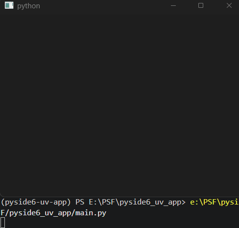

模板代码结合了前面示例中的所有响应函数：在重写的响应函数中，右键菜单显示`'test 0'`；两个过滤器的响应函数中，右键菜单分别显示`'test 1'`、`'test 2'`，后者优先显示；最后，父控件的响应函数会在事件冒泡之后，在终端打印内容。

记住上面的执行顺序，接下来，代码将一步步变动，逐渐挖掘出拦截的秘密。

如果只在第二个事件过滤器中拦截（返回`True`），则除了第二个事件过滤器中的响应函数外，其余所有响应函数都不执行：

```python
from PySide6.QtWidgets import (
    QApplication,
    QWidget,
    QMenu
)
from PySide6.QtCore import QObject, QEvent
from PySide6.QtGui import QContextMenuEvent


class MyWindow(QWidget):
    def contextMenuEvent(self, event: QContextMenuEvent):
        menu = QMenu(
            self
        )
        menu.addAction(
            'test 0'
        )
        menu.exec(
            event.globalPos()
        )
        # 忽略则表示需要父控件处理
        event.ignore()


class MyEventFilter(QObject):
    def eventFilter(self, obj, event):
        if event.type() == QEvent.Type.ContextMenu:
            menu = QMenu(
                obj
                #self.parent()
            )
            menu.addAction(
                'test 1'
            )
            menu.exec(
                event.globalPos()
            )
            return False
        return False


class MyEventFilter2(QObject):
    def eventFilter(self, obj, event):
        if event.type() == QEvent.Type.ContextMenu:
            menu = QMenu(
                obj
                #self.parent()
            )
            menu.addAction(
                'test 2'
            )
            menu.exec(
                event.globalPos()
            )
            # 这里开始拦截
            return True
        return False

app = QApplication()
# 父窗口
parentWindow = QWidget()
parentWindow.resize(400, 300)
parentWindow.contextMenuEvent = print

window = MyWindow(
    parent=parentWindow,
    windowTitle='易森-PySide6',
)
window.resize(400, 300)
# 遵循堆栈的后入先出原则，后注册的先生效
window.installEventFilter(MyEventFilter(window))
window.installEventFilter(MyEventFilter2(window))


parentWindow.show()
app.exec()

```


如果只在第二个事件过滤器中拦截冒泡（调用`accept`方法），则只能影响父控件：

```python
from PySide6.QtWidgets import (
    QApplication,
    QWidget,
    QMenu
)
from PySide6.QtCore import QObject, QEvent
from PySide6.QtGui import QContextMenuEvent


class MyWindow(QWidget):

    def contextMenuEvent(self, event: QContextMenuEvent):
        menu = QMenu(
            self
        )
        menu.addAction(
            'test 0'
        )
        menu.exec(
            event.globalPos()
        )


class MyEventFilter(QObject):
    def eventFilter(self, obj, event):
        if event.type() == QEvent.Type.ContextMenu:
            menu = QMenu(
                obj
                #self.parent()
            )
            menu.addAction(
                'test 1'
            )
            menu.exec(
                event.globalPos()
            )
            return False
        return False


class MyEventFilter2(QObject):
    def eventFilter(self, obj, event):
        if event.type() == QEvent.Type.ContextMenu:
            menu = QMenu(
                obj
                #self.parent()
            )
            menu.addAction(
                'test 2'
            )
            menu.exec(
                event.globalPos()
            )
            # 这里拦截
            event.accept()
            return False
        return False

app = QApplication()
# 父窗口
parentWindow = QWidget()
parentWindow.resize(400, 300)
parentWindow.contextMenuEvent = print

window = MyWindow(
    parent=parentWindow,
    windowTitle='易森-PySide6',
)
window.resize(400, 300)
# 遵循堆栈的后入先出原则，后注册的先生效
window.installEventFilter(MyEventFilter(window))
window.installEventFilter(MyEventFilter2(window))


parentWindow.show()
app.exec()

```

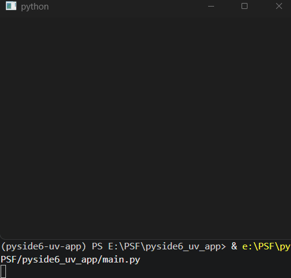

虽然事件过滤器和冒泡机制都有拦截，但互相不会影响，因此可以用事件过滤器的拦截功能拦截该控件后续的响应函数，同时调用`ignore`方法豁免父控件的响应函数：

```python
from PySide6.QtWidgets import (
    QApplication,
    QWidget,
    QMenu
)
from PySide6.QtCore import QObject, QEvent
from PySide6.QtGui import QContextMenuEvent


class MyWindow(QWidget):
    def contextMenuEvent(self, event: QContextMenuEvent):
        menu = QMenu(
            self
        )
        menu.addAction(
            'test 0'
        )
        menu.exec(
            event.globalPos()
        )


class MyEventFilter(QObject):
    def eventFilter(self, obj, event):
        if event.type() == QEvent.Type.ContextMenu:
            menu = QMenu(
                obj
                #self.parent()
            )
            menu.addAction(
                'test 1'
            )
            menu.exec(
                event.globalPos()
            )
            return False
        return False


class MyEventFilter2(QObject):
    def eventFilter(self, obj, event):
        if event.type() == QEvent.Type.ContextMenu:
            menu = QMenu(
                obj
                #self.parent()
            )
            menu.addAction(
                'test 2'
            )
            menu.exec(
                event.globalPos()
            )
            # 仅拦截该控件，不影响父控件
            event.ignore()
            return True
        return False

app = QApplication()
# 父窗口
parentWindow = QWidget()
parentWindow.resize(400, 300)
parentWindow.contextMenuEvent = print

window = MyWindow(
    parent=parentWindow,
    windowTitle='易森-PySide6',
)
window.resize(400, 300)
# 遵循堆栈的后入先出原则，后注册的先生效
window.installEventFilter(MyEventFilter(window))
window.installEventFilter(MyEventFilter2(window))


parentWindow.show()
app.exec()

```


经过上面的对比实验，可以得到如下表格中的结论：

|          | 事件过滤器中的拦截                             | 事件冒泡中的拦截                         |
| -------- | ---------------------------------------------- | ---------------------------------------- |
| 关键代码 | 返回`True`                                     | 调用`accept`方法                         |
| 作用范围 | 该控件及父控件中后续生效的响应函数             | 仅限父控件中的响应函数                   |
| 注意事项 | 可以拦截的同时放行冒泡，<br />二者不会互相影响 | 默认拦截，<br />通常使用`ignore`方法放行 |

### 3 手动触发事件：`sendEvent`方法是静态的同步方法，`postEvent`方法是静态的异步方法

之前介绍过事件的触发方法：

- 对应事件的响应函数。
- 控件的`event`方法。
- 程序类实例的`sendEvent`方法、`postEvent`方法。

这里需要**更正**一下，其实`sendEvent`方法、`postEvent`方法是`QCoreApplication`类的静态方法，前者为同步方法（阻塞当前线程，谨慎使用），后者为异步方法（不阻塞当前线程，推荐使用）。

因此，可以直接通过`QApplication`类来调用：

```python
from PySide6.QtWidgets import (
    QApplication,
    QWidget,
    QPushButton,
    QMenu
)
from PySide6.QtGui import QContextMenuEvent
from PySide6.QtCore import QPoint


class MyWindow(QWidget):
    def contextMenuEvent(self, event: QContextMenuEvent):
        menu = QMenu(
            self
        )
        menu.addAction(
            'test'
        )
        menu.exec(
            event.globalPos()
        )
        return super().contextMenuEvent(event)


app = QApplication()
window = MyWindow(
    windowTitle='易森-PySide6',
)
window.resize(400, 300)

button = QPushButton(
    'Event',
    window
)

button.clicked.connect(
    lambda: QApplication.postEvent(
        window,
        QContextMenuEvent(
            QContextMenuEvent.Reason.Other,
            button.mapToGlobal(
                QPoint(
                    0,
                    button.height()
                )
            ),
            button.mapToGlobal(
                QPoint(
                    0,
                    button.height()
                )
            )
        )
    )
)

window.show()
app.exec()

```

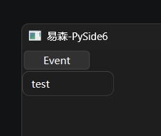

话说回来，之前已经介绍过`sendEvent`方法、`postEvent`方法，难道本章只是介绍一下这两个方法是静态方法，通过类名也能直接调用？

非也，本章说了`postEvent`方法是异步方法，上面的示例中也能多次重复使用，那就与之前介绍的结论相悖（示例来自《Qt For Python 札记》2025版第6章第2节）：

```python
from PySide6.QtWidgets import (
    QApplication,
    QWidget,
    QPushButton
)
from PySide6.QtCore import QEvent,Qt
from PySide6.QtGui import QMouseEvent

app = QApplication()
window = QWidget()
window.setWindowTitle('信号与事件')
window.resize(400,300)
button = QPushButton('click',window)
window.show()
button.mousePressEvent = lambda e:print('mouse is pressed')

window2 = QWidget()
window2.setWindowTitle('信号与事件-控制窗口')
window2.resize(400,300)
button2 = QPushButton('模拟事件',window2)

# 获取按钮中心位置的局部坐标，并映射为全局坐标
center = button.rect().center()
globalPos = button.mapToGlobal(center)
# 构建准确的鼠标按键事件
# 参考自 https://doc.qt.io/qtforpython-6/PySide6/QtGui/QMouseEvent.html#PySide6.QtGui.QMouseEvent.__init__
press_event = QMouseEvent(
    QEvent.Type.MouseButtonPress,
    center,
    globalPos,
    # 按下的鼠标按键
    Qt.MouseButton.LeftButton,
    # 无组合使用的鼠标按键
    Qt.MouseButton.NoButton,
    # 无组合使用的键盘按键
    Qt.KeyboardModifier.NoModifier
)
# 使用sendEvent方法发送事件给指定对象
# 也可以使用postEvent方法发送，postEvent方法是用后即销毁构建的事件，不能重复发送
button2.clicked.connect(lambda :app.sendEvent(button,press_event))
window2.show()

app.exec()
```

这里需要厘清其中原因：对于异步的`postEvent`方法，其`event`参数会在调用后销毁。因此，重复调用会报错是因为使用了全局对象，如果每次调用时构建一个对象，则不会有问题：

```python
from PySide6.QtWidgets import (
    QApplication,
    QWidget,
    QPushButton
)
from PySide6.QtCore import QEvent, Qt
from PySide6.QtGui import QMouseEvent

app = QApplication()
window = QWidget()
window.setWindowTitle('信号与事件')
window.resize(400, 300)
button = QPushButton('click', window)
window.show()
button.mousePressEvent = lambda e: print('mouse is pressed')

window2 = QWidget()
window2.setWindowTitle('信号与事件-控制窗口')
window2.resize(400, 300)
button2 = QPushButton('模拟事件', window2)

# 获取按钮中心位置的局部坐标，并映射为全局坐标
center = button.rect().center()
globalPos = button.mapToGlobal(center)

button2.clicked.connect(
    lambda: app.postEvent(
        button,
        QMouseEvent(
            QEvent.Type.MouseButtonPress,
            center,
            globalPos,
            # 按下的鼠标按键
            Qt.MouseButton.LeftButton,
            # 无组合使用的鼠标按键
            Qt.MouseButton.NoButton,
            # 无组合使用的键盘按键
            Qt.KeyboardModifier.NoModifier
        )
    )
)

window2.show()
app.exec()

```

（完）

## 271x期：xxx（更新中）

### 0 本期主要内容

《NiceGUI札记》的63章？

（编写本期主要内容和标题，同时作为内容规划）


（完）

## 271x期：xxx（更新中）

### 0 本期主要内容

（编写本期主要内容和标题，同时作为内容规划）


（完）

## 271x期：xxx（更新中）

### 0 本期主要内容

（编写本期主要内容和标题，同时作为内容规划）


（完）

## 271x期：xxx（更新中）

### 0 本期主要内容

（编写本期主要内容和标题，同时作为内容规划）


（完）

## 271x期：xxx（更新中）

### 0 本期主要内容

（编写本期主要内容和标题，同时作为内容规划）


（完）

## 271x期：xxx（更新中）

### 0 本期主要内容

（编写本期主要内容和标题，同时作为内容规划）


（完）

## x 标准工作流程

### x.1 选题

至少**提前一周**开始选题，在发表日所在周的**周一之前**确定选题。

选题存在两种情况：

- 主题明确。
- 主题不明确，内容分散。

原则上，每期尽量有明确的主题，每一章的内容应当尽量贴合主题。但是，实际选题时无法做到每期都有明确的主题，因此，主题不明确或者内容分散也可以。

如果主题明确，则当期的标题即为主题。若主题不明确，则标题选取分散内容中含金量较高或者热度较高的一章的标题或主题作为当期标题。

选好主题或者内容方向之后，要将大纲写成《本期主要内容》，直接作为当期的第0章。

### x.2 内容编写

基于当期第0章写详细内容。

如果主题明确的内容来自《札记》系列，则需要将对应内容先写到《札记》中，再复制到当期对应章节。

如果主题明确的内容不属于《札记》系列，则直接在当期编写，不创建副本。

如果主题不明确，则需要根据当期第0章进一步规划内容，可能需要补充选题，以确保当期内容数量、质量符合要求。

最后还要加上期读者问题的解答。

所有内容编写时禁止照搬AI生成内容，不能套用模板，避免内容高度重复或者原创度过低。

### x.3 校审

完成所有内容之后，还要检查内容中有没有错别字和代码错误，还需要规整代码风格、术语表达风格，代码中包含的水印（杂志名、作者名、框架名）也要做到统一。

如果内容数量、质量存在问题，要打回修改。