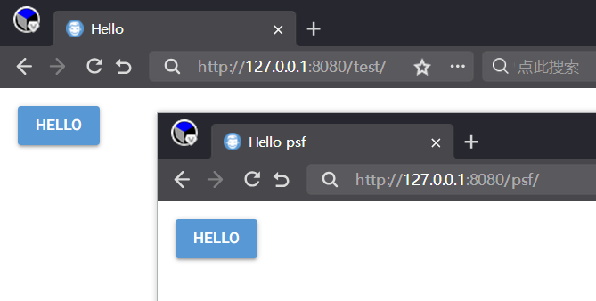
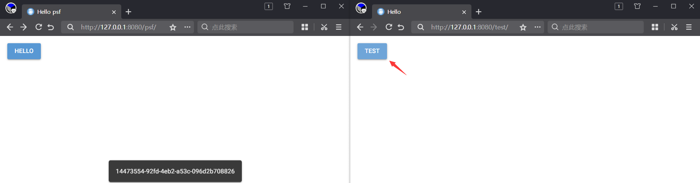
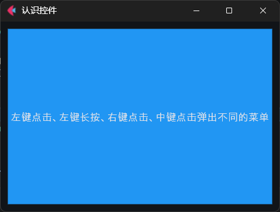
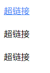
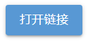
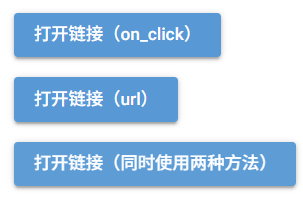

## 易森（2027）

学Python很容易，只需从现在开始坚持“种树”（学习），终能收获一片森林。

《易森》一般周更（可能每一周或者每两周，特殊情况加更或者停更），专注于提供与Python相关的文章（不限于基础知识，还有框架教程和实际问题的解决方案）。

封面图：


LOGO图：


## 2701期：起点

### 0 写在创刊号的特别章

做事大多有原因，《易森》的创立也不是无缘无故。

第一次见面，需要了解的事情有很多。

因此，在这个特别章节中，会解释一下和《易森》有关的概念、深意和缘由。

#### 0.1 《易森》（英文名《Easython》）的名字有何含义

从中文名字看，可以拆分为两部分易和森。从英文名字看，可以看作easy和Python的合体。其中，易表示做起来容易；森，表示森林。合起来理解就是：学习Python很容易，就和植树造林一样，从一点一滴开始积累。

因此，《易森》的目标就是：让学习Python变简单，日拱一卒，先种小树，终有一天汇聚成森林。正所谓，种树的最佳时间是十年前，其次就是现在。

#### 0.2 《易森》的内容形式、发展方向和创作动机

《易森》是一本随时创新的新式电子杂志，内容主题不固定，更新频率不固定（可能会快或者慢），力求让不同层次的Python学习者、使用者都能有所收获。

《易森》每一期除了固定的期号之外，还会简单概括一下本期的主题或者选取本期亮点章节的标题，让读者对每一期的内容有个大概的印象。

既然是随时创新，那《易森》在后续更新中就会根据读者的反馈，适当调整内容主题和内容形式，因此，内容主题、更新频率都不固定。

最后说一下《易森》的创作动机。其实，笔者是因为其他有明确主题的教程已经进入尾声，后续可以持续更新的内容有限。同时，为了方便笔者、读者开阔眼界，笔者才想到写一些主题不固定但可能有所得的内容，《易森》因此立项。

### 1 学习Python的起点——准备开发环境

完事开头难，但对于学习Python而言，这个却不太难。不像C语言一开始要装编译器而没有官方提供下载，不像Java语言下载时需要区分运行环境（JRE）和开发工具（JDK），Python语言作为一门脚本语言，只需下载、安装Python解释器，即可运行后续所需的一切，可以说简化了不少步骤。

因此，安装Python解释器就是几乎所有初学者、开发者必须经历的第一步。一般而言，推荐使用官方提供的安装程序（Windows系统），从 https://www.python.org/downloads/ 进入官方下载地址，选择当前正式支持（处于bugfix阶段）的第二新的版本，单击`Windows installer (64-bit)`下载即可。

这里解释一下为何要下载第二新而不是最新版本。Python版本更新较快，新版本往往包含较多新功能。而很多Python库在开发时主动限制了适用的Python版本，直接使用最新版本的话，可能导致部分库无法安装。而第二新的Python版本发布了较长时间之后，官方还在提供安装程序，大部分Python库都已经跟进，可以正常安装。因此，出于兼容性的考虑，建议安装第二新的Python版本。当然，有的库维护比较积极，最新版本发布一段时间之后也会跟进。如果不使用那些不支持最新Python版本的库，直接安装最新版本也没问题。

对于Linux系统，则需要使用对应发行版提供的包，各个版本的命令均不同，这里不再赘述。

官方提供的安装方法固然方便，但当系统不支持运行安装程序，或者需要一个绿色的Python版本，官方的嵌入式绿色包又有兼容性问题的话，就可以试试下面讲到的绿色版Python。

WinPython（https://winpython.github.io/）是专为Windows系统提供的绿色发行版，可在 https://github.com/winpython/winpython/releases 下载到特定版本的绿色包，提供的是解压文件（exe后缀的是自解压程序，不是安装程序），可以解压到指定位置，设置环境变量之后即可全局使用。也可以不设置环境变量，直接在开发工具中指定。该绿色发行版的特点是包含一系列常用的库，当使用者不太会解决库的安装问题时，可以做到开箱即用。

不同于WinPython只提供Windows系统的发行版，Python Standalone Builds（ https://github.com/astral-sh/python-build-standalone/releases ）提供了各个版本、各个系统的Python发行版，包括官方都不提供安装程序、只提供源码的版本。如果使用者需要针对旧版本项目做维护，或者针对不同Python版本测试代码兼容性，该发行版无疑是最好的选择。当然，该版本因为都是绿色版本，使用时需要使用者设置环境变量或者调试开发工具，需要一定的基础，但相关问题不太难，很好解决。

安装好Python解释器，就是要准备开发工具（IDE）。就目前而言，虽然AI加持的开发工具眼花缭乱，但笔者依然首推VScode（https://code.visualstudio.com/）、PyCharm（https://www.jetbrains.com/pycharm/）。前者虽然需要安装扩展之后才能有较好的开发体验，但性能较好，并且扩展性强；后者则提供了Python开箱即用的开发体验，只不过内存占用较高，读者可以按需选择。除此以外，Python官方版本自带的IDLE也能满足一些简单的开发需求，更加轻量。如果读者只是简单学习Python基础，IDLE也不错。

最后简单说一下虚拟环境。一般而言，开发Python程序应当创建独立的虚拟环境（推荐使用`uv`命令，操作简单，使用`pip install uv`安装后即可使用）。但是，有人觉得虚拟环境占用额外空间，操作还有点麻烦，不如直接使用全局环境简单。此言差矣，虚拟环境可以实现不同开发场景的隔离，避免不同版本的库存在兼容冲突时，破坏其他开发场景的版本限制。假如A程序需要用到a库的1.0.1版本，而B程序（或者依赖a库的b库）需要用到a库的2.0.0版本，而a库2.0.0版本存在不兼容旧版本的更新，那两个程序运行时，势必有一个程序的a库存在问题。因此，如果是实际开发，请使用虚拟环境。

### 2 参考资料的起点——选择适合自己的资料

现在AI发展已经很成熟，很多人习惯于用AI寻找答案，代替传统的搜索引擎，操作更便捷。但是在本章，笔者依然会强调一些不太“古法”资料的重要性。

AI的资料来源自网络，可以看作是一个智能的搜索引擎。用起来比搜索引擎更自由、智能，不用费心构造关键字、翻找随时失效的网页，只需和AI聊天，就能一步步定位到所需的资料。

不过，问题和搜索引擎一样明显。资料来自网络，同样存在时效问题。因此，有些AI回答可能会过时，尤其是部分资料尚未被搜索引擎爬取的时候。

AI的另一个问题就是幻觉或者叫编瞎话。很多时候，问题的答案没有公开或者没有，需要等待技术人员给出解决方案或者其他人主动公开。此时，AI会煞有介事地给出一个可能的回答，这个答案需要使用者验证并反馈结果。另外，如果AI使用的资料本身存在错误的话，AI就会给出错误的答案，浪费使用者的时间。

因此，可靠的信息来源尤为重要。官方文档（ https://docs.python.org/zh-cn/3/ ）由官方出品，对于需要寻求准确资料的读者来说，无疑是最佳选择。

其次就是正式出版的电子书。书籍虽然看上去有点枯燥，但作者一般都是有较高水平的从业人员，文字表达相对严谨，且花费了较多时间打磨、校对，而且内容编排也更有趣，更适合需要沉下心学习的读者。

可能有的读者就是不喜欢看枯燥的文字，喜欢视频教程的形式，也不是不可以，不过笔者就不太推荐了。初学时可能此方法能让读者快速入门，但记忆不够深刻，而且很多陌生的问题依赖于使用者的主动学习能力，不一定有人出视频教程。另外，相比于视频教程，文字教程或者文字资料更适合搜索，能一眼找到相关文字，查找更快更方便。因此，可能读者是通过视频教程入门、精通，但依然推荐读者多看文字类资料，以适应之后工作中独自查找文档、资料的方式，避免一看枯燥的文字就犯困或者产生厌烦情绪。

### 3 学习的起点——学习方法

虽然学习编程语言离不开电脑，很多资料都可以电脑上看，但笔者依然推荐处于基础学习阶段的读者多做**手写笔记**、多实操代码。

实操代码这个不用多说，不亲自尝试看到结果，没有尝过甜头，学习编程只会变成枯燥的重复。但是，手写笔记这种“古典”的学习方法，为何也要坚持？

首先，笔记就是对学习结果的检验。如果读者没有理解学习的内容，笔记只会出现视频、书籍、文档中提到的要点，没有自己理解的东西，写不出用自己的话重复的内容。一旦读者可以用自己的话解释一遍学习的内容，那就证明读者学会了，记忆就会更加深刻。

其次，手写代表图形，而不是简单敲击键盘的重复工作。使用输入法输入文字，人会因为输入习惯而变得麻木，记忆没那么深刻。而手写文字、思维导图，就有点像绘画，图形先在大脑中形成一遍，再经由手变成纸上的文字、图形，通过多个感官重复感受，记忆更立体深刻。

最后，虽然计算机、AI的发展已经做到动口不动手，但笔者依然希望读者不要丧失手写能力，让手部肌肉不要沦为键盘鼠标的奴隶。避免写字变得陌生，也避免鼠标手、腱鞘炎，还能稍微放松一下眼睛，适当在纸上写写字也挺好的。

接下来说一下学习Python的内容路线。

Python是一门语法简单的编程语言，但语法简单不代表不需要基础就可以直接上手，相关的基础和概念依然要熟悉。

因此，计算机基础、编程思维就是在学习Python基础的过程中，需要不断补充、学习的。如果读者不太理解什么函数的设计、逻辑判断，可以暂时放下Python，了解一下计算机基础、编程思维，或者玩一玩流水线游戏，甚至可以回顾一下数理化学科，感受一下相关基础对应的抽象概念，形成自己对编程、计算机的理解。不一定准确，但要有。这样才有助于培养兴趣，以免一时的挫折影响接下来的学习。

之后就是建议先看看Python的基础语法、关键字、数据类型、逻辑判断、函数、类等相关概念，可以直接上手，也可以先有个系统性的了解，再回过头尝试相关代码。张弛有度，难的内容不要急于求成，简单的内容也不要一笔带过，要**温故而知新**、常用常新。

可能有的读者就会不屑一顾，别人的视频、书籍都是有由简到繁的线性过程，怎么到笔者这里就成了不要急于求成、基础要多看？

这就是编程的复杂性。很多时候，基础概念不是独立的，一个简单的程序也会包含较多基础甚至复杂的概念，更别说不同概念直接还会互相引用，甚至不同的组合还会产生奇妙的反应，导致难以解释的问题。因此，有些内容在学习的时候，可能会涉及到后面才会介绍的内容，或者与前面内容组合之后产生的新问题。这时候，就需要读者有个系统性思维，就是有些概念之间会交织起来，像网一样。想要掌握一个概念，往往需要同时掌握多个概念，才能更好理解每个概念。这就是温故而知新、常用常新的原因。更何况每次Python版本更新，都有不少基础内容的变动，更要求使用者了解相关变动，改变之前的编程习惯，以免因为新语法的出现而不适应。比如，新增的`match`关键字，实现了更优雅的逻辑判断，就需要在日常使用中下意识替换之前的 if-else 判断，才能慢慢习惯，并发现各种潜在的问题。而不是突然看到代码中出现`match`关键字，才开始找资料，才发现这是几个版本之前已经有的东西，贸然在项目中使用，因为对语法了解不够透彻而产生新的问题。

（完）

## 2702期：重温Python基础

不管学什么编程语言，基础总是最先开始接触，也是容易被人忽略的。看似简单的基础内容，实际上也有可能忽略的重点。本期将简单介绍一些Python中可能被忽略、被用错的基础知识。

### 1 Python的关键字

关键字相关文档：https://docs.python.org/zh-cn/3/reference/lexical_analysis.html#keywords

软关键字相关文档：https://docs.python.org/zh-cn/3/reference/lexical_analysis.html#soft-keywords

Python的关键字不多，而且语法上比较接近关键字语义，学起来不太难：

```python3
False      await      else       import     pass
None       break      except     in         raise
True       class      finally    is         return
and        continue   for        lambda     try
as         def        from       nonlocal   while
assert     del        global     not        with
async      elif       if         or         yield
```

上面这些就是Python的关键字，定义变量名时不能使用这些关键字。

除了上面提到的关键字，`match`、`case`、`_`用在 match 语句中，`type`用在 type 语句中，虽然也是关键字，但属于软关键字。即这些关键字能用作变量名，并且对应关键字依然可以生效：

```python3
match = 1
print(match)

match match:
    case 1:
        print(match+1)
```

虽然`match`被当作变量使用，但没有语法错误，且 match 语句正常生效。

### 2 Python的表达式与语句

表达式相关文档：https://docs.python.org/zh-cn/3/reference/expressions.html

简单语句相关文档：https://docs.python.org/zh-cn/3/reference/simple_stmts.html

符合语句相关文档：https://docs.python.org/zh-cn/3/reference/compound_stmts.html

在Python中，有两个非常重要的概念：表达式与语句。可以说，这两个就是划分程序的最小单元。

一句话区分，表达式的结果可以赋值给变量，语句的结果不能赋值给变量。语句通常包含表达式、语句，是更加复杂的结构。但部分表达式也会包含表达式、语句，复杂度不逊于语句。

那么，这里为什么要区分一下这两个基础概念呢？因为，接下来要讲的表达式、语句才是重头戏，为了明确含义，需要先理解基础概念。

赋值表达式，也就是使用海象运算符`:=`的表达式，实现了赋值的同时还可以作为变量使用：

```python3
if (a := len(globals())) > 2:
    print(a)

```

无需预先定义变量`a`，赋值表达式可在使用该变量的同时定义该变量。

对于Python而言，没有类似C语言的三元运算符，让部分有C语言基础的读者不太习惯。好在Python有条件表达式，可以实现同样的效果。

在C语言中，三元运算符的表达式为：

```c
变量 = {条件}?{条件为真时的值}:{条件为假时的值}
```

在Python中，对应的表达式为：

```python3
变量 = {条件为真时的值} if {条件} else {条件为假时的值}
```

实际代码为（最好给表达式加括号，避免歧义）：

```python3
a = ( 1 if False else 0)
print(a)
```

lambda 表达式是简化的函数，对于匿名函数或者简单的函数，该表达式可以更快定义：

```python3
变量 = lambda {参数}:{表达式}
```

lambda 表达式的基本用法这里不赘述，但对于遍历的同时使用lambda 表达式，这里有一个需要注意的坑。

先看代码：

```python3
a = []
for i in range(9):
    a.append(
        lambda:print(i)
    )

a[3]()
```

代码中想要通过 for 语句批量创建 lambda 表达式，但实际执行时，结果输出的不是`2`，而是`8`。

和函数一样，lambda 表达式也具有延迟绑定的特性（即函数定义时不要求使用的变量已经赋值，而是在调用时才获取使用变量的值）。因此，上面的示例才会输出错误的结果。想要避免该问题，就要在创建 lambda 表达式时使用参数默认值的形式，即时绑定对应的值，表达式内部使用绑定了默认值的参数而不是未绑定的变量：

```python3
a = []
for i in range(9):
    a.append(
        lambda i=i:print(i)
    )

a[3]()
```

上面使用了 for 语句给指定列表创建有规律的元素，实际上， for 语句可以改成类似的列表推导式，这样就得到一个表达式列表（使用列表推导式创建的列表）：

```python3
a = [
    lambda i=i:print(i) 
    for i in range(9)
]
a[3]()
```

列表推导式分为两部分（对应上面代码的第2行、第3行）：元素的表达式，遍历语句。推导式的展开表达就是前一个示例，使用列表推导式可以简化有规律列表的创建，但会使代码变得复杂晦涩，建议不要轻易用在复杂的列表上。

关于 for 语句，其同样支持 if 语句支持的 else 子句，不过，只有正常、完整执行了循环（使用`continue`也算）之后才会执行 else 子句，即使用`break`、`raise`等异常结束时不执行：

```python3
for i in range(9):
    if i == 5:
        break
else:
    print('else')
```

同为循环的 while 语句的 else 子句也是一样的结果：

```python3
a = 100000
while a:
    a-=1
    if a == 9999:
        break
else:
    print('else')
```

C语言支持 switch 语句，适用于判断同一变量的不同值，用于对应不同的分支。Python语言在很长一段时间中，对于同样的情况，只能使用 if 语句代替。好在3.10版本引入了 match 语句，解决了这一痛点：

```python3
for i in range(9):
    match i:
        case 2:
            print('二')
        case 4:
            print('four')
        case _:
            continue
```

（完）

## 2703期：NiceGUI札记——详解多页面模式

### 0 《易森》新增系列内容

从本期开始，《NiceGUI札记》、《Flet札记》、《PySide6札记》（原《Qt For Python 札记》）的2027版内容将改为在《易森》上更新，原教程对应合集停更。

如果读者有相关问题或者比较期待某一框架的内容，可以在当期文章下留言，最快下期更新相关内容。

### 1 NiceGUI：详解多页面模式

《NiceGUI札记》的教程几乎都是用单页面模式、窗口模式作为示例，而很多读者实际开发中，可能会用多页面模式作为程序的主要运行模式。因此，作为登陆新合集的第一章，就先来回顾一下多页面模式，学习一下多页面模式中相关的功能。

相关文档：https://nicegui.io/documentation/page

#### 1.1 `ui.page`类

说到多页面模式，就离不开`ui.page`类：

```python3
from nicegui import ui

@ui.page(
    path='/',
)
def index():
    ui.button('Hello')

ui.run()
```

如上面示例所展示的，表示页面对应路径的`path`参数不可缺失，这个一般都比较熟悉。但是，除了这个参数，`ui.page`类还支持一些关键字参数，如果读者有特定需求，则需要用到这些参数。

`ui.page`类支持以下参数：

- `path`参数，字符串类型，表示页面对应的路径。路径支持URL参数（路径参数、查询参数）注入，具体用法可以参考前面的第30章，这里不做展开。

- `title`参数，字符串类型，表示页面对应的标题（会显示为浏览器窗口、标签页的标题）。

  从该参数开始，只能通过关键字传入。

- `viewport`参数，字符串类型，表示网页的VIewport属性。

- `favicon`参数，字符串类型或者`Path`类型，表示页面在标题栏的图标。

- `dark`参数，布尔类型，表示页面是否默认启用暗黑模式。使用`None`的话，表示跟随系统。

- `language`参数，字符串类型，表示页面的语言。注意，该参数只会影响框架内提供多语言内容的部分，对于非框架自带的内容，则需要通过其他方法实现多语言功能，无法通过此参数切换语言。

- `response_timeout`参数，浮点类型，表示页面的响应超时，默认为`3.0`。

- `reconnect_timeout`参数，浮点类型，表示页面的重新连接超时。

- `markdown`参数，布尔类型，表示是否为AI工具提供页面的Markdown格式版本，以减少AI工具获取页面时的Token消耗。

- `api_router`参数，`APIRouter`类型，表示页面所属的子路由。

- `**kwargs`参数，其余不与上述关键字参数同名的其他关键字参数将会传给`APIRouter`类。

关于`api_router`参数的示例如下：

```python3
from nicegui import ui,APIRouter,app

router = APIRouter(prefix='/psf')

@ui.page(
    path='/',
    title='Hello',
    api_router=router
)
def index():
    ui.button('Hello')

app.include_router(router)

ui.run()
```

此时，想要访问该页面，就要改为`http://{host}:{port}/psf/`。关于子路由的详细介绍，请看本章的下一节。

#### 1.2 `APIRouter`类

上一节中，`api_router`参数表示页面所属的子路由。这就引出了本节要介绍的子路由和`APIRouter`类。

子路由和单页面应用类似，但每个路径对应的页面是独立的，没有页面的公共部分。

而上一节的示例可以改为以下相同结果的示例：

```python3
from nicegui import ui,APIRouter,app

router = APIRouter(prefix='/psf')

@router.page(
    path='/',
    title='Hello',
)
def index():
    ui.button('Hello')

app.include_router(router)

ui.run()
```

注意，`app.include_router`方法用于注册子路由，可以注册多个，但必须在子路由的页面添加完成后注册，不能提前注册。

使用子路由之后，如果一个网站包含多个架构类似的子网站，无需单独记录每个页面对应的完整路径（不含主机、端口号的部分），只需添加对应子路由即可。即使页面的路径一样，完整路径也会因为子路由的存在而不同，不会冲突：

```python3
from nicegui import ui,APIRouter,app

router1 = APIRouter(prefix='/test')
router2 = APIRouter(prefix='/psf')

@router1.page(
    path='/',
    title='Hello',
)
def _():
    ui.button('Hello')

@router2.page(
    path='/',
    title='Hello psf',
)
def _():
    ui.button('Hello')

app.include_router(router1)
app.include_router(router2)

ui.run()
```



`APIRouter`类支持以下关键字参数（部分，其余参数可参考 https://fastapi.tiangolo.com/reference/apirouter/ ）：

- `prefix`参数，字符串类型，表示子路由路径（或者叫页面路径的前缀）。

`APIRouter`类支持以下方法（部分，其余方法可参考 https://fastapi.tiangolo.com/reference/apirouter/ ）：

- `page`方法，用法、参数和`ui.page`类相同。

#### 1.3 `app.clients`方法

之前的版本速览说过，给`app.clients`方法传入`None`（默认值）时，可以获取所有客户端链接，可用于广播、消息发送、信息收集等。

其实，`app.clients`方法还可以传入完整路径（不含主机、端口号的部分），获取所有连接指定完整路径的客户端链接：

```python3
from nicegui import ui,APIRouter,app

router1 = APIRouter(prefix='/test')
router2 = APIRouter(prefix='/psf')

@router1.page(
    path='/',
    title='Hello',
)
def _():
    def test():
        for client in app.clients('/psf/'):
            with client:
                ui.notify(client.id)
    ui.button('test',on_click=test)

@router2.page(
    path='/',
    title='Hello psf',
)
def _():
    ui.button('Hello')

app.include_router(router1)
app.include_router(router2)

ui.run()
```



因此，点击右边窗口中的按钮，所有路径与左边窗口相同的客户端，都会执行指定操作。

（完）

## 2704期：菜单

### 0 本期主要内容

NiceGUI、PySide6、Flet三个GUI框架都有菜单控件，本期主要介绍NiceGUI的菜单，同时简单介绍其他两个框架的菜单。

### 1 NiceGUI的菜单

相关文档：https://nicegui.io/documentation/menu 和 https://nicegui.io/documentation/context_menu

NiceGUI提供了两种菜单，分别是左键点击弹出的一般菜单（`ui.menu`控件）和右键点击弹出上下文菜单（`ui.context_menu`控件）。它们的用法几乎一样，都是将其添加至需要弹出菜单的控件上下文：

```python3
from nicegui import ui
  
def index():
    with ui.button(icon='menu'):
        with ui.menu() as menu:
            ui.menu_item('auto close')
            ui.menu_item(
                'no auto close',
                auto_close=False
            )
            ui.separator()
            ui.menu_item(
                'manual close',
                auto_close=False,
                on_click=menu.close
            )
        with ui.context_menu() as context_menu:
            ui.menu_item('auto close')
            ui.menu_item(
                'no auto close',
                auto_close=False
            )
            ui.separator()
            ui.menu_item(
                'manual close',
                auto_close=False,
                on_click=context_menu.close
            )
  
ui.run(
    root=index,
    native=True
)
```

一般使用`ui.menu_item`控件作为菜单项，但并不限制菜单项的控件类型，因此，可以使用其他控件：

```python3
from nicegui import ui
  
def index():
    with ui.button(icon='menu'):
        with ui.menu():
            with ui.column():
                ui.switch('switch')
                ui.toggle(
                    ['a', 'b', 'c'],
                    value='a'
                )
  
ui.run(
    root=index,
    native=True
)
```


`ui.menu`控件支持以下方法：

- `open`方法，弹出菜单。
- `close`方法，隐藏菜单。
- `toggle`方法，切换菜单的弹出状态。

`ui.context_menu`控件支持以下方法：

- `open`方法，弹出菜单。
- `close`方法，隐藏菜单。

`ui.menu_item`控件支持以下参数：

- `text`参数，字符串类型，表示菜单项的文本。

- `on_click`参数，可调用类型，表示点击菜单项之后执行的操作。

  从该参数开始，只能通过关键字传入。

- `auto_close`参数，布尔类型，表示点击菜单项之后是否自动隐藏菜单。

NiceGUI的菜单可以简单理解为点击左键、右键使其弹出的容器，将其放在哪个控件的上下文，哪个控件就可以弹出菜单。

### 2 PySide6的菜单

相关文档：https://doc.qt.io/qtforpython-6/PySide6/QtWidgets/QMenu.html

和NiceGUI的菜单类似，在PySide6中，不管怎么触发（弹出），创建菜单就是创建一个`QMenu`菜单控件，然后调用其方法添加菜单项（具体用法参考《Qt For Python 札记》第40章），最后将其添加、绑定到控件。

但与NiceGUI的菜单不同，除了部分控件默认提供了弹出方式，无需手动绑定相关操作，大部分控件添加了菜单之后，需要额外设置触发（弹出）的方式。

比如，通过信号给任意控件（`QWidget`控件）设置上下文菜单前，需要先设置控件的上下文菜单策略为自定义上下文菜单，然后将自定义上下文菜单的触发信号与菜单的弹出方法（`exec`方法、`open`方法均可）绑定：

```python3
from PySide6.QtWidgets import (
    QApplication,
    QWidget,
    QMenu
)
from PySide6.QtCore import Qt

app = QApplication()
window = QWidget()
window.setWindowTitle('认识菜单控件')
window.resize(400, 300)

menu = QMenu(
    window
)
menu.addAction(
    'test'
)

window.setContextMenuPolicy(
    Qt.ContextMenuPolicy.CustomContextMenu
)
window.customContextMenuRequested.connect(
    lambda e:menu.exec(
        window.mapToGlobal(e)
    )
)


window.show()
app.exec()
```

通过事件给任意控件设置上下文菜单，也是类似的操作：

```python3
from PySide6.QtWidgets import (
    QApplication,
    QWidget,
    QMenu
)

app = QApplication()
window = QWidget()
window.setWindowTitle('认识菜单控件')
window.resize(400, 300)

menu = QMenu(
    window
)
menu.addAction(
    'test'
)

window.contextMenuEvent = lambda e:menu.exec(
    e.globalPos()
)


window.show()
app.exec()
```

若是想自由地在鼠标位置弹出菜单，还需要单独定义菜单弹出函数，在需要弹出菜单时调用函数。示例为按下任意键都会在鼠标位置弹出菜单：

```python3
from PySide6.QtWidgets import (
    QApplication,
    QWidget,
    QMenu
)
from PySide6.QtGui import QCursor

app = QApplication()
window = QWidget()
window.setWindowTitle('认识菜单控件')
window.resize(400, 300)

menu = QMenu(
    window
)
menu.addAction(
    'test'
)
def open_menu(e):
    pos = QCursor.pos()
    menu.exec(pos)

window.keyPressEvent = open_menu

window.show()
app.exec()
```

总的来说，Qt作为传统且稳定的商业项目，框架机制成熟，很多设计看似比NiceGUI繁琐，但总体契合Qt的设计理念，用起来也符合逻辑。

### 3 Flet的菜单

相关文档：https://flet.dev/docs/controls/contextmenu/ 和 https://flet.dev/docs/controls/popupmenubutton/#flet.PopupMenuItem-properties

相比之下，Flet的菜单用法就有点费解了。详细用法可参考《Flet札记》第40章，本节不做重复的详细介绍。

先说菜单的绑定关系，NiceGUI和PySide6中，都是将菜单添加到弹出菜单的控件上，从父子关系上看，控件是父，菜单是子。但在Flet中，弹出菜单的控件，是菜单的子控件（图片来自《Flet札记》第40章）：


`flet.GestureDetector`控件负责弹出菜单，但其为菜单的子控件。因此，想要理解Flet的菜单，就不能沿用绑定的概念，而是理解为菜单主动监听子控件的事件，根据事件的发生来弹出菜单。

再说菜单的内容。其他两种控件，每个菜单的内容都是固定的，即一个菜单控件对应一组菜单项。而Flet的菜单控件，包含多组菜单项，对应不同的弹出方式。弹出方式对应的参数如下：

- `open`方法，对应`items`参数。
- 鼠标左键，对应`primary_items`参数。
- 鼠标右键，对应`secondary_items`参数。
- 鼠标中键，对应`tertiary_items`参数。

完整示例代码如下：

```python3
import flet


def main(page: flet.Page):
    page.window.width = 400
    page.window.height = 300
    page.window.alignment = flet.Alignment(0, 0)
    page.title = '认识控件'

    async def open_menu(e:flet.TapEvent[flet.GestureDetector]):
        await menu.open(
            local_position=e.local_position,
            global_position=e.global_position,
        )

    menu = flet.ContextMenu(
        content=flet.GestureDetector(
            content=flet.Container(
                content=flet.Text(
                    value='左键点击、左键长按、右键点击、中键点击弹出不同的菜单'
                ),
                expand=True,
                bgcolor=flet.Colors.BLUE,
                alignment=flet.Alignment.CENTER
            ),
            on_tap=open_menu,
            expand=True,
        ),
        expand=True,
        items=[
            flet.PopupMenuItem(
                content='items'
            )
        ],
        primary_items=[
            flet.PopupMenuItem(
                content='primary_items'
            )
        ],
        primary_trigger=flet.ContextMenuTrigger.LONG_PRESS,
        secondary_items=[
            flet.PopupMenuItem(
                content='secondary_items'
            )
        ],
        tertiary_items=[
            flet.PopupMenuItem(
                content='tertiary_items'
            )
        ]
    )
    page.add(
        menu
    )


flet.run(main)
```



总的来说，虽然Flet的菜单结构不好理解，但其一个菜单控件支持多组菜单项，这个倒是其他框架不具备的特点。

（完）

## 2705期：打开链接

### 0 本期主要内容

本期将探究NiceGUI、PySide6、Flet三个GUI框架中如何创建可以直接点击的超链接，以及其他打开（跳转）链接的方法。

### 1 NiceGUI中如何打开链接

在网页中，点击超链接，跳转到对应网页，是再简单不过的操作。对于NiceGUI这样的WebUI框架来说，实现相同的超链接也很简单，`ui.link`控件就是超链接，甚至还可以使用`ui.html`控件、`ui.element`控件这样的万能控件实现：

```python3
from nicegui import ui

  
def index():
    url = 'https://nicegui.io'
    ui.link(
        '超链接',
        url
    )
    ui.html(
        '超链接',
        tag='a',
        sanitize=False
    ).props(f'href={url}')
    with ui.element(
        'a'
    ).props(f'href={url}'):
        ui.label('超链接')
  
ui.run(
    root=index,
    title='易森-NiceGUI',
    native=True
)
```



如果不使用超链接的话，则可以使用`ui.navigate.to`方法打开链接。绑定到响应函数，或是在特定条件下执行，让打开链接这个操作不再局限于点击超链接，任意控件或者任何情况都可以：

```python3
from nicegui import ui

  
def index():
    url = 'https://nicegui.io'
    ui.button(
        '打开链接',
        on_click=lambda:ui.navigate.to(
            url
        )
    )
    # 3秒之后自动在新标签页打开链接
    ui.timer(
        3,
        lambda:ui.navigate.to(
            url,
            new_tab=True
        ),
        once=True
    )
  
ui.run(
    root=index,
    title='易森-NiceGUI',
    native=True
)
```



### 2 PySide6中如何打开链接

本章参考文档：https://doc.qt.io/qtforpython-6/PySide6/QtGui/QDesktopServices.html

在PySide6中，创建超链接的方法多种多样，不过核心点都是使用HTML中的超链接，但有的控件可以使用Markdown语法：

```python3
from PySide6.QtWidgets import (
    QApplication,
    QWidget,
    QLabel,
    QTextBrowser
)

app = QApplication()
window = QWidget()
window.setWindowTitle('易森-PySide6')
window.resize(400, 300)

url='https://doc.qt.io/qtforpython-6/index.html'
label =QLabel(
    window,
    text=f'<a href={url}>超链接</a>',
    openExternalLinks=True
)
browser = QTextBrowser(
    window,
    #text=f'<a href={url}>超链接(HTML)</a>',
    markdown=f'[超链接(Markdown)]({url})',
    openExternalLinks=True
)
browser.move(
    0,30
)

window.show()
app.exec()
```


都是《PySide6札记》（原《Qt For Python 札记》）2026版介绍过的控件，具体用法这里不再赘述，示例中可以清晰看到。不过，如果想要实现不点击超链接来打开链接，就要使用类似NiceGUI的`ui.navigate.to`方法才行。

在PySide6中，`QDesktopServices.openUrl`方法（静态方法）可以随时随地打开指定链接：

```python3
from PySide6.QtWidgets import (
    QApplication,
    QWidget,
    QPushButton
)
from PySide6.QtGui import QDesktopServices

app = QApplication()
window = QWidget()
window.setWindowTitle('易森-PySide6')
window.resize(400, 300)

url='https://doc.qt.io/qtforpython-6/index.html'
button = QPushButton(
    window,
    text='点击打开超链接'
)
button.clicked.connect(
    lambda :QDesktopServices.openUrl(
        url
    )
)


window.show()
app.exec()
```


### 3 Flet中如何打开链接

本章参考文档：

- https://flet.dev/docs/controls/text/#flet.Text.spans
- https://flet.dev/docs/controls/button#flet.Button.url
- https://flet.dev/docs/services/urllauncher

Flet虽然也支持WebUI模式（网页模式），但其控件都是绘制出来的图形，不是传统意义上的HTML元素。因此，Flet中并没有直接对标NiceGUI的超链接控件。不过，`Text`控件的`spans`参数可以让部分文字支持超链接的功能，`Button`控件的`url`参数也能让按钮平替超链接：

```python3
import flet


def main(page: flet.Page):
    page.window.width = 400
    page.window.height = 300
    page.window.alignment = flet.Alignment(0, 0)
    page.title = '易森-Flet'
    
    url = 'https://flet.dev/docs/'
    page.add(
        flet.Text(
            spans=[
            	flet.TextSpan(
                	text='超链接',
                	url=url,
            	)
        	]
        ),
        flet.Button(
            content='超链接按钮',
            url=url
        ),
    )


flet.run(
    main,
)
```


如果不使用超链接的平替，在Flet中，使用`UrlLauncher`服务提供的`launch_url`方法可以打开任意链接（后面再详细介绍服务，这里简单理解为类似PySide6的`QDesktopServices.openUrl`方法）。

以按钮为例，不使用`url`参数，看看如何实现点击按钮、打开链接：

```python3
import flet


def main(page: flet.Page):
    page.window.width = 400
    page.window.height = 300
    page.window.alignment = flet.Alignment(0, 0)
    page.title = '易森-Flet'
    # 创建并注册服务
    launcher = flet.UrlLauncher()
    page.services.append(launcher)
    # 将url通过控件的data参数传给响应函数
    async def open_url(e):
        await launcher.launch_url(
            e.control.data['url'],
        )

    url = 'https://flet.dev/docs/'
    page.add(
        flet.Button(
            content='点击访问链接（on_click）',
            on_click=open_url,
            data={'url':url}
        ),
        # 下面为对比效果的按钮
        flet.Button(
            content='点击访问链接（url）',
            url=url
        ),
        flet.Button(
            content='点击访问链接（同时使用两种方法）',
            on_click=open_url,
            data={'url':url},
            url=url
        )
    )


flet.run(
    main,
)
```


（完）

## 2705期+：尝鲜（首期免费）

### 0 增刊的更新说明及本期主要内容

从本期开始，《易森》将不定期发行增刊，作为粉丝的福利。因为本期是首期增刊，特免费提供，顺便介绍一下增刊的特点：

- 命名。增刊没有单独的期号，与同一周发布的正刊期号相同，但是在末尾额外添加了加号，用于区分。
- 更新频率。增刊没有固定的更新频率，仅在某一周内容较多或者存在高难度内容时更新。
- 收费。增刊每期单独收费（首期除外），价格为千字1豆，不足1千字的按1千字计算，1千字以上的每满1千字才算1千字。
- 内容。正如更新频率的部分中所介绍，增刊一般是超过正刊篇幅的额外内容，或是笔者灵感迸发之后的奇思妙想，或是殚精竭虑之后才解答的绝世难题。
- 公平。增刊只是笔者想为支持笔者的粉丝提供福利，并不是为了创造焦虑。因此，增刊的内容会在后续正刊的更新中免费提供，支持笔者的粉丝解锁增刊，只是获得了提前几周学习的机会，并不会解锁其他读者接触不到的独特内容。如果读者手头拮据或者不认可笔者的文笔，只需耐心等待几周，即可**免费**阅读。

本期主要补充了2705期NiceGUI社区一个关于点击按钮跳转链接的问题，因为篇幅较多且与打开链接相关，故独立为增刊。

### 1 NiceGUI：开发实战——先导篇

《NiceGUI札记》（2026版）前面的章节不止一次介绍过实际开发中遇到的问题如何解决，也在介绍具体控件时提供了相关用法的示例。但是，实际开发时，遇到的问题千千万，只是几千字的教程远不能覆盖。因此，笔者才在本教程中多次更新具体问题的解决思路和示例代码。

然而，随着教程（指的是《NiceGUI札记》）2026版的完成，2027版的持续更新，笔者发现一个令人头疼的问题：标题中只是体现问题，并没体现具体控件名、类名、方法名；知道具体问题如何准确描述倒还好找对应文章，要是只知道控件名、类名、方法名、模块（NiceGUI的模块以及所依赖的库、模块，下同）名，只搜关键字的话，很容易跑偏，文章中使用的控件、类、方法、模块不是眼下使用的。

于是，笔者思索再三，决定给原有标题添加相关的件名、类名、方法名，并将其归为系列——《开发实战》。章节的命名格式不像其他系列一样破破折号前是系列名，而是采用`{控件名、类名、方法名、模块名}——{问题描述、运行结果}`的格式，不包含系列名。

本章为先导内容，不介绍具体控件、类、方法、模块。从下一章开始，不定期介绍具体控件、类、方法、模块实际开发时遇到的问题、使用技巧、具体示例。

### 2 NiceGUI：`ui.button`控件——简化跳转链接的代码

#### 2.1 背景

Flet的`Button`控件提供了`url`参数，可以让点击按钮、打开链接变得很简单。当然，Flet的按钮也支持`on_click`参数，使用响应函数打开链接也可以，只不过稍微麻烦一点。

对NiceGUI来说，虽然NiceGUI的`ui.button`控件（按钮）也支持使用响应函数打开链接，但每次都要至少构造一个匿名函数（lambda表达式），并不比Flet简单多少，这个痛点在NiceGUI的社区也有人提起。

因此，给NiceGUI的按钮添加类似Flet按钮的`url`参数，可以让点击按钮、打开链接的操作更加简洁。

#### 2.2 思路

既然是给按钮添加参数、功能，继承`ui.button`类，并在初始化时增加参数、功能，无疑是最简单的修改方法。

考虑到原来的`ui.button`控件（按钮）也很好用，那新按钮最好支持原来的功能，并尽量做到完美兼容。因此，增加的参数就放到原有参数的后面，原来的参数都不动。

至于打开链接的方法，自然是沿用`ui.navigate.to`方法。

#### 2.3 实施

第一步就是继承：

```python3
from nicegui import ui
from nicegui.defaults import DEFAULT_PROP, resolve_defaults
from nicegui.events import ClickEventArguments, Handler

class UrlButton(ui.button):
    @resolve_defaults
    def __init__(
        self,
        text: str = '', *,
        on_click: Handler[ClickEventArguments] | None = None,
        color: str | None = DEFAULT_PROP | 'primary',
        icon: str | None = DEFAULT_PROP | None,
        # 扩展的两个参数
        url: str | None = None,
        new_tab: bool = False,
    ) -> None:
        super().__init__(text, on_click=on_click, color=color, icon=icon)
```

为了保证原来的类型注释不失效，还额外导入了一些相关的类。代码中扩展了两个参数，是因为`ui.navigate.to`方法要用到这两个参数。因为怕后续不只是打开链接，还想在新的标签也打开，故两个参数都有。

扩展完参数，自然是用这两个参数。就和直接使用按钮一样，在初始化函数中添加一个响应函数即可：

```python3
from nicegui import ui
from nicegui.defaults import DEFAULT_PROP, resolve_defaults
from nicegui.events import ClickEventArguments, Handler

class UrlButton(ui.button):
    @resolve_defaults
    def __init__(
        self,
        text: str = '', *,
        on_click: Handler[ClickEventArguments] | None = None,
        color: str | None = DEFAULT_PROP | 'primary',
        icon: str | None = DEFAULT_PROP | None,
        # 扩展的两个参数
        url: str | None = None,
        new_tab: bool = False,
    ) -> None:
        super().__init__(text, on_click=on_click, color=color, icon=icon)
        # 使用扩展的参数添加响应函数
        if url:
            self.on_click(
                lambda:ui.navigate.to(
                    url,
                    new_tab
                )
            )
```

注意，为了避免不设置`url`参数也会错误添加响应函数，需要先判断`url`参数，在其未传值或者传值为空时，不应该添加响应函数。

这里命名为`UrlButton`，含义为“支持直接打开链接的按钮”。

创建完成，那就简单测试一下效果，示例代码如下：

```python3
from nicegui import ui
from nicegui.defaults import DEFAULT_PROP, resolve_defaults
from nicegui.events import ClickEventArguments, Handler

class UrlButton(ui.button):
    @resolve_defaults
    def __init__(
        self,
        text: str = '', *,
        on_click: Handler[ClickEventArguments] | None = None,
        color: str | None = DEFAULT_PROP | 'primary',
        icon: str | None = DEFAULT_PROP | None,
        # 扩展的两个参数
        url: str | None = None,
        new_tab: bool = False,
    ) -> None:
        super().__init__(text, on_click=on_click, color=color, icon=icon)
        # 使用扩展的参数添加响应函数
        if url:
            self.on_click(
                lambda:ui.navigate.to(
                    url,
                    new_tab
                )
            )
  
def index():
    url = 'https://nicegui.io'
    # 兼容原控件的用法
    UrlButton(
        '打开链接（on_click）',
        on_click=lambda:ui.navigate.to(url)
    ).props('no-caps')
    # 可以单独使用url参数
    UrlButton(
        '打开链接（url）',
        url=url
    ).props('no-caps')
    # 也可以两种用法同时使用
    # 但建议至少启用一种用法的使用新标签页打开
    UrlButton(
        '打开链接（同时使用两种方法）',
        on_click=lambda:ui.navigate.to(
            url,
            new_tab=True
        ),
        url=url
    ).props('no-caps')
  
ui.run(
    root=index,
    title='易森-NiceGUI',
    native=True
)
```



从上面的示例中可以看到，不仅新的按钮兼容原来的用法，而且新用法简单到只需传入链接即可实现原来需要编写匿名函数的效果。另外，即使同时使用两种方法，也不会冲突，和Flet的按钮效果一样。

#### 2.4 总结

本章主要目的就是按钮简化跳转链接的代码。为了让用的时候更加方便，就继承原按钮的代码，将有点麻烦的创建响应函数改为内部操作，在后续使用时只需将链接传给`url`参数即可。

总体的思路是扩展、兼容，因此很多原来的参数和代码都没改。同时尽可能保留了相关功能的扩展性，增加了`url`参数和`new_tab`参数。

后续如果读者觉得有些操作比较频繁但没有更简单写法，可以尝试继承原控件，然后将其操作包装一下，让新的包装函数变成控件的方法，或者为控件增加参数（尽量使用关键字参数，不要动原本的位置参数，可以提高旧代码的兼容性）。

（完）

## 2706期：xxx（更新中）

### 0 本期主要内容

（编写本期主要内容和标题，同时作为内容规划）


（完）

## 2707期：xxx（更新中）

### 0 本期主要内容

（编写本期主要内容和标题，同时作为内容规划）


（完）

## 27xx期：xxx（更新中）

### 0 本期主要内容

（编写本期主要内容和标题，同时作为内容规划）


（完）

## 27xx期：xxx（更新中）

### 0 本期主要内容

（编写本期主要内容和标题，同时作为内容规划）


（完）

## 27xx期：xxx（更新中）

### 0 本期主要内容

（编写本期主要内容和标题，同时作为内容规划）


（完）

## x 标准工作流程

### x.1 选题

至少**提前一周**开始选题，在发表日所在周的**周一之前**确定选题。

选题存在两种情况：

- 主题明确。
- 主题不明确，内容分散。

原则上，每期尽量有明确的主题，每一章的内容应当尽量贴合主题。但是，实际选题时无法做到每期都有明确的主题，因此，主题不明确或者内容分散也可以。

如果主题明确，则当期的标题即为主题。若主题不明确，则标题选取分散内容中含金量较高或者热度较高的一章的标题或主题作为当期标题。

选好主题或者内容方向之后，要将大纲写成《本期主要内容》，直接作为当期的第0章。

### x.2 内容编写

基于当期第0章写详细内容。

如果主题明确的内容来自《札记》系列，则需要将对应内容先写到《札记》中，再复制到当期对应章节。

如果主题明确的内容不属于《札记》系列，则直接在当期编写，不创建副本。

如果主题不明确，则需要根据当期第0章进一步规划内容，可能需要补充选题，以确保当期内容数量、质量符合要求。

最后还要加上期读者问题的解答。

所有内容编写时禁止照搬AI生成内容，不能套用模板，避免内容高度重复或者原创度过低。

### x.3 校审

完成所有内容之后，还要检查内容中有没有错别字和代码错误，还需要规整代码风格、术语表达风格，代码中包含的水印（杂志名、作者名、框架名）也要做到统一。

如果内容数量、质量存在问题，要打回修改。