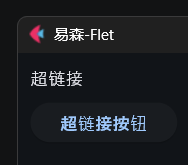
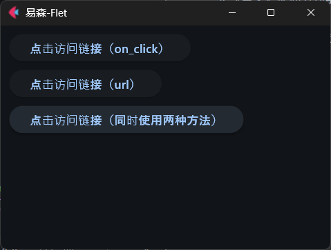
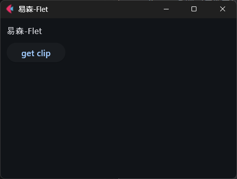

《Flet札记》（2027）

2027年所有更新内容转入《易森》，以下内容为存稿、留档，在《易森》更新时复制到《易森》中。

## 25 打开链接（《易森》2705期）

本章参考文档：

- https://flet.dev/docs/controls/text/#flet.Text.spans
- https://flet.dev/docs/controls/button#flet.Button.url
- https://flet.dev/docs/services/urllauncher

Flet虽然也支持WebUI模式（网页模式），但其控件都是绘制出来的图形，不是传统意义上的HTML元素。因此，Flet中并没有直接对标NiceGUI的超链接控件。不过，`Text`控件的`spans`参数可以让部分文字支持超链接的功能，`Button`控件的`url`参数也能让按钮平替超链接：

```python
import flet


def main(page: flet.Page):
    page.window.width = 400
    page.window.height = 300
    page.window.alignment = flet.Alignment(0, 0)
    page.title = '易森-Flet'
    
    url = 'https://flet.dev/docs/'
    page.add(
        flet.Text(
            spans=[
            	flet.TextSpan(
                	text='超链接',
                	url=url,
            	)
        	]
        ),
        flet.Button(
            content='超链接按钮',
            url=url
        ),
    )


flet.run(
    main,
)
```



如果不使用超链接的平替，在Flet中，使用`UrlLauncher`服务提供的`launch_url`方法可以打开任意链接（后面再详细介绍服务，这里简单理解为类似PySide6的`QDesktopServices.openUrl`方法）。

以按钮为例，不使用`url`参数，看看如何实现点击按钮、打开链接：

```python
import flet


def main(page: flet.Page):
    page.window.width = 400
    page.window.height = 300
    page.window.alignment = flet.Alignment(0, 0)
    page.title = '易森-Flet'
    # 创建并注册服务
    launcher = flet.UrlLauncher()
    page.services.append(launcher)
    # 将url通过控件的data参数传给响应函数
    async def open_url(e):
        await launcher.launch_url(
            e.control.data['url'],
        )

    url = 'https://flet.dev/docs/'
    page.add(
        flet.Button(
            content='点击访问链接（on_click）',
            on_click=open_url,
            data={'url':url}
        ),
        # 下面为对比效果的按钮
        flet.Button(
            content='点击访问链接（url）',
            url=url
        ),
        flet.Button(
            content='点击访问链接（同时使用两种方法）',
            on_click=open_url,
            data={'url':url},
            url=url
        )
    )


flet.run(
    main,
)
```



## 26 服务

### 26.1 什么是服务

相关文档：https://flet.dev/docs/services

前面介绍打开链接时用到了`UrlLauncher`服务，把么，什么是服务？

简单理解，控件是提供UI（界面）的类，服务则不提供UI而是提供特定功能的类，也可以理解为工具类。

因此，当需要一些界面显示之外的功能时，除了使用其他的库，Flet框架本身可能也会提供，此时就可以到服务中找找，说不定有意外的惊喜。

### 26.2 使用服务

使用服务很简单，就和创建控件一样，先实例化，再调用服务对象提供的各种方法。

前面的示例中，除了实例化，还把服务对象追加到页面的`services`属性中，这又是为什么？

其实，这是将服务注册到页面。不过，在当前版本，服务默认创建之后自动注册，不再需要手动注册。因此，所谓的“注册”过程可以省略。

以剪贴板服务——`Clipboard`服务为例，代码如下：

```python
import flet


async def main(page: flet.Page):
    page.window.width = 400
    page.window.height = 300
    page.window.alignment = flet.Alignment(0, 0)
    page.title = '易森-Flet'
    
    clip = flet.Clipboard()
    async def get_clip():
        result = await clip.get()
        text.value = result
    page.add(
        text:=flet.Text(
        ),
        flet.Button(
            'get clip',
            on_click=get_clip
        )
    )


flet.run(
    main,
)
```



点击按钮，按钮上方的文字就会变成剪贴板当前复制、剪切的文字。

注意，因为剪贴板的相关方法都是异步方法，因此，必须用异步等待才能获取到剪贴板内容。

### 26.3 可用的服务

当前Flet支持的服务如下表所示（功能是否可用，取决于设备是否有相关硬件，以及系统是否为该服务支持的平台）：

| 服务名                                                       | 功能                           | 支持的平台               | 备注                                                         |
| ------------------------------------------------------------ | ------------------------------ | ------------------------ | ------------------------------------------------------------ |
| [Accelerometer](https://flet.dev/docs/services/accelerometer) | 获取加速度计的原始数据         | 安卓、iOS、网页          |                                                              |
| [Audio](https://flet.dev/docs/services/audio/)               | 播放音频                       | 全平台                   | 依赖`flet-audio`库                                           |
| [AudioRecorder](https://flet.dev/docs/services/audiorecorder/) | 录制音频                       | 全平台                   | 依赖`flet-audio-recorder`库                                  |
| [Barometer](https://flet.dev/docs/services/barometer)        | 获取气压计的数据               | 安卓、iOS                |                                                              |
| [Battery](https://flet.dev/docs/services/battery)            | 获取电池信息（电量、充电状态） | 全平台                   |                                                              |
| [BrowserContextMenu](https://flet.dev/docs/services/browsercontextmenu) | 启用、禁用浏览器的上下文菜单   | 网页                     |                                                              |
| [Clipboard](https://flet.dev/docs/services/clipboard)        | 剪贴板的读写                   | 全平台                   |                                                              |
| [Connectivity](https://flet.dev/docs/services/connectivity)  | 获取设备的网络连接信息         | 全平台                   |                                                              |
| [FilePicker](https://flet.dev/docs/services/filepicker)      | 提供文件选择器                 | 全平台                   | 在Linux系统上需要安装`zenity`（安装方法取决于发行版）        |
| [Flashlight](https://flet.dev/docs/services/flashlight/)     | 控制闪光灯                     | 安卓、iOS                | 依赖`flet-flashlight`库                                      |
| [Geolocator](https://flet.dev/docs/services/geolocator/)     | 使用系统的定位服务             | 全平台                   | 依赖`flet-geolocator`库                                      |
| [Gyroscope](https://flet.dev/docs/services/gyroscope)        | 获取陀螺仪的数据               | 安卓、iOS、网页          |                                                              |
| [HapticFeedback](https://flet.dev/docs/services/hapticfeedback) | 产生振动反馈                   | 安卓、iOS                |                                                              |
| [Magnetometer](https://flet.dev/docs/services/magnetometer)  | 获取磁力计的数据               | 安卓、iOS                |                                                              |
| [PermissionHandler](https://flet.dev/docs/services/permissionhandler/) | 管理运行时所需的权限           | 安卓、iOS、Windows、网页 | 依赖`flet-permission-handler`库                              |
| [ScreenBrightness](https://flet.dev/docs/services/screenbrightness) | 控制屏幕亮度                   | 安卓、iOS                |                                                              |
| [SemanticsService](https://flet.dev/docs/services/semanticsservice) | 使用无障碍服务                 | 全平台                   | 部分功能不是全平台                                           |
| [ShakeDetector](https://flet.dev/docs/services/shakedetector) | 检测手机晃动                   | 安卓、iOS                |                                                              |
| [Share](https://flet.dev/docs/services/share)                | 分享内容                       | 全平台                   |                                                              |
| [SecureStorage](https://flet.dev/docs/services/securestorage/) | 安全存储数据                   | 全平台                   | 依赖`flet-secure-storage`库，<br />系统层面还需要安装其他软件 |
| [SharedPreferences](https://flet.dev/docs/services/sharedpreferences) | 持久化的键值存储               | 全平台                   |                                                              |
| [StoragePaths](https://flet.dev/docs/services/storagepaths)  | 获取特定的系统路径             | 除了网页外的其他平台     |                                                              |
| [UrlLauncher](https://flet.dev/docs/services/urllauncher)    | 打开链接                       | 全平台                   |                                                              |
| [UserAccelerometer](https://flet.dev/docs/services/useraccelerometer) | 获取加速度计的修饰数据         | 安卓、iOS、网页          | 仅获取除了重力加速度之外的加速度                             |
| [Wakelock](https://flet.dev/docs/services/wakelock)          | 阻止休眠                       | 全平台                   |                                                              |

因为服务相关的代码比较多且复杂，这里就不一一提供示例，待后续实际使用到的时候再做更加详细的解释，届时再提供示例。

## 27 （待定）（更新中）


## 2x `xxx`控件（更新中）

相关文档：https://flet.dev/docs/controls


以解决问题的思路为导向，引入问题，梳理思路，简单介绍控件和用法，完整的用法让读者查阅官网，文章里不再详细介绍，只是详细介绍必要的基础步骤和相关用法，相当于给读者设计悬念，激发学习兴趣。


关键点：

故事要有悬念，引人入胜。

代码简洁完整，可以直接运行。

包含效果图、说明图，静态优先，必要时录制动图。


## 2x `xxx`控件（更新中）

相关文档：https://flet.dev/docs/controls

`xxx`控件


```python
import flet


def main(page: flet.Page):
    page.window.width = 400
    page.window.height = 300
    page.window.alignment = flet.Alignment(0, 0)
    page.title = '易森-Flet'

    page.add(
        flet.Text('Hello')
    )


flet.run(
    main,
)
```


## xx `xxx`控件（更新中）

相关文档：https://flet.dev/docs/controls

`xxx`控件


```python
import flet


def main(page: flet.Page):
    page.window.width = 400
    page.window.height = 300
    page.window.alignment = flet.Alignment(0, 0)
    page.title = '易森-Flet'

    page.add(
        flet.Text('Hello')
    )


flet.run(
    main,
)
```


## x 灵感

参考cookbook介绍一些基础，后续单独介绍一些实践用法。

控件与服务（ https://flet.dev/docs/reference/ ），每章详细介绍一个：

- [控件](https://flet.dev/docs/controls) - 具有属性、事件和使用示例的用户界面构建块。
- [服务](https://flet.dev/docs/services) - 设备和平台的功能，如传感器、存储和权限。
- [类型](https://flet.dev/docs/types/) - 核心类型、枚举、事件、异常和在整个SDK中共享的实用工具。


页面设计（页面支持的部分属性比如`navigation_bar`属性、`bottom_appbar`属性、`appbar`属性、`drawer`属性、`end_drawer`属性等对应特定的区域，其他属性负责页面样式等等），https://flet.dev/docs/controls/basepage/ ，主要介绍页面支持的属性。


手势控件结合窗口状态进入函数的使用：

```python
import flet

async def main(page: flet.Page):
    page.window.width = 400
    page.window.height = 300
    page.title = 'Hello'
    async def starting():
        # 拖动窗口空白处来拖动窗口或者调整窗口大小，二选一
        await page.window.start_dragging()
        #await page.window.start_resizing(flet.WindowResizeEdge.BOTTOM_RIGHT)
    page.add(
        flet.GestureDetector(
            on_tap_down=starting,
        ),
    )

flet.run(main)
```

