## 《Flet札记》（2027）

2027年所有更新内容转入《易森》，以下内容为存稿、留档，在《易森》更新时复制到《易森》中。

## 25 打开链接（《易森》2705期）

本章参考文档：

- https://flet.dev/docs/controls/text/#flet.Text.spans
- https://flet.dev/docs/controls/button#flet.Button.url
- https://flet.dev/docs/services/urllauncher

Flet虽然也支持WebUI模式（网页模式），但其控件都是绘制出来的图形，不是传统意义上的HTML元素。因此，Flet中并没有直接对标NiceGUI的超链接控件。不过，`Text`控件的`spans`参数可以让部分文字支持超链接的功能，`Button`控件的`url`参数也能让按钮平替超链接：

```python
import flet


def main(page: flet.Page):
    page.window.width = 400
    page.window.height = 300
    page.window.alignment = flet.Alignment(0, 0)
    page.title = '易森-Flet'
    
    url = 'https://flet.dev/docs/'
    page.add(
        flet.Text(
            spans=[
            	flet.TextSpan(
                	text='超链接',
                	url=url,
            	)
        	]
        ),
        flet.Button(
            content='超链接按钮',
            url=url
        ),
    )


flet.run(
    main,
)
```

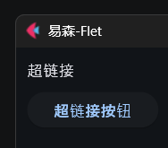

如果不使用超链接的平替，在Flet中，使用`UrlLauncher`服务提供的`launch_url`方法可以打开任意链接（后面再详细介绍服务，这里简单理解为类似PySide6的`QDesktopServices.openUrl`方法）。

在Flet 1.0.0以后，还能使用`action`参数定义打开链接的客户端操作。

以按钮为例，看看如何实现点击按钮、打开链接：

```python
import flet


def main(page: flet.Page):
    page.window.width = 400
    page.window.height = 400
    page.window.alignment = flet.Alignment(0, 0)
    page.title = '易森-Flet'
    # 创建并注册服务
    launcher = flet.UrlLauncher()
    page.services.append(launcher)
    # 将url通过控件的data参数传给响应函数
    async def open_url(e):
        await launcher.launch_url(
            e.control.data['url'],
        )

    url = 'https://flet.dev/docs/'
    page.add(
        flet.Button(
            content='点击访问链接（on_click）',
            on_click=open_url,
            data={'url':url}
        ),
        # 下面为对比效果的按钮
        flet.Button(
            content='点击访问链接（url）',
            url=url
        ),
        flet.Button(
            content='点击访问链接（action）',
            action=flet.OpenUrl(url)
        ),
        flet.Button(
            content='点击访问链接（on_click+url）',
            on_click=open_url,
            data={'url':url},
            url=url
        ),
        flet.Button(
            content='点击访问链接（on_click+action）',
            on_click=open_url,
            data={'url':url},
            action=flet.OpenUrl(url)
        ),
        flet.Button(
            content='点击访问链接（action+url）',
            action=flet.OpenUrl(url),
            url=url
        ),
        flet.Button(
            content='点击访问链接（on_click+action+url）',
            on_click=open_url,
            data={'url':url},
            action=flet.OpenUrl(url),
            url=url
        ),
    )


flet.run(
    main,
)
```

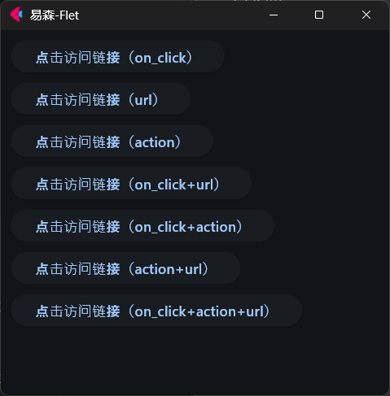

## 26 服务

### 26.1 什么是服务

相关文档：https://flet.dev/docs/services

前面介绍打开链接时用到了`UrlLauncher`服务，把么，什么是服务？

简单理解，控件是提供UI（界面）的类，服务则不提供UI而是提供特定功能的类，也可以理解为工具类。

因此，当需要一些界面显示之外的功能时，除了使用其他的库，Flet框架本身可能也会提供，此时就可以到服务中找找，说不定有意外的惊喜。

### 26.2 使用服务

使用服务很简单，就和创建控件一样，先实例化，再调用服务对象提供的各种方法。

前面的示例中，除了实例化，还把服务对象追加到页面的`services`属性中，这又是为什么？

其实，这是将服务注册到页面。不过，在当前版本，服务默认创建之后自动注册，不再需要手动注册。因此，所谓的“注册”过程可以省略。

以剪贴板服务——`Clipboard`服务为例，代码如下：

```python
import flet


async def main(page: flet.Page):
    page.window.width = 400
    page.window.height = 300
    page.window.alignment = flet.Alignment(0, 0)
    page.title = '易森-Flet'
    
    clip = flet.Clipboard()
    async def get_clip():
        result = await clip.get()
        text.value = result
    page.add(
        text:=flet.Text(
        ),
        flet.Button(
            'get clip',
            on_click=get_clip
        )
    )


flet.run(
    main,
)
```

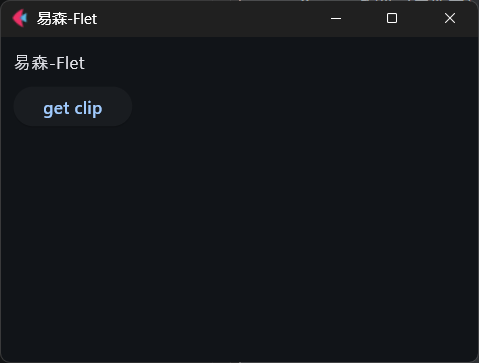

点击按钮，按钮上方的文字就会变成剪贴板当前复制、剪切的文字。

注意，因为剪贴板的相关方法都是异步方法，因此，必须用异步等待才能获取到剪贴板内容。

### 26.3 可用的服务

当前Flet支持的服务如下表所示（功能是否可用，取决于设备是否有相关硬件，以及系统是否为该服务支持的平台）：

| 服务名                                                       | 功能                           | 支持的平台               | 备注                                                         |
| ------------------------------------------------------------ | ------------------------------ | ------------------------ | ------------------------------------------------------------ |
| [Accelerometer](https://flet.dev/docs/services/accelerometer) | 获取加速度计的原始数据         | 安卓、iOS、网页          |                                                              |
| [Audio](https://flet.dev/docs/services/audio/)               | 播放音频                       | 全平台                   | 依赖`flet-audio`库                                           |
| [AudioRecorder](https://flet.dev/docs/services/audiorecorder/) | 录制音频                       | 全平台                   | 依赖`flet-audio-recorder`库                                  |
| [Barometer](https://flet.dev/docs/services/barometer)        | 获取气压计的数据               | 安卓、iOS                |                                                              |
| [Battery](https://flet.dev/docs/services/battery)            | 获取电池信息（电量、充电状态） | 全平台                   |                                                              |
| [BrowserContextMenu](https://flet.dev/docs/services/browsercontextmenu) | 启用、禁用浏览器的上下文菜单   | 网页                     |                                                              |
| [Clipboard](https://flet.dev/docs/services/clipboard)        | 剪贴板的读写                   | 全平台                   |                                                              |
| [Connectivity](https://flet.dev/docs/services/connectivity)  | 获取设备的网络连接信息         | 全平台                   |                                                              |
| [FilePicker](https://flet.dev/docs/services/filepicker)      | 提供文件选择器                 | 全平台                   | 在Linux系统上需要安装`zenity`（安装方法取决于发行版）        |
| [Flashlight](https://flet.dev/docs/services/flashlight/)     | 控制闪光灯                     | 安卓、iOS                | 依赖`flet-flashlight`库                                      |
| [Geolocator](https://flet.dev/docs/services/geolocator/)     | 使用系统的定位服务             | 全平台                   | 依赖`flet-geolocator`库                                      |
| [Gyroscope](https://flet.dev/docs/services/gyroscope)        | 获取陀螺仪的数据               | 安卓、iOS、网页          |                                                              |
| [HapticFeedback](https://flet.dev/docs/services/hapticfeedback) | 产生振动反馈                   | 安卓、iOS                |                                                              |
| [Magnetometer](https://flet.dev/docs/services/magnetometer)  | 获取磁力计的数据               | 安卓、iOS                |                                                              |
| [PermissionHandler](https://flet.dev/docs/services/permissionhandler/) | 管理运行时所需的权限           | 安卓、iOS、Windows、网页 | 依赖`flet-permission-handler`库                              |
| [ScreenBrightness](https://flet.dev/docs/services/screenbrightness) | 控制屏幕亮度                   | 安卓、iOS                |                                                              |
| [SemanticsService](https://flet.dev/docs/services/semanticsservice) | 使用无障碍服务                 | 全平台                   | 部分功能不是全平台                                           |
| [ShakeDetector](https://flet.dev/docs/services/shakedetector) | 检测手机晃动                   | 安卓、iOS                |                                                              |
| [Share](https://flet.dev/docs/services/share)                | 分享内容                       | 全平台                   |                                                              |
| [SecureStorage](https://flet.dev/docs/services/securestorage/) | 安全存储数据                   | 全平台                   | 依赖`flet-secure-storage`库，<br />系统层面还需要安装其他软件 |
| [SharedPreferences](https://flet.dev/docs/services/sharedpreferences) | 持久化的键值存储               | 全平台                   |                                                              |
| [StoragePaths](https://flet.dev/docs/services/storagepaths)  | 获取特定的系统路径             | 除了网页外的其他平台     |                                                              |
| [UrlLauncher](https://flet.dev/docs/services/urllauncher)    | 打开链接                       | 全平台                   |                                                              |
| [UserAccelerometer](https://flet.dev/docs/services/useraccelerometer) | 获取加速度计的修饰数据         | 安卓、iOS、网页          | 仅获取除了重力加速度之外的加速度                             |
| [Wakelock](https://flet.dev/docs/services/wakelock)          | 阻止休眠                       | 全平台                   |                                                              |

因为服务相关的代码比较多且复杂，这里就不一一提供示例，待后续实际使用到的时候再做更加详细的解释，届时再提供示例。

## 27 字体

### 27.1 字体决定文字样式

相关文档：https://flet.dev/docs/cookbook/fonts

这是一个普通到不能再普通的Flet程序，却存在一个看似不大的问题：

```python
import flet


def main(page: flet.Page):
    page.window.width = 400
    page.window.height = 300
    page.window.alignment = flet.Alignment(0, 0)
    page.title = '易森-Flet'

    page.add(
        flet.Button(
            '按钮',
        ),
    )


flet.run(
    main,
)
```

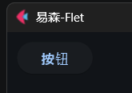

“按钮”二字，一粗一细。

如果将这两个字，放在`Text`控件中，原本的差异却又不见了：

```python
import flet


def main(page: flet.Page):
    page.window.width = 400
    page.window.height = 300
    page.window.alignment = flet.Alignment(0, 0)
    page.title = '易森-Flet'

    page.add(
        flet.Text(
            '按钮',
        ),
        flet.Button(
            '按钮',
        ),
    )


flet.run(
    main,
)
```

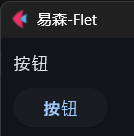

既然如此，那就用`Text`控件代替字符串，可问题没有解决：

```python
import flet


def main(page: flet.Page):
    page.window.width = 400
    page.window.height = 300
    page.window.alignment = flet.Alignment(0, 0)
    page.title = '易森-Flet'

    page.add(
        flet.Text(
            '按钮',
        ),
        flet.Button(
            flet.Text(
                '按钮',
            ),
        ),
        flet.Button(
            '按钮',
        ),
    )


flet.run(
    main,
)
```

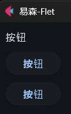

究其原因，是字体的问题，因为字体决定了文字的样式。如果不信，那就请使用Windows系统的读者执行下面的代码：

```python
import flet


def main(page: flet.Page):
    page.window.width = 400
    page.window.height = 300
    page.window.alignment = flet.Alignment(0, 0)
    page.title = '易森-Flet'

    page.add(
        flet.Button(
            flet.Text(
                '按钮',
                # 修改字体
                font_family='Microsoft YaHei'
            ),
        ),
        flet.Button(
            flet.Text(
                '按钮',
            ),
        ),
    )


flet.run(
    main,
)
```

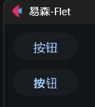

如上面代码所示，只是修改了字体，文字的样式就变得和谐不少，两个汉字的粗细一致了。

### 27.2 使用字体的方法

本节使用的外部字体下载地址：https://mirror.nju.edu.cn/adobe-fonts/source-han-sans/OTF/SimplifiedChinese/SourceHanSansSC-Regular.otf

如前文所示，使用字体的方法可以很简单，一个名字就够了。

但是，这并不是说，使用字体只是这么简单：

- 使用系统字体可以直接用字体名；使用非系统字体，要先在主页面的`fonts`属性（字典）中注册（添加），然后才能使用。
- 支持`font_family`参数的控件可以让指定控件单独使用字体。如果是`Theme`主题类的`font_family`参数，则会修改当前页面内所有控件的字体。

以上是简单的总结，接下来看具体代码。

给`font_family`参数传入系统字体的名字（不同系统的字体不同）即可使用系统字体：

```python
import flet


def main(page: flet.Page):
    page.window.width = 400
    page.window.height = 300
    page.window.alignment = flet.Alignment(0, 0)
    page.title = '易森-Flet'

    page.add(
        flet.Text(
            '按钮',
            font_family='Microsoft YaHei'
        ),
        flet.Button(
            flet.Text(
                '按钮',
                font_family='Microsoft YaHei'
            ),
        ),
        flet.Button(
            '按钮',
        ),
    )


flet.run(
    main,
)
```

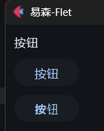

如果使用外部字体，可以直接使用字体的网络地址，将其注册为指定字体名：

```python
import flet


def main(page: flet.Page):
    page.window.width = 400
    page.window.height = 300
    page.window.alignment = flet.Alignment(0, 0)
    page.title = '易森-Flet'

    page.fonts = {
        'San': 'https://mirror.nju.edu.cn/adobe-fonts/source-han-sans/OTF/SimplifiedChinese/SourceHanSansSC-Regular.otf',
    }
    page.add(
        flet.Text(
            '按钮',
            font_family='San'
        ),
        flet.Button(
            flet.Text(
                '按钮',
                font_family='San'
            ),
        ),
        flet.Button(
            '按钮',
        ),
    )


flet.run(
    main,
)
```

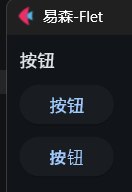

但是，因为字体比较大，使用网络地址的话，字体下载较慢会导致最终字体没有生效。最好先下载到本地，再用本地地址：

```python
import flet


def main(page: flet.Page):
    page.window.width = 400
    page.window.height = 300
    page.window.alignment = flet.Alignment(0, 0)
    page.title = '易森-Flet'

    page.fonts = {
        'San': 'SourceHanSansSC-Regular.otf',
    }
    page.add(
        flet.Text(
            '按钮',
            font_family='San'
        ),
        flet.Button(
            flet.Text(
                '按钮',
                font_family='San'
            ),
        ),
        flet.Button(
            '按钮',
        ),
    )


flet.run(
    main,
)
```


如果使用主题的话，可以统一所有控件的字体：

```python
import flet


def main(page: flet.Page):
    page.window.width = 400
    page.window.height = 300
    page.window.alignment = flet.Alignment(0, 0)
    page.title = '易森-Flet'

    page.fonts = {
        'San': 'SourceHanSansSC-Regular.otf',
    }
    page.theme = flet.Theme(font_family='San')
    page.add(
        flet.Text(
            '按钮',
        ),
        flet.Button(
            flet.Text(
                '按钮',
            ),
        ),
        flet.Button(
            '按钮',
        ),
    )


flet.run(
    main,
)
```

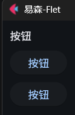

## 28 资产

### 28.1 神奇的`assets`文件夹

相关文档：https://flet.dev/docs/cookbook/assets/

之前讲了修改控件的字体，但也带来一个小小的问题：假如用到的字体很多，都放在同目录下的话会导致文件比较混乱。因此，为了让文件存放变得井井有条，最好将字体文件放在单独的文件夹内，使用字体时的路径也要做相应变化。

以下是一个参考的目录结构，字体放在单独的文件夹内，请读者按照下面的示意创建相关文件夹（务必保证文件夹名字、结构一致，后面会介绍相关知识）：

```shell
{项目文件夹}
│  main.py
└─assets
    └─fonts
            SourceHanSansSC-Regular.otf
```

代码如下：

```python
import flet


def main(page: flet.Page):
    page.window.width = 400
    page.window.height = 300
    page.window.alignment = flet.Alignment(0, 0)
    page.title = '易森-Flet'

    page.fonts = {
        'San': 'assets/fonts/SourceHanSansSC-Regular.otf',
    }
    page.theme = flet.Theme(font_family='San')
    page.add(
        flet.Text(
            '按钮',
        ),
        flet.Button(
            flet.Text(
                '按钮',
            ),
        ),
        flet.Button(
            '按钮',
        ),
    )


flet.run(
    main,
)
```


修改字体文件的路径没什么难度，接下来要做的事情，就会有点匪夷所思。如果将文件路径中的`assets`或者`assets/`去掉，字体还能用吗？

按理来说，路径都不对了，不能用才对。可是，结果出乎意料：

```python
import flet


def main(page: flet.Page):
    page.window.width = 400
    page.window.height = 300
    page.window.alignment = flet.Alignment(0, 0)
    page.title = '易森-Flet'

    page.fonts = {
        # 字体文件存放于assets/fonts目录下时，
        # 此时路径以assets目录为根目录。
        'San': 'fonts/SourceHanSansSC-Regular.otf',
    }
    page.theme = flet.Theme(font_family='San')
    page.add(
        flet.Text(
            '按钮',
        ),
        flet.Button(
            flet.Text(
                '按钮',
            ),
        ),
        flet.Button(
            '按钮',
        ),
    )


flet.run(
    main,
    #assets_dir='assets'
)
```


没错，字体路径依然有效，秘诀就在于`assets`这个文件夹，这是资产目录。

### 28.2 资产与资产文件夹

assets这个单词翻译过来就是资产，但在网站开发中，资产通常是指图片、字体、音视频等静态资源。与源代码属于程序开发的原始文件不同，静态资源通常是非程序员提供的最终产物，程序员拿来就用，不需要维护。因此，为了与源代码区分开，这些资产通常放在特定的目录下，按照类型再放到单独的文件夹中。

对于Flet而言，`assets`文件夹就是资产文件夹，所有放在该文件夹内的文件都是资产。因此，如果参数支持路径，可以省略资产文件夹的名字，直接使用资产文件夹内的资产，这就是资产文件夹的特殊之处。

### 28.3 自定义资产文件夹

资产文件夹并非一成不变，`run`方法的`assets_dir`参数可以自定义资产文件夹的名字：

```python
import flet


def main(page: flet.Page):
    page.window.width = 400
    page.window.height = 300
    page.window.alignment = flet.Alignment(0, 0)
    page.title = '易森-Flet'

    page.fonts = {
        'San': 'fonts/SourceHanSansSC-Regular.otf',
    }
    page.theme = flet.Theme(font_family='San')
    page.add(
        flet.Text(
            '按钮',
        ),
        flet.Button(
            flet.Text(
                '按钮',
            ),
        ),
        flet.Button(
            '按钮',
        ),
    )


flet.run(
    main,
    assets_dir='files'
)
```

或者设置环境变量`FLET_ASSETS_DIR`的值，也能修改资产文件夹的名字：

```python
import flet
import os

os.environ['FLET_ASSETS_DIR'] = 'files'

def main(page: flet.Page):
    page.window.width = 400
    page.window.height = 300
    page.window.alignment = flet.Alignment(0, 0)
    page.title = '易森-Flet'

    page.fonts = {
        'San': 'fonts/SourceHanSansSC-Regular.otf',
    }
    page.theme = flet.Theme(font_family='San')
    page.add(
        flet.Text(
            '按钮',
        ),
        flet.Button(
            flet.Text(
                '按钮',
            ),
        ),
        flet.Button(
            '按钮',
        ),
    )


flet.run(
    main,
)
```

## 29 客户端动作

### 29.0 前言

Flet 在 1.0.0 版本为继承了`ActionControl`类的控件添加了`action`参数（`ClientAction`类型或者元素为`ClientAction`类型的列表），该参数表示点击控件之后执行的客户端操作（对应的操作只在客户端响应，不经过服务端）。

版本速览里只是介绍了参数的基本用法，却没有介绍其他客户端动作（`ClientAction`类型），本章将展开介绍一下。

目前有以下几种客户端动作：

- `OpenUrl`类，表示打开链接。
- `CopyToClipboard`类，表示复制内容到剪贴板。
- `ShareText`类，表示分享内容。
- `PickFiles`类，表示选择文件。

示例如下：

```python
import flet


def main(page: flet.Page):
    page.window.width = 400
    page.window.height = 300
    page.window.alignment = flet.Alignment(0, 0)

    page.add(
        flet.Button(
            'OpenUrl',
            action=flet.OpenUrl(
                'https://www.baidu.com'
            )
        ),
        flet.Button(
            'CopyToClipboard',
            action=flet.CopyToClipboard(
                'https://www.baidu.com'
            )
        ),
        flet.Button(
            'ShareText',
            action=flet.ShareText(
                'https://www.baidu.com'
            )
        ),
        flet.Button(
            'PickFiles',
            action=flet.PickFiles(
                flet.FilePicker(
                    on_result=lambda e:print(e.files[0].bytes.decode())
                ),
                with_data=True
            )
        ),
    )


flet.run(
    main,
)
```

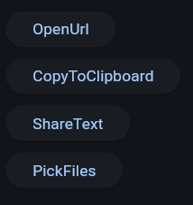

### 29.1 `OpenUrl`类

相关文档：

- https://flet.dev/docs/types/openurl/
- https://flet.dev/docs/types/urltarget/

`OpenUrl`类的参数不多：

- `url`参数，字符串类型，表示要打开的链接。
- `target`参数，字符串类型或者`flet.UrlTarget`成员，表示在哪里打开链接。

`target`参数可用于指定是否在新标签页打开链接：当其值为`'_blank'`或者`flet.UrlTarget.BLANK`时，就是在新标签页中打开链接；当其值为`'_self'`或者`flet.UrlTarget.SELF`时，就是在当前标签页中打开链接。

示例如下：

```python
import flet


def main(page: flet.Page):
    page.window.width = 400
    page.window.height = 300
    page.window.alignment = flet.Alignment(0, 0)

    page.add(
        flet.Button(
            'OpenUrl BLANK',
            action=flet.OpenUrl(
                url='https://www.baidu.com',
                target=flet.UrlTarget.BLANK
            )
        ),
        flet.Button(
            'OpenUrl SELF',
            action=flet.OpenUrl(
                url='https://www.baidu.com',
                target=flet.UrlTarget.SELF
            )
        ),
        flet.Button(
            'OpenUrl PARENT',
            action=flet.OpenUrl(
                url='https://www.baidu.com',
                target=flet.UrlTarget.PARENT
            )
        ),
        flet.Button(
            'OpenUrl TOP',
            action=flet.OpenUrl(
                url='https://www.baidu.com',
                target=flet.UrlTarget.TOP
            )
        ),
    )


flet.run(
    main,
    view=flet.AppView.WEB_BROWSER
)
```


注意，涉及到浏览器标签页的操作，只有使用网页模式才能正确生效，窗口模式一律使用浏览器的新标签页打开外部链接。

### 29.2 `CopyToClipboard`类

相关文档：https://flet.dev/docs/types/copytoclipboard/

`CopyToClipboard`类的参数只有一个：

- `data`参数，字符串类型，表示要复制到剪贴板的数据。

注意，`data`参数不支持变量。因此，如果想要改变复制到剪贴板的数据，则要更新`CopyToClipboard`类`args`属性`'data'`键对应的值：

```python
import flet


def main(page: flet.Page):
    page.window.width = 400
    page.window.height = 300
    page.window.alignment = flet.Alignment(0, 0)

    f = flet.TextField(
        value='Hello',
    )
    a = flet.CopyToClipboard(
        f.value
    )
    b = flet.Button(
        'CopyToClipboard',
        action=a
    )
    page.add(
        f,b,
        flet.Button(
            'update CopyToClipboard',
            on_click=lambda e:a.args.update(
                {'data':f.value}
            )
        )
    )
    

flet.run(
    main,
)
```

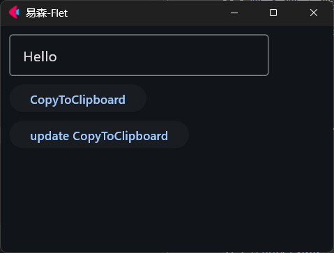

当输入框的内容改变，只有点击第二个按钮，更新第一个按钮的客户端动作，第一个按钮点击之后复制到剪贴板的内容才会改变。

可能会有读者好奇，为什么不能直接修改`CopyToClipboard`类`data`属性，非要修改`CopyToClipboard`类`args`属性`'data'`键对应的值？

那是因为`data`属性仅在`CopyToClipboard`类初始化时使用一次，先将其更新到`args`属性这个字典中，再将其传到Flutter控件中。如果后续想要修改Flutter控件中对应的值，则只能修改`args`属性这个字典。后续会遇到很多类似的属性，请读者牢记这个技巧。

如果读者不相信，可以看一下示例：

```python
import flet


def main(page: flet.Page):
    page.window.width = 400
    page.window.height = 300
    page.window.alignment = flet.Alignment(0, 0)

    f = flet.TextField(
        value='Hello',
    )
    a = flet.CopyToClipboard(
        f.value
    )
    b = flet.Button(
        'CopyToClipboard',
        action=a
    )
    def update_data():
        a.data = f.value
        print(f'{a.data=}')
        print(f'{b.action.data=}')

    u = flet.Button(
        'update CopyToClipboard',
        on_click=update_data
    )
    page.add(
        f,b,u
    )
    

flet.run(
    main,
)
```

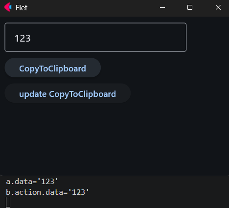

尽管点击第二个按钮之后，`data`属性都已改变，但之后再点击第一个按钮，然后粘贴到文本框，内容依然是“Hello”。

### 29.3 `ShareText`类

相关文档：https://flet.dev/docs/types/sharetext

`ShareText`类支持以下参数：

- `text`参数，字符串类型，表示分享的主要内容。
- `title`参数，字符串类型，表示分享内容的标题。
- `subject`参数，字符串类型，表示分享内容的主题（邮件形式支持）。

参数简单，也没有需要特别注意的问题，因此本节不提供示例。

### 29.4 `PickFiles`类

相关文档：https://flet.dev/docs/types/pickfiles

`PickFiles`类支持以下参数：

- `file_picker`参数，`flet.FilePicker`类型，表示选择文件时使用的文件选择对话框服务。选择完毕之后的操作只能在创建文件选择对话框服务时定义，`PickFiles`类的后面几个参数实际上也是`flet.FilePicker`类`pick_files`方法的参数。
- `dialog_title`参数，字符串类型，表示对话框的标题。
- `initial_directory`参数，字符串类型，表示对话框的初始的路径。
- `file_type`参数，`flet.FilePickerFileType`成员，表示允许选择的文件类型。如果是`CUSTOM`，或者定义了`allowed_extensions`参数，则表示仅允许`allowed_extensions`参数中的文件类型。
- `allowed_extensions`参数，元素为字符串的列表，表示允许选择的文件类型，优先于`file_type`参数生效。
- `allow_multiple`参数，布尔类型，表示是否允许多选。
- `with_data`参数，布尔类型，表示是否将文件内容读取到`flet.FilePickerFile.bytes`属性。对话框服务`on_result`参数（仅在`PickFiles`类中使用时有效）的事件参数中，其`files`属性的每个元素就是`flet.FilePickerFile`类型，每个属性的`bytes`属性会在`with_data`参数启用后变成文件内容。
- `compression_quality`参数，整数类型（0-100），表示对图片文件的压缩等级。
- `cancel_upload_on_window_blur`参数，布尔类型，表示当网页模式的浏览器窗口失去焦点时，是否自动取消选择。

示例如下：

```python
import flet


def main(page: flet.Page):
    page.window.width = 400
    page.window.height = 300
    page.window.alignment = flet.Alignment(0, 0)

    t = flet.Text('未选择')
    f = flet.FilePicker(
        on_result=lambda e:setattr(
            t,
            'value',
            e.files[0].bytes.decode() if e.files else '未选择'
        )
    )
    page.add(
        flet.Button(
            'PickFiles',
            action=flet.PickFiles(
                f,
                dialog_title='选择文件',
                initial_directory=__file__+'\\..',
                file_type=flet.FilePickerFileType.CUSTOM,
                allowed_extensions=['txt','py'],
                allow_multiple=False,
                with_data=True,
            )
        ),
        t
    )


flet.run(
    main,
)
```

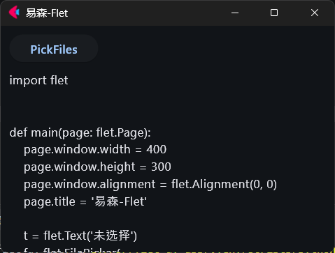

## 30 `FilePicker`服务（更新中）

相关文档：https://flet.dev/docs/services/filepicker/

客户端动作中的`PickFiles`类用于选择文件，而该类实际上是通过`FilePicker`服务的`pick_files`方法实现的。如果不使用客户端动作，或者想要使用其他与选择文件相关的功能（保存文件、上传文件），那就有必要详细了解一下`FilePicker`服务。


（介绍`FilePicker`类的参数和方法，以及每个方法的参数、示例）


```python
import flet


def main(page: flet.Page):
    page.window.width = 400
    page.window.height = 300
    page.window.alignment = flet.Alignment(0, 0)

    t = flet.Text('未选择')
    f = flet.FilePicker()

    async def handler():
        files = await f.pick_files(
            dialog_title='选择文件',
            initial_directory=__file__+'\\..',
            file_type=flet.FilePickerFileType.CUSTOM,
            allowed_extensions=['txt', 'py'],
            allow_multiple=False,
            with_data=True,
            cancel_upload_on_window_blur=True
        )
        setattr(
            t,
            'value',
            files[0].bytes.decode() if files else '未选择'
        )
    page.add(
        flet.Button(
            'PickFiles',
            on_click=handler
        ),
        t
    )


flet.run(
    main,
)
```


## 31 异步技巧（更新中）

相关文档：https://flet.dev/docs/cookbook/async-apps/


## 3x `xxx`控件（更新中）

相关文档：https://flet.dev/docs/controls


以解决问题的思路为导向，引入问题，梳理思路，简单介绍控件和用法，完整的用法让读者查阅官网，文章里不再详细介绍，只是详细介绍必要的基础步骤和相关用法，相当于给读者设计悬念，激发学习兴趣。


关键点：

故事要有悬念，引人入胜。

代码简洁完整，可以直接运行。

包含效果图、说明图，静态优先，必要时录制动图。


## 3x `xxx`控件（更新中）

相关文档：https://flet.dev/docs/controls

`xxx`控件


```python
import flet


def main(page: flet.Page):
    page.window.width = 400
    page.window.height = 300
    page.window.alignment = flet.Alignment(0, 0)
    page.title = '易森-Flet'

    page.add(
        flet.Text('Hello')
    )


flet.run(
    main,
)
```


## xx `xxx`控件（更新中）

相关文档：https://flet.dev/docs/controls

`xxx`控件


```python
import flet


def main(page: flet.Page):
    page.window.width = 400
    page.window.height = 300
    page.window.alignment = flet.Alignment(0, 0)
    page.title = '易森-Flet'

    page.add(
        flet.Text('Hello')
    )


flet.run(
    main,
)
```


## x 灵感

参考cookbook介绍一些基础，后续单独介绍一些实践用法。

控件与服务（ https://flet.dev/docs/reference/ ），每章详细介绍一个：

- [控件](https://flet.dev/docs/controls) - 具有属性、事件和使用示例的用户界面构建块。
- [服务](https://flet.dev/docs/services) - 设备和平台的功能，如传感器、存储和权限。
- [类型](https://flet.dev/docs/types/) - 核心类型、枚举、事件、异常和在整个SDK中共享的实用工具。


页面设计（页面支持的部分属性比如`navigation_bar`属性、`bottom_appbar`属性、`appbar`属性、`drawer`属性、`end_drawer`属性等对应特定的区域，其他属性负责页面样式等等），https://flet.dev/docs/controls/basepage/ ，主要介绍页面支持的属性。


手势控件结合窗口状态进入函数的使用：

```python
import flet

async def main(page: flet.Page):
    page.window.width = 400
    page.window.height = 300
    page.title = 'Hello'
    async def starting():
        # 拖动窗口空白处来拖动窗口或者调整窗口大小，二选一
        await page.window.start_dragging()
        #await page.window.start_resizing(flet.WindowResizeEdge.BOTTOM_RIGHT)
    page.add(
        flet.GestureDetector(
            on_tap_down=starting,
        ),
    )

flet.run(main)
```

