## 《NiceGUI札记》（2027）

2027年所有更新内容转入《易森》，以下内容为存稿、留档，在《易森》更新时复制到《易森》中。

## 55 详解多页面模式（《易森》2703期）

前面的教程几乎都是用单页面模式、窗口模式作为示例，而很多读者实际开发中，可能会用多页面模式作为程序的主要运行模式。因此，2027版的第一章，就先来回顾一下多页面模式，学习一下多页面模式中相关的功能。

相关文档：https://nicegui.io/documentation/page

### 55.1 `ui.page`类

说到多页面模式，就离不开`ui.page`类：

```python
from nicegui import ui

@ui.page(
    path='/',
)
def index():
    ui.button('Hello')

ui.run()
```

如上面示例所展示的，表示页面对应路径的`path`参数不可缺失，这个一般都比较熟悉。但是，除了这个参数，`ui.page`类还支持一些关键字参数，如果读者有特定需求，则需要用到这些参数。

`ui.page`类支持以下参数：

- `path`参数，字符串类型，表示页面对应的路径。路径支持URL参数（路径参数、查询参数）注入，具体用法可以参考前面的第30章，这里不做展开。

- `title`参数，字符串类型，表示页面对应的标题（会显示为浏览器窗口、标签页的标题）。

  从该参数开始，只能通过关键字传入。

- `viewport`参数，字符串类型，表示网页的VIewport属性。

- `favicon`参数，字符串类型或者`Path`类型，表示页面在标题栏的图标。

- `dark`参数，布尔类型，表示页面是否默认启用暗黑模式。使用`None`的话，表示跟随系统。

- `language`参数，字符串类型，表示页面的语言。注意，该参数只会影响框架内提供多语言内容的部分，对于非框架自带的内容，则需要通过其他方法实现多语言功能，无法通过此参数切换语言。

- `response_timeout`参数，浮点类型，表示页面的响应超时，默认为`3.0`。

- `reconnect_timeout`参数，浮点类型，表示页面的重新连接超时。

- `markdown`参数，布尔类型，表示是否为AI工具提供页面的Markdown格式版本，以减少AI工具获取页面时的Token消耗。

- `api_router`参数，`APIRouter`类型，表示页面所属的子路由。

- `**kwargs`参数，其余不与上述关键字参数同名的其他关键字参数将会传给`APIRouter`类。

关于`api_router`参数的示例如下：

```python
from nicegui import ui,APIRouter,app

router = APIRouter(prefix='/psf')

@ui.page(
    path='/',
    title='Hello',
    api_router=router
)
def index():
    ui.button('Hello')

app.include_router(router)

ui.run()
```

此时，想要访问该页面，就要改为`http://{host}:{port}/psf/`。关于子路由的详细介绍，请看本章的下一节。

### 55.2 `APIRouter`类

上一节中，`api_router`参数表示页面所属的子路由。这就引出了本节要介绍的子路由和`APIRouter`类。

子路由和单页面应用类似，但每个路径对应的页面是独立的，没有页面的公共部分。

而上一节的示例可以改为以下相同结果的示例：

```python
from nicegui import ui,APIRouter,app

router = APIRouter(prefix='/psf')

@router.page(
    path='/',
    title='Hello',
)
def index():
    ui.button('Hello')

app.include_router(router)

ui.run()
```

注意，`app.include_router`方法用于注册子路由，可以注册多个，但必须在子路由的页面添加完成后注册，不能提前注册。

使用子路由之后，如果一个网站包含多个架构类似的子网站，无需单独记录每个页面对应的完整路径（不含主机、端口号的部分），只需添加对应子路由即可。即使页面的路径一样，完整路径也会因为子路由的存在而不同，不会冲突：

```python
from nicegui import ui,APIRouter,app

router1 = APIRouter(prefix='/test')
router2 = APIRouter(prefix='/psf')

@router1.page(
    path='/',
    title='Hello',
)
def _():
    ui.button('Hello')

@router2.page(
    path='/',
    title='Hello psf',
)
def _():
    ui.button('Hello')

app.include_router(router1)
app.include_router(router2)

ui.run()
```


`APIRouter`类支持以下关键字参数（部分，其余参数可参考 https://fastapi.tiangolo.com/reference/apirouter/ ）：

- `prefix`参数，字符串类型，表示子路由路径（或者叫页面路径的前缀）。

`APIRouter`类支持以下方法（部分，其余方法可参考 https://fastapi.tiangolo.com/reference/apirouter/ ）：

- `page`方法，用法、参数和`ui.page`类相同。

### 55.3 `app.clients`方法

之前的版本速览说过，给`app.clients`方法传入`None`（默认值）时，可以获取所有客户端链接，可用于广播、消息发送、信息收集等。

其实，`app.clients`方法还可以传入完整路径（不含主机、端口号的部分），获取所有连接指定完整路径的客户端链接：

```python
from nicegui import ui,APIRouter,app

router1 = APIRouter(prefix='/test')
router2 = APIRouter(prefix='/psf')

@router1.page(
    path='/',
    title='Hello',
)
def _():
    def test():
        for client in app.clients('/psf/'):
            with client:
                ui.notify(client.id)
    ui.button('test',on_click=test)

@router2.page(
    path='/',
    title='Hello psf',
)
def _():
    ui.button('Hello')

app.include_router(router1)
app.include_router(router2)

ui.run()
```


因此，点击右边窗口中的按钮，所有路径与左边窗口相同的客户端，都会执行指定操作。

## 56 学习控件——菜单（《易森》2704期）

相关文档：https://nicegui.io/documentation/menu 和 https://nicegui.io/documentation/context_menu

NiceGUI提供了两种菜单，分别是左键点击弹出的一般菜单（`ui.menu`控件）和右键点击弹出上下文菜单（`ui.context_menu`控件）。它们的用法几乎一样，都是将其添加至需要弹出菜单的控件上下文：

```python
from nicegui import ui
  
def index():
    with ui.button(icon='menu'):
        with ui.menu() as menu:
            ui.menu_item('auto close')
            ui.menu_item(
                'no auto close',
                auto_close=False
            )
            ui.separator()
            ui.menu_item(
                'manual close',
                auto_close=False,
                on_click=menu.close
            )
        with ui.context_menu() as context_menu:
            ui.menu_item('auto close')
            ui.menu_item(
                'no auto close',
                auto_close=False
            )
            ui.separator()
            ui.menu_item(
                'manual close',
                auto_close=False,
                on_click=context_menu.close
            )
  
ui.run(
    root=index,
    native=True
)
```

一般使用`ui.menu_item`控件作为菜单项，但并不限制菜单项的控件类型，因此，可以使用其他控件：

```python
from nicegui import ui
  
def index():
    with ui.button(icon='menu'):
        with ui.menu():
            with ui.column():
                ui.switch('switch')
                ui.toggle(
                    ['a', 'b', 'c'],
                    value='a'
                )
  
ui.run(
    root=index,
    native=True
)
```


`ui.menu`控件支持以下方法：

- `open`方法，弹出菜单。
- `close`方法，隐藏菜单。
- `toggle`方法，切换菜单的弹出状态。

`ui.context_menu`控件支持以下方法：

- `open`方法，弹出菜单。
- `close`方法，隐藏菜单。

`ui.menu_item`控件支持以下参数：

- `text`参数，字符串类型，表示菜单项的文本。

- `on_click`参数，可调用类型，表示点击菜单项之后执行的操作。

  从该参数开始，只能通过关键字传入。

- `auto_close`参数，布尔类型，表示点击菜单项之后是否自动隐藏菜单。

NiceGUI的菜单可以简单理解为点击左键、右键使其弹出的容器，将其放在哪个控件的上下文，哪个控件就可以弹出菜单。

## 57 打开链接（《易森》2705期）

在网页中，点击超链接，跳转到对应网页，是再简单不过的操作。对于NiceGUI这样的WebUI框架来说，实现相同的超链接也很简单，`ui.link`控件就是超链接，甚至还可以使用`ui.html`控件、`ui.element`控件这样的万能控件实现：

```python
from nicegui import ui

  
def index():
    ui.link(
        '超链接',
        'https://nicegui.io'
    )
    ui.html(
        '超链接',
        tag='a',
        sanitize=False
    ).props("href='https://nicegui.io'")
    with ui.element(
        'a'
    ).props("href='https://nicegui.io'"):
        ui.label('超链接')
  
ui.run(
    root=index,
    title='易森-NiceGUI',
    native=True
)
```


如果不使用超链接的话，则可以使用`ui.navigate.to`方法打开链接。绑定到响应函数，或是在特定条件下执行，让打开链接这个操作不再局限于点击超链接，任意控件或者任何情况都可以：

```python
from nicegui import ui

  
def index():
    ui.button(
        '打开链接',
        on_click=lambda:ui.navigate.to(
            'https://nicegui.io'
        )
    )
    # 3秒之后自动在新标签页打开链接
    ui.timer(
        3,
        lambda:ui.navigate.to(
            'https://nicegui.io',
            new_tab=True
        ),
        once=True
    )
  
ui.run(
    root=index,
    title='易森-NiceGUI',
    native=True
)
```


## 开发实战——先导篇

前面的章节不止一次介绍过实际开发中遇到的问题如何解决，也在介绍具体控件时提供了相关用法的示例。但是，实际开发时，遇到的问题千千万，只是几千字的教程远不能覆盖。因此，笔者才在本教程中多次更新具体问题的解决思路和示例代码。

然而，随着教程2026版的完成，2027版的持续更新，笔者发现一个令人头疼的问题：标题中只是体现问题，并没体现具体控件名、类名、方法名；知道具体问题如何准确描述倒还好找对应文章，要是只知道控件名、类名、方法名、模块（NiceGUI的模块以及所依赖的库、模块，下同）名，只搜关键字的话，很容易跑偏，文章中使用的控件、类、方法、模块不是眼下使用的。

于是，笔者思索再三，决定给原有标题添加相关的件名、类名、方法名，并将其归为系列——《开发实战》。章节的命名格式不像其他系列一样破破折号前是系列名，而是采用`{控件名、类名、方法名、模块名}——{问题描述、运行结果}`的格式，不包含系列名。

本章为先导内容，不介绍具体控件、类、方法、模块。从下一章开始，不定期介绍具体控件、类、方法、模块实际开发时遇到的问题、使用技巧、具体示例。

## 58 `ui.button`控件——简化跳转链接的代码（《易森》2705期+）

### 58.1 背景

Flet的`Button`控件提供了`url`参数，可以让点击按钮、打开链接变得很简单。当然，Flet的按钮也支持`on_click`参数，使用响应函数打开链接也可以，只不过稍微麻烦一点。

对NiceGUI来说，虽然NiceGUI的`ui.button`控件（按钮）也支持使用响应函数打开链接，但每次都要至少构造一个匿名函数（lambda表达式），并不比Flet简单多少，这个痛点在NiceGUI的社区也有人提起。

因此，给NiceGUI的按钮添加类似Flet按钮的`url`参数，可以让点击按钮、打开链接的操作更加简洁。

### 58.2 思路

既然是给按钮添加参数、功能，继承`ui.button`类，并在初始化时增加参数、功能，无疑是最简单的修改方法。

考虑到原来的`ui.button`控件（按钮）也很好用，那新按钮最好支持原来的功能，并尽量做到完美兼容。因此，增加的参数就放到原有参数的后面，原来的参数都不动。

至于打开链接的方法，自然是沿用`ui.navigate.to`方法。

### 58.3 实施

第一步就是继承：

```python
from nicegui import ui
from nicegui.defaults import DEFAULT_PROP, resolve_defaults
from nicegui.events import ClickEventArguments, Handler

class UrlButton(ui.button):
    @resolve_defaults
    def __init__(
        self,
        text: str = '', *,
        on_click: Handler[ClickEventArguments] | None = None,
        color: str | None = DEFAULT_PROP | 'primary',
        icon: str | None = DEFAULT_PROP | None,
        # 扩展的两个参数
        url: str | None = None,
        new_tab: bool = False,
    ) -> None:
        super().__init__(text, on_click=on_click, color=color, icon=icon)
```

为了保证原来的类型注释不失效，还额外导入了一些相关的类。代码中扩展了两个参数，是因为`ui.navigate.to`方法要用到这两个参数。因为怕后续不只是打开链接，还想在新的标签也打开，故两个参数都有。

扩展完参数，自然是用这两个参数。就和直接使用按钮一样，在初始化函数中添加一个响应函数即可：

```python
from nicegui import ui
from nicegui.defaults import DEFAULT_PROP, resolve_defaults
from nicegui.events import ClickEventArguments, Handler

class UrlButton(ui.button):
    @resolve_defaults
    def __init__(
        self,
        text: str = '', *,
        on_click: Handler[ClickEventArguments] | None = None,
        color: str | None = DEFAULT_PROP | 'primary',
        icon: str | None = DEFAULT_PROP | None,
        # 扩展的两个参数
        url: str | None = None,
        new_tab: bool = False,
    ) -> None:
        super().__init__(text, on_click=on_click, color=color, icon=icon)
        # 使用扩展的参数添加响应函数
        if url:
            self.on_click(
                lambda:ui.navigate.to(
                    url,
                    new_tab
                )
            )
```

注意，为了避免不设置`url`参数也会错误添加响应函数，需要先判断`url`参数，在其未传值或者传值为空时，不应该添加响应函数。

这里命名为`UrlButton`，含义为“支持直接打开链接的按钮”。

创建完成，那就简单测试一下效果，示例代码如下：

```python
from nicegui import ui
from nicegui.defaults import DEFAULT_PROP, resolve_defaults
from nicegui.events import ClickEventArguments, Handler

class UrlButton(ui.button):
    @resolve_defaults
    def __init__(
        self,
        text: str = '', *,
        on_click: Handler[ClickEventArguments] | None = None,
        color: str | None = DEFAULT_PROP | 'primary',
        icon: str | None = DEFAULT_PROP | None,
        # 扩展的两个参数
        url: str | None = None,
        new_tab: bool = False,
    ) -> None:
        super().__init__(text, on_click=on_click, color=color, icon=icon)
        # 使用扩展的参数添加响应函数
        if url:
            self.on_click(
                lambda:ui.navigate.to(
                    url,
                    new_tab
                )
            )
  
def index():
    url = 'https://nicegui.io'
    # 兼容原控件的用法
    UrlButton(
        '打开链接（on_click）',
        on_click=lambda:ui.navigate.to(url)
    ).props('no-caps')
    # 可以单独使用url参数
    UrlButton(
        '打开链接（url）',
        url=url
    ).props('no-caps')
    # 也可以两种用法同时使用
    # 但建议至少启用一种用法的使用新标签页打开
    UrlButton(
        '打开链接（同时使用两种方法）',
        on_click=lambda:ui.navigate.to(
            url,
            new_tab=True
        ),
        url=url
    ).props('no-caps')
  
ui.run(
    root=index,
    title='易森-NiceGUI',
    native=True
)
```


从上面的示例中可以看到，不仅新的按钮兼容原来的用法，而且新用法简单到只需传入链接即可实现原来需要编写匿名函数的效果。另外，即使同时使用两种方法，也不会冲突，和Flet的按钮效果一样。

### 58.4 总结

本章主要目的就是按钮简化跳转链接的代码。为了让用的时候更加方便，就继承原按钮的代码，将有点麻烦的创建响应函数改为内部操作，在后续使用时只需将链接传给`url`参数即可。

总体的思路是扩展、兼容，因此很多原来的参数和代码都没改。同时尽可能保留了相关功能的扩展性，增加了`url`参数和`new_tab`参数。

后续如果读者觉得有些操作比较频繁但没有更简单写法，可以尝试继承原控件，然后将其操作包装一下，让新的包装函数变成控件的方法，或者为控件增加参数（尽量使用关键字参数，不要动原本的位置参数，可以提高旧代码的兼容性）。

## 59 样式技巧——仅在特定状态下生效（《易森》2706期）

相关文档：

- https://tailwindcss.com/docs/hover-focus-and-other-states
- https://developer.mozilla.org/zh-CN/docs/Web/CSS/Reference/Selectors/Pseudo-classes

一般情况下，样式是静态的，即设定之后立即显示，不会因为用户的交互而改变。但是，CSS支持使用伪类组合器，让样式仅在特定状态下生效，进而实现特定状态下样式发生改变。比如，想要让控件在鼠标悬停时的样式与一般情况不同，就要用到`:hover`这个伪类，将其放置在指定样式名之后（不要有空格），即表示使用该样式的控件并且鼠标悬停在控件上时，使用相应的样式：

```python
from nicegui import ui

  
def index():
    ui.add_css(
        '''
        .my_class:hover {
            background-color: red;
        }
        '''
    )
    label = ui.label('Label')
    label.classes('my_class')
  
ui.run(
    root=index,
    title='易森-NiceGUI',
    native=True
)
```


这是使用CSS实现的标准解法。

如果读者对UnoCSS框架和Tailwind CSS框架比较熟悉，则可以换一种解法。给样式类前添加表示状态、不含英文冒号的伪类，使用“:”分隔状态和样式类：

```python
from nicegui import ui

  
def index():
    label = ui.label('Label')
    label.classes('hover:bg-red-500')
  
ui.run(
    root=index,
    title='易森-NiceGUI',
    native=True
)
```

这样的话，就能完美使用UnoCSS框架和Tailwind CSS框架预定义的样式类。

如果启用了UnoCSS框架支持，状态和样式类之间的分隔符还可以改为“-”：

```python
from nicegui import ui

  
def index():
    label = ui.label('Label')
    label.classes('hover-bg-red-500')
  
ui.run(
    root=index,
    title='易森-NiceGUI',
    unocss='wind4',
    native=True
)
```

除了上面示例中鼠标悬停的状态，还可以定义其他状态的样式，具体参考相关文档，这里不做展开。

## 60 样式技巧——仅在特定大小的屏幕中生效（《易森》2706期）

相关文档：

- https://tailwindcss.com/docs/responsive-design
- https://developer.mozilla.org/zh-CN/docs/Web/CSS/Guides/Media_queries/Using

与伪类的用法一样，想要让样式仅在特定大小的屏幕中生效，只需将状态改成预定义的断点即可（断点含义可参考相关文档）：

```python
from nicegui import ui

  
def index():
    label = ui.label('Label')
    label.classes('bg-red-500 sm:bg-yellow-500 md:bg-green-500')
  
ui.run(
    root=index,
    title='易森-NiceGUI',
    native=True
)
```

上面添加的样式表示当屏幕宽度大于特定值（`sm`表示`640px`，`md`表示`768px`）时，相关样式就会生效（可以拖动窗口宽度查看效果）。

除了预定义的断点，还可以使用`min-[{任意值}px]`（表示屏幕宽度大于任意值），在任意值上定义断点：

```python
from nicegui import ui

  
def index():
    label = ui.label('Label')
    label.classes('bg-red-500 min-[400px]:bg-yellow-500 min-[600px]:bg-green-500')
  
ui.run(
    root=index,
    title='易森-NiceGUI',
    native=True
)
```

对应CSS的话，想要实现相同效果，就是在媒体查询的生效范围内定义样式类：

```python
from nicegui import ui

  
def index():
    ui.add_css(
        '''
        .my_class {
            background-color:red;
        }
        @media (min-width:400px){
            .my_class {
                background-color:yellow;
            }
        }
        @media (min-width:600px){
            .my_class {
                background-color:green;
            }
        }
        '''
    )
    label = ui.label('Label')
    label.classes('my_class')
  
ui.run(
    root=index,
    title='易森-NiceGUI',
    native=True
)
```

CSS用起来有点麻烦，具体语法可以参考相关文档和网络，这里仅供参考，不做展开介绍。

如果是使用UnoCSS框架和Tailwind CSS框架，同时使用`max-[{任意值}px]`（表示屏幕宽度小于任意值）和`min-[{任意值}px]`（使用英文冒号连接），则表示样式仅在该屏幕宽度范围内（被连接的两个断点应当为有限的闭合区间）生效：

```python
from nicegui import ui

  
def index():
    label = ui.label('Label')
    # 第二个样式仅当屏幕宽度在400px-600px时生效
    label.classes('bg-red-500 min-[400px]:max-[600px]:bg-yellow-500')
  
ui.run(
    root=index,
    title='易森-NiceGUI',
    native=True
)
```

关于断点的用法还有很多，可以参考相关文档，或者期待后续的更新。

## 61 学习控件——布局控件（《易森》2707期）

### 61.1 参数几乎相同的`ui.column`控件和`ui.row`控件

相关文档：

- https://nicegui.io/documentation/column
- https://nicegui.io/documentation/row

`ui.column`控件和`ui.row`控件在实际使用时，用法、效果几乎一样，只是布局方向存在差异，前者是垂直排布，后者是水平排布：

```python
from nicegui import ui

def index():
    with ui.column().classes(
        'border-2 border-red-700'
    ):
        for i in range(4):
            ui.item(str(i))
    with ui.row().classes(
        'border-2 border-red-700'
    ):
        for i in range(4):
            ui.item(str(i))

ui.run(
    root=index,
    title='易森-NiceGUI',
    native=True
)
```

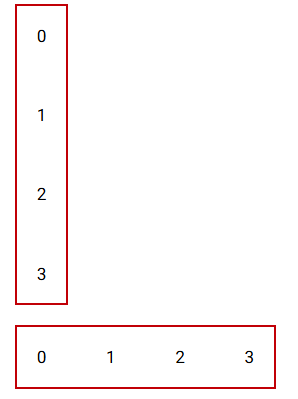

两个控件支持的参数也一样，只是其中一个参数的默认值不一样：

- `wrap`参数，关键字参数，布尔类型，表示子控件的宽度（高度）总和超过控件的宽度（高度）时，是否换行（换列）。对于`ui.column`控件，该参数默认为`False`。对于`ui.row`控件，该参数默认为`True`。
- `align_items`参数，关键字参数，字符串类型（仅支持`['start', 'end', 'center', 'baseline', 'stretch']`中的值），表示子控件的对齐方向。

以`ui.column`控件为例，其参数用法的示例如下：

```python
from nicegui import ui

def index():
    with ui.column(
        wrap=True,
        align_items='center'
    ).classes(
        'border-2 border-red-700 h-32'
    ):
        for i in range(4):
            ui.item(str(i)*(i+1)*3)
    with ui.column().classes(
        'border-2 border-red-700 h-32'
    ):
        for i in range(4):
            ui.item(str(i)*(i+1)*3)

ui.run(
    root=index,
    title='易森-NiceGUI',
    native=True
)
```

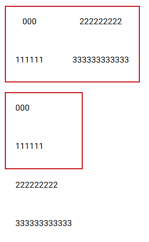

### 61.2 改变`ui.separator`控件的方向只需一个控件属性

相关文档：

- https://nicegui.io/documentation/separator
- https://quasar.dev/vue-components/separator

`ui.separator`控件可以创建一个占用空间极小且不太明显的分隔符，但是，默认是水平方向的，如果用在行布局中，分隔线需要改为垂直方向：

```python
from nicegui import ui

def index():
    with ui.row().classes(
        'border-2 border-red-700 p-1'
    ):
        for i in range(4):
            ui.button(i)
        ui.space()
        ui.separator()
        ui.button(4)

ui.run(
    root=index,
    title='易森-NiceGUI',
    native=True
)
```

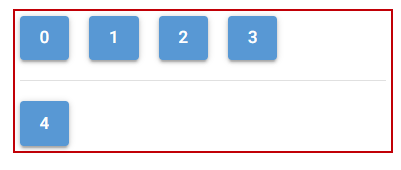

操作其实很简单，只需添加控件属性`vertical`即可：

```python
from nicegui import ui

def index():
    with ui.row().classes(
        'border-2 border-red-700 p-1'
    ):
        for i in range(4):
            ui.button(i)
        ui.space()
        ui.separator().props('vertical')
        ui.button(4)

ui.run(
    root=index,
    title='易森-NiceGUI',
    native=True
)
```

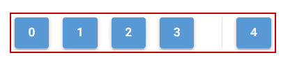

### 61.3 改变`ui.grid`控件的网格大小

相关文档：

- https://nicegui.io/documentation/grid
- https://tailwindcss.com/docs/grid-column
- https://tailwindcss.com/docs/grid-row

在《NiceGUI札记》（2026版）第13章中，简单介绍过网格布局，涉及到自定义网格规格的用法，有点类似于表格的合并单元格（跨列、跨行），算是一种自定义网格大小的方法，这里先通过示例复习一下：

```python
from nicegui import ui

def index():
    with ui.grid(columns=4).classes('w-64 h-64 gap-0'):
        # 第一行
        ui.label('columns*1').classes('col-span-full border p-1')
        # 第二行
        ui.label('2*2').classes('col-span-2 row-span-2 border p-1')
        ui.label('2*1').classes('col-span-2 row-span-1 border p-1')
        # 第三行
        ui.label('1*1').classes('border p-1')
        # 第四行
        ui.label('3*1').classes('col-span-3 border p-1')
        

ui.run(
    root=index,
    title='易森-NiceGUI',
    native=True
)
```

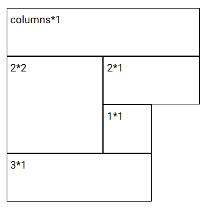

在4列的网格中，通过给子控件添加样式类`'col-span-{列数}'`、`'row-span-{行数}'`，表示该子控件对应网格的规格（`{列数}*{行数}`）。

除了给子控件添加样式来修改网格的规格，还可以给控件的参数传入字符串（使用空格分隔，表示每一列的列宽或者每一行的行高），变相修改网格的宽度、高度：

```python
from nicegui import ui

def index():
    size = ['100px','200px','300px']
    with ui.grid(
        columns=' '.join(size),
        rows=' '.join(size)
    ).classes('gap-0'):
        for k in size:
            for i in size:
                ui.label(f'{i}*{k}').classes('border p-1')
        

ui.run(
    root=index,
    title='易森-NiceGUI',
    native=True
)
```


没错，`ui.grid`控件支持的两个参数，传入整数时表示一共多少列、多少行，传入字符串的话，除了表示有多少列、多少行，还表示对应列、行的宽度、高度。字符串使用空格分隔，每个单词表示宽度、高度，使用CSS中的长度表示方法（`'auto'`表示自动，`'fr'`表示份数，`'px'`表示具体的像素值）。

注意，给子控件添加样式类可以修改子控件的大小，但不会影响网格的大小。

## 62 学习控件——布局控件（《易森》2707期+）

### 62.1 `ui.skeleton`控件

相关文档：

- https://nicegui.io/documentation/skeleton
- https://quasar.dev/vue-components/skeleton

`ui.skeleton`控件用于创建一个代替控件的占位控件，通常在页面没有完全加载时表示页面的布局。

`ui.skeleton`控件支持以下参数：

- `type`参数，字符串类型（仅支持`['text','rect','circle','QBtn','QBadge','QChip','QToolbar','QCheckbox','QRadio','QToggle','QSlider','QRange','QInput','QAvatar']`中的值），表示骨架类型，即使用哪种控件作为骨架的轮廓，默认为`'rect'`。

- `tag`参数，字符串类型，表示使用哪种HTML元素渲染该控件，默认为`'div'`。

  从该参数开始，只能通过关键字传入。

- `animation`参数，字符串类型（仅支持`['wave','pulse','pulse-x','pulse-y','fade','blink','none',]`中的值），表示加载动画的类型，默认为`'wave'`。

- `animation_speed`参数，浮点类型，表示加载动画的速度（在多少秒内播放完一遍动画），默认为`1.5`。

- `square`参数，布尔类型，表示是否移除轮廓的圆角。

- `bordered`参数，布尔类型，表示是否添加边框。

- `size`参数，字符串类型，表示控件的大小（使用CSS的尺寸表达方式）。

- `width`参数，字符串类型，表示控件的宽度（使用CSS的尺寸表达方式）。

- `height`参数，字符串类型，表示控件的高度（使用CSS的尺寸表达方式）。

示例如下：

```python
from nicegui import ui

def index():
    ui.skeleton('rect',bordered=True,size='5em')
    ui.skeleton('rect',size='5em')

ui.run(
    root=index,
    title='易森-NiceGUI',
    native=True
)
```


### 62.2 `ui.card`控件及其配套控件（`ui.card_actions`控件和`ui.card_section`控件）

相关文档：

- https://nicegui.io/documentation/card
- https://quasar.dev/vue-components/card

`ui.card`控件本身用法不复杂，仅支持一个表示子控件对齐方向`align_items`参数，无需单独解释。要说特别之处，那就该控件支持`tight`方法，用于生成一个移除内边距的副本：

```python
from nicegui import ui

def index():
    with ui.card().tight():
        ui.label('card')
        with ui.card_section():
            ui.label('card section')
        with ui.card_actions():
            ui.button('Yes')
            ui.button('No')

ui.run(
    root=index,
    title='易森-NiceGUI',
    native=True
)
```


这样得到的卡片会显得更紧凑。

除此以外值得说道的，就是与之配套的`ui.card_actions`控件和`ui.card_section`控件。`ui.card`控件表示卡片主体，在上下文中添加的控件会放在默认带边框的卡片中；`ui.card_actions`控件表示卡片的动作区域，只能在`ui.card`控件的上下文添加，一般在该控件上下文添加可以点击的控件，并且默认靠左对齐；`ui.card_section`控件表示内容分区，只能在`ui.card`控件的上下文添加，一般在该控件上下文添加只是显示内容的控件，并且默认居中对齐。

配套控件没有额外的参数、方法，如果想修改配套控件的样式，就要用到控件属性（`props`）。

`ui.card_actions`控件支持以下控件属性：

- `vertical`属性，布尔类型，表示子控件是否采用垂直布局。
- `align`属性，字符串类型（仅支持`['left', 'right', 'center', 'evenly', 'stretch', 'between', 'around']`中的值），表示子控件的对齐方向。

`ui.card_section`控件持以下控件属性：

- `horizontal`属性，布尔类型，表示子控件是否采用水平布局。
- `tag`属性，字符串类型，表示使用哪种HTML元素渲染该控件，默认为`'div'`。

示例如下：

```python
from nicegui import ui

def index():
    with ui.card():
        ui.label('card')
        with ui.card_section():
            ui.label('card section 1 ')
            ui.label('card section 2 ')
        with ui.card_actions():
            ui.button('Yes')
            ui.button('No')
    with ui.card():
        ui.label('card')
        with ui.card_section().props('horizontal'):
            ui.label('card section 1 ')
            ui.label('card section 2 ')
        with ui.card_actions().props('vertical'):
            ui.button('Yes')
            ui.button('No')

ui.run(
    root=index,
    title='易森-NiceGUI',
    native=True
)
```

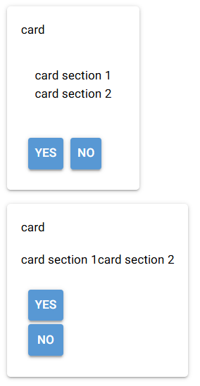

### 62.3 `ui.list`控件的配套控件（`ui.item`控件）与`ui.item`控件的配套控件（`ui.item_label`控件和`ui.item_section`控件）

相关文档：

- https://nicegui.io/documentation/list
- https://quasar.dev/vue-components/list-and-list-items

`ui.list`控件看上去与`ui.column`控件类似，只是子控件之间更加紧凑，用法上没有需要注意的点。不过，通常用在该控件上下文的`ui.item`控件，值得说一说。

`ui.item`控件从用法上看，就像是功能简化的按钮，只保留了两个参数：`text`参数和`on_click`参数。这两个参数的含义、用法，与按钮控件相同，这里就不再赘述。

但与按钮控件不同的是，有两个一般在`ui.item`控件上下文中使用的控件：`ui.item_label`控件和`ui.item_section`控件。这两个控件与`ui.item`控件组合在一起使用，共同组成一个内容项目的整体，每个控件分别对应着内容的指定部分。

`ui.item_section`控件和`ui.item_label`控件的参数一样，都是`text`参数，使得这两个控件用起来就像`ui.label`控件一样，但事实真的如此吗？一旦将其放在`ui.item`控件的上下文中，对比效果之后，就会发现不同：

```python
from nicegui import ui

def index():
    with ui.item('item1').classes('border-red-400 border-2'):
        ui.label('label1 ')
        ui.label('label2 ')
    with ui.item('item2').classes('border-red-400 border-2'):
        ui.item_label('item_label1 ')
        ui.item_label('item_label2 ')
    with ui.item('item3').classes('border-red-400 border-2'):
        ui.item_section('section1 ')
        ui.item_section('section2 ')

ui.run(
    root=index,
    title='易森-NiceGUI',
    native=True
)
```


从结果看，要是直接放在`ui.item`控件上下文中的话，`ui.item_section`控件的效果最好，起码垂直方向是对齐的。

当然，这并不是说`ui.item_label`控件就一无是处，暂且用一下后面才会讲到的控件属性，看一下和`ui.label`控件相比，使用相同的控件属性，二者有何区别：

```python
from nicegui import ui

def index():
    with ui.item('item').classes('border-red-400 border-2'):
        with ui.item_section():
            ui.label('label1 ').props('overline')
            ui.label('label2 ').props('caption')
        with ui.item_section():
            ui.item_label('item_label1 ').props('overline')
            ui.item_label('item_label2 ').props('caption')
        # 占位用的空白控件
        ui.item_section().props('avatar')

ui.run(
    root=index,
    title='易森-NiceGUI',
    native=True
)
```

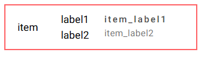

可以看到，都是放在`ui.item_section`控件上下文的话，两种控件都是垂直布局，但这个不是重点，重点在于，都添加了相同的控件属性之后，只有`ui.item_label`控件的控件属性**生效**了，`ui.label`控件**无动于衷**。没错，这就配套的原因：只有**配套使用**时，特定**控件属性**对应的特定样式才会**生效**。

这三个控件配套使用时，一般用在`ui.list`控件的上下文中。因此，既然要介绍这三个控件的控件属性，索性连`ui.list`控件的控件属性也说说。

`ui.list`控件支持以下控件属性：

- `separator`属性，布尔类型，表示是否在子控件之间添加分隔线。
- `padding`属性，布尔类型，表示是否在列表开头、末尾额外添加内边距。
- `bordered`属性，布尔类型，表示是否给整个列表添加边框。
- `dense`属性，布尔类型，表示是否调小各个子控件之间的距离，使得整个列表更加紧凑。

示例如下：

```python
from nicegui import ui

def index():
    with ui.list():
        for _ in range(5):
            ui.item('Test')

    with ui.list().props(
        'dense separator bordered'
    ):
        for _ in range(5):
            ui.item('Test')

ui.run(
    root=index,
    title='易森-NiceGUI',
    native=True
)
```

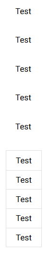

`ui.item`控件支持以下控件属性：

- `inset-level`属性，整数类型，表示该项目的缩进等级（`0`表示不缩进）。
- `disable`属性，布尔类型，表示是否禁用控件。
- `active`属性，布尔类型，表示是否激活控件。
- `clickable`属性，布尔类型，表示点击控件时是否显示点击效果。
- `dense`属性，布尔类型，表示是否调小控件的内边距。

示例如下：

```python
from nicegui import ui

def index():
    with ui.list():
        ui.item('Test').props(
            'inset-level=1'
        )
        ui.item('Test').props(
            'disable'
        )
        ui.item('Test').props(
            'active'
        )
        ui.item('Test').props(
            'clickable'
        )
        ui.item('Test').props(
            'dense'
        )
        ui.item('Test')

ui.run(
    root=index,
    title='易森-NiceGUI',
    native=True
)
```

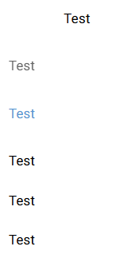

`ui.item_section`控件支持以下控件属性：

- `side`属性，布尔类型，当控件在首尾时，使用该属性可以将控件样式修改为不太突出的效果（适合作为侧边的陪衬）。
- `avatar`属性，布尔类型，当控件的子控件为图标时，使用该属性可以得到类似`ui.avatar`控件的显示效果。
- `thumbnail`属性，布尔类型，当控件的子控件为图片时，使用该属性可以得到图片的缩略图效果。
- `top`属性，布尔类型，表
- `no-wrap`属性，布尔类型，当控件的文本存在空格时，控件会使用空格作为分词符号而让多个单词自动换行，该属性表示是否禁用自动换行。

示例如下：

```python
from nicegui import ui

def index():
    with ui.item().classes('border-2 border-red-400'):
        ui.item_section('section').props(
            'side'
        )
        ui.item_section('section')
        ui.item_section('section').props(
            'side'
        )
    with ui.item().classes('border-2 border-red-400'):
        with ui.item_section().props(
            'avatar'
        ):
            ui.icon('home')
        ui.item_section('section')
        with ui.item_section():
            ui.avatar('home',color=None)

ui.run(
    root=index,
    title='易森-NiceGUI',
    native=True
)
```

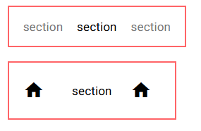

`ui.item_label`控件支持以下控件属性：

- `lines`属性，整数类型，表示文本太多无法在指定行数内完整展示时，多余部分显示为省略号。
- `overline`属性，布尔类型，表示该控件的显示样式是否为上标效果。
- `caption`属性，布尔类型，表示该控件的显示样式是否为说明文字效果。
- `header`属性，布尔类型，表示该控件的显示样式是否为标题效果。

示例如下：

```python
from nicegui import ui

def index():
    with ui.item().classes('border-2 border-red-400'):
        with ui.item_section():
            ui.item_label('label').props(
                'overline'
            )
            ui.item_label('label').props(
                'caption'
            )
            ui.item_label('label').props(
                'header'
            )
        with ui.item_section():
            ui.item_label('label')
            ui.item_label('label')
            ui.item_label('label')

ui.run(
    root=index,
    title='易森-NiceGUI',
    native=True
)
```


## 63 自定义连接丢失时的弹窗

问题来源：https://github.com/zauberzeug/nicegui/discussions/5994

注意，本问题发生时间较早，虽然笔者提供了临时方案，但文章发布时可能官方已经提供了更加优雅的解决方案。不过，问题的解决思路还是值得学习，故单独拎出来分享一下解决的思路。

如问题来源所述，提问者想要自定义连接丢失时的弹窗内容，但是官方将弹窗内容硬编码到`nicegui/templates/index.html`中：

```javascript
      function show_popup() {
        const popup = document.createElement('template');
        popup.innerHTML = `
          <div id="popup" style="position: fixed; top: 0; left: 0; width: 100vw; height: 100vh; background-color: rgba(240, 240, 240, 0.8)">
            <div style="position: absolute; left: 50%; top: 50%; transform: translate(-50%, -50%); padding: 4em; background-color: #fff; border: 1pt solid #ddd; box-shadow: 0 0 0.5em rgba(0, 0, 0, 0.01)">
              <h3 style="font-size: x-large; margin-bottom: 1ex">Connection lost</h3>
              <p style="font-size: large">Trying to reconnect...</p>
            </div>
          </div>
        `.trim();
        document.body.appendChild(popup.content.firstChild);
      }

      function hide_popup() {
        document.getElementById('popup')?.remove();
      }
```

想要修改的话，似乎只能期待官方提供接口。

当然，如果读者比较擅长JavaScript的话，可以尝试执行修改该元素的JavaScript代码，但是，这样操作就需要完全自己写HTML代码，有点吃力。

好吧，既然有可能实现，能不能更简单一点？

直接修改库代码不太现实，每次更新的话都会覆盖，若是官方不同步修改，每次都要手动改一遍，太麻烦。好在JavaScript中修改指定元素很方便，而弹窗本身有ID（`'popup'`），在程序中单独使用JavaScript修改也不是不行。本着最简原则，即便是有外挂的方法，也要寻求更加简单的方案，于是，可以传送（移动）控件的`ui.teleport`控件成为了备选项。

`ui.teleport`控件支持使用选择器语法查询指定元素，然后在该元素内创建NiceGUI控件，这样的话，弹窗的具体内容就不用手搓HTML了。

有了解决方向，代码也很快出来了：

```python
from nicegui import ui

def index():
    ui.label('try pressing ctrl+c in terminal')
    with ui.teleport('#popup').clear():
        ui.label('waiting...')

ui.run(
    root=index,
    title='易森-NiceGUI',
)
```

在终端按下`ctrl+c`键，网页中显示出额外添加的内容：

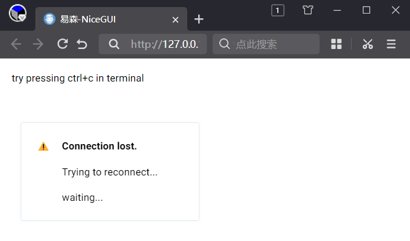

等一下，明明调用了清除子控件的`clear`方法，怎么原来的内容还在？

先不要急着上报bug，其实，方法是没错的，只是原来的内容不是控件，而是普通的HTML元素，不能使用`clear`方法清除。

既然如此，难道自定义弹窗内容只能止步于此吗？只能实现添加？

天无绝人之路，既然原来的内容是普通的HTML元素，那就试试JavaScript方法`removeChild`，看看能不能移除掉。查询的话就用JavaScript方法`getElementById`，直接传入弹窗的ID（`'popup'`）即可得到弹窗。弹窗内实际上有两个子元素，因此需要调用两次。

代码如下：

```python
from nicegui import ui

async def index():
    ui.label('try pressing ctrl+c in terminal')
    # remove two children
    # 移除原来的两个子元素
    await ui.run_javascript("document.getElementById('popup').removeChild(document.getElementById('popup').children[0])")
    await ui.run_javascript("document.getElementById('popup').removeChild(document.getElementById('popup').children[0])")
    with ui.teleport('#popup'):
        ui.label('waiting...')

ui.run(
    root=index,
    title='易森-NiceGUI',
)
```

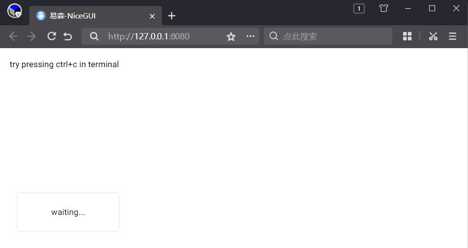

完美解决。

引申思考，能不能自定义弹窗位置？

当然可以，但是需要覆盖原样式类`nicegui-error-popup`，因此需要了解CSS。

完整复制原样式类`nicegui-error-popup`的内容（来自`nicegui/static/nicegui.css`）之后，修改、添加（如果没有的话）以下样式（数字表示具体值，`auto`表示无限远但内容可以完整显示）：

- `top`样式，表示弹窗上边到显示区域边缘的距离（不包含内外边距）。
- `bottom`样式，表示弹窗下边到显示区域边缘的距离（不包含内外边距）。
- `left`样式，表示弹窗左边到显示区域边缘的距离（不包含内外边距）。
- `right`样式，表示弹窗右边到显示区域边缘的距离（不包含内外边距）。

示例代码如下：

```python
from nicegui import ui

popup_css = '''
.nicegui-error-popup {
    position: fixed;
    border: 1pt solid rgba(127, 159, 191, 0.25);
    border-radius: 0.25em;
    box-shadow: 0 0 0.5em rgba(127, 159, 191, 0.05);
    margin: 2em;
    padding: 1.5em 4em;
    display: flex;
    flex-direction: column;
    gap: 1em;
    transition-duration: 500ms;
    pointer-events: none;
    z-index: 10000;
    /*上下左右代表弹窗在对应方向上到边缘的距离，auto表示无限远但内容可以完整显示*/
    top: 0;
    bottom:auto;
    left:auto;
    right:0;
}
'''

async def index():
    ui.add_css(popup_css)
    ui.label('try pressing ctrl+c in terminal')
    # remove two children
    # 移除原来的两个子元素
    await ui.run_javascript("document.getElementById('popup').removeChild(document.getElementById('popup').children[0])")
    await ui.run_javascript("document.getElementById('popup').removeChild(document.getElementById('popup').children[0])")
    with ui.teleport('#popup'):
        ui.label('waiting...')
    

ui.run(
    root=index,
    title='易森-NiceGUI',
)
```

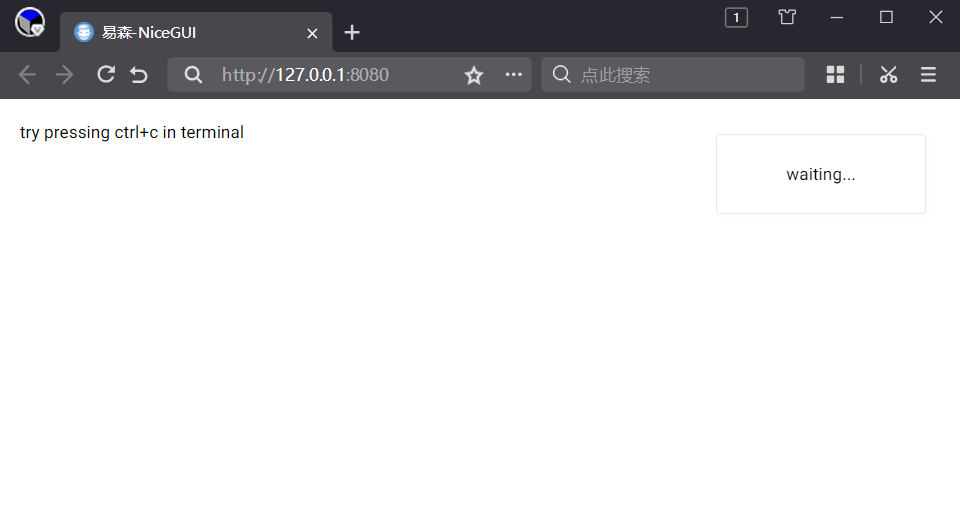

## 64 学习控件——弹性空间控件

用户界面的空间是有限的，如果需要展示的内容、控件较多，全部铺平显示，很容易超过可见区域，用户想要看到其余的部分，只能滚动页面。

在NiceGUI中，有这么一类控件，可以展开或者收起，让控件占据的空间发生改变；也可以在固定空间内实现内容的滚动或者切换。笔者将这类控件命名为弹性空间控件，因为它们可以实现堪比空间魔法的效果。

本章要讲的，就是弹性空间控件的用法。

### 64.1 可以变大变小的`ui.expansion`控件

相关文档：

- https://nicegui.io/documentation/expansion
- https://quasar.dev/vue-components/expansion-item

`ui.expansion`控件就像是折页宣传册，可以折起来只看到封面，也可以展开后看到所有的内容，点击控件或者修改控件的`value`属性即可切换展开状态：

```python
from nicegui import ui


def index():
    with ui.card(),ui.expansion(
        'More',
        caption='info'
    ).props('header-class=bg-blue'):
        ui.button('Hello')
        ui.button('World')
    with ui.card(),ui.expansion(
        'More',
        caption='info',
        value=True
    ).props('header-class=bg-blue'):
        ui.button('Hello')
        ui.button('World')


ui.run(
    root=index,
    title='易森-NiceGUI'
)

```

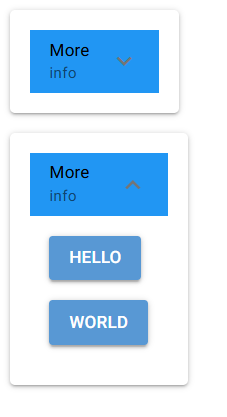

`ui.expansion`控件支持以下参数：

- `text`参数，字符串类型，表示标题文本。

- `caption`参数，字符串类型，表示说明文本。

  从该参数开始，只能通过关键字传入。

- `icon`参数，字符串类型，表示图标。

- `group`参数，字符串类型，表示分组。分组相同的控件只能展开一个，此时控件所处的模式也叫手风琴模式。

- `value`参数，布尔类型，表示控件是否展开。

- `on_value_change`参数，可调用类型，表示切换控件展开状态时执行的操作。

`ui.expansion`控件支持以下方法：

- `open`方法，展开控件。
- `close`方法，收起控件。

默认点击整个控件都可以切换展开状态，但是，如果添加了`expand-icon-toggle`控件属性，则只有点击控件右边的图标才能切换：

```python
from nicegui import ui


def index():
    with ui.expansion().props('expand-icon-toggle'):
        ui.button('Hello')
        ui.button('World')
    with ui.expansion():
        ui.button('Hello')
        ui.button('World')

ui.run(
    root=index,
    title='易森-NiceGUI'
)

```

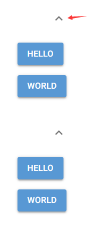

### 64.2 内部空间比看上去更大的`ui.scroll_area`控件

相关文档：

- https://nicegui.io/documentation/scroll_area
- https://quasar.dev/vue-components/scroll-area/

`ui.scroll_area`控件从外面看大小固定，但它作为容器时，其内部空间远比看上去更大。当内容尺寸超过外部大小时，就可以通过滚动显示看不见的部分：

```python
from nicegui import ui


def index():
    with ui.card(),ui.scroll_area().classes(
        'w-64 h-64'
    ):
        for i in range(99):
            ui.button(
                str(i)
            )

ui.run(
    root=index,
    title='易森-NiceGUI'
)

```

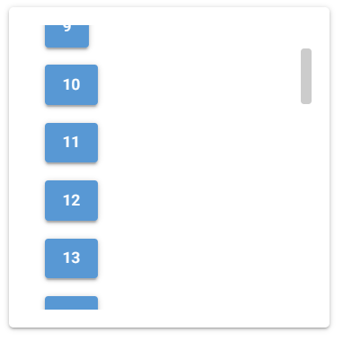

`ui.scroll_area`控件支持以下关键字参数：

- `on_scroll`参数，可调用类型，表示滚动内容时执行的操作。

`ui.scroll_area`控件支持以下方法：

- `on_scroll`方法，设置滚动内容时执行的操作。该方法支持以下参数：
  - `callback`参数，可调用类型，表示滚动内容时执行的操作。
- `scroll_to`方法，滚动到指定位置。该方法支持以下关键字参数：
  - `pixels`参数，浮点类型，表示指定位置（像素）。
  - `percent`参数，浮点类型，表示指定位置（百分比）。
  - `axis`参数，字符串类型（仅支持`['vertical', 'horizontal']`中的值），表示滚动方向，默认为`'vertical'`。
  - `duration`参数，浮点类型，表示滚动动画的播放时长，默认为`0.0`。

示例如下：

```python
from nicegui import ui


def index():
    with ui.card(),ui.scroll_area().classes(
        'w-64 h-64'
    ) as sa:
        for i in range(99):
            ui.button(
                str(i)
            )
    ui.button(
        'click',
        on_click=lambda:sa.scroll_to(
            percent=0.5,
            duration=1
        )
    )
    
ui.run(
    root=index,
    title='易森-NiceGUI'
)

```

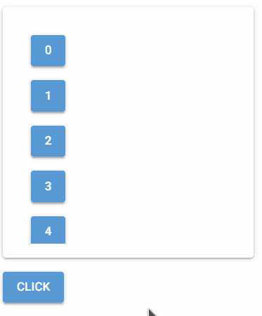

### 64.3 滑动解锁新空间的`ui.slide_item`控件

相关文档：

- https://nicegui.io/documentation/slide_item
- https://quasar.dev/vue-components/slide-item/

`ui.slide_item`控件从表面上看似没有玄机，怎么点击都不会切换，但其秘密在于滑动，就好像手机的滑动解锁一样。向上下左右四个方向滑动，会解锁反方向对应的隐藏空间：

```python
from nicegui import ui


def index():
    with ui.list().classes(
        'border-2 border-red-700'
    ), ui.slide_item(
        'center'
    ).classes(
        'w-32'
    ) as slide:
        ui.item('中心')
    with slide.left(
        'left',
        on_slide=slide.reset
    ):
        ui.label('左')
    with slide.right(
        'right',
        on_slide=slide.reset
    ):
        ui.label('右')
    with slide.top(
        'top',
        on_slide=slide.reset
    ):
        ui.label('上')
    with slide.bottom(
        'bottom',
        on_slide=slide.reset
    ):
        ui.label('下')


ui.run(
    root=index,
    title='易森-NiceGUI'
)

```

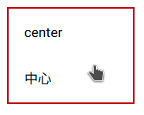

`ui.scroll_area`控件支持以下参数：

- `text`参数，字符串类型，表示显示在控件内的文字。
- `on_slide`参数，关键字参数，可调用类型，表示滑动完成后执行的动作。注意，该响应函数的参数对应的是最终显示的空间。

`ui.scroll_area`控件支持以下方法：

- `on_slide`方法，设置滑动完成后执行的动作。该方法支持以下参数：
  - `callback`参数，可调用类型，表示滑动完成后执行的动作。
- `action`方法，返回任意方向空间的插槽。该方法支持以下参数：
  - `side`参数，字符串类型（仅支持`['left', 'right', 'top', 'bottom']`中的值），表示对应的方向。
  - `text`参数，字符串类型，表示该方向空间显示在控件内的文字。
  - `on_slide`参数，关键字参数，可调用类型，表示该方向空间滑动完成后执行的动作。注意，该响应函数的参数对应的是最终显示的空间。
  - `color`参数，字符串类型，表示对应方向空间的背景色，默认为`'primary'`（主题的主要颜色）。
- `left`方法，返回左面空间的插槽。支持的参数与`action`方法基本相同（只是没有`side`参数）。
- `right`方法，返回右面空间的插槽。支持的参数与`action`方法基本相同（只是没有`side`参数）。
- `top`方法，返回上面空间的插槽。支持的参数与`action`方法基本相同（只是没有`side`参数）。
- `bottom`方法，返回底面空间的插槽。支持的参数与`action`方法基本相同（只是没有`side`参数）。
- `reset`方法，将控件复位为没有滑动时的状态。

### 64.4 自由拼接两个空间的`ui.splitter`控件

相关文档：

- https://nicegui.io/documentation/splitter
- https://quasar.dev/vue-components/splitter

`ui.splitter`控件，一个完整空间划分为左中右（或者上中下）三个空间，可以通过拖动中间空间（实际上是一条间隔线）来改变其余两个空间的占比。

示例如下：

```python
from nicegui import ui


def index():
    with ui.card():
        splitter = ui.splitter(
            value=75
        ).classes('w-64 h-64')
        with splitter.separator:
            ui.button('home')
        with splitter.before:
            ui.card().classes(
                'w-full h-full bg-red'
            )
        with splitter.after:
            ui.card().classes(
                'w-full h-full bg-blue'
            )


ui.run(
    root=index,
    title='易森-NiceGUI'
)

```

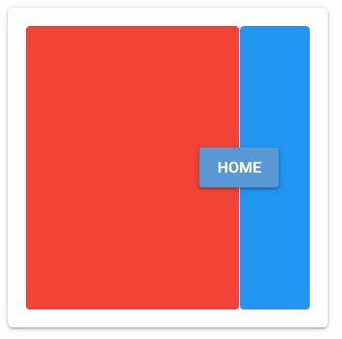

`ui.splitter`控件看起来只支持两个相同大小空间的拼接，实际上两个空间都像`ui.scroll_area`控件一样支持无限扩展：

```python
from nicegui import ui


def index():
    with ui.card():
        splitter = ui.splitter(
            value=75
        ).classes('w-64 h-64')
        with splitter.before,ui.row():
            for i in range(99):
                ui.button(
                    str(i)
                )
        with splitter.after:
            for i in range(99):
                ui.button(
                    str(i)
                )


ui.run(
    root=index,
    title='易森-NiceGUI'
)

```

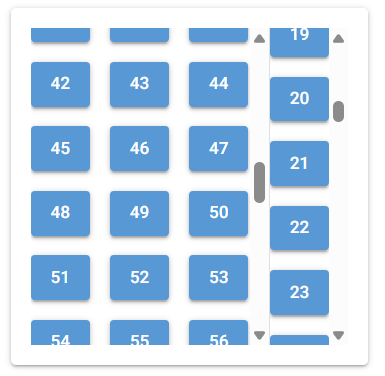

`ui.splitter`控件支持以下关键字参数：

- `horizontal`参数，布尔类型，表示分隔线的方向是否为水平，默认为`False`。
- `reverse`参数，布尔类型，表示是否反转分隔线两边空间的位置，默认为`False`。
- `limits`参数，元素为浮点数的双元素元组，表示允许分隔线拖动的范围，默认为`(0,100)`。
- `value`参数，浮点类型，表示分隔线当前的位置，默认为`50`。
- `on_change`参数，可调用类型，表示分隔线位置变化时执行的操作。

`ui.splitter`控件继承了`ValueElement`类，因此，该控件的`value`属性可用于属性绑定。若是不希望分隔线内有其他内容影响显示，但又希望拖动分隔线的操作容易一些，可以绑定`value`属性到`ui.slider`控件：

```python
from nicegui import ui


def index():
    with ui.card():
        splitter = ui.splitter(
            value=75,
        ).classes('w-64 h-64')
        with splitter.before:
            ui.card().classes(
                'w-full h-full bg-red'
            )
        with splitter.after:
            ui.card().classes(
                'w-full h-full bg-blue'
            )
        ui.slider(min=0,max=100).bind_value(splitter).classes('w-64')
    


ui.run(
    root=index,
    title='易森-NiceGUI'
)

```

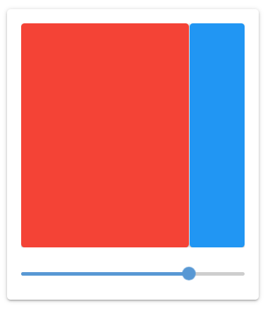

## 65 学习控件——分页控件

需要展示的内容、控件较多，使用弹性空间控件是一种不错的解决方案。但是，多到一定程度，使用弹性空间控件来编排就有些“心有余而力不足”：滚动太多内容的话，难以精准定位；没法规整地展示每一部分。这个时候，可以实现分页效果的分页控件就能完美解决痛点。

### 65.1 只负责页码的`ui.pagination`控件

相关文档：

- https://nicegui.io/documentation/pagination
- https://quasar.dev/vue-components/pagination

说到分页，大家自然而然地会想到那种一页一页的排版，以及底部显示的页码。

`ui.pagination`控件就用于生成这样的页码，并提供了可用于切换内容的响应函数，但不提供具体内容的显示。因此，该控件的示例如下：

```python
from nicegui import ui


def index():
    label = ui.label('当前页为第1页')
    ui.pagination(
        1,
        5,
        direction_links=True,
        value=1,
        on_change=lambda e:label.set_text(
            f'当前页为第{e.value}页'
        )
    )
    


ui.run(
    root=index,
    title='易森-NiceGUI'
)

```

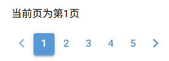

`ui.pagination`控件支持以下参数：

- `min`参数，整数类型，表示页码的最小值。

- `max`参数，整数类型，表示页码的最大值。

- `direction_links`参数，布尔类型，表示是否显示上、下一页按钮，默认为`False`。

  从该参数开始，只能通过关键字传入。

- `value`参数，整数类型，表示当前页码。

- `on_change`参数，可调用类型，表示当前页码变化时执行的操作。

该控件同样支持`on_change`方法、`value`属性及相关绑定方法，这里就不再赘述。

此外，`min`属性、`max`属性、`direction_links`属性与同名参数含义相同，都可以读写，在实际使用时如有需求，可以灵活使用这些属性。

控件属性提供了额外的功能、样式，可以进一步定制控件的显示。

`ui.pagination`控件支持以下控件属性（常用的部分）：

- `input`属性，布尔类型，将页码选择方式改为直接输入。
- `icon-first`属性，字符串类型，跳转至第一页按钮的图标。
- `icon-last`属性，字符串类型，跳转至最后一页按钮的图标。
- `icon-prev`属性，字符串类型，跳转至上一页按钮的图标。
- `icon-next`属性，字符串类型，跳转至下一页按钮的图标。
- `boundary-links`属性，布尔类型，表示是否显示第一页、最后一页按钮。
- `boundary-numbers`属性，布尔类型，表示是否始终显示第一页、最后一页对应的页码。
- `ellipses`属性，布尔类型，是否在页面数量多于`max-pages`属性的值时将其他页面的页码显示为省略号，默认启用。
- `max-pages`属性，整数类型，表示最多显示多少页的页码。
- `flat`属性，布尔类型，给除了当前页面外的其他按钮启用纯平风格。
- `outline`属性，布尔类型，给除了当前页面外的其他按钮添加外轮廓。
- `unelevated`属性，布尔类型，给除了当前页面外的其他按钮移除阴影。
- `push`属性，布尔类型，给除了当前页面外的其他按钮启用立体效果。
- `size`属性，字符串类型，表示按钮大小。
- `color`属性，字符串类型，表示除了当前页面外的其他按钮的颜色。
- `text-color`属性，字符串类型，表示文本的颜色。
- `active-design`属性，字符串类型（支持`['flat','outline','push','unelevated']`中的值），表示当前页面按钮的风格。
- `active-color`属性，字符串类型，表示当前页面按钮的颜色。
- `active-text-color`属性，字符串类型，表示当前页面按钮的文本颜色。
- `round`属性，布尔类型，将所有按钮的形状改为圆形。
- `rounded`属性，布尔类型，给所有按钮添加圆角。注意，默认圆角半径为`12 px`，当按钮较小时，看起来和圆形一样。

示例如下：

```python
from nicegui import ui


def index():
    label = ui.label('当前页为第1页')
    ui.pagination(
        1,
        5,
        direction_links=True,
        value=1,
        on_change=lambda e:label.set_text(
            f'当前页为第{e.value}页'
        )
    ).props(
        '''
        input
        icon-first="home"
        icon-last="flag"
        icon-prev="arrow_left"
        icon-next="arrow_right"
        '''
    )


ui.run(
    root=index,
    title='易森-NiceGUI'
)

```

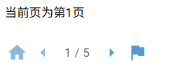

```python
from nicegui import ui


def index():
    label = ui.label('当前页为第1页')
    ui.pagination(
        1,
        15,
        direction_links=True,
        value=1,
        on_change=lambda e:label.set_text(
            f'当前页为第{e.value}页'
        )
    ).props(
        '''
        boundary-links
        boundary-numbers
        max-pages=7
        '''
    )


ui.run(
    root=index,
    title='易森-NiceGUI'
)

```

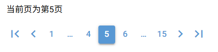

```python
from nicegui import ui


def index():
    label = ui.label('当前页为第1页')
    ui.pagination(
        1,
        5,
        direction_links=True,
        value=1,
        on_change=lambda e:label.set_text(
            f'当前页为第{e.value}页'
        )
    ).props(
        '''
        active-color=red
        color=green
        push
        '''
    )
    

ui.run(
    root=index,
    title='易森-NiceGUI'
)

```

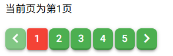

### 65.2 选项卡也是一种分页

相关文档：

- https://nicegui.io/documentation/tabs
- https://quasar.dev/vue-components/tabs
- https://quasar.dev/vue-components/tab-panels

在日常使用各种程序时，选项卡的使用场景几乎难以避免：

- 浏览器访问多个页面，点击链接会在新的选项卡中打开。
- 调整设置时，如果设置选项需要分页，经常使用选项卡而不是常规的分页，

由此可见，在分页数量有限、每一页的内容规模相当、页内的内容主题明确时，选项卡就成了代替常规分页的最佳选择。可以说，选项卡也是一种分页。

那么，NiceGUI的分页是什么样子？该如何使用？

先看示例：

```python
from nicegui import ui


def index():
    with ui.tabs().props(
        'no-caps'
    ) as tabs:
        ui.tab(
            'a',
            label='标签a'
        )
        ui.tab(
            'b',
            label='标签b'
        )
    with ui.tab_panels(
        tabs,
        value='a'
    ).classes(
        'w-64 h-64 border'
    ):
        with ui.tab_panel('a'):
            ui.label('标签页a')
        with ui.tab_panel('b'):
            ui.label('标签页b')


ui.run(
    root=index,
    title='易森-NiceGUI'
)

```

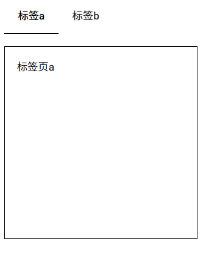

看起来选项卡很简洁，但示例代码中使用的控件数量却足足有四种。不要被代码的复杂吓到，且听笔者一一拆解。

`ui.tabs`控件、`ui.tab`控件、`ui.tab_panels`控件、`ui.tab_panel`控件，共同组成完整的选项卡控件。其中，`ui.tabs`控件为选项卡标签的容器，用于容纳表示选项卡标签的`ui.tab`控件。`ui.tab_panels`控件是选项卡面板的容器，用于容纳表示选项卡面板的`ui.tab_panel`控件。选项卡面板用于容纳需要分页的内容，选项卡标签与选项卡面板通过`name`控件属性自动建立关联，点击选项卡标签，选项卡面板的容器也会切换到对应的选项卡面板。

文字太多不想看之图片版：

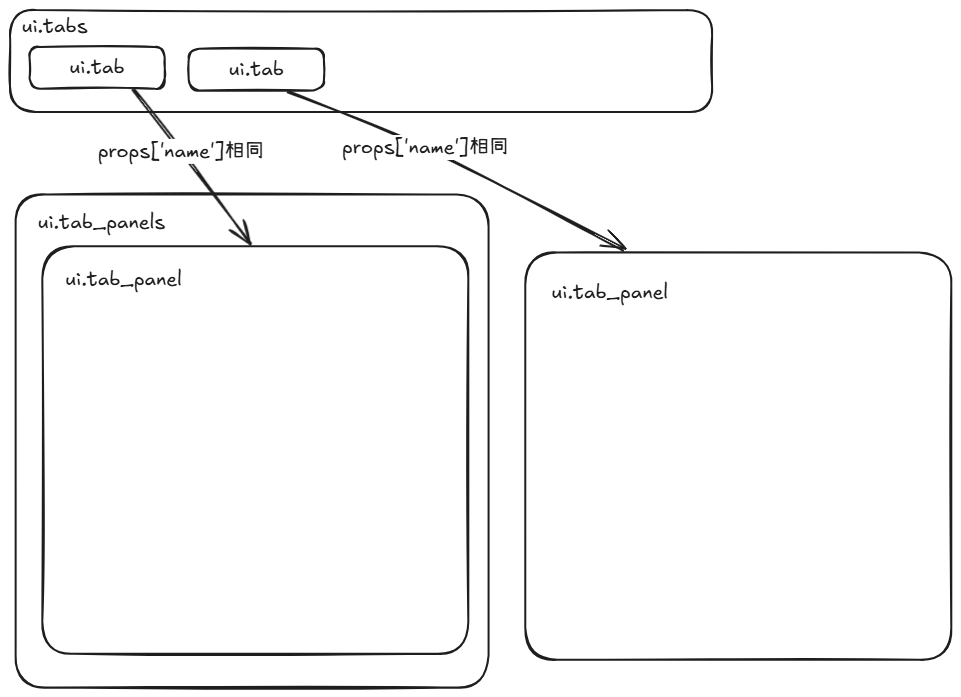

尽管实现一个简单、完整的选项卡，`ui.tabs`控件、`ui.tab`控件、`ui.tab_panels`控件、`ui.tab_panel`控件都必不可少，但每个控件的参数却并不复杂。

`ui.tab`控件支持以下参数：

- `name`参数，字符串类型，表示选项卡标签的名字，用于识别选项卡标签。
- `label`参数，字符串类型，表示选项卡标签显示的文字，如果该参数没有设置，将使用`name`参数的值。
- `icon`参数，字符串类型，表示选项卡标签的图标。

`ui.tab_panel`控件支持以下参数：

- `name`参数，字符串类型或者`ui.tab`控件，表示选项卡面板关联的选项卡标签。

`ui.tabs`控件支持以下关键字参数：

- `value`参数，`ui.tab`控件或者`ui.tab_panel`控件，表示当前激活的选项卡。
- `on_change`参数，可调用类型，表示选项卡切换时执行的操作。

`ui.tab_panels`控件支持以下参数：

- `tabs`参数，`ui.tabs`控件，表示容器内的选项卡面板与那个容器内的选项卡标签关联。

- `value`参数，字符串或者`ui.tab`控件或者`ui.tab_panel`控件，表示当前激活的选项卡。

  从该参数开始，只能通过关键字传入。

- `on_change`参数，可调用类型，表示选项卡切换时执行的操作。

- `animated`参数，布尔类型，默认为`True`，表示切换选项卡时是否播放过渡动画。

- `keep_alive`参数，布尔类型，默认为`True`，表示是否使用保活组件。保活组件即VUE中的`keep-alive`组件，选项卡面板中的内容在选项卡不可见时会自动销毁，使用保活组件可以避免销毁，但会额外占用内存、性能。

给选项卡便签添加图标：

```python
from nicegui import ui


def index():
    with ui.tabs().props(
        'no-caps'
    ) as tabs:
        ui.tab(
            'a',
            label='标签a',
            icon='home'
        )
        ui.tab(
            'b',
            label='标签b',
            icon='flag'
        )
    with ui.tab_panels(
        tabs,
        value='a'
    ).classes(
        'w-64 h-64 border'
    ):
        with ui.tab_panel('a'):
            ui.label('标签页a')
        with ui.tab_panel('b'):
            ui.label('标签页b')


ui.run(
    root=index,
    title='易森-NiceGUI'
)

```

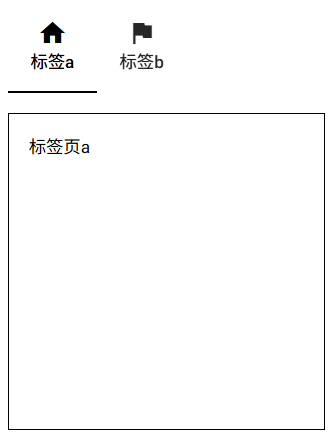

`ui.tabs`控件和`ui.tab_panels`控件都使用`value`参数表示前激活的选项卡。而该参数实际上通过`set_value`方法绑定到`value`属性，因此，可以直接修改控件的该属性，或调用控件的`set_value`方法（源于绑定属性），由代码完成切换选项卡的操作：

```python
from nicegui import ui


def index():
    with ui.tabs().props(
        'no-caps'
    ) as tabs:
        ui.tab(
            'a',
            label='标签a',
            icon='home'
        )
        ui.tab(
            'b',
            label='标签b',
            icon='flag'
        )
    with ui.tab_panels(
        tabs,
        value='a'
    ).classes(
        'w-64 h-64 border'
    ) as panels:
        def set_value():
            #tabs.value = 'b'
            panels.value = 'b'
        with ui.tab_panel('a'):
            ui.label('标签页a')
            ui.button(
                '切换选项卡（tabs）',
                on_click=lambda:tabs.set_value('b')
            )
            ui.button(
                '切换选项卡（panels）',
                on_click=lambda:panels.set_value('b')
            )
            ui.button(
                '切换选项卡（set_value）',
                on_click=set_value
            )
        with ui.tab_panel('b'):
            ui.label('标签页b')


ui.run(
    root=index,
    title='易森-NiceGUI'
)

```

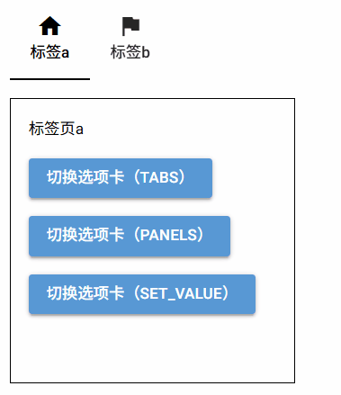

`ui.tabs`控件和`ui.tab_panels`控件的控件属性`vertical`可以将原本水平方向的选项卡改成垂直方向：

```python
from nicegui import ui


def index():
    with ui.tabs().props(
        'no-caps'
    ).props('vertical') as tabs:
        ui.tab(
            'a',
            label='标签a',
            icon='home'
        )
        ui.tab(
            'b',
            label='标签b',
            icon='flag'
        )
    with ui.tab_panels(
        tabs,
        value='a'
    ).classes(
        'w-64 h-64 border'
    ).props('vertical') as panels:
        with ui.tab_panel('a'):
            ui.label('标签页a')
        with ui.tab_panel('b'):
            ui.label('标签页b')
    row = ui.row()
    tabs.move(row)
    panels.move(row)


ui.run(
    root=index,
    title='易森-NiceGUI'
)

```

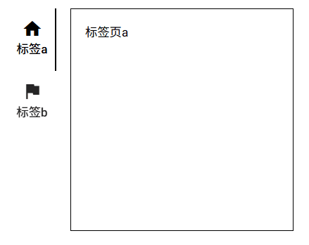

## 66 学习控件——分页控件（补充）

之前说过，选项卡也是一种分页。若是按照这个思路理解，操作逻辑、布局结构与选项卡类似的控件也能归为分页控件。

### 66.1 比选项卡更接近分页的轮播图控件

相关文档：

- https://nicegui.io/documentation/carousel
- https://quasar.dev/vue-components/carousel#qcarousel-api

`ui.carousel`控件、`ui.carousel_slide`控件，共同组成轮播图控件，用法类似选项卡控件，只不过轮播图控件没有选项卡标签，直接就是选项卡面板。`ui.carousel`控件是`ui.carousel_slide`控件的容器，相当于`ui.tab_panels`控件；`ui.carousel_slide`控件是显示内容的幻灯片，相当于选项卡面板（`ui.tab_panel`控件）。

示例如下：

```python
from nicegui import ui


def index():
    with ui.carousel(
        arrows=True,
        navigation=True,
        animated=True
    ).classes('w-64 h-64 border'):
        with ui.carousel_slide().classes(
            'border bg-red'
        ):
            ui.label('内容a')
        with ui.carousel_slide().classes(
            'border bg-blue'
        ):
            ui.label('内容b')


ui.run(
    root=index,
    title='易森-NiceGUI'
)

```

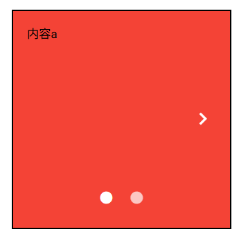

`ui.carousel_slide`控件支持以下参数：

- `name`参数，字符串类型，用于识别当前幻灯片，因此不能重名。

`ui.carousel`控件支持以下关键字参数：

- `value`参数，字符串或者`ui.carousel_slide`控件，表示当前显示的幻灯片。
- `on_value_change`参数，可调用类型，表示幻灯片切换时执行的操作。
- `animated`参数，布尔类型，默认为`False`，表示切换幻灯片时是否播放过渡动画。
- `arrows`参数，布尔类型，默认为`False`，表示是否显示切换幻灯片的上一张、下一张按钮。
- `navigation`参数，布尔类型，默认为`False`，表示是否显示跳转至指定幻灯片的导航按钮。

`ui.carousel`控件支持以下方法：

- `next`方法，切换为下一张幻灯片。
- `previous`方法，切换为上一张幻灯片。

从参数上看，使用默认参数时，轮播图控件确实像没有选项卡标签的选项卡，需要通过额外的控件来切换显示：

```python
from nicegui import ui


def index():
    with ui.carousel().classes('w-64 h-64 border') as carousel:
        with ui.carousel_slide('a').classes(
            'border bg-red'
        ):
            ui.label('内容a')
        with ui.carousel_slide('b').classes(
            'border bg-blue'
        ):
            ui.label('内容b')
    with ui.row():
        ui.button(
            '<',
            on_click=carousel.previous
        )
        ui.button(
            '>',
            on_click=carousel.next
        )
    with ui.row():
        ui.button(
            'a',
            on_click=lambda:carousel.set_value('a')
        )
        ui.button(
            'b',
            on_click=lambda:carousel.set_value('b')
        )


ui.run(
    root=index,
    title='易森-NiceGUI'
)

```

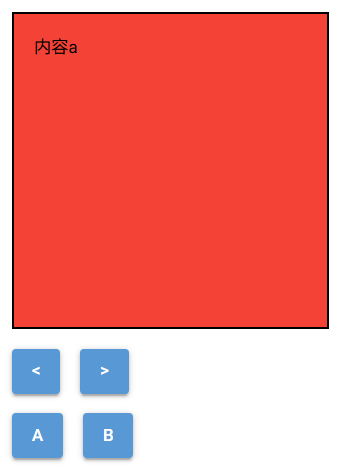

而`ui.carousel`控件支持的控件属性中，也有一些与选项卡控件相同的。

`ui.carousel`控件支持以下控件属性（部分）：

- `fullscreen`属性，布尔类型，当控件没有设定尺寸时，使用该属性可以全屏显示控件。
- `keep-alive`属性，布尔类型，表示是否使用保活组件。保活组件即VUE中的`keep-alive`组件，幻灯片中的内容在幻灯片不可见时会自动销毁，使用保活组件可以避免销毁，但会额外占用内存、性能。
- `infinite`属性，布尔类型，表示轮播图是否可以循环切换，即在显示最后一张幻灯片时，可以切换下一张幻灯片，来显示第一种幻灯片，反之亦然。
- `swipeable`属性，布尔类型，表示是否允许使用手势切换幻灯片。
- `vertical`属性，布尔类型，表示将轮播图的方向改为垂直。
- `autoplay`属性，布尔类型或整数类型，表示轮播图的自动播放间隔（单位毫秒，如果为布尔值，则在启用时相当于5000毫秒）。
- `prev-icon`属性，字符串类型，表示上一张按钮的图标。
- `next-icon`属性，字符串类型，表示下一张按钮的图标。
- `navigation-position`属性，字符串类型，仅支持`['top','right','bottom','left']`中的值，表示导航按钮的位置。
- `navigation-icon`属性，字符串类型，表示导航按钮的图标。
- `navigation-active-icon`属性，字符串类型，表示当前激活的导航按钮的图标。
- `thumbnails`属性，布尔类型，表示是否使用缩略图作为导航按钮。注意，需要禁用导航按钮，并且设置幻灯片的控件属性`img-src`为图片地址才能显示缩略图。
- `control-color`属性，字符串类型，表示控件内各种按钮的颜色（上一张按钮、下一张按钮、导航按钮等）。
- `control-text-color`属性，字符串类型，表示控件内各种按钮的文本颜色（上一张按钮、下一张按钮、导航按钮等）。

示例如下：

```python
from nicegui import ui


def index():
    with ui.carousel(
        arrows=True,
        #navigation=True,
        animated=True
    ).classes('w-64 h-64 border').props(
        'swipeable thumbnails vertical'
    ):
        with ui.carousel_slide().classes(
            'border bg-red'
        ).props('img-src="/favicon.ico"'):
            ui.label('内容a')
        with ui.carousel_slide().classes(
            'border bg-blue'
        ).props('img-src="/favicon.ico"'):
            ui.label('内容b')


ui.run(
    root=index,
    title='易森-NiceGUI'
)

```

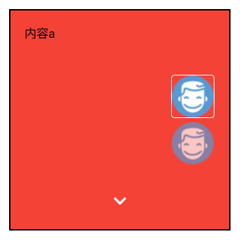

### 66.2 可以变成轮播图的步骤控件

相关文档：

- https://nicegui.io/documentation/stepper
- https://quasar.dev/vue-components/stepper#qstepper-api

`ui.stepper`控件、`ui.step`控件、`ui.stepper_navigation`控件，共同组成步骤控件。其中，`ui.stepper`控件是所有步骤的容器；`ui.step`控件是具体的步骤，必须传入不重复的`name`参数；`ui.stepper_navigation`控件一般用于放置控制当前步骤的按钮，可有可无。

这么一看，步骤控件很像轮播图控件，没错，如果加上两个控件属性的话，其操作方式确实很像：

```python
from nicegui import ui


def index():
    with ui.stepper().props(
        'infinite header-nav'
    ) as stepper:
        with ui.step('first'):
            ui.label('first')
        with ui.step('second'):
            ui.label('second')
        with ui.step('third'):
            ui.label('third')
    with ui.stepper_navigation():
        ui.button(
            '<',
            on_click=stepper.previous
        )
        ui.button(
            '>',
            on_click=stepper.next
        )


ui.run(
    root=index,
    title='易森-NiceGUI'
)

```

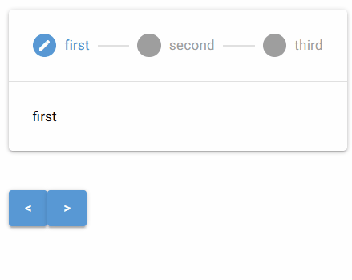

不过，相比于轮播图控件，步骤控件会多出一块导航区，用于表示当前步骤的位置，之前的步骤会被标记为完成。

`ui.step`控件支持以下参数：

- `name`参数，字符串类型，用于识别当前步骤，因此不能重名。
- `title`参数，字符串类型，表示显示在导航区的步骤标题，如果该参数没有设置，将使用`name`参数的值。
- `icon`参数，字符串类型，表示步骤的图标。

`ui.stepper`控件支持以下关键字参数：

- `value`参数，字符串或者`ui.step`控件，表示当前激活的步骤。
- `on_value_change`参数，可调用类型，表示步骤切换时执行的操作。

- `keep_alive`参数，布尔类型，默认为`True`，表示是否使用保活组件。保活组件即VUE中的`keep-alive`组件，步骤中的内容在步骤不可见时会自动销毁，使用保活组件可以避免销毁，但会额外占用内存、性能。


`ui.stepper_navigation`控件支持以下关键字参数：

- `wrap`参数，布尔类型，默认为`True`，表示是否开启自动换行。

`ui.stepper`控件支持以下方法：

- `next`方法，切换为下一步骤。
- `previous`方法，切换为上一步骤。

而`ui.stepper`控件支持的控件属性中，也有一些与`ui.carousel`控件相同的。

`ui.stepper`控件支持以下控件属性（部分）：

- `animated`属性，布尔类型，表示切换步骤时是否播放动画。
- `infinite`属性，布尔类型，表示步骤是否可以循环切换，即在显示最后一步时，可以切换下一步，来显示第一个步骤，反之亦然。
- `swipeable`属性，布尔类型，表示是否允许使用手势切换步骤。
- `vertical`属性，布尔类型，表示将控件的方向改为垂直。
- `header-nav`属性，布尔类型，表示是否可以通过点击导航区直接切换至对应步骤。
- `contracted`属性，布尔类型，表示是否隐藏步骤标题并让控件尽可能紧凑。
- `alternative-labels`属性，布尔类型，表示是否将步骤标题放在图标下面（仅限水平方向时生效）。
- `inactive-icon`属性，字符串类型，表示未完成步骤的图标。
- `inactive-color`属性，字符串类型，表示未完成步骤的颜色。
- `done-icon`属性，字符串类型，表示已完成步骤的图标。
- `done-color`属性，字符串类型，表示已完成步骤的颜色。
- `active-icon`属性，字符串类型，表示当前步骤的图标。
- `active-color`属性，字符串类型，表示当前步骤的颜色。
- `keep-alive`属性，布尔类型，表示是否使用保活组件。保活组件即VUE中的`keep-alive`组件，步骤中的内容在步骤不可见时会自动销毁，使用保活组件可以避免销毁，但会额外占用内存、性能。

示例如下：

```python
from nicegui import ui


def index():
    with ui.stepper().props(
        'inactive-color=red active-color=blue done-color=green'
    ) as stepper:
        with ui.step('first'):
            ui.label('first')
        with ui.step('second'):
            ui.label('second')
        with ui.step('third'):
            ui.label('third')
    with ui.stepper_navigation():
        ui.button(
            '<',
            on_click=stepper.previous
        )
        ui.button(
            '>',
            on_click=stepper.next
        )


ui.run(
    root=index,
    title='易森-NiceGUI'
)

```

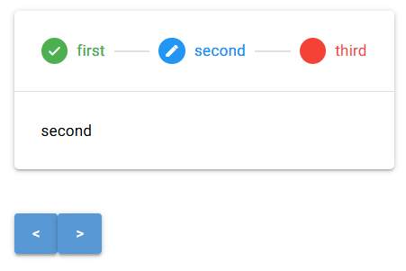

## 67 学习控件——时间线控件

相关文档：

- https://nicegui.io/documentation/timeline
- https://quasar.dev/vue-components/timeline#qtimeline-api

`ui.timeline`控件、`ui.timeline_entry`控件，共同组成时间线控件，用于展示一些具备线性关系的内容，比如历史大事记。其中，`ui.timeline`控件是容器，`ui.timeline_entry`控件是具体时间点对应的内容。

示例如下：

```python
from nicegui import ui


def index():
    with ui.timeline(side='right'):
        ui.timeline_entry('first')
        ui.timeline_entry('second')
        ui.timeline_entry('third')


ui.run(
    root=index,
    title='易森-NiceGUI'
)

```

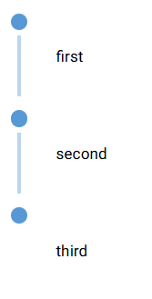

时间线控件起来很像步骤控件，但时间线控件将所有内容一股脑地全部展现，因此没有将其和步骤控件放在一起介绍，而是单独开了一章。

`ui.timeline`控件支持以下关键字参数：

- `side`参数，字符串类型，仅支持`['left','right']`中的值，默认为`'left'`，表示内容在时间线的左侧还是右侧。
- `layout`参数，字符串类型，字符串类型，仅支持`['dense','comfortable','loose']`中的值，默认为`'dense'`，表示布局风格。`'dense'`表示内容始终在时间线一侧；`'comfortable'`表示内容始终在时间线一侧，副标题始终在另一侧；`'loose'`表示内容在时间线一侧，副标题在另一侧，其方向取决于`ui.timeline_entry`控件的`side`参数。
- `color`参数，字符串类型，表示时间线、时间点的颜色。

`ui.timeline_entry`控件支持以下参数：

- `body`参数，字符串类型，表示时间点的具体内容。

- `side`参数，字符串类型，仅支持`['left','right']`中的值，默认为`'left'`，表示内容在时间线的左侧还是右侧。

  从该参数开始，只能通过关键字传入。

- `heading`参数，布尔类型，布尔类型，表示该时间点是否为头条。如果时间点为头条，会在时间线上形成中断，并且内容字体变大且居中显示。

- `tag`参数，字符串类型，表示承接时间点内容所用的HTML标签。

- `icon`参数，字符串类型，表示时间点的图标。

- `avatar`参数，字符串类型，表示时间点的头像。效果类似图标，但该参数使用图片的地址，并且优先级低于`icon`参数。

- `title`参数，字符串类型，表示时间点的标题。

- `subtitle`参数，字符串类型，表示时间点的副标题。

- `color`参数，字符串类型，表示时间点的颜色。

示例如下：

```python
from nicegui import ui


def index():
    with ui.timeline(layout='loose',color='red').classes('w-72'):
        ui.timeline_entry('Python 1.0 发布',title='一切的开始',subtitle='1991年')
        ui.timeline_entry(
            'Python 2.0 发布',
            title='生态成熟',
            subtitle='2000年',
            side='right'
        ),
        ui.timeline_entry(
            '大版本升级',
            heading=True,
            tag='div'
        )
        with ui.timeline_entry(
            'Python 3.0 发布',
            title='精益求精',
            subtitle='2008年',
            icon='home',
            avatar='favicon.ico',
            color='green'
        ):
            ui.link('了解更多','https://python.org')


ui.run(
    root=index,
    title='易森-NiceGUI'
)

```

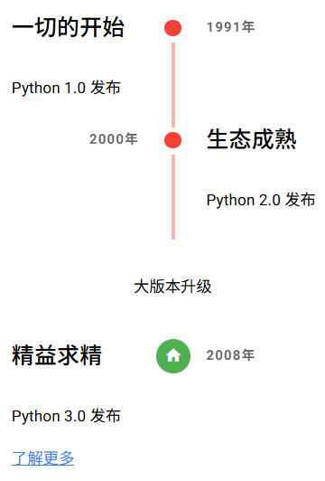

## 68 学习控件——弹出控件

弹出控件，也可以叫做临时显示控件。当用户与其交互或者执行特定操作时，控件会在独立位置显示，不会影响原有控件的布局；当其失去焦点或者达成某个条件时，控件会消失，就好像从来没出现过一样。

### 68.1 鼠标悬停就会弹出工具提示的`ui.tooltip`控件

相关文档：

- https://nicegui.io/documentation/tooltip
- https://quasar.dev/vue-components/tooltip

鼠标悬停，内容弹出，这就是工具提示的交互逻辑。

在NiceGUI中，创建工具提示有以下方法：

- 在控件的上下文中添加`ui.tooltip`控件。
- 单独创建`ui.tooltip`控件，然后修改其控件属性`target`为需要添加工具提示的控件的ID选择器（`'#{目标控件的html_id属性}'`）。
- 调用控件的`tooltip`方法。

这几种方法各有利弊，有的方法存在限制，并非完全平替。

示例如下：

```python
from nicegui import ui


def index():
    with ui.button('button'):
        ui.tooltip('tooltip')
    tooltip = ui.tooltip('tooltip')
    button = ui.button('button')
    tooltip.props['target'] = f'#{button.html_id}'
    ui.button('button').tooltip('tooltip')

ui.run(
    root=index,
    title='易森-NiceGUI'
)

```

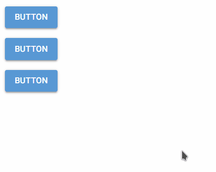

`ui.tooltip`控件支持以下参数：

- `text`参数，字符串类型，表示工具提示的内容。

有`text`参数，同时也有对应的绑定属性，因此可以使用绑定属性的方式修改工具提示的内容：

```python
from nicegui import ui


def index():
    tooltip = ui.tooltip()
    button = ui.button('button')
    tooltip.props['target'] = f'#{button.html_id}'
    ui.input().bind_value(tooltip,'text')
    tooltip.set_text('tooltip')


ui.run(
    root=index,
    title='易森-NiceGUI'
)

```

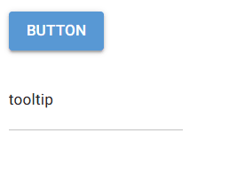

虽然上面的示例中工具提示都是文本内容，但不代表只能使用文本作为工具提示，在`ui.tooltip`控件的上下文中添加其他控件，还可以显示图像等其他内容。不过，不建议在工具提示内放置需要交互的内容，因为被添加工具提示的控件一旦失去焦点，工具提示就会消失，里面的交互内容永远无法交互：

```python
from nicegui import ui


def index():
    with ui.button('button'):
        with ui.tooltip():
            ui.icon(
                'img:/favicon.ico',
                size='5em'
            )


ui.run(
    root=index,
    title='易森-NiceGUI'
)

```

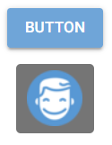

需要注意的是，控件的`tooltip`方法返回的是控件本身，而不是`ui.tooltip`控件。因此，一般情况下，没法实现上面的修改内容的操作。

但是，这并不是说就没有办法设置`tooltip`方法生成的`ui.tooltip`控件。可以使用`ElementFilter`方法获取所有`ui.tooltip`控件，再通过判断控件属性`target`找到目标`ui.tooltip`控件：

```python
from nicegui import ui, ElementFilter


def index():
    button = ui.button('button').tooltip('tooltip')
    for i in ElementFilter(kind=ui.tooltip):
        if i.props['target'] == f'#{button.html_id}':
            tooltip = i
    ui.input().bind_value(tooltip,'text')
    tooltip.set_text('tooltip')


ui.run(
    root=index,
    title='易森-NiceGUI'
)

```


除了控件属性`target`，`ui.tooltip`控件还支持以下控件属性（部分）：

- `delay`属性，整数类型，工具提示显示的延迟（单位毫秒）。
- `hide-delay`属性，整数类型，工具提示消失的延迟（单位毫秒）。
- `anchor`属性，字符串类型，仅支持`['top left','top middle','top right','top start','top end','center left','center middle','center right','center start','center end','bottom left','bottom middle','bottom right','bottom start','bottom end']`中的值，默认为`'bottom middle'`，表示工具提示的锚点在目标控件的什么位置（方向）。
- `self`属性，字符串类型，仅支持`['top left','top middle','top right','top start','top end','center left','center middle','center right','center start','center end','bottom left','bottom middle','bottom right','bottom start','bottom end']`中的值，默认为`'top middle'`，表示工具提示的锚点在工具提示的什么位置（方向）。
- `offset`属性，元素为整数的双元素列表类型，表示工具提示相对于锚点的偏移量（两个元素分别表示水平方向、垂直方向的偏移多少像素，正负方向取决于`anchor`属性的定义）。

示例如下：

```python
from nicegui import ui, ElementFilter


def index():
    tooltip = ui.tooltip('tooltip')
    ui.input().bind_value(tooltip,'text')
    with ui.element('div').classes(
        'w-64 h-64 border-2 relative'
    ):
        button = ui.button('button').classes(
            'absolute-center'
        )
    tooltip.props['target'] = f'#{button.html_id}'
    tooltip.props(
        '''
        anchor="bottom left" 
        self="top left" 
        offset=[0,10]
        '''
    )


ui.run(
    root=index,
    title='易森-NiceGUI'
)

```

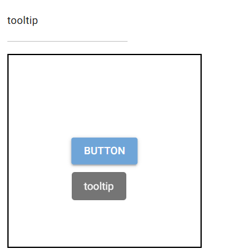

### 68.2 创建之后立马弹出消息的`ui.notify`控件

相关文档：

- https://nicegui.io/documentation/notify
- https://quasar.dev/quasar-plugins/notify#notify-api

创建`ui.notify`控件之后，页面底部的中间（默认位置，可以修改）会立马弹出一条文字消息，因此，使用该控件时，通常放在要执行的函数中：

```python
from nicegui import ui

def index():
    ui.button(
        'notify',
        on_click=lambda:ui.notify(
            'Hello'
        )
    )

ui.run(
    root=index,
    title='易森-NiceGUI'
)

```

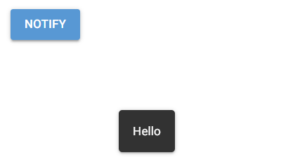

`ui.notify`控件支持以下参数：

- `message`参数，任意类型（但最后会被转换成字符串），表示消息的内容。

- `position`参数，字符串类型，仅支持`['top-left','top-right','bottom-left','bottom-right','top','bottom','left','right','center',]`中的值，默认为`'bottom'`，表示消息显示的位置，

  从该参数开始，只能通过关键字传入。

- `close_button`参数，布尔类型或者字符串类型，默认为`False`，表示是否添加关闭按钮以及关闭按钮显示的文本。

- `type`参数，字符串类型，仅支持`['positive','negative','warning','info','ongoing']`中的值，默认为`None`，表示消息的类型。不同类型的消息具有特定样式、图标。

- `color`参数，字符串类型，表示消息的背景颜色。

- `multi_line`参数，布尔类型，默认为`False`，表示消息内容是否支持多行模式，即关闭按钮另起一行。

- `**kwargs`参数，表示控件支持的配置项。`ui.notify`控件不像普通控件一样支持控件属性，对于类似控件属性的配置项，只能通过关键字参数传入。

`ui.notify`控件额外支持以下配置项（关键字参数，部分）：

- `textColor`参数，字符串类型，表示消息的文本颜色。
- `caption`参数，字符串类型，表示给消息额外添加的说明性文字。
- `icon`参数，字符串类型，表示给消息额外添加的图标。
- `iconColor`参数，字符串类型，表示给消息额外添加的图标的颜色。
- `iconSize`参数，字符串类型，表示给消息额外添加的图标的尺寸。
- `avatar`参数，字符串类型，表示给消息额外添加的头像。效果与`icon`参数一致，但该参数使用图片的地址。
- `spinner`参数，布尔类型，表示是否给消息额外添加的加载图标。
- `spinnerColor`参数，字符串类型，表示给消息额外添加的加载图标的颜色。
- `spinnerSize`参数，字符串类型，表示给消息额外添加的加载图标的尺寸。
- `group`参数，字符串类型或者整数类型或者布尔类型，表示是否开启分组以及对应的分组。分组相同的消息会被合并，并在消息的左上角（默认位置）角标内显示当前该分组一共显示了多少条消息（不含已经消失的）。
- `badgeColor`参数，字符串类型，表示角标的背景颜色。
- `badgeTextColor`参数，字符串类型，表示角标的文字颜色。
- `badgePosition`参数，字符串类型，仅支持`['top-left','top-right','bottom-left','bottom-right']`中的值，默认为`'top-left'`，表示角标的位置。
- `progress`参数，布尔类型，表示是否显示一个与消失倒计时同步的进度条。
- `classes`参数，字符串类型，表示消息使用的样式类。
- `attrs`参数，字典类型，表示消息对应的HTML元素的属性及其属性值。注意，不要轻易覆盖原有的属性，可能会导致显示、功能出现问题。
- `timeout`参数，整数类型，默认为`5000`，表示消息自动消失的时间（即超时，单位毫秒）。

示例如下：

```python
from nicegui import ui

def index():
    ui.button(
        'notify',
        on_click=lambda:ui.notify(
            '警告',
            caption='一级预警',
            icon='alarm',
            attrs={'style':'background-color:red;'}
        )
    )

ui.run(
    root=index,
    title='易森-NiceGUI'
)

```

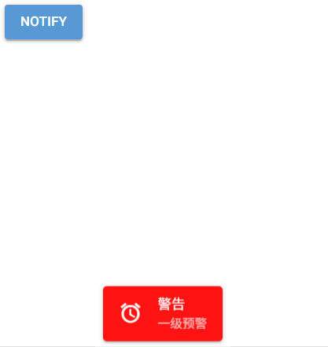

虽然上面`ui.notify`控件的参数不少，但该控件依然存在局限：

- 不能通过调用方法主动关闭消息。
- 不能随时更新消息。

好在NiceGUI官方提供了解决方法，无需笔者“研发”解决方案。敬请期待后面将要学习的增强版，让弹出消息更随心所欲。

### 68.3 按需弹出的弹窗——`ui.dialog`控件

相关文档：

- https://nicegui.io/documentation/dialog
- https://quasar.dev/vue-components/dialog

不同于前面两种控件的弹出方式比较“草率”，想要弹出`ui.dialog`控件，则需要在创建之后调用`open`方法才行：

```python
from nicegui import ui
  
def index():
    with ui.dialog() as dialog:
        ui.label('dialog')
        ui.button(
            'close',
            on_click=dialog.close
        )
    ui.button(
        'dialog',
        on_click=dialog.open
    )
  
ui.run(
    root=index,
    title='易森-NiceGUI'
)

```

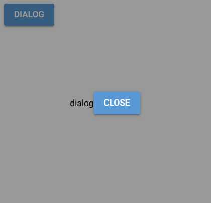

点击按钮才会弹出，但默认是全屏显示且布局为行布局，可能存在内容不明显、布局混乱的情况，因此建议使用`ui.card`控件作为外壳：

```python
from nicegui import ui
  
def index():
    with ui.dialog() as dialog,ui.card():
        ui.label('dialog')
        ui.button(
            'close',
            on_click=dialog.close
        )
    ui.button(
        'dialog',
        on_click=dialog.open
    )
  
ui.run(
    root=index,
    title='易森-NiceGUI'
)

```

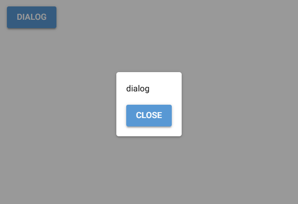

可能读者测试上面的示例已经摸索出关闭弹窗的方法，但笔者还是要单独强调一下默认参数时关闭弹窗的方法：

- 点击没有内容的空白处。
- 调用`close`方法或者`toggle`方法。
- 按`esc`键。

`ui.dialog`控件支持以下关键字参数：

- `value`参数，布尔类型，默认为`False`，表示控件创建后是否显示。

`ui.dialog`控件支持以下方法：

- `open`方法，打开弹窗。
- `close`方法，关闭弹窗。
- `toggle`方法，切换弹窗的打开状态。
- `submit`方法，关闭弹窗并提交结果。该方法主要用于提交异步弹出的弹窗中需要传递的数据。 

`ui.dialog`控件支持以下控件属性（部分）：

- `persistent`属性，布尔类型，表示是否禁止关闭弹窗。
- `no-esc-dismiss`属性，布尔类型，表示是否禁止使用`esc`键关闭弹窗。
- `no-backdrop-dismiss`属性，布尔类型，表示是否禁止点击空白处关闭弹窗。
- `auto-close`属性，布尔类型，表示是否允许点击弹窗内部任意位置关闭弹窗。
- `no-refocus`属性，布尔类型，表示当弹窗关闭时，是否禁止弹窗显示前已经获得焦点的控件重新获得焦点。
- `no-focus`属性，布尔类型，表示当弹窗打开时，是否禁止弹窗获得焦点。
- `no-shake`属性，布尔类型，表示是否禁用弹窗晃动（使用被禁用的关闭操作时触发）。
- `seamless`属性，布尔类型，表示是否启用无缝模式。无缝模式下，用户可以与未被弹窗覆盖的控件交互。
- `maximized`属性，布尔类型，表示是否最大化显示弹窗。
- `full-width`属性，布尔类型，表示弹窗的宽度与窗口宽度一致。
- `full-height`属性，布尔类型，表示弹窗的高度与窗口高度一致。
- `position`属性，字符串类型，仅支持`['standard','top','right','bottom','left']`中的值，默认为`'standard'`，表示弹窗对齐、出现的方向。
- `backdrop-filter`属性，字符串类型，表示弹窗背景的图形效果过滤器，语法同CSS的backdrop-filter（参考文档 https://developer.mozilla.org/zh-CN/docs/Web/CSS/Reference/Properties/backdrop-filter ）。
- `square`属性，布尔类型，表示是否移除弹窗边框的圆角。

示例如下：

```python
from nicegui import ui
  
def index():
    with ui.dialog().props(
        'maximized'
    ) as dialog,ui.card():
        ui.label('dialog')
        ui.button(
            'close',
            on_click=dialog.close
        )
    ui.button(
        'dialog',
        on_click=dialog.open
    )
  
ui.run(
    root=index,
    title='易森-NiceGUI'
)

```

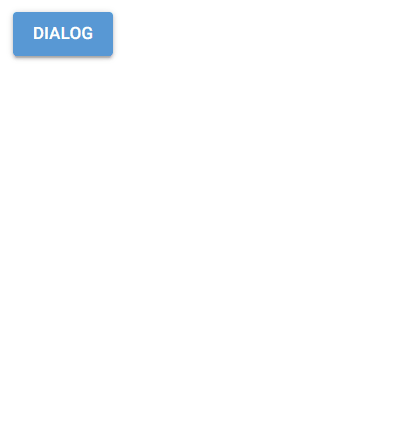

前面介绍`submit`方法可以关闭弹窗并提交结果，还提到了异步弹出，那么，什么是异步弹出？

简单来说，就是通过异步等待控件来打开弹窗的方式就是异步弹出。而`submit`方法提交的数据就是异步等待获取的结果：

```python
from nicegui import ui
  
def index():
    with ui.dialog() as dialog,ui.card():
        ui.label('dialog')
        with ui.row():
            ui.button(
                'yes',
                color='green',
                on_click=lambda:dialog.submit('yes')
            )
            ui.button(
                'no',
                color='red',
                on_click=lambda:dialog.submit('no')
            )
    async def open_dialog():
        result = await dialog
        ui.notify(result)
    ui.button(
        'await dialog',
        on_click=open_dialog
    )
  
ui.run(
    root=index,
    title='易森-NiceGUI'
)

```

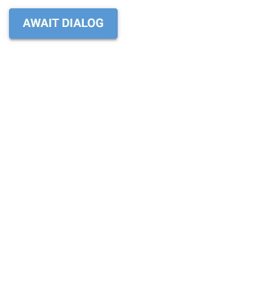

如果想监控弹窗的行为，可以使用`on`方法监听`ui.dialog`控件的事件：

```python
from nicegui import ui
  
def index():
    with ui.dialog() as dialog,ui.card():
        ui.label('dialog')
        ui.button(
            'close',
            on_click=dialog.close
        )
    ui.button(
        'dialog',
        on_click=dialog.open
    )
    dialog.on('show', lambda: ui.notify('Dialog opened'))
    dialog.on('hide', lambda: ui.notify('Dialog closed'))
    dialog.on('escape-key', lambda: ui.notify('ESC pressed'))
  
ui.run(
    root=index,
    title='易森-NiceGUI'
)

```


## 69 学习控件——弹出控件（补充）

弹出控件，也可以叫做临时显示控件。当用户与其交互或者执行特定操作时，控件会在独立位置显示，不会影响原有控件的布局；当其失去焦点或者达成某个条件时，控件会消失，就好像从来没出现过一样。

本章不是重复，而是额外介绍几种弹出控件。

### 69.1 `ui.notify`控件的增强版——`ui.notification`控件

相关文档：

- https://nicegui.io/documentation/notification
- https://quasar.dev/quasar-plugins/notify#notify-api

`ui.notification`控件的用法与`ui.notify`控件基本相同，但该控件是真正意义上的控件（但控件的部分用法依然不支持），允许实时更新消息的内容以及其他参数对应的配置项，还支持随时调用`dismiss`方法来让消息消失。

示例如下：

```python
from nicegui import ui
import asyncio
  
def index():
    async def notify():
        n = ui.notification(
            'Hello',
            timeout=None
        )
        await asyncio.sleep(2)
        n.type = 'info'
        n.message = 'World'
        await asyncio.sleep(1)
        n.dismiss()
    ui.button(
        'notification',
        on_click=notify
    )
  
ui.run(
    root=index,
    title='易森-NiceGUI'
)

```

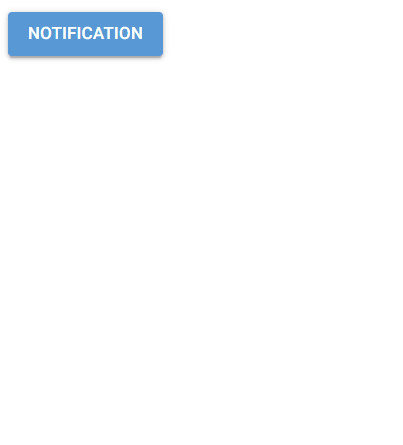

`ui.notification`控件支持以下参数：

- `message`参数，任意类型（但最后会被转换成字符串），表示消息的内容。

- `position`参数，字符串类型，仅支持`['top-left','top-right','bottom-left','bottom-right','top','bottom','left','right','center',]`中的值，默认为`'bottom'`，表示消息显示的位置，

  从该参数开始，只能通过关键字传入。

- `close_button`参数，布尔类型或者字符串类型，默认为`False`，表示是否添加关闭按钮以及关闭按钮显示的文本。

- `type`参数，字符串类型，仅支持`['positive','negative','warning','info','ongoing']`中的值，默认为`None`，表示消息的类型。不同类型的消息具有特定样式、图标。

- `color`参数，字符串类型，表示消息的背景颜色。

- `multi_line`参数，布尔类型，默认为`False`，表示消息内容是否支持多行模式，即关闭按钮另起一行。

- `icon`参数，字符串类型，表示给消息额外添加的图标。

- `spinner`参数，布尔类型，表示是否给消息额外添加的加载图标。

- `timeout`参数，浮点类型，默认为`5.0`，表示消息自动消失的时间（即超时，单位秒）。

- `on_dismiss`参数，可调用类型，表示消息消失时执行的操作。

- `options`参数，字典类型，表示控件的配置项。注意，该参数会覆盖控件原有的配置项。

- `**kwargs`参数，表示控件支持的配置项。

`ui.notification`控件额外支持以下配置项（通过`options`参数或者关键字参数传入）：

- `textColor`参数，字符串类型，表示消息的文本颜色。
- `caption`参数，字符串类型，表示给消息额外添加的说明性文字。
- `iconColor`参数，字符串类型，表示给消息额外添加的图标的颜色。
- `iconSize`参数，字符串类型，表示给消息额外添加的图标的尺寸。
- `avatar`参数，字符串类型，表示给消息额外添加的头像。效果与`icon`参数一致，但该参数使用图片的地址。
- `spinnerColor`参数，字符串类型，表示给消息额外添加的加载图标的颜色。
- `spinnerSize`参数，字符串类型，表示给消息额外添加的加载图标的尺寸。
- `group`参数，字符串类型或者整数类型或者布尔类型，表示是否开启分组以及对应的分组。分组相同的消息会被合并，并在消息的左上角（默认位置）角标内显示当前该分组一共显示了多少条消息（不含已经消失的）。
- `badgeColor`参数，字符串类型，表示角标的背景颜色。
- `badgeTextColor`参数，字符串类型，表示角标的文字颜色。
- `badgePosition`参数，字符串类型，仅支持`['top-left','top-right','bottom-left','bottom-right']`中的值，默认为`'top-left'`，表示角标的位置。
- `progress`参数，布尔类型，表示是否显示一个与消失倒计时同步的进度条。
- `classes`参数，字符串类型，表示消息使用的样式类。
- `attrs`参数，字典类型，表示消息对应的HTML元素的属性及其属性值。注意，不要轻易覆盖原有的属性，可能会导致显示、功能出现问题。

`ui.notification`控件支持以下属性：

- `message`属性，含义与同名参数系统。
- `position`属性，含义与同名参数系统。
- `type`属性，含义与同名参数系统。
- `color`属性，含义与同名参数系统。
- `mult_line`属性，含义与同名参数系统。
- `icon`属性，含义与同名参数系统。
- `spinner`属性，含义与同名参数系统。
- `timeout`属性，含义与同名参数系统。
- `close_button`属性，含义与同名参数系统。

`ui.notification`控件支持以下方法：

- `on_dismiss`方法，设置消息消失时执行的操作。该方法支持以下参数：
  - `callback`参数，可调用类型，表示消息消失时执行的操作。
- `dismiss`方法，主动让消息消失。

总的来说，相比于`ui.notify`控件，`ui.notification`控件提供的属性和方法可以让消息的显示、消失变得可控，但也更复杂一些。对于简单显示个消息，还是`ui.notify`控件更方便。一旦需要精细控制消息，只能使用`ui.notification`控件。

### 69.2 用起来比`ui.dialog`控件更简单的弹窗——`ui.popup`控件

相关文档：

- https://nicegui.io/documentation/popup
- https://quasar.dev/vue-components/popup-proxy

`ui.popup`控件，用于弹出任意内容，用法和效果上几乎与`ui.dialog`控件一样。但`ui.popup`控件有以下特点：

- `ui.popup`控件需要放在特定控件的上下文，点击该控件才会弹出。
- 屏幕大小决定了弹出内容的样式。默认情况下，屏幕宽度大于450px时，该控件弹出的内容不是弹窗，而是以上下文所属控件为起点的菜单。

以下是二者对比的使用示例，读者可以改变窗口宽度，分别点击两个按钮，看弹出内容的样式有何区别：

```python
from nicegui import ui

def index():
    with ui.dialog() as dialog,ui.card():
        ui.label('dialog')
        ui.button(
            'close',
            on_click=dialog.close
        )
    ui.button(
        'dialog',
        on_click=dialog.open
    )
    with ui.button('popup'):
        with ui.popup() as popup,ui.card():
            ui.label('popup')
            ui.button(
                'close',
                on_click=popup.close
            )

ui.run(
    root=index,
    title='易森-NiceGUI'
)

```

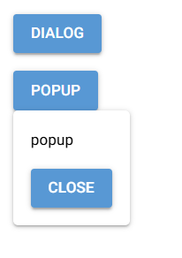

除了将其作为`ui.dialog`控件的平替，还可以利用其类似弹出菜单的特性，将其作为菜单的平替。或者实现一个弹出式编辑器：

```python
from nicegui import ui

def index():
    with ui.button(icon='menu'),ui.menu():
        ui.menu_item('menu')
    with ui.button(icon='menu'),\
    ui.popup() as popup:
        ui.menu_item('menu',on_click=popup.close)
    with ui.label('label') as label,\
    ui.popup(),\
    ui.card():
        ui.input().props(
            'autofocus'
        ).bind_value(
            label,'text'
        )
           

ui.run(
    root=index,
    title='易森-NiceGUI'
)

```

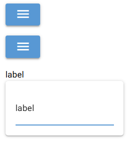

### 69.3 按下`tab`键解锁锚点并弹出内容的`ui.skip_link`控件

相关文档：

- https://nicegui.io/documentation/skip_link#skip_link
- https://www.w3.org/WAI/WCAG21/Understanding/bypass-blocks.html#main

之所以称`ui.skip_link`控件“按下`tab`键解锁锚点并弹出内容”，那是因为在某种情况下，该控件的用法与常规锚点（`ui.link`控件指向具体控件）的用法一致：

```python
from nicegui import ui
  
def index():
    ui.button('button a')
    button = ui.button('button b',on_click=lambda:ui.notify('button b'))
    ui.skip_link(
        'go to here',
        target=button
    )
    ui.link('button b',target=button)
        
  
ui.run(
    root=index,
    title='易森-NiceGUI'
)

```


可以看到，不管是点击超链接，还是按下`tab`键之后在按`enter`键，都是第二个按钮获得焦点，此时按下`enter`键，都是按下该按钮。

结果一致，但过程还是存在不同：`ui.skip_link`控件额外弹出了一些内容。

没错，这就是将`ui.skip_link`控件分类为弹出控件的原因。

`ui.skip_link`控件支持以下参数：

- `text`参数，字符串类型，默认为`'Skip to main content'`，表示弹出的内容。
- `target`参数，关键字参数，`Element`类型，表示目标控件。目标控件只能是当前页面内的控件，在显示弹出内容后按下`enter`键会跳转到目标控件所在位置，同时目标控件获得焦点。

虽然`ui.skip_link`控件的`text`参数是字符串类型，但不代表弹出内容只能是字符串。在`ui.skip_link`控件上下文创建的内容，会追加到`text`参数对应的文字内容之后：

```python
from nicegui import ui
  
def index():
    ui.button('button a')
    button = ui.button('button b',on_click=lambda:ui.notify('button b'))
    with ui.skip_link(
        'go to here',
        target=button
    ):
        ui.icon('home',size='3em')
    ui.link('button b',target=button)
        
  
ui.run(
    root=index,
    title='易森-NiceGUI'
)

```


## 70 学习控件——树形图控件（`ui.tree`控件）

### 70.1 写在控件学习前——树

在正式学习控件之前，需要先了解一个概念——树。如果读者有相关基础，知道树形数据结构，可以直接跳过本节，开始控件的学习。若是读者不太清楚树，请先看一下本节，对后面学习控件的使用很有帮助。

在现实生活中，大部分人都见过树，也知道树是什么。但在编程中，树是指像树一样的数据结构。这么干巴巴地说比较枯燥、抽象，那就让笔者画一张图：


就和现实中的树有树根、树干、树叶一样，构成树的节点也通常有对应树根的根节点、对应树干的树干节点、对应树叶的叶节点。对应上图，A就是根节点，B、C就是普通节点、D、E、F、G就是叶节点。图中还用箭头表明的父子关系，箭头的起始点对应父，箭头的终点表示子。

因此，可以确定三种节点的定义或者特征：**没有父节点**的节点是**根节点**，也通常是最先创建的节点；**没有子节点**的节点是**叶节点**；不属于根节点、叶节点的**其余节点**就是**树干节点**。

了解了树的基本含义，接下来，就通过Python代码简单实现一棵树。

每个节点包含复杂的属性和数据，虽然列表、字典、类都能构建出树的结构，但考虑到代码复杂性和直观度，综合考量之后，笔者决定以字典为基本框架，适当使用列表，实现上图中的树。

首先就是根节点：

```python
root = {
    'id':'A',
    'children':[]
}
```

节点都有唯一的标识符，就好像上图中的节点A，A是其唯一的标识符。因此，节点对应的字典设计了`'id'`键，用于对应其标识符。除了叶节点之外的节点都有一个以上的子节点，而叶节点其实是0个子节点的节点。因此，`'children'`键表示该节点的子节点，其值是一个列表，可以存储0个以上节点。

基于上面的设计，上图的树转换成代码，结果如下：

```python
root = {
    'id':'A',
    'children':[]
}
b = {
    'id':'B',
    'children':[]
}
c = {
    'id':'C',
    'children':[]
}
d = {
    'id':'D',
    'children':[]
}
e = {
    'id':'E',
    'children':[]
}
f = {
    'id':'F',
    'children':[]
}
g = {
    'id':'G',
    'children':[]
}
root['children'] = [b,c]
b['children'] = [d,e]
c['children'] = [f,g]
```

从代码上看，树的结构是对应上图且完整的，但是，想要直观展示这棵树，就没那么容易。如果直接打印，将得到以下结果：

```python
print(root)
# 输出为：{'id': 'A', 'children': [{'id': 'B', 'children': [{'id': 'D', 'children': []}, {'id': 'E', 'children': []}]}, {'id': 'C', 'children': [{'id': 'F', 'children': []}, {'id': 'G', 'children': []}]}]}
```

当然，也可以借用`rich`库，让输出的内容错落有致：

```python
# 需要提前安装rich库
from rich.console import Console

Console(width=50).print(root)
```

结果为：

```python
{
    'id': 'A',
    'children': [
        {
            'id': 'B',
            'children': [
                {'id': 'D', 'children': []},
                {'id': 'E', 'children': []}
            ]
        },
        {
            'id': 'C',
            'children': [
                {'id': 'F', 'children': []},
                {'id': 'G', 'children': []}
            ]
        }
    ]
}
```

至于在NiceGUI中如何直观展现树这种数据结构，用哪个控件，怎么用，请看下节。

### 70.2 树形图控件——`ui.tree`控件

相关文档：

- https://nicegui.io/documentation/tree
- https://quasar.dev/vue-components/tree

在NiceGUI中，可以使用`ui.tree`控件渲染树类型的数据。对于上一节中的树，直接给`ui.tree`控件使用是不行的，需要给节点设置`'label'`键对应的值，该键表示该节点显示出来的文本：

```python
root = {
    'id':'A',
    'label':'A',
    'children':[]
}
b = {
    'id':'B',
    'label':'B',
    'children':[]
}
c = {
    'id':'C',
    'label':'C',
    'children':[]
}
d = {
    'id':'D',
    'label':'D',
    'children':[]
}
e = {
    'id':'E',
    'label':'E',
    'children':[]
}
f = {
    'id':'F',
    'label':'F',
    'children':[]
}
g = {
    'id':'G',
    'label':'G',
    'children':[]
}
root['children'] = [b,c]
b['children'] = [d,e]
c['children'] = [f,g]
```

对树做完改造之后，就可以将`root`这个根节点放在列表中，传给控件的`nodes`参数：

```python
root = {
    'id':'A',
    'label':'A',
    'children':[]
}
b = {
    'id':'B',
    'label':'B',
    'children':[]
}
c = {
    'id':'C',
    'label':'C',
    'children':[]
}
d = {
    'id':'D',
    'label':'D',
    'children':[]
}
e = {
    'id':'E',
    'label':'E',
    'children':[]
}
f = {
    'id':'F',
    'label':'F',
    'children':[]
}
g = {
    'id':'G',
    'label':'G',
    'children':[]
}
root['children'] = [b,c]
b['children'] = [d,e]
c['children'] = [f,g]

from nicegui import ui
  
def index():
    ui.tree(
        nodes=[
            root
        ]
    ).expand()

ui.run(
    root=index,
    title='易森-NiceGUI'
)
```


控件还支持交互，可以展开收起任意有子节点的节点。这种展现方式就直观、方便多了。

`ui.tree`控件支持以下参数：

- `nodes`参数，元素为字典类型的列表，每个字典（节点字典）表示一个树形结构的数据。在节点字典中，不同的键有不同的含义：

  - `'id'`键，字符串类型、整数类型、浮点类型、元组类型等可哈希的数据类型（一般推荐使用字符串类型），表示节点ID（具有唯一性，不可重复）。选择、勾选、展开节点会用到、得到节点ID。获取对应状态的节点，都会得到节点ID。
  - `'label'`键，字符串类型，表示节点显示的文字，如果没有对应的值，该节点不会显示文字。
  - `'children'`键，元素为节点字典的列表，表示节点的子节点，如果节点有子节点，该节点会变成可以展开的样式。
  - `'icon'`键，字符串类型，表示节点的图标。

- `node_key`参数，字符串类型，表示节点字典中用于获取节点ID的键（对应的值就是节点ID），默认值是`'id'`，可以根据实际情况修改为其他值。

  从该参数开始，只能通过关键字传入。

- `label_key`参数，字符串类型，表示节点字典中用于获取节点显示文字的键（对应的值就是节点显示文字），默认值是`'label'`，可以根据实际情况修改为其他值。

- `children_key`参数，字符串类型，表示节点字典中用于获取子节点的键（对应的值就是该节点的子节点列表），默认值是`'children'`，可以根据实际情况修改为其他值。

- `on_select`参数，可调用类型，表示当节点的选择状态（点击节点可以选择、取消选择该节点）改变时执行的操作。

- `on_expand`参数，可调用类型，表示当节点的展开状态（点击树干节点本身或者树干节点前的三角形可以展开、收起该节点）改变时执行的操作。

- `on_tick`参数，可调用类型，表示当节点的勾选状态（点击节点前的复选框可以勾选、取消勾选该节点）改变时执行的操作。注意，只有下面的`tick_strategy`参数不为`None`时，才会显示复选框。

- `tick_strategy`参数，字符串类型，表示节点的勾选策略，仅支持`['leaf','leaf-filtered','strict']`，中的值，默认为`None`，即没有勾选策略，不显示复选框。具体勾选策略的含义可以参考下表或者官方文档（ https://quasar.dev/vue-components/tree#tick-strategy ）：

  | 策略名            | 含义                                                       |
  | :---------------- | :--------------------------------------------------------- |
  | `'leaf'`          | 勾选任意节点都会影响父节点、子节点的勾选状态。             |
  | `'leaf-filtered'` | 勾选任意节点只会影响过滤后可见的父节点、子节点的勾选状态。 |
  | `'strict'`        | 只影响被勾选的节点，不影响父节点或子节点的勾选状态。       |

示例如下：

```python
from nicegui import ui

root = {
    'id':'A',
    'label':'A',
    'children':[]
}
b = {
    'id':'B',
    'label':'B',
    'children':[]
}
c = {
    'id':'C',
    'label':'C',
    'children':[]
}
d = {
    'id':'D',
    'label':'D',
    'children':[]
}
e = {
    'id':'E',
    'label':'E',
    'children':[]
}
f = {
    'id':'F',
    'label':'F',
    'children':[]
}
g = {
    'id':'G',
    'label':'G',
    'children':[]
}
root['children'] = [b,c]
b['children'] = [d,e]
c['children'] = [f,g]

  
def index():
    t = ui.tree(
        nodes=[
            root
        ],
        on_select=lambda e: ui.notify(
            f'选择了 {e.value}'
        ),
        on_expand=lambda e: ui.notify(
            f'展开了 {e.value}'
        ),
        on_tick=lambda e: ui.notify(
            f'勾选了 {e.value}'
        ),
        tick_strategy='leaf'
    ).expand()
    ui.select(
        ['leaf','leaf-filtered','strict'],
        label='勾选策略'
    ).bind_value(t.props,'tick-strategy').classes('w-48')
    ui.input(
        '筛选'
    ).bind_value(t, 'filter').props('clearable').classes('w-48')
    

ui.run(
    root=index,
    title='易森-NiceGUI'
)
```


读者可以选择不同的勾选策略，测试勾选的效果。

`ui.tree`控件支持以下方法：

- `on_select`方法，设置当节点的选择状态（点击节点可以选择、取消选择该节点）改变时执行的操作。该方法支持以下参数：
  - `callback`参数，可调用类型，表示当节点的选择状态（点击节点可以选择、取消选择该节点）改变时执行的操作。
- `select`方法，选择指定节点。该方法支持以下参数：
  - `node_key`参数，字符串类型，表示选择节点的ID。
- `deselect`方法，取消选择以选择的节点。注意，选择只能是单选，选择新的节点就会取消选择先前的节点。
- `on_expand`方法，设置当节点的展开状态（点击树干节点本身或者树干节点前的三角形可以展开、收起该节点）改变时执行的操作。该方法支持以下参数：
  - `callback`参数，可调用类型，表示当节点的展开状态（点击树干节点本身或者树干节点前的三角形可以展开、收起该节点）改变时执行的操作。
- `expand`方法，展开指定节点。该方法支持以下参数：
  - `node_keys`参数，元素为字符串的列表类型，表示展开节点的ID。
- `collapse`方法，收起指定节点。该方法支持以下参数：
  - `node_keys`参数，元素为字符串的列表类型，表示收起节点的ID。
- `on_tick`方法，设置当节点的勾选状态（点击节点前的复选框可以勾选、取消勾选该节点）改变时执行的操作。该方法支持以下参数：
  - `callback`参数，可调用类型，表示节点的勾选状态（点击节点前的复选框可以勾选、取消勾选该节点）改变时执行的操作。
- `tick`方法，勾选指定节点。该方法支持以下参数：
  - `node_keys`参数，元素为字符串的列表类型，表示勾选节点的ID。
- `untick`方法，取消勾选指定节点。该方法支持以下参数：
  - `node_keys`参数，元素为字符串的列表类型，表示取消勾选节点的ID。
- `nodes`方法，返回一个迭代器，包含所有节点的节点字典。该方法支持以下参数：
  - `visible`参数，关键字参数，布尔类型，表示是否只返回可见的节点。

`ui.tree`控件支持以下属性（部分）：

- `filter`属性，字符串类型，表示用于在数中搜索包含指定内容的节点时的关键字。

`ui.tree`控件支持以下控件属性（部分）：

- `no-selection-unset`属性，布尔类型，表示不允许通过点击已选择的节点取消选择。
- `default-expand-all`属性，布尔类型，表示是否默认展开所有节点。
- `accordion`属性，布尔类型，表示是否启用手风琴模式，即仅允许展开一个节点，展开新的节点，先前的节点会收起。
- `no-transition`属性，布尔类型，表示是否禁用展开、收起节点的过渡动画。
- `nodes`属性，表示所有节点。
- `no-nodes-label`属性，字符串类型，默认为`'No nodes to show!'`，表示没有节点时控件显示的文本。
- `no-results-label`属性，字符串类型，默认为`'No results'`，表示搜索后没有匹配的节点时控件显示的文本。
- `filter`属性，字符串类型，表示用于在数中搜索包含指定内容的节点时的关键字。
- `ticked`属性，表示所有勾选节点的ID。
- `expanded`属性，表示所有展开节点的ID。
- `selected`属性，表示所有选择节点的ID。
- `no-connectors`属性，布尔类型，表示是否禁用表明节点层级的连线。
- `color`属性，字符串类型，表示展开符号、层级连线的颜色。
- `control-color`属性，字符串类型，表示复选框的颜色。
- `text-color`属性，字符串类型，表示节点文本的颜色。
- `selected-color`属性，字符串类型，表示选择节点的节点文本颜色。
- `dense`属性，布尔类型，表示是否启用紧凑模式。
- `dark`属性，布尔类型，表示是否启用暗黑模式。注意，该属性启用的暗黑模式会与NiceGUI的上层设计冲突，实际生效的只有文本颜色。
- `duration`属性，浮点类型，默认为`300`，表示展开、收起节点的过渡动画的播放时长（单位毫秒）。

部分表示节点的控件属性可使用字典类型的`props`属性，获取控件属性对应的值。

示例如下：

```python
from nicegui import ui

root = {
    'id':'A',
    'label':'A',
    'children':[]
}
b = {
    'id':'B',
    'label':'B',
    'children':[]
}
c = {
    'id':'C',
    'label':'C',
    'children':[]
}
d = {
    'id':'D',
    'label':'D',
    'children':[]
}
e = {
    'id':'E',
    'label':'E',
    'children':[]
}
f = {
    'id':'F',
    'label':'F',
    'children':[]
}
g = {
    'id':'G',
    'label':'G',
    'children':[]
}
root['children'] = [b,c]
b['children'] = [d,e]
c['children'] = [f,g]

  
def index():
    t = ui.tree(
        nodes=[
            root
        ]
    ).expand()
    ui.button(
        'all nodes',
        on_click=lambda:ui.notify(
            str(list(t.props['nodes']))
        )
    )
    

ui.run(
    root=index,
    title='易森-NiceGUI'
)
```


### 70.3 写在控件学习后——小结

如果想要选择、展开、勾选的方法和获取对应状态的节点，可以参照下表：

| 状态 | 设置为该状态                                                 | 取消该转态                                                   | 获取该状态下的节点   |
| ---- | ------------------------------------------------------------ | ------------------------------------------------------------ | -------------------- |
| 选择 | `.select(key)`                                               | `.deselect()`                                                | `.props['selected']` |
| 展开 | `.expand([key1,...keyn])` <br />不传入参数的话就是对所有节点生效 | `.collapse([key1,...keyn])` <br />不传入参数的话就是对所有节点生效 | `.props['expanded']` |
| 勾选 | `.tick([key1,...keyn])` <br />不传入参数的话就是对所有节点生效 | `.untick([key1,...keyn])` <br />不传入参数的话就是对所有节点生效 | `.props['ticked']`   |

### 70.4 写在控件学习后——验证节点ID

前面的介绍中，涉及到节点相关的操作都会用到节点ID，但也出现一个问题——如何确定节点ID是有效的？即这个ID有对应的节点。

笔者在参考`nodes`方法的源代码之后，实现了两个助手方法，可以帮助读者验证节点ID的有效性：

- `find_all_node_keys`方法，验证给定的ID是否有效，返回有效的ID或者所有ID。该方法支持以下参数：
  - `tree`参数，表示提供节点的`ui.tree`控件。
  - `node_keys`参数，元素为字符串的列表类型，表示要验证的ID。如果传入的是`None`或者不传值，则返回所有节点的ID。
  - `parent_only`参数，布尔类型，默认为`False`，表示是否只在树干节点、根节点中验证给定的ID。
- `get_related_nodes`方法，根据给定的ID获取对应节点、父节点、子节点的节点字典。该方法支持以下参数：
  - `tree`参数，表示提供节点的`ui.tree`控件。
  - `target_key`参数，字符串类型，表示给定的ID。

代码如下：

```python
# 验证ID是否有效
def find_all_node_keys(tree, node_keys:list|None=None, parent_only:bool=False):
    NODES = tree.props['nodes']
    CHILDREN_KEY = tree.props['children-key']
    NODE_KEY = tree.props['node-key']
    def iterate_nodes(nodes=NODES):
        for node in nodes:
            if parent_only:
                if (CHILDREN_KEY in node.keys()):
                    yield node
                    yield from iterate_nodes(node.get(CHILDREN_KEY, []))
                else:
                    yield
            else:
                yield node
                yield from iterate_nodes(node.get(CHILDREN_KEY, []))
    finded_nodes = {node[NODE_KEY] for node in iterate_nodes(NODES) if node}
    return finded_nodes if node_keys is None else {finded_node for finded_node in set(node_keys) if finded_node in finded_nodes}

# 获取ID相关的节点字典
def get_related_nodes(tree, target_key=None):
    NODES = tree.props['nodes']
    CHILDREN_KEY = tree.props['children-key']
    NODE_KEY = tree.props['node-key']
    result = {'current':None,'parent':None,'children':None}
    def iterate_node(nodes=NODES,parent = None):
        for node in nodes:
            if target_key == node[NODE_KEY]:
                result['parent'] = parent
                result['current'] = node
                if (CHILDREN_KEY in node.keys()):
                    result['children'] = node.get(CHILDREN_KEY, [])
            else:
                if (CHILDREN_KEY in node.keys()):
                    iterate_node(nodes=node.get(CHILDREN_KEY, []),parent=node)
        return               
    iterate_node(NODES)
    return result
```

实际使用时的示例如下：

```python
from nicegui import ui

root = {
    'id':'A',
    'label':'A',
    'children':[]
}
b = {
    'id':'B',
    'label':'B',
    'children':[]
}
c = {
    'id':'C',
    'label':'C',
    'children':[]
}
d = {
    'id':'D',
    'label':'D',
    'children':[]
}
e = {
    'id':'E',
    'label':'E',
    'children':[]
}
f = {
    'id':'F',
    'label':'F',
    'children':[]
}
g = {
    'id':'G',
    'label':'G',
    'children':[]
}
root['children'] = [b,c]
b['children'] = [d,e]
c['children'] = [f,g]

# 验证ID是否有效
def find_all_node_keys(tree, node_keys:list|None=None, parent_only:bool=False):
    NODES = tree.props['nodes']
    CHILDREN_KEY = tree.props['children-key']
    NODE_KEY = tree.props['node-key']
    def iterate_nodes(nodes=NODES):
        for node in nodes:
            if parent_only:
                if (CHILDREN_KEY in node.keys()):
                    yield node
                    yield from iterate_nodes(node.get(CHILDREN_KEY, []))
                else:
                    yield
            else:
                yield node
                yield from iterate_nodes(node.get(CHILDREN_KEY, []))
    finded_nodes = {node[NODE_KEY] for node in iterate_nodes(NODES) if node}
    return finded_nodes if node_keys is None else {finded_node for finded_node in set(node_keys) if finded_node in finded_nodes}

# 获取ID相关的节点字典
def get_related_nodes(tree, target_key=None):
    NODES = tree.props['nodes']
    CHILDREN_KEY = tree.props['children-key']
    NODE_KEY = tree.props['node-key']
    result = {'current':None,'parent':None,'children':None}
    def iterate_node(nodes=NODES,parent = None):
        for node in nodes:
            if target_key == node[NODE_KEY]:
                result['parent'] = parent
                result['current'] = node
                if (CHILDREN_KEY in node.keys()):
                    result['children'] = node.get(CHILDREN_KEY, [])
            else:
                if (CHILDREN_KEY in node.keys()):
                    iterate_node(nodes=node.get(CHILDREN_KEY, []),parent=node)
        return               
    iterate_node(NODES)
    return result

def index():
    with ui.row():
        with ui.column():
            ui.label('目标树：')
            t = ui.tree(
                nodes=[
                    root
                ],
            ).expand().classes('w-[150px] h-64')
        with ui.column():
            ui.label('查询结果：')
            j = ui.json_editor({'content':{}}).classes('w-[400px] h-64')
    i = ui.input(
        '验证ID有效性（使用英文逗号分隔多个ID）：'
    ).classes('w-96')
    ui.button(
        '提交验证',
        on_click=lambda:j.properties['content'].update(
            {'json':str(find_all_node_keys(t,i.value.split(',') if i.value else None))}
        )
    )
    i2 = ui.input(
        '查询ID的相关节点：'
    )
    ui.button(
        '提交查询',
        on_click=lambda:j.properties['content'].update(
            {'json':get_related_nodes(t,i2.value)}
        )
    )
    

ui.run(
    root=index,
    title='易森-NiceGUI'
)
```

如果节点ID无效，`find_all_node_keys`方法将返回空集合，`get_related_nodes`方法返回的字典中，三个键对应的值均为空：


## 71 学习控件——三维视图控件（`ui.scene`控件）

相关文档：

- https://nicegui.io/documentation/scene
- https://threejs.org/docs/index.html

`ui.scene`控件、`ui.scene_view`控件，使用ThreeJs框架渲染三维模型，前者为可以交互的三维视图，后者则是基于前者创建、不可交互的固定视角视图。

示例如下：

```python
from nicegui import ui

  
def index():
    scene = ui.scene().classes(
        'w-64 h-64'
    )
    scene.box().material(
        'red'
    )
    ui.scene_view(scene).classes(
        'w-64 h-64'
    )

ui.run(
    root=index,
    title='易森-NiceGUI'
)
```


因为控件的用法比较复杂，每一部分都需要详细介绍相关知识，整体篇幅较长，故将控件的用法拆分为单独章节，方便阅读。

### 71.1 初始化参数

`ui.scene`控件支持以下参数：

- `width`参数，整数类型，控件的宽度，默认为`400`，单位是像素。在没有缩放控件的情况下，此参数指定了控件的固定宽度。如果使用CSS样式缩放控件宽度，此参数指定的宽度优先级最低。
- `height`参数，整数类型，控件的高度，默认为`300`，单位是像素。在没有缩放控件的情况下，此参数指定了控件的固定高度。如果使用CSS样式缩放控件高度，此参数指定的高度优先级最低。
- `grid`参数，布尔类型或者双元素（整数类型）元组类型，表示是否显示辅助网格或者网格的大小。如果为`False`，则不显示辅助网格（显示在地平面的网格，用于确定物体的位置和大小）。如果为`True`，则显示辅助网格。也可以传入双元素（整数类型）元组来指定网格的规格。元组的第一个元素表示网格的大小（单位长度），网格为正方形，只需指定边长即可。第二个元素表示划分网格时每个方向几等分，这样就可以得到`'等分数的平方'`个正方形。网格大小的默认值是`(100,100)`，即网格为100个单位长度的正方形，每个方向100等分，共计一万个网格。
- `camera`参数，`SceneCamera`类型，表示场景使用的相机（透视或正交）。该参数可以使用`ui.scene.perspective_camera`方法生成透视相机或使用 `ui.scene.orthographic_camera`方法生成正交相机，默认为透视相机。两种相机生成方法支持的参数详见下一节。
- `on_click`参数，可调用类型，点击3D对象时执行的操作。注意，如果想要响应对应的点击事件，需要在`click_events`参数中添加对应事件的订阅。
- `click_events`参数，字符串列表类型，控件订阅的JavaScript事件，默认为`['click', 'dblclick']`。
- `on_drag_start`参数，可调用类型，开始拖动3D对象时执行的操作。
- `on_drag_end`参数，可调用类型，停止拖动3D对象时执行的操作。
- `drag_constraints`参数，字符串类型，表示用于限制被拖动的3D对象位置的几何函数表达式，比如：`'x=0,z=y/2'`。
- `background_color`参数，字符串类型，场景的背景颜色，默认为`'#eee'`。
- `control_type`参数，字符串类型，仅支持`['orbit', 'trackball', 'map']`中的值，默认为`orbit'`，表示控制视角时的交互类型。
- `fps`参数，整数类型，默认为`20`，表示渲染帧率。
- `show_stats`参数，布尔类型，默认为`False`，表示是否显示性能统计。

### 71.2 方法

`ui.scene`控件支持以下方法：

- `on_click`方法，设置点击3D对象时执行的操作。该方法支持以下参数：
  - `callback`参数，可调用类型，表示点击3D对象时执行的操作。
- `on_drag_start`方法，设置开始拖动3D对象时执行的操作。该方法支持以下参数：
  - `callback`参数，可调用类型，表示开始拖动3D对象时执行的操作。
- `on_drag_end`方法，设置停止拖动3D对象时执行的操作。该方法支持以下参数：
  - `callback`参数，可调用类型，表示停止拖动3D对象时执行的操作。
- `initialized`方法，异步方法，表示控件初始化完成才会结束的异步等待。使用时，异步等待该方法的调用结果即可。
- `move_camera`方法，移动相机。该方法支持以下参数：
  - `x`参数，浮点类型，表示相机的X坐标。
  - `y`参数，浮点类型，表示相机的Y坐标。
  - `z`参数，浮点类型，表示相机的Z坐标。
  - `look_at_x`参数，浮点类型，表示相机朝向的X坐标。
  - `look_at_y`参数，浮点类型，表示相机朝向的Y坐标。
  - `look_at_z`参数，浮点类型，表示相机朝向的Z坐标。
  - `up_x`参数，浮点类型，表示相机画面上方向向量的X坐标。
  - `up_y`参数，浮点类型，表示相机画面上方向向量的Y坐标。
  - `up_z`参数，浮点类型，表示相机画面上方向向量的Z坐标。
  - `duration`参数，浮点类型，默认值为`0.5`，表示相机移动时过渡动画的播放时长（单位秒）。
- `get_camera`方法，异步方法，获取当前相机的参数。
- `delete_objects`方法，删除特定的3D对象。该方法支持以下参数：
  - `callback`参数，可调用类型，通过返回`True`表示哪些3D对象要被删除。
- `clear`方法，删除所有3D对象。

示例如下：

```python
from nicegui import ui

  
def index():
    scene = ui.scene().classes(
        'w-64 h-64'
    )
    box1 = scene.box().material(
        'red'
    )
    box1.name = 'box1'
    box2 = scene.box().material(
        'green'
    )
    box2.move(
        1,1,1
    )
    ui.button(
        'del box1',
        on_click=lambda:scene.delete_objects(
            lambda e:e.name=='box1'
        )
    )
    ui.button(
        'del box2',
        on_click=lambda:scene.delete_objects(
            lambda e:e==box2
        )
    )


ui.run(
    root=index,
    title='易森-NiceGUI'
)
```


`ui.scene`控件支持以下静态方法：

- `perspective_camera`方法，生成`camera`参数用的透视相机。该方法支持以下关键字参数：
  - `fov`参数，浮点类型，表示视野角（单位为度），默认为`75`。
  - `near`参数，浮点类型，表示近裁剪平面距离，默认值为`0.1`。
  - `far`参数，浮点类型，表示远裁剪平面距离，默认值为`1000`。
- `ui.scene.orthographic_camera`方法，生成`camera`参数用的正交相机。该方法支持以下关键字参数：
  - `size`参数，浮点类型，表示视野角，默认为`10`。此参数与视野角的关系是这样的，官方文档（ https://threejs.org/docs/index.html#api/zh/cameras/OrthographicCamera ）中定义正交相机需要的左、右、顶、底四个视锥平面参数，NiceGUI基于此参数，将 `(-size/2)*控件的宽高比`、`(size/2)*控件的宽高比`、`size/2`、`-size/2`依次传递给对应参数。
  - `near`参数，浮点类型，表示近裁剪平面距离，默认值为`0.1`。
  - `far`参数，浮点类型，表示远裁剪平面距离，默认值为`1000`。

### 71.3 响应函数的参数——事件参数

对于控件而言，定义事件的响应函数有三种方式：

- “on”开头的参数
- “on”开头的方法
- `on`方法。

其实三种方法的结果都一样，都是在特定事件发生后，执行对应的函数（或者其他可调用对象）。不过，函数可以有参数，也可以没参数，都不会报错。前面大部分示例中，函数的响应函数没有参数，也有一部分示例中的响应函数带有参数，因为用的是lambda表达式，因此很好区分。

这里就引出几个问题：

1. 如果响应函数是普通函数，而不是lambda表达式，如何传入参数？
2. 响应函数最多支持几个参数？
3. 响应函数的参数有什么用？

关于问题1，直接使用普通函数作为响应函数的话，仅当普通函数**存在没有默认值的位置参数**时，才会将控件的事件参数作为参数，传给符合条件的第一个参数。

比如：

```python
from nicegui import ui

  
def index():
    def handler(e):
        if e:
            ui.notify(e)
    ui.button(
        'event args',
        on_click=handler
    )


ui.run(
    root=index,
    title='易森-NiceGUI'
)
```


如果第一个位置参数有默认值，则函数会被当成没有参数的函数。注意，如果没有默认值的位置参数在有默认值的位置参数后，会报语法错误，代码无法执行。

前面介绍响应函数的参数只是复习一下基础知识，接下来要说的才是本节的重点，那就是响应函数的参数——事件参数。

响应函数是事件的响应函数，响应函数的参数就应该叫做事件参数，听起来好像有点啰嗦，其实不然，这里的事件参数是指`UiEventArguments`类及其派生类的实例对象。大部分派生类只是继承之后改个名，用于判断事件类型。少部分派生类会添加其他属性，这些属性通常与控件类型、事件类型相关，主要是为了方便使用。

一一介绍每个事件参数的属性的话太浪费时间，这里简单介绍一下如何添加事件参数类型的参数标注，这样就能在开发环境中使用智能提示。

NiceGUI的所有事件参数都在`nicegui.events`中定义，因此，只需从中导入对应的类，将其添加为参数标注即可：

```python
from nicegui import ui
from nicegui import events
  
def index():
    def handler(e:events.ClickEventArguments):
        if e:
            ui.notify(e)
    ui.button(
        'event args',
        on_click=handler
    )


ui.run(
    root=index,
    title='易森-NiceGUI'
)
```


如上图所示，智能提示显示事件参数支持的属性。至于如何确定该导入哪个类，鼠标悬停在响应函数相关的参数上，会有相应的提示出现：


`ClickEventArguments`类支持以下属性：

- `sender`属性，表示执行响应函数的控件。
- `client`属性，表示客户端对象。

上面介绍的两个属性也是所有控件的响应函数都支持的。

铺垫了这么多，终于要轮到主角登场了。不同于其他控件的操作简单，`ui.scene`控件涉及到3D对象的操作，需要获取到3D对象的ID、`name`属性、位置坐标，因此响应函数的事件参数会复杂一些。

以`on_click`参数为例，事件参数为`SceneClickEventArguments`类，支持以下属性：

- `click_type`属性，字符串类型，仅支持`['click','dblclick']`中的值，表示点击的类型为单击还是双击。
- `button`属性，整数类型（`0`-`4`），表示鼠标的哪个按键被按下。数字含义可以参考文档（ https://developer.mozilla.org/zh-CN/docs/Web/API/MouseEvent/button ）：`0`表示鼠标主要按键（通常是左键），`1`表示鼠标辅助按键（通常是中键），`2`表示鼠标次要按键（通常是右键），`3`表示鼠标第四个按键（如果有的话，一般是浏览器前进功能按键），`4`表示鼠标第五个按键（如果有的话，一般是浏览器后退功能按键）。注意，如果只是订阅`'click'`事件或者`'dblclick'`事件，没法获取到鼠标主要按键之外的其他按键响应，只有订阅`'mousedown'`事件或者`'mouseup'`事件才能获取到其他鼠标按键的响应。
- `alt`属性，布尔类型，表示`alt`键（Mac的`opt`键）是否被按下。
- `ctrl`属性，布尔类型，表示`ctrl`键是否被按下。
- `meta`属性，布尔类型，表示`meta`键（WIn的`win`键或者Mac的`cmd`键）是否被按下。
- `shift`属性，布尔类型，表示`shift`键是否被按下。
- `hits`属性，元素为`SceneClickEventHit`类型的列表，表示被点击的结果。因为控件是二维的，空间是三维的，点击操作会覆盖到不止一个3D对象，所以结果就是一个包含多个被点击对象（`SceneClickEventHit`类型）的列表，根据到相机的距离由近到远排序。可以取索引值为`0`的对象表示第一个被点击的对象。注意，天空不是可以点击的对象。

`SceneClickEventHit`类支持以下属性：

- `object_id`属性，字符串类型，表示被点击对象的ID。如果该对象是NiceGUI创建且没有指定ID（给对象的`id`属性赋值即可指定ID），ID则是自动生成的随机ID。
- `object_name`属性，字符串类型，表示被点击对象的名字。如果该对象是NiceGUI创建且没有指定名字（给对象的`name`属性赋值或使用`with_name`方法即可指定名字），名字则为`None`。
- `x`属性、`y`属性、`z`属性，浮点类型，表示鼠标点击位置的X坐标、Y坐标、Z坐标。

示例如下：

```python
from nicegui import ui
from nicegui import events
  
def index():
    def handler(e:events.SceneClickEventArguments):
        if e:
            ui.notify(e.hits)
    scene = ui.scene(
        on_click=handler
    ).classes(
        'w-64 h-64'
    )
    scene.box().with_name('box').material(
        'red'
    )


ui.run(
    root=index,
    title='易森-NiceGUI'
)
```


### 71.4 3D对象

`ui.scene`控件只是提供了展示3D对象的场景，其参数并没有提供导入、创建3D对象的途径。因此，想要让场景里有3D对象，还需要单独创建。

`ui.scene`类的内部类包括全部的3D对象类，和直接从`nicegui.elements.scene.objects`中导入一样。创建3D对象，就是将这些类实例化。

不过，使用内部类和使用导入的3D对象类相比，在某些情况下没有区别，在另一些情况下只能使用内部类。

在控件的上下文中创建3D对象，相当于将3D对象添加到控件对应的场景。若是通过调用控件属性的方式使用内部类，会自动将3D对象添加到控件对应的场景。

因此，在控件的上下文中创建3D对象时，二者没有区别。

示例如下：

```python
from nicegui import ui
from nicegui.elements.scene.objects import Box
  
def index():
    scene = ui.scene().classes(
        'w-64 h-64'
    )
    scene.box().material(
        'red'
    )
    with scene:
        box = ui.scene.box().material(
            'green'
        )
        box.move(
            1,1,1
        )
    with scene:
        box = Box().material(
            'blue'
        )
        box.move(
            1,-1,1
        )
        
    

ui.run(
    root=index,
    title='易森-NiceGUI'
)
```


3D对象类都是`Object3D`类的派生类，大部分类没有新增方法、属性，但是初始化参数都有所不同。

因此，先介绍`Object3D`类，但是不介绍初始化参数，只介绍方法。后面介绍具体的3D对象类时，只介绍初始化参数。

`Object3D`类支持以下方法：

- `with_name`方法，给3D对象设置名字。该方法支持以下参数：
  - `name`参数，字符串类型，表示3D对象的名字。
- `material`方法，设置3D对象的材质。该方法支持以下参数：
  - `color`参数，字符串类型，默认为`'#ffffff'`，表示材质的颜色。
  - `opacity`参数，浮点类型，默认为`1.0`，表示透明度。
  - `side`参数，字符串类型，仅支持`['front', 'back', 'both']`中的值，默认为`'front'`，表示显示时渲染材质的哪一面（前面、后面、全部）。
- `move`方法，移动3D对象到指定位置。该方法支持以下参数：
  - `x`参数，浮点类型，表示目标位置的X坐标。
  - `y`参数，浮点类型，表示目标位置的Y坐标。
  - `z`参数，浮点类型，表示目标位置的Z坐标。
- `rotate`方法，旋转3D对象。该方法支持以下参数：
  - `r_x`参数，浮点类型，表示X轴的旋转角度（弧度）。
  - `r_y`参数，浮点类型，表示Y轴的旋转角度（弧度）。
  - `r_z`参数，浮点类型，表示Z轴的旋转角度（弧度）。
- `rotate_R`方法，旋转3D对象。注意，该方法传入的是正交矩阵。
- `scale`方法，缩放3D对象。该方法支持以下参数：
  - `sx`参数，浮点类型，表示X方向的缩放比例（缩放比例=变换后的大小/原大小）。
  - `sy`参数，浮点类型，表示Y方向的缩放比例（缩放比例=变换后的大小/原大小）。
  - `sz`参数，浮点类型，表示Z方向的缩放比例（缩放比例=变换后的大小/原大小）。
- `visible`方法，设置3D对象的可见性。。该方法支持以下参数：
  - `value`参数，布尔类型，默认为`True`，表示3D对象是否可见。
- `draggable`方法，设置3D对象的可拖动性。。该方法支持以下参数：
  - `value`参数，布尔类型，默认为`True`，表示3D对象是否可拖动。注意，不设置的话，3D对象默认不可拖动。
- `attach`方法，将3D对象挂载到另一个3D对象下，成为其子对象。挂载之后，3D对象的坐标系将变为以父对象为原点的局部坐标系。该方法支持以下参数：
  - `parent`参数，`Object3D`类型，表示挂载之后的父对象。
- `detach`方法，解除3D对象与其父对象挂载状态。 
- `delete`方法，删除3D对象。

NiceGUI提供了以下3D对象类：

| 类名                  | 形状                     |
| --------------------- | ------------------------ |
| `Group`               | 分组（无具体形状）       |
| `Box`                 | 长方体                   |
| `Sphere`              | 球体                     |
| `Cylinder`            | 圆柱体                   |
| `Ring`                | 平面圆环                 |
| `QuadraticBezierTube` | 二次贝塞尔曲线管道       |
| `Extrusion`           | Z向棱柱（挤出体）        |
| `Stl`                 | STL文件（由3D软件导出）  |
| `Gltf`                | GLTF文件（由3D软件导出） |
| `Line`                | 线条                     |
| `Curve`               | 曲线                     |
| `Text`                | 2D文本（始终与视角垂直） |
| `Text3d`              | 3D文本                   |
| `Texture`             | 图片                     |
| `SpotLight`           | 聚光灯                   |
| `PointCloud`          | 点云                     |
| `AxesHelper`          | 坐标轴                   |

`Group`类用于创建虚拟分组，不同的3D对象可以使用`attach`方法挂载到该对象下。

`Box`类支持以下参数：

- `width`参数，浮点类型，默认为`1`，表示宽度。
- `height`参数，浮点类型，默认为`1`，表示高度。
- `depth`参数，浮点类型，默认为`1`，表示深度。
- `wireframe`参数，布尔类型，默认为`False`，表示是否显示为线框。

`Sphere`类支持以下参数：

- `radius`参数，浮点类型，默认为`1`，表示半径。
- `width_segments`参数，整数类型，默认为`32`，表示水平方向（经线）的球面细分度。
- `height_segments`参数，整数类型，默认为`16`，表示垂直方向（纬线）的球面细分度。
- `wireframe`参数，布尔类型，默认为`False`，表示是否显示为线框。

`Cylinder`类支持以下参数：

- `top_radius`参数，浮点类型，默认为`1`，表示顶面半径。
- `bottom_radius`参数，浮点类型，默认为`1`，表示底面半径。
- `height`参数，浮点类型，默认为`1`，表示高度。
- `radial_segments`参数，整数类型，默认为`8`，表示周向的细分度。
- `height_segments`参数，整数类型，默认为`1`，表示轴向的细分度。
- `wireframe`参数，布尔类型，默认为`False`，表示是否显示为线框。

`Ring`类支持以下参数：

- `inner_radius`参数，浮点类型，默认为`0.5`，表示内圆半径。
- `outer_radius`参数，浮点类型，默认为`1`，表示外圆半径。
- `theta_segments`参数，整数类型，默认为`8`，表示周向的细分度。
- `phi_segments`参数，整数类型，默认为`1`，表示径向的细分度。
- `theta_start`参数，浮点类型，默认为`0`，表示起点位置的弧度。
- `theta_length`参数，浮点类型，默认为`2*math.pi`，表示圆心角的弧度。
- `wireframe`参数，布尔类型，默认为`False`，表示是否显示为线框。

`QuadraticBezierTube`类支持以下参数：

- `start`参数，三元素（浮点类型）列表类型，表示曲线起点。
- `mid`参数，三元素（浮点类型）列表类型，表示曲线中点（控制点）。
- `end`参数，三元素（浮点类型）列表类型，表示曲线终点。
- `tubular_segments`参数，整数类型，默认为`64`，表示沿曲线方向的细分度。
- `radius`参数，浮点类型，默认为`1`，表示管道半径。
- `radial_segments`参数，整数类型，默认为`8`，表示周向的细分度。
- `closed`参数，布尔类型，默认为`False`，表示起点、终点是否相连。
- `wireframe`参数，布尔类型，默认为`False`，表示是否显示为线框。

`Extrusion`类支持以下参数：

- `outline`参数，元素为列表（三浮点类型元素）的列表类型，表示在XY平面上的棱柱轮廓。
- `height`参数，浮点类型，表示高度。
- `wireframe`参数，布尔类型，默认为`False`，表示是否显示为线框。

`Stl`类支持以下参数：

- `url`参数，字符串类型，表示STL文件的网络地址（本地文件需要使用`app.add_static_file`方法或者`app.add_static_files`方法挂载为网络地址）。
- `wireframe`参数，布尔类型，默认为`False`，表示是否显示为线框。

`Gltf`类支持以下参数：

- `url`参数，字符串类型，表示GLTF文件的网络地址（本地文件需要使用`app.add_static_file`方法或者`app.add_static_files`方法挂载为网络地址）。

`Line`类支持以下参数：

- `start`参数，三元素（浮点类型）列表类型，表示直线起点。
- `end`参数，三元素（浮点类型）列表类型，表示直线终点。

`Curve`类支持以下参数：

- `start`参数，三元素（浮点类型）列表类型，表示曲线起点。
- `control1`参数，三元素（浮点类型）列表类型，表示曲线控制点1。
- `control2`参数，三元素（浮点类型）列表类型，表示曲线控制点2。
- `end`参数，三元素（浮点类型）列表类型，表示曲线终点。
- `num_points`参数，整数类型，默认为`20`，表示曲线的细分度（采样点数）。

`Text`类支持以下参数：

- `text`参数，字符串类型，表示文本。
- `style`参数，字符串类型，表示文本的CSS样式。

`Text3d`类支持以下参数：

- `text`参数，字符串类型，表示文本。
- `style`参数，字符串类型，表示文本的CSS样式。

`Texture`类支持以下参数：

- `url`参数，字符串类型，表示图片文件的网络地址（本地文件需要使用`app.add_static_file`方法或者`app.add_static_files`方法挂载为网络地址）。
- `coordinates`参数，三维数组（具体结构详见下面关于UV坐标的解释），表示图片UV坐标的映射坐标。

什么是UV坐标？

如下图所示，图片是长方形，图片的左上角就是UV坐标的原点，向下为U轴的正方向，向右为V轴的正方向：


`coordinates`参数是一个三维数组，比如：

```python
#第一层表示U坐标
coordinates = [
    #第二层表示V坐标
    [
        #UV坐标的原点
        [0, 0, 0],
        [0, 2, 0]
    ],
    [
        [2, 0, 0],
        [2, 2, 0]
    ],
]
```

第一维度表示U坐标，第二维度表示V坐标，第三维度表示该UV坐标对应的XYZ坐标（三维坐标）。

简单理解的话就是：

```python
coordinates[U][V] = [X,Y,Z]
```

图片右下角的UV坐标取决于三维数组的第一、第二维度的最大索引值，最小为`(1,1)`。

因此，UV坐标实际上就是将图片切成宫格之后，每个顶点的二维坐标，**U**坐标表示**垂直**方向，**V**坐标表示**水平**方向，两个方向的坐标值均为整数。

映射坐标就是基于UV坐标，设置每个点的XYZ坐标（三维坐标），进而得到一个三维数组，**U**坐标表示**第一**维度，**V**坐标表示**第二**维度。

示例如下：

```python
from nicegui import ui
from nicegui.elements.scene.objects import Texture,Box,AxesHelper


#第一层表示U坐标
coordinates = [
    #第二层表示V坐标
    [
        #UV坐标的原点
        [0, 0, 0],
        [0, 2, 0]
    ],
    [
        [2, 0, 0],
        [2, 2, 0]
    ],
]
# 打印图片右上角（UV坐标(0,1)）的XYZ坐标
print(coordinates[0][1])
# 输出为：[0, 2, 0]

def index():
    scene = ui.scene().classes(
        'w-64 h-64'
    )
    with scene:
        AxesHelper(2).material(None)
        # X轴正方向，红色
        Box().material('red').scale(0.5,0.5,0.5).move(2,0,0)
        # Y轴正方向，绿色
        Box().material('green').scale(0.5,0.5,0.5).move(0,2,0)
        Texture(
            'favicon.ico',
            coordinates
        )


ui.run(
    root=index,
    title='易森-NiceGUI'
)

```


如上图所示，红色方块表示X轴正方向，坐标为`(2,0,0)`；绿色方块表示Y轴正方向，坐标为`(0,2,0)`。图片右上角（映射坐标的第一、第二维度的最大索引值均为1，因此UV坐标是`(0,1)`）的坐标为`(0,2,0)`，因此，绿色方块位于图片右上角。

`Texture`类支持以下方法：

- `set_url`方法，设置图片文件的网络地址。该方法支持以下参数：
  - `url`参数，字符串类型，表示图片文件的网络地址。
- `set_coordinates`方法，设置图片UV坐标的映射坐标。该方法支持以下参数：
  - `coordinates`参数，表示图片UV坐标的映射坐标。

`SpotLight`类支持以下参数：

- `color`参数，字符串类型，默认为`#ffffff`，表示灯光颜色。
- `intensity`参数，浮点类型，默认为`1`，表示光照强度。
- `distance`参数，浮点类型，默认为`0`，表示光照距离。
- `angle`参数，浮点类型，默认为`math.pi/3`，表示光锥半角。
- `penumbra`参数，浮点类型，默认为`0`，表示光照半影系数。
- `decay`参数，浮点类型，默认为`1`，表示光照衰减系数。

`PointCloud`类支持以下参数：

- `points`参数，元素为列表（三浮点类型元素）的列表类型，表示点云每个点的坐标。
- `colors`参数，元素为列表（三浮点类型元素）的列表类型，表示点云每个点的RGB颜色（对应分量的取值范围为`0-1`）。
- `point_size`参数，浮点类型，表示点的尺寸，默认为`1.0`。

`PointCloud`类支持以下方法：

- `set_points`方法，修改点云。该方法支持以下参数：
  - `points`参数，元素为列表（三浮点类型元素）的列表类型，表示点云每个点的坐标。
  - `colors`参数，元素为列表（三浮点类型元素）的列表类型，表示点云每个点的RGB颜色（对应分量的取值范围为`0-1`）。

示例如下：

```python
from nicegui import ui
from nicegui.elements.scene.objects import PointCloud


def index():
    scene = ui.scene().classes(
        'w-64 h-64'
    )
    with scene:
        PointCloud(
            [
                [0,0,0],
                [1,0,0],
                [1,1,0],
                [0,1,0],
            ],
            [
                [1,0,0],
                [0,1,0],
                [0,0,1],
                [0,1,0],
            ],
        )

ui.run(
    root=index,
    title='易森-NiceGUI'
)

```


`AxesHelper`类支持以下参数：

- `length`参数，浮点类型，表示坐标轴的大小，默认为`1.0`。

### 71.5 `ui.scene_view`控件

`ui.scene_view`控件无法单独使用，必须先有`ui.scene`控件，才能使用`ui.scene_view`控件。

对于只希望用户看3D对象的效果而不希望用户可以交互的场景，使用该控件可以实现。

`ui.scene_view`控件支持以下参数：

- `scene`参数，`Scene`类型，表示包含3D对象的三维视图控件。
- `width`参数，整数类型，控件的宽度，默认为`400`，单位是像素。在没有缩放控件的情况下，此参数指定了控件的固定宽度。如果使用CSS样式缩放控件宽度，此参数指定的宽度优先级最低。
- `height`参数，整数类型，控件的高度，默认为`300`，单位是像素。在没有缩放控件的情况下，此参数指定了控件的固定高度。如果使用CSS样式缩放控件高度，此参数指定的高度优先级最低。
- `camera`参数，`SceneCamera`类型，表示场景使用的相机（透视或正交）。
- `on_click`参数，可调用类型，点击3D对象时执行的操作。
- `fps`参数，整数类型，默认为`20`，表示渲染帧率。
- `show_stats`参数，布尔类型，默认为`False`，表示是否显示性能统计。

`ui.scene_view`控件支持以下方法：

- `on_click`方法，设置点击3D对象时执行的操作。该方法支持以下参数：
  - `callback`参数，可调用类型，表示点击3D对象时执行的操作。
- `initialized`方法，异步方法，表示控件初始化完成才会结束的异步等待。使用时，异步等待该方法的调用结果即可。
- `move_camera`方法，移动相机。该方法支持以下参数：
  - `x`参数，浮点类型，表示相机的X坐标。
  - `y`参数，浮点类型，表示相机的Y坐标。
  - `z`参数，浮点类型，表示相机的Z坐标。
  - `look_at_x`参数，浮点类型，表示相机朝向的X坐标。
  - `look_at_y`参数，浮点类型，表示相机朝向的Y坐标。
  - `look_at_z`参数，浮点类型，表示相机朝向的Z坐标。
  - `up_x`参数，浮点类型，表示相机画面上方向向量的X坐标。
  - `up_y`参数，浮点类型，表示相机画面上方向向量的Y坐标。
  - `up_z`参数，浮点类型，表示相机画面上方向向量的Z坐标。
  - `duration`参数，浮点类型，默认值为`0.5`，表示相机移动时过渡动画的播放时长（单位秒）。

### 71.6 实战——右键菜单

有的读者可能想给3D对象添加右键菜单，可在实际编写代码的时候，就会发现没有想象中那么简单。

#### 71.6.1 无法弹出的右键菜单

在控件的上下文中创建右键菜单，则右击控件可弹出菜单。可是，按照这个方法创建，并不能弹出：

```python
from nicegui import ui
from nicegui.elements.scene.objects import Box


def index():
    with ui.scene().classes(
        'w-64 h-64'
    ):
        Box().material('red')
        with ui.context_menu():
            ui.menu_item('delete')


ui.run(
    root=index,
    title='易森-NiceGUI'
)

```

#### 71.6.2 创建右键菜单正确方法

因为`ui.scene`控件对应的前端结构与其他控件不同，因此不能使用常规的菜单创建方法，需要将其放在其他控件中，在其他控件的上下文创建右键菜单，这样的话，右击`ui.scene`控件才能弹出菜单：

```python
from nicegui import ui
from nicegui.elements.scene.objects import Box


def index():
    with ui.element():
        with ui.scene().classes(
            'w-64 h-64'
        ):
            Box().material('red')
        with ui.context_menu():
            ui.menu_item('delete')


ui.run(
    root=index,
    title='易森-NiceGUI'
)

```


#### 71.6.3 无法使用的右键菜单

菜单可以弹出了，但菜单没法与3D对象关联，因为弹出菜单的操作源于承载菜单的其他控件，而不是`ui.scene`控件。因此，菜单项无法获取3D对象的信息，弹出的右键菜单空有界面，没有实际功能。

#### 71.6.4 获取3D对象的信息

想让右键菜单获取3D对象的信息，就要在`ui.scene`控件上想办法。

首先要给`click_events`参数添加右键菜单的事件订阅，这样`on_click`参数对应的可调用对象就能在右击3D对象时执行：

```python
from nicegui import ui
from nicegui.elements.scene.objects import Box


def index():
    def handle(e):
        name = e.hits[0].object_name
        if name:
            ui.notify(name)
            
    with ui.scene(
        click_events=['contextmenu'],
        on_click=handle
    ).classes(
        'w-64 h-64'
    ) as scene:
        Box().with_name('box').material('red')


ui.run(
    root=index,
    title='易森-NiceGUI'
)

```


#### 71.6.5 创建与3D对象相关的菜单项

拿到了3D对象的信息，就可以使用该信息创建相关的菜单项。

可以在响应函数中清空原来的右键菜单，创建相关的菜单项：

```python
from nicegui import ui
from nicegui.elements.scene.objects import Box


def index():
    def handle(e):
        name = e.hits[0].object_name
        if name:
            with menu.clear():
                ui.menu_item(
                    f'delete {name}',
                    on_click=lambda:scene.delete_objects(
                        lambda e:e.name == name
                    )
                )
    with ui.element():
        with ui.scene(
            click_events=['contextmenu'],
            on_click=handle
        ).classes(
            'w-64 h-64'
        ) as scene:
            Box().with_name('box').material('red')
        with ui.context_menu() as menu:
            ui.menu_item('delete')     


ui.run(
    root=index,
    title='易森-NiceGUI'
)

```


## 72 学习控件——`ui.keep_alive`控件

相关文档：

- https://nicegui.io/documentation/keep_alive

`ui.tab_panels`控件、`ui.carousel`控件、`ui.stepper`控件都支持`keep-alive`控件属性，部分控件还将该控件属性暴露给初始化参数——`keep_alive`参数，用于表示是否使用保活组件。

可能就有读者好奇， 什么情况下应该用保活组件？

简单来说，就是有些控件（比如`ui.xterm`控件）的内容存储在客户端，当控件挂载的DOM节点消失，控件会被销毁，内容也会随之消失。比如，下面这种情况：

```python
from nicegui import ui


def index():
    with ui.carousel().classes('border-2 w-96 h-96') as c:
        with ui.carousel_slide('one'):
            term = ui.xterm(
                {
                    'cols': 30,
                    'rows': 6,
                }
            )
            i = ui.input()
            ui.button(
                '提交',
                on_click=lambda: term.writeln(i.value)
            )
            ui.button('next', on_click=c.next)
        with ui.carousel_slide('two'):
            ui.button('prev', on_click=c.previous)


ui.run(
    root=index,
    title='易森-NiceGUI'
)

```


可以看到，尽管控件内输出了内容，但切换之后，因为没有使用保活组件，原来的内容被清空了。

因此，想要让内容保存的话，就要使用保活组件，添加`keep-alive`属性：

```python
from nicegui import ui


def index():
    with ui.carousel().classes('border-2 w-96 h-96').props('keep-alive') as c:
        with ui.carousel_slide('one'):
            term = ui.xterm(
                {
                    'cols': 30,
                    'rows': 6,
                }
            )
            i = ui.input()
            ui.button(
                '提交',
                on_click=lambda: term.writeln(i.value)
            )
            ui.button('next', on_click=c.next)
        with ui.carousel_slide('two'):
            ui.button('prev', on_click=c.previous)


ui.run(
    root=index,
    title='易森-NiceGUI'
)

```


只是添加了一个控件属性，内容就能保存，不会消失。但是，如前面介绍该控件属性时说过的那样，保活组件可以避免销毁，但会额外占用内存、性能。为了避免影响性能，还是只针对需要保活的部分控件（其实这类控件很少）提供保活，其他控件没必要纳入范围。

但是，`keep-alive`属性影响的整个控件上下文，想要特事特办的话，需要深入正则表达式和VUE，用到`keep-alive-include`属性和`keep-alive-exclude`属性，因为比较吃前端知识，笔者才没有介绍。这倒不是笔者藏私，而是因为NiceGUI提供了更简单、方便的`ui.keep_alive`控件，免去诸多麻烦。

该控件的用法很简单，放在该控件上下文内的控件都会保活。因此，即使控件的`keep-alive`属性是禁用状态，或者控件不支持`keep-alive`属性，可以使用该控件，保活有需求的部分控件。

那么，上面的示例在不使用`keep-alive`属性的前提下，使用`ui.keep_alive`控件也可以：

```python
from nicegui import ui


def index():
    with ui.carousel().classes('border-2 w-96 h-96') as c:
        with ui.carousel_slide('one'):
            # 使用`ui.keep_alive`控件
            with ui.keep_alive():
                term = ui.xterm(
                    {
                        'cols': 30,
                        'rows': 6,
                    }
                )
            i = ui.input()
            ui.button(
                '提交',
                on_click=lambda: term.writeln(i.value)
            )
            ui.button('next', on_click=c.next)
        with ui.carousel_slide('two'):
            ui.button('prev', on_click=c.previous)


ui.run(
    root=index,
    title='易森-NiceGUI'
)

```

`ui.dialog`控件、菜单控件不支持`keep-alive`属性，也存在需要保活的情况。以`ui.dialog`控件为例，默认不使用保活控件的话，弹窗消失，内容也随之消失：

```python
from nicegui import ui


def index():
    with ui.dialog() as dialog, ui.card().classes('min-w-64'):
        term = ui.xterm(
            {
                'cols': 30,
                'rows': 6,
            }
        )
        i = ui.input()
        ui.button(
            '提交',
            on_click=lambda: term.writeln(i.value)
        )
        ui.button('Close', on_click=dialog.close)
    ui.button('Open dialog', on_click=dialog.open)


ui.run(
    root=index,
    title='易森-NiceGUI'
)

```


使用`ui.keep_alive`控件就可以解决此问题：

```python
from nicegui import ui


def index():
    with ui.dialog() as dialog, ui.card().classes('min-w-64'):
        with ui.keep_alive():
            term = ui.xterm(
                {
                    'cols': 30,
                    'rows': 6,
                }
            )
        i = ui.input()
        ui.button(
            '提交',
            on_click=lambda: term.writeln(i.value)
        )
        ui.button('Close', on_click=dialog.close)
    ui.button('Open dialog', on_click=dialog.open)


ui.run(
    root=index,
    title='易森-NiceGUI'
)

```


## 73 拖动（排序）控件

相关文档：

- https://nicegui.io/documentation/sortable
- https://sortablejs.github.io/Sortable/

### 73.1 基础用法

`ui.card`控件、`ui.column`控件、`ui.expansion`控件、`ui.grid`控件、`ui.list`控件、`ui.row`控件、`ui.scroll_area`控件都继承自`SortableElement`类，使得这些控件都支持`make_sortable`方法。调用该方法可以控件内的直接子控件支持排序，同时还会返回一个可排序控件——`Sortable`控件（使用`from nicegui.elements.sortable import Sortable`导入）。

当然，想要让控件内的直接子控件支持排序，只需调用`make_sortable`方法即可，这里介绍`Sortable`控件只是为了学习其属性、方法，而不用使用该控件，使用参数没有默认值的`Sortable`控件实现让排序反而会让代码变得复杂。

示例如下：

```python
from nicegui import ui

def index():
    with ui.card() as card:
        for i in 'abc':
            ui.label(i)
    sortable = card.make_sortable()


ui.run(
    root=index,
    title='易森-NiceGUI'
)

```


`make_sortable`方法支持以下参数：

- `options`参数，字典类型，表示控件的配置项。注意，该参数会覆盖控件原有的配置项。

- `on_end`参数，可调用类型，表示拖动完成后执行的操作。

  从该参数开始，只能通过关键字传入。

- `animation`参数，浮点类型，默认为`0.15`，表示排序动画的播放时间（单位秒）。

- `handle`参数，字符串类型，表示可拖动区域的CSS选择器，可用于限制可拖动区域。

- `group`参数，字符串类型或者字典类型，表示分组名或者分组配置。分组名相同的容器之间，子控件可以跨容器拖动。

- `ghost_class`参数，字符串类型，默认为`'opacity-50'`，表示拖动时被拖动控件额外添加的样式类。

`Sortable`控件支持以下属性：

- `options`属性，含义与同名参数相同。
- `animation`属性，含义与同名参数相同。
- `handle`属性，含义与同名参数相同。
- `group`属性，含义与同名参数相同。
- `ghost_class`属性，含义与同名参数相同。

`Sortable`控件支持以下方法：

- `on_end`方法，设置拖动完成后执行的操作。该方法支持以下参数：
  - `callback`参数，可调用类型，表示拖动完成后执行的操作。
- `enable`方法，启用拖动。
- `disable`方法，禁用拖动。

### 73.2 扩展用法

#### 73.2.1 启用与禁用

`Sortable`控件的`enable`方法、`disable`方法用于启用、禁用拖动，因此，启用、禁用操作也是要通过这两个方法，没法通过绑定属性的方式进行：

```python
from nicegui import ui

def index():
    with ui.card() as card:
        for i in 'abc':
            ui.label(i)
    sortable = card.make_sortable()
    ui.switch(
        'dragable',
        value=True,
        on_change=lambda e:sortable.enable() if e.value else sortable.disable()
    )


ui.run(
    root=index,
    title='易森-NiceGUI'
)

```


#### 73.2.2 限制可拖动区域

`handle`参数，表示可拖动区域的CSS选择器，可用于限制可拖动区域：

```python
from nicegui import ui

def index():
    with ui.card() as card:
        for i in 'abc':
            with ui.row().classes('w-32 h-16 border-2'):
                ui.icon('menu').classes('hand cursor-grab w-16 border-2')
                ui.label(i)
    card.make_sortable(handle='.hand')


ui.run(
    root=index,
    title='易森-NiceGUI'
)

```


除了上面这种通过参数绑定可拖动区域到指定控件的方式，配置项的`'swapThreshold'`键则提供了一种按百分比划分拖动生效区域的方式。默认情况下，只要鼠标位置到达另一控件的边界内，排序即刻生效，此时配置项的`'swapThreshold'`键对应值为`1`，即100%。

如下图所示：


图中阴影部分即为触发排序的有效区域，`'swapThreshold'`键表示有效区域占总体的百分比，有效区域默认以排序方向对称轴为起点。

也可以同时设置`'invertSwap'`键的值为`True`，这样的话，有效区域就会是变成以边缘为起点：


注意，此时要求鼠标到达远端的有效区域才会触发排序。

#### 73.2.3 分组的作用

`group`参数为字符串时表示分组名。分组名相同的容器之间，子控件可以跨容器拖动：

```python
from nicegui import ui

def index():
    with ui.row():
        with ui.column().classes('border-2') as c1:
            ui.item('a')
            ui.item('b')
            ui.item('c')
        with ui.column().classes('border-2') as c2:
            ui.item('d')
            ui.item('e')
            ui.item('f')
    c1.make_sortable(group='a')
    c2.make_sortable(group='a')


ui.run(
    root=index,
    title='易森-NiceGUI'
)

```


`group`参数还支持字典类型，字典表示分组配置，支持以下键：

- `'name'`键，字符串类型，表示分组名。
- `'pull'`键，布尔类型或者字符串类型（仅支持`'clone'`），表示是否允许拖出或者拖出模式是否为克隆（即拖出相当于复制）。
- `'put'`键，布尔类型，表示是否允许拖入。

示例如下：

```python
from nicegui import ui

def index():
    with ui.row():
        with ui.column().classes('border-2') as c1:
            ui.item('a')
            ui.item('b')
            ui.item('c')
        with ui.column().classes('border-2') as c2:
            ui.item('d')
            ui.item('e')
            ui.item('f')
    c1.make_sortable(
        group={
            'name':'a',
            'pull':'clone',
            'put':False
        }
    )
    c2.make_sortable(
        group='a'
    )


ui.run(
    root=index,
    title='易森-NiceGUI'
)

```


可以看到，从左边拖入到右边，不会消耗左边的内容，同时没法从右边拖入到左边。

#### 73.2.4 拖动（排序）的事件参数

分组相同的情况，如何判断被移动的控件脱离了原来的容器？

控件被移动之后，如何知道先前、当前的位置？

移动控件之后，怎么给被移动的控件设置特殊的样式？

这些问题的答案，全在`on_end`方法（参数）的事件参数中。

`on_end`方法（参数）的事件参数为`SortableEventArguments`类型，支持以下属性：

- `item`属性，表示被移动的控件。
- `source`属性，表示被移动控件的原容器。
- `target`属性，表示被移动控件的当前容器。
- `old_index`属性，表示移动前控件在原容器中的位置（索引值）。
- `new_index`属性，表示移动前控件在当前容器中的位置（索引值）。

了解了`SortableEventArguments`类的属性之后，本节开头的几个问题自然迎刃而解。只需判断原容器与当前容器是不是同一个，就知道控件是否脱离了原容器。因此，可以对上一节中的示例稍加改造，让脱离原容器的控件更容易识别：

```python
from nicegui import ui
from nicegui.events import SortableEventArguments

def index():
    with ui.row():
        with ui.column().classes('border-2') as c1:
            ui.item('a')
            ui.item('b')
            ui.item('c')
        with ui.column().classes('border-2') as c2:
            ui.item('d')
            ui.item('e')
            ui.item('f')

    def handle_sortable(e:SortableEventArguments):
        if e.source != e.target:
            e.item.classes(toggle='bg-red')
            
    c1.make_sortable(group='a').on_end(
        handle_sortable
    )
    c2.make_sortable(group='a').on_end(
        handle_sortable
    )


ui.run(
    root=index,
    title='易森-NiceGUI'
)

```


## 74 样式技巧——字体

相关文档：

- https://tailwindcss.com/docs/font-family
- https://developer.mozilla.org/zh-CN/docs/Web/CSS/Reference/Properties/font-family
- https://developer.mozilla.org/zh-CN/docs/Web/CSS/Reference/At-rules/@font-face

本节使用的外部字体下载地址：https://mirror.nju.edu.cn/adobe-fonts/source-han-sans/OTF/SimplifiedChinese/SourceHanSansSC-Regular.otf

Flet程序修改字体之所以有点“费劲”，是因为Flet程序看似网页的渲染结果，其实都是画出来的，不是真的网页结构。相比之下，渲染为真网页的NiceGUI程序，修改控件字体就简单多了，只需具备一点前端的CSS知识即可。

可以使用Tailwind CSS提供的样式类，也可以直接自定义样式：

```python
from nicegui import ui

def index():
    ui.button(
        '按钮'
    )
    ui.button(
        '按钮'
    ).classes('font-["Microsoft_YaHei"]')
    ui.button(
        '按钮'
    ).style('font-family: "Microsoft YaHei"')

ui.run(
    root=index,
    title='易森-NiceGUI'
)
```


使用的是字体名，也就有使用自定义字体的时候。只不过，需要的前端知识更多了（修改了控件默认的字体，便于对比）：

```python
from nicegui import ui

ui.add_head_html('''
<style>
  @font-face {
    font-family: 'san';
    src: url('https://mirror.nju.edu.cn/adobe-fonts/source-han-sans/OTF/SimplifiedChinese/SourceHanSansSC-Regular.otf') format('opentype');
  }
</style>
''', shared=True)
 

def index():
    # 修改默认字体，以便于对比
    ui.button.default_classes('font-["SimSun"]')
    ui.button(
        '按钮'
    )
    ui.button(
        '按钮'
    ).classes('font-[san]')

ui.run(
    root=index,
    title='易森-NiceGUI'
)

```


自定义字体使用的是网络地址，如果要下载到本地后使用，需要先将目录挂载：

```python
from nicegui import ui,app

app.add_static_files(
    '/static',
    local_directory='./static'
)

ui.add_head_html('''
<style>
  @font-face {
    font-family: 'san';
    src: url('/static/fonts/SourceHanSansSC-Regular.otf') format('opentype');
  }
</style>
''', shared=True)
 

def index():
    # 修改默认字体，以便于对比
    ui.button.default_classes('font-["SimSun"]')
    ui.button(
        '按钮'
    )
    ui.button(
        '按钮'
    ).classes('font-[san]')

ui.run(
    root=index,
    title='易森-NiceGUI',
)

```

## 75 资产

本章主要内容源自于《NiceGUI札记》第18章《管理静态文件、媒体文件》。

Flet有资产的概念，对于NiceGUI来说也有，比如，上一章中的挂载目录就是NiceGUI资产管理的体现：

```python
from nicegui import ui,app

app.add_static_files(
    '/static',
    local_directory='./static'
)

ui.add_head_html('''
<style>
  @font-face {
    font-family: 'san';
    src: url('/static/fonts/SourceHanSansSC-Regular.otf') format('opentype');
  }
</style>
''', shared=True)
 

def index():
    # 修改默认字体，以便于对比
    ui.button.default_classes('font-["SimSun"]')
    ui.button(
        '按钮'
    )
    ui.button(
        '按钮'
    ).classes('font-[san]')

ui.run(
    root=index,
    title='易森-NiceGUI',
)

```

没错，用到的方法是前面介绍过，如果读者忘了，这里简单复习一下：

- `app.add_static_file`方法和`app.add_static_files`方法，用于管理静态文件。
- `app.add_media_file`方法和`app.add_media_files`方法，用于管理媒体文件。

## 76 HTML的弹窗

前面介绍过NiceGUI的弹窗，已经很方便了。不过，那些都是源于VUE等前端框架的实现。本章笔者将带着各位读者，回归稍微原始、麻烦一些的HTML，看看在HTML中，有没有实现弹窗功能的方法。

### 76.1 `dialog`标签

相关文档：https://developer.mozilla.org/zh-CN/docs/Web/HTML/Reference/Elements/dialog

NiceGUI的弹窗使用的是`ui.dialog`控件，在HTML中，`dialog`标签不管从名称还是从功能上，都适合作为该控件的平替。

`dialog`标签可以当普通`div`控件使用，在其内部创建的内容就是弹窗的内容。想要让弹窗显示，需要调用JavaScript方法（通过`run_method`方法）：

- `show`方法，显示弹窗。
- `showModal`方法，显示模态弹窗。

如果想要关闭弹窗，则需要调用`close`方法。

示例如下：

```python
from nicegui import ui
  
def index():
    with ui.element('dialog').classes(
        'absolute-center w-64 h-64 border-2 z-100'
    ) as ele:
        with ui.column().classes('w-full'):
            with ui.row().classes('w-full'):
                ui.space()
                ui.button(
                    'x',
                    on_click=lambda:ele.run_method('close')
                ).props('flat')
    ui.button(
        'show',
        on_click=lambda:ele.run_method('show')
    )
    ui.button(
        'show modal',
        on_click=lambda:ele.run_method('showModal')
    )

ui.run(
    root=index,
    title='易森-NiceGUI'
)
```


### 76.2 `popover`属性

相关文档：https://developer.mozilla.org/zh-CN/docs/Web/HTML/Reference/Global_attributes/popover

`dialog`标签固然好用，但也存在局限：只能使用`dialog`标签，且依赖JavaScript。

但是，如果想要将`div`元素转化为弹窗，且不依赖JavaScript，就可以使用`popover`属性。

弹出基于`popover`属性实现的弹窗，需要给按钮添加`popovertarget`属性，指向添加了`popover`属性的元素的ID：

```python
from nicegui import ui
  
def index():
    with ui.element('div').props(
        'popover'
    ).classes(
        'absolute-center w-64 h-64 border-2'
    ) as ele:
        with ui.column().classes('w-full'):
            with ui.row().classes('w-full'):
                ui.space()
                ui.button('x').props(
                    f'''
                    popovertarget={ele.html_id} 
                    popovertargetaction="hide" 
                    flat
                    '''
                )
    ui.button('show').props(
        f'''
    	popovertarget={ele.html_id} 
    	popovertargetaction="show"
    	'''
    )
    

ui.run(
    root=index,
    title='易森-NiceGUI'
)
```


按钮的`popovertargetaction`属性用于指定点击按钮之后，添加了`popover`属性的元素执行什么动作（显示、隐藏、切换），默认为切换。

相比于`dialog`标签，`popover`属性的用法更多样。比如，将内容改造为可以在弹窗、常驻两种状态之间切换的智能内容：

```python
from nicegui import ui

def index():
    switch = ui.switch(
        '显示为悬浮窗',
        on_change=lambda e:ele.props(add='popover') if e.value else ele.props(remove='popover')
    )
    switch.on_value_change(
        lambda e:ele.classes(add='absolute-center') if e.value else ele.classes(remove='absolute-center')
    )
    switch.on_value_change(
        lambda e:ele.run_method('showPopover') if e.value else None
    )
    with ui.element('div').classes(
        'w-64 h-64 border-2'
    ) as ele:
        with ui.column().classes('w-full'):
            with ui.row().classes('w-full'):
                ui.space()
                ui.button('x').props(
                    f'''
                    popovertarget={ele.html_id} 
                    popovertargetaction="hide" 
                    flat
                    '''
                ).bind_visibility_from(switch,'value')
          
    ui.button('show').props(
        f'''
    	popovertarget={ele.html_id} 
    	popovertargetaction="show"
    	'''
    ).bind_visibility_from(switch,'value')
    

ui.run(
    root=index,
    title='易森-NiceGUI'
)
```


## 77 `ui.table`控件——定制单元格的内容

相关文档：

- https://nicegui.io/documentation/table#table_with_buttons
- https://nicegui.io/documentation/table#table_with_drop_down_selection

### 77.1 `ui.table`控件的内部类——`cell`类

之前在介绍`ui.table`控件的插槽时，尤其是对应单元格的插槽，往往使用了`ui.element('q-td')`作为二级容器，才能正常显示，比如：

```python
from nicegui import ui

def index():
    columns = [
        {
            'name': 'firstname', 
            'label': 'Name', 
            'field': 'firstname',
            'align': 'left'
        },
        {
            'name': 'age', 
            'label': 'Age', 
            'field': 'age', 
            'sortable': True
        },
    ]
    rows = [
        {
            'firstname': 'Alice', 
            'age': 18
        },
        {
            'firstname': 'Bob', 
            'age': 21
        },
        {
            'firstname': 'Carol'
        },
    ]
    table = ui.table(
        columns=columns, 
        rows=rows, 
        row_key='firstname'
    )
    with table.add_slot('body-cell-age'):
        with ui.element('q-td'):
            ui.badge().props(':innerHTML="props.value?props.value:`无效值`"')


ui.run(
    root=index,
    title='易森-NiceGUI'
)

```


其实，`ui.table`控件还提供了一个内部类`cell`，可以代替`ui.element('q-td')`：

```python
from nicegui import ui

def index():
    columns = [
        {
            'name': 'firstname', 
            'label': 'Name', 
            'field': 'firstname',
            'align': 'left'
        },
        {
            'name': 'age', 
            'label': 'Age', 
            'field': 'age', 
            'sortable': True
        },
    ]
    rows = [
        {
            'firstname': 'Alice', 
            'age': 18
        },
        {
            'firstname': 'Bob', 
            'age': 21
        },
        {
            'firstname': 'Carol'
        },
    ]
    table = ui.table(
        columns=columns, 
        rows=rows, 
        row_key='firstname'
    )
    with table.add_slot('body-cell-age'),table.cell('age').classes('text-start'):
        ui.badge().props(':innerHTML="props.value?props.value:`无效值`"')


ui.run(
    root=index,
    title='易森-NiceGUI'
)

```


可能读者也注意到，上面的示例中，`cell`类初始化时传入了列定义字典`'field'`键的值，这个参数有什么用？

其实，这个参数用于定义该单元格继承哪一列的控件属性，比如对齐：

```python
from nicegui import ui

def index():
    columns = [
        {
            'name': 'firstname', 
            'label': 'Name', 
            'field': 'firstname',
            'align': 'left'
        },
        {
            'name': 'age', 
            'label': 'Age', 
            'field': 'age', 
            'sortable': True
        },
    ]
    rows = [
        {
            'firstname': 'Alice', 
            'age': 18
        },
        {
            'firstname': 'Bob', 
            'age': 21
        },
        {
            'firstname': 'Carol'
        },
    ]
    table = ui.table(
        columns=columns, 
        rows=rows, 
        row_key='firstname'
    )
    with table.add_slot('body-cell-age'),table.cell('firstname'):
        ui.badge().props(':innerHTML="props.value?props.value:`无效值`"')


ui.run(
    root=index,
    title='易森-NiceGUI'
)

```


JavaScript变量`props`对应插槽的当前作用域（scope），当前作用域支持的属性，也是`props`变量的属性。因此，可以使用`props`变量得到单元格对应的相关数据。

就像上面的示例，对于`ui.badge`控件而言，其内部文本对应控件属性`label`，也可以通过`props`方法（属性），在该控件属性的值中使用`props`变量：

```python
from nicegui import ui

def index():
    columns = [
        {
            'name': 'firstname', 
            'label': 'Name', 
            'field': 'firstname',
            'align': 'left'
        },
        {
            'name': 'age', 
            'label': 'Age', 
            'field': 'age', 
            'sortable': True
        },
    ]
    rows = [
        {
            'firstname': 'Alice', 
            'age': 18
        },
        {
            'firstname': 'Bob', 
            'age': 21
        },
        {
            'firstname': 'Carol'
        },
    ]
    table = ui.table(
        columns=columns, 
        rows=rows, 
        row_key='firstname'
    )
    with table.add_slot('body-cell-age'),table.cell('firstname'):
        ui.badge().props(':label="props.value?props.value:`无效值`"')


ui.run(
    root=index,
    title='易森-NiceGUI'
)

```


注意，任何使用需要在客户端计算实际结果的JavaScript表达式，其对应的变量名必须添加英文冒号（`:`）前缀。

### 77.2 使用下拉选择框选择单元格内容

既然能用NiceGUI的控件关联单元格内容，通过下拉选择框选择单元格内容应该也可以。可是，在实现的时候，笔者才发现没那么简单。

承接上一节的内容，就以年龄那一列为例，如果想允许编辑，控件属性就没有编辑相关的，更别说想要使用下拉选择框来选择。

先看一下如何让控件的值与单元格的值绑定。为了方便观察单元格的值是否改变，这里新增了专用于编辑的列，用来放置下拉选择框：

```python
from nicegui import ui

def index():
    columns = [
        {
            'name': 'firstname', 
            'label': 'Name', 
            'field': 'firstname',
            'align': 'left'
        },
        {
            'name': 'age', 
            'label': 'Age', 
            'field': 'age', 
            'sortable': True
        },
        {
            'name': 'edit', 
            'label': 'Edit', 
            'field': 'edit',
        },
    ]
    rows = [
        {
            'firstname': 'Alice', 
            'age': 18
        },
        {
            'firstname': 'Bob', 
            'age': 21
        },
        {
            'firstname': 'Carol'
        },
    ]
    table = ui.table(
        columns=columns, 
        rows=rows, 
        row_key='firstname'
    )
    with table.add_slot('body-cell-edit'),table.cell():
        ui.select(
            [ i for i in range(99)]
        ).props(':model-value=props.row.age')


ui.run(
    root=index,
    title='易森-NiceGUI'
)

```


如代码所示，因为单元格的值存在于JavaScript变量`props`中，因此，想要让控件显示单元格的值，只能通过控件属性使用。注意，不同NiceGUI控件的当前值、显示文本对应的控件属性有所不同，具体参考控件的文档或者源代码。

外观看上去完美，但使用时，第一步就出现了问题。先不说编辑单元格的值是否生效，下拉选择框本身就没法选择：


之所以会出这样的问题，就是因为选择之后，下拉选择框依然显示的是单元格的值，而单元格的值并没有随着选择而改变。因此，只需将单元格的值修改为对应值即可：

```python
from nicegui import ui

def index():
    columns = [
        {
            'name': 'firstname', 
            'label': 'Name', 
            'field': 'firstname',
            'align': 'left'
        },
        {
            'name': 'age', 
            'label': 'Age', 
            'field': 'age', 
            'sortable': True
        },
        {
            'name': 'edit', 
            'label': 'Edit', 
            'field': 'edit',
        },
    ]
    rows = [
        {
            'firstname': 'Alice', 
            'age': 18
        },
        {
            'firstname': 'Bob', 
            'age': 21
        },
        {
            'firstname': 'Carol'
        },
    ]
    table = ui.table(
        columns=columns, 
        rows=rows, 
        row_key='firstname'
    )
    def update_table(e):
        row_id,value = e.args
        for row in table.rows:
            if row['firstname'] == row_id:
                row['age'] = range(99)[value]

    with table.add_slot('body-cell-edit'),table.cell():
        ui.select(
            [ i for i in range(99)]
        ).props(
            ':model-value=props.row.age'
        ).on(
            'update:model-value',
            handler=update_table,
            js_handler='(e) => emit(props.row.firstname,e.value)'
        ).on_value_change
        

ui.run(
    root=index,
    title='易森-NiceGUI'
)
```


首先，响应函数的类型必须是`update:model-value`（代码中第53行），这个相当于`on_value_change`方法（参数），但是，相关操作需要获取到具体行的ID，需要额外用到客户端的JavaScript响应函数，因此，只能使用`on`方法。

接下来就是关键的客户端JavaScript响应函数，必须是`(e) => emit(props.row.firstname,e.value)`（代码中第55行），必须将行ID和当前选择的索引值发射出去，才能在Python响应函数中知道该更新哪一行的数据。注意，这里的`props.row.firstname`取决于`row_key`参数的值，默认值的话，应该为`props.row.id`。

下一步就到了Python响应函数。因为上一步将行ID和当前选择的索引值通过客户端JavaScript响应函数发射给Python响应函数，Python响应函数必须通过参数的`args`属性解包后赋值给变量（代码中第42行）。

因为表格的`rows`属性是一个包含所有行数据的列表，没法直接查找对应行，因此需要先遍历，再对比行ID（代码中第43、44行）。传入的是当前选择的索引值，因此还要将索引值转换为选项实际内容（代码中第45行）。

最后，给认真看完文章的读者留个练习题。下面的代码中有一个与上面内容相关的**问题**，请读者运行之后，找出其中的问题，并尝试解决：

```python
from nicegui import ui

def index():
    columns = [
        {
            'name': 'firstname', 
            'label': 'Name', 
            'field': 'firstname',
            'align': 'left'
        },
        {
            'name': 'age', 
            'label': 'Age', 
            'field': 'age', 
            'sortable': True
        },
        {
            'name': 'edit', 
            'label': 'Edit', 
            'field': 'edit',
        },
    ]
    rows = [
        {
            'firstname': 'Alice', 
            'age': 18
        },
        {
            'firstname': 'Bob', 
            'age': 21
        },
        {
            'firstname': 'Carol'
        },
    ]
    table = ui.table(
        columns=columns, 
        rows=rows, 
        row_key='firstname'
    )
    def update_table(e):
        row_id,value = e.args
        for row in table.rows:
            if row['firstname'] == row_id:
                row['age'] = range(99)[value]

    with table.add_slot('body-cell-edit'),table.cell():
        ui.select(
            [ i for i in range(18,66)]
        ).props(
            ':model-value=props.row.age'
        ).on(
            'update:model-value',
            handler=update_table,
            js_handler='(e) => emit(props.row.firstname,e.value)'
        )


ui.run(
    root=index,
    title='易森-NiceGUI'
)
```

## 78 x（待定）（更新中）


## 79 x（待定）（更新中）


## 80 x（待定）（更新中）


（持续更新中）

## x 灵感（待定）

更多内容参考 https://nicegui.io/documentation#map-of-nicegui ，看看有没有前面遗漏的。

### x.1 强制刷新页面

强制刷新页面（忽略缓存，只从服务器加载资源）：

```javascript
window.location.reload(true)
```

### x.2 anywidget控件

NiceGUI框架文档：https://nicegui.io/documentation/anywidget

anywidget框架文档：https://anywidget.dev/en/getting-started/

anywidget控件：https://try.anywidget.dev/

注意，`ui.anywidget`控件依赖`anywidget`库，需要先安装依赖库才能使用对应控件。可以使用`uv add nicegui[anywidget]`命令提前添加依赖库。

介绍`ui.anywidget`控件支持的anywidget控件。

### x.3 x（待定）


（持续更新中）
