# NiceGUI札记（2027）


## 52 学习控件——显示表格（更新中）

NiceGUI提供了两种显示表格的控件：

- `ui.table`控件，为内置的表格实现，由Quasar框架提供，优点是用法简单，但很多功能不够强大。
- `ui.aggrid`控件，由AG Grid框架提供，功能强大，有付费的企业版本，同时用法也会复杂一些

在学习表格控件之前，先简单介绍一下下HTML的表格结构。在HTML中，定义表格常用这几种标签：`table`、`tbody`、`thead`、`tr`、`td`、`th`。`table`表示整个表格，`thead`表示表头，`tbody`表示表格内容主体，`tr`表示一整行，`td`表示每个单元格，`th`表示表头中的单元格。具体结构如下图所示：


想要定义一个表格，需要写一堆标签。哪怕有插件，对于每个单元格内的数据，操作起来也没那么简单。好在表格控件简化了这个过程，让开发者更加专注于数据的处理，无需过分关心这些标签。

### 52.1 `ui.table`控件

#### 52.1.1 基本用法

下面是`ui.table`控件相关文档的地址：

NiceGUI框架文档：https://nicegui.io/documentation/table

Quasar框架文档：https://quasar.dev/vue-components/table

在正式介绍`ui.table`控件的参数、用法前，先对照下面的示例学习一下列定义（完整用法参考 https://quasar.dev/vue-components/table#defining-the-columns）：

```python3
from nicegui import ui

def index():
    columns = [
        {
            'name': 'firstname', 
            'label': 'Name', 
            'field': 'firstname',
            'required': True, 
            'align': 'left'
        },
        {
            'name': 'age', 
            'label': 'Age', 
            'field': 'age', 
            'sortable': True
        },
    ]
    rows = [
        {
            'firstname': 'Alice', 
            'age': 18
        },
        {
            'firstname': 'Bob', 
            'age': 21
        },
        {
            'firstname': 'Carol'
        },
    ]
    ui.table(
        columns=columns, 
        rows=rows, 
        row_key='firstname'
    )

ui.run(
    root=index,
    native=True
)
```


在上面的示例中，`columns`变量是一个元素为字典的列表。其中，每个字典表示一列，字典中的键、值表示该列相关的定义，所以，接收该变量的`columns`参数表示的是列定义。

在列定义字典中，不同的键对应不同配置项：

- `'name'`键，字符串类型，表示表格每一列的独特的ID。这个配置项并不是该列的表头，只是表示这一列的变量标识符，就和在Python中定义一个变量一样。这个配置项的值后续会用在“body-cell-[{name}]” 插槽中的`name`、`pagination`控件属性值的`sortBy`属性等一系列API中使用列名（column name）的地方。

- `'label'`键，字符串类型，表示每一列表头显示的内容。如果没有传入列定义，则会取`rows`参数里行数据字典中对应列的键当表头（详见后面创建表格最简代码）。

- `'field'`键，字符串类型，表示在行数据字典中，该行哪个键的值在该列对应位置显示。

- `'required'`键，布尔类型，表示该列的数据是否为必需的。数据为必需的列，将不受`visible-columns`控件属性的影响，始终显示。

  示例如下：

  ```python3
  from nicegui import ui
  
  def index():
      columns = [
          {
              'name': 'firstname', 
              'label': 'Name', 
              'field': 'firstname',
              'required': True, 
              'align': 'left'
          },
          {
              'name': 'age', 
              'label': 'Age', 
              'field': 'age', 
              'sortable': True
          },
      ]
      rows = [
          {
              'age': 18,
              'firstname': 'Alice', 
              
          },
          {
              'firstname': 'Bob', 
              'age': 21
          },
          {
              'firstname': 'Carol'
          },
      ]
      ui.table(
          columns=columns, 
          rows=rows, 
          row_key='firstname'
      ).props('visible-columns=[]')
  
  ui.run(
      root=index,
      native=True
  )
  ```

- `'align'`键，字符串类型，表示该列内容的对齐方向。

  示例如下：

  ```python3
  from nicegui import ui
  
  def index():
      columns = [
          {
              'name': 'firstname', 
              'label': 'Name', 
              'field': 'firstname',
              'align': 'right'
          },
          {
              'name': 'age', 
              'label': 'Age', 
              'field': 'age', 
              'sortable': True
          },
      ]
      rows = [
          {
              'age': 18,
              'firstname': 'Alice', 
              
          },
          {
              'firstname': 'Bob', 
              'age': 21
          },
          {
              'firstname': 'Carol'
          },
      ]
      ui.table(
          columns=columns, 
          rows=rows, 
          row_key='firstname'
      )
  
  ui.run(
      root=index,
      native=True
  )
  ```

- `'sortable'`键，布尔类型，表示该列的数据是否可以排序（支持从小到大、从大到小、不排序），默认数据不排序，点击表头可以排序该列数据。

- `'sort'`键，使用字符串表达的JavaScript函数，表示排序该列数据使用的计算方法。该JavaScript函数支持以下位置参数（为了方便记忆，这里命名了参数，但实际使用时不限制参数名）：

  - `valA`参数，字符串类型，表示用于比较的第一行数据。
  - `valB`参数，字符串类型，表示用于比较的第二行数据。
  - `rowA`参数，表示用于比较的第一行对象，其支持的属性与该行数据字典包含的键相同。
  - `rowB`参数，表示用于比较的第二行对象。

  根据函数的返回值是否小于0来判断前者是否小于后者。

  注意，因为是使用字符串表达的JavaScript函数，所以需要在键名前添加英文冒号，启用客户端计算表达式的功能，才能正常生效。

  示例如下：

  ```python3
  from nicegui import ui
  
  def index():
      columns = [
          {
              'name': 'firstname', 
              'label': 'Name', 
              'field': 'firstname',
          },
          {
              'name': 'age', 
              'label': 'Age', 
              'field': 'age', 
              'sortable': True,
              ':sort':'(valA, valB, rowA, rowB) => parseInt(valA, 10) - parseInt(valB, 10)',
              # ':sort':'(valA, valB, rowA, rowB) => parseInt(rowA.age, 10) - parseInt(rowB.age, 10)'
          },
      ]
      rows = [
          {
              'age': 18,
              'firstname': 'Alice', 
              
          },
          {
              'firstname': 'Bob', 
              'age': 21
          },
          {
              'firstname': 'Carol'
          },
      ]
      ui.table(
          columns=columns, 
          rows=rows, 
          row_key='firstname'
      )
  
  ui.run(
      root=index,
      native=True
  )
  ```

- `'rawSort'`键的用法与`'sort'`键完全相同，优先级比`'sort'`键高，但与`'sort'`键不同的是，使用该键的话，点击表头排序该列数据时，不会处理数据为空的行。

  示例如下：

  ```python3
  from nicegui import ui
  
  def index():
      columns = [
          {
              'name': 'firstname', 
              'label': 'Name', 
              'field': 'firstname',
          },
          {
              'name': 'age', 
              'label': 'Age', 
              'field': 'age', 
              'sortable': True,
              ':rawSort':'(a, b, rowA, rowB) => parseInt(a, 10) - parseInt(b, 10)'
          },
      ]
      rows = [
          {
              'age': 18,
              'firstname': 'Alice', 
              
          },
          {
              'firstname': 'Bob', 
              'age': 21
          },
          {
              'firstname': 'Carol'
          },
      ]
      ui.table(
          columns=columns, 
          rows=rows, 
          row_key='firstname'
      )
  
  ui.run(
      root=index,
      native=True
  )
  ```

- `'format'`键，使用字符串表达的JavaScript函数，表示每一行对应该列的数据使用什么方法格式化，并得到最终显示的内容。该JavaScript函数支持以下位置参数（为了方便记忆，这里命名了参数，但实际使用时不限制参数名）：

  - `val`参数，字符串类型，表示每一行对应该列的数据。
  - `row`参数，表示每一行的行对象，其支持的属性与该行数据字典包含的键相同。

  函数的返回值是最终显示的内容。

  示例如下：

  ```python3
  from nicegui import ui
  
  def index():
      columns = [
          {
              'name': 'firstname', 
              'label': 'Name', 
              'field': 'firstname',
          },
          {
              'name': 'age', 
              'label': 'Age', 
              'field': 'age', 
              'sortable': True,
              ':format':'(val, row) => val?`${val}岁`:`未定义`',
              # ':format':'(val, row) => row.age?`${row.age}岁`:`未定义`',
              # ':format':'val => val?`${val}岁`:`未定义`'
          },
      ]
      rows = [
          {
              'age': 18,
              'firstname': 'Alice', 
              
          },
          {
              'firstname': 'Bob', 
              'age': 21
          },
          {
              'firstname': 'Carol'
          },
      ]
      ui.table(
          columns=columns, 
          rows=rows, 
          row_key='firstname'
      )
  
  ui.run(
      root=index,
      native=True
  )
  ```

- `'sortOrder'`键，字符串类型，表示点击表头排序该列数据时，是先使用递增还是先使用递减。只支持`'ad`‘（递增）或`'da'`（递减），默认先使用递增。注意，此键优先于`column-sort-order`属性生效。也就是说，如果定义了此键，`column-sort-order`属性会失效。

- `'style'`键，字符串类型，表示非表头部分的内容使用的样式。

- `'classes'`键，字符串类型，表示非表头部分的内容使用的样式类。

- `'headerStyle'`键，字符串类型，表示表头部分的内容使用的样式。

- `'headerClasses'`键，字符串类型，表示表头部分的内容使用的样式类。

`ui.table`控件支持以下关键字参数：

- `rows`参数，元素为字典（行数据字典）的列表，表示表格的数据。

- `columns`参数，元素为字典（列定义，具体定义的含义参考上面内容）的列表，表示表格每一个列如何显示。如果没有此参数，控件会自动选取行数据字典的键来生成表头。只使用`rows`参数，也可以正常显示，但显示的内容不一定符合要求：

  ```python3
  from nicegui import ui
  
  def index():
      rows = [
          {
              'firstname': 'Alice', 
              'age': 18,            
          },
          {
              'firstname': 'Bob', 
              'age': 21
          },
          {
              'firstname': 'Carol'
          },
      ]
      ui.table(
          rows=rows
      )
  
  ui.run(
      root=index,
      native=True
  )
  ```

  

- `column_defaults`参数，字典类型，表示默认的列定义。对于每列都相同的列定义，为了减少重复操作的工作量，可以使用此参数传递。

  示例如下：

  ```python3
  from nicegui import ui
  
  def index():
      columns = [
          {
              'name': 'firstname', 
              'label': 'Name', 
              'field': 'firstname',
          },
          {
              'name': 'age', 
              'label': 'Age', 
              'field': 'age',
          },
      ]
      rows = [
          {
              'age': 18,
              'firstname': 'Alice', 
              
          },
          {
              'firstname': 'Bob', 
              'age': 21
          },
          {
              'firstname': 'Carol'
          },
      ]
      ui.table(
          columns=columns, 
          rows=rows, 
          column_defaults={'sortable': True}
      )
  
  ui.run(
      root=index,
      native=True
  )
  ```

- `row_key`参数，字符串类型，表示确定每行数据唯一性的键（取自于行数据字典的键），默认是`'id'`。注意，如果该参数使用了某个键，请确保所有行数据字典中该键对应的值**没有**重复，否则会导致数据异常。

- `title`参数，字符串类型，表示表格的标题。

- `selection`参数，字符串类型，仅支持`[None, 'single', 'multiple']`中的值，表示是否启用选择指定行的勾选框，以及选择的类型是单选还是多选。如果启用了单选或者多选，控件的`selected`属性会返回当前选择的行。

  示例如下：

  ```python3
  from nicegui import ui
  
  def index():
      columns = [
          {
              'name': 'firstname', 
              'label': 'Name', 
              'field': 'firstname',
          },
          {
              'name': 'age', 
              'label': 'Age', 
              'field': 'age',
          },
      ]
      rows = [
          {
              'age': 18,
              'firstname': 'Alice', 
              
          },
          {
              'firstname': 'Bob', 
              'age': 21
          },
          {
              'firstname': 'Carol'
          },
      ]
      table = ui.table(
          columns=columns, 
          rows=rows, 
          row_key='firstname',
          selection='single'
      )
      ui.button(
          'Selected',
          on_click=lambda:ui.notify(
              table.selected
          )
      )
  
  ui.run(
      root=index,
      native=True
  )
  ```

  

- `pagination`参数，字典类型或整数类型，表示表格的分页方式，默认为`None`，不分页。

  如果为整数类型，表示分页时每页显示几行数据，可以手动修改。`0`表示无数行，等于不分页。

  如果为字典类型，则不同的键有不同的含义：

  - `'rowsPerPage'`键，整数类型，分页时每页显示几行数据，可以手动修改。
  - `'sortBy'`键，字符串类型，表示分页时使用行数据字典中哪个键对应的数据作为排序依据，
  - `'descending'`键，布尔类型，表示分页时非排序方式是否为递减，默认为`False`。
  - `'page'`键，整数类型，表示分页时的当前显示第几页（使用自然排序，非索引值），默认为`1`。

  示例如下：

  ```python3
  from nicegui import ui
  
  def index():
      columns = [
          {
              'name': 'firstname', 
              'label': 'Name', 
              'field': 'firstname',
          },
          {
              'name': 'age', 
              'label': 'Age', 
              'field': 'age',
          },
      ]
      rows = [
          {
              'age': 18,
              'firstname': 'Alice', 
              
          },
          {
              'firstname': 'Bob', 
              'age': 21
          },
          {
              'firstname': 'Carol'
          },
      ]
      ui.table(
          columns=columns, 
          rows=rows, 
          row_key='firstname',
          pagination={
              'rowsPerPage':2,
              'sortedBy':'age',
              'page':2
          }
      )
  
  ui.run(
      root=index,
      native=True
  )
  ```

  

- `on_select`参数，可调用类型，表示当选择的行变化时执行什么操作。该参数对应的可调用对象，可以接收0个或者1个参数，接收1个参数时，该参数为`TableSelectionEventArguments`类型，其`selection`属性表示当前选择的行。

- `on_pagination_change`参数，可调用类型，表示当分页相关属性（每页多少行、当前页、排序等）变化时执行什么操作。该参数对应的可调用对象，可以接收0个或者1个参数，接收1个参数时，该参数为`ValueChangeEventArguments`类型，其`value`属性表示当前分页方式字典，`previous_value`属性表示先前分页方式字典。

`ui.table`控件支持以下属性（部分）：

- `rows`属性，含义与同名参数相同。

- `columns`属性，含义与同名参数相同。

- `column_defaults`属性，含义与同名参数相同。

- `row_key`属性，含义与同名参数相同。

- `selected`属性，元素为字典的列表，表示当前选择的行。需要通过`selection`参数启用勾选，该属性才能获取到有效值。

- `selection`属性，含义与同名参数相同。

- `pagination`属性，字典类型，含义与同名参数相同。注意，修改该属性时仅支持字典类型，不支持整数类型。

- `is_fullscreen`属性，布尔类型，表示表格是否为全屏显示。可以通过设置该属性值切换表格的全屏显示状态：

  ```python3
  from nicegui import ui
  
  def index():
      columns = [
          {
              'name': 'firstname', 
              'label': 'Name', 
              'field': 'firstname',
          },
          {
              'name': 'age', 
              'label': 'Age', 
              'field': 'age',
          },
      ]
      rows = [
          {
              'age': 18,
              'firstname': 'Alice', 
              
          },
          {
              'firstname': 'Bob', 
              'age': 21
          },
          {
              'firstname': 'Carol'
          },
      ]
      table = ui.table(
          columns=columns, 
          rows=rows, 
          row_key='firstname',
      )
      def toggle_fullscreen():
          table.is_fullscreen = not table.is_fullscreen
      with table.add_slot('top'):
          ui.button(
              'toggle_fullscreen',
              on_click=toggle_fullscreen
          )
  
  ui.run(
      root=index,
      native=True
  )
  ```

  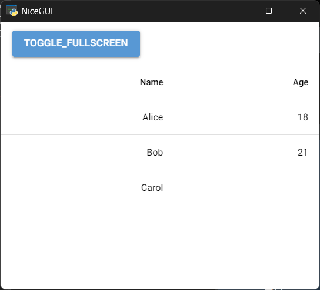

- `filter`属性，字符串类型，表示用于在表格中搜索包含指定内容的单元格时的关键字。

  示例如下：

  ```python3
  from nicegui import ui
  
  def index():
      columns = [
          {
              'name': 'firstname', 
              'label': 'Name', 
              'field': 'firstname',
          },
          {
              'name': 'age', 
              'label': 'Age', 
              'field': 'age',
          },
      ]
      rows = [
          {
              'age': 18,
              'firstname': 'Alice', 
              
          },
          {
              'firstname': 'Bob', 
              'age': 21
          },
          {
              'firstname': 'Carol'
          },
      ]
      table = ui.table(
          columns=columns, 
          rows=rows, 
          row_key='firstname',
      )
      ui.input('Search').bind_value_to(
          table,
          'filter'
      )
  
  ui.run(
      root=index,
      native=True
  )
  ```

  

`ui.table`控件支持以下方法（部分）：

- `on_select`方法，当选择的行变化时执行什么操作。该方法支持以下参数：

  - `callback`参数，可调用类型，表示当选择的行变化时执行什么操作。该参数对应的可调用对象，可以接收0个或者1个参数，接收1个参数时，该参数为`TableSelectionEventArguments`类型，其`selection`属性表示当前选择的行。

- `on_pagination_change`方法，当分页相关属性（每页多少行、当前页、排序等）变化时执行什么操作。该方法支持以下参数：

  - `callback`参数，可调用类型，表示当分页相关属性（每页多少行、当前页、排序等）变化时执行什么操作。该参数对应的可调用对象，可以接收0个或者1个参数，接收1个参数时，该参数为`ValueChangeEventArguments`类型，其`value`属性表示当前分页方式字典，`previous_value`属性表示先前分页方式字典。

- `bind_filter`方法，将控件的`filter`属性与指定对象的指定属性双向绑定。支持的参数可以参考第40章的`ui.button`控件类似方法。

- `bind_filter_from`方法，将控件的`filter`属性与指定对象的指定属性反向绑定。支持的参数可以参考第40章的`ui.button`控件类似方法。

- `bind_filter_to`方法，将控件的`filter`属性与指定对象的指定属性正向绑定。支持的参数可以参考第40章的`ui.button`控件类似方法。

- `set_selection`方法，设置控件的`selection`属性。该方法支持以下参数：

  - `value`参数，字符串类型，仅支持`[None, 'single', 'multiple']`中的值，表示是否启用选择指定行的勾选框，以及选择的类型是单选还是多选。

- `set_fullscreen`方法，设置控件的`is_fullscreen`属性。该方法支持以下参数：

  - `value`参数，布尔类型，表示表格是否为全屏显示。

- `set_filter`方法，设置控件的`filter`属性。该方法支持以下参数：

  - `filter_`参数，字符串类型，表示用于在表格中搜索包含指定内容的单元格时的关键字。

- `get_filtered_sorted_rows`方法，异步方法，按当前顺序、当前搜索状态（`filter`属性）、当前分页状态返回表格所有页的数据。该方法支持以下参数：

  - `timeout`参数，关键字参数，浮点类型，表示超时时间（单位秒），因为是异步返回，超过一定时间就不再等待结果，默认为`1`。

  示例如下：

  ```python3
  from nicegui import ui
  
  def index():
      columns = [
          {
              'name': 'firstname', 
              'label': 'Name', 
              'field': 'firstname',
          },
          {
              'name': 'age', 
              'label': 'Age', 
              'field': 'age',
              'sortable':True
          },
      ]
      rows = [
          {
              'age': 18,
              'firstname': 'Alice', 
              
          },
          {
              'firstname': 'Bob', 
              'age': 21
          },
          {
              'firstname': 'Carol'
          },
      ]
      table = ui.table(
          columns=columns, 
          rows=rows, 
          row_key='firstname',
      )
      ui.input('Search').bind_value_to(
          table,
          'filter'
      )
      
      async def get_result():
          result =  await table.get_filtered_sorted_rows()
          ui.notify(result)
          
      ui.button(
          'get_filtered_sorted_rows',
          on_click=get_result
      )
  
  ui.run(
      root=index,
      native=True
  )
  ```

  

- `get_computed_rows`方法，异步方法，按当前顺序、当前搜索状态（`filter`属性）、当前分页状态返回表格当前页的数据。该方法支持以下参数：

  - `timeout`参数，关键字参数，浮点类型，表示超时时间（单位秒），因为是异步返回，超过一定时间就不再等待结果，默认为`1`。

- `get_computed_rows_number`方法，异步方法，按当前顺序、当前搜索状态（`filter`属性）、当前分页状态返回表格所有数据的行数。该方法支持以下参数：

  - `timeout`参数，关键字参数，浮点类型，表示超时时间（单位秒），因为是异步返回，超过一定时间就不再等待结果，默认为`1`。

- `toggle_fullscreen`方法，切换表格的全屏显示状态。

  示例如下：

  ```python3
  from nicegui import ui
  
  def index():
      columns = [
          {
              'name': 'firstname', 
              'label': 'Name', 
              'field': 'firstname',
          },
          {
              'name': 'age', 
              'label': 'Age', 
              'field': 'age',
          },
      ]
      rows = [
          {
              'age': 18,
              'firstname': 'Alice', 
              
          },
          {
              'firstname': 'Bob', 
              'age': 21
          },
          {
              'firstname': 'Carol'
          },
      ]
      table = ui.table(
          columns=columns, 
          rows=rows, 
          row_key='firstname',
      )
      with table.add_slot('top'):
          ui.button(
              'toggle_fullscreen',
              on_click=table.toggle_fullscreen
          )
  
  ui.run(
      root=index,
      native=True
  )
  ```

- `add_rows`方法，一次添加多行数据。该方法支持以下参数：

  - `rows`参数，元素为字典（行数据字典）的列表，表示添加的数据。

- `add_row`方法，一次添加一行数据。该方法支持以下参数：

  - `row`参数，字典类型（行数据字典），表示添加的数据。

  使用`add_rows`方法、`add_row`方法添加数据和直接操作`rows`属性的效果是一样的。示例如下：

  ```python3
  from nicegui import ui
  
  def index():
      columns = [
          {
              'name': 'firstname', 
              'label': 'Name', 
              'field': 'firstname',
          },
          {
              'name': 'age', 
              'label': 'Age', 
              'field': 'age',
              'sortable':True
          },
      ]
      rows = [
          {
              'age': 18,
              'firstname': 'Alice', 
              
          },
          {
              'firstname': 'Bob', 
              'age': 21
          },
          {
              'firstname': 'Carol'
          },
      ]
      table = ui.table(
          columns=columns, 
          rows=rows, 
          row_key='firstname',
      )
      table.rows.extend(
          [
              {
                  'firstname': 'Duke', 
                  'age': 17
              }
          ]
      )
      table.add_rows(
          [
              {
                  'firstname': 'Duke', 
                  'age': 17
              }
          ]
      )
      table.rows.append(
          {
              'firstname': 'Eric', 
              'age': 25
          }
      )
      table.add_row(
          {
              'firstname': 'Eric', 
              'age': 25
          }
      )
  
  ui.run(
      root=index,
      native=True
  )
  ```

  

- `remove_rows`方法，一次删除多行数据。该方法支持以下参数：

  - `rows`参数，元素为字典（行数据字典）的列表，表示要删除的数据。

- `remove_row`方法，一次删除一行数据。该方法支持以下参数：

  - `row`参数，字典类型（行数据字典），表示要删除的数据。

  注意，删除数据是基于`row_key`参数对应的键查找数据，如果该键对应的值**有**重复，都会一并删除：

  ```python3
  from nicegui import ui
  
  def index():
      columns = [
          {
              'name': 'firstname', 
              'label': 'Name', 
              'field': 'firstname',
          },
          {
              'name': 'age', 
              'label': 'Age', 
              'field': 'age',
              'sortable':True
          },
      ]
      rows = [
          {
              'age': 18,
              'firstname': 'Alice', 
              
          },
          {
              'firstname': 'Bob', 
              'age': 21
          },
          {
              'firstname': 'Carol'
          },
      ]
      table = ui.table(
          columns=columns, 
          rows=rows, 
          row_key='firstname',
      )
      # 添加数据
      table.add_rows(
          [
              {
                  'firstname': 'Duke', 
                  'age': 17
              },
              {
                  'firstname': 'Duke', 
                  'age': 18
              }
          ]
      )
      # 删除数据
      table.remove_row(
              {
                  'firstname': 'Duke', 
                  'age': 17
              }
      )
  
  ui.run(
      root=index,
      native=True
  )
  ```

  

  相比之下，直接操作`rows`属性的话，想要删除的数据必须与被删除的数据完全一致：

  ```python3
  from nicegui import ui
  
  def index():
      columns = [
          {
              'name': 'firstname',
              'label': 'Name',
              'field': 'firstname',
          },
          {
              'name': 'age',
              'label': 'Age',
              'field': 'age',
              'sortable': True
          },
      ]
      rows = [
          {
              'age': 18,
              'firstname': 'Alice',
  
          },
          {
              'firstname': 'Bob',
              'age': 21
          },
          {
              'firstname': 'Carol'
          },
      ]
      table = ui.table(
          columns=columns,
          rows=rows,
          row_key='firstname',
      )
      # 添加数据
      table.add_rows(
          [
              {
                  'firstname': 'Duke',
                  'age': 17
              },
              {
                  'firstname': 'Duke',
                  'age': 18
              }
          ]
      )
      # 删除数据
      table.rows.remove(
          {
              'firstname': 'Duke',
              'age': 17
          }
      )
      table.rows.remove(
          {
              'firstname': 'Duke',
              'age': 18
          }
      )
  
  ui.run(
      root=index,
      native=True
  )
  ```

- `update_rows`方法，一次更新多行数据。该方法支持以下参数：

  - `rows`参数，元素为字典（行数据字典）的列表，表示要更新的数据。
  - `clear_selection`参数，关键字参数，布尔类型，表示更新数据的同时是否清除原本选择的行，默认为`True`。

  注意，使用更新数据方法（该方法和下面介绍的两个方法）会完全覆盖原始的数据，不会保留原始数据。

- `update_from_pandas`方法，使用此方法需要需要额外安装`pandas`库，该方法可以使用`pandas`库提供的`DataFrame`类型数据更新表格。该方法支持以下参数：

  - `df`参数，`DataFrame`类型，表示要更新的数据。

  - `clear_selection`参数，布尔类型，表示更新数据的同时是否清除原本选择的行，默认为`True`。

    从该参数开始，只能通过关键字传入。

  - `columns`参数，元素为字典（列定义，具体定义的含义参考上面内容）的列表，表示数据更新之后表格每一个列如何显示。

  - `column_defaults`参数，字典类型，表示数据更新之后默认的列定义。

  注意，不同于常规字典类型的行数据，`DataFrame`类型表示的行数据虽然类似字典，但其键为列定义中相应列`'field'`键对应的值，其键对应的值是列表类型，表示该列的所有数据。此外，每一列的数据数量应当**相同**，对于空白单元格，使用`None`表示。

  示例如下：

  ```python3
  from nicegui import ui
  import pandas as pd
  
  def index():
      columns = [
          {
              'name': 'firstname',
              'label': 'Name',
              'field': 'firstname',
          },
          {
              'name': 'age',
              'label': 'Age',
              'field': 'age',
              'sortable': True
          },
      ]
      rows = [
          {
              'age': 18,
              'firstname': 'Alice',
  
          },
      ]
      table = ui.table(
          columns=columns,
          rows=rows,
          row_key='firstname',
      )
      # 更新数据
      table.update_from_pandas(
          pd.DataFrame(
              {
                  'firstname':['Alice','Bob'],
                  'age':[19,21],
              }
          )
      )
  
  ui.run(
      root=index,
      native=True
  )
  ```

  

- `update_from_polars`方法，使用此方法需要需要额外安装`polars`库，该方法可以使用`polars`库提供的`DataFrame`类型数据更新表格。该方法支持以下参数：

  - `df`参数，`DataFrame`类型，表示要更新的数据。

  - `clear_selection`参数，布尔类型，表示更新数据的同时是否清除原本选择的行，默认为`True`。

    从该参数开始，只能通过关键字传入。

  - `columns`参数，元素为字典（列定义，具体定义的含义参考上面内容）的列表，表示数据更新之后表格每一个列如何显示。

  - `column_defaults`参数，字典类型，表示数据更新之后默认的列定义。

  示例如下：

  ```python3
  from nicegui import ui
  import polars as pl
  
  def index():
      columns = [
          {
              'name': 'firstname',
              'label': 'Name',
              'field': 'firstname',
          },
          {
              'name': 'age',
              'label': 'Age',
              'field': 'age',
              'sortable': True
          },
      ]
      rows = [
          {
              'age': 18,
              'firstname': 'Alice',
  
          },
      ]
      table = ui.table(
          columns=columns,
          rows=rows,
          row_key='firstname',
      )
      # 更新数据
      table.update_from_polars(
          pl.DataFrame(
              {
                  'firstname':['Alice','Carol'],
                  'age':[20,None],
              }
          )
      )
  
  ui.run(
      root=index,
      native=True
  )
  ```

  

`ui.table`控件支持以下类方法（部分）

- `from_pandas`方法，使用此方法需要需要额外安装`pandas`库，该方法可以使用`pandas`库提供的`DataFrame`类型数据创建表格。该方法支持以下参数：

  - `df`参数，`DataFrame`类型，表示表格的数据。

  - `columns`参数，元素为字典（列定义，具体定义的含义参考上面内容）的列表，表示表格每一个列如何显示。

    从该参数开始，只能通过关键字传入。

  - `column_defaults`参数，字典类型，表示默认的列定义。

  - `row_key`参数，字符串类型，表示确定每行数据唯一性的键（取自于行数据字典的键），默认是`'id'`。

  - `title`参数，字符串类型，表示表格的标题。

  - `selection`参数，字符串类型，仅支持`[None, 'single', 'multiple']`中的值，表示是否启用选择指定行的勾选框，以及选择的类型是单选还是多选。

  - `pagination`参数，字典类型或整数类型，表示表格的分页方式，默认为`None`，不分页。具体含义参考前面`pagination`参数的介绍。

  - `on_select`参数，可调用类型，表示当选择的行变化时执行什么操作。该参数对应的可调用对象，可以接收0个或者1个参数，接收1个参数时，该参数为`TableSelectionEventArguments`类型，其`selection`属性表示当前选择的行。

- `from_polars`方法，使用此方法需要需要额外安装`polars`库，该方法可以使用`polars`库提供的`DataFrame`类型数据创建表格。该方法支持以下参数：

  - `df`参数，`DataFrame`类型，表示表格的数据。

  - `columns`参数，元素为字典（列定义，具体定义的含义参考上面内容）的列表，表示表格每一个列如何显示。

    从该参数开始，只能通过关键字传入。

  - `column_defaults`参数，字典类型，表示默认的列定义。

  - `row_key`参数，字符串类型，表示确定每行数据唯一性的键（取自于行数据字典的键），默认是`'id'`。

  - `title`参数，字符串类型，表示表格的标题。

  - `selection`参数，字符串类型，仅支持`[None, 'single', 'multiple']`中的值，表示是否启用选择指定行的勾选框，以及选择的类型是单选还是多选。

  - `pagination`参数，字典类型或整数类型，表示表格的分页方式，默认为`None`，不分页。具体含义参考前面`pagination`参数的介绍。

  - `on_select`参数，可调用类型，表示当选择的行变化时执行什么操作。该参数对应的可调用对象，可以接收0个或者1个参数，接收1个参数时，该参数为`TableSelectionEventArguments`类型，其`selection`属性表示当前选择的行。

  示例如下：

  ```python3
  from nicegui import ui
  import pandas as pd
  import polars as pl
  
  def index():
      columns = [
          {
              'name': 'firstname',
              'label': 'Name',
              'field': 'firstname',
          },
          {
              'name': 'age',
              'label': 'Age',
              'field': 'age',
              'sortable': True
          },
      ]
      ui.table.from_pandas(
          pd.DataFrame(
              {
                  'firstname':['Alice','Bob'],
                  'age':[19,21],
              }
          ),
          columns=columns
      )
      ui.table.from_polars(
          pl.DataFrame(
              {
                  'firstname':['Alice','Carol'],
                  'age':[20,None],
              }
          ),
          columns=columns
      )
  
  ui.run(
      root=index,
      native=True
  )
  ```

  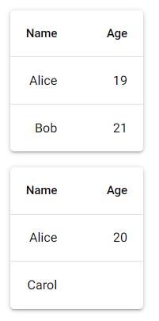

#### 52.1.2 扩展用法

##### 52.1.2.1 控件属性

介绍列定义字典的`'required'`键时，提到了`visible-columns`控件属性，因此，这里先介绍一下啊`visible-columns`属性的含义和用法。

设置`visible-columns`属性为字符串列表之后，只有该列的`name`在字符串列表中，该列才会显示出来。比如：

```python3
table.props['visible-columns'] = [
    'age',
    'firstname'
]
table.props.update(
    visibleColumns = [
        'age',
        'firstname'
    ]
)
table.props(
    ''' :visible-columns="['firstname','age']" '''
)
table.props(
    f''' :visible-columns="{['firstname','ages']}" '''
)
```

示例如下：

```python3
from nicegui import ui

def index():
    columns = [
        {
            'name': 'firstname', 
            'label': 'Name', 
            'field': 'firstname',
            'align': 'left'
        },
        {
            'name': 'age', 
            'label': 'Age', 
            'field': 'age', 
            'sortable': True
        },
    ]
    rows = [
        {
            'firstname': 'Alice', 
            'age': 18
        },
        {
            'firstname': 'Bob', 
            'age': 21
        },
        {
            'firstname': 'Carol'
        },
    ]
    table = ui.table(
        columns=columns, 
        rows=rows, 
        row_key='firstname'
    )
    table.props['visible-columns'] = [
        'firstname'
    ]

ui.run(
    root=index,
    native=True
)
```

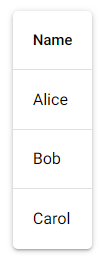

表格控件除了上面示例中“常规”的表格模式之外，还支持网格模式（完整用法参考 https://quasar.dev/vue-components/table#grid-style），可以使用类似网格布局的形式，使用单独的卡片展示每一行数据：

```python3
from nicegui import ui

def index():
    columns = [
        {
            'name': 'firstname', 
            'label': 'Name', 
            'field': 'firstname',
            'align': 'left'
        },
        {
            'name': 'age', 
            'label': 'Age', 
            'field': 'age', 
            'sortable': True
        },
    ]
    rows = [
        {
            'firstname': 'Alice', 
            'age': 18
        },
        {
            'firstname': 'Bob', 
            'age': 21
        },
        {
            'firstname': 'Carol'
        },
    ]
    table = ui.table(
        columns=columns, 
        rows=rows, 
        row_key='firstname',
        selection='multiple'
    ).classes('border-2')
    table.props('grid')
    
ui.run(
    root=index,
    native=True
)
```


与网格模式相关控件属性如下：

- `grid`属性，布尔类型，表示是否启用网格模式。

- `grid-header`属性，布尔类型，表示是否显示网格模式的表头。因为网格模式是使用单独的卡片展示每一行数据，如果想要排序某一列的数据，则需要点击网格模式的表头。

  示例如下：

  ```python3
  from nicegui import ui
  
  def index():
      columns = [
          {
              'name': 'firstname', 
              'label': 'Name', 
              'field': 'firstname',
              'align': 'left'
          },
          {
              'name': 'age', 
              'label': 'Age', 
              'field': 'age', 
              'sortable': True
          },
      ]
      rows = [
          {
              'firstname': 'Alice', 
              'age': 18
          },
          {
              'firstname': 'Bob', 
              'age': 21
          },
          {
              'firstname': 'Carol'
          },
      ]
      table = ui.table(
          columns=columns, 
          rows=rows, 
          row_key='firstname',
          selection='multiple'
      ).classes('border-2')
      table.props('grid grid-header')
      
  ui.run(
      root=index,
      native=True
  )
  ```

  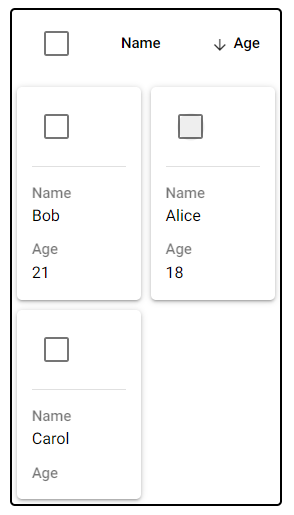

- `card-container-style`属性，字符串类型，表示卡片容器使用的样式。

- `card-container-class`属性，字符串类型，表示卡片容器使用的样式类。

- `card-style`属性，字符串类型，表示卡片使用的样式。

- `card-class`属性，字符串类型，表示卡片使用的样式类。

- `card-style-fn`属性，使用字符串表达的JavaScript函数，表示卡片使用的样式。该JavaScript函数支持以下位置参数（为了方便记忆，这里命名了参数，但实际使用时不限制参数名）：

  - `row`参数，表示每一行的行对象，其支持的属性与该行数据字典包含的键相同。

- `card-class-fn`属性，使用字符串表达的JavaScript函数，表示卡片使用的样式类。该JavaScript函数支持以下位置参数（为了方便记忆，这里命名了参数，但实际使用时不限制参数名）：

  - `row`参数，表示每一行的行对象，其支持的属性与该行数据字典包含的键相同。

  示例如下：

  ```python3
  from nicegui import ui
  
  def index():
      columns = [
          {
              'name': 'firstname', 
              'label': 'Name', 
              'field': 'firstname',
              'align': 'left'
          },
          {
              'name': 'age', 
              'label': 'Age', 
              'field': 'age', 
              'sortable': True
          },
      ]
      rows = [
          {
              'firstname': 'Alice', 
              'age': 18
          },
          {
              'firstname': 'Bob', 
              'age': 21
          },
          {
              'firstname': 'Carol'
          },
      ]
      table = ui.table(
          columns=columns, 
          rows=rows, 
          row_key='firstname',
          selection='multiple'
      ).classes('border-2')
      table.props(
          '''
          grid grid-header
          :card-class-fn='row=>row.age>20?`bg-red`:`bg-green`'
          '''
      )
      
  ui.run(
      root=index,
      native=True
  )
  ```

  

在介绍分页相关的图标类控件属性之前，需要先回顾一下图标类控件属性支持的图标表达格式：

- 图标的名字。NiceGUI默认加载了Material Icons图标字体，可以直接使用图标字体中对应图标的名字。如果加载了其他图标字体，也可以使用名字来显示对应的图标。
- “img:”为前缀的图片文件。“img:”为开头，后接图片链接（推荐使用SVG格式的矢量图，支持外部链接、内部链接）、原始表达的SVG矢量图、Base64编码的图片文件，则会加载对应的图片作为图标。

关于图标表达格式的完整内容可参考 https://quasar.dev/vue-components/icon。

了解了图标类控件属性支持的图标表达格式之后，接下来正式介绍和分页相关的图标类控件属性：

- `icon-first-page`属性，字符串类型，表示首页按钮的图标。注意，只有分页数超过3页时才会显示首页按钮。
- `icon-prev-page`属性，字符串类型，表示前一页按钮的图标。
- `icon-next-page`属性，字符串类型，表示后一页按钮的图标。
- `icon-last-page`属性，字符串类型，表示尾页按钮的图标。注意，只有分页数超过3页时才会显示尾页按钮。

示例如下：

```python3
from nicegui import ui

def index():
    columns = [
        {
            'name': 'firstname', 
            'label': 'Name', 
            'field': 'firstname',
            'align': 'left'
        },
        {
            'name': 'age', 
            'label': 'Age', 
            'field': 'age', 
            'sortable': True
        },
    ]
    rows = [
        {
            'firstname': 'Alice', 
            'age': 18
        },
        {
            'firstname': 'Bob', 
            'age': 21
        },
        {
            'firstname': 'Carol'
        },
    ]
    table = ui.table(
        columns=columns, 
        rows=rows, 
        row_key='firstname',
        pagination=1
    ).classes('border-2')
    table.props('icon-first-page="img:/favicon.ico" icon-prev-page=左 icon-next-page=arrow_right_alt')
    table.props['icon-last-page'] = '''img:
        data:image/svg+xml;
        charset=utf8,
        <svg viewBox="0 0 200 200" xmlns="http://www.w3.org/2000/svg">
            <circle cx="100" cy="100" r="78" fill="yellow" stroke="black" stroke-width="3" />
            <circle cx="80" cy="85" r="8" />
            <circle cx="120" cy="85" r="8" />
            <path d="m60,120 C75,150 125,150 140,120" style="fill:none; stroke:black; stroke-width:8; stroke-linecap:round" />
        </svg>
    '''
    ui.icon('left-arrow')
    
ui.run(
    root=index,
    native=True
)
```

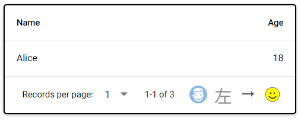

除了表头和数据之外，表格还会显示一些额外区域。这些区域可能是展示特定的信息，也可能是执行特定功能的按钮。不过，在实际使用中，可能开发者希望隐藏这些额外区域甚至表头，只展示表格的数据，那就要用到以下的属性：

- `hide-header`属性，布尔类型，表示是否隐藏表头。

  示例如下：

  ```python3
  from nicegui import ui
  
  def index():
      columns = [
          {
              'name': 'firstname', 
              'label': 'Name', 
              'field': 'firstname',
              'align': 'left'
          },
          {
              'name': 'age', 
              'label': 'Age', 
              'field': 'age', 
              'sortable': True
          },
      ]
      rows = [
          {
              'firstname': 'Alice', 
              'age': 18
          },
          {
              'firstname': 'Bob', 
              'age': 21
          },
          {
              'firstname': 'Carol'
          },
      ]
      ui.table(
          columns=columns, 
          rows=rows, 
          row_key='firstname'
      ).classes('border-2')
      ui.table(
          columns=columns, 
          rows=rows, 
          row_key='firstname',
      ).classes(
          'border-2'
      ).props(
          'hide-header'
      )
      
  ui.run(
      root=index,
      native=True
  )
  ```

  

- `hide-pagination`属性，布尔类型，表示是否底部区域中分页相关的部分。

  示例如下：

  ```python3
  from nicegui import ui
  
  def index():
      columns = [
          {
              'name': 'firstname', 
              'label': 'Name', 
              'field': 'firstname',
              'align': 'left'
          },
          {
              'name': 'age', 
              'label': 'Age', 
              'field': 'age', 
              'sortable': True
          },
      ]
      rows = [
          {
              'firstname': 'Alice', 
              'age': 18
          },
          {
              'firstname': 'Bob', 
              'age': 21
          },
          {
              'firstname': 'Carol'
          },
      ]
      ui.table(
          columns=columns, 
          rows=rows, 
          row_key='firstname',
          selection='multiple',
          pagination=1
      ).classes('border-2')
      ui.table(
          columns=columns, 
          rows=rows, 
          row_key='firstname',
          selection='multiple',
          pagination=1
      ).classes(
          'border-2'
      ).props(
          'hide-pagination'
      )
      
  ui.run(
      root=index,
      native=True
  )
  ```

  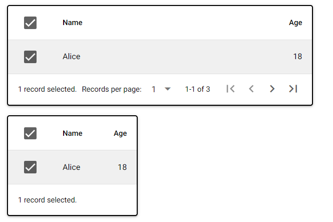

- `hide-selected-banner`属性，布尔类型，表示是否底部区域中选择信息的部分。

  示例如下：

  ```python3
  from nicegui import ui
  
  def index():
      columns = [
          {
              'name': 'firstname', 
              'label': 'Name', 
              'field': 'firstname',
              'align': 'left'
          },
          {
              'name': 'age', 
              'label': 'Age', 
              'field': 'age', 
              'sortable': True
          },
      ]
      rows = [
          {
              'firstname': 'Alice', 
              'age': 18
          },
          {
              'firstname': 'Bob', 
              'age': 21
          },
          {
              'firstname': 'Carol'
          },
      ]
      ui.table(
          columns=columns, 
          rows=rows, 
          row_key='firstname',
          selection='multiple',
          pagination=1
      ).classes('border-2')
      ui.table(
          columns=columns, 
          rows=rows, 
          row_key='firstname',
          selection='multiple',
          pagination=1
      ).classes(
          'border-2'
      ).props(
          'hide-selected-banner'
      )
      
  ui.run(
      root=index,
      native=True
  )
  ```

  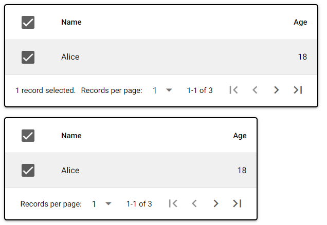

- `hide-no-data`属性，布尔类型，表示是否底部区域中提示无数据的警告。

  示例如下：

  ```python3
  from nicegui import ui
  
  def index():
      columns = [
          {
              'name': 'firstname', 
              'label': 'Name', 
              'field': 'firstname',
              'align': 'left'
          },
          {
              'name': 'age', 
              'label': 'Age', 
              'field': 'age', 
              'sortable': True
          },
      ]
      ui.table(
          columns=columns, 
          rows=[]
      ).classes('border-2')
      ui.table(
          columns=columns, 
          rows=[],
      ).classes(
          'border-2'
      ).props(
          'hide-no-data'
      )
      
  ui.run(
      root=index,
      native=True
  )
  ```

  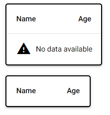

- `hide-bottom`属性，布尔类型，表示是否底部区域。

  示例如下：

  ```python3
  from nicegui import ui
  
  def index():
      columns = [
          {
              'name': 'firstname', 
              'label': 'Name', 
              'field': 'firstname',
              'align': 'left'
          },
          {
              'name': 'age', 
              'label': 'Age', 
              'field': 'age', 
              'sortable': True
          },
      ]
      rows = [
          {
              'firstname': 'Alice', 
              'age': 18
          },
          {
              'firstname': 'Bob', 
              'age': 21
          },
          {
              'firstname': 'Carol'
          },
      ]
      ui.table(
          columns=columns, 
          rows=rows, 
          row_key='firstname',
          selection='multiple',
          pagination=1
      ).classes('border-2')
      ui.table(
          columns=columns, 
          rows=rows, 
          row_key='firstname',
          selection='multiple',
          pagination=1
      ).classes(
          'border-2'
      ).props(
          'hide-bottom'
      )
      
  ui.run(
      root=index,
      native=True
  )
  ```

  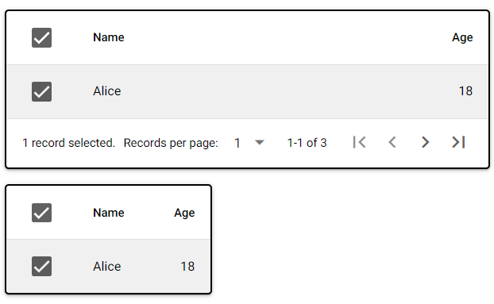

虽然默认每行数据之间有分隔线，让多行数据看起来没那么容易串行，但难免在数据少的时候，想要隐藏分隔线，或者在列数多的时候额外添加每列数据之间的分隔线，亦或是只显示列之间的分隔线，那就要用到`separator`属性。该属性为字符串类型，仅支持`['horizontal','vertical','cell','none']`中的值，实际使用时的效果如下：

```python3
from nicegui import ui

def index():
    columns = [
        {
            'name': 'firstname', 
            'label': 'Name', 
            'field': 'firstname',
            'align': 'left'
        },
        {
            'name': 'age', 
            'label': 'Age', 
            'field': 'age', 
            'sortable': True
        },
    ]
    rows = [
        {
            'firstname': 'Alice', 
            'age': 18
        },
        {
            'firstname': 'Bob', 
            'age': 21
        },
        {
            'firstname': 'Carol'
        },
    ]
    with ui.row():
        for separator in ['horizontal','vertical','cell','none']:
            with ui.card():
                ui.label(separator)
                ui.table(
                    columns=columns, 
                    rows=rows, 
                    row_key='firstname'
                ).props(f'separator={separator}')
    
ui.run(
    root=index,
    native=True
)
```


`wrap-cells`属性，布尔类型，表示是否启用单元格的自动换行样式。示例如下：

```python3
from nicegui import ui

def index():
    columns = [
        {
            'name': 'firstname', 
            'label': 'Name', 
            'field': 'firstname',
            'align': 'left'
        },
        {
            'name': 'age', 
            'label': 'Age', 
            'field': 'age', 
            'sortable': True
        },
    ]
    rows = [
        {
            'firstname': 'Alice', 
            'age': 18
        },
        {
            'firstname': 'Bob', 
            'age': 21
        },
        {
            'firstname': 'Carol  very long'
        },
    ]
    table = ui.table(
        columns=columns, 
        rows=rows, 
        row_key='firstname'
    ).classes('border-2 w-32')
    table.props('wrap-cells ')
    
ui.run(
    root=index,
    native=True
)
```

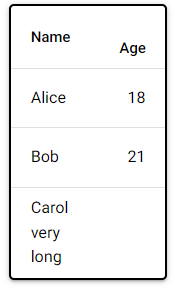

虽然给`ui.run`方法的`language`参数传入具体的本地化语言代码（`'zh-CN'`）可以让控件的部分提示语显示为本地化语言，比如中文：

```python3
from nicegui import ui

def index():
    columns = [
        {
            'name': 'firstname', 
            'label': 'Name', 
            'field': 'firstname',
            'align': 'left'
        },
        {
            'name': 'age', 
            'label': 'Age', 
            'field': 'age', 
            'sortable': True
        },
    ]
    rows = [
        {
            'firstname': 'Alice', 
            'age': 18
        },
        {
            'firstname': 'Bob', 
            'age': 21
        },
        {
            'firstname': 'Carol'
        },
    ]
    ui.table(
        columns=columns, 
        rows=rows, 
        row_key='firstname',
        pagination=1
    ).classes('border-2')
    
ui.run(
    root=index,
    native=True,
    language='zh-CN'
)
```

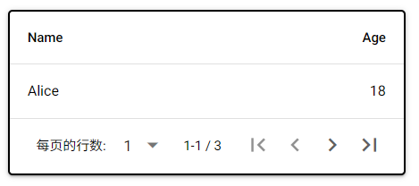

但有时候时想修改提示语为自定义内容，而非只是让其显示为本地化语言，那就可以使用下面几个的属性：

- `rows-per-page-label`属性，字符串类型，表示每页行数前的提示语。比如，可以使用下面的代码，实现与上面示例相同的效果：

  ```python3
  from nicegui import ui
  
  def index():
      columns = [
          {
              'name': 'firstname', 
              'label': 'Name', 
              'field': 'firstname',
              'align': 'left'
          },
          {
              'name': 'age', 
              'label': 'Age', 
              'field': 'age', 
              'sortable': True
          },
      ]
      rows = [
          {
              'firstname': 'Alice', 
              'age': 18
          },
          {
              'firstname': 'Bob', 
              'age': 21
          },
          {
              'firstname': 'Carol'
          },
      ]
      table = ui.table(
          columns=columns, 
          rows=rows, 
          row_key='firstname',
          pagination=1
      ).classes('border-2')
      table.props(
          'rows-per-page-label=每页的行数:'
      )
      
  ui.run(
      root=index,
      native=True
  )
  ```

  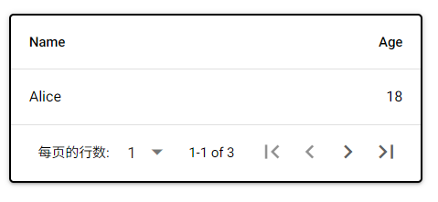

- `pagination-label`属性，使用字符串表达的JavaScript函数，表示分页的行数状况（当前页的首尾行、总行数）。该JavaScript函数支持以下位置参数（为了方便记忆，这里命名了参数，但实际使用时不限制参数名）：

  - `start`参数，整数类型，表示当前页第一行数据为整个表格总行数的第几行。
  - `end`参数，整数类型，表示当前页最后一行数据为整个表格总行数的第几行。
  - `total`参数，整数类型，表示整个表格的总行数。

  示例如下：

  ```python3
  from nicegui import ui
  
  def index():
      columns = [
          {
              'name': 'firstname', 
              'label': 'Name', 
              'field': 'firstname',
              'align': 'left'
          },
          {
              'name': 'age', 
              'label': 'Age', 
              'field': 'age', 
              'sortable': True
          },
      ]
      rows = [
          {
              'firstname': 'Alice', 
              'age': 18
          },
          {
              'firstname': 'Bob', 
              'age': 21
          },
          {
              'firstname': 'Carol'
          },
      ]
      table = ui.table(
          columns=columns, 
          rows=rows, 
          row_key='firstname',
          pagination=1
      ).classes('border-2')
      table.props(
          ':pagination-label="(start, end, total) => `表格共${total}行数据，本页自第${start}行起，至第${end}行止。`"'
      )
      
  ui.run(
      root=index,
      native=True
  )
  ```

  

  可能有细心的读者发现了，`rows-per-page-label`属性的示例效果和前面切换语言的效果相比，有一点小差异。没错，就是因为`pagination-label`属性没有根据语言对应的格式同步修改。因此，读者可以使用下面的代码，完美复刻切换语言的效果：

  ```python3
  from nicegui import ui
  
  def index():
      columns = [
          {
              'name': 'firstname', 
              'label': 'Name', 
              'field': 'firstname',
              'align': 'left'
          },
          {
              'name': 'age', 
              'label': 'Age', 
              'field': 'age', 
              'sortable': True
          },
      ]
      rows = [
          {
              'firstname': 'Alice', 
              'age': 18
          },
          {
              'firstname': 'Bob', 
              'age': 21
          },
          {
              'firstname': 'Carol'
          },
      ]
      table = ui.table(
          columns=columns, 
          rows=rows, 
          row_key='firstname',
          pagination=1
      ).classes('border-2')
      table.props(
          '''
          rows-per-page-label=每页的行数:
          :pagination-label="(start, end, total) => `${start}-${end}/${total}`"
          '''
      )
      
  ui.run(
      root=index,
      native=True
  )
  ```

  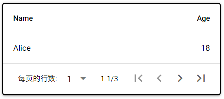

- `selected-rows-label`属性，使用字符串表达的JavaScript函数，表示选择了几行。该JavaScript函数支持以下位置参数（为了方便记忆，这里命名了参数，但实际使用时不限制参数名）：

  - `numberOfRows`参数，整数类型，表示选择了几行。

  示例如下：

  ```python3
  from nicegui import ui
  
  def index():
      columns = [
          {
              'name': 'firstname', 
              'label': 'Name', 
              'field': 'firstname',
              'align': 'left'
          },
          {
              'name': 'age', 
              'label': 'Age', 
              'field': 'age', 
              'sortable': True
          },
      ]
      rows = [
          {
              'firstname': 'Alice', 
              'age': 18
          },
          {
              'firstname': 'Bob', 
              'age': 21
          },
          {
              'firstname': 'Carol'
          },
      ]
      table = ui.table(
          columns=columns, 
          rows=rows, 
          row_key='firstname',
          selection='multiple',
          pagination=1
      ).classes('border-2')
      table.props(
          '''
          rows-per-page-label=每页的行数:
          :selected-rows-label="(numberOfRows) => `选择了${numberOfRows}行`"
          '''
      )
      
  ui.run(
      root=index,
      native=True
  )
  ```

  

- `no-results-label`属性，字符串类型，表示在表格中搜索包含指定内容的单元格，没有匹配结果时的提示语。

  示例如下：

  ```python3
  from nicegui import ui
  
  def index():
      columns = [
          {
              'name': 'firstname', 
              'label': 'Name', 
              'field': 'firstname',
              'align': 'left'
          },
          {
              'name': 'age', 
              'label': 'Age', 
              'field': 'age', 
              'sortable': True
          },
      ]
      rows = [
          {
              'firstname': 'Alice', 
              'age': 18
          },
          {
              'firstname': 'Bob', 
              'age': 21
          },
          {
              'firstname': 'Carol'
          },
      ]
      table = ui.table(
          columns=columns, 
          rows=rows, 
          row_key='firstname'
      ).classes('border-2')
      table.set_filter('test')
      table.props('no-results-label=无结果')
      
  ui.run(
      root=index,
      native=True
  )
  ```

  

- `no-data-label`属性，字符串类型，表示表格无数据时的提示语。

  示例如下：

  ```python3
  from nicegui import ui
  
  def index():
      columns = [
          {
              'name': 'firstname', 
              'label': 'Name', 
              'field': 'firstname',
              'align': 'left'
          },
          {
              'name': 'age', 
              'label': 'Age', 
              'field': 'age', 
              'sortable': True
          },
      ]
      table = ui.table(
          columns=columns, 
          rows=[], 
          row_key='firstname'
      ).classes('border-2')
      table.props('no-data-label=无数据')
      
  ui.run(
      root=index,
      native=True
  )
  ```

  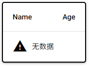

- `loading-label`属性，字符串类型，表示表格处于加载状态时的提示语。注意，仅在使用`loading`属性且表格无可展示数据（无数据或者未搜索到包含`filter`属性的单元格）时，该属性才会生效，并且优先级比`no-data-label`属性、`no-results-label`属性高。

  示例如下：

  ```python3
  from nicegui import ui
  
  def index():
      columns = [
          {
              'name': 'firstname', 
              'label': 'Name', 
              'field': 'firstname',
              'align': 'left'
          },
          {
              'name': 'age', 
              'label': 'Age', 
              'field': 'age', 
              'sortable': True
          },
      ]
      table = ui.table(
          columns=columns, 
          rows=[], 
          row_key='firstname'
      ).classes('border-2')
      table.props('no-data-label=无数据 loading loading-label=加载中')
      
  ui.run(
      root=index,
      native=True
  )
  ```

  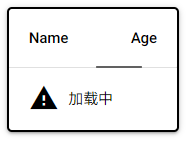

控件还有一些与样式相关的属性：

- `color`属性，字符串类型，表示勾选框、加载进度条、分页按钮、分页选择器的颜色。

  示例如下：

  ```python3
  from nicegui import ui
  
  def index():
      columns = [
          {
              'name': 'firstname', 
              'label': 'Name', 
              'field': 'firstname',
              'align': 'left'
          },
          {
              'name': 'age', 
              'label': 'Age', 
              'field': 'age', 
              'sortable': True
          },
      ]
      rows = [
          {
              'firstname': 'Alice', 
              'age': 18
          },
          {
              'firstname': 'Bob', 
              'age': 21
          },
          {
              'firstname': 'Carol'
          },
      ]
      table = ui.table(
          columns=columns, 
          rows=rows, 
          row_key='firstname',
          selection='single',
          pagination=1
      ).classes('border-2')
      table.props('color=red loading')
      
  ui.run(
      root=index,
      native=True
  )
  ```

  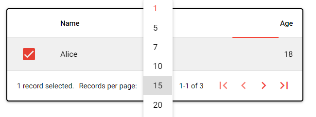

- `dense`属性，布尔类型，表示是否启用紧凑风格。

  示例如下：

  ```python3
  from nicegui import ui
  
  def index():
      columns = [
          {
              'name': 'firstname', 
              'label': 'Name', 
              'field': 'firstname',
              'align': 'left'
          },
          {
              'name': 'age', 
              'label': 'Age', 
              'field': 'age', 
              'sortable': True
          },
      ]
      rows = [
          {
              'firstname': 'Alice', 
              'age': 18
          },
          {
              'firstname': 'Bob', 
              'age': 21
          },
          {
              'firstname': 'Carol'
          },
      ]
      ui.table(
          columns=columns, 
          rows=rows, 
          row_key='firstname'
      ).classes('border-2')
      table = ui.table(
          columns=columns, 
          rows=rows, 
          row_key='firstname'
      ).classes('border-2')
      table.props('dense')
      
  ui.run(
      root=index,
      native=True
  )
  ```

  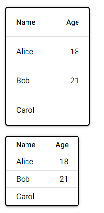

- `dark`属性，布尔类型，表示是否启用暗黑主题。

  示例如下：

  ```python3
  from nicegui import ui
  
  def index():
      columns = [
          {
              'name': 'firstname', 
              'label': 'Name', 
              'field': 'firstname',
              'align': 'left'
          },
          {
              'name': 'age', 
              'label': 'Age', 
              'field': 'age', 
              'sortable': True
          },
      ]
      rows = [
          {
              'firstname': 'Alice', 
              'age': 18
          },
          {
              'firstname': 'Bob', 
              'age': 21
          },
          {
              'firstname': 'Carol'
          },
      ]
      ui.table(
          columns=columns, 
          rows=rows, 
          row_key='firstname'
      ).classes('border-2')
      table = ui.table(
          columns=columns, 
          rows=rows, 
          row_key='firstname'
      ).classes('border-2')
      table.props('dark')
      
  ui.run(
      root=index,
      native=True
  )
  ```

  

- `flat`属性，布尔类型，表示是否启用扁平化风格（移除边框的阴影）。

  示例如下：

  ```python3
  from nicegui import ui
  
  def index():
      columns = [
          {
              'name': 'firstname', 
              'label': 'Name', 
              'field': 'firstname',
              'align': 'left'
          },
          {
              'name': 'age', 
              'label': 'Age', 
              'field': 'age', 
              'sortable': True
          },
      ]
      rows = [
          {
              'firstname': 'Alice', 
              'age': 18
          },
          {
              'firstname': 'Bob', 
              'age': 21
          },
          {
              'firstname': 'Carol'
          },
      ]
      ui.table(
          columns=columns, 
          rows=rows, 
          row_key='firstname'
      )
      table = ui.table(
          columns=columns, 
          rows=rows, 
          row_key='firstname'
      )
      table.props('flat')
      
  ui.run(
      root=index,
      native=True
  )
  ```

  

- `bordered`属性，布尔类型，表示是否添加边框。注意，因为表格默认有阴影效果，添加边框并不会特别明显。因此，可以与`flat`属性组合使用，查看效果：

  ```python3
  from nicegui import ui
  
  def index():
      columns = [
          {
              'name': 'firstname', 
              'label': 'Name', 
              'field': 'firstname',
              'align': 'left'
          },
          {
              'name': 'age', 
              'label': 'Age', 
              'field': 'age', 
              'sortable': True
          },
      ]
      rows = [
          {
              'firstname': 'Alice', 
              'age': 18
          },
          {
              'firstname': 'Bob', 
              'age': 21
          },
          {
              'firstname': 'Carol'
          },
      ]
      ui.table(
          columns=columns, 
          rows=rows, 
          row_key='firstname'
      ).props('flat')
      table = ui.table(
          columns=columns, 
          rows=rows, 
          row_key='firstname'
      )
      table.props('bordered flat')
      
  ui.run(
      root=index,
      native=True
  )
  ```

  

- `square`属性，布尔类型，表示是否移除边框的圆角。

  示例如下：

  ```python3
  from nicegui import ui
  
  def index():
      columns = [
          {
              'name': 'firstname', 
              'label': 'Name', 
              'field': 'firstname',
              'align': 'left'
          },
          {
              'name': 'age', 
              'label': 'Age', 
              'field': 'age', 
              'sortable': True
          },
      ]
      rows = [
          {
              'firstname': 'Alice', 
              'age': 18
          },
          {
              'firstname': 'Bob', 
              'age': 21
          },
          {
              'firstname': 'Carol'
          },
      ]
      ui.table(
          columns=columns, 
          rows=rows, 
          row_key='firstname'
      ).props('bordered flat')
      table = ui.table(
          columns=columns, 
          rows=rows, 
          row_key='firstname'
      )
      table.props('bordered flat square')
      
  ui.run(
      root=index,
      native=True
  )
  ```

  

- `table-style`属性，字符串类型，表示整个表格使用的样式。

- `table-class`属性，字符串类型，表示整个表格使用的样式类。

- `table-header-style`属性，字符串类型，表示表头使用的样式。

- `table-header-class`属性，字符串类型，表示表头使用的样式类。

- `table-row-style-fn`属性，使用字符串表达的JavaScript函数，表示除了表头外的每行使用的样式。该JavaScript函数支持以下位置参数（为了方便记忆，这里命名了参数，但实际使用时不限制参数名）：

  - `row`参数，表示每一行的行对象，其支持的属性与该行数据字典包含的键相同。

- `table-row-class-fn`属性，使用字符串表达的JavaScript函数，表示除了表头外的每行的样式类。该JavaScript函数支持以下位置参数（为了方便记忆，这里命名了参数，但实际使用时不限制参数名）：

  - `row`参数，表示每一行的行对象，其支持的属性与该行数据字典包含的键相同。

- `title-class`属性，字符串类型，表示表格标题使用的样式类。

##### 52.1.2.2 控件方法

在正式学习本节之前，需要先了解以下问题：

- 什么是控件方法？和控件属性类似，控件方法是由Quasar控件提供的JavaScript函数，在NiceGUI中，需要借助`run_method`方法调用。
- 为什么要用控件方法？虽然NiceGUI的控件提供了足够日常使用的Python函数，但依然无法满足所有的需求。因此，如果Quasar控件提供的JavaScript函数正好符合要求，那就可以直接使用控件方法，不用创建单独的Python函数或者JavaScript函数。

`ui.table`控件支持以下控件方法（部分）：

- `toggleFullscreen`方法，切换表格的全屏显示状态。

  示例如下：

  ```python3
  from nicegui import ui
  
  def index():
      columns = [
          {
              'name': 'firstname', 
              'label': 'Name', 
              'field': 'firstname',
              'align': 'left'
          },
          {
              'name': 'age', 
              'label': 'Age', 
              'field': 'age', 
              'sortable': True
          },
      ]
      rows = [
          {
              'firstname': 'Alice', 
              'age': 18
          },
          {
              'firstname': 'Bob', 
              'age': 21
          },
          {
              'firstname': 'Carol'
          },
      ]
      table = ui.table(
          columns=columns, 
          rows=rows, 
          row_key='firstname',
          selection='multiple',
          pagination=1
      )
      method = 'toggleFullscreen'
      with table.add_slot('top-left'):
          ui.button(
              f'run method "{method}"',
              on_click=lambda:table.run_method(
                  f'{method}'
              )
          ).props('no-caps')
      
  ui.run(
      root=index,
      native=True
  )
  ```

- `setFullscreen`方法，加入表格的全屏显示状态。

- `exitFullscreen`方法，退出表格的全屏显示状态。

- `requestServerInteraction`方法，让表格发射一次“reques”事件（JavaScript事件，可以在Python代码中使用`on`方法响应）。与控件有关的独特属性会成为事件参数`args`属性的字典类型属性，因此，`args`属性的键对应着不同的值：

  - `'pagination'`键，其值为字典类型，含义同控件的`pagination`参数。
  - `'filter'`键，其值为字符串类型，含义同控件的`filter`属性。

  示例如下：

  ```python3
  from nicegui import ui
  
  def index():
      columns = [
          {
              'name': 'firstname', 
              'label': 'Name', 
              'field': 'firstname',
              'align': 'left'
          },
          {
              'name': 'age', 
              'label': 'Age', 
              'field': 'age', 
              'sortable': True
          },
      ]
      rows = [
          {
              'firstname': 'Alice', 
              'age': 18
          },
          {
              'firstname': 'Bob', 
              'age': 21
          },
          {
              'firstname': 'Carol'
          },
      ]
      table = ui.table(
          columns=columns, 
          rows=rows, 
          row_key='firstname',
          selection='multiple',
          pagination=1
      )
      method = 'requestServerInteraction'
      table.set_filter('a')
      table.on('request',lambda e:print(e))
      with table.add_slot('top-left'):
          ui.button(
              f'run method "{method}"',
              on_click=lambda:table.run_method(
                  f'{method}',
              )
          ).props('no-caps')
      
  ui.run(
      root=index,
      native=True
  )
  ```

- `setPagination`方法，修改表格的分页方式。该方法支持以下位置参数（为了方便记忆，这里命名了参数，但实际使用时不需要参数名）：

  - `pagination`参数，字典类型（同控件的`pagination`参数），表示表格的分页方式。

  示例如下：

  ```python3
  from nicegui import ui
  
  def index():
      columns = [
          {
              'name': 'firstname', 
              'label': 'Name', 
              'field': 'firstname',
              'align': 'left'
          },
          {
              'name': 'age', 
              'label': 'Age', 
              'field': 'age', 
              'sortable': True
          },
      ]
      rows = [
          {
              'firstname': 'Alice', 
              'age': 18
          },
          {
              'firstname': 'Bob', 
              'age': 21
          },
          {
              'firstname': 'Carol'
          },
      ]
      table = ui.table(
          columns=columns, 
          rows=rows, 
          row_key='firstname',
          selection='multiple',
          pagination=1
      )
      method = 'setPagination'
      with table.add_slot('top-left'):
          ui.button(
              f'run method "{method}"',
              on_click=lambda:table.run_method(
                  f'{method}',
                  {
                      'rowsPerPage':2,
                      'sortedBy':'age',
                      'page':2
                  }
              )
          ).props('no-caps')
      
  ui.run(
      root=index,
      native=True
  )
  ```

- `firstPage`方法，跳转至首页。

- `prevPage`方法，跳转至前一页。

- `nextPage`方法，跳转至下一页。

- `lastPage`方法，跳转至尾页。

- `isRowSelected`方法，判断某一行是否被选中。该方法支持以下位置参数（为了方便记忆，这里命名了参数，但实际使用时不需要参数名）：

  - `key`参数，字符串类型，表示被检查行确定唯一性的键对应的值。

  示例如下：

  ```python3
  from nicegui import ui
  
  def index():
      columns = [
          {
              'name': 'firstname', 
              'label': 'Name', 
              'field': 'firstname',
              'align': 'left'
          },
          {
              'name': 'age', 
              'label': 'Age', 
              'field': 'age', 
              'sortable': True
          },
      ]
      rows = [
          {
              'firstname': 'Alice', 
              'age': 18
          },
          {
              'firstname': 'Bob', 
              'age': 21
          },
          {
              'firstname': 'Carol'
          },
      ]
      table = ui.table(
          columns=columns, 
          rows=rows, 
          row_key='firstname',
          selection='multiple',
          pagination=1
      )
      method = 'isRowSelected'
      async def get_result():
          result = await table.run_method(
              f'{method}',
              'Bob'
          )
          if result:
              ui.notify('Bob 被选中了！')
      with table.add_slot('top-left'):
          ui.button(
              f'run method "{method}"',
              on_click=get_result
          ).props('no-caps')
      
  ui.run(
      root=index,
      native=True
  )
  ```

  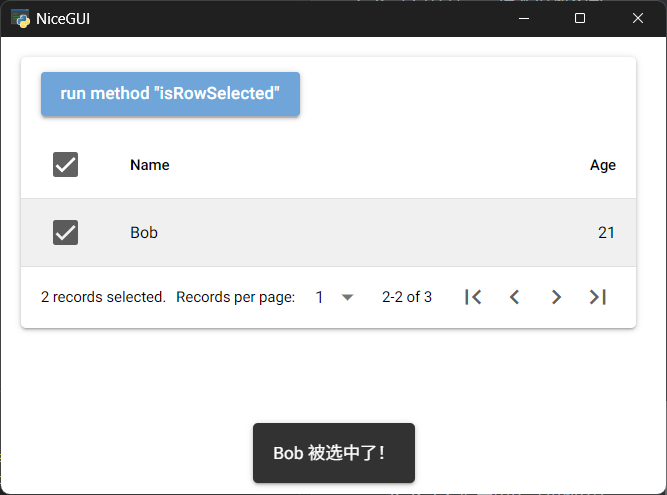

- `sort`方法，将某一列设为排序状态。该方法支持以下位置参数（为了方便记忆，这里命名了参数，但实际使用时不需要参数名）：

  - `col`参数，字符串类型，表示要设定为排序状态的列名（即列的`'name'`键对应的值）。

  示例如下：

  ```python3
  from nicegui import ui
  
  def index():
      columns = [
          {
              'name': 'firstname', 
              'label': 'Name', 
              'field': 'firstname',
              'align': 'left'
          },
          {
              'name': 'age', 
              'label': 'Age', 
              'field': 'age', 
              'sortable': True
          },
      ]
      rows = [
          {
              'firstname': 'Alice', 
              'age': 18
          },
          {
              'firstname': 'Bob', 
              'age': 21
          },
          {
              'firstname': 'Carol'
          },
      ]
      table = ui.table(
          columns=columns, 
          rows=rows, 
          row_key='firstname',
          selection='multiple',
          pagination=1
      )
      method = 'sort'
      with table.add_slot('top-left'):
          ui.button(
              f'run method "{method}"',
              on_click=lambda:table.run_method(
                  f'{method}',
                  'firstname'
              )
          ).props('no-caps')
      
  ui.run(
      root=index,
      native=True
  )
  ```

##### 52.1.2.3 插槽

注意，和一般的控件不同，`ui.table`控件不支持“default”插槽。

考虑到直接写模板会用到较难的前端知识（主要是VUE），而读者的前端知识不一定丰富，因此，部分插槽仅介绍对应的区域，不提供具体示例。

不过，虽然直接写模板是插槽的基本用法，但为了降低对读者前端知识的要求，笔者还是为部分插槽提供了特殊的简化用法示例。

简化用法有以下要点：

- JavaScript变量`props`对应插槽的当前作用域（scope），当前作用域支持的属性，也是`props`变量的属性。因此，可以使用`props`变量得到单元格对应的相关数据。
- 控件属性`innerHTML`表示控件的“default”插槽或者HTML标签的子节点内容。因此，在Python代码中，可以在该控件属性中使用包含`props`变量的表达式，尽可能少地写前端代码。

`ui.table`控件支持以下插槽：

- “loading”插槽，对应控件的加载状态。建议使用`ui.spinner`控件，并适当调整控件显示的位置和背景：

  ```python3
  from nicegui import ui
  
  def index():
      columns = [
          {
              'name': 'firstname', 
              'label': 'Name', 
              'field': 'firstname',
              'align': 'left'
          },
          {
              'name': 'age', 
              'label': 'Age', 
              'field': 'age', 
              'sortable': True
          },
      ]
      rows = [
          {
              'firstname': 'Alice', 
              'age': 18
          },
          {
              'firstname': 'Bob', 
              'age': 21
          },
          {
              'firstname': 'Carol'
          },
      ]
      table = ui.table(
          columns=columns, 
          rows=rows, 
          row_key='firstname',
          selection='multiple',
          pagination=1
      ).props('loading')
      table2 = ui.table(
          columns=columns, 
          rows=rows, 
          row_key='firstname',
          selection='multiple',
          pagination=1
      ).props('loading')
      # 使用现有控件实现
      with table.add_slot('loading'):
          with ui.element('q-inner-loading').props('showing'):
              ui.spinner(size='5em')
      # 使用样式类实现
      with table2.add_slot('loading'):
          with ui.element().classes('absolute-full flex-center column bg-white/60'):
              ui.spinner(size='5em')
  
  ui.run(
      root=index,
      native=True
  )
  ```

  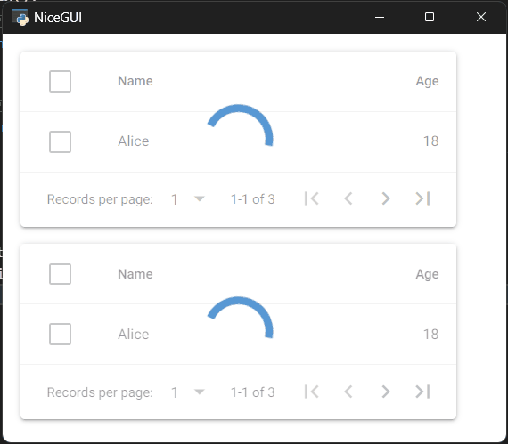

- “item”插槽，对应网格模式的每一行数据。该插槽的当前作用域支持以下属性：

  - `key`属性，字符串类型，表示该行确定唯一性的键对应的值。
  - `row`属性，表示每一行的行对象，其支持的属性与行数据字典包含的键相同。
  - `rowIndex`属性，整数类型，表示当前排序、筛选状态下，该行位置的索引值。
  - `pageIndex`属性，整数类型，表示当前排序、筛选状态下，该行所属页的索引值。
  - `cols`属性，元素为列定义的数组，与`columns`参数相同。每个元素支持的属性与`columns`参数中每个元素对应字典包含的键相同。
  - `colsMap`属性，将列名（column name）映射为列定义的对象，其支持的属性与列名相同，通过子属性可以访问列名对应列的列定义。
  - `sort`属性，JavaScript函数类型，用法同`sort`方法（控件方法）。
  - `selected`属性，布尔类型，表示该行是否被选择。
  - `expand`属性，布尔类型，表示该行是否被展开。注意，该属性默认没有相关的交互动作，需要手动实现相关代码和前端样式。
  - `color`属性，字符串类型，表示勾选框、加载进度条、分页按钮、分页选择器的颜色。
  - `dark`属性，布尔类型，表示是否启用暗黑主题。
  - `dense`属性，布尔类型，表示是否启用紧凑风格。

  示例如下：

  ```python3
  from nicegui import ui
  
  def index():
      columns = [
          {
              'name': 'firstname', 
              'label': 'Name', 
              'field': 'firstname',
              'align': 'left'
          },
          {
              'name': 'age', 
              'label': 'Age', 
              'field': 'age', 
              'sortable': True
          },
      ]
      rows = [
          {
              'firstname': 'Alice', 
              'age': 18
          },
          {
              'firstname': 'Bob', 
              'age': 21
          },
          {
              'firstname': 'Carol'
          },
      ]
      table = ui.table(
          columns=columns, 
          rows=rows, 
          row_key='firstname',
          selection='multiple',
      ).props('grid')
      with table.add_slot('item'):
          with ui.card():
              ui.label().props(':innerHTML=props.row.firstname')
              ui.separator()
              ui.label().props(':innerHTML=props.row.age')
  
  ui.run(
      root=index,
      native=True
  )
  ```

  

- “body”插槽，对应表格的内容主体的每一行区域。建议参考本章开头的表格结构，使用`tr`标签内嵌套`td`标签的结构作为该插槽的模板。该插槽的当前作用域支持以下属性：

  - `key`属性，字符串类型，表示该行确定唯一性的键对应的值。
  - `row`属性，表示每一行的行对象，其支持的属性与行数据字典包含的键相同。
  - `rowIndex`属性，整数类型，表示当前排序、筛选状态下，该行位置的索引值。
  - `pageIndex`属性，整数类型，表示当前排序、筛选状态下，该行所属页的索引值。
  - `cols`属性，元素为列定义的数组，与`columns`参数相同。每个元素支持的属性与`columns`参数中每个元素对应字典包含的键相同。
  - `colsMap`属性，将列名（column name）映射为列定义的对象，其支持的属性与列名相同，通过子属性可以访问列名对应列的列定义。
  - `sort`属性，JavaScript函数类型，用法同`sort`方法（控件方法）。
  - `selected`属性，布尔类型，表示该行是否被选择。
  - `expand`属性，布尔类型，表示该行是否被展开。注意，该属性默认没有相关的交互动作，需要手动实现相关代码和前端样式。
  - `color`属性，字符串类型，表示勾选框、加载进度条、分页按钮、分页选择器的颜色。
  - `dark`属性，布尔类型，表示是否启用暗黑主题。
  - `dense`属性，布尔类型，表示是否启用紧凑风格。

  示例如下：

  ```python3
  from nicegui import ui
  
  def index():
      columns = [
          {
              'name': 'firstname', 
              'label': 'Name', 
              'field': 'firstname',
              'align': 'left'
          },
          {
              'name': 'age', 
              'label': 'Age', 
              'field': 'age', 
              'sortable': True
          },
      ]
      rows = [
          {
              'firstname': 'Alice', 
              'age': 18
          },
          {
              'firstname': 'Bob', 
              'age': 21
          },
          {
              'firstname': 'Carol'
          },
      ]
      table = ui.table(
          columns=columns, 
          rows=rows, 
          row_key='firstname'
      )
      with table.add_slot('body'):
          with ui.element('q-tr'):
              with ui.element('q-td'):
                  ui.badge().props(':innerHTML=props.row.firstname')
              with ui.element('q-td'):
                  ui.label().props(':innerHTML=props.row.age')
  
  ui.run(
      root=index,
      native=True
  )
  ```

  

- “body-cell”插槽，对应表格的内容主体的每一行中的每个单元格区域。建议参考本章开头的表格结构，使用`td`标签作为该插槽的模板。该插槽的当前作用域支持以下属性：

  - `col`属性，表示每个单元格对应列的列定义。该属性支持的属性与列定义对应字典包含的键相同。
  - `value`属性，表示每个单元格的值。
  - `key`属性，字符串类型，表示单元格所属行确定唯一性的键对应的值。
  - `row`属性，表示单元格所属行的行对象，其支持的属性与行数据字典包含的键相同。
  - `rowIndex`属性，整数类型，表示当前排序、筛选状态下，单元格所属行位置的索引值。
  - `pageIndex`属性，整数类型，表示当前排序、筛选状态下，单元格所属行的所属页的索引值。
  - `cols`属性，元素为列定义的数组，与`columns`参数相同。每个元素支持的属性与`columns`参数中每个元素对应字典包含的键相同。
  - `colsMap`属性，将列名（column name）映射为列定义的对象，其支持的属性与列名相同，通过子属性可以访问列名对应列的列定义。
  - `sort`属性，JavaScript函数类型，用法同`sort`方法（控件方法）。
  - `selected`属性，布尔类型，表示单元格所属行是否被选择。
  - `expand`属性，布尔类型，表示单元格所属行是否被展开。注意，该属性默认没有相关的交互动作，需要手动实现相关代码和前端样式。
  - `color`属性，字符串类型，表示勾选框、加载进度条、分页按钮、分页选择器的颜色。
  - `dark`属性，布尔类型，表示是否启用暗黑主题。
  - `dense`属性，布尔类型，表示是否启用紧凑风格。

  示例如下：

  ```python3
  from nicegui import ui
  
  def index():
      columns = [
          {
              'name': 'firstname', 
              'label': 'Name', 
              'field': 'firstname',
              'align': 'left'
          },
          {
              'name': 'age', 
              'label': 'Age', 
              'field': 'age', 
              'sortable': True
          },
      ]
      rows = [
          {
              'firstname': 'Alice', 
              'age': 18
          },
          {
              'firstname': 'Bob', 
              'age': 21
          },
          {
              'firstname': 'Carol'
          },
      ]
      table = ui.table(
          columns=columns, 
          rows=rows, 
          row_key='firstname'
      )
      with table.add_slot('body-cell'):
          with ui.element('q-td'):
              ui.badge().props(':innerHTML="props.value?props.value:`无效值`"')
  
  ui.run(
      root=index,
      native=True
  )
  ```

  

- “body-cell-[{name}]”插槽，对应表格的内容主体的每一行中的指定列（列名为插槽名中`name`的列）单元格区域。建议参考本章开头的表格结构，使用`td`标签作为该插槽的模板。该插槽的当前作用域支持以下属性：

  - `col`属性，表示每个单元格对应列的列定义。该属性支持的属性与列定义对应字典包含的键相同。
  - `value`属性，表示每个单元格的值。
  - `key`属性，字符串类型，表示单元格所属行确定唯一性的键对应的值。
  - `row`属性，表示单元格所属行的行对象，其支持的属性与行数据字典包含的键相同。
  - `rowIndex`属性，整数类型，表示当前排序、筛选状态下，单元格所属行位置的索引值。
  - `pageIndex`属性，整数类型，表示当前排序、筛选状态下，单元格所属行的所属页的索引值。
  - `cols`属性，元素为列定义的数组，与`columns`参数相同。每个元素支持的属性与`columns`参数中每个元素对应字典包含的键相同。
  - `colsMap`属性，将列名（column name）映射为列定义的对象，其支持的属性与列名相同，通过子属性可以访问列名对应列的列定义。
  - `sort`属性，JavaScript函数类型，用法同`sort`方法（控件方法）。
  - `selected`属性，布尔类型，表示单元格所属行是否被选择。
  - `expand`属性，布尔类型，表示单元格所属行是否被展开。注意，该属性默认没有相关的交互动作，需要手动实现相关代码和前端样式。
  - `color`属性，字符串类型，表示勾选框、加载进度条、分页按钮、分页选择器的颜色。
  - `dark`属性，布尔类型，表示是否启用暗黑主题。
  - `dense`属性，布尔类型，表示是否启用紧凑风格。

  示例如下：

  ```python3
  from nicegui import ui
  
  def index():
      columns = [
          {
              'name': 'firstname', 
              'label': 'Name', 
              'field': 'firstname',
              'align': 'left'
          },
          {
              'name': 'age', 
              'label': 'Age', 
              'field': 'age', 
              'sortable': True
          },
      ]
      rows = [
          {
              'firstname': 'Alice', 
              'age': 18
          },
          {
              'firstname': 'Bob', 
              'age': 21
          },
          {
              'firstname': 'Carol'
          },
      ]
      table = ui.table(
          columns=columns, 
          rows=rows, 
          row_key='firstname'
      )
      with table.add_slot('body-cell-age'):
          with ui.element('q-td'):
              ui.badge().props(':innerHTML="props.value?props.value:`无效值`"')
  
  ui.run(
      root=index,
      native=True
  )
  ```

  

- “header”插槽，对应表格表头的区域。建议参考本章开头的表格结构，使用`tr`标签内嵌套`th`标签的结构作为该插槽的模板。该插槽的当前作用域支持以下属性：

  - `cols`属性，元素为列定义的数组，与`columns`参数相同。每个元素支持的属性与`columns`参数中每个元素对应字典包含的键相同。
  - `colsMap`属性，将列名（column name）映射为列定义的对象，其支持的属性与列名相同，通过子属性可以访问列名对应列的列定义。
  - `sort`属性，JavaScript函数类型，用法同`sort`方法（控件方法）。
  - `selected`属性，布尔类型，表示所有行是否被选择（`true`表示全选，`false`表示全不选，`null`表示部分选择）。
  - `expand`属性，布尔类型，表示该行是否被展开。注意，该属性默认没有相关的交互动作，需要手动实现相关代码和前端样式。
  - `color`属性，字符串类型，表示勾选框、加载进度条、分页按钮、分页选择器的颜色。
  - `dark`属性，布尔类型，表示是否启用暗黑主题。
  - `dense`属性，布尔类型，表示是否启用紧凑风格。

  示例如下：

  ```python3
  from nicegui import ui
  
  def index():
      columns = [
          {
              'name': 'firstname', 
              'label': 'Name', 
              'field': 'firstname',
              'align': 'left'
          },
          {
              'name': 'age', 
              'label': 'Age', 
              'field': 'age', 
              'sortable': True
          },
      ]
      rows = [
          {
              'firstname': 'Alice', 
              'age': 18
          },
          {
              'firstname': 'Bob', 
              'age': 21
          },
          {
              'firstname': 'Carol'
          },
      ]
      table = ui.table(
          columns=columns, 
          rows=rows, 
          row_key='firstname'
      )
      with table.add_slot('header'):
          with ui.element('q-tr'):
              with ui.element('q-th'):
                  ui.badge().props(':innerHTML="props.cols[0].label"')
              with ui.element('q-th'):
                  ui.badge().props(':innerHTML="props.cols[1].label"')
  
  ui.run(
      root=index,
      native=True
  )
  ```

  

- “header-cell”插槽，对应表格表头的每一个单元格区域。建议参考本章开头的表格结构，使用`th`标签作为该插槽的模板。该插槽的当前作用域支持以下属性：

  - `col`属性，表示每个单元格对应列的列定义。该属性支持的属性与列定义对应字典包含的键相同。
  - `cols`属性，元素为列定义的数组，与`columns`参数相同。每个元素支持的属性与`columns`参数中每个元素对应字典包含的键相同。
  - `colsMap`属性，将列名（column name）映射为列定义的对象，其支持的属性与列名相同，通过子属性可以访问列名对应列的列定义。
  - `sort`属性，JavaScript函数类型，用法同`sort`方法（控件方法）。
  - `selected`属性，布尔类型，表示所有行是否被选择（`true`表示全选，`false`表示全不选，`null`表示部分选择）。
  - `expand`属性，布尔类型，表示该行是否被展开。注意，该属性默认没有相关的交互动作，需要手动实现相关代码和前端样式。
  - `color`属性，字符串类型，表示勾选框、加载进度条、分页按钮、分页选择器的颜色。
  - `dark`属性，布尔类型，表示是否启用暗黑主题。
  - `dense`属性，布尔类型，表示是否启用紧凑风格。

  示例如下：

  ```python3
  from nicegui import ui
  
  def index():
      columns = [
          {
              'name': 'firstname', 
              'label': 'Name', 
              'field': 'firstname',
              'align': 'left'
          },
          {
              'name': 'age', 
              'label': 'Age', 
              'field': 'age', 
              'sortable': True
          },
      ]
      rows = [
          {
              'firstname': 'Alice', 
              'age': 18
          },
          {
              'firstname': 'Bob', 
              'age': 21
          },
          {
              'firstname': 'Carol'
          },
      ]
      table = ui.table(
          columns=columns, 
          rows=rows, 
          row_key='firstname'
      )
      with table.add_slot('header-cell'):
          with ui.element('q-th'):
              ui.badge().props(':innerHTML=props.col.label')
  
  ui.run(
      root=index,
      native=True
  )
  ```

  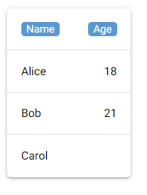

- “header-cell-[{name}]”插槽，对应表头中的指定列（列名为插槽名中`name`的列）单元格区域。建议参考本章开头的表格结构，使用`th`标签作为该插槽的模板。该插槽的当前作用域支持以下属性：

  - `col`属性，表示单元格对应列的列定义。该属性支持的属性与列定义对应字典包含的键相同。
  - `cols`属性，元素为列定义的数组，与`columns`参数相同。每个元素支持的属性与`columns`参数中每个元素对应字典包含的键相同。
  - `colsMap`属性，将列名（column name）映射为列定义的对象，其支持的属性与列名相同，通过子属性可以访问列名对应列的列定义。
  - `sort`属性，JavaScript函数类型，用法同`sort`方法（控件方法）。
  - `selected`属性，布尔类型，表示所有行是否被选择（`true`表示全选，`false`表示全不选，`null`表示部分选择）。
  - `expand`属性，布尔类型，表示单元格所属行是否被展开。注意，该属性默认没有相关的交互动作，需要手动实现相关代码和前端样式。
  - `color`属性，字符串类型，表示勾选框、加载进度条、分页按钮、分页选择器的颜色。
  - `dark`属性，布尔类型，表示是否启用暗黑主题。
  - `dense`属性，布尔类型，表示是否启用紧凑风格。

  示例如下：

  ```python3
  from nicegui import ui
  
  def index():
      columns = [
          {
              'name': 'firstname', 
              'label': 'Name', 
              'field': 'firstname',
              'align': 'left'
          },
          {
              'name': 'age', 
              'label': 'Age', 
              'field': 'age', 
              'sortable': True
          },
      ]
      rows = [
          {
              'firstname': 'Alice', 
              'age': 18
          },
          {
              'firstname': 'Bob', 
              'age': 21
          },
          {
              'firstname': 'Carol'
          },
      ]
      table = ui.table(
          columns=columns, 
          rows=rows, 
          row_key='firstname'
      )
      with table.add_slot('header-cell-age'):
          with ui.element('q-th'):
              ui.badge().props(':innerHTML=props.col.label')
  
  ui.run(
      root=index,
      native=True
  )
  ```

  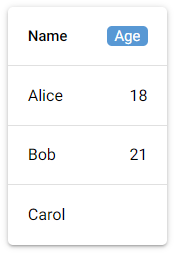

- “body-selection”插槽，对应表格的内容主体的每一行中选择该行的勾选框区域。该插槽的当前作用域支持以下属性：

  - `key`属性，字符串类型，表示该行确定唯一性的键对应的值。
  - `row`属性，表示每一行的行对象，其支持的属性与行数据字典包含的键相同。
  - `rowIndex`属性，整数类型，表示当前排序、筛选状态下，该行位置的索引值。
  - `pageIndex`属性，整数类型，表示当前排序、筛选状态下，该行所属页的索引值。
  - `cols`属性，元素为列定义的数组，与`columns`参数相同。每个元素支持的属性与`columns`参数中每个元素对应字典包含的键相同。
  - `colsMap`属性，将列名（column name）映射为列定义的对象，其支持的属性与列名相同，通过子属性可以访问列名对应列的列定义。
  - `sort`属性，JavaScript函数类型，用法同`sort`方法（控件方法）。
  - `selected`属性，布尔类型，表示该行是否被选择。
  - `expand`属性，布尔类型，表示该行是否被展开。注意，该属性默认没有相关的交互动作，需要手动实现相关代码和前端样式。
  - `color`属性，字符串类型，表示勾选框、加载进度条、分页按钮、分页选择器的颜色。
  - `dark`属性，布尔类型，表示是否启用暗黑主题。
  - `dense`属性，布尔类型，表示是否启用紧凑风格。

- “header-selection”插槽，对应表头中选择所有行的勾选框区域。该插槽的当前作用域支持以下属性：

  - `cols`属性，元素为列定义的数组，与`columns`参数相同。每个元素支持的属性与`columns`参数中每个元素对应字典包含的键相同。
  - `colsMap`属性，将列名（column name）映射为列定义的对象，其支持的属性与列名相同，通过子属性可以访问列名对应列的列定义。
  - `sort`属性，JavaScript函数类型，用法同`sort`方法（控件方法）。
  - `selected`属性，布尔类型，表示所有行是否被选择（`true`表示全选，`false`表示全不选，`null`表示部分选择）。
  - `expand`属性，布尔类型，表示该行是否被展开。注意，该属性默认没有相关的交互动作，需要手动实现相关代码和前端样式。
  - `color`属性，字符串类型，表示勾选框、加载进度条、分页按钮、分页选择器的颜色。
  - `dark`属性，布尔类型，表示是否启用暗黑主题。
  - `dense`属性，布尔类型，表示是否启用紧凑风格。

  示例如下：

  ```python3
  from nicegui import ui
  
  def index():
      columns = [
          {
              'name': 'firstname', 
              'label': 'Name', 
              'field': 'firstname',
              'align': 'left'
          },
          {
              'name': 'age', 
              'label': 'Age', 
              'field': 'age', 
              'sortable': True
          },
      ]
      rows = [
          {
              'firstname': 'Alice', 
              'age': 18
          },
          {
              'firstname': 'Bob', 
              'age': 21
          },
          {
              'firstname': 'Carol'
          },
      ]
      table = ui.table(
          columns=columns, 
          rows=rows, 
          row_key='firstname',
          selection='multiple',
      )
      with table.add_slot('header-selection'):
          ui.label().props(
              ':innerHTML="props.selected?`✅`:(props.selected===false?`⬛`:`🔲`)"'
          ).on(
              'click',
              js_handler='() => {props.selected = !props.selected}'
          )
      with table.add_slot('body-selection'):
          ui.label().props(
              ':innerHTML="props.selected?`✅`:`⬛`"'
          ).on(
              'click',
              js_handler='() => {props.selected = !props.selected}'
          )
  
  ui.run(
      root=index,
      native=True
  )
  ```

  

- “top-row”插槽、“bottom-row”插槽，对应主要内容中所有数据最上面、最下面的额外一行（默认不显示）。建议参考本章开头的表格结构，使用`tr`标签内嵌套`td`标签的结构作为该插槽的模板。该插槽的当前作用域支持以下属性：

  - `cols`属性，元素为列定义的数组，与`columns`参数相同。每个元素支持的属性与`columns`参数中每个元素对应字典包含的键相同。

  示例如下：

  ```python3
  from nicegui import ui
  
  def index():
      columns = [
          {
              'name': 'firstname', 
              'label': 'Name', 
              'field': 'firstname',
              'align': 'left'
          },
          {
              'name': 'age', 
              'label': 'Age', 
              'field': 'age', 
              'sortable': True
          },
      ]
      rows = [
          {
              'firstname': 'Alice', 
              'age': 18
          },
          {
              'firstname': 'Bob', 
              'age': 21
          },
          {
              'firstname': 'Carol'
          },
      ]
      table = ui.table(
          columns=columns, 
          rows=rows, 
          row_key='firstname'
      )
      with table.add_slot('top-row'):
          with ui.element('q-tr'):
              with ui.element('q-td'):
                  ui.badge().props(':innerHTML="props.cols[0].label"')
              with ui.element('q-td'):
                  ui.badge().props(':innerHTML="props.cols[1].label"')
      with table.add_slot('bottom-row'):
          with ui.element('q-tr'):
              with ui.element('q-td'):
                  ui.badge().props(':innerHTML="props.cols[0].label"')
              with ui.element('q-td'):
                  ui.badge().props(':innerHTML="props.cols[1].label"')
  
  ui.run(
      root=index,
      native=True
  )
  ```

  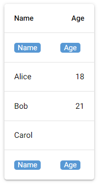

- “pagination”插槽，对应表格底部与分页相关的区域。该插槽的当前作用域支持以下属性：

  - `pagination`属性，表示表格的分页方式，支持的属性与`pagination`参数为字典类型时包含的键相同。
  - `pagesNumber`属性，整数类型，表示表格一共多少页。
  - `isFirstPage`属性，布尔类型，表示当前页是否为表格的第一页。
  - `isLastPage`属性，布尔类型，表示当前页是否为表格的最后一页。
  - `firstPage`属性，JavaScript函数类型，用法同`firstPage`方法（控件方法）。
  - `prevPage`属性，JavaScript函数类型，用法同`prevPage`方法（控件方法）。
  - `nextPage`属性，JavaScript函数类型，用法同`nextPage`方法（控件方法）。
  - `lastPage`属性，JavaScript函数类型，用法同`lastPage`方法（控件方法）。
  - `inFullscreen`属性，布尔类型，表示表格是否为全屏显示。
  - `toggleFullscreen`属性，JavaScript函数类型，用法同`toggleFullscreen`方法（控件方法）。

  示例如下：

  ```python3
  from nicegui import ui
  
  def index():
      columns = [
          {
              'name': 'firstname', 
              'label': 'Name', 
              'field': 'firstname',
              'align': 'left'
          },
          {
              'name': 'age', 
              'label': 'Age', 
              'field': 'age', 
              'sortable': True
          },
      ]
      rows = [
          {
              'firstname': 'Alice', 
              'age': 18
          },
          {
              'firstname': 'Bob', 
              'age': 21
          },
          {
              'firstname': 'Carol'
          },
      ]
      table = ui.table(
          columns=columns, 
          rows=rows, 
          row_key='firstname',
          pagination=1
      )
      with table.add_slot('pagination'):
          ui.label().props(':innerHTML="`当前为第`+props.pagination.page+`页`"')
          ui.button(
              '<',
              on_click=lambda:table.run_method('prevPage')
          ).props('flat')
          ui.button(
              '>',
              on_click=lambda:table.run_method('nextPage')
          ).props('flat')
  
  ui.run(
      root=index,
      native=True
  )
  ```

  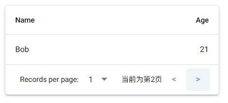

- “top”插槽、“top-left”插槽、“top-right”插槽、“bottom”插槽，对应表格顶部、顶部左半部分、顶部右半部分、底部的区域。该插槽的当前作用域支持的属性同“pagination”插槽。

  注意，“top-left”插槽、“top-right”插槽均不能与“top”插槽同时使用。

  示例如下：

  ```python3
  from nicegui import ui
  
  def index():
      columns = [
          {
              'name': 'firstname', 
              'label': 'Name', 
              'field': 'firstname',
              'align': 'left'
          },
          {
              'name': 'age', 
              'label': 'Age', 
              'field': 'age', 
              'sortable': True
          },
      ]
      rows = [
          {
              'firstname': 'Alice', 
              'age': 18
          },
          {
              'firstname': 'Bob', 
              'age': 21
          },
          {
              'firstname': 'Carol'
          },
      ]
      table = ui.table(
          columns=columns, 
          rows=rows, 
          row_key='firstname',
          pagination=1
      )
      table2 = ui.table(
          columns=columns, 
          rows=rows, 
          row_key='firstname',
          pagination=1
      )
      with table.add_slot('top-left'):
          ui.label('top-left')
      with table.add_slot('top-right'):
          ui.label('top-right')
      with table2.add_slot('top'):
          ui.label('top')
      with table2.add_slot('bottom'):
          ui.label('bottom')
  
  ui.run(
      root=index,
      native=True
  )
  ```

  

- “top-selection”插槽，对应选择了任意一行以上数据时才显示的表格顶部区域。该插槽的当前作用域支持的属性同“pagination”插槽。

  示例如下：

  ```python3
  from nicegui import ui
  
  def index():
      columns = [
          {
              'name': 'firstname', 
              'label': 'Name', 
              'field': 'firstname',
              'align': 'left'
          },
          {
              'name': 'age', 
              'label': 'Age', 
              'field': 'age', 
              'sortable': True
          },
      ]
      rows = [
          {
              'firstname': 'Alice', 
              'age': 18
          },
          {
              'firstname': 'Bob', 
              'age': 21
          },
          {
              'firstname': 'Carol'
          },
      ]
      table = ui.table(
          columns=columns, 
          rows=rows, 
          row_key='firstname',
          selection='multiple'
      )
      with table.add_slot('top-selection'):
          ui.label('top-selection')
  
  ui.run(
      root=index,
      native=True
  )
  ```

  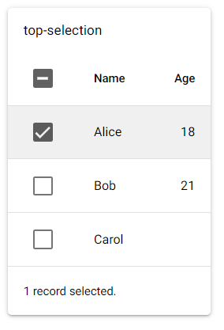

- “no-data”插槽，对应表格无可展示数据（无数据或者未搜索到包含`filter`属性的单元格）时提示语的区域。该插槽的当前作用域支持以下属性：

  - `message`属性，字符串类型，表示Quasar框架提供的消息文字（会被`no-data-label`属性、`no-results-label`属性修改）。
  - `icon`属性，字符串类型，表示Quasar框架提供的表格无可展示数据（无数据或者未搜索到包含`filter`属性的单元格）时的图标。
  - `filter`属性，含义与同名控件属性相同。

  示例如下：

  ```python3
  from nicegui import ui
  
  def index():
      columns = [
          {
              'name': 'firstname', 
              'label': 'Name', 
              'field': 'firstname',
              'align': 'left'
          },
          {
              'name': 'age', 
              'label': 'Age', 
              'field': 'age', 
              'sortable': True
          },
      ]
      table = ui.table(
          columns=columns, 
          rows=[], 
          row_key='firstname'
      )
      ui.input('关键字').bind_value_to(table,'filter')
      with table.add_slot('no-data'):
          with ui.column():
              with ui.row():
                  ui.icon('',size='2em').props(':name=props.icon')
                  ui.label().props(':innerHTML=props.message')
              with ui.row():
                  ui.icon('',size='2em').props(
                      '''
                      :name="props.filter?`search`:`warning`"
                      '''
                  )
                  ui.label().props(
                      '''
                      :innerHTML="props.filter?`未搜索到包含“`+props.filter+`”的单元格`:`表格无数据`"
                      '''
                  )
  
  ui.run(
      root=index,
      native=True
  )
  ```

  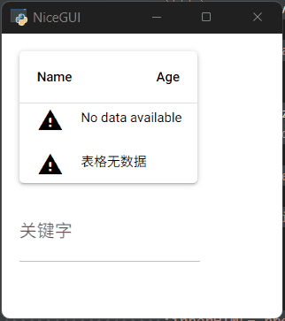

### 52.2 `ui.aggrid`控件（更新中）

#### 52.2.1 基本用法

下面是`ui.aggrid`控件相关文档的地址：

NiceGUI框架文档：https://nicegui.io/documentation/aggrid

AG Grid框架文档：https://www.ag-grid.com/javascript-data-grid/reference/

在正式介绍`ui.aggrid`控件之前，先看示例：

```python3
from nicegui import ui

def index():
    options = {
        'columnDefs': [
            {'headerName': 'Name', 'field': 'name'},
            {'headerName': 'Age', 'field': 'age'},
        ],
        'rowData': [
            {'name': 'Alice', 'age': 18},
            {'name': 'Bob', 'age': 21},
            {'name': 'Carol', 'age': None},
        ]
    }
    ui.aggrid(
        options=options
    )

ui.run(
    root=index,
    native=True
)
```


从上面的示例可知，和同为表格控件的`ui.table`控件类似，`ui.aggrid`控件（本节中以下简称该控件）有类似列定义的表格定义——`options`参数，该控件的数据也是相似的数据结构。

但与`ui.table`控件不同的是，该控件不是由Quasar框架实现，而是来自AG Grid框架的社区版（使用企业版需要到框架官网付费，NiceGUI社区有使用企业版的方法，这里不做展开），因此很多用法又存在差异：

- 数据不是传给单独的参数，而是融合在`options`参数中。
- 列定义与数据一样融合在`options`参数中。
- 没有定义表格交互行为的单独参数，可以使用`on`方法、`options`参数的表格定义、`options`参数的数据嵌入等形式定义交互行为。

上面介绍的那些差异也导致该控件支持参数不多，只有以下参数：

- `options`参数，字典类型，表示表格定义（包含数据和列定义）。表格定义以及列定义具体键的含义需要介绍的内容较多，故放在扩展用法中单独介绍，这里不做展开。有兴趣或者需求的读者可以直接跳至对应章节。

- `html_columns`参数，元素为整数的列表，表示哪些列的数据当作HTML来渲染，元素为列的索引值，默认为空列表，即所有列的数据不当作HTML格式渲染。

  从该参数开始，只能通过关键字传入。

- `theme`参数，字符串类型，仅支持`['quartz', 'balham', 'material', 'alpine']`中的值，表示表格的样式主题，默认为`'quartz'`。

- `auto_size_columns`参数，布尔类型，表示是否根据表格可用空间自动调节列宽，默认为`True`。

该控件支持以下属性（部分）：

- `options`属性，含义与同名参数相同。
- `html_columns`属性，含义与同名参数相同。
- `theme`属性，含义与同名参数相同。
- `auto_size_columns`属性，含义与同名参数相同。

该控件支持以下方法（部分）：

- `run_grid_method`方法，运行单元格支持的方法（参考 https://www.ag-grid.com/javascript-data-grid/grid-api/ ）。该方法支持以下参数：

  - `name`参数，字符串类型，表示方法名。
  - `*args`参数，表示传给被执行方法的参数。
  - `timeout`参数，关键字参数，浮点类型，表示超时时间（单位秒），因为是异步返回，超过一定时间就不再等待结果，默认为`1`。

- `run_row_method`方法，运行行对象支持的方法（参考 https://www.ag-grid.com/javascript-data-grid/row-object/ ）。该方法支持以下参数：

  - `row_id`参数，字符串类型，表示行对象的ID（行的索引值或者表格定义中JavaScript函数类型`'getRowId'`键的返回值）。
  - `name`参数，字符串类型，表示方法名。
  - `*args`参数，表示传给被执行方法的参数。
  - `timeout`参数，关键字参数，浮点类型，表示超时时间（单位秒），因为是异步返回，超过一定时间就不再等待结果，默认为`1`。

- `get_selected_rows`方法，异步方法，以列表形式返回多个勾选行的数据。

- `get_selected_row`方法，异步方法，返回首次勾选行的数据。

- `get_client_data`方法，异步方法，以列表形式返回客户端当前状态的表格数据。该方法支持以下关键字参数：

  - `timeout`参数，关键字参数，浮点类型，表示超时时间（单位秒），因为是异步返回，超过一定时间就不再等待结果，默认为`1`。
  - `method`参数，字符串类型，仅支持`['all_unsorted', 'filtered_unsorted', 'filtered_sorted', 'leaf']`中的值，表示获取数据的方法（所有行不排序、筛选后的行不排序、筛选后的行排序、仅限树形结构数据的叶子节点），默认为 `'all_unsorted'`。

  对于该方法而言，如果表格数据支持编辑，编辑之后没有同步数据到后端的话，该方法返回的数据就与后端方法获取到的数据不同，示例如下：

  ```python3
  from nicegui import ui
  
  def index():
      options = {
          'columnDefs': [
              {'headerName': 'Name', 'field': 'name'},
              {'headerName': 'Age', 'field': 'age','editable':True},
          ],
          'rowData': [
              {'name': 'Alice', 'age': 18},
              {'name': 'Bob', 'age': 21},
              {'name': 'Carol', 'age': None},
          ]
      }
      aggrid = ui.aggrid(
          options=options
      )
      async def get_data():
          result = await aggrid.get_client_data()
          print(result)
      ui.button('print client data',on_click=get_data)
      ui.button('print server data',on_click=lambda:print(aggrid.options['rowData']))
  
  ui.run(
      root=index,
      native=True
  )
  ```

  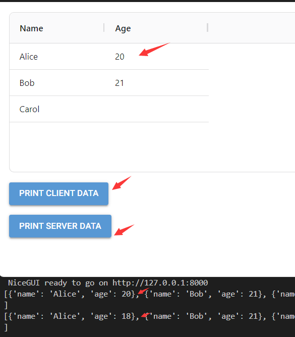

  如上图所示，修改了数据之后，依次点击两个按钮，得到的数据不相同。

- `load_client_data`方法，将表格客户端的数据同步到后端。

  如果表格数据支持编辑，编辑之后使用该方法将表格客户端的数据同步到后端，`get_client_data`方法返回的数据就与后端方法获取到的数据相同，示例如下：

  ```python3
  from nicegui import ui
  
  def index():
      options = {
          'columnDefs': [
              {'headerName': 'Name', 'field': 'name'},
              {'headerName': 'Age', 'field': 'age','editable':True},
          ],
          'rowData': [
              {'name': 'Alice', 'age': 18},
              {'name': 'Bob', 'age': 21},
              {'name': 'Carol', 'age': None},
          ]
      }
      aggrid = ui.aggrid(
          options=options
      )
      async def get_data():
          result = await aggrid.get_client_data()
          print(result)
      ui.button('print client data',on_click=get_data)
      ui.button('update data',on_click=aggrid.load_client_data)
      ui.button('print server data',on_click=lambda:print(aggrid.options['rowData']))
  
  ui.run(
      root=index,
      native=True
  )
  ```

  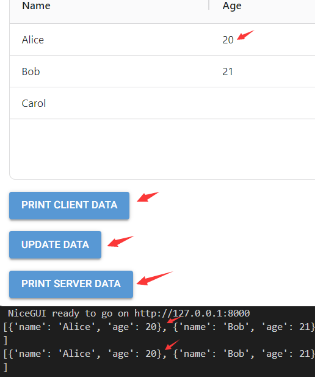

- `on`方法，为控件的任意事件注册响应函数。该方法支持以下参数：

  - `type`参数，字符串类型，表示事件类型。支持的事件可以参考 https://www.ag-grid.com/javascript-data-grid/grid-events/ 和 https://www.ag-grid.com/javascript-data-grid/column-events/ 。

  - `handler`参数，可调用类型，表示服务器端的Python响应函数。响应函数接收一个表示事件对象的`events.GenericEventArguments`类型参数，该参数包含一个`args`属性。

  - `arge`参数，`None`或者元素为字符串的序列或者元素为序列（元素为字符串）的单元素序列，表示客户端的哪些参数及其值在执行响应函数时，会传给响应函数接收参数的`args`属性（字典形式）。如果为`None`的话，表示将客户端所有的参数传入响应函数接收参数的`args`属性。

  - `throttle`参数，浮点类型，表示事件之间的发生间隔，小于该间隔的事件不会重复处理（默认第一个和最后一个都会处理），该参数默认为`0.0`。从此参数开始，只能通过关键字传入。

  - `leading_events`参数，布尔类型，事件发生间隔内的第一个事件发生时是否立即执行响应函数，默认为`True`。

  - `trailing_events`参数，布尔类型，事件发生间隔内的最后一个事件发生后是否也要执行响应函数，默认为`True`。

  - `js_handler`参数，字符串类型，表示客户端的JavaScript响应函数，默认为`'(...args) => emit(...args)'`。注意，如果JavaScript响应函数内不执行`emit`方法且与`handler`参数同时定义的话，`handler`参数表示的响应函数不会执行。而JavaScript响应函数内执行`emit`方法，会把传给该方法的参数，传给`handler`参数表示的响应函数中，接收参数的`args`属性。

  示例如下：

  ```python3
  from nicegui import ui
  
  def index():
      options = {
          'columnDefs': [
              {'headerName': 'Name', 'field': 'name'},
              {'headerName': 'Age', 'field': 'age'},
          ],
          'rowData': [
              {'name': 'Alice', 'age': 18},
              {'name': 'Bob', 'age': 21},
              {'name': 'Carol', 'age': None},
          ],
      }
      ui.aggrid(
          options=options
      ).on(
          'cellClicked', 
          lambda event: ui.notify(
              f'Cell value: {event.args["value"]}'
          )
      )
  
  ui.run(
      root=index,
      native=True
  )
  ```

  

该控件支持以下类方法：

- `from_pandas`方法，使用此方法需要需要额外安装`pandas`库，该方法可以使用`pandas`库提供的`DataFrame`类型数据创建表格。该方法支持以下参数：

  - `df`参数，`DataFrame`类型，表示表格的数据。

  - `html_columns`参数，元素为整数的列表，表示哪些列的数据当作HTML来渲染，元素为列的索引值，默认为空列表，即所有列的数据不当作HTML格式渲染。

    从该参数开始，只能通过关键字传入。

  - `theme`参数，字符串类型，仅支持`l['quartz', 'balham', 'material', 'alpine']`中的值，表示表格的样式主题，默认为`'quartz'`。

  - `auto_size_columns`参数，布尔类型，表示是否根据表格可用空间自动调节列宽，默认为`True`。

- `from_polars`方法，使用此方法需要需要额外安装`polars`库，该方法可以使用`polars`库提供的`DataFrame`类型数据创建表格。该方法支持以下参数：

  - `df`参数，`DataFrame`类型，表示表格的数据。

  - `html_columns`参数，元素为整数的列表，表示哪些列的数据当作HTML来渲染，元素为列的索引值，默认为空列表，即所有列的数据不当作HTML格式渲染。

    从该参数开始，只能通过关键字传入。

  - `theme`参数，字符串类型，仅支持`l['quartz', 'balham', 'material', 'alpine']`中的值，表示表格的样式主题，默认为`'quartz'`。

  - `auto_size_columns`参数，布尔类型，表示是否根据表格可用空间自动调节列宽，默认为`True`。

#### 52.2.2 扩展用法（更新中）

##### 52.2.2.1 表格定义

表格定义的参考文档：https://www.ag-grid.com/javascript-data-grid/grid-options/

表格定义支持的键（部分）如下：

- `'columnDefs'`键，元素为字典的列表，依照列表元素的排序，依次表示对应列的列定义。列定义支持的键可以参考后面的详细介绍，这里不做展开。

- `'rowData'`键，元素为字典的列表，依照列表元素的排序，依次表示对应行的行数据。行数据字典中的键对应列定义中`'field'`键的值。行数据字典中，键对应的值，则是该行对应该列的单元格的数据（最终显示内容取决于渲染方式）。

- `'rowSelection'`键，字典类型，表示行数据的选择方式。不使用该键，表示行数据无法选择。字典的`'mode'`键可以指定单选、多选模式，`'singleRow'`表示单选，`'multiRow'`表示多选。其他字典键的用法可参考 https://www.ag-grid.com/javascript-data-grid/grid-options/#reference-selection-rowSelection，本章后续章节也会详细介绍。

  示例如下：

  ```python3
  from nicegui import ui
  
  def index():
      options = {
          'columnDefs': [
              {'headerName': 'Name', 'field': 'name'},
              {'headerName': 'Age', 'field': 'age'},
          ],
          'rowData': [
              {'name': 'Alice', 'age': 18},
              {'name': 'Bob', 'age': 21},
              {'name': 'Carol', 'age': None},
          ],
          'rowSelection':{
              'mode':'multiRow'
          }
      }
      ui.aggrid(
          options=options
      )
  
  ui.run(
      root=index,
      native=True
  )
  ```

  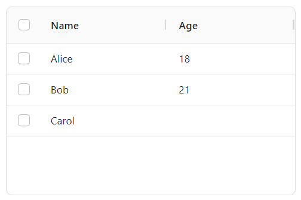

- `'rowHeight'`键，整数类型，表示所有行统一的行高。

- `'getRowHeight'`键，使用字符串表达的JavaScript函数，表示每一行确定行高的方法。该JavaScript函数支持以下位置参数（为了方便记忆，这里命名了参数，但实际使用时不限制参数名）：

  - `params`参数，`RowHeightParams`类型，为该函数专用的参数。`RowHeightParams`类型参数支持以下属性：
    - `data`属性，表示表格每一行的数据，该属性的子属性名与行数据字典的键名相同，对应的子属性即为对应列单元格的数据。
    - `node`属性，表示单元格每一行的节点对象（支持更多的相关属性，可参考 https://www.ag-grid.com/javascript-data-grid/row-object/）。
    - `api`属性，表示接口对象，用于调用该行的支持的方法。
    - `context`属性，表示上下文对象，用于调用当前上下文的支持的方法。

  示例如下：

  ```python3
  from nicegui import ui
  
  def index():
      options = {
          'columnDefs': [
              {'headerName': 'Name', 'field': 'name'},
              {'headerName': 'Age', 'field': 'age'},
          ],
          'rowData': [
              {'name': 'Alice', 'age': 18},
              {'name': 'Bob', 'age': 21},
              {'name': 'Carol', 'age': None},
          ],
          ':getRowHeight':'params => (params.data.age>18?50:25)'
      }
      ui.aggrid(
          options=options
      )
  
  ui.run(
      root=index,
      native=True
  )
  ```

  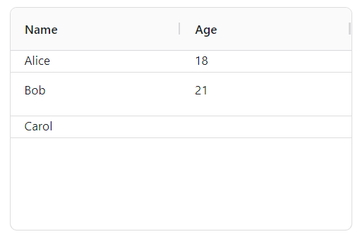

- `'getRowId'`键，使用字符串表达的JavaScript函数，表示获取每一行ID的方法。该JavaScript函数支持以下位置参数（为了方便记忆，这里命名了参数，但实际使用时不限制参数名）：

  - `params`参数，`GetRowIdParams`类型，为该函数专用的参数。`GetRowIdParams`类型支持的属性可以参考 https://www.ag-grid.com/javascript-data-grid/row-ids/#reference-rowModels-getRowId 。

  该方法与`run_row_method`方法的`row_id`参数相关，可以定义该方法，在使用`run_row_method`方法时，给其`row_id`参数传入该方法的返回值，相当于定义哪一列的数据（或者处理后的数据）为ID（要求数据具备唯一性）。

  示例如下：

  ```python3
  from nicegui import ui
  
  def index():
      options = {
          'columnDefs': [
              {'headerName': 'Name', 'field': 'name'},
              {'headerName': 'Age', 'field': 'age'},
          ],
          'rowData': [
              {'name': 'Alice', 'age': 18},
              {'name': 'Bob', 'age': 21},
              {'name': 'Carol', 'age': None},
          ],
          ':getRowId': '(params) => params.data.name'
      }
      aggrid = ui.aggrid(
          options=options
      )
      aggrid.run_row_method(
          'Bob',
          'setDataValue', 
          'age', 
          99
      )
  
  ui.run(
      root=index,
      native=True
  )
  ```

  

- `'defaultColDef'`键，字典类型，表示默认的列定义，如果列没有指定同名列定义，那该键定义的列定义就会生效。

  示例如下：

  ```python3
  from nicegui import ui
  
  def index():
      options = {
          'columnDefs': [
              {'headerName': 'Name', 'field': 'name'},
              {'headerName': 'Age', 'field': 'age'},
          ],
          'rowData': [
              {'name': 'Alice', 'age': 18},
              {'name': 'Bob', 'age': 21},
              {'name': 'Carol', 'age': None},
          ],
          'defaultColDef':{
              'editable':True
          }
      }
      aggrid = ui.aggrid(
          options=options
      )
  
  ui.run(
      root=index,
      native=True
  )
  ```

- `'defaultColGroupDef'`键，字典类型，表示默认的列组定义，如果列没有指定同名列组定义，那该键定义的列组定义就会生效。列组定义支持的键与列定义基本相同。

  注意，受限于篇幅，列组的含义、相关用法、示例将在后面的章节介绍，本节中与列组相关的键均不提供示例代码。

- `'floatingFiltersHeight'`键，整数类型，表示浮动筛选器所在行的行高，默认与一般行的行高相同。

  注意，受限于篇幅，筛选器的含义、相关用法、示例将在后面的章节介绍，本节中与筛选器相关的键均不提供示例代码。

- `'groupHeaderHeight'`键，整数类型，列组表头的高度，默认与一般行的行高相同。

- `'hidePaddedHeaderRows'`键，布尔类型，表示是否隐藏列组折叠之后不可见层级对应的行（即行高只等于可见层级数乘以列组表头的高度，列组折叠**会**导致表头的高度发生变化），默认为`False`（即行高等于总层级数乘以列组表头的高度，列组折叠**不会**导致表头的高度发生变化）。

- `'headerHeight'`键，整数类型，表示表头的高度。

- `'suppressMovableColumns'`键，布尔类型，表示是否禁止通过拖动表头来调整列的顺序，默认为`False`。

- `'suppressMoveWhenColumnDragging'`键，布尔类型，在拖动表头来调整列的顺序时，表示是否禁止调整结果实时生效，默认为`False`。

- `'suppressColumnMoveAnimation'`键，布尔类型，在拖动表头来调整列的顺序时，表示是否禁止调整结果实时生效的动画效果，默认为`False`。

- `'suppressDragLeaveHidesColumns'`键，布尔类型，在拖动表头到表格外时，表示是否禁止隐藏该列的操作生效，默认为`False`。

- `'colResizeDefault'`键，字符串类型，表示调整列宽时，按下哪个键并调整列宽时本列与右边列的列宽总和不变，默认为`'shift'`。

- `'autoSizeStrategy'`键，字典类型，表示自动调整列宽的策略（完整用法参考 https://www.ag-grid.com/javascript-data-grid/column-sizing/#reference-columnSizing-autoSizeStrategy）。

  字典的`'type'`键表示策略类型，支持`['fitGridWidth','fitProvidedWidth','fitCellContents']`中的值，当该键使用不同的值时，字典支持的键也有所不同。

  `'type'`键为`'fitGridWidth'`时，将自动调整所有列宽，使其总和等于表格总宽度。此时字典额外支持以下键：

  - `'columnLimits'`键，元素为字典的列表类型，表示特定列的列宽限制。字典的键及其含义参考下表：

    | 键名         | 值类型 | 含义                          |
    | ------------ | ------ | ----------------------------- |
    | `'colId'`    | 字符串 | 列的ID（`'field'`键对应的值） |
    | `'minWidth'` | 整数   | 列宽最小值                    |
    | `'maxWidth'` | 整数   | 列宽最大值                    |

  示例如下：

  ```python3
  from nicegui import ui
  
  def index():
      options = {
          'columnDefs': [
              {'headerName': 'Name', 'field': 'name'},
              {'headerName': 'Age', 'field': 'age'},
          ],
          'rowData': [
              {'name': 'Alice', 'age': 18},
              {'name': 'Bob', 'age': 21},
              {'name': 'Carol', 'age': None},
          ],
          'autoSizeStrategy':{
              'type':'fitGridWidth',
              'columnLimits':[
                  {
                      'colId':'age',
                      'maxWidth':100,
                      'minWidth':100
                  }
              ]
          }
      }
      ui.aggrid(
          options=options
      )
  
  ui.run(
      root=index,
      native=True
  )
  ```

  

  `'type'`键为`'fitProvidedWidth'`时，将调整所有列宽，使其总和等于指定的宽度。此时字典额外支持以下键：

  - `'width'`键，整数类型，表示指定的宽度。

  示例如下：

  ```python3
  from nicegui import ui
  
  def index():
      options = {
          'columnDefs': [
              {'headerName': 'Name', 'field': 'name'},
              {'headerName': 'Age', 'field': 'age'},
          ],
          'rowData': [
              {'name': 'Alice', 'age': 18},
              {'name': 'Bob', 'age': 21},
              {'name': 'Carol', 'age': None},
          ],
          'autoSizeStrategy':{
              'type':'fitProvidedWidth',
              'width':200
          }
      }
      ui.aggrid(
          options=options
      )
  
  ui.run(
      root=index,
      native=True
  )
  ```

  

  `'type'`键为`'fitCellContents'`时，将根据单元格内容调整列宽。此时字典额外支持以下键：

  - `'skipHeader'`键，布尔类型，表示是否将表头的内容考虑在内，默认为`False`。

  - `'colIds'`键，元素为字符串（列的ID）的列表类型，表示该策略仅适用于哪些列。

  - `'columnLimits'`键，元素为字典的列表类型，表示特定列的列宽限制。字典的键及其含义参考下表：

    | 键名         | 值类型 | 含义                          |
    | ------------ | ------ | ----------------------------- |
    | `'colId'`    | 字符串 | 列的ID（`'field'`键对应的值） |
    | `'minWidth'` | 整数   | 列宽最小值                    |
    | `'maxWidth'` | 整数   | 列宽最大值                    |

  - `'scaleUpToFitGridWidth'`键，布尔类型，表示是否按比例扩宽列以填满剩余空间，默认为`False`。

  - `'defaultMinWidth'`键，整数类型，表示默认最小列宽。

  - `'defaultMaxWidth'`键，整数类型，表示默认最大列宽。

- `'suppressAutoSize'`键，布尔类型，表示是否禁止通过双击调整列宽的区域手动触发列宽自动调整（将根据单元格内容调整列宽），默认为`False`。

- `'autoSizePadding'`键，整数类型，表示通过双击调整列宽的区域手动触发列宽自动调整之后，内容水平方向到单元格边界之间留白的宽度，默认为`20`。

- `'skipHeaderOnAutoSize'`键，布尔类型，表示在自动调整列宽时是否将表头排除在外，默认为`False`。

- `'animateColumnResizing'`键，布尔类型，表示在自动调整列宽时是否启用动画效果，默认为`False`。

- `'editType'`键，字符串类型，表示当该行的一列或者多列支持编辑时，双击单元格（或者按下`enter`键）之后使用的编辑模式类型，仅支持`['singleCell','fullRow']`中的值，对应单个单元格编辑、整行编辑，默认为`'singleCell'`。单个单元格编辑时，每次只能编辑一个单元格，如果需要切换到其他单元格，只能双击。整行编辑时，每次可以编辑一行支持编辑的单元格，切换同一行的其他单元格，只需单击，不用双击。

  示例如下：

  ```python3
  from nicegui import ui
  
  def index():
      options = {
          'columnDefs': [
              {'headerName': 'Name', 'field': 'name','editable':True},
              {'headerName': 'Age', 'field': 'age','editable':True},
          ],
          'rowData': [
              {'name': 'Alice', 'age': 18},
              {'name': 'Bob', 'age': 21},
              {'name': 'Carol', 'age': None},
          ],
          'editType':'fullRow'
      }
      ui.aggrid(
          options=options
      )
  
  ui.run(
      root=index,
      native=True
  )
  ```

  

- `'singleClickEdit'`键，布尔类型，表示是否允许单击进入编辑模式，默认为`False`。

- `'suppressClickEdit'`键，布尔类型，表示是否禁止单击、双击进入编辑模式（可以使用`enter`键进入），默认为`False`。

- `'stopEditingWhenCellsLoseFocus'`键，布尔类型，表示进入编辑模式后，是否在编辑框失去焦点时退出编辑模式，默认为`False`。

- `'suppressStartEditOnTab'`键，布尔类型，表示进入编辑模式后，按`tab`键时，是否切换下一个单元格（或者下一行，取决于编辑模式的类型）时退出编辑模式，默认为`False`。

- `'enterNavigatesVertically'`键，布尔类型，表示按`enter`键时，焦点是否切换到下一行的单元格，默认为`False`。

- `'enterNavigatesVerticallyAfterEdit'`键，布尔类型，表示进入编辑模式后，按`enter`键时，焦点是否切换下一行的单元格并保持编辑模式，默认为`False`。

- `'enableCellEditingOnBackspace'`键，布尔类型，表示对于MacOS用户来说，是否可以按下`enter`键进入编辑模式，默认为`False`。

- `'undoRedoCellEditing'`键，布尔类型，表示退出编辑模式之后，是否允许撤销、重做对单元格内容的修改，默认为`False`。

- `'undoRedoCellEditingLimit'`键，整数类型，表示单元格内容修改记录的条数，会影响撤销或重做次数，默认为`10`。

- `'readOnlyEdit'`键，布尔类型，表示是否启用只读编辑模式（编辑单元格内容之后不会自动更新表格数据，而是触发`cellEditRequest`事件，由事件的响应函数处理编辑前后的相关内容以及更新单元格），默认为`False`。

  示例如下：

  ```python3
  from nicegui import ui
  import asyncio
  
  def index():
      options = {
          'columnDefs': [
              {'headerName': 'Name', 'field': 'name','editable':True},
              {'headerName': 'Age', 'field': 'age','editable':True},
          ],
          'rowData': [
              {'name': 'Alice', 'age': 18},
              {'name': 'Bob', 'age': 21},
              {'name': 'Carol', 'age': None},
          ],
          'readOnlyEdit':True
      }
      aggrid = ui.aggrid(
          options=options
      )
      async def on_event(event):
          args = event.args
          row = aggrid.options['rowData'][args['rowIndex']]
          await asyncio.sleep(3)
          row[args['colId']] = args['newValue']
          ui.notify('Updated!')
      aggrid.on(
          'cellEditRequest', 
          on_event
      )
  
  ui.run(
      root=index,
      native=True
  )
  ```

  

- `'quickFilterText'`键，字符串类型，表示用于在表格中搜索包含指定内容的行的关键字。如果包含空格，则先使用空格分割出多个关键字，结果的内容必须同时包含每个关键字。

  示例如下：

  ```python3
  from nicegui import ui
  
  def index():
      options = {
          'columnDefs': [
              {'headerName': 'Name', 'field': 'name'},
              {'headerName': 'Age', 'field': 'age'},
          ],
          'rowData': [
              {'name': 'Alice', 'age': 18},
              {'name': 'Bob', 'age': 21},
              {'name': 'Carol', 'age': 20},
          ]
      }
      aggrid = ui.aggrid(
          options=options
      )
      ui.input(
          'quickFilterText'
      ).bind_value_to(aggrid.options,'quickFilterText')
  
  ui.run(
      root=index,
      native=True
  )
  ```

  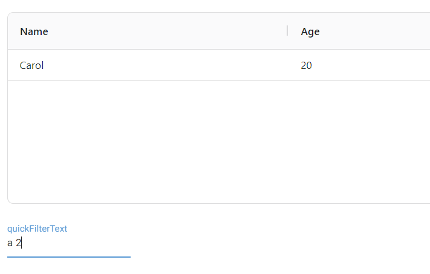

- `'cacheQuickFilter'`键，布尔类型，表示是否开启针对`'quickFilterText'`键的缓存，默认为`False`。

- `'includeHiddenColumnsInQuickFilter'`键，布尔类型，表示使用关键字搜索时是否包含隐藏的列，默认为`False`。

  示例如下：

  ```python3
  from nicegui import ui
  
  def index():
      options = {
          'columnDefs': [
              {'headerName': 'Name', 'field': 'name'},
              {'headerName': 'Age', 'field': 'age','hide':True},
          ],
          'rowData': [
              {'name': 'Alice', 'age': 18},
              {'name': 'Bob', 'age': 21},
              {'name': 'Carol', 'age': 20},
          ],
          'includeHiddenColumnsInQuickFilter':True
      }
      aggrid = ui.aggrid(
          options=options
      )
      ui.input(
          'quickFilterText'
      ).bind_value_to(aggrid.options,'quickFilterText')
  
  ui.run(
      root=index,
      native=True
  )
  ```

  

- `'localeText'`键，字典类型，表示控件界面指定内容对应的本地化内容。

  示例如下：

  ```python3
  from nicegui import ui
  
  def index():
      options = {
          'columnDefs': [
              {'headerName': 'Name', 'field': 'name'},
              {'headerName': 'Age', 'field': 'age'},
          ],
          'rowData': [
              {'name': 'Alice', 'age': 18},
              {'name': 'Bob', 'age': 21},
              {'name': 'Carol', 'age': 20},
          ],
          'pagination':True,
          'localeText':{
              'page':'页',
              'of':'共',
              'to':'到',
              'pageSizeSelectorLabel':'每页行数'
          }
      }
      ui.aggrid(
          options=options
      )
  
  ui.run(
      root=index,
      native=True
  )
  ```

  

  当然，这样设置本地化内容属实费劲。其实，AG Grid框架提供了不少语言的本地化文件，只需从 https://github.com/ag-grid/ag-grid/releases 下载特定版本的`@ag-grid-community-locale.tgz`（企业版已经包含，社区版需要额外下载），然后将压缩包内的`@ag-grid-community-locale.tar\package\dist\umd\@ag-grid-community\locale.js`或者`@ag-grid-community-locale.tar\package\dist\umd\@ag-grid-community\locale.min.js`复制出来，粘贴到任意路径（这里粘贴到`main.py`的同目录下）。使用`app.add_static_file`方法创建该文件的URL，再用`ui.add_head_html`方法使用该文件，即可给该键设置格式为`'AG_GRID_LOCALE_{语言代码}'`的值，使用该语言包。其他语言对应的语言代码可参考 https://www.ag-grid.com/javascript-data-grid/localisation/ 。

  示例如下：

  ```python3
  from nicegui import ui, app
  
  def index():
      app.add_static_file(
          local_file='./locale.js',
          url_path='/ag-grid-community-locale'
      )
      ui.add_head_html(
          '''
          <script src='/ag-grid-community-locale'></script>
          '''
      )
      options = {
          'columnDefs': [
              {'headerName': 'Name', 'field': 'name'},
              {'headerName': 'Age', 'field': 'age'},
          ],
          'rowData': [
              {'name': 'Alice', 'age': 18},
              {'name': 'Bob', 'age': 21},
              {'name': 'Carol', 'age': 20},
          ],
          'pagination': True,
          ':localeText': 'AG_GRID_LOCALE_CN'
      }
      ui.aggrid(
          options=options
      )
  
  ui.run(
      root=index,
      native=True
  )
  ```

  

  如果读者不方便下载官方提供的本地化文件，可以直接使用CDN服务商提供的地址`https://unpkg.com/@ag-grid-community/locale/dist/umd/@ag-grid-community/locale.js`或者`https://unpkg.com/@ag-grid-community/locale/dist/umd/@ag-grid-community/locale.min.js`，代码如下：

  ```python3
  from nicegui import ui
  
  def index():
      ui.add_head_html(
          '''
          <script src='https://unpkg.com/@ag-grid-community/locale/dist/umd/@ag-grid-community/locale.min.js'></script>
          '''
      )
      options = {
          'columnDefs': [
              {'headerName': 'Name', 'field': 'name'},
              {'headerName': 'Age', 'field': 'age'},
          ],
          'rowData': [
              {'name': 'Alice', 'age': 18},
              {'name': 'Bob', 'age': 21},
              {'name': 'Carol', 'age': 20},
          ],
          'pagination': True,
          ':localeText': 'AG_GRID_LOCALE_CN'
      }
      ui.aggrid(
          options=options
      )
  
  ui.run(
      root=index,
      native=True
  )
  ```

  注意，NiceGUI 3.8.0版本新增`ui.aggrid.VERSION`属性，用于表示`ui.aggrid`控件使用的AG Grid框架的版本，为了避免版本不同导致的翻译文本不兼容，上面的示例应当改为：

  ```python3
  from nicegui import ui
  
  def index():
      ui.add_head_html(
          f'''
          <script src='https://unpkg.com/@ag-grid-community/locale@{ui.aggrid.VERSION}/dist/umd/@ag-grid-community/locale.min.js'></script>
          '''
      )
      options = {
          'columnDefs': [
              {'headerName': 'Name', 'field': 'name'},
              {'headerName': 'Age', 'field': 'age'},
          ],
          'rowData': [
              {'name': 'Alice', 'age': 18},
              {'name': 'Bob', 'age': 21},
              {'name': 'Carol', 'age': 20},
          ],
          'pagination': True,
          ':localeText': 'AG_GRID_LOCALE_CN'
      }
      ui.aggrid(
          options=options
      )
  
  ui.run(
      root=index,
      native=True
  )
  ```

- `'initialState'`键，字典类型，表示当前表格的状态，支持的键类似列定义（`'columnDefs'`键）。

  注意，虽然表格状态和列定义都可以实现某些效果（比如下面示例中的隐藏指定列），但表格状态优先级高于列定义，并且可以通过传入空值来恢复表格的默认状态，而不用像列定义那种必须传入初始的列定义。另外，表格状态支持的配置项比列定义更多（可以参考 https://www.ag-grid.com/javascript-data-grid/grid-state/#state-contents ）。

  示例如下：

  ```python3
  from nicegui import ui
  
  def index():
      options = {
          'columnDefs': [
              {'headerName': 'Name', 'field': 'name'},
              {'headerName': 'Age', 'field': 'age'},
          ],
          'rowData': [
              {'name': 'Alice', 'age': 18},
              {'name': 'Bob', 'age': 21},
              {'name': 'Carol', 'age': 20},
          ],
          'initialState':{
              'columnVisibility':{
                  'hiddenColIds':['age']
              }
          },
      }
      aggrid = ui.aggrid(
          options=options
      )
      # 获取当前表格状态
      async def get_state():
          result = await aggrid.run_grid_method(
              'getState'
          )
          ui.notify(result)
      ui.button('get state',on_click=get_state)
      # 修改当前表格状态
      def set_state():
          aggrid.options['initialState'] = {
              'columnVisibility':{
                  'hiddenColIds':['name']
              }
          }
      ui.button('set state',on_click=set_state)
      # 重置当前表格状态
      def reset_state():
          aggrid.options['initialState'] = None
      ui.button('reset state',on_click=reset_state)
      # 隐藏所有列
      def hide_cols():
          aggrid.options['columnDefs'] = [
              {'headerName': 'Name', 'field': 'name','hide':True},
              {'headerName': 'Age', 'field': 'age','hide':True},
          ]
      ui.button('hide cols',on_click=hide_cols)
      # 显示所有列
      def show_cols():
          aggrid.options['columnDefs'] = [
              {'headerName': 'Name', 'field': 'name'},
              {'headerName': 'Age', 'field': 'age'},
          ]
      ui.button('show cols',on_click=show_cols)
  
  ui.run(
      root=index,
      native=True
  )
  ```

  

- `'context'`键，任意值类型（JavaScript中有相同的数据类型，比如字典、列表、集合、字符串、整数、小数等），表示自定义的上下文数据。所谓上下文数据，可以理解为一个实时共享的数据，一个地方修改该数据，其他使用该数据的地方也会随之变化。

  使用时，JavaScript函数的参数支持的`context`属性即为该键对应的值。如果该键对应的值是字典，则字典的键名为`context`属性的子属性，子属性的值即为字典中对应键的值。

  示例如下：

  ```python3
  from nicegui import ui
  
  def index():
      options = {
          'columnDefs': [
              {
                  'headerName': 'Name',
                  'field': 'name'
              },
              {
                  'headerName': 'Age', 
                  'field': 'age',
                  ':valueFormatter':'params => `${params.value}${params.context}`'
              },
          ],
          'rowData': [
              {'name': 'Alice', 'age': 18},
              {'name': 'Bob', 'age': 21},
              {'name': 'Carol', 'age': 20},
          ],
          'context':'岁',
      }
      aggrid = ui.aggrid(
          options=options
      )
      input = ui.input(
          '单位',
          value='岁'
      )
      def update_context():
          aggrid.options['context'] = input.value
      ui.button(
          'Update context',
          on_click=update_context
      )
  
  ui.run(
      root=index,
      native=True,
  )
  ```

  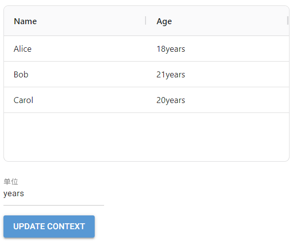

- `'valueCache'`键，布尔类型，表示是否启用计算值缓存，默认为`False`。计算值缓存可以在较多单元格内容需要计算时改善表格的性能。

- `'valueCacheNeverExpires'`键，布尔类型，表示是否计算值缓存是否永不过期，默认为`False`。

- `'enableCellExpressions'`键，布尔类型，表示单元格是否计算包含公式的字符串，默认为`False`。

  所谓公式，就是类似Excel中，单元格使用“=”开头，后接表达式（可以包含函数调用等语法）的字符串。最终单元格显示的是计算之后的结果。

  出于安全考虑，**不建议**在启用该键的同时允许用户编辑单元格的内容，因为用户可以通过表达式执行敏感操作。下面的示例仅为了方便对比效果，**不推荐**实际使用时允许编辑。

  对于想要在年龄的基础上实时计算出生年份的情况，不使用表达式的话，可能要这样写：

  ```python3
  from nicegui import ui
  from datetime import datetime
  
  def index():
      options = {
          'columnDefs': [
              {'headerName': 'Name', 'field': 'name'},
              {'headerName': 'Age', 'field': 'age','editable':True},
              {'headerName': 'Year','field': 'year'},
          ],
          'rowData': [
              {'name': 'Alice', 'age': 18,'year':datetime.now().year-18},
              {'name': 'Bob', 'age': 21,'year':datetime.now().year-21},
              {'name': 'Carol', 'age': 20,'year':datetime.now().year-20},
          ],
          'enableCellExpressions':True
      }
      ui.aggrid(
          options=options
      )
  
  ui.run(
      root=index,
      native=True
  )
  ```

  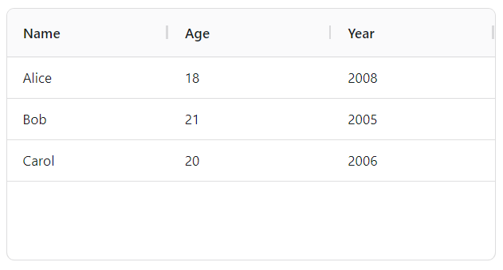

  但是上面这种写法需要手动记录每行数据的年龄列，数据多了或者有修改的话，就不太方便。如果启用了该键，就可以使用统一的公式，示例如下：

  ```python3
  from nicegui import ui
  from datetime import datetime
  
  def index():
      formula = f'={datetime.now().year}-getValue("age")'
      options = {
          'columnDefs': [
              {'headerName': 'Name', 'field': 'name'},
              {'headerName': 'Age', 'field': 'age','editable':True},
              {'headerName': 'Year','field': 'year'},
          ],
          'rowData': [
              {'name': 'Alice', 'age': 18,'year':formula},
              {'name': 'Bob', 'age': 21,'year':formula},
              {'name': 'Carol', 'age': 20,'year':formula},
          ],
          'enableCellExpressions':True
      }
      ui.aggrid(
          options=options
      )
  
  ui.run(
      root=index,
      native=True
  )
  ```

  

  读者可以编辑每行的年龄，看到出生年份的实时变化。

- `'suppressTouch'`键，布尔类型，表示是否禁用触摸操作的支持（但浏览器通过模拟鼠标交互提供的触摸支持不受影响），默认为`False`。

- `'suppressFocusAfterRefresh'`键，布尔类型，表示是否禁止在刷新之后恢复焦点位置，默认为`False`。

- `'suppressChangeDetection'`键，布尔类型，表示是否禁用单元格的数据变化监测（数据变化时自动刷新相关显示、计算），默认为`False`。

- `'debug'`键，布尔类型，表示是否启用调试模式，将调试信息输出到浏览器的控制台，默认为`False`。

- `'loading'`键，布尔类型或者`None`（对应JavaScript的`undefined`），表示是否显示加载状态覆盖层（背景模糊，无法操作表格，并多一个表示加载状态文本）。其中，JavaScript的`undefined`表示仅在列定义和行数据同时提供的情况下不显示加载状态覆盖层。示例如下：

  ```python3
  from nicegui import ui
  
  def index():
      options = {
          'columnDefs': [
              {'headerName': 'Name', 'field': 'name'},
              {'headerName': 'Age', 'field': 'age'},
          ],
          'loading':None
          # 或者使用JavaScript的undefined
          # ':loading':'undefined'
      }
      aggrid = ui.aggrid(
          options=options
      )
      def add_data():
          aggrid.options['rowData'] = [
              {'name': 'Alice', 'age': 18},
              {'name': 'Bob', 'age': 21},
              {'name': 'Carol', 'age': 20},
          ]
      ui.button('add data',on_click=add_data)
      def clear_data():
          aggrid.options['rowData'] = None
      ui.button('clear data',on_click=clear_data)
  
  ui.run(
      root=index,
      native=True
  )
  ```

  

- `'suppressNoRowsOverlay'`键，布尔类型，仅在`'loading'`键为`False`时生效，此时如果没有行数据，表格将会显示无数据提示，该键表示是否禁用该提示，默认为`False`。

  示例如下：

  ```python3
  from nicegui import ui
  
  def index():
      options = {
          'columnDefs': [
              {'headerName': 'Name', 'field': 'name'},
              {'headerName': 'Age', 'field': 'age'},
          ],
          'loading':False,
          'suppressNoRowsOverlay':True
      }
      aggrid = ui.aggrid(
          options=options
      )
      def show():
          aggrid.options['suppressNoRowsOverlay'] = False
      ui.button('show',on_click=show)
      def hide():
          aggrid.options['suppressNoRowsOverlay'] = True
      ui.button('hide',on_click=hide)
  
  ui.run(
      root=index,
      native=True
  )
  ```

  

- `'pagination'`键，布尔类型，表示是否启用分页，默认为`False`。

- `'paginationPageSize'`键，整数类型，表示分页时每页显示多少行，默认为`100`。

- `'paginationPageSizeSelector'`键，布尔类型或者元素为整数的列表，表示是否显示每页行数的选择器或者定义选择器的选项，默认为`True`。

  示例如下：

  ```python3
  from nicegui import ui
  
  def index():
      options = {
          'columnDefs': [
              {'headerName': 'Name', 'field': 'name'},
              {'headerName': 'Age', 'field': 'age'},
          ],
          'rowData': [
              {'name': 'Alice', 'age': 18},
              {'name': 'Bob', 'age': 21},
              {'name': 'Carol', 'age': 20},
          ],
          'pagination':True,
          'paginationPageSize':5,
          'paginationPageSizeSelector':[
              1,2,5
          ]
      }
      ui.aggrid(
          options=options
      )
  
  ui.run(
      root=index,
      native=True
  )
  ```

  

- `'paginationNumberFormatter'`键，使用字符串表达的JavaScript函数，表示每行对应该列的单元格内容获取来源。该JavaScript函数支持以下位置参数（为了方便记忆，这里命名了参数，但实际使用时不限制参数名）：

  - `params`参数，`PaginationNumberFormatterParams`类型，为该函数专用的参数。`PaginationNumberFormatterParams`类型支持的属性可以参考 https://www.ag-grid.com/javascript-data-grid/row-pagination/#reference-pagination-paginationNumberFormatter 。

  示例如下：

  ```python3
  from nicegui import ui
  
  def index():
      options = {
          'columnDefs': [
              {'headerName': 'Name', 'field': 'name'},
              {'headerName': 'Age', 'field': 'age'},
          ],
          'rowData': [
              {'name': 'Alice', 'age': 18},
              {'name': 'Bob', 'age': 21},
              {'name': 'Carol', 'age': 20},
          ],
          'pagination':True,
          'paginationPageSize':5,
          'paginationPageSizeSelector':[
              1,2,5
          ],
          ':paginationNumberFormatter':'params => `[`+params.value.toLocaleString()+`]`'
      }
      ui.aggrid(
          options=options
      )
  
  ui.run(
      root=index,
      native=True
  )
  ```

  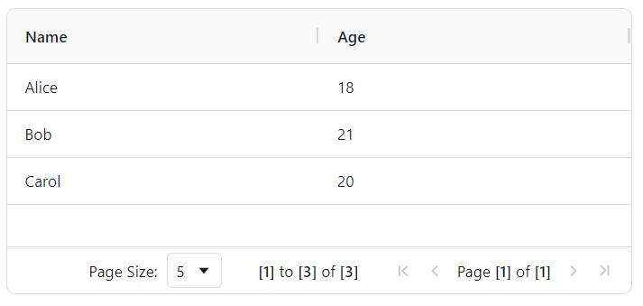

- `'paginationAutoPageSize'`键，布尔类型，表示是否根据表格的高度自动调整每页显示多少行，确保表格不显示额外的滚动条。注意，该键优先级比`'paginationPageSize'`键高。

  示例如下：

  ```python3
  from nicegui import ui
  
  def index():
      options = {
          'columnDefs': [
              {'headerName': 'Name', 'field': 'name'},
              {'headerName': 'Age', 'field': 'age'},
          ],
          'rowData': [
              {'name': 'Alice', 'age': 18},
              {'name': 'Bob', 'age': 21},
              {'name': 'Carol', 'age': 20},
              {'name': 'Alice', 'age': 18},
              {'name': 'Bob', 'age': 21},
              {'name': 'Carol', 'age': 20},
              {'name': 'Alice', 'age': 18},
              {'name': 'Bob', 'age': 21},
              {'name': 'Carol', 'age': 20},
          ],
          'pagination':True,
          'paginationAutoPageSize':True
      }
      ui.aggrid(
          options=options
      ).classes('h-[300px]')
  
  ui.run(
      root=index,
      native=True
  )
  ```

  

- `'suppressPaginationPanel'`键，布尔类型，表示是否隐藏分页控制按钮所属区域，默认为`False`。

- `'animateRows'`键，布尔类型，表示是否启用行的动画效果（点击表头排序时可以看到行的动画），默认为`True`。

  示例如下：

  ```python3
  from nicegui import ui
  
  def index():
      options = {
          'columnDefs': [
              {'headerName': 'Name', 'field': 'name'},
              {'headerName': 'Age', 'field': 'age'},
          ],
          'rowData': [
              {'name': 'Alice', 'age': 18},
              {'name': 'Bob', 'age': 21},
              {'name': 'Carol', 'age': 20},
          ],
          'animateRows':False
      }
      aggrid = ui.aggrid(
          options=options
      )
      ui.switch(
          'animateRows'
      ).bind_value_to(
          aggrid.options,
          'animateRows'
      )
  
  ui.run(
      root=index,
      native=True
  )
  ```

  

  可以通过开关对比启用、禁用动画效果后，排序行数据有无动画的效果。

- `'cellFlashDuration'`键，整数类型，表示当单元格的数据发生变化时，闪烁动画的持续时间，单位毫秒，默认为`500`。注意，需要在列定义中启用`'enableCellChangeFlash'`键。

- `'cellFadeDuration'`键，整数类型，表示当单元格的数据发生变化时，闪烁动画的淡出时间，单位毫秒，默认为`1000`。注意，需要在列定义中启用`'enableCellChangeFlash'`键。

- `'domLayout'`键，字符串类型，仅限`['normal', 'autoHeight','print']`中的值，表示表格高度的渲染方式（固定高度、高度随内容高度变化、专为打印优化），默认为`'normal'`。

- `'ensureDomOrder'`键，布尔类型，表示DOM元素顺序是否与数据逻辑顺序一致，默认为`False`。当该键为`False`时，性能较好，适合于数据量比较大的情况。但是，如果数据量不大且需要按照DOM元素的顺序访问对应数据模型中的对应行，则需要启用该键。

- `'gridId'`键，字符串类型，表示表格实例的唯一标识符。

- `'enableRtl'`键，布尔类型，表示是否启用从右到左的布局支持，默认为`False`。

- `'suppressColumnVirtualisation'`键，布尔类型，表示是否禁用列虚拟化，默认为`False`。当该键为`False`时，性能较好，适合于列比较多的情况。但是，如果列不多且需要依据DOM的结构直接访问所有列，则需要启用该键。

- `'suppressRowVirtualisation'`键，布尔类型，布尔类型，表示是否禁用行虚拟化，默认为`False`。当该键为`False`时，性能较好，适合于行比较多的情况。但是，如果行不多且需要依据DOM的结构直接访问所有行，则需要启用该键。

- `'suppressMaxRenderedRowRestriction'`键，布尔类型，表示是否禁用渲染行数限制，默认为`False`。启用渲染行数限制可以在行数较多时减少渲染数量，减少内存占用，避免网页崩溃。

- `'enableCellSpan'`键，布尔类型，表示是否允许合并单元格，默认为`False`。想要查看合并单元格的效果，需要在列定义中启用`'spanRows'`键：

  ```python3
  from nicegui import ui
  
  def index():
      options = {
          'columnDefs': [
              {'headerName': 'Name', 'field': 'name','spanRows':True},
              {'headerName': 'Age', 'field': 'age'},
          ],
          'rowData': [
              {'name': 'Alice', 'age': 18},
              {'name': 'Bob', 'age': 21},
              {'name': 'Carol', 'age': 20},
              {'name': 'Carol', 'age': 21},
          ],
          'enableCellSpan':True
      }
      ui.aggrid(
          options=options
      )
  
  ui.run(
      root=index,
      native=True
  )
  ```

  

- `'rowDragManaged'`键，布尔类型，表示是否托管拖动行的操作，默认为`False`。

  注意，启用`'rowDragEntireRow'`键或者在列定义中启用`'rowDrag'`键，只是允许拖动行，但如果想要被拖动的行正确执行拖动操作，需要额外启用`'rowDragManaged'`键。

  示例如下：

  ```python3
  from nicegui import ui
  
  def index():
      options = {
          'columnDefs': [
              {'headerName': 'Name', 'field': 'name','rowDrag':True},
              {'headerName': 'Age', 'field': 'age'},
          ],
          'rowData': [
              {'name': 'Alice', 'age': 18},
              {'name': 'Bob', 'age': 21},
              {'name': 'Carol', 'age': 20},
          ],
          'rowDragManaged':True
      }
      ui.aggrid(
          options=options
      )
  
  ui.run(
      root=index,
      native=True
  )
  ```

  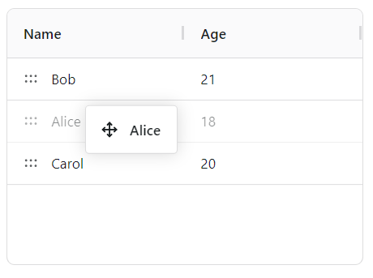

- `'rowDragEntireRow'`键，布尔类型，表示是否允许该行任意位置支持拖动，默认为`False`。

- `'rowDragMultiRow'`键，布尔类型，表示是否允许拖动多行，默认为`False`。

  注意，想要拖动多行，除了启用该键，还要启用多选：

  ```python3
  from nicegui import ui
  
  def index():
      options = {
          'columnDefs': [
              {'headerName': 'Name', 'field': 'name',},
              {'headerName': 'Age', 'field': 'age'},
          ],
          'rowData': [
              {'name': 'Alice', 'age': 18},
              {'name': 'Bob', 'age': 21},
              {'name': 'Carol', 'age': 20},
          ],
          'rowDragManaged':True,
          'rowDragEntireRow':True,
          'rowDragMultiRow':True,
          'rowSelection': {'mode': 'multiRow'}
      }
      ui.aggrid(
          options=options
      )
  
  ui.run(
      root=index,
      native=True
  )
  ```

  

- `'suppressRowDrag'`键，布尔类型，表示是否禁止拖动行，默认为`False`。该键的优先级高于`'rowDragEntireRow'`键、列定义的`'rowDrag'`键。

- `'suppressMoveWhenRowDragging'`键，布尔类型，表示是否禁止拖动行时，实时生成拖动操作的结果，默认为`False`。

  示例如下：

  ```python3
  from nicegui import ui
  
  def index():
      options = {
          'columnDefs': [
              {'headerName': 'Name', 'field': 'name',},
              {'headerName': 'Age', 'field': 'age'},
          ],
          'rowData': [
              {'name': 'Alice', 'age': 18},
              {'name': 'Bob', 'age': 21},
              {'name': 'Carol', 'age': 20},
          ],
          'rowDragManaged':True,
          'rowDragEntireRow':True,
          'rowDragMultiRow':True,
          'rowSelection': {'mode': 'multiRow'},
          'suppressMoveWhenRowDragging':True
      }
      ui.aggrid(
          options=options
      )
  
  ui.run(
      root=index,
      native=True
  )
  ```

  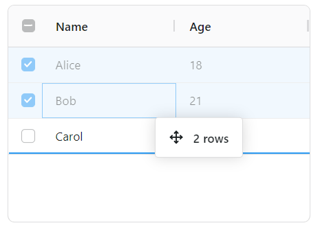

- `'rowDragText'`键，使用字符串表达的JavaScript函数，表示拖动行时鼠标旁边显示的提示性文字。

  该JavaScript函数支持以下位置参数（为了方便记忆，这里命名了参数，但实际使用时不限制参数名）：

  - `params`参数，`IRowDragItem`类型，为该函数专用的参数。`IRowDragItem`类型支持的属性可以参考 https://www.ag-grid.com/javascript-data-grid/row-dragging-customisation/#reference-rowDragging-rowDragText 。
  - `dragItemCount`参数，整数类型，表示一共拖动了多少行。

  注意，列定义中也有同名键，用法一样，但列定义中的同名键优先级更高。比如，在下面的示例中，如果拖动的是列定义中启用`'rowDrag'`键的列（需要拖动该列的拖动图标），则显示的是列定义中的同名键。若是拖动该行的其他位置，则显示的是表格定义中的同名键：

  ```python3
  from nicegui import ui
  
  def index():
      options = {
          'columnDefs': [
              {
                  'headerName': 'Name', 
                  'field': 'name',
                  'rowDrag':True,
                  ':rowDragText':'(params,dragItemCount) => `总共`+dragItemCount+`行`'
              },
              {'headerName': 'Age', 'field': 'age'},
          ],
          'rowData': [
              {'name': 'Alice', 'age': 18},
              {'name': 'Bob', 'age': 21},
              {'name': 'Carol', 'age': 20},
          ],
          'rowDragManaged':True,
          'rowDragEntireRow':True,
          'rowDragMultiRow':True,
          'rowSelection': {'mode': 'multiRow'},
          'suppressMoveWhenRowDragging':True,
          ':rowDragText':'(params,dragItemCount) => `共`+dragItemCount+`行`',
      }
      ui.aggrid(
          options=options
      )
  
  ui.run(
      root=index,
      native=True
  )
  ```

  

  

- `'enableRowPinning'`键，布尔类型或者字符串类型（仅支持`['top','bottom']`中的值），表示是否启用行固定（被固定的行不随其他行一起上下滚动），或者行固定的位置（顶部、底部）。

- `'isRowPinnable'`键，使用字符串表达的JavaScript函数，函数返回的布尔值表示哪些行可以被手动固定。

  该JavaScript函数支持以下位置参数（为了方便记忆，这里命名了参数，但实际使用时不限制参数名）：

  - `node`参数，` IRowNode`类型，表示每一行的节点对象（支持的属性，可参考 https://www.ag-grid.com/javascript-data-grid/row-object/）。

- `'isRowPinned'`键，使用字符串表达的JavaScript函数，函数返回值（仅支持JavaScript中的`['top','bottom',null,undefined]`）表示行的固定状态（顶部、底部、不固定、不固定）。

  该JavaScript函数支持以下位置参数（为了方便记忆，这里命名了参数，但实际使用时不限制参数名）：

  - `node`参数，` IRowNode`类型，表示每一行的节点对象（支持的属性，可参考 https://www.ag-grid.com/javascript-data-grid/row-object/）。

  示例如下：

  ```python3
  from nicegui import ui
  
  def index():
      options = {
          'columnDefs': [
              {
                  'headerName': 'Name', 
                  'field': 'name',
              },
              {'headerName': 'Age', 'field': 'age'},
          ],
          'rowData': [
              {'name': 'Alice', 'age': 18},
              {'name': 'Bob', 'age': 21},
              {'name': 'Carol', 'age': 20},
              {'name': 'Bob', 'age': 21},
              {'name': 'Carol', 'age': 20},
              {'name': 'Bob', 'age': 21},
              {'name': 'Carol', 'age': 20},
          ],
          'enableRowPinning':True,
          ':isRowPinned':'node => (node.data.age <= 18?`top`:null)',
      }
      ui.aggrid(
          options=options
      )
  
  ui.run(
      root=index,
      native=True,
  )
  ```

  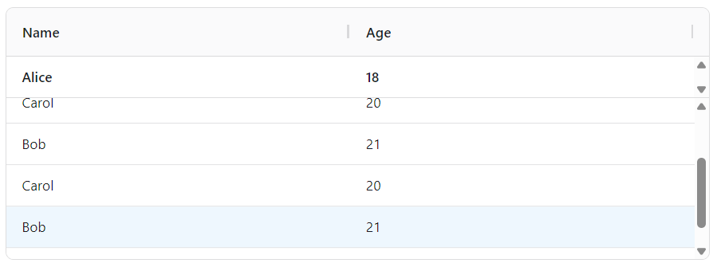

- `'pinnedTopRowData'`键，元素为字典的列表（具体要求同`'rowData'`键），表示固定在顶部的数据。注意，只有`'enableRowPinning'`键为`False`时，该键才会生效。

- `'pinnedBottomRowData'`键，元素为字典的列表（具体要求同`'rowData'`键），表示固定在底部的数据。注意，只有`'enableRowPinning'`键为`False`时，该键才会生效。

  示例如下：

  ```python3
  from nicegui import ui
  
  def index():
      options = {
          'columnDefs': [
              {
                  'headerName': 'Name', 
                  'field': 'name',
              },
              {'headerName': 'Age', 'field': 'age'},
          ],
          'rowData': [
              {'name': 'Alice', 'age': 18},
              {'name': 'Bob', 'age': 21},
              {'name': 'Carol', 'age': 20},
              {'name': 'Alice', 'age': 18},
              {'name': 'Bob', 'age': 21},
              {'name': 'Carol', 'age': 20},
          ],
          'pinnedTopRowData':[
              {'name': '第一行'},
          ],
          'pinnedBottomRowData':[
              {'name': '最后一行'},
          ]
      }
      ui.aggrid(
          options=options
      )
  
  ui.run(
      root=index,
      native=True,
  )
  ```

  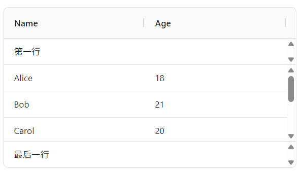

- `'alwaysShowHorizontalScroll'`键，布尔类型，表示是否始终显示水平滚动条，默认为`False`。

- `'alwaysShowVerticalScroll'`键，布尔类型，表示是否始终显示垂直滚动条，默认为`False`。

- `'debounceVerticalScrollbar'`键，布尔类型，表示是否对垂直滚动条进行防抖处理，默认为`False`。建议在性能比较差的场景下开启，但可能存在渲染延迟，性能比较好的场景下不建议开启。

- `'suppressHorizontalScroll'`键，布尔类型，表示是否完全禁用水平滚动（不显示水平滚动条，也不允许水平滚动），默认为`False`。

- `'suppressScrollWhenPopupsAreOpen'`键，布尔类型，当弹窗元素（如右键菜单、列菜单、筛选器等）打开时，表示是否禁止行滚动，默认为`False`。

  示例如下：

  ```python3
  from nicegui import ui
  
  def index():
      options = {
          'columnDefs': [
              {
                  'headerName': 'Name', 
                  'field': 'name',
                  'filter':True
              },
              {'headerName': 'Age', 'field': 'age'},
          ],
          'rowData': [
              {'name': 'Alice', 'age': 18},
              {'name': 'Bob', 'age': 21},
              {'name': 'Carol', 'age': 20},
              {'name': 'Alice', 'age': 18},
              {'name': 'Bob', 'age': 21},
              {'name': 'Carol', 'age': 20},
          ],
          'suppressScrollWhenPopupsAreOpen':True
      }
      ui.aggrid(
          options=options
      )
  
  ui.run(
      root=index,
      native=True,
  )
  ```

  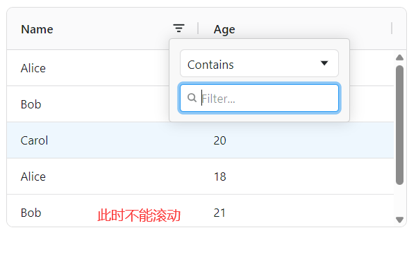

- `'selectionColumnDef'`键，字典类型，表示行选择列（即启用行选择之后，每行勾选框对应列）的列定义。注意，该列定义仅支持**部分**表格列定义的键，具体支持的键可以参考 https://www.ag-grid.com/javascript-data-grid/row-selection-single-row/#reference-selection-selectionColumnDef 。

  示例如下：

  ```python3
  from nicegui import ui
  
  def index():
      options = {
          'columnDefs': [
              {
                  'headerName': 'Name', 
                  'field': 'name'
              },
              {'headerName': 'Age', 'field': 'age'},
          ],
          'rowData': [
              {'name': 'Alice', 'age': 18},
              {'name': 'Bob', 'age': 21},
              {'name': 'Carol', 'age': 20},
          ],
          'rowSelection':{
              'mode':'multiRow'
          },
          'selectionColumnDef':{
              'headerName':'选择'
          }
      }
      ui.aggrid(
          options=options
      )
  
  ui.run(
      root=index,
      native=True,
  )
  ```

  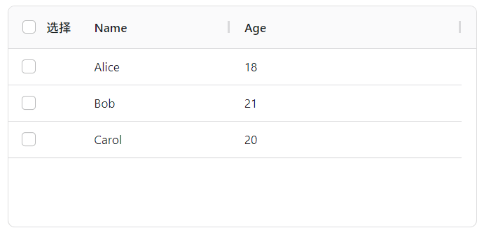

- `'suppressCellFocus'`键，布尔类型，表示是否禁止除了表头外的单元格通过方向键切换焦点，默认为`False`。

- `'suppressHeaderFocus'`键，布尔类型，布尔类型，表示是否禁止表头的单元格通过方向键切换焦点，默认为`False`。

- `'enableCellTextSelection'`键，布尔类型，表示是否允许选择单元格内的文字，默认为`False`。

- `'accentedSort'`键，布尔类型，表示排序时是否区分带重音符号的字符（比如“á”和“à”），默认为`False`。

- `'suppressMultiSort'`键，布尔类型，表示是否禁用多列同时排序（按住`shift`键依次点击表头各列），默认为`False`。

- `'alwaysMultiSort'`键，布尔类型，表示是否总是启用多列同时排序，无需按住`shift`键，只要依次点击表头各列即可，默认为`False`。

- `'multiSortKey'`键，字符串类型，表示通过按键进行多列同时排序时的快捷键，默认为`shift`键。

- `'icons'`键，字典类型，表示表格中的图标。虽然表格默认使用了内部统一的图标，但依然可以通过指定键（键名可参考 https://www.ag-grid.com/javascript-data-grid/custom-icons/#icon-names 中左边的名字）修改其图标。支持以下两种图标表达方式：

  - （方法简单，比较推荐）字符串即为图标，比如`'⬇️'`。

  - （格式复杂，但功能强大）字符串为HTML格式的图标，可以为图标字体、SVG，比如`'<i class="material-icons">keyboard_arrow_up</i>'`（源于`ui.icon`控件），或者：

    ```html
    <svg viewBox='0 0 200 200' width='20' height='20'>
    <circle cx='100' cy='100' r='78' fill='#ffde34' stroke='black' stroke-width='3' />
    <circle cx='80' cy='85' r='8' />
    <circle cx='120' cy='85' r='8' />
    <path d='m60,120 C75,150 125,150 140,120' style='fill:none; stroke:black; stroke-width:8; stroke-linecap:round'/>
    </svg>
    ```

  示例如下：

  ```python3
  from nicegui import ui
  
  def index():
      options = {
          'columnDefs': [
              {
                  'headerName': 'Name',
                  'field': 'name',
                  'unSortIcon': True
              },
              {'headerName': 'Age', 'field': 'age'},
          ],
          'rowData': [
              {'name': 'Alice', 'age': 18},
              {'name': 'Bob', 'age': 21},
              {'name': 'Carol', 'age': 20},
          ],
          'icons': {
              'sortAscending': '<i class="material-icons">keyboard_arrow_up</i>',
              'sortDescending': '⬇️',
              'sortUnSort': '''<svg viewBox='0 0 200 200' width='20' height='20'>
  <circle cx='100' cy='100' r='78' fill='#ffde34' stroke='black' stroke-width='3' />
  <circle cx='80' cy='85' r='8' />
  <circle cx='120' cy='85' r='8' />
  <path d='m60,120 C75,150 125,150 140,120' style='fill:none; stroke:black; stroke-width:8; stroke-linecap:round'/>
  </svg>
          '''
          }
      }
      ui.aggrid(
          options=options
      )
  
  ui.run(
      root=index,
      native=True,
  )
  ```

  

- `'rowStyle'`键，字典类型，表示行的样式。

  示例如下：

  ```python3
  from nicegui import ui
  
  def index():
      options = {
          'columnDefs': [
              {
                  'headerName': 'Name',
                  'field': 'name',
              },
              {'headerName': 'Age', 'field': 'age'},
          ],
          'rowData': [
              {'name': 'Alice', 'age': 18},
              {'name': 'Bob', 'age': 21},
              {'name': 'Carol', 'age': 20},
          ],
          'rowStyle':{
              'background':'gray'
          }
      }
      ui.aggrid(
          options=options
      )
  
  ui.run(
      root=index,
      native=True,
  )
  ```

  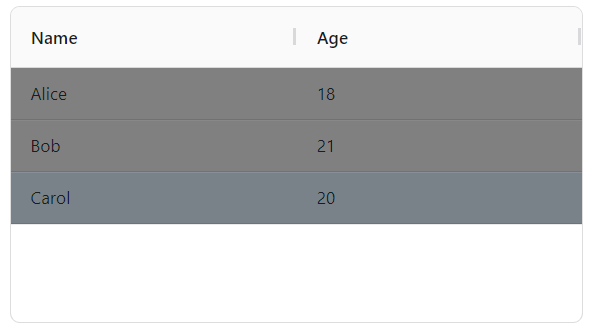

- `'getRowStyle'`键，使用字符串表达的JavaScript函数，表示行的样式。该键为JavaScript函数时支持以下位置参数（为了方便记忆，这里命名了参数，但实际使用时不限制参数名）：

  - `params`参数，`RowClassParams`类型，为该函数专用的参数。`RowClassParams`类型支持的属性可以参考 https://www.ag-grid.com/javascript-data-grid/row-styles/#reference-styling-getRowStyle 。

  不同于`'rowStyle'`键只能设置所有行的样式，该键可以根据条件设置指定行的样式：

  ```python3
  from nicegui import ui
  
  def index():
      options = {
          'columnDefs': [
              {
                  'headerName': 'Name',
                  'field': 'name',
              },
              {'headerName': 'Age', 'field': 'age'},
          ],
          'rowData': [
              {'name': 'Alice', 'age': 18},
              {'name': 'Bob', 'age': 21},
              {'name': 'Carol', 'age': 20},
          ],
          ':getRowStyle':'params => !(params.node.rowIndex % 2)?{"background":"gray"}:{}'
      }
      ui.aggrid(
          options=options
      )
  
  ui.run(
      root=index,
      native=True,
  )
  ```

  

- `'rowClass'`键，字符串类型或者元素为字符串的列表，表示行的样式类。

- `'getRowClass'`键，使用字符串表达的JavaScript函数，表示行的样式类。该键为JavaScript函数时支持以下位置参数（为了方便记忆，这里命名了参数，但实际使用时不限制参数名）：

  - `params`参数，`RowClassParams`类型，为该函数专用的参数。`RowClassParams`类型支持的属性可以参考 https://www.ag-grid.com/javascript-data-grid/row-styles/#reference-styling-getRowClass 。

  不同于`'rowClass'`键只能设置所有行的样式类，该键可以根据条件设置指定行的样式类。

- `'rowClassRules'`键，字典类型（键为样式类，值为使用字符串表达的JavaScript函数或者表达式），表示行的样式类。不同于`'rowClass'`键只能设置所有行的样式类，该键可以将符合字典值对应条件的行，设置为字典键同名的样式类。完整用法可参考 https://www.ag-grid.com/javascript-data-grid/row-styles/#reference-styling-rowClassRules 。

  示例如下：

  ```python3
  from nicegui import ui
  
  def index():
      options = {
          'columnDefs': [
              {
                  'headerName': 'Name',
                  'field': 'name',
              },
              {'headerName': 'Age', 'field': 'age'},
          ],
          'rowData': [
              {'name': 'Alice', 'age': 18},
              {'name': 'Bob', 'age': 21},
              {'name': 'Carol', 'age': 20},
          ],
          'rowClassRules':{
              'bg-red':'data.age === 18',
              ':bg-green':'params => (params.data.age === 20)'
          }
      }
      ui.aggrid(
          options=options
      )
  
  ui.run(
      root=index,
      native=True,
  )
  ```

  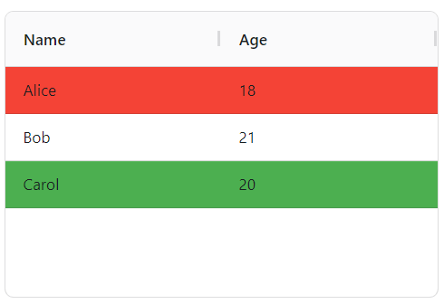

- `'suppressRowHoverHighlight'`键，布尔类型，表示是否在鼠标悬停某一行时禁止高亮该行，默认为`False`。

- `'columnHoverHighlight'`键，布尔类型，表示是否在鼠标悬停某一列时高亮该列，默认为`False`。

- `'enableBrowserTooltips'`键，布尔类型，表示是否启用浏览器原生的工具提示（性能好但样式固定，且不支持后续的相关配置），默认为`False`。

- `'tooltipShowDelay'`键，整数类型，表示鼠标悬停之后多长时间显示工具提示，单位毫秒，默认为`2000`。

- `'tooltipSwitchShowDelay'`键，整数类型，表示鼠标切换可显示工具提示的元素时，间隔多长时间显示另一个工具提示，单位毫秒，默认为`200`。

- `'tooltipHideDelay'`键，整数类型，表示工具提示显示之后，持续多长时间才消失，单位毫秒，默认为`10000`。

- `'tooltipMouseTrack'`键，布尔类型，表示工具提示的位置是否跟随鼠标移动，默认为`False`。

- `'tooltipShowMode'`键，字符串类型（仅支持`['standard','whenTruncated']`中的值），表示工具提示在什么时候显示（始终显示工具提示，还是仅在内容无法完整显示时显示工具提示），默认为`'standard'`。

- `'tooltipTrigger'`键，字符串类型（仅支持`['hover','focus']`中的值），表示工具提示的触发方式（悬停、获得焦点），默认为`'hover'`。

- `'tooltipInteraction'`键，布尔类型，表示工具提示是否允许交互（鼠标移动到工具提示上时，工具提示会持续显示，而不是超时消失），默认为`False`。

  示例如下：

  ```python3
  from nicegui import ui
  
  def index():
      options = {
          'columnDefs': [
              {
                  'headerName': 'Name',
                  'field': 'name',
                  'headerTooltip':'姓名'
              },
              {
                  'headerName': 'Age', 
                  'field': 'age'
              },
          ],
          'rowData': [
              {'name': 'Alice', 'age': 18},
              {'name': 'Bob', 'age': 21},
              {'name': 'Carol', 'age': 20},
          ],
          'enableBrowserTooltips':False,
          'tooltipHideDelay':1000,
          'tooltipInteraction':True
      }
      ui.aggrid(
          options=options
      )
  
  ui.run(
      root=index,
      native=True,
  )
  ```

  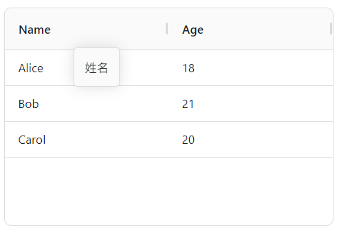

- `'columnTypes'`键，字典类型，表示自定义的列类型，其中键名为类型名，值为字典（该字典的支持的键同列定义）。该键一般与列定义的`'type'`键组合使用，完整用法可参考 https://www.ag-grid.com/javascript-data-grid/column-definitions/#column-types 。

- `'dataTypeDefinitions'`键，字典类型，表示自定义的数据类型，其中键名为类型名，值为字典（该字典部分支持列定义的键）。该键一般与列定义的`'cellDataType'`键组合使用，完整用法可参考 https://www.ag-grid.com/javascript-data-grid/cell-data-types/#reference-columns-dataTypeDefinitions 。

##### 52.2.2.2 列定义

列定义的参考文档：https://www.ag-grid.com/javascript-data-grid/column-properties/

列定义支持的键（部分）如下：

- `'field'`键，字符串类型，表示在行数据字典中，该行哪个键的值在该列对应位置显示。除了简单使用单层行数据字典，对于多层行数据字典，还可以用`'{第一层字典的键}.{第二层字典的键}...{最后一层字典的键}'`的格式，直接使用多层行数据字典的数据。

  示例如下：

  ```python3
  from nicegui import ui
  
  def index():
      options = {
          'columnDefs': [
              {
                  'headerName': 'FirstName',
                  'field': 'name.first',
              },
              {
                  'headerName': 'LastName',
                  'field': 'name.last',
              },
              {
                  'headerName': 'Age', 
                  'field': 'age'
              },
          ],
          'rowData': [
              {
                  'name': {
                      'first':'Alice',
                      'last':'Ash'
                  }, 
                  'age': 18
              },
              {
                  'name': {
                      'first':'Bob',
                      'last':'Bluce'
                  }, 
                  'age': 21
              },
              {
                  'name': {
                      'first':'Carol',
                      'last':'Cart'
                  }, 
                  'age': 20
              },
          ],
      }
      ui.aggrid(
          options=options
      )
  
  ui.run(
      root=index,
      native=True,
  )
  ```

  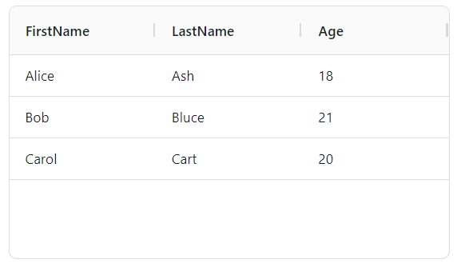

- `'colId'`键，字符串类型，表示列的ID（不可重复）。如果该键为空，则会自动生成。

- `'type'`键，字符串类型或者元素为字符串的列表，表示该列的列类型。

  所谓列类型，可以理解为多个特定列定义组合之后的简化别名，能够一步到位设置指定列的多个列定义。

  默认提供了`'rightAligned'`和`'numericColumn'`两种预定义的列类型（完整用法参考 https://www.ag-grid.com/javascript-data-grid/column-definitions/#provided-column-types）：

  ```python3
  from nicegui import ui
  
  def index():
      options = {
          'columnDefs': [
              {
                  'headerName': 'Name',
                  'field': 'name',
              },
              {
                  'headerName': 'Age', 
                  'field': 'age',
                  'type':'numericColumn'
              },
          ],
          'rowData': [
              {'name': 'Alice', 'age': 18},
              {'name': 'Bob', 'age': 21},
              {'name': 'Carol', 'age': 20},
          ],
      }
      ui.aggrid(
          options=options
      )
  
  ui.run(
      root=index,
      native=True,
  )
  ```

  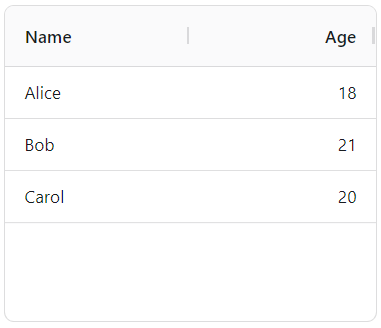

  也可以通过表格定义的`'columnTypes'`键添加自定义的列类型：

  ```python3
  from nicegui import ui
  
  def index():
      options = {
          'columnTypes':{
              'inputCol':{
                  'editable':True
              }
          },
          'columnDefs': [
              {
                  'headerName': 'Name',
                  'field': 'name',
              },
              {
                  'headerName': 'Age', 
                  'field': 'age',
                  'type':'inputCol'
              },
          ],
          'rowData': [
              {'name': 'Alice', 'age': 18},
              {'name': 'Bob', 'age': 21},
              {'name': 'Carol', 'age': 20},
          ],
      }
      ui.aggrid(
          options=options
      )
  
  ui.run(
      root=index,
      native=True,
  )
  ```

  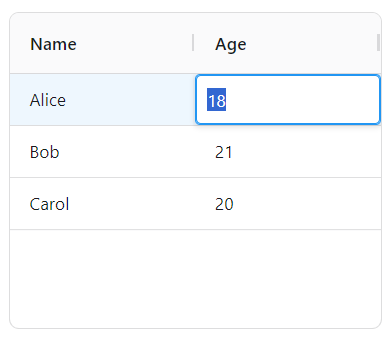

- `'cellDataType'`键，布尔类型或者字符串类型，表示单元格的数据类型，默认为`True`。字符串类型表示设定了单元格的数据类型，则该列的所有单元格只能使用指定类型的数据，其他类型的数据会报数据无效。布尔类型则表示启用自动推断数据类型或者禁用数据类型限制。

  默认提供了几个预定义的数据类型（完整用法参考 https://www.ag-grid.com/javascript-data-grid/cell-data-types/#pre-defined-cell-data-types），也可以通过表格定义的`'dataTypeDefinitions'`键添加自定义的数据类型。但自定义数据类型需要对框架用法、JavaScript语法比较了解，这里就不提供相关介绍，仅提供简单示例：

  ```python3
  from nicegui import ui
  
  def index():
      options = {
          'dataTypeDefinitions':{
              'myDate':{
                  'baseDataType':'date',
                  'extendsDataType':'date',
                  ':valueFormatter':'''(params) => {
                      if (!params.value) return '未定义';
                      const date = new Date(params.value);
                      return `${date.getFullYear()}年${String(date.getMonth()+1).padStart(2,'0')}月${String(date.getDate()).padStart(2,'0')}日`;
                  }'''
              }
          },
          'columnDefs': [
              {
                  'headerName': 'Name',
                  'field': 'name',
              },
              {
                  'headerName': 'Age', 
                  'field': 'age',
              },
              {
                  'headerName': '生日', 
                  'field': 'birthday',
                  'cellDataType':'myDate'
              },
              {
                  'headerName': 'Birthday（可编辑）', 
                  'field': 'birthday',
                  'cellDataType':'dateString',
                  'editable':True
              },
          ],
          'rowData': [
              {'name': 'Alice', 'age': 18,'birthday':'2026-01-01'},
              {'name': 'Bob', 'age': 21},
              {'name': 'Carol', 'age': 20},
          ],
      }
      ui.aggrid(
          options=options
      )
  
  ui.run(
      root=index,
      native=True,
  )
  ```

  

- `'valueGetter'`键，使用字符串表达的JavaScript函数或者表达式，表示每行对应该列的单元格内容获取来源，优先级高于`'field'`键。

  该键为表达式时，可以直接使用前面介绍`'enableCellExpressions'`键时引入的单元格公式，但与之不同的是，因为不是在单元格内使用，不用“=”开头，也不用启用`'enableCellExpressions'`键。

  因此，复刻`'enableCellExpressions'`键的示例会简单一些：

  ```python3
  from nicegui import ui
  from datetime import datetime
  
  def index():
      options = {
          'columnDefs': [
              {'headerName': 'Name', 'field': 'name'},
              {'headerName': 'Age', 'field': 'age','editable':True},
              {'headerName': 'Year','valueGetter':f'{datetime.now().year}-getValue("age")'}
          ],
          'rowData': [
              {'name': 'Alice', 'age': 18},
              {'name': 'Bob', 'age': 21},
              {'name': 'Carol', 'age': 20},
          ],
      }
      ui.aggrid(
          options=options
      )
  
  ui.run(
      root=index,
      native=True
  )
  ```

  

  该键为JavaScript函数时支持以下位置参数（为了方便记忆，这里命名了参数，但实际使用时不限制参数名）：

  - `params`参数，`ValueGetterParams`类型，为该函数专用的参数。`ValueGetterParams`类型支持的属性可以参考 https://www.ag-grid.com/javascript-data-grid/value-getters/#reference-columns-valueGetter 。

  虽然同样不用启用`'enableCellExpressions'`键，但字符串变成了JavaScript函数，如果想要正确生效，需要在该键的键名前添加英文冒号，示例如下：

  ```python3
  from nicegui import ui
  from datetime import datetime
  
  def index():
      options = {
          'columnDefs': [
              {'headerName': 'Name', 'field': 'name'},
              {'headerName': 'Age', 'field': 'age','editable':True},
              {'headerName': 'Year',':valueGetter':f'(params)=>{datetime.now().year}-params.getValue("age")'},
          ],
          'rowData': [
              {'name': 'Alice', 'age': 18},
              {'name': 'Bob', 'age': 21},
              {'name': 'Carol', 'age': 20},
          ],
      }
      ui.aggrid(
          options=options
      )
  
  ui.run(
      root=index,
      native=True
  )
  ```

  

- `'valueFormatter'`键，使用字符串表达的JavaScript函数或者表达式，表示每行对应该列的单元格内容呈现格式，直接编辑时**不会**影响原始内容。用法类似`'valueGetter'`键，但`'valueGetter'`键中用于获取任意列数据的`getValue`函数被换成了表示当前单元格数据的`value`属性。

  该键为JavaScript函数时支持的位置参数（为了方便记忆，这里命名了参数，但实际使用时不限制参数名）：

  - `params`参数，`ValueFormatterParams`类型，为该函数专用的参数。`ValueFormatterParams`类型支持的属性可以参考 https://www.ag-grid.com/javascript-data-grid/value-formatters/#reference-columns-valueFormatter 。

  因此，使用字符串表达的JavaScript函数，就不能使用`getValue`函数，需要改用其他方法：

  ```python3
  from nicegui import ui
  from datetime import datetime
  
  def index():
      options = {
          'columnDefs': [
              {'headerName': 'Name', 'field': 'name'},
              {'headerName': 'Age', 'field': 'age','editable':True},
              {'headerName': 'Year',':valueFormatter':f'(params)=>{datetime.now().year}-params.data.age'},
          ],
          'rowData': [
              {'name': 'Alice', 'age': 18},
              {'name': 'Bob', 'age': 21},
              {'name': 'Carol', 'age': 20},
          ],
      }
      ui.aggrid(
          options=options
      )
  
  ui.run(
      root=index,
      native=True
  )
  ```

  

  至于表达式，也要做相应修改：

  ```python3
  from nicegui import ui
  from datetime import datetime
  
  def index():
      options = {
          'columnDefs': [
              {'headerName': 'Name', 'field': 'name'},
              {'headerName': 'Age', 'field': 'age','editable':True},
              {'headerName': 'Year','valueFormatter':f'{datetime.now().year}-data.age'}
          ],
          'rowData': [
              {'name': 'Alice', 'age': 18},
              {'name': 'Bob', 'age': 21},
              {'name': 'Carol', 'age': 20},
          ],
      }
      ui.aggrid(
          options=options
      )
  
  ui.run(
      root=index,
      native=True
  )
  ```

  

  当然，上面用来复刻`'valueGetter'`键的用法属于少数，更多时候，该键是用来修改单元格内容呈现格式，使用`value`属性足矣，无需获取其他列的数据：

  ```python3
  from nicegui import ui
  
  def index():
      options = {
          'columnDefs': [
              {'headerName': 'Name', 'field': 'name'},
              {
                  'headerName': 'Age', 
                  'field': 'age',
                  'editable':True,
                  'valueFormatter':'value+"岁"'
              },
          ],
          'rowData': [
              {'name': 'Alice', 'age': 18},
              {'name': 'Bob', 'age': 21},
              {'name': 'Carol', 'age': 20},
          ],
      }
      ui.aggrid(
          options=options
      )
  
  ui.run(
      root=index,
      native=True
  )
  ```

  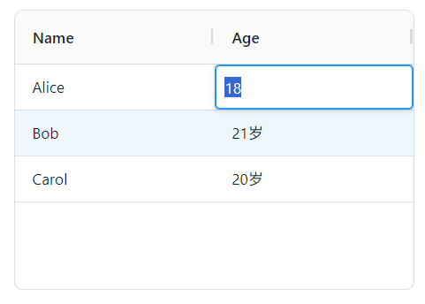

- `'refData'`键，字典类型，表示每行对应该列的单元格内容最终呈现结果，直接编辑时**会**影响原始内容。`'refData'`键与`'valueFormatter'`键作用类似，但用法上完全不同：`'refData'`键使用字典映射关系将原始内容转换为最终结果，而不是使用表达式或者函数套用固定格式。

  因此，`'refData'`键相比于`'valueFormatter'`键，有以下特点：

  - 最终结果存在多种格式的情况下，`'refData'`键更灵活、简单。
  - 最终结果使用相同格式时，不如`'valueFormatter'`键简单。
  - 直接编辑时会影响原始内容。

  示例如下：

  ```python3
  from nicegui import ui
  
  def index():
      options = {
          'columnDefs': [
              {'headerName': 'Name', 'field': 'name'},
              {
                  'headerName': 'Age', 
                  'field': 'age',
                  'editable':True,
                  'refData':{
                      18:'18岁',
                      20:'二十岁',
                      21:'21岁',
                  }
              },
          ],
          'rowData': [
              {'name': 'Alice', 'age': 18},
              {'name': 'Bob', 'age': 21},
              {'name': 'Carol', 'age': 20},
          ],
      }
      ui.aggrid(
          options=options
      )
  
  ui.run(
      root=index,
      native=True
  )
  ```

  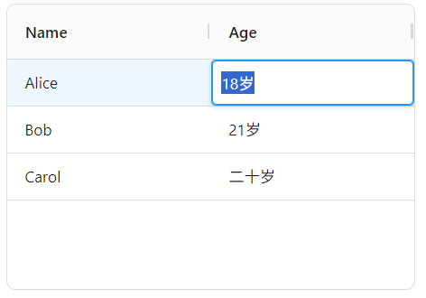

- `'columnGroupShow'`键，字符串类型（仅支持`['open','closed']`中的值），当该列为列组的子列时，表示该列在列组展开、收起时显示。如果该键未定义，则表示始终显示。

  示例如下（为了方便看出列组的展开状态，额外配置了`'icons'`键）：

  ```python3
  from nicegui import ui
  
  def index():
      options = {
          'columnDefs': [
              {
                  'headerName': 'Info', 
                  'children': [
                      {'headerName': '展开时显示', 'field': 'name','columnGroupShow':'open'},
                      {'headerName': '收起时显示', 'field': 'name','columnGroupShow':'closed'},
                      {'headerName': '始终显示', 'field': 'age'},
                  ]
              },
          ],
          'rowData': [
              {'name': 'Alice', 'age': 18},
              {'name': 'Bob', 'age': 21},
              {'name': 'Carol', 'age': 20},
          ],
          'icons':{
              'columnGroupOpened':'已展开',
              'columnGroupClosed':'已收起'
          }
      }
      ui.aggrid(
          options=options
      )
  
  ui.run(
      root=index,
      native=True
  )
  ```

  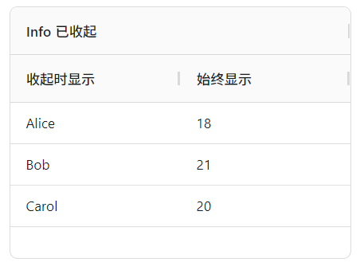

- `'icons'`键，用法同表格定义的`'icons'`键，但优先级更高。

  示例如下：

  ```python3
  from nicegui import ui
  
  def index():
      options = {
          'columnDefs': [
              {
                  'headerName': 'Name',
                  'field': 'name',
                  'unSortIcon': True,
                  'icons':{
                      'sortUnSort': '〓'
                  }
              },
              {'headerName': 'Age', 'field': 'age','unSortIcon': True},
          ],
          'rowData': [
              {'name': 'Alice', 'age': 18},
              {'name': 'Bob', 'age': 21},
              {'name': 'Carol', 'age': 20},
          ],
          'icons': {
              'sortUnSort': '<i class="material-icons">menu</i>'
          }
      }
      ui.aggrid(
          options=options
      )
  
  ui.run(
      root=index,
      native=True,
  )
  ```

  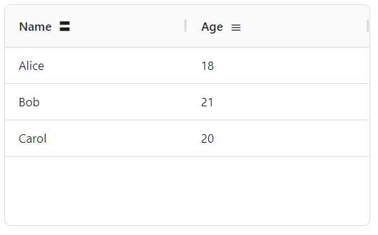

- `'suppressNavigable'`键，布尔类型或者使用字符串表达的JavaScript函数，表示是否禁止通过键盘切换焦点到该列的单元格，默认为`False`。该键为JavaScript函数时支持的位置参数（为了方便记忆，这里命名了参数，但实际使用时不限制参数名）：

  - `params`参数，`SuppressNavigableCallbackParams`类型，为该函数专用的参数。`SuppressNavigableCallbackParams`类型支持的属性可以参考 https://www.ag-grid.com/javascript-data-grid/column-properties/#reference-columns-suppressNavigable 。

  使用JavaScript函数的话，可以根据条件决定是否禁用：

  ```python3
  from nicegui import ui
  
  def index():
      options = {
          'columnDefs': [
              {
                  'headerName': 'Name',
                  'field': 'name',
                  ':suppressNavigable':'params => params.data.age%2 === 0'
              },
              {'headerName': 'Age', 'field': 'age'},
          ],
          'rowData': [
              {'name': 'Alice', 'age': 18},
              {'name': 'Bob', 'age': 21},
              {'name': 'Carol', 'age': 20},
          ],
      }
      ui.aggrid(
          options=options
      )
  
  ui.run(
      root=index,
      native=True,
  )
  ```

  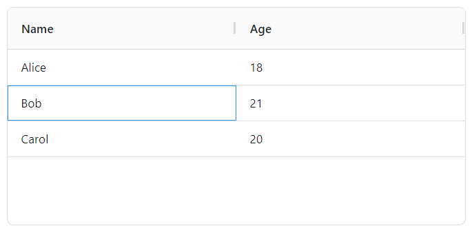

- `'suppressKeyboardEvent'`键，布尔类型或者使用字符串表达的JavaScript函数，表示是否禁止响应键盘事件，默认为`False`。该键为JavaScript函数时支持的位置参数（为了方便记忆，这里命名了参数，但实际使用时不限制参数名）：

  - `params`参数，`SuppressKeyboardEventParams`类型，为该函数专用的参数。`SuppressKeyboardEventParams`类型支持的属性可以参考 https://www.ag-grid.com/javascript-data-grid/keyboard-navigation/#reference-columns-suppressKeyboardEvent 。

- `'suppressPaste'`键，布尔类型或者使用字符串表达的JavaScript函数，表示是否禁止粘贴，默认为`False`。该键为JavaScript函数时支持的位置参数（为了方便记忆，这里命名了参数，但实际使用时不限制参数名）：

  - `params`参数，`SuppressPasteCallbackParams`类型，为该函数专用的参数。`SuppressPasteCallbackParams`类型支持的属性可以参考 https://www.ag-grid.com/javascript-data-grid/column-properties/#reference-columns-suppressPaste 。

- `'context'`键，含义、用法类似表格定义的`'context'`键，表示该列的自定义上下文数据。

  但在使用时，JavaScript函数的参数支持的`context`属性不是该键对应的值。而是挂载在`colDef`属性下`context`属性：

  ```python3
  from nicegui import ui
  
  def index():
      options = {
          'columnDefs': [
              {
                  'headerName': 'Name',
                  'field': 'name'
              },
              {
                  'headerName': 'Age', 
                  'field': 'age',
                  'context':'岁',
                  ':valueFormatter':'params => `${params.value}${params.colDef.context}`'
              },
          ],
          'rowData': [
              {'name': 'Alice', 'age': 18},
              {'name': 'Bob', 'age': 21},
              {'name': 'Carol', 'age': 20},
          ],
      }
      aggrid = ui.aggrid(
          options=options
      )
      input = ui.input(
          '单位',
          value='岁'
      )
      def update_context():
          aggrid.options['columnDefs'][1]['context'] = input.value
      ui.button(
          'Update context',
          on_click=update_context
      )
  
  ui.run(
      root=index,
      native=True,
  )
  ```

  

- `'hide'`键，布尔类型，表示该列是否隐藏，默认为`False`。

- `'initialHide'`键，大部分情况下和`'hide'`键含义、用法一样，用起来没有差异。但使用控件方法`setGridOption`修改表格定义的话，该键不会像`'hide'`键一样生效。

  对比示例如下：

  ```python3
  from nicegui import ui
  
  def index():
      options = {
          'columnDefs': [
              {
                  'headerName': 'Name',
                  'field': 'name',
                  'hide': False,
              },
              {
                  'headerName': 'Age',
                  'field': 'age',
                  'initialHide': False
              },
          ],
          'rowData': [
              {'name': 'Alice', 'age': 18},
              {'name': 'Bob', 'age': 21},
              {'name': 'Carol', 'age': 20},
          ],
      }
      aggrid = ui.aggrid(
          options=options
      )
      ui.label('开关会永久影响表格定义：')
      ui.switch(
          'switch Name hide',
          value=False
      ).bind_value_to(
          aggrid.options['columnDefs'][0],
          'hide'
      )
      ui.switch(
          'switch Age initialHide',
          value=False
      ).bind_value_to(
          aggrid.options['columnDefs'][1],
          'initialHide'
      )
      ui.button('reset',on_click=aggrid.update)
      ui.label('控件方法setColumnsVisible对二者来说没有区别：')
      async def setColumnsVisible():
          await aggrid.run_grid_method('setColumnsVisible', ['name','age'], False)
      ui.button('setColumnsVisible', on_click=setColumnsVisible).props('no-caps')
      ui.label('控件方法setGridOption修改表格定义无法让initialHide生效：')
      async def setGridOption():
          await aggrid.run_grid_method(
              'setGridOption',
              'columnDefs',
              [
                  {
                      'headerName': 'Name',
                      'field': 'name',
                      'hide': True,
                  },
                  {
                      'headerName': 'Age',
                      'field': 'age',
                      'initialHide': True
                  },
              ]
          )
      ui.button('setGridOption', on_click=setGridOption).props('no-caps')
  
  ui.run(
      root=index,
      native=True,
  )
  ```

  

  注意，这里为了区分`'hide'`键和`'initialHide'`键，特意使用了控件方法`setGridOption`来修改表格定义，但这种修改不会永久影响表格定义，因为表格定义由NiceGUI存储在Python的字典中，只有Python侧的修改才能生效。但该示例引出另一个概念，就是在AG Grid框架中，额外标记了`Initial`的配置项（即定义字典的键）。这些配置项就是仅在初始化时生效的配置项，后续使用控件方法`setGridOption`修改后不会生效，比如`'initialHide'`键。但在NiceGUI中，因为NiceGUI做了特殊处理，这类配置项在大部分情况下用起来和普通配置项一样（只要修改了就会生效，因为表格会重新创建），因此前面没有单独标明这些配置项（定义字典的键）。如果读者需要使用这样的配置项，可以额外关注一下该特性，避免产生意料之外的问题。

- `'lockVisible'`键，布尔类型，表示是否锁定用户手动修改列可见性的操作（不锁定通过接口执行相关操作），默认为`False`。

- `'lockPosition'`键，布尔类型或者字符串类型（仅支持`['left','right']`中的值），表示是否将该列的位置固定以及固定到哪个位置（`True`的话视作最左边），默认为`False`。注意，该键的作用和后面将要介绍的`'Pinned'`键相同，但该键会禁止用户手动修改固定列，`'Pinned'`键不会。

- `'suppressMovable'`键，布尔类型，表示是否禁止拖动该列，默认为`False`。

- `'useValueFormatterForExport'`键，布尔类型，表示导出表格数据时，是否使用`'valueFormatter'`键处理之后的数据，默认为`True`。

- `'editable'`键，布尔类型或者使用字符串表达的JavaScript函数，表示该列的单元格的内容是否可以编辑（双击、单击、按下`enter`键、按下`backspace`键进入编辑状态，具体是否支持取决于其他配置项），默认为`False`。该键为JavaScript函数时支持的位置参数（为了方便记忆，这里命名了参数，但实际使用时不限制参数名）：

  - `params`参数，`EditableCallbackParams`类型，为该函数专用的参数。`EditableCallbackParams`类型支持的属性可以参考 https://www.ag-grid.com/javascript-data-grid/column-properties/#reference-editing-editable 。

- `'valueSetter'`键，使用字符串表达的JavaScript函数或者表达式，根据表达式或者函数的返回值是否为`true`来确定单元格的数据是否发生变化，进而将其修改。该键为JavaScript函数时支持的位置参数（为了方便记忆，这里命名了参数，但实际使用时不限制参数名）：

  - `params`参数，`ValueSetterParams`类型，为该函数专用的参数。`ValueSetterParams`类型支持的属性可以参考 https://www.ag-grid.com/javascript-data-grid/value-setters/#reference-editing-valueSetter 。

  因此，可以使用`'false'`这个表达式实现单元格可以编辑但数据不会保存的效果（类似启用表格定义的`'readOnlyEdit'`键）：

  ```python3
  from nicegui import ui
  
  def index():
      options = {
          'columnDefs': [
              {
                  'headerName': 'Name',
                  'field': 'name',
              },
              {
                  'headerName': 'Age',
                  'field': 'age',
                  'editable':True,
                  'valueSetter':'false'
              },
          ],
          'rowData': [
              {'name': 'Alice', 'age': 18},
              {'name': 'Bob', 'age': 21},
              {'name': 'Carol', 'age': 20},
          ],
      }
      ui.aggrid(
          options=options
      )
  
  ui.run(
      root=index,
      native=True,
  )
  ```

  

  启用表格定义`'readOnlyEdit'`键的效果是一样的：

  ```python3
  from nicegui import ui
  
  def index():
      options = {
          'columnDefs': [
              {
                  'headerName': 'Name',
                  'field': 'name',
              },
              {
                  'headerName': 'Age',
                  'field': 'age',
                  'editable':True,
              },
          ],
          'rowData': [
              {'name': 'Alice', 'age': 18},
              {'name': 'Bob', 'age': 21},
              {'name': 'Carol', 'age': 20},
          ],
          'readOnlyEdit':True
      }
      ui.aggrid(
          options=options
      )
  
  ui.run(
      root=index,
      native=True,
  )
  ```

- `'valueParser'`键，使用字符串表达的JavaScript函数或者表达式，表示如何解析输入的内容。因为默认输入的内容是字符串，通过该键可以将输入的内容转换为所需的数据类型。该键为JavaScript函数时支持的位置参数（为了方便记忆，这里命名了参数，但实际使用时不限制参数名）：

  - `params`参数，`ValueParserParams`类型，为该函数专用的参数。`ValueParserParams`类型支持的属性可以参考 https://www.ag-grid.com/javascript-data-grid/value-parsers/#reference-editing-valueParser 。

  示例如下（四舍五入取整）：

  ```python3
  from nicegui import ui
  
  def index():
      options = {
          'columnDefs': [
              {
                  'headerName': 'Name',
                  'field': 'name',
              },
              {
                  'headerName': 'Age',
                  'field': 'age',
                  'editable':True,
                  'valueParser':'Math.round(parseFloat(newValue))'
              },
          ],
          'rowData': [
              {'name': 'Alice', 'age': 18},
              {'name': 'Bob', 'age': 21},
              {'name': 'Carol', 'age': 20},
          ],
      }
      ui.aggrid(
          options=options
      )
  
  ui.run(
      root=index,
      native=True,
  )
  ```

  

- `'cellEditor'`键，字符串类型，表示编辑单元格内容时使用的编辑器。注意，不同于其他键与企业版功能严格绑定，该键部分功能为企业版专属，本章不做介绍，仅介绍部分社区版可用的功能（本章介绍的功能基本上都是社区版可用）。关于该键的支持的全部功能，可参考 https://www.ag-grid.com/javascript-data-grid/provided-cell-editors/ 。

  该键支持以下值，分别代表不同类型的编辑器：

  - `'agTextCellEditor'`，表示单行文本编辑器，会生成一个单元格大小的输入框，仅支持单行文本。实际上前面很多编辑单元格内容的示例就是使用该编辑器：

    

  - `'agLargeTextCellEditor'`，表示多行文本编辑器，会生成一个宽度固定、高度可调的文本框，可以输入多行文本（`shift + enter`键可换行）。对于包含多行文本或者文本较长的单元格，应当使用该编辑器：

    

  - `'agSelectCellEditor'`，表示下拉选择编辑器，会生成下拉选择框，可以从给定的选项中选择。对于仅允许选择指定内容的单元格，应当使用该编辑器：

    

  - `'agNumberCellEditor'`，表示数字编辑器，会生成一个单元格大小的输入框，仅支持数字（整数、浮点数），可以使用上下方向键调整数字。对于内容为数字的单元格，建议使用该编辑器。

  - `'agDateCellEditor'`或者`'agDateStringCellEditor'`，表示日期编辑器，会生成一个单元格大小的输入框，只能输入日期。与文本编辑器不同，输入框内的日期有固定格式，无法修改；每个数字可以使用上下方向键调整或者手动输入；也可以点击输入框右侧的图标，在弹出的日期选择器中快捷选择。对于内容为日期的单元格，建议使用该编辑器：

    

    注意，`'agDateCellEditor'`和`'agDateStringCellEditor'`虽然都是日期编辑器，但在实际使用时，`'agDateStringCellEditor'`的要求会更加严格，表格数据必须是字符串表示的日期，否则无法正常使用。

  - `'agCheckboxCellEditor'`，表示勾选编辑器，会生成一个勾选框，仅支持布尔值或`None`，对应三种显示状态。对于内容为布尔值的单元格，建议使用该编辑器：

    

  示例如下：

  ```python3
  from nicegui import ui
  
  def index():
      options = {
          'columnDefs': [
              {
                  'headerName': 'Name',
                  'field': 'name',
              },
              {
                  'headerName': 'Age',
                  'field': 'age',
                  'editable':True,
                  'cellEditor':'agSelectCellEditor',
                  'cellEditorParams':{
                      'values':[i for i in range(14,25)]
                  }
              },
          ],
          'rowData': [
              {'name': 'Alice', 'age': 18},
              {'name': 'Bob', 'age': 21},
              {'name': 'Carol', 'age': 20},
          ],
      }
      ui.aggrid(
          options=options
      )
  
  ui.run(
      root=index,
      native=True,
  )
  ```

  

- `'cellEditorParams'`键，字典类型，表示单元格内容编辑器支持的配置项。注意，不同编辑器支持的配置项有所不同。

  `'agTextCellEditor'`单行文本编辑器支持以下配置（完整用法可参考 https://www.ag-grid.com/javascript-data-grid/provided-cell-editors-text/#api-reference）：

  - `'maxLength'`键，整数类型，表示可输入内容的最大长度，默认为`524288`。
  - `'useFormatter'`键，布尔类型，表示编辑时是否直接使用`'valueFormatter'`键呈现的结果。

  示例如下：

  ```python3
  from nicegui import ui
  
  def index():
      options = {
          'columnDefs': [
              {
                  'headerName': 'Name',
                  'field': 'name',
              },
              {
                  'headerName': 'Age',
                  'field': 'age',
                  'editable':True,
                  'valueFormatter':'value+"岁"',
                  'cellEditor':'agTextCellEditor',
                  'cellEditorParams':{
                      'maxLength':2,
                      'useFormatter':True
                  }
              },
          ],
          'rowData': [
              {'name': 'Alice', 'age': 18},
              {'name': 'Bob', 'age': 21},
              {'name': 'Carol', 'age': 20},
          ],
      }
      ui.aggrid(
          options=options
      )
  
  ui.run(
      root=index,
      native=True,
  )
  ```

  

  `'agLargeTextCellEditor'`多行文本编辑器支持以下配置（完整用法可参考 https://www.ag-grid.com/javascript-data-grid/provided-cell-editors-large-text/#api-reference）：

  - `'maxLength'`键，整数类型，表示可输入内容的最大长度，默认为`200`。
  - `'rows'`键，整数类型，表示文本框初始可显示文本的行数，默认为`10`。
  - `'cols'`键，整数类型，表示文本框初始可显示文本的列数，默认为`60`。

  `'agSelectCellEditor'`下拉选择编辑器支持以下配置（完整用法可参考 https://www.ag-grid.com/javascript-data-grid/provided-cell-editors-select/#api-reference）：

  - `'values'`键，元素为值类型（整数、小数、字符串）的列表，表示选项。
  - `'valueListGap'`键，整数类型，表示单元格到弹出的下拉选项之间的距离（单位为像素），默认为`4`。
  - `'valueListMaxHeight'`键，整数类型或者字符串，表示下拉选项的最大高度。其中，整数的单位为像素；字符串的话，则是CSS语法中的尺寸的表达式。
  - `'valueListMaxWidth'`键，整数类型或者字符串，表示下拉选项的最大宽度。其中，整数的单位为像素；字符串的话，则是CSS语法中的尺寸的表达式。

  `'agNumberCellEditor'`数字编辑器支持以下配置（完整用法可参考 https://www.ag-grid.com/javascript-data-grid/provided-cell-editors-number/#api-reference）：

  - `'min'`键，浮点类型，表示单元格允许的最小值。

  - `'max'`键，浮点类型，表示单元格允许的最大值。

  - `'precision'`键，整数类型，表示小数点后允许保留多少位。

  - `'step'`键，浮点类型，表示每次按方向键增减的大小。注意，单元格的内容会以`'min'`键为起点、以该键为步长，计算出调整的节点值，如果当前值不属于节点值，调整一次之后会自动选取最近的节点值。

  - `'showStepperButtons'`键，布尔类型，表示是否在输入框右侧显示可以调整数字的按钮，默认为`False`。效果如下：

    

  - `'preventStepping'`键，布尔类型，表示是否禁用通过方向键、按钮快捷数字的功能，默认为`False`。

  `'agDateCellEditor'`或者`'agDateStringCellEditor'`日期编辑器支持以下配置（完整用法可参考 https://www.ag-grid.com/javascript-data-grid/provided-cell-editors-date/#api-reference）：

  - `'min'`键，字符串类型，表示单元格允许的最小值。

  - `'max'`键，字符串类型，表示单元格允许的最大值。

  - `'step'`键，整数类型，表示每次按方向键增减的大小。注意，单元格的内容会以`'min'`键为起点、以该键为步长，计算出调整的节点值，如果当前值不属于节点值，则无法成功设置：

    

  - `'includeTime'`键，布尔类型，表示是否允许同时设置时间，默认为`False`。注意，如果该键为`True`，则`'step'`键会被强制设置为`1`：

    

- `'cellEditorSelector'`键，使用字符串表达的JavaScript函数，表示编辑单元格使用什么编辑器。该键为JavaScript函数时支持的位置参数（为了方便记忆，这里命名了参数，但实际使用时不限制参数名）：

  - `params`参数，`ICellEditorParams`类型，为该函数专用的参数。`ICellEditorParams`类型支持的属性可以参考 https://www.ag-grid.com/javascript-data-grid/cell-editors/#reference-editing-cellEditorSelector 。

- `'cellEditorPopup'`键，布尔类型，表示是否让除了`'agLargeTextCellEditor'`多行文本编辑器之外的其他编辑器在弹出层显示，默认为`False`。

  示例如下：

  ```python3
  from nicegui import ui
  
  def index():
      options = {
          'columnDefs': [
              {
                  'headerName': 'Name',
                  'field': 'name',
              },
              {
                  'headerName': 'Age',
                  'field': 'age',
                  'editable':True,
                  'cellEditor':'agTextCellEditor',
                  'cellEditorPopup':True,
              },
          ],
          'rowData': [
              {'name': 'Alice', 'age': 18},
              {'name': 'Bob', 'age': 21},
              {'name': 'Carol', 'age': 20},
          ],
      }
      ui.aggrid(
          options=options
      )
  
  ui.run(
      root=index,
      native=True,
  )
  ```

  

- `'cellEditorPopupPosition'`键，字符串类型（仅支持`['over','under']`中的值），表示编辑器在弹出层显示时的位置（覆盖单元格、单元格下方），默认为`'over'`。

  示例如下：

  ```python3
  from nicegui import ui
  
  def index():
      options = {
          'columnDefs': [
              {
                  'headerName': 'Name',
                  'field': 'name',
              },
              {
                  'headerName': 'Age',
                  'field': 'age',
                  'editable':True,
                  'cellEditor':'agTextCellEditor',
                  'cellEditorPopup':True,
                  'cellEditorPopupPosition':'under'
              },
          ],
          'rowData': [
              {'name': 'Alice', 'age': 18},
              {'name': 'Bob', 'age': 21},
              {'name': 'Carol', 'age': 20},
          ],
      }
      ui.aggrid(
          options=options
      )
  
  ui.run(
      root=index,
      native=True,
  )
  ```

  

- `'singleClickEdit'`键，布尔类型，表示是否允许单击进入编辑模式，默认为`False`。

- `'onCellValueChanged'`键，使用字符串表达的JavaScript函数，表示单元格的内容发生变化时执行的操作。该键为JavaScript函数时支持的位置参数（为了方便记忆，这里命名了参数，但实际使用时不限制参数名）：

  - `event`参数，`NewValueParams`类型，为该函数专用的参数。`NewValueParams`类型支持的属性可以参考 https://www.ag-grid.com/javascript-data-grid/column-properties/#reference-events-onCellValueChanged 。

  注意，该键实际上是`CellValueChanged`事件的响应函数。虽然这里可以用JavaScript函数定义响应函数，但使用Python侧的`on`方法定义响应函数更便捷。有关该控件的其他事件会在后面介绍，这里不展开。这里只提供一个简单的示例，后面几个同类的键不再提供示例：

  ```python3
  from nicegui import ui
  
  def index():
      options = {
          'columnDefs': [
              {
                  'headerName': 'Name',
                  'field': 'name',
              },
              {
                  'headerName': 'Age',
                  'field': 'age',
                  'editable':True,
                  ':onCellValueChanged':'event => alert(event.newValue)',
              },
          ],
          'rowData': [
              {'name': 'Alice', 'age': 18},
              {'name': 'Bob', 'age': 21},
              {'name': 'Carol', 'age': 20},
          ],
      }
      ui.aggrid(
          options=options
      ).on(
          'CellValueChanged',
          lambda event: ui.notify(
              event.args['newValue']
          )
      )
  
  ui.run(
      root=index,
      native=True,
  )
  ```

  

- `'onCellClicked'`键，使用字符串表达的JavaScript函数，表示单击单元格时执行的操作。该键为JavaScript函数时支持的位置参数（为了方便记忆，这里命名了参数，但实际使用时不限制参数名）：

  - `event`参数，`CellClickedEvent`类型，为该函数专用的参数。`CellClickedEvent`类型支持的属性可以参考 https://www.ag-grid.com/javascript-data-grid/column-properties/#reference-events-onCellClicked 。

- `'onCellDoubleClicked'`键，使用字符串表达的JavaScript函数，表示双击单元格时执行的操作。该键为JavaScript函数时支持的位置参数（为了方便记忆，这里命名了参数，但实际使用时不限制参数名）：

  - `event`参数，`CellDoubleClickedEvent`类型，为该函数专用的参数。`CellDoubleClickedEvent`类型支持的属性可以参考 https://www.ag-grid.com/javascript-data-grid/column-properties/#reference-events-onCellDoubleClicked 。

- `'onCellContextMenu'`键，使用字符串表达的JavaScript函数，表示右击单元格时执行的操作。该键为JavaScript函数时支持的位置参数（为了方便记忆，这里命名了参数，但实际使用时不限制参数名）：

  - `event`参数，`CellContextMenuEvent`类型，为该函数专用的参数。`CellContextMenuEvent`类型支持的属性可以参考 https://www.ag-grid.com/javascript-data-grid/column-properties/#reference-events-onCellContextMenu 。

- `'filter'`键，布尔类型或者字符串类型，表示筛选单元格内容时使用的筛选器。注意，不同于其他键与企业版功能严格绑定，该键部分功能为企业版专属，本章不做介绍，仅介绍部分社区版可用的功能（本章介绍的功能基本上都是社区版可用）。关于该键的支持的全部功能，可参考 https://www.ag-grid.com/javascript-data-grid/filtering/#column-filter-types 。

  该键支持以下值，分别代表不同类型的编辑器：

  - `'agTextColumnFilter'`或者`True`，表示文本筛选器，支持字符串相关的筛选操作（包含、开头是、结尾是等），推荐用于筛选字符串：

    

  - `'agNumberColumnFilter'`，表示数字筛选器，支持数字相关的筛选操作（相等、大于、小于等），推荐用于筛选数字：

    

  - `'agDateColumnFilter'`，表示日期筛选器，支持日期相关的筛选操作（相等、早于、晚于等），只能用于筛选日期：

    

- `'filterParams'`键，字典类型，表示单元格内容筛选器支持的配置项。注意，不同筛选器支持的配置项有所不同。

  `'agTextColumnFilter'`文本筛选器支持以下配置（完整用法可参考 https://www.ag-grid.com/javascript-data-grid/filter-text/#text-filter-parameters ）：

  - `'buttons'`键，元素为字符串的列表（仅支持`['apply','clear','reset','cancel']`中的值），表示在筛选器界面额外显示的功能按钮（应用、清除、复位、取消）：

    

  - `'caseSensitive'`键，布尔类型，表示筛选器是否对大小写敏感，默认为`False`。

  - `'closeOnApply'`键，布尔类型，表示是否在点击应用按钮是关闭筛选器，默认为`False`。

  - `'debounceMs'`键，整数类型，表示没有应用按钮、自动应用条件时，输入条件后间隔多少毫秒才会自动应用，默认为`500`。

  - `'defaultJoinOperator'`键，字符串类型（仅支持`['AND','OR']`中的值），表示添加第二个及以上的筛选条件时，默认的逻辑运算符（与、或），默认为`'AND'`。

  - `'defaultOption'`键，字符串类型，表示添加筛选条件时默认的筛选条件类型（支持的类型可参考 https://www.ag-grid.com/javascript-data-grid/filter-text/#text-filter-options ）。

  - `'filterOptions'`键，元素为字符串或者字典的列表，表示添加筛选条件时允许的筛选条件类型（支持的类型可参考https://www.ag-grid.com/javascript-data-grid/filter-text/#text-filter-options）。

    如果元素为字典，则表示自定义的筛选条件类型，支持以下键（完整用法可以参考 https://www.ag-grid.com/javascript-data-grid/filter-conditions/#custom-filter-options ）：

    - `'displayKey'`键，字符串类型，表示自定义筛选条件类型的唯一识别符，不能与内置的筛选条件类型（内置的类型可参考 https://www.ag-grid.com/javascript-data-grid/filter-text/#text-filter-options）或者其他自定义的相同。
    - `'displayName'`键，字符串类型，表示自定义筛选条件类型的显示名（即界面中看到的内容）。如果该键使用框架可以本地化的英文文本，则控件切换本地化语言时也会同步翻译。
    - `'predicate'`键，使用字符串表达的JavaScript函数，表示判断单元格内容与筛选条件匹配的函数。该键为JavaScript函数时支持的位置参数（为了方便记忆，这里命名了参数，但实际使用时不限制参数名）：
      - `filterValues`参数，可选参数、任意类型或者数组，参数类型与筛选条件允许输入值的个数有关，表示筛选条件允许输入值。
      - `cellValue`参数，任意类型，表示单元格的内容。
    - `'numberOfInputs'`键，整数类型（仅支持`[0,1,2]`中的值），表示筛选条件允许输入值的个数，默认为`1`。

    示例如下：

    ```python3
    from nicegui import ui
    
    def index():
        options = {
            'columnDefs': [
                {
                    'headerName': 'Name',
                    'field': 'name',
                    'filter':'agTextColumnFilter',
                    'filterParams':{
                        'filterOptions':[
                            'equals',
                            {
                                'displayKey':'相等',
                                'displayName':'完全相等',
                                ':predicate':'(filterValues,cellValue) => filterValues[0] == cellValue',
                                'numberOfInputs':1
                            }
                        ]
                    }
                },
                {
                    'headerName': 'Age',
                    'field': 'age',
                },
            ],
            'rowData': [
                {'name': 'Alice', 'age': 18},
                {'name': 'Bob', 'age': 21},
                {'name': 'Carol', 'age': 20},
            ],
        }
        ui.aggrid(
            options=options
        )
    
    ui.run(
        root=index,
        native=True
    )
    ```

    

  - `'filterPlaceholder'`键，字符串类型或者使用字符串表达的JavaScript函数，表示筛选条件输入框内的占位符（提示文本，输入任意内容后消失）。该键为JavaScript函数时支持的位置参数（为了方便记忆，这里命名了参数，但实际使用时不限制参数名）：

    - `params`参数，`IFilterPlaceholderFunctionParams`类型，为该函数专用的参数。`IFilterPlaceholderFunctionParams`类型支持的属性可以参考 https://www.ag-grid.com/javascript-data-grid/filter-text/#reference-ITextFilterParams-filterPlaceholder 。

    示例如下：

    ```python3
    from nicegui import ui
    
    def index():
        options = {
            'columnDefs': [
                {
                    'headerName': 'Name',
                    'field': 'name',
                    'filter':'agTextColumnFilter',
                    'filterParams':{
                        #'filterPlaceholder':'输入字符串'
                        ':filterPlaceholder':'params => params.filterOption === "Contains"?"包含":"输入字符串"'
                    }
                },
                {
                    'headerName': 'Age',
                    'field': 'age',
                },
            ],
            'rowData': [
                {'name': 'Alice', 'age': 18},
                {'name': 'Bob', 'age': 21},
                {'name': 'Carol', 'age': 20},
            ],
        }
        ui.aggrid(
            options=options
        )
    
    ui.run(
        root=index,
        native=True
    )
    ```

    

  - `'maxNumConditions'`键，整数类型，表示最多允许同时使用多少个筛选条件，默认为`2`。

  - `'numAlwaysVisibleConditions'`键，整数类型，表示初始或者至少显示多少个筛选条件（默认情况下，只显示1个，只有第一个筛选条件应用之后才会显示第二个），默认为`1`。

  - `'readOnly'`键，布尔类型，表示是否开启只读模式（不能修改筛选条件），默认为`False`。

  - `'textFormatter'`键，使用字符串表达的JavaScript函数，表示如何调整（格式化）原始输入的筛选关键字。该键为JavaScript函数时支持的位置参数（为了方便记忆，这里命名了参数，但实际使用时不限制参数名，完整可以参考 https://www.ag-grid.com/javascript-data-grid/filter-text/#reference-ITextFilterParams-textFormatter ）：

    - `from`参数，字符串类型，表示原始输入的筛选关键字。

    示例如下：

    ```python3
    from nicegui import ui
    
    def index():
        options = {
            'columnDefs': [
                {
                    'headerName': 'Name',
                    'field': 'name',
                    'filter':'agTextColumnFilter',
                    'filterParams':{
                        ':textFormatter':'from => from+"l"',
                    }
                },
                {
                    'headerName': 'Age',
                    'field': 'age',
                },
            ],
            'rowData': [
                {'name': 'Alice', 'age': 18},
                {'name': 'Bob', 'age': 21},
                {'name': 'Carol', 'age': 20},
            ],
        }
        ui.aggrid(
            options=options
        )
    
    ui.run(
        root=index,
        native=True
    )
    ```

    

  - `'textMatcher'`键，使用字符串表达的JavaScript函数，表示自定义的筛选方法，将覆盖所有内置的筛选条件。该键为JavaScript函数时支持的位置参数（为了方便记忆，这里命名了参数，但实际使用时不限制参数名）：

    - `params`参数，`TextMatcherParams`类型，为该函数专用的参数。`TextMatcherParams`类型支持的属性可以参考 https://www.ag-grid.com/javascript-data-grid/filter-text/#reference-ITextFilterParams-textMatcher 。

    示例如下：

    ```python3
    from nicegui import ui
    
    def index():
        options = {
            'columnDefs': [
                {
                    'headerName': 'Name',
                    'field': 'name',
                    'filter':'agTextColumnFilter',
                    'filterParams':{
                        ':textFormatter':'from => from+"l"',
                        ':textMatcher':'params => params.value.toLowerCase().includes(params.filterText.toLowerCase())'
                    }
                },
                {
                    'headerName': 'Age',
                    'field': 'age',
                },
            ],
            'rowData': [
                {'name': 'Alice', 'age': 18},
                {'name': 'Bob', 'age': 21},
                {'name': 'Carol', 'age': 20},
            ],
        }
        ui.aggrid(
            options=options
        )
    
    ui.run(
        root=index,
        native=True
    )
    ```

    

  - `'trimInput'`键，布尔类型，表示是否移除筛选条件中关键字的前缀、后缀空格（移除结果直接体现在输入框中，并非隐式处理），默认为`False`。

    示例如下：

    ```python3
    from nicegui import ui
    
    def index():
        options = {
            'columnDefs': [
                {
                    'headerName': 'Name',
                    'field': 'name',
                    'filter':'agTextColumnFilter',
                    'filterParams':{
                        'trimInput':True
                    }
                },
                {
                    'headerName': 'Age',
                    'field': 'age',
                },
            ],
            'rowData': [
                {'name': 'Alice', 'age': 18},
                {'name': 'Bob', 'age': 21},
                {'name': 'Carol', 'age': 20},
            ],
        }
        ui.aggrid(
            options=options
        )
    
    ui.run(
        root=index,
        native=True
    )
    ```

  `'agNumberColumnFilter'`数字筛选器支持以下配置（完整用法可参考 https://www.ag-grid.com/javascript-data-grid/filter-number/#number-filter-parameters ）：

  - `'allowedCharPattern'`键，字符串类型，表示允许输入字符的匹配表达式（比如`'0-9'`表示仅允许输入数字，`'abc'`表示仅允许输入“abc”中的字母，实际上最终的正则表达式为“[{`'allowedCharPattern'`键}]”）。

    示例如下：

    ```python3
    from nicegui import ui
    
    def index():
        options = {
            'columnDefs': [
                {
                    'headerName': 'Name',
                    'field': 'name',
                },
                {
                    'headerName': 'Age',
                    'field': 'age',
                    'filter':'agNumberColumnFilter',
                    'filterParams':{
                        'allowedCharPattern':'0-9'
                    }
                },
            ],
            'rowData': [
                {'name': 'Alice', 'age': 18},
                {'name': 'Bob', 'age': 21},
                {'name': 'Carol', 'age': 20},
            ],
        }
        ui.aggrid(
            options=options
        )
    
    ui.run(
        root=index,
        native=True
    )
    ```

  - `'buttons'`键，元素为字符串的列表（仅支持`['apply','clear','reset','cancel']`中的值），表示在筛选器界面额外显示的功能按钮（应用、清除、复位、取消）。

  - `'closeOnApply'`键，布尔类型，表示是否在点击应用按钮是关闭筛选器，默认为`False`。

  - `'debounceMs'`键，整数类型，表示没有应用按钮、自动应用条件时，输入条件后间隔多少毫秒才会自动应用，默认为`500`。

  - `'defaultJoinOperator'`键，字符串类型（仅支持`['AND','OR']`中的值），表示添加第二个及以上的筛选条件时，默认的逻辑运算符（与、或），默认为`'AND'`。

  - `'defaultOption'`键，字符串类型，表示添加筛选条件时默认的筛选条件类型（支持的类型可参考 https://www.ag-grid.com/javascript-data-grid/filter-number/#number-filter-options ）。

  - `'filterOptions'`键，元素为字符串或者字典的列表，表示添加筛选条件时允许的筛选条件类型（支持的类型可参考 https://www.ag-grid.com/javascript-data-grid/filter-number/#number-filter-options ）。

    如果元素为字典，则表示自定义的筛选条件类型，完整用法可以参考 https://www.ag-grid.com/javascript-data-grid/filter-conditions/#custom-filter-options 。

  - `'filterPlaceholder'`键，字符串类型或者使用字符串表达的JavaScript函数，表示筛选条件输入框内的占位符（提示文本，输入任意内容后消失）。该键为JavaScript函数时支持的位置参数（为了方便记忆，这里命名了参数，但实际使用时不限制参数名）：

    - `params`参数，`IFilterPlaceholderFunctionParams`类型，为该函数专用的参数。`IFilterPlaceholderFunctionParams`类型支持的属性可以参考 https://www.ag-grid.com/javascript-data-grid/filter-number/#reference-INumberFilterParams-filterPlaceholder 。

  - `'inRangeInclusive'`键，布尔类型，表示筛选条件为范围型时是否包含边界值。

    示例如下：

    ```python3
    from nicegui import ui
    
    def index():
        options = {
            'columnDefs': [
                {
                    'headerName': 'Name',
                    'field': 'name',
                },
                {
                    'headerName': 'Age',
                    'field': 'age',
                    'filter':'agNumberColumnFilter',
                    'filterParams':{
                        'inRangeInclusive':True
                    }
                },
            ],
            'rowData': [
                {'name': 'Alice', 'age': 18},
                {'name': 'Bob', 'age': 21},
                {'name': 'Carol', 'age': 20},
            ],
        }
        ui.aggrid(
            options=options
        )
    
    ui.run(
        root=index,
        native=True
    )
    ```

    

  - `'includeBlanksInEquals'`键，布尔类型，表示筛选条件为相等时是否认为空值单元格也符合条件。

    示例如下：

    ```python3
    from nicegui import ui
    
    def index():
        options = {
            'columnDefs': [
                {
                    'headerName': 'Name',
                    'field': 'name',
                },
                {
                    'headerName': 'Age',
                    'field': 'age',
                    'filter':'agNumberColumnFilter',
                    'filterParams':{
                        'includeBlanksInEquals':True
                    }
                },
            ],
            'rowData': [
                {'name': 'Alice', 'age': 18},
                {'name': 'Bob', 'age': 21},
                {'name': 'Carol', },
            ],
        }
        ui.aggrid(
            options=options
        )
    
    ui.run(
        root=index,
        native=True
    )
    ```

    

  - `'includeBlanksInGreaterThan'`键，布尔类型，表示筛选条件为大于时是否认为空值单元格也符合条件。

  - `'includeBlanksInLessThan'`键，布尔类型，表示筛选条件为小于时是否认为空值单元格也符合条件。

  - `'includeBlanksInNotEqual'`键，布尔类型，表示筛选条件为不相等时是否认为空值单元格也符合条件。

  - `'includeBlanksInRange'`键，布尔类型，表示筛选条件为范围型时是否认为空值单元格也符合条件。

  - `'maxNumConditions'`键，整数类型，表示最多允许同时使用多少个筛选条件，默认为`2`。

  - `'numAlwaysVisibleConditions'`键，整数类型，表示初始或者至少显示多少个筛选条件（默认情况下，只显示1个，只有第一个筛选条件应用之后才会显示第二个），默认为`1`。

  - `'numberFormatter'`键，使用字符串表达的JavaScript函数，通常与`'allowedCharPattern'`键一起使用，表示如何调整（格式化）原始输入的筛选关键字。该键为JavaScript函数时支持的位置参数（为了方便记忆，这里命名了参数，但实际使用时不限制参数名，完整可以参考 https://www.ag-grid.com/javascript-data-grid/filter-number/#reference-INumberFilterParams-numberFormatter ）：

    - `value`参数，浮点类型，表示原始输入的筛选关键字。

  - `'numberParser'`键，使用字符串表达的JavaScript函数，通常与`'allowedCharPattern'`键一起使用，表示如何将原始输入的筛选关键字转换为数字（浮点类型）。该键为JavaScript函数时支持的位置参数（为了方便记忆，这里命名了参数，但实际使用时不限制参数名，完整可以参考 https://www.ag-grid.com/javascript-data-grid/filter-number/#reference-INumberFilterParams-numberParser ）：

    - `text`参数，字符串类型，表示原始输入的筛选关键字。

  - `'readOnly'`键，布尔类型，表示是否开启只读模式（不能修改筛选条件），默认为`False`。

  `'agDateColumnFilter'`日期筛选器支持以下配置（完整用法可参考 https://www.ag-grid.com/javascript-data-grid/filter-date/#date-filter-parameters ）：

  - `'browserDatePicker'`键，布尔类型，表示是否使用日期选择器，默认没有设置，将在浏览器支持日期选择器时使用日期选择器，在浏览器不支持时只用普通输入框。

  - `'buttons'`键，元素为字符串的列表（仅支持`['apply','clear','reset','cancel']`中的值），表示在筛选器界面额外显示的功能按钮（应用、清除、复位、取消）。

  - `'closeOnApply'`键，布尔类型，表示是否在点击应用按钮是关闭筛选器，默认为`False`。

  - `comparator`键，使用字符串表达的JavaScript函数，当单元格数据不是原生JavaScript的`Date`对象时，表示比较筛选条件与单元格数据的方法。该键为JavaScript函数时支持的位置参数（为了方便记忆，这里命名了参数，但实际使用时不限制参数名，完整可以参考 https://www.ag-grid.com/javascript-data-grid/filter-date/#reference-IDateFilterParams-comparator ）：

    - `filterLocalDateAtMidnight`参数，JavaScript的`Date`类型，表示筛选条件的日期。
    - `cellValue`参数，表示单元格的数据。

    该键为JavaScript函数时，返回不同的数字表示不同的比较结果：

    - **负数（`<0`）**表示单元格日期**早于**筛选条件的日期。
    - **零（`==0`）**表示单元格日期**等于**筛选条件的日期。
    - **正数（`<0`）**表示单元格日期**晚于**筛选条件的日期。

    示例如下（根据年龄计算其出生年份）：

    ```python3
    from nicegui import ui
    
    def index():
        options = {
            'columnDefs': [
                {
                    'headerName': 'Name',
                    'field': 'name',
                },
                {
                    'headerName': 'Age',
                    'field': 'age',
                    'filter':'agDateColumnFilter',
                    'filterParams':{
                        ':comparator':'''
                        (filterLocalDateAtMidnight, cellValue) => {
                        const currentYear = new Date().getFullYear();
                        const birthYear = currentYear - cellValue;
                        const filterYear = filterLocalDateAtMidnight.getFullYear();
                    
                        // 直接返回年份差值
                        return birthYear - filterYear;
                        }
                        '''            
                    }
                },
            ],
            'rowData': [
                {'name': 'Alice', 'age': 18},
                {'name': 'Bob', 'age': 21},
                {'name': 'Carol', },
            ],
        }
        ui.aggrid(
            options=options
        )
    
    ui.run(
        root=index,
        native=True
    )
    ```

    

    注意，因为使用该键时，单元格数据不是原生JavaScript的`Date`对象，可能存在不符合要求的数据（比如空值、非日期字符串），最好同时定义`'isValidDate'`键，用于验证单元格数据是否为合法的日期表达方式。

  - `'debounceMs'`键，整数类型，表示没有应用按钮、自动应用条件时，输入条件后间隔多少毫秒才会自动应用，默认为`0`。

  - `'defaultJoinOperator'`键，字符串类型（仅支持`['AND','OR']`中的值），表示添加第二个及以上的筛选条件时，默认的逻辑运算符（与、或），默认为`'AND'`。

  - `'defaultOption'`键，字符串类型，表示添加筛选条件时默认的筛选条件类型（支持的类型可参考 https://www.ag-grid.com/javascript-data-grid/filter-date/#filter-options ）。

  - `'filterOptions'`键，元素为字符串或者字典的列表，表示添加筛选条件时允许的筛选条件类型（支持的类型可参考 https://www.ag-grid.com/javascript-data-grid/filter-date/#filter-options ）。

    如果元素为字典，则表示自定义的筛选条件类型，完整用法可以参考 https://www.ag-grid.com/javascript-data-grid/filter-conditions/#custom-filter-options 。

  - `'filterPlaceholder'`键，字符串类型或者使用字符串表达的JavaScript函数，表示筛选条件输入框内的占位符（提示文本，输入任意内容后消失）。该键为JavaScript函数时支持的位置参数（为了方便记忆，这里命名了参数，但实际使用时不限制参数名）：

    - `params`参数，`IFilterPlaceholderFunctionParams`类型，为该函数专用的参数。`IFilterPlaceholderFunctionParams`类型支持的属性可以参考 https://www.ag-grid.com/javascript-data-grid/filter-date/#reference-IDateFilterParams-filterPlaceholder 。

  - `'inRangeFloatingFilterDateFormat'`键，字符串类型，表示浮动筛选器（需要启用列定义的`'floatingFilter'`键）中显示筛选条件为范围型的日期的格式，默认为`'YYYY-MM-DD'`。

    示例如下：

    ```python3
    from nicegui import ui
    
    def index():
        options = {
            'columnDefs': [
                {
                    'headerName': 'Name',
                    'field': 'name',
                },
                {
                    'headerName': 'Birth',
                    'field': 'birth',
                    'filter':'agDateColumnFilter',
                    'floatingFilter':True,
                    'filterParams':{
                        'inRangeFloatingFilterDateFormat':'YYYY年MM月DD日'          
                    }
                },
            ],
            'rowData': [
                {'name': 'Alice', 'birth': '2026-01-01'},
                {'name': 'Bob', 'birth': '2026-01-01'},
                {'name': 'Carol', },
            ],
        }
        ui.aggrid(
            options=options
        )
    
    ui.run(
        root=index,
        native=True
    )
    ```

    

  - `'inRangeInclusive'`键，布尔类型，表示筛选条件为范围型时是否包含边界值。

  - `'includeBlanksInEquals'`键，布尔类型，表示筛选条件为相等时是否认为空值单元格也符合条件。

  - `'includeBlanksInGreaterThan'`键，布尔类型，表示筛选条件为大于时是否认为空值单元格也符合条件。

  - `'includeBlanksInLessThan'`键，布尔类型，表示筛选条件为小于时是否认为空值单元格也符合条件。

  - `'includeBlanksInNotEqual'`键，布尔类型，表示筛选条件为不相等时是否认为空值单元格也符合条件。

  - `'includeBlanksInRange'`键，布尔类型，表示筛选条件为范围型时是否认为空值单元格也符合条件。

  - `'includeTime'`键，布尔类型，表示对比时是否包含时间，默认为`False`。注意，如果为`True`，弹出的日期选择器会附带时间选择器：

    ```python3
    from nicegui import ui
    
    def index():
        options = {
            'columnDefs': [
                {
                    'headerName': 'Name',
                    'field': 'name',
                },
                {
                    'headerName': 'Birth',
                    'field': 'birth',
                    'filter':'agDateColumnFilter',
                    'filterParams':{
                        'includeTime':True        
                    }
                },
            ],
            'rowData': [
                {'name': 'Alice', 'birth': '2026-01-01'},
                {'name': 'Bob', 'birth': '2026-01-01'},
                {'name': 'Carol', },
            ],
            
        }
        ui.aggrid(
            options=options
        )
    
    ui.run(
        root=index,
        native=True
    )
    ```

    

  - `'isValidDate'`键，使用字符串表达的JavaScript函数，当单元格数据不是原生JavaScript的`Date`对象时，表示验证单元格数据是否为有效日期的方法。该键为JavaScript函数时支持的位置参数（为了方便记忆，这里命名了参数，但实际使用时不限制参数名，完整可以参考 https://www.ag-grid.com/javascript-data-grid/filter-date/#reference-IDateFilterParams-isValidDate ）：

    - `value`参数，表示单元格的数据。

  - `'maxNumConditions'`键，整数类型，表示最多允许同时使用多少个筛选条件，默认为`2`。

  - `'maxValidDate'`键，字符串类型，表示允许筛选的最晚日期，格式为`'YYYY-MM-DD'`。注意，该键会覆盖`'maxValidYear'`键的设置。

  - `'maxValidYear'`键，整数类型，表示允许筛选的最晚年份。

  - `'minValidDate'`键，字符串类型，表示允许筛选的最早日期，格式为`'YYYY-MM-DD'`。注意，该键会覆盖`'minValidYear'`键的设置。

  - `'minValidYear'`键，整数类型，表示允许筛选的最早年份，默认值为`1000`。

  - `'numAlwaysVisibleConditions'`键，整数类型，表示初始或者至少显示多少个筛选条件（默认情况下，只显示1个，只有第一个筛选条件应用之后才会显示第二个），默认为`1`。

  - `'readOnly'`键，布尔类型，表示是否开启只读模式（不能修改筛选条件），默认为`False`。

- `'filterValueGetter'`键，使用字符串表达的JavaScript函数或者表达式，用法类似`'valueGetter'`键，但与其不同的是，该键得到的结果将用于筛选条件，完整用法可参考 https://www.ag-grid.com/javascript-data-grid/column-properties/#reference-filtering-filterValueGetter 。

  示例如下：

  ```python3
  from nicegui import ui
  
  def index():
      options = {
          'columnDefs': [
              {
                  'headerName': 'Name',
                  'field': 'name',
              },
              {
                  'headerName': 'Age',
                  'field': 'age',
                  'filter':'agTextColumnFilter',
                  'filterValueGetter':'getValue("name")'
              },
          ],
          'rowData': [
              {'name': 'Alice', 'age': 18},
              {'name': 'Bob', 'age': 21},
              {'name': 'Carol', 'age': 20},
          ],
      }
      ui.aggrid(
          options=options
      )
  
  ui.run(
      root=index,
      native=True
  )
  ```

  

- `'getQuickFilterText'`键，使用字符串表达的JavaScript函数或者表达式，表示在表格中搜索包含指定内容的行（即使用`'quickFilterText'`键）时，每行对应该列的单元格如何获取用于匹配的内容。该键为JavaScript函数时支持的位置参数（为了方便记忆，这里命名了参数，但实际使用时不限制参数名）：

  - `params`参数，`GetQuickFilterTextParams`类型，为该函数专用的参数。`GetQuickFilterTextParams`类型支持的属性可以参考 https://www.ag-grid.com/javascript-data-grid/filter-quick/#reference-filtering-getQuickFilterText 。

  示例如下：

  ```python3
  from nicegui import ui
  
  def index():
      options = {
          'columnDefs': [
              {'headerName': 'Name', 'field': 'name'},
              {
                  'headerName': 'Age', 
                  'field': 'age',
                  ':getQuickFilterText':'params => params.data.age === 18?"ok":params.data'
              },
          ],
          'rowData': [
              {'name': 'Alice', 'age': 18},
              {'name': 'Bob', 'age': 21},
              {'name': 'Carol', 'age': 20},
          ]
      }
      aggrid = ui.aggrid(
          options=options
      )
      ui.input(
          'quickFilterText'
      ).bind_value_to(aggrid.options,'quickFilterText')
  
  ui.run(
      root=index,
      native=True
  )
  ```

  

- `'floatingFilter'`键，布尔类型，表示是否启用浮动筛选器，默认为`False`。

- `'headerName'`键，字符串类型，表示表头显示的内容。

- `'headerValueGetter'`键，使用字符串表达的JavaScript函数或者表达式，表示每行对应该列的表头单元格内容获取来源，完整用法可参考 https://www.ag-grid.com/javascript-data-grid/column-properties/#reference-header-headerValueGetter 。

- `'headerTooltip'`键，字符串类型，表示悬停在表头时显示的工具提示。

- `'headerStyle'`键，字典类型或者使用字符串表达的JavaScript函数，表示表头的样式，完整用法可参考 https://www.ag-grid.com/javascript-data-grid/column-properties/#reference-header-headerStyle 。

  示例如下：

  ```python3
  from nicegui import ui
  
  def index():
      options = {
          'columnDefs': [
              {'headerName': 'Name', 'field': 'name'},
              {
                  'headerName': 'Age', 
                  'field': 'age',
                  'headerStyle':{
                      'color':'red'
                  },
              },
          ],
          'rowData': [
              {'name': 'Alice', 'age': 18},
              {'name': 'Bob', 'age': 21},
              {'name': 'Carol', 'age': 20},
          ],
      }
      ui.aggrid(
          options=options
      )
  
  ui.run(
      root=index,
      native=True
  )
  ```

  

- `'headerClass'`键，字符串类型、元素为字符串的列表或元组、使用字符串表达的JavaScript函数，表示表头的样式类，完整用法可参考 https://www.ag-grid.com/javascript-data-grid/column-properties/#reference-header-headerClass 。

  示例如下：

  ```python3
  from nicegui import ui
  
  def index():
      options = {
          'columnDefs': [
              {'headerName': 'Name', 'field': 'name'},
              {
                  'headerName': 'Age', 
                  'field': 'age',
                  'headerClass':('text-red','bg-green'),
              },
          ],
          'rowData': [
              {'name': 'Alice', 'age': 18},
              {'name': 'Bob', 'age': 21},
              {'name': 'Carol', 'age': 20},
          ],
      }
      ui.aggrid(
          options=options
      )
  
  ui.run(
      root=index,
      native=True
  )
  ```

  

- `'wrapHeaderText'`键，布尔类型，表示在表头文字长度超过列宽时是否自动换行，默认为`False`。

- `'autoHeaderHeight'`键，布尔类型，表示在表头文字长度超过列宽进行自动换行时是否自动调整表头的行高，默认为`False`。

  示例如下：

  ```python3
  from nicegui import ui
  
  def index():
      options = {
          'columnDefs': [
              {'headerName': 'Name', 'field': 'name'},
              {
                  'headerName': 'Age', 
                  'field': 'age',
                  'wrapHeaderText':True,
                  'autoHeaderHeight':True
              },
          ],
          'rowData': [
              {'name': 'Alice', 'age': 18},
              {'name': 'Bob', 'age': 21},
              {'name': 'Carol', 'age': 20},
          ],
      }
      ui.aggrid(
          options=options
      )
  
  ui.run(
      root=index,
      native=True
  )
  ```

  

- `'suppressHeaderFilterButton'`键，布尔类型，表示是否隐藏显示在表头中的筛选器弹出按钮，默认为`False`。

- `'suppressHeaderKeyboardEvent'`键，使用字符串表达的JavaScript函数，表示是否禁止表头响应键盘事件。该键为JavaScript函数时支持的位置参数（为了方便记忆，这里命名了参数，但实际使用时不限制参数名）：

  - `params`参数，`SuppressHeaderKeyboardEventParams`类型，为该函数专用的参数。`SuppressHeaderKeyboardEventParams`类型支持的属性可以参考 https://www.ag-grid.com/javascript-data-grid/column-properties/#reference-header-suppressHeaderKeyboardEvent 。

- `'suppressFloatingFilterButton'`键，布尔类型，表示是否隐藏显示在浮动筛选器旁边的筛选器弹出按钮，默认为`False`。

- `'pinned'`键，布尔类型或者字符串类型（仅支持`['left','right']`中的值），表示是否将该列的位置固定以及固定到哪个位置（`True`的话视作最左边），默认为`False`。

- `'initialPinned'`键（对应`'pinned'`键的`Initial`配置项），布尔类型或者字符串类型（仅支持`['left','right']`中的值），表示是否将该列的位置固定以及固定到哪个位置（`True`的话视作最左边），默认为`False`。

- `'lockPinned'`键，布尔类型，表示是否禁止用户修改该列的固定状态，默认为`False`。

- `'cellStyle'`键，字典类型或者使用字符串表达的JavaScript函数，表示该列单元格的样式，完整用法可参考 https://www.ag-grid.com/javascript-data-grid/cell-styles/#reference-styling-cellStyle 。

- `'cellClass'`键，字符串类型、元素为字符串的列表或元组、使用字符串表达的JavaScript函数，表示该列单元格的样式类，完整用法可参考 https://www.ag-grid.com/javascript-data-grid/cell-styles/#reference-styling-cellClass 。

- `'cellClassRules'`键，字典类型（键为样式类，值为使用字符串表达的JavaScript函数或者表达式），表示单元格的样式类。不同于`'cellClass'`键只能设置该列所有单元格的样式类，该键可以将符合字典值对应条件的行，设置为字典键同名的样式类。完整用法可参考 https://www.ag-grid.com/javascript-data-grid/row-styles/#reference-styling-rowClassRules 。

- `'autoHeight'`键，布尔类型，表示在单元格文字长度超过行、列宽进行自动换行时是否自动调整该行的行高，默认为`False`。

- `'wrapText'`键，布尔类型，表示在单元格文字长度超过列宽时是否自动换行，默认为`False`。

- `'enableCellChangeFlash'`键，布尔类型，表示当单元格的数据发生变化时，是否闪烁一次，默认为`False`。注意，只有通过框架方法或者前端交互产生的数据变化才有闪烁，直接在Python代码中修改数据不会触发。

  示例如下：

  ```python3
  from nicegui import ui
  
  def index():
      options = {
          'columnDefs': [
              {'headerName': 'Name', 'field': 'name'},
              {'headerName': 'Age', 'field': 'age','editable':True,'enableCellChangeFlash':True},
          ],
          'rowData': [
              {'name': 'Alice', 'age': 18},
              {'name': 'Bob', 'age': 21},
              {'name': 'Carol', 'age': 20},
          ],
          
      }
      aggrid = ui.aggrid(
          options=options
      )
      def set_data():
          aggrid.options['rowData'][0] = {
              'name': 'Alice', 
              'age': 19
          }
      ui.button('set data',on_click=set_data)
      def reset_data():
          aggrid.options['rowData'] = [
              {'name': 'Alice', 'age': 18},
              {'name': 'Bob', 'age': 21},
              {'name': 'Carol', 'age': 20},
          ]
      ui.button('reset data',on_click=reset_data)
  
  ui.run(
      root=index,
      native=True
  )
  ```

  

- `'rowDrag'`键，布尔类型，表示是否允许通过拖动每行对应该列的单元格来拖动该行，默认为`False`。

- `'rowDragText'`键，使用字符串表达的JavaScript函数，表示拖动行时鼠标旁边显示的提示性文字。

  该JavaScript函数支持以下位置参数（为了方便记忆，这里命名了参数，但实际使用时不限制参数名）：

  - `params`参数，`IRowDragItem`类型，为该函数专用的参数。`IRowDragItem`类型支持的属性可以参考 https://www.ag-grid.com/javascript-data-grid/column-properties/#reference-row%20dragging-rowDragText 。
  - `dragItemCount`参数，整数类型，表示一共拖动了多少行。

  注意，表格定义中也有同名键，用法一样，但列定义中的同名键优先级更高。

- `'sortable'`键，布尔类型，表示该列是否支持排序，默认为`True`。

- `'sort'`键，字符串类型（仅支持`['asc','desc',None]`中的值，对应升序、降序、不排序），表示默认的排序状态。

- `'initialSort'`键（对应`'sort'`键的`Initial`配置项），字符串类型（仅支持`['asc','desc',None]`中的值，对应升序、降序、不排序），表示默认的排序状态。

- `'sortIndex'`键，整数类型，表示当多列同时排序时的优先级（值越小，优先级越高）。

- `'initialSortIndex'`键（对应`'sortIndex'`键的`Initial`配置项），整数类型，表示当多列同时排序时的优先级（值越小，优先级越高）。

- `'unSortIcon'`键，布尔类型，表示在该列未排序时是否显示该状态的相应图标，默认为`False`。

- `'colSpan'`键，使用字符串表达的JavaScript函数，表示如何跨列合并单元格。

  该JavaScript函数支持以下位置参数（为了方便记忆，这里命名了参数，但实际使用时不限制参数名）：

  - `params`参数，`ColSpanParams`类型，为该函数专用的参数。`ColSpanParams`类型支持的属性可以参考 https://www.ag-grid.com/javascript-data-grid/column-properties/#reference-spanning-colSpan 。

  示例如下：

  ```python3
  from nicegui import ui
  
  def index():
      options = {
          'columnDefs': [
              {
                  'headerName': 'Name',
                  'field': 'name',
                  ':colSpan':'params => params.data.name == "Header"?2:1'
              },
              {
                  'headerName': 'Age', 
                  'field': 'age',
              },
          ],
          'rowData': [
              {'name':'Header'},
              {'name': 'Alice', 'age': 18},
              {'name': 'Bob', 'age': 21},
              {'name': 'Carol','age': 20},
          ],
      }
      ui.aggrid(
          options=options
      )
  
  ui.run(
      root=index,
      native=True
  )
  ```

  

- `'spanRows'`键，布尔类型或者字符串表示的JavaScript函数，表示是否跨行合并邻值相同的单元格，默认为`False`。

  该JavaScript函数支持以下位置参数（为了方便记忆，这里命名了参数，但实际使用时不限制参数名）：

  - `params`参数，`SpanRowsParams`类型，为该函数专用的参数。`SpanRowsParams`类型支持的属性可以参考 https://www.ag-grid.com/javascript-data-grid/column-properties/#reference-spanning-spanRows 。

  示例如下：

  ```python3
  from nicegui import ui
  
  def index():
      options = {
          'columnDefs': [
              {
                  'headerName': 'Name', 
                  'field': 'name',
                  ':spanRows':'params => (params.valueA === "Carol") && (params.valueA === params.valueB)'
              },
              {'headerName': 'Age', 'field': 'age'},
          ],
          'rowData': [
              {'name': 'Bob', 'age': 21},
              {'name': 'Bob', 'age': 20},
              {'name': 'Carol', 'age': 20},
              {'name': 'Carol', 'age': 21},
          ],
          'enableCellSpan':True
      }
      ui.aggrid(
          options=options
      )
  
  ui.run(
      root=index,
      native=True
  )
  ```

  

- `'tooltipField'`键，字符串类型，表示在行数据字典中，该行哪个键的值对应该列所属单元格的工具提示。

  示例如下：

  ```python3
  from nicegui import ui
  
  def index():
      options = {
          'columnDefs': [
              {
                  'headerName': 'Name', 
                  'field': 'name',
                  'tooltipField':'age'
              },
              {'headerName': 'Age', 'field': 'age'},
          ],
          'rowData': [
              {'name': 'Alice', 'age': 18},
              {'name': 'Bob', 'age': 21},
              {'name': 'Carol','age': 20},
          ],
      }
      ui.aggrid(
          options=options
      )
  
  ui.run(
      root=index,
      native=True
  )
  ```

  

- `'tooltipValueGetter'`键，使用字符串表达的JavaScript函数或者表达式，表示该列所属单元格的工具提示获取来源，完整用法可参考 https://www.ag-grid.com/javascript-data-grid/column-properties/#reference-tooltips-tooltipValueGetter 。

- `'width'`键，整数类型，表示列宽，优先于自动调整列宽的策略，默认为`200`。

- `'initialWidth'`键（对应`'width'`键的`Initial`配置项），整数类型，表示列宽，优先于自动调整列宽的策略，默认为`200`。

- `'minWidth'`键，整数类型，表示最小列宽。

- `'maxWidth'`键，整数类型，表示最大列宽。

- `'resizable'`键，布尔类型，表示是否允许调整该列的列宽，默认为`True`。

- `'suppressSizeToFit'`键，布尔类型，在初始化时，表示是否禁止该列因为受自动调整列宽策略影响而调整列宽，默认为`False`。

- `'suppressAutoSize'`键，布尔类型，表示是否禁止通过双击调整列宽的区域手动触发列宽自动调整（将根据单元格内容调整列宽），默认为`False`。

- `'children'`键，元素为字典（列定义）的列表，表示该列此时为列组，该键对应的值表示包含的子列。

  示例如下：

  ```python3
  from nicegui import ui
  
  def index():
      options = {
          'columnDefs': [
               {
                  'headerName': 'Info', 
                  'children': [
                      {'headerName': 'Name', 'field': 'name',},
                      {'headerName': 'Age', 'field': 'age'},
                  ]
              },
          ],
          'rowData': [
              {'name': 'Alice', 'age': 18},
              {'name': 'Bob', 'age': 21},
              {'name': 'Carol','age': 20},
          ],
      }
      ui.aggrid(
          options=options
      )
  
  ui.run(
      root=index,
      native=True
  )
  ```

  

- `'groupId'`键（仅限列组），字符串类型，表示列组的ID。注意，该键并非强制，默认会自动生成列组的ID，但是，如果存在多层列组嵌套，建议手动设置，方便使用相关方法交互。

- `'marryChildren'`键（仅限列组），布尔类型，表示是否允许列组的子列直接插入其他非该列组的列，默认为`False`。

  示例如下：

  ```python3
  from nicegui import ui
  
  def index():
      options = {
          'columnDefs': [
               {
                  'headerName': 'Info', 
                  'children': [
                      {'headerName': 'Name', 'field': 'name'},
                      {'headerName': 'Age', 'field': 'age'},
                  ],
                  #'marryChildren':True
              },
              {'headerName': 'Name', 'field': 'name'},
              {'headerName': 'Age', 'field': 'age'},
          ],
          'rowData': [
              {'name': 'Alice', 'age': 18},
              {'name': 'Bob', 'age': 21},
              {'name': 'Carol','age': 20},
          ],
      }
      ui.aggrid(
          options=options
      )
  
  ui.run(
      root=index,
      native=True
  )
  ```

  可以在取消示例中的注释之后尝试得到下图的结果，观察该键的效果：

  

- `'openByDefault'`键（仅限列组），布尔类型，表示表示列组是否默认展开，默认为`False`。

- `'suppressSpanHeaderHeight'`键，布尔类型，表示当存在列组时，该列的表头是否禁止自动扩展高度以及让表头内容上下居中，默认为`True`。

  示例如下：

  ```python3
  from nicegui import ui
  
  def index():
      options = {
          'columnDefs': [
               {
                  'headerName': 'Info', 
                  'children': [
                      {'headerName': 'Name', 'field': 'name'},
                      {'headerName': 'Age', 'field': 'age'},
                  ],
              },
              {'headerName': 'Name（列组外）', 'field': 'name'},
              {'headerName': 'Age（列组外）', 'field': 'age','suppressSpanHeaderHeight':True},
          ],
          'rowData': [
              {'name': 'Alice', 'age': 18},
              {'name': 'Bob', 'age': 21},
              {'name': 'Carol','age': 20},
          ],
      }
      ui.aggrid(
          options=options
      )
  
  ui.run(
      root=index,
      native=True
  )
  ```

  

- `'suppressStickyLabel'`键（仅限列组），布尔类型，表示是否禁止固定列组的表头，默认为`False`。当列组的子列较多或者宽度超过表格的左右宽度，导致需要水平滚动才能看到其余内容时，默认会固定列组的表头，确保列组的表示始终可见。示例如下：

  ```python3
  from nicegui import ui
  
  def index():
      options = {
          'columnDefs': [
               {
                  'headerName': 'Info', 
                  'children': [
                      {'headerName': 'Name', 'field': 'name'},
                      {'headerName': 'Age', 'field': 'age'},
                  ],
                  #'suppressStickyLabel':True
              },
          ],
          'rowData': [
              {'name': 'Alice', 'age': 18},
              {'name': 'Bob', 'age': 21},
              {'name': 'Carol','age': 20},
          ],
      }
      ui.aggrid(
          options=options
      )
  
  ui.run(
      root=index,
      native=True
  )
  ```

  

##### 52.2.2.3 控件方法

单元格支持的控件方法可参考 https://www.ag-grid.com/javascript-data-grid/grid-api/ 。

行对象支持的控件方法可参考 https://www.ag-grid.com/javascript-data-grid/row-object/ 。

前面提到过，`run_grid_method`方法可以运行单元格支持的方法，`run_row_method`方法可以运行行对象支持的方法。因此，本节介绍一下单元格、行对象支持的控件方法（因为这些方法是AG Grid框架提供的，而不是由NiceGUI框架实现的）。

单元格支持的控件方法（部分）如下：

- `showColumnFilter`方法，显示（弹出）筛选器。该方法支持以下位置参数（完整用法参考 https://www.ag-grid.com/javascript-data-grid/grid-api/#reference-accessories-showColumnFilter ）：

  - `colKey`参数，字符串类型，表示列的ID（列定义`'field'`键对应的值）。

  示例如下：

  ```python3
  from nicegui import ui
  
  def index():
      options = {
          'columnDefs': [
              {'headerName': 'Name', 'field': 'name'},
              {'headerName': 'Age', 'field': 'age','filter':True},
          ],
          'rowData': [
              {'name': 'Alice', 'age': 18},
              {'name': 'Bob', 'age': 21},
              {'name': 'Carol','age': 20},
          ],
      }
      aggrid = ui.aggrid(
          options=options
      )
      grid_method = 'showColumnFilter'
      ui.button(
          grid_method,
          on_click=lambda:aggrid.run_grid_method(
              grid_method,
              'age'
          )
      ).props('no-caps')
  
  ui.run(
      root=index,
      native=True
  )
  ```

  

- `hideColumnFilter`方法，隐藏已经显示（弹出）的筛选器。

- `showColumnMenu`方法，显示（弹出）列菜单。该方法支持以下位置参数（完整用法参考 https://www.ag-grid.com/javascript-data-grid/grid-api/#reference-accessories-showColumnMenu ）：

  - `colKey`参数，字符串类型，表示列的ID（列定义`'field'`键对应的值）。

  注意，筛选器属于列菜单的一种，其他类型的列菜单则属于企业版功能，也可以使用该方法显示。

- `hidePopupMenu`方法，隐藏已经显示（弹出）的菜单。

- `getColumnDefs`方法，获取表格定义。

  示例如下：

  ```python3
  from nicegui import ui
  
  def index():
      options = {
          'columnDefs': [
              {'headerName': 'Name', 'field': 'name'},
              {'headerName': 'Age', 'field': 'age'},
          ],
          'rowData': [
              {'name': 'Alice', 'age': 18},
              {'name': 'Bob', 'age': 21},
              {'name': 'Carol','age': 20},
          ],
      }
      aggrid = ui.aggrid(
          options=options
      )
      grid_method = 'getColumnDefs'
      async def run_grid_method_async():
          result = await aggrid.run_grid_method(
              grid_method
          )
          ui.notify(result)
      ui.button(
          grid_method,
          on_click=run_grid_method_async
      ).props('no-caps')
  
  ui.run(
      root=index,
      native=True
  )
  ```

  

- `setColumnsVisible`方法，设置指定列的可见性。该方法支持以下位置参数（完整用法参考 https://www.ag-grid.com/javascript-data-grid/grid-api/#reference-Visibility%20and%20Display-setColumnsVisible ）：

  - `keys`参数，元素为字符串（列的ID）的列表、元组，表示指定的列。
  - `visible`参数，布尔类型，表示可见性。

  示例如下：

  ```python3
  from nicegui import ui
  
  def index():
      options = {
          'columnDefs': [
              {'headerName': 'Name', 'field': 'name'},
              {'headerName': 'Age', 'field': 'age'},
          ],
          'rowData': [
              {'name': 'Alice', 'age': 18},
              {'name': 'Bob', 'age': 21},
              {'name': 'Carol','age': 20},
          ],
      }
      aggrid = ui.aggrid(
          options=options
      )
      grid_method = 'setColumnsVisible'
      ui.button(
          grid_method,
          on_click=lambda:aggrid.run_grid_method(
              grid_method,
              [
                  'name',
                  'age'
              ],
              False
          )
      ).props('no-caps')
  
  ui.run(
      root=index,
      native=True
  )
  ```

  

- `setColumnGroupOpened`方法，设置指定列组的展开状态。该方法支持以下位置参数（完整用法参考 https://www.ag-grid.com/javascript-data-grid/grid-api/#reference-colGroups-setColumnGroupOpened ）：

  - `group`参数，字符串类型，表示列组的ID。
  - `newValue`参数，布尔类型，表示是否展开。

  示例如下：

  ```python3
  from nicegui import ui
  
  def index():
      options = {
          'columnDefs': [
               {
                  'headerName': 'Info', 
                  'children': [
                      {'headerName': 'Name（展开时显示）', 'field': 'name','columnGroupShow':'open'},
                      {'headerName': 'Age（收起时显示）', 'field': 'age','columnGroupShow':'closed'},
                  ],
                  'groupId':'info'
              },
          ],
          'rowData': [
              {'name': 'Alice', 'age': 18},
              {'name': 'Bob', 'age': 21},
              {'name': 'Carol','age': 20},
          ],
      }
      aggrid = ui.aggrid(
          options=options
      )
      grid_method = 'setColumnGroupOpened'
      ui.button(
          grid_method,
          on_click=lambda:aggrid.run_grid_method(
              grid_method,
              'info',
              True
          )
      ).props('no-caps')
  
  ui.run(
      root=index,
      native=True
  )
  ```

  

- `moveColumns`方法，移动多个指定列到指定位置。该方法支持以下位置参数（完整用法参考 https://www.ag-grid.com/javascript-data-grid/grid-api/#reference-columnMoving-moveColumns ）：

  - `columnsToMoveKeys`参数，元素为字符串（列的ID）的列表、元组，表示指定的列。
  - `toIndex`参数，整数类型，表示目标位置的索引值。

  示例如下：

  ```python3
  from nicegui import ui
  
  def index():
      options = {
          'columnDefs': [
              {'headerName': 'Name', 'field': 'name'},
              {'headerName': 'Age', 'field': 'age'},
          ],
          'rowData': [
              {'name': 'Alice', 'age': 18},
              {'name': 'Bob', 'age': 21},
              {'name': 'Carol','age': 20},
          ],
      }
      aggrid = ui.aggrid(
          options=options
      )
      grid_method = 'moveColumns'
      ui.button(
          grid_method,
          on_click=lambda:aggrid.run_grid_method(
              grid_method,
              [
                  'age',
              ],
              0
          )
      ).props('no-caps')
  
  ui.run(
      root=index,
      native=True
  )
  ```

  

- `moveColumnByIndex`方法，移动指定列到指定位置。该方法支持以下位置参数（完整用法参考 https://www.ag-grid.com/javascript-data-grid/grid-api/#reference-columnMoving-moveColumnByIndex ）：

  - `fromIndex`参数，整数类型，表示指定的列。
  - `toIndex`参数，整数类型，表示目标位置的索引值。

- `isPinning`方法，当前是否有列被固定。

  示例如下：

  ```python3
  from nicegui import ui
    
  def index():
      options = {
          'columnDefs': [
              {'headerName': 'Name', 'field': 'name'},
              {'headerName': 'Age', 'field': 'age'},
          ],
          'rowData': [
              {'name': 'Alice', 'age': 18},
              {'name': 'Bob', 'age': 21},
              {'name': 'Carol','age': 20},
          ],
      }
      aggrid = ui.aggrid(
          options=options
      )
      grid_method = 'isPinning'
      async def run_grid_method_async():
          result = await aggrid.run_grid_method(
              grid_method
          )
          ui.notify(result)
      ui.button(
          grid_method,
          on_click=run_grid_method_async
      ).props('no-caps')
    
  ui.run(
      root=index,
      native=True
  )
  ```

  

- `isPinningLeft`方法，当前是否有列被固定在左边。

- `isPinningRight`方法，当前是否有列被固定在右边。

- `setColumnsPinned`方法，固定多个指定列到指定位置。该方法支持以下位置参数（完整用法参考 https://www.ag-grid.com/javascript-data-grid/grid-api/#reference-columnPinning-setColumnsPinned ）：

  - `keys`参数，元素为字符串（列的ID）的列表、元组，表示指定的列。
  - `pinned`参数，字符串类型（仅支持`['left','right']`中的值）或者布尔类型，表示是否固定或者固定到哪边。

  示例如下：

  ```python3
  from nicegui import ui
  
  def index():
      options = {
          'columnDefs': [
              {'headerName': 'Name', 'field': 'name'},
              {'headerName': 'Age', 'field': 'age'},
          ],
          'rowData': [
              {'name': 'Alice', 'age': 18},
              {'name': 'Bob', 'age': 21},
              {'name': 'Carol','age': 20},
          ],
      }
      aggrid = ui.aggrid(
          options=options
      )
      grid_method = 'setColumnsPinned'
      ui.button(
          grid_method,
          on_click=lambda:aggrid.run_grid_method(
              grid_method,
              [
                  'age',
              ],
              'left'
          )
      ).props('no-caps')
  
  ui.run(
      root=index,
      native=True
  )
  ```

  

- `setColumnWidths`方法，设置指定列的宽度。该方法支持以下位置参数（完整用法参考 https://www.ag-grid.com/javascript-data-grid/grid-api/#reference-columnSizing-setColumnWidths ）：

  - `columnWidths`参数，元素为字典（`'key'`键表示列的ID，`'newWidth'`键表示该列的宽度）的列表、元组，表示指定的列及对应的宽度。

  示例如下：

  ```python3
  from nicegui import ui
  
  def index():
      options = {
          'columnDefs': [
              {'headerName': 'Name', 'field': 'name'},
              {'headerName': 'Age', 'field': 'age','headerClass':'bg-red'},
          ],
          'rowData': [
              {'name': 'Alice', 'age': 18},
              {'name': 'Bob', 'age': 21},
              {'name': 'Carol','age': 20},
          ],
      }
      aggrid = ui.aggrid(
          options=options
      )
      grid_method = 'setColumnWidths'
      ui.button(
          grid_method,
          on_click=lambda:aggrid.run_grid_method(
              grid_method,
              [
                  {
                      'key':'age',
                      'newWidth':100
                  },
              ],
          )
      ).props('no-caps')
  
  ui.run(
      root=index,
      native=True
  )
  ```

  

- `sizeColumnsToFit`方法，让所有列基于给定要求自动调整宽度，确保占据全部可用空间。该方法支持以下位置参数（完整用法参考 https://www.ag-grid.com/javascript-data-grid/grid-api/#reference-columnSizing-sizeColumnsToFit ）：

  - `paramsOrGridWidth`参数，字典类型或者整数类型，表示对列宽的要求或者指定的列宽。

    字典支持以下键：

    - `'columnLimits'`键，元素为字典的列表、元组，表示特定列的列宽要求。

      字典支持以下键：

      - `'key'`键，字符串类型，表示指定列的ID。
      - `'minWidth'`键，整数类型，表示指定列的最小宽度。
      - `'maxWidth'`键，整数类型，表示指定列的最大宽度。

    - `'defaultMinWidth'`键，整数类型，表示列的默认最小宽度。

    - `'defaultMaxWidth'`键，整数类型，表示列的默认最大宽度。

  示例如下：

  ```python3
  from nicegui import ui
  
  def index():
      options = {
          'columnDefs': [
              {'headerName': 'Name', 'field': 'name'},
              {'headerName': 'Age', 'field': 'age','headerClass':'bg-red'},
          ],
          'rowData': [
              {'name': 'Alice', 'age': 18},
              {'name': 'Bob', 'age': 21},
              {'name': 'Carol','age': 20},
          ],
      }
      aggrid = ui.aggrid(
          options=options
      )
      grid_method = 'sizeColumnsToFit'
      ui.button(
          grid_method,
          on_click=lambda:aggrid.run_grid_method(
              grid_method,
              {
                  'columnLimits':[
                      {
                          'key':'age',
                          'minWidth':100,
                          'maxWidth':120
                      },
                  ],
                  'defaultMinWidth':150,
                  'defaultMaxWidth':500
              }
          )
      ).props('no-caps')
  
  ui.run(
      root=index,
      native=True
  )
  ```

  

- `autoSizeColumns`方法，自动调整指定列的列宽，使制定列的单元格能够显示所有内容。该方法支持以下位置参数（完整用法参考 https://www.ag-grid.com/javascript-data-grid/grid-api/#reference-columnSizing-autoSizeColumns ）：

  - `params`参数，字典类型，表示对列宽的要求。

    字典支持以下键：

    - `'colIds'`键，元素为字符串（列的ID）的列表、元组，表示哪些列自动调整列宽。

    - `'skipHeader'`键，布尔类型，表示是否忽略表头的内容（即不考虑表头内容的多少，只考虑其他单元格）。

    - `'columnLimits'`键，元素为字典的列表、元组，表示特定列的列宽要求。

      字典支持以下键：

      - `'key'`键，字符串类型，表示指定列的ID。
      - `'minWidth'`键，整数类型，表示指定列的最小宽度。
      - `'maxWidth'`键，整数类型，表示指定列的最大宽度。

    - `'defaultMinWidth'`键，整数类型，表示列的默认最小宽度。

    - `'defaultMaxWidth'`键，整数类型，表示列的默认最大宽度。


  示例如下：

  ```python3
  from nicegui import ui
  
  def index():
      options = {
          'columnDefs': [
              {'headerName': 'Name', 'field': 'name'},
              {'headerName': 'Age', 'field': 'age','headerClass':'bg-red'},
          ],
          'rowData': [
              {'name': 'Alice', 'age': 18},
              {'name': 'Bob', 'age': 21},
              {'name': 'Carol','age': 20},
          ],
      }
      aggrid = ui.aggrid(
          options=options
      )
      grid_method = 'autoSizeColumns'
      ui.button(
          grid_method,
          on_click=lambda:aggrid.run_grid_method(
              grid_method,
              {
                  'colIds':[
                      'name',
                      'age'
                  ],
              }
          )
      ).props('no-caps')
  
  ui.run(
      root=index,
      native=True
  )
  ```

- `autoSizeAllColumns`方法，参数同`autoSizeColumns`方法，但该方法在没有参数时会调整所有列的列宽。

  示例如下：

  ```python3
  from nicegui import ui
  
  def index():
      options = {
          'columnDefs': [
              {'headerName': 'Name', 'field': 'name'},
              {'headerName': 'Age', 'field': 'age','headerClass':'bg-red'},
          ],
          'rowData': [
              {'name': 'Alice', 'age': 18},
              {'name': 'Bob', 'age': 21},
              {'name': 'Carol','age': 20},
          ],
      }
      aggrid = ui.aggrid(
          options=options
      )
      grid_method = 'autoSizeAllColumns'
      ui.button(
          grid_method,
          on_click=lambda:aggrid.run_grid_method(
              grid_method,
          )
      ).props('no-caps')
  
  ui.run(
      root=index,
      native=True
  )
  ```

- `getColumnState`方法，获取所有列的当前状态（常用于保存列的状态），完整用法可参考 https://www.ag-grid.com/javascript-data-grid/grid-api/#reference-state-getColumnState 。

  示例如下：

  ```python3
  from nicegui import ui
  
  def index():
      options = {
          'columnDefs': [
              {'headerName': 'Name', 'field': 'name'},
              {'headerName': 'Age', 'field': 'age','headerClass':'bg-red'},
          ],
          'rowData': [
              {'name': 'Alice', 'age': 18},
              {'name': 'Bob', 'age': 21},
              {'name': 'Carol','age': 20},
          ],
      }
      aggrid = ui.aggrid(
          options=options
      )
      grid_method = 'getColumnState'
      async def run_grid_method_async():
          result = await aggrid.run_grid_method(
              grid_method
          )
          ui.notify(result)
      ui.button(
          grid_method,
          on_click=run_grid_method_async
      ).props('no-caps')
  
  ui.run(
      root=index,
      native=True
  )
  ```

  

- `applyColumnState`方法，给指定列应用指定状态。该方法支持以下位置参数（完整用法参考 https://www.ag-grid.com/javascript-data-grid/grid-api/#reference-state-applyColumnState ）：

  - `params`参数，`ApplyColumnStateParams`类型（字典类型），为该函数专用的参数。`ApplyColumnStateParams`类型支持的属性可以参考 https://www.ag-grid.com/javascript-data-grid/grid-api/#reference-state-applyColumnState 。

    字典支持以下键：

    - `'state'`键，元素为字典（包含列的ID及列的状态）的列表、元组，表示指定列的状态。

      字典支持以下键（部分）：

      - `'colId'`键，字符串类型，表示列的ID（不可重复）。
      - `'hide'`键，布尔类型，表示该列是否隐藏。
      - `'width'`键，整数类型，表示列宽。
      - `'flex'`键，整数类型，表示浮动布局的份数。如果两个以上的列采用浮动布局，则这些列会占据所有可用宽度，并依据各列的份数占比分配宽度。
      - `'sort'`键，字符串类型（仅支持`['asc','desc',None]`中的值，对应升序、降序、不排序），表示列的排序状态。
      - `'sortIndex'`键，整数类型，表示当多列同时排序时的优先级（值越小，优先级越高）。
      - `'pinned'`键，布尔类型或者字符串类型（仅支持`['left','right']`中的值），表示是否将该列的位置固定以及固定到哪个位置（`True`的话视作最左边）。

    - `'applyOrder'`键，布尔类型，表示是否应用`'state'`键中列的顺序。

    - `'defaultState'`键，字典类型，表示其他不在`'state'`键中的列，其状态是什么。支持`'state'`键除了`'colId'`键外的所有键。

  示例如下：

  ```python3
  from nicegui import ui
  
  def index():
      options = {
          'columnDefs': [
              {'headerName': 'Name', 'field': 'name'},
              {'headerName': 'Age', 'field': 'age','headerClass':'bg-red'},
          ],
          'rowData': [
              {'name': 'Alice', 'age': 18},
              {'name': 'Bob', 'age': 21},
              {'name': 'Carol','age': 20}, 
          ],
      }
      aggrid = ui.aggrid(
          options=options
      )
      grid_method = 'applyColumnState'
      async def run_grid_method_async():
          result = await aggrid.run_grid_method(
              grid_method,
              {
                  'state':[
                      {
                          'colId':'age',
                          'width':50
                      }
                  ]
              }
          )
          ui.notify(result)
      ui.button(
          grid_method,
          on_click=run_grid_method_async
      ).props('no-caps')
  
  ui.run(
      root=index,
      native=True
  )
  ```

  

- `resetColumnState`方法，复位所有列为初始状态。

- `getColumnGroupState`方法，获取所有列组的当前状态。

  示例如下：

  ```python3
  from nicegui import ui
  
  def index():
      options = {
          'columnDefs': [
              {
                  'headerName': 'Info', 
                  'children': [
                      {'headerName': '展开时显示', 'field': 'name','columnGroupShow':'open'},
                      {'headerName': '收起时显示', 'field': 'name','columnGroupShow':'closed'},
                      {'headerName': '始终显示', 'field': 'age'},
                  ]
              },
          ],
          'rowData': [
              {'name': 'Alice', 'age': 18},
              {'name': 'Bob', 'age': 21},
              {'name': 'Carol','age': 20}, 
          ],
      }
      aggrid = ui.aggrid(
          options=options
      )
      grid_method = 'getColumnGroupState'
      async def run_grid_method_async():
          result = await aggrid.run_grid_method(
              grid_method,
          )
          ui.notify(result)
      ui.button(
          grid_method,
          on_click=run_grid_method_async
      ).props('no-caps')
  
  ui.run(
      root=index,
      native=True
  )
  ```

  

- `setColumnGroupState`方法，给指定列组应用指定状态。该方法支持以下位置参数（完整用法参考 https://www.ag-grid.com/javascript-data-grid/grid-api/#reference-state-setColumnGroupState ）：

  - `stateItems`参数，元素为字典（包含列组的ID及列组的状态）的列表、元组，表示指定列的状态。

    字典支持以下键：

    - `'groupId'`键，字符串类型，表示列组的ID（不可重复）。
    - `'open'`键，布尔类型，表示列组是否展开。

- `resetColumnGroupState`方法，复位所有列组为初始状态。

- `startEditingCell`方法，让指定单元格进入编辑状态（需要该列启用编辑）。该方法支持以下位置参数（完整用法参考 https://www.ag-grid.com/javascript-data-grid/grid-api/#reference-editing-startEditingCell ）：

  - `params`参数，`StartEditingCellParams`类型（字典类型），为该函数专用的参数。`StartEditingCellParams`类型支持的属性可以参考 https://www.ag-grid.com/javascript-data-grid/cell-editing-start-stop/#reference-editing-startEditingCell 。

    字典支持以下键：

    - `'rowIndex'`键，整数类型，表示当前排序、筛选状态下，单元格所属行的位置索引值。
    - `'colKey'`键，字符串类型，表示单元格所属列的ID。
    - `'rowPinned'`键，字符串类型（仅支持`['top','bottom']`中的值），表示是否编辑固定行（顶部、底部）中的单元格。
    - `'key'`键，字符串类型，表示通过模拟触发哪个按键来进入编辑状态。

  示例如下：

  ```python3
  from nicegui import ui
  
  def index():
      options = {
          'columnDefs': [
              {'headerName': 'Name', 'field': 'name'},
              {'headerName': 'Age', 'field': 'age','editable':True},
          ],
          'rowData': [
              {'name': 'Alice', 'age': 18},
              {'name': 'Bob', 'age': 21},
              {'name': 'Carol','age': 20}, 
          ],
      }
      aggrid = ui.aggrid(
          options=options
      )
      grid_method = 'startEditingCell'
      async def run_grid_method_async():
          result = await aggrid.run_grid_method(
              grid_method,
              {
                  'rowIndex':1,
                  'colKey':'age'
              }
          )
          ui.notify(result)
      ui.button(
          grid_method,
          on_click=run_grid_method_async
      ).props('no-caps')
  
  ui.run(
      root=index,
      native=True
  )
  ```

  

- `stopEditing`方法，退出单元格编辑状态。该方法支持以下位置参数：

  - `cancel`参数，布尔类型，表示是否撤销对单元格内容的修改。

  示例如下：

  ```python3
  from nicegui import ui
  
  def index():
      options = {
          'columnDefs': [
              {'headerName': 'Name', 'field': 'name'},
              {'headerName': 'Age', 'field': 'age','editable':True},
          ],
          'rowData': [
              {'name': 'Alice', 'age': 18},
              {'name': 'Bob', 'age': 21},
              {'name': 'Carol','age': 20}, 
          ],
      }
      aggrid = ui.aggrid(
          options=options
      )
      grid_method = 'stopEditing'
      async def run_grid_method_async():
          result = await aggrid.run_grid_method(
              grid_method,
              True
          )
          # 无返回结果的不用显示
          #ui.notify(result)
      ui.button(
          grid_method,
          on_click=run_grid_method_async
      ).props('no-caps')
  
  ui.run(
      root=index,
      native=True
  )
  ```

  

- `getQuickFilter`方法，获取用于在表格中搜索包含指定内容的行的关键字。

- `resetQuickFilter`方法，重置用于在表格中搜索包含指定内容的行的关键字。

- `getGridOption`方法，获取表格定义中指定键的值。该方法支持以下位置参数：

  - `key`参数，字符串类型，表示表格定义的指定键。

  示例如下：

  ```python3
  from nicegui import ui
  
  def index():
      options = {
          'columnDefs': [
              {'headerName': 'Name', 'field': 'name'},
              {'headerName': 'Age', 'field': 'age'},
          ],
          'rowData': [
              {'name': 'Alice', 'age': 18},
              {'name': 'Bob', 'age': 21},
              {'name': 'Carol','age': 20}, 
          ],
      }
      aggrid = ui.aggrid(
          options=options
      )
      grid_method = 'getGridOption'
      async def run_grid_method_async():
          result = await aggrid.run_grid_method(
              grid_method,
              'rowData'
          )
          # 无返回结果的不用显示
          ui.notify(result)
      ui.button(
          grid_method,
          on_click=run_grid_method_async
      ).props('no-caps')
  
  ui.run(
      root=index,
      native=True
  )
  ```

  

- `setGridOption`方法，修改表格定义中指定键的值。该方法支持以下位置参数：

  - `key`参数，字符串类型，表示表格定义的指定键。
  - `value`参数，表示指定键对应的值。

  示例如下：

  ```python3
  from nicegui import ui
  
  def index():
      options = {
          'columnDefs': [
              {'headerName': 'Name', 'field': 'name'},
              {'headerName': 'Age', 'field': 'age'},
          ],
          'rowData': [
              {'name': 'Alice', 'age': 18},
              {'name': 'Bob', 'age': 21},
              {'name': 'Carol','age': 20}, 
          ],
      }
      aggrid = ui.aggrid(
          options=options
      )
      grid_method = 'setGridOption'
      async def run_grid_method_async():
          result = await aggrid.run_grid_method(
              grid_method,
              'rowData',
              [
                  {'name': 'Alice', 'age': 18},
              ]
          )
          # 无返回结果的不用显示
          #ui.notify(result)
      ui.button(
          grid_method,
          on_click=run_grid_method_async
      ).props('no-caps')
  
  ui.run(
      root=index,
      native=True
  )
  ```

- `updateGridOptions`方法，更新表格定义。该方法支持以下位置参数：

  - `options`参数，字典类型，表示要更新的表格定义（仅更新同名键，无同名键的不更新）。

  示例如下：

  ```python3
  from nicegui import ui
  
  def index():
      options = {
          'columnDefs': [
              {'headerName': 'Name', 'field': 'name'},
              {'headerName': 'Age', 'field': 'age'},
          ],
          'rowData': [
              {'name': 'Alice', 'age': 18},
              {'name': 'Bob', 'age': 21},
              {'name': 'Carol','age': 20}, 
          ],
      }
      aggrid = ui.aggrid(
          options=options
      )
      grid_method = 'updateGridOptions'
      async def run_grid_method_async():
          result = await aggrid.run_grid_method(
              grid_method,
              {
                  'rowData':[
                      {'name': 'Alice', 'age': 18},
                  ]
              }
          )
          # 无返回结果的不用显示
          #ui.notify(result)
      ui.button(
          grid_method,
          on_click=run_grid_method_async
      ).props('no-caps')
  
  ui.run(
      root=index,
      native=True
  )
  ```

- `getState`方法，获取表格的当前状态（常用于保存表格的状态），完整用法可参考 https://www.ag-grid.com/javascript-data-grid/grid-api/#reference-gridState-getState 。

  示例如下：

  ```python3
  from nicegui import ui
  
  def index():
      options = {
          'columnDefs': [
              {'headerName': 'Name', 'field': 'name'},
              {'headerName': 'Age', 'field': 'age'},
          ],
          'rowData': [
              {'name': 'Alice', 'age': 18},
              {'name': 'Bob', 'age': 21},
              {'name': 'Carol','age': 20}, 
          ],
      }
      aggrid = ui.aggrid(
          options=options
      )
      grid_method = 'getState'
      async def run_grid_method_async():
          result = await aggrid.run_grid_method(
              grid_method,
          )
          # 无返回结果的不用显示
          ui.notify(result)
      ui.button(
          grid_method,
          on_click=run_grid_method_async
      ).props('no-caps')
  
  ui.run(
      root=index,
      native=True
  )
  ```

  

- `setState`方法，设置表格的当前状态。该方法支持以下位置参数（完整用法参考 https://www.ag-grid.com/javascript-data-grid/grid-api/#reference-gridState-setState ）：

  - `state`参数，`GridState`类型（字典类型），表示表格的状态。

    `GridState`类型（字典类型）支持以下键（部分）：

    - `'columnGroup'`键，字典类型，表示列组的状态。该字典支持`'openColumnGroupIds'`键，是元素为字符串（列组的ID）的列表、元组，表示哪些列组为展开状态。

    - `'columnOrder'`键，字典类型，表示列的顺序。该字典支持`'orderedColIds'`键，是元素为字符串（列的ID）的列表、元组，表示列的顺序。

    - `'columnPinning'`键，字典类型，表示列的固定状态。该字典支持`'leftColIds'`键和`'rightColIds'`键，是元素为字符串（列的ID）的列表、元组，表示左边、右边固定的列。

    - `'columnSizing'`键，字典类型，表示列宽状态。该字典支持`'columnSizingModel'`键，是元素为字典（字典的`'colId'`键表示列的ID，字典的`'width'`键表示该列的宽度）的列表、元组，表示列宽状态。

    - `'columnVisibility'`键，字典类型，表示列的可见性。该字典支持`'hiddenColIds'`键，是元素为字符串（列的ID）的列表、元组，表示隐藏的列。

    - `'focusedCell'`键，字典类型，表示哪个单元格当前获得焦点。字典支持以下键：

      - `'colId'`键，字符串类型，表示单元格所属列的ID。
      - `'rowIndex'`键，整数类型，表示单元格所属行的位置索引值。
      - `'rowPinned'`键，字符串类型（仅支持`['top','bottom']`中的值），表示是否为固定行（顶部、底部）中的单元格。

    - `'pagination'`键，字典类型，表示分页状态。字典支持以下键：

      - `'page'`键，整数类型，表示当前第几页。
      - `'pageSize'`键，整数类型，表示总共多少页。

    - `'rowPinning'`键，字典类型，表示行的固定状态。字典支持以下键：

      - `'top'`键，元素为字符串（行的ID）的列表、元组，表示顶部固定的行。
      - `'bottom'`键，元素为字符串（行的ID）的列表、元组，表示底部固定的行。

      注意，只有启用`'enableRowPinning'`键并正确设置`'getRowId'`键时，该键才能正常生效：

      ```python3
      from nicegui import ui
      
      def index():
          options = {
              'columnDefs': [
                  {'headerName': 'Name', 'field': 'name'},
                  {'headerName': 'Age', 'field': 'age'},
              ],
              'rowData': [
                  {'name': 'Alice', 'age': 18},
                  {'name': 'Bob', 'age': 21},
                  {'name': 'Carol','age': 20}, 
              ],
              'enableRowPinning':True,
              ':getRowId': '(params) => params.data.name'
          }
          aggrid = ui.aggrid(
              options=options
          )
          grid_method = 'setState'
          async def run_grid_method_async():
              result = await aggrid.run_grid_method(
                  grid_method,
                  {
                      'rowPinning':{
                          'top':['Bob'],
                          'bottom':[]
                      }
                  }
              )
              # 无返回结果的不用显示
              #ui.notify(result)
          ui.button(
              grid_method,
              on_click=run_grid_method_async
          ).props('no-caps')
      
      ui.run(
          root=index,
          native=True
      )
      ```

    - `'sort'`键，字典类型，表示排序状态。该字典支持`'sortModel'`键，是元素为字典（字典的`'colId'`键表示列的ID，字典的`'sort'`键表示该列的排序状态）的列表、元组，表示排序状态。

  - `propertiesToIgnore`参数，元素为字符串（表格状态的键名）的列表、元组，表示哪些表格状态保持现状。

  示例如下：

  ```python3
  from nicegui import ui
  
  def index():
      options = {
          'columnDefs': [
              {'headerName': 'Name', 'field': 'name'},
              {'headerName': 'Age', 'field': 'age'},
          ],
          'rowData': [
              {'name': 'Alice', 'age': 18},
              {'name': 'Bob', 'age': 21},
              {'name': 'Carol','age': 20}, 
          ],
      }
      aggrid = ui.aggrid(
          options=options
      )
      grid_method = 'setState'
      async def run_grid_method_async():
          result = await aggrid.run_grid_method(
              grid_method,
              {
                  'columnOrder':{
                      'orderedColIds':['age','name']
                  }
              }
          )
          # 无返回结果的不用显示
          #ui.notify(result)
      ui.button(
          grid_method,
          on_click=run_grid_method_async
      ).props('no-caps')
  
  ui.run(
      root=index,
      native=True
  )
  ```

- `setFocusedCell`方法，让指定单元格获得焦点。该方法支持以下位置参数：

  - `rowIndex`参数，整数类型，表示单元格所属行的位置索引值。
  - `colKey`参数，字符串类型，表示单元格所属列的ID。
  - `rowPinned`参数，字符串类型（仅支持`['top','bottom']`中的值），表示是否为固定行（顶部、底部）中的单元格。

  示例如下：

  ```python3
  from nicegui import ui
  
  def index():
      options = {
          'columnDefs': [
              {'headerName': 'Name', 'field': 'name'},
              {'headerName': 'Age', 'field': 'age'},
          ],
          'rowData': [
              {'name': 'Alice', 'age': 18},
              {'name': 'Bob', 'age': 21},
              {'name': 'Carol','age': 20}, 
          ],
          'enableRowPinning':True,
          ':getRowId': '(params) => params.data.name'
      }
      aggrid = ui.aggrid(
          options=options
      )
      grid_method = 'setFocusedCell'
      async def run_grid_method_async():
          result = await aggrid.run_grid_method(
              grid_method,
              1,
              'age'
          )
          # 无返回结果的不用显示
          #ui.notify(result)
      ui.button(
          grid_method,
          on_click=run_grid_method_async
      ).props('no-caps')
  
  ui.run(
      root=index,
      native=True
  )
  ```

- `clearFocusedCell`方法，清除单元格获得的焦点。

- `tabToNextCell`方法，执行类似`tab`键的效果，切换到下一个单元格。

- `tabToPreviousCell`方法，执行类似`shift + tab`键的效果，切换到前一个单元格。

- `expireValueCache`方法，让计算值缓存过期。

- `destroy`方法，销毁表格实例，释放相关资源。

- `isDestroyed`方法，返回表格实例是否已被销毁。

- `paginationGetPageSize`方法，返回每页显示多少行。

- `paginationGetCurrentPage`方法，返回当前页索引值。

- `paginationGetTotalPages`方法，返回一共多少页。

- `paginationGetRowCount`方法，返回一共多少行。

- `paginationGoToPage`方法，跳转到指定页。该方法支持以下位置参数：

  - `page`参数，整数类型，表示指定页的索引值。

- `paginationGoToNextPage`方法，跳转到下一页。

- `paginationGoToPreviousPage`方法，跳转到上一页。

- `paginationGoToFirstPage`方法，跳转到第一页。

- `paginationGoToLastPage`方法，跳转到最后一页。

- `getPinnedTopRowCount`方法，返回固定在顶部的行数。

- `getPinnedBottomRowCount`方法，返回固定在底部的行数。

- `ensureIndexVisible`方法，自动滚动到指定行。该方法支持以下位置参数：

  - `index`参数，整数类型，表示指定行的索引值。
  - `position`参数，字符串类型（仅支持`['top','bottom','middle']`中的值），表示让指定行显示在可见区域的哪个位置。

- `ensureColumnVisible`方法，自动滚动到指定列。该方法支持以下位置参数：

  - `key`参数，字符串类型，表示指定列的ID。
  - `position`参数，字符串类型（仅支持`['auto','start','middle','end']`中的值），表示让指定列显示在可见区域的哪个位置。

- `getHorizontalPixelRange`方法，返回表格的水平方向像素范围。

- `getVerticalPixelRange`方法，返回表格的垂直方向像素范围。

- `selectAll`方法，选择所有行。

- `deselectAll`方法，取消选择所有行。

- `undoCellEditing`方法，撤销对单元格的编辑。

  示例如下：

  ```python3
  from nicegui import ui
  
  def index():
      options = {
          'columnDefs': [
              {'headerName': 'Name', 'field': 'name'},
              {'headerName': 'Age', 'field': 'age','editable':True},
          ],
          'rowData': [
              {'name': 'Alice', 'age': 18},
              {'name': 'Bob', 'age': 21},
              {'name': 'Carol','age': 20}, 
          ],
          'undoRedoCellEditing':True
          #':getRowId': '(params) => params.data.name'
      }
      aggrid = ui.aggrid(
          options=options
      )
      grid_method = 'undoCellEditing'
      async def run_grid_method_async():
          result = await aggrid.run_grid_method(
              grid_method,
          )
          # 无返回结果的不用显示
          #ui.notify(result)
      ui.button(
          grid_method,
          on_click=run_grid_method_async
      ).props('no-caps')
  
  ui.run(
      root=index,
      native=True
  )
  ```

- `redoCellEditing`方法，恢复之前撤销的编辑操作。

- `getCurrentUndoSize`方法，返回可撤销的操作步数。

- `getCurrentRedoSize`方法，返回可恢复的操作步数。

运行行对象的控件控件方法需要额外设置表格选项的`'getRowId'`键，用于设定行ID的获取方法，并将可以通过获取方法得到的唯一ID传给`run_row_method`方法的第一个参数，具体参考 https://nicegui.io/documentation/aggrid#run_row_methods 。

行对象支持的控件方法（部分）如下：

- `updateData`方法，更新指定行的数据。该方法支持以下位置参数：

  - `data`参数，字典类型，表示更新后的数据。

  示例如下：

  ```python3
  from nicegui import ui
  
  def index():
      options = {
          'columnDefs': [
              {'headerName': 'Name', 'field': 'name'},
              {'headerName': 'Age', 'field': 'age'},
          ],
          'rowData': [
              {'name': 'Alice', 'age': 18},
              {'name': 'Bob', 'age': 21},
              {'name': 'Carol','age': 20}, 
          ],
          ':getRowId': '(params) => params.data.name'
      }
      aggrid = ui.aggrid(
          options=options
      )
      grid_method = 'updateData'
      async def run_grid_method_async():
          result = await aggrid.run_row_method(
              'Carol',
              grid_method,
              {'name': 'Carol','age': 23}, 
          )
          # 无返回结果的不用显示
          #ui.notify(result)
      ui.button(
          grid_method,
          on_click=run_grid_method_async
      ).props('no-caps')
  
  ui.run(
      root=index,
      native=True
  )
  ```

- `setData`方法，设置指定行的数据，用法同`updateData`方法。

- `setDataValue`方法，设置指定行的指定单元格（对应指定列）的数据。该方法支持以下位置参数：

  - `colKey`参数，字符串类型，表示列的ID（列定义`'field'`键对应的值）。
  - `newValue`参数，表示单元格的值。
  - `eventSource`参数，字符串类型（仅支持`['data','api','edit']`中的值），表示数据更新操作的触发来源。

- `setRowHeight`方法，设置指定行的行高。该方法支持以下位置参数：

  - `rowHeight`参数，整数类型，表示行高。

- `isRowPinned`方法，返回该行是否被固定。

- `setSelected`方法，选择指定行。该方法支持以下位置参数：

  - `newValue`参数，布尔类型，表示当前行的选择状态。
  - `clearSelection`参数，布尔类型，表示是否清除其他行的选择状态。

- `isSelected`方法，返回当前行的选择状态。

注意，NiceGUI 3.8.0版本之后，出于安全考虑，`ui.aggrid`控件的`run_grid_method`方法、`run_row_method`方法不再支持使用箭头函数作为控件方法名实现自定义操作（虽然很神奇，但不太安全），但可以使用`ui.run_javascript`方法等效替代（虽然复杂一点，但依然满足要求），具体参考 https://nicegui.io/documentation/aggrid#access_grid_api_via_javascript 。

比如获取当前页第一行数据的操作（NiceGUI 3.8.0版本之后无效）：

```python3
row = await aggrid.run_grid_method('(g) => g.getDisplayedRowAtIndex(0).data')
```

需要改为：

```python3
row = await ui.run_javascript(f'return getElement({aggrid.id}).api.getDisplayedRowAtIndex(0).data')
```

##### 52.2.2.4 控件事件（更新中）

单元格支持的控件事件可参考 https://www.ag-grid.com/javascript-data-grid/grid-events/ 。

列对象支持的控件事件可参考 https://www.ag-grid.com/javascript-data-grid/column-events/ 。

行对象支持的控件事件可参考 https://www.ag-grid.com/javascript-data-grid/row-events/  。

使用控件的`on`方法即可为控件事件创建响应函数。

单元格支持的控件事件（部分）如下：

- `columnVisible`事件，列的可见性改变时触发。事件参数的`args`属性字典支持以下键：

  - `'source'`键，字符串类型，表示事件触发的来源（即前置事件，参考 https://www.ag-grid.com/javascript-data-grid/column-events/ ）。
  - `'visible'`键，布尔类型，表示触发事件后列的可见性。
  - `'colId'`键，字符串类型，表示触发事件的列的ID。

  示例如下：

  ```python3
  from nicegui import ui
  
  def index():
      options = {
          'columnDefs': [
              {
                  'headerName': 'Name',
                  'field': 'name',
              },
              {
                  'headerName': 'Age',
                  'field': 'age',
                  'editable':True,
              },
          ],
          'rowData': [
              {'name': 'Alice', 'age': 18},
              {'name': 'Bob', 'age': 21},
              {'name': 'Carol', 'age': 20},
          ],
      }
      ui.aggrid(
          options=options
      ).on(
          'columnVisible',
          lambda e: ui.notify(
              e.args
          )
      )
  
  ui.run(
      root=index,
      native=True,
  )
  ```

  

- `columnPinned`事件，列的固定位置改变后触发。事件参数的`args`属性字典支持以下键：

  - `'source'`键，字符串类型，表示事件触发的来源（即前置事件，参考 https://www.ag-grid.com/javascript-data-grid/column-events/ ）。
  - `'pinned'`键，字符串类型（仅支持`['left','right',None]`中的值），表示触发事件后列的固定位置。
  - `'colId'`键，字符串类型，表示触发事件的列的ID。

- `columnResized`事件，列宽改变后触发。事件参数的`args`属性字典支持以下键：

  - `'source'`键，字符串类型，表示事件触发的来源（即前置事件，参考 https://www.ag-grid.com/javascript-data-grid/column-events/ ）。
  - `'finished'`键，布尔类型，表示触发事件后列宽是否完成调整。
  - `'colId'`键，字符串类型，表示触发事件的列的ID。

- `columnMoved`事件，移动列后触发。事件参数的`args`属性字典支持以下键：

  - `'source'`键，字符串类型，表示事件触发的来源（即前置事件，参考 https://www.ag-grid.com/javascript-data-grid/column-events/ ）。
  - `'finished'`键，布尔类型，表示触发事件后列宽是否完成调整。
  - `'colId'`键，字符串类型，表示触发事件的列的ID。
  - `'toIndex'`键，整数类型，表示移动之后的位置（列的索引值）。

- `columnGroupOpened`事件，列组展开、收起后触发。

- `displayedColumnsChanged`事件，可见的列发生改变后触发。改变包括移动、拖动等，移动的判定比`columnMoved`事件更宽松，不要求完成位置的实质变化。事件参数的`args`属性字典支持以下键：

  - `'source'`键，字符串类型，表示事件触发的来源（即前置事件，参考 https://www.ag-grid.com/javascript-data-grid/column-events/ ）。

- `columnHeaderMouseOver`事件，鼠标悬停在列的表头时触发。事件参数的`args`属性字典支持以下键：

  - `'colId'`键，字符串类型，表示触发事件的列的ID。

- `columnHeaderMouseLeave`事件，鼠标离开列的表头时触发。事件参数的`args`属性字典支持以下键：

  - `'colId'`键，字符串类型，表示触发事件的列的ID。

- `columnHeaderClicked`事件，鼠标单击列的表头时触发。事件参数的`args`属性字典支持以下键：

  - `'colId'`键，字符串类型，表示触发事件的列的ID。

- `columnHeaderContextMenu`事件，鼠标右击列的表头时触发。事件参数的`args`属性字典支持以下键：

  - `'colId'`键，字符串类型，表示触发事件的列的ID。

- `columnsReset`事件，列被复位时触发。事件参数的`args`属性字典支持以下键：

  - `'source'`键，字符串类型，表示事件触发的来源（即前置事件，参考 https://www.ag-grid.com/javascript-data-grid/column-events/ ）。

  示例如下：

  ```python3
  from nicegui import ui
  
  def index():
      options = {
          'columnDefs': [
              {
                  'headerName': 'Name',
                  'field': 'name',
              },
              {
                  'headerName': 'Age',
                  'field': 'age',
                  'editable':True,
              },
          ],
          'rowData': [
              {'name': 'Alice', 'age': 18},
              {'name': 'Bob', 'age': 21},
              {'name': 'Carol', 'age': 20},
          ],
      }
      aggrid = ui.aggrid(
          options=options
      ).on(
          'columnsReset',
          lambda e: ui.notify(
              e.args
          )
      )
      grid_method = 'resetColumnState'
      async def run_grid_method_async():
          result = await aggrid.run_grid_method(
              grid_method,
              None
          )
          # 无返回结果的不用显示
          #ui.notify(result)
      ui.button(
          grid_method,
          on_click=run_grid_method_async
      ).props('no-caps')
  
  ui.run(
      root=index,
      native=True,
  )
  ```

- `cellValueChanged`事件，单元格的内容改变后触发。事件参数的`args`属性字典支持以下键：

  - `'source'`键，字符串类型（仅支持`['edit','paste','undo','redo','data']`中的值），表示事件触发的来源。
  - `'value'`键，表示当前值。
  - `'oldValue'`键，表示先前值。
  - `'newValue'`键，表示当前值。
  - `'rowIndex'`键，整数类型，表示单元格所属行的位置索引值。
  - `'data'`键，字典类型，表示当前行的行数据字典。
  - `'colId'`键，字符串类型，表示单元格所属列的ID。
  - `'rowId'`键，字符串类型，表示单元格所属行的ID。
  - `'rowHeight'`键，整数类型，表示单元格所属行的行高。

- `cellEditRequest`事件，单元格的内容请求改变时触发。所谓请求改变，即启用`'readOnlyEdit'`键之后，编辑单元格内容后会执行请求改变。事件参数的`args`属性字典支持以下键：

  - `'source'`键，字符串类型（仅支持`['edit','paste','undo','redo','data']`中的值），表示事件触发的来源。
  - `'value'`键，表示当前值。
  - `'oldValue'`键，表示先前值。
  - `'newValue'`键，表示当前值。
  - `'rowIndex'`键，整数类型，表示单元格所属行的位置索引值。
  - `'data'`键，字典类型，表示当前行的行数据字典。
  - `'colId'`键，字符串类型，表示单元格所属列的ID。
  - `'rowId'`键，字符串类型，表示单元格所属行的ID。
  - `'rowHeight'`键，整数类型，表示单元格所属行的行高。

  示例如下：

  ```python3
  from nicegui import ui
  
  def index():
      options = {
          'columnDefs': [
              {
                  'headerName': 'Name',
                  'field': 'name',
              },
              {
                  'headerName': 'Age',
                  'field': 'age',
                  'editable':True,
              },
          ],
          'rowData': [
              {'name': 'Alice', 'age': 18},
              {'name': 'Bob', 'age': 21},
              {'name': 'Carol', 'age': 20},
          ],
          'readOnlyEdit':True
      }
      ui.aggrid(
          options=options
      ).on(
          'cellEditRequest',
          lambda e: ui.notify(
              e.args
          )
      )
  
  ui.run(
      root=index,
      native=True,
  )
  ```

- `rowValueChanged`事件，整行编辑模式下，单元格的内容改变后触发。事件参数的`args`属性字典支持以下键：

  - `'rowIndex'`键，整数类型，表示单元格所属行的位置索引值。
  - `'data'`键，字典类型，表示当前行的行数据字典。
  - `'rowId'`键，字符串类型，表示单元格所属行的ID。
  - `'rowHeight'`键，整数类型，表示单元格所属行的行高。

  示例如下：

  ```python3
  from nicegui import ui
  
  def index():
      options = {
          'columnDefs': [
              {
                  'headerName': 'Name',
                  'field': 'name',
              },
              {
                  'headerName': 'Age',
                  'field': 'age',
                  'editable':True,
              },
          ],
          'rowData': [
              {'name': 'Alice', 'age': 18},
              {'name': 'Bob', 'age': 21},
              {'name': 'Carol', 'age': 20},
          ],
          'editType':'fullRow'
      }
      ui.aggrid(
          options=options
      ).on(
          'rowValueChanged',
          lambda e: ui.notify(
              e.args
          )
      )
  
  ui.run(
      root=index,
      native=True,
  )
  ```

- `cellEditingStarted`事件，单元格进入编辑状态后触发。事件参数的`args`属性字典支持以下键：

  - `'value'`键，表示当前值。
  - `'rowIndex'`键，整数类型，表示单元格所属行的位置索引值。
  - `'data'`键，字典类型，表示当前行的行数据字典。
  - `'colId'`键，字符串类型，表示单元格所属列的ID。
  - `'rowId'`键，字符串类型，表示单元格所属行的ID。
  - `'rowHeight'`键，整数类型，表示单元格所属行的行高。

- `cellEditingStopped`事件，单元格退出编辑状态后触发。事件参数的`args`属性字典支持以下键：

  - `'value'`键，表示当前值。

  - `'oldValue'`键，表示先前值。
  - `'newValue'`键，表示当前值。
  - `'rowIndex'`键，整数类型，表示单元格所属行的位置索引值。
  - `'data'`键，字典类型，表示当前行的行数据字典。
  - `'colId'`键，字符串类型，表示单元格所属列的ID。
  - `'rowId'`键，字符串类型，表示单元格所属行的ID。
  - `'rowHeight'`键，整数类型，表示单元格所属行的行高。

- `rowEditingStarted`事件，---

- `rowEditingStopped`事件，---

- `undoStarted`事件，---

- `undoEnded`事件，---

- `redoStarted`事件，---

- `redoEnded`事件，---

- `xxx`事件，---

- `xxx`事件，---

- `xxx`事件，---

- `xxx`事件，---

- 

- `xxx`事件，xxx时触发。事件参数的`args`属性字典支持以下键：

  - `'xxx'`键，---

列对象支持的控件事件（部分）如下：

- 
- `xxx`事件，xxx时触发。事件参数的`args`属性字典支持以下键：
  - `'xxx'`键，---

行对象支持的控件事件（部分）如下：

- 
- `xxx`事件，xxx时触发。事件参数的`args`属性字典支持以下键：
  - `'xxx'`键，---


#### 52.2.3 总结（更新中）

受限于篇幅，前面详细介绍定义、方法时，部分用法没有提供示例，或者虽然常用但没做汇总介绍。因此，在讲完用法之后，这里再做个简单的总结，汇总介绍一些可以合并为一类用法的相关用法，并提供必要的概念解释和一些清晰的示例。

##### 52.2.3.1 列组（更新中）


列组的使用：

https://www.ag-grid.com/javascript-data-grid/column-groups/

表格定义的`'defaultColGroupDef'`键，`'groupHeaderHeight'`键，`'hidePaddedHeaderRows'`键，

列定义的---

示例：

```python3
from nicegui import ui

def index():
    options = {
        'columnDefs': [
            {
                'headerName': 'Info', 
                'children': [
                    {'headerName': '展开时显示', 'field': 'name','columnGroupShow':'open'},
                    {'headerName': '收起时显示', 'field': 'name','columnGroupShow':'closed'},
                    {'headerName': '始终显示', 'field': 'age'},
                ]
            },
        ],
        'rowData': [
            {'name': 'Alice', 'age': 18},
            {'name': 'Bob', 'age': 21},
            {'name': 'Carol', 'age': 20},
        ],
        'icons':{
            'columnGroupOpened':'已展开',
            'columnGroupClosed':'已收起'
        }
    }
    ui.aggrid(
        options=options
    )

ui.run(
    root=index,
    native=True
)
```


##### 52.2.3.2 筛选（更新中）

筛选器相关：

表格定义的`'floatingFiltersHeight'`键，---

列定义的`'filter'`键，`'filterParams'`键，`'floatingFilter'`键，---


```python3
from nicegui import ui

def index():
    options = {
        'columnDefs': [
            {'headerName': 'Name', 'field': 'name'},
            {'headerName': 'Age', 'field': 'age',
             'filter': 'agNumberColumnFilter',
             'floatingFilter':True
            }
        ],
        'rowData': [
            {'name': 'Alice', 'age': 18},
            {'name': 'Bob', 'age': 21},
            {'name': 'Carol', 'age': None},
        ],
        'floatingFiltersHeight':100,
    }
    ui.aggrid(
        options=options
    )

ui.run(
    root=index,
    native=True
)
```


##### 52.2.2.3 编辑（更新中）


https://www.ag-grid.com/javascript-data-grid/cell-editors/


这个类型下相关的键：https://www.ag-grid.com/javascript-data-grid/column-properties/#reference-editing

表格定义的---

列定义的`'editable'`键，`'valueSetter'`键，`'valueParser'`键，`'cellEditor'`键，`'cellEditorParams'`键，`'cellEditorSelector'`键，`'cellEditorPopup'`键，`'cellEditorPopupPosition'`键，


##### 52.2.2.5 选择（更新中）

`'rowSelection'`键的其他键（https://www.ag-grid.com/javascript-data-grid/grid-options/#reference-selection-rowSelection），

获取已选择的行：

- `get_selected_rows`方法，异步方法，以列表形式返回多个勾选行的数据。
- `get_selected_row`方法，异步方法，返回首次勾选行的数据。
- `get_client_data`方法，异步方法，以列表形式返回客户端当前状态的表格数据。
- `load_client_data`方法，将表格客户端的数据同步到后端。

总述

https://www.ag-grid.com/javascript-data-grid/row-selection/

单选技巧

https://www.ag-grid.com/javascript-data-grid/row-selection-single-row/

多选技巧

https://www.ag-grid.com/javascript-data-grid/row-selection-multi-row/

接口文档

https://www.ag-grid.com/javascript-data-grid/row-selection-api-reference/


##### 52.2.2.6 排序（更新中）

表格定义的---

列定义的---

https://www.ag-grid.com/javascript-data-grid/row-sorting/


##### 52.2.2.7 美化（更新中）

样式：

https://www.ag-grid.com/javascript-data-grid/row-styles/


图标：

https://www.ag-grid.com/javascript-data-grid/custom-icons/


## 样式技巧——先导篇

在NiceGUI新增了对UnoCSS框架（https://unocss.dev/）的支持之后，同时受第39章的启发以及公众号粉丝的要求，笔者想到之前没怎么说过样式的使用。虽说NiceGUI降低了前端的基础要求，但要是想让界面好看，还是不可避免地用到样式。

因此，笔者决定针对样式的使用开一个系列《样式技巧》，专门介绍使用样式遇到的各种实际问题，内容主要涉及Tailwind CSS框架（https://tailwindcss.com/）、UnoCSS框架的相关用法。如果框架未提供相关功能或者不想使用框架，也会有纯CSS的用法。

本期为先导内容，不介绍具体控件。从下期开始，不定期介绍使用样式的技巧和具体示例。

## 53 样式技巧——（待定）（更新中）


（上面的内容依然是2026版，只是为了性能而拆分到2027版文件中）

## NiceGUI札记2027版——更新计划

在介绍2027年的更新计划之前，首先感谢各位读者对本教程的喜欢，各位的点赞、转发、喜爱和付费，是支持笔者继续更新的动力。

说来惭愧，2026年工作之余有不少空闲，但笔者更多将其用于其他内容的构思、更新，导致原本年内能介绍完的所有控件，只完成了一部分。

不过，本教程力求准确、详细、全面，快了不一定好，更何况随着NiceGUI的更新，加上之前的内容创作之时受限于能力，依然有不少内容存在错误或者遗漏，还是需要更新。

于是，2027年，笔者除了继续介绍控件、补充控件的其他用法之外，还会根据版本更新的变化，补充遗漏、修正错误，让代码始终与NiceGUI最新版本兼容，不会因为版本变化而出现错误。

同时也能让各位节省下新版本的学习时间，始终享受NiceGUI最新版带来的便利。


## 54 学习控件——渲染线形图（更新中）

以下控件可以将提供的数据渲染为线形图：

- `ui.matplotlib`控件，使用`matplotlib`库绘制线形图，可以使用`with`进入`figure`属性的上下文，调用上下文对象的子对象的`plot`方法绘制线形图。

  注意，`ui.matplotlib`控件依赖`matplotlib`库，需要先安装依赖库才能使用对应控件。可以参考安装NiceGUI一章，使用`uv add nicegui[matplotlib]`命令提前添加依赖库。

  示例如下：

  ```python3
  from nicegui import ui
    
  def index():
      with ui.matplotlib().classes(
          'w-64 h-64'
      ).figure as fig:
          fig.gca().plot(
              [
                  0, 1, 2
              ],
              [
                  1, 2, 4
              ]
          )
      with ui.matplotlib().classes(
          'w-64 h-64'
      ).figure as fig:
          fig.add_subplot().plot(
              [
                  0, 1, 2
              ],
              [
                  1, 2, 4
              ]
          )
    
  ui.run(
      root=index,
      native=True
  )
  ```

  

- `ui.pyplot`控件，使用`matplotlib`库绘制线形图，可以使用`with`进入控件的上下文，调用上下文对象`fig`属性的子对象的`plot`方法绘制线形图。除了在控件上下文中调用上下文对象`fig`属性的子对象的`plot`方法绘制线形图，也可以直接调用`matplotlib.pyplot`模块的`plot`方法绘制线形图。

  注意，`ui.pyplot`控件依赖`matplotlib`库，需要先安装依赖库才能使用对应控件。可以参考安装NiceGUI一章，使用`uv add nicegui[matplotlib]`命令提前添加依赖库。

  示例如下：

  ```python3
  from nicegui import ui
    
  def index():
      with ui.pyplot().classes(
          'w-64 h-64'
      ) as plt:
          plt.fig.gca().plot(
              [
                  0, 1, 2
              ],
              [
                  1, 2, 4
              ]
          )
      with ui.pyplot().classes(
          'w-64 h-64'
      ) as plt:
          plt.fig.add_subplot().plot(
              [
                  0, 1, 2
              ],
              [
                  1, 2, 4
              ]
          )
    
      from matplotlib import pyplot
      with ui.pyplot().classes(
          'w-64 h-64'
      ):
          pyplot.plot(
              [
                  0, 1, 2
              ],
              [
                  1, 2, 4
              ]
          )
    
  ui.run(
      root=index,
      native=True
  )
  ```

  

- `ui.line_plot`控件，使用`matplotlib`库绘制线形图，可以使用`with`进入控件的上下文，调用上下文对象`fig`属性的子对象的`plot`方法绘制线形图；也可以使用`with`进入控件的上下文或者不进入上下文，直接调用控件的`push`方法绘制线形图。此外，调用`with_legend`方法，还能添加图例。

  注意，`ui.line_plot`控件依赖`matplotlib`库，需要先安装依赖库才能使用对应控件。可以参考安装NiceGUI一章，使用`uv add nicegui[matplotlib]`命令提前添加依赖库。

  示例如下：

  ```python3
  from nicegui import ui
    
  def index():
      with ui.line_plot().classes(
          'w-64 h-64'
      ) as lp:
          lp.fig.clear()
          lp.fig.gca().plot(
              [
                  0, 1, 2
              ],
              [
                  1, 2, 4
              ]
          )
          lp.with_legend(['number'])
    
      with ui.line_plot().classes(
          'w-64 h-64'
      ) as lp:
          lp.fig.clear()
          lp.fig.add_subplot().plot(
              [
                  0, 1, 2
              ],
              [
                  1, 2, 4
              ]
          )
          lp.with_legend(['number'])
            
      with ui.line_plot().classes(
          'w-64 h-64'
      ) as lp:
          lp.push(
              [
                  0, 1, 2
              ],
              [
                  [1, 2, 4]
              ]
          )
          lp.with_legend(['number'])
    
      ui.line_plot().classes(
          'w-64 h-64'
      ).push(
              [
                  0, 1, 2
              ],
              [
                  [1, 2, 4]
              ]
          )
        
      ui.line_plot().classes(
          'w-64 h-64'
      ).with_legend(
          ['number']
      ).push(
              [
                  0, 1, 2
              ],
              [
                  [1, 2, 4]
              ]
          )
    
  ui.run(
      root=index,
      native=True
  )
  ```

  

- `ui.plotly`控件，使用`plotly`库绘制线形图。

  注意，`ui.plotly`控件依赖`plotly`库，需要先安装依赖库才能使用对应控件。可以参考安装NiceGUI一章，使用`uv add nicegui[plotly]`命令提前添加依赖库。

  示例如下：

  ```python3
  from nicegui import ui
    
  def index():
      import plotly.graph_objects as go
      ui.plotly(
          go.Figure(
              go.Scatter(
                  x=[0, 1, 2],
                  y=[1, 2, 4]
              ),
              layout={
                  'margin': {
                      'l': 0,
                      'r': 0,
                      't': 0,
                      'b': 0
                  }
              }
          )
      ).classes('w-64 h-64')
      ui.plotly(
          {
              'data': [
                  {
                      'type': 'scatter',
                      'line': {'color': '#636EFA'},
                      'x': [0, 1, 2],
                      'y': [1, 2, 4],
                  }
              ],
              'layout': {
                  'margin': {
                      'l': 20,
                      'r': 0,
                      't': 0,
                      'b': 25
                  },
                  'plot_bgcolor': '#E5ECF6',
                  'xaxis': {
                      'gridcolor': 'white',
                      'dtick': '0.5',
                      'zeroline': False
                  },
                  'yaxis': {
                      'gridcolor': 'white',
                      'dtick': '0.5',
                      'zeroline': False
                  },
              }
          }
      ).classes('w-64 h-64')
    
  ui.run(
      root=index,
      native=True
  )
  ```


## 54 学习控件——渲染图表（更新中）

以下控件可以将提供的数据渲染为表格图形：

- `ui.highchart`控件，使用Highcharts框架渲染图表，支持多种类型的图表。但是，Highcharts框架商用需要付费。

  注意，`ui.highchart`控件依赖`nicegui-highcharts`库，需要先安装依赖库才能使用对应控件。可以参考安装NiceGUI一章，使用`uv add nicegui[highcharts]`命令提前添加依赖库。

- `ui.echart`控件，使用ECharts框架渲染图表，支持多种类型的图表，商用无需付费。

- `ui.altair`控件，使用`altair`库渲染交互式图表。


## 55 学习控件——渲染复杂数据（更新中）

除了前面提到的数据图形化展示方式之外，下面的控件提供了针对特定类型数据、文件的展示方式：

- `ui.tree`控件，用于渲染树类型的数据。

  示例如下：

  ```python3
  from nicegui import ui
    
  def index():
      ui.tree(
          nodes=[
              {
                  'id': 'lang',
                  'label': 'Language',
                  'icon': 'dashboard',
                  'children': [
                      {
                          'id': '1',
                          'label': 'Python'
                      },
                      {
                          'id': '2',
                          'label': 'JavaScript'
                      }
                  ]
              },
          ],
          node_key='id',
          label_key='label',
          children_key='children',
          on_select=lambda e: ui.notify(
              f'选择了 {e.value}'
          ),
          on_expand=lambda e: ui.notify(
              f'展开了 {e.value}'
          ),
          on_tick=lambda e: ui.notify(
              f'勾选了 {e.value}'
          ),
      ).expand()
    
  ui.run(
      root=index,
      native=True
  )
  ```

  

- `ui.leaflet`控件，用于渲染地图数据。

  示例如下：

  ```python3
  from nicegui import ui
    
  def index():
      ui.leaflet(
          center=(39.9072, 116.3912),
          zoom=18,
          options={
              'attributionControl':False,
          }
      ).classes(
          'w-64 h-64'
      ).marker(
          latlng=(39.9072, 116.3912)
      )
    
  ui.run(
      root=index,
      native=True
  )
  ```

  

- `ui.scene`控件、`ui.scene_view`控件，使用ThreeJs框架渲染三维模型，前者为可以交换的3D视图，后者则是基于前者创建、不可交互的固定视角视图。

  示例如下：

  ```python3
  from nicegui import ui
    
  def index():
      scene = ui.scene().classes(
          'w-64 h-64'
      )
      scene.box().material(
          'red'
      )
      ui.scene_view(scene).classes(
          'w-64 h-64'
      )
        
  ui.run(
      root=index,
      native=True
  )
  ```

  

## 56 学习控件——创建布局（更新中）

尽管前面介绍布局的时候已经说了几种和布局相关的控件，但那些只是常用的控件，本章开始，将介绍所有和布局有关的控件。

以下是可以创建布局的控件：

- `ui.column`控件，在上下文中添加的控件排成一列。
- `ui.row`控件，在上下文中添加的控件排成一行。
- `ui.grid`控件，在上下文中添加的控件都放在指定规格（默认为`1x1`）的单元格中。
- `ui.list`控件，在上下文中添加的`ui.item`控件、`ui.menu_item`控件、`ui.slide_item`控件排成一列，看上去与`ui.column`控件类似，但该控件的子控件之间更加紧凑。
- `ui.card`控件、`ui.card_actions`控件、`ui.card_section`控件，`ui.card`控件表示卡片主体，在上下文中添加的控件会放在默认带边框的卡片中；`ui.card_actions`控件表示卡片的动作区域，只能在`ui.card`控件的上下文添加，一般在该控件上下文添加可以点击的控件，并且默认靠左对齐；`ui.card_section`控件表示内容分区，只能在`ui.card`控件的上下文添加，一般在该控件上下文添加只是显示内容的控件，并且默认居中对齐。
- `ui.item`控件、`ui.item_label`控件、`ui.item_section`控件，通常组合在一起使用，共同组成一个内容项目的整体，每个控件对应着内容的指定部分。

示例如下：

```python3
from nicegui import ui

def index():
    with ui.list().classes(
        'border-2 border-red-700'
    ):
        for i in range(4):
            ui.item(str(i))
    with ui.column().classes(
        'border-2 border-red-700'
    ):
        for i in range(4):
            ui.item(str(i))
    with ui.card():
        ui.label('card')
        with ui.card_section():
            ui.label('card section')
        with ui.card_actions():
            ui.button('Yes')
            ui.button('No')
    with ui.item('item'):
        with ui.item_section():
            ui.item_label('label1')
            ui.item_label('label2').props(
                'caption'
            )
        with ui.item_section().props(
            'side'
        ):
            ui.icon('home')

ui.run(
    root=index,
    native=True
)
```


## 57 学习控件——辅助设计布局（更新中）

除了直接创建布局，还有一些控件可以让布局的设计更加灵活、美观、直观：

- `ui.separator`控件，创建一个占用空间极小且不太明显的分隔符。
- `ui.space`控件，填充布局方向上可用的剩余空间。
- `ui.skeleton`控件，创建一个代替控件的占位控件，通常在页面没有完全加载时表示页面的布局。

示例如下：

```python3
from nicegui import ui

def index():
    with ui.column().classes(
        'border-2 border-red-700 h-64 w-32'
    ):
        ui.skeleton('QBtn')
        ui.space()
        ui.separator()
        ui.skeleton('QChip')

ui.run(
    root=index,
    native=True
)
```


## 58 学习控件——调整布局空间（更新中）

前面控件创建的布局，所有子控件都是平铺展示，一旦控件较多，布局就会占据较多空间，甚至超出屏幕，只能滚动页面查看超出屏幕的部分。

不过，下面的控件可以调整布局占据的空间：

- `ui.expansion`控件，可以通过向下展开的方式扩展空间，显示原本隐藏的控件。

  示例如下：

  ```python3
  from nicegui import ui
    
  def index():
      with ui.card(),ui.expansion(
          'More',
          caption='info'
      ).props('header-class=bg-blue'):
          ui.button('Hello')
          ui.button('World')
      with ui.card(),ui.expansion(
          'More',
          caption='info',
          value=True
      ).props('header-class=bg-blue'):
          ui.button('Hello')
          ui.button('World')
    
  ui.run(
      root=index,
      native=True
  )
  ```

  

- `ui.scroll_area`控件，将原本固定大小的区域，变成可以无限扩展的滚动区域，确保可以容纳所有控件。

  示例如下：

  ```python3
  from nicegui import ui
    
  def index():
      with ui.card(),ui.scroll_area().classes(
          'w-64 h-64'
      ):
          for i in range(99):
              ui.button(
                  str(i)
              )
    
  ui.run(
      root=index,
      native=True
  )
  ```

  

- `ui.slide_item`控件，创建一个可以四向滑动的固定区域，向对应方向的反方向滑动，会将当前区域变为对应方向的独立区域，所有区域都可以放置其他控件。

  示例如下：

  ```python3
  from nicegui import ui
    
  def index():
      with ui.list().classes(
          'border-2 border-red-700'
      ), ui.slide_item(
          'center'
      ).classes(
          'w-32'
      ) as slide:
          ui.label('center')
      with slide.left(
          'left',
          on_slide=slide.reset
      ):
          ui.label('left')
      with slide.right(
          'right',
          on_slide=slide.reset
      ):
          ui.label('right')
      with slide.top(
          'top',
          on_slide=slide.reset
      ):
          ui.label('top')
      with slide.bottom(
          'bottom',
          on_slide=slide.reset
      ):
          ui.label('bottom')
    
  ui.run(
      root=index,
      native=True
  )
  ```

  

- `ui.splitter`控件，创建一个划分为左中右（或者上中下）三块区域的区域，可以通过拖动中间区域（实际上是一条间隔线）来改变其余两块区域的大小。

  示例如下：

  ```python3
  from nicegui import ui
    
  def index():
      with ui.card():
          splitter = ui.splitter(
              value=75
          ).classes('w-64 h-64')
          with splitter.separator:
              ui.icon('lightbulb')
          with splitter.before:
              ui.card().classes(
                  'w-full h-full bg-red'
              )
          with splitter.after:
              ui.card().classes(
                  'w-full h-full bg-blue'
              )
    
  ui.run(
      root=index,
      native=True
  )
  ```

  

## 59 学习控件——管理多页内容（更新中）

对于内容多到需要分页的情况，下面的控件可以很好处理这种情况：

- `ui.tabs`控件、`ui.tab`控件、`ui.tab_panels`控件、`ui.tab_panel`控件，共同组成完整的选项卡控件。其中，`ui.tabs`控件为选项卡的页标签容器，用于容纳表示页标签的`ui.tab`控件。`ui.tab_panels`控件是标签页的容器，用于容纳表示标签页的`ui.tab_panel`控件。标签页用于容纳需要分页的内容，点击页标签，标签页容器也会切换到对应的标签页。

  示例如下：

  ```python3
  from nicegui import ui
    
  def index():
      with ui.tabs().props(
          'no-caps'
      ) as tabs:
          ui.tab(
              'a',
              label='标签a'
          )
          ui.tab(
              'b',
              label='标签b'
          )
      with ui.tab_panels(
          tabs,
          value='a'
      ).classes(
          'w-64 h-64 border'
      ):
          with ui.tab_panel('a'):
              ui.label('标签页a')
          with ui.tab_panel('b'):
              ui.label('标签页b')
    
  ui.run(
      root=index,
      native=True
  )
  ```

  

- `ui.carousel`控件、`ui.carousel_slide`控件，共同组成轮播图控件，用法类似选项卡控件，只不过轮播图控件没有页标签，直接就是标签页。`ui.carousel`控件就是`ui.carousel_slide`控件的容器，`ui.carousel_slide`控件用于容纳需要分页的内容。

  示例如下：

  ```python3
  from nicegui import ui
    
  def index():
      with ui.carousel(
          arrows=True,
          navigation=True,
          animated=True
      ).classes('w-64 h-64 border'):
          with ui.carousel_slide().classes(
              'border bg-red'
          ):
              ui.label('内容a')
          with ui.carousel_slide().classes(
              'border bg-blue'
          ):
              ui.label('内容b')
    
  ui.run(
      root=index,
      native=True
  )
  ```

  

- `ui.pagination`控件，用于切换内容的分页，该控件提供了页码显示和调整功能。

  示例如下：

  ```python3
  from nicegui import ui
    
  def index():
      label = ui.label('当前页为第1页')
      ui.pagination(
          1,
          5,
          direction_links=True,
          value=1,
          on_change=lambda e:label.set_text(
              f'当前页为第{e.value}页'
          )
      )
    
  ui.run(
      root=index,
      native=True
  )
  ```

  

- `ui.stepper`控件、`ui.step`控件、`ui.stepper_navigation`控件，共同组成步骤控件。其中，`ui.stepper`控件是所有步骤的容器；`ui.step`控件为具体的步骤，必须设置不重复的`name`参数；`ui.stepper_navigation`控件用于放置控制当前步骤的按钮。

  示例如下：

  ```python3
  from nicegui import ui
    
  def index():
      with ui.stepper() as stepper:
          with ui.step('first'):
              ui.label('first')
              with ui.stepper_navigation():
                  ui.button(
                      'next',
                      on_click=stepper.next
                  )
          with ui.step('second'):
              ui.label('second')
              with ui.stepper_navigation():
                  ui.button(
                      'next',
                      on_click=stepper.next
                  )
                  ui.button(
                      'back',
                      on_click=stepper.previous
                  ).props('flat')
          with ui.step('third'):
              ui.label('third')
              with ui.stepper_navigation():
                  ui.button(
                      'done',
                      on_click=lambda :ui.notify(
                          'done'
                      )
                  )
                  ui.button(
                      'back',
                      on_click=stepper.previous
                  ).props('flat')
    
  ui.run(
      root=index,
      native=True
  )
  ```

  

- `ui.timeline`控件、`ui.timeline_entry`控件，共同组成时间线控件，其中，`ui.timeline`控件是容器，`ui.timeline_entry`控件是具体时间点对应的内容。

  示例如下：

  ```python3
  from nicegui import ui
    
  def index():
      with ui.timeline(side='right'):
          ui.timeline_entry('first')
          ui.timeline_entry('second')
          ui.timeline_entry('third')
    
  ui.run(
      root=index,
      native=True
  )
  ```

  

## 60 学习控件——使用菜单（更新中）

NiceGUI提供了两种菜单，分别是左键点击弹出的一般菜单和右键点击弹出上下文菜单。想要创建它们，会涉及到以下控件：

- `ui.menu_item`控件，用于创建一般的菜单项，只能用于一般菜单、上下文菜单中。

- `ui.menu`控件，用于创建一般菜单。如果是在其他控件的上下文中创建，则点击其他控件，自动弹出菜单。

  示例如下：

  ```python3
  from nicegui import ui
    
  def index():
      with ui.button(icon='menu'):
          with ui.menu() as menu:
              ui.menu_item('auto close')
              ui.menu_item(
                  'no auto close',
                  auto_close=False
              )
              ui.separator()
              ui.menu_item(
                  'manual close',
                  auto_close=False,
                  on_click=menu.close
              )
    
  ui.run(
      root=index,
      native=True
  )
  ```

  

- `ui.context_menu`控件，用于创建上下文菜单。用法与`ui.menu`控件相同，但只能通过右键弹出菜单。

  示例如下：

  ```python3
  from nicegui import ui
    
  def index():
      with ui.button(icon='menu'):
          with ui.context_menu() as menu:
              ui.menu_item('auto close')
              ui.menu_item(
                  'no auto close',
                  auto_close=False
              )
              ui.separator()
              ui.menu_item(
                  'manual close',
                  auto_close=False,
                  on_click=menu.close
              )
    
  ui.run(
      root=index,
      native=True
  )
  ```


这个还是放到具体控件——弹出菜单中学习介绍中吧。

#### 3.9.13 `ui.menu`补充

`ui.menu`中除了可以嵌入`ui.menu_item`，还可以嵌入其他控件，有时候会有意想不到的效果：

```python3
from nicegui import ui

with ui.row().classes('w-full items-center'):
    icon = ui.icon('', size='md').classes('mr-auto') 
    ui.space()
    with ui.button(icon='menu')as button:
        with ui.menu().props('auto-close'):
            with ui.column():
                switch =ui.switch('Show icon')
                toggle = ui.toggle(['fastfood', 'cake', 'icecream'], value='fastfood')
    icon.bind_name_from(toggle, 'value').bind_visibility_from(switch,'value')

ui.run(
    native=True
)
```


## 61 学习控件——弹出提示信息（更新中）

NiceGUI还提供了一类弹出提示信息的控件，用于提醒用户：

- `ui.tooltip`控件，添加到任意控件的上下文，可以给其添加一个鼠标悬停后弹出的工具提示。比如：

  ```python3
  from nicegui import ui
    
  def index():
      with ui.button('tooltip'):
          ui.tooltip('Hello')
    
  ui.run(
      root=index,
      native=True
  )
  ```

  

  另外，大部分控件支持`tooltip`方法，可以实现同样的效果：

  ```python3
  from nicegui import ui
    
  def index():
      ui.button(
          'tooltip'
      ).tooltip(
          'Hello'
      )
    
  ui.run(
      root=index,
      native=True
  )
  ```

- `ui.notify`控件，创建之后立马弹出一条文字消息。

  示例如下：

  ```python3
  from nicegui import ui
    
  def index():
      ui.button(
          'notify',
          on_click=lambda:ui.notify(
              'Hello'
          )
      )
    
  ui.run(
      root=index,
      native=True
  )
  ```

  

- `ui.notification`控件，用法和效果与`ui.notify`控件基本相同，但该控件允许更新消息的内容，也支持主动通过`dismiss`方法隐藏消息，一般用于提供实时更新的弹出消息。

  示例如下：

  ```python3
  from nicegui import ui
  import asyncio
    
  def index():
      async def notify():
          n = ui.notification(
              'Hello',
              timeout=None
          )
          await asyncio.sleep(2)
          n.message = 'World'
          await asyncio.sleep(1)
          n.dismiss()
      ui.button(
          'notification',
          on_click=notify
      )
    
  ui.run(
      root=index,
      native=True
  )
  ```

  

- `ui.dialog`控件，用于弹出一个基于控件设计界面、非系统原生的对话框。

  示例如下：

  ```python3
  from nicegui import ui
    
  def index():
      with ui.dialog() as dialog,ui.card():
          ui.label('dialog')
          ui.button(
              'close',
              on_click=dialog.close
          )
      ui.button(
          'dialog',
          on_click=dialog.open
      )
    
  ui.run(
      root=index,
      native=True
  )
  ```

  

这个还是放到具体控件学习介绍中吧。

#### 3.9.14 `ui.tooltip`补充（2025.01.21更新）

对于像`ui.html`、`ui.markdown`、`ui.upload`、`ui.table`等不支持在其上下文内添加`tooltip`的元素，可以使用`ui.element`包装来间接实现：

```python3
from nicegui import ui

with ui.element().tooltip('...with a tooltip!'):
    ui.html('This is <u>HTML</u>...')

ui.run(
    native=True
)
```

注意，NiceGUI 3.4版本之后，任何控件都可以使用`tooltip`方法添加工具提示，没有上面的限制。

因此，任意控件的添加工具提示可以改为：

```python3
from nicegui import ui

def index():
    markdown = ui.markdown('markdown')
    tooltip = ui.tooltip('tooltip')
    tooltip.props['target'] = f'#{markdown.html_id}'
    tooltip.set_text('tooltip for markdown')

ui.run(
    root=index,
    native=True
)
```


`tooltip`里除了显示一般的文本，还可以显示图像等其他内容。不过，不建议在`tooltip`内放置需要交互的内容，因为被添加`tooltip`的控件一旦失去焦点，`tooltip`就会消失，里面的交互内容永远无法交互：

```python3
from nicegui import ui

with ui.label('Mountains...'):
    with ui.tooltip().classes('bg-transparent'):
        ui.image('https://picsum.photos/id/377/640/360').classes('w-64')

ui.run(
    native=True
)
```


前面说过`tooltip`方法返回的是控件本身，而不是`tooltip`。但是，这并不是说就没有办法设置`tooltip`方法生成的`tooltip`。如果想要获取到控件`tooltip`方法设置的`tooltip`，可以遍历控件来获取控件内部的其他控件，再判断控件是不是需要的类型：

```python3
from nicegui import ui

with ui.button(icon='thumb_up'):
    ui.tooltip('I like this').classes('bg-green')

button = ui.button(icon='thumb_up')
button.tooltip('I like this')
for i in button:
    if isinstance(i,ui.tooltip):
        i.classes('bg-green')

ui.run(
    native=True
)
```

也可以使用`ElementFilter`方法，简单快捷地设置控件内部的`tooltip`：

```python3
from nicegui import ui,ElementFilter

with ui.button(icon='thumb_up'):
    ui.tooltip('I like this').classes('bg-green')

button = ui.button(icon='thumb_up')
button.tooltip('I like this')

with button:
    ElementFilter(kind=ui.tooltip,local_scope=True).classes('bg-green')

ui.run(
    native=True
)
```


## 62 学习控件——`ui.anywidget`控件（更新中）


## x 灵感（待定）

更多内容参考 https://nicegui.io/documentation#map-of-nicegui ，看看有没有前面遗漏的。

强制刷新页面（忽略缓存，只从服务器加载资源）：

```javascript
window.location.reload(true)
```


