# NiceGUI札记（2027）


## 样式技巧——先导篇

在NiceGUI新增了对UnoCSS框架的支持之后，同时受第39章的启发以及公众号粉丝的要求，笔者想到之前没怎么说过样式的使用。虽说NiceGUI降低了前端的基础要求，但要是想让界面好看，还是不可避免地用到样式。

因此，笔者决定针对样式的使用开一个系列《样式技巧》，专门介绍使用样式遇到的各种实际问题，内容主要涉及Tailwind CSS框架、UnoCSS框架、Quasar框架的相关用法。如果框架未提供相关功能或者不想使用框架，也会有纯CSS的用法。

本章为先导内容，不介绍具体控件。从下一章开始，不定期介绍使用样式的技巧和具体示例。

相关框架的文档地址如下：

- Tailwind CSS框架：https://tailwindcss.com/docs/
- UnoCSS框架：https://unocss.dev/interactive/
- Quasar框架：https://quasar.dev/docs
- NiceGUI框架（样式相关部分）：https://nicegui.io/documentation/section_styling_appearance
- CSS语法：https://developer.mozilla.org/zh-CN/docs/Web/CSS

读者可以记录上面的文档地址，后续使用相关样式时及时查阅。

## 53 样式技巧——仅在暗黑模式下生效

本章参考资料：

- Tailwind CSS框架：https://tailwindcss.com/docs/dark-mode 
- Quasar框架：https://quasar.dev/style/dark-mode

前面介绍过暗黑模式，没错，就是那个以深色为主题基本色的主题。但是，对于“特立独行”的读者来说，如果想要让暗黑模式的特定控件、HTML标签的颜色甚至样式与非暗黑模式有所不同，只是使用主题的话，无法做到那么精细。那么，本章将要介绍的技巧就有必要学习一下。

实现的途径有两种（只是笔者知道的，并非只有这两种）：

- 简单快捷的方法，就是使用Tailwind CSS框架的样式类的暗黑模式变体，只需在样式类前添加“dark:”前缀即可，比如`dark:bg-red-400`。

- 稍微复杂但更自由的方法，就是结合Quasar框架提供的方法，定义同时具备`body--dark`样式类的组合选择器，比如：

  ```css
  .body--dark .my_dark{
      background-color:red;
  }
  ```

示例如下：

```python3
from nicegui import ui
  
def index():
    ui.add_css(
        '''
        .body--dark .my_dark{
            background-color:red;
        }
        '''
    )
    ui.label('Hello').classes(
        'dark:bg-red-400'
    )
    ui.label('World').classes(
        'my_dark'
    )
    dark_mode = ui.dark_mode(True)
    ui.switch().bind_value(
        dark_mode
    )

ui.run(
    root=index,
    native=True,
)
```

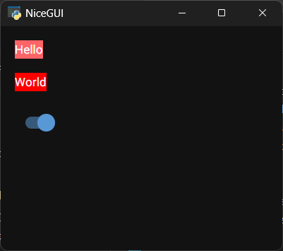

注意，如果是Quasar框架提供的样式类（比如下面代码中的`bg-red`），想要让其在暗黑模式下生效，需要改用UnoCSS框架，不能使用Tailwind CSS框架：

```python3
from nicegui import ui
  
def index():
    ui.label('Hello').classes(
        'dark:bg-red'
    )
    dark_mode = ui.dark_mode(True)
    ui.switch().bind_value(
        dark_mode
    )

ui.run(
    root=index,
    native=True,
    tailwind=False,
    unocss='wind4'
)
```

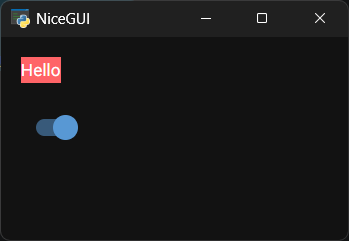

## 54 学习控件——渲染图表（更新中）

想要渲染图表，根据其使用（依赖）的Python库、JavaScript框架划分，NiceGUI提供了以下几类控件：

- 依赖`matplotlib`库的`ui.matplotlib`控件、`ui.pyplot`控件和`ui.line_plot`控件（需要使用`uv add nicegui[matplotlib]`命令添加依赖）。`matplotlib`库广泛应用于学术论文，使用者数量庞大，文档和相关问题的解答资料自然丰富，但表现风格有点经典，且不具备交互性。
- 依赖`plotly`库的`ui.plotly`控件（需要使用`uv add nicegui[plotly]`命令添加依赖）。`plotly`库提供了强大的交互性，让数据更加直观、详细，表现风格也更现代化。不过，因为具备交互功能，性能上会比纯静态图稍差。
- 依赖`nicegui-highcharts`库、使用Highcharts框架的`ui.highchart`控件（需要使用`uv add nicegui[highcharts]`命令添加依赖）。支持多种类型的图表，可以满足商业需求。但是，Highcharts框架商用需要付费。
- 使用ECharts框架的`ui.echart`控件。支持多种类型的图表，可以满足商业需求。不过，商用无需付费。
- 依赖`altair`库的`ui.altair`控件（需要使用`uv add nicegui[altair]`命令添加依赖）。风格简单统一，同时兼具交互性，适合学术、专业场景。库本身很轻量，也就决定了功能上没法与前面强大的控件竞争。但是上手容易，比较适合做学术研究的学生党。

### 54.1 `ui.matplotlib`控件

#### 54.1.1 基本用法

下面是`ui.matplotlib`控件相关文档的地址：

NiceGUI框架文档：https://nicegui.io/documentation/matplotlib

matplotlib框架文档：https://matplotlib.org/stable/api/_as_gen/matplotlib.figure.Figure.html

在正式学习该控件之前，先来回顾一下之前认识控件时的示例：

```python3
from nicegui import ui
  
def index():
    with ui.matplotlib().classes(
        'w-64 h-64'
    ).figure as fig:
        fig.gca().plot(
            [
                0, 1, 2
            ],
            [
                1, 2, 4
            ]
        )
    with ui.matplotlib().classes(
        'w-64 h-64'
    ).figure as fig:
        fig.add_subplot().plot(
            [
                0, 1, 2
            ],
            [
                1, 2, 4
            ]
        )
  
ui.run(
    root=index,
    native=True
)
```

从上面的示例中，读者想必也发现了，`ui.matplotlib`控件主要使用的是`figure`属性，控件本身似乎没有参数。这么说也对，但也不对。从源码看，`ui.matplotlib`控件可以接收任意关键字参数，也不是“没有”参数。但是，源码中，控件将参数全部传给了`figure`属性对应的对象——`MatplotlibFigure`对象，控件本身不额外使用任意参数，倒也可以看作是控件本身没有参数。

因此，学习该控件更多在于学习`MatplotlibFigure`对象（类）相关的用法。`MatplotlibFigure`类继承自`matplotlib.figure.Figure`类，NiceGUI内部简单扩展了控件相关的操作，其他功能与`matplotlib.figure.Figure`类相同。

在正式学习控件之前，还有一个问题需要澄清，为什么该控件必须使用上下文管理器进入`figure`属性的上下文？

倒也不是必须的，如果想要像普通控件一样一步一步来的话，不使用上下文管理器的话，代码会比较麻烦，在添加图表之后，必须手动更新一下控件（使用上下文管理器的话会自动更新）：

```python3
from nicegui import ui

def index():
    plot = ui.matplotlib().classes(
        'w-64 h-64'
    )
    fig = plot.figure
    fig.gca().plot(
            [
                0, 1, 2
            ],
            [
                1, 2, 4
            ]
        )
    plot.update()
  
ui.run(
    root=index,
    native=True
)
```

#### 54.1.2 `MatplotlibFigure`类

相关文档：https://matplotlib.org/stable/api/_as_gen/matplotlib.figure.Figure.html

控件的`figure`属性对应的对象——`MatplotlibFigure`对象，想要绘图的话离不开该对象属性、方法。因为`MatplotlibFigure`类支持的参数、方法、属性很多，部分没法在NiceGUI中使用或者常用操作不需要，因此，本节简单介绍一下`MatplotlibFigure`类的部分参数、属性、方法。

`MatplotlibFigure`类支持以下参数（部分）：

- `figsize`参数，元素为浮点数的双元素元组或列表，表示图表的大小（宽高，单位为英寸），默认为`[6.4,4.8]`。
- `facecolor`参数，字符串类型，表示除了图表作图区域外控件的背景颜色。
- `layout`参数，字符串类型（仅支持`[constrained', 'compressed', 'tight', 'none']`中的值），表示图表的布局。

`MatplotlibFigure`类支持以下属性（部分）：

- `element`属性，表示用于放置折线图的元素，即控件本身。对于想要在上下文中修改控件本身但没有给控件分配变量时，可以使用该属性。

  示例如下：

  ```python3
  from nicegui import ui
    
  def index():
      with ui.matplotlib().classes(
          'w-64 h-64'
      ).figure as fig:
          fig.gca().plot(
              [
                  0, 1, 2
              ],
              [
                  1, 2, 4
              ]
          )
          fig.element.classes('border-2')
    
  ui.run(
      root=index,
      native=True
  )
  ```

  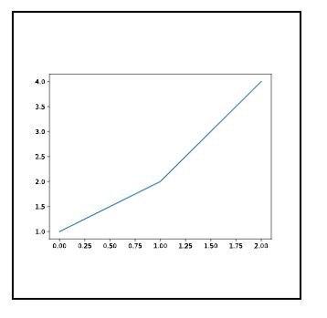

`MatplotlibFigure`类支持以下方法（部分，方法的参数参考`matplotlib`库官方文档）：

- `gca`方法，获取当前轴（`matplotlib.axes.Axes`类）。轴可以理解为绘图的图层，如果没有轴（此时`axes`属性或者`get_axes`方法的返回值为空）的话，该方法会创建一个。轴支持的属性和方法比较多，具体可以参考 https://matplotlib.org/stable/api/_as_gen/matplotlib.axes.Axes.html 。
- `add_subplot`方法，创建一个轴。
- `clear`方法，清除图表。
- `suptitle`方法，添加一个居中的大标题。
- `supxlabel`方法，添加一个X轴标签。
- `supylabel`方法，添加一个Y轴标签。
- `subplot_mosaic`方法，添加多个轴，以宫格形式拼接。
- `legend`方法，添加图例。
- `savefig`方法，将图表保存为图片。
- `text`方法，在指定位置添加文本标签。

#### 54.1.3 `matplotlib.axes.Axes`类

相关文档：https://matplotlib.org/stable/api/_as_gen/matplotlib.axes.Axes.html

控件很多绘图的方法与轴（`matplotlib.axes.Axes`类）相关，因此，本节介绍一下`matplotlib.axes.Axes`类的方法。

`matplotlib.axes.Axes`类支持以下方法（部分，方法的参数参考`matplotlib`库官方文档）：

- `plot`方法，绘制线形图。
- `bar`方法，绘制柱形图。
- `pie`方法，绘制饼状图。
- `set_title`方法，设置标题。
- `clear`方法，清除图形。
- `text`方法，在指定位置添加文本标签。
- `legend`方法，添加图例。

### 54.2 `ui.pyplot`控件

#### 54.2.1 基本用法

下面是`ui.pyplot`控件相关文档的地址：

NiceGUI框架文档：https://nicegui.io/documentation/pyplot

matplotlib框架文档：https://matplotlib.org/stable/api/_as_gen/matplotlib.pyplot.figure.html

先看示例：

```python3
from nicegui import ui
  
def index():
    with ui.pyplot().classes(
        'w-64 h-64'
    ) as plt:
        plt.fig.gca().plot(
            [
                0, 1, 2
            ],
            [
                1, 2, 4
            ]
        )
    with ui.pyplot().classes(
        'w-64 h-64'
    ) as plt:
        plt.fig.add_subplot().plot(
            [
                0, 1, 2
            ],
            [
                1, 2, 4
            ]
        )
  
    from matplotlib import pyplot
    with ui.pyplot().classes(
        'w-64 h-64'
    ):
        pyplot.plot(
            [
                0, 1, 2
            ],
            [
                1, 2, 4
            ]
        )
  
ui.run(
    root=index,
    native=True
)
```

该控件与`ui.matplotlib`控件类似，使用控件的`fig`属性（类似`ui.matplotlib`控件的`figure`属性），但是，与`ui.matplotlib`控件不同的是：

- 该控件额外支持一个布尔类型的参数`close`，表示是否在退出上下文时关闭当前打开的图表（默认为`True`）。如果不关闭，则可以在退出上下文之后继续更新图表。注意，如果是进入上下文之后更新图表，则该参数不会影响结果，但依然建议关闭不需要更新的图表，避免占用额外的内存。

  示例如下：

  ```python3
  from nicegui import ui
  from matplotlib import pyplot
  
  def index():
      with ui.pyplot(close=True).classes(
          'w-64 h-64'
      ) as plot:
          pyplot.plot(
              [
                  0, 1, 2
              ],
              [
                  1, 2, 4
              ]
          )
  
      def update_plot():
          pyplot.clf()
          pyplot.plot(
              [
                  0, 1, 2
              ],
              [
                  1, 2, 3
              ],
              'r-'
          )
          # 进入上下文然后直接退出，只是为了更新图表。
          with plot:
              """ pyplot.clf()
              pyplot.plot(
                  [
                      0, 1, 2
                  ],
                  [
                      1, 2, 3
                  ],
                  'r-'
              ) """
              ...
      ui.button(
          'update',
          on_click=update_plot
      )
  
  ui.run(
      root=index,
      native=True
  )
  
  ```

  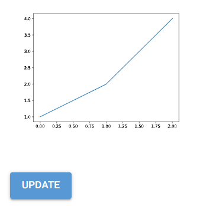

  示例中，该参数为`True`，点击按钮不会更新图表。

- 该控件使用`matplotlib.pyplot`模块的`figure`方法创建`matplotlib.figure.Figure`对象（`fig`属性），因此，其余的关键字参数实际上传给了`matplotlib.pyplot.figure`方法。

- 该控件的上下文支持使用`matplotlib.pyplot`模块提供的方法（绘图或者执行其他操作）。

#### 54.2.2 `matplotlib.pyplot`模块提供的方法

相关文档：https://matplotlib.org/stable/api/pyplot_summary.html

控件的`fig`属性对应的对象是由`matplotlib.pyplot.figure`方法创建的`matplotlib.figure.Figure`对象，而该控件的上下文也支持`matplotlib.pyplot`模块的其他方法。因此，本节简单介绍一下`matplotlib.pyplot`模块提供的方法。至于`matplotlib.figure.Figure`对象的参数和更多用法，可以参考前面 `MatplotlibFigure`类的介绍。

`matplotlib.pyplot`模块提供了以下方法（部分，方法的参数参考`matplotlib`库官方文档）：

- `gca`方法，获取当前轴（`matplotlib.axes.Axes`类）。
- `plot`方法，绘制线形图。
- `bar`方法，绘制柱形图。
- `pie`方法，绘制饼状图。
- `title`方法，设置标题。
- `clf`方法，清除图形。
- `text`方法，在指定位置添加文本标签。
- `legend`方法，添加图例。
- `subplot_mosaic`方法，添加多个轴，以宫格形式拼接。

### 54.3 `ui.line_plot`控件

#### 54.3.1 基本用法

下面是`ui.line_plot`控件相关文档的地址：

NiceGUI框架文档：https://nicegui.io/documentation/line_plot

matplotlib框架文档：https://matplotlib.org/stable/api/_as_gen/matplotlib.pyplot.figure.html

`ui.pyplot`控件用起来比`ui.matplotlib`控件简单不少，可以使用`matplotlib.pyplot`模块提供的方法，不用每次去调用多层的属性。不过，要说简单，还得是本节介绍的控件——继承自`ui.pyplot`控件的`ui.line_plot`控件：

```python3
from nicegui import ui
  
def index():
    with ui.line_plot().classes(
        'w-64 h-64'
    ) as lp:
        lp.fig.clear()
        lp.fig.gca().plot(
            [
                0, 1, 2
            ],
            [
                1, 2, 4
            ]
        )
        lp.with_legend(['number'])
  
    with ui.line_plot().classes(
        'w-64 h-64'
    ) as lp:
        lp.fig.clear()
        lp.fig.add_subplot().plot(
            [
                0, 1, 2
            ],
            [
                1, 2, 4
            ]
        )
        lp.with_legend(['number'])
          
    with ui.line_plot().classes(
        'w-64 h-64'
    ) as lp:
        lp.push(
            [
                0, 1, 2
            ],
            [
                [1, 2, 4]
            ]
        )
        lp.with_legend(['number'])
  
    ui.line_plot().classes(
        'w-64 h-64'
    ).push(
            [
                0, 1, 2
            ],
            [
                [1, 2, 4]
            ]
        )
      
    ui.line_plot().classes(
        'w-64 h-64'
    ).with_legend(
        ['number']
    ).push(
            [
                0, 1, 2
            ],
            [
                [1, 2, 4]
            ]
        )
  
ui.run(
    root=index,
    native=True
)
```

从示例中可以看到，该控件和`ui.pyplot`控件一样有`fig`属性，这个不做介绍，前面的用法可以直接参考本章前面两个控件的内容。但是，该控件的参数和方法比前面两种控件更多，用起来也更简单。可以不进入上下文，直接调用其他方法绘制图表，甚至不用额外调用方法来更新图表，图表自动更新。

`ui.line_plot`控件支持以下关键字参数：

- `n`参数，整数类型，表示图表中一共几条连续线（维度，可以理解为图层），默认为`1`。

  示例如下：

  ```python3
  from nicegui import ui
  
  def index():
      with ui.line_plot(n=2).classes(
          'w-64 h-64'
      ) as lp:
          lp.clear()
          lp.push(
              [
                  0, 1, 2
              ],
              [
                  [1, 2, 4],
                  [1, 3, 5]
              ]
          )
          lp.with_legend(['number','age'])
  
  ui.run(
      root=index,
      native=True
  )
  ```

  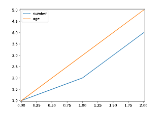

- `limit`参数，整数类型，表示每条连续线最多有多少个点（超过限度时，添加新点会顶掉最旧的点），默认为`100`。

- `update_every`参数，整数类型，表示每执行多少次`push`方法才更新一次图表，默认为`1`。

- `close`参数，用法、含义同`ui.pyplot`控件的同名参数。

- `**kwargs`参数，因为该控件继承自`ui.pyplot`控件，其余的关键字参数会传给`ui.pyplot`控件的初始化方法。

`ui.line_plot`控件支持以下方法：

- `clear`方法，清除当前的图表。注意，每次调用`push`方法都会与图表当前存在的散点连接，如果想要重新绘图，务必先调用一次`clear`方法。
- `with_legend`方法，设置当前图表的图例。该方法支持以下参数：
  - `titles`参数，元素为字符串的列表，依次表示每条线的图例。
  - `**kwargs`参数，其余的关键字参数会传给`fig`属性的`gca().legend`方法（该方法支持的参数可参考 https://matplotlib.org/stable/api/_as_gen/matplotlib.pyplot.legend.html ）。
- `push`方法，追加图表散点的连续坐标序列。该方法支持以下参数：
  - `x`参数，元素为浮点数的列表，表示X坐标。
  - `y`参数，元素为列表（元素为浮点数）的列表，表示对应X坐标的Y坐标。列表中列表的个数表示多少条连续线（维度，可以理解为图层），但显示的数量受限于`n`参数。另外，Y坐标的个数必须与X坐标一致，否则无法正常使用。
  - `x_limits`参数，关键字参数，元素为浮点数的双元素元组或者字符串`'auto'`，表示X轴的范围，默认为`'auto'`，即基于现有点的范围确定X轴的范围。
  - `y_limits`参数，关键字参数，元素为浮点数的双元素元组或者字符串`'auto'`，表示Y轴的范围，默认为`'auto'`，即基于现有点的范围确定Y轴的范围。

#### 54.3.2 `matplotlib.pyplot.legend`方法

相关文档：https://matplotlib.org/stable/api/_as_gen/matplotlib.pyplot.legend.html

`with_legend`方法的关键字参数中，也有不少实用的参数（部分，完整的参数参考`matplotlib`库官方文档）：

- `loc`参数，字符串类型，表示图例的位置。
- `fontsize`参数，字符串类型或整数类型，表示图例字体的大小。
- `labelcolor`参数，字符串类型，表示图例字体的颜色。
- `reverse`参数，布尔类型，表示图例的排序是否颠倒。
- `facecolor`参数，字符串类型，表示图例的背景颜色。
- `title`参数，字符串类型，表示图例的标题。

### 54.4 `ui.plotly`控件

#### 54.4.1 前言

有的读者看完前面的内容意犹未尽，或者觉得笔者有点“敷衍”。其实，这不是读者的错觉，因为笔者确实不想在依赖`matplotlib`库的`ui.matplotlib`控件、`ui.pyplot`控件和`ui.line_plot`控件上消耗太多时间。

一来是`matplotlib`库历史悠久，相关接口的教程和文档都很丰富，完全不用笔者重复。只要读者知道哪些属性对应`matplotlib`库提供的对象，哪些上下文可以使用`matplotlib`库提供的方法，就不用笔者班门弄斧，有些读者在这方面比我擅长。

二来就是相比于`matplotlib`库的虽生态成熟但积重难返、很多操作不够便捷，`ui.plotly`控件依赖的`plotly`库明显好用不少，甚至不需要进入上下文，笔者也想尽快且详细地将更好用的`ui.plotly`控件介绍给各位读者。

于是，笔者不得不简化不必要的内容，尽快完成前面控件的介绍。当然，如果读者在使用前面的控件时遇到问题，后续笔者也会补充相关控件的示例，与其他控件的示例一并加入更新计划。

话不多说，接下来开始本节的正题。

#### 54.4.2 基本用法

下面是`ui.plotly`控件相关文档的地址：

NiceGUI框架文档：https://nicegui.io/documentation/plotly

Plotly框架文档：https://plotly.com/python/ 和 https://plotly.com/javascript/

注意，`ui.plotly`控件依赖`plotly`库，需要先安装依赖库才能使用对应控件。可以参考安装NiceGUI一章，使用`uv add nicegui[plotly]`命令提前添加依赖库。

一如既往，先看示例：

```python3
from nicegui import ui
import plotly.graph_objects as go

def index():
    ui.plotly(
        go.Figure(
            go.Scatter(
                x=[0, 1, 2],
                y=[1, 2, 4]
            ),
            go.Layout(
                margin=go.layout.Margin(
                    l=0,
                    r=0,
                    t=0,
                    b=0,
                )
            )
        )
    ).classes('w-64 h-64')
    ui.plotly(
        {
            'data': [
                {
                    'type': 'scatter',
                    'line': {'color': '#636EFA'},
                    'x': [0, 1, 2],
                    'y': [1, 2, 4],
                }
            ],
            'layout': {
                'margin': {
                    'l': 20,
                    'r': 0,
                    't': 0,
                    'b': 25
                },
                'plot_bgcolor': '#E5ECF6',
                'xaxis': {
                    'gridcolor': 'white',
                    'dtick': '0.5',
                    'zeroline': False
                },
                'yaxis': {
                    'gridcolor': 'white',
                    'dtick': '0.5',
                    'zeroline': False
                },
            }
        }
    ).classes('w-64 h-64')
  
ui.run(
    root=index,
    native=True
)
```

`ui.plotly`控件只有一个参数`figure`，但该参数支持两种类型：

- 字典类型，无智能提示，需要读者对配置项比较熟悉。
- `plotly.graph_objects.Figure`类型，由`plotly`库提供的功能创建相关对象，有智能提示，只需读者了解参数含义即可。

从使用难度和便捷性来说，`plotly.graph_objects.Figure`类型的参数明显好于字典类型。因此，本节后续示例中，除非特殊情况，一般传入`plotly.graph_objects.Figure`类型的参数。当然，二者的互相转化也有规律可循，层级都是一一对应，读者不必担心不会另一种类型的参数。

`ui.plotly`控件的`update_figure`方法可用于更新图形，该方法支持的参数与`ui.plotly`控件相同。

`ui.plotly`控件的`figure`属性表示图形对象（`plotly.graph_objects.Figure`类型），如果需要调用Plotly框架提供的图形对象接口（Python接口），可以使用该属性。

`ui.plotly`控件的`on`方法可用于响应图形对象的事件（支持的事件可参考 https://plotly.com/javascript/plotlyjs-events/）：

```python3
from nicegui import ui
import plotly.graph_objects as go

def index():
    ply = ui.plotly(
        go.Figure(
            go.Scatter(
                x=[0, 1, 2],
                y=[1, 2, 1]
            ),
            go.Layout(
                margin=go.layout.Margin(
                    l=0,
                    r=0,
                    t=0,
                    b=0,
                )
            )
        )
    ).classes('w-64 h-64')
    ply.update()
    ply.on(
        'plotly_click',
        ui.notify
    )

ui.run(
    root=index,
    native=True
)
```

#### 54.4.3 `plotly.graph_objects`模块

相关文档：https://plotly.com/python-api-reference/plotly.graph_objects.html

不管是传入`plotly.graph_objects.Figure`类型的参数，还是`plotly.graph_objects.Figure`类相关的`update_figure`方法、`figure`属性，都离不开`plotly.graph_objects`模块提供的类（`Figure`类等以及子模块中的类）。因此，本节重点介绍一下`plotly.graph_objects`模块提供的类、模块。

##### 54.4.3.1 `Figure`类

相关文档：https://plotly.com/python-api-reference/generated/plotly.graph_objects.Figure.html

`Figure`类支持以下参数：

- `data`参数，轨迹类型或者元素为轨迹类型的列表，表示具体数据，同时也决定图形的类型。支持的轨迹类型可以参考文档中各个Traces分类下的类。

  示例如下：

  ```python3
  from nicegui import ui
  import plotly.graph_objects as go
  
  def index():
      ply = ui.plotly(
          go.Figure(
              [
                  go.Scatter(
                      x=[0, 1, 2],
                      y=[1, 2, 1]
                  ),
                  go.Scatter(
                      x=[0, 1, 2],
                      y=[1, 1, 2]
                  )
              ],
              go.Layout(
                  margin=go.layout.Margin(
                      l=0,
                      r=0,
                      t=0,
                      b=0,
                  )
              )
          )
      ).classes('w-64 h-64')
      ply.update()
  
  ui.run(
      root=index,
      native=True
  )
  ```

  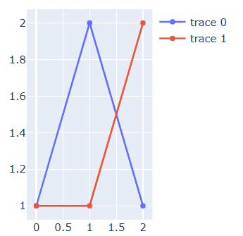

- `layout`参数，`Layout`类型，表示图形的布局。

- `frames`参数，元素为`Frame`类型的列表，表示图形的动画帧。

- `skip_invalid`参数，布尔类型，是否跳过无效的数据（比如字符串成了X坐标），默认为`False`。

- `**kwargs`参数，其余关键字参数将传递给父类`object`。

`Figure`类支持以下方法（部分，单独调用的话，需要额外执行一次控件的`update`方法来刷新显示）：

- `add_trace`方法，添加一条轨迹。

  示例如下：

  ```python3
  from nicegui import ui
  import plotly.graph_objects as go
  
  def index():
      ply = ui.plotly(
          go.Figure(
              go.Scatter(
                  x=[0, 1, 2],
                  y=[1, 2, 1]
              ),
              go.Layout(
                  margin=go.layout.Margin(
                      l=0,
                      r=0,
                      t=0,
                      b=0,
                  )
              )
          )
      ).classes('w-64 h-64')
      ply.figure.add_trace(
          go.Scatter(
              x=[0, 1, 2],
              y=[1, 1, 2]
          )
      )
      ply.update()
  
  ui.run(
      root=index,
      native=True
  )
  ```

  

- `add_traces`方法，添加多条轨迹。

  示例如下：

  ```python3
  from nicegui import ui
  import plotly.graph_objects as go
  
  def index():
      ply = ui.plotly(
          go.Figure(
              go.Scatter(
                  x=[0, 1, 2],
                  y=[1, 2, 1]
              ),
              go.Layout(
                  margin=go.layout.Margin(
                      l=0,
                      r=0,
                      t=0,
                      b=0,
                  )
              )
          )
      ).classes('w-64 h-64')
      ply.figure.add_traces(
          [
              go.Scatter(
                  x=[0, 1, 2],
                  y=[1, 1, 2]
              ),
          ]
      )
      ply.update()
  
  ui.run(
      root=index,
      native=True
  )
  ```

  

- `update_layout`方法，更新布局。

  示例如下：

  ```python3
  from nicegui import ui
  import plotly.graph_objects as go
  
  def index():
      ply = ui.plotly(
          go.Figure(
              [
                  go.Scatter(
                      x=[0, 1, 2],
                      y=[1, 2, 1]
                  ),
                  go.Scatter(
                      x=[0, 1, 2],
                      y=[1, 1, 2]
                  )
              ],
          )
      ).classes('w-64 h-64')
      ply.figure.update_layout(
          go.Layout(
              margin=go.layout.Margin(
                  l=0,
                  r=0,
                  t=0,
                  b=0,
              )
          )
      )
      ply.update()
  
  ui.run(
      root=index,
      native=True
  )
  ```

  

##### 54.4.3.2 各种轨迹（图形类型）

注意，因为笔者不熟悉相关统计学基础，图形命名参考自网络资料和英文名，不一定准确。如果读者有相关专业基础，请不吝指正。

因为不同的类对应不同的轨迹（图形类型），数量比较多。为了方便读者根据需求查阅官方文档，这里简单汇总一下类对应的图形类型（部分类型提供简单的示例）：

- `Scatter`类，表示散点图。

- `Scattergl`类，表示散点图（使用WebGL引擎）。

- `Bar`类，表示柱状图。

- `Pie`类，表示饼状图。

  示例如下：

  ```python3
  from nicegui import ui
  import plotly.graph_objects as go
  
  def index():
      ply = ui.plotly(
          go.Figure(
              go.Pie(
                  labels=['a','b','c'],
                  values=[1,2,3]
              ),
              go.Layout(
                  margin=go.layout.Margin(
                      l=0,
                      r=0,
                      t=0,
                      b=0,
                  )
              )
          )
      ).classes('w-64 h-64')
      ply.update()
  
  ui.run(
      root=index,
      native=True
  )
  ```

  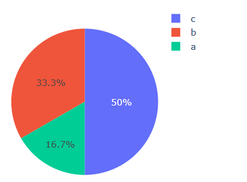

- `Heatmap`类，表示热力图。

  示例如下：

  ```python3
  from nicegui import ui
  import plotly.graph_objects as go
  
  def index():
      ply = ui.plotly(
          go.Figure(
              go.Heatmap(
                  z=[
                      [1, 2, 3],
                      [2, 1, 6],
                      [3, 6, 1]
                  ],
                  x=['A', 'B', 'C'],
                  y=['X', 'Y', 'Z'],
              ),
              go.Layout(
                  margin=go.layout.Margin(
                      l=0,
                      r=0,
                      t=0,
                      b=0,
                  )
              )
          )
      ).classes('w-64 h-64')
      ply.update()
  
  ui.run(
      root=index,
      native=True
  )
  ```

  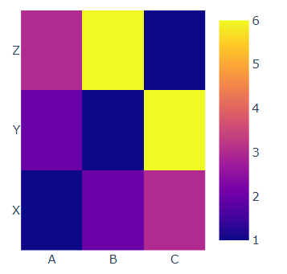

- `Image`类，表示图像。

  示例如下：

  ```python3
  from nicegui import ui
  import plotly.graph_objects as go
  
  def index():
      ply = ui.plotly(
          go.Figure(
              go.Image(
                  z=[
                      [[255, 0, 0], [0, 255, 0], [0, 0, 255], [255, 255, 0]],
                      [[255, 0, 255], [0, 255, 255], [128, 128, 128], [255, 128, 0]],
                      [[64, 64, 64], [192, 192, 192], [255, 255, 255], [0, 0, 0]]
                  ],
              ),
              go.Layout(
                  margin=go.layout.Margin(
                      l=0,
                      r=0,
                      t=0,
                      b=0,
                  )
              )
          )
      ).classes('w-64 h-64')
      ply.update()
  
  ui.run(
      root=index,
      native=True
  )
  ```

  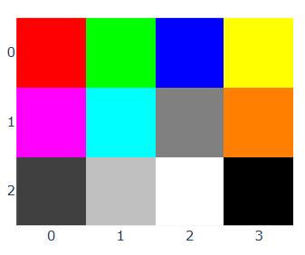

- `Contour`类，表示等高线图。

  示例如下：

  ```python3
  from nicegui import ui
  import plotly.graph_objects as go
  
  def index():
      ply = ui.plotly(
          go.Figure(
              go.Contour(
                  z=[
                      [1, 2, 3, 4],
                      [2, 4, 6, 8],
                      [3, 6, 9, 12],
                      [4, 8, 12, 16]
                  ]
              ),
              go.Layout(
                  margin=go.layout.Margin(
                      l=0,
                      r=0,
                      t=10,
                      b=0,
                  )
              )
          )
      ).classes('w-64 h-64')
      ply.update()
  
  ui.run(
      root=index,
      native=True
  )
  ```

  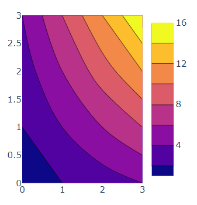

- `Table`类，表示表格。

  示例如下：

  ```python3
  from nicegui import ui
  import plotly.graph_objects as go
  
  def index():
      ply = ui.plotly(
          go.Figure(
              go.Table(
                  header={
                      'values':['姓名','年龄']
                  },
                  cells={
                      'values':[
                          ['a','b'],
                          [12,18]
                      ]
                  },
              ),
              go.Layout(
                  margin=go.layout.Margin(
                      l=0,
                      r=0,
                      t=10,
                      b=0,
                  )
              )
          )
      ).classes('w-64 h-64')
      ply.update()
  
  ui.run(
      root=index,
      native=True
  )
  ```

  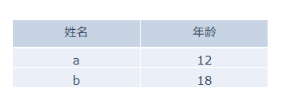

- `Box`类，表示箱线图。

  示例如下：

  ```python3
  from nicegui import ui
  import plotly.graph_objects as go
  
  def index():
      ply = ui.plotly(
          go.Figure(
              go.Box(
                  x=['a','b','a','b'],
                  y=[1,2,2,4],
              ),
              go.Layout(
                  margin=go.layout.Margin(
                      l=0,
                      r=0,
                      t=10,
                      b=0,
                  )
              )
          )
      ).classes('w-64 h-64')
      ply.update()
  
  ui.run(
      root=index,
      native=True
  )
  ```

  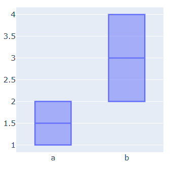

- `Violin`类，表示小提琴图。

  示例如下：
  ```python3
  from nicegui import ui
  import plotly.graph_objects as go
  
  def index():
      ply = ui.plotly(
          go.Figure(
              go.Violin(
                  x=['a','b','a','b'],
                  y=[1,2,2,4],
              ),
              go.Layout(
                  margin=go.layout.Margin(
                      l=0,
                      r=0,
                      t=10,
                      b=0,
                  )
              )
          )
      ).classes('w-64 h-64')
      ply.update()
  
  ui.run(
      root=index,
      native=True
  )
  ```

  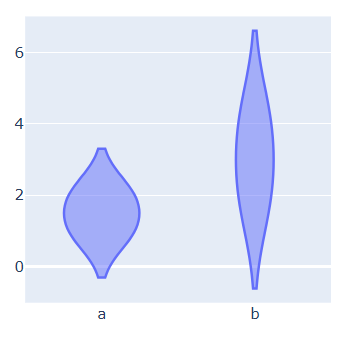

- `Histogram`类，表示直方图。

  示例如下：

  ```python3
  from nicegui import ui
  import plotly.graph_objects as go
  
  def index():
      ply = ui.plotly(
          go.Figure(
              go.Histogram(
                  x=[1,2,2,2,3,3,3,3],
                  nbinsx=6
              ),
              go.Layout(
                  margin=go.layout.Margin(
                      l=0,
                      r=0,
                      t=10,
                      b=0,
                  )
              )
          )
      ).classes('w-64 h-64')
      ply.update()
  
  ui.run(
      root=index,
      native=True
  )
  ```

  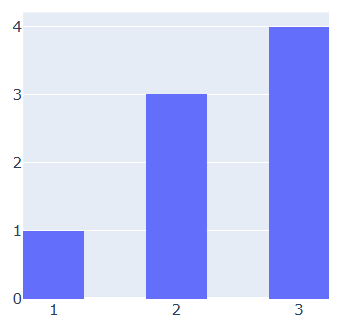

- `Histogram2d`类，表示二维直方图（类似热力图）。

  示例如下：

  ```python3
  from nicegui import ui
  import plotly.graph_objects as go
  
  def index():
      ply = ui.plotly(
          go.Figure(
              go.Histogram2d(
                  x=[1,1,1,1,1,1],
                  y=[1,2,2,3,3,3],
              ),
              go.Layout(
                  margin=go.layout.Margin(
                      l=0,
                      r=0,
                      t=10,
                      b=0,
                  )
              )
          )
      ).classes('w-64 h-64')
      ply.update()
  
  ui.run(
      root=index,
      native=True
  )
  ```

  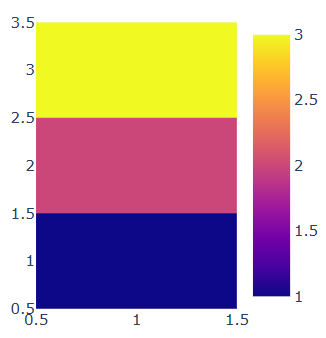

- `Histogram2dContour`类，表示二维直方等高线图（类似热力图加等高线图）。

  示例如下：

  ```python3
  from nicegui import ui
  import plotly.graph_objects as go
  
  def index():
      ply = ui.plotly(
          go.Figure(
              go.Histogram2dContour(
                  x=[1,1,1,1,1,1],
                  y=[1,2,2,3,3,3],
              ),
              go.Layout(
                  margin=go.layout.Margin(
                      l=0,
                      r=0,
                      t=10,
                      b=0,
                  )
              )
          )
      ).classes('w-64 h-64')
      ply.update()
  
  ui.run(
      root=index,
      native=True
  )
  ```

  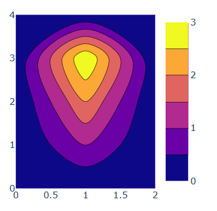

- `Ohlc`类，表示用于股票、期货等金融交易的柱线图。

  示例如下：

  ```python3
  from nicegui import ui
  import plotly.graph_objects as go
  
  def index():
      ply = ui.plotly(
          go.Figure(
              go.Ohlc(
                  x=['2026-01-01','2026-01-02','2026-01-03'],
                  open=[1,1,1],
                  high=[2,3,4],
                  low=[0,0.5,0],
                  close=[1,2,1]
              ),
              go.Layout(
                  margin=go.layout.Margin(
                      l=0,
                      r=0,
                      t=10,
                      b=0,
                  )
              )
          )
      ).classes('w-64 h-64')
      ply.update()
  
  ui.run(
      root=index,
      native=True
  )
  ```

  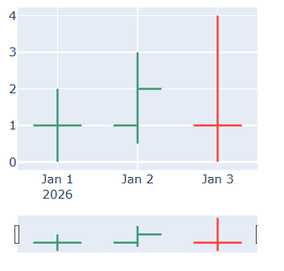

- `Candlestick`类，表示蜡烛图。蜡烛图类似上面的柱线图，但将`open`参数、`close`参数之间的区域画成了矩形。

  示例如下：

  ```python3
  from nicegui import ui
  import plotly.graph_objects as go
  
  def index():
      ply = ui.plotly(
          go.Figure(
              go.Candlestick(
                  x=['2026-01-01','2026-01-02','2026-01-03'],
                  open=[1,1,1],
                  high=[2,3,4],
                  low=[0,0.5,0],
                  close=[1,2,1]
              ),
              go.Layout(
                  margin=go.layout.Margin(
                      l=0,
                      r=0,
                      t=10,
                      b=0,
                  )
              )
          )
      ).classes('w-64 h-64')
      ply.update()
  
  ui.run(
      root=index,
      native=True
  )
  ```

  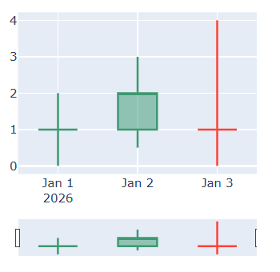

- `Waterfall`类，表示瀑布图，常用于表示项目流程。

  示例如下：

  ```python3
  from nicegui import ui
  import plotly.graph_objects as go
  
  def index():
      ply = ui.plotly(
          go.Figure(
              go.Waterfall(
                  x=['绝对','相对','合计'],
                  y=[1,2,0],
                  measure=['absolute','relative','total']
              ),
              go.Layout(
                  margin=go.layout.Margin(
                      l=0,
                      r=0,
                      t=10,
                      b=0,
                  )
              )
          )
      ).classes('w-64 h-64')
      ply.update()
  
  ui.run(
      root=index,
      native=True
  )
  ```

  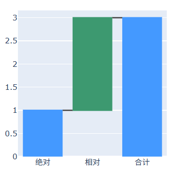

- `Funnel`类，表示漏斗图。

  示例如下：

  ```python3
  from nicegui import ui
  import plotly.graph_objects as go
  
  def index():
      ply = ui.plotly(
          go.Figure(
              go.Funnel(
                  y=['a','b','c'],
                  x=[4,2,1],
              ),
              go.Layout(
                  margin=go.layout.Margin(
                      l=0,
                      r=0,
                      t=10,
                      b=0,
                  )
              )
          )
      ).classes('w-64 h-64')
      ply.update()
  
  ui.run(
      root=index,
      native=True
  )
  ```

  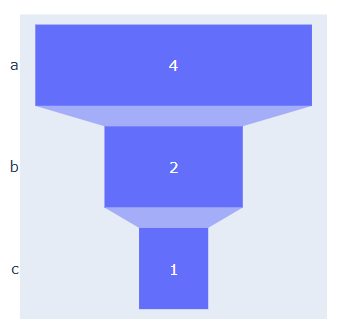

- `Funnelarea`类，表示漏斗面积图（使用面积表示对应数值的大小）。

  示例如下：

  ```python3
  from nicegui import ui
  import plotly.graph_objects as go
  
  def index():
      ply = ui.plotly(
          go.Figure(
              go.Funnelarea(
                  text=['a','b','c'],
                  values=[4,2,1],
              ),
              go.Layout(
                  margin=go.layout.Margin(
                      l=0,
                      r=0,
                      t=10,
                      b=0,
                  )
              )
          )
      ).classes('w-64 h-64')
      ply.update()
  
  ui.run(
      root=index,
      native=True
  )
  ```

  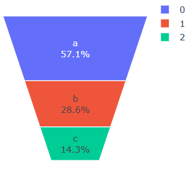

- `Indicator`类，表示仪表图。

  示例如下：

  ```python3
  from nicegui import ui
  import plotly.graph_objects as go
  
  def index():
      ply = ui.plotly(
          go.Figure(
              go.Indicator(
                  mode='gauge+number',
                  value=270,
                  domain={
                      'x':[0.15,0.85],
                  },
                  gauge={
                      'axis': {
                          'range': [100, 300]
                      },
                      'steps':[
                          {
                              'range':[0,200],
                              'color':'blue'
                          },{
                              'range':[200,400],
                              'color':'red'
                          }
                      ],
                      'threshold':{
                          'line':{
                              'color':'yellow',
                              'width':4
                          },
                          'thickness':0.75,
                          'value':240
                      }
                  }
              ),
              go.Layout(
                  margin=go.layout.Margin(
                      l=0,
                      r=0,
                      t=10,
                      b=0,
                  )
              )
          )
      ).classes('w-64 h-64')
      ply.update()
  
  ui.run(
      root=index,
      native=True
  )
  ```

  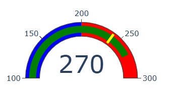

- `Scatter3d`类，表示三维散点图。

  示例如下：

  ```python3
  from nicegui import ui
  import plotly.graph_objects as go
  
  def index():
      ply = ui.plotly(
          go.Figure(
              go.Scatter3d(
                  x=[0,0,1,0],
                  y=[0,1,0,0],
                  z=[1,0,0,1]
              ),
              go.Layout(
                  margin=go.layout.Margin(
                      l=0,
                      r=0,
                      t=10,
                      b=0,
                  )
              )
          )
      ).classes('w-64 h-64')
      ply.update()
  
  ui.run(
      root=index,
      native=True
  )
  ```

  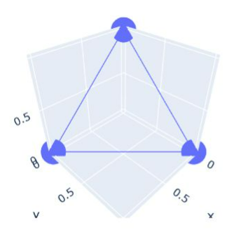

- `Surface`类，表示曲面图。

  示例如下：

  ```python3
  from nicegui import ui
  import plotly.graph_objects as go
  
  def index():
      ply = ui.plotly(
          go.Figure(
              go.Surface(
                  x=[-2,-1,0,1,2],
                  y=[-2,-1,0,1,2],
                  z=[
                      [3,3,2,3,3],
                      [3,2,1,2,3],
                      [2,1,1,1,2],
                      [3,2,1,2,3],
                      [3,3,2,3,3],
                  ],
              ),
              go.Layout(
                  margin=go.layout.Margin(
                      l=0,
                      r=0,
                      t=10,
                      b=0,
                  )
              )
          )
      ).classes('w-64 h-64')
      ply.update()
  
  ui.run(
      root=index,
      native=True
  )
  ```

  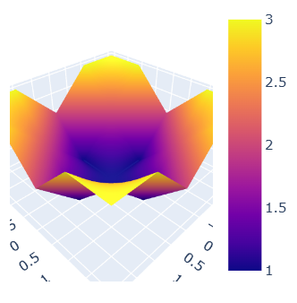

- `Mesh3d`类，表示三角形网格三维图。

  示例如下：

  ```python3
  from nicegui import ui
  import plotly.graph_objects as go
  
  def index():
      ply = ui.plotly(
          go.Figure(
              go.Mesh3d(
                  x = [0, 1, 1, 0, 0.5],
                  y = [0, 0, 1, 1, 0.5],
                  z = [0, 0, 0, 0, 1],
                  opacity=0.5
              ),
              go.Layout(
                  margin=go.layout.Margin(
                      l=0,
                      r=0,
                      t=10,
                      b=0,
                  )
              )
          )
      ).classes('w-64 h-64')
      ply.update()
  
  ui.run(
      root=index,
      native=True
  )
  ```

  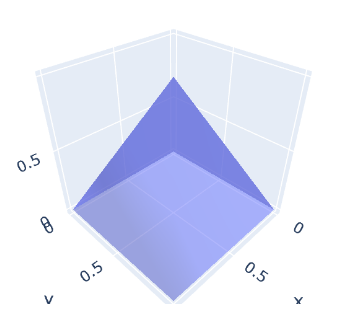

- `Cone`类，表示圆锥图，常用于矢量场的可视化。

  示例如下：

  ```python3
  from nicegui import ui
  import plotly.graph_objects as go
  
  def index():
      ply = ui.plotly(
          go.Figure(
              go.Cone(
                  x=[0,1], 
                  y=[0,1], 
                  z=[0,1],
                  u=[0,1], 
                  v=[1,0], 
                  w=[0,0],
              ),
              go.Layout(
                  margin=go.layout.Margin(
                      l=0,
                      r=0,
                      t=10,
                      b=0,
                  )
              )
          )
      ).classes('w-64 h-64')
      ply.update()
  
  ui.run(
      root=index,
      native=True
  )
  ```

  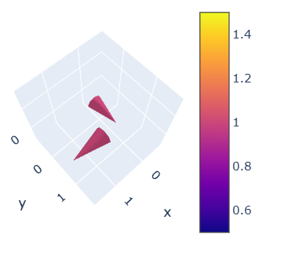

- `Streamtube`类，表示管状流线图。

  示例如下：

  ```python3
  from nicegui import ui
  import plotly.graph_objects as go
  
  def index():
      ply = ui.plotly(
          go.Figure(
              go.Streamtube(
                  x=[1], 
                  y=[1], 
                  z=[1],
                  u=[1], 
                  v=[0], 
                  w=[0],
                  starts={
                      'x':[0],
                      'y':[0],
                      'z':[0]
                  }
              ),
              go.Layout(
                  margin=go.layout.Margin(
                      l=0,
                      r=0,
                      t=10,
                      b=0,
                  )
              )
          )
      ).classes('w-64 h-64')
      ply.update()
  
  ui.run(
      root=index,
      native=True
  )
  ```

  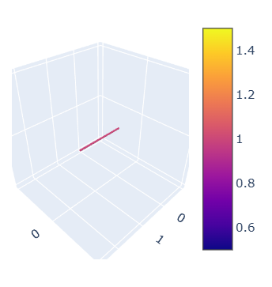

- `Volume`类，表示体积热力图（即三维坐标点对应的数值分布，相当于四维数据）。

  示例如下：

  ```python3
  from nicegui import ui
  import plotly.graph_objects as go
  
  # 创建简单立方体数据
  coords = [0, 1, 2]  # 3x3x3的立方体
  x_list, y_list, z_list, value_list = [], [], [], []
  
  for x in coords:
      for y in coords:
          for z in coords:
              # 简单的值分布：中心点值最大
              value = 1 / (1 + abs(x-1) + abs(y-1) + abs(z-1))
              x_list.append(x)
              y_list.append(y)
              z_list.append(z)
              value_list.append(value)
  
  def index():
      ply = ui.plotly(
          go.Figure(
              go.Volume(
                  x=x_list,
                  y=y_list,
                  z=z_list,
                  value=value_list,
              ),
              go.Layout(
                  margin=go.layout.Margin(
                      l=0,
                      r=0,
                      t=10,
                      b=0,
                  )
              )
          )
      ).classes('w-64 h-64')
      ply.update()
  
  ui.run(
      root=index,
      native=True
  )
  ```

  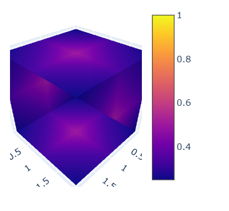

- `Isosurface`类，表示表面积热力图（即三维坐标点对应的数值分布，相当于四维数据，但看上去和体积热力图类似，只是看不到立方体内部）。

  示例如下：

  ```python3
  from nicegui import ui
  import plotly.graph_objects as go
  
  # 创建简单立方体数据
  coords = [0, 1, 2]  # 3x3x3的立方体
  x_list, y_list, z_list, value_list = [], [], [], []
  
  for x in coords:
      for y in coords:
          for z in coords:
              # 简单的值分布：中心点值最大
              value = 1 / (1 + abs(x-1) + abs(y-1) + abs(z-1))
              x_list.append(x)
              y_list.append(y)
              z_list.append(z)
              value_list.append(value)
  
  def index():
      ply = ui.plotly(
          go.Figure(
              go.Isosurface(
                  x=x_list,
                  y=y_list,
                  z=z_list,
                  value=value_list,
              ),
              go.Layout(
                  margin=go.layout.Margin(
                      l=0,
                      r=0,
                      t=10,
                      b=0,
                  )
              )
          )
      ).classes('w-64 h-64')
      ply.update()
  
  ui.run(
      root=index,
      native=True
  )
  ```

  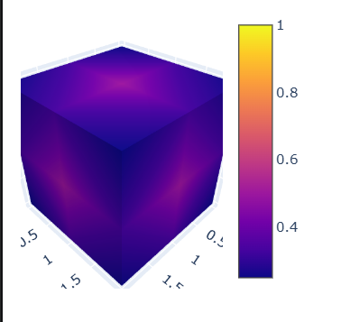

- `Scattergeo`类，表示地理位置散点图。

  示例如下：

  ```python3
  from nicegui import ui
  import plotly.graph_objects as go
  
  def index():
      ply = ui.plotly(
          go.Figure(
              go.Scattergeo(
                  lon=[-75, -73, -71, -69],
                  lat=[40, 41, 42, 43],
                  text=['A点', 'B点', 'C点', 'D点'],
              ),
              go.Layout(
                  margin=go.layout.Margin(
                      l=0,
                      r=0,
                      t=10,
                      b=0,
                  )
              )
          )
      ).classes('w-64 h-64')
      ply.update()
  
  ui.run(
      root=index,
      native=True
  )
  ```

  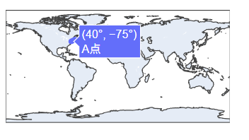

- `Choropleth`类，表示地理区域数值图。

  示例如下：

  ```python3
  from nicegui import ui
  import plotly.graph_objects as go
  
  def index():
      ply = ui.plotly(
          go.Figure(
              go.Choropleth(
                  locations=['China', 'USA', 'Japan', 'Germany', 'France'],
                  locationmode='country names',
                  z=[100, 80, 60, 50, 40],
                  text=['中国', '美国', '日本', '德国', '法国'],
              ),
              go.Layout(
                  margin=go.layout.Margin(
                      l=0,
                      r=0,
                      t=10,
                      b=0,
                  )
              )
          )
      ).classes('w-64 h-64')
      ply.update()
  
  ui.run(
      root=index,
      native=True
  )
  ```

  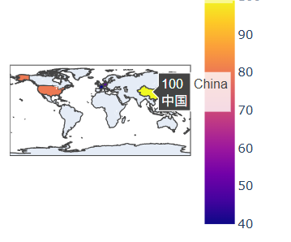

- `Scattermap`类，表示地图位置散点图。用法同`Scattergeo`类，但是底图改为真实地图。

- `Choroplethmap`类，表示地图区域数值图。用法同`Choropleth`类，但是底图改为真实地图。

- `Densitymap`类，表示热力地图。

  示例如下：

  ```python3
  from nicegui import ui
  import plotly.graph_objects as go
  
  def index():
      ply = ui.plotly(
          go.Figure(
              go.Densitymap(
                  lon=[-75, -73, -71, -69],
                  lat=[40, 41, 42, 43],
              ),
              go.Layout(
                  margin=go.layout.Margin(
                      l=0,
                      r=0,
                      t=10,
                      b=0,
                  )
              )
          )
      ).classes('w-64 h-64')
      ply.update()
  
  ui.run(
      root=index,
      native=True
  )
  ```

  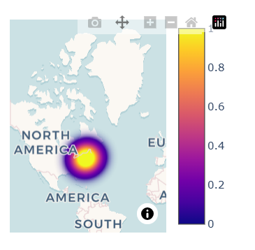

- `Scatterpolar`类，表示极坐标散点图。

  示例如下：

  ```python3
  from nicegui import ui
  import plotly.graph_objects as go
  
  def index():
      ply = ui.plotly(
          go.Figure(
              go.Scatterpolar(
                  r=[1,2,3,4],
                  theta=[0,30,60,90],
                  text=['A点', 'B点', 'C点', 'D点'],
              ),
              go.Layout(
                  margin=go.layout.Margin(
                      l=0,
                      r=0,
                      t=10,
                      b=0,
                  )
              )
          )
      ).classes('w-64 h-64')
      ply.update()
  
  ui.run(
      root=index,
      native=True
  )
  ```

  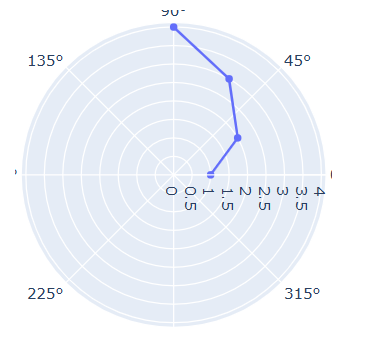

- `Scatterpolargl`类，表示极坐标散点图（使用WebGL引擎）。

- `Barpolar`类，表示极坐标柱状图。

  示例如下：

  ```python3
  from nicegui import ui
  import plotly.graph_objects as go
  
  def index():
      ply = ui.plotly(
          go.Figure(
              go.Barpolar(
                  r=[1,2,3,4],
                  theta=[0,30,60,90],
                  text=['A点', 'B点', 'C点', 'D点'],
              ),
              go.Layout(
                  margin=go.layout.Margin(
                      l=0,
                      r=0,
                      t=10,
                      b=0,
                  )
              )
          )
      ).classes('w-64 h-64')
      ply.update()
  
  ui.run(
      root=index,
      native=True
  )
  ```

  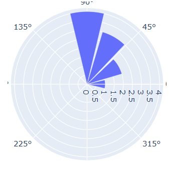

- `Scatterternary`类，表示三元坐标散点图。

  示例如下：

  ```python3
  from nicegui import ui
  import plotly.graph_objects as go
  
  def index():
      ply = ui.plotly(
          go.Figure(
              go.Scatterternary(
                  a=[1,0.5,1],
                  b=[1,1,0.5],
                  c=[0.5,1,1],
                  text=['a','b','c']
              ),
              go.Layout(
                  margin=go.layout.Margin(
                      l=0,
                      r=0,
                      t=10,
                      b=0,
                  )
              )
          )
      ).classes('w-64 h-64')
      ply.update()
  
  ui.run(
      root=index,
      native=True
  )
  ```

  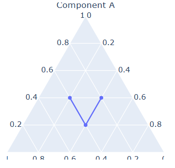

- `Sunburst`类，表示旭日图。

  示例如下：

  ```python3
  from nicegui import ui
  import plotly.graph_objects as go
  
  def index():
      ply = ui.plotly(
          go.Figure(
              go.Sunburst(
                  labels=['a','b','c','d'],
                  parents=['','a','a','b'],
                  values=[1,1,1,1]
              ),
              go.Layout(
                  margin=go.layout.Margin(
                      l=0,
                      r=0,
                      t=10,
                      b=0,
                  )
              )
          )
      ).classes('w-64 h-64')
      ply.update()
  
  ui.run(
      root=index,
      native=True
  )
  ```

  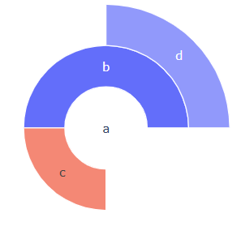

- `Treemap`类，表示树形地图。

  示例如下：

  ```python3
  from nicegui import ui
  import plotly.graph_objects as go
  
  def index():
      ply = ui.plotly(
          go.Figure(
              go.Treemap(
                  labels=['a','b','c','d'],
                  parents=['','a','a','b'],
                  values=[1,1,1,1]
              ),
              go.Layout(
                  margin=go.layout.Margin(
                      l=0,
                      r=0,
                      t=10,
                      b=0,
                  )
              )
          )
      ).classes('w-64 h-64')
      ply.update()
  
  ui.run(
      root=index,
      native=True
  )
  ```

  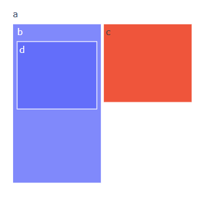

- `Icicle`类，表示冰柱图。

  示例如下：

  ```python3
  from nicegui import ui
  import plotly.graph_objects as go
  
  def index():
      ply = ui.plotly(
          go.Figure(
              go.Icicle(
                  labels=['a','b','c','d'],
                  parents=['','a','a','b'],
                  values=[1,1,1,1]
              ),
              go.Layout(
                  margin=go.layout.Margin(
                      l=0,
                      r=0,
                      t=10,
                      b=0,
                  )
              )
          )
      ).classes('w-64 h-64')
      ply.update()
  
  ui.run(
      root=index,
      native=True
  )
  ```

  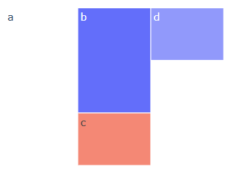

- `Sankey`类，表示流量图。

  示例如下：

  ```python3
  from nicegui import ui
  import plotly.graph_objects as go
  
  def index():
      ply = ui.plotly(
          go.Figure(
              go.Sankey(
                  node={'label':['a','b','c','d']},
                  link={'source':[0,1,1],'target':[1,2,3],
                  'value':[2,1,1,]},
              ),
              go.Layout(
                  margin=go.layout.Margin(
                      l=0,
                      r=0,
                      t=10,
                      b=0,
                  )
              )
          )
      ).classes('w-64 h-64')
      ply.update()
  
  ui.run(
      root=index,
      native=True
  )
  ```

  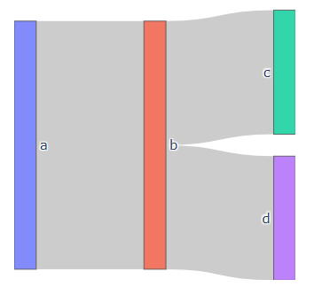

- `Splom`类，表示矩阵散点图。

  示例如下：

  ```python3
  from nicegui import ui
  import plotly.graph_objects as go
  
  def index():
      ply = ui.plotly(
          go.Figure(
              go.Splom(
                  dimensions=[
                      {
                          'label':'a',
                          'values':[
                              1,2,3
                          ]
                      },
                      {
                          'label':'b',
                          'values':[
                              2,3,4
                          ]
                      },
                      {
                          'label':'c',
                          'values':[
                              3,4,5
                          ]
                      }
                  ]
              ),
              go.Layout(
                  margin=go.layout.Margin(
                      l=0,
                      r=0,
                      t=10,
                      b=0,
                  )
              )
          )
      ).classes('w-64 h-64')
      ply.update()
  
  ui.run(
      root=index,
      native=True
  )
  ```

  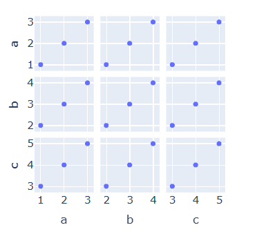

- `Parcats`类，表示平行分类图。

  示例如下：

  ```python3
  from nicegui import ui
  import plotly.graph_objects as go
  
  def index():
      ply = ui.plotly(
          go.Figure(
              go.Parcats(
                  dimensions=[
                      {
                          'label':'a',
                          'values':[
                              1,2,3
                          ]
                      },
                      {
                          'label':'b',
                          'values':[
                              2,3,4
                          ]
                      },
                      {
                          'label':'c',
                          'values':[
                              3,4,5
                          ]
                      }
                  ]
              ),
              go.Layout(
                  margin=go.layout.Margin(
                      l=0,
                      r=0,
                      t=10,
                      b=0,
                  )
              )
          )
      ).classes('w-64 h-64')
      ply.update()
  
  ui.run(
      root=index,
      native=True
  )
  ```

  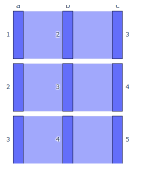

- `Parcoords`类，表示平行坐标图。

  示例如下：

  ```python3
  from nicegui import ui
  import plotly.graph_objects as go
  
  def index():
      ply = ui.plotly(
          go.Figure(
              go.Parcoords(
                  dimensions=[
                      {
                          'label':'a',
                          'values':[
                              1,2,1
                          ],
                          'range':[0,4]
                      },
                      {
                          'label':'b',
                          'values':[
                              2,3,3
                          ],
                          'range':[0,4]
                      },
                      {
                          'label':'c',
                          'values':[
                              1,2,1
                          ],
                          'range':[0,4]
                      }
                  ]
              ),
              go.Layout(
                  margin=go.layout.Margin(
                      l=0,
                      r=0,
                      t=10,
                      b=0,
                  )
              )
          )
      ).classes('w-64 h-64')
      ply.update()
  
  ui.run(
      root=index,
      native=True
  )
  ```

  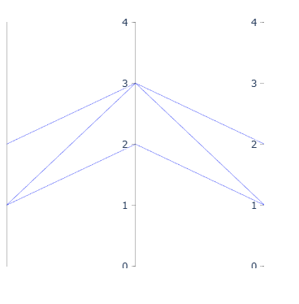

- `Carpet`类，表示地毯图。

  示例如下：

  ```python3
  from nicegui import ui
  import plotly.graph_objects as go
  
  def index():
      ply = ui.plotly(
          go.Figure(
              go.Carpet(
                  a=[1,3,5],
                  b=[2,4,6],
                  y=[1,2,3],
              ),
              go.Layout(
                  margin=go.layout.Margin(
                      l=0,
                      r=0,
                      t=10,
                      b=0,
                  )
              )
          )
      ).classes('w-64 h-64')
      ply.update()
  
  ui.run(
      root=index,
      native=True
  )
  ```

  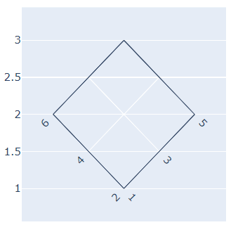

- `Scattercarpet`类，表示叠加在地毯图上的散点图。

  示例如下：

  ```python3
  from nicegui import ui
  import plotly.graph_objects as go
  
  def index():
      ply = ui.plotly(
          go.Figure(
              go.Carpet(
                  a=[1,3,5],
                  b=[2,4,6],
                  y=[1,2,3],
              ),
              go.Layout(
                  margin=go.layout.Margin(
                      l=0,
                      r=0,
                      t=10,
                      b=0,
                  )
              )
          )
      ).classes('w-64 h-64')
      ply.figure.add_trace(
          go.Scattercarpet(
              a=[1,3,5],
              b=[2,4,6],
          )
      )
      ply.update()
  
  ui.run(
      root=index,
      native=True
  )
  ```

  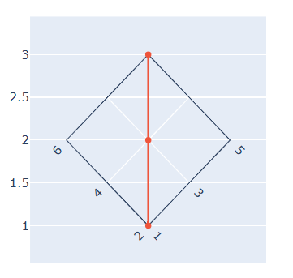

- `Contourcarpet`类，表示叠加在地毯图上的等高线图。

  示例如下：

  ```python3
  from nicegui import ui
  import plotly.graph_objects as go
  
  def index():
      ply = ui.plotly(
          go.Figure(
              go.Carpet(
                  a=[1,3,5],
                  b=[2,4,6],
                  y=[1,2,3],
              ),
              go.Layout(
                  margin=go.layout.Margin(
                      l=0,
                      r=0,
                      t=10,
                      b=0,
                  )
              )
          )
      ).classes('w-64 h-64')
      ply.figure.add_trace(
          go.Contourcarpet(
              a=[1,3,5],
              b=[2,4,6],
              z=[1,2,3]
          )
      )
      ply.update()
  
  ui.run(
      root=index,
      native=True
  )
  ```

  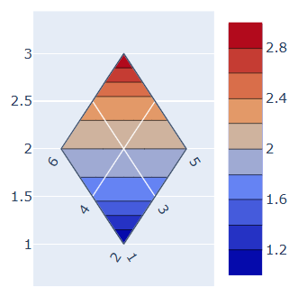

### 54.5 `ui.highchart`控件（更新中）

#### 54.5.1 基本用法

下面是`ui.highchart`控件相关文档的地址：

NiceGUI框架文档：https://nicegui.io/documentation/highchart

Highcharts框架文档：https://www.highcharts.com/docs/index#api 和 https://api.highcharts.com/

注意，`ui.highchart`控件依赖`nicegui-highcharts`库，需要先安装依赖库才能使用对应控件。可以参考安装NiceGUI一章，使用`uv add nicegui[highcharts]`命令提前添加依赖库。另外，商用需要购买商业许可，如有商用需求，请到官网（https://www.highcharts.com/）购买许可。

先看示例：

```python3
from nicegui import ui

def index():
    ui.highchart(
        options={
            'title': {'text': 'A and B'},
            'chart': {'type': 'bar'},
            'xAxis': {
                'categories': ['A', 'B']
            },
            'yAxis': {
                'title': False,
            },
            'series': [
                {
                    'name': '2026',
                    'data': [0.1, 0.2]
                },
                {
                    'name': '2027',
                    'data': [0.3, 0.4]
                },
            ],
            'credits': {'enabled': False}
        }
    ).classes('w-64 h-64')

ui.run(
    root=index,
    native=True
)
```

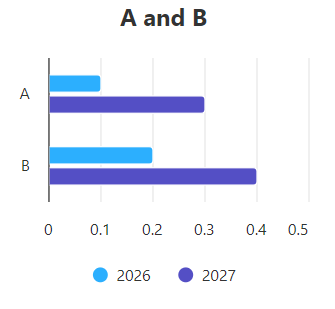

从上面的示例看，传给控件的配置几乎全部通过`options`参数传递，因此，该参数的相关用法主要参考Highcharts框架文档（https://www.highcharts.com/docs/index#api）。

该控件支持以下参数：

- `options`参数，字典类型，表示图表定义。

- `type`参数，字符串类型（仅支持`['chart','stockChart','mapChart','ganttChart']`中的值），表示要绘制的图表大类，默认是`'chart'`，即官网文档中的`Highcharts.chart`（常规图表），如果想绘制其他图表。比如`Highcharts.stockChart`（股票图），则需要设置此参数为`'stockChart'`，同时给`extras`参数传入`'stock'`。

  从该参数开始，只能通过关键字传入。

- `extras`参数，元素为字符串的列表，表示需要额外导入的模块。有些图表的实现在其他JavaScript模块中，需要将模块对应的名字传给该参数，以下为需要额外导入的模块名：

  ```python3
  [
      'accessibility',
      'annotations',
      'annotations-advanced',
      'arc-diagram',
      'arrow-symbols',
      'boost',
      'boost-canvas',
      'broken-axis',
      'bullet',
      'coloraxis',
      'current-date-indicator',
      'cylinder',
      'data',
      'data-tools',
      'datagrouping',
      'debugger',
      'dependency-wheel',
      'dotplot',
      'drag-panes',
      'draggable-points',
      'drilldown',
      'dumbbell',
      'export-data',
      'exporting',
      'flowmap',
      'full-screen',
      'funnel',
      'funnel3d',
      'gantt',
      'geoheatmap',
      'grid-axis',
      'heatmap',
      'heikinashi',
      'histogram-bellcurve',
      'hollowcandlestick',
      'item-series',
      'lollipop',
      'map',
      'marker-clusters',
      'mouse-wheel-zoom',
      'navigator',
      'networkgraph',
      'no-data-to-display',
      'non-cartesian-zoom',
      'offline-exporting',
      'organization',
      'parallel-coordinates',
      'pareto',
      'pathfinder',
      'pattern-fill',
      'pictorial',
      'pointandfigure',
      'price-indicator',
      'pyramid3d',
      'renko',
      'sankey',
      'series-label',
      'series-on-point',
      'solid-gauge',
      'sonification',
      'static-scale',
      'stock',
      'stock-tools',
      'streamgraph',
      'sunburst',
      'textpath',
      'tiledwebmap',
      'tilemap',
      'timeline',
      'treegraph',
      'treegrid',
      'treemap',
      'variable-pie',
      'variwide',
      'vector',
      'venn',
      'windbarb',
      'wordcloud',
      'xrange'
  ]
  ```

- `on_point_click`参数，可调用类型，表示图表上的点被点击时执行的操作。

- `on_point_drag_start`参数，可调用类型，表示图表上的点开始拖动时（需要设置图表允许拖动点）执行的操作。

- `on_point_drag`参数，可调用类型，表示图表上的点处于拖动状态时（需要设置图表允许拖动点）执行的操作。

- `on_point_drop`参数，可调用类型，表示图表上的点放下时（需要设置图表允许拖动点）执行的操作。

该控件支持以下属性：

- `options`属性，用法、含义同`options`参数。

#### 54.5.2 扩展用法（更新中）

##### 54.5.2.1 允许拖动点时的响应情况

如果图表允许拖动点，则可以注册所有事件来响应拖动操作：

- `on_point_click`：点击点。
- `on_point_drag_start`：开始拖动点。
- `on_point_drag`：点被拖动时。
- `on_point_drop`：点被放下时。

示例如下：

```python3
from nicegui import ui
from nicegui_highcharts import events

def handle_event(e: events.ChartEventArguments):
    print(f'{e.event_type}: x is {e.point_x if hasattr(e, 'point_x') else None}, y is {e.point_y if hasattr(e, 'point_y') else None}.')

def index():
    ui.highchart(
        {
            'title': False,
            'plotOptions': {
                'series': {
                    'stickyTracking': False,
                    'dragDrop': {'draggableY': True, 'dragPrecisionY': 1},
                },
            },
            'series': [
                {'name': 'A', 'data': [[20, 10], [30, 20], [40, 30]]},
                {'name': 'B', 'data': [[50, 40], [60, 50], [70, 60]]},
            ],
            'credits': {'enabled': False}
        },
        extras=['draggable-points'],
        on_point_click=handle_event,
        on_point_drag_start=handle_event,
        on_point_drag=handle_event,
        on_point_drop=handle_event
    ).classes('w-full h-64')

ui.run(
    root=index,
    native=True
)
```

得到的结果输出（部分）如下：

```shell
point_drag_start: x is None, y is None.
point_drag: x is 20, y is 22.
point_drag: x is 20, y is 23.
point_drag: x is 20, y is 30.
point_drop: x is 20, y is 30.
point_drag_start: x is None, y is None.
point_click: x is 20, y is 30.
point_drag_start: x is None, y is None.
point_click: x is 30, y is 43.
```

可以看到，拖动一个点总是包含拖动开始、拖动时、放下三个动作；如果是在允许拖动点时点击点，则会触发开始拖动（鼠标左键按下时触发）和点击（鼠标左键松开时触发）这两个动作。

##### 54.5.2.2 何时需要额外导入模块（`extras`参数）

`extras`参数表示需要额外导入的模块，


判断是否需要额外导入模块？

以下面为例：

https://api.highcharts.com/highcharts/plotOptions.solidgauge


##### 54.5.2.3 （）


图表定义的基本组成

https://www.highcharts.com/docs/chart-concepts/understanding-highcharts


图表类型的定义方式：

https://www.highcharts.com/docs/chart-and-series-types/chart-types

组合多种图表：

https://www.highcharts.com/docs/chart-and-series-types/combining-chart-types


（根据官网文档扩展出其他小节）


### 54.6 `ui.echart`控件（更新中）


https://nicegui.io/documentation/echart

https://echarts.apache.org/zh/index.html

https://echarts.apache.org/handbook/zh/get-started/

https://echarts.apache.org/zh/option.html


### 54.7 `ui.altair`控件（更新中）


## NiceGUI札记2027版——更新计划

在介绍2027年的更新计划之前，首先感谢各位读者对本教程的喜欢，各位的点赞、转发、喜爱和付费，是支持笔者继续更新的动力。

笔者在完成本教程2026版的收尾工作之后，愈发感觉长篇大论让笔者力不从心。其他系列的敏捷风格更适合碎片化时间的创作和阅读，也能让笔者抽出更多时间兼顾其他系列教程甚至小说的创作（小说那边的长章节风格反馈也不好，不管是创作还是阅读，那边在完成第一部之后，后续也会改为敏捷风格）。因此，笔者决定，从2027年开始，《札记》系列教程全部采用敏捷风格，主要介绍框架相关的基本概念和必要扩展，减少为了全面深挖框架用法而导致的大量时间投入。

当然，这并不是说笔者会在教程的创作上变得“敷衍”，恰恰相反，笔者会更加关注各位读者的意见。如果教程的部分内容没有覆盖到读者所需的知识点，或者没有示例解释某个用法，或者读者开发过程中遇到实际问题，要是在2026版中，可能受限于更新计划，问题的解答要等很久。在2027版中，这个问题将更快解决，因为笔者可以做到本周创作，最快下周更新。因此，采用敏捷风格之后，如果读者本周一提了问题，有可能本周末之前就有对应的解答文章。至于基础用法，读者可以看完教程之后，自学官方教程或者与笔者互动，无需等待笔者的更新。

基于各方面的考量，2027版除了延续2026版的计划，继续介绍其他控件之外，将尽量减少单章的内容量，只介绍一个控件的基本概念（参数、属性、方法）和必要扩展（槽、控件方法），加快更新节奏。同时，也欢迎对NiceGUI感兴趣的读者积极参与互动，让各位的问题及时得到解答。

## 55 学习控件——`ui.column`控件（更新中）


## 56 学习控件——创建布局（更新中）

尽管前面介绍布局的时候已经说了几种和布局相关的控件，但那些只是常用的控件，本章开始，将介绍所有和布局有关的控件。

以下是可以创建布局的控件：

- `ui.column`控件，在上下文中添加的控件排成一列。
- `ui.row`控件，在上下文中添加的控件排成一行。
- `ui.grid`控件，在上下文中添加的控件都放在指定规格（默认为`1x1`）的单元格中。
- `ui.list`控件，在上下文中添加的`ui.item`控件、`ui.menu_item`控件、`ui.slide_item`控件排成一列，看上去与`ui.column`控件类似，但该控件的子控件之间更加紧凑。
- `ui.card`控件、`ui.card_actions`控件、`ui.card_section`控件，`ui.card`控件表示卡片主体，在上下文中添加的控件会放在默认带边框的卡片中；`ui.card_actions`控件表示卡片的动作区域，只能在`ui.card`控件的上下文添加，一般在该控件上下文添加可以点击的控件，并且默认靠左对齐；`ui.card_section`控件表示内容分区，只能在`ui.card`控件的上下文添加，一般在该控件上下文添加只是显示内容的控件，并且默认居中对齐。
- `ui.item`控件、`ui.item_label`控件、`ui.item_section`控件，通常组合在一起使用，共同组成一个内容项目的整体，每个控件对应着内容的指定部分。

示例如下：

```python3
from nicegui import ui

def index():
    with ui.list().classes(
        'border-2 border-red-700'
    ):
        for i in range(4):
            ui.item(str(i))
    with ui.column().classes(
        'border-2 border-red-700'
    ):
        for i in range(4):
            ui.item(str(i))
    with ui.card():
        ui.label('card')
        with ui.card_section():
            ui.label('card section')
        with ui.card_actions():
            ui.button('Yes')
            ui.button('No')
    with ui.item('item'):
        with ui.item_section():
            ui.item_label('label1')
            ui.item_label('label2').props(
                'caption'
            )
        with ui.item_section().props(
            'side'
        ):
            ui.icon('home')

ui.run(
    root=index,
    native=True
)
```


## 57 学习控件——辅助设计布局（更新中）

除了直接创建布局，还有一些控件可以让布局的设计更加灵活、美观、直观：

- `ui.separator`控件，创建一个占用空间极小且不太明显的分隔符。
- `ui.space`控件，填充布局方向上可用的剩余空间。
- `ui.skeleton`控件，创建一个代替控件的占位控件，通常在页面没有完全加载时表示页面的布局。

示例如下：

```python3
from nicegui import ui

def index():
    with ui.column().classes(
        'border-2 border-red-700 h-64 w-32'
    ):
        ui.skeleton('QBtn')
        ui.space()
        ui.separator()
        ui.skeleton('QChip')

ui.run(
    root=index,
    native=True
)
```


## 58 学习控件——调整布局空间（更新中）

前面控件创建的布局，所有子控件都是平铺展示，一旦控件较多，布局就会占据较多空间，甚至超出屏幕，只能滚动页面查看超出屏幕的部分。

不过，下面的控件可以调整布局占据的空间：

- `ui.expansion`控件，可以通过向下展开的方式扩展空间，显示原本隐藏的控件。

  示例如下：

  ```python3
  from nicegui import ui
    
  def index():
      with ui.card(),ui.expansion(
          'More',
          caption='info'
      ).props('header-class=bg-blue'):
          ui.button('Hello')
          ui.button('World')
      with ui.card(),ui.expansion(
          'More',
          caption='info',
          value=True
      ).props('header-class=bg-blue'):
          ui.button('Hello')
          ui.button('World')
    
  ui.run(
      root=index,
      native=True
  )
  ```

  

- `ui.scroll_area`控件，将原本固定大小的区域，变成可以无限扩展的滚动区域，确保可以容纳所有控件。

  示例如下：

  ```python3
  from nicegui import ui
    
  def index():
      with ui.card(),ui.scroll_area().classes(
          'w-64 h-64'
      ):
          for i in range(99):
              ui.button(
                  str(i)
              )
    
  ui.run(
      root=index,
      native=True
  )
  ```

  

- `ui.slide_item`控件，创建一个可以四向滑动的固定区域，向对应方向的反方向滑动，会将当前区域变为对应方向的独立区域，所有区域都可以放置其他控件。

  示例如下：

  ```python3
  from nicegui import ui
    
  def index():
      with ui.list().classes(
          'border-2 border-red-700'
      ), ui.slide_item(
          'center'
      ).classes(
          'w-32'
      ) as slide:
          ui.label('center')
      with slide.left(
          'left',
          on_slide=slide.reset
      ):
          ui.label('left')
      with slide.right(
          'right',
          on_slide=slide.reset
      ):
          ui.label('right')
      with slide.top(
          'top',
          on_slide=slide.reset
      ):
          ui.label('top')
      with slide.bottom(
          'bottom',
          on_slide=slide.reset
      ):
          ui.label('bottom')
    
  ui.run(
      root=index,
      native=True
  )
  ```

  

- `ui.splitter`控件，创建一个划分为左中右（或者上中下）三块区域的区域，可以通过拖动中间区域（实际上是一条间隔线）来改变其余两块区域的大小。

  示例如下：

  ```python3
  from nicegui import ui
    
  def index():
      with ui.card():
          splitter = ui.splitter(
              value=75
          ).classes('w-64 h-64')
          with splitter.separator:
              ui.icon('lightbulb')
          with splitter.before:
              ui.card().classes(
                  'w-full h-full bg-red'
              )
          with splitter.after:
              ui.card().classes(
                  'w-full h-full bg-blue'
              )
    
  ui.run(
      root=index,
      native=True
  )
  ```

  

## 59 学习控件——管理多页内容（更新中）

对于内容多到需要分页的情况，下面的控件可以很好处理这种情况：

- `ui.tabs`控件、`ui.tab`控件、`ui.tab_panels`控件、`ui.tab_panel`控件，共同组成完整的选项卡控件。其中，`ui.tabs`控件为选项卡的页标签容器，用于容纳表示页标签的`ui.tab`控件。`ui.tab_panels`控件是标签页的容器，用于容纳表示标签页的`ui.tab_panel`控件。标签页用于容纳需要分页的内容，点击页标签，标签页容器也会切换到对应的标签页。

  示例如下：

  ```python3
  from nicegui import ui
    
  def index():
      with ui.tabs().props(
          'no-caps'
      ) as tabs:
          ui.tab(
              'a',
              label='标签a'
          )
          ui.tab(
              'b',
              label='标签b'
          )
      with ui.tab_panels(
          tabs,
          value='a'
      ).classes(
          'w-64 h-64 border'
      ):
          with ui.tab_panel('a'):
              ui.label('标签页a')
          with ui.tab_panel('b'):
              ui.label('标签页b')
    
  ui.run(
      root=index,
      native=True
  )
  ```

  

- `ui.carousel`控件、`ui.carousel_slide`控件，共同组成轮播图控件，用法类似选项卡控件，只不过轮播图控件没有页标签，直接就是标签页。`ui.carousel`控件就是`ui.carousel_slide`控件的容器，`ui.carousel_slide`控件用于容纳需要分页的内容。

  示例如下：

  ```python3
  from nicegui import ui
    
  def index():
      with ui.carousel(
          arrows=True,
          navigation=True,
          animated=True
      ).classes('w-64 h-64 border'):
          with ui.carousel_slide().classes(
              'border bg-red'
          ):
              ui.label('内容a')
          with ui.carousel_slide().classes(
              'border bg-blue'
          ):
              ui.label('内容b')
    
  ui.run(
      root=index,
      native=True
  )
  ```

  

- `ui.pagination`控件，用于切换内容的分页，该控件提供了页码显示和调整功能。

  示例如下：

  ```python3
  from nicegui import ui
    
  def index():
      label = ui.label('当前页为第1页')
      ui.pagination(
          1,
          5,
          direction_links=True,
          value=1,
          on_change=lambda e:label.set_text(
              f'当前页为第{e.value}页'
          )
      )
    
  ui.run(
      root=index,
      native=True
  )
  ```

  

- `ui.stepper`控件、`ui.step`控件、`ui.stepper_navigation`控件，共同组成步骤控件。其中，`ui.stepper`控件是所有步骤的容器；`ui.step`控件为具体的步骤，必须设置不重复的`name`参数；`ui.stepper_navigation`控件用于放置控制当前步骤的按钮。

  示例如下：

  ```python3
  from nicegui import ui
    
  def index():
      with ui.stepper() as stepper:
          with ui.step('first'):
              ui.label('first')
              with ui.stepper_navigation():
                  ui.button(
                      'next',
                      on_click=stepper.next
                  )
          with ui.step('second'):
              ui.label('second')
              with ui.stepper_navigation():
                  ui.button(
                      'next',
                      on_click=stepper.next
                  )
                  ui.button(
                      'back',
                      on_click=stepper.previous
                  ).props('flat')
          with ui.step('third'):
              ui.label('third')
              with ui.stepper_navigation():
                  ui.button(
                      'done',
                      on_click=lambda :ui.notify(
                          'done'
                      )
                  )
                  ui.button(
                      'back',
                      on_click=stepper.previous
                  ).props('flat')
    
  ui.run(
      root=index,
      native=True
  )
  ```

  

- `ui.timeline`控件、`ui.timeline_entry`控件，共同组成时间线控件，其中，`ui.timeline`控件是容器，`ui.timeline_entry`控件是具体时间点对应的内容。

  示例如下：

  ```python3
  from nicegui import ui
    
  def index():
      with ui.timeline(side='right'):
          ui.timeline_entry('first')
          ui.timeline_entry('second')
          ui.timeline_entry('third')
    
  ui.run(
      root=index,
      native=True
  )
  ```

  

## 60 学习控件——使用菜单（更新中）

NiceGUI提供了两种菜单，分别是左键点击弹出的一般菜单和右键点击弹出上下文菜单。想要创建它们，会涉及到以下控件：

- `ui.menu_item`控件，用于创建一般的菜单项，只能用于一般菜单、上下文菜单中。

- `ui.menu`控件，用于创建一般菜单。如果是在其他控件的上下文中创建，则点击其他控件，自动弹出菜单。

  示例如下：

  ```python3
  from nicegui import ui
    
  def index():
      with ui.button(icon='menu'):
          with ui.menu() as menu:
              ui.menu_item('auto close')
              ui.menu_item(
                  'no auto close',
                  auto_close=False
              )
              ui.separator()
              ui.menu_item(
                  'manual close',
                  auto_close=False,
                  on_click=menu.close
              )
    
  ui.run(
      root=index,
      native=True
  )
  ```

  

- `ui.context_menu`控件，用于创建上下文菜单。用法与`ui.menu`控件相同，但只能通过右键弹出菜单。

  示例如下：

  ```python3
  from nicegui import ui
    
  def index():
      with ui.button(icon='menu'):
          with ui.context_menu() as menu:
              ui.menu_item('auto close')
              ui.menu_item(
                  'no auto close',
                  auto_close=False
              )
              ui.separator()
              ui.menu_item(
                  'manual close',
                  auto_close=False,
                  on_click=menu.close
              )
    
  ui.run(
      root=index,
      native=True
  )
  ```


这个还是放到具体控件——弹出菜单中学习介绍中吧。

#### 3.9.13 `ui.menu`补充

`ui.menu`中除了可以嵌入`ui.menu_item`，还可以嵌入其他控件，有时候会有意想不到的效果：

```python3
from nicegui import ui

with ui.row().classes('w-full items-center'):
    icon = ui.icon('', size='md').classes('mr-auto') 
    ui.space()
    with ui.button(icon='menu')as button:
        with ui.menu().props('auto-close'):
            with ui.column():
                switch =ui.switch('Show icon')
                toggle = ui.toggle(['fastfood', 'cake', 'icecream'], value='fastfood')
    icon.bind_name_from(toggle, 'value').bind_visibility_from(switch,'value')

ui.run(
    native=True
)
```


## 61 学习控件——弹出提示信息（更新中）

NiceGUI还提供了一类弹出提示信息的控件，用于提醒用户：

- `ui.tooltip`控件，添加到任意控件的上下文，可以给其添加一个鼠标悬停后弹出的工具提示。比如：

  ```python3
  from nicegui import ui
    
  def index():
      with ui.button('tooltip'):
          ui.tooltip('Hello')
    
  ui.run(
      root=index,
      native=True
  )
  ```

  

  另外，大部分控件支持`tooltip`方法，可以实现同样的效果：

  ```python3
  from nicegui import ui
    
  def index():
      ui.button(
          'tooltip'
      ).tooltip(
          'Hello'
      )
    
  ui.run(
      root=index,
      native=True
  )
  ```

- `ui.notify`控件，创建之后立马弹出一条文字消息。

  示例如下：

  ```python3
  from nicegui import ui
    
  def index():
      ui.button(
          'notify',
          on_click=lambda:ui.notify(
              'Hello'
          )
      )
    
  ui.run(
      root=index,
      native=True
  )
  ```

  

- `ui.notification`控件，用法和效果与`ui.notify`控件基本相同，但该控件允许更新消息的内容，也支持主动通过`dismiss`方法隐藏消息，一般用于提供实时更新的弹出消息。

  示例如下：

  ```python3
  from nicegui import ui
  import asyncio
    
  def index():
      async def notify():
          n = ui.notification(
              'Hello',
              timeout=None
          )
          await asyncio.sleep(2)
          n.message = 'World'
          await asyncio.sleep(1)
          n.dismiss()
      ui.button(
          'notification',
          on_click=notify
      )
    
  ui.run(
      root=index,
      native=True
  )
  ```

  

- `ui.dialog`控件，用于弹出一个基于控件设计界面、非系统原生的对话框。

  示例如下：

  ```python3
  from nicegui import ui
    
  def index():
      with ui.dialog() as dialog,ui.card():
          ui.label('dialog')
          ui.button(
              'close',
              on_click=dialog.close
          )
      ui.button(
          'dialog',
          on_click=dialog.open
      )
    
  ui.run(
      root=index,
      native=True
  )
  ```

  

这个还是放到具体控件学习介绍中吧。

#### 3.9.14 `ui.tooltip`补充（2025.01.21更新）

对于像`ui.html`、`ui.markdown`、`ui.upload`、`ui.table`等不支持在其上下文内添加`tooltip`的元素，可以使用`ui.element`包装来间接实现：

```python3
from nicegui import ui

with ui.element().tooltip('...with a tooltip!'):
    ui.html('This is <u>HTML</u>...')

ui.run(
    native=True
)
```

注意，NiceGUI 3.4版本之后，任何控件都可以使用`tooltip`方法添加工具提示，没有上面的限制。

因此，任意控件的添加工具提示可以改为：

```python3
from nicegui import ui

def index():
    markdown = ui.markdown('markdown')
    tooltip = ui.tooltip('tooltip')
    tooltip.props['target'] = f'#{markdown.html_id}'
    tooltip.set_text('tooltip for markdown')

ui.run(
    root=index,
    native=True
)
```


`tooltip`里除了显示一般的文本，还可以显示图像等其他内容。不过，不建议在`tooltip`内放置需要交互的内容，因为被添加`tooltip`的控件一旦失去焦点，`tooltip`就会消失，里面的交互内容永远无法交互：

```python3
from nicegui import ui

with ui.label('Mountains...'):
    with ui.tooltip().classes('bg-transparent'):
        ui.image('https://picsum.photos/id/377/640/360').classes('w-64')

ui.run(
    native=True
)
```


前面说过`tooltip`方法返回的是控件本身，而不是`tooltip`。但是，这并不是说就没有办法设置`tooltip`方法生成的`tooltip`。如果想要获取到控件`tooltip`方法设置的`tooltip`，可以遍历控件来获取控件内部的其他控件，再判断控件是不是需要的类型：

```python3
from nicegui import ui

with ui.button(icon='thumb_up'):
    ui.tooltip('I like this').classes('bg-green')

button = ui.button(icon='thumb_up')
button.tooltip('I like this')
for i in button:
    if isinstance(i,ui.tooltip):
        i.classes('bg-green')

ui.run(
    native=True
)
```

也可以使用`ElementFilter`方法，简单快捷地设置控件内部的`tooltip`：

```python3
from nicegui import ui,ElementFilter

with ui.button(icon='thumb_up'):
    ui.tooltip('I like this').classes('bg-green')

button = ui.button(icon='thumb_up')
button.tooltip('I like this')

with button:
    ElementFilter(kind=ui.tooltip,local_scope=True).classes('bg-green')

ui.run(
    native=True
)
```


## 5x 学习控件——`ui.tree`控件（更新中）


## 56 学习控件——渲染复杂数据（更新中）

除了前面提到的用图表展示数据的方式之外，下面的控件提供了针对特定类型数据、文件的展示方式：

- `ui.tree`控件，用于渲染树类型的数据。

  示例如下：

  ```python3
  from nicegui import ui
    
  def index():
      ui.tree(
          nodes=[
              {
                  'id': 'lang',
                  'label': 'Language',
                  'icon': 'dashboard',
                  'children': [
                      {
                          'id': '1',
                          'label': 'Python'
                      },
                      {
                          'id': '2',
                          'label': 'JavaScript'
                      }
                  ]
              },
          ],
          node_key='id',
          label_key='label',
          children_key='children',
          on_select=lambda e: ui.notify(
              f'选择了 {e.value}'
          ),
          on_expand=lambda e: ui.notify(
              f'展开了 {e.value}'
          ),
          on_tick=lambda e: ui.notify(
              f'勾选了 {e.value}'
          ),
      ).expand()
    
  ui.run(
      root=index,
      native=True
  )
  ```

  

- `ui.leaflet`控件，用于渲染地图数据。

  示例如下：

  ```python3
  from nicegui import ui
    
  def index():
      ui.leaflet(
          center=(39.9072, 116.3912),
          zoom=18,
          options={
              'attributionControl':False,
          }
      ).classes(
          'w-64 h-64'
      ).marker(
          latlng=(39.9072, 116.3912)
      )
    
  ui.run(
      root=index,
      native=True
  )
  ```

  

- `ui.scene`控件、`ui.scene_view`控件，使用ThreeJs框架渲染三维模型，前者为可以交换的3D视图，后者则是基于前者创建、不可交互的固定视角视图。

  示例如下：

  ```python3
  from nicegui import ui
    
  def index():
      scene = ui.scene().classes(
          'w-64 h-64'
      )
      scene.box().material(
          'red'
      )
      ui.scene_view(scene).classes(
          'w-64 h-64'
      )
        
  ui.run(
      root=index,
      native=True
  )
  ```

  

## 62 学习控件——`ui.anywidget`控件（更新中）


## x 灵感（待定）

更多内容参考 https://nicegui.io/documentation#map-of-nicegui ，看看有没有前面遗漏的。

强制刷新页面（忽略缓存，只从服务器加载资源）：

```javascript
window.location.reload(true)
```


