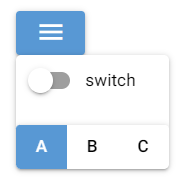

# NiceGUI札记（2027）

2027年所有更新内容转入《易森》，以下内容为存稿、留档，在《易森》更新时复制到《易森》中。

## 55 详解多页面模式

前面的教程几乎都是用单页面模式、窗口模式作为示例，而很多读者实际开发中，可能会用多页面模式作为程序的主要运行模式。因此，2027版的第一章，就先来回顾一下多页面模式，学习一下多页面模式中相关的功能。

相关文档：https://nicegui.io/documentation/page

### 55.1 `ui.page`类

说到多页面模式，就离不开`ui.page`类：

```python3
from nicegui import ui

@ui.page(
    path='/',
)
def index():
    ui.button('Hello')

ui.run()
```

如上面示例所展示的，表示页面对应路径的`path`参数不可缺失，这个一般都比较熟悉。但是，除了这个参数，`ui.page`类还支持一些关键字参数，如果读者有特定需求，则需要用到这些参数。

`ui.page`类支持以下参数：

- `path`参数，字符串类型，表示页面对应的路径。路径支持URL参数（路径参数、查询参数）注入，具体用法可以参考前面的第30章，这里不做展开。

- `title`参数，字符串类型，表示页面对应的标题（会显示为浏览器窗口、标签页的标题）。

  从该参数开始，只能通过关键字传入。

- `viewport`参数，字符串类型，表示网页的VIewport属性。

- `favicon`参数，字符串类型或者`Path`类型，表示页面在标题栏的图标。

- `dark`参数，布尔类型，表示页面是否默认启用暗黑模式。使用`None`的话，表示跟随系统。

- `language`参数，字符串类型，表示页面的语言。注意，该参数只会影响框架内提供多语言内容的部分，对于非框架自带的内容，则需要通过其他方法实现多语言功能，无法通过此参数切换语言。

- `response_timeout`参数，浮点类型，表示页面的响应超时，默认为`3.0`。

- `reconnect_timeout`参数，浮点类型，表示页面的重新连接超时。

- `markdown`参数，布尔类型，表示是否为AI工具提供页面的Markdown格式版本，以减少AI工具获取页面时的Token消耗。

- `api_router`参数，`APIRouter`类型，表示页面所属的子路由。

- `**kwargs`参数，其余不与上述关键字参数同名的其他关键字参数将会传给`APIRouter`类。

关于`api_router`参数的示例如下：

```python3
from nicegui import ui,APIRouter,app

router = APIRouter(prefix='/psf')

@ui.page(
    path='/',
    title='Hello',
    api_router=router
)
def index():
    ui.button('Hello')

app.include_router(router)

ui.run()
```

此时，想要访问该页面，就要改为`http://{host}:{port}/psf/`。关于子路由的详细介绍，请看本章的下一节。

### 55.2 `APIRouter`类

上一节中，`api_router`参数表示页面所属的子路由。这就引出了本节要介绍的子路由和`APIRouter`类。

子路由和单页面应用类似，但每个路径对应的页面是独立的，没有页面的公共部分。

而上一节的示例可以改为以下相同结果的示例：

```python3
from nicegui import ui,APIRouter,app

router = APIRouter(prefix='/psf')

@router.page(
    path='/',
    title='Hello',
)
def index():
    ui.button('Hello')

app.include_router(router)

ui.run()
```

注意，`app.include_router`方法用于注册子路由，可以注册多个，但必须在子路由的页面添加完成后注册，不能提前注册。

使用子路由之后，如果一个网站包含多个架构类似的子网站，无需单独记录每个页面对应的完整路径（不含主机、端口号的部分），只需添加对应子路由即可。即使页面的路径一样，完整路径也会因为子路由的存在而不同，不会冲突：

```python3
from nicegui import ui,APIRouter,app

router1 = APIRouter(prefix='/test')
router2 = APIRouter(prefix='/psf')

@router1.page(
    path='/',
    title='Hello',
)
def _():
    ui.button('Hello')

@router2.page(
    path='/',
    title='Hello psf',
)
def _():
    ui.button('Hello')

app.include_router(router1)
app.include_router(router2)

ui.run()
```


`APIRouter`类支持以下关键字参数（部分，其余参数可参考 https://fastapi.tiangolo.com/reference/apirouter/ ）：

- `prefix`参数，字符串类型，表示子路由路径（或者叫页面路径的前缀）。

`APIRouter`类支持以下方法（部分，其余方法可参考 https://fastapi.tiangolo.com/reference/apirouter/ ）：

- `page`方法，用法、参数和`ui.page`类相同。

### 55.3 `app.clients`方法

之前的版本速览说过，给`app.clients`方法传入`None`（默认值）时，可以获取所有客户端链接，可用于广播、消息发送、信息收集等。

其实，`app.clients`方法还可以传入完整路径（不含主机、端口号的部分），获取所有连接指定完整路径的客户端链接：

```python3
from nicegui import ui,APIRouter,app

router1 = APIRouter(prefix='/test')
router2 = APIRouter(prefix='/psf')

@router1.page(
    path='/',
    title='Hello',
)
def _():
    def test():
        for client in app.clients('/psf/'):
            with client:
                ui.notify(client.id)
    ui.button('test',on_click=test)

@router2.page(
    path='/',
    title='Hello psf',
)
def _():
    ui.button('Hello')

app.include_router(router1)
app.include_router(router2)

ui.run()
```


因此，点击右边窗口中的按钮，所有路径与左边窗口相同的客户端，都会执行指定操作。

（完）

## 56 学习控件——菜单（更新中）

相关文档：https://nicegui.io/documentation/menu 和 https://nicegui.io/documentation/context_menu

NiceGUI提供了两种菜单，分别是左键点击弹出的一般菜单（`ui.menu`控件）和右键点击弹出上下文菜单（`ui.context_menu`控件）。它们的用法几乎一样，都是将其添加至需要弹出菜单的控件上下文：

```python3
from nicegui import ui
  
def index():
    with ui.button(icon='menu'):
        with ui.menu() as menu:
            ui.menu_item('auto close')
            ui.menu_item(
                'no auto close',
                auto_close=False
            )
            ui.separator()
            ui.menu_item(
                'manual close',
                auto_close=False,
                on_click=menu.close
            )
        with ui.context_menu() as context_menu:
            ui.menu_item('auto close')
            ui.menu_item(
                'no auto close',
                auto_close=False
            )
            ui.separator()
            ui.menu_item(
                'manual close',
                auto_close=False,
                on_click=context_menu.close
            )
  
ui.run(
    root=index,
    native=True
)
```

一般使用`ui.menu_item`控件作为菜单项，但并不限制菜单项的控件类型，因此，可以使用其他控件：

```python3
from nicegui import ui
  
def index():
    with ui.button(icon='menu'):
        with ui.menu():
            with ui.column():
                ui.switch('switch')
                ui.toggle(
                    ['a', 'b', 'c'],
                    value='a'
                )
  
ui.run(
    root=index,
    native=True
)
```



`ui.menu`控件支持以下方法：

- `open`方法，弹出菜单。
- `close`方法，隐藏菜单。
- `toggle`方法，切换菜单的弹出状态。

`ui.context_menu`控件支持以下方法：

- `open`方法，弹出菜单。
- `close`方法，隐藏菜单。

`ui.menu_item`控件支持以下参数：

- `text`参数，字符串类型，表示菜单项的文本。

- `on_click`参数，可调用类型，表示点击菜单项之后执行的操作。

  从该参数开始，只能通过关键字传入。

- `auto_close`参数，布尔类型，表示点击菜单项之后是否自动隐藏菜单。

NiceGUI的菜单可以简单理解为点击左键、右键使其弹出的容器，将其放在哪个控件的上下文，哪个控件就可以弹出菜单。

（完）

## 57 样式技巧——仅在特定状态时生效（更新中）

相关文档：https://tailwindcss.com/docs/hover-focus-and-other-states


## 58 样式技巧——仅在特定屏幕大小时生效（更新中）

相关文档：https://tailwindcss.com/docs/responsive-design


## 58 学习控件——创建布局的`ui.column`控件和`ui.row`控件（更新中）

相关文档：https://nicegui.io/documentation/column 和 https://nicegui.io/documentation/row


（引言）


先看示例：

```python3
from nicegui import ui

def index():
    with ui.column().classes(
        'border-2 border-red-700'
    ):
        for i in range(4):
            ui.item(str(i))
    with ui.row().classes(
        'border-2 border-red-700'
    ):
        for i in range(4):
            ui.item(str(i))

ui.run(
    root=index,
    native=True
)
```


（两个控件的参数一样，因此合并介绍）


## 59 学习控件——创建布局的`ui.grid`控件（更新中）


## 56 学习控件——创建布局（更新中）

尽管前面介绍布局的时候已经说了几种和布局相关的控件，但那些只是常用的控件，本章开始，将介绍所有和布局有关的控件。

以下是可以创建布局的控件：

- `ui.column`控件，在上下文中添加的控件排成一列。
- `ui.row`控件，在上下文中添加的控件排成一行。
- `ui.grid`控件，在上下文中添加的控件都放在指定规格（默认为`1x1`）的单元格中。
- `ui.list`控件，在上下文中添加的`ui.item`控件、`ui.menu_item`控件、`ui.slide_item`控件排成一列，看上去与`ui.column`控件类似，但该控件的子控件之间更加紧凑。
- `ui.card`控件、`ui.card_actions`控件、`ui.card_section`控件，`ui.card`控件表示卡片主体，在上下文中添加的控件会放在默认带边框的卡片中；`ui.card_actions`控件表示卡片的动作区域，只能在`ui.card`控件的上下文添加，一般在该控件上下文添加可以点击的控件，并且默认靠左对齐；`ui.card_section`控件表示内容分区，只能在`ui.card`控件的上下文添加，一般在该控件上下文添加只是显示内容的控件，并且默认居中对齐。
- `ui.item`控件、`ui.item_label`控件、`ui.item_section`控件，通常组合在一起使用，共同组成一个内容项目的整体，每个控件对应着内容的指定部分。

示例如下：

```python3
from nicegui import ui

def index():
    with ui.list().classes(
        'border-2 border-red-700'
    ):
        for i in range(4):
            ui.item(str(i))
    with ui.column().classes(
        'border-2 border-red-700'
    ):
        for i in range(4):
            ui.item(str(i))
    with ui.card():
        ui.label('card')
        with ui.card_section():
            ui.label('card section')
        with ui.card_actions():
            ui.button('Yes')
            ui.button('No')
    with ui.item('item'):
        with ui.item_section():
            ui.item_label('label1')
            ui.item_label('label2').props(
                'caption'
            )
        with ui.item_section().props(
            'side'
        ):
            ui.icon('home')

ui.run(
    root=index,
    native=True
)
```


## 57 学习控件——辅助设计布局（更新中）

除了直接创建布局，还有一些控件可以让布局的设计更加灵活、美观、直观：

- `ui.separator`控件，创建一个占用空间极小且不太明显的分隔符。
- `ui.space`控件，填充布局方向上可用的剩余空间。
- `ui.skeleton`控件，创建一个代替控件的占位控件，通常在页面没有完全加载时表示页面的布局。

示例如下：

```python3
from nicegui import ui

def index():
    with ui.column().classes(
        'border-2 border-red-700 h-64 w-32'
    ):
        ui.skeleton('QBtn')
        ui.space()
        ui.separator()
        ui.skeleton('QChip')

ui.run(
    root=index,
    native=True
)
```


## 58 学习控件——调整布局空间（更新中）

前面控件创建的布局，所有子控件都是平铺展示，一旦控件较多，布局就会占据较多空间，甚至超出屏幕，只能滚动页面查看超出屏幕的部分。

不过，下面的控件可以调整布局占据的空间：

- `ui.expansion`控件，可以通过向下展开的方式扩展空间，显示原本隐藏的控件。

  示例如下：

  ```python3
  from nicegui import ui
    
  def index():
      with ui.card(),ui.expansion(
          'More',
          caption='info'
      ).props('header-class=bg-blue'):
          ui.button('Hello')
          ui.button('World')
      with ui.card(),ui.expansion(
          'More',
          caption='info',
          value=True
      ).props('header-class=bg-blue'):
          ui.button('Hello')
          ui.button('World')
    
  ui.run(
      root=index,
      native=True
  )
  ```

  

- `ui.scroll_area`控件，将原本固定大小的区域，变成可以无限扩展的滚动区域，确保可以容纳所有控件。

  示例如下：

  ```python3
  from nicegui import ui
    
  def index():
      with ui.card(),ui.scroll_area().classes(
          'w-64 h-64'
      ):
          for i in range(99):
              ui.button(
                  str(i)
              )
    
  ui.run(
      root=index,
      native=True
  )
  ```

  

- `ui.slide_item`控件，创建一个可以四向滑动的固定区域，向对应方向的反方向滑动，会将当前区域变为对应方向的独立区域，所有区域都可以放置其他控件。

  示例如下：

  ```python3
  from nicegui import ui
    
  def index():
      with ui.list().classes(
          'border-2 border-red-700'
      ), ui.slide_item(
          'center'
      ).classes(
          'w-32'
      ) as slide:
          ui.label('center')
      with slide.left(
          'left',
          on_slide=slide.reset
      ):
          ui.label('left')
      with slide.right(
          'right',
          on_slide=slide.reset
      ):
          ui.label('right')
      with slide.top(
          'top',
          on_slide=slide.reset
      ):
          ui.label('top')
      with slide.bottom(
          'bottom',
          on_slide=slide.reset
      ):
          ui.label('bottom')
    
  ui.run(
      root=index,
      native=True
  )
  ```

  

- `ui.splitter`控件，创建一个划分为左中右（或者上中下）三块区域的区域，可以通过拖动中间区域（实际上是一条间隔线）来改变其余两块区域的大小。

  示例如下：

  ```python3
  from nicegui import ui
    
  def index():
      with ui.card():
          splitter = ui.splitter(
              value=75
          ).classes('w-64 h-64')
          with splitter.separator:
              ui.icon('lightbulb')
          with splitter.before:
              ui.card().classes(
                  'w-full h-full bg-red'
              )
          with splitter.after:
              ui.card().classes(
                  'w-full h-full bg-blue'
              )
    
  ui.run(
      root=index,
      native=True
  )
  ```

  

## 59 学习控件——管理多页内容（更新中）

对于内容多到需要分页的情况，下面的控件可以很好处理这种情况：

- `ui.tabs`控件、`ui.tab`控件、`ui.tab_panels`控件、`ui.tab_panel`控件，共同组成完整的选项卡控件。其中，`ui.tabs`控件为选项卡的页标签容器，用于容纳表示页标签的`ui.tab`控件。`ui.tab_panels`控件是标签页的容器，用于容纳表示标签页的`ui.tab_panel`控件。标签页用于容纳需要分页的内容，点击页标签，标签页容器也会切换到对应的标签页。

  示例如下：

  ```python3
  from nicegui import ui
    
  def index():
      with ui.tabs().props(
          'no-caps'
      ) as tabs:
          ui.tab(
              'a',
              label='标签a'
          )
          ui.tab(
              'b',
              label='标签b'
          )
      with ui.tab_panels(
          tabs,
          value='a'
      ).classes(
          'w-64 h-64 border'
      ):
          with ui.tab_panel('a'):
              ui.label('标签页a')
          with ui.tab_panel('b'):
              ui.label('标签页b')
    
  ui.run(
      root=index,
      native=True
  )
  ```

  

- `ui.carousel`控件、`ui.carousel_slide`控件，共同组成轮播图控件，用法类似选项卡控件，只不过轮播图控件没有页标签，直接就是标签页。`ui.carousel`控件就是`ui.carousel_slide`控件的容器，`ui.carousel_slide`控件用于容纳需要分页的内容。

  示例如下：

  ```python3
  from nicegui import ui
    
  def index():
      with ui.carousel(
          arrows=True,
          navigation=True,
          animated=True
      ).classes('w-64 h-64 border'):
          with ui.carousel_slide().classes(
              'border bg-red'
          ):
              ui.label('内容a')
          with ui.carousel_slide().classes(
              'border bg-blue'
          ):
              ui.label('内容b')
    
  ui.run(
      root=index,
      native=True
  )
  ```

  

- `ui.pagination`控件，用于切换内容的分页，该控件提供了页码显示和调整功能。

  示例如下：

  ```python3
  from nicegui import ui
    
  def index():
      label = ui.label('当前页为第1页')
      ui.pagination(
          1,
          5,
          direction_links=True,
          value=1,
          on_change=lambda e:label.set_text(
              f'当前页为第{e.value}页'
          )
      )
    
  ui.run(
      root=index,
      native=True
  )
  ```

  

- `ui.stepper`控件、`ui.step`控件、`ui.stepper_navigation`控件，共同组成步骤控件。其中，`ui.stepper`控件是所有步骤的容器；`ui.step`控件为具体的步骤，必须设置不重复的`name`参数；`ui.stepper_navigation`控件用于放置控制当前步骤的按钮。

  示例如下：

  ```python3
  from nicegui import ui
    
  def index():
      with ui.stepper() as stepper:
          with ui.step('first'):
              ui.label('first')
              with ui.stepper_navigation():
                  ui.button(
                      'next',
                      on_click=stepper.next
                  )
          with ui.step('second'):
              ui.label('second')
              with ui.stepper_navigation():
                  ui.button(
                      'next',
                      on_click=stepper.next
                  )
                  ui.button(
                      'back',
                      on_click=stepper.previous
                  ).props('flat')
          with ui.step('third'):
              ui.label('third')
              with ui.stepper_navigation():
                  ui.button(
                      'done',
                      on_click=lambda :ui.notify(
                          'done'
                      )
                  )
                  ui.button(
                      'back',
                      on_click=stepper.previous
                  ).props('flat')
    
  ui.run(
      root=index,
      native=True
  )
  ```

  

- `ui.timeline`控件、`ui.timeline_entry`控件，共同组成时间线控件，其中，`ui.timeline`控件是容器，`ui.timeline_entry`控件是具体时间点对应的内容。

  示例如下：

  ```python3
  from nicegui import ui
    
  def index():
      with ui.timeline(side='right'):
          ui.timeline_entry('first')
          ui.timeline_entry('second')
          ui.timeline_entry('third')
    
  ui.run(
      root=index,
      native=True
  )
  ```


## 61 学习控件——弹出提示信息（更新中）

NiceGUI还提供了一类弹出提示信息的控件，用于提醒用户：

- `ui.tooltip`控件，添加到任意控件的上下文，可以给其添加一个鼠标悬停后弹出的工具提示。比如：

  ```python3
  from nicegui import ui
    
  def index():
      with ui.button('tooltip'):
          ui.tooltip('Hello')
    
  ui.run(
      root=index,
      native=True
  )
  ```

  

  另外，大部分控件支持`tooltip`方法，可以实现同样的效果：

  ```python3
  from nicegui import ui
    
  def index():
      ui.button(
          'tooltip'
      ).tooltip(
          'Hello'
      )
    
  ui.run(
      root=index,
      native=True
  )
  ```

- `ui.notify`控件，创建之后立马弹出一条文字消息。

  示例如下：

  ```python3
  from nicegui import ui
    
  def index():
      ui.button(
          'notify',
          on_click=lambda:ui.notify(
              'Hello'
          )
      )
    
  ui.run(
      root=index,
      native=True
  )
  ```

  

- `ui.notification`控件，用法和效果与`ui.notify`控件基本相同，但该控件允许更新消息的内容，也支持主动通过`dismiss`方法隐藏消息，一般用于提供实时更新的弹出消息。

  示例如下：

  ```python3
  from nicegui import ui
  import asyncio
    
  def index():
      async def notify():
          n = ui.notification(
              'Hello',
              timeout=None
          )
          await asyncio.sleep(2)
          n.message = 'World'
          await asyncio.sleep(1)
          n.dismiss()
      ui.button(
          'notification',
          on_click=notify
      )
    
  ui.run(
      root=index,
      native=True
  )
  ```

  

- `ui.dialog`控件，用于弹出一个基于控件设计界面、非系统原生的对话框。

  示例如下：

  ```python3
  from nicegui import ui
    
  def index():
      with ui.dialog() as dialog,ui.card():
          ui.label('dialog')
          ui.button(
              'close',
              on_click=dialog.close
          )
      ui.button(
          'dialog',
          on_click=dialog.open
      )
    
  ui.run(
      root=index,
      native=True
  )
  ```

  

这个还是放到具体控件学习介绍中吧。

#### 3.9.14 `ui.tooltip`补充（2025.01.21更新）

对于像`ui.html`、`ui.markdown`、`ui.upload`、`ui.table`等不支持在其上下文内添加`tooltip`的元素，可以使用`ui.element`包装来间接实现：

```python3
from nicegui import ui

with ui.element().tooltip('...with a tooltip!'):
    ui.html('This is <u>HTML</u>...')

ui.run(
    native=True
)
```

注意，NiceGUI 3.4版本之后，任何控件都可以使用`tooltip`方法添加工具提示，没有上面的限制。

因此，任意控件的添加工具提示可以改为：

```python3
from nicegui import ui

def index():
    markdown = ui.markdown('markdown')
    tooltip = ui.tooltip('tooltip')
    tooltip.props['target'] = f'#{markdown.html_id}'
    tooltip.set_text('tooltip for markdown')

ui.run(
    root=index,
    native=True
)
```


`tooltip`里除了显示一般的文本，还可以显示图像等其他内容。不过，不建议在`tooltip`内放置需要交互的内容，因为被添加`tooltip`的控件一旦失去焦点，`tooltip`就会消失，里面的交互内容永远无法交互：

```python3
from nicegui import ui

with ui.label('Mountains...'):
    with ui.tooltip().classes('bg-transparent'):
        ui.image('https://picsum.photos/id/377/640/360').classes('w-64')

ui.run(
    native=True
)
```


前面说过`tooltip`方法返回的是控件本身，而不是`tooltip`。但是，这并不是说就没有办法设置`tooltip`方法生成的`tooltip`。如果想要获取到控件`tooltip`方法设置的`tooltip`，可以遍历控件来获取控件内部的其他控件，再判断控件是不是需要的类型：

```python3
from nicegui import ui

with ui.button(icon='thumb_up'):
    ui.tooltip('I like this').classes('bg-green')

button = ui.button(icon='thumb_up')
button.tooltip('I like this')
for i in button:
    if isinstance(i,ui.tooltip):
        i.classes('bg-green')

ui.run(
    native=True
)
```

也可以使用`ElementFilter`方法，简单快捷地设置控件内部的`tooltip`：

```python3
from nicegui import ui,ElementFilter

with ui.button(icon='thumb_up'):
    ui.tooltip('I like this').classes('bg-green')

button = ui.button(icon='thumb_up')
button.tooltip('I like this')

with button:
    ElementFilter(kind=ui.tooltip,local_scope=True).classes('bg-green')

ui.run(
    native=True
)
```


## 5x 学习控件——`ui.tree`控件（更新中）


## 56 学习控件——渲染复杂数据（更新中）

除了前面提到的用图表展示数据的方式之外，下面的控件提供了针对特定类型数据、文件的展示方式：

- `ui.tree`控件，用于渲染树类型的数据。

  示例如下：

  ```python3
  from nicegui import ui
    
  def index():
      ui.tree(
          nodes=[
              {
                  'id': 'lang',
                  'label': 'Language',
                  'icon': 'dashboard',
                  'children': [
                      {
                          'id': '1',
                          'label': 'Python'
                      },
                      {
                          'id': '2',
                          'label': 'JavaScript'
                      }
                  ]
              },
          ],
          node_key='id',
          label_key='label',
          children_key='children',
          on_select=lambda e: ui.notify(
              f'选择了 {e.value}'
          ),
          on_expand=lambda e: ui.notify(
              f'展开了 {e.value}'
          ),
          on_tick=lambda e: ui.notify(
              f'勾选了 {e.value}'
          ),
      ).expand()
    
  ui.run(
      root=index,
      native=True
  )
  ```

  

- `ui.leaflet`控件，用于渲染地图数据。

  示例如下：

  ```python3
  from nicegui import ui
    
  def index():
      ui.leaflet(
          center=(39.9072, 116.3912),
          zoom=18,
          options={
              'attributionControl':False,
          }
      ).classes(
          'w-64 h-64'
      ).marker(
          latlng=(39.9072, 116.3912)
      )
    
  ui.run(
      root=index,
      native=True
  )
  ```

  

- `ui.scene`控件、`ui.scene_view`控件，使用ThreeJs框架渲染三维模型，前者为可以交换的3D视图，后者则是基于前者创建、不可交互的固定视角视图。

  示例如下：

  ```python3
  from nicegui import ui
    
  def index():
      scene = ui.scene().classes(
          'w-64 h-64'
      )
      scene.box().material(
          'red'
      )
      ui.scene_view(scene).classes(
          'w-64 h-64'
      )
        
  ui.run(
      root=index,
      native=True
  )
  ```

  

## 7x 学习控件——`ui.anywidget`控件（更新中）

下面是`ui.anywidget`控件相关文档的地址：

NiceGUI框架文档：https://nicegui.io/documentation/anywidget

anywidget框架文档：https://anywidget.dev/en/getting-started/

注意，`ui.anywidget`控件依赖`anywidget`库，需要先安装依赖库才能使用对应控件。可以使用`uv add nicegui[anywidget]`命令提前添加依赖库。


（主要介绍`ui.anywidget`控件支持的anywidget控件中，有哪些实用的，并提供相关示例和用法扩展。）


## 7x 学习控件——`ui.keep_alive`控件（更新中）


## 开发实战——先导篇

前面的章节不止一次介绍过实际开发中遇到的问题如何解决，也在介绍具体控件时提供了相关用法的示例。但是，实际开发时，遇到的问题千千万，只是几千字的教程远不能覆盖。因此，笔者才在本教程中多次更新具体问题的解决思路和示例代码。

然而，随着教程2026版的完成，2027版的持续更新，笔者发现一个令人头疼的问题：标题中只是体现问题，并没体现具体控件名、类名、方法名；知道具体问题如何准确描述倒还好找对应文章，要是只知道控件名、类名、方法名、模块（NiceGUI的模块以及所依赖的库、模块，下同）名，只搜关键字的话，很容易跑偏，文章中使用的控件、类、方法、模块不是眼下使用的。

于是，笔者思索再三，决定给原有标题添加相关的件名、类名、方法名，并将其归为系列——《开发实战》。章节的命名格式不像其他系列一样破破折号前是系列名，而是采用`{控件名、类名、方法名、模块名}——{问题描述、运行结果}`的格式，不包含系列名。

本章为先导内容，不介绍具体控件、类、方法、模块。从下一章开始，不定期介绍具体控件、类、方法、模块实际开发时遇到的问题、使用技巧、具体示例。

## 9x `ui.altair`控件——xxx（更新中）

下面是`ui.altair`控件相关文档的地址：

NiceGUI框架文档：https://nicegui.io/documentation/altair

Vega-Altair框架文档：https://altair-viz.github.io/getting_started/overview.html 和 https://altair-viz.github.io/user_guide/api.html

注意，`ui.altair`控件依赖`altair`库和`anywidget`库，需要先安装依赖库才能使用对应控件。可以使用`uv add nicegui[altair,anywidget]`命令提前添加依赖库。


（`ui.altair`控件用法补充，主要介绍`altair`库的具体用法示例，NiceGUI后续版本`ui.altair`控件的用法如果有变动，也一并介绍。）


## x 灵感（待定）

更多内容参考 https://nicegui.io/documentation#map-of-nicegui ，看看有没有前面遗漏的。

强制刷新页面（忽略缓存，只从服务器加载资源）：

```javascript
window.location.reload(true)
```


