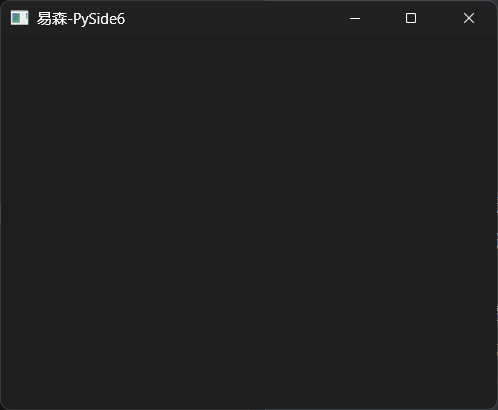
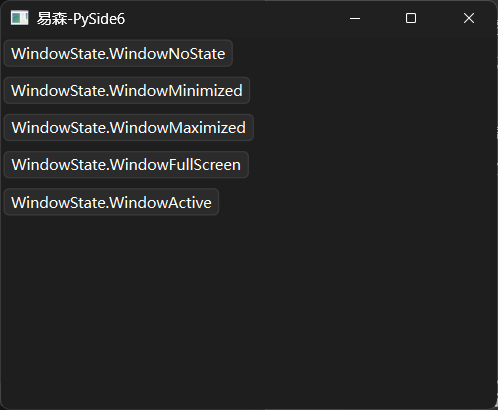
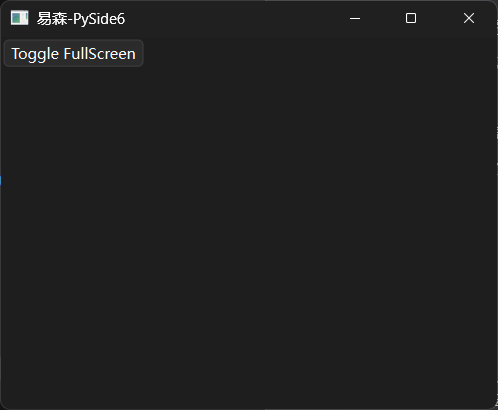

# PySide6札记（2027）

原《Qt For Python 札记》，现改名为《PySide6札记》。

2027年所有更新内容转入《易森》，以下内容为存稿、留档，在《易森》更新时复制到《易森》中。

## 50 打开链接（《易森》2705期）

本章参考文档：https://doc.qt.io/qtforpython-6/PySide6/QtGui/QDesktopServices.html

在PySide6中，创建超链接的方法多种多样，不过核心点都是使用HTML中的超链接，但有的控件可以使用Markdown语法：

```python3
from PySide6.QtWidgets import (
    QApplication,
    QWidget,
    QLabel,
    QTextBrowser
)

app = QApplication()
window = QWidget()
window.setWindowTitle('易森-PySide6')
window.resize(400, 300)

url='https://doc.qt.io/qtforpython-6/index.html'
label =QLabel(
    window,
    text=f'<a href={url}>超链接</a>',
    openExternalLinks=True
)
browser = QTextBrowser(
    window,
    #text=f'<a href={url}>超链接(HTML)</a>',
    markdown=f'[超链接(Markdown)]({url})',
    openExternalLinks=True
)
browser.move(
    0,30
)

window.show()
app.exec()
```


都是《PySide6札记》（原《Qt For Python 札记》）2026版介绍过的控件，具体用法这里不再赘述，示例中可以清晰看到。不过，如果想要实现不点击超链接来打开链接，就要使用类似NiceGUI的`ui.navigate.to`方法才行。

在PySide6中，`QDesktopServices.openUrl`方法（静态方法）可以随时随地打开指定链接：

```python3
from PySide6.QtWidgets import (
    QApplication,
    QWidget,
    QPushButton
)
from PySide6.QtGui import QDesktopServices

app = QApplication()
window = QWidget()
window.setWindowTitle('易森-PySide6')
window.resize(400, 300)

url='https://doc.qt.io/qtforpython-6/index.html'
button = QPushButton(
    window,
    text='点击打开超链接'
)
button.clicked.connect(
    lambda :QDesktopServices.openUrl(
        url
    )
)


window.show()
app.exec()
```


## 51 查漏补缺——`QWidget`控件（《易森》2708期）

《Qt For Python 札记》中，在一开始介绍基础内容时首先使用了`QWidget`控件，介绍QtWidgets程序的三种主窗口控件时对比过该控件与其他主窗口控件，同时该控件也是大部分控件的基类，很多示例也离不开该控件创建的主窗口。可以说，`QWidget`控件几乎贯穿了《Qt For Python 札记》。

用了这么多次`QWidget`控件，却没有像介绍其他控件一样认真介绍该控件，有点说不过去。不过，这并不是笔者偷懒，而是该控件作为其他控件的基类，一方面支持的参数、方法、控件属性确实多且偏向基础；另一方面就是大部分控件提供了简单直观的参数、方法、控件属性，远比直接使用该控件便捷，没必要刻意制造难度。

但是，魔鬼藏于细节，突破始于基础，有些藏在基础中的用法，有时候反而会成为被忽略的地方，或者是难题突破的关键。

因此，从本章开始，笔者将不定期更新《查漏补缺》系列，从基础入手，探求那些可能被忽略的用法，寻找解决问题的奇淫巧技。

那么，本章要介绍的，自然是前面铺垫许久的`QWidget`控件。

相关文档：https://doc.qt.io/qtforpython-6/PySide6/QtWidgets/QWidget.html

### 51.1 初始化参数

关于初始化参数，官方文档和`QtWidgets.pyi`中的参数提示有两个坑需要复习一下：

- 参数提示中对应控件属性的参数，如果是**只读**属性（没有对应的设置方法），则该参数**不能**在初始化时传入，会报错。
- 除了控件提供的初始化参数提示，其父类控件提供的初始化参数提示也有部分可用。这一部分可以简单理解为，所有控件支持的**可读写**属性，都可以在初始化时通过**关键字**传入。

如果看官方文档（ https://doc.qt.io/qtforpython-6/PySide6/QtWidgets/QWidget.html#properties ）的话，提供的可读写控件属性很多，全介绍难免有些枯燥，而且会导致篇幅较长。因此，笔者实测对应的参数之后，挑选了几个实用的。后面介绍方法、信号、槽时也是一样的原则。

#### 51.1.1 定义窗口的初始大小，用`resize`方法还`size`参数？

前面很多PySide6程序的示例中，都单独调用了`resize`方法来设置窗口的初始大小。其实，该方法就是`size`控件属性的设置方法，因此，该属性可以在初始化时直接传参：

```python3
from PySide6.QtWidgets import (
    QApplication,
    QWidget
)
from PySide6.QtCore import QSize


app = QApplication()
window = QWidget(
    size=QSize(400, 300)
)
window.setWindowTitle('易森-PySide6')


window.show()
app.exec()

```



效果是一样的，但代码复杂度有一点差异。虽然可以一步到位，但参数仅限`QSize`类型，不像`resize`方法可以传入两个整数或者`QSize`类型：

```python3
from PySide6.QtWidgets import (
    QApplication,
    QWidget
)
from PySide6.QtCore import QSize

app = QApplication()
window = QWidget()
window.setWindowTitle('易森-PySide6')
# window.resize(400, 300)
window.resize(
    QSize(400, 300)
)

window.show()
app.exec()

```

当然，`resize`方法支持的参数灵活，用的时候也灵活，甚至特定场景下只能使用该方法——修改控件属性只能使用该方法。参数与方法不是对立的两面，而是有机的结合，按需选择。因此，笔者为了方便，避免导入`QSize`，选择只用`resize`方法。

#### 51.1.2 决定鼠标样式的`cursor`参数

`cursor`参数（控件属性）决定了鼠标停留在该控件时的样式，传入（设置）`QCursor`对象即可：

```python3
from PySide6.QtWidgets import (
    QApplication,
    QWidget
)
from PySide6.QtGui import QCursor
from PySide6.QtCore import Qt

app = QApplication()
window = QWidget(
    cursor=QCursor(
        Qt.CursorShape.WhatsThisCursor
    )
)
window.setWindowTitle('易森-PySide6')
window.resize(400, 300)

window.show()
app.exec()

```


`QCursor`对象支持自定义图片，因笔者手头没有合适的素材，为了避免侵权，就不做演示了，具体用法可以参考官网文档（ https://doc.qt.io/qtforpython-6/PySide6/QtGui/QCursor.html ）。

#### 51.1.3 定义窗口的初始位置，用`move`方法还`geometry`参数？

在之前介绍PySide6中，经常使用`move`方法来修改控件的位置。当同样为控件的`QWidget`控件作为主窗口使用时，则该方法可以用来修改窗口的位置：

```python3
from PySide6.QtWidgets import (
    QApplication,
    QWidget
)

app = QApplication()
window = QWidget()
window.setWindowTitle('易森-PySide6')
window.resize(400, 300)
window.move(
    10, 10
)

window.show()
app.exec()

```

那么，有没有一个初始化参数可以实现同样的效果呢？

当然有，那就是`geometry`参数：

```python3
from PySide6.QtWidgets import (
    QApplication,
    QWidget
)
from PySide6.QtCore import QRect

app = QApplication()
window = QWidget(
    geometry=QRect(
        10, 10,
        400, 300
    )
)
window.setWindowTitle('易森-PySide6')

window.show()
app.exec()

```

如示例所示，`geometry`参数同时决定了窗口位置和大小，但这里的窗口位置不含标题栏的高度，这一点与`move`方法不同。

注意，如果窗口位置是`(0,0)`，则操作系统会强制移动窗口来确保标题栏不在屏幕外，将导致`geometry`参数的显示结果违反直觉——标题栏完整显示。

最后简单总结一下，如果想同时初始化窗口位置和大小，使用`geometry`参数可以一步到位。但考虑到该参数会忽略标题栏，如非必要，还是建议使用`move`方法。

#### 51.1.4 设置窗口的图标与标题，也有对应的参数

如同`resize`方法是`size`控件属性的设置方法，前面示例中用来设置窗口标题的`setWindowTitle`方法也是对应控件属性的设置方法，因此，可以在创建窗口时直接指定窗口标题（使用`windowTitle`参数）：

```python3
from PySide6.QtWidgets import (
    QApplication,
    QWidget
)

app = QApplication()
window = QWidget(
    windowTitle='易森-PySide6'
)
window.resize(400, 300)


window.show()
app.exec()

```

窗口图标和窗口标题一样，也可以使用参数（`windowIcon`参数）或者方法（`setWindowIcon`方法）来设置：

```python3
from PySide6.QtWidgets import (
    QApplication,
    QWidget
)
from PySide6.QtGui import QIcon

app = QApplication()
window = QWidget(
    windowIcon=QIcon.fromTheme(
        QIcon.ThemeIcon.Computer
    ),
    windowTitle='易森-PySide6'
)
window.setWindowIcon(
    QIcon.fromTheme(
        QIcon.ThemeIcon.Computer
    )
)
window.resize(400, 300)


window.show()
app.exec()

```


#### 51.1.5 修改窗口透明度，一个参数（控件属性）搞定

 修改窗口透明度，只要了解一个参数（控件属性）就够了，那就是`windowOpacity`参数。该参数使用与百分比等值的小数表示透明度（0对应0%，0.5对应50%，1对应100%）：

```python3
from PySide6.QtWidgets import (
    QApplication,
    QWidget
)
from PySide6.QtGui import QIcon

app = QApplication()
window = QWidget(
    windowIcon=QIcon.fromTheme(
        QIcon.ThemeIcon.Computer
    ),
    windowTitle='易森-PySide6',
    windowOpacity=0.5
)

window.resize(400, 300)


window.show()
app.exec()

```


### 51.2 方法（含控件属性）

#### 51.2.1 获取窗口的信息（宽高、位置等）

除了可以在初始化时可作为参数使用的控件属性，还有一些只读的控件属性，可用于获取窗口的信息（宽高、位置等）：

- `pos`方法，获取窗口（含标题栏）的左上角坐标。
- `x`方法，，获取窗口（含标题栏）的左上角X坐标。
- `y`方法，，获取窗口（含标题栏）的左上角Y坐标。
- `width`方法，获取窗口（不含标题栏）的宽度。
- `height`方法，获取窗口（不含标题栏）的高度。
- `isFullScreen`方法，获取窗口是否为全屏状态。
- `isHidden`方法，获取窗口是否为隐藏状态。
- `isMaximized`方法，获取窗口是否为最大化状态。
- `isMinimized`方法，获取窗口是否为最小化状态。

示例如下：

```python3
from PySide6.QtWidgets import (
    QApplication,
    QWidget,
    QPushButton,
    QTextEdit
)

app = QApplication()
window = QWidget(
    windowTitle='易森-PySide6',
)
window.resize(400, 300)
edit = QTextEdit(
    window
)
button = QPushButton(
    'get window info',
    window
)
button.move(
    0,
    200
)
button.clicked.connect(
    lambda:edit.setText(
        str(window.pos())
    )
)

window.show()
app.exec()

```


#### 51.2.2 设置窗口的状态，用`setWindowState`方法

上一节介绍的方法中，有获取窗口最大化、最小化、全屏状态的，那么，如何让窗口进入对应状态呢？

就Windows系统而已，默认窗口提供了最大化、最小化按钮，想要进入全屏状态的话，需要程序实现对应的交互方式才行。不过，不管是点击按钮还是绑定快捷键，都需要了解调用什么方法可以让窗口全屏。问题的答案很简单，那就是用`setWindowState`方法（参数为`Qt.WindowState`枚举类型，具体用法参考 https://doc.qt.io/qtforpython-6/PySide6/QtWidgets/QWidget.html#PySide6.QtWidgets.QWidget.setWindowState ）。用`setWindowState`方法，不仅可以进入全屏状态，还可以进入最大化、最小化状态：

```python3
from PySide6.QtWidgets import (
    QApplication,
    QWidget,
    QPushButton
)
from PySide6.QtCore import Qt

app = QApplication()
window = QWidget(
    windowTitle='易森-PySide6',
)
window.resize(400, 300)

for i in [
    Qt.WindowState.WindowNoState,
    Qt.WindowState.WindowMinimized,
    Qt.WindowState.WindowMaximized,
    Qt.WindowState.WindowFullScreen,
    Qt.WindowState.WindowActive    
]:
    button = QPushButton(
        str(i),
        window
    )
    button.clicked.connect(
        lambda e,i=i:window.setWindowState(
            i
        )
    )
    button.move(
        0,
        30*len(bin(i.value*2)[3:])
    )

window.show()
app.exec()

```



上面的示例中，点击不同的按钮可以让窗口进入不同的状态，结合上一节提供的方法，就可以实现一个切换全屏状态的功能：

```python3
from PySide6.QtWidgets import (
    QApplication,
    QWidget,
    QPushButton
)
from PySide6.QtCore import Qt

app = QApplication()
window = QWidget(
    windowTitle='易森-PySide6',
)
window.resize(400, 300)

button = QPushButton(
    'Toggle FullScreen',
    window
)
button.clicked.connect(
    lambda:window.setWindowState(
        Qt.WindowState.WindowNoState if window.isFullScreen() else Qt.WindowState.WindowFullScreen
    )
)


window.show()
app.exec()

```



#### 51.2.3 移动窗口位置，用`move`方法或`setGeometry`方法

前面说过，初始化窗口位置和大小，使用`geometry`参数可以一步到位；使用`move`方法，也可以初始化窗口位置。

对于移动窗口位置，`geometry`参数（控件属性）和`move`方法都可以实现。不过，对于`geometry`参数（控件属性）而言，因为需要同时指定窗口宽度和高度，因此需要结合原窗口的信息使用，才能避免窗口大小发生变化：

```python3
from PySide6.QtWidgets import (
    QApplication,
    QWidget
)
from PySide6.QtCore import QRect

app = QApplication()
window = QWidget(
    geometry=QRect(
        10, 10,
        400, 300
    )
)
window.setWindowTitle('易森-PySide6')
window .setGeometry(
    100,
    100,
    window.width(),
    window.height()
)

window.show()
app.exec()

```

### 51.3 槽

#### 51.3.1 不同的“show”方法，显示不同状态的窗口

对于设置窗口的状态，有的读者可能觉得前面的方法有点麻烦，尤其是给按钮的信号做绑定时，需要写lambda表达式。好在`QWidget`控件提供了一些槽，可以很方便地绑定信号：

- `show`方法，显示窗口。
- `showFullScreen`方法，以全屏状态显示窗口。
- `showMaximized`方法，以最大化状态显示窗口。
- `showMinimized`方法，以最小化状态显示窗口。
- `showNormal`方法，以正常状态（非全屏、非最大化、非最小化）显示窗口。

示例如下：

```python3
from PySide6.QtWidgets import (
    QApplication,
    QWidget,
    QPushButton
)

app = QApplication()
window = QWidget()

window.setWindowTitle('易森-PySide6')
window.resize(400, 300)

button = QPushButton(
    '退出全屏',
    window
)
button.clicked.connect(
    window.showNormal
)

# 全屏显示
window.showFullScreen()
app.exec()

```

注意，除了`show`方法外，其余几种以特定状态显示窗口的方法均为互斥方法，即对应的状态不能同时存在。


## xx `Qxxx`xxx控件（更新中）

本章参考文档：


```python3
from PySide6.QtWidgets import (
    QApplication,
    QWidget
)

app = QApplication()
window = QWidget()
window.setWindowTitle('易森-PySide6')
window.resize(400, 300)


window.show()
app.exec()
```


## x 创作灵感（非正式内容）

灵感来源（官方）：

- `QtWidgets`模块：https://doc.qt.io/qtforpython-6/overviews/qtwidgets-widget-classes.html
- `QtGui`模块：https://doc.qt.io/qtforpython-6/overviews/qtwidgets-widget-classes.html#widgets-classes
- `QtCore`模块：https://doc.qt.io/qtforpython-6/PySide6/QtCore/index.html#list-of-classes-by-function

模块一览表（Qt 6.10.x）：

| 模块名                 | 主要用途                         | 文档链接                                                     |
| ---------------------- | -------------------------------- | ------------------------------------------------------------ |
| `Qt3DAnimation`        | 处理3D动画                       | https://doc.qt.io/qtforpython-6/PySide6/Qt3DAnimation/index.html#module-PySide6.Qt3DAnimation |
| `Qt3DCore`             | 3D相关的基础功能                 | https://doc.qt.io/qtforpython-6/PySide6/Qt3DCore/index.html#module-PySide6.Qt3DCore |
| `Qt3DExtras`           | 3D相关的额外功能                 | https://doc.qt.io/qtforpython-6/PySide6/Qt3DExtras/index.html#module-PySide6.Qt3DExtras |
| `Qt3DInput`            | 3D相关的输入功能                 | https://doc.qt.io/qtforpython-6/PySide6/Qt3DInput/index.html#module-PySide6.Qt3DInput |
| `Qt3DLogic`            | 3D相关的逻辑功能                 | https://doc.qt.io/qtforpython-6/PySide6/Qt3DLogic/index.html#module-PySide6.Qt3DLogic |
| `Qt3DRender`           | 渲染3D模型                       | https://doc.qt.io/qtforpython-6/PySide6/Qt3DRender/index.html#module-PySide6.Qt3DRender |
| `QtAsyncio`            | 相当于Qt版asyncio框架            | https://doc.qt.io/qtforpython-6/PySide6/QtAsyncio/index.html#module-PySide6.QtAsyncio |
| `QtBluetooth`          | 操作蓝牙设备                     | https://doc.qt.io/qtforpython-6/PySide6/QtBluetooth/index.html#module-PySide6.QtBluetooth |
| `QtConcurrent`         | 并行编程相关的功能               | https://doc.qt.io/qtforpython-6/PySide6/QtConcurrent/index.html#module-PySide6.QtConcurrent |
| `QtCore`               | Qt相关的基础功能                 | https://doc.qt.io/qtforpython-6/PySide6/QtCore/index.html#module-PySide6.QtCore |
| `QtDBus`               | D-Bus相关的功能                  | https://doc.qt.io/qtforpython-6/PySide6/QtDBus/index.html#module-PySide6.QtDBus |
| `QtDesigner`           | 可视化设计工具                   | https://doc.qt.io/qtforpython-6/PySide6/QtDesigner/index.html#module-PySide6.QtDesigner |
| `QtGraphs`             | 二维、三维图表                   | https://doc.qt.io/qtforpython-6/PySide6/QtGraphs/index.html#module-PySide6.QtGraphs |
| `QtGraphsWidgets`      | 三维图表                         | https://doc.qt.io/qtforpython-6/PySide6/QtGraphsWidgets/index.html#module-PySide6.QtGraphsWidgets |
| `QtGui`                | GUI相关的基础功能                | https://doc.qt.io/qtforpython-6/PySide6/QtGui/index.html#module-PySide6.QtGui |
| `QtHelp`               | 集成在线文档                     | https://doc.qt.io/qtforpython-6/PySide6/QtHelp/index.html#module-PySide6.QtHelp |
| `QtHttpServer`         | 创建HTTP服务器                   | https://doc.qt.io/qtforpython-6/PySide6/QtHttpServer/index.html#module-PySide6.QtHttpServer |
| `QtLocation`           | 定位、地图相关功能               | https://doc.qt.io/qtforpython-6/PySide6/QtLocation/index.html#module-PySide6.QtLocation |
| `QtMultimedia`         | 处理多媒体文件                   | https://doc.qt.io/qtforpython-6/PySide6/QtMultimedia/index.html#module-PySide6.QtMultimedia |
| `QtMultimediaWidgets`  | 处理多媒体文件的额外功能         | https://doc.qt.io/qtforpython-6/PySide6/QtMultimediaWidgets/index.html#module-PySide6.QtMultimediaWidgets |
| `QtNetwork`            | 网络功能                         | https://doc.qt.io/qtforpython-6/PySide6/QtNetwork/index.html#module-PySide6.QtNetwork |
| `QtNetworkAuth`        | 网络授权                         | https://doc.qt.io/qtforpython-6/PySide6/QtNetworkAuth/index.html#module-PySide6.QtNetworkAuth |
| `QtNfc`                | 操作NFC设备                      | https://doc.qt.io/qtforpython-6/PySide6/QtNfc/index.html#module-PySide6.QtNfc |
| `QtOpenGL`             | 与OpenGL库交互                   | https://doc.qt.io/qtforpython-6/PySide6/QtOpenGL/index.html#module-PySide6.QtOpenGL |
| `QtOpenGLWidgets`      | 显示OpenGL内容的控件             | https://doc.qt.io/qtforpython-6/PySide6/QtOpenGLWidgets/index.html#module-PySide6.QtOpenGLWidgets |
| `QtPdf`                | 处理PDF文件                      | https://doc.qt.io/qtforpython-6/PySide6/QtPdf/index.html#module-PySide6.QtPdf |
| `QtPdfWidgets`         | 显示PDF文件的控件                | https://doc.qt.io/qtforpython-6/PySide6/QtPdfWidgets/index.html#module-PySide6.QtPdfWidgets |
| `QtPositioning`        | 实时定位                         | https://doc.qt.io/qtforpython-6/PySide6/QtPositioning/index.html#module-PySide6.QtPositioning |
| `QtPrintSupport`       | 打印文件相关的功能               | https://doc.qt.io/qtforpython-6/PySide6/QtPrintSupport/index.html#module-PySide6.QtPrintSupport |
| `QtQml`                | 处理QML文件                      | https://doc.qt.io/qtforpython-6/PySide6/QtQml/index.html#module-PySide6.QtQml |
| `QtQuick`              | QtQuick程序的基础功能            | https://doc.qt.io/qtforpython-6/PySide6/QtQuick/index.html#module-PySide6.QtQuick |
| `QtQuick3D`            | 在QtQuick程序中显示3D内容        | https://doc.qt.io/qtforpython-6/PySide6/QtQuick3D/index.html#module-PySide6.QtQuick3D |
| `QtQuickControls2`     | QtQuick程序的配套控件            | https://doc.qt.io/qtforpython-6/PySide6/QtQuickControls2/index.html#module-PySide6.QtQuickControls2 |
| `QtQuickTest`          | QtQuick程序的测试框架            | https://doc.qt.io/qtforpython-6/PySide6/QtQuickTest/index.html#module-PySide6.QtQuickTest |
| `QtQuickWidgets`       | 在QtWidgets程序中显示QtQuick控件 | https://doc.qt.io/qtforpython-6/PySide6/QtQuickWidgets/index.html#module-PySide6.QtQuickWidgets |
| `QtRemoteObjects`      | 提供进程间通信使用的对象         | https://doc.qt.io/qtforpython-6/PySide6/QtRemoteObjects/index.html#module-PySide6.QtRemoteObjects |
| `QtScxml`              | 从SCXML文件创建状态机            | https://doc.qt.io/qtforpython-6/PySide6/QtScxml/index.html#module-PySide6.QtScxml https://www.w3.org/TR/scxml/ |
| `QtSensors`            | 操作传感器硬件                   | https://doc.qt.io/qtforpython-6/PySide6/QtSensors/index.html#module-PySide6.QtSensors |
| `QtSerialBus`          | 串行总线相关功能                 | https://doc.qt.io/qtforpython-6/PySide6/QtSerialBus/index.html#module-PySide6.QtSerialBus |
| `QtSerialPort`         | 串口通讯相关功能                 | https://doc.qt.io/qtforpython-6/PySide6/QtSerialPort/index.html#module-PySide6.QtSerialPort |
| `QtSpatialAudio`       | 空间音频相关功能                 | https://doc.qt.io/qtforpython-6/PySide6/QtSpatialAudio/index.html#module-PySide6.QtSpatialAudio |
| `QtSql`                | SQL、数据库相关功能              | https://doc.qt.io/qtforpython-6/PySide6/QtSql/index.html#module-PySide6.QtSql |
| `QtStateMachine`       | 状态机相关功能                   | https://doc.qt.io/qtforpython-6/PySide6/QtStateMachine/index.html#module-PySide6.QtStateMachine |
| `QtSvg`                | 处理SVG文件                      | https://doc.qt.io/qtforpython-6/PySide6/QtSvg/index.html#module-PySide6.QtSvg |
| `QtSvgWidgets`         | 显示SVG文件的控件                | https://doc.qt.io/qtforpython-6/PySide6/QtSvgWidgets/index.html#module-PySide6.QtSvgWidgets |
| `QtTest`               | GUI测试和基准测试                | https://doc.qt.io/qtforpython-6/PySide6/QtTest/index.html#module-PySide6.QtTest |
| `QtTextToSpeech`       | 文本转语音                       | https://doc.qt.io/qtforpython-6/PySide6/QtTextToSpeech/index.html#module-PySide6.QtTextToSpeech |
| `QtUiTools`            | 加载UI文件                       | https://doc.qt.io/qtforpython-6/PySide6/QtUiTools/index.html#module-PySide6.QtUiTools |
| `PySide6.QtWebChannel` | 服务器、客户端之间的点对点通讯   | https://doc.qt.io/qtforpython-6/PySide6/QtWebChannel/index.html#module-PySide6.QtWebChannel |
| `QtWebEngineCore`      | WebEngine的基础功能              | https://doc.qt.io/qtforpython-6/PySide6/QtWebEngineCore/index.html#module-PySide6.QtWebEngineCore |
| `QtWebEngineQuick`     | 在QtQuick程序中嵌入WebEngine     | https://doc.qt.io/qtforpython-6/PySide6/QtWebEngineQuick/index.html#module-PySide6.QtWebEngineQuick |
| `QtWebEngineWidgets`   | 在QtWidgets程序中嵌入WebEngine   | https://doc.qt.io/qtforpython-6/PySide6/QtWebEngineWidgets/index.html#module-PySide6.QtWebEngineWidgets |
| `QtWebSockets`         | 处理WebSocket协议                | https://doc.qt.io/qtforpython-6/PySide6/QtWebSockets/index.html#module-PySide6.QtWebSockets |
| `QtWebView`            | 显示网页内容                     | https://doc.qt.io/qtforpython-6/PySide6/QtWebView/index.html#module-PySide6.QtWebView |
| `QtWidgets`            | QtWidgets程序的基础功能          | https://doc.qt.io/qtforpython-6/PySide6/QtWidgets/index.html#module-PySide6.QtWidgets |
| `QtXml`                | 处理XML文件                      | https://doc.qt.io/qtforpython-6/PySide6/QtXml/index.html#module-PySide6.QtXml |

