《PySide6札记》（2027）

原《Qt For Python 札记》，现改名为《PySide6札记》。

2027年所有更新内容转入《易森》，以下内容为存稿、留档，在《易森》更新时复制到《易森》中。

## 50 打开链接（《易森》2705期）

本章参考文档：https://doc.qt.io/qtforpython-6/PySide6/QtGui/QDesktopServices.html

在PySide6中，创建超链接的方法多种多样，不过核心点都是使用HTML中的超链接，但有的控件可以使用Markdown语法：

```python
from PySide6.QtWidgets import (
    QApplication,
    QWidget,
    QLabel,
    QTextBrowser
)

app = QApplication()
window = QWidget()
window.setWindowTitle('易森-PySide6')
window.resize(400, 300)

url='https://doc.qt.io/qtforpython-6/index.html'
label =QLabel(
    window,
    text=f'<a href={url}>超链接</a>',
    openExternalLinks=True
)
browser = QTextBrowser(
    window,
    #text=f'<a href={url}>超链接(HTML)</a>',
    markdown=f'[超链接(Markdown)]({url})',
    openExternalLinks=True
)
browser.move(
    0,30
)

window.show()
app.exec()
```

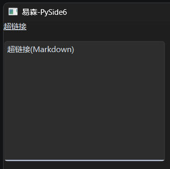

都是《PySide6札记》（原《Qt For Python 札记》）2026版介绍过的控件，具体用法这里不再赘述，示例中可以清晰看到。不过，如果想要实现不点击超链接来打开链接，就要使用类似NiceGUI的`ui.navigate.to`方法才行。

在PySide6中，`QDesktopServices.openUrl`方法（静态方法）可以随时随地打开指定链接：

```python
from PySide6.QtWidgets import (
    QApplication,
    QWidget,
    QPushButton
)
from PySide6.QtGui import QDesktopServices

app = QApplication()
window = QWidget()
window.setWindowTitle('易森-PySide6')
window.resize(400, 300)

url='https://doc.qt.io/qtforpython-6/index.html'
button = QPushButton(
    window,
    text='点击打开超链接'
)
button.clicked.connect(
    lambda :QDesktopServices.openUrl(
        url
    )
)


window.show()
app.exec()
```

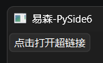

## 51 查漏补缺——`QWidget`控件（《易森》2708期）

《Qt For Python 札记》中，在一开始介绍基础内容时首先使用了`QWidget`控件，介绍QtWidgets程序的三种主窗口控件时对比过该控件与其他主窗口控件，同时该控件也是大部分控件的基类，很多示例也离不开该控件创建的主窗口。可以说，`QWidget`控件几乎贯穿了《Qt For Python 札记》。

用了这么多次`QWidget`控件，却没有像介绍其他控件一样认真介绍该控件，有点说不过去。不过，这并不是笔者偷懒，而是该控件作为其他控件的基类，一方面支持的参数、方法、控件属性确实多且偏向基础；另一方面就是大部分控件提供了简单直观的参数、方法、控件属性，远比直接使用该控件便捷，没必要刻意制造难度。

但是，魔鬼藏于细节，突破始于基础，有些藏在基础中的用法，有时候反而会成为被忽略的地方，或者是难题突破的关键。

因此，从本章开始，笔者将不定期更新《查漏补缺》系列，从基础入手，探求那些可能被忽略的用法，寻找解决问题的奇淫巧技。

那么，本章要介绍的，自然是前面铺垫许久的`QWidget`控件。

相关文档：https://doc.qt.io/qtforpython-6/PySide6/QtWidgets/QWidget.html

### 51.1 初始化参数

关于初始化参数，官方文档和`QtWidgets.pyi`中的参数提示有两个坑需要复习一下：

- 参数提示中对应控件属性的参数，如果是**只读**属性（没有对应的设置方法），则该参数**不能**在初始化时传入，会报错。
- 除了控件提供的初始化参数提示，其父类控件提供的初始化参数提示也有部分可用。这一部分可以简单理解为，所有控件支持的**可读写**属性，都可以在初始化时通过**关键字**传入。

如果看官方文档（ https://doc.qt.io/qtforpython-6/PySide6/QtWidgets/QWidget.html#properties ）的话，提供的可读写控件属性很多，全介绍难免有些枯燥，而且会导致篇幅较长。因此，笔者实测对应的参数之后，挑选了几个实用的。后面介绍方法、信号、槽时也是一样的原则。

#### 51.1.1 定义窗口的初始大小，用`resize`方法还`size`参数？

前面很多PySide6程序的示例中，都单独调用了`resize`方法来设置窗口的初始大小。其实，该方法就是`size`控件属性的设置方法，因此，该属性可以在初始化时直接传参：

```python
from PySide6.QtWidgets import (
    QApplication,
    QWidget
)
from PySide6.QtCore import QSize


app = QApplication()
window = QWidget(
    size=QSize(400, 300)
)
window.setWindowTitle('易森-PySide6')


window.show()
app.exec()

```


效果是一样的，但代码复杂度有一点差异。虽然可以一步到位，但参数仅限`QSize`类型，不像`resize`方法可以传入两个整数或者`QSize`类型：

```python
from PySide6.QtWidgets import (
    QApplication,
    QWidget
)
from PySide6.QtCore import QSize

app = QApplication()
window = QWidget()
window.setWindowTitle('易森-PySide6')
# window.resize(400, 300)
window.resize(
    QSize(400, 300)
)

window.show()
app.exec()

```

当然，`resize`方法支持的参数灵活，用的时候也灵活，甚至特定场景下只能使用该方法——修改控件属性只能使用该方法。参数与方法不是对立的两面，而是有机的结合，按需选择。因此，笔者为了方便，避免导入`QSize`，选择只用`resize`方法。

#### 51.1.2 决定鼠标样式的`cursor`参数

`cursor`参数（控件属性）决定了鼠标停留在该控件时的样式，传入（设置）`QCursor`对象即可：

```python
from PySide6.QtWidgets import (
    QApplication,
    QWidget
)
from PySide6.QtGui import QCursor
from PySide6.QtCore import Qt

app = QApplication()
window = QWidget(
    cursor=QCursor(
        Qt.CursorShape.WhatsThisCursor
    )
)
window.setWindowTitle('易森-PySide6')
window.resize(400, 300)

window.show()
app.exec()

```

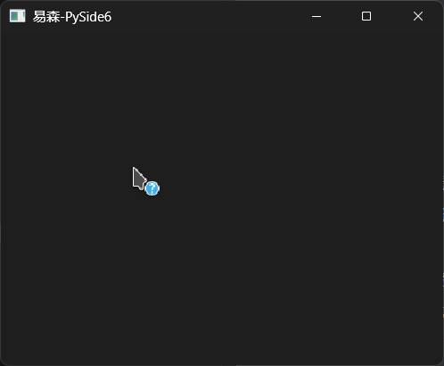

`QCursor`对象支持自定义图片，因笔者手头没有合适的素材，为了避免侵权，就不做演示了，具体用法可以参考官网文档（ https://doc.qt.io/qtforpython-6/PySide6/QtGui/QCursor.html ）。

#### 51.1.3 定义窗口的初始位置，用`move`方法还`geometry`参数？

在之前介绍PySide6中，经常使用`move`方法来修改控件的位置。当同样为控件的`QWidget`控件作为主窗口使用时，则该方法可以用来修改窗口的位置：

```python
from PySide6.QtWidgets import (
    QApplication,
    QWidget
)

app = QApplication()
window = QWidget()
window.setWindowTitle('易森-PySide6')
window.resize(400, 300)
window.move(
    10, 10
)

window.show()
app.exec()

```

那么，有没有一个初始化参数可以实现同样的效果呢？

当然有，那就是`geometry`参数：

```python
from PySide6.QtWidgets import (
    QApplication,
    QWidget
)
from PySide6.QtCore import QRect

app = QApplication()
window = QWidget(
    geometry=QRect(
        10, 10,
        400, 300
    )
)
window.setWindowTitle('易森-PySide6')

window.show()
app.exec()

```

如示例所示，`geometry`参数同时决定了窗口位置和大小，但这里的窗口位置不含标题栏的高度，这一点与`move`方法不同。

注意，如果窗口位置是`(0,0)`，则操作系统会强制移动窗口来确保标题栏不在屏幕外，将导致`geometry`参数的显示结果违反直觉——标题栏完整显示。

最后简单总结一下，如果想同时初始化窗口位置和大小，使用`geometry`参数可以一步到位。但考虑到该参数会忽略标题栏，如非必要，还是建议使用`move`方法。

#### 51.1.4 设置窗口的图标与标题，也有对应的参数

如同`resize`方法是`size`控件属性的设置方法，前面示例中用来设置窗口标题的`setWindowTitle`方法也是对应控件属性的设置方法，因此，可以在创建窗口时直接指定窗口标题（使用`windowTitle`参数）：

```python
from PySide6.QtWidgets import (
    QApplication,
    QWidget
)

app = QApplication()
window = QWidget(
    windowTitle='易森-PySide6'
)
window.resize(400, 300)


window.show()
app.exec()

```

窗口图标和窗口标题一样，也可以使用参数（`windowIcon`参数）或者方法（`setWindowIcon`方法）来设置：

```python
from PySide6.QtWidgets import (
    QApplication,
    QWidget
)
from PySide6.QtGui import QIcon

app = QApplication()
window = QWidget(
    windowIcon=QIcon.fromTheme(
        QIcon.ThemeIcon.Computer
    ),
    windowTitle='易森-PySide6'
)
window.setWindowIcon(
    QIcon.fromTheme(
        QIcon.ThemeIcon.Computer
    )
)
window.resize(400, 300)


window.show()
app.exec()

```

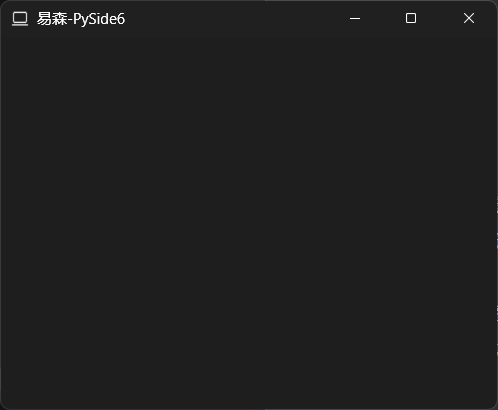

#### 51.1.5 修改窗口透明度，一个参数（控件属性）搞定

 修改窗口透明度，只要了解一个参数（控件属性）就够了，那就是`windowOpacity`参数。该参数使用与百分比等值的小数表示透明度（0对应0%，0.5对应50%，1对应100%）：

```python
from PySide6.QtWidgets import (
    QApplication,
    QWidget
)
from PySide6.QtGui import QIcon

app = QApplication()
window = QWidget(
    windowIcon=QIcon.fromTheme(
        QIcon.ThemeIcon.Computer
    ),
    windowTitle='易森-PySide6',
    windowOpacity=0.5
)

window.resize(400, 300)


window.show()
app.exec()

```

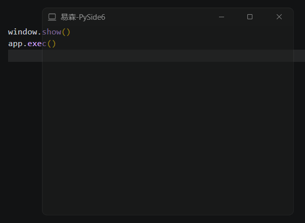

### 51.2 方法（含控件属性）

#### 51.2.1 获取窗口的信息（宽高、位置等）

除了可以在初始化时可作为参数使用的控件属性，还有一些只读的控件属性，可用于获取窗口的信息（宽高、位置等）：

- `pos`方法，获取窗口（含标题栏）的左上角坐标。
- `x`方法，，获取窗口（含标题栏）的左上角X坐标。
- `y`方法，，获取窗口（含标题栏）的左上角Y坐标。
- `width`方法，获取窗口（不含标题栏）的宽度。
- `height`方法，获取窗口（不含标题栏）的高度。
- `isFullScreen`方法，获取窗口是否为全屏状态。
- `isHidden`方法，获取窗口是否为隐藏状态。
- `isMaximized`方法，获取窗口是否为最大化状态。
- `isMinimized`方法，获取窗口是否为最小化状态。

示例如下：

```python
from PySide6.QtWidgets import (
    QApplication,
    QWidget,
    QPushButton,
    QTextEdit
)

app = QApplication()
window = QWidget(
    windowTitle='易森-PySide6',
)
window.resize(400, 300)
edit = QTextEdit(
    window
)
button = QPushButton(
    'get window info',
    window
)
button.move(
    0,
    200
)
button.clicked.connect(
    lambda:edit.setText(
        str(window.pos())
    )
)

window.show()
app.exec()

```

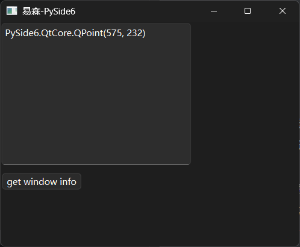

#### 51.2.2 设置窗口的状态，用`setWindowState`方法

上一节介绍的方法中，有获取窗口最大化、最小化、全屏状态的，那么，如何让窗口进入对应状态呢？

就Windows系统而已，默认窗口提供了最大化、最小化按钮，想要进入全屏状态的话，需要程序实现对应的交互方式才行。不过，不管是点击按钮还是绑定快捷键，都需要了解调用什么方法可以让窗口全屏。问题的答案很简单，那就是用`setWindowState`方法（参数为`Qt.WindowState`枚举类型，具体用法参考 https://doc.qt.io/qtforpython-6/PySide6/QtWidgets/QWidget.html#PySide6.QtWidgets.QWidget.setWindowState ）。用`setWindowState`方法，不仅可以进入全屏状态，还可以进入最大化、最小化状态：

```python
from PySide6.QtWidgets import (
    QApplication,
    QWidget,
    QPushButton
)
from PySide6.QtCore import Qt

app = QApplication()
window = QWidget(
    windowTitle='易森-PySide6',
)
window.resize(400, 300)

for i in [
    Qt.WindowState.WindowNoState,
    Qt.WindowState.WindowMinimized,
    Qt.WindowState.WindowMaximized,
    Qt.WindowState.WindowFullScreen,
    Qt.WindowState.WindowActive    
]:
    button = QPushButton(
        str(i),
        window
    )
    button.clicked.connect(
        lambda e,i=i:window.setWindowState(
            i
        )
    )
    button.move(
        0,
        30*len(bin(i.value*2)[3:])
    )

window.show()
app.exec()

```


上面的示例中，点击不同的按钮可以让窗口进入不同的状态，结合上一节提供的方法，就可以实现一个切换全屏状态的功能：

```python
from PySide6.QtWidgets import (
    QApplication,
    QWidget,
    QPushButton
)
from PySide6.QtCore import Qt

app = QApplication()
window = QWidget(
    windowTitle='易森-PySide6',
)
window.resize(400, 300)

button = QPushButton(
    'Toggle FullScreen',
    window
)
button.clicked.connect(
    lambda:window.setWindowState(
        Qt.WindowState.WindowNoState if window.isFullScreen() else Qt.WindowState.WindowFullScreen
    )
)


window.show()
app.exec()

```


#### 51.2.3 移动窗口位置，用`move`方法或`setGeometry`方法

前面说过，初始化窗口位置和大小，使用`geometry`参数可以一步到位；使用`move`方法，也可以初始化窗口位置。

对于移动窗口位置，`geometry`参数（控件属性）和`move`方法都可以实现。不过，对于`geometry`参数（控件属性）而言，因为需要同时指定窗口宽度和高度，因此需要结合原窗口的信息使用，才能避免窗口大小发生变化：

```python
from PySide6.QtWidgets import (
    QApplication,
    QWidget
)
from PySide6.QtCore import QRect

app = QApplication()
window = QWidget(
    geometry=QRect(
        10, 10,
        400, 300
    )
)
window.setWindowTitle('易森-PySide6')
window .setGeometry(
    100,
    100,
    window.width(),
    window.height()
)

window.show()
app.exec()

```

### 51.3 槽

#### 51.3.1 不同的“show”方法，显示不同状态的窗口

对于设置窗口的状态，有的读者可能觉得前面的方法有点麻烦，尤其是给按钮的信号做绑定时，需要写lambda表达式。好在`QWidget`控件提供了一些槽，可以很方便地绑定信号：

- `show`方法，显示窗口。
- `showFullScreen`方法，以全屏状态显示窗口。
- `showMaximized`方法，以最大化状态显示窗口。
- `showMinimized`方法，以最小化状态显示窗口。
- `showNormal`方法，以正常状态（非全屏、非最大化、非最小化）显示窗口。

示例如下：

```python
from PySide6.QtWidgets import (
    QApplication,
    QWidget,
    QPushButton
)

app = QApplication()
window = QWidget()

window.setWindowTitle('易森-PySide6')
window.resize(400, 300)

button = QPushButton(
    '退出全屏',
    window
)
button.clicked.connect(
    window.showNormal
)

# 全屏显示
window.showFullScreen()
app.exec()

```

注意，除了`show`方法外，其余几种以特定状态显示窗口的方法均为互斥方法，即对应的状态不能同时存在。

## 52 查漏补缺——PySide6的信号和槽（《易森》2709期）

### 52.1 `connect`方法——使用签名代替信号和槽

相关文档：https://doc.qt.io/qtforpython-6/PySide6/QtCore/QObject.html#PySide6.QtCore.QObject.connect

点击按钮，窗口关闭，实现这个功能，只需用到按钮的`clicked`信号，将其连接到窗口的关闭方法（`close`方法）即可，代码很简单：

```python
from PySide6.QtWidgets import (
    QApplication,
    QWidget,
    QPushButton
)

app = QApplication()
window = QWidget(
    windowTitle='易森-PySide6',
)
window.resize(400, 300)
button = QPushButton('close window', window)

button.clicked.connect(window.close)

window.show()
app.exec()

```

除了这种简单的连接方法，PySide6还提供了一种基于签名字符串的连接方法。使用`SIGNAL`方法转换签名为信号字符串，使用`SLOT`方法转换签名为槽字符串，然后调用`QObject`类的`connect`方法（有静态方法也有实例方法），将两者连接（这里使用的是实例方法）：

```python
from PySide6.QtWidgets import (
    QApplication,
    QWidget,
    QPushButton
)
from PySide6.QtCore import SIGNAL, SLOT

app = QApplication()
window = QWidget(
	windowTitle='易森-PySide6',
)
window.resize(400,300)
button = QPushButton('close window',window)

button.connect(
    SIGNAL('clicked()'),
    window,
    SLOT('close()')
)

window.show()
app.exec()

```

对于信号、槽而言，其签名格式如下：

```python
'{信号名或槽名}( {参数类型1}, ..., {参数类型n} )'
```

签名中不需要包含参数的具体值，Qt的信号系统会自动处理，只需在签名中明确参数类型即可。

`QObject`类的`connect`方法有多种参数情况，上面示例中使用了实例方法，因此，可以省略信号的发送者，默认为调用该方法的对象，参数中只是明确了信号的接收者（槽的提供者）。如果是静态方法，则要在参数中表明信号的发送者：

```python
from PySide6.QtWidgets import (
    QApplication,
    QWidget,
    QPushButton
)
from PySide6.QtCore import QObject, SIGNAL, SLOT

app = QApplication()
window = QWidget(
	windowTitle='易森-PySide6',
)
window.resize(400,300)
button = QPushButton('close window',window)

QObject.connect(
    button,
    SIGNAL('clicked()'),
    window,
    SLOT('close()')
)

window.show()
app.exec()

```

### 52.2 信号屏蔽器

信号屏蔽器（`QSignalBlocker`类）在进入其上下文是可以屏蔽特定对象的所有信号，常用于避免重复发送信号、执行耗时操作时临时屏蔽特定对象的所有信号。

这么干说，想必读者不一定能理解信号屏蔽器的作用和用法，直接给出示例，也不够直观。那么，笔者就用一个循序渐进的代码修改过程，演示一下信号屏蔽器的用法和优点。

先假设一个场景：为一个按钮实现功能，要求点击按钮后2秒再响应，在终端输出当前时间。

基于这样的需求，需要用到定时器，完整代码如下：

```python
from PySide6.QtWidgets import (
    QApplication,
    QWidget,
    QPushButton
)
from PySide6.QtCore import QTimer
from datetime import datetime

app = QApplication()
window = QWidget(
    windowTitle='易森-PySide6',
)
window.resize(400, 300)
button = QPushButton('show time', window)

def show_time():
    QTimer.singleShot(
        2000,
        lambda:print(
            datetime.now()
        )
    )


button.clicked.connect(show_time)

window.show()
app.exec()

```


点击按钮，确实会在2秒之后，终端才打印时间，但是，存在一个问题：如果多次重复点击，这些操作也都会在2秒之后按顺序依次响应。

这是正常的，如果没有特殊需要的话，这个功能可以正常交付了，但是，笔者要为这个功能提出新的需求：点击按钮之后2秒内，不允许重复点击按钮，或者即使重复点击也不能重复响应，除非上一次操作执行完毕。

按照一般思路，不允许重复点击，那就把按钮禁用就好，等执行完操作再启用。于是，便有了通过禁用按钮来避免重复点击的**失败版**代码：

```python
from PySide6.QtWidgets import (
    QApplication,
    QWidget,
    QPushButton
)
from PySide6.QtCore import QTimer
from datetime import datetime

app = QApplication()
window = QWidget(
    windowTitle='易森-PySide6',
)
window.resize(400, 300)
button = QPushButton('show time', window)

def show_time():
    button.setEnabled(False)
    QTimer.singleShot(2000,lambda:print(datetime.now()))
    button.setEnabled(True)


button.clicked.connect(show_time)

window.show()
app.exec()

```

读者先不要急着看后面的代码，先回头看一下这个失败版的失败原因。

首先，按照思路添加了按钮禁用、启用的代码，但定时器计时的时候并不会阻塞操作，后面的代码在创建完定时器之后立刻执行了。因此，如果运行失败版的代码，按钮最多闪一下禁用状态，实际操作时和之前的示例没什么区别。

既然定时器计时的时候并不会阻塞操作，那么，如果改为异步，使用异步等待或者添加额外的异步等待能否实现阻塞的效果？

当然可以，但需要注意的是，Qt内部有很多机制，不建议使用其他框架的异步等待，会导致代码变得复杂甚至难以解决的问题。

笔者这里创建了新的Qt事件循环，并将定时器的动作设定为结束该事件循环，然后执行事件循环的`exec`方法，来实现计时阻塞的效果。因此，就有了通过禁用按钮来避免重复点击的**成功版**代码：

```python
from PySide6.QtWidgets import (
    QApplication,
    QWidget,
    QPushButton
)
from PySide6.QtCore import QTimer, QEventLoop
from datetime import datetime

app = QApplication()
window = QWidget(
    windowTitle='易森-PySide6',
)
window.resize(400, 300)
button = QPushButton('show time', window)

def show_time():
    button.setEnabled(False)
    loop = QEventLoop(window)         
    QTimer.singleShot(2000,loop.quit)
    loop.exec()
    print(datetime.now())
    button.setEnabled(True)


button.clicked.connect(show_time)

window.show()
app.exec()

```

上面的代码可以简单理解为将定时器变成纯计时的工具，创建新的事件循环并进入阻塞状态，而计时器最终执行的操作就是退出事件循环，进而变相实现计时期间阻塞其他代码。

虽然结果差强人意，但实现总比无法实现强。不过，聪明读者已经发现了问题，本章要介绍信号屏蔽器，到现在都还没用到，代码已经实现目标了。

没错，代码是符合要求了，但不算完美，如果想要即使重复点击也不能重复响应，那就不能禁用按钮，该怎么办？

还是上面的代码，首先去掉禁用、启用按钮的部分，然后导入信号屏蔽器（`from PySide6.QtCore import QSignalBlocker`），创建针对按钮的信号屏蔽器，关键代码如下：

```python
# 省略其他代码
from PySide6.QtCore import QSignalBlocker

QSignalBlocker(button)
```

先用`with`关键字进入信号屏蔽器的上下文，然后把上面计时、阻塞的代码全部塞到上下文中：

```python
from PySide6.QtWidgets import (
    QApplication,
    QWidget,
    QPushButton
)
from PySide6.QtCore import QTimer, QSignalBlocker, QEventLoop
from datetime import datetime

app = QApplication()
window = QWidget(
    windowTitle='易森-PySide6',
)
window.resize(400, 300)
button = QPushButton('show time', window)

def show_time():
    with QSignalBlocker(button):
        loop = QEventLoop(window)         
        QTimer.singleShot(2000,loop.quit)
        loop.exec()
        print(datetime.now())

button.clicked.connect(show_time)

window.show()
app.exec()

```

这样一来，即使按钮不禁用，重复点击也不会重复响应，除非上一次操作执行完毕。

信号屏蔽器的用法很简单，支持的其他方法可以参考官网文档（ https://doc.qt.io/qtforpython-6/PySide6/QtCore/QSignalBlocker.html#PySide6.QtCore.QSignalBlocker ），考虑到相关示例会比较复杂，这里不做展开，等后续用到时再单独讲解。

## 53 查漏补缺——PySide6的事件（《易森》2710期）

### 53.1 重写是最简单的用法

事件的用法之前介绍过，同时也是最简单的用法，那就重写对应事件的响应函数（示例改编自《易森》2704期第2节）：

```python
from PySide6.QtWidgets import (
    QApplication,
    QWidget,
    QMenu
)

app = QApplication()
window = QWidget(
    windowTitle='易森-PySide6',
)
window.resize(400, 300)

menu = QMenu(
    window
)
menu.addAction(
    'test'
)

window.contextMenuEvent = lambda e:menu.exec(
    e.globalPos()
)


window.show()
app.exec()
```


该示例是直接给对应属性重新赋值，但实际更推荐规整的“继承-重写”结构，即先继承，然后在类内重写事件的响应函数：

```python
from PySide6.QtWidgets import (
    QApplication,
    QWidget,
    QMenu
)
from PySide6.QtGui import QContextMenuEvent


class MyWindow(QWidget):
    def contextMenuEvent(self, event: QContextMenuEvent):
        menu = QMenu(
            self
        )
        menu.addAction(
            'test'
        )
        menu.exec(
            event.globalPos()
        )
        return super().contextMenuEvent(event)


app = QApplication()
window = MyWindow(
    windowTitle='易森-PySide6',
)
window.resize(400, 300)

window.show()
app.exec()

```

### 53.2 过滤器虽然复杂但更强大

#### 53.2.1 过滤器的基本用法

重写虽然简单，但有个致命缺点，也就是之前介绍信号与事件时说过的，重写只支持一个响应函数，没法像信号一样有多个响应函数。

但是，如果不重写，改用事件过滤器为事件创建响应函数，就可以摆脱这个限制，让单个事件拥有多个响应函数。

使用事件过滤器很简单，只要调用事件所属控件的`installEventFilter`方法，给该方法传入写好的事件过滤器，即可将事件过滤器安装到对应控件上。

同一控件支持安装多个事件过滤器，生效顺序遵循堆栈原则，即后安装的先生效，此外，事件过滤器内还可以拦截对应事件，阻止其他事件响应函数执行。

合法的事件过滤器需要具备以下条件：

- 必须继承自`QObject`类。
- 必须实现`eventFilter`方法。该方法额外接收两个位置参数，分别表示安装事件过滤器的控件、表示事件本身的事件对象。该方法返回布尔值，表示该事件是否被拦截。

基于上面的原则，第1节的示例可以这样写：

```python
from PySide6.QtWidgets import (
    QApplication,
    QWidget,
    QMenu
)
from PySide6.QtCore import QObject, QEvent

class MyEventFilter(QObject):
    def eventFilter(self, obj, event):
        if event.type() == QEvent.Type.ContextMenu:
            menu = QMenu(
                obj
                #self.parent()
            )
            menu.addAction(
                'test'
            )
            menu.exec(
                event.globalPos()
            )
            return False
        return False


app = QApplication()
window = QWidget(
    windowTitle='易森-PySide6',
)
window.resize(400, 300)
window.installEventFilter(MyEventFilter(window))


window.show()
app.exec()

```

为了方便区分，注册多个事件过滤器的示例，则额外写了一个新的事件过滤器（注意菜单内容）：

```python
from PySide6.QtWidgets import (
    QApplication,
    QWidget,
    QMenu
)
from PySide6.QtCore import QObject, QEvent

class MyEventFilter(QObject):
    def eventFilter(self, obj, event):
        if event.type() == QEvent.Type.ContextMenu:
            menu = QMenu(
                obj
                #self.parent()
            )
            menu.addAction(
                'test 1'
            )
            menu.exec(
                event.globalPos()
            )
            return False
        return False


class MyEventFilter2(QObject):
    def eventFilter(self, obj, event):
        if event.type() == QEvent.Type.ContextMenu:
            menu = QMenu(
                obj
                #self.parent()
            )
            menu.addAction(
                'test 2'
            )
            menu.exec(
                event.globalPos()
            )
            return False
        return False

app = QApplication()
window = QWidget(
    windowTitle='易森-PySide6',
)
window.resize(400, 300)
# 遵循堆栈的后入先出原则，后注册的先生效
window.installEventFilter(MyEventFilter(window))
window.installEventFilter(MyEventFilter2(window))


window.show()
app.exec()

```

如果将第二个事件过滤器中事件响应函数（分支）的返回值改为`True`，则事件会被拦截，第一个事件过滤器中的相同事件的响应函数不会执行：

```python
from PySide6.QtWidgets import (
    QApplication,
    QWidget,
    QMenu
)
from PySide6.QtCore import QObject, QEvent

class MyEventFilter(QObject):
    def eventFilter(self, obj, event):
        if event.type() == QEvent.Type.ContextMenu:
            menu = QMenu(
                obj
                #self.parent()
            )
            menu.addAction(
                'test 1'
            )
            menu.exec(
                event.globalPos()
            )
            return False
        return False


class MyEventFilter2(QObject):
    def eventFilter(self, obj, event):
        if event.type() == QEvent.Type.ContextMenu:
            menu = QMenu(
                obj
                #self.parent()
            )
            menu.addAction(
                'test 2'
            )
            menu.exec(
                event.globalPos()
            )
            return True
        return False

app = QApplication()
window = QWidget(
    windowTitle='易森-PySide6',
)
window.resize(400, 300)
# 遵循堆栈的后入先出原则，后注册的先生效
window.installEventFilter(MyEventFilter(window))
window.installEventFilter(MyEventFilter2(window))


window.show()
app.exec()

```

#### 53.2.2 过滤器的拦截与冒泡的拦截不一样

上一节介绍了事件过滤器的拦截，其基于生效顺序的拦截过程，有点像事件冒泡中的拦截。

什么是事件冒泡？

当不同控件之间存在父子关系时，子控件触发并响应事件之后，如果选择忽略该事件，则会把事件传递给父控件，由父控件继续响应。因为这个过程就像水底的气泡一直上浮，因此该过程也被成为事件冒泡。

事件冒泡中的拦截是通过调用`accept`方法实现的，调用该方法之后，父控件的响应函数就不会执行。

注意，即使不调用`accept`方法，默认也会拦截冒泡。另外，事件冒泡中的拦截不会影响到事件过滤器中的响应函数。

关于事件冒泡，可以试一试下面的示例：

```python
from PySide6.QtWidgets import (
    QApplication,
    QWidget,
    QMenu
)
from PySide6.QtGui import QContextMenuEvent


class MyWindow(QWidget):
    def contextMenuEvent(self, event: QContextMenuEvent):
        menu = QMenu(
            self
        )
        menu.addAction(
            'test'
        )
        menu.exec(
            event.globalPos()
        )
        # 接收则表示不需要父控件处理（即拦截），默认为接受
        event.accept()
        # 忽略则表示需要父控件处理
        # event.ignore()
        # 注意，接受之后不能调用父类的同名方法，因为QWidget类的同名方法会调用忽略方法
        # return super().contextMenuEvent(event)


app = QApplication()

# 父窗口
parentWindow = QWidget()
parentWindow.resize(400, 300)
parentWindow.contextMenuEvent = print

window = MyWindow(
    parent=parentWindow,
    windowTitle='易森-PySide6',
)
window.resize(400, 300)


parentWindow.show()
app.exec()

```

读者可以尝试修改示例代码，看看不拦截冒泡的话，终端会显示什么？

事件过滤器与事件冒泡都有拦截的功能，如果同时使用，情况会变得复杂一些。为了方便学习，这里先了解一下用于测试的模板代码，后续的对比测试将基于下面的代码做微调：

```python
from PySide6.QtWidgets import (
    QApplication,
    QWidget,
    QMenu
)
from PySide6.QtCore import QObject, QEvent
from PySide6.QtGui import QContextMenuEvent


class MyWindow(QWidget):
    def contextMenuEvent(self, event: QContextMenuEvent):
        menu = QMenu(
            self
        )
        menu.addAction(
            'test 0'
        )
        menu.exec(
            event.globalPos()
        )
        # 忽略则表示需要父控件处理
        event.ignore()


class MyEventFilter(QObject):
    def eventFilter(self, obj, event):
        if event.type() == QEvent.Type.ContextMenu:
            menu = QMenu(
                obj
                #self.parent()
            )
            menu.addAction(
                'test 1'
            )
            menu.exec(
                event.globalPos()
            )
            return False
        return False


class MyEventFilter2(QObject):
    def eventFilter(self, obj, event):
        if event.type() == QEvent.Type.ContextMenu:
            menu = QMenu(
                obj
                #self.parent()
            )
            menu.addAction(
                'test 2'
            )
            menu.exec(
                event.globalPos()
            )
            return False
        return False

app = QApplication()
# 父窗口
parentWindow = QWidget()
parentWindow.resize(400, 300)
parentWindow.contextMenuEvent = print

window = MyWindow(
    parent=parentWindow,
    windowTitle='易森-PySide6',
)
window.resize(400, 300)
# 遵循堆栈的后入先出原则，后注册的先生效
window.installEventFilter(MyEventFilter(window))
window.installEventFilter(MyEventFilter2(window))


parentWindow.show()
app.exec()

```


模板代码结合了前面示例中的所有响应函数：在重写的响应函数中，右键菜单显示`'test 0'`；两个过滤器的响应函数中，右键菜单分别显示`'test 1'`、`'test 2'`，后者优先显示；最后，父控件的响应函数会在事件冒泡之后，在终端打印内容。

记住上面的执行顺序，接下来，代码将一步步变动，逐渐挖掘出拦截的秘密。

如果只在第二个事件过滤器中拦截（返回`True`），则除了第二个事件过滤器中的响应函数外，其余所有响应函数都不执行：

```python
from PySide6.QtWidgets import (
    QApplication,
    QWidget,
    QMenu
)
from PySide6.QtCore import QObject, QEvent
from PySide6.QtGui import QContextMenuEvent


class MyWindow(QWidget):
    def contextMenuEvent(self, event: QContextMenuEvent):
        menu = QMenu(
            self
        )
        menu.addAction(
            'test 0'
        )
        menu.exec(
            event.globalPos()
        )
        # 忽略则表示需要父控件处理
        event.ignore()


class MyEventFilter(QObject):
    def eventFilter(self, obj, event):
        if event.type() == QEvent.Type.ContextMenu:
            menu = QMenu(
                obj
                #self.parent()
            )
            menu.addAction(
                'test 1'
            )
            menu.exec(
                event.globalPos()
            )
            return False
        return False


class MyEventFilter2(QObject):
    def eventFilter(self, obj, event):
        if event.type() == QEvent.Type.ContextMenu:
            menu = QMenu(
                obj
                #self.parent()
            )
            menu.addAction(
                'test 2'
            )
            menu.exec(
                event.globalPos()
            )
            # 这里开始拦截
            return True
        return False

app = QApplication()
# 父窗口
parentWindow = QWidget()
parentWindow.resize(400, 300)
parentWindow.contextMenuEvent = print

window = MyWindow(
    parent=parentWindow,
    windowTitle='易森-PySide6',
)
window.resize(400, 300)
# 遵循堆栈的后入先出原则，后注册的先生效
window.installEventFilter(MyEventFilter(window))
window.installEventFilter(MyEventFilter2(window))


parentWindow.show()
app.exec()

```

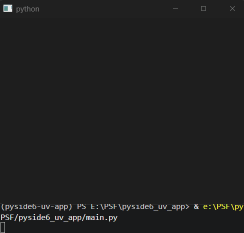

如果只在第二个事件过滤器中拦截冒泡（调用`accept`方法），则只能影响父控件：

```python
from PySide6.QtWidgets import (
    QApplication,
    QWidget,
    QMenu
)
from PySide6.QtCore import QObject, QEvent
from PySide6.QtGui import QContextMenuEvent


class MyWindow(QWidget):

    def contextMenuEvent(self, event: QContextMenuEvent):
        menu = QMenu(
            self
        )
        menu.addAction(
            'test 0'
        )
        menu.exec(
            event.globalPos()
        )


class MyEventFilter(QObject):
    def eventFilter(self, obj, event):
        if event.type() == QEvent.Type.ContextMenu:
            menu = QMenu(
                obj
                #self.parent()
            )
            menu.addAction(
                'test 1'
            )
            menu.exec(
                event.globalPos()
            )
            return False
        return False


class MyEventFilter2(QObject):
    def eventFilter(self, obj, event):
        if event.type() == QEvent.Type.ContextMenu:
            menu = QMenu(
                obj
                #self.parent()
            )
            menu.addAction(
                'test 2'
            )
            menu.exec(
                event.globalPos()
            )
            # 这里拦截
            event.accept()
            return False
        return False

app = QApplication()
# 父窗口
parentWindow = QWidget()
parentWindow.resize(400, 300)
parentWindow.contextMenuEvent = print

window = MyWindow(
    parent=parentWindow,
    windowTitle='易森-PySide6',
)
window.resize(400, 300)
# 遵循堆栈的后入先出原则，后注册的先生效
window.installEventFilter(MyEventFilter(window))
window.installEventFilter(MyEventFilter2(window))


parentWindow.show()
app.exec()

```


虽然事件过滤器和冒泡机制都有拦截，但互相不会影响，因此可以用事件过滤器的拦截功能拦截该控件后续的响应函数，同时调用`ignore`方法豁免父控件的响应函数：

```python
from PySide6.QtWidgets import (
    QApplication,
    QWidget,
    QMenu
)
from PySide6.QtCore import QObject, QEvent
from PySide6.QtGui import QContextMenuEvent


class MyWindow(QWidget):
    def contextMenuEvent(self, event: QContextMenuEvent):
        menu = QMenu(
            self
        )
        menu.addAction(
            'test 0'
        )
        menu.exec(
            event.globalPos()
        )


class MyEventFilter(QObject):
    def eventFilter(self, obj, event):
        if event.type() == QEvent.Type.ContextMenu:
            menu = QMenu(
                obj
                #self.parent()
            )
            menu.addAction(
                'test 1'
            )
            menu.exec(
                event.globalPos()
            )
            return False
        return False


class MyEventFilter2(QObject):
    def eventFilter(self, obj, event):
        if event.type() == QEvent.Type.ContextMenu:
            menu = QMenu(
                obj
                #self.parent()
            )
            menu.addAction(
                'test 2'
            )
            menu.exec(
                event.globalPos()
            )
            # 仅拦截该控件，不影响父控件
            event.ignore()
            return True
        return False

app = QApplication()
# 父窗口
parentWindow = QWidget()
parentWindow.resize(400, 300)
parentWindow.contextMenuEvent = print

window = MyWindow(
    parent=parentWindow,
    windowTitle='易森-PySide6',
)
window.resize(400, 300)
# 遵循堆栈的后入先出原则，后注册的先生效
window.installEventFilter(MyEventFilter(window))
window.installEventFilter(MyEventFilter2(window))


parentWindow.show()
app.exec()

```

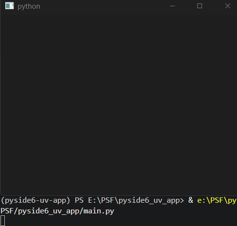

经过上面的对比实验，可以得到如下表格中的结论：

|          | 事件过滤器中的拦截                             | 事件冒泡中的拦截                         |
| -------- | ---------------------------------------------- | ---------------------------------------- |
| 关键代码 | 返回`True`                                     | 调用`accept`方法                         |
| 作用范围 | 该控件及父控件中后续生效的响应函数             | 仅限父控件中的响应函数                   |
| 注意事项 | 可以拦截的同时放行冒泡，<br />二者不会互相影响 | 默认拦截，<br />通常使用`ignore`方法放行 |

### 53.3 手动触发事件：`sendEvent`方法是静态的同步方法，`postEvent`方法是静态的异步方法

之前介绍过事件的触发方法：

- 对应事件的响应函数。
- 控件的`event`方法。
- 程序类实例的`sendEvent`方法、`postEvent`方法。

这里需要**更正**一下，其实`sendEvent`方法、`postEvent`方法是`QCoreApplication`类的静态方法，前者为同步方法（阻塞当前线程，谨慎使用），后者为异步方法（不阻塞当前线程，推荐使用）。

因此，可以直接通过`QApplication`类来调用：

```python
from PySide6.QtWidgets import (
    QApplication,
    QWidget,
    QPushButton,
    QMenu
)
from PySide6.QtGui import QContextMenuEvent
from PySide6.QtCore import QPoint


class MyWindow(QWidget):
    def contextMenuEvent(self, event: QContextMenuEvent):
        menu = QMenu(
            self
        )
        menu.addAction(
            'test'
        )
        menu.exec(
            event.globalPos()
        )
        return super().contextMenuEvent(event)


app = QApplication()
window = MyWindow(
    windowTitle='易森-PySide6',
)
window.resize(400, 300)

button = QPushButton(
    'Event',
    window
)

button.clicked.connect(
    lambda: QApplication.postEvent(
        window,
        QContextMenuEvent(
            QContextMenuEvent.Reason.Other,
            button.mapToGlobal(
                QPoint(
                    0,
                    button.height()
                )
            ),
            button.mapToGlobal(
                QPoint(
                    0,
                    button.height()
                )
            )
        )
    )
)

window.show()
app.exec()

```


话说回来，之前已经介绍过`sendEvent`方法、`postEvent`方法，难道本章只是介绍一下这两个方法是静态方法，通过类名也能直接调用？

非也，本章说了`postEvent`方法是异步方法，上面的示例中也能多次重复使用，那就与之前介绍的结论相悖（示例来自《Qt For Python 札记》2025版第6章第2节）：

```python
from PySide6.QtWidgets import (
    QApplication,
    QWidget,
    QPushButton
)
from PySide6.QtCore import QEvent,Qt
from PySide6.QtGui import QMouseEvent

app = QApplication()
window = QWidget()
window.setWindowTitle('信号与事件')
window.resize(400,300)
button = QPushButton('click',window)
window.show()
button.mousePressEvent = lambda e:print('mouse is pressed')

window2 = QWidget()
window2.setWindowTitle('信号与事件-控制窗口')
window2.resize(400,300)
button2 = QPushButton('模拟事件',window2)

# 获取按钮中心位置的局部坐标，并映射为全局坐标
center = button.rect().center()
globalPos = button.mapToGlobal(center)
# 构建准确的鼠标按键事件
# 参考自 https://doc.qt.io/qtforpython-6/PySide6/QtGui/QMouseEvent.html#PySide6.QtGui.QMouseEvent.__init__
press_event = QMouseEvent(
    QEvent.Type.MouseButtonPress,
    center,
    globalPos,
    # 按下的鼠标按键
    Qt.MouseButton.LeftButton,
    # 无组合使用的鼠标按键
    Qt.MouseButton.NoButton,
    # 无组合使用的键盘按键
    Qt.KeyboardModifier.NoModifier
)
# 使用sendEvent方法发送事件给指定对象
# 也可以使用postEvent方法发送，postEvent方法是用后即销毁构建的事件，不能重复发送
button2.clicked.connect(lambda :app.sendEvent(button,press_event))
window2.show()

app.exec()
```

这里需要厘清其中原因：对于异步的`postEvent`方法，其`event`参数会在调用后销毁。因此，重复调用会报错是因为使用了全局对象，如果每次调用时构建一个对象，则不会有问题：

```python
from PySide6.QtWidgets import (
    QApplication,
    QWidget,
    QPushButton
)
from PySide6.QtCore import QEvent, Qt
from PySide6.QtGui import QMouseEvent

app = QApplication()
window = QWidget()
window.setWindowTitle('信号与事件')
window.resize(400, 300)
button = QPushButton('click', window)
window.show()
button.mousePressEvent = lambda e: print('mouse is pressed')

window2 = QWidget()
window2.setWindowTitle('信号与事件-控制窗口')
window2.resize(400, 300)
button2 = QPushButton('模拟事件', window2)

# 获取按钮中心位置的局部坐标，并映射为全局坐标
center = button.rect().center()
globalPos = button.mapToGlobal(center)

button2.clicked.connect(
    lambda: app.postEvent(
        button,
        QMouseEvent(
            QEvent.Type.MouseButtonPress,
            center,
            globalPos,
            # 按下的鼠标按键
            Qt.MouseButton.LeftButton,
            # 无组合使用的鼠标按键
            Qt.MouseButton.NoButton,
            # 无组合使用的键盘按键
            Qt.KeyboardModifier.NoModifier
        )
    )
)

window2.show()
app.exec()

```

## 54 字符串的另一种表达方式——字节数组（`QByteArray`类）

### 54.1 字符串`str`、字节串`bytes`、字节数组`bytearray`

相关文档： https://docs.python.org/zh-cn/3/reference/datamodel.html#objects-values-and-types

Python的字符串操作相比于其他语言简单不少，也是很多读者入门编程时选择Python的原因。不过，看似简单的字符串，在某些情况下使用时并不简单。

#### 54.1.1 字符的存储

在正式介绍之前，请允许笔者带着各位复习一下字符的存储。如果有相关基础，可以直接跳到下一节。

众所周知，计算机存储的数据是二进制，即0和1。每八位二进制数组成一个字节，可以表示一个十六进制的数字。因此，每个字节的数据实际上是十六进制数。字节则是计算机最基本的存储单位，很多数据在实际使用时也是以字节作为最小的处理单位。

对于Python的字符串而言，其在实际存储的时候，并不是将原始内容直接存在设备里，毕竟前面说了，字节才是最小单位。因此，字符串实际上要先拆分为字符，每个字符再进行编码，得到一个或多个字节的十六进制数据，才能最终存储为二进制数据。

说了这么多抽象的概念也不太好记，那接下来就用Python代码，一步一步感受字符串变成十六进制数据的过程。

首先，准备一个字符串：

```python
s = 'hello'
```

将每个字符拆出来，用`ord`方法将其转换，会得到一个对应的十进制数：

```python
for i in s:
    print(ord(i))
```

结果如下：

```python
104
101
108
108
111
```

很容易发现，每个字母对应一个数字，如果字母相同，数字也相同。数字就是字母的另一种表达方式，这种一一对应、将字符转换为数字的转换过程就叫编码。

这里输出的是十进制数字，最终存储的是等值的十六进制数，不过后续代码中输出的结果均为十进制，这里暂不做转换，以免混乱。

字符能变成数字，那对应的数字也可以通过`chr`方法变成字符：

```python
print(chr(104))
# 结果为：h
```

上面的代码可以依次得到单个字符对应的字节数据，有没有办法一步到位，将字符串完整转换？

当然有。

前面所字符变成数字的过程叫编码，而这个方法就叫编码方法——`encode`方法：

```python
print(s.encode())
# 结果为：b'hello'
```

这时就有读者好奇，明明是将字符串变成对应的数字，怎么输出结果还是字符串？

其实这个前面加了`b`的字符串，并不是字符串，而叫字节串，每个元素不是字符，而是对应的数字：

```python
print(s.encode()[0])
# 结果为：104
```

使用`type`方法检查编码前后的类型，结果确实不同：

```python
print(type(s))
# 结果为：<class 'str'>
print(type(s.encode()))
# 结果为：<class 'bytes'>
```

`encode`方法类似`ord`方法，将字符串变成数字；同样的，也有类似`chr`方法将数字变成字符串的“还原”方法，即解码方法——`decode`方法：

```python
print(b'hello'.decode())
# 结果为：hello
```

#### 54.1.2 字符串`str`和字节串`bytes`

了解了字符串`str`和字节串`bytes`之后，也知道了编码和解码，对于日常使用Python且无需过分关注计算机底层原理的各位，那些似乎只是上课时让人犯困的枯燥知识，以后再也不会遇到。

但是，存在即合理，前面铺垫了那么多，这一节就要说一说字节串的应用场景了。

一般日常使用字符串，不需要用字节串，除非涉及到底层数据的操作，比如：

- 字符串存入文件，实际上是存入编码之后的数据。
- 网络传输数据，需要将字符串编码之后变成二进制再传输，接收方需要解码还原出字符串。
- 字符串加密、解密、计算哈希，也需要将字符串编码、解码。

别的操作都有点复杂，接下来就以计算哈希的一种——MD5为例，看看一个字符串，如何得到其MD5值。

还是上一节的字符串为原始内容：

```python
s = 'hello'
```

计算MD5值的话，需要导入对应的库、方法：

```python
from hashlib import md5
```

`md5`方法可以计算指定数据的MD5值，但是，直接给其传入字符串的话，会得到报错：

```python
print(md5(s))
# 部分结果为：TypeError: Strings must be encoded before hashing
```

其报错的含义就是，字符串要先编码再哈希。

显而易见，直接使用字符串不行，要用其编码之后的字节串才行：

```python
print(md5(s.encode()))
```

不过，这样得到的只是哈希对象，想要直接获取到MD5结果，代码应当为：

```python
print(md5(s.encode()).hexdigest())
# 结果为：5d41402abc4b2a76b9719d911017c592
```

#### 54.1.3 字节数组`bytearray`

字节串本质上是字符编码后的数字组成的串，因此其特性和字符串一样：可以切片、索引，不可修改。

比如，同样的操作，字符串和字节串都能执行：

```python
print(s[0:2])
# 结果为：he
print(s.encode()[0:2])
# 结果为：b'he'
print(s[0])
# 结果为：h
print(s.encode()[0])
# 结果为：104
```

这个时候，可能有读者好奇，字节串在索引时输出的是数字，分明是个数组啊，为什么要叫字节串？不叫字节数组？

这就不得不说一下其与数组的区别。

先构建字节串，以及与字节串相同的数组：

```python
b = b'hello'
l = [104,101,108,108,111]
```

二者在索引时输出的结果相同，但字节串和字符串一样，无法修改原始内容，即没法修改索引对应的值：

```python
b[0] = 101
# 直接报错：TypeError: 'bytes' object does not support item assignment
l[0] = 101
# 成功执行
```

此时再看二者的值：

```python
print(b)
# 结果为：b'hello'
print(l)
# 结果为：[101, 101, 108, 108, 111]
```

的确字节串没有修改，数组被修改了。

虽然字节串不能叫字节数组是因为其不具备数组的功能，但不代表字节串这样的数据不能修改，因为字节数组`bytearray`的诞生，就是为了将二者的功能结合。

字节数组的创建很简单，给`bytearray`类传入字节串、等效的数组均可：

```python
b = b'hello'
ba = bytearray(b)
print(ba)
# 结果为：bytearray(b'hello')
l = [104,101,108,108,111]
ba2 = bytearray(l)
print(ba2)
# 结果为：bytearray(b'hello')
```

可以看到，结果是一样（但二者不是相同的对象）。

就和数组一样，可以直接修改索引对应的值：

```python
ba[0] = 101
print(ba)
# 结果为：bytearray(b'eello')
ba2[0] = 101
print(ba2)
# 结果为：bytearray(b'eello')
```

计算MD5的话，直接传入字节数组也可以：

```python
print(md5(ba).hexdigest())
# 结果为：46c0d64a41d821a13f4555571a869e70
print(md5(ba2).hexdigest())
# 结果为：46c0d64a41d821a13f4555571a869e70
```

#### 54.1.4 小结

简单总结一下Python内置的三种与字符串相关的数据类型的特点：

| 类型         | `str`                 | `bytes`             | `bytearray`                     |
| ------------ | --------------------- | ------------------- | ------------------------------- |
| **内容**     | Unicode字符（文本）   | `0`-`255`（二进制） | `0`-`255`（二进制）             |
| **可变性**   | ❌ 不可变              | ❌ 不可变            | ✅ 可变                          |
| **哈希性**   | ✅可哈希、当字典键     | ✅可哈希、当字典键   | ❌不可哈希、不能当字典键         |
| **字面量**   | `'hello'`             | `b'hello'`          | `bytearray(b'hello')`           |
| **典型用途** | 文本处理              | 字节流、哈希        | 频繁修改二进制数据              |
| **内存消耗** | 较大 (取决于字符宽度) | 较小 (1字节/元素)   | 略大于 `bytes` (需维护可变结构) |

一句话总结如何选择：文本用 `str`，二进制用 `bytes`，修改二进制用 `bytearray`。

### 54.2 Qt版字节数组——`QByteArray`类

相关文档： https://doc.qt.io/qtforpython-6/PySide6/QtCore/QByteArray.html

前面洋洋洒洒介绍了一大段Python的基础知识，并不是笔者无病呻吟，而是为本章要介绍的Qt版字节数组——`QByteArray`类做铺垫。`QByteArray`类在字节数组`bytearray`的基础上，扩展了功能。因此，字节数组`bytearray`支持的部分操作，`QByteArray`类也支持（要求的数据类型有所不同）：

```python
from PySide6.QtCore import QByteArray
from hashlib import md5

qba = QByteArray(b'hello')
qba[0] = b'e'
print(qba)
# 结果为：b'eello'
print(md5(qba).hexdigest())
# 结果为：46c0d64a41d821a13f4555571a869e70
```

此外，`QByteArray`类还支持一些字节数组`bytearray`不支持的操作。

先说初始化方法。`QByteArray`类可以创建指定大小、默认为指定字符的重复数据：

```python
from PySide6.QtCore import QByteArray

qba = QByteArray(5,'a')

print(qba)
# 结果为：b'aaaaa'
```

重复的也可以是编码后的数字，但数字为0时，字节数组`bytearray`也支持类似操作：

```python
from PySide6.QtCore import QByteArray

qba = QByteArray(5,0)

print(qba)
# 结果为：b'\x00\x00\x00\x00\x00'

print(bytearray(5))
# 结果为：bytearray(b'\x00\x00\x00\x00\x00')
```

`QByteArray`类还支持直接传入未编码的字符串：

```python
from PySide6.QtCore import QByteArray

qba = QByteArray('123')

print(qba)
# 结果为：b'123'
```

除了初始化方法，`QByteArray`对象支持的方法也比字节数组多。

“to”开头的方法是输出为指定数据的方法。当后面接着数字的类型时，可以将原本是数字表达方式的字符串直接转换为对应数字，比如，`toInt`方法，该方法的参数表示字符串对应的进制，输出结果为十进制整数和是否转换成功：

```python
from PySide6.QtCore import QByteArray

qba = QByteArray('123')

print(qba.toInt(8))
# 结果为：(83, True)
print(0o123)
# 结果为：83
```

甚至无需额外的库就可以使用Base64编码：

```python
from PySide6.QtCore import QByteArray

qba = QByteArray('123')

print(qba.toBase64())
# 结果为：b'MTIz'
```

当然，能编码就能解码，“from”开头方法就是解码方法，这些解码方法都是静态方法：

```python
from PySide6.QtCore import QByteArray

print(QByteArray.fromBase64(b'MTIz'))
# 结果为：b'123'
```

`QByteArray`类支持的方法不一而足，这里就不全部介绍了，读者可以自行探索官网文档，发掘更多得心应手的方法。

## 55 字体

说到修改控件的字体用CSS，PySide6也有类似CSS的QSS，修改字体同样简单：

```python
from PySide6.QtWidgets import (
    QApplication,
    QWidget,
    QPushButton
)

app = QApplication()
window = QWidget(
    windowTitle='易森-PySide6',
)
window.resize(400, 300)
QPushButton(
    '按钮',
    window
)
button = QPushButton(
    '按钮',
    window
)
button.move(0,30)
button.setStyleSheet(
    'font-family: SimSun;'
)


window.show()
app.exec()

```

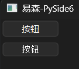

当然，不太熟悉QSS的话，也可以修改`font`控件属性：

```python
from PySide6.QtWidgets import (
    QApplication,
    QWidget,
    QPushButton
)

app = QApplication()
window = QWidget(
    windowTitle='易森-PySide6',
)
window.resize(400, 300)
QPushButton(
    '按钮',
    window
)
button = QPushButton(
    '按钮',
    window
)
button.move(0,30)
button.setFont('SimSun')


window.show()
app.exec()

```


甚至可以设置整个应用的默认字体，只是调用者变成了应用程序实例（对于QSS也是一样）：

```python
from PySide6.QtWidgets import (
    QApplication,
    QWidget,
    QPushButton
)

app = QApplication()
window = QWidget(
    windowTitle='易森-PySide6',
)
window.resize(400, 300)
QPushButton(
    '按钮',
    window
)
button = QPushButton(
    '按钮',
    window
)
button.move(0,30)
#app.setFont('SimSun')
app.setStyleSheet('*{font-family:SimSun;font-size:16px;}')

window.show()
app.exec()

```

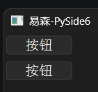

只是使用系统字体，需要针对特定系统做设置，不符合PySide6的跨平台要求，因此，使用自带的自定义字体也需要掌握。

需要注意，PySide6使用在线字体的操作比较麻烦，这里介绍的是使用本地字体文件的方法。

第一步，下载字体到本地，地址如下：

- https://mirror.nju.edu.cn/adobe-fonts/source-han-sans/OTF/SimplifiedChinese/SourceHanSansSC-Regular.otf

第二部就是注册自定义字体，关键点如下：

- 先有应用程序实例，才能加载、注册自定义字体。
- `QFontDatabase`类（使用`from PySide6.QtGui import QFontDatabase`导入）的`addApplicationFont`方法用于加载、注册自定义字体，并返回字体的ID。
- `QFontDatabase`类的`applicationFontFamilies`方法负责根据字体ID查询字体名。

因此，注册自定义字体，就是根据上面的关键点，按部就班操作即可：

```python
from PySide6.QtWidgets import (
    QApplication,
    QWidget,
    QPushButton
)
from PySide6.QtGui import QFontDatabase

app = QApplication()

# 先有应用程序实例，才能加载字体
font_id = QFontDatabase.addApplicationFont('SourceHanSansSC-Regular.otf')
font_families = QFontDatabase.applicationFontFamilies(font_id)

window = QWidget(
    windowTitle='易森-PySide6',
)
window.resize(400, 300)
QPushButton(
    '按钮',
    window
)
button = QPushButton(
    '按钮',
    window
)
button.move(0,30)
app.setFont('SimSun')
button.setFont(font_families[0])


window.show()
app.exec()

```

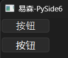

笔者写到这里，突然发现一个小问题，该问题的解决方法导致笔者不得不介绍一下`QFont`类，那就是修改`font`控件属性来加载自定义字体，导致字体变大了。这并不是字体的问题，而是默认字体大小没有沿用之前的值。

使用`app.font().pointSize()`可以获取字体的大小，但是使用`app.font().setPointSize(size)`没法让字体大小生效：

```python
from PySide6.QtWidgets import (
    QApplication,
    QWidget,
    QPushButton
)
from PySide6.QtGui import QFontDatabase

app = QApplication()

# 先有应用程序实例，才能加载字体
font_id = QFontDatabase.addApplicationFont('SourceHanSansSC-Regular.otf')
font_families = QFontDatabase.applicationFontFamilies(font_id)

window = QWidget(
    windowTitle='易森-PySide6',
)
window.resize(400, 300)
QPushButton(
    '按钮',
    window
)
button = QPushButton(
    '按钮',
    window
)
button.move(0,30)
size = app.font().pointSize()
app.setFont('SimSun')
app.font().setPointSize(size)
button.setFont(font_families[0])


window.show()
app.exec()

```


看起来问题让人头疼，解决方案也很简单，只需先复制当前字体，修改字体大小之后再设置回去：

```python
from PySide6.QtWidgets import (
    QApplication,
    QWidget,
    QPushButton
)
from PySide6.QtGui import QFontDatabase

app = QApplication()

# 先有应用程序实例，才能加载字体
font_id = QFontDatabase.addApplicationFont('SourceHanSansSC-Regular.otf')
font_families = QFontDatabase.applicationFontFamilies(font_id)

window = QWidget(
    windowTitle='易森-PySide6',
)
window.resize(400, 300)
QPushButton(
    '按钮',
    window
)
button = QPushButton(
    '按钮',
    window
)
button.move(0,30)
size = app.font().pointSize()
app.setFont('SimSun')
current_font = app.font()
current_font.setPointSize(size)
app.setFont(current_font)
button.setFont(font_families[0])


window.show()
app.exec()

```

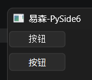

若是使用`QFont`类（使用`from PySide6.QtGui import QFont`导入）还可以更简单：

```python
from PySide6.QtWidgets import (
    QApplication,
    QWidget,
    QPushButton
)
from PySide6.QtGui import QFontDatabase,QFont

app = QApplication()

# 先有应用程序实例，才能加载字体
font_id = QFontDatabase.addApplicationFont('SourceHanSansSC-Regular.otf')
font_families = QFontDatabase.applicationFontFamilies(font_id)

window = QWidget(
    windowTitle='易森-PySide6',
)
window.resize(400, 300)
QPushButton(
    '按钮',
    window
)
button = QPushButton(
    '按钮',
    window
)
button.move(0,30)
size = app.font().pointSize()
app.setFont(
    QFont(
        'SimSun',
        size
    )
)
button.setFont(font_families[0])


window.show()
app.exec()

```


也可以单独定义控件的字体大小：

```python
from PySide6.QtWidgets import (
    QApplication,
    QWidget,
    QPushButton
)
from PySide6.QtGui import QFontDatabase,QFont

app = QApplication()

# 先有应用程序实例，才能加载字体
font_id = QFontDatabase.addApplicationFont('SourceHanSansSC-Regular.otf')
font_families = QFontDatabase.applicationFontFamilies(font_id)

window = QWidget(
    windowTitle='易森-PySide6',
)
window.resize(400, 300)
QPushButton(
    '按钮',
    window
)
button = QPushButton(
    '按钮',
    window
)
button.move(0,30)
size = app.font().pointSize()
app.setFont(
    QFont(
        'SimSun',
        size
    )
)
button.setFont(
    QFont(
        font_families[0],
        12
    )
)


window.show()
app.exec()

```

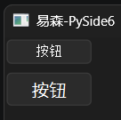

## 56 资产——资源集合文件（`.qrc`）

本章主要内容源自于《Qt For Python 札记》第16章《资源集合文件（`.qrc`）》。

PySide6管理资产的思路与Flet、NiceGUI不同，它倾向于将这些资源文件整合，通过资源集合文件（`.qrc`）来管理、编译。没错，这里就用到了《Qt For Python 札记》第16章介绍的内容。当然，本章不会重复一遍之前的内容，只是提示一下各位读者，并以上一章的内容为例，看一下如何将字体文件整合到Python代码中而无需单独携带字体文件。

准备`font.qrc`文件，内容如下（需要与字体文件同目录）：

```xml
<RCC>
    <qresource prefix='/fonts'>
        <file alias='SourceHanSansSC-Regular.otf'>SourceHanSansSC-Regular.otf</file>
    </qresource>
</RCC>
```

使用`pyside6-rcc .\font.qrc -o font.py`命令，将资源集合文件编译为Python文件（文件体积比较大，这里不提供详细内容）。

导入并使用：

```python
from PySide6.QtWidgets import (
    QApplication,
    QWidget,
    QPushButton
)
from PySide6.QtGui import QFontDatabase
import font

app = QApplication()

# 先有应用程序实例，才能加载字体
font_id = QFontDatabase.addApplicationFont(':/fonts/SourceHanSansSC-Regular.otf')
font_families = QFontDatabase.applicationFontFamilies(font_id)

window = QWidget(
    windowTitle='易森-PySide6',
)
window.resize(400, 300)
QPushButton(
    '按钮',
    window
)
button = QPushButton(
    '按钮',
    window
)
button.move(0,30)
app.setFont('SimSun')
button.setFont(font_families[0])


window.show()
app.exec()

```

操作简单，几步搞定：

1. 准备字体文件和对应的资源集合文件（`.qrc`）。
2. 编译资源集合文件（`.qrc`），得到Python文件。
3. 导入生成的Python文件，将字体地址改为资源集合文件（`.qrc`）中定义的路径，还要加上专属前缀（`':'`）。

## 57 获取信息

使用Python获取信息很简单，系统名、系统版本、系统架构、文件信息等都可以使用标准库获取。

使用标准库获取这些信息虽然方便，但是功能分散在各个库中，在使用时需要东拼西凑，有些凌乱。好在PySide6将这些信息的获取方法整合到一个模块（`PySide6.QtCore`模块）中，使用时只需导入对应类即可。不仅用起来方便不少，甚至还提供了标准库没有的功能。

本章将重点介绍`PySide6.QtCore`模块中可以获取信息的类，以及部分信息怎么用标准库获取。

### 57.1 `QSysInfo`类

相关文档：https://doc.qt.io/qtforpython-6/PySide6/QtCore/QSysInfo.html

`QSysInfo`类提供了一些静态方法，可以获取与系统有关的信息。

`buildAbi`方法，获取Qt编译时的目标应用二进制接口，用于识别Qt与系统的兼容性。

`buildCpuArchitecture`方法，获取Qt编译时的目标CPU架构，用于识别Qt与系统的兼容性。。

`currentCpuArchitecture`方法，获取当前系统的CPU架构。如果使用标准库，相当于`platform.machine`方法。

`kernelType`方法，获取系统内核类型。如果使用标准库，相当于`platform.system`方法。

`kernelVersion`方法，获取系统内核版本。如果使用标准库，相当于`platform.version`方法。

`machineHostName`方法，获取主机名。如果使用标准库，相当于`platform.node`方法。

`machineUniqueId`方法，获取机器码。

`prettyProductName`方法，获取系统的产品类型、产品版本。

`productType`方法，获取系统的产品类型。如果使用标准库，相当于`platform.system`方法。

`productVersion`方法，获取系统的产品版本。如果使用标准库，相当于`platform.release`方法。

### 57.2 `QLibraryInfo`类

相关文档：https://doc.qt.io/qtforpython-6/PySide6/QtCore/QLibraryInfo.html

`QLibraryInfo`类提供了一些静态方法，可以获取与PySide6库有关的信息。

`build`方法，获取Qt编译时信息。

`isDebugBuild`方法，获取Qt编译时是否启用了调试。

`isSharedBuild`方法，获取Qt编译时是否启用了静态链接。

`path`方法，获取特定库文件的路径。该方法支持以下参数：

- `p`参数，仅限位置参数，`PySide6.QtCore.QLibraryInfo.LibraryPath`类型，表示库文件的路径类型。

库文件类型及含义参考下表：

| `LibraryPath`的成员      | 库文件路径类型                                 |
| ------------------------ | ---------------------------------------------- |
| `PrefixPath`             | PySide6库的根目录                              |
| `DocumentationPath`      | 文档目录                                       |
| `HeadersPath`            | C++头文件目录                                  |
| `LibrariesPath`          | 动态链接库目录<br />（实际上在`PrefixPath`中） |
| `LibraryExecutablesPath` | 可执行的库文件的目录                           |
| `BinariesPath`           | 二进制文件目录                                 |
| `PluginsPath`            | 插件目录                                       |
| `QmlImportsPath`         | QML库目录                                      |
| `TranslationsPath`       | 翻译文件的目录                                 |
| `ExamplesPath`           | 示例的目录（需要额外安装）                     |

`paths`方法，获取特定库文件的所有路径。该方法支持以下参数：

- `p`参数，仅限位置参数，`PySide6.QtCore.QLibraryInfo.LibraryPath`类型，表示库文件的路径类型。

`version`方法，获取Qt的版本。

### 57.3 `QStorageInfo`类

相关文档：https://doc.qt.io/qtforpython-6/PySide6/QtCore/QStorageInfo.html

`QStorageInfo`类用于获取磁盘信息（总空间、剩余空间、文件系统类型、挂载点、分卷信息等）。

`QStorageInfo`类支持以下方法（实例化时需要传入路径）：

- `blockSize`方法，获取所属分卷的块大小。
- `bytesAvailable`方法，获取所属分卷的可用空间大小（字节）。如果使用标准库，相当于`shutil.disk_usage('{路径}').free`属性。
- `bytesFree`方法，获取所属分卷的空闲空间大小（字节）。如果使用标准库，相当于`shutil.disk_usage('{路径}').free`属性。
- `bytesTotal`方法，获取所属分卷的总共空间大小（字节）。如果使用标准库，相当于`shutil.disk_usage('{路径}').total`属性。
- `device`方法，获取所属分卷的设备路径。
- `displayName`方法，获取所属分卷的卷标。
- `fileSystemType`方法，获取所属分卷的文件系统类型。
- `isReadOnly`方法，获取所属分卷是否只读。
- `isReady`方法，获取所属分卷是否准备完毕。如果使用标准库，相当于`os.path.ismount`方法。
- `isRoot`方法，获取所属分卷是否为系统所在分卷。
- `isValid`方法，获取实例化时传入的路径是否为有效路径。
- `name`方法，获取所属分卷的卷标。
- `refresh`方法，刷新缓存信息。
- `rootPath`方法，获取所属分卷的根目录或者股权爱在点。
- `setPath`方法，修改实例化时传入的路径。
- `subvolume`方法，获取所属分卷的子卷的卷标。
- `swap`方法，将信息与另一`QStorageInfo`对象交换。

`QStorageInfo`类支持以下静态方法：

- `root`方法，返回系统根目录的挂载信息。
- `mountedVolumes`方法，返回所有挂载点的挂载信息。

### 57.4 `QFileInfo`类

相关文档：https://doc.qt.io/qtforpython-6/PySide6/QtCore/QFileInfo.html

`QFileInfo`类用于文件、路径信息（大小、后缀、创建时间、是否为目录等）。

`QFileInfo`类支持以下方法（实例化时需要传入路径）：

- `absoluteDir`方法，获取文件父目录的绝对路径（`QDir`对象）。
- `absoluteFilePath`方法，获取文件的绝对路径。如果使用标准库，相当于`pathlib.Path({路径}).parent`属性。
- `absolutePath`方法，获取文件父目录的绝对路径（字符串）。如果使用标准库，相当于`pathlib.Path({路径}).parent`属性。
- `baseName`方法，获取文件不带后缀的文件名（从左向右搜索）。如果使用标准库，相当于`pathlib.Path({路径}).stem.split('.')[0]`。
- `birthTime`方法，获取文件的创建时间。如果使用标准库，类似于`pathlib.Path({路径}).stat().st_birthtime`属性（时间戳）。
- `caching`方法，获取文件是否针对文件信息启用了缓存。
- `canonicalFilePath`方法，获取文件的规范路径。如果使用标准库，相当于`pathlib.Path({路径}).resolve`方法。
- `canonicalPath`方法，获取文件父目录的规范路径。如果使用标准库，相当于`pathlib.Path({路径}).parent.resolve`方法。
- `completeBaseName`方法，获取文件不带后缀的文件名（从右向左搜索）。如果使用标准库，相当于`pathlib.Path({路径}).stem`属性。
- `completeSuffix`方法，获取文件的所有后缀。如果使用标准库，相当于`pathlib.Path({路径}).suffixes`属性。
- `dir`方法，获取文件父目录（`QDir`对象）。
- `exists`方法，判断文件是否存在。
- `fileName`方法，获取文件的文件名。如果使用标准库，相当于`pathlib.Path({路径}).name`属性。
- `filePath`方法，获取文件的路径。如果使用标准库，相当于`pathlib.Path`方法。
- `fileTime`方法，获取文件的时间（创建、修改、访问）。该方法支持以下仅限位置参数：
  - `time`参数，`PySide6.QtCore.QFileDevice.FileTime`类型，表示时间的类型。
  - `tz`参数，`PySide6.QtCore.QTimeZone`类型或者`PySide6.QtCore.QTimeZone.Initialization`类型，表示时区。
- `isAbsolute`方法，返回给定路径是否为绝对路径。如果使用标准库，相当于`pathlib.Path({路径}).is_absolute`方法。
- `isAlias`方法，返回给定路径是否为别名（仅限macOS）。如果使用标准库，类似于`pathlib.Path({路径}).is_symlink`方法。
- `isBundle`方法，返回给定路径是否为包（仅限macOS）。
- `isDir`方法，返回给定路径是否为目录。如果使用标准库，类似于`pathlib.Path({路径}).is_dir`方法。
- `isExecutable`方法，返回给定路径是否有执行权限。
- `isFile`方法，返回给定路径是否为文件。如果使用标准库，类似于`pathlib.Path({路径}).is_file`方法。
- `isHidden`方法，返回给定路径是否隐藏。
- `isJunction`方法，返回给定路径是否为NTFS联接（仅限Windows）。如果使用标准库，类似于`pathlib.Path({路径}).is_symlink`方法。
- `isNativePath`方法，返回给定路径是否为系统原生路径（区别于Qt资源系统的路径）。
- `isOther`方法，返回给定路径是否为除了目录、文件、符号链接之外的其他类型路径。注意，如果路径不存在，该方法也会返回`False`。
- `isReadable`方法，返回给定路径是否可读。如果使用标准库，相当于`os.access({路径},os.R_OK)`。
- `isRelative`方法，返回给定路径是否为相对路径。如果使用标准库，相当于`pathlib.Path({路径}).is_relative_to('./')`。
- `isRoot`方法，返回给定路径是否为根目录。
- `isShortcut`方法，返回给定路径是否为快捷方式（仅限Windows）。
- `isSymLink`方法，返回给定路径是否为符号链接、快捷方式、别名。如果使用标准库，类似于于`pathlib.Path({路径}).is_symlink`方法。
- `isSymbolicLink`方法，返回给定路径是否为符号链接。如果使用标准库，类似于于`pathlib.Path({路径}).is_symlink`方法。
- `isWritable`方法，返回给定路径是否可写。如果使用标准库，相当于`os.access({路径},os.W_OK)`。
- `junctionTarget`方法，解析NTFS联接的实际路径。
- `lastModified`方法，获取文件的修改时间。
- `lastRead`方法，获取文件的读取时间。
- `makeAbsolute`方法，将实例化时传入的路径转换为绝对路径，返回是否转换成功。
- `metadataChangeTime`方法，获取文件元数据的修改时间。
- `path`方法，获取文件的所在目录。如果使用标准库，相当于`pathlib.Path({路径}).parent`属性。
- `permission`方法，获取文件是否包含特定权限。该方法支持以下仅限位置参数：
  - `permissions`参数，`PySide6.QtCore.QFileDevice.Permission`类型，表示文件权限，可以使用逻辑运算符`|`组合。
- `permissions`方法，获取文件的权限信息。
- `refresh`方法，刷新缓存信息。
- `setCaching`方法，启用或禁用缓存信息。
- `setFile`方法，修改实例化时传入的路径。支持的参数比较复杂，可以参考 https://doc.qt.io/qtforpython-6/PySide6/QtCore/QFileInfo.html#PySide6.QtCore.QFileInfo.setFile 。
- `size`方法，获取文件的大小。
- `stat`方法，获取文件的所有属性。
- `suffix`方法，获取文件的后缀。如果使用标准库，相当于`pathlib.Path({路径}).suffix`属性。
- `swap`方法，将信息与另一`QFileInfo`对象交换。
- `symLinkTarget`方法，返回符号链接指向的文件或目录的绝对路径。

`QFileInfo`类支持以下静态方法：

- `exists`方法，判断指定路径是否存在。

## 58 自定义控件属性——动态属性

相关文档：https://doc.qt.io/qtforpython-6/overviews/qtcore-properties.html#reading-and-writing-properties-with-the-meta-object-system

之前介绍过不少控件的控件属性，而控件属性背后是Qt的元对象系统，本章不深挖这个复杂的系统，只介绍控件属性的另一种用途。

除了控件属性代表具体的功能，控件属性还可以与QSS结合，使用属性选择器，实现根据控件属性设置控件样式：

```python
from PySide6.QtWidgets import (
    QApplication,
    QWidget,
    QPushButton
)

app = QApplication()
window = QWidget(
    windowTitle='易森-PySide6',
)
window.resize(400, 300)
button = QPushButton(
    'yes',
    window
)
button2 = QPushButton(
    'no',
    window
)
button2.move(0,30)

qss = '''
QPushButton[text='yes'] {
    background-color: green;
    color: white;
}
QPushButton[text='no'] {
    background-color: red;
    color: white;
}
'''
app.setStyleSheet(qss)


window.show()
app.exec()

```

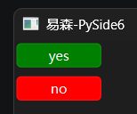

可以看到，当按钮的文本为`'yes'`时，按钮显示为绿色，为`'no'`时显示为红色。按钮变色的秘密，就在QSS中的属性选择器`[text='yes']`。其中，`text`表示控件属性，等号后面表示控件属性的值，只有控件属性为对应值时，才会应用相关样式。

 通过QSS统一设置控件样式有利于外观统一，这样的话，确定按钮总是绿色，取消按钮总是红色，好处自不必说。可是，上面的示例也并非完美：按钮的文本不一定为`'yes'`或者`'no'`，也可能是`'ok'`或者`'cancel'`，甚至会因为设置了本地化UI而变成其他文本。

因此，如果想让确定按钮总是绿色，取消按钮总是红色，将样式与按钮文本这个控件属性绑定肯定行不通，最好将其绑定到一个与正常功能没有关联的控件属性上。

虽然在控件现有的控件属性中没有符合要求的，但思路并没有走到死路。在Python中可以增加属性，控件属性同样可以增加。因此，只要增加一个自定义属性即可。

不过，使用Python中常用的自定义属性方式并不行，为什么？请看下面的代码：

```python
from PySide6.QtWidgets import (
    QApplication,
    QWidget,
    QPushButton
)

app = QApplication()
window = QWidget(
    windowTitle='易森-PySide6',
)
window.resize(400, 300)
button = QPushButton(
    '是',
    window
)
button.role = 'yes'
button2 = QPushButton(
    '否',
    window
)
button2.move(0,30)
button2.role = 'no'

qss = '''
QPushButton[role='yes'] {
    background-color: green;
    color: white;
}
QPushButton[role='no'] {
    background-color: red;
    color: white;
}
'''
app.setStyleSheet(qss)


window.show()
app.exec()

```

代码中，给按钮自定义了一个`role`属性，使其值分别为之前的文本，然后修改按钮的文本，这样就可以检验样式是否与文本解除了关联。当然，QSS中也不能忘了修改属性选择器。但是，最终结果却不符合预期：

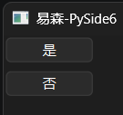

原本的颜色消失了，变成了默认颜色，自定义属性并没有生效。

自定义属性并非没有生效，只是QSS中的属性选择器，只能识别控件属性。因此，自定义属性也必须是控件属性。

在PySide6中，想要新增、修改控件属性，就要用到`setProperty`方法，读取控件属性则用`property`方法。通过`setProperty`方法增加的自定义控件属性，也叫动态属性。

这两个方法除了用于自定义控件属性，控件原本的控件属性也能用，这部分知识就属于Qt的元对象系统，本章不做展开，有兴趣的读者可以查看相关文档，或者期待后续笔者的更新。

既然如此，那就改用`setProperty`方法自定义控件属性：

```python
from PySide6.QtWidgets import (
    QApplication,
    QWidget,
    QPushButton
)

app = QApplication()
window = QWidget(
    windowTitle='易森-PySide6',
)
window.resize(400, 300)
button = QPushButton(
    '是',
    window
)
button.setProperty('role','yes')
button2 = QPushButton(
    '否',
    window
)
button2.move(0,30)
button2.setProperty('role','no')

qss = '''
QPushButton[role='yes'] {
    background-color: green;
    color: white;
}
QPushButton[role='no'] {
    background-color: red;
    color: white;
}
'''
app.setStyleSheet(qss)


window.show()
app.exec()

```

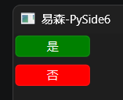

`setProperty`方法支持以下仅限位置参数：

- `name`参数，字符串类型，表示动态属性名。
- `value`参数，任意类型，表示动态属性值。

`property`方法支持以下仅限位置参数：

- `name`参数，字符串类型，表示动态属性名。

如果想要获取控件现有的动态属性，可以使用`dynamicPropertyNames`方法：

```python
from PySide6.QtWidgets import (
    QApplication,
    QWidget,
    QPushButton
)

app = QApplication()
window = QWidget(
    windowTitle='易森-PySide6',
)
window.resize(400, 300)
button = QPushButton(
    '是',
    window
)
button.setProperty('role','yes')
button2 = QPushButton(
    '否',
    window
)
button2.move(0,30)
button2.setProperty('role','no')
print(button.dynamicPropertyNames())

window.show()
app.exec()

```

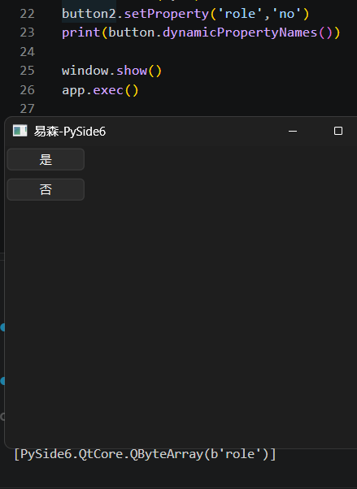

最后，虽然说本章不会展开介绍Qt的元对象系统，但笔者还是忍不住提供一个方法，用于看控件所有自带的控件属性，说不定会有用：

```python
from PySide6.QtWidgets import (
    QApplication,
    QWidget,
    QPushButton
)

app = QApplication()
window = QWidget(
    windowTitle='易森-PySide6',
)
window.resize(400, 300)
button = QPushButton(
    '是',
    window
)
button.setProperty('role','yes')

def get_inner_properties(widget):
    result = {}
    # 获取元对象
    meta = widget.metaObject()
    for i in range(meta.propertyCount()):
        # 元对象的控件属性
        meta_prop = meta.property(i)
        # 控件属性名
        meta_prop_name = meta_prop.name()
        # 控件属性值
        try:
            meta_prop_value = widget.property(meta_prop_name)
            # 控件属性存入结果字典
            result[meta_prop_name] = meta_prop_value
        except RuntimeError as e:
            # 不能通过property获取的控件属性存入结果字典
            result[meta_prop_name] = getattr(widget,meta_prop_name)()
    return result

print(get_inner_properties(button))

window.show()
app.exec()

```

结果如下：

```python
{'objectName': '', 'modal': False, 'windowModality': <WindowModality.NonModal: 0>, 'enabled': True, 'geometry': PySide6.QtCore.QRect(0, 0, 81, 26), 'frameGeometry': PySide6.QtCore.QRect(0, 0, 81, 26), 'normalGeometry': PySide6.QtCore.QRect(0, 0, 0, 0), 'x': 0, 'y': 0, 'pos': PySide6.QtCore.QPoint(0, 0), 'frameSize': PySide6.QtCore.QSize(81, 26), 'size': PySide6.QtCore.QSize(81, 26), 'width': 81, 'height': 26, 'rect': PySide6.QtCore.QRect(0, 0, 81, 26), 'childrenRect': PySide6.QtCore.QRect(0, 0, 0, 0), 'childrenRegion': <PySide6.QtGui.QRegion(null) at 0x000002AED1034480>, 'sizePolicy': <PySide6.QtWidgets.QSizePolicy(horizontalPolicy = QSizePolicy::Minimum, verticalPolicy = QSizePolicy::Fixed) at 0x000002AED1049200>, 'minimumSize': PySide6.QtCore.QSize(0, 0), 'maximumSize': PySide6.QtCore.QSize(16777215, 16777215), 'minimumWidth': 0, 'minimumHeight': 0, 'maximumWidth': 16777215, 'maximumHeight': 16777215, 'sizeIncrement': PySide6.QtCore.QSize(0, 0), 'baseSize': PySide6.QtCore.QSize(0, 0), 'palette': <PySide6.QtGui.QPalette(resolve=0x0) at 0x000002AED104AF00>, 'font': <PySide6.QtGui.QFont(Microsoft YaHei UI,9,-1,5,400,0,0,0,0,0,0,0,0,0,0,1,,0,0) at 0x000002AED105C300>, 'cursor': <PySide6.QtGui.QCursor(Qt::CursorShape(Qt::ArrowCursor)) at 0x000002AED105C4C0>, 'mouseTracking': False, 'tabletTracking': False, 'isActiveWindow': True, 'focusPolicy': <FocusPolicy.StrongFocus: 11>, 'focus': True, 'contextMenuPolicy': <ContextMenuPolicy.DefaultContextMenu: 1>, 'updatesEnabled': True, 'visible': True, 'minimized': False, 'maximized': False, 'fullScreen': False, 'sizeHint': PySide6.QtCore.QSize(81, 26), 'minimumSizeHint': PySide6.QtCore.QSize(81, 26), 'acceptDrops': False, 'windowTitle': '', 'windowIcon': <PySide6.QtGui.QIcon(null) at 0x000002AED105C940>, 'windowIconText': '', 'windowOpacity': 1.0, 'windowModified': False, 'toolTip': '', 'toolTipDuration': -1, 'statusTip': '', 'whatsThis': '', 'accessibleName': '', 'accessibleDescription': '', 'accessibleIdentifier': '', 'layoutDirection': <LayoutDirection.LeftToRight: 0>, 'autoFillBackground': False, 'styleSheet': '', 'locale': <PySide6.QtCore.QLocale()/* Chinese, Simplified Han, China */ at 0x000002AED105CC40>, 'windowFilePath': '', 'inputMethodHints': <InputMethodHint.ImhNone: 0>, 'text': '是', 'icon': <PySide6.QtGui.QIcon(null) at 0x000002AED105CD40>, 'iconSize': PySide6.QtCore.QSize(16, 16), 'shortcut': QKeySequence(), 'checkable': False, 'checked': False, 'autoRepeat': False, 'autoExclusive': False, 'autoRepeatDelay': 300, 'autoRepeatInterval': 100, 'down': False, 'autoDefault': False, 'default': False, 'flat': False}
```

注意，有的控件属性没有同名的获取方法，可能需要通过带“is”前缀的方法获取，但可以通过`property`方法获取。有的控件属性则没法通过`property`方法获取，只能使用同名的获取方法。

## 59 多线程（更新中）

相关文档：


QThread

QThreadPool

QMutex

QWaitCondition


## 60 QtQuick程序之QML（暂定）（更新中）

相关文档：

- https://doc.qt.io/qt-6/zh/qmlreference.html
- https://doc.qt.io/qt-6/zh/qtquickcontrols-index.html


QML是什么，QML控件怎么显示（复习），QML的基础概念

使用相关QML模块前需要导入，缩进只是为了方便阅读，可以加上分号之后改为一行。


```dart
import QtQuick
import QtQuick.Window
import QtQuick.Controls

Window {
    visible: true
    title: '易森-PySide6'
    width: 400
    height: 300
    Rectangle {
        anchors.fill: parent
        color: 'green'
        Button {
            text: 'Hello World'
            palette.buttonText: 'black'
            anchors.centerIn: parent
        }
    }
}
```


```python
from PySide6.QtGui import QGuiApplication
from PySide6.QtQml import QQmlApplicationEngine

app = QGuiApplication()

qml_string = '''
import QtQuick
import QtQuick.Window
import QtQuick.Controls

Window {
    visible: true
    title: '易森-PySide6'
    width: 400
    height: 300
    Rectangle {
        anchors.fill: parent
        color: 'green'
        Button {
            text: 'Hello World'
            palette.buttonText: 'black'
            anchors.centerIn: parent
        }
    }
}
'''
engine = QQmlApplicationEngine()
#engine.load('main.qml')
engine.loadData(qml_string.encode('utf-8'))

app.exec()
```


压缩为一行：

```python
from PySide6.QtGui import QGuiApplication
from PySide6.QtQml import QQmlApplicationEngine

app = QGuiApplication()

qml_string = '''import QtQuick;import QtQuick.Window;import QtQuick.Controls;Window {visible: true;title: '易森-PySide6';width: 400;height: 300;Rectangle {anchors.fill: parent;color: 'green';Button {text: 'Hello World';palette.buttonText: 'black';anchors.centerIn: parent;}}}'''
engine = QQmlApplicationEngine()
#engine.load('main.qml')
engine.loadData(qml_string.encode('utf-8'))

app.exec()
```


## 61 `Qxxx`控件——xx的故事（更新中）

相关文档：


以故事的形式介绍控件的相关用法，主要介绍思路和实际代码，通过营造悬念吸引读者兴趣。


## 6x `Qxxx`xxx控件（更新中）

相关文档：


```python
from PySide6.QtWidgets import (
    QApplication,
    QWidget
)

app = QApplication()
window = QWidget()
window.setWindowTitle('易森-PySide6')
window.resize(400, 300)


window.show()
app.exec()
```


## x 创作灵感（非正式内容）

灵感来源（官方）：

- `QtWidgets`模块：https://doc.qt.io/qtforpython-6/overviews/qtwidgets-widget-classes.html
- `QtGui`模块：https://doc.qt.io/qtforpython-6/overviews/qtwidgets-widget-classes.html#widgets-classes
- `QtCore`模块：https://doc.qt.io/qtforpython-6/PySide6/QtCore/index.html#list-of-classes-by-function

模块一览表（Qt 6.10.x）：

| 模块名                 | 主要用途                         | 文档链接                                                     |
| ---------------------- | -------------------------------- | ------------------------------------------------------------ |
| `Qt3DAnimation`        | 处理3D动画                       | https://doc.qt.io/qtforpython-6/PySide6/Qt3DAnimation/index.html#module-PySide6.Qt3DAnimation |
| `Qt3DCore`             | 3D相关的基础功能                 | https://doc.qt.io/qtforpython-6/PySide6/Qt3DCore/index.html#module-PySide6.Qt3DCore |
| `Qt3DExtras`           | 3D相关的额外功能                 | https://doc.qt.io/qtforpython-6/PySide6/Qt3DExtras/index.html#module-PySide6.Qt3DExtras |
| `Qt3DInput`            | 3D相关的输入功能                 | https://doc.qt.io/qtforpython-6/PySide6/Qt3DInput/index.html#module-PySide6.Qt3DInput |
| `Qt3DLogic`            | 3D相关的逻辑功能                 | https://doc.qt.io/qtforpython-6/PySide6/Qt3DLogic/index.html#module-PySide6.Qt3DLogic |
| `Qt3DRender`           | 渲染3D模型                       | https://doc.qt.io/qtforpython-6/PySide6/Qt3DRender/index.html#module-PySide6.Qt3DRender |
| `QtAsyncio`            | 相当于Qt版asyncio框架            | https://doc.qt.io/qtforpython-6/PySide6/QtAsyncio/index.html#module-PySide6.QtAsyncio |
| `QtBluetooth`          | 操作蓝牙设备                     | https://doc.qt.io/qtforpython-6/PySide6/QtBluetooth/index.html#module-PySide6.QtBluetooth |
| `QtConcurrent`         | 并行编程相关的功能               | https://doc.qt.io/qtforpython-6/PySide6/QtConcurrent/index.html#module-PySide6.QtConcurrent |
| `QtCore`               | Qt相关的基础功能                 | https://doc.qt.io/qtforpython-6/PySide6/QtCore/index.html#module-PySide6.QtCore |
| `QtDBus`               | D-Bus相关的功能                  | https://doc.qt.io/qtforpython-6/PySide6/QtDBus/index.html#module-PySide6.QtDBus |
| `QtDesigner`           | 可视化设计工具                   | https://doc.qt.io/qtforpython-6/PySide6/QtDesigner/index.html#module-PySide6.QtDesigner |
| `QtGraphs`             | 二维、三维图表                   | https://doc.qt.io/qtforpython-6/PySide6/QtGraphs/index.html#module-PySide6.QtGraphs |
| `QtGraphsWidgets`      | 三维图表                         | https://doc.qt.io/qtforpython-6/PySide6/QtGraphsWidgets/index.html#module-PySide6.QtGraphsWidgets |
| `QtGui`                | GUI相关的基础功能                | https://doc.qt.io/qtforpython-6/PySide6/QtGui/index.html#module-PySide6.QtGui |
| `QtHelp`               | 集成在线文档                     | https://doc.qt.io/qtforpython-6/PySide6/QtHelp/index.html#module-PySide6.QtHelp |
| `QtHttpServer`         | 创建HTTP服务器                   | https://doc.qt.io/qtforpython-6/PySide6/QtHttpServer/index.html#module-PySide6.QtHttpServer |
| `QtLocation`           | 定位、地图相关功能               | https://doc.qt.io/qtforpython-6/PySide6/QtLocation/index.html#module-PySide6.QtLocation |
| `QtMultimedia`         | 处理多媒体文件                   | https://doc.qt.io/qtforpython-6/PySide6/QtMultimedia/index.html#module-PySide6.QtMultimedia |
| `QtMultimediaWidgets`  | 处理多媒体文件的额外功能         | https://doc.qt.io/qtforpython-6/PySide6/QtMultimediaWidgets/index.html#module-PySide6.QtMultimediaWidgets |
| `QtNetwork`            | 网络功能                         | https://doc.qt.io/qtforpython-6/PySide6/QtNetwork/index.html#module-PySide6.QtNetwork |
| `QtNetworkAuth`        | 网络授权                         | https://doc.qt.io/qtforpython-6/PySide6/QtNetworkAuth/index.html#module-PySide6.QtNetworkAuth |
| `QtNfc`                | 操作NFC设备                      | https://doc.qt.io/qtforpython-6/PySide6/QtNfc/index.html#module-PySide6.QtNfc |
| `QtOpenGL`             | 与OpenGL库交互                   | https://doc.qt.io/qtforpython-6/PySide6/QtOpenGL/index.html#module-PySide6.QtOpenGL |
| `QtOpenGLWidgets`      | 显示OpenGL内容的控件             | https://doc.qt.io/qtforpython-6/PySide6/QtOpenGLWidgets/index.html#module-PySide6.QtOpenGLWidgets |
| `QtPdf`                | 处理PDF文件                      | https://doc.qt.io/qtforpython-6/PySide6/QtPdf/index.html#module-PySide6.QtPdf |
| `QtPdfWidgets`         | 显示PDF文件的控件                | https://doc.qt.io/qtforpython-6/PySide6/QtPdfWidgets/index.html#module-PySide6.QtPdfWidgets |
| `QtPositioning`        | 实时定位                         | https://doc.qt.io/qtforpython-6/PySide6/QtPositioning/index.html#module-PySide6.QtPositioning |
| `QtPrintSupport`       | 打印文件相关的功能               | https://doc.qt.io/qtforpython-6/PySide6/QtPrintSupport/index.html#module-PySide6.QtPrintSupport |
| `QtQml`                | 处理QML文件                      | https://doc.qt.io/qtforpython-6/PySide6/QtQml/index.html#module-PySide6.QtQml |
| `QtQuick`              | QtQuick程序的基础功能            | https://doc.qt.io/qtforpython-6/PySide6/QtQuick/index.html#module-PySide6.QtQuick |
| `QtQuick3D`            | 在QtQuick程序中显示3D内容        | https://doc.qt.io/qtforpython-6/PySide6/QtQuick3D/index.html#module-PySide6.QtQuick3D |
| `QtQuickControls2`     | QtQuick程序的配套控件            | https://doc.qt.io/qtforpython-6/PySide6/QtQuickControls2/index.html#module-PySide6.QtQuickControls2 |
| `QtQuickTest`          | QtQuick程序的测试框架            | https://doc.qt.io/qtforpython-6/PySide6/QtQuickTest/index.html#module-PySide6.QtQuickTest |
| `QtQuickWidgets`       | 在QtWidgets程序中显示QtQuick控件 | https://doc.qt.io/qtforpython-6/PySide6/QtQuickWidgets/index.html#module-PySide6.QtQuickWidgets |
| `QtRemoteObjects`      | 提供进程间通信使用的对象         | https://doc.qt.io/qtforpython-6/PySide6/QtRemoteObjects/index.html#module-PySide6.QtRemoteObjects |
| `QtScxml`              | 从SCXML文件创建状态机            | https://doc.qt.io/qtforpython-6/PySide6/QtScxml/index.html#module-PySide6.QtScxml https://www.w3.org/TR/scxml/ |
| `QtSensors`            | 操作传感器硬件                   | https://doc.qt.io/qtforpython-6/PySide6/QtSensors/index.html#module-PySide6.QtSensors |
| `QtSerialBus`          | 串行总线相关功能                 | https://doc.qt.io/qtforpython-6/PySide6/QtSerialBus/index.html#module-PySide6.QtSerialBus |
| `QtSerialPort`         | 串口通讯相关功能                 | https://doc.qt.io/qtforpython-6/PySide6/QtSerialPort/index.html#module-PySide6.QtSerialPort |
| `QtSpatialAudio`       | 空间音频相关功能                 | https://doc.qt.io/qtforpython-6/PySide6/QtSpatialAudio/index.html#module-PySide6.QtSpatialAudio |
| `QtSql`                | SQL、数据库相关功能              | https://doc.qt.io/qtforpython-6/PySide6/QtSql/index.html#module-PySide6.QtSql |
| `QtStateMachine`       | 状态机相关功能                   | https://doc.qt.io/qtforpython-6/PySide6/QtStateMachine/index.html#module-PySide6.QtStateMachine |
| `QtSvg`                | 处理SVG文件                      | https://doc.qt.io/qtforpython-6/PySide6/QtSvg/index.html#module-PySide6.QtSvg |
| `QtSvgWidgets`         | 显示SVG文件的控件                | https://doc.qt.io/qtforpython-6/PySide6/QtSvgWidgets/index.html#module-PySide6.QtSvgWidgets |
| `QtTest`               | GUI测试和基准测试                | https://doc.qt.io/qtforpython-6/PySide6/QtTest/index.html#module-PySide6.QtTest |
| `QtTextToSpeech`       | 文本转语音                       | https://doc.qt.io/qtforpython-6/PySide6/QtTextToSpeech/index.html#module-PySide6.QtTextToSpeech |
| `QtUiTools`            | 加载UI文件                       | https://doc.qt.io/qtforpython-6/PySide6/QtUiTools/index.html#module-PySide6.QtUiTools |
| `PySide6.QtWebChannel` | 服务器、客户端之间的点对点通讯   | https://doc.qt.io/qtforpython-6/PySide6/QtWebChannel/index.html#module-PySide6.QtWebChannel |
| `QtWebEngineCore`      | WebEngine的基础功能              | https://doc.qt.io/qtforpython-6/PySide6/QtWebEngineCore/index.html#module-PySide6.QtWebEngineCore |
| `QtWebEngineQuick`     | 在QtQuick程序中嵌入WebEngine     | https://doc.qt.io/qtforpython-6/PySide6/QtWebEngineQuick/index.html#module-PySide6.QtWebEngineQuick |
| `QtWebEngineWidgets`   | 在QtWidgets程序中嵌入WebEngine   | https://doc.qt.io/qtforpython-6/PySide6/QtWebEngineWidgets/index.html#module-PySide6.QtWebEngineWidgets |
| `QtWebSockets`         | 处理WebSocket协议                | https://doc.qt.io/qtforpython-6/PySide6/QtWebSockets/index.html#module-PySide6.QtWebSockets |
| `QtWebView`            | 显示网页内容                     | https://doc.qt.io/qtforpython-6/PySide6/QtWebView/index.html#module-PySide6.QtWebView |
| `QtWidgets`            | QtWidgets程序的基础功能          | https://doc.qt.io/qtforpython-6/PySide6/QtWidgets/index.html#module-PySide6.QtWidgets |
| `QtXml`                | 处理XML文件                      | https://doc.qt.io/qtforpython-6/PySide6/QtXml/index.html#module-PySide6.QtXml |

