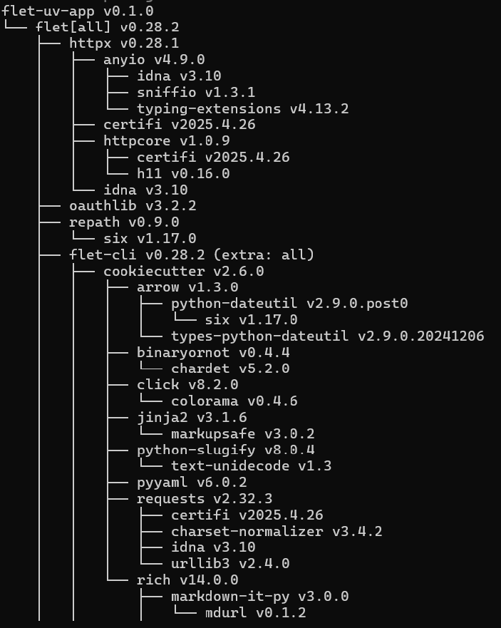
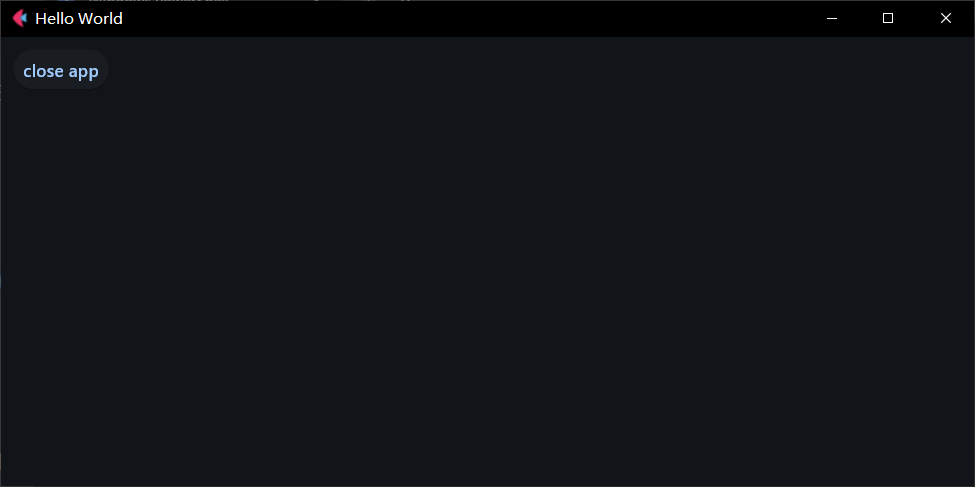
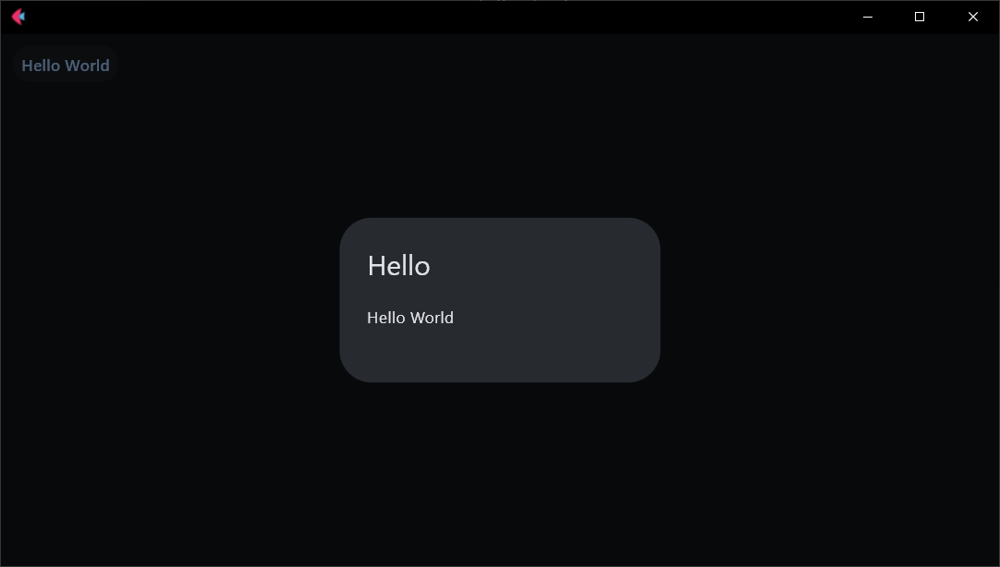
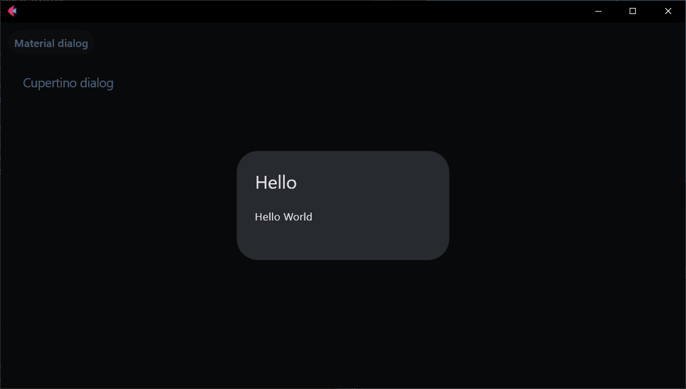
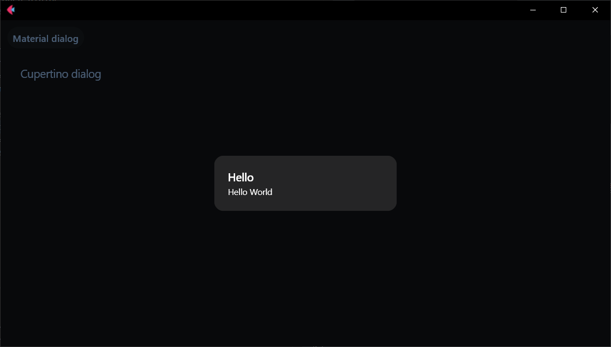
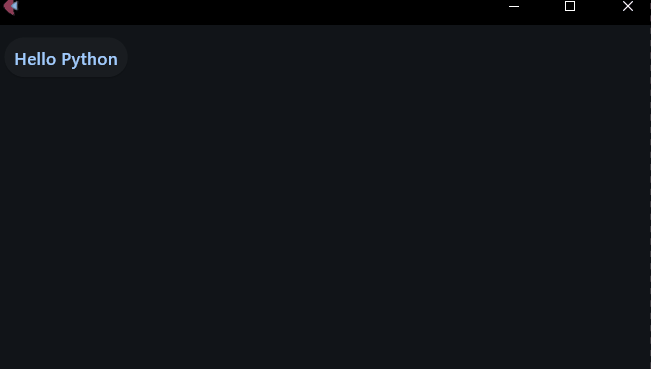
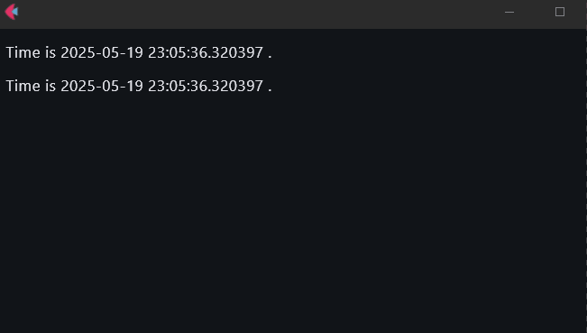
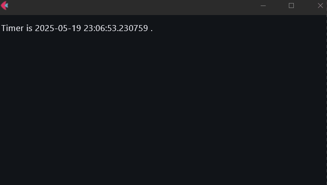
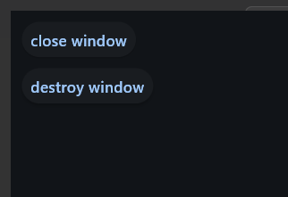

# Flet的中文入门教程

## 0 前言

Flet是一个基于Flutter框架的GUI框架，就像基于Qt框架的PySide一样。但与PySide不同的是，Flet可以使用Python语言构建桌面端、Web端、移动端程序。而且Flet的思维偏向Web，如果有Web开发基础，使用Flet开发程序简直如鱼得水。当然，受限于官方教程不够系统直观且无中文，中文开发者想要入门有点费劲，因此，笔者将在梳理了官方教程和Flet的使用技巧之后，用中文重新构建入门教程。

需要提前说明的是，虽然Flet支持桌面端、Web端、移动端，但受限于框架目前还在开发阶段，且相关依赖需要良好的网络才能确保运行、构建正常，因此，本教程只介绍桌面端的运行情况，不提供部署和其他平台的运行情况。当然，Flet本身是一套代码多端运行，如果学完本教程之后，读者想要尝试其他平台，只需修改运行配置中的视图参数即可。

## 1 环境准备

和其他框架的第一步一样，本教程依然是从搭建开发环境开始。不过，开发工具的安装和Python解释器的准备太过基础，这里不再赘述，姑且认为读者已经做好了准备，且有相关基础。若是需要这部分内容，可以查阅网络资料和其他教程。

### 1.1 uv的简短教程（同时也是基础环境的准备过程）

不同于其他框架的教程，本教程将使用一个新的环境管理工具——[uv](https://docs.astral.sh/uv/#uv)，管理开发环境。

pdm已经够快够简单了，为什么还要用uv？

也许下面的速度对比图能解决这个疑问：


可以看到，尽管pdm比pip快将近60%，但uv的速度还是瞬间完成。

了解了uv的优点，接下来开始学习使用uv的常用操作（完整的操作可以学习[官网文档](https://docs.astral.sh/uv/#uv)，这里仅学习初始化、管理开发环境的必要操作）。

#### 1.1.1 初始化项目

在想创建项目目录的地方，使用`uv init flet_uv_app -p 3.12`创建并初始化项目。

命令中，`init`后接着的，是想要创建的项目文件夹的名字，没有这个文件夹的话，uv会自动创建。如果想要在当前文件夹创建项目，直接使用`uv init -p 3.12`即可。

命令中，`-p`选项表示指定Python版本，如果不使用这个选项，uv会自动使用系统中可用Python的最新版本。

此命令会创建如下文件：

```shell
flet_uv_app
├─.git
├─.gitignore
├─.python-version
├─main.py
├─pyproject.toml
└─README.md
```

`.git`是文件夹，表明该项目初始化了一个git仓库。

`.gitignore`是文件，git仓库的忽略文件。

`.python-version`是文件，uv识别项目使用哪个Python版本的配置文件，可以在当前目录下使用`uv python pin 3.12`命令来生成次文件。

`main.py`是文件，uv自动创建的源代码文件。

`pyproject.toml`是文件，uv自动创建的项目配置文件，后面使用uv管理项目依赖的时候，此文件中相关内容会被修改。

`README.md`是文件，uv自动创建的项目描述文档，用于编写项目介绍、基本使用文档等非源代码内容。

初始化命令的其他选项可以使用`uv init --help`查看：

```shell
Create a new project

Usage: uv.exe init [OPTIONS] [PATH]

Arguments:
  [PATH]  The path to use for the project/script

Options:
  --name <NAME>                    The name of the project
  --bare                           Only create a `pyproject.toml`
  --package                        Set up the project to be built as a Python package
  --no-package                     Do not set up the project to be built as a Python package
  --app                            Create a project for an application
  --lib                            Create a project for a library
  --script                         Create a script
  --description <DESCRIPTION>      Set the project description
  --no-description                 Disable the description for the project
  --vcs <VCS>                      Initialize a version control system for the project [possible values: git, none]
  --build-backend <BUILD_BACKEND>  Initialize a build-backend of choice for the project [possible values: hatch, flit, pdm, poetry, setuptools, maturin, scikit]
  --no-readme                      Do not create a `README.md` file
  --author-from <AUTHOR_FROM>      Fill in the `authors` field in the `pyproject.toml` [possible values: auto, git, none]
  --no-pin-python                  Do not create a `.python-version` file for the project
  --no-workspace                   Avoid discovering a workspace and create a standalone project

Python options:
  -p, --python <PYTHON>      The Python interpreter to use to determine the minimum supported Python version. [env: UV_PYTHON=]
      --managed-python       Require use of uv-managed Python versions [env: UV_MANAGED_PYTHON=]
      --no-managed-python    Disable use of uv-managed Python versions [env: UV_NO_MANAGED_PYTHON=]
      --no-python-downloads  Disable automatic downloads of Python. [env: "UV_PYTHON_DOWNLOADS=never"]

Cache options:
  -n, --no-cache               Avoid reading from or writing to the cache, instead using a temporary directory for the duration of the operation [env: UV_NO_CACHE=]
      --cache-dir <CACHE_DIR>  Path to the cache directory [env: UV_CACHE_DIR=]

Global options:
  -q, --quiet...                                   Use quiet output
  -v, --verbose...                                 Use verbose output
      --color <COLOR_CHOICE>                       Control the use of color in output [possible values: auto, always, never]
      --native-tls                                 Whether to load TLS certificates from the platform's native certificate store [env: UV_NATIVE_TLS=]
      --offline                                    Disable network access [env: UV_OFFLINE=]
      --allow-insecure-host <ALLOW_INSECURE_HOST>  Allow insecure connections to a host [env: UV_INSECURE_HOST=]
      --no-progress                                Hide all progress outputs [env: UV_NO_PROGRESS=]
      --directory <DIRECTORY>                      Change to the given directory prior to running the command
      --project <PROJECT>                          Run the command within the given project directory [env: UV_PROJECT=]
      --config-file <CONFIG_FILE>                  The path to a `uv.toml` file to use for configuration [env: UV_CONFIG_FILE=]
      --no-config                                  Avoid discovering configuration files (`pyproject.toml`, `uv.toml`) [env: UV_NO_CONFIG=]
  -h, --help                                       Display the concise help for this command
```

除了默认的快速创建项目的命令，还有其他可能需要用到、改变的选项：

-   `--name`选项，指定项目的名称。
-   `--bare`选项，只创建`pyproject.toml`文件。

#### 1.1.2 初始化环境

初始化了项目之后，就要开始创建虚拟环境。但在创建虚拟环境、添加包之前，最好配置一下pypi的镜像地址。不同于pip可以使用命令全局配置，uv目前只能通过修改配置文件来配置镜像。

在 `~/.config/uv/uv.toml` 或者 `/etc/uv/uv.toml` 中填写下面的内容：

```toml
[[index]]
url = "https://mirrors.tuna.tsinghua.edu.cn/pypi/web/simple/"
default = true
```

对于Windows系统来说，这个文件是`%APPDATA%\uv\uv.toml`（需要手动创建）。

对于不想全局修改，只影响项目的话，添加至`pyproject.toml`文件即可。

使用`uv add flet[all]`和`uv remove flet[all]`添加删除包，会同时创建虚拟环境。

如果只想创建虚拟环境，而不添加任何包，可以使用`uv venv`。

如果`pyproject.toml`文件已经配置好依赖，无需添加包，则可以使用`uv sync`命令，让虚拟环境同步依赖情况（没有虚拟环境的话会自动创建虚拟环境）。

#### 1.1.3 包（依赖）的版本管理

上面的操作都是自动使用最新版本的包，对于想要使用指定版本（非最新）的包，需要提前在`pyproject.toml`文件指定依赖版本，再使用`uv sync`命令同步虚拟环境。如果依赖版本变动，则需要使用`uv sync`命令同步一次虚拟环境才能使用正确的版本。

不过需要注意的是，如果依赖有新版本且升级不影响兼容性，`uv sync`命令不会自动升级依赖版本。因为项目目录下会有uv自动生成的锁定文件——`uv.lock`（使用`uv lock`也能单独生成），该文件规定了虚拟环境使用的依赖版本和对应的文件信息，确保虚拟环境的版本依赖是正确的。

当然，删除此文件，修改依赖的版本号，再使用`uv lock`单独生成此文件，再使用`uv sync`命令（或者直接使用此命令）同步虚拟环境依赖版本，是一个有效但不简洁的操作。这里更推荐使用`uv lock -U`（同`uv lock --upgrade`）升级依赖版本，然后使用`uv sync`命令同步虚拟环境依赖版本。抑或使用`uv sync -U`（同`uv sync --upgrade`）一步到位。

不同于pip查看依赖的不直观，uv提供了`uv tree`，可以用树形图展示项目的依赖情况：



#### 1.1.4 运行

到此，环境已经准备好，可以开发、运行Flet程序了。

当然，为了鼓舞读者的热情，先运行一个现成的示例代码试试水。将下面的内容覆盖项目文件夹中`main.py`的原本内容：

```python3
import flet as ft

def main(page: ft.Page):
    page.title = 'Hello World'
    page.window.center()
    page.window.width,page.window.height = 800,400
    page.add(
        button := ft.Button('close app'),
    )
    button.on_click = lambda e:page.window.close()

ft.app(target=main)
```

然后，在`main.py`同级目录下打开命令行，使用`uv run python main.py`运行。即可看到运行结果：



这个命令中，`uv run python main.py`表示使用虚拟环境的Python运行`main.py`，和在开发工具中直接运行一样。

对于Flet程序，除了直接使用Python解释器运行，Flet还提供了一个`flet`命令，可以直接运行`flet run`，会自动运行`main.py`（只能是该名字的源代码）。

但是，直接运行`flet run`，使用的是系统全局的`flet`命令，这里的Flet是安装到虚拟环境中，因此，使用`uv run flet run`才是正确的。

#### 1.1.5 总结

简短教程介绍的命令可以查阅下表，快速使用：

| 命令                                 | 作用                                                         |
| ------------------------------------ | ------------------------------------------------------------ |
| `uv init flet_uv_app -p 3.12`        | 创建`flet_uv_app`文件夹，并在文件夹中初始化项目，指定Python版本为3.12 |
| `uv init -p 3.12`                    | 在当前文件夹中初始化项目，指定Python版本为3.12               |
| `uv python pin 3.12`                 | 在当前文件夹创建指定Python版本为3.12的配置文件               |
| `uv init --help`                     | 查看`init`命令的帮助文档                                     |
| `uv add flet[all]`                   | 添加包，并创建虚拟环境（如果不存在虚拟环境的话）             |
| `uv remove flet[all]`                | 添加包，并创建虚拟环境（如果不存在虚拟环境的话）             |
| `uv venv`                            | 在当前目录创建虚拟环境                                       |
| `uv sync`                            | 让虚拟环境同步依赖情况（没有虚拟环境的话会自动创建虚拟环境） |
| `uv sync -U`<br>`uv sync --upgrade`  | 升级锁文件中依赖的版本并同步虚拟环境的依赖版本               |
| `uv lock`                            | 创建锁文件                                                   |
| `uv lock -U`<br/>`uv lock --upgrade` | 升级锁文件中的依赖版本                                       |
| `uv tree`                            | 以树形视图形式查看依赖情况                                   |
| `uv run python main.py`              | 使用虚拟环境的Python运行`main.py`                            |
| `uv run flet run`                    | 运行虚拟环境提供的命令（系统命令也可以，但要求是全局路径中的可执行文件） |

## 2 基础知识

准备好环境之后，接下来就可以正式开始Flet的开发工作。但在学习基础之前，还需要了解一个开发调试的技巧。

前面介绍过使用`flet run`运行当前目录下的`main.py`，其实，该命令还可以指定目录名或者文件名，表示运行指定目录下的`main.py`或者指定文件。

为了方便开发调试，Flet还提供了热重载功能，可以让代码修改实时生效，只需使用`flet run -d`运行。此时，任何对`main.py`文件（或者指定文件）所在目录下的文件的修改都会导致程序无感重启，代码改动实时生效。需要注意的是，只是使用`flet run -d`运行，程序检测的是`main.py`文件（或者指定文件）所在目录，如果所在目录的其他子级目录的文件修改，则不会触发重启。此时需要添加`-r`选项，将子级目录也添加到检测范围中。

除了使用`flet run main.py`来运行程序，还可以省略`run`，直接使用`flet main.py`来运行。注意，这种省略方式仅限指定了目录（等于运行指定目录下的`main.py`）或者文件名（即使是`main.py`也要写上）的情况下使用，且支持`-d`和`-r`选项。

### 2.1 Flet的`Hello World`

大部分编程语言、框架都是从最简单的`Hello World`程序开始，Flet也不例外：

```python3
import flet as ft

def main(page: ft.Page):
    page.add(
        ft.Button(
            text = 'Hello World',
            on_click = lambda e:page.open(
                ft.AlertDialog(
                    title='Hello',
                    content=ft.Text('Hello World')
                )
            )
        )
    )
    
ft.app(target=main)
```



### 2.2 Flet程序的基本概念

本节主要内容参考自 https://flet.dev/docs/getting-started/ 。

对于Flet程序来说，基础方面没有特别需要注意的地方，大部分需要学习的也就是具体控件的用法，这也是Flet框架广受欢迎的原因。

#### 2.2.1 图形界面的基础概念

在正式学习Flet的基础之前，需要先对图形界面有个基础的理解。

一般来说，搭建图形界面需要理解三个概念：控件、布局、交互。

##### 2.2.1.1 控件

控件是搭建图形界面的基本元素，就像是盖房子用的砖、门、窗等最小搭建单位。控件通常是图形界面框架提供、直接可用的。如果使用过程中发现基本元素不够，可以结合布局功能，用基本元素组合出新的控件。

##### 2.2.1.2 布局

布局是排布控件的方式，就像是房屋的基本框架。用砖可以铺地，也可以垒墙，对于砖而言，墙或是地，就是布局。控件是横向排列还是竖向排列，是像网格一样一一对应，还是大控件套着小控件，都是由布局控制。大部分图形程序框架提供的布局类似，除了基本的几种布局之外，部分图形程序框架还提供额外的组合布局。

##### 2.2.1.3 交互

交互是图形界面的重中之重，也是一个程序最难的部分。论难度的话，前面的控件和布局的学习只是对照文档，按图索骥，交互则需要身经百战，不断积累经验。

事件机制是目前大部分图形界面采用的交互反馈机制，也就是基于特定的事件触发，执行对应的函数。微软的winform中采用的消息机制，Qt的信号与槽，现代网页开发中的event事件监听，都可以理解为事件机制，只是对于winform和Qt而言，他们框架内的事件分别叫做消息和信号而已。

除了事件机制，美化也是交互的一部分。大部分现代图形界面框架。如Qt、WPF以及一系列基于网页开发的图形界面框架，支持CSS或者类似语法的美化功能，让图形界面变得更加美观，也让控件的动画效果更加丰富，这个极大提升了用户的使用体验。

此外，基于图形界面框架的特性，后端的处理逻辑以及数据的传递也是交互的一部分。在函数内，对于控件的控制，如何做到符合要求，毕竟有的框架、编程语言不支持没有定义或者声明函数就调用，而有的语言不支持声明函数。如果需要让控件显示的文本与另一个控件的文本一致，如何处理数据同步过程也需要技巧。

##### 2.2.1.4 Flet与基础概念的对应

对图形界面有基础的理解之后，下面就可以根据Flet与基础概念的对应，进一步理解Flet的设计理念。

在`Hello World`示例中，使用了导入语句`import flet as ft`导入了`flet`，`flet`包含大部分控件（部分开头大写的类）、功能（全小写函数和非控件的类），可以快速使用控件创建界面。当然，布局控件也是控件，这也是大多数现代GUI框架的设计思路。所以，使用相关布局时，无需单独导入。

需要注意的是，Flet的控件是通过修改属性来修改显示的内容，但在修改了属性之后，不会立刻刷新显示，而是需要等下次触发刷新或者手动调用`update`方法主动触发刷新，才能让控件的内容变动生效。

在交互方面，Flet采用的是类似网页端的事件响应机制，使用'on_'开头方法响应对应的事件，开发者需要设置对应方法需要执行的操作。

#### 2.2.2 Flet程序的基本组成

在`Hello World`示例中，若是严格区分的话，一个Flet程序的源代码主要由两部分组成：

-   定义的`main`函数是程序的主要入口，该函数接收一个`Page`类型参数，表示程序的主页面，所有的控件和布局都是挂载在主页面下：

    ```shell
    Page
     ├─ TextField
     ├─ Dropdown
     │   ├─ Option
     │   └─ Option
     └─ Row
         ├─ ElevatedButton
         └─ ElevatedButton
    ```

-   `ft.app(target=main)`使用主要入口函数，进入Flet程序的事件循环中，一旦程序退出，该函数就会自动跳出循环。如果该行代码下面还有内容的话，Python就会继续执行下去。

#### 2.2.3 添加控件

本节主要内容参考自 https://flet.dev/docs/getting-started/flet-controls 。

默认情况下，控件都是直接挂载到主页面（本质上也是个控件，但是主页面是最顶层的控件）下（后面的视图是间接挂载）。想要给主页面添加控件，有两种方式：

-   调用`add`方法添加。
-   设置主页面的`controls`属性（列表类型）。

调用`add`方法很简单：

```python3
import flet as ft

def main(page: ft.Page):
    page.add(
        ft.Button(
            text = 'Hello World',
            on_click = lambda e:page.open(
                ft.AlertDialog(
                    title='Hello',
                    content=ft.Text('Hello World')
                )
            )
        )
    )
    
ft.app(target=main)
```

`add`方法支持传入多个控件，可以一次性添加多个控件。

设置主页面的`controls`属性就稍微麻烦一些，因为设置属性之后，界面的显示不会立即刷新，需要主动使用`update`方法才能立即触发刷新，否则只能等其他用户操作触发被动刷新：

```python3
import flet as ft


def main(page: ft.Page):

    # 定义按钮
    button = ft.Button(text='Hello World')

    # 定义对话框
    dialog = ft.AlertDialog(
                title='Hello',
                content=ft.Text('Hello World')
            )
    
    # 定义打开对话框的函数
    def open_dialog(e):
        page.open(dialog)

    # 将按钮的点击响应函数与打开对话框的函数绑定
    button.on_click = open_dialog

    # 给页面的控件属性添加按钮
    page.controls.append(button)
    
    # 更新页面的显示
    page.update()

ft.app(target=main)
```

添加控件使用时，以下两个特别的技巧可以帮助读者更好地创建、管理控件，因此单独说一下。

第一个就是海象表达式（`:=`）。在使用`add`方法添加控件和设置属性添加控件之前，先单独分配控件的变量，再使用这两种方式添加，可以后期管理被添加的控件。但是，这样操作会让代码显得有些杂乱（尤其是对于使用`add`方法的方式）。此时，就可以在添加控件的同时，使用海象表达式，在添加控件的同时完成变量的分配：

```python3
import flet as ft

def main(page: ft.Page):
    page.add(
        button := ft.Button(
            text = 'Hello World',
            on_click = lambda e:page.open(
                ft.AlertDialog(
                    title='Hello',
                    content=ft.Text('Hello World')
                )
            )
        )
    )
    button.text = 'Hello Python'
    button.update()
    
ft.app(target=main)
```

另一个技巧就是使用lambda表达式。其实上面的示例已经体现出该技巧。想要让按钮响应操作，就要在创建按钮时给其`on_click`参数传入接收一个参数的可调用对象或者在创建完成后设置按钮的`on_click`属性。给所有要用到的可调用对象起名属实困难，这时就可以使用lambda表达式代替。

大部分控件有两种风格版本：Material 风格（控件名字无前缀'Cupertino'）和 Cupertino 风格（控件名字有前缀'Cupertino'）。其中，前者是非苹果系统默认使用的风格，后者是苹果系统使用的风格。具体可以参考 https://flet.dev/docs/getting-started/adaptive-apps 。

具体两种风格的控件，可以使用下面的示例对比：

```python3
import flet as ft


def main(page: ft.Page):

    # Material风格
    button = ft.Button(text='Material dialog')
    dialog = ft.AlertDialog(
                title=ft.Text('Hello'),
                content=ft.Text('Hello World')
            )
    def open_dialog(e):
        page.open(dialog)

    button.on_click = open_dialog
    page.controls.append(button)

    # Cupertino 风格
    button2 = ft.CupertinoButton(text='Cupertino dialog')
    dialog2 = ft.CupertinoAlertDialog(
                title=ft.Text('Hello'),
                content=ft.Text('Hello World')
            )
    def open_dialog2(e):
        page.open(dialog2)
    button2.on_click = open_dialog2
    page.controls.append(button2)
    
    # 更新页面的显示
    page.update()

ft.app(target=main)
```





需要注意的是，部分 Material  风格的控件同时也是自适应控件，也就是说，将其`adaptive`参数设置为`True`的话，当程序识别到主机为苹果系统时，将自动转换为 Cupertino 风格控件（仅限词根相同的控件）。

#### 2.2.4 异步与后台任务

本节主要内容参考自 https://flet.dev/docs/getting-started/async-apps 。

入口函数也可以是异步函数，这样就能在入口函数内使用异步操作（比如延迟一定时间执行特定操作）：

```python3
import flet as ft
import asyncio

async def main(page: ft.Page):
    page.add(
        button := ft.Button(
            text = 'Hello World',
            on_click = lambda e:page.open(
                ft.AlertDialog(
                    title='Hello',
                    content=ft.Text('Hello World')
                )
            )
        )
    )
    button.text = 'Hello Python'
    await asyncio.sleep(3)
    button.update()
    
ft.app(target=main)
```

上面的示例中，添加了`await asyncio.sleep(3)`，程序打开三秒以后才会更新界面显示。

不仅可以使用异步的入口函数，还可以使用异步的消息响应函数：

```python3
import flet as ft
import asyncio

async def main(page: ft.Page):
    async def open_dialog(e):
        await asyncio.sleep(3)
        page.open(
                ft.AlertDialog(
                    title='Hello',
                    content=ft.Text('Hello World')
                )
        )
    page.add(
        button := ft.Button(
            text = 'Hello World',
            on_click = open_dialog
        )
    )
    button.text = 'Hello Python'
    button.update()
    
ft.app(target=main)
```



注意，虽然在使用异步的消息响应函数时，不强制要求使用异步的入口函数，但最好还是在异步的入口函数，避免出现无法预料的异步问题。

lambda表达式没有异步版本，但不能在lambda表达式中使用异步操作：

```python3
import flet as ft
import asyncio

async def main(page: ft.Page):
    async def open_dialog(e,title = 'Hello'):
        await asyncio.sleep(3)
        page.open(
                ft.AlertDialog(
                    title=title,
                    content=ft.Text('Hello World')
                )
        )
    page.add(
        button := ft.Button(
            text = 'Hello World',
            on_click = lambda e:open_dialog(e,'Hello') # 不能在lambda表达式中使用任何异步操作、异步函数
        )
    )
    button.text = 'Hello Python'
    button.update()
    
ft.app(target=main)
```

对于Flet程序来说，使用异步的好处就是可以避免阻塞后台操作、卡顿等问题。比如，在前面的示例中，使用了`await asyncio.sleep(3)`作为延迟特定时间的操作，如果使用`time.sleep(3)`代替，虽然示例没有什么明显问题，但是此类操作太多的话，会导致程序出现卡顿等问题：

```python3
import flet as ft
import time

def main(page: ft.Page):
    def open_dialog(e,title = 'Hello'):
        time.sleep(3)
        page.open(
                ft.AlertDialog(
                    title=title,
                    content=ft.Text('Hello World')
                )
        )
    page.add(
        button := ft.Button(
            text = 'Hello World',
            on_click = open_dialog
        )
    )
    button.text = 'Hello Python'
    button.update()
    
ft.app(target=main)
```

虽然在入口函数直接执行一两个耗时操作不会有明显影响，但依然建议将耗时操作放到后台执行。

有两种方式运行后台任务：

-   `page.run_task`方法，运行异步函数。
-   `page.run_thread`方法，运行非异步函数。

这两个方法都支持以下参数：

-   `handler`参数，可调用类型，表示要执行的操作。注意，要执行的操作需要传入位置参数时，不要用关键字方式传入此参数。
-   `*args`参数，紧接着`handler`参数的所有位置参数，都会严格按照顺序传给要执行的操作，作为要执行操作的位置参数。
-   `**kwargs`参数，最后一个位置参数之后的所有关键字参数（没有位置参数的话就是除了`handler`参数之外其余关键字参数），都会传给要执行的操作，作为要执行操作的关键字参数。

以下示例展示了两种运行后台任务的方式：

```python3
import flet as ft
import asyncio
import time
from datetime import datetime

async def main(page: ft.Page):
    page.add(
        text := ft.Text(f'{datetime.now()}'),
        text2 := ft.Text(f'{datetime.now()}')
    )
    
    async def update_time(name=None,*,end=''):
        while True:
            text.value = f'{name} is {datetime.now()} {end}'
            text.update()
            await asyncio.sleep(1)
            
    page.run_task(update_time,'Time',end='.')
    
    def update_time_sync(name=None,*,end=''):
        while True:
            text2.value = f'{name} is {datetime.now()} {end}'
            text2.update()
            time.sleep(1)
            
    page.run_thread(update_time_sync,'Time',end='.')

ft.app(target=main)
```



需要注意的是，Flet 0.28.2 版本中，`page.run_thread`方法没法正常接收`**kwargs`参数。不过，该问题已经提交，可能很快就会修复，如果使用的是 0.28.2 版本或者教程发布时问题没有修复，可以使用下面的补丁代码。

在导入所有库之后添加下面的补丁代码：

```python3
# patch is here
from flet.core.page import _session_page
from typing import (
    Any,
    Callable,
)
from flet.core.types import (
    Wrapper,
)
class Page(__import__('flet').Page):
    def __context_wrapper(self, handler: Callable[..., Any]) -> Wrapper:
        def wrapper(*args,**kwargs):
            _session_page.set(self)
            handler(*args,**kwargs)
        return wrapper
# patch is over
```

然后，在入口函数的第一行添加下面的运行时补丁：

```python3
# runtime patch code is here
    page = Page(
        page.connection,
        page.session_id,
        executor=page.executor,
        loop=page.loop
    )
# runtime patch code is over
```

完整代码如下：

```python3
import flet as ft
import asyncio
import time
from datetime import datetime

# patch is here
from flet.core.page import _session_page
from typing import (
    Any,
    Callable,
)
from flet.core.types import (
    Wrapper,
)
class Page(__import__('flet').Page):
    def __context_wrapper(self, handler: Callable[..., Any]) -> Wrapper:
        def wrapper(*args,**kwargs):
            _session_page.set(self)
            handler(*args,**kwargs)
        return wrapper
# patch is over

async def main(page: ft.Page):

    # runtime patch code is here
    page = Page(
        page.connection,
        page.session_id,
        executor=page.executor,
        loop=page.loop
    )
    # runtime patch code is over

    page.add(
        text := ft.Text(f'{datetime.now()}'),
        text2 := ft.Text(f'{datetime.now()}')
    )
    async def update_time(name=None,*,end=''):
        while True:
            text.value = f'{name} is {datetime.now()} {end}'
            text.update()
            await asyncio.sleep(1)
            
    page.run_task(update_time,'Time',end='.')
    
    def update_time_sync(name=None,*,end=''):
        while True:
            text2.value = f'{name} is {datetime.now()} {end}'
            text2.update()
            time.sleep(1)
            
    page.run_thread(update_time_sync,'Time',end='.')

    
ft.app(target=main)
```

#### 2.2.5 颜色（更新中）

本节主要内容参考自 https://flet.dev/docs/reference/colors 。


（以下内容暂定，等待打磨、校核）

在Flet中，需要设置颜色的地方（控件的前景色和背景色等），支持以下几种颜色的表达方式：

-   名字
-   成员
-   量化表达
-   颜色对象


给颜色设置透明度的话，有以下几种方式：

-   表示颜色的字符串中，使用英文逗号分隔，后接小数表示的透明度
-   使用包含透明度的量化表达
-   静态方法`with_opacity`，需要同时表明颜色。


（颜色名字，颜色成员，颜色的量化表达，透明度等，）


```python3
import flet as ft

def main(page: ft.Page):
    page.add(
        *[ft.Button(text=f'{color} Button',bgcolor=color) 
          for color in ['red','RED','','',ft.Colors.RED,ft.Colors('red')] ]
    )
    page.add(
        *[ft.Button(text=f'{color} Button',bgcolor=color) 
          for color in ['red,0.5','RED','','',ft.Colors.RED,ft.Colors.with_opacity(0.5,'red')] ]
    )
    
ft.app(target=main)
```


#### 2.2.x （待定）


### 2.3 基础技巧（随时补充）

本节主要介绍那些新手需要但三言两语就能说清的基础技巧。

Flet官方目前没有添加定时器功能，不过，单独实现一个也并非难事。

以下代码源于 https://github.com/omamkaz/flet-timer 。

下面的代码定义了`Timer`类和`debounce`装饰器，可以方便快捷地定时执行指定操作。

```python3
import threading
import typing
from functools import wraps

class Timer:
    def __init__(
        self,
        interval: float = 1,
        callback: typing.Callable = None,
        on_error: typing.Callable[[str], None] = None,
        wait_on_start: bool = True,
        *args,
        **kwargs
    ):
        self.interval = interval
        self.callback = callback
        self.on_error = on_error
        self.wait_on_start = wait_on_start
        self.active = False
        self.paused = False
        self.pause_condition = threading.Condition(threading.Lock())
        self.th = threading.Thread(target=self.tick, daemon=True)
    def set_interval(self, interval: float) -> None:
        self.interval = interval
    def set_callback(self, callback: typing.Callable) -> None:
        self.callback = callback
    def start(self):
        self.active = True
        self.paused = False
        if not self.th.is_alive():
            if self.wait_on_start:
                threading.Event().wait(self.interval)
            self.th = threading.Thread(target=self.tick, daemon=True)
            self.th.start()
    def stop(self):
        self.active = False
        self.resume()
    def pause(self):
        with self.pause_condition:
            self.paused = True
    def resume(self):
        with self.pause_condition:
            self.paused = False
            self.pause_condition.notify()
    def tick(self):
        while self.active:
            with self.pause_condition:
                while self.paused:
                    self.pause_condition.wait()
            try:
                if self.callback:
                    self.callback()
            except Exception as e:
                self.on_error(e)
            threading.Event().wait(self.interval)

class debounce:
    def __init__(self, timeout: float = 1):
        self.timeout = timeout
        self._timer = None
    def __call__(self, func: typing.Callable):
        @wraps(func)
        def decorator(*args, **kwargs):
            if self._timer is not None:
                self._timer.cancel()
            self._timer = threading.Timer(self.timeout, func, args=args, kwargs=kwargs)
            self._timer.start()
        return decorator
```

`Timer`类为定时器，可以间隔指定时间循环执行指定操作。`debounce`装饰器装饰函数之后，若函数在指定的时间内重复执行，则以最后一次执行函数的时间为起点，到达指定时间之后，只有最后一次执行的函数才会响应。

需要注意的是，定义了定时器之后，需要手动调用`start`方法才算启动了定时器。

以下为完整示例：

```python3
import flet as ft
from datetime import datetime

import threading
import typing

class Timer:
    def __init__(
        self,
        interval: float = 1,
        callback: typing.Callable = None,
        on_error: typing.Callable[[str], None] = None,
        wait_on_start: bool = True,
        *args,
        **kwargs
    ):
        self.interval = interval
        self.callback = callback
        self.on_error = on_error
        self.wait_on_start = wait_on_start
        self.active = False
        self.paused = False
        self.pause_condition = threading.Condition(threading.Lock())
        self.th = threading.Thread(target=self.tick, daemon=True)
    def set_interval(self, interval: float) -> None:
        self.interval = interval
    def set_callback(self, callback: typing.Callable) -> None:
        self.callback = callback
    def start(self):
        self.active = True
        self.paused = False
        if not self.th.is_alive():
            if self.wait_on_start:
                threading.Event().wait(self.interval)
            self.th = threading.Thread(target=self.tick, daemon=True)
            self.th.start()
    def stop(self):
        self.active = False
        self.resume()
    def pause(self):
        with self.pause_condition:
            self.paused = True
    def resume(self):
        with self.pause_condition:
            self.paused = False
            self.pause_condition.notify()
    def tick(self):
        while self.active:
            with self.pause_condition:
                while self.paused:
                    self.pause_condition.wait()
            try:
                if self.callback:
                    self.callback()
            except Exception as e:
                self.on_error(e)
            threading.Event().wait(self.interval)

def main(page: ft.Page):
    page.add(
        text := ft.Text(f'{datetime.now()}')
    )

    def update_time(name=None,*,end=''):
        text.value = f'{name} is {datetime.now()} {end}'
        text.update()

    Timer(interval=1,callback=lambda :update_time('Timer',end='.')).start()

    
ft.app(target=main)
```



Flet是一个GUI框架，在开发桌面程序中，经常会设计无边框程序。启用无边框也就意味着没有了常规的关闭按钮，无法正常关闭窗口。此时，就需要用到关闭窗口的方法：`close`方法和`destroy`方法。启用无边框和关闭窗口的方法均是`page.window`的属性、方法，具体可以参考 https://flet.dev/docs/reference/types/window/ 。

以下为启用无边框的同时，添加了关闭窗口按钮的示例：

```python3
import flet as ft

def main(page: ft.Page):
    page.window.frameless= True
    page.add(
        ft.Button(text='close window',on_click=lambda e:page.window.close()),
        ft.Button(text='destroy window',on_click=lambda e:page.window.destroy())
    )

ft.app(target=main)
```



（随时补充中……）

## 3 具体控件（更新中）

本节主要内容参考自 https://flet.dev/docs/controls 。

Flet提供了大量美观的控件，接下来，根据分类情况，具体学习每个控件。

注意，不是所用控件、方法都支持在桌面平台使用，对于不支持桌面平台的部分，示例代码仅供参考，请读者在实际使用时根据报错自行修正。

### 3.1 布局

本节主要内容参考自 https://flet.dev/docs/controls/layout 。


## 4 高阶技巧与实例（更新中）

除了基础知识和具体的控件用法之外，想要让Flet程序随心所欲，还需要学会一些其他技巧。当然，每个技巧都有具体、可运行的实例代码。

### 4.1 自定义控件

本节主要内容参考自 https://flet.dev/docs/getting-started/custom-controls 。

(这部分放到进阶，不能当做基础内容)


```python3
import flet as ft

class MyButton(ft.Button):
    def __init__(self, text, on_click = None):
        super().__init__()
        self.bgcolor = ft.Colors.ORANGE_300
        self.color = ft.Colors.GREEN_800
        self.text = text
        self.on_click = on_click

def main(page: ft.Page):

    # Material风格
    button = MyButton(text='Material dialog')
    dialog = ft.AlertDialog(
                title=ft.Text('Hello'),
                content=ft.Text('Hello World')
            )
    def open_dialog(e):
        page.open(dialog)

    button.on_click = open_dialog
    page.controls.append(button)

    # 更新页面的显示
    page.update()

ft.app(target=main)
```


### 4.2 视图与路由

views相当于路径（NiceGUI的page，fastapi的路由），SPA应用

本节主要内容参考自 https://flet.dev/docs/getting-started/navigation-and-routing


### 4.3 主题

本节主要内容参考自 https://flet.dev/docs/cookbook/theming 。
