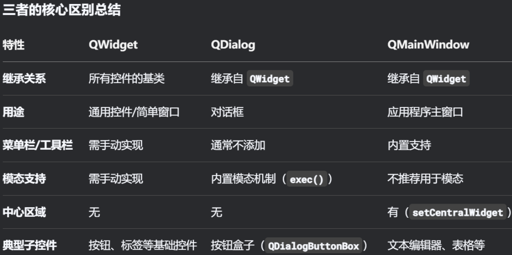

# PySide6学习笔记

## 0 前言

PySide6各类教程已经有很多，笔者就不班门弄斧了。不过，框架在使用过程中还是有不少难点，对于心急的初学者来说，很容易在找不到解决方法之后轻言放弃。因此，笔者将代入初学者的视角，按照学习顺序记录一下使用过程中遇到的难点，并给出解释和解决方法，以便于有一定基础但囿于难点的读者按图索骥。

## 1 基础篇

本章主要介绍那些学习基础功能时遇到的难点。

### 1.1 安装PySide6

学习的第一步就是安装库。不过，官方提供了不少相关的库，但并非所有的库都是必需的。以下面的虚拟环境（使用环境管理工具UV创建）为例，笔者添加了官方提供的相关库，其依赖关系如下（使用`uv tree`生成）：

```shell
pyside6-uv-app v0.1.0
├── pyside6 v6.9.1
│   ├── pyside6-addons v6.9.1
│   │   ├── pyside6-essentials v6.9.1
│   │   │   └── shiboken6 v6.9.1
│   │   └── shiboken6 v6.9.1
│   ├── pyside6-essentials v6.9.1 (*)
│   └── shiboken6 v6.9.1
├── pyside6-examples v6.9.1
│   ├── pyside6-addons v6.9.1 (*)
│   ├── pyside6-essentials v6.9.1 (*)
│   └── shiboken6 v6.9.1
└── shiboken6-generator v6.9.1
    └── shiboken6 v6.9.1
```

项目下主动添加的库为：`pyside6`、`pyside6-examples`、`shiboken6-generator`。其中，添加了`pyside6`之后，会自动安装相关的依赖，此时就可以开始学习，无需额外安装其他相关库。当然，其他的库也有用处，只是刚开始学习的时候不一定需要。`pyside6-examples`是官方编写的示例程序，可在`pyside6_uv_app\.venv\Lib\site-packages\PySide6\examples`中找到。`shiboken6-generator`是绑定生成器，只有涉及到绑定Qt或者C++程序的接口（基于C++头文件生成Python的接口）时，才需要这个库。

需要注意的是，在使用UV管理虚拟环境时，单独移除`pyside6-examples`会导致`pyside6`的`__init__.py`丢失，可使用`uv sync --reinstall`重新安装所有库来解决此问题。

### 1.2 PySide6的中的命名规则（暂定）

（内容待定）

熟悉模块

PySide6各个模块的功能和用途

```python3
['QtCore', 'QtGui', 'QtWidgets', 'QtPrintSupport', 'QtSql', 'QtNetwork', 'QtTest', 'QtConcurrent', 'QtDBus', 'QtDesigner', 'QtXml', 'QtHelp', 'QtMultimedia', 'QtMultimediaWidgets', 'QtOpenGL', 'QtOpenGLWidgets', 'QtPdf', 'QtPdfWidgets', 'QtPositioning', 'QtLocation', 'QtNetworkAuth', 'QtNfc', 'QtQml', 'QtQuick', 'QtQuick3D', 'QtQuickControls2', 'QtQuickTest', 'QtQuickWidgets', 'QtRemoteObjects', 'QtScxml', 'QtSensors', 'QtSerialPort', 'QtSerialBus', 'QtStateMachine', 'QtTextToSpeech', 'QtCharts', 'QtSpatialAudio', 'QtSvg', 'QtSvgWidgets', 'QtDataVisualization', 'QtGraphs', 'QtGraphsWidgets', 'QtBluetooth', 'QtUiTools', 'QtAxContainer', 'QtWebChannel', 'QtWebEngineCore', 'QtWebEngineWidgets', 'QtWebEngineQuick', 'QtWebSockets', 'QtHttpServer', 'QtWebView', 'Qt3DCore', 'Qt3DRender', 'Qt3DInput', 'Qt3DLogic', 'Qt3DAnimation', 'Qt3DExtras', 'QtExampleIcons']
```

https://doc.qt.io/qtforpython-6/py-modindex.html


Qt开头的是模块，Q开头（不含Qt开头）的是类，命名采用大驼峰规则，即每个字段的首字母大写，直接连接每个字段。


### 1.3 PySide6程序的基本结构


### 1.4 三种主窗口


（下面的图片用表格重新写一下）



```python3
from PySide6.QtWidgets import (
    QApplication,
    QWidget,
    QMainWindow,
    QDialog,
)

app = QApplication()

window = QWidget()
window = QMainWindow()
window = QDialog()

window.resize(400,300)

window.show()
app.exec()
```


三种Application：

```python3
# 继承关系为：
# QCoreApplication -> QGuiApplication -> QApplication
# 因此，QApplication不仅可以运行QtWidgets程序，也可以运行QtQucik程序
# QCoreApplication只能运行控制台程序，不能运行GUI程序

# 无GUI的控制台程序示例
from PySide6.QtWidgets import (
    QApplication,
)
from PySide6.QtGui import QGuiApplication
from PySide6.QtCore import QCoreApplication,QTimer

app = QCoreApplication()
QTimer.singleShot(1000,lambda :print('app is running'))
QTimer.singleShot(2000,lambda :print('app is still running'))
QTimer.singleShot(3000,app.quit)
app.exec()
```


信号与槽


消息与事件


窗口的关闭事件：

```python3
from PySide6.QtWidgets import (
    QApplication,
    QWidget,
    QMessageBox,
    QPushButton
)
from PySide6.QtGui import QIcon

app = QApplication()
window = QWidget(windowIcon=QIcon.fromTheme(QIcon.ThemeIcon.ViewFullscreen))
window.resize(400,300)
window.show()
window2 = QWidget(windowIcon=QIcon.fromTheme(QIcon.ThemeIcon.MediaTape))
window2.resize(400,300)
QPushButton('click',window2).clicked.connect(lambda :app.alert(window,0))
window2.show()

window2.closeEvent = lambda e: e.accept() if QMessageBox.question(window2,'消息','你确定要退出吗？', QMessageBox.Yes|QMessageBox.No, QMessageBox.No) == QMessageBox.Yes else e.ignore()

app.exec()
```


QtQuick的基本示例：

使用`QQuickView`：

加载QML文件（使用`QQuickView`）：

```python3
from PySide6.QtGui import QGuiApplication
from PySide6.QtCore import QUrl
from PySide6.QtQuick import QQuickView

app = QGuiApplication()

# main.qml 内容为：
'''
import QtQuick

Rectangle {
    id: main
    width: 200
    height: 200
    color: 'green'

    Text {
        text: 'Hello World'
        anchors.centerIn: main
    }
}
'''
view = QQuickView(source=QUrl('./main.qml'))
view.resize(200,200)
view.setTitle('Main')
view.show()

app.exec()
```

加载QML字符串（使用`QQuickView`和`QQmlComponent`）：

```python3
from PySide6.QtGui import QGuiApplication
from PySide6.QtCore import QUrl,QByteArray
from PySide6.QtQuick import QQuickView
from PySide6.QtQml import QQmlComponent

app = QGuiApplication()

qml_string = '''
import QtQuick

Rectangle {
    id: main
    width: 200
    height: 200
    color: 'green'

    Text {
        text: 'Hello World'
        anchors.centerIn: main
    }
}
'''

view = QQuickView()
# 使用view的engine创建component
component = QQmlComponent(view.engine())
# 给component加载qml字符串
component.setData(QByteArray(qml_string.encode()),QUrl())
# 让view的根内容变成component，并将实际内容变为component的生成内容
view.setContent(QUrl(), component, component.create())

view.resize(200,200)
view.setTitle('Main')

view.show()

app.exec()
```

加载QML字符串（写入临时文件，也兼容Qt中其他只能加载文件的地方）：

```python3
from PySide6.QtGui import QGuiApplication
from PySide6.QtCore import QUrl
from PySide6.QtQuick import QQuickView
import tempfile

app = QGuiApplication()

qml_string = '''
import QtQuick

Rectangle {
    id: main
    width: 200
    height: 200
    color: 'green'

    Text {
        text: 'Hello World'
        anchors.centerIn: main
    }
}
'''
# 将字符串写入临时文件
with tempfile.NamedTemporaryFile(delete=False) as qml_file:
    qml_file.write(qml_string.encode())

view = QQuickView(source=QUrl.fromLocalFile(qml_file.name))

# 删除临时文件
import os
os.remove(qml_file.name)
# 或者 os.unlink(qml_file.name)

view.resize(200,200)
view.setTitle('Main')

view.show()

app.exec()
```

不想手动删除临时文件的话，可以使用`QTemporaryFile`：

```python3
from PySide6.QtGui import QGuiApplication
from PySide6.QtCore import QUrl,QTemporaryFile
from PySide6.QtQuick import QQuickView

app = QGuiApplication()

qml_string = '''
import QtQuick

Rectangle {
    id: main
    width: 200
    height: 200
    color: 'green'

    Text {
        text: 'Hello World'
        anchors.centerIn: main
    }
}
'''
# 将字符串写入临时文件，自动生成随机后缀，程序退出后自动删除
# 可以指定临时文件的非随机部分名和路径，但要求路径所表示的文件夹已经存在，否则不能正常创建临时文件
qml_file = QTemporaryFile()
if qml_file.open():
    qml_file.write(qml_string.encode())
    qml_file.close()

view = QQuickView(source=QUrl.fromLocalFile(qml_file.fileName()))


view.resize(200,200)
view.setTitle('Main')

view.show()

app.exec()
```

使用`QQmlApplicationEngine`（加载文件和字符串都很简单，但默认不包括窗口，需要在QML中定义）：

加载QML文件（使用`QQmlApplicationEngine`）：

```python3
from PySide6.QtGui import QGuiApplication
from PySide6.QtCore import QUrl
from PySide6.QtQml import QQmlApplicationEngine

app = QGuiApplication()

# main.qml 内容为：
'''
import QtQuick
import QtQuick.Controls

ApplicationWindow {
    visible: true
    title: 'Main'
    width: 200
    height: 200
    Rectangle {
        id: main
        width: 200
        height: 200
        color: 'green'

        Text {
            text: 'Hello World'
            anchors.centerIn: main
        }
    }
}
'''
engine = QQmlApplicationEngine(QUrl('./main.qml'))

app.exec()
```

加载QML字符串（使用`QQmlApplicationEngine`生成窗口和窗口的内容）：

```python3
from PySide6.QtGui import QGuiApplication
from PySide6.QtCore import QUrl
from PySide6.QtQml import QQmlApplicationEngine

app = QGuiApplication()

qml_src = '''
import QtQuick
import QtQuick.Controls

ApplicationWindow {
    visible: true
    title: 'Main'
    width: 200
    height: 200
    Rectangle {
        id: main
        width: 200
        height: 200
        color: 'green'

        Text {
            text: 'Hello World'
            anchors.centerIn: main
        }
    }
}
'''
engine = QQmlApplicationEngine()
engine.loadData(qml_src.encode('utf-8'),QUrl())

app.exec()
```

在非QtQuick的程序中嵌入QtQuick组件：

使用`QQuickWidget`（相当于`QQuickView`的平替，大部分功能兼容）：

加载QML文件（使用`QQuickWidget`）：

```python3
from PySide6.QtWidgets import QApplication,QWidget,QPushButton
from PySide6.QtCore import QUrl
from PySide6.QtQuickWidgets import QQuickWidget

# 非QtQuick程序只能使用QApplication，不能使用QGuiApplication
app = QApplication()

# main.qml 内容为：
'''
import QtQuick

Rectangle {
    id: main
    width: 200
    height: 200
    color: 'green'

    Text {
        text: 'Hello World'
        anchors.centerIn: main
    }
}
'''

window = QQuickWidget(source=QUrl('./main.qml'))

window.resize(200,200)
# QQuickWidget 不支持 view.setTitle('Main')
window.setWindowTitle('Main')

window.show()

# 非QtQuick部分
window2 = QWidget()
window2.resize(400,300)
QPushButton('click',window2).clicked.connect(lambda :app.quit())
window2.show()

app.exec()
```

加载QML字符串（使用`QQuickWidget`和`QQmlComponent`）：

```python3
from PySide6.QtWidgets import QApplication,QWidget,QPushButton
from PySide6.QtCore import QUrl,QByteArray
from PySide6.QtQuickWidgets import QQuickWidget
from PySide6.QtQml import QQmlComponent

# 非QtQuick程序只能使用QApplication，不能使用QGuiApplication
app = QApplication()

qml_string = '''
import QtQuick

Rectangle {
    id: main
    width: 200
    height: 200
    color: 'green'

    Text {
        text: 'Hello World'
        anchors.centerIn: main
    }
}
'''

window = QQuickWidget()
# 使用view的engine创建component
component = QQmlComponent(window.engine())
# 给component加载qml字符串
component.setData(QByteArray(qml_string.encode()),QUrl())
# 让view的根内容变成component，并将实际内容变为component的生成内容
window.setContent(QUrl(), component, component.create())

window.resize(200,200)
# QQuickWidget 不支持 view.setTitle('Main')
window.setWindowTitle('Main')

window.show()

# 非QtQuick部分
window2 = QWidget()
window2.resize(400,300)
QPushButton('click',window2).clicked.connect(lambda :app.quit())
window2.show()

app.exec()
```

加载QML字符串（写入临时文件，也兼容Qt中其他只能加载文件的地方）：

```python3
from PySide6.QtWidgets import QApplication,QWidget,QPushButton
from PySide6.QtCore import QUrl
from PySide6.QtQuickWidgets import QQuickWidget
import tempfile

# 非QtQuick程序只能使用QApplication，不能使用QGuiApplication
app = QApplication()

qml_string = '''
import QtQuick

Rectangle {
    id: main
    width: 200
    height: 200
    color: 'green'

    Text {
        text: 'Hello World'
        anchors.centerIn: main
    }
}
'''
# 将字符串写入临时文件
with tempfile.NamedTemporaryFile(delete=False) as qml_file:
    qml_file.write(qml_string.encode())

window = QQuickWidget(source=QUrl.fromLocalFile(qml_file.name))

# 删除临时文件
import os
os.remove(qml_file.name)
# 或者 os.unlink(qml_file.name)

window.resize(200,200)
# QQuickWidget 不支持 view.setTitle('Main')
window.setWindowTitle('Main')

window.show()

# 非QtQuick部分
window2 = QWidget()
window2.resize(400,300)
QPushButton('click',window2).clicked.connect(lambda :app.quit())
window2.show()

app.exec()
```

不想手动删除临时文件的话，可以使用`QTemporaryFile`：

```python3
from PySide6.QtWidgets import QApplication,QWidget,QPushButton
from PySide6.QtCore import QUrl,QTemporaryFile
from PySide6.QtQuickWidgets import QQuickWidget

# 非QtQuick程序只能使用QApplication，不能使用QGuiApplication
app = QApplication()

qml_string = '''
import QtQuick

Rectangle {
    id: main
    width: 200
    height: 200
    color: 'green'

    Text {
        text: 'Hello World'
        anchors.centerIn: main
    }
}
'''

# 将字符串写入临时文件，自动生成随机后缀，程序退出后自动删除
# 可以指定临时文件的非随机部分名和路径，但要求路径所表示的文件夹已经存在，否则不能正常创建临时文件
qml_file = QTemporaryFile()
if qml_file.open():
    qml_file.write(qml_string.encode())
    qml_file.close()

window = QQuickWidget(source=QUrl.fromLocalFile(qml_file.fileName()))

window.resize(200,200)
# QQuickWidget 不支持 view.setTitle('Main')
window.setWindowTitle('Main')

window.show()

# 非QtQuick部分
window2 = QWidget()
window2.resize(400,300)
QPushButton('click',window2).clicked.connect(lambda :app.quit())
window2.show()

app.exec()
```

使用`QQmlApplicationEngine`（加载文件和字符串都很简单，但默认不包括窗口，需要在QML中定义）：

加载QML文件（使用`QQmlApplicationEngine`）：

```python3
from PySide6.QtWidgets import QApplication,QWidget,QPushButton
from PySide6.QtCore import QUrl
from PySide6.QtQml import QQmlApplicationEngine

# 非QtQuick程序只能使用QApplication，不能使用QGuiApplication
app = QApplication()

# main.qml 内容为：
'''
import QtQuick
import QtQuick.Controls

ApplicationWindow {
    visible: true
    title: 'Main'
    width: 200
    height: 200
    Rectangle {
        id: main
        width: 200
        height: 200
        color: 'green'

        Text {
            text: 'Hello World'
            anchors.centerIn: main
        }
    }
}
'''
engine = QQmlApplicationEngine(QUrl('./main.qml'))

# 非QtQuick部分
window2 = QWidget()
window2.resize(400,300)
QPushButton('click',window2).clicked.connect(lambda :app.quit())
window2.show()

app.exec()
```

加载QML字符串（使用`QQmlApplicationEngine`生成窗口和窗口的内容）：

```python3
from PySide6.QtWidgets import QApplication,QWidget,QPushButton
from PySide6.QtCore import QUrl
from PySide6.QtQml import QQmlApplicationEngine

# 非QtQuick程序只能使用QApplication，不能使用QGuiApplication
app = QApplication()

qml_src = '''
import QtQuick
import QtQuick.Controls

ApplicationWindow {
    visible: true
    title: 'Main'
    width: 200
    height: 200
    Rectangle {
        id: main
        width: 200
        height: 200
        color: 'green'

        Text {
            text: 'Hello World'
            anchors.centerIn: main
        }
    }
}
'''
engine = QQmlApplicationEngine()
engine.loadData(qml_src.encode('utf-8'),QUrl())

# 非QtQuick部分
window2 = QWidget()
window2.resize(400,300)
QPushButton('click',window2).clicked.connect(lambda :app.quit())
window2.show()

app.exec()
```


## 2 进阶篇

本章主要介绍那些完成功能丰富的GUI程序时遇到的难点。

## 3 实例篇

本章主要介绍那些实现实际项目需求时遇到的难点。


