# Qt For Python 札记（2025）

[toc]

## 0 为何而写

Qt For Python （目前库名为PySide6）各类教程已经有很多，笔者就不班门弄斧了。不过，框架在使用过程中还是有不少难点，对于心急的初学者来说，很容易在找不到解决方法之后轻言放弃。因此，笔者将代入初学者的视角，将学习心得按照时间顺序一一记下，以便于有一定基础但囿于难点的读者按图索骥。

## 1 安装PySide6的注意事项

学习的第一步就是安装库。不过，官方提供了不少相关的库，但并非所有的库都是必需的。以下面的虚拟环境（使用环境管理工具UV创建）为例，笔者添加了官方提供的相关库，其依赖关系如下（使用`uv tree`生成）：

```shell
pyside6-uv-app v0.1.0
├── pyside6 v6.9.1
│   ├── pyside6-addons v6.9.1
│   │   ├── pyside6-essentials v6.9.1
│   │   │   └── shiboken6 v6.9.1
│   │   └── shiboken6 v6.9.1
│   ├── pyside6-essentials v6.9.1 (*)
│   └── shiboken6 v6.9.1
├── pyside6-examples v6.9.1
│   ├── pyside6-addons v6.9.1 (*)
│   ├── pyside6-essentials v6.9.1 (*)
│   └── shiboken6 v6.9.1
└── shiboken6-generator v6.9.1
    └── shiboken6 v6.9.1
```

项目下主动添加的库为：`pyside6`、`pyside6-examples`、`shiboken6-generator`。其中，添加了`pyside6`之后，会自动安装相关的依赖，此时就可以开始学习，无需额外安装其他相关库。当然，其他的库也有用处，只是刚开始学习的时候不一定需要。`pyside6-examples`是官方编写的示例程序，可在`pyside6_uv_app\.venv\Lib\site-packages\PySide6\examples`中找到。`shiboken6-generator`是绑定生成器，只有涉及到绑定Qt或者C++程序的接口（基于C++头文件生成Python的接口）时，才需要这个库。

需要注意的是，在使用UV管理虚拟环境时，单独移除`pyside6-examples`会导致`pyside6`的`__init__.py`丢失，可使用`uv sync --reinstall`重新安装所有库来解决此问题。

## 2 常用模块和命名规则

PySide6（6.9.x版本）提供了很多模块，但不是所有模块都常用，其中，常用（狭义概念）的模块为：

- `QtCore`模块，包含Qt框架中与GUI功能无关的核心类（具体参考https://doc.qt.io/qt-6/zh/qtcore-module.html）。
- `QtGui`模块，包含Qt框架中与GUI功能相关的核心类（具体参考https://doc.qt.io/qt-6/zh/qtgui-module.html）。
- `QtWidgets`模块，包含创建传统控件（使用C++设计的类似原生的控件）所需的类（具体参考https://doc.qt.io/qt-6/zh/qtwidgets-module.html）。
- `QtQuick`模块，包含创建新式控件（使用QML设计的类似网页的控件）所需的类（具体参考https://doc.qt.io/qt-6/zh/qtquick-module.html）。
- `QtQml`模块，提供了解析、处理QML所需的类（通常与`QtQuick`模块一起使用，具体参考https://doc.qt.io/qt-6/zh/qtqml-module.html）。

需要注意的是，不同开发目的所需的模块不尽相同，对于“常用”的理解也有所不同。这里的“常用”为狭义概念，是指创建简单桌面程序时必需的模块。如果涉及到其他功能（比如嵌入网页），则其他模块（与网页视图控件相关的模块）也会成为必需，因此常用的模块不是固定的几个模块，视具体情况而定。

Qt框架作为成熟的GUI框架，模块、类的命名也是统一且整齐的：

- 所有的命名均采用大驼峰规则，即每个字段的首字母大写，直接连接每个字段。
- 所有模块都是'Qt'开头，后接表明模块用途的字段。
- 所有的类都是'Q'开头，后接表明类含义的字段。

PySide6（6.9.x版本）包含的所有模块（目录参考自 https://doc.qt.io/qtforpython-6/py-modindex.html）及相关信息（资料有限，主要用途的解释可能存在偏差，以官方资料为准）参见下表：

| 模块名                 | 主要用途                         | 文档链接                                                     |
| ---------------------- | -------------------------------- | ------------------------------------------------------------ |
| `Qt3DAnimation`        | 处理3D动画                       | https://doc.qt.io/qtforpython-6/PySide6/Qt3DAnimation/index.html#module-PySide6.Qt3DAnimation |
| `Qt3DCore`             | 3D相关的基础功能                 | https://doc.qt.io/qtforpython-6/PySide6/Qt3DCore/index.html#module-PySide6.Qt3DCore |
| `Qt3DExtras`           | 3D相关的额外功能                 | https://doc.qt.io/qtforpython-6/PySide6/Qt3DExtras/index.html#module-PySide6.Qt3DExtras |
| `Qt3DInput`            | 3D相关的输入功能                 | https://doc.qt.io/qtforpython-6/PySide6/Qt3DInput/index.html#module-PySide6.Qt3DInput |
| `Qt3DLogic`            | 3D相关的逻辑功能                 | https://doc.qt.io/qtforpython-6/PySide6/Qt3DLogic/index.html#module-PySide6.Qt3DLogic |
| `Qt3DRender`           | 渲染3D模型                       | https://doc.qt.io/qtforpython-6/PySide6/Qt3DRender/index.html#module-PySide6.Qt3DRender |
| `QtAsyncio`            | 相当于Qt版asyncio框架            | https://doc.qt.io/qtforpython-6/PySide6/QtAsyncio/index.html#module-PySide6.QtAsyncio |
| `QtBluetooth`          | 操作蓝牙设备                     | https://doc.qt.io/qtforpython-6/PySide6/QtBluetooth/index.html#module-PySide6.QtBluetooth |
| `QtConcurrent`         | 并行编程相关的功能               | https://doc.qt.io/qtforpython-6/PySide6/QtConcurrent/index.html#module-PySide6.QtConcurrent |
| `QtCore`               | Qt相关的基础功能                 | https://doc.qt.io/qtforpython-6/PySide6/QtCore/index.html#module-PySide6.QtCore |
| `QtDBus`               | D-Bus相关的功能                  | https://doc.qt.io/qtforpython-6/PySide6/QtDBus/index.html#module-PySide6.QtDBus |
| `QtDesigner`           | 可视化设计工具                   | https://doc.qt.io/qtforpython-6/PySide6/QtDesigner/index.html#module-PySide6.QtDesigner |
| `QtGraphs`             | 二维、三维图表                   | https://doc.qt.io/qtforpython-6/PySide6/QtGraphs/index.html#module-PySide6.QtGraphs |
| `QtGraphsWidgets`      | 三维图表                         | https://doc.qt.io/qtforpython-6/PySide6/QtGraphsWidgets/index.html#module-PySide6.QtGraphsWidgets |
| `QtGui`                | GUI相关的基础功能                | https://doc.qt.io/qtforpython-6/PySide6/QtGui/index.html#module-PySide6.QtGui |
| `QtHelp`               | 集成在线文档                     | https://doc.qt.io/qtforpython-6/PySide6/QtHelp/index.html#module-PySide6.QtHelp |
| `QtHttpServer`         | 创建HTTP服务器                   | https://doc.qt.io/qtforpython-6/PySide6/QtHttpServer/index.html#module-PySide6.QtHttpServer |
| `QtLocation`           | 定位、地图相关功能               | https://doc.qt.io/qtforpython-6/PySide6/QtLocation/index.html#module-PySide6.QtLocation |
| `QtMultimedia`         | 处理多媒体文件                   | https://doc.qt.io/qtforpython-6/PySide6/QtMultimedia/index.html#module-PySide6.QtMultimedia |
| `QtMultimediaWidgets`  | 处理多媒体文件的额外功能         | https://doc.qt.io/qtforpython-6/PySide6/QtMultimediaWidgets/index.html#module-PySide6.QtMultimediaWidgets |
| `QtNetwork`            | 网络功能                         | https://doc.qt.io/qtforpython-6/PySide6/QtNetwork/index.html#module-PySide6.QtNetwork |
| `QtNetworkAuth`        | 网络授权                         | https://doc.qt.io/qtforpython-6/PySide6/QtNetworkAuth/index.html#module-PySide6.QtNetworkAuth |
| `QtNfc`                | 操作NFC设备                      | https://doc.qt.io/qtforpython-6/PySide6/QtNfc/index.html#module-PySide6.QtNfc |
| `QtOpenGL`             | 与OpenGL库交互                   | https://doc.qt.io/qtforpython-6/PySide6/QtOpenGL/index.html#module-PySide6.QtOpenGL |
| `QtOpenGLWidgets`      | 显示OpenGL内容的控件             | https://doc.qt.io/qtforpython-6/PySide6/QtOpenGLWidgets/index.html#module-PySide6.QtOpenGLWidgets |
| `QtPdf`                | 处理PDF文件                      | https://doc.qt.io/qtforpython-6/PySide6/QtPdf/index.html#module-PySide6.QtPdf |
| `QtPdfWidgets`         | 显示PDF文件的控件                | https://doc.qt.io/qtforpython-6/PySide6/QtPdfWidgets/index.html#module-PySide6.QtPdfWidgets |
| `QtPositioning`        | 实时定位                         | https://doc.qt.io/qtforpython-6/PySide6/QtPositioning/index.html#module-PySide6.QtPositioning |
| `QtPrintSupport`       | 打印文件相关的功能               | https://doc.qt.io/qtforpython-6/PySide6/QtPrintSupport/index.html#module-PySide6.QtPrintSupport |
| `QtQml`                | 处理QML文件                      | https://doc.qt.io/qtforpython-6/PySide6/QtQml/index.html#module-PySide6.QtQml |
| `QtQuick`              | `QtQuick`程序的基础功能          | https://doc.qt.io/qtforpython-6/PySide6/QtQuick/index.html#module-PySide6.QtQuick |
| `QtQuick3D`            | 在QtQuick程序中显示3D内容        | https://doc.qt.io/qtforpython-6/PySide6/QtQuick3D/index.html#module-PySide6.QtQuick3D |
| `QtQuickControls2`     | QtQuick程序的配套控件            | https://doc.qt.io/qtforpython-6/PySide6/QtQuickControls2/index.html#module-PySide6.QtQuickControls2 |
| `QtQuickTest`          | QtQuick程序的测试框架            | https://doc.qt.io/qtforpython-6/PySide6/QtQuickTest/index.html#module-PySide6.QtQuickTest |
| `QtQuickWidgets`       | 在QtWidgets程序中显示QtQuick控件 | https://doc.qt.io/qtforpython-6/PySide6/QtQuickWidgets/index.html#module-PySide6.QtQuickWidgets |
| `QtRemoteObjects`      | 提供进程间通信使用的对象         | https://doc.qt.io/qtforpython-6/PySide6/QtRemoteObjects/index.html#module-PySide6.QtRemoteObjects |
| `QtScxml`              | 从SCXML文件创建状态机            | https://doc.qt.io/qtforpython-6/PySide6/QtScxml/index.html#module-PySide6.QtScxml<br>https://www.w3.org/TR/scxml/ |
| `QtSensors`            | 操作传感器硬件                   | https://doc.qt.io/qtforpython-6/PySide6/QtSensors/index.html#module-PySide6.QtSensors |
| `QtSerialBus`          | 串行总线相关功能                 | https://doc.qt.io/qtforpython-6/PySide6/QtSerialBus/index.html#module-PySide6.QtSerialBus |
| `QtSerialPort`         | 串口通讯相关功能                 | https://doc.qt.io/qtforpython-6/PySide6/QtSerialPort/index.html#module-PySide6.QtSerialPort |
| `QtSpatialAudio`       | 空间音频相关功能                 | https://doc.qt.io/qtforpython-6/PySide6/QtSpatialAudio/index.html#module-PySide6.QtSpatialAudio |
| `QtSql`                | SQL、数据库相关功能              | https://doc.qt.io/qtforpython-6/PySide6/QtSql/index.html#module-PySide6.QtSql |
| `QtStateMachine`       | 状态机相关功能                   | https://doc.qt.io/qtforpython-6/PySide6/QtStateMachine/index.html#module-PySide6.QtStateMachine |
| `QtSvg`                | 处理SVG文件                      | https://doc.qt.io/qtforpython-6/PySide6/QtSvg/index.html#module-PySide6.QtSvg |
| `QtSvgWidgets`         | 显示SVG文件的控件                | https://doc.qt.io/qtforpython-6/PySide6/QtSvgWidgets/index.html#module-PySide6.QtSvgWidgets |
| `QtTest`               | GUI测试和基准测试                | https://doc.qt.io/qtforpython-6/PySide6/QtTest/index.html#module-PySide6.QtTest |
| `QtTextToSpeech`       | 文本转语音                       | https://doc.qt.io/qtforpython-6/PySide6/QtTextToSpeech/index.html#module-PySide6.QtTextToSpeech |
| `QtUiTools`            | 加载UI文件                       | https://doc.qt.io/qtforpython-6/PySide6/QtUiTools/index.html#module-PySide6.QtUiTools |
| `PySide6.QtWebChannel` | 服务器、客户端之间的点对点通讯   | https://doc.qt.io/qtforpython-6/PySide6/QtWebChannel/index.html#module-PySide6.QtWebChannel |
| `QtWebEngineCore`      | WebEngine的基础功能              | https://doc.qt.io/qtforpython-6/PySide6/QtWebEngineCore/index.html#module-PySide6.QtWebEngineCore |
| `QtWebEngineQuick`     | 在QtQuick程序中嵌入WebEngine     | https://doc.qt.io/qtforpython-6/PySide6/QtWebEngineQuick/index.html#module-PySide6.QtWebEngineQuick |
| `QtWebEngineWidgets`   | 在QtWidgets程序中嵌入WebEngine   | https://doc.qt.io/qtforpython-6/PySide6/QtWebEngineWidgets/index.html#module-PySide6.QtWebEngineWidgets |
| `QtWebSockets`         | 处理WebSocket协议                | https://doc.qt.io/qtforpython-6/PySide6/QtWebSockets/index.html#module-PySide6.QtWebSockets |
| `QtWebView`            | 显示网页内容                     | https://doc.qt.io/qtforpython-6/PySide6/QtWebView/index.html#module-PySide6.QtWebView |
| `QtWidgets`            | QtWidgets程序的基础功能          | https://doc.qt.io/qtforpython-6/PySide6/QtWidgets/index.html#module-PySide6.QtWidgets |
| `QtXml`                | 处理XML文件                      | https://doc.qt.io/qtforpython-6/PySide6/QtXml/index.html#module-PySide6.QtXml |

读者在看完上面的表格之后，应该也发现了，除了`QtWidgets`模块，还有不少模块以'Widgets'为结尾。在使用这些模块时需要注意：`QtWidgets`模块包含的传统控件只能用于`QApplication`类实例（后面会介绍`QApplication`类的用法），而其他以'Widgets'结尾的模块包含的控件同样也只能用于`QApplication`类实例。

## 3 Qt程序的基本结构

以下为一个简单的Hello World程序示例：

```python3
from PySide6.QtWidgets import (
    QApplication,
    QWidget,
    QLabel
)
# 必须且只能有一个程序类实例
app = QApplication()
# 创建主窗口（可以省略）
window = QWidget()
# 调整主窗口大小
window.resize(400,300)
# 添加控件，指定父控件（不指定的话会额外创建一个窗口）
label = QLabel('Hello World',window)
# 显示主窗口（创建之后默认是隐藏的）
window.show()
# 执行程序类实例的无限循环方法（程序正常退出的话自动退出循环），开启事件循环
app.exec()
```


接下来，就以上面的示例为样本，介绍一下Qt程序的基本构成。

对于使用PySIde6框架创建的Qt程序（后续简称Qt程序，如无特殊说明，本教程中的Qt程序均特指使用PySIde6框架的Python程序，而非使用C++编写、基于Qt框架开发的Qt程序）来说，通常由这几部分组成：

- 程序类实例。和很多Python框架类似，Qt程序需要创建一个程序类实际例，相当于主程序，相关的功能（控件、逻辑、消息循环等）都是围绕这个程序类实际例构建。需要注意的是，每个Qt程序和每个Python文件中只允许创建、运行一个程序类实例，且必须在添加控件前创建，否则会报错。

- 需要显示的控件和相关交互逻辑。创建完程序类实例之后，就可以创建需要显示的控件。一般来说，需要先创建主窗口，再创建其他控件。不过，主窗口从继承关系上来说的话，也算控件的一种（具体关系参考后面的章节），所以，可以统一归为控件。

  注意，创建好主窗口之后不会立刻显示，需要调用`show`方法才能显示。

  创建主窗口时无需指定父控件，因为主窗口比较特殊，程序显示的第一个窗口。

  除主窗口外的第一个控件创建时要指定父控件为主窗口，才能在主窗口中显示。如果第一个控件的创建在运行主窗口的`show`方法之后或者没有指定父控件或者没有父控件为主窗口，则需要调用控件的`show`方法，控件才能显示。此时，控件会创建新的窗口，显示在新的窗口中。

  主窗口只能添加一个控件为子控件，这个控件通常是布局控件，想要显示更多控件的话，应当在布局控件中添加更多布局控件或者其他控件。不过，主窗口的子控件没有类型限制，示例中为了避免太复杂，使用的是非布局控件。

  此外，主窗口不是必须的，但又不能没有。直接创建非主窗口控件也可以，不会引起报错，此时非主窗口控件相当于主窗口，可以执行一些主窗口的功能（比如修改窗口标题）。这部分内容不太理解的话，可以在后面介绍主窗口的章节中再次学习，这里不做太详细的展开。

- 程序类实例的循环方法。创建好主窗口和其他控件，并调用`show`方法之后，这些控件还不能正常显示，因为程序类实例还没有进入循环运行状态，控件只会闪一下，然后程序就自动结束了。想要让程序循环运行，需要调用程序类实例的循环方法——`exec`方法或者`exec_`方法（旧版本只能使用该方法），程序类实例才会进入循环运行状态。进入循环运行状态之后，Qt程序的消息、信号等才会进入相关循环，触发对应的交互逻辑。

上面的基本构成指的是QtWidgets程序，QtQuick程序的基本构成与之相同，但控件使用不完全相同，等后续介绍QtQuick程序时再做分辨。

说起QtWidgets程序和QtQuick程序，这里顺便区分一下二者。

在Qt程序中，控件有两种类型：传统控件（使用C++设计的类似原生的控件）和新式控件（使用QML设计的类似网页的控件）。与之对应的程序也有两种：QtWidgets程序和QtQuick程序。其中，QtQuick程序只能使用新式控件，QtWidgets程序除了可以使用传统控件外，还可以使用特殊的传统控件包装新式控件，间接实现使用新式控件。

关于QtWidgets程序和QtQuick程序的知识后续会详细介绍，这里只需记住二者的关系和基本区别即可。当然，不太理解也没有关系，后面在遇到二者容易混淆、搭配使用的情况时，还会通过其他内容分析二者的区别，读者不必急于现在理解。

## 4 Qt程序的三种程序类

如上节所讲，每个Qt程序只允许创建、运行一个程序类实例，同时，该程序类实例也决定了这个Qt程序是什么类型的程序。因为，不同的程序类，实现的功能也不一样：

- `QCoreApplication`类，使用`from PySide6.QtCore import QCoreApplication`导入，不能创建任何GUI控件，只包含基本的事件循环机制，所以只能用于创建无GUI控件的控制台程序。
- `QGuiApplication`类，继承自`QCoreApplication`类，使用`from PySide6.QtGui import QGuiApplication`导入，可以创建新式控件，包含QtQuick程序所需的全部功能，通常用于创建QtQuick程序。后面所说的QtQuick程序，如无特别说明，通常是狭义上的QtQuick程序，即程序类实例为`QGuiApplication`类实例的Qt程序。
- `QApplication`类，继承自`QGuiApplication`类，使用`from PySide6.QtWidgets import QApplication`导入，可以创建传统控件和新式控件，通常用于创建QtWidgets程序，但也可以创建支持广义上的QtQuick程序（同时具备QtWidgets程序的功能）。不过，为了与狭义上的QtQuick程序作出区分，后面所说的QtWidgets程序，是指程序类实例为`QApplication`类实例的Qt程序。

三者的继承关系为：`QCoreApplication -> QGuiApplication -> QApplication`。同时，继承关系也是三者的功能一个比一个强大的原因。

### 4.1 `QCoreApplication`类

`QCoreApplication`类的完整用法可以参考官网文档：https://doc.qt.io/qtforpython-6/PySide6/QtCore/QCoreApplication.html#more 。

以下为使用`QCoreApplication`类的简单示例：

```python3
# 控制台程序的简单示例
from PySide6.QtWidgets import QApplication
from PySide6.QtGui import QGuiApplication
from PySide6.QtCore import QCoreApplication,QTimer

app = QCoreApplication()
QTimer.singleShot(1000,lambda :print('app is running'))
QTimer.singleShot(2000,lambda :print('app is still running'))
QTimer.singleShot(3000,app.quit)
app.exec()
```


以下为使用`QCoreApplication`类的复杂示例：

```python3
# 控制台程序的复杂示例
import sys
import threading
from PySide6.QtCore import QCoreApplication,Signal,QObject

# 定义输入内容接收器类，用于处理输入的内容，通过信号传递内容
class input_receiver(QObject):
    # 定义信号
    signal = Signal(str)

    def __init__(self):
        super().__init__()
        # 连接信号，把信号接收的内容传递给处理函数
        self.signal.connect(self.handle_input)

    # 处理输入内容的函数
    def handle_input(self,data):
        # 处理退出信号
        if data.strip().lower() == 'exit':
            QCoreApplication.quit()
            return
        print(f'输入的内容为：{data.strip()}')
        print('请输入内容 (输入 exit 退出)：')

# 创建输入内容接收器对象
receiver = input_receiver()

# 无限循环获取终端输入并发送信号
def read_stdin():
    while True:
        line = sys.stdin.readline()
        # 发送信号给输入内容接收器
        receiver.signal.emit(line)

# 必须在单独的线程中执行，否则没法正常执行Qt的消息循环
thread = threading.Thread(target=read_stdin,daemon=True)
thread.start()

# 输出一次提示
print('请输入内容 (输入 exit 退出)：')

app = QCoreApplication()
app.exec()
```


上面示例可以将相关功能从自定义类中剥离，进一步简化：

```python3
import sys
import threading
from PySide6.QtCore import QCoreApplication,Signal,QObject

# 定义输入内容接收器类，用于创建信号
class input_receiver(QObject):
    # 定义信号
    signal = Signal(str)
    def __init__(self):
        super().__init__()

# 创建输入内容接收器对象
receiver = input_receiver()

# 处理输入内容的函数
def handle_input(data):
    # 处理退出信号
    if data.strip().lower() == 'exit':
        QCoreApplication.quit()
        return
    print(f'输入的内容为：{data.strip()}')
    print('请输入内容 (输入 exit 退出)：')

# 连接信号，把信号接收的内容传递给处理函数
receiver.signal.connect(handle_input)

# 无限循环获取终端输入并发送信号
def read_stdin():
    while True:
        line = sys.stdin.readline()
        # 发送信号给输入内容接收器
        receiver.signal.emit(line)

# 必须在单独的线程中执行，否则没法正常执行Qt的消息循环
thread = threading.Thread(target=read_stdin,daemon=True)
thread.start()

# 输出一次提示
print('请输入内容 (输入 exit 退出)：')

app = QCoreApplication()
app.exec()
```

### 4.2 `QGuiApplication`类

`QGuiApplication`类的完整用法可以参考官网文档：https://doc.qt.io/qtforpython-6/PySide6/QtGui/QGuiApplication.html#more 。

以下为使用`QGuiApplication`类的简单示例（QML等相关内容后续章节会介绍）：

```python3
from PySide6.QtGui import QGuiApplication
from PySide6.QtCore import QUrl,QByteArray
from PySide6.QtQuick import QQuickView
from PySide6.QtQml import QQmlComponent

app = QGuiApplication()
qml_string = '''
import QtQuick
Rectangle {
    id: main
    width: 200
    height: 200
    color: 'green'

    Text {
        text: 'Hello World'
        anchors.centerIn: main
    }
}
'''
view = QQuickView()
# 使用view的engine创建component
component = QQmlComponent(view.engine())
# 给component加载qml字符串
component.setData(QByteArray(qml_string.encode()),QUrl())
# 让view的根内容变成component，并将实际内容变为component的生成内容
view.setContent(QUrl(), component, component.create())
view.resize(200,200)
view.setTitle('Main')
view.show()
app.exec()
```


### 4.3 `QApplication`类

`QApplication`类的完整用法可以参考官网文档：https://doc.qt.io/qtforpython-6/PySide6/QtWidgets/QApplication.html#more 。

以下为使用`QApplication`类的简单示例：

```python3
from PySide6.QtWidgets import (
    QApplication,
    QWidget,
    QLabel
)
# 必须且只能有一个程序类实例
app = QApplication()
# 创建主窗口（可以省略）
window = QWidget()
# 调整主窗口大小
window.resize(400,300)
# 添加控件，指定父控件（不指定的话会额外创建一个窗口）
label = QLabel('Hello World',window)
# 显示主窗口（创建之后默认是隐藏的）
window.show()
# 执行程序类实例的无限循环方法（程序正常退出的话自动退出循环），开启事件循环
app.exec()
```


## 5 QtWidgets程序的三种主窗口控件

### 5.1 主要内容

前面介绍Qt程序的基本结构时，说过主窗口不是必须的但又不能没有，听起来有点自相矛盾。其实，想要理解也不难，那就要说说本章要介绍的主窗口控件。

前面介绍Qt程序的基本结构时，说主窗口算控件的一种，其实指的是用于产生主窗口的三种主窗口控件，分别是`QWidget`控件、`QDialog`控件、`QMainWindow`控件，它们与其他控件的区别是，对于一个窗口来说，只能创建一个。但它们又和其他控件的区别没那么大，因为从根上说，除了`QWidget`控件本身就是`QWidget`类，其他控件的基类都是`QWidget`类，所以`QWidget`控件具备的部分功能，所有控件都有。

因此，这么来看的话，主窗口的自相矛盾特性就很好解释了。

只要创建控件，都有主窗口控件之一——`QWidget`控件的功能，相当于无论如何都有主窗口（控件），所以主窗口（控件）是始终存在的。而其他控件从另一方面论证的话，又不算主窗口控件，所以主窗口（控件）又不是必须的。

当然，真要是较真的话，一个Qt程序不创建任何控件（真正意义上的没有主窗口）也可以运行，但是因为没有主窗口，所以不显示主窗口，没法正常点击结束，只能通过任务管理器（Windows系统，Linux系统通过命令）强制结束，这种状态的Qt程序是不能正常使用的。

除了主窗口控件与其他控件有所区别，三种主窗口控件之间也有区别：

- `QWidget`控件（完整用法可参考 https://doc.qt.io/qtforpython-6/PySide6/QtWidgets/QWidget.html#PySide6.QtWidgets.QWidget），`QWidget`类是所有控件的基类，可以说其他控件都是基于`QWidget`控件实现的。因此，该控件主要用于创建简单的窗口或者通用控件。如果需要给窗口增加工具栏、菜单栏、状态栏，则需要手动添加（默认`QWidget`控件不包括）。此外，想要让窗口变为模态窗口（只允许当前窗口获得焦点，符合要求的其他窗口不能获得焦点，除非关闭当前窗口）的话，只能使用`setWindowModality`方法（仅支持应用级模态`Qt.WindowModality.ApplicationModal`）手动设置窗口的模态：

  ```python3
  from PySide6.QtWidgets import (
      QApplication,
      QWidget,
  )
  from PySide6.QtCore import Qt
  
  app = QApplication()
  
  # 窗口1正常显示
  window = QWidget()
  window.setWindowTitle('窗口1')
  window.resize(400,300)
  window.show()
  # 窗口2模态显示
  window2 = QWidget()
  window2.resize(300,200)
  window2.setWindowTitle('窗口2')
  window2.setWindowModality(Qt.WindowModality.ApplicationModal)
  window2.show()
  
  app.exec()
  ```

- `QDialog`控件（完整用法可参考 https://doc.qt.io/qtforpython-6/PySide6/QtWidgets/QDialog.html#PySide6.QtWidgets.QDialog），该控件的基类是`QWidget`类，生成的窗口只有关闭按钮，没有最大化、最小化按钮，一般用于创建简单的对话框，很多对话框控件也是通过继承`QDialog`类实现的。当然，对话框一般不需要工具栏、菜单栏、状态栏，自然也不包括。不同于`QWidget`控件只能手动设置窗口的模态，该控件还支持通过`exec`方法显示窗口（同时进入无限循环，阻止后续代码的运行），此时的窗口为模态窗口（其模态为窗口级模态`Qt.WindowModality.WindowModal`）：

  ```python3
  from PySide6.QtWidgets import (
      QApplication,
      QDialog,
  )
  
  app = QApplication()
  
  # 窗口1正常显示
  window = QDialog()
  window.setWindowTitle('窗口1')
  window.resize(400,300)
  window.show()
  
  # 窗口2模态显示
  window2=QDialog(window)
  window2.setWindowTitle('窗口2')
  window2.resize(300,200)
  window2.exec()
  
  # 不关闭窗口2的话，窗口3不显示
  window3=QDialog(window)
  window3.setWindowTitle('窗口3')
  window3.resize(300,200)
  window3.show()
  
  app.exec()
  ```

  如上面的代码所示，`QDialog`控件与`QWidget`控件不同，可以在创建时设置父控件，组成父子关系，让父子窗口同时显示（`QWidget`控件不支持这样操作）。关于应用级模态与窗口级模态的区别，以及不同父子关系对模态影响，可以参考本节的扩展内容，这里受限于篇幅不做展开。

- `QMainWindow`控件（完整用法可参考 https://doc.qt.io/qtforpython-6/PySide6/QtWidgets/QMainWindow.html#PySide6.QtWidgets.QMainWindow），该控件的基类是`QWidget`类，生成的窗口功能丰富，包含工具栏、菜单栏、状态栏（需要手动添加内容），一般用作程序的主窗口（适用于不想额外创建工具栏、菜单栏、状态栏的情况）。虽然该控件也支持`setWindowModality`方法，但不建议设置为模态窗口。以下为在状态栏中添加控件的示例：

  ```python3
  from PySide6.QtWidgets import (
      QApplication,
      QMainWindow,
      QPushButton
  )
  
  app = QApplication()
  
  window = QMainWindow()
  window.resize(400,300)
  window.setWindowTitle('MainWindow')
  window.statusBar().addWidget(QPushButton('Hello'))
  window.show()
  app.exec()
  ```

  

三种主窗口控件的直观对比可以参考下面的表格：

|                        | `QWidget`                                   | `QDialog`                                | `QMainWindow`                    |
| ---------------------- | ------------------------------------------- | ---------------------------------------- | -------------------------------- |
| 继承关系               | 所有控件的基类                              | 继承自`QWidget`                          | 继承自`QWidget`                  |
| 用途                   | 简单窗口、通用控件                          | 对话框                                   | 功能丰富的主窗口                 |
| 工具栏、菜单栏、状态栏 | 需要手动实现                                | 一般不添加                               | 内置                             |
| 模态支持               | 需要手动实现（通过`setWindowModality`方法） | 内置（通过`exec`方法）                   | 不推荐使用模态                   |
| 中心区域               | 无                                          | 无                                       | 有（通过`setCentralWidget`方法） |
| 衍生控件               | `QPushButton`等基础控件                     | `QFileDialog`、`QMessageBox`等对话框控件 | 无                               |

### 5.2 扩展内容

#### 5.2.1 控件与主窗口

在运行主窗口的`show`方法之前创建控件，需要指定控件的父控件为主窗口，这样创建出来控件才会显示在主窗口中。但是，在`show`方法之后创建的控件，则需要额外调用控件的`show`方法才能显示。

没有指定父控件为主窗口的控件都不属于主窗口，这样的控件显示（调用控件的`show`方法）时会额外创建一个窗口，并显示在新窗口中。

示例如下：

```python3
from PySide6.QtWidgets import (
    QApplication,
    QWidget,
    QLabel
)

app = QApplication()

window = QWidget()
window.resize(400,300)
window.setWindowTitle('主窗口')
window.show()

# 在主窗口的show方法之后创建控件，需要调用控件的show方法才能显示

# 标签1的父控件为window，所以显示在主窗口中
label1 = QLabel('标签1',window)
label1.show()
# 标签2没有父控件，所以会自动创建新窗口
label2 = QLabel('标签2')
label2.resize(400,300)
label2.setWindowTitle('新窗口')
label2.show()

app.exec()
```


#### 5.2.2 应用级模态与窗口级模态的区别

既然应用级模态与窗口级模态都能做到只允许当前窗口获得焦点，那为什么还要设计为两种模态，而不是合并为一种？存在即合理，既然有两种模态，肯定在用法上有所不同。接下来，就通过使用`setWindowModality`方法设置窗口的模态，看一下二者的区别。

先说应用级模态。无论其余窗口是使用`QDialog`控件创建，还是使用`QWidget`控件创建（只能创建为主窗口的兄弟窗口），也无论其余窗口的父子关系有多复杂，只要不是模态窗口及其子窗口，在关闭（或者隐藏）模态窗口之前，都不能获得焦点。

需要注意的是，对于主窗口以及其他与主窗口同级的兄弟窗口，如果全部关闭的话，程序会直接结束，哪怕它们的子窗口还存在或者处于显示状态。

示例如下：

```python3
from PySide6.QtWidgets import (
    QApplication,
    QDialog,
    QWidget,
    QPushButton
)
from PySide6.QtCore import Qt

app = QApplication()

# 窗口1正常显示
window = QWidget()
window.setWindowTitle('窗口1')
window.resize(400,300)
window.move(100,100)
window.show()

# 窗口2（窗口1的子窗口）模态显示
window2=QDialog(window)
window2.setWindowTitle('窗口2')
window2.resize(400,300)
window2.move(200,200)
# 设置为应用级模态
window2.setWindowModality(Qt.WindowModality.ApplicationModal)
# 隐藏窗口2
QPushButton('hide me',window2).clicked.connect(lambda:window2.hide())
window2.show()

# 窗口3（窗口1的子窗口，窗口2的兄弟窗口）正常显示
window3=QDialog(window)
window3.setWindowTitle('窗口3')
window3.resize(400,300)
window3.move(300,300)
window3.show()

# 窗口4（窗口2的子窗口）正常显示
window4=QDialog(window2)
window4.setWindowTitle('窗口4')
window4.resize(400,300)
window4.move(400,400)
window4.show()

# 窗口5（窗口1的兄弟窗口）正常显示
window5=QWidget()
window5.setWindowTitle('窗口5')
window5.resize(400,300)
window5.move(500,500)
window5.show()

app.exec()
```

再说窗口级模态。无论其余窗口是使用`QDialog`控件创建，还是使用`QWidget`控件创建（只能创建为主窗口的兄弟窗口），也无论其余窗口的父子关系有多复杂，只要与模态窗口的任一父窗口有父子关系，并且不是模态窗口及其子窗口，在关闭（或者隐藏）模态窗口之前，都不能获得焦点。

示例如下：

```python3
from PySide6.QtWidgets import (
    QApplication,
    QDialog,
    QWidget,
    QPushButton
)
from PySide6.QtCore import Qt

app = QApplication()

# 窗口1正常显示
window = QWidget()
window.setWindowTitle('窗口1')
window.resize(400,300)
window.move(100,100)
window.show()

# 窗口2（窗口1的子窗口）模态显示
window2=QDialog(window)
window2.setWindowTitle('窗口2')
window2.resize(400,300)
window2.move(200,200)
# 设置为窗口级模态
window2.setWindowModality(Qt.WindowModality.WindowModal)
# 隐藏窗口2
QPushButton('hide me',window2).clicked.connect(lambda:window2.hide())
window2.show()

# 窗口3（窗口1的子窗口，窗口2的兄弟窗口）正常显示
window3=QDialog(window)
window3.setWindowTitle('窗口3')
window3.resize(400,300)
window3.move(300,300)
window3.show()

# 窗口4（窗口2的子窗口）正常显示
window4=QDialog(window2)
window4.setWindowTitle('窗口4')
window4.resize(400,300)
window4.move(400,400)
window4.show()

# 窗口5（窗口1的兄弟窗口）正常显示
window5=QWidget()
window5.setWindowTitle('窗口5')
window5.resize(400,300)
window5.move(500,500)
window5.show()

app.exec()
```

可能看完代码和描述还是有点不太清楚，没关系，两个示例使用了相同的窗口父子关系，只是模态不同，接下来看看窗口的父子关系图：


当窗口2的模态为应用级模态时，除了窗口4是窗口2的子窗口，不受任何模态的影响，窗口1、窗口3、窗口5都与窗口2同属于一个程序类实例（应用程序），所以，在关闭（或者隐藏）窗口2之前，不能获得焦点。


当窗口2的模态为窗口级模态时，除了窗口4是窗口2的子窗口，不受任何模态的影响之外，窗口5与窗口2没有相同的父窗口（无限向上追溯，与窗口本身或者父窗口存在父子关系就算），也不受影响。窗口1、窗口3都与窗口2有相同的父窗口（无限向上追溯，与窗口本身或者父窗口存在父子关系就算），所以，在关闭（或者隐藏）窗口2之前，不能获得焦点。


#### 5.2.3 高亮主窗口或者其兄弟窗口

上节提到主窗口也可以有兄弟窗口，这里顺便再说一个与之相关的功能，那就是`QApplication`类的`alert`方法（完整用法可参考 https://doc.qt.io/qtforpython-6/PySide6/QtWidgets/QApplication.html#PySide6.QtWidgets.QApplication.alert）。该方法可以高亮并闪烁当前没有获得焦点的主窗口或者其兄弟窗口，只有当地获得焦点时或者到一定时间后才会停止高亮和闪烁。

具体参数可以参考上面的文档链接，以下为示例：

```python3
from PySide6.QtWidgets import (
    QApplication,
    QDialog,
    QWidget,
    QPushButton
)

app = QApplication()

# 窗口1正常显示
window = QWidget()
window.setWindowTitle('窗口1')
window.resize(400,300)
window.move(100,100)
window.show()

# 窗口2（窗口1的兄弟窗口）正常显示
window2=QDialog()
window2.setWindowTitle('窗口2')
window2.resize(400,300)
window2.move(200,200)
QPushButton('高亮主窗口',window2).clicked.connect(lambda:app.alert(window,3000))
window2.show()

# 窗口3（窗口1的兄弟窗口）正常显示
window3=QDialog()
window3.setWindowTitle('窗口3')
window3.resize(400,300)
window3.move(300,300)
QPushButton('高亮主窗口的兄弟窗口',window3).clicked.connect(lambda:app.alert(window2,3000))
window3.show()

app.exec()
```

## 6 QtWidgets程序的信号与事件

在Qt框架中，有两套类似但不完全相同的消息系统：信号系统和事件系统。消息系统可以让开发者定义用户执行不同的操作时，如何响应对应的操作。

从两套消息系统的实例代码看，二者有很多相似之处，都能定义指定动作的响应函数。但是，这并不是说二者是重复的，信号可以让多个响应函数响应同一动作，而事件可以给信号没有的动作添加响应函数。简而言之，二者既有相同相似之处，又能互补了对方的不足，并非重复制造轮子，都是Qt框架中不可或缺的部分。

### 6.1 信号

Qt框架中，独创的概念就是信号机制。所谓信号，就是执行指定动作时，控件内部会同时执行一次`emit`方法，这个动作就会发出一次信号。将信号与槽函数（可以理解为响应函数）连接（通过`connect`方法）之后，每次发出该信号时，槽函数就会执行一次。

接下来，通过示例学习一下信号相关的操作。

首先，一个控件通常支持多个信号，具体支持那些信号，需要查询对应的API手册或者文档。以`QPushButton`控件为例，该控件继承自`QAbstractButton`控件，其支持的信号可以参考 https://doc.qt.io/qtforpython-6/PySide6/QtWidgets/QAbstractButton.html#signals 。

从文档中可知，该控件支持以下信号：

- [`clicked`](https://doc.qt.io/qtforpython-6/PySide6/QtWidgets/QAbstractButton.html#PySide6.QtWidgets.QAbstractButton.clicked)信号，控件被点击（鼠标按键按下、弹起的完整过程）后发出的信号。
- [`pressed`](https://doc.qt.io/qtforpython-6/PySide6/QtWidgets/QAbstractButton.html#PySide6.QtWidgets.QAbstractButton.pressed)信号，鼠标按键在控件上按下后发出的信号。
- [`released`](https://doc.qt.io/qtforpython-6/PySide6/QtWidgets/QAbstractButton.html#PySide6.QtWidgets.QAbstractButton.released)信号，鼠标按键在控件上弹起后发出的信号。
- [`toggled`](https://doc.qt.io/qtforpython-6/PySide6/QtWidgets/QAbstractButton.html#PySide6.QtWidgets.QAbstractButton.toggled)信号，具备两种状态的控件切换状态（可由`setChecked`方法触发）后发出的信号。

就以`clicked`信号为例，调用信号的`connect`方法，给该方法传入可调用类型的对象（比如lambda表达式或者函数），即可设定按钮被点击之后的响应函数（可以设定多个响应函数）：

```python3
from PySide6.QtWidgets import (
    QApplication,
    QWidget,
    QPushButton
)

app = QApplication()
window = QWidget()
window.setWindowTitle('信号与事件')
window.resize(400,300)
button = QPushButton('click',window)

# 信号，支持连接多个槽
button.clicked.connect(lambda :print('button is clicked'))
button.clicked.connect(lambda :print('button is clicked2'))

window.show()
app.exec()
```

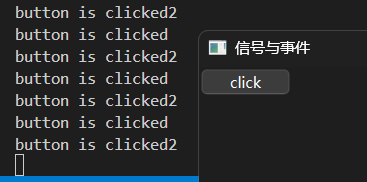

信号通常与槽函数连接，使用`Slot`装饰器（使用`from PySide6.QtCore import Slot`导入）修饰函数，该函数会变成槽函数（槽函数的具体用法这里不做展开，等后续再介绍相关内容时展开），不过与直接使用函数没什么区别：

```python3
from PySide6.QtWidgets import (
    QApplication,
    QWidget,
    QPushButton
)
from PySide6.QtCore import Slot

app = QApplication()
window = QWidget()
window.setWindowTitle('信号与事件')
window.resize(400,300)
button = QPushButton('click',window)

# 信号，支持连接多个槽
button.clicked.connect(lambda :print('button is clicked'))
# 定义槽函数
@Slot()
def on_clicked():
    print('button is clicked2')

button.clicked.connect(on_clicked)

window.show()
app.exec()
```

说完了连接信号，就该说说如何发出信号。

除了真的点击按钮来发出信号，还可以通过调用`click`方法来模拟点击（内部会发出信号）：

```python3
from PySide6.QtWidgets import (
    QApplication,
    QWidget,
    QPushButton
)

app = QApplication()
window = QWidget()
window.setWindowTitle('信号与事件')
window.resize(400,300)
button = QPushButton('click',window)
window.show()

# 信号，支持连接多个槽
button.clicked.connect(lambda :print('button is clicked'))
button.clicked.connect(lambda :print('button is clicked2'))

window2 = QWidget()
window2.setWindowTitle('信号与事件-控制窗口')
window2.resize(400,300)
button2 = QPushButton('模拟信号',window2)
# 模拟点击
button2.clicked.connect(lambda :button.click())
window2.show()

app.exec()
```

直接调用信号的`emit`方法发出信号也可以触发信号对应的响应函数：

```python3
from PySide6.QtWidgets import (
    QApplication,
    QWidget,
    QPushButton
)

app = QApplication()
window = QWidget()
window.setWindowTitle('信号与事件')
window.resize(400,300)
button = QPushButton('click',window)
window.show()

# 信号，支持连接多个槽
button.clicked.connect(lambda :print('button is clicked'))
button.clicked.connect(lambda :print('button is clicked2'))

window2 = QWidget()
window2.setWindowTitle('信号与事件-控制窗口')
window2.resize(400,300)
button2 = QPushButton('模拟信号',window2)

# 发出信号
button2.clicked.connect(lambda :button.clicked.emit())
window2.show()

app.exec()
```

至此，信号的学习告一段落。从上面的内容看，信号支持多个响应函数响应同一信号，模拟发出信号的方法简单直观，看起来很好用。不过，这并不是说事件就没有学习的必要。前面说过事件支持信号不支持的动作，这一点信号没法实现。因此，接下来就通过定义按钮点击的响应函数，学习一下事件的相关操作。

### 6.2 事件

对于事件而言，想要定义按钮点击的响应函数，需要先知道点击按钮之后触发的事件是什么。

不同于信号的查询简单，想要知道按钮支持的事件，难度增加不少，需要访问Qt的C++相关文档（ https://doc.qt.io/qt-6/zh/qwidget.html#protected-functions 、 https://doc.qt.io/qt-6/zh/qabstractbutton.html#reimplemented-protected-functions 和 https://doc.qt.io/qt-6/zh/qpushbutton.html#reimplemented-protected-functions ），才能知道`QAbstractButton`控件支持的事件（或者通过智能提示或者模块的`pyi`文件查询）。具体事件这里就不做解释了，只说一下事件中没有类似`clicked`信号的事件，只有与`pressed`信号相同的`mousePressEvent`事件（鼠标按键按下时触发），以及与`released`信号相同的`mouseReleaseEvent`事件（鼠标按键弹起时触发）。

通过同类事件、信号的名称对比，想必读者已经看出二者的部分区别。信号主要是控件发出信号，相关概念偏向顶层；事件通常是设备、控件触发事件，相关概念偏向底层。

因此，这里只能勉强用`mousePressEvent`事件代替`clicked`信号。示例如下：

```python3
from PySide6.QtWidgets import (
    QApplication,
    QWidget,
    QPushButton
)

app = QApplication()
window = QWidget()
window.setWindowTitle('信号与事件')
window.resize(400,300)
button = QPushButton('click',window)

# 信号，支持连接多个槽
button.clicked.connect(lambda :print('button is clicked'))
button.clicked.connect(lambda :print('button is clicked2'))
# 事件，只能同时分配一个响应函数，且会覆盖同类信号、同名事件
button.mousePressEvent = lambda e:print('mouse is pressed')
button.mousePressEvent = lambda e:print('mouse is pressed2')

window.show()
app.exec()
```

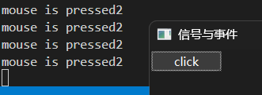

通过代码和运行结果可以得知事件的响应函数有以下特点：

- 会覆盖同类信号（`clicked`信号有鼠标按钮按下的过程）的响应函数，也就是事件的优先级高于信号。
- 同名事件只能定义一个响应函数，重复定义的话会按照顺序覆盖。
- 必须包含一个参数，用于接收事件的参数，否则会报错。

与信号类似，事件的响应函数也有非真实交互的触发方式，但不完全与信号相同。

首先，调用`click`方法没法触发事件的响应函数。但是，类似信号的`emit`方法，直接调用事件则可以触发：

```python3
from PySide6.QtWidgets import (
    QApplication,
    QWidget,
    QPushButton
)

app = QApplication()
window = QWidget()
window.setWindowTitle('信号与事件')
window.resize(400,300)
button = QPushButton('click',window)
window.show()
button.mousePressEvent = lambda e:print('mouse is pressed')

window2 = QWidget()
window2.setWindowTitle('信号与事件-控制窗口')
window2.resize(400,300)
button2 = QPushButton('模拟事件',window2)
# 使用指定控件的对应事件（方法），参数按实际使用情况传入（可能需要构建事件对象）
button2.clicked.connect(lambda :button.mousePressEvent(None))

window2.show()

app.exec()
```

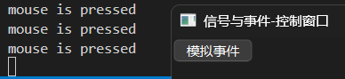

除了这种直接的触发方法，还有两种需要指定具体事件的触发方法：

- 控件的`event`方法。
- 程序类实例的`sendEvent`方法（可以执行多次）、`postEvent`方法（只能执行一次）。

对于控件的`event`方法，其参数可以是简化的鼠标事件（核心事件类实例，完整用可参考 https://doc.qt.io/qtforpython-6/PySide6/QtCore/QEvent.html#PySide6.QtCore.QEvent.__init__）：

```python3
from PySide6.QtWidgets import (
    QApplication,
    QWidget,
    QPushButton
)
from PySide6.QtCore import QEvent

app = QApplication()
window = QWidget()
window.setWindowTitle('信号与事件')
window.resize(400,300)
button = QPushButton('click',window)
window.show()
button.mousePressEvent = lambda e:print('mouse is pressed')

window2 = QWidget()
window2.setWindowTitle('信号与事件-控制窗口')
window2.resize(400,300)
button2 = QPushButton('模拟事件',window2)
# 使用指定控件的event方法
button2.clicked.connect(lambda :button.event(QEvent(QEvent.Type.MouseButtonPress)))
window2.show()

app.exec()
```

也可以是衍生的鼠标事件（鼠标事件类实例，完整用法可参考 https://doc.qt.io/qtforpython-6/PySide6/QtGui/QMouseEvent.html#PySide6.QtGui.QMouseEvent.__init__）：

```python3
from PySide6.QtWidgets import (
    QApplication,
    QWidget,
    QPushButton
)
from PySide6.QtCore import QEvent,Qt
from PySide6.QtGui import QMouseEvent

app = QApplication()
window = QWidget()
window.setWindowTitle('信号与事件')
window.resize(400,300)
button = QPushButton('click',window)
window.show()
button.mousePressEvent = lambda e:print('mouse is pressed')

window2 = QWidget()
window2.setWindowTitle('信号与事件-控制窗口')
window2.resize(400,300)
button2 = QPushButton('模拟事件',window2)

# 获取按钮中心位置的局部坐标，并映射为全局坐标
center = button.rect().center()
globalPos = button.mapToGlobal(center)
# 构建准确的鼠标按键事件
# 参考自 https://doc.qt.io/qtforpython-6/PySide6/QtGui/QMouseEvent.html#PySide6.QtGui.QMouseEvent.__init__
press_event = QMouseEvent(
    QEvent.Type.MouseButtonPress,
    center,
    globalPos,
    # 按下的鼠标按键
    Qt.MouseButton.LeftButton,
    # 无组合使用的鼠标按键
    Qt.MouseButton.NoButton,
    # 无组合使用的键盘按键
    Qt.KeyboardModifier.NoModifier
)

# 使用指定控件的event方法
button2.clicked.connect(lambda :button.event(press_event))
window2.show()

app.exec()
```

而程序类实例的`sendEvent`方法（可以执行多次）、`postEvent`方法（只能执行一次）的参数只能是衍生的鼠标事件（鼠标事件类实例）：

```python3
from PySide6.QtWidgets import (
    QApplication,
    QWidget,
    QPushButton
)
from PySide6.QtCore import QEvent,Qt
from PySide6.QtGui import QMouseEvent

app = QApplication()
window = QWidget()
window.setWindowTitle('信号与事件')
window.resize(400,300)
button = QPushButton('click',window)
window.show()
button.mousePressEvent = lambda e:print('mouse is pressed')

window2 = QWidget()
window2.setWindowTitle('信号与事件-控制窗口')
window2.resize(400,300)
button2 = QPushButton('模拟事件',window2)

# 获取按钮中心位置的局部坐标，并映射为全局坐标
center = button.rect().center()
globalPos = button.mapToGlobal(center)
# 构建准确的鼠标按键事件
# 参考自 https://doc.qt.io/qtforpython-6/PySide6/QtGui/QMouseEvent.html#PySide6.QtGui.QMouseEvent.__init__
press_event = QMouseEvent(
    QEvent.Type.MouseButtonPress,
    center,
    globalPos,
    # 按下的鼠标按键
    Qt.MouseButton.LeftButton,
    # 无组合使用的鼠标按键
    Qt.MouseButton.NoButton,
    # 无组合使用的键盘按键
    Qt.KeyboardModifier.NoModifier
)
# 使用sendEvent方法发送事件给指定对象
# 也可以使用postEvent方法发送，postEvent方法是用后即销毁构建的事件，不能重复发送
button2.clicked.connect(lambda :app.sendEvent(button,press_event))
window2.show()

app.exec()
```

### 6.3 扩展内容

#### 6.3.1 关闭窗口时弹出确认对话框

前面说过事件可以给信号没有的动作添加响应函数，这里顺便介绍一个这样的动作——关闭窗口。

很多时候，为了避免用户误操作关闭程序，开发者会在用户关闭程序时弹出一个选择对话框，只有选择是（或者类似选项、按钮）才能关闭程序，否则不会关闭程序。在Qt程序中，关闭最后一个主窗口就会关闭整个程序，所以这里实际动作是关闭窗口。

因此，可以给窗口的关闭事件设置一个弹出选择对话框的响应函数，并根据选择的结果决定是否执行该动作。

响应函数的核心在于创建对话框和根据选择的结果决定是否执行动作。

对话框可以随意选择，但为了简单方便，这里选择的是`QMessageBox`控件（消息对话框），并且只介绍必要的功能。至于其余的功能和其他种类的对话框，受限于篇幅，这里不做展开，后续可能会写专门的章节详细介绍。

至于如何根据选择的结果决定是否执行动作，则要使用传给响应函数的参数。该参数是`QEvent`类型，调用该参数的`accept`方法，就会响应该事件，继续执行动作；如果调用`ignore`方法，则会忽略该事件，不执行动作。

调用`QMessageBox`类的静态方法`question`（完整用法可以参考 https://doc.qt.io/qtforpython-6/PySide6/QtWidgets/QMessageBox.html#PySide6.QtWidgets.QMessageBox.question）可以快速创建一个包含图标的问题对话框：

```python3
from PySide6.QtWidgets import (
    QApplication,
    QWidget,
    QMessageBox
)
from PySide6.QtCore import QEvent

app = QApplication()
window = QWidget()
window.setWindowTitle('关闭时弹出对话框')
window.resize(400, 300)
window.show()

def on_close(e:QEvent):
    result = QMessageBox.question(
        window,
        '消息',
        '确定要退出吗？',
        QMessageBox.Yes | QMessageBox.No,
        QMessageBox.No
    )
    if result == QMessageBox.Yes:
        # 接受，表示触发该事件的动作正常执行
        e.accept()
    else:
        # 忽略，表示触发该事件的动作不常执行
        e.ignore()

window.closeEvent = on_close

app.exec()
```

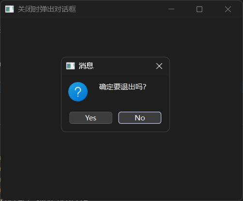

`question`方法会返回点击的按钮对应的标准按钮，可以对该方法的返回值进行判断，进而确定用户选择的是Yes还是No，并据此决定是否执行动作——关闭窗口。

需要注意的是，虽然`question`方法创建对话框很简单，但对话框按钮的文本是英文的，不使用本地化功能的话，是没法自定义按钮或者按钮文本的。因此，想要让显示的内容更加自由，只能直接创建`QMessageBox`控件（完整用法可以参考 https://doc.qt.io/qtforpython-6/PySide6/QtWidgets/QMessageBox.html#PySide6.QtWidgets.QMessageBox.__init__），需要额外传入图标参数，并且参数的顺序也有要求：

```python3
from PySide6.QtWidgets import (
    QApplication,
    QWidget,
    QMessageBox
)
from PySide6.QtCore import QEvent

app = QApplication()
window = QWidget()
window.setWindowTitle('关闭时弹出对话框')
window.resize(400, 300)
window.show()

def on_close(e:QEvent):
    msg_box = QMessageBox(
        QMessageBox.Icon.Question,
        '消息',
        '确定要退出吗？',
        QMessageBox.Yes | QMessageBox.No,
        window
    )
    # 修改标准按钮的文本
    yes_button = msg_box.button(QMessageBox.Yes)
    yes_button.setText('确认')
    no_button = msg_box.button(QMessageBox.No)
    no_button.setText('取消')
    # 将默认选择的按钮修改为取消按钮
    msg_box.setDefaultButton(no_button)
    msg_box.exec()

    if msg_box.clickedButton() == yes_button:
        # 接受，表示触发该事件的动作正常执行
        e.accept()
    else:
        # 忽略，表示触发该事件的动作不常执行
        e.ignore()

window.closeEvent = on_close

app.exec()
```

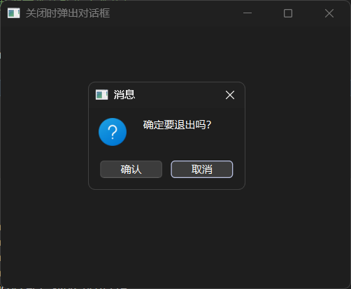

使用对话框对象的`button`方法（完整用法参考https://doc.qt.io/qtforpython-6/PySide6/QtWidgets/QMessageBox.html#PySide6.QtWidgets.QMessageBox.button）可以获取对应的按钮，再调用该按钮的`setText`方法即可修改按钮文本。

不同于`question`方法会自动显示对话框，创建`QMessageBox`控件的话，想要显示对话框，需要执行`exec`方法（只能显示为模态窗口，不点击按钮的话不继续执行）。调用`clickedButton`方法会返回用户点击的按钮，判断该方法的返回值即可。

当然，也可以调用`standardButton`方法转换输出的结果，这样的话，判断结果的代码就能沿用先前示例中的这部分代码：

```python3
from PySide6.QtWidgets import (
    QApplication,
    QWidget,
    QMessageBox
)
from PySide6.QtCore import QEvent

app = QApplication()
window = QWidget()
window.setWindowTitle('关闭时弹出对话框')
window.resize(400, 300)
window.show()

def on_close(e:QEvent):
    msg_box = QMessageBox(
        QMessageBox.Icon.Question,
        '消息',
        '确定要退出吗？',
        QMessageBox.Yes | QMessageBox.No,
        window
    )
    # 修改标准按钮的文本
    yes_button = msg_box.button(QMessageBox.Yes)
    yes_button.setText('确认')
    no_button = msg_box.button(QMessageBox.No)
    no_button.setText('取消')
    # 将默认选择的按钮修改为取消按钮
    msg_box.setDefaultButton(no_button)
    msg_box.exec()

    # 结果转换为标准值
    result = msg_box.standardButton(msg_box.clickedButton())
    if result == QMessageBox.Yes:
        # 接受，表示触发该事件的动作正常执行
        e.accept()
    else:
        # 忽略，表示触发该事件的动作不常执行
        e.ignore()

window.closeEvent = on_close

app.exec()
```

## 7 QtQuick程序的两种主窗口控件

严格来说，能够显示QtQuick控件（即新式控件）的主窗口控件有三种，但为了方便理解，这里的主窗口控件特指在QtQuick程序（程序类实例为`QGuiApplication`类实例的Qt程序）中可以使用的两种主窗口控件（所以标题才叫QtQuick程序的两种主窗口控件），至于第三种主窗口控件，那就留给下一章，与其他在QtWidgets程序中使用QtQuick控件的方法一起介绍。

QtQuick程序不如QtWidgets程序“历史悠久”，相关资料比较少，因此，这里提供了一些可能会用到的参考资料：

- QtQuick基础文档：https://doc.qt.io/qt-6/zh/qtquick-index.html
- QML基础文档：https://doc.qt.io/qt-6/zh/qmlreference.html
- QtQuick的基本类型：https://doc.qt.io/qt-6/zh/qtquick-qmlmodule.html
- QtQuick常用控件的基本类型：https://doc.qt.io/qt-6/zh/qtquick-controls-qmlmodule.html
- QtQuick对话框的基本类型：https://doc.qt.io/qt-6/zh/qtquick-dialogs-qmlmodule.html
- QtQml的基本类型：https://doc.qt.io/qt-6/zh/qtqml-qmlmodule.html

相关的QtQuick程序基础和QML基础这里不做太多展开，本章只介绍QtQuick程序中的两种主窗口控件，如果想要深入学习和了解更多基础知识，可以自行学习上面提供的参考资料，或者期待后续专门的章节。

### 7.1 主要内容

QtQuick程序（控件）主要依赖QML（文件），所以上面提供的参考资料中有QML基础。不过，本节主要内容的重点不在QML文件的创建，因此，使用到的QML文件会直接提供，只解释必要的知识点。

在QtQuick程序中，支持的主窗口控件有以下几种：

- `QQuickView`控件（使用`from PySide6.QtQuick import QQuickView`导入），本身就是一个窗口，可以添加非窗口类的QtQuick控件，完整用法可以参考文档 https://doc.qt.io/qtforpython-6/PySide6/QtQuick/QQuickView.html#PySide6.QtQuick.QQuickView 。
- `QQmlApplicationEngine`控件（使用`from PySide6.QtQml import QQmlApplicationEngine`导入），严格来说不是一个窗口，而是一个QML的解析引擎。该控件可以添加QtQuick控件，但需要先添加一个具备窗口功能的QtQuick控件，完整用法可以参考文档 https://doc.qt.io/qtforpython-6/PySide6/QtQml/QQmlApplicationEngine.html#PySide6.QtQml.QQmlApplicationEngine 。

在继续学习之前，这里需要额外区分一下教程中提到的控件类型，以免读者越看越迷糊。

在不涉及QtQuick控件（即新式控件）的QtWidgets程序中，因为只使用传统控件，所有的控件都是调用Python接口的控件，所以，各种控件类型都很统一，没那么容易误解。

但是，从这一章开始，有了QtQuick控件（即新式控件）这一种只能在QML中创建的控件之后，控件的类型开始变得有点模糊。

需要注意的是，虽然QtQuick控件与QtQuick程序密不可分，但这类控件只能在QML中创建，不能笼统认为QtQuick程序中使用的控件都是QtQuick控件。在QtQuick程序中，还有一些调用Python接口的控件（比如这一章介绍的两种主窗口控件，以及后面介绍的第三种主窗口控件），这些控件不仅能在QtQuick程序中使用，还能在QtWidgets程序中使用（相关知识参见在QtWidgets程序中使用QtQuick控件的方法）。若是严格区分的话，这些控件可以算作是传统控件。但为了避免混淆，这里并没有这样归类，只是将其算作QtQuick程序使用的控件而已。

因此，读者在学习、编写QtQuick程序时，需要记住，在QtQuick程序中调用Python接口的控件，并不是QtQuick控件（即新式控件）。

`QQuickView`控件有点像QtWidgets程序中的主窗口控件，在实际使用时也一样。可以看到，示例中有着一样的`show`方法、`resize`方法，以及类似的`setTitle`方法，完成窗口的显示、大小修改、标题修改：

```python3
from PySide6.QtGui import QGuiApplication
from PySide6.QtQuick import QQuickView

app = QGuiApplication()

view = QQuickView()
view.resize(200,200)
view.setTitle('Main')
view.show()

app.exec()
```

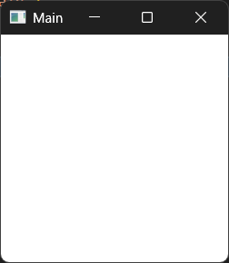

没有添加任何控件的时候，该控件会创建一个空白（或者叫纯白）的窗口。

这是和QtWidgets程序主窗口控件一样、类似的部分，接下来该说一些不一样的地方了。

想要添加控件的话，只能使用QML文件或者字符串。

先在Python文件的同目录下创建`main.qml`文件（文件名不限制，但推荐按这个名字和后缀来），其内容为：

```dart
import QtQuick

Rectangle {
    id: main
    width: 200
    height: 200
    color: 'green'
    Text {
        text: 'Hello World'
        anchors.centerIn: main
    }
}
```

然后在初始化`QQuickView`控件时传入文件路径：

```python3
from PySide6.QtGui import QGuiApplication
from PySide6.QtQuick import QQuickView

app = QGuiApplication()

view = QQuickView('main.qml')
view.resize(200,200)
view.setTitle('Main')
view.show()

app.exec()
```

就能看到添加的控件（其实是QML的类型，可以理解为控件）:

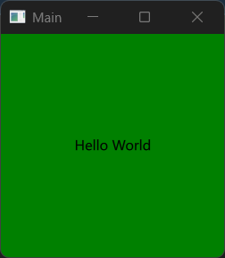

需要注意的是，默认QML文件的相对路径是相对工作目录（命令启动时的路径）而言，如果想要使用绝对路径或者是以Python文件所在目录为相对路径起点，需要使用`QUrl`的静态方法`fromLocalFile`，传入绝对路径或者将相对路径转换为绝对路径后再传入（示例中就是将相对路径转换为绝对路径）：

```python3
from PySide6.QtGui import QGuiApplication
from PySide6.QtQuick import QQuickView
from pathlib import Path
from PySide6.QtCore import QUrl

app = QGuiApplication()

view = QQuickView(QUrl.fromLocalFile(Path(__file__).parent/'main.qml'))
view.resize(200,200)
view.setTitle('Main')
view.show()

app.exec()
```

除了使用`fromLocalFile`方法，也可以使用`'file:///'`为前缀，与绝对路径连接，组成URI字符串之后直接代替`QUrl`对象或者传给`QUrl`类。

与`QQuickView`控件不太相同的是，使用`QQmlApplicationEngine`控件的话，QtQuick程序会显得更纯粹，因为该控件如其名，只是一个QML的解析引擎。因此，`QQmlApplicationEngine`控件加载的QML文件需要修改：增加创建（添加）主窗口的代码。而修改主窗口的大小、标题的操作，既可以在QML文件中进行，也可以在Python文件中进行。

QML文件修改如下（创建`Window`或者`ApplicationWindow`为主窗口都可以）：

```dart
import QtQuick.Window

Window {
    visible: true
    //修改窗口标题
    title: 'Main'
    //修改窗口大小
    width: 200
    height: 200
    Rectangle {
        id: main
        width: 200
        height: 200
        color: 'green'
        Text {
            text: 'Hello World'
            anchors.centerIn: main
        }
    }
}
```

`QQmlApplicationEngine`控件加载QML文件的方法也和`QQuickView`控件一样，初始化时传入文件路径作即可，无需额外调用`show`方法：

```python3
from PySide6.QtGui import QGuiApplication
from PySide6.QtQml import QQmlApplicationEngine
from pathlib import Path
from PySide6.QtCore import QUrl

app = QGuiApplication()

engine = QQmlApplicationEngine(QUrl.fromLocalFile(Path(__file__).parent/'main.qml'))

app.exec()
```


也可以使用`load`方法加载QML文件：

```python3
from PySide6.QtGui import QGuiApplication
from PySide6.QtQml import QQmlApplicationEngine
from pathlib import Path
from PySide6.QtCore import QUrl

app = QGuiApplication()

engine = QQmlApplicationEngine()
engine.load(QUrl.fromLocalFile(Path(__file__).parent/'main.qml'))

app.exec()
```

如果QML文件中只是创建（添加）了主窗口，没有修改主窗口的大小、标题：

```dart
import QtQuick.Window

Window {
    visible: true
    Rectangle {
        id: main
        width: 200
        height: 200
        color: 'green'
        Text {
            text: 'Hello World'
            anchors.centerIn: main
        }
    }
}
```

则可以在Python文件中这样修改主窗口的大小、标题：

```python3
from PySide6.QtGui import QGuiApplication
from PySide6.QtQml import QQmlApplicationEngine
from pathlib import Path
from PySide6.QtCore import QUrl

app = QGuiApplication()

engine = QQmlApplicationEngine(QUrl.fromLocalFile(Path(__file__).parent/'main.qml'))

# 智能提示时使用
from PySide6.QtGui import QWindow
# 获取主窗口对象
root :QWindow = engine.rootObjects()[0]
# 修改窗口大小、标题
root.resize(200,200)
root.setTitle('Main')

app.exec()
```

### 7.2 扩展内容

除了上节介绍的直接加载QML文件的方式，使用`QQmlApplicationEngine`控件、`QQmlComponent`控件、`QQuickView`控件、`QQuickWidget`控件（用法与`QQuickView`控件类似，也支持直接加载QML文件，后续章节介绍）的`loadFromModule`方法可以导入模块（QML模块），也是一种类似加载QML文件的方式。不过，因为其涉及模块（QML模块）相关知识，受限于篇幅，不方便展开介绍，所以模块（QML模块）相关知识会在后续章节中专门介绍，这里仅提一嘴，读者了解一下有这种方式即可。

#### 7.2.1 使用`QQmlComponent`控件加载QML字符串

如果`QQuickView`控件不是直接通过加载QML文件添加控件，而是借助`QQmlComponent`控件（使用`from PySide6.QtQml import QQmlComponent`导入，完整用法可以参考 https://doc.qt.io/qtforpython-6/PySide6/QtQml/QQmlComponent.html ）添加控件的话，则可以解锁更多使用QML的方法，比如：加载QML字符串。

`QQmlComponent`控件不能直接使用，需要借助`QQuickView`控件才能添加其他控件：

```python3
from PySide6.QtGui import QGuiApplication
from PySide6.QtQuick import QQuickView
from PySide6.QtQml import QQmlComponent
from PySide6.QtCore import QUrl

app = QGuiApplication()

view = QQuickView()
# 使用view的engine创建component
component = QQmlComponent(view.engine())
# 使用component创建内容，并将其设置为view显示的内容
view.setContent(QUrl(), component, component.create())

view.resize(200,200)
view.setTitle('Main')

view.show()

app.exec()
```


大体上和直接使用`QQuickView`控件类似，只是多了两步：

1. 使用`QQuickView`控件的`engine`属性（使用`engine`方法获取）为参数来创建`QQmlComponent`控件。
2. 将`QQuickView`控件显示的内容，通过`setContent`方法设置为`QQmlComponent`控件生成的内容（使用`create`方法获取）。

相关的代码为：

```python3
# 使用view的engine创建component
component = QQmlComponent(view.engine())
# 使用component创建内容，并将其设置为view显示的内容
view.setContent(QUrl(), component, component.create())
```

不过，从结果上看，使用`QQmlComponent`控件似乎没有任何效果，这是因为`QQmlComponent`控件没有加载QML。

首先，`QQmlComponent`控件和`QQuickView`控件一样支持加载QML文件，有两种方法：

- 初始化时传入文件路径。支持`QUrl`类型（包括URI字符串）或者字符串类型（非URI字符串）表示的QML文件路径（相对路径或者绝对路径），完整用法可以参考 https://doc.qt.io/qtforpython-6/PySide6/QtQml/QQmlComponent.html#PySide6.QtQml.QQmlComponent.__init__ 。示例如下（关键代码，非完整代码）：

  ```python3
  from PySide6.QtCore import QUrl
  from pathlib import Path
  
  # 省略其余部分
  
  # 直接使用字符串表示的路径
  component = QQmlComponent(
      view.engine(),
      str(Path(__file__).parent/'main.qml')
  )
  
  # 或者使用QUrl
  component = QQmlComponent(
      view.engine(),
      QUrl.fromLocalFile(Path(__file__).parent/'main.qml')
  )
  ```

- 使用`loadUrl`方法。该方法仅支持`QUrl`类型（包括URI字符串）。

以下为`loadUrl`方法加载QML文件的示例：

```python3
from PySide6.QtGui import QGuiApplication
from PySide6.QtQuick import QQuickView
from PySide6.QtQml import QQmlComponent
from PySide6.QtCore import QUrl
from pathlib import Path

app = QGuiApplication()

view = QQuickView()

# 使用view的engine创建component
component = QQmlComponent(view.engine())
# 给component加载QML文件
component.loadUrl(
    QUrl.fromLocalFile(Path(__file__).parent/'main.qml')
)

# 让view的根内容变成component，并将实际内容变为component的生成内容
view.setContent(QUrl(), component, component.create())

view.resize(200,200)
view.setTitle('Main')

view.show()

app.exec()
```

以上都是常规用法，接下来要说的，才是本节的重点内容，让`QQmlComponent`控件加载QML字符串。

想要加载QML字符串，就要使用`setData`方法（完整用法参考https://doc.qt.io/qtforpython-6/PySide6/QtQml/QQmlComponent.html#PySide6.QtQml.QQmlComponent.setData ）。该方法的第一个参数为编码之后的QML字符串，第二个参数为基础URL地址，需要构建一个`QUrl`对象。

完整示例如下：

```python3
from PySide6.QtGui import QGuiApplication
from PySide6.QtCore import QUrl
from PySide6.QtQuick import QQuickView
from PySide6.QtQml import QQmlComponent

app = QGuiApplication()

qml_string = '''
import QtQuick

Rectangle {
    id: main
    width: 200
    height: 200
    color: 'green'
    Text {
        text: 'Hello World'
        anchors.centerIn: main
    }
}
'''

view = QQuickView()
# 使用view的engine创建component
component = QQmlComponent(view.engine())
# 给component加载qml字符串
component.setData(qml_string.encode(),QUrl())
# 让view的根内容变成component，并将实际内容变为component的生成内容
view.setContent(QUrl(), component, component.create())

view.resize(200,200)
view.setTitle('Main')

view.show()

app.exec()
```


除了`setData`方法这种支持传入QML字符串的加载方法，还有一种变通的思路可以实现加载QML字符串，那就是把QML字符串编码后写入临时文件，将QML字符串转换成QML文件。

第一种临时文件是用Python的标准库`tempfile`创建，需要在完成加载后手动删除（通过代码，并非真的找到这个文件去删除）临时文件：

```python3
from PySide6.QtGui import QGuiApplication
from PySide6.QtCore import QUrl
from PySide6.QtQuick import QQuickView
import tempfile

app = QGuiApplication()

qml_string = '''
import QtQuick

Rectangle {
    id: main
    width: 200
    height: 200
    color: 'green'
    Text {
        text: 'Hello World'
        anchors.centerIn: main
    }
}
'''
# 将字符串写入临时文件
with tempfile.NamedTemporaryFile(delete=False) as qml_file:
    qml_file.write(qml_string.encode())

view = QQuickView(source=QUrl.fromLocalFile(qml_file.name))

# 删除临时文件
import os
os.remove(qml_file.name)
# 或者 os.unlink(qml_file.name)

view.resize(200,200)
view.setTitle('Main')

view.show()

app.exec()
```

不想写手动删除临时文件的代码，则可以使用`QTemporaryFile`类（使用`from PySide6.QtCore import QTemporaryFile`导入，完整用法参考 https://doc.qt.io/qtforpython-6/PySide6/QtCore/QTemporaryFile.html）创建临时文件，这种临时文件会在Qt程序退出时自动删除：

```python3
from PySide6.QtGui import QGuiApplication
from PySide6.QtCore import QUrl,QTemporaryFile
from PySide6.QtQuick import QQuickView

app = QGuiApplication()

qml_string = '''
import QtQuick

Rectangle {
    id: main
    width: 200
    height: 200
    color: 'green'
    Text {
        text: 'Hello World'
        anchors.centerIn: main
    }
}
'''
# 将字符串写入临时文件，自动生成随机后缀，程序退出后自动删除
# 可以指定临时文件的非随机部分名和路径，但要求路径所表示的文件夹已经存在，否则不能正常创建临时文件
qml_file = QTemporaryFile()
if qml_file.open():
    qml_file.write(qml_string.encode())
    qml_file.close()
    # 或者使用 qml_file.flush() 写入磁盘文件

view = QQuickView(source=QUrl.fromLocalFile(qml_file.fileName()))

view.resize(200,200)
view.setTitle('Main')

view.show()

app.exec()
```

`QTemporaryFile`类的初始化参数（相关用法参考 https://doc.qt.io/qtforpython-6/PySide6/QtCore/QTemporaryFile.html#PySide6.QtCore.QTemporaryFile.__init__ ）可以配置临时文件的名字（但是后缀依然为随机，不可自定义）和路径（名字包含路径的话就会同时指定临时文件的生成路径；不包含路径的话，在工作目录中生成；不指定名字的话，临时文件会在系统定义的临时目录中生成），这里为了避免用户看到临时文件，所以没有定义临时文件的名字。

需要注意，向`QTemporaryFile`对象写入数据前，需要先调用`open`方法并判断返回值为`True`（直接调用也可以，但推荐判断一下），并在写入数据之后调用`flush`方法刷新或者`close`方法关闭文件，数据才会真正写入文件中。

#### 7.2.2 使用`QQmlApplicationEngine`控件加载QML字符串

`QQmlApplicationEngine`控件不需要借助其他控件就可以加载QML字符串，使用`loadData`方法加载编码的QML字符串（需要和QML文件内容一样，增加创建主窗口的代码）：

```python3
from PySide6.QtGui import QGuiApplication
from PySide6.QtQml import QQmlApplicationEngine

app = QGuiApplication()

qml_string = '''
import QtQuick.Window

Window {
    visible: true
    title: 'Main'
    width: 200
    height: 200
    Rectangle {
        id: main
        width: 200
        height: 200
        color: 'green'
        Text {
            text: 'Hello World'
            anchors.centerIn: main
        }
    }
}
'''
engine = QQmlApplicationEngine()
engine.loadData(qml_string.encode('utf-8'))

app.exec()
```


当然，上一节中，将字符串写入临时文件，加载QML字符串变成加载QML文件的方式，对`QQmlApplicationEngine`控件一样适用：

```python3
from PySide6.QtGui import QGuiApplication
from PySide6.QtQml import QQmlApplicationEngine
from PySide6.QtCore import QUrl,QTemporaryFile

app = QGuiApplication()

qml_string = '''
import QtQuick.Window

Window {
    visible: true
    title: 'Main'
    width: 200
    height: 200
    Rectangle {
        id: main
        width: 200
        height: 200
        color: 'green'
        Text {
            text: 'Hello World'
            anchors.centerIn: main
        }
    }
}
'''
# 将字符串写入临时文件，自动生成随机后缀，程序退出后自动删除
# 可以指定临时文件的非随机部分名和路径，但要求路径所表示的文件夹已经存在，否则不能正常创建临时文件
qml_file = QTemporaryFile()
if qml_file.open():
    qml_file.write(qml_string.encode())
    qml_file.close()
    # 或者使用 qml_file.flush() 写入磁盘文件

engine = QQmlApplicationEngine(QUrl.fromLocalFile(qml_file.fileName()))

app.exec()
```


#### 7.2.3 `QQmlApplicationEngine`控件的自动注册

提示：本节中说的模块为QML模块，相关用法会在后面单独的章节中学习，这里只是扩展一下相关内容，不做深入介绍。

先回顾一下`QQmlApplicationEngine`控件加载QML字符串的示例：

```python3
from PySide6.QtGui import QGuiApplication
from PySide6.QtCore import QUrl
from PySide6.QtQml import QQmlApplicationEngine

app = QGuiApplication()

qml_src = '''
import QtQuick.Window

Window {
    visible: true
    title: 'Main'
    width: 200
    height: 200
    Rectangle {
        id: main
        width: 200
        height: 200
        color: 'green'
        Text {
            text: 'Hello World'
            anchors.centerIn: main
        }
    }
}
'''
engine = QQmlApplicationEngine()
engine.loadData(qml_src.encode('utf-8'),QUrl())

app.exec()
```

可以看到，在`QQmlApplicationEngine`控件加载QML字符串的示例中，虽然只导入了`QtQuick.Window`模块，没有主动导入其他相关模块，但依然可以使用除了`Window`类型之外的其他类型，比如示例中的`Rectangle`类型和`Text`类型。这是因为在`QQmlApplicationEngine`控件或者`QQmlEngine`控件中，涉及到QML文件时，会自动注册`QtQuick`模块直属的类型（https://doc.qt.io/qt-6/zh/qtquick-qmlmodule.html#object-types）和`QtQml`模块直属的类型（https://doc.qt.io/qt-6/zh/qtqml-qmlmodule.html#object-types），这些类型无需手动导入`QtQuick`模块和`QtQml`模块即可使用。

不过，`Window`类型只是在当前Qt版本（6.x）划分为`QtQuick`模块的直属类型，底层为了兼容旧版本（5.x）还是将其算作原来独立模块（`QtQuick.Window`）的类型，依然需要导入对应的模块才能使用，不会自动注册。不过，在当前Qt版本中，因为其被划分为`QtQuick`模块的直属类型，只是导入`QtQuick`模块的话也可以使用（相当于主动注册所有直属类型）。要验证的话也简单，将为了使用`Window`类型而不得不添加的导入语句改为`import QtQuick`，`Window`类型依然可以正常使用：

```python3
from PySide6.QtGui import QGuiApplication
from PySide6.QtCore import QUrl
from PySide6.QtQml import QQmlApplicationEngine

app = QGuiApplication()

qml_src = '''
import QtQuick

Window {
    visible: true
    title: 'Main'
    width: 200
    height: 200
    Rectangle {
        id: main
        width: 200
        height: 200
        color: 'green'
        Text {
            text: 'Hello World'
            anchors.centerIn: main
        }
    }
}
'''
engine = QQmlApplicationEngine()
engine.loadData(qml_src.encode('utf-8'),QUrl())

app.exec()
```

以下为直接使用其他类型的示例：

```python3
from PySide6.QtGui import QGuiApplication
from PySide6.QtCore import QUrl
from PySide6.QtQml import QQmlApplicationEngine

app = QGuiApplication()

qml_src = '''
import QtQuick.Window

Window {
    visible: true
    title: 'Main'
    width: 200
    height: 200
    Rectangle {
        id: main
        width: 200
        height: 200
        /*
        Qt和Application都是自动注册，
        无需手动注册。
        */
        color: Qt.rgba(0, 0.5, 0, 1)
        Text {
            text: `${Application.name} (${Application.version})` //模板字符串
            anchors.centerIn: main
        }
    }
}
'''
engine = QQmlApplicationEngine()
engine.loadData(qml_src.encode('utf-8'),QUrl())

app.exec()
```

示例中，使用`Qt`的函数生成颜色对象，使用ES标准中的模板字符串（必须使用反引号包围，格式为`` `${变量}` ``）嵌入应用名称和应用版本。QML支持C语言风格的单行注释`//`和多行注释`/*……*/`。

## 8 在QtWidgets程序中使用QtQuick控件

### 8.1 QtQuick程序的主窗口控件无缝衔接

介绍程序类时说过三者的继承关系为：`QCoreApplication -> QGuiApplication -> QApplication`。而QtQuick程序，是程序类实例为`QGuiApplication`类实例的Qt程序；QtWidgets程序，是程序类实例为`QApplication`类实例的Qt程序。基于这一事实，想要在QtWidgets程序中使用QtQuick控件并不是什么难事，QtQuick程序的主窗口控件和QtQuick控件可以在QtWidgets程序直接使用，二者无缝衔接。

因此，将QtQuick程序修改为QtWidgets程序只需很少的变动（修改程序类为`QApplication`）。当然，为了验证Qt程序的类型转换是否真的成功，还可以添加一个QtWidgets程序中才能运行的窗口。

示例如下：

```python3
from PySide6.QtQml import QQmlApplicationEngine
from PySide6.QtCore import QUrl,QTemporaryFile
from PySide6.QtWidgets import QApplication,QWidget,QPushButton

# 修改程序类为QApplication
app = QApplication()

qml_string = '''
import QtQuick.Window

Window {
    visible: true
    title: 'Main'
    width: 200
    height: 200
    Rectangle {
        id: main
        width: 200
        height: 200
        color: 'green'
        Text {
            text: 'Hello World'
            anchors.centerIn: main
        }
    }
}
'''
qml_file = QTemporaryFile()
if qml_file.open():
    qml_file.write(qml_string.encode())
    qml_file.close()
engine = QQmlApplicationEngine(QUrl.fromLocalFile(qml_file.fileName()))

# 非QtQuick部分
window2 = QWidget()
window2.resize(400,300)
QPushButton('click',window2).clicked.connect(lambda :app.quit())
window2.show()

app.exec()
```

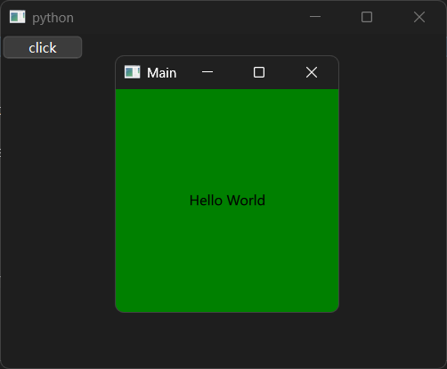

其余QtQuick程序的代码也都可以完美运行，这里就不一一演示了，留给读者自行探索。本章的重点在于下节要介绍的`QQuickWidget`控件，这就是前面铺垫过的、能够显示QtQuick控件的第三种主窗口控件。

### 8.2 `QQuickWidget`控件是`QQuickView`控件的平替

除了直接使用QtQuick控件，QtWidgets程序还可以使用`QQuickWidget`控件作为`QQuickView`控件的平替。

先看示例：

```python3
from PySide6.QtWidgets import QApplication,QWidget,QPushButton
from PySide6.QtCore import QUrl
from PySide6.QtQuickWidgets import QQuickWidget

# 包含QtWidgets程序控件只能使用QApplication，不能使用QGuiApplication
app = QApplication()

# main.qml 内容为：
'''
import QtQuick

Rectangle {
    id: main
    width: 200
    height: 200
    color: 'green'
    Text {
        text: 'Hello World'
        anchors.centerIn: main
    }
}
'''

window = QQuickWidget(source=QUrl('./main.qml'))

window.resize(200,200)
# QQuickWidget不支持setTitle('Main')
window.setWindowTitle('Main')
window.show()

# 非QtQuick部分
window2 = QWidget()
window2.resize(400,300)
QPushButton('click',window2).clicked.connect(lambda :app.quit())
window2.show()

app.exec()
```


从代码上看，`QQuickWidget`控件“似乎”是`QQuickView`控件的平替，除了修改窗口的标题使用了`setWindowTitle`方法而非`setTitle`方法。

为了搞清楚二者的区别，需要同步查阅以下资料：

- `QQuickWidget`控件的官网文档：https://doc.qt.io/qtforpython-6/PySide6/QtQuickWidgets/QQuickWidget.html#PySide6.QtQuickWidgets.QQuickWidget
- `QQuickView`控件的官网文档：https://doc.qt.io/qtforpython-6/PySide6/QtQuick/QQuickView.html#PySide6.QtQuick.QQuickView

先说结论，可以平替的部分有：

- 除了`QQuickView`控件额外支持的`renderControl`参数外，其余参数都相同。换句话说，`QQuickView`控件不使用`renderControl`参数的话，两个控件的初始化方法的用法完全相同。

  注意，`QQuickView`控件的`renderControl`参数是一个仅限位置参数，仅当`source`参数作为第一位置参数时可用，此时`renderControl`参数是第二位置参数，效果类似于`parent`参数，仅支持`QQuickRenderControl`控件。

- 加载QML的方法相同，支持加载QML文件、模块（QML模块）、QML字符串。
  
- 部分方法相同。比如，修改窗口大小的`resize`方法，通过`setContent`方法设置为`QQmlComponent`控件生成的内容。

当然，正如示例中修改窗口标题使用`setWindowTitle`方法与先前不同，二者还是存在一些差异的部分：

- 继承的类不同。`QQuickWidget`控件继承自`QWidget`类，`QQuickView`控件继承自`QQuickWindow`类。
- 部分方法不同。比如，设置窗口标题的方法，`QQuickWidget`控件只能使用`setWindowTitle`方法，`QQuickView`控件只能使用`setTitle`方法。
- 适用的程序类不同。`QQuickWidget`控件只能在QtWidgets程序中使用，`QQuickView`控件可以在QtQuick程序、QtWidgets程序中使用。

总的来说，`QQuickWidget`控件类似于在`QQuickView`控件的基础上添加`QWidget`控件的功能，只是部分`QWidget`控件中相同功能（比如修改窗口标题）的方法覆盖了`QQuickView`控件的方法。

读者如果理解了`QQuickWidget`控件与`QQuickView`控件的差异，可以尝试将前面`QQuickView`控件的示例，修改为使用`QQuickWidget`控件的代码。

## 9 QtWidgets程序的UI文件

QtQuick程序可以使用QML定义界面布局，QtWidgets程序也有类似的界面描述方式，那就是UI。注意，这里的UI不是指User Interface（用户界面），而是特指使用QtDesigner创建UI文件，然后QtWidgets程序通过加载UI文件来显示界面的方式。为了避免混淆，下面提到的UI文件，特指使用QtDesigner创建的UI文件（`*.ui`）。

不过，与QtQuick程序只能使用QML添加控件不同，QtWidgets程序本身可以很方便地在Python代码中添加控件，使用UI文件是为了通过QtDesigner这个可视化工具，直观地设计界面，不用在Python代码中反复调整界面细节。

想要运行QtDesigner，可以在终端执行`pyside6-designer`命令或者双击`{项目文件夹}\.venv\Scripts\pyside6-designer.exe`运行，即可看到QtDesigner的界面：

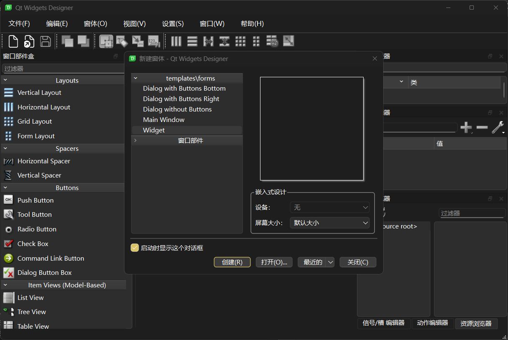

### 9.1 创建UI文件

QtDesigner的用法这里不展开介绍，其他人自有更加详实的教程。这里需要简单强调一下创建UI文件的要点，后续使用UI文件时，才更好理解关键知识点。

选择Widget模板，点击创建：

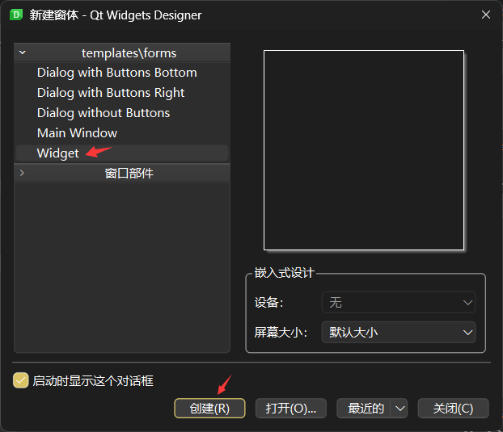

从左边拖一个Push Button到中间的窗口中，这样就在窗口中创建了一个按钮控件：

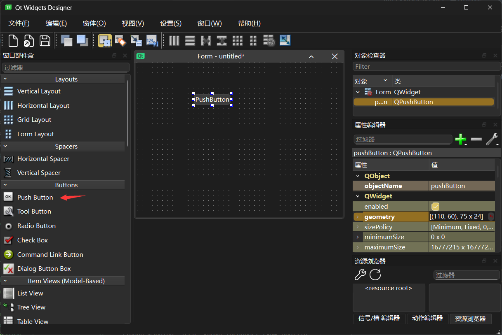

点击对象检查器中最上面的对象（主窗口），修改`objectName`属性为`MainWindow`（名称随意，只要是合法变量名，不与主窗口控件的成员重名即可），修改`geometry`属性为`[(0,0),400 x 300]`（点击属性名左边的`>`，展开之后，修改下面的宽度为`400`，修改高度为`300`），修改`windowsTitle`属性为`Main`（往下滚动才能看到这个属性）：

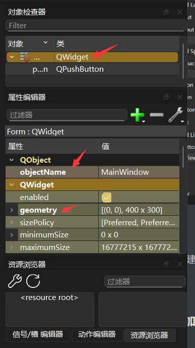

点击对象检查器中的子对象（`QPushButton`类），修改`objectName`属性为`psf`（名称随意，只要是合法变量名，不与主窗口控件的成员重名即可），点击`geometry`属性、`text`属性右边的初始化按钮：

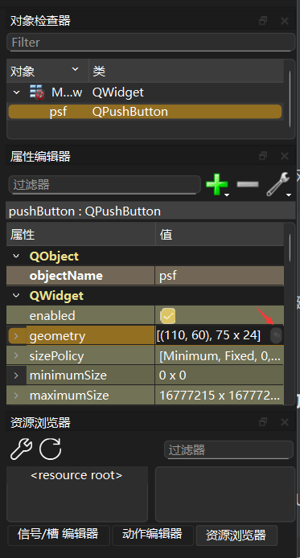

点击文件菜单中的保存（或者使用`ctrl + s`快捷键），将UI文件保存到Python源代码的同目录下，文件名为`main.ui`（文件名随意，如果不使用该文件名，下面示例中涉及的UI文件请按实际情况改名）。

如果使用编辑器打开`main.ui`的话，可以看到文件的内容如下：

```xml
<?xml version="1.0" encoding="UTF-8"?>
<ui version="4.0">
 <class>MainWindow</class>
 <widget class="QWidget" name="MainWindow">
  <property name="geometry">
   <rect>
    <x>0</x>
    <y>0</y>
    <width>400</width>
    <height>300</height>
   </rect>
  </property>
  <property name="windowTitle">
   <string>Main</string>
  </property>
  <widget class="QPushButton" name="psf"/>
 </widget>
 <resources/>
 <connections/>
</ui>
```

从内容上看，UI文件本质上就是个XML文件（注意这句话，后面会有用）。

### 9.2 直接加载UI文件

创建好UI文件之后，就可以加载UI文件，生成对应控件了。

想要加载UI文件，需要用到`QUiLoader`类（使用`from PySide6.QtUiTools import QUiLoader`导入，完整用法可以参考 https://doc.qt.io/qtforpython-6/PySide6/QtUiTools/QUiLoader.html#PySide6.QtUiTools.QUiLoader）。创建`QUiLoader`类的实例后，使用实例的`load`方法加载UI文件，该方法会基于UI文件生成对应的控件结构，并返回最顶层的主窗口控件：

```python3
from PySide6.QtWidgets import QApplication
from PySide6.QtUiTools import QUiLoader

app = QApplication()
# 基本结构，必须分成两步
# window = QWidget()
# window.show()
# 导入UI文件后是一样的结构
window = QUiLoader().load('main.ui')
window.psf.setText('click')
window.psf.clicked.connect(lambda:print('Clicked!'))
window.show()
app.exec()
```

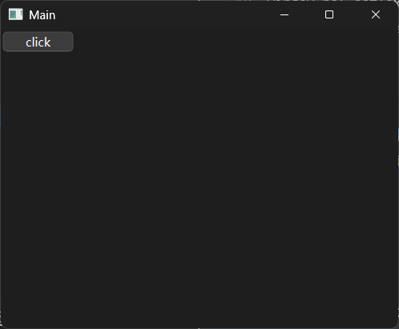

如示例中所展示的，除了主窗口的`name`属性（`'MainWindow'`）之外，其余控件的`name`属性（示例中的`'psf'`）都会转换、注册为`load`方法的返回值的属性，可通过该属性访问对应的控件。

因此，调用`psf`属性的方法，相当于调用`QPushButton`控件的方法。比如，修改显示文字的`setText`方法，连接`clicked`信号的`clicked.connect`方法。

当然，主窗口的`name`属性并非完全没用，主窗口的`objectName`属性（Qt程序的部分属性在Python接口中使用方法获取，这里指的是`objectName`方法返回的值）就是`'MainWindow'`。如果使用`load`方法时，同时设置了`parentWidget`参数，可以使用`parentWidget`参数对应控件的`findChildren`方法或者`findChild`方法查找指定`objectName`的控件，此时主窗口的`objectName`属性就可以派上用场：

```python3
from PySide6.QtWidgets import QApplication,QWidget
from PySide6.QtUiTools import QUiLoader

app = QApplication()
# 创建空的主窗口控件
root = QWidget()
# 指定为UI文件生成控件的顶级父控件
QUiLoader(app).load('main.ui',root)
# 获取指定objectName的控件
window = root.findChild(QWidget,'MainWindow')
# 使用该控件
window.psf.setText('click')
window.psf.clicked.connect(lambda:print('Clicked!'))
# 修改主窗口控件的窗口标题
root.setWindowTitle(window.windowTitle())
root.show()

app.exec()
```

### 9.3 将UI文件转换为Python类之后使用

加载UI文件固然简单，但这种使用UI文件的方法没有智能提示，即使知道有`psf`这个属性，也没法进一步获取`psf`属性的方法、属性。如果想要智能提示的话，就需要先将UI文件编译为Python文件，再导入、使用该Python文件（或者文件内的Python类）。

先说如何将UI文件编译为Python文件。

简单一点的，就是在创建完UI文件之后，不要立刻关闭QtDesigner，点击窗体菜单中的`View Python Code`：

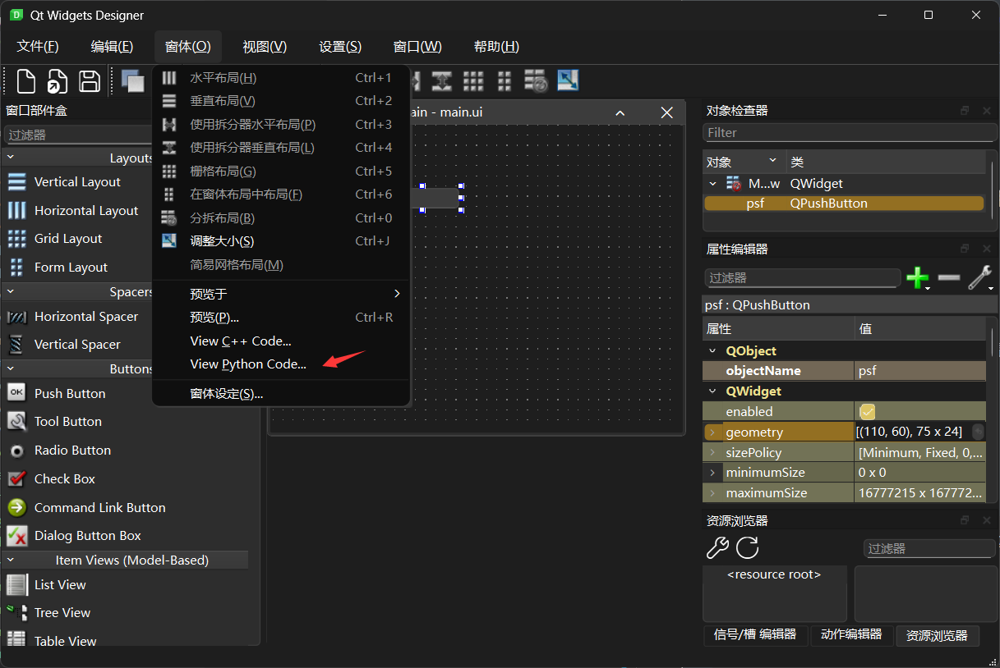

在弹出的窗口中，可以选择复制（如箭头所示）还是保存为单独的文件：

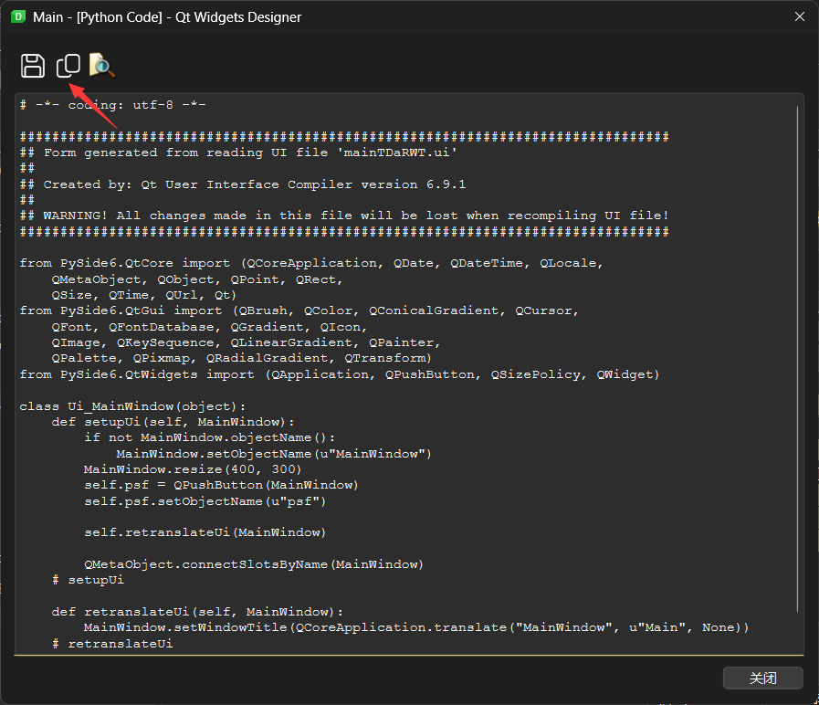

也可以在终端执行`pyside6-uic {UI文件路径} [-o {输出的Python文件路径}]`命令（`-o`选项为可选，表示是否输出为Python文件，下面的输入结果实际上没有使用该选项），结果是一样的：

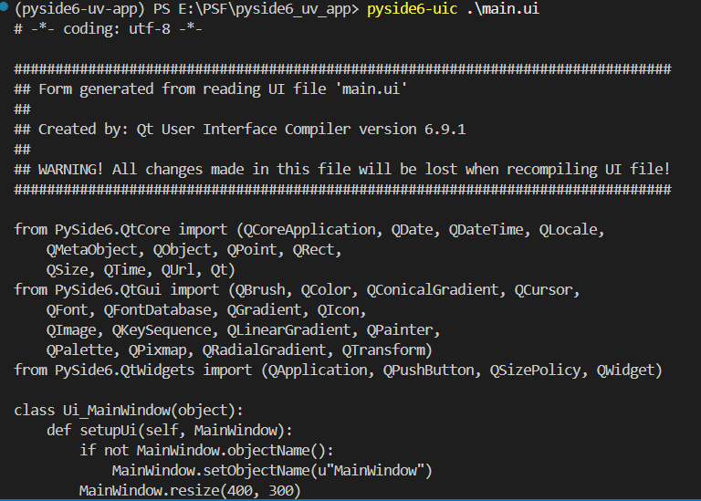

生成的Python代码如下：

```python3
# -*- coding: utf-8 -*-

################################################################################
## Form generated from reading UI file 'main.ui'
##
## Created by: Qt User Interface Compiler version 6.9.1
##
## WARNING! All changes made in this file will be lost when recompiling UI file!
################################################################################

from PySide6.QtCore import (QCoreApplication, QDate, QDateTime, QLocale,
    QMetaObject, QObject, QPoint, QRect,
    QSize, QTime, QUrl, Qt)
from PySide6.QtGui import (QBrush, QColor, QConicalGradient, QCursor,
    QFont, QFontDatabase, QGradient, QIcon,
    QImage, QKeySequence, QLinearGradient, QPainter,
    QPalette, QPixmap, QRadialGradient, QTransform)
from PySide6.QtWidgets import (QApplication, QPushButton, QSizePolicy, QWidget)

class Ui_MainWindow(object):
    def setupUi(self, MainWindow):
        if not MainWindow.objectName():
            MainWindow.setObjectName(u"MainWindow")
        MainWindow.resize(400, 300)
        self.psf = QPushButton(MainWindow)
        self.psf.setObjectName(u"psf")

        self.retranslateUi(MainWindow)

        QMetaObject.connectSlotsByName(MainWindow)
    # setupUi

    def retranslateUi(self, MainWindow):
        MainWindow.setWindowTitle(QCoreApplication.translate("MainWindow", u"Main", None))
    # retranslateUi
```

生成的Python代码默认导入了不少模块，但不是所有模块都用得上。不过，默认导入了`QApplication`和`QWidget`，正好也是示例所需的，所以，可以将上面的Python代码放在Python文件的头部，后面直接添加使用Python代码生成UI的其他代码。

生成UI的代码之外，其余部分代码和前面加载UI文件的代码一样：

```python3
app = QApplication()

# 创建UI的代码
...

window.psf.setText('click')
window.psf.clicked.connect(lambda:print('Clicked!'))
window.show()

app.exec()
```

重点在于生成UI的其他代码，这里是笔者想到的一种比较简单的方式，不是唯一的方式，读者可以参考其他的教程，灵活使用。

首先就是融合UI类和主窗口控件，创建自定义主窗口控件类：

```python3
# 创建UI的代码
# 融合UI类和主窗口控件
class MyWidget(QWidget,Ui_MainWindow):
    ...
```

这里不需要修改、实现任何功能，主要是为了将`Ui_MainWindow`类中生成UI的方法添加至主窗口控件中，

创建自定义主窗口控件：

```python3
window = MyWidget()
```

调用生成UI的`setupUi`方法：

```python3
# 生成UI
window.setupUi(window)
```

注意，`setupUi`方法需要接收一个主窗口控件作为参数，用来注册`psf`等属性，如果读者是使用单独的主窗口控件（非自定义），则需要创建`Ui_MainWindow`类实例，并在调用`setupUi`方法传入单独的主窗口控件。笔者这里使用的是融合了UI类和主窗口控件的自定义主窗口控件，因此，传入的是控件自身（为了避免其余代码有较大变化）。

完整代码如下：

```python3
# UI模块开始

# -*- coding: utf-8 -*-

################################################################################
## Form generated from reading UI file 'mainy.ui'
##
## Created by: Qt User Interface Compiler version 6.9.1
##
## WARNING! All changes made in this file will be lost when recompiling UI file!
################################################################################

from PySide6.QtCore import (QCoreApplication, QDate, QDateTime, QLocale,
    QMetaObject, QObject, QPoint, QRect,
    QSize, QTime, QUrl, Qt)
from PySide6.QtGui import (QBrush, QColor, QConicalGradient, QCursor,
    QFont, QFontDatabase, QGradient, QIcon,
    QImage, QKeySequence, QLinearGradient, QPainter,
    QPalette, QPixmap, QRadialGradient, QTransform)
from PySide6.QtWidgets import (QApplication, QPushButton, QSizePolicy, QWidget)

class Ui_MainWindow(object):
    def setupUi(self, MainWindow):
        if not MainWindow.objectName():
            MainWindow.setObjectName(u"MainWindow")
        MainWindow.resize(400, 300)
        self.psf = QPushButton(MainWindow)
        self.psf.setObjectName(u"psf")

        self.retranslateUi(MainWindow)

        QMetaObject.connectSlotsByName(MainWindow)
    # setupUi

    def retranslateUi(self, MainWindow):
        MainWindow.setWindowTitle(QCoreApplication.translate("MainWindow", u"Main", None))
    # retranslateUi

# UI模块结束

app = QApplication()

# 融合UI类和主窗口控件
class MyWidget(QWidget,Ui_MainWindow):
    ...

window = MyWidget()

# 生成UI
window.setupUi(window)

window.psf.setText('click')
window.psf.clicked.connect(lambda:print('Clicked!'))
window.show()

app.exec()
```

如果读者是一步步手敲代码的话，就会发现写完生成UI的代码之后，`window`对象的智能提示（需要编辑器支持）中多了`psf`属性：

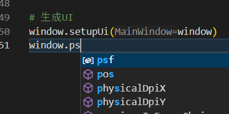

### 9.4 加载UI字符串

和加载QML类似，UI也可以通过字符串加载，但是要求比较严苛（主要是因为XML格式要求）：多行字符串的首行不能是空行。

UI字符串如下（创建为Python字符串对象）：

```python3
# UI字符串，首行不能为空行（XML格式要求）
ui_str = '''<?xml version="1.0" encoding="UTF-8"?>
<ui version="4.0">
 <class>MainWindow</class>
 <widget class="QWidget" name="MainWindow">
  <property name="geometry">
   <rect>
    <x>0</x>
    <y>0</y>
    <width>400</width>
    <height>300</height>
   </rect>
  </property>
  <property name="windowTitle">
   <string>Main</string>
  </property>
  <widget class="QPushButton" name="psf"/>
 </widget>
 <resources/>
 <connections/>
</ui>
'''
```

和前面使用QML字符串的思路一样，将字符串写入临时文件，加载UI字符串变成加载UI文件，是最简单的。

使用`tempfile`模块创建临时文件：

```python3
from PySide6.QtWidgets import QApplication
from PySide6.QtUiTools import QUiLoader

# UI字符串，首行不能为空行（XML格式要求）
ui_str = '''<?xml version="1.0" encoding="UTF-8"?>
<ui version="4.0">
 <class>MainWindow</class>
 <widget class="QWidget" name="MainWindow">
  <property name="geometry">
   <rect>
    <x>0</x>
    <y>0</y>
    <width>400</width>
    <height>300</height>
   </rect>
  </property>
  <property name="windowTitle">
   <string>Main</string>
  </property>
  <widget class="QPushButton" name="psf"/>
 </widget>
 <resources/>
 <connections/>
</ui>
'''

app = QApplication()

# 写入临时文件
import tempfile
with tempfile.NamedTemporaryFile(delete=False) as ui_file:
    ui_file.write(ui_str.encode())

window = QUiLoader().load(ui_file.name)

# 删除临时文件
import os
os.remove(ui_file.name)
# 或者 os.unlink(ui_file.name)

window.psf.setText('click')
window.psf.clicked.connect(lambda:print('Clicked!'))
window.show()

app.exec()
```

使用`QTemporaryFile`类创建临时文件：

```python3
from PySide6.QtWidgets import QApplication
from PySide6.QtUiTools import QUiLoader
from PySide6.QtCore import QTemporaryFile

# UI字符串，首行不能为空行（XML格式要求）
ui_str = '''<?xml version="1.0" encoding="UTF-8"?>
<ui version="4.0">
 <class>MainWindow</class>
 <widget class="QWidget" name="MainWindow">
  <property name="geometry">
   <rect>
    <x>0</x>
    <y>0</y>
    <width>400</width>
    <height>300</height>
   </rect>
  </property>
  <property name="windowTitle">
   <string>Main</string>
  </property>
  <widget class="QPushButton" name="psf"/>
 </widget>
 <resources/>
 <connections/>
</ui>
'''

app = QApplication()

# 写入临时文件
ui_file = QTemporaryFile()
if ui_file.open():
    ui_file.write(ui_str.encode())
    ui_file.close()
    # 或者使用 qml_file.flush() 写入磁盘文件

window = QUiLoader().load(ui_file)
window.psf.setText('click')
window.psf.clicked.connect(lambda:print('Clicked!'))
window.show()

app.exec()
```

`QUiLoader`类的`load`方法也支持另一种非文件方式加载UI字符串，但需要借助`QBuffer`类（使用`from PySide6.QtCore import QBuffer`导入）的帮忙：使用`setData`方法，给`QBuffer`类实例设置数据为编码之后的UI字符串。核心代码如下：

```python3
# 构建buffer、设置数据、打开buffer必须分步
buffer = QBuffer()
buffer.setData(ui_str.encode())

window = QUiLoader().load(buffer)
```

创建了`window`对象之后，就和正常加载UI文件一样了。

完整代码如下：

```python3
from PySide6.QtWidgets import QApplication
from PySide6.QtUiTools import QUiLoader
from PySide6.QtCore import QBuffer

# UI字符串，首行不能为空行（XML格式要求）
ui_str = '''<?xml version="1.0" encoding="UTF-8"?>
<ui version="4.0">
 <class>MainWindow</class>
 <widget class="QWidget" name="MainWindow">
  <property name="geometry">
   <rect>
    <x>0</x>
    <y>0</y>
    <width>400</width>
    <height>300</height>
   </rect>
  </property>
  <property name="windowTitle">
   <string>Main</string>
  </property>
  <widget class="QPushButton" name="psf"/>
 </widget>
 <resources/>
 <connections/>
</ui>
'''

app = QApplication()

# 构建buffer、设置数据、打开buffer必须分步
buffer = QBuffer()
buffer.setData(ui_str.encode())

window = QUiLoader().load(buffer)
window.psf.setText('click')
window.psf.clicked.connect(lambda:print('Clicked!'))
window.show()

app.exec()
```

## 10 QtQuick程序的模块（QML模块）

除了直接导入QML文件这种使用QML文件的方式，还可以将QML文件包装为模块（QML模块），通过导入模块的方式使用QML文件。

### 10.1 创建模块

要使用模块，需要先创建模块文件夹，将QML文件（文件名不限制，但推荐文件名常规一些）和`qmldir`文件放在模块文件夹中，并在`qmldir`文件中编写模块名和QML文件对应的类型名。`qmldir`文件的具体语法规则参考 https://doc.qt.io/qtforpython-6/overviews/qtqml-modules-qmldir.html。

模块文件夹的目录结构如下：

```shell
App
├── main.qml
└── qmldir
```

`main.qml`文件的内容为：

```dart
import QtQuick.Window

Window {
    visible: true
    title: 'Main'
    width: 200
    height: 200
    Rectangle {
        id: main
        width: 200
        height: 200
        color: Qt.rgba(0, 0.5, 0, 1)
        Text {
            text: `${Application.name} (${Application.version})`
            anchors.centerIn: main
        }
    }
}
```

`qmldir`文件的内容为：

```python3
module App
Main 1.0 main.qml
```

`qmldir`文件不支持注释，必须按照顺序，先写模块名定义，格式为`module {模块名}`，并且模块名必须与模块文件夹的名字一致。然后写类型定义，格式为`{类型名} {版本号} {对应的QML文件名}`。其中，类型名必须是合法的变量名，版本号只能为包含一个用于分隔版本含义的英文小数点、只有两段子版本号的合法版本号，对应的QML文件名可以使用相对路径（相对于`qmldir`文件），也可以直接不带路径前缀，表示与`qmldir`文件同目录。

### 10.2 导入模块

不同于使用普通QML文件只需加载，想要使用模块的QML文件，需要用正确的方式导入模块。

导入之前，需要将模块所在的路径添加到可识别的导入路径中，有以下几种方法：

- 设置环境变量`QML2_IMPORT_PATH`为模块文件夹所在的路径，即可识别到自定义的模块。

  比如：

  ```python3
  # Python代码中，添加下面代码至创建Qt程序之前
  import os
  os.environ['QML2_IMPORT_PATH'] = './' # 可以使用相对路径和绝对路径
  # PowerShell中的话，执行下面的命令（二选一）可以临时设置环境变量
  $env:QML2_IMPORT_PATH='./'
  Set-Item -Path Env:QML2_IMPORT_PATH -Value './'
  # CMD中，执行下面的命令（二选一）可以临时设置环境变量
  set QML2_IMPORT_PATH='./'
  setx QML2_IMPORT_PATH './'
  ```

- 通过引擎对象（`QQuickView`控件、`QQuickWidget`控件的`engine`方法返回引擎对象，而`QQmlApplicationEngine`控件本身就是引擎对象）提供的方法添加模块所在的路径，即可识别到自定义的模块。方法有：

  - 使用`setImportPathList`方法设置可识别的导入路径列表，但要包括原导入路径（使用`importPathList`方法获取）：

    ```python3
    engine.setImportPathList(
        engine.importPathList()+[
            './'
        ]
    )
    ```

  - 使用`addImportPath`方法添加模块所在的路径：

    ```python3
    engine.addImportPath('./')
    ```

设置好导入路径之后，导入模块的方法也是多种多样：

- 在QML文件（或者QML字符串）中导入模块，但需要额外创建类型的实例：

  ```python3
  # QML文件或者字符串的内容为
  '''
  import App
  Main {}
  '''
  ```

- 使用`QQmlApplicationEngine`控件、`QQmlComponent`控件、`QQuickView`控件、`QQuickWidget`控件的`loadFromModule`方法导入模块，会自动创建类型的示例：

  ```python3
  # 这里的engine是QQmlApplicationEngine控件
  # 不是引擎对象
  engine.loadFromModule(
      'App', # 模块名
      'Main' # 类型名
  )
  ```
  
  需要注意的是，`QQmlComponent`控件是由本身就是窗口的`QQuickView`控件或者`QQuickWidget`控件创建，所以`QQmlComponent`控件导入模块的具体类型不能是具备窗口功能的类型。同样的，`QQuickView`控件或者`QQuickWidget`控件导入模块时也有这样的要求。

完整示例如下：

```python3
from PySide6.QtWidgets import QApplication,QWidget,QPushButton
from PySide6.QtCore import QUrl
from PySide6.QtQml import QQmlApplicationEngine

# 非QtQuick程序只能使用QApplication，不能使用QGuiApplication
app = QApplication()

# main.qml 文件的内容为
'''
import QtQuick.Window

Window {
    visible: true
    title: 'Main'
    width: 200
    height: 200
    Rectangle {
        id: main
        width: 200
        height: 200
        color: Qt.rgba(0, 0.5, 0, 1)
        Text {
            text: `${Application.name} (${Application.version})`
            anchors.centerIn: main
        }
    }
}
'''
# qmldir 文件的内容为
'''
module App
Main 1.0 main.qml
'''

qml_src = '''
import App
Main {}
'''
engine = QQmlApplicationEngine()
engine.addImportPath('./') # 添加模块上一级的文件为导入路径
# 两种导入方式，二选一即可，同时使用会创建两个窗口
engine.loadData(qml_src.encode('utf-8'),QUrl())
engine.loadFromModule('App','Main')

# 非QtQuick部分
window2 = QWidget()
window2.resize(400,300)
QPushButton('click',window2).clicked.connect(lambda :app.quit())
window2.show()

app.exec()
```

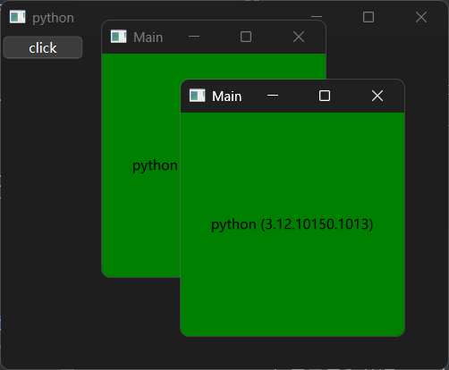

### 10.3 模块的自定义属性

如果只是和普通QML文件一样导入就用，那模块带来的复杂性纯属多余。既然要创建模块，自然要有不一样的地方。在创建模块时，可以在模块的QML文件中添加一些自定义的属性，内部关联使用这些自定义属性。这样就能在使用时，设置模块的自定义属性，快速创建由多种元素组合、相关属性遵循一定规则的复合控件，就像自定义了新的控件一样。

在正式了解自定义属性之前，先看一下示例。

将模块中`main.qml`文件的内容修改如下：

```dart
import QtQuick.Window

Window {
    //别名属性
    property alias my_text: text.text
    //字符串类型的属性，无默认值
    property string my_color
    //字符串类型的属性，有默认值
    property string my_title: 'Main'
    //自定义属性结束
    id: window
    visible: true
    title: my_title
    width: 200
    height: 200
    Rectangle {
        id: main
        width: 200
        height: 200
        //属性未传值的话使用 Qt.rgba(0, 0.5, 0, 1)
        color: window.my_color || Qt.rgba(0, 0.5, 0, 1)
        Text {
            id: text
            text: `${Application.name} (${Application.version})`
            anchors.centerIn: main
        }
    }
}
```

这样，原本只能直接使用的模块就多了三个自定义属性：`my_text`、`my_color`、`my_title`。

自定义属性的相关语法可以参考 https://doc.qt.io/qt-6/zh/qtqml-syntax-objectattributes.html。

这里简单介绍一下示例中用到的部分语法。

在控件的中括号内使用关键字`property`，可以创建自定义属性，格式为`property {类型} {属性名} : {默认值}`。如果没有默认值的话，则格式为`property {类型} {属性名}`。创建自定义属性时，属性名只能是小写开头。只有顶层控件的属性（含自定义属性）可以被外部访问，相当于模块的自定义属性，其他控件的属性（含自定义属性）无法被外部访问。

创建好自定义属性之后，想要使用属性（自定义属性和原生属性都可以，`id`属性除外），则必须给对应控件设置`id`属性，通过`{属性所属控件的id}.{属性名}`的格式使用属性（自定义属性和原生属性都可以，`id`属性除外）。如果在同一控件内使用属性，则可以直接使用属性名，不用表明对应控件的`id`。

对于频繁使用的属性（含自定义属性），可以使用`alias`类型，定义该属性的别名，格式为`property alias {属性名的别名} : {属性所属控件的id}.{属性名}`。如果省略属性名，比如`property alias {别名} : {属性所属控件的id}`，则别名可以当作控件的`id`来使用，此时`{别名}.{属性名}`相当于`{属性所属控件的id}.{属性名}`。

顶层控件的属性（含自定义属性）能够被外部访问，相当于模块的自定义属性，在导入模块时可以将其设置为所需的值。

以下为设置模块自定义属性的方法：

- 在导入模块前，给用引擎对象的`setInitialProperties`方法传入字典可以提前设置模块的自定义属性：

  ```python3
  engine.setInitialProperties(
      {
          'my_text':'Hello',
          'my_color':'red',
          'my_title':'Hi'
      }
  )
  ```

- 在QML文件（或者QML字符串）中导入模块时，控件的创建代码可以同时设置模块的自定义属性：

  ```python3
  # QML文件或者字符串的内容为
  '''
  import App
  Main {
      my_text: 'Hello'
      my_color: 'red'
      my_title: 'Hi'
  }
  '''
  ```

完整示例如下：

```python3
from PySide6.QtWidgets import QApplication,QWidget,QPushButton
from PySide6.QtCore import QUrl
from PySide6.QtQml import QQmlApplicationEngine

# 非QtQuick程序只能使用QApplication，不能使用QGuiApplication
app = QApplication()

# main.qml 文件的内容为
'''
import QtQuick.Window

Window {
    //别名属性
    property alias my_text: text.text
    //字符串类型的属性，无默认值
    property string my_color
    //字符串类型的属性，有默认值
    property string my_title: 'Main'
    //自定义属性结束
    id: window
    visible: true
    title: my_title
    width: 200
    height: 200
    Rectangle {
        id: main
        width: 200
        height: 200
        //属性未传值的话使用 Qt.rgba(0, 0.5, 0, 1)
        color: window.my_color || Qt.rgba(0, 0.5, 0, 1)
        Text {
            id: text
            text: `${Application.name} (${Application.version})`
            anchors.centerIn: main
        }
    }
}
'''
# qmldir 文件的内容为
'''
module App
Main 1.0 main.qml
'''

qml_src = '''
import App
Main {
    my_text: 'Hello'
    my_color: 'red'
    my_title: 'Hi'
}
'''
engine = QQmlApplicationEngine()
engine.addImportPath('./') # 添加模块上一级的文件为导入路径
# 在导入模块前执行，会影响两种导入方式
engine.setInitialProperties(
    {
        'my_text':'Hello',
        'my_color':'red',
        'my_title':'Hi'
    }
)
# 两种导入方式，二选一即可
# engine.loadData(qml_src.encode('utf-8'),QUrl())
engine.loadFromModule('App','Main')

# 非QtQuick部分
window2 = QWidget()
window2.resize(400,300)
QPushButton('click',window2).clicked.connect(lambda :app.quit())
window2.show()

app.exec()
```

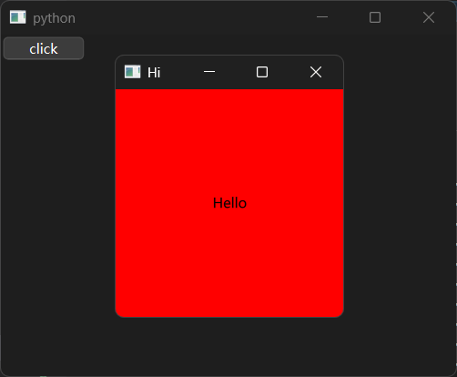

## 11 在QML中使用Python对象

想要在QML中使用Python对象（仅限`QObject`类，下文中未做特别说明的话，默认为`QObject`类的派生类对象），必须要先获取上下文对象（通过引擎对象的`rootContext`方法获取），然后在上下文对象中注册`Property`属性，才能在QML中使用该属性对应的Python对象。

### 11.1 获取上下文对象

`QQuickView`获取上下文对象（为了避免QML代码出错导致程序无法正常关闭，后面注册`Property`属性的示例不使用`QtQuick`程序，这里仅作为获取上下文对象的示例）：

```python3
from PySide6.QtGui import QGuiApplication
from PySide6.QtCore import QUrl,QByteArray
from PySide6.QtQuick import QQuickView
from PySide6.QtQml import QQmlComponent

app = QGuiApplication()

qml_string = '''
import QtQuick
import QtQuick.Controls

Rectangle {
    id: main
    width: 200
    height: 200
    color: 'green'
    Button {
        text: 'Click'
        width: 100
        height: 30
        anchors.centerIn: main
        onClicked: {
        //访问注册的属性
            app.quit()
        }
    }
}
'''

view = QQuickView()
# 使用view的engine创建component
component = QQmlComponent(view.engine())
# 给component加载qml字符串
component.setData(QByteArray(qml_string.encode()),QUrl())
# 让view的根内容变成component，并将实际内容变为component的生成内容
view.setContent(QUrl(), component, component.create())

view.resize(200,200)
view.setTitle('Main')

view.show()

# 获取上下文对象
root = view.engine().rootContext()

app.exec()
```

`QQuickWidget`获取上下文对象：

```python3
from PySide6.QtWidgets import QApplication,QWidget,QPushButton
from PySide6.QtCore import QUrl,QByteArray
from PySide6.QtQuickWidgets import QQuickWidget
from PySide6.QtQml import QQmlComponent

# 非QtQuick程序只能使用QApplication，不能使用QGuiApplication
app = QApplication()

qml_string = '''
import QtQuick
import QtQuick.Controls

Rectangle {
    id: main
    width: 200
    height: 200
    color: 'green'
    Button {
        text: 'Click'
        width: 100
        height: 30
        anchors.centerIn: main
        onClicked: {
        //访问注册的属性
            app.quit()
        }
    }
}
'''

window = QQuickWidget()
# 使用view的engine创建component
component = QQmlComponent(window.engine())
# 给component加载qml字符串
component.setData(QByteArray(qml_string.encode()),QUrl())
# 让view的根内容变成component，并将实际内容变为component的生成内容
window.setContent(QUrl(), component, component.create())

window.resize(200,200)
# QQuickWidget 不支持 view.setTitle('Main')
window.setWindowTitle('Main')

window.show()

# 获取上下文对象
root = window.engine().rootContext()

# 非QtQuick部分，避免QML代码出错，无法正常关闭
window2 = QWidget()
window2.resize(400,300)
QPushButton('click',window2).clicked.connect(lambda :app.quit())
window2.show()

app.exec()
```

`QQmlApplicationEngine`获取上下文对象：

```python3
from PySide6.QtWidgets import QApplication,QWidget,QPushButton
from PySide6.QtCore import QUrl
from PySide6.QtQml import QQmlApplicationEngine

# 非QtQuick程序只能使用QApplication，不能使用QGuiApplication
app = QApplication()

qml_src = '''
import QtQuick.Window
import QtQuick.Controls

Window {
    visible: true
    title: 'Main'
    width: 200
    height: 200
    Rectangle {
        id: main
        width: 200
        height: 200
        color: 'green'
        Button {
            text: 'Click'
            width: 100
            height: 30
            anchors.centerIn: main
            onClicked: {
            //访问注册的属性
                app.quit()
            }
        }
    }
}
'''
engine = QQmlApplicationEngine()
engine.loadData(qml_src.encode('utf-8'),QUrl())

# 获取上下文对象
root = engine.rootContext()

# 非QtQuick部分，避免QML代码出错，无法正常关闭
window2 = QWidget()
window2.resize(400,300)
QPushButton('click',window2).clicked.connect(lambda :app.quit())
window2.show()

app.exec()
```

### 11.2 注册`Property`属性

获取了上下文对象之后，就可以通过调用上下文对象的方法，将Python中的对象注册为`Property`属性，在QML中使用。

但在此之前，需要明确一下注册`Property`属性的目的：点击QtQuick控件中的按钮退出程序。

可能有的读者有一定基础，知道这种操作不需要注册属性，直接使用`Qt.quit()`即可。对于`QQmlApplicationEngine`控件来说，是最简单的，甚至不用在QML中导入`QtQml`（使用`import QtQml`）。不过，对于`QQuickView`控件和`QQuickWidget`控件来说，想要使用`Qt.quit()`，光导入`QtQml`（使用`import QtQml`）还不够，还需要将这些控件的引擎对象的`quit`信号与程序类实例的`quit`方法连接，才能响应操作。

即便如此，注册`Property`属性的操作也不比上面的操作简单，那为何还要这样做？

这里的“点击QtQuick控件中的按钮退出程序”是一个简单的目标，其本质上相当于使用Python中的任意对象，只不过为了让结果更直观，笔者才会使用一个QML可以实现的功能作为示例，主要是为了将程序类实例注册为`Property`属性。

另外，如果将程序类实例注册为`Property`属性，不仅可以更加简单地退出程序，其他将程序类实例的方法、属性也能使用，对于不完全熟悉QML的开发者来说，这样操作反而能省不少事。

为了让示例尽量简单，下面的示例均采用`QQmlApplicationEngine`控件作为主窗口控件，并且内嵌了QML字符串。

想要将Python中的对象注册为`Property`属性，可以使用上下文对象支持的这几种方法：

- `setContextObject`方法，只能注册`QObject`的`Property`属性。
- `setContextProperty`方法，可以将任意对象注册为`Property`属性。每次执行只能注册一个属性，注册时可以指定属性名。
- `setContextProperties`方法，可以将任意对象注册为`Property`属性。每次执行可以注册多个属性，注册时可以指定属性名。

先说`setContextObject`方法，因为只能注册`QObject`的`Property`属性，所以，需要手动构建符合要求的对象。

导入相关类：

```python3
from PySide6.QtCore import QObject,Property
```

创建自定义类（继承自`QObject`类）：

```python3
class Obj(QObject):
    def __init__(self):
        super().__init__()
        # 这里的app是全局中的程序类实例
        self._app = app
    app = Property(
        object,
        fget=lambda self:self._app,
        fset=lambda self,value:setattr(self,'_app',app)
    )
```

在自定义类中，先在初始化方法中，获取全局中的程序类实例，将其赋值给普通的实例属性`_app`。然后，在类中单独创建名为`app`的`Property`类实例，这个名为`app`的`Property`类实例就是后续用于注册的`QObject`的`Property`属性。`Property`类的`fget`参数表示属性的读取方法（返回实例属性`_app`），`fset`参数表示属性的赋值方法（修改实例属性`_app`）。属性的读取方法是必需的，属性的赋值方法可以省略，省略的话表示该属性是只读属性。

然后，就可以使用上下文对象的`setContextObject`方法注册这个自定义类的实例了：

```python3
from PySide6.QtWidgets import QApplication,QWidget,QPushButton
from PySide6.QtCore import QUrl,QObject,Property
from PySide6.QtQml import QQmlApplicationEngine

# 非QtQuick程序只能使用QApplication，不能使用QGuiApplication
app = QApplication()

qml_src = '''
import QtQuick.Window
import QtQuick.Controls

Window {
    visible: true
    title: 'Main'
    width: 200
    height: 200
    Rectangle {
        id: main
        width: 200
        height: 200
        color: 'green'
        Button {
            text: 'Click'
            width: 100
            height: 30
            anchors.centerIn: main
            onClicked: {
            //访问注册的属性
                app.quit()
            }
        }
    }
}
'''
engine = QQmlApplicationEngine()
engine.loadData(qml_src.encode('utf-8'),QUrl())

# 获取上下文对象
root = engine.rootContext()

# 直接注册该对象的属性（Property）到QML全局
class Obj(QObject):
    def __init__(self):
        super().__init__()
        # 这里的app是全局中的程序类实例
        self._app = app
    app = Property(
        object,
        fget=lambda self:self._app,
        fset=lambda self,value:setattr(self,'_app',app)
    )
root.setContextObject(Obj())

# 非QtQuick部分，避免QML代码出错，无法正常关闭
window2 = QWidget()
window2.resize(400,300)
QPushButton('click',window2).clicked.connect(lambda :app.quit())
window2.show()

app.exec()
```

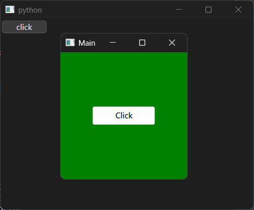

相比之下，使用上下文对象的`setContextProperty`方法就简单不少。该方法的第一位置参数为字符串类型，表示属性名；第二位置参数表示该属性对应的对象（`QObject`类的派生类对象）：

```python3
from PySide6.QtWidgets import QApplication,QWidget,QPushButton
from PySide6.QtCore import QUrl
from PySide6.QtQml import QQmlApplicationEngine

# 非QtQuick程序只能使用QApplication，不能使用QGuiApplication
app = QApplication()

qml_src = '''
import QtQuick.Window
import QtQuick.Controls

Window {
    visible: true
    title: 'Main'
    width: 200
    height: 200
    Rectangle {
        id: main
        width: 200
        height: 200
        color: 'green'
        Button {
            text: 'Click'
            width: 100
            height: 30
            anchors.centerIn: main
            onClicked: {
            //访问注册的属性
                app.quit()
            }
        }
    }
}
'''
engine = QQmlApplicationEngine()
engine.loadData(qml_src.encode('utf-8'),QUrl())

# 获取上下文对象
root = engine.rootContext()

# 一次注册一个属性（Property）到QML全局
root.setContextProperty('app',app)

# 非QtQuick部分，避免QML代码出错，无法正常关闭
window2 = QWidget()
window2.resize(400,300)
QPushButton('click',window2).clicked.connect(lambda :app.quit())
window2.show()

app.exec()
```

`setContextProperty`方法简单，但也不是完美的。如前面所写，如果想要注册多个属性，则需要多次调用`setContextProperty`方法才行。

使用上下文对象的`setContextProperties`方法的话，就可以一次注册多个`Property`属性。

`setContextProperties`方法接收元素为`PropertyPair`类型的序列对象（元素排列有先后顺序的可迭代对象），但是，`PropertyPair`类不能直接使用，需要做一点额外的工作。

首先，导入`QQmlContext`类（`PropertyPair`类嵌在该类中）：

```python3
from PySide6.QtQml import QQmlContext
```

然后继承`QQmlContext.PropertyPair`，创建自定义类（可以与`PropertyPair`类同名，也可以是其他名字），并添加如下的初始化方法（参数和`setContextProperty`方法一样）：

```python3
# 使用PropertyPair类
class PropertyPair(QQmlContext.PropertyPair):
    def __init__(self,name:str,value:object):
        super().__init__()
        self.name = name
        self.value = value
```

这样，才能使用`setContextProperties`方法，一次注册多个`Property`属性（这里为了让其余代码和前面的示例保持一致，只注册一个）：

```python3
# 一次注册多个属性（Property）到QML全局
root.setContextProperties(
    [
        PropertyPair('app',app)
    ]
)
```

完整示例如下：

```python3
from PySide6.QtWidgets import QApplication,QWidget,QPushButton
from PySide6.QtCore import QUrl
from PySide6.QtQml import QQmlApplicationEngine,QQmlContext

# 非QtQuick程序只能使用QApplication，不能使用QGuiApplication
app = QApplication()

qml_src = '''
import QtQuick.Window
import QtQuick.Controls

Window {
    visible: true
    title: 'Main'
    width: 200
    height: 200
    Rectangle {
        id: main
        width: 200
        height: 200
        color: 'green'
        Button {
            text: 'Click'
            width: 100
            height: 30
            anchors.centerIn: main
            onClicked: {
            //访问注册的属性
                app.quit()
            }
        }
    }
}
'''
engine = QQmlApplicationEngine()
engine.loadData(qml_src.encode('utf-8'),QUrl())

# 获取上下文对象
root = engine.rootContext()

# 使用PropertyPair类
class PropertyPair(QQmlContext.PropertyPair):
    def __init__(self,name:str,value:object):
        super().__init__()
        self.name = name
        self.value = value

# 一次注册多个属性（Property）到QML全局
root.setContextProperties(
    [
        PropertyPair('app',app)
    ]
)

# 非QtQuick部分，避免QML代码出错，无法正常关闭
window2 = QWidget()
window2.resize(400,300)
QPushButton('click',window2).clicked.connect(lambda :app.quit())
window2.show()

app.exec()
```

## 12 控件的样式表（QSS）

### 12.1 为什么要用样式

在正式学习样式之前，先通过几个示例了解一下为什么要用样式，以及样式的用途。

第一个示例需要借用前面加载UI文件的示例，在Python代码中使用控件的`setFixedSize`方法修改控件的样式（大小）：

```python
from PySide6.QtWidgets import QApplication
from PySide6.QtUiTools import QUiLoader

app = QApplication()
window = QUiLoader().load('main.ui')
window.psf.setText('click')

# 设置控件的样式（大小）
window.psf.setFixedSize(100,50)

window.show()
app.exec()
```

在控件所有的方法中，'set'开头的方法可以设置控件的控件属性（即UI文件中设置的属性，对应XML格式的UI文件中的`property`节点及其子节点），包括控件的样式。比如`setFixedSize`方法就是用来设置控件固定大小的，因此，原本比较紧凑的按钮会变成指定大小：

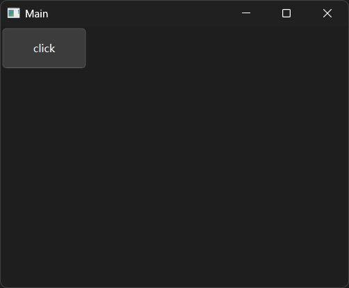

当然，除了在代码中调用Python接口设置控件的大小，还可以在修改UI文件时设置控件`geometry`属性中的宽度、高度：

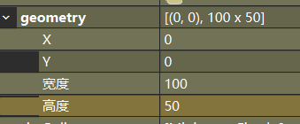

除了上面两种方法，修改控件的样式表，也能实现相同的效果。

将`geometry`属性初始化，右键控件，选择改变样式表，输入如下内容：

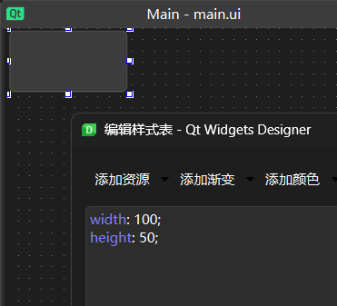

控件大小也会随之改变。

此外，如果修改主窗口控件的样式表如下（但是要删掉按钮的样式表）：

```css
QPushButton {
    width: 100;
	height: 50;                  
}
```

样式表生效范围就会变成主窗口控件的所有子控件。

使用下面的代码，添加三个新的按钮，但是移动它们的位置、完全不设置它们的大小的话，它们默认的大小都会遵守样式表中的规则：

```python3
from PySide6.QtWidgets import QApplication,QPushButton
from PySide6.QtUiTools import QUiLoader

app = QApplication()
window = QUiLoader().load('main.ui')
window.psf.setText('click')

QPushButton('click2',window).move(108,0)
QPushButton('click3',window).move(0,58)
QPushButton('click4',window).move(108,58)

window.show()
app.exec()
```

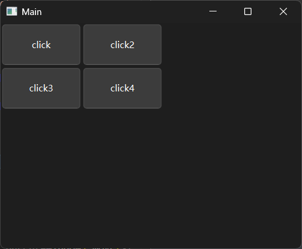

如上图所示，新添加的按钮默认尺寸与已有按钮的尺寸一致，这就是使用样式表的方便之处：可以通过这样操作统一所有子控件的样式，不用单独设置每个子控件。

### 12.2 使用样式表（QSS字符串）的方法与样式的基本语法

介绍完使用样式表的方便之处，接下来，简单说一下样式的基本语法。

需要深入学习的读者可以参考官方提供的资料：

- 入门教程：https://doc.qt.io/qtforpython-6/tutorials/basictutorial/widgetstyling.html#tutorial-widgetstyling
- 基础教程：https://doc.qt.io/qt-6/zh/stylesheet.html
- 基础语法：https://doc.qt.io/qt-6/zh/stylesheet-syntax.html
- 样式手册：https://doc.qt.io/qt-6/zh/stylesheet-reference.html

基于官方提供的资料和前面的示例可以得知，Qt的样式语法类似CSS，Qt称之为QSS。和CSS一样，QSS也是使用`选择器 { 样式类型: 样式值;}`的格式定义样式。

以下为相关基础的参考资料：

- 样式类型：https://doc.qt.io/qt-6/zh/stylesheet-reference.html#list-of-properties
- 样式值：https://doc.qt.io/qt-6/zh/stylesheet-reference.html#list-of-property-types
- 选择器类型：https://doc.qt.io/qt-6/zh/stylesheet-syntax.html#selector-types
- 内部子控件：https://doc.qt.io/qt-6/zh/stylesheet-reference.html#list-of-sub-controls
- 伪类（状态类）：https://doc.qt.io/qt-6/zh/stylesheet-reference.html#list-of-pseudo-states

但在学习基础之前，需要先学习一下使用样式表（QSS字符串）的方法`setStyleSheet`。

除了在UI文件中设置样式表，还可以将样式表写入文件或者字符串，使用Python接口设置控件的样式表（QSS字符串）。能实现此功能的，就是控件的`setStyleSheet`方法。

知道了使用样式表（QSS字符串）的方法，下一步，就是改造一下前面演示样式的示例。使用独立的UI文件，每次启动QtDesigner、在UI文件中修改样式表属实麻烦，那就将UI文件编译为Python代码，然后简化无用的代码。最后，将控件的样式表字符串传给`setStyleSheet`方法，本章最开始的示例将变成这样：

```python3
from PySide6.QtCore import QCoreApplication,QMetaObject
from PySide6.QtWidgets import QApplication, QPushButton, QWidget

class Ui_MainWindow(object):
    def setupUi(self, MainWindow):
        if not MainWindow.objectName():
            MainWindow.setObjectName(u"MainWindow")
        MainWindow.resize(400, 300)
        self.psf = QPushButton(MainWindow)
        self.psf.setObjectName(u"psf")
        self.retranslateUi(MainWindow)
        QMetaObject.connectSlotsByName(MainWindow)
    def retranslateUi(self, MainWindow):
        MainWindow.setWindowTitle(QCoreApplication.translate("MainWindow", u"Main", None))

app = QApplication()
class MyWidget(QWidget, Ui_MainWindow):...
window = MyWidget()
window.setupUi(window)
window.psf.setText('click')

# 样式字符串
style_str = '''
QPushButton {
    width: 100;
    height: 50;
}
'''

# 设置控件的样式表（全局生效）
window.setStyleSheet(style_str)

# 添加一个新的控件
button = QPushButton('click2',window)
button.move(0,58)

window.show()
app.exec()
```

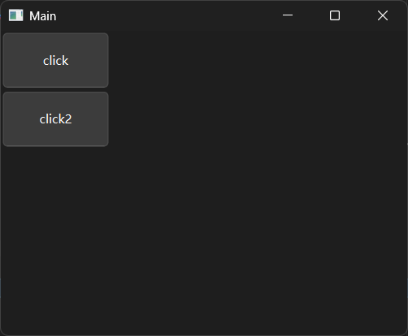

接下来，基于这个示例，开始学习样式的基本语法。

先说选择器，QSS支持的选择器种类有以下几种：

- 通用选择器，使用星号`*`表示，表明样式适用于生效范围内所有的控件。

- 类型选择器，使用控件的类名表示，表明样式适用于该控件（控件类的实例）及其衍生控件（衍生类的实例）。示例如下（`QPushButton`类继承自`QAbstractButton`类）：

  ```python3
  from PySide6.QtCore import QCoreApplication,QMetaObject
  from PySide6.QtWidgets import QApplication, QPushButton, QWidget
  
  class Ui_MainWindow(object):
      def setupUi(self, MainWindow):
          if not MainWindow.objectName():
              MainWindow.setObjectName(u"MainWindow")
          MainWindow.resize(400, 300)
          self.psf = QPushButton(MainWindow)
          self.psf.setObjectName(u"psf")
          self.retranslateUi(MainWindow)
          QMetaObject.connectSlotsByName(MainWindow)
      def retranslateUi(self, MainWindow):
          MainWindow.setWindowTitle(QCoreApplication.translate("MainWindow", u"Main", None))
  
  app = QApplication()
  class MyWidget(QWidget, Ui_MainWindow):...
  window = MyWidget()
  window.setupUi(window)
  window.psf.setText('click')
  
  # 样式字符串
  style_str = '''
  QAbstractButton {
      width: 100;
      height: 50;
  }
  '''
  
  # 设置控件的样式表
  window.setStyleSheet(style_str)
  
  # 添加一个新的控件
  button = QPushButton('click2',window)
  button.move(0,58)
  
  window.show()
  app.exec()
  ```

  

- 属性选择器，使用`[{属性名}={属性值（字符串类型）}]`表示，表明样式适用于控件属性（只能匹配部分值可以转换为字符串的属性）为指定值的控件。比如，匹配`text`属性为`'click2'`的控件：

  ```python3
  from PySide6.QtCore import QCoreApplication,QMetaObject
  from PySide6.QtWidgets import QApplication, QPushButton, QWidget,QToolButton
  
  class Ui_MainWindow(object):
      def setupUi(self, MainWindow):
          if not MainWindow.objectName():
              MainWindow.setObjectName(u"MainWindow")
          MainWindow.resize(400, 300)
          self.psf = QPushButton(MainWindow)
          self.psf.setObjectName(u"psf")
          self.retranslateUi(MainWindow)
          QMetaObject.connectSlotsByName(MainWindow)
      def retranslateUi(self, MainWindow):
          MainWindow.setWindowTitle(QCoreApplication.translate("MainWindow", u"Main", None))
  
  app = QApplication()
  class MyWidget(QWidget, Ui_MainWindow):...
  window = MyWidget()
  window.setupUi(window)
  window.psf.setText('click')
  
  # 样式字符串
  style_str = '''
  [text='click2'] {
      width: 100;
      height: 50;
  }
  '''
  
  # 设置控件的样式表
  window.setStyleSheet(style_str)
  
  # 添加一个新的控件
  button = QPushButton('click2',window)
  button.move(0,58)
  
  # 添加一个新的控件
  button2 = QToolButton(window)
  button2.move(0,116)
  button2.setText('click2')
  
  window.show()
  app.exec()
  ```

  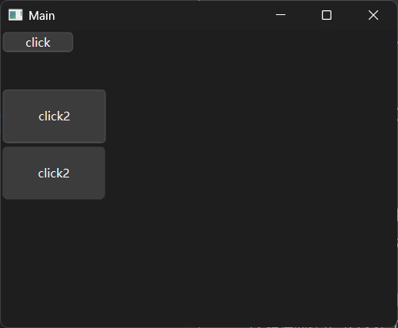

  需要注意的是，只有能够转换为字符串的控件属性才能匹配，整数类型直接转换，布尔类型会被转换为`'true'`或者`'false'`。比如，按钮有一个布尔类型的控件属性`flat`，要匹配该控件属性为`True`的控件，选择器要写成`[flat='true']`。

  除了使用`=`精准匹配，对于可以转换为字符串列表的控件属性，还可以使用`~=`进行包含匹配，格式为`[{属性名}~={属性值（字符串类型）}]`，表明样式适用于控件属性（列表类型）包含指定值的控件。

  因为属性选择器包含闭合的括号，所以，括号内可以添加空格来改善表达式的可读性，不会产生语法问题或者歧义。但在括号外，与其他选择器同时使用时，使用空格有特殊含义（对应后代选择器），需要注意空格的使用场景。

  属性选择器除了单独使用，还可以与类型选择器组合使用（之间没有空格，其实就是兼备组合器），表示在指定控件及其衍生控件中，只有控件属性为（或者包含）指定值的控件应用对应的样式。示例如下：

  ```python3
  from PySide6.QtCore import QCoreApplication,QMetaObject
  from PySide6.QtWidgets import QApplication, QPushButton, QWidget,QToolButton
  
  class Ui_MainWindow(object):
      def setupUi(self, MainWindow):
          if not MainWindow.objectName():
              MainWindow.setObjectName(u"MainWindow")
          MainWindow.resize(400, 300)
          self.psf = QPushButton(MainWindow)
          self.psf.setObjectName(u"psf")
          self.retranslateUi(MainWindow)
          QMetaObject.connectSlotsByName(MainWindow)
      def retranslateUi(self, MainWindow):
          MainWindow.setWindowTitle(QCoreApplication.translate("MainWindow", u"Main", None))
  
  app = QApplication()
  class MyWidget(QWidget, Ui_MainWindow):...
  window = MyWidget()
  window.setupUi(window)
  window.psf.setText('click')
  
  # 样式字符串
  style_str = '''
  QPushButton[text='click2'] {
      width: 100;
      height: 50;
  }
  '''
  
  # 设置控件的样式
  window.setStyleSheet(style_str)
  
  # 添加一个新的控件
  button = QPushButton('click2',window)
  button.move(0,58)
  
  # 添加一个新的控件表
  button2 = QToolButton(window)
  button2.move(0,116)
  button2.setText('click2')
  
  window.show()
  app.exec()
  ```

  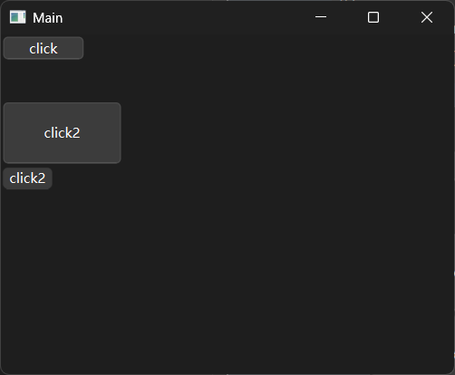

  属性选择器可以与通用选择器（`*`）组合使用，但效果与不组合使用一样，

  如果控件属性在设置了样式表之后发生变化，控件的样式不会实时刷新，需要重新设置样式表才能正确生效。

- 类选择器，给控件的类名前加一个英语句号（`.`），表明样式只适用于该控件（控件类的实例），其效果相当于样式适用于控件属性`class`中包含指定控件类名的控件。比如，`.QPushButton`等效于`[class~='QPushButton']`。示例如下：

  ```python3
  from PySide6.QtCore import QCoreApplication,QMetaObject
  from PySide6.QtWidgets import QApplication, QPushButton, QWidget,QToolButton
  
  class Ui_MainWindow(object):
      def setupUi(self, MainWindow):
          if not MainWindow.objectName():
              MainWindow.setObjectName(u"MainWindow")
          MainWindow.resize(400, 300)
          self.psf = QPushButton(MainWindow)
          self.psf.setObjectName(u"psf")
          self.retranslateUi(MainWindow)
          QMetaObject.connectSlotsByName(MainWindow)
      def retranslateUi(self, MainWindow):
          MainWindow.setWindowTitle(QCoreApplication.translate("MainWindow", u"Main", None))
  
  app = QApplication()
  class MyWidget(QWidget, Ui_MainWindow):...
  window = MyWidget()
  window.setupUi(window)
  window.psf.setText('click')
  
  # 样式字符串
  style_str = '''
  .QPushButton {
      width: 100;
      height: 50;
  }
  '''
  
  # 设置控件的样式表
  window.setStyleSheet(style_str)
  
  # 添加一个新的控件
  button = QPushButton('click2',window)
  button.move(0,58)
  
  # 添加一个新的控件
  button2 = QToolButton(window)
  button2.move(0,116)
  button2.setText('click2')
  
  window.show()
  app.exec()
  ```

  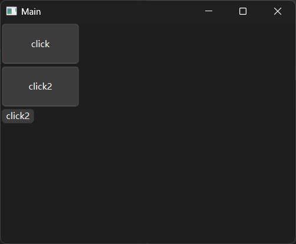

- ID 选择器，给控件`objectName`属性的值前加一个井号（`#`），表明样式适用于控件属性`objectName`为指定值的控件。示例如下：

  ```python3
  from PySide6.QtCore import QCoreApplication,QMetaObject
  from PySide6.QtWidgets import QApplication, QPushButton, QWidget,QToolButton
  
  class Ui_MainWindow(object):
      def setupUi(self, MainWindow):
          if not MainWindow.objectName():
              MainWindow.setObjectName(u"MainWindow")
          MainWindow.resize(400, 300)
          self.psf = QPushButton(MainWindow)
          self.psf.setObjectName(u"psf")
          self.retranslateUi(MainWindow)
          QMetaObject.connectSlotsByName(MainWindow)
      def retranslateUi(self, MainWindow):
          MainWindow.setWindowTitle(QCoreApplication.translate("MainWindow", u"Main", None))
  
  app = QApplication()
  class MyWidget(QWidget, Ui_MainWindow):...
  window = MyWidget()
  window.setupUi(window)
  window.psf.setText('click')
  
  # 样式字符串
  style_str = '''
  #psf {
      width: 100;
      height: 50;
  }
  '''
  
  # 设置控件的样式表
  window.setStyleSheet(style_str)
  
  # 添加一个新的控件
  button = QPushButton('click2',window)
  button.move(0,58)
  
  # 添加一个新的控件
  button2 = QToolButton(window)
  button2.move(0,116)
  button2.setText('click2')
  
  window.show()
  app.exec()
  ```

  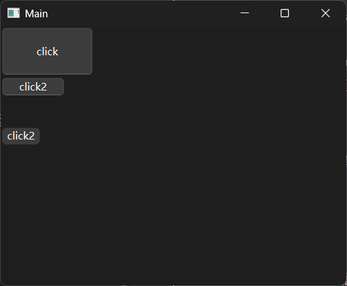

- 内部子控件选择器，使用`::{内部子控件名}`表示，表明样式适用于指定的内部子控件。这里的内部子控件指的是有些控件的组成部分本质上是单独的控件，所以，可以通过内部子控件选择器进行匹配，设置这些控件的样式。比如，给按钮设置下拉菜单之后，按钮会多出一个菜单指示器，可以使用`::menu-indicator`匹配：

  ```python3
  from PySide6.QtCore import QCoreApplication,QMetaObject
  from PySide6.QtWidgets import QApplication, QPushButton, QWidget,QToolButton
  
  class Ui_MainWindow(object):
      def setupUi(self, MainWindow):
          if not MainWindow.objectName():
              MainWindow.setObjectName(u"MainWindow")
          MainWindow.resize(400, 300)
          self.psf = QPushButton(MainWindow)
          self.psf.setObjectName(u"psf")
          self.retranslateUi(MainWindow)
          QMetaObject.connectSlotsByName(MainWindow)
      def retranslateUi(self, MainWindow):
          MainWindow.setWindowTitle(QCoreApplication.translate("MainWindow", u"Main", None))
  
  app = QApplication()
  class MyWidget(QWidget, Ui_MainWindow):...
  window = MyWidget()
  window.setupUi(window)
  window.psf.setText('click')
  
  # 样式字符串
  style_str = '''
  ::menu-indicator {
      background: red;
  }
  '''
  
  # 设置控件的样式表
  window.setStyleSheet(style_str)
  
  # 添加一个新的控件
  button = QPushButton('click2',window)
  button.move(0,58)
  
  # 给按钮添加下拉菜单
  from PySide6.QtWidgets import QMenu
  menu = QMenu()
  menu.addAction('Hello')
  button.setMenu(menu)
  
  # 添加一个新的控件
  button2 = QToolButton(window)
  button2.move(0,116)
  button2.setText('click2')
  
  window.show()
  app.exec()
  ```

  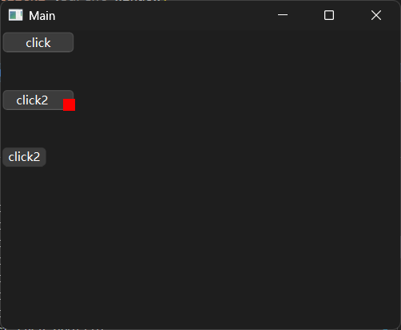

  内部子控件选择器与其他选择器（伪类选择器除外）组合，成为兼备组合器时，应当放在其他选择器之后。

- 伪类（状态类）选择器，使用`:{伪类（状态类）}`表示，表明样式适用于指定状态（比如，被禁用，被点击）的控件。示例如下：

  ```python3
  from PySide6.QtCore import QCoreApplication,QMetaObject
  from PySide6.QtWidgets import QApplication, QPushButton, QWidget,QToolButton
  
  class Ui_MainWindow(object):
      def setupUi(self, MainWindow):
          if not MainWindow.objectName():
              MainWindow.setObjectName(u"MainWindow")
          MainWindow.resize(400, 300)
          self.psf = QPushButton(MainWindow)
          self.psf.setObjectName(u"psf")
          self.retranslateUi(MainWindow)
          QMetaObject.connectSlotsByName(MainWindow)
      def retranslateUi(self, MainWindow):
          MainWindow.setWindowTitle(QCoreApplication.translate("MainWindow", u"Main", None))
  
  app = QApplication()
  class MyWidget(QWidget, Ui_MainWindow):...
  window = MyWidget()
  window.setupUi(window)
  window.psf.setText('click')
  
  # 样式字符串
  style_str = '''
  :disabled {
      background: red;
  }
  :pressed {
      background: green;
  }
  '''
  
  # 设置控件的样式表
  window.setStyleSheet(style_str)
  
  # 添加一个新的控件
  button = QPushButton('click2',window)
  button.move(0,58)
  # 禁用控件
  button.setDisabled(True)
  
  # 添加一个新的控件
  button2 = QToolButton(window)
  button2.move(0,116)
  button2.setText('click2')
  
  window.show()
  app.exec()
  ```

  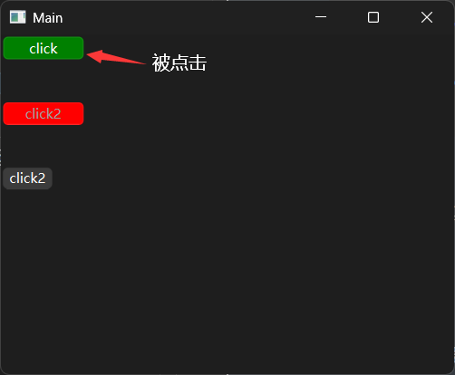

  注意，伪类选择器与其他选择器（伪类选择器除外）组合，成为兼备组合器时，应当放在其他选择器之后。另外，不同的伪类选择器组合，成为兼备组合器时，有的伪类选择器具有排他性（主要是有些状态不能同时触发），无法与其它伪类选择器组合生效。比如，`:disabled`表示控件被禁用，此时控件无法点击，也无法触发鼠标悬停状态，`:disabled:pressed`、`:disabled:hover`均为无效的兼备组合器。

除了单独使用选择器，还可以将不同的选择器组合起来（有限制条件，不是自由组合），实现复杂的匹配规则。甚至可以将不同的组合器进一步组合（有限制条件，不是自由组合），实现更加复杂的匹配规则。

在QSS中，可以使用以下几种组合器：

- 兼备组合器，选择器之间无空格，选择器必须是不同类型的，且连接之后不能有歧义（即首尾相连时不能为英文字母直接相连），表明样式适用于同时匹配所有选择器的控件。
- 后代组合器，选择器（或者兼备组合器）之间有空格，表明样式适用情况为：控件的父级控件（父控件、父控件的父控件……向上追溯，直至控件没有父控件为止，都算父级控件）匹配空格前的选择器（或者兼备组合器），控件本身匹配空格后的选择器（或者组合器）。如果组合器包含超过两个选择器（或者兼备组合器），则控件本身匹配最后一个的选择器（或者兼备组合器）。
- 子代组合器，选择器（或者兼备组合器）之间是大于号（`>`），大于号前后的空格、换行会被忽略，表明样式适用情况为：控件的父控件匹配空格前的选择器（或者兼备组合器），控件本身匹配空格后的选择器（或者兼备组合器）。如果组合器包含超过两个选择器（或者兼备组合器），则控件本身匹配最后一个的选择器（或者兼备组合器）。
- 任意组合器，选择器、组合器之间是英文逗号（`,`），表明样式适用于可以匹配任意选择器、组合器的控件。

因为组合器之间也能组合，构成复合组合器，所以，在编写复合组合器时，还要注意复合组合器的生效原则：

- 有英文逗号（`,`）的，首先划分任意组合器，得到多个选择器、组合器。
- 有兼备组合器的，将兼备组合器当作选择器处理。

示例如下（后代组合器与子代组合器的区别）：

```python3
from PySide6.QtCore import QCoreApplication,QMetaObject
from PySide6.QtWidgets import QApplication, QPushButton, QWidget,QFrame

class Ui_MainWindow(object):
    def setupUi(self, MainWindow):
        if not MainWindow.objectName():
            MainWindow.setObjectName(u"MainWindow")
        MainWindow.resize(400, 300)
        self.psf = QPushButton(MainWindow)
        self.psf.setObjectName(u"psf")
        self.retranslateUi(MainWindow)
        QMetaObject.connectSlotsByName(MainWindow)
    def retranslateUi(self, MainWindow):
        MainWindow.setWindowTitle(QCoreApplication.translate("MainWindow", u"Main", None))

app = QApplication()
class MyWidget(QWidget, Ui_MainWindow):...
window = MyWidget()
window.setupUi(window)
window.psf.setText('click')

# 样式字符串
style_str = '''
#MainWindow QPushButton {
    height: 50;
}
#MainWindow > QPushButton {
    width: 100;
}
'''

# 设置控件的样式表
window.setStyleSheet(style_str)

# 添加一个框架控件
frame = QFrame(window)
frame.setFixedSize(120,60)
frame.move(0,58)

# 添加一个新的控件，是框架控件的子控件
button = QPushButton('click2',frame)

window.show()
app.exec()
```

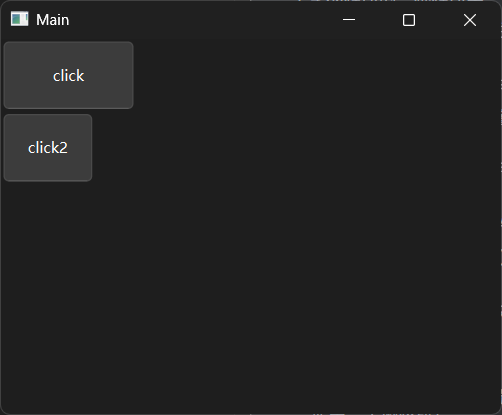

当一个控件同时匹配到不同的选择器、组合器时，想要确定是哪个样式生效，就需要用到选择器、组合器的优先级。

选择器的优先级为：ID选择器>类选择器>伪类选择器>属性选择器>类型选择器。

组合器的优先级与选择器的优先级相关：按照选择器的优先级顺序，依次对比组合器包含的、相同优先级的选择器数量，数量多的组合器优先级高；如果包含的选择器数量相同，则继续对比次高优先级的选择器数量。

如果优先级相同，则字QSS中位置靠下的选择器、组合器优先生效。

和CSS一样，QSS也支持`/*`开头、`*/`结尾的注释方式，可在样式表中添加补充说明的文字。上面示例中的QSS字符串可以这样写注释：

```css
/* 后代组合器 */
#MainWindow QPushButton {
    height: 50;
}
/* 子代组合器，>前后的空格、换行都会被忽略 */
#MainWindow > QPushButton {
    width: 100;
}
```

## 13 QtWidgets程序的布局（更新中，大纲阶段）

图形界面不是控件的简单堆砌，为了让界面高效、美观，控件应当基于一定规则排布，这个规则就叫布局。


（根据QtDesigner中已有的布局控件学习布局的基本用法）


## 13 具体控件——按钮类控件（QAbstractButton的衍生控件，比如`QPushButton`）（更新中）


## 13 具体控件——显示一个对话框（比如`QMessageBox`）（更新中）


## 13 处理复杂数据——表格


## 13 处理复杂数据——树形图


## 13 具体控件——`QTextEdit`（更新中）


https://doc.qt.io/qtforpython-6/PySide6/QtWidgets/QTextEdit.html


（简介`QTextEdit`，然后依次接收参数、属性、方法、实际问题）

（按照创建QTextEdit、插入文本、定义QTextTableFormat、插入表格的顺序介绍，最后说一下边框不显示的问题和解决方法）

### 12.1 创建`QTextEdit`控件


x.1 在富文本中插入表格但不显示表格的边框（引入问题的示例和前言重新写，相关文档和链接在重新组织语言之后适当插入）

根据Qt官方bug报告：https://bugreports.qt.io/browse/QTBUG-132173
和官方文档：https://doc.qt.io/qtforpython-6/PySide6/QtGui/QTextTableFormat.html#PySide6.QtGui.QTextTableFormat.setBorderCollapse
qt 6.8之后，表格边框默认合并，所以不显示表格边框。

代码：

```python3
from PySide6.QtWidgets import QApplication, QTextEdit
from PySide6.QtGui import QTextTableFormat, QTextLength, QBrush, QColor, QTextFrameFormat
from PySide6.QtCore import Qt

app = QApplication()

editor = QTextEdit()
editor.show()


table_format = QTextTableFormat()
table_format.setCellPadding(4)
table_format.setCellSpacing(2)
table_format.setBorder(2)  # 边框宽度
table_format.setBorderBrush(QBrush(QColor('red')))  # 边框颜色为红色
# 6.8.x之前，borderCollapse()默认为False，后续版本默认为True（边框不显示）
table_format.setBorderCollapse(False)
table_format.setBorderStyle(
    QTextFrameFormat.BorderStyle.BorderStyle_DotDotDash)  # 修改边框的样式
table_format.setAlignment(Qt.AlignmentFlag.AlignCenter)
table_format.setColumnWidthConstraints(
    [
        QTextLength(QTextLength.PercentageLength, 50),
        QTextLength(QTextLength.PercentageLength, 50),
    ]
)


table = editor.textCursor().insertTable(3, 2, table_format)

for row in range(3):
    for col in range(2):
        cell_cursor = table.cellAt(row, col).firstCursorPosition()
        cell_cursor.insertText(f'Row {row+1}, Col {col+1}')


app.exec()

```


## x 创作灵感（非正式内容）


# Qt For Python 札记（2026）

## 0 为何而写

2025版在创作过程中添加了不少对之前内容的修正、补充，但还是未能做到内容正确、全面。对于之前内容错误、遗漏之处，2026年，笔者将继续本教程系列的更新。当然，基础、理论部分已经写了不少，除非Qt框架后续更新之后有变动，基础、理论部分不会有其他新内容了，只会补充遗漏、修正错误、扩展用法、衍生相关内容。

## 1 （修正2025.13）

原内容存在错误，修正错误。

## 1 （补充2025.13）

原内容不全面，补充内容。

## 1 （扩展2025.13）

从原内容想到的其他内容，虽然可以作为独立的内容写标题，但这部分内容确实是看完原内容才有了创作契机。
