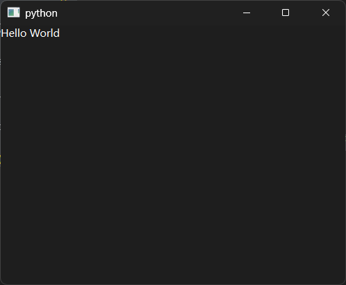
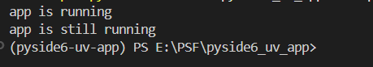
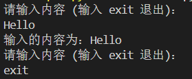
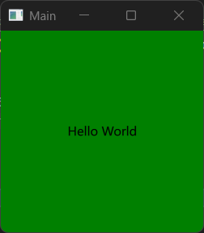
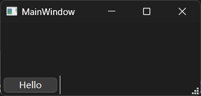
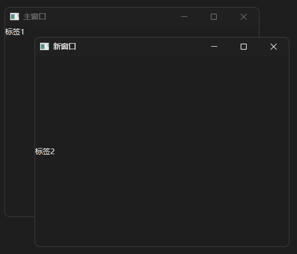
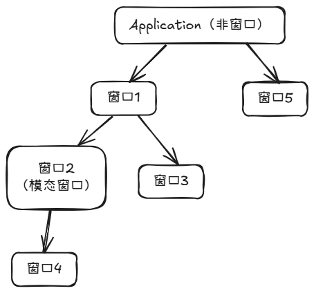
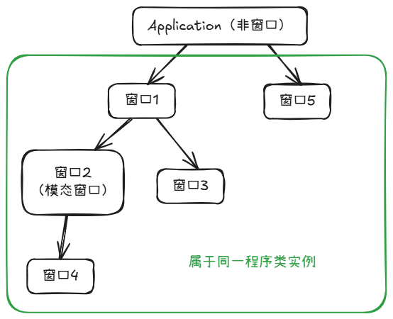
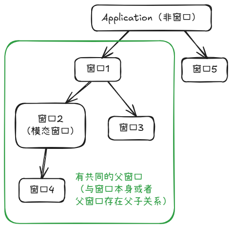

# Qt For Python 札记（2025）

## 0 为何而写

Qt For Python （目前库名为PySide6）各类教程已经有很多，笔者就不班门弄斧了。不过，框架在使用过程中还是有不少难点，对于心急的初学者来说，很容易在找不到解决方法之后轻言放弃。因此，笔者将代入初学者的视角，将学习心得按照时间顺序一一记下，以便于有一定基础但囿于难点的读者按图索骥。

## 1 安装PySide6的注意事项

学习的第一步就是安装库。不过，官方提供了不少相关的库，但并非所有的库都是必需的。以下面的虚拟环境（使用环境管理工具UV创建）为例，笔者添加了官方提供的相关库，其依赖关系如下（使用`uv tree`生成）：

```shell
pyside6-uv-app v0.1.0
├── pyside6 v6.9.1
│   ├── pyside6-addons v6.9.1
│   │   ├── pyside6-essentials v6.9.1
│   │   │   └── shiboken6 v6.9.1
│   │   └── shiboken6 v6.9.1
│   ├── pyside6-essentials v6.9.1 (*)
│   └── shiboken6 v6.9.1
├── pyside6-examples v6.9.1
│   ├── pyside6-addons v6.9.1 (*)
│   ├── pyside6-essentials v6.9.1 (*)
│   └── shiboken6 v6.9.1
└── shiboken6-generator v6.9.1
    └── shiboken6 v6.9.1
```

项目下主动添加的库为：`pyside6`、`pyside6-examples`、`shiboken6-generator`。其中，添加了`pyside6`之后，会自动安装相关的依赖，此时就可以开始学习，无需额外安装其他相关库。当然，其他的库也有用处，只是刚开始学习的时候不一定需要。`pyside6-examples`是官方编写的示例程序，可在`pyside6_uv_app\.venv\Lib\site-packages\PySide6\examples`中找到。`shiboken6-generator`是绑定生成器，只有涉及到绑定Qt或者C++程序的接口（基于C++头文件生成Python的接口）时，才需要这个库。

需要注意的是，在使用UV管理虚拟环境时，单独移除`pyside6-examples`会导致`pyside6`的`__init__.py`丢失，可使用`uv sync --reinstall`重新安装所有库来解决此问题。

## 2 常用模块和命名规则

PySide6（6.9.x版本）提供了很多模块，但不是所有模块都常用，其中，常用（狭义概念）的模块为：

- `QtCore`模块，包含Qt框架中与GUI功能无关的核心类（具体参考https://doc.qt.io/qt-6/qtcore-module.html）。
- `QtGui`模块，包含Qt框架中与GUI功能相关的核心类（具体参考https://doc.qt.io/qt-6/qtgui-module.html）。
- `QtWidgets`模块，包含创建传统控件（使用C++设计的类似原生的控件）所需的类（具体参考https://doc.qt.io/qt-6/qtwidgets-module.html）。
- `QtQuick`模块，包含创建新式控件（使用QML设计的类似网页的控件）所需的类（具体参考https://doc.qt.io/qt-6/qtquick-module.html）。
- `QtQml`模块，提供了解析、处理QML所需的类（通常与`QtQuick`模块一起使用，具体参考https://doc.qt.io/qt-6/qtqml-module.html）。

需要注意的是，不同开发目的所需的模块不尽相同，对于“常用”的理解也有所不同。这里的“常用”为狭义概念，是指创建简单桌面程序时必需的模块。如果涉及到其他功能（比如嵌入网页），则其他模块（与网页视图控件相关的模块）也会成为必需，因此常用的模块不是固定的几个模块，视具体情况而定。

Qt框架作为成熟的GUI框架，模块、类的命名也是统一且整齐的：

- 所有的命名均采用大驼峰规则，即每个字段的首字母大写，直接连接每个字段。
- 所有模块都是'Qt'开头，后接表明模块用途的字段。
- 所有的类都是'Q'开头，后接表明类含义的字段。

PySide6（6.9.x版本）包含的所有模块（目录参考自 https://doc.qt.io/qtforpython-6/py-modindex.html）及相关信息（资料有限，主要用途的解释可能存在偏差，以官方资料为准）参见下表：

| 模块名                 | 主要用途                         | 文档链接                                                     |
| ---------------------- | -------------------------------- | ------------------------------------------------------------ |
| `Qt3DAnimation`        | 处理3D动画                       | https://doc.qt.io/qtforpython-6/PySide6/Qt3DAnimation/index.html#module-PySide6.Qt3DAnimation |
| `Qt3DCore`             | 3D相关的基础功能                 | https://doc.qt.io/qtforpython-6/PySide6/Qt3DCore/index.html#module-PySide6.Qt3DCore |
| `Qt3DExtras`           | 3D相关的额外功能                 | https://doc.qt.io/qtforpython-6/PySide6/Qt3DExtras/index.html#module-PySide6.Qt3DExtras |
| `Qt3DInput`            | 3D相关的输入功能                 | https://doc.qt.io/qtforpython-6/PySide6/Qt3DInput/index.html#module-PySide6.Qt3DInput |
| `Qt3DLogic`            | 3D相关的逻辑功能                 | https://doc.qt.io/qtforpython-6/PySide6/Qt3DLogic/index.html#module-PySide6.Qt3DLogic |
| `Qt3DRender`           | 渲染3D模型                       | https://doc.qt.io/qtforpython-6/PySide6/Qt3DRender/index.html#module-PySide6.Qt3DRender |
| `QtAsyncio`            | 相当于Qt版asyncio框架            | https://doc.qt.io/qtforpython-6/PySide6/QtAsyncio/index.html#module-PySide6.QtAsyncio |
| `QtBluetooth`          | 操作蓝牙设备                     | https://doc.qt.io/qtforpython-6/PySide6/QtBluetooth/index.html#module-PySide6.QtBluetooth |
| `QtConcurrent`         | 并行编程相关的功能               | https://doc.qt.io/qtforpython-6/PySide6/QtConcurrent/index.html#module-PySide6.QtConcurrent |
| `QtCore`               | Qt相关的基础功能                 | https://doc.qt.io/qtforpython-6/PySide6/QtCore/index.html#module-PySide6.QtCore |
| `QtDBus`               | D-Bus相关的功能                  | https://doc.qt.io/qtforpython-6/PySide6/QtDBus/index.html#module-PySide6.QtDBus |
| `QtDesigner`           | 可视化设计工具                   | https://doc.qt.io/qtforpython-6/PySide6/QtDesigner/index.html#module-PySide6.QtDesigner |
| `QtGraphs`             | 二维、三维图表                   | https://doc.qt.io/qtforpython-6/PySide6/QtGraphs/index.html#module-PySide6.QtGraphs |
| `QtGraphsWidgets`      | 三维图表                         | https://doc.qt.io/qtforpython-6/PySide6/QtGraphsWidgets/index.html#module-PySide6.QtGraphsWidgets |
| `QtGui`                | GUI相关的基础功能                | https://doc.qt.io/qtforpython-6/PySide6/QtGui/index.html#module-PySide6.QtGui |
| `QtHelp`               | 集成在线文档                     | https://doc.qt.io/qtforpython-6/PySide6/QtHelp/index.html#module-PySide6.QtHelp |
| `QtHttpServer`         | 创建HTTP服务器                   | https://doc.qt.io/qtforpython-6/PySide6/QtHttpServer/index.html#module-PySide6.QtHttpServer |
| `QtLocation`           | 定位、地图相关功能               | https://doc.qt.io/qtforpython-6/PySide6/QtLocation/index.html#module-PySide6.QtLocation |
| `QtMultimedia`         | 处理多媒体文件                   | https://doc.qt.io/qtforpython-6/PySide6/QtMultimedia/index.html#module-PySide6.QtMultimedia |
| `QtMultimediaWidgets`  | 处理多媒体文件的额外功能         | https://doc.qt.io/qtforpython-6/PySide6/QtMultimediaWidgets/index.html#module-PySide6.QtMultimediaWidgets |
| `QtNetwork`            | 网络功能                         | https://doc.qt.io/qtforpython-6/PySide6/QtNetwork/index.html#module-PySide6.QtNetwork |
| `QtNetworkAuth`        | 网络授权                         | https://doc.qt.io/qtforpython-6/PySide6/QtNetworkAuth/index.html#module-PySide6.QtNetworkAuth |
| `QtNfc`                | 操作NFC设备                      | https://doc.qt.io/qtforpython-6/PySide6/QtNfc/index.html#module-PySide6.QtNfc |
| `QtOpenGL`             | 与OpenGL库交互                   | https://doc.qt.io/qtforpython-6/PySide6/QtOpenGL/index.html#module-PySide6.QtOpenGL |
| `QtOpenGLWidgets`      | 显示OpenGL内容的控件             | https://doc.qt.io/qtforpython-6/PySide6/QtOpenGLWidgets/index.html#module-PySide6.QtOpenGLWidgets |
| `QtPdf`                | 处理PDF文件                      | https://doc.qt.io/qtforpython-6/PySide6/QtPdf/index.html#module-PySide6.QtPdf |
| `QtPdfWidgets`         | 显示PDF文件的控件                | https://doc.qt.io/qtforpython-6/PySide6/QtPdfWidgets/index.html#module-PySide6.QtPdfWidgets |
| `QtPositioning`        | 实时定位                         | https://doc.qt.io/qtforpython-6/PySide6/QtPositioning/index.html#module-PySide6.QtPositioning |
| `QtPrintSupport`       | 打印文件相关的功能               | https://doc.qt.io/qtforpython-6/PySide6/QtPrintSupport/index.html#module-PySide6.QtPrintSupport |
| `QtQml`                | 处理QML文件                      | https://doc.qt.io/qtforpython-6/PySide6/QtQml/index.html#module-PySide6.QtQml |
| `QtQuick`              | `QtQuick`程序的基础功能          | https://doc.qt.io/qtforpython-6/PySide6/QtQuick/index.html#module-PySide6.QtQuick |
| `QtQuick3D`            | 在QtQuick程序中显示3D内容        | https://doc.qt.io/qtforpython-6/PySide6/QtQuick3D/index.html#module-PySide6.QtQuick3D |
| `QtQuickControls2`     | QtQuick程序的配套控件            | https://doc.qt.io/qtforpython-6/PySide6/QtQuickControls2/index.html#module-PySide6.QtQuickControls2 |
| `QtQuickTest`          | QtQuick程序的测试框架            | https://doc.qt.io/qtforpython-6/PySide6/QtQuickTest/index.html#module-PySide6.QtQuickTest |
| `QtQuickWidgets`       | 在QtWidgets程序中显示QtQuick控件 | https://doc.qt.io/qtforpython-6/PySide6/QtQuickWidgets/index.html#module-PySide6.QtQuickWidgets |
| `QtRemoteObjects`      | 提供进程间通信使用的对象         | https://doc.qt.io/qtforpython-6/PySide6/QtRemoteObjects/index.html#module-PySide6.QtRemoteObjects |
| `QtScxml`              | 从SCXML文件创建状态机            | https://doc.qt.io/qtforpython-6/PySide6/QtScxml/index.html#module-PySide6.QtScxml<br>https://www.w3.org/TR/scxml/ |
| `QtSensors`            | 操作传感器硬件                   | https://doc.qt.io/qtforpython-6/PySide6/QtSensors/index.html#module-PySide6.QtSensors |
| `QtSerialBus`          | 串行总线相关功能                 | https://doc.qt.io/qtforpython-6/PySide6/QtSerialBus/index.html#module-PySide6.QtSerialBus |
| `QtSerialPort`         | 串口通讯相关功能                 | https://doc.qt.io/qtforpython-6/PySide6/QtSerialPort/index.html#module-PySide6.QtSerialPort |
| `QtSpatialAudio`       | 空间音频相关功能                 | https://doc.qt.io/qtforpython-6/PySide6/QtSpatialAudio/index.html#module-PySide6.QtSpatialAudio |
| `QtSql`                | SQL、数据库相关功能              | https://doc.qt.io/qtforpython-6/PySide6/QtSql/index.html#module-PySide6.QtSql |
| `QtStateMachine`       | 状态机相关功能                   | https://doc.qt.io/qtforpython-6/PySide6/QtStateMachine/index.html#module-PySide6.QtStateMachine |
| `QtSvg`                | 处理SVG文件                      | https://doc.qt.io/qtforpython-6/PySide6/QtSvg/index.html#module-PySide6.QtSvg |
| `QtSvgWidgets`         | 显示SVG文件的控件                | https://doc.qt.io/qtforpython-6/PySide6/QtSvgWidgets/index.html#module-PySide6.QtSvgWidgets |
| `QtTest`               | GUI测试和基准测试                | https://doc.qt.io/qtforpython-6/PySide6/QtTest/index.html#module-PySide6.QtTest |
| `QtTextToSpeech`       | 文本转语音                       | https://doc.qt.io/qtforpython-6/PySide6/QtTextToSpeech/index.html#module-PySide6.QtTextToSpeech |
| `QtUiTools`            | 加载UI文件                       | https://doc.qt.io/qtforpython-6/PySide6/QtUiTools/index.html#module-PySide6.QtUiTools |
| `PySide6.QtWebChannel` | 服务器、客户端之间的点对点通讯   | https://doc.qt.io/qtforpython-6/PySide6/QtWebChannel/index.html#module-PySide6.QtWebChannel |
| `QtWebEngineCore`      | WebEngine的基础功能              | https://doc.qt.io/qtforpython-6/PySide6/QtWebEngineCore/index.html#module-PySide6.QtWebEngineCore |
| `QtWebEngineQuick`     | 在QtQuick程序中嵌入WebEngine     | https://doc.qt.io/qtforpython-6/PySide6/QtWebEngineQuick/index.html#module-PySide6.QtWebEngineQuick |
| `QtWebEngineWidgets`   | 在QtWidgets程序中嵌入WebEngine   | https://doc.qt.io/qtforpython-6/PySide6/QtWebEngineWidgets/index.html#module-PySide6.QtWebEngineWidgets |
| `QtWebSockets`         | 处理WebSocket协议                | https://doc.qt.io/qtforpython-6/PySide6/QtWebSockets/index.html#module-PySide6.QtWebSockets |
| `QtWebView`            | 显示网页内容                     | https://doc.qt.io/qtforpython-6/PySide6/QtWebView/index.html#module-PySide6.QtWebView |
| `QtWidgets`            | QtWidgets程序的基础功能          | https://doc.qt.io/qtforpython-6/PySide6/QtWidgets/index.html#module-PySide6.QtWidgets |
| `QtXml`                | 处理XML文件                      | https://doc.qt.io/qtforpython-6/PySide6/QtXml/index.html#module-PySide6.QtXml |

读者在看完上面的表格之后，应该也发现了，除了`QtWidgets`模块，还有不少模块以'Widgets'为结尾。在使用这些模块时需要注意：`QtWidgets`模块包含的传统控件只能用于`QApplication`类实例（后面会介绍`QApplication`类的用法），而其他以'Widgets'结尾的模块包含的控件同样也只能用于`QApplication`类实例。

## 3 Qt程序的基本结构

以下为一个简单的Hello World程序示例：

```python3
from PySide6.QtWidgets import (
    QApplication,
    QWidget,
    QLabel
)
# 必须且只能有一个程序类实例
app = QApplication()
# 创建主窗口（可以省略）
window = QWidget()
# 调整主窗口大小
window.resize(400,300)
# 添加控件，指定父控件（不指定的话会额外创建一个窗口）
label = QLabel('Hello World',window)
# 显示主窗口（创建之后默认是隐藏的）
window.show()
# 执行程序类实例的无限循环方法（程序正常退出的话自动退出循环），开启事件循环
app.exec()
```



接下来，就以上面的示例为样本，介绍一下Qt程序的基本构成。

对于使用PySIde6框架创建的Qt程序（后续简称Qt程序，如无特殊说明，本教程中的Qt程序均特指使用PySIde6框架的Python程序，而非使用C++编写、基于Qt框架开发的Qt程序）来说，通常由这几部分组成：

- 程序类实例。和很多Python框架类似，Qt程序需要创建一个程序类实际例，相当于主程序，相关的功能（控件、逻辑、消息循环等）都是围绕这个程序类实际例构建。需要注意的是，每个Qt程序和每个Python文件中只允许创建、运行一个程序类实例，且必须在添加控件前创建，否则会报错。

- 需要显示的控件和相关交互逻辑。创建完程序类实例之后，就可以创建需要显示的控件。一般来说，需要先创建主窗口，再创建其他控件。不过，主窗口从继承关系上来说的话，也算控件的一种（具体关系参考后面的章节），所以，可以统一归为控件。

  注意，创建好主窗口之后不会立刻显示，需要调用`show`方法才能显示。

  创建主窗口时无需指定父控件，因为主窗口比较特殊，程序显示的第一个窗口。

  除主窗口外的第一个控件创建时要指定父控件为主窗口，才能在主窗口中显示。如果第一个控件的创建在运行主窗口的`show`方法之后或者没有指定父控件或者没有父控件为主窗口，则需要调用控件的`show`方法，控件才能显示。此时，控件会创建新的窗口，显示在新的窗口中。

  主窗口只能添加一个控件为子控件，这个控件通常是布局控件，想要显示更多控件的话，应当在布局控件中添加更多布局控件或者其他控件。不过，主窗口的子控件没有类型限制，示例中为了避免太复杂，使用的是非布局控件。

  此外，主窗口不是必须的，但又不能没有。直接创建非主窗口控件也可以，不会引起报错，此时非主窗口控件相当于主窗口，可以执行一些主窗口的功能（比如修改窗口标题）。这部分内容不太理解的话，可以在后面介绍主窗口的章节中再次学习，这里不做太详细的展开。

- 程序类实例的循环方法。创建好主窗口和其他控件，并调用`show`方法之后，这些控件还不能正常显示，因为程序类实例还没有进入循环运行状态，控件只会闪一下，然后程序就自动结束了。想要让程序循环运行，需要调用程序类实例的循环方法——`exec`方法或者`exec_`方法（旧版本只能使用该方法），程序类实例才会进入循环运行状态。进入循环运行状态之后，Qt程序的消息、信号等才会进入相关循环，触发对应的交互逻辑。

上面的基本构成指的是QtWidgets程序，QtQuick程序的基本构成与之相同，但控件使用不完全相同，等后续介绍QtQuick程序时再做分辨。

说起QtWidgets程序和QtQuick程序，这里顺便区分一下二者。

在Qt程序中，控件有两种类型：传统控件（使用C++设计的类似原生的控件）和新式控件（使用QML设计的类似网页的控件）。与之对应的程序也有两种：QtWidgets程序和QtQuick程序。其中，QtQuick程序只能使用新式控件，QtWidgets程序除了可以使用传统控件外，还可以使用特殊的传统控件包装新式控件，间接实现使用新式控件。

关于QtWidgets程序和QtQuick程序的知识后续会详细介绍，这里只需记住二者的关系和基本区别即可。当然，不太理解也没有关系，后面在遇到二者容易混淆、搭配使用的情况时，还会通过其他内容分析二者的区别，读者不必急于现在理解。

## 4 Qt程序的三种程序类

如上节所讲，每个Qt程序只允许创建、运行一个程序类实例，同时，该程序类实例也决定了这个Qt程序是什么类型的程序。因为，不同的程序类，实现的功能也不一样：

- `QCoreApplication`类，使用`from PySide6.QtCore import QCoreApplication`导入，不能创建任何GUI控件，只包含基本的事件循环机制，所以只能用于创建无GUI控件的控制台程序。
- `QGuiApplication`类，继承自`QCoreApplication`类，使用`from PySide6.QtGui import QGuiApplication`导入，可以创建新式控件，包含QtQuick程序所需的全部功能，通常用于创建QtQuick程序。后面所说的QtQuick程序，通常是狭义上的QtQuick程序，是指程序类实例为`QGuiApplication`类实例的Qt程序。
- `QApplication`类，继承自`QGuiApplication`类，使用`from PySide6.QtWidgets import QApplication`导入，可以创建传统控件和新式控件，通常用于创建QtWidgets程序，但也可以创建支持广义上的QtQuick程序（同时具备QtWidgets程序的功能）。不过，为了与狭义上的QtQuick程序作出区分，后面所说的QtWidgets程序，是指程序类实例为`QApplication`类实例的Qt程序。

三者的继承关系为：`QCoreApplication -> QGuiApplication -> QApplication`。同时，继承关系也是三者的功能一个比一个强大的原因。

### 4.1 `QCoreApplication`类

`QCoreApplication`类的完整用法可以参考官网文档：https://doc.qt.io/qtforpython-6/PySide6/QtCore/QCoreApplication.html#more 。

以下为使用`QCoreApplication`类的简单示例：

```python3
# 控制台程序的简单示例
from PySide6.QtWidgets import QApplication
from PySide6.QtGui import QGuiApplication
from PySide6.QtCore import QCoreApplication,QTimer

app = QCoreApplication()
QTimer.singleShot(1000,lambda :print('app is running'))
QTimer.singleShot(2000,lambda :print('app is still running'))
QTimer.singleShot(3000,app.quit)
app.exec()
```



以下为使用`QCoreApplication`类的复杂示例：

```python3
# 控制台程序的复杂示例
import sys
import threading
from PySide6.QtCore import QCoreApplication,Signal,QObject

# 定义输入内容接收器类，用于处理输入的内容，通过信号传递内容
class input_receiver(QObject):
    # 定义信号
    signal = Signal(str)

    def __init__(self):
        super().__init__()
        # 连接信号，把信号接收的内容传递给处理函数
        self.signal.connect(self.handle_input)

    # 处理输入内容的函数
    def handle_input(self,data):
        # 处理退出信号
        if data.strip().lower() == 'exit':
            QCoreApplication.quit()
            return
        print(f'输入的内容为：{data.strip()}')
        print('请输入内容 (输入 exit 退出)：')

# 创建输入内容接收器对象
receiver = input_receiver()

# 无限循环获取终端输入并发送信号
def read_stdin():
    while True:
        line = sys.stdin.readline()
        # 发送信号给输入内容接收器
        receiver.signal.emit(line)

# 必须在单独的线程中执行，否则没法正常执行Qt的消息循环
thread = threading.Thread(target=read_stdin,daemon=True)
thread.start()

# 输出一次提示
print('请输入内容 (输入 exit 退出)：')

app = QCoreApplication()
app.exec()
```



上面示例可以将相关功能从自定义类中剥离，进一步简化：

```python3
import sys
import threading
from PySide6.QtCore import QCoreApplication,Signal,QObject

# 定义输入内容接收器类，用于创建信号
class input_receiver(QObject):
    # 定义信号
    signal = Signal(str)
    def __init__(self):
        super().__init__()

# 创建输入内容接收器对象
receiver = input_receiver()

# 处理输入内容的函数
def handle_input(data):
    # 处理退出信号
    if data.strip().lower() == 'exit':
        QCoreApplication.quit()
        return
    print(f'输入的内容为：{data.strip()}')
    print('请输入内容 (输入 exit 退出)：')

# 连接信号，把信号接收的内容传递给处理函数
receiver.signal.connect(handle_input)

# 无限循环获取终端输入并发送信号
def read_stdin():
    while True:
        line = sys.stdin.readline()
        # 发送信号给输入内容接收器
        receiver.signal.emit(line)

# 必须在单独的线程中执行，否则没法正常执行Qt的消息循环
thread = threading.Thread(target=read_stdin,daemon=True)
thread.start()

# 输出一次提示
print('请输入内容 (输入 exit 退出)：')

app = QCoreApplication()
app.exec()
```

### 4.2 `QGuiApplication`类

`QGuiApplication`类的完整用法可以参考官网文档：https://doc.qt.io/qtforpython-6/PySide6/QtGui/QGuiApplication.html#more 。

以下为使用`QGuiApplication`类的简单示例（QML等相关内容后续章节会介绍）：

```python3
from PySide6.QtGui import QGuiApplication
from PySide6.QtCore import QUrl,QByteArray
from PySide6.QtQuick import QQuickView
from PySide6.QtQml import QQmlComponent

app = QGuiApplication()
qml_string = '''
import QtQuick
Rectangle {
    id: main
    width: 200
    height: 200
    color: 'green'

    Text {
        text: 'Hello World'
        anchors.centerIn: main
    }
}
'''
view = QQuickView()
# 使用view的engine创建component
component = QQmlComponent(view.engine())
# 给component加载qml字符串
component.setData(QByteArray(qml_string.encode()),QUrl())
# 让view的根内容变成component，并将实际内容变为component的生成内容
view.setContent(QUrl(), component, component.create())
view.resize(200,200)
view.setTitle('Main')
view.show()
app.exec()
```



### 4.3 `QApplication`类

`QApplication`类的完整用法可以参考官网文档：https://doc.qt.io/qtforpython-6/PySide6/QtWidgets/QApplication.html#more 。

以下为使用`QApplication`类的简单示例：

```python3
from PySide6.QtWidgets import (
    QApplication,
    QWidget,
    QLabel
)
# 必须且只能有一个程序类实例
app = QApplication()
# 创建主窗口（可以省略）
window = QWidget()
# 调整主窗口大小
window.resize(400,300)
# 添加控件，指定父控件（不指定的话会额外创建一个窗口）
label = QLabel('Hello World',window)
# 显示主窗口（创建之后默认是隐藏的）
window.show()
# 执行程序类实例的无限循环方法（程序正常退出的话自动退出循环），开启事件循环
app.exec()
```


## 5 QtWidgets程序的三种主窗口控件

### 5.1 主要内容

前面介绍Qt程序的基本结构时，说过主窗口不是必须的但又不能没有，听起来有点自相矛盾。其实，想要理解也不难，那就要说说本章要介绍的主窗口控件。

前面介绍Qt程序的基本结构时，说主窗口算控件的一种，其实指的是用于产生主窗口的三种主窗口控件，分别是`QWidget`控件、`QDialog`控件、`QMainWindow`控件，它们与其他控件的区别是，对于一个窗口来说，只能创建一个。但它们又和其他控件的区别没那么大，因为从根上说，除了`QWidget`控件本身就是`QWidget`类，其他控件的基类都是`QWidget`类，所以`QWidget`控件具备的部分功能，所有控件都有。

因此，这么来看的话，主窗口的自相矛盾特性就很好解释了。

只要创建控件，都有主窗口控件之一——`QWidget`控件的功能，相当于无论如何都有主窗口（控件），所以主窗口（控件）是始终存在的。而其他控件从另一方面论证的话，又不算主窗口控件，所以主窗口（控件）又不是必须的。

当然，真要是较真的话，一个Qt程序不创建任何控件（真正意义上的没有主窗口）也可以运行，但是因为没有主窗口，所以不显示主窗口，没法正常点击结束，只能通过任务管理器（Windows系统，Linux系统通过命令）强制结束，这种状态的Qt程序是不能正常使用的。

除了主窗口控件与其他控件有所区别，三种主窗口控件之间也有区别：

- `QWidget`控件（完整用法可参考 https://doc.qt.io/qtforpython-6/PySide6/QtWidgets/QWidget.html#PySide6.QtWidgets.QWidget），`QWidget`类是所有控件的基类，可以说其他控件都是基于`QWidget`控件实现的。因此，该控件主要用于创建简单的窗口或者通用控件。如果需要给窗口增加工具栏、菜单栏、状态栏，则需要手动添加（默认`QWidget`控件不包括）。此外，想要让窗口变为模态窗口（只允许当前窗口获得焦点，符合要求的其他窗口不能获得焦点，除非关闭当前窗口）的话，只能使用`setWindowModality`方法（仅支持应用级模态`Qt.WindowModality.ApplicationModal`）手动设置窗口的模态：

  ```python3
  from PySide6.QtWidgets import (
      QApplication,
      QWidget,
  )
  from PySide6.QtCore import Qt
  
  app = QApplication()
  
  # 窗口1正常显示
  window = QWidget()
  window.setWindowTitle('窗口1')
  window.resize(400,300)
  window.show()
  # 窗口2模态显示
  window2 = QWidget()
  window2.resize(300,200)
  window2.setWindowTitle('窗口2')
  window2.setWindowModality(Qt.WindowModality.ApplicationModal)
  window2.show()
  
  app.exec()
  ```

- `QDialog`控件（完整用法可参考 https://doc.qt.io/qtforpython-6/PySide6/QtWidgets/QDialog.html#PySide6.QtWidgets.QDialog），该控件的基类是`QWidget`类，生成的窗口只有关闭按钮，没有最大化、最小化按钮，一般用于创建简单的对话框，很多对话框控件也是通过继承`QDialog`类实现的。当然，对话框一般不需要工具栏、菜单栏、状态栏，自然也不包括。不同于`QWidget`控件只能手动设置窗口的模态，该控件还支持通过`exec`方法显示窗口（同时进入无限循环，阻止后续代码的运行），此时的窗口为模态窗口（其模态为窗口级模态`Qt.WindowModality.WindowModal`）：

  ```python3
  from PySide6.QtWidgets import (
      QApplication,
      QDialog,
  )
  
  app = QApplication()
  
  # 窗口1正常显示
  window = QDialog()
  window.setWindowTitle('窗口1')
  window.resize(400,300)
  window.show()
  
  # 窗口2模态显示
  window2=QDialog(window)
  window2.setWindowTitle('窗口2')
  window2.resize(300,200)
  window2.exec()
  
  # 不关闭窗口2的话，窗口3不显示
  window3=QDialog(window)
  window3.setWindowTitle('窗口3')
  window3.resize(300,200)
  window3.show()
  
  app.exec()
  ```

  如上面的代码所示，`QDialog`控件与`QWidget`控件不同，可以在创建时设置父控件，组成父子关系，让父子窗口同时显示（`QWidget`控件不支持这样操作）。关于应用级模态与窗口级模态的区别，以及不同父子关系对模态影响，可以参考本节的扩展内容，这里受限于篇幅不做展开。

- `QMainWindow`控件（完整用法可参考 https://doc.qt.io/qtforpython-6/PySide6/QtWidgets/QMainWindow.html#PySide6.QtWidgets.QMainWindow），该控件的基类是`QWidget`类，生成的窗口功能丰富，包含工具栏、菜单栏、状态栏（需要手动添加内容），一般用作程序的主窗口（适用于不想额外创建工具栏、菜单栏、状态栏的情况）。虽然该控件也支持`setWindowModality`方法，但不建议设置为模态窗口。以下为在状态栏中添加控件的示例：

  ```python3
  from PySide6.QtWidgets import (
      QApplication,
      QMainWindow,
      QPushButton
  )
  
  app = QApplication()
  
  window = QMainWindow()
  window.resize(400,300)
  window.setWindowTitle('MainWindow')
  window.statusBar().addWidget(QPushButton('Hello'))
  window.show()
  app.exec()
  ```

  

三种主窗口控件的直观对比可以参考下面的表格：

|                        | `QWidget`                                   | `QDialog`                                | `QMainWindow`                    |
| ---------------------- | ------------------------------------------- | ---------------------------------------- | -------------------------------- |
| 继承关系               | 所有控件的基类                              | 继承自`QWidget`                          | 继承自`QWidget`                  |
| 用途                   | 简单窗口、通用控件                          | 对话框                                   | 功能丰富的主窗口                 |
| 工具栏、菜单栏、状态栏 | 需要手动实现                                | 一般不添加                               | 内置                             |
| 模态支持               | 需要手动实现（通过`setWindowModality`方法） | 内置（通过`exec`方法）                   | 不推荐用于模态                   |
| 中心区域               | 无                                          | 无                                       | 有（通过`setCentralWidget`方法） |
| 衍生控件               | `QPushButton`等基础控件                     | `QFileDialog`、`QMessageBox`等对话框控件 | 无                               |

### 5.2 扩展内容

#### 5.2.1 控件与主窗口

在运行主窗口的`show`方法之前创建控件，需要指定控件的父控件为主窗口，这样创建出来控件才会显示在主窗口中。但是，在`show`方法之后创建的控件，则需要额外调用控件的`show`方法才能显示。

没有指定父控件为主窗口的控件都不属于主窗口，这样的控件显示（调用控件的`show`方法）时会额外创建一个窗口，并显示在新窗口中。

示例如下：

```python3
from PySide6.QtWidgets import (
    QApplication,
    QWidget,
    QLabel
)

app = QApplication()

window = QWidget()
window.resize(400,300)
window.setWindowTitle('主窗口')
window.show()

# 在主窗口的show方法之后创建控件，需要调用控件的show方法才能显示

# 标签1的父控件为window，所以显示在主窗口中
label1 = QLabel('标签1',window)
label1.show()
# 标签2没有父控件，所以会自动创建新窗口
label2 = QLabel('标签2')
label2.resize(400,300)
label2.setWindowTitle('新窗口')
label2.show()

app.exec()
```



#### 5.2.2 应用级模态与窗口级模态的区别

既然应用级模态与窗口级模态都能做到只允许当前窗口获得焦点，那为什么还要设计为两种模态，而不是合并为一种？存在即合理，既然有两种模态，肯定在用法上有所不同。接下来，就通过使用`setWindowModality`方法设置窗口的模态，看一下二者的区别。

先说应用级模态。无论其余窗口是使用`QDialog`控件创建，还是使用`QWidget`控件创建（只能创建为主窗口的兄弟窗口），也无论其余窗口的父子关系有多复杂，只要不是模态窗口及其子窗口，在关闭（或者隐藏）模态窗口之前，都不能获得焦点。

需要注意的是，对于主窗口以及其他与主窗口同级的兄弟窗口，如果全部关闭的话，程序会直接结束，哪怕它们的子窗口还存在或者处于显示状态。

示例如下：

```python3
from PySide6.QtWidgets import (
    QApplication,
    QDialog,
    QWidget,
    QPushButton
)
from PySide6.QtCore import Qt

app = QApplication()

# 窗口1正常显示
window = QWidget()
window.setWindowTitle('窗口1')
window.resize(400,300)
window.move(100,100)
window.show()

# 窗口2（窗口1的子窗口）模态显示
window2=QDialog(window)
window2.setWindowTitle('窗口2')
window2.resize(400,300)
window2.move(200,200)
# 设置为应用级模态
window2.setWindowModality(Qt.WindowModality.ApplicationModal)
# 隐藏窗口2
QPushButton('hide me',window2).clicked.connect(lambda:window2.hide())
window2.show()

# 窗口3（窗口1的子窗口，窗口2的兄弟窗口）正常显示
window3=QDialog(window)
window3.setWindowTitle('窗口3')
window3.resize(400,300)
window3.move(300,300)
window3.show()

# 窗口4（窗口2的子窗口）正常显示
window4=QDialog(window2)
window4.setWindowTitle('窗口4')
window4.resize(400,300)
window4.move(400,400)
window4.show()

# 窗口5（窗口1的兄弟窗口）正常显示
window5=QWidget()
window5.setWindowTitle('窗口5')
window5.resize(400,300)
window5.move(500,500)
window5.show()

app.exec()
```

再说窗口级模态。无论其余窗口是使用`QDialog`控件创建，还是使用`QWidget`控件创建（只能创建为主窗口的兄弟窗口），也无论其余窗口的父子关系有多复杂，只要与模态窗口的任一父窗口有父子关系，并且不是模态窗口及其子窗口，在关闭（或者隐藏）模态窗口之前，都不能获得焦点。

示例如下：

```python3
from PySide6.QtWidgets import (
    QApplication,
    QDialog,
    QWidget,
    QPushButton
)
from PySide6.QtCore import Qt

app = QApplication()

# 窗口1正常显示
window = QWidget()
window.setWindowTitle('窗口1')
window.resize(400,300)
window.move(100,100)
window.show()

# 窗口2（窗口1的子窗口）模态显示
window2=QDialog(window)
window2.setWindowTitle('窗口2')
window2.resize(400,300)
window2.move(200,200)
# 设置为窗口级模态
window2.setWindowModality(Qt.WindowModality.WindowModal)
# 隐藏窗口2
QPushButton('hide me',window2).clicked.connect(lambda:window2.hide())
window2.show()

# 窗口3（窗口1的子窗口，窗口2的兄弟窗口）正常显示
window3=QDialog(window)
window3.setWindowTitle('窗口3')
window3.resize(400,300)
window3.move(300,300)
window3.show()

# 窗口4（窗口2的子窗口）正常显示
window4=QDialog(window2)
window4.setWindowTitle('窗口4')
window4.resize(400,300)
window4.move(400,400)
window4.show()

# 窗口5（窗口1的兄弟窗口）正常显示
window5=QWidget()
window5.setWindowTitle('窗口5')
window5.resize(400,300)
window5.move(500,500)
window5.show()

app.exec()
```

可能看完代码和描述还是有点不太清楚，没关系，两个示例使用了相同的窗口父子关系，只是模态不同，接下来看看窗口的父子关系图：



当窗口2的模态为应用级模态时，除了窗口4是窗口2的子窗口，不受任何模态的影响，窗口1、窗口3、窗口5都与窗口2同属于一个程序类实例（应用程序），所以，在关闭（或者隐藏）窗口2之前，不能获得焦点。



当窗口2的模态为窗口级模态时，除了窗口4是窗口2的子窗口，不受任何模态的影响之外，窗口5与窗口2没有相同的父窗口（无限向上追溯，与窗口本身或者父窗口存在父子关系就算），也不受影响。窗口1、窗口3都与窗口2有相同的父窗口（无限向上追溯，与窗口本身或者父窗口存在父子关系就算），所以，在关闭（或者隐藏）窗口2之前，不能获得焦点。



#### 5.2.3 高亮主窗口或者其兄弟窗口

上节提到主窗口也可以有兄弟窗口，这里顺便再说一个与之相关的功能，那就是`QApplication`类的`alert`方法（完整用法可参考 https://doc.qt.io/qtforpython-6/PySide6/QtWidgets/QApplication.html#PySide6.QtWidgets.QApplication.alert）。该方法可以高亮并闪烁当前没有获得焦点的主窗口或者其兄弟窗口，只有当地获得焦点时或者到一定时间后才会停止高亮和闪烁。

具体参数可以参考上面的文档链接，以下为示例：

```python3
from PySide6.QtWidgets import (
    QApplication,
    QDialog,
    QWidget,
    QPushButton
)

app = QApplication()

# 窗口1正常显示
window = QWidget()
window.setWindowTitle('窗口1')
window.resize(400,300)
window.move(100,100)
window.show()

# 窗口2（窗口1的兄弟窗口）正常显示
window2=QDialog()
window2.setWindowTitle('窗口2')
window2.resize(400,300)
window2.move(200,200)
QPushButton('高亮主窗口',window2).clicked.connect(lambda:app.alert(window,3000))
window2.show()

# 窗口3（窗口1的兄弟窗口）正常显示
window3=QDialog()
window3.setWindowTitle('窗口3')
window3.resize(400,300)
window3.move(300,300)
QPushButton('高亮主窗口的兄弟窗口',window3).clicked.connect(lambda:app.alert(window2,3000))
window3.show()

app.exec()
```

## 6 QtWidgets程序的信号与事件（更新中）


（构思引言，详细研究一下差别，以及类似、相通的地方）

信号（类似于消息）与事件（类似于槽函数）

为什么要混到一起讲？因为机制类似，但细节上不完全一样。（参考1 https://www.cnblogs.com/keleman/p/18066032）


```python3
from PySide6.QtWidgets import (
    QApplication,
    QWidget,
    QPushButton
)

app = QApplication()
window = QWidget()
window.setWindowTitle('信号与事件')
window.resize(400,300)
button = QPushButton('click',window)

# 信号，支持连接多个槽
button.clicked.connect(lambda :print('button is clicked'))
button.clicked.connect(lambda :print('button is clicked2'))
# 事件，只能同时分配一个响应函数，且会覆盖同类信号
# button.mousePressEvent = lambda e:print('mouse is pressed')
# button.mousePressEvent = lambda e:print('mouse is pressed2')

window.show()
app.exec()
```


给窗口的关闭事件添加关闭对话框（事件的接受与忽略）：

```python3
from PySide6.QtWidgets import (
    QApplication,
    QWidget,
    QMessageBox,
    QPushButton
)
from PySide6.QtGui import QIcon

app = QApplication()
window = QWidget(windowIcon=QIcon.fromTheme(QIcon.ThemeIcon.ViewFullscreen))
window.resize(400,300)
window.show()
window2 = QWidget(windowIcon=QIcon.fromTheme(QIcon.ThemeIcon.MediaTape))
window2.resize(400,300)
window2.show()

window2.closeEvent = lambda e: e.accept() if QMessageBox.question(window2,'消息','你确定要退出吗？', QMessageBox.Yes|QMessageBox.No, QMessageBox.No) == QMessageBox.Yes else e.ignore()

app.exec()
```


## 7 QtQuick程序的两种主窗口控件（更新中）


QtQuick基础文档：

https://doc.qt.io/qt-6/qtquick-index.html

QML基础文档：

https://doc.qt.io/qt-6/qmlreference.html


基本类型：

https://doc.qt.io/qt-6/qtquick-qmlmodule.html

常用控件的基本类型：

https://doc.qt.io/qt-6/qtquick-controls-qmlmodule.html

对话框的基本类型：

https://doc.qt.io/qt-6/qtquick-dialogs-qmlmodule.html

QtQml的基本类型：

https://doc.qt.io/qt-6/qtqml-qmlmodule.html


QtQuick的基本示例：

使用`QQuickView`：

加载QML文件（使用`QQuickView`）：

```python3
from PySide6.QtGui import QGuiApplication
from PySide6.QtCore import QUrl
from PySide6.QtQuick import QQuickView

app = QGuiApplication()

# main.qml 内容为：
'''
import QtQuick

Rectangle {
    id: main
    width: 200
    height: 200
    color: 'green'

    Text {
        text: 'Hello World'
        anchors.centerIn: main
    }
}
'''
view = QQuickView(source=QUrl('./main.qml'))
view.resize(200,200)
view.setTitle('Main')
view.show()

app.exec()
```

加载QML字符串（使用`QQuickView`和`QQmlComponent`）：

```python3
from PySide6.QtGui import QGuiApplication
from PySide6.QtCore import QUrl,QByteArray
from PySide6.QtQuick import QQuickView
from PySide6.QtQml import QQmlComponent

app = QGuiApplication()

qml_string = '''
import QtQuick

Rectangle {
    id: main
    width: 200
    height: 200
    color: 'green'

    Text {
        text: 'Hello World'
        anchors.centerIn: main
    }
}
'''

view = QQuickView()
# 使用view的engine创建component
component = QQmlComponent(view.engine())
# 给component加载qml字符串
component.setData(QByteArray(qml_string.encode()),QUrl())
# 让view的根内容变成component，并将实际内容变为component的生成内容
view.setContent(QUrl(), component, component.create())

view.resize(200,200)
view.setTitle('Main')

view.show()

app.exec()
```

加载QML字符串（写入临时文件，也兼容Qt中其他只能加载文件的地方）：

```python3
from PySide6.QtGui import QGuiApplication
from PySide6.QtCore import QUrl
from PySide6.QtQuick import QQuickView
import tempfile

app = QGuiApplication()

qml_string = '''
import QtQuick

Rectangle {
    id: main
    width: 200
    height: 200
    color: 'green'

    Text {
        text: 'Hello World'
        anchors.centerIn: main
    }
}
'''
# 将字符串写入临时文件
with tempfile.NamedTemporaryFile(delete=False) as qml_file:
    qml_file.write(qml_string.encode())

view = QQuickView(source=QUrl.fromLocalFile(qml_file.name))

# 删除临时文件
import os
os.remove(qml_file.name)
# 或者 os.unlink(qml_file.name)

view.resize(200,200)
view.setTitle('Main')

view.show()

app.exec()
```

不想手动删除临时文件的话，可以使用`QTemporaryFile`：

```python3
from PySide6.QtGui import QGuiApplication
from PySide6.QtCore import QUrl,QTemporaryFile
from PySide6.QtQuick import QQuickView

app = QGuiApplication()

qml_string = '''
import QtQuick

Rectangle {
    id: main
    width: 200
    height: 200
    color: 'green'

    Text {
        text: 'Hello World'
        anchors.centerIn: main
    }
}
'''
# 将字符串写入临时文件，自动生成随机后缀，程序退出后自动删除
# 可以指定临时文件的非随机部分名和路径，但要求路径所表示的文件夹已经存在，否则不能正常创建临时文件
qml_file = QTemporaryFile()
if qml_file.open():
    qml_file.write(qml_string.encode())
    qml_file.close()
    # 或者使用 qml_file.flush() 写入磁盘文件

view = QQuickView(source=QUrl.fromLocalFile(qml_file.fileName()))


view.resize(200,200)
view.setTitle('Main')

view.show()

app.exec()
```

使用`QQmlApplicationEngine`加载文件和字符串都很简单，但不同于`QQuickView`，该控件默认不创建用于显示内容的主窗口，需要在QML中额外定义一个主窗口（`Window`或者`ApplicationWindow`都可以），并在主窗口的节点下挂载其他控件或者内容：

加载QML文件（使用`QQmlApplicationEngine`）：

```python3
from PySide6.QtGui import QGuiApplication
from PySide6.QtCore import QUrl
from PySide6.QtQml import QQmlApplicationEngine

app = QGuiApplication()

# main.qml 内容为：
'''
import QtQuick.Window

Window {
    visible: true
    title: 'Main'
    width: 200
    height: 200
    Rectangle {
        id: main
        width: 200
        height: 200
        color: 'green'

        Text {
            text: 'Hello World'
            anchors.centerIn: main
        }
    }
}
'''
engine = QQmlApplicationEngine(QUrl('./main.qml'))

app.exec()
```

加载QML字符串（使用`QQmlApplicationEngine`生成窗口和窗口的内容）：

```python3
from PySide6.QtGui import QGuiApplication
from PySide6.QtCore import QUrl
from PySide6.QtQml import QQmlApplicationEngine

app = QGuiApplication()

qml_src = '''
import QtQuick.Window

Window {
    visible: true
    title: 'Main'
    width: 200
    height: 200
    Rectangle {
        id: main
        width: 200
        height: 200
        color: 'green'

        Text {
            text: 'Hello World'
            anchors.centerIn: main
        }
    }
}
'''
engine = QQmlApplicationEngine()
engine.loadData(qml_src.encode('utf-8'),QUrl())

app.exec()
```

需要注意的是，在使用`QQmlApplicationEngine`的示例中，虽然只导入了`QtQuick.Window`模块，没有主动导入其他相关模块，但依然可以使用除了`Window`类型之外的其他类型，比如示例中的`Rectangle`类型和`Text`类型，这是因为在`QQmlApplicationEngine`或者`QQmlEngine`中，涉及到QML文件时，会自动注册`QtQuick`直属的类型（https://doc.qt.io/qt-6/qtquick-qmlmodule.html#object-types）和`QtQml`直属的类型（https://doc.qt.io/qt-6/qtqml-qmlmodule.html#object-types），这些类型无需手动导入`QtQuick`和`QtQml`即可使用。

不过，`Window`类型只是在当前Qt版本（6.x）划分为`QtQuick`的直属类型，底层为了兼容旧版本（5.x）还是将其算作原来独立模块（`QtQuick.Window`）的类型，依然需要导入对应的模块才能使用，不会自动注册。不过，在当前Qt版本中，因为其被划分为`QtQuick`的直属类型，只是导入`QtQuick`模块的话也可以使用（相当于主动注册所有直属类型）。要验证的话也简单，将为了使用`Window`类型而不得不添加的导入语句改为`import QtQuick`，`Window`类型可以正常使用：

```python3
from PySide6.QtGui import QGuiApplication
from PySide6.QtCore import QUrl
from PySide6.QtQml import QQmlApplicationEngine

app = QGuiApplication()

qml_src = '''
import QtQuick

Window {
    visible: true
    title: 'Main'
    width: 200
    height: 200
    Rectangle {
        id: main
        width: 200
        height: 200
        color: 'green'
        Text {
            text: 'Hello World'
            anchors.centerIn: main
        }
    }
}
'''
engine = QQmlApplicationEngine()
engine.loadData(qml_src.encode('utf-8'),QUrl())

app.exec()
```

以下为直接使用其他类型的示例：

```python3
from PySide6.QtGui import QGuiApplication
from PySide6.QtCore import QUrl
from PySide6.QtQml import QQmlApplicationEngine

app = QGuiApplication()

qml_src = '''
import QtQuick.Window

Window {
    visible: true
    title: 'Main'
    width: 200
    height: 200
    Rectangle {
        id: main
        width: 200
        height: 200
        /*
        Qt和Application都是自动注册，
        无需手动注册。
        */
        color: Qt.rgba(0, 0.5, 0, 1)
        Text {
            text: `${Application.name} (${Application.version})` //模板字符串
            anchors.centerIn: main
        }
    }
}
'''
engine = QQmlApplicationEngine()
engine.loadData(qml_src.encode('utf-8'),QUrl())

app.exec()
```

示例中，使用`Qt`的函数生成颜色对象，使用ES标准中的模板字符串（必须使用反引号包围，格式为`` `${变量}` ``）嵌入应用名称和应用版本。QML支持C语言风格的单行注释`//`和多行注释`/*……*/`。


## 8 在QtWidgets程序中使用QtQuick程序的控件

1 原来的可以直接使用

```python3
from PySide6.QtCore import QUrl,QByteArray
from PySide6.QtQuick import QQuickView
from PySide6.QtQml import QQmlComponent
from PySide6.QtWidgets import QApplication,QWidget,QPushButton

# 包含QtWidgets程序控件只能使用QApplication，不能使用QGuiApplication
app = QApplication()

qml_string = '''
import QtQuick

Rectangle {
    id: main
    width: 200
    height: 200
    color: 'green'

    Text {
        text: 'Hello World'
        anchors.centerIn: main
    }
}
'''

view = QQuickView()
# 使用view的engine创建component
component = QQmlComponent(view.engine())
# 给component加载qml字符串
component.setData(QByteArray(qml_string.encode()),QUrl())
# 让view的根内容变成component，并将实际内容变为component的生成内容
view.setContent(QUrl(), component, component.create())

view.resize(200,200)
view.setTitle('Main')

view.show()

# 非QtQuick部分
window2 = QWidget()
window2.resize(400,300)
QPushButton('click',window2).clicked.connect(lambda :app.quit())
window2.show()

app.exec()
```


2 特定的只能在QtWidgets程序中使用

使用`QQuickWidget`（相当于`QQuickView`的平替，大部分功能兼容）：

加载QML文件（使用`QQuickWidget`）：

```python3
from PySide6.QtWidgets import QApplication,QWidget,QPushButton
from PySide6.QtCore import QUrl
from PySide6.QtQuickWidgets import QQuickWidget

# 包含QtWidgets程序控件只能使用QApplication，不能使用QGuiApplication
app = QApplication()

# main.qml 内容为：
'''
import QtQuick

Rectangle {
    id: main
    width: 200
    height: 200
    color: 'green'

    Text {
        text: 'Hello World'
        anchors.centerIn: main
    }
}
'''

window = QQuickWidget(source=QUrl('./main.qml'))

window.resize(200,200)
# QQuickWidget 不支持 view.setTitle('Main')
window.setWindowTitle('Main')

window.show()

# 非QtQuick部分
window2 = QWidget()
window2.resize(400,300)
QPushButton('click',window2).clicked.connect(lambda :app.quit())
window2.show()

app.exec()
```

加载QML字符串（使用`QQuickWidget`和`QQmlComponent`）：

```python3
from PySide6.QtWidgets import QApplication,QWidget,QPushButton
from PySide6.QtCore import QUrl,QByteArray
from PySide6.QtQuickWidgets import QQuickWidget
from PySide6.QtQml import QQmlComponent

# 非QtQuick程序只能使用QApplication，不能使用QGuiApplication
app = QApplication()

qml_string = '''
import QtQuick

Rectangle {
    id: main
    width: 200
    height: 200
    color: 'green'

    Text {
        text: 'Hello World'
        anchors.centerIn: main
    }
}
'''

window = QQuickWidget()
# 使用view的engine创建component
component = QQmlComponent(window.engine())
# 给component加载qml字符串
component.setData(QByteArray(qml_string.encode()),QUrl())
# 让view的根内容变成component，并将实际内容变为component的生成内容
window.setContent(QUrl(), component, component.create())

window.resize(200,200)
# QQuickWidget 不支持 view.setTitle('Main')
window.setWindowTitle('Main')

window.show()

# 非QtQuick部分
window2 = QWidget()
window2.resize(400,300)
QPushButton('click',window2).clicked.connect(lambda :app.quit())
window2.show()

app.exec()
```

加载QML字符串（写入临时文件，也兼容Qt中其他只能加载文件的地方）：

```python3
from PySide6.QtWidgets import QApplication,QWidget,QPushButton
from PySide6.QtCore import QUrl
from PySide6.QtQuickWidgets import QQuickWidget
import tempfile

# 非QtQuick程序只能使用QApplication，不能使用QGuiApplication
app = QApplication()

qml_string = '''
import QtQuick

Rectangle {
    id: main
    width: 200
    height: 200
    color: 'green'

    Text {
        text: 'Hello World'
        anchors.centerIn: main
    }
}
'''
# 将字符串写入临时文件
with tempfile.NamedTemporaryFile(delete=False) as qml_file:
    qml_file.write(qml_string.encode())

window = QQuickWidget(source=QUrl.fromLocalFile(qml_file.name))

# 删除临时文件
import os
os.remove(qml_file.name)
# 或者 os.unlink(qml_file.name)

window.resize(200,200)
# QQuickWidget 不支持 view.setTitle('Main')
window.setWindowTitle('Main')

window.show()

# 非QtQuick部分
window2 = QWidget()
window2.resize(400,300)
QPushButton('click',window2).clicked.connect(lambda :app.quit())
window2.show()

app.exec()
```

不想手动删除临时文件的话，可以使用`QTemporaryFile`：

```python3
from PySide6.QtWidgets import QApplication,QWidget,QPushButton
from PySide6.QtCore import QUrl,QTemporaryFile
from PySide6.QtQuickWidgets import QQuickWidget

# 非QtQuick程序只能使用QApplication，不能使用QGuiApplication
app = QApplication()

qml_string = '''
import QtQuick

Rectangle {
    id: main
    width: 200
    height: 200
    color: 'green'

    Text {
        text: 'Hello World'
        anchors.centerIn: main
    }
}
'''

# 将字符串写入临时文件，自动生成随机后缀，程序退出后自动删除
# 可以指定临时文件的非随机部分名和路径，但要求路径所表示的文件夹已经存在，否则不能正常创建临时文件
qml_file = QTemporaryFile()
if qml_file.open():
    qml_file.write(qml_string.encode())
    qml_file.close()
    # 或者使用 qml_file.flush() 写入磁盘文件

window = QQuickWidget(source=QUrl.fromLocalFile(qml_file.fileName()))

window.resize(200,200)
# QQuickWidget 不支持 view.setTitle('Main')
window.setWindowTitle('Main')

window.show()

# 非QtQuick部分
window2 = QWidget()
window2.resize(400,300)
QPushButton('click',window2).clicked.connect(lambda :app.quit())
window2.show()

app.exec()
```

使用`QQmlApplicationEngine`（加载文件和字符串都很简单，但默认不包括窗口，需要在QML中定义）：

加载QML文件（使用`QQmlApplicationEngine`）：

```python3
from PySide6.QtWidgets import QApplication,QWidget,QPushButton
from PySide6.QtCore import QUrl
from PySide6.QtQml import QQmlApplicationEngine

# 非QtQuick程序只能使用QApplication，不能使用QGuiApplication
app = QApplication()

# main.qml 内容为：
'''
import QtQuick.Window

Window {
    visible: true
    title: 'Main'
    width: 200
    height: 200
    Rectangle {
        id: main
        width: 200
        height: 200
        color: 'green'

        Text {
            text: 'Hello World'
            anchors.centerIn: main
        }
    }
}
'''
engine = QQmlApplicationEngine(QUrl('./main.qml'))

# 非QtQuick部分
window2 = QWidget()
window2.resize(400,300)
QPushButton('click',window2).clicked.connect(lambda :app.quit())
window2.show()

app.exec()
```

加载QML字符串（使用`QQmlApplicationEngine`生成窗口和窗口的内容）：

```python3
from PySide6.QtWidgets import QApplication,QWidget,QPushButton
from PySide6.QtCore import QUrl
from PySide6.QtQml import QQmlApplicationEngine

# 非QtQuick程序只能使用QApplication，不能使用QGuiApplication
app = QApplication()

qml_src = '''
import QtQuick.Window

Window {
    visible: true
    title: 'Main'
    width: 200
    height: 200
    Rectangle {
        id: main
        width: 200
        height: 200
        color: 'green'
        Text {
            text: 'Hello World'
            anchors.centerIn: main
        }
    }
}
'''
engine = QQmlApplicationEngine()
engine.loadData(qml_src.encode('utf-8'),QUrl())

# 非QtQuick部分
window2 = QWidget()
window2.resize(400,300)
QPushButton('click',window2).clicked.connect(lambda :app.quit())
window2.show()

app.exec()
```


## 9 QtWidgets程序的UI文件

加载UI文件：

```python3

from PySide6.QtWidgets import QApplication,QWidget
from PySide6.QtUiTools import QUiLoader

# main.ui 文件内容如下：
'''
<?xml version='1.0' encoding='UTF-8'?>
<ui version='4.0'>
 <class>MainWindow</class>
 <widget class='QWidget' name='MainWindow'>
  <property name='geometry'>
   <rect>
    <x>0</x>
    <y>0</y>
    <width>400</width>
    <height>300</height>
   </rect>
  </property>
  <property name='windowTitle'>
   <string>Main</string>
  </property>
  <widget class='QPushButton' name='psf'>
  </widget>
 </widget>
 <resources/>
 <connections/>
</ui>
'''

app = QApplication()
# 基本结构，必须分成两步
# window = QWidget()
# window.show()
# 导入UI文件的方法是一样的结构
window = QUiLoader().load('main.ui')
window.psf.setText('click')
window.psf.clicked.connect(lambda:print('Clicked!'))
window.show()
app.exec()
```

除了主窗口的`name`属性（比如示例中的`'MainWindow'`）之外，其余控件的`name`属性（比如示例中的`'psf'`）都会转换、注册为`load`方法的返回值的属性，可通过该属性访问对应的控件。

但这种使用UI文件的方法没有智能提示，想要智能提示的话，需要先将UI文件编译为Python文件，再导入该Python文件：

（上面的UI文件编译为Python文件，写一下操作过程和最终的结果）


## 10 QtQuick程序的模块

除了直接导入QML文件这种使用QML文件的方式，还可以将QML文件包装为模块，通过导入模块的方式使用QML文件。

### 10.1 创建模块

要使用模块，需要先创建模块文件夹，将QML文件和`qmldir`文件放在模块文件夹中，并在`qmldir`文件中编写模块名和QML文件对应的类型名。`qmldir`文件的具体语法规则参考 https://doc.qt.io/qtforpython-6/overviews/qtqml-modules-qmldir.html。

模块文件夹的目录结构如下：

```shell
App
├── main.qml
└── qmldir
```

`main.qml`文件的内容为：

```js
import QtQuick.Window

Window {
    visible: true
    title: 'Main'
    width: 200
    height: 200
    Rectangle {
        id: main
        width: 200
        height: 200
        color: Qt.rgba(0, 0.5, 0, 1)
        Text {
            text: `${Application.name} (${Application.version})`
            anchors.centerIn: main
        }
    }
}
```

`qmldir`文件的内容为：

```python3
module App
Main 1.0 main.qml
```

`qmldir`文件不支持注释，必须按照顺序，先写模块名定义，格式为`module {模块名}`，并且模块名必须与模块文件夹的名字一致。然后写类型定义，格式为`{类型名} {版本号} {对应的QML文件名}`。其中，类型名必须是合法的变量名，版本号只能为包含一个用于分隔版本含义的英文小数点、只有两段子版本号的合法版本号，对应的QML文件名可以使用相对路径（相对于`qmldir`文件），也可以直接不带路径前缀，表示与`qmldir`文件同目录。

### 10.2 导入模块

不同于使用普通QML文件只需加载，想要使用模块的QML文件，需要用正确的方式导入模块。

导入之前，需要将模块所在的路径添加到可识别的导入路径中，有以下几种方法：

- 设置环境变量`QML2_IMPORT_PATH`为模块文件夹所在的路径，即可识别到自定义的模块。

  比如：

  ```python3
  # Python代码中，添加下面代码至创建Qt程序之前
  import os
  os.environ['QML2_IMPORT_PATH'] = './' # 可以使用相对路径和绝对路径
  # PowerShell中的话，执行下面的命令（二选一）可以临时设置环境变量
  $env:QML2_IMPORT_PATH='./'
  Set-Item -Path Env:QML2_IMPORT_PATH -Value './'
  # CMD中，执行下面的命令（二选一）可以临时设置环境变量
  set QML2_IMPORT_PATH='./'
  setx QML2_IMPORT_PATH './'
  ```

- 通过引擎对象（`QQuickView`对象、`QQuickWidget`对象的`engine`方法返回引擎对象，而`QQmlApplicationEngine`对象本身就是引擎对象）提供的方法添加模块所在的路径，即可识别到自定义的模块。方法有：

  - 使用`setImportPathList`方法设置可识别的导入路径列表，但要包括原导入路径（使用`importPathList`方法获取）：

    ```python3
    engine.setImportPathList(
        engine.importPathList()+[
            './'
        ]
    )
    ```

  - 使用`addImportPath`方法添加模块所在的路径：

    ```python3
    engine.addImportPath('./')
    ```

设置好导入路径之后，导入模块的方法也是多种多样：

- 在QML文件（或者QML字符串）中导入模块，但需要额外创建类型的实例：

  ```python3
  # QML文件或者字符串的内容为
  '''
  import App
  Main {}
  '''
  ```

- 使用引擎对象的`loadFromModule`方法导入模块，会自动创建类型的示例：

  ```python3
  engine.loadFromModule(
      'App', # 模块名
      'Main' # 类型名
  )
  ```

完整示例如下：

```python3
from PySide6.QtWidgets import QApplication,QWidget,QPushButton
from PySide6.QtCore import QUrl
from PySide6.QtQml import QQmlApplicationEngine

# 非QtQuick程序只能使用QApplication，不能使用QGuiApplication
app = QApplication()

# main.qml 文件的内容为
'''
import QtQuick.Window

Window {
    visible: true
    title: 'Main'
    width: 200
    height: 200
    Rectangle {
        id: main
        width: 200
        height: 200
        color: Qt.rgba(0, 0.5, 0, 1)
        Text {
            text: `${Application.name} (${Application.version})`
            anchors.centerIn: main
        }
    }
}
'''
# qmldir 文件的内容为
'''
module App
Main 1.0 main.qml
'''

qml_src = '''
import App
Main {}
'''
engine = QQmlApplicationEngine()
engine.addImportPath('./') # 添加模块上一级的文件为导入路径
# 两种导入方式，二选一即可，同时使用会创建两个窗口
engine.loadData(qml_src.encode('utf-8'),QUrl())
engine.loadFromModule('App','Main')

# 非QtQuick部分
window2 = QWidget()
window2.resize(400,300)
QPushButton('click',window2).clicked.connect(lambda :app.quit())
window2.show()

app.exec()
```


### 10.3 模块的自定义属性

如果只是和普通QML文件一样导入就用，那模块带来的复杂性纯属多余。既然要创建模块，自然要有不一样的地方。在创建模块时，可以在模块的QML文件中添加一些自定义的属性，内部关联使用这些自定义属性。这样就能在使用时，设置模块的自定义属性，快速创建由多种元素组合、相关属性遵循一定规则的复合控件，就像自定义了新的控件一样。

在正式了解自定义属性之前，先看一下示例。

将模块中`main.qml`文件的内容修改如下：

```js
import QtQuick.Window

Window {
    //别名属性
    property alias my_text: text.text
    //字符串类型的属性，无默认值
    property string my_color
    //字符串类型的属性，有默认值
    property string my_title: 'Main'
    //自定义属性结束
    id: window
    visible: true
    title: my_title
    width: 200
    height: 200
    Rectangle {
        id: main
        width: 200
        height: 200
        //属性未传值的话使用 Qt.rgba(0, 0.5, 0, 1)
        color: window.my_color || Qt.rgba(0, 0.5, 0, 1)
        Text {
            id: text
            text: `${Application.name} (${Application.version})`
            anchors.centerIn: main
        }
    }
}
```

这样，原本只能直接使用的模块就多了三个自定义属性：`my_text`、`my_color`、`my_title`。

自定义属性的相关语法可以参考 https://doc.qt.io/qt-6/qtqml-syntax-objectattributes.html。

这里简单介绍一下示例中用到的部分语法。

在控件的中括号内使用关键字`property`，可以创建自定义属性，格式为`property {类型} {属性名} : {默认值}`。如果没有默认值的话，则格式为`property {类型} {属性名}`。创建自定义属性时，属性名只能是小写开头。只有顶层控件的属性（含自定义属性）可以被外部访问，相当于模块的自定义属性，其他控件的属性（含自定义属性）无法被外部访问。

创建好自定义属性之后，想要使用属性（自定义属性和原生属性都可以，`id`属性除外），则必须给对应控件设置`id`属性，通过`{属性所属控件的id}.{属性名}`的格式使用属性（自定义属性和原生属性都可以，`id`属性除外）。如果在同一控件内使用属性，则可以直接使用属性名，不用表明对应控件的`id`。

对于频繁使用的属性（含自定义属性），可以使用`alias`类型，定义该属性的别名，格式为`property alias {属性名的别名} : {属性所属控件的id}.{属性名}`。如果省略属性名，比如`property alias {别名} : {属性所属控件的id}`，则别名可以当作控件的`id`来使用，此时`{别名}.{属性名}`相当于`{属性所属控件的id}.{属性名}`。

顶层控件的属性（含自定义属性）能够被外部访问，相当于模块的自定义属性，在导入模块时可以将其设置为所需的值。

以下为设置模块自定义属性的方法：

- 在导入模块前，给用引擎对象的`setInitialProperties`方法传入字典可以提前设置模块的自定义属性：

  ```python3
  engine.setInitialProperties(
      {
          'my_text':'Hello',
          'my_color':'red',
          'my_title':'Hi'
      }
  )
  ```

- 在QML文件（或者QML字符串）中导入模块时，控件的创建代码可以同时设置模块的自定义属性：

  ```python3
  # QML文件或者字符串的内容为
  '''
  import App
  Main {
      my_text: 'Hello'
      my_color: 'red'
      my_title: 'Hi'
  }
  '''
  ```

完整示例如下：

```python3
from PySide6.QtWidgets import QApplication,QWidget,QPushButton
from PySide6.QtCore import QUrl
from PySide6.QtQml import QQmlApplicationEngine

# 非QtQuick程序只能使用QApplication，不能使用QGuiApplication
app = QApplication()

# main.qml 文件的内容为
'''
import QtQuick.Window

Window {
    //别名属性
    property alias my_text: text.text
    //字符串类型的属性，无默认值
    property string my_color
    //字符串类型的属性，有默认值
    property string my_title: 'Main'
    //自定义属性结束
    id: window
    visible: true
    title: my_title
    width: 200
    height: 200
    Rectangle {
        id: main
        width: 200
        height: 200
        //属性未传值的话使用 Qt.rgba(0, 0.5, 0, 1)
        color: window.my_color || Qt.rgba(0, 0.5, 0, 1)
        Text {
            id: text
            text: `${Application.name} (${Application.version})`
            anchors.centerIn: main
        }
    }
}
'''
# qmldir 文件的内容为
'''
module App
Main 1.0 main.qml
'''

qml_src = '''
import App
Main {
    my_text: 'Hello'
    my_color: 'red'
    my_title: 'Hi'
}
'''
engine = QQmlApplicationEngine()
engine.addImportPath('./') # 添加模块上一级的文件为导入路径
# 在导入模块前执行，会影响两种导入方式
engine.setInitialProperties(
    {
        'my_text':'Hello',
        'my_color':'red',
        'my_title':'Hi'
    }
)
# 两种导入方式，二选一即可
# engine.loadData(qml_src.encode('utf-8'),QUrl())
engine.loadFromModule('App','Main')

# 非QtQuick部分
window2 = QWidget()
window2.resize(400,300)
QPushButton('click',window2).clicked.connect(lambda :app.quit())
window2.show()

app.exec()
```


## 11 在QML中使用Python对象

想要在QML中使用Python对象，必须要先获取上下文对象（通过引擎对象的`rootContext`方法获取），然后在上下文对象中注册`Property`属性，才能在QML中使用该属性对应的Python对象。

### 11.1 获取上下文对象

`QQuickView`获取上下文对象（为了避免QML代码出错导致程序无法正常关闭，后面注册`Property`属性的示例不使用`QtQuick`程序，这里仅作为获取上下文对象的示例）：

```python3
from PySide6.QtGui import QGuiApplication
from PySide6.QtCore import QUrl,QByteArray
from PySide6.QtQuick import QQuickView
from PySide6.QtQml import QQmlComponent

app = QGuiApplication()

qml_string = '''
import QtQuick
import QtQuick.Controls

Rectangle {
    id: main
    width: 200
    height: 200
    color: 'green'
    Button {
        text: 'Click'
        width: 100
        height: 30
        anchors.centerIn: main
        onClicked: {
        //访问注册的属性
            app.quit()
        }
    }
}
'''

view = QQuickView()
# 使用view的engine创建component
component = QQmlComponent(view.engine())
# 给component加载qml字符串
component.setData(QByteArray(qml_string.encode()),QUrl())
# 让view的根内容变成component，并将实际内容变为component的生成内容
view.setContent(QUrl(), component, component.create())

view.resize(200,200)
view.setTitle('Main')

view.show()

# 获取上下文对象
root = view.engine().rootContext()

app.exec()
```


`QQuickWidget`获取上下文对象：

```python3
from PySide6.QtWidgets import QApplication,QWidget,QPushButton
from PySide6.QtCore import QUrl,QByteArray
from PySide6.QtQuickWidgets import QQuickWidget
from PySide6.QtQml import QQmlComponent

# 非QtQuick程序只能使用QApplication，不能使用QGuiApplication
app = QApplication()

qml_string = '''
import QtQuick
import QtQuick.Controls

Rectangle {
    id: main
    width: 200
    height: 200
    color: 'green'
    Button {
        text: 'Click'
        width: 100
        height: 30
        anchors.centerIn: main
        onClicked: {
        //访问注册的属性
            app.quit()
        }
    }
}
'''

window = QQuickWidget()
# 使用view的engine创建component
component = QQmlComponent(window.engine())
# 给component加载qml字符串
component.setData(QByteArray(qml_string.encode()),QUrl())
# 让view的根内容变成component，并将实际内容变为component的生成内容
window.setContent(QUrl(), component, component.create())

window.resize(200,200)
# QQuickWidget 不支持 view.setTitle('Main')
window.setWindowTitle('Main')

window.show()

# 获取上下文对象
root = window.engine().rootContext()

# 非QtQuick部分，避免QML代码出错，无法正常关闭
window2 = QWidget()
window2.resize(400,300)
QPushButton('click',window2).clicked.connect(lambda :app.quit())
window2.show()

app.exec()
```


`QQmlApplicationEngine`获取上下文对象：

```python3
from PySide6.QtWidgets import QApplication,QWidget,QPushButton
from PySide6.QtCore import QUrl
from PySide6.QtQml import QQmlApplicationEngine

# 非QtQuick程序只能使用QApplication，不能使用QGuiApplication
app = QApplication()

qml_src = '''
import QtQuick.Window
import QtQuick.Controls

Window {
    visible: true
    title: 'Main'
    width: 200
    height: 200
    Rectangle {
        id: main
        width: 200
        height: 200
        color: 'green'
        Button {
            text: 'Click'
            width: 100
            height: 30
            anchors.centerIn: main
            onClicked: {
            //访问注册的属性
                app.quit()
            }
        }
    }
}
'''
engine = QQmlApplicationEngine()
engine.loadData(qml_src.encode('utf-8'),QUrl())

# 获取上下文对象
root = engine.rootContext()

# 非QtQuick部分，避免QML代码出错，无法正常关闭
window2 = QWidget()
window2.resize(400,300)
QPushButton('click',window2).clicked.connect(lambda :app.quit())
window2.show()

app.exec()
```


### 11.2 注册`Property`属性

使用上下文对象的`setContextObject`方法注册一个`QObject`的`Property`属性：

```python3
from PySide6.QtWidgets import QApplication,QWidget,QPushButton
from PySide6.QtCore import QUrl,QObject,Property
from PySide6.QtQml import QQmlApplicationEngine

# 非QtQuick程序只能使用QApplication，不能使用QGuiApplication
app = QApplication()

qml_src = '''
import QtQuick.Window
import QtQuick.Controls

Window {
    visible: true
    title: 'Main'
    width: 200
    height: 200
    Rectangle {
        id: main
        width: 200
        height: 200
        color: 'green'
        Button {
            text: 'Click'
            width: 100
            height: 30
            anchors.centerIn: main
            onClicked: {
            //访问注册的属性
                app.quit()
            }
        }
    }
}
'''
engine = QQmlApplicationEngine()
engine.loadData(qml_src.encode('utf-8'),QUrl())

# 获取上下文对象
root = engine.rootContext()

# 直接注册该对象的属性（Property）到QML全局
class Obj(QObject):
    def __init__(self):
        super().__init__()
        self._app = app
    app = Property(
        object,
        fget=lambda self:self._app,
        fset=lambda self,value:setattr(self,'_app',app)
    )
root.setContextObject(Obj())

# 非QtQuick部分，避免QML代码出错，无法正常关闭
window2 = QWidget()
window2.resize(400,300)
QPushButton('click',window2).clicked.connect(lambda :app.quit())
window2.show()

app.exec()
```


使用上下文对象的`setContextProperty`方法一次注册一个`Property`属性为任意对象：

```python3
from PySide6.QtWidgets import QApplication,QWidget,QPushButton
from PySide6.QtCore import QUrl
from PySide6.QtQml import QQmlApplicationEngine

# 非QtQuick程序只能使用QApplication，不能使用QGuiApplication
app = QApplication()

qml_src = '''
import QtQuick.Window
import QtQuick.Controls

Window {
    visible: true
    title: 'Main'
    width: 200
    height: 200
    Rectangle {
        id: main
        width: 200
        height: 200
        color: 'green'
        Button {
            text: 'Click'
            width: 100
            height: 30
            anchors.centerIn: main
            onClicked: {
            //访问注册的属性
                app.quit()
            }
        }
    }
}
'''
engine = QQmlApplicationEngine()
engine.loadData(qml_src.encode('utf-8'),QUrl())

# 获取上下文对象
root = engine.rootContext()

# 一次注册一个属性（Property）到QML全局
root.setContextProperty('app',app)

# 非QtQuick部分，避免QML代码出错，无法正常关闭
window2 = QWidget()
window2.resize(400,300)
QPushButton('click',window2).clicked.connect(lambda :app.quit())
window2.show()

app.exec()
```


使用上下文对象的`setContextProperties`方法一次注册多个`Property`属性为任意对象：

```python3
from PySide6.QtWidgets import QApplication,QWidget,QPushButton
from PySide6.QtCore import QUrl
from PySide6.QtQml import QQmlApplicationEngine,QQmlContext

# 非QtQuick程序只能使用QApplication，不能使用QGuiApplication
app = QApplication()

qml_src = '''
import QtQuick.Window
import QtQuick.Controls

Window {
    visible: true
    title: 'Main'
    width: 200
    height: 200
    Rectangle {
        id: main
        width: 200
        height: 200
        color: 'green'
        Button {
            text: 'Click'
            width: 100
            height: 30
            anchors.centerIn: main
            onClicked: {
            //访问注册的属性
                app.quit()
            }
        }
    }
}
'''
engine = QQmlApplicationEngine()
engine.loadData(qml_src.encode('utf-8'),QUrl())

# 获取上下文对象
root = engine.rootContext()

# 使用PropertyPair类
class PropertyPair(QQmlContext.PropertyPair):
    def __init__(self,name:str,value:object):
        super().__init__()
        self.name = name
        self.value = value

# 一次注册多个属性（Property）到QML全局
root.setContextProperties(
    [
        PropertyPair('app',app)
    ]
)

# 非QtQuick部分，避免QML代码出错，无法正常关闭
window2 = QWidget()
window2.resize(400,300)
QPushButton('click',window2).clicked.connect(lambda :app.quit())
window2.show()

app.exec()
```


## 12 `QTextEdit`的用法（更新中）

https://doc.qt.io/qtforpython-6/PySide6/QtWidgets/QTextEdit.html


（简介`QTextEdit`，然后依次接收参数、属性、方法、实际问题）

（按照创建QTextEdit、插入文本、定义QTextTableFormat、插入表格的顺序介绍，最后说一下边框不显示的问题和解决方法）

### 12.1 创建`QTextEdit`控件


x.1 在富文本中插入表格但不显示表格的边框（引入问题的示例和前言重新写，相关文档和链接在重新组织语言之后适当插入）

根据Qt官方bug报告：https://bugreports.qt.io/browse/QTBUG-132173
和官方文档：https://doc.qt.io/qtforpython-6/PySide6/QtGui/QTextTableFormat.html#PySide6.QtGui.QTextTableFormat.setBorderCollapse
qt 6.8之后，表格边框默认合并，所以不显示表格边框。

代码：

```python3
from PySide6.QtWidgets import QApplication, QTextEdit
from PySide6.QtGui import QTextTableFormat, QTextLength, QBrush, QColor, QTextFrameFormat
from PySide6.QtCore import Qt

app = QApplication()

editor = QTextEdit()
editor.show()


table_format = QTextTableFormat()
table_format.setCellPadding(4)
table_format.setCellSpacing(2)
table_format.setBorder(2)  # 边框宽度
table_format.setBorderBrush(QBrush(QColor('red')))  # 边框颜色为红色
# 6.8.x之前，borderCollapse()默认为False，后续版本默认为True（边框不显示）
table_format.setBorderCollapse(False)
table_format.setBorderStyle(
    QTextFrameFormat.BorderStyle.BorderStyle_DotDotDash)  # 修改边框的样式
table_format.setAlignment(Qt.AlignmentFlag.AlignCenter)
table_format.setColumnWidthConstraints(
    [
        QTextLength(QTextLength.PercentageLength, 50),
        QTextLength(QTextLength.PercentageLength, 50),
    ]
)


table = editor.textCursor().insertTable(3, 2, table_format)

for row in range(3):
    for col in range(2):
        cell_cursor = table.cellAt(row, col).firstCursorPosition()
        cell_cursor.insertText(f'Row {row+1}, Col {col+1}')


app.exec()

```


## x 创作灵感（非正式内容）


# Qt For Python 札记（2026）

## 0 为何而写

2025版在创作过程中添加了不少对之前内容的修正、补充，但还是未能做到内容正确、全面。对于之前内容错误、遗漏之处，2026年，笔者将继续本教程系列的更新。当然，基础、理论部分已经写了不少，除非Qt框架后续更新之后有变动，基础、理论部分不会有其他新内容了，只会补充遗漏、修正错误、扩展用法、衍生相关内容。

## 1 （修正2025.13）

原内容存在错误，修正错误。

## 1 （补充2025.13）

原内容不全面，补充内容。

## 1 （扩展2025.13）

从原内容想到的其他内容，虽然可以作为独立的内容写标题，但这部分内容确实是看完原内容才有了创作契机。
