# tkinter的快速入门教程

[toc]

## 0 为何而写

tkinter的教程很多，但想要快速入门的话，还是要看一会儿资料才能有个大概。于是，笔者想在三言两语说完基本用法、常用参数、常用方法，实现快速入门的目的，这才有了本教程。

本教程主要以官方教程（ https://docs.python.org/zh-cn/3.13/library/tkinter.html ）、入门教程（https://tkdocs.com/tutorial/onepage.html）、API手册（https://tkdocs.com/pyref/index.html）和Tcl的手册（https://www.tcl-lang.org/man/tcl8.6/contents.htm）为基准，依照笔者的思路搜罗网络的公开资料并作为参考。

## 1 基础知识

### 1.1 tkinter的安装

tkinter不能通过pip安装，只能在安装Python程序时一并安装，安装时切勿取消`tcl/tk and IDLE`这个选项（见下图），这个就是安装tkinter的选项。


### 1.2 tkinter程序的基本结构

tkinter程序也是类似“创建程序类实例-创建主窗口-添加控件-运行程序类实例循环方法”的结构：

```python3
from tkinter import Tk
from tkinter import ttk

root = Tk()
root.title('Main')
width = 320
height = 240
root.geometry(f'{width}x{height}+{(root.winfo_screenwidth()-width)//2}+{(root.winfo_screenheight()-height)//2}')
label = ttk.Label(root,text='Hello World')
label.pack()

root.mainloop()
```


其中，`Tk`类就是程序类，同时也具备主窗口功能（可以理解为主窗口控件与程序类二合一）。创建、添加的控件想要显示，需要调用布局方法（`pack`方法就是其中一种）。`Tk`类实例的`mainloop`方法就是程序类实例的循环方法。

### 1.3 变量绑定

什么是变量绑定？

变量绑定即控件的参数与变量绑定，一旦变量发生变化，与之绑定的参数也会随之发生变化。

为什么要用变量绑定呢？

那是因为tkinter的控件的参数一般情况下不支持与变量绑定，比如按钮控件显示的文字对应`text`参数，直接将变量传给该参数，没法通过修改变量来修改显示的文字：

```python3
from tkinter import Tk,Variable
from tkinter import ttk

root = Tk()
root.title('Main')
width = 320
height = 240
root.geometry(f'{width}x{height}+{(root.winfo_screenwidth()-width)//2}+{(root.winfo_screenheight()-height)//2}')

button_var = 'click'

def change():
    global button_var
    button_var = 'close'
    print(button_var)

ttk.Button(root,tex=button_var).pack()
ttk.Button(root,text='change',command=change).pack()

root.mainloop()
```

想要让控件的相关参数与变量绑定，并且随着变量的变化实时刷新相关内容，就要使用`tkinter`模块提供的`Variable`类和其余几个'Var'为后缀的派生类（派生类指定了值的类型）创建变量对象。变量对象内部实现了值变化时自动刷新相关内容，并且支持`name`参数，可以注册内部名称。相应的，控件这边也只能将变量对象或者变量对象的`name`传给支持变量绑定的参数（'variable'为后缀的参数名）。示例如下：

```python3
from tkinter import Tk,Variable
from tkinter import ttk

root = Tk()
root.title('Main')
width = 320
height = 240
root.geometry(f'{width}x{height}+{(root.winfo_screenwidth()-width)//2}+{(root.winfo_screenheight()-height)//2}')
# 变量对象
button_var = Variable(name='button',value='close')
# 使用变量对象的内部名称
ttk.Button(root,text='click',textvariable='button').pack()
# 直接使用变量对象
ttk.Button(root,text='click',textvariable=button_var).pack()
# 使用变量对象的值，通过get方法，不会自动绑定
ttk.Button(root,text=button_var.get()).pack()
# 修改变量对象的值，通过set方法，
ttk.Button(root,text='change',command=lambda : button_var.set('click')).pack()

root.mainloop()
```


### 1.4 内部名称

如果控件有`name`参数，则该控件会自动注册到父控件的控件树中，控件的父控件可以使用`nametowidget`方法获取到该控件：

```python3
from tkinter import Tk
from tkinter import ttk

root = Tk()
root.title('Main')
width = 320
height = 240
root.geometry(f'{width}x{height}+{(root.winfo_screenwidth()-width)//2}+{(root.winfo_screenheight()-height)//2}')

ttk.Button(root,text='click',name='button').pack()

# 通过name获取控件，并修改显示的文字
root.nametowidget('button').configure(text='close')

root.mainloop()
```


如果对象有`name`参数，支持使用该对象的参数若是同时支持字符串，则该参数也可以使用这些对象的内部名称（示例源于变量绑定的示例）：

```python3
from tkinter import Tk,Variable
from tkinter import ttk

root = Tk()
root.title('Main')
width = 320
height = 240
root.geometry(f'{width}x{height}+{(root.winfo_screenwidth()-width)//2}+{(root.winfo_screenheight()-height)//2}')
# 变量对象
button_var = Variable(name='button',value='close')
# 使用变量对象的内部名称
ttk.Button(root,text='click',textvariable='button').pack()
# 直接使用变量对象
ttk.Button(root,text='click',textvariable=button_var).pack()
# 使用变量对象的值，通过get方法，不会自动绑定
ttk.Button(root,text=button_var.get()).pack()
# 修改变量对象的值，通过set方法，
ttk.Button(root,text='change',command=lambda : button_var.set('click')).pack()

root.mainloop()
```

控件和对象的`name`参数都可以通过`_name`属性获取。

程序处于运行状态时，控件的`name`参数还可以通过`winfo_name`方法获取。

示例如下：

```python3
from tkinter import Tk,Variable
from tkinter import ttk

root = Tk()
root.title('Main')
width = 320
height = 240
root.geometry(f'{width}x{height}+{(root.winfo_screenwidth()-width)//2}+{(root.winfo_screenheight()-height)//2}')
# 变量对象
button_var = Variable(name='button_var',value='close')
# 使用变量对象的内部名称
button = ttk.Button(root,text='click',textvariable='button',name='ttk_button')

ttk.Label(root,text=f'{button_var._name=}\n{button._name=}\n{button.winfo_name()=}').pack()

root.mainloop()
```


### 1.5 响应函数

给控件绑定响应函数有两种方法：

- 控件的`command`参数，与控件正常交互时执行该参数对应的操作。该参数对应的可调用对象不接收任何参数。
- 控件的绑定方法，用于绑定任意事件的响应函数。

绑定方法（底层用法资料可以参考 https://www.tcl-lang.org/man/tcl8.6/TkCmd/bind.htm）包括：

- `bind`方法，给调用该方法的控件绑定任意事件的响应函数。该方法支持以下参数：

  - `sequence`参数，字符串类型，表示绑定的事件序列。

    所谓事件序列，是由一个或多个事件组成的一系列响应条件，多个事件之间需要使用空格分隔。比如`'q w'`，表示依次按下`q`键、`w`键。事件的表达格式见下文，这里受限于篇幅，不方便展开介绍。

  - `func`参数，接收一个参数的可调用类型，表示被绑定事件的响应函数。

  - `add`参数，字符串类型，表示相同控件调用此方法绑定相同事件的响应函数时，是否覆盖之前的绑定，只能为`''`（覆盖）或者`'+'`（不覆盖，同时生效），默认为`''`。

  调用该方法的控件，会同时将响应函数绑定至子控件，所以，当程序类实例（主窗口）调用此方法时，相当于全局绑定。

- `bind_all`方法，参数同`bind`方法，响应函数是全局（整个程序）生效。

- `bind_class`方法，第一个参数为`className`，字符串类型，为控件通过`bindtags`方法设置的标签或者原本的控件类名，其余参数同`bind`方法，表示标签列表中包含该标签的控件都会添加指定的响应函数。

  注意，使用`bindtags`方法设置标签时，最好是添加，而不是替换。比如，下面这种就是添加：

  ```python3
  button_ttk.bindtags([button_ttk.winfo_class(),'a'])
  ```

  通过`winfo_class`方法获取原来的控件类名，并在列表中增加其他标签名。

  另外，使用`bindtags`方法设置标签之后，控件的`bind`方法和`bind_all`方法，无法让响应函数在控件范围内生效，只有控件通过调用`bind_class`方法添加的响应函数才能在控件范围内生效。

解绑方法包括：

- `unbind`方法，用于解绑控件指定事件序列的响应函数。该方法还有一个`funcid`参数，传入`bind`方法、`bind_all`方法、`bind_class`方法的返回值（即funcid），可以解绑其他绑定方法的响应函数。
- `unbind_all`方法，解绑指定事件序列全局（整个程序）生效的响应函数。
- `unbind_class`方法，给包含指定标签的控件解绑指定事件序列的响应函数。

事件有三种表达格式：

- 除了空格和`'<'`之外的可打印字符（区分大小写），直接表示对应按键。

- 格式为`'<{修饰符}-{修饰符}-{类型}-{详细信息}>'`的标准表达，用于表示任意按键、任意事件。

  类型和详细信息二者至少要有一个，修饰符则可有可无。

  修饰符可以是（部分修饰符）：

  - `'Control'`，表示`ctrl`键。
  - `'Alt'`，表示`alt`键。
  - `'Shift'`，表示`shift`键。
  - `'Lock'`，表示`capslock`键（切换至大写锁定状态时）或者处于大写锁定状态（因为按下`capslock`键之后会一直处于大写锁定状态）。
  - `'Button1'`或者`'B1'`，表示鼠标左键。
  - `'Button2'`或者`'B2'`，表示鼠标中键。
  - `'Button3'`或者`'B3'`，表示鼠标右键。
  - `'Button4'`或者`'B4'`，表示鼠标第四个功能键。
  - `'Button5'`或者`'B5'`，表示鼠标第五个功能键。

  类型可以是（部分类型）：

  - `'MouseWheel'`，表示鼠标滚轮滚动。响应函数的参数的`delta`属性表示滚轮滚动的变化量（可以通过正负来判断滚动方向）。
  - `'KeyPress'`或者`'Key'`表示按下按键，需要在详细信息中指明具体按键，否则为任意按键。
  - 除了空格、`'<'`、`'>'`之外的可打印字符（区分大小写）以及按键的正式名称（比如`'space'`表示空格，`'F1'`表示`f1`键），表示按下对应按键。
  - `'KeyRelease'`，表示松开（释放）按键，需要在详细信息中指明具体按键，否则为任意按键。
  - `'ButtonPress'`或者`'Button'`表示按下鼠标按键，需要在详细信息中指明具体按键，否则为任意按键。
  - `'ButtonRelease'`，表示松开（释放）鼠标按键，需要在详细信息中指明具体按键，否则为任意按键。
  - `'Motion'`，表示鼠标移动。
  - `'Enter'`，表示鼠标进入某一控件。
  - `'Leave'`，表示鼠标离开某一控件。
  - `'FocusIn'`，表示控件获得焦点。
  - `'FocusOut'`，表示控件失去焦点。
  - `'Configure'`，表示窗口的大小、位置发生变化。
  - `'Destroy'`，表示控件被销毁（执行`destroy`方法）。
  - `'Visibility'`，表示控件从不可见变为可见（窗口从最小化状态变为可见）。
  - 更多事件类型可以参考 https://www.tcl-lang.org/man/tcl8.6/TkCmd/bind.htm#M7

  以下类型支持详细信息：

  - `'KeyPress'`或`'KeyRelease'`，其详细信息为对应的按键。详细信息可以是除了空格、`'<'`、`'>'`之外的可打印字符（区分大小写）以及按键的正式名称（比如`'space'`表示空格，`'F1'`表示`f1`键），表示对应按键。
  - `'ButtonPress'`或`'ButtonRelease'`，其详细信息为对应的鼠标按键。详细信息可以是1-5的数字，等同于鼠标左键、中键、右键、第四功能键、第五功能键。

- 格式为`'<<{虚拟事件名}>>'`的表达，用于响应用户自定义事件或者控件的虚拟事件。比如`tkinter.Text`的虚拟事件`'<<Selection>>'`，表示文字被选中。

除了使用绑定方法，还有一种协议方法`protocol`（同`wm_protocol`）也能指定响应函数（完整用法参考https://www.tcl-lang.org/man/tcl8.6/TkCmd/wm.htm#M58）。不过该方法只能指定窗口的响应函数。比如，窗口关闭时弹出对话框，用于询问用户是否关闭窗口：

```python3
from tkinter import Tk,messagebox

root = Tk()
root.title('Main')
width = 320
height = 240
root.geometry(f'{width}x{height}+{(root.winfo_screenwidth()-width)//2}+{(root.winfo_screenheight()-height)//2}')

root.protocol('WM_DELETE_WINDOW',lambda : root.destroy() if messagebox.askokcancel('退出','确认退出？') else 0)

root.mainloop()
```


### 1.6 布局方法

布局是指控件通过调用布局方法显示在窗口中，并按照布局的要求排布控件。

除了窗口之外，所有控件均支持以下布局方法：

- `pack`方法，平铺布局，在某一方向上的控件依次相接排布（基于剩余空间确定当前控件的布局位置），相当于水平、垂直布局。该方法支持以下参数：

  - `cnf`参数，字典类型，表示映射其余参数的字典，可以传入键为参数名的字典，一次性给所有参数传值，比如`{'side':'bottom'}`。
  - `after`参数，表示该控件在哪个控件之后。从此参数开始，只能通过关键字传入。
  - `anchor`参数，字符串类型，仅支持`['nw', 'n', 'ne', 'w', 'center', 'e', 'sw', 's', 'se']`中的值，表示排布当前控件时，控件的对齐起点为哪个位置（上北下南左西右东），默认为`'center'`。
  - `before`参数，表示该控件在哪个控件之后。
  - `expand`参数，布尔类型或者整数类型（`0`或者`1`），表示在当前布局方向上，该控件是否占据全部可用控件，默认为`0`。
  - `fill`参数，字符串类型，仅支持`['none', 'x', 'y', 'both']`中的值，表示控件在哪个方向上调整控件大小至最大，进而充满整个可用空间，默认为`'none'`。
  - `side`参数，字符串类型，仅支持`['left', 'right', 'top', 'bottom']`中的值，表示布局的起始方向，比如`'left'`，表示左起的水平方向，左边为起点。
  - `ipadx`参数，字符串类型或者浮点类型，表示控件内容在X方向（水平方向）上到控件边界的距离，单位为像素。
  - `ipady`参数，字符串类型或者浮点类型，表示控件内容在Y方向（垂直方向）上到控件边界的距离，单位为像素。
  - `padx`参数，字符串类型或者浮点类型或者元素为前述类型的双元素元组，表示在X方向（水平方向）上，控件边界到可用空间边界的距离，单位为像素。参数为元组时，两个元素分别表示左边、右边的距离。
  - `pady`参数，字符串类型或者浮点类型或者元素为前述类型的双元素元组，表示在Y方向（垂直方向）上，控件边界到可用空间边界的距离，单位为像素。参数为元组时，两个元素分别表示上边、下边的距离。

- `grid`方法，网格布局，将整个窗口划分为类似于表格的网格之后，指定控件所属的网格。

  注意，该方法不能与`pack`方法混用，即一旦某个控件使用了二者其一，其余控件就不能使用另一种方法进行布局。

  该方法支持以下参数（完整用法可以参考 https://www.tcl-lang.org/man/tcl8.6/TkCmd/grid.htm ）：

  - `cnf`参数，字典类型，表示映射其余参数的字典，可以传入键为参数名的字典，一次性给所有参数传值。
  - `column`参数，整数类型，表示所属网格的列索引。从此参数开始，只能通过关键字传入。
  - `columnspan`参数，整数类型，表示所属网格占用几列，默认为`1`。
  - `row`参数，整数类型，表示所属网格的行索引。
  - `rowspan`参数，整数类型，表示所属网格占用几行，默认为`1`。
  - `ipadx`参数，字符串类型或者浮点类型，表示控件内容在X方向（水平方向）上到控件边界的距离，单位为像素。
  - `ipady`参数，字符串类型或者浮点类型，表示控件内容在Y方向（垂直方向）上到控件边界的距离，单位为像素。
  - `padx`参数，字符串类型或者浮点类型或者元素为前述类型的双元素元组，表示在X方向（水平方向）上，控件边界到可用空间边界的距离，单位为像素。参数为元组时，两个元素分别表示左边、右边的距离。
  - `pady`参数，字符串类型或者浮点类型或者元素为前述类型的双元素元组，表示在Y方向（垂直方向）上，控件边界到可用空间边界的距离，单位为像素。参数为元组时，两个元素分别表示上边、下边的距离。
  - `sticky`参数，字符串类型，仅支持`[ 'n', 'w', 'e', 's']`中的值，表示在网格中的控件吸附在网格哪条边（上北下南左西右东），默认为`''`，即居中不吸附。

  与网格布局相关的窗口网格规格定义没有可以直接配置的参数，但可以使用窗口控件的`grid_columnconfigure`方法和`grid_rowconfigure`方法依次定义每一列、每一行的具体规格，不过这两个方法都不会限制最大网格数。这两个方法都支持以下参数：

  - `index`参数，整数类型，表示被配置的行（列）的索引。
  - `cnf`参数，字典类型，表示映射其余参数的字典，可以传入键为参数名的字典，一次性给所有参数传值。
  - `minsize`参数，字符串类型或者浮点类型，表示单元格的最小尺寸（定义行的话，该参数表示最小高度；定义列的话，该参数表示最小宽度）。从此参数开始，只能通过关键字传入。
  - `pad`参数，字符串类型或者浮点类型，表示行（列）的间距。
  - `uniform`参数，字符串类型，表示该行（列）的分组名。当分组相同时，组内的行（列）长度比例始终（强制）遵守其`weight`参数的权重（`0`被当`1`处理），不会因为其他网格计算原则导致行（列）长度比例脱离`weight`参数的要求。
  - `weight`参数，整数类型，表示该行（列）占所有行（列）总长度的权重（份数），默认为`0`，表示保持控件、行（列）长度的原有尺寸，不自动调整。

  以下为示例：

  ```python3
  from tkinter import Tk
  from tkinter import ttk
  
  root = Tk()
  root.title('Main')
  width = 320
  height = 240
  root.geometry(f'{width}x{height}+{(root.winfo_screenwidth()-width)//2}+{(root.winfo_screenheight()-height)//2}')
  
  for i in range(2):
      root.grid_rowconfigure(i,{'weight':1}, minsize=100)
      root.grid_columnconfigure(i, weight=1, minsize=100)
  
  button = ttk.Button(root,text='click1',command=lambda:print('click1'))
  button.grid(column=0,row=0)
  
  ttk.Button(root,text='click2',command=lambda : button.invoke()).grid(column=1,row=1)
  
  root.mainloop()
  ```

- `place`方法，自由布局，相当于创建一个容器来放置控件，可以自定义容器的坐标。该方法支持以下参数（完整用法可以参考 https://www.tcl-lang.org/man/tcl8.6/TkCmd/place.htm）：

  - `cnf`参数，字典类型，表示映射其余参数的字典，可以传入键为参数名的字典，一次性给所有参数传值。
  - `anchor`参数，字符串类型，仅支持`['nw', 'n', 'ne', 'w', 'center', 'e', 'sw', 's', 'se']`中的值，表示排布当前控件时，控件的对齐起点为哪个位置（上北下南左西右东），默认为`'nw'`。从此参数开始，只能通过关键字传入。
  - `bordermode`参数，字符串类型，仅支持`['inside', 'outside', 'ignore']`中的值，表示计算容器的坐标时是否考虑父控件的边框。如果控件的父控件包含边框，默认值`'inside'`表示计算坐标时的原点为不包含边框的父控件的原点，`'outside'`（同` 'ignore'`）表示计算坐标时的原点为包含边框的父控件的原点。
  - `width`参数，字符串类型或者浮点类型，表示容器的宽度。
  - `height`参数，字符串类型或者浮点类型，表示容器的高度。
  - `x`参数，字符串类型或者浮点类型，表示容器的X坐标（水平方向）。
  - `y`参数，字符串类型或者浮点类型，表示容器的Y坐标（垂直方向）。
  - `relheight`参数，字符串类型或者浮点类型，表示容器的高度相对于窗口高度的比值。
  - `relwidth`参数，字符串类型或者浮点类型，表示容器的宽度相对于窗口宽度的比值。
  - `relx`参数，字符串类型或者浮点类型，表示容器的X坐标（水平方向）相对于父控件宽度的比值。
  - `rely`参数，字符串类型或者浮点类型，表示容器的Y坐标（垂直方向）。相对于父控件高度的比值。

### 1.7 主题与样式

注意，只有`tkinter.ttk`模块提供的控件才可以定制其主题和样式。

相关资料可以参考 https://tkdocs.com/tutorial/styles.html。

想要修改控件的主题和样式，需要先创建一个样式对象：

```python3
style = ttk.Style(root)
```

默认情况下，tkinter提供了一些内部的主题可以使用：

```shell
('winnative', 'clam', 'alt', 'default', 'classic', 'vista', 'xpnative')
```

可以通过`style.theme_names()`获取，通过`style.theme_use('clam')`使用：

```python3
from tkinter import Tk
from tkinter import ttk

root = Tk()
root.title('Main')
width = 320
height = 240
root.geometry(f'{width}x{height}+{(root.winfo_screenwidth()-width)//2}+{(root.winfo_screenheight()-height)//2}')

style = ttk.Style(root)
style.theme_use('clam')
ttk.Button(root,text='click').pack()

root.mainloop()
```


想要创建自定义样式的话，需要先了解一下样式名称的组成：

```shell
>>> b = ttk.Button()
>>> b['style']
''
>>> b.winfo_class()
'TButton'
```

`b['style']`获取的是自定义样式，因为这里的按钮控件没有设置自定义样式，所以自定义样式为空。但是，所有控件都有默认的基础样式（取决于控件的`className`，可以通过`b.winfo_class()`获取，上面的执行结果表明，`ttk.Button()`的基础样式是`'TButton'`。

创建自定义样式需要调用样式对象的`configure`方法，该方法的`style`参数表示创建的自定义样式的样式名。自定义样式相关的具体样式通过关键字传入，比如`foreground='red'`，自定义前景色（文字的字体颜色）。

需要注意，创建自定义样式时，需要使用`'{自定义样式名}.{基础样式名}'`这种复合的自定义样式名，不包含基础样式的话，会导致控件失效。这种复合的自定义样式名，需要传给具体控件的`style`参数才能生效。

如果想要修改所有同类控件的样式，自定义样式名格式为`'{基础样式名}'`。这种同类控件的样式，无需传给具体控件即可生效。

示例代码如下：

```python3
from tkinter import Tk
from tkinter import ttk

root = Tk()
root.title('Main')
width = 320
height = 240
root.geometry(f'{width}x{height}+{(root.winfo_screenwidth()-width)//2}+{(root.winfo_screenheight()-height)//2}')

style = ttk.Style(root)
style.configure(
    style='red.TButton',
    foreground='red'
)
ttk.Button(root,text='click',style='red.TButton').pack()


root.mainloop()
```


除了样式对象的`configure`方法可以创建自定义样式，样式对象的`map`方法能创建更加精细的自定义样式：

```python3
from tkinter import Tk
from tkinter import ttk

root = Tk()
root.title('Main')
width = 320
height = 240
root.geometry(f'{width}x{height}+{(root.winfo_screenwidth()-width)//2}+{(root.winfo_screenheight()-height)//2}')

style = ttk.Style(root)
style.map(
    style='red.TButton', 
    background=[('pressed','green')],
    foreground=[('active','red')],
)
ttk.Button(root,text='click',style='red.TButton').pack()

root.mainloop()
```


`map`方法具体样式的关键字参数接收的是列表，列表的每个元素都是一个特定状态时样式（`'active'`表示鼠标悬停时的状态，`'pressed'`表示按钮按下时的状态）。

需要注意，列表中的顺序会影响生效的优先级（越靠前的越优先），比如`[('pressed','green'),('active','red')]`，悬停和按下都能正确生效；若是改成`[('active','red'),('pressed','green')]`，则只有悬停优先生效。

### 1.8 控件的通用方法（常用非全部）

控件方法很多，但不是所有方法都常用。大部分控件都有以下常用的方法：

- `config`同`configure`方法，用于更新控件的参数，具体参数取决于控件的参数。

- `quit`方法，退出当前程序。

- `destroy`方法，销毁当前控件。如果当前控件是主窗口控件，则退出当前程序。

- `after`方法，在指定时间之后执行指定操作，相当于定时器。该方法支持以下参数：

  - `ms`参数，整数类型或者`'idle'`，表示多少时间之后（单位毫秒）或者立即执行。
  - `func`参数，可调用类型，表示要执行的操作。
  - `*args`参数，表示传给`func`参数对应函数的参数。

  以下为示例：

  ```python3
  from tkinter import Tk
  from tkinter import ttk
  
  root = Tk()
  root.title('Main')
  width = 320
  height = 240
  root.geometry(f'{width}x{height}+{(root.winfo_screenwidth()-width)//2}+{(root.winfo_screenheight()-height)//2}')
  
  button = ttk.Button(root,text='click',command=lambda :button.after(3000,print,'a'))
  button.pack()
  
  root.mainloop()
  ```

- `bell`方法，程序发出一声提示音。

- `clipboard_append`方法，设置剪贴板当前内容，该方法的`string`参数（字符串类型）就是要写入的内容。

- `clipboard_clear`方法，清空剪贴板。

- `clipboard_get`方法，获取剪贴板当前内容。

- `cget`方法，获取指定参数的值。该方法接收一个字符串类型参数`key`，即参数名。

- `focus`方法、`focus_set`方法和`focus_force`方法（强制，慎用），让调用该方法的控件获得焦点。

- `focus_displayof`方法、`focus_get`方法和`focus_lastfor`方法，获取焦点所在的控件。

- `grab_set`方法，仅限`Toplevel`普通窗口控件可以调用此方法，调用此方法之后，窗口会进入模态（只有该窗口可以响应，其余窗口会被冻结，除非该窗口关闭）。

  注意，`grab_set_global`方法为该方法的全局版本，但是非常不建议使用。因为会导致当前窗口不能通过点击关闭按钮关闭，但通过使用`bind`方法为模态窗口注册关闭操作的快捷键（或者通过`bind_all`方法注册关闭操作的全局快捷键）依然可以使用。

- `grab_release`方法，窗口退出模态。

- `grab_current`方法，获取当前为模态的窗口。

- `grab_status`方法，获取模态的生效范围（全局还是局部）。

- `slaves`方法，返回所有子控件。该方法对应平铺布局、网格布局、自由布局的版本为：`pack_slaves`方法、`grid_slaves`方法、`place_slaves`方法。

- `mainloop`方法，消息循环方法，无论调用者是否为程序类实例都可以。

  ```python3
  from tkinter import Tk
  from tkinter import ttk
  
  root = Tk()
  root.title('Main')
  width = 320
  height = 240
  root.geometry(f'{width}x{height}+{(root.winfo_screenwidth()-width)//2}+{(root.winfo_screenheight()-height)//2}')
  
  button = ttk.Button(root,text='click')
  button.pack()
  button.mainloop()
  ```

- `nametowidget`方法，获取子控件中指定内部名称的控件。

- `option_add`方法、`option_clear`方法、`option_get`方法、`option_readfile`方法适用于`tkinter`（非`tkinter.ttk`）提供的控件，在创建控件前调用，用于批量设置默认控件样式，用途依次为添加样式规则、清空样式规则、获取样式规则、从文件（每一行使用英文冒号分隔规则和对应的值）中添加样式规则。以下为示例：

  ```python3
  from tkinter import Tk,Button
  from tkinter import ttk
  
  root = Tk()
  root.title('Main')
  width = 320
  height = 240
  root.geometry(f'{width}x{height}+{(root.winfo_screenwidth()-width)//2}+{(root.winfo_screenheight()-height)//2}')
  
  root.option_add('*Button.Foreground','red')
  root.option_clear()
  
  button = Button(root,text='click')
  button.pack()
  
  
  root.mainloop()
  ```

- `propagate`方法，适用于容器控件，不传入参数时返回容器是否根据内部控件的大小调整自身的大小；如果传入布尔值，则可以启用、禁用这一功能。该方法对应平铺布局、网格布局的版本为：`pack_propagate`方法、`grid_propagate`方法。

- `update`方法，更新控件的显示（一般不需要主动调用）。

- `register`方法，将可调用对象注册为funcid（和`bind`方法、`bind_all`方法、`bind_class`方法一样返回funcid），控件中支持可调用类型同时支持字符串类型的参数，均可以使用funcid。该方法支持以下参数：

  - `func`参数，可调用类型，表示要注册的可调用对象。
  - `subst`参数，可调用类型（接收多个参数，返回可迭代对象），表示将原本通过脚本格式符（只有部分控件支持）传给被注册的可调用对象的多个参数，处理之后再传给被注册的可调用对象。
  - `needcleanup`参数，布尔类型或者效果相同的整数类型，表示相关的控件销毁时是否自动清理相关注册（一般不需要修改，除非要永久保存注册结果），默认为`1`。

- 'winfo'前缀的方法统一由winfo命令（Tk命令）提供（完整介绍参考https://www.tcl-lang.org/man/tcl8.6/TkCmd/winfo.htm），主要用于返回一些和窗口有关的信息，比如前面示例中，为了让窗口居中，使用的`winfo_screenwidth`方法和`winfo_screenheight`方法，用于获取屏幕的宽度和高度。

## 2 tkinter的控件

在tkinter中，按照其是否支持使用主题（由样式对象设定统一的样式或者创建自定义样式）的情况，控件可分为两类：

- 可以使用主题的控件。
- 不能使用主题的控件。

可以使用主题的控件是`tkinter.ttk`模块提供的控件，也是目前推荐使用的控件。

不能使用主题的控件是`tkinter`模块的顶层控件以及一个在`tkinter.scrolledtext`模块中的控件，因为`tkinter.ttk`模块提供的控件不能覆盖所有功能，所以这些顶层控件还是要掌握。

注意，很多控件参数相同，介绍第一个控件时，会介绍得比较详细。后续其他控件除了特有的参数会详细介绍外，相同的参数都不再介绍，请读者自行参考前面的内容或者开发工具的智能提示。

控件的方法很多，但不是所有方法都常用。在基础知识中介绍过的控件通用方法，后续介绍具体控件时不再介绍，只会介绍控件的特有方法。

### 2.1 `tkinter.ttk.Button`按钮控件

`tkinter.ttk.Button`的官方文档：https://tkdocs.com/pyref/ttk_button.html。

该控件支持以下参数（相关参数的完整用法可以参考 https://www.tcl-lang.org/man/tcl8.6/TkCmd/ttk_button.htm）：

- `master`参数，表示该控件的父控件。该参数一般要指定为容器控件，这样容器才会编排子控件的位置，控件的布局方法才能正确生效。

- `class_`参数，字符串类型，表示控件对应的的Tcl/Tk窗口类名。该参数与窗口管理器相关，也会影响到样式。一般该参数会根据控件的类型自动决定（比如`ttk`模块的按钮控件对应的是`'TButton'`），通常不需要单独设置该参数。从该参数开始，只能通过关键字传入。

- `command`参数，可调用类型或者字符串类型（即funcid），点击控件后执行的操作。

- `compound`参数，字符串类型，表示图像与文字组合的方式（需要同时指定`image`参数），仅支持`['center','text','image','top','left','right','bottom','none']`中的值，依次表示文字在图片中央、只显示文字、只显示图片、图片在文字上方、图片在文字左方、图片在文字右方、图片在文字下方、不组合（效果相当于只显示图片，也就是默认值）。

  示例如下：

  ```python3
  from tkinter import Tk,PhotoImage
  from tkinter import ttk
  from pathlib import Path
  
  root = Tk()
  root.title('Main')
  width = 320
  height = 240
  root.geometry(f'{width}x{height}+{(root.winfo_screenwidth()-width)//2}+{(root.winfo_screenheight()-height)//2}')
  
  # 需要使用PhotoImage方法转换（PGM, PPM, GIF, PNG）图片之后才能传给image参数
  # 图片不会自动缩放，需要自己调整原始图片的分辨率
  img = PhotoImage(file=Path(__file__).parent/'button.png',width=100,height=50)
  
  for i in ['center','text','image','top','left','right','bottom','none']:
      ttk.Button(root,text=i,compound=i,image=img).pack()
  
  root.mainloop()
  ```

  

- `cursor`参数，字符串类型，表示鼠标悬停在该控件上时光标的样式。具体支持的部分样式可以参考示例（完整样式可以参考 https://www.tcl-lang.org/man/tcl8.6/TkCmd/cursors.htm）：

  ```python3
  from tkinter import Tk
  from tkinter import ttk
  
  root = Tk()
  root.title("Main")
  width = 840
  height = 640
  root.geometry(
      f"{width}x{height}+{(root.winfo_screenwidth()-width)//2}+{(root.winfo_screenheight()-height)//2}"
  )
  
  def show(cursor, i):
      ttk.Button(root, text=cursor, cursor=cursor).grid(column=i // 20, row=i % 20)
  
  cursorList = [
      "arrow",
      "xterm",
      "ibeam",
      "watch",
      "wait",
      "hand1",
      "hand2",
      "no",
      "question_arrow",
      "uparrow",
      "size",
      "size_ns",
      "size_we",
      "size_ne_sw",
      "size_nw_se",
      "starting",
      "crosshair",
      "sb_h_double_arrow",
      "sb_v_double_arrow",
      "fleur",
      "based_arrow_down",
      "based_arrow_up",
      "boat",
      "bogosity",
      "top_left_corner",
      "top_right_corner",
      "bottom_left_corner",
      "bottom_right_corner",
      "top_side",
      "bottom_side",
      "top_tee",
      "bottom_tee",
      "box_spiral",
      "center_ptr",
      "circle",
      "clock",
      "coffee_mug",
      "cross",
      "cross_reverse",
      "diamond_cross",
      "dot",
      "dotbox",
      "double_arrow",
      "top_left_arrow",
      "draft_small",
      "draft_large",
      "left_ptr",
      "right_ptr",
      "draped_box",
      "exchange",
      "gobbler",
      "gumby",
      "hand1",
      "heart",
      "icon",
      "iron_cross",
      "left_side",
      "right_side",
      "left_tee",
      "right_tee",
      "leftbutton",
      "middlebutton",
      "rightbutton",
      "ll_angle",
      "lr_angle",
      "man",
      "mouse",
      "pencil",
      "pirate",
      "plus",
      "rtl_logo",
      "sailboat",
      "sb_left_arrow",
      "sb_right_arrow",
      "sb_up_arrow",
      "sb_down_arrow",
      "shuttle",
      "sizing",
      "spider",
      "spraycan",
      "star",
      "target",
      "tcross",
      "trek",
      "ul_angle",
      "umbrella",
      "ur_angle",
      "X_cursor",
  ]
  
  for i in range(len(cursorList)):
      show(cursorList[i], i)
  
  root.mainloop()
  ```

- `default`参数，字符串类型，表示按钮默认可用的状态下的激活样式，仅支持`['disabled','normal','active']`中的值。示例如下：

  ```python3
  from tkinter import Tk
  from tkinter import ttk
  
  root = Tk()
  root.title('Main')
  width = 320
  height = 240
  root.geometry(f'{width}x{height}+{(root.winfo_screenwidth()-width)//2}+{(root.winfo_screenheight()-height)//2}')
  
  
  for i in ['disabled','normal','active']:
      ttk.Button(root,text=i,default=i).pack()
  
  root.mainloop()
  ```

  

- `image`参数，`PhotoImage`类型或者字符串类型，表示控件额外显示的图片。当该参数为字符串类型时，表示的是注册在全局变量中的`PhotoImage`控件的`name`参数（或属性）。示例如下：

  ```python3
  from tkinter import Tk,PhotoImage,Image
  from tkinter import ttk
  from pathlib import Path
  
  root = Tk()
  root.title('Main')
  width = 320
  height = 240
  root.geometry(f'{width}x{height}+{(root.winfo_screenwidth()-width)//2}+{(root.winfo_screenheight()-height)//2}')
  
  img = PhotoImage('logo',file=Path(__file__).parent/'button.png',width=100,height=50)
  
  ttk.Button(root,text='image',image=img).pack()
  ttk.Button(root,text='image',image='logo').pack()
  
  root.mainloop()
  ```

  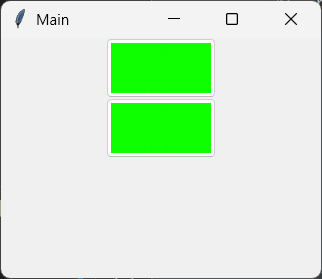

- `name`参数，字符串类型，表示控件的内部名称。

- `padding`参数，整数类型或者元素为整数类型的元组或者字符串类型，表示控件的内边距（边界到文字，单位为像素）。该参数为整数类型或者单元素元组或者字符串中只包含一个合法的整数时，表示四个方向上的内边距。该参数为双元素元组或者包含两个合法整数的字符串时，两个整数分别表示左右方向的内边距和上下方向的内边距。该参数为四元素元组或者包含四个合法整数的字符串时，四个整数分别表示左、上、右、下方向的内边距。

- `state`参数，字符串类型，表示控件的状态，仅支持`['disabled','normal','active']`中的值。示例如下：

  ```python3
  from tkinter import Tk
  from tkinter import ttk
  
  root = Tk()
  root.title('Main')
  width = 320
  height = 240
  root.geometry(f'{width}x{height}+{(root.winfo_screenwidth()-width)//2}+{(root.winfo_screenheight()-height)//2}')
  
  
  for i in ['disabled','normal','active']:
      ttk.Button(root,text=i,state=i).pack()
  
  root.mainloop()
  ```

  

- `style`参数，字符串类型，表示控件使用的主题样式。示例如下：

  ```python3
  from tkinter import Tk
  from tkinter import ttk
  
  root = Tk()
  root.title('Main')
  width = 320
  height = 240
  root.geometry(f'{width}x{height}+{(root.winfo_screenwidth()-width)//2}+{(root.winfo_screenheight()-height)//2}')
  
  ttk.Style(root).configure('Info.TButton',foreground='green')
  ttk.Button(root,text='click',style='Info.TButton').pack()
  
  root.mainloop()
  ```

  

- `takefocus`参数，布尔类型，表示该控件是否接收焦点（按`tab`键可以切换控件的焦点），默认为`True`。

- `text`参数，字符串类型或者浮点类型，表示控件显示的文字。

- `textvariable`参数，`Variable`类型（其派生类型`StringVar`等也可以）或者字符串类型，`text`参数的变量绑定版本。

- `underline`参数，整数类型，表示给指定索引值的字符添加下划线，用于菜单项的快捷键绑定，默认为`-1`。

- `width`参数，整数类型，表示控件的宽度，单位为字符数。

该控件支持以下特有方法：

- `invoke`方法，模拟点击按钮（执行`command`参数的值）。

### 2.2 `tkinter.ttk.Checkbutton`多选框控件与`tkinter.ttk.Radiobutton`单选框控件

`tkinter.ttk.Checkbutton`的官方文档：https://tkdocs.com/pyref/ttk_checkbutton.html。

多选框控件的英文名字里带着'button'，实际上很多参数也和按钮控件一样，只是该控件在使用时还是一个多选框应该有的表现。

该控件中需要注意的部分参数（其他同名参数可以参考前面章节介绍的控件，完整的参数用法可以参考 https://www.tcl-lang.org/man/tcl8.6/TkCmd/ttk_checkbutton.htm）：

- `variable`参数，`Variable`类型（其派生类型`StringVar`等也可以），表示多选框当前状态绑定的变量。
- `offvalue`参数，任意类型，表示多选框非勾选状态时，其绑定变量的值，默认为`0`。
- `onvalue`参数，任意类型，表示多选框勾选状态时，其绑定变量的值，默认为`1`。

该控件支持以下特有方法：

- `invoke`方法，模拟点击多选框（执行`command`参数的值，同时切换多选状态）。

示例如下：

```python3
from tkinter import Tk,Variable
from tkinter import ttk

root = Tk()
root.title('Main')
width = 320
height = 240
root.geometry(f'{width}x{height}+{(root.winfo_screenwidth()-width)//2}+{(root.winfo_screenheight()-height)//2}')

value = Variable(value='选中')
button = ttk.Checkbutton(root,text='check',variable=value,offvalue='未选中',onvalue='选中')
button.pack()

ttk.Label(root,textvariable=value).pack()

root.mainloop()
```


`tkinter.ttk.Radiobutton`的官方文档：https://tkdocs.com/pyref/ttk_radiobutton.html。

单选框控件与多选框控件用法类似，但是，想要实现单选话，用法上需要额外注意。

以下是该控件的部分参数（其他同名参数可以参考前面章节介绍的控件，完整的参数用法可以参考 https://www.tcl-lang.org/man/tcl8.6/TkCmd/ttk_radiobutton.htm）：

- `value`参数，表示当前选项的值，默认为`'1'`。
- `variable`参数，`Variable`类型（其派生类型`StringVar`等也可以），表示单选框绑定的变量。使用同一绑定对象的单选框为同一分组，同一分组的选项只能同时选定其中一个。

该控件支持以下特有方法：

- `invoke`方法，模拟点击单选框（执行`command`参数的值，同时切换单选状态）。

示例如下：

```python3
from tkinter import Tk,Variable
from tkinter import ttk

root = Tk()
root.title('Main')
width = 320
height = 240
root.geometry(f'{width}x{height}+{(root.winfo_screenwidth()-width)//2}+{(root.winfo_screenheight()-height)//2}')

value = Variable(value='1')
radio_button1 = ttk.Radiobutton(
    root,
    variable=value,
    value='0',
    text='0'
)
radio_button1.pack()

radio_button2 = ttk.Radiobutton(
    root,
    variable=value,
    text='1'
)
radio_button2.pack()


root.mainloop()
```

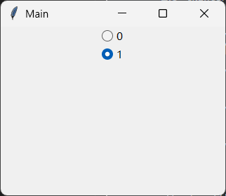

### 2.3 `tkinter.ttk.Entry`输入框控件

`tkinter.ttk.Entry`的官方文档：https://tkdocs.com/pyref/ttk_entry.html。

该控件中需要注意的部分参数（其他同名参数可以参考前面章节介绍的控件，完整的参数用法可以参考 https://www.tcl-lang.org/man/tcl8.6/TkCmd/ttk_entry.htm）：

- `exportselection`参数，布尔类型，表示是否在选中文本时自动复制到剪贴板（仅支持使用X11窗口管理器的Linux系统），默认为`False`。
- `foreground`参数、`font`参数，字符串类型，表示输入内容的颜色、字体。
- `justify`参数，字符串类型，仅支持`['left', 'center', 'right']`中的内容，表示内容的对齐方式（靠左、居中、靠右），默认为`'left'`。
- `show`参数，字符串类型，当该参数不为空时，表示输入的内容密文显示，参数值即为掩饰用的文字，默认为`''`。
- `textvariable`参数，`Variable`类型（其派生类型`StringVar`等也可以）或者字符串类型（为变量对象的`name`参数），表示输入框的内容。
- `validate`参数，字符串类型，仅支持`['none', 'focus', 'focusin', 'focusout', 'key', 'all']`中的内容，表示在什么时候（不验证、焦点变化、获得焦点、失去焦点、按任意键、前述所有条件）触发对内容的验证，默认为`'none'`。
- `validatecommand`参数，返回布尔值的可调用类型或者元组（第一个元素为funcid；从第二个元素开始，为使用脚本格式符表示的、传给可调用对象的参数，具体语法参考https://www.tcl-lang.org/man/tcl8.6/TkCmd/ttk_entry.htm#M42），表示触发内容验证时执行的操作。具体示例见下面的内容。
- `invalidcommand`参数，返回可调用类型或者元组（第一个元素为funcid；从第二个元素开始，为使用脚本格式符表示的、传给可调用对象的参数，具体语法参考https://www.tcl-lang.org/man/tcl8.6/TkCmd/ttk_entry.htm#M42），表示验证结果返回`False`时执行的操作。具体示例见下面的内容。

该控件支持以下特有方法：

- `validate`方法，返回内容的验证结果。

示例如下：

```python3
from tkinter import Tk,Variable
from tkinter import ttk

root = Tk()
root.title('Main')
width = 320
height = 240
root.geometry(f'{width}x{height}+{(root.winfo_screenwidth()-width)//2}+{(root.winfo_screenheight()-height)//2}')


value = Variable(value='1')
entry = ttk.Entry(
    root,
    textvariable=value,
    validate='key',
    validatecommand=lambda :value.get().isdigit(),
    invalidcommand=lambda:value.set('0')
)
entry.pack()

root.mainloop()
```

上面示例使用可调用对象作为验证方法，在输入的内容为纯数字时返回`True`，表示内容有效。如果输入的内容不是纯数字，则会自动将内容修改为`'0'`，表明内容无效。

`validatecommand`参数和`invalidcommand`参数还可以使用`register`方法注册的可调用对象（使用funcid组成的元组），这里简单介绍一下常用的脚本格式符：

- `'%P'`表示输入后的结果。
- `'%s'`表示输入前的内容。
- `'%S'`表示本次输入的内容。
- `'%W'`表示输入框的`name`属性，可以通过其父控件的`nametowidget`方法转换为控件对象。

于是，上面的示例可以改成这样

```python3
from tkinter import Tk,Variable
from tkinter import ttk

root = Tk()
root.title('Main')
width = 320
height = 240
root.geometry(f'{width}x{height}+{(root.winfo_screenwidth()-width)//2}+{(root.winfo_screenheight()-height)//2}')

value = Variable(value='1')
entry = ttk.Entry(
    root,
    textvariable=value,
    validate='key',
    validatecommand=(root.register(lambda p:p.isdigit()),'%P'),
    invalidcommand=(root.register(print),'%P','%s','%S')
)
entry.pack()

root.mainloop()
```

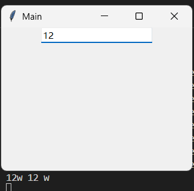

因为接收的参数不能直接修改，所以`invalidcommand`参数中注册的是内置函数`print`，只在输入内容非纯数字时，在终端打印输出三个参数的值。

也可以使用`'%W'`，实现基于验证结果修改内容颜色的效果：

```python3
from tkinter import Tk,Variable
from tkinter import ttk

root = Tk()
root.title('Main')
width = 320
height = 240
root.geometry(f'{width}x{height}+{(root.winfo_screenwidth()-width)//2}+{(root.winfo_screenheight()-height)//2}')

def check_it(p,w):
    if p.isdigit():
        root.nametowidget(w).configure(foreground='green')
        return True
    else:
        root.nametowidget(w).configure(foreground='red')
        return False

value = Variable(value='1')
entry = ttk.Entry(
    root,
    textvariable=value,
    validate='key',
    validatecommand=(root.register(check_it),'%P','%W'),
)
entry.pack()

root.mainloop()
```

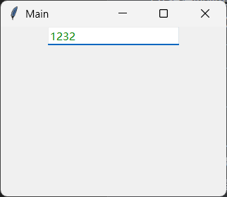

### 2.4 `tkinter.ttk.Combobox`下拉选择框控件

`tkinter.ttk.Combobox`的官方文档：https://tkdocs.com/pyref/ttk_combobox.html。

下拉选择框是基于输入框修改的，因为大部分输入框的参数，在下拉选择框中也能使用，以下是该控件相比于输入框不同、新增的部分参数（其他同名参数可以参考前面章节介绍的控件，完整的参数用法可以参考 https://www.tcl-lang.org/man/tcl8.6/TkCmd/ttk_combobox.htm）：

- `height`参数，整数类型，表示下拉框的高度（显示多少个选项，其余选项需要通过拖动滚动条查看，最少为`3`），默认为`10`。
- `postcommand`参数，可调用类型或者字符串类型（即funcid），点击弹出下拉框时执行的操作。
- `values`参数，列表类型或者元组类型，表示下拉框的选项。

该控件支持以下特有方法：

- `current`方法，设置当前选中的选项。该方法支持一个整数类型参数`newindex`，表示被选中选项的索引值。
- `set`方法，设置当前值。该方法支持一个字符串类型参数`value`，表示控件的输入框的当前值。

示例如下：

```python3
from tkinter import Tk
from tkinter import ttk

root = Tk()
root.title('Main')
width = 320
height = 240
root.geometry(f'{width}x{height}+{(root.winfo_screenwidth()-width)//2}+{(root.winfo_screenheight()-height)//2}')

combo = ttk.Combobox(
    root,
    values=[i for i in range(9)]
)
combo.pack()
combo.set('请选择')

root.mainloop()
```

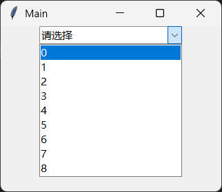

### 2.5 `tkinter.ttk.Frame`框架控件

`tkinter.ttk.Frame`的官方文档：https://tkdocs.com/pyref/ttk_frame.html。

框架控件是一个容器控件，常用于包装其他控件，配合不同的布局方法，可以做到容器内外的布局不同，进而实现复杂的组合布局。

以下是该控件的部分参数（其他同名参数可以参考前面章节介绍的控件，完整的参数用法可以参考 https://www.tcl-lang.org/man/tcl8.6/TkCmd/ttk_frame.htm）：

- `borderwidth`参数（`border`参数效果相同，但官方文档里只有`borderwidth`参数），整数类型或者字符串类型，表示边框的宽度。

- `relief`参数，字符串类型，仅支持`['raised', 'sunken', 'flat', 'ridge', 'solid', 'groove']`中的值，表示边框的样式。

- `padding`参数，整数类型或者字符串类型或者元素为前述类型的元组，表示内边距。需要注意的是，元组的元素数量不同，表示的内边距也不同：

  - 单个元素，表示四个方向上的内边距。
  - 两个元素，分别表示左右内边距、上下内边距。
  - 三个元素，分别表示左内边距、上下内边距、右内边距。
  - 四个元素，分别表示左内边距、上内边距、右内边距、下内边距。

- `height`参数和`width`参数，整数类型或者字符串类型，表示控件的高度和宽度。需要注意，默认这两个参数因为传播机制的存在而无法生效，需要使用`propagate`方法或者对应布局版本的`propagate`方法来禁用传播：

  ```python3
  from tkinter import Tk
  from tkinter import ttk
  
  root = Tk()
  root.title('Main')
  width = 320
  height = 240
  root.geometry(f'{width}x{height}+{(root.winfo_screenwidth()-width)//2}+{(root.winfo_screenheight()-height)//2}')
  
  frame = ttk.Frame(
      root,
      relief='ridge',
      width=300,
      height=200,
  )
  frame.pack()
  # 没有子控件时使用 frame.propagate(False)
  # 有子控件时，需要子控件对应布局版本的propagate方法
  frame.grid_propagate(False)
  
  ttk.Button(frame,text='click1').grid(column=0,row=0)
  
  root.mainloop()
  ```

  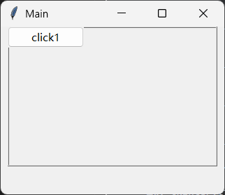

### 2.6 `tkinter.ttk.Label`标签控件

`tkinter.ttk.Label`的官方文档：https://tkdocs.com/pyref/ttk_label.html。

标签控件可以显示文本或者图片。

以下是该控件的部分参数（其他同名参数可以参考前面章节介绍的控件，完整的参数用法可以参考 https://www.tcl-lang.org/man/tcl8.6/TkCmd/ttk_label.htm）：

- `wraplength`参数，整数类型或者字符串类型，表示文字宽度超过多少像素时自动换行。
- `width`参数，整数类型，表示控件的宽度（字符数）。

示例如下：

```python3
from tkinter import Tk
from tkinter import ttk

root = Tk()
root.title('Main')
width = 320
height = 240
root.geometry(f'{width}x{height}+{(root.winfo_screenwidth()-width)//2}+{(root.winfo_screenheight()-height)//2}')

label = ttk.Label(
    root,
    text='Hello',
    relief='solid',
    width=10
)
label.pack()

root.mainloop()
```

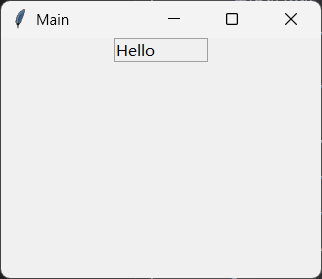

### 2.7 `tkinter.ttk.Scale`滑块控件

`tkinter.ttk.Scale`的官方文档：https://tkdocs.com/pyref/ttk_scale.html。

移动滑块控件的滑块，可以精准调整数值。

以下是该控件的部分参数（其他同名参数可以参考前面章节介绍的控件，完整的参数用法可以参考 https://www.tcl-lang.org/man/tcl8.6/TkCmd/ttk_scale.htm）：

- `command`参数，可调用类型或者字符串类型（即funcid），移动滑块时执行的操作。该参数对应的可调用对象接收一个字符串类型参数，表示滑块当前位置对应的值。
- `from_`参数和`to`参数，浮点类型，表示滑块起点、终点对应的值，默认为`0`、`1`。
- `value`参数，浮点类型，表示滑块的当前位置。
- `variable`参数，`value`参数的变量绑定版本。
- `length`参数，浮点类型或者字符串类型，表示控件的长度。
- `orient`参数，字符串类型，仅支持`['horizontal', 'vertical']`中的值，表示滑块控件的方向，默认为`'horizontal'`（水平方向）。

示例如下：

```python3
from tkinter import Tk
from tkinter import ttk

root = Tk()
root.title('Main')
width = 320
height = 240
root.geometry(f'{width}x{height}+{(root.winfo_screenwidth()-width)//2}+{(root.winfo_screenheight()-height)//2}')
ttk.Scale()

scale = ttk.Scale(
    root,
    from_=0,
    to=10,
    value=10,
    orient='vertical'
)
scale.pack()

root.mainloop()
```

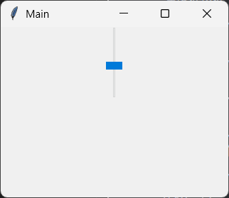

### 2.8 `tkinter.ttk.LabeledScale`标签滑块控件

`tkinter.ttk.LabeledScale`的官方文档：https://tkdocs.com/pyref/ttk_labeledscale.html。

相当于基于框架控件，添加了标签和滑块，可通过`label`属性访问标签控件，通过`scale`属性访问滑块控件。

以下是该控件（根据其继承情况写定语“相比于xxx不同、新增”）的部分参数（其他同名参数可以参考前面章节介绍的控件）：

- `variable`参数，`Variable`类型（一般使用派生类型`IntVar`、`DoubleVar`），表示滑块的当前位置。
- `from_`参数和`to`参数，浮点类型，表示滑块起点、终点对应的值，默认为`0`、`1`。

示例如下：

```python3
from tkinter import Tk,IntVar
from tkinter import ttk

root = Tk()
root.title('Main')
width = 320
height = 240
root.geometry(f'{width}x{height}+{(root.winfo_screenwidth()-width)//2}+{(root.winfo_screenheight()-height)//2}')
ttk.Scale()

value = IntVar(value=10)
labeled_scale = ttk.LabeledScale(
    root,
    from_=0,
    to=10,
    variable=value,
)
labeled_scale.pack()
labeled_scale.scale.configure(orient='vertical')

root.mainloop()
```

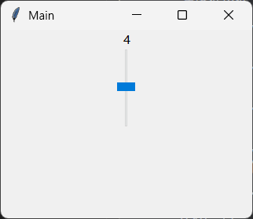

### 2.9 `tkinter.ttk.Labelframe`标签框架控件

`tkinter.ttk.Labelframe`的官方文档：https://tkdocs.com/pyref/ttk_labelframe.html。

标签框架控件的主体是显示边框的框架，可以在边框上添加文字或者其他控件。

以下是该控件的部分参数（其他同名参数可以参考前面章节介绍的控件，完整的参数用法可以参考 https://www.tcl-lang.org/man/tcl8.6/TkCmd/ttk_labelframe.htm）：

- `labelanchor`参数，字符串类型，仅支持`['nw', 'n', 'ne', 'en', 'e', 'es', 'se', 's', 'sw', 'ws', 'w', 'wn']`中的值，表示边框上文字或者控件的位置（上北下南左西右东），默认为`'nw'`。
- `text`参数，字符串类型，表示边框上的文字。
- `labelwidget`参数，表示边框上的控件。注意，控件优先于文字显示。

示例如下：

```python3
from tkinter import Tk
from tkinter import ttk

root = Tk()
root.title('Main')
width = 320
height = 240
root.geometry(f'{width}x{height}+{(root.winfo_screenwidth()-width)//2}+{(root.winfo_screenheight()-height)//2}')
ttk.Scale()

labeled_frame = ttk.Labelframe(
    root,
    text='Hello',
    width=200,
    height=200,
    #labelwidget=ttk.Label(text='World'),
    labelanchor='e'
)
labeled_frame.pack()

root.mainloop()
```

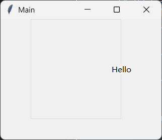

### 2.10 `tkinter.ttk.Spinbox`数值调整控件

`tkinter.ttk.Spinbox`的官方文档：https://tkdocs.com/pyref/ttk_spinbox.html。

数值调整控件基于输入框控件，因此主体是一个输入框。参数上有点像滑块控件，需要限定调整范围。

以下是该控件的部分参数（其他同名参数可以参考前面章节介绍的控件，完整的参数用法可以参考 https://www.tcl-lang.org/man/tcl8.6/TkCmd/ttk_spinbox.htm）：

- `from_`参数和`to`参数，浮点类型，表示数值的调整起止点，默认为`0`、`0`。
- `increment`参数，浮点类型，表示每次增减的值，默认为`1`。
- `format`参数，字符串类型，表示显示内容的格式（同Python中浮点数的格式化表达规则）。
- `values`参数，元素为字符串类型或者浮点类型的列表或者元组，表示允许的值。

该控件支持以下特有方法：

- `set`方法，设置控件的当前值，该方法支持`value`参数，表示当前值。

示例如下：

```python3
from tkinter import Tk
from tkinter import ttk

root = Tk()
root.title('Main')
width = 320
height = 240
root.geometry(f'{width}x{height}+{(root.winfo_screenwidth()-width)//2}+{(root.winfo_screenheight()-height)//2}')

spinbox = ttk.Spinbox(
    root,
    from_=0,
    to=10,
    format='%.2f',
    values=[1,3,5],
)
spinbox.pack()
spinbox.set(1)

root.mainloop()
```

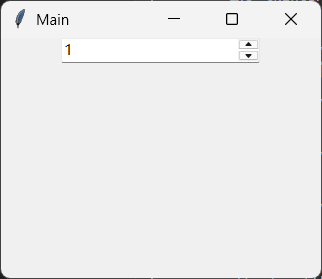

### 2.11 `tkinter.ttk.Separator`分隔线控件

`tkinter.ttk.Separator`的官方文档：https://tkdocs.com/pyref/ttk_separator.html。

分隔线控件用于分隔两个边界没那么明显的控件，可以显示一个明显的分隔线。

以下是该控件的部分参数（其他同名参数可以参考前面章节介绍的控件，完整的参数用法可以参考 https://www.tcl-lang.org/man/tcl8.6/TkCmd/ttk_separator.htm）：

- `orient`参数，字符串类型，仅支持`['horizontal', 'vertical']`中的值，表示控件的方向，默认为`'horizontal'`（水平方向）。

示例如下：

```python3
from tkinter import Tk
from tkinter import ttk

root = Tk()
root.title('Main')
width = 320
height = 240
root.geometry(f'{width}x{height}+{(root.winfo_screenwidth()-width)//2}+{(root.winfo_screenheight()-height)//2}')

frame1 = ttk.Frame(root,width=200,height=100)
frame1.pack()
frame1.pack_propagate(False)
ttk.Button(frame1,text='Hello').pack()

sep = ttk.Separator(root)
sep.pack(fill='x')

frame2 = ttk.Frame(root,width=200,height=100)
frame2.pack()
frame2.pack_propagate(False)
ttk.Button(frame2,text='World').pack()

root.mainloop()
```

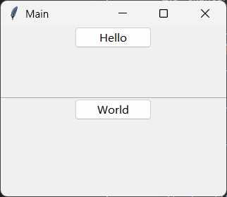

### 2.12 `tkinter.ttk.Progressbar`进度条控件

`tkinter.ttk.Progressbar`的官方文档：https://tkdocs.com/pyref/ttk_progressbar.html。

以下是该控件的部分参数（其他同名参数可以参考前面章节介绍的控件，完整的参数用法可以参考 https://www.tcl-lang.org/man/tcl8.6/TkCmd/ttk_progressbar.htm）：

- `maximum`参数，浮点类型，表示进度条的总步数。
- `mode`参数，字符串类型，仅支持`['determinate', 'indeterminate']`中的值，表示进度条的总步数是否为确定值，默认为`'determinate'`。如果该参数为`'indeterminate'`，则进度条会变成往复运动的小方块。
- `orient`参数，字符串类型，仅支持`['horizontal', 'vertical']`中的值，表示进度条控件的方向，默认为`'horizontal'`（水平方向）。
- `value`参数，浮点类型，表示进度条的当前进度。
- `variable`参数，`Variable`类型的派生类型`IntVar`或者`DoubleVar`，`value`参数的变量绑定版本。

该控件支持以下特有方法：

- `start`方法，进度条开始自动增加。该方法接收一个整数类型参数`interval`，表示每隔多少毫秒增加一步。
- `step`方法，进度条增加指定步数。该方法接收一个整数类型参数`amount`，表示增加多少步。
- `stop`方法，进度条停止自动增加。

示例如下：

```python3
from tkinter import Tk
from tkinter import ttk

root = Tk()
root.title('Main')
width = 320
height = 240
root.geometry(f'{width}x{height}+{(root.winfo_screenwidth()-width)//2}+{(root.winfo_screenheight()-height)//2}')


progress = ttk.Progressbar(
    root,
    maximum=100,
    value=40
)
progress.pack()
progress.start(100)

root.mainloop()
```

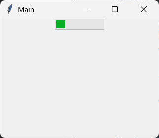

### 2.13 `tkinter.ttk.Sizegrip`窗口尺寸控件

`tkinter.ttk.Sizegrip`的官方文档：https://tkdocs.com/pyref/ttk_sizegrip.html。

拖动窗口尺寸控件的效果和拖动窗口右下角位置调整窗口尺寸的效果一样。

该控件其他同名参数可以参考前面章节介绍的控件，完整的参数用法可以参考 https://www.tcl-lang.org/man/tcl8.6/TkCmd/ttk_sizegrip.htm。

示例如下：

```python3
from tkinter import Tk
from tkinter import ttk

root = Tk()
root.title('Main')
width = 320
height = 240
root.geometry(f'{width}x{height}+{(root.winfo_screenwidth()-width)//2}+{(root.winfo_screenheight()-height)//2}')

sizegrip = ttk.Sizegrip(
    root
)
sizegrip.place(relx=1,rely=1,anchor='se')

root.mainloop()
```

注意窗口右下角多出来的内容，即为本节介绍的控件：

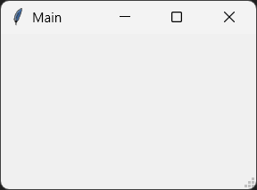

### 2.14 `tkinter.ttk.Scrollbar`滚动条控件

`tkinter.ttk.Scrollbar`的官方文档：https://tkdocs.com/pyref/ttk_scrollbar.html。

滚动条控件通常与具备滚动参数（`xscrollcommand`、`yscrollcommand`）和滚动方法（`xview`、`yview`）的控件组合使用。

以下是该控件的部分参数（其他同名参数可以参考前面章节介绍的控件，完整的参数用法可以参考 https://www.tcl-lang.org/man/tcl8.6/TkCmd/ttk_scrollbar.htm）：

- `command`参数，表示关联控件的滚动方法（`xview`、`yview`）。
- `orient`参数，字符串类型，仅支持`['horizontal', 'vertical']`中的值，表示控件的方向，默认为`'vertical'`（垂直方向）。

该控件支持以下特有方法：

- `set`方法，设置滚动条的状态，通常传给关联控件的滚动参数（`xscrollcommand`、`yscrollcommand`）。

示例如下：

```python3
from tkinter import Tk,Variable
from tkinter import ttk

root = Tk()
root.title('Main')
width = 320
height = 240
root.geometry(f'{width}x{height}+{(root.winfo_screenwidth()-width)//2}+{(root.winfo_screenheight()-height)//2}')

value = Variable(value=''.join(str(i) for i in range(19)))
entry = ttk.Entry(
    root,
    textvariable=value
)
entry.pack()

scrollbar = ttk.Scrollbar(root,orient='horizontal',command=entry.xview)
scrollbar.pack(fill='x')

entry.configure(xscrollcommand=scrollbar.set)

root.mainloop()
```

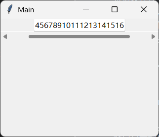

### 2.15 `tkinter.ttk.Treeview`树形图控件

`tkinter.ttk.Treeview`的官方文档：https://tkdocs.com/pyref/ttk_treeview.html。

树形图控件可以展示具有树形结构的数据，同时也可以作为表格控件来使用。

树形图控件的内容主要由以下几部分组成：

- 第一行为表头，可通过配置参数隐藏。
- 第二行开始为普通数据区，其中左边为树形图区，用于展示数据之间的树形结构，可通过配置参数隐藏；右边为表格区，和普通表格数据一样。
- 第一列为`'#0'`列，无法命名，但可以和表头一样通过设置`text`参数修改显示的文字。
- 第二列开始为可命名列，支持使用命名或者整数类型的索引值（不包含`'#0'`列，从0开始）或者`'#{索引值+1}'`作为列的唯一标识。

以下为控件内容的组成示意图：

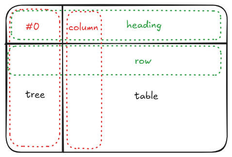

以下是该控件的部分参数（其他同名参数可以参考前面章节介绍的控件，完整的参数用法可以参考 https://www.tcl-lang.org/man/tcl8.6/TkCmd/ttk_treeview.htm）：

- `columns`参数，字符串类型、元素为字符串或者整数的列表、元素为字符串或者整数的元组，表示表格区及表头的每一列的唯一标识，其他方法的`column`参数可以使用该唯一标识表示对应列。

  如果参数为字符串，则表示普通数据区只有一列。

  如果元素为字符串，则该字符串为该列的唯一标识，不可重复。

  如果元素为整数，则该整数表示该列的列索引（从0开始），不可重复。

  如果列表或者元组的元素为字符串、整数混合，则字符串元素的索引为列索引，字符串元素对应的列可以同时使用列索引、字符串作为唯一标识；若是该列索引已经存在对应的整数元素，则字符串元素对应的列只能使用字符串作为唯一标识。

  比如，该参数的值为`[3,'Name','Ver',2]`，`'Name'`、`'Ver'`对应的索引值为1、2，但是2存在于列表中，所以`'Name'`对应的列可以使用`'Name'`或者1作为唯一标识，而`'Ver'`对应的列只能使用`'Ver'`作为唯一标识。

- `displaycolumns`参数，字符串类型、整数类型、元素为字符串或者整数的列表、元素为字符串或者整数的元组，表示表格区及表头显示的列的识别标识。不指定该参数的话，该参数默认为`'#all'`，即所有列都显示。

- `selectmode`参数，字符串类型，仅支持`['extended', 'browse', 'none']`中的值，表示选择节点（行）的模式（多选、单选、禁止选择），默认为`'extend'`。

- `show`参数，字符串类型、元组、列表，表示是否显示表头、树形图，默认为`('tree', 'headings')`。

  如果为字符串，仅支持`['tree', 'headings', 'tree headings', '']`中的值，表示显示树形图、显示表头、显示树形图和表头、不显示树形图和表头。

  如果为元组、列表，则元素只能为`['tree', 'headings']`中的值或者无元素（表示不显示树形图和表头）。

- `xscrollcommand`参数和`yscrollcommand`参数，可配合滚动条控件实现内容的滚动（具体用法参考滚动条控件）。

该控件支持以下特有方法（部分）：

- `heading`方法，设置指定列的表头。该方法支持以下参数（部分）：
  - `column`参数，字符串类型或者整数类型，表示对应的列。
  - `text`参数，字符串类型，表示表头显示的内容。从该参数开始，只能通过关键字传入。
  - `image`参数，`PhotoImage`类型或者字符串类型，表示表头额外显示的图片。当该参数为字符串类型时，表示的是注册在全局变量中的`PhotoImage`控件的`name`参数（或属性）。
  - `anchor`参数，字符串类型，仅支持`['nw', 'n', 'ne', 'w', 'center', 'e', 'sw', 's', 'se']`中的值，表示表头的表格中文字的对齐起点为哪个位置（上北下南左西右东），默认为`'center'`。
  - `command`参数，可调用类型或者字符串类型（即funcid），点击表头时执行的操作。
- `column`方法，设置指定列的样式。该方法支持以下参数（部分）：
  - `column`参数，字符串类型或者整数类型，表示对应的列。
  - `width`参数，整数类型，表示该列的宽度。从该参数开始，只能通过关键字传入。
  - `minwidth`参数，整数类型，表示该列的最小宽度。
  - `stretch`参数，布尔类型，表示控件尺寸变化使，是否该列的宽度来同步变化，默认为`True`。
  - `anchor`参数，字符串类型，仅支持`['nw', 'n', 'ne', 'w', 'center', 'e', 'sw', 's', 'se']`中的值，表示该列的表格中文字的对齐起点为哪个位置（上北下南左西右东），默认为`'w'`。
- `insert`方法，为指定节点添加子节点，并返回该节点的唯一标识。因为树形图的节点对应一行表格数据，所以，该方法也用于添加一行数据。该方法支持以下参数（部分）：
  - `parent`参数，字符串类型，表示该节点的父节点。
  - `index`参数，字符串`'end'`或者整数类型，表示在哪一行插入数据。如果为整数，表示插入位置的行索引，如果为`'end'`，表示在最后一行插入数据。
  - `iid`参数，字符串类型或者整数类型，表示该行的唯一标识符，如果未指定，则自动生成。
  - `id`参数，字符串类型或者整数类型，表示该节点的唯一标识符，如果未指定，则自动生成（格式为`'I{自增编号}'`）。从该参数开始，只能通过关键字传入。
  - `text`参数，字符串类型，表示该节点显示的文字内容。
  - `image`参数，`PhotoImage`类型或者字符串类型，表示该节点额外显示的图片。当该参数为字符串类型时，表示的是注册在全局变量中的`PhotoImage`控件的`name`参数（或属性）。
  - `values`参数，列表类型或者元组类型，表示表格区的数据。
  - `open`参数，布尔类型，表示该节点是否展开。
  - `tags`参数，字符串类型、元素为字符串的元组或者列表，表示该节点的标签，可通过'tag'前缀的方法影响包含指定标签的节点。
- `get_children`方法，获取指定节点的子节点。该方法支持以下参数：
  - `item`参数，字符串类型或者整数类型，表示节点的唯一标识符。
- `set_children`方法，设置指定节点的子节点。该方法支持以下参数：
  - `item`参数，字符串类型或者整数类型，表示节点的唯一标识符。
  - `*newchildren`参数，字符串类型或者整数类型，表示子节点的唯一标识符。
- `delete`方法，删除指定节点。该方法支持以下参数：
  - `*items`参数，字符串类型或者整数类型，表示节点的唯一标识符。
- `detach`方法，分离指定节点（不同于删除节点，可使用`reattach`方法或者`move`方法重新附加节点）。该方法支持以下参数：
  - `*items`参数，字符串类型或者整数类型，表示节点的唯一标识符。
- `exists`方法，检查指定节点是否附加在节点树上。该方法支持以下参数：
  - `item`参数，字符串类型或者整数类型，表示节点的唯一标识符。
- `identify`方法，用来识别指定坐标位置的指定类型组件。该方法支持以下参数：
  - `component`参数，字符串类型，表示识别什么类型的组件，支持`['item','row','column','element','region']`（单元格、行、列、元素、区域）。
  - `x`参数，整数类型，鼠标位置的X坐标。
  - `y`参数，整数类型，鼠标位置的Y坐标。
- `identify_row`方法，识别指定坐标位置的行。该方法支持以下参数：
  - `y`参数，整数类型，鼠标位置的Y坐标。
- `identify_column`方法，识别指定坐标位置的列。该方法支持以下参数：
  - `x`参数，整数类型，鼠标位置的X坐标。
- `identify_region`方法，识别指定坐标位置的区域。该方法支持以下参数：
  - `x`参数，整数类型，鼠标位置的X坐标。
  - `y`参数，整数类型，鼠标位置的Y坐标。
- `identify_element`方法，识别指定坐标位置的元素。该方法支持以下参数：
  - `x`参数，整数类型，鼠标位置的X坐标。
  - `y`参数，整数类型，鼠标位置的Y坐标。
- `index`方法，返回节点在其父节点所有的子节点中的索引。该方法支持以下参数：
  - `item`参数，字符串类型或者整数类型，表示节点的唯一标识符。
- `item`方法，返回指定节点。该方法支持以下参数：
  - `item`参数，字符串类型或者整数类型，表示节点的唯一标识符。
- `move`方法，移动指定节点。该方法支持以下参数：
  - `item`参数，字符串类型或者整数类型，表示节点的唯一标识符。
  - `parent`参数，字符串类型，表示该节点的父节点。
  - `index`参数，字符串`'end'`或者整数类型，表示在移动节点至哪一行。如果为整数，表示插入位置的行索引，如果为`'end'`，表示移动至最后一行。
- `next`方法，返回指定节点的弟弟节点。该方法支持以下参数：
  - `item`参数，字符串类型或者整数类型，表示节点的唯一标识符。
- `parent`方法，返回指定节点的父节点。该方法支持以下参数：
  - `item`参数，字符串类型或者整数类型，表示节点的唯一标识符。
- `prev`方法，返回指定节点的哥哥节点。该方法支持以下参数：
  - `item`参数，字符串类型或者整数类型，表示节点的唯一标识符。
- `see`方法，让指定节点可见（滚动至该节点）。该方法支持以下参数：
  - `item`参数，字符串类型或者整数类型，表示节点的唯一标识符。
- `selection`方法，返回选中的节点。
- `selection_set`方法，选择指定节点。该方法支持以下参数：
  - `*items`参数，字符串类型或者整数类型，表示节点的唯一标识符。
- `selection_add`方法，额外选择指定节点。该方法支持以下参数：
  - `*items`参数，字符串类型或者整数类型，表示节点的唯一标识符。
- `selection_remove`方法，从选择的节点中移除指定节点。该方法支持以下参数：
  - `*items`参数，字符串类型或者整数类型，表示节点的唯一标识符。
- `selection_toggle`方法，切换选择指定节点的选择状态。该方法支持以下参数：
  - `*items`参数，字符串类型或者整数类型，表示节点的唯一标识符。
- `set`方法，查询或修改指定节点对应列的值。该方法支持以下参数：
  - `item`参数，字符串类型或者整数类型，表示节点的唯一标识符。
  - `column`参数，字符串类型或者整数类型，表示节点对应的列。
  - `value`参数，表示节点对应列的值。
- `tag_bind`方法，给指定标签的节点设置响应函数。该方法支持以下参数：
  - `tagname`参数，字符串类型，表示节点的标签。
  - `sequence`参数，字符串类型，表示绑定的事件序列。
  - `callback`参数，接收一个参数的可调用类型或者字符串类型，表示被绑定事件的响应函数。
- `tag_configure`方法，更新指定标签的节点的样式。该方法支持以下参数：
  - `tagname`参数，字符串类型，表示节点的标签。
  - `background`参数，字符串类型，表示节点的背景色。
  - `foreground`参数，字符串类型，表示节点的前景色。
  - `font`参数，字符串类型，表示节点的字体。
  - `image`参数，`PhotoImage`类型或者字符串类型，表示节点额外显示的图片。当该参数为字符串类型时，表示的是注册在全局变量中的`PhotoImage`控件的`name`参数（或属性）。
- `tag_has`方法，返回包含指定标签的节点或者指定节点是否包含指定标签。该方法支持以下参数：
  - `tagname`参数，字符串类型，表示节点的标签。
  - `item`参数，字符串类型或者整数类型，表示节点的唯一标识符。

示例如下：

```python3
from tkinter import Tk
from tkinter import ttk

root = Tk()
root.title('Main')
width = 320
height = 240
root.geometry(f'{width}x{height}+{(root.winfo_screenwidth()-width)//2}+{(root.winfo_screenheight()-height)//2}')

treeview = ttk.Treeview(
    root,
    columns=['Name','Ver'],
    displaycolumns='#all',
    show='tree headings',
)
treeview.pack(expand=True, fill='both')

treeview.heading('#0',text='ID')
treeview.heading('Name',text='软件名')
treeview.heading('Ver',text='版本号')

treeview.column('#0',width=80)
treeview.column('Name',width=120)
treeview.column('Ver',width=120)

node1 = treeview.insert('',-1,text='3.12',values=('Python','3.12'),open=True)
treeview.insert(node1,-1,text='3.13',values=('Python','3.13'))

root.mainloop()
```

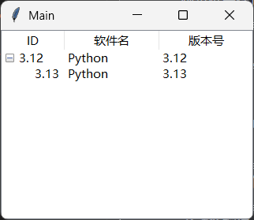

### 2.16 `tkinter.ttk.Menubutton`下拉菜单按钮控件

`tkinter.ttk.Menubutton`的官方文档：https://tkdocs.com/pyref/ttk_menubutton.html。

下拉菜单按钮控件看起来像是普通按钮，但点击该按钮只能弹出下拉菜单。

以下是该控件的部分参数（其他同名参数可以参考前面章节介绍的控件，完整的参数用法可以参考 https://www.tcl-lang.org/man/tcl8.6/TkCmd/ttk_menubutton.htm）：

- `direction`参数，字符串类型，仅支持`['above', 'below', 'left', 'right', 'flush']`中的值，表示菜单弹出的方向（上方、下方、左边、右边、中间），默认为`'below'`。
- `menu`参数，表示具体的菜单内容。

示例如下（菜单控件的完整用法见后面的章节）：

```python3
from tkinter import Tk, Menu
from tkinter import ttk

root = Tk()
root.title('Main')
width = 320
height = 240
root.geometry(
    f'{width}x{height}+{(root.winfo_screenwidth()-width)//2}+{(root.winfo_screenheight()-height)//2}'
)

menu = Menu(root, tearoff=False)
menu.add_command(label='子菜单1')
menu.add_command(label='子菜单2')

for direction in ['above', 'below', 'left', 'right', 'flush']:
    ttk.Menubutton(
        root,
        text=direction,
        menu=menu,
        direction=direction
    ).pack()

root.mainloop()
```

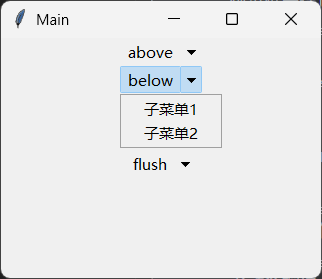

### 2.17 `tkinter.ttk.OptionMenu`下拉菜单控件

`tkinter.ttk.OptionMenu`的官方文档：https://tkdocs.com/pyref/ttk_optionmenu.html。

下拉菜单控件基于下拉菜单按钮控件，外观很像下拉菜单按钮控件，但是，下拉菜单控件的使用效果更像下拉选择框，选择不同的菜单项之后，下拉菜单控件显示的内容会变化为对应的菜单项。

以下是该控件相比于下拉菜单按钮控件不同、新增的部分参数（其他同名参数可以参考前面章节介绍的控件）：

- `variable`参数，`StringVar`类型，表示下拉菜单控件当前显示、选择的选项。
- `default`参数，字符串类型，表示下拉菜单控件默认显示、选择的选项。
- `*values`参数，表示下拉菜单控件的选项。
- `style`参数，字符串类型，表示控件使用的主题样式。
- `direction`参数，字符串类型，仅支持`['above', 'below', 'left', 'right', 'flush']`中的值，表示选项弹出的方向（上方、下方、左边、右边、中间），默认为`'below'`。
- `command`参数，接收一个字符串的可调用类型，表示选择选项时执行的操作。

该控件支持以下特有方法：

- `set_menu`方法，设置控件的选项。该方法支持以下参数：
  - `default`参数，字符串类型，表示下拉菜单控件默认显示、选择的选项。
  - `*values`参数，表示下拉菜单控件的选项。

示例如下：

```python3
from tkinter import Tk,StringVar
from tkinter import ttk

root = Tk()
root.title('Main')
width = 320
height = 240
root.geometry(
    f'{width}x{height}+{(root.winfo_screenwidth()-width)//2}+{(root.winfo_screenheight()-height)//2}'
)

value = StringVar(value='')
optmenu = ttk.OptionMenu(
    root,
    value,
    'a',
    *['a','b','c']
)
optmenu.pack()

root.mainloop()
```

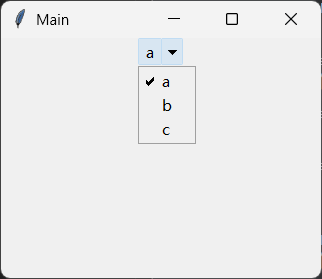

### 2.18 `tkinter.ttk.Notebook`选项卡控件

`tkinter.ttk.Notebook`的官方文档：https://tkdocs.com/pyref/ttk_notebook.html。

选项卡控件的参数（其他同名参数可以参考前面章节介绍的控件，完整的参数用法可以参考 https://www.tcl-lang.org/man/tcl8.6/TkCmd/ttk_notebook.htm）没有需要介绍的，该控件支持的特有方法反倒是使用该控件的主要方式：

- `add`方法，添加一个选项卡。该方法支持以下参数（部分）：

  - `child`参数，表示选项卡的主要内容（控件）。
  - `state`参数，字符串类型，仅支持`['normal', 'disabled', 'hidden']`中的值，表示子选项卡的状态（正常、禁用、隐藏）。从参数开始，只能通过关键字传入。
  - `sticky`参数，字符串类型，仅支持`[ 'n', 'w', 'e', 's','']`中的值，表示选项卡中的控件吸附在容器哪条边（上北下南左西右东，`''`表示居中不吸附），默认为`'w'`。
  - `text`参数，字符串类型，表示选项卡的标题。

- `insert`方法，插入一个选项卡。该方法支持以下参数（部分）：

  - `pos`参数，`tab_id`，表示选项卡插入的位置。
  - `child`参数，表示选项卡的主要内容（控件）。

  所谓`tab_id`，既可以是整数，表示选项卡位置的索引，也可以是选项卡的`child`参数对应的值。

- `forget`方法，移除指定选项卡。该方法支持以下参数：

  - `tab_id`参数，表示选项卡的`tab_id`。

- `hide`方法，隐藏指定选项卡。该方法支持以下参数：

  - `tab_id`参数，表示选项卡的`tab_id`。

- `index`方法，返回指定选项卡的索引值。该方法支持以下参数：

  - `tab_id`参数，表示选项卡的`tab_id`。

- `select`方法，选择指定选项卡。该方法支持以下参数：

  - `tab_id`参数，表示选项卡的`tab_id`。

- `tab`方法，修改指定选项卡的样式。该方法支持以下参数：

  - `tab_id`参数，表示选项卡的`tab_id`。
  - `state`参数，字符串类型，仅支持`['normal', 'disabled', 'hidden']`中的值，表示子选项卡的状态（正常、禁用、隐藏）。
  - `sticky`参数，字符串类型，仅支持`[ 'n', 'w', 'e', 's','']`中的值，表示选项卡中的控件吸附在容器哪条边（上北下南左西右东，`''`表示居中不吸附），默认为`'w'`。
  - `text`参数，字符串类型，表示选项卡的标题。

- `tabs`方法，返回所有选项卡。

- `enable_traversal`方法，启用选项卡专用的快捷键。

  需要在添加了选项卡之后调用，支持以下快捷键：

  - `ctrl + tab`键，切换下一个选项卡。
  - `ctrl + shift + tab`键，切换上一个选项卡。

示例如下：

```python3
from tkinter import Tk
from tkinter import ttk

root = Tk()
root.title('Main')
width = 320
height = 240
root.geometry(f'{width}x{height}+{(root.winfo_screenwidth()-width)//2}+{(root.winfo_screenheight()-height)//2}')

notebook = ttk.Notebook(
    root
)
notebook.pack(expand=True, fill='both')
notebook.add(
    ttk.Label(notebook,text='Hello'),
    text='Hello',
    sticky=''
)
notebook.add(
    ttk.Label(notebook,text='World'),
    text='World',
    sticky=''
)

root.mainloop()
```

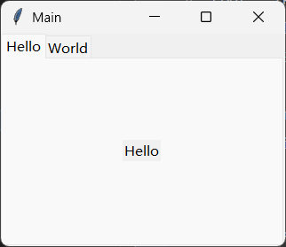

### 2.19 `tkinter.ttk.Panedwindow`嵌入窗口控件

`tkinter.ttk.Panedwindow`的官方文档：https://tkdocs.com/pyref/ttk_panedwindow.html。

嵌入窗口控件用法上类似选项卡控件，外观上很像平铺布局。

以下是该控件的部分参数（其他同名参数可以参考前面章节介绍的控件，完整的参数用法可以参考 https://www.tcl-lang.org/man/tcl8.6/TkCmd/ttk_panedwindow.htm）：

- `orient`参数，字符串类型，仅支持`['horizontal', 'vertical']`中的值，表示控件的方向，默认为`'vertical'`（垂直方向）。

该控件支持以下特有方法：

- `add`方法，添加一个窗格。该方法支持以下参数（部分）：
  - `child`参数，表示窗格的主要内容（控件）。
  - `weight`参数，整数类型，表示该窗格占总长度的权重（份数），默认为`0`，表示保持控件、窗格长度的原有尺寸，不自动调整。从参数开始，只能通过关键字传入。
- `remove`方法或者`forget`方法，移除一个窗格。该方法支持以下参数（部分）：
  - `child`参数，窗格的索引值或者窗格的主要内容（控件），表示窗格。
- `panes`方法，返回所有窗格。

示例如下：

```python3
from tkinter import Tk
from tkinter import ttk

root = Tk()
root.title('Main')
width = 320
height = 240
root.geometry(f'{width}x{height}+{(root.winfo_screenwidth()-width)//2}+{(root.winfo_screenheight()-height)//2}')

panedwindow = ttk.Panedwindow(
    root
)
panedwindow.pack(expand=True, fill='both')
panedwindow.add(
    ttk.Label(panedwindow,text='Hello'),
)
panedwindow.add(
    ttk.Label(panedwindow,text='World'),
)

root.mainloop()
```

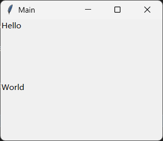

### 2.20 `tkinter.Tk`主窗口控件

本节开始，将介绍`tkinter`模块的顶层控件。

`tkinter.Tk`的官方文档：https://tkdocs.com/pyref/tk.html。

主窗口控件是所有控件中最特殊的，是一个tkinter程序必不可少的控件，同时也具备程序类的功能，负责消息循环。

该控件支持以下方法（部分）：

- `withdraw`方法，隐藏窗口。
- `deiconify`方法，显示窗口。
- `title`方法，修改窗口的标题。
- `state`方法，修改窗口的显示状态。该方法的参数仅支持`['normal', 'iconic', 'withdrawn', 'zoomed']`中的值（正常、最小化、隐藏、最大化）。
- `resizable`方法，修改窗口的尺寸。
- `iconbitmap`方法或者`iconphoto`方法，修改窗口的图标。

该控件支持的部分配置项（可使用`configure`方法更新，参考 https://tkdocs.com/pyref/tk.html）：

- `menu`，表示菜单栏使用的菜单。

以下为添加菜单栏的示例（菜单控件的完整用法见后面的章节）：

```python3
from tkinter import Tk,Menu,StringVar

root = Tk()
root.title('Main')

width = 320
height = 240
root.geometry(f'{width}x{height}+{(root.winfo_screenwidth()-width)//2}+{(root.winfo_screenheight()-height)//2}')

menu = Menu(root, tearoff=False)

sub_menu = Menu(menu, tearoff=False)
sub_menu.add_command(label='子菜单1')
sub_menu.add_checkbutton(label='多选')
sub_menu.add_separator()
value = StringVar(value='1')
sub_menu.add_radiobutton(label='单选1',variable=value,value='1')
sub_menu.add_radiobutton(label='单选2',variable=value,value='2')

sub_menu2 = Menu(menu, tearoff=False)
sub_menu2.add_command(label='子菜单2')
sub_menu.add_cascade(label='二级菜单',menu=sub_menu2)

menu.add_cascade(label='菜单',menu=sub_menu)

root.configure(menu=menu)

root.mainloop()
```

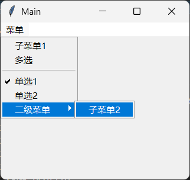

### 2.21 `tkinter.Toplevel`窗口控件

`tkinter.Toplevel`的官方文档：https://tkdocs.com/pyref/toplevel.html。

不同于主窗口控件的功能复杂，窗口控件简单不少，它只是一个窗口，通常用于创建一个独立的窗口或者对话框。不过，对于使用对话框的情况，更推荐尝试第三章中的对话框，而不是使用窗口控件，除非对话框功能简单、需要定制对话框中的控件。

该控件的参数（其他同名参数可以参考前面章节介绍的控件，完整的参数用法可以参考 https://www.tcl-lang.org/man/tcl8.6/TkCmd/toplevel.htm）、支持的方法与主窗口控件基本相同。

注意，如果在全局环境中创建该控件，则运行主窗口的`mainloop`方法时会自动显示。

示例如下：

```python3
from tkinter import Tk,Menu,StringVar,Toplevel,ttk


root = Tk()
root.title('Main')

width = 320
height = 240
root.geometry(f'{width}x{height}+{(root.winfo_screenwidth()-width)//2}+{(root.winfo_screenheight()-height)//2}')

menu = Menu(root, tearoff=False)

sub_menu = Menu(menu, tearoff=False)
sub_menu.add_command(label='子菜单1')
sub_menu.add_checkbutton(label='多选')
sub_menu.add_separator()
value = StringVar(value='1')
sub_menu.add_radiobutton(label='单选1',variable=value,value='1')
sub_menu.add_radiobutton(label='单选2',variable=value,value='2')

sub_menu2 = Menu(menu, tearoff=False)
sub_menu2.add_command(label='子菜单2')
sub_menu.add_cascade(label='二级菜单',menu=sub_menu2)

menu.add_cascade(label='菜单',menu=sub_menu)

def sub_window():
    toplevel = Toplevel(root,menu=menu)
    toplevel.title('Sub')
    toplevel.geometry(f'{width}x{height}+{(toplevel.winfo_screenwidth()-width)//2}+{(toplevel.winfo_screenheight()-height)//2}')
    toplevel.focus()

ttk.Button(root,text='显示子窗口',command=sub_window).pack()

root.mainloop()
```

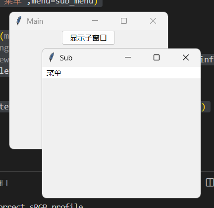

### 2.22 `tkinter.Menu`菜单控件

`tkinter.Menu`的官方文档：https://tkdocs.com/pyref/menu.html。

以下是该控件的部分参数（其他同名参数可以参考前面章节介绍的控件，完整的参数用法可以参考 https://www.tcl-lang.org/man/tcl8.6/TkCmd/menu.htm）：

- `activebackground`参数，字符串类型，表示鼠标悬停在菜单项上时，菜单项的背景颜色。
- `activeborderwidth`参数，字符串类型或者整数类型，表示菜单项的边框宽度。
- `activeforeground`参数，字符串类型，表示鼠标悬停在菜单项上时，菜单项的前景颜色。
- `disabledforeground`参数，字符串类型，表示菜单项被禁用时，菜单项的背景颜色。
- `postcommand`参数，可调用类型或者字符串类型（即funcid），点击菜单项时额外执行的操作。
- `tearoff`参数，布尔类型，表示是否允许菜单控件显示为独立的窗口（需要点击内容为`'----'`的菜单项），默认为`True`。
- `tearoffcommand`参数，可调用类型或者字符串类型（即funcid），表示菜单控件显示为独立的窗口时执行的操作。
- `title`参数，字符串类型，表示菜单控件显示为独立的窗口时的窗口标题。

该控件支持以下特有方法（部分）：

- `add`方法，添加一个菜单项。该方法支持以下参数：

  - `itemType`参数，字符串类型，表示菜单项的类型，仅支持`['cascade', 'checkbutton', 'command', 'radiobutton', 'separator']`中的值。
  - `**kw`参数，表示菜单项相关的其他参数，具体参考下面其他的添加菜单项方法。

- `add_cascade`方法，添加一个二级菜单。该方法支持以下参数（部分）：

  - `accelerator`参数，字符串类型，表示显示在菜单项内容后的快捷键提示。注意，该参数只能提示该菜单项对应的快捷键，还需要额外绑定该快捷键对应的响应函数才能正常生效。

  - `columnbreak`参数，布尔类型，一般菜单只有一列，设置该参数可以增加一列，并将该菜单项放在新的一列中，默认为`False`。

  - `command`参数，可调用类型，表示点击该菜单项执行的操作。

    注意，因为包含二级菜单的菜单项只能展开二级菜单，所以该参数无效。

  - `image`参数，`PhotoImage`类型或者字符串类型，表示菜单项额外显示的图片。当该参数为字符串类型时，表示的是注册在全局变量中的`PhotoImage`控件的`name`参数（或属性）。

  - `label`参数，字符串类型，表示菜单项的内容。

  - `menu`参数，表示二级菜单对应的菜单控件。

  - `state`参数，字符串类型，仅支持`['normal', 'active', 'disabled']`中的值，表示菜单项的状态（正常、激活、禁用），默认为`'normal'`。

- `add_command`方法，添加一个菜单项。该方法支持以下参数（部分）：

  - `accelerator`参数，字符串类型，表示显示在菜单项内容后的快捷键提示。注意，该参数只能提示该菜单项对应的快捷键，还需要额外绑定该快捷键对应的响应函数才能正常生效。
  - `columnbreak`参数，布尔类型，一般菜单只有一列，设置该参数可以增加一列，并将该菜单项放在新的一列中，默认为`False`。
  - `command`参数，可调用类型，表示点击该菜单项执行的操作。
  - `image`参数，`PhotoImage`类型或者字符串类型，表示菜单项额外显示的图片。当该参数为字符串类型时，表示的是注册在全局变量中的`PhotoImage`控件的`name`参数（或属性）。
  - `label`参数，字符串类型，表示菜单项的内容。
  - `state`参数，字符串类型，仅支持`['normal', 'active', 'disabled']`中的值，表示菜单项的状态（正常、激活、禁用），默认为`'normal'`。

- `add_checkbutton`方法，添加一个具备多选框功能的菜单项。该方法支持以下参数（部分）：

  - `accelerator`参数，字符串类型，表示显示在菜单项内容后的快捷键提示。注意，该参数只能提示该菜单项对应的快捷键，还需要额外绑定该快捷键对应的响应函数才能正常生效。
  - `columnbreak`参数，布尔类型，一般菜单只有一列，设置该参数可以增加一列，并将该菜单项放在新的一列中，默认为`False`。
  - `command`参数，可调用类型，表示点击该菜单项执行的操作。
  - `image`参数，`PhotoImage`类型或者字符串类型，表示菜单项额外显示的图片。当该参数为字符串类型时，表示的是注册在全局变量中的`PhotoImage`控件的`name`参数（或属性）。
  - `label`参数，字符串类型，表示菜单项的内容。
  - `selectcolor`参数，字符串类型，表示勾选符号的颜色。
  - `state`参数，字符串类型，仅支持`['normal', 'active', 'disabled']`中的值，表示菜单项的状态（正常、激活、禁用），默认为`'normal'`。

- `add_radiobutton`方法，添加一个具备单选框功能的菜单项。该方法支持以下参数（部分）：

  - `accelerator`参数，字符串类型，表示显示在菜单项内容后的快捷键提示。注意，该参数只能提示该菜单项对应的快捷键，还需要额外绑定该快捷键对应的响应函数才能正常生效。
  - `columnbreak`参数，布尔类型，一般菜单只有一列，设置该参数可以增加一列，并将该菜单项放在新的一列中，默认为`False`。
  - `command`参数，可调用类型，表示点击该菜单项执行的操作。
  - `image`参数，`PhotoImage`类型或者字符串类型，表示菜单项额外显示的图片。当该参数为字符串类型时，表示的是注册在全局变量中的`PhotoImage`控件的`name`参数（或属性）。
  - `label`参数，字符串类型，表示菜单项的内容。
  - `selectcolor`参数，字符串类型，表示勾选符号的颜色。
  - `state`参数，字符串类型，仅支持`['normal', 'active', 'disabled']`中的值，表示菜单项的状态（正常、激活、禁用），默认为`'normal'`。

- `add_separator`方法，添加一个具备分隔线功能的菜单项。

- `insert`方法，插入一个菜单项。该方法支持以下参数：

  - `index`参数，整数类型，表示插入的位置（索引）。
  - `itemType`参数，字符串类型，表示菜单项的类型，仅支持`['cascade', 'checkbutton', 'command', 'radiobutton', 'separator']`中的值。
  - `**kw`参数，表示菜单项相关的其他参数，具体参考下面其他的插入菜单项方法。

- `insert_cascade`方法，在指定位置插入一个二级菜单，比`add_cascade`方法多一个表示插入位置（索引）的整数类型参数`index`。

- `insert_command`方法，在指定位置插入一个菜单项，比`add_command`方法多一个表示插入位置（索引）的整数类型参数`index`。

- `insert_checkbutton`方法，在指定位置插入一个具备多选框功能的菜单项，比`add_checkbutton`方法多一个表示插入位置（索引）的整数类型参数`index`。

- `insert_radiobutton`方法，在指定位置插入一个具备单选框功能的菜单项，比`add_radiobutton`方法多一个表示插入位置（索引）的整数类型参数`index`。

- `insert_separator`方法，在指定位置插入一个具备分隔线功能的菜单项，比`add_separator`方法多一个表示插入位置（索引）的整数类型参数`index`。

- `delete`方法，删除指定范围内的菜单项。该方法支持以下参数：

  - `index1`参数，整数类型，表示起点的位置（索引）。
  - `index2`参数，整数类型，表示终点的位置（索引）。该参数默认为`None`，相当于`index1`参数的值。

- `entryconfigure`方法或者`entryconfig`方法，配置指定索引值的菜单项。该方法支持以下参数：

  - `index`参数，整数类型，表示菜单项的索引。
  - `cnf`参数，字典类型，表示菜单项参数映射的字典。
  - `**kw`参数，表示菜单项的参数。

- `invoke`方法，模拟点击指定索引值的菜单项。该方法支持以下参数：

  - `index`参数，整数类型，表示菜单项的索引。

- `post`方法，在指定位置显示菜单（常用于模拟右键菜单、下拉菜单）。该方法支持以下参数：

  - `x`参数，整数类型，菜单显示位置的X坐标。
  - `y`参数，整数类型，菜单显示位置的Y坐标。

- `type`方法，返回指定索引值菜单项的类型。该方法支持以下参数：

  - `index`参数，整数类型，表示菜单项的索引。

- `unpost`方法，隐藏使用`post`方法显示的菜单。

- `xposition`方法，返回指定索引值菜单项的X坐标。该方法支持以下参数：

  - `index`参数，整数类型，表示菜单项的索引。

- `yposition`方法，返回指定索引值菜单项的Y坐标。该方法支持以下参数：

  - `index`参数，整数类型，表示菜单项的索引。

示例如下（右键菜单）：

```python3
from tkinter import Tk,Menu,StringVar

root = Tk()
root.title('Main')

width = 320
height = 240
root.geometry(f'{width}x{height}+{(root.winfo_screenwidth()-width)//2}+{(root.winfo_screenheight()-height)//2}')

menu = Menu(root, tearoff=False)

sub_menu = Menu(menu,tearoff=False)
sub_menu.add_command(label='子菜单1')
sub_menu.add_checkbutton(label='多选')
sub_menu.add_separator()
value = StringVar(value='1')
sub_menu.add_radiobutton(label='单选1',variable=value,value='1')
sub_menu.add_radiobutton(label='单选2',variable=value,value='2')

sub_menu2 = Menu(menu, tearoff=False)
sub_menu2.add_command(label='子菜单2')
sub_menu.add_cascade(label='二级菜单',menu=sub_menu2)

menu.add_cascade(label='菜单',menu=sub_menu)

root.configure(menu=menu)

root.bind('<Button-3>',lambda e:sub_menu.post(e.x_root,e.y_root))

root.mainloop()
```

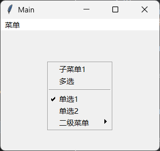

### 2.23 `tkinter.Text`文本控件

`tkinter.Text`的官方文档：https://tkdocs.com/pyref/text.html。

文本控件类似输入框，但是支持输入多行文本。

该控件的参数用法可以参考 https://www.tcl-lang.org/man/tcl8.6/TkCmd/text.htm。

示例如下：

```python3
from tkinter import Tk,Text

root = Tk()
root.title('Main')

width = 320
height = 240
root.geometry(f'{width}x{height}+{(root.winfo_screenwidth()-width)//2}+{(root.winfo_screenheight()-height)//2}')

Text(
    root,
).pack()

root.mainloop()
```

### 2.24 `tkinter.Listbox`列表控件

`tkinter.Listbox`的官方文档：https://tkdocs.com/pyref/listbox.html。

列表控件可以将内容以列表形式展示。

该控件的参数用法可以参考 https://www.tcl-lang.org/man/tcl8.6/TkCmd/listbox.htm。

示例如下：

```python3
from tkinter import Tk,Listbox,Variable

root = Tk()
root.title('Main')

width = 320
height = 240
root.geometry(f'{width}x{height}+{(root.winfo_screenwidth()-width)//2}+{(root.winfo_screenheight()-height)//2}')

value = Variable(value=[1,2,3])
Listbox(
    root,
    listvariable=value
).pack()

root.mainloop()
```

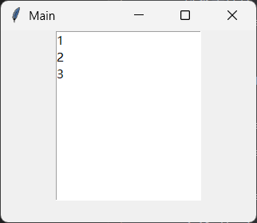

### 2.25 `tkinter.Canvas`画布控件

`tkinter.Canvas`的官方文档：https://tkdocs.com/pyref/canvas.html。

画布控件可以绘制一些简单的图形，也是海龟库的基础。

在正式学习之前，需要了解几个图形绘制的基本概念：

- 坐标系。在画布上，左上角为画布原点，横向为X方向，向右为正；纵向为Y方向，向下为正。
- 矩形的坐标。不管是绘制矩形还是绘制其他图形，抑或是某种矩形区域，和创建矩形相关的坐标点有两个，即矩形的左上角和矩形的右下角，要依次传入这两个点的坐标，顺序不可颠倒（即先传入的点的坐标必须小于后传入点的坐标）。

以下是该控件的部分参数（其他同名参数可以参考前面章节介绍的控件，完整的参数用法可以参考 https://www.tcl-lang.org/man/tcl8.6/TkCmd/canvas.htm）：

- `closeenough`参数，字符浮点，表示鼠标距离绘制的图形小于多少像素时算作鼠标在图形之上，默认为`1.0`。

该控件支持以下方法（部分）：

- `addtag_above`方法，给绘制顺序紧挨着指定图形、在指定图形之后的图形添加标签。

  在画布控件的所有图形中，每个图形都有ID（图形创建方法的返回值），也可以在创建时指定标签（`tags`参数的元素或者本身），如果想要对指定图形执行指定操作，则必须使用图形的ID或者标签。

  所有的图形按照创建顺序依次叠加，顺序靠后的图形在顺序靠前的图形之上。

  该方法支持以下参数：

  - `newtag`参数，字符串类型，表示新添加的标签。
  - `tagOrId`参数，字符串类型或者整数类型，表示图形的标签或者ID。

- `addtag_all`方法，给所有图形添加标签。该方法支持以下参数：

  - `newtag`参数，字符串类型，表示新添加的标签。

- `addtag_below`方法，给绘制顺序紧挨着指定图形、在指定图形之前的图形添加标签。该方法支持以下参数：

  - `newtag`参数，字符串类型，表示新添加的标签。
  - `tagOrId`参数，字符串类型或者整数类型，表示图形的标签或者ID。

- `addtag_closest`方法，给距离指定点最近的图形添加标签。该方法支持以下参数：

  - `newtag`参数，字符串类型，表示新添加的标签。
  - `x`参数，整数类型，表示点的X坐标。
  - `y`参数，整数类型，表示点的Y坐标。
  - `halo`参数，整数类型，表示点的判定半径，默认为`None`，即`0`。
  - `start`参数，字符串类型或者整数类型，表示图形的标签或者ID，如果符合条件的图形不止一个，所有符合条件的图形按照创建顺序组成一个列表，创建顺序在该图形之前的（不含该图形，如果该图形是第一个，则最后一个图形被当作该图形前面的图形），会被当作符合条件的唯一结果，否则使用创建顺序在最后的图形作为唯一结果。

- `addtag_enclosed`方法，给完全在指定矩形区域内的图形添加标签。该方法支持以下参数：

  - `newtag`参数，字符串类型，表示新添加的标签。
  - `x1`参数，浮点类型，表示矩形区域左上角的X坐标。
  - `y1`参数，浮点类型，表示矩形区域左上角的Y坐标。
  - `x2`参数，浮点类型，表示矩形区域右下角的X坐标。
  - `y2`参数，浮点类型，表示矩形区域右下角的Y坐标。

- `addtag_overlapping`方法，给和指定矩形区域重叠的图形添加标签。该方法支持以下参数：

  - `newtag`参数，字符串类型，表示新添加的标签。
  - `x1`参数，浮点类型，表示矩形区域左上角的X坐标。
  - `y1`参数，浮点类型，表示矩形区域左上角的Y坐标。
  - `x2`参数，浮点类型，表示矩形区域右下角的X坐标。
  - `y2`参数，浮点类型，表示矩形区域右下角的Y坐标。

- `addtag_withtag`方法，给包含指定标签的图形添加标签。该方法支持以下参数：

  - `newtag`参数，字符串类型，表示新添加的标签。
  - `tagOrId`参数，字符串类型或者整数类型，表示图形的标签或者ID。

- `bbox`方法，返回完全包含指定图形且边界不与指定图形相交的矩形区域的坐标。该方法支持以下参数：

  - `tagOrId`参数，字符串类型或者整数类型，表示图形的标签或者ID。

- `canvasx`方法，将鼠标的X坐标转换为画布上的X坐标。该方法支持以下参数：

  - `screenx`参数，浮点类型，表示鼠标的X坐标。
  - `gridspacing`参数，整数类型，表示画布的网格间距，如果指定了该参数，得到的值会基于该参数值就近取整。

- `canvasy`方法，将鼠标的Y坐标转换为画布上的Y坐标。该方法支持以下参数：

  - `screeny`参数，浮点类型，表示鼠标的Y坐标。
  - `gridspacing`参数，整数类型，表示画布的网格间距，如果指定了该参数，得到的值会基于该参数值就近取整。

- `coords`方法，查询或修改指定图形的坐标。该方法支持以下参数：

  - `tagOrId`参数，字符串类型或者整数类型，表示图形的标签或者ID。
  - `*args`参数，依次表示对应点的X、Y坐标，如果没有指定这些参数，则返回构成图形的所有点的坐标。如果指定了这些参数，则这些参数分别对应创建图形时所需的点的X、Y坐标。

- `create_arc`方法，创建一个弧形并返回该图形的ID。该方法支持以下参数（部分参数，完整参数参考https://www.tcl-lang.org/man/tcl8.6/TkCmd/canvas.htm#M125）：

  - 第一个位置参数，浮点类型，表示矩形绘制区域左上角的X坐标。

  - 第二个位置参数，浮点类型，表示矩形绘制区域左上角的Y坐标。

  - 第三个位置参数，浮点类型，表示矩形绘制区域右下角的X坐标。

  - 第四个位置参数，浮点类型，表示矩形绘制区域右下角的Y坐标。

    注意，绘制弧形实际上是在矩形内制作内切圆（也可以是椭圆，这里为了方便理解，简化为圆），然后根据参数截取一部分弧形。

    如下图所示：

    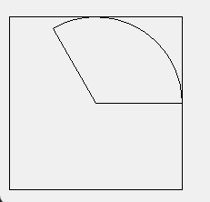

    矩形为绘制区域，X轴正方向为计算起始角度的起点（与`start`参数相关），根据`extent`参数的值确定弧形对应的圆心角，最终完成整个弧形。

    另外，除了直接传入四个位置参数，可以传入元素为X、Y坐标的元组（或者列表）来表示每个点，或者将这些元组（或者列表）放入元组（或者列表）后再传入。

  - `start`参数，浮点类型，表示弧形起始位置对应的圆心角。

  - `extent`参数，浮点类型，表示整个弧形对应的圆心角。

  - `style`参数，字符串类型，仅支持`'['pieslice','arc','chord']'`中的值，表示弧形的风格（扇形、只有圆弧、圆弧的起止点使用直线连接），默认为`'pieslice'`。

  - `fill`参数，字符串类型，表示填充区域的颜色（必须是封闭图形才有效）。

  - `activefill`参数，字符串类型，表示激活状态填充区域的颜色（必须是封闭图形才有效）。

  - `disabledfill`参数，字符串类型，表示禁用状态填充区域的颜色（必须是封闭图形才有效）。

  - `outline`参数，字符串类型，表示轮廓线的颜色。

  - `activeoutline`参数，字符串类型，表示激活状态轮廓线的颜色。

  - `disabledoutline`参数，字符串类型，表示禁用状态轮廓线的颜色。

  - `width`参数，整数类型，表示轮廓线的宽度。

  - `activewidth`参数，整数类型，表示激活状态轮廓线的宽度。

  - `disabledwidth`参数，整数类型，表示禁用状态轮廓线的宽度。

  - `state`参数，字符串类型，仅支持`'['normal','disabled','hidden']'`中的值，表示图形的状态（正常、禁用、隐藏），默认为`'normal'`。

  - `tags`参数，字符串类型、元素为字符串的列表或者元组，表示图形对应的标签。

- `create_bitmap`方法，创建一个位图（使用图片文件）并返回该图形的ID。该方法支持的参数参考 https://www.tcl-lang.org/man/tcl8.6/TkCmd/canvas.htm#M129 。

- `create_image`方法，创建一个图像（使用图片文件）并返回该图形的ID。该方法支持的参数参考 https://www.tcl-lang.org/man/tcl8.6/TkCmd/canvas.htm#M139 。

- `create_line`方法，创建一个直线并返回该图形的ID。该方法支持的参数参考 https://www.tcl-lang.org/man/tcl8.6/TkCmd/canvas.htm#M143 。

- `create_oval`方法，创建一个椭圆（也可以是圆）并返回该图形的ID。该方法支持的参数参考 https://www.tcl-lang.org/man/tcl8.6/TkCmd/canvas.htm#M150。

- `create_polygon`方法，创建一个多边形并返回该图形的ID。该方法支持的参数参考 https://www.tcl-lang.org/man/tcl8.6/TkCmd/canvas.htm#M151。

- `create_rectangle`方法，创建一个矩形并返回该图形的ID。该方法支持的参数参考 https://www.tcl-lang.org/man/tcl8.6/TkCmd/canvas.htm#M155。

- `create_text`方法，创建一个文本并返回该图形的ID。该方法支持的参数参考 https://www.tcl-lang.org/man/tcl8.6/TkCmd/canvas.htm#M156。

- `create_window`方法，创建一个控件并返回该图形的ID。该方法支持的参数参考 https://www.tcl-lang.org/man/tcl8.6/TkCmd/canvas.htm#M163。

- `dchars`方法，删除文本图形的部分字符。该方法支持以下参数：

  - 第一个位置参数，字符串类型或者整数类型，表示文本图形的标签或者ID。
  - 第二个位置参数，整数类型，表示删除开始的位置（索引，含当前位置）。
  - 第三个位置参数，整数类型，表示删除结束的位置（索引，含当前位置）。

- `delete`方法，删除指定图形。该方法支持以下参数：

  - `*args`参数，字符串类型或者整数类型，表示图形的标签或者ID（可传入多个）。

- `dtag`方法，删除指定图形的指定标签。该方法支持以下参数：

  - 第一个位置参数，字符串类型或者整数类型，表示图形的标签或者ID。
  - 第二个位置参数，字符串类型，表示要删除的标签。

- `find_above`方法，返回绘制顺序紧挨着指定图形、在指定图形之后的图形。该方法支持以下参数：

  - `tagOrId`参数，字符串类型或者整数类型，表示图形的标签或者ID。

- `find_all`方法，返回所有图形。

- `find_below`方法，返回绘制顺序紧挨着指定图形、在指定图形之前的图形。该方法支持以下参数：

  - `tagOrId`参数，字符串类型或者整数类型，表示图形的标签或者ID。

- `find_closest`方法，返回距离指定点最近的图形。该方法支持以下参数：

  - `x`参数，整数类型，表示点的X坐标。
  - `y`参数，整数类型，表示点的Y坐标。
  - `halo`参数，整数类型，表示点的判定半径，默认为`None`，即`0`。
  - `start`参数，字符串类型或者整数类型，表示图形的标签或者ID，如果符合条件的图形不止一个，所有符合条件的图形按照创建顺序组成一个列表，创建顺序在该图形之前的（不含该图形，如果该图形是第一个，则最后一个图形被当作该图形前面的图形），会被当作符合条件的唯一结果，否则使用创建顺序在最后的图形作为唯一结果。

- `find_enclosed`方法，返回完全在指定矩形区域内的图形。该方法支持以下参数：

  - `x1`参数，浮点类型，表示矩形区域左上角的X坐标。
  - `y1`参数，浮点类型，表示矩形区域左上角的Y坐标。
  - `x2`参数，浮点类型，表示矩形区域右下角的X坐标。
  - `y2`参数，浮点类型，表示矩形区域右下角的Y坐标。

- `find_overlapping`方法，返回和指定矩形区域重叠的图形。该方法支持以下参数：

  - `x1`参数，浮点类型，表示矩形区域左上角的X坐标。
  - `y1`参数，浮点类型，表示矩形区域左上角的Y坐标。
  - `x2`参数，浮点类型，表示矩形区域右下角的X坐标。
  - `y2`参数，浮点类型，表示矩形区域右下角的Y坐标。

- `find_withtag`方法，返回给包含指定标签的图形。该方法支持以下参数：

  - `tagOrId`参数，字符串类型或者整数类型，表示图形的标签或者ID。

- `insert`方法，在文本图形的指定位置插入字符。该方法支持以下参数：

  - 第一个位置参数，字符串类型或者整数类型，表示文本图形的标签或者ID。
  - 第二个位置参数，整数类型，表示插入字符的位置（索引）。
  - 第三个位置参数，字符串数类型，表示插入的内容。

- `itemcget`方法，获取指定参数的值。该方法支持以下参数：

  - `tagOrId`参数，字符串类型或者整数类型，表示图形的标签或者ID。
  - `option`参数，字符串类型，表示参数名。

- `itemconfig`方法或者`itemconfigure`方法，配置指定图形的参数。该方法支持以下参数：

  - `tagOrId`参数，字符串类型或者整数类型，表示图形的标签或者ID。
  - `cnf`参数，字典类型，表示图形参数映射的字典。
  - `**kw`参数，表示图形的参数。

- `move`方法，将图形移动。该方法支持以下参数：

  - 第一个位置参数，字符串类型或者整数类型，表示文本图形的标签或者ID。
  - 第二个位置参数，浮点类型，表示X坐标的增量。
  - 第三个位置参数，浮点类型，表示Y坐标的增量。

- `moveto`方法，将图形移动到指定位置。该方法支持以下参数：

  - `tagOrId`参数，字符串类型或者整数类型，表示图形的标签或者ID。
  - `x`参数，浮点类型，表示目标位置的X坐标。
  - `y`参数，浮点类型，表示目标位置的Y坐标。

- `postscript`方法，生成画布所有图形的PostScript（一种用于打印和图像输出的页面描述语言）。

- `scale`方法，缩放图形。该方法支持以下参数：

  - 第一个位置参数，字符串类型或者整数类型，表示文本图形的标签或者ID。
  - 第二个位置参数，浮点类型或者字符串类型，表示缩放原点的X坐标。
  - 第三个位置参数，浮点类型或者字符串类型，表示缩放原点的Y坐标。
  - 第四个位置参数，浮点类型，表示X方向的缩放比例。
  - 第五个位置参数，浮点类型，表示Y方向的缩放比例。

- `scan_mark`方法与`scan_dragto`方法配对使用，前者用于指定画布拖动的起点，后者用于指定拖动的终点。两个方法都支持`x`参数和`y`参数表示坐标，而后者额外支持`gain`参数，表示拖动距离的倍率（表示拖动一次的实际距离相当于拖动起止距离的多少倍，默认为`10`）。

- `select_adjust`方法，在文本图形中选择指定位置的字符。该方法支持以下参数：

  - 第一个位置参数，字符串类型或者整数类型，表示文本图形的标签或者ID。
  - 第二个位置参数，整数类型，表示被选择字符的位置（索引）。

- `select_clear`方法，在文本图形中清除字符的选择状态。

- `select_from`方法，在文本图形中设定选择字符的起点。该方法支持以下参数：

  - 第一个位置参数，字符串类型或者整数类型，表示文本图形的标签或者ID。
  - 第二个位置参数，整数类型，表示选择字符的起点位置（索引）。

- `select_item`方法，返回文本图形中被选择的字符。

- `select_to`方法，在文本图形中设定选择字符的终点。该方法支持以下参数：

  - 第一个位置参数，字符串类型或者整数类型，表示文本图形的标签或者ID。
  - 第二个位置参数，整数类型，表示选择字符的终点位置（索引）。

- `tag_bind`方法，给指定图形添加响应函数，`tagOrId`参数表示图形的标签或者ID，其余参数同`bind`方法。

- `tag_unbind`方法，给指定图形解绑响应函数，`tagOrId`参数表示图形的标签或者ID，其余参数同`unbind`方法。

- `tag_lower`方法或者`lower`方法，将指定图形移动到最下面，并紧挨着指定图形。该方法支持以下参数：

  - 第一个位置参数，字符串类型或者整数类型，表示图形的标签或者ID。
  - 第二个位置参数，字符串类型或者整数类型，表示紧挨着的图形的标签或者ID。

- `tag_raise`方法或者`tkraise`方法或者`lift`方法，将指定图形移动到最上面，并紧挨着指定图形。该方法支持以下参数：

  - 第一个位置参数，字符串类型或者整数类型，表示图形的标签或者ID。
  - 第二个位置参数，字符串类型或者整数类型，表示紧挨着的图形的标签或者ID。

- `type`方法，返回给指定图形的类型。该方法支持以下参数：

  - `tagOrId`参数，字符串类型或者整数类型，表示图形的标签或者ID。

示例如下：

```python3
from tkinter import Tk,Canvas,ttk,Variable

root = Tk()
root.title('Main')

width = 320
height = 240
root.geometry(f'{width}x{height}+{(root.winfo_screenwidth()-width)//2}+{(root.winfo_screenheight()-height)//2}')

value = Variable(value='')
ttk.Label(textvariable=value).pack()

canvas = Canvas(
    root,
)
canvas.pack(expand=True,fill='both')

canvas.create_polygon(
    10,10,
    200,200,
    10,200,
    tags='triangle'
)
canvas.tag_bind('all','<Button-1>',lambda e:value.set(e))

root.mainloop()
```

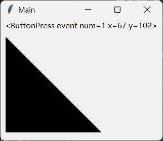

### 2.26 `tkinter.scrolledtext.ScrolledText`滚动文本控件

滚动文本控件基于文本控件实现，默认添加了滚动条，当内容的行数超过显示区域时，滚动条即时生效。

示例如下：

```python3
from tkinter import Tk
from tkinter.scrolledtext import ScrolledText

root = Tk()
root.title('Main')

width = 320
height = 240
root.geometry(f'{width}x{height}+{(root.winfo_screenwidth()-width)//2}+{(root.winfo_screenheight()-height)//2}')

ScrolledText(root).pack()

root.mainloop()
```

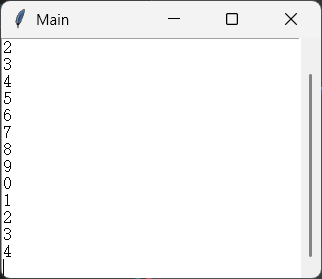

### 2.27 不推荐使用的控件

`tkinter`模块的顶层控件有很多，但不是所有顶层控件都推荐使用，以下这些是`tkinter.ttk`模块有相同控件或者tkinter中有替代控件的控件，不推荐继续使用。虽然不会像前面的控件一样单独介绍，但考虑到tkinter尚未移除，这里依然提供了对应的官网文档链接，以备不时之需：

- [`tkinter.Button`](https://tkdocs.com/pyref/button.html)，按钮控件。
- [`tkinter.Checkbutton`](https://tkdocs.com/pyref/checkbutton.html)，多选框控件。
- [`tkinter.Entry`](https://tkdocs.com/pyref/entry.html)，输入框控件。
- [`tkinter.Frame`](https://tkdocs.com/pyref/frame.html)，框架控件。
- [`tkinter.Label`](https://tkdocs.com/pyref/label.html)，标签控件。
- [`tkinter.LabelFrame`](https://tkdocs.com/pyref/labelframe.html)，标签框架控件。
- [`tkinter.Menubutton`](https://tkdocs.com/pyref/menubutton.html)，下拉菜单按钮控件。
- [`tkinter.Message`](https://tkdocs.com/pyref/message.html)，信息控件，推荐使用标签控件代替。
- [`tkinter.OptionMenu`](https://tkdocs.com/pyref/optionmenu.html)，下拉菜单控件。
- [`tkinter.PanedWindow`](https://tkdocs.com/pyref/panedwindow.html)，嵌入窗口控件。
- [`tkinter.Radiobutton`](https://tkdocs.com/pyref/radiobutton.html)，单选框控件。
- [`tkinter.Scale`](https://tkdocs.com/pyref/scale.html)，滑块控件。
- [`tkinter.Scrollbar`](https://tkdocs.com/pyref/scrollbar.html)，滚动条控件。
- [`tkinter.Spinbox`](https://tkdocs.com/pyref/spinbox.html)，数值调整控件。

## 3 tkinter的对话框

对话框的用法与控件用法不同：大部分对话框无需构建具备基本结构的tkinter程序，就能直接使用。

### 3.1 `tkinter.filedialog`模块

该模块的类、方法，提供了与文件、目录相关的对话框功能。

该模块提供以下类（部分）：

- `Directory`类，用于弹出目录选择对话框。该类支持的部分关键字参数（完整参数可以参考 https://www.tcl-lang.org/man/tcl8.6/TkCmd/chooseDirectory.htm）：

  - `title`参数，字符串类型，表示对话框的标题。
  - `initialdir`参数，字符串类型，表示对话框默认打开的路径。

  需要调用`show`方法才能显示对话框，并返回目录的路径；该方法支持的参数与对应的类相同。

- `Open`类和`SaveAs`类，用于弹出文件选择对话框，区别在于，前者必须是存在的文件，后者可以为不存在的文件。该类支持的部分关键字参数（完整参数可以参考 https://www.tcl-lang.org/man/tcl8.6/TkCmd/getOpenFile.htm）：

  - `title`参数，字符串类型，表示对话框的标题。

  - `initialdir`参数，字符串类型，表示对话框默认打开的路径。

  - `initialfile`参数，字符串类型，表示对话框默认选择的文件。

  - `defaultextension`参数，字符串类型，表示文件的默认扩展名（只适用于`SaveAs`类，需要与允许的文件类型一致），比如`'.py'`。

  - `filetypes`参数，元组或者列表，表示允许的文件类型。

    该参数的元素为元组或者列表，表示一种文件类型。对于每种文件类型，第一元素为字符串，表示文件类型的描述，第二元素表示文件类型筛选器（语法为`'*.{后缀}'`），可以是字符串（一种文件类型对应一种后缀）或者元素为字符串的元组或者列表（一种文件类型对应多种后缀）。以下为合法的参数值：

    - ```python3
      [
          ['Python文件','*.py'],
          ['C文件','*.c']
      ]
      ```

    - ```python3
      [
          [
              'Python文件',		
              [
                  '*.py',
                  '*.pyc'
              ]
          ]
      ]
      ```

  - `multiple`参数，布尔类型，表示是否允许打开多个文件。

  - `typevariable`参数，`StringVar`类型或者字符串类型，表示默认的文件类型，值应当与文件类型的描述相同。

    注意，如果想要使用该参数，则需要创建主窗口，并设置`StringVar`对象的父控件。

  需要调用`show`方法才能显示对话框，并返回文件的路径；该方法支持的参数与对应的类相同。

如果觉得使用类比较麻烦（需要创建实例并调用`show`方法才能得到结果，都没有参数提示），可以试试该模块提供的方法（提供参数提示）：

- `askdirectory`方法，目录选择对话框。
- `askopenfile`方法，文件选择对话框，返回打开的文件。
- `askopenfilename`方法，文件选择对话框，返回文件路径。
- `askopenfiles`方法，多文件选择对话框，返回打开文件的列表。
- `askopenfilenames`方法，多文件选择对话框，返回文件路径的列表。
- `asksaveasfile`方法，文件保存对话框，返回打开的文件。
- `asksaveasfilename`方法，文件保存对话框，返回文件路径。

以下为示例：

```python3
from tkinter.filedialog import askopenfile

with askopenfile(
        filetypes=[
            ['Python文件', '*.py'],
            ['C文件', '*.c']
        ]
    ) as f:
    print(''.join([i.encode('GBK').decode('utf-8') for i in f.readlines()]))
```

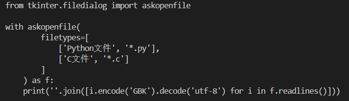

### 3.2 `tkinter.messagebox`模块

该模块提供创建系统提示框的功能。

该模块提供以下方法：

- `showinfo`方法，显示一个信息提示框。该方法支持以下参数（部分）：
  - `title`参数，字符串类型，表示对话框的标题。
  - `message`参数，字符串类型，表示对话框的内容。
  - `detail`参数，字符串类型，表示对话框内容的补充内容。
  - `icon`参数，字符串类型，仅支持`['error', 'info', 'question', 'warning']`中的值，表示对话框左边的图标，默认为`'info'`。

- `showwarning`方法，显示一个警告提示框。该方法支持以下参数（部分）：
  - `title`参数，字符串类型，表示对话框的标题。
  - `message`参数，字符串类型，表示对话框的内容。
  - `detail`参数，字符串类型，表示对话框内容的补充内容。
  - `icon`参数，字符串类型，仅支持`['error', 'info', 'question', 'warning']`中的值，表示对话框左边的图标，默认为`'warning'`。
- `showerror`方法，显示一个错误提示框。该方法支持以下参数（部分）：
  - `title`参数，字符串类型，表示对话框的标题。
  - `message`参数，字符串类型，表示对话框的内容。
  - `detail`参数，字符串类型，表示对话框内容的补充内容。
  - `icon`参数，字符串类型，仅支持`['error', 'info', 'question', 'warning']`中的值，表示对话框左边的图标，默认为`'error'`。
- `askquestion`方法，显示一个包含是、否两个按钮的提示框，并根据点击按钮的情况返回对应的值。该方法支持以下参数（部分）：
  - `title`参数，字符串类型，表示对话框的标题。
  - `message`参数，字符串类型，表示对话框的内容。
  - `detail`参数，字符串类型，表示对话框内容的补充内容。
  - `icon`参数，字符串类型，仅支持`['error', 'info', 'question', 'warning']`中的值，表示对话框左边的图标，默认为`'question'`。
  - `default`参数，字符串类型，仅支持`['yes', 'no']`中的值，表示对话框默认获得焦点的按钮，默认为`'yes'`。
- `askokcancel`方法，显示一个包含确认、取消两个按钮的提示框，并根据点击按钮的情况返回布尔值。该方法支持以下参数（部分）：
  - `title`参数，字符串类型，表示对话框的标题。
  - `message`参数，字符串类型，表示对话框的内容。
  - `detail`参数，字符串类型，表示对话框内容的补充内容。
  - `icon`参数，字符串类型，仅支持`['error', 'info', 'question', 'warning']`中的值，表示对话框左边的图标，默认为`'question'`。
  - `default`参数，字符串类型，仅支持`['ok', 'cancel']`中的值，表示对话框默认获得焦点的按钮，默认为`'ok'`。
- `askyesno`方法，显示一个包含是、否两个按钮的提示框，并根据点击按钮的情况返回布尔值。该方法支持以下参数（部分）：
  - `title`参数，字符串类型，表示对话框的标题。
  - `message`参数，字符串类型，表示对话框的内容。
  - `detail`参数，字符串类型，表示对话框内容的补充内容。
  - `icon`参数，字符串类型，仅支持`['error', 'info', 'question', 'warning']`中的值，表示对话框左边的图标，默认为`'question'`。
  - `default`参数，字符串类型，仅支持`['yes', 'no']`中的值，表示对话框默认获得焦点的按钮，默认为`'yes'`。
- `askyesnocancel`方法，显示一个包含是、否、取消三个按钮的提示框，并根据点击按钮的情况返回布尔值或者`None`（对应取消按钮）。该方法支持以下参数（部分）：
  - `title`参数，字符串类型，表示对话框的标题。
  - `message`参数，字符串类型，表示对话框的内容。
  - `detail`参数，字符串类型，表示对话框内容的补充内容。
  - `icon`参数，字符串类型，仅支持`['error', 'info', 'question', 'warning']`中的值，表示对话框左边的图标，默认为`'question'`。
  - `default`参数，字符串类型，仅支持`['yes', 'no', 'cancel']`中的值，表示对话框默认获得焦点的按钮，默认为`'yes'`。
- `askretrycancel`方法，显示一个包含重试、取消两个按钮的提示框，并根据点击按钮的情况返回布尔值。该方法支持以下参数（部分）：
  - `title`参数，字符串类型，表示对话框的标题。
  - `message`参数，字符串类型，表示对话框的内容。
  - `detail`参数，字符串类型，表示对话框内容的补充内容。
  - `icon`参数，字符串类型，仅支持`['error', 'info', 'question', 'warning']`中的值，表示对话框左边的图标，默认为`'warning'`。
  - `default`参数，字符串类型，仅支持`['retry', 'cancel']`中的值，表示对话框默认获得焦点的按钮，默认为`'retry'`。

示例如下：

```python3
from tkinter.messagebox import askyesno

print(
    askyesno(
        title='确认',
        message='请回答以下问题：',
        detail='是否继续？',
    )
)
```

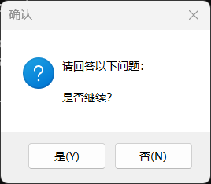

### 3.3 `tkinter.simpledialog`模块

该模块提供创建带输入框且限定输入内容的对话框的功能。

该模块提供以下方法：

- `askfloat`方法，显示一个只允许输入数字的对话框，点击确认返回输入的内容，点击取消返回`None`。该方法支持以下参数（部分）：
  - `title`参数，字符串类型，表示对话框的标题。
  - `prompt`参数，字符串类型，表示对话框的内容。
  - `initialvalue`参数，浮点类型，表示输入框的默认值。
  - `minvalue`参数，浮点类型，表示输入框的最小值。
  - `maxvalue`参数，浮点类型，表示输入框的最大值。
- `askinteger`方法，显示一个只允许输入整数的对话框，点击确认返回输入的内容，点击取消返回`None`。该方法支持以下参数（部分）：
  - `title`参数，字符串类型，表示对话框的标题。
  - `prompt`参数，字符串类型，表示对话框的内容。
  - `initialvalue`参数，整数类型，表示输入框的默认值。
  - `minvalue`参数，整数类型，表示输入框的最小值。
  - `maxvalue`参数，整数类型，表示输入框的最大值。
- `askstring`方法，显示一个允许输入任意内容的对话框，点击确认返回输入的内容，点击取消返回`None`。该方法支持以下参数（部分）：
  - `title`参数，字符串类型，表示对话框的标题。
  - `prompt`参数，字符串类型，表示对话框的内容。
  - `initialvalue`参数，字符串类型，表示输入框的默认值。
  - `show`参数，字符串类型，当该参数不为空时，表示输入的内容密文显示，参数值即为掩饰用的文字，默认为`''`。

示例如下：

```python3
from tkinter.simpledialog import askfloat

print(
    askfloat(
        title='确认',
        prompt='请回答以下问题：',
        initialvalue=10
    )
)
```

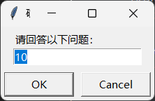

### 3.4 `tkinter.colorchooser`模块

该模块提供了创建颜色选择对话框的功能。

`Chooser`类用于弹出颜色选择对话框。该类支持的部分关键字参数（完整参数可以参考 https://www.tcl-lang.org/man/tcl8.6/TkCmd/chooseColor.htm）：

- `title`参数，字符串类型，表示对话框的标题。
- `initialcolor`参数，字符串类型或者三元素元组，表示对话框默认选择的颜色。颜色的表达方式有三种（支持的颜色参考https://www.tcl-lang.org/man/tcl8.6/TkCmd/colors.htm）：
  - 颜色名，比如`'red'`。
  - 使用元组表示颜色的RGB分量，比如`(255, 0, 0)`。
  - '#'开头，将RGB分量转换为十六进制数字之后，拼接在一起的字符串，比如`'#ff0000'`。


`Chooser`类实例需要调用`show`方法才能显示对话框，并返回颜色的值；该方法支持的参数与对应的类相同。

当然，创建颜色选择对话框也可以使用简化的`askcolor`方法：

- `title`参数，字符串类型，表示对话框的标题。
- `color`参数，字符串类型或者三元素元组，表示对话框默认选择的颜色。

示例如下：

```python3
from tkinter.colorchooser import askcolor

print(
    askcolor(
        title='选择一个颜色',
        color='red'
    )
)
```

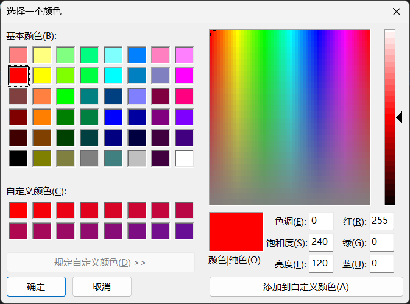

## 4 拾遗（随时更新）

虽说本教程是快速入门，但不代表本教程没有讲到的部分就一概不管。在实际开发、使用时，tkinter碍于其设计理念，还是有一些不及现代GUI框架的地方，有不少晦涩难懂的概念。因此，本章节主要聚焦于实际的开发问题，为这些问题带来答案。

### 4.1 （待定）


（未完待续）
