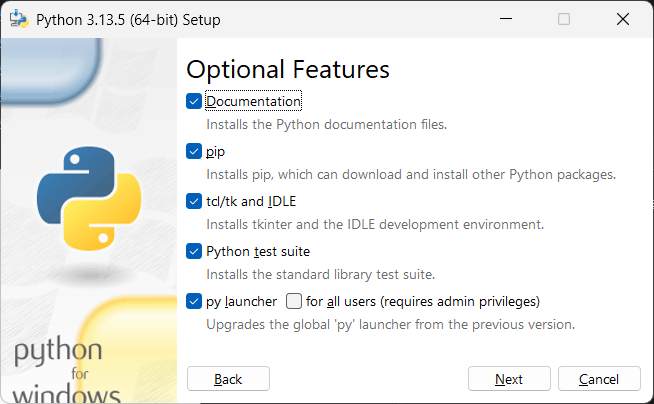

# 学tkinter记

## 0 为何而写

虽然已经有Qt、NiceGUI等更加现代、美观的GUI框架，但tkinter依然有不可替代的优势——内置。因为是内置的，所以不用额外安装，只要安装了Python，就可以直接使用。当然，网上和官方的教程不少，也有很多中文教程，学起来很容易。因此，本教程无意取代那些优秀的现有内容，更多是按照笔者的想法整合、补充相关内容。

本教材的主要内容，可能是找遍全网都没有答案的问题（有些夸张），也可能是看其他教程有感而发（就像读书笔记）。然后，以创作时间顺序作为更新顺序（确实有点像读书笔记或者日记），为每篇内容添加概括主要内容的标题（标题很重要，但不能做标题党）。最后，共同构成本教程（说白了就是拼好文）。

本教材主要以官方教程（ https://docs.python.org/zh-cn/3.13/library/tkinter.html ）为基准，依照笔者的思路搜罗网络的公开资料并作为参考，在此感谢所有无私的创作者。

## 1 tkinter的安装

这也许是最快开始的GUI框架了，居然不用介绍如何安装！开玩笑，本身内置在Python程序中，自然不需要安装。不过，话不能说绝了，虽然tkinter是默认安装的，但还是要确保万无一失，如果读者在安装Python程序时，点了自定义安装，想要少安装一些不必要的内容（比如自带文档和测试套件，没必要或者一开始用不到），切勿取消`tcl/tk and IDLE`这个选项（见下图），这个就是安装tkinter的选项。

为什么要重点强调一下安装呢？不同于其他Python的库，大部分内置库（主要是标准库）无法通过`pip`命令安装，因此，如果没在安装Python程序时安装这些库，后续只能重新运行安装程序才能安装，还是有点麻烦的。

## 2 Hello World 程序（构思中）

在编程语言界，万物始于神秘的字符串`'Hello World'`，这就像

（编程语言有helloworld的习俗，到了框架的学习，也未能免俗，介绍一下helloworld的基本用途、功能，解释一下这个习俗的背后含义，就像新生儿的第一声啼哭，是框架学习者的第一声问候，学习者入门了）

（语言风格轻松一些，内容偏口语化，）