# tkinter的快速入门教程

[toc]

## 0 为何而写

tkinter的教程很多，但想要快速入门的话，还是要看一会儿资料才能有个大概。于是，笔者想在三言两语说完基本用法、常用参数、常用方法，实现快速入门的目的，这才有了本教程。

本教程主要以官方教程（ https://docs.python.org/zh-cn/3.13/library/tkinter.html ）、入门教程（https://tkdocs.com/tutorial/onepage.html）、API手册（https://tkdocs.com/pyref/index.html）和Tcl的手册（https://www.tcl-lang.org/man/tcl8.6/contents.htm）为基准，依照笔者的思路搜罗网络的公开资料并作为参考。

## 1 基础知识

### 1.1 tkinter的安装

tkinter不能通过pip安装，只能在安装Python程序时一并安装，安装时切勿取消`tcl/tk and IDLE`这个选项（见下图），这个就是安装tkinter的选项。


### 1.2 tkinter程序的基本结构

tkinter程序也是类似“创建程序类实例-创建主窗口-添加控件-运行程序类实例循环方法”的结构：

```python3
from tkinter import Tk
from tkinter import ttk

root = Tk()
root.title('Main')
width = 320
height = 240
root.geometry(f'{width}x{height}+{(root.winfo_screenwidth()-width)//2}+{(root.winfo_screenheight()-height)//2}')
label = ttk.Label(root,text='Hello World')
label.pack()

root.mainloop()
```

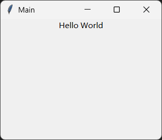

其中，`Tk`类就是程序类，同时也具备主窗口功能（可以理解为主窗口控件与程序类二合一）。创建、添加的控件想要显示，需要调用布局方法（`pack`方法就是其中一种）。`Tk`类实例的`mainloop`方法就是程序类实例的循环方法。

### 1.3 变量绑定

什么是变量绑定？

变量绑定即控件的参数与变量绑定，一旦变量发生变化，与之绑定的参数也会随之发生变化。

为什么要用变量绑定呢？

那是因为tkinter的控件的参数一般情况下不支持与变量绑定，比如按钮控件显示的文字对应`text`参数，直接将变量传给该参数，没法通过修改变量来修改显示的文字：

```python3
from tkinter import Tk,Variable
from tkinter import ttk

root = Tk()
root.title('Main')
width = 320
height = 240
root.geometry(f'{width}x{height}+{(root.winfo_screenwidth()-width)//2}+{(root.winfo_screenheight()-height)//2}')

button_var = 'click'

def change():
    global button_var
    button_var = 'close'
    print(button_var)

ttk.Button(root,tex=button_var).pack()
ttk.Button(root,text='change',command=change).pack()

root.mainloop()
```

想要让控件的相关参数与变量绑定，并且随着变量的变化实时刷新相关内容，就要使用`tkinter`模块提供的`Variable`类和其余几个'Var'为后缀的派生类（派生类指定了值的类型）创建变量对象。变量对象内部实现了值变化时自动刷新相关内容，并且支持`name`参数，可以注册内部名称。相应的，控件这边也只能将变量对象或者变量对象的`name`传给支持变量绑定的参数（'variable'为后缀的参数名）。示例如下：

```python3
from tkinter import Tk,Variable
from tkinter import ttk

root = Tk()
root.title('Main')
width = 320
height = 240
root.geometry(f'{width}x{height}+{(root.winfo_screenwidth()-width)//2}+{(root.winfo_screenheight()-height)//2}')
# 变量对象
button_var = Variable(name='button',value='close')
# 使用变量对象的内部名称
ttk.Button(root,text='click',textvariable='button').pack()
# 直接使用变量对象
ttk.Button(root,text='click',textvariable=button_var).pack()
# 使用变量对象的值，通过get方法，不会自动绑定
ttk.Button(root,text=button_var.get()).pack()
# 修改变量对象的值，通过set方法，
ttk.Button(root,text='change',command=lambda : button_var.set('click')).pack()

root.mainloop()
```

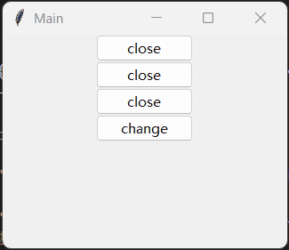

### 1.4 内部名称

如果控件有`name`参数，则该控件会自动注册到父控件的控件树中，控件的父控件可以使用`nametowidget`方法获取到该控件：

```python3
from tkinter import Tk
from tkinter import ttk

root = Tk()
root.title('Main')
width = 320
height = 240
root.geometry(f'{width}x{height}+{(root.winfo_screenwidth()-width)//2}+{(root.winfo_screenheight()-height)//2}')

ttk.Button(root,text='click',name='button').pack()

# 通过name获取控件，并修改显示的文字
root.nametowidget('button').configure(text='close')

root.mainloop()
```

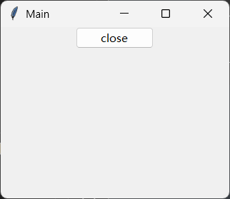

如果对象有`name`参数，支持使用该对象的参数若是同时支持字符串，则该参数也可以使用这些对象的内部名称（示例源于变量绑定的示例）：

```python3
from tkinter import Tk,Variable
from tkinter import ttk

root = Tk()
root.title('Main')
width = 320
height = 240
root.geometry(f'{width}x{height}+{(root.winfo_screenwidth()-width)//2}+{(root.winfo_screenheight()-height)//2}')
# 变量对象
button_var = Variable(name='button',value='close')
# 使用变量对象的内部名称
ttk.Button(root,text='click',textvariable='button').pack()
# 直接使用变量对象
ttk.Button(root,text='click',textvariable=button_var).pack()
# 使用变量对象的值，通过get方法，不会自动绑定
ttk.Button(root,text=button_var.get()).pack()
# 修改变量对象的值，通过set方法，
ttk.Button(root,text='change',command=lambda : button_var.set('click')).pack()

root.mainloop()
```

控件和对象的`name`参数都可以通过`_name`属性获取。

程序处于运行状态时，控件的`name`参数还可以通过`winfo_name`方法获取。

示例如下：

```python3
from tkinter import Tk,Variable
from tkinter import ttk

root = Tk()
root.title('Main')
width = 320
height = 240
root.geometry(f'{width}x{height}+{(root.winfo_screenwidth()-width)//2}+{(root.winfo_screenheight()-height)//2}')
# 变量对象
button_var = Variable(name='button_var',value='close')
# 使用变量对象的内部名称
button = ttk.Button(root,text='click',textvariable='button',name='ttk_button')

ttk.Label(root,text=f'{button_var._name=}\n{button._name=}\n{button.winfo_name()=}').pack()

root.mainloop()
```

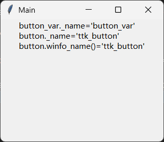

### 1.5 响应函数

给控件绑定响应函数有两种方法：

- 控件的`command`参数，与控件正常交互时执行该参数对应的操作。该参数对应的可调用对象不接收任何参数。
- 控件的绑定方法，用于绑定任意事件的响应函数。

绑定方法（底层用法资料可以参考 https://www.tcl-lang.org/man/tcl8.6/TkCmd/bind.htm）包括：

- `bind`方法，给调用该方法的控件绑定任意事件的响应函数。该方法支持以下参数：

  - `sequence`参数，字符串类型，表示绑定的事件序列。

    所谓事件序列，是由一个或多个事件组成的一系列响应条件，多个事件之间需要使用空格分隔。比如`'q w'`，表示依次按下`q`键、`w`键。事件的表达格式见下文，这里受限于篇幅，不方便展开介绍。

  - `func`参数，接收一个参数的可调用类型，表示被绑定事件的响应函数。

  - `add`参数，字符串类型，表示相同控件调用此方法绑定相同事件的响应函数时，是否覆盖之前的绑定，只能为`''`（覆盖）或者`'+'`（不覆盖，同时生效），默认为`''`。

  调用该方法的控件，会同时将响应函数绑定至子控件，所以，当程序类实例（主窗口）调用此方法时，相当于全局绑定。

- `bind_all`方法，参数同`bind`方法，响应函数是全局（整个程序）生效。

- `bind_class`方法，第一个参数为`className`，字符串类型，为控件通过`bindtags`方法设置的标签或者原本的控件类名，其余参数同`bind`方法，表示标签列表中包含该标签的控件都会添加指定的响应函数。

  注意，使用`bindtags`方法设置标签时，最好是添加，而不是替换。比如，下面这种就是添加：

  ```python3
  button_ttk.bindtags([button_ttk.winfo_class(),'a'])
  ```

  通过`winfo_class`方法获取原来的控件类名，并在列表中增加其他标签名。

  另外，使用`bindtags`方法设置标签之后，控件的`bind`方法和`bind_all`方法，无法让响应函数在控件范围内生效，只有控件通过调用`bind_class`方法添加的响应函数才能在控件范围内生效。

解绑方法包括：

- `unbind`方法，用于解绑控件指定事件序列的响应函数。该方法还有一个`funcid`参数，传入`bind`方法的返回值，可以在一个事件序列包含多个响应函数时，只解绑某个响应函数。
- `unbind_all`方法，解绑指定事件序列全局（整个程序）生效的响应函数。
- `unbind_class`方法，给包含指定标签的控件解绑指定事件序列的响应函数。

事件有三种表达格式：

- 除了空格和`'<'`之外的可打印字符（区分大小写），直接表示对应按键。

- 格式为`'<{修饰符}-{修饰符}-{类型}-{详细信息}>'`的标准表达，用于表示任意按键、任意事件。

  类型和详细信息二者至少要有一个，修饰符则可有可无。

  修饰符可以是（部分修饰符）：

  - `'Control'`，表示`ctrl`键。
  - `'Alt'`，表示`alt`键。
  - `'Shift'`，表示`shift`键。
  - `'Lock'`，表示`capslock`键（切换至大写锁定状态时）或者处于大写锁定状态（因为按下`capslock`键之后会一直处于大写锁定状态）。
  - `'Button1'`或者`'B1'`，表示鼠标左键。
  - `'Button2'`或者`'B2'`，表示鼠标中键。
  - `'Button3'`或者`'B3'`，表示鼠标右键。
  - `'Button4'`或者`'B4'`，表示鼠标第四个功能键。
  - `'Button5'`或者`'B5'`，表示鼠标第五个功能键。

  类型可以是（部分类型）：

  - `'MouseWheel'`，表示鼠标滚轮滚动。响应函数的参数的`delta`属性表示滚轮滚动的变化量（可以通过正负来判断滚动方向）。
  - `'KeyPress'`或者`'Key'`表示按下按键，需要在详细信息中指明具体按键，否则为任意按键。
  - 除了空格、`'<'`、`'>'`之外的可打印字符（区分大小写）以及按键的正式名称（比如`'space'`表示空格，`'F1'`表示`f1`键），表示按下对应按键。
  - `'KeyRelease'`，表示松开（释放）按键，需要在详细信息中指明具体按键，否则为任意按键。
  - `'ButtonPress'`或者`'Button'`表示按下鼠标按键，需要在详细信息中指明具体按键，否则为任意按键。
  - `'ButtonRelease'`，表示松开（释放）鼠标按键，需要在详细信息中指明具体按键，否则为任意按键。
  - `'Motion'`，表示鼠标移动。
  - `'Enter'`，表示鼠标进入某一控件。
  - `'Leave'`，表示鼠标离开某一控件。
  - `'FocusIn'`，表示控件获得焦点。
  - `'FocusOut'`，表示控件失去焦点。
  - `'Configure'`，表示窗口的大小、位置发生变化。
  - `'Destroy'`，表示控件被销毁（执行`destroy`方法）。
  - `'Visibility'`，表示控件从不可见变为可见（窗口从最小化状态变为可见）。
  - 更多事件类型可以参考 https://www.tcl-lang.org/man/tcl8.6/TkCmd/bind.htm#M7

  以下类型支持详细信息：

  - `'KeyPress'`或`'KeyRelease'`，其详细信息为对应的按键。详细信息可以是除了空格、`'<'`、`'>'`之外的可打印字符（区分大小写）以及按键的正式名称（比如`'space'`表示空格，`'F1'`表示`f1`键），表示对应按键。
  - `'ButtonPress'`或`'ButtonRelease'`，其详细信息为对应的鼠标按键。详细信息可以是1-5的数字，等同于鼠标左键、中键、右键、第四功能键、第五功能键。

- 格式为`'<<{虚拟事件名}>>'`的表达，用于响应用户自定义事件或者控件的虚拟事件。比如`tkinter.Text`的虚拟事件`'<<Selection>>'`，表示文字被选中。

除了使用绑定方法，还有一种协议方法`protocol`（同`wm_protocol`）也能指定响应函数（完整用法参考https://www.tcl-lang.org/man/tcl8.6/TkCmd/wm.htm#M58）。不过该方法只能指定窗口的响应函数。比如，窗口关闭时弹出对话框，用于询问用户是否关闭窗口：

```python3
from tkinter import Tk,messagebox

root = Tk()
root.title('Main')
width = 320
height = 240
root.geometry(f'{width}x{height}+{(root.winfo_screenwidth()-width)//2}+{(root.winfo_screenheight()-height)//2}')

root.protocol('WM_DELETE_WINDOW',lambda : root.destroy() if messagebox.askokcancel('退出','确认退出？') else 0)

root.mainloop()
```

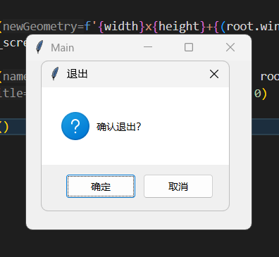

### 1.6 布局方法

布局是指控件通过调用布局方法显示在窗口中，并按照布局的要求排布控件。

除了窗口之外，所有控件均支持以下布局方法：

- `pack`方法，平铺布局，在某一方向上的控件依次相接排布（基于剩余空间确定当前控件的布局位置），相当于水平、垂直布局。该方法支持以下参数：

  - `cnf`参数，字典类型，表示映射其余参数的字典，可以传入键为参数名的字典，一次性给所有参数传值，比如`{'side':'bottom'}`。
  - `after`参数，表示该控件在哪个控件之后。从此参数开始，只能通过关键字传入。
  - `anchor`参数，字符串类型，仅支持`['nw', 'n', 'ne', 'w', 'center', 'e', 'sw', 's', 'se']`中的值，表示排布当前控件时，控件的对齐起点为哪个位置（上北下南左西右东），默认为`'center'`。
  - `before`参数，表示该控件在哪个控件之后。
  - `expand`参数，布尔类型或者整数类型（`0`或者`1`），表示在当前布局方向上，该控件是否占据全部可用控件，默认为`0`。
  - `fill`参数，字符串类型，仅支持`['none', 'x', 'y', 'both']`中的值，表示控件在哪个方向上调整控件大小至最大，进而充满整个可用空间，默认为`'none'`。
  - `side`参数，字符串类型，仅支持`['left', 'right', 'top', 'bottom']`中的值，表示布局的起始方向，比如`'left'`，表示左起的水平方向，左边为起点。
  - `ipadx`参数，字符串类型或者浮点类型，表示控件内容在X方向（水平方向）上到控件边界的距离，单位为像素。
  - `ipady`参数，字符串类型或者浮点类型，表示控件内容在Y方向（垂直方向）上到控件边界的距离，单位为像素。
  - `padx`参数，字符串类型或者浮点类型或者元素为前述类型的双元素元组，表示在X方向（水平方向）上，控件边界到可用空间边界的距离，单位为像素。参数为元组时，两个元素分别表示左边、右边的距离。
  - `pady`参数，字符串类型或者浮点类型或者元素为前述类型的双元素元组，表示在Y方向（垂直方向）上，控件边界到可用空间边界的距离，单位为像素。参数为元组时，两个元素分别表示上边、下边的距离。

- `grid`方法，网格布局，将整个窗口划分为类似于表格的网格之后，指定控件所属的网格。

  注意，该方法不能与`pack`方法混用，即一旦某个控件使用了二者其一，其余控件就不能使用另一种方法进行布局。

  该方法支持以下参数（完整用法可以参考 https://www.tcl-lang.org/man/tcl8.6/TkCmd/grid.htm ）：

  - `cnf`参数，字典类型，表示映射其余参数的字典，可以传入键为参数名的字典，一次性给所有参数传值。
  - `column`参数，整数类型，表示所属网格的列索引。从此参数开始，只能通过关键字传入。
  - `columnspan`参数，整数类型，表示所属网格占用几列，默认为`1`。
  - `row`参数，整数类型，表示所属网格的行索引。
  - `rowspan`参数，整数类型，表示所属网格占用几行，默认为`1`。
  - `ipadx`参数，字符串类型或者浮点类型，表示控件内容在X方向（水平方向）上到控件边界的距离，单位为像素。
  - `ipady`参数，字符串类型或者浮点类型，表示控件内容在Y方向（垂直方向）上到控件边界的距离，单位为像素。
  - `padx`参数，字符串类型或者浮点类型或者元素为前述类型的双元素元组，表示在X方向（水平方向）上，控件边界到可用空间边界的距离，单位为像素。参数为元组时，两个元素分别表示左边、右边的距离。
  - `pady`参数，字符串类型或者浮点类型或者元素为前述类型的双元素元组，表示在Y方向（垂直方向）上，控件边界到可用空间边界的距离，单位为像素。参数为元组时，两个元素分别表示上边、下边的距离。
  - `sticky`参数，字符串类型，仅支持`[ 'n', 'w', 'e', 's']`中的值，表示在网格中的控件吸附在网格哪条边（上北下南左西右东），默认为`''`，即居中不吸附。

  与网格布局相关的窗口网格规格定义没有可以直接配置的参数，但可以使用窗口控件的`grid_columnconfigure`方法和`grid_rowconfigure`方法依次定义每一列、每一行的具体规格，不过这两个方法都不会限制最大网格数。这两个方法都支持以下参数：

  - `index`参数，整数类型，表示被配置的行（列）的索引。
  - `cnf`参数，字典类型，表示映射其余参数的字典，可以传入键为参数名的字典，一次性给所有参数传值。
  - `minsize`参数，字符串类型或者浮点类型，表示单元格的最小尺寸（定义行的话，该参数表示最小高度；定义列的话，该参数表示最小宽度）。从此参数开始，只能通过关键字传入。
  - `pad`参数，字符串类型或者浮点类型，表示行（列）的间距。
  - `uniform`参数，字符串类型，表示该行（列）的分组名。当分组相同时，组内的行（列）长度比例始终（强制）遵守其`weight`参数的权重（`0`被当`1`处理），不会因为其他网格计算原则导致行（列）长度比例脱离`weight`参数的要求。
  - `weight`参数，整数类型，表示该行（列）占所有行（列）总长度的权重（份数），默认为`0`，表示保持控件、行（列）长度的原有尺寸，不自动调整。

  以下为示例：

  ```python3
  from tkinter import Tk
  from tkinter import ttk
  
  root = Tk()
  root.title('Main')
  width = 320
  height = 240
  root.geometry(f'{width}x{height}+{(root.winfo_screenwidth()-width)//2}+{(root.winfo_screenheight()-height)//2}')
  
  for i in range(2):
      root.grid_rowconfigure(i,{'weight':1}, minsize=100)
      root.grid_columnconfigure(i, weight=1, minsize=100)
  
  button = ttk.Button(root,text='click1',command=lambda:print('click1'))
  button.grid(column=0,row=0)
  
  ttk.Button(root,text='click2',command=lambda : button.invoke()).grid(column=1,row=1)
  
  root.mainloop()
  ```

- `place`方法，自由布局，相当于创建一个容器来放置控件，可以自定义容器的坐标。该方法支持以下参数（完整用法可以参考 https://www.tcl-lang.org/man/tcl8.6/TkCmd/place.htm）：

  - `cnf`参数，字典类型，表示映射其余参数的字典，可以传入键为参数名的字典，一次性给所有参数传值。
  - `anchor`参数，字符串类型，仅支持`['nw', 'n', 'ne', 'w', 'center', 'e', 'sw', 's', 'se']`中的值，表示排布当前控件时，控件的对齐起点为哪个位置（上北下南左西右东），默认为`'nw'`。从此参数开始，只能通过关键字传入。
  - `bordermode`参数，字符串类型，仅支持`['inside', 'outside', 'ignore']`中的值，表示计算容器的坐标时是否考虑父控件的边框。如果控件的父控件包含边框，默认值`'inside'`表示计算坐标时的原点为不包含边框的父控件的原点，`'outside'`（同` 'ignore'`）表示计算坐标时的原点为包含边框的父控件的原点。
  - `width`参数，字符串类型或者浮点类型，表示容器的宽度。
  - `height`参数，字符串类型或者浮点类型，表示容器的高度。
  - `x`参数，字符串类型或者浮点类型，表示容器的X坐标（水平方向）。
  - `y`参数，字符串类型或者浮点类型，表示容器的Y坐标（垂直方向）。
  - `relheight`参数，字符串类型或者浮点类型，表示容器的高度相对于窗口高度的比值。
  - `relwidth`参数，字符串类型或者浮点类型，表示容器的宽度相对于窗口宽度的比值。
  - `relx`参数，字符串类型或者浮点类型，表示容器的X坐标（水平方向）相对于父控件宽度的比值。
  - `rely`参数，字符串类型或者浮点类型，表示容器的Y坐标（垂直方向）。相对于父控件高度的比值。

### 1.7 主题与样式

注意，只有`tkinter.ttk`模块提供的控件才可以定制其主题和样式。

相关资料可以参考 https://tkdocs.com/tutorial/styles.html。

想要修改控件的主题和样式，需要先创建一个样式对象：

```python3
style = ttk.Style(root)
```

默认情况下，tkinter提供了一些内部的主题可以使用：

```shell
('winnative', 'clam', 'alt', 'default', 'classic', 'vista', 'xpnative')
```

可以通过`style.theme_names()`获取，通过`style.theme_use('clam')`使用：

```python3
from tkinter import Tk
from tkinter import ttk

root = Tk()
root.title('Main')
width = 320
height = 240
root.geometry(f'{width}x{height}+{(root.winfo_screenwidth()-width)//2}+{(root.winfo_screenheight()-height)//2}')

style = ttk.Style(root)
style.theme_use('clam')
ttk.Button(root,text='click').pack()

root.mainloop()
```

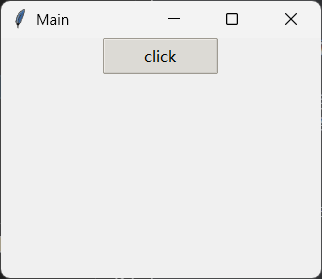

想要创建自定义样式的话，需要先了解一下样式名称的组成：

```shell
>>> b = ttk.Button()
>>> b['style']
''
>>> b.winfo_class()
'TButton'
```

`b['style']`获取的是自定义样式，因为这里的按钮控件没有设置自定义样式，所以自定义样式为空。但是，所有控件都有默认的基础样式（取决于控件的`className`，可以通过`b.winfo_class()`获取，上面的执行结果表明，`ttk.Button()`的基础样式是`'TButton'`。

创建自定义样式需要调用样式对象的`configure`方法，该方法的`style`参数表示创建的自定义样式的样式名。自定义样式相关的具体样式通过关键字传入，比如`foreground='red'`，自定义前景色（文字的字体颜色）。

需要注意，创建自定义样式时，需要使用`'{自定义样式名}.{基础样式名}'`这种复合的自定义样式名，不包含基础样式的话，会导致控件失效。这种复合的自定义样式名，需要传给具体控件的`style`参数才能生效。

如果想要修改所有同类控件的样式，自定义样式名格式为`'{基础样式名}'`。这种同类控件的样式，无需传给具体控件即可生效。

示例代码如下：

```python3
from tkinter import Tk
from tkinter import ttk

root = Tk()
root.title('Main')
width = 320
height = 240
root.geometry(f'{width}x{height}+{(root.winfo_screenwidth()-width)//2}+{(root.winfo_screenheight()-height)//2}')

style = ttk.Style(root)
style.configure(
    style='red.TButton',
    foreground='red'
)
ttk.Button(root,text='click',style='red.TButton').pack()


root.mainloop()
```

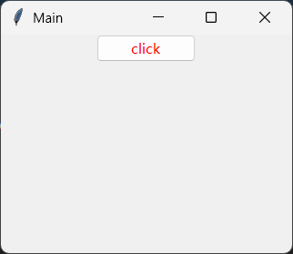

除了样式对象的`configure`方法可以创建自定义样式，样式对象的`map`方法能创建更加精细的自定义样式：

```python3
from tkinter import Tk
from tkinter import ttk

root = Tk()
root.title('Main')
width = 320
height = 240
root.geometry(f'{width}x{height}+{(root.winfo_screenwidth()-width)//2}+{(root.winfo_screenheight()-height)//2}')

style = ttk.Style(root)
style.map(
    style='red.TButton', 
    background=[('pressed','green')],
    foreground=[('active','red')],
)
ttk.Button(root,text='click',style='red.TButton').pack()

root.mainloop()
```

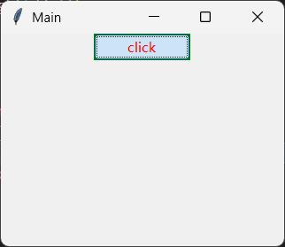

`map`方法具体样式的关键字参数接收的是列表，列表的每个元素都是一个特定状态时样式（`'active'`表示鼠标悬停时的状态，`'pressed'`表示按钮按下时的状态）。

需要注意，列表中的顺序会影响生效的优先级（越靠前的越优先），比如`[('pressed','green'),('active','red')]`，悬停和按下都能正确生效；若是改成`[('active','red'),('pressed','green')]`，则只有悬停优先生效。

### 1.8 控件的通用方法（常用非全部）

控件方法很多，但不是所有方法都常用。大部分控件都有以下常用的方法：

- `config`同`configure`方法，用于更新控件的参数，具体参数取决于控件的参数。

- `quit`方法，退出当前程序。

- `destroy`方法，销毁当前控件。如果当前控件是主窗口控件，则退出当前程序。

- `after`方法，在指定时间之后执行指定操作，相当于定时器。该方法支持以下参数：

  - `ms`参数，整数类型或者`'idle'`，表示多少时间之后（单位毫秒）或者立即执行。
  - `func`参数，可调用类型，表示要执行的操作。
  - `*args`参数，表示传给`func`参数对应函数的参数。

  以下为示例：

  ```python3
  from tkinter import Tk
  from tkinter import ttk
  
  root = Tk()
  root.title('Main')
  width = 320
  height = 240
  root.geometry(f'{width}x{height}+{(root.winfo_screenwidth()-width)//2}+{(root.winfo_screenheight()-height)//2}')
  
  button = ttk.Button(root,text='click',command=lambda :button.after(3000,print,'a'))
  button.pack()
  
  root.mainloop()
  ```

- `bell`方法，程序发出一声提示音。

- `clipboard_append`方法，设置剪贴板当前内容，该方法的`string`参数（字符串类型）就是要写入的内容。

- `clipboard_clear`方法，清空剪贴板。

- `clipboard_get`方法，获取剪贴板当前内容。

- `cget`方法，获取指定参数的值。该方法接收一个字符串类型参数`key`，即参数名。

- `focus`方法、`focus_set`方法和`focus_force`方法（强制，慎用），让调用该方法的控件获得焦点。

- `focus_displayof`方法、`focus_get`方法和`focus_lastfor`方法，获取焦点所在的控件。

- `grab_set`方法，仅限`Toplevel`普通窗口控件可以调用此方法，调用此方法之后，窗口会进入模态（只有该窗口可以响应，其余窗口会被冻结，除非该窗口关闭）。

  注意，`grab_set_global`方法为该方法的全局版本，但是非常不建议使用。因为会导致当前窗口不能通过点击关闭按钮关闭，但通过使用`bind`方法为模态窗口注册关闭操作的快捷键（或者通过`bind_all`方法注册关闭操作的全局快捷键）依然可以使用。

- `grab_release`方法，窗口退出模态。

- `grab_current`方法，获取当前为模态的窗口。

- `grab_status`方法，获取模态的生效范围（全局还是局部）。

- `slaves`方法，返回所有子控件。该方法对应平铺布局、网格布局、自由布局的版本为：`pack_slaves`方法、`grid_slaves`方法、`place_slaves`方法。

- `mainloop`方法，消息循环方法，无论调用者是否为程序类实例都可以。

  ```python3
  from tkinter import Tk
  from tkinter import ttk
  
  root = Tk()
  root.title('Main')
  width = 320
  height = 240
  root.geometry(f'{width}x{height}+{(root.winfo_screenwidth()-width)//2}+{(root.winfo_screenheight()-height)//2}')
  
  button = ttk.Button(root,text='click')
  button.pack()
  button.mainloop()
  ```

- `nametowidget`方法，获取子控件中指定内部名称的控件。

- `option_add`方法、`option_clear`方法、`option_get`方法、`option_readfile`方法适用于`tkinter`（非`tkinter.ttk`）提供的控件，在创建控件前调用，用于批量设置默认控件样式，用途依次为添加样式规则、清空样式规则、获取样式规则、从文件（每一行使用英文冒号分隔规则和对应的值）中添加样式规则。以下为示例：

  ```python3
  from tkinter import Tk,Button
  from tkinter import ttk
  
  root = Tk()
  root.title('Main')
  width = 320
  height = 240
  root.geometry(f'{width}x{height}+{(root.winfo_screenwidth()-width)//2}+{(root.winfo_screenheight()-height)//2}')
  
  root.option_add('*Button.Foreground','red')
  root.option_clear()
  
  button = Button(root,text='click')
  button.pack()
  
  
  root.mainloop()
  ```

- `propagate`方法，适用于容器控件，不传入参数时返回容器是否根据内部控件的大小调整自身的大小；如果传入布尔值，则可以启用、禁用这一功能。该方法对应平铺布局、网格布局的版本为：`pack_propagate`方法、`grid_propagate`方法。

- `update`方法，更新控件的显示（一般不需要主动调用）。

- 'winfo'前缀的方法统一由winfo命令（Tk命令）提供（完整介绍参考https://www.tcl-lang.org/man/tcl8.6/TkCmd/winfo.htm），主要用于返回一些和窗口有关的信息，比如前面示例中，为了让窗口居中，使用的`winfo_screenwidth`方法和`winfo_screenheight`方法，用于获取屏幕的宽度和高度。

## 2 tkinter的控件（更新中）

在tkinter中，按照其是否支持使用主题（由样式对象设定统一的样式或者创建自定义样式）的情况，控件可分为两类：

- 可以使用主题的控件。
- 不能使用主题的控件。

可以使用主题的控件是`tkinter.ttk`模块提供的控件，也是目前推荐使用的控件。

不能使用主题的控件是`tkinter`模块的顶层控件以及一个在`tkinter.scrolledtext`模块中的控件，因为`tkinter.ttk`模块提供的控件不能覆盖所有功能，所以这些顶层控件还是要掌握。

注意，很多控件参数相同，介绍第一个控件时，会介绍得比较详细。后续其他控件除了特有的参数会详细介绍外，相同的参数都不再介绍，请读者自行参考前面的内容或者开发工具的智能提示。

控件的方法很多，但不是所有方法都常用。在基础知识中介绍过的控件通用方法，后续介绍具体控件时不再介绍，只会介绍控件的特有方法。

### 2.1 `tkinter.ttk.Button`按钮控件

`tkinter.ttk.Button`的官方文档：https://tkdocs.com/pyref/ttk_button.html。

该控件支持以下参数（相关参数的完整用法可以参考 https://www.tcl-lang.org/man/tcl8.6/TkCmd/ttk_button.htm）：

- `master`参数，表示该控件的父控件。该参数一般要指定为容器控件，这样容器才会编排子控件的位置，控件的布局方法才能正确生效。

- `class_`参数，字符串类型，表示控件对应的的Tcl/Tk窗口类名。该参数与窗口管理器相关，也会影响到样式。一般该参数会根据控件的类型自动决定（比如`ttk`模块的按钮控件对应的是`'TButton'`），通常不需要单独设置该参数。从该参数开始，只能通过关键字传入。

- `command`参数，可调用类型，点击控件后执行的操作。

- `compound`参数，字符串类型，表示图像与文字组合的方式（需要同时指定`image`参数），仅支持`['center','text','image','top','left','right','bottom','none']`中的值，依次表示文字在图片中央、只显示文字、只显示图片、图片在文字上方、图片在文字左方、图片在文字右方、图片在文字下方、不组合（效果相当于只显示图片，也就是默认值）。

  示例如下：

  ```python3
  from tkinter import Tk,PhotoImage
  from tkinter import ttk
  from pathlib import Path
  
  root = Tk()
  root.title('Main')
  width = 320
  height = 240
  root.geometry(f'{width}x{height}+{(root.winfo_screenwidth()-width)//2}+{(root.winfo_screenheight()-height)//2}')
  
  # 需要使用PhotoImage方法转换（PGM, PPM, GIF, PNG）图片之后才能传给image参数
  # 图片不会自动缩放，需要自己调整原始图片的分辨率
  img = PhotoImage(file=Path(__file__).parent/'button.png',width=100,height=50)
  
  for i in ['center','text','image','top','left','right','bottom','none']:
      ttk.Button(root,text=i,compound=i,image=img).pack()
  
  root.mainloop()
  ```

  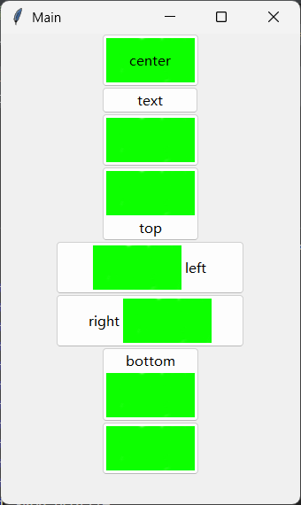

- `cursor`参数，字符串类型，表示鼠标悬停在该控件上时光标的样式。具体支持的部分样式可以参考示例（完整样式可以参考 https://www.tcl-lang.org/man/tcl8.6/TkCmd/cursors.htm）：

  ```python3
  from tkinter import Tk
  from tkinter import ttk
  
  root = Tk()
  root.title("Main")
  width = 840
  height = 640
  root.geometry(
      f"{width}x{height}+{(root.winfo_screenwidth()-width)//2}+{(root.winfo_screenheight()-height)//2}"
  )
  
  def show(cursor, i):
      ttk.Button(root, text=cursor, cursor=cursor).grid(column=i // 20, row=i % 20)
  
  cursorList = [
      "arrow",
      "xterm",
      "ibeam",
      "watch",
      "wait",
      "hand1",
      "hand2",
      "no",
      "question_arrow",
      "uparrow",
      "size",
      "size_ns",
      "size_we",
      "size_ne_sw",
      "size_nw_se",
      "starting",
      "crosshair",
      "sb_h_double_arrow",
      "sb_v_double_arrow",
      "fleur",
      "based_arrow_down",
      "based_arrow_up",
      "boat",
      "bogosity",
      "top_left_corner",
      "top_right_corner",
      "bottom_left_corner",
      "bottom_right_corner",
      "top_side",
      "bottom_side",
      "top_tee",
      "bottom_tee",
      "box_spiral",
      "center_ptr",
      "circle",
      "clock",
      "coffee_mug",
      "cross",
      "cross_reverse",
      "diamond_cross",
      "dot",
      "dotbox",
      "double_arrow",
      "top_left_arrow",
      "draft_small",
      "draft_large",
      "left_ptr",
      "right_ptr",
      "draped_box",
      "exchange",
      "gobbler",
      "gumby",
      "hand1",
      "heart",
      "icon",
      "iron_cross",
      "left_side",
      "right_side",
      "left_tee",
      "right_tee",
      "leftbutton",
      "middlebutton",
      "rightbutton",
      "ll_angle",
      "lr_angle",
      "man",
      "mouse",
      "pencil",
      "pirate",
      "plus",
      "rtl_logo",
      "sailboat",
      "sb_left_arrow",
      "sb_right_arrow",
      "sb_up_arrow",
      "sb_down_arrow",
      "shuttle",
      "sizing",
      "spider",
      "spraycan",
      "star",
      "target",
      "tcross",
      "trek",
      "ul_angle",
      "umbrella",
      "ur_angle",
      "X_cursor",
  ]
  
  for i in range(len(cursorList)):
      show(cursorList[i], i)
  
  root.mainloop()
  ```

- `default`参数，字符串类型，表示按钮默认可用的状态下的激活样式，仅支持`['disabled','normal','active']`中的值。示例如下：

  ```python3
  from tkinter import Tk
  from tkinter import ttk
  
  root = Tk()
  root.title('Main')
  width = 320
  height = 240
  root.geometry(f'{width}x{height}+{(root.winfo_screenwidth()-width)//2}+{(root.winfo_screenheight()-height)//2}')
  
  
  for i in ['disabled','normal','active']:
      ttk.Button(root,text=i,default=i).pack()
  
  root.mainloop()
  ```

  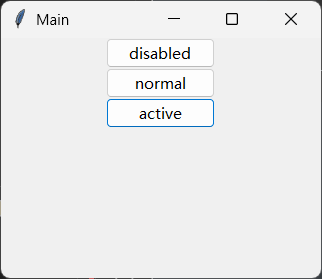

- `image`参数，`PhotoImage`类型或者字符串类型，表示控件额外显示的图片。当该参数为字符串类型时，表示的是注册在全局变量中的`PhotoImage`控件的`name`参数（或属性）。示例如下：

  ```python3
  from tkinter import Tk,PhotoImage,Image
  from tkinter import ttk
  from pathlib import Path
  
  root = Tk()
  root.title('Main')
  width = 320
  height = 240
  root.geometry(f'{width}x{height}+{(root.winfo_screenwidth()-width)//2}+{(root.winfo_screenheight()-height)//2}')
  
  img = PhotoImage('logo',file=Path(__file__).parent/'button.png',width=100,height=50)
  
  ttk.Button(root,text='image',image=img).pack()
  ttk.Button(root,text='image',image='logo').pack()
  
  root.mainloop()
  ```

  

- `name`参数，字符串类型，表示控件的内部名称。

- `padding`参数，整数类型或者元素为整数类型的元组或者字符串类型，表示控件的内边距（边界到文字，单位为像素）。该参数为整数类型或者单元素元组或者字符串中只包含一个合法的整数时，表示四个方向上的内边距。该参数为双元素元组或者包含两个合法整数的字符串时，两个整数分别表示左右方向的内边距和上下方向的内边距。该参数为四元素元组或者包含四个合法整数的字符串时，四个整数分别表示左、上、右、下方向的内边距。

- `state`参数，字符串类型，表示控件的状态，仅支持`['disabled','normal','active']`中的值。示例如下：

  ```python3
  from tkinter import Tk
  from tkinter import ttk
  
  root = Tk()
  root.title('Main')
  width = 320
  height = 240
  root.geometry(f'{width}x{height}+{(root.winfo_screenwidth()-width)//2}+{(root.winfo_screenheight()-height)//2}')
  
  
  for i in ['disabled','normal','active']:
      ttk.Button(root,text=i,state=i).pack()
  
  root.mainloop()
  ```

  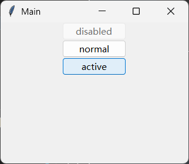

- `style`参数，字符串类型，表示控件使用的主题样式。示例如下：

  ```python3
  from tkinter import Tk
  from tkinter import ttk
  
  root = Tk()
  root.title('Main')
  width = 320
  height = 240
  root.geometry(f'{width}x{height}+{(root.winfo_screenwidth()-width)//2}+{(root.winfo_screenheight()-height)//2}')
  
  ttk.Style(root).configure('Info.TButton',foreground='green')
  ttk.Button(root,text='click',style='Info.TButton').pack()
  
  root.mainloop()
  ```

  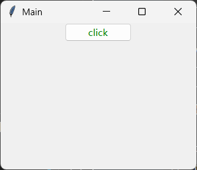

- `takefocus`参数，布尔类型，表示该控件是否接收焦点（按`tab`键可以切换控件的焦点），默认为`True`。

- `text`参数，字符串类型或者浮点类型，表示控件显示的文字。

- `textvariable`参数，`Variable`类型（其派生类型`StringVar`等也可以）或者字符串类型，`text`参数的变量绑定版本。

- `underline`参数，整数类型，表示给指定索引值的字符添加下划线，用于菜单项的快捷键绑定，默认为`-1`。

- `width`参数，整数类型，表示控件的宽度，单位为字符数。

该控件支持以下特有方法：

- `invoke`方法，模拟点击按钮（执行`command`参数的值）。

### 2.2 `tkinter.ttk.Checkbutton`多选框控件

`tkinter.ttk.Checkbutton`的官方文档：https://tkdocs.com/pyref/ttk_checkbutton.html。

多选框控件的英文名字里带着'button'，实际上很多参数也和按钮控件一样，只是该控件在使用时还是一个多选框应该有的表现。

该控件中需要注意的部分参数（完整的参数用法可以参考 https://www.tcl-lang.org/man/tcl8.6/TkCmd/ttk_checkbutton.htm）：

- `variable`参数，`Variable`类型（其派生类型`StringVar`等也可以），表示多选框当前状态绑定的变量。
- `offvalue`参数，任意类型，表示多选框非勾选状态时，其绑定变量的值，默认为`0`。
- `onvalue`参数，任意类型，表示多选框勾选状态时，其绑定变量的值，默认为`1`。

该控件支持以下特有方法：

- `invoke`方法，模拟点击多选框（执行`command`参数的值，同时切换多选状态）。

示例如下：

```python3
from tkinter import Tk,Variable
from tkinter import ttk

root = Tk()
root.title('Main')
width = 320
height = 240
root.geometry(f'{width}x{height}+{(root.winfo_screenwidth()-width)//2}+{(root.winfo_screenheight()-height)//2}')

value = Variable(value='选中')
button = ttk.Checkbutton(root,text='check',variable=value,offvalue='未选中',onvalue='选中')
button.pack()

ttk.Label(root,textvariable=value).pack()

root.mainloop()
```

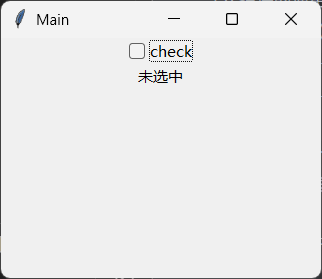


### 2.3 `tkinter.ttk.Button`按钮控件

`tkinter.ttk.Button`的官方文档：https://tkdocs.com/pyref/ttk_button.html。

该控件中需要注意的部分参数：

- 

该控件支持以下特有方法：

- `invoke`方法，

示例如下：


主要有：

- 
- ]()，多选框。
- [`tkinter.ttk.Combobox`](https://tkdocs.com/pyref/ttk_combobox.html)，下拉选择框。
- [tkinter.ttk.Entry](https://tkdocs.com/pyref/ttk_entry.html) - *Ttk Entry widget displays a one-line text string and allows that string to be edited by the user.*
- [tkinter.ttk.Frame](https://tkdocs.com/pyref/ttk_frame.html) - *Ttk Frame widget is a container, used to group other widgets together.*
- [tkinter.ttk.Label](https://tkdocs.com/pyref/ttk_label.html) - *Ttk Label widget displays a textual label and/or image.*
- [tkinter.ttk.LabeledScale](https://tkdocs.com/pyref/ttk_labeledscale.html) - *A Ttk Scale widget with a Ttk Label widget indicating its current value. The Ttk Scale can be accessed through instance.scale, and Ttk Label can be accessed through instance.label*
- [tkinter.ttk.Labelframe](https://tkdocs.com/pyref/ttk_labelframe.html) - *Ttk Labelframe widget is a container used to group other widgets together. It has an optional label, which may be a plain text string or another widget.*
- [tkinter.ttk.Menubutton](https://tkdocs.com/pyref/ttk_menubutton.html) - *Ttk Menubutton widget displays a textual label and/or image, and displays a menu when pressed.*
- [tkinter.ttk.Notebook](https://tkdocs.com/pyref/ttk_notebook.html) - *Ttk Notebook widget manages a collection of windows and displays a single one at a time.*
- [tkinter.ttk.OptionMenu](https://tkdocs.com/pyref/ttk_optionmenu.html) - *Themed OptionMenu, based after tkinter's OptionMenu, which allows the user to select a value from a menu.*
- [tkinter.ttk.Panedwindow](https://tkdocs.com/pyref/ttk_panedwindow.html) - *Ttk Panedwindow widget displays a number of subwindows, stacked either vertically or horizontally.*
- [tkinter.ttk.Progressbar](https://tkdocs.com/pyref/ttk_progressbar.html) - *Ttk Progressbar widget shows the status of a long-running operation.*
- [tkinter.ttk.Radiobutton](https://tkdocs.com/pyref/ttk_radiobutton.html) - *Ttk Radiobutton widgets are used in groups to show or change a set of mutually-exclusive options.*
- [tkinter.ttk.Scale](https://tkdocs.com/pyref/ttk_scale.html) - *Ttk Scale widget is typically used to control the numeric value of a linked variable that varies uniformly over some range.*
- [tkinter.ttk.Scrollbar](https://tkdocs.com/pyref/ttk_scrollbar.html) - *Ttk Scrollbar controls the viewport of a scrollable widget.*
- [tkinter.ttk.Separator](https://tkdocs.com/pyref/ttk_separator.html) - *Ttk Separator widget displays a horizontal or vertical separator bar.*
- [tkinter.ttk.Sizegrip](https://tkdocs.com/pyref/ttk_sizegrip.html) - *Ttk Sizegrip allows the user to resize the containing toplevel window by pressing and dragging the grip.*
- [tkinter.ttk.Spinbox](https://tkdocs.com/pyref/ttk_spinbox.html) - *Ttk Spinbox is an Entry with increment and decrement arrows It is commonly used for number entry or to select from a list of string values.*
- [tkinter.ttk.Treeview](https://tkdocs.com/pyref/ttk_treeview.html) - *Ttk Treeview widget displays a hierarchical collection of items.*

不能使用主题的控件是tkinter的顶层控件，但这部分控件分类两类，一类是`tkinter.ttk`模块提供的控件中有相同用途控件的控件，主要有：

- [tkinter.Button](https://tkdocs.com/pyref/button.html) - *Button widget.*
- [tkinter.Checkbutton](https://tkdocs.com/pyref/checkbutton.html) - *Checkbutton widget which is either in on- or off-state.*
- [tkinter.Entry](https://tkdocs.com/pyref/entry.html) - *Entry widget which allows displaying simple text.*
- [tkinter.Frame](https://tkdocs.com/pyref/frame.html) - *Frame widget which may contain other widgets and can have a 3D border.*
- [tkinter.Label](https://tkdocs.com/pyref/label.html) - *Label widget which can display text and bitmaps.*
- [tkinter.LabelFrame](https://tkdocs.com/pyref/labelframe.html) - *labelframe widget.*
- [tkinter.Menubutton](https://tkdocs.com/pyref/menubutton.html) - *Menubutton widget, obsolete since Tk8.0.*
- [tkinter.Message](https://tkdocs.com/pyref/message.html) - *Message widget to display multiline text. Obsolete since Label does it too.*
- [tkinter.OptionMenu](https://tkdocs.com/pyref/optionmenu.html) - *OptionMenu which allows the user to select a value from a menu.*
- [tkinter.PanedWindow](https://tkdocs.com/pyref/panedwindow.html) - *panedwindow widget.*
- [tkinter.Radiobutton](https://tkdocs.com/pyref/radiobutton.html) - *Radiobutton widget which shows only one of several buttons in on-state.*
- [tkinter.Scale](https://tkdocs.com/pyref/scale.html) - *Scale widget which can display a numerical scale.*
- [tkinter.Scrollbar](https://tkdocs.com/pyref/scrollbar.html) - *Scrollbar widget which displays a slider at a certain position.*
- [tkinter.Spinbox](https://tkdocs.com/pyref/spinbox.html) - *spinbox widget.*

另一类是`tkinter.ttk`模块提供的控件中没有相同用途控件的控件，主要有：

- [tkinter.Tk](https://tkdocs.com/pyref/tk.html) - *Toplevel widget of Tk which represents mostly the main window of an application. It has an associated Tcl interpreter.*
- [tkinter.Canvas](https://tkdocs.com/pyref/canvas.html) - *Canvas widget to display graphical elements like lines or text.*
- [tkinter.Listbox](https://tkdocs.com/pyref/listbox.html) - *Listbox widget which can display a list of strings.*
- [tkinter.Menu](https://tkdocs.com/pyref/menu.html) - *Menu widget which allows displaying menu bars, pull-down menus and pop-up menus.*
- [tkinter.Text](https://tkdocs.com/pyref/text.html) - *Text widget which can display text in various forms.*
- [tkinter.Toplevel](https://tkdocs.com/pyref/toplevel.html) - *Toplevel widget, e.g. for dialogs.*
- [tkinter.BitmapImage](https://tkdocs.com/pyref/bitmapimage.html) - *Widget which can display images in XBM format.*
- [tkinter.PhotoImage](https://tkdocs.com/pyref/photoimage.html) - *Widget which can display images in PGM, PPM, GIF, PNG format.*

以及一个在tkinter.scrolledtext模块中的控件：

- tkinter.scrolledtext（基于Text控件）


窗口（Tk，Toplevel）的显示与隐藏：

deiconify显示

withdraw隐藏


## 3 tkinter的对话框（更新中）

对话框的用法与控件用法不同：无需构建具备基本结构的tkinter程序，也能使用对话框。

### 7.1 `tkinter.filedialog.Directory`选择目录对话框


提供对话框的模块

- [`tkinter.filedialog.Directory`](https://tkdocs.com/pyref/filedialog_directory.html) - *Ask for a directory*
- [tkinter.filedialog.Open](https://tkdocs.com/pyref/filedialog_open.html) - *Ask for a filename to open*
- [tkinter.filedialog.SaveAs](https://tkdocs.com/pyref/filedialog_saveas.html) - *Ask for a filename to save as*
- [tkinter.colorchooser.Chooser](https://tkdocs.com/pyref/colorchooser_chooser.html) - *Create a dialog for the tk_chooseColor command.*
- tkinter.messagebox，showerror等等
- tkinter.simpledialog


```python3
from tkinter.filedialog import Open
print(Open().show())
```


主题对比：

```python3
import tkinter as tk
from tkinter import ttk
root = tk.Tk()
root.geometry('600x400+200+200')
root.title('Ttk 主题小部件演示')

text = tk.StringVar()
style = ttk.Style(root)
def change_theme():
    style.theme_use(selected_theme.get())
    
def callback():
    pass

left_frame = tk.Frame(root,  width=300,  height=400)
left_frame.pack(side='left',  fill='both',  padx=10,  pady=5,  expand=True)

right_frame  =  tk.Frame(root,  width=300,  height=400)
right_frame.pack(side='right',  fill='both',  padx=10,  pady=5,  expand=True)

selected_theme = tk.StringVar()
theme_frame = ttk.LabelFrame(left_frame, text='Themes')
theme_frame.pack(padx=10, pady=10, ipadx=20, ipady=20)

for theme_name in style.theme_names():
    rb = ttk.Radiobutton(
        theme_frame,
        text=theme_name,
        value=theme_name,
        variable=selected_theme,
        command=change_theme)
    rb.pack(expand=True, fill='both')

label = ttk.Label(right_frame, text='ttk标签')
label.pack(pady=5)
button = ttk.Button(right_frame, text="ttk按钮", command=callback)
button.pack(pady=5)
entry = ttk.Entry(right_frame, textvariable=text, text="文本框")
entry.pack(pady=5)
entry.insert(0, "ttk单行文本框")
frame2 = ttk.LabelFrame(right_frame, text='ttk复选框')
frame2.pack(pady=5)
cb3 = ttk.Checkbutton(frame2, text='Number 3')
cb3.pack()
cb4 = ttk.Checkbutton(frame2, text='Number 4')
cb4.pack()
frame4 = ttk.LabelFrame(right_frame, text='ttk单选按钮')
frame4.pack(pady=5)
r1 = ttk.Radiobutton(frame4,text="option 1", value=1)
r1.pack()
r2 = ttk.Radiobutton(frame4,text="option 2", value=2)
r2.pack()
scale2 = ttk.Scale(right_frame, from_=0, to=100, orient='horizontal', length=100)
scale2.pack(pady=5)
menubttn = ttk.Menubutton(right_frame, text = "ttk菜单按钮")
menu = tk.Menu(menubttn, tearoff = 0)
menu.add_checkbutton(label = "Python")
menu.add_checkbutton(label = "Java")
menubttn["menu"] = menu
menubttn.pack(pady=5)
spinbox2 = ttk.Spinbox(right_frame, from_=0, to=10, wrap=True)
spinbox2.pack(pady=5)
root.mainloop()
```


## 4 拾遗

虽说本教程是快速入门，但不代表本教程没有讲到的部分就一概不管。在实际开发、使用时，tkinter碍于其设计理念，还是有一些不及现代GUI框架的地方，有不少晦涩难懂的概念。因此，本章节主要聚焦于实际的开发问题，为这些问题带来答案。
