# prompt_toolkit的中文入门教程

[toc]

## 0 前言

[prompt_toolkit](https://python-prompt-toolkit.readthedocs.io/en/stable/)是一个终端UI框架，可以交互式获取命令行输入内容、创建对话框、构建终端全屏程序、显示进度条等。用法简单高效，很适合搭建类似终端开发环境这种支持自动提示的交互式操作程序。官方文档虽然条理清晰，但内容不多也比较简单。因此，本教程将在官方文档的基础上，按照常规的入门学习顺序重新排序，并添加缺失的相关知识，梳理实际开发中可能遇到的问题，制作中文入门教程。

## 1 简单开始

### 1.1 环境准备

准备工作很简单，初始化虚拟环境之后，添加`prompt-toolkit`即可，环境管理根据使用uv、pdm均可。

不过，prompt_toolkit使用了一些没有明显依赖的第三方库，为了避免后续学习过程中需要临时添加，建议这里提前添加：

- `pygments`，一些语法高亮相关的美化样式功能依赖此库，实现语法高亮。
- `asyncssh`，在SSH服务器上运行prompt_toolkit程序的社区功能依赖此库，进行相关SSH操作。

### 1.2 Hello World

和所有框架、语言开始学习的惯例一样，先看看prompt_toolkit（后面会简称为框架）的Hello World程序是什么样：

```python3
from prompt_toolkit import prompt

text = prompt('请输入任何内容：')
print(f'输入的内容是: {text}')
```

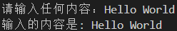

框架支持很多终端交互，这里演示的是运行响应式代码，获取用户输入的过程，此外，框架还可以使用响应式代码（实际上是应用式）生成对话框：

```python3
from prompt_toolkit.shortcuts import message_dialog

message_dialog(
    title='退出',
    text='按下回车或者点击确认按钮退出程序',
    ok_text='确认'
).run()
```

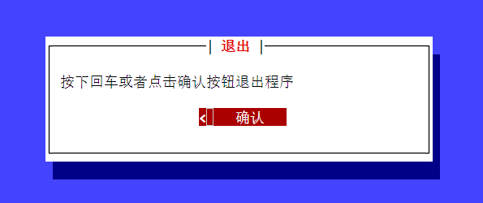

甚至可以自由定义布局、内容，运行应用式代码生成一个全屏的TUI程序：

```python3
from prompt_toolkit import Application
from prompt_toolkit.layout import Layout
from prompt_toolkit.widgets import Button

app = Application(
    full_screen=True,
    mouse_support=True,
)

app.layout = Layout(
    Button(
        'close app',
        app.exit
    )
)

app.run()
```

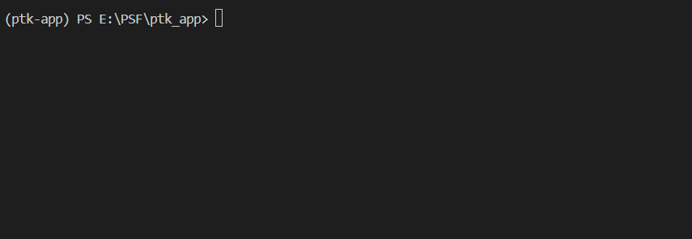

## 2 基础知识（响应式）

本章主要介绍命令式（响应式，直接执行、直接输出，代码简单）显示终端UI的基础知识。

### 2.1 输出

作为一个终端UI框架，输出内容是框架的主要功能。不同于Python内置的输出方法只是原样输出，框架能让输出内容的方式更简单、漂亮。

本节内容原文参考 https://python-prompt-toolkit.readthedocs.io/en/stable/pages/printing_text.html 。

#### 2.1.1 输出方法

就和Python内置的`print`方法一样，框架也提供了在终端输出内容的方法——`print_formatted_text`（使用`from prompt_toolkit.shortcuts.utils import print_formatted_text`或者`from prompt_toolkit.shortcuts import print_formatted_text`或者`from prompt_toolkit import print_formatted_text`导入）。

示例如下：

```python3
from prompt_toolkit.shortcuts import print_formatted_text

# from prompt_toolkit import print_formatted_text

print_formatted_text('Hello world')
```

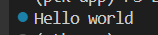

`print_formatted_text`方法支持以下参数：

- `*value`参数，任意类型，表示要输出到终端的内容。对于支持渲染为带格式文本的对象（下一节会介绍），会输出其渲染结果。支持传入多个符合要求的值或者解包可迭代对象。

- `sep`参数，字符串类型，表示传入多个内容时，每个内容之间的分隔符，默认为`' '`。从此参数开始，只能使用关键字传入。

- `end`参数，字符串类型，表示输出所有内容之后，末尾添加的额外字符串，默认为`'\n'`。

- `file`参数，文件类型（实际上是文本输入输出流`TextIO`），表示输出内容写入到哪个文件，默认为`None`。

- `flush`参数，布尔类型，表示是否立即显示输出，默认为`False`，即等待缓冲区填满之后之后才输出。

- `style`参数，`Style`类型，表示输出内容的样式（样式的用法下节介绍，这里暂不展开）.

- `output`参数，`Output`类型，表示内容输出到哪个IO流（需要实现`Output`抽象类）。

- `color_depth`参数，`ColorDepth`类型，表示输出内容的颜色深度，默认为`output`参数的`get_default_color_depth`方法的返回值。

- `style_transformation`参数，`StyleTransformation`类型，表示输出时如何转换样式。以下为示例：

  ```python3
  from prompt_toolkit import print_formatted_text
  from prompt_toolkit.styles.style_transformation import ReverseStyleTransformation
  
  print_formatted_text(
      'Hello world',
      style_transformation=ReverseStyleTransformation()
  )
  ```

  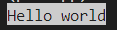

- `include_default_pygments_style`参数，布尔类型，表示输出语法标志对象时，是否启用语法标志对象本身的样式，默认为`True`。

不过，只是输出纯文本的话，那`print_formatted_text`方法就属于重复造轮子了。使用`print_formatted_text`方法，当然是为了输出带格式的文本：

```python3
from prompt_toolkit import print_formatted_text
from prompt_toolkit.formatted_text import FormattedText

print_formatted_text(
    FormattedText(
        [
            ('red','Hello world')
        ]
    )
)
```

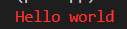

#### 2.1.2 带格式的文本

`print_formatted_text`方法支持将以下对象渲染为带格式的文本：

- `HTML`对象（使用`from prompt_toolkit.formatted_text import HTML`或者`from prompt_toolkit import HTML`导入，完整用法参考 https://python-prompt-toolkit.readthedocs.io/en/stable/pages/reference.html#prompt_toolkit.formatted_text.HTML ），该对象接收HTML类似格式的字符串，可以将`bold`（短名`b`）、`italic`（短名`i`）、`underline`（短名`u`）、`strike`（短名`s`）、`blink`、`reverse`、`hidden`等标签包含的文本渲染成对应格式（对应关系参见后面样式章节的介绍）的文本。示例如下：

  ```python3
  from prompt_toolkit import print_formatted_text
  from prompt_toolkit.formatted_text import HTML
  
  print_formatted_text(
      HTML('<u>hello</u>'),
  )
  ```

  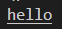

  除了表示格式的标签，对于表示颜色的颜色名字（支持的颜色名字参见后面样式章节的介绍）作为标签，还支持将其包含的文本渲染成对应颜色的文本。示例如下：

  ```python3
  from prompt_toolkit import print_formatted_text
  from prompt_toolkit.formatted_text import HTML
  
  print_formatted_text(
      HTML('<red>hello</red>'),
  )
  ```

  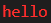

  如果想要同时设置颜色和格式，可以嵌套使用标签。示例如下：

  ```python3
  from prompt_toolkit import print_formatted_text
  from prompt_toolkit.formatted_text import HTML
  
  print_formatted_text(
      HTML('<red><u>hello</u></red>'),
  )
  ```

  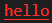

  除了这种通过嵌套标签的方式同时设置颜色和格式，还可以设置标签的`fg`属性（前景色）`color`属性为颜色（支持颜色名字和量化表达，，同样可以实现同时设置颜色和格式。示例如下：

  ```python3
  from prompt_toolkit import print_formatted_text
  from prompt_toolkit.formatted_text import HTML
  
  print_formatted_text(
      HTML('<u fg="red">hello</u>'), 
      # 或者 HTML('<u color="red">hello</u>'),
  )
  ```

  

  当然，背景颜色也可以通过这种方式设置——设置标签的`bg`属性：

  ```python3
  from prompt_toolkit import print_formatted_text
  from prompt_toolkit.formatted_text import HTML
  
  print_formatted_text(
      HTML('<u fg="red" bg="white">hello</u>'),
  )
  ```

  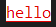

  如果只是设置内容的前景色、背景色，不想设置格式，则可以使用`style`标签：

  ```python3
  from prompt_toolkit import print_formatted_text
  from prompt_toolkit.formatted_text import HTML
  
  print_formatted_text(
      HTML('<style fg="red" bg="white">hello</style>'),
  )
  ```

  

  对于非保留名字（格式名、颜色名、`style`、`#document`、`html-root`为保留名字）的标签，`print_formatted_text`方法会将其映射为样式类的名字，给`print_formatted_text`方法的`style`参数传入样式类对象（具体用法参见后面样式章节的介绍），这些标签包含的文本会被渲染为样式类对应的样式：

  ```python3
  from prompt_toolkit import print_formatted_text
  from prompt_toolkit.formatted_text import HTML
  from prompt_toolkit.styles import Style
  
  # 基于字典创建样式对象
  style = Style.from_dict({
      'a': 'red underline',
  })
  
  print_formatted_text(
      HTML('<a>hello</a>'),
      style=style
  )
  
  # 直接创建样式对象
  style = Style([
      ('b','green italic')
  ])
  
  print_formatted_text(
      HTML('<b>hello</b>'),
      style=style
  )
  ```

  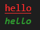

  需要注意的是，`HTML`对象要求字符串中的HTML标签层级严格配对，不支持自动闭合标签（不支持`'</>'`），且不能使用复合标签（不支持`'<red u>...</red u>'`），也不能错位嵌套标签（不支持`'<red><u>...</red></u>'`）。

- `ANSI`对象（使用`from prompt_toolkit.formatted_text import ANSI`或者`from prompt_toolkit import ANSI`导入，完整用法参考 https://python-prompt-toolkit.readthedocs.io/en/stable/pages/reference.html#prompt_toolkit.formatted_text.ANSI ），该对象接收包含ANSI终端转义码的字符串。示例如下：

  ```python3
  from prompt_toolkit import print_formatted_text
  from prompt_toolkit.formatted_text import ANSI
  
  print_formatted_text(
      ANSI('\x1b[31mhello\x1b[32m')
  )
  ```

  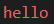

- `FormattedText`对象（使用`from prompt_toolkit.formatted_text import FormattedText`导入，完整用法参考 https://python-prompt-toolkit.readthedocs.io/en/stable/pages/reference.html#prompt_toolkit.formatted_text.FormattedText ），`HTML`对象和`ANSI`对象实际上在框架内部被映射为`FormattedText`对象的参数，最后渲染的是`FormattedText`对象。因此，直接使用`FormattedText`对象也可以：

  ```python3
  from prompt_toolkit import print_formatted_text
  from prompt_toolkit.formatted_text import FormattedText
  
  print_formatted_text(
      FormattedText(
          [
              ('red underline','hello'),
          ]
      )
  )
  ```

  

  `FormattedText`对象的参数比较特别，是元素为元组的可迭代对象，元组的第一个元素为样式字符串（具体语法参见后面样式章节的介绍），元组的第二个元素为原始文本，二者结合，即表示文本的渲染结果。

  除了使用样式字符串，还可以使用样式类，给`print_formatted_text`方法的`style`参数传入样式类对象（具体用法参见后面样式章节的介绍），在样式字符串中使用`'class:{样式类}'`，文本就会被渲染为样式类对应的样式：

  ```python3
  from prompt_toolkit import print_formatted_text
  from prompt_toolkit.formatted_text import FormattedText
  from prompt_toolkit.styles import Style
  
  # 基于字典创建样式对象
  style = Style.from_dict(
      {
          'a': 'red underline',
  	}
  )
  
  print_formatted_text(
      FormattedText(
          [
              ('class:a','hello'),
          ]
      ),
      style=style
  )
  
  # 直接创建样式对象
  style = Style(
      [
      	('b','green italic')
  	]
  )
  
  print_formatted_text(
      FormattedText(
          [
              ('class:b','hello'),
          ]
      ),
      style=style
  )
  ```

  

- `PygmentsTokens`对象（使用`from prompt_toolkit.formatted_text import PygmentsTokens`导入，完整用法参考 https://python-prompt-toolkit.readthedocs.io/en/stable/pages/reference.html#prompt_toolkit.formatted_text.PygmentsTokens ），和`FormattedText`对象的参数类似，只不过`PygmentsTokens`对象的参数中，元组的第一个元素不是样式字符串，而是将代码语法高亮时的标志，最终渲染时，就会根据语法高亮的情况将对应的部分代码渲染为指定样式：

  ```python3
  from prompt_toolkit import print_formatted_text
  from prompt_toolkit.formatted_text import PygmentsTokens
  from pygments.token import Token
  
  print_formatted_text(
      PygmentsTokens(
          [
              (Token.Keyword, 'print'),
              (Token.Punctuation, '('),
              (Token.Literal.String.Double, '"'),
              (Token.Literal.String.Double, 'hello'),
              (Token.Literal.String.Double, '"'),
              (Token.Punctuation, ')'),
              (Token.Text, '\n'),
          ]
      )
  )
  ```

  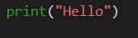

  当然，代码比较长的时候，每一部分都这样单独指定其对应的标志未免也太费事，这时可以导入`pygments`的语法高亮方案（比如`PythonLexer`），使用`lex`方法一步到位创建元素为元组（元素为标志、代码）的可迭代对象：

  ```python3
  import pygments
  from pygments.lexers.python import PythonLexer
  from prompt_toolkit.formatted_text import PygmentsTokens
  from prompt_toolkit import print_formatted_text
  
  print_formatted_text(
      PygmentsTokens(
          pygments.lex(
              'print("Hello")',
              lexer=PythonLexer()
          )
      )
  )
  ```

  

  虽然语法高亮方案自带样式，但依然可以传入覆盖了语法高亮样式类的样式对象，指定标志的样式：

  ```python3
  import pygments
  from pygments.lexers.python import PythonLexer
  from prompt_toolkit.formatted_text import PygmentsTokens
  from prompt_toolkit import print_formatted_text
  from prompt_toolkit.styles import Style
  
  style = Style(
      [
          ('pygments.literal.string.double','red underline')
      ]
  )
  
  print_formatted_text(
      PygmentsTokens(
          pygments.lex(
              'print("Hello")',
              lexer=PythonLexer()
          )
      ),
      style=style
  )
  ```

  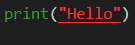

  实际上，在渲染`PygmentsTokens`对象时，标志都有对应的、指明样式类的样式字符串，比如`Token.Literal.String.Double`对应`'class:pygments.literal.string.double'`。具体规则就是将标志全部转化为小写之后，将'token'替换为'pygments'，即为该标志渲染时使用的样式类。

虽然`print_formatted_text`方法可以将上面的对象渲染为带格式的文本，但很多时候给的并非上述对象，而是普通的字符串或者对象，如果想要将其转换为带格式的文本，可以试试一个简单的方法——`to_formatted_text`（使用`from prompt_toolkit.formatted_text import to_formatted_text`导入，完整用法参考 https://python-prompt-toolkit.readthedocs.io/en/stable/pages/reference.html#prompt_toolkit.formatted_text.to_formatted_text ）。

`to_formatted_text`方法支持以下参数：

- `value`参数，字符串类型、元素为元组的列表（同`FormattedText`对象的参数，方法返回使用列表作为参数构建的`FormattedText`对象）、实现了`__pt_formatted_text__`方法的对象（即本节介绍的、可渲染为带格式文本的对象）、调用之后返回前面几种类型的可调用类型、除了前面几种类型之外的任意类型（只有`auto_convert`参数为`True`时才能正常转换），表示要转换的原始对象。
- `style`参数，字符串类型，表示方法返回结果的样式。对于`value`参数原本设置的样式（如列表、可渲染为带格式文本的对象），该参数不会覆盖；`value`参数原本未设置的样式，可通过此参数设置（哪怕这部分内容已经设置了其他样式，依然可以补充未设置的样式）。
- `auto_convert`参数，布尔类型，对于`value`参数为其余任意类型时，可以设置此参数为`True`来自动转换，该参数默认为`False`。

以下为示例：

```python3
from prompt_toolkit import print_formatted_text
from prompt_toolkit.formatted_text import to_formatted_text,HTML

print_formatted_text(
    to_formatted_text(
        'hello',
        style='red bg:white'
    )
)
print_formatted_text(
    to_formatted_text(
        [
            ('red','hello')
        ],
        style='green bg:white'
    )
)
print_formatted_text(
    to_formatted_text(
        HTML('<style bg="white">hello</style>'),
        style='red bg:green'
    )
)
print_formatted_text(
    to_formatted_text(
        locals(),
        auto_convert=True
    )
)
```

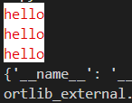

`to_formatted_text`方法可以将任意内容转换为带格式的文本，`to_plain_text`方法则可以反向转换——将转带格式的文本转换为没有格式的字符串，如果需要获取显示内容的无格式字符串，可以使用`to_plain_text`方法：

```python3
from prompt_toolkit import print_formatted_text
from prompt_toolkit.formatted_text import HTML,to_plain_text

print_formatted_text(
    to_plain_text(HTML('<red>hello</red>')),
)
```

`HTML`对象和`ANSI`对象都支持`format`方法，可以和Python中字符串的`format`方法一样，在这两个对象的原始内容中使用格式化表达，灵活替换部分内容，就像模板一样：

```python3
from prompt_toolkit import print_formatted_text
from prompt_toolkit.formatted_text import HTML,ANSI

print_formatted_text(
    HTML('<red>hello {s}</red>').format(s='Python'),
)

print_formatted_text(
    ANSI('\x1b[31mhello {s}\x1b[32m').format(s='Python')
)
```

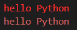

和上面模板用法类似的是，想要在无格式的字符串中灵活替换带格式的文本，可以使用同样支持`format`方法的`Template`类（使用`from prompt_toolkit.formatted_text import Template`导入，具体用法参考 https://python-prompt-toolkit.readthedocs.io/en/stable/pages/reference.html#prompt_toolkit.formatted_text.Template ）：

```python3
from prompt_toolkit import print_formatted_text
from prompt_toolkit.formatted_text import HTML,Template

print_formatted_text(
    Template('Answer is {}').format(HTML('<red>hello</red>')),
)
```

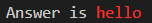

需要注意的是，`Template`类的`format`方法不支持命名的占位格式符，只能使用匿名的占位格式符。

#### 2.1.3 样式

前面讲了很多内容与样式有关，但是先讲样式的话，很多与特定对象相关的样式用法会导致读者迷惑，因此，样式的学习放在了这里。

本节内容原文参考 https://python-prompt-toolkit.readthedocs.io/en/stable/pages/advanced_topics/styling.html 。

##### 2.1.3.1 基础样式

在样式中，用得最多的就是颜色，而框架提供了以下两种颜色相关的样式：

- 直接表示颜色或者有'fg:'前缀的颜色表达式，表示内容的前景色（也称之为字体颜色）。

  其中，颜色支持以下格式：

  - 颜色的名字，如`'red'`。可以使用`from prompt_toolkit.styles import NAMED_COLORS,ANSI_COLOR_NAMES,ANSI_COLOR_NAMES_ALIASES`导入相关字典或者列表，查询支持的颜色名。其中，`ANSI_COLOR_NAMES`和`ANSI_COLOR_NAMES_ALIASES`包含的是ANSI颜色。
  - '#'为前缀，后接6位十六进制数字，每两位数字代表一种颜色分量值（依次对应红色、绿色、蓝色的分量值）的RGB颜色标准表达方式，如`'#cc5454'`。

  上面提到的颜色表达，也可以用在框架中其他使用颜色的地方，但部分对象（如`HTML`对象）只支持颜色名字。

- 有'bg:'前缀的颜色表达式，表示内容的背景色。

除了颜色，还支持通过样式修改内容的格式：

- `'bold'`，表示内容字体将变为粗体。
- `'italic'`，表示内容字体将变为斜体。
- `'underline'`，表示内容将添加下划线。
- `'strike'`，表示内容将添加删除线。
- `'blink'`，表示内容将闪烁（仅部分终端支持，Windows自带终端不支持）。
- `'reverse'`，表示内容的背景色与前景色相反。
- `'hidden'`，表示内容隐藏。

给以上内容格式添加'no'前缀，则表示内容不使用上述样式，常用于组合基础样式与样式类时，撤销不需要的内容格式。

使用基础样式时，不同的基础样式可以组合，使用空格间隔，构成复合样式。无论是基础样式还是复合样式，将其放在字符串中，就成了样式字符串。

对于`to_formatted_text`方法的`style`参数、`FormattedText`对象的参数等支持字符串作为样式的，可以使用样式字符串，修改输出内容的样式。

##### 2.1.3.2 样式类

`print_formatted_text`方法的`style`参数接收的是样式对象，需要通过样式对象创建样式类才能使用样式类对应的样式。

样式类可以看做是给基础样式或者复合样式分配了一个变量名，这样就能在样式字符串内，通过`'class:{样式类}'`的格式使用该样式：

```python3
from prompt_toolkit import print_formatted_text
from prompt_toolkit.formatted_text import HTML
from prompt_toolkit.styles import Style

# 基于字典创建样式对象
style = Style.from_dict(
    {
    	'a': 'red underline',
	}
)

print_formatted_text(
    HTML('<a>hello</a>'),
    style=style
)

# 直接创建样式对象
style = Style(
    [
    	('b','green italic')
	]
)

print_formatted_text(
    HTML('<b>hello</b>'),
    style=style
)
```


样式类（使用`from prompt_toolkit.styles import Style`导入）支持以下参数：

- `style_rules`参数，元素为元组的列表，表示样式类与具体样式的对应关系。元组的第一个元素为样式类名字，可以自定义（可在被渲染的对象中通过`'class:{样式类}'`的格式使用该样式类），也可以使用框架已经规定的样式类名字（部分对象不支持使用指定样式类，比如`PygmentsTokens`对象）；元组的第二个元素为样式类对应的样式字符串，表示该样式类的样式。

样式类支持以下属性：

- `style_rules`属性，同`style_rules`参数。

样式类支持以下类方法：

- `from_dict`方法，相比于直接使用样式类，该方法将样式类与具体样式的对应关系变成了字典的键、值对应关系，在某些场景下更方便。

##### 2.1.3.3 样式类的用法

在样式字符串内，通过`'class:{样式类}'`的格式使用样式类是基础用法。然而，样式类的用法远没有这么简单。

基础样式中支持的颜色名字和内容格式，还可以将其作为样式类来使用，其中`bold`（短名`b`）、`italic`（短名`i`）、`underline`（短名`u`）、`strike`（短名`s`）还支持短名作为样式类：

```python3
from prompt_toolkit import print_formatted_text
from prompt_toolkit.formatted_text import FormattedText

print_formatted_text(
    FormattedText(
        [
            ('class:red','hello')
        ]
    )
)

print_formatted_text(
    FormattedText(
        [
            ('class:b','hello')
        ]
    )
)
```

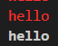

在定义样式类的时候，如果样式类名为空格分隔的两个样式类，比如`'a aa'`，则只有同时设置了这两个样式类的样式字符串才会应用该样式类对应的样式：

```python3
from prompt_toolkit import print_formatted_text
from prompt_toolkit.formatted_text import FormattedText
from prompt_toolkit.styles import Style

# 基于字典创建样式对象
style = Style.from_dict(
    {
    	'a aa': 'italic red',
	}
)

print_formatted_text(
    FormattedText(
        [
            ('class:a class:aa','hello')
        ]
    ),
    style=style
)
print_formatted_text(
    FormattedText(
        [
            ('class:aa','hello')
        ]
    ),
    style=style
)
print_formatted_text(
    FormattedText(
        [
            ('class:a','hello')
        ]
    ),
    style=style
)
```

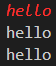

在使用样式类的时候，如果样式类名为英文句号连接的两个样式类，比如`'class:a.aa'`，则实际应用的是该样式类和以开头部分为核心依次去掉末尾部分的样式类，比如`'class:a.aa'`相当于`'class:a class:a.aa'`（与[Pygments](http://pygments.org/) 的词法分析相同）。

在定义样式类的时候，如果没有定义单独的样式类，只定义了英文句号连接的两个样式类。则在应用时，只有与定义完全相同的样式类才会应用其对应的样式：

```python3
from prompt_toolkit import print_formatted_text
from prompt_toolkit.formatted_text import FormattedText
from prompt_toolkit.styles import Style

# 基于字典创建样式对象
style = Style.from_dict(
    {
        'a.aa': 'red italic',
	}
)

print_formatted_text(
    FormattedText(
        [
            ('class:a.aa','hello')
        ]
    ),
    style=style
)
print_formatted_text(
    FormattedText(
        [
            ('class:aa.a','hello')
        ]
    ),
    style=style
)
```

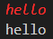

如果定义的时候，定义了单独的样式类。则在应用时，按照实际应用的样式类的顺序，后者会覆盖前者相同类型的样式：

```python3
from prompt_toolkit import print_formatted_text
from prompt_toolkit.formatted_text import FormattedText
from prompt_toolkit.styles import Style

# 基于字典创建样式对象
style = Style.from_dict(
    {
        'a': 'yellow',
        'aa': 'blue',
        'a.aa': 'red',
        'aa.a': 'green',
	}
)

print_formatted_text(
    FormattedText(
        [
            ('class:a.aa','hello')
        ]
    ),
    style=style
)
print_formatted_text(
    FormattedText(
        [
            ('class:aa.a','hello')
        ]
    ),
    style=style
)
```

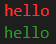

就和HTML中的CSS应用顺序一样，也遵循越靠近内容，优先级越高。比如：

```python3
from prompt_toolkit import print_formatted_text
from prompt_toolkit.formatted_text import HTML
from prompt_toolkit.styles import Style

# 基于字典创建样式对象
style = Style.from_dict(
    {
        'a': 'yellow',
	}
)

print_formatted_text(
    HTML(
        '<a color="red">hello</a>'
    ),
    style=style
)
```

`'<a color="red">hello</a>'`中设置了文字的颜色，但因为其归属于`HTML`对象内部，转换为带格式的文本对象之后，其生成的样式类对应的样式字符串为`'class:a fg:red'`，因此，实际渲染出来的文字颜色是红色，而非样式对象中的黄色：


使用下面的代码可以看到`HTML`对象对应的样式字符串：

```python3
from prompt_toolkit import print_formatted_text
from prompt_toolkit.formatted_text import HTML,to_formatted_text
from prompt_toolkit.styles import Style

# 基于字典创建样式对象
style = Style.from_dict(
    {
        'a': 'yellow',
	}
)

print_formatted_text(
    to_formatted_text(
        HTML(
            '<a color="red">hello</a>'
        )
    ).__repr__(),
    style=style
)
```

如果想在其他地方使用`pygments`的语法高亮的样式，除了要指定样式类为标志渲染时对应的样式类，还要使用`get_style_by_name`方法（使用`from pygments.styles import get_style_by_name`导入）获取`pygments`主题对应的样式（`pygments`支持多种主题，具体参考 https://pygments.org/styles/ ），再使用`style_from_pygments_cls`方法（使用`from prompt_toolkit.styles.pygments import style_from_pygments_cls`导入）将其转换为框架的样式对象：

```python3
from prompt_toolkit import print_formatted_text
from prompt_toolkit.formatted_text import HTML,FormattedText
from prompt_toolkit.styles.pygments import style_from_pygments_cls
from pygments.styles import get_style_by_name

style = style_from_pygments_cls(get_style_by_name('monokai'))

print_formatted_text(
    FormattedText(
        [
            ('class:pygments.literal.string','hello')
        ]
    ),
    style=style
)

print_formatted_text(
    HTML(
        '<pygments.literal.string>hello</pygments.literal.string>'
    ),
    style=style
)
```

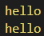

使用`merge_styles`方法（使用`from prompt_toolkit.styles import merge_styles`导入）可以将多个样式对象合并为一个，该方法接收元素为样式对象的列表，返回按照顺序合并后的样式对象（就和样式字符串中的样式优先级一样，排在后面的样式对象会覆盖前面相同的样式）：

```python3
from prompt_toolkit import print_formatted_text
from prompt_toolkit.formatted_text import FormattedText
from prompt_toolkit.styles import Style
from prompt_toolkit.styles import merge_styles

style = merge_styles(
    [
        Style.from_dict(
            {
                'a': 'red underline',
            }
        ),
        Style(
            [
                ('a', 'green italic')
            ]
        )
    ]
)

print_formatted_text(
    FormattedText(
        [
            ('class:a', 'hello'),
        ]
    ),
    style=style
)
```

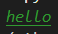

终端在显示样式的颜色时，不同的颜色深度（颜色位数）会影响显示的效果（还要看终端对颜色的支持情况）：

```python3
from prompt_toolkit import print_formatted_text
from prompt_toolkit.formatted_text import FormattedText

for color_depth in [
    'DEPTH_1_BIT',
    'DEPTH_4_BIT',
    'DEPTH_8_BIT',
    'DEPTH_24_BIT',
]:
    print_formatted_text(
        FormattedText(
            [
                ('class:green', 'hello'),
            ]
        ),
        color_depth=color_depth
    )
```

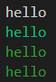

具体颜色深度（颜色位数）与支持的颜色、字符串值等对应情况可以参考下表：

| 颜色位数 | 支持的颜色 | 字符串值         | `ColorDepth`类的枚举成员  | `ColorDepth`类的枚举成员（别名） |
| -------- | ---------- | ---------------- | ------------------------- | -------------------------------- |
| 1位      | 黑与白     | `'DEPTH_1_BIT'`  | `ColorDepth.DEPTH_1_BIT`  | `ColorDepth.MONOCHROME`          |
| 4位      | ANSI颜色   | `'DEPTH_4_BIT'`  | `ColorDepth.DEPTH_4_BIT`  | `ColorDepth.ANSI_COLORS_ONLY`    |
| 8位      | 256色      | `'DEPTH_8_BIT'`  | `ColorDepth.DEPTH_8_BIT`  | `ColorDepth.DEFAULT`             |
| 24位     | 真彩色     | `'DEPTH_24_BIT'` | `ColorDepth.DEPTH_24_BIT` | `ColorDepth.TRUE_COLOR`          |

除了给方法的`color_depth`参数传入对应的字符串，还可以使用`ColorDepth`类的枚举成员：

```python3
from prompt_toolkit import print_formatted_text
from prompt_toolkit.formatted_text import FormattedText
from prompt_toolkit.output.color_depth import ColorDepth

for color_depth in [
    'DEPTH_4_BIT',
    ColorDepth.DEPTH_4_BIT,
    ColorDepth.ANSI_COLORS_ONLY,
]:
    print_formatted_text(
        FormattedText(
            [
                ('class:green', 'hello'),
            ]
        ),
        color_depth=color_depth
    )
```

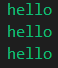

不仅`print_formatted_text`方法有`color_depth`参数，框架中还有不少方法、类也支持该参数，若是需要修改一个程序中所有显示内容的颜色深度（颜色位数），每个方法都设置一次`color_depth`参数难免有些麻烦。这时，可以设置环境变量`PROMPT_TOOLKIT_COLOR_DEPTH`为对应的字符串值，就能强制所有框架程序使用指定的颜色深度（颜色位数），或者在程序内单独设置环境变量，这样的话，该程序的所有输出内容都会使用指定的颜色深度（颜色位数）：

```python3
from prompt_toolkit import print_formatted_text
from prompt_toolkit.formatted_text import FormattedText
import os

os.environ['PROMPT_TOOLKIT_COLOR_DEPTH'] = 'DEPTH_4_BIT'

print_formatted_text(
    FormattedText(
        [
            ('class:green', 'hello'),
        ]
    ),
)
```

和`color_depth`参数一样有用的，就是`style_transformation`参数，给该参数传入`StyleTransformation`类（该类是抽象类，需要实现`transform_attrs`方法，具体参考 https://python-prompt-toolkit.readthedocs.io/en/stable/pages/reference.html#prompt_toolkit.styles.StyleTransformation ）对象，即可实现将渲染后的内容再处理一下（转换样式）：

```python3
from prompt_toolkit import print_formatted_text
from prompt_toolkit.formatted_text import FormattedText
from prompt_toolkit import print_formatted_text
from prompt_toolkit.styles.style_transformation import ReverseStyleTransformation

print_formatted_text(
    FormattedText(
        [
            ('class:green', 'hello'),
        ]
    ),
    style_transformation=ReverseStyleTransformation()
)
```

`ReverseStyleTransformation`可以将交换前景色与背景色：

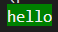

### 2.2 输入

相比于输出内容的简单，框架的输入功能就强大不少，不仅可以实现提示内容和输出一样支持样式和语法高亮，还支持响应按键输入、自动提示并完成输入内容。

本节内容原文参考 https://python-prompt-toolkit.readthedocs.io/en/stable/pages/asking_for_input.html 。

#### 2.2.1 输入会话

使用的`PromptSession`类（使用`from prompt_toolkit import PromptSession`或者`from prompt_toolkit.shortcuts import PromptSession`或者`from prompt_toolkit.shortcuts.prompt import PromptSession`导入）创建实例对象，再调用示例对象的`prompt`方法（方法支持的参数与`PromptSession`类基本相同，该方法用于进入输入模式，显示提示内容，并返回用户输入的内容），是获取用户输入的基本方式：

```python3
from prompt_toolkit import PromptSession

session = PromptSession()

result = session.prompt('请输入任何内容：')
print(f'输入的内容是: {result}')
```

`PromptSession`类支持以下参数：

- `message`参数，字符串类型、元素为元组的列表（同`FormattedText`对象的参数）、实现了`__pt_formatted_text__`方法的对象（即前面介绍的、可渲染为带格式文本的对象）、调用之后返回前面几种类型的可调用类型，表示用户输入时的提示内容（显示在要输入的内容最前面，提示用户需要输入什么）。

- `multiline`参数，布尔类型或者`Filter`类型（`Filter`类为基类，一般使用的是`Condition`类，过滤器对象在当作函数调用时返回布尔值。看作是过滤器用法在后面细讲，这里仅提供示例），表示是否允许多行输入，多行输入时，使用`alt + enter`键或者先按`esc`键再按`enter`键才能确认输入，默认为`False`。以下为示例：

  ```python3
  from prompt_toolkit import PromptSession
  from prompt_toolkit.filters import Condition
  
  # 对象用法
  # is_multiline = Condition(lambda :True)
  
  # 装饰器用法
  @Condition
  def is_multiline():
      return True
  
  session = PromptSession(multiline=is_multiline)
  
  result = session.prompt('请输入任何内容：')
  print(f'输入的内容是: {result}')
  ```

  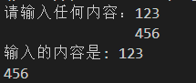

  从此参数开始，仅能通过关键字传入。

- `wrap_lines`参数，布尔类型或者`Filter`类型，表示一行输入的内容超过终端宽度时是否将剩余内容换行显示（仅显示换行，输入的内容不添加换行），默认为`True`。

- `is_password`参数，布尔类型或者`Filter`类型，表示输入的内容是否以密文形式显示（输入内容的显示为`'*'`），默认为`False`。以下为示例：

  ```python3
  from prompt_toolkit import PromptSession
  
  session = PromptSession(is_password=True)
  
  result = session.prompt('请输入任何内容：')
  print(f'输入的内容是: {result}')
  ```

  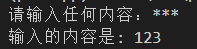

- `vi_mode`参数，布尔类型，表示是否使用`VI`的操作模式（快捷键和输入模式），默认为`False`。

- `editing_mode`参数，`EditingMode`类型（枚举类型，使用`from prompt_toolkit.enums import EditingMode`导入），表示输入时的操作模式，默认为`EditingMode.EMACS`，即使用`EMACS`的操作模式。注意，如果设置`vi_mode`参数为`True`，则此参数及相关属性会被设置为`EditingMode.VI`，优先级高于`editing_mode`参数。

- `complete_while_typing`参数，布尔类型或者`Filter`类型，表示是否在输入时主动弹出（无需额外使用`tab`键）自动补全（根据输入的内容弹出与之匹配的选项，可以选择任意选项来自动补全输入的内容，无需手动输入全部内容，`completer`参数会详细介绍用法），默认为`True`。

- `validate_while_typing`参数，布尔类型或者`Filter`类型，表示是否在输入时自动验证输入的内容（`validator`参数会详细介绍用法），默认为`True`。

- `enable_history_search`参数，布尔类型或者`Filter`类型，表示在输入时，是否可以使用上下方向键，以当前输入的内容作为开头，搜索输入历史，使用匹配到的结果补全当前内容，默认为`False`。注意，此参数不能与`complete_while_typing`参数同时设置为`True`，因为二者都使用上下方向键作为快捷键。如果同时设置，则`complete_while_typing`参数相当于设置为`False`。

- `search_ignore_case`参数，布尔类型或者`Filter`类型，表示通过搜索模式（操作模式为`VI`时，进入搜索模式的快捷键为命令状态下的`/`键和`?`键；操作模式为`EMACS`时，进入搜索模式的的快捷键为`ctrl + s`键）搜索输入历史时（结果包含关键字即可，不限制开头为关键字），是否忽略大小写，默认为`False`。

- `lexer`参数，`Lexer`类型，表示输入内容显示时使用的语法高亮方案。

  `Lexer`类（使用`from prompt_toolkit.lexers import Lexer`导入）为基类，使用时需要实现`lex_document`方法，如果不想实现此方法可以使用内部实现的子类：`SimpleLexer`类（将所有输入的内容设定为指定样式）或者`DynamicLexer`类（传入一个调用后返回`Lexer`类型对象的可调用对象）。示例如下：

  ```python3
  from prompt_toolkit import PromptSession
  from prompt_toolkit.lexers import SimpleLexer,DynamicLexer
  
  session = PromptSession(
      lexer=SimpleLexer('red'),
      # lexer=DynamicLexer(lambda :SimpleLexer('red')),
      multiline=True
  )
  result = session.prompt('请输入任何内容：')
  print(f'输入的内容是: {result}')
  ```

  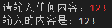

  当然，实现语法高亮方案需要一定的基础，如果是使用`pygments`的语法高亮方案（比如`PythonLexer`），则简单不少，只需使用`PygmentsLexer`类（使用`from prompt_toolkit.lexers import PygmentsLexer`导入）包装一下`pygments`的语法高亮方案即可：

  ```python3
  from prompt_toolkit import PromptSession
  from pygments.lexers.python import PythonLexer
  from prompt_toolkit.lexers import PygmentsLexer
  
  session = PromptSession(
      lexer=PygmentsLexer(PythonLexer),
      multiline=True
  )
  result = session.prompt('请输入任何内容：')
  print(f'输入的内容是: {result}')
  ```

  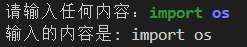

- `enable_system_prompt`参数，布尔类型或者`Filter`类型，表示是否允许进入系统命令执行模式，默认为`False`。使用`esc + !`键或者`meta + !`键（Windows中，`alt`键对应`meta`键）可以暂时执行系统命令：

  ```python3
  from prompt_toolkit import PromptSession
  
  session = PromptSession(
      enable_system_prompt=True,
      # 使用 esc+! 或者 meta+!(Windows系统是alt+!) 进入系统命令模式
  )
  result = session.prompt('请输入任何内容：')
  print(f'输入的内容是: {result}')
  ```

  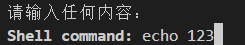

- `enable_suspend`参数，布尔类型或者`Filter`类型，表示是否可以按下`ctrl + z`键来暂时挂起当前程序（Windows不支持），默认为`False`。

- `enable_open_in_editor`参数，布尔类型或者`Filter`类型，表示进入编辑模式时，是否使用外部编辑器编辑要输入的内容，默认为`False`。操作模式为`VI`时，进入编辑模式的快捷键为命令状态下的`v`键；操作模式为`EMACS`时，进入编辑模式的的快捷键为按下`ctrl + x`键之后再按`ctrl + e`键。注意，默认使用外部编辑器时，会依据以下顺序寻找可以使用的命令：

  - 环境变量`VISUAL`。
  - 环境变量`EDITOR`。
  - `/usr/bin/editor`。
  - `/usr/bin/nano`。
  - `/usr/bin/pico`。
  - `/usr/bin/vi`。
  - `/usr/bin/emacs`。

  因为Windows默认没有后面几个Unix类系统的路径，使用需要通过设置环境变量来添加支持通过命令行调用的编辑器，以系统自带的记事本为例：

  ```python3
  from prompt_toolkit import PromptSession
  import os
  
  os.environ['VISUAL'] = 'notepad'
  os.environ['EDITOR'] = 'notepad'
  
  session = PromptSession(
      enable_open_in_editor=True,
  )
  result = session.prompt('请输入任何内容：')
  print(f'输入的内容是: {result}')
  ```

  运行时，按下`ctrl + x`键之后再按`ctrl + e`键，会弹出记事本，此时在记事本中输入内容（注意，仅支持单行内容，想要输入多行内容需要设置`multiline`参数为`True`）之后，再保存当前输入的内容，最后退出记事本。那么，在记事本中保存的内容就会成为输入的内容。

- `validator`参数，`Validator`类型（使用`from prompt_toolkit.validation import Validator`导入），表示验证输入内容是否有效的验证对象。有两种方式创建验证对象：

  - 实现`Validator`类，并创建类的对象。需要实现`validate`方法，该方法接收`Document`类型参数，该参数的`text`属性即为输入的内容。`validate`方法触发`ValidationError`异常时，表示输入的内容无效，`ValidationError`异常对象的`message`参数为验证无效时的提示信息。

    示例如下：

    ```python3
    from prompt_toolkit import PromptSession
    
    from prompt_toolkit.validation import Validator, ValidationError
    from prompt_toolkit.document import Document
    
    class MyValidator(Validator):
        def validate(self,document:Document):
            if document.text != 'ok':
                raise ValidationError(
                    cursor_position=len(document.text),
                    message='仅支持输入\'ok\'',            
                )
    
    session = PromptSession(
        validator=MyValidator()
    )
    result = session.prompt('请输入任何内容：')
    print(f'输入的内容是: {result}')
    ```

    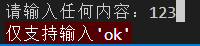

  - 使用`Validator`类的类方法`from_callable`，基于可调用对象创建验证对象。这种方式比实现`Validator`类简单，可调用对象返回布尔值，为`True`表示内容有效，为`False`表示内容无效。`from_callable`方法的`error_message`参数为验证无效时的提示信息。

    示例如下：

    ```python3
    from prompt_toolkit import PromptSession
    from prompt_toolkit.validation import Validator
    
    session = PromptSession(
        validator=Validator.from_callable(
            validate_func=lambda text:text == 'ok',
            error_message='仅支持输入\'ok\''
        )
    )
    result = session.prompt('请输入任何内容：')
    print(f'输入的内容是: {result}')
    ```

    

- `completer`参数，`Completer`类型，表示根据当前输入内容自动补全（也可以使用`tab`键弹出所有可以补全的内容）的自动补全对象。有两种方式创建自动补全对象：

  - 实现`Completer`类，并创建类的对象。需要实现`get_completions`方法，该方法接收`Document`类型参数，该参数的`text`属性即为输入的内容；该方法返回元素为`Completion`类型对象的可迭代对象。每次触发自动补全，都会调用一次`get_completions`方法。

    示例如下：

    ```python3
    from prompt_toolkit import PromptSession
    from prompt_toolkit.completion import Completer,Completion
    from prompt_toolkit.document import Document
    
    class MyCompleter(Completer):
        def __init__(self,words):
            self.words = words
        def get_completions(
            self, document: Document, complete_event
        ):
            return [ 
                Completion(
                    text=word,
                    start_position=-len(document.text)
                ) 
                for word in self.words 
                if word.startswith(document.text)
            ]
    
    mycompleter = MyCompleter(['123','abc','甲乙丙'])
    
    session = PromptSession(
        completer=mycompleter
    )
    result = session.prompt('请输入任何内容：')
    print(f'输入的内容是: {result}')
    ```

    

  - 使用`prompt_toolkit.completion`模块提供的内置类（以'Completer'为后缀的类）创建自动补全对象。以`WordCompleter`类为例，实现同样的效果，代码简单不少：

    ```python3
    from prompt_toolkit import PromptSession
    from prompt_toolkit.completion import WordCompleter
    
    mycompleter = WordCompleter(['123','abc','甲乙丙'])
    session = PromptSession(
        completer=mycompleter
    )
    result = session.prompt('请输入任何内容：')
    print(f'输入的内容是: {result}')
    ```

    

- `complete_in_thread`参数，布尔类型，表示是否在独立的线程中运行自动补全对象，默认为`False`。如果生成自动补全的原则比较复杂，生成结果比较耗时，最好将此参数设置为`True`，使用独立的线程运行自动补全对象，避免自动补全时卡死界面显示。

- `reserve_space_for_menu`参数，整数类型，设置了`completer`参数且`complete_style`参数不为`CompleteStyle.READLINE_LIKE`时，该参数表示允许的终端最小高度，默认为`8`。如果终端高度小于该值，该方法将提示用户`'Window too small...'`。

- `complete_style`参数，`CompleteStyle`类型（枚举类型，使用`from prompt_toolkit.shortcuts.prompt import CompleteStyle`或者`from prompt_toolkit.shortcuts import CompleteStyle`导入，仅支持三个成员：`COLUMN`、`MULTI_COLUMN`、`READLINE_LIKE`）或者字符串类型（仅支持`['COLUMN','MULTI_COLUMN','READLINE_LIKE']`中的值），表示自动补全内容使用什么风格显示（依次对应单列、多列、类似`readline`那种打印到终端），默认为`CompleteStyle.COLUMN`。

  以下为对比（来自《Questionary的中文入门教程》）：

  

- `auto_suggest`参数，`AutoSuggest`类型，表示自动建议对象。自动建议与自动补全类似，但自动建议仅在当前行显示，只在输入时触发（删除内容不触发），只显示一个结果，使用右方向键补全当前内容。

  `AutoSuggest`类（使用`from prompt_toolkit.auto_suggest import AutoSuggest`导入）为抽象类，使用时需要实现`AutoSuggest`类，并创建类的对象。实现`AutoSuggest`类需要实现`get_suggestion`方法，该方法接收两个参数：`Buffer`类型的`buffer`和`Document`类型的`document`。方法返回`Suggestion`类型的对象，表示补全的内容（在已输入内容后追加）。每次触发自动建议，都会调用一次`get_suggestion`方法。以下为示例：

  ```python3
  from prompt_toolkit import PromptSession
  from prompt_toolkit.auto_suggest import AutoSuggest,Suggestion
  from prompt_toolkit.buffer import Buffer
  from prompt_toolkit.document import Document
  
  class MyAutoSuggest(AutoSuggest):
      def get_suggestion(self, buffer: Buffer, document: Document):
          suggestions = ['123','abc','甲乙丙']
          text = document.text
          for suggestion in suggestions:
              if suggestion.startswith(text):
                  return Suggestion(suggestion[len(text):])
  
  session = PromptSession(
      auto_suggest=MyAutoSuggest()
  )
  result = session.prompt('请输入任何内容：')
  print(f'输入的内容是: {result}')
  ```

  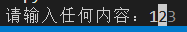

  `prompt_toolkit.auto_suggest`模块也提供几个内置类（大部分是以'AutoSuggest'为后缀的类），这里推荐使用`AutoSuggestFromHistory`类，该类可以基于输入的历史记录生成建议：

  ```python3
  from prompt_toolkit import PromptSession
  from prompt_toolkit.auto_suggest import AutoSuggestFromHistory
  
  session = PromptSession(
      auto_suggest=AutoSuggestFromHistory()
  )
  while True:
      result = session.prompt('请输入任何内容：')
      print(f'输入的内容是: {result}')
  ```

  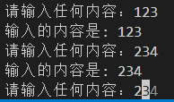

- `style`参数，`Style`类型，表示提示内容的样式。示例如下：

  ```python3
  from prompt_toolkit import PromptSession
  from prompt_toolkit.styles import Style
  
  session = PromptSession(
      style=Style([('prompt','red')])
  )
  
  result = session.prompt('请输入任何内容：')
  print(f'输入的内容是: {result}')
  ```

  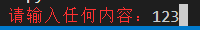

  注意，想要设置输入内容的样式，需要设置`lexer`参数。但是，部分内容使用的样式类依然支持通过`style`参数设置：

  - `rprompt`类，`rprompt`参数对应的内容使用的样式类。

  - `bottom-toolbar`类，`bottom_toolbar`参数对应的内容所属的底部工具栏使用的样式类。注意，此样式类默认包含`'reverse'`样式，所以设置前景色实际会渲染为背景色。可以在设置样式类为自定义样式时额外添加`'noreverse'`样式取消`'reverse'`样式，或者将背景色设置为想要设置的前景色。

  - `bottom-toolbar.text`类，`bottom_toolbar`参数对应的内容部分（不是整个底部工具栏）使用的样式类。注意，此样式类同时使用`bottom-toolbar`类的样式，如果`bottom-toolbar`类没有取消`'reverse'`样式，此样式类默认包含`'reverse'`样式。

  - `aborting`类，按`ctrl + c`键强制退出时，正在执行的代码在终端显示的内容使用的样式类会改为该样式类。

  - `exiting`类，当前需要输入内容时，按`ctrl + d`键输入EOF标志会正常退出，此时正在执行的代码在终端显示的内容使用的样式类会改为该样式类。

  - `prompt`类，`message`参数对应的内容使用的样式类。

  - `prompt-continuation`类，`continuation`参数对应的内容使用的样式类。

  - `arg-toolbar`类，输入模式为多行输入，进入输入重复指定字符模式时，所有提示内容使用的样式类。

    按下`alt + {数字}`键会进入输入重复指定字符模式，再按下数字键会接着之前的数字，表示要重复多少次；然后再按下非数字键的任意可打印字符键，表示重复什么字符。`backspace`键或者`esc`键可以退出该模式。

  - `arg-toolbar.text`类，输入模式为多行输入，进入输入重复指定字符模式时，表示重复多少次的内容部分使用的样式类。注意，此样式类同时使用`arg-toolbar`类的样式。

  - `prompt.arg`类，输入模式为单行输入，进入输入重复指定字符模式时，所有提示内容使用的样式类。

  - `prompt.arg.text`类，输入模式为单行输入，进入输入重复指定字符模式时，表示重复多少次的内容部分使用的样式类。注意，此样式类同时使用`prompt.arg`类的样式。

- `style_transformation`参数，`StyleTransformation`类型（`prompt_toolkit.styles`模块提供了'StyleTransformation'为后缀的内置类），表示输出时如何转换样式。示例如下：

  ```python3
  from prompt_toolkit import PromptSession
  from prompt_toolkit.styles import ReverseStyleTransformation
  
  session = PromptSession(
      style_transformation=ReverseStyleTransformation()
  )
  
  result = session.prompt(message='请输入任何内容：')
  print(f'输入的内容是: {result}')
  ```

  

- `swap_light_and_dark_colors`参数，布尔类型或者`Filter`类型，表示是否切换当前显示内容的颜色为该颜色适用于另一种终端背景色的颜色，默认为`False`。部分颜色都有对应的适用终端背景色（浅色风格或者深色风格），该参数设置为`True`之后，原本对应浅色风格终端背景色的颜色，会变成对应深色风格终端背景色的颜色。以下为对比示例;

  ```python3
  from prompt_toolkit import PromptSession
  from prompt_toolkit.styles import Style
  
  for color in ['purple','green']:
      PromptSession(
          '请输入任何内容：',
          swap_light_and_dark_colors=True,
          style=Style([('prompt',f'{color}')]),
      ).prompt()
      PromptSession(
          '请输入任何内容：',
          swap_light_and_dark_colors=False,
          style=Style([('prompt',f'{color}')]),
      ).prompt()
      PromptSession(
          '请输入任何内容：',
          swap_light_and_dark_colors=True,
          style=Style([('prompt',f'bg:{color}')]),
      ).prompt()
      PromptSession(
          '请输入任何内容：',
          swap_light_and_dark_colors=False,
          style=Style([('prompt',f'bg:{color}')]),
      ).prompt()
  ```

  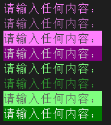

- `color_depth`参数，`ColorDepth`类型或者字符串类型，表示输出内容的颜色深度（具体用法可以参考前面的内容）。

- `cursor`参数，`CursorShape`类型或者`CursorShapeConfig`类型，表示输入时光标的形状。

  `CursorShape`类为枚举类，支持以下成员：

  - `BLOCK`，表示光标形状为方块。
  - `BEAM`，表示光标形状为分隔线`'|'`。
  - `UNDERLINE`，表示光标形状为下划线。
  - `BLINKING_BLOCK`，表示光标形状为闪烁的方块（仅部分终端支持）。
  - `BLINKING_BEAM`，表示光标形状为闪烁的分隔线（仅部分终端支持）。
  - `BLINKING_UNDERLINE`，表示光标形状为闪烁的下划线（仅部分终端支持）。

  `CursorShapeConfig`类为抽象类，使用时需要该类的`get_cursor_shape`方法，该方法返回`CursorShape`类的成员。该参数说到底接收的还是`CursorShape`类型的值，因此`CursorShapeConfig`类的用法这里不做展开，仅提供一个简单的示例（使用`prompt_toolkit.cursor_shapes`模块提供的`SimpleCursorShapeConfig`类）：

  ```python3
  from prompt_toolkit import PromptSession
  from prompt_toolkit.cursor_shapes import CursorShape,SimpleCursorShapeConfig
  
  session = PromptSession(
      cursor=SimpleCursorShapeConfig(CursorShape.BEAM)
      # 效果与 cursor=CursorShape.BEAM 相同
  )
  
  result = session.prompt(message='请输入任何内容：')
  print(f'输入的内容是: {result}')
  ```

- `include_default_pygments_style`参数，布尔类型或者`Filter`类型，如果设置了`lexer`参数，此参数表示是否启用`lexer`参数生成的样式，默认为`True`。因为`lexer`参数生成的样式，比`style`参数设置为`pygments`主题对应的样式对象优先生效。想要让代码显示主题对应的样式，必须将此参数设置为`False`。以下为示例：

  ```python3
  from prompt_toolkit import PromptSession
  from pygments.lexers.python import PythonLexer
  from prompt_toolkit.lexers import PygmentsLexer
  from prompt_toolkit.styles.pygments import style_from_pygments_cls
  from pygments.styles import get_style_by_name
  
  style = style_from_pygments_cls(get_style_by_name('monokai'))
  session = PromptSession(
      lexer=PygmentsLexer(PythonLexer),
      style=style,
      include_default_pygments_style=False
  )
  result = session.prompt('请输入任何内容：')
  print(f'输入的内容是: {result}')
  session = PromptSession(
      lexer=PygmentsLexer(PythonLexer),
      style=style,
      include_default_pygments_style=True
  )
  result = session.prompt('请输入任何内容：')
  print(f'输入的内容是: {result}')
  ```

  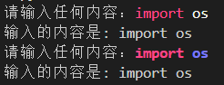

- `history`参数，`History`类型，表示当前会话对象的输入历史，默认为`None`，即`InMemoryHistory()`，会将每次输入的内容存入内容，程序重启后重置。也可以使用`prompt_toolkit.history`模块提供的其他历史记录类（以为'History'后缀，如`FileHistory`类，是将历史记录存入文件）：

  ```python3
  from prompt_toolkit import PromptSession
  from prompt_toolkit.history import InMemoryHistory,FileHistory
  
  session = PromptSession(
      # history=InMemoryHistory(['123','abc']),
      history=FileHistory(f'{__file__}.his')
  )
  
  result = session.prompt('请输入任何内容：')
  print(f'输入的内容是: {result}')
  ```

- `clipboard`参数，`Clipboard`类型，表示输入内容时，存放临时数据的命令行剪贴板，默认为`None`，即`InMemoryClipboard()`。注意，这里的命令行剪贴板与系统剪贴板数据不互通，且粘贴命令行剪贴板数据的快捷键不是系统的`ctrl + v`键，而是对应操作模式的快捷键（`EMACS`操作模式下为`ctrl + y`键；`VI`操作模式下，需要先按`esc`键进入命令模式，再按`p`键粘贴）。以下为示例：

  ```python3
  from prompt_toolkit import PromptSession
  from prompt_toolkit.clipboard import InMemoryClipboard,ClipboardData
  
  session = PromptSession(
      clipboard=InMemoryClipboard(ClipboardData('hello')),
  )
  
  # 可以使用下面的方法修改命令行剪贴板的内容
  # session.clipboard.set_text('hello')
  
  result = session.prompt('请输入任何内容：')
  print(f'输入的内容是: {result}')
  ```

  注意，想要修改命令行剪贴板的数据，除了修改该参数或者`clipboard`属性为新的命令行剪贴板对象，还可以使用命令行剪贴板的`set_data`方法或者`set_text`方法。

- `prompt_continuation`参数，字符串类型、元素为元组的列表（同`FormattedText`对象的参数）、实现了`__pt_formatted_text__`方法的对象（即前面介绍的、可渲染为带格式文本的对象）、调用之后返回前面几种类型的可调用类型（接收三个整数类型的参数，分别为表示第一行提示内容的宽度`prompt_width`、第一行为`0`行的行号`line_number`、本行内容太长且`wrap_lines`参数为`True`导致换行后的换行次数`wrap_count`），表示当`multiline`参数为`True`时，从第二行开始每行开头显示的内容，用于表明还能继续输入，输入过程并未结束。示例如下：

  ```python3
  from prompt_toolkit import PromptSession
  
  session = PromptSession(
      prompt_continuation=lambda w,l,c:f'{w=},{l=},{c=}: ',
      multiline=True,
  )
  
  result = session.prompt('请输入任何内容：')
  print(f'输入的内容是: {result}')
  ```

  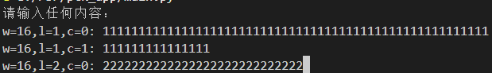

- `rprompt`参数，字符串类型、元素为元组的列表（同`FormattedText`对象的参数）、实现了`__pt_formatted_text__`方法的对象（即前面介绍的、可渲染为带格式文本的对象）、调用之后返回前面几种类型的可调用类型，表示显示在右侧的提示内容。示例如下：

  ```python3
  from prompt_toolkit import PromptSession
  
  session = PromptSession(
      rprompt='右侧的提示内容'
  )
  
  result = session.prompt('请输入任何内容：')
  print(f'输入的内容是: {result}')
  ```

  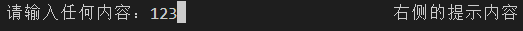

- `bottom_toolbar`参数，字符串类型、元素为元组的列表（同`FormattedText`对象的参数）、实现了`__pt_formatted_text__`方法的对象（即前面介绍的、可渲染为带格式文本的对象）、调用之后返回前面几种类型的可调用类型，表示显示在底部的提示内容。示例如下：

  ```python3
  from prompt_toolkit import PromptSession
  
  session = PromptSession(
      bottom_toolbar='底部的提示内容'
  )
  
  result = session.prompt('请输入任何内容：')
  print(f'输入的内容是: {result}')
  ```

  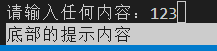

- `mouse_support`参数，布尔类型或者`Filter`类型，表示是否启用鼠标支持（可以使用鼠标点击的方式移动光标，并支持一些鼠标的点击操作，与后面介绍的应用程序有关），默认为`False`。

- `input_processors`参数，元素为`Processor`类型的列表，表示输入内容的处理器。该参数默认不需要任何值，内部已经对该参数做好了处理。如果要使用该参数，一般在需要修改密文形式的显示字符时，才不得不使用该参数：

  ```python3
  from prompt_toolkit import PromptSession
  from prompt_toolkit.layout.processors import PasswordProcessor
  
  session = PromptSession(
      input_processors=[PasswordProcessor('密')]
  )
  
  result = session.prompt('请输入任何内容：')
  print(f'输入的内容是: {result}')
  ```

  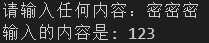

  注意，如果使用了`PasswordProcessor`，`is_password`参数相当于设置为`True`。

  该参数最终传给了`BufferControl`控件，如果想要了解该参数的更多用途，可以参考该控件的文档 https://python-prompt-toolkit.readthedocs.io/en/stable/pages/reference.html#prompt_toolkit.layout.BufferControl ，或者后面的相关教程，这里不做展开。

- `placeholder`参数，字符串类型、元素为元组的列表（同`FormattedText`对象的参数，方法返回使用列表作为参数构建的`FormattedText`对象）、实现了`__pt_formatted_text__`方法的对象（即前面介绍的、可渲染为带格式文本的对象）、调用之后返回前面几种类型的可调用类型，表示没输入之前显示的占位内容。示例如下：

  ```python3
  from prompt_toolkit import PromptSession
  
  session = PromptSession(
      placeholder='xxx-xxx-xxx'
  )
  
  result = session.prompt('请输入任何内容：')
  print(f'输入的内容是: {result}')
  ```

  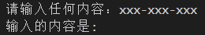

- `key_bindings`参数，`KeyBindingsBase`类型，表示可用的自定义快捷键。自定义快捷键需要实现`KeyBindingsBase`类，会比较复杂，这里推荐使用内置类`KeyBindings`（使用`from prompt_toolkit.key_binding import KeyBindings`导入，如果想要实现`KeyBindingsBase`类，建议参考`KeyBindings`类的源码或者继承该类），该类的实例支持`add`方法，该方法接收表示快捷键的字符串，并返回一个装饰器，可用于装饰该快捷键对应的操作。示例如下：

  ```python3
  from prompt_toolkit import PromptSession
  from prompt_toolkit.application import run_in_terminal
  from prompt_toolkit.key_binding import KeyBindings,KeyPressEvent
  
  bindings = KeyBindings()
  
  @bindings.add('c-q')
  def ctrl_q_handler(event:KeyPressEvent):
      run_in_terminal(lambda :print(event.key_sequence[0].key))
  
  session = PromptSession(
      key_bindings=bindings
  )
  
  result = session.prompt('请输入任何内容：')
  print(f'输入的内容是: {result}')
  ```

  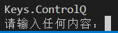

  代码中使用了`run_in_terminal`方法间接运行`print`方法，那是因为直接使用`print`方法的话，输出的内容会以当前光标位置为起点，跟在要输入的内容后，但实际上输入的内容不包含输出的内容，容易引起误解；但是，使用`run_in_terminal`方法间接运行`print`方法，框架会将输出的内容重定位到提示内容的上方，不会跟在要输入的内容后。

  `add`方法的完整用法和快捷键绑定的更多基础参见后面按键输入章节的介绍，这里不做展开。

- `erase_when_done`参数，布尔类型，表示当程序正常退出时，是否清除输出方法（`print`方法、`print_formatted_text`方法等）输出的内容，默认为`False`。

- `tempfile_suffix`参数，字符串类型或者返回字符串的可调用类型，表示当`enable_open_in_editor`参数为`True`时，使用外部编辑打开的临时文件的后缀，默认为`'.txt'`。

- `tempfile`参数，字符串类型或者返回字符串的可调用类型，表示当`enable_open_in_editor`参数为`True`时，使用外部编辑打开的临时文件的文件名（不含后缀），默认为随机生成。

- `refresh_interval`参数，浮点类型，表示每隔多少秒刷新一次显示，默认为`0`，即不自动刷新。

  这里的自动刷新仅限`message`参数（或者属性）为可调用类型时，才会触发自动刷新，比如：

  ```python3
  from prompt_toolkit import PromptSession
  import datetime
  session = PromptSession(
      refresh_interval=1
  )
  
  session.prompt(
      lambda :f'{datetime.datetime.now()}'
  )
  ```

- `input`参数，`Input`类型，表示获取输入内容的对象，一般不需要设置或者修改。

- `output`参数，`Output`类型，表示内容输出的对象，一般不需要设置或者修改。

- `interrupt_exception`参数，`BaseException`类及其子类，当使用`ctrl + c`键强制退出时触发什么异常，默认为`KeyboardInterrupt`。

- `eof_exception`参数，`BaseException`类及其子类，当使用`ctrl + d`键输入EOF标志之后正常退出时触发什么异常，默认为`EOFError`。

`PromptSession`类支持以下属性：

- `message`属性，同`message`参数。
- `multiline`属性，同`multiline`参数。
- `wrap_lines`属性，同`wrap_lines`参数。
- `is_password`属性，同`is_password`参数。
- `editing_mode`属性，同`editing_mode`参数。
- `complete_while_typing`属性，同`complete_while_typing`参数。
- `validate_while_typing`属性，同`validate_while_typing`参数。
- `enable_history_search`属性，同`enable_history_search`参数。
- `search_ignore_case`属性，同`search_ignore_case`参数。
- `lexer`属性，同`lexer`参数。
- `enable_system_prompt`属性，同`enable_system_prompt`参数。
- `enable_suspend`属性，同`enable_suspend`参数。
- `enable_open_in_editor`属性，同`enable_open_in_editor`参数。
- `validator`属性，同`validator`参数。
- `completer`属性，同`completer`参数。
- `complete_in_thread`属性，同`complete_in_thread`参数。
- `reserve_space_for_menu`属性，同`reserve_space_for_menu`参数。
- `complete_style`属性，同`complete_style`参数。
- `auto_suggest`属性，同`auto_suggest`参数。
- `style`属性，同`style`参数。
- `style_transformation`属性，同`style_transformation`参数。
- `swap_light_and_dark_colors`属性，同`swap_light_and_dark_colors`参数。
- `color_depth`属性，同`color_depth`参数。
- `cursor`属性，同`cursor`参数。
- `include_default_pygments_style`属性，同`include_default_pygments_style`参数。
- `history`属性，同`history`参数。
- `clipboard`属性，同`clipboard`参数。
- `prompt_continuation`属性，同`prompt_continuation`参数。
- `rprompt`属性，同`rprompt`参数。
- `bottom_toolbar`属性，同`bottom_toolbar`参数。
- `mouse_support`属性，同`mouse_support`参数。
- `input_processors`属性，同`input_processors`参数。
- `placeholder`属性，同`placeholder`参数。
- `key_bindings`属性，同`key_bindings`参数。
- `tempfile_suffix`属性，同`tempfile_suffix`参数。
- `tempfile`属性，同`tempfile`参数。
- `refresh_interval`属性，同`refresh_interval`参数。
- `input`属性，同`input`参数。
- `output`属性，同`output`参数。
- `interrupt_exception`属性，同`interrupt_exception`参数。
- `eof_exception`属性，同`eof_exception`参数。
- `app`属性，`Application`类型，表示运行输入会话的应用程序（相关概念和用法将在后面应用程序章节详细介绍，这里不做展开）。
- `layout`属性，`Layout`类型，表示应用程序的使用的布局（相关概念和用法将在后面应用程序章节详细介绍，这里不做展开）。
- `default_buffer`属性，`Buffer`类型，表示获取输入的缓冲对象（相关用法可以参考 https://python-prompt-toolkit.readthedocs.io/en/stable/pages/reference.html#module-prompt_toolkit.buffer ），该对象最终用于构建`BufferControl`控件，成为应用程序中获取输入的控件。
- `search_buffer`属性，`Buffer`类型，表示用于搜索指定内容的缓冲对象，该对象最终用于构建`BufferControl`控件，成为应用程序中显示搜索结果的控件。

`PromptSession`类支持以下方法：

- `prompt`方法用于进入输入模式，同时也支持一些参数（不完全与`PromptSession`类相同），可以覆盖输入会话的同名属性、参数，并影响后续使用同一会话的情况。该方法支持的参数有三种类型：
  
  - 可通过位置传入的`message`参数，与`PromptSession`类的同名参数含义相同，默认为`None`，即不改变同名属性的值。
  
  - 仅支持通过关键字传入的参数，但与`PromptSession`类的同名参数含义相同，默认均为`None`，即不改变同名属性的值。包括：
  
    - `editing_mode`参数。
    - `refresh_interval`参数。
    - `vi_mode`参数。
    - `lexer`参数。
    - `completer`参数。
    - `complete_in_thread`参数。
    - `is_password`参数。
    - `key_bindings`参数。
    - `bottom_toolbar`参数。
    - `style`参数。
    - `color_depth`参数。
    - `cursor`参数。
    - `include_default_pygments_style`参数。
    - `style_transformation`参数。
    - `swap_light_and_dark_colors`参数。
    - `rprompt`参数。
    - `multiline`参数。
    - `prompt_continuation`参数。
    - `wrap_lines`参数。
    - `enable_history_search`参数。
    - `search_ignore_case`参数。
    - `complete_while_typing`参数。
    - `validate_while_typing`参数。
    - `complete_style`参数。
    - `auto_suggest`参数。
    - `validator`参数。
    - `clipboard`参数。
    - `mouse_support`参数。
    - `input_processors`参数。
    - `placeholder`参数。
    - `reserve_space_for_menu`参数。
    - `enable_system_prompt`参数。
    - `enable_suspend`参数。
    - `enable_open_in_editor`参数。
    - `tempfile_suffix`参数。
    - `tempfile`参数。
  
  - 仅支持通过关键字传入的参数，但`PromptSession`类无同名参数。包括：
  
    - `default`参数，字符串类型或者`Document`类型，表示在用户没有输入任何内容时的默认内容，默认为`''`。
  
    - `accept_default`参数，布尔类型，表示是否禁止用户改变默认内容，默认为`False`，即允许改变。如果此参数为`True`，则会跳过输入过程，直接将`default`参数的值作为结果返回。
  
    - `pre_run`参数，可调用类型，表示在进入输入模式前执行的操作，默认为`None`。
  
    - `set_exception_handler`参数，布尔类型，表示进入输入模式后触发异常时，是否先切换屏幕（可以理解为保留当前终端的状态并新开了一个虚拟的终端处理输入、输出）再输出异常信息，然后按`enter`键可以退出当前屏幕，并回到显示提示内容的输入模式，该参数默认为`True`。如果该参数为`False`，则触发异常时不会切换屏幕，直接在当前终端输出异常信息，此时依然处于输入模式，可以继续输入内容，无需额外按`enter`键来回到显示提示内容的输入模式。
  
    - `handle_sigint`参数，布尔类型，表示是否处理发送给当前程序的SIGNAL信号（Unix概念，且仅在主线程生效，即`in_thread`参数为`True`时无法生效），默认为`True`。
  
    - `in_thread`参数，布尔类型，表示是否在单独的线程中运行，默认为`False`。
  
    - `inputhook`参数，`InputHook`类型（一个接收`InputHookContext`类型参数的可调用类型，相关文档参考 https://python-prompt-toolkit.readthedocs.io/en/stable/pages/advanced_topics/input_hooks.html），表示输入钩子，默认为`None`。所谓输入钩子，就是在输入模式下循环运行并在完成输入后退出循环的函数。示例如下：
  
      ```python3
      from prompt_toolkit import PromptSession
      from prompt_toolkit.patch_stdout import patch_stdout
      
      session = PromptSession()
      
      def inputhook(inputhook_context):
          print('inputhooking')
          
      with patch_stdout():
          result = session.prompt('请输入任何内容：',inputhook=inputhook,in_thread=True)
          print(f'输入的内容是: {result}')
      ```
  
- `prompt_async`方法则是`prompt`方法的异步版本，但是不支持`in_thread`参数和`inputhook`参数。

#### 2.2.2 输入方法

除了先创建一个会话对象、每次获取用户输入前调用会话对象的`prompt`方法之外，框架也提供了功能相同、可以直接使用、并且直接返回输入内容的`prompt`方法（使用`from prompt_toolkit import prompt`或者`from prompt_toolkit.shortcuts import prompt`或者`from prompt_toolkit.shortcuts.prompt import prompt`导入），使用该方法会让代码更简单（方便程度堪比Python内置的`input`方法）：

```python3
from prompt_toolkit import prompt

result = prompt('请输入任何内容：')
print(f'输入的内容是: {result}')
```

`prompt`方法支持的参数和会话对象的`prompt`方法基本相同，只是多了一个关键字参数——`history`（含义同`PromptSession`类的`history`参数）。

虽然直接调用`prompt`方法和调用会话对象的`prompt`方法的效果基本一样，但直接调用`prompt`方法还是有一些不足：

- 需要每次调用时传入`history`参数来确保历史记录的连续性。
- 如果其他参数非默认值时，无论是否有变化，都需要重复传入。

相比之下，调用会话对象的`prompt`方法就没有上面的问题，因为`history`参数只在创建会话对象时传入，在同一会话对象中共享。如果其他参数没有变化，调用会话对象的`prompt`方法时无需重复传入。如果其他参数有变化，调用会话对象的`prompt`方法时只需传入发生变化的参数即可，变化的参数（属性）会在同一会话对象中共享，影响之后调用会话对象`prompt`方法时的表现。

`prompt`方法在原有输入会话的基础上简化不少，`confirm`方法（使用`from prompt_toolkit.shortcuts import confirm`或者`from prompt_toolkit.shortcuts.prompt import confirm`导入）则做到了更加简单。该方法仅允许按下`y`键或者`n`键表示是否，用于询问用户一些只能表示是否的问题，并返回对应的布尔值。

`confirm`方法支持以下参数：

- `message`参数，字符串类型、元素为元组的列表（同`FormattedText`对象的参数）、实现了`__pt_formatted_text__`方法的对象（即前面介绍的、可渲染为带格式文本的对象）、调用之后返回前面几种类型的可调用类型，表示提示内容，默认为`'Confirm?'`。
- `suffix`参数，字符串类型、元素为元组的列表（同`FormattedText`对象的参数）、实现了`__pt_formatted_text__`方法的对象（即前面介绍的、可渲染为带格式文本的对象）、调用之后返回前面几种类型的可调用类型，表示提示内容后的后缀提示内容，一般用于提示用户如何输入（按什么按键），默认为`' (y/n) '`。

与`confirm`方法作用相同的`create_confirm_session`方法，则返回的是会话对象，使用时需要调用会话对象的`prompt`方法才行。此外，`create_confirm_session`方法的`message`参数没有默认值，使用时必须传入有效值才不会报错。另外，调用的`prompt`方法和前面介绍的会话对象的`prompt`方法支持的参数一样，可以在调用时传入参数，修改会话对象的属性。

以下为示例：

```python3
from prompt_toolkit.shortcuts.prompt import confirm
from prompt_toolkit.shortcuts import create_confirm_session


confirm([('red','是否确认？')],[('green',' 按y键或n键 ')])
create_confirm_session([('red','是否确认？')]).prompt()
```

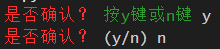

#### 2.2.3 异步输入相关的扩展用法

如果与异步方法配合使用，则必须要使用对应方法的异步版本（没有的话则用功能相同的异步方法）。

以`asyncio`框架为例：

```python3
from prompt_toolkit import PromptSession
from prompt_toolkit.patch_stdout import patch_stdout
import asyncio

session = PromptSession()

async def wait_for_answer(): 
    with patch_stdout():
        result = await session.prompt_async('请输入任何内容：')
        await asyncio.sleep(3)
        print(f'输入的内容是: {result}')

asyncio.run(wait_for_answer())
```

`patch_stdout`不是必须的，但使用该方法提供的上下文可以屏蔽其他协程的输出，避免覆盖掉提示内容。

与异步相关的还有一种特殊的用法（具体参考 https://python-prompt-toolkit.readthedocs.io/en/stable/pages/asking_for_input.html#reading-keys-from-stdin-one-key-at-a-time-but-without-a-prompt ，这里只提供示例，不做展开），就是使用直接读取按键输入的原生输入模式，结合异步的事件循环，可以实现对按键输入的响应：

```python3
import asyncio
from prompt_toolkit.input import create_input
from prompt_toolkit.keys import Keys

async def main():
    done = asyncio.Event()
    input = create_input()
    # 每输入一个有效的按键指令都会调用一次响应函数，没有参数；因此只能访问创建好的输入流对象的方法、属性。
    def keys_ready():
        for key_press in input.read_keys():
            if key_press.key == Keys.ControlC:
                # 将事件循环的完成标志设置为True
                done.set()
            elif key_press.key == 'w':
                # 当按下w键时，执行下面的操作
                print('Hello World')
            else:
                print(key_press.key)
    # 进入获取原生输入的模式，此时程序不再执行按键的响应函数，比如ctrl+d
    with input.raw_mode():
        # 激活当前输入流并进入该输入流的上下文中，可以使用当前输入流的数据
        # 这里给attach方法传入了每次输入完成时的响应函数，每输入一个有效的按键指令都会调用一次响应函数
        with input.attach(input_ready_callback=keys_ready):
            # 进入事件循环中，当事件循环的完成标志为True时退出循环
            await done.wait()

asyncio.run(main())
```

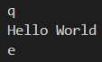

当然，这种响应操作很底层，但也比较费事，如果想要简单、可扩展，推荐使用下节讲到的快捷键绑定，

#### 2.2.4 按键输入的另一种形式——快捷键绑定

按键输入除了按什么键输入什么内容之外，还可以定义快捷键。不过在框架中，可以输出内容的按键不能被定义为快捷键这一点与上一节的按键响应有点区别。

前面介绍`key_bindings`参数时简单写了一个绑定快捷键的示例，不过，绑定快捷键的基础部分内容不少，所以当时没有展开介绍。但是，快捷键绑定很重要，后面其他带有`key_bindings`参数的功能也会用到快捷键绑定，为了避免读者不熟悉快捷键而导致相关功能无法使用，特将这部分内容放在这一节，后续如果遇到快捷键绑定的基础，均首先引用本节。如果是基础部分需要补充的，则根据实际情况补充。若是读者需要学习快捷键相关的进阶知识，在后续的进阶知识章节中，将会进一步深入快捷键的使用，介绍不太常用的技巧。

本节部分内容参考 https://python-prompt-toolkit.readthedocs.io/en/stable/pages/advanced_topics/key_bindings.html 。

##### 2.2.4.1 直接绑定响应函数

先简单回顾一下前面的示例：

```python3
from prompt_toolkit import PromptSession
from prompt_toolkit.application import run_in_terminal
from prompt_toolkit.key_binding import KeyBindings,KeyPressEvent

bindings = KeyBindings()

@bindings.add('c-q')
def ctrl_q_handler(event:KeyPressEvent):
    run_in_terminal(lambda :print(event.key_sequence[0].key))

session = PromptSession(
    key_bindings=bindings
)

result = session.prompt('请输入任何内容：')
print(f'输入的内容是: {result}')
```

可以看到，`add`方法就是绑定快捷键的主要方法，该方法返回的装饰器可以将被装饰的函数添加为快捷键的响应函数，但`add`方法的用法不止这么简单。

因为装饰器可以先定义函数，再分步装饰，上面的示例也可以这样写：

```python3
from prompt_toolkit import PromptSession
from prompt_toolkit.application import run_in_terminal
from prompt_toolkit.key_binding import KeyBindings,KeyPressEvent

bindings = KeyBindings()

def ctrl_q_handler(event:KeyPressEvent):
    run_in_terminal(lambda :print(event.key_sequence[0].key))

bindings.add('c-q')(ctrl_q_handler)

session = PromptSession(
    key_bindings=bindings
)

result = session.prompt('请输入任何内容：')
print(f'输入的内容是: {result}')
```

`add`方法支持以下参数：

- `*keys`参数，`Keys`类型或者字符串类型，表示要绑定的快捷键，支持同时绑定多个快捷键。如果同时绑定多个快捷键，存在两种情况，对应的含义也有所不同：

  - 一次传入多个值，表示需要按照顺序、连续按这些值对应的快捷键才会触发对应的操作，即绑定为序列快捷键：

    ```python3
    from prompt_toolkit import PromptSession
    from prompt_toolkit.application import run_in_terminal
    from prompt_toolkit.key_binding import KeyBindings,KeyPressEvent
    
    bindings = KeyBindings()
    
    # 需要依次按下 ctrl+q 、ctrl+w
    @bindings.add('c-q','c-w')
    def ctrl_q_handler(event:KeyPressEvent):
        run_in_terminal(lambda :print(event))
    
    session = PromptSession(
        key_bindings=bindings
    )
    
    result = session.prompt('请输入任何内容：')
    print(f'输入的内容是: {result}')
    ```

  - 使用装饰器装饰一个已经被装饰器装饰的函数，则表示任意一个快捷键都会触发该操作，即绑定为并列快捷键：

    ```python3
    from prompt_toolkit import PromptSession
    from prompt_toolkit.application import run_in_terminal
    from prompt_toolkit.key_binding import KeyBindings,KeyPressEvent
    
    bindings = KeyBindings()
    
    # ctrl+q 或 ctrl+w 都可以
    @bindings.add('c-q')
    @bindings.add('c-w')
    def ctrl_q_handler(event:KeyPressEvent):
        run_in_terminal(lambda :print(event))
    
    session = PromptSession(
        key_bindings=bindings
    )
    
    result = session.prompt('请输入任何内容：')
    print(f'输入的内容是: {result}')
    ```
    
    因为装饰器可以先定义函数，再分步装饰，上面的示例也可以这样写：
    
    ```python3
    from prompt_toolkit import PromptSession
    from prompt_toolkit.application import run_in_terminal
    from prompt_toolkit.key_binding import KeyBindings,KeyPressEvent
    
    bindings = KeyBindings()
    
    def ctrl_q_handler(event:KeyPressEvent):
        run_in_terminal(lambda :print(event))
    
    # ctrl+q 或 ctrl+w 都可以
    bindings.add('c-q')(ctrl_q_handler)
    bindings.add('c-w')(ctrl_q_handler)
    
    session = PromptSession(
        key_bindings=bindings
    )
    
    result = session.prompt('请输入任何内容：')
    print(f'输入的内容是: {result}')
    ```

  `Keys`类是枚举类，可以直接使用其成员表示对应的快捷键，比如：

  ```python3
  from prompt_toolkit import PromptSession
  from prompt_toolkit.application import run_in_terminal
  from prompt_toolkit.key_binding import KeyBindings,KeyPressEvent
  from prompt_toolkit.keys import Keys
  
  bindings = KeyBindings()
  
  @bindings.add(Keys.ControlQ)
  def ctrl_q_handler(event:KeyPressEvent):
      run_in_terminal(lambda :print(event.key_sequence[0].key))
  
  session = PromptSession(
      key_bindings=bindings
  )
  
  result = session.prompt('请输入任何内容：')
  print(f'输入的内容是: {result}')
  ```

  也可以使用成员对应的字符串表示快捷键（和最开始的示例一样）：

  ```python3
  from prompt_toolkit import PromptSession
  from prompt_toolkit.application import run_in_terminal
  from prompt_toolkit.key_binding import KeyBindings,KeyPressEvent
  from prompt_toolkit.keys import Keys
  
  bindings = KeyBindings()
  
  @bindings.add(Keys.ControlQ.value)
  def ctrl_q_handler(event:KeyPressEvent):
      run_in_terminal(lambda :print(event.key_sequence[0].key))
  
  session = PromptSession(
      key_bindings=bindings
  )
  
  result = session.prompt('请输入任何内容：')
  print(f'输入的内容是: {result}')
  ```

  框架支持、所有可以自定义的快捷键可以在`ALL_KEYS`中找到（字符串类型的表示方式）：

  ```python3
  from prompt_toolkit.keys import ALL_KEYS
  print(ALL_KEYS)
  ```

  输出结果为：

  ```python3
  ['escape', 's-escape', 'c-@', 'c-a', 'c-b', 'c-c', 'c-d', 'c-e', 'c-f', 'c-g', 'c-h', 'c-i', 'c-j', 'c-k', 'c-l', 'c-m', 'c-n', 'c-o', 'c-p', 'c-q', 'c-r', 'c-s', 'c-t', 'c-u', 'c-v', 'c-w', 'c-x', 'c-y', 'c-z', 'c-1', 'c-2', 'c-3', 'c-4', 'c-5', 'c-6', 'c-7', 'c-8', 'c-9', 'c-0', 'c-s-1', 'c-s-2', 'c-s-3', 'c-s-4', 'c-s-5', 'c-s-6', 'c-s-7', 'c-s-8', 'c-s-9', 'c-s-0', 'c-\\', 'c-]', 'c-^', 'c-_', 'left', 'right', 'up', 'down', 'home', 'end', 'insert', 'delete', 'pageup', 'pagedown', 'c-left', 'c-right', 'c-up', 'c-down', 'c-home', 'c-end', 'c-insert', 'c-delete', 'c-pageup', 'c-pagedown', 's-left', 's-right', 's-up', 's-down', 's-home', 's-end', 's-insert', 's-delete', 's-pageup', 's-pagedown', 'c-s-left', 'c-s-right', 'c-s-up', 'c-s-down', 'c-s-home', 'c-s-end', 'c-s-insert', 'c-s-delete', 'c-s-pageup', 'c-s-pagedown', 's-tab', 'f1', 'f2', 'f3', 'f4', 'f5', 'f6', 'f7', 'f8', 'f9', 'f10', 'f11', 'f12', 'f13', 'f14', 'f15', 'f16', 'f17', 'f18', 'f19', 'f20', 'f21', 'f22', 'f23', 'f24', 'c-f1', 'c-f2', 'c-f3', 'c-f4', 'c-f5', 'c-f6', 'c-f7', 'c-f8', 'c-f9', 'c-f10', 'c-f11', 'c-f12', 'c-f13', 'c-f14', 'c-f15', 'c-f16', 'c-f17', 'c-f18', 'c-f19', 'c-f20', 'c-f21', 'c-f22', 'c-f23', 'c-f24', '<any>', '<scroll-up>', '<scroll-down>', '<cursor-position-response>', '<vt100-mouse-event>', '<windows-mouse-event>', '<bracketed-paste>', '<sigint>', '<ignore>']
  ```

  注意，字符串中，'-'表示的是前后两个按键同时按下，'c'表示的是`ctrl`键，'s'表示的是`shift`键，'\\\\'表示的是`\`键，'<'和'>'包含的按键不是指具体某个按键，而是特定多个按键、触发特定事件的按键等特殊情况（这些特例以及如何定义`alt`键与其他键的组合快捷键会在后续的进阶知识章节中介绍，这里不做展开）。

- `filter`参数，布尔类型或者`Filter`类型，表示该快捷键是否激活，默认为`True`。从此参数开始，仅能通过关键字传入。

- `eager`参数，布尔类型或者`Filter`类型，表示当该快捷键与序列快捷键的第一个键相同时，是否覆盖序列快捷键（会导致序列快捷键失效，一般不用设置该参数），默认为`False`。

- `is_global`参数，布尔类型或者`Filter`类型，表示快捷键是否为全局生效，默认为`False`。所谓全局生效指的是快捷键不是绑定到当前控件，而是绑定到控件所属的容器，这样的话，同一容器内的其他控件也能使用该快捷键（容器、控件等相关概念可以参考后面的章节）。在前面介绍的内容中，使用快捷键的功能如果明确了属性是共享的，则快捷键是共享的；如果属性不是共享的，则该参数无论怎么设置都不会导致快捷键共享。

- `save_before`参数，接收一个`KeyPressEvent`参数、返回布尔值的可调用类型，用于表示响应快捷键之前是否需要保存当前缓冲，默认为`(lambda e: True)`。

- `record_in_macro`参数，布尔类型或者`Filter`类型，表示在录制宏（框架程序的操作模式为`VI`或者`EMACS`都可以录制按键操作的过程，即宏）时，是否包括当前快捷键，默认为`True`。

##### 2.2.4.2 使用绑定对象

除了使用`add`方法一步到位完成快捷键绑定，还可以使用绑定对象，只是操作上比一步到位多一些步骤：

```python3
from prompt_toolkit import PromptSession
from prompt_toolkit.application import run_in_terminal
from prompt_toolkit.key_binding import KeyBindings,KeyPressEvent
from prompt_toolkit.key_binding.key_bindings import Binding

bindings = KeyBindings()

def ctrl_q_handler(event:KeyPressEvent):
    run_in_terminal(lambda :print(event))

binding = Binding(('c-q',),ctrl_q_handler)
bindings.bindings.append(binding)

session = PromptSession(
    key_bindings=bindings
)

result = session.prompt('请输入任何内容：')
print(f'输入的内容是: {result}')
```

`Binding`类（使用`from prompt_toolkit.key_binding.key_bindings import Binding`导入）支持以下参数：

- `keys`参数，元素为`Keys`类型或者字符串类型的元组，表示要绑定的快捷键。
- `handler`参数，接收一个`KeyPressEvent`参数、返回任意值或者可异步等待对象的可调用类型（支持异步），表示快捷键对应的响应函数。
- `filter`参数，同`add`方法的同名参数。
- `eager`参数，同`add`方法的同名参数。
- `is_global`参数，同`add`方法的同名参数。
- `save_before`参数，同`add`方法的同名参数。
- `record_in_macro`参数，同`add`方法的同名参数。

`Binding`类支持以下属性：

- `keys`属性，同`keys`参数。
- `handler`属性，同`handler`参数。
- `filter`属性，同`filter`参数。
- `eager`属性，同`eager`参数。
- `is_global`属性，同`is_global`参数。
- `save_before`属性，同`save_before`参数。
- `record_in_macro`属性，同`record_in_macro`参数。

`Binding`类支持以下方法：

- `call`方法，执行`handler`参数的值，相当于模拟按下该绑定对象的对应按键（只是创建绑定对象的话没有具体的对应按键，后面才介绍如何分配）。该方法支持以下必需参数：
  - `event`参数，`KeyPressEvent`类型，表示按键按下的事件。实际使用时不需要构建虚假的事件，一般是在其他事件响应函数中使用`call`方法，将其他事件响应函数的`KeyPressEvent`类型对象传给此参数即可。

除了手动创建`Binding`类的实例，还可以使用`key_binding`方法（使用`from prompt_toolkit.key_binding.key_bindings import key_binding`导入）可以将任意函数转换为绑定对象（此时未分配快捷键），不过这样转化出来的绑定对象不包含快捷键，还要设置其`keys`属性。或者使用`add`方法将其与指定快捷键绑定（这样使用会导致其`keys`属性失效）：

```python3
from prompt_toolkit import PromptSession
from prompt_toolkit.application import run_in_terminal
from prompt_toolkit.key_binding import KeyBindings,KeyPressEvent
from prompt_toolkit.key_binding.key_bindings import key_binding

bindings = KeyBindings()

@key_binding(filter=True)
def ctrl_q_handler(event:KeyPressEvent):
    run_in_terminal(lambda :print(event))

ctrl_q_handler.keys = ('c-q',)
bindings.bindings.append(ctrl_q_handler)

# 使用 add 方法添加的话，就keys属性就不会生效了
# bindings.add('c-q')(ctrl_q_handler)

session = PromptSession(
    key_bindings=bindings
)

result = session.prompt('请输入任何内容：')
print(f'输入的内容是: {result}')
```

`key_binding`方法支持以下参数：

- `filter`参数，同`add`方法的同名参数。
- `eager`参数，同`add`方法的同名参数。
- `is_global`参数，同`add`方法的同名参数。
- `save_before`参数，同`add`方法的同名参数。
- `record_in_macro`参数，同`add`方法的同名参数。

### 2.3 对话框

框架不仅支持纯文字形式的交互，内部还提供了一系列的控件。一般来说，想要使用这些控件，需要构建布局，并启动应用程序，比较麻烦。但是，为了方便使用，框架的`prompt_toolkit.shortcuts`模块实现了一系列可以快速使用图形化控件的方法，生成全屏显示的对话框的方法就是其中一种。

本节主要参考 https://python-prompt-toolkit.readthedocs.io/en/stable/pages/dialogs.html 。

#### 2.3.1 生成对话框的方法

生成对话框的方法并不会直接显示对话框，而是返回`Application`对象，需要运行该对象的`run`方法才会显示。如果对话框支持输入内容、选择的话，`run`方法还会返回输入、选择的结果。当然，和`Application`对象一样，调用`run`方法显示对话框时，也可以给`run`方法传入一些参数，具体参数的含义可以参考后面有关`Application`对象的内容，这里不做展开。

`message_dialog`方法可以生成显示信息的对话框。该方法支持以下参数：

- `title`参数，字符串类型、元素为元组的列表（同`FormattedText`对象的参数）、实现了`__pt_formatted_text__`方法的对象（即前面介绍的、可渲染为带格式文本的对象）、调用之后返回前面几种类型的可调用类型，表示标题，默认为`''`。
- `text`参数，字符串类型、元素为元组的列表（同`FormattedText`对象的参数）、实现了`__pt_formatted_text__`方法的对象（即前面介绍的、可渲染为带格式文本的对象）、调用之后返回前面几种类型的可调用类型，表示主要内容，默认为`''`。
- `ok_text`参数，字符串类型，表示确认按钮的文本，默认为`'Ok'`。
- `style`参数，`Style`类型，表示对话框的样式，后面会详细介绍对话框支持的样式类。

示例如下：

```python3
from prompt_toolkit.shortcuts import message_dialog

dialog = message_dialog(
    title='信息',
    text='一条简短的信息\n可以显示多行内容',
)
dialog.run()
```

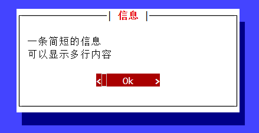

`input_dialog`方法可以生成带输入框的对话框，获取用户输入的内容。该方法支持以下参数：

- `title`参数，字符串类型、元素为元组的列表（同`FormattedText`对象的参数）、实现了`__pt_formatted_text__`方法的对象（即前面介绍的、可渲染为带格式文本的对象）、调用之后返回前面几种类型的可调用类型，表示标题，默认为`''`。
- `text`参数，字符串类型、元素为元组的列表（同`FormattedText`对象的参数）、实现了`__pt_formatted_text__`方法的对象（即前面介绍的、可渲染为带格式文本的对象）、调用之后返回前面几种类型的可调用类型，表示主要内容，一般是表达对话框需要用户输入什么，默认为`''`。
- `ok_text`参数，字符串类型，表示确认按钮的文本，默认为`'Ok'`。
- `cancel_text`参数，字符串类型，表示取消按钮的文本，默认为`'Cancel'`。
- `completer`参数，`Completer`类型，表示根据当前输入内容自动补全（也可以使用`tab`键弹出所有可以补全的内容）的自动补全对象，默认为`None`。
- `validator`参数，`Validator`类型（使用`from prompt_toolkit.validation import Validator`导入），表示验证输入内容是否有效的验证对象。
- `password`参数，布尔类型或者`Filter`类型，表示输入的内容是否以密文形式显示（输入内容的显示为`'*'`），默认为`False`。
- `style`参数，`Style`类型，表示对话框的样式，后面会详细介绍对话框支持的样式类。
- `default`参数，字符串类型，表示在用户没有输入任何内容时的默认内容，默认为`''`。

示例如下：

```python3
from prompt_toolkit.shortcuts import input_dialog

dialog = input_dialog(
    title='输入',
    text='请在输入框内输入任意内容',
)
result = dialog.run()
print(f'输入的内容为 {result}')
```

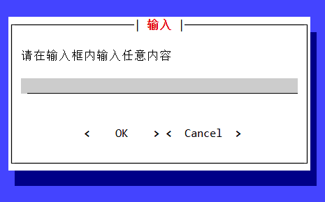

`yes_no_dialog`方法可以生成仅允许用户选择是否的对话框。该方法支持以下参数：

- `title`参数，字符串类型、元素为元组的列表（同`FormattedText`对象的参数）、实现了`__pt_formatted_text__`方法的对象（即前面介绍的、可渲染为带格式文本的对象）、调用之后返回前面几种类型的可调用类型，表示标题，默认为`''`。
- `text`参数，字符串类型、元素为元组的列表（同`FormattedText`对象的参数）、实现了`__pt_formatted_text__`方法的对象（即前面介绍的、可渲染为带格式文本的对象）、调用之后返回前面几种类型的可调用类型，表示主要内容，一般是表达对话框需要用户输入什么，默认为`''`。
- `yes_text`参数，字符串类型，表示“是”按钮的文本，默认为`'Yes'`。
- `no_text`参数，字符串类型，表示“否”按钮的文本，默认为`'No'`。
- `style`参数，`Style`类型，表示对话框的样式，后面会详细介绍对话框支持的样式类。

示例如下：

```python3
from prompt_toolkit.shortcuts import yes_no_dialog

dialog = yes_no_dialog(
    title='选择',
    text='是否？',
)
result = dialog.run()
print(f'选择的是 {result}')
```

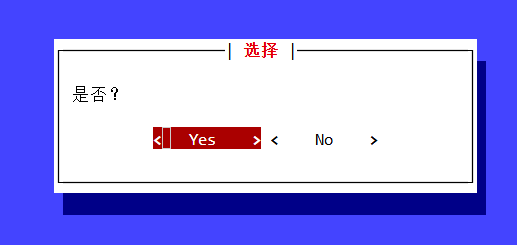

`button_dialog`方法与`yes_no_dialog`方法类似，都可以生成允许用户点击按钮来选择的对话框。不同的是，`button_dialog`方法可以自定义按钮数量和其代表的值。该方法支持以下参数：

- `title`参数，字符串类型、元素为元组的列表（同`FormattedText`对象的参数）、实现了`__pt_formatted_text__`方法的对象（即前面介绍的、可渲染为带格式文本的对象）、调用之后返回前面几种类型的可调用类型，表示标题，默认为`''`。

- `text`参数，字符串类型、元素为元组的列表（同`FormattedText`对象的参数）、实现了`__pt_formatted_text__`方法的对象（即前面介绍的、可渲染为带格式文本的对象）、调用之后返回前面几种类型的可调用类型，表示主要内容，一般是表达对话框需要用户输入什么，默认为`''`。

- `buttons`参数，元素为元组的列表，表示对话框包含的按钮，默认为`[]`。

  元组的第一个元素为字符串类型，表示按钮显示的内容；元组的第二个元素为任意类型，表示点击按钮之后返回的值。

- `style`参数，`Style`类型，表示对话框的样式，后面会详细介绍对话框支持的样式类。

示例如下：

```python3
from prompt_toolkit.shortcuts import button_dialog

dialog = button_dialog(
    title='选择',
    text='可以点击任意按钮',
    buttons=[
        ('Yes',True),
        ('No',False),
        ('Maybe','maybe'),
    ]
)
result = dialog.run()
print(f'选择的是 {result}')
```

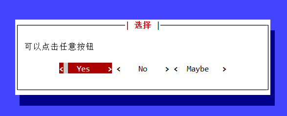

`button_dialog`方法受限于空间，没法添加更多的按钮，如果想要让用户从更多的选项中选择一个，可以使用`radiolist_dialog`方法生成选项纵向排布的单选对话框。该方法支持以下参数：

- `title`参数，字符串类型、元素为元组的列表（同`FormattedText`对象的参数）、实现了`__pt_formatted_text__`方法的对象（即前面介绍的、可渲染为带格式文本的对象）、调用之后返回前面几种类型的可调用类型，表示标题，默认为`''`。

- `text`参数，字符串类型、元素为元组的列表（同`FormattedText`对象的参数）、实现了`__pt_formatted_text__`方法的对象（即前面介绍的、可渲染为带格式文本的对象）、调用之后返回前面几种类型的可调用类型，表示主要内容，一般是表达对话框需要用户输入什么，默认为`''`。

- `ok_text`参数，字符串类型，表示确认按钮的文本，默认为`'Ok'`。

- `cancel_text`参数，字符串类型，表示取消按钮的文本，默认为`'Cancel'`。

- `values`参数，元素为元组、无重复元素的有序可迭代对象，表示对话框包含的选项，默认为`None`。

  元组的第一个元素为任意类型，表示选项对应的值；元组的第二个元素为字符串类型、元素为元组的列表（同`FormattedText`对象的参数）、实现了`__pt_formatted_text__`方法的对象（即前面介绍的、可渲染为带格式文本的对象）、调用之后返回前面几种类型的可调用类型，表示选项显示的内容。

- `default`参数，任意类型，表示在用户没有选择任何选项的默认选择的选项，默认为`None`。

- `style`参数，`Style`类型，表示对话框的样式，后面会详细介绍对话框支持的样式类。

示例如下：

```python3
from prompt_toolkit.shortcuts import radiolist_dialog

dialog = radiolist_dialog(
    title='单选',
    text='只能最多选择一个选项',
    values=[
        ('1',[('green','Yes')]),
        ('2',[('red','No')]),
        ('3','Maybe'),
    ]
)
result = dialog.run()
print(f'选择的是 {result}')
```

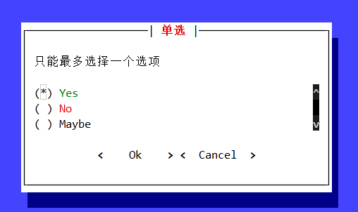

`checkboxlist_dialog`方法与`radiolist_dialog`方法类似，都可以生成允许用户从多个选项中选择部分选项的对话框。不同的是，`checkboxlist_dialog`方法生成的选项可以多选的对话框。该方法支持以下参数：

- `title`参数，字符串类型、元素为元组的列表（同`FormattedText`对象的参数）、实现了`__pt_formatted_text__`方法的对象（即前面介绍的、可渲染为带格式文本的对象）、调用之后返回前面几种类型的可调用类型，表示标题，默认为`''`。

- `text`参数，字符串类型、元素为元组的列表（同`FormattedText`对象的参数）、实现了`__pt_formatted_text__`方法的对象（即前面介绍的、可渲染为带格式文本的对象）、调用之后返回前面几种类型的可调用类型，表示主要内容，一般是表达对话框需要用户输入什么，默认为`''`。

- `ok_text`参数，字符串类型，表示确认按钮的文本，默认为`'Ok'`。

- `cancel_text`参数，字符串类型，表示取消按钮的文本，默认为`'Cancel'`。

- `values`参数，元素为元组、无重复元素的有序可迭代对象，表示对话框包含的选项，默认为`None`。

  元组的第一个元素为任意类型，表示选项对应的值；元组的第二个元素为字符串类型、元素为元组的列表（同`FormattedText`对象的参数）、实现了`__pt_formatted_text__`方法的对象（即前面介绍的、可渲染为带格式文本的对象）、调用之后返回前面几种类型的可调用类型，表示选项显示的内容。

- `default_values`参数，元素为任意类型、无重复元素的有序可迭代对象，表示在用户没有选择任何选项的默认选择的选项，默认为`None`。

- `style`参数，`Style`类型，表示对话框的样式，后面会详细介绍对话框支持的样式类。

示例如下：

```python3
from prompt_toolkit.shortcuts import checkboxlist_dialog

dialog = checkboxlist_dialog(
    title='单选',
    text='可以选择多个选项',
    values=[
        ('1',[('green','Yes')]),
        ('2',[('red','No')]),
        ('3','Maybe'),
    ],
    default_values=[
        '2',
        '3'
    ]
)
result = dialog.run()
print(f'选择的是 {result}')
```


最后再补充一个显示进度条对话框的方法——`progress_dialog`。因为进度条功能还在开发中，后续更新很有可能导致相关功能产生变动，这里仅作为前瞻性的扩展学习。

`progress_dialog`方法支持以下参数：

- `title`参数，字符串类型、元素为元组的列表（同`FormattedText`对象的参数）、实现了`__pt_formatted_text__`方法的对象（即前面介绍的、可渲染为带格式文本的对象）、调用之后返回前面几种类型的可调用类型，表示标题，默认为`''`。

- `text`参数，字符串类型、元素为元组的列表（同`FormattedText`对象的参数）、实现了`__pt_formatted_text__`方法的对象（即前面介绍的、可渲染为带格式文本的对象）、调用之后返回前面几种类型的可调用类型，表示主要内容，一般是表达对话框需要用户输入什么，默认为`''`。

- `run_callback`参数，可调用类型，用于更新进度条和进度条上面的日志信息。

  该参数的值接收两个可调用类型的参数，分别用于更新进度条的当前进度和在日志信息中添加一条新的日志信息，具体用法参考下面的示例。

  需要注意的是，当前版本下，该参数只能是同步函数，不能为异步函数。

- `style`参数，`Style`类型，表示对话框的样式，后面会详细介绍对话框支持的样式类。

因为方法的内部实现依赖异步框架`asyncio`的事件循环，因此只能使用`run_sync`方法显示对话框。需要使用异步函数包装`run_sync`方法，间接运行`run_sync`方法。示例如下：

```python3
from prompt_toolkit.shortcuts import progress_dialog
import asyncio
import time

def update_progress(set_progress_percent,add_log_text):
    for i in range(101):
        set_progress_percent(i)
        add_log_text(f'当前进度为 {i} %\n')
        time.sleep(0.1)

async def main():
    await progress_dialog(
        title='进度条',
        text='显示一个进度条',
        run_callback=update_progress,
    ).run_async()

asyncio.run(main())
```


#### 2.3.2 美化对话框

美化对话框很简单，就和前面介绍的支持`style`参数的方法一样，给创建对话框的方法，传入样式对象即可：

```python3
from prompt_toolkit.shortcuts import message_dialog
from prompt_toolkit.styles import Style

style = Style(
    [
        ('dialog','bg:red'),
        ('label','bg:green')
    ]
)

dialog = message_dialog(
    title='信息',
    text='一条简短的信息\n可以显示多行内容',
    style=style
)
dialog.run()
```


##### 2.3.2.1 对话框、阴影和整个终端背景的样式类

先看示例：

```python3
from prompt_toolkit.shortcuts import message_dialog
from prompt_toolkit.styles import Style

style = Style(
    [
        ('dialog','bg:red'),
        ('dialog.body','green bg:black'),
        ('shadow dialog','bg:blue')
    ]
)

message_dialog(
    title='信息',
    text='一条简短的信息\n可以显示多行内容',
    style=style
).run()
```


`'dialog'`样式类，整个终端背景使用的样式类，仅支持背景颜色。

`'dialog.body'`样式类，对话框内所有内容使用的样式类，支持字体颜色、背景颜色、内容格式。因为对话框内使用的内容继承了该样式，一般不建议设置除了背景颜色之外的其他样式，具体内容使用其他样式类设置即可。

`'shadow dialog'`样式类，对话框的阴影使用的样式类，仅支持背景颜色。注意，设置此样式类必须是二者组合，单独设置`'shadow'`样式类是不能生效的，因为阴影控件继承了`'dialog'`样式类，`'dialog'`样式类的背景颜色优先生效。但是，`'shadow'`样式类的格式样式可以单独生效。

##### 2.3.2.2 对话框边框、标题的样式类

先看示例：

```python3
from prompt_toolkit.shortcuts import message_dialog
from prompt_toolkit.styles import Style

style = Style(
    [
        ('frame','green'),
        ('frame.label','blue bg:yellow'),
    ]
)

message_dialog(
    title='信息',
    text='一条简短的信息\n可以显示多行内容',
    style=style
).run()
```


`'frame'`样式类，对话框边框使用的样式类。

`'frame.label'`样式类，对话框标题（属于边框的一部分）使用的样式类。

需要注意的是，对话框标题和主要内容都是使用标签控件作为内容显示的载体，如果是设置`'label'`样式类，则会影响标题和主要内容。对于只想修改主要内容的样式的情况，最好不要通过这里的样式类来设置，而是直接设置主要内容为带格式的文本。

##### 2.3.2.3 相关控件的样式类

对话框标题和主要内容都是使用标签控件作为内容显示的载体，相关内容使用`'label'`样式类。

对话框内所有的按钮控件都使用`'button'`样式类，处于激活状态的按钮控件使用`'button button.focused'`样式类（只设置`'button.focused'`样式类的话，`'button'`样式类、`'button.text'`样式类、`'button.arrow'`样式类优先生效），按钮控件的文本使用`'button.text'`样式类，文本两边的角括号使用`'button.arrow'`样式类。

对话框内的输入框和显示日志的文本区域都使用`'text-area'`样式类。

对话框内的进度条控件中，非当前进度部分使用`'progress-bar'`样式类，当前进度部分使用`'progress-bar.used'`样式类。

对话框内的单选列表控件中，整个控件使用`'radio-list'`样式类，每个选项使用`'radio'`样式类，光标所在的选项使用`'radio-selected'`样式类，处于选定状态的选项使用`'radio-checked'`样式类（但光标处于该选项时，`'radio-selected'`样式类优先生效）。

对话框内的多选列表控件中，整个控件使用`'checkbox-list'`样式类，每个选项使用`'checkbox'`样式类，光标所在的选项使用`'checkbox-selected'`样式类，处于选定状态的选项使用`'checkbox-checked'`样式类（但光标处于该选项时，`'checkbox-selected'`样式类优先生效）。

#### 2.3.3 按钮的中文修复补丁

对话框或其他使用按钮控件的地方，一旦按钮控件中包含中文等非一个字符宽度的字符，按钮控件显示会出现异常：

```python3
from prompt_toolkit.shortcuts import message_dialog

dialog = message_dialog(
    title='信息',
    text='一条简短的信息\n可以显示多行内容',
    ok_text='确认'
)
dialog.run()
```


想要让按钮控件显示中文的同时不会缺失字符，可以使用下面的添加了中文修复补丁的按钮控件代替原本的按钮控件（放在导入按钮控件的代码后，使用按钮控件的代码前）：

```python3
# 修复问题的按钮补丁
from prompt_toolkit.widgets import Button
from prompt_toolkit.formatted_text import StyleAndTextTuples
from prompt_toolkit.mouse_events import MouseEvent, MouseEventType
from prompt_toolkit.utils import get_cwidth
from typing import Callable

class Button(Button):
    def __init__(
        self,
        text: str,
        handler: Callable[[], None] | None = None,
        width: int = 12,
        left_symbol: str = '<',
        right_symbol: str = '>',
    ):
        # 如果想要将一个中文字符当作一个终端字符的宽度处理，加入下面这行，反之不要加
        width += (get_cwidth(text) - len(text))
        super().__init__(text, handler, width, left_symbol, right_symbol)
    def _get_text_fragments(self) -> StyleAndTextTuples:
        # 修改的部分
        width = self.width - (
            get_cwidth(self.left_symbol) + get_cwidth(self.right_symbol)
        ) + (
            len(self.text) - get_cwidth(self.text)
        )
        text = (f'{{:^{max(0,width)}}}').format(self.text)
        # 修改的部分结束
        def handler(mouse_event: MouseEvent) -> None:
            if (
                self.handler is not None
                and mouse_event.event_type == MouseEventType.MOUSE_UP
            ):
                self.handler()

        return [
            ('class:button.arrow', self.left_symbol, handler),
            ('[SetCursorPosition]', ''),
            ('class:button.text', text, handler),
            ('class:button.arrow', self.right_symbol, handler),
        ]
```

对比示例如下：

```python3
# 有问题的原始示例
from prompt_toolkit.shortcuts import message_dialog

message_dialog(
    title='简单对话框',
    text='回车或者点击确认',
    ok_text='中文确认按钮'
).run()

# 修复问题的按钮补丁
from prompt_toolkit.widgets import Button
from prompt_toolkit.formatted_text import StyleAndTextTuples
from prompt_toolkit.mouse_events import MouseEvent, MouseEventType
from prompt_toolkit.utils import get_cwidth
from typing import Callable

class Button(Button):
    def __init__(
        self,
        text: str,
        handler: Callable[[], None] | None = None,
        width: int = 12,
        left_symbol: str = '<',
        right_symbol: str = '>',
    ):
        # 如果想要将一个中文字符当作一个终端字符的宽度处理，加入下面这行，反之不要加
        width += (get_cwidth(text) - len(text))
        super().__init__(text, handler, width, left_symbol, right_symbol)
    def _get_text_fragments(self) -> StyleAndTextTuples:
        # 修改的部分
        width = self.width - (
            get_cwidth(self.left_symbol) + get_cwidth(self.right_symbol)
        ) + (
            len(self.text) - get_cwidth(self.text)
        )
        text = (f'{{:^{max(0,width)}}}').format(self.text)
        # 修改的部分结束
        def handler(mouse_event: MouseEvent) -> None:
            if (
                self.handler is not None
                and mouse_event.event_type == MouseEventType.MOUSE_UP
            ):
                self.handler()

        return [
            ('class:button.arrow', self.left_symbol, handler),
            ('[SetCursorPosition]', ''),
            ('class:button.text', text, handler),
            ('class:button.arrow', self.right_symbol, handler),
        ]

# 基于按钮补丁实现创建对话框的方法
from prompt_toolkit.widgets import Label,Dialog
from prompt_toolkit.application import Application,get_app
from prompt_toolkit.layout import Layout
from prompt_toolkit.key_binding.key_bindings import KeyBindings, merge_key_bindings
from prompt_toolkit.key_binding.bindings.focus import focus_next, focus_previous
from prompt_toolkit.key_binding.defaults import load_key_bindings
from prompt_toolkit.styles import BaseStyle
from prompt_toolkit.formatted_text import AnyFormattedText

def message_dialog(
    title: AnyFormattedText = '',
    text: AnyFormattedText = '',
    ok_text: str = 'Ok',
    style: BaseStyle | None = None,
) -> Application[None]:
    bindings = KeyBindings()
    bindings.add('tab')(focus_next)
    bindings.add('s-tab')(focus_previous)
    return Application(
        layout=Layout(
            Dialog(
                title=title,
                body=Label(text=text, dont_extend_height=True),
                buttons=[Button(text=ok_text, handler=lambda :get_app().exit())],
                with_background=True,
            )
        ),
        key_bindings=merge_key_bindings([load_key_bindings(), bindings]),
        mouse_support=True,
        style=style,
        full_screen=True,
    )

# 使用修复后的方法创建对话框
message_dialog(
    title='简单对话框',
    text='回车或者点击确认',
    ok_text='中文确认按钮'
).run()
```


需要注意的是，前面提到的所有生成对话框的方法都要重新实现一遍才能使用最新的按钮，不然的话，中文显示还是会有问题。下面将提供所有方法的修改版本，可以放在代码开头，作为临时方案。当然，如果嫌麻烦，可以直接修改按钮控件的源码，这个是最简单的。但是，如果官方没有解决此问题或者不考虑解决此问题的话，每次更新都会导致问题重新出现。因此，使用临时方案是比较稳妥的操作。

所有对话框生成方法的重新实现：

- `message_dialog`方法的修复版本：

  ```python3
  # 下面放按钮补丁
  ...
  # 基于按钮补丁实现创建对话框的方法-message_dialog
  from prompt_toolkit.widgets import Label,Dialog
  from prompt_toolkit.application import Application,get_app
  from prompt_toolkit.layout import Layout
  from prompt_toolkit.key_binding.key_bindings import KeyBindings, merge_key_bindings
  from prompt_toolkit.key_binding.bindings.focus import focus_next, focus_previous
  from prompt_toolkit.key_binding.defaults import load_key_bindings
  from prompt_toolkit.styles import BaseStyle
  from prompt_toolkit.formatted_text import AnyFormattedText
  
  def message_dialog(
      title: AnyFormattedText = '',
      text: AnyFormattedText = '',
      ok_text: str = 'Ok',
      style: BaseStyle | None = None,
  ) -> Application[None]:
      bindings = KeyBindings()
      bindings.add('tab')(focus_next)
      bindings.add('s-tab')(focus_previous)
      return Application(
          layout=Layout(
              Dialog(
                  title=title,
                  body=Label(text=text, dont_extend_height=True),
                  buttons=[Button(text=ok_text, handler=lambda :get_app().exit())],
                  with_background=True,
              )
          ),
          key_bindings=merge_key_bindings([load_key_bindings(), bindings]),
          mouse_support=True,
          style=style,
          full_screen=True,
      )
  ```

- `input_dialog`方法的修复版本：

  ```python3
  # 下面放按钮补丁
  ...
  # 基于按钮补丁实现创建对话框的方法-input_dialog
  from prompt_toolkit.widgets import Label,Dialog,TextArea,ValidationToolbar
  from prompt_toolkit.application import Application,get_app
  from prompt_toolkit.layout import Layout
  from prompt_toolkit.layout.containers import HSplit
  from prompt_toolkit.key_binding.key_bindings import KeyBindings, merge_key_bindings
  from prompt_toolkit.key_binding.bindings.focus import focus_next, focus_previous
  from prompt_toolkit.key_binding.defaults import load_key_bindings
  from prompt_toolkit.styles import BaseStyle
  from prompt_toolkit.formatted_text import AnyFormattedText
  from prompt_toolkit.completion import Completer
  from prompt_toolkit.validation import Validator
  from prompt_toolkit.filters import FilterOrBool
  from prompt_toolkit.layout.dimension import Dimension
  
  def input_dialog(
      title: AnyFormattedText = '',
      text: AnyFormattedText = '',
      ok_text: str = 'OK',
      cancel_text: str = 'Cancel',
      completer: Completer | None = None,
      validator: Validator | None = None,
      password: FilterOrBool = False,
      style: BaseStyle | None = None,
      default: str = '',
  ) -> Application[str]:
      bindings = KeyBindings()
      bindings.add('tab')(focus_next)
      bindings.add('s-tab')(focus_previous)
      return Application(
          layout=Layout(
              Dialog(
                  title=title,
                  body=HSplit(
                      [
                          Label(text=text, dont_extend_height=True),
                          textfield := TextArea(
                              text=default,
                              multiline=False,
                              password=password,
                              completer=completer,
                              validator=validator,
                              accept_handler=lambda buf:get_app().layout.focus(ok_button) or True,
                          ),
                          ValidationToolbar(),
                      ],
                      padding=Dimension(preferred=1, max=1),
                  ),
                  buttons=[
                      ok_button:=Button(
                          text=ok_text, 
                          handler=lambda textfield=textfield:get_app().exit(
                              result=textfield.text
                          )
                      ), 
                      Button(
                          text=cancel_text, handler=lambda :get_app().exit()
                      )
                  ],
                  with_background=True,
              )
          ),
          key_bindings=merge_key_bindings([load_key_bindings(), bindings]),
          mouse_support=True,
          style=style,
          full_screen=True,
      )
  ```

- `yes_no_dialog`方法的修复版本：

  ```python3
  # 下面放按钮补丁
  ...
  # 基于按钮补丁实现创建对话框的方法-yes_no_dialog
  from prompt_toolkit.widgets import Label,Dialog
  from prompt_toolkit.application import Application,get_app
  from prompt_toolkit.layout import Layout
  from prompt_toolkit.key_binding.key_bindings import KeyBindings, merge_key_bindings
  from prompt_toolkit.key_binding.bindings.focus import focus_next, focus_previous
  from prompt_toolkit.key_binding.defaults import load_key_bindings
  from prompt_toolkit.styles import BaseStyle
  from prompt_toolkit.formatted_text import AnyFormattedText
  
  def yes_no_dialog(
      title: AnyFormattedText = '',
      text: AnyFormattedText = '',
      yes_text: str = 'Yes',
      no_text: str = 'No',
      style: BaseStyle | None = None,
  ) -> Application[bool]:
      bindings = KeyBindings()
      bindings.add('tab')(focus_next)
      bindings.add('s-tab')(focus_previous)
      return Application(
          layout=Layout(
              Dialog(
                  title=title,
                  body=Label(text=text, dont_extend_height=True),
                  buttons=[
                      Button(
                          text=yes_text, 
                          handler=lambda :get_app().exit(result=True)
                      ),
                      Button(
                          text=no_text, 
                          handler=lambda :get_app().exit(result=False)
                      ),
                  ],
                  with_background=True,
              )
          ),
          key_bindings=merge_key_bindings([load_key_bindings(), bindings]),
          mouse_support=True,
          style=style,
          full_screen=True,
      )
  ```

- `button_dialog`方法的修复版本：

  ```python3
  # 下面放按钮补丁
  ...
  # 基于按钮补丁实现创建对话框的方法-button_dialog
  from prompt_toolkit.widgets import Label,Dialog
  from prompt_toolkit.application import Application,get_app
  from prompt_toolkit.layout import Layout
  from prompt_toolkit.key_binding.key_bindings import KeyBindings, merge_key_bindings
  from prompt_toolkit.key_binding.bindings.focus import focus_next, focus_previous
  from prompt_toolkit.key_binding.defaults import load_key_bindings
  from prompt_toolkit.styles import BaseStyle
  from prompt_toolkit.formatted_text import AnyFormattedText
  from typing import TypeVar
  import functools
  
  _T = TypeVar('_T')
  
  def button_dialog(
      title: AnyFormattedText = '',
      text: AnyFormattedText = '',
      buttons: list[tuple[str, _T]] = [],
      style: BaseStyle | None = None,
  ) -> Application[_T]:
      bindings = KeyBindings()
      bindings.add('tab')(focus_next)
      bindings.add('s-tab')(focus_previous)
      return Application(
          layout=Layout(
              Dialog(
                  title=title,
                  body=Label(text=text, dont_extend_height=True),
                  buttons=[
                      Button(
                          text=t, 
                          handler=functools.partial(
                              lambda v:get_app().exit(result=v), 
                              v
                          )
                      )
                      for t, v in buttons
                  ],
                  with_background=True,
              )
          ),
          key_bindings=merge_key_bindings([load_key_bindings(), bindings]),
          mouse_support=True,
          style=style,
          full_screen=True,
      )
  ```

- `radiolist_dialog`方法的修复版本：

  ```python3
  # 下面放按钮补丁
  ...
  # 基于按钮补丁实现创建对话框的方法-radiolist_dialog
  from prompt_toolkit.widgets import Label,Dialog,RadioList
  from prompt_toolkit.layout.containers import HSplit
  from prompt_toolkit.application import Application,get_app
  from prompt_toolkit.layout import Layout
  from prompt_toolkit.key_binding.key_bindings import KeyBindings, merge_key_bindings
  from prompt_toolkit.key_binding.bindings.focus import focus_next, focus_previous
  from prompt_toolkit.key_binding.defaults import load_key_bindings
  from prompt_toolkit.styles import BaseStyle
  from prompt_toolkit.formatted_text import AnyFormattedText
  from typing import TypeVar,Sequence
  
  _T = TypeVar('_T')
  
  def radiolist_dialog(
      title: AnyFormattedText = '',
      text: AnyFormattedText = '',
      ok_text: str = 'Ok',
      cancel_text: str = 'Cancel',
      values: Sequence[tuple[_T, AnyFormattedText]] | None = None,
      default: _T | None = None,
      style: BaseStyle | None = None,
  ) -> Application[_T]:
      bindings = KeyBindings()
      bindings.add('tab')(focus_next)
      bindings.add('s-tab')(focus_previous)
      return Application(
          layout=Layout(
              Dialog(
                  title=title,
                  body=HSplit(
                      [
                          Label(text=text, dont_extend_height=True), 
                          radio_list := RadioList(
                              values=values or [] ,
                              default=default
                          )
                      ],
                      padding=1,
                  ),
                  buttons=[
                      Button(
                          text=ok_text, handler=lambda :get_app().exit(result=radio_list.current_value)
                      ),
                      Button(
                          text=cancel_text, handler=lambda :get_app().exit()
                      ),
                  ],
                  with_background=True,
              )
          ),
          key_bindings=merge_key_bindings([load_key_bindings(), bindings]),
          mouse_support=True,
          style=style,
          full_screen=True,
      )
  ```

- `checkboxlist_dialog`方法的修复版本：

  ```python3
  # 下面放按钮补丁
  ...
  # 基于按钮补丁实现创建对话框的方法-checkboxlist_dialog
  from prompt_toolkit.widgets import Label,Dialog,CheckboxList
  from prompt_toolkit.layout.containers import HSplit
  from prompt_toolkit.application import Application,get_app
  from prompt_toolkit.layout import Layout
  from prompt_toolkit.key_binding.key_bindings import KeyBindings, merge_key_bindings
  from prompt_toolkit.key_binding.bindings.focus import focus_next, focus_previous
  from prompt_toolkit.key_binding.defaults import load_key_bindings
  from prompt_toolkit.styles import BaseStyle
  from prompt_toolkit.formatted_text import AnyFormattedText
  from typing import TypeVar,Sequence
  
  _T = TypeVar('_T')
  
  def checkboxlist_dialog(
      title: AnyFormattedText = '',
      text: AnyFormattedText = '',
      ok_text: str = 'Ok',
      cancel_text: str = 'Cancel',
      values: Sequence[tuple[_T, AnyFormattedText]] | None = None,
      default_values: Sequence[_T] | None = None,
      style: BaseStyle | None = None,
  ) -> Application[list[_T]]:
      bindings = KeyBindings()
      bindings.add('tab')(focus_next)
      bindings.add('s-tab')(focus_previous)
      return Application(
          layout=Layout(
              Dialog(
                  title=title,
                  body=HSplit(
                      [
                          Label(
                              text=text, 
                              dont_extend_height=True
                          ), 
                          cb_list := CheckboxList(
                              values=values or [],
                              default_values=default_values
                          )
                      ],
                      padding=1,
                  ),
                  buttons=[
                      Button(
                          text=ok_text, 
                          handler=lambda :get_app().exit(
                              result=cb_list.current_values
                          )
                      ),
                      Button(
                          text=cancel_text, 
                          handler=lambda :get_app().exit()
                      ),
                  ],
                  with_background=True,
              )
          ),
          key_bindings=merge_key_bindings([load_key_bindings(), bindings]),
          mouse_support=True,
          style=style,
          full_screen=True,
      )
  ```

### 2.4 进度条

因为进度条功能还在开发中，后续更新很有可能导致相关功能产生变动，这里仅作为前瞻性的扩展学习。本节主要参考自 https://python-prompt-toolkit.readthedocs.io/en/stable/pages/progress_bars.html 。

除了前面介绍过的进度条对话框，框架还提供另一种简单的进度条——`ProgressBar`。

`ProgressBar`类（使用`from prompt_toolkit.shortcuts import ProgressBar`或者`from prompt_toolkit.shortcuts.progress_bar.base import ProgressBar`导入）的实例对象提供了一个上下文环境，在该上下文环境中，可以使用该示例对象包装其他可迭代对象，将其转换为进度条计数器对象，迭代计数器对象的同时，会显示一个进度条：

```python3
from prompt_toolkit.shortcuts import ProgressBar
import time

with ProgressBar() as pb:
    for i in pb(range(100)):
        time.sleep(0.1)
```


`ProgressBar`类支持以下参数（参数情况会随着开发过程变动，具体以实际版本为准）：

- `title`参数，字符串类型、元素为元组的列表（同`FormattedText`对象的参数）、实现了`__pt_formatted_text__`方法的对象（即前面介绍的、可渲染为带格式文本的对象）、调用之后返回前面几种类型的可调用类型，表示显示在进度条上方的标题，默认为`None`。

  示例如下：

  ```python3
  from prompt_toolkit.shortcuts import ProgressBar
  import time
  
  with ProgressBar(
      title='当前进度为 0 %'
  ) as pb:
      for i in pb(range(100)):
          pb.title = f'当前进度为 {i+1} %'
          time.sleep(0.1)
  ```

  

- `formatters`参数，元素为`Formatter`类型、无重复元素的有序可迭代对象，表示进度条显示的信息，默认为`create_default_formatters`方法（使用`from prompt_toolkit.shortcuts.progress_bar.formatters import create_default_formatters`导入）返回的结果。

  想要定义进度条显示的信息，需要从`prompt_toolkit.shortcuts.progress_bar.formatters`模块中导入必要的信息格式类；也可以手动实现`Formatter`类（使用`from prompt_toolkit.shortcuts.progress_bar.formatters import Formatter`导入，需要实现`format`方法，具体如何实现可以参考信息格式类，这里不做展开介绍）。

  模块包含的信息格式类如下：

  - `Text`类，显示自定义内容。该类支持以下参数：

    - `text`参数，字符串类型、元素为元组的列表（同`FormattedText`对象的参数）、实现了`__pt_formatted_text__`方法的对象（即前面介绍的、可渲染为带格式文本的对象）、调用之后返回前面几种类型的可调用类型，表示显示的内容。
    - `style`参数，`Style`类型，表示内容的样式。

  - `Label`类，显示计数器对象的`label`属性（可以在调用`__call__`方法时分配该属性的值）。该类支持以下参数：

    - `width`参数，整数类型、`Dimension`类型（使用`from prompt_toolkit.layout.dimension import Dimension`导入）、调用之后返回前面几种类型的可调用类型，表示使用多少宽度显示`label`属性。

    - `suffix`参数，字符串类型，表示添加在`label`属性后、额外显示的内容，默认为`''`。

      需要注意的是，`label`属性部分使用`'label'`样式类，而`suffix`参数部分则没有样式类。

  - `Percentage`类，显示当前进度的百分比。

  - `Bar`类，显示一条会随着进度变化发生改变的进度条。该类支持以下参数：

    - `start`参数，宽度为1的字符，显示进度条之前、表示进度条开始位置的字符，默认为`'['`。
    - `end`参数，宽度为1的字符，显示进度条之后、表示进度条结束位置的字符，默认为`']'`。
    - `sym_a`参数，宽度为1的字符，表示进度条已完成部分，默认为`'='`。
    - `sym_b`参数，宽度为1的字符，表示进度条当前位置，默认为`'>'`。
    - `sym_c`参数，宽度为1的字符，表示进度条未完成部分，默认为`' '`。
    - `unknown`参数，宽度为1的字符，当总进度未知、进度条依然进行时，进度条当前位置的字符会被替换为该参数，并在整个进度条中滚动，默认为`'#'`。

  - `Progress`类，以分数形式显示当前进度。

  - `TimeElapsed`类，显示完成当前进度使用了多少时间。

  - `TimeLeft`类，显示完成剩余进度还需要多少时间。

  - `IterationsPerSecond`类，显示每秒完成多少步（迭代计数器对象时，每个元素算作一步）。

  - `SpinningWheel`类，显示一个类似加载动画的可变化字符。

  - `SpinningWheel`类，可以将其他信息格式类显示的内容转换为颜色随时间变化、整体为渐变色的内容。该类支持以下参数：

    - `formatter`参数，`Formatter`类型，表示要转换的内容。

- `bottom_toolbar`参数，字符串类型、元素为元组的列表（同`FormattedText`对象的参数）、实现了`__pt_formatted_text__`方法的对象（即前面介绍的、可渲染为带格式文本的对象）、调用之后返回前面几种类型的可调用类型，表示显示在进度条下方的底部工具栏，默认为`None`，即不显示底部工具栏。

- `style`参数，`Style`类型，表示进度条的样式。

- `key_bindings`参数，`KeyBindingsBase`类型，表示可用的自定义快捷键。

- `cancel_callback`参数，可调用类型，表示当按`ctrl + c`时执行的操作。

  也可以在上下文中设置同名属性，具体取决于相关操作会不会导致异常。比如：

  ```python3
  from prompt_toolkit.shortcuts.progress_bar.base import ProgressBar
  import time
  
  with ProgressBar() as pb:
      pb.cancel_callback=exit
      for i in (p:=pb(range(500))):
          time.sleep(0.1)
  ```

  在参数中设置的话会导致相关的异步循环卡死，所以是设置`cancel_callback`属性。

- `file`参数，`TextIO`类型，目前未使用该参数。

- `color_depth`参数，`ColorDepth`类型或者字符串类型，表示输出内容的颜色深度（具体用法可以参考前面的内容）。

- `output`参数，`Output`类型，表示内容输出的对象，一般不需要设置或者修改。

- ` input`参数，`Input`类型，表示获取输入内容的对象，一般不需要设置或者修改。

`ProgressBar`类支持以下属性：

- `title`属性，同`title`参数。
- `formatters`属性，同`formatters`参数。
- `bottom_toolbar`属性，同`bottom_toolbar`参数。
- `style`属性，同`style`参数。
- `key_bindings`属性，同`key_bindings`参数。
- `cancel_callback`属性，同`cancel_callback`参数。
- `color_depth`属性，同`color_depth`参数。
- `output`属性，同`output`参数。
- `input`属性，同`input`参数。
- `counters`属性，元素为`ProgressBarCounter`类型的列表，存储了当前进度对象中所有的计数器对象（如果计数器对象的`remove_when_done`属性为`True`，则只包含正在进行的计数器对象）。
- `app`属性，`Application`类型，表示运行进度条的应用程序（相关概念和用法将在后面应用程序章节详细介绍，这里不做展开）。

`ProgressBar`类支持以下方法：

- `__call__`方法，此方法创建并返回一个计数器对象，同时将该计数器对象添加至`ProgressBar`对象的`counters`属性中。

  该方法支持以下参数：

  - `data`参数，任意可迭代类型，用于转换为计数器对象的迭代数据。
  - `label`参数，字符串类型、元素为元组的列表（同`FormattedText`对象的参数）、实现了`__pt_formatted_text__`方法的对象（即前面介绍的、可渲染为带格式文本的对象）、调用之后返回前面几种类型的可调用类型，显示在最前面、表明该计数器对象用途的简要说明。
  - `remove_when_done`参数，布尔类型，表示当前计数器对象完成时，是否从`ProgressBar`对象的`counters`属性中移除计数器对象，默认为`False`。
  - `total`参数，整数类型，表示计数器对象一共多少步，默认为`None`，即自动计算`data`参数的长度。注意，此参数不一定等于`data`参数的长度，但不一致的话，会导致进度条显示异常（比如进行到一半直接跳转为完成）。

- `invalidate`方法，重新绘制进度条相关的内容，在内容显示错乱时使用。

因为`ProgressBar`类的`__call__`方法主要是为了创建`ProgressBarCounter`对象、将其添加至`ProgressBar`对象的`counters`属性中并返回，所以这里单独说一下`ProgressBarCounter`类（使用`from prompt_toolkit.shortcuts.progress_bar.base import ProgressBarCounter`导入）。

`ProgressBarCounter`类支持以下参数：

- `progress_bar`参数，`ProgressBar`类型，表示计数器对象所属的`ProgressBar`对象，在计数器对象进行、完成时，会修改`ProgressBar`对象的`counters`属性，刷新`ProgressBar`对象的显示。
- `data`参数，任意可迭代类型，表示用于迭代的数据。
- `label`参数，字符串类型、元素为元组的列表（同`FormattedText`对象的参数）、实现了`__pt_formatted_text__`方法的对象（即前面介绍的、可渲染为带格式文本的对象）、调用之后返回前面几种类型的可调用类型，显示在最前面、表明该计数器对象用途的简要说明。
- `remove_when_done`参数，布尔类型，表示当前计数器对象完成时，是否从`ProgressBar`对象的`counters`属性中移除计数器对象，默认为`False`。
- `total`参数，整数类型，表示计数器对象一共多少步，默认为`None`，即自动计算`data`参数的长度。注意，此参数不一定等于`data`参数的长度，但不一致的话，会导致进度条显示异常（比如进行到一半直接跳转为完成）。

`ProgressBarCounter`类支持以下属性：

- `progress_bar`属性，同`progress_bar`参数。
- `data`属性，同`data`参数。
- `label`属性，同`label`参数。
- `remove_when_done`属性，同`remove_when_done`参数。
- `total`属性，同`total`参数。
- `start_time`属性，表示开始时间。
- `stop_time`属性，表示结束时间。
- `items_completed`属性，表示完成了几步。
- `done`属性，表示是否完成。
- `stopped`属性，表示是否停止。
- `percentage`属性，表示完成的百分比。
- `time_elapsed`属性，表示使用的时间。
- `time_left`属性，表示剩余的时间。

以下示例展示了两种等效的代码，只是前一种使用`ProgressBarCounter`类分步实现：

```python3
from prompt_toolkit.shortcuts.progress_bar.base import ProgressBar,ProgressBarCounter
import time

with ProgressBar() as pb:
    p = ProgressBarCounter(pb,range(100),'hello')
    p.progress_bar
    pb.counters.append(p)
    for i in p:
        time.sleep(0.1)
        
with ProgressBar() as pb:
    for i in pb(range(100),'hello'):
        time.sleep(0.1)
```

想要同时显示多个进度条，需要在单独的线程中迭代各自的计数器对象或者进入各自的上下文环境：

```python3
from prompt_toolkit.shortcuts.progress_bar.base import ProgressBar
import time
import threading

with ProgressBar() as pb:
    def task_1():
        for _ in pb(range(100),'task1'):
            time.sleep(0.1)
    def task_2():
        for _ in pb(range(80),'task2'):
            time.sleep(0.1)
    
    tasks = [
        threading.Thread(target=task_1),
        threading.Thread(target=task_2),
    ]
    for task in tasks:
        task.start()
    for task in tasks:
        task.join()
```

## 3 应用程序（应用式）（更新中）

除了前面直接执行、直接输出的使用方式之外，框架还支持一种类似应用程序的使用方式。在正式介绍之前，需要先区分一下框架程序的两种使用方式：

- 响应式。即前面的示例程序那种方式，执行框架提供的功能后，终端会立刻响应，输出或者输入内容，执行完成后，后面的代码正常执行。

- 应用式。这种方式则和响应式的立即响应不同，需要提前定义`Application`实例，包括布局、样式、内容、事件响应等，最后执行实例的`run`方法进入事件循环，就和GUI、Web程序常用的使用方式一样。以下为框架程序的应用式示例：

  ```python3
  from prompt_toolkit.application import Application
  
  app = Application()
  
  app.run()
  ```

  当然，这是一个最简单、仅用于表示框架程序应用式结构的示例，没有具体内容，也不能正常退出（因为没有设置布局，程序会提示按任意键退出）。

  为了让应用式程框架程序具备基本的交互功能，以下示例对上一个示例进行了补充，添加了一些后面的知识，读者可以提前了解一下，这里暂不具体介绍：

  ```python3
  from prompt_toolkit.application import Application
  # 也可以使用 from prompt_toolkit import Application
  from prompt_toolkit.layout import Layout
  from prompt_toolkit.widgets import Button
  
  app = Application(
      full_screen=True,
      mouse_support=True,
  )
  
  app.layout = Layout(
      Button(
          'close app',
          app.exit
      )
  )
  
  app.run()
  ```
  
  

响应式适合嵌入其他框架编写的程序中，用于在终端中与用户交互，一般不会破坏其他框架的功能。

应用式则适合使用框架编写TUI程序，构建程序的主要界面，接管终端大部分的交互功能；使用其他框架时，只能使用不破坏事件循环、界面显示的功能（通常不输出内容，在单独的协程、线程、进程中执行）。

### 3.1 基础知识

#### 3.1.1 基本结构

正如本章开头所介绍的那样，一个完整的应用式框架程序通常由以下几部分组成：

- 创建`Application`实例，这是一个应用程序的基础，所有的布局、事件都是以此为核心来构建。
- 创建并分配布局，布局可以在提前创建，并在创建`Application`实例时分配，也可以在创建完`Application`实例后，再分配布局（布局中有些事件、交互需要使用`Application`实例，因此需要先有`Application`实例）。
- 运行`Application`示例的`run`方法（或者异步版本的`run_async`方法），创建完`Application`实例、布局，完成布局的分配之后，不运行`Application`实例的话，布局是不会显示，事件也没有对应的消息循环去触发、处理。和很多GUI、Web框架的设计思路类似，`run`方法是一个无限循环的函数，触发的消息、事件，以及对应的处理函数，都会在该循环函数内处理、执行，这是一个经典的UI框架功能。

虽然前面的示例中划分为三部分，但`Application`实例可以使用`get_app`方法获取，简单的布局也可以在分配时直接创建，运行`Application`示例的`run`方法也可以在创建`Application`实例时运行，因此前面的示例可以进一步简化，让三部分变成一体：

```python3
from prompt_toolkit.application import Application, get_app
from prompt_toolkit.layout import Layout
from prompt_toolkit.widgets import Button

Application(
    layout=Layout(
        Button(
            'close app',
            lambda: get_app().exit()
        )
    ),
    full_screen=True,
    mouse_support=True,
).run()
```

#### 3.1.2 `Application`类

在一个应用程序中，`Application`类无疑是最重要的基础，因此，本节将详细介绍一下`Application`类的用法。完整的用法可以参考 https://python-prompt-toolkit.readthedocs.io/en/stable/pages/reference.html#prompt_toolkit.application.Application。

`Application`类支持以下参数：

- `layout`参数，`Layout`类型，表示应用程序的根布局。需要注意的是，该参数的值必须是`Layout`类实例（相应的，`Layout`类只能用于`Layout`类型的参数），尽管`Layout`类是容器类控件的一种，但不能成为其他容器类的子控件。

- `style`参数，`Style`类型，表示应用程序的样式。

- `include_default_pygments_style`参数，布尔类型或者`Filter`类型，如果内容包含`Lexer`类相关对象，此参数表示是否启用`Lexer`类生成的样式，默认为`True`。

- `style_transformation`参数，`StyleTransformation`类型（`prompt_toolkit.styles`模块提供了'StyleTransformation'为后缀的内置类），表示输出时如何转换样式。

- `key_bindings`参数，`KeyBindingsBase`类型，表示可用的自定义快捷键。

  需要注意的是，默认情况下，应用程序没有`tab`键切换焦点的功能，需要主动设置该参数才行：

  ```python3
  from prompt_toolkit.application import Application, get_app
  from prompt_toolkit.layout import Layout
  from prompt_toolkit.widgets import Button
  from prompt_toolkit.key_binding.key_bindings import KeyBindings
  from prompt_toolkit.key_binding.bindings.focus import focus_next, focus_previous
  
  bindings = KeyBindings()
  bindings.add('tab')(focus_next)
  bindings.add('s-tab')(focus_previous)
  
  Application(
      layout=Layout(
          Button(
              'close app',
              lambda: get_app().exit()
          )
      ),
      full_screen=True,
      mouse_support=True,
      key_bindings=bindings
  ).run()
  ```

- `clipboard`参数，`Clipboard`类型，表示输入内容时，存放临时数据的命令行剪贴板，默认为`None`，即`InMemoryClipboard()`。注意，这里的命令行剪贴板与系统剪贴板数据不互通，且粘贴命令行剪贴板数据的快捷键不是系统的`ctrl + v`键，而是对应操作模式的快捷键（`EMACS`操作模式下为`ctrl + y`键；`VI`操作模式下，需要先按`esc`键进入命令模式，再按`p`键粘贴）。

- `full_screen`参数，布尔类型，表示是否以全屏形式（将整个终端作为可用区域，而非只是根据内容大小占据终端）运行应用程序，默认为`False`。

- `color_depth`参数，`ColorDepth`类型或者字符串类型或者调用之后返回前面两种类型对象的可调用类型，表示输出内容的颜色深度（具体用法可以参考前面的内容）。

- `mouse_support`参数，布尔类型或者`Filter`类型，表示是否启用鼠标支持（可以使用鼠标点击的方式移动光标，并支持一些鼠标的点击操作，与后面介绍的应用程序有关），默认为`False`。

- `enable_page_navigation_bindings`参数，布尔类型或者`Filter`类型或者`None`，表示是否启用`page up`键之类的翻页快捷键。

- `paste_mode`参数，布尔类型或者`Filter`类型，表示程序是否处于粘贴模式，默认为`False`。此参数一般不需要特别设置，不处于粘贴模式时，支持多行输入的控件，会在换行时自动对齐上一行的缩进，在行首添加相同数量的空格，而不是粘贴模式那种在换行后直接将光标放置于行首。

- `editing_mode`参数，`EditingMode`类型（枚举类型，使用`from prompt_toolkit.enums import EditingMode`导入），表示输入时的操作模式，默认为`EditingMode.EMACS`，即使用`EMACS`的操作模式。

- `erase_when_done`参数，布尔类型，表示当程序正常退出时，是否清除输出方法（`print`方法、`print_formatted_text`方法等）输出的内容，默认为`False`。

- `reverse_vi_search_direction`参数，布尔类型或者`Filter`类型，表示是否反转`VI`操作模式下搜索命令对应的方向（默认`/`是向前搜索，`?`是向后搜索），默认为`False`。

- `min_redraw_interval`参数，浮点类型或者整数类型，表示刷新显示的最小时间间隔，单位秒。

- `max_render_postpone_time`参数，浮点类型或者整数类型，表示推迟渲染的时间，即显示的内容需要占用较多CPU和时间准备，实际显示时不会在要求渲染时立刻开始渲染，而是等待一段时间，才开始渲染，避免内容没有准备好就开始显示。该参数默认为`0.01`，单位秒。

- `refresh_interval`参数，浮点类型，表示每隔多少秒刷新一次显示，默认为`0`，即不自动刷新。仅当控件显示的内容为可调用类型时，才会触发自动刷新。

- `terminal_size_polling_interval`参数，浮点类型或者整数类型，表示查询终端尺寸变化的最小时间间隔，该参数默认为`0.5`，单位秒。

- `cursor`参数，`CursorShape`类型或者`CursorShapeConfig`类型，表示输入时光标的形状。

- `on_reset`参数，接收`Application`类实例本身作为参数的可调用类型，表示当调用`reset`方法时执行的操作。

- `on_invalidate`参数，接收`Application`类实例本身作为参数的可调用类型，表示当调用`invalidate`方法时执行的操作。

- `before_render`参数，接收`Application`类实例本身作为参数的可调用类型，表示渲染内容之前执行的操作。

- `after_render`参数，接收`Application`类实例本身作为参数的可调用类型，表示渲染内容之后执行的操作。

- `input`参数，`Input`类型，表示获取输入内容的对象，一般不需要设置或者修改。

- `output`参数，`Output`类型，表示内容输出的对象，一般不需要设置或者修改。

`Application`类支持以下属性：

- `layout`属性，同`layout`参数。

- `style`属性，同`style`参数。

- `style_transformation`属性，同`style_transformation`参数。

- `key_bindings`属性，同`key_bindings`参数。

- `clipboard`属性，同`clipboard`参数。

- `full_screen`属性，同`full_screen`参数。

- `color_depth`属性，同`color_depth`参数。

- `mouse_support`属性，同`mouse_support`参数。

- `enable_page_navigation_bindings`属性，同`enable_page_navigation_bindings`参数。

- `paste_mode`属性，同`paste_mode`参数。

- `editing_mode`属性，同`editing_mode`参数。

- `erase_when_done`属性，同`erase_when_done`参数。

- `reverse_vi_search_direction`属性，同`reverse_vi_search_direction`参数。

- `min_redraw_interval`属性，同`min_redraw_interval`参数。

- `max_render_postpone_time`属性，同`max_render_postpone_time`参数。

- `refresh_interval`属性，同`refresh_interval`参数。

- `terminal_size_polling_interval`属性，同`terminal_size_polling_interval`参数。

- `cursor`属性，同`cursor`参数。

- `on_reset`属性，同`on_reset`参数。需要注意的是，该属性不能与同名参数一样直接设置为可调用对象，而是要设置为`Event`对象（使用`from prompt_toolkit.utils import Event`导入），`Event`对象的`sender`参数为`Application`实例，`handler`参数的值同`on_reset`参数。示例如下：

  ```python3
  from prompt_toolkit.utils import Event
  
  app.on_reset = Event(app,lambda app:...)
  ```

- `on_invalidate`属性，同`on_invalidate`参数。相关注意事项参考`on_reset`属性。

- `before_render`属性，同`before_render`参数。相关注意事项参考`on_reset`属性。

- `after_render`属性，同`after_render`参数。相关注意事项参考`on_reset`属性。

- `input`属性，同`input`参数。

- `output`属性，同`output`参数。

- `current_buffer`属性，当`layout`属性的`current_control`属性为`BufferControl`对象时，该属性表示`BufferControl`对象的`buffer`属性。

- `current_search_state`属性，当`layout`属性的`current_control`属性为`BufferControl`对象时，该属性表示`BufferControl`对象的`search_state`属性。

- `invalidated`属性，布尔类型，当应用程序显示内容需要重绘时，该属性会变为`True`。

- `is_running`属性，布尔类型，当应用程序运行`run`方法（或者异步版本的`run_async`方法）时，该属性会变为`True`。通常由框架内部处理、使用此属性。

- `loop`属性，`AbstractEventLoop`类型，表示运行应用程序的异步事件循环，一般可以使用`asyncio.get_running_loop()`获取。通常由框架内部处理、使用此属性。

- `future`属性，`Future`类型，表示异步任务相关的属性，一般可以使用`asyncio.get_running_loop().create_future()`创建。通常由框架内部处理、使用此属性。

- `is_done`属性，`future`属性存在的话，调用其`done`方法来获取任务是否已经完成。通常由框架内部处理、使用此属性。

- `context`属性，`contextvars.Context`类型，表示运行时实例相关的上下文。通常由框架内部处理、使用此属性。

- `emacs_state`属性，表示记录`EMACS`操作模式相关状态的对象。

- `vi_state`属性，表示记录`VI`操作模式相关状态的对象。

- `exit_style`属性，可在调用`exit`方法时指定，主要在输入会话中，该属性被指定为`'class:aborting'`（对应`ctrl + c`键退出）和`'class:exiting'`（对应`ctrl + d`键退出），具体参考输入会话的用法。

- `key_processor`属性，表示应用程序的按键处理器，可以通过调用`feed`方法来模拟按键。比如：

  ```python3
  from prompt_toolkit.key_binding.key_processor import KeyPress
  from prompt_toolkit.keys import Keys
  
  # 模拟退格键
  app.key_processor.feed(KeyPress(Keys.Backspace))
  ```

- `pre_run_callables`属性，元素为可调用类型的列表，用于存放在应用程序运行之前执行的操作。

- `quoted_insert`属性，布尔类型，表示应用程序是否处于引用插入模式。

- `render_counter`属性，整数类型，渲染计数器，每渲染一次，该计数器加一。

- `renderer`属性，用于渲染内容的渲染器，如果设置为自定义的渲染器，务必确保`output`参数与该属性的原`output`属性一致。

- `timeoutlen`属性，对于组合快捷键和只是使用组合快捷键第一个键的单独快捷键，按下第一个键之后一定时间（该属性的值）内按下第二个键，则被当作组合快捷键处理，超时则被当作单独快捷键处理。该属性默认为`1`。

- `ttimeoutlen`属性，想要在特定终端类型识别`esc`键，需要在发现`\x1b`终端序列之后，一定时间（该属性的值）内没有其他终端序列，才能被识别为`esc`键，才能正确处理与`esc`键组合的终端序列。该属性默认为`0.5`。

`Application`类支持以下方法：

- `cpr_not_supported_callback`方法，当终端不支持光标位置请求时自动调用，输出一条警告内容。

- `run`方法，运行应用程序，渲染、显示其内容。该方法支持以下参数：

  - `pre_run`参数，可调用类型，表示在运行应用程序前执行的操作，默认为`None`。
  - `set_exception_handler`参数，布尔类型，表示进入输入模式后触发异常时，是否先切换屏幕（可以理解为保留当前终端的状态并新开了一个虚拟的终端处理输入、输出）再输出异常信息，然后按`enter`键可以退出当前屏幕，并回到显示提示内容的输入模式，该参数默认为`True`。如果该参数为`False`，则触发异常时不会切换屏幕，直接在当前终端输出异常信息。
  - `handle_sigint`参数，布尔类型，表示是否处理发送给当前程序的SIGNAL信号（Unix概念，且仅在主线程生效，即`in_thread`参数为`True`时无法生效），默认为`True`。
  - `in_thread`参数，布尔类型，表示是否在单独的线程中运行应用程序，默认为`False`。
  - `inputhook`参数，`InputHook`类型（一个接收`InputHookContext`类型参数的可调用类型，相关文档参考 https://python-prompt-toolkit.readthedocs.io/en/stable/pages/advanced_topics/input_hooks.html），表示输入钩子，默认为`None`。所谓输入钩子，就是应用程序运行时循环运行并在应用程序退出后退出循环的函数。

- `run_async`方法，`run`方法的异步版本。该方法支持以下参数：

  - `pre_run`参数，可调用类型，表示在运行应用程序前执行的操作，默认为`None`。
  - `set_exception_handler`参数，布尔类型，表示进入输入模式后触发异常时，是否先切换屏幕（可以理解为保留当前终端的状态并新开了一个虚拟的终端处理输入、输出）再输出异常信息，然后按`enter`键可以退出当前屏幕，并回到显示提示内容的输入模式，该参数默认为`True`。如果该参数为`False`，则触发异常时不会切换屏幕，直接在当前终端输出异常信息。
  - `handle_sigint`参数，布尔类型，表示是否处理发送给当前程序的SIGNAL信号，默认为`True`。
  - `slow_callback_duration`参数，浮点类型，表示asyncio的事件循环耗时超过指定时间之后，框架将显示一个超时警告，该参数默认为`0.5`。一般不需要修改该参数，除非系统比较慢，会导致事件循环耗时增加，可以增大该参数的值，避免不必要的警告。

- `exit`方法，退出正在运行的应用程序。注意，只有应用程序运行时才能执行此方法，否则会报错。该方法支持以下参数：

  - `result`参数，任意类型，表示`run`方法或者`run_async`方法的返回值，默认为`None`。
  - `exception`参数，`BaseException`类型，用于触发非正常退出的异常，默认为`None`。
  - `style`参数，`Style`类型，用于指定`exit_style`属性。

- `invalidate`方法，重绘应用程序显示的内容。

- `reset`方法，复位应用程序。

- `get_used_style_strings`方法，获取应用程序当前所有内容使用的样式，以列表形式返回。

- `print_text`方法，在光标所在位置输出带格式的文本。该方法支持以下参数：

  - `text`参数，字符串类型、元素为元组的列表（同`FormattedText`对象的参数）、实现了`__pt_formatted_text__`方法的对象（即前面介绍的、可渲染为带格式文本的对象）、调用之后返回前面几种类型的可调用类型，表示要输出的内容。
  - `style`参数，`Style`类型，表示内容的样式。

- `create_background_task`方法，在后台运行异步任务。该方法支持以下参数：

  - `coroutine`参数，`Coroutine`类型，表示要运行的异步任务。

  示例如下：

  ```python3
  from prompt_toolkit.application import Application, get_app
  from prompt_toolkit.layout import Layout, HSplit
  from prompt_toolkit.widgets import Button
  from prompt_toolkit.key_binding.key_bindings import KeyBindings
  from prompt_toolkit.key_binding.bindings.focus import focus_next, focus_previous
  
  bindings = KeyBindings()
  bindings.add('tab')(focus_next)
  bindings.add('s-tab')(focus_previous)
  
  import asyncio
  
  async def task():
      await asyncio.sleep(3)
      get_app().exit()
  
  app = Application(
      layout=Layout(
          HSplit([
              Button(
                  'run task',
                  lambda: app.create_background_task(coroutine=task())
              ),
              Button(
                  'close app',
                  lambda: app.exit()
              ),])
      ),
      mouse_support=True,
      full_screen=True,
      key_bindings=bindings
  )
  
  app.run()
  ```

- `cancel_and_wait_for_background_tasks`方法，取消所有后台运行的异步任务。注意，此方法同样为异步方法，需要通过支持运行异步方法的方式来运行此方法。

  示例如下：

  ```python3
  from prompt_toolkit.application import Application, get_app
  from prompt_toolkit.layout import Layout, HSplit
  from prompt_toolkit.widgets import Button
  from prompt_toolkit.key_binding.key_bindings import KeyBindings
  from prompt_toolkit.key_binding.bindings.focus import focus_next, focus_previous
  
  bindings = KeyBindings()
  bindings.add('tab')(focus_next)
  bindings.add('s-tab')(focus_previous)
  
  import asyncio
  
  async def task():
      await asyncio.sleep(3)
      get_app().exit()
  
  app = Application(
      layout=Layout(
          HSplit([
              Button(
                  'run task',
                  lambda: app.create_background_task(coroutine=task())
              ),
              Button(
                  'cancel task',
                  lambda: app.create_background_task(app.cancel_and_wait_for_background_tasks())
              ),
              Button(
                  'close app',
                  lambda: app.exit()
              ),])
      ),
      mouse_support=True,
      full_screen=True,
      key_bindings=bindings
  )
  
  app.run()
  ```

- `run_system_command`方法，临时隐藏当前应用程序，使用子进程运行系统命令，并在当前终端输出结果，继续按下`enter`键可以回到应用程序中。该方法支持以下参数：

  - `command`参数，字符串类型，表示要运行的命令。
  - `wait_for_enter`参数，布尔类型，表示是否需要按下`enter`键才能回到应用程序，默认为`True`。
  - `display_before_text`参数，符串类型、元素为元组的列表（同`FormattedText`对象的参数）、实现了`__pt_formatted_text__`方法的对象（即前面介绍的、可渲染为带格式文本的对象）、调用之后返回前面几种类型的可调用类型，表示在输出命令执行结果之前额外输出的内容。
  - `wait_text`参数，字符串类型，表示在输出命令执行结果之后，提示如何回到应用程序的文字，默认为`'Press ENTER to continue...'`。

  注意，该方法为异步方法，仅限支持异步方法的运行方式。以下为示例，使用快捷键绑定的方式运行，快捷键为`ctrl + q`键：

  ```python3
  from prompt_toolkit.application import Application, get_app
  from prompt_toolkit.layout import Layout, HSplit
  from prompt_toolkit.widgets import Button,Label
  from prompt_toolkit.key_binding.key_bindings import KeyBindings
  
  bindings = KeyBindings()
  @bindings.add('c-q')
  async def c_q(event):
      await get_app().run_system_command(
          command='dir',
          wait_for_enter=True,
          display_before_text='运行dir命令的结果是：\n',
          wait_text='按下enter键回到应用程序...'
      )
  
  app = Application(
      layout=Layout(
          HSplit([
              Label('按下ctrl+q来运行dir命令'),
              Button(
                  'close app',
                  lambda: app.exit()
              ),])
      ),
      mouse_support=True,
      full_screen=True,
      key_bindings=bindings,
  )
  
  app.run()
  ```

  

- `suspend_to_background`方法，挂起当前进程（需要系统支持，Windows不知此）。该方法支持以下参数：

  - `suspend_group`参数，布尔类型，表示是否挂起整个进程组（即包含子进程），默认为`True`。

以下为异步运行的示例：

```python3
from prompt_toolkit import Application
from prompt_toolkit.layout import Layout
from prompt_toolkit.widgets import Button

layout = Layout(
    Button(
        'close app',
        lambda :app.exit()
    )
)

app = Application(
    layout=layout,
    full_screen=True,
    mouse_support=True,
)
import asyncio
asyncio.run(app.run_async())
# 或者 asyncio.get_event_loop().run_until_complete(app.run_async())
```

### 3.2 具体控件（更新中）

控件按能不能将其他控件当作内容来划分的话，可以分为两类：容器类和内容类。

其中，容器类控件就是可以将其他控件当作内容，且本身不提供内容的控件。而内容类控件一般只能将特定对象（如字符串、带格式的文本）当作内容，本身可以显示内容。

布局的本质是容器，也算是一种控件；而与之不同的，则是另一些只用于显示内容的控件。因此，本节将所有控件分为两类：可以包装其他控件的控件，也就是容器类控件；只是用于显示内容、不能包装其他控件的控件，称之为内容类控件。

#### 3.2.1 容器类控件（更新中）

##### 3.2.1.1 `Layout`控件

在所有的容器类控件中，`Layout`控件（使用`from prompt_toolkit.layout import Layout`或者`from prompt_toolkit.layout.layout import Layout`导入，完整用法参考 https://python-prompt-toolkit.readthedocs.io/en/stable/pages/reference.html#prompt_toolkit.layout.Layout ）是最特殊的，但凡应用程序需要显示内容，就必须要用该控件。此外，该控件仅能用作最顶层的根布局，不能是其他容器的子控件。

```python3
from prompt_toolkit import Application
from prompt_toolkit.layout import Layout
from prompt_toolkit.widgets import Button

layout = Layout(
    Button(
        'close app',
        lambda :app.exit()
    )
)

app = Application(
    layout=layout,
    full_screen=True,
    mouse_support=True,
)

app.run()
```

`Layout`类支持以下参数：

- `container`参数，`Container`类型或者实现了`__pt_container__`方法（该方法返回`Container`对象）的类型（后面介绍的内容类控件都是该类型），表示主要内容。
- `focused_element`参数，字符串类型（`BufferControl`控件的`buffer.name`属性的值）或者`Container`类型或者实现了`__pt_container__`方法（该方法返回`Container`对象）的类型（后面介绍的内容类控件都是该类型）或者`UIControl`类型（在高级控件中介绍，基类为`UIControl`类的控件），表示初始获得焦点的控件。

`Layout`类支持以下属性：

- `container`属性，同`container`参数。
- `buffer_has_focus`属性，表示当前获得焦点的控件是不是`BufferControl`控件。
- `current_buffer`属性，如果当前获得焦点的控件是`BufferControl`控件，则该属性表示`BufferControl`控件的`buffer`属性。
- `current_control`属性，表示当前获得焦点的`UIControl`类型控件（其他非该类型的控件会被转换为该类型）。
- `current_window`属性，表示当前获得焦点的`Window`类型控件。
- `is_searching`属性，表示是否处于搜索模式。
- `previous_control`属性，表示上一个`UIControl`类型控件。
- `search_links`属性，表示以要搜索的`SearchBufferControl`控件为键，以实际包含的`BufferControl`控件为值的字典。
- `search_target_buffer_control`属性，表示要搜索的目标`BufferControl`控件。
- `visible_windows`属性，表示所有可见的`Window`控件。

`Layout`类支持以下方法：

- `find_all_controls`方法，返回所有`UIControl`类型控件。
- `find_all_windows`方法，返回所有`Window`类型控件。
- `focus`方法，让指定控件获得焦点。该方法支持以下参数：
  - `value`参数，字符串类型（`BufferControl`控件的`buffer.name`属性的值）或者`Container`类型或者实现了`__pt_container__`方法（该方法返回`Container`对象）的类型（后面介绍的内容类控件都是该类型）或者`UIControl`类型（在高级控件中介绍，基类为`UIControl`类的控件），表示获得焦点的控件。
- `focus_last`方法，让最后一个控件获得焦点。
- `focus_next`方法，让下一个控件获得焦点。
- `focus_previous`方法，让前一个控件获得焦点。
- `get_buffer_by_name`方法，通过名字获取指定`BufferControl`控件的`buffer`属性。该方法支持以下参数：
  - `value`参数，字符串类型，表示`BufferControl`控件的`name`属性。
- `get_focusable_windows`方法，获取所有在当前可见区域、可以获得焦点的`Window`控件。
- `get_parent`方法，获取任意容器控件的父容器。支持以下参数：
  - `container`参数，`Container`类型，表示要获取父容器的容器控件。注意，参数仅限父容器为非`Layout`控件的容器控件。
- `get_visible_focusable_windows`方法，获取所有可见、可获得焦点的`Window`控件。
- `reset`方法，复位控件。
- `update_parents_relations`方法，更新所有控件的父子关系。
- `walk`方法，遍历所有布局节点，返回元素为`Container`类型控件的生成器结果。
- `walk_through_modal_area`方法，遍历所有在当前可见区域的容器节点，返回元素为`Container`类型控件的生成器结果。

##### 3.2.1.2 `Window`控件

在介绍`Layout`控件的时候，或多或少说到过`Window`控件，那么，`Window`控件（使用`from prompt_toolkit.layout import Window`或者`from prompt_toolkit.layout.containers import Layout`导入，完整用法参考 https://python-prompt-toolkit.readthedocs.io/en/stable/pages/reference.html#prompt_toolkit.layout.Window ）又有什么用呢？

先说结论，该控件主要用于包装`UIControl`类型的控件，让其可以放在其他容器类控件中。另外，很多非`UIControl`类型的内容类控件，在渲染时也会转换为使用该控件包装的`UIControl`类型控件（比如`Button`控件会被转换为该控件包装的`FormattedTextControl`控件），因此，应用程序的渲染结果实际上就是由容器类控件和`UIControl`类型控件组成的界面。

纸上得来终觉浅，那就用一个示例演示一下该控件的用法：

```python3
from prompt_toolkit import Application
from prompt_toolkit.layout import Layout,Window,FormattedTextControl
from prompt_toolkit.mouse_events import MouseEvent,MouseEventType
from prompt_toolkit.key_binding.key_bindings import KeyBindings

def handler(e:MouseEvent):
    if e.event_type == MouseEventType.MOUSE_UP:
        app.exit()

bindings = KeyBindings()
@bindings.add(' ')
@bindings.add('enter')
def key_handler(_):
    app.exit()

layout = Layout(
    w:=Window(
        FormattedTextControl(
            [
                ('[SetCursorPosition]', ''),
                ('red','close app',handler)
            ],
            key_bindings=bindings
        ),
        dont_extend_width=True,
        dont_extend_height=True
    ),
)

app = Application(
    layout=layout,
    full_screen=True,
    mouse_support=True,
)

app.run()
```

这是一个复刻了按钮功能、但是使用了`Window`控件的示例，可以点击文字或者按`enter`键、`space`键来退出程序。

看起来有些复杂，对吧，那就简化一下，让其只显示文字，但是想要退出就只能强制结束程序了（关闭当前终端即可）：

```python3
from prompt_toolkit import Application
from prompt_toolkit.layout import Layout,Window,FormattedTextControl

layout = Layout(
    Window(
        FormattedTextControl(
            [
                ('red','close app')
            ],
        ),
    ),
)

app = Application(
    layout=layout,
    full_screen=True,
    mouse_support=True,
)

app.run()
```

如上面示例所表现的那样，`Window`控件的用法、用途很简单，使用伪代码表示的话，就是下面这种结构：

```
Window(
	UIControl()
)
```

`Window`类支持以下参数：

- `content`参数，`UIControl`类型，表示被包装的`UIControl`类型控件。

- `width`参数，整数类型或者`Dimension`类型或者返回前面类型的可调用类型，表示控件的宽度。`Dimension`类型可以定义最大最小值，还可以定义比重（份数）和优先大小，具体用法参考 https://python-prompt-toolkit.readthedocs.io/en/stable/pages/reference.html#prompt_toolkit.layout.Dimension。

- `height`参数，整数类型或者`Dimension`类型或者返回前面类型的可调用类型，表示控件的高度。

- `z_index`参数，整数类型，表示控件的Z轴坐标。在共同的显示区域中，Z轴坐标大的控件可以遮蔽Z轴坐标小的控件。

- `dont_extend_width`参数，布尔类型或者`Filter`类型，表示当`width`参数没有设置时，控件的实际宽度是否与内容宽度一致，默认为`False`，即控件宽度会扩展至可用的最大宽度。

- `dont_extend_height`参数，布尔类型或者`Filter`类型，表示当`height`参数没有设置时，控件的实际宽度高否与内容高度一致，默认为`False`，即控件高度会扩展至可用的最大高度。

- `ignore_content_width`参数，布尔类型或者`Filter`类型，表示计算控件宽度时，是否忽略`content`参数的内容的宽度，默认为`False`。

- `ignore_content_height`参数，布尔类型或者`Filter`类型，表示计算控件高度时，是否忽略`content`参数的内容的高度，默认为`False`。

- `left_margins`参数，元素为`Margin`类型、无重复元素的有序可迭代对象，表示左边栏的内容。支持的边栏可以参考 https://python-prompt-toolkit.readthedocs.io/en/stable/pages/reference.html#margins。以下为简单的示例：

  ```python3
  from prompt_toolkit import Application
  from prompt_toolkit.layout import Layout, HSplit, Window,FormattedTextControl
  from prompt_toolkit.widgets import Button
  from prompt_toolkit.layout.margins import NumberedMargin
  
  layout = Layout(
      HSplit(
          [
              Window(
                  FormattedTextControl('H\ne\nl\nl\no'),
                  left_margins=[NumberedMargin()]
              ),
              Button(
                  'close app',
                  lambda: app.exit()
              ),
          ]
      )
  )
  
  app = Application(
      layout=layout,
      full_screen=True,
      mouse_support=True,
  )
  
  app.run()
  ```

  

- `right_margins`参数，元素为`Margin`类型、无重复元素的有序可迭代对象，表示右边栏的内容。

- `scroll_offsets`参数，`ScrollOffsets`类型（使用`from prompt_toolkit.layout.containers import ScrollOffsets`导入），表示当内容可以滚动时，为了确保光标到边界的距离不小于该参数的值，程序会自动滚动内容，来满足该参数的值。

- `allow_scroll_beyond_bottom`参数，布尔类型或者`Filter`类型，表示当内容可以滚动时，如果光标到达底部，是否额外显示空白行来满足滚动的要求（要求光标居中，确保阅读体验），默认为`False`。

- `wrap_lines`参数，布尔类型或者`Filter`类型，表示是否开启自动换行，默认为`False`。

- `get_vertical_scroll`参数，参数为`Window`类型、返回整数类型的可调用类型，表示当内容可以滚动时，获取当前可见区域是垂直方向滚动滚动了多少行的方法。

- `get_horizontal_scroll`参数，参数为`Window`类型、返回整数类型的可调用类型，表示当内容可以滚动时，获取当前可见区域是水平方向滚动滚动了多少列的方法。

- `always_hide_cursor`参数，布尔类型或者`Filter`类型，表示是否始终隐藏光标，默认为`False`。

- `cursorline`参数，布尔类型或者`Filter`类型，光标所在行的内容是否添加下划线，默认为`False`。

- `cursorcolumn`参数，布尔类型或者`Filter`类型，光标所在列的内容是否高亮，默认为`False`。

- `colorcolumns`参数，元素为`ColorColumn`类型（使用`from prompt_toolkit.layout.containers import ColorColumn`导入）的列表或者调用之后返回同样类型列表的可调用类型，表示具体哪一列的内容使用什么样式。以下为示例：

  ```python3
  from prompt_toolkit import Application
  from prompt_toolkit.layout import Layout, HSplit, Window,FormattedTextControl
  from prompt_toolkit.widgets import Button
  from prompt_toolkit.layout.containers import ColorColumn
  
  layout = Layout(
      HSplit(
          [
              Window(
                  FormattedTextControl('HH\nee\nll\nll\noo'),
                  colorcolumns=[
                      ColorColumn(0,'red'),
                      ColorColumn(1,'green')
                  ]
              ),
              Button(
                  'close app',
                  lambda: app.exit()
              ),
          ]
      )
  )
  
  app = Application(
      layout=layout,
      full_screen=True,
      mouse_support=True,
  )
  
  app.run()
  ```

  

- `align`参数，`WindowAlign`枚举对象（使用`from prompt_toolkit.layout.containers import WindowAlign`导入）的成员或者调用之后返回同样类型的可调用类型，表示内容的对齐方向。示例如下：

  ```python3
  from prompt_toolkit import Application
  from prompt_toolkit.layout import Layout, HSplit, Window,FormattedTextControl
  from prompt_toolkit.widgets import Button
  from prompt_toolkit.layout.containers import WindowAlign
  
  layout = Layout(
      HSplit(
          [
              Window(
                  FormattedTextControl('HH\nee\nll\nll\noo'),
                  align=WindowAlign.RIGHT
              ),
              Button(
                  'close app',
                  lambda: app.exit()
              ),
          ]
      )
  )
  
  app = Application(
      layout=layout,
      full_screen=True,
      mouse_support=True,
  )
  
  app.run()
  ```

  

- `style`参数，字符串类型或者调用之后返回同样类型的可调用类型，表示内容的样式。

- `char`参数，字符串类型或者调用之后返回同样类型的可调用类型，表示用于填充空白区域的字符串，默认为`None`。示例如下：

  ```python3
  from prompt_toolkit import Application
  from prompt_toolkit.layout import Layout, HSplit, Window,FormattedTextControl
  from prompt_toolkit.widgets import Button
  from prompt_toolkit.layout.containers import WindowAlign
  
  layout = Layout(
      HSplit(
          [
              Window(
                  FormattedTextControl('HH\nee\nll\nll\noo'),
                  char='~'
              ),
              Button(
                  'close app',
                  lambda: app.exit()
              ),
          ]
      )
  )
  
  app = Application(
      layout=layout,
      full_screen=True,
      mouse_support=True,
  )
  
  app.run()
  ```

  

- `get_line_prefix`参数，可调用类型，表示获取行前缀的方法。该可调用对象接收两个整数类型参数，分别为不计算换行的第几行、本行在换行中的第几行；返回的结果为字符串类型、元素为元组的列表（同`FormattedText`对象的参数）、实现了`__pt_formatted_text__`方法的对象（即前面介绍的、可渲染为带格式文本的对象）、调用之后返回前面几种类型的可调用类型。示例如下：

  ```python3
  from prompt_toolkit import Application
  from prompt_toolkit.layout import Layout, HSplit, Window,FormattedTextControl
  from prompt_toolkit.widgets import Button
  
  layout = Layout(
      HSplit(
          [
              Window(
                  FormattedTextControl('HHhhhhhhhhhhhhhhhhhhhhhhhhhhhhhhhhhhhhhhhhhhhhhhhhhhhhhhhhhhhhhhhhhhhhhhhhhhhhh\nee\nll\nll\noo'),
                  get_line_prefix=lambda a,b:[('red',f'{a},{b}')],
                  wrap_lines=True
              ),
              Button(
                  'close app',
                  lambda: app.exit()
              ),
          ]
      )
  )
  
  app = Application(
      layout=layout,
      full_screen=True,
      mouse_support=True,
  )
  
  app.run()
  ```

  

`Window`类支持以下属性：

- `align`属性，同`align`参数。
- `allow_scroll_beyond_bottom`属性，同`allow_scroll_beyond_bottom`参数。注意，作为属性，该属性已经转换为`Filter`类型，如果需要修改，也只能是`Filter`类型。
- `always_hide_cursor`属性，同`always_hide_cursor`参数。注意，作为属性，该属性已经转换为`Filter`类型，如果需要修改，也只能是`Filter`类型。
- `char`属性，同`char`参数。
- `colorcolumns`属性，同`colorcolumns`参数。
- `content`属性，同`content`参数。
- `cursorcolumn`属性，同`cursorcolumn`参数。注意，作为属性，该属性已经转换为`Filter`类型，如果需要修改，也只能是`Filter`类型。
- `cursorline`属性，同`cursorline`参数。注意，作为属性，该属性已经转换为`Filter`类型，如果需要修改，也只能是`Filter`类型。
- `dont_extend_height`属性，同`dont_extend_height`参数。注意，作为属性，该属性已经转换为`Filter`类型，如果需要修改，也只能是`Filter`类型。
- `dont_extend_width`属性，同`dont_extend_width`参数。注意，作为属性，该属性已经转换为`Filter`类型，如果需要修改，也只能是`Filter`类型。
- `get_horizontal_scroll`属性，同`get_horizontal_scroll`参数。
- `get_line_prefix`属性，同`get_line_prefix`参数。
- `get_vertical_scroll`属性，同`get_vertical_scroll`参数。
- `height`属性，同`height`参数。
- `ignore_content_height`属性，同`ignore_content_height`参数。注意，作为属性，该属性已经转换为`Filter`类型，如果需要修改，也只能是`Filter`类型。
- `ignore_content_width`属性，同`ignore_content_width`参数。注意，作为属性，该属性已经转换为`Filter`类型，如果需要修改，也只能是`Filter`类型。
- `left_margins`属性，同`left_margins`参数。
- `right_margins`属性，同`right_margins`参数。
- `scroll_offsets`属性，同`scroll_offsets`参数。
- `style`属性，同`style`参数。
- `width`属性，同`width`参数。
- `wrap_lines`属性，同`wrap_lines`参数。注意，作为属性，该属性已经转换为`Filter`类型，如果需要修改，也只能是`Filter`类型。
- `z_index`属性，同`z_index`参数。

`Window`类支持以下方法：

- `get_key_bindings`方法，获取被包装的`UIControl`类型控件绑定的快捷键。
- `preferred_height`方法，获取在指定宽度和最大可用高度的情况下的最佳控件高度。该方法支持以下参数：
  - `width`参数，整数类型，表示指定的宽度。
  - `max_available_height`参数，整数类型，表示最大可用高度。
- `preferred_width`方法，获取在最大可用宽度的情况下的最佳控件宽度。该方法支持以下参数：
  - `max_available_width`参数，整数类型，表示最大可用宽度。
- `reset`方法，复位控件。

##### 3.2.1.3 `HSplit`控件和`VSplit`控件

`HSplit`控件和`VSplit`控件的参数、方法、属性都一样，只不过前者在子控件之间添加水平分隔（子控件为垂直排布），后者在子控件之间添加垂直分隔（子控件为水平排布）。因此，本节将二者合并到一节来介绍。

本节参考的原文如下：

`HSplit`控件：https://python-prompt-toolkit.readthedocs.io/en/stable/pages/reference.html#prompt_toolkit.layout.HSplit

`VSplit`控件：https://python-prompt-toolkit.readthedocs.io/en/stable/pages/reference.html#prompt_toolkit.layout.VSplit

使用下面的代码导入（二选一）：

```python3
from prompt_toolkit.layout import HSplit,VSplit
from prompt_toolkit.layout.containers import HSplit,VSplit
```

示例如下：

```python3
```


控件支持以下参数：

- 

控件支持以下属性：

- 

控件支持以下方法：

- 


##### 3.2.1.4 `FloatContainer`控件


控件支持以下参数：

- 

控件支持以下属性：

- 

控件支持以下方法：

- 


##### 3.2.1.5 `ConditionalContainer`控件


控件支持以下参数：

- 

控件支持以下属性：

- 

控件支持以下方法：

- 


ScrollablePane


prompt_toolkit.widgets 模块

  Frame

  Shadow

Box


#### 3.2.2 内容类控件（更新中）


prompt_toolkit.widgets 模块

  Label 

 Button


  HorizontalLine

  VerticalLine


  RadioList

  Checkbox

  CheckboxList


  TextArea

  ProgressBar


## 4 进阶知识（更新中）

本章将对照 https://python-prompt-toolkit.readthedocs.io/en/stable/pages/advanced_topics/index.html 中除了基础知识介绍过内容外的其余内容，并补充一些官方手册中有但官方教程没写的内容。

### 4.1 状态过滤器（更新中）

状态过滤器，https://python-prompt-toolkit.readthedocs.io/en/stable/pages/advanced_topics/filters.html


```python3
from prompt_toolkit import PromptSession
from prompt_toolkit.filters import Condition

# 对象用法
# is_multiline = Condition(lambda :True)

# 装饰器用法
@Condition
def is_multiline():
    return True

session = PromptSession(multiline=is_multiline)

result = session.prompt('请输入任何内容：')
print(f'输入的内容是: {result}')
```


### 4.2 快捷键绑定的其他技巧（更新中）

按键绑定的进阶 https://python-prompt-toolkit.readthedocs.io/en/stable/pages/advanced_topics/key_bindings.html 


单元测试，https://python-prompt-toolkit.readthedocs.io/en/stable/pages/advanced_topics/unit_testing.html


### 4.3 高级控件（更新中）


Dialog


from prompt_toolkit.widgets.menus 

MenuContainer, MenuItem


toolbar（部分）:

  FormattedTextToolbar,

  SystemToolbar


prompt_toolkit.layout 模块

FormattedTextControl

BufferControl


## 5 拾遗（持续更新中）

本章主要根据实际问题，提供对应问题的解决实例，并补充前面没有覆盖的内容。按时间顺序更新，不限制内容所属分类，但章节标题会概括主要内容。

### 5.1 设置终端窗口的标题


set_title 设置终端窗口的标题，来自 https://python-prompt-toolkit.readthedocs.io/en/stable/pages/reference.html#module-prompt_toolkit.shortcuts


get_app

get_app_or_none

get_app_session

get_cwidth


