# Questionary的中文入门教程

## 0 前言

[Questionary](https://questionary.readthedocs.io/en/stable/index.html)是一个交互式获取命令行输入内容的Python框架，用法简单高效，对于想要交互式获取命令行输入内容的开发需求，Questionary无疑是一个不错的选择。官方文档很简单，但本教程主要介绍基本用法，以及引出该框架的依赖，真正强大的底层工具——prompt_toolkit框架（同样是TUI开发框架）。

当然，如果不想费心开发完全的TUI程序，只是使用Questionary也能满足常见的需求。

## 1 环境准备

和其他框架的第一步一样，本教程依然是从搭建开发环境开始。不过，开发工具的安装和Python解释器的准备太过基础，这里不再赘述，姑且认为读者已经做好了准备，且有相关基础。若是需要这部分内容，可以查阅网络资料和其他教程。

### 1.1 uv的简短教程（同时也是基础环境的准备过程）

不同于其他框架的教程，本教程将使用一个新的环境管理工具——[uv](https://docs.astral.sh/uv/#uv)，管理开发环境。

pdm已经够快够简单了，为什么还要用uv？

也许下面的速度对比图能解决这个疑问：


可以看到，尽管pdm比pip快将近60%，但uv的速度还是快到几乎瞬间完成。

了解了uv的优点，接下来开始学习使用uv的常用操作（完整的操作可以学习[官网文档](https://docs.astral.sh/uv/#uv)，这里仅学习初始化、管理开发环境的必要操作）。

#### 1.1.1 初始化项目

在想创建项目目录的地方，使用`uv init ques_uv_app -p 3.12`创建并初始化项目。

命令中，`init`后接着的，是想要创建的项目文件夹的名字，没有这个文件夹的话，uv会自动创建。如果想要在当前文件夹创建项目，直接使用`uv init -p 3.12`即可。

命令中，`-p`选项表示指定Python版本，如果不使用这个选项，uv会自动使用系统中可用Python的最新版本。

此命令会创建如下文件：

```shell
ques_uv_app
├─.git
├─.gitignore
├─.python-version
├─main.py
├─pyproject.toml
└─README.md
```

`.git`是文件夹，表明该项目初始化了一个git仓库。

`.gitignore`是文件，git仓库的忽略文件。

`.python-version`是文件，uv识别项目使用哪个Python版本的配置文件，可以在当前目录下使用`uv python pin 3.12`命令来生成次文件。

`main.py`是文件，uv自动创建的源代码文件。

`pyproject.toml`是文件，uv自动创建的项目配置文件，后面使用uv管理项目依赖的时候，此文件中相关内容会被修改。

`README.md`是文件，uv自动创建的项目描述文档，用于编写项目介绍、基本使用文档等非源代码内容。

初始化命令的其他选项可以使用`uv init --help`查看：

```shell
Create a new project

Usage: uv.exe init [OPTIONS] [PATH]

Arguments:
  [PATH]  The path to use for the project/script

Options:
  --name <NAME>                    The name of the project
  --bare                           Only create a `pyproject.toml`
  --package                        Set up the project to be built as a Python package
  --no-package                     Do not set up the project to be built as a Python package
  --app                            Create a project for an application
  --lib                            Create a project for a library
  --script                         Create a script
  --description <DESCRIPTION>      Set the project description
  --no-description                 Disable the description for the project
  --vcs <VCS>                      Initialize a version control system for the project [possible values: git, none]
  --build-backend <BUILD_BACKEND>  Initialize a build-backend of choice for the project [possible values: hatch, flit, pdm, poetry, setuptools, maturin, scikit]
  --no-readme                      Do not create a `README.md` file
  --author-from <AUTHOR_FROM>      Fill in the `authors` field in the `pyproject.toml` [possible values: auto, git, none]
  --no-pin-python                  Do not create a `.python-version` file for the project
  --no-workspace                   Avoid discovering a workspace and create a standalone project

Python options:
  -p, --python <PYTHON>      The Python interpreter to use to determine the minimum supported Python version. [env: UV_PYTHON=]
      --managed-python       Require use of uv-managed Python versions [env: UV_MANAGED_PYTHON=]
      --no-managed-python    Disable use of uv-managed Python versions [env: UV_NO_MANAGED_PYTHON=]
      --no-python-downloads  Disable automatic downloads of Python. [env: "UV_PYTHON_DOWNLOADS=never"]

Cache options:
  -n, --no-cache               Avoid reading from or writing to the cache, instead using a temporary directory for the duration of the operation [env: UV_NO_CACHE=]
      --cache-dir <CACHE_DIR>  Path to the cache directory [env: UV_CACHE_DIR=]

Global options:
  -q, --quiet...                                   Use quiet output
  -v, --verbose...                                 Use verbose output
      --color <COLOR_CHOICE>                       Control the use of color in output [possible values: auto, always, never]
      --native-tls                                 Whether to load TLS certificates from the platform's native certificate store [env: UV_NATIVE_TLS=]
      --offline                                    Disable network access [env: UV_OFFLINE=]
      --allow-insecure-host <ALLOW_INSECURE_HOST>  Allow insecure connections to a host [env: UV_INSECURE_HOST=]
      --no-progress                                Hide all progress outputs [env: UV_NO_PROGRESS=]
      --directory <DIRECTORY>                      Change to the given directory prior to running the command
      --project <PROJECT>                          Run the command within the given project directory [env: UV_PROJECT=]
      --config-file <CONFIG_FILE>                  The path to a `uv.toml` file to use for configuration [env: UV_CONFIG_FILE=]
      --no-config                                  Avoid discovering configuration files (`pyproject.toml`, `uv.toml`) [env: UV_NO_CONFIG=]
  -h, --help                                       Display the concise help for this command
```

除了默认的快速创建项目的命令，还有其他可能需要用到、改变的选项：

-   `--name`选项，指定项目的名称。
-   `--bare`选项，只创建`pyproject.toml`文件。

#### 1.1.2 初始化环境

初始化了项目之后，就要开始创建虚拟环境。但在创建虚拟环境、添加包之前，最好配置一下pypi的镜像地址。不同于pip可以使用命令全局配置，uv目前只能通过修改配置文件来配置镜像。

在 `~/.config/uv/uv.toml` 或者 `/etc/uv/uv.toml` 中填写下面的内容：

```toml
[[index]]
url = "https://mirrors.tuna.tsinghua.edu.cn/pypi/web/simple/"
default = true
```

对于Windows系统来说，这个文件是`%APPDATA%\uv\uv.toml`（需要手动创建）。

对于不想全局修改，只影响项目的话，添加至`pyproject.toml`文件即可。

使用`uv add questionary`和`uv remove questionary`添加删除包，会同时创建虚拟环境。

如果只想创建虚拟环境，而不添加任何包，可以使用`uv venv`。

如果`pyproject.toml`文件已经配置好依赖，无需添加包，则可以使用`uv sync`命令，让虚拟环境同步依赖情况（没有虚拟环境的话会自动创建虚拟环境）。

#### 1.1.3 包（依赖）的版本管理

上面的操作都是自动使用最新版本的包，对于想要使用指定版本（非最新）的包，需要提前在`pyproject.toml`文件指定依赖版本，再使用`uv sync`命令同步虚拟环境。如果依赖版本变动，则需要使用`uv sync`命令同步一次虚拟环境才能使用正确的版本。

不过需要注意的是，如果依赖有新版本且升级不影响兼容性，`uv sync`命令不会自动升级依赖版本。因为项目目录下会有uv自动生成的锁定文件——`uv.lock`（使用`uv lock`也能单独生成），该文件规定了虚拟环境使用的依赖版本和对应的文件信息，确保虚拟环境的版本依赖是正确的。

当然，删除此文件，修改依赖的版本号，再使用`uv lock`单独生成此文件，再使用`uv sync`命令（或者直接使用此命令）同步虚拟环境依赖版本，是一个有效但不简洁的操作。这里更推荐使用`uv lock -U`（同`uv lock --upgrade`）升级依赖版本，然后使用`uv sync`命令同步虚拟环境依赖版本。抑或使用`uv sync -U`（同`uv sync --upgrade`）一步到位。

不同于pip查看依赖的不直观，uv提供了`uv tree`，可以用树形图展示项目的依赖情况：


#### 1.1.4 运行

到此，环境已经准备好，可以开发、运行Questionary程序了。

当然，为了鼓舞读者的热情，先运行一个现成的示例代码试试水。将下面的内容（源码来自[官方文档](https://questionary.readthedocs.io/en/stable/pages/quickstart.html)）覆盖项目文件夹中`main.py`的原本内容：

```python3
import questionary

answer = questionary.text('What\'s your first name:').ask()
print(answer)

answers = questionary.form(
    first = questionary.confirm('Would you like the next question?', default=True),
    second = questionary.select('Select item', choices=['item1', 'item2', 'item3'])
).ask()

print(answers)

# 一次性构建多个问题
questions = [
  {
    'type': 'confirm',
    'name': 'first',
    'message': 'Would you like the next question?',
    'default': True,
  },
  {
    'type': 'select',
    'name': 'second',
    'message': 'Select item',
    'choices': ['item1', 'item2', 'item3'],
  },
]

questionary.prompt(questions)
```

然后，在`main.py`同级目录下打开命令行，使用`uv run python main.py`运行。即可看到运行结果：


这个命令中，`uv run python main.py`表示使用虚拟环境的Python运行`main.py`，和在开发工具中直接运行一样。

除了直接使用Python解释器运行Python程序，uv还支持运行虚拟环境提供的命令（系统命令也可以，但要求是全局路径中的可执行文件），使用`uv run {命令}`即可。

#### 1.1.5 总结

简短教程介绍的命令可以查阅下表，快速使用：

| 命令                                 | 作用                                                         |
| ------------------------------------ | ------------------------------------------------------------ |
| `uv init ques_uv_app -p 3.12`        | 创建`ques_uv_app`文件夹，并在文件夹中初始化项目，指定Python版本为3.12 |
| `uv init -p 3.12`                    | 在当前文件夹中初始化项目，指定Python版本为3.12               |
| `uv python pin 3.12`                 | 在当前文件夹创建指定Python版本为3.12的配置文件               |
| `uv init --help`                     | 查看`init`命令的帮助文档                                     |
| `uv add questionary`                 | 添加包，并创建虚拟环境（如果不存在虚拟环境的话）             |
| `uv remove questionary`              | 添加包，并创建虚拟环境（如果不存在虚拟环境的话）             |
| `uv venv`                            | 在当前目录创建虚拟环境                                       |
| `uv sync`                            | 让虚拟环境同步依赖情况（没有虚拟环境的话会自动创建虚拟环境） |
| `uv sync -U`<br>`uv sync --upgrade`  | 升级锁文件中依赖的版本并同步虚拟环境的依赖版本               |
| `uv lock`                            | 创建锁文件                                                   |
| `uv lock -U`<br/>`uv lock --upgrade` | 升级锁文件中的依赖版本                                       |
| `uv tree`                            | 以树形视图形式查看依赖情况                                   |
| `uv run python main.py`              | 使用虚拟环境的Python运行`main.py`                            |
| `uv run {命令}`                      | 运行虚拟环境提供的命令（系统命令也可以，但要求是全局路径中的可执行文件） |

## 2 基础

官方文档：https://questionary.readthedocs.io/en/stable/pages/types.html

### 2.1 基本结构

本节内容参考自 https://questionary.readthedocs.io/en/stable/pages/quickstart.html 。

Questionary程序结构很简单，如果只是显示单个问题，只需调用生成问题对象（问题对象的不同变种下一节细讲）的问题生成方法，并调用问题对象的`ask`方法，即可显示单个问题：

```python3
import questionary

answer = questionary.text('What\'s your first name:').ask()
```

对于想要询问多个问题的情况，除了多次使用显示单个问题的方法，还可以使用表单生成方法生成表单对象，也是调用表单对象的`ask`方法，即可依次显示多个问题：

```python3
import questionary

answers = questionary.form(
    first = questionary.confirm('Would you like the next question?', default=True),
    second = questionary.select('Select item', choices=['item1', 'item2', 'item3'])
).ask()
```

除了上面两种常规结构的程序之外，还可以使用提示（`prompt`）方法，既可以生成单个问题，也可以生成多个问题：

```python3
import questionary

# 一次性构建单个问题
answer = questionary.prompt(
    {
    'type': 'confirm',
    'name': 'first',
    'message': 'Would you like the next question?',
    'default': True,
    }
)
# 一次性构建多个问题
questions = [
  {
    'type': 'confirm',
    'name': 'first',
    'message': 'Would you like the next question?',
    'default': True,
  },
  {
    'type': 'select',
    'name': 'second',
    'message': 'Select item',
    'choices': ['item1', 'item2', 'item3'],
  },
]

answers = questionary.prompt(questions)
```

### 2.2 问题生成方法

本节内容参考自 https://questionary.readthedocs.io/en/stable/pages/types.html 。

不管是使用表单对象生成多个问题，还是使用提示（`prompt`）方法生成多个问题，其本质都是单个问题的集合，因此，问题的种类上，都是和单个问题一样。

因为问题类是内部类且涉及到prompt_toolkit框架基础，这里就不详细介绍问题类的参数，只介绍问题对象的方法。至于具体生成什么样的问题对象，则改为使用简化的问题生成方法，而不是单独构建问题对象。

根据问题可以回答的内容不同，可以使用不同的方法生成问题。

先说问题对象支持的方法，问题对象支持以下方法：

- `ask`方法，进入问题对象的回答输入模式，此时终端会显示定义好的提示内容，并等待用户输入回答，最后将用户输入的内容当作该方法的返回值。该方法支持以下参数：
  - `patch_stdout`参数，布尔类型，表示当终端中有其他线程在输出内容到stdout时，是否确保输出的内容始终在提示内容之上，而不是在提示内容的下面，默认为`False`。
  - `kbi_msg`参数，字符串类型，表示当用户在回答问题前使用`ctrl`+`c`退出程序时，终端输出的提示内容用于表明这种退出情况。默认为`'\nCancelled by user\n'`。
- `ask_async`方法，`ask`方法的异步版本，参数同`ask`方法，适合在异步函数中使用，可以使用异步等待来获取回答内容。
- `unsafe_ask`方法，`ask`方法的不安全版本，此方法不会捕获用户使用`ctrl`+`c`退出程序的异常，而是直接让Python内部处理此异常。因此不支持`kbi_msg`参数，也不会输出自定义的提示内容。
- `unsafe_ask_async`方法，`ask_async`方法的不安全版本，此方法不会捕获用户使用`ctrl`+`c`退出程序的异常，而是直接让Python内部处理此异常。因此不支持`kbi_msg`参数，也不会输出自定义的提示内容。
- `skip_if`方法，该方法会生成包含跳过条件的问题对象，根据传入此方法`condition`参数的布尔值，决定使用上面的方法时是否跳过此问题（直接使用默认值，不进入回答输入模式）。该方法支持以下参数：
  - `condition`参数，布尔类型，表示是否跳过此问题。
  - `default`参数，任意类型，表示跳过问题时，该问题的回答是什么。

异步版本方法的用法可以参考下面的示例，通过正确使用异步版本方法，可以实现多个协程询问用户回答时，依次执行，而不是同时执行：

```python3
import asyncio
import random
import questionary

lock = asyncio.Lock()
async def background_task(id = None):
    await asyncio.sleep(random.randint(5, 10))
    async with lock:
        if await questionary.confirm(f'Task {id}: 是否继续？').ask_async(True):
            print(f'Task {id}: 继续执行')
        else:
            return
    await asyncio.sleep(random.randint(5, 10))
    print(f'Task {id}: 执行完毕')


async def main():
    tasks = []
    for id in range(4):
        tasks.append(asyncio.create_task(background_task(id)))

    for task in asyncio.as_completed(tasks):
        await task

asyncio.run(main())
```

并且可以根据用户回答，决定该任务是否继续执行：

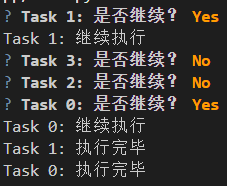

说完问题对象支持的方法，接下来说一下生成特定类型问题对象的快捷方法。

#### 2.2.1 `text`方法

`text`方法，生成可以输入任意字符串的问题。

`text`方法支持以下参数：

- `message`参数，字符串类型，表示问题的提示内容。

- `default`参数，字符串类型，表示问题的默认回答。

- `validate`参数，可调用类型，表示验证回答是否有效的方法。该参数支持两种类型的值：

  - 基于`Validator`类（使用`from questionary import Validator`导入）的验证类，需要实现`validate`方法。

    `validate`方法支持一个`Document`类型（使用`from prompt_toolkit.document import Document`导入）的参数`document`，`document`的`text`属性表示回答的内容，验证内容之后，通过触发`ValidationError`异常来表示回答无效，并在问题提示的下方显示验证失败的验证提示；不触发异常则表示回答有效。`ValidationError`类（使用`from questionary import ValidationError`导入）支持以下参数：

    - `cursor_position`参数，整数类型，用于表示异常发生的位置，通常使用`len(document.text)`。
    - `message`参数，字符串类型，表示验证失败的验证提示。

    示例如下：

    ```python3
    import questionary
    from questionary import Validator, ValidationError
    from prompt_toolkit.document import Document
    
    class Validator(Validator):
        def validate(self,document:Document):
            if document.text != 'ok':
                raise ValidationError(
                    cursor_position=len(document.text),
                    message='仅支持输入\'ok\'',            
                )
    
    question = questionary.text('请输入答案：',validate=Validator)
    question.ask()
    ```

    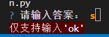

  - 普通的可调用对象，直接将回答内容作为参数，则是返回`True`表示回答有效，返回其他则作为验证失败的验证提示，显示在问题提示的下方。示例如下：

    ```python3
    import questionary
    
    def Validator(text):
        if text != 'ok':
            return '仅支持输入\'ok\''
        else:
            return True
    
    question = questionary.text('请输入答案：',validate=Validator)
    question.ask()
    ```

    

- `qmark`参数，字符串类型，表示显示在问题提示内容之前的内容，表示该提示内容属于问题，默认为`'?'`。示例如下：

  ```python3
  import questionary
  
  question = questionary.text('请输入答案：',qmark='提问')
  question.ask()
  ```

- `style`参数，`Style`类型（使用`from questionary import Style`导入），表示显示内容的样式。具体的语法可以参考后面进阶章节中的单独介绍。

- `multiline`参数，布尔类型，表示是否可以输入多行内容作为回答，默认为`False`。输入多行内容时，回车键表示换行，想要确认输入的内容，需要使用`alt`+`enter`，或者先按`esc`，再按`enter`来确认。

- `instruction`参数，字符串类型，当`multiline`参数为`True`时，表示显示在提示内容后面、指导如何进行多行输入的提示内容，默认为`None`。如果此参数为`None`，则会自动生成多行提示`'(Finish with 'Alt+Enter' or 'Esc then Enter')\n>'`。

- `lexer`参数，`Lexer`类型（通常使用`SimpleLexer`子类），表示用于设置输入内容样式的`Lexer`对象，默认为`None `，即`SimpleLexer('class:answer')`（其中的`'class:answer'`为样式类，具体用法参考后面进阶章节中的单独介绍）。

- `**kwargs`参数，表示其他不与上面参数重名、使用关键字方式传入的参数，会传给`PromptSession`对象（使用`from prompt_toolkit import PromptSession`导入），完整用法参考 https://python-prompt-toolkit.readthedocs.io/en/stable/pages/reference.html#prompt_toolkit.shortcuts.PromptSession 这里不做展开介绍。

#### 2.2.2 `password`方法

`password`方法，生成输入内容不会在终端中显示的问题，常用于获取密码。

`password`方法支持以下参数：

- `message`参数，字符串类型，表示问题的提示内容。
- `default`参数，字符串类型，表示问题的默认回答。
- `validate`参数，可调用类型，表示验证回答是否有效的方法。
- `qmark`参数，字符串类型，表示显示在问题提示内容之前的内容，表示该提示内容属于问题，默认为`'?'`。
- `style`参数，`Style`类型（使用`from questionary import Style`导入），表示显示内容的样式。具体的语法可以参考后面进阶章节中的单独介绍。
- `**kwargs`参数，表示其他不与上面参数重名、使用关键字方式传入的参数，会传给`PromptSession`对象（使用`from prompt_toolkit import PromptSession`导入），完整用法参考 https://python-prompt-toolkit.readthedocs.io/en/stable/pages/reference.html#prompt_toolkit.shortcuts.PromptSession 这里不做展开介绍。

#### 2.2.3 `path`方法

`path`方法，生成根据输入内容，智能提示、补全、获取文件或者目录对应路径（不输入就直接按`tab`键的话，会提示所有可以获取的路径）的问题，常用于获取文件或者目录对应的路径。

`path`方法支持以下参数：

- `message`参数，字符串类型，表示问题的提示内容。

- `default`参数，字符串类型，表示问题的默认回答。

- `qmark`参数，字符串类型，表示显示在问题提示内容之前的内容，表示该提示内容属于问题，默认为`'?'`。

- `validate`参数，可调用类型，表示验证回答是否有效的方法。

- `completer`参数，`Completer`类型（使用`from prompt_toolkit.completion import Completer`导入），表示用于补全输入内容的自动补全对象，默认为`GreatUXPathCompleter`（使用`from questionary.prompts.path import GreatUXPathCompleter`导入），如果想实现自定义的补全对象，可以参考 https://python-prompt-toolkit.readthedocs.io/en/master/pages/asking_for_input.html#a-custom-completer ，这里不做展开，仅提供一个简单的示例：

  ```python3
  import questionary
  from prompt_toolkit.completion import Completer,Completion
  
  class MyCustomCompleter(Completer):
      def get_completions(self, document, complete_event):
          if document.text.startswith('g'):
            	yield Completion(
               	text='good job', 
               	start_position = -len(document.text)
         		)
  
  question = questionary.path('请输入路径：',completer=MyCustomCompleter())
  question.ask()
  ```

- `style`参数，`Style`类型（使用`from questionary import Style`导入），表示显示内容的样式。具体的语法可以参考后面进阶章节中的单独介绍。

- `only_directories`参数，布尔类型，表示是否只显示目录（不显示文件），默认为`False`。

- `get_paths`参数，可调用类型，表示自动补全时使用哪些路径下的文件或者目录。该参数调用之后返回元素为字符串的列表，这些字符串就是目录的路径，需要确保真实存在。如果`completer`参数被传入了值，则此参数无效。

- `file_filter`参数，可调用类型，表示自动补全时显示哪些文件或目录。该参数接收路径作为调用参数，调用之后返回`True`表示该路径代表的目录或者文件会显示在自动补全中。

  示例如下：

  ```python3
  import questionary
  
  def filter_file(path:str):
      if 'g' in path:
        return True
  
  question = questionary.path('请输入路径：',file_filter=filter_file)
  question.ask()
  ```

  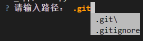

  注意，此参数并不会验证用户输入的内容，还允许用户手动输入其他值，即使输入的值被此参数验证之后返回为`False`（只是不显示在自动补全中）。如果想要让自动补全与允许值的表现一致，最好同时使用此参数和`validate`参数。

- `complete_style`参数，字符串类型，仅支持`['COLUMN','MULTI_COLUMN','READLINE_LIKE']`中的值，表示自动补全内容使用什么风格显示（依次对应单列、多列、类似readline那种打印到终端）。也可以使用使用`CompleteStyle`枚举对象（`from prompt_toolkit.shortcuts.prompt import CompleteStyle`导入）代替。

  示例如下：

  ```python3
  import questionary
  
  for value in ['COLUMN','MULTI_COLUMN','READLINE_LIKE']:
      question = questionary.path('请输入路径：',complete_style=value)
      question.ask()
  ```

  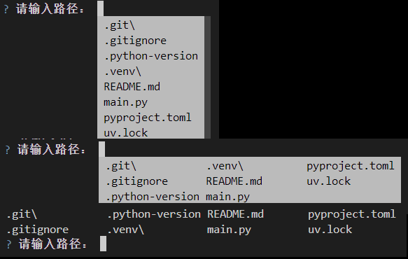

- `**kwargs`参数，表示其他不与上面参数重名、使用关键字方式传入的参数，会传给`PromptSession`对象（使用`from prompt_toolkit import PromptSession`导入），完整用法参考 https://python-prompt-toolkit.readthedocs.io/en/stable/pages/reference.html#prompt_toolkit.shortcuts.PromptSession 这里不做展开介绍。

#### 2.2.4 `confirm`方法

`confirm`方法，生成只能使用按键（`y`键和`n`键）直接回答（默认无需回车确认回答）确认与否的问题，常用于询问用户的同意与否。

`confirm`方法支持以下参数：

- `message`参数，字符串类型，表示问题的提示内容。
- `default`参数，布尔类型，表示问题的默认回答，默认为`True`。
- `qmark`参数，字符串类型，表示显示在问题提示内容之前的内容，表示该提示内容属于问题，默认为`'?'`。
- `style`参数，`Style`类型（使用`from questionary import Style`导入），表示显示内容的样式。具体的语法可以参考后面进阶章节中的单独介绍。
- `auto_enter`参数，布尔类型，表示是否自动确认回答，默认为`True`，即无需额外按回车确认回答，按下`y`键或`n`键即可完成回答。
- `instruction`参数，字符串类型，表示显示在提示内容后面、指导如何按键的提示内容，默认为`None`。如果此参数为`None`，当`default`参数为`True`时，则为`'(Y/n)'`；当`default`参数为`False`时，则为`'(y/N)'`。
- `**kwargs`参数，表示其他不与上面参数重名、使用关键字方式传入的参数，会传给`PromptSession`对象（使用`from prompt_toolkit import PromptSession`导入），完整用法参考 https://python-prompt-toolkit.readthedocs.io/en/stable/pages/reference.html#prompt_toolkit.shortcuts.PromptSession 这里不做展开介绍。

#### 2.2.5 `select`方法

`select`方法，生成提供了多个选项、可以使用上下方向键（或者`k`键向上、`j`键向下）选择选项的单选问题，常用于询问用户对应问题的单个选择。

`select`方法支持以下参数：

- `message`参数，字符串类型，表示问题的提示内容。

- `choices`参数，元素为字符串类型、`Choice`类型（使用`from questionary import Choice`导入）、字典类型（字典的键为字符串，值可以是任何对象）的序列对象（不同类型的元素可以混合使用），表示问题提供的选项。

  当元素为字符串类型时，选项的显示内容和实际值都是该字符串。

  当元素为`Choice`类型时，选项就是该元素。除了`select`方法，后面的`rawselect`方法和`checkbox`方法也支持该类型的选项，因此`Choice`类的部分适用于`checkbox`方法的参数在`select`方法中无效。`Choice`类支持以下参数：

  - `title`参数，字符串类型或者元素为元组的列表类型，表示选项显示的内容。如果是元素为元组（元组包含两个元素，分别代表样式和内容）的列表，则表示显示的内容是带有样式的，而且部分内容之间的样式也可以不同，样式的语法可以参考后面进阶章节中的单独介绍。

  - `value`参数，任意类型，表示选项的值。

  - `disabled`参数，布尔类型，表示该选项是否被禁用（不可选择），默认为`False`。

  - `checked`参数，布尔类型，表示该选项是否已经被选择（多选的选择状态，仅`checkbox`方法支持切换多选的选择状态，但其余方法可以显示），默认为`False`。

  - `shortcut_key`参数，字符串类型或者布尔类型或者`None`，表示可以快捷选择该选项的快捷键。仅当`select`方法的`use_shortcuts`参数为`True`时才可以使用，并且会在选项显示的内容前显示`'{快捷键})'`，表明选项对应的快捷键。

    当该参数为`None`或者`True`时，表示该选项使用自动生成的快捷键。对于同一个问题，程序按照选项的顺序，将支持快捷键且使用使用自动生成快捷键的选项，依次分配`1`到`9`和`0`的数字键再接`a`到`z`的英文字母键，一共36个快捷键。

    当该参数为字符串类型的单个数字或者字母时，表示该选项使用指定按键为快捷键。但是，在设置`j`键、`k`键时，需要设置`select`方法的`use_jk_keys`参数为`False`。

    当该参数为`False`时，表示该选项没有快捷键，但可以通过移动光标来选择。此时选项显示的内容前显示`'-)'`，用于表示该选项没有快捷键。

    注意，包含分配指定快捷键、自动生成的快捷键的选项在内，单个问题最多可以给36个选项分配快捷键。并且为了确保`j`键、`k`键可以选择指定选项而不是上下移动广播，需要设置`select`方法的`use_jk_keys`参数为`False`。

  - `description`参数，字符串类型，表示选项的解释内容，显示在所有选项的最下方。

  Questionary还提供了一种特殊的`Choice`类选项——`Separator`类（使用`from questionary import Separator`导入），该选项是一个不可选择的分隔符，默认为15个`'-'`，可以通过指定该类的字符串类型参数`line`（表示完整的分隔符），修改分隔符。

  当元素为字典类型时，字典的键与`Choice`类的参数一一对应，其值也会传给对应的值：

  - `'name'`键，对应`title`参数。
  - `'value'`键，对应`value`参数。
  - `'disabled'`键，对应`disabled`参数。
  - `'checked'`键，对应`checked`参数。
  - `'key'`键，对应`shortcut_key`参数。
  - `'description'`键，对应`description`参数。

  示例如下：

  ```python3
  import questionary
  from questionary import Choice,Separator
  
  questionary.select(
      '请选择：',
      [
          'a',
          Choice('b','b'),
          Separator(),
          {
              'name':'c',
              'value':'c',
          }
       ],
  ).ask()
  ```

  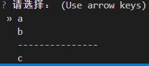

- `default`参数，元素为字符串类型、`Choice`类型（使用`from questionary import Choice`导入）、字典类型（字典的键为字符串，值可以是任何对象）的序列对象（不同类型的元素可以混合使用），表示默认选择的选项。注意，当该参数为`Choice`类型、字典类型时，只能引用`choices`参数中对应的选项，不能额外创建新的相同选项来指代默认选择的选项。

- `qmark`参数，字符串类型，表示显示在问题提示内容之前的内容，表示该提示内容属于问题，默认为`'?'`。

- `pointer`参数，字符串类型，表示当前光标在哪个选项上，显示在选项之前，默认为`'»'`。

- `style`参数，`Style`类型（使用`from questionary import Style`导入），表示显示内容的样式。具体的语法可以参考后面进阶章节中的单独介绍。

- `use_shortcuts`参数，布尔类型，表示是否使用快捷键选择选项，默认为`False`。

- `use_arrow_keys`参数，布尔类型，表示是否使用方向键上下移动光标，默认为`True`。

- `use_indicator`参数，布尔类型，表示是否在选项前添加一个小的指示器字符`'○'`，使得每个选项被光标选择时更明显，默认为`False`。

- `use_jk_keys`参数，布尔类型，表示是否使用`k`键（向上）、`j`键（向下）移动光标，默认为`True`。

- `use_emacs_keys`参数，布尔类型，表示是否使用`ctrl+p`键（向上）、`ctrl+n`键（向下）移动光标，默认为`False`。

- `use_search_filter`参数，布尔类型，表示是否启用搜索过滤选项的功能（仅支持英文，且需要将`use_jk_keys`参数设置为`False`），默认为`False`。

- `show_selected`参数，布尔类型，表示是否在所有选项下面显示当前选择的选项，默认为`False`。

- `show_description`参数，布尔类型，表示是否显示选项的解释内容，默认为`True`。

- `instruction`参数，字符串类型，表示显示在提示内容后面、指导如何按键的提示内容，默认为`None`。如果此参数为`None`，则根据其他参数情况自动生成按键提示内容。

- `**kwargs`参数，表示其他不与上面参数重名、使用关键字方式传入的参数，会传给`PromptSession`对象（使用`from prompt_toolkit import PromptSession`导入），完整用法参考 https://python-prompt-toolkit.readthedocs.io/en/stable/pages/reference.html#prompt_toolkit.shortcuts.PromptSession 这里不做展开介绍。

#### 2.2.6 `rawselect`方法

`rawselect`方法是对`select`方法的包装，使得生成的问题默认仅允许使用快捷键直接选择选项，以及使用`k`键、`j`键移动光标，不支持方向键。

`rawselect`方法默认支持`select`方法的所有参数，但是将`select`方法的`use_shortcuts`参数设置为`True`，将`use_arrow_keys`参数设置为`False`。

#### 2.2.7 `checkbox`方法

`checkbox`方法，生成可以多选选项的问题，用于询问用户的多选回答。

`checkbox`方法支持以下参数：

- `message`参数，字符串类型，表示问题的提示内容。
- `choices`参数，元素为字符串类型、`Choice`类型（使用`from questionary import Choice`导入）、字典类型（字典的键为字符串，值可以是任何对象）的序列对象（不同类型的元素可以混合使用），表示问题提供的选项。
- `default`参数，字符串类型，表示默认选择的选项。注意，对于基于字典生成的选项，此参数不支持。另外，此参数仅能选择单个选项，如果想要默认选择多个选项，只能在创建选项时使用`Choice`类型对象，并设置对象的`checked`参数为`True`。
- `validate`参数，可调用类型，表示验证回答是否有效的方法。
- `qmark`参数，字符串类型，表示显示在问题提示内容之前的内容，表示该提示内容属于问题，默认为`'?'`。
- `pointer`参数，字符串类型，表示当前光标在哪个选项上，显示在选项之前，默认为`'»'`。
- `style`参数，`Style`类型（使用`from questionary import Style`导入），表示显示内容的样式。具体的语法可以参考后面进阶章节中的单独介绍。
- `initial_choice`参数，元素为字符串类型、`Choice`类型（使用`from questionary import Choice`导入）、字典类型（字典的键为字符串，值可以是任何对象）的序列对象（不同类型的元素可以混合使用），表示默认光标在哪个选项上。注意，当该参数为字典类型时，只能引用`choices`参数中对应的选项，不能额外创建新的相同字典来指代默认光标所在的选项。
- `use_arrow_keys`参数，布尔类型，表示是否使用方向键上下移动光标，默认为`True`。
- `use_jk_keys`参数，布尔类型，表示是否使用`k`键（向上）、`j`键（向下）移动光标，默认为`True`。
- `use_emacs_keys`参数，布尔类型，表示是否使用`ctrl+p`键（向上）、`ctrl+n`键（向下）移动光标，默认为`True`。

- `use_search_filter`参数，布尔类型，表示是否启用搜索过滤选项的功能（仅支持英文，且需要将`use_jk_keys`参数设置为`False`），默认为`False`。

- `instruction`参数，字符串类型，表示显示在提示内容后面、指导如何按键的提示内容，默认为`None`。如果此参数为`None`，则根据其他参数情况自动生成按键提示内容。

- `show_description`参数，布尔类型，表示是否显示选项的解释内容，默认为`True`。

- `**kwargs`参数，表示其他不与上面参数重名、使用关键字方式传入的参数，会传给`PromptSession`对象（使用`from prompt_toolkit import PromptSession`导入），完整用法参考 https://python-prompt-toolkit.readthedocs.io/en/stable/pages/reference.html#prompt_toolkit.shortcuts.PromptSession 这里不做展开介绍。

因为问题支持多选，因此问题需要使用空格键切换选项的选择状态。此外，选择全部选项会比较费事，问题还支持使用`a`键（如果`use_search_filter`参数为`True`就是`ctrl+a`键）将全部选项切换为选择（或者不选）状态，使用`i`键（如果`use_search_filter`参数为`True`就是`ctrl+i`键））反转全部选项的选择状态。

以下为示例：

```python3
import questionary
from questionary import Choice,Separator

questionary.checkbox(
    '请选择：',
    [
        'a',
        b:=Choice('b','b'),
        Separator(),
        c:={
            'name':'c',
            'value':'c',
        },
     ],
     use_search_filter=True,
     use_jk_keys=False
).ask()
```

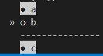

#### 2.2.8 `autocomplete`方法

`autocomplete`方法，生成根据给定选项自动补全、同时也支持回答任何内容的问题。

`autocomplete`方法支持以下参数：

- `message`参数，字符串类型，表示问题的提示内容。
- `choices`参数，元素为字符串类型的列表，每个元素都是自动补全后的内容，用户输入其包含的字符，就会弹出可补全的完整内容。
- `default`参数，字符串类型，表示问题的默认回答。
- `qmark`参数，字符串类型，表示显示在问题提示内容之前的内容，表示该提示内容属于问题，默认为`'?'`。
- `completer`参数，`Completer`类型（使用`from prompt_toolkit.completion import Completer`导入），表示用于补全输入内容的自动补全对象，默认为`WordCompleter`（使用`from questionary.prompts.autocomplete import WordCompleter`导入），如果想实现自定义的补全对象，可以参考 https://python-prompt-toolkit.readthedocs.io/en/master/pages/asking_for_input.html#a-custom-completer ，这里不做展开。
- `meta_information`参数，字典类型，表示补全内容的解释性信息。字典的键为`choices`参数中的元素，字典的值可以为任何类型。
- `ignore_case`参数，布尔类型，表示是否忽略输入的内容的大小写，默认为`True`。
- `match_middle`参数，布尔类型，表示是否全字匹配（即输入的内容在被匹配内容的中间也可以成功匹配），默认为`True`。
- `complete_style`参数，字符串类型，仅支持`['COLUMN','MULTI_COLUMN','READLINE_LIKE']`中的值，表示自动补全内容使用什么风格显示（依次对应单列、多列、类似readline那种打印到终端）。也可以使用使用`CompleteStyle`枚举对象（`from prompt_toolkit.shortcuts.prompt import CompleteStyle`导入）代替。
- `validate`参数，可调用类型，表示验证回答是否有效的方法。
- `style`参数，`Style`类型（使用`from questionary import Style`导入），表示显示内容的样式。具体的语法可以参考后面进阶章节中的单独介绍。
- `**kwargs`参数，表示其他不与上面参数重名、使用关键字方式传入的参数，会传给`PromptSession`对象（使用`from prompt_toolkit import PromptSession`导入），完整用法参考 https://python-prompt-toolkit.readthedocs.io/en/stable/pages/reference.html#prompt_toolkit.shortcuts.PromptSession 这里不做展开介绍。

示例如下：

```python3
import questionary

questionary.autocomplete(
    '请输入：',
    ['a','ab','b','ba'],
    meta_information={
        'ab':'a and b'
    }
).ask()
```

#### 2.2.9 `press_any_key_to_continue`方法

`press_any_key_to_continue`方法，生成要求用户按下任意按键才能继续的问题，但该问题不会返回任何内容。

`press_any_key_to_continue`方法支持以下参数：

- `message`参数，字符串类型，表示问题的提示内容。
- `style`参数，`Style`类型（使用`from questionary import Style`导入），表示显示内容的样式。具体的语法可以参考后面进阶章节中的单独介绍。
- `**kwargs`参数，表示其他不与上面参数重名、使用关键字方式传入的参数，会传给`PromptSession`对象（使用`from prompt_toolkit import PromptSession`导入），完整用法参考 https://python-prompt-toolkit.readthedocs.io/en/stable/pages/reference.html#prompt_toolkit.shortcuts.PromptSession 这里不做展开介绍。

#### 2.2.10 `print`方法

Questionary提供了一个打印输出、不产生问题对象的方法——`print`，虽然名字和Python内置方法相同，但支持的参数不同。

`print`支持以下参数：

- `text`参数，字符串类型，表示要输出的内容。
- `style`参数，`Style`类型（使用`from questionary import Style`导入），表示输出内容的样式。具体的语法可以参考后面进阶章节中的单独介绍。

### 2.3 表单生成方法

表单对象由多个表单域组成，每个表单域对应一个问题，调用表单对象即可一次性询问多个问题的结果。和问题对象一样，表单类同样是内部类，也涉及到prompt_toolkit框架基础，因此本节只介绍表单对象的方法。至于生成表单对象，则改为使用简化的表单生成方法，而不是单独构建表单对象。

将问题对象以关键字方式传给表单生成方法`form`，即可得到表单对象，再调用表单对象的方法即可进入回答输入模式。

表单对象支持以下方法：

- `ask`方法，进入表单对象的回答输入模式，此时终端会依次显示每个问题地下定义好的提示内容，并等待用户输入回答，最后将用户输入的内容当作该方法的返回值（字典形式，键为问题对象对应的关键字，值为问题对应的回答）。该方法支持以下参数：
  - `patch_stdout`参数，布尔类型，表示当终端中有其他线程在输出内容到stdout时，是否确保输出的内容始终在提示内容之上，而不是在提示内容的下面，默认为`False`。
  - `kbi_msg`参数，字符串类型，表示当用户在回答问题前使用`ctrl`+`c`退出程序时，终端输出的提示内容用于表明这种退出情况。默认为`'\nCancelled by user\n'`。
- `ask_async`方法，`ask`方法的异步版本，参数同`ask`方法，适合在异步函数中使用，可以使用异步等待来获取回答内容。
- `unsafe_ask`方法，`ask`方法的不安全版本，此方法不会捕获用户使用`ctrl`+`c`退出程序的异常，而是直接让Python内部处理此异常。因此不支持`kbi_msg`参数，也不会输出自定义的提示内容。
- `unsafe_ask_async`方法，`ask_async`方法的不安全版本，此方法不会捕获用户使用`ctrl`+`c`退出程序的异常，而是直接让Python内部处理此异常。因此不支持`kbi_msg`参数，也不会输出自定义的提示内容。

示例如下：

```python3
import questionary

answers = questionary.form(
    first = questionary.confirm('是否确认？', default=True),
    second = questionary.text('请输入答案：')
).ask()

print(answers)
```

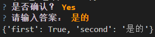

### 2.4 提示方法（更新中）

本节内容参考自  https://questionary.readthedocs.io/en/stable/pages/advanced.html#create-questions-from-dictionaries 。

参数用法参考 https://questionary.readthedocs.io/en/stable/pages/api_reference.html#questionary.prompt 。

提示（`prompt`）方法类似表单生成方法，可以基于字典或者元素为字典的列表，生成单个或者多个问题，并以字典形式返回所有问题的回答。

`prompt`方法支持以下参数：

- `questions`参数，字典类型或者元素为字典的列表，表示用于生成问题的问题配置。字典的键与问题配置的对应关系如下：
  
  - `'type'`键，必需键，值为字符串类型，表示问题的类型，不同的值对应不同的问题生成方法，具体参考下表：
  
    | 值                            | 对应的方法                      |
    | ----------------------------- | ------------------------------- |
    | `'autocomplete'`              | `autocomplete`方法              |
    | `'confirm'`                   | `confirm`方法                   |
    | `'text'`                      | `text`方法                      |
    | `'select'`                    | `select`方法                    |
    | `'rawselect'`                 | `rawselect`方法                 |
    | `'password'`                  | `password`方法                  |
    | `'checkbox'`                  | `checkbox`方法                  |
    | `'path'`                      | `path`方法                      |
    | `'press_any_key_to_continue'` | `press_any_key_to_continue`方法 |
    | `'list'`                      | `select`方法                    |
    | `'rawlist'`                   | `rawselect`方法                 |
    | `'input'`                     | `text`方法                      |
    | `'print'`                     | `print`方法                     |
  
  - `'name'`键，必需键，值为字符串类型，表示该问题的回答在`prompt`方法返回的字典中，对应哪个键。
  
  - `'message'`键，对应问题生成方法的`message`参数。
  
  - `'qmark'`键，对应问题生成方法的`qmark`参数。
  
  - `'default'`键，对应问题生成方法的`default`参数。如果该键的值为可调用类型，则表示值的调用结果对应问题生成方法的`default`参数。值有一个字典类型的必需参数，该参数接收的就是`prompt`方法的`answers`参数值。
  
  - `'choices'`键，对应问题生成方法的`choices`参数。如果该键的值为可调用类型，则表示值的调用结果对应问题生成方法的`choices`参数。值有一个字典类型的必需参数，该参数接收的就是`prompt`方法的`answers`参数值。
  
  - `'when'`键，值为可调用类型，表示当值的调用结果为`True`时才生成问题，类似`skip_if`方法，但含义相反。值有一个字典类型的必需参数，该参数接收的就是`prompt`方法的`answers`参数值。
  
  - `'validate'`键，对应问题生成方法的`validate`参数。
  
  - `'filter'`键，值为可调用类型，调用时，将每个问题的回答作为参数，返回值作为为该问题的实际回答，用于处理每个问题的回答。
  
  - 其余问题生成方法支持的参数（比如`style`参数、`**kwargs`参数支持的隐藏参数等），也可以通过创建相同名称的键的方式传入对应的值。
  
- `answers`参数，字典类型，表示方法返回的默认字典。注意，对于字典的键与问题配置中`'name'`键的值同名的，在回答完所有问题之后，这些键对应的值会被更新为实际回答的内容。

- `patch_stdout`参数，布尔类型，表示当终端中有其他线程在输出内容到stdout时，是否确保输出的内容始终在提示内容之上，而不是在提示内容的下面，默认为`False`。

- `true_color`参数，布尔类型，表示是否启用24位真彩色颜色显示，默认为`False`。

- `kbi_msg`参数，字符串类型，表示当用户在回答问题前使用`ctrl`+`c`退出程序时，终端输出的提示内容用于表明这种退出情况。默认为`'\nCancelled by user\n'`。

- `**kwargs`参数，表示其他不与上面参数重名、使用关键字方式传入的参数，会传给每个问题生成方法。

  需要注意的是，问题配置中的键优先生效，`'type'`键、`'name'`键是不可缺失的必需键，因此，只有除了`'type'`键、`'name'`键之外，问题配置中的没有的键（比如`'style'`键，对应`style`参数），才可以通过这种方法传给每个问题的生成方法。

示例如下：

```python3
import questionary

when = True
answer = questionary.prompt(
    {
        'type': 'text',
        'name': 'first',
        'message': '请回答：',
        'when': lambda _: when,
        'default': 'Yes',
        'filter':lambda e: e+'.',
        'qmark':'问题1'
    },
    answers={
        'first': None
    },
)
print(answer['first'])

```

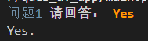

或者将部分参数传给`prompt`方法，效果也是一样的：

```python3
import questionary

when = True
answer = questionary.prompt(
    {
        'type': 'text',
        'name': 'first',
        'message': '请回答：',
        'when': lambda _: when,
        'default': 'Yes'
    },
    answers={
        'first': None
    },
    filter=lambda e: e+'.',
    qmark='问题1'
)
print(answer['first'])
```

亦或将其余参数作为字典传给`prompt`方法：

```python3
import questionary

when = True
answer = questionary.prompt(
    {
        'type': 'text',
        'name': 'first',
        'message': '请回答：',
        'when': lambda _: when,
        'default': 'Yes'
    },
    answers={
        'first': None
    },
    **{
        'filter':lambda e: e+'.',
        'qmark':'问题1'
    }
)
print(answer['first'])
```

不光提示方法支持传入字典，问题生成方法也可以传入字典，传给对应的参数：

```python3
import questionary

questionary.text(**{'message':'请回答：'}).ask()
```

和前面介绍的不安全版本的方法一样，提示方法也有不安全版本——`unsafe_prompt`，只是没有`kbi_msg`参数，其余参数均一致。

## 3 进阶

API手册：https://questionary.readthedocs.io/en/stable/pages/api_reference.html

官方示例：https://github.com/tmbo/questionary/tree/master/examples

### 3.1 样式

本节内容参考自 https://questionary.readthedocs.io/en/stable/pages/advanced.html#themes-styling 。

虽然Questionary主打一个快速使用，但不代表Questionary程序都是一成不变的样子，根据需求，依然可以修改终端内容的显示样式，只需给前面介绍的几个方法的`style`参数（提示方法也支持，没有直接写明，需要通过关键字方式传入）传入`Style`对象即可。

样式语法参考自 https://python-prompt-toolkit.readthedocs.io/en/stable/pages/advanced_topics/styling.html 。

#### 3.1.1 基础语法

在应用样式之前，需要先了解一下样式的基础语法。

描述样式的字符串被称之为样式字符串。在样式字符串中，以空格为间隔，每个分段描述一个基础样式，共同组成单个样式字符串，最终用于美化要修饰的内容。

样式字符串支持以下基础样式：

- 直接表示颜色或者有'fg:'前缀的颜色表达式，表示内容的前景色（也称之为字体颜色）。

  其中，颜色支持以下格式：

  - 颜色的名字，如`'red'`。可以使用`from prompt_toolkit.styles import NAMED_COLORS,ANSI_COLOR_NAMES,ANSI_COLOR_NAMES_ALIASES`导入相关字典或者列表，查询支持的颜色名。其中，`ANSI_COLOR_NAMES`和`ANSI_COLOR_NAMES_ALIASES`包含的是ANSI颜色。
  - '#'为前缀，后接6位十六进制数字，每两位数字代表一种颜色分量值（依次对应红色、绿色、蓝色的分量值）的RGB颜色标准表达方式，如`'#cc5454'`。

- 有'bg:'前缀的颜色表达式，表示内容的背景色。

- 非颜色类的样式，有：

  - `'bold'`，表示内容字体将变为粗体。
  - `'italic'`，表示内容字体将变为斜体。
  - `'underline'`，表示内容将添加下划线。
  - `'blink'`，表示内容将闪烁（仅部分终端支持，Windows自带终端不支持）。
  - `'reverse'`，表示内容的背景色与前景色相反。
  - `'hidden'`，表示内容隐藏。

  给以上非颜色类的样式添加'no'前缀，则表示内容不使用上述样式，常用于组合基础样式与样式类时，撤销不需要的非颜色类的样式。

示例如下：

```python3
from questionary import print

print('some text','red')
print('some text','bg:red')
print('some text','underline bold')
```

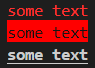

#### 3.1.2 默认样式类

基础样式可以组合使用，构成完整的样式字符串，让内容具备多种样式。但是，在实际使用时，很多方法的`style`参数并非打印输出方法的`style`参数那种接收简样式字符串，而是接收样式对象（`Style`类，使用`from questionary import Style`导入），这就使得那些方法可以支持更丰富的样式配置。

`Style`类支持以下参数：

- `style_rules`参数，元素为元组（两个元素，分别为样式类、样式字符串）的列表，表示样式类与样式字符串的映射关系。

Questionary的默认使用了一些样式类，并为它们定义了基本样式，让不同问题的内容显示时没那么单调。具体默认的样式类如下：

- `'qmark'`样式类，`qmark`参数对应内容使用的样式类。
- `'question'`样式类，问题的提示内容使用的样式类。
- `'answer'`样式类，输入、选择（在回车确认之后显示）的回答内容使用的样式类。
- `'pointer'`样式类，选择类问题的光标用的样式类。
- `'highlighted'`样式类，选择类问题的光标对应的选项高亮（选项确认选择之前）时使用的样式类。
- `'selected'`样式类，多选问题的选项确认选择后使用的样式类。注意，该样式类对应的内容框架内部额外添加了基础样式`'reverse'`，因此设置背景色、前景色都是相反的，想要与设置的样式一致的话，需要额外添加`'noreverse'`。
- `'separator'`样式类，分隔符使用的样式类。
- `'instruction'`样式类，按键提示内容使用的样式类。
- `'text'`样式类，没有被选择、高亮的选项内容使用的样式类。
- `'disabled'`样式类，被禁用选项的内容使用的样式类。

以下为示例（不同方法默认的样式类不同，不一定支持全部）：

```python3
import questionary
from questionary import Style, Separator,Choice

custom_style = Style(
    [
        ('qmark', 'bg:green bold'),
        ('question', 'fg:green bold'),
        ('answer', 'fg:green underline'),
        ('pointer', 'bg:green bold'),
        ('highlighted', 'bg:green bold'),
        ('selected', 'bg:red noreverse'),
        ('separator', 'fg:blue'),
        ('instruction', 'fg:yellow bold'),
        ('text', 'fg:green italic'),
        ('disabled', 'fg:pink italic')
    ]
)

# questionary.text('请回答：', style=custom_style).ask()

# questionary.checkbox('请选择：',['a',Separator(),'b'], style=custom_style).ask()

questionary.select(
    '请选择：',
    ['a', Separator(), 'b',Choice('c',disabled=True)],
    style=custom_style,
).ask()
```

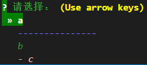

`prompt`方法修改问题内容的样式：

```python3
import questionary
from questionary import Style

questionary.prompt(
    {
        'type': 'confirm',
        'name': 'question',
        'message': '是否确认？',
        'default': True,
    },
    style=Style(
        [
            ('question', 'bg:red')
        ]
    )
)
```

或者：

```python3
import questionary
from questionary import Style

questionary.prompt(
    {
        'type': 'confirm',
        'name': 'question',
        'message': '是否确认？',
        'default': True,
        'style':Style(
            [
                ('question', 'bg:red')
            ]
        )
    }
)
```

输出如下：

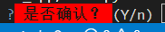

#### 3.1.3 自定义样式类

除了默认的样式类，也可以创建自定义的样式类，然后在支持自定义样式类的地方（比如`Choice`类的`title`参数和`text`方法的`lexer`参数）使用自定义的样式类，格式为`'class:{自定义的样式类}'`。当然，这个地方也可以只使用样式字符串，或者组合使用基础样式和自定义的样式类。

组合多个自定义样式类时，可以使用`'class:{自定义的样式类1} class:{自定义的样式类2}'`这种格式。也可以使用英文句号连接两个样式类，组成新的样式类，当作单个样式类使用，比如`'class:{自定义的样式类1}.{自定义的样式类2}'`，效果是一样的。

`Choice`类`title`参数的示例：

```python3
import questionary
from questionary import Choice, Style

custom_style = Style([
    ('mystyle', 'bg:green bold'),
])

choices = [
    Choice(
        title=[
            ('class:mystyle','A'),
            ('underline','.'),
            ('class:mystyle reverse','some texe'),
        ]
    )
]

question = questionary.select(
    '请选择答案：',
    choices,
    style=custom_style
)

question.ask()
```

或者：

```python3
import questionary
from questionary import Style,Choice

questionary.prompt(
    {
        'type': 'select',
        'name': 'question',
        'message': '请选择答案：',
        'choices':[
            Choice(
                title=[
                    ('class:mystyle','A'),
                    ('underline','.'),
                    ('class:mystyle reverse','some texe'),
                ]
            )
        ]
    },
    style=Style(
        [
            ('mystyle', 'bg:green bold'),
        ]
    )
)
```

输出如下：

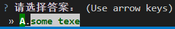

`text`方法`lexer`参数的示例：

```python3
from prompt_toolkit.lexers import SimpleLexer
import questionary
from questionary import Style

custom_style = Style([
    ('mystyle', 'bg:green bold'),
])

question = questionary.text(
    '请输入答案：',
    lexer=SimpleLexer('class:mystyle'),
    style=custom_style
)

question.ask()
```

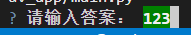


## 4 后记

Questionary框架虽然简单，但也存在着一定的自定义空间。当然，因为其基于prompt_toolkit框架，所以，部分功能、参数的用法没有详细介绍，而是引用了prompt_toolkit框架的文档链接。这也给笔者带来了更深的启发：既然简化prompt_toolkit框架的使用能实现如此便捷的功能，若是深入学习prompt_toolkit框架，岂不是可以实现更强大的功能？

学习无止境，如果读者已经有了兴趣，可以期待《prompt_toolkit的中文入门教程》。prompt_toolkit框架比Textual框架看着更“原始”，但功能上一点也不逊色。
