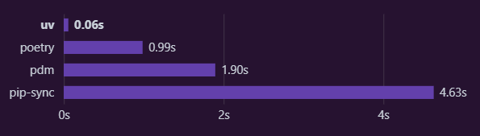
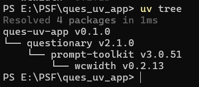
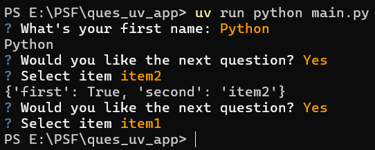

# Questionary的中文入门教程

## 0 前言

[Questionary](https://questionary.readthedocs.io/en/stable/index.html)是一个交互式获取命令行输入内容的Python框架，用法简单高效，对于想要交互式获取命令行输入内容的开发需求，Questionary无疑是一个不错的选择。官方文档很简单，但本教程主要介绍基本用法，以及引出该框架的依赖，真正强大的底层工具——prompt_toolkit框架（同样是TUI开发框架）。

当然，如果不想费心开发完全的TUI程序，只是使用Questionary也能满足常见的需求。

## 1 环境准备

和其他框架的第一步一样，本教程依然是从搭建开发环境开始。不过，开发工具的安装和Python解释器的准备太过基础，这里不再赘述，姑且认为读者已经做好了准备，且有相关基础。若是需要这部分内容，可以查阅网络资料和其他教程。

### 1.1 uv的简短教程（同时也是基础环境的准备过程）

不同于其他框架的教程，本教程将使用一个新的环境管理工具——[uv](https://docs.astral.sh/uv/#uv)，管理开发环境。

pdm已经够快够简单了，为什么还要用uv？

也许下面的速度对比图能解决这个疑问：



可以看到，尽管pdm比pip快将近60%，但uv的速度还是瞬间完成。

了解了uv的优点，接下来开始学习使用uv的常用操作（完整的操作可以学习[官网文档](https://docs.astral.sh/uv/#uv)，这里仅学习初始化、管理开发环境的必要操作）。

#### 1.1.1 初始化项目

在想创建项目目录的地方，使用`uv init ques_uv_app -p 3.12`创建并初始化项目。

命令中，`init`后接着的，是想要创建的项目文件夹的名字，没有这个文件夹的话，uv会自动创建。如果想要在当前文件夹创建项目，直接使用`uv init -p 3.12`即可。

命令中，`-p`选项表示指定Python版本，如果不使用这个选项，uv会自动使用系统中可用Python的最新版本。

此命令会创建如下文件：

```shell
ques_uv_app
├─.git
├─.gitignore
├─.python-version
├─main.py
├─pyproject.toml
└─README.md
```

`.git`是文件夹，表明该项目初始化了一个git仓库。

`.gitignore`是文件，git仓库的忽略文件。

`.python-version`是文件，uv识别项目使用哪个Python版本的配置文件，可以在当前目录下使用`uv python pin 3.12`命令来生成次文件。

`main.py`是文件，uv自动创建的源代码文件。

`pyproject.toml`是文件，uv自动创建的项目配置文件，后面使用uv管理项目依赖的时候，此文件中相关内容会被修改。

`README.md`是文件，uv自动创建的项目描述文档，用于编写项目介绍、基本使用文档等非源代码内容。

初始化命令的其他选项可以使用`uv init --help`查看：

```shell
Create a new project

Usage: uv.exe init [OPTIONS] [PATH]

Arguments:
  [PATH]  The path to use for the project/script

Options:
  --name <NAME>                    The name of the project
  --bare                           Only create a `pyproject.toml`
  --package                        Set up the project to be built as a Python package
  --no-package                     Do not set up the project to be built as a Python package
  --app                            Create a project for an application
  --lib                            Create a project for a library
  --script                         Create a script
  --description <DESCRIPTION>      Set the project description
  --no-description                 Disable the description for the project
  --vcs <VCS>                      Initialize a version control system for the project [possible values: git, none]
  --build-backend <BUILD_BACKEND>  Initialize a build-backend of choice for the project [possible values: hatch, flit, pdm, poetry, setuptools, maturin, scikit]
  --no-readme                      Do not create a `README.md` file
  --author-from <AUTHOR_FROM>      Fill in the `authors` field in the `pyproject.toml` [possible values: auto, git, none]
  --no-pin-python                  Do not create a `.python-version` file for the project
  --no-workspace                   Avoid discovering a workspace and create a standalone project

Python options:
  -p, --python <PYTHON>      The Python interpreter to use to determine the minimum supported Python version. [env: UV_PYTHON=]
      --managed-python       Require use of uv-managed Python versions [env: UV_MANAGED_PYTHON=]
      --no-managed-python    Disable use of uv-managed Python versions [env: UV_NO_MANAGED_PYTHON=]
      --no-python-downloads  Disable automatic downloads of Python. [env: "UV_PYTHON_DOWNLOADS=never"]

Cache options:
  -n, --no-cache               Avoid reading from or writing to the cache, instead using a temporary directory for the duration of the operation [env: UV_NO_CACHE=]
      --cache-dir <CACHE_DIR>  Path to the cache directory [env: UV_CACHE_DIR=]

Global options:
  -q, --quiet...                                   Use quiet output
  -v, --verbose...                                 Use verbose output
      --color <COLOR_CHOICE>                       Control the use of color in output [possible values: auto, always, never]
      --native-tls                                 Whether to load TLS certificates from the platform's native certificate store [env: UV_NATIVE_TLS=]
      --offline                                    Disable network access [env: UV_OFFLINE=]
      --allow-insecure-host <ALLOW_INSECURE_HOST>  Allow insecure connections to a host [env: UV_INSECURE_HOST=]
      --no-progress                                Hide all progress outputs [env: UV_NO_PROGRESS=]
      --directory <DIRECTORY>                      Change to the given directory prior to running the command
      --project <PROJECT>                          Run the command within the given project directory [env: UV_PROJECT=]
      --config-file <CONFIG_FILE>                  The path to a `uv.toml` file to use for configuration [env: UV_CONFIG_FILE=]
      --no-config                                  Avoid discovering configuration files (`pyproject.toml`, `uv.toml`) [env: UV_NO_CONFIG=]
  -h, --help                                       Display the concise help for this command
```

除了默认的快速创建项目的命令，还有其他可能需要用到、改变的选项：

-   `--name`选项，指定项目的名称。
-   `--bare`选项，只创建`pyproject.toml`文件。

#### 1.1.2 初始化环境

初始化了项目之后，就要开始创建虚拟环境。但在创建虚拟环境、添加包之前，最好配置一下pypi的镜像地址。不同于pip可以使用命令全局配置，uv目前只能通过修改配置文件来配置镜像。

在 `~/.config/uv/uv.toml` 或者 `/etc/uv/uv.toml` 中填写下面的内容：

```toml
[[index]]
url = "https://mirrors.tuna.tsinghua.edu.cn/pypi/web/simple/"
default = true
```

对于Windows系统来说，这个文件是`%APPDATA%\uv\uv.toml`（需要手动创建）。

对于不想全局修改，只影响项目的话，添加至`pyproject.toml`文件即可。

使用`uv add questionary`和`uv remove questionary`添加删除包，会同时创建虚拟环境。

如果只想创建虚拟环境，而不添加任何包，可以使用`uv venv`。

如果`pyproject.toml`文件已经配置好依赖，无需添加包，则可以使用`uv sync`命令，让虚拟环境同步依赖情况（没有虚拟环境的话会自动创建虚拟环境）。

#### 1.1.3 包（依赖）的版本管理

上面的操作都是自动使用最新版本的包，对于想要使用指定版本（非最新）的包，需要提前在`pyproject.toml`文件指定依赖版本，再使用`uv sync`命令同步虚拟环境。如果依赖版本变动，则需要使用`uv sync`命令同步一次虚拟环境才能使用正确的版本。

不过需要注意的是，如果依赖有新版本且升级不影响兼容性，`uv sync`命令不会自动升级依赖版本。因为项目目录下会有uv自动生成的锁定文件——`uv.lock`（使用`uv lock`也能单独生成），该文件规定了虚拟环境使用的依赖版本和对应的文件信息，确保虚拟环境的版本依赖是正确的。

当然，删除此文件，修改依赖的版本号，再使用`uv lock`单独生成此文件，再使用`uv sync`命令（或者直接使用此命令）同步虚拟环境依赖版本，是一个有效但不简洁的操作。这里更推荐使用`uv lock -U`（同`uv lock --upgrade`）升级依赖版本，然后使用`uv sync`命令同步虚拟环境依赖版本。抑或使用`uv sync -U`（同`uv sync --upgrade`）一步到位。

不同于pip查看依赖的不直观，uv提供了`uv tree`，可以用树形图展示项目的依赖情况：



#### 1.1.4 运行

到此，环境已经准备好，可以开发、运行Questionary程序了。

当然，为了鼓舞读者的热情，先运行一个现成的示例代码试试水。将下面的内容（源码来自[官方文档](https://questionary.readthedocs.io/en/stable/pages/quickstart.html)）覆盖项目文件夹中`main.py`的原本内容：

```python3
import questionary

answer = questionary.text("What's your first name:").ask()
print(answer)

answers = questionary.form(
    first = questionary.confirm("Would you like the next question?", default=True),
    second = questionary.select("Select item", choices=["item1", "item2", "item3"])
).ask()

print(answers)

# 一次性构建多个问题
questions = [
  {
    "type": "confirm",
    "name": "first",
    "message": "Would you like the next question?",
    "default": True,
  },
  {
    "type": "select",
    "name": "second",
    "message": "Select item",
    "choices": ["item1", "item2", "item3"],
  },
]

questionary.prompt(questions)
```

然后，在`main.py`同级目录下打开命令行，使用`uv run python main.py`运行。即可看到运行结果：



这个命令中，`uv run python main.py`表示使用虚拟环境的Python运行`main.py`，和在开发工具中直接运行一样。

除了直接使用Python解释器运行Python程序，uv还支持运行虚拟环境提供的命令（系统命令也可以，但要求是全局路径中的可执行文件），使用`uv run {命令}`即可。

#### 1.1.5 总结

简短教程介绍的命令可以查阅下表，快速使用：

| 命令                                 | 作用                                                         |
| ------------------------------------ | ------------------------------------------------------------ |
| `uv init ques_uv_app -p 3.12`        | 创建`ques_uv_app`文件夹，并在文件夹中初始化项目，指定Python版本为3.12 |
| `uv init -p 3.12`                    | 在当前文件夹中初始化项目，指定Python版本为3.12               |
| `uv python pin 3.12`                 | 在当前文件夹创建指定Python版本为3.12的配置文件               |
| `uv init --help`                     | 查看`init`命令的帮助文档                                     |
| `uv add questionary`                 | 添加包，并创建虚拟环境（如果不存在虚拟环境的话）             |
| `uv remove questionary`              | 添加包，并创建虚拟环境（如果不存在虚拟环境的话）             |
| `uv venv`                            | 在当前目录创建虚拟环境                                       |
| `uv sync`                            | 让虚拟环境同步依赖情况（没有虚拟环境的话会自动创建虚拟环境） |
| `uv sync -U`<br>`uv sync --upgrade`  | 升级锁文件中依赖的版本并同步虚拟环境的依赖版本               |
| `uv lock`                            | 创建锁文件                                                   |
| `uv lock -U`<br/>`uv lock --upgrade` | 升级锁文件中的依赖版本                                       |
| `uv tree`                            | 以树形视图形式查看依赖情况                                   |
| `uv run python main.py`              | 使用虚拟环境的Python运行`main.py`                            |
| `uv run {命令}`                      | 运行虚拟环境提供的命令（系统命令也可以，但要求是全局路径中的可执行文件） |

## 2 基础知识

官方文档：https://questionary.readthedocs.io/en/stable/pages/types.html


基本结构（单个问题与多个问题）

https://questionary.readthedocs.io/en/stable/pages/quickstart.html#


问题种类


https://questionary.readthedocs.io/en/stable/pages/types.html


进阶概念


https://questionary.readthedocs.io/en/stable/pages/advanced.html


API手册：https://questionary.readthedocs.io/en/stable/pages/api_reference.html

官方示例：https://github.com/tmbo/questionary/tree/master/examples