# Rich的中文入门教程

[TOC]

## 0 前言

在《Textual的中文入门教程》中说过，Textual是Rich的姐妹项目，也依赖于Rich。Textual支持Rich的`Renderable`类，同时有自己的互动性组件`Widget`类。然而，受限于篇幅，在讲解Textual的时候，涉及到Rich的`Renderable`类，并没有也没法深入介绍Rich，只能甩一个文档链接。但是，Textual是Rich的姐妹项目，只用Textual可以，但完全不用Rich就像失去一条腿的人，能走但不完美。另外，Rich的官方文档没有中文版本，因此才有了本教程。

不同于Textual是一个程序的主要使用的UI框架，Rich则是一个终端输出的美化框架，更多是让那些原本在终端平平无奇的内容变得丰富多彩，不再只是简单的黑与白，一般集成在其他具备终端输出功能的程序中。需要注意的是，虽然Rich也有类似组件的概念，但不具备交互（事件响应）功能，只是一个整体输出的内容而已。

总之，Rich作为一个在终端输出美化内容的框架，不管是将美化内容集成到Textual的组件中，还是美化其他需要在终端输出的内容，都是不错的选择。

## 1 简单的开始

本节原文详见[官网文档](https://rich.readthedocs.io/en/latest/introduction.html)。

### 1.1 环境准备

相比于其他框架，Rich更多是配合已有程序美化终端输出，因此，本教程这次不再提供虚拟环境的准备过程。如果读者已经创建好了虚拟环境，可以对照下面的安装命令，添加到虚拟环境中。若是使用了其他包管理工具、环境管理工具，请自行查找对应的命令，这里不再赘述。

安装很简单，只需使用下面的命令：

```shell
pip install rich
```

如果在Jupyter中使用Rich，则需要需要安装额外的`ipywidgets`库，可以使用下面的命令一步到位：

```shell
pip install rich[jupyter]
```

需要注意的是，PyCharm运行Python程序默认是输出到输出控制台中，不开启模拟终端的话，Rich的颜色样式是不显示的，需要修改运行配置（如下图），启用输出控制台的模拟终端：

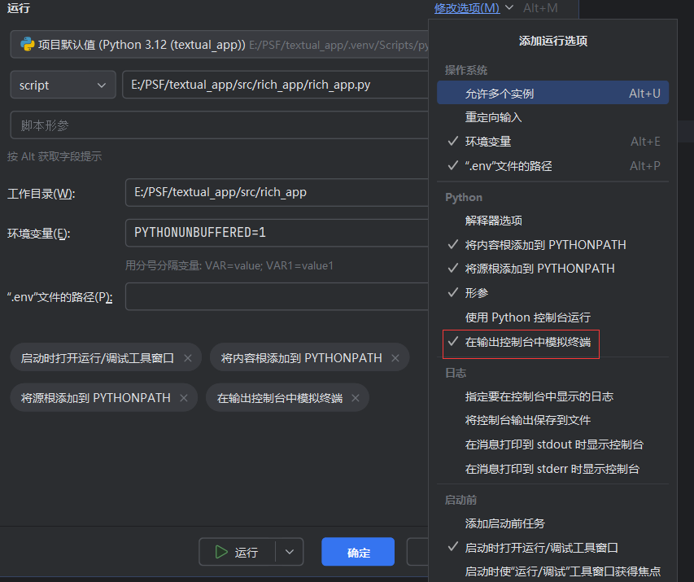

教程后续的代码运行截图则是取自VSCode的终端或者系统终端。

### 1.2 基本用法

安装完成之后，在正式开始学习之前，如果想要体验Rich的魅力，可以先试试以下几种最基本的用法。

让`print`函数输出美化的文字和变量。Rich的`print`函数完全兼容Python的内置函数`print`，因此，可以直接导入、替换，无需修改原本的代码：

```Python3
from rich import print
print("[italic red]Hello[/italic red] World!", locals())
```

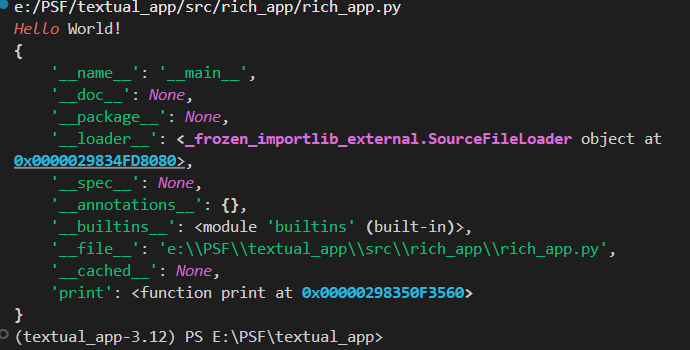

如果不想覆盖内置函数`print`，可以在导入时使用`as`关键字，修改导入函数的名字：

```python3
from rich import print as rprint
rprint("[italic red]Hello[/italic red] World!", locals())
```

除了美化`print`函数输出的内容，在交互式解释器（比如直接运行`python`命令和Jupyter的交互式终端）中，任何表达式都会输出结果，Rich同样可以美化。以下代码可以在交互式解释器中启用Rich的自动美化：

```shell
>>> from rich import pretty
>>> pretty.install()
```

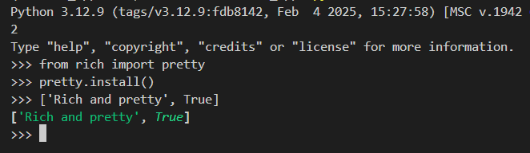

对于Jupyter和IPython交互式终端，除了支持上面的方式启用自动美化，还可以使用下面的代码启用Rich的IPython扩展：

```shell
In [1]: %load_ext rich
```

一样可以启用自动美化：

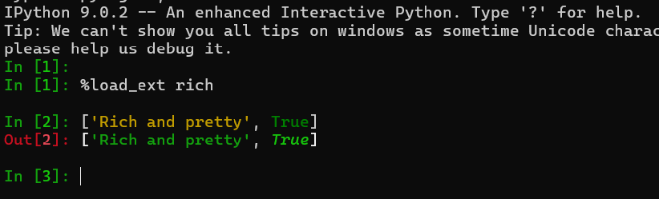

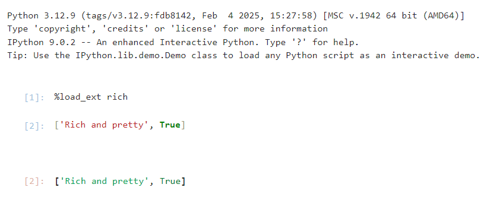

Rich的检查函数[`inspect`](https://rich.readthedocs.io/en/latest/reference/init.html#rich.inspect)可以用美化后的内容输出任何Python对象的属性，是一个非常有助于调试的函数。下面的示例就是使用该函数输出`color`对象的值、文档字符串和方法（`@property`装饰的方法应该算属性，但这里当成了方法）：

```python3
from rich import inspect
from rich.color import Color
color = Color.parse("red")
inspect(color, methods=True)
```

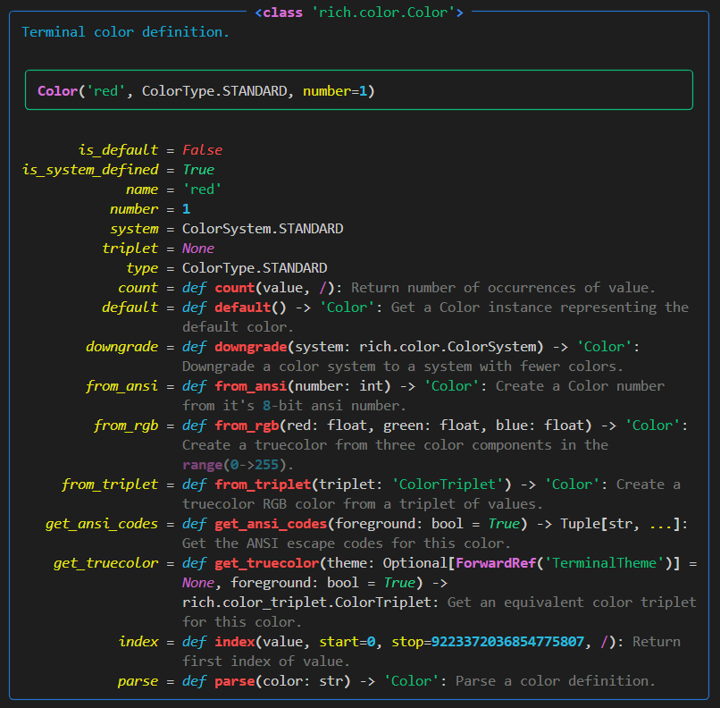

## 2 基础知识

本节主要介绍Rich的基础知识，包括输出所有内容的控制台对象、对内容样式的控制方式、包装字符串的高级对象、美化输出和排错信息的方式、实现美化的魔法方法、获取输入的方式等。

### 2.1 控制台对象

#### 2.1.1 `Console`类

该模块主要提供了控制终端的功能类`Console`。通过实例化`Console`类，可以完整控制终端的属性和显示样式（比如大小）。完整用法可以参考[官网文档](https://rich.readthedocs.io/en/latest/console.html)。

`Console`类提供的参数很多，Rich的很多类都提供了不少参数，一一介绍太占用篇幅，读者需要了解每个参数的话，可以直接查阅官网文档，这里就只介绍常用的属性和方法。

实例化的操作很简单：

```python3
from rich.console import Console
console = Console()
```

这样就能得到一个对应着当前终端的`console`对象。

恰如一个程序的不同内容都是在同一个终端中输出，一旦创建了对应当前终端的对象，就不需要重复创建，其他和终端相关的操作都是对同一个对象的操作。因此，创建了`console`对象之后，需要在程序的其他模块中操作终端的话，只需导入`console`对象即可，不需要重复实例化：

```python3
from rich_app.rich_app import console #假定上面的代码在rich_app目录下的rich_app.py中
```

#### 2.1.2 `console`对象的常用属性

以下是`console`对象的部分属性，当创建其他内容时用得到：

-   `size`属性，命名元组（包含`height`和`width`两个参数）类型，表示终端的尺寸。如果创建内容时超过当前终端尺寸，则会无法显示全部内容（超过终端高度）或者内容异常（超过终端宽度）。
-   `encoding`属性，字符串类型，表示当前终端使用的编码（比如`'utf-8'`）。如果终端的编码不支持内容输出的字符，输出的内容则会变成乱码。
-   `is_terminal`属性，布尔类型，表示当前终端是不是可以输出内容的终端。如果Python自带的idle，则不支持Rich的样式，因此idle不算终端。
-   `color_system`属性，表示`console`对象当前使用的颜色系统，可以在创建时设置`color_system`参数。

设置颜色系统很重要，不同的颜色系统支持的颜色种类数量不同，如果在使用低分辨率颜色系统的终端中输出不支持的颜色，那么终端将没法显示出这些颜色，这些颜色将看上去没什么区别。

`color_system`参数支持以下值：

-   `None`，表示禁用颜色。
-   `'auto'`，表示自动检测终端支持的颜色系统。
-   `'standard'`，表示标准的8色系统，每种颜色有标准和明亮两个变种，支持一共16种颜色。
-   `'256'`，表示256色系统，其中16种颜色来自标准8色系统，其余240种颜色来自固定的调色板，支持一共256种颜色。
-   `'truecolor'`，表示真彩色系统，支持超过1677万种颜色，最接近显示器的显示效果。
-   `'windows'`，表示由Windows系统决定，经典终端中使用8色系统，新的终端使用真彩色系统。

#### 2.1.3 `console`对象的终端输出方法

想要终端输出内容，一般要用到`console`对象的以下方法：

-   `print`方法，用法同前面提到的`print`方法（`from rich import print`）一样，可以美化输出任何对象。
-   `log`方法，支持输出的内容同`print`方法，但是输出的结果前面额外添加了时间，方便追溯输出的时间，更适合调试。额外说一句，将该方法的`log_locals`参数设置为`True`，可以同时以表格形式输出执行该方法时的局部变量，能更清晰看到变量情况。
-   `print_json`方法，如其名字，该方法是用来输出JSON数据的。具体用法下面会有示例，这里不展开。不过，需要注意的是，此方法不同于前面的两个方法支持Markup标签（一种语法类似HTML标记语言、嵌在字符串中的标签语法，后面会细讲），此方法可以输出JSON格式的字符串，而其内容类似Markup标签，因此此方法不会解析Markup标签。
-   `out`方法，不同于前面几种方法支持解析字符串中的Markup标签或者JSON数据，此方法只会将传入的字符串原样输出，只有设置样式才能美化输出内容。但是，对于非字符串类型的变量，该方法在输出时会美化。
-   `rule`方法，该方法可以输出一条包含标题的分隔线。分隔线的标题支持解析Markup标签，对齐方向也可以设置。此外，分隔线的组成字符可以自定义。
-   `status`方法，该方法返回一个可以进入的上下文，当在上下文内执行耗时操作时，终端会显示加载动画和支持Markup标签的状态提示内容，直到离开上下文才会清除。

除了使用`print_json`方法输出包含JSON数据的字符串，还可以用`log`方法输出`JSON`类（使用`from rich.json import JSON`导入）构造的对象：

```python3
from rich.console import Console
from rich.json import JSON

json_data = '''
        {
            "a":{"a1":1,"a2":2}
        }
        '''
console = Console()
console.print(json_data)
console.print_json(json_data)
console.log(JSON(json_data))
```

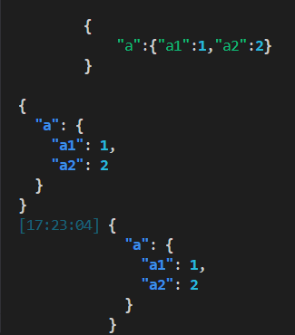

和`print`方法类似，`print_json`方法也有单独可用的版本（使用`from rich import print_json`导入）：

```python3
from rich import print_json

json_data = '''
        {
            "a":{"a1":1,"a2":2}
        }
        '''
print_json(json_data)
```

此外，可以使用命令行直接输出包含JSON数据的文件：

```shell
python -m rich.json example.json
```

`status`方法返回是一个上下文对象，使用`with`即可进入上下文。如果想要更新状态提示内容，可以使用上下文对象的`update`方法：

```python3
from rich.console import Console
import time

console = Console()
with console.status('[red]waiting...') as status:
    console.print('doing sth:')
    time.sleep(3)
    status.update(status='ok',spinner='clock')
    time.sleep(1)
```

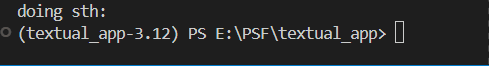

上下文对象支持以下加载动画（使用`from rich._spinners import SPINNERS`导入）：

```python3
[
    'dots', 'dots2', 'dots3', 'dots4', 'dots5', 'dots6', 'dots7', 'dots8', 
    'dots9', 'dots10', 'dots11', 'dots12', 'dots8Bit', 'line', 'line2', 'pipe', 
    'simpleDots', 'simpleDotsScrolling', 'star', 'star2', 'flip', 'hamburger', 
    'growVertical', 'growHorizontal', 'balloon', 'balloon2', 'noise', 'bounce', 
    'boxBounce', 'boxBounce2', 'triangle', 'arc', 'circle', 'squareCorners', 
    'circleQuarters', 'circleHalves', 'squish', 'toggle', 'toggle2', 'toggle3', 
    'toggle4', 'toggle5', 'toggle6', 'toggle7', 'toggle8', 'toggle9', 'toggle10', 
    'toggle11', 'toggle12', 'toggle13', 'arrow', 'arrow2', 'arrow3', 'bouncingBar',
    'bouncingBall', 'smiley', 'monkey', 'hearts', 'clock', 'earth', 'material', 'moon', 
    'runner', 'pong', 'shark', 'dqpb', 'weather', 'christmas', 'grenade', 'point', 
    'layer', 'betaWave', 'aesthetic'
]
```

具体每种动画的效果可以使用下面的命令行查看：

```shell
python -m rich.spinner
```

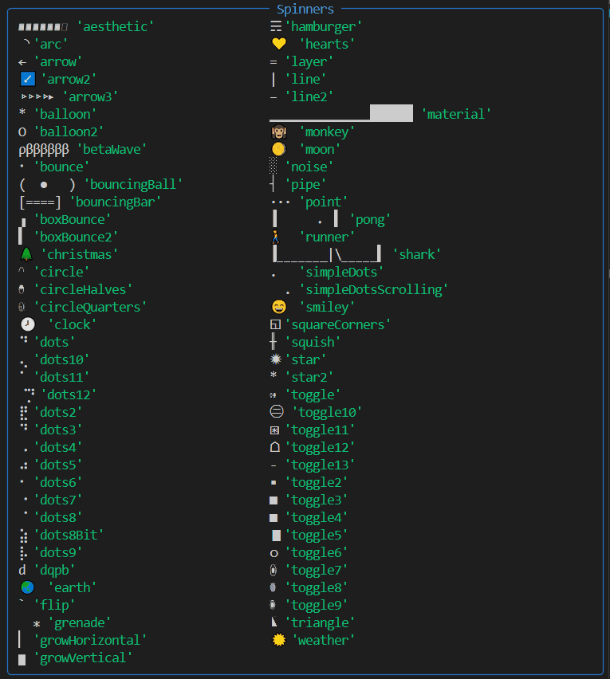

#### 2.1.4 `console`对象的排版样式

##### 2.1.4.1 对齐

上一小节介绍`rule`方法的时候，说到可以设置标题的对齐方向，其实就是设置该方法的`align`参数：

```python3
from rich.console import Console

console = Console(width=20)
console.rule(title='look this',align='left')
console.rule(title='look this',align='center')
console.rule(title='look this',align='right')
```

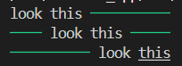

`print`方法也有相应的参数——`justify`，该参数支持五种样式（其实`default`等于`full`）：

```python3
from rich.console import Console

console = Console(width=20)
console.print('look this',justify='default')
console.print('look this',justify='full')
console.print('look this',justify='left')
console.print('look this',justify='center')
console.print('look this',justify='right')
```

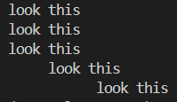

前三种样式看起来好像一样，为什么要单独设置一个`full`？

为了进一步区分前三种样式，接下来需要用到`style`参数（该样式指的是文字样式，下一章会详细介绍，这里略过），给文字更换背景颜色：

```python3
from rich.console import Console

console = Console(width=20,style='white on blue')
console.print('look this',justify='default')
console.print('look this',justify='full')
console.print('look this',justify='left')
console.print('look this',justify='center')
console.print('look this',justify='right')
```

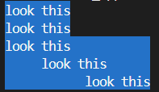

这下就能看清楚了，`'full'`的话，没有内容的部分没有背景颜色，相当于没有填充空白字符。而其他几种对齐方式，即使看上去没有内容，实际上也还有空白字符。

另外，如果设置为`'full'`，当输出的内容很长、包含空格、需要换行时，这种对齐方式会自动调整内容中间的空格的数量，让行首和行尾都不是空格：

```python3
from rich.console import Console

console = Console(width=20,style='white on blue')
for justify in ['default','full','left','center','right']:
    console.rule(f'{justify}')
    console.print('look this ! '*5,justify=justify)
    console.print()
```

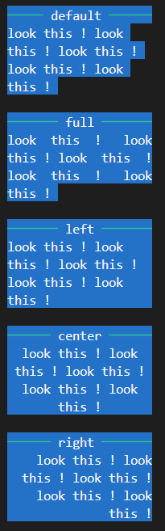

##### 2.1.4.2 溢出

上一小节中，构建`console`对象时，使用`width`参数来模拟终端的宽度。当然，实际上终端几乎不会只有20个字符宽度，但是，如果实际输出一行很长的、没有空格的内容，超出实际终端的宽度怎么办？那就涉及到本节要学习的样式——溢出。

当单行内容宽度超出终端的宽度，有以下三种溢出处理方式：

-   `'fold'`——折叠，超过终端宽度的部分会自动换行，在下一行继续输出。
-   `'crop'`——裁切，超过终端宽度的部分不会输出，本行结尾处直接结束，没有任何标识表明本行还有内容。
-   `'ellipsis'`——省略，超过终端宽度的部分不会输出，本行结尾处的最后一个字符被替换为省略号（英文的省略号是一个字符），表明本行还有内容。

还是上一小节的代码，这次要输出超长的内容，来看看另一个与溢出相关的参数——`print`方法的`overflow`参数：

```python3
from rich.console import Console

console = Console(width=20)
overflow_method = ['fold','crop','ellipsis']
for overflow in overflow_method:
    console.rule(overflow)
    console.print('注意看，这是一段非常长的内容，而且没有空格。',overflow=overflow)
```

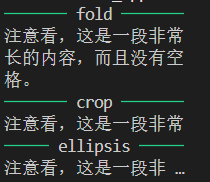

其实除了上面提到的三种溢出处理方式，还有一种——忽略（`'ignore'`），此时超长内容将会突破`width`参数的限制，忽略Rich框架的处理原则，遵循终端对超长内容的处理原则。不过，直接设置为忽略的话，其效果将和裁切一样，那是因为`print`方法默认启用了对超长内容的裁切处理，此时需要设置`print`方法的`crop`参数为`False`：

```python3
from rich.console import Console

console = Console(width=20)
console.rule('ignore')
console.print(
    '注意看，这是一段非常长的内容，而且没有空格。',
    overflow='ignore',
    crop=False
)
```

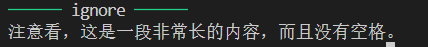

##### 2.1.4.3 换行

与溢出类似的是换行，但在了解换行样式之前，需要对上节的示例做一点小小的修改，让内容不再是一行，而是加了回车变成两行。此外，与之前内容没有空格相比，这次内容的第一行还多了两个空格：

```python3
from rich.console import Console

console = Console(width=20)
overflow_method = ['fold','crop','ellipsis']
content = '''\
注意看，这是 一段非常长 的内容，
不仅有空格，而且有回车。'''
for overflow in overflow_method:
    console.rule(overflow)
    console.print(content,overflow=overflow)
```

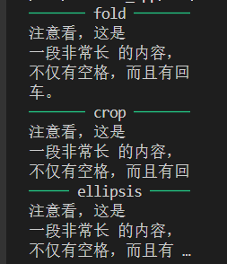

可以看到，溢出样式对于第一行内容（含空格）没有任何影响，因为第一行内容的折叠处理是受换行样式影响。

`print`方法中与换行相关的参数有两个：`no_wrap`和`soft_wrap`。

需要注意的是，当`soft_wrap`参数设置为`True`时，裁切会被默认禁止，相当于`crop`参数自动设置为`False`，此时设置`crop`参数也不会生效，反之亦然。

`no_wrap`参数表示是否禁用换行：

-   如果此参数为`True`，原本会变成两行的内容不会换行，但此时会根据`soft_wrap`参数的值决定是在一行中完整显示，还是裁切超过宽度的部分。
-   如果此参数为`False`，原本会变成两行的内容可以换行，但此时会根据`soft_wrap`参数的值决定是在一行中完整显示，还是换行显示。

接下来，用一段代码，对比一下将这两个参数设置为不同布尔值的情况：

```python3
from rich.console import Console

console = Console(width=20)
content = '''\
注意看，这是 一段非常长 的内容，
不仅有空格，而且有回车。'''
all_wrap = [
    (True,True),
    (True,False),
    (False,True),
    (False,False),
]
for no_wrap,soft_wrap in all_wrap:
    console.rule('wrap')
    console.print(f'{no_wrap=}')
    console.print(f'{soft_wrap=}')
    console.rule('output')
    console.print(
        content,
        no_wrap=no_wrap,
        soft_wrap=soft_wrap,
        crop=True   
    )
    console.print()
```

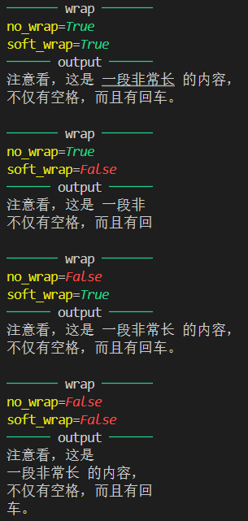

#### 2.1.5 `console`对象的输入、其他输出与导出

##### 2.1.5.1 输入

虽说Rich没有可以交互的组件，但还是可以使用`console`对象的`input`方法进行简单的交互——获取终端的输入信息。

就和Python的内置方法`input`一样，执行`console`对象的`input`方法也可以定义提示内容并等待用户的输入：

```python3
from rich.console import Console

console = Console()
result = console.input('Please input:\n')
console.rule('Result')
console.print(f'Your input is "{result}".')
```

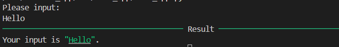

除了可以明文输入，对于需要输入密码的场景，可以将`password`参数设置为`True`，关闭输入回显：

```python3
from rich.console import Console

console = Console()
result = console.input('Please input password:\n',password=True)
console.rule('Result')
console.print(f'Your password is "{result}".')
```

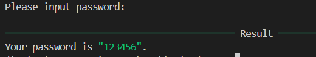

也可以给`stream`参数传入文件（实际上是文本输入输出流`TextIO`）：

```python3
'''sth from source code'''
from rich.console import Console

console = Console()
with open(__file__) as file:
    result = console.input('Please input:\n',stream=file)
console.rule('Result')
console.print(f'Your input is "{result}".')
```

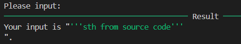

##### 2.1.5.2 其他输出

一般来说，标准的终端输出都是输出到标准输出（`sys.stdout`）中，但是可以在创建`console`对象时，设置`stderr`参数为`True`将输出定向到错误输出（`sys.stderr`）中，以便于系统正确处理程序的错误输出内容：

```python3
from rich.console import Console

console = Console()
console.print('Normal.')
err_console = Console(stderr=True,style='on red')
err_console.print('Some errors.')
```

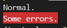

如果给`file`参数传入可以拥有写入权限的文件，则输出会全部到文件中，而不在终端显示：

```python3
from rich.console import Console
from pathlib import Path

with open(Path(__file__).parent/'to_file.txt','wt') as file:
    console = Console(file=file)
    console.print('Go to file.')
```

注意，当将输出内容写入文件时，可能需要单独设置一下`width`参数，以免输出内容受当前终端宽度影响，导致超长的单行内容不得不换行写入。

除了在程序内部打开文件，将内容输出到文件中，在终端中，还可以使用重定向符号将原本输出到终端的内容（`sys.stdout`）输出到文件中，比如：

`rich_app.py`的内容：

```python3
from rich.console import Console

console = Console()
console.print('Normal.')
err_console = Console(stderr=True)
err_console.print('[red]Some errors.')
```

执行命令：

```shell
python rich_app.py > to_file.txt
```

`to_file.txt`的内容：

```
Normal.
```

注意，因为第二个`console`对象是输出到错误输出（`sys.stderr`）中，因此其输出不在文件中。如果修改一下代码，将其重定向到错误输出的参数去掉：

```python3
from rich.console import Console

console = Console()
console.print('Normal.')
err_console = Console()
err_console.print('[red]Some errors.')
```

则`to_file.txt`的内容为：

```
Normal.
Some errors.
```

这时，可能有读者发现问题了，第二个输出的内容明明带有颜色，为何到文件中之后就和普通文本一样？其实，这是系统终端的机制，当系统检测到终端输出的内容重定向到文件中时，会默认把原本带有样式的内容转换成没有样式的纯文本。

在Rich也有一个类似的机制，那就是直接将内容输出到文件中，Rich也会把原本带有样式的内容转换成没有样式的纯文本，再输出到文件中：

```python3
from rich.console import Console
from pathlib import Path

with open(Path(__file__).parent/'to_file.txt','wt') as file:
    console = Console(file=file)
    console.print('[red]Go to file.')
```

则`to_file.txt`的内容为：

```
Go to file.
```

如果读者需要在文件中保留这些带有样式控制字符的内容，可以将`force_terminal`参数设置为`True`，Rich就会完整保留样式了：

```python3
from rich.console import Console
from pathlib import Path

with open(Path(__file__).parent/'to_file.txt','wt') as file:
    console = Console(file=file,force_terminal=True)
    console.print('[red]Go to file.')
```

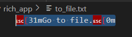

与`force_terminal`参数效果相似的，是`force_interactive`参数。`force_interactive`参数可以控制某些终端的交互性输出（比如进度条和加载动画）是否写入文件。比如下面的代码：

```python3
from rich.console import Console
from pathlib import Path
import time

with open(Path(__file__).parent/'to_file.txt','wt') as file:
    console = Console(file=file)
    with console.status('[red]waiting...') as status:
        console.print('doing sth:')
        time.sleep(3)
        status.update(status='ok',spinner='clock')
        time.sleep(1)
        console.print('Ok.')
```

`to_file.txt`的内容为：

```
doing sth:
Ok.
```

若是设置`force_interactive`参数为`True`：

```python3
from rich.console import Console
from pathlib import Path
import time

with open(Path(__file__).parent/'to_file.txt','wt') as file:
    console = Console(file=file,force_interactive=True)
    with console.status('[red]waiting...') as status:
        console.print('doing sth:')
        time.sleep(3)
        status.update(status='ok',spinner='clock')
        time.sleep(1)
        console.print('Ok.')
```

则`to_file.txt`的内容为：

```
doing sth:
⠋ waiting...Ok.
🕛  ok
```

注意，中文Windows系统或者非英文Windows系统可能会遇到Python终端输出非UTF-8的编码问题，可以设置环境变量`PYTHONUTF8=1`解决。

如果有时候不希望输出的内容到终端、文件，而是输出到某个变量中，可以使用`console`对象的`capture`方法将输出内容存储起来，然后使用该方法的返回结果的`get`方法得到输出内容：

```python3
from rich.console import Console

console = Console()
with console.capture() as capture:
    console.print('[red]All is captured.')

result = capture.get()
print(f'{result=}')
```

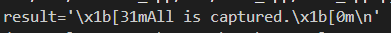

但是这种方法会带上输出的样式，如果想要去掉样式，可以使用`io.StringIO`当作接收输出的文件：

```python3
from rich.console import Console
from io import StringIO

console = Console(file=StringIO())
console.print('[red]All is captured.')

result = console.file.getvalue()
print(f'{result=}')
```

##### 2.1.5.3 导出

除了上节提到的将内容输出到文件，还可以设置`record`参数开启终端输出内容的记录功能，然后调用`console`对象的方法，将输出内容导出为指定格式。

`console`对象支持以下导出方法：

-   `export_text`方法，返回纯文本格式的终端内容。
-   `export_svg`方法，返回SVG格式的终端内容截图。
-   `export_html`方法，返回HTML格式的终端内容截图。
-   `save_text`方法，将终端内容以纯文本格式写入文件。
-   `save_svg`方法，将终端内容截图以SVG格式写入文件。
-   `save_html`方法，将终端内容截图以HTML格式写入文件。

示例如下：

```python3
from rich.console import Console
from pathlib import Path

console = Console(record=True,width=20)
console.print('[red]Hello World.')

console.save_svg(
    Path(__file__).parent/'to_file.svg'
)
```

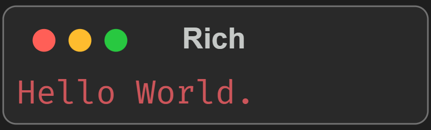

如果想要修改导出图片中终端的标题，可以设置导出方法的`title`参数：

```python3
from rich.console import Console
from pathlib import Path

console = Console(record=True,width=20)
console.print('[red]Hello World.')

console.save_svg(
    Path(__file__).parent/'to_file.svg',
    title='Hello World',
)
```

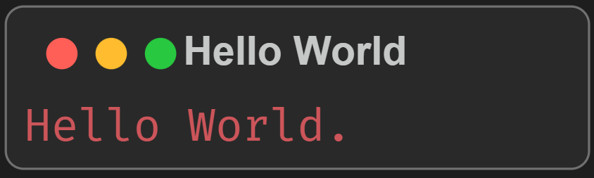

除了默认的主题颜色，还可以给`theme`参数传入其他终端主题（`TerminalTheme`类型，使用`from rich.terminal_theme import *`导入，默认提供`DEFAULT_TERMINAL_THEME`、`MONOKAI`、`DIMMED_MONOKAI`、`NIGHT_OWLISH`、`SVG_EXPORT_THEME`五种主题）来修改导出的主题（只有导出、保存为SVG格式和HTML格式支持）：

```python3
from rich.console import Console
from pathlib import Path
from rich.terminal_theme import MONOKAI

console = Console(record=True,width=20)
console.print('[red]Hello World.')

console.save_svg(
    Path(__file__).parent/'to_file.svg',
    title='Hello World',
    theme=MONOKAI
)
```

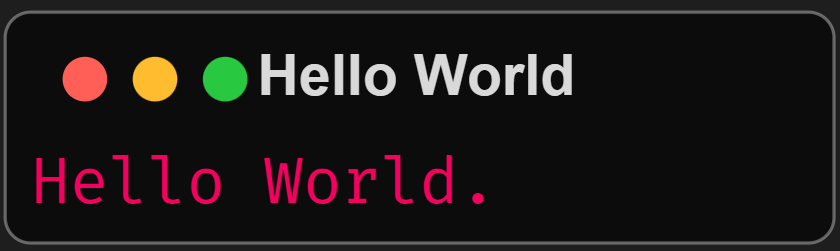

需要注意的是，Rich导出的SVG图片使用了Fira Code字体，如果读者在网页中嵌入导出的SVG图片，可能还需要添加一个字体引用链接，具体用法参考[文档](https://cdnjs.com/libraries/firacode)。

#### 2.1.6 `console`对象的其他技巧

##### 2.1.6.1 分页

如果一次性需要输出的内容较多，可以使用`console`对象的`pager`方法，该方法返回一个上下文对象，在该上下文内，输出的较多内容会自动分页，按空格才能看到下一页：

```python3
from rich.__main__ import make_test_card
from rich.console import Console

console = Console()
with console.pager():
    console.print(make_test_card())
```

注意，因为大多数平台的分页程序不支持样式，因此默认的分页内容没有启用Rich的样式，但可以设置`pager`方法的`styles`参数为`True`启用。

##### 2.1.6.2 切换屏幕

注意，此功能目前还在实验阶段，不建议在生产环境中使用，可能存在兼容性问题和未知bug。

`console`对象的`screen`方法返回一个上下文对象，在该上下文内，内容将独占整个终端，任何终端输出在离开上下文之后都不会保留：

```python3
from time import sleep
from rich.console import Console

console = Console()

with console.screen():
    console.print('You are in screen.')
    sleep(1)

console.print('You have leaved.')
```

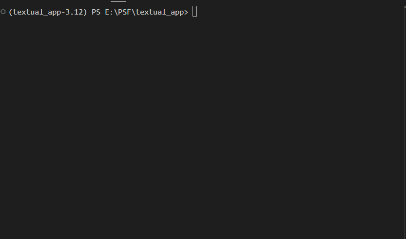

更新屏幕显示的内容可以使用`console`对象的`clear`方法清除之后再输出：

```python3
from time import sleep
from rich.console import Console

console = Console()

with console.screen() as screen:
    for i in range(5):
        console.clear()
        console.print(f'Now is {i}.')
        sleep(1)

console.print('You have leaved.')
```

也可以使用上下文对象的`update`方法：

```python3
from time import sleep
from rich.console import Console

console = Console()

with console.screen() as screen:
    for i in range(5):
        screen.update(f'Now is {i}.')
        sleep(1)

console.print('You have leaved.')
```

如果想要构建比屏幕更丰富的全屏内容，可以学习后续会介绍的`rich.live`模块（[官网文档](https://rich.readthedocs.io/en/latest/live.html#live)）。

如果在退出程序之后，发现终端还卡在屏幕中，可以使用`reset`命令（非Windows系统）复位。

##### 2.1.6.3 环境变量

对于某些没有在代码中直接设置的参数、属性，设置环境变量可以影响其默认值，进而让程序的输出更符合要求。

将环境变量`TERM`设置为`'dumb'`或者`'unknown'`，则会禁用输出内容中的样式、移动光标（进度条、加载动画）等美化行为。

设置环境变量`FORCE_COLOR`则会忽视环境变量`TERM`，强制启用输出内容的样式。

环境变量`NO_COLOR`优先级高于环境变量`FORCE_COLOR`，会强制禁用输出内容的颜色样式，但非颜色样式如粗体、斜体等还是会启用。

设置环境变量`TTY_COMPATIBLE`为`1`，Rich将假定终端支持样式；为`0`，Rich将假定终端不支持样式；为其他值，Rich将自动检测终端是否支持样式。

如果没有设置`width`参数和`height`参数来限制终端的宽高，则可以使用环境变量`COLUMNS`和`LINES`来设置终端的宽高。对于在Jupyter中，则是设置环境变量`JUPYTER_COLUMNS`和`JUPYTER_LINES`。

### 2.2 样式与主题

输出内容的方法有`style`参数的话，则可以使用`Style`对象、等效的样式字符串、主题变量来定义输出内容的样式。

相关内容原文可以参考[官网](https://rich.readthedocs.io/en/latest/style.html)。

#### 2.2.1 样式类`Style`

想要使用样式类，需要使用`from rich.style import Style`导入。

##### 2.2.1.1 颜色

对于样式而言，设置颜色是最常用的。与定义样式的方式类似，设置颜色可以使用`Color`对象，也可以使用等效的颜色字符串。

定义`Color`对象需要导入颜色类（使用`from rich.color import Color`导入，完整用法参考[官网文档](https://rich.readthedocs.io/en/latest/reference/color.html)），不过这种方法有一点麻烦，所以需要先讲一下颜色字符串，才能更好理解颜色类。

在Rich中，使用颜色字符串表达颜色有以下四种格式：

-   `Name`——名字，直接使用颜色名字即可，如`'red'`。
-   `Number`——数字，使用类似创建`Color`对象的语法，但是全部为字符串，也不用区分大小写，格式为`'Color({颜色名字对应的数字})'`或者`'color({颜色名字对应的数字})'`，如`'Color(1)'`。名字与数字的对应关系可以参考下面的图片或者[官方文档](https://rich.readthedocs.io/en/latest/appendix/colors.html#appendix-colors)。
-   `Hex`——十六进制量化表达，以'#'开头，六位十六进制数字，每两位代表一种颜色的分量值，依次代表红色、绿色、蓝色，例如`'#ff0000'`（红色）。注意，Rich不支持三位数字的短格式。
-   `RGB`——三原色（十进制）量化表达，使用类似创建对象的语法，但是全部为字符串，也不用区分大小写，需要依次传入代表红色、绿色、蓝色分量值的十进制数字（0到255），格式为`'RGB({红色分量值},{绿色分量值},{蓝色分量值})'`或者`'rgb({红色分量值},{绿色分量值},{蓝色分量值})'`，如`'RGB(255,0,0)'`。

Rich支持的所有颜色如下：

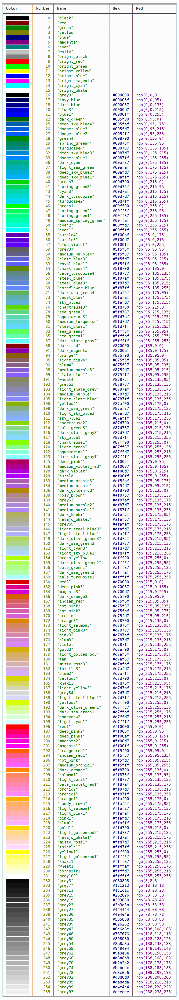

以下是一个对比四种格式的示例：

```python3
from rich.console import Console
from rich.style import Style

console = Console()
for i in ['Color(1)','red','#ff0000','RGB(255,0,0)']:
    console.print(f'Color from string {i}.',style=Style(color=f'{i}'))
```

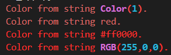

细心的读者可能已经发现：数字和名字实际上是相同颜色（ansi_color）的不同表达；两种量化表达实际上是相同颜色（RGB）的不同表达；均可以互相转化，上面的示例和颜色一览表似乎也有着类似的巧合。

为什么这么说呢？那就不得不介绍一下如何定义`Color`对象，来代替比较简单的颜色字符串。

按理来说，使用颜色字符串简单方便，后面会讲到的Markup标签也巧妙融合了颜色字符串，完全没必要学习定义`Color`对象。因此，如果读者对这部分内容不感兴趣，完全可以跳过，待需要的时候再回来学习。

颜色类支持以下参数：

-   `name`参数，表示颜色的名字，这里的名字不是上面颜色字符串中的`Name`格式，只是一个用于区分的自定义名字。
-   `type`参数，表示使用的颜色系统，`ColorType`枚举类型（使用`from rich.color import ColorType`导入），支持以下枚举成员：
    -   `DEFAULT`——对应自动（`'auto'`），手动创建颜色对象的话不要使用，此成员主要为Rich内部使用。
    -   `STANDARD`——对应标准的8色系统（`'standard'`）。
    -   `EIGHT_BIT`——对应256色系统（`'256'`）。
    -   `TRUECOLOR`——对应真彩色系统（`'truecolor'`）。
    -   `WINDOWS`——对应Windows系统决定（`'windows'`），手动创建颜色对象的话不要使用，此成员主要为Rich内部使用。
-   `number`参数，当颜色系统为8色系统（数字小于16）或者256色系统（数字大于等于16）时，基于名字或者数字创建颜色对象，都需要给此参数传入名字对应的数字（使用`from rich.color import ANSI_COLOR_NAMES`导入`ANSI_COLOR_NAMES`字典，可以查询名字对应的数字）或者数字。其他颜色系统无需给此参数传入数字。
-   `triplet`参数，当颜色系统真彩色系统时，基于对应原色分量创建颜色对象，需要给此参数传入`ColorTriplet`对象（使用`from rich.color import ColorTriplet`导入），`ColorTriplet`对象的三个整数类型的参数分别对应着红色、绿色、蓝色的分量值。

以下是使用颜色字符串和使用颜色类对象的对比示例：

```python3
from rich.console import Console
from rich.style import Style
from rich.color import Color,ColorType,ColorTriplet,ANSI_COLOR_NAMES

console = Console()
for i in ['Color(1)','red','#ff0000','RGB(255,0,0)']:
    console.print(f'Color from string {i}.',style=Style(color=f'{i}'))
    color_obj = {
        #ColorType.STANDARD if number < 16 else ColorType.EIGHT_BIT
        'Color(1)':Color(f'{i}',type=ColorType.STANDARD,number=1),
        #ColorType.STANDARD if ANSI_COLOR_NAMES.get(name) < 16 else ColorType.EIGHT_BIT        
        'red':Color(f'{i}',type=ColorType.STANDARD,number=ANSI_COLOR_NAMES['red']),
        #RGB
        '#ff0000':Color(f'{i}',type=ColorType.TRUECOLOR,
            triplet=ColorTriplet(0xff,0x0,0x0)
        ),
        'RGB(255,0,0)':Color(f'{i}',type=ColorType.TRUECOLOR,triplet=ColorTriplet(255,0,0)),
    }[i]
    console.print(f'Color from class {i}.',style=Style(color=color_obj))
    console.print()
```

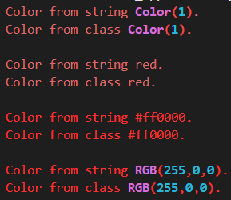

如果想要用颜色类，但记不住某些条件下的特定参数，或者不想写对应的判断代码，则可以使用颜色类的类方法，直接基于颜色字符串创建颜色对象。

颜色类支持以下类方法：

-   `from_ansi`方法，基于数字创建颜色对象。
-   `from_triplet`方法，基于`ColorTriplet`对象创建颜色对象。
-   `from_rgb`方法，基于红色、绿色、蓝色的分量值创建颜色对象。此方法比`from_triplet`方法更简单，直接使用`ColorTriplet`对象的参数。
-   `parse`方法，基于颜色字符串创建颜色对象。此方法可以解析任何无语法错误的颜色字符串，也是样式类中解析颜色字符串的方法。

以下为几种类方法的示例：

```python3
from rich.console import Console
from rich.style import Style
from rich.color import Color,ColorTriplet,ANSI_COLOR_NAMES

console = Console()
for i in ['Color(1)','red','#ff0000','RGB(255,0,0)']:
    console.print(f'Color from string {i}.',style=Style(color=f'{i}'))
    color_obj = {
        'Color(1)':Color.from_ansi(1),   
        'red':Color.from_ansi(ANSI_COLOR_NAMES['red']),
        '#ff0000':Color.from_triplet(ColorTriplet(0xff,0x0,0x0)),
        'RGB(255,0,0)':Color.from_rgb(255,0,0),
    }[i]
    console.print(f'Color from classmethod {i}.',style=Style(color=color_obj))
    console.print(f'Color from classmethod parse {i}.',style=Style(color=Color.parse(i)))
    console.print()
```

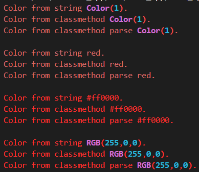

##### 2.2.1.2 参数、属性、方法、类方法

如何使用上面提到的颜色呢？那自然离不开样式类的参数。不过，样式类的参数不只是设置颜色，还有其他可以设置的非颜色样式。完整用法参考[官网文档](https://rich.readthedocs.io/en/latest/reference/style.html#rich.style.Style)。

样式类支持以下关键字参数：

-   `color`参数，`Color`类型或者字符串类型，表示前景色（一般是字体的颜色）。
-   `bgcolor`参数，`Color`类型或者字符串类型，表示背景色。
-   `bold`参数，布尔类型，表示是否设置为粗体。
-   `dim`参数，布尔类型，表示是否设置为暗淡显示（字体颜色变淡）。
-   `italic`参数，布尔类型，表示是否设置为斜体。
-   `underline`参数，布尔类型，表示是否添加单下划线。
-   `blink`参数，布尔类型，表示是否启用闪烁显示（部分终端支持）。
-   `blink2`参数，布尔类型，表示是否启用快速闪烁显示（部分终端支持）。
-   `reverse`参数，布尔类型，表示是否启用反色（背景色与前景色交换）。
-   `conceal`参数，布尔类型，表示是否隐藏内容，此时内容不会显示，只能看到背景，但依然可以复制。
-   `strike`参数，布尔类型，表示是否添加删除线。
-   `underline2`参数，布尔类型，表示是否添加双下划线（部分终端支持）。
-   `frame`参数，布尔类型，表示是否给文本添加直角外框（仅Mintty支持，相见[资料](https://github.com/mintty/mintty/wiki/Tips#text-attributes-and-rendering)）。
-   `encircle`参数，布尔类型，表示是否给文本添加圆形外框（仅Mintty支持，相见[资料](https://github.com/mintty/mintty/wiki/Tips#text-attributes-and-rendering)）。
-   `overline`参数，布尔类型，表示是否添加单上划线。
-   `link`参数，字符串类型，表示给文本添加的超链接地址。设置此参数后，文本将变为可点击的样式，点击文本会访问该参数提供的超链接地址。
-   `meta`参数，字典类型（键必须是字符串），表示样式类对象可以携带的元信息（额外信息，不会影响到样式），只有创建对象时可以修改。

样式类支持以下属性：

-   `background_style`属性，如果样式中包含背景色，此属性就是只设置该背景色的样式对象。
-   `bgcolor`属性，同`bgcolor`参数。
-   `color`属性，同`color`参数。
-   `link`属性，同`link`参数。
-   `meta`属性，同`meta`参数。
-   `transparent_background`属性，布尔类型，表示背景色是否为透明（即背景色为`None`或者颜色的类型为`ColorType.DEFAULT`）。
-   `without_color`属性，`Style`类型，表示样式对象一个将颜色相关的属性全部设置为`None`的副本。

样式类支持以下方法：

-   `clear_meta_and_links`方法，返回该样式对象清除了`link`属性和`meta`属性的副本。
-   `copy`方法，返回该样式对象的副本。
-   `get_html_style`方法，获取样式对象在特定终端主题下同等显示效果的CSS代码，在导出为HTML时需要。该方法支持以下参数：
    -   `theme`参数，`TerminalTheme`类型（`TerminalTheme`类型，使用`from rich.terminal_theme import *`导入，默认提供`DEFAULT_TERMINAL_THEME`、`MONOKAI`、`DIMMED_MONOKAI`、`NIGHT_OWLISH`、`SVG_EXPORT_THEME`五种主题），表示样式在什么终端主题下的显示效果。

-   `render`方法，输出将给定的字符串以样式对象定义的样式渲染时的ANSI终端转义码（字符串形式，不含ESC的转义码）。该方法支持以下参数：
    -   `text`参数，字符串类型，表示要输出的内容。
    -   `color_system`参数，表示渲染时使用的颜色系统，默认为`ColorSystem.TRUECOLOR`。从此参数开始，只能使用关键字传入。
    -   `legacy_windows`参数，布尔类型，表示终端是不是传统的Windows终端（Cmd命令行，而不是终端程序）.

-   `test`方法，将给定的字符串以样式对象定义的样式渲染并输出到终端（不需要调用`print`等方法）。该方法支持以下参数：
    -   `text`参数，字符串类型，表示要输出的内容。
-   `update_link`方法，返回一个更新了`link`属性的样式对象副本。该方法支持以下参数：
    -   `link`参数，字符串类型，表示更新之后的超链接地址。

样式类支持以下类方法：

-   `chain`方法，基于提供的多个样式对象创建新的样式对象，按照顺序依次继承每个样式对象提供的样式。该方法支持以下参数：

    -   `*styles`参数，`Style`类型，表示继承哪些样式对象的样式。

-   `combine`方法，基于提供的多个样式对象创建新的样式对象，按照顺序依次继承每个样式对象提供的样式。该方法支持以下参数：

    -   `styles`参数，元素为`Style`类型的可迭代对象，表示继承哪些样式对象的样式。

-   `from_color`方法，创建指定前景色、背景色的样式对象。该方法支持以下参数：

    -   `color`参数，`Color`类型，表示样式对象的前景色。
    -   `bgcolor`参数，`Color`类型，表示样式对象的背景色。

-   `from_meta`方法，创建指定`meta`属性的样式对象。该方法支持以下参数：

    -   `meta`参数，字典类型（键必须是字符串），表示样式类对象可以携带的元信息。

-   `normalize`方法，将样式字符串（效果与样式对象相同的字符串，下一小节会讲具体语法，这里略过）转换为样式对象之后，再转换为样式对象的字符串表达。该方法支持以下参数：

    -   `style`参数，字符串类型，表示样式字符串。

-   `null`方法，创建一个没有任何样式的样式对象。

-   `on`方法，创建指定`meta`属性的样式对象。该方法支持以下参数：

    -   `meta`参数，`meta`参数，字典类型（键必须是字符串），表示样式类对象可以携带的元信息。
    -   `**handlers`参数，字符串类型，以关键字形式传入的其他参数会被该参数接收，转化为事件处理函数，合并到元信息中，即‘@’加上关键字为键，值就是关键字参数的值。比如，`Style.on(click='handle_click')`，创建出来的样式对象元信息为`"Style(meta={'@click': 'handle_click'})"`。

    此方法用在带交互功能的组件中，无法单独应用到终端直接输出的内容。

-   `parse`方法，将样式字符串（效果与样式对象相同的字符串，下一小节会讲具体语法，这里略过）转换为样式对象。该方法支持以下参数：

    -   `style`参数，字符串类型，表示样式字符串。

-   `pick_first`方法，从几个样式对象、样式字符串、`None`混合排序的传入参数中，选择首个非`None`的样式对象或者样式字符串。该方法支持以下参数：

    -   `*values`参数，`Style`类型或者字符串类型，表示样式对象或者样式字符串。

样式类支持以下操作：

-   `+`，相当于`chain`方法，按照运算顺序将每个样式对象传入，得到的结果是一样的。

以下为样式对象的简单示例：

```python3
from rich.console import Console
from rich.style import Style

console = Console()
console.print('Style from classs.',style=Style(color='red'))
```

#### 2.2.2 样式字符串

使用样式字符串可以代替样式类对象，而不用导入样式类。此外，样式字符串还和后面Markup标签的语法一致。所以，样式字符串不仅是使用样式的平替方法，也是灵活应用样式的基础。当然，本节的重点在于样式字符串的语法，想学习灵活应用样式，需要等下一章。

根据样式对象的参数是否与颜色有关，可以分为两类：颜色参数和其他样式参数。为了方便理解样式字符串，下面就对应样式参数，学习实现同样效果的样式字符串。

##### 2.2.2.1 颜色

`color`参数表示前景色，样式字符串包含颜色字符串时，此时的样式等于直接给该参数传入颜色字符串的样式对象。

```python3
from rich.console import Console
from rich.style import Style

console = Console()
for color in ['Color(1)','red','#ff0000','RGB(255,0,0)']:
    console.print(f'Style from classs {color}.',style=Style(color=color))
    console.print(f'Style from string {color}.',style=color)
    console.print()
```

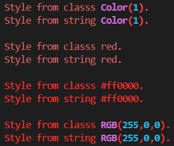

`bgcolor`参数表示背景色，样式字符串包含添加`'on '`（`'on'`加空格）前缀的颜色字符串时，此时的样式等于直接给该参数传入颜色字符串的样式对象。

```python3
from rich.console import Console
from rich.style import Style

console = Console()
for color in ['Color(1)','red','#ff0000','RGB(255,0,0)']:
    console.print(f'Style from classs {color}.',style=Style(bgcolor=color))
    console.print(f'Style from string {color}.',style='on '+color)
    console.print()
```

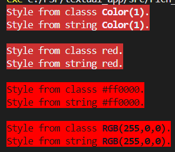

不同的样式字符串（不只是颜色，下一小节介绍的其他样式也可以）可以同时设置，但组合使用时，每一部分之间需要使用空格间隔，没有先后顺序要求：

```python3
from rich.console import Console

console = Console()
for color in ['on white red','red on white']:
    console.print(f'Style from string {color}.',style=color)
    console.print()
```

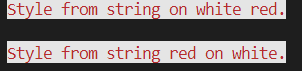

##### 2.2.2.2 其他样式

`bold`参数表示是否设置为粗体，样式字符串中如果包含`'bold'`或者`'b'`，此时的样式等于将该参数设置为`True`的样式对象：

```python3
from rich.console import Console

console = Console()
for style in ['bold','b']:
    console.print(f'Style from string {style}.',style=style)
    console.print()
```

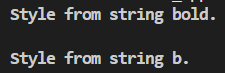

`dim`参数表示是否设置为暗淡显示（字体颜色变淡），样式字符串中如果包含`'dim'`或者`'d'`，此时的样式等于将该参数设置为`True`的样式对象：

```python3
from rich.console import Console

console = Console()
for style in ['dim','d']:
    console.print(f'Style from string {style}.',style=style)
    console.print()
```

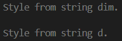

`italic`参数表示是否设置为斜体，样式字符串中如果包含`'italic'`或者`'i'`，此时的样式等于将该参数设置为`True`的样式对象：

```python3
from rich.console import Console

console = Console()
for style in ['italic','i']:
    console.print(f'Style from string {style}.',style=style)
    console.print()
```

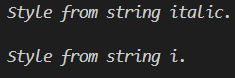

`underline`参数表示是否添加单下划线，样式字符串中如果包含`'underline'`或者`'u'`，此时的样式等于将该参数设置为`True`的样式对象：

```python3
from rich.console import Console

console = Console()
for style in ['underline','u']:
    console.print(f'Style from string {style}.',style=style)
    console.print()
```

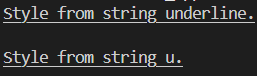

`underline2`参数表示是否添加双下划线（部分终端支持），样式字符串中如果包含`'underline2'`或者`'uu'`，此时的样式等于将该参数设置为`True`的样式对象：

```python3
from rich.console import Console

console = Console()
for style in ['underline2','uu']:
    console.print(f'Style from string {style}.',style=style)
    console.print()
```

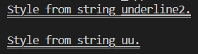

`overline`参数表示是否添加单上划线，样式字符串中如果包含`'overline'`或者`'o'`，此时的样式等于将该参数设置为`True`的样式对象：

```python3
from rich.console import Console

console = Console()
for style in ['overline','o']:
    console.print(f'Style from string {style}.',style=style)
    console.print()
```

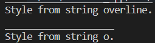

`strike`参数表示是否添加删除线，样式字符串中如果包含`'strike'`或者`'s'`，此时的样式等于将该参数设置为`True`的样式对象：

```python3
from rich.console import Console

console = Console()
for style in ['strike','s']:
    console.print(f'Style from string {style}.',style=style)
    console.print()
```

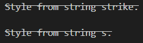

`reverse`参数表示是否启用反色（背景色与前景色交换），样式字符串中如果包含`'reverse'`或者`'r'`，此时的样式等于将该参数设置为`True`的样式对象：

```python3
from rich.console import Console

console = Console()
for style in ['reverse','r']:
    console.print(f'Style from string {style}.',style=style)
    console.print()
```

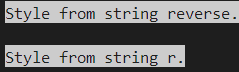

`conceal`参数表示是否隐藏内容，样式字符串中如果包含`'conceal'`或者`'c'`，此时的样式等于将该参数设置为`True`的样式对象：

```python3
from rich.console import Console

console = Console()
for style in ['conceal','c']:
    console.print(f'Style from string {style}.',style=style)
    console.print('OK.')
```

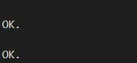

`blink`参数表示是否启用闪烁显示（部分终端支持），样式字符串中如果包含`'blink'`，此时的样式等于将该参数设置为`True`的样式对象。

`blink2`参数表示是否启用快速闪烁显示（部分终端支持），样式字符串中如果包含`'blink2'`，此时的样式等于将该参数设置为`True`的样式对象。

`frame`参数表示是否给文本添加直角外框（仅Mintty支持，相见[资料](https://github.com/mintty/mintty/wiki/Tips#text-attributes-and-rendering)），样式字符串中如果包含`'frame'`，此时的样式等于将该参数设置为`True`的样式对象。

`encircle`参数表示是否给文本添加圆形外框（仅Mintty支持，相见[资料](https://github.com/mintty/mintty/wiki/Tips#text-attributes-and-rendering)），样式字符串中如果包含`'encircle'`，此时的样式等于将该参数设置为`True`的样式对象。

`link`参数表示给文本添加的超链接地址，样式字符串中如果包含`'link '`（`'link'`加空格）为前缀的超链接地址，此时的样式等于将该参数设置为超链接地址的样式对象：

```python3
from rich.console import Console

console = Console()
for style in ['link https://baidu.com']:
    console.print(f'Style from string {style}.',style=style)
    console.print()
```

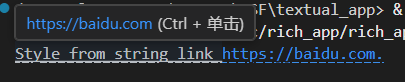

其他样式支持在字符串中嵌入Markup标签（类似于HTML标签，但是使用中括号代替角括号）中对应样式的否定标签——给样式字符串添加`'not '`（`'not'`加空格）前缀，可以实现字符串的部分内容不使用该样式。比如`console.print('Hello [not bold]World[/not bold]!', style='bold')`中，输出的`World`在输出时，不会使用粗体样式。

对比各种样式的局部否定效果，可以参考下面的示例：

```python3
from rich.console import Console

console = Console()
for style in ['b','d','i','u','o','s','r','c']:
    console.print(f'Style from string [not {style}]{style}[/not {style}].',style=style)
    console.print()
```

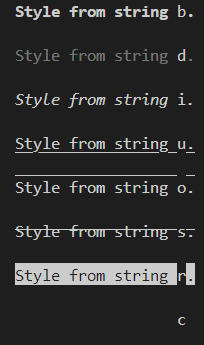

和颜色样式类似，其他样式之间也可以自由组合，颜色样式和其他样式之间也能自由组合：

```python3
from rich.console import Console

console = Console()
for style in ['red b','d on blue','i s']:
    console.print(f'Style from string [not {style}]{style}[/not {style}].',style=style)
    console.print()
```

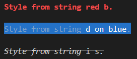

#### 2.2.3 主题变量

因为样式之间可以自由组合，如果每次使用组合样式都重新写一遍组合样式的样式字符串，记不方便，也不好理解组合样式的意义。因此，主题变量应运而生。通过定义主题变量，将原本没有直观名字的组合样式与自定义名称关联，这样的话，在设置样式参数时，就可以使用自定义的名称代替组合样式。

想要使用主题变量，需要先定义主题。使用下面的代码导入主题类：

```python3
from rich.theme import Theme 
```

定义主题时，给主题类传入字典，字典的键就是自定义名称，字典的值就是自定义名称对应的组合样式的样式字符串：

```python3
from rich.theme import Theme
my_theme = Theme(
    {
        'info':'dim green',
        'error':'bold red',
    }
)
```

使用主题中定义的自定义名称之前，需要先将主题对象传给`Console`对象的`theme`参数，才能给输出内容方法的`style`参数传入自定义名称：

```python3
from rich.console import Console
from rich.theme import Theme
my_theme = Theme(
    {
        'info':'dim green',
        'error':'bold red',
    }
)
console = Console(theme=my_theme)
console.print('info message from theme.',style='info')
console.print('error message from theme',style='error')
```

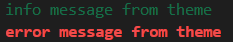

对于没有使用自定义名称的样式，则会使用默认的主题样式：

```python3
from rich.console import Console
from rich.theme import Theme
my_theme = Theme(
    {
        'info':'dim green',
        'error':'bold red',
    }
)
console = Console(theme=my_theme)
console.print('info message from theme.',style='info')
console.print('error message from theme.',style='error')
console.print('number is 123456.')
```

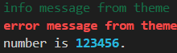

可以将主题对象的`inherit`参数设置为`False`来禁用主题对象继承默认主题的样式：

```python3
from rich.console import Console
from rich.theme import Theme
my_theme = Theme(
    styles={
        'info':'dim green',
        'error':'bold red',
    },
    inherit=False
)
console = Console(theme=my_theme)
console.print('info message from theme.',style='info')
console.print('error message from theme.',style='error')
console.print('number is 123456.')
```

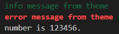

也可以在主题中定义这些默认使用的主题变量对应什么样式：

```python3
from rich.console import Console
from rich.theme import Theme
my_theme = Theme(
    styles={
        'info':'dim green',
        'error':'bold red',
        'repr.number':'bold green blink',
    },
    inherit=False
)
console = Console(theme=my_theme)
console.print('info message from theme.',style='info')
console.print('error message from theme.',style='error')
console.print('number is 123456.')
```

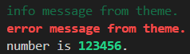

默认使用的主题变量可以使用下面的命令查看：

```shell
python -m rich.theme
# 或者使用下面的命令查看带效果的输出结果
python -m rich.default_styles
```

结果如下：

```
bar.back = grey23
bar.complete = rgb(249,38,114)
bar.finished = rgb(114,156,31)
bar.pulse = rgb(249,38,114)
black = black
blink = blink
blink2 = blink2
bold = bold
bright = not dim
code = bold reverse
cyan = cyan
dim = dim
emphasize = italic
green = green
inspect.async_def = italic bright_cyan
inspect.attr = italic yellow
inspect.attr.dunder = dim italic yellow
inspect.callable = bold red
inspect.class = italic bright_cyan
inspect.def = italic bright_cyan
inspect.doc = dim
inspect.equals = none
inspect.error = bold red
inspect.help = cyan
inspect.value.border = green
iso8601.date = blue
iso8601.time = magenta
iso8601.timezone = yellow
italic = italic
json.bool_false = italic bright_red
json.bool_true = italic bright_green
json.brace = bold
json.key = bold blue
json.null = italic magenta
json.number = bold not italic cyan
json.str = not bold not italic green
layout.tree.column = not dim blue
layout.tree.row = not dim red
live.ellipsis = bold red
log.level = none
log.message = none
log.path = dim
log.time = dim cyan
logging.keyword = bold yellow
logging.level.critical = bold reverse red
logging.level.debug = green
logging.level.error = bold red
logging.level.info = blue
logging.level.notset = dim
logging.level.warning = yellow
magenta = magenta
markdown.block_quote = magenta
markdown.code = bold cyan on black
markdown.code_block = cyan on black
markdown.em = italic
markdown.emph = italic
markdown.h1 = bold
markdown.h1.border = none
markdown.h2 = bold underline
markdown.h3 = bold
markdown.h4 = bold dim
markdown.h5 = underline
markdown.h6 = italic
markdown.h7 = dim italic
markdown.hr = yellow
markdown.item = none
markdown.item.bullet = bold yellow
markdown.item.number = bold yellow
markdown.link = bright_blue
markdown.link_url = underline blue
markdown.list = cyan
markdown.paragraph = none
markdown.s = strike
markdown.strong = bold
markdown.text = none
none = none
pretty = none
progress.data.speed = red
progress.description = none
progress.download = green
progress.elapsed = yellow
progress.filesize = green
progress.filesize.total = green
progress.percentage = magenta
progress.remaining = cyan
progress.spinner = green
prompt = none
prompt.choices = bold magenta
prompt.default = bold cyan
prompt.invalid = red
prompt.invalid.choice = red
red = red
repr.attrib_equal = bold
repr.attrib_name = not italic yellow
repr.attrib_value = not italic magenta
repr.bool_false = italic bright_red
repr.bool_true = italic bright_green
repr.brace = bold
repr.call = bold magenta
repr.comma = bold
repr.ellipsis = yellow
repr.error = bold red
repr.eui48 = bold bright_green
repr.eui64 = bold bright_green
repr.filename = bright_magenta
repr.indent = dim green
repr.ipv4 = bold bright_green
repr.ipv6 = bold bright_green
repr.none = italic magenta
repr.number = bold not italic cyan
repr.number_complex = bold not italic cyan
repr.path = magenta
repr.str = not bold not italic green
repr.tag_contents = default
repr.tag_end = bold
repr.tag_name = bold bright_magenta
repr.tag_start = bold
repr.url = not bold not italic underline bright_blue
repr.uuid = not bold bright_yellow
reset = not bold not dim not italic not underline not blink not blink2 not reverse not conceal not strike default on default
reverse = reverse
rule.line = bright_green
rule.text = none
scope.border = blue
scope.equals = red
scope.key = italic yellow
scope.key.special = dim italic yellow
status.spinner = green
strike = strike
strong = bold
table.caption = dim italic
table.cell = none
table.footer = bold
table.header = bold
table.title = italic
traceback.border = red
traceback.border.syntax_error = bright_red
traceback.error = italic red
traceback.error_range = bold not dim underline
traceback.exc_type = bold bright_red
traceback.exc_value = none
traceback.offset = bold bright_red
traceback.text = none
traceback.title = bold red
tree = none
tree.line = none
underline = underline
white = white
yellow = yellow
```

主题对象还支持`read`方法方法，可以从文件中读取主题配置。主题配置语法格式类似`ini`配置文件：

```
[styles]
info = dim green
error = bold red
repr.number = bold green blink
```

将上面内容保存到源代码同目录的`theme.ini`中，然后使用下面的代码加载：

```python3
from rich.console import Console
from rich.theme import Theme
from pathlib import Path

my_theme = Theme().read(Path(__file__).parent/'theme.ini')
console = Console(theme=my_theme)
console.print('info message from theme.',style='info')
console.print('error message from theme.',style='error')
console.print('number is 123456.')
```


### 2.3 Markup标签

在上一节中，提到了Markup标签中的否定标签，本节将详细介绍Markup标签的语法和用法（相关内容原文见[官网](https://rich.readthedocs.io/en/latest/markup.html)）。

#### 2.3.1 语法

Markup标签很像HTML标签，如果将HTML的角括号替换为中括号，Markup标签的一般格式如下：

```
[bold]Hello[/bold],World!
```

对应HTML中表示元素的内容，在Markup标签中，使用的是样式字符串。

与HTML标签一样，Markup标签也有闭合的要求，上面示例中的`[/bold]`就是`[bold]`对应的闭合标签。当然，如果想要简单一些，使用`[/]`可以闭合最近的标签，具体原则可以参考括号的配对原则：

```
[red][bold]Hello[/] and [/]World!
```

需要注意的是，使用Markup标签表示超链接时，语法不是`'link'`与超链接之间使用空格间隔，而是使用`'='`连接：

```python3
[link=https://baidu.com]click[/link]
```

除了解析Markup标签，`rich.markup`模块还提供了对Emoji表情的支持，只需使用英文冒号包围Emoji表情名的前后即可：

```
:smile:
:warning-emoji:
```

使用下面的命令可以查看Markup标签在终端的显示效果：

```shell
python -m rich.markup
```

使用下面的命令可以查看Emoji标签在终端的显示效果：

```shell
python -m rich.emoji
```

在使用Markup标签时，需要确保语法正确，如果出现语法错误，比如闭合标签不配对`[bold]Hello[/red],World!`或者只有闭合标签`Hello[/bold],World!`等情况，输出方法会报`MarkupError`错误。

#### 2.3.2 输出

不管是Markup标签还是Emoji表情代码，都可以使用Rich提供的`print`方法输出，以下为完整的示例代码：

```python3
from rich import print

for markup in [
    '[bold]Hello[/bold],World!',
    '[red][bold]Hello[/] and [/]World!',
    '[red][bold]H[not bold]ell[/not bold]o[/] and [/]World!',
    '[link=https://baidu.com]click[/link]',
    ':smile: is :warning-emoji:.'
    ]:
    print(f'{markup}')
```


如果是调用`Console`对象的输出方法，则只有`print`方法、`log`方法、`rule`方法和`status`方法支持Markup标签和Emoji表情：

```python3
from rich.console import Console
import time

console = Console()
for markup in [
    '[bold]Hello[/bold],World! :smile: is :warning-emoji:.',
    ]:
    console.print(f'print {markup}')
    console.log(f'log {markup}')
    console.rule(f'rule {markup}')
    with console.status(f'status {markup}') as status:
        time.sleep(3)
```


需要注意的是，`Console`类的三个参数与Markup标签、Emoji表情的解析有关：

-   `markup`参数，布尔类型，表示是否解析Markup标签，默认为`True`。
-   `emoji`参数，布尔类型，表示是否解析Emoji表情代码，默认为`True`。
-   `emoji_variant`参数，字符串类型，仅支持`['emoji', 'text']`中的值，表示输出Emoji表情时，是使用什么风格的表情图标（带颜色的还是和文本一样）。

`print`方法、`log`方法也有单独的解析开关：

-   `markup`参数，布尔类型，表示是否解析Markup标签，默认为`True`。
-   `emoji`参数，布尔类型，表示是否解析Emoji表情代码，默认为`True`

示例如下：

```python3
from rich.console import Console

console = Console(markup=True,emoji=True,emoji_variant='emoji')
console2 = Console(markup=False,emoji=True,emoji_variant='text')

for markup in [
    '[bold]Hello[/bold],World! :smile: is :warning-emoji:.',
    ]:
    console.print(f'{markup}')
    console2.print(f'no markup, emoji is text: {markup}')
```


文本对象[`Text`](https://rich.readthedocs.io/en/latest/reference/text.html#rich.text.Text)还提供了`from_markup`方法，可以将包含Markup标签的字符串转化为同等样式的文本对象，则此时输出的就是文本对象，而不是包含Markup标签的字符串，因此，使用`Console`对象的`print`方法和`log`方法、直接使用`print`方法时，这些方法中决定是否解析Markup标签和Emoji表情代码的参数都不会对文本对象生效：

```python3
from rich.console import Console
from rich.text import Text

console = Console(markup=True,emoji=True,emoji_variant='emoji')
console2 = Console(markup=False,emoji=True,emoji_variant='text')

for markup in [
    '[bold]Hello[/bold],World! :smile: is :warning-emoji:.',
    ]:
    console.print(Text.from_markup(f'{markup}'))
    console2.print(Text.from_markup(f'{markup}'))
```


但`from_markup`方法提供了两个和Emoji有关的参数，可以设置是否解析Emoji表情代码和使用什么风格的Emoji表情：

-   `emoji`参数，布尔类型，表示是否解析Emoji表情代码，默认为`True`。
-   `emoji_variant`参数，字符串类型，仅支持`['emoji', 'text']`中的值，表示输出Emoji表情时，是使用什么风格的表情图标（带颜色的还是和文本一样）。

其他如[`Panel`](https://rich.readthedocs.io/en/latest/panel.html)、[`Table`](https://rich.readthedocs.io/en/latest/tables.html)等支持可渲染对象的组件，也支持解析Markup标签、Emoji表情代码，但组件输出的结果在使用支持`markup`参数、`emoji`参数、`emoji_variant`参数的输出方法（`Console`对象的`print`方法和`log`方法、Rich的`print`方法）时，结果会受这些参数的影响：

```python3
from rich.console import Console
from rich.panel import Panel
from rich.table import Table

console = Console(markup=True,emoji=True,emoji_variant='emoji')
console2 = Console(markup=False,emoji=True,emoji_variant='text')

for markup in [
    '[bold]Hello[/bold],World! :smile: is :warning-emoji:.',
    ]:
    console.print(Panel(f'{markup}'))
    console2.print(Panel(f'{markup}'))
    console.print(Table(f'{markup}'))
    console2.print(Table(f'{markup}'))
```


配置`markup`参数可以决定本次输出的内容是否解析Markup标签，但如果输出的内容既有Markup标签，又有准备原样输出Markup标签或者类似Markup标签的内容（中括号内的内容会被当成Markup标签，但如果内容不支持渲染，只是格式相似，解析时会报错），该如何处理呢？

说到原样输出，就不得不提到Python中经常原样输出转义字符的字符串修饰符`r`。很可惜，使用该修饰符不能让Markup标签原样输出：

```python3
from rich.console import Console

console = Console()

console.print(r'\n[bold]Hello[/bold],World!\n:smile: is :warning-emoji:.')
```


这种情况下，需要给所有不需要解析的Markup标签（含闭合标签）前加一个反斜杠`'\'`：

```python3
from rich.console import Console

console = Console()

console.print(r'\n[bold]Hello[/bold],World!\n:smile: is :warning-emoji:.')
console.print(r'\n\[bold]Hello\[/bold],World!\n:smile: is :warning-emoji:.')
```


但是，如果是f-string中的变量就是一个包含Markup标签的字符串，想要原样输出，就需要做一点变动，先看不做变动的情况下，三种Python原样输出的方法有没有问题：

```python3
from rich.console import Console

console = Console()

string1 = r'\n\[bold]Hello\[/bold],World!\n:smile: is :warning-emoji:.'
console.print(f'{string1}')
string2 = '\n\[bold]Hello\[/bold],World!\n:smile: is :warning-emoji:.'
console.print(rf'{string2}')
string3 = '\n\[bold]Hello\[/bold],World!\n:smile: is :warning-emoji:.'
console.print(f'{string3!r}')
```


可以看到`string2`和`string3`原始字符串没用修饰符的情况下，在f-string中使用修饰符，不光会有语法报错，得到的三个结果完全不一样。当然，每种结果都有特定的应用场景，但眼下需要首先解决的是语法报错。

解决语法报错很简单，原本只是给Markup标签（含闭合标签）前加一个反斜杠`'\'`，现在改成两个：

```python3
from rich.console import Console

console = Console()

string1 = r'\n\[bold]Hello\[/bold],World!\n:smile: is :warning-emoji:.'
console.print(f'{string1}')
string2 = '\n\\[bold]Hello\\[/bold],World!\n:smile: is :warning-emoji:.'
console.print(rf'{string2}')
string3 = '\n\\[bold]Hello\\[/bold],World!\n:smile: is :warning-emoji:.'
console.print(f'{string3!r}')
```


对于只想原样输出Markup标签而不想修改原始字符串或者正常输出转义字符的情况，可以使用`rich.markup`模块提供的`escape`方法：

```python3
from rich.console import Console
from rich.markup import escape

console = Console()

string = '\n[bold]Hello[/bold],World!\n:smile: is :warning-emoji:.'
console.print(rf'{escape(string)}')
```


### 2.4 文本对象

相比于`print`方法及其他支持`style`参数的方法直接设置单次输出内容的样式，Markup标签可以很方便地设置部分内容的样式，用起来更加灵活。不过，Markup标签要嵌入字符串内才能生效，`print`方法及其他支持`style`参数的方法可以在不修改字符串的前提下让样式生效，可以说二者各有利弊。若是能有一种不修改字符串就可以设置部分内容样式的方法，想必能弥补二者所欠缺的部分。本节要介绍的、来自`rich.text`模块的文本对象（`Text`类型，使用`from rich.text import Text`导入，完整用法参考[官网文档](https://rich.readthedocs.io/en/latest/reference/text.html#rich.text.Text)），正好能解决这个问题。

本节相关原文参考[官网](https://rich.readthedocs.io/en/latest/text.html)。

先看一个简单的示例：

```python3
from rich.console import Console
from rich.text import Text

console = Console()
text = Text('Hello, World!')
text.stylize('red',0,5)
text.stylize('green',7,12)
console.print(text)
```


`Text`类支持以下参数：

-   `text`参数，字符串类型，表示显示内容的原始字符串。

-   `style`参数，字符串类型或者`Style`类型，表示显示内容的基本样式（`spans`参数会定义局部内容的样式）。

-   `justify`参数，字符串类型，当文本对象放置在其他组件中时，表示内容的对齐方式，仅支持`['default','left','center','right','full']`中的值，分别表示使用内容实际宽度左对齐、左对齐、居中对齐、右对齐、使用内容实际宽度左对齐。对比如下：

    ```python3
    from rich.console import Console
    from rich.text import Text
    from rich.panel import Panel
    
    console = Console()
    for justify in ['left','center','right','full']:
        console.print(Panel(Text('Hello, World!',justify=justify,style='on red')))
    ```

    

    另外，如果此参数设置为`'full'`，当输出的内容很长、包含空格、需要换行时，这种对齐方式会自动调整内容中间的空格的数量，让行首和行尾都不是空格：

    ```python3
    from rich.console import Console
    from rich.text import Text
    from rich.panel import Panel
    
    console = Console(width=20)
    for justify in ['left','center','right','full']:
        console.print(justify)
        console.print(Panel(Text('Hello, World! '*5,justify=justify,style='on red')))
    ```

    

    从此参数开始，只能使用关键字传入。

-   `overflow`参数，字符串类型，表示单行无空格的内容宽度超出容器宽度时的溢出处理方式，仅支持`['fold','crop','ellipsis','ignore']`中的值，分别表示折叠、直接裁切、裁切但末尾字符替换为省略号、忽略（效果同直接裁切加禁用自动换行，即设置`no_wrap`参数为`True`）。效果的对比示例如下：

    ```python3
    from rich.console import Console
    from rich.text import Text
    from rich.panel import Panel
    
    console = Console()
    for overflow in ['fold','crop','ellipsis','ignore']:
        console.print(overflow)
        console.print(Panel(Text('Hello, World!',overflow=overflow,style='on red'),width=12))
        console.print(Panel(Text('Hello,World!',overflow=overflow,style='on red'),width=12))
    ```

    

    注意，因为默认不设置`no_wrap`参数的话，自动换行是开启的，因此内容中如果有空格分隔，为了保证被分隔内容的完整性，程序会优先以空格为分界线，让空格后的内容换行显示，不受除了忽略之外的溢出处理的影响。

-   `no_wrap`参数，布尔类型，表示是否禁用自动换行。内容中如果有空格分隔，为了保证被分隔内容的完整性，程序会优先以空格为分界线，让空格后的内容换行显示，这就是自动换行行为。此参数默认为`None`，没有设置`Console`对象的`options.no_wrap`属性时，默认值相当于`False`，即启用自动换行。

-   `end`参数，字符串类型，表示在内容末尾额外添加的结束字符，默认为换行符`'\n'`。

-   `tab_size`参数，整数类型，表示将内容中的每个制表符`'\t'`处理成多少个空格，默认为`None`，即使用`Console`对象的`tab_size`属性当作此参数的值。

-   `spans`参数，元素为`Span`类型（使用`from rich.text import Span`导入）的列表，每个元素表示原始字符串指定区间的字符串应用什么样式，按照顺序依次应用。`Span`类支持以下参数：

    -   `start`参数，整数类型，表示区间的起点（含所在位置的字符）。
    -   `end`参数，整数类型，表示区间的终点（不含所在位置的字符）。
    -   `style`参数，字符串类型或者`Style`类型，表示该区间的字符串应用什么样式。

    可以使用元组包装`Span`类对应的三个参数值，代替`Span`类对象，比如`Text('Hello, World!',spans=[(0,5,'u')])`和`Text('Hello, World!',spans=[Span(0,5,'u')])`的效果是一样的。
    
    下面的示例就是将本节最开始的示例转化为使用`spans`参数的形式：
    
    ```python3
    from rich.console import Console
    from rich.text import Text, Span
    
    console = Console()
    text = Text('Hello, World!',
                spans=[
                    Span(0, 5, 'red'),
                    (7, 12, 'green')
                ]
            )
    console.print(text)
    ```
    
    

`Text`类支持以下属性：

-   `cell_len`属性，表示原始字符串的宽度。
-   `markup`属性，表示等效于文本对象显示效果、包含Markup标签的字符串。
-   `plain`属性，表示内容的原始字符串，即内容去掉样式之后的字符串。
-   `style`属性，同`style`参数。
-   `spans`属性，同`spans`参数。
-   `justify`属性，同`justify`参数。
-   `overflow`属性，同`overflow`参数。
-   `no_wrap`属性，同`no_wrap`参数。
-   `end`属性，同`end`参数。
-   `tab_size`属性，同`tab_size`参数。

`Text`类支持以下方法：

-   `align`方法，让文本对象基于给定的宽度，按照给定的方向，使用给定的填充字符，重新对齐内容。该方法支持以下参数：

    -   `align`参数，字符串类型，仅支持`['left','center','right']`中的值，表示对齐方向。
    -   `width`参数，整数类型，表示按照多少宽度对齐内容。
    -   `character`参数，字符串类型，表示使用什么字符填充，仅支持单个字符。

-   `append`方法，给文本对象的内容末尾添加其他文本对象的内容或者字符串，并返回文本对象。该方法支持以下参数：

    -   `text`参数，`Text`类型或者字符串类型，表示要添加的内容。
    -   `style`参数，`Style`类型或者字符串类型，表示添加内容的样式，仅当`text`参数为字符串类型时可以设置此参数。

-   `append_text`方法，给文本对象的内容末尾添加其他文本对象的内容，并返回文本对象。该方法支持以下参数：

    -   `text`参数，`Text`类型，表示要添加的内容。

-   `append_tokens`方法，给文本对象的内容末尾添加内容。该方法支持以下参数：

    -   `tokens`参数，元素为元组的可迭代对象，每个元组的第一个元素是字符串类型，表示要添加的内容；每个元组的第二个元素是字符串类型或者`Style`类型，表示内容对应的样式。

    示例如下：

    ```python3
    from rich.console import Console
    from rich.text import Text
    from rich.style import Style
    
    console = Console()
    text = Text('Hello, World!')
    text.append_tokens(
        [
                ('Hello,','green'),
                ('Rich!',Style(color='red')),
            ]
        )
    console.print(text)
    ```

    

-   `apply_meta`方法，给文本对象的内容或者指定区间的内容设置为包含特定元信息的样式。该方法支持以下参数：

    -   `meta`参数，字典类型（键必须是字符串），表示样式的元信息。
    -   `start`参数，整数类型，表示区间的起点（含所在位置的字符），默认为`0`。
    -   `end`参数，整数类型，表示区间的终点（不含所在位置的字符）。

-   `blank_copy`方法，创建一个样式、对齐、溢出处理、是否开启自动换行、内容末尾字符、使用多少个空格代替制表符等属性与原文本对象相同的文本对象副本。该方法支持以下参数：

    -   `plain`参数，字符串类型，表示创建文本对象副本时的原始字符串。

-   `copy`方法，返回文本对象的副本。

-   `copy_styles`方法，复制指定文本对象的样式，应用到当前文本对象。该方法支持以下参数：

    -   `text`参数，`Text`类型，表示样式来源的文本对象。

-   `detect_indentation`方法，当文本对象的原始字符串是使用空格当缩进填充的多行文本时，此方法计算并返回原始字符串中使用多少个空格当做一个层级的缩进。此方法在`with_indent_guides`方法未指定缩进空格数时，用于计算默认缩进空格数：

    ```python3
    from rich.console import Console
    from rich.text import Text
    
    console = Console()
    text = Text('''\
    Hello,
        World!
            Hi,
                World!''')
    
    console.print(text.with_indent_guides())
    ```

    

-   `divide`方法，将内容分割成几份，得到多个文本对象，并将文本对象放入多行容器（`Lines`类型，使用`from rich.containers import Lines`导入，可以当列表使用）中，返回多行容器。该方法支持以下参数：

    -   `offset`参数，元素为整数类型的可迭代对象，表示切割点的位置（原始字符串的位置索引值，但切割出来的结果是包含样式的文本对象）。

    示例如下：

    ```python3
    from rich.console import Console
    from rich.text import Text
    
    console = Console()
    text = Text('Hello,World!',spans=[(0,3,'red')])
    
    console.print(text.divide([1,2]))
    ```

    

-   `expand_tabs`方法，将内容中的每个制表符`'\t'`替换为多个空格，空格数量取决于制表符前内容的宽度和指定的对齐宽度。该方法支持以下参数：

    -   `tab_size`参数，整数类型，表示对齐宽度，即将内容按照多少宽度对齐。

        所谓对齐宽度，就是假定制表符前的内容至少补齐一个空格、最多补齐`tab_size`参数值数量的空格，补齐空格后的内容宽度可以被`tab_size`参数值整除。

        该参数默认为`None`，即使用文本对象的`tab_size`属性当作此参数的默认值，若文本对象的`tab_size`属性为`None`，则参数的默认值为`8`。

    示例如下：

    ```python3
    from rich.console import Console
    from rich.text import Text
    
    console = Console()
    text = Text('Hello,\tWorld!\tHi!\n1234567890123456789',spans=[(0,3,'red')])
    text.expand_tabs(tab_size=8)
    console.print(text)
    ```

    

-   `extend_style`方法，在内容末尾添加指定数量的空格，空格的样式和内容末尾字符的样式相同。该方法支持以下参数：

    -   `spaces`参数，整数类型，表示空格的数量。

-   `fit`方法，将多行内容的文本对象以换行符为间隔，分割成几份，得到多个宽度相等的文本对象，并将文本对象放入多行容器（`Lines`类型，使用`from rich.containers import Lines`导入，可以当列表使用）中，返回多行容器。该方法支持以下参数：

    -   `width`参数，整数类型，表示分割后每个文本对象的宽度。

-   `get_style_at_offset`方法，获取文本对象在指定`Console`对象中输出时，指定位置的字符的样式。该方法支持以下参数：

    -   `console`参数，`Console`类型，表示输出文本对象的`Console`对象。
    -   `offset`参数，整数类型，表示字符位置（索引值）。

-   `highlight_regex`方法，将内容中符合正则表达式匹配条件的字符串设置为指定样式，返回内容中有多少个字符串符合匹配条件。该方法支持以下参数：

    -   `re_highlight`参数，字符串类型，用于匹配的正则表达式。
    -   `style`参数，字符串类型或者`Style`类型，表示将目标字符串设置为什么样式。
    -   `style_prefix`参数，字符串类型，如果使用命名分组正则表达式`(?P<{名字}>{正则表达式})`，此参数表示给正则表达式的分组命名添加什么前缀。从此参数开始，只能使用关键字传入。

    注意，此方法使用命名分组正则表达式`(?P<{名字}>{正则表达式})`的话，分组命名会被当作样式字符串，并且优先级高于`style`参数和Markup标签。比如：

    ```python3
    from rich.console import Console
    from rich.text import Text
    
    console = Console()
    text = Text.from_markup('[red]Hello[/], World! [red]123 123[/]')
    text.highlight_regex('(?P<purple>123)','red')
    console.print(text)
    ```

    

    需要注意的是，命名分组正则表达式中分组命名必须是合法的变量名，不能包含空格等，如果想要应用复合样式，需要使用`style_prefix`参数，并在给`style_prefix`参数传值时，务必在字符串末尾添加空格。比如：

    ```python3
    from rich.console import Console
    from rich.text import Text
    
    console = Console()
    text = Text.from_markup('[red]Hello[/], World! [red]123 123[/]')
    text.highlight_regex('(?P<purple>123)','red',style_prefix='on white ')
    console.print(text)
    ```

    

    当然，前面介绍过可以给`style`参数传入主题变量，在主题中定义复合样式，而分组命名和`style_prefix`参数也可以这样使用，给符合匹配条件的字符串应用任意符合样式。示例如下：

    ```python3
    from rich.console import Console
    from rich.text import Text
    from rich.theme import Theme
    
    console = Console(theme=Theme({'my.number':'green on white i u s'}))
    text = Text.from_markup('[red]Hello[/], World! [red]123 123[/]')
    text.highlight_regex('(?P<number>123)','red',style_prefix='my.')
    console.print(text)
    ```

    

-   `highlight_words`方法，将内容中指定的字符串设置为指定样式，返回内容中有多少个指定字符串。该方法支持以下参数：

    -   `words`参数，元素为字符串类型的可迭代对象，用于匹配的字符串，任何在可迭代对象中的字符串都是符合条件的目标字符串。
    -   `style`参数，字符串类型或者`Style`类型，表示将目标字符串设置为什么样式。
    -   `case_sensitive`参数，布尔类型，表示匹配时是否区分大小写，默认为`True`。从此参数开始，只能使用关键字传入。

-   `join`方法，使用文本对象的内容作为间隔符，连接多个文本对象的内容，返回连接后的结果。该方法支持以下参数：

    -   `lines`参数，元素为`Text`类型的可迭代对象，表示要连接的文本对象。

    注意，连接多个文本对象时，调用此方法的文本对象的样式会成为结果的样式。但是，此方法的文本对象的局部内容的样式（`spans`参数设置的样式）则只会在局部生效。

    示例如下：

    ```python3
    from rich.console import Console
    from rich.text import Text
    
    console = Console()
    text1 = Text('Hello')
    text2 = Text('World')
    text = Text('_x_',style='red',spans=[(1,2,'on white')]).join([text1,text2])
    console.print(text)
    ```

    

-   `on`方法，设置文本对象的样式的元信息，并返回文本对象。该方法支持以下参数：

    -   `meta`参数，`meta`参数，字典类型（键必须是字符串），表示给文本对象的样式设置的元信息。
    -   `**handlers`参数，字符串类型，以关键字形式传入的其他参数会被该参数接收，转化为事件处理函数，合并到元信息中，即‘@’加上关键字为键，值就是关键字参数的值。比如，`Text('Hello').on(click='handle_click')`，创建出来的样式对象元信息为`"Style(meta={'@click': 'handle_click'}"`。

-   `pad`方法，在内容左右各添加指定数量的指定字符。该方法支持以下参数：

    -   `count`参数，整数类型，表示添加字符的数量。
    -   `character`参数，字符串类型，表示添加什么字符。

-   `pad_left`方法，在内容左边添加指定数量的指定字符。该方法支持以下参数：

    -   `count`参数，整数类型，表示添加字符的数量。
    -   `character`参数，字符串类型，表示添加什么字符。

-   `pad_right`方法，在内容右边添加指定数量的指定字符。该方法支持以下参数：

    -   `count`参数，整数类型，表示添加字符的数量。
    -   `character`参数，字符串类型，表示添加什么字符，默认为`' '`。

-   `remove_suffix`方法，移除原始字符串的指定后缀。该方法支持以下参数：

    -   `suffix`参数，字符串类型，表示要移除的后缀。

-   `right_crop`方法，从内容右边开始，移除指定数量的字符。该方法支持以下参数：

    -   `amount`参数，整数类型，表示移除的数量，默认为`1`。

-   `rstrip`方法，从内容右边开始，移除所有空白字符（包括空格和不可见的转移字符）。

-   `rstrip_end`方法，从内容右边开始，移除超过指定宽度部分中的所有空白字符（包括空格和不可见的转移字符）。该方法支持以下参数：

    -   `size`参数，整数类型，表示指定的宽度。

-   `set_length`方法，修改内容的宽度为指定宽度。如果新的宽度大于原宽度，则在内容右边增加空格。如果新的宽度小于原宽度，则会裁剪掉超出指定宽度的内容。该方法支持以下参数：

    -   `new_length`参数，整数类型，表示指定宽度。

-   `split`方法，将内容分割为几部分，并返回一个包含每个部分的列表。该方法支持以下参数：

    -   `separator`参数，字符串类型，表示分割时以什么为间隔符，默认为`'\n'`。
    -   `include_separator`参数，布尔类型，表示分割内容时，是否让前一部分包含间隔符，默认为`False`。从此参数开始，只能使用关键字传入。
    -   `allow_blank`参数，布尔类型，如果内容是以间隔符为结尾，是否认为结尾之后有一个空白内容，默认为`False`。

-   `stylize`方法，给指定区间的内容应用指定样式，但此方法比文本对象的`spans`参数优先生效。该方法支持以下参数：

    -   `style`参数，字符串类型或者`Style`类型，表示该区间的字符串应用什么样式。
    -   `start`参数，整数类型，表示区间的起点（含所在位置的字符），默认为`0`。
    -   `end`参数，整数类型，表示区间的终点（不含所在位置的字符），默认为`None`。

-   `stylize_before`方法，给指定区间的内容应用指定样式，但文本对象的`spans`参数比此方法优先生效。该方法支持以下参数：

    -   `style`参数，字符串类型或者`Style`类型，表示该区间的字符串应用什么样式。
    -   `start`参数，整数类型，表示区间的起点（含所在位置的字符），默认为`0`。
    -   `end`参数，整数类型，表示区间的终点（不含所在位置的字符），默认为`None`。

    下面的示例展示了两种方法与`spans`参数的优先顺序：

    ```python3
    from rich.console import Console
    from rich.text import Text
    
    console = Console()
    text = Text('Hello',spans=[(0,3,'green')])
    text.stylize('red',1,2)
    text.stylize_before('blue',2,3)
    console.print(text)
    ```

    

-   `truncate`方法，当内容宽度不等于指定宽度时，处理内容，使之宽度等于给定宽度。该方法支持以下参数：

    -   `max_width`参数，整数类型，表示指定宽度。
    -   `overflow`参数，字符串类型，表示内容宽度超出指定宽度时的溢出处理方式，仅支持`['fold','crop','ellipsis','ignore']`中的值，分别表示直接裁切、直接裁切、裁切但末尾字符替换为省略号、忽略（不处理，忽略指定宽度的先知）。从此参数开始，只能使用关键字传入。
    -   `pad`参数，布尔类型，表示当内容宽度小于指定宽度时，是否在内容末尾添加空格，使得处理后的内容宽度等于指定宽度，默认为`False`。

-   `with_indent_guides`方法，给多行带缩进的内容添加引导线，并返回处理后的结果。该方法支持以下参数：

    -   `indent_size`参数，整数类型，表示将多少个空格当做一级缩进。该参数默认为`None`，即自动检测一级缩进的空格数、
    -   `character`参数，字符串类型，使用什么字符当作引导线，默认为`'│'`。注意，只能使用单个字符当引导线，多个字符虽然不报错，但会导致显示异常。从此参数开始，只能使用关键字传入。
    -   `style`参数，字符串类型或者`Style`类型，表示引导线的样式，默认为`'dim green'`。

    示例如下：

    ```python3
    from rich.console import Console
    from rich.text import Text
    
    console = Console()
    text = Text('''\
    Hello,
        World!
            Hi,
                World!''')
    
    console.print(text.with_indent_guides())
    ```

    

-   `wrap`方法，返回指定`Console`对象以指定宽度输出文本对象时的结果（`Lines`类型，元素为`Text`类型的可迭代对象）。该方法支持以下参数：

    -   `console`参数，`Console`类型，用于输出文本对象的`Console`对象。
    -   `width`参数，整数类型，表示指定的输出宽度。
    -   `justify`参数，字符串类型，当文本对象放置在其他组件中时，表示内容的对齐方式，仅支持`['default','left','center','right','full']`中的值。从此参数开始，只能使用关键字传入。
    -   `overflow`参数，字符串类型，表示单行无空格的内容宽度超出容器宽度时的溢出处理方式，仅支持`['fold','crop','ellipsis','ignore']`中的值。
    -   `tab_size`参数，整数类型，表示将内容中的每个制表符`'\t'`处理成多少个空格，默认为`8`。
    -   `no_wrap`参数，布尔类型，表示是否禁用自动换行。内容中如果有空格分隔，为了保证被分隔内容的完整性，程序会优先以空格为分界线，让空格后的内容换行显示，这就是自动换行行为。此参数默认为`None`，没有设置`Console`对象的`options.no_wrap`属性时，默认值相当于`False`，即启用自动换行。


`Text`类支持以下类方法：

-   `assemble`方法，将多个文本对象、字符串、双元素元组（元组的第一个元素是字符串类型，表示内容；第二个元素是字符串类型或者`Style`类型，表示内容对应的样式）组合成新的文本对象。该方法支持以下参数：

    -   `*parts`参数，`Text`类型或者字符串类型或者双元素元组（元组的第一个元素是字符串类型，表示内容；第二个元素是字符串类型或者`Style`类型，表示内容对应的样式），表示用于组合的内容。支持传入多个符合要求的值或者解包可迭代对象。
    -   `style`参数，字符串类型或者`Style`类型，表示新的文本对象的样式。从此参数开始，只能使用关键字传入。
    -   `justify`参数，字符串类型，当文本对象放置在其他组件中时，表示内容的对齐方式，仅支持`['default','left','center','right','full']`中的值。
    -   `overflow`参数，字符串类型，表示单行无空格的内容宽度超出容器宽度时的溢出处理方式，仅支持`['fold','crop','ellipsis','ignore']`中的值。
    -   `no_wrap`参数，布尔类型，表示是否禁用自动换行。内容中如果有空格分隔，为了保证被分隔内容的完整性，程序会优先以空格为分界线，让空格后的内容换行显示，这就是自动换行行为。此参数默认为`None`，没有设置`Console`对象的`options.no_wrap`属性时，默认值相当于`False`，即启用自动换行。
    -   `end`参数，字符串类型，表示在内容末尾额外添加的结束字符，默认为换行符`'\n'`。
    -   `tab_size`参数，整数类型，表示将内容中的每个制表符`'\t'`处理成多少个空格，默认为`None`，即使用`Console`对象的`tab_size`属性当作此参数的值。
    -   `meta`参数，字典类型（键必须是字符串），表示新的文本对象的样式的元信息。

    示例如下：

    ```python3
    from rich.console import Console
    from rich.text import Text
    
    console = Console()
    text_obj = Text('Hello, World!')
    text_str = 'Hi,'
    text_tuple = ('你好.','red')
    text = Text.assemble(text_obj,text_str,text_tuple)
    console.print(text)
    ```

    

-   `from_ansi`方法，将包含ANSI终端转义码的字符串转换为文本对象。该方法支持以下参数：

    -   `text`参数，字符串类型，包含ANSI终端转义码的字符串，用于创建文本对象的。
    -   `style`参数，字符串类型或者`Style`类型，表示新的文本对象的样式。从此参数开始，只能使用关键字传入。
    -   `justify`参数，字符串类型，当文本对象放置在其他组件中时，表示内容的对齐方式，仅支持`['default','left','center','right','full']`中的值。
    -   `overflow`参数，字符串类型，表示单行无空格的内容宽度超出容器宽度时的溢出处理方式，仅支持`['fold','crop','ellipsis','ignore']`中的值。
    -   `no_wrap`参数，布尔类型，表示是否禁用自动换行。内容中如果有空格分隔，为了保证被分隔内容的完整性，程序会优先以空格为分界线，让空格后的内容换行显示，这就是自动换行行为。此参数默认为`None`，没有设置`Console`对象的`options.no_wrap`属性时，默认值相当于`False`，即启用自动换行。
    -   `end`参数，字符串类型，表示在内容末尾额外添加的结束字符，默认为换行符`'\n'`。
    -   `tab_size`参数，整数类型，表示将内容中的每个制表符`'\t'`处理成多少个空格，默认为`None`，即使用`Console`对象的`tab_size`属性当作此参数的值。

    示例如下：

    ```python3
    from rich.console import Console
    from rich.text import Text
    
    console = Console()
    text = Text.from_ansi('\033[1;31mHello\033[0m, World!')
    
    console.print(text)
    ```

    

-   `from_markup`方法，将包含Markup标签的字符串转换为文本对象。该方法支持以下参数：

    -   `text`参数，字符串类型，包含Markup标签的字符串，用于创建文本对象的。
    -   `style`参数，字符串类型或者`Style`类型，表示新的文本对象的样式。从此参数开始，只能使用关键字传入。
    -   `emoji`参数，布尔类型，表示是否解析Emoji表情代码，默认为`True`。
    -   `emoji_variant`参数，字符串类型，仅支持`['emoji', 'text']`中的值，表示输出Emoji表情时，是使用什么风格的表情图标（带颜色的还是和文本一样）。
    -   `justify`参数，字符串类型，当文本对象放置在其他组件中时，表示内容的对齐方式，仅支持`['default','left','center','right','full']`中的值。
    -   `overflow`参数，字符串类型，表示单行无空格的内容宽度超出容器宽度时的溢出处理方式，仅支持`['fold','crop','ellipsis','ignore']`中的值。
    -   `end`参数，字符串类型，表示在内容末尾额外添加的结束字符，默认为换行符`'\n'`。

    示例如下：

    ```python3
    from rich.console import Console
    from rich.text import Text
    
    console = Console()
    text = Text.from_markup('[red]Hello[/], World!')
    
    console.print(text)
    ```

    

-   `styled`方法，创建一个预先应用样式的文本对象，返回创建好的文本对象。该方法支持以下参数：

    -   `text`参数，字符串类型，表示显示内容的原始字符串。
    -   `style`参数，字符串类型或者`Style`类型，表示显示内容的基本样式。
    -   `justify`参数，字符串类型，当文本对象放置在其他组件中时，表示内容的对齐方式，仅支持`['default','left','center','right','full']`中的值。从此参数开始，只能使用关键字传入。
    -   `overflow`参数，字符串类型，表示单行无空格的内容宽度超出容器宽度时的溢出处理方式，仅支持`['fold','crop','ellipsis','ignore']`中的值。

    注意，此方法创建的文本对象与直接创建文本对象有所不同，当设置了`justify`参数之后，直接创建文本对象为了让内容对齐，会在内容前后添加空格，此时的空格也会应用`style`参数指定的样式。但是，使用此方法创建的文本对象，则不会给空格应用`style`参数指定的样式。对比示例如下：

    ```python3
    from rich.console import Console
    from rich.text import Text
    from rich.panel import Panel
    
    console = Console()
    text = Text('Hello','on white',justify='center')
    console.print(Panel(text,width=20))
    text = Text.styled('Hello','on white',justify='center')
    console.print(Panel(text,width=20))
    ```

    

### 2.5 语法高亮方案

当`Console`对象输出简单值（浮点数、整数、布尔值、字符串、任意对象的`__str__`属性或者`__repr__`属性）、引用值（集合、字典、列表等其他基本类型数据）时，`Console`对象会自动设置文本的语法高亮。

本节相关原文参考[官网](https://rich.readthedocs.io/en/latest/highlighting.html)。

#### 2.5.1 定义、使用语法高亮方案

`Console`对象提供了两个与语法高亮有关的参数：

-   `highlight`参数，布尔类型，表示是否启用输出方法的语法高亮，默认为`True`。
-   `highlighter`参数，`HighlighterType`类型（可调用类型，传入字符串或者文本对象，返回带有语法高亮样式的文本对象），表示语法高亮方案。

`highlight`参数很好理解，那`highlighter`参数如何使用呢？

当`Console`对象直接输出简单值、引用值时，会自动调用给`highlighter`参数设置的函数——一个可当作函数使用的可调用对象，把需要输出的简单值、引用值传给函数。其中，简单值会被转换为字符串，引用值会被转换为文本对象。因此，设置`highlighter`参数的值时，需要正确处理字符串和文本对象，返回应用了样式的文本对象。至于传入的其他类型数据，则需要触发异常或者忽略。

那么，顺着上面的思路，示例如下：

```python3
from rich.console import Console
from rich.text import Text

def HighlighterFunction(text):
    if isinstance(text,str):
        result = Text(text,style='red')
    elif isinstance(text,Text):
        result = text.copy()
        result.stylize('green')
    else:
        return
    return result

console = Console(
    highlighter=HighlighterFunction,
    )

console.print('Hello,World')
console.print(['Hello,World'])
```


上面的实例包含了定义、使用语法高亮方案的基本方式，但使用语法高亮方案除了上面那种给`Console`对象传入，还可以直接使用：

```python3
from rich.console import Console
from rich.text import Text

def HighlighterFunction(text):
    if isinstance(text,str):
        result = Text(text,style='red')
    elif isinstance(text,Text):
        result = text.copy()
        result.stylize('green')
    else:
        return
    return result

console = Console(
    highlighter=HighlighterFunction,
    )

console = Console()

console.print(HighlighterFunction('Hello,World'))
console.print(HighlighterFunction(Text(str(['Hello,World']))))
```


#### 2.5.2 定义、使用语法高亮方案的正确方式

上一节用看似简单粗暴的方式定义了语法高亮方案，但实际上是不正确的方式。如果需要精细化语法高亮，写这样的函数将会是一项大工程。

好在`rich.highlighter`模块提供了多个语法高亮类，可以方便快捷地自定义语法高亮方案，也可以直接使用已经定义好匹配规则的语法高亮方案，具体支持的语法高亮类可以参考[官网文档](https://rich.readthedocs.io/en/latest/reference/highlighter.html#rich.highlighter.RegexHighlighter)。

##### 2.5.2.1 扩展`Highlighter`类

通过扩展`Highlighter`类自定义语法高亮方案很简单，只需实现`highlight`方法即可。因为父类实现了对字符串、文本对象的识别和转换，因此，`highlight`方法只接收一个文本对象参数`text`，也无需返回任何值，直接修改这个文本对象的样式即可。

示例如下：

```python3
from rich.console import Console
from rich.highlighter import Highlighter

class MyHighlighter(Highlighter):
    def highlight(self, text):
        text.stylize('green',0,5)
        
console = Console(highlighter=MyHighlighter())
console.print('Hello,World')
console.print(console.highlighter('Hello,World'))
```


##### 2.5.2.2 扩展`RegexHighlighter`类

扩展`Highlighter`类简单了一些，但要想精准匹配具体的关键字，设定不同的高亮样式，还是有些麻烦。`RegexHighlighter`类恰好解决了这一痛点，使用方法也与`Highlighter`类不同。

`RegexHighlighter`类默认实现了`highlight`方法，使用`highlights`属性（元素为字符串的列表）提供的命名分组正则表达式（参考前面介绍的文本对象的`highlight_regex`方法）作为匹配规则，`base_style`属性为分组命名的前缀，这样就可以定义主题，让特定内容显示为指定样式。

自定义语法高亮方案：

```python3
from rich.highlighter import RegexHighlighter

class MyHighlighter(RegexHighlighter):
    base_style = 'my.'
    highlights = ['(?P<hello>Hello)','(?P<world>World)']
```

根据语法高亮方案设计对应的主题、主题变量、样式：

```python3
from rich.highlighter import RegexHighlighter
from rich.theme import Theme

class MyHighlighter(RegexHighlighter):
    base_style = 'my.'
    highlights = ['(?P<hello>Hello)','(?P<world>World)']

my_theme = Theme({
            'my.hello':'green',
            'my.world':'red',
            }
        )
```

完整代码：

```python3
from rich.console import Console
from rich.theme import Theme
from rich.highlighter import RegexHighlighter

class MyHighlighter(RegexHighlighter):
    base_style = 'my.'
    highlights = ['(?P<hello>Hello)','(?P<world>World)']

my_theme = Theme({
            'my.hello':'green',
            'my.world':'red',
            }
        )

console = Console(highlighter=MyHighlighter(),theme=my_theme)
console.print('Hello,World!')
console.print(console.highlighter('Hello,World!'))
```


##### 2.5.2.3 使用无需定义的语法高亮方案

不使用自定义的语法高亮方案的话，Rich内部预先定义了四种语法高亮方案可供选择：`ReprHighlighter`、`ISO8601Highlighter`、`JSONHighlighter`、`NullHighlighter`。

`ReprHighlighter`类就是默认的语法高亮方案，无需传入即可使用，主要适用于交互式终端。`ReprHighlighter`类的`base_style`属性是`'repr.'`，提供诸如括号、标签、属性名、IP地址、文件地址、数字、复数等内容的语法高亮，具体可以使用下面的命令查看：

```shell
python -m rich.highlighter
```


也支持在主题中修改特定内容的样式：

```python3
from rich.console import Console
from rich.theme import Theme
from rich.highlighter import ReprHighlighter

my_theme = Theme({
            'repr.number':'on green',
            'repr.brace':'on red',
            }
        )

console = Console(highlighter=ReprHighlighter(),theme=my_theme)
console.print('(123456)')
```


`ISO8601Highlighter`类提供了ISO8601标准格式时间（具体格式参考[相关文档](https://www.oreilly.com/library/view/regular-expressions-cookbook/9781449327453/ch04s07.html)）的语法高亮方案，`base_style`属性是`'iso8601.'`，提供年、月、日、周、时、分、秒等内容的语法高亮。示例如下：

```python3
from rich.console import Console
from rich.theme import Theme
from rich.highlighter import ISO8601Highlighter

my_theme = Theme({
            'iso8601.year':'on green',
            'iso8601.day':'on red',
            }
        )

console = Console(highlighter=ISO8601Highlighter(),theme=my_theme)
console.print('2025-02-28')
```


`JSONHighlighter`类提供了JSON格式数据的语法高亮方案，`base_style`属性是`'json.'`。示例如下

```python3
from rich.console import Console
from rich.theme import Theme
from rich.highlighter import JSONHighlighter

my_theme = Theme({
            'json.number':'on green',
            'json.brace':'on red',
            }
        )

console = Console(highlighter=JSONHighlighter(),theme=my_theme)
console.print('{"total":123456}')
```


`NullHighlighter`类则没有任何语法高亮，适用于不想显示语法高亮的情况：

```python3
from rich.console import Console
from rich.highlighter import NullHighlighter

console = Console(highlighter=NullHighlighter())
console.print('{"total":123456}')
Console().print('{"total":123456}')
```


### 2.6 美化输出

本节内容相关原文见[官网](https://rich.readthedocs.io/en/latest/pretty.html)。

#### 2.6.1 `pprint`方法

Rich除了支持语法高亮这种美化输出，还支持格式化（给多层级的内容添加对应的缩进）美化输出。以下面的代码为例，使用`pprint`方法（使用`from rich.pretty import pprint`导入），可以让原本一行输出的内容，强行格式化，而不是只有终端宽度不足以一行显示所有内容时才会格式化：

```python3
from rich.console import Console
from rich import print
from rich.pretty import pprint

data = {
    'name':'Python',
    'message':'Hello, World!'
}

console = Console()
console.print(data)
print(data)
pprint(data)
pprint(data,indent_guides=False,expand_all=True)
```


`pprint`方法支持以下参数：

-   `_object`参数，任意对象，表示要输出的内容。
-   `console`参数，`Console`类型，表示用于输出内容的`Console`对象。从本参数开始，只能使用关键字传入。
-   `indent_guides`参数，布尔类型，表示当格式化输出时，是否添加引导线来表明不同层级，默认为`True`。
-   `max_length`参数，整数类型，表示每一层级最多显示多少个成员，超过限制的部分会被替换为`... +{剩余数量}`。默认为`None`，即不限制。
-   `max_string`参数，整数类型，表示每一个字符串最多显示多少个字符，超过限制的部分会被替换为`+{剩余数量}`。默认为`None`，即不限制。
-   `max_depth`参数，整数类型，表示最多显示多少层级，超过限制的部分会被替换为`...`。默认为`None`，即不限制。
-   `expand_all`参数，布尔类型，表示是否格式化（展开）输出多层级的内容，默认为`False`。

示例如下：

```python3
from rich.pretty import pprint

data = {
    'child':{
        'name':'Python',
        'message':'Hello, World!'
    },
    'name':'Python',
    'message':'Hello, World!',
}
pprint(data,max_length=1,expand_all=True)
pprint(data,max_string=1,expand_all=True)
pprint(data,max_depth=1,expand_all=True)
```


#### 2.6.2 美化对象

`pprint`方法实际上是用`print`方法输出一个包装了原本输出内容的美化对象（`Pretty`，使用`from rich.pretty import Pretty`导入，完整用法参考[官网文档](https://rich.readthedocs.io/en/latest/reference/pretty.html#rich.pretty.Pretty)）。

```python3
from rich import print
from rich.pretty import Pretty

data = {
    'name':'Python',
    'message':'Hello, World!'
}

print(Pretty(data,expand_all=True))
```


因此，本节将介绍美化对象的用法。

美化对象支持以下参数：

-   `_object`参数，任意对象，表示要被包装的内容。

-   `HighlighterType`类型（可调用类型，传入字符串或者文本对象，返回带有语法高亮样式的文本对象），表示美化对象使用的语法高亮方案，默认为`None`，即`ReprHighlighter`。

-   `indent_size`参数，整数类型，表示将多少个空格当做一级缩进，默认为`4`。从本参数开始，只能使用关键字传入。

-   `justify`参数，字符串类型，当美化对象放置在其他组件中时，表示内容的对齐方式，仅支持`['default','left','center','right','full']`中的值。

-   `overflow`参数，字符串类型，表示单行无空格的内容宽度超出容器宽度时的溢出处理方式，仅支持`['fold','crop','ellipsis','ignore']`中的值。

-   `indent_guides`参数，布尔类型，表示是否添加引导线来表明不同层级，默认为`False`。

-   `max_length`参数，整数类型，表示每一层级最多显示多少个成员，超过限制的部分会被替换为`... +{剩余数量}`。默认为`None`，即不限制。

-   `max_string`参数，整数类型，表示每一个字符串最多显示多少个字符，超过限制的部分会被替换为`+{剩余数量}`。默认为`None`，即不限制。

-   `max_depth`参数，整数类型，表示最多显示多少层级，超过限制的部分会被替换为`...`。默认为`None`，即不限制。

-   `expand_all`参数，布尔类型，表示是否格式化（展开）输出多层级的内容，默认为`False`。

-   `margin`参数，整数类型，当一行显示所有内容时的宽度减去该参数的值小于容器宽度时，美化对象将强行格式化内容。该参数默认为`0`。示例如下：

    ```python3
    from rich import print
    from rich.pretty import Pretty
    data = {
        'name':'Python',
        'message':'Hello, World!'
    }
    print(Pretty(data,indent_guides=True,margin=10))
    print(Pretty(data,indent_guides=True,margin=20))
    ```

    

-   `insert_line`参数，布尔类型，表示是否在美化对象的内容开头添加一个换行，默认为`False`。

美化对象除了比`pprint`方法支持更多的参数，还可以像文本对象一样在组件中使用：

```python3
from rich import print
from rich.pretty import Pretty
from rich.text import Text
from rich.panel import Panel

data = {
    'name':'Python',
    'message':'Hello, World!'
}
print(Panel(Text('Hello')))
print(Panel(Pretty(data,expand_all=True)))
```


### 2.7 输出协议

本节内容相关原文见[官网部分1](https://rich.readthedocs.io/en/latest/pretty.html)和[官网部分2](https://rich.readthedocs.io/en/latest/protocol.html)。

在Rich中，输出协议就是对象支持的魔法方法。输出时，魔法方法的返回值或者生成值就是输出的内容。：

-   `__repr__`方法，直接返回（`return`）字符串。美化对象、`pprint`方法输出时会调用此方法。

-   `__rich__`方法，返回可渲染对象——含Markup标签的字符串、组件等，只能返回一个。除了美化对象、`pprint`方法的其他输出方式（比如Rich的`print`方法）会调用此方法。

-   `__rich_repr__`方法，生成（`yield`）元素为字符串的元组。不同于返回，生成可以多次使用，代表着输出内容的每一部分。

    元组的表达形式可以是没有括号的简化表达，比如`yield ('rich repr',)`和`yield 'rich repr'`的效果是一样的。

    元组的元素数量可以是一个、两个、三个，分别对应以下含义：

    -   一个元素，表示对象的位置参数的当前值，依次生成的元组则分别对应着每个位置参数的值。
    -   两个元素，表示对象的关键字参数的当前值，第一个元素是关键字的名字，第二个元素是当前值。同样支持多次生成。
    -   三个元素，其中第三个元素表示关键字参数的默认值，第一、第二元素的含义和两个元素时相同，当关键字参数的当前值等于默认值时，生成的元组代表的内容部分不会显示。

-   `__rich_console__`方法，生成可渲染对象——含Markup标签的字符串、组件、段对象（`Segment`类型，使用`from rich.segment import Segment`导入，完整用法参考[官网文档](https://rich.readthedocs.io/en/latest/reference/segment.html#rich.segment.Segment)）等，可生成多个，代表着输出内容的每一部分。该方法支持两个参数（定义时必须声明）：

    -   `console`参数，`Console`类型，表示输出生成内容的`Console`对象。
    -   `options`参数，`ConsoleOptions`类型，表示`Console`对象的部分属性（数据类，支持的成员参考[官网](https://rich.readthedocs.io/en/latest/reference/console.html#rich.console.ConsoleOptions)）。

注意，对于生成（`yield`）结果的魔法方法，可以等效替换为返回（`return`）元素为结果的可迭代对象。

如果一个类同时定义了上面四种魔法方法，则在Rich输出时，会存在优先调用的情况。只有高优先级的方法不存在时才会使用低优先级的方法。具体情况如下：

-   使用美化输出（使用`pprint`方法输出或者输出美化对象包装的内容）时，调用优先级为：`__rich_repr__`方法 > `__repr__`方法 > `super().__repr__`方法。
-   不使用美化输出的其他输出（除了美化输出、使用`print`方法或者`Console`对象的`print`方法输出的其他输出方法）以及作为可渲染对象输出时，调用优先级为：`__rich__`方法 > `__rich_console__`方法。
-   使用`print`方法或者`Console`对象的`print`方法输出时，调用优先级为：`__rich__`方法 > `__rich_console__`方法 > `__rich_repr__`方法 > `__repr__`方法 > `super().__repr__`方法。

具体示例代码如下，读者可以注释掉对应的方法，查看输出情况：

```python3
from rich import print
from rich.pretty import pprint, Pretty
from rich.panel import Panel
from rich.segment import Segment
from rich.style import Style

class MyClass:
    # 美化输出使用，至少实现其中一个
    def __rich_repr__(self):
        yield ('rich repr',) # 表示位置参数的当前值，可以生成多个
        # yield 'rich repr' # 也可以去掉括号
        # yield 'name','rich repr' # 表示关键字参数的当前值，可以生成多个
        # yield 'name','rich repr',None # 第三位是关键字参数的默认值
        # yield 'name','rich repr','rich repr'# 关键字参数的当前值等于默认值时，不会生成关键字参数的当前值
        # 等效为 return [('rich repr',)]
    def __repr__(self):
        return 'repr'
    # 非美化输出使用，至少实现其中一个
    def __rich__(self):
        return '[blue]rich'
        # return Panel('[blue]rich')
    def __rich_console__(self,console,options):
        # yield '[red]rich console'
        # yield Panel('[red]rich console')
        yield Segment('rich console\n',Style(color='red')) # 输出段对象需要在末尾添加一个换行
        # yield Segment('\n') # 也可以添加一个只有换行的段对象
        # 等效为 return [Segment('rich console\n',Style(color='red'))]

# 使用美化输出，调用优先级为__rich_repr__、__repr__、super().__repr__
pprint(MyClass())
print(Panel(Pretty(MyClass())))
# 不使用美化输出的其他输出，调用优先级为__rich__、__rich_console__
print(MyClass())
print(Panel(MyClass()))
```

输出协议有很多，要是每次定义一个类都单独创建至少两个魔法方法，也难免有点麻烦，还不能保证对象的输出内容与实际传入的参数一致。因此，这里可以使用`rich.repr`模块提供的`auto`装饰器，自动给类生成`__repr__`方法和`__rich_repr__`方法，那么，上面的四个魔法方法就都可以省略，只需给类加一个装饰器即可：

```python3
from rich import print
from rich.pretty import pprint, Pretty
from rich.panel import Panel
from rich.repr import auto

@auto() # 也可以省略括号，直接使用 @auto
class MyClass:
    def __init__(self,name='MyClass'):
        self.name = name
    

print(MyClass(name='MyClass'))
pprint(MyClass('YourClass'))
print(Pretty(MyClass()))
print(Panel(Pretty(MyClass())))
```


`auto`装饰器支持一个布尔类型参数`angular`（默认为`False`），表示是否启用角括号风格的内容：

```python3
from rich import print
from rich.pretty import pprint, Pretty
from rich.panel import Panel
from rich.repr import auto

@auto(angular=True)
class MyClass:
    def __init__(self,name='MyClass'):
        self.name = name

print(MyClass(name='MyClass'))
pprint(MyClass('YourClass'))
print(Pretty(MyClass()))
print(Panel(Pretty(MyClass())))
```


除了前面直接输出内容的魔法方法，还有一个与内容宽度有关的方法——`__rich_measure__`。此方法返回`Measurement`对象，`Measurement`类型是命名元组，使用`from rich.measure import Measurement`导入，包含两个整数类型成员`minimum`和`maximum`，分别表示内容宽度的最小值和最大值，完整用法参考[官网文档](https://rich.readthedocs.io/en/latest/reference/measure.html#rich.measure.Measurement)。

在学习`__rich_measure__`方法的用法之前，需要思考一个问题：不定义此方法会有什么影响？

部分组件（如`Panel`、`Table`）在输出可渲染对象时，需要知道可渲染对象的最小、最大宽度，才能正确输出。比如，以下面的代码为例：

```python3
from rich import print
from rich.panel import Panel
from rich.text import Text

print(Panel(Text.from_markup('[red]这是一段非常长的内容'), expand=False))
```

`Panel`类的`expand`参数设置为`False`时，组件的宽度将取决于文本对象实际的内容宽度，而不是等于终端的宽度。


但是，如果组件内的可渲染对象不是文本对象，而是自定义对象时，不定义`__rich_measure__`方法的话，输出的效果是这样的：

```python3
from rich import print
from rich.panel import Panel
from rich.console import Console, ConsoleOptions

class MyClass:
    def __rich_console__(self, console: Console, options: ConsoleOptions):
        yield '[red]这是一段非常长的内容'

print(Panel(MyClass(), expand=False))
```


这时，就需要定义`__rich_measure__`方法，返回`Measurement`对象，包含内容宽度的最小值、最大值（不同的组件对这两个值的处理不同，这里不做展开解释）。将最大值设置为输出内容的实际宽度（一个中文字符的宽度等于两个英文字符，因此代码中需要将宽度乘二），就能让输出效果符合预期：

```python3
from rich import print
from rich.panel import Panel
from rich.console import Console, ConsoleOptions
from rich.measure import Measurement

class MyClass:
    def __rich_console__(self, console: Console, options: ConsoleOptions):
        yield '[red]这是一段非常长的内容'
    def __rich_measure__(self, console: Console, options: ConsoleOptions):
        return Measurement(0, 2*len('这是一段非常长的内容'))

print(Panel(MyClass(), expand=False))
```


### 2.8 美化排错信息

Rich支持美化的排错信息有两种：错误回溯、日志输出。注意，这里的日志输出不是说`Console`对象的`log`方法，而是指标准的`logging`模块输出到终端的内容。

下面内容的原文参考[官网文档1](https://rich.readthedocs.io/en/latest/traceback.html)和[官网文档2](https://rich.readthedocs.io/en/latest/logging.html)。

#### 2.8.1 美化错误回溯

学习美化排错信息之前，需要了解一下什么是错误回溯，以下面的代码为例：

```python3
do_something() # 不定义函数，直接使用，会引起报错
```

这段代码调用了一个函数，但不是内置函数，因此，直接调用会导致报错：


错误发生位置和错误细节就是错误回溯。

Rich可以美化的，就是上面原本输出到终端的无颜色文字（Python3.13开始，这些内容已经默认提供语法高亮支持，可阅读性会好一些，但还是Rich提供的内容更丰富）。

可以运行下面的命令查看Rich提供的美化示例：

```shell
python -m rich.traceback
```


可以看到，相比于原生没有美化且简单的错误回溯信息，Rich美化之后，不仅有语法高亮和更好的排版，甚至还能提供错误发生时的变量情况。

使用Rich美化错误回溯，肯定不是重写Python中显示错误回溯的模块，然后自己定义输出模板，Rich提供了几种现成的方式，可以轻轻松松美化错误回溯。

##### 2.8.1.1 使用`Traceback`类

相比于自己定义输出模板类费时费力，直接使用Rich的`Traceback`类（使用`from rich.traceback import Traceback`导入，完整用法参考[官网文档](https://rich.readthedocs.io/en/latest/reference/traceback.html#rich.traceback.Traceback)）可谓简单轻松。使用时只需在捕获异常的上下文（即`except`关键字定义的上下文）中实例化该类，Rich就会自动获取已经捕获的异常的详细信息，并将其美化：

```python3
from rich import print
from rich.traceback import Traceback

try:
    do_something()
except Exception as e:
    print(Traceback(show_locals=True))
```


`Traceback`类支持以下参数：

-   `trace`参数，`Trace`类型，表示要美化显示的错误回溯。不过，一般不需要单独设置此参数，此参数默认为`None`，会自动获取捕获异常的上下文中的错误回溯。如果非要指定此参数，可以使用类方法`from_exception`返回值的`trace`属性或者类方法`extract`的返回值。不过，类方法`from_exception`返回值就是`Traceback`类型，再使用`Traceback`类包装就有些多余了。

    使用`Traceback`类手动美化指定异常的示例（没必要这样操作，只是为了解参数、类方法的用法，实际代码中不建议这样用）：

    ```python3
    from rich import print
    from rich.traceback import Traceback
    
    try:
        do_something()
    except Exception as e:
        # 不传入任何值
        print(Traceback(show_locals=True))
        # 直接使用from_exception方法
        print(
            Traceback.from_exception(
                exc_type=e.__class__,
                exc_value=e,
                traceback=e.__traceback__,
                show_locals=True
            )
        )
        # 使用from_exception方法的trace属性
        print(
            Traceback(
                trace=Traceback.from_exception(
                    exc_type=e.__class__,
                    exc_value=e,
                    traceback=e.__traceback__,
                    show_locals=True
                ).trace
            )
        )
        # 使用extract方法
        print(
            Traceback(
                trace=Traceback.extract(
                    exc_type=e.__class__,
                    exc_value=e,
                    traceback=e.__traceback__,
                    show_locals=True
                )
            )
        )
    ```

-   `width`参数，整数类型，表示显示错误回溯区域的宽度，默认为`100`。从本参数开始，只能使用关键字传入。

-   `code_width`参数，整数类型，表示错误回溯中源代码显示区域的宽度，默认为`88`。

-   `extra_lines`参数，整数类型，表示错误回溯中，额外显示源代码中错误发生位置的上面、下面的行数，默认为`3`。

-   `theme`参数，字符串类型，表示错误回溯使用的Pygments主题（支持的主题样式参考[官网文档](https://pygments.org/styles/)）。

-   `word_wrap`参数，布尔类型，表示源代码的一行内容宽度超过源代码显示区域的宽度时，是否将没法完整显示的单词（以空格为间隔划分单词）换行显示，默认为`False`。

-   `show_locals`参数，布尔类型，表示是否显示局部变量的情况，默认为`False`。

-   `locals_max_length`参数，整数类型，当局部变量是一个包含多个层级、每个层级有多个并列对象的复合对象（如字典、集合、列表、元组等）时，此参数示每一层级最多显示多少个成员，超过限制的部分会被替换为`... +{剩余数量}`。此参数默认为`10`，当此参数设置为`None`时，表示不限制。注意，此参数只有通过类方法`from_exception`和模块提供的`install`方法传入时生效，直接给对象的初始化方法传入无法生效。

-   `locals_max_string`参数，整数类型，表示局部变量的字符串（不管是普通的字符串变量还是复合对象中包含字符串，不管是字典的值还是字典的键，只要是显示为字符串都算）最多显示多少个字符，超过限制的部分会被替换为`+{剩余数量}`。默认为`80`，当此参数设置为`None`时，表示不限制。注意，此参数只有通过类方法`from_exception`和模块提供的`install`方法传入时生效，直接给对象的初始化方法传入无法生效。

-   `locals_hide_dunder`参数，布尔类型，表示是否隐藏变量名是双下划线开头的局部变量，默认为`True`。注意，此参数只有通过类方法`from_exception`和模块提供的`install`方法传入时生效，直接给对象的初始化方法传入无法生效。

-   `locals_hide_sunder`参数，布尔类型，表示是否隐藏变量名是单下划线（含双下划线）开头的局部变量，默认为`False`。注意，此参数只有通过类方法`from_exception`和模块提供的`install`方法传入时生效，直接给对象的初始化方法传入无法生效。

-   `indent_guides`参数，布尔类型，表示是否显示不同层级的缩进引导线，默认为`True`。

-   `suppress`参数，元素为库对象或者库路径（目录）字符串的列表，表示屏蔽哪些库的内部报错。

    以Click库为例，不设置该参数的话，函数内部引起错误之后，会继续导致Click内部函数报错。输出结果看上去很详细，但也多了一些可能不需要在意的信息：

    ```python3
    from rich import print
    from rich.traceback import Traceback
    import click
    
    
    @click.command()
    @click.option('--name',prompt='Please input name')
    def hello(name):
        click.echo(f'Hello {name}!')
        raise Exception('Some errors.')
    
    if __name__ == '__main__':
        try:
            hello()
        except Exception as e:
            print(Traceback())
    ```

    

    使用该参数屏蔽Click库内部的错误之后，输出结果就会清爽不少，只会详细显示当前代码文件中的错误（未被屏蔽的其他库的内部错误正常显示，只是下面的代码没有触发其他库的内部错误）：

    ```python3
    from rich import print
    from rich.traceback import Traceback
    import click
    from pathlib import Path
    
    @click.command()
    @click.option('--name',prompt='Please input name')
    def hello(name):
        click.echo(f'Hello {name}!')
        raise Exception('Some errors.')
    
    if __name__ == '__main__':
        try:
            hello()
        except Exception as e:
            print(Traceback(suppress=[click])) # 直接使用库对象
            #print(Traceback(suppress=[str(Path(click.__file__).parent)])) # 或者指定库的路径（目录）
    ```

    

-   `max_frames`参数，整数类型，表示最多显示多少个调用链路的报错，默认为`100`，设置为`0`表示不限制，其他值为偶数或者加一为偶数时才是实际的有效值。当前代码出错导致库内部、其调用的其他函数也报错时，错误回溯会看到一连串错误，只有顶部和底部的错误是当前代码出错导致，中间则是其调用的链路。如果设置了该参数，该参数的实际有效值除以二，就是顶部往下、底部往上各额外显示多少个调用链路的报错。以下为示例：

    ```python3
    from rich import print
    from rich.traceback import Traceback
    import click
    
    @click.command()
    @click.option('--name',prompt='Please input name')
    def hello(name):
        click.echo(f'Hello {name}!')
        raise Exception('Some errors.')
    
    if __name__ == '__main__':
        try:
            hello()
        except Exception as e:
            print(Traceback(max_frames=1))
    ```

    

`Traceback`类支持以下类方法：

-   `from_exception`方法，基于给定的参数创建`Traceback`对象，并返回。该方法支持以下参数：
    -   `exc_type`参数，任意类型，表示异常的类型。
    -   `exc_value`参数，`BaseException`类型，表示异常的值。
    -   `traceback`参数，`None`或者`TracebackType`类型，表示可以分析出调用链路的错误回溯对象。
    -   `width`参数，整数类型，表示显示错误回溯区域的宽度，默认为`100`。从本参数开始，只能使用关键字传入。
    -   `code_width`参数，整数类型，表示错误回溯中源代码显示区域的宽度，默认为`88`。
    -   `extra_lines`参数，整数类型，表示错误回溯中，额外显示源代码中错误发生位置的上面、下面的行数，默认为`3`。
    -   `theme`参数，字符串类型，表示错误回溯使用的Pygments主题（支持的主题样式参考[官网文档](https://pygments.org/styles/)）。
    -   `word_wrap`参数，布尔类型，表示源代码的一行内容宽度超过源代码显示区域的宽度时，是否将没法完整显示的单词（以空格为间隔划分单词）换行显示，默认为`False`。
    -   `show_locals`参数，布尔类型，表示是否显示局部变量的情况，默认为`False`。
    -   `locals_max_length`参数，整数类型，当局部变量是一个包含多个层级、每个层级有多个并列对象的复合对象（如字典、集合、列表、元组等）时，此参数示每一层级最多显示多少个成员，超过限制的部分会被替换为`... +{剩余数量}`。此参数默认为`10`，当此参数设置为`None`时，表示不限制。注意，此参数只有通过类方法`from_exception`和模块提供的`install`方法传入时生效，直接给对象的初始化方法传入无法生效。
    -   `locals_max_string`参数，整数类型，表示局部变量的字符串（不管是普通的字符串变量还是复合对象中包含字符串，不管是字典的值还是字典的键，只要是显示为字符串都算）最多显示多少个字符，超过限制的部分会被替换为`+{剩余数量}`。默认为`80`，当此参数设置为`None`时，表示不限制。注意，此参数只有通过类方法`from_exception`和模块提供的`install`方法传入时生效，直接给对象的初始化方法传入无法生效。
    -   `locals_hide_dunder`参数，布尔类型，表示是否隐藏变量名是双下划线开头的局部变量，默认为`True`。注意，此参数只有通过类方法`from_exception`和模块提供的`install`方法传入时生效，直接给对象的初始化方法传入无法生效。
    -   `locals_hide_sunder`参数，布尔类型，表示是否隐藏变量名是单下划线（含双下划线）开头的局部变量，默认为`False`。注意，此参数只有通过类方法`from_exception`和模块提供的`install`方法传入时生效，直接给对象的初始化方法传入无法生效。
    -   `indent_guides`参数，布尔类型，表示是否显示不同层级的缩进引导线，默认为`True`。
    -   `suppress`参数，元素为库对象或者库路径（目录）字符串的列表，表示屏蔽哪些库的内部报错。
    -   `max_frames`参数，整数类型，表示最多显示多少个调用链路的报错，默认为`100`，设置为`0`表示不限制，其他值为偶数或者加一为偶数时才是实际的有效值。

-   `extract`方法，基于给定的参数创建`Trace`对象，并返回。该方法支持以下参数：
    -   `exc_type`参数，任意类型，表示异常的类型。
    -   `exc_value`参数，`BaseException`类型，表示异常的值。
    -   `traceback`参数，`None`或者`TracebackType`类型，表示可以分析出调用链路的错误回溯对象。
    -   `show_locals`参数，布尔类型，表示是否显示局部变量的情况，默认为`False`。从本参数开始，只能使用关键字传入。
    -   `locals_max_length`参数，整数类型，当局部变量是一个包含多个层级、每个层级有多个并列对象的复合对象（如字典、集合、列表、元组等）时，此参数示每一层级最多显示多少个成员，超过限制的部分会被替换为`... +{剩余数量}`。此参数默认为`10`，当此参数设置为`None`时，表示不限制。注意，此参数只有通过类方法`from_exception`和模块提供的`install`方法传入时生效，直接给对象的初始化方法传入无法生效。
    -   `locals_max_string`参数，整数类型，表示局部变量的字符串（不管是普通的字符串变量还是复合对象中包含字符串，不管是字典的值还是字典的键，只要是显示为字符串都算）最多显示多少个字符，超过限制的部分会被替换为`+{剩余数量}`。默认为`80`，当此参数设置为`None`时，表示不限制。注意，此参数只有通过类方法`from_exception`和模块提供的`install`方法传入时生效，直接给对象的初始化方法传入无法生效。
    -   `locals_hide_dunder`参数，布尔类型，表示是否隐藏变量名是双下划线开头的局部变量，默认为`True`。注意，此参数只有通过类方法`from_exception`和模块提供的`install`方法传入时生效，直接给对象的初始化方法传入无法生效。
    -   `locals_hide_sunder`参数，布尔类型，表示是否隐藏变量名是单下划线（含双下划线）开头的局部变量，默认为`False`。注意，此参数只有通过类方法`from_exception`和模块提供的`install`方法传入时生效，直接给对象的初始化方法传入无法生效。

##### 2.8.1.2 使用`print_exception`方法

`Traceback`类提供了丰富的参数和类方法，但对于只是简单美化的情况来说，`Console`对象的`print_exception`方法（完整用法参考[官网文档](https://rich.readthedocs.io/en/latest/reference/console.html#rich.console.Console.print_exception)）参数就简化不少，用起来也更方便：

```python3
from rich.console import Console

try:
    do_something()
except Exception as e:
    Console().print_exception(show_locals=True)
```


`print_exception`方法支持以下关键字参数：

-   `width`参数，整数类型，表示显示错误回溯区域的宽度，默认为`100`。
-   `extra_lines`参数，整数类型，表示错误回溯中，额外显示源代码中错误发生位置的上面、下面的行数，默认为`3`。
-   `theme`参数，字符串类型，表示错误回溯使用的Pygments主题（支持的主题样式参考[官网文档](https://pygments.org/styles/)）。
-   `word_wrap`参数，布尔类型，表示源代码的一行内容宽度超过源代码显示区域的宽度时，是否将没法完整显示的单词（以空格为间隔划分单词）换行显示，默认为`False`。
-   `show_locals`参数，布尔类型，表示是否显示局部变量的情况，默认为`False`。
-   `suppress`参数，元素为库对象或者库路径（目录）字符串的列表，表示屏蔽哪些库的内部报错。
-   `max_frames`参数，整数类型，表示最多显示多少个调用链路的报错，默认为`100`，设置为`0`表示不限制，其他值为偶数或者加一为偶数时才是实际的有效值。

##### 2.8.1.3 美化未捕获的异常

如果想用起来简单，又不希望可以配置的参数太少，配置自动美化未捕获的异常（使用`install`方法，完整用法参考[官网文档](https://rich.readthedocs.io/en/latest/reference/traceback.html#rich.traceback.install)）可以满足要求。但是，在这种情况下，就没法捕获异常了，因为异常一旦被捕获，自动检测的函数就无法主动发现。不过，这种简单又强大的操作，倒是很适合快速开发时，来不及（不是忘了）主动捕获、处理异常的的代码：

```python3
from rich.traceback import install

install(show_locals=True)

do_something()
```


`install`方法支持以下关键字参数：

-   `console`参数，`Console`类型，表示用于输出美化的错误回溯的`Console`对象，默认为`None`，即自动获取的当前终端。
-   `width`参数，整数类型，表示显示错误回溯区域的宽度，默认为`100`。
-   `code_width`参数，整数类型，表示错误回溯中源代码显示区域的宽度，默认为`88`。
-   `extra_lines`参数，整数类型，表示错误回溯中，额外显示源代码中错误发生位置的上面、下面的行数，默认为`3`。
-   `theme`参数，字符串类型，表示错误回溯使用的Pygments主题（支持的主题样式参考[官网文档](https://pygments.org/styles/)）。
-   `word_wrap`参数，布尔类型，表示源代码的一行内容宽度超过源代码显示区域的宽度时，是否将没法完整显示的单词（以空格为间隔划分单词）换行显示，默认为`False`。
-   `show_locals`参数，布尔类型，表示是否显示局部变量的情况，默认为`False`。
-   `locals_max_length`参数，整数类型，当局部变量是一个包含多个层级、每个层级有多个并列对象的复合对象（如字典、集合、列表、元组等）时，此参数示每一层级最多显示多少个成员，超过限制的部分会被替换为`... +{剩余数量}`。此参数默认为`10`，当此参数设置为`None`时，表示不限制。注意，此参数只有通过类方法`from_exception`和模块提供的`install`方法传入时生效，直接给对象的初始化方法传入无法生效。
-   `locals_max_string`参数，整数类型，表示局部变量的字符串（不管是普通的字符串变量还是复合对象中包含字符串，不管是字典的值还是字典的键，只要是显示为字符串都算）最多显示多少个字符，超过限制的部分会被替换为`+{剩余数量}`。默认为`80`，当此参数设置为`None`时，表示不限制。注意，此参数只有通过类方法`from_exception`和模块提供的`install`方法传入时生效，直接给对象的初始化方法传入无法生效。
-   `locals_hide_dunder`参数，布尔类型，表示是否隐藏变量名是双下划线开头的局部变量，默认为`True`。注意，此参数只有通过类方法`from_exception`和模块提供的`install`方法传入时生效，直接给对象的初始化方法传入无法生效。
-   `locals_hide_sunder`参数，布尔类型，表示是否隐藏变量名是单下划线（含双下划线）开头的局部变量，默认为`False`。注意，此参数只有通过类方法`from_exception`和模块提供的`install`方法传入时生效，直接给对象的初始化方法传入无法生效。
-   `indent_guides`参数，布尔类型，表示是否显示不同层级的缩进引导线，默认为`True`。
-   `suppress`参数，元素为库对象或者库路径（目录）字符串的列表，表示屏蔽哪些库的内部报错。
-   `max_frames`参数，整数类型，表示最多显示多少个调用链路的报错，默认为`100`，设置为`0`表示不限制，其他值为偶数或者加一为偶数时才是实际的有效值。

#### 2.8.2 美化日志输出

一般认为日志输出是输出到文件，但是，如果不设置`handlers`或者使用`StreamHandler`，日志输出的内容就会输出到终端：

```python3
import logging

logging.basicConfig(
    level='NOTSET', format='%(message)s', datefmt='[%X]'
)

log = logging.getLogger()

log.info('log from info')
log.error('[bold red]log from error[/]')
log.error('123 will not be highlighted')
try:
    do_something()
except Exception as e:
    log.exception(e)
```

此时，就可以在终端看到以下结果：


当然，这种单调的显示不利于排错，但可以将日志内容保存到编辑器中，使用插件美化；也可以使用Rich提供的`RichHandler`，输出的同时自动美化。

下面的命令可以查看Rich的美化效果：

```shell
python -m rich.logging
```


若是在上面的示例代码中使用美化的话，改动很简单，只需调整`logging`的`basicConfig`，添加`RichHandler`（使用`from rich.logging import RichHandler`导入）即可。当然，为了方便区分每条日志，下面的代码还添加了一秒的延迟，这个不是必须的。

示例如下：

```python3
import logging
from rich.logging import RichHandler
import time

logging.basicConfig(
    level='NOTSET', format='%(message)s', datefmt='[%X]', handlers=[RichHandler()]
)

log = logging.getLogger()

log.info('log from info')
time.sleep(1)
log.error('[bold red]log from error[/]')
time.sleep(1)
log.error('123 will not be highlighted')
time.sleep(1)
try:
    do_something()
except Exception as e:
    log.exception(e)
```


想要解析Markup标签、启用默认高亮的话，可以设置`RichHandler`类的`markup`参数（完整的参数支持相见[官网](https://rich.readthedocs.io/en/latest/reference/logging.html#rich.logging.RichHandler)）：

```python3
import logging
from rich.logging import RichHandler
import time

logging.basicConfig(
    level='NOTSET', format='%(message)s', datefmt='[%X]', 
    handlers=[RichHandler(markup=True)]
)

log = logging.getLogger()

log.info('log from info')
time.sleep(1)
log.error('[bold red]log from error[/]')
time.sleep(1)
log.error('123 will not be highlighted')
time.sleep(1)
try:
    do_something()
except Exception as e:
    log.exception(e)
```


`RichHandler`类支持以下参数：

-   `level`参数，整数类型或者字符串类型，表示只输出日志等级在哪一级（包含当前等级）之上的日志内容。

    如果为字符串，则支持的日志等级如下：

    ```python3
    {
        'CRITICAL': CRITICAL,
        'FATAL': FATAL,
        'ERROR': ERROR,
        'WARN': WARNING,
        'WARNING': WARNING,
        'INFO': INFO,
        'DEBUG': DEBUG,
        'NOTSET': NOTSET,
    }
    ```

    如果为整数，则与日志等级的对应关系如下：

    ```python3
    CRITICAL = 50
    FATAL = CRITICAL
    ERROR = 40
    WARNING = 30
    WARN = WARNING
    INFO = 20
    DEBUG = 10
    NOTSET = 0
    ```

-   `console`参数，`Console`类型，表示用于输出美化的日志内容的`Console`对象，默认为`None`，即自动获取的当前终端。

-   `show_time`参数，布尔类型，表示输出日志内容时是否在内容开头添加时间戳，默认为`True`。从本参数开始，只能使用关键字传入。

-   `omit_repeated_times`参数，布尔类型，表示当同一时间（同一秒）输出多条日志时，是否将其他同一时间输出的日志合并到第一条日志中，只显示一个时间，默认为`True`。

-   `show_level`参数，布尔类型，表示是否显示日志所属的等级，默认为`True`。

-   `show_path`参数，布尔类型，表示是否输出日志的代码的所属文件及其路径（默认显示为超链接），默认为`True`。

-   `enable_link_path`参数，布尔类型，表示是否将日志代码所属文件及其路径处理为超链接，默认为`True`。

-   `HighlighterType`类型（可调用类型，传入字符串或者文本对象，返回带有语法高亮样式的文本对象），表示日志内容的语法高亮方案，默认为`None`，即`ReprHighlighter`。

-   `markup`参数，布尔类型，表示是否解析日志内容中的Markup标签，默认为`False`。

-   `rich_tracebacks`参数，布尔类型，表示是否美化日志内容中的错误回溯，默认为`False`。

-   `tracebacks_width`参数，整数类型，表示显示错误回溯区域的宽度，默认为`None`，即取最大可用宽度。

-   `tracebacks_code_width`参数，整数类型，表示错误回溯中源代码显示区域的宽度，默认为`88`。

-   `tracebacks_extra_lines`参数，整数类型，表示错误回溯中，额外显示源代码中错误发生位置的上面、下面的行数，默认为`3`。

-   `tracebacks_theme`参数，字符串类型，表示错误回溯使用的Pygments主题（支持的主题样式参考[官网文档](https://pygments.org/styles/)）。

-   `tracebacks_word_wrap`参数，布尔类型，表示源代码的一行内容宽度超过源代码显示区域的宽度时，是否将没法完整显示的单词（以空格为间隔划分单词）换行显示，默认为`True`。

-   `tracebacks_show_locals`参数，布尔类型，表示是否显示局部变量的情况，默认为`False`。

-   `tracebacks_suppress`参数，元素为库对象或者库路径（目录）字符串的列表，表示屏蔽哪些库的内部报错。

-   `tracebacks_max_frames`参数，整数类型，表示最多显示多少个调用链路的报错，默认为`100`，设置为`0`表示不限制，其他值为偶数或者加一为偶数时才是实际的有效值。

-   `locals_max_length`参数，整数类型，当局部变量是一个包含多个层级、每个层级有多个并列对象的复合对象（如字典、集合、列表、元组等）时，此参数示每一层级最多显示多少个成员，超过限制的部分会被替换为`... +{剩余数量}`。此参数默认为`10`，当此参数设置为`None`时，表示不限制。注意，此参数只有通过类方法`from_exception`和模块提供的`install`方法传入时生效，直接给对象的初始化方法传入无法生效。

-   `locals_max_string`参数，整数类型，表示局部变量的字符串（不管是普通的字符串变量还是复合对象中包含字符串，不管是字典的值还是字典的键，只要是显示为字符串都算）最多显示多少个字符，超过限制的部分会被替换为`+{剩余数量}`。默认为`80`，当此参数设置为`None`时，表示不限制。注意，此参数只有通过类方法`from_exception`和模块提供的`install`方法传入时生效，直接给对象的初始化方法传入无法生效。

-   `log_time_format`参数，字符串类型或者可调用类型（接收`datetime`类型参数，返回可渲染对象，一般建议返回文本对象），表示时间戳的格式或者显示为什么内容，默认为`'[%x %X]'`，具体格式码的含义可以参考[官网文档](https://docs.python.org/zh-cn/3/library/datetime.html#strftime-and-strptime-format-codes)。

    需要注意的是，`logging`的`basicConfig`中，`datefmt`参数也负责时间戳的格式，此参数的优先级高于`log_time_format`参数。

    示例如下：

    ```python3
    import logging
    from rich.logging import RichHandler
    import time
    from rich.text import Text
    from rich.panel import Panel
    
    logging.basicConfig(
        level='NOTSET', format='%(message)s',
        handlers=[
            RichHandler(
                log_time_format=lambda log_time:Panel(
                    Text(
                        log_time.strftime('time: [%x %X]'),
                        spans=[(0,5,'on red')]
                    )
                )
            )
        ]
    )
    
    log = logging.getLogger()
    
    log.info('log from info')
    time.sleep(1)
    log.error('[bold red]log from error[/]')
    time.sleep(1)
    log.error('123 will not GET be highlighted')
    time.sleep(1)
    try:
        do_something()
    except Exception as e:
        log.exception(e)
    ```

    

-   `keywords`参数，元素为字符串的列表，表示日志内容中哪些字符串（区分大小写）会被高亮（默认的样式为黄色加粗），默认值为`None`，即使用`RichHandler.KEYWORDS`。`RichHandler.KEYWORDS`包含的字符串有：

    ```python3
    [
        'GET',
        'POST',
        'HEAD',
        'PUT',
        'DELETE',
        'OPTIONS',
        'TRACE',
        'PATCH',
    ]
    ```

    注意，如果设置了此参数，`RichHandler.KEYWORDS`中原本默认会高亮的字符串将不再高亮。

设置部分参数的示例如下：

```python3
import logging
from rich.logging import RichHandler
from rich.highlighter import NullHighlighter
import time

logging.basicConfig(
    level='NOTSET', format='%(message)s', datefmt='[%X]', handlers=[
        RichHandler(
            markup=True,
            highlighter=NullHighlighter(),
            rich_tracebacks=True
            )
        ]
)

log = logging.getLogger()


log.info('log from info')
time.sleep(1)
log.error('[bold red]log from error[/]')
time.sleep(1)
log.error('123 will not be highlighted')
time.sleep(1)
try:
    do_something()
except Exception as e:
    log.exception(e)
```


对于特殊内容的日志不想解析Markup标签、不想启用语法高亮的，可以在输出日志内容时借用`extra`参数。`extra`参数接收一个字典，字典的键是字符串，对应着`RichHandler`类的参数名，字典的值就是`RichHandler`类的参数值，比如`{'markup':True}`。示例如下：

```python3
import logging
from rich.logging import RichHandler
from rich.highlighter import NullHighlighter
import time

logging.basicConfig(
    level='NOTSET', format='%(message)s', datefmt='[%X]', handlers=[RichHandler()]
)

log = logging.getLogger()

log.info('log from info')
time.sleep(1)
log.error('[bold red]log from error[/]', extra={'markup': True})
time.sleep(1)
log.error('123 will be highlighted')
time.sleep(1)
log.error('123 will not be highlighted', extra={'highlighter': None})
# 效果等于 log.error('123 will not be highlighted', extra={'highlighter': NullHighlighter()})
time.sleep(1)
try:
    do_something()
except Exception as e:
    log.exception(e)
```


需要注意的是，因为借用`extra`参数，并不是重新创建`RichHandler`对象，因此会存在与`RichHandler`类的`highlighter`参数含义不同、`rich_tracebacks`参数无法临时启用等情况。比如，`RichHandler`类的`highlighter`参数默认为`None`或者传入`None`时，初始化方法做了一点处理，实际使用的语法高亮方案是`ReprHighlighter`。但在借用`extra`参数并设置`highlighter`参数为`None`时，并没有特殊处理，实际使用的语法高亮方案就是空，效果等于将`highlighter`参数为`NullHighlighter()`。

### 2.9 获取输入

前面介绍过使用`console`对象的`input`方法进行简单的交互——获取终端的输入信息，本节将进一步扩充获取终端输入信息的方式，介绍`rich.prompt`模块提供的几个类。

本节相关原文参见[官网](https://rich.readthedocs.io/en/latest/prompt.html)。

首先登场的是`PromptBase`类（完整用法参考[官网文档](https://rich.readthedocs.io/en/latest/reference/prompt.html#rich.prompt.PromptBase)），先看一个简单的示例：

```python3
from rich.prompt import PromptBase

prompt = PromptBase('Please input')
name = prompt()
print(name)
```

使用`PromptBase`对象的`__call__`方法（把`PromptBase`对象当函数来调用时，执行的就是此方法），将终端切换为输入模式，此时的提示内容就是`PromptBase`类的`prompt`参数（支持Markup标签）：


输入的内容就是调用的结果，可以使用变量接收返回值，完成对终端输入信息的获取。

`PromptBase`类支持以下参数：

-   `prompt`参数，字符串类型或者`Text`类型，表示终端切换为输入模式时的提示内容。该参数为字符串类型时，字符串中的Markup标签会被正确解析，此时不应在字符串中包含类似Markup标签的内容。如果想要避免类似Markup标签的内容导致报错，可以给该参数传入文本对象。

    注意，终端切换为输入模式时会自动在该参数的内容末尾添加英文冒号和空格`': '`，并且样式与该参数相同（参数为文本对象时的情况）。因此，此参数的内容末尾无需添加额外的英文冒号、空格。

-   `console`参数，`Console`类型，表示用于获取输入的`Console`对象，默认为`None`，即自动获取的当前终端。从本参数开始，只能使用关键字传入。

-   `password`参数，布尔类型，表示终端切换为输入模式时是否回显输入的内容，也可以理解成终端是否为密码输入模式，默认为`False`。

-   `choices`参数，元素为字符串的列表，表示允许输入的值。当`show_choices`参数为`True`时，在提示内容末尾添加英文冒号和空格之前，会先添加空格和该参数的值，格式为`'[{元素1}/{元素2}/...]'`。

-   `case_sensitive`参数，布尔类型，表示是否严格区分输入内容的大小写，默认为`True`。

-   `show_default`参数，布尔类型，表示是否显示不输入任何内容时当前获取输入操作的默认值，默认为`True`。

-   `show_choices`参数，布尔类型，表示是否显示允许输入的值，默认为`True`。

`PromptBase`类支持以下方法：

-   `__call__`方法，相当于把`PromptBase`对象当函数来调用，将终端切换为输入模式，并返回输入的内容。该方法支持以下关键字参数：
    -   `default`参数，字符串类型，表示不输入任何内容时返回的值。
    -   `stream`参数，文件类型（实际上是文本输入输出流`TextIO`），表示从文件读取一行内容当作输入的值。如果是在打开文件的上下文中多次执行，则每次执行设置了此参数的方法，读取的起始行自动加一。

-   `check_choice`方法，检查指定值是否为允许输入的值。该方法支持以下参数：
    -   `value`参数，字符串类型，表示要检查的值。

-   `make_prompt`方法，生成输入提示内容。该方法支持以下参数：
    -   `default`参数，字符串类型，表示不输入任何内容时的默认值。

-   `pre_prompt`方法，在输出输入提示前输出其他内容或者执行什么操作，默认不执行任何操作，可以在子类继承时实现此方法，来指定操作。

`PromptBase`类支持以下类方法：

-   `ask`方法，输出提示内容并将终端切换为输入模式。该方法支持以下参数：

    -   `prompt`参数，字符串类型或者`Text`类型，表示终端切换为输入模式时的提示内容。该参数为字符串类型时，字符串中的Markup标签会被正确解析，此时不应在字符串中包含类似Markup标签的内容。如果想要避免类似Markup标签的内容导致报错，可以给该参数传入文本对象。

        注意，终端切换为输入模式时会自动在该参数的内容末尾添加英文冒号和空格`': '`，并且样式与该参数相同（参数为文本对象时的情况）。因此，此参数的内容末尾无需添加额外的英文冒号、空格。

    -   `console`参数，`Console`类型，表示用于获取输入的`Console`对象，默认为`None`，即自动获取的当前终端。从本参数开始，只能使用关键字传入。

    -   `password`参数，布尔类型，表示终端切换为输入模式时是否回显输入的内容，也可以理解成终端是否为密码输入模式，默认为`False`。

    -   `choices`参数，元素为字符串的列表，表示允许输入的值。当`show_choices`参数为`True`时，在提示内容末尾添加英文冒号和空格之前，会先添加空格和该参数的值，格式为`'[{元素1}/{元素2}/...]'`。

    -   `case_sensitive`参数，布尔类型，表示是否严格区分输入内容的大小写，默认为`True`。

    -   `show_default`参数，布尔类型，表示是否显示不输入任何内容时当前获取输入操作的默认值，默认为`True`。

    -   `show_choices`参数，布尔类型，表示是否显示允许输入的值，默认为`True`。

    -   `default`参数，字符串类型，表示不输入任何内容时返回的值。

    -   `stream`参数，文件类型（实际上是文本输入输出流`TextIO`），表示从文件读取一行内容当作输入的值。如果是在打开文件的上下文中多次执行，则每次执行设置了此参数的方法，读取的起始行自动加一。
-   `get_input`方法，输出提示内容并将终端切换为输入模式。该方法支持以下参数：

    -   `console`参数，`Console`类型，表示用于获取输入的`Console`对象，默认为`None`，即自动获取的当前终端。

    -   `prompt`参数，字符串类型或者`Text`类型，表示终端切换为输入模式时的提示内容。该参数为字符串类型时，字符串中的Markup标签会被正确解析，此时不应在字符串中包含类似Markup标签的内容。如果想要避免类似Markup标签的内容导致报错，可以给该参数传入文本对象。

        注意，终端切换为输入模式时会自动在该参数的内容末尾添加英文冒号和空格`': '`，并且样式与该参数相同（参数为文本对象时的情况）。因此，此参数的内容末尾无需添加额外的英文冒号、空格。

    -   `password`参数，布尔类型，表示终端切换为输入模式时是否回显输入的内容，也可以理解成终端是否为密码输入模式，默认为`None`。

    -   `stream`参数，文件类型（实际上是文本输入输出流`TextIO`），表示从文件读取一行内容当作输入的值。如果是在打开文件的上下文中多次执行，则每次执行设置了此参数的方法，读取的起始行自动加一。


`PromptBase`类支持以下类变量：

-   `response_type`类变量，Python的数据类型，表示获取的终端输入内容的类型，默认为`str`。
-   `validate_error_message`类变量，字符串类型，表示输入的内容类型不是`response_type`类变量指定的类型时，终端输出的提示。该参数默认为`'[prompt.invalid]Please enter a valid value'`。
-   `illegal_choice_message`类变量，字符串类型，表示输入的内容不是允许输入的值时，终端输出的提示。该参数默认为`'[prompt.invalid.choice]Please select one of the available options'`。
-   `prompt_suffix`类变量，字符串类型，终端切换为输入模式时，自动在`prompt`参数的内容末尾添加的额外内容。默认为`': '`。
-   `choices`类变量，元素为字符串的列表，表示允许输入的值。

`PromptBase`类从名字上来看是一个基类，不直观；从用法上看，不方便。之所以会有这样的感觉，那是因为`PromptBase`类设计之初就是为了继承而生，而非直接使用。通过子类定制类变量、实现`pre_prompt`方法，然后使用子类的类方法`ask`，会比直接使用基类方便不少：

```python3
from rich.prompt import PromptBase

class Question(PromptBase):
    response_type = int
    validate_error_message = '要输入数字才行'
    illegal_choice_message = '要输入选项中的值'
    prompt_suffix = '？（5分）\n'
    def pre_prompt(self):
        print('提问 - ',end='')

name = Question.ask('正确结果多少',choices=['1','2','3'])

print(f'你输入的是{name}.')
```


如果不想单独设计子类，`rich.prompt`模块提供了几个现成的`PromptBase`类子类可以直接使用：

-   `Prompt`类，`response_type`类变量指定为`str`（和默认一样），用起来和`PromptBase`类没有区别，具体用法参考[官网文档](https://rich.readthedocs.io/en/latest/reference/prompt.html#rich.prompt.Prompt)。
-   `IntPrompt`类，`response_type`类变量指定为`int`，`validate_error_message`类变量指定为`'[prompt.invalid]Please enter a valid integer number'`，用于要求输入整数，具体用法参考[官网文档](https://rich.readthedocs.io/en/latest/reference/prompt.html#rich.prompt.IntPrompt)。
-   `FloatPrompt`类，`response_type`类变量指定为`float`，`validate_error_message`类变量指定为`'[prompt.invalid]Please enter a number'`，用于要求输入小数，具体用法参考[官网文档](https://rich.readthedocs.io/en/latest/reference/prompt.html#rich.prompt.FloatPrompt)。
-   `Confirm`类，`response_type`类变量指定为`bool`，`validate_error_message`类变量指定为`'[prompt.invalid]Please enter Y or N'`，`choices`类变量指定为`['y', 'n']`，用于要求输入`'y'`或`'n'`（大小写均支持）表示是否同意，具体用法参考[官网文档](https://rich.readthedocs.io/en/latest/reference/prompt.html#rich.prompt.Confirm)。

## 3 组件

在Rich中，实现了`__rich_console__`（或者`__rich__`）输出协议的对象可以称之为组件。组件包含内容、其他组件等，可以让其在终端显示出复杂的内容，因为输出协议生成（返回）的是`RenderableType`类型的可渲染对象，因此组件在终端显示的过程也被称之为渲染。组件在渲染时，一般包含复杂的样式和布局，因此组件用起来比较简单，但显示效果却很丰富，这也是Rich框架取名的来源。

`RenderableType`类型包含`ConsoleRenderable`类型、`RichCast`类型、字符串类型共三种，其中`ConsoleRenderable`类型对应实现了`__rich_console__`输出协议的对象，`RichCast`类型对应实现了`__rich__`输出协议的对象。

Rich支持的组件众多，功能也是五花八门，笔者为了方便读者学习，将Rich提供的组件分为以下几类：

-   内容组件
-   美化组件
-   布局组件
-   功能组件

下面就将根据分类，依次讲解每个分类中的组件。其中部分组件官网没有提供入门教程或者指导教程，可以和其他组件深入学习的方式一样，查询[接口手册](https://rich.readthedocs.io/en/latest/reference.html)。如果官网提供了组件的入门教程或者指导教程，文中也会单独提供相关链接。

话不多说，正式开始。

### 3.1 内容组件

内容组件是可以将原始内容渲染的组件，一般提供了内容美化、包装的功能。前面说过的文本组件（`Text`类型，其实就是文本对象）、美化组件（`Pretty`类型，其实就是美化对象）就是内容组件，文本组件、美化组件前面已经详细介绍过，本节就不再复述，需要了解的读者可以查看前面的内容。

#### 3.1.1 样式化组件

样式化组件（`Styled`类型，使用`from rich.styled import Styled`导入）用法有点像文本组件，都可以给传入的字符串设定样式。但样式化组件有所不同的是，它可以修改其他组件中的样式，补充其没有设定的样式。

以下为示例：

```python3
from rich import print
from rich.styled import Styled
from rich.text import Text

result = Styled(Text('Hello',spans=[(1,3,'on blue')]),style='i on red')
print(result)
```


文本组件已经设定了部分文字的背景色，样式化组件则只会修改没有设定背景色的部分，并将所有文字设定为斜体。

样式化组件很适合用作界面的主题设计，对于未单独设计样式的组件，直接修改其所有内容的样式。

`Styled`类的参数很简单：

-   `renderable`参数，可渲染类型，表示要修改样式的对象。
-   `style`参数，字符串类型或者`Style`类型，表示组件的样式。

`Styled`类的属性也很简单：

-   `renderable`属性，同`renderable`参数。
-   `style`属性，同`style`参数。

使用下面的命令可以查看Rich提供的示例效果：

```shell
python -m rich.styled
```


#### 3.1.2 表情组件

表情组件（`Emoji`类型，使用`from rich.emoji import Emoji`导入）可以在终端中输出Emoji表情：

```python3
from rich import print
from rich.emoji import Emoji

result = Emoji('smile',style='on red')

print(result)
```


`Emoji`类支持以下参数：

-   `name`参数，字符串类型，表示Emoji表情的名字。Rich支持的Emoji表情名字详见`EMOJI`字典的键值（使用`from rich.emoji import EMOJI`导入），具体Emoji表情支持的情况需要看终端、字体等，无法保证所有表情都能正常显示。
-   `style`参数，字符串类型或者`Style`类型，表示组件的样式。
-   `variant`参数，字符串类型，仅支持`['emoji', 'text']`中的值，表示输出Emoji表情时，是使用什么风格的表情图标（带颜色的还是和文本一样）。

`Emoji`类支持以下属性：

-   `name`属性，同`name`参数。
-   `style`属性，同`style`参数。
-   `variant`属性，同`variant`参数。

`Emoji`类支持以下类方法：

-   `replace`方法，将给定字符串中的Emoji表情代码（`:{表情名}:`，如`:smile:`）替换为Emoji表情。

使用下面的命令可以查看Rich提供的示例效果：

```shell
python -m rich.emoji
```


#### 3.1.3 换行组件

换行组件（`NewLine`类型，使用`from rich.console import NewLine`导入）可以在终端中输出换行：

```python3
from rich import print
from rich.console import NewLine

result = NewLine()

print(result)
```

`NewLine`类支持以下参数：

-   `count`参数，整数类型，表示输出多少换行，默认为`1`。

`NewLine`类支持以下属性：

-   `count`属性，同`count`参数。

说起来，换行组件有点多余，输出换行的方式有很多，简单的方式也不少。要说换行组件的好处，那就是：换行组件是一个组件。

先别急着埋怨上面的解释是废话，下面以一个示例解释一下换行组件的好处：

```python3
from rich import print
from rich.console import NewLine,Group
from rich.text import Text
from rich.panel import Panel

result = Panel(
    Group(
        Text('title'),
        NewLine(3),
        Text('footer')
    )
)

print(result)
```


可以看到，相比于使用`print`等方法输出换行，这种换行组件可以被包括在其他组件中，同时不需要修改非换行组件的内容，就能让不同组件之间产生指定的纵向间隔。

#### 3.1.4 分隔线组件

前面介绍过`Console`对象的`rule`方法可以输出一条包含标题的分隔线。分隔线的标题支持解析Markup标签，对齐方向也可以设置。此外，分隔线的组成字符可以自定义。

其实，`rule`方法输出的就是分隔线组件（`Rule`类型，使用`from rich.rule import Rule`导入）：

```python3
from rich import print
from rich.rule import Rule

result = Rule('Hello')

print(result)
```


`Rule`类支持以下参数：

-   `title`参数，字符串类型或者`Text`类型，表示分隔线的标题，如果传入的是字符串，则会自动解析字符串中的Markup标签。
-   `characters`参数，字符串类型，表示分隔线由什么字符串组成，默认为`'─'`，此参数需要设置为至少一个字符的字符串。从本参数开始，只能使用关键字传入。
-   `style`参数，字符串类型或者`Style`类型，表示组件的样式。
-   `end`参数，字符串类型，表示输出的分隔线末尾额外输出的内容，默认为`'\n'`。注意，因为分隔线默认是填充整行内容，如果此参数设置为其他字符串的话，则只有第一个`'\n'`之后的内容才能在下一行看到。
-   `align`参数，字符串类型，仅限`['left', 'center', 'right']`中的值，表示标题的对齐方式。

`Rule`类支持以下属性：

-   `title`属性，同`title`参数。
-   `characters`属性，同`characters`参数。
-   `style`属性，同`style`参数。
-   `end`属性，同`end`参数。
-   `align`属性，同`align`参数。

#### 3.1.5 横条组件

横条组件输出的内容和分隔线组件有一点相像——占据一行，但它更像是一个一次性的进度条。当然，这个组件并不是进度条，真正的进度条组件会在功能组件部分中介绍。

以下是横条组件（`Bar`类型，使用`from rich.bar import Bar`导入）的示例：

```python3
from rich import print
from rich.bar import Bar

result = Bar(10,2,8)

print(result)
```


`Bar`类支持以下参数：

-   `size`参数，浮点类型，表示横条的总体大小。
-   `begin`参数，浮点类型，表示横条的起点位置。
-   `end`参数，浮点类型，表示横条的终点位置。
-   `width`参数，整数类型，表示组件的宽度，默认为`None`，即组件占据全部可用宽度。从本参数开始，只能使用关键字传入。
-   `color`参数，字符串类型或者`Color`类型，表示前景色（横条的颜色）。
-   `bgcolor`参数，字符串类型或者`Color`类型，表示背景色（没有被横条范围覆盖部分的颜色）。

`Bar`类支持以下属性：

-   `size`属性，同`size`参数。
-   `begin`属性，同`begin`参数。
-   `end`属性，同`end`参数。
-   `width`属性，同`width`参数。
-   `color`属性，同`color`参数。
-   `bgcolor`属性，同`bgcolor`参数。

#### 3.1.6 语法组件

语法组件可以将给定的代码按照指定的语言语法高亮显示。

本节内容原文参考[官网](https://rich.readthedocs.io/en/latest/syntax.html)，语法组件（`Syntax`类型，使用`from rich.syntax import Syntax`导入）的示例如下：

```python3
from rich import print
from rich.syntax import Syntax

with open(__file__) as file:
    result = Syntax(''.join(file.readlines()),'python')

print(result)
```


`Syntax`类支持以下参数：

-   `code`参数，字符串类型，表示用于高亮显示的代码内容。

-   `lexer`参数，字符串类型或者`Lexer`类型，表示高亮使用的语言语法。

    如果是字符串类型，则为语言别名。支持的语言别名可以参考[文档](https://pygments.org/docs/lexers/)中的`Short names`，或者使用`from pygments.lexers._mapping import LEXERS`导入`LEXERS`字典，查询具体语言对应的语言别名（格式为`{语言}:({对应的别名})`）。也可以使用类方法`guess_lexer`，传入文件名和代码内容，可能会猜出正确的语言别名。

    如果是`Lexer`类型，则需要从`pygments.lexers`（或者具体语言子模块）中导入具体语言的`Lexer`类子类，实例化之后传给本参数。比如`from pygments.lexers import Python3Lexer`或者`from pygments.lexers.python import Python3Lexer`，也可以使用`get_lexer_by_name`方法查询别名（实际上字符串类型别名就是用此方法转换，使用`from pygments.lexers import get_lexer_by_name`导入），该方法返回的就是`Lexer`类子类实例。

    完整的示例如下：

    ````python3
    from rich import print
    from rich.syntax import Syntax
    from pygments.lexers import get_lexer_by_name,Python3Lexer
    from pygments.lexers.python import Python3Lexer as Python3Lexer_sep
    
    with open(__file__) as file:
        code = ''.join(file.readlines())
                       
    for lexer in [
        'python',
        get_lexer_by_name('python'),
        Python3Lexer(),
        Python3Lexer_sep(),
        Syntax.guess_lexer(__file__,code=code)
    ]:
        result = Syntax(code,lexer)
        print(f'Lexer type is {type(lexer)}:')
        print(result)
    ````

-   `theme`参数，字符串类型或者`SyntaxTheme`类型，表示使用什么主题样式（支持的主题样式参考[官网文档](https://pygments.org/styles/)，以及Rich额外实现的`'ansi_light'`和`'ansi_dark'`），默认为`'monokai'`。从本参数开始，只能使用关键字传入。

    如果想要自定义主题，则需要继承`SyntaxTheme`类（使用`from rich.syntax import SyntaxTheme`导入），实现`get_background_style`方法（无参数，返回表示背景样式的`Style`类型结果）和`get_style_for_token`方法（接收一个`TokenType`类型的参数，返回表示对应Token样式的`Style`类型结果）。因为自定义主题主要是Pygments框架的功能，因此这里只简单提供示例，想要深入研究的读者可以自行查阅相关资料和源码：

    ```python3
    from rich import print
    from rich.syntax import Syntax, SyntaxTheme
    from rich.style import Style
    from pygments.token import (
        Comment,
        Error,
        Generic,
        Keyword,
        Name,
        Number,
        Operator,
        String,
        Token,
        Whitespace,
    )
    
    class MyTheme(SyntaxTheme):
        def get_background_style(self):
            return Style(bgcolor='black')
    
        def get_style_for_token(self, token_type):
            theme_dict = {
                Token: Style(),
                Whitespace: Style(color="white"),
                Comment: Style(dim=True),
                Comment.Preproc: Style(color="cyan"),
                Keyword: Style(color="blue"),
                Keyword.Type: Style(color="cyan"),
                Operator.Word: Style(color="magenta"),
                Name.Builtin: Style(color="cyan"),
                Name.Function: Style(color="green"),
                Name.Namespace: Style(color="cyan", underline=True),
                Name.Class: Style(color="green", underline=True),
                Name.Exception: Style(color="cyan"),
                Name.Decorator: Style(color="magenta", bold=True),
                Name.Variable: Style(color="red"),
                Name.Constant: Style(color="red"),
                Name.Attribute: Style(color="cyan"),
                Name.Tag: Style(color="bright_blue"),
                String: Style(color="yellow"),
                Number: Style(color="blue"),
                Generic.Deleted: Style(color="bright_red"),
                Generic.Inserted: Style(color="green"),
                Generic.Heading: Style(bold=True),
                Generic.Subheading: Style(color="magenta", bold=True),
                Generic.Prompt: Style(bold=True),
                Generic.Error: Style(color="bright_red"),
                Error: Style(color="red", underline=True),
            }
            if token_type in theme_dict.keys():
                return theme_dict[token_type]
            else:
                return Style.null()
    
    with open(__file__) as file:
        code = ''.join(file.readlines())
    
    result = Syntax(code, 'python', theme=MyTheme())
    print(result)
    ```

-   `dedent`参数，布尔类型，表示渲染时是否移除代码开头的空白字符，默认为`False`。

-   `line_numbers`参数，布尔类型，表示是否显示行号，默认为`Fasle`。

-   `start_line`参数，整数类型，表示行号开始的序号，默认为`1`.

-   `line_range`参数，元素为整数或者`None`的双元素元组，表示显示代码中指定行范围的内容。元组的第一个元素表示起始行（包含当前），第二个元素表示结束行（包含当前），二者中可以有一个为`None`，表示不限制起始或者结束范围。注意，修改行号开始的序号并不会影响实际的范围，只是显示的行号改变而已。

-   `highlight_lines`参数，元素为整数的元组、列表、集合，表示哪些行高亮显示（行号左边添加额外标记，需要开启行号显示）。

-   `code_width`参数，整数类型，表示显示多宽的内容，超过部分不显示。如果`word_wrap`参数设为`True`，超过部分则会自动换行。

-   `tab_size`参数，整数类型，表示内容中的制表符被渲染为多少个空格，默认为`4`。

-   `word_wrap`参数，布尔类型，表示内容宽度超过可显示区域时，是否自动换行，默认为`False`。

-   `background_color`参数，字符串类型，表示内容的背景色，优先于主题生效。

-   `indent_guides`参数，布尔类型，表示是否添加引导线来表明代码的缩进关系，默认为`False`。

-   `padding`参数，整数类型或者元素为整数的元组，表示内容到组件边界的边距，默认为`0`。该参数为整数、只有一个元素的元组时，表示四个方向上的边距均使用该值。该参数为两个元素的元组时，第一个元素表示上下的边距，第二个元素表示左右的边距。该参数为四个元素的元组时，则依次表示上、右、下、左的边距。

`Syntax`类支持以下属性：

-   `code`属性，同`code`参数。
-   `lexer`属性，同`lexer`参数。
-   `dedent`属性，同`dedent`参数。
-   `line_numbers`属性，同`line_numbers`参数。
-   `start_line`属性，同`start_line`参数。
-   `line_range`属性，同`line_range`参数。
-   `highlight_lines`属性，同`highlight_lines`参数。
-   `code_width`属性，同`code_width`参数。
-   `tab_size`属性，同`tab_size`参数。
-   `word_wrap`属性，同`word_wrap`参数。
-   `background_color`属性，同`background_color`参数。
-   `indent_guides`属性，同`indent_guides`参数。
-   `padding`属性，同`padding`参数。
-   `default_lexer`属性，表示默认的语法高亮`Lexer`对象。

`Syntax`类支持以下方法：

-   `highlight`方法，使用语法组件设定的语言语法、主题样式、背景颜色来高亮指定内容，并返回`Text`类型的结果。该方法支持以下参数：
    -   `code`参数，字符串类型，表示要高亮的内容。
    -   `line_range`参数，元素为整数或者`None`的双元素元组，表示显示指定行范围的结果。
-   `stylize_range`方法，给指定范围的内容应用指定样式。该方法支持以下参数：
    -   `style`参数，字符串类型或者`Style`类型，表示要应用的样式。
    -   `start`参数，元素为整数的双元素元组，表示范围的起始位置。元组的第一个元素表示第几行，第二个元素表示该行的第几列。
    -   `end`参数，元素为整数的双元素元组，表示范围的结束位置。元组的第一个元素表示第几行，第二个元素表示该行的第几列。起始位置和结束位置组合表示的内容范围，是使用鼠标从起始位置开始拖动、到结束为止停止拖动，鼠标选定的所有内容。
    -   `style_before`参数，布尔类型，表示样式是否在其他样式（比如语法高亮、主题）应用之前，给指定范围的内容应用，默认为`False`。注意，其他样式一般会覆盖原有样式，因此，当此参数设置为`True`时，可能会看不到该方法的执行效果。

`Syntax`类支持以下类方法：

-   `get_theme`方法，获取`SyntaxTheme`对象。该方法支持以下参数：
    -   `name`参数，字符串类型或者`SyntaxTheme`类型，如果是字符串，则会查询正确的`SyntaxTheme`对象。
-   `from_path`方法，从指定路径加载包含代码的文件，并渲染。该方法支持以下参数：
    -   `path`参数，字符串类型，表示代码文件的路径。
    -   `encoding`参数，字符串类型，表示代码文件的编码，默认为`'utf-8'`。
    -   `theme`参数，字符串类型或者`SyntaxTheme`类型，表示使用什么主题样式（支持的主题样式参考[官网文档](https://pygments.org/styles/)，以及Rich额外实现的`'ansi_light'`和`'ansi_dark'`），默认为`'monokai'`。
    -   `dedent`参数，布尔类型，表示渲染时是否移除代码开头的空白字符，默认为`False`。
    -   `line_numbers`参数，布尔类型，表示是否显示行号，默认为`Fasle`。
    -   `line_range`参数，元素为整数或者`None`的双元素元组，表示显示代码中指定行范围的内容。元组的第一个元素表示起始行（包含当前），第二个元素表示结束行（包含当前），二者中可以有一个为`None`，表示不限制起始或者结束范围。注意，修改行号开始的序号并不会影响实际的范围，只是显示的行号改变而已。
    -   `start_line`参数，整数类型，表示行号开始的序号，默认为`1`.
    -   `highlight_lines`参数，元素为整数的元组、列表、集合，表示哪些行高亮显示（行号左边添加额外标记，需要开启行号显示）。
    -   `code_width`参数，整数类型，表示显示多宽的内容，超过部分不显示。如果`word_wrap`参数设为`True`，超过部分则会自动换行。
    -   `tab_size`参数，整数类型，表示内容中的制表符被渲染为多少个空格，默认为`4`。
    -   `word_wrap`参数，布尔类型，表示内容宽度超过可显示区域时，是否自动换行，默认为`False`。
    -   `background_color`参数，字符串类型，表示内容的背景色，优先于主题生效。
    -   `indent_guides`参数，布尔类型，表示是否添加引导线来表明代码的缩进关系，默认为`False`。
    -   `padding`参数，整数类型或者元素为整数的元组，表示内容到组件边界的边距，默认为`0`。该参数为整数、只有一个元素的元组时，表示四个方向上的边距均使用该值。该参数为两个元素的元组时，第一个元素表示上下的边距，第二个元素表示左右的边距。该参数为四个元素的元组时，则依次表示上、右、下、左的边距。
-   `guess_lexer`方法，根据给定的文件路径和文件内容猜测正确的语言别名。该方法支持以下参数：
    -   `path`参数，字符串类型，表示文件的路径。
    -   `code`参数，字符串类型，表示文件的内容。

使用下面的命令可以读取指定文件并使用该组件输出：

```shell
python -m rich.syntax
```

#### 3.1.7 标记文本组件

标记文本组件可以在终端中显示大部分Markdown标签（主要是文字，不支持图片）。

本节内容原文参考[官网](https://rich.readthedocs.io/en/latest/markdown.html)，标记文本组件（`Markdown`类型，使用`from rich.markdown import Markdown`导入）的示例如下：

```python3
from rich import print
from rich.markdown import Markdown

MARKDOWN = '''
# This is an h1

Rich can do a pretty *decent* job of rendering markdown.

1. This is a list item
2. This is another list item
'''
result = Markdown(MARKDOWN)

print(result)
```


`Markdown`类支持以下参数：

-   `markup`参数，字符串类型，表示使用标准Markdown格式、用于解析的原始字符串。注意，虽然参数名是`markup`，但此参数不支持Markup标签。
-   `code_theme`参数，字符串类型，表示Markdown代码块使用什么主题样式（支持的主题样式参考[官网文档](https://pygments.org/styles/)），默认为`'monokai'`。
-   `justify`参数，字符串类型，表示内容的对齐方式，仅支持`['default','left','center','right','full']`中的值。
-   `style`参数，字符串类型或者`Style`类型，表示组件的样式。
-   `hyperlinks`参数，布尔类型，表示是否将超链接格式（`[显示文字](超链接地址)`）为渲染为终端中可点击的超链接，默认为`True`。
-   `inline_code_lexer`参数，字符串类型或者`Lexer`类型，表示行内代码（被`ˋ`包裹）使用什么语言的语法高亮。
-   `inline_code_theme`参数，字符串类型，在设定`inline_code_lexer`参数为有效值之后，表示行内代码（被`ˋ`包裹）使用什么主题样式（支持的主题样式参考[官网文档](https://pygments.org/styles/)），默认同`code_theme`参数。

`Markdown`类支持以下属性：

-   `markup`属性，同`markup`参数。
-   `code_theme`属性，同`code_theme`参数。
-   `justify`属性，同`justify`参数。
-   `style`属性，同`style`参数。
-   `hyperlinks`属性，同`hyperlinks`参数。
-   `inline_code_lexer`属性，同`inline_code_lexer`参数。
-   `inline_code_theme`属性，同`inline_code_theme`参数。

使用下面的命令可以读取指定文件并使用该组件输出：

```shell
python -m rich.markdown
```

### 3.2 美化组件

美化组件可以将传入组件美化（一般只是调整对齐、边距、边框），当然并非只有组件可以，美化组件接收的是可渲染对象，字符串也是可渲染对象的一种，因此美化组件有时候和内容组件类似。不过，内容组件一般不接收非字符串的其他可渲染对象（也存在例外，比如样式化组件），这一点是二者不同的地方。

#### 3.2.1 对齐组件

`rich.align`模块提供了两种对齐组件，分别是对齐组件、垂直对齐组件，接下来分开介绍一下。

对齐组件（`Align`类型，使用`from rich.align import Align`导入）可以让给定的内容在给定的宽度、高度范围内，按照要求，在指定方向上对齐：

```python3
from rich import print
from rich.align import Align

text = 'Hello'
result = Align(text,'center')
print(result)
```

`Align`类支持以下参数：

-   `renderable`参数，可渲染类型，表示要对齐显示的内容。
-   `align`参数，字符串类型，仅限`['left', 'center', 'right']`中的值，表示水平对齐的方向，默认为`'left'`。
-   `style`参数，字符串类型或者`Style`类型，表示组件的样式。
-   `vertical`参数，字符串类型，仅限`['top', 'middle', 'bottom']`中的值，表示垂直对齐的方向，默认为`None`。从本参数开始，只能使用关键字传入。
-   `pad`参数，布尔类型，表示是否在内容右侧的空白处使用空格填充，默认为`True`。
-   `width`参数，整数类型，表示组件的宽度。注意，水平方向对齐时使用的是容器、终端的可用宽度，而非组件的宽度。因此，对齐之后，可能会出现对齐的那一行的宽度超过`width`参数的值。
-   `height`参数，整数类型，表示组件的高度。设置了此参数之后，可以同时设置`vertical`参数，看到垂直方向的对齐效果。

`Align`类支持以下属性：

-   `renderable`属性，同`renderable`参数。
-   `align`属性，同`align`参数。
-   `style`属性，同`style`参数。
-   `vertical`属性，同`vertical`参数。
-   `pad`属性，同`pad`参数。
-   `width`属性，同`width`参数。
-   `height`属性，同`height`参数。

`Align`类支持以下类方法：

-   `left`方法，生成一个`align`参数设置为`'left'`的对齐组件。该方法支持以下参数：
    -   `renderable`参数，可渲染类型，表示要对齐显示的内容。
    -   `style`参数，字符串类型或者`Style`类型，表示组件的样式。
    -   `vertical`参数，字符串类型，仅限`['top', 'middle', 'bottom']`中的值，表示垂直对齐的方向，默认为`None`。从本参数开始，只能使用关键字传入。
    -   `pad`参数，布尔类型，表示是否在内容右侧的空白处使用空格填充，默认为`True`。
    -   `width`参数，整数类型，表示组件的宽度。注意，水平方向对齐时使用的是容器、终端的可用宽度，而非组件的宽度。因此，对齐之后，可能会出现对齐的那一行的宽度超过`width`参数的值。
    -   `height`参数，整数类型，表示组件的高度。设置了此参数之后，可以同时设置`vertical`参数，看到垂直方向的对齐效果。
-   `center`方法，生成一个`align`参数设置为`'center'`的对齐组件。该方法支持以下参数：
    -   `renderable`参数，可渲染类型，表示要对齐显示的内容。
    -   `style`参数，字符串类型或者`Style`类型，表示组件的样式。
    -   `vertical`参数，字符串类型，仅限`['top', 'middle', 'bottom']`中的值，表示垂直对齐的方向，默认为`None`。从本参数开始，只能使用关键字传入。
    -   `pad`参数，布尔类型，表示是否在内容右侧的空白处使用空格填充，默认为`True`。
    -   `width`参数，整数类型，表示组件的宽度。注意，水平方向对齐时使用的是容器、终端的可用宽度，而非组件的宽度。因此，对齐之后，可能会出现对齐的那一行的宽度超过`width`参数的值。
    -   `height`参数，整数类型，表示组件的高度。设置了此参数之后，可以同时设置`vertical`参数，看到垂直方向的对齐效果。
-   `right`方法，生成一个`align`参数设置为`'right'`的对齐组件。该方法支持以下参数：
    -   `renderable`参数，可渲染类型，表示要对齐显示的内容。
    -   `style`参数，字符串类型或者`Style`类型，表示组件的样式。
    -   `vertical`参数，字符串类型，仅限`['top', 'middle', 'bottom']`中的值，表示垂直对齐的方向，默认为`None`。从本参数开始，只能使用关键字传入。
    -   `pad`参数，布尔类型，表示是否在内容右侧的空白处使用空格填充，默认为`True`。
    -   `width`参数，整数类型，表示组件的宽度。注意，水平方向对齐时使用的是容器、终端的可用宽度，而非组件的宽度。因此，对齐之后，可能会出现对齐的那一行的宽度超过`width`参数的值。
    -   `height`参数，整数类型，表示组件的高度。设置了此参数之后，可以同时设置`vertical`参数，看到垂直方向的对齐效果。

使用下面的命令可以查看所有的对齐效果：

```shell
python -m rich.align
```


垂直对齐组件（`VerticalCenter`类型，使用`from rich.align import VerticalCenter`导入）与对齐组件类似，可以让给定的内容在可用的高度范围内，在垂直方向上居中对齐：

```python3
from rich import print
from rich.align import VerticalCenter

text = 'Hello'
result = VerticalCenter(text)
print(result)
```

`VerticalCenter`类支持以下参数：

-   `renderable`参数，可渲染类型，表示要对齐显示的内容。
-   `style`参数，字符串类型或者`Style`类型，表示组件的样式。

`VerticalCenter`类支持以下属性：

-   `renderable`属性，同`renderable`参数。
-   `style`属性，同`style`参数。

#### 3.2.2 限宽组件

限宽组件（`Constrain`类型，使用`from rich.constrain import Constrain`导入）可以修改 其他组件的宽度到小于原宽度的指定值：

```python3
from rich import print
from rich.constrain import Constrain
from rich.panel import Panel

text = 'Hello'
print(Panel(text))
result = Constrain(Panel(text),width=20)
print(result)
```


`Constrain`类支持以下参数：

-   `renderable`参数，可渲染类型，表示要修改宽度的内容。
-   `width`参数，整数类型，表示修改后的宽度。

`Constrain`类支持以下属性：

-   `renderable`属性，可渲染类型，表示要修改宽度的内容。
-   `width`属性，整数类型，表示修改后的宽度。

#### 3.2.3 边距组件

和对齐组件类似，边距组件也能调整内容在水平、垂直方向的位置，只不过边距组件使用的是确定的距离。

本节内容原文参考[官网](https://rich.readthedocs.io/en/latest/padding.html)，边距组件（`Padding`类型，使用`from rich.padding import Padding`导入）的示例如下：

```python3
from rich import print
from rich.padding import Padding

text = 'Hello'
result = Padding(text,4)
print(result)
```

`Padding`类支持以下参数：

-   `renderable`参数，可渲染类型，表示要修改边距的内容。
-   `pad`参数，整数类型或者元素为整数的元组，表示内容到组件边界的边距，默认为`0`。该参数为整数、只有一个元素的元组时，表示四个方向上的边距均使用该值。该参数为两个元素的元组时，第一个元素表示上下的边距，第二个元素表示左右的边距。该参数为四个元素的元组时，则依次表示上、右、下、左的边距。
-   `style`参数，字符串类型或者`Style`类型，表示组件的样式。从本参数开始，只能使用关键字传入。
-   `expand`参数，布尔类型，表示组件的宽度是否扩展为可用宽度，默认为`True`。

`Padding`类支持以下属性：

-   `renderable`属性，可渲染类型，表示要修改边距的内容。
-   `top`属性，整数类型，表示上边距。
-   `right`属性，整数类型，表示右边距。
-   `bottom`属性，整数类型，表示下边距。
-   `left`属性，整数类型，表示左边距。
-   `style`属性，同`style`参数。
-   `expand`属性，同`expand`参数。

`Padding`类支持以下类方法：

-   `indent`方法，生成指定缩进的结果。该方法支持以下参数：
    -   `renderable`参数，可渲染类型，表示要修改缩进的内容。
    -   `level`属性，整数类型，表示缩进多少个字符。

#### 3.2.4 边框组件

本节内容原文参考[官网](https://rich.readthedocs.io/en/latest/panel.html)。

边距组件（`Panel`类型，使用`from rich.panel import Panel`导入）可以给指定内容添加指定风格的边框。

示例如下：

```python3
from rich import print
from rich.panel import Panel

text = 'Hello'
result = Panel(text)
print(result)
```


`Panel`类支持以下参数：

-   `renderable`参数，可渲染类型，表示要添加边框的内容。

-   `box`参数，`Box`类型（使用`from rich import Box`导入），表示边框的样式（使用什么字符作为边框）。

    `Box`类支持以下参数：

    -   `box`参数，字符串类型，表示表格线使用的单宽字符。该参数要求传入的必须是每行四个字符一共八行的字符串。具体每一行、每个字符对应的样式可以参考下面的表格：

        | 行号 | 本行对应的样式             | 第一个字符对应的样式 | 第二个字符对应的样式   | 第三个字符对应的样式       | 第四个字符对应的样式 |
        | ---- | -------------------------- | -------------------- | ---------------------- | -------------------------- | -------------------- |
        | 1    | 表格顶部                   | 本行最左边的边角     | 本行无纵向线交点的中间 | 本行有纵向线交点的中间     | 本行最右边的边角     |
        | 2    | 表头行                     | 本行最左边的边框     | （未使用）             | 本行中间单元格之间的分隔线 | 本行最右边的边框     |
        | 3    | 表头行与普通行之间的分界线 | 本行最左边的边框     | 本行无纵向线交点的中间 | 本行有纵向线交点的中间     | 本行最右边的边框     |
        | 4    | 普通行                     | 本行最左边的边框     | （未使用）             | 本行中间单元格之间的分隔线 | 本行最右边的边框     |
        | 5    | 普通行之间的分界线         | 本行最左边的边框     | 本行无纵向线交点的中间 | 本行有纵向线交点的中间     | 本行最右边的边框     |
        | 6    | 表底行与普通行之间的分界线 | 本行最左边的边框     | 本行无纵向线交点的中间 | 本行有纵向线交点的中间     | 本行最右边的边框     |
        | 7    | 表底行                     | 本行最左边的边框     | （未使用）             | 本行中间单元格之间的分隔线 | 本行最右边的边框     |
        | 8    | 表格底部                   | 本行最左边的边角     | 本行无纵向线交点的中间 | 本行有纵向线交点的中间     | 本行最右边的边角     |

        如果表格不太好理解，可以参考下面的直观简化版：

        ```
        ┌─┬┐ 表格顶部的样式
        │ ││ 表头行的样式
        ├─┼┤ 表头行与普通行之间的分界线的样式
        │ ││ 普通行的样式
        ├─┼┤ 普通行之间的分界线的样式
        ├─┼┤ 表底行与普通行之间的分界线的样式
        │ ││ 表底行的样式
        └─┴┘ 表格底部的样式
        ```

    -   `ascii`参数，布尔类型，表示该边框样式是否为只包含ASCII字符，在终端不支持非ASCII字符时，如果该边框样式包含了非ASCII字符，Rich将自动强制使用`ASCII`边框样式。本参数仅支持通过关键字传入。

    `Box`对象虽然是表格线的样式，但边框组件的边框样式实际上是使用了部分表格线的样式（下面示例中使用数字代替的表格线字符），因此，可以创建`Box`对象作为边框组件的边框样式：

    ```python3
    from rich import print
    from rich.panel import Panel
    from rich.box import Box
    
    box_lines = '''\
    12┬3
    │ ││
    ├─┼┤
    4 -5
    ├─┼┤
    ├─┼┤
    │ ││
    67┴8'''
    box = Box(box_lines)
    
    result = Panel('my_box',box,expand=False)
    print(result)
    ```

    

    如果觉得自定义`Box`对象有点麻烦，也可以使用`rich.box`模块提供的现成的边框样式（所有的边框样式可以参考[官网文档](https://rich.readthedocs.io/en/latest/appendix/box.html)，部分表格线样式对应边框组件使用的边框样式是空的，因此边框组件可能无法正常显示），示例如下：

    ```python3
    from rich import print
    from rich.panel import Panel
    from rich import box
    from rich.columns import Columns
    
    BOXES = [
            'ASCII',
            'ASCII2',
            'ASCII_DOUBLE_HEAD',
            'SQUARE',
            'SQUARE_DOUBLE_HEAD',
            'MINIMAL',
            'MINIMAL_HEAVY_HEAD',
            'MINIMAL_DOUBLE_HEAD',
            'SIMPLE',
            'SIMPLE_HEAD',
            'SIMPLE_HEAVY',
            'HORIZONTALS',
            'ROUNDED',
            'HEAVY',
            'HEAVY_EDGE',
            'HEAVY_HEAD',
            'DOUBLE',
            'DOUBLE_EDGE',
            'MARKDOWN',
        ]
    columns = Columns()
    for box_name in BOXES:
        result = Panel(box_name,getattr(box,box_name),expand=False)
        columns.add_renderable(result)
    print(columns)
    ```

    

-   `title`参数，字符串类型或者`Text`类型，表示显示在上边框中的标题。从本参数开始，只能使用关键字传入。

-   `title_align`参数，字符串类型，仅支持`['left','center','right']`中的值，表示上边框标题的对齐方向，默认为`'center'`。

-   `subtitle`参数，字符串类型或者`Text`类型，表示显示在下边框中的副标题。从本参数开始，只能使用关键字传入。

-   `subtitle_align`参数，字符串类型，仅支持`['left','center','right']`中的值，表示下边框副标题的对齐方向，默认为`'center'`。

-   `safe_box`参数，布尔类型，表示是否禁用在旧的Windows终端（命令提示符）中无法通过点阵字体正常显示的边框样式字符，默认为`True`。

-   `expand`参数，布尔类型，表示组件的宽度是否扩展为可用宽度，默认为`True`。

-   `style`参数，字符串类型或者`Style`类型，表示组件的样式。

-   `border_style`参数，字符串类型或者`Style`类型，表示边框的颜色、字体样式。

-   `width`参数，整数类型，表示组件的宽度。

-   `height`参数，整数类型，表示组件的高度。

-   `padding`参数，整数类型或者元素为整数的元组，表示内容到组件边界的边距，默认为`(0,1)`。该参数为整数、只有一个元素的元组时，表示四个方向上的边距均使用该值。该参数为两个元素的元组时，第一个元素表示上下的边距，第二个元素表示左右的边距。该参数为四个元素的元组时，则依次表示上、右、下、左的边距。

-   `highlight`参数，布尔类型，表示是否使用`ReprHighlighter`方案高亮内容，默认为`False`。

`Panel`类支持以下属性：

-   `renderable`属性，可渲染类型，表示要添加边框的内容。
-   `box`属性，同`box`参数。
-   `title`属性，同`title`参数。
-   `title_align`属性，同`title_align`参数。
-   `subtitle`属性，同`subtitle`参数。
-   `subtitle_align`属性，同`subtitle_align`参数。
-   `safe_box`属性，同`safe_box`参数。
-   `expand`属性，同`expand`参数。
-   `style`属性，同`style`参数。
-   `border_style`属性，同`border_style`参数。
-   `width`属性，同`width`参数。
-   `height`属性，同`height`参数。
-   `padding`属性，同`padding`参数。
-   `highlight`属性，同`highlight`参数。

`Panel`类支持以下类方法：

-   `fit`方法，生成`expand`参数为`False`的边框组件。该方法除了不支持`expand`参数之外，其余参数均与`Panel`类一致。

### 3.3 布局组件

布局组件和美化组件有点像，也是将传入的组件美化。不过，布局组件接收多个组件，美化的是不同组件之间的位置关系。

#### 3.3.1 列组件

本节内容原文参考[官网](https://rich.readthedocs.io/en/latest/columns.html)。

上一节的示例中，提前使用了本节要介绍的列组件（`Columns`类型，使用`from rich.columns import Columns`导入）。之所以要提前使用，那是因为在Rich中，除了使用列组件、表格组件、复杂布局组件这些布局组件外，其他输出方式（哪怕是后面要介绍的组合组件、多组件容器组件）只能让组件纵向布局，不能让组件横向布局。因此，输出的内容较多的话，输出结果会很浪费空间，导致整体很长，没法在较小空间中概览全部内容。在可以实现横向布局的三个布局组件中，列组件是用法最简单的：

```python3
from rich import print
from rich.columns import Columns
from rich.panel import Panel
  
print(
    Columns(
        [
            Panel('Hello', style='on blue'),
            Panel('World', style='on red')
        ]
    )
)
```


`Columns`类支持以下参数：

-   `renderables`参数，元素为可渲染对象的可迭代类型，表示要放入列组件的内容。

-   `padding`参数，整数类型或者元素为整数的元组，表示每个内容之间的距离，但第一行无上行间距、最后一行无下行间距、第一列无左列间距、最后一列无列间距，默认为`(0,1)`。该参数为整数、只有一个元素的元组时，表示行间距、列间距均使用该值。该参数为两个元素的元组时，第一个元素表示行间距，第二个元素表示列间距。该参数为四个元素的元组时，则依次表示上、右、下、左的边距，但组件仅使用上边距作为行间距的，使用左右边距中的最大值为列间距。

-   `width`参数，整数类型，表示列宽。从此参数开始，只能使用关键字传入。

-   `expand`参数，布尔类型，表示是否调整列宽让整行内容的总宽度等于可用宽度，默认为`False`。设置此参数会让`width`参数失效。

-   `equal`参数，布尔类型，表示是否让所有列宽等于最宽内容的宽度，默认为`False`。该参数优先级低于`width`参数。

-   `column_first`参数，布尔类型，表示是否使用从上到下的方向而非从左到右的方向排列内容（行数和列数不变），默认为`False`。

-   `right_to_left`参数，布尔类型，表示是否使用从右到左的方向排列内容，默认为`False`。

-   `align`参数，字符串类型，仅支持`['left', 'center', 'right']`中的值，表示当内容宽度小于列宽时的对齐方向，默认为`Nonw`，即左对齐。

-   `title`参数，字符串类型或者`Text`类型，表示显示在所有列上方的标题。

`Columns`类支持以下属性：

-   `renderables`属性，同`renderables`参数。
-   `padding`属性，同`padding`参数。
-   `width`属性，同`width`参数。
-   `expand`属性，同`expand`参数。
-   `equal`属性，同`equal`参数。
-   `column_first`属性，同`column_first`参数。
-   `right_to_left`属性，同`right_to_left`参数。
-   `align`属性，同`align`参数。
-   `title`属性，同`title`参数。

`Columns`类支持以下方法：

-   `add_renderable`方法，所有列的最后添加一个内容。该方法支持以下参数：
    -   `renderable`参数，可渲染类型，表示要添加的内容。

#### 3.3.2 表格组件

本节内容原文参考[官网](https://rich.readthedocs.io/en/latest/tables.html)。

表格组件虽然从名字上理解是用来展示数据的，但因为其支持可渲染对象作为内容，因此，可以当作布局组件来用。在介绍列组件的时候，说过表格组件（`Table`类型，使用`from rich.table import Table`导入，完整用法参考[官网文档](https://rich.readthedocs.io/en/latest/reference/table.html#rich.table.Table)）可以实现横向布局，那在正式学习表格组件之前，先来复刻一下列组件的示例：

```python3
from rich import print
from rich.table import Table
from rich.panel import Panel
from rich.columns import Columns
  
print(
    Columns(
        [
            Panel('Hello', style='on blue'),
            Panel('World', style='on red')
        ]
    )
)

table = Table(box=None,padding=(0,1,0,0),show_header=False)
table.add_row(
    Panel('Hello', style='on blue'),
    Panel('World', style='on red')
)
print(table)
```


当然，表格最标准的用法还是展示数据：

```python3
from rich import print
from rich.table import Table

table = Table('Name','Number')
table.add_row(
    'Python','123456'
)

print(table)
```


可以使用下面的命令查看Rich提供的示例表格：

```shell
python -m rich.table
```


表格组件使用`Column`对象（使用`from rich.table import Column`导入）表示每一列的表头、表底及其包含的单元格，因此，在学习`Table`类之前，需要先来了解一下`Column`类。

`Column`类支持以下关键字参数：

-   `header`参数，可渲染类型，表示表头的内容。
-   `footer`参数，可渲染类型，表示表底的内容。
-   `header_style`参数，字符串类型或者`Style`类型，表示表头的基本样式。
-   `footer_style`参数，字符串类型或者`Style`类型，表示表底的基本样式。
-   `style`参数，字符串类型或者`Style`类型，表示该列除了表头表底之外、其他单元格的基本样式。
-   `justify`参数，字符串类型，表示单元格内容水平方向上的对齐方式，仅支持`['default','left','center','right','full']`中的值，默认为`'left'`。
-   `vertical`参数，字符串类型，表示单元格内容垂直方向上的对齐方式，仅支持`['top','middle','bottom']`中的值，默认为`'top'`。
-   `overflow`参数，字符串类型，表示单元格内容宽度超出单元格宽度时的溢出处理方式，仅支持`['fold','crop','ellipsis','ignore']`中的值，默认为`'ellipsis'`。
-   `width`参数，整数类型，表示该列的宽度，默认为`None`，即自动根据内容最宽的单元格的宽度调整列宽。
-   `min_width`参数，整数类型，表示该列的最小宽度。
-   `max_width`参数，整数类型，表示该列的最大宽度。
-   `ratio`参数，整数类型，表示该列宽度的比值，仅当设置`Table`类的`width`参数为有效值时生效。相比于直接使用`width`参数设置宽度，该参数可以自动计算该列的宽度占总宽度的比值。比如，表格一共有两列，第一列的`ratio`参数为`20`，第二列的`ratio`参数为`10`，表格总宽度为`60`时，第一列的宽度会自动计算为`60*(20/(20+10))=20`；若是总宽度改为`120`，第一列的宽度也会自动计算为`40`。因此，相比于设置`width`参数的固定不动，设置此参数可以确保列的宽度必定为总宽度的指定比例。
-   `no_wrap`参数，布尔类型，如果设置了`width`参数或者`ratio`参数之后，内容宽度超过列宽，单词宽度未超过列宽的，内容会以单词为基本单位进行自动换行。该参数默认为`False`。
-   `highlight`参数，布尔类型，表示是否对单元格的内容启用`ReprHighlighter`高亮（优先级高于`style`参数），默认为`False`。

`Column`类支持以下属性：

-   `header`属性，同`header`参数。
-   `footer`属性，同`footer`参数。
-   `header_style`属性，同`header_style`参数。
-   `footer_style`属性，同`footer_style`参数。
-   `style`属性，同`style`参数。
-   `justify`属性，同`justify`参数。
-   `vertical`属性，同`vertical`参数。
-   `overflow`属性，同`overflow`参数。
-   `width`属性，同`width`参数。
-   `min_width`属性，同`min_width`参数。
-   `max_width`属性，同`max_width`参数。
-   `ratio`属性，同`ratio`参数。
-   `no_wrap`属性，同`no_wrap`参数。
-   `highlight`属性，同`highlight`参数。
-   `cells`属性，表示该列包含的所有单元格（不含表头、表底）。
-   `flexible`属性，表示该列的宽度是否为固定比例，即`ratio`参数不为`None`。

`Column`类支持以下方法：

-   `copy`方法，返回该列除了`cells`属性外均相同的副本。

不同于`Column`对象表示每一列的内容，`Row`对象（使用`from rich.table import Row`导入）只是表示每一行单元格的基本样式和该行是否为这一区域的最后一行。

`Row`类支持以下参数：

-   `style`参数，字符串类型或者`Style`类型，表示该行的基本样式。

-   `end_section`参数，布尔类型，表示该行是否为这一区域的最后一行，默认为`False`。如果此参数为`True`，则此行的下方会有一条用于分隔区域的线。`Table`类的`show_lines`参数为`True`，则每行的下方都会有线。

    具体示例如下（`Table`类的`add_row`方法就是用来添加一行数据同时添加一个`Row`对象，因此方法的参数与`Row`类的参数相同）：

    ```python3
    from rich import print
    from rich.table import Table
    
    table = Table('Name','Number')
    table.add_row(
        'Python','1'
    )
    table.add_row(
        'Python','2',end_section=True
    )
    table.add_row(
        'Python','3'
    )
    
    print(table)
    ```

    

`Row`类支持以下属性：

-   `style`属性，同`style`参数。
-   `end_section`属性，同`end_section`参数。

`Table`类支持以下参数：

-   `*headers`参数，字符串类型或者`Column`类型，表示表格的表头。支持传入多个符合要求的值或者解包可迭代对象。如果是字符串类型，会被转换为`Column`类型。

-   `title`参数，可渲染类型（建议使用字符串类型或者`Text`类型），表示显示在表格上方的标题。从本参数开始，只能使用关键字传入。

-   `caption`参数，可渲染类型（建议使用字符串类型或者`Text`类型），表示显示在表格下方的说明性内容。

-   `width`参数，整数类型，表示表格的宽度，默认为`None`，即自动根据内容的宽度调整表格宽度。

-   `min_width`参数，整数类型，表示表格的最小宽度。

-   `box`参数，`Box`类型（使用`from rich import Box`导入），表示表格线的样式（使用什么字符作为边框），默认为`box.HEAVY_HEAD`。

    `Box`类支持以下参数：

    -   `box`参数，字符串类型，表示表格线使用的单宽字符。该参数要求传入的必须是每行四个字符一共八行的字符串。具体每一行、每个字符对应的样式可以参考下面的表格：

        | 行号 | 本行对应的样式             | 第一个字符对应的样式 | 第二个字符对应的样式   | 第三个字符对应的样式       | 第四个字符对应的样式 |
        | ---- | -------------------------- | -------------------- | ---------------------- | -------------------------- | -------------------- |
        | 1    | 表格顶部                   | 本行最左边的边角     | 本行无纵向线交点的中间 | 本行有纵向线交点的中间     | 本行最右边的边角     |
        | 2    | 表头行                     | 本行最左边的边框     | （未使用）             | 本行中间单元格之间的分隔线 | 本行最右边的边框     |
        | 3    | 表头行与普通行之间的分界线 | 本行最左边的边框     | 本行无纵向线交点的中间 | 本行有纵向线交点的中间     | 本行最右边的边框     |
        | 4    | 普通行                     | 本行最左边的边框     | （未使用）             | 本行中间单元格之间的分隔线 | 本行最右边的边框     |
        | 5    | 普通行之间的分界线         | 本行最左边的边框     | 本行无纵向线交点的中间 | 本行有纵向线交点的中间     | 本行最右边的边框     |
        | 6    | 表底行与普通行之间的分界线 | 本行最左边的边框     | 本行无纵向线交点的中间 | 本行有纵向线交点的中间     | 本行最右边的边框     |
        | 7    | 表底行                     | 本行最左边的边框     | （未使用）             | 本行中间单元格之间的分隔线 | 本行最右边的边框     |
        | 8    | 表格底部                   | 本行最左边的边角     | 本行无纵向线交点的中间 | 本行有纵向线交点的中间     | 本行最右边的边角     |

        如果表格不太好理解，可以参考下面的直观简化版：

        ```
        ┌─┬┐ 表格顶部的样式
        │ ││ 表头行的样式
        ├─┼┤ 表头行与普通行之间的分界线的样式
        │ ││ 普通行的样式
        ├─┼┤ 普通行之间的分界线的样式
        ├─┼┤ 表底行与普通行之间的分界线的样式
        │ ││ 表底行的样式
        └─┴┘ 表格底部的样式
        ```

    -   `ascii`参数，布尔类型，表示该表格线样式是否为只包含ASCII字符，在终端不支持非ASCII字符时，如果该表格线样式包含了非ASCII字符，Rich将自动强制使用`ASCII`表格线样式。本参数仅支持通过关键字传入。

    创建`Box`对象作为表格组件的表格线样式：

    ```python3
    from rich import print
    from rich.table import Table
    from rich.box import Box
    
    box_lines = '''\
    ┌─┬┐
    │ ││
    ├─┼┤
    │ ││
    ├─┼┤
    ├─┼┤
    │ ││
    └─┴┘'''
    
    table = Table('Name','Number',box=Box(box_lines))
    table.add_row(
        'Python','1'
    )
    table.add_row(
        'Python','2',end_section=True
    )
    table.add_row(
        'Python','3'
    )
    
    print(table)
    ```

    

    如果觉得自定义`Box`对象有点麻烦，也可以使用`rich.box`模块提供的现成的表格线样式（所有的表格线样式可以参考[官网文档](https://rich.readthedocs.io/en/latest/appendix/box.html)），示例如下：

    ```python3
    from rich import print
    from rich.table import Table
    from rich import box
    from rich.columns import Columns
    
    BOXES = [
            'ASCII',
            'ASCII2',
            'ASCII_DOUBLE_HEAD',
            'SQUARE',
            'SQUARE_DOUBLE_HEAD',
            'MINIMAL',
            'MINIMAL_HEAVY_HEAD',
            'MINIMAL_DOUBLE_HEAD',
            'SIMPLE',
            'SIMPLE_HEAD',
            'SIMPLE_HEAVY',
            'HORIZONTALS',
            'ROUNDED',
            'HEAVY',
            'HEAVY_EDGE',
            'HEAVY_HEAD',
            'DOUBLE',
            'DOUBLE_EDGE',
            'MARKDOWN',
        ]
    columns = Columns()
    
    for box_name in BOXES:
        table = Table('Box Type',box=getattr(box,box_name))
        table.add_row(box_name)
        columns.add_renderable(table)
    
    print(columns)
    ```

    

-   `safe_box`参数，布尔类型，表示是否禁用在旧的Windows终端（命令提示符）中无法通过点阵字体正常显示的边框样式字符，默认为`None`，取决于`Console`对象的`safe_box`属性。

-   `padding`参数，整数类型或者元素为整数的元组，表示内容和单元格边界之间的距离，默认为`(0,1)`。该参数为整数、只有一个元素的元组时，表示四个方向上的边距均使用该值。该参数为两个元素的元组时，第一个元素表示上下的边距，第二个元素表示左右的边距。该参数为四个元素的元组时，则依次表示上、右、下、左的边距。

-   `collapse_padding`参数，布尔类型，表示是否调整非第一列的单元格左边距、非最后一行的单元格的下边距，使得整个表格看上去更紧凑。该参数默认为`False`。具体调整规则可以参考源码，这里仅提供一个对比示例：

    ```python3
    from rich import print
    from rich.table import Table
    
    table = Table(padding=1,collapse_padding=True,show_header=False)
    table.add_row(
        'Python','1','1'
    )
    table.add_row(
        'Python','2','2'
    )
    table.add_row(
        'Python','3','3'
    )
    
    print(table)
    table.collapse_padding = False
    print(table)
    ```

    

-   `pad_edge`参数，布尔类型，表示是否让处在边缘的单元格启用到对应边缘的边距（比如最上边的单元格启用上边距），默认为`True`。

-   `expand`参数，布尔类型，表示是否让单元格的宽度占据全部可用宽度，默认为`False`。

-   `show_header`参数，布尔类型，表示是否显示表头，默认为`True`。

-   `show_footer`参数，布尔类型，表示是否显示表底，默认为`False`。

-   `show_edge`参数，布尔类型，表示是否显示表格的外边框，默认为`True`。

-   `show_lines`参数，布尔类型，表示是否显示行间分隔线，默认为`False`。

-   `leading`参数，整数类型，

-   `style`参数，字符串类型或者`Style`类型，表示表格组件的基本样式（主要影响表格线），默认为`'none'`。

-   `row_styles`参数，元素为字符串类型或者`Style`类型的可迭代对象，按照顺序表示对应行的内容的样式；如果对应行没有对应的样式，则与第一行相同。

-   `header_style`参数，字符串类型或者`Style`类型，表示表头的基本样式，默认为`'table.header'`。但`Column`类`header_style`参数的优先级更高。

-   `footer_style`参数，字符串类型或者`Style`类型，表示表底的基本样式，默认为`'table.footer'`。但`Column`类`footer_style`参数的优先级更高。

-   `border_style`参数，字符串类型或者`Style`类型，表示表格线的样式。

-   `title_style`参数，字符串类型或者`Style`类型，表示标题内容的样式。

-   `caption_style`参数，字符串类型或者`Style`类型，表示说明性内容的样式。

-   `title_justify`参数，字符串类型，表示标题内容水平方向上的对齐方式，仅支持`['default','left','center','right','full']`中的值，默认为`'center'`。

-   `caption_justify`参数，字符串类型，表示说明性内容水平方向上的对齐方式，仅支持`['default','left','center','right','full']`中的值，默认为`'center'`。

-   `highlight`参数，布尔类型，表示是否对单元格的内容启用`ReprHighlighter`高亮（优先级高于`style`参数），默认为`False`。

`Table`类支持以下属性：

-   `columns`属性，表示表格的所有列（含单元格内容）。
-   `rows`属性，表示表格的所有行（不含单元格内容）。
-   `row_count`属性，表示表格有多少行（不含表头表底）。
-   `title`属性，同`title`参数。
-   `caption`属性，同`caption`参数。
-   `width`属性，同`width`参数。
-   `min_width`属性，同`min_width`参数。
-   `box`属性，同`box`参数。
-   `safe_box`属性，同`safe_box`参数。
-   `padding`属性，同`padding`参数。
-   `collapse_padding`属性，同`collapse_padding`参数。
-   `pad_edge`属性，同`pad_edge`参数。
-   `expand`属性，表示`expand`参数，或者`width`属性不为`None`。
-   `show_header`属性，同`show_header`参数。
-   `show_footer`属性，同`show_footer`参数。
-   `show_edge`属性，同`show_edge`参数。
-   `show_lines`属性，同`show_lines`参数。
-   `leading`属性，同`leading`参数。
-   `style`属性，同`style`参数。
-   `row_styles`属性，同`row_styles`参数。
-   `header_style`属性，同`header_style`参数。
-   `footer_style`属性，同`footer_style`参数。
-   `border_style`属性，同`border_style`参数。
-   `title_style`属性，同`title_style`参数。
-   `caption_style`属性，同`caption_style`参数。
-   `title_justify`属性，同`title_justify`参数。
-   `caption_justify`属性，同`caption_justify`参数。
-   `highlight`属性，同`highlight`参数。

`Table`类支持以下方法：

-   `get_row_style`方法，获取指定行的样式。该方法支持以下参数：
    -   `console`参数，`Console`类型，表示输出表格组件的终端，可以使用`get_console`方法（使用`from rich import get_console`导入）获取。
    -   `index`参数，整数类型，表示目标行的索引值。
-   `add_column`方法，在当前表格内容基础上添加一列。该方法支持以下参数：
    -   `header`参数，可渲染类型，表示表头的内容。
    -   `footer`参数，可渲染类型，表示表底的内容。
    -   `header_style`参数，字符串类型或者`Style`类型，表示表头的基本样式。从此参数开始，只能通过关键字传入。
    -   `footer_style`参数，字符串类型或者`Style`类型，表示表底的基本样式。
    -   `style`参数，字符串类型或者`Style`类型，表示该列除了表头表底之外、其他单元格的基本样式。
    -   `justify`参数，字符串类型，表示单元格内容水平方向上的对齐方式，仅支持`['default','left','center','right','full']`中的值，默认为`'left'`。
    -   `vertical`参数，字符串类型，表示单元格内容垂直方向上的对齐方式，仅支持`['top','middle','bottom']`中的值，默认为`'top'`。
    -   `overflow`参数，字符串类型，表示单元格内容宽度超出单元格宽度时的溢出处理方式，仅支持`['fold','crop','ellipsis','ignore']`中的值，默认为`'ellipsis'`。
    -   `width`参数，整数类型，表示该列的宽度，默认为`None`，即自动根据内容最宽的单元格的宽度调整列宽。
    -   `min_width`参数，整数类型，表示该列的最小宽度。
    -   `max_width`参数，整数类型，表示该列的最大宽度。
    -   `ratio`参数，整数类型，表示该列宽度的比值，仅当设置`Table`类的`width`参数为有效值时生效。相比于直接使用`width`参数设置宽度，该参数可以自动计算该列的宽度占总宽度的比值。比如，表格一共有两列，第一列的`ratio`参数为`20`，第二列的`ratio`参数为`10`，表格总宽度为`60`时，第一列的宽度会自动计算为`60*(20/(20+10))=20`；若是总宽度改为`120`，第一列的宽度也会自动计算为`40`。因此，相比于设置`width`参数的固定不动，设置此参数可以确保列的宽度必定为总宽度的指定比例。
    -   `no_wrap`参数，布尔类型，如果设置了`width`参数或者`ratio`参数之后，内容宽度超过列宽，单词宽度未超过列宽的，内容会以单词为基本单位进行自动换行。该参数默认为`False`。
    -   `highlight`参数，布尔类型，表示是否对单元格的内容启用`ReprHighlighter`高亮（优先级高于`style`参数），默认为`False`。
-   `add_row`方法，在当前表格内容基础上添加一行。该方法支持以下参数：
    -   `*renderables`参数，可渲染类型，表示该行的每个单元格的内容。支持传入多个符合要求的值或者解包可迭代对象。
    -   `style`参数，字符串类型或者`Style`类型，表示该行的基本样式。从此参数开始，只能通过关键字传入。
    -   `end_section`参数，布尔类型，表示该行是否为这一区域的最后一行，默认为`False`。如果此参数为`True`，则此行的下方会有一条用于分隔区域的线。`Table`类的`show_lines`参数为`True`，则每行的下方都会有线。
-   `add_section`方法，在当前表格内容基础上添加一条用于分隔区域的线。

`Table`类支持以下类方法：

-   `grid`方法，创建一个无表头、无表底、无表格线、默认显示紧凑、内容和单元格边界之间默认无距离的表格。该方法支持以下参数：

    -   `*headers`参数，字符串类型或者`Column`类型，表示表格的表头（但是表头不显示，仅表示有一列）。支持传入多个符合要求的值或者解包可迭代对象。如果是字符串类型，会被转换为`Column`类型。
    -   `padding`参数，整数类型或者元素为整数的元组，表示内容和单元格边界之间的距离，默认为`0`。从本参数开始，只能使用关键字传入。
    -   `collapse_padding`参数，布尔类型，表示是否调整非第一列的单元格左边距、非最后一行的单元格的下边距，使得整个表格看上去更紧凑。该参数默认为`True`。
    -   `pad_edge`参数，布尔类型，表示是否让处在边缘的单元格启用到对应边缘的边距（比如最上边的单元格启用上边距），默认为`False`。
    -   `expand`参数，布尔类型，表示是否让单元格的宽度占据全部可用宽度，默认为`False`。

    示例如下：

    ```python3
    from rich import print
    from rich.table import Table
    from rich.panel import Panel
    
    table = Table.grid()
    for i in range(3):
        table.add_row(
            *[Panel(f'{i*3+k}') for k in range(1,4)]
        )
    
    print(table)
    ```

    

#### 3.3.3 树形图组件

本节内容原文参考[官网](https://rich.readthedocs.io/en/latest/tree.html)。

和表格组件类似，树形图组件虽然从名字上理解是用来展示数据的，但因为其支持可渲染对象作为内容，因此，树形图组件（`Layout`类型，使用`from rich.tree import Tree`导入，完整用法参考[官网文档](https://rich.readthedocs.io/en/latest/reference/tree.html#rich.tree.Tree)）可以当作布局组件来用，示例如下：

```python3
from rich import print
from rich.tree import Tree
from rich.panel import Panel

tree= Tree('Hello World')
tree.add(Panel('Hello', style='on blue',expand=False))
tree.add(Panel('World', style='on red',expand=False))
   
print(tree)
```


也可以使用下面的命令查看官方的示例：

```shell
python -m rich.tree
```


`Tree`类支持以下参数：

-   `label`参数，可渲染类型，表示根节点显示的内容。
-   `style`参数，字符串类型或者`Style`类型，表示树形图组件的基本样式，默认为`'tree'`。从本参数开始，只能通过关键字传入。
-   `guide_style`参数，字符串类型或者`Style`类型，表示树形图组件中表明层级关系的引导线的样式，默认为`'tree.line'`。
-   `expanded`参数，布尔类型，表示是否展开根节点，默认为`True`。
-   `highlight`参数，布尔类型，表示是否对节点的内容启用`ReprHighlighter`高亮（优先级高于`style`参数），默认为`False`。
-   `hide_root`参数，布尔类型，表示是否隐藏根节点，默认为`False`。

`Tree`类支持以下属性：

-   `label`属性，同`label`参数。
-   `style`属性，同`style`参数。
-   `guide_style`属性，同`guide_style`参数。
-   `expanded`属性，同`expanded`参数。
-   `highlight`属性，同`highlight`参数。
-   `hide_root`属性，同`hide_root`参数。
-   `children`属性，表示树形图组件的所有直接子节点。

`Tree`类支持以下方法：

-   `add`方法，添加一个节点到树形图组件，并返回该节点。该方法支持以下参数：
    -   `label`参数，可渲染类型，表示节点显示的内容。
    -   `style`参数，字符串类型或者`Style`类型，表示节点的基本样式，默认为`None`。从本参数开始，只能通过关键字传入。
    -   `guide_style`参数，字符串类型或者`Style`类型，表示节点中表明层级关系的引导线的样式，默认为`None`。
    -   `expanded`参数，布尔类型，表示是否展开节点，默认为`True`。
    -   `highlight`参数，布尔类型，表示是否对节点的内容启用`ReprHighlighter`高亮（优先级高于`style`参数），默认为`False`。

树形图一般不是只有一层的简单结构，通常是有多层的，如果想要构建多层树形图，只需在使用`add`方法添加节点时，将树形图组件当做节点的内容即可：

```python3
from rich import print
from rich.tree import Tree
from rich.panel import Panel

tree = Tree('Child')
tree.add(Panel(renderable='Hello', style='on blue',expand=False))
tree.add(Panel('World', style='on red',expand=False))
   
trees = Tree('Hello World')
trees.add(tree)

print(trees)
```


除了这种先构建子节点，再将其添加到根节点的逆向构建方法，还可以使用一个变量接收子节点（`add`方法的返回值），再调用子节点的`add`方法，给子节点添加子节点

```python3
from rich import print
from rich.tree import Tree
from rich.panel import Panel

trees = Tree('Hello World')

tree = trees.add('Child')
tree.add(Panel(renderable='Hello', style='on blue',expand=False))
tree.add(Panel('World', style='on red',expand=False))

print(trees)
```


#### 3.3.4 复杂布局组件

本节内容原文参考[官网](https://rich.readthedocs.io/en/latest/layout.html)。

介绍列组件的时候，说过复杂布局组件（`Layout`类型，使用`from rich.layout import Layout`导入，完整用法参考[官网文档](https://rich.readthedocs.io/en/latest/reference/layout.html#rich.layout.Layout)）可以实现横向布局，那在正式学习复杂布局组件之前，先来复刻一下列组件的示例：

```python3
from rich import print
from rich.panel import Panel
from rich.columns import Columns
from rich.layout import Layout

print(
    Columns(
        [
            Panel('Hello', style='on blue'),
            Panel('World', style='on red')
        ]
    )
)
layout = Layout(size=3)
layout_child = Layout(size=3)
layout_child.split_row(
    Layout(Panel('Hello', style='on blue'),size= 9),
    Layout(' ',size= 1),
    Layout(Panel('World', style='on red'),size= 9)
)
layout.split_column(
    Layout(' ',size= 1),
    layout_child
)
print(layout)
```


除了复刻列组件的示例，还可以在此基础上做出更加灵活的布局：

```python3
from rich import print
from rich.panel import Panel
from rich.layout import Layout

layout = Layout(size=3)
layout_child = Layout(size=3)
layout_child.split_row(
    Layout(Panel('Hello', style='on blue'),size= 9),
    Layout(' ',size= 1),
    Layout(Panel('World', style='on red'),size= 9)
)
layout_child_2 = Layout(size=3)
layout_child_2.split_row(
    Layout(' ',size= 10),
    Layout(Panel('Hello', style='on blue'),size= 9),
    Layout(' ',size= 1),
    Layout(Panel('World', style='on red'),size= 9)
)
layout.split_column(
    Layout(' ',size= 1),
    layout_child,
    Layout(' ',size= 1),
    layout_child_2
)
print(layout)
```


可以看出，不同于前面几种布局组件的方便，复杂布局组件虽然不太方便，但很灵活，可以只用一个组件来实现多种布局效果。

可以使用下面的命令查看官方示例：

```shell
python -m rich.layout
```


在正式学习复杂布局组件的参数、属性、方法之前，还是有必要介绍一下布局的结构。和上节学习的树形图组件类似，布局其实也是树形结构。借用上面的示例，输出一下那个复杂示例中布局的`tree`属性就能发现了：

```python3
from rich import print
from rich.panel import Panel
from rich.layout import Layout

layout = Layout(size=3)
layout_child = Layout(size=3)
layout_child.split_row(
    Layout(Panel('Hello', style='on blue'),size= 9),
    Layout(' ',size= 1),
    Layout(Panel('World', style='on red'),size= 9)
)
layout_child_2 = Layout(size=3)
layout_child_2.split_row(
    Layout(' ',size= 10),
    Layout(Panel('Hello', style='on blue'),size= 9),
    Layout(' ',size= 1),
    Layout(Panel('World', style='on red'),size= 9)
)
layout.split_column(
    Layout(' ',size= 1),
    layout_child,
    Layout(' ',size= 1),
    layout_child_2
)
print(layout.tree)
```


从结果看，布局看似复杂，其实结构和树形图一样：一个布局在另一个布局中，那就是另一个布局的子节点；一个布局可以有多个子节点，而每个节点都可以是包含子节点布局，进而衍生出各种复杂的布局。比如下面的布局：


根据布局的嵌套关系，可以得到下面的树形结构：


转换成代码的话，就是下面的示例（用到的参数、属性、方法后面会讲，这里只是简单了解一下布局的基本结构）：

```python3
from rich import print
from rich.layout import Layout

layout = Layout(name='main')
layout['main'].split_column(
    Layout(name='upper'),
    Layout(name='lower')
)
layout['main']['upper'].split_row(
    Layout(name='left'),
    Layout(name='right')
)

print(layout)
```


`Layout`类支持以下参数：

-   `renderable`参数，可渲染类型，表示复杂布局组件包含的内容，为`None`的话则用内部占位组件（一个表明复杂布局组件信息的内部组件）代替。

    示例如下：

    ```python3
    from rich import print
    from rich.layout import Layout
    from rich.panel import Panel
    
    layout = Layout(name='main')
    layout['main'].split_column(
        Layout(name='upper'),
        Layout(Panel('lower'))
    )
    layout['main']['upper'].split_row(
        Layout(Panel('left')),
        Layout(Panel('right'))
    )
    
    print(layout)
    ```

    

-   `name`参数，字符串类型，表示复杂布局组件的名字，默认为`None`。如果设置了此参数，就可以通过类似字典获取值的方式访问复杂布局组件，比如`layout['main']`。当然，直接访问等同于复杂布局组件的变量也可以访问复杂布局组件，但是此方式可以精准访问布局树中任意层级中的复杂布局组件，比如`layout['main']['upper']`。

    从本参数开始，只能使用关键字传入。

-   `size`参数，整数类型，表示复杂布局组件的大小（字符数，行数或者列数），默认为`None`，即占据全部可用空间。注意，设定复杂布局组件的大小时，该参数代表的是行数还是列数取决于该复杂布局组件是放在什么布局中。比如，使用`split_row`方法划分布局的话，得到的是行布局，此时在行布局内添加组件，这些组件都是按照水平方向排列（都在同一行）。在行布局中添加设置了`size`参数的复杂布局组件，那`size`参数表示的就是列数，反之亦然。

    示例如下：

    ```python3
    from rich import print
    from rich.layout import Layout
    from rich.panel import Panel
    
    layout = Layout(name='main')
    layout['main'].split_column(
        Layout(name='upper'),
        Layout(Panel('lower'),size=3) # 表示高度为3行
    )
    layout['main']['upper'].split_row(
        Layout(Panel('left'),size=8), # 表示宽度为8列
        Layout(Panel('right'))
    )
    
    print(layout)
    ```

    

-   `minimum_size`参数，整数类型，表示复杂布局组件的最小大小（字符数，行数或者列数），默认为`1`。

-   `ratio`参数，整数类型，表示复杂布局组件的大小（比值），默认为`1`。相比于设置`size`参数的固定不动，设置此参数可以确保复杂布局组件的大小必定为总尺寸的指定比例，但是要求在同一级的其他复杂布局组件也设置此参数。

    示例如下：

    ```python3
    from rich import print
    from rich.layout import Layout
    from rich.panel import Panel
    
    layout = Layout(name='main')
    layout['main'].split_column(
        Layout(name='upper',ratio=3),
        Layout(Panel('lower'),ratio=1)
    )
    layout['main']['upper'].split_row(
        Layout(Panel('left'),ratio=1),
        Layout(Panel('right'),ratio=3)
    )
    
    print(layout)
    ```

    

-   `visible`参数，布尔类型，表示是否显示复杂布局组件，默认为`True`。注意，这个不可见意味着规划布局时不再考虑不可见复杂布局组件的占据空间，其余复杂复杂布局组件会重新规划可用空间的使用方式。

`Layout`类支持以下属性：

-   `renderable`属性，同`renderable`参数。
-   `name`属性，同`name`参数。
-   `size`属性，同`size`参数。
-   `minimum_size`属性，同`minimum_size`参数。
-   `ratio`属性，同`ratio`参数。
-   `visible`属性，同`visible`参数。
-   `children`属性，元素为`Layout`类型的列表，表示包含的子级布局。
-   `tree`属性，表示布局的结构（树形图）。

`Layout`类支持以下方法：

-   `add_split`方法，不改变复杂布局组件当前布局方式的前提下添加内容或者复杂布局组件。该方法支持以下参数：
    -   `*layouts`参数，可渲染类型或者`Layout`类型，表示要添加的内容或者复杂布局组件。支持传入多个符合要求的值或者解包可迭代对象。
-   `split`方法，将复杂布局组件按照指定布局方式划分为多个子布局或者多个包含内容的子布局。该方法支持以下参数：
    -   `*layouts`参数，可渲染类型或者`Layout`类型，表示每个子布局显示的内容或者复杂布局组件。支持传入多个符合要求的值或者解包可迭代对象。
    -   `splitter`参数，字符串类型或者`Splitter`类型，表示布局方式。默认为`'column'`。该参数为字符串类型时，可以使用`'column'`或者`'row'`，对应列布局或者行布局；该参数为`Splitter`类型时，可以使用`ColumnSplitter()`或者`RowSplitter()`（使用`from rich.layout import RowSplitter,ColumnSplitter`导入），对应列布局或者行布局。该参数只能通过关键字传入。
-   `split_column`方法，将复杂布局组件按照列布局方式划分为多个子布局或者多个包含内容的子布局。该方法支持以下参数：
    -   `*layouts`参数，可渲染类型或者`Layout`类型，表示每个子布局显示的内容或者复杂布局组件。支持传入多个符合要求的值或者解包可迭代对象。
-   `split_row`方法，将复杂布局组件按照行布局方式划分为多个子布局或者多个包含内容的子布局。该方法支持以下参数：
    -   `*layouts`参数，可渲染类型或者`Layout`类型，表示每个子布局显示的内容或者复杂布局组件。支持传入多个符合要求的值或者解包可迭代对象。
-   `unsplit`方法，清除复杂布局组件划分的多个子布局或者多个包含内容的子布局，恢复为默认状态。
-   `update`方法，更新复杂布局组件的内容。该方法支持以下参数：
    -   `renderable`参数，可渲染类型，表示复杂布局组件包含的内容，为`None`的话则用内部占位组件（一个表明复杂布局组件信息的内部组件）代替。

### 3.4 功能组件

Rich还提供了一些无法准确归入前面类别的组件，这些组件有的不渲染内容而是提供了其他的功能，有的渲染动态更新的内容，没有统一的特征。因此，这些组件被归为功能组件，具体到每个组件有何用途，那就具体组件具体说明。

#### 3.4.1 组合组件

本节内容原文参考[官网](https://rich.readthedocs.io/en/latest/group.html)。

对于不接受多个组件当内容的组件，可以使用组合组件，将多个组件组合成一个组件。

使用组合组件方法有两种：

-   直接创建组合组件（`Group`类型，使用`from rich.console import Group`导入，完整用法参考[官网文档](https://rich.readthedocs.io/en/latest/reference/console.html#rich.console.Group)）。
-   使用`group`方法返回的装饰器（`group`方法，使用`from rich.console import group`导入，完整用法参考[官网文档](https://rich.readthedocs.io/en/latest/reference/console.html#rich.console.group)）修饰自定义函数，在自定义函数内部生成（`yield`）可渲染对象。

示例如下：

```python3
from rich import print
from rich.console import group,Group
from rich.panel import Panel
  
print(
    Group(
        Panel('Hello', style='on blue',expand=False),
        Panel('World', style='on red',expand=False)
    )
)

@group()
def get_panels():
    yield Panel('Hello', style='on blue',expand=False)
    yield Panel('World', style='on red',expand=False)

print(get_panels())
```


`Group`类支持以下参数：

-   `*renderables`参数，可渲染类型，表示要组合的内容。支持传入多个符合要求的值或者解包可迭代对象。
-   `fit`参数，布尔类型，为`True`表示组合组件的宽度使用内容的宽度，为`True`表示组合组件的宽度使用可用的宽度，默认为`True`。

`Group`类支持以下属性：

-   `renderables`属性，同`renderables`参数。
-   `fit`属性，同`fit`参数。

`group`方法支持以下参数：

-   `fit`参数，布尔类型，为`True`表示组合之后的宽度使用内容的宽度，为`True`表示组合之后的宽度使用可用的宽度，默认为`True`。

示例如下：

```python3
from rich import print
from rich.console import group
from rich.panel import Panel
from rich.text import Text
  
@group()
def get_panels():
    yield Text('Hello', style='on blue')
    yield Text('World', style='on red')
print(Panel(get_panels(),expand=False))

@group(fit=False)
def get_panels():
    yield Text('Hello', style='on blue')
    yield Text('World', style='on red')
print(Panel(get_panels(),expand=False))
```


#### 3.4.2 多组件容器组件和多行容器组件

和组合组件类似（实现原理相同），多组件容器组件可以将多个组件组合成一个组件，只是多组件容器组件的参数更简单一些。

使用`from rich.containers import Renderables`导入`Renderables`类，再传入元素为可渲染对象的可迭代对象即可：

```python3
from rich import print
from rich.console import Group
from rich.panel import Panel
from rich.containers import Renderables


print(
    Group(
        Panel('Hello', style='on blue',expand=False),
        Panel('World', style='on red',expand=False)
    )
)

print(
    Renderables(
        [
            Panel('Hello', style='on blue',expand=False),
            Panel('World', style='on red',expand=False)
        ]
    )
)
```


和多组件容器组件类似，`rich.containers`模块提供的多行容器组件可以将多个文本组件（也支持任意可渲染对象）成一个组件。

使用`from rich.containers import Lines`导入`Lines`类，再传入元素为文本组件（或者可渲染对象）的可迭代对象即可：

```python3
from rich import print
from rich.console import Group
from rich.panel import Panel
from rich.containers import Lines


print(
    Group(
        Panel('Hello', style='on blue',expand=False),
        Panel('World', style='on red',expand=False)
    )
)

print(
    Lines(
        [
            Panel('Hello', style='on blue',expand=False),
            Panel('World', style='on red',expand=False)
        ]
    )
)
```


#### 3.4.3 状态组件

和前面介绍过的`Console`对象的`status`方法一样，进入状态组件（`Status`类型，使用`from rich.status import Status`导入）的上下文，会显示加载动画和支持Markup标签的状态提示内容，直到离开上下文才会清除：

```python3
import time
from rich.status import Status

with Status('Waiting'):
    time.sleep(3)
```

可以使用下面的命令查看Rich官方提供的示例：

```shell
python -m rich.status
```

`Status`类支持以下参数：

-   `status`参数，可渲染类型，显示在加载动画之后的内容。

-   `console`参数，`Console`类型，表示用于输出状态组件的终端，默认为`None`，即自动获取当前终端。从本参数开始，只能通过关键字传入。

-   `spinner`参数，字符串类型，字符串类型，表示加载动画的种类，默认为`'dots'`。

    支持以下加载动画（使用`from rich._spinners import SPINNERS`导入）：

    ```python3
    [
        'dots', 'dots2', 'dots3', 'dots4', 'dots5', 'dots6', 'dots7', 'dots8', 
        'dots9', 'dots10', 'dots11', 'dots12', 'dots8Bit', 'line', 'line2', 'pipe', 
        'simpleDots', 'simpleDotsScrolling', 'star', 'star2', 'flip', 'hamburger', 
        'growVertical', 'growHorizontal', 'balloon', 'balloon2', 'noise', 'bounce', 
        'boxBounce', 'boxBounce2', 'triangle', 'arc', 'circle', 'squareCorners', 
        'circleQuarters', 'circleHalves', 'squish', 'toggle', 'toggle2', 'toggle3', 
        'toggle4', 'toggle5', 'toggle6', 'toggle7', 'toggle8', 'toggle9', 'toggle10', 
        'toggle11', 'toggle12', 'toggle13', 'arrow', 'arrow2', 'arrow3', 'bouncingBar',
        'bouncingBall', 'smiley', 'monkey', 'hearts', 'clock', 'earth', 'material', 'moon', 
        'runner', 'pong', 'shark', 'dqpb', 'weather', 'christmas', 'grenade', 'point', 
        'layer', 'betaWave', 'aesthetic'
    ]
    ```

    具体每种动画的效果可以使用下面的命令行查看：

    ```shell
    python -m rich.spinner
    ```

    

-   `spinner_style`参数，字符串类型或者`Style`类型，表示加载动画的样式，默认为`'status.spinner'`。

-   `speed`参数，浮点类型，表示加载动画的播放速度，默认为`1.0`。

-   `refresh_per_second`参数，浮点类型，表示加载动画每秒刷新多少次，默认为`12.5`。

`Status`类支持以下属性：

-   `status`属性，同`status`参数。
-   `console`属性，同`console`参数。
-   `renderable`属性，表示状态组件的加载动画。
-   `spinner_style`属性，同`spinner_style`参数。
-   `speed`属性，同`speed`参数。
-   `refresh_per_second`属性，同`refresh_per_second`参数。

`Status`类支持以下方法：

-   `update`方法，更新组件的显示内容。该方法支持以下参数：

    -   `status`参数，可渲染类型，更新之后的内容。
    -   `spinner`参数，字符串类型，字符串类型，表示更新之后的加载动画。从本参数开始，只能通过关键字传入。
    -   `spinner_style`参数，字符串类型或者`Style`类型，表示更新之后的加载动画的样式。
    -   `speed`参数，浮点类型，表示加更新之后的载动画的播放速度。

-   `start`方法，让组件进入动画状态。

-   `stop`方法，让组件退出动画状态。以下为示例：

    ```python3
    import time
    from rich.status import Status
    from rich.panel import Panel
    
    with Status(Panel('Waiting'),spinner_style='red') as status:
        time.sleep(1)
        status.stop()
        status.console.input('Question:')
        time.sleep(1)
        status.start()
        time.sleep(1)
        status.update(Panel('Waiting'),spinner_style='green')
        time.sleep(1)
    ```

    不使用`stop`方法的话，用于询问用户输入的`input`方法没法正常显示提示、获取用户输入，终端显示的内容会被状态组件立刻覆盖，导致实际执行的流程不符合预期。

#### 3.4.4 进度条组件

本节内容原文参考[官网](https://rich.readthedocs.io/en/latest/progress.html)。

在运行耗时较久的任务时，可以显示一个表明进度的进度条，能极大缓解用户等待的焦虑。

使用下面的命令可以查看Rich提供的进度条示例：

```shell
python -m rich.progress
```

有两种显示进度条的方法：

-   使用`track`方法（`track`方法，使用`from rich.progress import track`导入，完整用法参考[官网文档](https://rich.readthedocs.io/en/latest/reference/progress.html#rich.progress.track)），简单快捷。
-   创建`Progress`组件（`Progress`类，使用`from rich.progress import Progress`导入，完整用法参考[官网文档](https://rich.readthedocs.io/en/latest/reference/progress.html#rich.progress.Progress)），可自由定制、组合。

##### 3.4.4.1 `track`方法

给`track`方法传入一个可迭代对象，并给`description`参数传入任务的描述，即可快速显示一个进度条：

```python3
import time
from rich.progress import track

for i in track(range(10), description='正在处理……'):
    print(f'当前进度为 {i}')
    time.sleep(1)
```


`track`方法支持以下参数：

-   `sequence`参数，可迭代类型，用于划分进度条步数，同时`track`方法会将其返回，可以当做普通的可迭代对象使用。
-   `description`参数，字符串类型，在进度条开头显示的描述内容，默认为`'Working...'`。该参数支持Markup标签。
-   `total`参数，浮点类型，表示进度条步数，默认为`sequence`参数的长度。
-   `completed`参数，整数类型，表示已经完成的进度条步数，默认为`0`。
-   `auto_refresh`参数，布尔类型，表示是否启用进度条的自动刷新，默认为`True`。默认情况下，进度条每秒自动刷新10次（可通过`refresh_per_second`参数配置）。对于不需要频繁刷新进度或者对性能影响较大的情况，可以设置此参数来禁用自动刷新。
-   `console`参数，`Console`类型，表示用于输出进度条的终端，默认为`None`，即自动获取当前终端。
-   `transient`参数，布尔类型，表示退出进度条时是否清除进度条，默认为`False`。
-   `get_time`参数，可调用类型，表示获取时间的方法。该参数必须返回浮点类型数据，用于表示当前的时间点，比如`datetime.datetime.now().timestamp`。
-   `refresh_per_second`参数，浮点类型，表示每秒刷新多少次进度条，默认为`10`。
-   `style`参数，字符串类型或者`Style`类型，表示进度条的背景样式（即没有任何进度时的进度条），默认为`'bar.back'`。
-   `complete_style`参数，字符串类型或者`Style`类型，表示进度条已完成部分的样式，默认为`'bar.complete'`。
-   `finished_style`参数，字符串类型或者`Style`类型，表示进度条完成时的样式，默认为`'bar.finished'`。
-   `pulse_style`参数，字符串类型或者`Style`类型，表示进度条处于进度不确定状态时的样式，默认为`'bar.pulse'`。注意，此方法无法触发显示此样式的状态。
-   `update_period`参数，浮点类型，表示进度条刷新的时间间隔，默认为`0.1`。
-   `disable`参数，布尔类型，表示是否禁用进度条，默认为`False`。
-   `show_speed`参数，布尔类型，表示是否显示表明速度的列（此方法不包含），默认为`True`。

##### 3.4.4.2 `Progress`类

`track`方法虽然简单，但从其参数和示例中也能发现，无法自定义某些样式或者显示的内容。因此，直接使用`Progress`组件（`Progress`类），可以让进度条更随心。

不同于`track`方法的直接迭代，想要使用`Progress`组件的话，需要调用`start`方法启动，启动之后通过判断`finished`属性来得知进度是否完成，完成之后再调用`stop`方法停止。落实到具体代码的话，有两种表现形式：

-   使用上下文管理器自动调用。
-   做好异常处理后手动调用。

先看使用上下文管理器的示例：

```python3
import time
from rich.progress import Progress

with Progress() as progress:
    task = progress.add_task('[red]正在处理……[/]', total=10)
    while not progress.finished:
        progress.update(task, advance=1)
        time.sleep(1)
```

如果是手动调用，则需要做好异常处理，确保`stop`方法必定执行：

```python3
import time
from rich.progress import Progress

progress = Progress()
progress.start()
try:
    task = progress.add_task('[red]正在处理……[/]', total=10)
    while not progress.finished:
        progress.update(task, advance=1)
        time.sleep(1)
finally:
    progress.stop()
```

`Progress`类支持以下参数：

-   `*columns`参数，`ProgressColumn`类型（`ProgressColumn`类为抽象类，使用`from rich.progress import ProgressColumn`导入，需要自己实现或者使用下面介绍的内置子类），表示进度条上显示的信息列（内容）。支持传入多个符合要求的值或者解包可迭代对象。

    默认不给此参数传值时，进度条显示的列为`TextColumn`（参数值为`'[progress.description]{task.description}'`）、`BarColumn`、`TaskProgressColumn`、`TimeRemainingColumn`。

-   `console`参数，`Console`类型，表示用于输出进度条的终端，默认为`None`，即自动获取当前终端。从本参数开始，只能通过关键字传入。

-   `auto_refresh`参数，布尔类型，表示是否启用进度条的自动刷新，默认为`True`。默认情况下，进度条每秒自动刷新10次（可通过`refresh_per_second`参数配置）。对于不需要频繁刷新进度或者对性能影响较大的情况，可以设置此参数来禁用自动刷新。

-   `refresh_per_second`参数，浮点类型，表示每秒刷新多少次进度条，默认为`10`。

-   `speed_estimate_period`参数，浮点类型，表示采样多少秒内的进度来计算速度，默认为`30`。

-   `transient`参数，布尔类型，表示退出进度条时是否清除进度条，默认为`False`。

-   `redirect_stdout`参数，布尔类型，表示是否重定向stdout输出，以便`print`可以使用，默认为`True`。

-   `redirect_stderr`参数，布尔类型，表示是否重定向stderr输出，默认为`True`。

-   `get_time`参数，可调用类型，表示获取时间的方法。该参数必须返回浮点类型数据，用于表示当前的时间点，比如`datetime.datetime.now().timestamp`。

-   `disable`参数，布尔类型，表示是否禁用进度条，默认为`False`。

-   `expand`参数，布尔类型，表示是否扩展进度条的宽度为可用宽度，默认为`False`。

`Progress`类支持以下属性：

-   `finished`属性，布尔类型，表示进度是否完成。
-   `tasks`属性，表示进度条当前执行的任务列表。
-   `task_ids`属性，表示进度条当前执行的任务的`TaskID`列表。
-   `columns`属性，同`columns`参数。
-   `console`属性，同`console`参数。
-   `speed_estimate_period`属性，同`speed_estimate_period`参数。
-   `get_time`属性，同`get_time`参数。
-   `disable`属性，同`disable`参数。
-   `expand`属性，同`expand`参数。
-   `live`属性，用来显示所有进度条的实时刷新组件（用法参考后面的章节），也是实现进度条组件的基础。

`Progress`类支持以下方法：

-   `start`方法，启动进度条组件，不启动也能使用，但是进度条不会显示。

-   `stop`方法，停止进度条组件，停止主要是让进度条组件正确结束（清除显示或者更新结束状态）。一旦执行了`start`方法，代码中务必确保`stop`方法配套执行。

-   `add_task`方法，在进度条组件中添加一个需要执行的任务，并返回该任务的`TaskID`。不同于`track`方法（单独的，不是下面会介绍的进度条组件的`track`方法）一次只能显示一个进度条，进度条组件可以同时显示多个进度条，每个进度条对应一个任务，`add_task`方法就是用来添加任务的。与该方法有关的类是`Task`类（添加的任务就是`Task`类的实例），而前面介绍的`TextColumn`（参数值为`'[progress.description]{task.description}'`）中，`'{task.description}'`是使用了模板语法的字符串，其中的`'task'`对应的就是`Task`对象，`'{task.description}'`对应的是`Task`对象的`description`属性。因此，如果在自定义进度条的列的时候，想要显示任务的指定信息，就需要了解一下`Task`类的参数和属性。不过，为了避免干扰主要内容，这里不展开介绍，想要了解的读者可以看下一小节。

    该方法支持以下参数：

    -   `description`参数，字符串类型，任务的描述，默认在进度条开头显示。该参数支持Markup标签。
    -   `start`参数，布尔类型，表示任务是否立即开始，默认为`True`。如果任务不是立即开始的话，需要调用`start_task`方法开始该任务。
    -   `total`参数，浮点类型，表示任务对应的进度条步数，默认为`100`。
    -   `completed`参数，整数类型，表示任务对应的进度条已经完成的步数，默认为`0`。
    -   `visible`参数，布尔类型，表示任务对应的进度条是否显示，默认为`True`。
    -   `**fields`参数，任意类型，该参数接收除了上面的参数外的任意关键字参数，表示任务的附加数据，也可以通过组件的`update`方法更新指定任务的附加数据。

-   `remove_task`方法，从进度条组件中删除一个任务。该方法支持以下参数：

    -   `task_id`参数，整数类型，要删除的任务的`TaskID`。

-   `start_task`方法，在进度条组件中启动一个任务。该方法支持以下参数：

    -   `task_id`参数，整数类型，要启动的任务的`TaskID`。

-   `stop_task`方法，在进度条组件中停止一个任务。该方法支持以下参数：

    -   `task_id`参数，整数类型，要停止的任务的`TaskID`。

-   `update`方法，更新进度条中指定任务的信息。该方法支持以下参数：

    -   `task_id`参数，整数类型，要更新的任务的`TaskID`。
    -   `total`参数，浮点类型，表示更新后任务对应的进度条步数。从本参数开始，只能通过关键字传入。
    -   `completed`参数，整数类型，表示更新后任务对应的进度条已经完成的步数。
    -   `description`参数，字符串类型，表示更新后任务的描述。该参数支持Markup标签。
    -   `visible`参数，布尔类型，表示更新后任务对应的进度条是否显示。
    -   `refresh`参数，布尔类型，表示是否强制刷新进度条组件的信息，默认为`False`。
    -   `**fields`参数，任意类型，该参数接收除了上面的参数外的任意关键字参数，表示更新后任务的附加数据。

-   `advance`方法，给指定任务对应的进度条增加指定步数。该方法支持以下参数：

    -   `task_id`参数，整数类型，要增加进度条步数的任务的`TaskID`。
    -   `advance`参数，浮点类型，表示增加多少进度条步数。

-   `reset`方法，复位指定任务对应的进度条。该方法支持以下参数：

    -   `task_id`参数，整数类型，要复位的任务的`TaskID`。
    -   `start`参数，布尔类型，表示任务复位之后是否立即开始，默认为`True`。如果任务不是立即开始的话，需要调用`start_task`方法开始该任务。从本参数开始，只能通过关键字传入。
    -   `total`参数，浮点类型，表示复位之后任务对应的进度条步数。
    -   `completed`参数，整数类型，表示复位之后任务对应的进度条已经完成的步数，默认为`0`。
    -   `visible`参数，布尔类型，表示复位之后任务对应的进度条是否显示。
    -   `description`参数，字符串类型，表示复位之后任务的描述。该参数支持Markup标签。
    -   `**fields`参数，任意类型，该参数接收除了上面的参数外的任意关键字参数，表示复位之后任务的附加数据。

-   `track`方法，类似于前面介绍的`track`方法，但此方法可以从任务获取总步数、描述内容等信息，用于进度条的显示。该方法支持以下参数：

    -   `sequence`参数，可迭代类型，用于划分进度条步数，同时`track`方法会将其返回，可以当做普通的可迭代对象使用。
    -   `total`参数，浮点类型，表示进度条步数，默认为`sequence`参数的长度。
    -   `completed`参数，整数类型，表示已经完成的进度条步数，默认为`0`。
    -   `task_id`参数，整数类型，用于获取信息的任务的`TaskID`。
    -   `description`参数，字符串类型，在进度条开头显示的描述内容，默认为`'Working...'`。该参数支持Markup标签。
    -   `update_period`参数，浮点类型，表示进度条刷新的时间间隔，默认为`0.1`。

    示例如下：

    ```python3
    import time
    from rich.progress import Progress
    
    progress = Progress()
    with Progress() as progress:
        task = progress.add_task('[red]正在处理……[/]', total=100)
        for i in progress.track(range(10),task_id=task):
            time.sleep(1)
    ```

-   `refresh`方法，显示内容改变之后，刷新进度条组件的显示内容。

-   `get_renderable`方法，获取进度条组件的显示内容，返回的结果是可渲染对象。

-   `get_renderables`方法，获取进度条组件的显示内容，返回的结果是元素为可渲染类型的可迭代对象。

-   `make_tasks_table`方法，按照进度条组件`*columns`参数的定义，将所有任务制作成一个表格，这也是`get_renderables`方法返回的结果。该方法支持以下参数：

    -   `tasks`参数，元素为`Task`类型的可迭代对象，表示要做成表格的任务列表。

-   `print`方法，参数同`Console`对象的`print`方法，可以在显示进度条的同时，在进度条上方输出其他要在终端输出的内容。

-   `log`方法，参数同`Console`对象的`log`方法，可以在显示进度条的同时，在进度条上方输出其他要在终端输出的日志信息。

-   `open`方法，打开一个文件，但在读取文件时，会显示一个表明读取进度的进度条。该方法支持以下参数：

    -   `file`参数，字符串类型或者字节串类型（字节数组），表示文件的路径。具体支持的参数值可以参考Python官方文档 https://docs.python.org/zh-cn/3/library/functions.html#open 。
    -   `mode`参数，字符串类型，仅限`['rb','rt','r']`（对应当作二进制打开、将`'\r\n'`处理为`'\n'`并打开、当作文本且不做特殊处理并打开），表示用什么方式打开文件，默认为`'r'`。具体支持的参数值可以参考Python官方文档 https://docs.python.org/zh-cn/3/library/functions.html#open 。
    -   `buffering`参数，整数类型，表示缓冲策略，为`0`表示关闭缓冲，为`1`表示行缓冲，大于`1`表示缓冲指定字节。具体支持的参数值可以参考Python官方文档 https://docs.python.org/zh-cn/3/library/functions.html#open 。
    -   `encoding`参数，字符串类型，表示以什么编码方式打开文件，具体支持的参数值可以参考Python官方文档 https://docs.python.org/zh-cn/3/library/functions.html#open 。
    -   `errors`参数，字符串类型，表示如何处理编码和解码错误，具体支持的参数值可以参考Python官方文档 https://docs.python.org/zh-cn/3/library/functions.html#open 。
    -   `newline`参数，字符串类型，表示如何解析来自流的换行符，具体支持的参数值可以参考Python官方文档 https://docs.python.org/zh-cn/3/library/functions.html#open 。
    -   `total`参数，整数类型，表示读取文件的进度条一共有多少步，应当为文件的大小（可以使用`os.path.getsize`方法获取）。从本参数开始，只能通过关键字传入。
    -   `task_id`参数，整数类型，传入任务的`TaskID`之后，表示读取文件的同时更新哪个任务对应的进度条，默认为创建一个新的任务。
    -   `description`参数，字符串类型，表示读取文件的进度条的开头显示的描述内容，默认为`'Reading...'`。该参数支持Markup标签。

    示例如下（文本读取）：

    ```python3
    from rich.progress import Progress
    import time
    import os
    
    with Progress() as progress:
        task = progress.add_task('[red]正在处理……[/]', total=100)
        with progress.open(__file__,'r',total=os.path.getsize(__file__),task_id=task) as f:
            for line in f.buffer:
                progress.print(line.decode('utf-8'),end='',highlight=False)
                time.sleep(1)
    ```

    示例二（二进制读取）：

    ```python3
    from rich.progress import Progress
    import time
    import os
    
    with Progress() as progress:
        task = progress.add_task('[red]正在处理……[/]', total=100)
        with progress.open(__file__,'rb',total=os.path.getsize(__file__),task_id=task) as f:
            for line in f:
                progress.print(line.decode('utf-8'),end='',highlight=False)
                time.sleep(1)
    ```

-   `wrap_file`方法，包装一个文件对象（`BinaryIO`类型，`open`方法的返回值），在遍历文件内容的同时显示一个表明遍历进度的进度条。该方法支持以下参数：

    -   `file`参数，`BinaryIO`类型，表示被包装的文件对象。
    -   `total`参数，整数类型，表示进度条一共有多少步，应当为文件的大小（可以使用`os.path.getsize`方法获取，若是文件对象为网络请求的响应对象，可以使用文件头的`'Content-Length'`字段）。
    -   `task_id`参数，整数类型，传入任务的`TaskID`之后，表示遍历文件的同时更新哪个任务对应的进度条，默认为创建一个新的任务。从本参数开始，只能通过关键字传入。
    -   `description`参数，字符串类型，表示遍历文件的进度条的开头显示的描述内容，默认为`'Reading...'`。该参数支持Markup标签。

    示例如下：

    ```python3
    from rich.progress import Progress
    import time
    import os
    
    with Progress() as progress:
        task = progress.add_task('[red]正在处理……[/]', total=100)
        with open(__file__) as f:
            with progress.wrap_file(f,os.path.getsize(__file__),task_id=task) as w:
                for line in w:
                    progress.print(line,end='',highlight=False)
                    time.sleep(1)
    ```

    以下为网络请求的示例：

    ```python3
    from time import sleep
    from urllib.request import urlopen
    from rich.progress import wrap_file
    
    response = urlopen('https://www.baidu.com')
    size = int(response.headers['Content-Length'])
    
    with wrap_file(response, size) as file:
        for line in file:
            print(line.decode('utf-8'), end='')
            sleep(0.1)
    ```

注意，进度条组件的`open`方法和`wrap_file`方法都是在读取文件过程中更新进度条，但是文件对象只能被读取一次，所以，这两个方法不能嵌套使用。也就是说，不能把进度条组件的`open`方法当作普通`open`方法使用。

如果想要自定义进度条组件的内容，只需在继承`Progress`类的子类中重写`get_renderable`方法或者`get_renderables`方法即可。因为进度条的基本信息来自`make_tasks_table`方法（参数为`self.tasks`），所以，自定义进度条组件的内容时，尽量使用该方法生成的可渲染对象。示例如下：

```python3
import time
from rich.progress import Progress
from rich.panel import Panel

class MyProgress(Progress):
    # 二选一，只需重写其中一个
    def get_renderable(self):
        return Panel(self.make_tasks_table(self.tasks))
    def get_renderables(self):
        yield Panel(self.make_tasks_table(self.tasks))

with MyProgress() as progress:
    task = progress.add_task('[red]正在处理……[/]', total=100)
    while not progress.finished:
        progress.update(task, advance=1)
        time.sleep(1)
```


`Progress`类支持以下类方法：

-   `get_default_columns`方法，不给`*columns`参数传值时（仅在实例对象中调用时要求），使用此方法可以获取进度条默认显示的列。

注意，虽然进度条组件支持同时显示多个任务的进度条，但只能显示相同信息的进度条。如果想要同时显示信息（列）组成不同的进度条，需要创建多个进度条组件，并放在实时刷新组件中同时显示。不使用实时刷新组件的话，只能同时显示一个进度条组件。

##### 3.4.4.3 `rich.progress`模块提供的类和方法

除了简单好用的`track`方法和直接创建进度条组件的`Progress`类，`rich.progress`模块还提供了不少实用的的类和方法：`Task`类、`ProgressColumn`子类、`open`方法、`wrap_file`方法。

`Task`类支持以下参数：

-   `id`参数，整数类型，即`TaskID`，用于识别任务。
-   `description`参数，字符串类型，任务的描述，该参数支持Markup标签。
-   `total`参数，浮点类型，表示任务一共需要多少步数。
-   `completed`参数，浮点类型，表示任务当前完成多少步数。
-   `finished_time`参数，浮点类型，表示任务在何时完成。
-   `visible`参数，布尔类型，表示任务是否可见。
-   `fields`参数，字典了下，表示任务的附加数据。
-   `start_time`参数，浮点类型，表示任务的开始时间。
-   `stop_time`参数，浮点类型，表示任务的停止时间。
-   `finished_speed`参数，浮点类型，表示任务完成时的速度。

`Task`类支持以下属性：

-   `id`属性，同`id`参数。
-   `description`属性，同`description`参数。
-   `total`属性，同`total`参数。
-   `completed`属性，同`completed`参数。
-   `finished_time`属性，同`finished_time`参数。
-   `visible`属性，同`visible`参数。
-   `fields`属性，同`fields`参数。
-   `start_time`属性，同`start_time`参数。
-   `stop_time`属性，同`stop_time`参数。
-   `finished_speed`属性，同`finished_speed`参数。
-   `started`属性，布尔类型，表示任务是否已经开始。
-   `remaining`属性，浮点类型，表示任务还剩多少步。
-   `elapsed`属性，浮点类型，表示任务进行了多长时间。
-   `finished`属性，布尔类型，表示任务是否已经完成。
-   `percentage`属性，浮点类型，表示任务进行了多少百分比。
-   `speed`属性，浮点类型，表示任务进每秒完成多少步。
-   `time_remaining`属性，浮点类型，表示任务还剩多少时间才能完成。

`Task`类支持以下方法：

-   `get_time`方法，获取任务的当前时间。

`rich.progress`默认提供（内置）了多个`ProgressColumn`子类：

-   [`BarColumn`](https://rich.readthedocs.io/en/latest/reference/progress.html#rich.progress.BarColumn)类，显示一个进度条。该类支持以下参数：

    -   `bar_width`参数，整数类型，表示进度条长度（或者叫宽度），默认为`40`。

    -   `style`参数，字符串类型或者`Style`类型，表示进度条的背景样式（即没有任何进度时的进度条），默认为`'bar.back'`。

    -   `complete_style`参数，字符串类型或者`Style`类型，表示进度条已完成部分的样式，默认为`'bar.complete'`。

    -   `finished_style`参数，字符串类型或者`Style`类型，表示进度条完成时的样式，默认为`'bar.finished'`。

    -   `pulse_style`参数，字符串类型或者`Style`类型，表示进度条处于进度不确定状态时的样式，默认为`'bar.pulse'`。

    -   `table_column`参数，`Column`类型（使用`from rich.table import Column`导入），表示构建任务的进度条时，该列对应的内容使用的表格列样式。正如如前面`Progress`类的方法中所描述的那样，显示多个任务的进度条时，实际上是构建了一个表格，表格的每一列显示任务的什么内容，也正是`*columns`参数所定义的。通过设置此参数的列对象，可以设置每一列的宽度：直接设置列对象的`width`参数，或者设置列对象的`ratio`参数（需要将`bar_width`参数设置为`None`，并将进度条组件的`expand`参数设置为`True`）。

        示例如下：

        ```python3
        import time
        from rich.progress import Progress,BarColumn
        from rich.table import Column
        
        progress = Progress(
            BarColumn(bar_width=None,finished_style='blue',table_column=Column(ratio=1)),
            BarColumn(bar_width=None,finished_style='yellow',table_column=Column(ratio=4)),
            expand=True
        )
        progress.start()
        try:
            task = progress.add_task('[red]正在处理……[/]', total=10)
            while not progress.finished:
                progress.update(task, advance=1)
                time.sleep(1)
        finally:
            progress.stop()
        ```

        

-   [`TextColumn`](https://rich.readthedocs.io/en/latest/reference/progress.html#rich.progress.TextColumn)类，显示指定模板的文本。该类支持以下参数：

    -   `text_format`参数，字符串类型，表示文本的模板，语法同格式化字符串（https://docs.python.org/zh-cn/3.13/library/string.html#format-string-syntax），但这里默认可以使用一个`Task`类型的变量`task`，如果需要获取任务的相关信息（支持的属性可以参考上面的内容），使用该变量即可。比如：

        ```python3
        import time
        from rich.progress import Progress,TextColumn
        
        progress = Progress(
            TextColumn('{task.description}')
        )
        progress.start()
        try:
            task = progress.add_task('[red]正在处理……[/]', total=10)
            while not progress.finished:
                progress.update(task, advance=1)
                time.sleep(1)
        finally:
            progress.stop()
        ```

    -   `style`参数，字符串类型或者`Style`类型，表示文本的样式，默认为`None`。

    -   `justify`参数，字符串类型，表示内容在水平方向上的对齐方式，仅支持`['default','left','center','right','full']`中的值，默认为`'left'`。

    -   `markup`参数，布尔类型，表示是否解析`text_format`参数中的Markup标签，默认为`True`。

    -   `highlighter`参数，`Highlighter`类型（可调用类型，传入字符串或者文本对象，返回带有语法高亮样式的文本对象），表示使用什么语法高亮方案高亮显示的内容。

    -   `table_column`参数，`Column`类型（使用`from rich.table import Column`导入），表示构建任务的进度条时，该列对应的内容使用的表格列样式。正如如前面`Progress`类的方法中所描述的那样，显示多个任务的进度条时，实际上是构建了一个表格，表格的每一列显示任务的什么内容，也正是`*columns`参数所定义的。通过设置此参数的列对象，可以设置每一列的宽度：直接设置列对象的`width`参数，或者设置列对象的`ratio`参数（需要将`bar_width`参数设置为`None`，并将进度条组件的`expand`参数设置为`True`）。

-   [`TimeElapsedColumn`](https://rich.readthedocs.io/en/latest/reference/progress.html#rich.progress.TimeElapsedColumn)类，显示已消耗的时间。该类支持以下参数：

    -   `table_column`参数，`Column`类型（使用`from rich.table import Column`导入），表示构建任务的进度条时，该列对应的内容使用的表格列样式。正如如前面`Progress`类的方法中所描述的那样，显示多个任务的进度条时，实际上是构建了一个表格，表格的每一列显示任务的什么内容，也正是`*columns`参数所定义的。通过设置此参数的列对象，可以设置每一列的宽度：直接设置列对象的`width`参数，或者设置列对象的`ratio`参数（需要将`bar_width`参数设置为`None`，并将进度条组件的`expand`参数设置为`True`）。

-   [`TimeRemainingColumn`](https://rich.readthedocs.io/en/latest/reference/progress.html#rich.progress.TimeRemainingColumn)显示剩余时间。该类支持以下参数：

    -   `compact`参数，布尔类型，当剩余时间小于一小时，是否使用`'MM:SS'`这种格式显示剩余时间，默认为`False`。
    -   `elapsed_when_finished`参数，布尔类型，当任务完成时，是否显示任务使用了多少时间，默认为`False`。
    -   `table_column`参数，`Column`类型（使用`from rich.table import Column`导入），表示构建任务的进度条时，该列对应的内容使用的表格列样式。正如如前面`Progress`类的方法中所描述的那样，显示多个任务的进度条时，实际上是构建了一个表格，表格的每一列显示任务的什么内容，也正是`*columns`参数所定义的。通过设置此参数的列对象，可以设置每一列的宽度：直接设置列对象的`width`参数，或者设置列对象的`ratio`参数（需要将`bar_width`参数设置为`None`，并将进度条组件的`expand`参数设置为`True`）。

-   [`MofNCompleteColumn`](https://rich.readthedocs.io/en/latest/reference/progress.html#rich.progress.MofNCompleteColumn)类，显示完成的进度，格式为`'{task.completed}/{task.total}'`。该类支持以下参数：

    -   `separator`参数，字符串类型，格式中已完成进度和总进度之间的分隔符，默认为`'/'`。
    -   `table_column`参数，`Column`类型（使用`from rich.table import Column`导入），表示构建任务的进度条时，该列对应的内容使用的表格列样式。正如如前面`Progress`类的方法中所描述的那样，显示多个任务的进度条时，实际上是构建了一个表格，表格的每一列显示任务的什么内容，也正是`*columns`参数所定义的。通过设置此参数的列对象，可以设置每一列的宽度：直接设置列对象的`width`参数，或者设置列对象的`ratio`参数（需要将`bar_width`参数设置为`None`，并将进度条组件的`expand`参数设置为`True`）。

-   [`FileSizeColumn`](https://rich.readthedocs.io/en/latest/reference/progress.html#rich.progress.FileSizeColumn)类，将总进度当做文件大小（单位为字节）来处理时，显示已完成的进度。该类支持以下参数：

    -   `table_column`参数，`Column`类型（使用`from rich.table import Column`导入），表示构建任务的进度条时，该列对应的内容使用的表格列样式。正如如前面`Progress`类的方法中所描述的那样，显示多个任务的进度条时，实际上是构建了一个表格，表格的每一列显示任务的什么内容，也正是`*columns`参数所定义的。通过设置此参数的列对象，可以设置每一列的宽度：直接设置列对象的`width`参数，或者设置列对象的`ratio`参数（需要将`bar_width`参数设置为`None`，并将进度条组件的`expand`参数设置为`True`）。

-   [`TotalFileSizeColumn`](https://rich.readthedocs.io/en/latest/reference/progress.html#rich.progress.TotalFileSizeColumn)类，将总进度当做文件大小（单位为字节）来处理时，显示总进度。该类支持以下参数：

    -   `table_column`参数，`Column`类型（使用`from rich.table import Column`导入），表示构建任务的进度条时，该列对应的内容使用的表格列样式。正如如前面`Progress`类的方法中所描述的那样，显示多个任务的进度条时，实际上是构建了一个表格，表格的每一列显示任务的什么内容，也正是`*columns`参数所定义的。通过设置此参数的列对象，可以设置每一列的宽度：直接设置列对象的`width`参数，或者设置列对象的`ratio`参数（需要将`bar_width`参数设置为`None`，并将进度条组件的`expand`参数设置为`True`）。

-   [`DownloadColumn`](https://rich.readthedocs.io/en/latest/reference/progress.html#rich.progress.DownloadColumn)类，将总进度当做文件大小（单位为字节）来处理时，显示完成的进度，格式为`'{task.completed}/{task.total}'`。该类支持以下参数：

    -   `binary_units`参数，布尔类型，表示文件大小的进位制是否为二进制（2^10B为1 KB）还是十进制（1000B为1 KB），默认为`False`，即十进制。
    -   `table_column`参数，`Column`类型（使用`from rich.table import Column`导入），表示构建任务的进度条时，该列对应的内容使用的表格列样式。正如如前面`Progress`类的方法中所描述的那样，显示多个任务的进度条时，实际上是构建了一个表格，表格的每一列显示任务的什么内容，也正是`*columns`参数所定义的。通过设置此参数的列对象，可以设置每一列的宽度：直接设置列对象的`width`参数，或者设置列对象的`ratio`参数（需要将`bar_width`参数设置为`None`，并将进度条组件的`expand`参数设置为`True`）。

-   [`TransferSpeedColumn`](https://rich.readthedocs.io/en/latest/reference/progress.html#rich.progress.TransferSpeedColumn)类，将总进度当做文件大小（单位为字节）来处理时，显示传输速度。该类支持以下参数：

    -   `table_column`参数，`Column`类型（使用`from rich.table import Column`导入），表示构建任务的进度条时，该列对应的内容使用的表格列样式。正如如前面`Progress`类的方法中所描述的那样，显示多个任务的进度条时，实际上是构建了一个表格，表格的每一列显示任务的什么内容，也正是`*columns`参数所定义的。通过设置此参数的列对象，可以设置每一列的宽度：直接设置列对象的`width`参数，或者设置列对象的`ratio`参数（需要将`bar_width`参数设置为`None`，并将进度条组件的`expand`参数设置为`True`）。

-   [`SpinnerColumn`](https://rich.readthedocs.io/en/latest/reference/progress.html#rich.progress.SpinnerColumn)类，当进度未完成时，显示加载动画。该类支持以下参数：

    -   `spinner_name`参数，字符串类型，表示加载动画的种类，默认为`'dots'`。

        支持以下加载动画（使用`from rich._spinners import SPINNERS`导入）：

        ```python3
        [
            'dots', 'dots2', 'dots3', 'dots4', 'dots5', 'dots6', 'dots7', 'dots8', 
            'dots9', 'dots10', 'dots11', 'dots12', 'dots8Bit', 'line', 'line2', 'pipe', 
            'simpleDots', 'simpleDotsScrolling', 'star', 'star2', 'flip', 'hamburger', 
            'growVertical', 'growHorizontal', 'balloon', 'balloon2', 'noise', 'bounce', 
            'boxBounce', 'boxBounce2', 'triangle', 'arc', 'circle', 'squareCorners', 
            'circleQuarters', 'circleHalves', 'squish', 'toggle', 'toggle2', 'toggle3', 
            'toggle4', 'toggle5', 'toggle6', 'toggle7', 'toggle8', 'toggle9', 'toggle10', 
            'toggle11', 'toggle12', 'toggle13', 'arrow', 'arrow2', 'arrow3', 'bouncingBar',
            'bouncingBall', 'smiley', 'monkey', 'hearts', 'clock', 'earth', 'material', 'moon', 
            'runner', 'pong', 'shark', 'dqpb', 'weather', 'christmas', 'grenade', 'point', 
            'layer', 'betaWave', 'aesthetic'
        ]
        ```

        具体每种动画的效果可以使用下面的命令行查看：

        ```shell
        python -m rich.spinner
        ```

        

    -   `style`参数，字符串类型或者`Style`类型，表示加载动画的样式，默认为`'progress.spinner'`。

    -   `speed`参数，浮点类型，表示动画播放的速度，默认为`1.0`。

    -   `finished_text`参数，字符串类型或者`Text`类型，表示进度完成后显示的内容，如果传入的是字符串，则会自动解析字符串中的Markup标签。默认为`' '`。

    -   `table_column`参数，`Column`类型（使用`from rich.table import Column`导入），表示构建任务的进度条时，该列对应的内容使用的表格列样式。正如如前面`Progress`类的方法中所描述的那样，显示多个任务的进度条时，实际上是构建了一个表格，表格的每一列显示任务的什么内容，也正是`*columns`参数所定义的。通过设置此参数的列对象，可以设置每一列的宽度：直接设置列对象的`width`参数，或者设置列对象的`ratio`参数（需要将`bar_width`参数设置为`None`，并将进度条组件的`expand`参数设置为`True`）。

-   [`RenderableColumn`](https://rich.readthedocs.io/en/latest/reference/progress.html#rich.progress.RenderableColumn)类，显示一个可渲染对象。该类支持以下参数：

    -   `renderable`参数，可渲染类型，表示要显示的内容，默认为`''`。
    -   `table_column`参数，`Column`类型（使用`from rich.table import Column`导入），表示构建任务的进度条时，该列对应的内容使用的表格列样式。正如如前面`Progress`类的方法中所描述的那样，显示多个任务的进度条时，实际上是构建了一个表格，表格的每一列显示任务的什么内容，也正是`*columns`参数所定义的。通过设置此参数的列对象，可以设置每一列的宽度：直接设置列对象的`width`参数，或者设置列对象的`ratio`参数（需要将`bar_width`参数设置为`None`，并将进度条组件的`expand`参数设置为`True`）。该参数仅支持关键字传入。

和进度条组件的`open`方法和`wrap_file`方法类似，`rich.progress`模块的`open`方法和`wrap_file`方法也能显示进度条，但`rich.progress`模块的`open`方法和`wrap_file`方法可以和`track`方法一样单独使用，不需要创建进度条组件，支持的参数与进度条组件的`open`方法和`wrap_file`方法不完全一样。

`open`方法支持以下参数：

-   `file`参数，字符串类型或者字节串类型（字节数组），表示文件的路径。具体支持的参数值可以参考Python官方文档 https://docs.python.org/zh-cn/3/library/functions.html#open 。
-   `mode`参数，字符串类型，仅限`['rb','rt','r']`（对应当作二进制打开、将`'\r\n'`处理为`'\n'`并打开、当作文本且不做特殊处理并打开），表示用什么方式打开文件，默认为`'r'`。具体支持的参数值可以参考Python官方文档 https://docs.python.org/zh-cn/3/library/functions.html#open 。
-   `buffering`参数，整数类型，表示缓冲策略，为`0`表示关闭缓冲，为`1`表示行缓冲，大于`1`表示缓冲指定字节。具体支持的参数值可以参考Python官方文档 https://docs.python.org/zh-cn/3/library/functions.html#open 。
-   `encoding`参数，字符串类型，表示以什么编码方式打开文件，具体支持的参数值可以参考Python官方文档 https://docs.python.org/zh-cn/3/library/functions.html#open 。
-   `errors`参数，字符串类型，表示如何处理编码和解码错误，具体支持的参数值可以参考Python官方文档 https://docs.python.org/zh-cn/3/library/functions.html#open 。
-   `newline`参数，字符串类型，表示如何解析来自流的换行符，具体支持的参数值可以参考Python官方文档 https://docs.python.org/zh-cn/3/library/functions.html#open 。
-   `total`参数，整数类型，表示读取文件的进度条一共有多少步。从本参数开始，只能通过关键字传入。
-   `description`参数，字符串类型，表示读取文件的进度条的开头显示的描述内容，默认为`'Reading...'`。该参数支持Markup标签。
-   `auto_refresh`参数，布尔类型，表示是否启用进度条的自动刷新，默认为`True`。默认情况下，进度条每秒自动刷新10次（可通过`refresh_per_second`参数配置）。对于不需要频繁刷新进度或者对性能影响较大的情况，可以设置此参数来禁用自动刷新。
-   `console`参数，`Console`类型，表示用于输出进度条的终端，默认为`None`，即自动获取当前终端。
-   `transient`参数，布尔类型，表示退出进度条时是否清除进度条，默认为`False`。
-   `get_time`参数，可调用类型，表示获取时间的方法。该参数必须返回浮点类型数据，用于表示当前的时间点，比如`datetime.datetime.now().timestamp`。
-   `refresh_per_second`参数，浮点类型，表示每秒刷新多少次进度条，默认为`10`。
-   `style`参数，字符串类型或者`Style`类型，表示进度条的背景样式（即没有任何进度时的进度条），默认为`'bar.back'`。
-   `complete_style`参数，字符串类型或者`Style`类型，表示进度条已完成部分的样式，默认为`'bar.complete'`。
-   `finished_style`参数，字符串类型或者`Style`类型，表示进度条完成时的样式，默认为`'bar.finished'`。
-   `pulse_style`参数，字符串类型或者`Style`类型，表示进度条处于进度不确定状态时的样式，默认为`'bar.pulse'`。注意，此方法无法触发显示此样式的状态。
-   `disable`参数，布尔类型，表示是否禁用进度条，默认为`False`。

示例如下：

```python3
import time
from rich.progress import open
from rich import get_console
import os

with open(__file__,'r',total=os.path.getsize(__file__)) as f:
    for line in f.buffer:
        get_console().print(line.decode('utf-8'),end='',highlight=False)
        time.sleep(1)
```

`wrap_file`方法支持以下参数：

-   `file`参数，`BinaryIO`类型，表示被包装的文件对象。
-   `total`参数，整数类型，表示进度条一共有多少步，应当为文件的大小（可以使用文件对象的`__siezeof__`方法获取，若是文件对象为网络请求的响应对象，可以使用文件头的`'Content-Length'`字段）。
-   `description`参数，字符串类型，表示遍历文件的进度条的开头显示的描述内容，默认为`'Reading...'`。该参数支持Markup标签。从本参数开始，只能通过关键字传入。
-   `auto_refresh`参数，布尔类型，表示是否启用进度条的自动刷新，默认为`True`。默认情况下，进度条每秒自动刷新10次（可通过`refresh_per_second`参数配置）。对于不需要频繁刷新进度或者对性能影响较大的情况，可以设置此参数来禁用自动刷新。
-   `console`参数，`Console`类型，表示用于输出进度条的终端，默认为`None`，即自动获取当前终端。
-   `transient`参数，布尔类型，表示退出进度条时是否清除进度条，默认为`False`。
-   `get_time`参数，可调用类型，表示获取时间的方法。该参数必须返回浮点类型数据，用于表示当前的时间点，比如`datetime.datetime.now().timestamp`。
-   `refresh_per_second`参数，浮点类型，表示每秒刷新多少次进度条，默认为`10`。
-   `style`参数，字符串类型或者`Style`类型，表示进度条的背景样式（即没有任何进度时的进度条），默认为`'bar.back'`。
-   `complete_style`参数，字符串类型或者`Style`类型，表示进度条已完成部分的样式，默认为`'bar.complete'`。
-   `finished_style`参数，字符串类型或者`Style`类型，表示进度条完成时的样式，默认为`'bar.finished'`。
-   `pulse_style`参数，字符串类型或者`Style`类型，表示进度条处于进度不确定状态时的样式，默认为`'bar.pulse'`。注意，此方法无法触发显示此样式的状态。
-   `disable`参数，布尔类型，表示是否禁用进度条，默认为`False`。

示例如下：

```python3
import time
from rich.progress import wrap_file
from rich import get_console
import os

with open(__file__) as f:
    with wrap_file(f,os.path.getsize(__file__)) as w:
        for line in w:
            get_console().print(line,end='',highlight=False)
            time.sleep(1)
```

#### 3.4.5 实时刷新组件

本节内容原文参考[官网](https://rich.readthedocs.io/en/latest/live.html)。

上节学习的进度条组件是使用实时刷新组件实现效果，也说过想要同时显示多个信息（列）组成不同的进度条必须使用实时刷新组件。正好本节就以实现动态刷新显示为目标，介绍一下实时刷新组件。

使用下面的命令可以查看Rich提供的示例：

```shell
python -m rich.live
```

和使用进度条组件类似，使用实时刷新组件（`Live`类，使用`from rich.live import Live`导入，完整用法参考[官网文档](https://rich.readthedocs.io/en/latest/reference/live.html#rich.live.Live)），也要进入组件提供的上下文才行：

```python3
import time
from rich.panel import Panel
from rich.live import Live

with Live() as live:
    for i in range(9):
        live.update(Panel(f'{i}',expand=False))
        time.sleep(1)
```


就像进度条组件一样，在实时刷新组件的上下文内，使用组件的`update`方法，可以让任何组件实现原地刷新的效果，而无需手动清屏或者删除原本显示的内容，这一切都是框架内实现的，全是组件自动进行的。

`Live`类支持以下参数：

-   `renderable`参数，可渲染类型，表示组件显示的内容。

-   `console`参数，`Console`类型，表示用于输出组件的终端，默认为`None`，即自动获取当前终端。从本参数开始，只能通过关键字传入。

-   `screen`参数，布尔类型，表示是否在单独的屏幕中显示组件的内容，默认为`False`。屏幕的用法可以参考前面有关切换屏幕的内容。

-   `auto_refresh`参数，布尔类型，表示是否启用组件的自动刷新，默认为`True`。默认情况下，进度条每秒自动刷新4次（可通过`refresh_per_second`参数配置）。对于不需要频繁刷新显示或者对性能影响较大的情况，可以设置此参数来禁用自动刷新。

-   `refresh_per_second`参数，浮点类型，表示每秒刷新多少次进度条，默认为`4`。

-   `transient`参数，布尔类型，表示退出组件上下文（或者调用[`stop`](https://rich.readthedocs.io/en/latest/reference/live.html#rich.live.Live.stop)方法）时是否清除残留在终端的内容，默认为`False`。

-   `redirect_stdout`参数，布尔类型，表示是否重定向stdout输出，以便`print`可以使用，默认为`True`。

-   `redirect_stderr`参数，布尔类型，表示是否重定向stderr输出，默认为`True`。

-   `vertical_overflow`参数，字符串类型，表示组件内容的高度超出终端高度时的溢出处理方式，仅支持`['crop','ellipsis','visible']`（对应直接裁切、直接裁切但最后一行显示为省略号、全部可见但使用`update`方法不会清除之前的内容）中的值，默认为`'ellipsis'`。

-   `get_renderable`参数，返回可渲染对象的可调用类型，可以定义组件显示什么内容（显示返回的结果，而不是`renderable`参数或者`update`方法的结果）。示例如下：

    ```python3
    import time
    from rich.panel import Panel
    from rich.live import Live
    
    with Live(get_renderable=lambda :Panel(f'Hello {time.asctime()}',expand=False)):
        for i in range(9):
            time.sleep(1)
    ```

    

`Live`类支持以下属性：

-   `console`属性，同`console`参数。不同于进度条组件支持`print`方法和`log`方法，实时刷新组件想要使用这些方法只能通过此属性访问。比如`live.console.print('Hello')`。
-   `renderable`属性，同`renderable`参数。
-   `auto_refresh`属性，同`auto_refresh`参数。
-   `refresh_per_second`属性，同`refresh_per_second`参数。
-   `transient`属性，同`transient`参数。
-   `vertical_overflow`属性，同`vertical_overflow`参数。
-   `get_renderable`属性，同`get_renderable`参数。
-   `is_started`属性，布尔类型，表示实时刷新组件是否已经进入实时刷新状态。

`Live`类支持以下方法：

-   `refresh`方法，显示内容改变之后，刷新组件的显示内容。

-   `get_renderable`方法，获取组件的显示内容。

-   `start`方法，让实时刷新组件进入实时刷新状态。该方法支持以下参数：

    -   `refresh`参数，布尔类型，进入实时刷新状态时是否执行一次`refresh`方法，默认为`False`。

-   `stop`方法，让实时刷新组件退出实时刷新状态。以下为示例：

    ```python3
    import time
    from rich.panel import Panel
    from rich.live import Live
    
    with Live(get_renderable=lambda :Panel(f'Hello {time.asctime()}',expand=False),screen=True) as live:
        live.stop()
        live.console.input('Question:')
        live.start(refresh=True)
        time.sleep(2)
    ```

    不使用`stop`方法的话，用于询问用户输入的`input`方法没法正常显示提示、获取用户输入，终端显示的内容会被实时刷新组件立刻覆盖，导致实际执行的流程不符合预期。

-   `update`方法，更新实时刷新组件的显示内容。该方法支持以下参数：

    -   `renderable`参数，可渲染类型，表示更新后的内容。
    -   `refresh`参数，布尔类型，进入更新后是否执行一次`refresh`方法，默认为`False`。从本参数开始，只能通过关键字传入。

需要注意的是，不能在实时刷新组件的上下文中，再次进入实时刷新组件或者使用该组件实现的其他组件（进度条组件、状态组件）的上下文，会引起`LiveError`错误。

但是，对于想要实现上一节中提到实时刷新组件同时运行多个进度条组件的效果，可以参考以下示例（来自官方 https://github.com/Textualize/rich/blob/master/examples/dynamic_progress.py ）：

```python3
"""

Demonstrates how to create a dynamic group of progress bars,
showing multi-level progress for multiple tasks (installing apps in the example),
each of which consisting of multiple steps.

"""

import time

from rich.console import Group
from rich.panel import Panel
from rich.live import Live
from rich.progress import (
    BarColumn,
    Progress,
    SpinnerColumn,
    TextColumn,
    TimeElapsedColumn,
)


def run_steps(name, step_times, app_steps_task_id):
    """Run steps for a single app, and update corresponding progress bars."""

    for idx, step_time in enumerate(step_times):
        # add progress bar for this step (time elapsed + spinner)
        action = step_actions[idx]
        step_task_id = step_progress.add_task("", action=action, name=name)

        # run steps, update progress
        for _ in range(step_time):
            time.sleep(0.5)
            step_progress.update(step_task_id, advance=1)

        # stop and hide progress bar for this step when done
        step_progress.stop_task(step_task_id)
        step_progress.update(step_task_id, visible=False)

        # also update progress bar for current app when step is done
        app_steps_progress.update(app_steps_task_id, advance=1)


# progress bar for current app showing only elapsed time,
# which will stay visible when app is installed
current_app_progress = Progress(
    TimeElapsedColumn(),
    TextColumn("{task.description}"),
)

# progress bars for single app steps (will be hidden when step is done)
step_progress = Progress(
    TextColumn("  "),
    TimeElapsedColumn(),
    TextColumn("[bold purple]{task.fields[action]}"),
    SpinnerColumn("simpleDots"),
)
# progress bar for current app (progress in steps)
app_steps_progress = Progress(
    TextColumn(
        "[bold blue]Progress for app {task.fields[name]}: {task.percentage:.0f}%"
    ),
    BarColumn(),
    TextColumn("({task.completed} of {task.total} steps done)"),
)
# overall progress bar
overall_progress = Progress(
    TimeElapsedColumn(), BarColumn(), TextColumn("{task.description}")
)
# group of progress bars;
# some are always visible, others will disappear when progress is complete
progress_group = Group(
    Panel(Group(current_app_progress, step_progress, app_steps_progress)),
    overall_progress,
)

# tuple specifies how long each step takes for that app
step_actions = ("downloading", "configuring", "building", "installing")
apps = [
    ("one", (2, 1, 4, 2)),
    ("two", (1, 3, 8, 4)),
    ("three", (2, 1, 3, 2)),
]

# create overall progress bar
overall_task_id = overall_progress.add_task("", total=len(apps))

# use own live instance as context manager with group of progress bars,
# which allows for running multiple different progress bars in parallel,
# and dynamically showing/hiding them
with Live(progress_group):
    for idx, (name, step_times) in enumerate(apps):
        # update message on overall progress bar
        top_descr = "[bold #AAAAAA](%d out of %d apps installed)" % (idx, len(apps))
        overall_progress.update(overall_task_id, description=top_descr)

        # add progress bar for steps of this app, and run the steps
        current_task_id = current_app_progress.add_task("Installing app %s" % name)
        app_steps_task_id = app_steps_progress.add_task(
            "", total=len(step_times), name=name
        )
        run_steps(name, step_times, app_steps_task_id)

        # stop and hide steps progress bar for this specific app
        app_steps_progress.update(app_steps_task_id, visible=False)
        current_app_progress.stop_task(current_task_id)
        current_app_progress.update(
            current_task_id, description="[bold green]App %s installed!" % name
        )

        # increase overall progress now this task is done
        overall_progress.update(overall_task_id, advance=1)

    # final update for message on overall progress bar
    overall_progress.update(
        overall_task_id, description="[bold green]%s apps installed, done!" % len(apps)
    )
```


#### 3.4.6 控制符组件【进阶技巧】

控制符组件可以输出具备指定功能的控制符，而不需要死记硬背具体控制符。控制符组件一般不需要单独使用，更多是Rich的其他模块使用。当然，如果读者也需要这个接近底层的功能，可以自己发掘源码，这里仅是抛砖引玉，提供基本的用法参考。

使用`from rich.control import Control`导入`Control`类之后，即可使用控制符组件：

```python3
from rich.control import Control
from rich import print,prompt

print(
    Control(
        (16,'Hello')
    )
)
prompt.Prompt.ask('What is the title of terminal?',default='Hello')
```

使用独立终端窗口运行即可看到效果，窗口的标题已经修改：


`Control`类支持以下参数：

-   `*codes`参数，元组类型，表示要输出的控制符。支持传入多个符合要求的值或者解包可迭代对象。对于元组来说，支持一到三个元素：

    -   第一个元素为整数类型或者`ControlType`类型（整数枚举类型，使用`from rich.segment import ControlType`导入），表示控制符，控制符成员名与整数的对应关系如下：

        ```python3
        BELL = 1
        CARRIAGE_RETURN = 2
        HOME = 3
        CLEAR = 4
        SHOW_CURSOR = 5
        HIDE_CURSOR = 6
        ENABLE_ALT_SCREEN = 7
        DISABLE_ALT_SCREEN = 8
        CURSOR_UP = 9
        CURSOR_DOWN = 10
        CURSOR_FORWARD = 11
        CURSOR_BACKWARD = 12
        CURSOR_MOVE_TO_COLUMN = 13
        CURSOR_MOVE_TO = 14
        ERASE_IN_LINE = 15
        SET_WINDOW_TITLE = 16
        ```

        除了第一个元素直接使用整数外，还可以使用`ControlType`对象（支持使用整数、`ControlType`类枚举成员作为参数）：

        ```python3
        (ControlType(16),'Hello')
        (ControlType(ControlType.SET_WINDOW_TITLE),'Hello')
        ```

        当然，直接使用`ControlType`类枚举成员作为第一个元素也没问题，也更简单：

        ```python3
        (ControlType.SET_WINDOW_TITLE,'Hello')
        ```

    -   第二、三个元素则是第一个元素对应的操作的参数，具体到示例中的`SET_WINDOW_TITLE`，此控制符支持一个字符串参数对应想要设置的窗口标题，所以元组的第二个元素是字符串类型。所有控制符对应的操作如下，可以具体查询每个操作需要的参数：

        ```python3
        ControlType.BELL: lambda: "\x07",
        ControlType.CARRIAGE_RETURN: lambda: "\r",
        ControlType.HOME: lambda: "\x1b[H",
        ControlType.CLEAR: lambda: "\x1b[2J",
        ControlType.ENABLE_ALT_SCREEN: lambda: "\x1b[?1049h",
        ControlType.DISABLE_ALT_SCREEN: lambda: "\x1b[?1049l",
        ControlType.SHOW_CURSOR: lambda: "\x1b[?25h",
        ControlType.HIDE_CURSOR: lambda: "\x1b[?25l",
        ControlType.CURSOR_UP: lambda param: f"\x1b[{param}A",
        ControlType.CURSOR_DOWN: lambda param: f"\x1b[{param}B",
        ControlType.CURSOR_FORWARD: lambda param: f"\x1b[{param}C",
        ControlType.CURSOR_BACKWARD: lambda param: f"\x1b[{param}D",
        ControlType.CURSOR_MOVE_TO_COLUMN: lambda param: f"\x1b[{param+1}G",
        ControlType.ERASE_IN_LINE: lambda param: f"\x1b[{param}K",
        ControlType.CURSOR_MOVE_TO: lambda x, y: f"\x1b[{y+1};{x+1}H",
        ControlType.SET_WINDOW_TITLE: lambda title: f"\x1b]0;{title}\x07",
        ```

`Control`类也提供了方便的类方法，直接生成对应的控制符组件，简化实现所需功能的代码。

`Control`类支持以下类方法：

-   `bell`方法，即`ControlType.BELL`，可以让终端播放一次提示音（就是那种命令出现问题时的提示音）。

-   `home`方法，即`ControlType.HOME`，可以移动光标到终端原点（原点为终端左上角）。

-   `move`方法，融合了`ControlType.CURSOR_FORWARD`、`ControlType.CURSOR_BACKWARD`、`ControlType.CURSOR_DOWN`、`ControlType.CURSOR_UP`，可以移动光标到指定位置（相对坐标，向右为X方向正坐标，向下为Y方向正坐标）。该方法支持以下参数：

    -   `x`参数，整数类型，表示目标位置的X方向相对坐标。
    -   `y`参数，整数类型，表示目标位置的Y方向相对坐标。

-   `move_to_column`方法，融合了`ControlType.CURSOR_MOVE_TO_COLUMN`、`ControlType.CURSOR_DOWN`、`ControlType.CURSOR_UP`，可以移动光标到指定位置（行首为起点、从0开始的第几列，本行为原点、从0开始、向下为正的第几行）。该方法支持以下参数：

    -   `x`参数，整数类型，其绝对值表示目标位置在第几列。
    -   `y`参数，整数类型，表示目标位置在第几行。

-   `move_to`方法，即`ControlType.CURSOR_MOVE_TO`，可以移动光标到指定位置（绝对坐标，原点为终端左上角，向右为X方向正坐标，向下为Y方向正坐标）。该方法支持以下参数：

    -   `x`参数，整数类型，表示目标位置的X坐标。
    -   `y`参数，整数类型，表示目标位置的Y坐标。

-   `clear`方法，即`ControlType.CLEAR`，可以清除终端所有内容。

-   `show_cursor`方法，融合了`ControlType.SHOW_CURSOR`、`ControlType.HIDE_CURSOR`，可以切换光标的显示状态。该方法支持以下参数：

    -   `show`参数，布尔类型，表示是否显示光标。

-   `alt_screen`方法，融合了`ControlType.ENABLE_ALT_SCREEN`、`ControlType.DISABLE_ALT_SCREEN`、`ControlType.HOME`，可以切换屏幕（一个占据当前终端用于全屏显示内容的特殊状态）的显示状态。该方法支持以下参数：

    -   `enable`参数，布尔类型，表示是否启用屏幕。

    示例如下：

    ```python3
    from rich.control import Control
    from rich import print,prompt
    
    print(
        Control.alt_screen(True)
    )
    
    prompt.Prompt.ask('You are in alt screen')
    
    print(
        Control.alt_screen(False)
    )
    ```

-   `title`方法，即`ControlType.SET_WINDOW_TITLE`，可以设置终端窗口的标题。该方法支持以下参数：

    -   `title`参数，字符串类型，表示终端窗口的标题。

控制符组件所属模块`rich.control`除了提供控制符组件之外，还提供了两个与控制符有关的方法：

-   `strip_control_codes`方法，给字符串类型参数`text`传入含控制符的字符串，输出移除`\a`、`\b`、`\v`、`\f`、`\r`的字符串。
-   `escape_control_codes`方法，给字符串类型参数`text`传入含控制符的字符串，输出可以原样打印`\a`、`\b`、`\v`、`\f`、`\r`的字符串。

示例如下：

```python3
from rich.control import strip_control_codes,escape_control_codes

for func in [
    str,
    strip_control_codes,
    escape_control_codes
]:
    print(
        func('Hello\rWorld')
    )
```


## 4 具体示例【随时更新】

官方API手册：https://rich.readthedocs.io/en/latest/reference.html

### 4.1 （待补充）


