# Textual的中文入门教程

[TOC]

## 0 前言

Textual是一个用于Python的TUI（文本用户界面）库，是Rich的姐妹项目，也依赖于Rich。它支持Rich的`Renderable`类，同时有自己的互动性组件`Widget`类。通过使用简单的Python API构建复杂的用户界面，在shell工具或浏览器上运行。

什么是TUI？

之前的《NiceGUI的中文入门教程》中介绍的NiceGUI是一个GUI框架、WebUI框架，基于它实现的界面可以运行在桌面和浏览器中，对应的，可以称之为GUI程序、WebUI程序。TUI程序则是运行在用户终端（或者叫命令行）中，以终端支持的显示方式提供的图形化程序，因此TUI可以解释为终端用户界面（Terminal User Interface），而终端能提供的显示方式一般是可打印字符，可以通过特定字符的组合使用，实现GUI中组件的类似效果，因此，TUI也可以被解释为基于文本的用户界面（Text-based User Interface）。

相比于NiceGUI的框架用法简单，组件用法繁多，Textual的框架用法硬核不少，需要了解一些Python之外的Web知识（样式、布局），再加上Textual官网不提供中文教程，本教程由此诞生。本教程将基于Textual的官网教程，整合官网教程内容，系统性地提供中文版学习教程，补充官网没有详细说明的用法，方便中文开发者入门使用。

## 1 环境准备

《NiceGUI的中文入门教程》已经详细介绍了基本环境的准备过程，这里不再赘述，直接说使用的工具和命令。

开发工具选用的是VSCode，安装Python开发使用的插件。

环境管理工具选用PDM，Python版本选用3.12。注意，3.13版本也可以，但为了保证框架稳定运行，推荐使用上一个大版本的Python。

为了确保VSCode的终端可以正常运行Textual程序，使用浏览器访问下面地址，将VSCode的该项设置启用，确保终端不会冻结：

```shell
vscode://settings/terminal.integrated.experimental.windowsUseConptyDll
```

基础环境的初始化同样参考《NiceGUI的中文入门教程》，在初始化完成之后，添加`textual`、`textual-serve`、`textual-dev`三个包，命令如下：

```shell
pdm add textual textual-serve textual-dev
```

其中，`textual`是框架的主体包，`textual-serve`是一个让Textual程序在网页中运行的扩展包，`textual-dev`是一个调试Textual程序的开发调试工具。扩展包和开发调试工具的用法将在后面介绍，这里只是提前准备好。

如果不使用PDM管理虚拟环境，而是使用全局pip安装，直接调用全局Python解释器来开发Textual程序，可以使用下面的pip命令安装：

```shell
pip install textual textual-serve textual-dev
```

打开VSCode的终端，分别运行`textual`和`python -m textual`，输出以下内容和Textual的演示程序，则表示环境没有问题：

```shell
Usage: textual [OPTIONS] COMMAND [ARGS]...

Options:
  --version  Show the version and exit.
  --help     Show this message and exit.

Commands:
  borders   Explore the border styles available in Textual.
  colors    Explore the design system.
  console   Run the Textual Devtools console.
  diagnose  Print information about the Textual environment.
  easing    Explore the animation easing functions available in Textual.
  keys      Show key events.
  run       Run a Textual app.
  serve     Run a local web server to serve the application.
```

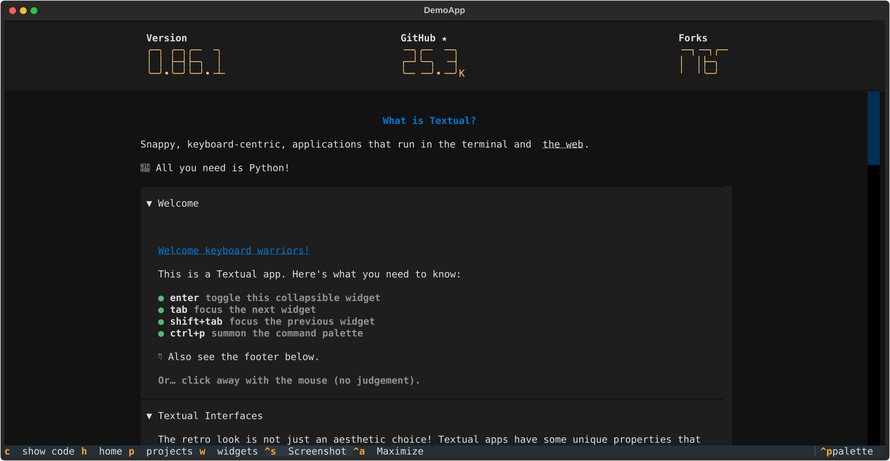

因为Textual还在活跃开发中，版本发布比较频繁，可以使用`pdm update textual textual-serve textual-dev`（PDM）或者`pip install -U textual textual-serve textual-dev`（pip）来更新包，确保问题及时修复，可以使用最新的功能。

## 2 入门基础

### 2.1 认识Textual

[Textual](https://textual.textualize.io/)，一款颇具Web风格的TUI框架。这是在系统性看完Textual这个框架的教程之后，留下的第一印象。

在正式开始Textual的学习之前，有必要讲一讲Textual的设计哲学。在《NiceGUI的中文入门教程》中，介绍了图形界面的三个基本概念——控件、布局和交互。但这些对于简陋的TUI来说，想要实现同等的效果，需要付出更多的代码成本。C语言的ncurses太过底层，需要自己完全实现组件、交互。可以使用脚本调用的whiptail，虽然提供了不少组件，但是纯向导式交互，也不支持直接点击操作，用途有限。尽管dialog在whiptail基础上支持点击，但也是‌因循守旧‌，并没有青出于蓝的表现。

因此，Textual借助Python的易学性，结合了Web中CSS样式的灵活美观，创新性地设计出基于CSS样式设计TUI程序的方式。当然，GUI中的组件和交互也没有落下。只不过受限于终端的表现形式，动画、色彩、布局等表现只能算差强人意，并不能做到媲美。

### 2.2 基础知识

本节主要内容源于官网的[guide页](https://textual.textualize.io/guide/)。

#### 2.2.1 Hello World

正如编程语言的学习始于输出“Hello World!”，先看一下Textual程序的“Hello World!”代码是什么样子：

```python3
from textual.app import App
from textual.widgets import Static

class MyApp(App):
    def compose(self):
        yield Static('Hello World!')

if __name__ == '__main__':
    app = MyApp()
    app.run()
```

将代码保存到名为`myapp.py`的文件，点击运行或者在终端中使用`python myapp.py`命令运行，可以看到终端显示下面的内容：

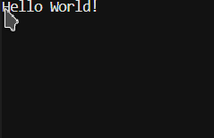

上面的代码可以在终端输出一句话，只不过，这句话不同于直接在终端回显的文字，这句话是显示在Textual程序中的静态文本。

如果需要退出的话，按下`ctrl`+`c`，即可退出。

注意，Textual在1.0.0版本修改`ctrl`+`c`快捷键为复制功能，默认的退出快捷键变成了`ctrl`+`q`。而`ctrl`+`q`在VSCode中会启动`workbench.action.quickOpenView`，因此，需要修改此命令的快捷键为其他按键，或者启用`terminal.integrated.sendKeybindingsToShell`；也可以在`terminal.integrated.commandsToSkipShell`中添加`-workbench.action.quickOpenView`（注意前面有个减号，推荐此方法，影响最小）。但是，如果使用下节介绍的开发者工具运行Textual程序，退出快捷键依然是`ctrl`+`c`。

在VSCode 1.98.0中，新版本由于默认使用了与Windows捆绑的实验性`conpty.dll`（版本号1.22.2502.4002），将导致集成终端不再接收鼠标响应，需要添加如下配置项`"terminal.integrated.windowsUseConptyDll": true`，使用VSCode附带的`conpty.dll`（版本号1.20.2406.26001）。

需要注意的是，因为pdm初始化项目会产生`src\{项目名}`目录，标准操作是将源代码放到该目录下，而VSCode的打开终端只是到项目根目录，通过命令行运行的话，需要cd到`src\{项目名}`目录，即源代码文件的同级目录，后续的命令行操作之前皆需要执行此操作，就不再赘述，读者实操之前请不要忘了这一步。

相比于NiceGUI最短三行的“Hello World!”，Textual的代码显得臃肿不少，结构上也复杂得多。不过不用担心，这里只是简单看一下Textual程序的代码和运行效果，不需要细究每一行代码的作用，在学习Textual代码的作用之前，还需要学习一些代码之外的知识。

#### 2.2.2 开发者工具

前面环境准备中安装了`textual-dev`之后，可以在终端执行`textual`得到一系列输出，此工具就是本节要介绍的开发者工具，完整介绍可以参考[官网文档](https://textual.textualize.io/guide/devtools/)。

##### 2.2.2.1 `run`命令

运行Textual程序有千百种姿势，前面介绍了Textual程序的“Hello World!”代码，采用的运行方式是直接运行，本质上就是`python main.py`这种直接运行Python源代码文件的常规方法。但是，Textual的开发者工具`textual`的`run`命令也可以运行Textual程序。

最常规的方法：

```shell
textual run myapp.py
```

此方法等同于`python myapp.py`，后面直接跟可运行的Python源代码文件。

`run`命令还支持运行模块中的`App`类或者实例。想要测试这种运行方法的话，需要对前面的Textual程序的“Hello World!”代码做一点小小的改动。

改动后的代码如下：

```python3
from textual.app import App
from textual.widgets import Static

class MyApp(App):
    def compose(self):
        yield Static('Hello World!')

app = MyApp()
```

改动后的代码将`app = MyApp()`移动到最左端的缩进，同时去掉了对`__name__ == '__main__'`的判断和`app.run()`，这就意味着，该Python源代码文件在当作模块导入（`from . import myapp`）时，不会运行`app.run()`，同时可以导入`app`和`MyApp`这两个模块的成员。

接下来，新建文件夹`test`，将`myapp.py`放到`test`文件夹，并在文件夹中创建空白的`__init__.py`文件，用于表明test是个包。那么，将得到以下文件结构：

```shell
test
├─__init__.py
└─myapp.py
```

执行以下命令，将看到熟悉的输出：

```shell
textual run test.myapp
```


聪明的读者肯定想到，前面的`myapp.py`既可以直接运行，也可以当做模块导入。这里很复杂的操作只为构建一个包，如果不做包，直接执行模块文件，行不行？

当然可以，假如当前目录下的`myapp.py`是前面改动后的代码，下面的命令可以运行单文件模块：

```shell
textual run myapp
```

不过很可惜，上面的命令并不能成功，它只得到以下输出：

```shell
Unable to import 'app' from module 'myapp'
```

因为当前目录下的`myapp.py`是最开始的Textual程序的“Hello World!”代码，当做模块导入的话，没有`app`这个成员，只有`MyApp`这个成员，因此默认不能执行。想要成功执行的话，要么像上面的改动一样，添加`app = MyApp()`到最左端的缩进，要么就用下面的命令指定`App`类的继承类来执行：

```shell
textual run myapp:MyApp
```

然后，就能看到熟悉的输出：


当然，上面费劲构建出来的包也支持指定继承类来执行：

```shell
textual run test.myapp:MyApp
```

`run`命令还支持一些额外的选项，进而解锁Textual程序的其他能力。

`run`命令加上`--dev`选项，可以开启调试模式，能让Textual程序的样式修改可以实时生效，也能将Textual程序的终端输出和日志消息输出到console（提前在另一个终端中运行`textual console`可以开启console界面）中。关于样式和console，后面会介绍到，这里只需记住`--dev`选项是一个方便的调试选项即可。示例如下：

```shell
textual run --dev myapp.py
```

`run`命令还支持`-c`选项，与Python的`-c`选项可以执行Python代码字符串类似，此选项后可以跟任意可通过“运行”执行的命令，比如`notepad`。字符串或者直接裸命令都可以。示例如下：

```shell
textual run -c notepad
textual run -c 'notepad'
```

当然，使用`-c`选项也可以执行运行Textual程序的命令，不过，嵌套在`run`命令下执行原本可以运行Textual程序的命令，就有点多此一举。示例如下：

```shell
textual run -c python myapp.py
```

注意，某些命令（如`dir`、`ls`）不是可以通过“运行”执行的可执行文件，而是终端或者shell提供的内建命令，则无法使用`-c`选项执行。

此外，部分命令（如`python`、`textual`）也支持`-c`选项的话，不能重复添加`-c`选项到裸命令后来让被执行的命令接收，只能使用字符串的形式间接让被执行的命令接收。比如：

```shell
textual run -c python -c "print('abc')"
# 上面的命令会报错，被执行命令的-c选项会被`textual`接收，进而把print('abc')传递给终端
# 可以把被执行命令的-c选项连同被执行命令，一起放到字符串内，如下面所示
textual run -c 'python -c "print(''abc'')" '
```

至此，在终端运行textual程序的所有方法都解锁完毕，最后用一个表格总结一下`run`命令的用法：

| 命令行示例                                                   | 运行目标                                                     | 命令说明                                                     |
| ------------------------------------------------------------ | ------------------------------------------------------------ | ------------------------------------------------------------ |
| `textual run myapp.py`                                       | Python源代码。                                               | 和`python myapp.py`一样。                                    |
| `textual run myapp`<br>`textual run test.myapp`              | 包的模块文件或者单模块文件的`app`成员                        | `app`必须是`App`类（来自`textual.app`）的子类的实例，<br>并且在可以从模块中导出。 |
| `textual run myapp:MyApp`<br/>`textual run test.myapp:MyApp` | 包的模块文件或者单模块文件的指定类。                         | 指定的类必须是`App`类（来自`textual.app`）的子类，<br/>并且在可以从模块中导出。 |
| `textual run --dev myapp.py`<br>`textual run --dev myapp`    | Python源代码，<br>包的模块文件或者单模块文件的`app`成员，<br>包的模块文件或者单模块文件的指定类。 | 开启调试模式，<br>样式修改可以实时生效，<br>终端输出和日志消息会输出到console。 |
| `textual run -c notepad`<br/>`textual run -c 'notepad'`<br>`textual run -c python myapp.py`<br>`textual run -c 'python -c "print(''abc'')" '` | 可在终端运行的可执行程序名，<br>基于上一目标添加的、不包括`-c`、`--dev`的选项和参数，<br>使用字符串表示的上面两种目标。 | 如果想给被运行的命令传入`-c`、`--dev`选项，<br>必须用字符串表示运行目标。 |

`run`命令支持的参数和用法还有很多，不过在前期基础学习阶段用不上，这里就不引入了。等到后面需要使用时再扩展这部分内容。

##### 2.2.2.2 `serve`命令

前言中介绍过，Textual程序可以在浏览器中运行，这话并不是说Textual是一个WebUI框架。起码从它在浏览器中运行的表现来看，Textual不同于常规的WebUI框架。Textual程序在浏览器中运行，更像是在浏览器中模拟出一个终端，让程序在正常终端中的输出，全部在浏览器中原样呈现。

环境准备中提到，`textual-serve`是一个让Textual程序在网页中运行的扩展包，后续可以基于此扩展包，编写出将普通Textual程序转化为网页的Python脚本。在正式学习`textual-serve`之前，读者可以使用`textual`的`serve`命令，快捷运行Textual程序，让其呈现在浏览器中。

以下面的命令为例：

```shell
textual serve myapp.py
```

执行命令之后，可以看到终端有如下输出：

```shelll
___ ____ _  _ ___ _  _ ____ _       ____ ____ ____ _  _ ____ 
 |  |___  \/   |  |  | |__| |    __ [__  |___ |__/ |  | |___ 
 |  |___ _/\_  |  |__| |  | |___    ___] |___ |  \  \/  |___ v1.1.1

Serving 'python myapp.py' on http://localhost:8000

Press Ctrl+C to quit
```

在浏览器中访问`http://localhost:8000`，即可看到网页运行的效果：

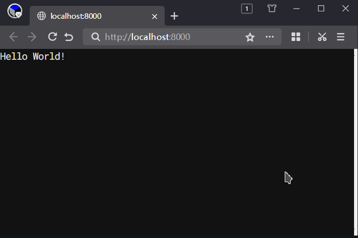

`serve`命令不仅支持所有`run`命令的格式，还比`run`命令支持更多功能。

首先，`serve`命令默认支持等同于`-c`选项的参数。尽管`serve`命令可以通过添加`-c`选项实现和`run`命令一样的效果，但`serve`命令依旧可以不使用该选项的情况下，直接支持`-c`选项的参数。比如，上面的示例就可以变成下面这种格式：

```shell
textual serve python myapp.py
```

需要特别注意的是，`serve`命令本质上是将Textual程序在终端的输出传递给`textual-serve`扩展包，让其在浏览器中显示。因此，`serve`命令运行`-c`选项的参数必须输出的是Textual程序，这一点与`run`命令不同：

```shell
textual serve 'python myapp.py'
```

`serve`命令支持的参数和用法还有很多，不过在前期基础学习阶段用不上，这里就不引入了。等到后面需要使用时再扩展这部分内容。

#### 2.2.3 Textual程序的基本概念

前面讲了一堆Textual程序之外的命令，这一节重点讲一下Textual程序本身。

##### 2.2.3.1 `App`类

以下面的代码为例，了解一下Textual程序的基本结构：

```python3
from textual.app import App
from textual.widgets import Static

class MyApp(App):
    def compose(self):
        yield Static('Hello World!')

if __name__ == '__main__':
    app = MyApp()
    app.run()
```

`textual.app`中的`App`类，是一个预先定义好的模板类，开发者可以通过继承此类，快速实现一个可以实例化的标准Textual程序中的`App`子类。一般来说，Textual程序，就是调用`App`类或者其子类的实例的`run`方法，来让消息循环占据终端的输入输出，显示出预先设计的界面。因此，代码中必须要有类的实例化和调用`run`方法的过程。当然，如果是采用其他方法运行，比如`textual run myapp`或者`textual run myapp:MyApp`，`textual`命令会自动寻找模块中名为`app`的实例来调用其`run`方法，或者基于提供的子类类名，自动完成实例化和调用`run`方法的过程。

代码中的`__name__ == "__main__"`条件判断，是针对该文件不是当做模块调用，而是直接运行时的选择，因为`app.run()`在导入时被运行的话，会导致程序进入Textual的消息循环，无法正常导入其成员。当然，导入一般是导入类或者方法，`app = MyApp()`这句是实例化一个对象，一般不会当做导入的成员，自然需要放到判断分支内。

关于`App`类，还有两点需要补充，以下面的代码为例：

```python3
from textual.app import App
from textual.widgets import Static

class MyApp(App):
    def __init__(self,*args,**kwargs):
        super().__init__(*args,**kwargs)
        self.ansi_color = False
    def compose(self):
        yield Static('Hello World!')

if __name__ == '__main__':
    app = MyApp()
    app.run(inline=False)
```

代码中，在初始化方法中设置了一个属性`ansi_color`的值为`False`（默认值），在run方法中设置了一个参数`inline`的值为`False`（默认值）。

其中，`ansi_color`表示Textual程序是否启用终端的ansi颜色的转义序列。表示的是，如果终端支持颜色主题切换，Textual程序的默认颜色就会随终端主题走，而不是替换为Textual自己设定的默认颜色。此颜色仅指没有经过样式、主题指定的显示颜色，如果颜色被指定，则不受影响。

`ansi_color`的值为`False`时终端的显示效果：

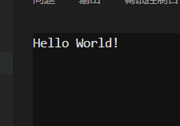

`ansi_color`的值为`True`时终端的显示效果：

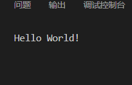

可以看到，当启用ansi颜色，原本与终端背景颜色略有区别的黑色，变成了与终端背景一样的黑色。

`inline`参数表示是否启用Textual程序的行内模式。一般的，此参数不设置为`True`的话，Textual程序会以应用模式运行，Textual程序的界面会占据终端全部的显示区域。如果此参数设置为`True`，则Textual程序会以行内模式运行，程序界面显示为固定大小，甚至能看到程序上面显示着之前输入的命令。

注意，行内模式目前不支持Windows的终端，下面的演示截图来自Linux的终端。

还是上面提供的代码，在只修改`inline`参数为`True`的情况下，效果如图：

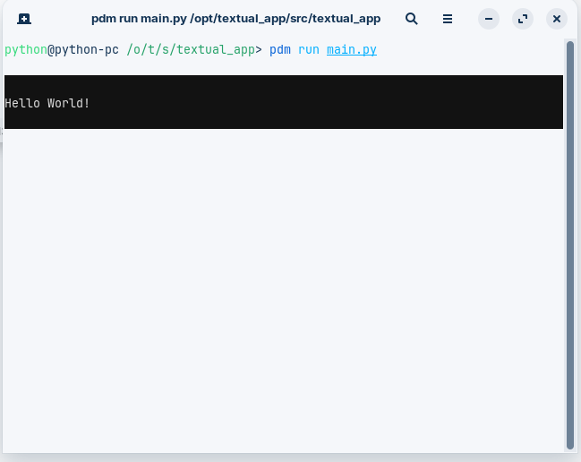

##### 2.2.3.2 事件

Textual有一套自己的事件响应系统（[官网文档](https://textual.textualize.io/events/)），它可以响应键盘按键、鼠标按键、组件状态变化等事件。事件的响应方法是一系列以'on\_'为前缀的方法，比如下面代码中的`on_mount`和`on_key`，就是响应程序加载和键盘按键的方法。

```python3
from textual.app import App
from textual import events

class EventApp(App):
    COLORS = [
        'white',
        'maroon',
        'red',
        'purple',
        'fuchsia',
        'olive',
        'yellow',
        'navy',
        'teal',
        'aqua',
    ]
    def on_mount(self) -> None:
        self.screen.styles.background = 'darkblue'
    def on_key(self, event: events.Key) -> None:
        if event.key.isdecimal():
            self.screen.styles.background = self.COLORS[int(event.key)]

if __name__ == '__main__':
    app = EventApp()
    app.run()
```

运行上面代码，可以看到终端显示如下：

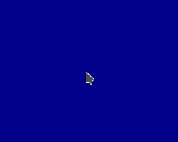

这是因为响应程序加载的`on_mount`方法中，将`self.screen.styles.background`（主屏幕背景色）设置为"darkblue"，表示程序加载完成时的背景色。如果按下数字键0-9中的任意数字，可以看到背景色会随着按键的按下而变化。这是因为响应键盘按键的`on_key`方法中，会基于事件中按键的值，到`COLORS`这个预先定义了一系列颜色名字的列表中取值，赋给`self.screen.styles.background`（主屏幕背景色），让背景颜色随之变化。

当然，读者并不需要细究到底有多少事件响应方法，也不需要细究背景色支持哪些名字，只需要记住'on\_'为前缀的方法是Textual的事件响应方法。至于具体用法，将会在后面用到时细讲，同时也可以查阅官网文档手册，这里只是介绍一下事件系统。

##### 2.2.3.3 组件

组件，在其他UI框架中也可以称之为控件，是用户界面上重要的组成部分。组件是一个或者一组预先定义好的内容，可以在终端中（在Textual中称之为当前屏幕）显示出来，用来构成用户界面。和其他UI框架中的控件类似，Textual的组件包括静态文本（之前代码中的`Static`）、按钮、输入框等官方实现的组件，方便开发者组合定义自己想要的组件。

想必聪明的读者在学习前面的代码时已经注意到，`MyApp`类中除了介绍过的'on\_'开头的事件响应方法，还包含着一个名为`compose`的方法，需要显示的静态文本就放在这个方法内。

没错，不同于其他框架（比如之前学习的NiceGUI）调用控件代码就会直接显示控件，Textual显示控件的方法，有点类似使用布局定义好控件之后，统一调用显示方法来显示控件。在Textual中，这个统一的显示方法，就是`App`子类中的`compose`方法。在`compose`方法中，使用`yield`关键字（类似`return`）返回要显示的组件，使`compose`方法变成一个生成器，Textual框架就会将`compose`方法中返回的组件显示到终端中。不同于`return`只能返回一次，多次使用`yield`可以返回多个组件，这样的话，终端上可以显示多个组件。

在`compose`方法中定义需要显示的组件是简单好用的方法，一般推荐读者这样操作。但是，在此方法中显示组件是随着Textual程序运行一同进行的，如果需要在执行交互之后才显示组件，那就要用到`App`类的`mount`方法。调用此方法，并给此方法传入组件，即可在需要的时候显示组件。

以下面的代码为例，对比一下两种显示组件的方法。代码中，`compose`方法使用了两次`yield`，使得终端里可以显示两个静态文本。因为这里没有设置控件的布局，因此第二个静态文本`'Please input:'`是以默认的垂直布局——相当于终端的换行显示，显示在第一个静态文本之后。

在`on_key`方法中，当按键为数字键时，通过调用`self.mount`方法，并传入静态文本控件，可以实现基于按键操作显示新的静态文本。

代码和效果图如下：

```python3
from textual.app import App
from textual.widgets import Static

class MyApp(App):
    def compose(self):
        yield Static('Hello World!')
        yield Static('Please input:')
    def on_key(self, event):
        if event.key.isdecimal():
            self.mount( Static(f'Hello {event.key}!') )

if __name__ == '__main__':
    app = MyApp()
    app.run()
```

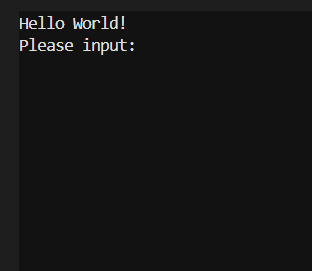

##### 2.2.3.4 退出

退出程序的方法，不止`ctrl`+`c`。

一开始介绍Textual的代码时，只说了退出程序使用组合键`ctrl`+`c`。其实，这样说没错，一般运行终端命令，想要强制结束程序的时候，就是使用这个组合键。但是，如果细细思考，这个说法似乎有问题。组合键是强制结束时候使用，正常结束的话，有没有编程执行的结束方法？总不能模拟组合键吧？如果想要添加个退出按钮呢？该如何让按钮执行退出操作？

上面几个问题的答案，就在下面的代码中。当然，代码中涉及到后面才会讲到的知识点，这里不会细讲，本节只讲`self.exit()`这种退出方法。如果读者有兴趣并且学有余力，可以自行对照官网文档学习。若是读者不着急，可以期待后面相关的章节中，再次回顾这里的代码，那时会细讲一次。

```python3
from textual.app import App
from textual.widgets import Static,Button

class MyApp(App):
    def compose(self):
        yield Static('Hello World!')
        yield Static('Press q or click buttons to quit:')
        yield Button('Exit',action='app.exit_app()')
        yield Button('Quit',action='app.quit()')
    def on_key(self, event):
        if event.key == 'q':
            self.exit()
    def action_exit_app(self):
        self.exit()

if __name__ == '__main__':
    app = MyApp()
    app.run()
```

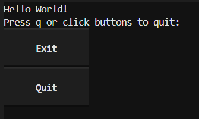

代码实现了三种退出程序的方法，其中，使用点击按钮的方法是后面的知识点，这里仅供读者体验，不要求掌握，暂时也不细讲。此外，还有一种方法，就是结合前面讲过的事件，在响应按键的方法中，通过识别当前按键是不是`q`键，来决定是否执行`self.exit()`。其中，`self`就是后面实例化的`App`子类，也就是子类的实例。该实例有`exit`方法，调用此方法就可以退出Textual程序。

##### 2.2.3.5 CSS

前面提到过Textual支持CSS样式，可教程直到现在，用于演示的代码既没有布局设计，也没有一点CSS美化的痕迹，不写一个相关示例来展示一下，读者恐怕要失去对Textual的兴趣了。

别急，示例这就来了。虽然Textual的CSS样式不是标准Web的CSS，但是语法类似，如果有NiceGUI入门教程的基础，哪怕直接上手Textual的CSS，也没什么难度。

就以上一节的代码为例，通过设置CSS样式，让界面变得好看一些。

以下是程序要用的CSS样式代码。在上面的`myapp.py`文件同目录下创建`myapp.tcss`，将代码存到文件中。

```css
Screen {
    layout: grid;
    grid-size: 2;
    grid-gutter: 2;
    padding: 2;
}
Static {
    width: 100%;
    height: 100%;
    column-span: 2;
    content-align: center bottom;
    text-style: bold;
}
Button {
    width: 100%;
}
```

将`myapp.py`文件内容修改如下，主要是添加`CSS_PATH = 'myapp.tcss'`。

```python3
from textual.app import App
from textual.widgets import Static,Button

class MyApp(App):
    CSS_PATH = 'myapp.tcss'
    def compose(self):
        yield Static('Hello World!')
        yield Static('Press q or click buttons to quit:')
        yield Button('Exit',action='app.exit_app()')
        yield Button('Quit',action='app.quit()')
    def on_key(self, event):
        if event.key == 'q':
            self.exit()
    def action_exit_app(self):
        self.exit()

if __name__ == '__main__':
    app = MyApp()
    app.run()
```

运行代码，即可看到效果如图：

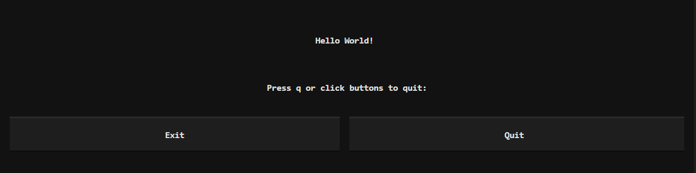

给类设置`CSS_PATH`的值为tcss文件的路径，即可给该`App`子类的组件设置样式。具体的样式用法会在后面的样式章节专门讲，这里只是介绍一下应用样式的方法。值得注意的是，这里的样式文件使用'.tcss'为扩展名，并不是说一定要用这个扩展名才行。这里是为了与Web中的CSS文件区分，不使用常规的'.css'为扩展名，而是采用了含义为TextualCSS的'.tcss'。当然，如果读者有其他偏好，使用其他扩展名也可以。不过，如果想要使用官方提供的[CSS语法高亮扩展](https://marketplace.visualstudio.com/items?itemName=Textualize.textual-syntax-highlighter)，最好使用'.tcss'后缀，否则只能手动选择语法高亮方案为TextualCSS。VSCode用户可以安装此扩展，在打开tcss文件之后看到对应的语法高亮。

采用单独文件保存样式的话，如果是用调试模式运行程序，在样式文件中修改样式，修改效果会实时显示到终端中。

如果不太喜欢这种将样式放到单独文件中的形式，可以参考下面的代码，给类设置`CSS`的值为完整的样式内容，即可将样式嵌入到Python源代码中。

需要注意的是，为了样式美观，代码中的样式采用缩进形式换行，因此使用的是三引号的多行文本。在实际使用过程中，样式可以去掉换行，成为一行内容，那就可以只用单引号的字符串。

另外，将样式嵌入到Python源代码中，会使样式实时显示修改的功能失效，这也算有得有失吧。

```python3
from textual.app import App
from textual.widgets import Static,Button

class MyApp(App):
    CSS = '''
    Screen {
        layout: grid;
        grid-size: 2;
        grid-gutter: 2;
        padding: 2;
    }
    Static {
        width: 100%;
        height: 100%;
        column-span: 2;
        content-align: center bottom;
        text-style: bold;
    }
    Button {
        width: 100%;
    }
    '''
    def compose(self):
        yield Static('Hello World!')
        yield Static('Press q or click buttons to quit:')
        yield Button('Exit',action='app.exit_app()')
        yield Button('Quit',action='app.quit()')
    def on_key(self, event):
        if event.key == 'q':
            self.exit()
    def action_exit_app(self):
        self.exit()

if __name__ == '__main__':
    app = MyApp()
    app.run()
```

##### 2.2.3.6 标题与副标题

Textual的类除了`CSS_PATH`和`CSS`这两个设置样式的属性之外，还有`TITLE`和`SUB_TITLE`这两个属性，分别表示程序的标题和副标题。为了显示标题和副标题，需要添加`Header`标题栏。代码如下：

```python3
from textual.app import App
from textual.widgets import Static,Button,Header

class MyApp(App):
    TITLE = 'MyApp'
    SUB_TITLE = 'Best App'
    def compose(self):
        yield Header()
        yield Static('Hello World!')

if __name__ == '__main__':
    app = MyApp()
    app.run()
```

显示效果如图：

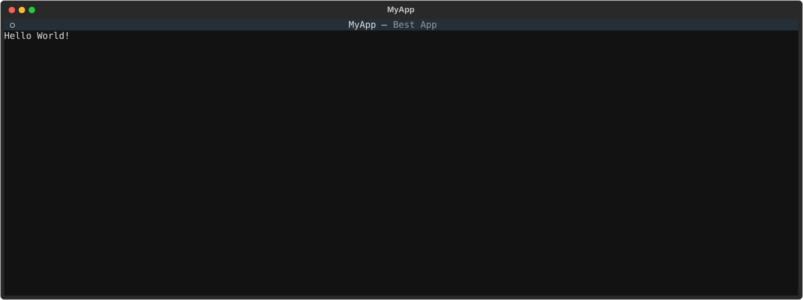

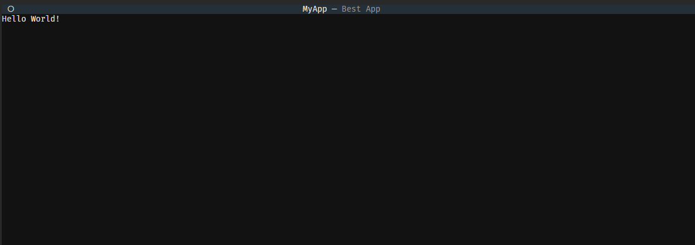

当然，这两个是类属性，如果想在创建实例之后动态修改，就不能使用这两个纯大写的属性，而是使用纯小写的属性代替。参考下面的代码，代码中没有在类中设置标题和副标题，而是在`App`子类实例化之后，使用实例的属性设置标题和副标题，这样得到的显示效果和上图一样。此外，此操作方法也可用于事件的响应代码中，实现动态修改标题和副标题。在代码中，通过判断按键是数字还是字母，来将标题修改为数字，将副标题修改为字母。

```python3
from textual.app import App
from textual.widgets import Static,Button,Header

class MyApp(App):
    def compose(self):
        yield Header()
        yield Static('Hello World!')
    def on_key(self, event):
        if event.key.isdecimal():
            self.title = event.key
        if event.key.isalpha():
            self.sub_title = event.key

if __name__ == '__main__':
    app = MyApp()
    app.title = 'MyApp'
    app.sub_title = 'Best App'
    app.run()
```

#### 2.2.4 样式

##### 2.2.4.1 样式接口

上一节中，介绍了Textual程序的基本组成和用法，那些是后续开发中常用的功能。其中，CSS这一节还介绍了加载CSS文件样式的两种方法。不过，在正式学习Textual的CSS语法之前，还有必要介绍一个应用样式的接口。相比于记住语法规则和编写完整的CSS文件，直接使用组件的接口设置组件的样式，更简单快捷。

组件有一个名为`styles`的属性，该属性代表组件的样式接口。通过调用此属性下的子属性，可以快速设置对应属性代表的样式。

下面的代码展示了如何使用此接口设置`screen`（一个代表当前屏幕的特殊组件，屏幕的用法和更多知识后面会细讲）和普通组件静态文本的样式，修改它们的颜色和其他样式。

```python3
from textual.app import App
from textual.widgets import Static

class MyApp(App):
    def compose(self):
        text = Static('Hello World!')
        text.styles.color = 'red'
        yield text
    def on_mount(self):
        self.screen.styles.background = 'darkblue'
        self.screen.styles.border = ('heavy', 'white')

if __name__ == '__main__':
    app = MyApp()
    app.run()
```

效果如图：

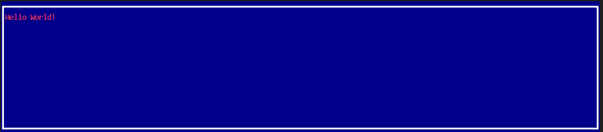

代码中，`text.styles.color = 'red'`是设置静态文本的颜色为红色，对于文本而言，颜色（更多用法参考[官网文档](https://textual.textualize.io/styles/color/)）就是指文字的颜色，如果是其他具有前景颜色属性的组件，则颜色表示前景色。`self.screen.styles.background = 'darkblue'`是把当前屏幕的背景色（更多用法参考[官网文档](https://textual.textualize.io/styles/background/)）设置为深蓝色。对于屏幕而言，其前景色表示显示在上面的、没有指定颜色的文本的颜色，而上面的静态文本已经指定颜色，这里指定颜色的优先级比上面的指定低，因此这里是设置了背景色来表明效果。此外，`self.screen.styles.border = ('heavy', 'white')`还设定了当前屏幕的边框粗细和边框颜色（更多用法参考[官网文档](https://textual.textualize.io/styles/border/)，或者看后面详细讲解的内容）。

##### 2.2.4.2 颜色

相信读者已经注意到一点，上面代码中用到的颜色都是含义通俗易懂的字符串，而不是使用十六进制数字或者三元组数字等量化表示颜色的方法。其实，Textual支持那些有点神秘的数字表示法，只是为了更易懂一些，代码中特地使用了Textual预先定义好的颜色名字。具体名字可以参考[官网文档](https://textual.textualize.io/api/color/#textual.color--named-colors)或者下图：

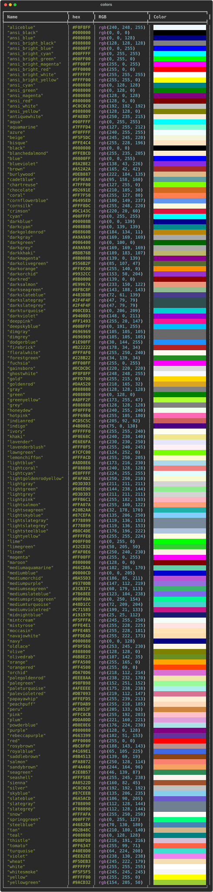

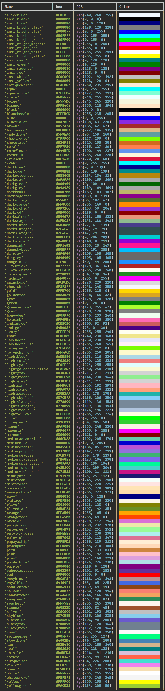

至于量化表示颜色的方法，Textual支持这几种表示方法：

-   RGB颜色，以`#`开头，六位十六进制数字，每两位代表一种颜色的分量值，依次代表红色、绿色、蓝色，例如`#ff0000`（红色）。对于代表颜色分量的两位数字一样的情况，可以简写为一位数字，那原来`#`后的六位数字就可以变成三位数字，例如前面表示红色的示例可以写成`#f00`。
-   RGB颜色，以`rgb`开头，形式类似调用函数（用来表示的字符串不能含空格，否则会报错），有三个参数，都是十进制数字（也就是上一种表达方式中的十六进制数字对应的十进制值），分别是代表红色、绿色、蓝色，例如`rgb(255,0,0)`
-   HSL颜色，以`hsl`开头，形式类似调用函数（用来表示的字符串不能含空格，否则会报错），有三个参数，分别是色相、饱和度、亮度。其中，色相是取值0-360的角度，饱和度和亮度是取值0%-100%的百分比，例如`hsl(0,100%,50%)`（红色）。

除了上面的颜色表达方式，`color`属性和`background`属性还接受`Color`对象作为动态的颜色。`Color`对象支持的方法和更多用法可以参考[官网文档](https://textual.textualize.io/api/color/)，这里只简单介绍一下需要用的方法。

想要使用`Color`对象，需要从`textual.color`模块中导入。使用`from textual.color import Color`导入之后，就和前面介绍的第二种RGB颜色表达方法一样，`Color`对象的实例化需要三个对应的十进制参数。

下面的代码中，使用了上面提到的五种颜色表示方法，来将静态文本的背景颜色设置为红色：

```python3
from textual.app import App
from textual.widgets import Static
from textual.color import Color

class MyApp(App):
    def compose(self):
        text = [Static('Hello World!') for _ in range(5)]
        text[0].styles.background = 'red' 
        text[1].styles.background = '#ff0000' # 或者#f00
        text[2].styles.background = 'rgb(255,0,0)'
        text[3].styles.background = 'hsl(0,100%,50%)'
        text[4].styles.background = Color(255,0,0)
        for i in text:
            yield i

if __name__ == '__main__':
    app = MyApp()
    app.run()
```

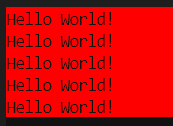

在颜色的表达方式中，除了上面提到的几种分量之外，Textual还支持另一个分量——透明度Alpha。改变颜色透明度，可以让当前颜色与其下面的颜色混合，如组件的前景和背景或者组件的背景与另一组件的背景。透明度的范围是0%到100%，0%表示该颜色完全没有，即完全透明，100%表示该颜色完全不透明， 即显示该颜色原本的样子。

Textual支持三种设置颜色透明度的方式：

-   在表达颜色的字符串中，以空格分隔的形式添加百分比表示的透明度值，例如`'red 20%'`。此方法支持通俗的颜色名称和量化表达。
-   在构建`Color`对象时，传入与百分数等值的小数给参数`a`，例如`Color(255,0,0,a=0.2)`。
-   使用`Color.parse`方法，将包含透明度的量化颜色（RGBA颜色和HSLA颜色）表达转换为Color对象，例如`Color.parse('#ff000033')`。

关于包含透明度的量化颜色方法，Textual支持这几种：

-   RGBA颜色，以`#`开头，八位十六进制数字，每两位代表一种颜色的分量值，依次代表红色、绿色、蓝色、透明度，例如`#ff000033`（红色，20%透明度）。对于代表颜色分量的两位数字一样的情况，可以简写为一位数字，那原来`#`后的八位数字就可以变成四位数字，例如前面表示红色的示例可以写成`#f003`。
-   RGBA颜色，以`rgba`开头，形式类似调用函数（用来表示的字符串不能含空格，否则会报错），有四个参数，都是十进制数字（也就是上一种表达方式中的十六进制数字对应的十进制值），最后一个是小数，分别是代表红色、绿色、蓝色、透明度，例如`rgb(255,0,0,0.2)`
-   HSLA颜色，以`hsla`开头，形式类似调用函数（用来表示的字符串不能含空格，否则会报错），有四个参数，分别是色相、饱和度、亮度、透明度。其中，色相是取值0-360的角度，饱和度和亮度是取值0%-100%的百分比，透明度是小数，例如`hsl(0,100%,50%,0.2)`（红色，20%透明度）。

下面的代码中，使用了上面提到的三种设置透明度的形式，共七个示例，来将静态文本的背景颜色设置为20%透明度红色：

```python3
from textual.app import App
from textual.widgets import Static
from textual.color import Color

class MyApp(App):
    def compose(self):
        text = [Static('Hello World!') for _ in range(7)]
        text[0].styles.background = 'red 20%' # 常规颜色表达加空格，后接表示透明度的百分数
        text[1].styles.background = 'rgb(255,0,0) 20%' # 使用量化的颜色表达也可以
        text[2].styles.background = Color(255,0,0,a=0.2) # 可以在构建Color对象时传入Alpha的值
        text[3].styles.background = Color.parse('#ff000033') # 也可以使用Color.parse解析含透明度的颜色表达，rgba或者hsla
        text[4].styles.background = Color.parse('#f003') # #开头的rgba表达同样支持长度变成一半的短格式，等同于#ff000033
        text[5].styles.background = Color.parse('rgba(255,0,0,0.2)') # 类似函数调用的表达，第四个参数是Alpha值，是小数而不是百分数
        text[6].styles.background = Color.parse('hsla(0,100%,50%,0.2)') # 对于hsla来说，Alpha值一样是小数，不要和前面的百分数混淆
        for i in text:
            yield i

if __name__ == '__main__':
    app = MyApp()
    app.run()
```

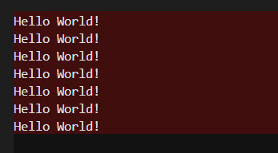

##### 2.2.4.3 盒子模型

如果有CSS基础的话，就能轻易想象到CSS中的盒子模型。没有基础也没关系，这里会再讲一遍。

Textual组件通常占据一个矩形区域，就像一个盒子一样。这个盒子最小可以到一个字符大小，最大可以到整个屏幕。当然，如果样式中启用了[滚动](https://textual.textualize.io/styles/overflow/)，还能更大。

对于组件这个盒子而言，以下几种相关的样式会影响到组件的大小表现：

-   [宽度（`width`）](https://textual.textualize.io/styles/width/)和[高度（`height`）](https://textual.textualize.io/styles/height/)决定了组件的显示大小。
-   [内边距（`padding`）](https://textual.textualize.io/styles/padding/)决定了组件内包含的内容（如文字或者其他组件）到组件可视边界的距离。
-   [边框（`border`）](https://textual.textualize.io/styles/border/)则让组件的可视边界变得突出，边框可以设置样式和粗细，内边距则是在边框粗细的基础上计算距离。

其实，除了上面几个与组件显著相关的尺寸样式之外，[外边距（`margin`）](https://textual.textualize.io/styles/margin/)也是属于组件的尺寸样式，只不过外边距不会影响组件的大小和内容表现，只会在与其他组件一起参与布局时，表现为其他组件距离组件可视边界的远近。

具体几个尺寸样式的关系，下图表现得很直观：

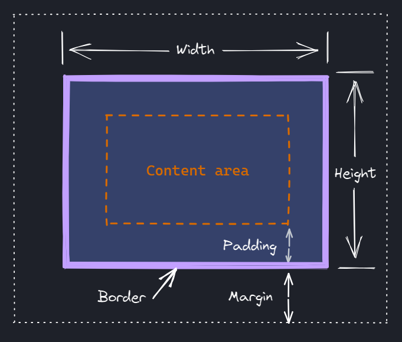

##### 2.2.4.4 宽度、高度和比例单位

设置组件的宽度（`width`）会限制组件的所使用的列数，设置组件的高度（`height`）会限制组件的所使用的行数。以下面的代码为例，在设置了宽度为30、高度为10之后（紫色区域的大小即组件的宽度和高度），原本多行的内容会被限制在很小的区域内，宽度小于内容宽度会导致内容换行，高度小于内容高度会导致超过指定高度的内容被裁剪，不会完整显示。

```python3
from textual.app import App
from textual.widgets import Static

TEXT = '''The Zen of Python, by Tim Peters

Beautiful is better than ugly.
Explicit is better than implicit.
Simple is better than complex.
Complex is better than complicated.
Flat is better than nested.
Sparse is better than dense.
Readability counts.
Special cases aren't special enough to break the rules.
Although practicality beats purity.
Errors should never pass silently.
Unless explicitly silenced.
In the face of ambiguity, refuse the temptation to guess.
There should be one-- and preferably only one --obvious way to do it.
Although that way may not be obvious at first unless you're Dutch.
Now is better than never.
Although never is often better than *right* now.
If the implementation is hard to explain, it's a bad idea.
If the implementation is easy to explain, it may be a good idea.
Namespaces are one honking great idea -- let's do more of those!'''


class MyApp(App):
    def compose(self):
        self.widget = Static(TEXT)
        yield self.widget

    def on_mount(self) -> None:
        self.widget.styles.background = 'purple'
        self.widget.styles.width = 30
        self.widget.styles.height = 10

if __name__ == '__main__':
    app = MyApp()
    app.run()
```

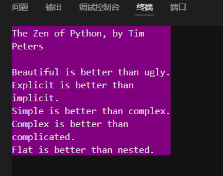

但是，更多时候需要设置组件的宽度为固定值，而让高度随内容变化。这时，可以设置高度为`'auto'`，这样的话，高度就会基于内容多少而变化，始终确保全部内容显示出来，代码如下：

```python3
from textual.app import App
from textual.widgets import Static

TEXT = '''The Zen of Python, by Tim Peters

Beautiful is better than ugly.
Explicit is better than implicit.
Simple is better than complex.
Complex is better than complicated.
Flat is better than nested.
Sparse is better than dense.
Readability counts.
Special cases aren't special enough to break the rules.
Although practicality beats purity.
Errors should never pass silently.
Unless explicitly silenced.
In the face of ambiguity, refuse the temptation to guess.
There should be one-- and preferably only one --obvious way to do it.
Although that way may not be obvious at first unless you're Dutch.
Now is better than never.
Although never is often better than *right* now.
If the implementation is hard to explain, it's a bad idea.
If the implementation is easy to explain, it may be a good idea.
Namespaces are one honking great idea -- let's do more of those!'''


class MyApp(App):
    def compose(self):
        self.widget = Static(TEXT)
        yield self.widget

    def on_mount(self) -> None:
        self.widget.styles.background = 'purple'
        self.widget.styles.width = 30
        self.widget.styles.height = 'auto'

if __name__ == '__main__':
    app = MyApp()
    app.run()
```

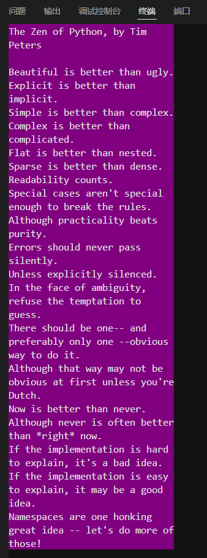

除了设置为固定值和基于内容变化的自动，Textual还支持以下几种基于屏幕或者容器的比例单位：

-   `%`为后缀、前面是数字表示百分比的字符串，代表组件的宽度或者高度是容器的百分之多少，例如`'50%'`。
-   `vw`和`vh`为后缀、前面是数字表示百分比的字符串，代表组件的宽度或者高度是可视区域（即终端）的百分之多少，`vw`表示可视区域的宽度，`vh`表示可视区域的高度，例如`'50vw'`。
-   `w`和`h`为后缀、前面是数字表示百分比的字符串，其用法与`%`后缀单位一样，只不过，`w`表示容器的宽度，`h`表示容器的高度。如果想要让宽度为容器的固定比例值，同时自身还要保持宽高比，不会随着容器的大小变化而比例变化，就可以将宽度和高度都设置为一样的单位，例如，设置宽度为`'50w'`，高度为`'150w'`。

下面的代码中，三个静态文本被放到宽度只有终端宽度一半的容器中，它们的宽度分别被设置为`'50%'`、`'50vw'`、`'50w'`。可以从动态图中看到终端尺寸变化时，三者的效果区别：

```python3
from textual.app import App
from textual.widgets import Static
from textual.containers import Container

class MyApp(App):
    def compose(self):
        self.widgets = [ Static() for _ in range(3) ]
        self.container = Container(*self.widgets)
        yield self.container

    def on_mount(self) -> None:
        self.container.styles.width = '50%'
        self.container.styles.height = 'auto'
        for widget in self.widgets:
            index = self.widgets.index(widget)
            widget.styles.height = 5
            widget.styles.background = ['purple','green','blue'][index]
            widget.styles.width = ['50%','50vw','50w'][index]
            widget.update(f'The widget\'s width is {['50%','50vw','50w'][index]}.')

if __name__ == '__main__':
    app = MyApp()
    app.run()
```

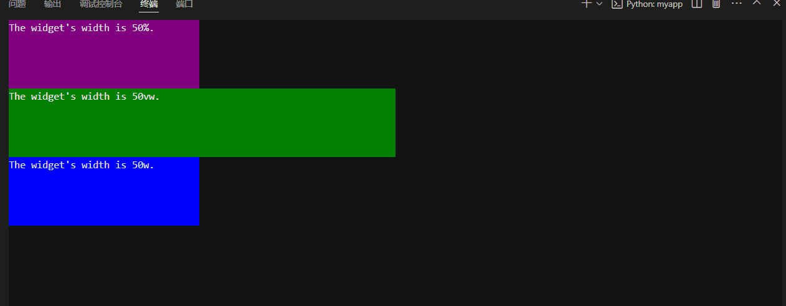

百分制的比例单位很好用，同时也带来另一个问题——如果想要让组件占据容器的三分之一，怎么写？

100的三分之一，是33.3333……好吧，想要完美的三分之一的话，几乎不可能，只能用精度比较高的小数实现，让近似值显示效果等同于三分之一。不过，还有一个单位可以完美实现此效果，那就是分数单位`fr`（即fraction），一个为解决三等分而生（也许不是）的单位。

想要完美使用分数单位，就要让使用该单位的组件在某一方向上完全占据容器。为什么要这样做呢？那就要从分数单位的特性说起。假定在一个方向上，有三个组件，每个组件的长度（对应实际就是宽度或者高度）都是`'1fr'`，那实际显示时，这个长度就会变成总长的三分之一。每个组件的长度是一份，总长是三份。实际上，分数单位的英文fr，就是单词fraction（分数）的意思。下面的代码正好展示了这个特性：

```python3
from textual.app import App
from textual.widgets import Static
from textual.containers import Container

class MyApp(App):
    def compose(self):
        self.widgets = [ Static() for _ in range(3) ]
        self.container = Container(*self.widgets)
        yield self.container

    def on_mount(self) -> None:
        self.container.styles.width = '50%'
        self.container.styles.height = 'auto'
        for widget in self.widgets:
            index = self.widgets.index(widget)
            widget.styles.width = 50
            widget.styles.background = ['purple','green','blue'][index]
            widget.styles.height = '1fr'
            widget.update('The widget\'s height is 1fr.')

if __name__ == '__main__':
    app = MyApp()
    app.run()
```

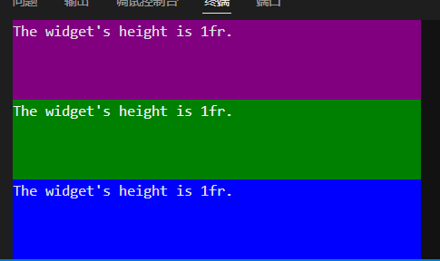

需要注意的是，读者在实际使用中可能会发现，上面几种比例单位的显示效果并不完美，应该是三分之一或者50%的组件，和同样宽高的组件差一点。这是因为终端显示单个字符必须是完整的最小宽高，不会做缩放也没法继续分割。组件的大小组成又是基于字符而来，因此，在调整终端大小的时候，会出现终端或者容器大小没法被整除，部分组件就会比同样数值的组件少一行或者一列。TUI程序受限于终端显示，这也是没有办法的。

上面用于宽度和高度的单位，也适用于组件的[最小宽度（`min_width`）](https://textual.textualize.io/styles/min_width/)、[最大宽度（`max_width`）](https://textual.textualize.io/styles/max_width/)、[最小高度（`min_height`）](https://textual.textualize.io/styles/min_height/)、[最大高度（`max_height`）](https://textual.textualize.io/styles/max_height/)。这几个属性用于设置终端大小变化时，组件显示大小的上下限。

##### 2.2.4.5 内边距

内边距（`padding`）是指组件边界距离内部内容的远近，完整的用法可以参考[官网文档](https://textual.textualize.io/styles/padding/)。

以下面的代码为例，将内边距设置为`2`之后，内容到上下左右边界的距离都是2个单位（字高或者字宽）：

```python3
from textual.app import App
from textual.widgets import Static

class MyApp(App):
    def compose(self):
        self.widget = Static()
        yield self.widget

    def on_mount(self) -> None:
        self.widget.styles.width = 30
        self.widget.styles.padding = 2
        self.widget.styles.background = 'purple'
        self.widget.update('The widget\'s padding is 2.')

if __name__ == '__main__':
    app = MyApp()
    app.run()
```

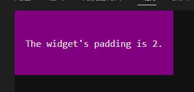

如果读者看过内边距的官网文档（实际上是样式手册），肯定很好奇，文档中写明内边距支持设置两个值或者四个值，使用样式接口实现的话，代码怎么写？

给没时间看文档的读者解释一下，上面的代码中，内边距只设置一个值，那么四个方向上的内边距就都用此值。如果想要单独定义某个方向的内边距，就要给内边距传递两个值或者四个值。两个值表示上下方向上的内边距使用第一个值，左右方向上的内边距使用第二个值；四个值表示上边的内边距使用第一个值，右边的内边距使用第二个值，下边的内边距使用第三个值，左边的内边距使用第四个值。

传递多个值给内边距，需要使用元组将多个值包起来，如`(1,2)`，具体见下面的代码示例：

```python3
from textual.app import App
from textual.widgets import Static

class MyApp(App):
    def compose(self):
        self.widget = Static()
        yield self.widget

    def on_mount(self) -> None:
        self.widget.styles.width = 30
        padding = (1,2) #上下为1，左右为2
        # (1,2,1,2)的话，就是对应上、右、下、左
        self.widget.styles.padding = padding
        self.widget.styles.background = 'purple'
        self.widget.update(f'The widget\'s padding is {padding}.')

if __name__ == '__main__':
    app = MyApp()
    app.run()
```

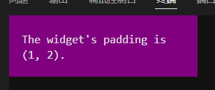

##### 2.2.4.6 边框

如盒子模型一节中的图片所示，边框（`border`）是包含在组件内、用于表示组件边界的突出性显示元素。想要设置边框的话，就要设置`styles.border`属性为一个描述边框样式、包含两个字符串的元组，如` ('heavy','yellow')`。元组的第一个元素是边框样式（更多样式参考[官网文档](https://textual.textualize.io/styles/border/#all-border-types)），元组的第二个元素是边框颜色，支持颜色名字、量化颜色表达（RGB颜色或者HSL颜色）。

不过，如果读者看了[官网文档](https://textual.textualize.io/styles/border/)，就会看到最上面介绍的用法，可能会有个疑问：页面里写着可以额外添加一个百分比数字来设置颜色透明度，但在样式接口没有这个用法，如何给样式接口中的颜色设置透明度？

接口不提供直接的方法，但可以用Alpha颜色代替，间接实现，即使用Color.parse可以识别的带透明度的颜色（RGBA颜色或者HSLA颜色），也可以直接用`Color`对象，构建时传入透明度信息。

一般的用法：

```python3
from textual.app import App
from textual.widgets import Static

class MyApp(App):
    def compose(self):
        self.widget = Static()
        yield self.widget

    def on_mount(self) -> None:
        self.widget.styles.width = 50
        border = ('heavy','yellow')
        self.widget.styles.border = border
        self.widget.styles.background = 'purple'
        self.widget.update(f'The widget\'s border is {border}.')

if __name__ == '__main__':
    app = MyApp()
    app.run()
```

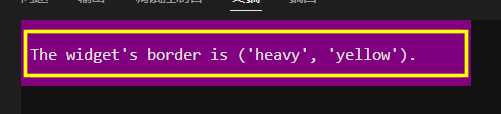

设置边框的透明度：

```python3
from textual.app import App
from textual.widgets import Static
from textual.color import Color

class MyApp(App):
    def compose(self):
        self.widget = Static()
        yield self.widget

    def on_mount(self) -> None:
        self.widget.styles.width = 50
        border = ('heavy',Color(255,255,0,a=0.5))
        self.widget.styles.border = border
        self.widget.styles.background = 'purple'
        self.widget.update(f'The widget\'s border is {border}.')

if __name__ == '__main__':
    app = MyApp()
    app.run()
```

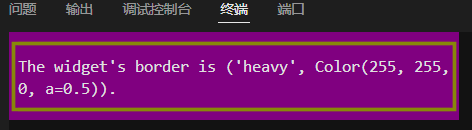

和内边距支持1个、2个、4个值类似，边框样式也支持一样的数量，并且概念相同。当值是2个时，第一个值设置的是上下边框的样式，第二个值设置的是左右边框的样式。当值是4个时，第一个值设置的是上边框的样式，第二个值设置的是右边框的样式，第三个值设置的是下边框的样式，第四个值设置的是左边框的样式。

给边框设置多个值，需要将样式元组放到列表里，如` [('heavy','yellow'),('heavy','blue')]`。

代码示例如下：

```python3
from textual.app import App
from textual.widgets import Static

class MyApp(App):
    def compose(self):
        self.widget = Static()
        yield self.widget

    def on_mount(self) -> None:
        self.widget.styles.width = 50
        border = [('heavy','yellow'),('heavy','blue')]
        # 2个表示上下、左右的样式，四个表示上、右、下、左的样式
        self.widget.styles.border = border
        self.widget.styles.background = 'purple'
        self.widget.update(f'The widget\'s border is {border}.')

if __name__ == '__main__':
    app = MyApp()
    app.run()
```

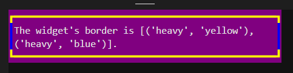

##### 2.2.4.7 边框标题和边框副标题的对齐方向

组件有两个和边框有关的属性，只有组件的边框显示（需要设置了边框的样式且不为`'hidden'`或者`'none'`）时才会显示，那就是边框标题（`border_title`）和边框副标题（`border_subtitle`）。边框标题显示在上边框上，默认在左边；设置了边框标题之后，边框就会变得和winform的分组框（GroupBox）一样，可以用来概述组件内的内容或者组件内其他组件的分类。边框副标题显示在下边框，默认在右边；边框副标题可以看作是显示在下边框上的边框标题，或者当作对边框标题的补充解释。

如果想修改边框标题或者边框副标题的对齐方向，就要设置样式接口中的边框标题对齐（`border_title_align`）或者边框副标题对齐（`border_subtitle_align`）。对齐方向支持`'left'`（向左）、`'center'`（居中）、`'right'`（向右）。

完整内容可以参考官网文档：

https://textual.textualize.io/styles/border_title_align/

https://textual.textualize.io/styles/border_subtitle_align/

下面的代码中，就是添加了边框标题和边框副标题之后，将边框标题设置为居中：

```python3
from textual.app import App
from textual.widgets import Static

class MyApp(App):
    def compose(self):
        self.widget = Static()
        yield self.widget

    def on_mount(self) -> None:
        self.widget.styles.width = 50
        border = ('heavy','yellow')
        self.widget.styles.border = border
        self.widget.styles.background = 'purple'
        self.widget.update(f'The widget\'s border is {border}.')
        self.widget.border_title = 'border_title'
        self.widget.border_subtitle = 'border_subtitle'
        self.widget.styles.border_title_align = 'center'

if __name__ == '__main__':
    app = MyApp()
    app.run()
```

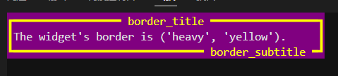

##### 2.2.4.8 轮廓

轮廓（`outline`）与边框用法相同，甚至把边框示例代码中的`border`全部替换为`outline`，都没问题。不过，真要是完全替换而不做一点修改，那绝对不行，比如下面的代码：

```python3
from textual.app import App
from textual.widgets import Static

class MyApp(App):
    def compose(self):
        self.widget = Static()
        yield self.widget

    def on_mount(self) -> None:
        self.widget.styles.width = 50
        outline = ('heavy','yellow')
        self.widget.styles.outline = outline
        self.widget.styles.background = 'purple'
        self.widget.update(
            f'''
The widget\'s outline is {outline}.
'''
        )

if __name__ == '__main__':
    app = MyApp()
    app.run()
```

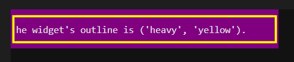

看上去只是把代码里的`border`全换成了`outline`，不过代码还是有些不同，比如：`self.widget.update`下面，原本是显示在组件内的内容，用的只是普通的f字符串，这里却变成了f多行字符串；代码执行的效果也与边框不同，倒不是说内容里的`border`变成`outline`，而是内容的开头，`'The'`变成了`'he'`。

原来，轮廓还是与边框有区别的，那就是对内容的遮挡。因为轮廓不属于组件的一部分，并不会参与组件大小的组成，加在组件上的轮廓，就像是不透明的幻灯片一样盖在组件之上，会遮挡住靠边的内容。而边框是组件的一部分，增加的边框也算组件大小的一部分。因此，增加边框之后，组件的内容会被边框挤占控件，内容会重新排版。

这也是为什么要把原来的单行字符串换成多行字符串，字符串内给内容开头和结尾都增加了一行。内容最左边没有加空格，因此内容的第一个字符就被轮廓挡住了。另外，虽然这里挡住的是第一个字符，但是，如果内容的第一个字是汉字的话，汉字一个字在终端显示里是两个字符的宽度（以笔者的测试环境而言），实际执行时也是第一个字被遮挡而不显示，不会出现显示半个汉字的情况。不过，此时会出现额外一个字符宽度的空白，读者在实际使用时可以注意一下。

轮廓还有一点与边框不同，轮廓不支持标题。上一节提到的边框（副）标题，没法与轮廓组合使用。组件没有轮廓（副）标题这种属性；只设置边框（副）标题和轮廓的话，边框（副）标题会因为边框样式没设置而不显示，而轮廓也会盖住边框（副）标题；同时设置边框（副）标题、边框和轮廓的话，轮廓会盖住边框。

更多轮廓的用法，可以参考[官网文档](https://textual.textualize.io/styles/outline/)。

当然，想要让没有标题的边框变成轮廓的话，也不是没有办法，只需增加一个单位宽的内边距即可。如下面代码中的`self.widget.styles.padding = 1`，就可以让上面的怪异代码就可以变成和原来一样整齐的代码：

```python3
from textual.app import App
from textual.widgets import Static

class MyApp(App):
    def compose(self):
        self.widget = Static()
        yield self.widget

    def on_mount(self) -> None:
        self.widget.styles.width = 50
        outline = ('heavy','yellow')
        self.widget.styles.outline = outline
        self.widget.styles.background = 'purple'
        self.widget.styles.padding = 1
        self.widget.update(f'The widget\'s outline is {outline}.')

if __name__ == '__main__':
    app = MyApp()
    app.run()
```

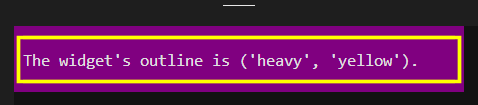

##### 2.2.4.9 盒子尺寸类型

不知道各位读者有没有发现，上面几节讲组件的边框和内边距，如果组件的宽度或者高度确定，在设置这些样式时，组件内的内容会随之重新排版，不会改变设定好的宽度或者高度。一般来说，这样的表现是没问题的，因为设计边框或者内边距的时候，不会希望组件的大小变化而导致整体的排布产生变化。不过，也有例外。倘若内容区域已经确定，不想设计边框或者内边距的时候影响内容排版，那就要改变这个行为，将盒子尺寸类型（`box_sizing`）设置为`'content-box'`即可，完整用法参见[官网文档](https://textual.textualize.io/styles/box_sizing/)。

将盒子尺寸类型设置为`'content-box'`的话，组件的宽度和高度就变成了内容的宽度和高度，相关尺寸样式的关系如下图：

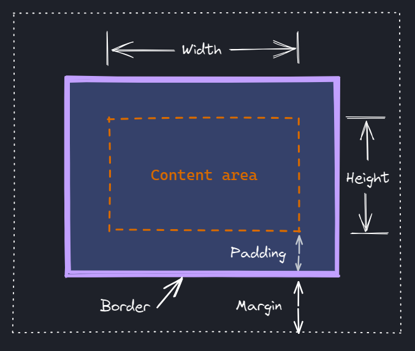

默认盒子尺寸类型是`'border-box'`，相关尺寸样式的关系如下图：

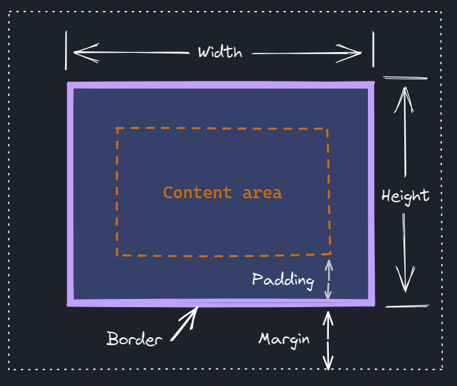

下面的代码示例可以让这两种盒子尺寸类型的对比更加明显：

```python3
from textual.app import App
from textual.widgets import Static

class MyApp(App):
    def on_mount(self):
        self.widgets = [Static(),Static()]
        self.mount_all(self.widgets)
        for widget in self.widgets:
            index = self.widgets.index(widget)
            widget.styles.width = 30
            widget.styles.height = 6
            widget.styles.padding = 1
            widget.styles.border = ('heavy','white')
            widget.styles.background = ['purple','green'][index]
            box_sizing = ['border-box','content-box'][index]
            widget.styles.box_sizing = box_sizing
            widget.update(f'The widget\'s box_sizing is {box_sizing}.')

if __name__ == '__main__':
    app = MyApp()
    app.run()
```

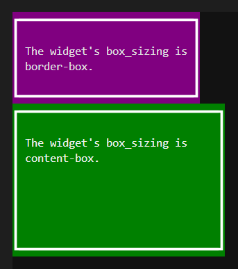

##### 2.2.4.10 外边距

外边距（`margin`）是指组件的边界距离其他组件的远近。外边距的用法和内边距类似，支持1个、2个、4个值，完整用法参考[官网文档](https://textual.textualize.io/styles/margin/)。

代码示例如下：

```python3
from textual.app import App
from textual.widgets import Static

class MyApp(App):
    def on_mount(self):
        self.widgets = [Static(),Static()]
        self.mount_all(self.widgets)
        for widget in self.widgets:
            index = self.widgets.index(widget)
            widget.styles.width = 30
            widget.styles.height = 6
            widget.styles.padding = 1
            widget.styles.border = ('heavy','white')
            widget.styles.background = ['purple','green'][index]
            margin = 2 # (1,2)的话上下为1，左右为2
            # (1,2,1,2)的话，就是对应上、右、下、左
            widget.styles.margin = margin
            widget.update(f'The widget\'s margin is {margin}.')

if __name__ == '__main__':
    app = MyApp()
    app.run()
```

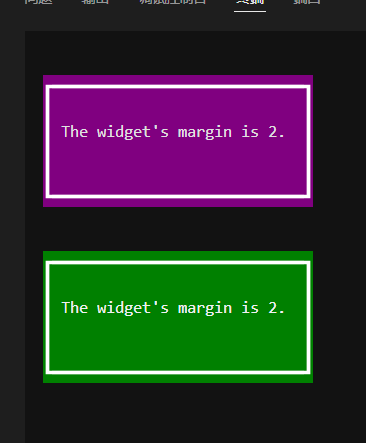

外边距用法上没什么难度，但肯定有聪明的读者发现了问题：两个组件的外边距都是2，但在图片中，应该距离4行的两个组件，中间只有两行的距离，是不是有问题？

其实并不是。当相邻的两个组件都设置了外边距时，这两个组件之间的距离就取外边距较大的。

##### 2.2.4.11 更多样式

上面介绍了样式接口中常用的几个样式和基本概念，其实Textual支持的样式还有很多。受限于篇幅，这里便不再赘述，有兴趣的读者可以自行查阅[官网文档](https://textual.textualize.io/styles/)。

样式接口虽然方便，如果把所有的样式都写到Python代码里，则会让Python代码变得太过冗长。此外，将样式写到单独的样式文件中的话，调试样式会方便不少，可以实时查看样式效果；还可以重复使用已经设计好的样式，不需要给每一个组件设置一遍相同的样式，也不用在另一个程序中给需要同样样式的组件做重复的工作。所以，下一节，将重点介绍Textual的CSS。样式接口不支持的功能，CSS可以实现：比如边框一节中，让边框颜色和普通颜色一样使用百分比表示透明度；一些没有暴露样式接口的，CSS中全都可以设置；样式接口需要设置每种组合情况的样式，CSS中可以简化组合情况的样式设置。

敬请期待下一节——Textual的CSS。

#### 2.2.5 Textual的CSS

其实本节要讲的内容和上节的内容都是一类，都属于样式。只不过，上节的样式是用Python的接口调用，而本节是纯CSS语法的样式。相信很多读者自己查阅文中的官网文档链接时也发现了：文档中相关样式的用法说明，主要是CSS语法，而且Python接口不一定全部支持，Python接口的用法示例不一定有。官网文档确实如此，这也是为什么本教程要做类似翻译一样的“重复”工作：官网的文档看似全面，但不详细；而官网教程看似详细，却又不全面。

扯远了，按理来说，本节的内容比较偏向CSS基础，应该放在上一节之前。不过，一上来就假定读者没有CSS基础而端上主食，怕是读者难以下咽，这才先介绍了简单易用的样式接口，也方便那些学过CSS的读者。话说回来，如果读者有CSS基础，本节内容学起来简直易如反掌，毕竟Textual的CSS概念就是源于Web的CSS，语法基本一致，只是根据Textual的功能和特性做了部分修改。当然，倘若读者没有相关基础或者基础尚未扎实，也不要紧，本节会带着读者重新学习一遍，在熟悉CSS语法的同时，了解一下Textual的CSS有什么特点。

使用VSCode的读者，别忘了安装官方提供的[CSS语法高亮扩展](https://marketplace.visualstudio.com/items?itemName=Textualize.textual-syntax-highlighter)，可以方便看到正确的语法高亮。Textual的CSS虽然灵感源自Web的CSS，但实际上支持的样式有限，具体参考[官网文档](https://textual.textualize.io/styles/)；样式中涉及到的CSS类型，则参考[这一份文档](https://textual.textualize.io/css_types/)。

废话不多说，正式开始。

##### 2.2.5.1 样式表

CSS的全称是'Cascading Stylesheet'，翻译过来的话，就是层叠样式表。层叠指的是CSS应用、显示方式，就像一层一层叠起来一样，上面的内容会盖住下面的。但是在编程中的话，就是最后设置样式会覆盖到前面设置的样式上 ，因此显示的就是最后设置的样式，很形象。样式表，就是指其语法特点，就像一个指明样式的表格一样。当然，这个表格并不是Excel那种表格，而是纯文本形式的`样式类型:样式值`这样冒号间隔的表格。

照本宣科学习CSS实在无趣，不如先看个CSS代码示例，对照着学习CSS的基本结构：

```css
Header {
  dock: top;
  height: 3;
  content-align: center middle;
  background: blue;
  color: white 50%;
}
```

这是一个给Header组件应用样式的CSS示例。正如前面所讲，大括号内就是样式规则。规则中的冒号分隔了样式类型和样式值，以`dock: top;`为例：`dock`是停靠位置，就是这个组件往哪里靠，就像船停泊一样，是靠在这边还是那边；`top`表示最上面的位置，结合样式类型是停靠位置，则此条规则这样解释——停靠位置是最上面。

下面的几条样式类似，都是样式类型和样式值。听起来是不是有点奇怪？好像缺了主语，这些样式是谁的样式？不急，示例还没解释完。这些都是大括号里的内容，大括号外面还有内容呢。大括号之前的部分是选择器，表示大括号内的样式规则给谁应用，即样式的应用范围。选择器也有复杂的语法规则，这边暂时不延伸，只当做一个组件（示例中的Header确实是个组件）来看，示例的意思就可以解释为：`Header`组件的停靠位置是最上面，下面几条规则均用于`Header`组件，就不一一重复了。

所以，样式规则的解释通常是这样的：选择器表示样式的应用范围；选择器后的大括号内表示应用哪些样式；每条样式规则是样式类型和样式值的配对组合。

需要注意的是，可能教程是讲Python框架的话，读者会自然认为CSS的语法规则也有缩进要求。实则不然，这里的示例采用严格的缩进只是为了方便分析和美观，并不会影响CSS的解析和使用。在CSS中，如果有标点符号（括号、分号、冒号等）分隔，不需要在意缩进、空格和换行。但是，没有被标点分隔的完整部分，如果语法要求有空格或者没有空格，不可增删空格而导致空格分隔的部分变化，比如`color: white 50%;`中，`white 50%`的空格将这部分分为两部分，两部分中间的空格（两头没有空格的地方也行）可以增加或者换行，但不能省略；同时也不能增加空格或则换行使得两部分变成三部分。

##### 2.2.5.2 文档对象模型

按理来说，接下来应该介绍选择器的语法规则，但是，在此之前，需要了解一下文档对象模型，对于选择器的学习很有帮助。

文档对象模型，即'Document Object Model'，简称DOM，是HTML中的概念，是说HTML的结构就像树一样，不断分支。学习这个概念，有助于理解CSS中的选择器语法，因为选择器的含义就是匹配特定的分支规则，来应用样式。

当然，Textual程序是TUI程序，本身没有文档的概念，但其对组件的排布结构，和树的结构一样。此外，Textual中的CSS也与Web的CSS类似，所以这里才借用这个概念，方便理解Textual程序的结构，也有助于学习Textual的CSS。

为了方便理解，下面用一个可以运行的代码示例，辅助解释：

```python3
from textual.app import App
from textual.containers import Container, Horizontal
from textual.widgets import Header, Footer, Static, Button

class MyApp(App):
    def on_mount(self):
        self.widgets = [
            Header(),
            Container(
                Static('Do you like Textual?'),
                Horizontal(
                    Button('Yes'),
                    Button('Maybe'),
                ),
            ),
            Footer(),
        ]
        self.mount_all(self.widgets)

if __name__ == '__main__':
    app = MyApp()
    app.run()
```

程序的结构模型如图：

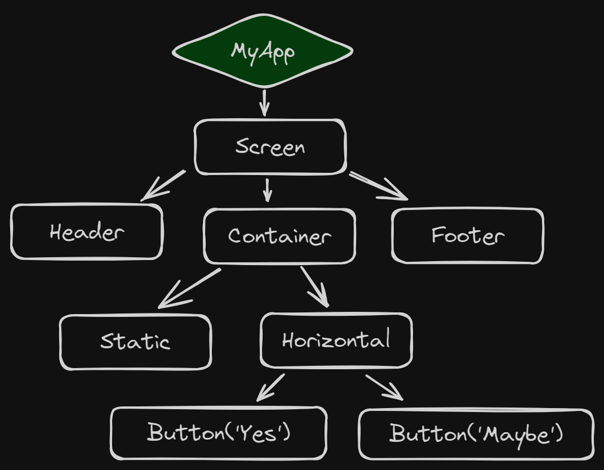

代码不长，但为了方便区分，里面引入一些后面才讲的功能，这里先简单介绍一下。

`from textual.containers import Container, Horizontal`中，`textual.containers`是容器模块，从模块里导入了`Container`和`Horizontal`。前者其实在前面学习比例单位时候已经用过，就是一个普通的容器组件，可以理解为一个篮子；后者则是一个将组件水平排序的容器，放在里面的组件会横向排成一行，而不是容器或者无容器时的默认竖向排布。

`from textual.widgets import Header, Footer, Static, Button`中， `Static`和`Button`前面用了很多次，就是静态文本和按钮，这里只作简单演示，具体的交互功能，后面的组件介绍中会细讲。`Header`和`Footer`是直译的话是页眉和页脚，但其用法更像是GUI中的标题栏和状态栏，所以称之为标题栏和状态栏更合适。只不过Textual为了节约空间占用，标题栏和状态栏还有一些交互功能。

相信读者还注意到，示例代码中并没有将组件布局放到compose方法里，而是使用了`self.mount_all(self.widgets)`。倒不是组件布局非要这样才能实现，而是`mount_all`方法支持一个包含组件列表的迭代器，可以一次性将迭代器内的所有组件显示出来。这个操作放到`on_mount`方法内，操作很方便，但不是唯一方法。

如果读者习惯在`compose`方法中使用`yield`显示组件，则代码如下：

```python3
from textual.app import App
from textual.containers import Container, Horizontal
from textual.widgets import Header, Footer, Static, Button

class MyApp(App):
    def compose(self):
        yield Header()
        yield Container(
            Static('Do you like Textual?'),
            Horizontal(
                Button('Yes'),
                Button('Maybe'),
            ),
        )
        yield Footer()

if __name__ == '__main__':
    app = MyApp()
    app.run()
```

若是喜欢之前示例中，定义好组件布局之后再显示，代码也可以写成这样：

```python3
from textual.app import App
from textual.containers import Container, Horizontal
from textual.widgets import Header, Footer, Static, Button

class MyApp(App):
    def compose(self):
        self.widgets = [
            Header(),
            Container(
                Static('Do you like Textual?'),
                Horizontal(
                    Button('Yes'),
                    Button('Maybe'),
                ),
            ),
            Footer(),
        ]
        for widget in self.widgets:
            yield widget

if __name__ == '__main__':
    app = MyApp()
    app.run()
```

三种风格的显示结果和结构是一样的，并不影响下面内容的理解和学习，读者可以按需选用。

回到程序的结构模型图，只看里面的`MyApp`和`Screen`：

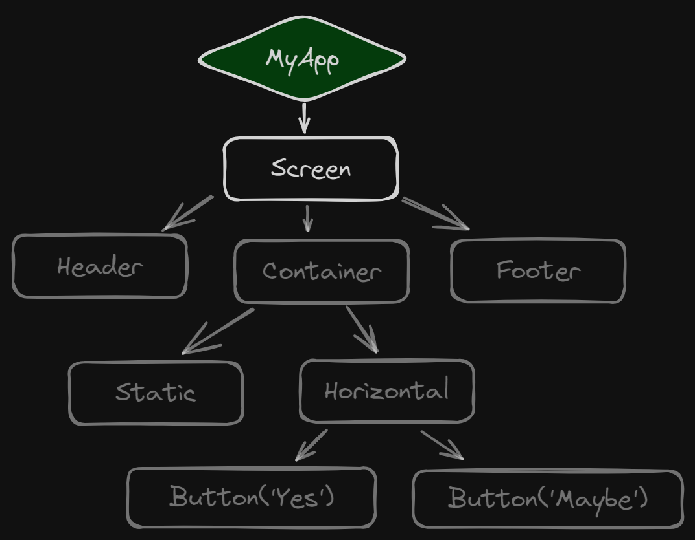

代码中，`app = MyApp()`产生了MyApp类的实例，对应图中就是菱形的`MyApp`。此时，程序还不能显示，因此图形是与其他组件不同的。只有运行了`app.run()`之后，进入Textual的内部循环，才会产生`Screen`这个可以显示的根组件。

从关系上来说，先有`MyApp`实例，它才能产生`Screen`组件，后面才能在`Screen`上显示其他组件。因此，关系如上图所示。

然后，顺着图往下看，就看到了`Screen`直接产生的三个组件：

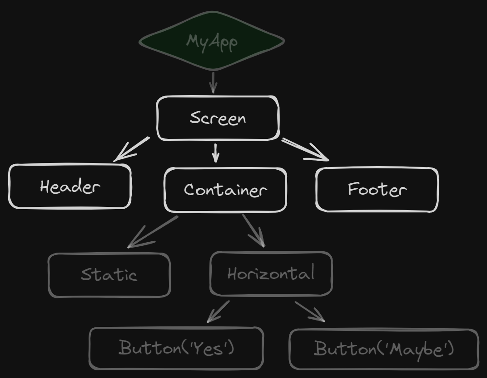

代码中，虽然`Container`里面还包含着其他组件，但对`Screen`来说，第一层或者说最上层中，就是这三个组件与其连接。因此，对于程序结构这棵树而言，`Screen`分支出这三个组件。

再往下就是`Container`分支出两个组件，其中的`Horizontal`再分支出两个组件，对应到代码中，就是对应组件的参数是分支出来的组件对象，也就不难理解了：

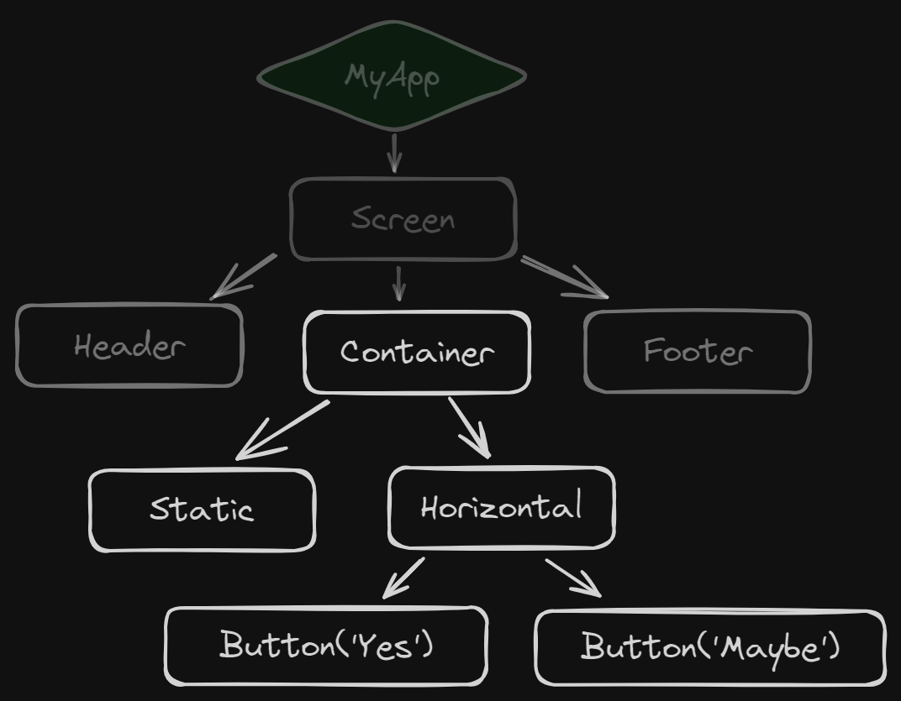

##### 2.2.5.3 CSS文件

这一大节主要讲的是Textual的CSS，上一小节却没有一点CSS的迹象，而是讲了文档对象模型，这又怎么和CSS有什么关系？

先别急，在下面剖析选择器语法之前，还需要学习一下，如何给上一小节的示例代码，增加CSS文件的引用，以及方便调试的运行方法。

其实，再往前的内容已经介绍过方法，就是`App`子类里的`CSS`和`CSS_PATH`。前者是直接使用CSS文件内容，后者是CSS文件的路径。

为了方便学习下面的内容，读者需要在代码文件的同目录下，创建'.tcss'后缀的CSS文件（示例中是`myapp.tcss`），然后将包含后缀的完整文件名，赋予`CSS_PATH`。那么，代码就变成下面的样子：

```python3
from textual.app import App
from textual.containers import Container, Horizontal
from textual.widgets import Header, Footer, Static, Button

class MyApp(App):
    CSS_PATH = 'myapp.tcss'
    def on_mount(self):
        self.widgets = [
            Header(),
            Container(
                Static('Do you like Textual?'),
                Horizontal(
                    Button('Yes'),
                    Button('Maybe'),
                ),
            ),
            Footer(),
        ]
        self.mount_all(self.widgets)

if __name__ == '__main__':
    app = MyApp()
    app.run()
```

很多时候，为了方便设计的样式重复使用，也是为了减少CSS文件的体积，不同程序使用的样式如果有重复部分，会把重复内容提取到单独的CSS文件中，方便组合CSS文件来实现更多可能。此时，一个程序就会使用几个CSS文件才能实现完整的样式效果。`CSS_PATH`也支持使用多个CSS文件的路径，只需将多个文件路径放到列表中即可。假如上面的程序使用`myapp.tcss`和`myapp_ext.tcss`这两个CSS文件，代码就要写成`CSS_PATH = ['myapp.tcss','myapp_ext.tcss']`。示例如下：

```python3
from textual.app import App
from textual.containers import Container, Horizontal
from textual.widgets import Header, Footer, Static, Button

class MyApp(App):
    CSS_PATH = ['myapp.tcss','myapp_ext.tcss']
    def on_mount(self):
        self.widgets = [
            Header(),
            Container(
                Static('Do you like Textual?'),
                Horizontal(
                    Button('Yes'),
                    Button('Maybe'),
                ),
            ),
            Footer(),
        ]
        self.mount_all(self.widgets)

if __name__ == '__main__':
    app = MyApp()
    app.run()
```

样式接口、`App`子类里的`CSS`和`CSS_PATH`都可以给组件设置样式，到底用哪种方法调试CSS最合适？

答案就是`App`子类里的`CSS_PATH`。

当完成上面的步骤之后，后面运行程序就不能使用直接点击或者`python myapp.py`这种了，而是要用`textual run --dev myapp.py`。这个时候，只需在编辑器中打开添加到程序中的CSS文件，编写样式。保存文件之后，终端内的程序会实时显示样式。不像其他两种方法需要反复结束程序、运行程序，这种调试方法简单快捷，很适合程序结构基本完成的情况下，设计更加美观的样式。

说到调试，编写样式的时候，难免需要添加一些解释性说明或者注释内容，这里不得不说一下CSS中注释的写法。

因为CSS支持删减没必要空格和一切换行来压缩CSS文件大小，因此没有其他语言中的行注释，只有块注释。块注释是以`/*`开始，遇到`*/`结束，就像括号一样。能和括号一样合法配对的块注释符号中间，都是注释内容。比如下面的示例，只在一行内注释：

```css
Header {
    dock: top;/* one line */
    height: 3;
    content-align: center middle;
    background: blue;
    color: white 50%;
  }
```

也可以多行注释，让不需要生效的内容失效：

```css
Header {
    dock: top;/* multi lines
    height: 3;
    content-align: center middle;
    background: blue;
    color: white 50%;
    */
  }
```

需要注意一点，CSS的注释支持中文，但直接使用中文注释可能会报错。不同于Textual程序显示中文时会自动处理，CSS文件中的中文不会自动处理。因为程序内使用Python的`open`方法打开CSS文件时时没有指定编码，而代码文件的编码一般是UTF-8，在CSS文件中添加中文注释可能会报错（主要是Windows）。如果英文不佳，不想注释里只用英文，需要使用下面的方法解决：

1.   修改CSS文件保存时的编码与终端编码一致，使用`chcp`命令获取终端编码（一般是活动代码页），转换为标准编码。比如，中文环境下，一般是`活动代码页936`，即`cp936`，也就是GBK编码。那么，可以点击编辑器右下角的编码来选择编码，通过编码保存，选择GBK编码。或者按下`Ctrl + Shift + p`，搜索`workbench.action.editor.changeEncoding`，也可以设置编码。

2.   为了让Python的`open`方法默认使用UTF-8编码，需要在电脑的环境变量中增加`PYTHONUTF8`，值为1。然后使用下面的命令检查，如果没有生效，重启终端或者系统之后再看：

     ```shell
     #powershell终端使用这个检查
     Get-ChildItem Env:PYTHONUTF8
     #cmd终端使用这个检查
     echo %PYTHONUTF8%
     ```


3.   也可以在Python源码的开头添加以下代码（最新动态：给官方提了issue之后，官方已经修复次问题，除了需要特别指定编码的情况，一般不需要添加下面的代码）：

     ```python3
     import os
     from textual.css.stylesheet import Stylesheet, CssSource
     from pathlib import PurePath
     from textual.css.errors import StylesheetError
     def read(self, filename: str | PurePath) -> None:
         """Read Textual CSS file.
     
         Args:
             filename: Filename of CSS.
     
         Raises:
             StylesheetError: If the CSS could not be read.
             StylesheetParseError: If the CSS is invalid.
         """
         filename = os.path.expanduser(filename)
         try:
             with open(filename, "rt", encoding="utf-8") as css_file:
                 css = css_file.read()
             path = os.path.abspath(filename)
         except Exception:
             raise StylesheetError(f"unable to read CSS file {
                                   filename!r}") from None
         self.source[(str(path), "")] = CssSource(css, False, 0)
         self._require_parse = True
     Stylesheet.read = read
     ```
     

##### 2.2.5.4 选择器

终于要说选择器了。从这一小节开始，代码示例将包含Python代码和代码中使用的CSS文件，同时将在Python代码同目录下使用`textual run --dev myapp.py`来运行程序，方便调试CSS时看到实时效果。

首先要介绍的是类型选择器。在Web的CSS中，有个类似的选择器叫标签选择器。虽然Textual程序的文档对象模型和HTML的标签树很像，但在Textual中，这个类似的选择器叫类型选择器，原本对应的标签名则变成了对应组件的类名。记住，只是基本用法类似，Textual的CSS并不支持Web的CSS的所有特性，一旦读者理解Textual的CSS之后，请不要将二者混为一谈。

类型选择器的基本结构是这样的：

```css
组件类名 {
    样式类型: 样式值;
}
```

为了方便理解类型选择器，一起来看一个示例。

`myapp.py`文件的内容如下：

```python3
from textual.app import App
from textual.containers import Container, Horizontal
from textual.widgets import Header, Footer, Static, Button

class Alert(Static):
    pass

class MyApp(App):
    CSS_PATH = 'myapp.tcss'
    def on_mount(self):
        self.widgets = [
            Header(),
            Container(
                Alert('Question:'),
                Static('Do you like Textual?'),
                Horizontal(
                    Button('Yes'),
                    Button('Maybe'),
                ),
            ),
            Footer(),
        ]
        self.mount_all(self.widgets)

if __name__ == '__main__':
    app = MyApp()
    app.run()
```

`myapp.tcss`文件的内容如下：

```css
Alert {
  color: red;
}
```

在Python代码中，通过继承`Static`类，得到一个`Alert`类。`Alert`类没有任何内容，只有继承操作，可以理解为`Alert`类和`Static`类的功能一样，只不过`Alert`类是`Static`类的子类。

代码中，还有两个类对应的组件实例：`Alert('Question:')`和`Static('Do you like Textual?')`。因此，如果在CSS中定义了一个类型选择器，则程序中该类名的所有实例都会应用此选择器的样式。如图所示：

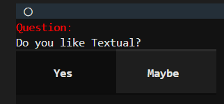

刚才说了，类型选择器会让该类所有的实例应用样式，所以，假如将子类的类型选择器改为基类的类型选择器，那该类和其子类的全部实例都会应用样式：

```css
Static {
  color: blue;
}
```

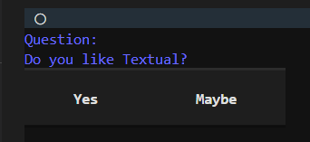

那么问题来了，子类的类型选择器和基类的类型选择器同时存在的情况下，会有什么样的效果？

答案是，如样式表的含义所说，越靠近组件的定义越优先。

听起来有点不明所以，实际上很好理解。CSS文件的读取顺序是从上到下，也就是说，下面的定义会覆盖上面的定义。

也就是说，对于CSS文件内的每个选择器来说，从上到下，依次对符合条件的组件设置样式。假如下面的选择器与上面的匹配结果相同，相同的样式类型会被覆盖，没有的样式类型会新增，已有但不相同的样式类型不会处理。

以下面两个CSS文件内容为例，相同的颜色样式会被下面的覆盖，假如存在上面有但下面没有的样式类型，则会同时保留：

子类在上：

```css
Alert {
  color: red;
}
Static {
  color: blue;
}
```

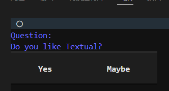

基类在上：

```css
Static {
  color: blue;
}
Alert {
  color: red;
}
```

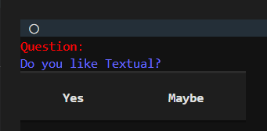

除了类型选择器匹配组件之外，还有一种用星号（`*`）匹配所有组件的特殊选择器——通用选择器，基本结构如下所示：

```css
* {
    样式类型: 样式值;
}
```

任何没有对应类型选择器匹配的组件，都会应用通用选择器的样式。

需要注意的是，虽然通用选择器和类型选择器都可以匹配组件，但类型选择器比通用选择器优先，哪怕通用选择器写在类型选择器之后。

类名选择器听起来和类型选择器很像，但二者不一样。类名选择器在CSS中是一种以英文句号（`.`）开头、后接类名（用数字、大小写字母、下划线和连字符任意组合，但不能以数字和`-`开头）的选择器，其优先级比类型选择器高。其基本结构如下所示：

```css
.类名 {
    样式类型: 样式值;
}
```

切勿把类名选择器的类名与组件的类混淆。想要应用类名选择器的话，需要给组件的`classes`参数传入类名，就是类名选择器的类名。`classes`参数是一个字符串类型参数，参数支持多个类名，在字符串内使用空格分隔即可，表示组件同时应用两个类。比如：

```python3
# 应用alert类
Alert('Question:',classes='alert')
# 应用alert类和attention类
Alert('Question:',classes='alert attention')
```

不同于类型选择器只适用于一种组件，类名选择器可以被应用于不同种类的组件，下面看一下示例。

`myapp.py`文件的内容如下：

```python3
from textual.app import App
from textual.containers import Container, Horizontal
from textual.widgets import Header, Footer, Static, Button

class Alert(Static):
    pass

class MyApp(App):
    CSS_PATH = 'myapp.tcss'
    def on_mount(self):
        self.widgets = [
            Header(),
            Container(
                Alert('Question:',classes='alert'),
                Static('Do you like Textual?',classes='alert attention'),
                Horizontal(
                    Button('Yes'),
                    Button('Maybe'),
                ),
            ),
            Footer(),
        ]
        self.mount_all(self.widgets)


if __name__ == '__main__':
    app = MyApp()
    app.run()
```

`myapp.tcss`文件的内容如下：

```css
.alert {
  color: red;
}
.attention {
  background: blue 50%;
}
```

效果如图：

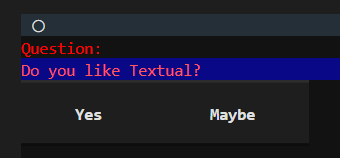

如果想要对同时应用多个类的组件添加额外的样式，而不想单独修改每个类的样式，可以使用英文句号（`.`）连接同时应用的样式（比如`.alert.attention`），得到新的类名选择器。在新的选择器中设置样式，不会影响到单独的每个类。示例如下：

```css
.alert.attention {
  color: yellow;
  background: green 50%;
}
.alert {
  color: red;
}
.attention {
  background: blue 50%;
}
```

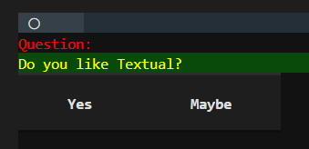

一般来说，英文句号连接两个类，以补充样式为主，上面示例里覆盖了单独类的用法不常见，这样的做法会混淆单个类的含义。不过，示例中的用法引出了新的问题：类型选择器中，下面的选择器会覆盖上面的选择器，但在类名选择器中，为什么写在最上面的选择器却优先生效了？

这就涉及到选择器的优先级问题。除了上面提到的下面的选择器比上面的选择器优先，类名选择器比类型选择器优先，在类名选择器内部，还有一个优先规则：一个选择器包含的类名越多越优先。

比如，`.alert.attention`包含两个类名，就比只有一个类名的类名选择器优先。当然，选择器的优先级规则还有很多，等介绍完所有的选择器和组合器，会汇总讲解优先级，这里不做太详细的展开。

除了在创建组件实例时给`classes`参数传入类名选择器，组件还有几种方法操作类名选择器：

-   [`add_class`方法](https://textual.textualize.io/api/dom_node/#textual.dom.DOMNode.add_class)：给组件添加一个或者多个类名，用法是`Static('Do you like Textual?').add_class('attention','alert',update=True)`。方法返回示例本身，布尔类型参数`update`表示是否更新组件样式。
-   [`remove_class`方法](https://textual.textualize.io/api/dom_node/#textual.dom.DOMNode.remove_class)：删除组件的一个或者多个类名，用法是`Static('Do you like Textual?').remove_class('attention','alert',update=True)`。方法返回示例本身，布尔类型参数`update`表示是否更新组件样式。
-   [`toggle_class`方法](https://textual.textualize.io/api/dom_node/#textual.dom.DOMNode.toggle_class)：切换组件的一个或者多个类名的有无，即如果存在该类名则删除，不存在则添加，用法是`Static('Do you like Textual?').toggle_class('attention','alert',update=True)`，方法返回示例本身。
-   [`has_class`方法](https://textual.textualize.io/api/dom_node/#textual.dom.DOMNode.has_class)：检查组件是否有一个或者多个类名，方法返回检查结果，只有组件的样式类包含全部提供的类名才返回`True`。
-   [`classes`属性](https://textual.textualize.io/api/dom_node/#textual.dom.DOMNode.classes)：是一个组件当前样式类的冻结合集，可以通过给其赋予和`classes`参数一样要求的字符串来覆盖组件的样式类。

伪类选择器是指在原有的选择器后使用英文冒号（`:`）连接的表示交互状态的类名选择器。比如下面代码中的`hover`就是表示鼠标悬停时的交互状态：

```css
Static:hover {
  color: red;
}
```

当鼠标悬停到静态文本上时，静态文本会变色：

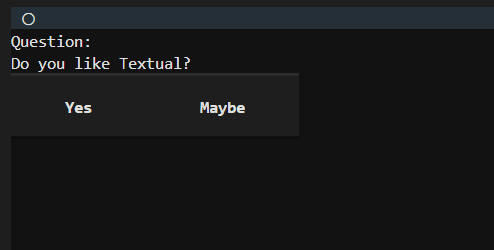

Textual支持以下伪类选择器：

-   `:blur`：表示组件没有获得焦点（获得焦点是指被点击、切换、进入输入状态等，没有获得焦点即不是前面提到的状态）时，组件的状态。
-   `:dark`：表示程序主题切换为黑暗主题时，组件的状态（即`App.theme.dark == True`时的状态）。
-   `:disabled`：表示组件被禁用时的状态。
-   `:enabled`：表示组件被启用时的状态。
-   `:even`：表示符合伪类前面选择器条件的组件中，给处在文档对象模型同级别的组件按次序标号（从1开始），组件的标号是偶数的状态。
-   `:first-of-type`：表示符合伪类前面选择器条件的组件中，给处在文档对象模型同级别的组件按次序标号（从1开始），组件的标号是1（即第一个）的状态。
-   `:focus-within`：表示组件或者子组件（文档对象模型子级别的组件）获得焦点（被点击、切换、进入输入状态等）时，组件的状态。
-   `:focus`：表示组件获得焦点（被点击、切换、进入输入状态等）时，组件的状态。
-   `:hover`：表示鼠标悬停在组件上时，组件的状态。
-   `:inline`：表示程序以行内模式运行时，组件的状态。
-   `:last-of-type`：表示符合伪类前面选择器条件的组件中，给处在文档对象模型同级别的组件按次序标号（从1开始），组件的标号是-1（即最后一个）的状态。
-   `:light`：表示程序主题切换为明亮主题时，组件的状态（即`App.theme.dark == False`时的状态）。
-   `:odd`：表示符合伪类前面选择器条件的组件中，给处在文档对象模型同级别的组件按次序标号（从1开始），组件的标号是奇数的状态。

ID选择器是以井号（`#`）开头、后接ID名（用数字、大小写字母、下划线和连字符任意组合，但不能以数字和`-`开头）的选择器。基本结构如下：

```css
#ID名 {
    样式类型: 样式值;
}
```

不同于类名选择器，ID选择器具有唯一性，一个组件只能设置一个ID，因此ID选择器只能给一个组件设置样式。ID选择器的优先级也比类名选择器高，也就是说，如果一个组件同时匹配了类名选择器和ID选择器，ID选择器优先生效。另外，不像类名选择器有方法修改，ID选择器只能在创建实例时添加，后续不能修改。

`myapp.py`文件的内容如下：

```python3
from textual.app import App
from textual.containers import Container, Horizontal
from textual.widgets import Header, Footer, Static, Button

class Alert(Static):
    pass

class MyApp(App):
    CSS_PATH = 'myapp.tcss'
    def on_mount(self):
        self.widgets = [
            Header(),
            Container(
                Alert('Question:',id='alert'),
                Static('Do you like Textual?',id='attention'),
                Horizontal(
                    Button('Yes'),
                    Button('Maybe'),
                ),
            ),
            Footer(),
        ]
        self.mount_all(self.widgets)

if __name__ == '__main__':
    app = MyApp()
    app.run()
```

`myapp.tcss`文件的内容如下：

```css
#alert {
    color: red;
}
#attention {
    color: blue;
}
```

输出如下：

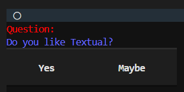

##### 2.2.5.5 组合器

除了使用单一的选择器来设计样式之外，还可以组合任意数量的选择器，形成新的“选择器”——组合器来给特定条件下的组件设计样式。组合器匹配的是最后一个选择器，前面被组合的选择器都是最后一个选择器的前提条件。

Textual支持的组合器只有两种：后代组合器和子代组合器。

后代组合器是指使用空格间隔两个选择器，表示空格后的选择器所匹配的组件是空格前的后代。从文档对象模型中看，以空格前的选择器所匹配的组件为原点（下图中的`Container`为例），凡是向上溯源时能经过原点的，都算原点的后代（`Static`、`Horizontal`、两个`Button`都是）。

基本结构如下：

```css
选择器1 选择器2 {
    样式类型: 样式值;
}
```


子代组合器就是把后代组合器中用来间隔两个选择器的空格换成大于号（`>`），表示大于号后的选择器所匹配的组件是大于号前的直接后代。从文档对象模型中看，以大于号前的选择器所匹配的组件为原点（上图中的`Container`为例），凡是向上溯源一级就能回到原点的，都算原点的直接后代（`Static`、`Horizontal`）。

基本结构如下：

```css
选择器1>选择器2 {
    样式类型: 样式值;
}
```

还有一种其实前面已经在类名选择器里提过——兼备组合器——使用与号（`&`）连接两个（或者多个）选择器，表示同时匹配到两个（或者多个）选择器时，样式才会生效。

基本结构如下：

```css
选择器1&选择器2 {
    样式类型: 样式值;
}
```

回顾一下类名选择器一节，说过在一个类名选择器后，使用英文句号连接另一个类名（`.alert.attention`），用于表示同时具备两个类名的组件。其实，这里就已经说的是兼备组合器了，只是这里省略了一个与号，它完整的形式是`.alert&.attention`。兼备组合器常用于组合两个（及以上）类名选择器、两个（及以上）不同类别的选择器。但需要注意的是：ID选择器具有唯一性，不能兼备两个ID选择器；类型选择器涉及到继承关系，同级类不能同时具备，类和子类虽然可以同时具备但没有意义，一般也不会兼备两个类型选择器。

比如，想要选择样式类名为`attention`的静态文本设置样式，可以这样写：

```css
Static&.attention {
    color: red;
    background: green 50%;
}
```

注意，当兼备组合器包含伪类选择器时，伪类选择器必须放在最后，否则会导致语法错误。

与兼备组合器类似的是任意组合器——使用英文逗号（`,`）连接两个选择器或者组合器。和Web的CSS中分组选择器作用类似，只要能匹配到任意组合器中任意一个条件，样式就会生效。

基本结构如下：

```css
条件1,条件2 {
    样式类型: 样式值;
}
```

等同于：

```css
条件1 {
    样式类型: 样式值;
}
条件2 {
    样式类型: 样式值;
}
```

组合器中的条件可以是前面提到的任意选择器或者组合器。

组合器可以让不同种类的选择器组合使用，同样的，组合器也可以混合起来，进一步组合，比如：

```css
选择器1 选择器2>选择器3&选择器4,选择器5 {
    样式类型: 样式值;
}
```

下面看一下组合器应用的实际代码。

`myapp.py`文件的内容如下：

```python3
from textual.app import App
from textual.containers import Container, Horizontal
from textual.widgets import Header, Footer, Static, Button

class Alert(Static):
    pass

class MyApp(App):
    CSS_PATH = 'myapp.tcss'
    def on_mount(self):
        self.widgets = [
            Header(),
            Container(
                Alert('Question:'),
                Static('Do you like Textual?'),
                Horizontal(
                    Button('Yes'),
                    Button('Maybe'),
                ),
            ),
            Footer(),
        ]
        self.mount_all(self.widgets)

if __name__ == '__main__':
    app = MyApp()
    app.run()
```

`myapp.tcss`文件的内容如下：

```css
Screen Static {
    color: red;
}
Container>Static {
    background: yellow 20%;
}
```

效果如图：

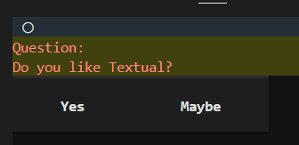

##### 2.2.5.6 优先级

不管是单个选择器还是多个选择器组合形成的组合器，难免会遇到不同条件下匹配到同一个组件的情况。此时，组件的样式会是什么样子，就取决于选择器、组合器的优先级情况。选择器的优先级在前面已经介绍过：ID选择器 > 伪类选择器 > 类名选择器 > 类型选择器 > 通用选择器；相同优先级的条件下，写在下面的比写在上面的优先。注意，伪类本身的优先级和类名选择器一样，但因为需要附加在其他选择器之后，所以比单个类名选择器优先。

单个选择器还有思绪分清优先级，有无数组合可能的组合器，优先级又是怎么确定的？难道是遵循下面优先？那这样就太难确定哪个组合器优先生效，光是排序这个步骤就要浪费很多时间。

其实，组合器的优先级也有规律，就和选择器的优先级类似，遵循以下规律：

-   ID选择器多的优先。如果数量相同，则看下一条规则。
-   类名选择器多的优先。伪类选择器等于类名选择器，即如果选择器中包含伪类，相当于类名选择器的数量加一。如果数量相同，则看下一条规则。
-   类型选择器多的优先。如果数量相同，则遵循写在下面的优先。

除了上面的优先级规则外，在样式值的最后添加重要标记——`!important`会让该样式成为CSS文件里最优先生效的样式，比如：

```css
.attention {
    background: blue 50% !important;
}
.alert.attention {
    color: yellow;
    background: green 50%;
}
```

虽然单个类名选择器被放在最上面，但重要标记还是会让这条样式强制生效。

注意，重要标记只是针对单条样式，选择器内其他样式没有添加重要标记的话，依然遵循优先级规则。此外，重要标记只在CSS文件内优先级最高，同时使用CSS文件和样式接口的话，样式接口的优先级高于所有CSS文件内的样式（包括带有重要标记的样式）。任意组合器的条件需要拆分成单个组合器或者选择器之后再与其他组合器对比优先级，不能直接当作普通组合器来参与优先级排序。

##### 2.2.5.7 变量与初始值

如果在CSS文件中一样的样式很多，使用CSS变量定义，并在后面使用该变量当做样式值，可以减少不少重复工作，也减少了后续修改时的工作量。

使用美元符号（`$`）开头后接变量名，就是CSS中的变量。变量后用英文冒号（`:`）接变量要代替的样式值，后续就可以使用`$变量名`的形式代替样式值。示例如下：

```css
$border: wide green;
Static {
    border: $border;
}
```

注意，变量只能用在样式值中，不可用于样式类型和选择器中。

定义变量时也可以嵌入其他变量：

```css
$success: green;
$border: wide $success;
Static {
    border: $border;
}
```

所有的样式类型都支持一个名为`initial`的特殊样式值。该样式值等同于默认值，使用该样式值，会让样式类型的值变成默认CSS（用法含义参考[官网文档](https://textual.textualize.io/guide/widgets/#default-css)，这里不细讲，后续再讲）中的值。

注意，如果在默认CSS中使用`initial`会让样式变成完全无样式。

以下面的代码为例，使用`initial`会让设置好的颜色变成默认颜色：

```css
Static {
    color: green;
}
Static {
    color: initial ;
}
```

##### 2.2.5.8 嵌套

Textual的CSS还支持嵌套使用。

前面已经学过后代组合器，是一种用空格间隔选择器表示其从属关系、匹配复杂层次组件的方法。基本结构如下：

```css
选择器1 选择器2 {
    样式类型: 样式值;
}
```

其实，这种从属关系也可以在CSS文件中体现，只需将上面的样式变成嵌套形式：

```css
选择器1 {
    选择器2 {
    	样式类型: 样式值;
    }
}
```

这样，选择器2就被嵌入选择器1内。这样写的好处是，假如选择器1有特定的样式，就不需要单独写一份选择器1的样式，只需在嵌套形式中，直属于选择器1的部分添加即可。而且，可以在CSS文件中直观展示组合器生效的规则。假如组合器的规则比较复杂，嵌套可以减少前置条件的重复次数，更加清晰地展现选择器之间的关系。

以下是一个CSS嵌套的实际实例：

`myapp.py`文件的内容如下：

```python3
from textual.app import App
from textual.containers import Container, Horizontal
from textual.widgets import Header, Footer, Static, Button

class Alert(Static):
    pass

class MyApp(App):
    CSS_PATH = 'myapp.tcss'
    def on_mount(self):
        self.widgets = [
            Header(),
            Container(
                Alert('Question:',classes='alert'),
                Static('Do you like Textual?',classes='alert attention'),
                Horizontal(
                    Button('Yes'),
                    Button('Maybe'),
                ),
            ),
            Footer(),
        ]
        self.mount_all(self.widgets)

if __name__ == '__main__':
    app = MyApp()
    app.run()
```

`myapp.tcss`文件的内容如下：

```css
Screen {
    background:yellow 20%;
}
Screen .alert {
    color: red;
}
Screen .alert.attention {
    color: yellow;
    background: green 50%;
}
```

输出如下：

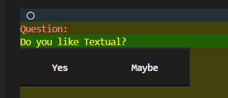

myapp.tcss文件转换成嵌套形式的话如下：

```css
Screen {
    background:yellow 20%;
    .alert {
        color: red;
        &.attention {
            color: yellow;
            background: green 50%;
        }
    }
}
```

在嵌套转换中，想必读者已经注意到一个特殊的符号——与号（`&`）。在嵌套的CSS中，将与号当做前缀，没有另一个选择器，看上去有点不符合语法。其实，这里隐藏了符号前的选择器——其所属的选择器，表示该选择器与其所属的选择器共同组成兼备组合器。比如，嵌套的CSS中，`&.attention`表示的是`.attention`与其所属的`.alert`共同组成兼备组合器，等于`.alert&.attention`或者`.alert.attention`。

#### 2.2.6 主题

上一节讲了很多CSS的知识，尤其是变量，对于自定义组件特别有用。假如需要自定义组件的话，需要写不少新的样式，来确保自定义的组件与原生组件外观基本一致。幸好Textual提供预定义的基础色变量，可以很方便地用在自定义的组件中，和主题颜色保持一致。之后，更是在0.86.0版本中添加了主题功能，使用Python接口也能很方便地创建、修改主题颜色。

##### 2.2.6.1 基础色变量

在正式学习主题功能之前，需要先了解一下基础色变量——构成主题的基本要素。除了设计主题需要了解，如果需要在CSS中给自定义组件设置跟随主题的颜色，下面的内容也会很有帮助。

基础色变量是组成主题的一系列颜色的统称，它们是以CSS变量的形式存在。不同的基础色变量用于不同的位置，主题通过设置这些变量的值（除了主要色，都可以在CSS文件中覆盖默认值），来让程序界面呈现出不同的颜色风格。

基础颜色变量和其含义可以参考下表：

| 颜色变量      | 含义                                                         |
| :------------ | :----------------------------------------------------------- |
| `$primary`    | 主要色，也可以看作是品牌色，常用于标题和表示强调时的背景。   |
| `$secondary`  | 次要色，也可以当做第二品牌色，用途和主要色差不多，但常用于与主要色同时使用但需要区分的场景。 |
| `$foreground` | 前景色，也是默认的文本颜色，应该在`$background`、`$surface`、`$panel`上清晰可见。 |
| `$background` | 背景色，用于没有内容的背景的颜色，也是屏幕组件的默认背景色。 |
| `$surface`    | 组件的默认背景色，通常覆盖在`$background`之上。              |
| `$panel`      | 用于区分内容部分和其他部分的颜色，可以理解为专用于内容的背景色，但在文本中很少使用。 |
| `$boost`      | 带有透明度的颜色，用于在背景上创建新的图层。                 |
| `$warning`    | 表示警告的背景色，`$text-warning`是表示警告的前景色。        |
| `$error`      | 表示错误的背景色，`$text-error`是表示错误的前景色。          |
| `$success`    | 表示成功的背景色，`$text-success`是表示成功的前景色。        |
| `$accent`     | 用以引起注意的颜色，不过很少使用。通常在需要与`$primary`、`$secondary`形成对比时使用。 |

##### 2.2.6.2 颜色深浅度

前一节提到的基础色变量，可以添加后缀，使颜色变得更浅或者更深：

-   在基础色变量后添加`-lighten-1`、`-lighten-2`、`-lighten-3`可以让颜色变浅，最后的数字越大越浅，一共三级，比如：`$error-lighten-3`。
-   在基础色变量后添加`-darken-1`、`-darken-2`、`-darken-3`可以让颜色变深，最后的数字越大越深，一共三级，比如：`$error-darken-3`。

##### 2.2.6.3 文本颜色

如基础色变量一节中所讲，`$foreground`是默认的文本颜色，为的是确保该颜色在`$background`、`$surface`、`$panel`上清晰可见。

除此以外，还有两个和文本颜色有关的变量：`$foreground-muted`和`$foreground-disabled`。前者颜色柔和一些，适用于文本不太重要的场景，比如副标题；后者颜色比前者更浅，适用于文本内容所属的组件被禁用的场景，表示组件或者内容的禁用状态。

有时候，文本的背景颜色不好预测，并且也不想文本颜色和前景色关联，可以将`foreground`替换为`text`，得到`$text`、`$text-muted`、`$text-disabled`，使文本颜色脱离前景色，通过自动计算背景色来生成，同样可以确保文本清晰可见。

和基础色变量类似，文本的颜色也支持一些基础文本色变量，这些颜色是基于基础颜色变量生成的，可以设置不同场景下的文本颜色：

-   `$text-primary`
-   `$text-secondary`
-   `$text-accent`
-   `$text-warning`
-   `$text-error`
-   `$text-success`

效果如图：

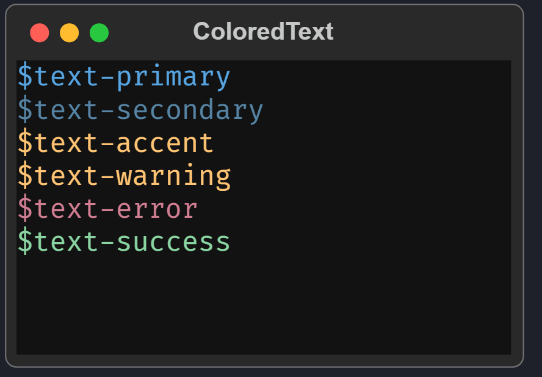

##### 2.2.6.4 柔和颜色

上一节里介绍了`$foreground-muted`，其后缀表示该颜色是柔和版本，其实就是给原本颜色设置了70%的透明度。

除了`$foreground-muted`之外，还有以下几种柔和版本的颜色变量，即基础柔和色变量：

-   `$primary-muted`
-   `$secondary-muted`
-   `$accent-muted`
-   `$warning-muted`
-   `$error-muted`
-   `$success-muted`

效果如图：

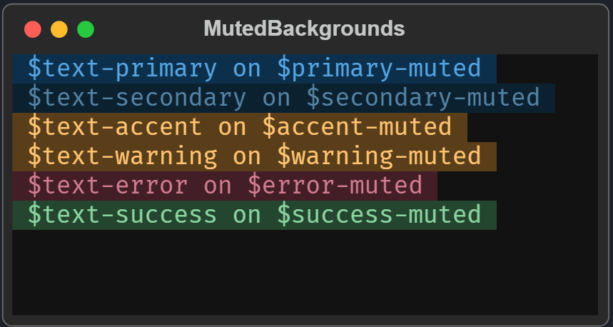

##### 2.2.6.5 其他样式变量

除了前几节介绍的与颜色相关的变量，Textual还内置了一些和组件有关的样式变量（主要是颜色）。

边框：

| 变量名            | 用途                                             | 默认值                   |
| :---------------- | :----------------------------------------------- | :----------------------- |
| `$border`         | 添加了边框且获得焦点的组件，该组件的边框颜色     | `$primary`               |
| `$border-blurred` | 添加了边框且没有获得焦点的组件，该组件的边框颜色 | 稍微加深一点的`$surface` |

光标：

| 变量名                             | 用途                                       | 默认值                |
| :--------------------------------- | :----------------------------------------- | :-------------------- |
| `$block-cursor-foreground`         | 光标块的文本颜色（比如在选项列表中的光标） | `$text`               |
| `$block-cursor-background`         | 光标块的背景颜色                           | `$primary`            |
| `$block-cursor-text-style`         | 光标块的文本样式                           | `"bold"`              |
| `$block-cursor-blurred-foreground` | 没有获得焦点的光标块颜色                   | `$text`               |
| `$block-cursor-blurred-background` | 没有获得焦点的光标块背景颜色               | 30%透明度的`$primary` |
| `$block-cursor-blurred-text-style` | 没有获得焦点的光标块文本样式               | `"none"`              |
| `$block-hover-background`          | 当鼠标悬停在光标块时的背景颜色             | 5%透明度的`$boost`    |

输入框：

| 变量名                        | 用途                 | 默认值                          |
| :---------------------------- | :------------------- | :------------------------------ |
| `$input-cursor-background`    | 输入框光标的背景颜色 | `$foreground`                   |
| `$input-cursor-foreground`    | 输入框光标的文本颜色 | `$background`                   |
| `$input-cursor-text-style`    | 输入框光标的文本样式 | `"none"`                        |
| `$input-selection-background` | 被选择文本的背景颜色 | 40%透明度的`$primary-lighten-1` |
| `$input-selection-foreground` | 被选择文本的文本颜色 | `$background`                   |

滚动条：

| 变量名                         | 用途                                       | 默认值                        |
| :----------------------------- | :----------------------------------------- | :---------------------------- |
| `$scrollbar`                   | 滚动条的颜色                               | `$panel`                      |
| `$scrollbar-hover`             | 鼠标悬停在滚动条上时的滚动条颜色           | `$panel-lighten-1`            |
| `$scrollbar-active`            | 鼠标开始激活（拖动）滚动条时的滚动条颜色   | `$panel-lighten-2`            |
| `$scrollbar-background`        | 滚动条轨道的颜色                           | `$background-darken-1`        |
| `$scrollbar-corner-color`      | 滚动条边角的颜色                           | 和`$scrollbar-background`相同 |
| `$scrollbar-background-hover`  | 当鼠标悬停在滚动条区域时，滚动条轨道的颜色 | 和`$scrollbar-background`相同 |
| `$scrollbar-background-active` | 当滚动条激活时，滚动条轨道的颜色           | 和`$scrollbar-background`相同 |

链接：

| 变量名                   | 用途                               | 默认值                 |
| :----------------------- | :--------------------------------- | :--------------------- |
| `$link-background`       | 链接的背景颜色                     | `"initial"`            |
| `$link-background-hover` | 鼠标悬停在链接上时，链接的背景颜色 | `$primary`             |
| `$link-color`            | 链接的文本颜色                     | `$text`                |
| `$link-style`            | 链接的文本样式                     | `"underline"`          |
| `$link-color-hover`      | 鼠标悬停在链接上时，链接的文本颜色 | `$text`                |
| `$link-style-hover`      | 鼠标悬停在链接上时，链接的文本样式 | `"bold not underline"` |

页脚：

| 变量名                           | 用途                       | 默认值          |
| :------------------------------- | :------------------------- | :-------------- |
| `$footer-foreground`             | 页脚的文本颜色             | `$foreground`   |
| `$footer-background`             | 页脚的背景颜色             | `$panel`        |
| `$footer-key-foreground`         | 页脚内快捷键文本的颜色     | `$accent`       |
| `$footer-key-background`         | 页脚内快捷键文本的背景颜色 | `"transparent"` |
| `$footer-description-foreground` | 页脚内描述文本的颜色       | `$foreground`   |
| `$footer-description-background` | 页脚内描述文本的背景颜色   | `"transparent"` |
| `$footer-item-background`        | 页脚内项目的背景颜色       | `"transparent"` |

按钮：

| 变量名                     | 用途                     | 默认值           |
| :------------------------- | :----------------------- | :--------------- |
| `$button-foreground`       | 标准按钮的前景色         | `$foreground`    |
| `$button-color-foreground` | 带色按钮的前景色         | `$text`          |
| `$button-focus-text-style` | 获得焦点的按钮的文本样式 | `"bold reverse"` |

##### 2.2.6.6 主题

铺垫了那么多，终于要说到Textual的主题功能了。

Textual内置了一些预设主题：`'textual-dark'`、`'textual-light'`、`'nord'`、`'gruvbox'`、`'catppuccin-mocha'`、`'textual-ansi'`、`'dracula'`、`'tokyo-night'`、`'monokai'`、`'flexoki'`、`'catppuccin-latte'`、`'solarized-light'`。

在App子类中设置`theme`属性为任一主题，即可将Textual的主题切换。也可以设置子类实例的`theme`属性，不过这个方法只能在类的初始化方法、`compose`方法、`on_mount`方法中使用，不能在类内直接使用。

示例如下：

```python3
from textual.app import App
from textual.widgets import Static
from textual.theme import Theme,BUILTIN_THEMES

class MyApp(App):
    theme = 'nord' # 方法一
    def on_mount(self):
        self.theme = 'nord' # 方法二
        self.widgets = [ Static(f'{name}') for name in BUILTIN_THEMES.keys()]
        self.mount_all(self.widgets)

if __name__ == '__main__':
    app = MyApp()
    app.run()
```

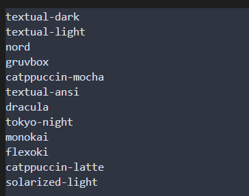

除了这些内置主题，还可以使用`Theme`对象创建新的主题。不过，创建新主题之后，需要使用`register_theme`方法将主题对象注册到`App`的子类中，才能将其应用。

使用下面的代码导入`Theme`类：

```python3
from textual.theme import Theme
```

构建`Theme`对象时，需要传入一些参数：

```python3
arctic_theme = Theme(
    name='arctic',
    primary='#88C0D0',
    secondary='#81A1C1',
    accent='#B48EAD',
    foreground='#D8DEE9',
    background='#2E3440',
    success='#A3BE8C',
    warning='#EBCB8B',
    error='#BF616A',
    surface='#3B4252',
    panel='#434C5E',
    boost='#434C5E',
    dark=True,
    variables={
        'block-cursor-text-style': 'none',
        'footer-key-foreground': '#88C0D0',
        'input-selection-background': '#81a1c1 35%',
    },
)
```

参数含义如下：

`name`参数是字符串类型，就是该主题的名字，在切换、设置主题时，使用的名字就是这个参数的值。

从`primary`参数开始，直到`boost`参数，这些就是前面讲过的基础色变量，在构建对象时传入颜色值，Textual会生成相应的CSS变量。可能有的读者觉得，每个基础色都要写，还要花时间研究对应颜色应该取什么值，还是有点麻烦。其实，除了`primary`参数是必填的，其余颜色都可以自己生成，如果嫌麻烦，可以用自动生成的值。当然，自动生成有时候可能不如预期好看，可以给部分基础色参数传入想要的值，让其他值自动生成。

`dark`参数是布尔类型，用于表明该主题是明亮主题还是黑暗主题。如果主题是黑暗主题，其他颜色会基于黑暗主题的规则生成，内置的组件也会显示对应黑暗主题的样式。如果自定义样式中有`:dark`伪类，那该样式会随之应用。

`variables`参数是字典类型，用于传入上一节中其他样式变量里想要指定的样式变量。字典的键是样式变量名，字典的值就是样式变量的值。

创建完对象之后，需要使用`register_theme`方法在`App`子类内注册。需要在子类的初始化方法、`compose`方法、`on_mount`方法中执行下面的代码：

```python3
self.register_theme(arctic_theme) # 注册主题
self.theme = arctic_theme.name # 设置主题
```

完整代码如下：

```python3
from textual.app import App
from textual.widgets import Static
from textual.theme import Theme,BUILTIN_THEMES

arctic_theme = Theme(
    name='arctic',
    primary='#88C0D0',
    secondary='#81A1C1',
    accent='#B48EAD',
    foreground='#D8DEE9',
    background='#2E3440',
    success='#A3BE8C',
    warning='#EBCB8B',
    error='#BF616A',
    surface='#3B4252',
    panel='#434C5E',
    boost='#434C5E',
    dark=True,
    variables={
        'block-cursor-text-style': 'none',
        'footer-key-foreground': '#88C0D0',
        'input-selection-background': '#81a1c1 35%',
    },
)

class MyApp(App):
    def on_mount(self):
        self.register_theme(arctic_theme)
        self.theme = arctic_theme.name
        self.widgets = [ Static(f'{name}') for name in BUILTIN_THEMES.keys()]
        self.mount_all(self.widgets)

if __name__ == '__main__':
    app = MyApp()
    app.run()
```

可能读者会有新的想法：除了Textual提供的样式变量，还想自定义一些样式变量给组件使用。

如果想自定义样式变量，就要在`App`子类内实现`get_theme_variable_defaults`方法。该方法返回的是和`Theme`对象的`variables`参数一样的字典，字典的键是样式变量名，字典的值就是样式变量的*默认值*。实现此方法之后，就可以在`App`子类内的CSS、CSS文件内、`Theme`对象中使用自定义的样式变量。

`myapp.py`文件的内容如下：

```python3
from textual.app import App
from textual.widgets import Static
from textual.theme import Theme,BUILTIN_THEMES

arctic_theme = Theme(
    name='arctic',
    primary='#88C0D0',
    secondary='#81A1C1',
    accent='#B48EAD',
    foreground='#D8DEE9',
    background='#2E3440',
    success='#A3BE8C',
    warning='#EBCB8B',
    error='#BF616A',
    surface='#3B4252',
    panel='#434C5E',
    boost='#434C5E',
    dark=True,
    variables={
        'my-color':'green',
        'my-bgcolor':'blue'
    },
)

class MyApp(App):
    CSS = '''
    Static {
        color:$my-color;
    }
    '''
    CSS_PATH = 'myapp.tcss'
    def get_theme_variable_defaults(self):
        return {'my-color':'red','my-bgcolor':'green'}
    def on_mount(self):
        self.register_theme(arctic_theme)
        self.theme = arctic_theme.name
        self.widgets = [ Static(f'{name}') for name in BUILTIN_THEMES.keys()]
        self.mount_all(self.widgets)

if __name__ == '__main__':
    app = MyApp()
    app.run()
```

`myapp.tcss`文件的内容如下：

```css
Static {
    background:$my-bgcolor 20%;
}
```

效果如图：

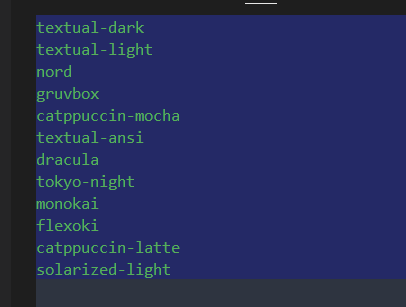

#### 2.2.7 DOM查询

前面的章节中介绍了DOM，也介绍了CSS的选择器。选择器可以在CSS中很方便地给符合条件的组件设置样式，是个非常有用的功能。当然，除了设置样式，在Python中还能使用选择器语法筛选、查找组件，方便对那些没有赋值给变量的无名组件，设置样式或者执行其他操作。

需要注意的是，下面提到的'query'开头的查询方法都是`App`类、`Screen`类、组件的方法，只有对应的实例对象才能调用查询方法。

查询方法的完整用法可以参考[官网文档](https://textual.textualize.io/api/dom_node/)，教程中只介绍基本用法。

##### 2.2.7.1 `query`方法

`query`方法可以查询符合条件的组件，如果没有传入选择器，则返回调用对象的所有子组件（其实是`DOMQuery`对象，一个可迭代对象，具体见[官网文档](https://textual.textualize.io/api/query/#textual.css.query.DOMQuery)，后面会细讲）。以代码为例，调用`query`方法的是`self.screen`，即`Screen`组件。根据前面介绍的文档对象模型，`App`子类下是`Screen`组件，`Screen`组件下是子类内创建的各个组件。因此，代码中使用迭代方法将查询的结果再次输出到`Screen`组件里新增的静态文本中时，就可以看到`App`子类下的所有组件：

```python3
from textual.app import App
from textual.widgets import Static,Button

class MyApp(App):
    def on_mount(self):
        self.widgets = [ Static('one'),Static('two'),Button('three')]
        self.mount_all(self.widgets)
        for widget in self.screen.query():
            self.mount(Static(str(widget)))

if __name__ == '__main__':
    app = MyApp()
    app.run()
```

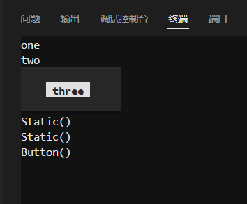

如果传入选择器语法给`query`方法，则会在子级中查找符合选择器语法的结果（点击查看效果）：

```python3
from textual.app import App
from textual.widgets import Static,Button

class MyApp(App):
    def on_mount(self):
        self.widgets = [ Static('one'),Static('two'),Button('three')]
        self.mount_all(self.widgets)
        
    def on_click(self):
        for widget in self.query('Static'):
            self.mount(Static(str(widget)))

if __name__ == '__main__':
    app = MyApp()
    app.run()
```

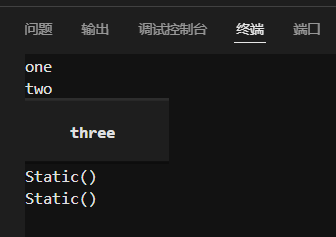

除了传入选择器语法给`query`方法，也可以传入组件类型，等同于类型选择器，比如代码中的`self.query('Static')`就可以改为`self.query(Static)`。

通过前面的代码示例，相信读者已经猜到，`query`方法返回的`DOMQuery`对象就像Python内部的`list`对象一样。没错，`DOMQuery`对象除了可以迭代遍历之外，也支持list对象的其他操作，比如：索引（`query[0]`）、计算长度（`len(query)`）、反转结果排序（`reverse(query)`）等。除此以外，`DOMQuery`对象还支持一些特有方法：

-   [`results`方法](https://textual.textualize.io/api/query/#textual.css.query.DOMQuery.results)，返回匹配的结果。不过，此方法返回的结果不同于`DOMQuery`对象，该方法的返回值是生成器，也就是说不支持list对象一样的方法（比如索引）。此外，此方法也能传入一个参数，用于在`DOMQuery`对象中筛选特定类型的组件（如果结果为空不报错，只会返回空白）。比如，`self.query().results(Button)`就是在结果中筛选Button类型的组件，得到只有`Button`组件的生成器。

-   [`first`方法](https://textual.textualize.io/api/query/#textual.css.query.DOMQuery.first)、[`last`方法](https://textual.textualize.io/api/query/#textual.css.query.DOMQuery.last)，返回结果的第一个、最后一个组件。这两个方法和`results`方法一样支持传入参数来进一步筛选结果中特定类型的组件，表示只有结果中第一个、最后一个组件是该类型的组件才正常返回（如果结果为空会报错）。这两个方法因为返回的是确定的结果，所以返回值的类型是组件，而不是生成器，因此不能对这两个方法的返回值进行迭代。

-   [`filter`方法](https://textual.textualize.io/api/query/#textual.css.query.DOMQuery.filter)，可以在`DOMQuery`对象的基础上，使用另一个选择器进行筛选，表示结果中符合该筛选条件的组件。不过，不同于`query`方法不传入参数表示筛选全部，`filter`方法必须传入选择器，否则会报错。当然，如果传入的是空字符串，则结果也会变成空。

-   [`exclude`方法](https://textual.textualize.io/api/query/#textual.css.query.DOMQuery.exclude)，可以在`DOMQuery`对象的基础上，使用另一个选择器进行排除，表示结果中除了符合选择器条件之外的组件。同`filter`方法一样，参数必须是有效的选择器，不传入参数会报错，空字符串会导致结果为空。

-   可以对结果统一执行的无需循环的方法。在此需要解释一下什么叫无需循环的方法。前面介绍的查询结果中，如果结果是可迭代的，想要设置结果中的组件的样式，需要先迭代遍历结果（`DOMQuery`对象），得到每个元素，才能执行元素的方法。比如：

    ```python3
    for widget in self.query('Static'):
        widget.add_class('alert')
    ```

    如果该方法是无需循环的方法，则可以直接让`DOMQuery`对象调用，不需要单独迭代遍历一次。那么，上面的代码就可以这样写：

    ```python3
    self.query('Static').add_class('alert')
    ```

    可以对结果统一执行的无需循环的方法有：

    -   [`add_class`方法](https://textual.textualize.io/api/query/#textual.css.query.DOMQuery.add_class)，给结果中的每个组件添加一个或多个样式类，参数支持传入多个样式类名，如`self.query('Static').add_class('alert','attention')`。
    -   [`blur`方法](https://textual.textualize.io/api/query/#textual.css.query.DOMQuery.focus)，让结果中的每个组件失去焦点。注意，此方法会让焦点回归到默认，即第一个可以获取焦点的组件（焦点序号为1的组件）。
    -   [`focus`方法](https://textual.textualize.io/api/query/#textual.css.query.DOMQuery.focus)，让结果中第一个组件获得焦点。
    -   [`refresh`方法](https://textual.textualize.io/api/query/#textual.css.query.DOMQuery.refresh)，刷新结果中的每个组件的显示。常用于设置了结果的样式相关属性之后，需要确保显示样式和当前属性一致的情况。
    -   [`remove_class`方法](https://textual.textualize.io/api/query/#textual.css.query.DOMQuery.remove_class)，给结果中的每个组件删除一个或多个样式类，参数支持传入多个样式类名，如`self.query('Static').remove_class('alert','attention')`。
    -   [`remove`方法](https://textual.textualize.io/api/query/#textual.css.query.DOMQuery.remove)， 从DOM中删掉结果中的每个组件。
    -   [`set_class`方法](https://textual.textualize.io/api/query/#textual.css.query.DOMQuery.set_class)，给结果中的每个组件设置一个或多个样式类，参数支持传入多个样式类名，如`self.query('Static').set_class('alert','attention')`。不同于`add_class`方法只是添加，该方法会先清除掉组件原本设置的样式类。
    -   [`set`方法](https://textual.textualize.io/api/query/#textual.css.query.DOMQuery.set)，设置结果中的每个组件的公共属性（显示状态`display`、可视性`visible`、禁用状态`disabled`、载入状态`loading`），只需给方法传入对应的关键字参数即可，比如`self.query('Button').set(display=False,visible=False,disabled=False,loading=False)`。需要注意的是，显示状态`display`和可视性`visible`虽然都是控制组件是否显示，前者会同时隐藏组件的占位空间，后者只是让组件不显示，但原位还是会有组件大小的占位空间。另外，`set`方法不同于其他方法，迭代遍历`DOMQuery`对象时，每个元素没有`set`方法，只有`DOMQuery`对象才能执行`set`方法。
    -   [`toggle_class`方法](https://textual.textualize.io/api/query/#textual.css.query.DOMQuery.toggle_class)，给结果中的每个组件切换一个或多个样式类，即如果存在该类名则删除，不存在则添加。

    除了`remove`方法，其余方法都是返回`DOMQuery`对象，也就是说其他方法可以串联执行，比如`self.query('Static').add_class('alert','attention').refresh()`，就是添加样式类之后刷新组件的显示。当然，`remove`方法也可以串联进去，只能放到最后执行。

综合上面用法，写一段简单的示例代码：

```python3
from textual.app import App
from textual.widgets import Static,Button

class MyApp(App):
    def on_mount(self):
        self.widgets = [ 
            Static('one'),
            Static('two'),
            Button('three'),
            Button('four',classes='yes')]
        self.mount_all(self.widgets)
        self.query('Button').set(display=False) # 隐藏所有按钮
        for static in self.query('Static'):
            static.styles.color = 'red' # 将所有静态文本的颜色改为红色
        for button in self.query('Button').filter('.yes'):
            button.display = True # 显示class为yes的按钮
            button.label = 'three' # 修改class为yes的按钮的标签为three
       
if __name__ == '__main__':
    app = MyApp()
    app.run()
```

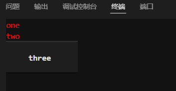

##### 2.2.7.2 其他query方法

除了强大的`query`方法，Textual还提供了一些细化的查询方法。不同于`query`方法返回`DOMQuery`对象，支持比较规整的子方法，这些细化的查询方法适用于特定场景，有的返回的是具体组件，不需要迭代；有的只查询直接子级，不会返回全部子级；还有的可以查询父级。读者可以按需选用，也可以`query`方法全解决。

[`query_one`方法](https://textual.textualize.io/api/dom_node/#textual.dom.DOMNode.query_one)：

和`query`方法一样使用选择器语法来筛选组件，只是该方法如其名，只会返回一个结果。哪怕能匹配到多个，也只返回第一个结果，因此，方法返回的是组件，不是可迭代的`DOMQuery`对象。

需要注意的是，不同于`query`方法，此方法如果找不到结果会报错，所以不能省略选择器或者传入空字符串。

第一个参数除了用选择器语法字符串之外，还可以使用组件的类名，比如`self.query_one(Static)`。

看到这里，读者可能会想起来，`query`方法的`results`子方法就可以传入组件类型当参数，来筛选结果，`query_one`是否也可以？

`query_one`方法当然也可以，只不过，`query_one`方法不需要调用`results`子方法，而是传入第二个参数即可。比如`self.query_one('.yes',Static)`。

示例代码如下，点击查看效果：

```python3
from textual.app import App
from textual.widgets import Static,Button

class MyApp(App):
    def on_mount(self):
        self.widgets = [ 
            Static('one'),
            Static('two',classes='yes'),
            Button('three'),
            Button('four',classes='yes')]
        self.mount_all(self.widgets)
    def on_click(self):
        self.query_one('.yes',Static).styles.color = 'red'

if __name__ == '__main__':
    app = MyApp()
    app.run()
```

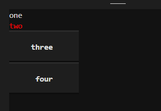

[`query_exactly_one`方法](https://textual.textualize.io/api/dom_node/#textual.dom.DOMNode.query_exactly_one)：

和`query_one`方法几乎一样，只是`query_exactly_one`方法的选择器语法只能匹配一个结果，一旦匹配得到多个结果就会报错。其他的报错和参数支持情况一样。

示例代码如下，点击查看效果：

```python3
from textual.app import App
from textual.widgets import Static,Button

class MyApp(App):
    def on_mount(self):
        self.widgets = [ 
            Static('one'),
            Static('two',classes='yes'),
            Button('three'),
            Button('four',classes='yes')]
        self.mount_all(self.widgets)
    def on_click(self):
        self.query_exactly_one('.yes&Static',Static).styles.color = 'red'

if __name__ == '__main__':
    app = MyApp()
    app.run()
```


[`query_children`方法](https://textual.textualize.io/api/dom_node/#textual.dom.DOMNode.query_children)：

`query_children`方法用法和`query_one`方法基本一样，但`query_children`方法只能查询调用者严格意义上的直接子级。

和`query_one`方法不同的是，该方法返回的是`DOMQuery`对象而不是具体组件，所以，那些`DOMQuery`对象支持的方法一样可以用。

需要注意的是，如果调用者是`App`子类实例，则严格意义上的直接子级只有`Screen`组件。所以，下面的示例中，调用该方法的不是`self`，而是`self.screen`（屏幕组件），点击查看效果：

```python3
from textual.app import App
from textual.widgets import Static,Button

class MyApp(App):
    def on_mount(self):
        self.widgets = [ 
            Static('one'),
            Static('two',classes='yes'),
            Button('three'),
            Button('four',classes='yes')]
        self.mount_all(self.widgets)
    def on_click(self):
        for static in self.screen.query_children('.yes').results(Static):
            static.styles.color = 'red'
        for static in self.screen.query_children(Static).filter('.yes'):
            static.styles.background = 'green 20%'

if __name__ == '__main__':
    app = MyApp()
    app.run()
```

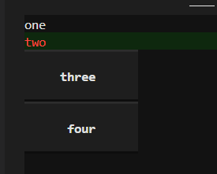

[`query_ancestor`方法](https://textual.textualize.io/api/dom_node/#textual.dom.DOMNode.query_ancestor)：

有查询子级的方法，就有查询父级的方法，`query_ancestor`方法就是用来查询父级的。该方法可以按照顺序（由近到远）查询调用者的所有父级组件，并返回第一个符合匹配条件的组件。

`query_ancestor`方法接收的参数类型和返回的结果类型与`query_one`方法一样，这里就不再赘述。

示例代码如下，点击查看效果：

```python3
from textual.app import App
from textual.widgets import Static
from textual.containers import Container

class MyApp(App):
    def on_mount(self):
        self.widgets = [
            Container(
                Container(
                    Static('one'),
                    classes='a'
                ),
                classes='b'
            )
        ]
        self.mount_all(self.widgets)
    def on_click(self):
        static = self.query_one(Static)
        static.query_ancestor('.a').styles.border = ('solid', 'red')
        static.query_ancestor('.b').styles.border = ('solid', 'green')

if __name__ == '__main__':
    app = MyApp()
    app.run()
```

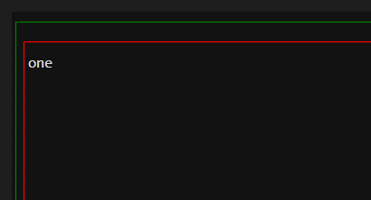

#### 2.2.8 布局

其实前面已经涉及过布局组件，只是当时主要介绍其他内容，而不是介绍布局。

比如`from textual.containers import Container, Horizontal`，就是导入了布局组件`Horizontal`。

Textual支持多种布局，最常用的是水平、垂直、网格布局。当然，前面的很多示例其实已经有了布局的雏形，只是Textual默认垂直布局，除非需要其他布局，才需要特别设置（比如上文提到的`Horizontal`，就是为了让组件水平布局）。

在正式学习布局之前，需要先创建一下用于演示布局的示例代码，后续可以方便对比布局的区别。

`myapp.py`文件的内容如下：

```python3
from textual.app import App
from textual.widgets import Static
from textual.containers import Container

class MyApp(App):
    CSS_PATH = 'myapp.tcss'
    def on_mount(self):
        self.widgets = [ 
            Container(
            Static('one'),
            Static('two'),
            Static('three'),
            )
        ]
        self.mount_all(self.widgets)

if __name__ == '__main__':
    app = MyApp()
    app.run()
```

`myapp.tcss`文件的内容如下：

```css
Static {
    height: 1fr;
    width: 1fr;
    border: solid green;
}
```

为了方便测试样式的效果，后面请使用`textual run --dev myapp.py`来运行示例代码，也可以每次修改之后重启程序。

##### 2.2.8.1 垂直布局

如[官网文档](https://textual.textualize.io/styles/layout/)所写，垂直布局是默认的布局样式，而Textual的容器（`Screen`组件可以看作`App`下的容器）也遵循这个原则，默认以垂直布局的方式排布容器内的组件。

何为垂直布局？

如下图所示，在容器内新增的组件会按照从上到下的顺序排在已有组件的下面：

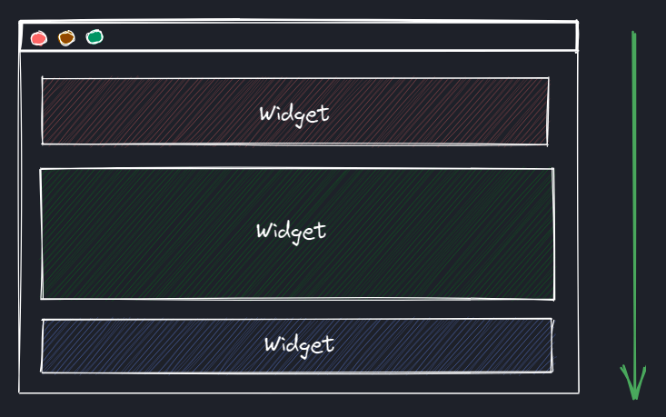

在示例代码中，三个静态文本都在容器组件`Container`中，所以，需要设置`Container`的布局才能看到效果（默认就是垂直布局，其实不设置也一样）。

设置布局的方法有两种：一是使用前面介绍过的样式接口（将`styles.layout`设置为`'vertical'`），直接在Python代码中设置；二是在CSS文件中设置（给容器添加样式`layout: vertical`）。

使用样式接口，需要修改`myapp.py`文件的内容如下：

```python3
from textual.app import App
from textual.widgets import Static
from textual.containers import Container,Horizontal,Vertical

class MyApp(App):
    CSS_PATH = 'myapp.tcss'
    def on_mount(self):
        self.widgets = [ 
            Container(
            Static('one'),
            Static('two'),
            Static('three'),
            )
        ]
        self.widgets[0].styles.layout = 'vertical'
        self.mount_all(self.widgets)

if __name__ == '__main__':
    app = MyApp()
    app.run()
```

在CSS中设置布局，需要修改`myapp.tcss`文件的内容如下：

```css
Static {
    height: 1fr;
    width: 1fr;
    border: solid green;
}
Container {
    layout: vertical;
}
```

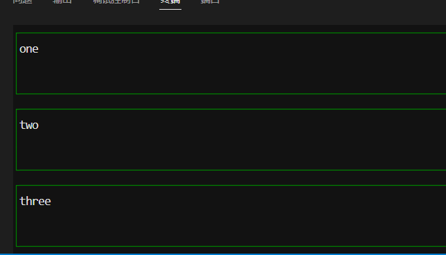

需要注意一点，示例中的代码，将静态文本的宽度和高度设置为`1fr`，使得宽度和高度都可以均匀等分`Screen`组件，不存在宽度和高度超过可显示区域的情况。如果高度设置为固定数值，所有组件的高度和超过可显示区域，会导致没法查看未显示的部分。

比如，在CSS文件的基础上做以下修改：

```css
Static {
    height: 10;
    width: 1fr;
    border: solid green;
}
Container {
    layout: vertical;
}
```

会看到：

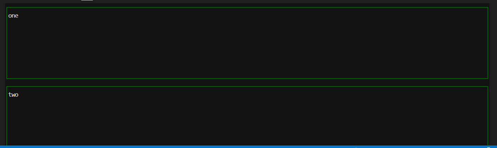

原本能显示全部三个静态文本的终端，因为静态文本高度之和超过终端高度，而不能全部显示。

这个时候，需要给容器设置溢出样式为自动，让终端显示出滚动条，滚动显示剩余内容。

溢出样式`overflow`参考[官网文档](https://textual.textualize.io/styles/overflow/)，两个方向都设置为自动`auto`（含义参考[官网文档](https://textual.textualize.io/css_types/overflow/)），即`overflow: auto auto`；也可以值设置一个方向`overflow-y: auto`（垂直方向对应的是y轴，`Screen`组件默认添加了此样式，如果容器是`Screen`，则不用单独设置）。

以下是修改后的结果：

```css
Static {
    height: 10;
    width: 1fr;
    border: solid green;
}
Container {
    layout: vertical;
    overflow: auto auto;
}
```

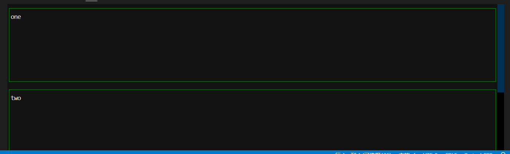

##### 2.2.8.2 水平布局

水平布局则与垂直布局的方向不同，从上下方向的排布，变成左右方向的排布。如下图所示，在容器内新增的组件会按照从左到右的顺序排在已有组件的右侧：

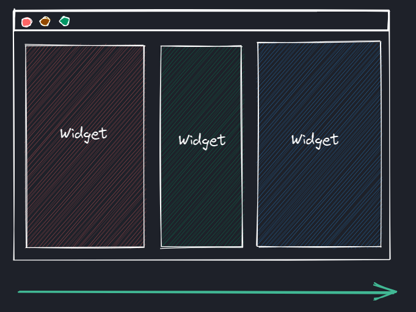

与垂直布局类似，设置水平布局的方法一样有两种：一是使用前面介绍过的样式接口（将`styles.layout`设置为`'horizontal'`），直接在Python代码中设置；二是在CSS文件中设置（给容器添加样式`layout: horizontal`）。

使用样式接口，需要修改`myapp.py`文件的内容如下：

```python3
from textual.app import App
from textual.widgets import Static
from textual.containers import Container,Horizontal,Vertical

class MyApp(App):
    CSS_PATH = 'myapp.tcss'
    def on_mount(self):
        self.widgets = [ 
            Container(
            Static('one'),
            Static('two'),
            Static('three'),
            )
        ]
        self.widgets[0].styles.layout = 'horizontal'
        self.mount_all(self.widgets)

if __name__ == '__main__':
    app = MyApp()
    app.run()
```

在CSS中设置布局，需要修改`myapp.tcss`文件的内容如下：

```css
Static {
    height: 1fr;
    width: 1fr;
    border: solid green;
}
Container {
    layout: horizontal;
}
```

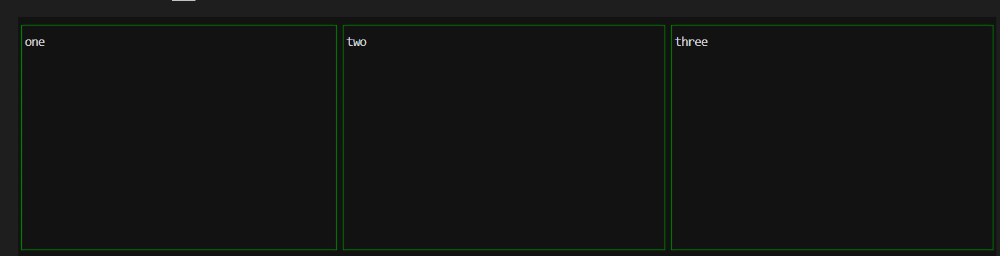

如果静态文本的宽度设置为固定数值，会遇到与垂直布局类似的问题，宽度之和超过终端宽度，会导致没法查看未显示的部分。

同样的，容器的溢出样式设置为自动可以解决。和垂直布局类似，水平布局也可以单独设置x轴方向的溢出样式`overflow-x: auto`。不过，`Screen`组件没有设置水平方向的溢出样式，如果容器是`Screen`组件，则需要给`Screen`组件设置x轴方向的溢出样式。

以下是修改后的结果：

```css
Static {
    height: 1fr;
    width: 100;
    border: solid green;
}
Container {
    layout: horizontal;
    overflow:auto auto;
}
```

##### 2.2.8.3 布局容器组件与上下文管理器语法

有心的读者可能已经发现了，示例代码中，除了导入`Container`组件，还导入了`Horizontal`组件和`Vertical`组件，可几个示例都没有使用这两个组件。没错，使用样式设置布局，总归是要在写了样式之后才能看到效果。在设计布局的阶段，写出布局样式之前，看不出`Container`组件究竟是水平布局还是垂直布局。好在`Horizontal`组件和`Vertical`组件提供了预设的布局，只要使用这两个组件，其内部组件的布局就是如它们的名字般确定。

布局容器的用法很简单，前面需要什么样式的布局，只需将原来的`Container`换成对应的名字即可。比如，想要水平布局的三个静态文本，只需将代码修改如下：

```python3
from textual.app import App
from textual.widgets import Static
from textual.containers import Container,Horizontal,Vertical

class MyApp(App):
    CSS_PATH = 'myapp.tcss'
    def on_mount(self):
        self.widgets = [ 
            Horizontal(
            Static('one'),
            Static('two'),
            Static('three'),
            )
        ]
        self.mount_all(self.widgets)

if __name__ == '__main__':
    app = MyApp()
    app.run()
```

`myapp.tcss`文件的内容如下：

```css
Static {
    height: 1fr;
    width: 1fr;
    border: solid green;
}
```

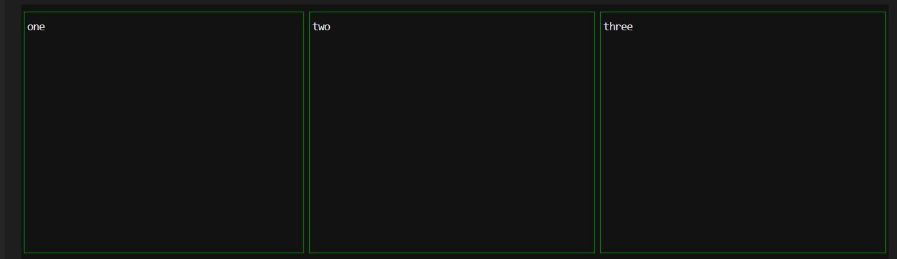

布局容器组件除了可以省略写布局样式的步骤，还支持使用上下文管理器`with`来代替函数调用式设计布局的方式。使用上下文管理器进入布容器局组件的上下文之后，在上下文内`yield`的组件会自动出现在布局容器内部。因此，此语法只能在`compose`方法内使用：

```python3
from textual.app import App
from textual.widgets import Static
from textual.containers import Container,Horizontal,Vertical

class MyApp(App):
    CSS_PATH = 'myapp.tcss'
    def compose(self):
        with Horizontal():
            yield Static('one')
            yield Static('two')
            yield Static('three')

if __name__ == '__main__':
    app = MyApp()
    app.run()
```

此写法和上面的Python代码效果一样，只是使用上下文管理器语法会让布局设计更加直观，甚至可以将函数调用式布局与上下文管理器语法混合使用：

```python3
from textual.app import App
from textual.widgets import Static
from textual.containers import Container,Horizontal,Vertical

class MyApp(App):
    CSS_PATH = 'myapp.tcss'
    def compose(self):
        with Horizontal(Static('one'), Static('two')):
            yield Static('three')

if __name__ == '__main__':
    app = MyApp()
    app.run()
```

读者可以根据喜好自由选择布局语法，这里没有特别推荐的。

##### 2.2.8.4 网格布局

除了垂直布局和水平布局，还有一种常用的布局，那就是网格布局。网格布局和办公软件中的表格类似，最小可以是一个单元格，最大可以扩展成连续的大单元格（就像是合并之后的单元格）。如下图所示，网格布局的灵活性比单个方向的布局高：

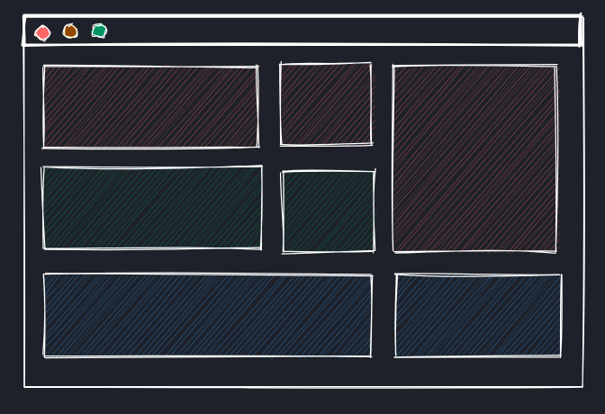

但是，相比于垂直布局、水平布局的简单，网格布局既灵活又复杂。若要了解网格布局的复杂性，需要先看一下示例代码。

`myapp.py`文件的内容如下：

```python3
from textual.app import App
from textual.widgets import Static
from textual.containers import Container,Horizontal,Vertical,Grid

class MyApp(App):
    CSS_PATH = 'myapp.tcss'
    def on_mount(self):
        self.widgets = [ 
            Container(
            Static('one'),
            Static('two'),
            Static('three'),
            )
        ]
        self.mount_all(self.widgets)

if __name__ == '__main__':
    app = MyApp()
    app.run()
```

`myapp.tcss`文件的内容如下：

```css
Static {
    height: 1fr;
    width: 1fr;
    border: solid green;
}
Container {
    layout: grid;
}
```

看上去和垂直布局的示例类似，只是这里的布局换成了网格布局——`grid`。然而，运行结果却让人匪夷所思：

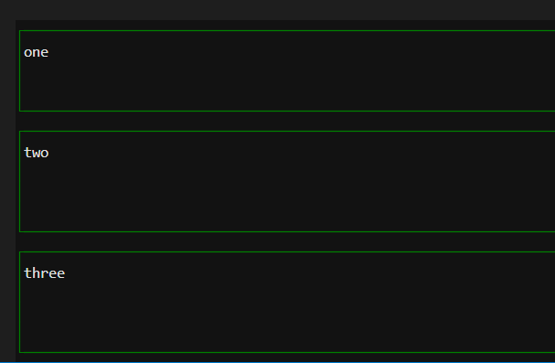

看起来和垂直布局一样，难道是写错代码了？

非也，其实，这就是网格布局，只是看起来有点像垂直布局而已。如果想要让二者产生区别，需要引入另一样式——`grid-size`。

只修改布局的话，网格布局就会产生这样的效果，想要完整体验网格布局，还需要了解网格布局相关的其他样式，具体可以参考[官网文档](https://textual.textualize.io/styles/grid/)。在众多相关样式中，第一个需要了解的，就是网格尺寸样式——`grid-size`（完整用法参考[官网文档](https://textual.textualize.io/styles/grid/grid_size/)）。

该样式支持一个或者两个非负整数。只设置一个非负整数时，表示网格的列数；设置两个非负整数时，第二个非负整数表示行数。在没有设置此样式时，默认网格的列数是1，行数是0（表示无限）。默认情况下，网格布局就只有一列的网格，所以看上去和垂直布局一样。

接下来，给网格尺寸设置为2列2行看看效果。

在CSS文件中设置的话，要修改成这样：

```css
Static {
    height: 1fr;
    width: 1fr;
    border: solid green;
}
Container {
    layout: grid;
    grid-size: 2 2;
}
```

在Python代码中使用样式接口设置，则需要单独设置列（`grid_size_columns`）、行（`grid_size_rows`）的数值：

```python3
from textual.app import App
from textual.widgets import Static
from textual.containers import Container,Horizontal,Vertical,Grid

class MyApp(App):
    CSS_PATH = 'myapp.tcss'
    def on_mount(self):
        self.widgets = [ 
            Container(
            Static('one'),
            Static('two'),
            Static('three'),
            )
        ]
        self.widgets[0].styles.layout = 'grid'
        self.widgets[0].styles.grid_size_columns = 2
        self.widgets[0].styles.grid_size_rows = 2
        self.mount_all(self.widgets)

if __name__ == '__main__':
    app = MyApp()
    app.run()
```

结果如下：

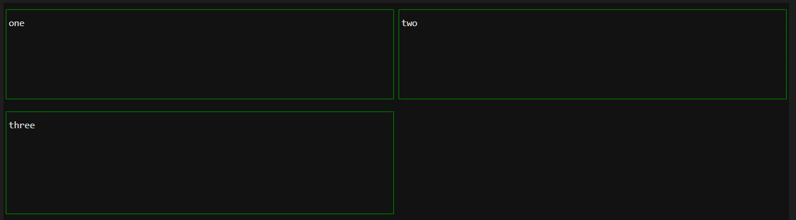

这次，网格布局和垂直布局就有区别了。

就像表格中调整行高、列宽一样，网格布局中，行、列的大小可以使用样式单独设置。需要注意的是，调整行、列的大小只是针对网格布局中的每个格子，格子内的组件的最大宽高会被限制为格子大小，来确保格子内的组件可以完整显示。因此，格子内组件的宽高可以在小于格子大小的范围内自由调整。为了确保行、列的大小的调整效果直观，不受组件大小的变化影响，示例中组件的宽高设置为`1fr`或者`100%`，并不是说格子内的组件必须这样设置。

设置列的宽度（[官网文档](https://textual.textualize.io/styles/grid/grid_columns/)），需要在容器中添加`grid-columns`样式。该样式接受多个长度（长度的单位含义参考宽度、高度和比例单位一节），每个长度代表对应列的宽度。比如，设置的样式为`grid-columns: 1fr 2fr`，表示第一列的宽度是`1fr`，第二列的宽度是`2fr`。而网格的尺寸是2列2行，则第一列的宽度是三分一，第二列的宽度是三分之二。

对应的样式接口是`styles.grid_columns`，样式接口中的长度均为字符串类型，想要传入的多个长度必须包装成元组类型。比如，`self.widgets[0].styles.grid_columns = ('1fr','2fr')`。假如只传入一个长度，则既可以用元组类型`self.widgets[0].styles.grid_columns = ('1fr',)`，也可以直接使用字符串类型`self.widgets[0].styles.grid_columns = '1fr'`。

设置行的高度（[官网文档](https://textual.textualize.io/styles/grid/grid_rows/)）则对应的是`grid-rows`，对应的样式接口是`styles.grid_rows`，数值含义类似，只是对应的值是行的高度。

长度支持固定数值、分数、百分数。如果百分数之和超过100%，需要设置溢出样式，否则，超过最大宽高的部分就会被遮挡，无法显示。

前面出现过传入的长度数量小于列数的情况，对于此情况，程序遵循以下原则：如果提供的每列、每行的长度数量小于列数、行数，那不足的部分会重复前面提供的长度，循环使用提供的长度。比如：列数是5，`grid-columns`设置为`10 20 30`，那么，程序就会自动重复前面已经提供的长度，实际得到的`grid-columns`是`10 20 30 10 20`。

示例如下：

`myapp.py`文件的内容如下，对应样式接口的设置方法：

```python3
from textual.app import App
from textual.widgets import Static
from textual.containers import Container,Horizontal,Vertical,Grid

class MyApp(App):
    CSS_PATH = 'myapp.tcss'
    def on_mount(self):
        self.widgets = [ 
            Container(
            Static('one'),
            Static('two'),
            Static('three'),
            )
        ]
        self.widgets[0].styles.layout = 'grid'
        self.widgets[0].styles.grid_size_columns = 2
        self.widgets[0].styles.grid_size_rows = 2
        self.widgets[0].styles.grid_columns = ('1fr','2fr')
        self.widgets[0].styles.grid_rows = ('1fr','2fr')
        self.mount_all(self.widgets)

if __name__ == '__main__':
    app = MyApp()
    app.run()
```

`myapp.tcss`文件的内容如下，对应CSS中的设置方法：

```css
Static {
    height: 1fr;
    width: 100%;
    border: solid green;
}
Container {
    layout: grid;
    grid-size: 2 2;
    grid-columns: 1fr 2fr;
    grid-rows: 1fr 2fr;
}
```

输出如下：

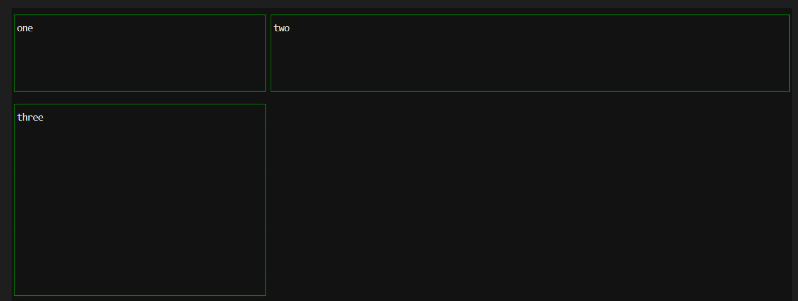

既然用的是长度单位，网格布局的行高列宽自然也支持设根据内容调整大小的`'auto'`。

```python3
from textual.app import App
from textual.widgets import Static
from textual.containers import Container,Horizontal,Vertical,Grid

class MyApp(App):
    CSS_PATH = 'myapp.tcss'
    def on_mount(self):
        self.widgets = [ 
            Container(
            Static('one'),
            Static('two'),
            Static('three'),
            )
        ]
        self.widgets[0].styles.layout = 'grid'
        self.widgets[0].styles.grid_size_columns = 2
        self.widgets[0].styles.grid_size_rows = 2
        self.widgets[0].styles.grid_columns = ('auto','2fr')
        self.widgets[0].styles.grid_rows = ('auto','2fr')
        self.mount_all(self.widgets)

if __name__ == '__main__':
    app = MyApp()
    app.run()
```

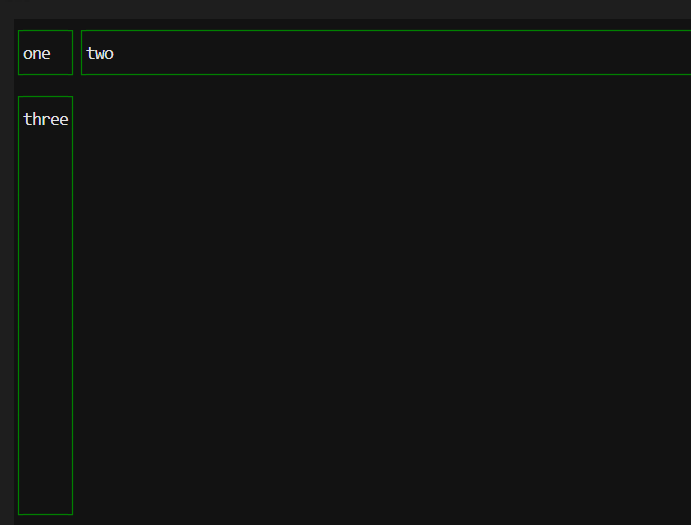

当然，像表格一样实现合并单元格的效果也可以做到，需要给网格内顶层组件设置列扩展样式（完整用法参考[官网文档](https://textual.textualize.io/styles/grid/column_span/)）、行扩展样式（完整用法参考[官网文档](https://textual.textualize.io/styles/grid/row_span/)）。

为了方便解释，需要用到下面的基础示例代码：

`myapp.py`文件的内容如下：

```python3
from textual.app import App
from textual.widgets import Static
from textual.containers import Container,Horizontal,Vertical,Grid

class MyApp(App):
    CSS_PATH = 'myapp.tcss'
    def on_mount(self):
        s1 = Static('one',classes='span')
        self.widgets = [ 
            Container(
            s1,
            Static('two'),
            Static('three'),
            )
        ]
        self.widgets[0].styles.layout = 'grid'
        self.widgets[0].styles.grid_size_columns = 3
        self.widgets[0].styles.grid_size_rows = 3
        self.widgets[0].styles.grid_columns = '1fr'
        self.widgets[0].styles.grid_rows = '1fr'
        self.mount_all(self.widgets)

if __name__ == '__main__':
    app = MyApp()
    app.run()
```

`myapp.tcss`文件的内容如下：

```css
Static {
    height: 1fr;
    width: 100%;
    border: solid green;
}
Container {
    layout: grid;
    grid-size: 3 3;
    grid-columns: 1fr;
    grid-rows: 1fr;
}
```

每个网格内的组件默认占据的是一行一列，一个单元格。假如设置行扩展为二，那组件占据的大小就变成了两行一列——两个单元格。同理，单独设置列扩展为二，占据大小也变成了两个单元格。但是，如果行扩展和列扩展都设置为二，就变成了二乘二——四个单元格。

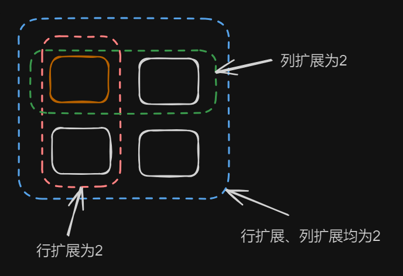

列扩展的样式类型是`column-span`，对应的样式接口是`styles.column_span`。行扩展的样式类型是`row-span`，对应的样式接口是`styles.row_span`。这两个样式接受整数作为值，表示其扩展的目标大小。

以设置列扩展为例，示例代码如下：

`myapp.py`文件的内容如下，对应样式接口的设置方法：

```python3
from textual.app import App
from textual.widgets import Static
from textual.containers import Container,Horizontal,Vertical,Grid

class MyApp(App):
    CSS_PATH = 'myapp.tcss'
    def on_mount(self):
        s1 = Static('one',classes='span')
        self.widgets = [ 
            Container(
            s1,
            Static('two'),
            Static('three'),
            )
        ]
        self.widgets[0].styles.layout = 'grid'
        self.widgets[0].styles.grid_size_columns = 3
        self.widgets[0].styles.grid_size_rows = 3
        self.widgets[0].styles.grid_columns = '1fr'
        self.widgets[0].styles.grid_rows = '1fr'
        s1.styles.column_span = 2
        self.mount_all(self.widgets)

if __name__ == '__main__':
    app = MyApp()
    app.run()
```

`myapp.tcss`文件的内容如下，对应CSS中的设置方法：

```css
Static {
    height: 1fr;
    width: 100%;
    border: solid green;
}
Container {
    layout: grid;
    grid-size: 3 3;
    grid-columns: 1fr;
    grid-rows: 1fr;
}
.span {
    column-span: 2;
}
```

结果如下：

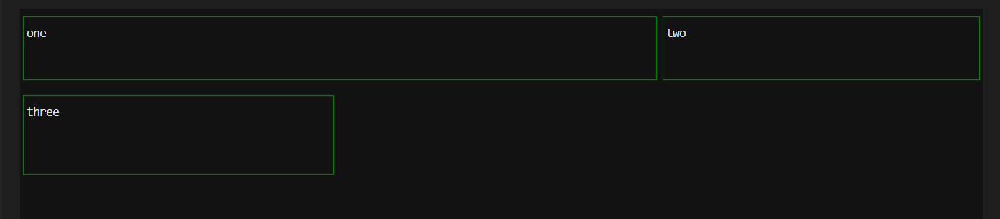

因为设置行扩展、列扩展只能针对网格内顶层组件，所以代码中给组件添加了一个样式类`'span'`，在CSS中设置列扩展时，使用的是类名选择器。

为了让每个静态文本的边界看得清楚，上面的几个示例中，都给静态文本加了边框。边框让静态文本的边界变得清晰，但也让读者一直误解了一件事——网格布局内的每个网格之间都有间隔。其实不是这样的，每个网格之间都是紧密相邻的。为了让读者清楚看到，现在，代码中静态文本的边框将被去除，用背景颜色代替。同时为了能看清网格之间是紧密相邻还是有间隔，静态文本的父容器，将使用另一种背景颜色。

就使用上面列扩展的示例代码，只修改CSS文件：

```css
Static {
    height: 1fr;
    width: 100%;
    background: darkmagenta;
}
Container {
    layout: grid;
    grid-size: 3 3;
    grid-columns: 1fr;
    grid-rows: 1fr;
    background: lightgreen;
}
.span {
    column-span: 2;
}
```

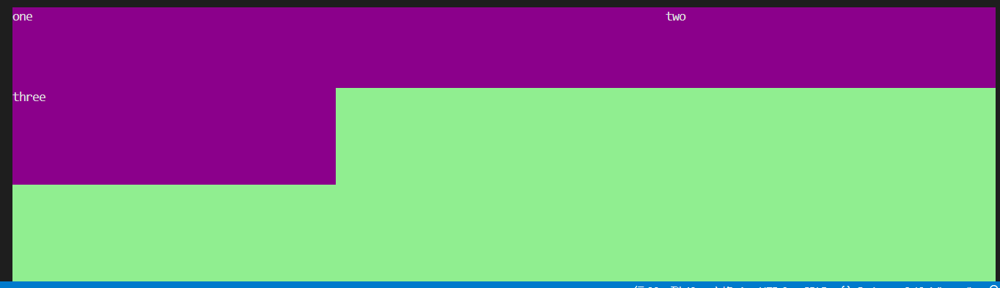

从前面一路学过来的读者肯定自信满满，想让网格之间有间隔那还不简单，外边距`margin`就是干这个的：

```css
Static {
    height: 1fr;
    width: 100%;
    background: darkmagenta;
    margin: 1;
}
Container {
    layout: grid;
    grid-size: 3 3;
    grid-columns: 1fr;
    grid-rows: 1fr;
    background: lightgreen;
}
.span {
    column-span: 2;
}
```

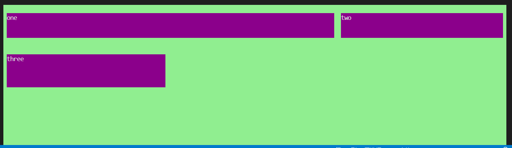

效果很显著，也很完美，代码也不复杂。不过，若是想要网格之间有间隔，网格容器的边界和网格之间没有间隔，需要怎么做？

也许，单独设置每个边界网格内组件的四个方向的外边距可以实现，但代码上会变得很复杂，有没有更加简单的方法？

想要简单实现，网格间距（完整用法参见[官网文档](https://textual.textualize.io/styles/grid/grid_gutter/)）正是最好的选择。

网格间距的样式类型是`grid-gutter`，支持一个或者两个非负整数值。传递一个非负整数，表示行间距、列间距都是这个值。如果传入两个非负整数，则第一个整数表示行间距，第二个整数表示列间距。

比如，设置行间距为`1`、列间距为`5`：

```css
Static {
    height: 1fr;
    width: 100%;
    background: darkmagenta;
}
Container {
    layout: grid;
    grid-size: 3 3;
    grid-columns: 1fr;
    grid-rows: 1fr;
    background: lightgreen;
    grid-gutter: 1 5;
}
.span {
    column-span: 2;
}
```

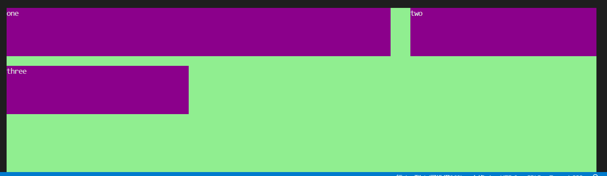

读者可能要好奇，网格间距是不是没有样式接口？前面几个样式，介绍的时候会同时说一下对应的样式，这个样式怎么没有？

先别急，网格间距的样式接口与CSS样式使用的方式不太一样。CSS样式中可以传递一个或者两个整数到同一个名字中，来调整不同的效果。想要在样式接口中实现同样的效果，则必须使用两个样式接口。

网格间距中行间距，样式接口是`styles.grid_gutter_horizontal`。网格间距中列间距，样式接口是`styles.grid_gutter_vertical`。看上去是不是与垂直布局、水平布局的方向相反？明明行间距是垂直方向上行与行之间的间隔，英文里用的却是水平一词。为了方便理解，这里建议读者这样想：行表示水平排布，所以行间距水平的行之间的距离；列是垂直的，对应的间距就是垂直。

去掉上面CSS文件中的`grid-gutter`样式，使用样式接口实现的话，`myapp.py`文件的内容如下：

```python3
from textual.app import App
from textual.widgets import Static
from textual.containers import Container,Horizontal,Vertical,Grid

class MyApp(App):
    CSS_PATH = 'myapp.tcss'
    def on_mount(self):
        s1 = Static('one',classes='span')
        self.widgets = [ 
            Container(
            s1,
            Static('two'),
            Static('three'),
            )
        ]
        self.widgets[0].styles.layout = 'grid'
        self.widgets[0].styles.grid_size_columns = 3
        self.widgets[0].styles.grid_size_rows = 3
        self.widgets[0].styles.grid_columns = '1fr'
        self.widgets[0].styles.grid_rows = '1fr'
        self.widgets[0].styles.grid_gutter_horizontal = 1
        self.widgets[0].styles.grid_gutter_vertical = 5
        self.mount_all(self.widgets)

if __name__ == '__main__':
    app = MyApp()
    app.run()
```


因为终端字符的字高通常是字宽的两倍，为了让行间距、列间距的视觉效果相近，建议将列间距设置为行间距的两倍。

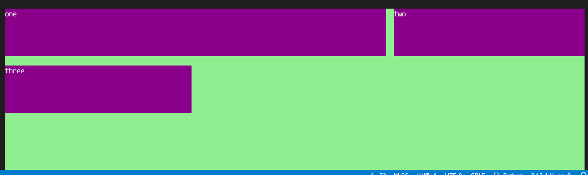

##### 2.2.8.5 停靠

除了上面提到的垂直布局、水平布局、网格布局这些布局中组件排序基本固定的布局，还有一种可以打乱排序的布局——停靠。停靠严格来说不算一种布局，因为其样式不属于`layout`，而是单独的`dock`。何为停靠？停靠可以理解为让组件脱离容器的原有布局，变成靠边、固定在某个位置（支持上、下、左、右四个位置）的船坞，不随其他同级组件一起活动。停靠样式常用于设计标题栏、状态栏、侧边栏，可以让内容固定显示在特定区域。

如下图所示，设置了停靠的组件会被固定到特定为止，哪怕其他同级组件可以上下滚动，该组件也不会随之滚动：

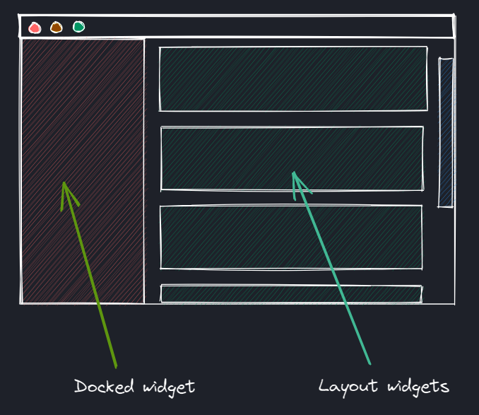

停靠的样式类型是`dock`，样式接口是`styles.dock`，停靠支持`'bottom'`、`'left'`、`'right'`、`'top'`四个位置，完整说明可以参考[官网文档](https://textual.textualize.io/styles/dock/)。

以下面的代码为例：

`myapp.py`文件的内容如下：

```python3
from textual.app import App
from textual.widgets import Static

class MyApp(App):
    CSS_PATH = 'myapp.tcss'
    def on_mount(self):
        s1 = Static('dock',classes='dock')
        self.widgets = [
            Static('one'),
            Static('two'),
            Static('three'),
            s1,
        ]
        self.screen.styles.layout = 'horizontal'
        s1.styles.width = '15%'
        s1.styles.height = '100%'
        s1.styles.background = 'lightgreen'
        self.mount_all(self.widgets)

if __name__ == '__main__':
    app = MyApp()
    app.run()
```

`myapp.tcss`文件的内容如下：

```css
Static {
    height: auto;
    width: 10;
}
```

上面的代码，将得到以下结果：

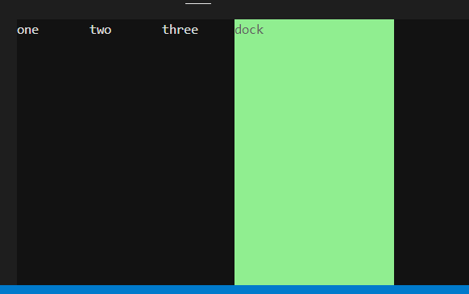

可以看到，写有`'dock'`的静态文本如代码中的顺序，在第四位。

然后，给静态文本设置停靠样式为`'left'`之后，将看到该静态文本固定显示在左边：

`myapp.py`文件的内容如下，对应样式接口的设置方法：

```python3
from textual.app import App
from textual.widgets import Static

class MyApp(App):
    CSS_PATH = 'myapp.tcss'
    def on_mount(self):
        s1 = Static('dock',classes='dock')
        self.widgets = [
            Static('one'),
            Static('two'),
            Static('three'),
            s1,
        ]
        self.screen.styles.layout = 'horizontal'
        s1.styles.width = '15%'
        s1.styles.height = '100%'
        s1.styles.background = 'lightgreen'
        s1.styles.dock = 'left' # 设置dock样式
        self.mount_all(self.widgets)

if __name__ == '__main__':
    app = MyApp()
    app.run()
```

`myapp.tcss`文件的内容如下，对应CSS中的设置方法：

```css
Static {
    height: auto;
    width: 10;
}
.dock {
    dock: left;
}
```

输出如下：

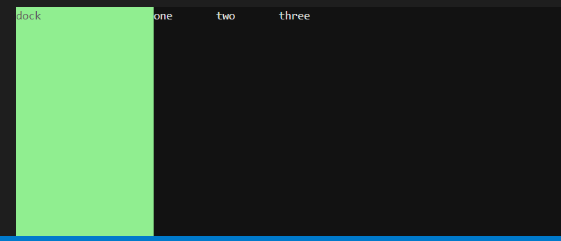

需要特别注意的是，如果多个组件设置了同一个方向上的停靠样式，根据组件的顺序，后设置停靠的组件会覆盖在先前设置停靠的组件的上面。

示例如下：

`myapp.py`文件的内容如下：

```python3
from textual.app import App
from textual.widgets import Static

class MyApp(App):
    CSS_PATH = 'myapp.tcss'
    def on_mount(self):
        s1 = Static('dock',classes='dock')
        s2 = Static('dock',classes='dock2')
        self.widgets = [
            Static('one'),
            Static('two'),
            Static('three'),
            s1,
            s2,
        ]
        self.screen.styles.layout = 'horizontal'
        s1.styles.width = '15%'
        s1.styles.height = '100%'
        s1.styles.background = 'lightgreen'
        s1.styles.dock = 'left'
        s2.styles.width = '10%'
        s2.styles.height = '100%'
        s2.styles.background = 'lightpink'
        s2.styles.dock = 'left'
        self.mount_all(self.widgets)

if __name__ == '__main__':
    app = MyApp()
    app.run()
```

结果如下：

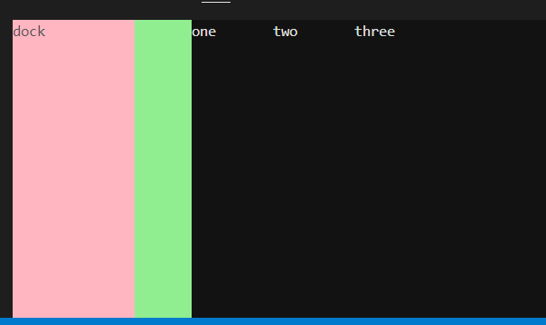

##### 2.2.8.6 图层与偏移

上一节中，同时设置一个方向的停靠，会让后设置的组件重叠到先前的组件上。这就引出一个Textual的特性——图层。Textual的绘制顺序是先低后高，这也解释了上一节中排在后面的停靠组件为什么会覆盖住先前停靠组件：停靠实际上是把组件的图层提高到已有组件之上，后添加停靠的组件会把先前停靠的组件当做已有组件，进而提高到更高一层。在此之前的布局（垂直、水平、网格），实际上都是在同一图层上绘制，哪怕是停靠，也只是因为默认渲染顺序，表现出图层的效果，并不是因为设置了图层。

在Textual中，没有Web中那样的z-index来区分一个组件的z轴顺序，却有一个类似的功能——图层。就像PS中的图层，Textual的图层可以让不同的组件区分其位置，哪怕是后面有新的组件，也能让先前的组件处于最上层。想要给组件设置图层，需要先理解两个样式的含义：图层顺序（`layers`）和所属图层（`layer`）。

`layers`是图层顺序，需要在容器中设定。该样式采用空格分隔每个图层名，组成一个图层名的顺序列表。其中，最左边表示最低层，最右边表示最高层，比如`layers: box2 box1`中，`box2`最低，`box1`最高。如果是采用样式接口的形式，则需要把表示图层顺序的列表变成字符串元组，上面的样式示例就变成了`styles.layers = ('box2','box1')`。完整用法可以参考[官网文档](https://textual.textualize.io/styles/layers/)。

所属图层`layer`是各个图层的命名，需要在对应的组件中设置，图层的名字来源于图层顺序。CSS中的样式类型是`layer`，样式接口是`styles.layer`，完整用法可以参考[官网文档](https://textual.textualize.io/styles/layer/)。

示例如下：

`myapp.py`文件的内容如下：

```python3
from textual.app import App
from textual.widgets import Static

class MyApp(App):
    CSS_PATH = 'myapp.tcss'
    def on_mount(self):
        self.widgets = [
            Static('box1', classes='box1'),
            Static('box2', classes='box2'),
        ]
        self.mount_all(self.widgets)

if __name__ == '__main__':
    app = MyApp()
    app.run()
```

`myapp.tcss`文件的内容如下：

```css
Static {
    width: 30;
    height: 8;
    color: auto;
    content-align: center middle;
}
Screen {
    layers: box2 box1;
}
.box1 {
    layer: box1;
    background: lightgreen;
}
.box2 {
    layer: box2;
    background: lightpink;
    offset: 15 6;
}
```

结果如下：

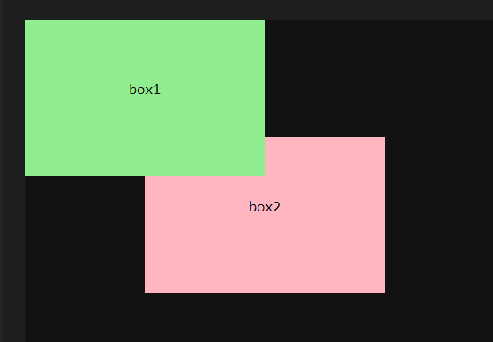

因为该示例涉及的CSS比较复杂，故示例只演示CSS中的写法，对应的样式接口写法就省略了。

为了方便区分两个静态文本，代码将静态文本的内容居中，并给不同的静态文本组件设置了不同的背景颜色，这样就能看出哪个静态文本在上，哪个在下。需要注意的是，如果两个静态文本不在同一图层的话，它们在各自图层的位置是相同的（都在左上角）。因此，需要给在下面的静态文本设置偏移，使其与上面的静态文本错开，方便看到效果。

说到偏移，这里就一并讲一下。

偏移的样式类型是`offset`，样式接口是`styles.offset`。偏移支持两个整数数字，分别表示水平方向（X轴方向）、垂直方向（Y轴方向）的偏移量。向右、向下为正，反之为负。在CSS中，这两个数字根据空格分隔来区分；在样式接口中，这两个数字需要组成整数元组，如`styles.offset = (5,2)`。

需要注意的是，CSS中还支持`offset-x`和`offset-y`这两种对X轴（水平方向）、Y轴（垂直方向）单独设置偏移的样式，样式接口中则没有这两种属性，完整用法参考[官网文档](https://textual.textualize.io/styles/offset/)。另外，偏移除了支持固定的数字，还支持比例单位，但只能在对应方向上使用比例单位（`w`和`vw`只能用在X轴方向，`h`和`vh`只能用在Y轴方向），否则会导致单位计算出错。并且，偏移中的`w`和`h`含义将与`%`一样，都是表示以组件自身的大小为100%的长度。分数单位不支持，而且也没有合法含义。使用分数单位的效果，和没有单位的裸数字一样。

设置了偏移的组件可以脱离原先的位置，平移到所在图层的其他位置，如下图所示：

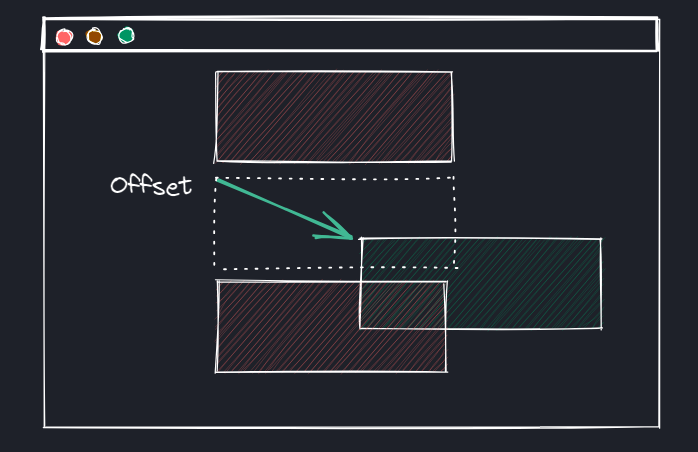

#### 2.2.9 事件与消息

前面在Textual程序的基本概念-事件一节中，提到了'on_'为前缀的事件响应方法是程序的基本组成。这一节，将详细介绍textual框架的消息系统。不过，在此之前，需要解释一下事件和消息的含义。

很多时候，事件和消息被混在一起说，比如：消息的响应函数，事件的响应函数，指的是同一个响应函数。然而，事件和消息却是不同的概念，将响应函数与其关联可能结果一致，但还是有细微的差别。

事件是是一个动作发生的事实。点击按钮，会有按钮的点击事件发生；在文本框输入，会有输入事件发生。

消息则是消息系统中其他成员知道一个动作的发生。听上去消息和事件差不多，其实是因为事件的发生往往伴随着消息的传播，所以二者不太容易分开说。如果涉及到响应操作，就能看出二者的区分了。

假如要给一个事件设置一个响应操作，可以在创建组件时，同时给组件的特定事件关联响应操作。虽然这样的触发操作还是离不开消息，但可以将响应与具体组件直接关联。

如果是给消息设置一个响应操作，则不需要等待组件创建，只需要结合消息系统的规定，创建一个对特定消息响应的操作即可。

##### 2.2.9.1 消息队列

Textual对于消息的处理，采取的是消息队列机制，即先发出的消息先处理，按照排序处理，确保全部处理。

结合下面的图片，可以很方便理解。

假如用户在输入框内，按下一系列按键`T`、`e`、`x`、`t`，那输入框的按键事件响应函数（`on_key`）就会依次接收到这几个按键事件的消息：

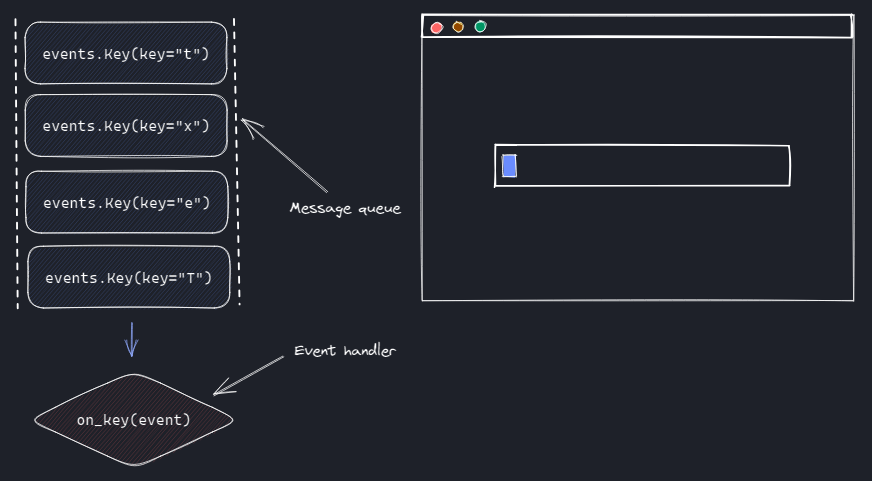

然后，输入框的按键事件响应函数（`on_key`）就会依次处理这些信息，让输入框的内容依次增加按键内容，并显示出来：

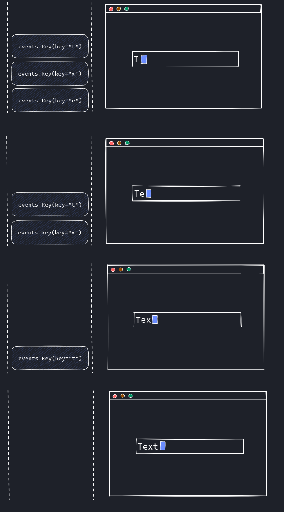

直到消息队列被清空，响应函数停止运行，继续等待新的消息出现。当然，这个操作实际上很快，并没有描述中一步一步执行的感觉。

##### 2.2.9.2 处理消息

说到消息的处理程序——响应函数，就不得不讲一下Textual的响应函数的写法。虽然读者已经在前面惊鸿一瞥，但函数的写法还是有门道的，并没有看上去那么简单。

想要给一个消息或者事件编写响应函数，第一步要做的就是理解命名。前面说了事件和消息的区别，虽说开发过程中很容易混淆，但在这里还是要再次强调一下二者的差异，因为在Textual中，给事件和消息创建响应函数，命名上有些许差异。

以下图为例：

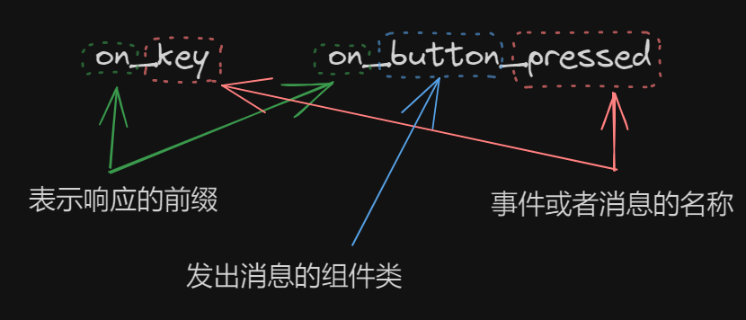

`on_key`是事件的响应函数，`on_button_pressed`则是消息的响应函数。从命名上就能看出事件和消息的区别。以下划线为分界点，事件的响应函数分为两部分：表示响应的前缀'on\_'和事件名称。消息的响应函数则是三部分：表示响应的前缀'on\_'、发出消息的组件类名和消息名称。

需要注意的是，消息和事件的响应函数，需要将消息、事件、发出消息的组件类名全部转化为小写，并用下划线分隔才行。有些组件类名、消息、事件是大写每个字段首字母的驼峰命名，在响应函数中则需要改成以下划线划分字段的蛇形命名，比如：`ButtonA`（继承自`Button`的自定义类）的`Pressed`消息的响应函数，则要写成`on_button_a_pressed`。这里的`button_a`是对`ButtonA`的转化，里面的下划线并不参与响应函数的整体划分。

虽然命名上事件的响应函数和消息的响应函数有所区别，但实际使用时二者差别不大。因为事件也是消息的派生类，下面几节要讲的消息特性，事件也一般具备（部分组件会防止特定事件的冒泡，比如`Button`的`on_click`响应函数，因此要具体组件具体分析）。

事件和消息会基于继承关系向上传递，让父类一并响应（可以理解为事件和消息在继承体系中包含本身，向上传播，逐级响应）。

事件和消息还会经过消息系统发送到外部，让没有派生关系的DOM上级组件的响应（可以理解为事件和消息在DOM结构中包含自身，向上传播，逐级响应，也就是后续要讲的冒泡机制）。

Textual支持的事件可以参考[官网文档](https://textual.textualize.io/events/)。消息则需要查询对应组件内部的消息类才能知道，比如：`Button`的[消息](https://textual.textualize.io/widgets/button/#messages)。

以下是一个常规的响应函数的示例，其中的`on_mount`是`App`子类的事件响应函数，`on_button_pressed`则是`App`子类对DOM下级`Button`组件的消息响应函数。点击按钮，按钮的文字会变成`'button pressed'`：

```python3
from textual.app import App
from textual.widgets import Static,Button

class MyApp(App):
    def on_mount(self):
        self.widgets = [
            Static('Events'),
            Button('Press')
        ]
        self.mount_all(self.widgets)

    def on_button_pressed(self):
        self.widgets[1].label = 'button pressed'

if __name__ == '__main__':
    app = MyApp()
    app.run()
```

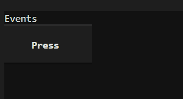

响应函数除了只带一个表示实例对象的`self`参数，还可以额外带一个代表具体消息的消息参数。消息参数就是该响应函数所响应的消息，比如`on_button_pressed`，就可以再带一个`Button.Pressed`类型的消息参数，该类型参数支持一些属性，具体可以参考[官网文档](https://textual.textualize.io/widgets/button/#textual.widgets.Button.Pressed)，这里使用了代表按钮本身的`button`属性，这样，上个例子中原本要索引之后才能获取的按钮控件，就可以使用这个属性代替：

```python3
from textual.app import App
from textual.widgets import Static,Button

class MyApp(App):
    def on_mount(self):
        self.widgets = [
            Static('Events'),
            Button('Press')
        ]
        self.mount_all(self.widgets)

    def on_button_pressed(self,e:Button.Pressed):
        e.button.label = 'button pressed'

if __name__ == '__main__':
    app = MyApp()
    app.run()
```


除了上面这种'on_'开头，只能使用规定函数名的响应函数，Textual还提供了一种装饰器`on`，可以把任意函数包装为响应函数。

使用`from textual import on`导入`on`装饰器。`on`装饰器的第一个位置参数是被包装函数响应的消息。比如，想要给`Button.Pressed`消息写一个响应函数，使用`on`装饰器的话，代码是这样的：

```python3
@on(Button.Pressed)
def handle_button_pressed(self):
    self.widgets[1].label = 'button pressed'
```

需要注意的是，`on`装饰器修饰的函数可以是任何与现有函数不重名的函数，这里的`handle_button_pressed`也不是规定的名称，只是为了方便理解而约定俗成的名称。

以下示例展示了如何使用`on`装饰器定义不带参数的响应函数：

```python3
from textual.app import App
from textual.widgets import Static,Button
from textual import on

class MyApp(App):
    def on_mount(self):
        self.widgets = [
            Static('Events'),
            Button('Press')
        ]
        self.mount_all(self.widgets)

    @on(Button.Pressed)
    def handle_button_pressed(self):
        self.widgets[1].label = 'button pressed'

if __name__ == '__main__':
    app = MyApp()
    app.run()
```


如果想给装饰器包装的响应函数带上消息参数，消息参数则要写到被包装的函数中，而不是`on`装饰器中：

```python3
from textual.app import App
from textual.widgets import Static,Button
from textual import on

class MyApp(App):
    def on_mount(self):
        self.widgets = [
            Static('Events'),
            Button('Press')
        ]
        self.mount_all(self.widgets)

    @on(Button.Pressed)
    def handle_button_pressed(self,e:Button.Pressed):
        e.button.label = 'button pressed'

if __name__ == '__main__':
    app = MyApp()
    app.run()
```


`on`装饰器的第二个位置参数是使用选择器语法的筛选参数，支持通过选择器来筛选特定组件。

以下面的代码为例，筛选参数指定了选择器`'.a'`，只响应样式类中有`'a'`的组件的`Button.Pressed`消息：

```python3
from textual.app import App
from textual.widgets import Static,Button
from textual import on

class MyApp(App):
    def on_mount(self):
        self.widgets = [
            Static('Events'),
            Button('Press A',classes='a'),
            Button('Press B',classes='b')
        ]
        self.mount_all(self.widgets)

    @on(Button.Pressed,'.a')
    def handle_button_pressed(self,e:Button.Pressed):
        e.button.label = 'button pressed'

if __name__ == '__main__':
    app = MyApp()
    app.run()
```

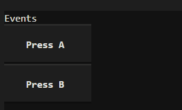

这里提前提醒一下，后面学习了自定义组件之后别忘了这个注意事项：

如果子类组件继承了父类组件，但没有重新定义同名消息。那么，在`App`子类中定义的、按要求指定函数名、响应子类组件同名消息的响应函数，想要响应子类组件的同名消息，则需要将函数名中的消息发送者改为父类组件。

若是使用`on`装饰器来定义响应函数，则不需要修改消息发送者，这样定义的响应函数可以准确响应子类组件继承的同名消息。

##### 2.2.9.3 默认行为

上一节说事件和消息会基于继承关系向上传递，实际上是指事件和消息的响应函数被子类继承，哪怕子类再次定义了同名响应函数，也不会覆盖父类的响应函数。在子类执行响应函数之后，还会默认执行父类的响应函数。就和Python中手动执行`super().__init__()`一样，只不过在Textual中，这个操作是默认的，不需要手动、显式执行。

下面的示例中，通过编写有继承关系的子类，展示了这个特性。需要注意的是，自定义的类、组件首字母要大写，否则会报错。事件响应函数的示例如下：

```python3
from textual.app import App
from textual.widgets import Static,Button

class ButtonA(Button):
    def on_click(self,e:Button.Pressed):
        self.label += ' A'

class ButtonB(ButtonA):
    def on_click(self,e:Button.Pressed):
        self.label += ' B'

class MyApp(App):
    def on_mount(self):
        self.widgets = [
            Static('Events'),
            ButtonA('ButtonA'),
            ButtonB('ButtonB')
        ]
        self.mount_all(self.widgets)

if __name__ == '__main__':
    app = MyApp()
    app.run()
```

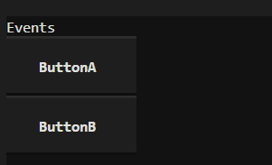

消息响应函数的示例如下：

```python3
from textual.app import App
from textual.widgets import Static,Button

class ButtonA(Button):
    def on_button_pressed(self,e:Button.Pressed):
        self.label += ' A'

class ButtonB(ButtonA):
    def on_button_pressed(self,e:Button.Pressed):
        self.label += ' B'

class MyApp(App):
    def on_mount(self):
        self.widgets = [
            Static('Events'),
            ButtonA('ButtonA'),
            ButtonB('ButtonB')
        ]
        self.mount_all(self.widgets)

if __name__ == '__main__':
    app = MyApp()
    app.run()
```


可以看到，`ButtonA`继承了`Button`之后，定义了一个在按钮文本追加字母'A'的操作；`ButtonB`继承了`ButtonA`之后，定义了一个在按钮文本追加字母'B'的操作。但在实际运行时，点击按钮`ButtonB`，却追加了字母'B'和'A'，这就是默认运行了父类`ButtonA`的响应操作。

子类响应函数的默认行为很方便，可以免得继承父类之后，忘了调用父类方法，但同时也很烦人，尤其是父类已经实现响应函数的时候，想要修改一些父类的操作，会不可避免地再次执行父类的操作，无法真正覆盖父类方法。这时，就需要了解一下如何防止默认行为，来避免这个烦人的特性。

运行消息参数的子方法`prevent_default`可以防止这个默认行为执行，该方法的完整用法可以参考[官网文档](https://textual.textualize.io/api/message/#textual.message.Message.prevent_default)。

事件响应函数的示例如下：

```python3
from textual.app import App
from textual.widgets import Static,Button

class ButtonA(Button):
    def on_click(self,e:Button.Pressed):
        self.label += ' A'

class ButtonB(ButtonA):
    def on_click(self,e:Button.Pressed):
        e.prevent_default(True)
        self.label += ' B'

class MyApp(App):
    def on_mount(self):
        self.widgets = [
            Static('Events'),
            ButtonA('ButtonA'),
            ButtonB('ButtonB')
        ]
        self.mount_all(self.widgets)

if __name__ == '__main__':
    app = MyApp()
    app.run()
```


消息响应函数的示例如下：

```python3
from textual.app import App
from textual.widgets import Static,Button

class ButtonA(Button):
    def on_button_pressed(self,e:Button.Pressed):
        self.label += ' A'

class ButtonB(ButtonA):
    def on_button_pressed(self,e:Button.Pressed):
        e.prevent_default(True)
        self.label += ' B'

class MyApp(App):
    def on_mount(self):
        self.widgets = [
            Static('Events'),
            ButtonA('ButtonA'),
            ButtonB('ButtonB')
        ]
        self.mount_all(self.widgets)

if __name__ == '__main__':
    app = MyApp()
    app.run()
```


##### 2.2.9.4 冒泡机制

事件和消息有一个名为`bubble`的属性，该属性设置为`True`的话，事件和消息会在响应函数执行完之后，传递给DOM中的上级组件，让上级组件响应事件和消息。这个过程就好像水下的气泡慢慢往上冒，所以也叫冒泡机制。

以下面的代码为例，详解一下冒泡机制：

```python3
from textual.app import App
from textual.widgets import Static,Button

class ButtonA(Button):
    def on_button_pressed(self,e:Button.Pressed):
        self.label += ' A'

class ButtonB(ButtonA):
    def on_button_pressed(self,e:Button.Pressed):
        e.prevent_default(True)
        self.label += ' B'

class MyApp(App):
    def on_mount(self):
        self.widgets = [
            Static('Events'),
            ButtonA('ButtonA'),
            ButtonB('ButtonB')
        ]
        self.mount_all(self.widgets)

    def on_button_pressed(self,e:Button.Pressed):
        self.widgets[0].update(e.button.label)

if __name__ == '__main__':
    app = MyApp()
    app.run()
```

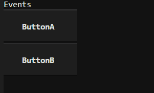

`Button.Pressed`消息的`bubble`属性为默认值`True`，因此该消息会沿着下图的DOM路径，一直冒泡到最上面的`App`子类`MyApp`。因此，在`MyApp`类中定义的响应函数`on_button_pressed`才会在`ButtonA`点击之后执行，将静态文本的内容设置为按钮的文本。

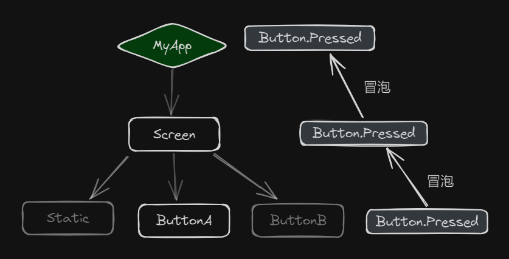

恰如有默认行为就有防止默认行为的方法，有冒泡自然也有防止冒泡的方法。防止冒泡有两种方法：

-   如冒泡的定义所讲，将消息的`bubble`属性设置为`False`。
-   消息的`stop`子方法可以防止消息冒泡，`stop`方法的完整用法可以参考[官网文档](https://textual.textualize.io/api/message/#textual.message.Message.stop)。

两种方法的示例如下，通过在`ButtonA`的消息响应函数中防止消息冒泡，让`MyApp`中的响应函数不再响应`ButtonA`的消息：

设置消息的`bubble`属性：

```python3
from textual.app import App
from textual.widgets import Static,Button

class ButtonA(Button):
    def on_button_pressed(self,e:Button.Pressed):
        e.bubble = False
        self.label += ' A'

class ButtonB(ButtonA):
    def on_button_pressed(self,e:Button.Pressed):
        e.prevent_default(True)
        self.label += ' B'

class MyApp(App):
    def on_mount(self):
        self.widgets = [
            Static('Events'),
            ButtonA('ButtonA'),
            ButtonB('ButtonB')
        ]
        self.mount_all(self.widgets)

    def on_button_pressed(self,e:Button.Pressed):
        self.widgets[0].update(e.button.label)

if __name__ == '__main__':
    app = MyApp()
    app.run()
```

使用消息的`stop`方法：

```python3
from textual.app import App
from textual.widgets import Static,Button

class ButtonA(Button):
    def on_button_pressed(self,e:Button.Pressed):
        e.stop()
        self.label += ' A'

class ButtonB(ButtonA):
    def on_button_pressed(self,e:Button.Pressed):
        e.prevent_default(True)
        self.label += ' B'

class MyApp(App):
    def on_mount(self):
        self.widgets = [
            Static('Events'),
            ButtonA('ButtonA'),
            ButtonB('ButtonB')
        ]
        self.mount_all(self.widgets)

    def on_button_pressed(self,e:Button.Pressed):
        self.widgets[0].update(e.button.label)

if __name__ == '__main__':
    app = MyApp()
    app.run()
```

结果如下：


读者可能觉得冒泡有点像上一节讲到的默认行为——子类的响应函数也会执行父类的响应函数，其实二者还是有区别的：冒泡只是对DOM生效，DOM中的上级会响应下级的消息；父类和子类之间没有冒泡，只有子类执行父类响应函数的默认行为。如果将防止默认行为的代码换成防止冒泡的代码，就会发现父类的响应函数依然会在子类中执行：

```python3
from textual.app import App
from textual.widgets import Static,Button

class ButtonA(Button):
    def on_button_pressed(self,e:Button.Pressed):
        e.stop()
        self.label += ' A'

class ButtonB(ButtonA):
    def on_button_pressed(self,e:Button.Pressed):
        e.stop()
        self.label += ' B'

class MyApp(App):
    def on_mount(self):
        self.widgets = [
            Static('Events'),
            ButtonA('ButtonA'),
            ButtonB('ButtonB')
        ]
        self.mount_all(self.widgets)

    def on_button_pressed(self,e:Button.Pressed):
        self.widgets[0].update(e.button.label)

if __name__ == '__main__':
    app = MyApp()
    app.run()
```

##### 2.2.9.5 自定义消息

预定义的消息和事件总归是数量有限的，功能上不一定满足需求。所以，Textual还支持自定义消息。

想要自定义消息，最简单的方法就是继承Textual的消息类。先用`from textual.message import Message`导入消息类，在自定义的组件类内，创建一个内部类来继承消息类。

需要注意的是，自定义的消息类首字母要大写，否则会报错。

此时，代码如下：

```python3
class ButtonA(Button):
    class ClickedOnce(Message):
		pass
```

一个简单的自定义消息类已经创建好，下一步就是将自定义消息发送到消息系统。发送消息的方法是组件类子方法`post_message`，该方法的参数是消息类的实例对象，完整用法参考[官网文档](https://textual.textualize.io/api/message_pump/#textual.message_pump.MessagePump.post_message)。为了能让发送消息的操作响应点击操作，需要将该方法的执行代码放到点击事件（完整用法参考[官网文档](https://textual.textualize.io/events/click/)）的响应函数中，现在，代码如下：

```python3
class ButtonA(Button):
    class ClickedOnce(Message):
        pass
    def on_click(self):
        self.post_message(self.ClickedOnce())
```

至此，一个发送自定义消息的自定义组件类已经完成。

接下来，就是检验自定义消息能不能正常响应的时候。为了方便验证自定义消息有没有被发送到消息系统中，该消息的响应函数写在`MyApp`类内，只有自定义消息正常冒泡，响应函数才能执行。

需要注意的是，响应函数需要对使用驼峰命名法（大写每个字段首字母）的消息名进行转换，改用蛇形命名法（全小写，使用下划线分隔字段）。所以，响应函数的名字是`on_button_a_clicked_once`。完整示例代码如下：

```python3
from textual.app import App
from textual.widgets import Static,Button
from textual.message import Message

class ButtonA(Button):
    class ClickedOnce(Message):
        pass
    def on_click(self):
        self.post_message(self.ClickedOnce())

class MyApp(App):
    def on_mount(self):
        self.widgets = [
            Static('Events'),
            ButtonA('ButtonA')
        ]
        self.mount_all(self.widgets)

    def on_button_a_clicked_once(self,e:ButtonA.ClickedOnce):
        self.widgets[0].update('customed message')

if __name__ == '__main__':
    app = MyApp()
    app.run()
```

如果代码无误，点击按钮之后，静态文本的内容会更新：

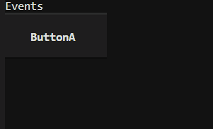

自定义消息也支持传入额外的参数，此时自定义消息可以传递一些信息给响应函数：

```python3
class ButtonA(Button):
    class ClickedOnce(Message):
        def __init__(self, text:str):
            self.text = text
            super().__init__()
    def on_click(self):
        self.post_message(self.ClickedOnce(f'{self.label} posted customed message.'))
```

需要注意的是，因为发送消息时传入额外的参数实际上是给消息类的初始化函数传入额外的参数，因此需要在自定义消息类中创建支持额外参数的初始化参数。消息类的初始化函数不支持默认调用父类的初始化函数，因此需要手动调用父类的初始化函数。至于额外的参数，上面的代码只是传递给消息对象的text属性。

这样，在响应函数中就可以使用消息参数的`text`属性：

```python3
from textual.app import App
from textual.widgets import Static,Button
from textual.message import Message

class ButtonA(Button):
    class ClickedOnce(Message):
        def __init__(self, text:str):
            self.text = text
            super().__init__()
    def on_click(self):
        self.post_message(self.ClickedOnce(f'{self.label} posted customed message.'))

class MyApp(App):
    def on_mount(self):
        self.widgets = [
            Static('Events'),
            ButtonA('ButtonA')
        ]
        self.mount_all(self.widgets)

    def on_button_a_clicked_once(self,e:ButtonA.ClickedOnce):
        self.widgets[0].update(e.text)

if __name__ == '__main__':
    app = MyApp()
    app.run()
```


##### 2.2.9.5 阻止消息

前面介绍了如何防止DOM上级执行响应函数（防止消息冒泡），也介绍了防止子类默认执行父类的响应函数。但是，如果响应函数的操作导致另一个组件的响应函数执行，该如何防止？

先看下面的问题示例：

```python3
from textual.app import App
from textual.widgets import Static,Button,Input

class MyApp(App):
    def on_mount(self):
        self.widgets = [
            Static('Events'),
            Input(placeholder='Input here'),
            Button('Press')
        ]
        self.mount_all(self.widgets)

    def on_button_pressed(self):
        self.widgets[1].value = 'button pressed'

    def on_input_changed(self):
        self.widgets[0].update('input changed')

if __name__ == '__main__':
    app = MyApp()
    app.run()
```

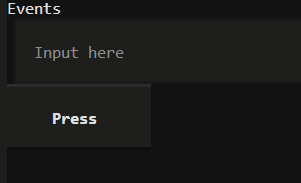

正常来说，只要输入框的内容改变时，静态文本就会改变。因此，通过点击按钮改变输入框的内容，也会让静态文本改变，这是正常现象。

但是，现在就是不想点击按钮也触发输入框的响应函数，同时还要让在输入框正常输入时可以触发响应函数，该怎么办？

设置一个中间变量，当按钮改变输入框内容时设置为`True`，输入框的响应函数执行时，判断这个变量不为`True`才正常执行？

听起来很靠谱，那就写一下代码：

```python3
from textual.app import App
from textual.widgets import Static,Button,Input

class MyApp(App):
    button_change = False
    def on_mount(self):
        self.widgets = [
            Static('Events'),
            Input(placeholder='Input here'),
            Button('Press')
        ]
        self.mount_all(self.widgets)

    def on_button_pressed(self):
        self.button_change = True
        self.widgets[1].value = 'button pressed'

    def on_input_changed(self):
        if not self.button_change:
            self.widgets[0].update('input changed')
        self.button_change = False

if __name__ == '__main__':
    app = MyApp()
    app.run()
```


方案可行，不过，操作就伴随着事件，也就会发出消息，有时候还想这种复合操作的解决方案更简单点。那么，组件的`prevent`方法就可以让这种操作变得更加直观。给该方法传入消息类型作为参数，返回的是阻止消息的上下文，使用Python的关键字`with`进入该上下文，就可以避免触发指定消息。

这样，上面的解决方案就可以变得更加优雅，不需要让两个响应函数都去关注一个状态变量。这也是Textual官方推荐的做法：

```python3
from textual.app import App
from textual.widgets import Static,Button,Input

class MyApp(App):
    def on_mount(self):
        self.widgets = [
            Static('Events'),
            Input(placeholder='Input here'),
            Button('Press')
        ]
        self.mount_all(self.widgets)

    def on_button_pressed(self):
        input = self.query_one(Input)
        with input.prevent(Input.Changed):
            input.value = 'button pressed'

    def on_input_changed(self):
        self.widgets[0].update('input changed')

if __name__ == '__main__':
    app = MyApp()
    app.run()
```


#### 2.2.10 输入

和Textual程序相关的交互外设是键盘和鼠标，对程序来说，如何正确处理它们产生的输入事件就是如何正确处理用户的交互行为。因此，本节主要学习的就是键盘和鼠标事件——也可以理解为用户的输入事件。

##### 2.2.10.1 键盘输入

为了配合学习Textual的按键事件，下面的演示程序将会帮助到读者：

```python3
from textual.app import App
from textual.widgets import RichLog
from textual import events

class MyApp(App):
    def on_mount(self):
        self.widgets = [
            RichLog()
        ]
        self.mount_all(self.widgets)
    
    def on_key(self,e:events.Key):
        self.query_one(RichLog).write(e)

if __name__ == '__main__':
    app = MyApp()
    app.run()
```

运行上面的程序之后，依次按下`q`、`ctrl`+`w`和`tab`，将会看到终端输出以下内容：

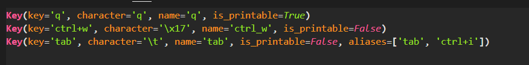

`RichLog`组件可以将给定的内容输出到终端并让内容按指定的语法高亮，很适合直观分析输出到终端的内容。程序将按键事件（按键事件的完整文档参考[官网](https://textual.textualize.io/api/events/#textual.events.Key)）的内容传递给`RichLog`，这样就可以在终端中看到按键事件的具体格式。

除了上面要求的按键，读者也可以自己尝试更多按键，学习更多按键的属性。需要注意的是，终端类型的不同，可以生效的按键也不同：有的终端会拦截部分快捷键，有些组合按键可能不会在程序中显示或者生效，不代表Textual框架不处理那些组合按键。

一般来说，一个按键事件会包含以下部分属性：

-   `key`属性，字符串类型，表示被按下的按键的标识符。如果是常规的字符（字母的大小写、数字、符号），这个属性就是对应的字符，比如上面的`'q'`；如果是组合按键（`f1`到`f12`、`ctrl`、`alt`、`shift`及其与其他可以单次组合使用的任意组合），这个属性就是组合按键的表示名字，比如`'ctrl+w'`；如果是功能按键，就是功能按键的名字，比如`'tab'`。

-   `character`属性，字符串类型，如果按下的按键可以用一个unicode字符表示（常规可打印的字符和转义字符），那该属性就是这个字符，否则（没有对应转义字符的组合键和功能键）该属性就是`None`。需要注意的是，很多按键代表的转义字符也是一个字符（比如`'\t'`和`'\x17'`，不能光看表示出来的字符个数），但不能打印出来，所以下面要讲的`is_printable`属性为`False`的，不一定没有`character`属性。

-   `name`属性，字符串类型，有点像`key`属性，但`key`属性那种字符串在Python中不能全部用于变量表示，所以`name`属性可以理解为转化为Python中合法变量名的`key`属性（即将加号替换为下划线，大写字母用'upper\_'加小写字母表示）。`name`属性在下面定义按键事件的响应方法（'key\_'为前缀，加对应按键或组合键的`name`属性，表示响应该按键或组合键的响应函数）时会用到。

-   `is_printable`属性，布尔类型，表示该按键或组合键的`character`属性是不是可打印的。即`character`属性能不能打印出来，`None`和转义字符为不可打印的类型，也可以在Python中调用对应字符的`isprintable`方法，根据返回的布尔值来判断，比如`'\t'.isprintable()`。

-   `aliases`属性，字符串列表类型，表示按键的别名（`key`属性不同但实际上是一个按键的其他按键）。如上面图片所示，有些按键还有别名属性，表示该按键和列表中代表其他`key`属性的按键无法区分，在程序中实际上被当成同一个按键处理，其别名按键的`key`属性以该别名所属的按键事件的`key`属性为唯一值。其`name`属性则可以基于别名转化，`name`属性只能出现其中一个或者优先使用该别名所属的按键事件的`name`属性。下表中脱出字符表示法表示的按键只需两个按键（`'^'`表示`ctrl`键；大写字母表示的是键盘按键，不是指使用`shift`加对应字母输入的大写英文；部分符号需要同时按下`shift`的，则表示`shift`键加对应按键）、其意义有专门按键的，一般都有别名属性（表中的退格和删除没有别名属性，而是被当成同一个按键`backspace`，但`character`属性分别为`'\x08'`和`'\x7f'`）：

    | 二进制    | 十进制 | 十六进制 | 缩写 | Unicode 表示法 | 脱出字符 表示法 | 名称／意义                          |
    | --------- | ------ | -------- | ---- | -------------- | --------------- | ----------------------------------- |
    | 0000 0000 | 0      | 00       | NUL  | ␀              | ^@              | 空字符（Null）                      |
    | 0000 0001 | 1      | 01       | SOH  | ␁              | ^A              | 标题开始                            |
    | 0000 0010 | 2      | 02       | STX  | ␂              | ^B              | 本文开始                            |
    | 0000 0011 | 3      | 03       | ETX  | ␃              | ^C              | 本文结束                            |
    | 0000 0100 | 4      | 04       | EOT  | ␄              | ^D              | 传输结束                            |
    | 0000 0101 | 5      | 05       | ENQ  | ␅              | ^E              | 请求                                |
    | 0000 0110 | 6      | 06       | ACK  | ␆              | ^F              | 确认回应                            |
    | 0000 0111 | 7      | 07       | BEL  | ␇              | ^G              | 响铃                                |
    | 0000 1000 | 8      | 08       | BS   | ␈              | ^H              | 退格                                |
    | 0000 1001 | 9      | 09       | HT   | ␉              | ^I              | 水平定位符号                        |
    | 0000 1010 | 10     | 0A       | LF   | ␊              | ^J              | 换行键                              |
    | 0000 1011 | 11     | 0B       | VT   | ␋              | ^K              | 垂直定位符号                        |
    | 0000 1100 | 12     | 0C       | FF   | ␌              | ^L              | 换页键                              |
    | 0000 1101 | 13     | 0D       | CR   | ␍              | ^M              | Enter键                             |
    | 0000 1110 | 14     | 0E       | SO   | ␎              | ^N              | 取消变换（Shift out）               |
    | 0000 1111 | 15     | 0F       | SI   | ␏              | ^O              | 启用变换（Shift in）                |
    | 0001 0000 | 16     | 10       | DLE  | ␐              | ^P              | 跳出数据通讯                        |
    | 0001 0001 | 17     | 11       | DC1  | ␑              | ^Q              | 设备控制一（XON 激活软件速度控制）  |
    | 0001 0010 | 18     | 12       | DC2  | ␒              | ^R              | 设备控制二                          |
    | 0001 0011 | 19     | 13       | DC3  | ␓              | ^S              | 设备控制三（XOFF 停用软件速度控制） |
    | 0001 0100 | 20     | 14       | DC4  | ␔              | ^T              | 设备控制四                          |
    | 0001 0101 | 21     | 15       | NAK  | ␕              | ^U              | 确认失败回应                        |
    | 0001 0110 | 22     | 16       | SYN  | ␖              | ^V              | 同步用暂停                          |
    | 0001 0111 | 23     | 17       | ETB  | ␗              | ^W              | 区块传输结束                        |
    | 0001 1000 | 24     | 18       | CAN  | ␘              | ^X              | 取消                                |
    | 0001 1001 | 25     | 19       | EM   | ␙              | ^Y              | 连接介质中断                        |
    | 0001 1010 | 26     | 1A       | SUB  | ␚              | ^Z              | 替换                                |
    | 0001 1011 | 27     | 1B       | ESC  | ␛              | ^[              | 退出键                              |
    | 0001 1100 | 28     | 1C       | FS   | ␜              | ^\              | 文件分区符                          |
    | 0001 1101 | 29     | 1D       | GS   | ␝              | ^]              | 组群分隔符                          |
    | 0001 1110 | 30     | 1E       | RS   | ␞              | ^^              | 记录分隔符                          |
    | 0001 1111 | 31     | 1F       | US   | ␟              | ^_              | 单元分隔符                          |
    | 0111 1111 | 127    | 7F       | DEL  | ␡              | ^?              | 删除（Backspace）                   |

    可能读者对表格中脱出字符的表达比较好奇，其实脱出字符的英文是escape code，对应的相关知识可以参考这个[链接](https://handwiki.org/wiki/ANSI_escape_code)，这里就不做扩展解释了。

除了前面提到过的`on_key`方法可以响应按键事件，Textual还提供了一种'key_'开头、后接按键`name`属性的按键响应方法。

'key_'开头的响应方法和一般的事件响应方法一样，支持的参数也一样，因此，将上面示例中的`on_key`替换为`key_space`之后，原本可以响应任何按键的程序，就变成只响应空格键的程序：

```python3
from textual.app import App
from textual.widgets import RichLog
from textual import events

class MyApp(App):
    def on_mount(self):
        self.widgets = [
            RichLog()
        ]
        self.mount_all(self.widgets)
    
    def key_space(self,e:events.Key):
        self.query_one(RichLog).write(e)

if __name__ == '__main__':
    app = MyApp()
    app.run()
```

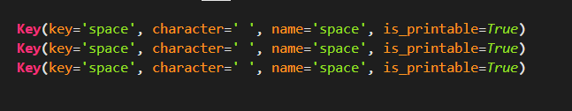

虽然指定按键名的响应函数简单、方便，但在学了快捷键[绑定](https://textual.textualize.io/guide/input/#bindings)和[动作](https://textual.textualize.io/guide/actions/)之后，使用绑定来指定快捷键功能会更直观、好用。后续有快捷键需求的地方，也推荐读者优先使用绑定。

##### 2.2.10.2 输入焦点

能获得焦点（`can_focus`属性为`True`）的组件，在获得焦点（非禁用状态下，按`tab`键切换或者被点击）时，会独占按键事件。使用组件的[`focus`方法](https://textual.textualize.io/api/widget/#textual.widget.Widget.focus)可以切换焦点到当前组件。组件在获得、失去焦点时，会有[`focus`事件](https://textual.textualize.io/events/focus/)、[`blur`事件](https://textual.textualize.io/events/blur/)发生，可以按需创建对应事件的响应函数。

以下面的代码为例，通过让`KeyLogger`类继承`RichLog`类，并在子类内创建`on_key`响应函数，这样响应函数就变成了自定义组件的内部函数，只有自定义组件获得焦点时才能响应按键操作。而在`App`子类内，通过给自定义组件的`:focus`伪类设置边框，让组件的激活（获得焦点）状态变得明显。这样，就可以清楚看到，只有组件获得焦点时才能响应按键，没有焦点时无法响应：

```python3
from textual.app import App
from textual.widgets import RichLog
from textual import events

class KeyLogger(RichLog):
    def on_key(self, e:events.Key):
        self.write(e)

class MyApp(App):
    CSS = '''
    KeyLogger:focus {
        border: solid yellow;
    }
    '''
    def on_mount(self):
        self.widgets = [
            KeyLogger(),
            KeyLogger(),
            KeyLogger(),
        ]
        self.mount_all(self.widgets)

if __name__ == '__main__':
    app = MyApp()
    app.run()
```

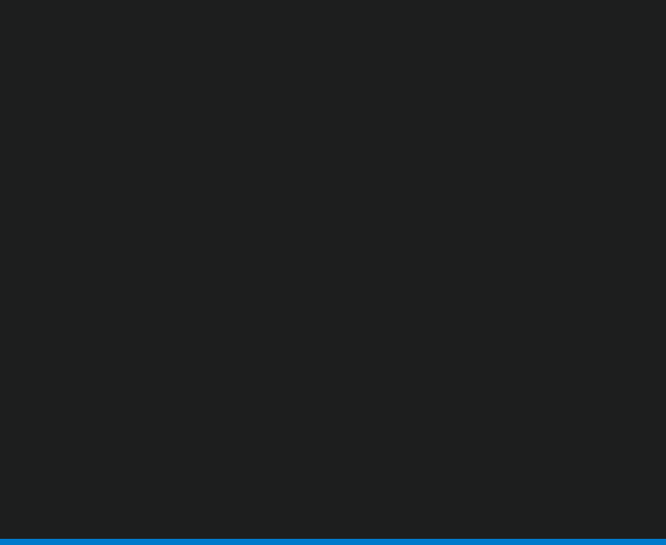

##### 2.2.10.3 快捷键绑定

前面在介绍指定按键的响应函数时，提到过快捷键绑定更直观、好用，本节要学习的就是快捷键绑定。和前面介绍的在`App`子类中嵌入CSS类似，快捷键绑定也是通过给`App`子类或者自定义组件类添加`BINDINGS`属性来实现。该属性是一个列表，列表的每个元素都是一个快捷键绑定定义或者绑定对象。当按下一个按键或者按键组合，程序就会在依次当前获得焦点的组件、DOM上层组件中由下至上、`App`子类的`BINDINGS`属性中匹配的快捷键绑定。

先说快捷键绑定定义。绑定定义很简单，是一个三元素或者两元素的元组，其中两元素元组就是三元素元组省略了第三个元素。三元素元组的三个元素分别是：

-   表示快捷键的字符串，使用按键触发的按键事件的`key`属性表示对应的按键，比如`'ctrl+w'`，就是`ctrl`键加上`w`键。除了绑定单个按键或者按键组合，用英文逗号分隔的话，可以绑定多个按键或者按键组合，比如`'ctrl+w, ctrl+e'`。
-   快捷键所要执行动作的字符串，比如`'write_something("ctrl+w from binding tuple")'`。字符串看起来像是Python代码，实际上也是。其中的函数名是[动作](https://textual.textualize.io/guide/actions/)函数的函数名去掉其'action_'前缀之后的名字，表示按下快捷键会执行该动作函数。下一节会详细介绍动作的定义和用法，这里不展开介绍。
-   表示快捷键含义的字符串，比如`'write something in RichLog'`，可以省略，但省略之后，该快捷键不会在页脚显示。

这样，只需定义好动作，就很简单地用绑定定义创建一个快捷键绑定：

```python3
from textual.app import App
from textual.widgets import RichLog, Footer

class MyApp(App):
    BINDINGS = [
        ('ctrl+w', 'write_something("ctrl+w from binding tuple")', 'write something in RichLog'),
    ]

    def on_mount(self):
        self.widgets = [
            RichLog(),
            Footer()
        ]
        self.mount_all(self.widgets)

    def action_write_something(self, text: str = 'None'):
        self.query_one(RichLog).write(text)

if __name__ == '__main__':
    app = MyApp()
    app.run()
```

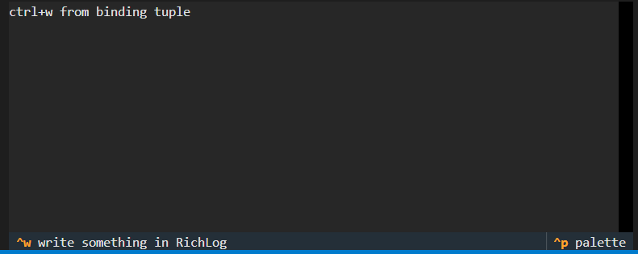

上面的示例除了之前演示按键事件内容用的`RichLog`，还加了一个页脚组件。其中，页脚组件会显示当前`App`子类中定义的快捷键。当然，如果绑定定义用的不是三元素元组而是两元素元组，页脚上就不会显示定义的快捷键绑定，但该快捷键依然有效：

```python3
from textual.app import App
from textual.widgets import RichLog, Footer

class MyApp(App):
    BINDINGS = [
        ('ctrl+w', 'write_something("ctrl+w from binding tuple")'),
    ]

    def on_mount(self):
        self.widgets = [
            RichLog(),
            Footer()
        ]
        self.mount_all(self.widgets)

    def action_write_something(self, text: str = 'None'):
        self.query_one(RichLog).write(text)

if __name__ == '__main__':
    app = MyApp()
    app.run()
```

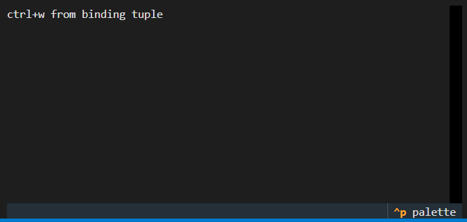

相比于绑定定义只有最多三个可以定义的元素，绑定对象比绑定定义支持更多功能，如果有更多快捷键定义的需求，可以使用绑定对象代替绑定定义，绑定对象的完整用法可以参考[官网文档](https://textual.textualize.io/api/binding/#textual.binding.Binding)。

使用绑定对象之前，需要先导入绑定类：

```python3
from textual.binding import Binding
```

绑定类支持的参数比较多，前三个参数和绑定定义一致，可以不使用关键字的形式传入，只需将绑定定义解包或者按照位置对应传入即可，以下是用绑定对象完全实现绑定定义同等效果的示例：

```python3
from textual.app import App
from textual.widgets import RichLog, Footer
from textual.binding import Binding

class MyApp(App):
    BINDINGS = [
        Binding('ctrl+w', 'write_something("ctrl+w from binding tuple")', 'write something in RichLog')
        # 或者 Binding(*('ctrl+w', 'write_something("ctrl+w from binding tuple")', 'write something in RichLog'))
    ]

    def on_mount(self):
        self.widgets = [
            RichLog(),
            Footer()
        ]
        self.mount_all(self.widgets)

    def action_write_something(self, text: str = 'None'):
        self.query_one(RichLog).write(text)

if __name__ == '__main__':
    app = MyApp()
    app.run()
```

当然，既然绑定对象支持的参数很多，功能更强大，那就有必要使用关键字传入每一个参数，依次讲解。先看示例：

```python3
from textual.app import App
from textual.widgets import RichLog, Footer
from textual.binding import Binding

class MyApp(App):
    BINDINGS = [
        Binding(
            key='ctrl+w',
            action='write_something("ctrl+w from binding class")',
            description='write something in RichLog',
            show=True,
            key_display='^w',
            priority=False,
            tooltip='press ctrl with w',
            id=None,
            system=False
        )
    ]

    def on_mount(self):
        self.widgets = [
            RichLog(),
            Footer()
        ]
        self.mount_all(self.widgets)

    def action_write_something(self, text: str):
        self.query_one(RichLog).write(text)

if __name__ == '__main__':
    app = MyApp()
    app.run()
```

绑定对象支持以下参数：

-   `key`参数，字符串类型，表示绑定的快捷键，可以是单个按键或者按键组合，也可以是多个按键或者按键组合，使用英文逗号分隔。比如`'ctrl+w'`、`'ctrl+w, ctrl+e'`。

-   `action`参数，字符串类型，表示该快捷键执行的动作。比如`'write_something("ctrl+w from binding tuple")'`。字符串看起来像是Python代码，实际上也是。其中的函数名是[动作](https://textual.textualize.io/guide/actions/)函数的函数名去掉其'action_'前缀之后的名字，表示按下快捷键会执行该动作函数。下一节会详细介绍动作的定义和用法，这里不展开介绍。

-   `description`参数，字符串类型，表示该快捷键的含义。比如`'write something in RichLog'`。可以不指定或者设置为`None`，但这样操作之后，该快捷键不会在页脚显示。

-   `show`参数，布尔类型，表示该快捷键是否在页脚内显示，默认为`True`。

-   `key_display`参数，字符串类型，表示该快捷键在页脚内显示的按键是什么，默认是`'^'`表示`ctrl`键，可以用其他内容替换默认的符号表示。参数示例为`'^w'`或者`'Ctrl W'`，默认值为`None`，即取`App.get_key_display`方法（参数是绑定对象）的返回结果。如果指定了`id`参数和`App`子类的`keymap`映射，且映射会修改绑定对象的`key`参数，那`key_display`参数会被忽略。

-   `priority`参数，布尔类型，表示该快捷键是不是优先生效的。对于不同DOM层级组件内定义的同名快捷键，遵循离组件越近越优先生效的原则。如果该参数为`True`，则优先级比该参数为`False`（默认值）的高。该参数都为`True`的，则遵循近者优先的原则。

-   `tooltip`参数，字符串类型，表示该快捷键的工具提示，鼠标悬停在页脚可以弹出。打开按键面板的话，该内容会低亮显示在按键含义后。参数示例为`'press ctrl with w'`。

-   `id`参数，字符串类型，默认为`None`，表示keymap的ID，用于`App`子类的keymap映射。该ID建议是唯一的，即一个快捷键对应一个ID，但不强制要求唯一性。如果`App`子类设置了keymap（使用`set_keymap`方法或者`update_keymap`方法设置），则会使用该ID当做keymap的键（key），获取到的值（value）当作新的快捷键，用来代替原来设置的`key`参数。keymap映射其实就是字典，字典的键（key）是ID，字典的值（value）是对应ID的新的快捷键。keymap相关的参数和方法可用于动态修改快捷键。示例如下，通过设置keymap将快捷键`'ctrl+w'`修改为`'ctrl+e'`：

    ```python3
    from textual.app import App
    from textual.widgets import RichLog, Footer
    from textual.binding import Binding
    
    class MyApp(App):
        BINDINGS = [
            Binding(
                key='ctrl+w',
                action='write_something("ctrl+w from binding class")',
                description='write something in RichLog',
                id='id_w',
            )
        ]
    
        def on_mount(self):
            self.set_keymap({'id_w':'ctrl+e'})
            self.widgets = [
                RichLog(),
                Footer()
            ]
            self.mount_all(self.widgets)
    
        def action_write_something(self, text: str):
            self.query_one(RichLog).write(text)
    
    if __name__ == '__main__':
        app = MyApp()
        app.run()
    ```

-   `system`参数，布尔类型，默认为`False`，表示该快捷键是不是系统快捷键（即不需要特别提示就知道怎么用的快捷键）。如果为`True`，该快捷键会从按键面板（按`ctrl`+`p`调出快捷命令面板后，再点击`'Show keys and help panel'`即可看到）中移除。但还是会在页脚中显示，建议同时设置`show`参数为`False`。

##### 2.2.10.4 鼠标输入

虽然Textual是个TUI框架，但它还是提供了处理鼠标输入的方法。因此，在Textual中，有多种鼠标事件可以响应，来满足程序处理鼠标输入的要求。

不过，在正式学习鼠标事件之前，需要先了解一下鼠标事件的重要属性——鼠标位置。在Textual中，与鼠标位置相关的坐标系有两种：绝对坐标系和相对坐标系。两种坐标系的X轴和Y轴的方向一致，向右为X轴正方向，向下为Y轴正方向。其中，绝对坐标系就是以`Screen`组件左上角为原点，来确定鼠标位置的方式；相对坐标系就是以鼠标激活的组件左上角为原点，来确定鼠标位置的方式。原点所在的字符坐标为`(0,0)`，沿着正方向每增加一个字符，对应方向的坐标加一，即可得到鼠标所在位置的字符的坐标，也就是鼠标的位置。如下图所示：

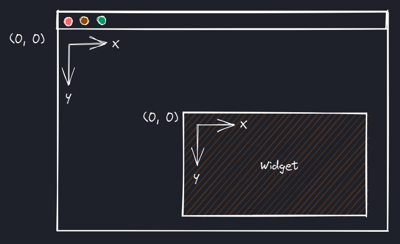

Textual支持以下基本鼠标事件：

-   `Click`事件，当鼠标按键完成一次点击（按下然后松开）时触发。完整介绍可以参考[官网文档](https://textual.textualize.io/events/click/)。该事件除了具备基本鼠标事件属性（下面会详细介绍，这里不展开）外，还有一个`chain`属性。`chain`属性是整数类型，表示在能够检测到连续点击的间隔内，有多少次点击操作是连续的。该属性的值就是连击的数量，也就是常说的双击、三击甚至更多的连击。
-   `MouseDown`事件，当鼠标按键按下时触发，完整介绍可以参考[官网文档](https://textual.textualize.io/events/mouse_down/)。该事件具备基本鼠标事件属性（下面会详细介绍，这里不展开），没有额外属性。但是该事件的`widget`属性、`control`属性不会显示为鼠标下的组件，而是`Screen`组件，即`None`。
-   `MouseUp`事件，当鼠标按键松开时触发，完整介绍可以参考[官网文档](https://textual.textualize.io/events/mouse_up/)。该事件具备基本鼠标事件属性（下面会详细介绍，这里不展开），没有额外属性。但是该事件的`widget`属性、`control`属性不会显示为鼠标下的组件，而是`Screen`组件，即`None`。
-   `MouseMove`事件，当鼠标移动时触发，完整介绍可以参考[官网文档](https://textual.textualize.io/events/mouse_move/)。该事件具备基本鼠标事件属性（下面会详细介绍，这里不展开），没有额外属性。
-   `Enter`事件，当鼠标进入组件时触发，完整介绍可以参考[官网文档](https://textual.textualize.io/events/enter/)。该事件不具备基本鼠标事件属性（因为继承自`Event`类，而不是其他鼠标事件的基类——`MouseEvent`类），只具备`node`属性和`node`属性的别名——`control`属性（这里的`control`属性与基本鼠标事件属性中的`control`属性不同，不要混淆）。大部分情况下`node`属性和基本鼠标事件属性的`control`属性相同，表示鼠标下的组件；但滚动条、命令面板等会在`node`属性中显示，并且`Screen`会在`node`属性中显示为`Screen(id='_default')`而不是基本鼠标事件属性中`control`属性的`None`。
-   `Leave`事件，当鼠标离开组件时触发，完整介绍可以参考[官网文档](https://textual.textualize.io/events/leave/)。该事件不具备基本鼠标事件属性，具备的属性和`Enter`事件相同。
-   `MouseScrollDown`事件，当鼠标滚轮向下滚动时触发，完整介绍可以参考[官网文档](https://textual.textualize.io/events/mouse_scroll_down/)。该事件具备基本鼠标事件属性（下面会详细介绍，这里不展开），没有额外属性。但是该事件的`widget`属性、`control`属性不会显示为鼠标下的组件，而是`Screen`组件，即`None`。
-   `MouseScrollUp`事件，当鼠标滚轮向上滚动时触发，完整介绍可以参考[官网文档](https://textual.textualize.io/events/mouse_scroll_up/)。该事件具备基本鼠标事件属性（下面会详细介绍，这里不展开），没有额外属性。但是该事件的`widget`属性、`control`属性不会显示为鼠标下的组件，而是`Screen`组件，即`None`。

基本鼠标事件（`MouseEvent`类）的属性有：

-   `widget`属性，组件类实例，表示鼠标下的组件。
-   `control`属性，同`widget`属性。
-   `x`属性，整数类型，表示相对坐标系（原点为`widget`属性指代的组件的原点）中鼠标位置的x坐标。
-   `y`属性，整数类型，表示相对坐标系（原点为`widget`属性指代的组件的原点）中鼠标位置的y坐标。
-   `offset`属性，由整数类型的子成员`x`和整数类型的子成员`y`组成的命名元组，可以通过`offset.x`得到`x`属性的值，可以通过`offset.y`得到`y`属性的值。该属性也可以赋予给样式接口的`offset`属性或者与整数元组进行四则运算再赋予。
-   `screen_x`属性，整数类型，表示绝对坐标系（原点为`Screen`组件的原点）中鼠标位置的x坐标。
-   `screen_y`属性，整数类型，表示绝对坐标系（原点为`Screen`组件的原点）中鼠标位置的y坐标。
-   `screen_offset`属性，由整数类型的子成员`x`和整数类型的子成员`y`组成的命名元组，可以通过`screen_offset.x`得到`screen_x`属性的值，可以通过`screen_offset.y`得到`screen_y`属性的值。该属性也可以赋予给样式接口的`offset`属性或者与整数元组进行四则运算再赋予。
-   `delta_x`属性，整数类型，表示当前消息中鼠标位置的x坐标相较于上条消息中鼠标位置的x坐标的变化量。
-   `delta_y`属性，整数类型，表示当前消息中鼠标位置的y坐标相较于上条消息中鼠标位置的y坐标的变化量。
-   `delta`属性，由整数类型的子成员`x`和整数类型的子成员`y`组成的命名元组，可以通过`delta.x`得到`delta_x`属性的值，可以通过`delta.y`得到`delta_y`属性的值。该属性也可以赋予给样式接口的`offset`属性或者与整数元组进行四则运算再赋予。
-   `button`属性，整数类型，表示鼠标当前按下的按钮。`0`为没有按钮按下，`1`为左键，`2`为中键，`3`为右键。
-   `shift`属性，布尔类型，表示在当前鼠标事件发生时，`shift`键是否被按下，`True`表示被按下。需要注意的是，`shift`键加鼠标按键可能会被终端优先级更高的响应捕获，不一定在Textual中生效。
-   `meta`属性，布尔类型，表示在当前鼠标事件发生时，`meta`键（Mac的`meta`键也就是Win的`alt`键）是否被按下，`True`表示被按下。
-   `ctrl`属性，布尔类型，表示在当前鼠标事件发生时，`ctrl`键是否被按下，`True`表示被按下。
-   `style`属性，Rich框架的`Style`类实例，表示鼠标下内容的Rich样式（Textual基于Rich框架，因此终端显示样式就是Rich样式，该样式主要指颜色、字体等内容）。

在Textual 2.1.0中，基本鼠标事件新增了`pointer_x`属性、`pointer_y`属性、`pointer_screen_x`属性、`pointer_screen_y`属性，分别为`x`属性、`y`属性、`screen_x`属性、`screen_y`属性的取整前的原始属性（浮点类型）。

Textual提供的鼠标事件繁多，除了`Click`事件前面有过使用，其他事件基本没有示例。这里只提供`MouseMove`事件的示例，其余事件的用法，读者可以参考教程自行摸索，这里就不一一介绍了。示例中，通过将`MouseMove`事件的`screen_offset`属性，通过样式接口赋予给原本位置在`(0,0)`的静态文本的`offset`属性，实现了静态文本跟随鼠标的效果。同时，`MouseMove`事件的消息参数也会原本展示在`RichLog`中：

```python3
from textual.app import App
from textual.widgets import RichLog,Static
from textual import events

class MyApp(App):
    def on_mount(self):
        self.widgets = [
            Static('Textual'),
            RichLog(),
        ]
        self.mount_all(self.widgets)
        self.query_one(RichLog).styles.height = '50%'

    def on_mouse_move(self, e: events.MouseMove):
        self.query_one(RichLog).write(e)
        self.query_one(Static).offset = e.screen_offset
        # 如果静态文本的位置不是(0,0)，则使用 self.query_one(Static).absolute_offset = e.screen_offset

if __name__ == '__main__':
    app = MyApp()
    app.run()
```

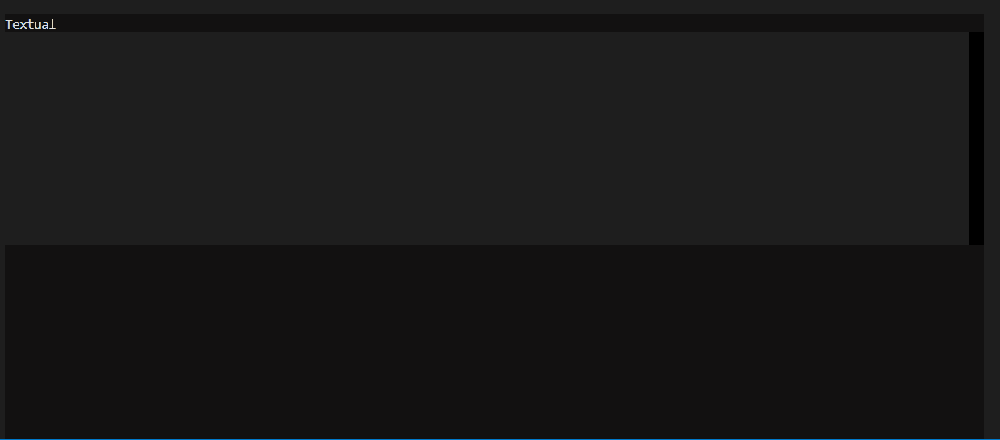

除了基本鼠标事件外，组件还有两个与鼠标相关的事件——`MouseCapture`事件和`MouseRelease`事件。与之相关的是组件的两个与鼠标焦点相关的方法——`capture_mouse`（捕获鼠标，完整用法参考[官网文档](https://textual.textualize.io/api/widget/#textual.widget.Widget.capture_mouse)）与`release_mouse`（释放鼠标，完整用法参考[官网文档](https://textual.textualize.io/api/widget/#textual.widget.Widget.release_mouse)）。捕获鼠标可以让鼠标锁定到调用捕获方法的组件上，相当于让组件强制获得鼠标焦点；释放鼠标则可以让鼠标恢复，不再锁定到特定组件。

捕获鼠标与释放鼠标时会触发对应的事件：

-   `MouseCapture`事件，当组件执行参数为`True`的`capture_mouse`方法时触发，完整介绍可以参考[官网文档](https://textual.textualize.io/events/mouse_capture/)。
-   `MouseRelease`事件，当组件执行执行参数为`False`的`capture_mouse`方法或者`release_mouse`方法时触发，完整介绍可以参考[官网文档](https://textual.textualize.io/events/mouse_release/)。

`MouseCapture`事件和`MouseRelease`事件常用的属性是`mouse_position`（鼠标位置）属性，即鼠标被捕获时或者被释放时的鼠标位置（相对坐标，但其当做原点的组件被固定为`Screen`组件，所以该位置可以理解为绝对坐标。），是由整数类型的子成员`x`和整数类型的子成员`y`组成的命名元组，可以通过`mouse_position.x`获取到x坐标的值，可以通过`mouse_position.y`获取到y坐标的值。

以下示例中，按下`c`键，`MouseLog`（继承自`RichLog`，增加了`MouseCapture`事件和`MouseRelease`事件的响应函数）会执行捕获方法；按下`r`键，`MouseLog`会执行释放方法。按下不同的按键，可以看到`MouseLog`输出不同的内容：

```python3
from textual.app import App
from textual.widgets import RichLog,Static
from textual import events

class MouseLog(RichLog):
    def on_mouse_capture(self,e:events.MouseCapture):
        self.write(e)
    def on_mouse_release(self,e:events.MouseRelease):
        self.write(e)

class MyApp(App):
    def on_mount(self):
        self.widgets = [
            Static('Textual'),
            MouseLog(),
        ]
        self.mount_all(self.widgets)
    
    def on_key(self,e:events.Key):
        if e.key == 'c':
            self.query_one(MouseLog).capture_mouse()
        if e.key == 'r':
            self.query_one(MouseLog).release_mouse()

if __name__ == '__main__':
    app = MyApp()
    app.run()
```

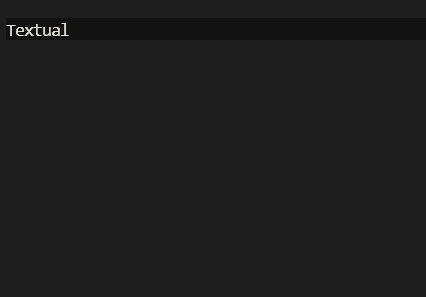

#### 2.2.11 动作

前面的章节已经或多或少提到过、用过动作——以'action_'开头的函数，本节将详细介绍一下动作的创建与使用。

##### 2.2.11.1 创建动作函数

创建动作函数没有什么特别，只是函数名上需要使用'action_'为前缀，只有这样，前缀之后的内容才能用在快捷键绑定和动作链接中。

和普通函数一样，动作函数虽然是以'action_'为前缀，但其依然可以当作普通函数使用。只是普通函数不能像动作函数一样用于快捷键绑定和动作链接中。下面的示例就展示了动作函数当作普通函数使用时，与普通函数一样：

```python3
from datetime import datetime
from textual.app import App
from textual.widgets import Static,Digits
from textual import events

class MyApp(App):
    def on_mount(self):
        self.widgets = [
            Static('press n to update time'),
            Digits(f'{datetime.now().time():%T}')
        ]
        self.mount_all(self.widgets)

    def action_now(self):
        self.query_one(Digits).update(f'{datetime.now().time():%T}')
    
    def on_key(self,e:events.Key):
        if e.key == 'n':
            self.action_now()

if __name__ == '__main__':
    app = MyApp()
    app.run()
```

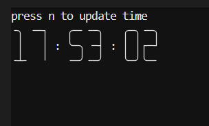

按下`n`键，数字时钟会更新为当前时间。

##### 2.2.11.2 使用动作函数——`run_action`

只是把动作函数当成普通函数使用的话，那就没必要创建动作函数了。多了个'action_'前缀，命名上不自由，还浪费敲击键盘的时间。所以，既然创建了动作函数，那就要学习Textual中动作函数的正确用途。

不过，在此之前，需要学习一下使用动作函数时的语法规则。

先看示例：

```python3
from datetime import datetime
from textual.app import App
from textual.widgets import Static,Digits
from textual import events

class MyApp(App):
    def on_mount(self):
        self.widgets = [
            Static('press n to update time'),
            Digits(f'{datetime.now().time():%T}')
        ]
        self.mount_all(self.widgets)

    def action_now(self,text:str=''):
        self.query_one(Digits).update(f'{text} {datetime.now().time():%T}')
    
    async def on_key(self,e:events.Key):
        if e.key == 'n':
            await self.run_action('app.now("Time is")')

if __name__ == '__main__':
    app = MyApp()
    app.run()
```

示例基于上节的实例，使用了`run_action`方法来运行动作，而不是直接调用动作函数。不过，该方法是一个异步方法，因此响应函数需要加上`async`关键字，并在调用此方法的代码前加上`await`关键字，这样代码才能成功运行。

相信读者已经看到，用来运行动作的方法的参数是一个字符串，而这个字符串很像是Python代码。没错，这就是正确执行动作的方式，在前面介绍快捷键绑定时已经有过惊鸿一瞥。在Textual中，动作就是像这样被放在字符串中按需执行。就以上面示例中的字符串为例，介绍一下执行动作时的基本语法：

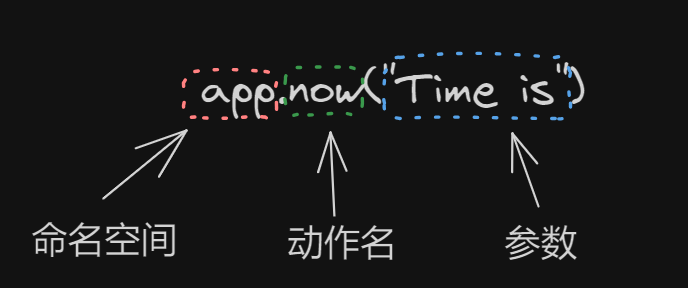

英文句号分隔、放在最前面的是命名空间，表明要执行的动作是在哪里定义的。其实，这里不加命名空间也可以正常运行，不加命名空间的话就是在动作的定义位置找，示例中执行的动作是在当前`App`类或者子类中定义的，相当于命名空间是`app`。加了命名空间的话，执行动作时就会去对应的命名空间中找动作。

命名空间有三种：

-   `app`表示动作在当前`App`类（或者子类）中定义。
-   `screen` 表示动作在当前`Screen`组件中定义。
-   `focused` 表示动作在当前获得焦点的组件中定义。需要注意的是，也有可能当前没有获得焦点的组件，那么在此命名空间下执行动作就不会成功。
-   无表示动作在动作执行处所属的类中定义。

紧接着命名空间（如果有的话）的就是动作名。动作名很简单，就是动作函数名去掉'action_'前缀，用于表示执行的是哪个动作函数。

动作函数除了表示实例对象的`self`参数外，还会定义其他参数，那在执行时，就可以传入额外的参数。不过，需要注意的是，因为传入的参数是在字符串内，所以对传入的参数类型有限制：不能传入变量，只能传入基本Python数据类型的常量，即字符串、字典、列表、元组、数字等。另外，如果执行动作时不需要传入参数，那执行动作字符串可以省略动作名之后的括号，上面的字符串就可以变成`'app.now'`，效果等同于`'app.now()'`。

##### 2.2.11.3 使用动作函数——快捷键绑定

既然是使用按键，那就不得不提前面学过的快捷键绑定。前面介绍过，绑定定义的第二元素和绑定对象的`action`参数就是要执行的动作。因此`'app.now("Time is")'`这个要执行的动作，是要和`n`键绑定，那定义一个快捷键绑定也是轻车熟路。快捷键绑定也是动作最常用的方式：

```python3
from datetime import datetime
from textual.app import App
from textual.widgets import Static,Digits

class MyApp(App):
    BINDINGS = [
        ('n','app.now("Time is")','Update time')
    ]
    def on_mount(self):
        self.widgets = [
            Static('press n to update time'),
            Digits(f'{datetime.now().time():%T}')
        ]
        self.mount_all(self.widgets)

    def action_now(self,text:str=''):
        self.query_one(Digits).update(f'{text} {datetime.now().time():%T}')

if __name__ == '__main__':
    app = MyApp()
    app.run()
```


##### 2.2.11.4 使用动作函数——`Button`的`action`参数

前面介绍消息的时候，通过扩展`Button`类，实现了自定义消息的按钮，并通过响应自定义消息来响应按钮的操作。其实，按钮的使用并不需要那么复杂，哪怕不扩展按钮，直接响应按钮的点击消息（`Button.Clicked`）也比本节要介绍的方法复杂。

在创建按钮的时候，给按钮的action参数传入动作，即可实现点击按钮时，执行特定的动作。

比如上两节的例子，可以完全抛弃按键响应函数和快捷键绑定，将`'app.now("Time is")'`传给按钮的`action`参数，这样就不用添加额外的文本来解释快捷键了：

```python3
from datetime import datetime
from textual.app import App
from textual.widgets import Digits,Button

class MyApp(App):
    def on_mount(self):
        self.widgets = [
            Digits(f'{datetime.now().time():%T}'),
            Button('Update',action='app.now("Time is")'),
        ]
        self.mount_all(self.widgets)

    def action_now(self,text:str=''):
        self.query_one(Digits).update(f'{text} {datetime.now().time():%T}')

if __name__ == '__main__':
    app = MyApp()
    app.run()
```

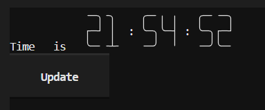

需要注意的是，传动作给`Button`的`action`参数时，不带命名空间的话，默认命名空间并不是`Button`，而是其DOM上级组件。下面示例中，点击第一个按钮，执行动作的是`Screen`组件，因此`Screen`组件下的所有按钮都被禁用了。如果先点击第二个按钮，那只有第二个按钮被禁用。读者需要注意差异：

```python3
from textual.app import App
from textual.widgets import Button

class MyApp(App):
    def on_mount(self):
        self.widgets = [
            Button('No namespace',action='toggle("disabled")'),# 注意，这里执行的toggle实际上是DOM上级组件即Screen组件的toggle，因为Button的默认命名空间是DOM上级组件
            Button('Focused namespace',action='focused.toggle("disabled")'),
        ]
        self.mount_all(self.widgets)

if __name__ == '__main__':
    app = MyApp()
    app.run()
```

##### 2.2.11.5 使用动作函数——动作链接

在介绍动作链接前，先看示例代码：

```python3
from datetime import datetime
from textual.app import App
from textual.widgets import Static,Digits

class MyApp(App):
    def on_mount(self):
        self.widgets = [
            Static('[b]click[/b] [@click=app.now("Time is")]me[/] to update time'),
            Digits(f'{datetime.now().time():%T}')
        ]
        self.mount_all(self.widgets)

    def action_now(self,text:str=''):
        self.query_one(Digits).update(f'{text} {datetime.now().time():%T}')

if __name__ == '__main__':
    app = MyApp()
    app.run()
```

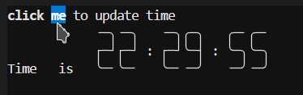

示例中，静态文本的部分文字变得像网页中的超链接一样可以点击，这种可以点击的文字就叫动作链接。动作链接可以在任何文字中创建，哪怕是已经支持点击的按钮也可以创建动作链接。

Textual的文本中可以使用Markup标签（后面会有专门章节介绍，这里可以简单理解为类似HTML标签的一种格式），动作链接就是其中执行动作的一种标签。

在下面的代码中，字符串内的`[b]`相当于HTML中的`<b>`标签，因此，标签需要对应的闭合标签，才能让配对的标签之间的内容变成对应的样式：

```python3
Static('[b]click[/b] [@click=app.now("Time is")]me[/] to update time')
```

同样的，`[@click=app.now("Time is")]me[/]`中也有配对的标签，不过此标签是一个可以点击的标签，就好像HTML中的超链接一样，其中的`@click`就是接收鼠标点击操作的意思，与之类似的还有`@mouse.up`、`@mouse.down`，则分别接收鼠标按键抬起、按下的操作。标签内的等号之后，对应的就是鼠标点击时执行的动作，也就是真正使用动作函数的部分。这里使用的执行动作的语法与`run_action`中支持的语法一致，就不详细介绍了。

不过需要注意的是，动作链接不是组件，没法获取焦点，与获取焦点有关的动作或者事件，动作链接本身并不支持；而静态文本和部分组件也不能获取焦点，点击其中的动作链接不会让其获得焦点。因此，动作链接中的`focused`命名空间不是指动作链接所在的组件，依然是焦点实际所在的组件。

说一个与动作无关的内容，那就是动作链接的样式。动作链接的颜色是不支持通过其他标签修改。如果想要改变某个组件内的动作链接的颜色，只能通过CSS（完整文档参考[官网](https://textual.textualize.io/styles/links/)）修改。动作链接主要支持以下样式：

| 样式类型                                                     | 含义                                                      |
| :----------------------------------------------------------- | :-------------------------------------------------------- |
| [`link-background`](https://textual.textualize.io/styles/links/link_background/) | 链接文本的背景颜色。                                      |
| [`link-background-hover`](https://textual.textualize.io/styles/links/link_background_hover/) | 鼠标悬停在链接文本上时的背景颜色。                        |
| [`link-color`](https://textual.textualize.io/styles/links/link_color/) | 链接文本的文本颜色。                                      |
| [`link-color-hover`](https://textual.textualize.io/styles/links/link_color_hover/) | 鼠标悬停在链接文本上时的文本颜色。                        |
| [`link-style`](https://textual.textualize.io/styles/links/link_style/) | 链接文本上的文本样式，比如设置`underline`就是添加下划线。 |
| [`link-style-hover`](https://textual.textualize.io/styles/links/link_style_hover/) | 鼠标悬停在链接文本上时的文本样式。                        |

下面的示例演示了如何修改动作链接的文本颜色：

```python3
from datetime import datetime
from textual.app import App
from textual.widgets import Static,Digits

class MyApp(App):
    CSS='''
    Static{
        link-color: ansi_red;
    }
    '''
    def on_mount(self):
        self.widgets = [
            Static(' [b red]click[/b red] [@click=app.now("Time is")]me[/] to update time'),
            Digits(f'{datetime.now().time():%T}')
        ]
        self.mount_all(self.widgets)

    def action_now(self,text:str=''):
        self.query_one(Digits).update(f'{text} {datetime.now().time():%T}')

if __name__ == '__main__':
    app = MyApp()
    app.run()
```

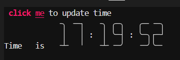

##### 2.2.11.6 使用动作函数——预定义的动作函数

除了自己定义动作函数，Textual还在部分类内预先定义了一些可以直接使用的动作函数。以`App`类为例，类内定义了不少动作函数（完整列表可以参考[官网文档](https://textual.textualize.io/api/app/)），可以直接使用，常用的有这些：

-   [`action_add_class`](https://textual.textualize.io/api/app/#textual.app.App.action_add_class)，给选择器匹配的组件添加指定的样式类。函数有两个参数：字符串类型的`selector`参数，表示选择器；字符串类型的`class_name`参数，表示样式类名。
-   [`action_back`](https://textual.textualize.io/api/app/#textual.app.App.action_back)，返回之前的屏幕，并弹出当前屏幕。如果之前的屏幕被弹出，则无法返回之前的屏幕。并且这个弹出操作不会导致问题（下面介绍的`action_pop_screen`在弹出最后一个屏幕时会报错）。屏幕的用法会在后面的章节介绍，这里不详细解释。
-   [`action_bell`](https://textual.textualize.io/api/app/#textual.app.App.action_bell)，让终端播放一次提示音（就是那种命令出现问题时的提示音）。
-   [`action_focus_next`](https://textual.textualize.io/api/app/#textual.app.App.action_focus_next)，让按照获取焦点的顺序、应该下一个获得焦点的组件获得焦点。
-   [`action_focus_previous`](https://textual.textualize.io/api/app/#textual.app.App.action_focus_previous)，让按照获取焦点的顺序、上一个获得焦点的组件获得焦点，如果当前焦点在第一个组件上，那执行此动作会变成排在最后的组件获得焦点。
-   [`action_focus`](https://textual.textualize.io/api/app/#textual.app.App.action_focus)，让与给定ID匹配的组件获得焦点。函数只有一个字符串类型`widget_id`参数，表示组件的ID，也就是创建组件时传入的id参数。
-   [`action_pop_screen`](https://textual.textualize.io/api/app/#textual.app.App.action_pop_screen)，弹出当前屏幕，并激活当前屏幕下的屏幕。需要注意的是，此动作在弹出最后一个屏幕时会报错。
-   [`action_push_screen`](https://textual.textualize.io/api/app/#textual.app.App.action_push_screen)，在当前屏幕上放置新的屏幕，并激活新的屏幕。函数支持一个字符串类型的`screen`参数，表示要新屏幕的名字（执行`install_screen`方法时`name`参数的值，或者`SCREENS`属性字典中对应屏幕对象的键值）。
-   [`action_quit`](https://textual.textualize.io/api/app/#textual.app.App.action_quit)，退出程序。
-   [`action_remove_class`](https://textual.textualize.io/api/app/#textual.app.App.action_remove_class)，从选择器匹配的组件中移除指定的样式类。函数有两个参数：字符串类型的`selector`参数，表示选择器；字符串类型的`class_name`参数，表示样式类名。
-   [`action_screenshot`](https://textual.textualize.io/api/app/#textual.app.App.action_screenshot)，将当前屏幕的显示内容保存为SVG格式的图片。函数有两个参数：字符串类型的`filename`参数，表示图片文件的文件名，默认是自动生成的值（`程序的标题_时间.svg`）；字符串类型的`path`参数，表示图片文件所在目录的路径，默认是系统定义的用户下载目录
-   [`action_simulate_key`](https://textual.textualize.io/api/app/#textual.app.App.action_simulate_key)，模拟按下特定的按键。函数有一个字符串类型的`key`参数，传入对应按键触发的按键事件的`key`属性表示要模拟的按键。
-   [`action_suspend_process`](https://textual.textualize.io/api/app/#textual.app.App.action_suspend_process)，挂起当前程序的进程并放到后台。需要注意的是，只有Linux和Unix类系统支持挂起操作，Windows和Textual Web（Textual提供的将Textual程序云端化的服务）运行的Textual程序不支持此操作。
-   [`action_switch_mode`](https://textual.textualize.io/api/app/#textual.app.App.action_switch_mode)，切换到指定模式。函数有一个字符串类型的`mode`参数，表示要切换到的模式名。模式名是`MODES`属性字典中对应屏幕对象的键值。模式是互不影响的、保存当前屏幕堆叠状态的快照，`MODES`属性字典中对应模式名的屏幕对象表示对应模式的初始屏幕。
-   [`action_switch_screen`](https://textual.textualize.io/api/app/#textual.app.App.action_switch_screen)，切换到指定屏幕。函数支持一个字符串类型的`screen`参数，表示切换到的屏幕的名字。
-   [`action_toggle_class`](https://textual.textualize.io/api/app/#textual.app.App.action_toggle_class)，给选择器匹配的组件切换指定的样式类的状态（没有就添加，有就删除）。函数有两个参数：字符串类型的`selector`参数，表示选择器；字符串类型的`class_name`参数，表示样式类名。
-   [`action_toggle_dark`](https://textual.textualize.io/api/app/#textual.app.App.action_toggle_dark)，在内置的黑暗主题（`'textual-dark'`）、明亮主题（`'textual-light'`）之间切换。需要注意的是，不管当前主题是什么主题，此动作只会根据当前主题的`dark`属性（是否为黑暗主题），切换到内置的黑暗主题（当前主题不为黑暗主题时切换）、明亮主题（当前主题为黑暗主题时切换），不会切换回原来设置的其他主题。如果需要切换为自定义的黑暗主题、明亮主题，请不要使用此动作，并自定义切换的动作函数或者方法。

`Screen`组件预定义的动作可以参考[接口文档](https://textual.textualize.io/api/screen/)；其他组件如`Button`的预定义动作，则需要参考对应的[组件文档](https://textual.textualize.io/widgets/button/)。

了解了预定义的动作之后，前面[退出](#2.2.3.4 退出)中示例代码终于能看懂了：

```python3
from textual.app import App
from textual.widgets import Static,Button

class MyApp(App):
    def compose(self):
        yield Static('Hello World!')
        yield Static('Press q or click buttons to quit:')
        yield Button('Exit',action='app.exit_app()')
        yield Button('Quit',action='app.quit()')
    def on_key(self, event):
        if event.key == 'q':
            self.exit()
    def action_exit_app(self):
        self.exit()

if __name__ == '__main__':
    app = MyApp()
    app.run()
```

显然，代码中用来退出的动作，一个是通过自定义的动作来执行`self.exit()`，另一个就是预定义的退出动作。

##### 2.2.11.7 动态管理动作

在介绍本节内容前，先看以下示例：

```python3
from datetime import datetime
from textual.app import App
from textual.widgets import Static,Digits,Footer

class MyApp(App):
    BINDINGS = [
        ('n','app.now("Running")','Turn on'),
        ('m','app.now("Paused")','Turn off'),
    ]
    def on_mount(self):
        self.widgets = [
            Static('Paused'),
            Digits(f'{datetime.now().time():%T}'),
            Footer()
        ]
        self.mount_all(self.widgets)

    def action_now(self,text:str=''):
        self.query_one(Static).update(f'{text}')
        self.query_one(Digits).update(f'{datetime.now().time():%T}')

if __name__ == '__main__':
    app = MyApp()
    app.run()
```

示例代码基于前面的示例修改。前面的示例是按下按键才会更新时间显示，有点不太方便，可要是一直让时间更新显示，又有点分散注意力。因此，代码中设置了两个快捷键：`n`键让时间持续更新显示，相当于打开时钟；`m`键让时间暂停更新显示，相当于关闭时钟。

当然，这一节不会完整实现此功能，只是将静态文本更新为`"Running"`、`"Paused"`来表明时钟的运行状态，方便下一节添加定时器时使用。

代码看上去没有问题，不过，在实际操作的时候，程序的表现有点瑕疵：

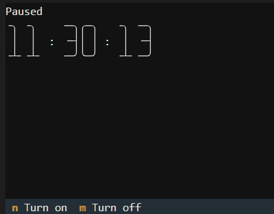

虽然已经是`'Running'`的时候再点开启不会出问题，但两个快捷键都亮着，难免让用户摸不着头脑。要是可以点击开启之后，让开启的快捷键禁用，用户就不会点错、误解了。

在Textual中，不用费心单独调用禁用快捷键的方法，只需实现[`check_action`](https://textual.textualize.io/api/dom_node/#textual.dom.DOMNode.check_action)方法，并根据需求返回特定的值，就可以让指定的动作和快捷键处于需要的状态。

实现`check_action`方法时，方法会接收三个参数：

-   `self`参数，表示实例对象。
-   `action`参数，字符串类型，表示被检查的动作名（即动作函数去掉前缀后的部分）。
-   `parameters`参数，元组，表示执行动作时传给动作函数的额外参数。

`check_action`方法会在动作执行时，对该动作进行检查，按照参数的要求传入动作名和传给动作的额外参数。根据此时函数返回的值，该方法会让对应的动作和绑定该动作的快捷键变成特定状态：

-   返回`True`，页脚正常显示快捷键，快捷键可以响应。
-   返回`False`，页脚隐藏快捷键，并且快捷键无法响应。
-   返回`None`，页脚禁用快捷键（即快捷键显示的颜色变淡），并且快捷键无法响应。

知道`check_action`方法的作用之后，那只需在`App`子类内实现此方法，让动作名为`'now'`时，判断传递动作函数的额外参数：与当前静态文本的内容不同就返回`True`；相同则返回`False`或者`None`。如果动作名不是`'now'`，一律返回`True`。这样就可以实现当前可用快捷键只能切换状态。

按这个思路走，代码如下：

```python3
from datetime import datetime
from textual.app import App
from textual.widgets import Static,Digits,Footer

class MyApp(App):
    BINDINGS = [
        ('n','app.now("Running")','Turn on'),
        ('m','app.now("Paused")','Turn off'),
    ]
    def on_mount(self):
        self.widgets = [
            Static('Paused'),
            Digits(f'{datetime.now().time():%T}'),
            Footer()
        ]
        self.mount_all(self.widgets)

    def action_now(self,text:str=''):
        self.query_one(Static).update(f'{text}')
        self.query_one(Digits).update(f'{datetime.now().time():%T}')

    def check_action(self, action, parameters):
        if action == 'now':
            return parameters[0] != self.query_one(Static).renderable
            # 或者return parameters[0] != self.query_one(Static).renderable or None
        return True

if __name__ == '__main__':
    app = MyApp()
    app.run()
```

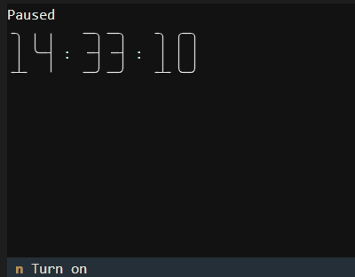

功能是实现了，但操作起来有点不对劲，需要不停切换来刷新出正确的快捷键。

这个时候可以调用[`refresh_bindings`方法](https://textual.textualize.io/api/dom_node/#textual.dom.DOMNode.refresh_bindings)立刻刷新绑定，不然页脚的快捷键只有在触发界面更新时才能更新显示：

```python3
from datetime import datetime
from textual.app import App
from textual.widgets import Static,Digits,Footer

class MyApp(App):
    BINDINGS = [
        ('n','app.now("Running")','Turn on'),
        ('m','app.now("Paused")','Turn off'),
    ]
    def on_mount(self):
        self.widgets = [
            Static('Paused'),
            Digits(f'{datetime.now().time():%T}'),
            Footer()
        ]
        self.mount_all(self.widgets)

    def action_now(self,text:str=''):
        self.refresh_bindings()
        self.query_one(Static).update(f'{text}')
        self.query_one(Digits).update(f'{datetime.now().time():%T}')

    def check_action(self, action, parameters):
        if action == 'now':
            return parameters[0] != self.query_one(Static).renderable
        return True

if __name__ == '__main__':
    app = MyApp()
    app.run()
```

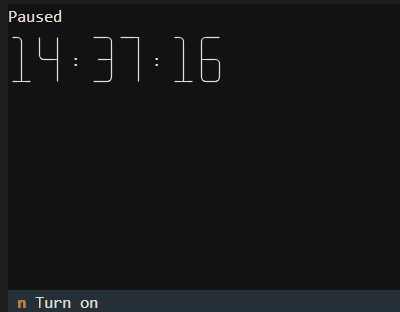

前面的例子中就可以使用此方法实现动态替换快捷键：

```python3
from textual.app import App
from textual.widgets import RichLog, Footer
from textual.binding import Binding

class MyApp(App):
    BINDINGS = [
        Binding(
            key='ctrl+w',
            action='write_something("ctrl+w from binding class")',
            description='write something in RichLog',
            id='id_w',
        )
    ]

    def on_mount(self):
        self.widgets = [
            RichLog(),
            Footer()
        ]
        self.mount_all(self.widgets)

    def action_write_something(self, text: str):
        self.set_keymap({'id_w':'ctrl+e'})
        self.refresh_bindings()
        self.query_one(RichLog).write(text)

if __name__ == '__main__':
    app = MyApp()
    app.run()
```

#### 2.2.12 定时器

上节中想要通过按钮切换时间的暂停、运行状态，可是，不设置定时器更新时间的话，就没法真的实现此功能。因此，特地去官网找了一下定时器的用法，可惜官网没有单独设置章节，只提供了API文档。但定时器功能在UI程序中很常用，所以单独开辟此章节，整合Textual中定时器的使用教程。

定时器对象支持的用法参考[官网文档](https://textual.textualize.io/api/timer/)，定时器对象常用的方法有：`pause`（暂停）、`reset`（复位）、`resume`（继续）、`stop`（通知）。都是简单直观的方法，就不做太多介绍。

不过，创建定时器对象一般不用导入定时器类来自己创建，而是调用`App`子类对象或者组件的`set_timer`方法（完整用法参考[官网文档](https://textual.textualize.io/api/message_pump/#textual.message_pump.MessagePump.set_timer)）或者`set_interval`方法（完整用法参考[官网文档](https://textual.textualize.io/api/message_pump/#textual.message_pump.MessagePump.set_interval)）。这两个方法都会返回定时器对象，并且都在创建完定时器对象之后立刻启动定时器，但二者的用途、支持参数略有差异。

先说用途。`set_timer`方法返回的定时器只能运行一次，不会一直按时间间隔要求运行。`set_interval`方法返回的定时器会一直按时间间隔要求运行，只有达到指定的重复次数才会停止；如果没有指定重复次数、重复次数为`None`、`0`、任意等效为`False`的值，则定时器会一直循环执行。

`set_timer`方法支持的参数：

-   `self`参数，表示调用此方法的实例，不需要传入。因此方法是由实例对象调用，因此这个参数实际上只在定义中有。只有在扩展组件类或者`App`类时，才会接触到此参数，只是直接使用方法不需要关注。
-   `delay`参数，浮点类型，表示过多长时间之后执行定时器指定的操作，单位秒。
-   `callback`参数，可调用类型，表示定时器要执行的操作。如果要执行的操作需要带上参数，则要用lambda表达式代替，比如`lambda :do("something")`。
-   `name`参数，字符串类型，表示定时器的名字，一般用于调试、标识定时器对象。从这个参数开始（包括这个参数），参数就全是关键字参数了。也就是只能通过关键字传入，不能缺少参数名而按照位置对应。
-   `pause`参数，布尔类型，表示创建完定时器，是否让定时器立即开始计时，即创建完的定时器是不是暂停状态。默认为`False`，即创建完就开始计时。

`set_interval`方法支持的参数：

-   `self`参数，表示调用此方法的实例，不需要传入。因此方法是由实例对象调用，因此这个参数实际上只在定义中有。只有在扩展组件类或者`App`类时，才会接触到此参数，只是直接使用方法不需要关注。
-   `interval`参数，浮点类型，表示每过多长时间执行一次定时器指定的操作，单位秒。
-   `callback`参数，可调用类型，表示定时器要执行的操作。如果要执行的操作需要带上参数，则要用lambda表达式代替，比如`lambda :do("something")`。
-   `name`参数，字符串类型，表示定时器的名字，一般用于调试。从这个参数开始（包括这个参数），参数就全是关键字参数了。也就是只能通过关键字传入，不能缺少参数名而按照位置对应。
-   `repeat`参数，整数类型，表示定时器重复的次数。默认为`0`，即无数次。如果该参数指定为`None`或者等效为`False`的值，都表示定时器重复无数次。
-   `pause`参数，布尔类型，表示创建完定时器，是否让定时器立即开始计时，即创建完的定时器是不是暂停状态。默认为`False`，即创建完就开始计时。

回到本节的开头，本节是为了让时间自动更新而生，所以，本节的示例代码就是实现这一目标，补全缺失的功能。

为了让开关时间更新功能的操作不再割裂，这里将开关操作的快捷键统一为`n`键。当然，定时器需要循环执行更新时间的操作，为了不让这个操作消耗太多性能，就单独定义一个更新时间的函数——`update_time`。原本更新静态文本的动作有切换开关状态的作用，这里就把动作函数改名为`action_switch_time`（快捷键绑定、`check_action`中的动作名也要修改），并在函数中增加判断当前状态，然后启停定时器的代码。最关键的添加定时器的代码则放在`on_mount`中，并且让定时器默认为暂停状态。成品代码如下：

```python3
from datetime import datetime
from textual.app import App
from textual.widgets import Static,Digits,Footer

class MyApp(App):
    BINDINGS = [
        ('n','app.switch_time("Running")','Turn on'),
        ('n','app.switch_time("Paused")','Turn off'),
    ]
    def on_mount(self):
        self.widgets = [
            Static('Paused'),
            Digits(f'{datetime.now().time():%T}'),
            Footer()
        ]
        self.mount_all(self.widgets)
        self.timer = self.set_interval(1,self.update_time,pause=True,repeat=0)

    def action_switch_time(self,text:str=''):
        self.refresh_bindings()
        self.query_one(Static).update(f'{text}')
        self.query_one(Digits).update(f'{datetime.now().time():%T}')
        if text == 'Running':
            self.timer.resume()
        else:
            self.timer.pause()

    def update_time(self):
        self.query_one(Digits).update(f'{datetime.now().time():%T}')

    def check_action(self, action, parameters):
        if action == 'switch_time':
            return parameters[0] != self.query_one(Static).renderable
        return True

if __name__ == '__main__':
    app = MyApp()
    app.run()
```

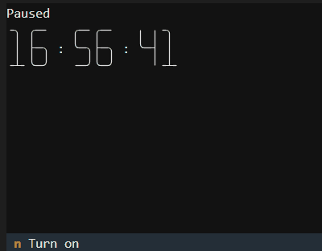

最后补充一个不推荐但可能需要的用法，就是使用`Timer`类来创建定时器。此用法需要手动调用开始方法——`_start`方法，而且需要通过关键字传递要执行的操作和`repeat`参数（为`None`表示循环执行）：

```python3
from datetime import datetime
from textual.app import App
from textual.widgets import Static,Digits,Footer
from textual.timer import Timer

class MyApp(App):
    BINDINGS = [
        ('n','app.switch_time("Running")','Turn on'),
        ('n','app.switch_time("Paused")','Turn off'),
    ]
    def on_mount(self):
        self.widgets = [
            Static('Paused'),
            Digits(f'{datetime.now().time():%T}'),
            Footer()
        ]
        self.mount_all(self.widgets)
        self.timer = Timer(self,1,self.update_time,pause=True,repeat=None)
        self.timer._start()

    def action_switch_time(self,text:str=''):
        self.refresh_bindings()
        self.query_one(Static).update(f'{text}')
        self.query_one(Digits).update(f'{datetime.now().time():%T}')
        if text == 'Running':
            self.timer.resume()
        else:
            self.timer.pause()

    def update_time(self):
        self.query_one(Digits).update(f'{datetime.now().time():%T}')

    def check_action(self, action, parameters):
        if action == 'switch_time':
            return parameters[0] != self.query_one(Static).renderable
        return True

if __name__ == '__main__':
    app = MyApp()
    app.run()
```

## 3 高阶技巧

官方参考手册：https://textual.textualize.io/reference/

官方API手册：https://textual.textualize.io/api/

### 3.1 高阶知识

本节主要介绍前面介绍过的模块中，一些没有提及的高阶知识。

#### 3.1.1 开发者工具的高阶知识

##### 3.1.1.1 `console`命令的选项

在入门基础中介绍过开发者工具的`run`命令配合`--dev`选项，可以开启调试模式，能将Textual程序的终端输出和日志消息输出到console。为什么要这样做呢？

因为在Textual中，常规将调试内容输出到终端的`print`函数（`sys.stdout.write`效果一样，下面就只说最常用的`print`函数）或是在终端输出日志信息都是是没法用的。Textual程序本身就是在终端渲染的，任何输出到终端的内容都会破坏程序的显示，所以，需要一种新的调试方式，console就是这样的工具。console除了可以显示那些要输出到终端的内容，还有一些方便调试的特色功能，可以让开发调试更轻松。

开启console的方法很简单，只需运行下面的命令，就能看到下图的console界面：

```shell
textual console
```

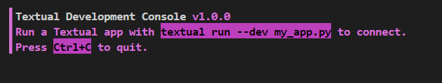

开启了console之后是没有任何调试信息的，想要输出调试信息，就要用带着`--dev`选项的`run`命令运行程序。不过，为了方便读者看到Textual程序中的`print`函数输出的内容，下面提供了一个简单的示例：

```python3
from textual.app import App
from textual.widgets import Button

class MyApp(App):
    def on_mount(self):
        self.widgets = [
            Button('output in console',action='app.debug')
        ]
        self.mount_all(self.widgets)

    def action_debug(self):
        print('something')

if __name__ == '__main__':
    app = MyApp()
    app.run()
```

将代码保存到`myapp.py`中，创建一个新的终端，切换到该文件所在目录，使用`textual run --dev myapp.py`运行该程序，点击按钮，就能在console中看到输出的调试信息。

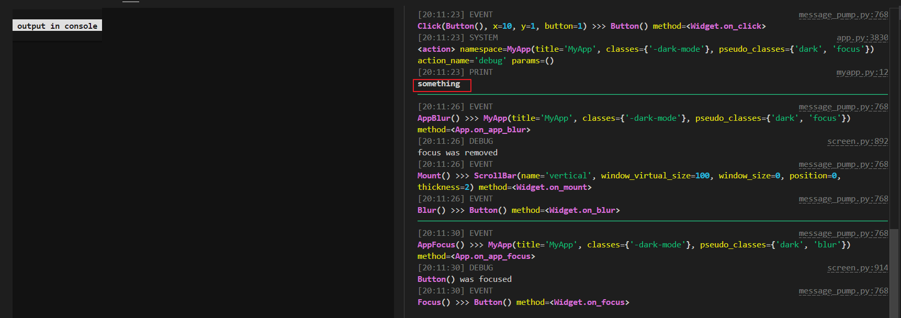

可以看见，示例中`print('something')`输出的内容，显示在console中。

当运行`textual console`时，console会监听`127.0.0.1:8081`，如果有程序开启了调试模式，程序就会把对应的调试内容输出到这个地址，这样就能在console中看到对应程序的调试信息。既然console在监听端口，那就不可避免地遇到一个问题——如果端口被占用怎么办？

`run`命令（带有`--dev`选项的时候）和`console`命令都支持给`--port`选项传入整数来修改调试模式的端口号。当遇到8081端口被占用或者被防火墙阻挡的时候，可以用这种方法修改。

说到防火墙，那就不得不提`--host`选项。一般来说，显示console的终端和开启调试模式的程序都在一台机器上，console监听的自然是`127.0.0.1`这种本地ip。但是，如果显示console的终端在其他机器或者子网中，那就要给`run`命令的`--host`选项传入console所监听的ip，来让调试信息正确输出到console。比如`textual run --dev myapp.py --host 127.0.0.2`，实际上也可以输出到本地的console（`127.0.0.2`也是本地地址）。

除了上面提到的选项，`console`的选项还有可以开启冗长日志的`-v`和可以排除指定类型日志信息的`-x`。

前面那些输出到console的调试信息，其实就是日志信息。在程序中触发事件等都会让程序写入日志信息，只不过在开启console之后，这些原本不显示出来的日志信息，就会输出到console中。当Textual程序开始运行，用户与程序交互，就会在短时间内触发大量事件。如果Textual把这些日志信息全部输出，console中短时间内就会充斥大量信息，不利于排查问题。因此，Textual将一些不太重要的日志信息标记为"verbose"（冗长的），表明这类日志信息一般不需要在意，并且默认将这类日志信息排除，不向console输出。当然，要是默认的日志信息看不到问题，需要更加详细的信息来排查复杂的问题，可以在执行`console`命令时添加`-v`选项，

觉得日志信息不够详细可以用`-v`选项，若是觉得日志信息太多而不容易找到想要找的信息，就可以用`-x`来排除特定类型的日志信息。

如输出结果的图片所示：


可以看到输出了`'something'`的上一行、写有时间的那一行中，有`'PRINT'`字样，这就是日志的类型。

Textual的日志类型包括这几类（下节会介绍如何输出这几类日志信息）：`EVENT`、`DEBUG`、`INFO`、`WARNING`、`ERROR`、`PRINT`、`SYSTEM`、`LOGGING`、`WORKER`。

如果想要排除特定类型的日志信息，可以给`-x`选项传入日志类型，比如`textual console -x EVENT`。

需要注意的是，该选项每次只能传入一个日志类型，即一个`-x`对应一个日志类型。如果想要一次性排除多个类型的日志信息，就要使用多个`-x`选项，比如`textual console -x EVENT -x DEBUG -x INFO -x WARNING -x ERROR -x SYSTEM -x LOGGING -x WORKER`，就是排除掉除了`PRINT`之外的所有日志：

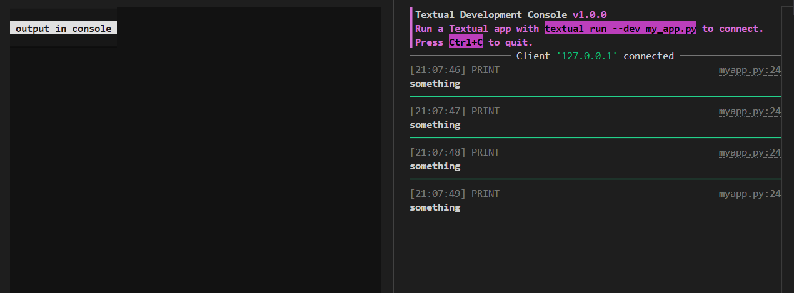

##### 3.1.1.2 console与日志

上一节中提到了如何排除特定类型的日志信息，但`print`只能输出`PRINT`类型的日志信息，其他类型的日志信息如何输出？

介绍输出特定类型的日志信息之前，先说说如何输出日志到console。

在Textual中，想要输出日志到console，除了上节中使用的Python的`print`函数，还可以使用支持可渲染对象的`log`对象和虽然不支持可渲染对象但兼容标准日志模块`logging`的`TextualHandler`对象。

`log`对象有子方法，也支持直接调用（该对象是实现了`__call__`方法的`Logger`类的实例，所以可以当函数一样调用），先说简单直的直接调用，子方法下面细讲。调用`log`对象的方式有两种：

-   直接单独调用，使用`from textual import log`导入，完整用法参考[官网文档](https://textual.textualize.io/api/logger/#textual.log)，导入之后调用即可。支持输出字符串、变量、关键字参数（直接给方法传入任意关键字和值）、可渲染对象等，比如：

    ```python3
    def action_debug(self):
        log("Hello, World")  # 输出字符串
        log(locals())  # 输出局部变量
        log(children=self.children, pi=3.141592)  # 输出关键字和值
        log(self.tree)  # 输出可渲染对象
    ```

-   调用组件类和App类的`log`对象，无需单独导入，直接调用即可，`log`对象就是实例对象的子属性。支持输出的内容和上面的调用方式一样，完整用法参考[官网文档](https://textual.textualize.io/api/app/#textual.app.App.log)。代码上基本没有区别，只是独立调用的代码变成实例对象的子属性而已：

    ```python3
    def action_debug(self):
        self.log("Hello, World")  # 输出字符串
        self.log(locals())  # 输出局部变量
        self.log(children=self.children, pi=3.141592)  # 输出关键字和值
        self.log(self.tree)  # 输出可渲染对象
    ```

完整的示例如下：

```python3
from textual.app import App
from textual.widgets import Button
from textual import log

class MyApp(App):
    def on_mount(self):
        self.widgets = [
            Button('output in console',action='app.debug')
        ]
        self.mount_all(self.widgets)

    def action_debug(self):
        log("Hello, World")  # 输出字符串
        log(locals())  # 输出局部变量
        log(children=self.children, pi=3.141592)  # 输出关键字和值
        log(self.tree)  # 输出可渲染对象

if __name__ == '__main__':
    app = MyApp()
    app.run()
```

```python3
from textual.app import App
from textual.widgets import Button

class MyApp(App):
    def on_mount(self):
        self.widgets = [
            Button('output in console',action='app.debug')
        ]
        self.mount_all(self.widgets)

    def action_debug(self):
        self.log("Hello, World")  # 输出字符串
        self.log(locals())  # 输出局部变量
        self.log(children=self.children, pi=3.141592)  # 输出关键字和值
        self.log(self.tree)  # 输出可渲染对象

if __name__ == '__main__':
    app = MyApp()
    app.run()
```

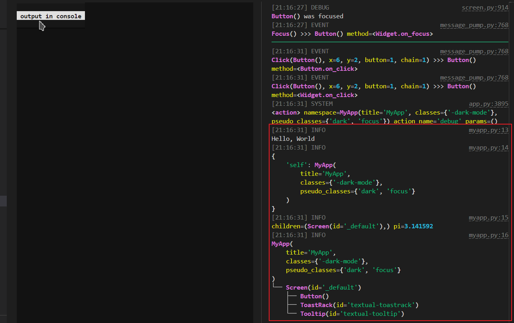

相比于简单易用的`log`方法，`TextualHandler`的用法（完整用法参考[官网文档](https://textual.textualize.io/api/logging/#textual.logging.TextualHandler)）就更加标准，需要的前置步骤也更多。

`TextualHandler`其实是一个Textual扩展了功能的，`logging`的`Handler`（完整用法参考[官网文档](https://docs.python.org/3/library/logging.html#logging.Handler)）。因此，前置步骤就是`logging`的配置过程，使用`import logging`导入之后，需要配置`logging`模块的基本信息，比如：日志级别，日志信息的处理器（`Handler`）等。

模块的`basicConfig`方法可以完成基本配置，其中`level`参数设置为`"NOTSET"`，就是不设定日志级别，输出所有级别的日志。而`handlers`参数是一个列表，列表中需要放置日志处理器对象，比如Textual的`TextualHandler`；当发送日志信息时，处理器会同时处理该日志信息，将日志信息输出到console中。因此，基本的配置代码如下：

```python3
import logging
from textual.logging import TextualHandler

logging.basicConfig(
    level="NOTSET",
    handlers=[TextualHandler()],
)
```

完成基本配置之后，就可以调用`logging`提供的日志方法，输出指定的日志信息到console中。千万别忘了，`logging`的日志方法不支持可渲染对象，不要用`logging`提供的日志方法输出这类对象。

完整代码如下：

```python3
from textual.app import App
from textual.widgets import Button
import logging
from textual.logging import TextualHandler

logging.basicConfig(
    level="NOTSET",
    handlers=[TextualHandler()],
)

class MyApp(App):
    def on_mount(self):
        self.widgets = [
            Button('output in console',action='app.debug')
        ]
        self.mount_all(self.widgets)

    def action_debug(self):
        logging.log(logging.INFO,'log via logging')

if __name__ == '__main__':
    app = MyApp()
    app.run()
```

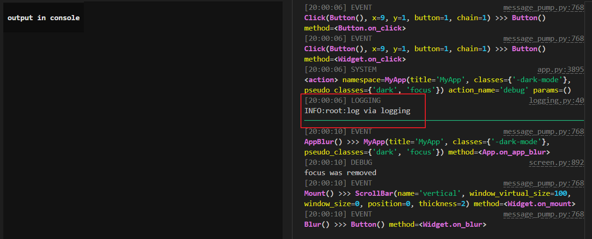

想必读者也注意到了`logging`提供的日志方法也有类似console中日志分组的日志级别，但需要注意的是，`logging`的日志级别并不会影响日志分组，在console中，所有`logging`输出的日志信息都属于`LOGGING`分组：

```python3
from textual.app import App
from textual.widgets import Button
import logging
from textual.logging import TextualHandler

logging.basicConfig(
    level="NOTSET",
    handlers=[TextualHandler()],
)

class MyApp(App):
    def on_mount(self):
        self.widgets = [
            Button('output in console',action='app.debug')
        ]
        self.mount_all(self.widgets)

    def action_debug(self):
        for level in logging.getLevelNamesMapping().keys():
            logging.log(getattr(logging,level),f'level {level} of logging belongs to LOGGING')

if __name__ == '__main__':
    app = MyApp()
    app.run()
```

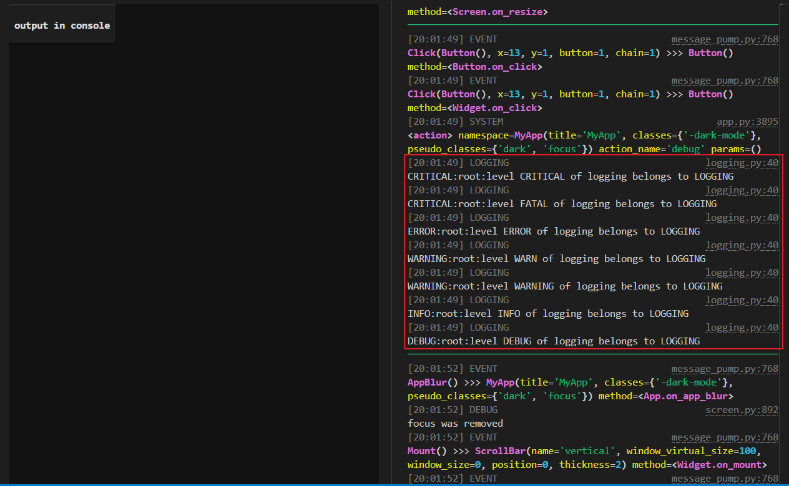

前面介绍过，Textual的日志类型包括这几类：`EVENT`、`DEBUG`、`INFO`、`WARNING`、`ERROR`、`PRINT`、`SYSTEM`、`LOGGING`、`WORKER`。

其中，输出信息属于`PRINT`分组的只有`print`函数和`sys.stdout.write`函数：

```python3
from textual.app import App
from textual.widgets import Button
import sys

class MyApp(App):
    def on_mount(self):
        self.widgets = [
            Button('output in console',action='app.debug')
        ]
        self.mount_all(self.widgets)

    def action_debug(self):
        print('print() belongs to PRINT')
        sys.stdout.write('sys.stdout.write() belongs to PRINT')

if __name__ == '__main__':
    app = MyApp()
    app.run()
```

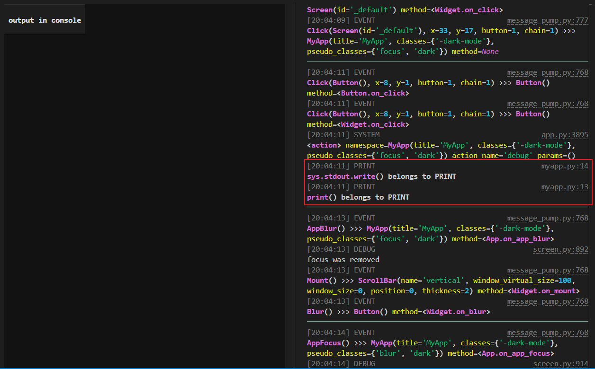

直接调用`log`对象输出的信息属于`INFO`分组：

```python3
from textual.app import App
from textual.widgets import Button
from textual import log

class MyApp(App):
    def on_mount(self):
        self.widgets = [
            Button('output in console',action='app.debug')
        ]
        self.mount_all(self.widgets)

    def action_debug(self):
        log('log() belongs to INFO') # INFO
        self.log('self.log() belongs to INFO') # INFO

if __name__ == '__main__':
    app = MyApp()
    app.run()
```

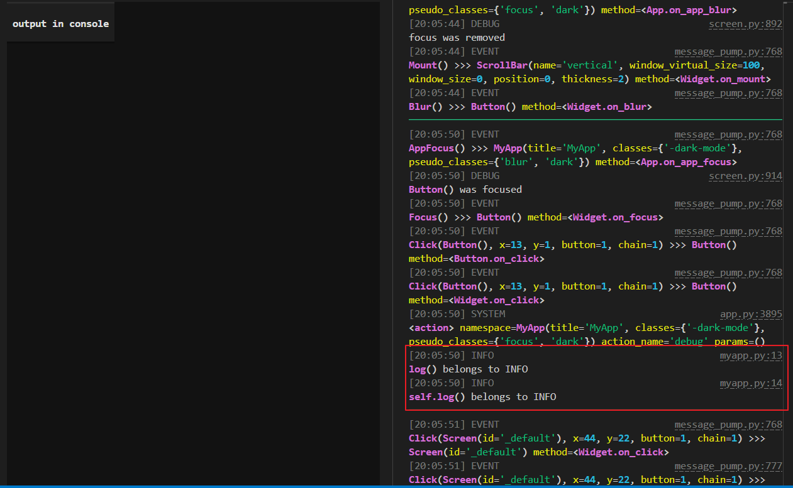

除了`PRINT`分组外，其余分组都有对应小写名的`log`对象的子方法（比如`log.debug`，完整用法参考[官网文档](https://textual.textualize.io/api/logger/#textual.Logger)），可以输出对应分组的日志信息：

```python3
from textual.app import App
from textual.widgets import Button
from textual import log

class MyApp(App):
    def on_mount(self):
        self.widgets = [
            Button('output in console',action='app.debug')
        ]
        self.mount_all(self.widgets)

    def action_debug(self):
        groups = ['EVENT','DEBUG','INFO','WARNING','ERROR','SYSTEM','LOGGING','WORKER']
        for group in groups:
            getattr(log,group.lower())(f'log.{group.lower()}()  belongs to {group}')

if __name__ == '__main__':
    app = MyApp()
    app.run()
```

```python3
from textual.app import App
from textual.widgets import Button
from textual import log

class MyApp(App):
    def on_mount(self):
        self.widgets = [
            Button('output in console',action='app.debug')
        ]
        self.mount_all(self.widgets)

    def action_debug(self):
        groups = ['EVENT','DEBUG','INFO','WARNING','ERROR','SYSTEM','LOGGING','WORKER']
        for group in groups:
            getattr(self.log,group.lower())(f'log.{group.lower()}()  belongs to {group}')

if __name__ == '__main__':
    app = MyApp()
    app.run()
```

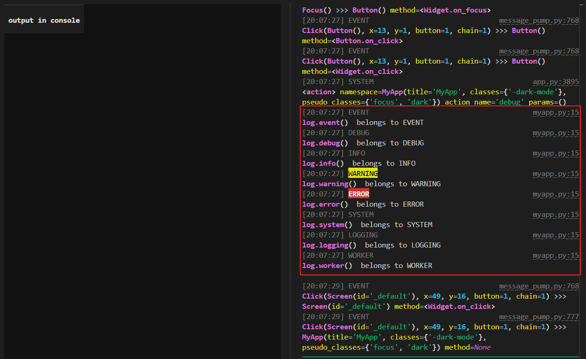

不同日志分组对应的日志方法比较多，简单用表格总结一下：

| 日志方法                             | 所属分组                                      | 示例                                                       |
| ------------------------------------ | --------------------------------------------- | ---------------------------------------------------------- |
| `logging`                            | `LOGGING`                                     | `logging.log('something')`                                 |
| `print`<br>`sys.stdout.write`        | `PRINT`                                       | `print('something')`<br/>`sys.stdout.write('something')`   |
| `log`<br/>`self.log`                 | `INFO`                                        | `log('something')`<br/>`self.log('something')`             |
| `log`的子方法<br/>`self.log`的子方法 | `{子方法名大写}`<br>仅限除了`PRINT`之外的分组 | `log.debug('something')`<br/>`self.log.debug('something')` |

除了输出日志到console外，将日志输出到日志文件，也是常用的记录日志的形式。

对于`logging`模块来说，输出日志到文件很简单，只需添加一个文件处理器（`FileHandler`）即可，该对象的参数就是日志文件的文件名（含路径）：

```python3
from textual.app import App
from textual.widgets import Button
import logging
from textual.logging import TextualHandler

logging.basicConfig(
    level="NOTSET",
    handlers=[logging.FileHandler(filename='./psf.log')],
)

class MyApp(App):
    def on_mount(self):
        self.widgets = [
            Button('output in console',action='app.debug')
        ]
        self.mount_all(self.widgets)

    def action_debug(self):
        for level in logging.getLevelNamesMapping().keys():
            logging.log(getattr(logging,level),f'level {level} of logging belongs to LOGGING')

if __name__ == '__main__':
    app = MyApp()
    app.run()
```

`log`方法想要输出日志到文件就要费点事，这个操作官方教程没有直接指明。操作很简单，只需设置`constants.LOG_FILE`为日志文件名（含路径）即可，设置前需要使用`from textual import constants`导入常量模块：

```python3
from textual.app import App
from textual.widgets import Button
from textual import log
from textual import constants

constants.LOG_FILE = f'./psf.log'

class MyApp(App):
    def on_mount(self):
        self.widgets = [
            Button('output in console',action='app.debug')
        ]
        self.mount_all(self.widgets)

    def action_debug(self):
        groups = ['EVENT','DEBUG','INFO','WARNING','ERROR','SYSTEM','LOGGING','WORKER']
        for group in groups:
            getattr(self.log,group.lower())(f'log.{group.lower()}()  belongs to {group}')

if __name__ == '__main__':
    app = MyApp()
    app.run()
```

##### 3.1.1.3 `run`命令与`serve`命令组合

`run`命令和`serve`命令都可以添加`--dev`来开启调试模式，让程序将调试内容输出到打开的console中。但是，`serve`命令中为了方便修改对外服务地址而做的选项让`serve`命令有些与众不同：`console`命令、`run`命令和`serve`命令都支持端口参数`--port`，`run`命令和`serve`命令都支持主机参数`--host`，然而同名不同义，这也就导致`serve`命令的调试端口和调试主机不能直接修改。

倒不是没有解决方案，首先要知道`run`命令和`serve`命令的`-c`选项支持嵌套子命令，`serve`命令不用此选项也支持嵌套子命令，而`serve`命令除了支持双中划线开头的长选项，还支持单中划线的短选项（`-p`和`-h`）。所以，利用嵌套子命令的方法将二者组合使用，让`run`命令修改调试端口和调试主机，可以间接实现修改`serve`命令的调试端口和调试主机。

以`serve`命令监听`127.0.0.2:8080`、console命令监听`127.0.0.1:8888`、程序文件为`main.py`为例，有以下方法：

-   `run`命令为主命令，`serve`命令为嵌套子命令：
    -   嵌套子命令为字符串的情况下，字符串内的参数与字符串外的参数互相完全不干扰。字符串外遵循`run`命令的要求，字符串内遵循`serve`命令的要求。则命令为`textual run --dev --host 127.0.0.1 --port 8888 -c 'textual serve main.py --host 127.0.0.2 --port 8080'`或者`textual run --dev --host 127.0.0.1 --port 8888 -c 'textual serve main.py -h 0127.0.0.2 -p 8080'`。
    -   嵌套子命令为裸命令（非字符串）的情况下，嵌套子命令的参数会被`run`命令优先使用，此时嵌套子命令只能使用短选项。则命令为`textual run --dev --host 127.0.0.1 --port 8888 -c textual serve main.py -h 127.0.0.2 -p 8080`或者`textual run --dev -c textual serve main.py -h 127.0.0.2 -p 8080 --host 127.0.0.1 --port 8888 `。
-   `serve`命令为主命令，`run`命令为嵌套子命令时，无论是否使用`-c`选项，嵌套子命令只能是字符串，所以，修改调试端口和调试主机的选项只能随`run`命令添加到字符串内，字符串外修改`serve`命令的端口和主机的选项可以基于`serve`命令要求自由放置，长选项短选项均可。则命令为`textual serve --port 8080 --host 127.0.0.2 -c 'textual run --dev main.py --host 127.0.0.1 --port 8888'`。

#### 3.1.2 基本概念中的高阶知识

##### 3.1.2.1 退出之后

前面几乎所有的Textual程序最后一行都是`app.run()`，而程序退出之后，整个程序也就结束了，没有后续操作。这段话听起来像是废话，程序结束，当然没法继续操作了。其实，这里要说的是，Textual的部分结束，不代表Python部分的结束。如果有其他需要Python执行的操作，还是能执行的。

以下面的代码为例，在`app.run()`之后添加了打印语句，这样Textual程序退出之后，就能在终端看到打印的内容：

```python3
from textual.app import App
from textual.widgets import Button, Label

class MyApp(App):
    def on_mount(self):
        self.widgets = [
            Label('Choose YES or NO :'),
            Button("Yes", id="yes", variant="primary"),
            Button("No", id="no", variant="error")
        ]
        self.mount_all(self.widgets)
    def on_button_pressed(self, e: Button.Pressed):
        self.exit()

if __name__ == '__main__':
    app = MyApp()
    app.run()
    print('program exited.')
```

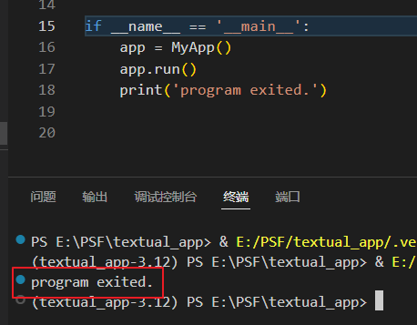

除了这种在原本结束的代码之后添加额外的代码，`exit`方法本身支持三个参数，可以将Textual程序内部的对象、程序的返回码、退出信息传给该方法：

-   `result`参数，支持任何对象，传给该参数的对象会变成`run`方法的返回值，比如`result = app.run()`，这里的`result`的值对应的就是传给该参数的对象。
-   `return_code`参数，只支持整数，表示程序退出时的状态，在POSIX标准中，程序退出时的返回值为`0`表示正常退出，其他值表示异常退出。需要注意的是，给该参数传入非零整数，并不会让Python程序按照此标准返回对应的值，还需要使用`sys.exit(app.return_code)`来将该参数传给Python程序。其中`app.return_code`——`App`子类实例的`return_code`属性就是该参数的值。
-   `message`参数，支持可渲染对象（Python的字符串也是），用于在Textual程序退出之后，在终端输出内容。Textual程序退出之后不会独占终端输出，所以该参数的值可以正常输出到终端。

完整示例如下：

```python3
from textual.app import App
from textual.widgets import Button, Label

class MyApp(App):
    def on_mount(self):
        self.widgets = [
            Label('Choose YES or NO :'),
            Button("Yes", id="yes", variant="primary"),
            Button("No", id="no", variant="error")
        ]
        self.mount_all(self.widgets)

    def on_button_pressed(self, e: Button.Pressed):
        self.exit(result=e.button, return_code=4, message='no errors')

if __name__ == '__main__':
    app = MyApp()
    result = app.run()
    print(f'{result=}, {app.return_code=}.')
    import sys
    sys.exit(app.return_code or 0)
```

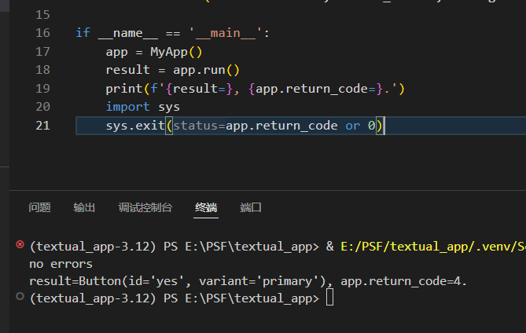

读者可以对比该示例和上个示例的输出结果中最左边的图标的颜色：红色表示异常退出（整个程序的返回值不为零），蓝色表示正常退出（整个程序的返回值为零）。

除了上面将`app.run()`的返回值赋给变量，来打印`exit`方法的`result`参数之外，如果导入了`textual.constants`，将`SHOW_RETURN`设置为`True`，程序退出时会自动打印返回值：

```python3
from textual.app import App
from textual.widgets import Button,Label
from textual import constants

constants.SHOW_RETURN = True

class MyApp(App):
    def on_mount(self):
        self.widgets = [
            Label('Choose YES or NO :'),
            Button("Yes", id="yes", variant="primary"),
            Button("No", id="no", variant="error")
        ]
        self.mount_all(self.widgets)

    def on_button_pressed(self, e: Button.Pressed):
        self.exit(result=e.button)

if __name__ == '__main__':
    app = MyApp()
    app.run()
```

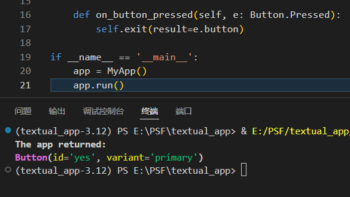

##### 3.1.2.2 挂起

在介绍挂起操作之前，需要明确一点：挂起当前进程的操作不支持Windows和Textual Web平台，进入挂起上下文的操作不支持Textual Web平台。

什么是挂起？

在Linux和Unix类系统中，将当前正在运行的程序放到后台，而不是将其结束，并可以在想要恢复的时候将其再次放到前台，让程序执行过程不会因此中断，其中将程序放到后台的操作就叫挂起。

虽然Textual也是个终端程序，但并不会响应Linux和Unix类系统中挂起程序的快捷键`ctrl+z`。想要让Textual程序响应此快捷键，必须手动将快捷键绑定到`suspend_process`这个动作上才行。在前面介绍预定义的动作函数时，就说过这个动作（[官网文档](https://textual.textualize.io/api/app/#textual.app.App.action_suspend_process)），可以把当前程序挂起，效果和Linux和Unix类系统中挂起当前程序一样。

启用`ctrl+z`挂起当前Textual程序的示例：

```python3
from textual.app import App
from textual.widgets import Label

class MyApp(App):
    BINDINGS = [("ctrl+z", "suspend_process")]
    def on_mount(self):
        self.widgets = [
            Label("Press Ctrl+Z to suspend!"),
        ]
        self.mount_all(self.widgets)

if __name__ == '__main__':
    app = MyApp()
    app.run()
```

有相关经验的读者可以使用`jobs`查找被挂起的进程，用`fg`命令恢复Textual程序，这里就不演示了。

虽然Windows因为不是POSIX标准的操作系统，不支持挂起当前进程，但Textual提供的挂起上下文，Windows却可以使用。

什么是挂起上下文？

在`App`类或者子类的实例中，调用`suspend`方法会返回一个上下文，进入该上下文，Textual程序的消息循环就会被挂起，直到退出该上下文才会恢复。因此，该上下文支持Windows，因为这只是Textual框架挂起消息循环，并不是真的挂起程序。

不过，在使用挂起上下文时，需要注意以下几点，避免在操作时导致异常：在Linux和Unix类系统中，使用`ctrl+z`会导致程序卡住；在Windows系统中，使用`ctrl+c`会导致无法从当前终端程序恢复到Textual程序。

使用挂起上下文很简单，只需像下面的代码这样，使用`with`管理上下文，并在上下文中执行操作即可：

```python3
with self.suspend():  
    os.system("python")
```

一般来说，进入挂起上下文通常用于切换到另一个终端程序，并在另一个终端程序结束后恢复Textual程序。示例中的`self.refresh()`不是挂起上下文必须的，只是为了让部分组件显示的内容不会因为切换而变得异常，手动刷新一下显示。实际上，即使不刷新，切换焦点也会自动触发显示的刷新。

所有支持的系统都可以在挂起上下文中打开终端程序的示例：

```python3
from textual.app import App
from textual.widgets import Button
import os

class MyApp(App):
    def on_mount(self):
        self.widgets = [
            Button("python", variant="primary"),
        ]
        self.mount_all(self.widgets)

    def on_button_pressed(self, e: Button.Pressed):
        with self.suspend():  
            os.system("python")
        self.refresh()

if __name__ == '__main__':
    app = MyApp()
    app.run()
```

Windows下还可以在挂起上下文中打开桌面程序的示例：

```python3
from textual.app import App
from textual.widgets import Button
import os

class MyApp(App):
    def on_mount(self):
        self.widgets = [
            Button("notepad", variant="primary"),
        ]
        self.mount_all(self.widgets)

    def on_button_pressed(self, e: Button.Pressed):
        with self.suspend():  
            os.system(f"notepad {__file__}")
        self.refresh()

if __name__ == '__main__':
    app = MyApp()
    app.run()
```

需要额外注意的是，想要在组件类的子类中进入挂起上下文，需要使用`app`子属性的`suspend`方法才行，因为组件类没有此方法：

```python3
from textual.app import App
from textual.widgets import Button
import os

class ButtonA(Button):
    def on_click(self,e):
        e.prevent_default()
        with self.app.suspend():  
            os.system(f"notepad {__file__}")
        self.app.refresh()

class MyApp(App):
    def on_mount(self):
        self.widgets = [
            Button("notepad", variant="primary"),
            ButtonA("notepad", variant="primary"),
        ]
        self.mount_all(self.widgets)

    def on_button_pressed(self, e: Button.Pressed):
        with self.suspend():  
            os.system(f"notepad {__file__}")
        self.refresh()

if __name__ == '__main__':
    app = MyApp()
    app.run()
```

这里添加了阻止默认行为的代码，是因为不阻止默认行为的话，子类同样会触发`Button.Pressed`事件，会导致`App`子类里的挂起操作也被执行一次。

##### 3.1.2.3 `run`方法的参数

最开始的章节介绍过`run`方法的`inline`参数，其实该方法支持的参数很多，有些也很实用。

`run`方法（完整介绍可以参考[官网文档](https://textual.textualize.io/api/app/#textual.app.App.run)）的参数有：

-   `headless`参数，布尔类型，表示是否开启无头模式。所谓无头模式，即不在终端输出内容的模式，但程序的组件依然可以通过编程交互，通常在自动化测试时开启。默认为`False`，即不开启。

-   `inline`参数，布尔类型，表示是否开启行内模式。默认为`False`，即不开启。

-   `inline_no_clear`参数，布尔类型，表示退出开启行内模式的程序时是否清除显示在终端的内容（需要同时设置`inline`参数为`True`），本参数为`True`时不清除显示在终端的内容。默认为`False`，即退出开启行内模式的程序时清除显示在终端的内容。

-   `mouse`参数，布尔类型，表示是否开启程序的鼠标支持。默认为`True`，即程序默认支持鼠标。

-   `size`参数，整数元组类型，表示程序启动时的显示大小（即整个`Screen`组件的大小），拖动终端时会让显示大小重新调整。元组只有两个元素，第一个元素表示显示的宽度（字符数），第二个元素表示显示的高度（字符数）。

-   `auto_pilot`参数，可调用类型，表示程序在开始运行之后，执行的自动化操作。传给该参数的函数会被传入一个`Pilot`类型的对象（`from textual.pilot import Pilot`导入，支持的操作参考[官网文档](https://textual.textualize.io/api/pilot/)）作为参数，并在函数内部定义一系列使用该对象的自动化操作，主要用于自动化测试。通常该参数的基本用法如下（非完整代码，只展示该参数相关的部分）：

    ```python3
    from textual.pilot import Pilot
    
    async def auto_pilot(pilot:Pilot):
        await pilot.pause() # 必须等pilot就位
        # 可以用 await pilot.wait_for_scheduled_animations()
        for _ in range(9):
            await pilot.pause(0.5) # 两次点击之间最好暂停0.5秒以上，避免丢失操作
            await pilot.click('#plus') # 点击id为plus的组件
        pilot.app.exit() # 退出程序，测试时候需要，其他用途不用
        # await pilot.exit(0) 这种退出必须提供退出结果，且要用await修饰
        # await pilot.press('ctrl+q') 也可以模拟按键退出（旧版本需要模拟'ctrl+c'）
            
    app.run(headless=True,auto_pilot=auto_pilot) # pilot支持无头模式
    ```
    

在常量模块中，有一个与该参数有关的常量——`constants.PRESS`，该常量为字符串类型，表示当`auto_pilot`为`None`时模拟的按键，比如`constants.PRESS = 'ctrl+c,ctrl+v'`。

`auto_pilot`参数的完整示例代码如下：

```python3
from textual.app import App
from textual.widgets import Button,Digits

class MyApp(App):
    num = 0
    def on_mount(self):
        self.widgets = [
            Digits(str(self.num)),
            Button("+1",id='plus', variant="primary"),
            Button("0",id='zero', variant="default"),
        ]
        self.mount_all(self.widgets)

    def on_button_pressed(self, e: Button.Pressed):
        if e.button.id == 'zero':
            self.num = 0
        else:
            self.num += 1
        self.query_one(Digits).update(str(self.num))
        print(self.query_one(Digits).value)

from textual.pilot import Pilot

async def auto_pilot(pilot:Pilot):
    await pilot.pause() # 必须等pilot就位
    # 可以用 await pilot.wait_for_animation() 
    # 或者 await pilot.wait_for_scheduled_animations()
    for _ in range(9):
        await pilot.pause(0.5) # 两次点击之间最好暂停0.5秒以上，避免丢失操作
        await pilot.click('#plus') # 点击id为plus的组件
    pilot.app.exit() # 退出程序，测试时候需要，其他用途不用
    # await pilot.exit(0) 这种退出必须提供退出结果，且要用await修饰
    # await pilot.press('ctrl+q') 也可以模拟按键退出（旧版本需要模拟'ctrl+c'）

if __name__ == '__main__':
    app = MyApp()
    app.run(headless=True,auto_pilot=auto_pilot) # pilot支持无头模式
```

#### 3.1.3 样式的高阶知识

##### 3.1.3.1 颜色的高阶知识

颜色类（`from textual.color import Color`）的`Color.parse`方法除了可以转换RGB之类的Web常用颜色，其实还可以转换ansi颜色，比如`Color.parse('ansi_red')`。不过，与前面讲到的ansi颜色不同，这里转换出来的是Rich框架中的ansi颜色，即下面列表中的颜色：

```python3
ANSI_COLORS = [
    "black",
    "red",
    "green",
    "yellow",
    "blue",
    "magenta",
    "cyan",
    "white",
    "bright_black",
    "bright_red",
    "bright_green",
    "bright_yellow",
    "bright_blue",
    "bright_magenta",
    "bright_cyan",
    "bright_white",
]
```

因此，下面代码中的`'ansi_red'`颜色和同名转换颜色，看起来很不一样：

```python3
from textual.app import App
from textual.widgets import Static
from textual.color import Color

class MyApp(App):
    def __init__(self,*args,**kwargs):
        super().__init__(*args,**kwargs)
        self.ansi_color = True
    def on_mount(self):
        self.widgets = [
            Static('regular_red',id='regular'),
            Static('ansi_red',id='ansi'),
        ]
        self.mount_all(self.widgets)
        self.query_one('#regular').styles.background = 'ansi_red'
        self.query_one('#ansi').styles.background = Color.parse('ansi_red')

if __name__ == '__main__':
    app = MyApp()
    app.run()
```

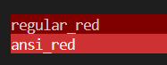

其实，这个转换出来的ansi颜色，对应的是`Color`类实例化时给`ansi`参数传入一个整数，这个整数就是'ansi_'为前缀的颜色名去掉前缀的名字在上面列表中的索引值。而这个得到的索引值，对应的就是Rich框架的`color.ANSI_COLOR_NAMES`字典（使用`from rich import color`导入）中，这个去掉前缀的颜色名字在字典中的值：

```python3
{'black': 0, 'red': 1, 'green': 2, 'yellow': 3, 'blue': 4, 'magenta': 5, 'cyan': 6, 'white': 7, 'bright_black': 8, 'bright_red': 9, 'bright_green': 10, 'bright_yellow': 11, 'bright_blue': 12, 'bright_magenta': 13, 'bright_cyan': 14, 'bright_white': 15, 'grey0': 16, 'gray0': 16, 'navy_blue': 17, 'dark_blue': 18, 'blue3': 20, 'blue1': 21, 'dark_green': 22, 'deep_sky_blue4': 25, 'dodger_blue3': 26, 'dodger_blue2': 27, 'green4': 28, 'spring_green4': 29, 'turquoise4': 30, 'deep_sky_blue3': 32, 'dodger_blue1': 33, 'green3': 40, 'spring_green3': 41, 'dark_cyan': 36, 'light_sea_green': 37, 'deep_sky_blue2': 38, 'deep_sky_blue1': 39, 'spring_green2': 47, 'cyan3': 43, 'dark_turquoise': 44, 'turquoise2': 45, 'green1': 46, 'spring_green1': 48, 'medium_spring_green': 49, 'cyan2': 50, 'cyan1': 51, 'dark_red': 88, 'deep_pink4': 125, 'purple4': 55, 'purple3': 56, 'blue_violet': 57, 'orange4': 94, 'grey37': 59, 'gray37': 59, 'medium_purple4': 60, 'slate_blue3': 62, 'royal_blue1': 63, 'chartreuse4': 64, 'dark_sea_green4': 71, 'pale_turquoise4': 66, 'steel_blue': 67, 'steel_blue3': 68, 'cornflower_blue': 69, 'chartreuse3': 76, 'cadet_blue': 73, 'sky_blue3': 74, 'steel_blue1': 81, 'pale_green3': 114, 'sea_green3': 78, 'aquamarine3': 79, 'medium_turquoise': 80, 'chartreuse2': 112, 'sea_green2': 83, 'sea_green1': 85, 'aquamarine1': 122, 'dark_slate_gray2': 87, 'dark_magenta': 91, 'dark_violet': 128, 'purple': 129, 'light_pink4': 95, 'plum4': 96, 'medium_purple3': 98, 'slate_blue1': 99, 'yellow4': 106, 'wheat4': 101, 'grey53': 102, 'gray53': 102, 'light_slate_grey': 103, 'light_slate_gray': 103, 'medium_purple': 104, 'light_slate_blue': 105, 'dark_olive_green3': 149, 'dark_sea_green': 108, 'light_sky_blue3': 110, 'sky_blue2': 111, 'dark_sea_green3': 150, 'dark_slate_gray3': 116, 'sky_blue1': 117, 'chartreuse1': 118, 'light_green': 120, 'pale_green1': 156, 'dark_slate_gray1': 123, 'red3': 160, 'medium_violet_red': 126, 'magenta3': 164, 'dark_orange3': 166, 'indian_red': 167, 'hot_pink3': 168, 'medium_orchid3': 133, 'medium_orchid': 134, 'medium_purple2': 140, 'dark_goldenrod': 136, 'light_salmon3': 173, 'rosy_brown': 138, 'grey63': 139, 'gray63': 139, 'medium_purple1': 141, 'gold3': 178, 'dark_khaki': 143, 'navajo_white3': 144, 'grey69': 145, 'gray69': 145, 'light_steel_blue3': 146, 'light_steel_blue': 147, 'yellow3': 184, 'dark_sea_green2': 157, 'light_cyan3': 152, 'light_sky_blue1': 153, 'green_yellow': 154, 'dark_olive_green2': 155, 'dark_sea_green1': 193, 'pale_turquoise1': 159, 'deep_pink3': 162, 'magenta2': 200, 'hot_pink2': 169, 'orchid': 170, 'medium_orchid1': 207, 'orange3': 172, 'light_pink3': 174, 'pink3': 175, 'plum3': 176, 'violet': 177, 'light_goldenrod3': 179, 'tan': 180, 'misty_rose3': 181, 'thistle3': 182, 'plum2': 183, 'khaki3': 185, 'light_goldenrod2': 222, 'light_yellow3': 187, 'grey84': 188, 'gray84': 188, 'light_steel_blue1': 189, 'yellow2': 190, 'dark_olive_green1': 192, 'honeydew2': 194, 'light_cyan1': 195, 'red1': 196, 'deep_pink2': 197, 'deep_pink1': 199, 'magenta1': 201, 'orange_red1': 202, 'indian_red1': 204, 'hot_pink': 206, 'dark_orange': 208, 'salmon1': 209, 'light_coral': 210, 'pale_violet_red1': 211, 'orchid2': 212, 'orchid1': 213, 'orange1': 214, 'sandy_brown': 215, 'light_salmon1': 216, 'light_pink1': 217, 'pink1': 218, 'plum1': 219, 'gold1': 220, 'navajo_white1': 223, 'misty_rose1': 224, 'thistle1': 225, 'yellow1': 226, 'light_goldenrod1': 227, 'khaki1': 228, 'wheat1': 229, 'cornsilk1': 230, 'grey100': 231, 'gray100': 231, 'grey3': 232, 'gray3': 232, 'grey7': 233, 'gray7': 233, 'grey11': 234, 'gray11': 234, 'grey15': 235, 'gray15': 235, 'grey19': 236, 'gray19': 236, 'grey23': 237, 'gray23': 237, 'grey27': 238, 'gray27': 238, 'grey30': 239, 'gray30': 239, 'grey35': 240, 'gray35': 240, 'grey39': 241, 'gray39': 241, 'grey42': 242, 'gray42': 242, 'grey46': 243, 'gray46': 243, 'grey50': 244, 'gray50': 244, 'grey54': 245, 'gray54': 245, 'grey58': 246, 'gray58': 246, 'grey62': 247, 'gray62': 247, 'grey66': 248, 'gray66': 248, 'grey70': 249, 'gray70': 249, 'grey74': 250, 'gray74': 250, 'grey78': 251, 'gray78': 251, 'grey82': 252, 'gray82': 252, 'grey85': 253, 'gray85': 253, 'grey89': 254, 'gray89': 254, 'grey93': 255, 'gray93': 255}
```

没错，这两个值是统一的，也就是说Textual框架为了对应Rich框架的这个值，而做了一点映射操作。不过，这里不是想说两个值为什么一样，而是要说颜色和转换颜色为什么看起来不一样。

上面的颜色转换出来之后，实际上得到的是`Color(128, 0, 0, ansi=1)`这个对象。注意其中的`ansi`参数，以及上面提到的索引值。这个对象，看起来和普通颜色对象一样，但额外的参数让其与众不同。没错，这个`ansi`参数会让颜色严格遵循ansi标准，之前所谓的ansi颜色并真的ansi颜色。假如上面的示例代码不用简单的颜色名，都用颜色对象的话，那两种颜色的实际对象就是`Color(128, 0, 0)`和`Color(128, 0, 0, ansi=1)`。

需要特别说明的是，`Color`类对象的`ansi`参数其实严格遵循Rich框架的定义，即使前面的几个参数都是`0`，只要`ansi`参数正确，输出的颜色就是标准的ansi颜色。如果读者后续在使用颜色类（`from textual.color import Color`）的`Color.parse`方法解析颜色，发现和不解析的颜色有差异时，一定要看看颜色名是不是有'ansi_'前缀。

在Textual中有一个特别的颜色——`'transparent'`（透明），看意思的话应该和没有颜色一样。但是，读者可不要误以为这个透明是前面提到的透明度为0%的透明（当前颜色完全没有，显示出下面组件的颜色），这个透明是黑色。想要真透明的话，还是要给这个颜色设置一下透明度。

##### 3.1.3.2 边框标题相关的其他样式

边框标题也支持一些样式：[`border-title-color`](https://textual.textualize.io/styles/border_subtitle_color/)（边框标题颜色）、[`border-title-background`](https://textual.textualize.io/styles/border_subtitle_background/)（边框标题背景颜色）、[`border-title-style`](https://textual.textualize.io/styles/border_subtitle_style/)（边框标题文字样式）、[`border-subtitle-color`](https://textual.textualize.io/styles/border_subtitle_color/)（边框副标题颜色）、[`border-subtitle-background`](https://textual.textualize.io/styles/border_subtitle_background/)（边框副标题背景颜色）、[`border-subtitle-style`](https://textual.textualize.io/styles/border_subtitle_style/)（边框副标题文字样式）。

示例代码如下：

```python3
from textual.app import App
from textual.widgets import Static

class MyApp(App):
    def compose(self):
        self.widget = Static()
        yield self.widget

    def on_mount(self) -> None:
        self.widget.styles.width = 50
        border = ('heavy','yellow')
        self.widget.styles.border = border
        self.widget.styles.background = 'purple'
        self.widget.update(f'The widget\'s border is {border}.')
        self.widget.border_title = 'border_title'
        self.widget.border_subtitle = 'border_subtitle'
        self.widget.styles.border_title_align = 'center'
        self.widget.styles.border_title_color = 'green'
        self.widget.styles.border_title_background = 'blue'
        self.widget.styles.border_title_style = 'bold'
        self.widget.styles.border_subtitle_color = "red"
        self.widget.styles.border_subtitle_background = 'white'
        self.widget.styles.border_subtitle_style = 'italic'

if __name__ == '__main__':
    app = MyApp()
    app.run()
```

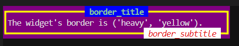

##### 3.1.3.3 设计与终端宽高相关的反应性样式

在Textual 3.2.0 中，`App`类和`Screen`类（即屏幕，后面章节会介绍，这里不写使用该类的示例，用法上和在`App`类中差不多）新增了两个类变量—— `HORIZONTAL_BREAKPOINTS` 和 `VERTICAL_BREAKPOINTS`，表示当终端宽度、高度大于指定值时，屏幕组件会应用哪个样式类（其他同在类变量的样式类会在应用新的样式类时移除）。两个类变量都是元素为双元素元组的可迭代对象，元组的第一个元素为整数类型，表示宽度、高度大于多少应用指定样式，元组的第二个元素为字符串类型，就是宽度、高度符合条件时，屏幕组件应用的样式类名字。

具体示例如下：

```python3
from textual.app import App
from textual.widgets import Static

class MyApp(App):
    VERTICAL_BREAKPOINTS = [
        (0,'low'),
        (10,'normal'),
        (20,'high'),
    ]
    CSS = '''
    Screen {
        &.low {
            #height {
                color: red;
            }
        }
        &.normal {
            #height {
                color: green;
            }
        }
        &.high {
            #height {
                color: blue;
            }
        }
    }
    '''
    def on_mount(self):
        self.widgets = [
            Static('changing with height',id='height'),
        ]
        self.mount_all(self.widgets)

if __name__ == '__main__':
    app = MyApp()
    app.run()
```

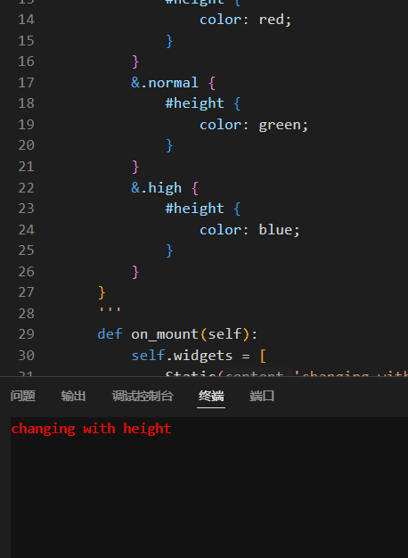

注意，Textual 3.2.0 中存在一处笔误，导致`VERTICAL_BREAKPOINTS`无法正常工作，可以在源文件头部（需要放置在导入`App`和`Screen`的代码之后）添加下面的补丁代码（仅适用于 Textual 3.2.0 ）来修复：

```python3
# patch is here
from textual.app import App
from textual.screen import Screen
from textual import events

class Screen(Screen):
    async def _on_resize(self, event: events.Resize) -> None:
        event.stop()
        self._screen_resized(event.size)
        for screen in self.app._background_screens:
            screen._screen_resized(event.size)

        horizontal_breakpoints = (
            self.app.HORIZONTAL_BREAKPOINTS
            if self.HORIZONTAL_BREAKPOINTS is None
            else self.HORIZONTAL_BREAKPOINTS
        ) or []

        vertical_breakpoints = (
            self.app.VERTICAL_BREAKPOINTS
            if self.VERTICAL_BREAKPOINTS is None
            else self.VERTICAL_BREAKPOINTS
        ) or []

        width, height = event.size
        if horizontal_breakpoints:
            self._set_breakpoints(width, horizontal_breakpoints)
        if vertical_breakpoints:
            self._set_breakpoints(height, vertical_breakpoints)
            
class App(App):
    def get_default_screen(self) -> Screen:
        """Get the default screen.

        This is called when the App is first composed. The returned screen instance
        will be the first screen on the stack.

        Implement this method if you would like to use a custom Screen as the default screen.

        Returns:
            A screen instance.
        """
        return Screen(id="_default")
# patch is over
```

也可以访问 https://github.com/python-and-novella/textual/releases/tag/3.2.1-dev ，下载修复此问题（仅适用于 Textual 3.2.0 ）的包。

完整示例如下：

```python3
from textual.app import App
from textual.widgets import Static

# patch is here
from textual.app import App
from textual.screen import Screen
from textual import events

class Screen(Screen):
    async def _on_resize(self, event: events.Resize) -> None:
        event.stop()
        self._screen_resized(event.size)
        for screen in self.app._background_screens:
            screen._screen_resized(event.size)

        horizontal_breakpoints = (
            self.app.HORIZONTAL_BREAKPOINTS
            if self.HORIZONTAL_BREAKPOINTS is None
            else self.HORIZONTAL_BREAKPOINTS
        ) or []

        vertical_breakpoints = (
            self.app.VERTICAL_BREAKPOINTS
            if self.VERTICAL_BREAKPOINTS is None
            else self.VERTICAL_BREAKPOINTS
        ) or []

        width, height = event.size
        if horizontal_breakpoints:
            self._set_breakpoints(width, horizontal_breakpoints)
        if vertical_breakpoints:
            self._set_breakpoints(height, vertical_breakpoints)
            
class App(App):
    def get_default_screen(self) -> Screen:
        """Get the default screen.

        This is called when the App is first composed. The returned screen instance
        will be the first screen on the stack.

        Implement this method if you would like to use a custom Screen as the default screen.

        Returns:
            A screen instance.
        """
        return Screen(id="_default")
# patch is over

class MyApp(App):
    VERTICAL_BREAKPOINTS = [
        (0,'low'),
        (10,'normal'),
        (20,'high'),
    ]
    CSS = '''
    Screen {
        &.low {
            #height {
                color: red;
            }
        }
        &.normal {
            #height {
                color: green;
            }
        }
        &.high {
            #height {
                color: blue;
            }
        }
    }
    '''
    def on_mount(self):
        self.widgets = [
            Static('changing with height',id='height'),
        ]
        self.mount_all(self.widgets)

if __name__ == '__main__':
    app = MyApp()
    app.run()
```


#### 3.1.4 事件与消息的高阶知识

##### 3.1.4.1 `on`装饰器的高阶知识

`on`装饰器支持额外的关键字参数，该关键字就是消息的`ALLOW_SELECTOR_MATCH`属性（完整介绍参考[官网](https://textual.textualize.io/api/message/#textual.message.Message.ALLOW_SELECTOR_MATCH)）中的组件名。该组件名同时也是消息的属性，对应的是一个确定的子组件。因此，该关键字参数对应的值就是匹配子组件的选择器，用于从一样的子组件中匹配特定的子组件。

比如`RadioSet`的`Changed`消息支持`pressed`属性，该属性就在`ALLOW_SELECTOR_MATCH`属性中，装饰器可以这样写：`@on(RadioSet.Changed, pressed='.b')`。因为`pressed`属性只存在于`Changed`消息中，该装饰器就只会匹配到触发了`Changed`消息同时样式类有`'b'`的子组件。

可以当作关键字参数的消息属性：

-   `ListView`的`Highlighted`消息、`Selected`消息的`item`属性，表示触发对应消息的`ListItem`。
-   `RadioSet`的`Changed`消息的`pressed`属性，表示触发对应消息的`RadioButton`。
-   `TabbedContent`的`TabActivated`消息的`pane`属性，表示触发对应消息的`TabPane`。
-   `Tabs`的`TabMessage`继承消息（包括`TabActivated`消息、`TabDisabled`消息、`TabEnabled`消息、`TabHidden`消息、`TabShown`消息）的`tab`属性，表示触发对应消息的`Tab`。注意，`Tabs`支持直接传入字符串来生成`Tab`，这种会自动生成带`id`的`Tab`。如果传给`Tabs`的`Tab`组件没有`id`，也会按照规则生成`id`属性。按照传给`Tabs`的顺序排序，没有`id`的`Tab`和字符串生成的`Tab`，其`id`属性会依次被赋值为`'tab-1'`、`'tab-2'`……`'tab-n'`，可以依据这个规律来匹配对应的`Tab`。

以下示例使用了`RadioSet`的`Changed`消息的`pressed`属性（完整用法参考[官网文档](https://textual.textualize.io/widgets/radioset/#textual.widgets.RadioSet.Changed.ALLOW_SELECTOR_MATCH)），只有点击到特定的单选按钮，按钮文字才会改变：

```python3
from textual.app import App
from textual.widgets import Static, RadioSet, RadioButton
from textual import on

class MyApp(App):
    def on_mount(self):
        self.widgets = [
            Static('Events'),
            RadioSet(
                RadioButton('a', classes='a'),
                RadioButton('b', classes='b'),
                RadioButton('c', classes='c')
            ),
        ]
        self.mount_all(self.widgets)

    @on(RadioSet.Changed, pressed='.b')
    def handdle_radio_set_changed(self, e: RadioSet.Changed):
        e.pressed.label = 'button pressed'

if __name__ == '__main__':
    app = MyApp()
    app.run()
```

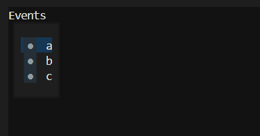

`on`装饰器除了简单装饰一个普通函数名的函数，还可以装饰一个消息响应函数或者一个已经被`on`装饰器装饰过的函数。那么，此时的响应函数就可以响应任一消息。需要注意的是，不同消息的消息属性不完全一致，这种嵌套用法仅限于函数内操作的消息属性是每个消息都有的，或者函数内操作不需要接收消息参数。

接下来，需要修改一下上面示例的代码，让响应函数内的操作不接收消息参数，看一下这两种用法的示例。

`on`装饰器装饰一个已经被`on`装饰器装饰的函数：

```python3
from textual.app import App
from textual.widgets import Static, RadioSet, RadioButton
from textual import on
from textual.events import Click
from datetime import datetime

class MyApp(App):
    def on_mount(self):
        self.widgets = [
            Static('Events'),
            RadioSet(
                RadioButton('a', classes='a'),
                RadioButton('b', classes='b'),
                RadioButton('c', classes='c')
            ),
        ]
        self.mount_all(self.widgets)

    @on(Click)
    @on(RadioSet.Changed, pressed='.b')
    def handdle_radio_set_changed(self):
        self.query_one(Static).update(f'{datetime.now().time():%T}')

if __name__ == '__main__':
    app = MyApp()
    app.run()
```

这样的话，点击和使用键盘选择特定按钮都可以执行响应函数：

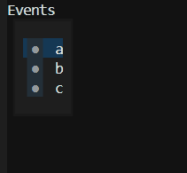

`on`装饰器装饰一个消息响应函数：

```python3
from textual.app import App
from textual.widgets import Static, RadioSet, RadioButton
from textual import on
from datetime import datetime

class MyApp(App):
    def on_mount(self):
        self.widgets = [
            Static('Events'),
            RadioSet(
                RadioButton('a', classes='a'),
                RadioButton('b', classes='b'),
                RadioButton('c', classes='c')
            ),
        ]
        self.mount_all(self.widgets)

    @on(RadioSet.Changed, pressed='.b')
    def key_q(self):
        self.query_one(Static).update(f'{datetime.now().time():%T}')

if __name__ == '__main__':
    app = MyApp()
    app.run()
```

这样的话，使用键盘选择特定按钮或者按下`q`键都可以执行响应函数：


当然，也可以让上面几种用法同时出现在一个消息响应函数上：

```python3
from textual.app import App
from textual.widgets import Static, RadioSet, RadioButton
from textual import on
from textual.events import Click
from datetime import datetime

class MyApp(App):
    def on_mount(self):
        self.widgets = [
            Static('Events'),
            RadioSet(
                RadioButton('a', classes='a'),
                RadioButton('b', classes='b'),
                RadioButton('c', classes='c')
            ),
        ]
        self.mount_all(self.widgets)

    @on(RadioSet.Changed, pressed='.b')
    def key_q(self):
        self.query_one(Static).update(f'{datetime.now().time():%T}')

if __name__ == '__main__':
    app = MyApp()
    app.run()
```

上面的示例会在什么时候执行响应函数呢？读者可以想一想，再执行上面的代码看看。

##### 3.1.4.2 `tab`键的隐形绑定

为什么不能在`App`子类成功执行`tab`键的响应函数？即无法让`App`子类的`key_tab`成功执行。

`Screen`绑定了`tab`键，所以在`App`子类中没法绑定`tab`键的响应事件，同时也不建议自己绑定`tab`键。但可以在更靠近组件的自定义类中创建`tab`键的响应函数。

```python3
from textual.app import App
from textual.widgets import RichLog
from textual import events

class KeyLogger(RichLog):
    def key_tab(self, e:events.Key):
        self.write(e)

class MyApp(App):
    CSS = '''
    KeyLogger:focus {
        border: solid yellow;
    }
    '''
    def on_mount(self):
        self.widgets = [
            KeyLogger(),
            KeyLogger(),
            KeyLogger(),
        ]
        self.mount_all(self.widgets)
    def key_tab(self, e:events.Key):
        self.write(e)

if __name__ == '__main__':
    app = MyApp()
    app.run()
```

##### 3.1.4.3 剪贴板操作——复制与粘贴

访问只读属性`self.app.clipboard`可以获取到程序内剪贴板的内容。

实现`on_paste`方法，可以响应`ctrl+v`的粘贴操作操作。消息参数的`text`属性就是（系统的剪贴板）粘贴的内容。`ctrl+v`是唯一可以获取到系统剪贴板的方法，没有其他非按键响应方法可以获取。

调用`self.app.copy_to_clipboard`方法，可以将字符串内容粘贴到剪贴板（程序内的和系统的）。

示例如下：

```python3
from textual.app import App
from textual.widgets import Button,Input

class ButtonA(Button):
    BINDINGS = [('ctrl+w','copy')]
    def on_paste(self,e):
        self.app.copy_to_clipboard( e.text if e.text else 'No Text' )
        self.notify(f'"{self.app.clipboard}" pasted!')
    def action_copy(self):
        self.app.copy_to_clipboard(str(self.label))
        self.notify(f'"{self.app.clipboard}" copied!')

class MyApp(App):
    def on_mount(self):
        self.widgets = [
            ButtonA('Copy/Paste',tooltip='ctrl+w to copy, ctrl+v to paste.'),
            Input(placeholder='Paste here')
        ]
        self.mount_all(self.widgets)

if __name__ == '__main__':
    app = MyApp()
    app.run()
```

### 3.2 高阶功能

本节主要介绍前面没有提到过的高阶功能。

#### 3.2.1 反应性属性

学过Python的都知道，如果在类内直接定义一个变量，这个变量会成为这个类的属性。通过类名可以访问此属性，通过类的实例也可以访问此属性。类的属性是共享的，示例的属性是隔离的。

在Textual中，为了方便`App`类的实例和组件可以更轻松地使用属性，特地创造出一种名叫反应性属性的包装属性。使用这种属性，很多Textual程序中的需求可以更加简单地实现，不需要自己从零开始创建代码。话不多说，这就揭开反应性属性的神秘面纱。如果读者等不及介绍，可以看官网的英文文档：https://textual.textualize.io/guide/reactivity/ 。

##### 3.2.1.1 创建反应性属性

创建一个反应性属性和给类创建属性一样，只不过反应性属性是Textual的一个定义好的类，创建反应性属性实际上是创建这个类的对象。因此，创建之前需要先导入：`from textual.reactive import reactive`。

导入之后，就可以创建反应性属性，在`App`子类或者组件类子类内都可以：

```python3
from textual.app import App
from textual.reactive import reactive

class MyApp(App):
    num = reactive(0)
```

`reactive`类有很多初始化参数，除了第一个是位置参数，是必须值，其余都是关键字参数（完整用法参考[官网文档](https://textual.textualize.io/api/reactive/#textual.reactive.reactive)），都是可选值。必须值是反应性属性的默认值，可以是常量，也可以是变量，支持小数、整数、字符串等类型的值。其实也支持列表、字典、集合、元组这种带元素的包装数据类型或者对象，不过复杂的类型在使用时有一些注意事项，后面会细讲，前面先用简单的类型讲解。

##### 3.2.1.2 使用反应性属性——智能刷新

创建反应性属性看起来没什么特别的，就像是创建了一个对象当做属性。当然，使用反应性属性也和普通的属性差不多：

```python3
from textual.app import App
from textual.widgets import Static,Button
from textual.reactive import reactive

class MyApp(App):
    num = reactive(0)
    def on_mount(self):
        self.widgets = [
            Static(''),
            Button('+1',action='app.plus')
        ]
        self.mount_all(self.widgets)
        self.query_one(Static).update(str(self.num))

    def action_plus(self):
        self.num += 1
        self.query_one(Static).update(str(self.num))

if __name__ == '__main__':
    app = MyApp()
    app.run()
```

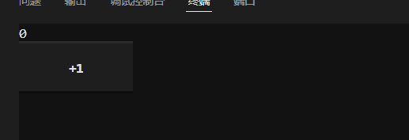

不过，如果只是把反应性属性当普通属性用，那换成普通属性也一样，就没有必要创建反应性属性了：

```python3
from textual.app import App
from textual.widgets import Static,Button

class MyApp(App):
    num = 0
    def on_mount(self):
        self.widgets = [
            Static(''),
            Button('+1',action='app.plus')
        ]
        self.mount_all(self.widgets)
        self.query_one(Static).update(str(self.num))

    def action_plus(self):
        self.num += 1
        self.query_one(Static).update(str(self.num))

if __name__ == '__main__':
    app = MyApp()
    app.run()
```

把反应性属性当成普通属性使用没有任何区别，反而更繁琐。但是，如果简单自定义一个组件，并在组件中定义一个反应性属性，然后在组件的`render`方法中使用反应性属性，效果就不一样了。一旦反应性属性的值变化，其所在的组件会自动刷新显示，不需要像上面示例一样手动调用刷新显示文本的代码（`Static`组件的`update`方法可以设置组件的显示文字）。

下面的代码中，通过继承`Widget`类（不具备任何功能的基础组件类）来实现一个自定义组件。自定义组件的方法后面会细讲，这里主要用来展示反应性属性在自定义中的效果。并且需要注意的是，只有在`render`方法中，反应性属性才会触发自动刷新。如果是前面那种继承Textual中现有组件的自定义组件方法，则需要覆盖原本实现好的`render`方法，可能会导致意外的问题。所以，这里是继承`Widget`类。在`render`方法中，返回可渲染对象，Textual就会将其处理为该组件的实际显示效果。当然，这里主要是展示反应性属性的特性，就只返回一个字符串，字符串中嵌入了反应性属性。

完整代码如下：

```python3
from textual.app import App
from textual.widgets import Button
from textual.reactive import reactive
from textual.widget import Widget

class Counter(Widget):
    num = reactive(0)
    def render(self):
        return f'{self.num}'

class MyApp(App):
    CSS='''
    Counter{
        height:auto;
        width:auto;
    }
    '''
    def on_mount(self):
        self.widgets = [
            Counter(),
            Button('+1',action='app.plus')
        ]
        self.mount_all(self.widgets)

    def action_plus(self):
        self.query_one(Counter).num += 1

if __name__ == '__main__':
    app = MyApp()
    app.run()
```

一般来说，组件类内会有一个默认的CSS，用于定义组件初始显示时的默认样式，但这部分内容后面会专门讲，这里就在`App`的子类内定义其CSS来代替。将宽度和高度设置为自动，组件的宽度和高度就不会默认占据整个屏幕，只会等于初始内容的宽度和高度（并不会因为内容改变而调整，这里卖个关子，下面马上解释）。可以看到，代码中没有任何主动刷新操作的情况下，组件的显示会随着反应性属性的变化而刷新：


作为对比，将反应性属性换成普通属性的话，需要手动调用组件的`refresh`方法才是刷新显示：

```python3
from textual.app import App
from textual.widgets import Button
from textual.reactive import reactive
from textual.widget import Widget

class Counter(Widget):
    num = 0
    def render(self):
        return f'{self.num}'

class MyApp(App):
    CSS='''
    Counter{
        height:auto;
        width:auto;
    }
    '''
    def on_mount(self):
        self.widgets = [
            Counter(),
            Button('+1',action='app.plus')
        ]
        self.mount_all(self.widgets)

    def action_plus(self):
        self.query_one(Counter).num += 1
        self.query_one(Counter).refresh()

if __name__ == '__main__':
    app = MyApp()
    app.run()
```


没错，反应性属性在值发生变化时，会让组件使用反应性属性的内容自动刷新显示，这就是反应性属性的智能刷新功能，也是其比普通属性更适合用在Textual的特点。

那上面提到过组件的宽度高度不会随内容变化是怎么回事？明明已经设置了自动样式，难道是bug？其实不是，问题出在构建反应性属性时的参数，默认情况下，反应性属性中的`layout`参数是`False`，即认为组件的宽度和高度是固定的，与之相关的布局不会发生变化。因此，即使组件高度和宽度设置为自动，组件也不会因为内容变化，而改变显示尺寸的。就像下图演示中，数字变成两位的时候，只能显示一位，看上去就像出bug一样：

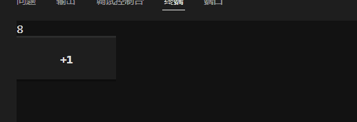

如果显示的内容不是固定大小，在创建反应性属性时，务必将`layout`参数为`True`：

```python3
from textual.app import App
from textual.widgets import Button
from textual.reactive import reactive
from textual.widget import Widget

class Counter(Widget):
    num = reactive(0,layout=True)
    def render(self):
        return f'{self.num}'

class MyApp(App):
    CSS='''
    Counter{
        height:auto;
        width:auto;
    }
    '''
    def on_mount(self):
        self.widgets = [
            Counter(),
            Button('+1',action='app.plus')
        ]
        self.mount_all(self.widgets)

    def action_plus(self):
        self.query_one(Counter).num += 1

if __name__ == '__main__':
    app = MyApp()
    app.run()
```


##### 3.2.1.3 使用反应性属性——重新生成

与智能刷新类似的，是重新生成。如果想开启并使用反应性属性的重新生成，需要将`recompose`参数设置为`True`。此时，每次反应性属性的值变化（如果是后面提到的计算方法更新了反应性属性的值，则不会触发重新生成，原因会在介绍计算方法时解释），使用反应性属性的组件就会删掉组件的子组件并重新创建，因此使用反应性属性的内容和布局会随之更新，就不需要设置`layout`参数了。因为重新生成的刷新原理与智能刷新不同，想要让重新生成代替智能刷新来负责反应性属性相关的显示更新，就要将使用反应性属性的内容放到`compose`方法中。当然，不同于`render`方法直接返回可渲染对象，这里的`compose`方法，需要返回现成的组件，就和之前介绍的`App`子类的`compose`方法一样，使用`yield`关键字，代码如下：

```python3
from textual.app import App
from textual.widgets import Button,Static
from textual.reactive import reactive
from textual.widget import Widget

class Counter(Widget):
    num = reactive(0,recompose=True)
    def compose(self):
        yield Static(f'{self.num}')

class MyApp(App):
    CSS='''
    Counter,Static{
        height:auto;
        width:auto;
    }
    '''
    def on_mount(self):
        self.widgets = [
            Counter(),
            Button('+1',action='app.plus')
        ]
        self.mount_all(self.widgets)

    def action_plus(self):
        self.query_one(Counter).num += 1

if __name__ == '__main__':
    app = MyApp()
    app.run()
```


需要特别注意的是，因为重新生成是删掉子组件并重新创建，因此原来组件外面存储子组件的变量将会失效，除非第一时间更新变量的指向，否则将没法操作子组件。此外，部分组件不会存储临时数据（`Input`和`TextArea`输入的内容、`DataTable`的选择状态等），重新生成会让这些数据变成默认值，如果子组件是这些组件，建议不要使用重新生成的方式来更新显示。若是子组件较多，重新生成的性能开销会比智能刷新大，如果自定义组件比较复杂的话，务必参考上面提到的内容，慎重选择更新显示的方式。

##### 3.2.1.4 使用反应性属性——验证

在介绍本节内容前，先看一下下面的示例：

```python3
from textual.app import App
from textual.widgets import Button
from textual.reactive import reactive
from textual.widget import Widget

class Counter(Widget):
    num = reactive(0,layout=True)
    def render(self):
        return f'{self.num}'

class MyApp(App):
    CSS='''
    Counter{
        height:auto;
        width:auto;
    }
    '''
    def on_mount(self):
        self.widgets = [
            Counter(),
            Button('+1',action='app.plus'),
            Button('-1',action='app.minus')
        ]
        self.mount_all(self.widgets)

    def action_plus(self):
        self.query_one(Counter).num += 1
    def action_minus(self):
        self.query_one(Counter).num -= 1

if __name__ == '__main__':
    app = MyApp()
    app.run()
```

代码基于之前的示例修改，在原本只有加一按钮的基础上，添加了减一按钮，使得数字可以自由增减。那么，问题也随之而来，如果原本定义数字就是非负数，一开始要是点了减一按钮，会让数字变成负一。如果不希望数字变成负数，有没有办法限制一下呢？

在按钮执行的动作内添加额外的检查代码是一个简单直接的方法，但这种像是验证反应性属性合法性的代码，似乎放在组件内部更合适。于是，在内部定义一个验证方法，就成了一个更加合适的方法。

对于每一个反应性属性，都可以在反应性属性所在的类内定义一个'validate_'为前缀、后接属性名的方法，用来验证反应性属性的值。说是验证也不完全准确，因为此方法有一个额外的参数，用于接收反应性属性的当前值；而此方法还必须返回一个值，用于在验证值是否合适之后，将反应性属性设置为新的值。

添加了验证方法之后，代码如下：

```python3
from textual.app import App
from textual.widgets import Button
from textual.reactive import reactive
from textual.widget import Widget

class Counter(Widget):
    num = reactive(0,layout=True)
    def render(self):
        return f'{self.num}'
    def validate_num(self,new_value):
        if new_value < 0:
            return 0
        return new_value

class MyApp(App):
    CSS='''
    Counter{
        height:auto;
        width:auto;
    }
    '''
    def on_mount(self):
        self.widgets = [
            Counter(),
            Button('+1',action='app.plus'),
            Button('-1',action='app.minus')
        ]
        self.mount_all(self.widgets)

    def action_plus(self):
        self.query_one(Counter).num += 1
    def action_minus(self):
        self.query_one(Counter).num -= 1

if __name__ == '__main__':
    app = MyApp()
    app.run()
```

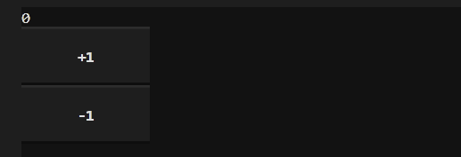

##### 3.2.1.5 使用反应性属性——监视

验证方法也可以用于监视反应性属性的值变化，但这样借用的方式和上节引入验证方法的原因一样，显得不太合适。此外，验证方法没法接收属性变化前的旧值。这样的话，如果反应性属性的值变化时，需要对比新旧值，就没法实现。这时，只需将验证方法的'validate\_'的前缀换成'watch\_'即可。这样，一个验证方法就变成了监视方法——'watch\_'为前缀、后接属性名的方法。监视方法会在反应性属性的值变化时执行；如果反应性属性的`always_update`参数为`True`（默认为`False`），则监视方法会在反应性属性被赋值（无论值是否变化）时执行。

但需要注意的是，如果反应性属性不是简单的数值类型（整数类型、浮点类型、字符串类型），而是包装类型（列表类型、字典类型、集合类型、元组类型）或者对象的话，修改其成员并不会执行反应性属性的监视方法，那就需要手动刷新了。手动刷新的方法会在下一节介绍，这里暂不展开说，本节重点学习监视方法。

当然，只是简单的改名，代码不会出错，但会失去防止负数的效果，还需要改一下方法内部的代码。监视方法不需要返回任何值，它只是简单接收反应性属性的新值作为参数。因此，需要在方法内部判断完新值是负数之后，将反应性属性设置为最小的`0`：

```python3
def watch_num(self,new_value):
    if new_value < 0:
        self.num = 0
```

前面提到过，想要对比新旧值的话，只能用监视方法，但上面只有一个新值，没法获取到旧值。这个时候，就要说明一下监视方法支持的参数数量和区别。除了上面传入一个额外参数、参数是新值的监视方法，还可以不传入额外参数，那上面的代码就变成了这样：

```python3
def watch_num(self,new_value):
    if self.num < 0:
        self.num = 0
```

还有两个额外参数的监视方法，则此时两个额外参数分别是反应性属性的旧值、新值。当然，上面的方法不需要关注旧值，所以，只需检查新值即可：

```python3
def watch_num(self,old_value,new_value):
    if new_value < 0:
        self.num = 0
```

除了通过定义指定前缀加上属性名的函数来监视属性，组件类和`App`类还支持通过`watch`方法（完整用法参考[官网文档](https://textual.textualize.io/api/dom_node/#textual.dom.DOMNode.watch)）来动态添加任意函数为监视方法，并根据方法支持的参数个数匹配上面的使用方法。以上面的监视方法为例，如果是放在完整可以执行的代码中的话，是这样的：

```python3
from textual.app import App
from textual.widgets import Button
from textual.reactive import reactive
from textual.widget import Widget

class Counter(Widget):
    num = reactive(0,layout=True)
    def render(self):
        return f'{self.num}'
    def watch_num(self,old_value,new_value):
        if new_value < 0:
            self.num = 0

class MyApp(App):
    CSS='''
    Counter{
        height:auto;
        width:auto;
    }
    '''
    def on_mount(self):
        self.widgets = [
            Counter(),
            Button('+1',action='app.plus'),
            Button('-1',action='app.minus')
        ]
        self.mount_all(self.widgets)

    def action_plus(self):
        self.query_one(Counter).num += 1
    def action_minus(self):
        self.query_one(Counter).num -= 1

if __name__ == '__main__':
    app = MyApp()
    app.run()
```

现在，将规定函数名前缀的监视方法修改为任意名字，则`Counter`类的代码会变成这样：

```python3
class Counter(Widget):
    num = reactive(0,layout=True)
    def render(self):
        return f'{self.num}'
    def check_num(self,old_value,new_value):
        if new_value < 0:
            self.num = 0
```

这个时候，完整的代码已经失效，因为`num`属性没有了对应的监视方法，也就没法检查、修改其值。所以，需要用`watch`方法将其添加为`num`属性的监视方法。添加代码只能执行一次，这里就将代码放到`on_mount`方法中。没错，自定义组件也支持`on_mount`方法，此方法会在组件被挂载的时候执行一次。`watch`方法支持四个参数：

-   `obj`参数，对象类型，表示监视哪个对象的反应性属性。
-   `attribute_name`参数，字符串类型，反应性属性的名字，表示监视哪个反应性属性。
-    `callback`参数，可调用类型，表示当监视方法应该执行的时候，要执行的操作。
-   `init`参数，布尔类型，表示是否在添加监视方法时执行一次监视方法，默认为`True`，即添加时会执行一次。

根据参数用途，那`Counter`类的代码要这样写：

```python3
class Counter(Widget):
    num = reactive(0,layout=True)
    def render(self):
        return f'{self.num}'
    def check_num(self,old_value,new_value):
        if new_value < 0:
            self.num = 0
    def on_mount(self):
        self.watch(self,'num',self.check_num,True)
```

如果其他反应性属性的需求也一样，这种类的方法，可以批量用在其他反应性属性的监视上。不过，定义了类的方法，很容易把方法暴露出去，导致被错误使用。虽然使用下划线当函数名前缀是约定俗成的私有方法，但那种方法不能从语法上禁止使用。因此，可以在`on_mount`中定义函数内的函数（也称为闭包），将其绑定给反应性属性的监视方法，从而避免此方法被外部错误使用：

```python3
from textual.app import App
from textual.widgets import Button
from textual.reactive import reactive
from textual.widget import Widget

class Counter(Widget):
    num = reactive(0,layout=True)
    def render(self):
        return f'{self.num}'
    def on_mount(self):
        def check_num(old_value,new_value):
            if new_value < 0:
                self.num = 0
        self.watch(self,'num',check_num,False)

class MyApp(App):
    CSS='''
    Counter{
        height:auto;
        width:auto;
    }
    '''
    def on_mount(self):
        self.widgets = [
            Counter(),
            Button('+1',action='app.plus'),
            Button('-1',action='app.minus')
        ]
        self.mount_all(self.widgets)

    def action_plus(self):
        self.query_one(Counter).num += 1
    def action_minus(self):
        self.query_one(Counter).num -= 1

if __name__ == '__main__':
    app = MyApp()
    app.run()
```

虽然上面的示例中使用反应性属性的监视方法没遇到什么问题，但要是在监视方法了与DOM有关的方法（比如前面介绍过的`query_one`方法）的话，就会出问题。

先上代码：

```python3
from textual.app import App
from textual.widgets import Button,Static,Digits
from textual.reactive import reactive
from textual.widget import Widget

class Counter(Widget):
    num = reactive(0)
    def compose(self):
        yield Static('old_value is 0.')
        yield Digits(f'{self.num}.')
    def watch_num(self,old_value,new_value):
        if new_value < 0:
            self.num = 0
        self.query_one(Static).update(f'old_value is {old_value}.')
        self.query_one(Digits).update( f'{self.num}')

class MyApp(App):
    CSS='''
    Counter{
        height:auto;
        width:auto;
    }
    '''
    def on_mount(self):
        self.widgets = [
            Counter(),
            Button('+1',action='app.plus'),
            Button('-1',action='app.minus')
        ]
        self.mount_all(self.widgets)

    def action_plus(self):
        self.query_one(Counter).num += 1
    def action_minus(self):
        self.query_one(Counter).num -= 1

if __name__ == '__main__':
    app = MyApp()
    app.run()
```

为了让监视方法中表示旧值的参数不再闲置，自定义组件使用`compose`方法显示两个组件——静态文本（`Static`）和数码显示组件（`Digits`），其中静态文本用来显示旧值，数码显示组件用来显示当前值。

当然，嵌入反应性属性的组件可以使用重新生成来实时刷新，但要想让旧值的显示始终保持在静态文本中，就不能使用重新生成（其实可以，这里为了引出下面要说的问题，所以只用“笨”办法解决）。因此，两个组件的显示内容将都使用各自的更新方法（都是`update`）来刷新。不过，在更新之前，要先用查询方法——`query_one`，找到这两个组件，才能调用`update`方法，进而更新显示内容。

代码看上去没什么问题，可偏偏执行时候直接报错，都没来得及点按钮：

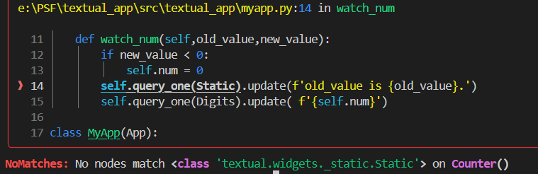

报错看上去匪夷所思，没有找到静态文本？这是怎么回事？在探究问题的原因之前，先给各位测试示例同样出错但比较心急于解决的读者提供一下解决方法。

官方提供的解决方法是：在类的初始化方法（`__init__`）中，使用组件类或者`App`类的（完整用法参考[官网文档](https://textual.textualize.io/api/dom_node/#textual.dom.DOMNode.set_reactive)）设置一次反应性属性的默认值。

`set_reactive`方法支持两个参数：

-   `reactive`参数，表示要设置的反应性属性，这里要使用`{类名}.{反应性属性名}`这种格式，比如`Counter.num`。
-   `value`参数，要给反应性属性设置的默认值。

当然，别忘了调用父类的初始化方法。那`Counter`类的代码要这样写：

```python3
class Counter(Widget):
    num = reactive(0)
    def __init__(self, *args,**kwargs):
        super().__init__(*args, **kwargs)
        self.set_reactive(Counter.num,0)
    def compose(self):
        yield Static('old_value is 0.')
        yield Digits(f'{self.num}.')
    def watch_num(self,old_value,new_value):
        if new_value < 0:
            self.num = 0
        self.query_one(Static).update(f'old_value is {old_value}.')
        self.query_one(Digits).update( f'{self.num}')
```

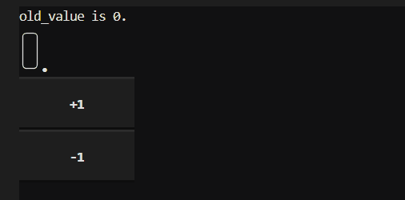

除了官方的解决方法，还有非官方（官方没说但在示例中有效）的解决方法：给监视方法添加`async`关键字，使之成为异步方法；在反应性属性的值没有变化时直接返回。

使用异步关键字的话，那`Counter`类的代码要这样写（比较推荐）：

```python3
class Counter(Widget):
    num = reactive(0)
    def compose(self):
        yield Static('old_value is 0.')
        yield Digits(f'{self.num}.')
    async def watch_num(self,old_value,new_value):
        if new_value < 0:
            self.num = 0
        self.query_one(Static).update(f'old_value is {old_value}.')
        self.query_one(Digits).update( f'{self.num}')
```

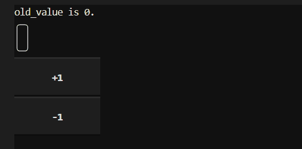

若是判断值不变直接返回，那`Counter`类的代码要这样写（不太推荐，限制较多且容易出bug）：

```python3
class Counter(Widget):
    num = reactive(0)
    def compose(self):
        yield Static('old_value is 0.')
        yield Digits(f'{self.num}.')
    def watch_num(self,old_value,new_value):
        if old_value == new_value:
            return
        if new_value < 0:
            self.num = 0
        self.query_one(Static).update(f'old_value is {old_value}.')
        self.query_one(Digits).update( f'{self.num}')
```


其实，上面问题的本质是如果组件使用了反应性属性，默认其`init`参数值是`True`，即该属性会在所在类初始化时（此时组件还没有挂载）触发该反应性属性的监视方法。如果在监视方法中使用了DOM查询方法，就会报错。

那解决方法的原理是什么呢？若要说清楚解决的原理，需要先从类初始化时触发监视方法的来源说起。

如果反应性属性所在的类（组件类或者`App`类）挂载的组件使用了反应性属性，当类初始化时，会执行一次反应性属性的初始化方法。此初始化方法不是`__init__`魔法方法，而是一个内部定义的、将反应性属性（反应性属性的真实属性名是`f"_reactive_{name}"`）附在所在类的实例上的方法。反应性属性的初始化方法内部会在`init`参数值是`True`时触发一次监视方法。此时反应性属性的值其实没有变化，这个触发过程不会管`always_update`参数是不是`True`。默认`always_update`参数为`False`，即反应性属性的值不变时不触发监视方法，但这里是强制触发，不是代码中检查`always_update`参数来决定是否触发监视方法的部分，所以修改`always_update`参数也不能解决此问题。

说完触发的过程，那解决的原理是什么呢？

使用`set_reactive`方法给所在类设置反应性属性之后，反应性属性的初始化方法在检查到当前类、实例有此反应性属性之后，就直接返回了，不会执行判断`init`参数值是`True`才执行的部分，也就不会触发监视方法，而且在实例中依然可以正常使用反应性属性。

当然，转化为异步函数，会让监视方法的执行乖乖等待组件完成挂载之后，自然不会报错。

而判断值不变就返回的粗暴手动，也是直接规避了组件完成挂载前，会执行监视方法中DOM查询方法的可能。因为此时反应性属性的值实际上没有变化。但粗暴手段会让`always_update`参数失效，即使反应性属性的值不变也会完整执行监视方法了。而且，粗暴手段也不适用于复杂类型的反应性属性，因为复杂类型的数据，只是修改其成员的话，本身相当于没有变化。哪怕是下节介绍的`mutate_reactive`方法也不能正常执行。所以，只有不需要`always_update`参数的功能时才可以使用，不推荐使用此解决方法。

了解了问题触发的过程，那新的解决方法也就出来了：将反应性属性的`init`参数值设置为`False`，同样可以规避此问题。

那`Counter`类的代码要这样写：

```python3
class Counter(Widget):
    num = reactive(0,init=False)
    def compose(self):
        yield Static('old_value is 0.')
        yield Digits(f'{self.num}.')
    def watch_num(self,old_value,new_value):
        if new_value < 0:
            self.num = 0
        self.query_one(Static).update(f'old_value is {old_value}.')
        self.query_one(Digits).update( f'{self.num}')
```


根据上面的介绍，这里提出一个`set_reactive`方法的引申用法：使用`set_reactive`方法会同步修改实例的反应性属性，可以在不会触发实例的反应性属性监视方法前提下修改实例的反应性属性的值。

##### 3.2.1.6 使用反应性属性——刷新复杂类型

自定义的组件里有两个可以显示内容的子组件，只是用来显示当前值和旧值未免有点浪费。既然自定义组件是计数器，那除了记录当前数值，还可以记录按钮点了几次。

为了引出本节要介绍的方法，这里用于记录点击次数的，并不是增加的反应性属性，而是原来的反应性属性。将原本简单的整数类型，升级为数组，这样一个反应性属性就能记录两个值。

代码如下：

```python3
from textual.app import App
from textual.widgets import Button,Static,Digits
from textual.reactive import reactive
from textual.widget import Widget

class Counter(Widget):
    num = reactive([0,0],init=False,recompose=True)
    def compose(self):
        yield Static(f'You click {self.num[1]} time(s).')
        yield Digits(f'{self.num[0]}.')
    def watch_num(self,old_value,new_value):
        if new_value[0] < 0:
            self.num[0] = 0

class MyApp(App):
    CSS='''
    Counter{
        height:auto;
        width:auto;
    }
    '''
    def on_mount(self):
        self.widgets = [
            Counter(),
            Button('+1',action='app.plus'),
            Button('-1',action='app.minus')
        ]
        self.mount_all(self.widgets)

    def action_plus(self):
        widget = self.query_one(Counter)
        widget.num[0] += 1
        widget.num[1] += 1
    def action_minus(self):
        widget = self.query_one(Counter)
        widget.num[0] -= 1
        widget.num[1] += 1

if __name__ == '__main__':
    app = MyApp()
    app.run()
```

在自定义组件中，数组的两个元素分别代表当前值和点击次数，并嵌入了子组件中。因此，加一按钮和减一按钮除了要修改数组的第一个元素，还要添加一个给第二元素加一的操作。当然，两个子组件都嵌入了反应性元素，原本的查询方法就没有必要，使用重新生成即可。可是，上面的代码并不会出现预期的结果，点击两个按钮都不会让显示刷新这是为何？

这就不得不回顾一下前面说过的内容。在讲监视方法的时候说过：“如果反应性属性不是简单的数值类型（整数类型、浮点类型、字符串类型），而是包装类型（列表类型、字典类型、集合类型、元组类型）或者对象的话，修改其成员并不会执行反应性属性的监视方法。”因为修改成员并不会让反应性属性的值发生变化（值变化的本质是创建了新的对象，对象的地址发生变化），修改成员，并不会修改原本的对象地址。当然，如果每次都创建新的对象代替原来的对象，倒是可以和简单类型的反应性属性一样。但本节将介绍一个更加简单有效的方法——`mutate_reactive`方法（完整用法参考[官网文档](https://textual.textualize.io/api/dom_node/#textual.dom.DOMNode.mutate_reactive)）。

和`set_reactive`方法的参数类似，让类的实例调用此方法，参数为`{类名}.{反应性属性名}`，比如`Counter.num`，即可刷新此反应性属性。刷新时还会触发此属性的监视方法，所以此方法还可以用于强制触发反应性属性的刷新。

那上面的代码就只需在两个按钮的动作函数中添加`widget.mutate_reactive(Counter.num)`即可：

```python3
from textual.app import App
from textual.widgets import Button,Static,Digits
from textual.reactive import reactive
from textual.widget import Widget

class Counter(Widget):
    num = reactive([0,0],init=False,recompose=True)
    def compose(self):
        yield Static(f'You click {self.num[1]} time(s).')
        yield Digits(f'{self.num[0]}.')
    def watch_num(self,old_value,new_value):
        if new_value[0] < 0:
            self.num[0] = 0

class MyApp(App):
    CSS='''
    Counter{
        height:auto;
        width:auto;
    }
    '''
    def on_mount(self):
        self.widgets = [
            Counter(),
            Button('+1',action='app.plus'),
            Button('-1',action='app.minus')
        ]
        self.mount_all(self.widgets)

    def action_plus(self):
        widget = self.query_one(Counter)
        widget.num[0] += 1
        widget.num[1] += 1
        widget.mutate_reactive(Counter.num)
    def action_minus(self):
        widget = self.query_one(Counter)
        widget.num[0] -= 1
        widget.num[1] += 1
        widget.mutate_reactive(Counter.num)

if __name__ == '__main__':
    app = MyApp()
    app.run()
```

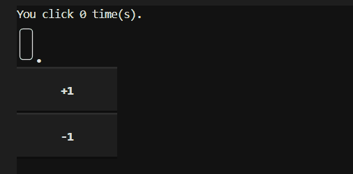

##### 3.2.1.7 使用反应性属性——计算

依照惯例，介绍新内容前先看示例：

```python3
from textual.app import App
from textual.widgets import Button,Static,Digits
from textual.reactive import reactive
from textual.widget import Widget

class Counter(Widget):
    num = reactive(0,recompose=True)
    price = reactive(0,recompose=True)
    def compose(self):
        yield Static(f'You buy {self.num} apple(s). The sum price is')
        yield Digits(f'{self.price:.2f}')
    def watch_num(self,old_value,new_value):
        if new_value < 0:
            self.num = 0
        self.price = self.num*3.95

class MyApp(App):
    CSS='''
    Counter{
        height:auto;
        width:auto;
    }
    '''
    def on_mount(self):
        self.widgets = [
            Counter(),
            Button('+1',action='app.plus'),
            Button('-1',action='app.minus')
        ]
        self.mount_all(self.widgets)

    def action_plus(self):
        widget = self.query_one(Counter)
        widget.num += 1
    def action_minus(self):
        widget = self.query_one(Counter)
        widget.num -= 1

if __name__ == '__main__':
    app = MyApp()
    app.run()
```

示例实现了一个简单计价系统，只需使用按钮调整购买数量，下面的数码显示组件就会显示总价：

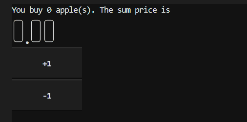

自定义组件中使用了两个反应性属性，分别用来记录数量和总价。上面的代码没有什么问题，但Textual提供了一个更好的方法实现此功能，那就是'compute\_'为前缀、后接属性名的计算方法。

计算方法可用于返回基于其他反应性属性计算之后的该反应性属性的值，并且计算方法会在其他反应性属性发生变化或者组件生成时执行一次，更新该反应性属性的值。

那`Counter`类的代码可以这样写，实现同样的效果：

```python3
class Counter(Widget):
    num = reactive(0,recompose=True)
    price = reactive(0,recompose=True)
    def compose(self):
        yield Static(f'You buy {self.num} apple(s). The sum price is')
        yield Digits(f'{self.price:.2f}')
    def watch_num(self,old_value,new_value):
        if new_value < 0:
            self.num = 0
    def compute_price(self):
        return self.num*3.95
```

当然，如果还定义了监视方法，计算方法一样会触发监视方法。

需要额外注意的是，计算方法虽然更新了反应性属性的值，但这个过程不会触发组件的重新生成，哪怕反应性属性的`recompose`参数是`True`。因为Textual为了确保重新生成时定义了计算方法的反应性属性的值是准确的，会在组件生成（`compose`）前，执行一遍所有反应性属性的计算方法。如果计算方法再触发组件的重新生成，就会产生死循环。因此，计算方法更新反应性属性的值不会触发组件的重新生成。但是，重新生成组件或者计算方法内使用的反应性属性发生改变，一定会触发一次计算方法。

##### 3.2.1.8 使用反应性属性——绑定

上一节的总价计算器将单价写到了自定义组件类内，想要修改单价的话，还需要每次修改源代码，有点不方便。因此，本节将结合反应性属性的功能，让单价可以轻松修改。

在自定义组件类内添加一个新的反应性属性——`unit_price`来记录单价，然后将`compute_price`方法中的固定单价替换为`self.unit_price`。这样，在`App`子类中需要修改单价时，就可以执行类似`self.query_one(Counter).unit_price = 4`这样的代码来实现：

```python3
from textual.app import App
from textual.widgets import Button,Static,Digits
from textual.reactive import reactive
from textual.widget import Widget

class Counter(Widget):
    num = reactive(0,recompose=True)
    price = reactive(0,recompose=True)
    unit_price = reactive(3.95,recompose=True)
    def compose(self):
        yield Static(f'You buy {self.num} apple(s). The sum price is')
        yield Digits(f'{self.price:.2f}')
    def watch_num(self,old_value,new_value):
        if new_value < 0:
            self.num = 0
    def compute_price(self):
        return self.num*self.unit_price

class MyApp(App):
    CSS='''
    Counter{
        height:auto;
        width:auto;
    }
    '''
    def on_mount(self):
        self.widgets = [
            Counter(),
            Button('+1',action='app.plus'),
            Button('-1',action='app.minus')
        ]
        self.mount_all(self.widgets)
        self.query_one(Counter).unit_price = 4

    def action_plus(self):
        widget = self.query_one(Counter)
        widget.num += 1
    def action_minus(self):
        widget = self.query_one(Counter)
        widget.num -= 1

if __name__ == '__main__':
    app = MyApp()
    app.run()
```

当然，和上一节类似，本节也要介绍一个平替方法——`data_bind`方法（完整用法参考[官方文档](https://textual.textualize.io/api/dom_node/#textual.dom.DOMNode.data_bind)）。此方法可以将外面的反应性属性绑定到自定义组件的反应性属性，实现内外反应性属性的联动。

`data_bind`方法支持两种类型的参数：

-   直接传入位置参数，没有先后顺序，但要求传入`{当前代码所在类的类名}.{与被绑定反应性属性同名的反应性属性名}`。比如，想要将`MyApp`类的`unit_price`属性绑定到`Counter`类的`unit_price`属性，代码就是这样的：`Counter().data_bind(MyApp.unit_price)`。
-   传入关键字参数，没有先后顺序。参数值的格式和位置参数一样，但值所对应的关键字有规则，那就是被绑定的反应性属性名。没错，这种类型的参数不要求绑定的属性名与被绑定的属性名一致。比如，想要将`MyApp`类的`current_price`属性绑定到`Counter`类的`unit_price`属性，代码就是这样的：`Counter().data_bind(unit_price=MyApp.current_price)`。

如果在`MyApp`类中定义了一个反应性属性`unit_price= reactive(4)`，用于表示修改后的价格，那就可以调用自定义组件对象的`data_bind`方法，将组件对象的`unit_price`属性，与`MyApp.unit_price`绑定，这样就不需要单独修改组件对象的`unit_price`属性，只需修改`MyApp`类实例的`unit_price`属性即可。

因为是要给组件对象的反应性属性绑定，因此，需要调用组件对象的`data_bind`方法。此方法返回的是对象本身，所以可以在创建组件对象时调用：`Counter().data_bind(MyApp.unit_price)`。

传入位置参数的示例如下：

```python3
from textual.app import App
from textual.widgets import Button,Static,Digits
from textual.reactive import reactive,var
from textual.widget import Widget

class Counter(Widget):
    num = reactive(0,recompose=True)
    price = reactive(0,recompose=True)
    unit_price = reactive(3.95,recompose=True)
    def compose(self):
        yield Static(f'You buy {self.num} apple(s). The sum price is')
        yield Digits(f'{self.price:.2f}')
    def watch_num(self,old_value,new_value):
        if new_value < 0:
            self.num = 0
    def compute_price(self):
        return self.num*self.unit_price

class MyApp(App):
    CSS='''
    Counter{
        height:auto;
        width:auto;
    }
    '''
    unit_price = reactive(4)
    def on_mount(self):
        self.widgets = [
            Counter().data_bind(MyApp.unit_price),
            Button('+1',action='app.plus'),
            Button('-1',action='app.minus')
        ]
        self.mount_all(self.widgets)
        
    def action_plus(self):
        widget = self.query_one(Counter)
        widget.num += 1
    def action_minus(self):
        widget = self.query_one(Counter)
        widget.num -= 1

if __name__ == '__main__':
    app = MyApp()
    app.run()
```

传入关键字参数的示例如下：

```python3
from textual.app import App
from textual.widgets import Button,Static,Digits
from textual.reactive import reactive,var
from textual.widget import Widget

class Counter(Widget):
    num = reactive(0,recompose=True)
    price = reactive(0,recompose=True)
    unit_price = reactive(3.95,recompose=True)
    def compose(self):
        yield Static(f'You buy {self.num} apple(s). The sum price is')
        yield Digits(f'{self.price:.2f}')
    def watch_num(self,old_value,new_value):
        if new_value < 0:
            self.num = 0
    def compute_price(self):
        return self.num*self.unit_price

class MyApp(App):
    CSS='''
    Counter{
        height:auto;
        width:auto;
    }
    '''
    current_price = reactive(4)
    def on_mount(self):
        self.widgets = [
            Counter().data_bind(unit_price=MyApp.current_price),
            Button('+1',action='app.plus'),
            Button('-1',action='app.minus')
        ]
        self.mount_all(self.widgets)
        
    def action_plus(self):
        widget = self.query_one(Counter)
        widget.num += 1
    def action_minus(self):
        widget = self.query_one(Counter)
        widget.num -= 1

if __name__ == '__main__':
    app = MyApp()
    app.run()
```

既然是要在外面修改价格，让自定义组件接收，那就额外提供一个可以修改价格的示例：

```python3
from textual.app import App
from textual.widgets import Button,Static,Digits,Input
from textual.reactive import reactive,var
from textual.widget import Widget

class Counter(Widget):
    num = reactive(0,recompose=True)
    price = reactive(0,recompose=True)
    unit_price = reactive(3.95,recompose=True)
    def compose(self):
        yield Static(f'You buy {self.num} apple(s). The sum price is')
        yield Digits(f'{self.price:.2f}')
    def watch_num(self,old_value,new_value):
        if new_value < 0:
            self.num = 0
    def compute_price(self):
        return self.num*self.unit_price

class MyApp(App):
    CSS='''
    Counter{
        height:auto;
        width:auto;
    }
    '''
    current_price = reactive(4)
    def on_mount(self):
        self.widgets = [
            Counter().data_bind(unit_price=MyApp.current_price),
            Button('+1',action='app.plus'),
            Button('-1',action='app.minus'),
            Input(f'{self.current_price}',type='number',placeholder='Please input unit price')
        ]
        self.mount_all(self.widgets)

    def action_plus(self):
        widget = self.query_one(Counter)
        widget.num += 1
    def action_minus(self):
        widget = self.query_one(Counter)
        widget.num -= 1
    def on_input_changed(self,e:Input.Changed):
        try:
            ans = float(e.value)
        except:
            return
        self.current_price=ans

if __name__ == '__main__':
    app = MyApp()
    app.run()
```

代码中添加了一个输入框，让输入框在数值变化时修改`MyApp`类实例的`current_price`属性，这样`Counter`类实例内部就会接收到这个价格值，然后重新计算总价：

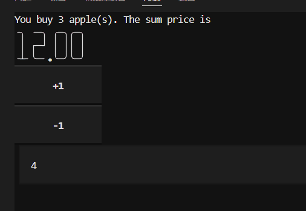

##### 3.2.1.9 使用反应性属性——不想刷新

上节最后提供的示例中，`MyApp`类的`current_price`属性用在了输入框中，用起来没啥问题。其实，这里的输入框是主动输出数据的，哪怕反应性不支持智能刷新也没问题。当然，如果在实际开发中不希望某个反应性属性用在组件中但又不希望其触发显示的智能刷新，或者只想用反应性属性的监视方法、验证方法、计算方法等但不喜欢看到额外的参数，那可以试试不触发智能刷新的反应性属性——`var`（完整用法参考[官网文档](https://textual.textualize.io/api/reactive/#textual.reactive.var)）。

因此，将`MyApp`类中的反应性属性替换为`current_price = var(4)`，并不会影响程序的执行结果：

```python3
from textual.app import App
from textual.widgets import Button,Static,Digits,Input
from textual.reactive import reactive,var
from textual.widget import Widget

class Counter(Widget):
    num = reactive(0,recompose=True)
    price = reactive(0,recompose=True)
    unit_price = reactive(3.95,recompose=True)
    def compose(self):
        yield Static(f'You buy {self.num} apple(s). The sum price is')
        yield Digits(f'{self.price:.2f}')
    def watch_num(self,old_value,new_value):
        if new_value < 0:
            self.num = 0
    def compute_price(self):
        return self.num*self.unit_price

class MyApp(App):
    CSS='''
    Counter{
        height:auto;
        width:auto;
    }
    '''
    current_price = var(4)
    def on_mount(self):
        self.widgets = [
            Counter().data_bind(unit_price=MyApp.current_price),
            Button('+1',action='app.plus'),
            Button('-1',action='app.minus'),
            Input(f'{self.current_price}',type='number',placeholder='Please input unit price')
        ]
        self.mount_all(self.widgets)

    def action_plus(self):
        widget = self.query_one(Counter)
        widget.num += 1
    def action_minus(self):
        widget = self.query_one(Counter)
        widget.num -= 1
    def on_input_changed(self,e:Input.Changed):
        try:
            ans = float(e.value)
        except:
            return
        self.current_price=ans

if __name__ == '__main__':
    app = MyApp()
    app.run()
```


##### 3.2.1.10 使用反应性属性——切换样式类

在Textual 3.2.0版本，反应性属性增加了`toggle_class`参数，此参数接收一个表示样式类名字的字符串。当反应性属性为布尔类型时，反应性属性所属的组件类，会根据反应性属性的布尔值情况（`True`或者`False`），增删此样式类。

还是以上面的示例为基础，设计两个反应性属性——`inc = reactive(False,toggle_class='increase')`和`dec = reactive(False,toggle_class='decrease')`，分别对应着`num`增、减时要增加的样式类。

`Counter`类对应的默认样式如下：

```css
Counter {
    &.increase {
        Digits{
            color: green;
        }
    }
    &.decrease {
        Digits{
            color: red;
        }
    }
}
```

相应的，增减数量的按钮执行的动作，也要增加修改反应性属性的代码，完整示例如下：

```python3
from textual.app import App
from textual.widgets import Button,Static,Digits,Input
from textual.reactive import reactive,var
from textual.widget import Widget

class Counter(Widget):
    DEFAULT_CSS = '''
    Counter {
        &.increase {
            Digits{color: green;}
        }
        &.decrease {
            Digits{color: red;}
        }
    }
    '''
    num = reactive(0,recompose=True)
    price = reactive(0,recompose=True)
    unit_price = reactive(3.95,recompose=True)
    inc = reactive(False,toggle_class='increase')
    dec = reactive(False,toggle_class='decrease')
    def compose(self):
        yield Static(f'You buy {self.num} apple(s). The sum price is')
        yield Digits(f'{self.price:.2f}')
    def watch_num(self,old_value,new_value):
        if new_value < 0:
            self.num = 0
    def compute_price(self):
        return self.num*self.unit_price

class MyApp(App):
    CSS='''
    Counter{
        height:auto;
        width:auto;
    }
    '''
    current_price = var(4)
    def on_mount(self):
        self.widgets = [
            Counter().data_bind(unit_price=MyApp.current_price),
            Button('+1',action='app.plus'),
            Button('-1',action='app.minus'),
            Input(f'{self.current_price}',type='number',placeholder='Please input unit price')
        ]
        self.mount_all(self.widgets)

    def action_plus(self):
        widget = self.query_one(Counter)
        widget.num += 1
        widget.inc = True
        widget.dec = False
    def action_minus(self):
        widget = self.query_one(Counter)
        widget.num -= 1
        widget.inc = False
        widget.dec = True
    def on_input_changed(self,e:Input.Changed):
        try:
            ans = float(e.value)
        except:
            return
        self.current_price=ans

if __name__ == '__main__':
    app = MyApp()
    app.run()
```

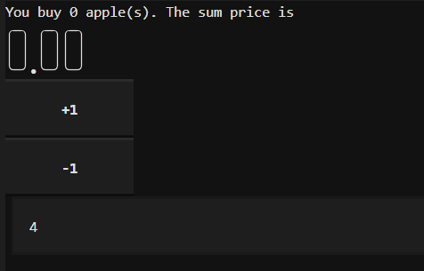

#### 3.2.2 后台任务

恰如其他UI框架是在主线程处理UI，Textual也未能免俗。因此，如果在主线程中处理耗时的任务，很容易让界面卡住（不能立刻响应用户的其他操作）。为了解决这一问题，Textual也提供了在后台运行耗时任务的功能——工人。完整的介绍可以参考[官网页面](https://textual.textualize.io/guide/workers/)。

##### 3.2.2.1 为什么需要工人？

在正式介绍工人的用法之前，先看下面的示例：

```python3
from textual.app import App
from textual.widgets import Button,Label
import asyncio,random

class MyApp(App):
    result = '...'
    def on_mount(self):
        self.widgets = [
            Label(f'result is {self.result}'),
            Button('fetch result',action='app.fetch')
        ]
        self.mount_all(self.widgets)
        
    async def get_result(self):
        await asyncio.sleep(3)
        self.result = str(random.randint(1,99))
        self.query_one(Label).update(f'result is {self.result}')
        
    async def action_fetch(self):
        await self.get_result()

if __name__ == '__main__':
    app = MyApp()
    app.run()
```

示例中定义了一个异步函数`get_result`，使用`asyncio`的`sleep`来模拟耗时的操作，并在操作结束后，将`Label`的内容更新为随机数，用来模拟耗时操作后显示操作的结果。当然，为了避免操作之后卡住界面，这里使用的是异步函数。

逻辑上说得通，可当实际使用的时候，结果看上去不太理想：

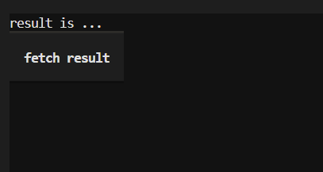

可能有的读者会觉得是异步函数的问题，使用非异步写法不会出问题。这里需要说明一下，如果这里不使用异步函数的话（即不使用`await`等待操作结果，或者`get_result`不是异步函数），效果是一样的，非异步的示例如下：

```python3
from textual.app import App
from textual.widgets import Button,Label
import time,random

class MyApp(App):
    result = '...'
    def on_mount(self):
        self.widgets = [
            Label(f'result is {self.result}'),
            Button('fetch result',action='app.fetch')
        ]
        self.mount_all(self.widgets)
        
    def get_result(self):
        time.sleep(3)
        self.result = str(random.randint(1,99))
        self.query_one(Label).update(f'result is {self.result}')
        
    def action_fetch(self):
        self.get_result()

if __name__ == '__main__':
    app = MyApp()
    app.run()
```

非异步的耗时操作会卡住主线程可以理解，为何异步也会导致这样的问题呢？原来，Textual默认处理异步操作是在一个完整的消息循环中进行，虽然不会卡住所有的界面，但当前组件的交互包含点击前的动画、点击动画、点击执行的操作、操作完成之后的动画。看上去是按钮被卡住了，实际上是按钮在执行完耗时操作前，最后的释放动画没有执行。因此，如果此时同时存在多个按钮的话，其他按钮是可以正常点击的，比如下面的代码：

```python3
from textual.app import App
from textual.widgets import Button,Label
import asyncio,random

class MyApp(App):
    result = '...'
    def on_mount(self):
        self.widgets = [
            Label(f'result is {self.result}'),
            Button('fetch result',action='app.fetch'),
            Button('fetch result',action='app.fetch')
        ]
        self.mount_all(self.widgets)
        
    async def get_result(self):
        await asyncio.sleep(3)
        self.result = str(random.randint(1,99))
        self.query_one(Label).update(f'result is {self.result}')
        
    async def action_fetch(self):
        await self.get_result()

if __name__ == '__main__':
    app = MyApp()
    app.run()
```

即便只是卡住被点击的按钮，观感上也不像正常异步处理过的交互舒服。因此，需要使用Textual提供的工人功能，让这类操作挂到后台运行，不要卡住当前组件的交互过程。

##### 3.2.2.2 使用工人——`run_worker`方法

前面说了工人，那工人到底是什么？简单理解的话，工人就是Textual用来后台执行函数的执行器。因为其英文是worker，不好找到更加贴切的中文意思，只能简单直译了。

在Textual中使用工人的第一种方法，不需要修改要执行的函数，只需要修改执行的方法。组件类或者`App`类的实例都有一个`run_worker`方法，该方法的第一个参数`work`就是要执行的异步函数。注意，此方法和下节介绍的装饰器在默认不修改其他参数的情况下，是使用协程运行要后台执行的函数，因此不支持非异步函数。如果想要后台运行非异步函数，请参考后面的介绍的`thread`参数。

示例如下：

```python3
from textual.app import App
from textual.widgets import Button,Label
import asyncio,random

class MyApp(App):
    result = '...'
    def on_mount(self):
        self.widgets = [
            Label(f'result is {self.result}'),
            Button('fetch result',action='app.fetch')
        ]
        self.mount_all(self.widgets)
        
    async def get_result(self):
        await asyncio.sleep(3)
        self.result = str(random.randint(1,99))
        self.query_one(Label).update(f'result is {self.result}')
        
    async def action_fetch(self):
        self.run_worker(work=self.get_result)

if __name__ == '__main__':
    app = MyApp()
    app.run()
```


`work`参数除了可以传入上面示例中的可调用类型，也可以传入可等待类型，即异步函数的执行结果：

```python3
from textual.app import App
from textual.widgets import Button,Label
import asyncio,random

class MyApp(App):
    result = '...'
    def on_mount(self):
        self.widgets = [
            Label(f'result is {self.result}'),
            Button('fetch result',action='app.fetch')
        ]
        self.mount_all(self.widgets)
        
    async def get_result(self):
        await asyncio.sleep(3)
        self.result = str(random.randint(1,99))
        self.query_one(Label).update(f'result is {self.result}')
        
    async def action_fetch(self):
        self.run_worker(work=self.get_result())

if __name__ == '__main__':
    app = MyApp()
    app.run()
```

可能读者发现，如果是可等待类型的话，是不是可以给被执行的函数传入额外的参数？没错，那代码可以这样写：

```python3
from textual.app import App
from textual.widgets import Button,Label
import asyncio,random

class MyApp(App):
    result = '...'
    def on_mount(self):
        self.widgets = [
            Label(f'result is {self.result}'),
            Button('fetch result',action='app.fetch')
        ]
        self.mount_all(self.widgets)
        
    async def get_result(self,a=1,b=99):
        await asyncio.sleep(3)
        self.result = str(random.randint(a,b))
        self.query_one(Label).update(f'result is {self.result}')
        
    async def action_fetch(self):
        self.run_worker(work=self.get_result(1,9))

if __name__ == '__main__':
    app = MyApp()
    app.run()
```

##### 3.2.2.3 使用工人——`worker`装饰器

除了上面的方法，还可以使用`worker`装饰器（使用`from textual import work`导入）修饰要执行的函数，这样就可以和调用普通函数一样，在后台执行任意函数了：

```python3
from textual.app import App
from textual.widgets import Button,Label
import asyncio,random
from textual import work

class MyApp(App):
    result = '...'
    def on_mount(self):
        self.widgets = [
            Label(f'result is {self.result}'),
            Button('fetch result',action='app.fetch')
        ]
        self.mount_all(self.widgets)

    @work
    async def get_result(self):
        await asyncio.sleep(3)
        self.result = str(random.randint(1,99))
        self.query_one(Label).update(f'result is {self.result}')
        
    async def action_fetch(self):
        self.get_result()

if __name__ == '__main__':
    app = MyApp()
    app.run()
```


带参数的函数可以转变为后台执行的函数：

```python3
from textual.app import App
from textual.widgets import Button,Label
import asyncio,random
from textual import work

class MyApp(App):
    result = '...'
    def on_mount(self):
        self.widgets = [
            Label(f'result is {self.result}'),
            Button('fetch result',action='app.fetch')
        ]
        self.mount_all(self.widgets)

    @work
    async def get_result(self,a=1,b=99):
        await asyncio.sleep(3)
        self.result = str(random.randint(a,b))
        self.query_one(Label).update(f'result is {self.result}')
        
    async def action_fetch(self):
        self.get_result(1,9)

if __name__ == '__main__':
    app = MyApp()
    app.run()
```

##### 3.2.2.4 工人对象——生命周期

其实，前面两种使用工人的方法，本质上都是创建了工人对象（完整用法参考[官方文档](https://textual.textualize.io/api/worker/)），而工人对象除了上面的简单创建方法之外，其参数、方法、属性和相关事件，对创建后台任务都有不同的用途。不过，在正式深入学习工人对象之前，需要先了解一下工人对象的生命周期。

`App`类实例的`workers`属性是工人管理器（完整用法参考[官网文档](https://textual.textualize.io/api/worker_manager/#textual.worker_manager.WorkerManager)），是个单例对象，可以管理当前应用内所有的工人对象。工人管理器是个类似容器的对象，可以通过遍历来获取工人管理器内所有的工人对象。

所有的工人对象都和创建工人对象的DOM节点（`App`类实例、`Screen`组件、其他组件等）绑定，也就是说，如果对应的DOM节点消失（当前节点或者父节点对应的组件被删除、销毁，`App`类实例销毁，程序退出），都会自动清除相关节点绑定的工人对象，正在运行的工人对象则会被取消。

工人对象的`state`属性（完整介绍参考[官网文档](https://textual.textualize.io/api/worker/#textual.worker.WorkerState)）表明了其运行状态，属性的值是一系列枚举值（`textual.worker.WorkerState`），枚举值对应的状态可以参考下表：

| 值          | 含义                                                         |
| :---------- | :----------------------------------------------------------- |
| `PENDING`   | 工人对象已经创建，还没开始运行。                             |
| `RUNNING`   | 工人对象正在运行。                                           |
| `CANCELLED` | 工人对象被取消，不会再运行。                                 |
| `ERROR`     | 工人对象发生异常，此时工人对象的`error`属性会变成发生的异常对象。 |
| `SUCCESS`   | 工人对象成功运行，此时工人对象的`result`属性会变成工人对象所执行函数的返回值。 |

上面几种状态的关系，可以参考下图：

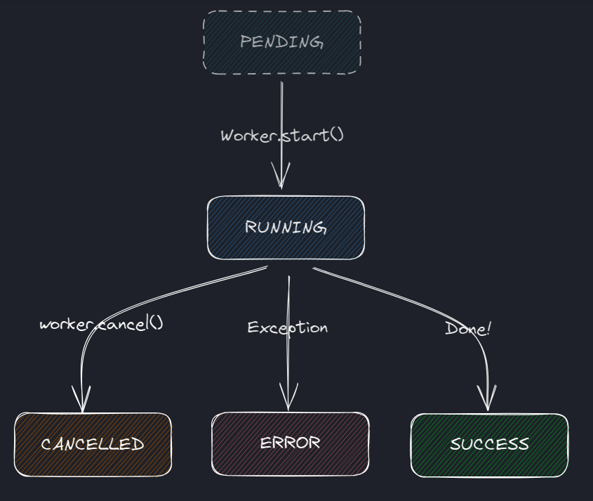

##### 3.2.2.5 工人对象——创建参数

了解了工人对象的生命周期之后，下面正式开始介绍工人对象支持的参数。不过，一般情况下，代码中并不需要直接创建工人对象，都是使用`run_worker`方法或者`work`装饰器来创建工人对象，因此下面介绍的是两种创建方法的对象，如果读者有兴趣和能力，可以参考[官网文档](https://textual.textualize.io/api/worker/#textual.worker.Worker)学习完整的工人对象的参数。

`run_worker`方法（完整介绍参考[官网文档](https://textual.textualize.io/api/dom_node/#textual.dom.DOMNode.run_worker)）支持以下参数：

-   `work`参数，可调用类型或可等待类型，表示工人对象要执行的操作。该参数可以通过位置、关键字传入，`run_worker`方法的所有参数都可以这样传入。
-   `name`参数，字符串类型，表示工人对象的名字，常用于调试、标识工人对象。
-   `group`参数，字符串类型，表示工人对象所属的分组，默认为`'default'`。此参数主要配合`exclusive`参数使用，设置`exclusive`参数为`True`之后，运行新的工人对象时，会撤销同分组中正在运行的其他工人对象。
-   `description`参数，字符串类型，一般指工人对象的描述。也可以用于存储一些字符串内容，可以通过修改工人对象的`description`属性的值来修改。
-   `exit_on_error`参数，布尔类型，表示当工人对象执行的操作发生异常时，是否退出整个程序，默认为`True`。如果设置为`False`的话，程序不会退出，但不会继续执行发生异常之后的部分。
-   `start`参数，布尔类型，表示在创建出工人对象之后，是否立即开始执行需要执行的操作，默认为`True`。如果不想立即开始执行，可以将此参数设置为`False`，并在需要执行的时候，调用工人管理器的`start_all`方法。
-   `exclusive`参数，布尔类型，表示是否在运行新的工人对象时，会撤销同分组中正在运行的其他工人对象，默认为`False`，即运行新的工人对象时，不会撤销同分组中之前运行的工人对象。
-   `thread`参数，布尔类型，表示是否在单独的线程中执行需要后台执行的操作。

`work`装饰器（完整介绍参考[官网文档](https://textual.textualize.io/api/work/)）支持以下参数：

-   `method`参数，可调用类型或可等待类型，表示工人对象要执行的操作。如果是使用常规装饰器语法（`@work`），此参数不能显式传入，只能是被装饰的函数。想要给此参数传入值，可以使用装饰器的展开表达方式，比如`get_result = work(get_result)`。
-   `name`参数，字符串类型，表示工人对象的名字，常用于调试、标识工人对象。本参数以及后续的参数只能通过关键字传入。使用装饰器的展开表达方式的话，很好理解如何传入本参数以及后续的参数。但是，如果是常规的装饰器语法，想要传入本参数以及后续的参数，则需要在原本的装饰器之后，使用类似创建对象传参的方式传入，比如`@work(name='worker_1')`，这样得到的装饰器依然是有效的装饰器，后面被装饰的函数可以被`method`参数正常接收。
-   `group`参数，字符串类型，表示工人对象所属的分组，默认为`'default'`。此参数主要配合`exclusive`参数使用，设置`exclusive`参数为`True`之后，运行新的工人对象时，会撤销同分组中正在运行的其他工人对象。
-   `exit_on_error`参数，布尔类型，表示当工人对象执行的操作发生异常时，是否退出整个程序，默认为`True`。如果设置为`False`的话，程序不会退出，但不会继续执行发生异常之后的部分。
-   `exclusive`参数，布尔类型，表示是否在运行新的工人对象时，会撤销同分组中正在运行的其他工人对象，默认为`False`，即运行新的工人对象时，不会撤销同分组中之前运行的工人对象。
-   `description`参数，字符串类型，一般指工人对象的描述。也可以用于存储一些字符串内容，可以通过修改工人对象的`description`属性的值来修改。
-   `thread`参数，布尔类型，表示是否在单独的线程中执行需要后台执行的操作。

可以看到两种创建方法的大部分参数是一样的，因此只需记住对应名字参数的用途，两种方法可以互相转化。下面就其中的`exclusive`参数和`thread`参数的用法写几个示例，详细讲解一下。

通过设置`exclusive`参数为`True`，可以在多次运行工人对象时，抛弃之前没有完成的后台任务，进而避免结果在短时间内跳变，使最终结果只会是最后一次运行工人对象的结果：

```python3
from textual.app import App
from textual.widgets import Button,Label
import asyncio,random
from textual import work

class MyApp(App):
    result = '...'
    def on_mount(self):
        self.widgets = [
            Label(f'result is {self.result}'),
            Button('fetch result',action='app.fetch')
        ]
        self.mount_all(self.widgets)

    @work(exclusive=True)
    async def get_result(self,a=1,b=99):
        await asyncio.sleep(3)
        self.result = str(random.randint(a,b))
        self.query_one(Label).update(f'result is {self.result}')
        
    async def action_fetch(self):
        self.get_result(1,9)

if __name__ == '__main__':
    app = MyApp()
    app.run()
```

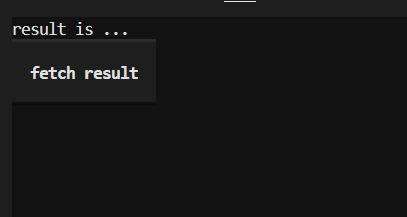

通过设置`thread`参数为`True`，可以让原本只是在主线程上使用协程方式运行的后台任务，变成单独创建一个线程来运行。

不过，需要注意的是，使用单独线程运行后台任务的话，`exclusive`参数会失效：

```python3
from textual.app import App
from textual.widgets import Button,Label
import asyncio,random
from textual import work

class MyApp(App):
    result = '...'
    def on_mount(self):
        self.widgets = [
            Label(f'result is {self.result}'),
            Button('fetch result',action='app.fetch')
        ]
        self.mount_all(self.widgets)

    @work(exclusive=True,thread=True)
    async def get_result(self,a=1,b=99):
        await asyncio.sleep(3)
        self.result = str(random.randint(a,b))
        self.query_one(Label).update(f'result is {self.result}')
        
    async def action_fetch(self):
        self.get_result(1,9)

if __name__ == '__main__':
    app = MyApp()
    app.run()
```


而且，因为大部分Textual的函数是非线程安全的，要是在单独的线程中修改反应性属性或者UI组件的话，最好是使用`App.call_from_thread`（完整用法参考[官网文档](https://textual.textualize.io/api/app/#textual.app.App.call_from_thread)）来调用，这样才能正确触发界面刷新，避免出现多个线程同时修改一个变量而导致数据异常：

```python3
from textual.app import App
from textual.widgets import Button,Label
import asyncio,random
from textual import work

class MyApp(App):
    result = '...'
    def on_mount(self):
        self.widgets = [
            Label(f'result is {self.result}'),
            Button('fetch result',action='app.fetch')
        ]
        self.mount_all(self.widgets)

    @work(thread=True)
    async def get_result(self,a=1,b=99):
        await asyncio.sleep(3)
        self.result = str(random.randint(a,b))
        self.call_from_thread(self.query_one(Label).update,f'result is {self.result}')
        # 操作UI或者反应性属性时，最好使用 App.call_from_thread 
        # https://textual.textualize.io/api/app/#textual.app.App.call_from_thread
        # 不推荐 self.query_one(Label).update(f'result is {self.result}')
        
    async def action_fetch(self):
        self.get_result(1,9)

if __name__ == '__main__':
    app = MyApp()
    app.run()
```

不过，`post_message` 方法是个例外（完整用法参考[官网文档](https://textual.textualize.io/api/widget/#textual.widget.Widget.post_message) ），此方法是线程安全的。因此，如果对UI、反应性属性的修改是放在独立线程的工人对象中，除了使用`App.call_from_thread`间接操作之外，使用`post_message` 方法发送自定义消息（完整用法参考[官网文档](https://textual.textualize.io/guide/events/)），让消息的处理函数去修改，也是个稳妥的选择。

前面提到过工人对象默认情况下不能运行非异步函数，如果读者有类似需求（比如有的操作就是不支持异步等待），那可以设置工人对象的`thread`参数为`True`，这样工人对象就能运行非异步函数了。

以下面的代码为例，代码中将原本的异步的休眠操作（`await asyncio.sleep(3)`），替换为非异步的休眠（`time.sleep(3)`），来模拟非异步的耗时操作，此时，需要设置`thread`参数为`True`，才不会引起异常（`work`装饰器修饰非异步函数时，不把`thread`参数为`True`的话，会直接触发异常）：

```python3
from textual.app import App
from textual.widgets import Button,Label
import time,random
from textual import work

class MyApp(App):
    result = '...'
    def on_mount(self):
        self.widgets = [
            Label(f'result is {self.result}'),
            Button('fetch result',action='app.fetch')
        ]
        self.mount_all(self.widgets)

    @work(thread=True)
    def get_result(self,a=1,b=99):
        time.sleep(3)
        self.result = str(random.randint(a,b))
        self.call_from_thread(self.query_one(Label).update,f'result is {self.result}')
        # 操作UI或者反应性属性时，最好使用 App.call_from_thread 
        # https://textual.textualize.io/api/app/#textual.app.App.call_from_thread
        # 不推荐 self.query_one(Label).update(f'result is {self.result}')
        
    async def action_fetch(self):
        self.get_result(1,9)

if __name__ == '__main__':
    app = MyApp()
    app.run()
```

但需要注意的是，如果是想要使用`run_work`方法运行非异步函数同时还要带上参数的话，需要使用lambda表达式包装一下：

```python3
from textual.app import App
from textual.widgets import Button,Label
import time,random

class MyApp(App):
    result = '...'
    def on_mount(self):
        self.widgets = [
            Label(f'result is {self.result}'),
            Button('fetch result',action='app.fetch')
        ]
        self.mount_all(self.widgets)

    def get_result(self,a=1,b=99):
        time.sleep(3)
        self.result = str(random.randint(a,b))
        self.call_from_thread(self.query_one(Label).update,f'result is {self.result}')
        # 操作UI或者反应性属性时，最好使用 App.call_from_thread 
        # https://textual.textualize.io/api/app/#textual.app.App.call_from_thread
        # 不推荐 self.query_one(Label).update(f'result is {self.result}')
        
    async def action_fetch(self):
        self.run_worker(work=lambda :self.get_result(1,9),thread=True)

if __name__ == '__main__':
    app = MyApp()
    app.run()
```

如果不传入参数，直接传入可调用类型的对象，就不需要这么复杂：

```python3
from textual.app import App
from textual.widgets import Button,Label
import time,random

class MyApp(App):
    result = '...'
    def on_mount(self):
        self.widgets = [
            Label(f'result is {self.result}'),
            Button('fetch result',action='app.fetch')
        ]
        self.mount_all(self.widgets)

    def get_result(self,a=1,b=99):
        time.sleep(3)
        self.result = str(random.randint(a,b))
        self.call_from_thread(self.query_one(Label).update,f'result is {self.result}')
        # 操作UI或者反应性属性时，最好使用 App.call_from_thread 
        # https://textual.textualize.io/api/app/#textual.app.App.call_from_thread
        # 不推荐 self.query_one(Label).update(f'result is {self.result}')
        
    async def action_fetch(self):
        self.run_worker(work=self.get_result,thread=True)

if __name__ == '__main__':
    app = MyApp()
    app.run()
```

##### 3.2.2.6 工人对象——方法

工人对象支持的方法可以参考[官网文档](https://textual.textualize.io/api/worker/#textual.worker.Worker)，这里主要介绍两个常用的方法：

-   `cancel`方法，可以取消正在运行的工人对象。示例如下：

    ```python3
    from textual.app import App
    from textual.widgets import Button,Label
    import asyncio,random
    
    class MyApp(App):
        result = '...'
        def on_mount(self):
            self.widgets = [
                Label(f'result is {self.result}'),
                Button('fetch result',action='app.fetch')
            ]
            self.mount_all(self.widgets)
    
        async def get_result(self,a=1,b=99):
            await asyncio.sleep(3)
            self.result = str(random.randint(a,b))
            self.query_one(Label).update(f'result is {self.result}')
            
        async def action_fetch(self):
            worker = self.run_worker(work=self.get_result(1,9))
            await asyncio.sleep(0.1)
            worker.cancel()
            await asyncio.sleep(0.1)
            self.query_one(Label).update(f'The state of worker is {worker.state}.')
    
    if __name__ == '__main__':
        app = MyApp()
        app.run()
    ```

    需要注意的是，取消工人对象之后，工人对象的状态不会立即更新，需要稍微等一下才行。

-   `wait`方法，调用此方法会等待工人对象执行完成之后，返回工人对象所执行操作的返回值。比如：

    ```python3
    from textual.app import App
    from textual.widgets import Button,Label
    import asyncio,random
    
    class MyApp(App):
        result = '...'
        def on_mount(self):
            self.widgets = [
                Label(f'result is {self.result}'),
                Button('fetch result',action='app.fetch')
            ]
            self.mount_all(self.widgets)
    
        async def get_result(self,a=1,b=99):
            await asyncio.sleep(3)
            self.result = str(random.randint(a,b))
            self.query_one(Label).update(f'result is {self.result}')
            return self.result
            
        async def action_fetch(self):
            worker = self.run_worker(work=self.get_result(1,9))
            result = await  worker.wait()
            self.query_one(Label).update(f'The result of worker is {result}.')
    
    if __name__ == '__main__':
        app = MyApp()
        app.run()
    ```

    不过需要注意的是，此方法是个异步函数，因此，如果想要获得返回值，就需要使用异步等待关键字（`await`）。但是，这样会阻塞UI的更新操作。为了避免此类情况，最好是定义`on_worker_state_changed`，在处理工人对象的状态改变事件（ `Worker.StateChanged`，完整用法参考[官网文档](https://textual.textualize.io/api/worker/#textual.worker.Worker.StateChanged) ）时，将工人对象的执行结果（`result`属性）传递出去。

##### 3.2.2.7 工人对象——属性

工人对象支持的属性可以参考[官网文档](https://textual.textualize.io/api/worker/#textual.worker.Worker)，这里主要介绍几个常用的属性。

除了通过比较`state`属性和枚举值（`textual.worker.WorkerState`）来判断工人对象的运行状态，还可以判断以下属性的布尔值来确定运行状态：

-   `is_cancelled`属性，工人对象是否被取消。
-   `is_running`属性，工人对象是否在运行。
-   `is_finished`属性，工人对象是否已经完成。

上节提到工人对象的执行结果可以通过`result`属性传递出去，这里就不用解释`result`属性的作用了，直接提供一个示例：

```python3
from textual.app import App
from textual.widgets import Button,Label
import asyncio,random

class MyApp(App):
    result = '...'
    def on_mount(self):
        self.widgets = [
            Label(f'result is {self.result}'),
            Button('fetch result',action='app.fetch')
        ]
        self.mount_all(self.widgets)

    async def get_result(self,a=1,b=99):
        await asyncio.sleep(3)
        self.result = str(random.randint(a,b))
        self.query_one(Label).update(f'result is {self.result}')
        return self.result
        
    async def action_fetch(self):
        worker = self.run_worker(work=self.get_result(1,9))
        await worker.wait()
        self.query_one(Label).update(f'The result of worker is {worker.result}.')

if __name__ == '__main__':
    app = MyApp()
    app.run()
```

需要注意的是，`result`属性在工人对象成功完成之前是`None`，不是实际的返回值。如果想准确获取到返回值，必须确保工人对象已经完成且没有发生错误。

当然，如果工人对象在运行时发生了错误，除了用`try...except`捕获，还可以通过`error`属性来获取：

```python3
from textual.app import App
from textual.widgets import Button,Label
import asyncio,random

class MyApp(App):
    result = '...'
    def on_mount(self):
        self.widgets = [
            Label(f'result is {self.result}'),
            Button('fetch result',action='app.fetch')
        ]
        self.mount_all(self.widgets)

    async def get_result(self,a=1,b=99):
        await asyncio.sleep(3)
        raise Exception('no name error')
        self.result = str(random.randint(a,b))
        self.query_one(Label).update(f'result is {self.result}')
        return self.result
        
    async def action_fetch(self):
        worker = self.run_worker(work=self.get_result(1,9),exit_on_error=False)
        try:
            await worker.wait()
        except:
            pass
        finally:
            self.query_one(Label).update(f'The error of worker is {worker.error}.')

if __name__ == '__main__':
    app = MyApp()
    app.run()
```

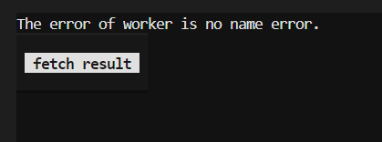

可以看到，示例中没有捕获异常，但可以通过`error`属性得知异常的名字。

##### 3.2.2.8 工人对象——事件

最佳获取工人对象的结果的方式是定义`on_worker_state_changed`，并处理工人对象的状态改变事件（ `Worker.StateChanged`，完整用法参考[官网文档](https://textual.textualize.io/api/worker/#textual.worker.Worker.StateChanged) ），状态改变事件有两个属性（事件的参数）：

-   `worker`属性，表示触发事件的工人对象。
-   `state`属性，表示触发事件的工人对象的状态。

因此，可以通过使用上面的两个属性，判断出指定工人对象是否运行成功，并得到该工人对象的执行结果：

```python3
from textual.app import App
from textual.widgets import Button,Label
import asyncio,random
from textual.worker import Worker,WorkerState

class MyApp(App):
    result = '...'
    def on_mount(self):
        self.widgets = [
            Label(f'result is {self.result}'),
            Button('fetch result',action='app.fetch')
        ]
        self.mount_all(self.widgets)

    async def get_result(self,a=1,b=99):
        await asyncio.sleep(3)
        self.result = str(random.randint(a,b))
        self.query_one(Label).update(f'result is {self.result}')
        return self.result
        
    async def action_fetch(self):
        self.run_worker(work=self.get_result(1,9),name='fetch')

    def on_worker_state_changed(self, e: Worker.StateChanged):
        if e.worker.name in ['fetch'] and e.state == WorkerState.SUCCESS:
            self.query_one(Label).update(f'The result of worker is {e.worker.result}.')

if __name__ == '__main__':
    app = MyApp()
    app.run()
```

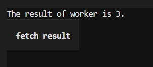

#### 3.2.3 自定义组件

在介绍反应性属性的时候，简单介绍了自定义组件的方法，本节将详细讲解一下如何自定义组件（完整介绍参考[官网文档](https://textual.textualize.io/guide/widgets/)）。自定义组件涉及到的Rich框架部分内容，本节会根据需要，适当展开介绍。如果读者需要全面了解，可以访问Rich框架的[官网文档](https://rich.readthedocs.io/en/latest/index.html)。

##### 3.2.3.1 组件的组成

前面的内容在创建自定义组件时，只是提供了现成的代码，并没有深入介绍组件的组成和自定义方法。因此，本节在正式进入自定义组件之前，需要先明确一下自定义组件的基础——组件的组成，才能更准确地理解自定义组件基本原理。

>   组件，在其他UI框架中也可以称之为控件，是用户界面上重要的组成部分。组件是一个或者一组预先定义好的内容，可以在终端中（在Textual中称之为当前屏幕）显示出来，用来构成用户界面。

这是基础知识中对组件的定义，但在学习了前面诸多功能之后，现在需要重新认识一下组件。

在事件与消息、反应性属性等章节中，有过给自定义组件添加消息处理函数、反应性属性的示例。然而，这些功能在`App`类的实例中也可以创建。因此，组件实际上就是一个小型的应用程序，Textual也确实这样设计的，每个组件都是运行在自己的异步任务中，对应的就是`App`类的`run`方法。

而且，前面也有自定义组件内实现`compose`方法这种类似的代码，进一步佐证了二者的相似性。更别说诸如`on_mount`之类的事件响应方法，二者都具备，大大降低了开发者的学习难度（也可能埋下了更难发现的坑）。

##### 3.2.3.2 创建自定义组件的基本方法

了解了组件的基本组成之后，下面讲一讲创建自定义组件的基本方法。首先要知道，组件是个类，不是一个方法。所以，自定义组件的本质，是创建了一个自定义类。从零开始写一个完全支持Textual渲染方法的类实在是费事，因此，想要省事的话，最好是继承基础类，在基础类的肩膀上，尽可能少地编写自定义代码。

在Textual中，可用于创建自定义组件的基础类有两种：

-   内置的组件类，使用`from textual.widgets import {组件类}`导入。继承此基础类创建自定义组件比较简单，因为基础组件已经实现了完善的交互和样式，可以直接在类似组件的基础上，快速增改功能、样式。但也有一些限制，对基础组件应用的样式也会传递到自定义组件中，也容易触发基础组件相关的事件，需要特别注意。
-   `Widget`类，使用`from textual.widget import Widget`导入。继承此基础类则不用担心自定义组件与现有组件出现异常关联，但缺点也与此相关，需要自己实现交互、样式等代码。可以说，易用性和耦合性呈正相关。

说完了继承类，创建自定义显示内容的入口方法也有多种选择。通过在自定义组件类内实现以下方法，可以自定义组件显示的内容：

-   `render`方法，直接返回可渲染对象，是大部分基本组件的底层渲染方法。
-   `render_line`方法，直接返回条对象（`Strip`，完整用法参见[官网文档](https://textual.textualize.io/api/strip/#textual.strip.Strip)）。条对象是一个包含多个段对象（`Segment`，完整用法参见[官网文档](https://rich.readthedocs.io/en/stable/reference/segment.html#rich.segment.Segment)）并放置在一行的复合对象。与`render`方法不同的是，此方法是线性渲染，在内容改变需要刷新的时候，只会刷新局部，而不是整个自定义组件。在自定义组件包含较多内容时，此方法可以减少卡顿和所需的计算资源。
-   `compose`方法，直接生成（`yield`）基本组件，创建复合组件（包含其他组件的自定义组件）时使用此方法。
-   `on_mount`方法，基于事件的自定义方法，当自定义组件被挂载时，可以在此方法中动态添加其他组件。效果上和`compose`方法类似，是一种备选、增强的方法，但不推荐只使用此方法自定义组件，因为此方法只会执行一次，一旦有重复刷新自定义组件的情况，此方法没法实时更新显示。

虽然前面已经有过很多创建自定义组件的例子，这里还是根据本节内容，基于`render`方法提供一个简单的示例：

```python3
from textual.app import App
from textual.widget import Widget

class MyWidget(Widget):
    def render(self):
        return 'hello world'

class MyApp(App):
    def on_mount(self):
        self.widgets = [
            MyWidget()
        ]
        self.mount_all(self.widgets)

if __name__ == '__main__':
    app = MyApp()
    app.run()
```

需要注意的是，自定义组件的类名，首字母必须大写，否则会触发异常。

##### 3.2.3.3 设计自定义组件——CSS

前面在讲Textual的CSS的时候，介绍过默认CSS——使用`initial`会让组件的样式变成默认的。而在这一节，就要重点说说默认CSS。

不同于在`App`子类里设置`CSS`和`CSS_PATH`，可以嵌入CSS或者指定CSS文件，想要给自定义的组件设置CSS或者嵌入CSS，只能设置默认CSS——`DEFAULT_CSS`。默认CSS的用法和`App`子类里的`CSS`类似，主要特点在于其默认的特性——不给其设置CSS的话将采用默认CSS中的样式。

此外，在前面介绍过CSS的优先级，这里需要明确一点，组件的默认CSS里样式的优先级，比所有`App`子类`CSS`里的样式都低。哪怕`DEFAULT_CSS`中已经是最高优先级（比如`!important`），只要`App`子类里设置的`CSS`中有匹配的样式，优先级再低也会覆盖掉默认CSS。

以下面的代码为例：

```python3
from textual.app import App
from textual.widget import Widget
from textual.widgets import Static

class MyWidget(Widget):
    DEFAULT_CSS = """
    MyWidget {
        width: auto;
        height: auto;
    }
    Static.s {
        width: auto;
        height: auto;
        background: blue!important;
    }
    """
    def compose(self):
        yield Static('Hello World',classes='s')

class MyApp(App):
    CSS = """
    Static {
        width: auto;
        height: auto;
        background: red;
    }
    """
    def on_mount(self):
        self.widgets = [
            MyWidget(),
            Static('Hello World',classes='s'),
        ]
        self.mount_all(self.widgets)

if __name__ == '__main__':
    app = MyApp()
    app.run()
```

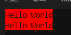

哪怕默认CSS中的样式优先级多高，只要外面的CSS可以匹配到，自定义组件中的样式也会被覆盖。

除了优先级比较低，默认CSS还有一个特点，默认只影响组件内的子组件，不会影响外面的组件。还是上面的代码，去掉外面的CSS，保留组件内的默认CSS：

```python3
from textual.app import App
from textual.widget import Widget
from textual.widgets import Static

class MyWidget(Widget):
    DEFAULT_CSS = """
    MyWidget {
        width: auto;
        height: auto;
    }
    .s {
        width: auto;
        height: auto;
        background: blue;
    }
    """
    def compose(self):
        yield Static('Hello World',classes='s')

class MyApp(App):
    def on_mount(self):
        self.widgets = [
            MyWidget(),
            Static('Hello World',classes='s'),
        ]
        self.mount_all(self.widgets)

if __name__ == '__main__':
    app = MyApp()
    app.run()
```

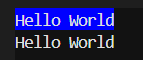

可以看到，同样都是静态文本，不是自定义组件内的静态文本，背景颜色不是蓝色而是默认颜色。这样设计的原因，是怕自定义组件时设计的样式，污染到使用该组件的程序中的其他组件。

不过，如果读者有特殊需求，想要改变其他组件的样式，可以在自定义组件类中添加`SCOPED_CSS`属性，并设置为`False`，可以让原本只在当前类内生效的默认CSS，扩展到整个程序：

```python3
from textual.app import App
from textual.widget import Widget
from textual.widgets import Static

class MyWidget(Widget):
    DEFAULT_CSS = """
    MyWidget {
        width: auto;
        height: auto;
    }
    .s {
        width: auto;
        height: auto;
        background: blue;
    }
    """
    SCOPED_CSS = False
    def compose(self):
        yield Static('Hello World',classes='s')

class MyApp(App):
    def on_mount(self):
        self.widgets = [
            MyWidget(),
            Static('Hello World',classes='s'),
        ]
        self.mount_all(self.widgets)

if __name__ == '__main__':
    app = MyApp()
    app.run()
```

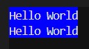

关于自定义组件的CSS，其实还有一个和样式类有关的类变量`DEFAULT_CLASSES`，但在介绍之前，需要先弄清楚一个问题——自定义组件`DEFAULT_CSS`中定义的样式类要怎么才能生效。先看下面的代码：

```python3
from textual.app import App
from textual.widget import Widget
from textual.widgets import Static

class MyWidget(Widget):
    DEFAULT_CSS = """
    MyWidget {
        width: auto;
        height: auto;
    }
    Static {
        width: auto;
        height: auto;
    }
    .s {
        background: blue;
    }
    """
    def compose(self):
        yield Static('Hello World')

class MyApp(App):
    def on_mount(self):
        self.widgets = [
            MyWidget(classes='s'),
            Static('Hello World'),
        ]
        self.mount_all(self.widgets)

if __name__ == '__main__':
    app = MyApp()
    app.run()
```

按照前面思路，这种定义在组件内部的样式类，只在内部生效，在外面设置不应该生效。但是，使用该样式类的就是自定义组件，给自定义组件设置一个内部定义的样式类，又应该生效。想来想去，样式类无论是否生效，都难以理解。

这里先揭晓一下答案，上面代码中，自定义组件内部定义的样式类`s`，是没有生效的。至于原因，需要看一下修改后能够生效的代码：

```python3
from textual.app import App
from textual.widget import Widget
from textual.widgets import Static

class MyWidget(Widget):
    DEFAULT_CSS = """
    MyWidget {
        width: auto;
        height: auto;
    }
    Static {
        width: auto;
        height: auto;
    }
    MyWidget.s {
        background: blue;
    }
    """
    def compose(self):
        yield Static('Hello World')

class MyApp(App):
    def on_mount(self):
        self.widgets = [
            MyWidget(classes='s'),
            Static('Hello World'),
        ]
        self.mount_all(self.widgets)

if __name__ == '__main__':
    app = MyApp()
    app.run()
```

相比于上一个示例代码，这一个示例只是将原本的样式类选择器，改成了`MyWidget.s`，变成了必须同时匹配`MyWidget`组件和样式类`s`才会应用样式，那结果便与上一个示例不同：


想必读者已经猜到了可能的原因，这里就明确解释一下。对于自定义组件来说，没有扩大CSS的应用范围的话，想要让自定义组件本身应用内部的样式，则必须使用类型选择器匹配自定义组件类。因此，想要让自定义组件使用样式类，也要同时使用类型选择器才行。

创建组件时，可以给组件的初始化参数`classes`传参来设置组件的样式类。

而在自定义组件类内部，可以在方法内部设置实例的`classes`属性，实现默认应用样式类。不过，这种设置样式类的方法都是显式的，也就是说需要开发者在某个地方主动设置。同时，这样设置的样式没法被更高优先级的方法覆盖，会导致默认初始化参数`classes`没法生效，很不方便。

幸好，自定义组件支持`DEFAULT_CLASSES`类变量，该变量表示组件在没有设置样式类时，默认添加哪些样式类，支持内部样式类和外部样式类。其中，内部样式类需要满足上面的原则，必须同时使用类型选择器。这样，就可以把应用默认样式类的任务交给`DEFAULT_CLASSES`类变量：

```python3
from textual.app import App
from textual.widget import Widget
from textual.widgets import Static

class MyWidget(Widget):
    DEFAULT_CLASSES = 's'
    DEFAULT_CSS = """
    MyWidget {
        width: auto;
        height: auto;
    }
    Static {
        width: auto;
        height: auto;
    }
    MyWidget.s {
        background: blue;
    }
    """
    def compose(self):
        yield Static('Hello World')

class MyApp(App):
    def on_mount(self):
        self.widgets = [
            MyWidget(),
            Static('Hello World'),
        ]
        self.mount_all(self.widgets)

if __name__ == '__main__':
    app = MyApp()
    app.run()
```


如果想要保留默认样式类，同时添加新的样式类，可以使用组件的`add_class`方法。

顺便多说一句，其实`App`子类也像自定义组件一样支持`DEFAULT_CSS`类变量和`DEFAULT_CLASSES`类变量。只不过`App`子类示例本身不是可以显示的组件，其实际显示的主体对应的是DOM节点中子级的`Screen`组件。因此，其应用的样式类实际上没有效果，`DEFAULT_CLASSES`类变量也没什么用。至于`DEFAULT_CSS`，效果上和`CSS`一样，但其优先级比`CSS`低，一般用于设置没有加载外部CSS文件时或者加载失败时的默认样式。

##### 3.2.3.4 设计自定义组件——动作链接与文本美化

动作链接其实前面介绍过，这里简单复习一下。

任何自定义组件中显示的文本，只要没有禁用标记标签解析或者使用`escape`方法（使用`from textual.markup import escape`导入）转义，其中的Markup标签（后面会有专门章节介绍，这里可以简单理解为类似HTML标签的一种格式）都会被解析。其中，`[@click={action}]...[/]`使用了'@'当做开头且作用类似HTML的超链接标签，就是动作链接。

需要注意的是，动作链接的颜色是不支持通过其他标签修改。如果想要改变某个组件内的动作链接的颜色，只能通过CSS（完整文档参考[官网](https://textual.textualize.io/styles/links/)）修改。动作链接主要支持以下样式：

| 样式类型                                                     | 含义                                                      |
| :----------------------------------------------------------- | :-------------------------------------------------------- |
| [`link-background`](https://textual.textualize.io/styles/links/link_background/) | 链接文本的背景颜色。                                      |
| [`link-background-hover`](https://textual.textualize.io/styles/links/link_background_hover/) | 鼠标悬停在链接文本上时的背景颜色。                        |
| [`link-color`](https://textual.textualize.io/styles/links/link_color/) | 链接文本的文本颜色。                                      |
| [`link-color-hover`](https://textual.textualize.io/styles/links/link_color_hover/) | 鼠标悬停在链接文本上时的文本颜色。                        |
| [`link-style`](https://textual.textualize.io/styles/links/link_style/) | 链接文本上的文本样式，比如设置`underline`就是添加下划线。 |
| [`link-style-hover`](https://textual.textualize.io/styles/links/link_style_hover/) | 鼠标悬停在链接文本上时的文本样式。                        |

下面的示例演示了如何在自定义组件中使用动作链接和其他标签：

```python3
from textual.app import App
from textual.widget import Widget
from textual.widgets import Static

class MyWidget(Widget):
    DEFAULT_CSS = '''
    Static {
        link-color: ansi_red;
    }
    '''
    def compose(self):
        yield Static('Click [@click=app.quit]Me[/] to [red]quit[/red] app')

class MyApp(App):
    def on_mount(self):
        self.widgets = [
            MyWidget(),
        ]
        self.mount_all(self.widgets)

if __name__ == '__main__':
    app = MyApp()
    app.run()
```

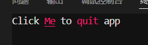

##### 3.2.3.5 设计自定义组件——标题和副标题

与`App`类支持标题和副标题类似，自定义组件也能设置标题和副标题——边框标题和边框副标题。

等一下，这两个听起来有点像样式里的边框标题和边框副标题，难道是和上一小节一样，用前面讲过的内容水一节？

非也，设置自定义组件的边框标题和边框副标题，除了前面设置组件实例的`border_title`属性（完整用法参考[官网文档](https://textual.textualize.io/api/widget/#textual.widget.Widget.border_title)）和`border_subtitle`属性（完整用法参考[官网文档](https://textual.textualize.io/api/widget/#textual.widget.Widget.border_subtitle)）之外，还可以在类内添加`BORDER_TITLE`变量（完整用法参考[官网文档](https://textual.textualize.io/api/widget/#textual.widget.Widget.BORDER_TITLE)）和`BORDER_SUBTITLE`变量（完整用法参考[官网文档](https://textual.textualize.io/api/widget/#textual.widget.Widget.BORDER_SUBTITLE)），实现同样的效果。

需要注意的是，边框标题和边框副标题只有在自定义组件启用边框时才会显示，并且标题内容设置为空的话，对应标题就不再显示。

示例代码如下：

```python3
from textual.app import App
from textual.widget import Widget
from textual.widgets import Static

class MyWidget(Widget):
    DEFAULT_CSS = '''
    MyWidget {
        border: solid yellow;
    }
    '''
    BORDER_TITLE = 'MyWidget'
    def compose(self):
        self.border_subtitle = 'From Python'
        yield Static('Hello World')

class MyApp(App):
    def on_mount(self):
        self.widgets = [
            MyWidget(),
        ]
        self.mount_all(self.widgets)

if __name__ == '__main__':
    app = MyApp()
    app.run()
```

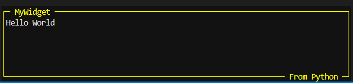

##### 3.2.3.6 设计自定义组件——焦点与快捷键绑定

前面提到过静态文本不能获得焦点，在创建自定义组件时，如果父类是`Widget`类或者静态文本这种不能获得焦点的类，那自定义组件也不能获得焦点。

想要让自定义组件可以获得焦点，需要将自定义组件的`can_focus`属性设置为`True`才行，传递给父类的`__init_subclass__`方法或者设置类变量都可以。

如前面介绍快捷键绑定时说的，能够获得焦点的组件才可以使用内部定义快捷键，并且优先级比上级组件的快捷键高，设置`priority`参数为`True`的快捷键，比不设置的高，如果都设置为`True`，则遵循越近越优先。

所以，如果自定义组件设置了内部的快捷键绑定（和在`App`子类中设置快捷键绑定一样，设置`BINDINGS`属性），别忘了让自定义组件可以获得焦点：

```python3
from textual.app import App
from textual.widget import Widget
from textual.widgets import Static,Button

class MyWidget(Widget,can_focus=True):
    # 也可以设置类变量
    # can_focus=True
    DEFAULT_CSS = '''
    MyWidget,Static {
        width: auto;
        height: 1;
        &:focus {
            background: green;
        }
    }
    '''
    BINDINGS = [('q','update_static','Update Static')]
    def compose(self):
        yield Static('Hello World')
    def action_update_static(self):
        self.query_one(Static).update('Hello everyone')

class MyApp(App):
    def on_mount(self):
        self.widgets = [
            Button('Fake Button'),
            MyWidget(),
        ]
        self.mount_all(self.widgets)

if __name__ == '__main__':
    app = MyApp()
    app.run()
```

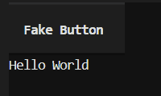

如上图所示，自定义组件在获得焦点时背景会变成绿色，并且组件内定义了一个快捷键，可以更新内部静态文本的内容。读者可以复制上面的代码，将其自定义组件改成不能获得焦点，对比一下执行的效果。

##### 3.2.3.7 设计自定义组件——可渲染对象

`render`方法通过返回可渲染对象，借助更加接近底层的自定义能力，可以实现更高自由度的定制。

比如，可以使用Rich的`Panel`（[官网文档](https://rich.readthedocs.io/en/latest/panel.html)），绘制出一个带圆角边框的静态文本组件：

```python3
from textual.app import App
from textual.widget import Widget
from rich.panel import Panel

class MyWidget(Widget):
    def render(self):
        return Panel('Hello World',expand=False,height=3)

class MyApp(App):
    def on_mount(self):
        self.widgets = [
            MyWidget(),
        ]
        self.mount_all(self.widgets)

if __name__ == '__main__':
    app = MyApp()
    app.run()
```

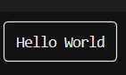

##### 3.2.3.8 设计自定义组件——内容尺寸

当自定义组件的高度和宽度设置为自动时，程序会调用组件的`get_content_height`方法（支持的参数和用法参考[官网文档](https://textual.textualize.io/api/widget/#textual.widget.Widget.get_content_height)）和`get_content_width`方法（支持的参数和用法参考[官网文档](https://textual.textualize.io/api/widget/#textual.widget.Widget.get_content_width)），根据返回值，确定组件高度和宽度。

下面的代码中，就实现了这两个方法，并返回固定值，让组件显示出来的高度和宽度比实际内容大了一些：

```python3
from textual.app import App
from textual.widget import Widget
from rich.panel import Panel

class MyWidget(Widget):
    DEFAULT_CSS = '''
    MyWidget {
        width: auto;
        height: auto;
        background: green;
    }
    '''
    def get_content_height(self, container, viewport, width):
        return 5
    def get_content_width(self, container, viewport):
        return 20
    def render(self):
        return Panel('Hello World',expand=False,height=3)

class MyApp(App):
    def on_mount(self):
        self.widgets = [
            MyWidget(),
        ]
        self.mount_all(self.widgets)

if __name__ == '__main__':
    app = MyApp()
    app.run()
```

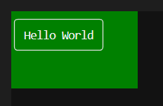

##### 3.2.3.9 设计自定义组件——工具提示

给组件设置`tooltip`属性（在类或者实例中设置均可，类的话就会自动应用到全部实例，完整介绍参考[官网文档](https://textual.textualize.io/api/widget/#textual.widget.Widget.tooltip)）后，当鼠标在组件上悬停时，鼠标下方会显示出提示性的内容，一旦鼠标移动就会消失。`tooltip`属性支持字符串和可渲染对象，因此，可以定制不同组件的工具提示。

```python3
from textual.app import App
from textual.widget import Widget
from rich.panel import Panel

class MyWidget(Widget):
    tooltip = Panel('Hello everyone',expand=False,height=3)
    def render(self):
        return Panel('Hello World',expand=False,height=3)

class MyApp(App):
    def on_mount(self):
        self.widgets = [
            MyWidget(),
        ]
        self.mount_all(self.widgets)

if __name__ == '__main__':
    app = MyApp()
    app.run()
```

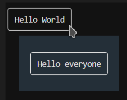

除了通过设置`tooltip`属性创建工具提示，也可以调用组件实例的`with_tooltip`方法创建工具提示。

需要注意的是，虽然创建工具提示是通过组件的属性或者方法，但想要设置工具提示的显示样式，则需要在`App`子类的CSS中设置，使用类型选择器`Tooltip`，因为工具提示归属于`Screen`组件：

```python3
from textual.app import App
from textual.widget import Widget
from rich.panel import Panel

class MyWidget(Widget):
    def render(self):
        self.with_tooltip(Panel('Hello everyone',expand=False,height=3))
        return Panel('Hello World',expand=False,height=3)

class MyApp(App):
    CSS = '''
    Tooltip {
        background: white;
        color: red;
    }
    '''
    def on_mount(self):
        self.widgets = [
            MyWidget(),
        ]
        self.mount_all(self.widgets)

if __name__ == '__main__':
    app = MyApp()
    app.run()
```

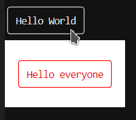

##### 3.2.3.10 设计自定义组件——加载状态

设置组件的`loading`属性（完整用法参考[官网文档](https://textual.textualize.io/api/widget/#textual.widget.Widget.loading)）为`True`时，组件会临时被`LoadingIndicator`组件（完整用法参考[官网文档](https://textual.textualize.io/widgets/loading_indicator/)）代替，用于表示组件正在加载。

示例如下：

```python3
from textual.app import App
from textual.widget import Widget
from rich.panel import Panel
import asyncio

class MyWidget(Widget):
    def render(self):
        return Panel('Hello World',expand=False,height=3)
    
    async def waiting(self):
        await asyncio.sleep(1)
        self.loading = False
        
    def on_mount(self):
        self.loading = True
        self.run_worker(self.waiting)
        

class MyApp(App):
    def on_mount(self):
        self.widgets = [
            MyWidget(),
        ]
        self.mount_all(self.widgets)

if __name__ == '__main__':
    app = MyApp()
    app.run()
```

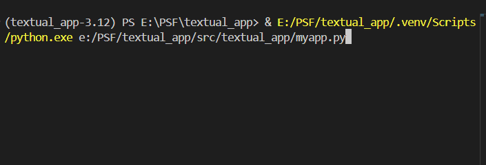

和工具提示类似，想要设置加载状态的样式，只能在`App`子类的CSS中设置：

```python3
from textual.app import App
from textual.widget import Widget
from rich.panel import Panel
import asyncio

class MyWidget(Widget):
    def render(self):
        return Panel('Hello World',expand=False,height=3)
    
    async def waiting(self):
        await asyncio.sleep(1)
        self.loading = False

    def on_mount(self):
        self.loading = True
        self.run_worker(self.waiting)

class MyApp(App):
    CSS = '''
    LoadingIndicator {
        color: red;
    }
    '''
    def on_mount(self):
        self.widgets = [
            MyWidget(),
        ]
        self.mount_all(self.widgets)

if __name__ == '__main__':
    app = MyApp()
    app.run()
```

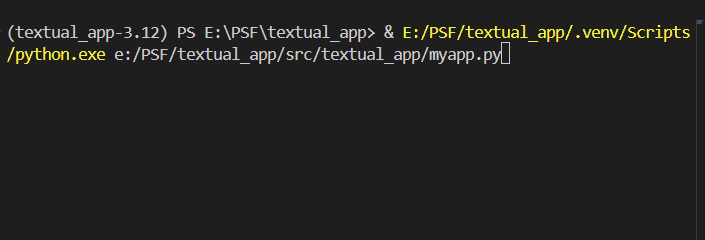

##### 3.2.3.11 设计自定义组件——组合基本组件

将基本组件组合成新的组件，说起来简单，其实用起来也不难，甚至前面都已经有了类似的代码。不过，这里还是简单复习一下，那就是`compose`方法。

在组件中定义`compose`方法，可以像搭建程序一样搭建自定义组件。用法上前面已经有过很多例子和介绍，能学到这里的读者自然也不会陌生，下面就提供一个简单的示例，不做太多解释了：

```python3
from textual.app import App
from textual.widget import Widget
from textual.widgets import Static,Button

class MyWidget(Widget):
    DEFAULT_CSS = """
    MyWidget {
        width: auto;
        height: auto;
    }
    Static {
        width: auto;
        height: auto;
    }
    """
    def compose(self):
        yield Static('Hello World')
        yield Button('Say Hi',variant='success')

class MyApp(App):
    def on_mount(self):
        self.widgets = [
            MyWidget(),
            MyWidget()
        ]
        self.mount_all(self.widgets)

if __name__ == '__main__':
    app = MyApp()
    app.run()
```

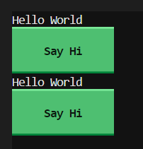

##### 3.2.3.12 基本方法——线性渲染

在介绍自定义组件的入口方法时，提到过`render_line`方法。此方法是线性渲染，可以做到局部刷新。不过，此方法用法比较复杂，有余力的读者可以在阅读教程的同时查阅官网文档，自主学习。对于只是想简单自定义组件或者组合现有组件的需求，可以跳过本节，使用前面介绍的方法即可。

什么是线性渲染？

如下图所示，线性渲染就是将原本完整的组件拆分成一条一条的，也可以说成是一行一行的。对于线性渲染的组件（定义了`render_line`方法的组件）来说，组件在渲染时，会根据相对于组件顶部的纵向坐标（Y坐标），依次渲染该坐标对应的条对象（完整介绍参考[官网文档](https://textual.textualize.io/api/strip/#textual.strip.Strip)）。

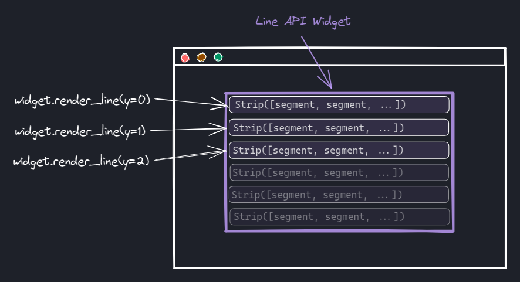

每一个条对象实际上是由多个段对象组成的列表，这也就是为什么线性渲染可以做到局部刷新的原因，本质上刷新的是段对象（完整介绍参考[官网文档](https://rich.readthedocs.io/en/latest/protocol.html#low-level-render)）。

段对象是Rich框架的内容（使用`from rich.segment import Segment`导入），条对象则是Textual控件的内容（使用`from textual.strip import Strip`导入）。在使用时，需要将段对象放到列表中，传递给条对象，才能让`render_line`方法渲染。不过，想要美化段对象，还需要借助Rich框架的样式对象（使用`from rich.style import Style`导入）。

构建一个段对象很简单，第一个参数传入文本内容，第二个参数传入该文本的样式（可以不指定样式），就能得到一个段对象：

```python3
greeting = Segment("Hello, World!", Style(bold=True))
```

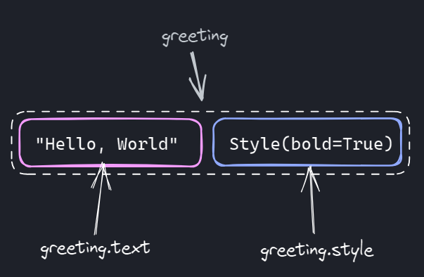

之后就是将该对象放到列表中，并传递给条对象第一个参数，就能正常渲染：

```python3
from textual.app import App
from textual.strip import Strip
from textual.widget import Widget

from rich.segment import Segment
from rich.style import Style

class MyWidget(Widget):
    def render_line(self, y: int):
        if y <= 0:
            greeting = Segment("Hello, World!", Style(bold=True))
            return Strip(
                [
                    greeting
                ]
            )
        else:
            return Strip.blank(self.size.width)

class MyApp(App):
    def on_mount(self):
        self.widgets = [
            MyWidget(),
        ]
        self.mount_all(self.widgets)

if __name__ == '__main__':
    app = MyApp()
    app.run()

```

当然，既然是列表，传入多个段对象，并让每个段对象使用不同的样式，也是没问题的：

```python3
from textual.app import App
from textual.strip import Strip
from textual.widget import Widget

from rich.segment import Segment
from rich.style import Style

class MyWidget(Widget):
    def render_line(self, y: int):
        if y <= 0:
            return Strip(
                [
                    Segment("Hello, "),
                    Segment("World", Style(bold=True)),
                    Segment("!")
                ]
            )
        else:
            return Strip.blank(self.size.width)

class MyApp(App):
    def on_mount(self):
        self.widgets = [
            MyWidget(),
        ]
        self.mount_all(self.widgets)

if __name__ == '__main__':
    app = MyApp()
    app.run()
```

需要注意的是，线性渲染是将整个屏幕当做渲染对象，因此，对于不包含内容的区域，必须返回空白的条对象（`Strip.blank(self.size.width)`）。空白条对象的第一个参数是内容的宽度，必须手动指定。

与之对应的，有内容的条对象的第二个参数是内容的宽度，既可以手动指定，也可以根据内容自动计算宽度。

在介绍后面的内容前，需要先引入一个示例：

```python3
from textual.app import App
from textual.strip import Strip
from textual.widget import Widget

from rich.segment import Segment
from rich.style import Style

class MyWidget(Widget):
    def __init__(self, content:list = None, *children, name = None, id = None, classes = None, disabled = False):
        self.content = content if content else []
        super().__init__(*children, name=name, id=id, classes=classes, disabled=disabled)
    def render_line(self, y: int):
        if y < len(self.content):
            red = Style.parse('red')
            green = Style.parse('green')
            return Strip([Segment(self.content[y], red if y%2 == 0 else green)])
        else:
            return Strip.blank(self.size.width)

class MyApp(App):
    def on_mount(self):
        self.widgets = [
            MyWidget(['hello','world','hello','everyone','hello','sun']),
        ]
        self.mount_all(self.widgets)

if __name__ == '__main__':
    app = MyApp()
    app.run()
```

示例中，创建的自定义组件可以接收一个字符串数组，并遍历该数组，让每个元素显示为一行，根据行数的奇偶，让字体颜色变为红色或者绿色：

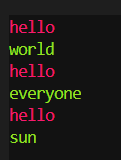

代码中使用了Rich框架的样式对象（使用`from rich.style import Style`导入）设置显示内容的颜色，对于不太熟悉Rich框架或者需要设置更丰富样式的读者来说，这个样式对象还是有点不太方便。

幸好，使用组件实例的`get_component_rich_style`方法（完整用法参考[官网文档](https://textual.textualize.io/api/widget/#textual.widget.Widget.get_component_rich_style)），可以将`COMPONENT_CLASSES`类变量（完整用法参考[官网文档](https://textual.textualize.io/api/dom_node/#textual.dom.DOMNode.COMPONENT_CLASSES)）中注册的样式类转换成Rich样式。在`DEFAULT_CSS`中创建好对应类名选择器应用的样式，可以很方便地修改`render_line`中设置的显示效果。也可以在`App`子类的`CSS`中或者`CSS_PATH`指定的CSS文件中用同名样式类覆盖默认样式。

```python3
from textual.app import App
from textual.strip import Strip
from textual.widget import Widget

from rich.segment import Segment
from rich.style import Style

class MyWidget(Widget):
    COMPONENT_CLASSES = {
        "MyWidget--red-line",
        "MyWidget--green-line",
    }
    DEFAULT_CSS = '''
    .MyWidget--red-line {
        color: ansi_red;
    }
    .MyWidget--green-line {
        color: ansi_green;
    }
    '''
    def __init__(self, content:list = None, *children, name = None, id = None, classes = None, disabled = False):
        self.content = content if content else []
        super().__init__(*children, name=name, id=id, classes=classes, disabled=disabled)
    def render_line(self, y: int):
        if y < len(self.content):
            red = self.get_component_rich_style("MyWidget--red-line")
            green = self.get_component_rich_style("MyWidget--green-line")
            return Strip([Segment(self.content[y], red if y%2 == 0 else green)])
        else:
            return Strip.blank(self.size.width)

class MyApp(App):
    def on_mount(self):
        self.widgets = [
            MyWidget(['hello','world','hello','everyone','hello','sun']),
        ]
        self.mount_all(self.widgets)

if __name__ == '__main__':
    app = MyApp()
    app.run()
```


读者可以复制上面的示例代码，按照需求修改样式，看看运行的效果。

前面说过线性渲染可以更新局部，接下来，就围绕局部刷新功能修改上面的例子，让鼠标下的单个字符高亮，其余位置的字符不变。

首先，局部刷新的前提是每一个部分是独立的。到目前为止，上面的例子只是每一行独立，因为每一行对应的条对象内，将一整个字符串放到一个段对象内，想要刷新单个字符的显示状态，还是要刷新整行才行。因此，修改的第一步，就是把一行的字符串拆分成单个字符，并将单个字符放到段对象内。

```python3
Strip( 
    [ Segment( item, red if y%2 == 0 else green) for item in self.content[y] ]
)
```

因为是要将鼠标下的单个字符高亮，还需要在鼠标移动时获取鼠标当前的位置，并将其存入反应性属性中。这部分相关代码如下：

```python3
class MyWidget(Widget):
    mouse_pos = var(Offset(0, 0))
    def on_mouse_move(self, e: events.MouseMove):
        self.mouse_pos = e.offset
```

获取到鼠标位置之后，需要修改`render_line`方法，让组件渲染时，鼠标位置下的字符使用其他样式。这部分相关代码如下：

```python3
class MyWidget(Widget):
    COMPONENT_CLASSES = {
        "MyWidget--red-line",
        "MyWidget--green-line",
        "MyWidget--mouse-on-line",
    }
    DEFAULT_CSS = '''
    .MyWidget--red-line {
        color: ansi_red;
    }
    .MyWidget--green-line {
        color: ansi_green;
    }
    .MyWidget--mouse-on-line {
        background: blue;
    }
    '''
    def render_line(self, y: int):
        if y < len(self.content):
            red = self.get_component_rich_style("MyWidget--red-line")
            green = self.get_component_rich_style("MyWidget--green-line")
            blue = self.get_component_rich_style(
                "MyWidget--mouse-on-line") if y == self.mouse_pos.y else None
            return Strip(
                segments=[
                    Segment(text=item, style=(index == self.mouse_pos.x and blue)
                            or (red if y % 2 == 0 else green)
                            )
                    for index, item in enumerate(self.content[y])
                ]
            )
        else:
            return Strip.blank(self.size.width)
```

代码中，先是定义了新的样式类`"MyWidget--mouse-on-line"`，并进行转化：

```python3
blue = self.get_component_rich_style("MyWidget--mouse-on-line") if y == self.mouse_pos.y else None
```

注意，此时对鼠标位置的Y坐标进行了对比，只有在鼠标所在行的`blue`变量才不是`None`，相当于匹配了鼠标位置的Y坐标。

对鼠标位置的X坐标的匹配则放到了构建条对象中：

```python3
Strip(
    segments=[
        Segment(
            text=item, 
            style= (index == self.mouse_pos.x and blue) or (red if y % 2 == 0 else green)
        )
        for index, item in enumerate(self.content[y])
    ]
)
```

在构建条对象时，遍历的是枚举对象`enumerate(self.content[y])`，好处是可以在获得每个元素的同时，还能得到该元素的索引值。而索引值在数值上等于该段对象在组件坐标系中的X坐标。因此，可以与鼠标位置的X坐标比较，结合上一步已经匹配的鼠标位置的Y坐标，可以找出鼠标位置下的段对象，让该对象应用的样式是`blue`。

不过，将上面几个修改后的代码组合到一起还不算完成，因为反应性属性用的是`var`，不会触发组件的智能刷新。不过，也不需要触发智能刷新，这里要实现的是局部刷新，触发智能刷新的话就不是局部刷新了。

想要做局部刷新，就需要利用到反应性属性的监视方法：

```python3
def watch_mouse_pos(self, old_pos: Offset, new_pos: Offset):
    old_region = Region(old_pos.x, old_pos.y, 1, 1)
    new_region = Region(new_pos.x, new_pos.y, 1, 1)
    self.refresh(old_region)
    self.refresh(new_region)
```

当反应性属性变化时，可以同时得到当前鼠标位置和之前鼠标位置。通过创建`Region`对象（完整用法参考[官网文档](https://textual.textualize.io/api/geometry/#textual.geometry.Region)），划定出一个字符面积、以鼠标位置为起点的矩形。这样，组件的`refresh`方法就可以只刷新矩形区域，不用刷新整个组件。

最后，将上面的代码合并，得到完整代码：

```python3
from textual.app import App
from textual.strip import Strip
from textual.widget import Widget
from textual import events
from textual.reactive import var
from textual.geometry import Offset, Region

from rich.segment import Segment

class MyWidget(Widget):
    COMPONENT_CLASSES = {
        "MyWidget--red-line",
        "MyWidget--green-line",
        "MyWidget--mouse-on-line",
    }
    DEFAULT_CSS = '''
    .MyWidget--red-line {
        color: ansi_red;
    }
    .MyWidget--green-line {
        color: ansi_green;
    }
    .MyWidget--mouse-on-line {
        background: blue;
    }
    '''
    mouse_pos = var(Offset(0, 0))

    def __init__(self, content: list = None, *children, name=None, id=None, classes=None, disabled=False):
        self.content = content if content else []
        super().__init__(*children, name=name, id=id, classes=classes, disabled=disabled)

    def on_mouse_move(self, e: events.MouseMove):
        self.mouse_pos = e.offset

    def watch_mouse_pos(self, old_pos: Offset, new_pos: Offset):
        old_region = Region(old_pos.x, old_pos.y, 1, 1)
        new_region = Region(new_pos.x, new_pos.y, 1, 1)
        self.refresh(old_region)
        self.refresh(new_region)

    def render_line(self, y: int):
        if y < len(self.content):
            red = self.get_component_rich_style("MyWidget--red-line")
            green = self.get_component_rich_style("MyWidget--green-line")
            blue = self.get_component_rich_style(
                "MyWidget--mouse-on-line") if y == self.mouse_pos.y else None
            return Strip(
                segments=[
                    Segment(text=item, style=(index == self.mouse_pos.x and blue)
                            or (red if y % 2 == 0 else green)
                            )
                    for index, item in enumerate(self.content[y])
                ]
            )
        else:
            return Strip.blank(self.size.width)

class MyApp(App):
    def on_mount(self):
        self.widgets = [
            MyWidget(['hello', 'world', 'hello', 'everyone', 'hello', 'sun']),
        ]
        self.mount_all(self.widgets)

if __name__ == '__main__':
    app = MyApp()
    app.run()
```

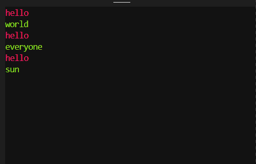

上面的示例在实际使用的时候，其实很容易遇到一个问题：如果内容太多，超过终端大小，是没法让内容滚动显示的。

将上面示例中`App`子类的部分改成如下代码：

```python3
class MyApp(App):
    def on_mount(self):
        self.widgets = [
            MyWidget(
                content=['hello', 'world', 'hello',
                         'everyone', 'hello', 'sun'*100]*10),
        ]
        self.mount_all(self.widgets)
```

就会看到显示出来的组件是固定不动的，横向、纵向的其余内容没法滚动显示。

如果想要让这种内容大小远超可显示区域的组件，可以滚动显示，简单一点的方法就是让组件本身的宽度和高度设置为自动，并实现组件的`get_content_height`方法和`get_content_width`方法。这样，组件的内容就会直接扩展到真实内容的大小。接下来要做的，就是将这个组件，放到可滚动的容器中，比如`ScrollableContainer`（使用`from textual.containers import ScrollableContainer`导入）。完整代码如下：

```python3
from textual.app import App
from textual.strip import Strip
from textual.widget import Widget
from textual.containers import ScrollableContainer
from textual import events
from textual.reactive import var
from textual.geometry import Offset, Region

from rich.segment import Segment

class MyWidget(Widget):
    COMPONENT_CLASSES = {
        "MyWidget--red-line",
        "MyWidget--green-line",
        "MyWidget--mouse-on-line",
    }
    DEFAULT_CSS = '''
    .MyWidget--red-line {
        color: ansi_red;
    }
    .MyWidget--green-line {
        color: ansi_green;
    }
    .MyWidget--mouse-on-line {
        background: blue;
    }
    MyWidget {
        width: auto;
        height: auto;
    }
    '''
    mouse_pos = var(Offset(0, 0))

    def __init__(self, content: list = None, *children, name=None, id=None, classes=None, disabled=False):
        self.content = content if content else []
        super().__init__(*children, name=name, id=id, classes=classes, disabled=disabled)

    def get_content_width(self, container, viewport):
        return len(max(self.content,key=len))
    
    def get_content_height(self, container, viewport, width):
        return len(self.content)
    
    def on_mouse_move(self, e: events.MouseMove):
        self.mouse_pos = e.offset

    def watch_mouse_pos(self, old_pos: Offset, new_pos: Offset):
        old_region = Region(old_pos.x, old_pos.y, 1, 1)
        new_region = Region(new_pos.x, new_pos.y, 1, 1)
        self.refresh(old_region)
        self.refresh(new_region)

    def render_line(self, y: int):
        if y < len(self.content):
            red = self.get_component_rich_style("MyWidget--red-line")
            green = self.get_component_rich_style("MyWidget--green-line")
            blue = self.get_component_rich_style(
                "MyWidget--mouse-on-line") if y == self.mouse_pos.y else None
            return Strip(
                segments=[
                    Segment(text=item, style=(index == self.mouse_pos.x and blue)
                            or (red if y % 2 == 0 else green)
                            )
                    for index, item in enumerate(self.content[y])
                ]
            )
        else:
            return Strip.blank(self.size.width)

class MyApp(App):
    def on_mount(self):
        self.widgets = [
            ScrollableContainer(
            MyWidget(
                content=['hello', 'world', 'hello',
                         'everyone', 'hello', 'sun'*100]*10))
        ]
        self.mount_all(self.widgets)

if __name__ == '__main__':
    app = MyApp()
    app.run()
```

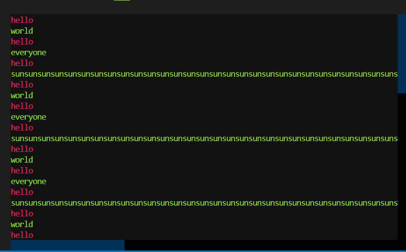

当然，这种借助其他容器组件的方法很简单，但要是能实现线性刷新的同时，组件本身就支持滚动显示就更好了。

这个时候，就需要请出`ScrollView`组件（使用`from textual.scroll_view import ScrollView`导入，完整用法参考[官网文档](https://textual.textualize.io/api/scroll_view/#textual.scroll_view.ScrollView)）。

通过继承`ScrollView`组件，就可以让自定义组件支持滚动显示。

但是，在将组件改造之前，需要先了解一下Textual中滚动显示内容的原理。

`ScrollView`组件有一个`virtual_size` 属性（`Size`类型，一个可以表示几何元素的宽度高度的命名元组，有`width`和`height`两个属性），表示实际完整内容的大小，远大于组件能展示的大小。因此，滚动显示内容，实际上是把组件能展示的大小当做窗口，移动这个窗口而已。默认这个窗口就在完整内容的左上角，当滚动显示时，这个窗口会向下向右移动，就能会产生一个偏移坐标`scroll_offset`（`Offset`类型的命名元组），用来表示窗口相对于完整内容的原点，各个方向上移动了多少距离。对应关系可以参考下图：

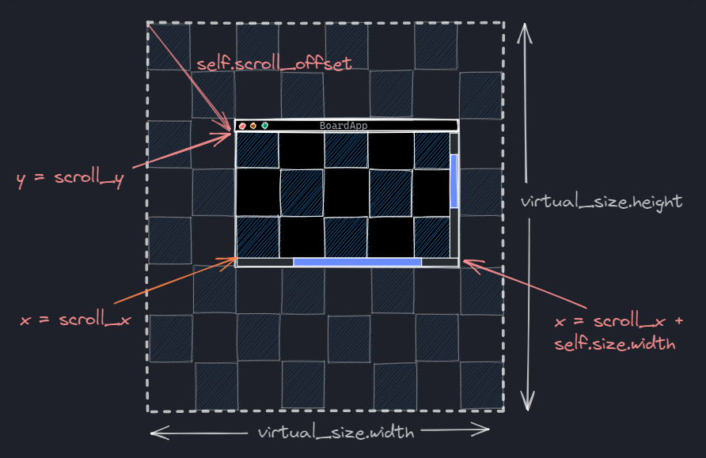

因此，想要让上面自定义组件支持滚动显示，光是将被继承类从`Widget`改成`ScrollView`可不够，还要正确设置`virtual_size` 属性，以及让原本是针对固定大小组件设计的代码，考虑到滚动显示之后产生的偏移。

`virtual_size` 属性很好设置，上面容器版代码中，计算了真实内容的大小，只需将两个值构建为`Size`对象即可：

```python3
self.virtual_size = Size(
    width = len(max(self.content, key=len)),
    height = len(self.content)
)
```

至于滚动显示的偏移带来的影响，细细思考的话就会发现，真正影响的只有`render_line`方法。前面代码中，获取到的鼠标位置是相对于组件原点的位置，刷新的区域也是基于组件原点而已。因此，局部刷新的代码完全不需要动。

但是，线性渲染的方法是基于组件原点的坐标系，假如内容已经滚动显示，这时的线性渲染得到坐标应该加上偏移坐标，才是真实渲染内容的坐标。要是不加偏移坐标的话，就会变成内容完全不动。

思路就是这样，下面开始改造每一处需要添加偏移坐标的代码。

首先是获取偏移坐标。拆包组件的`scroll_offset`属性，就能得到偏移坐标的X坐标和Y坐标：

```python3
scroll_x, scroll_y = self.scroll_offset
```

因为线性渲染的起点变化，组件Y坐标的起点要变成偏移之后实际内容的Y坐标，所以要给传入的Y坐标加上Y方向的偏移。而原本判断鼠标位置Y坐标来决定是否将鼠标位置下内容的样式改变的代码，也不能忘了加上偏移。代码如下：

```python3
y += scroll_y
blue = self.get_component_rich_style("MyWidget--mouse-on-line") if y == (self.mouse_pos.y + scroll_y) else None
```

最关键的部分来了，构建条对象的代码要如何修改。

原本判断鼠标位置X坐标的代码，加上X方向的偏移，这个没什么难点。但是，实际内容已经横向滚动之后，想要让渲染的内容随着X方向的移动，从偏移处开始渲染，那就要使用数组切片，将段对象列表的偏移位置前的部分去掉，使得偏移位置的段对象成为每个条对象中X方向上的第一个段对象：

```python3
Strip(
    segments=[
        Segment(
            text=item,
            style=(index == (self.mouse_pos.x + scroll_x) and blue)
            or (red if y % 2 == 0 else green)
        )
        for index, item in enumerate(self.content[y])
    ][scroll_x:]
)
```

当然，条对象还支持使用`crop`方法（完整用法参考[官网文档](https://textual.textualize.io/api/strip/#textual.strip.Strip.crop)）裁剪条对象，生成新的条对象。该方法的两个参数分别表示起始位置和结束位置，只需将偏移坐标的X坐标、偏移坐标的X坐标加上组件宽度分别传入，也能实现同样的效果：

```python3
Strip(
    segments=[
        Segment(
            text=item,
            style=(index == (self.mouse_pos.x + scroll_x) and blue)
            or (red if y % 2 == 0 else green)
        )
        for index, item in enumerate(self.content[y])
    ]
).crop(scroll_x, scroll_x + self.size.width)
```

完事具备，将上面的代码组成完整代码，结果如下：

```python3
from textual.app import App
from textual.strip import Strip
from textual.scroll_view import ScrollView
from textual import events
from textual.reactive import var
from textual.geometry import Offset, Region, Size

from rich.segment import Segment

class MyWidget(ScrollView):
    COMPONENT_CLASSES = {
        "MyWidget--red-line",
        "MyWidget--green-line",
        "MyWidget--mouse-on-line",
    }
    DEFAULT_CSS = '''
    .MyWidget--red-line {
        color: ansi_red;
    }
    .MyWidget--green-line {
        color: ansi_green;
    }
    .MyWidget--mouse-on-line {
        background: blue;
    }
    '''
    mouse_pos = var(Offset(0, 0))

    def __init__(self, content: list = None):
        super().__init__()
        self.content = content if content else []
        self.virtual_size = Size(
            width=len(max(self.content, key=len)),
            height=len(self.content)
        )

    def on_mouse_move(self, e: events.MouseMove):
        self.mouse_pos = e.offset

    def watch_mouse_pos(self, old_pos: Offset, new_pos: Offset):
        old_region = Region(old_pos.x, old_pos.y, 1, 1)
        new_region = Region(new_pos.x, new_pos.y, 1, 1)
        self.refresh(old_region)
        self.refresh(new_region)

    def render_line(self, y: int):
        scroll_x, scroll_y = self.scroll_offset
        y += scroll_y
        if y < len(self.content):
            red = self.get_component_rich_style("MyWidget--red-line")
            green = self.get_component_rich_style("MyWidget--green-line")
            blue = self.get_component_rich_style(
                "MyWidget--mouse-on-line") if y == (self.mouse_pos.y + scroll_y) else None
            return Strip(
                segments=[
                    Segment(
                        text=item,
                        style=(index == (self.mouse_pos.x + scroll_x) and blue)
                        or (red if y % 2 == 0 else green)
                    )
                    for index, item in enumerate(self.content[y])
                ]
            ).crop(scroll_x, scroll_x + self.size.width)
        else:
            return Strip.blank(self.size.width)

class MyApp(App):
    def on_mount(self):
        self.widgets = [
            MyWidget(
                content=['hello', 'world', 'hello',
                         'everyone', 'hello', 'sun'*100]*10),
        ]
        self.mount_all(self.widgets)

if __name__ == '__main__':
    app = MyApp()
    app.run()
```


学习完线性渲染的教程之后，要是还觉得意犹未尽，可以看看以下几个内置的组件的源代码，它们也是使用了线性渲染：

-   [DataTable](https://github.com/Textualize/textual/blob/main/src/textual/widgets/_data_table.py)
-   [RichLog](https://github.com/Textualize/textual/blob/main/src/textual/widgets/_rich_log.py)
-   [Tree](https://github.com/Textualize/textual/blob/main/src/textual/widgets/_tree.py)

受限于篇幅，如果读者有兴趣，可以点开它们的源代码，研究一下官方是怎么处理组件的交互，本教程就不做过多展开了。

#### 3.2.4 屏幕

##### 3.2.4.1 什么是屏幕

教程直到现在一直都没有详细介绍过屏幕组件，但很多示例中又离不开。这也带来了一些难以解释的问题：

-   为什么要在屏幕组件下挂载组件？
-   屏幕组件有什么用？

想要解释屏幕组件的作用，需要先了解屏幕组件的特性。不同于一般的组件可以设置大小，屏幕组件始终填满当前终端，其大小也就终端的大小。虽然一个程序可以像拥有多个组件一样有多个屏幕，但每次只能并且必须激活一个屏幕。所以，程序至少要有一个屏幕组件，这也是为什么默认在不创建额外屏幕组件的情况下，程序里挂载的组件，都是挂载到默认的屏幕组件下。

Textual为什么要设计一个屏幕组件呢？原来，Textual为了方便实现多任务切换或者多窗口的效果，专门设计了保存组件布局的屏幕组件。这样的话，切换当前屏幕时，可以呈现出一个程序显示不同界面布局的效果。实际上，后面会介绍的命令面板，就是使用屏幕组件实现的。

##### 3.2.4.2 创建与注册屏幕

想要使用自定义的屏幕组件很简单，创建时只需继承`Screen`类（使用`from textual.screen import Screen`导入），这个自定义屏幕类就基本可以像自定义的`App`子类一样使用：挂载组件，设计样式等。

代码很简单，代码中使用的动作`'screen.dismiss'`可以将当前屏幕关闭（完整介绍参考[官网文档](https://textual.textualize.io/api/screen/#textual.screen.Screen.action_dismiss)）：

```python3
from textual.screen import Screen
from textual.widgets import Static,Button

class Welcome(Screen):
    def on_mount(self):
        self.widgets = [
            Static('Welcome'),
            Button('Exit',action='screen.dismiss')    
        ]
        self.mount_all(self.widgets)
```

看起来确实和创建`App`子类很像，不过，想要让当前程序使用自定义的屏幕组件，还是需要在真正的`App`子类中进行。

最简单的加载方法是调用`App`子类实例的`push_screen`方法（完整用法参考[官网文档](https://textual.textualize.io/api/app/#textual.app.App.push_screen)）：给该方法传入自定义屏幕组件类的实例对象，就可以让当前程序使用该屏幕组件。

完整代码如下：

```python3
from textual.app import App
from textual.screen import Screen
from textual.widgets import Static,Button

class Welcome(Screen):
    def on_mount(self):
        self.widgets = [
            Static('Welcome'),
            Button('Exit',action='screen.dismiss')
        ]
        self.mount_all(self.widgets)
        
class MyApp(App):
    def on_mount(self):
        self.widgets = [
            Static('App'),
        ]
        self.mount_all(self.widgets)
        self.push_screen(Welcome())
        
if __name__ == '__main__':
    app = MyApp()
    app.run()
```

这样就实现了一个简单的欢迎屏幕：

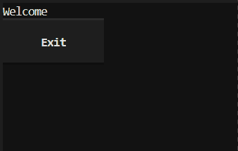

除了给`push_screen`方法传入自定义屏幕组件类的实例，还可以给该方法传入注册好的屏幕组件的名字。只需在`App`子类内定义`SCREENS`类变量，该变量对应的是一个字典，字典的键就是字符串类型的屏幕组件名字，可以随意定义；键对应的值是可调用类型的任意对象，该对象在执行时返回屏幕组件实例（可以是类名，也可以将屏幕组件当做lambda表达式或者函数的返回值）。定义好字典，对应名字的屏幕组件就会自动注册，可以在后面使用屏幕组件时使用字符串名字。

这样，就可以给`push_screen`方法传入注册好的屏幕组件的名字：

```python3
from textual.app import App
from textual.screen import Screen
from textual.widgets import Static,Button

class Welcome(Screen):
    def on_mount(self):
        self.widgets = [
            Static('Welcome'),
            Button('Exit',action='screen.dismiss')  
        ]
        self.mount_all(self.widgets)
        
class MyApp(App):
    SCREENS = {'welcome':Welcome}
    def on_mount(self):
        self.widgets = [
            Static('App'),
        ]
        self.mount_all(self.widgets)
        self.push_screen('welcome')
        
if __name__ == '__main__':
    app = MyApp()
    app.run()
```

这就是静态注册的方法，想要动态注册、取消注册的话，可以看看下一节介绍的内容。

##### 3.2.4.3 使用屏幕——安装与卸载

虽然屏幕组件不注册也能使用，但注册之后可以更方便有序地使用，就好像组件的布局是已经确定和设计好的，而不是全部为动态加载一样。

说到动态加载，就不得不提到挂载组件的方法`mount`。该方法可以让组件在需要的时候出现在屏幕中。

其实屏幕也支持类似的挂载方法，那就是安装方法——`install_screen`方法。这样，即便屏幕名字没有定义在`SCREENS`类变量中，可以使用该方法动态注册。该方法支持两个必需的参数：

-   `screen`参数，屏幕组件类或者屏幕组件类的实例均可，表示要注册的屏幕组件。
-   `name`参数，字符串类型，表示该屏幕组件注册的屏幕名字。注意，准备注册的屏幕名字不能与之前注册的屏幕名字重复。

注意，每个屏幕组件类、屏幕名字只能注册一次，不能将一个屏幕组件类、屏幕名字注册多次。比如，已经使用`self.install_screen(screen=Welcome,name='welcome')`注册之后，即使使用不同的屏幕名字注册，比如`self.install_screen(screen=Welcome,name='welcome2')`，也会报错。因为后面的卸载方法可以使用类名卸载，所以这里的类名或者屏幕名字都是其独特性判断的依据，都会被判断为同一个屏幕组件。但是，在`SCREENS`类变量中注册则没有此限制，可以使用不同的屏幕名字注册同一个组件类，在卸载时会有问题，后面将细讲。

如果想要用同一屏幕组件类正确注册多个名字，或者屏幕组件类在实例化时需要传入一些初始化参数，可以在注册时用屏幕组件类的实例代替屏幕组件类，比如：

```python3
SCREENS = {'welcome':lambda :Welcome(classes='welcome')}
# 或者
self.install_screen(screen=Welcome(classes='welcome'),name='welcome')
```

但这样注册的屏幕组件在卸载时只能传入屏幕名字才能成功卸载，具体可以看卸载时的注意事项，这里不做展开介绍。

安装方法的完整代码如下：

```python3
from textual.app import App
from textual.screen import Screen
from textual.widgets import Static,Button

class Welcome(Screen):
    def on_mount(self):
        self.widgets = [
            Static('Welcome'),
            Button('Exit',action='screen.dismiss')   
        ]
        self.mount_all(self.widgets)
        
class MyApp(App):
    def on_mount(self):
        self.widgets = [
            Static('App'),
        ]
        self.mount_all(self.widgets)
        self.install_screen(screen=Welcome,name='welcome')
        self.push_screen('welcome')
        
if __name__ == '__main__':
    app = MyApp()
    app.run()
```

有安装就有卸载，卸载方法是`uninstall_screen`方法，只需传入已经注册的名字或者自定义屏幕类的类名（一般不推荐），就可以卸载对应的屏幕组件。卸载方法会在成功卸载时返回屏幕名字，不成功返回`None`。已经放入屏幕堆叠中的屏幕（用前面介绍过的方法类比的话，可以理解为使用了`push_screen`方法显示的屏幕组件，下一节会细讲屏幕堆叠）不能卸载，可能会触发异常。

需要注意的是，如果屏幕组件在注册（设置`SCREENS`类变量或者使用`install_screen`方法）时，名字对应的屏幕组件使用的不是屏幕组件类，而是屏幕组件类的实例，比如下面代码中所示的注册代码：

```python3
SCREENS = {'welcome':lambda :Welcome()}
# 或者
self.install_screen(screen=Welcome(),name='welcome')
```

这样的话，使用卸载方法时，只能传入屏幕名字`self.uninstall_screen('welcome')`，不然会卸载失败（返回`None`）。

还有就是前面提到卸载已经放入屏幕堆叠会触发异常，但在上面提到的情况下，给卸载方法传入屏幕组件类则不会触发异常。不过，即使没有触发异常，也不推荐这样操作。

假如在注册屏幕组件时的类变量中，使用不同屏幕名字注册了同一个屏幕组件类，比如这样：

```python3
SCREENS = {'welcome1':Welcome,'welcome2':Welcome,'welcome3':Welcome}
```

虽然注册时候不会出问题，但在卸载时，如果是给卸载方法传入了自定义屏幕类的类名，则会按照字典的顺序，卸载第一个没有放入屏幕堆叠的屏幕，并不会卸载所有同类的屏幕组件类。

因此，非常建议读者在使用卸载方法时，尽量使用屏幕名字，不推荐使用自定义屏幕类的类名，这样可以避免卸载失败和产生不可预期的结果（没有正常触发异常或者没有按照预期正确卸载屏幕组件）。

##### 3.2.4.4 使用屏幕——屏幕堆叠

本节的名字中，提到了一个新名词——屏幕堆叠，那是Textual程序内部维护、用来处理多个屏幕组件的对象，以便于同时存在多个屏幕组件时，正确处理屏幕切换的逻辑。假如把屏幕当成一张纸，这个屏幕堆叠就好像把一堆纸摞起来，只能看见最上面的纸（不绝对，如果学了后面的屏幕透明度，可以让当前屏幕的背景变透明），只能在最上面的纸上写写画画。

和在系统中切换、创建多个窗口相比，Textual处理屏幕组件的方式有一点不同，下面就针对每种操作屏幕组件的方法，一一讲解。

`push_screen`方法（完整用法参考[官网文档](https://textual.textualize.io/api/app/#textual.app.App.push_screen)）和`app.push_screen`动作可以在当前屏幕上叠加一个新的屏幕，新的屏幕会被放在最上面，原先在下面的屏幕会保留，如下图所示：

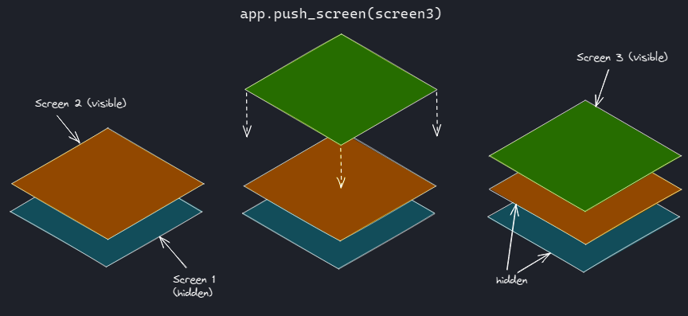

前面使用此方法显示自定义的屏幕，实际上是把自定义的屏幕叠加到默认屏幕之上。需要注意的是，本方法只能在原有的屏幕堆叠上增加新的屏幕，没法将已经在堆叠中的屏幕抽出来放到上面。

`pop_screen`方法（完整用法参考[官网文档](https://textual.textualize.io/api/app/#textual.app.App.pop_screen)）和`app.pop_screen`动作可以将屏幕堆叠最上方的屏幕移除，并激活被移除屏幕下的屏幕，作用如下图所示：

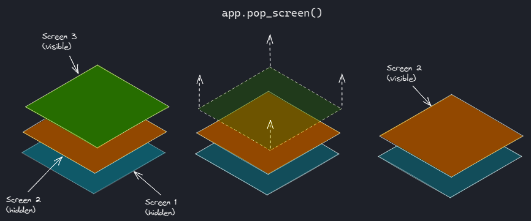

此方法不需要参数，只能移除最上面的屏幕。如果被移除的屏幕没有注册，移除之后，被移除的屏幕将被永久删除，一些在屏幕中保存的数据、状态也不会保留。

`switch_screen`方法（完整用法参考[官网文档](https://textual.textualize.io/api/app/#textual.app.App.switch_screen)）和`app.switch_screen`动作可以将屏幕堆叠最上方的屏幕移除，替换为指定的屏幕，作用如下图所示：

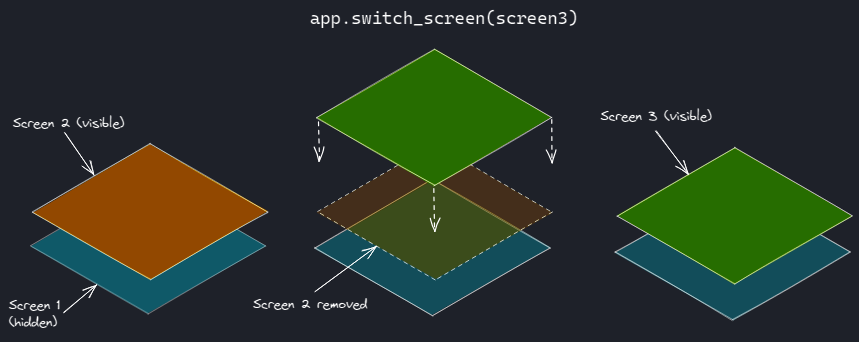

因为涉及到移除，因此移除时与`pop_screen`方法一样，被移除的屏幕将被永久删除，一些在屏幕中保存的数据、状态也不会保留。

##### 3.2.4.5 使用屏幕——屏幕透明度与模态屏幕（模态窗口）

如果在`App`子类中，使用CSS给`Screen`类的背景颜色设定了透明度，则可以透过最上面的屏幕，看到下面屏幕的组件：

```python3
from textual.app import App
from textual.screen import Screen
from textual.widgets import Static,Button
from textual.containers import Middle

class Welcome(Screen):
    CSS = '''
    Welcome {
        align: center middle;
    }
    Middle {
        border: solid yellow;
        height: auto;
    }
   '''
    def on_mount(self):
        self.widgets = [
            Middle(
                Static('Welcome'),
                Button('Exit',action='screen.dismiss')  
            ) 
        ]
        self.mount_all(self.widgets)
        
class MyApp(App):
    SCREENS = {'welcome':Welcome}
    CSS = '''
    Screen {
        background: $background 60%;
    }
    '''
    def on_mount(self):
        self.widgets = [
            Static('App'),
        ]
        self.mount_all(self.widgets)
        self.push_screen('welcome')
        
if __name__ == '__main__':
    app = MyApp()
    app.run()
```

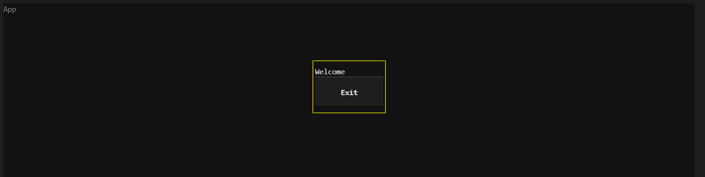

不过，虽然能看到下面屏幕的组件，但实际上可以操作的依然只有当前屏幕的组件。这个情况看上去就好像Windows窗口中常用的模态窗口：一种强制在当前屏幕显示的窗口，虽然能看到下面的窗口，但只有当前窗口可以操作。

在Textual中，通过设置屏幕的背景透明度可以实现类似效果，但上面代码的效果会影响到每个自定义屏幕组件。要想让一个屏幕组件成为独立的模态组件，而不影响其他屏幕组件，则要把样式放到屏幕组件类内部：

```python3
from textual.app import App
from textual.screen import Screen
from textual.widgets import Static,Button
from textual.containers import Middle

class Welcome(Screen):
    CSS = '''
    Welcome {
        align: center middle;
    }
    Middle {
        border: solid yellow;
        height: auto;
    }
    Welcome {
        background: $background 60%;
    }
   '''
    def on_mount(self):
        self.widgets = [
            Middle(
                Static('Welcome'),
                Button('Exit',action='screen.dismiss')  
            ) 
        ]
        self.mount_all(self.widgets)
        
class MyApp(App):
    SCREENS = {'welcome':Welcome}
    def on_mount(self):
        self.widgets = [
            Static('App'),
        ]
        self.mount_all(self.widgets)
        self.push_screen('welcome')
        
if __name__ == '__main__':
    app = MyApp()
    app.run()
```

但是，上面的代码并非真的实现了一个效果和模态窗口一样的屏幕——模态屏幕，只是看起来像而已。想要真正实现一个模态屏幕，还是要使用Textual内部定义好的`ModalScreen`（使用`from textual.screen import ModalScreen`导入）：

```python3
from textual.app import App
from textual.screen import ModalScreen
from textual.widgets import Static,Button
from textual.containers import Middle

class Welcome(ModalScreen):
    CSS = '''
    Welcome {
        align: center middle;
    }
    Middle {
        border: solid yellow;
        height: auto;
    }
   '''
    def on_mount(self):
        self.widgets = [
            Middle(
                Static('Welcome'),
                Button('Exit',action='screen.dismiss')  
            ) 
        ]
        self.mount_all(self.widgets)
        
class MyApp(App):
    SCREENS = {'welcome':Welcome}
    def on_mount(self):
        self.widgets = [
            Static('App'),
        ]
        self.mount_all(self.widgets)
        self.push_screen('welcome')
        
if __name__ == '__main__':
    app = MyApp()
    app.run()
```

那么问题来了：前面修改屏幕背景透明度模拟的模态屏幕，和这个真正的模态屏幕相比，有什么区别？

区别在于，如果安装、注册、创建屏幕时全不屏幕组件类的实例。那么，使用真正的模态屏幕时，在当前屏幕堆叠中只能同时存在一个模态屏幕，模拟的模态屏幕则没有此限制。

因此，在这种情况下，需要使用一些检查代码来确保当前屏幕堆叠中只能同时存在一个同类的模态屏幕：

```python3
from textual.app import App
from textual.screen import Screen
from textual.screen import ModalScreen
from textual.widgets import Static,Button
from textual.containers import Middle

class WelcomeModal(ModalScreen):
    CSS = '''
    WelcomeModal {
        align: center middle;
    }
    Middle {
        border: solid yellow;
        height: auto;
    }
   '''
    def on_mount(self):
        self.widgets = [
            Middle(
                Static('Welcome'),
                Button('Exit',action='screen.dismiss')  
            ) 
        ]
        self.mount_all(self.widgets)

class Welcome(Screen):
    CSS = '''
    Welcome {
        align: center middle;
    }
    Middle {
        border: solid yellow;
        height: auto;
    }
   '''
    def on_mount(self):
        self.widgets = [
            Middle(
                Static('Welcome'),
                Button('Exit',action='screen.dismiss')  
            ) 
        ]
        self.mount_all(self.widgets)
        
class MyApp(App):
    SCREENS = {'welcome':Welcome,'welcome_modal':WelcomeModal}
    def key_q(self):
        self.push_screen('welcome')
    def key_w(self):
        if any(isinstance(screen,WelcomeModal) for screen in self.screen_stack):
            return
        self.push_screen('welcome_modal')
    def on_mount(self):
        self.widgets = [
            Static('App'),
        ]
        self.mount_all(self.widgets)
        
if __name__ == '__main__':
    app = MyApp()
    app.run()
```

代码中，使用`q`键创建普通屏幕，使用`w`键创建模态屏幕。这段代码就是检查代码：

```python3
if any(isinstance(screen,WelcomeModal) for screen in self.screen_stack):
    return
```

如果不检查就重复创建模态屏幕，会引起`RecursionError: maximum recursion depth exceeded`异常，并导致程序退出。

##### 3.2.4.6 使用屏幕——返回数据

一般来说，使用模态窗口时，主要是为了让用户专注于模态窗口的内容，让用户做出必要的选择，程序根据用户的选择得到相应的数据。因此，只是创建模态屏幕，不能得到用户选择的数据，而是修改全局变量来传递数据的话，模态屏幕用起来就没那么顺手了。

为了解决数据传递的问题，就需要引入新的参数和功能。不过，在学习之前，先来构建一下场景。为了避免无关的代码影响学习，这里只创建了模态屏幕组件类。当在程序中按下`w`键，会弹出一个模态屏幕，询问用户要切换到什么身份——普通用户还是管理员。同时，为了方便用户不想切换身份而直接退出，还在模态屏幕组件类内添加了一个按下`esc`键关闭屏幕的按键响应。完整代码如下：

```python3
from textual.app import App
from textual.screen import ModalScreen
from textual.widgets import Static,Button
from textual.containers import Middle

class SwitchUser(ModalScreen):
    CSS = '''
    SwitchUser {
        align: center middle;
    }
    Middle {
        border: solid yellow;
        height: auto;
    }
   '''
    def on_mount(self):
        self.widgets = [
            Middle(
                Static('SwitchUser'),
                Button('Admin',action='screen.dismiss'),
                Button('Guest',action='screen.dismiss'),
            ) 
        ]
        self.mount_all(self.widgets)
    def key_escape(self):
        self.dismiss()
        
class MyApp(App):
    SCREENS = {'switch_user':SwitchUser}
    def key_w(self):
        if any(isinstance(screen,SwitchUser) for screen in self.screen_stack):
            return
        self.push_screen('switch_user')
    def on_mount(self):
        self.widgets = [
            Static('Hello,user!'),
        ]
        self.mount_all(self.widgets)
        
if __name__ == '__main__':
    app = MyApp()
    app.run()
```

在模态屏幕组件类中，设计了两个按钮，分别对应着要切换的身份。但是，上面的代码中，两个按钮执行的动作是一样的，因此，切换功能实际上没有真的实现。

想要让切换身份的功能有效，必须要让两个按钮点击之后、模态屏幕返回的数据不同。这就不得不介绍一下`dismiss`方法（完整用法参考[官网文档](https://textual.textualize.io/api/screen/#textual.screen.Screen.dismiss)）的参数`result`（默认为`None`）。在使用`dismiss`方法退出屏幕时，可以给此方法传入任意值，该值就会成为屏幕的返回数据。

模态屏幕组件类的代码修改如下：

```python3
class SwitchUser(ModalScreen):
    CSS = '''
    SwitchUser {
        align: center middle;
    }
    Middle {
        border: solid yellow;
        height: auto;
    }
   '''
    def on_mount(self):
        self.widgets = [
            Middle(
                Static('SwitchUser'),
                Button('Admin',action='screen.dismiss("admin")'),
                Button('Guest',action='screen.dismiss("guest")'),
            ) 
        ]
        self.mount_all(self.widgets)
    def key_escape(self):
        self.dismiss()
```

模态屏幕组件类代码完成，接下来就是到`App`子类里，接收并处理返回数据。

想要接收返回数据，需要先学习一下`push_screen`方法（完整用法参考[官网文档](https://textual.textualize.io/api/app/#textual.app.App.push_screen)）的所有参数。前面只是使用了该方法的第一个参数，然而，该方法的第二个参数，也一样有用。

`push_screen`方法支持三个参数：

-   `screen`参数，屏幕组件类或者屏幕组件类的实例均可，表示要叠加在当前屏幕堆叠最上面的屏幕组件。
-   `callback`参数，可调用类型，表示屏幕组件在调用`dismiss`方法关闭之后，调用该参数所表示的函数，并将`dismiss`方法的`result`参数传给该函数。
-   `wait_for_dismiss`参数，布尔类型，默认为`False`。当此参数为`False`时，表示使用`await`异步等待`push_screen`方法，得到的是屏幕加载完毕；当此参数为`True`时，表示使用`await`异步等待`push_screen`方法，得到的是`dismiss`方法的`result`参数的值。注意，此参数只有在让工人对象运行`push_screen`方法（或者工人对象运行的函数中运行`push_screen`方法）时才能设置为`True`。

根据上面参数的作用，想要实现需要的效果，只需给`push_screen`方法的`callback`参数，传入一个接收返回数据的函数，并在函数中处理返回数据即可。`App`子类的代码修改如下：

```python3
class MyApp(App):
    SCREENS = {'switch_user':SwitchUser}
    user_type = 'user'
    
    def key_w(self):
        if any(isinstance(screen,SwitchUser) for screen in self.screen_stack):
            return
        
        def update(result=None):
            self.user_type = result or self.user_type
            self.query_one(Static).update(f'Hello,{self.user_type}!')
            
        self.push_screen(screen='switch_user',callback=update)
    def on_mount(self):
        self.widgets = [
            Static('Hello,user!'),
        ]
        self.mount_all(self.widgets)
```

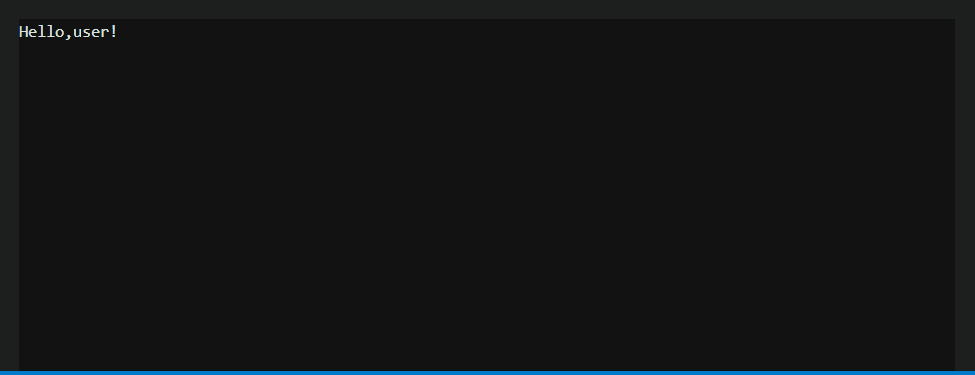

当然，如果不想使用`callback`参数，想要将`wait_for_dismiss`参数设置为`True`，让`push_screen`方法直接返回数据，则需要将`push_screen`方法放到工人运行的函数中。修改很简单，只需用`work`装饰上层的`key_w`函数。`App`子类的代码修改如下：

```python3
from textual import work

class MyApp(App):
    SCREENS = {'switch_user':SwitchUser}
    user_type = 'user'
    
    @work
    async def key_w(self):
        if any(isinstance(screen,SwitchUser) for screen in self.screen_stack):
            return
        
        def update(result=None):
            self.user_type = result or self.user_type
            self.query_one(Static).update(f'Hello,{self.user_type}!')
            
        update(await self.push_screen(screen='switch_user',wait_for_dismiss=True))
```

其实，一般实现上面代码的效果，不需要单独修改`wait_for_dismiss`参数。因为参数为`True`的话，必须放到工人对象中运行，与参数为`False`时的代码不一样。因此，遇到类似情况时，可以使用`push_screen_wait`方法（完整用法参考[官网文档](https://textual.textualize.io/api/app/#textual.app.App.push_screen_wait)）代替`push_screen`方法，无需特别关注`wait_for_dismiss`参数：

```python3
from textual import work
class MyApp(App):
    SCREENS = {'switch_user':SwitchUser}
    user_type = 'user'
    
    @work
    async def key_w(self):
        if any(isinstance(screen,SwitchUser) for screen in self.screen_stack):
            return
        
        def update(result=None):
            self.user_type = result or self.user_type
            self.query_one(Static).update(f'Hello,{self.user_type}!')
            
        update(await self.push_screen_wait(screen='switch_user'))
```

##### 3.2.4.7 使用屏幕——模式

使用屏幕堆叠固然方便，切换屏幕也很容易。但是，有些时候用户需要不止是一个屏幕堆叠，而是多个屏幕堆叠。换句话说，用户想要记录下好几个屏幕堆叠。可是，Textual实现的屏幕堆叠只有一个，如何才能实现？

其实，可以换个思路理解上面的问题。用户需要的多个屏幕堆叠，可以用屏幕堆叠中的屏幕排序代替。多个屏幕堆叠，就是保存不同的屏幕排序。假如在切换虚拟的屏幕堆叠时，把当前屏幕堆叠中的屏幕排序记录下来；当切换屏幕堆叠时，重复之前的操作，然后把之前保存的排序恢复，这样不就间接实现了多个屏幕堆叠？

思路有了，但先别急着实现，因为Textual考虑到这种情况，已经内置了此功能——模式。

什么是模式？

就上面提到的问题而言，模式可以理解为独立的屏幕堆叠。当一个模式激活时，当前的屏幕堆叠的屏幕排序是独立的。切换模式之后，之前模式中屏幕堆叠的屏幕排序会被保存，在新模式中操作的屏幕堆叠不会影响其他模式。正如下图所示，通过创建多个模式，可以得到多个独立的屏幕堆叠。

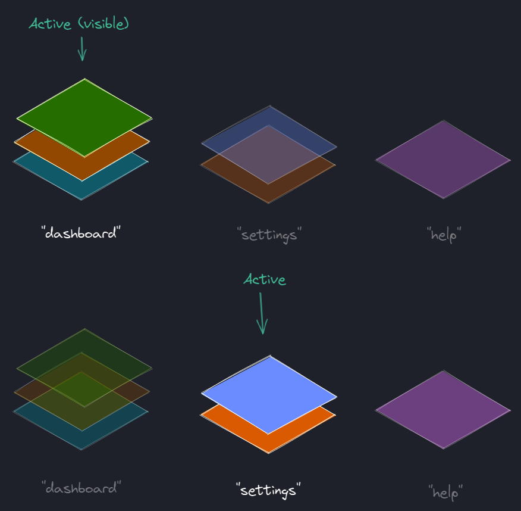

注册模式和注册屏幕类似，可以使用同样类型字典的类变量`MODES`（完整用法参考[官网文档](https://textual.textualize.io/api/app/#textual.app.App.MODES)），也可以使用注册方法`add_mode`（完整用法参考[官网文档](https://textual.textualize.io/api/app/#textual.app.App.add_mode)）。对应的，模式也有卸载方法`remove_mode`（完整用法参考[官网文档](https://textual.textualize.io/api/app/#textual.app.App.remove_mode)）和切换方法`switch_mode`（完整用法参考[官网文档](https://textual.textualize.io/api/app/#textual.app.App.switch_mode)）。

因为默认程序至少显示一个屏幕，因此，注册模式时，需要给模式名绑定一个基础屏幕，当做当前模式的屏幕堆叠中最下面的屏幕。和默认屏幕一样，即使切换了模式，也不能将最后一个屏幕——也就是基础屏幕移除，否则会触发异常。

和注册屏幕有点不同的是，注册模式时，可以使用屏幕名当做模式对应的基础屏幕。比如，在类变量`MODES`中，代码可以这样写：

```python3
class MyApp(App):
    SCREENS = {
        'ScreenA': lambda: ModeScreen('ScreenA'),
        'ScreenB': lambda: ModeScreen('ScreenB'),
        'ScreenC': lambda: ModeScreen('ScreenC')
    }
    MODES = {
    	'ScreenA': 'ScreenA',
        'ScreenB': lambda: ModeScreen('ScreenB'),
        'ScreenC': ModeScreen,
    }
```

对应的，注册方法`add_mode`也可以同样操作。

注册方法`add_mode`支持两个参数：

-   `mode`参数，字符串类型，表示要注册的模式的名字。
-   `base_screen`参数，表示模式对应的基础屏幕。该参数可以是字符串类型，对应已经注册的屏幕名字；也可以是可调用类型的任意对象，该对象在执行时返回屏幕组件实例（可以是类名，也可以将屏幕组件当做lambda表达式或者函数的返回值）。该参数的类型实际上也是类变量`MODES`中，字典键（模式名）对应的值（基础屏幕）所支持的类型。

那上面例子里注册的三种模式，使用注册方法代替的话，就是这样的：

```python3
class MyApp(App):
    SCREENS = {
        'ScreenA': lambda: ModeScreen('ScreenA'),
        'ScreenB': lambda: ModeScreen('ScreenB'),
        'ScreenC': lambda: ModeScreen('ScreenC')
    }
    def on_mount(self):
        self.add_mode('ScreenA', 'ScreenA')
        self.add_mode('ScreenB', lambda: ModeScreen('ScreenB'))
        self.add_mode('ScreenC', ModeScreen)
```

卸载方法`remove_mode`和切换方法`switch_mode`都只支持传入字符串类型的模式名，其中切换方法有对应的动作，可以通过`app.switch_mode({模式名})`执行。

下面将提供一个整合模式基本用法的示例，实现模式切换、在非默认模式中操作屏幕的功能。读者可以研究示例代码，在熟悉屏幕操作的前提下，进一步理解模式的基本操作方法。

需要重点注意的是，代码中为了防止移除各个模式中的默认屏幕，设计了一个参数，禁用了默认屏幕中的关闭屏幕的按钮。读者可以尝试一下，没有这个参数的话，会发生什么异常。

```python3
from textual.app import App
from textual.screen import Screen
from textual.widgets import Static, Button
from textual.containers import Horizontal, Vertical


class ModeScreen(Screen):
    def __init__(self, screen_name=None, base_screen=False):
        super().__init__()
        self.screen_name = screen_name
        self.base_screen = base_screen

    def on_mount(self):
        self.widgets = [
            Static(self.screen_name or 'no name'),
            Horizontal(
                Vertical(
                    Button('switch_mode ScreenA',
                           action='app.switch_mode("ScreenA")'),
                    Button('switch_mode ScreenB',
                           action='app.switch_mode("ScreenB")'),
                    Button('switch_mode ScreenC',
                           action='app.switch_mode("ScreenC")'),
                    Button('switch_mode default',
                           action=f'app.switch_mode("{self.app.DEFAULT_MODE}")')
                ),
                Vertical(
                    Button('Push ScreenA', action='app.push_screen("ScreenA")'),
                    Button('Push ScreenB', action='app.push_screen("ScreenB")'),
                    Button('Push ScreenC', action='app.push_screen("ScreenC")'),
                    Button('Close', action='screen.dismiss',
                           disabled=self.base_screen).focus()
                ),
            )
        ]
        self.mount_all(self.widgets)


class MyApp(App):
    SCREENS = {
        'ScreenA': lambda: ModeScreen('ScreenA'),
        'ScreenB': lambda: ModeScreen('ScreenB'),
        'ScreenC': lambda: ModeScreen('ScreenC')
    }
    DEFAULT_MODE = 'default'
    MODES = {
        'ScreenA': lambda: ModeScreen('ScreenA', True),
        'ScreenB': lambda: ModeScreen('ScreenB', True),
        'ScreenC': lambda: ModeScreen('ScreenC', True),
        DEFAULT_MODE: lambda: App.get_default_screen(MyApp)
    }

    def on_mount(self):
        self.widgets = [
            Static('Default screen'),
            Horizontal(
                Vertical(
                    Button('switch_mode ScreenA',
                           action='app.switch_mode("ScreenA")'),
                    Button('switch_mode ScreenB',
                           action='app.switch_mode("ScreenB")'),
                    Button('switch_mode ScreenC',
                           action='app.switch_mode("ScreenC")'),
                )
            )
        ]
        self.mount_all(self.widgets)


if __name__ == '__main__':
    app = MyApp()
    app.run()
```

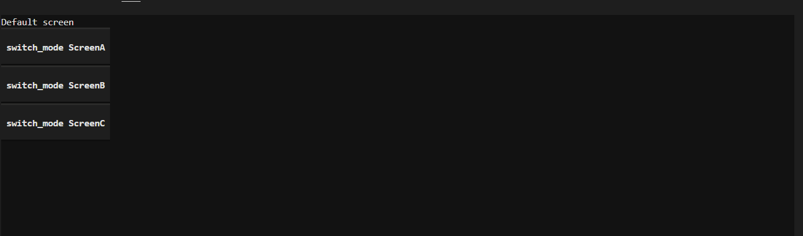

##### 3.2.4.8 使用屏幕——屏幕事件

当屏幕被挂起（屏幕上面被放置了新的屏幕或者通过模式切换让当前屏幕不再是当前屏幕）时，会触发屏幕挂起事件（`ScreenSuspend`，完整介绍参考[官网文档](https://textual.textualize.io/events/screen_suspend/)）。对应的，当屏幕恢复（原本处于挂起状态的屏幕变成当前屏幕），会触发屏幕恢复事件（`ScreenResume`，完整介绍参考[官网文档](https://textual.textualize.io/events/screen_resume/)）。这两个事件都是不冒泡的事件，想要监听它们的话，需要在组件类内部定义对应的监听函数，代码如下：

```python3
from textual.app import App
from textual.screen import Screen
from textual.widgets import Static, Button
from textual.containers import Horizontal, Vertical
from textual import events

class ModeScreen(Screen):
    def __init__(self, screen_name=None, base_screen=False):
        super().__init__()
        self.screen_name = screen_name
        self.base_screen = base_screen

    def on_mount(self):
        self.widgets = [
            Static(self.screen_name or 'no name'),
            Horizontal(
                Vertical(
                    Button('switch_mode ScreenA',
                           action='app.switch_mode("ScreenA")'),
                    Button('switch_mode ScreenB',
                           action='app.switch_mode("ScreenB")'),
                    Button('switch_mode ScreenC',
                           action='app.switch_mode("ScreenC")'),
                    Button('switch_mode default',
                           action=f'app.switch_mode("{self.app.DEFAULT_MODE}")')
                ),
                Vertical(
                    Button('Push ScreenA', action='app.push_screen("ScreenA")'),
                    Button('Push ScreenB', action='app.push_screen("ScreenB")'),
                    Button('Push ScreenC', action='app.push_screen("ScreenC")'),
                    Button('Close', action='screen.dismiss',
                           disabled=self.base_screen).focus()
                ),
            )
        ]
        self.mount_all(self.widgets)
    def on_screen_suspend(self,e:events.ScreenSuspend):
        self.notify(f'{self.screen_name} posts ScreenSuspend')
    def on_screen_resume(self,e:events.ScreenResume):
        self.notify(f'{self.screen_name} posts ScreenResume')

class MyApp(App):
    SCREENS = {
        'ScreenA': lambda: ModeScreen('ScreenA'),
        'ScreenB': lambda: ModeScreen('ScreenB'),
        'ScreenC': lambda: ModeScreen('ScreenC')
    }
    DEFAULT_MODE = 'default'
    MODES = {
        'ScreenA': lambda: ModeScreen('ScreenA', True),
        'ScreenB': lambda: ModeScreen('ScreenB', True),
        'ScreenC': lambda: ModeScreen('ScreenC', True),
        DEFAULT_MODE: lambda: App.get_default_screen(MyApp)
    }

    def on_mount(self):
        self.widgets = [
            Static('Default screen'),
            Horizontal(
                Vertical(
                    Button('switch_mode ScreenA',
                           action='app.switch_mode("ScreenA")'),
                    Button('switch_mode ScreenB',
                           action='app.switch_mode("ScreenB")'),
                    Button('switch_mode ScreenC',
                           action='app.switch_mode("ScreenC")'),
                )
            )
        ]
        self.mount_all(self.widgets)

if __name__ == '__main__':
    app = MyApp()
    app.run()
```

代码中通过监听对应的屏幕事件，将对应的操作通知出去。读者可以在对应的监听函数中执行其他操作，用法很简单，这里就不做展开了。

#### 3.2.5 动画

虽然Textual是一个TUI框架，但还是提供了一定的动画效果。此外，如果读者需要手动播放动画，还可以使用`App`类、组件类、样式属性的动画方法——`animate`方法（完整用法参考[官网文档](https://textual.textualize.io/api/app/#textual.app.App.animate)）。

`animate`方法支持以下参数：

-   `attribute`参数，字符串类型，表示要执行动画方法的对象的属性名。在执行动画方法时，会修改该属性的值。

-   `value`参数，浮点类型或动画类型（实现了`blend`方法的类，动画方法会把目标值和动画进度传给该方法，该方法返回当前值），表示执行动画后，属性的目标值，Textual会根据属性的当前值和目标值进行计算，并采用指定的缓动函数曲线（完整的缓动函数曲线参考[官网文档](https://easings.net/zh-cn)），实现动画效果。

-   `final_value`参数，任意对象，表示动画执行完毕后，前面`attribute`参数指定属性最终修改为何值。从本参数开始，参数只能通过关键字传入，不能通过位置传入。

-   `duration`参数，浮点类型或者整数类型，表示动画持续多少秒，取值范围为非负非0的数。注意，此参数和`speed`参数至少需要传入一个，否则会报错。

-   `speed`参数，浮点类型或者整数类型，表示动画播放的速度，单位是百分比，取值范围为非负非0的数。注意，此参数和`duration`参数至少需要传入一个，否则会报错。

-   `delay`参数，浮点类型或者整数类型，表示动画延迟多少秒之后播放，默认为`0.0`，取值范围为非负非0的数。

-   `easing`参数，字符串类型，表示动画效果，也就是动画使用的缓动函数曲线，默认值是`"in_out_cubic"`。可以对照[官网文档](https://easings.net/zh-cn)，从`['none', 'round', 'linear', 'in_sine', 'in_out_sine', 'out_sine', 'in_quad', 'in_out_quad', 'out_quad', 'in_cubic', 'in_out_cubic', 'out_cubic', 'in_quart', 'in_out_quart', 'out_quart', 'in_quint', 'in_out_quint', 'out_quint', 'in_expo', 'in_out_expo', 'out_expo', 'in_circ', 'in_out_circ', 'out_circ', 'in_back', 'in_out_back', 'out_back', 'in_elastic', 'in_out_elastic', 'out_elastic', 'in_bounce', 'in_out_bounce', 'out_bounce']`选择合适的动画效果。

-   `on_complete`参数，可调用类型，表示动画完成时执行什么操作。

-   `level`参数，字符串类型，表示该动画效果属于什么等级。Textual支持的动画等级由低到高依次为`"none"`、`"basic"`、`"full"`，可以设置常量模块中的`TEXTUAL_ANIMATIONS`（完整介绍参考[官网文档](https://textual.textualize.io/api/constants/#textual.constants.TEXTUAL_ANIMATIONS)）为其中之一，来决定程序默认显示的动画等级，高于该等级的动画不会播放。设置默认动画等级的代码如下：

    ```python3
    from textual import constants
    constants.TEXTUAL_ANIMATIONS = 'basic'
    ```

下面的示例展示了组件类的`offset`属性和屏幕组件的样式`'background'`分别播放动画的效果：

```python3
from textual.app import App
from textual.widgets import Button
from textual.geometry import Offset

class MyApp(App):
    def on_mount(self):
        self.box = Button('Box')
        self.mount(self.box)
        self.box.animate('offset', value=Offset(100, 0), duration=2, delay=2,
                on_complete=lambda: setattr(self.query_one(Button), 'label', 'ok'))
        self.screen.styles.animate('background', value='pink', duration=2,
                on_complete=lambda: setattr(self.query_one(Button), 'label', 'moving'))

if __name__ == '__main__':
    app = MyApp()
    app.run()
```

注意，动画方法不支持异步，因此多个动画方法实际上是同时开始的。为了确保动画的先后顺序，代码中给按钮的动画添加了延迟。读者可以添加更多样式的动画，看看动画效果。

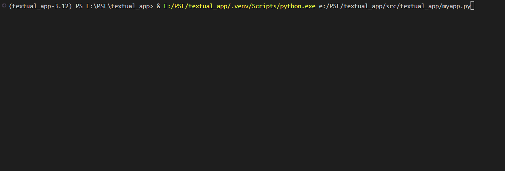

#### 3.2.6 命令面板

在Textual程序中，如果按下`ctrl+p`的话，会弹出一个快捷执行命令的命令面板，官方称之为调色板。

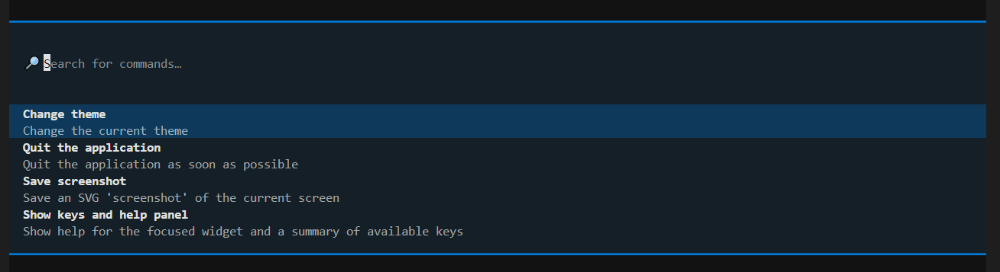

可以看到，命令面板的主体是一个输入框，下面是一个列表。输入框是一个搜索框，可以输入关键字，输入后自动搜索，下面的列表会展示搜索结果。列表则展示着匹配的搜索结果或者默认提供的命令，点击列表中的选项，程序会执行对应的命令。

当然，除了使用快捷键，默认点击页眉（作用类似于标题栏）左边的图标也能也能打开命令面板：

```python3
from textual.app import App
from textual.widgets import Header

class MyApp(App):
    def on_mount(self):
        self.widgets = [
            Header(),
        ]
        self.mount_all(self.widgets)

if __name__ == '__main__':
    app = MyApp()
    app.run()
```

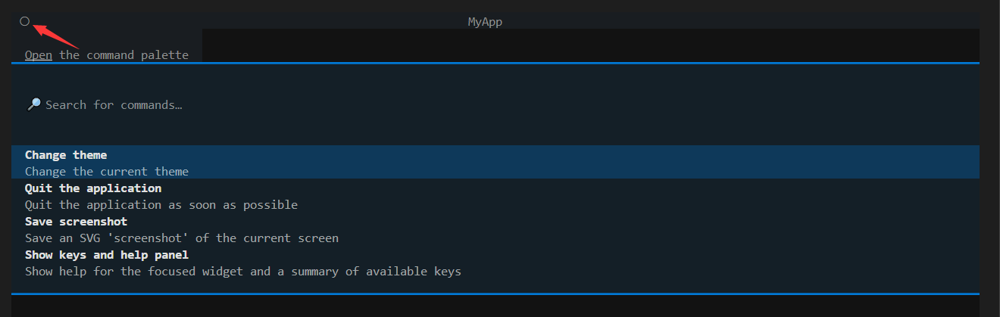

##### 3.2.6.1 自定义命令面板——`get_system_commands`生成器

可以看到，在默认没有添加任何相关代码的情况下，命令面板中已经提供了几个可用的命令，那些都是Textual内部定义的命令。但是，如果想要添加一些自定义的命令或者使用自定义的命令替换命令面板中显示的内容，该如何操作？

首先，想要修改命令面板中显示的、可供使用的命令，需要在`App`子类中定义`get_system_commands`函数（完整用法参考[官网文档](https://textual.textualize.io/api/app/#textual.app.App.get_system_commands)）。该函数除了第一个参数是表示实例对象的`self`之外，还接收一个`screen`参数，该参数表示命令面板所覆盖的屏幕。其实，命令面板本质上是一个模态屏幕，唤起命令面板，实际上是在当前屏幕上叠加了命令面板这个模态屏幕。因此，可以在方法内使用`screen`参数代替之前的屏幕，执行一些操作。

`get_system_commands`函数是一个生成器，生成器的每个元素都是`SystemCommand`命名元组（使用`from textual.app import SystemCommand`导入，完整参数介绍参考[官网文档](https://textual.textualize.io/api/app/#textual.app.SystemCommand)），一个元素对应一个命令。

`SystemCommand`命名元组拥有以下成员：

-   `title`参数，字符串类型，表示命令的标题，其内容可被关键字搜索。
-   `help`参数，字符串类型，表示命令的解释内容，也就是图片中的浅色文字。
-   `callback`参数，可调用类型，表示点击该命令执行的操作。
-   `discover`参数，布尔类型，表示在不输入关键字搜索时，是否在下面显示，默认为`True`。

在了解了自定义命令的全部基础之后，下面就进入实战：

```python3
from textual.app import App, SystemCommand
from textual.widgets import Header

class MyApp(App):
    def on_mount(self):
        self.widgets = [
            Header(),
        ]
        self.mount_all(self.widgets)

    def get_system_commands(self, screen):
        yield SystemCommand(title='退出',help='退出程序',callback=self.exit,discover=True)


if __name__ == '__main__':
    app = MyApp()
    app.run()
```

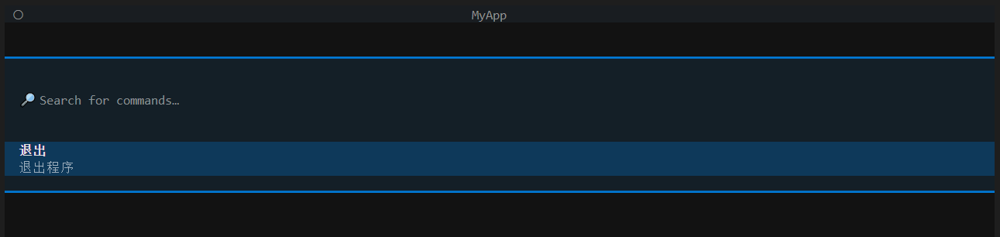

可以看到，简单定义了`get_system_commands`函数之后，就在命令面板中显示了自定义的命令。不过，这里有一个小问题：在定义自定义命令的时候，并没有把Textual内部定义的命令一并生成（`yield`），这也就导致了只有自定义的命令，没有内部定义的命令。这里可以添加一行代码`yield from super().get_system_commands(screen)`，调用父类的方法之后，把内部定义的命令生成出来，就能实现增加自定义命令的效果，而不是替换。

##### 3.2.6.2 自定义命令面板——`COMMANDS`类变量和`Provider`类

除了定义`get_system_commands`生成器来增改命令，还可以在`App`子类中定义类变量[`COMMANDS`](https://textual.textualize.io/api/app/#textual.app.App.COMMANDS)，更加彻底地定义命令面板。

类变量`COMMANDS`是一个集合，每个元素均为`Provider`类（使用`from textual.command import Provider`导入，完整用法参考[官网文档](https://textual.textualize.io/api/command/#textual.command.Provider)）的子类（比如[`SystemCommandsProvider`](https://textual.textualize.io/api/system_commands_source/#textual.system_commands.SystemCommandsProvider)类），用法上比较复杂，但也支持更多功能。

`Provider`类是一个抽象类，其中的`search`方法是抽象方法，也就是说，在继承`Provider`类实现子类时，必须实现`search`方法。`search`方法是在命令面板的输入框输入文字时，搜索时调用的方法、该方法额外接收一个`query`参数，表示当前输入框的内容。

在完整前，先把必要的方法内写上`pass`，看一下使用`COMMANDS`类变量的基本代码：

```python3
from textual.app import App
from textual.widgets import Header
from textual.command import Provider

class UserCommand(Provider):
    async def search(self, query):
        pass

class MyApp(App):
    COMMANDS = {UserCommand}
    def on_mount(self):
        self.widgets = [
            Header(),
        ]
        self.mount_all(self.widgets)

if __name__ == '__main__':
    app = MyApp()
    app.run()
```

上面的代码没有实现任何功能，但结构上除了`App`子类里的`on_mount`方法外缺一不可。当然，如果想要扩展命令面板的内容而不是替换，要将包含`Provider`子类的集合与默认命令的集合`App.COMMANDS`合并，比如`COMMANDS = {UserCommand} | App.COMMANDS`。

下面正式开始完整实现`Provider`子类，先导入必要的类：

```python3
from textual.app import App, SystemCommand
from textual.command import Hit, DiscoveryHit, Provider
```

`SystemCommand`类不是必须的，但这里为了方便构建基本数据，借用Textual内部已经定义好的命名元组。`Hit`类和`DiscoveryHit`类分别是`search`方法和`discover`方法返回数据类对象，如果只是实现必要的`search`方法，则不需要导入`DiscoveryHit`类。

`Provider`类提供了四个可以在子类中覆盖的方法：`startup`方法、`search`方法、`discover`方法、`shutdown`方法。只有`search`方法是必须实现的，其他方法都是可选的。四个方法都应该是是异步（使用`async def`定义）的，但不强制要求。

具体每个方法的用法如下：

-   `startup`方法（完整用法参考[官网文档](https://textual.textualize.io/api/command/#textual.command.Provider.startup)），打开命令面板时执行此方法。此方法的效果有点像`__init__`方法，但`__init__`方法需要严格接收`screen`参数和`match_style`参数，并传给父类的初始化方法；此方法不接收额外的参数，也不需要调用父类方法，用起来比较简单。
-   `search`方法（完整用法参考[官网文档](https://textual.textualize.io/api/command/#textual.command.Provider.search)），在命令面板的输入框内输入内容时执行此方法。程序会把输入框的内容传给此方法的第一个参数。此方法根据传入的内容进行搜索，并生成（`yield`）结果（`Hit`数据类对象），显示在输入框下面的列表中。没错，此方法实际上是个生成器。但是，此方法搜索匹配代码比较复杂，这不展开介绍，下面会基于实际代码讲解。
-   `discover`方法（完整用法参考[官网文档](https://textual.textualize.io/api/command/#textual.command.Provider.discover)），打开命令面板后，没有在输入框输入任何内容之前，程序会调用此方法。此方法生成（`yield`）结果（`DiscoveryHit`数据类对象），显示在输入框下面的列表中。此方法没有`search`方法的匹配代码，只需判断哪些命令需要默认显示即可（就像判断上一节中`SystemCommand`命名元组的`discover`参数）。因此，用法上和`search`方法类似，下面会基于实际代码一并讲解。
-   `shutdown`方法（完整用法参考[官网文档](https://textual.textualize.io/api/command/#textual.command.Provider.shutdown)），关闭命令面板时执行此方法。如果有些资源需要在关闭命令面板时释放（比如打开的文件），可以在此方法中执行释放方法。

因为`search`方法和`discover`方法的实现有些复杂，下面将在上面示例的基础上，进一步实现这两个方法，并详细解释代码。话不多说，直接进入正题。

导入所有必需的类之后，完整代码如下：

```python3
from textual.app import App, SystemCommand
from textual.widgets import Header
from textual.command import Hit, DiscoveryHit, Provider

class UserCommand(Provider):
    async def search(self, query):
        pass

class MyApp(App):
    COMMANDS = {UserCommand}
    def on_mount(self):
        self.widgets = [
            Header(),
        ]
        self.mount_all(self.widgets)

if __name__ == '__main__':
    app = MyApp()
    app.run()
```

接下来就是`UserCommand`类内补全没有实现的方法和代码，其余部分无需变动。

首先要做的，就是添加一些自定义的命令，以便于后面搜索、展示时使用。

实现`startup`方法，并创建好包含所有命令的容器：

```python3
class UserCommand(Provider):
    async def startup(self):
        self.commands = [
            SystemCommand(title='Quit',help='退出程序',callback=self.app.exit,discover=True),
            SystemCommand(title='Bell',help='响一声',callback=self.app.bell,discover=True),
            SystemCommand(title='Print',help='没啥效果',callback=print,discover=True),
        ]
    async def search(self, query):
        pass
```

需要注意的是，因为这里的`self`指的是`UserCommand`类对象，想要调用`App`子类实例的方法，需要访问`self`的`app`属性，即`self.app`才行。

接下来要做的，就是在`search`方法内实现搜索指定字段，并生成（`yield`）对应结果（`Hit`数据类对象）。

搜索的话，可以使用`in`关键字，来判断输入内容是否在每个命令的`title`成员中：

```python3
async def search(self, query):
    for command in self.commands:
        title = command.title
        if query in title:
            yield Hit()
```

至于结果，像上面这样返回空对象肯定不行。因此，需要先了解一下`Hit`数据类对象的参数中要用的几个参数（完整的参数介绍参考[官网文档](https://textual.textualize.io/api/command/#textual.command.Hit)），再决定如何构建对象：

-   `score`参数，浮点类型，表示匹配的分数，输入的内容与目标内容越匹配，分数应该越高，这样才能让匹配程度高的结果显示在上面。
-   `match_display`参数，Rich的可渲染类型，表示该搜索结果对应标题的部分所显示的内容。
-   `command`参数，可调用类型，表示点击该搜索结果执行什么操作。
-   `help`参数，字符串类型，表示该搜索结果对应的解释文字。

了解完参数，问题也随之而来：如何确定匹配分数？

其实，使用`in`关键字未免过于粗糙，先不说不支持忽略大小写，光是让匹配程度越高的结果越靠前这一项，就需要不少额外的代码。好在`Provider`类提供了`matcher`方法（完整用法参考[官网文档](https://textual.textualize.io/api/command/#textual.command.Provider.matcher)），传入要搜索的内容，可以返回`Matcher`对象。给`Matcher`对象的`match`方法（完整用法参考[官网文档](https://textual.textualize.io/api/fuzzy_matcher/#textual.fuzzy.Matcher.match)）传入用于匹配的内容，可以返回匹配分数，正是构建结果对象所需要的。

这样的话，构建对象的代码就可以这样写：

```python3
class UserCommand(Provider):
    async def startup(self):
        self.commands = [
            SystemCommand(title='Quit',help='退出程序',callback=self.app.exit,discover=True),
            SystemCommand(title='Bell',help='响一声',callback=self.app.bell,discover=True),
            SystemCommand(title='Print',help='没啥效果',callback=print,discover=True),
        ]
    async def search(self, query):
        matcher = self.matcher(query)
        for command in self.commands:
            title = command.title
            score = matcher.match(title)
            if score > 0:
                yield Hit(
                    score=score,
                    match_display=matcher.highlight(title),
                    command=command.callback,
                    help=command.help
                )
```

给`Matcher`对象的`highlight`方法传入用于匹配的内容，将会返回加了下划线的搜索内容的可渲染对象，可以让结果更直观。

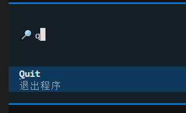

实现`discover`方法与实现`search`方法类似，只是取消了匹配搜索内容的部分，不需要获取匹配分数。但是增加了对`discover`成员（如果有的话，或者有类似作用的成员）的判断，还需要把返回的`Hit`数据类对象替换为`DiscoveryHit`数据类对象。

`DiscoveryHit`数据类对象（完整用法参考[官网文档](https://textual.textualize.io/api/command/#textual.command.DiscoveryHit)）支持以下参数（部分参数），参数名略有不同，需要注意：

-   `display`参数，Rich的可渲染类型，表示该结果对应标题的部分所显示的内容。
-   `command`参数，可调用类型，表示点击该结果执行什么操作。
-   `help`参数，字符串类型，表示该结果对应的解释文字。

根据数据类对象的区别，代码上基本结构差不多，去掉了匹配的代码之后，将`if`之后的条件改成对`discover`成员的判断，最后就是将`Hit`数据类对象替换为`DiscoveryHit`数据类对象：

```python3
class UserCommand(Provider):
    async def startup(self):
        self.commands = [
            SystemCommand(title='Quit',help='退出程序',callback=self.app.exit,discover=True),
            SystemCommand(title='Bell',help='响一声',callback=self.app.bell,discover=True),
            SystemCommand(title='Print',help='没啥效果',callback=print,discover=True),
        ]
    async def search(self, query):
        matcher = self.matcher(query)
        for command in self.commands:
            title = command.title
            score = matcher.match(title)
            if score > 0:
                yield Hit(
                    score=score,
                    match_display=matcher.highlight(title),
                    command=command.callback,
                    help=command.help
                )
    async def discover(self):
        for command in self.commands:
            title = command.title
            discover = command.discover
            if discover:
                yield DiscoveryHit(
                    display=title,
                    command=command.callback,
                    help=command.help
                )
```

结果很完美：

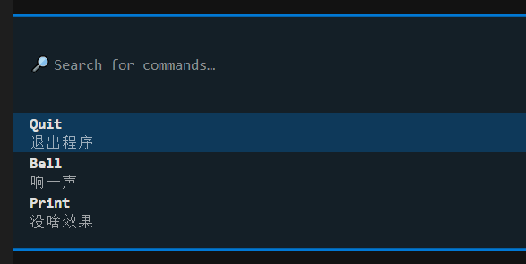

除了`App`子类外，其实屏幕类也支持`COMMANDS`类变量。在自定义屏幕组件类添加`COMMANDS`类变量，会在`App`子类已有的命令基础上增加自定义的命令：

```python3
from textual.app import App,SystemCommand
from textual.widgets import Header,Button
from textual.command import Hit, DiscoveryHit, Provider
from textual.screen import Screen

class UserCommand(Provider):
    async def startup(self):
        self.commands = [
            SystemCommand(title='Quit',help='退出程序',callback=self.app.exit,discover=True),
            SystemCommand(title='Bell',help='响一声',callback=self.app.bell,discover=True),
            SystemCommand(title='Print',help='没啥效果',callback=print,discover=True),
        ]
    async def search(self, query):
        matcher = self.matcher(query)
        for command in self.commands:
            title = command.title
            score = matcher.match(title)
            if score > 0:
                yield Hit(
                    score=score,
                    match_display=matcher.highlight(title),
                    command=command.callback,
                    help=command.help
                )
    async def discover(self):
        for command in self.commands:
            title = command.title
            discover = command.discover
            if discover:
                yield DiscoveryHit(
                    display=title,
                    command=command.callback,
                    help=command.help
                )

class Welcome(Screen):
    COMMANDS = {UserCommand}
    TITLE = 'Welcome'
    def on_mount(self):
        self.widgets = [
            Header(),
            Button('Exit',action='screen.dismiss')  
        ]
        self.mount_all(self.widgets)

class MyApp(App):
    SCREENS = {'welcome':Welcome}
    def on_mount(self):
        self.widgets = [
            Header(),
            Button('open welcome screen ',
                           action='app.push_screen("welcome")'),
        ]
        self.mount_all(self.widgets)
        self.push_screen('welcome')

if __name__ == '__main__':
    app = MyApp()
    app.run()
```

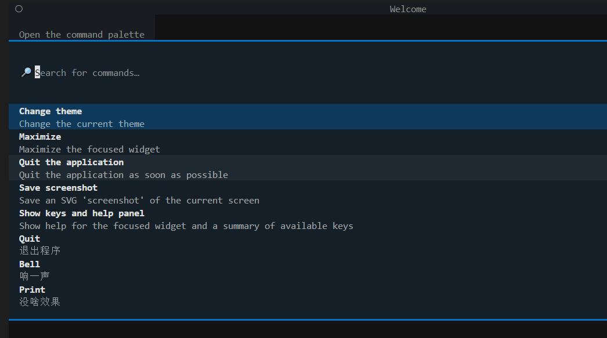

如果读者厌倦了在自定义屏幕组件类中自定义命令面板也需要自己定义`Provider`子类，可以试试Textual提供的简化类——`SimpleProvider`类（完整用法参考[官网文档](https://textual.textualize.io/api/command/#textual.command.SimpleProvider)）和`SimpleCommand`类（完整用法参考[官网文档](https://textual.textualize.io/api/command/#textual.command.SimpleCommand)）。注意，屏幕类不支持`get_system_commands`生成器。

`SimpleProvider`类的第一个参数是用于显示命令面板的屏幕，第二个参数是包含了多个简化命令的列表，其中每个元素都是`SimpleCommand`类实例。

`SimpleCommand`类的三个参数分别是命令的名字（用于搜索）、命令的解释文字（描述命令是做什么的）、命令主体（点击时执行什么操作）。

因为不需要实现子类，因此可以直接实例化使用，以下是核心代码：

```python3
class Welcome(Screen):
    TITLE = 'Welcome'
    def on_mount(self):
        self.widgets = [
            Header(),
            Button('Exit',action='screen.dismiss')  
        ]
        self.mount_all(self.widgets)
        self.COMMANDS = {
            SimpleProvider(
                screen=self,
                commands=[
                    SimpleCommand(name='Quit', help_text='退出程序',
                                  callback=self.app.exit),
                    SimpleCommand(name='Bell', help_text='响一声',
                                  callback=self.app.bell),
                    SimpleCommand(name='Print', help_text='没啥效果',
                                  callback=print),
                ]
            )
        }
```

完整代码如下：

```python3
from textual.app import App
from textual.widgets import Header,Button
from textual.command import SimpleCommand, SimpleProvider
from textual.screen import Screen


class Welcome(Screen):
    TITLE = 'Welcome'
    def on_mount(self):
        self.widgets = [
            Header(),
            Button('Exit',action='screen.dismiss')  
        ]
        self.mount_all(self.widgets)
        self.COMMANDS = {
            SimpleProvider(
                screen=self,
                commands=[
                    SimpleCommand(name='Quit', help_text='退出程序',
                                  callback=self.app.exit),
                    SimpleCommand(name='Bell', help_text='响一声',
                                  callback=self.app.bell),
                    SimpleCommand(name='Print', help_text='没啥效果',
                                  callback=print),
                ]
            )
        }

class MyApp(App):
    SCREENS = {'welcome':Welcome}
    def on_mount(self):
        self.widgets = [
            Header(),
            Button('open welcome screen ',
                           action='app.push_screen("welcome")'),
        ]
        self.mount_all(self.widgets)
        self.push_screen('welcome')

if __name__ == '__main__':
    app = MyApp()
    app.run()
```

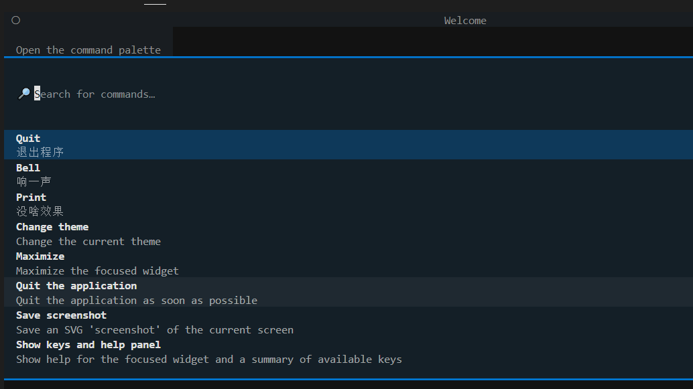

##### 3.2.6.3 自定义命令面板——其他类变量

除了设置`COMMANDS`类变量来自定义命令面板的内容，还有可以设置`ENABLE_COMMAND_PALETTE`的值来决定是否启用命令面板，以及设置`COMMAND_PALETTE_BINDING`的值来设定启动命令面板的快捷键

示例如下：

```python3
ENABLE_COMMAND_PALETTE = False # 禁用命令面板
COMMAND_PALETTE_BINDING = "ctrl+backslash" # 使用 ctrl+\ 来启动命令面板
```

#### 3.2.7 可渲染对象

前面提了很多次可渲染对象，一直没有系统性讲解。本教程接近尾声之际，官方更新了2.0.0版本，并补全了这部分[文档](https://textual.textualize.io/guide/content/#content)，于是在这里也加上这部分内容。

##### 3.2.7.1 Markup标签

字符串也是可渲染对象，但如果只是讲字符串的使用，未免也太小瞧正在看本文的读者，也属实没有必要。因此，本节要讲的是，那些用嵌在字符串中的Markup标签。也就是前面提到很多次，也用了很多次的，但就是没有专门讲过的Markup标签。

不过，在正式学习之前，需要先了解一下随2.0.0版本更新，Textual新增的Markup标签验证工具，使用下面的命令行启动：

```shell
python -m textual.markup
```

界面如下：

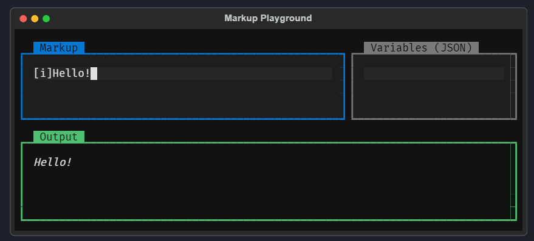

在Markup的输入框中输入包含Markup标签的文本，Output区域就会渲染之后的文字。右上角的输入框可以输入JSON格式的变量映射，比如：

```json
{
    "name":"Python"
}
```

就能在Markup区使用该变量，比如`[i]Hello $name`：

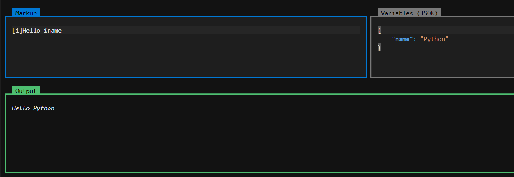

变量的使用会在后面细讲，前面只需了解此工具的基本用法。

Markup标签很像HTML标签，如果将HTML的角括号替换为中括号，Markup标签的一般格式如下：

```
[bold]Hello[/bold],World!
```

对应HTML中表示元素的内容，在Markup标签中，表示的是样式。

与HTML标签一样，Markup标签也有闭合的要求，上面示例中的`[/bold]`就是`[bold]`对应的闭合标签。当然，如果想要简单一些，使用`[/]`可以闭合最近的标签，具体原则可以参考括号的配对原则：

```
[red][bold]Hello[/] and [/]World!
```

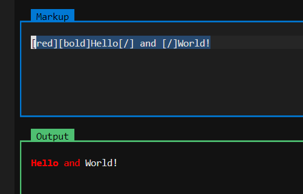

Markup标签支持的格式样式如下：

| 样式全称     | 缩写 | 作用                                               |
| :----------- | :--- | :------------------------------------------------- |
| `bold`       | `b`  | 文字变为**粗体**                                   |
| `dim`        | `d`  | 文字变暗淡                                         |
| `italic`     | `i`  | 文字变为*斜体*                                     |
| `underline`  | `u`  | 文字增加下划线                                     |
| `underline2` | `uu` | 文字增加下双划线<br>（兼容性一般，部分终端不支持） |
| `strike`     | `s`  | 文字增加~~删除线~~                                 |
| `reverse`    | `r`  | 文字颜色与背景色交换                               |

除了在Markup标签中使用样式的全称，还可以使用缩写：

```
[b]Hello[/b],World!
```

对于同一段文字需要同时应用不同样式，除了以下这种比较复杂的嵌套：

```
[d][b][i]Hello[/][/][/],World!
```

还可以在一个中括号内同时填入使用空格间隔的多个样式，当单个标签使用（顺序不严格要求）：

```
[d b i]Hello[/b d i],World!
```

闭合标签也可以使用自动闭合标签：

```
[d b i]Hello[/],World!
```

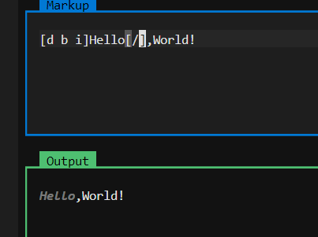

除了不同样式可以组合使用之外，每个样式前还可以添加`not`，得到一个组合标签，表示撤销该样式：

```
[d b i]Hello[not i not b not d],World!
```

除了格式样式，Markup标签还支持设置字体颜色。前面颜色章节提到的颜色名、量化的颜色表示、带透明度的颜色表示都可以使用：

```
[#f00 80%]Hello[/],World!
```

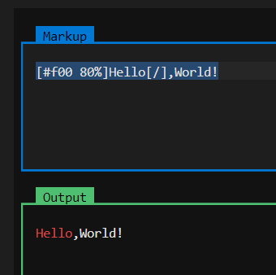

如果把颜色的表示与`on`组合使用，则表示设置背景颜色：

```
[on #f00 80%]Hello[/],World!
```

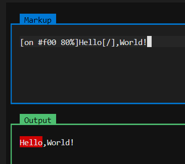

当然，字体颜色和背景颜色可以同时使用：

```
[yellow on #f00 80%]Hello[/],World!
```

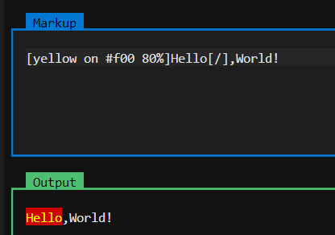

`auto`是一种特殊的颜色，表示在对比度最大时，显示为黑色或白色的颜色：

```
[auto on #f00 80%]Hello[/],World!
```

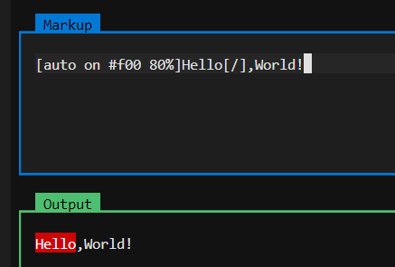

CSS变量（比如前面章节中的基础色变量）也能在标签中使用：

```
[auto on $error]Hello[/],World!
```

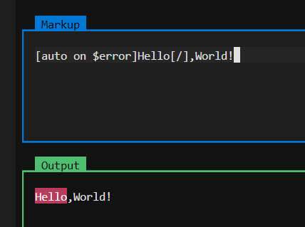

和HTML类似，在Markup标签中，也可以创建超链接，使用`link=`，后接双引号包裹的目标链接，就可以创建出点击文字跳转到指定网页的超链接：

```
[link="https://baidu.com"]Hello[/],World!
```

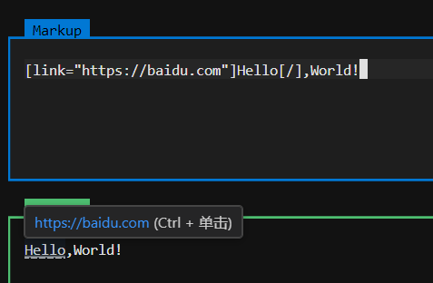

需要注意的是，如果不使用自动闭合标签，超链接的闭合标签是`[/link]`，不包含`=`：

```
[link="https://baidu.com"]Hello[/link],World!
```

和超链接类似，如将`link`替换为`@click`，后面双引号包裹的目标链接换成不需要双引号包裹的动作，那超链接就变成了动作链接。点击该链接就会执行对应的动作：

```
[@click=app.bell]Hello[/],World!
```

需要注意的是，如果不使用自动闭合标签，动作链接的闭合标签是`[/@click=]`，包含`=`：

```
[@click=app.bell]Hello[/@click=],World!
```

颜色、样式与超链接标签组合时，需要把超链接标签放到最后才能生效：

```
[blue on white link="https://baidu.com"]Hello[/],World!
```

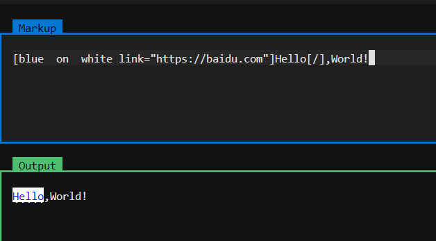

虽然前面说过动作链接的颜色不能通过标签修改，但格式和背景色还是可以修改的，用法和超链接一样，需要将格式、背景色的标签放在动作链接标签前面：

```
[on blue i @click=app.bell]Hello[/],World!
```

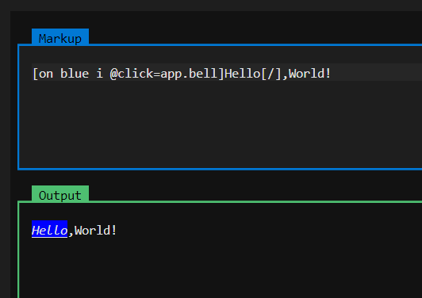

虽然默认Textual渲染Markup标签，但难免有原样输出内容而不希望渲染的时候。这时，可以使用`escape`方法（使用`from textual.markup import escape`导入）转义无需渲染的内容：

```python3
from textual.app import App
from textual.widgets import Static
from textual.markup import escape

class MyApp(App):
    def on_mount(self):
        self.widgets = [ 
                Static(escape('[on blue i @click=app.bell]Hello[/],World')),
            ]
        self.mount_all(self.widgets)

if __name__ == '__main__':
    app = MyApp()
    app.run()
```

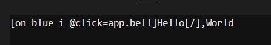

注意，`escape`方法默认的正则匹配规则无法正确处理中括号中的数字、大写字母，此时需要给`escape`方法的第二个参数传入修改后的正则表达式的编译结果的`sub`方法：

```python3
from textual.app import App
from textual.widgets import Static
from textual.markup import escape
import re

class MyApp(App):
    def on_mount(self):
        self.widgets = [ 
                Static(escape('[0 W] Hello World!',re.compile(r'(\\*)(\[[0-9a-zA-Z#/@][^[]*?])').sub)),
            ]
        self.mount_all(self.widgets)

if __name__ == '__main__':
    app = MyApp()
    app.run()
```

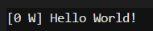

##### 3.2.7.2 `Content`类

Markup标签支持的样式丰富，但在Textual内部，这些字符串最终是被转化为`Content`类对象（使用`from textual.content import Content`导入，完整介绍参考[官网文档](https://textual.textualize.io/api/content/#textual.content.Content)）。

本节内容在一般情况下不需要专门学习，Textual内部已经处理好了。如果读者在扩展基础功能（比如自定义组件）时想要实现类似自带组件的效果，可以了解一下`Content`类的相关用法。

一般使用 `Content`类实例化时，是渲染Markup标签的：

```python3
from textual.app import App
from textual.widgets import Static
from textual.content import Content

class MyApp(App):
    def on_mount(self):
        self.widgets = [ 
                Static(Content('[on blue i @click=app.bell]Hello[/],World')),
            ]
        self.mount_all(self.widgets)

if __name__ == '__main__':
    app = MyApp()
    app.run()
```

想要渲染Markup标签，则要使用类方法`from_markup`：

```python3
from textual.app import App
from textual.widgets import Static
from textual.content import Content

class MyApp(App):
    def on_mount(self):
        self.widgets = [ 
                Static(Content.from_markup('[on blue i @click=app.bell]Hello[/],World')),
            ]
        self.mount_all(self.widgets)

if __name__ == '__main__':
    app = MyApp()
    app.run()
```

虽然前面介绍自定义组件时，使用包含变量的f-string来当做`render`方法的返回值，并没有明显问题。但是，该方法默认是渲染Markup标签的，如果变量中包含了可以解析的Markup标签，那字符串就会因此异常：

```python3
from textual.app import App
from textual.widgets import Static
from textual.content import Content

class MyApp(App):
    def on_mount(self):
        name = '[red]Hello[/]'
        self.widgets = [ 
                Static(Content.from_markup(f'[i]{name}[/],World')),
            ]
        self.mount_all(self.widgets)

if __name__ == '__main__':
    app = MyApp()
    app.run()
```

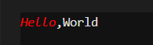

这个时候，渲染还是不渲染都不是正确的结果。

为了解决这个问题，`from_markup`方法支持模板字符串（完整介绍参考[官网文档](https://docs.python.org/zh-cn/3.13/library/string.html#template-strings)），可以使用模板字符串来代替常规的f-string中添加变量，然后以关键字参数的形式传入模板名对应的变量，完成变量映射：

```python3
from textual.app import App
from textual.widgets import Static
from textual.content import Content

class MyApp(App):
    def on_mount(self):
        name_s = '[red]Hello[/]'
        self.widgets = [ 
                Static(Content.from_markup(f'[i]$name[/],World',name=name_s)),
            ]
        self.mount_all(self.widgets)

if __name__ == '__main__':
    app = MyApp()
    app.run()
```

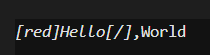

这里的变量映射，在上一小节中，对应的就是验证工具右上角的输入区域，只不过验证工具内使用的是JSON格式（只能使用双引号，也只能映射字符串和基本数据类型，不能映射其他变量）：

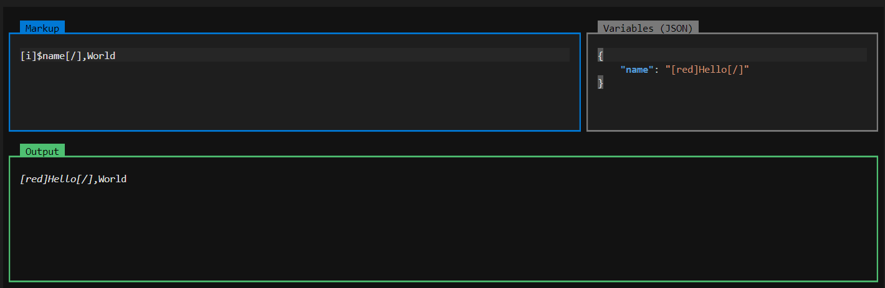

`Content`类支持以下参数：

-   `text`参数，字符串类型，表示显示内容的原始字符串。
-   `spans`参数，元素为`Span`类型（使用`from textual.content import Span`导入）的列表，每个元素表示原始字符串指定区间的字符串应用什么样式，按照顺序依次应用。`Span`类支持以下参数：
    -   `start`参数，整数类型，表示区间的起点（含所在位置的字符）。
    -   `end`参数，整数类型，表示区间的终点（不含所在位置的字符）。
    -   `style`参数，字符串类型或者`Style`类型（使用`from textual.style import Style`导入），表示该区间的字符串应用什么样式。如果是字符串类型，则其支持的样式，使用Markup标签支持的样式字符串。如果是`Style`类型，支持的样式可以参考`Style`的[文档](https://textual.textualize.io/api/style/#textual.style.Style)。
-   `cell_length`参数，整数类型，表示原始字符串包含多少个字符。注意，只有在确定原始字符串的字符数时才能设置该参数为准确的字符数，否则要将此参数设置为`None`（默认值）。

`Content`类支持以下属性：

-   `cell_length`属性，同`cell_length`参数。
-   `first_line`属性，对于多行内容，此属性表示第一行内容的原始字符串；对于单行内容，此属性表示原始字符串。
-   `markup`属性，表示含Markup标签的等效字符串，即让支持解析Markup标签的组件使用此字符串，可以得到内容、样式都相同的结果。
-   `plain`属性，显示内容的原始字符串。
-   `spans`属性，同`spans`参数。
-   `without_spans`属性，表示去掉了样式之后的内容。

`Content`类支持以下方法：

-   `append`方法，在当前内容后添加指定的内容，并返回结果。该方法支持以下参数：

    -   `content`参数，字符串类型或者`Content`类型，表示要添加的内容，字符串支类型支持Markup标签。

-   `append_text`方法，在当前内容后添加指定的内容，并返回结果。该方法支持以下参数：

    -   `text`参数，字符串类型，表示要添加的内容，支持Markup标签。
    -   `style`参数，字符串类型或者`Style`类型（使用`from textual.style import Style`导入），表示添加的字符串应用什么样式。如果是字符串类型，则其支持的样式，使用Markup标签支持的样式字符串。如果是`Style`类型，支持的样式可以参考`Style`的[文档](https://textual.textualize.io/api/style/#textual.style.Style)。

-   `center`方法，将当前内容居中，并返回结果。该方法支持以下参数：

    -   `width`参数，整数类型，表示居中输出时整体的宽度，如果宽度超过原内容宽度，则使用空格填充。
    -   `ellipsis`参数，布尔类型，表示原内容宽度超过居中后的宽度时，是否使用省略号代替内容的最后一个字符，默认为`False`。

-   `divide`方法，根据给定的切割点位，将内容划分成几份，返回元素为每一部分内容、所有元素加起来就是整体内容的列表。该方法支持以下参数：

    -   `offsets`参数，元素为整数类型的序列类型（列表、元组），每个元素表示切割的位置（该位置前是切割位置）。

-   `expand_tabs`方法，将内容中的制表符转换为空格。该方法支持以下参数：

    -   `tab_size`参数，整数类型，表示一个制表符转换成几个空格，默认为`8`。

-   `extend_right`方法，在内容右侧添加指定个数个字符（默认是空格）。该方法支持以下参数：

    -   `count`参数，整数类型，表示在右侧添加多少个字符。
    -   `character`参数，字符串类型，表示在右侧添加什么字符，默认为空格。注意，这里可以是多个字符组成的字符串，但是对于没有闭合的Markup标签修饰到字符串结尾的情况，这里只会将字符串的结尾划分到原本内容宽度加上`count`参数，实际内容超出的部分，则不会被没有闭合的Markup标签修饰，也就不会渲染成指定的风格。

-   `extend_style`方法，在内容右侧添加指定个数个空格，如果没有闭合的Markup标签修饰到字符串结尾时，这些空格沿用原本内容的样式。该方法支持以下参数：

    -   `spaces`参数，整数类型，表示在右侧添加多少个空格。

-   `get_height`方法，获取内容在指定宽度时的高度。该方法支持以下参数：

    -   `rules`参数，`RulesMap`类型（使用`from textual.css.styles import RulesMap`导入），表示该方法使用的样式规则，一般是组件的`styles`属性。
    -   `width`参数，整数类型，表示在多少宽度下计算内容高度。

-   `get_optimal_width`方法，获取内容的最佳宽度。该方法支持以下参数：

    -   `rules`参数，`RulesMap`类型（使用`from textual.css.styles import RulesMap`导入），表示该方法使用的样式规则，一般是组件的`styles`属性。

-   `get_style_at_offset`方法，获取指定位置字符的样式（Markup标签）。该方法支持以下参数：

    -   `offsets`参数，整数类型，字符所在位置（索引值）。

-   `highlight_regex`方法，将内容中被正则表达式匹配的部分设置为指定样式。该方法支持以下参数：

    -   `highlight_regex`参数，[`Pattern`](https://docs.python.org/3/library/re.html#re.Pattern)类型或者字符串类型，表示用于匹配内容的正则表达式。
    -   `style`参数，字符串类型或者`Style`类型（使用`from textual.style import Style`导入），表示被成功匹配的字符串应用什么样式。如果是字符串类型，则其支持的样式，使用Markup标签支持的样式字符串。如果是`Style`类型，支持的样式可以参考`Style`的[文档](https://textual.textualize.io/api/style/#textual.style.Style)。从此参数开始，只能使用关键字传入。
    -   `maximum_highlights`参数，整数类型，如果内容中存在多个符合匹配规则的部分，此参数表示匹配成功几次之后就停止匹配，默认为`None`，表示匹配成功无限次。

-   `is_same`方法，判断当前内容与指定内容的原始字符串、样式是否相同。该方法支持以下参数：

    -   `content`参数，`Content`类型，表示用来比较的内容。

    注意，如果使用`==`比较两个内容，则只会比较内容的`plain`属性，不会比较它们的样式是否相同。即使有些Markup标签的效果是一样的（`u`和`underline`，`red`和`#f00`），也不能认定为内容相同。因此，可以通过比较`markup`属性实现相同的功能。

-   `join`方法，用当前内容当做不同内容之间的连接符，连接不同内容，返回结果。该方法支持以下参数：

    -   `lines`参数，元素为`Content`类型或者字符串类型的可迭代对象，表示被连接的内容。

-   `pad`方法，在内容两侧添加指定个数个字符（默认是空格）。该方法支持以下参数：

    -   `left`参数，整数类型，表示在左侧添加多少个字符。
    -   `right`参数，整数类型，表示在右侧添加多少个字符。
    -   `character`参数，字符串类型，表示在两侧添加什么字符，默认为空格。注意，这里只能是单个字符组成的字符串，否则会报错。

-   `pad_left`方法，在内容左侧添加指定个数个字符（默认是空格）。该方法支持以下参数：

    -   `count`参数，整数类型，表示在左侧添加多少个字符。
    -   `character`参数，字符串类型，表示在左侧添加什么字符，默认为空格。注意，这里只能是单个字符组成的字符串，否则会报错。

-   `pad_right`方法，在内容右侧添加指定个数个字符（默认是空格）。该方法支持以下参数：

    -   `count`参数，整数类型，表示在右侧添加多少个字符。
    -   `character`参数，字符串类型，表示在右侧添加什么字符，默认为空格。注意，这里只能是单个字符组成的字符串，否则会报错。

-   `render_segments`方法，将内容渲染成元素为段对象的列表。该方法支持以下参数：

    -   `base_style`参数，`Style`类型（使用`from textual.style import Style`导入），表示渲染使用的基本样式，默认为`Style.null()`。支持的样式可以参考`Style`的[文档](https://textual.textualize.io/api/style/#textual.style.Style)。
    -   `end`参数，字符串类型，表示结果的内容以什么结尾，默认为`''`。

-   `render_strips`方法，将内容渲染成元素为条对象的列表。该方法支持以下参数：

    -   `rules`参数，`RulesMap`类型（使用`from textual.css.styles import RulesMap`导入），表示该方法使用的样式规则，一般是组件的`styles`属性。
    -   `width`参数，整数类型，表示渲染出来的内容的宽度。
    -   `height`参数，整数类型，表示渲染出来的内容的高度，可以设置为`None`将高度设置为自动。
    -   `style`参数，`Style`类型（使用`from textual.style import Style`导入），表示渲染使用的基本样式。支持的样式可以参考`Style`的[文档](https://textual.textualize.io/api/style/#textual.style.Style)。
    -   `selection`参数，`Selection`类型（使用`from textual.selection import Selection`导入），表示渲染的内容中哪部分是选定状态。
    -   `selection_style`参数，`Style`类型，表示处于选定状态的内容（如果处于选定状态的内容不为空）使用的样式。
    -   `post_style`参数，`Style`类型，表示渲染完内容之后，接下来的内容使用的样式。

-   `right`方法，将当前内容向右对齐，并返回结果。该方法支持以下参数：

    -   `width`参数，整数类型，表示向右对齐输出时整体的宽度，如果宽度超过原内容宽度，则使用空格填充。
    -   `ellipsis`参数，布尔类型，表示原内容宽度超过向右对齐后的宽度时，是否使用省略号代替内容的最后一个字符，默认为`False`。

-   `right_crop`方法，从内容末尾移除指定数量个字符，并返回结果。该方法支持以下参数：

    -   `amount`参数，整数类型，表示从内容末尾移除多少个字符，默认为`1`。

-   `rstrip`方法，从内容末尾移除指定字符，并返回结果。该方法支持以下参数：

    -   `chars`参数，字符串类型，表示从内容末尾移除什么字符，默认为`None`，即移除空格、回车、制表符。

-   `rstrip_end`方法，从内容超过指定宽度的部分的末尾移除空格、回车、制表符，并返回结果。该方法支持以下参数：

    -   `size`参数，整数类型，表示指定的宽度。

-   `split`方法，将内容分割为几部分，并返回一个包含每个部分的列表。该方法支持以下参数：

    -   `separator`参数，字符串类型，表示分割时以什么为间隔符，默认为`'\n'`。
    -   `include_separator`参数，布尔类型，表示分割内容时，是否让前一部分包含间隔符，默认为`False`。从此参数开始，只能使用关键字传入。
    -   `allow_blank`参数，布尔类型，如果内容是以间隔符为结尾，是否认为结尾之后有一个空白内容，默认为`False`。

-   `stylize`方法，让整个内容（只传入必需的`style`参数）或者指定区间的内容应用指定样式，并返回结果。支持以下参数：

    -   `style`参数，字符串类型或者`Style`类型（使用`from textual.style import Style`导入），表示该区间的字符串应用什么样式。如果是字符串类型，则其支持的样式，使用Markup标签支持的样式字符串。如果是`Style`类型，支持的样式可以参考`Style`的[文档](https://textual.textualize.io/api/style/#textual.style.Style)。
    -   `start`参数，整数类型，表示区间的起点（含所在位置的字符），默认为`0`，表示起点包含内容开头。
    -   `end`参数，整数类型，表示区间的终点（不含所在位置的字符），默认为`None`，表示终点包含内容结尾。

    注意，如果是串行执行此方法，区间起点相同时，按执行的先后顺序依次应用样式。如果区间起点不同，则先应用起点靠前的样式。

-   `stylize_before`方法，让整个内容（只传入必需的`style`参数）或者指定区间的内容在应用其他样式之前，先应用指定样式，并返回最后的结果。支持以下参数：

    -   `style`参数，字符串类型或者`Style`类型（使用`from textual.style import Style`导入），表示该区间的字符串应用什么样式。如果是字符串类型，则其支持的样式，使用Markup标签支持的样式字符串。如果是`Style`类型，支持的样式可以参考`Style`的[文档](https://textual.textualize.io/api/style/#textual.style.Style)。
    -   `start`参数，整数类型，表示区间的起点（含所在位置的字符），默认为`0`，表示起点包含内容开头。
    -   `end`参数，整数类型，表示区间的终点（不含所在位置的字符），默认为`None`，表示终点包含内容结尾。

    注意，如果是串行执行此方法和`stylize`方法，此方法执行的效果始终相当于此方法先执行，后执行`stylize`方法。如果同为`stylize_before`方法，则样式的应用顺序同`stylize`方法。

-   `truncate`方法，截断内容并返回结果。该方法支持以下参数：

    -   `max_width`参数，必需参数，整数类型，表示截断宽度，即超过多少宽度的部分会被去掉。
    -   `ellipsis`参数，布尔类型，表示原内容宽度超过截断宽度时，是否使用省略号代替内容的最后一个字符，默认为`False`。从此参数开始，只能使用关键字传入。
    -   `pad`参数，布尔类型，表示原内容宽度小于截断宽度时，是否使用空格填充内容右侧，直到新内容的宽度等于截断宽度，默认为`False`。

`Content`类支持以下类方法：

-   `assemble`方法，将多个内容组合成一个内容，并返回结果。该方法支持以下参数：

    -   `*parts`参数，字符串类型或者`Content`类型或者双元素元组类型（元素分别为原始字符串、表示样式的字符串），表示被组合的内容。

        该参数支持一次传入多个被组合的内容，字符串类型和双元素元组类型的字符串都不支持Markup标签。

        注意，`*`表明此参数是不支持关键字传入的自动解包参数，即该参数不支持关键字传入，但可以使用解包或者位置参数的形式传入，并且此参数后面的其他参数全是关键字参数。

    -   `end`参数，字符串类型，表示结果的内容以什么结尾，默认为`''`。

    示例如下：

    ```python3
    from textual.app import App
    from textual.widgets import Static
    from textual.content import Content
    
    class MyApp(App):
        content = Content.assemble(
            'Hello',
            Content(' '),
            ('world','red'),
            end='!'
        )
        def on_mount(self):
            self.widgets = [ 
                    Static(self.content),
                ]
            self.mount_all(self.widgets)
    
    if __name__ == '__main__':
        app = MyApp()
        app.run()
    ```

    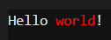

-   `empty`方法，返回一个空内容。

-   `from_markup`方法，基于包含Markup标签的字符串创建内容，并渲染Markup标签。该方法支持以下参数：

    -   `markup`参数，字符串类型，包含Markup标签的原始字符串。
    -   `**variables`参数，当`markup`参数中包含模板字符串（一般为'$'开头、后接合法变量名的字符串，完整介绍参考[官网文档](https://docs.python.org/zh-cn/3.13/library/string.html#template-strings)）时，可以额外添加对应的关键字参数（关键字就是嵌在原始字符串的模板字符串中，表示变量的部分），让该方法在渲染时将传给模板字符串的内容原样渲染（传入的Markup标签不会渲染）。

-   `from_rich_text`方法，创建等效于Rich中显示效果的内容。该方法支持以下参数：

    -   `text`参数，字符串类型或者Rich的[`Text`](https://rich.readthedocs.io/en/stable/reference/text.html#rich.text.Text)类型，表示用于转换的内容，可以是包含Markup标签（这里的Markup标签是Rich语法的）的字符串或者Rich的Text类型内容。
    -   `console`参数，Rich的[`Console`](https://rich.readthedocs.io/en/stable/reference/console.html#rich.console.Console)类型，表示用于解析Markup标签的`Console`对象，默认为`None`，表示使用Textual中的默认对象。

-   `from_text`方法，基于给定的`Content`类型内容、字符串或者Rich的Text类型内容创建内容。该方法支持以下参数：

    -   `text`参数，字符串类型或者Rich的[`Text`](https://rich.readthedocs.io/en/stable/reference/text.html#rich.text.Text)类型或者`Content`类型，表示基于什么内容创建内容。注意，如果传入的是`Content`类型内容，该方法会原样返回，不执行任何转换、修改操作。
    -   `markup`参数，布尔类型，表示是否解析字符串中的Markup标签，默认为`True`。

-   `styled`方法，参数同`Content`类的初始化方法，执行该方法实际上是创建了一个新的`Content`类对象并返回。

##### 3.2.7.3 Rich的可渲染对象

Rich框架在终端能显示的对象也是可渲染对象，所以，也能用在Textual中支持可渲染对象的参数中：

```python3
from textual.app import App
from textual.widgets import Static
from rich.panel import Panel

class MyApp(App):
    def on_mount(self):
        self.widgets = [ 
                Static(Panel('Hello World',expand=False,height=3)),
            ]
        self.mount_all(self.widgets)

if __name__ == '__main__':
    app = MyApp()
    app.run()
```


#### 3.2.8 测试

前面在介绍`run`方法的参数`auto_pilot`时，说过此参数主要用于自动化测试，本节将聚焦于一般开发者不太重视的环节——测试，对应的是官网这部分[内容](https://textual.textualize.io/guide/testing/#testing)。

如果读者觉得编写程序不需要浪费时间做自动化测试，那本节完全不用学习。

但是，任何事情没有绝对。在完成程序之后，进行充分的测试，有助于及时发现潜在的问题。使用自动化测试则可以减少手动测试需要的时间，更快完成测试。所以，对于追求代码质量、有测试习惯的开发者，有必要好好学习一下本节内容。

##### 3.2.8.1 测试前的准备

在正式学习之前，建议先安装一下必要自动化测试工具和插件。

使用`pip`安装：

```
pip install pytest pytest-asyncio pytest-textual-snapshot
```

或者使用`pdm`添加：

```
pdm add pytest pytest-asyncio pytest-textual-snapshot
```

Textual不强制要求测试工具必须是pytest，如果读者熟悉其他测试框架也可以使用，本节则以比较流行的pytest框架为例，讲解Textual提供的测试接口的用法，读者可以按需在其他测试框架中变通。

Textual程序支持异步测试，但不是说必须使用异步测试。想要对Textual程序执行异步测试的话，可以使用`pytest-asyncio`插件提供的装饰器——`@pytest.mark.asyncio`装饰每个测试来显式标明异步测试；也可以pytest的配置文件中添加`asyncio_mode = auto`或者运行`pytest`命令时使用`--asyncio-mode=auto`来自动检测需要异步运行的测试。

除了准备测试工具，还需要准备的就是测试文件。

可能读者不太熟悉pytest框架，但也没关系，本节内容不需要读者熟悉pytest框架，主要介绍的是Textual框架提供的测试接口。因此，这里简单说一下pytest的约定俗成的规则。

在运行`pytest`命令时，pytest框架会检查当前目录下是否存在'test\_'开头的python源代码文件（`.py`），如果存在，则认为这样的文件是测试文件，框架会运行该文件中定义的'test'开头的函数、定义在'Test'开头的类内的'test'开头的函数。为了让测试函数、测试类的名字更加规则，建议使用'test\_'当作测试函数的前缀，使用'Test_'当作测试类的前缀。

假定被测试的Textual程序在`myapp.py`内，那么，可以在同目录下创建`test_myapp.py`当作测试文件。

为了方便查看程序的测试效果，这里简单设计了一个被测试的程序，`myapp.py`内容如下：

```python3
from textual.app import App
from textual.widgets import Button
from textual.color import Color

class MyApp(App):
    BINDINGS = [
        ('r', 'app.rgb("red")'),
        ('g', 'app.rgb("green")'),
        ('b', 'app.rgb("blue")'),
    ]
    def on_mount(self):
        self.widgets = [
            Button('red', id='red', action='app.rgb("red")'),
            Button('green', id='green', action='app.rgb("green")'),
            Button('blue', id='blue', action='app.rgb("blue")'),
        ]
        self.mount_all(self.widgets)
    def action_rgb(self, color: str = None):
        if color:
            self.screen.styles.background = Color.parse(color)

if __name__ == '__main__':
    app = MyApp()
    app.run()
```

点击按钮或者按下`r`、`g`、`b`键，屏幕的背景颜色会切换为红、绿、蓝。

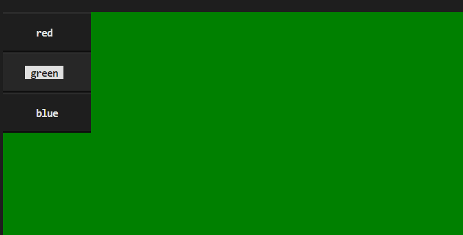

##### 3.2.8.2 测试文件的基本结构

在Python中，可以在开发时使用断言（`assert`）检查特定对象是否为预期的结果。pytest则是使用断言（`assert`）当作测试的检查工具。因此，编写测试，实际上就是编写能够覆盖问题点的断言语句。

但这也引出两个问题：断言不在程序内的话，如何使用断言检查程序内对象的情况？Textual是个TUI框架，很多操作需要用户交互，该如何模拟？

这就不得不提Textual程序的测试文件的基本组成。首先，要从被测试的程序文件内导入`App`子类；然后，将子类实例化之后再运行。这样就有`App`子类的示例对象了。同时，为了方便模拟操作，运行方法使用的是返回（完整用法参考[官网文档](https://textual.textualize.io/api/pilot/#textual.pilot.Pilot)）的`run_test`方法（完整用法参考[官网文档](https://textual.textualize.io/api/app/#textual.app.App.run_test)），而不是`run`方法。

运行`run_test`方法之后，此方法会返回一个`Pilot`对象，这是一个可以自动化操作程序的机器人，可以模拟用户的操作，以便于测试程序的交互结果。这时，使用异步上下文管理器（`async with`），就可以创建出自动化操作的完整过程。因为涉及到异步操作，测试时需要开启异步测试支持，本节使用的是命令行`pytest --asyncio-mode=auto`，读者可以根据需求和上节的介绍，选择合适的方式。

以下是一份简单的测试代码，读者可以将其保存到`test_myapp.py`中，然后在同级目录下运行`pytest --asyncio-mode=auto`，或者指定文件名运行`pytest --asyncio-mode=auto .\test_myapp.py`，并查看输出的结果：

```python3
from .myapp import MyApp
from textual.color import Color

async def test_myapp_keys():
    app = MyApp()
    async with app.run_test() as pilot:
        await pilot.press('r')
        assert app.screen.styles.background == Color.parse('red')
        await pilot.press('g')
        assert app.screen.styles.background == Color.parse('green')
        await pilot.press('b')
        assert app.screen.styles.background == Color.parse('blue')
        await pilot.press('x')
        assert app.screen.styles.background == Color.parse('blue')

async def test_myapp_buttons():
    app = MyApp()
    async with app.run_test() as pilot:
        await pilot.click('#red')
        assert app.screen.styles.background == Color.parse('red')
        await pilot.click('#green')
        assert app.screen.styles.background == Color.parse('green')
        await pilot.click('#blue')
        assert app.screen.styles.background == Color.parse('blue')
```

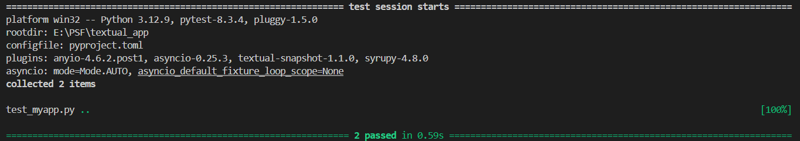

代码中涉及到`Pilot`对象的操作，下节会详细讲解，这里主要是学习测试代码的基本结构。

读者如果学习过前面介绍的`run`方法参数`auto_pilot`，就会发现这里的测试代码和那里介绍的代码很像，没错，当时介绍`auto_pilot`参数时，就说过此参数主要用于自动化测试，参数相关的`Pilot`对象和这里的`Pilot`对象是一样的。

因此，如果没有安装pytest框架，或者不想在外面单独测试，可以定义一个类似的异步函数（`Pilot`对象由参数提供，不需要使用`async with`），把上面的测试代码复制到函数内，这样就实现了集成测试（这里的意思是测试集成到正常程序内，不是测试方法中子功能完成后，与主程序一起联合测试）：

```python3

from textual.app import App
from textual.widgets import Button
from textual.color import Color


class MyApp(App):
    BINDINGS = [
        ('r', 'app.rgb("red")'),
        ('g', 'app.rgb("green")'),
        ('b', 'app.rgb("blue")'),
    ]

    def on_mount(self):
        self.widgets = [
            Button('red', id='red', action='app.rgb("red")'),
            Button('green', id='green', action='app.rgb("green")'),
            Button('blue', id='blue', action='app.rgb("blue")'),
        ]
        self.mount_all(self.widgets)

    def action_rgb(self, color: str = None):
        if color:
            self.screen.styles.background = Color.parse(color)

from textual.pilot import Pilot

async def test_myapp(pilot:Pilot):
    await pilot.wait_for_animation()
    await pilot.press('r')
    assert app.screen.styles.background == Color.parse('red')
    await pilot.press('g')
    assert app.screen.styles.background == Color.parse('green')
    await pilot.press('b')
    assert app.screen.styles.background == Color.parse('blue')
    await pilot.press('x')
    assert app.screen.styles.background == Color.parse('blue')
    await pilot.click('#red')
    assert app.screen.styles.background == Color.parse('red')
    await pilot.click('#green')
    assert app.screen.styles.background == Color.parse('green')
    await pilot.click('#blue')
    assert app.screen.styles.background == Color.parse('blue')
    pilot.app.exit(0)

if __name__ == '__main__':
    TEST = True
    app = MyApp()
    app.run(auto_pilot=test_myapp if TEST else None)
```

当`TEST`为`True`是，运行上面的程序，会自动进行测。如果代码没有问题，程序退出时，终端的输出就是干净的。假如代码有问题，终端就会输出报错。

##### 3.2.8.3 自动化操作——`Pilot`对象的方法

上一节中，展示了使用`Pilot`对象模拟用户操作的简单示例。本节将进一步深入`Pilot`对象支持的操作，详细介绍`Pilot`对象提供的方法。

为了方便演示效果，本节的示例代码没有放在测试文件中，而是集成到普通的Textual程序中。

`wait_for_animation`方法（完整介绍参考[官网文档](https://textual.textualize.io/api/pilot/#textual.pilot.Pilot.wait_for_animation)），此方法会等待当前正在播放的动画结束。

`wait_for_scheduled_animations`方法（完整介绍参考[官网文档](https://textual.textualize.io/api/pilot/#textual.pilot.Pilot.wait_for_scheduled_animations)），此方法会等待当前正在播放和准备播放的动画结束。

`pause`方法（完整介绍参考[官网文档](https://textual.textualize.io/api/pilot/#textual.pilot.Pilot.pause)），此方法会让`Pilot`对象等待CPU空闲，可以传入一个浮点小数，则会在延迟指定秒数之后再等待CPU空闲。

`press`方法（完整介绍参考[官网文档](https://textual.textualize.io/api/pilot/#textual.pilot.Pilot.press)），此方法可以模拟按键操作，给该方法传入表示按键的字符串，比如`pilot.press('r')`，`Pilot`对象则会按下对应按键。除了单一按键，还可以传入组合键，只需在字符串内使用`+`连接即可，比如`pilot.press('ctrl+c')`。也可以传入多个字符串，表示接连按下指定的按键，比如`pilot.press('r','ctrl+c')`。

需要注意的是，使用`press`方法模拟连续按下多个按键时，每次操作之间是没有间隔的，但依然可以确保上次操作是完成的。稳妥起见，还是不建议连续的按键操作间隔太短，可以使用`pause`方法作为中间的间隔：

```python3

from textual.app import App
from textual.widgets import Button
from textual.color import Color

class MyApp(App):
    BINDINGS = [
        ('r', 'app.rgb("red")'),
        ('g', 'app.rgb("green")'),
        ('b', 'app.rgb("blue")'),
    ]
    def on_mount(self):
        self.widgets = [
            Button('red', id='red', action='app.rgb("red")'),
            Button('green', id='green', action='app.rgb("green")'),
            Button('blue', id='blue', action='app.rgb("blue")'),
        ]
        self.mount_all(self.widgets)
    def action_rgb(self, color: str = None):
        if color:
            self.screen.styles.background = Color.parse(color)

from textual.pilot import Pilot

async def test_myapp(pilot:Pilot):
    await pilot.wait_for_animation()
    await pilot.pause(0.5)
    await pilot.press('r')
    await pilot.pause(0.5)
    await pilot.press('g')
    await pilot.pause(0.5)
    await pilot.press('b')

if __name__ == '__main__':
    TEST = True
    app = MyApp()
    app.run(auto_pilot=test_myapp if TEST else None)
```

`click`方法（完整介绍参考[官网文档](https://textual.textualize.io/api/pilot/#textual.pilot.Pilot.click)）可以模拟鼠标左键（主要键）单击操作。该方法支持以下参数：

-   `widget`参数，表示要点击的组件，和查询方法的语法一样，支持字符串选择器或者组件类。如果留空，则表示点击屏幕组件。
-   `offset`参数，两个元素的整数元组，表示点击终端的哪个位置。比如`(1,4)`，表示点击X坐标为1、Y坐标为4的位置。
-   `shift`参数，布尔类型，表示点击时是否同时按下`shift`键，默认为`False`。
-   `meta`参数，布尔类型，表示点击时是否同时按下`meta`键（Win下对应的`alt`键），默认为`False`。
-   `control`参数，布尔类型，表示点击时是否同时按下`ctrl`键，默认为`False`。
-   `times`参数，整数类型，表示点击多少次，默认为`1`。

需要注意的是，执行了`wait_for_animation`方法之后，不能立刻执行`click`方法，需要等待CPU空闲才行。但执行了`wait_for_scheduled_animations`方法之后可以立刻执行`click`方法。下面的模拟双击、三击、鼠标左键按下、鼠标左键抬起同样受此规则约束。

`double_click`方法（完整介绍参考[官网文档](https://textual.textualize.io/api/pilot/#textual.pilot.Pilot.double_click)）可以模拟鼠标左键（主要键）双击操作，没有`times`参数，其余参数与`click`方法一致。

`triple_click`方法（完整介绍参考[官网文档](https://textual.textualize.io/api/pilot/#textual.pilot.Pilot.triple_click)）可以模拟鼠标左键（主要键）三击操作，没有`times`参数，其余参数与`click`方法一致。

`hover`方法（完整介绍参考[官网文档](https://textual.textualize.io/api/pilot/#textual.pilot.Pilot.hover)）可以模拟鼠标悬停。该方法支持与`click`方法相同的`widget`参数和`offset`参数。

`mouse_down`方法（完整介绍参考[官网文档](https://textual.textualize.io/api/pilot/#textual.pilot.Pilot.mouse_down)）可以模拟鼠标左键（主要键）按下（不抬起来），支持的参数与`double_click`方法相同。

`mouse_up`方法（完整介绍参考[官网文档](https://textual.textualize.io/api/pilot/#textual.pilot.Pilot.mouse_up)）可以模拟鼠标左键（主要键）抬起（不包括按下的过程，点击操作是按下、抬起的完整过程，因此不会触发点击事件），支持的参数与`double_click`方法相同。

`exit`方法（完整介绍参考[官网文档](https://textual.textualize.io/api/pilot/#textual.pilot.Pilot.exit)）可以模拟程序退出。注意，此方法支持一个`result`参数，含义同`app.exit`的`result`参数，并且必须给此参数传值，否则会报错。如果想不传入参数就退出程序，可以使用`Pilot`对象的`app`成员的`exit`方法，此方法不传值也能使用。

`resize_terminal`方法（完整介绍参考[官网文档](https://textual.textualize.io/api/pilot/#textual.pilot.Pilot.resize_terminal)）模拟调整终端的大小（仅支持无头模式，设置无头模式参考下一节）。此方法支持整数类型的`width`参数和`height`参数，表示终端调整到什么宽度和高度。

##### 3.2.8.4 自动化操作——`run_test`方法的参数

上一节最后的部分提到无头模式，关于启用无头模式的方法，需要了解一下`run_test`方法（完整用法参考[官网文档](https://textual.textualize.io/api/app/#textual.app.App.run_test)）支持的参数：

-   `headless`参数，布尔类型，表示是否开启无头模式。所谓无头模式，即不在终端输出内容的模式，但程序的组件依然可以通过编程交互。不同与`run`方法默认是当正常程序运行，`run_test`方法默认是执行自动化测试，因此，该参数默认为`True`，即开启。
-   `size`参数，整数元组类型，表示程序启动时的显示大小（即整个`Screen`组件的大小），拖动终端时会让显示大小重新调整。元组只有两个元素：第一个元素表示显示的宽度（字符数），默认为`80`,；第二个元素表示显示的高度（字符数），默认为`24`。
-   `tooltips`参数，布尔类型，表示是否显示组件触发的工具提示，默认为`False`。
-   `notifications`参数，布尔类型，表示是否显示操作触发的通知，默认为`False`。
-   `message_hook`参数，可调用类型，表示当程序内有消息传递时，将此消息作为参数传递给该参数代表的方法，就像一个消息钩子一样。默认为`None`，即没有消息钩子。

##### 3.2.8.5 使用快照比较`snap_compare`

除了使用pytest执行命令行输出测试结果的常规测试之外，在安装`pytest-textual-snapshot`插件之后，可以在测试文件中使用`snap_compare`关键字，创建Textual程序执行状态的快照比较。

所谓快照，就是截图，但一般的截图不好比较，因此Textual创建了插件，可以把截图保存为svg格式，用于比较不同测试批次的快照。

将`test_myapp.py`的内容修改如下，然后运行`pytest`命令：

```python3
def test_myapp(snap_compare):
    assert snap_compare("./myapp.py")
```

代码中的`snap_compare`由插件提供，给该方法传入被测试程序的路径，插件就会将程序运行的界面截图，并判断该截图是否与先前运行的结果一致，返回判断结果。使用断言关键字，可以让pytest框架识别到比较的结果。

如果是第一次运行快照比较，通常会得到测试失败的结果：

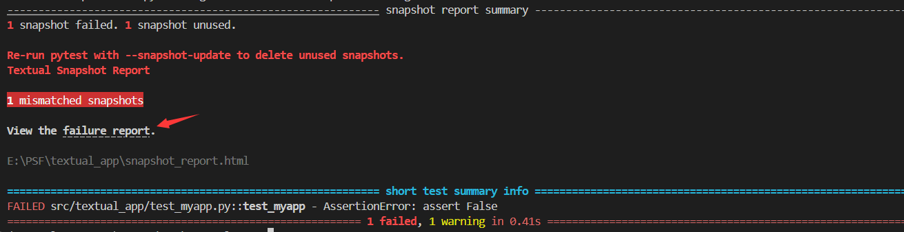

点击箭头处链接，或者在测试文件所在目录下寻找`snapshot_report.html`，使用浏览器打开，可以查看快照比较的结果。其中左边的快照是当前测试的快照，右边表示历史快照，也就是正确的快照。该结果只在测试失败时生成，但第一次运行时比较特殊，因为之前没有保存下来的快照，所以运行测试时，比较结果自然不同。

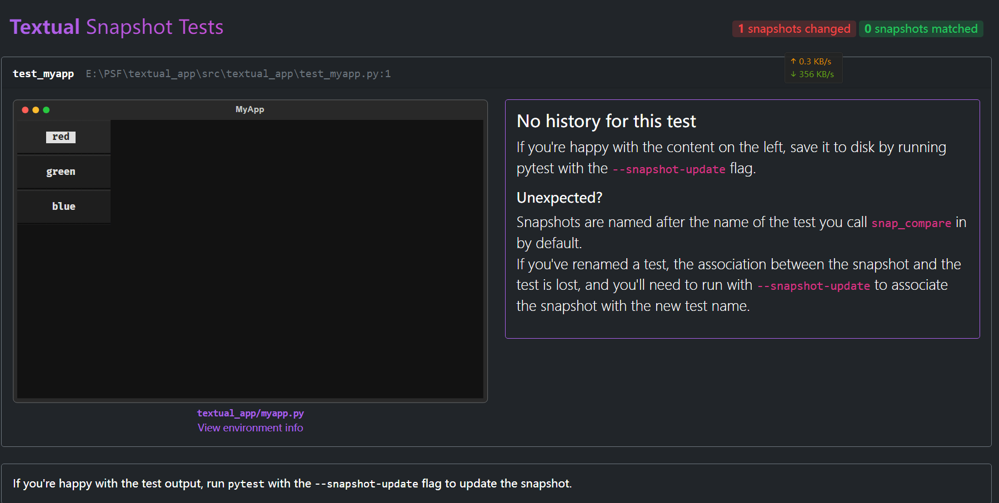

如果此时结果中的截图符合预期，则可以使用`pytest --snapshot-update`更新程序快照，将此快照保存，作为正确的结果。之后再运行`pytest`命令时，如果结果一致，就不会测试失败，也不会生成新的结果了。

当然，如果想了解出现问题时的结果，可以将被测试的程序修改一下（仅限本示例，后续代码请将修改处复原）：

```python3

from textual.app import App
from textual.widgets import Button
from textual.color import Color

class MyApp(App):
    BINDINGS = [
        ('r', 'app.rgb("red")'),
        ('g', 'app.rgb("green")'),
        ('b', 'app.rgb("blue")'),
    ]

    def on_mount(self):
        self.widgets = [
            Button('r', id='red', action='app.rgb("red")'),# 'red'改为'r'
            Button('green', id='green', action='app.rgb("green")'),
            Button('blue', id='blue', action='app.rgb("blue")'),
        ]
        self.mount_all(self.widgets)

    def action_rgb(self, color: str = None):
        if color:
            self.screen.styles.background = Color.parse(color)

if __name__ == '__main__':
    app = MyApp()
    app.run()
```

再运行`pytest`命令，并查看结果：

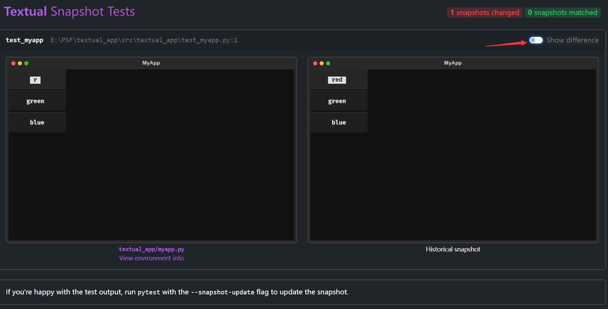

如果程序的界面比较复杂，可以点击箭头所示的开关，这样右边表示正确结果的快照就只显示差异内容，不显示完整内容。

使用`snap_compare`时，可以传入以下参数：

-   `app`参数，字符串类型或者`PurePath`类型（来自标准库`pathlib`）或者`App`子类，此参数是必需的。如果传入的是字符串或者`PurePath`类的实例，测试框架会将其当做文件路径，直接运行该文件并截图；如果传入的是`App`子类的实例，则会直接运行该实例的`run`方法，并截图。

-   `press`参数，字符串列表，表示在运行目标程序时，模拟按下的按键。列表中的每个字符串表示按下一次按键（支持组合键）。

-   `terminal_size`参数，整数元组类型，表示程序启动时的显示大小（即整个`Screen`组件的大小），拖动终端时会让显示大小重新调整。元组只有两个元素：第一个元素表示显示的宽度（字符数），默认为`80`,；第二个元素表示显示的高度（字符数），默认为`24`。

-   `run_before`参数，可调用类型，表示在截图之前，被测试程序执行的自动化操作。传给该参数的函数会被传入一个`Pilot`类型的对象（`from textual.pilot import Pilot`导入，支持的操作参考[官网文档](https://textual.textualize.io/api/pilot/)）作为参数，并在函数内部定义一系列使用该对象的自动化操作。可以看出，此参数实际上和`run`方法的`auto_pilot`参数一样。因此，如果截图时需要前置操作，可以给该参数传入模拟自动化的函数：

    ```python3
    from .myapp import MyApp
    from textual.pilot import Pilot
    
    async def control_myapp(pilot: Pilot):
        await pilot.wait_for_animation()
        await pilot.press('b')
    
    def test_myapp(snap_compare):
        app = MyApp()
        assert snap_compare(app, run_before=control_myapp)
    ```

    如果当前快照是符合预期的正确快照，可以使用`pytest --snapshot-update`更新历史快照：

    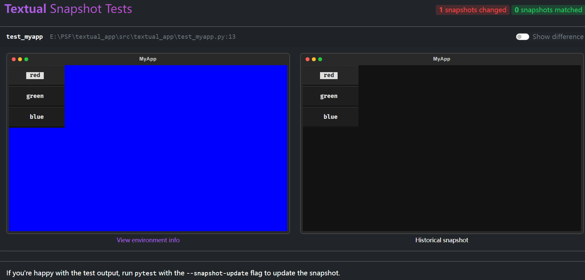

## 4 组件一览

### 4.1 常用组件

本节主要介绍常用组件及其的常用功能、示例，更多用法和介绍参考[官网完整文档](https://textual.textualize.io/widgets/)。

#### 4.1.1 内容展示组件

内容展示组件常用于展示内容，一般不需要用户主动交互。

##### 4.1.1.1 `Static`静态文本组件

静态文本组件是最简单的文本显示组件，这也是为什么第一节内容中会使用该组件显示文本内容。该组件的完整用法可以参考[官网文档](https://textual.textualize.io/widgets/label/)。

静态文本组件支持以下参数：

-   `content`参数，可渲染类型或者支持可视化类型（实现了`visualize`方法并且该方法返回可渲染对象的类），表示静态文本显示的内容。一般的可渲染类型就不必多说，除了常规的字符串，更多是使用Rich的可渲染类型来包装、修饰的内容，这里就不写例子了。对于支持可视化类型的例子，这里简单写一个：

    ```python3
    from textual.app import App
    from textual.widgets import Static
    
    class RichText:
        def __init__(self,text):
            self._text = text
        def visualize(self):
            from rich.text import Text
            return Text.from_markup(self._text)
    
    class MyApp(App):
        def on_mount(self):
            self.widgets = [
                Static(content=RichText('Hello World'))
            ]
            self.mount_all(self.widgets)
    
    if __name__ == '__main__':
        app = MyApp()
        app.run()
    ```

    此参数是位置参数，即可以不用指定参数名直接传入。后面的几个参数均为关键字参数，必须指定参数名才能传入。

-   `expand`参数，布尔类型，表示当内容的宽度小于容器的宽度时，是否扩展内容的宽度来填满整个容器的宽度，默认为`False`。以下面的代码为例，将此参数设置为`True`，可以让静态文本组件的宽度正好等于容器的宽度：

    ```python3
    from textual.app import App
    from textual.widgets import Static
    from textual.containers import Container
    
    class MyApp(App):
        CSS = '''
        Static {
            border: solid yellow;
            width: auto;
        }
        Container {
            border: solid green;
            width: 25;
        }
        '''
        def on_mount(self):
            self.widgets = [
                Container(
                Static(content='Hello World',expand=True)
                )
            ]
            self.mount_all(self.widgets)
    
    if __name__ == '__main__':
        app = MyApp()
        app.run()
    ```

    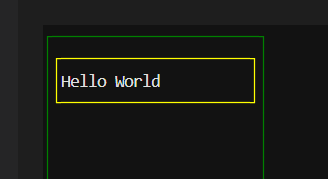

-   `shrink`参数，布尔类型，表示当内容的宽度大于容器的宽度时，是否收缩内容的宽度来填满整个容器的宽度，默认为`False`。以下面的代码为例，将此参数设置为`True`，可以让静态文本组件的宽度正好等于容器的宽度：

    ```python3
    from textual.app import App
    from textual.widgets import Static
    from textual.containers import Container
    
    class MyApp(App):
        CSS = '''
        Static {
            border: solid yellow;
            width: auto;
        }
        Container {
            border: solid green;
            width: 10;
        }
        '''
        def on_mount(self):
            self.widgets = [
                Container(
                Static(content='Hello World',shrink=True)
                )
            ]
            self.mount_all(self.widgets)
    
    if __name__ == '__main__':
        app = MyApp()
        app.run()
    ```

    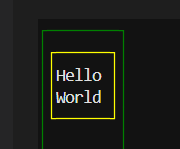

-   `markup`参数，布尔类型，表示是否解析文本内容中的Markup标签（会有专门章节介绍，这里可以简单理解为类似HTML标签的一种格式），默认为`True`，即解析。如果不需要解析，可以使用`escape`方法（使用`from textual.markup import escape`导入）转义，或者将此参数设置为`False`。示例如下：

    ```python3
    from textual.app import App
    from textual.widgets import Static
    from textual.containers import Container
    from textual.markup import escape
    
    class MyApp(App):
        def on_mount(self):
            self.widgets = [
                Container(
                Static(content='[red]Hello[/] World'),
                Static(content='[red]Hello[/] World',markup=False),
                Static(content=escape('[red]Hello[/] World')),
                )
            ]
            self.mount_all(self.widgets)
    
    if __name__ == '__main__':
        app = MyApp()
        app.run()
    ```

    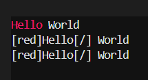

-   `name`参数，字符串类型，表示组件的名字，常用于调试时区分组件。

-   `id`参数，字符串类型，表示组件的ID，主要用于样式中的ID选择器。

-   `classes`参数，字符串类型，表示组件的样式类。

-   `disabled`参数，布尔类型，表示组件是否处于被禁用状态，默认为`False`。处于禁用状态的组件除了不能响应用户的操作（静态文本组件默认没有响应动作），还会显示为伪类设计的样式（静态文本组件没有设计禁用时的伪类样式）。如果想区分静态文本组件是否被禁用，可以参考下面的示例代码：

    ```python3
    from textual.app import App
    from textual.widgets import Static
    
    class MyApp(App):
        CSS = '''
        Static:disabled {
            border:solid yellow;
            color: $link-color 50%;
        }
        '''
        def on_mount(self):
            self.widgets = [
                Static(content='[red]Hello[/] World'),
                Static(content='[red]Hello[/] World',disabled=True)
            ]
            self.mount_all(self.widgets)
    
    if __name__ == '__main__':
        app = MyApp()
        app.run()
    ```

    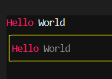

静态文本组件支持以下属性：

-   `renderable`属性，表示静态文本组件显示的内容，可以在组件创建后，使用此属性获取显示的内容。如果想要更新静态文本组件的内容，请使用`update`方法。

静态文本组件支持以下方法：

-   `update`方法，用于更新静态文本组件显示的内容。该方法只有一个`content`参数，支持的类型和用法同静态文本组件的`content`参数。

##### 4.1.1.2 `Label`文本标签组件

继承自静态文本组件，但比静态文本组件多了一个参数`variant`，并且默认的位置参数名改成了`renderable`。该组件的完整用法可以参考[官网文档](https://textual.textualize.io/widgets/label/)。大部分时候，文本标签组件和静态文本组件的用法、显示接近，只不过文本标签组件的额外参数让文本标签组件比静态文本组件的显示效果更丰富。

文本标签组件支持以下参数：

-   `renderable`参数，可渲染类型或者支持可视化类型（实现了`visualize`方法并且该方法返回可渲染对象的类），表示静态文本显示的内容。一般的可渲染类型就不必多说，除了常规的字符串，更多是使用Rich的可渲染类型来包装、修饰的内容，这里就不写例子了。对于支持可视化类型的例子，这里简单写一个：

    ```python3
    from textual.app import App
    from textual.widgets import Label
    
    class RichText:
        def __init__(self,text):
            self._text = text
        def visualize(self):
            from rich.text import Text
            return Text.from_markup(self._text)
    
    class MyApp(App):
        def on_mount(self):
            self.widgets = [
                Label(renderable=RichText('Hello World'))
            ]
            self.mount_all(self.widgets)
    
    if __name__ == '__main__':
        app = MyApp()
        app.run()
    ```

    此参数是位置参数，即可以不用指定参数名直接传入。后面的几个参数均为关键字参数，必须指定参数名才能传入。

-   `variant`参数，字符串类型，表示文本标签组件预设的显示效果。默认为`None`，即没有显示效果，可以将该参数设置为`["success", "error", "warning", "primary", "secondary", "accent"]`中的任意一个，切换显示效果（实际上是给组件添加对应名字的样式类）。示例如下：

    ```python3
    from textual.app import App
    from textual.widgets import Label
    
    class MyApp(App):
        def on_mount(self):
            self.widgets = [
                Label(renderable=f'Hello World from {name}',variant=name) 
                for name in [None,"success", "error", "warning", "primary", "secondary", "accent"]
            ]
            self.mount_all(self.widgets)
    
    if __name__ == '__main__':
        app = MyApp()
        app.run()
    ```

    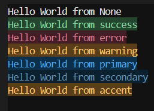

-   `expand`参数，布尔类型，表示当内容的宽度小于容器的宽度时，是否扩展内容的宽度来填满整个容器的宽度，默认为`False`。以下面的代码为例，将此参数设置为`True`，可以让文本标签组件的宽度正好等于容器的宽度：

    ```python3
    from textual.app import App
    from textual.widgets import Label
    from textual.containers import Container
    
    class MyApp(App):
        CSS = '''
        Label {
            border: solid yellow;
            width: auto;
        }
        Container {
            border: solid green;
            width: 25;
        }
        '''
        def on_mount(self):
            self.widgets = [
                Container(
                Label(renderable='Hello World',expand=True)
                )
            ]
            self.mount_all(self.widgets)
    
    if __name__ == '__main__':
        app = MyApp()
        app.run()
    ```

    

-   `shrink`参数，布尔类型，表示当内容的宽度大于容器的宽度时，是否收缩内容的宽度来填满整个容器的宽度，默认为`False`。以下面的代码为例，将此参数设置为`True`，可以让文本标签组件的宽度正好等于容器的宽度：

    ```python3
    from textual.app import App
    from textual.widgets import Label
    from textual.containers import Container
    
    class MyApp(App):
        CSS = '''
        Label {
            border: solid yellow;
            width: auto;
        }
        Container {
            border: solid green;
            width: 10;
        }
        '''
        def on_mount(self):
            self.widgets = [
                Container(
                Label(renderable='Hello World',shrink=True)
                )
            ]
            self.mount_all(self.widgets)
    
    if __name__ == '__main__':
        app = MyApp()
        app.run()
    ```

    

-   `markup`参数，布尔类型，表示是否解析文本内容中的Markup标签（后面会有专门章节介绍，这里可以简单理解为类似HTML标签的一种格式），默认为`True`，即解析。如果不需要解析，可以使用`escape`方法（使用`from textual.markup import escape`导入）转义，或者将此参数设置为`False`。示例如下：

    ```python3
    from textual.app import App
    from textual.widgets import Label
    from textual.containers import Container
    from textual.markup import escape
    
    class MyApp(App):
        def on_mount(self):
            self.widgets = [
                Container(
                Label(renderable='[red]Hello[/] World'),
                Label(renderable='[red]Hello[/] World',markup=False),
                Label(renderable=escape('[red]Hello[/] World')),
                )
            ]
            self.mount_all(self.widgets)
    
    if __name__ == '__main__':
        app = MyApp()
        app.run()
    ```

    

-   `name`参数，字符串类型，表示组件的名字，常用于调试时区分组件。

-   `id`参数，字符串类型，表示组件的ID，主要用于样式中的ID选择器。

-   `classes`参数，字符串类型，表示组件的样式类。

-   `disabled`参数，布尔类型，表示组件是否处于被禁用状态，默认为`False`。处于禁用状态的组件除了不能响应用户的操作（文本标签组件默认没有响应动作），还会显示为伪类设计的样式（文本标签组件没有设计禁用时的伪类样式）。如果想区分文本标签组件是否被禁用，可以参考下面的示例代码：

    ```python3
    from textual.app import App
    from textual.widgets import Label
    
    class MyApp(App):
        CSS = '''
        Label:disabled {
            border:solid yellow;
            color: $link-color 50%;
        }
        '''
        def on_mount(self):
            self.widgets = [
                Label(renderable='[red]Hello[/] World'),
                Label(renderable='[red]Hello[/] World',disabled=True)
            ]
            self.mount_all(self.widgets)
    
    if __name__ == '__main__':
        app = MyApp()
        app.run()
    ```

    

文本标签组件支持以下属性：

-   `renderable`属性，表示文本标签组件显示的内容，可以在组件创建后，使用此属性获取显示的内容。如果想要更新文本标签组件的内容，请使用`update`方法。

文本标签组件支持以下方法：

-   `update`方法，用于更新文本标签组件显示的内容。该方法只有一个`content`参数，支持的类型和用法同文本标签组件的`renderable`参数。

##### 4.1.1.3 `Pretty`美化文本组件

如果觉得需要手动设置文本的颜色或者样式来让文本内容变得美观有点费事，那可以试试美化文本组件，完整用法可以参考[官网文档](https://textual.textualize.io/widgets/pretty/)。美化文本组件会自动选择合适的语法高亮来显示文本，支持任何可以转化为字符串的对象。

美化文本组件支持以下参数：

-   `object`参数，任意对象，表示组件要显示的内容。组件显示时会将对象转化为字符串，因此，不支持转化为字符串的对象不能显示。
-   `name`参数，字符串类型，表示组件的名字，常用于调试时区分组件。

-   `id`参数，字符串类型，表示组件的ID，主要用于样式中的ID选择器。

-   `classes`参数，字符串类型，表示组件的样式类。

简单用法如下：

```python3
from textual.app import App
from textual.widgets import Pretty

class MyApp(App):
    def on_mount(self):
        self.widgets = [
            Pretty(object=self)
        ]
        self.mount_all(self.widgets)

if __name__ == '__main__':
    app = MyApp()
    app.run()
```

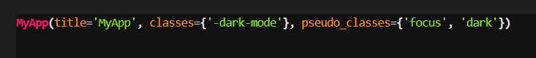

美化文本组件支持以下方法：

-   `update`方法，用于更新美化文本组件显示的内容。该方法只有一个`object`参数，支持的类型和用法同美化文本组件的`object`参数。因为没有修改显示内容的属性，因此只能使用此方法修改显示内容。

##### 4.1.1.4 `Digits`数码显示组件

数码显示组件可以让被显示的内容呈现出类似数码管效果的样式，完整用法参考[官网文档](https://textual.textualize.io/widgets/digits/)。

数码显示组件支持以下参数：

-   `value`参数，字符串类型，表示显示出来的文字内容，其中只有`".0123456789+-^x:ABCDEF$£€()"`中的字符会被数码化，其余字符则是正常原样显示。
-   `name`参数，字符串类型，表示组件的名字，常用于调试时区分组件。
-   `id`参数，字符串类型，表示组件的ID，主要用于样式中的ID选择器。
-   `classes`参数，字符串类型，表示组件的样式类。
-   `disabled`参数，布尔类型，表示组件是否处于被禁用状态，默认为`False`。

数码显示组件支持以下属性：

-   `value`属性，表示数码显示组件显示的内容，可以在组件创建后，使用此属性获取显示的内容。如果想要更新数码显示组件的内容，请使用`update`方法。

数码显示组件支持以下方法：

-   `update`方法，用于更新数码显示组件显示的内容。该方法只有一个`value`参数，支持的类型和用法同数码显示组件的`value`参数。

示例如下：

```python3
from textual.app import App
from textual.widgets import Digits

DIGITS = ".0123456789+-^x:ABCDEF$£€()"

class MyApp(App):
    def on_mount(self):
        self.widgets = [
            Digits(DIGITS)
        ]
        self.mount_all(self.widgets)

if __name__ == '__main__':
    app = MyApp()
    app.run()
```

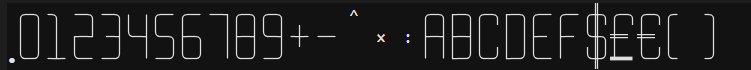

如果觉得终端的数显效果不够明显，可以在样式中添加`text-style:bold;`，使用粗体样式：

```python3
from textual.app import App
from textual.widgets import Digits

DIGITS = ".0123456789+-^x:ABCDEF$£€()"

class MyApp(App):
    CSS = '''
    .digits {
        text-style:bold;
    }
    '''
    def on_mount(self):
        self.widgets = [
            Digits(DIGITS),
            Digits(DIGITS,classes='digits')
        ]
        self.mount_all(self.widgets)

if __name__ == '__main__':
    app = MyApp()
    app.run()
```

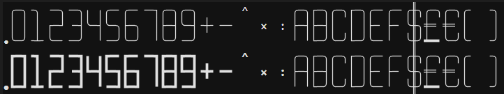

当然，数码显示组件最好的用途就是用来显示数字内容，比如时间：

```python3
from textual.app import App
from textual.widgets import Digits
from datetime import datetime

class MyApp(App):
    def on_mount(self):
        self.widgets = [
            Digits(''),
        ]
        self.mount_all(self.widgets)
        self.update_clock()
        self.set_interval(1, self.update_clock)
       
    def update_clock(self):
        clock = datetime.now().time()
        self.query_one(Digits).update(f"{clock:%T}")

if __name__ == '__main__':
    app = MyApp()
    app.run()
```

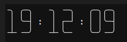

##### 4.1.1.5 `Log`日志组件

因为Textual是个TUI框架，默认会独占终端的日志输出。如果想要在Textual程序中显示那些原本显示在终端的日志信息，可以使用日志组件，完整用法参考[官网文档](https://textual.textualize.io/widgets/log/)。

组件支持以下参数：

-   `highlight`参数，布尔类型，表示是否启用语法高亮，默认为`False`。语法高亮可以让显示在日志组件中的特定格式的文本使用别的颜色显示，比如时间。
-   `max_lines`参数，整数类型，表示日志组件最多显示多少行，默认为`None`即没有限制。超过最大行数之后，增加新的内容会让最早显示的内容被顶掉。
-   `auto_scroll`参数，布尔类型，表示当组件所显示的内容超出组件的可视大小时，是否自动滚动到最下面来确保最新的内容可以立刻看到。该参数默认为`True`。
-   `name`参数，字符串类型，表示组件的名字，常用于调试时区分组件。
-   `id`参数，字符串类型，表示组件的ID，主要用于样式中的ID选择器。
-   `classes`参数，字符串类型，表示组件的样式类。
-   `disabled`参数，布尔类型，表示组件是否处于被禁用状态，默认为`False`。

组件支持以下属性（部分常用，非全部）：

-   `max_lines`属性， 含义同`max_lines`参数。
-   `auto_scroll`属性，含义同`auto_scroll`参数。
-   `line_count`属性，表示组件当前的内容一共多少行。
-   `lines`属性，表示组件当前的内容。注意，该属性是个字符串数组。
-   `highlight`属性，同`highlight`参数。虽然该属性不是反应性属性，但设置该属性可以实时生效并刷新显示。
-   `highlighter`属性，当组件启用语法高亮时，设置此属性可以定义语法高亮方案。默认此属性为[`ReprHighlighter`](https://rich.readthedocs.io/en/stable/reference/highlighter.html#rich.highlighter.ReprHighlighter)对象。

组件支持以下反应性属性：

-   `max_lines`属性， 含义同`max_lines`参数。
-   `auto_scroll`属性，含义同`auto_scroll`参数。

反应性属性用起来和一般的属性类似，但修改反应性属性会触发组件的显示刷新，高阶技巧中会单独介绍反应性属性。如果读者暂时不想了解太多有关反应性属性的细节，只需记住修改反应性属性会触发组件的显示刷新即可。

组件支持以下方法（部分常用，非全部）：

-   `clear`方法，清除组件当前的内容并刷新显示。
-   `write`方法，将内容写入组件的当前行。注意，上次写入的内容中没有换行，那么本次写入的内容会写入同一行。
-   `write_line`方法，先换行，然后将内容写入组件的当前行。注意，本方法虽然是先换行再写入，但写入的内容不包括换行的话，本方法执行完之后，下次写入如果不是先换行，下次写入的内容依然在本行。本方法支持一个参数`line`，字符串类型，表示要写入的内容。
-   `write_lines`方法，将一个元素为字符串的可迭代对象写入组件，写入每个元素时，先换行再写入。本方法支持两个参数：
    -   `lines`参数，元素为字符串的可迭代类型，表示要写入的内容。注意，如果传给该参数的只是一个字符串，在迭代拆分前，`highlight`参数为`True`时，会先将其高亮，之后再迭代。
    -   `scroll_end`参数，布尔类型，默认为`None`，表示是否在写入所有内容后滚动到最下面。如果没有传入参数，或者值为默认的`None`，则根据`auto_scroll`参数的值决定是否滚动到最下面。

代码示例如下：

```python3
from textual.app import App
from textual.widgets import Log
from datetime import datetime

class MyApp(App):
    def on_mount(self):
        self.widgets = [
            Log(highlight=True),
        ]
        self.mount_all(self.widgets)
        self.query_one(Log).write_line(f'{datetime.now()} Booting...')
    def on_ready(self):
        self.query_one(Log).write_line(f'{datetime.now()} All is ready.')

if __name__ == '__main__':
    app = MyApp()
    app.run()
```

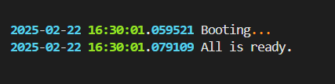

##### 4.1.1.6 `RichLog`美化日志组件

日志组件支持的，美化日志组件也支持，那Textual为何还要添加一个新的同类组件呢？其实，美化日志组件除了支持字符串，还支持任意可渲染对象，而且美化日志组件可以自定义的的部分更多，完整用法参考[官网文档](https://textual.textualize.io/widgets/rich_log/)。

在正式介绍美化日志组件之前，先用一个与日志组件对比的例子，简单了解一下美化日志组件的特点：

```python3
from textual.app import App
from textual.widgets import Log,RichLog

class MyApp(App):
    def on_mount(self):
        self.widgets = [
            Log(highlight=True),
            RichLog()
        ]
        self.mount_all(self.widgets)

    def on_ready(self):
        self.query_one(Log).write(f'{self}')
        self.query_one(RichLog).write(self)

if __name__ == '__main__':
    app = MyApp()
    app.run()
```

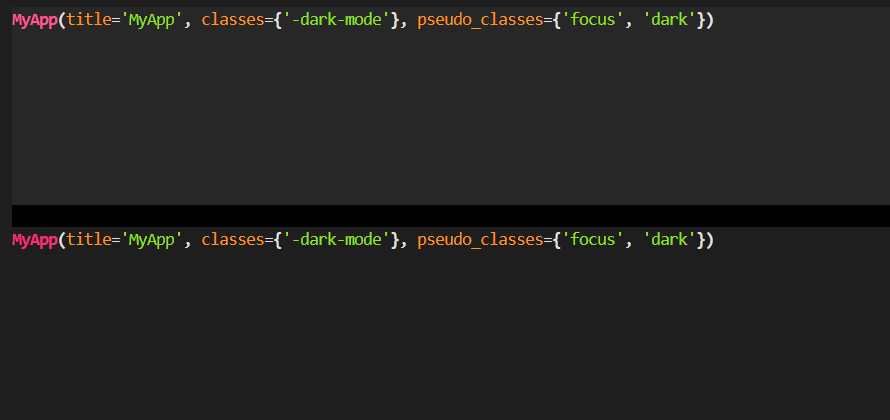

从上面的图片可以发现，输出相同内容的情况下，日志组件需要将被输出的对象转化为字符串并开启语法高亮，美化日志组件则可以一气呵成。注意，虽然美化日志组件也有语法高亮开关，但输出内容为非字符串时，语法高亮是自动开启的。

组件支持以下参数：

-   `max_lines`参数，整数类型，表示组件最多显示多少行，默认为`None`即没有限制。超过最大行数之后，增加新的内容会让最早显示的内容被顶掉。
-   `min_width`参数，整数类型，表示使用组件的`write`方法输出内容时，没有给`write`方法的`width`参数传值时，默认传给`width`参数的值，也可以理解为组件输出内容的最小宽度。该参数默认为`78`。
-   `wrap`参数，布尔类型，表示是否启用自动换行，默认为`False`。自动换行就是每行输出的内容超出组件可显示的宽度时，是否将该行换行显示。需要注意的事，每次换行会使总行数增加一行，最终总行数不超过组件可显示的最大行数。
-   `highlight`参数，布尔类型，表示是否启用语法高亮，默认为`False`。语法高亮可以让显示在组件中的特定格式的文本使用别的颜色显示，比如时间。此参数仅在组件需要显示字符串时有效，如果直接显示非字符串类型的可渲染对象，则自动给被显示的对象启用语法高亮，且不受`highlight`参数和`highlight`属性的影响。
-   `markup`参数，布尔类型，表示是否解析文本内容中的Markup标签（会有专门章节介绍，这里可以简单理解为类似HTML标签的一种格式），默认为`False`，即不解析。
-   `auto_scroll`参数，布尔类型，表示当组件所显示的内容超出组件的可视大小时，是否自动滚动到最下面来确保最新的内容可以立刻看到。该参数默认为`True`。
-   `name`参数，字符串类型，表示组件的名字，常用于调试时区分组件。
-   `id`参数，字符串类型，表示组件的ID，主要用于样式中的ID选择器。
-   `classes`参数，字符串类型，表示组件的样式类。
-   `disabled`参数，布尔类型，表示组件是否处于被禁用状态，默认为`False`。

组件支持以下属性（部分常用，非全部）：

-   `max_lines`属性， 含义同`max_lines`参数。
-   `min_width`属性，含义同`min_width`参数。
-   `auto_scroll`属性，含义同`auto_scroll`参数。
-   `wrap`属性，含义同`wrap`参数。
-   `markup`属性，含义同`markup`参数。
-   `lines`属性，表示组件当前的内容。注意，该属性是个条对象数组。
-   `highlight`属性，同`highlight`参数。
-   `highlighter`属性，当组件启用语法高亮时，设置此属性可以定义语法高亮方案。默认此属性为[`ReprHighlighter`](https://rich.readthedocs.io/en/stable/reference/highlighter.html#rich.highlighter.ReprHighlighter)对象。

组件支持以下反应性属性：

-   `max_lines`属性， 含义同`max_lines`参数。
-   `min_width`属性，含义同`min_width`参数。
-   `highlight`属性，同`highlight`参数。
-   `wrap`属性，含义同`wrap`参数。
-   `markup`属性，含义同`markup`参数。

组件支持以下方法（部分常用，非全部）：

-   `clear`方法，清除组件当前的内容并刷新显示。

-   `write`方法，在组件中写入新的内容。因为组件支持可渲染对象，而可渲染对象可能跨多行，因此组件默认将每次写入的内容当成整体处理。而且组件没有单独的写入后换行的方法，只需一个`write`方法即可。该方法支持以下参数：

    -   `content`参数，可渲染类型，表示要写入的内容，支持任何可渲染对象。

    -   `width`参数，整数类型，表示本次写入内容的宽度，默认为`None`，表示与`min_width`参数一致。

    -   `expand`参数，布尔类型，表示当内容的宽度小于组件的宽度时，是否允许内容可扩展的宽度等于整个组件的宽度，默认为`False`。如果指定了`width`参数，则此参数会被忽略。此参数主要作用于Rich的可渲染对象，比如下面的`Panel`：

        ```python3
        from textual.app import App
        from textual.widgets import RichLog
        from rich.panel import Panel
        
        class MyApp(App):
            CSS = '''
            RichLog {
                border: solid yellow;
                width: 100;
            }
            '''
            def on_mount(self):
                self.widgets = [
                    RichLog(min_width=1)
                ]
                self.mount_all(self.widgets)
            def on_ready(self):
                self.query_one(RichLog).write(Panel('Hello World',expand=True,height=3),expand=True)
        
        if __name__ == '__main__':
            app = MyApp()
            app.run()
        ```

        只有设置美化日志组件的`expand`参数为`True`时，`Panel`才能填满整个组件：

        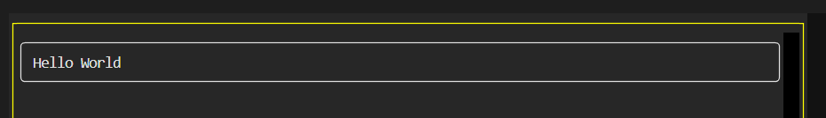

    -   `shrink`参数，布尔类型，表示当原本内容的宽度大于组件的宽度时，是否收缩内容的宽度至组件的宽度，默认为`True`。如果指定了`width`参数，则此参数会被忽略。以下为该参数设置为`False`的示例，读者可以与该参数为`True`的结果对比一下：

        ```python3
        from textual.app import App
        from textual.widgets import RichLog
        from rich.panel import Panel
        
        class MyApp(App):
            CSS = '''
            RichLog {
                border: solid yellow;
                width: 100;
            }
            '''
            def on_mount(self):
                self.widgets = [
                    RichLog(min_width=1)
                ]
                self.mount_all(self.widgets)
            def on_ready(self):
                self.query_one(RichLog).write(Panel('Hello World'*10,height=3),shrink=False)
        
        if __name__ == '__main__':
            app = MyApp()
            app.run()
        ```

        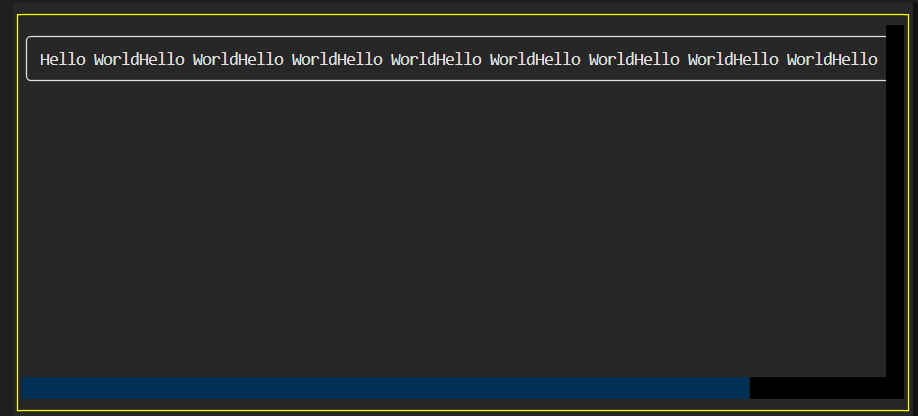

    -   `scroll_end`参数，布尔类型，默认为`None`，表示是否在写入所有内容后滚动到最下面。如果没有传入参数，或者值为默认的`None`，则根据`auto_scroll`参数的值决定是否滚动到最下面。

    -   `animate`参数，布尔类型，表示写入内容太多且需要滚动时，是否启用滚动动画，默认为`False`，即直接滚动，没有动画过渡。

##### 4.1.1.7 `Rule`分隔线组件

如果两个组件挨着太近，需要一条分隔线当做它们之间的边界，可以试试分隔线组件，完整用法参考[官网文档](https://textual.textualize.io/widgets/rule/)。

组件支持以下参数：

-   `orientation`参数，字符串类型，表示分隔线的方向，仅支持`["horizontal","vertical"]`中的值（分别是水平、垂直），默认为`"horizontal"`，即水平。
-   `line_style`参数，字符串类型，表示分隔线的风格，仅支持`["ascii","blank","dashed","double","heavy","hidden","none","solid","thick"]`中的值，默认为`"solid"`。
-   `name`参数，字符串类型，表示组件的名字，常用于调试时区分组件。
-   `id`参数，字符串类型，表示组件的ID，主要用于样式中的ID选择器。
-   `classes`参数，字符串类型，表示组件的样式类。
-   `disabled`参数，布尔类型，表示组件是否处于被禁用状态，默认为`False`。

组件支持以下属性：

-   `orientation`属性， 含义同`orientation`参数。
-   `line_style`属性，含义同`line_style`参数。

组件支持以下反应性属性：

-   `orientation`属性， 含义同`orientation`参数。
-   `line_style`属性，含义同`line_style`参数。

组件类支持以下方法：

-   `horizontal`方法，该方法为类方法，调用此方法会生成一个水平方向的分隔线组件。方法支持以下参数：
    -   `line_style`参数，字符串类型，表示分隔线的风格，仅支持`["ascii","blank","dashed","double","heavy","hidden","none","solid","thick"]`中的值，默认为`"solid"`。
    -   `name`参数，字符串类型，表示组件的名字，常用于调试时区分组件。
    -   `id`参数，字符串类型，表示组件的ID，主要用于样式中的ID选择器。
    -   `classes`参数，字符串类型，表示组件的样式类。
    -   `disabled`参数，布尔类型，表示组件是否处于被禁用状态，默认为`False`。

-   `vertical`方法，该方法为类方法，调用此方法会生成一个垂直方向的分隔线组件。方法支持以下参数：
    -   `line_style`参数，字符串类型，表示分隔线的风格，仅支持`["ascii","blank","dashed","double","heavy","hidden","none","solid","thick"]`中的值，默认为`"solid"`。
    -   `name`参数，字符串类型，表示组件的名字，常用于调试时区分组件。
    -   `id`参数，字符串类型，表示组件的ID，主要用于样式中的ID选择器。
    -   `classes`参数，字符串类型，表示组件的样式类。
    -   `disabled`参数，布尔类型，表示组件是否处于被禁用状态，默认为`False`。

示例代码如下：

```python3
from textual.app import App
from textual.widgets import Button, Rule
from textual.containers import Vertical

class MyApp(App):
    def on_mount(self):
        self.widgets = [
            Vertical(
                Button(),
                Rule(),
                Button()
            )
        ]
        self.mount_all(self.widgets)

if __name__ == '__main__':
    app = MyApp()
    app.run()
```

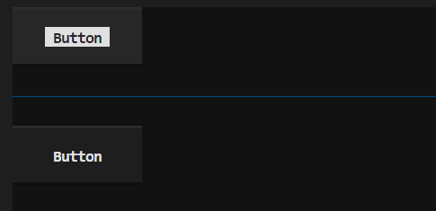

##### 4.1.1.8 `Collapsible`可折叠组件

一般来说，终端的空间有限，如果有些界面的内容需要较多的组件，全部在终端中展示出来不太美观。这时，就可以使用可折叠组件（完整用法参考[官网文档](https://textual.textualize.io/widgets/collapsible/)）当作默认不需要优先展示内容的容器。

组件支持以下参数：

-   `*children`参数，组件类型，表示展开组件的下拉显示区域后，区域内所包含的组件。注意，`*`表明此参数是不支持关键字传入的自动解包参数，即该参数不支持关键字传入，但可以使用解包或者位置参数的形式传入，并且此参数后面的其他参数全是关键字参数。后面的其他容器类组件的第一个参数都是这样的参数。

    解包（具体用法参考[官网文档](https://docs.python.org/zh-cn/3/tutorial/controlflow.html#unpacking-argument-lists)）传入的话，示例如下：

    ```python3
    Collapsible(
    	*(Static('World'),Static('World'),Static('World'))
    )
    ```

    也可以简单一些，以位置参数形式传入：

    ```python3
    Collapsible(
    	Static('World'),Static('World'),Static('World')
    )
    ```

-   `title`参数，字符串类型，表示组件没展开时主体部位显示出来的文字，默认为`'Toggle'`。

-   `collapsed`参数，布尔类型，表示组件是否折叠，默认为`True`。

-   `collapsed_symbol`参数，字符串类型，表示组件最左边用来表明组件当前为折叠状态的文字，默认为`'▶'`。

-   `expanded_symbol`参数，字符串类型，表示组件最左边用来表明组件当前为展开状态的文字，默认为`'▼'`。

-   `name`参数，字符串类型，表示组件的名字，常用于调试时区分组件。

-   `id`参数，字符串类型，表示组件的ID，主要用于样式中的ID选择器。

-   `classes`参数，字符串类型，表示组件的样式类。

-   `disabled`参数，布尔类型，表示组件是否处于被禁用状态，默认为`False`。

组件支持以下属性：

-   `collapsed`属性， 含义同`collapsed`参数。
-   `title`属性，含义同`title`参数。

组件支持以下反应性属性：

-   `collapsed`属性， 含义同`collapsed`参数。
-   `title`属性，含义同`title`参数。

组件支持以下消息：

-   `Toggled`消息，当组件的展开状态切换时触发，该消息支持以下属性：
    -   `collapsible`属性，表示触发该消息的可折叠组件。
    -   `control`属性，同`collapsible`属性。
-   `Collapsed`消息，当组件的展开状态变为折叠时触发，支持的属性同`Toggled`消息。
-   `Expanded`消息，当组件的展开状态变为展开时触发，支持的属性同`Toggled`消息。

组件支持以下快捷键：

-   `enter`键，切换组件的展开状态。

组件支持以下方法：

-   `action_toggle_collapsible`方法，切换组件的展开状态。

示例如下：

```python3
from textual.app import App
from textual.widgets import Collapsible, Static


class MyApp(App):
    def on_mount(self):
        self.widgets = [
            Collapsible(
                Static('World'),
                title='Hello',
                collapsed=False,
                collapsed_symbol='关',
                expanded_symbol='开',
            )
        ]
        self.mount_all(self.widgets)


if __name__ == '__main__':
    app = MyApp()
    app.run()
```

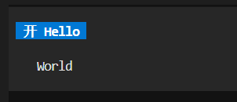

可折叠组件虽然是个内容展示组件，但其参数特性和用途上更接近容器。不过，Textual并没有将容器归为组件，而是归到了单独的容器模块，具体可以参考前面介绍布局的章节。

说到布局，就不得不提布局章节介绍过的`with`关键字用法。同样的，可折叠组件也支持使用`with`关键字——上下文管理器的语法。

还是同样的效果，使用上下文管理器语法的话，需要先转换为`compose`方法中创建组件的结构：

```python3
from textual.app import App
from textual.widgets import Collapsible, Static


class MyApp(App):
    def compose(self):
        yield Collapsible(
            Static('World'),
            title='Hello',
            collapsed=False,
            collapsed_symbol='关',
            expanded_symbol='开',
        )

if __name__ == '__main__':
    app = MyApp()
    app.run()
```

使用上下文管理器的话，就不需要给`children`参数传入组件，只需在上下文中使用`yield`生成即可：

```python3
from textual.app import App
from textual.widgets import Collapsible, Static


class MyApp(App):
    def compose(self):
        with Collapsible(
            title='Hello',
            collapsed=False,
            collapsed_symbol='关',
            expanded_symbol='开',
        ):
            yield Static('World')


if __name__ == '__main__':
    app = MyApp()
    app.run()
```


不管是直接将被包含的组件传给`children`参数，还是使用上下文管理器，都可以使用Python 3.8开始引入的赋值表达式（海象运算符），实现一步添加并命名被包含的组件（下面两个多行注释对应`compose`方法的用法）：

```python3
from textual.app import App
from textual.widgets import Collapsible, Static


class MyApp(App):
    def on_mount(self):
        self.widgets = [
            Collapsible(
                static:=Static('World'),
                title='Hello',
                collapsed=False,
                collapsed_symbol='关',
                expanded_symbol='开',
            )
        ]
        self.mount_all(self.widgets)
        static.update('Hi')

    """ def compose(self):
        yield Collapsible(
            static:=Static('World'),
            title='Hello',
            collapsed=False,
            collapsed_symbol='关',
            expanded_symbol='开',
        )
        static.update('Hi') """

    """ def compose(self):
        with Collapsible(
            title='Hello',
            collapsed=False,
            collapsed_symbol='关',
            expanded_symbol='开',
        ):
            yield (static:=Static('World'))
            static.update('Hi') """


if __name__ == '__main__':
    app = MyApp()
    app.run()
```

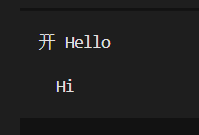

#### 4.1.2 常用交互组件

本节将介绍几个常用的交互组件，在程序开发设计时常使用下面几个组件与用户交互。当然，需要用户交互的组件不限于以下几个，为了方便理解，其他交互组件可能在其他分类中，读者可以自行探索。

##### 4.1.2.1 `Link`超链接组件

超链接组件可以创建一个点击之后跳转到到指定链接的超链接，完整用法参考[官网文档](https://textual.textualize.io/widgets/link/)。

超链接组件支持以下参数：

-   `text`参数，字符串类型，表示显示出来的文字内容。
-   `url`参数，字符串类型，表示跳转的链接。从此参数开始，只能使用关键字传入。

-   `tooltip`参数，可渲染类型，表示鼠标悬停在组件上时显示出来的工具提示。

-   `name`参数，字符串类型，表示组件的名字，常用于调试时区分组件。

-   `id`参数，字符串类型，表示组件的ID，主要用于样式中的ID选择器。

-   `classes`参数，字符串类型，表示组件的样式类。

-   `disabled`参数，布尔类型，表示组件是否处于被禁用状态，默认为`False`。

超链接组件支持以下属性：

-   `text`属性，用途同`text`参数。
-   `url`属性，用途同`url`参数。

超链接组件支持以下反应性属性：

-   `text`属性，用途同`text`参数。
-   `url`属性，用途同`url`参数。

超链接组件支持以下快捷键：

-   `enter`键，直接打开链接。

超链接组件支持以下方法：

-   `action_open_link`方法，直接打开链接。

超链接组件不同于前面的文本展示组件，该组件可以获得焦点。因此，当组件获得焦点时，组件内部的快捷键会优先响应。比如上面提到的内部快捷键`enter`键，在组件获得焦点时，按下`enter`键会直接打开链接，和点击一样。

不过，Textual 2.1.0版本（含此版本）之前的版本，超链接组件内部的快捷键绑定有小问题，需要添加额外的修复代码。当然，此修复代码也可用于修改该组件的快捷键：

```python3
from textual.app import App
from textual.widgets import Link,Static

# 临时修复代码
class Link(Link):
    BINDINGS = [('enter', 'open_link', 'Open link')]

class MyApp(App):
    def on_mount(self):
        self.widgets = [
            Link(text='Click me',url='https://baidu.com',tooltip='Visit Baidu'),
            Link(text='Click me',url='https://baidu.com',tooltip='Visit Baidu'),
            Static(content='[link="https://baidu.com"]Click me[/link]')
        ]
        self.mount_all(self.widgets)

if __name__ == '__main__':
    app = MyApp()
    app.run()
```

读者可以使用`tab`键切换焦点到指定的超链接组件或者直接点击对应的超链接组件，然后打开对应的链接。

除了使用超链接组件，在一般的文本中使用Markup标签（比如`'[link="https://baidu.com"]Click me[/link]'`，具体完整用法参考可渲染对象章节），也能嵌入超链接，不过二者的用法略有不同。超链接组件点击直接跳转，Markup标签超链接需要遵循终端的规则，按下`ctrl`键的同时点击才能访问：

```python3
from textual.app import App
from textual.widgets import Link,Static

class MyApp(App):
    def on_mount(self):
        self.widgets = [
            Link(text='Click me',url='https://baidu.com',tooltip='Visit Baidu'),
            Static(content='[link="https://baidu.com"]Click me[/link]')
        ]
        self.mount_all(self.widgets)

if __name__ == '__main__':
    app = MyApp()
    app.run()
```

##### 4.1.2.2 `Button`按钮组件

不管是什么样的UI框架，按钮几乎都是不可或缺的组件，Textual中也一样。虽然前面学习基础的时候已经用了好几次按钮，但还是有必要完整介绍按钮组件。当然，比教程更完整的内容，可以到[官网](https://textual.textualize.io/widgets/button/)查看。

组件支持以下参数：

-   `label`参数，可渲染类型或者字符串类型或者Rich的`Text`类型（完整用法参考[官网文档](https://rich.readthedocs.io/en/latest/text.html)），表示显示在按钮上的内容。
-   `variant`参数，字符串类型，表示按钮的外观变种名。Textual预先定义了几种按钮外观，可以通过设置此参数直接修改按钮外观。此参数仅支持`['default','primary','success','warning','error']`中的值（分别是默认外观、一般外观、表示成功的外观、表示警告的外观、表示错误的外观），默认为`'default'`。
-   `action`参数，字符串类型，表示点击按钮时执行的动作。注意，如果动作没有显式标明命名空间，按钮执行动作时，默认的命名空间是其父容器。从此参数开始，只能使用关键字传入。
-   `tooltip`参数，可渲染类型，表示鼠标悬停在组件上时显示出来的工具提示。
-   `name`参数，字符串类型，表示组件的名字，常用于调试时区分组件。
-   `id`参数，字符串类型，表示组件的ID，主要用于样式中的ID选择器。
-   `classes`参数，字符串类型，表示组件的样式类。
-   `disabled`参数，布尔类型，表示组件是否处于被禁用状态，默认为`False`。

组件支持以下属性：

-   `label`属性，用途同`label`参数。
-   `variant`属性，用途同`variant`参数。
-   `active_effect_duration`属性，表示按下按钮之后的按钮按压动画的持续时间，单位为秒，默认为`0.2`。

组件支持以下反应性属性：

-   `label`属性，用途同`label`参数。
-   `variant`属性，用途同`variant`参数。

组件支持以下消息：

-   `Pressed`消息，当组件被按下（点击）且组件没有给`action`参数传值时触发，该消息支持以下属性：
    -   `button`属性，表示触发该消息的组件。
    -   `control`属性，同`button`属性。

组件支持以下快捷键：

-   `enter`键，模拟按下（点击）组件。

组件支持以下实例方法：

-   `press`方法，用于模拟按下（点击）组件。
-   `action_press`方法，同`press`方法，但此方法主要是为了注册动作`'press'`。

除了上面提到的实例方法，组件支持以下类方法：

-   `success`方法，生成一个`variant`参数为`'success'`的组件。此方法支持以下参数：
    -   `label`参数，字符串类型或者Rich的`Text`类型（完整用法参考[官网文档](https://rich.readthedocs.io/en/latest/text.html)），表示显示在按钮上的内容。
    -   `name`参数，字符串类型，表示组件的名字，常用于调试时区分组件。
    -   `id`参数，字符串类型，表示组件的ID，主要用于样式中的ID选择器。
    -   `classes`参数，字符串类型，表示组件的样式类。
    -   `disabled`参数，布尔类型，表示组件是否处于被禁用状态，默认为`False`。
-   `warning`方法，生成一个`variant`参数为`'warning'`的组件。支持的参数同`success`方法。
-   `error`方法，生成一个`variant`参数为`'error'`的组件。支持的参数同`success`方法。

示例代码如下：

```python3
from textual.app import App
from textual.widgets import Button


class MyApp(App):
    def on_mount(self):
        self.widgets = [
            Button('Click me',action='notify("You clicked!")')
        ]
        self.mount_all(self.widgets)
    
if __name__ == '__main__':
    app = MyApp()
    app.run()
```

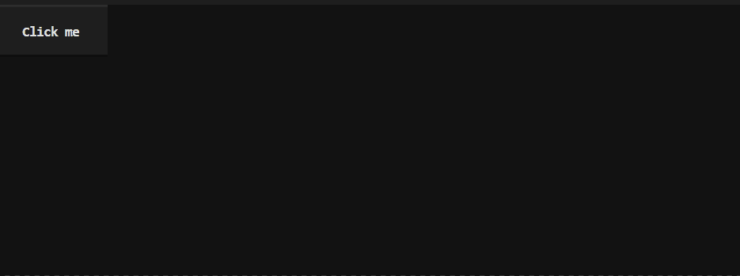

需要特别注意的是，如果想要尝试设置按钮的宽度和高度为自动，让按钮的空间占用没那么大，得到的结果肯定不是预期的结果。因为按钮默认的CSS中，影响宽度的样式有`min-width: 16`，影响高度的样式有`border-top: tall $surface-lighten-1`和`border-bottom: tall $surface-darken-1`。因此，需要设置`min-width: 0`和`border: none`才能让按钮的空间占用变成真的自动。

完整代码如下：

```python3
from textual.app import App
from textual.widgets import Button


class MyApp(App):
    CSS = '''
    .min-button {
        min-width: 0;
        border: none;
    }
    '''
    def on_mount(self):
        self.widgets = [
            Button('Click me'),
            Button('Click me',classes='min-button')
        ]
        self.mount_all(self.widgets)
    
if __name__ == '__main__':
    app = MyApp()
    app.run()
```

对比效果如图：

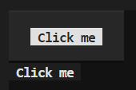

##### 4.1.2.3 `Input`输入框组件

除了点击之类的交互，输入数据也是常见的用户交互，因此，输入框组件也是常用的交互组件，完整用法可以参考[官网文档](https://textual.textualize.io/widgets/input/)。

组件支持以下参数：

-   `value`参数，字符串类型，表示没有输入之前，输入框内的内容。

-   `placeholder`参数，字符串类型，表示输入框内没有内容时，以浅色显示的提示文字，也称占位文字。

-   `password`参数，布尔类型，表示是否启用输入框的密码模式（输入的内容不显示为明文，而是圆点），默认为`False`。

-   `highlighter`参数，Rich的`Highlighter`类型（完整用法参考[官网文档](https://rich.readthedocs.io/en/latest/highlighting.html)），设置此参数为语法高亮对象之后，在输入框内输入的内容会被高亮。比如`Input(highlighter=ReprHighlighter())`，这里设置的就是美化日志组件默认的语法高亮对象（使用`from rich.highlighter import ReprHighlighter`导入），就可以实现和美化日志一样的语法高亮。

-   `restrict`参数，字符串类型，设置此参数可以让输入框内只能输入指定的内容，此时，此参数表示的就是正则表达式，只有被正则表达式正确匹配的内容才能输入。比如，想要限制输入框内只能输入0和1，就可以这样设置：`Input(restrict=r'[01]*')`。

    注意，因为设置此参数之后，从没有内容到输入任何内容之间都会被正则表达式限制，因此正则表达式需要匹配输入过程中的所有内容。比如上面限制输入内容的代码，如果想要限制输入0和1的最大长度（字符数）为9位，就不能只匹配目标长度`[01]{9}`，而是要包括输入目标长度之前的所有长度`Input(restrict=r'[01]{0,9}')`。

    另外，从此参数开始，只能使用关键字传入。

-   `type`参数，字符串类型，表示输入内容的类型限制。不同于虽然强大但需要写正则表达式的`restrict`参数的限制，此参数只是限制输入的类型，因此有预先定义好的几种值，用起来比较简单。此参数仅支持`['integer','number','text']`中的值（分别是整数、小数和不限制内容类型的文本），默认为`'text'`。

-   `max_length`参数，整数类型，表示输入内容的最大长度（字符数）。

-   `suggester`参数，`Suggester`类型（完整用法参考[官网文档](https://textual.textualize.io/api/suggester/#textual.suggester.Suggester)），表示在输入框输入内容时，提供自动补全的对象。定义自动补全类需要继承自`Suggester`类（使用`from textual.suggester import Suggester`导入），并实现异步的`get_suggestion`方法。`get_suggestion`方法使用`value`参数接收当前输入的内容（也就是组件的`value`属性），并返回基于参数值查询之后的字符串结果。以下是简单的示例：

    ```python3
    from textual.app import App
    from textual.widgets import Input
    from textual.suggester import Suggester
    
    class InputSuggester(Suggester):
        async def get_suggestion(self, value):
            return value if '.' in value else value+'.py'
        
    class MyApp(App):
        def on_mount(self):
            self.widgets = [
                Input(suggester=InputSuggester()),
            ]
            self.mount_all(self.widgets)
        
    if __name__ == '__main__':
        app = MyApp()
        app.run()
    ```

    当输入任意内容时，程序会基于现有规则返回提示之后的完整内容，但当前未输入的内容会呈浅色显示。此时可以按一下右方向键，组件会自动补全剩余内容：

    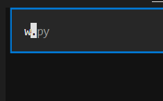

-   `validators`参数，`Validator`类型（完整用法参考[官网文档](https://textual.textualize.io/api/validation/#textual.validation.Validator)）或者元素为`Validator`类型的可迭代对象，表示在输入框输入内容时，验证输入内容的验证对象。定义验证类需要继承自`Validator`类（使用`from textual.validation import Validator`导入），并实现`validate`方法。`validate`方法使用`value`参数接收当前输入的内容（也就是组件的`value`属性），并返回验证的结果（[`ValidationResult`类型对象](https://textual.textualize.io/api/validation/#textual.validation.ValidationResult)，但可以返回[`success`方法](https://textual.textualize.io/api/validation/#textual.validation.Validator.success)和[`failure`方法](https://textual.textualize.io/api/validation/#textual.validation.Validator.failure)的执行结果来简化）。示例如下：

    ```python3
    from textual.app import App
    from textual.widgets import Input
    from textual.validation import Validator
    
    class InputValidator(Validator):
        def validate(self, value):
            return self.success() if '.' not in value else self.failure('"." should not be included.')
        
    class MyApp(App):
        def on_mount(self):
            self.widgets = [
                Input(validators=InputValidator('"." should not be included.')),
            ]
            self.mount_all(self.widgets)
    
        def on_input_changed(self,e:Input.Changed):
            if fail_res:=e.validation_result.failure_descriptions:
                self.notify(f'{fail_res[0]}')
    
    if __name__ == '__main__':
        app = MyApp()
        app.run()
    ```

    示例中，给验证对象传入字符串或者在调用`failure`方法时传入字符串，会成为验证失败的提示文字，也就是验证对象的`failure_description`属性。同时，该提示文字也会成为组件消息的`validation_result`属性的`failure_descriptions`子属性的元素。注意，`validation_result`属性的`failure_descriptions`子属性仅在验证方法输出失败时才会有效，因此示例中特地添加了检查代码。

    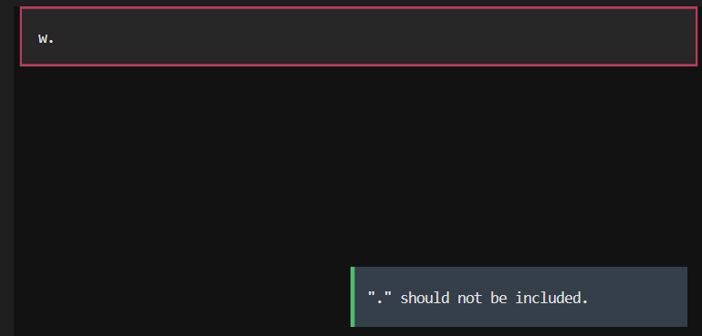

-   `validate_on`参数，元素为字符串类型（仅支持`['blur','changed','submitted']`中的值，分别表示组件失去焦点、组件的内容变化和提交）的可迭代对象，表示在添加验证对象之后，需要在什么时候验证输入的内容。默认不设置时是`None`，表示在组件失去焦点、组件的内容变化和提交时都会触发验证。如果设置了此参数，则表示在指定的时机触发验证。

-   `valid_empty`参数，布尔类型，表示已经设置验证对象的情况下，当没有输入任何内容（`value`属性为`None`）时，是否认为此时的值是有效的且不需要验证，默认为`False`，即不输入任何内容也需要验证。注意，当参数为`True`，即认为`value`属性为`None`不需要验证时，消息的`validation_result`属性会在不输入任何内容时变为`None`，此时不能直接访问`failure_descriptions`子属性，会报错，需要添加额外的检查代码避免这种情况。比如下面示例中`on_input_changed`方法的定义中，就添加了额外的检查代码。此外，读者可以修改`valid_empty`参数的值，观察执行结果：

    ```python3
    from textual.app import App
    from textual.widgets import Input
    from textual.validation import Validator
    
    class InputValidator(Validator):
        def validate(self, value):
            return self.success() if value else self.failure('Please input something.')
        
    class MyApp(App):
        def on_mount(self):
            self.widgets = [
                Input(validators=InputValidator(),valid_empty=True),
            ]
            self.mount_all(self.widgets)
    
        def on_input_changed(self,e:Input.Changed):
            if e.input.valid_empty:
                return
            elif fail_res:=e.validation_result.failure_descriptions:
                self.notify(f'{fail_res[0]}')
    
    if __name__ == '__main__':
        app = MyApp()
        app.run()
    ```

-   `select_on_focus`参数，布尔类型，表示当组件获得焦点时，是否自动选择输入框内的全部内容，默认为`False`。

-   `tooltip`参数，可渲染类型，表示鼠标悬停在组件上时显示出来的工具提示。

-   `name`参数，字符串类型，表示组件的名字，常用于调试时区分组件。

-   `id`参数，字符串类型，表示组件的ID，主要用于样式中的ID选择器。

-   `classes`参数，字符串类型，表示组件的样式类。

-   `disabled`参数，布尔类型，表示组件是否处于被禁用状态，默认为`False`。

组件支持以下属性（常用，非全部）：

-   `content_width`属性，表示含光标的内容宽度。注意，为了防止光标，内容宽度会比实际内容的宽度多1。
-   `cursor_screen_offset`属性，表示光标在屏幕坐标系中的位置。
-   `cursor_position`属性，表示当前光标位置，默认为`0`。可以设置此属性的值来移动光标。
-   `is_valid`属性，表示当前内容是否通过了验证。注意，如果组件没有设置验证对象，此属性则一直为`True`。
-   `selected_text`属性，表示输入框内被选中的内容。
-   `selection`属性，表示输入框内当前选中内容的光标范围。该属性是命名元组，包含`start`和`end`两个成员，分别代表想要选中目标内容的开始光标位置和结束光标位置。
-   `cursor_blink`属性，表示是否启用光标闪烁，默认为`True`。
-   `value`属性，同`value`参数。
-   `placeholder`属性，同`placeholder`参数。
-   `password`属性，同`password`参数。
-   `restrict`属性，同`restrict`参数。
-   `type`属性，同`type`参数。
-   `max_length`属性，同`max_length`参数。
-   `valid_empty`属性，同`valid_empty`参数。
-   `validate_on`属性，同`validate_on`参数。

组件支持以下反应性属性：

-   `cursor_blink`属性，表示是否启用光标闪烁，默认为`True`。
-   `value`属性，同`value`参数。
-   `cursor_position`属性，表示当前光标位置，默认为`0`。可以设置此属性的值来移动光标。
-   `placeholder`属性，同`placeholder`参数。
-   `password`属性，同`password`参数。
-   `restrict`属性，同`restrict`参数。
-   `type`属性，同`type`参数。
-   `max_length`属性，同`max_length`参数。
-   `valid_empty`属性，同`valid_empty`参数。

在自定义组件的章节中，提到了`COMPONENT_CSS`，可以让使用线性渲染的组件更方便地应用CSS样式。在输入框组件中， 也提供了这样的子组件样式类。组件支持以下子组件样式类：

-   `input--cursor`类，光标使用的样式类。
-   `input--placeholder`类，占位文字使用的样式类。
-   `input--suggestion`类，自动补全文字使用的样式类。
-   `input--selection`类，被选中文字使用的样式类。

如果想要设置光标的颜色为红色，可以这样写代码：

```python3
from textual.app import App
from textual.widgets import Input
    
class MyApp(App):
    CSS = '''
    .input--cursor {
        background: red;
    }
    '''
    def on_mount(self):
        self.widgets = [
            Input(),
        ]
        self.mount_all(self.widgets)

if __name__ == '__main__':
    app = MyApp()
    app.run()
```

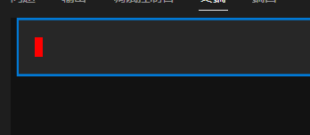

组件支持以下消息：

-   `Changed`消息，当输入框的内容改变时触发，该消息支持以下属性：
    -   `input`属性，表示触发该消息的组件。
    -   `control`属性，同`input`属性。
    -   `validation_result`属性，表示输入内容的验证结果。在设置`validators`参数之后，此属性会变成非`None`值，可以获取到验证的结果。
    -   `value`属性，表示组件当前输入的内容。
-   `Submitted`消息，当输入框的内容改提交（按下`enter`键或者执行`action_submit`方法）时触发，该消息支持的属性同`Changed`消息。
-   `Blurred`消息，当输入框失去焦点时触发，该消息支持的属性同`Changed`消息。

组件支持以下快捷键：

-   `left`键，将光标向左移动一个字符。
-   `shift+left`键，将光标向左移动一个字符并选择光标经过的内容。
-   `ctrl+left`键，将光标移动到左边单词的词头位置。
-   `right`键，将光标向右移动一个字符。
-   `ctrl+shift+left`键，将光标移动到左边单词的词头位置并选择这个单词。
-   `shift+right`键，将光标向右移动一个字符并选择光标经过的内容。
-   `ctrl+right`键，将光标移动到右边下一个单词的词头位置。
-   `backspace`键，删掉光标左边的字符。
-   `ctrl+shift+right`键，将光标移动到右边单词的下一个单词的词头位置并选择右边单词。
-   `home`键或`ctrl+a`键，移动光标到输入框开头的位置。
-   `end`键或`ctrl+e`键，移动光标到输入框末尾的位置。
-   `shift+home`键，移动光标到输入框开头的位置，并选择光标之前位置到输入框开头之间的内容。
-   `shift+end`键，移动光标到输入框末尾的位置，并选择光标之前位置到输入框末尾之间的内容。
-   `delete`键或`ctrl+d`键，删掉光标右边的字符。
-   `enter`键，提交输入框的内容，即触发`submitted`消息并将输入框的内容传给该消息的额外参数。
-   `ctrl+w`键，删掉光标左边的单词。
-   `ctrl+u`键，删掉光标左边的所有内容。
-   `ctrl+f`键，删掉光标右边的单词。
-   `ctrl+k`键，删掉光标右边的所有内容。
-   `ctrl+x`键，剪切被选择的内容。
-   `ctrl+c`键，复制被选择的内容。
-   `ctrl+v`键，将剪贴板的内容粘贴到输入框内。

组件支持以下实例方法：

-   `action_copy`方法，复制当前选择的内容。
-   `action_cursor_left`方法，将光标向左移动一个字符。该方法还支持一个布尔类型的参数`select`，表示移动光标的同时是否选择内容，默认为`False`。
-   `action_cursor_left_word`方法，将光标移动到左边单词的词头位置。该方法还支持一个布尔类型的参数`select`，表示移动光标的同时是否选择内容，默认为`False`。
-   `action_cursor_righ`方法，将光标向右移动一个字符。该方法还支持一个布尔类型的参数`select`，表示移动光标的同时是否选择内容，默认为`False`。
-   `action_cursor_right_word`方法，将光标移动到右边下一个单词的词头位置。该方法还支持一个布尔类型的参数`select`，表示移动光标的同时是否选择内容，默认为`False`。
-   `action_cut`方法，剪切被选择的内容。
-   `action_delete_left`方法，删掉光标左边的字符。
-   `action_delete_left_all`方法，删掉光标左边的所有内容。
-   `action_delete_left_word`方法，删掉光标左边的单词。
-   `action_delete_right`方法，删掉光标右边的字符。
-   `action_delete_right_all`方法，删掉光标右边的所有内容。
-   `action_delete_right_word`方法，删掉光标右边的单词。
-   `action_end`方法，移动光标到输入框末尾的位置。该方法还支持一个布尔类型的参数`select`，表示移动光标的同时是否选择内容，默认为`False`。
-   `action_home`方法，移动光标到输入框开头的位置。该方法还支持一个布尔类型的参数`select`，表示移动光标的同时是否选择内容，默认为`False`。
-   `action_paste`方法，将剪贴板的内容粘贴到输入框内。
-   `action_submit`方法，此方法为异步方法，可以提交输入框的内容，即触发`submitted`消息并将输入框的内容传给该消息的额外参数。
-   `clear`方法，清除输入框的内容。
-   `delete`方法，删除输入框指定区间的内容。该方法使用时必须传入两个参数：
    -   `start`参数，整数类型，表示区间开始的位置。
    -   `end`参数，整数类型，表示区间结束的位置。
-   `delete_selection`方法，删除当前选择的内容。
-   `insert`方法，在指定位置插入指定内容。该方法使用时必须传入两个参数：
    -   `text`参数，字符串类型，表示要插入的内容。
    -   `index`参数，整数类型，表示插入内容的位置。
-   `insert_text_at_cursor`方法，在光标位置插入指定内容。该方法必须传入一个字符串类型的参数`text`，表示要插入的内容。
-   `replace`方法，替换指定区间的内容为指定内容。该方法使用时必须传入三个参数：
    -   `text`参数，字符串类型，表示要替换的内容。
    -   `start`参数，整数类型，表示区间开始的位置。
    -   `end`参数，整数类型，表示区间结束的位置。

#### 4.1.3 开关切换类组件

开关切换类组件常用于通过交互修改布尔类型的值，和日常中的开关一样。虽然`Collapsible`可折叠组件有类似开关的效果（`collapsed`反应性属性表示是否展开），但可折叠组件通常用于内容展示，故不归为开关切换类。

##### 4.1.3.1 `Switch`切换开关组件

一说开关切换，英文的switch和日常的开关第一时间成为首选，Textual实现的切换开关组件`Switch`，就是这样的首选组件，完整用法可以参考[官网文档](https://textual.textualize.io/widgets/switch/)。

组件支持以下参数：

-   `value`参数，布尔类型，表示组件的开关状态，默认为`False`。
-   `animate`参数，布尔类型，表示开关状态切换时是否启用动画，默认为`True`。
-   `tooltip`参数，可渲染类型，表示鼠标悬停在组件上时显示出来的工具提示。从此参数开始，只能使用关键字传入。
-   `name`参数，字符串类型，表示组件的名字，常用于调试时区分组件。

-   `id`参数，字符串类型，表示组件的ID，主要用于样式中的ID选择器。

-   `classes`参数，字符串类型，表示组件的样式类。

-   `disabled`参数，布尔类型，表示组件是否处于被禁用状态，默认为`False`。

组件支持以下属性：

-   `value`属性，同`value`参数。

组件支持以下反应性属性：

-   `value`属性，同`value`参数。

组件支持以下子组件样式类：

-   `switch--slider`类，组件的滑块使用的样式类。

需要注意的是，使用`switch--slider`类设置滑块的颜色时，开启和关闭状态的滑块颜色会同时改变，会导致开启和关闭状态的滑块颜色一样，进而没法区分开关的状态。此时，可以这样设置样式：

```css
.switch--slider {
    color: red;
}
/*使用后代组合器*/
.-on .switch--slider {
    color: green;
}
/*使用子代组合器*/
.-on>.switch--slider {
    color: green;
}
```

就能单独区分开启和关闭状态了。因为在开启状态时，滑块的容器组件会被添加`'-on'`样式类，此时可以使用后代组合器`.-on .switch--slider`或者子代组合器`.-on>.switch--slider`匹配开启状态下的滑块，进而使其与关闭状态下的滑块有所区别。

组件支持以下消息：

-   `Changed`消息，当开关状态改变时触发，该消息支持以下属性：
    -   `switch`属性，表示触发该消息的组件。
    -   `control`属性，同`switch`属性。
    -   `value`属性，同`value`参数。

组件支持以下快捷键：

-   `enter`键或`space`键，切换开关状态。

组件支持以下实例方法：

-   `action_toggle_switch`方法，切换开关状态。
-   `toggle`方法，切换开关状态。此方法返回组件实例本身，因此可以在执行此方法之后，将此方法的返回值当组件实例用。

示例代码如下：

```python3
from textual.app import App
from textual.widgets import Switch
    
class MyApp(App):
    def on_mount(self):
        self.widgets = [
            Switch(),
        ]
        self.mount_all(self.widgets)

if __name__ == '__main__':
    app = MyApp()
    app.run()
```

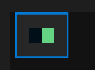

需要特别注意的是，如果想要让切换开关组件和按钮组件一样做到最小化，需要去掉边框（`border`）和内边距（`padding`）：

```css
Switch {
    border: none;
    padding: 0;
}
```

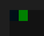

##### 4.1.3.2 `Checkbox`复选框组件和`RadioButton`单选按钮组件

相比于切换开关没有自带文本，需要搭配其他文本组件才能解释开关的内容，自带文本标签的`Checkbox`复选框组件（完整用法可以参考[官网文档](https://textual.textualize.io/widgets/checkbox/)）和`RadioButton`单选按钮组件（完整用法可以参考[官网文档](https://textual.textualize.io/widgets/radiobutton/)）。`RadioButton`单选按钮组件用起来几乎和复选框组件一样（只是按钮图标有变化），但更多是当单选用（后面会介绍配套使用的`RadioSet`），所以这里主要介绍复选框组件的用法。

组件支持以下参数：

-   `label`参数，字符串类型，表示显示在组件右边的说明性文字。
-   `value`参数，布尔类型，表示组件的开关状态，默认为`False`。
-   `button_first`参数，布尔类型，表示开关图标是否在左边，默认为`True`。
-   `tooltip`参数，可渲染类型，表示鼠标悬停在组件上时显示出来的工具提示。从此参数开始，只能使用关键字传入。
-   `name`参数，字符串类型，表示组件的名字，常用于调试时区分组件。

-   `id`参数，字符串类型，表示组件的ID，主要用于样式中的ID选择器。

-   `classes`参数，字符串类型，表示组件的样式类。

-   `disabled`参数，布尔类型，表示组件是否处于被禁用状态，默认为`False`。

组件支持以下属性：

-   `value`属性，同`value`参数。

组件支持以下反应性属性：

-   `value`属性，同`value`参数。

组件支持以下子组件样式类：

-   `toggle--button`类，组件的开关图标使用的样式类。
-   `toggle--label`类，组件的说明性文字使用的样式类。

需要注意的是，`Checkbox`复选框组件和`RadioButton`单选按钮组件使用的子组件样式类是一样的，想要有所区分的话可以使用对应的类型的选择器，然后用后代组合器匹配：

```css
Checkbox {
    .toggle--button{
        color: red;
    }
    .toggle--label {
        color: green;
    }
}
RadioButton {
    .toggle--button{
        color: green;
    }
    .toggle--label {
        color: red;
    }
}
```

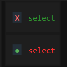

组件支持以下消息：

-   `Changed`消息，当开关状态改变时触发，该消息支持以下属性：
    -   `Checkbox`属性，表示触发该消息的组件。对于`RadioButton`单选按钮组件，对应的属性是`RadioButton`属性。
    -   `control`属性，同`Checkbox`属性。
    -   `value`属性，同`value`参数。

组件支持以下快捷键：

-   `enter`键或`space`键，切换开关状态。

组件支持以下实例方法：

-   `action_toggle_switch`方法，切换开关状态。
-   `toggle`方法，切换开关状态。此方法返回组件实例本身，因此可以在执行此方法之后，将此方法的返回值当组件实例用。

用法上`Checkbox`复选框组件和`RadioButton`单选按钮组件都很简单，这里就不单独写示例了，只提供一个让`Checkbox`复选框组件和`RadioButton`单选按钮组件变得一样的示例：

```python3
from textual.app import App
from textual.widgets import RadioButton,Checkbox
    
class MyApp(App):
    def on_mount(self):
        self.widgets = [
            Checkbox(label='select'),
            RadioButton(label='select'),
        ]
        self.mount_all(self.widgets)
        self.query_one(RadioButton).BUTTON_INNER = 'X'

if __name__ == '__main__':
    app = MyApp()
    app.run()
```

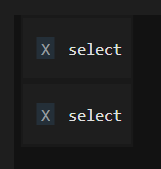

#### 4.1.4 非自由功能组件

功能组件是为了实现特定功能而定义的组件，主要是指那些不好分类的组件。在这些组件中，有几个组件的布局位置接受自定义，因此划分到这个分类。那些布局位置像其他组件一样接受自定义的功能组件，则在后面的自由功能组件一节中单独介绍。

##### 4.1.4.1 `Header`页眉组件

就像是窗口的标题栏一样，页眉组件可以在终端顶部固定位置显示标题、副标题、时间等信息。还有一个可以点击图标，用来启动命令面板。点击组件其他区域，还可以让组件高度临时增加，以便于显示更多内容。完整用法可以参考[官网文档](https://textual.textualize.io/widgets/header/)。

组件支持以下参数：

-   `show_clock`参数，布尔类型，表示是否在右边显示时间，默认为`False`。

-   `time_format`参数，字符串类型，表示以什么格式显示时间，格式码参考[官网文档](https://docs.python.org/zh-cn/3/library/datetime.html#strftime-and-strptime-format-codes)。默认为`None`，即格式为`'%X'`。从此参数开始，只能使用关键字传入。需要注意的是，默认时间显示区的宽度是8（其容器的宽度为10，左右方向内边距为1），如果设置格式之后，导致实际显示的字符宽度超过可显示的宽度（有的终端将中文算作两个字符宽度），则需要设置`HeaderClockSpace`的样式，将其宽度适当加大。比如下面的示例：

    ```python3
    from textual.app import App
    from textual.widgets import Header
    
    class MyApp(App):
        CSS = '''
        HeaderClockSpace {
            width: 14;
        }
        '''
        def on_mount(self):
            self.widgets = [
                Header(show_clock=True,time_format='%H时%M分%S秒')
            ]
            self.mount_all(self.widgets)
    
    if __name__ == '__main__':
        app = MyApp()
        app.run()
    ```

    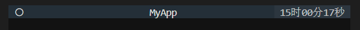

    另外，目前此组件使用当前时间的时间部分，不包括日期，因此此参数不支持日期格式码。

-   `icon`参数，字符串类型，表示组件左边点击启动命令面板的区域，使用什么样的字符当图标，默认为`None`，即使用`'⭘'`为图标。需要注意的是，虽然将此参数设置为空字符串可以让图标消失，但启动命令面板的区域依然可以点击。此时可以设置类变量`ENABLE_COMMAND_PALETTE = False`来禁用点击功能（会导致包括快捷键`ctrl+p`在内也没法启动命令面板）。当然，对于只是想让图标消失、点击区域失效但不想让命令面板无法启动的读者，可以使用下面的样式来隐藏相关区域：

    ```css
    HeaderIcon {
        display: none;
    }
    /*或者使用下面的样式*/
    HeaderIcon {
        visibility: hidden;
    }
    ```

-   `name`参数，字符串类型，表示组件的名字，常用于调试时区分组件。

-   `id`参数，字符串类型，表示组件的ID，主要用于样式中的ID选择器。

-   `classes`参数，字符串类型，表示组件的样式类。

组件支持以下属性：

-   `icon`属性，同`icon`参数。
-   `time_format`属性，同`time_format`参数。
-   `tall`属性，布尔类型，表示是否启用页眉组件的3行高度的模式（即页眉组件的高度变为3行，点击组件可以临时启用，此属性的值变化时会实时变化）。
-   `screen_title`属性，只读属性，此属性自动获取自`App.title`和`Screen.title`。
-   `screen_sub_title`属性，只读属性，此属性自动获取自`App.sub_title`和`Screen.sub_title`。

组件支持以下反应性属性：

-   `icon`属性，同`icon`参数。
-   `time_format`属性，同`time_format`参数。
-   `tall`属性，布尔类型，表示是否启用页眉组件的3行高度的模式（即页眉组件的高度变为3行，点击组件可以临时启用，此属性的值变化时会实时变化）。

##### 4.1.4.2 `Footer`页脚组件

与页眉对应的是页脚，不过不同的是，页脚组件相当于状态栏，只能显示快捷键，也可以点击对应区域执行快捷键，除此以外没有可以展示的内容。完整用法可以参考[官网文档](https://textual.textualize.io/widgets/footer/)。

组件支持以下参数：

-   `show_command_palette`参数，布尔类型，表示是否在右边显示启动命令面板的快捷键，默认为`True`。从此参数开始，只能使用关键字传入。
-   `name`参数，字符串类型，表示组件的名字，常用于调试时区分组件。
-   `id`参数，字符串类型，表示组件的ID，主要用于样式中的ID选择器。
-   `classes`参数，字符串类型，表示组件的样式类。
-   `disabled`参数，布尔类型，表示组件是否处于被禁用状态，默认为`False`。

需要注意的是，虽然官网文档中有`children`参数，但此参数只是官方实现此组件时为了防止报错添加的，实际上内部的渲染方法覆盖了此参数相关的内容，所以此参数没法使用，不要被语法提示误导。

组件支持以下属性：

-   `show_command_palette`属性，同`show_command_palette`参数。

-   `compact`属性，布尔类型，表示是否让底部显示的快捷键的间距更小，默认为`False`。下图中，上面的页脚组件就是将此属性设置为`True`的效果：

    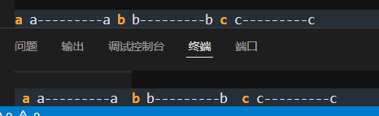

组件支持以下反应性属性：

-   `show_command_palette`属性，同`show_command_palette`参数。
-   `compact`属性，布尔类型，表示是否让底部显示的快捷键的间距更小，默认为`False`。

以下为示例代码：

```python3
from textual.app import App
from textual.widgets import Footer,Button

class MyApp(App):
    BINDINGS = [
        ('a','a','a---------a'),
        ('b','b','b---------b'),
        ('c','c','c---------c'),
    ]
    def on_mount(self):
        self.widgets = [
            Footer(show_command_palette=False),
            Button('compact',action='app.compact')
        ]
        self.mount_all(self.widgets)
    def action_compact(self):
        self.query_one(Footer).compact = True

if __name__ == '__main__':
    app = MyApp()
    app.run()
```

如果想要在页脚组件上隐藏快捷键，想要修改快捷键按键显示（让快捷键显示为完整的按键`'ctrl'`而不是`'^'`），可以修改快捷键绑定对象的`show`参数和`key_display`参数：

```python3
from textual.app import App
from textual.widgets import Footer
from textual.binding import Binding

class MyApp(App):
    BINDINGS = [
        Binding(
            key='ctrl+w',
            action='',
            description='ctrl+w',
            show=False,
            key_display='ctrl+w'
        ),
        Binding(
            key='ctrl+e',
            action='',
            description='ctrl+e',
            show=True,
            key_display='ctrl+e'
        )
    ]
    def on_mount(self):
        self.widgets = [
            Footer(),
        ]
        self.mount_all(self.widgets)

if __name__ == '__main__':
    app = MyApp()
    app.run()
```

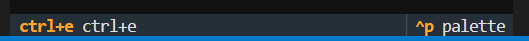

##### 4.1.4.3 `Toast`通知组件

如果想要在右下角弹出通知，可以使用通知组件（完整用法参考[官网文档](https://textual.textualize.io/widgets/toast/)）。

不过，严格来说，通知组件并不是常规的组件，想要弹出一条通知的话，更多是使用`notify`方法（[`App`子类的`notify`方法](https://textual.textualize.io/api/app/#textual.app.App.notify)或者[组件类的`notify`方法](https://textual.textualize.io/api/widget/#textual.widget.Widget.notify)），而不是直接创建`Toast`组件。因此，下面介绍的参数，是`notify`方法的参数。

`notify`方法支持以下参数：

-   `message`参数，字符串类型，表示显示在通知中的主要内容，支持Markup标签。

-   `title`参数，字符串类型，表示通知的标题，不支持Markup标签，默认为空。从此参数开始，只能使用关键字传入。

-   `severity`参数，字符串类型，表示通知的重要程度，仅支持`['information', 'warning', 'error']`中的值，默认为`'information'`。三种重要程度的通知效果如图：

    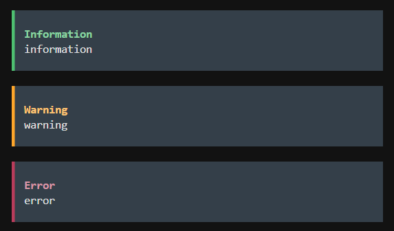

-   `timeout`参数，浮点类型，表示通知自动消失的时间，默认为`None`，即该值等于类变量`NOTIFICATION_TIMEOUT`的值，也就是`5`。可以在使用通知时修改此参数或者在`App`子类修改类变量`NOTIFICATION_TIMEOUT`的值，来修改通知自动消失的时间。

-   `markup`参数，布尔类型，表示是否解析`message`参数中的Markup标签，默认为`True`。

以下为示例代码，本节后续介绍通知的样式也是以下面的示例为基础：

```python3
from textual.app import App
from textual.widgets import Button


class MyApp(App):
    NOTIFICATION_TIMEOUT = 5
    def on_mount(self):
        self.widgets = [
            Button('information',action='app.toast_information'),
            Button('warning',action='app.toast_warning'),
            Button('error',action='app.toast_error'),
        ]
        self.mount_all(self.widgets)
    def action_toast_information(self):
        self.notify('information',title='Information',severity='information',timeout=5)
    def action_toast_warning(self):
        self.notify('warning',title='Warning',severity='warning',timeout=5)
    def action_toast_error(self):
        self.notify('error',title='Error',severity='error',timeout=5)

if __name__ == '__main__':
    app = MyApp()
    app.run()
```

虽然只需调用`notify`方法就能创建通知，但想要自定义通知的样式，还是要创建`Toast`通知组件的选择器、组合器。

为了方便测试样式，需要将上面的代码加一行：

```python3
CSS_PATH = 'myapp.tcss'
```

有前面基础的读者知道这一行应该放在哪里。当然，为了让样式修改即时生效，运行程序的时候，使用`textual run --dev {path-to-myapp.py}`。而下面提到的样式代码，全部保存在`myapp.tcss`中，都是即时生效。

修改通知本身的样式，需要使用类型选择器`Toast`：

```CSS
Toast {
    padding: 3;
}
```

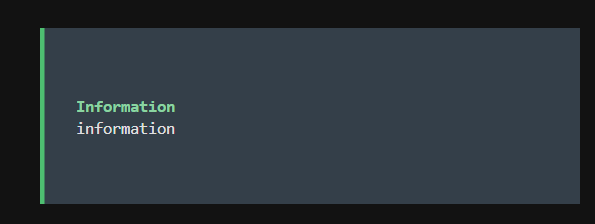

如果是想要改变通知出现的位置，则要修改通知的容器，需要使用类型选择器`ToastRack`和`ToastHolder`。

修改`ToastRack`的`dock`样式，可以改变通知出现在下面（`bottom`）还是上面（`top`）：

```css
ToastRack {
    dock: top;
}
```

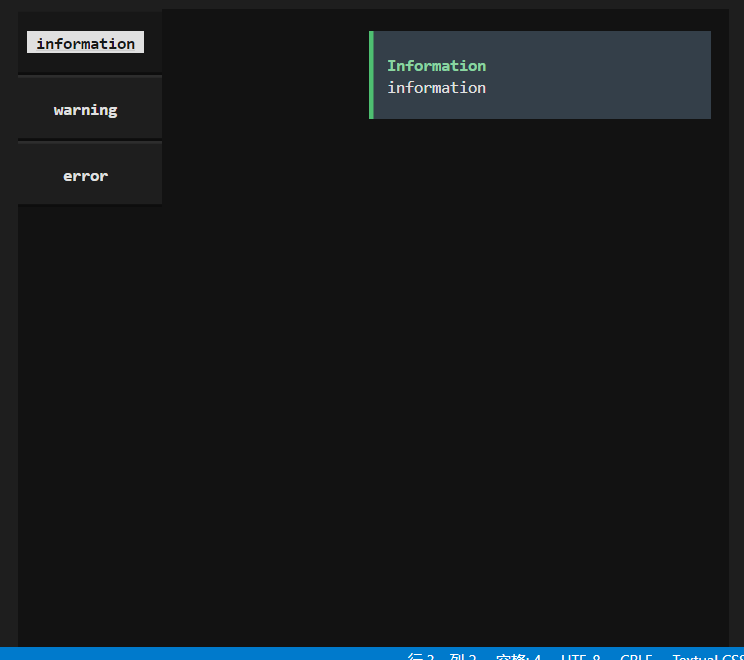

修改`ToastHolder`的`align-horizontal`样式，可以决定通知的水平对齐方向，左边（`left`）、右边（`right`）还是中间（`center`）：

```CSS
ToastHolder {
    align-horizontal: left;
}
```

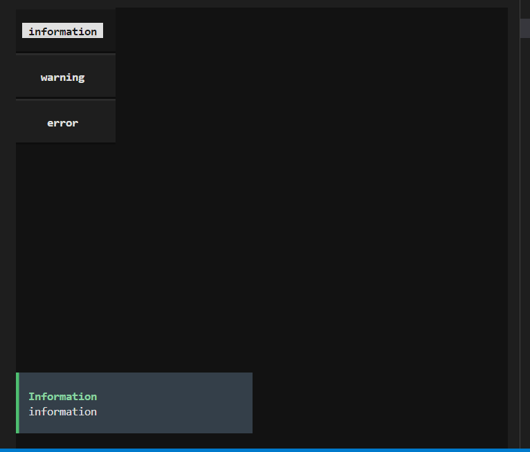

想要一步到位，可以使用嵌套样式，看起来会更紧凑：

```css
ToastRack {
    dock: top;
    ToastHolder {
        align-horizontal: center;
    }
}
```

如果想要不同重要程度的通知内容有不同的样式，则要修改对应的样式类：

-   `-information`类对应`'information'`程度。
-   `-warning`类对应`'warning'`程度。
-   `-error`类对应`'error'`程度。

因此，对应各个程度的通知内容，其组合器、选择器如下：

```CSS
Toast.-information {
    /* `'information'`程度 */
}

Toast.-warning {
    /* `'warning'`程度 */
}

Toast.-error {
    /* `'error'`程度 */
}
```

通知的标题有单独的样式类`toast--title`，想要修改不同程度通知的标题，则需要以匹配对应程度的样式类为前提，同时匹配样式类`toast--title`：

```CSS
Toast.-information .toast--title {
    text-style: italic;
}
```

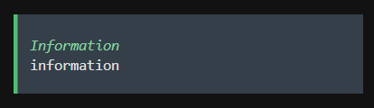

也可以转换为嵌套风格，同时修改标题和内容的样式：

```css
Toast.-information {
    color: blue;
    .toast--title {
        text-style: italic;
    }
}
```

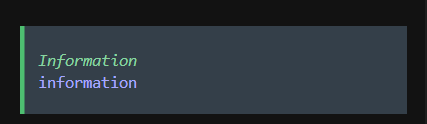

通知组件的相关样式选择器之间的关系如下图所示，读者可以按需修改对应的样式：

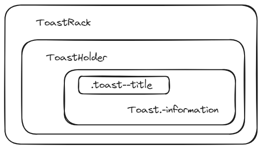

以下是一个比较复杂的嵌套样式代码，读者可以对照上图分析代码的含义：

```css
ToastRack {
    dock: top;
    ToastHolder {
        align-horizontal: center;
        Toast {
            background: silver;
            &.-information {
                color: blue;
                .toast--title {
                    text-style: italic;
                }
            }
        }
    }
}
```

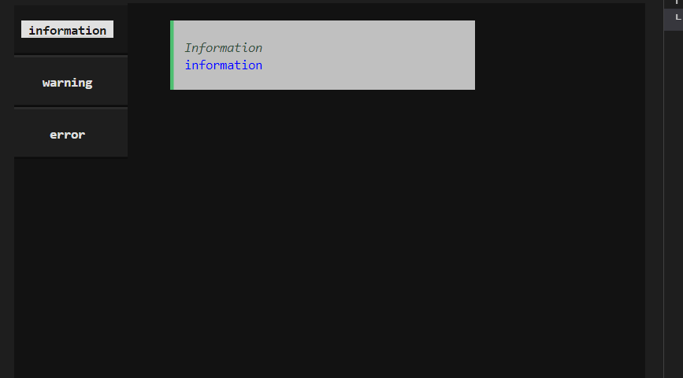

### 4.2 其他组件

本节主要介绍常用组件之外的组件及其的功能、示例，更多用法和介绍参考[官网完整文档](https://textual.textualize.io/widgets/)。

#### 4.2.1 选择类组件

恰如开关切换类组件表示某个变量的布尔值，选择类组件可以实现从多个候选项中选择一个或者多个作为结果。

##### 4.2.1.1 `RadioSet`单选集组件

首先要介绍的，就是在介绍开关切换类组件时埋下的伏笔——与`RadioButton`单选按钮组件配套使用的单选集组件（完整用法参考[官网文档](https://textual.textualize.io/widgets/radioset/)）。单选集组件提供了一系列选项，但每次只有一个选项是选中状态。

组件支持以下参数：

-   `*buttons`参数，单选按钮组件类型或者字符串类型，表示单选集组件中的选项。注意，如果选项不是单选按钮组件而是字符串的话，单选集组件会自动基于字符串创建单选按钮组件。
-   `tooltip`参数，可渲染类型，表示鼠标悬停在组件上时显示出来的工具提示。从此参数开始，只能使用关键字传入。
-   `name`参数，字符串类型，表示组件的名字，常用于调试时区分组件。
-   `id`参数，字符串类型，表示组件的ID，主要用于样式中的ID选择器。
-   `classes`参数，字符串类型，表示组件的样式类。
-   `disabled`参数，布尔类型，表示组件是否处于被禁用状态，默认为`False`。

组件支持以下属性：

-   `pressed_button`属性，表示当前选择的单选按钮组件。为`None`表示当前没有单选按钮组件被选择。
-   `pressed_index`属性，整数类型，表示当前选择的单选按钮组件在单选集组件中的索引值。就像Python的列表中的元素有对应的索引值一样，单选集组件中的单选按钮组件，都有对应的索引值。为`-1`表示当前没有单选按钮组件被选择。

组件支持以下消息：

-   `Changed`消息，当选择不同的单选按钮组件时触发，该消息支持以下属性：
    -   `radio_set`属性，表示触发该消息的单选集组件。
    -   `control`属性，同`radio_set`属性。
    -   `pressed`属性，表示触发该消息的单选按钮组件。
    -   `index`属性，表示触发该消息的单选按钮组件在单选集组件中的索引值。
    -   `ALLOW_SELECTOR_MATCH`属性，表示可以在`on`装饰器中，可用作额外关键字参数、与选择器匹配的消息属性。在本组件中， 该属性的值是`{'pressed'}`。

组件支持以下快捷键：

-   `enter`键或`space`键，选择当前高亮的单选按钮组件。
-   `up`键或`left`键，高亮上一个单选按钮组件。
-   `down`键或`right`键，高亮下一个单选按钮组件。

组件支持以下方法：

-   `action_toggle_button`方法，选择当前高亮的单选按钮组件。
-   `action_previous_button`方法，高亮上一个单选按钮组件。
-   `action_next_button `方法，高亮下一个单选按钮组件。

示例如下：

```python3
from textual.app import App
from textual.widgets import RadioSet


class MyApp(App):
    CSS = '''
    Screen {
        align: center middle;
    }
    '''
    def on_mount(self):
        self.widgets = [
            RadioSet(
                '1','2','3'
            )
        ]
        self.mount_all(self.widgets)

if __name__ == '__main__':
    app = MyApp()
    app.run()
```

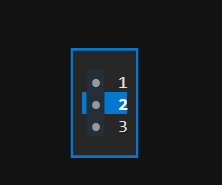

##### 4.2.1.2 `ListView`列表视图组件和`ListItem`列表项目组件

在Textual中，通常是配套使用的组件组合有不少，本节要介绍的列表视图组件与列表项目组件一样是密不可分。因此，这一节将同时介绍这两个组件。二者结合，共同组成了Textual的列表视图。列表视图有点像前面介绍过的垂直布局，都是将子组件垂直排布，但列表视图支持的操作更多，可以追加、弹出子组件等，就像Python的列表一样。

列表视图组件和列表项目组件都是容器组件，也就是说，二者都可以是其他组件的父级。唯一不同的是，列表视图组件的子级只能是列表项目组件，二者的关系如下图所示：

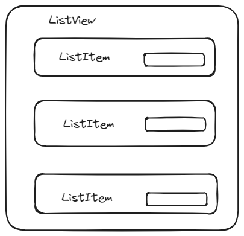

接下来，就先从用法最简单的列表项目组件开始，逐步学习列表视图。

列表项目组件（完整用法参考[官网文档](https://textual.textualize.io/widgets/list_item/)）虽然是个容器组件，但它的应用范围很单一，仅和列表视图组件组合使用。这倒不是说列表项目组件不能单独使用，只是其单独使用时，和一般的容器组件、布局组件无二，甚至不如它们灵活：

```python3
from textual.app import App
from textual.widgets import ListItem, Static, Button


class MyApp(App):
    CSS = '''
    Screen {
        align: center middle;
    }
    ListItem {
        width: 30;
        height: auto;
        margin: 2 2;
    }
    '''
    def on_mount(self):
        self.widgets = [
            ListItem(
                Static('Item1'),
                Button('Item2')
            )
        ]
        self.mount_all(self.widgets)

if __name__ == '__main__':
    app = MyApp()
    app.run()
```

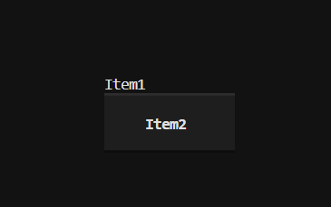

列表项目组件只有一个布尔类型的反应性属性——`highlighted`属性，表示该组件是否被高亮，默认为`False`。此属性在列表视图中该组件被高亮时会变成`True`。

可见，即便是想要了解列表项目组件的反应性属性，也离不开列表视图组件（完整用法参考[官网文档](https://textual.textualize.io/widgets/list_view/)）。

组件支持以下参数：

-   `*children`参数，列表项目组件类型，表示列表视图组件所包含的列表项目组件。注意，不同于上节介绍的单选集组件可以基于字符串生成子级组件，列表视图组件的直接子级只能是列表项目组件。
-   `initial_index`参数，整数类型，表示初始时高亮的列表项目组件，默认为`0`。从此参数开始，只能使用关键字传入。
-   `name`参数，字符串类型，表示组件的名字，常用于调试时区分组件。
-   `id`参数，字符串类型，表示组件的ID，主要用于样式中的ID选择器。
-   `classes`参数，字符串类型，表示组件的样式类。
-   `disabled`参数，布尔类型，表示组件是否处于被禁用状态，默认为`False`。

组件支持以下属性：

-   `highlighted_child`属性，表示当前高亮的列表项目组件。为`None`表示当前没有列表项目组件被高亮。注意，被高亮不等于被选择，后面会介绍如何获取当前被选择的列表项目组件。
-   `index`属性，整数类型，表示当前高亮的列表项目组件的索引值。没错，就好像Python的列表中的元素有对应的索引值一样，列表视图组件中的列表项目组件，都有对应的索引值。

组件支持以下反应性属性：

-   `index`属性，整数类型，表示当前高亮的列表项目组件的索引值。

组件支持以下消息：

-   `Highlighted`消息，当列表视图组件包含的列表项目组件被高亮时触发，该消息支持以下属性：
    -   `list_view`属性，表示触发该消息的列表视图组件。
    -   `control`属性，同`list_view`属性。
    -   `item`属性，表示触发该消息的列表项目组件。
    -   `ALLOW_SELECTOR_MATCH`属性，表示可以在`on`装饰器中，可用作额外关键字参数、与选择器匹配的消息属性。在本组件中， 该属性的值是`{'item'}`。
-   `Selected`消息，当列表视图组件包含的列表项目组件被选择时触发，支持的属性同`Highlighted`消息。

组件支持以下快捷键：

-   `enter`键，选择当前高亮的列表项目组件。
-   `up`键，高亮上一个列表项目组件。
-   `down`键，高亮下一个列表项目组件。

需要注意的是，高亮不等于选择，只有按下`enter`键之后，当前高亮的项目才会被选择，可以在处理`Selected`消息时获取`item`属性，正确访问被选择的列表项目组件。

组件支持以下方法：

-   `action_cursor_down`方法，高亮下一个列表项目组件。
-   `action_cursor_up`方法，高亮上一个列表项目组件
-   `action_select_cursor`方法，选择当前高亮的列表项目组件。
-   `append`方法，在列表视图组件的末尾添加一个新的列表项目组件。该方法支持一个列表项目组件类型的必需参数`item`。
-   `clear`方法，清空列表视图组件内所有的列表项目组件。
-   `extend`方法，在列表视图组件的末尾添加多个新的列表项目组件。该方法支持一个必需参数`items`，该参数必须为元素是列表项目组件类型的可迭代对象。
-   `insert`方法，在列表视图组件的指定位置添加多个新的列表项目组件。该方法支持以下必需参数：
    -   `index`参数，整数类型，表示插入位置的索引值。
    -   `items`参数，元素是列表项目组件类型的可迭代对象，表示要插入的列表项目组件。

-   `pop`方法，移除指定位置的列表项目组件。该方法支持一个整数类型的必需参数`index`，表示指定位置的索引值。
-   `remove_items`方法，移除指定索引值的多个列表项目组件。该方法支持一个必需参数`indices`，元素为整数类型的可迭代对象，每个元素代表要移除的列表项目组件的索引值。

示例代码就以上面提到的`remove_items`方法为例，点击按钮可以移除指定索引值的多个列表项目组件：

```python3
from textual.app import App
from textual.widgets import ListItem, ListView, Static, Button


class MyApp(App):
    CSS = '''
    Screen {
        align: center middle;
    }
    ListView {
        width: 30;
        height: auto;
        margin: 2 2;
    }
    Static {
        padding: 1 2;
    }
    '''
    def on_mount(self):
        self.widgets = [
            Button('Remove',action='app.remove'),
            ListView(
                *[ListItem(
                    Static(f'Item{i}')
                ) for i in range(9) ]
            )
        ]
        self.mount_all(self.widgets)
    def action_remove(self):
        self.query_one(ListView).remove_items([1,2,5,8])


if __name__ == '__main__':
    app = MyApp()
    app.run()
```

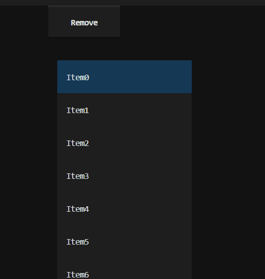

##### 4.2.1.3 `OptionList`选项列表组件

选项列表组件和列表视图组件外观相似，但创建选项列表组件时不强制要求必须传入特定的类。对于选项列表组件来说，对应的选项是`Option`选项类（使用`from textual.widgets.option_list import Option`导入），但创建选项列表组件时可以传入可渲染对象或者选项类，不强制要求是选项类，完整用法可以参考[官网文档](https://textual.textualize.io/widgets/option_list/)。

以下是一个简单的示例，读者可以先看一下选项列表组件的基本用法：

```python3
from textual.app import App
from textual.widgets import OptionList
from textual.widgets.option_list import Option

class MyApp(App):
    CSS = '''
    Screen {
        align: center middle;
    }
    OptionList {
        width: 30;
        margin: 2 2;
    }
    '''
    def on_mount(self):
        self.widgets = [
            OptionList(
                *[Option(prompt=f'\nItem{i}\n') for i in range(9)]
            )
        ]
        self.mount_all(self.widgets)


if __name__ == '__main__':
    app = MyApp()
    app.run()
```

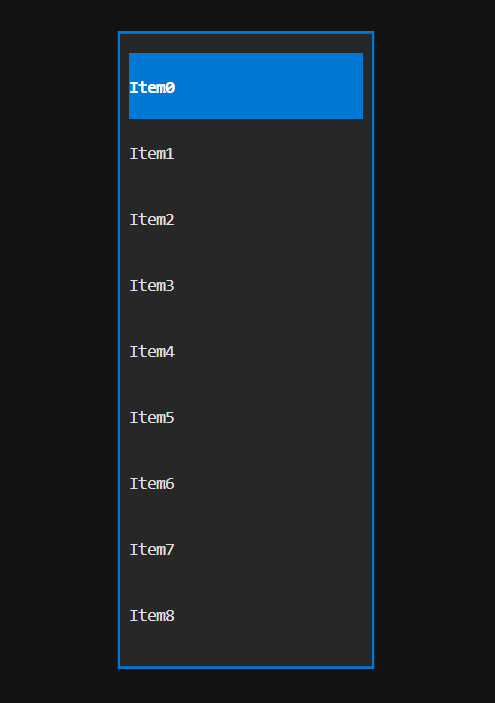

为了方便理解，需要先介绍一下选项类`Option`。

选项类支持以下参数：

-   `prompt`参数，可渲染类型，表示选项显示的内容。
-   `id`参数，字符串类型，表示选项的ID，不可与当前选项列表组件中其他选项的ID重复，将用于后面的消息属性`option_id`。
-   `disabled`参数，布尔类型，表示组件是否处于被禁用状态，默认为`False`。

选项类支持以下属性：

-   `prompt`属性，同`prompt`参数。
-   `id`属性，同`id`参数。

然后就是本节的主角，选项列表组件`OptionList`。

选项列表组件支持以下参数：

-   `*content`参数，选项类（使用`from textual.widgets.option_list import Option`导入）或者可渲染类型或者`None`，表示选项列表组件所包含的选项。注意，如果传入的是可渲染类型，则会自动转换为选项类。如果传入的是`None`，则会转换为分隔符。
-   `markup`参数，布尔类型，表示是否解析字符串类型选项中的Markup标签，默认为`True`。从此参数开始，只能使用关键字传入。
-   `name`参数，字符串类型，表示组件的名字，常用于调试时区分组件。
-   `id`参数，字符串类型，表示组件的ID，主要用于样式中的ID选择器。
-   `classes`参数，字符串类型，表示组件的样式类。
-   `disabled`参数，布尔类型，表示组件是否处于被禁用状态，默认为`False`。

组件支持以下属性：

-   `highlighted`属性，表示当前高亮选项索引值。为`None`表示当前没有选项被高亮。注意，被高亮不等于被选择。
-   `option_count`属性，整数类型，表示选项列表组件一共有多少个选项。
-   `options`属性，表示选项列表组件包含的所有选项。注意，本属性为只读属性，不可修改。

组件支持以下反应性属性：

-   `highlighted`属性，表示当前高亮选项索引值。为`None`表示当前没有选项被高亮。注意，被高亮不等于被选择。

组件支持以下子组件样式类（主要是选项使用）：

-   `option-list--option`类，不是被高亮、禁用、鼠标悬停的选项使用的样式类。
-   `option-list--option-disabled`类，被禁用的选项使用的样式类。
-   `option-list--option-highlighted`类，被高亮的选项使用的样式类。
-   `option-list--option-hover`类，被鼠标悬停的选项使用的样式类。
-   `option-list--separator`类，表示分隔符的选项使用的样式类。如果给选项列表组件传入`None`，则此选项会被转化为不可选择的分隔符，用来使该选项前、后的选项有所区别。

以下是一个自定义上面提到的子组件样式类的示例：

```python3
from textual.app import App
from textual.widgets import OptionList
from textual.widgets.option_list import Option


class MyApp(App):
    CSS = '''
    Screen {
        align: center middle;
    }
    OptionList {
        width: 30;
        margin: 2 2;
    }
    .option-list--option {
        color: green;
    }
    .option-list--option-disabled {
        color: white 20%;
    }
    .option-list--option-highlighted {
        color: red;
        background: white;
    }
    .option-list--option-hover {
        background: white 20%;
    }
    .option-list--separator {
        color: blue;
    }
    '''
    def on_mount(self):
        self.widgets = [
            OptionList(
                Option('Item1'),
                Option('Item2',disabled=True),
                None,
                Option('Item3'),
            )
        ]
        self.mount_all(self.widgets)


if __name__ == '__main__':
    app = MyApp()
    app.run()
```

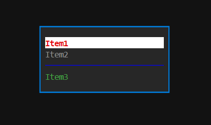

组件支持以下消息：

-   `OptionMessage`消息，其他消息的基类，这里主要介绍该消息支持的属性：
    -   `option_list`属性，表示触发该消息的选项列表组件。
    -   `control`属性，同`option_list`属性。
    -   `option`属性，表示触发该消息的选项。
    -   `option_id`属性，表示触发该消息的选项的`id`属性。
    -   `option_index`属性，表示触发该消息的选项的索引值。
-   `OptionHighlighted`消息，当选项被高亮时触发，支持的属性同`OptionMessage`消息。
-   `OptionSelected`消息，当选项被选择时触发，支持的属性同`OptionMessage`消息。

组件支持以下快捷键：

-   `enter`键，选择当前高亮的选项。
-   `up`键，高亮上一个选项。
-   `down`键，高亮下一个选项。
-   `pageup`键，高亮上一页该位置的选项。
-   `pagedown`键，高亮下一页该位置的选项。
-   `home`键，高亮第一个选项。
-   `end`键，高亮最后一个选项。

需要注意的是，高亮不等于选择，只有按下`enter`键之后，当前高亮的选项才会被选择，可以在处理`OptionSelected`消息时获取`option`属性，正确访问被选择选项。

组件支持以下方法：

-   `action_cursor_down`方法，高亮下一个选项。
-   `action_cursor_up`方法，高亮上一个选项。
-   `action_first`方法，高亮第一个选项。
-   `action_last`方法，高亮最后一个选项。
-   `action_page_down`方法，高亮下一页该位置的选项。
-   `action_page_up`方法，高亮上一页该位置的选项。
-   `action_select`方法，选择当前高亮的选项。
-   `add_option`方法，在选项列表组件中当前选项的末尾添加一个新的选项。该方法支持以下参数：
    -   `option`参数，选项类（使用`from textual.widgets.option_list import Option`导入）或者可渲染类型或者`None`（默认值），表示要添加的选项。
-   `add_options`方法，在选项列表组件中当前选项的末尾添加多个新的选项。该方法支持以下必需参数：
    -   `new_options`参数，元素为选项类（使用`from textual.widgets.option_list import Option`导入）、可渲染类型或者`None`（默认值）的可迭代对象，表示要添加的多个选项。
-   `clear_options`方法，清除选项列表组件的所有选项。
-   `disable_option`方法，禁用选项列表组件的指定选项。该方法支持以下必需参数：
    -   `option_id`参数，字符串类型，表示要禁用选项的ID。在消息属性中是`option_id`属性。
-   `disable_option_at_index`方法，禁用选项列表组件中指定索引值的选项。该方法支持以下必需参数：
    -   `index`参数，整数类型，表示要禁用选项的索引值。在消息属性中是`option_index`属性。
-   `enable_option`方法，启用选项列表组件的指定选项。该方法支持以下必需参数：
    -   `option_id`参数，字符串类型，表示要启用选项的ID。在消息属性中是`option_id`属性。
-   `enable_option_at_index`方法，启用选项列表组件中指定索引值的选项。该方法支持以下必需参数：
    -   `index`参数，整数类型，表示要启用选项的索引值。在消息属性中是`option_index`属性。
-   `get_option`方法，获取选项列表组件的指定选项。该方法支持以下必需参数：
    -   `option_id`参数，字符串类型，表示要获取选项的ID。在消息属性中是`option_id`属性。
-   `get_option_at_index`方法，获取选项列表组件中指定索引值的选项。该方法支持以下必需参数：
    -   `index`参数，整数类型，表示要获取选项的索引值。在消息属性中是`option_index`属性。
-   `get_option_index`方法，获取选项列表组件指定选项的索引值。该方法支持以下必需参数：
    -   `option_id`参数，字符串类型，表示要获取索引值的选项的ID。在消息属性中是`option_id`属性。
-   `remove_option`方法，移除选项列表组件的指定选项。该方法支持以下必需参数：
    -   `option_id`参数，字符串类型，表示要移除选项的ID。在消息属性中是`option_id`属性。
-   `remove_option_at_index`方法，移除选项列表组件中指定索引值的选项。该方法支持以下必需参数：
    -   `index`参数，整数类型，表示要移除选项的索引值。在消息属性中是`option_index`属性。
-   `replace_option_prompt`方法，替换选项列表组件中指定选项的显示内容。该方法支持以下必需参数：
    -   `option_id`参数，字符串类型，表示要替换显示内容的选项的ID。在消息属性中是`option_id`属性。
    -   `prompt`参数，可渲染类型，表示将选项的显示内容替换为什么内容。
-   `replace_option_prompt_at_index`方法，替换选项列表组件中指定索引值的选项的显示内容。该方法支持以下必需参数：
    -   `index`参数，整数类型，表示要替换显示内容的选项的索引值。在消息属性中是`option_index`属性。
    -   `prompt`参数，可渲染类型，表示将选项的显示内容替换为什么内容。
-   `scroll_to_highlight`方法，当选项较多、出现滚动条时，执行此方法可以让组件自动滚动，直到显示出当前高亮的选项。该方法支持以下参数：
    -   `top`参数，布尔类型，表示是否让高亮的选项显示在组件可见区域的顶部，默认为`False`。

以下是一个使用可渲染对象作为选项的示例：

```python3
from textual.app import App
from textual.widgets import OptionList
from textual.widgets.option_list import Option
from rich.panel import Panel

class MyApp(App):
    CSS = '''
    Screen {
        align: center middle;
    }
    OptionList {
        width: 30;
        margin: 2 2;
    }
    '''
    def on_mount(self):
        self.widgets = [
            OptionList(
                Option('[red]你好[/] [i]世界[/]'),
                Option(Panel('Hello World',expand=False,height=3))
            )
        ]
        self.mount_all(self.widgets)


if __name__ == '__main__':
    app = MyApp()
    app.run()

```

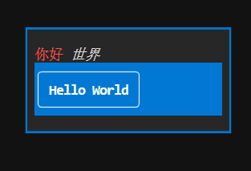

##### 4.2.1.4 `SelectionList`多选列表组件

前面介绍了单选的选择类组件，本节将介绍用于多选的选择类组件——多选列表组件（完整用法参考[官网文档](https://textual.textualize.io/widgets/selection_list/)）。

多选列表组件和选项列表组件外观相似，实际上多选列表组件就是基于选项列表组件扩展而来，因此用法上也有一些相似之处：有单独的`Selection`多选选项类（使用`from textual.widgets.selection_list import Selection`导入）；可以使用多选选项类构建选项，也可以使用元组形式的简化表达，多选列表组件会自动将其转换为多选选项；子组件样式类、属性、快捷键、方法等也有选项列表组件的影子。

在正式介绍多选列表组件之前，先看一个简单的示例：

```python3
from textual.app import App
from textual.widgets import SelectionList
from textual.widgets.selection_list import Selection

class MyApp(App):
    CSS = '''
    Screen {
        align: center middle;
    }
    SelectionList {
        width: 30;
        margin: 2 2;
    }
    '''
    def on_mount(self):
        self.widgets = [
            SelectionList(
                *[Selection(prompt=f'Item{i}',value=i) for i in range(9)]
            )
        ]
        self.mount_all(self.widgets)


if __name__ == '__main__':
    app = MyApp()
    app.run()
```

从外观上看，多选列表组件就像是选项列表组件的每个选项增加了一个复选框组件：

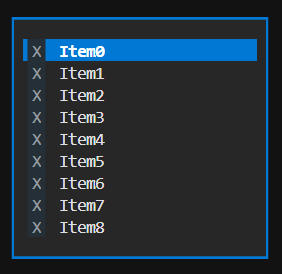

为了方便理解，需要先介绍一下多选选项类`Selection`。

多选选项类支持以下参数：

-   `prompt`参数，Rich的[`Text`](https://rich.readthedocs.io/en/latest/text.html)类型，表示选项显示的内容。注意，Text类型支持内嵌Markup标签的文本，但不支持其他Rich中多行显示的可渲染对象。
-   `value`参数，整数类型、浮点类型、字符串类型，表示选项的值。注意，如果不同选项使用相同的值，虽然不会报错，但值相同的选项会被当成同一个选项处理，即点击任意一个选项，其余同值选项会同时响应。
-   `initial_state`参数，布尔类型，表示选项初始的勾选状态，默认为`False`。
-   `id`参数，字符串类型，表示选项的ID，不可与当前选项列表组件中其他选项的ID重复。
-   `disabled`参数，布尔类型，表示组件是否处于被禁用状态，默认为`False`。

多选选项类支持以下属性：

-   `prompt`属性，同`prompt`参数。
-   `id`属性，同`id`参数。
-   `initial_state`属性，同`initial_state`参数。
-   `value`属性，同`value`参数。

然后就是本节的主角，多选列表组件`SelectionList`。

多选列表组件支持以下参数：

-   `*selections`参数，多选选项类（使用`from textual.widgets.selection_list import Selection`导入）或者元组，表示多选列表组件所包含的选项。注意，如果传入的是元组，则会自动转换为多选选项类。元组支持三元素或者两元素，分别对应着多选选项类的`prompt`参数、`value`参数、`initial_state`参数（可省略，省略的话默认该参数为`False`）。
-   `name`参数，字符串类型，表示组件的名字，常用于调试时区分组件。从此参数开始，只能使用关键字传入。
-   `id`参数，字符串类型，表示组件的ID，主要用于样式中的ID选择器。
-   `classes`参数，字符串类型，表示组件的样式类。
-   `disabled`参数，布尔类型，表示组件是否处于被禁用状态，默认为`False`。

组件支持以下属性：

-   `selected`属性，列表类型，元素为当前被选择选项的值。
-   `highlighted`属性，表示当前高亮选项索引值。为`None`表示当前没有选项被高亮。注意，被高亮不等于被选择，只有选项的复选框被勾选时，该选项才被选择。
-   `option_count`属性，整数类型，表示组件一共有多少个选项。
-   `options`属性，表示组件包含的所有选项。注意，本属性为只读属性，不可修改。

组件支持以下反应性属性：

-   `highlighted`属性，表示当前高亮选项索引值。为`None`表示当前没有选项被高亮。注意，被高亮不等于被选择，只有选项的复选框被勾选时，该选项才被选择。

组件支持以下子组件样式类（主要是选项使用）：

-   `selection-list--button`类，不是被高亮、选择的选项复选框使用的样式类。
-   `selection-list--button-selected`类，被选择的选项复选框使用的样式类。
-   `selection-list--button-highlighted`类，被高亮的选项复选框使用的样式类。
-   `selection-list--button-selected-highlighted`类，被高亮、选择的选项复选框使用的样式类。
-   `option-list--option`类，不是被高亮、禁用、鼠标悬停的选项使用的样式类。
-   `option-list--option-disabled`类，被禁用的选项使用的样式类。
-   `option-list--option-highlighted`类，被高亮的选项使用的样式类。
-   `option-list--option-hover`类，被鼠标悬停的选项使用的样式类。

以下是一个自定义上面提到的子组件样式类的示例：

```python3
from textual.app import App
from textual.widgets import SelectionList
from textual.widgets.selection_list import Selection

class MyApp(App):
    CSS = '''
    Screen {
        align: center middle;
    }
    SelectionList {
        width: 30;
        margin: 2 2;
    }
    .selection-list--button {
        color: white;
    }
    .selection-list--button-selected {
        color: green;
    }
    .selection-list--button-highlighted {
        color: red;
    }
    .selection-list--button-selected-highlighted {
        color: yellow;
    }
    .option-list--option {
        color: green;
    }
    .option-list--option-disabled {
        color: white 20%;
    }
    .option-list--option-highlighted {
        color: red;
        background: white;
    }
    .option-list--option-hover {
        background: white 20%;
    }
    '''
    def on_mount(self):
        self.widgets = [
            SelectionList(
                Selection('Item1','Item1'),
                Selection('Item2','Item2',disabled=True),
                Selection('Item3','Item3',True,disabled=True),
                Selection('Item4','Item4'),
            )
        ]
        self.mount_all(self.widgets)

if __name__ == '__main__':
    app = MyApp()
    app.run()
```

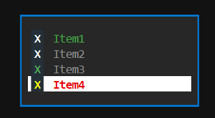

组件支持以下消息：

-   `SelectedChanged`消息，`selected`属性变化时触发。该消息支持以下属性：

    -   `selection_list`属性，表示触发该消息的多选列表组件。
    -   `control`属性，同`selection_list`属性。

    注意，不管是用户交互还是使用代码，都会触发此消息。如果使用代码执行全选（`select_all`）或者取消全选（`deselect_all`），即使理论上`selected`属性变化多次，该消息只会触发一次。

-   `SelectionMessage`消息，其他消息的基类，这里主要介绍该消息支持的属性：

    -   `selection_list`属性，表示触发该消息的多选列表组件。
    -   `control`属性，同`selection_list`属性。
    -   `selection`属性，表示触发该消息的选项。
    -   `selection_index`属性，表示触发该消息的选项的索引值。

-   `SelectionHighlighted`消息，当选项被高亮时触发，支持的属性同`SelectionMessage`消息。

-   `SelectionToggled`消息，当选项的复选框勾选状态切换时触发，支持的属性同`SelectionMessage`消息。

    注意，此消息在用户交互、使用`toggle`方法、使用`toggle_all`方法切换复选框勾选状态时触发。但是，如果使用选择类的方法（`select`、`select_all`、`deselect_all`）让复选框勾选状态切换，则不会触发此消息。

    另外，不同于`SelectedChanged`消息使用全选、取消全选方法时只会触发一次，此消息在使用类似的`toggle_all`方法时，每个选项都会执行一次状态切换，因此每个选项触发一次该消息。

组件支持以下快捷键：

-   `enter`键或`space`键，切换当前高亮选项的复选框勾选状态。
-   `up`键，高亮上一个选项。
-   `down`键，高亮下一个选项。
-   `pageup`键，高亮上一页该位置的选项。
-   `pagedown`键，高亮下一页该位置的选项。
-   `home`键，高亮第一个选项。
-   `end`键，高亮最后一个选项。

组件支持以下方法：

-   `action_cursor_down`方法，高亮下一个选项。
-   `action_cursor_up`方法，高亮上一个选项。
-   `action_first`方法，高亮第一个选项。
-   `action_last`方法，高亮最后一个选项。
-   `action_page_down`方法，高亮下一页该位置的选项。
-   `action_page_up`方法，高亮上一页该位置的选项。
-   `action_select`方法，切换当前高亮选项的复选框勾选状态。
-   `add_option`方法，在组件中当前选项的末尾添加一个新的选项。该方法支持以下参数：
    -   `item`参数，多选选项类（使用`from textual.widgets.selection_list import Selection`导入）或者元组，表示要添加的选项。注意，如果传入的是元组，则会自动转换为多选选项类。元组支持三元素或者两元素，分别对应着多选选项类的`prompt`参数、`value`参数、`initial_state`参数（可省略，省略的话默认该参数为`False`）。
-   `add_options`方法，在组件中当前选项的末尾添加多个新的选项。该方法支持以下必需参数：
    -   `items`参数，元素为多选选项类或者元组的可迭代对象，表示要添加的多个选项。
-   `clear_options`方法，清除组件中的所有选项。
-   `deselect`方法，将选项的复选框勾选状态设置为未勾选。该方法支持以下参数：
    -   `selection`参数，使用多选选项类（使用`from textual.widgets.selection_list import Selection`导入）构建一个`prompt`参数为空字符串`''`、`value`参数与要修改选项`value`参数相同的多选选项类实例，或者只是使用与要修改选项`value`参数相同的字符串，来表示要修改的选项。
-   `deselect_all`方法，将所有选项的复选框勾选状态设置为未勾选。
-   `disable_option`方法，禁用组件的指定选项。该方法支持以下必需参数：
    -   `option_id`参数，字符串类型，表示要禁用选项的ID。在多选选项类属性中是`id`属性。
-   `disable_option_at_index`方法，禁用组件中指定索引值的选项。该方法支持以下必需参数：
    -   `index`参数，整数类型，表示要禁用选项的索引值。在消息属性中是`selection_index`属性。
-   `enable_option`方法，启用组件的指定选项。该方法支持以下必需参数：
    -   `option_id`参数，字符串类型，表示要启用选项的ID。在多选选项类属性中是`id`属性。
-   `enable_option_at_index`方法，启用组件中指定索引值的选项。该方法支持以下必需参数：
    -   `index`参数，整数类型，表示要启用选项的索引值。在消息属性中是`selection_index`属性。
-   `get_option`方法，获取组件的指定选项。该方法支持以下必需参数：
    -   `option_id`参数，字符串类型，表示要获取选项的ID。在多选选项类属性中是`id`属性。
-   `get_option_at_index`方法，获取组件中指定索引值的选项。该方法支持以下必需参数：
    -   `index`参数，整数类型，表示要获取选项的索引值。在消息属性中是`selection_index`属性。
-   `get_option_index`方法，获取组件指定选项的索引值。该方法支持以下必需参数：
    -   `option_id`参数，字符串类型，表示要获取索引值的选项的ID。在多选选项类属性中是`id`属性。
-   `remove_option`方法，移除组件的指定选项。该方法支持以下必需参数：
    -   `option_id`参数，字符串类型，表示要移除选项的ID。在多选选项类属性中是`id`属性。
-   `remove_option_at_index`方法，移除组件中指定索引值的选项。该方法支持以下必需参数：
    -   `index`参数，整数类型，表示要移除选项的索引值。在消息属性中是`selection_index`属性。
-   `replace_option_prompt`方法，替换组件中指定选项的显示内容。该方法支持以下必需参数：
    -   `option_id`参数，字符串类型，表示要替换显示内容的选项的ID。在多选选项类属性中是`id`属性。
    -   `prompt`参数，Rich的[`Text`](https://rich.readthedocs.io/en/latest/text.html)类型，表示将选项的显示内容替换为什么内容。
-   `replace_option_prompt_at_index`方法，替换组件中指定索引值的选项的显示内容。该方法支持以下必需参数：
    -   `index`参数，整数类型，表示要替换显示内容的选项的索引值。在消息属性中是`selection_index`属性。
    -   `prompt`参数，Rich的[`Text`](https://rich.readthedocs.io/en/latest/text.html)类型，表示将选项的显示内容替换为什么内容。
-   `scroll_to_highlight`方法，当选项较多、出现滚动条时，执行此方法可以让组件自动滚动，直到显示出当前高亮的选项。该方法支持以下参数：
    -   `top`参数，布尔类型，表示是否让高亮的选项显示在组件可见区域的顶部，默认为`False`。
-   `select`方法，将选项的复选框勾选状态设置为勾选。该方法支持以下参数：
    -   `selection`参数，使用多选选项类（使用`from textual.widgets.selection_list import Selection`导入）构建一个`prompt`参数为空字符串`''`、`value`参数与要修改选项`value`参数相同的多选选项类实例，或者只是使用与要修改选项`value`参数相同的字符串，来表示要修改的选项。
-   `select_all`方法，将所有选项的复选框勾选状态设置为勾选。
-   `toggle`方法，切换选项的复选框勾选状态。该方法支持以下参数：
    -   `selection`参数，使用多选选项类（使用`from textual.widgets.selection_list import Selection`导入）构建一个`prompt`参数为空字符串`''`、`value`参数与要修改选项`value`参数相同的多选选项类实例，或者只是使用与要修改选项`value`参数相同的字符串，来表示要修改的选项。
-   `toggle_all`方法，切换所有选项的复选框勾选状态。

示例的话，就借用前面的示例，添加一个按钮执行`toggle_all`方法，稍微修改一下第四个选项，给其添加Markup标签：

```python3
from textual.app import App
from textual.widgets import SelectionList,Button
from textual.widgets.selection_list import Selection

class MyApp(App):
    CSS = '''
    Screen {
        align: center middle;
    }
    SelectionList {
        width: 30;
        margin: 2 2;
    }
    .selection-list--button {
        color: white;
    }
    .selection-list--button-selected {
        color: green;
    }
    .selection-list--button-highlighted {
        color: red;
    }
    .selection-list--button-selected-highlighted {
        color: yellow;
    }
    .option-list--option {
        color: green;
    }
    .option-list--option-disabled {
        color: white 20%;
    }
    .option-list--option-highlighted {
        color: red;
        background: white;
    }
    .option-list--option-hover {
        background: white 20%;
    }
    '''
    def on_mount(self):
        self.widgets = [
            Button('Toggle all',action='app.test'),
            SelectionList(
                Selection('Item1','Item1'),
                Selection('Item2','Item2',disabled=True),
                Selection('Item3','Item3',True,disabled=True),
                Selection('Item[red]4','Item4'),
            )
        ]
        self.mount_all(self.widgets)

    def action_test(self):
        self.query_one(SelectionList).toggle_all()


if __name__ == '__main__':
    app = MyApp()
    app.run()
```

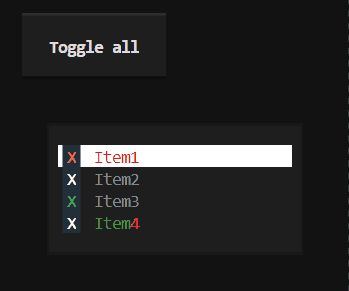

##### 4.2.1.5 `Select`下拉选择框组件

相比于前面单选的选择类组件在不限制组件的高度时，将所有选项展示在组件内，直到高度达到默认限制。下拉选择框组件提供了另一种展示选项的方式——弹出展示所有选项的下拉框，还支持通过输入选项包含的字符直接定位选项（仅限选项为文本类型，且输入过程的输入内容不可见）。

完整用法可以参考[官网文档](https://textual.textualize.io/widgets/select/)，以下是简单展示该组件特性的示例：

```python3
from textual.app import App
from textual.widgets import Select, Static

class MyApp(App):
    CSS = '''
    Select {
        width: 50;
    }
    '''
    def on_mount(self):
        self.widgets = [
            Static(),
            Select(
                options=[
                    ('Hello', 'hello'),
                    ('[red]W[/]orld','world')
                ],
                prompt='Please select one'
            )
        ]
        self.mount_all(self.widgets)

    def on_select_changed(self, e: Select.Changed):
        self.query_one(Static).update('' if e.value is Select.BLANK else e.value)


if __name__ == '__main__':
    app = MyApp()
    app.run()
```

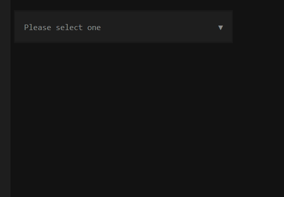

组件支持以下参数：

-   `options`参数，元素为双元素元组的可迭代类型，双元素元组的第一个元素为可渲染类型，表示选项显示的内容；第二个元素为整数类型、浮点类型、字符串类型，表示选项的值。该参数表示组件可选择的选项。
-   `prompt`参数，字符串类型，表示没有选择选项时显示的内容，同时也是表示空白选项（其值为`Select.BLANK`）显示的内容，默认为`'Select'`。从此参数开始，只能使用关键字传入。
-   `allow_blank`参数，布尔类型，表示是否允许选择空白选项，默认为`True`。
-   `value`参数，整数类型、浮点类型、字符串类型或者`BLANK`（`Select.BLANK`），表示当前选择的选项的值。
-   `type_to_search`参数，布尔类型，表示在弹出下拉框时，是否可以输入选项包含的字符直接定位选项，默认为`True`。
-   `tooltip`参数，可渲染类型，表示鼠标悬停在组件上时显示出来的工具提示。
-   `name`参数，字符串类型，表示组件的名字，常用于调试时区分组件。
-   `id`参数，字符串类型，表示组件的ID，主要用于样式中的ID选择器。
-   `classes`参数，字符串类型，表示组件的样式类。
-   `disabled`参数，布尔类型，表示组件是否处于被禁用状态，默认为`False`。

组件支持以下属性：

-   `expanded`属性，布尔类型，表示是否显示下拉框。
-   `value`属性，同`value`参数。
-   `selection`属性，表示当前选择的选项的值。不过，此属性与`value`属性有一点不同，当选项的值为`Select.BLANK`时，此属性的值为`None`。
-   `prompt`属性，同`prompt`参数。

组件支持以下反应性属性：

-   `expanded`属性，布尔类型，表示是否显示下拉框。
-   `value`属性，同`value`参数。

组件支持以下消息：

-   `Changed`消息，当前选择的选项改变时触发，该消息支持以下属性：
    -   `select`属性，表示触发该消息的组件。
    -   `control`属性，同`select`属性。
    -   `value`属性，表示当前选择的选项的值。

组件支持以下快捷键：

-   `enter`键或`space`键或`up`键或`down`键，下拉框未显示时显示下拉框。

组件支持以下方法：

-   `action_show_overlay`方法，下拉框未显示时显示下拉框。

-   `clear`方法，当`allow_blank`参数为`True`时，可以将当前选择的选项设置为空白选项。注意，当`allow_blank`参数为`False`时，执行此方法会报错。

-   `is_blank`方法，判断组件当前选择的选项是不是空白选项。

-   `set_options`方法更新组件的选项。该方法支持以下参数：
    -   `options`参数，元素为双元素元组的可迭代类型，双元素元组的第一个元素为可渲染类型，表示选项显示的内容；第二个元素为整数类型、浮点类型、字符串类型，表示选项的值。该参数表示组件更新后的选项。

    注意，当`allow_blank`参数为`True`时，执行此方法会将当前选择的选项设置为空白选项；，当`allow_blank`参数为`False`时，执行此方法会将当前选择的选项设置为按索引值排序时第一个有效的选项（非空白选项）。

组件支持以下类方法：

-   `from_values`方法，使用元素为整数类型、浮点类型、字符串类型的可迭代对象生成下拉选择框组件。该方法支持以下参数：
    -   `values`参数，元素为整数类型、浮点类型、字符串类型可迭代类型，表示生成的选项值；选项对应的显示内容，则是将值转换为字符串。比如，`Select.from_values([1,2,3])`，相当于`Select([(str(1),1),(str(2),2),(str(3),3)])`。
    -   `prompt`参数，字符串类型，表示没有选择选项时显示的内容，同时也是表示空白选项（其值为`Select.BLANK`）显示的内容，默认为`'Select'`。从此参数开始，只能使用关键字传入。
    -   `allow_blank`参数，布尔类型，表示是否允许选择空白选项，默认为`True`。
    -   `value`参数，整数类型、浮点类型、字符串类型或者`BLANK`（`Select.BLANK`），表示当前选择的选项的值。
    -   `type_to_search`参数，布尔类型，表示在弹出下拉框时，是否可以输入选项包含的字符直接定位选项，默认为`True`。
    -   `name`参数，字符串类型，表示组件的名字，常用于调试时区分组件。
    -   `id`参数，字符串类型，表示组件的ID，主要用于样式中的ID选择器。
    -   `classes`参数，字符串类型，表示组件的样式类。
    -   `disabled`参数，布尔类型，表示组件是否处于被禁用状态，默认为`False`。

以下为`from_values`方法的示例：

```python3
from textual.app import App
from textual.widgets import Select

class MyApp(App):
    def on_mount(self):
        self.widgets = [
            Select.from_values(
                values=('Hello', 'World'),
                prompt='Please select one'
            )
        ]
        self.mount_all(self.widgets)

if __name__ == '__main__':
    app = MyApp()
    app.run()
```

#### 4.2.2 其他内容展示组件

##### 4.2.2.1 `Markdown`标记文本组件

Markdown是一种轻量级标记文本语言（基本语法可以参考[百度百科](https://baike.baidu.com/item/markdown/3245829#3)），有点类似于Textual的Markup标签、HTML，但与二者不同的是，Markdown不会直接渲染为富文本，而是先转换为HTML，再确定渲染样式。因此，Markdown支持部分HTML的标签，同时也支持一套内容渲染为不同的样式。Markdown常用于程序文档的写作，在开源领域占比不小，而本教程也是使用Markdown编辑器创作的。

标记文本组件就是一个在终端中显示Markdown文本的组件，完整用法可以参考[官网文档](https://textual.textualize.io/widgets/markdown/)。

在正式学习之前，先看一个简单的示例，稍微了解一下标记文本组件：

```python3
from textual.app import App
from textual.widgets import Markdown

TEXT = '''\
### Hello
**World**
'''

class MyApp(App):
    def on_mount(self):
        self.widgets = [
            Markdown(TEXT)
        ]
        self.mount_all(self.widgets)

if __name__ == '__main__':
    app = MyApp()
    app.run()
```

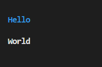

组件支持以下参数：

-   `markdown`参数，字符串类型，表示组件显示内容的Markdown原文。从此参数开始，只能使用关键字传入。

-   `open_links`参数，布尔类型，表示是否自动打开超链接，默认为`True`。如果设置为`False`，点击超链接将不会自动打开，改为触发`LinkClicked`消息。

-   `parser_factory`参数，返回`MarkdownIt`实例（使用`from markdown_it import MarkdownIt`导入）的可调用类型或`None`，表示组件使用的Markdown风格。组件使用的Markdown风格取决于初始化实例时的`config`参数（支持`['zero','commonmark ','js-default','gfm-like']`，对应的含义介绍参考[官网文档](https://markdown-it-py.readthedocs.io/en/latest/using.html#the-parser)），`config`参数的默认值为`'commonmark'`。`parser_factory`参数默认为`None`，此时`MarkdownIt`实例的`config`参数值为`'gfm-like'`。示例如下：

    ```python3
    from textual.app import App
    from textual.widgets import Markdown
    from markdown_it import MarkdownIt
    
    TEXT = '''\
    ### Hello
    **World**
    '''
    
    class MyApp(App):
        def on_mount(self):
            self.widgets = [
                Markdown(TEXT,parser_factory=lambda :MarkdownIt('commonmark'))
            ]
            self.mount_all(self.widgets)
    
    if __name__ == '__main__':
        app = MyApp()
        app.run()
    ```

-   `name`参数，字符串类型，表示组件的名字，常用于调试时区分组件。

-   `id`参数，字符串类型，表示组件的ID，主要用于样式中的ID选择器。

-   `classes`参数，字符串类型，表示组件的样式类。

组件支持以下属性，同时也是反应性属性：

-   `code_dark_theme`属性，默认值为`'material'`，表示程序的主题为黑暗主题时，组件显示的Markdown代码块使用什么主题样式（支持的主题样式参考[官网文档](https://pygments.org/styles/)，以及Rich额外实现的`'ansi_light'`和`'ansi_dark'`）。注意，如果此属性设置的值不是支持的主题样式，则主题样式会被设置为`'default'`。
-   `code_light_theme`属性，默认值为`'material-light'`，表示程序的主题为明亮主题时，组件显示的Markdown代码块使用什么主题样式（支持的主题样式参考[官网文档](https://pygments.org/styles/)，以及Rich额外实现的`'ansi_light'`和`'ansi_dark'`）。注意，此属性默认值`'material-light'`不是支持的主题样式，因此，该属性的默认值实际上等同于`'default'`。

组件支持以下子组件样式类：

-   `code_inline`类，Markdown文本中行内代码（被`ˋ`包裹）使用的样式类。
-   `em`类，Markdown文本中斜体内容（被` *`或`_`包裹）使用的样式类。
-   `s`类，Markdown文本中表示被删除的内容（被` ~~`包裹，文本上添加了删除线）使用的样式类。
-   `strong`类，Markdown文本中粗体内容（被` **`或`__`包裹）使用的样式类。

示例如下：

```python3
from textual.app import App
from textual.widgets import Markdown

TEXT = '''\
`Hello`

*Hello*

~~Hello~~

**Hello**
'''

class MyApp(App):
    CSS = '''
    .code_inline {
        color: green;
    }
    .em {
        color: yellow;
    }
    .s {
        color: yellow;
    }
    .strong {
        color: red;
    }
    '''
    def on_mount(self):
        self.widgets = [
            Markdown(TEXT)
        ]
        self.mount_all(self.widgets)

if __name__ == '__main__':
    app = MyApp()
    app.run()
```

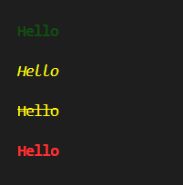

组件支持以下消息：

-   `LinkClicked`消息，组件的`open_links`参数设置为`False`，点击超链接时触发。该消息支持以下属性：
    -   `markdown`属性，表示触发该消息的组件。
    -   `control`属性，同`markdown`属性。
    -   `href`属性，表示被点击的超链接的地址。
    

示例如下：

```python3
from textual.app import App
from textual.widgets import Markdown

TEXT = '''\
### Hello

**World**

[百度百科](https://baike.baidu.com/item/markdown/3245829#3)
'''

class MyApp(App):
    def on_mount(self):
        self.widgets = [
            Markdown(TEXT, open_links=False)
        ]
        self.mount_all(self.widgets)

    def on_markdown_link_clicked(self, e: Markdown.LinkClicked):
        self.app.open_url(e.href)

if __name__ == '__main__':
    app = MyApp()
    app.run()
```

组件支持以下方法：

-   `load`方法是一个异步方法，用于从指定路径加载包含Markdown文本的文件。该方法支持一个字符串类型或者`Path`类型的参数`path`（使用`from pathlib import Path`导入），表示文件的路径。注意，这里如果使用字符串表示相对路径，特定的运行方式可能会导致当前目录不是文件所在目录，最好使用`Path(__file__).parent`表示文件所在目录，如果想要加载文件所在目录的其他文件，可以这样写`load(Path(__file__).parent/'myapp.py')`。
-   `update`方法返回可等待结果，用于加载包含Markdown文本的变量。该方法支持一个字符串类型的参数`markdown`，表示包含Markdown文本的变量。

示例如下：

```python3
from textual.app import App
from textual.widgets import Markdown,Button

TEXT = '''\
# Hello

## Hello

### Hello

#### Hello
'''

class MyApp(App):
    def on_mount(self):
        self.widgets = [
            Markdown(''),
            Button('Update',action='app.test'),
        ]
        self.mount_all(self.widgets)
    async def action_test(self):
        from pathlib import Path
        await self.query_one(Markdown).update(TEXT)
        #await self.query_one(Markdown).load(Path(__file__).parent/'myapp.py')

if __name__ == '__main__':
    app = MyApp()
    app.run()
```

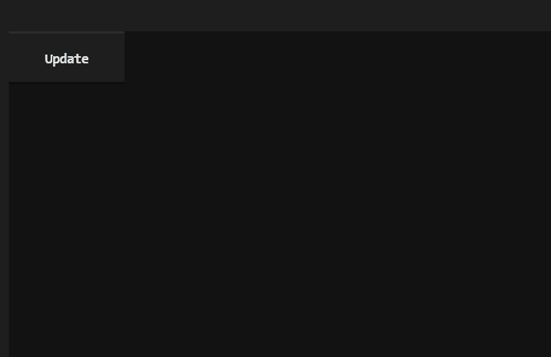

##### 4.2.2.2 `MarkdownViewer`标记文本阅读器组件（`Markdown`标记文本组件的增强版）

如果读者用过其他Markdown编辑器，肯定能发现标记文本组件显示的Markdown文本似乎缺了什么，没错，那就是`[TOC]`目录。不过，标记文本组件并不支持此Markdown语法，想要显示目录的话，只能使用标记文本组件的增强版——标记文本阅读器组件（完整用法参考[官网文档](https://textual.textualize.io/widgets/markdown_viewer/)）。

先看一个简单的示例：

```python3
from textual.app import App
from textual.widgets import MarkdownViewer

TEXT = '''\
# Hello

## Hello

### Hello

#### Hello
'''

class MyApp(App):
    def on_mount(self):
        self.widgets = [
            MarkdownViewer(TEXT),
        ]
        self.mount_all(self.widgets)


if __name__ == '__main__':
    app = MyApp()
    app.run()
```

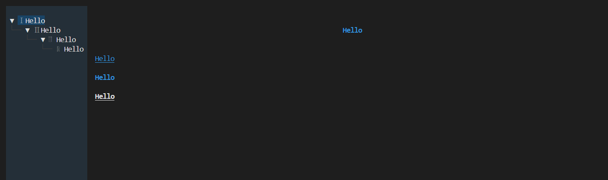

简单来说，标记文本阅读器组件相当于在标记文本组件的基础上，添加了一个显示其目录的组件。而标记文本阅读器组件内部包括了标记文本组件和标记文本目录组件，并使用反应性属性映射了标记文本目录组件和标记文本组件的目录，使得点击左边目录中对应的标题时，右边的内容也会随之跳转。三者的关系如下图所示：

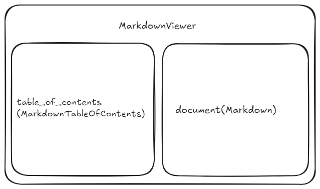

组件支持以下参数：

-   `markdown`参数，字符串类型，表示组件显示内容的Markdown原文。从此参数开始，只能使用关键字传入。

-   `show_table_of_contents`参数，布尔类型，表示是否显示左边的目录，默认为`True`。

-   `open_links`参数，布尔类型，表示是否自动打开超链接，默认为`True`。如果设置为`False`，点击超链接将不会自动打开，改为跳转到对应的锚点。

    组件仅支持标题锚点，即不同数量`#`开头、空格间隔、后接标题的Markdown内容。此时，可以将超链接的地址设置为`#`开头、后接完全小写的标题（仅支持英文标题，不支持中文标题）。那么，点击超链接将直接跳转至标题，这种完全小写的标题就是锚点。

    比如：

    ```python3
    from textual.app import App
    from textual.widgets import MarkdownViewer
    
    TEXT = '''\
    # TOP
    [goto END](#end)
    
    1
    
    2
    
    3
    
    4
    
    5
    
    6
    
    7
    
    # END
    [goto TOP](#top)
    '''
    
    class MyApp(App):
        def on_mount(self):
            self.widgets = [
                MarkdownViewer(TEXT,open_links=False),
            ]
            self.mount_all(self.widgets)
    
    
    if __name__ == '__main__':
        app = MyApp()
        app.run()
    ```

-   `parser_factory`参数，返回`MarkdownIt`实例（使用`from markdown_it import MarkdownIt`导入）的可调用类型或`None`，表示组件使用的Markdown风格。组件使用的Markdown风格取决于初始化实例时的`config`参数（支持`['zero','commonmark ','js-default','gfm-like']`，对应的含义介绍参考[官网文档](https://markdown-it-py.readthedocs.io/en/latest/using.html#the-parser)），`config`参数的默认值为`'commonmark'`。`parser_factory`参数默认为`None`，此时`MarkdownIt`实例的`config`参数值为`'gfm-like'`。

-   `name`参数，字符串类型，表示组件的名字，常用于调试时区分组件。

-   `id`参数，字符串类型，表示组件的ID，主要用于样式中的ID选择器。

-   `classes`参数，字符串类型，表示组件的样式类。

组件支持以下属性：

-   `document`属性，表示显示Markdown内容的内置子级组件。此子组件实际上是标记文本组件，因此，此属性支持标记文本组件的属性、方法。
-   `table_of_contents`属性，表示显示目录的内置子级组件。
-   `show_table_of_contents`属性，同`show_table_of_contents`参数。

组件支持以下反应性属性：

-   `show_table_of_contents`属性，同`show_table_of_contents`参数。

组件支持以下子组件样式类：

-   `code_inline`类，Markdown文本中行内代码（被`ˋ`包裹）使用的样式类。
-   `em`类，Markdown文本中斜体内容（被` *`或`_`包裹）使用的样式类。
-   `s`类，Markdown文本中表示被删除的内容（被` ~~`包裹，文本上添加了删除线）使用的样式类。
-   `strong`类，Markdown文本中粗体内容（被` **`或`__`包裹）使用的样式类。

组件支持以下消息：

-   `NavigatorUpdated`消息，组件加载包含Markdown文本的文件时触发。组件每次加载新的包含Markdown文本的文件，导航栏地址（组件的`navigator.location`属性）都会更新，因此都会触发此消息。

示例如下：

```python3
from textual.app import App
from textual.widgets import MarkdownViewer,Static
from pathlib import Path

TEXT = '''\
# TOP
[goto END](#end)

1

2

3

4

5

6

7

# END
[goto TOP](#top)
'''

class MyApp(App):
    def on_mount(self):
        self.widgets = [
            Static('[@click=app.m_go]go'),
            Static('[@click=app.m_back]back'),
            Static('[@click=app.m_forward]forward'),
            MarkdownViewer(TEXT,open_links=False),
        ]
        self.mount_all(self.widgets)
        
    async def action_m_go(self):
        await self.query_one(MarkdownViewer).go(Path(__file__).parent/'myapp.py')
        await self.query_one(MarkdownViewer).go(Path(__file__).parent/'myapp.tcss')

    async def action_m_back(self):
        await self.query_one(MarkdownViewer).back()

    async def action_m_forward(self):
        await self.query_one(MarkdownViewer).forward()
        
    def on_markdown_viewer_navigator_updated(self):
        self.notify('The navigator is changed.')


if __name__ == '__main__':
    app = MyApp()
    app.run()
```

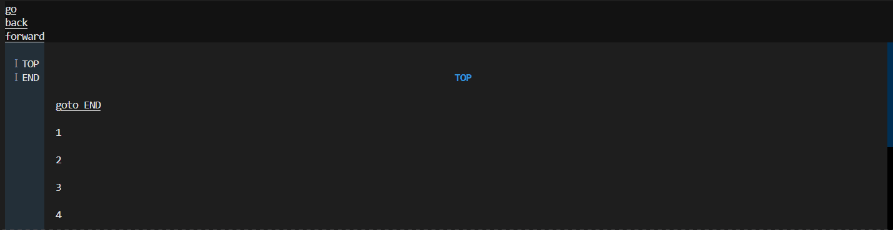

组件支持以下方法：

-   `go`方法返回可等待结果，用于从指定路径加载包含Markdown文本的文件。该方法支持一个字符串类型或者`Path`类型的参数`location`（使用`from pathlib import Path`导入），表示文件的路径。注意，这里如果使用字符串表示相对路径，特定的运行方式可能会导致当前目录不是文件所在目录，最好使用`Path(__file__).parent`表示文件所在目录，如果想要加载文件所在目录的其他文件，可以这样写`load(Path(__file__).parent/'myapp.py')`。
-   `back`方法返回可等待结果，当两次以上使用`go`方法加载包含Markdown文本的文件之后，可以执行此方法加载上一个文件。每次使用`go`方法就好像在浏览器中点击超链接，创建了一条新的“历史记录”一样，执行此方法可以后退一步。
-   `forward`方法返回可等待结果，当使用`back`方法加载了上一个文件之后，可以执行此方法加载下一个文件，就好像在浏览器中前进一步一样。注意，如果在执行了`back`方法之后执行`go`方法，会把“历史记录”刷新，导致无法执行`forward`方法。

示例如下：

```python3
from textual.app import App
from textual.widgets import MarkdownViewer,Static
from pathlib import Path

TEXT = '''\
# TOP
[goto END](#end)

1

2

3

4

5

6

7

# END
[goto TOP](#top)
'''

class MyApp(App):
    def on_mount(self):
        self.widgets = [
            Static('[@click=app.m_go]go'),
            Static('[@click=app.m_back]back'),
            Static('[@click=app.m_forward]forward'),
            Static('[@click=app.m_check]check'),
            MarkdownViewer(TEXT,open_links=False),
        ]
        self.mount_all(self.widgets)
        
    async def action_m_go(self):
        await self.query_one(MarkdownViewer).go(Path(__file__).parent/'myapp.py')
        await self.query_one(MarkdownViewer).go(Path(__file__).parent/'myapp.tcss')

    async def action_m_back(self):
        await self.query_one(MarkdownViewer).back()


    async def action_m_forward(self):
        await self.query_one(MarkdownViewer).forward()
        
    def action_m_check(self):
        history = self.query_one(MarkdownViewer).navigator.stack
        location = self.query_one(MarkdownViewer).navigator.location
        self.notify(f'{history=}\n{location=}')


if __name__ == '__main__':
    app = MyApp()
    app.run()
```

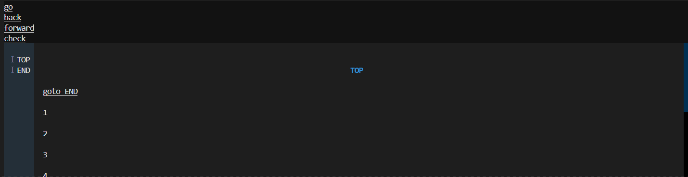

##### 4.2.2.3 `Tree`树形视图组件

树形视图组件可以在终端展示数据树，就好像目录树一样（但并不是目录树组件，有专门的目录树组件，比使用树形视图组件显示目录更简单），完整用法参考[官网文档](https://textual.textualize.io/widgets/tree/)。

先看示例：

```python3
from textual.app import App
from textual.widgets import Tree

class MyApp(App):
    def on_mount(self):
        tree = Tree("root")
        tree.root.expand()
        tree.root.add("node", expand=True).add_leaf("leaf")
        self.widgets = [
            tree
        ]
        self.mount_all(self.widgets)
        
if __name__ == '__main__':
    app = MyApp()
    app.run()
```

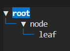

简单说一下什么是树，以便于后续理解树形视图组件的方法，有基础的读者可以跳过这部分内容。

如下图所示，从上至下，树的起点是树的根，叫做根节点（root）。每个节点都可以连接无数个其他的节点，因为其他节点的父节点都是节点，就和只有子节点、没有父节点的根节点不一样，因此，这些节点都是普通节点（node）。在所有的普通节点中，还有一种没有子节点的节点，这种节点叫做叶节点（leaf）。

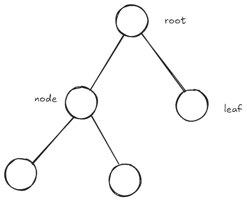

了解完根节点、普通节点（后面简称为节点）、叶节点之后，正式开始学习树形视图组件之前，先来学习一下代表这些节点的节点类`TreeNode`（使用`from textual.widgets.tree import TreeNode`导入）实例有哪些用法。

`TreeNode`类支持以下属性：

-   `label`属性，表示该节点的显示内容。

-   `data`属性，整数类型、浮点类型、字符串类型，表示该节点的值。

-   `id`属性，表示该节点的ID。

-   `line`属性，当节点显示（其父节点展开）时，该节点在组件中排第几行（不含根节点的第几行，或者当成相对于组件原点的Y坐标值）。

-   `allow_expand`属性，布尔类型，表示是否允许此节点展开。

-   `is_collapsed`属性，表示该节点是否为收起状态。

-   `is_expanded`属性，表示该节点是否为展开状态。

-   `is_last`属性，表示该节点在其父节点的所有直接子节点中，是不是最后一个。

-   `is_root`属性，表示该节点是不是根节点。

-   `children`属性，表示该节点的所有子节点。该属性支持索引、迭代获取具体的子节点。

-   `parent`属性，表示该节点的父节点。

-   `siblings`属性，表示该节点的兄弟节点（包含该节点）。所谓兄弟节点，就是该节点的父节点的所有子节点。

    以下图为例：

    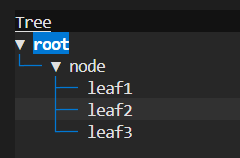

    对于`leaf2`叶节点，`leaf1`和`leaf3`就是兄弟节点，但该属性会返回包括`leaf2`叶节点在内的所有`node`节点的子节点。该属性支持索引、迭代获取具体的兄弟节点。

-   `previous_sibling`属性，表示该节点的哥哥节点。所谓哥哥节点，就是该节点在兄弟节点中，索引值小1的节点。在上面的图片中，`leaf2`叶节点的哥哥节点就是`leaf1`叶节点。

-   `next_sibling`属性，表示该节点的弟弟节点。所谓弟弟节点，就是该节点在兄弟节点中，索引值大1的节点。在上面的图片中，`leaf2`叶节点的弟弟节点就是`leaf3`叶节点。

-   `tree`属性，表示节点所属的树形视图组件。

`TreeNode`类支持以下方法：

-   `add`方法，给该节点添加一个节点为子节点。该方法支持以下参数：

    -   `label`参数，Rich的[`Text`](https://rich.readthedocs.io/en/latest/text.html)类型，表示节点显示的内容。注意，Text类型支持内嵌Markup标签的文本，但不支持其他Rich中多行显示的可渲染对象。

    -   `data`参数，整数类型、浮点类型、字符串类型，表示节点的值。

    -   `before`参数，整数类型或者`TreeNode`类，在该节点的指定子节点之前添加子节点。`TreeNode`类表示指定的子节点，整数类型表示指定子节点的索引值。从此参数开始，只能使用关键字传入。

    -   `after`参数，整数类型或者`TreeNode`类，在该节点的指定子节点之后添加子节点。`TreeNode`类表示指定的子节点，整数类型表示指定子节点的索引值。

        注意，`before`参数和`after`参数不能同时设置，会报错。

    -   `expanded`参数，布尔类型，表示添加的子节点是否展开，默认为`False`。

    -   `allow_expand`参数，布尔类型，表示添加的子节点是否可以展开，默认为`True`。此参数设置为`False`时，表示添加的子节点是叶节点。

-   `add_leaf`方法，给该节点添加一个叶节点为子节点。该方法支持以下参数：

    -   `label`参数，Rich的[`Text`](https://rich.readthedocs.io/en/latest/text.html)类型，表示节点显示的内容。注意，Text类型支持内嵌Markup标签的文本，但不支持其他Rich中多行显示的可渲染对象。

    -   `data`参数，整数类型、浮点类型、字符串类型，表示节点的值。

    -   `before`参数，整数类型或者`TreeNode`类，在该节点的指定子节点之前添加子节点。`TreeNode`类表示指定的子节点，整数类型表示指定子节点的索引值。从此参数开始，只能使用关键字传入。

    -   `after`参数，整数类型或者`TreeNode`类，在该节点的指定子节点之后添加子节点。`TreeNode`类表示指定的子节点，整数类型表示指定子节点的索引值。

        注意，`before`参数和`after`参数不能同时设置，会报错。

-   `collapse`方法，将该节点的显示状态切换为收起。

-   `collapse_all`方法，将该节点以及所有属于该节点的其他节点的显示状态切换为收起。

-   `expand`方法，将该节点的显示状态切换为展开。

-   `expand_all`方法，将该节点以及所有属于该节点的其他节点的显示状态切换为展开。

-   `refresh`方法，刷新此节点的显示状态。

-   `remove`方法，从树形视图组件中移除该节点。注意，根节点不可以执行此方法。

-   `remove_children`方法，从树形视图组件中移除该节点的所有子节点。

-   `set_label`方法，更新节点的显示内容。该方法支持以下参数：

    -   `label`参数，Rich的[`Text`](https://rich.readthedocs.io/en/latest/text.html)类型，表示节点更新后的显示内容。注意，Text类型支持内嵌Markup标签的文本，但不支持其他Rich中多行显示的可渲染对象。

-   `toggle`方法，将该节点的显示状态切换为相反状态。

-   `toggle_all`方法，将该节点以及所有属于该节点的其他节点的显示状态切换为相反状态。

下面正式开始学习树形视图组件。

组件支持以下参数：

-   `label`参数，Rich的[`Text`](https://rich.readthedocs.io/en/latest/text.html)类型，表示根节点显示的内容。注意，Text类型支持内嵌Markup标签的文本，但不支持其他Rich中多行显示的可渲染对象。
-   `data`参数，整数类型、浮点类型、字符串类型，表示根节点的值。
-   `name`参数，字符串类型，表示组件的名字，常用于调试时区分组件。从此参数开始，只能使用关键字传入。
-   `id`参数，字符串类型，表示组件的ID，主要用于样式中的ID选择器。
-   `classes`参数，字符串类型，表示组件的样式类。
-   `disabled`参数，布尔类型，表示组件是否处于被禁用状态，默认为`False`。

组件支持以下属性：

-   `ICON_NODE`属性，显示在可展开的节点之前，用来表示该节点可展开的字符串，默认为`"▶ "`。
-   `ICON_NODE_EXPANDED`属性，显示在可展开的节点之前，用来表示该节点已经展开的字符串，默认为`"▼ "`。
-   `auto_expand`属性，布尔类型，表示在点击可展开节点的文字时是否自动切换节点的显示状态，默认为`True`。
-   `center_scroll`属性，布尔类型，当执行滚动到指定行（或者指定节点）的方法及相关方法（包括移动高亮到上一行、下一行、上一页、下一页）时，是否尽可能将指定行（或者指定节点）上下居中显示，默认为`False`。
-   `cursor_line`属性，表示当前高亮的是哪一行（相对于组件原点的Y坐标值）。
-   `cursor_node`属性，表示当前高亮的是哪一个节点。
-   `guide_depth`属性，表示每一层级的节点相对于与上一层级节点的缩进字符数，默认为`4`。
-   `hover_line`属性，表示鼠标悬停在哪一行（相对于组件原点的Y坐标值）。
-   `last_line`属性，表示当前显示状态的节点树中，最后一个节点在哪一行（相对于组件原点的Y坐标值）。注意，如果收起部分节点，会导致最后一个节点所在行发生变化。比如，如果收起根节点，那最后一个节点就是根节点，该属性则为`0`。
-   `root`属性，表示根节点。
-   `show_guides`属性，布尔类型，表示是否显示每个层级之间的引导线，默认为`True`。
-   `show_root`属性，布尔类型，表示是否显示根节点，默认为`True`。

组件支持以下反应性属性：

-   `show_guides`属性，布尔类型，表示是否显示每个层级之间的引导线，默认为`True`。
-   `show_root`属性，布尔类型，表示是否显示根节点，默认为`True`。
-   `guide_depth`属性，表示组件显示的每一层级的节点相对于与上一层级节点的缩进字符数，默认为`4`。
-   `auto_expand`属性，布尔类型，表示在点击可展开节点的文字时是否自动切换节点的显示状态，默认为`True`。
-   `center_scroll`属性，布尔类型，当执行滚动到指定行（或者指定节点）的方法及相关方法（包括移动高亮到上一行、下一行、上一页、下一页）时，是否尽可能将指定行（或者指定节点）上下居中显示，默认为`False`。

组件支持以下子组件样式类：

-   `tree--cursor`类，当前高亮的节点使用的样式类。该样式类比`tree--highlight`类优先级高。
-   `tree--guides`类，非鼠标悬停、高亮的节点的引导线使用的样式类。对于节点而言，其引导线是指该节点到全部所属节点的引导线。
-   `tree--guides-hover`类，鼠标悬停的节点的引导线使用的样式类。
-   `tree--guides-selected`类，高亮的节点的引导线使用的样式类。该样式类比`tree--guides-hover`类优先级高。
-   `tree--highlight`类，鼠标悬停的节点使用的样式类。
-   `tree--highlight-line`类，鼠标悬停的那一行内容使用的样式类。
-   `tree--label`类，节点显示的文本使用的样式类。

组件支持以下消息：

-   `NodeCollapsed`消息，收起节点时触发。该消息支持以下属性：
    -   `node`属性，表示触发该消息的节点。
    -   `control`属性，表示触发该消息的节点所属的树形视图组件。
-   `NodeExpanded`消息，展开节点时触发。该消息支持的属性同`NodeCollapsed`消息。
-   `NodeHighlighted`消息，高亮节点时触发。该消息支持的属性同`NodeCollapsed`消息。
-   `NodeSelected`消息，选择节点时触发。该消息支持的属性同`NodeCollapsed`消息。

选择与高亮的区别：

>   `tree--guides-selected`类，高亮的节点的引导线使用的样式类。
>
>   `tree--highlight`类，鼠标悬停的节点使用的样式类。

可能有读者看到上面的内容之后，就会觉得笔者在瞎写，“selected”明明是被选择的意思，怎么说成是高亮的节点的引导线使用的样式类；“highlight”明明是高亮的意思，怎么说成是鼠标悬停的节点使用的样式类。其实，这里是Textual内部的不太统一的地方。那正好在讲了消息之后，区分一下选择与高亮的区别，让读者理解一下什么是树形视图组件里的高亮。读者也就清楚为什么把`tree--highlight`类，说成是鼠标悬停的节点使用的样式类了。

示例代码如下：

```python3
from textual.app import App
from textual.widgets import Tree

class MyApp(App):
    CSS = '''
    .tree--cursor {
        background: blue;
    }
    .tree--highlight {
        background: green;
    }
    .tree--guides-selected {
        color: red;
    }
    '''
    def on_mount(self):
        tree = Tree("root")
        tree.root.expand()
        node1 = tree.root.add("node1", expand=True)
        node1.add_leaf("leaf1")
        node1.add_leaf("leaf2")
        node2 = tree.root.add("node2", expand=True)
        node2.add_leaf("leaf1")
        node2.add_leaf("leaf2")
        tree.auto_expand = False
        self.widgets = [
            tree
        ]
        self.mount_all(self.widgets)
    def on_tree_node_selected(self,e:Tree.NodeSelected):
        self.notify(f'{e.node.tree.cursor_node} is selected.')
    def on_tree_node_highlighted(self,e:Tree.NodeHighlighted):
        self.notify(f'{e.node.tree.cursor_node} is highlighted.')

if __name__ == '__main__':
    app = MyApp()
    app.run()
```

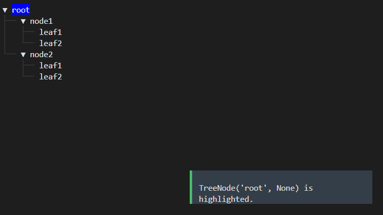

从上面的图可以看到，使用上下方向键移动高亮时，触发的是`NodeHighlighted`消息。如果按下`enter`键或者直接点击节点，则会额外触发`NodeSelected`消息（点击非高亮节点会同时触发两个消息）。然而，鼠标悬停在节点上时并没有触发任何消息。但是，根据代码中使用的样式类，可以发现`tree--guides-selected`类，只有高亮的节点体现出来，所以这个是高亮的节点的引导线使用的样式类；而`tree--highlight`类，只有鼠标悬停的节点体现出来，所以这个是鼠标悬停的节点使用的样式类。如果动画太快没有看清，读者也可以复制上面的代码，亲自尝试一番。

组件支持以下快捷键：

-   `enter`键，选择当前高亮的节点。

-   `space`键，将当前高亮节点的显示状态切换为相反状态。

-   `shift+space`键，将当前高亮节点（仅限可展开的节点且不能是根节点）的兄弟节点（含当前高亮节点）的显示状态切换为展开或者收起状态。注意，不是所有的终端都支持此快捷键，有的终端不支持（可以运行`textual keys`来测试终端的支持情况，完整说明参考[官网文档](https://textual.textualize.io/FAQ/#why-do-some-key-combinations-never-make-it-to-my-app)），会导致无法执行，但可以调用其绑定的动作`toggle_expand_all`或者动作函数`action_toggle_expand_all`。临时的解决方法是避免使用`space`键与其他键的组合键、`shift`键与其他可打印字符按键的组合键、`ctrl`键与部分键的组合键等，终端无法准确接收或者被其他程序占用（这个需要在实际代码中自行测试）的快捷键。比如下面的代码，可以将此快捷键替换为`shift+tab`键：

    ```python3
    class Tree(Tree):
        BINDINGS = [('shift+tab','toggle_expand_all')]
    ```

-   `up`键，高亮上一个节点。

-   `down`键，高亮下一个节点。

-   `pageup`键，高亮上一页该位置的节点。

-   `pagedown`键，高亮下一页该位置的节点。

-   `home`键，高亮第一个节点。

-   `end`键，高亮最后一个节点。

-   `shift+up`键，高亮当前高亮节点的上一个哥哥节点。

-   `shift+down`键，高亮当前高亮节点的下一个弟弟节点。

-   `shift+left`键，高亮当前高亮节点的父节点。

-   `shift+right`键，高亮当前高亮节点的父节点的下一个弟弟节点。

上面的快捷键中，可能最后四个快捷键听起来不太好理解。没关系，接下来就借用上一个示例，去掉无关的代码，并让每个叶节点有独特的名字，看看对应按键的执行结果：

```python3
from textual.app import App
from textual.widgets import Tree

class MyApp(App):
    def on_mount(self):
        tree = Tree("root")
        tree.root.expand()
        node1 = tree.root.add("node1", expand=True)
        node1.add_leaf("leaf1")
        node1.add_leaf("leaf2")
        node2 = tree.root.add("node2", expand=True)
        node2.add_leaf("leaf3")
        node2.add_leaf("leaf4")
        tree.auto_expand = False
        self.widgets = [
            tree
        ]
        self.mount_all(self.widgets)

if __name__ == '__main__':
    app = MyApp()
    app.run()
```

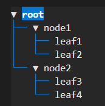

假如当前高亮的节点是`node2`，那么，按下`shift+up`键，高亮的节点将会变成`node1`。

假如当前高亮的节点是`node1`，那么，按下`shift+down`键，高亮的节点将会变成`node2`。

假如当前高亮的节点是`leaf2`，那么，按下`shift+left`键，高亮的节点将会变成`node1`。

假如当前高亮的节点是`leaf2`，那么，按下`shift+right`键，高亮的节点将会变成`node2`。

组件支持以下方法：

-   `action_cursor_down`方法，高亮下一个节点。
-   `action_cursor_next_sibling`方法，高亮当前高亮节点的下一个弟弟节点。
-   `action_cursor_parent`方法，高亮当前高亮节点的父节点。
-   `action_cursor_parent_next_sibling`方法，高亮当前高亮节点的父节点的下一个弟弟节点。
-   `action_cursor_previous_sibling`方法，高亮当前高亮节点的上一个哥哥节点。
-   `action_cursor_up`方法，高亮上一个节点。
-   `action_page_down`方法，高亮下一页该位置的节点。
-   `action_page_up`方法，高亮上一页该位置的节点。
-   `action_scroll_end`方法，高亮最后一个节点。
-   `action_scroll_home`方法，高亮第一个节点。
-   `action_select_cursor`方法，选择当前高亮的节点，触发`NodeSelected`消息。
-   `action_toggle_expand_all`方法，将当前高亮节点（仅限可展开的节点且不能是根节点）的兄弟节点（含当前高亮节点）的显示状态切换为展开或者收起状态。
-   `action_toggle_node`方法，将当前高亮节点的显示状态切换为相反状态。
-   `add_json`方法，将解析后的JSON数据映射为节点结构之后，添加到树形视图组件中。该方法支持以下参数：
    -   `json_data`参数，，必需参数，表示解析后的JSON数据（使用`json`库的`loads`方法解析），一般是字典或者列表，根据其结构映射为节点结构。
    -   `node`参数，表示添加到哪个节点中，默认为`None`，表示根节点。

-   `clear`方法，清除根节点下所有的节点。
-   `get_label_width`方法，获取指定节点的显示内容的字符数（含表示节点显示状态的字符）。该方法支持一个`node`参数，表示获取哪个节点的字符数。如果子类有更高效的实现，可以在子类重写此方法。
-   `get_node_at_line`方法，获取指定行（相对于组件原点的Y坐标值）的节点。该方法支持一个`line_no`参数，表示获取哪一行的节点。
-   `get_node_by_id`方法，获取指定ID的节点。该方法支持一个`node_id`参数，表示获取哪个ID的节点。
-   `move_cursor`方法，高亮指定节点或者重置高亮到根节点。该方法支持以下参数：
    -   `node`参数，必需参数，表示高亮哪个节点。如果为`None`，表示根节点。
    -   `animate`参数，布尔类型，表示切换高亮节点时，是否启用动画，默认为`False`。

-   `move_cursor_to_line`方法，高亮指定行（相对于组件原点的Y坐标值）的节点。该方法支持以下参数：
    -   `line`参数，必需参数，表示高亮哪一行的节点。支持负数索引，表示从最后一行开始倒数行数。
    -   `animate`参数，布尔类型，表示切换高亮节点时，是否启用动画，默认为`False`。
-   `process_label`方法，将字符串或者Rich的`Text`类型转换为`label`参数支持的Text类型。该方法支持一个`label`参数，要转换的内容。如果子类有更高效的实现，可以在子类重写此方法。
-   `render_label`方法，渲染指定节点的显示内容。如果需要修改节点显示内容的渲染方式，可以在子类重写此方法。该方法支持以下必需参数：
    -   `node`参数，表示渲染哪个节点。
    -   `base_style`参数，Rich的[`Style`](https://rich.readthedocs.io/en/stable/reference/style.html#rich.style.Style)类型，表示基本样式。
    -   `style`参数，Rich的[`Style`](https://rich.readthedocs.io/en/stable/reference/style.html#rich.style.Style)类型，表示额外样式。

-   `reset`方法，重置根节点的显示内容和值。该方法有两个参数：`label`参数和`data`参数，和组件的同名参数含义一致。
-   `scroll_to_line`方法，滚动至指定行（相对于组件原点的Y坐标值）。该方法支持以下参数：
    -   `line`参数，必需参数，表示滚动至哪一行。
    -   `animate`参数，布尔类型，表示滚动时，是否启用动画，默认为`True`。
-   `scroll_to_node`方法，滚动至指定节点。该方法支持以下参数：
    -   `node`参数，必需参数，表示滚动至哪个节点。
    -   `animate`参数，布尔类型，表示滚动时，是否启用动画，默认为`True`。
-   `select_node`方法，高亮并选择指定节点或者重置高亮到根节点。该方法支持以下参数：
    -   `node`参数，必需参数，表示高亮哪个节点。如果为`None`，表示重置高亮到根节点，同时不触发`NodeSelected`消息。
-   `unselect`方法，取消选择，并让高亮从节点上消失（将`cursor_line`属性设置为`-1`）。

上面讲的大部分方法都简明易懂，唯独`add_json`方法有点不好理解。所以，这里就用示例讲解一下。

想要解析JSON数据，需要使用`json`库的`loads`方法。对于JSON来说，能模拟出数据树结构的，只有对象和数组。

JSON的对象就像Python的字典类似，使用大括号包围，大括号内是类似的成对键值：

```json
{
    "a":{"a1":1,"a2":2}
}
```

其中，键必须是双引号包围的字符串，值可以以字符串、数值、布尔值、数组、对象或者`null`。

格式和字典类似，解析成为节点，也和字典一样：

```python3
from textual.app import App
from textual.widgets import Tree
import json

class MyApp(App):
    def on_mount(self):
        tree = Tree("root")
        json_data = '''
        {
            "a":{"a1":1,"a2":2}
        }
        '''
        json_obj = json.loads(json_data)
        tree.add_json(json_obj)
        #tree.add_json({'a':{'a1':1,'a2':2}})
        tree.root.expand_all()
        tree.auto_expand = False
        self.widgets = [
            tree
        ]
        self.mount_all(self.widgets)

if __name__ == '__main__':
    app = MyApp()
    app.run()
```

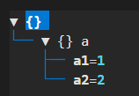

可以看到，如果对象被解析成为某个节点下的子节点，该节点会添加`"{}"`，来表明该节点转换自JSON的对象。类似的，可以使用字典模拟JSON的对象：`tree.add_json({'a':{'a1':1,'a2':2}})`。

JSON的数组就像Python的数组一样：

```json
["b",["b1","b2"]]
```

数组的元素可以以字符串、数值、布尔值、数组、对象或者`null`。

格式和数组类似，解析成为节点，也和数组一样：

```python3
from textual.app import App
from textual.widgets import Tree
import json

class MyApp(App):
    def on_mount(self):
        tree = Tree("root")
        json_data = '''
        ["b",["b1","b2"]]
        '''
        json_obj = json.loads(json_data)
        tree.add_json(json_obj)
        #tree.add_json(['b',['b1','b2']])
        tree.root.expand_all()
        tree.auto_expand = False
        self.widgets = [
            tree
        ]
        self.mount_all(self.widgets)

if __name__ == '__main__':
    app = MyApp()
    app.run()
```

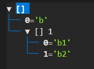

可以看到，如果对象被解析成为某个节点下的子节点，该节点会添加`"[]"`，来表明该节点转换自JSON的数组。类似的，可以使用数组模拟JSON的数组：`tree.add_json(['b',['b1','b2']])`。

##### 4.2.2.4 `DirectoryTree`目录树组件

继承树形视图组件的目录树组件，可以将目录映射为树形图。目录树组件的参数简单，远比开发者基于树形视图组件映射目录方便，很适合展示目录结构。完整用法可以参考[官网文档](https://textual.textualize.io/widgets/directory_tree/)。

目录树组件中的目录、文件，实际上对应着节点、叶节点。节点的`label`属性是目录名、文件名，节点的`data`属性是`DirEntry`数据类（使用`from textual.widgets.directory_tree import DirEntry`导入，拥有`pathlib.Path`类型的`path`和布尔类型的`loaded`两个参数，分别表示真实路径和目录是否已经展开）。

组件支持以下参数：

-   `path`参数，字符串类型，表示根目录代表的路径。
-   `name`参数，字符串类型，表示组件的名字，常用于调试时区分组件。从此参数开始，只能使用关键字传入。
-   `id`参数，字符串类型，表示组件的ID，主要用于样式中的ID选择器。
-   `classes`参数，字符串类型，表示组件的样式类。
-   `disabled`参数，布尔类型，表示组件是否处于被禁用状态，默认为`False`。

组件支持以下属性：

-   `ICON_NODE`属性，显示在目录之前，用来表示该目录当前未展开的字符串，默认为`"📁 "`。
-   `ICON_NODE_EXPANDED`属性，显示在目录之前，用来表示该目录已展开的字符串，默认为`"📂 "`。
-   `ICON_FILE`属性，显示在文件之前，用来表示该节点是文件的字符串，默认为`"📄 "`。
-   `auto_expand`属性，布尔类型，表示在点击目录的文字时是否自动切换目录的展开状态，默认为`True`。
-   `center_scroll`属性，布尔类型，当执行滚动到指定行（或者指定目录、文件）的方法及相关方法（包括移动高亮到上一行、下一行、上一页、下一页）时，是否尽可能将指定行（或者指定目录、文件）上下居中显示，默认为`False`。
-   `cursor_line`属性，表示当前高亮的是哪一行（相对于组件原点的Y坐标值）。
-   `cursor_node`属性，表示当前高亮的是哪一个目录、文件。
-   `guide_depth`属性，表示每一层级的目录相对于与上一层级目录的缩进字符数，默认为`4`。
-   `hover_line`属性，表示鼠标悬停在哪一行（相对于组件原点的Y坐标值）。
-   `last_line`属性，表示当前显示状态的目录树中，最后一个目录或者文件在哪一行（相对于组件原点的Y坐标值）。注意，如果收起部分目录，会导致最后一个目录或者文件所在行发生变化。比如，如果收起根目录，那最后一个目录就是根目录，该属性则为`0`。
-   `path`属性，同`path`参数。
-   `root`属性，表示根目录。
-   `show_guides`属性，布尔类型，表示是否显示每个层级目录之间的引导线，默认为`True`。
-   `show_root`属性，布尔类型，表示是否显示根目录，默认为`True`。

组件支持以下反应性属性：

-   `show_guides`属性，布尔类型，表示是否显示每个层级目录之间的引导线，默认为`True`。
-   `show_root`属性，布尔类型，表示是否显示根目录，默认为`True`。
-   `guide_depth`属性，表示每一层级的目录相对于与上一层级目录的缩进字符数，默认为`4`。
-   `auto_expand`属性，布尔类型，表示在点击目录的文字时是否自动切换目录的展开状态，默认为`True`。
-   `center_scroll`属性，布尔类型，当执行滚动到指定行（或者指定目录、文件）的方法及相关方法（包括移动高亮到上一行、下一行、上一页、下一页）时，是否尽可能将指定行（或者指定目录、文件）上下居中显示，默认为`False`。

组件支持以下子组件样式类：

-   `tree--cursor`类，当前高亮的目录或者文件使用的样式类。该样式类比`tree--highlight`类优先级高。
-   `tree--guides`类，非鼠标悬停、高亮的目录的引导线使用的样式类。对于目录而言，其引导线是指该目录到全部所属目录或者文件的引导线。
-   `tree--guides-hover`类，鼠标悬停的目录的引导线使用的样式类。
-   `tree--guides-selected`类，高亮的目录的引导线使用的样式类。该样式类比`tree--guides-hover`类优先级高。
-   `tree--highlight`类，鼠标悬停的目录或者文件使用的样式类。
-   `tree--highlight-line`类，鼠标悬停的那一行内容使用的样式类。
-   `tree--label`类，目录或者文件显示的文本使用的样式类。
-   `directory-tree--extension`类，文件的扩展名使用的样式类。
-   `directory-tree--file`类，文件使用的样式类。
-   `directory-tree--folder`类，目录使用的样式类。
-   `directory-tree--hidden`类，隐藏目录（以`'.'`开头的目录）、隐藏文件（以`'.'`开头的文件）使用的样式类。注意，`directory-tree--file`类和`directory-tree--folder`类比该样式类优先生效。

```python3
from textual.app import App
from textual.widgets import DirectoryTree

class MyApp(App):
    CSS = '''
    .directory-tree--extension {
        color: red;
    }
    .directory-tree--file {
        color: green;
    }
    .directory-tree--hidden {
        background: yellow;
    }
    .directory-tree--folder {
        color: blue;
    }
    '''
    def on_mount(self):
        self.widgets = [
            DirectoryTree('./')
        ]
        self.mount_all(self.widgets)

if __name__ == '__main__':
    app = MyApp()
    app.run()
```

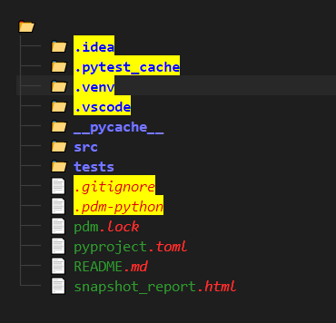

组件支持以下消息：

-   `DirectorySelected`消息，选择目录时触发。该消息支持以下属性：
    -   `node`属性，表示触发该消息的目录。
    -   `control`属性，表示触发该消息的目录所属的目录树组件。
    -   `path`属性，表示触发该消息的目录所代表的路径。
-   `FileSelected`消息，选择文件时触发。该消息支持以下属性：
    -   `node`属性，表示触发该消息的文件。
    -   `control`属性，表示触发该消息的文件所属的目录树组件。
    -   `path`属性，表示触发该消息的文件所代表的路径。

因为是继承树形视图组件，所以目录树组件还支持以下消息：

-   `NodeCollapsed`消息，收起节点时触发。该消息支持以下属性：
    -   `node`属性，表示触发该消息的节点。
    -   `control`属性，表示触发该消息的节点所属的树形视图组件。
-   `NodeExpanded`消息，展开节点时触发。该消息支持的属性同`NodeCollapsed`消息。
-   `NodeHighlighted`消息，高亮节点时触发。该消息支持的属性同`NodeCollapsed`消息。

不过需要注意的是，如果是定义指定函数名的响应函数来响应上面的消息，需要将函数名中的消息发送者改为`tree`。比如，定义`on_tree_node_highlighted`来响应目录树组件的`NodeHighlighted`消息。但是，如果是使用`on`装饰器来定义响应函数，则不需要修改消息发送者：

```python3
from textual.app import App
from textual.widgets import DirectoryTree
from textual import on

class MyApp(App):
    def on_mount(self):
        self.widgets = [
            DirectoryTree('./')
        ]
        self.mount_all(self.widgets)
    # 下面被注释的响应函数无法正常响应
    """ def on_directory_tree_node_highlighted(self,e:DirectoryTree.NodeHighlighted):
        self.notify(f'{e.node.tree.cursor_node} is highlighted.') """

    @on(DirectoryTree.NodeHighlighted)
    def handle_highlight(self,e:DirectoryTree.NodeHighlighted):
        self.notify(f'{e.node.tree.cursor_node} is highlighted.')

if __name__ == '__main__':
    app = MyApp()
    app.run()
```

组件支持以下快捷键：

-   `enter`键，选择当前高亮的目录或者文件。

-   `space`键，将当前高亮目录的显示状态切换为相反状态。

-   `shift+space`键，将当前高亮目录（仅限目录且不能是根目录）的同级目录（含当前高亮目录）的显示状态切换为展开或者收起状态。注意，不是所有的终端都支持此快捷键，有的终端不支持（可以运行`textual keys`来测试终端的支持情况，完整说明参考[官网文档](https://textual.textualize.io/FAQ/#why-do-some-key-combinations-never-make-it-to-my-app)），会导致无法执行，但可以调用其绑定的动作`toggle_expand_all`或者动作函数`action_toggle_expand_all`。临时的解决方法是避免使用`space`键与其他键的组合键、`shift`键与其他可打印字符按键的组合键、`ctrl`键与部分键的组合键等，终端无法准确接收或者被其他程序占用（这个需要在实际代码中自行测试）的快捷键。比如下面的代码，可以将此快捷键替换为`shift+tab`键：

    ```python3
    class DirectoryTree(DirectoryTree):
        BINDINGS = [('shift+tab','toggle_expand_all')]
    ```

-   `up`键，高亮上一个目录或文件。

-   `down`键，高亮下一个目录或文件。

-   `pageup`键，高亮上一页该位置的目录或文件。

-   `pagedown`键，高亮下一页该位置的目录或文件。

-   `home`键，高亮第一个目录或文件。

-   `end`键，高亮最后一个目录或文件。

-   `shift+up`键，高亮与当前高亮目录或文件处在同级目录中的上一个目录或文件。

-   `shift+down`键，高亮与当前高亮目录或文件处在同级目录中的下一个目录或文件。

-   `shift+left`键，高亮当前高亮目录或文件的上级目录。

-   `shift+right`键，高亮与当前高亮目录或文件的上级目录处在同级目录中的下一个目录或文件。

组件支持以下方法：

-   `action_cursor_down`方法，高亮下一个目录或文件。

-   `action_cursor_next_sibling`方法，高亮与当前高亮目录或文件处在同级目录中的下一个目录或文件。

-   `action_cursor_parent`方法，高亮当前高亮目录或文件的上级目录。

-   `action_cursor_parent_next_sibling`方法，高亮与当前高亮目录或文件的上级目录处在同级目录中的下一个目录或文件。

-   `action_cursor_previous_sibling`方法，高亮与当前高亮目录或文件处在同级目录中的上一个目录或文件。

-   `action_cursor_up`方法，高亮下一个目录或文件。

-   `action_page_down`方法，高亮下一页该位置的目录或文件。

-   `action_page_up`方法，高亮上一页该位置的目录或文件。

-   `action_scroll_end`方法，高亮最后一个目录或文件。

-   `action_scroll_home`方法，高亮第一个目录或文件。

-   `action_select_cursor`方法，选择当前高亮的目录或文件。

-   `action_toggle_expand_all`方法，将当前高亮目录（仅限目录且不能是根目录）的同级目录（含当前高亮目录）的显示状态切换为展开或者收起状态。

-   `action_toggle_node`方法，将当前高亮目录的显示状态切换为相反状态。

-   `clear`方法，清除根目录下所有的目录或文件（不是删除真实目录或者文件）。

-   `clear_node`方法，清除指定目录下所有的目录或文件（不是删除真实目录或者文件）。该方法支持以下参数：

    -   `node`参数，必需参数，表示清除哪个目录下所有的目录或文件。

-   `filter_paths`方法，此方法接收一个元素为`Path`类的可迭代对象，返回一个元素为`Path`类的可迭代对象，用来表示哪些目录或者文件可以显示。一般是在子类中重写此方法，实现过滤目录或者文件的效果。下面的代码就是隐藏名字是`'.'`或`'_'`开头的目录或文件：

    ```python3
    from textual.app import App
    from textual.widgets import DirectoryTree
    
    class FilteredDirectoryTree(DirectoryTree):
        def filter_paths(self, paths):
            return [path for path in paths if not path.name.startswith(('.','_'))]
        
    class MyApp(App):
        def on_mount(self):
            self.widgets = [
                FilteredDirectoryTree('./')
            ]
            self.mount_all(self.widgets)
    
    if __name__ == '__main__':
        app = MyApp()
        app.run()
    ```

-   `get_label_width`方法，获取指定目录或者文件的显示内容的字符数（含表示节点显示状态的字符，部分图标字符的字符数为`2`）。该方法支持一个`node`参数，表示获取哪个目录或者文件的字符数。如果子类有更高效的实现，可以在子类重写此方法。

-   `get_node_at_line`方法，获取指定行（相对于组件原点的Y坐标值）的目录或文件。该方法支持一个`line_no`参数，表示获取哪一行的目录或文件。

-   `get_node_by_id`方法，获取ID属性为指定值的目录或文件。该方法支持一个`node_id`参数，表示目录或文件的ID属性。

-   `move_cursor`方法，高亮指定目录或文件，或者重置高亮到根目录。该方法支持以下参数：

    -   `node`参数，必需参数，表示高亮哪个目录或文件。如果为`None`，表示根目录。
    -   `animate`参数，布尔类型，表示切换高亮时，是否启用动画，默认为`False`。

-   `move_cursor_to_line`方法，高亮指定行（相对于组件原点的Y坐标值）的目录或文件。该方法支持以下参数：

    -   `line`参数，必需参数，表示高亮哪一行的目录或文件。支持负数索引，表示从最后一行开始倒数行数。
    -   `animate`参数，布尔类型，表示切换高亮时，是否启用动画，默认为`False`。

-   `process_label`方法，将字符串或者Rich的`Text`类型转换为`label`参数支持的`Text`类型。该方法支持一个`label`参数，要转换的内容。如果子类有更高效的实现，可以在子类重写此方法。

-   `render_label`方法，渲染指定目录或文件的显示内容。如果需要修改节点显示内容的渲染方式，可以在子类重写此方法。该方法支持以下必需参数：

    -   `node`参数，表示渲染哪个目录或文件。
    -   `base_style`参数，Rich的[`Style`](https://rich.readthedocs.io/en/stable/reference/style.html#rich.style.Style)类型，表示基本样式。
    -   `style`参数，Rich的[`Style`](https://rich.readthedocs.io/en/stable/reference/style.html#rich.style.Style)类型，表示额外样式。

-   `reload`方法，返回可等待对象，当实际目录发生变化时，执行此方法可以重新加载组件，刷新目录。

-   `reload_node`方法，返回可等待对象，当实际目录发生变化时，执行此方法可以重新加载指定目录，刷新目录。该方法支持以下必需参数：

    -   `node`参数，表示重新加载哪个目录。

-   `reset`方法，重置根目录的显示内容和值。该方法有两个参数：

    -   `label`参数，表示重置后根目录显示的内容。
    -   `data`参数，`DirEntry`数据类（使用`from textual.widgets.directory_tree import DirEntry`导入，拥有`pathlib.Path`类型的`path`和布尔类型的`loaded`两个参数，分别表示真实路径、目录是否已经展开），表示重置后根目录代表的实际路径。

-   `reset_node`方法，重置根指定目录或文件的显示内容和值。该方法有两个参数：

    -   `label`参数，表示重置后目录或文件显示的内容。
    -   `data`参数，`DirEntry`数据类（使用`from textual.widgets.directory_tree import DirEntry`导入，拥有`pathlib.Path`类型的`path`和布尔类型的`loaded`两个参数，分别表示真实路径和目录是否已经展开），表示重置后目录或文件代表的实际路径。
    -   `node`参数，表示重置哪个目录或文件。

    注意，使用此方法时，重置之是目录或文件，重置之后也要一致，应该是目录或文件。

    ```python3
    from textual.app import App
    from textual.widgets import DirectoryTree
    from textual.widgets.directory_tree import DirEntry
    from pathlib import Path
    
    class MyApp(App):
        def on_mount(self):
            self.widgets = [
                DirectoryTree('./')
            ]
            self.mount_all(self.widgets)
        async def key_q(self):
            tree = self.query_one(DirectoryTree)
            tree.reset_node(tree.cursor_node,'新建',DirEntry(Path(tree.cursor_node.data.path)))
    
    if __name__ == '__main__':
        app = MyApp()
        app.run()
    ```

-   `scroll_to_line`方法，滚动至指定行（相对于组件原点的Y坐标值）。该方法支持以下参数：

    -   `line`参数，必需参数，表示滚动至哪一行。
    -   `animate`参数，布尔类型，表示滚动时，是否启用动画，默认为`True`。

-   `scroll_to_node`方法，滚动至指定目录或者文件。该方法支持以下参数：

    -   `node`参数，必需参数，表示滚动至哪个目录或者文件。
    -   `animate`参数，布尔类型，表示滚动时，是否启用动画，默认为`True`。

-   `select_node`方法，高亮并选择指定目录或者文件，或者重置高亮到根目录。该方法支持以下参数：

    -   `node`参数，必需参数，表示高亮哪个目录或者文件。如果为`None`，表示重置高亮到根目录，同时不触发`DirectorySelected`消息。

-   `unselect`方法，取消选择，并让高亮从目录或者文件上消失（将`cursor_line`属性设置为`-1`）。

##### 4.2.2.5 `DataTable`数据表组件

不管在什么UI框架中，能够显示表格，就能让该框架显示复杂数据的能力更上一层楼。虽然Textual只是一个TUI框架，但在这方面，毫不逊色。数据表组件，除了可以用表格显示内容，还支持简单的交互，完整用法参考[官网文档](https://textual.textualize.io/widgets/data_table/)。

在正式学习之前，先看一个简单的示例：

```python3
from textual.app import App
from textual.widgets import DataTable

class MyApp(App):
    def on_mount(self):
        self.widgets = [
            DataTable()
        ]
        self.mount_all(self.widgets)
        table = self.query_one(DataTable)
        table.add_column('Name')
        table.add_column('ID')
        table.add_row('Python','001')

if __name__ == '__main__':
    app = MyApp()
    app.run()
```

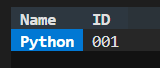

组件支持以下参数：

-   `show_header`参数，布尔类型，是否显示表头，默认为`True`。从此参数开始，只能使用关键字传入。

-   `show_row_labels`参数，布尔类型，是否显示行标签，默认为`True`。什么是行标签？当使用`add_row`方法添加一行数据时，可以传给`add_row`方法的关键字参数`label`一个可渲染对象，可渲染对象就会显示在这一行的最前面（不算这一行的数据，因为最上面的表头部分没有内容），这一行最前面显示的内容就是行标签。示例如下：

    ```python3
    from textual.app import App
    from textual.widgets import DataTable
    
    class MyApp(App):
        def on_mount(self):
            self.widgets = [
                DataTable(show_row_labels=True)
            ]
            self.mount_all(self.widgets)
            table = self.query_one(DataTable)
            table.add_column('[red]Name')
            table.add_column('ID')
            table.add_row('Python','001',label='[green]1')
    
    if __name__ == '__main__':
        app = MyApp()
        app.run()
    ```

    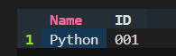

-   `fixed_rows`参数，整数类型，表示冻结的行数，默认为`0`。所谓冻结，就是当内容比较多的时候，可以让头几行数据和表头一样固定不动，不会随着其他行的滚动、翻页而移动。示例如下：

    ```python3
    from textual.app import App
    from textual.widgets import DataTable
    
    class MyApp(App):
        def on_mount(self):
            self.widgets = [
                DataTable(fixed_rows=3)
            ]
            self.mount_all(self.widgets)
            table = self.query_one(DataTable)
            table.add_column('[red]Name')
            table.add_column('ID')
            for i in range(99):
                table.add_row('[green]Python',f'{i}')
    
    if __name__ == '__main__':
        app = MyApp()
        app.run()
    ```

    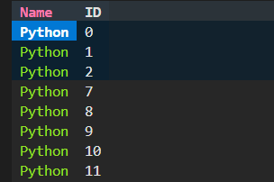

-   `fixed_columns`参数，整数类型，表示冻结的列数，默认为`0`。

-   `zebra_stripes`参数，布尔类型，表示是否让偶数行使用不同的背景色，就像斑马条纹一样，默认为`False`。

-   `header_height`参数，整数类型，表示表头那一行的行高，默认为`1`。

-   `show_cursor`参数，布尔类型，表示是否显示高亮，默认为`True`。

-   `cursor_foreground_priority`参数，字符串类型，表示高亮区域（含鼠标悬停）的前景色优先使用CSS样式还是可渲染对象，仅支持`['renderable','css']`中的值，默认为`'css'`。

-   `cursor_background_priority`参数，字符串类型，表示高亮区域（含鼠标悬停）的背景色优先使用CSS样式还是可渲染对象，仅支持`['renderable','css']`中的值，默认为`'renderable'`。

-   `cursor_type`参数，字符串类型，表示高亮区域的范围，仅支持`['cell','row','column','none']`中的值，默认为`'cell'`，即单元格。

-   `cell_padding`参数，整数类型，表示单元格内容到单元格左右边界的内边距，默认为`1`。

-   `name`参数，字符串类型，表示组件的名字，常用于调试时区分组件。

-   `id`参数，字符串类型，表示组件的ID，主要用于样式中的ID选择器。

-   `classes`参数，字符串类型，表示组件的样式类。

-   `disabled`参数，布尔类型，表示组件是否处于被禁用状态，默认为`False`。

组件支持以下属性：

-   `cell_padding`属性，表示每个单元格中的内容到左右单元格边界的距离，默认为`1`。
-   `columns`属性，表示表格的所有列。该属性是字典，键为`ColumnKey`对象（`add_column`方法的返回值，消息的`column_key`属性或`cell_key`属性的`column_key`属性），值为`Column`（对应的列对象）。
-   `rows`属性，表示表格的所有行。该属性是字典，键为`RowKey`对象（`add_row`方法的返回值，消息的`row_key`属性或`cell_key`属性的`row_key`属性），值为`Row`（对应的行对象）。
-   `cursor_background_priority`属性，同`cursor_background_priority`参数。
-   `cursor_foreground_priority`属性，同`cursor_foreground_priority`参数。
-   `cursor_coordinate`属性，`Coordinate`类型（`Coordinate`类的参数、方法相见下面的介绍），表示高亮的单元格的坐标（即第几行第几列）
-   `cursor_column`属性，表示高亮的单元格在第几列。
-   `cursor_row`属性，表示高亮的单元格在第几行。
-   `hover_coordinate`属性，`Coordinate`类型，表示鼠标悬停的单元格的坐标（即第几行第几列）。
-   `hover_column`属性，表示鼠标悬停的单元格在第几列。
-   `hover_row`属性，表示鼠标悬停的单元格在第几行。
-   `cursor_type`属性，同`cursor_type`参数。
-   `fixed_rows`属性，同`fixed_rows`参数。
-   `fixed_columns`属性，同`fixed_columns`参数。
-   `header_height`属性，同`header_height`参数。
-   `ordered_columns`属性，表示表格当前显示顺序的所有列。
-   `ordered_rows`属性，表示表格当前显示顺序的所有行。
-   `row_count`属性，表示表格当前一共多少行。
-   `show_cursor`属性，同`show_cursor`参数。
-   `show_header`属性，同`show_header`参数。
-   `show_row_labels`属性，同`show_row_labels`参数。
-   `zebra_stripes`属性，同`zebra_stripes`参数。

组件支持以下反应性属性：

-   `cell_padding`属性，表示每个单元格中的内容到左右单元格边界的距离，默认为`1`。
-   `show_header`属性，同`show_header`参数。
-   `show_row_labels`属性，同`show_row_labels`参数。
-   `fixed_rows`属性，同`fixed_rows`参数。
-   `fixed_columns`属性，同`fixed_columns`参数。
-   `zebra_stripes`属性，同`zebra_stripes`参数。
-   `header_height`属性，同`header_height`参数。
-   `show_cursor`属性，同`show_cursor`参数。
-   `cursor_type`属性，同`cursor_type`参数。
-   `cursor_coordinate`属性，`Coordinate`类型（`Coordinate`类的参数、方法相见下面的介绍），表示高亮的单元格的坐标（即第几行第几列）
-   `hover_coordinate`属性，`Coordinate`类型，表示鼠标悬停的单元格的坐标（即第几行第几列）。

`Coordinate`类（完整用法参考[官网文档](https://textual.textualize.io/api/coordinate/#textual.coordinate.Coordinate)）是个命名元组，支持以下参数：

-   `column`参数，表示第几列。
-   `row`参数，表示第几行。

`Coordinate`类支持以下方法：

-   `down`方法，获取当前坐标下方的坐标。
-   `left`方法，获取当前坐标左边的坐标。
-   `right`方法，获取当前坐标右边的坐标。
-   `up`方法，获取当前坐标上方的坐标。

组件支持以下子组件样式类：

-   `datatable--cursor`类，高亮的单元格使用的样式类。
-   `datatable--hover`类，鼠标悬停的单元格使用的样式类。
-   `datatable--fixed`类，冻结的单元格使用的样式类。
-   `datatable--fixed-cursor`类，鼠标悬停的冻结单元格使用的样式类。
-   `datatable--header`类，表头的单元格使用的样式类。
-   `datatable--header-cursor`类，高亮的表头单元格使用的样式类。
-   `datatable--header-hover`类，鼠标悬停的表头单元格使用的样式类。
-   `datatable--even-row`类，当`zebra_stripes`参数为`True`时，奇数行（`row`属性为偶数）的单元格使用的样式。
-   `datatable--odd-row`类，当`zebra_stripes`参数为`True`时，偶数行（`row`属性为奇数）的单元格使用的样式。

示例如下：

```python3
from textual.app import App
from textual.widgets import DataTable

class MyApp(App):
    CSS = '''
    .datatable--even-row {
        background: green;
    }
    .datatable--odd-row {
        background: red;
    } 
    '''
    def on_mount(self):
        self.widgets = [
            DataTable(zebra_stripes=True)
        ]
        self.mount_all(self.widgets)
        table = self.query_one(DataTable)
        table.add_column('[red]Name')
        table.add_column('ID')
        for i in range(4):
            table.add_row('[green]Python',f'{i}')

if __name__ == '__main__':
    app = MyApp()
    app.run()
```

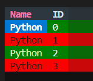

组件支持以下消息：

-   `CellHighlighted`消息，高亮新的单元格时触发。

    注意，仅当`cursor_type`参数为`'cell'`且`show_cursor`参数为`True`、将`cursor_type`属性设置为`'cell'`且`show_cursor`时为`True`时，才可以触发此消息。

    该消息支持以下属性：

    -   `data_table`属性，表示触发该消息的数据表组件。
    -   `control`属性，同`data_table`属性。
    -   `cell_key`属性，`CellKey`类型（命名元组，包含`ColumnKey`和`RowKey`两个参数），表示触发该消息的单元格的`cell_key`。
    -   `coordinate`属性，`Coordinate`类型，表示单元格的坐标（即第几行第几列）。
    -   `value`属性，字符串类型，表示单元格的内容。

-   `CellSelected`消息，选择新的单元格时触发。该消息支持的属性同`CellHighlighted`消息。

    注意，仅当`cursor_type`参数为`'cell'`且`show_cursor`参数为`True`、将`cursor_type`属性设置为`'cell'`且`show_cursor`时为`True`时，才可以触发此消息。

    选择是指，点击单元格（不含表头）直接选择该单元格，或者按下`enter`键选择当前高亮的单元格。

-   `ColumnHighlighted`消息，高亮新的列时触发。

    注意，仅当`cursor_type`参数为`'column'`且`show_cursor`参数为`True`、将`cursor_type`属性设置为`'column'`且`show_cursor`时为`True`时，才可以触发此消息。

    该消息支持以下属性：

    -   `data_table`属性，表示触发该消息的数据表组件。
    -   `control`属性，同`data_table`属性。
    -   `column_key`属性，`ColumnKey`类型，表示触发该消息的列的`column_key`。
    -   `cursor_column`属性，整数类型，表示列的坐标（即第几列）。

-   `ColumnSelected`消息，选择新的列时触发。该消息支持的属性同`ColumnHighlighted`消息。

    注意，仅当`cursor_type`参数为`'column'`且`show_cursor`参数为`True`、将`cursor_type`属性设置为`'column'`且`show_cursor`时为`True`时，才可以触发此消息。

    选择是指，点击单元格（不含表头）直接选择该单元格所在列，或者按下`enter`键选择当前高亮的列。

-   `RowHighlighted`消息，高亮新的行时触发。

    注意，仅当`cursor_type`参数为`'row'`且`show_cursor`参数为`True`、将`cursor_type`属性设置为`'row'`且`show_cursor`时为`True`时，才可以触发此消息。

    该消息支持以下属性：

    -   `data_table`属性，表示触发该消息的数据表组件。
    -   `control`属性，同`data_table`属性。
    -   `row_key`属性，`RowKey`类型，表示触发该消息的行的`row_key`。
    -   `cursor_row`属性，整数类型，表示行的坐标（即第几行）。

-   `RowSelected`消息，选择新的行时触发。该消息支持的属性同`ColumnHighlighted`消息。

    注意，仅当`cursor_type`参数为`'row'`且`show_cursor`参数为`True`、将`cursor_type`属性设置为`'row'`且`show_cursor`时为`True`时，才可以触发此消息。

    选择是指，点击单元格（不含行标签）直接选择该单元格所在行，或者按下`enter`键选择当前高亮的行。

-   `HeaderSelected`消息，选择（点击）表头时触发。该消息支持以下属性：

    -   `data_table`属性，表示触发该消息的数据表组件。
    -   `control`属性，同`data_table`属性。
    -   `column_key`属性，`ColumnKey`类型，表示触发该消息的表头所属列的`column_key`。
    -   ` column_index`属性，整数类型，表示表头所属列的坐标（即第几列）。
    -   `label`属性，字符串类型，表示表头的内容。

-   `RowLabelSelected`消息，选择（点击）行标签时触发。该消息支持以下属性：

    -   `data_table`属性，表示触发该消息的数据表组件。
    -   `control`属性，同`data_table`属性。
    -   `row_key`属性，`RowKey`类型，表示触发该消息的行标签所属行的`row_key`。
    -   `row_index`属性，整数类型，表示行标签所属行的坐标（即第几行）。
    -   `label`属性，字符串类型，表示行标签的内容。

示例如下：

```python3
from textual.app import App
from textual.widgets import DataTable
from textual import on

class MyApp(App):
    def on_mount(self):
        self.widgets = [
            DataTable()
        ]
        self.mount_all(self.widgets)
        table = self.query_one(DataTable)
        table.add_column('[red]Name')
        table.add_column('ID')
        for i in range(4):
            table.add_row('[green]Python',f'{i}',label=f'{i}行')

    @on(DataTable.RowLabelSelected)
    @on(DataTable.HeaderSelected)
    def handler(self,e:DataTable.HeaderSelected):
        self.notify(str(e.label))

if __name__ == '__main__':
    app = MyApp()
    app.run()
```

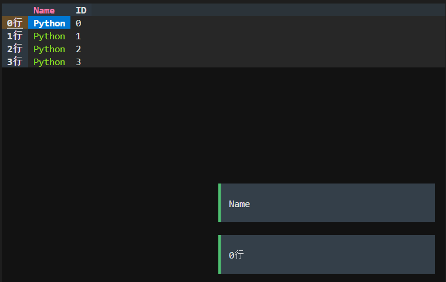

组件支持以下快捷键：

-   `enter`键，选择当前高亮的单元格。
-   `up`键，高亮上方的单元格。
-   `down`键，高亮下方的单元格。
-   `left`键，高亮左边的单元格。
-   `right`键，高亮右边的单元格。
-   `pageup`键，高亮上一页相同位置的单元格。
-   `pagedown`键，高亮下一页相同位置的单元格。
-   `ctrl+home`键，高亮当前列最上面的单元格。
-   `ctrl+end`键，高亮当前列最下面的单元格。
-   `home`键，高亮当前行最左边的单元格。
-   `end`键，高亮当前行最右边的单元格。

组件支持以下方法：

-   `action_cursor_up`方法，高亮上方的单元格。
-   `action_cursor_down`方法，高亮下方的单元格。
-   `action_cursor_left`方法，高亮左边的单元格。
-   `action_cursor_right`方法，高亮右边的单元格。
-   `action_select_cursor`方法，选择当前高亮的单元格。
-   `action_page_up`方法，高亮上一页相同位置的单元格。
-   `action_page_down`方法，高亮下一页相同位置的单元格。
-   `action_page_left`方法，翻页到左边的上一页，不改变高亮单元格。
-   `action_page_right`方法，翻页到右边的下一页，不改变高亮单元格。
-   `action_scroll_top`方法，高亮当前列最上面的单元格。
-   `action_scroll_bottom`方法，高亮当前列最下面的单元格。
-   `action_scroll_home`方法，高亮当前行最左边的单元格。
-   `action_scroll_end`方法，高亮当前行最右边的单元格。
-   `add_column`方法，添加一列，并返回这一列对应的`ColumnKey`对象。该方法支持以下参数：
    -   `label`参数，可渲染类型，表示该列的表头显示内容。注意，如果显示的内容高于一行，需要设置组件的`header_height`参数为对应高度。
    -   `width`参数，整数类型，表示添加的列的宽度，默认为`1`。从此参数开始，只能使用关键字传入。
    -   `key`参数，字符串类型，用于创建该列对应的唯一`ColumnKey`对象，即如果创建不同列时传入相同的字符串，会导致程序报错。该参数默认为`None`，创建`ColumnKey`对象时会使用其他方法确保生成唯一`ColumnKey`对象。
    -   `default`参数，可渲染类型，添加列之前如果已经有多个行存在，此参数则表示先前的每一行对应该列的单元格的数据设置成什么。
-   `add_columns`方法，添加多个列，并返回元素为`ColumnKey`对象（对应每一列）的列表。该方法支持以下参数：
    -   `*labels`参数，可渲染类型，表示该列的表头显示内容。可传入多个值或者解包元素为可渲染类型的可迭代对象。注意，如果显示的内容高于一行，需要设置组件的`header_height`参数为对应高度。
-   `add_row`方法，添加一行，并返回这一行对应的`RowKey`对象。该方法支持以下参数：
    -   `*cells`参数，可渲染类型，表示该行每个单元格显示内容。可传入多个值或者解包元素为可渲染类型的可迭代对象。注意，如果显示的内容高于一行，需要设置该方法的`height`参数为对应高度。
    -   `height`参数，整数类型，表示添加的行的高度，默认为`1`。从此参数开始，只能使用关键字传入。
    -   `key`参数，字符串类型，用于创建该行对应的唯一`RowKey`对象，即如果创建不同行时传入相同的字符串，会导致程序报错。该参数默认为`None`，创建`RowKey`对象时会使用其他方法确保生成唯一`RowKey`对象。
    -   `label`参数，可渲染类型，表示该行的行标签，默认为`None`，即不显示行标签。
-   `add_rows`方法，添加多个行，返回元素为`RowKey`对象（对应每一行）的列表。该方法支持以下参数：
    -   `rows`参数，元素为可迭代对象（其元素为可渲染类型）的可迭代对象，可迭代对象的每个元素（要求同`add_row`方法的`*cells`参数）表示每一行的内容。可传入多个值或者解包元素为可迭代对象的可迭代对象。注意，该方法在显示的内容高于一行时，没法同时修改每一行的高度。因此，对于显示内容高于一行的情况，可以访问组件的`rows`属性，查询对应行，然后单独修改该行的`height`属性。
-   `clear`方法，清除表格内的数据。该方法支持以下参数：
    -   `columns`参数，布尔类型，表示是否同时清除表头，默认为`False`。
-   `coordinate_to_cell_key`方法，获取指定坐标（`Coordinate`类型）单元格的key（`CellKey`类型）。该方法支持以下参数：
    -   `coordinate`参数，`Coordinate`类型，表示单元格对应的坐标。
-   `get_cell`方法，获取指定`row_key`、`column_key`的单元格。该方法支持以下参数：
    -   `row_key`参数，`RowKey`类型或者字符串类型，表示单元格对应的`row_key`。
    -   `column_key`参数，`ColumnKey`类型或者字符串类型，表示单元格对应的`column_key`。
-   `get_cell_at`方法，获取指定坐标（`Coordinate`类型）的单元格。该方法支持以下参数：
    -   `coordinate`参数，`Coordinate`类型，表示单元格对应的坐标。
-   `get_cell_coordinate`方法，获取指定`row_key`、`column_key`的单元格的坐标。该方法支持以下参数：
    -   `row_key`参数，`RowKey`类型或者字符串类型，表示单元格对应的`row_key`。
    -   `column_key`参数，`ColumnKey`类型或者字符串类型，表示单元格对应的`column_key`。
-   `get_column`方法，获取指定列的所有单元格。该方法支持以下参数：
    -   `column_key`参数，`ColumnKey`类型或者字符串类型，表示列对应的`column_key`。
-   `get_column_at`方法，获取指定列的所有单元格。该方法支持以下参数：
    -   `column_index`参数，整数类型，表示列对应的索引值。
-   `get_column_index`方法，获取指定列的索引值。方法支持以下参数：
    -   `column_key`参数，`ColumnKey`类型或者字符串类型，表示列对应的`column_key`。
-   `get_row`方法，获取指定行的所有单元格。该方法支持以下参数：
    -   `row_key`参数，`RowKey`类型或者字符串类型，表示行对应的`row_key`。
-   `get_row_at`方法，获取指定行的所有单元格。该方法支持以下参数：
    -   `row_index`参数，整数类型，表示行对应的索引值。
-   `get_row_height`方法，获取指定行的高度。该方法支持以下参数：
    -   `row_key`参数，`RowKey`类型，表示行对应的`row_key`。
-   `get_row_index`方法，获取指定行的索引值。方法支持以下参数：
    -   `row_key`参数，`RowKey`类型或者字符串类型，表示行对应的`row_key`。
-   `is_valid_column_index`方法，判断给定的列索引值是否有效。该方法支持以下参数：
    -   `column_index`参数，整数类型，表示被判断的列索引值。
-   `is_valid_coordinate`方法，判断给定的单元格坐标是否有效。该方法支持以下参数：
    -   `coordinate`参数，`Coordinate`类型，表示被判断的单元格坐标。
-   `is_valid_row_index`方法，判断给定的行索引值是否有效。该方法支持以下参数：
    -   `row_index`参数，整数类型，表示被判断的行索引值。
-   `move_cursor`方法，移动高亮至指定单元格。该方法支持以下参数：
    -   `row`参数，整数类型，表示目标单元格所属行的行索引值。从此参数开始，只能使用关键字传入。
    -   `column`参数，整数类型，表示目标单元格所属列的列索引值。
    -   `animate`参数，布尔类型，表示移动过程中是否启用动画，默认为`False`。
    -   `scroll`参数，布尔类型，表示移动之后，如果目标单元格不在可见区域内，是否滚动表格，让目标单元格显示在可见区域内，默认为`True`。
-   `refresh_column`方法，刷新指定列。该方法支持以下参数：
    -   `column_index`参数，整数类型，表示列对应的索引值。
-   `refresh_coordinate`方法，刷新指定单元格。该方法支持以下参数：
    -   `coordinate`参数，`Coordinate`类型，表示单元格对应的坐标。
-   `refresh_row`方法，刷新指定行。该方法支持以下参数：
    -   `row_index`参数，整数类型，表示行对应的索引值。
-   `remove_column`方法，移除指定列。方法支持以下参数：
    -   `column_key`参数，`ColumnKey`类型或者字符串类型，表示列对应的`column_key`。
-   `remove_row`方法，移除指定行。该方法支持以下参数：
    -   `row_key`参数，`RowKey`类型或者字符串类型，表示行对应的`row_key`。
-   `sort`方法，将行按照一定的规则（默认为从小到大）排序。方法支持以下参数：
    -   `*columns`参数，`ColumnKey`类型或者字符串类型，表示用作排序依据的列。可以传多个列给该参数，当第一个参数对应列中单元格的数据相同时，组件将会比较第二个参数对应列中单元格的数据，进一步确定先后顺序，以此类推。
    -   `key`参数，可调用类型，当列中单元格的数据没法直接比较时（单元格的数据为对象、字典等），组件会调用该参数代表的函数，处理单元格的数据，得到可以比较的值，默认为`None`。从此参数开始，只能使用关键字传入。
    -   `reverse`参数，布尔类型，表示是否反转排序顺序，改为从大到小，默认为`False`。
-   `update_cell`方法，更新指定单元格的数据。该方法支持以下参数：
    -   `row_key`参数，`RowKey`类型或者字符串类型，表示单元格对应的`row_key`。
    -   `column_key`参数，`ColumnKey`类型或者字符串类型，表示单元格对应的`column_key`。
    -   `value`参数，可渲染类型，表示将单元格的数据更新为什么。
    -   `update_width`参数，布尔类型，表示更新单元格的数据时是否根据内容宽度调整列宽，默认为`False`。此参数能使用关键字传入。
-   `update_cell_at`方法，更新指定单元格的数据。该方法支持以下参数：
    -   `coordinate`参数，`Coordinate`类型，表示单元格对应的坐标。
    -   `value`参数，可渲染类型，表示将单元格的数据更新为什么。
    -   `update_width`参数，布尔类型，表示更新单元格的数据时是否根据内容宽度调整列宽，默认为`False`。此参数能使用关键字传入。

虽然Textual的表格功能简陋，不支持合并单元格、快捷搜索等桌面表格软件的功能，但还是可以玩出花的。比如，单元格的数据可以是可渲染对象，就可以借用Rich的表格[`Table`](https://rich.readthedocs.io/en/latest/tables.html)，实现在表格中嵌入表格：

```python3
from textual.app import App
from textual.widgets import DataTable
from rich.table import Table

rich_table = Table()
rich_table.add_column('Version')
rich_table.add_column('Use')
rich_table.add_row('3.12', 'Yes')
    
class MyApp(App):
    def on_mount(self): 
        self.widgets = [
            DataTable(show_row_labels=True)
        ]
        self.mount_all(self.widgets)
        table = self.query_one(DataTable)
        table.add_column('[red]Lang')
        table.add_column('Detail')
        table.add_row('Python',rich_table,label='[green]1',height=5)

if __name__ == '__main__':
    app = MyApp()
    app.run()
```

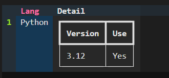

注意，受限于Textual的渲染机制，在将处理较多数据输入表格时，应当尽量避免创建较多的列。比如，同样10000个单元格，1000行10列的表格比10行1000列的表格流畅（但不要尝试1000列，会卡死）。

##### 4.2.2.6 `Sparkline`火花线组件

如果读者用过老式录音机或者带音频可视化的播放器，一定对下面的图片不陌生：

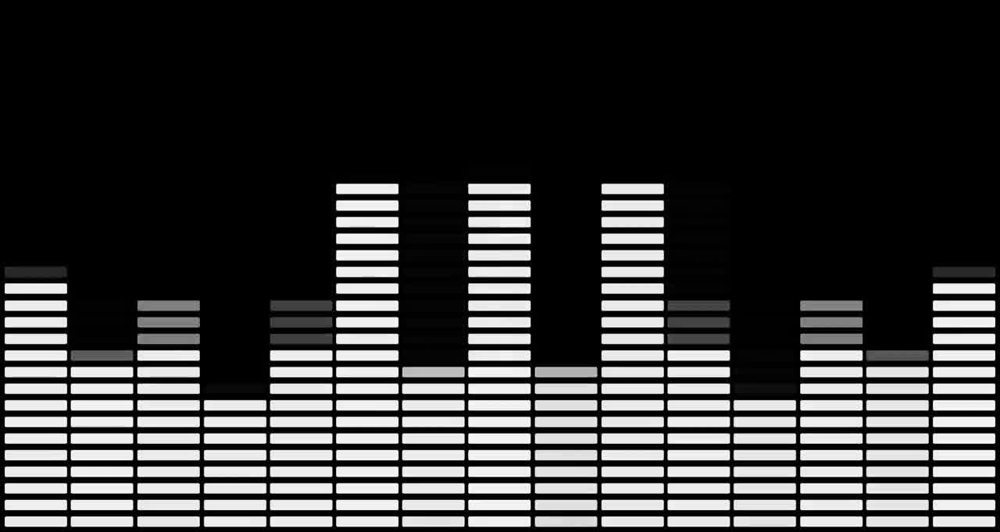

在Textual中，火花线组件就可以基于数据绘制类似的柱状图，完整用法可以参考[官网文档](https://textual.textualize.io/widgets/sparkline/)。

先看一个简单示例：

```python3
from textual.app import App
from textual.widgets import Sparkline
import random

random.seed(73)
DATA = [random.expovariate(1 / 3) for _ in range(1000)]

class MyApp(App):
    def on_mount(self):
        self.widgets = [
            Sparkline(DATA)
        ]
        self.mount_all(self.widgets)

if __name__ == '__main__':
    app = MyApp()
    app.run()
```

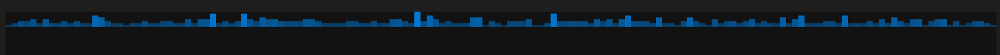

组件支持以下参数：

-   `data`参数，元素为浮点类型的序列类型（列表、元组），表示绘制柱状图使用的数据。
-   `min_color`参数，字符串类型或者`Color`类型，表示柱状图中使用什么颜色代表数据中的最小值，默认使用主题的主要颜色。从此参数开始，只能使用关键字传入。
-   `max_color`参数，字符串类型或者`Color`类型，表示柱状图中使用什么颜色代表数据中的最大值，默认使用30%透明度的主题主要颜色。
-   `summary_function`参数，可调用类型，在样式中设定组件的宽度为整数时，宽度值表示柱状图中一共有多少条柱子，当宽度值小于`data`参数中元素个数时，此参数代表执行什么样的计算过程，从每条柱子对应的几个元素中计算出一个值，得到该条柱子的高度值。该参数代表的可调用对象接收一个元素为浮点类型的序列类型（列表、元组）参数（即柱子所覆盖的几个元素），返回浮点类型的值（即柱子的高度值）。该参数默认为`None`，表示取最大值。
-   `name`参数，字符串类型，表示组件的名字，常用于调试时区分组件。
-   `id`参数，字符串类型，表示组件的ID，主要用于样式中的ID选择器。
-   `classes`参数，字符串类型，表示组件的样式类。
-   `disabled`参数，布尔类型，表示组件是否处于被禁用状态，默认为`False`。

组件的几个参数中，只有`summary_function`参数的用途和效果不太好理解，这里就单独讲解一下。

先看下面的示例代码：

```python3
import statistics
from textual.app import App
from textual.widgets import Sparkline, Static

DATA = [10,20,30,0,0,0]

def last(l):
    return l[-1]

funcs = (
    min,
    max,
    last,
    statistics.median,
    statistics.mean,
)

class MyApp(App):
    CSS = '''
    Sparkline {
        width: 2;
    }
    '''
    def on_mount(self):
        for func in funcs:
            self.mount_all(
                [
                    Static(f'{func.__name__}'),
                    Sparkline(DATA, summary_function=func)
                ]
            )

if __name__ == '__main__':
    app = MyApp()
    app.run()
```

结果如下：

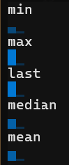

给定的数据是`[10,20,30,0,0,0]`，组件的样式中将宽度设置为`2`，也就是说，给定的六个数据，最终要绘制成两条柱子，每三个数据绘制一条柱子。数据中，后三个数据都是`0`，基于其绘制的柱子高度就是`0`，这里不用在意，这三个数据只是用来当做基准。因此，用来做对比的是前三个数据。

为了理解`summary_function`参数的用途和效果，这里需要先做个假设，如果组件没有设置样式中的宽度，那前三个数据则不是用来绘制一条柱子，而是三条柱子，它们的样子将会是这样：

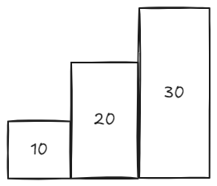

但是，实际上，这三个数据绘制出来的柱子是一条，那柱子的高度如何计算，这就是一个问题。这个时候，就需要`summary_function`参数发挥作用。

已知`summary_function`参数是一个可调用的变量，说白了就是个函数。这个函数可以接收一个元素为浮点类型的序列类型（列表、元组）参数（即柱子所覆盖的几个元素），返回浮点类型的值（即柱子的高度值）。

那么，以上面的代码为例，传给`summary_function`参数的函数的作用分别为取最小值、取最大值、取最后一个值、取中位值、取平均值。传入的是`[10,20,30]`，得到的结果则分别为`10`、`30`、`30`（`30`是最后一个元素）、`20`、`20`。

根据得到的结果，第一条柱子的长度按照比值，应该如下图所示：


需要注意的是，传给`summary_function`参数的函数计算出来的值，不能超过`data`参数中值最大的元素，否则会报错。

组件支持以下属性：

-   `data`属性，同`data`参数。
-   `summary_function`属性，同`summary_function`参数。

组件支持以下反应性属性：

-   `data`属性，同`data`参数。
-   `summary_function`属性，同`summary_function`参数。

组件支持以下子组件样式类：

-   `sparkline--max-color`样式类，同`max_color`参数。
-   `sparkline--min-color`样式类，同`min_color`参数。

#### 4.2.3 多层内容组件

终端空间有限，如果想要展示的内容比较多，需要分类展示，除了使用前面介绍过的屏幕组件，还可以使用类似浏览器标签页的多层内容组件。

##### 4.2.3.1 `ContentSwitcher`内容切换器组件

内容切换器组件很像一个播放幻灯片的容器，容器内每个组件的ID是唯一的。通过设置容器的`current`属性为组件的ID，来让对应的组件成为当前播放的幻灯片，显示在容器中，其他组件则不会显示。完整用法可以参考[官网文档](https://textual.textualize.io/widgets/content_switcher/)。

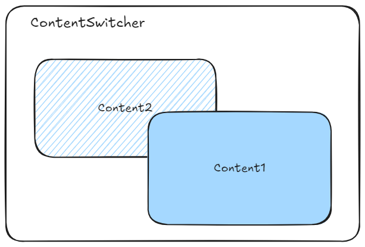

示例如下：

```python3
from textual.app import App
from textual.widgets import ContentSwitcher,Button,Static

class MyApp(App):
    def on_mount(self):
        self.widgets = [
            ContentSwitcher(
                Static('[green]Yes',id='yes'),
                Static('[red]No',id='no'),
                initial='yes'
            ),
            Button('Yes',id='yes'),
            Button('No',id='no'),
        ]
        self.mount_all(self.widgets)
    def on_button_pressed(self,e:Button.Pressed):
        self.query_one(ContentSwitcher).current = e.button.id

if __name__ == '__main__':
    app = MyApp()
    app.run()
```

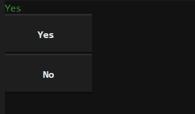

组件支持以下参数：

-   `*children`参数，组件类型，表示组件包含的可以切换显示的内容。可传入多个值或者解包元素为组件类型的可迭代对象。注意，因为组件使用ID来识别内容、切换内容显示，所以每个添加的内容必须设置ID。
-   `initial`参数，字符串类型，表示默认显示的内容的ID。从此参数开始，只能使用关键字传入。
-   `name`参数，字符串类型，表示组件的名字，常用于调试时区分组件。
-   `id`参数，字符串类型，表示组件的ID，主要用于样式中的ID选择器。
-   `classes`参数，字符串类型，表示组件的样式类。
-   `disabled`参数，布尔类型，表示组件是否处于被禁用状态，默认为`False`。

组件支持以下属性：

-   `current`属性，字符串类型，表示当前显示内容的ID。
-   `visible_content`属性，组件类型，表示当前显示的内容。

组件支持以下反应性属性：

-   `current`属性，字符串类型，表示当前显示内容的ID。

组件支持以下方法：

-   `add_content`方法，添加一个新的内容到组件中。该方法支持以下参数：
    -   `widget`参数，组件类型，表示添加的内容。
    -   `id`参数，字符串类型，表示内容的ID，该参数默认为`None`，表示添加的内容已经设置了ID，不需要额外设置内容ID。从此参数开始，只能使用关键字传入。
    -   `set_current`参数，布尔类型，表示是否将添加的内容设置为组件当前显示的内容，默认为`False`。

注意，添加的内容实际上是组件的子组件，想要移除内容的话，可以使用`remove_children`方法。给`remove_children`方法传入表示选择器的字符串（如`'#no'`），即可移除指定内容。

##### 4.2.3.2 `Tabs`多标签页组件和`Tab`页标签组件

前面说过，在Textual中，通常是配套使用的组件组合有不少，本节的两个组件就是另一组例子。就像老式录音机的按键，每次只能按下几个按键中的一个，包含多个页标签组件的多标签页组件，每次只能激活一个页标签。不过，各位读者若是没见过老式录音机，那浏览器的标签页想必各位不会陌生，包含多个页标签组件的多标签页组件，对应的就是浏览器顶部（或者底部）可以点击切换标签页的标签区域。完整用法可以参考[官网文档](https://textual.textualize.io/widgets/tabs/)。

结合上一节介绍的内容切换器组件，可以实现点击标签页切换内容的效果。

先看示例：

```python3
from textual.app import App
from textual.widgets import ContentSwitcher,Static,Tabs,Tab

class MyApp(App):
    def on_mount(self):
        self.widgets = [
            Tabs(
                Tab('Yes',id='yes'),
                Tab('No',id='no')
            ),
            ContentSwitcher(
                Static('[green]Yes',id='yes'),
                Static('[red]No',id='no'),
                initial='yes'
            )
        ]
        self.mount_all(self.widgets)
    def on_tabs_tab_activated(self,e:Tabs.TabActivated):
        self.query_one(ContentSwitcher).current = e.tab.id

if __name__ == '__main__':
    app = MyApp()
    app.run()
```

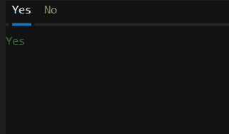

相比于使用按钮模拟标签页，多标签页组件看上去小巧不少，与内容切换器组件配合使用更合适。

页标签组件一般不单独使用，但还是有必要介绍一下参数和属性，与多标签页组件配合使用时会用到。

页标签组件支持以下参数：

-   `label`参数，字符串类型或者Rich的[`Text`](https://rich.readthedocs.io/en/stable/reference/text.html#rich.text.Text)类型或者`Content`类型，表示组件显示的内容。
-   `id`参数，字符串类型，表示组件的ID，一般与多标签页组件配合使用，即`id`属性。从此参数开始，只能使用关键字传入。

-   `classes`参数，字符串类型，表示组件的样式类。

-   `disabled`参数，布尔类型，表示组件是否处于被禁用状态，默认为`False`。

页标签组件支持以下属性：

-   `label`属性，同`label`参数。
-   `label_text`属性，表示显示内容去掉样式之后的纯文本。

多标签页组件支持以下参数：

-   `*tabs`参数，`Tab`类型或者字符串类型或者Rich的[`Text`](https://rich.readthedocs.io/en/stable/reference/text.html#rich.text.Text)类型或者`Content`类型，表示组件包含的页标签。可传入多个值或者解包元素为指定类型的可迭代对象。注意，如果传入的值不是`Tab`类型，组件会将值传给页标签组件的`label`参数，来创建页标签组件。组件使用ID来切换、识别页标签组件，如果传入的页标签组件没有设置ID或者传入的不是页标签组件，组件会根据顺序给每个页标签组件（没有ID的和组件创建的）设置格式为`'tab-{从1开始的数字}'`的ID。
-   `active`参数，字符串类型或者`None`，表示默认激活的页标签组件的ID，默认为第一个页标签组件的ID。如果此参数设置为`None`，则默认不激活任何页标签组件。从此参数开始，只能使用关键字传入。
-   `name`参数，字符串类型，表示组件的名字，常用于调试时区分组件。
-   `id`参数，字符串类型，表示组件的ID，主要用于样式中的ID选择器。
-   `classes`参数，字符串类型，表示组件的样式类。
-   `disabled`参数，布尔类型，表示组件是否处于被禁用状态，默认为`False`。

多标签页组件支持以下属性：

-   `active`属性，表示当前激活的页标签组件的ID。
-   `active_tab`属性，表示当前激活的页标签组件。
-   `tab_count`属性，表示组件一共有多少个页标签组件。

多标签页组件支持以下反应性属性：

-   `active`属性，表示当前激活的页标签组件的ID。

多标签页组件支持以下消息：

-   `TabMessage`消息，`TabActivated`消息、`TabDisabled`消息、`TabEnabled`消息、`TabHidden`消息、`TabShown`消息的基类，任意一个子类消息触发都会同时触发此消息。该消息支持以下属性：
    -   `tabs`属性，表示触发消息的多标签页组件。
    -   `control`属性，同`tabs`属性。
    -   `tab`属性，表示触发消息的页标签组件。
    -   `ALLOW_SELECTOR_MATCH`属性，表示可以在`on`装饰器中，可用作额外关键字参数、与选择器匹配的消息属性。在本组件中， 该属性的值是`{'tab'}`。
-   `TabActivated`消息，页标签组件激活时触发。该消息支持的属性同`TabMessage`消息。
-   `TabDisabled`消息，页标签组件被禁用时触发。该消息支持的属性同`TabMessage`消息。
-   `TabEnabled`消息，页标签组件被启用时触发。该消息支持的属性同`TabMessage`消息。
-   `TabHidden`消息，页标签组件隐藏时触发。该消息支持的属性同`TabMessage`消息。
-   `TabShown`消息，页标签组件显示时触发。该消息支持的属性同`TabMessage`消息。
-   `Cleared`消息，多标签页组件变成没有页标签组件激活时触发。该消息支持以下属性：
    -   `tabs`属性，表示触发消息的多标签页组件。
    -   `control`属性，同`tabs`属性。

多标签页组件支持以下快捷键：

-   `left`键，激活左边的页标签组件。
-   `right`键，激活右边的页标签组件。

多标签页组件支持以下方法：

-   `action_next_tab`方法 ，激活右边的页标签组件。

-   `action_previous_tab`方法 ，激活左边的页标签组件。

-   `add_tab`方法 ，添加一个新的页标签组件。该方法支持以下参数：

    -   `tabs`参数，`Tab`类型或者字符串类型或者Rich的[`Text`](https://rich.readthedocs.io/en/stable/reference/text.html#rich.text.Text)类型或者`Content`类型，表示要添加的页标签组件。
    -   `before`参数，`Tab`类型或者字符串类型的ID，表示在哪个页标签组件之前添加新的页标签组件。从此参数开始，只能使用关键字传入。
    -   `after`参数，`Tab`类型或者字符串类型的ID，表示在哪个页标签组件之后添加新的页标签组件。

    注意，`before`参数和`after`参数不可同时使用。

-   `clear`方法 ，返回可等待对象，移除所有页标签组件。注意，移除的同时会多次触发`Cleared`消息。但是，`Cleared`消息的实际触发条件是`active`属性变成`None`，并不是此方法的执行。

-   `disable`方法 ，禁用指定页标签组件。该方法支持以下参数：

    -   `tab_id`参数，字符串类型，表示页标签组件的ID。

-   `enable`方法 ，启用指定页标签组件。该方法支持以下参数：

    -   `tab_id`参数，字符串类型，表示页标签组件的ID。

-   `hide`方法 ，隐藏指定页标签组件。该方法支持以下参数：

    -   `tab_id`参数，字符串类型，表示页标签组件的ID。

-   `remove_tab`方法 ，移除指定页标签组件。该方法支持以下参数：

    -   `tab_or_id`参数，`Tab`类型或者字符串类型的ID，表示页标签组件。

-   `show`方法 ，显示指定页标签组件。该方法支持以下参数：

    -   `tab_id`参数，字符串类型，表示页标签组件的ID。

简单的示例：

```python3
from textual.app import App
from textual.widgets import ContentSwitcher,Static,Tabs,Tab
from textual import on

class MyApp(App):
    def on_mount(self):
        self.widgets = [
            Tabs(
                Tab('[green]Yes',id='yes'),
                Tab('[red]No',id='no'),
            ),
            ContentSwitcher(
                Static('[green]Yes',id='yes'),
                Static('[red]No',id='no'),
                initial='yes'
            )
        ]
        self.mount_all(self.widgets)
    def on_tabs_tab_activated(self,e:Tabs.TabActivated):
        self.query_one(ContentSwitcher).current = e.tab.id

    @on(Tabs.Cleared)
    def handle(self,e):
        self.notify(f'{e=}')

    def key_q(self):
        self.query_one(Tabs).active = None

if __name__ == '__main__':
    app = MyApp()
    app.run()
```

##### 4.2.3.3 `TabbedContent`标签页内容组件和`TabPane`标签页面板组件

前面实现点击标签页切换内容的效果需要用到三个组件，未免有点繁琐。想要简化代码，就不得不说本节要介绍的两个组件。同样是配套使用的两个组件，其效果却等于三个组件——内容切换器组件、多标签页组件和页标签组件相结合，而其用法反而比这三个组件还要简洁（实际上就是整合了三个组件，优化了用法）。完整用法可以参考[官网文档](https://textual.textualize.io/widgets/tabbed_content/)。

先看一个复刻上一节标签页的示例：

```python3
from textual.app import App
from textual.widgets import TabbedContent,TabPane,Static

class MyApp(App):
    def compose(self):
        with TabbedContent():
            with TabPane('Yes'):
                yield Static('[green]Yes')
            with TabPane('No'):
                yield Static('[red]No')

if __name__ == '__main__':
    app = MyApp()
    app.run()
```

或者代码可以更短一点：

```python3
from textual.app import App
from textual.widgets import TabbedContent,TabPane,Static

class MyApp(App):
    def compose(self):
        with TabbedContent():
            yield TabPane('Yes',Static('[green]Yes'))
            yield TabPane('No',Static('[red]No'))

if __name__ == '__main__':
    app = MyApp()
    app.run()
```

或者连标签页面板组件都不用，让标签页内容组件自己创建标签页面板组件，但此时需要给标签页内容组件传入多个字符串类型或者Rich的[`Text`](https://rich.readthedocs.io/en/stable/reference/text.html#rich.text.Text)类型或者`Content`类型的值，会依次成为每个标签页的内容：

```python3
from textual.app import App
from textual.widgets import TabbedContent,Static

class MyApp(App):
    def compose(self):
        with TabbedContent('Yes','No'):
            yield Static('[green]Yes')
            yield Static('[red]No')

if __name__ == '__main__':
    app = MyApp()
    app.run()
```


标签页内容组件看上去不需要单独创建多标签页组件和页标签组件，实际上是组件会自动创建对应的内部组件——内容多标签页组件`ContentTabs`和内容标签组件`ContentTab`，并自动与标签页面板组件关联，如下图所示：

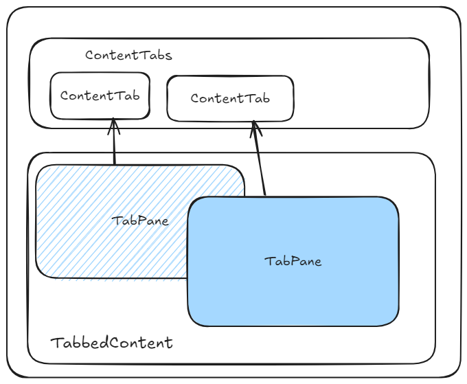

需要注意的是，因为标签页内容组件没有表示内容组件的参数，因此只能在`compose`方法中使用`with`设计布局，没法在`on_mount`方法中使用。

标签页面板组件一般不单独使用，但还是有必要介绍一下参数，与标签页内容组件配合使用时会用到。

标签页面板组件支持以下参数：

-   `title`参数，字符串类型或者Rich的[`Text`](https://rich.readthedocs.io/en/stable/reference/text.html#rich.text.Text)类型或者`Content`类型，表示标签页的标题。

-   `*children`参数，组件类型，表示标签页面板组件包含的内容。可传入多个值或者解包元素为组件类型的可迭代对象。

-   `name`参数，字符串类型，表示组件的名字，常用于调试时区分组件。从此参数开始，只能使用关键字传入。

-   `id`参数，字符串类型，表示组件的ID。当被嵌入在标签页内容组件时，标签页内容组件使用标签页的ID来切换、识别标签页面板组件，而组件的ID会覆盖自动生成的标签页的ID。

    如果需要编程方式切换、控制标签页，应当尽量手动设置ID。

-   `classes`参数，字符串类型，表示组件的样式类。

-   `disabled`参数，布尔类型，表示组件是否处于被禁用状态，默认为`False`。

标签页内容组件支持以下参数：

-   `*titles`参数，字符串类型或者Rich的[`Text`](https://rich.readthedocs.io/en/stable/reference/text.html#rich.text.Text)类型或者`Content`类型，表示对应标签页的标题。可传入多个值或者解包元素为指定类型的可迭代对象。

    注意，标签页的数量不可少于参数或者解包后参数的数量。

    如果标签页数量比该参数的数量多，多出来的标签页的标题会被设置为自动生成的标题，格式为`'Tab {从1开始对应的标签页顺序}'`。

    此外，如果标签页的内容为标签页面板组件，则对应标签页的标题会优先使用标签页面板组件`title`参数的值。

-   `initial`参数，字符串类型，表示默认显示的标签页的ID。标签页内容组件使用标签页的ID来切换、识别标签页。

    标签页内容组件会根据顺序给每个标签页生成格式为`'tab-{从1开始对应的标签页顺序}'`的ID。如果标签页的内容不是标签页面板组件，则会将其替换为创建的标签页面板组件（`title`参数为`'Tab {从1开始对应的标签页顺序}'`，`*children`参数为嵌入的组件，`id`参数为`'tab-{从1开始对应的标签页顺序}'`）。如果标签页的内容是标签页面板组件并且设置了`id`参数，则生成的对应ID会被替换为`id`参数的值。

    比如，第二个标签页内容是没有设置`id`参数的标签页面板组件或者其他组件，那么，标签页的ID会被设置为`'tab-2'`；如果传入的标签页面板组件有`id`参数，那ID就从`'tab-2'`变为`id`参数的值。

    从此参数开始，只能使用关键字传入。

-   `name`参数，字符串类型，表示组件的名字，常用于调试时区分组件。

-   `id`参数，字符串类型，表示组件的ID，主要用于样式中的ID选择器。

-   `classes`参数，字符串类型，表示组件的样式类。

-   `disabled`参数，布尔类型，表示组件是否处于被禁用状态，默认为`False`。

标签页内容组件支持以下属性：

-   `active`属性，表示当前激活的标签页面板组件的ID。
-   `active_pane`属性，表示当前激活的标签页面板组件。
-   `tab_count`属性，表示组件一共有多少个标签页面板组件。

标签页内容组件支持以下反应性属性：

-   `active`属性，表示当前激活的标签页面板组件的ID。

标签页内容组件支持以下消息：

-   `TabActivated`消息，标签页面板组件激活时触发。该消息支持以下属性：
    -   `tabbed_content`属性，表示触发消息的标签页内容组件。
    -   `control`属性，同`tabbed_content`属性。
    -   `pane`属性，表示触发消息的标签页面板组件。
    -   `tab`属性，表示触发消息的标签页面板组件对应的内容标签组件（`ContentTab`类型，继承自`Tab`，相当于页标签组件）。
    -   `ALLOW_SELECTOR_MATCH`属性，表示可以在`on`装饰器中，可用作额外关键字参数、与选择器匹配的消息属性。在本组件中， 该属性的值是`{'pane'}`。
-   `Cleared`消息，标签页内容组件变成没有标签页面板组件激活时触发。该消息支持以下属性：
    -   `tabbed_content`属性，表示触发消息的标签页内容组件。
    -   `control`属性，同`tabbed_content`属性。

标签页内容组件支持以下快捷键：

-   `left`键，激活左边的内容标签组件和对应的标签页面板组件。
-   `right`键，激活右边的内容标签组件和对应的标签页面板组件。

标签页内容组件支持以下方法：

-   `add_pane`方法 ，添加一个新的标签页面板组件。该方法支持以下参数：

    -   `pane`参数，`TabPane`类型，表示要添加的标签页面板组件。
    -   `before`参数，`TabPane`类型或者字符串类型的ID，表示在哪个标签页面板组件之前添加新的标签页面板组件。从此参数开始，只能使用关键字传入。
    -   `after`参数，`TabPane`类型或者字符串类型的ID，表示在哪个标签页面板组件之后添加新的标签页面板组件。

    注意，`before`参数和`after`参数不可同时使用。

-   `clear_panes`方法，返回可等待对象，移除所有标签页面板组件。注意，移除的同时会多次触发`Cleared`消息。但是，`Cleared`消息的实际触发条件是`active`属性变成`None`，并不是此方法的执行。

-   `disable_tab`方法 ，禁用指定标签页面板组件。该方法支持以下参数：

    -   `tab_id`参数，字符串类型，表示标签页面板组件的ID。

-   `enable_tab`方法 ，启用指定标签页面板组件。该方法支持以下参数：

    -   `tab_id`参数，字符串类型，表示标签页面板组件的ID。

-   `get_pane`方法 ，获取指定ID或者与内容标签组件关联的标签页面板组件。该方法支持以下参数：

    -   `pane_id`参数，字符串类型或者`ContentTab`类型，表示标签页面板组件的ID或者与标签页面板组件关联的内容标签组件。

-   `get_tab`方法 ，获取指定ID或者与标签页面板组件关联的内容标签组件。该方法支持以下参数：

    -   `pane_id`参数，字符串类型或者`TabPane`类型，表示标签页面板组件的ID或者与内容标签组件关联的标签页面板组件。

-   `hide_tab`方法 ，隐藏指定标签页面板组件。该方法支持以下参数：

    -   `tab_id`参数，字符串类型，表示标签页面板组件的ID。

-   `remove_pane`方法 ，移除指定标签页面板组件。该方法支持以下参数：

    -   `pane_id`参数，字符串类型，表示标签页面板组件的ID。

-   `show_tab`方法 ，显示指定页标签组件。该方法支持以下参数：

    -   `tab_id`参数，字符串类型，表示标签页面板组件的ID。

前面说标签页内容组件没法在`on_mount`方法中使用。其实，也不是完全不行，需要打个补丁，先看补丁代码：

```python3
# 补丁 TabbedContent
from textual.widgets import TabbedContent,TabPane
from textual.content import ContentType,Content
from textual.widget import Widget
class TabbedContent(TabbedContent):
    def __init__(self,*children:list[TabPane|Widget]|list[ContentType], initial = '', name = None, id = None, classes = None, disabled = False):
        super().__init__(initial=initial, name=name, id=id, classes=classes, disabled=disabled)
        self.titles = []
        if all(isinstance(child,Widget) for child in children):
            self._tab_content = list(children)
        elif all((isinstance(child,(Content,str)) or not child) for child in children):
            self.titles = [(self.render_str(title) if title else None) for title in children]
        else:
            raise TypeError('Don\'t mix the type of children')
```

新的`TabbedContent`标签页内容组件将原本的`*titles`参数，升级为`*children`参数，参数类型变成字符串类型或者Rich的[`Text`](https://rich.readthedocs.io/en/stable/reference/text.html#rich.text.Text)类型或者`Content`类型或者`None`或者`TabPane`类型或者`Widget`类型。

在`compose`方法中使用`TabbedContent`标签页内容组件时，要求`*children`参数为字符串类型或者Rich的[`Text`](https://rich.readthedocs.io/en/stable/reference/text.html#rich.text.Text)类型或者`Content`类型或者`None`，此时参数表示按照顺序对应的标签页面板组件的标题，如果参数为`None`或者没有对应的参数值，则会自动生成对应的标题，格式为`'Tab {从1开始对应的标签页顺序}'`。如果对应的标签页内容为标签页面板组件，则标签页面板组件的`title`参数会覆盖`*children`参数中对应的值或者自动生成的标题，标题为`title`参数的值。

在`on_mount`方法中（或者不使用进入上下文的方式）使用`TabbedContent`标签页内容组件时，要求`*children`参数`TabPane`类型或者`Widget`类型，此时参数表示按照顺序对应的标签页内容，标签页内容组件会自动生成对应的标题（格式为`'Tab {从1开始对应的标签页顺序}'`）和ID（格式为`'tab-{从1开始对应的标签页顺序}'`）。如果对应的标签页内容为标签页面板组件，则标签页面板组件的`title`参数会覆盖对应的标题，标签页面板组件的`id`参数会覆盖对应的ID。

注意，组件无法在初始化时自动判断使用方式，所以读者应该手动遵循对应使用方式时的参数类型要求。

完整示例如下：

```python3
from textual.app import App
from textual.widgets import TabbedContent,TabPane,Static

# 补丁 TabbedContent
from textual.widgets import TabbedContent,TabPane
from textual.content import ContentType,Content
from textual.widget import Widget
class TabbedContent(TabbedContent):
    def __init__(self,*children:list[TabPane|Widget]|list[ContentType], initial = '', name = None, id = None, classes = None, disabled = False):
        super().__init__(initial=initial, name=name, id=id, classes=classes, disabled=disabled)
        self.titles = []
        if all(isinstance(child,Widget) for child in children):
            self._tab_content = list(children)
        elif all((isinstance(child,(Content,str)) or not child) for child in children):
            self.titles = [(self.render_str(title) if title else None) for title in children]
        else:
            raise TypeError('Don\'t mix the type of children')

class MyApp(App):
    # 在 compose 中使用 TabbedContent
    def compose(self):
        with TabbedContent('one','two','[yellow]three',None,initial='tab-3'):
            yield TabPane(
                    'Yes',
                    Static('[green]Yes')
                )
            with TabPane(
                    '[yellow]Yes2'
                ):
                yield Static('[yellow]Yes2')
            yield Static('[red]No')
            yield Static('[red]No')
            yield Static('[red]No')
            
    #  在 on_mount 或者 on_ready 中使用 TabbedContent
    def on_mount(self):
        self.widgets = [
            TabbedContent(
                TabPane(
                    'Yes',
                    Static('[green]Yes')
                ),
                # 不可混用组件类型与（ContentType|None）类型
                # Content('[red]Yes'),
                TabPane(
                    'No',
                    Static('[red]No')
                ),
                Static('[yellow]Yes2'),
                initial='tab-3'
            )
        ]
        self.mount_all(self.widgets)

if __name__ == '__main__':
    app = MyApp()
    app.run()
```

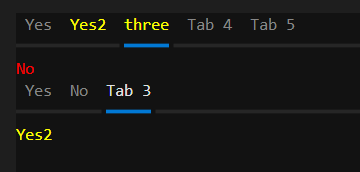

#### 4.2.4 自由功能组件

##### 4.2.4.1 `LoadingIndicator`加载指示器组件

如果执行耗时较久的代码，组件没有响应会让人万分焦虑。好在加载指示器组件可以显示加载动画，让等待过程没那么煎熬，完整用法可以参考[官网文档](https://textual.textualize.io/widgets/loading_indicator/)。

```python3
from textual.app import App
from textual.widgets import LoadingIndicator

class MyApp(App):
    def on_mount(self):
        self.widgets = [
            LoadingIndicator()
        ]
        self.mount_all(self.widgets) 

if __name__ == '__main__':
    app = MyApp()
    app.run()
```

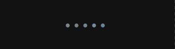

组件支持以下参数：

-   `name`参数，字符串类型，表示组件的名字，常用于调试时区分组件。
-   `id`参数，字符串类型，表示组件的ID，主要用于样式中的ID选择器。
-   `classes`参数，字符串类型，表示组件的样式类。
-   `disabled`参数，布尔类型，表示组件是否处于被禁用状态，默认为`False`。

如果需要修改加载指示器组件的颜色，可以设置CSS：

```python3
from textual.app import App
from textual.widgets import LoadingIndicator

class MyApp(App):
    CSS = '''
    LoadingIndicator {
        color: red;
    }
    '''
    def on_mount(self):
        self.widgets = [
            LoadingIndicator()
        ]
        self.mount_all(self.widgets) 

if __name__ == '__main__':
    app = MyApp()
    app.run()
```

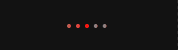

##### 4.2.4.2 `Placeholder`占位组件

占位组件是一个可以清晰地表明自身大小、没有复杂功能的组件，常用于设计布局时预览效果，完整用可以参考[官网文档](https://textual.textualize.io/widgets/placeholder/)。

组件支持以下参数：

-   `label`参数，字符串类型，`variant`参数为`'default'`时显示在组件上的内容，如果没有提供，则在组件上显示ID。
-   `variant`参数，字符串类型，表示占位组件显示的内容，仅支持`['default', 'size', 'text']`中的值，分别表示显示`label`参数的值、显示组件的大小、显示一段预先定义好无限循环的文字，点击占位组件会循环显示这三种内容。
-   `name`参数，字符串类型，表示组件的名字，常用于调试时区分组件。从此参数开始，只能使用关键字传入。
-   `id`参数，字符串类型，表示组件的ID，主要用于样式中的ID选择器。
-   `classes`参数，字符串类型，表示组件的样式类。
-   `disabled`参数，布尔类型，表示组件是否处于被禁用状态，默认为`False`。

组件支持以下属性：

-   `variant`属性，同`variant`参数。

组件支持以下反应性属性：

-   `variant`属性，同`variant`参数。

示例如下：

```python3
from textual.app import App
from textual.widgets import Placeholder

class MyApp(App):
    CSS = '''
    #a {
        width: 50%;
        height: 1fr;
    }
    #b {
        width: 80;
        height: 1fr;
    }
    #c {
        width: 1fr;
        height: 1fr;
    }
    '''
    def on_mount(self):
        self.widgets = [
            Placeholder('a','default',id='a'),
            Placeholder('b','size',id='b'),
            Placeholder('c','text',id='c'),
        ]
        self.mount_all(self.widgets) 

if __name__ == '__main__':
    app = MyApp()
    app.run()
```

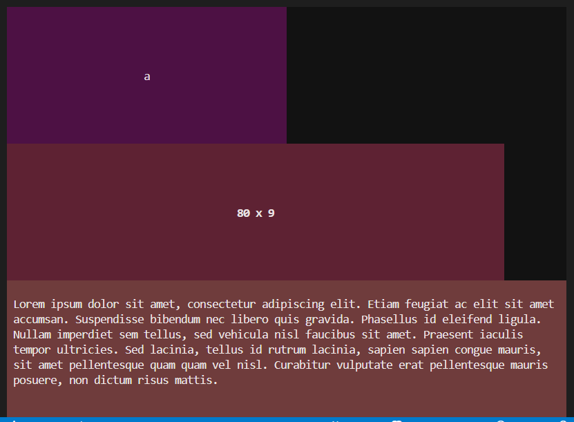

##### 4.2.4.3 `ProgressBar`进度条组件

如果执行耗时较久的代码，组件没有响应会让人万分焦虑。好在进度条组件可以显示执行进度，让等待过程没那么煎熬，完整用法可以参考[官网文档](https://textual.textualize.io/widgets/progress_bar/)。

进度条一般是自动增加的，但为了让代码简单一些，这里用一个手动增加的示例：

```python3
from textual.app import App
from textual.widgets import ProgressBar

class MyApp(App):
    def on_mount(self):
        self.widgets = [
            ProgressBar(100),
        ]
        self.mount_all(self.widgets) 
    def key_space(self):
        self.query_one(ProgressBar).advance(5)

if __name__ == '__main__':
    app = MyApp()
    app.run()
```

每按下一次空格，可以看到进度条增加5%：

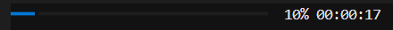

组件支持以下参数：

-   `total`参数，浮点类型，表示进度条的总进度值（如果能确定的话）。

-   `show_bar`参数，布尔类型，表示是否显示左边的进度条，默认为`True`。从此参数开始，只能使用关键字传入。

-   `show_percentage`参数，布尔类型，表示是否显示百分比，默认为`True`。

-   `show_eta`参数，布尔类型，表示是否显示剩余时间，默认为`True`。

-   `gradient`参数，`Gradient`类型（使用`from textual.color import Gradient`导入，用法参考[官网文档](https://textual.textualize.io/api/color/#textual.color.Gradient)），设置此参数会覆盖CSS中设置的进度条样式，让进度条的颜色成为渐变色。可以直接构建`Gradient`对象或者使用`Gradient`的类方法`from_colors`：

    ```python3
    from textual.app import App
    from textual.widgets import ProgressBar
    from textual.color import Gradient
    
    class MyApp(App):
        def on_mount(self):
            self.widgets = [
                ProgressBar(100,
                    gradient = Gradient((0,'red'),(1,'green'))
                    # 或者gradient = Gradient.from_colors('red','green')
                ),
            ]
            self.mount_all(self.widgets) 
        def key_space(self):
            self.query_one(ProgressBar).advance(5)
    
    if __name__ == '__main__':
        app = MyApp()
        app.run()
    ```

    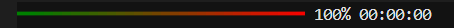

-   `clock`参数，`Clock`类型（使用`from textual.clock import Clock`导入），只有测试时才需要修改、用于计算剩余时间的时钟对象，一般使用时不需要设置此参数。

-   `name`参数，字符串类型，表示组件的名字，常用于调试时区分组件。

-   `id`参数，字符串类型，表示组件的ID，主要用于样式中的ID选择器。

-   `classes`参数，字符串类型，表示组件的样式类。

-   `disabled`参数，布尔类型，表示组件是否处于被禁用状态，默认为`False`。

组件支持以下属性：

-   `gradient`属性，`Gradient`类型（使用`from textual.color import Gradient`导入，用法参考[官网文档](https://textual.textualize.io/api/color/#textual.color.Gradient)），可写属性，同`gradient`参数。
-   `percentage`属性，浮点类型，只读属性，表示当前进度占总进度的百分比。
-   `progress`属性，浮点类型，可写属性，表示当前进度的值。
-   `total`属性，浮点类型，可写属性，同`total`参数。

组件支持以下反应性属性：

-   `gradient`属性，`Gradient`类型（使用`from textual.color import Gradient`导入，用法参考[官网文档](https://textual.textualize.io/api/color/#textual.color.Gradient)），可写属性，同`gradient`参数。
-   `percentage`属性，浮点类型，只读属性，表示当前进度占总进度的百分比。
-   `progress`属性，浮点类型，可写属性，表示当前进度的值。

组件支持以下子组件样式类：

-   `bar--bar`样式类，进度条（不包括进度条下面的背景）使用的样式类，颜色会因为进度不同改变。
-   `bar--complete`样式类，当前进度等于总进度时的进度条（不包括进度条下面的背景）使用的样式类。
-   `bar--indeterminate`样式类，当总进度没有设置或者为`None`时，进度条会显示为表示进度不确定的动画状态，此时的进度条（不包括进度条下面的背景）使用的样式类就是`bar--indeterminate`。

示例如下：

```python3
from textual.app import App
from textual.widgets import ProgressBar

class MyApp(App):
    CSS = '''
    .bar--bar {
        color: blue;
        background: red;
    }
    .bar--complete {
        color: yellow;
    }
    .bar--indeterminate {
        color: green;
        background: yellow;
    }
    '''
    def on_mount(self):
        self.widgets = [
            ProgressBar(),
        ]
        self.mount_all(self.widgets) 
    def key_space(self):
        self.query_one(ProgressBar).total = 100
        self.query_one(ProgressBar).advance(50)

if __name__ == '__main__':
    app = MyApp()
    app.run()
```

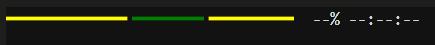

组件包含以下可单独设置样式的组件：

-   `Bar`组件类，ID为`#bar`，表示进度条。
-   `PercentageStatus`组件类，ID为`#percentage`，表示进度百分比。
-   `ETAStatus`组件类，ID为`#eta`，表示剩余时间。

示例如下：

```python3
from textual.app import App
from textual.widgets import ProgressBar

class MyApp(App):
    CSS = '''
    Bar {
        color: blue;
        background: white;
    }
    PercentageStatus {
        color: yellow;
    }
    ETAStatus {
        color: green;
    }
    '''
    def on_mount(self):
        self.widgets = [
            ProgressBar(),
        ]
        self.mount_all(self.widgets) 
    def key_space(self):
        self.query_one(ProgressBar).total = 100
        self.query_one(ProgressBar).advance(50)

if __name__ == '__main__':
    app = MyApp()
    app.run()
```

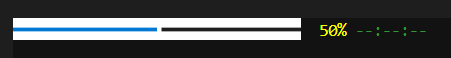

组件支持以下方法：

-   `advance`方法，当前进度增加指定值。该方法支持以下参数：

    -   `advance`参数，浮点类型，表示当前进度增加多少。

-   `update`方法，更新组件的总进度、当前进度、本次增加的进度。该方法支持以下关键字参数：

    -   `advance`参数，浮点类型，表示当前进度增加多少。
    -   `progress`参数，浮点类型，表示当前进度变为多少。
    -   `total`参数，浮点类型，表示总进度变为多少。

    注意，此方法的三个参数如果没有设置的话，则对应的属性不会改变。

```python3
from textual.app import App
from textual.widgets import ProgressBar

class MyApp(App):
    def on_mount(self):
        self.widgets = [
            ProgressBar(100),
        ]
        self.mount_all(self.widgets) 
    def key_space(self):
        self.query_one(ProgressBar).update(advance=5)
        # 效果等于self.query_one(ProgressBar).advance(5)

if __name__ == '__main__':
    app = MyApp()
    app.run()
```

以下是一个自动进度条示例：

```python3
from textual.app import App
from textual.widgets import ProgressBar

class MyApp(App):
    bar_timer = None
    def on_mount(self):
        self.widgets = [
            ProgressBar(),
        ]
        self.mount_all(self.widgets) 
        self.bar_timer = self.set_interval(1/10,self.progress,pause=True)
    def progress(self):
        self.query_one(ProgressBar).advance(1)
    def key_space(self):
        bar = self.query_one(ProgressBar)
        bar.total = 100
        self.bar_timer.resume()

if __name__ == '__main__':
    app = MyApp()
    app.run()
```

#### 4.2.5 其他交互组件

##### 4.2.5.1 `MaskedInput`模板化输入框组件

相比于输入框组件使用正则表达式限制输入内容，继承了输入框组件的模板化输入框组件，提供了一种简单限制输入内容格式的方法——使用模板字符串定义内容模板。除外，模板化输入框组件在默认情况下，根据内容模板实现了提示、输入补全等方法，可以很方便地提示、输入规定格式的内容（比如使用中划线分隔的激活码），比自己魔改输入框组件方便很多。完整用法可以参考[官网文档](https://textual.textualize.io/widgets/masked_input/)。

先来一个简单的示例：

```python3
from textual.app import App
from textual.widgets import MaskedInput,Label

class MyApp(App):
    def on_mount(self):
        self.widgets = [
            Label('Please input valid licence code:'),
            MaskedInput('9999-9999-9999-9999;0'),
        ]
        self.mount_all(self.widgets) 

if __name__ == '__main__':
    app = MyApp()
    app.run()
```

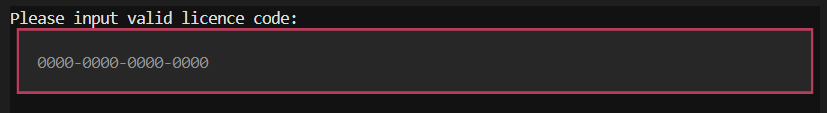

组件支持以下参数：

-   `template`参数，必需参数，字符串类型，表示规定内容格式的模板字符串，具体含义和语法参考下面的内容。

-   `value`参数，字符串类型，表示没有输入之前，模板化输入框内的内容。注意，此参数的内容需要遵循`template`参数的内容长度要求，超过规定长度的部分没法显示。

-   `placeholder`参数，字符串类型，表示模板化输入框内没有内容时，以浅色显示的提示文字，也称占位文字。注意，此参数的内容需要遵循`template`参数的内容长度要求，超过规定长度的部分没法显示。

-   `validators`参数，`Validator`类型（完整用法参考[官网文档](https://textual.textualize.io/api/validation/#textual.validation.Validator)）或者元素为`Validator`类型的可迭代对象，表示在模板化输入框输入内容时，验证输入内容的验证对象。定义验证类需要继承自`Validator`类（使用`from textual.validation import Validator`导入），并实现`validate`方法。`validate`方法使用`value`参数接收当前输入的内容（也就是组件的`value`属性），并返回验证的结果（[`ValidationResult`类型对象](https://textual.textualize.io/api/validation/#textual.validation.ValidationResult)，但可以返回[`success`方法](https://textual.textualize.io/api/validation/#textual.validation.Validator.success)和[`failure`方法](https://textual.textualize.io/api/validation/#textual.validation.Validator.failure)的执行结果来简化）。示例如下：

    ```python3
    from textual.app import App
    from textual.widgets import MaskedInput
    from textual.validation import Validator
    
    class InputValidator(Validator):
        def validate(self, value):
            return self.success() if '.' not in value else self.failure('"." should not be included.')
        
    class MyApp(App):
        def on_mount(self):
            self.widgets = [
                MaskedInput('xxxx',validators=InputValidator('"." should not be included.')),
            ]
            self.mount_all(self.widgets)
    
        def on_input_changed(self,e:MaskedInput.Changed):
            if fail_res:=e.validation_result.failure_descriptions:
                self.notify(f'{fail_res[0]}')
    
    if __name__ == '__main__':
        app = MyApp()
        app.run()
    ```

    示例中，给验证对象传入字符串或者在调用`failure`方法时传入字符串，会成为验证失败的提示文字，也就是验证对象的`failure_description`属性。同时，该提示文字也会成为组件消息的`validation_result`属性的`failure_descriptions`子属性的元素。注意，`validation_result`属性的`failure_descriptions`子属性仅在验证方法输出失败时才会有效，因此示例中特地添加了检查代码。

    

    从此参数开始，只能使用关键字传入。

-   `validate_on`参数，元素为字符串类型（仅支持`['blur','changed','submitted']`中的值，分别表示组件失去焦点、组件的内容变化和提交）的可迭代对象，表示在添加验证对象之后，需要在什么时候验证输入的内容。默认不设置时是`None`，表示在组件失去焦点、组件的内容变化和提交时都会触发验证。如果设置了此参数，则表示在指定的时机触发验证。

-   `valid_empty`参数，布尔类型，表示已经设置验证对象的情况下，当没有输入任何内容（`value`属性为`None`）时，是否认为此时的值是有效的且不需要验证，默认为`False`，即不输入任何内容也需要验证。注意，当参数为`True`，即认为`value`属性为`None`不需要验证时，消息的`validation_result`属性会在不输入任何内容时变为`None`，此时不能直接访问`failure_descriptions`子属性，会报错，需要添加额外的检查代码避免这种情况。比如下面示例中`on_input_changed`方法的定义中，就添加了额外的检查代码。此外，读者可以修改`valid_empty`参数的值，观察执行结果：

    ```python3
    from textual.app import App
    from textual.widgets import MaskedInput
    from textual.validation import Validator
    
    class InputValidator(Validator):
        def validate(self, value):
            return self.success() if value else self.failure('Please input something.')
        
    class MyApp(App):
        def on_mount(self):
            self.widgets = [
                MaskedInput('xxxx',validators=InputValidator(),valid_empty=True),
            ]
            self.mount_all(self.widgets)
    
        def on_input_changed(self,e:MaskedInput.Changed):
            if e.input.valid_empty:
                return
            elif fail_res:=e.validation_result.failure_descriptions:
                self.notify(f'{fail_res[0]}')
    
    if __name__ == '__main__':
        app = MyApp()
        app.run()
    ```

-   `select_on_focus`参数，布尔类型，表示当组件获得焦点时，是否自动选择模板化输入框内的全部内容，默认为`True`。

-   `tooltip`参数，可渲染类型，表示鼠标悬停在组件上时显示出来的工具提示。

-   `name`参数，字符串类型，表示组件的名字，常用于调试时区分组件。

-   `id`参数，字符串类型，表示组件的ID，主要用于样式中的ID选择器。

-   `classes`参数，字符串类型，表示组件的样式类。

-   `disabled`参数，布尔类型，表示组件是否处于被禁用状态，默认为`False`。

定义了模板化输入框组件的模板字符串之后，模板字符串的长度决定了输入内容的最大长度，不同的字符有不同含义，有的字符还表示结果中是否必须包含此类内容，具体含义如下：

| 模板字符 | 对应的正则表达式 | 含义                                        | 是否必须包含 |
| :------- | :--------------- | ------------------------------------------- | :----------- |
| `A`      | `[A-Za-z]`       | 大小英文字符                                | Yes          |
| `a`      | `[A-Za-z]`       | 大小英文字符                                | No           |
| `N`      | `[A-Za-z0-9]`    | 大小英文字符和数字                          | Yes          |
| `n`      | `[A-Za-z0-9]`    | 大小英文字符和数字                          | No           |
| `X`      | `[^ ]`           | 除了空格之外的其他字符                      | Yes          |
| `x`      | `[^ ]`           | 除了空格之外的其他字符                      | No           |
| `9`      | `[0-9]`          | 数字                                        | Yes          |
| `0`      | `[0-9]`          | 数字                                        | No           |
| `D`      | `[1-9]`          | 不含0的数字                                 | Yes          |
| `d`      | `[1-9]`          | 不含0的数字                                 | No           |
| `#`      | `[0-9+\-]`       | 数字和正负号                                | No           |
| `H`      | `[A-Fa-f0-9]`    | 十六进制数字<br>（数字和a到f的英文大小写）  | Yes          |
| `h`      | `[A-Fa-f0-9]`    | 十六进制数字<br/>（数字和a到f的英文大小写） | No           |
| `B`      | `[0-1]`          | 二进制数字（0和1）                          | Yes          |
| `b`      | `[0-1]`          | 二进制数字（0和1）                          | No           |

除了以上有正则表达式对应的字符，还有一些控制用户输入状态的字符，使用下面的字符之后，后面输入的状态会被限制：

-   `>`，后面输入的内容自动转换为大写。
-   `<`，后面输入的内容自动转换为小写。
-   `!`，后面输入的内容不再自动转换大小写。

除了上面提到的字符，其他的字符都会被认为是分隔符，一旦用户输入到分隔符后面的模板字符，组件会自动输入分隔符。对于需要将模板字符当分隔符的情况，可以在模板字符前加转移字符`\`，模板字符就会被当成分隔符使用。

在模板字符串中使用`;`会截断模板字符串，该字符前的内容是模板字符串，后面的内容不是模板字符串。紧接着该字符的任意单个字符会被当作占位字符，即使用占位字符代替模板字符串的所有模板字符，当作占位文字。但是，`placeholder`参数的优先级更高。

组件支持以下属性（常用，非全部）：

-   `template`属性，同`template`参数。
-   `content_width`属性，表示含光标的内容宽度。注意，为了防止光标，内容宽度会比实际内容的宽度多1。
-   `cursor_screen_offset`属性，表示光标在屏幕坐标系中的位置。
-   `cursor_position`属性，表示当前光标位置，默认为`0`。可以设置此属性的值来移动光标。
-   `is_valid`属性，表示当前内容是否通过了验证。注意，如果组件没有设置验证对象，此属性则一直为`True`。
-   `selected_text`属性，表示模板化输入框内被选中的内容。
-   `selection`属性，表示模板化输入框内当前选中内容的光标范围。该属性是命名元组，包含`start`和`end`两个成员，分别代表想要选中目标内容的开始光标位置和结束光标位置。
-   `cursor_blink`属性，表示是否启用光标闪烁，默认为`True`。
-   `value`属性，同`value`参数。
-   `placeholder`属性，同`placeholder`参数。
-   `valid_empty`属性，同`valid_empty`参数。
-   `validate_on`属性，同`validate_on`参数。

组件支持以下反应性属性：

-   `template`属性，同`template`参数。
-   `cursor_blink`属性，表示是否启用光标闪烁，默认为`True`。
-   `value`属性，同`value`参数。
-   `cursor_position`属性，表示当前光标位置，默认为`0`。可以设置此属性的值来移动光标。
-   `placeholder`属性，同`placeholder`参数。
-   `valid_empty`属性，同`valid_empty`参数。

组件支持以下子组件样式类：

-   `input--cursor`类，光标使用的样式类。
-   `input--placeholder`类，占位文字使用的样式类。
-   `input--suggestion`类，自动补全文字使用的样式类。
-   `input--selection`类，被选中文字使用的样式类。

组件支持以下消息：

-   `Changed`消息，当模板化输入框的内容改变时触发，该消息支持以下属性：
    -   `input`属性，表示触发该消息的组件。
    -   `control`属性，同`input`属性。
    -   `validation_result`属性，表示输入内容的验证结果。在设置`validators`参数之后，此属性会变成非`None`值，可以获取到验证的结果。
    -   `value`属性，表示组件当前输入的内容。
-   `Submitted`消息，当模板化输入框的内容改提交（按下`enter`键或者执行`action_submit`方法）时触发，该消息支持的属性同`Changed`消息。
-   `Blurred`消息，当模板化输入框失去焦点时触发，该消息支持的属性同`Changed`消息。

组件支持以下快捷键：

-   `left`键，将光标向左移动一个字符。
-   `shift+left`键，将光标向左移动一个字符并选择光标经过的内容。
-   `ctrl+left`键，将光标移动到左边单词的词头位置。
-   `right`键，将光标向右移动一个字符。
-   `ctrl+shift+left`键，将光标移动到左边单词的词头位置并选择这个单词。
-   `shift+right`键，将光标向右移动一个字符并选择光标经过的内容。
-   `ctrl+right`键，将光标移动到右边下一个单词的词头位置。
-   `backspace`键，删掉光标左边的字符。
-   `ctrl+shift+right`键，将光标移动到右边单词的下一个单词的词头位置并选择右边单词。
-   `home`键或`ctrl+a`键，移动光标到模板化输入框开头的位置。
-   `end`键或`ctrl+e`键，移动光标到模板化输入框末尾的位置。
-   `shift+home`键，移动光标到模板化输入框开头的位置，并选择光标之前位置到模板化输入框开头之间的内容。
-   `shift+end`键，移动光标到模板化输入框末尾的位置，并选择光标之前位置到模板化输入框末尾之间的内容。
-   `delete`键或`ctrl+d`键，删掉光标右边的字符。
-   `enter`键，提交模板化输入框的内容，即触发`submitted`消息并将模板化输入框的内容传给该消息的额外参数。
-   `ctrl+w`键，删掉光标左边的单词。
-   `ctrl+u`键，删掉光标左边的所有内容。
-   `ctrl+f`键，删掉光标右边的单词。
-   `ctrl+k`键，删掉光标右边的所有内容。
-   `ctrl+x`键，剪切被选择的内容。
-   `ctrl+c`键，复制被选择的内容。
-   `ctrl+v`键，将剪贴板的内容粘贴到模板化输入框内。

组件支持以下实例方法：

-   `action_copy`方法，复制当前选择的内容。
-   `action_cursor_left`方法，将光标向左移动一个字符。该方法还支持一个布尔类型的参数`select`，表示移动光标的同时是否选择内容，默认为`False`。
-   `action_cursor_left_word`方法，将光标移动到左边单词的词头位置。该方法还支持一个布尔类型的参数`select`，表示移动光标的同时是否选择内容，默认为`False`。
-   `action_cursor_righ`方法，将光标向右移动一个字符。该方法还支持一个布尔类型的参数`select`，表示移动光标的同时是否选择内容，默认为`False`。
-   `action_cursor_right_word`方法，将光标移动到右边下一个单词的词头位置。该方法还支持一个布尔类型的参数`select`，表示移动光标的同时是否选择内容，默认为`False`。
-   `action_cut`方法，剪切被选择的内容。
-   `action_delete_left`方法，删掉光标左边的字符。
-   `action_delete_left_all`方法，删掉光标左边的所有内容。
-   `action_delete_left_word`方法，删掉光标左边的单词。
-   `action_delete_right`方法，删掉光标右边的字符。
-   `action_delete_right_all`方法，删掉光标右边的所有内容。
-   `action_delete_right_word`方法，删掉光标右边的单词。
-   `action_end`方法，移动光标到模板化输入框末尾的位置。该方法还支持一个布尔类型的参数`select`，表示移动光标的同时是否选择内容，默认为`False`。
-   `action_home`方法，移动光标到模板化输入框开头的位置。该方法还支持一个布尔类型的参数`select`，表示移动光标的同时是否选择内容，默认为`False`。
-   `action_paste`方法，将剪贴板的内容粘贴到模板化输入框内。
-   `action_submit`方法，此方法为异步方法，可以提交模板化输入框的内容，即触发`submitted`消息并将模板化输入框的内容传给该消息的额外参数。
-   `clear`方法，清除模板化输入框的内容。
-   `delete`方法，删除模板化输入框指定区间的内容。该方法使用时必须传入两个参数：
    -   `start`参数，整数类型，表示区间开始的位置。
    -   `end`参数，整数类型，表示区间结束的位置。
-   `delete_selection`方法，删除当前选择的内容。
-   `insert`方法，在指定位置插入指定内容。该方法使用时必须传入两个参数：
    -   `text`参数，字符串类型，表示要插入的内容。
    -   `index`参数，整数类型，表示插入内容的位置。
-   `insert_text_at_cursor`方法，在光标位置插入指定内容。该方法必须传入一个字符串类型的参数`text`，表示要插入的内容。
-   `replace`方法，替换指定区间的内容为指定内容。该方法使用时必须传入三个参数：
    -   `text`参数，字符串类型，表示要替换的内容。
    -   `start`参数，整数类型，表示区间开始的位置。
    -   `end`参数，整数类型，表示区间结束的位置。

##### 4.2.5.2 `TextArea`文本区域组件

输入框组件只能输入一行内容，如果想要输入多行内容，就要使用文本区域组件，完整用法可以参考[官网文档](https://textual.textualize.io/widgets/text_area/)。除了支持输入多行内容，文本区域组件还支持选择文本、自动换行、语法高亮等功能，堪称终端中的富文本编辑器。

以下是简单的示例：

```python3
from textual.app import App
from textual.widgets import TextArea

TEXT = '''\
Hello
World
'''

class MyApp(App):
    CSS = '''
    TextArea {
        width: 12;
        height: 5;
    }
    '''
    def on_mount(self):
        self.widgets = [
            TextArea(TEXT)
        ]
        self.mount_all(self.widgets)

if __name__ == '__main__':
    app = MyApp()
    app.run()
```

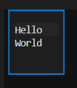

注意，在设置本组件的语法高亮相关参数、属性之前，需要安装语法高亮的依赖库，使用下面的命令自动安装：

```shell
pip install textual[syntax]
```

组件支持以下参数：

-   `text`参数，字符串类型，组件默认显示内容的原始字符串。
-   `language`参数，字符串类型，组件启用什么语言的语法高亮。从此参数开始，只能使用关键字传入。
-   `theme`参数，字符串类型，组件使用的主题，默认为`'css'`。
-   `soft_wrap`参数，布尔类型，是否开启自动换行，默认为`True`。
-   `tab_behavior`参数，字符串类型，当组件获得焦点时，`tab`键的作用，仅允许`['focus','indent']`中的值，分别代表切换焦点、输出制表符，默认为`'focus'`。当此参数设置为`'indent'`、本组件获得焦点时，可以使用`esc`键切换焦点。
-   `read_only`参数，布尔类型，表示组件的内容是否为只读，默认为`False`。
-   `show_line_numbers`参数，布尔类型，表示是否显示行号，默认为`False`。
-   `line_number_start`参数，整数类型，表示行号的起始数字，默认为`1`。
-   `max_checkpoints`参数，整数类型，表示最多保存多少个可撤销的步骤，默认为`50`。
-   `tooltip`参数，可渲染类型，表示鼠标悬停在组件上时显示出来的工具提示。
-   `name`参数，字符串类型，表示组件的名字，常用于调试时区分组件。
-   `id`参数，字符串类型，表示组件的ID，主要用于样式中的ID选择器。
-   `classes`参数，字符串类型，表示组件的样式类。
-   `disabled`参数，布尔类型，表示组件是否处于被禁用状态，默认为`False`。

组件支持以下属性：

-   `available_languages`属性，表示组件当前支持哪些语言的语法高亮（包括内置的和额外添加的）。
-   `available_themes`属性，表示组件当前可用的主题（包括内置的和额外添加的）。
-   `cursor_at_end_of_line`属性，布尔类型，表示光标是否在一行的末尾。
-   `cursor_at_end_of_text`属性，布尔类型，表示光标是否在所有内容的末尾。
-   `cursor_at_first_line`属性，布尔类型，表示光标是否在第一行。
-   `cursor_at_last_line`属性，布尔类型，表示光标是否在最后一行。
-   `cursor_at_start_of_line`属性，布尔类型，表示光标是否在一行的开头。
-   `cursor_at_start_of_text`属性，布尔类型，表示光标是否在所有内容的开头。
-   `cursor_blink`属性，布尔类型，表示是否启用光标闪烁，默认为`True`。
-   `cursor_location`属性，表示光标的位置，实际上是`selection`属性的`end`成员。
-   `cursor_screen_offset`属性，表示光标相对于屏幕的位置。
-   `document`属性，表示组件正在编辑的文档对象（基于`text`属性创建，支持文档属性和文档方法），完整用法可以参考[官网文档](https://textual.textualize.io/widgets/text_area/#textual.widgets.text_area.Document)。
-   `gutter_width`属性，行号显示区域的最小宽度，默认为`3`。
-   `history`属性，存储了历史记录的`EditHistory`对象（用法参考[官网文档](https://textual.textualize.io/widgets/text_area/#textual.widgets.text_area.EditHistory)）。
-   `indent_type`属性，字符串类型，仅支持`['tabs', 'spaces']`中的值，默认为`'spaces'`。当按下`tab`键为输入制表符（`tab_behavior`参数为`'indent'`）时，`'spaces'`表示使用`indent_width`属性个空格代替制表符，`'tabs'`表示直接输入制表符。
-   `indent_width`属性，表示当`indent_type`属性为`'spaces'`时，使用多少个空格代替制表符，默认为`4`。
-   `is_syntax_aware`属性，表示当前内容是否启用了语法高亮（但主题的样式优先级更高，可能会覆盖语法高亮样式）。
-   `language`属性，同`language`参数。
-   `line_number_start`属性，同`line_number_start`参数。
-   `match_cursor_bracket`属性，如果光标在括号上，是否高亮与之配对的另一方向的括号，默认为`True`。
-   `matching_bracket_location`属性，如果光标在括号上，此属性表示与之配对的另一方向的括号的位置（`Location`类型，元素为整数的元组，分别表示第几行、第几列）。
-   `navigator`属性，`DocumentNavigator`类型（完整用法参考[官网文档](https://textual.textualize.io/widgets/text_area/#textual.widgets.text_area.DocumentNavigator)），在内容启用自动换行之后，调用该属性的方法来确定光标的移动位置。
-   `read_only`属性，同`read_only`参数。
-   `selected_text`属性，表示处于被选择状态的内容。
-   `selection`属性，`Selection`类型（完整用法参考[官网文档](https://textual.textualize.io/widgets/text_area/#textual.widgets.text_area.Selection)），包含`start`和`end`两个`Location`类型成员，分别表示选择内容时光标起止点。
-   `show_line_numbers`属性，同`show_line_numbers`参数。
-   `soft_wrap`属性，同`soft_wrap`参数。
-   `text`属性，字符串类型，组件显示内容原始字符串。
-   `theme`属性，同`theme`参数。
-   `wrap_width`属性，表示启用自动换行、行号显示之后，单行内容最多显示多少个字符。
-   `wrapped_document`属性，表示启用了自动换行之后的文档对象，完整用法可以参考[官网文档](https://textual.textualize.io/widgets/text_area/#textual.widgets.text_area.WrappedDocument)。

组件支持以下反应性属性：

-   `language`属性，同`language`参数。
-   `theme`属性，同`theme`参数。
-   `selection`属性，`Selection`类型（完整用法参考[官网文档](https://textual.textualize.io/widgets/text_area/#textual.widgets.text_area.Selection)），包含`start`和`end`两个`Location`类型成员，分别表示选择内容时光标起止点。
-   `show_line_numbers`属性，同`show_line_numbers`参数。
-   `line_number_start`属性，同`line_number_start`参数。
-   `indent_width`属性，表示当`indent_type`属性为`'spaces'`时，使用多少个空格代替制表符，默认为`4`。
-   `match_cursor_bracket`属性，如果光标在括号上，是否高亮与之配对的另一方向的括号，默认为`True`。
-   `cursor_blink`属性，布尔类型，表示是否启用光标闪烁，默认为`True`。
-   `soft_wrap`属性，同`soft_wrap`参数。
-   `read_only`属性，同`read_only`参数。

组件支持以下子组件样式类：

-   `text-area--cursor`样式类，光标使用的样式类。
-   `text-area--gutter`样式类，行号显示区域使用的样式类。
-   `text-area--cursor-gutter`样式类，光标所在行对应的行号显示区域使用的样式类。
-   `text-area--cursor-line`样式类，光标所在行使用的样式类。
-   `text-area--selection`样式类，处于被选择状态的内容使用的样式类。
-   `text-area--matching-bracket`样式类，光标在括号上时，如果同时高亮与之配对的另一方向的括号，则此样式类表示这一对括号处于高亮状态时使用的样式类。

注意，上面提到的样式类的优先级不如主题样式或者`code_editor`类方法内置样式的高。因此，只有未设置主题的组件可以正常显示上面提到的样式类。

```python3
from textual.app import App
from textual.widgets import TextArea

TEXT = '''\
Hello
World
'''

class MyApp(App):
    CSS = '''
    TextArea {
        width: 12;
        height: 5;
    }
    .text-area--cursor {
      background: red;
    }
    '''
    def on_mount(self):
        self.widgets = [
            TextArea(TEXT)
        ]
        self.mount_all(self.widgets)

if __name__ == '__main__':
    app = MyApp()
    app.run()
```

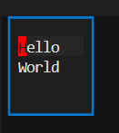

注意，如果想要移除文本区域组件获得焦点时显示的外轮廓，需要设置样式`border: none`；若是想要文本区域组件更紧凑（取消内容到组件轮廓的边距），需要设置样式`padding: 0`。

组件支持以下消息：

-   `Changed`消息，当组件的内容变化时触发此消息。该消息支持以下属性：
    -   `text_area`属性，表示触发该消息的组件。
    -   `control`属性，同`text_area`属性。
-   `SelectionChanged`消息，当处于被选择状态的内容变化时触发此消息。该消息支持以下属性：
    -   `text_area`属性，表示触发该消息的组件。
    -   `control`属性，同`text_area`属性。
    -   `selection`属性，`Selection`类型（完整用法参考[官网文档](https://textual.textualize.io/widgets/text_area/#textual.widgets.text_area.Selection)），包含`start`和`end`两个`Location`类型成员，分别表示选择内容变化后光标起止点。

组件支持以下快捷键：

-   `up`键，向上移动光标。
-   `down`键，向下移动光标。
-   `left`键，向左移动光标。
-   `ctrl+left`键，移动光标到左边单词的开头。
-   `ctrl+shift+left`键，移动光标到左边单词的开头并选择该单词。
-   `right`键，向右移动光标。
-   `ctrl+right`键，移动光标到右边单词的末尾。
-   `ctrl+shift+right`键，移动光标到右边单词的末尾并选择该单词。
-   `home`键或者`ctrl+a`键，移动光标到所在行的开头。
-   `end`键或者`ctrl+e`键，移动光标到所在行的末尾。
-   `shift+home`键，移动光标到所在行的开头并选择光标经过的所有字符。
-   `shift+end`键，移动光标到所在行的末尾并选择光标经过的所有字符。
-   `pageup`键，移动光标到上一页相同位置。
-   `pagedown`键，移动光标到下一页相同位置。
-   `shift+up`键，向上移动光标并选择光标经过的所有字符。
-   `shift+down`键，向下移动光标并选择光标经过的所有字符。
-   `shift+left`键，向左移动光标并选择光标经过的所有字符。
-   `shift+right`键，向右移动光标并选择光标经过的所有字符。
-   `backspace`键，删除光标左边的字符。
-   `ctrl+w`键，删除光标至单词开头之间的字符。
-   `delete`键或者`ctrl+d`键，删除光标右边的字符。
-   `ctrl+f`键，删除光标至单词末尾之间的字符。
-   `ctrl+shift+k`键，删除光标所在行的所有内容。
-   `ctrl+u`键，删除光标到所在行开头之间的所有内容。
-   `ctrl+k`键，删除光标到所在行末尾之间的所有内容，如果当前行是空行，则删掉当前行。
-   `f6`键，选择光标所在行的所有内容。
-   `f7`键，选择所有内容。
-   `ctrl+z`键，撤销上一步导致内容变化（增加、删除）的操作。
-   `ctrl+y`键，恢复上一步撤销操作。
-   `ctrl+x`键，剪切所选内容，如果没有选择任何内容就剪切光标所在行的所有内容。
-   `ctrl+c`键，复制所选内容到剪贴板。
-   `ctrl+v`键，将剪贴板内容粘贴至光标处。

组件支持以下方法（部分常用，非全部）：

-   `action_copy`方法，复制所选内容到剪贴板。

-   `action_cursor_down`方法，向下移动光标。该方法支持以下参数：

    -   `select`参数，布尔类型，表示移动光标的同时是否选择光标经过的所有字符，默认为`False`。

-   `action_cursor_left`方法，向左移动光标。该方法支持以下参数：

    -   `select`参数，布尔类型，表示移动光标的同时是否选择光标经过的所有字符，默认为`False`。

-   `action_cursor_line_end`方法，移动光标到所在行的末尾。该方法支持以下参数：

    -   `select`参数，布尔类型，表示移动光标的同时是否选择光标经过的所有字符，默认为`False`。

-   `action_cursor_line_start`方法，移动光标到所在行的开头。该方法支持以下参数：

    -   `select`参数，布尔类型，表示移动光标的同时是否选择光标经过的所有字符，默认为`False`。

-   `action_cursor_page_down`方法，移动光标到下一页相同位置。

-   `action_cursor_page_up`方法，移动光标到上一页相同位置。

-   `action_cursor_right`方法，向右移动光标。该方法支持以下参数：

    -   `select`参数，布尔类型，表示移动光标的同时是否选择光标经过的所有字符，默认为`False`。

-   `action_cursor_up`方法，向上移动光标。该方法支持以下参数：

    -   `select`参数，布尔类型，表示移动光标的同时是否选择光标经过的所有字符，默认为`False`。

-   `action_cursor_word_left`方法，移动光标到左边单词的开头。该方法支持以下参数：

    -   `select`参数，布尔类型，表示移动光标的同时是否选择光标经过的所有字符，默认为`False`。

-   `action_cursor_word_right`方法，移动光标到右边单词的末尾。该方法支持以下参数：

    -   `select`参数，布尔类型，表示移动光标的同时是否选择光标经过的所有字符，默认为`False`。

-   `action_cut`方法，剪切所选内容，如果没有选择任何内容就剪切光标所在行的所有内容。

-   `action_delete_left`方法，删除光标左边的字符。

-   `action_delete_line`方法，删除光标所在行的所有内容。

-   `action_delete_right`方法，删除光标右边的字符。

-   `action_delete_to_end_of_line`方法，删除光标到所在行末尾之间的所有内容

-   `action_delete_to_end_of_line_or_delete_line`方法，删除光标到所在行末尾之间的所有内容，如果当前行是空行，则删掉当前行。

-   `action_delete_to_start_of_line`方法，删除光标到所在行开头之间的所有内容。

-   `action_delete_word_left`方法，删除光标至单词开头之间的字符。

-   `action_delete_word_right`方法，删除光标至单词末尾之间的字符。

-   `action_paste`方法，将剪贴板内容粘贴至光标处。

-   `action_redo`方法，恢复上一步撤销操作。

-   `action_select_all`方法，选择所有内容。

-   `action_select_line`方法，选择光标所在行的所有内容。

-   `action_undo`方法，撤销上一步导致内容变化（增加、删除）的操作。

-   `clear`方法，删除所有内容。

-   `delete`方法，删除指定区间的内容。该方法支持以下参数：

    -   `start`参数，`Location`类型，表示区间起点。
    -   `end`参数，`Location`类型，表示区间终点。
    -   `maintain_selection_offset`参数，布尔类型，表示删除内容之后是否尽量保持选择内容的区域不变，默认为`False`。本参数仅支持以关键字传入。

-   `edit`方法，提供了其他编辑内容方法（替换、删除等）的核心功能，传入不同的`Edit`对象（完整用法参考[官网文档](https://textual.textualize.io/widgets/text_area/#textual.widgets.text_area.Edit)）给`edit`参数，可以实现不同的编辑功能。比如删除指定区间的内容，其核心代码就是`return self.edit(Edit("", start, end, maintain_selection_offset))`。

-   `find_matching_bracket`方法，从指定位置开始查找与给定括号匹配的另一边括号。该方法支持以下必需参数：

    -   `bracket`参数，字符串类型，表示给定的括号。
    -   `search_from`参数，`Location`类型，表示从哪个位置开始查找匹配的括号。

-   `get_cursor_down_location`方法，获取光标下面的位置。

-   `get_cursor_left_location`方法，获取光标左面的位置。

-   `get_cursor_line_end_location`方法，获取光标所在行的末尾的位置。

-   `get_cursor_line_start_location`方法，获取光标所在行的开头的位置。

-   `get_cursor_right_location`方法，获取光标右面的位置。

-   `get_cursor_up_location`方法，获取光标上面的位置。

-   `get_cursor_word_left_location`方法，获取光标左边单词的开头的位置。

-   `get_cursor_word_right_location`方法，获取光标右边单词的末尾的位置。

-   `get_line`方法，获取指定行的内容。该方法支持以下参数：

    -   `line_index`参数，整数类型，表示指定行的行索引（第一行的行索引为`0`）。

-   `get_target_document_location`方法，获取触发鼠标事件时光标的位置。此方法支持以下参数：

    -   `event`参数，`MouseEvent`类型，表示组件触发的鼠标事件。注意，此鼠标事件必须是文本区域组件触发的，其他组件触发的鼠标事件没法得到准确的光标位置。

    示例如下：

    ```python3
    from textual.app import App
    from textual.widgets import TextArea
    
    TEXT = '''\
    Hello
    World
    '''
    
    class MyApp(App):
        def on_mount(self):
            self.widgets = [
                TextArea(TEXT)
            ]
            self.mount_all(self.widgets)
        def on_click(self,e):
            ta = self.query_one(TextArea)
            ans = ta.get_target_document_location(e)
            if e.control is ta:
                self.notify(f'{ans}')
    
    
    if __name__ == '__main__':
        app = MyApp()
        app.run()
    ```

-   `get_text_range`方法，获取指定区间内的内容。该方法支持以下参数：

    -   `start`参数，`Location`类型，表示区间起点。
    -   `end`参数，`Location`类型，表示区间终点。

-   `insert`方法，在指定位置插入指定内容。该方法支持以下参数：

    -   `text`参数，字符串类型，表示要插入的内容。
    -   `location`参数，`Location`类型，表示插入内容的位置。
    -   `maintain_selection_offset`参数，布尔类型，表示插入内容之后是否尽量保持选择内容的区域不变，默认为`False`。本参数仅支持以关键字传入。

-   `load_text`方法，载入指定内容，用于替换组件当前的内容，并清空组件可撤销的历史记录。该方法支持以下参数：

    -   `text`参数，字符串类型，表示要载入的内容。

-   `move_cursor`方法，移动光标到指定位置。该方法支持以下参数：

    -   `location`参数，`Location`类型，表示目标位置。
    -   `select`参数，布尔类型，表示移动过程中是否同时选择光标经过的内容，默认为`False`。
    -   `center`参数，布尔类型，表示移动之后是否滚动可见区域直到光标在可见区域中间，默认为`False`。
    -   `record_width`参数，布尔类型，如果不同位置所属的行包含的内容长度不同，此参数表示是否记住移动光标前，光标在之前位置所属行的水平偏移值。当移动光标回到之前的位置时，使用记住的水平偏移值当做新位置的水平偏移值。一般是光标从内容多的行末尾移动到内容少的行末尾，然后返回时有用，可以保证光标返回到行末尾，而不是行中间。该参数默认为`True`。

-   `move_cursor_relative`方法，移动光标到指定位置（使用相对坐标）。该方法支持以下参数：

    -   `rows`参数，整数类型，表示目标位置相对于当前位置移动了几行。正数表示向下，负数表示向上。
    -   `columns`参数，整数类型，表示目标位置相对于当前位置移动了几个字符。正数表示向右，负数表示向左。
    -   `select`参数，布尔类型，表示移动过程中是否同时选择光标经过的内容，默认为`False`。
    -   `center`参数，布尔类型，表示移动之后是否滚动可见区域直到光标在可见区域中间，默认为`False`。
    -   `record_width`参数，布尔类型，如果不同位置所属的行包含的内容长度不同，此参数表示是否记住移动光标前，光标在之前位置所属行的水平偏移值。当移动光标回到之前的位置时，使用记住的水平偏移值当做新位置的水平偏移值。一般是光标从内容多的行末尾移动到内容少的行末尾，然后返回时有用，可以保证光标返回到行末尾，而不是行中间。该参数默认为`True`。

-   `record_cursor_width`方法，记住光标在当前位置所属行的水平偏移值。

-   `redo`方法，恢复上一步撤销操作。

-   `register_language`方法，注册一种语言的语法高亮。该方法支持以下必需参数：

    -   `name`参数，字符串类型，表示该语言的名称。
    -   `language`参数，`Language`类型，该语言对应的tree-sitter实现的`Language`对象。
    -   `highlight_query`参数，字符串类型，表示该语言的关键字、注释等的高亮定义。

    该方法下面会有相关的详细示例，这里不做展开。

-   `register_theme`方法，注册一种主题。该方法支持一个`TextAreaTheme`类型的`theme`参数，表示要注册的主题。该方法下面会有相关的详细示例，这里不做展开。

-   `replace`方法，替换指定区间的内容。该方法支持以下参数：

    -   `insert`参数，字符串类型，表示替换为什么内容。
    -   `start`参数，`Location`类型，表示区间起点。
    -   `end`参数，`Location`类型，表示区间终点。
    -   `maintain_selection_offset`参数，布尔类型，表示替换内容之后是否尽量保持选择内容的区域不变，默认为`False`。本参数仅支持以关键字传入。

-   `scroll_cursor_visible`方法，滚动可见区域直到光标在可见区域中。该方法支持以下参数：

    -   `center`参数，布尔类型，表示是否滚动可见区域直到光标在可见区域中间，默认为`False`。
    -   `animate`参数，布尔类型，表示滚动过程中是否启用动画，默认为`False`。

-   `select_all`方法，选择所有内容。

-   `select_line`方法，选择指定行的所有内容。该方法支持以下参数：

    -   `index`参数，整数类型，表示指定行的行索引（第一行的行索引为`0`）。

-   `undo`方法，撤销上一步导致内容变化（增加、删除）的操作。

-   `update_highlight_query`方法，更新指定语言的关键字、注释等的高亮定义。该方法支持以下必需参数：

    -   `name`参数，字符串类型，表示该语言的名称。
    -   `highlight_query`参数，字符串类型，表示该语言的关键字、注释等的更新后的高亮定义。

组件支持以下类方法：

-   `code_editor`方法，创建一个适合编辑代码的文本区域组件。该方法主要是将原本文本区域组件的几个默认参数修改，使组件更适合编辑代码。该方法支持以下参数：
    -   `text`参数，字符串类型，组件默认显示内容的原始字符串。
    -   `language`参数，字符串类型，组件启用什么语言的语法高亮。从此参数开始，只能使用关键字传入。
    -   `theme`参数，字符串类型，组件使用的主题，默认为`'monokai'`。此参数的默认值与原本文本区域组件的默认值不同。
    -   `soft_wrap`参数，布尔类型，是否开启自动换行，默认为`False`。此参数的默认值与原本文本区域组件的默认值不同。
    -   `tab_behavior`参数，字符串类型，当组件获得焦点时，`tab`键的作用，仅允许`['focus','indent']`中的值，分别代表切换焦点、输出制表符，默认为`'indent'`。此参数的默认值与原本文本区域组件的默认值不同。当此参数设置为`'indent'`、本组件获得焦点时，可以使用`esc`键切换焦点。
    -   `read_only`参数，布尔类型，表示组件的内容是否为只读，默认为`False`。
    -   `show_line_numbers`参数，布尔类型，表示是否显示行号，默认为`True`。此参数的默认值与原本文本区域组件的默认值不同。
    -   `line_number_start`参数，整数类型，表示行号的起始数字，默认为`1`。
    -   `max_checkpoints`参数，整数类型，表示最多保存多少个可撤销的步骤，默认为`50`。
    -   `tooltip`参数，可渲染类型，表示鼠标悬停在组件上时显示出来的工具提示。
    -   `name`参数，字符串类型，表示组件的名字，常用于调试时区分组件。
    -   `id`参数，字符串类型，表示组件的ID，主要用于样式中的ID选择器。
    -   `classes`参数，字符串类型，表示组件的样式类。
    -   `disabled`参数，布尔类型，表示组件是否处于被禁用状态，默认为`False`。

了解了文本区域组件的方法之后，下面就几个重点功能写几个详细的示例。

通过继承文本区域组件类，在类中定义事件响应方法，就可以扩展文本区域组件的功能比如，当输入括号时，自动插入匹配的括号：

```python3
from textual.app import App
from textual.widgets import TextArea

class ExtendedTextArea(TextArea):
    def on_key(self, e):
        if e.character == "(":
            self.insert("()")
            self.move_cursor_relative(columns=-1)
            e.prevent_default()

TEXT = '''\
Hello
World
'''

class MyApp(App):
    def on_mount(self):
        self.widgets = [
            ExtendedTextArea(TEXT)
        ]
        self.mount_all(self.widgets)

if __name__ == '__main__':
    app = MyApp()
    app.run()
```

文本区域组件默认的主题是`'css'`，意思是该主题使用的样式完全来自于CSS。比如，前面介绍子组件样式类时使用的示例：

```python3
from textual.app import App
from textual.widgets import TextArea

TEXT = '''\
Hello
World
'''

class MyApp(App):
    CSS = '''
    TextArea {
        width: 12;
        height: 5;
    }
    .text-area--cursor {
      background: red;
    }
    '''
    def on_mount(self):
        self.widgets = [
            TextArea(TEXT)
        ]
        self.mount_all(self.widgets)

if __name__ == '__main__':
    app = MyApp()
    app.run()
```

除了`'css'`之外，组件还内置了其他主题，比如`'dracula'`：

```python3
from textual.app import App
from textual.widgets import TextArea

TEXT = '''\
Hello
World
'''

class MyApp(App):
    CSS = '''
    TextArea {
        width: 12;
        height: 5;
    }
    .text-area--cursor {
      background: red;
    }
    '''
    def on_mount(self):
        self.widgets = [
            TextArea(TEXT,theme='dracula')
        ]
        self.mount_all(self.widgets)

if __name__ == '__main__':
    app = MyApp()
    app.run()
```

不过，此时子组件样式类将会失效，组件的样式完全来自于主题。

组件提供的内置主题如下：

```python3
{'css', 'dracula', 'github_light', 'monokai', 'vscode_dark'}
```

在添加自定义主题之前，可以访问`available_themes`属性，得知所有内置主题。

说到自定义主题，这里就有必要填一下坑，也就是前面提了一嘴的`register_theme`方法。

和基础知识中创建、使用自定义主题类似，给文本区域组件创建、使用自定义主题，也需要经历创建、注册、使用三个步骤。

先说创建，创建主题就是创建一个`TextAreaTheme`类（数据类，使用`from textual.widgets.text_area import TextAreaTheme`导入，完整用法参考[官网文档](https://textual.textualize.io/widgets/text_area/#textual.widgets.text_area.TextAreaTheme)）的实例。

`TextAreaTheme`类支持以下参数：

-   `name`参数，字符串类型，表示主题的名字，在使用主题时会用到。

-   `base_style`参数，`Style`类型，表示组件内容的样式。

-   `gutter_style`参数，`Style`类型，表示行号显示区域中除了光标所在行之外的区域的样式。

-   `cursor_style`参数，`Style`类型，表示光标的样式。

-   `cursor_line_style`参数，`Style`类型，表示光标所在行的样式。

-   `cursor_line_gutter_style`参数，`Style`类型，表示行号显示区域中光标所在行的样式。

-   `bracket_matching_style`参数，`Style`类型，表示被高亮显示的配对括号的样式。

-   `selection_style`参数，`Style`类型，表示处于被选择状态的内容的样式。

-   `syntax_styles`参数，字典类型，表示语法高亮的样式。字典的键是语法高亮定义的匹配结果，键对应的值就是匹配结果对应的样式，比如，以一段来自内置Markdown高亮定义（`markdown.scm`）的内容为例：

    ```lisp
    (heading_content) @heading
    ```

    前面的`(heading_content)`是匹配表达式，`@`后面的内容表示对匹配结果的命名，也就是上面所说的“匹配结果”。而上面这段高亮定义匹配的就是Markdown中的标题。

    因此，可以给该参数传入`{'heading':Style(bgcolor='yellow')}`来自定义Markdown内容中标题的样式。

以下是完整的示例代码：

```python3
from textual.app import App
from textual.widgets import TextArea
from rich.style import Style
from textual.widgets.text_area import TextAreaTheme

my_theme = TextAreaTheme(
    name = 'my_theme',
    gutter_style = Style(color='green'),
    syntax_styles = {
        'heading':Style(bgcolor='yellow')
    }
)

TEXT = '''\
# Hello
World
'''

class MyApp(App):
    def on_mount(self):
        self.widgets = [
            TextArea(TEXT,show_line_numbers=True,language='markdown')
        ]
        self.mount_all(self.widgets)
        self.query_one(TextArea).register_theme(my_theme)
        self.query_one(TextArea).theme = 'my_theme'

if __name__ == '__main__':
    app = MyApp()
    app.run()
```

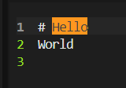

如果想省点事，基于内置主题创建自定义主题，则可以使用`TextAreaTheme`的类方法`get_builtin_theme`来创建一个内置主题的实例副本，然后单独修改该实例副本的相关属性，和直接传参创建实例对象的效果一样：

```python3
from textual.widgets.text_area import TextAreaTheme
from rich.style import Style

monokai = TextAreaTheme.get_builtin_theme('monokai')
monokai.name = 'monokai_1'
monokai.base_style = Style(bgcolor='yellow')
```

注册和使用就简单了，使用`register_theme`方法注册上面创建的主题对象，然后将`theme`属性设置为自定义主题名字即可。也可以使用内置方法`_set_theme`来使用指定的主题名字。

和主题类似，语法高亮除了内置的几种语言之外，也能扩展一些没有内置的语言。

在正式介绍扩展和填坑前面提了一嘴的`register_language`方法之前，先了解一下内置的语法高亮有哪些语言：

```python3
{
    "python",
    "json",
    "markdown",
    "yaml",
    "toml",
    "rust",
    "html",
    "css",
    "xml",
    "regex",
    "sql",
    "javascript",
    "java",
    "bash",
    "go",
}
```

看起来不太多，也少了不少常用的语言（比如C语言），那就需要扩展语言支持了。文本区域组件的语言高亮支持源于tree-sitter（[官网文档](https://tree-sitter.github.io/tree-sitter/index.html)），因此扩展方法也离不开和tree-sitter有关的库。

tree-sitter-language-pack库（完整介绍参考[官网](https://github.com/Goldziher/tree-sitter-language-pack)）是一个打包了tree-sitter具体语言扩展库的集成库，支持的语言如下：

```python3
{
    "actionscript",
    "ada",
    "agda",
    "arduino",
    "asm",
    "astro",
    "bash",
    "beancount",
    "bibtex",
    "bicep",
    "bitbake",
    "c",
    "cairo",
    "capnp",
    "chatito",
    "clarity",
    "clojure",
    "cmake",
    "comment",
    "commonlisp",
    "cpon",
    "cpp",
    "csharp",
    "css",
    "csv",
    "cuda",
    "d",
    "dart",
    "dockerfile",
    "doxygen",
    "dtd",
    "elisp",
    "elixir",
    "elm",
    "embeddedtemplate",
    "erlang",
    "fennel",
    "firrtl",
    "fish",
    "fortran",
    "func",
    "gdscript",
    "gitattributes",
    "gitcommit",
    "gitignore",
    "gleam",
    "glsl",
    "gn",
    "go",
    "gomod",
    "gosum",
    "groovy",
    "gstlaunch",
    "hack",
    "hare",
    "haskell",
    "haxe",
    "hcl",
    "heex",
    "hlsl",
    "html",
    "hyprlang",
    "ispc",
    "janet",
    "java",
    "javascript",
    "jsdoc",
    "json",
    "jsonnet",
    "julia",
    "kconfig",
    "kdl",
    "kotlin",
    "latex",
    "linkerscript",
    "llvm",
    "lua",
    "luadoc",
    "luap",
    "luau",
    "make",
    "markdown",
    "matlab",
    "mermaid",
    "meson",
    "ninja",
    "nix",
    "nqc",
    "objc",
    "odin",
    "org",
    "pascal",
    "pem",
    "perl",
    "pgn",
    "php",
    "po",
    "pony",
    "powershell",
    "printf",
    "prisma",
    "properties",
    "proto",
    "psv",
    "puppet",
    "purescript",
    "pymanifest",
    "python",
    "qmldir",
    "qmljs",
    "query",
    "r",
    "racket",
    "re2c",
    "readline",
    "requirements",
    "ron",
    "rst",
    "ruby",
    "rust",
    "scala",
    "scheme",
    "scss",
    "smali",
    "smithy",
    "solidity",
    "sparql",
    "swift",
    "sql",
    "squirrel",
    "starlark",
    "svelte",
    "tablegen",
    "tcl",
    "terraform",
    "test",
    "thrift",
    "toml",
    "tsv",
    "tsx",
    "twig",
    "typescript",
    "typst",
    "udev",
    "ungrammar",
    "uxntal",
    "v",
    "verilog",
    "vhdl",
    "vim",
    "vue",
    "wgsl",
    "xcompose",
    "xml",
    "yaml",
    "yuck",
    "zig",
    "magik",
}
```

使用下面的命令安装：

```shell
pip install tree-sitter-language-pack
```

接下来就以添加C语言的语法高亮支持为目的，详细介绍如何操作。

添加语法高亮支持离不开语法高亮定义文件（`.scm`），这就需要准备C语言的语法高亮定义文件。如果精通S表达式的话，可以自己编写一份语法高亮定义文件，如果不会S表达式，也有简单的方法，那就是从官方仓库中提供的tree-sitter具体语言扩展库的官方地址中，下载现成的语法高亮定义文件。具体语言扩展库的官方地址清单详见 https://github.com/Goldziher/tree-sitter-language-pack/blob/main/sources/language_definitions.json 或者下面的内容：

```json
{
  "actionscript": {
    "repo": "https://github.com/Rileran/tree-sitter-actionscript"
  },
  "ada": {
    "branch": "master",
    "repo": "https://github.com/briot/tree-sitter-ada"
  },
  "agda": {
    "branch": "master",
    "repo": "https://github.com/tree-sitter/tree-sitter-agda"
  },
  "arduino": {
    "branch": "master",
    "repo": "https://github.com/ObserverOfTime/tree-sitter-arduino"
  },
  "asm": {
    "repo": "https://github.com/rush-rs/tree-sitter-asm"
  },
  "astro": {
    "branch": "master",
    "repo": "https://github.com/virchau13/tree-sitter-astro"
  },
  "bash": {
    "branch": "master",
    "repo": "https://github.com/tree-sitter/tree-sitter-bash"
  },
  "beancount": {
    "branch": "master",
    "repo": "https://github.com/polarmutex/tree-sitter-beancount"
  },
  "bibtex": {
    "branch": "master",
    "repo": "https://github.com/latex-lsp/tree-sitter-bibtex"
  },
  "bicep": {
    "repo": "https://github.com/tree-sitter-grammars/tree-sitter-bicep"
  },
  "bitbake": {
    "repo": "https://github.com/tree-sitter-grammars/tree-sitter-bitbake"
  },
  "c": {
    "branch": "master",
    "repo": "https://github.com/tree-sitter/tree-sitter-c"
  },
  "cairo": {
    "repo": "https://github.com/tree-sitter-grammars/tree-sitter-cairo"
  },
  "capnp": {
    "repo": "https://github.com/tree-sitter-grammars/tree-sitter-capnp"
  },
  "chatito": {
    "repo": "https://github.com/tree-sitter-grammars/tree-sitter-chatito"
  },
  "clarity": {
    "repo": "https://github.com/xlittlerag/tree-sitter-clarity"
  },
  "clojure": {
    "branch": "master",
    "repo": "https://github.com/sogaiu/tree-sitter-clojure"
  },
  "cmake": {
    "branch": "master",
    "repo": "https://github.com/uyha/tree-sitter-cmake"
  },
  "comment": {
    "branch": "master",
    "repo": "https://github.com/stsewd/tree-sitter-comment"
  },
  "commonlisp": {
    "branch": "master",
    "repo": "https://github.com/theHamsta/tree-sitter-commonlisp"
  },
  "cpon": {
    "repo": "https://github.com/tree-sitter-grammars/tree-sitter-cpon"
  },
  "cpp": {
    "branch": "master",
    "repo": "https://github.com/tree-sitter/tree-sitter-cpp"
  },
  "css": {
    "branch": "master",
    "repo": "https://github.com/tree-sitter/tree-sitter-css"
  },
  "csv": {
    "branch": "master",
    "directory": "csv",
    "repo": "https://github.com/amaanq/tree-sitter-csv"
  },
  "cuda": {
    "repo": "https://github.com/tree-sitter-grammars/tree-sitter-cuda"
  },
  "d": {
    "repo": "https://github.com/gdamore/tree-sitter-d"
  },
  "dart": {
    "branch": "master",
    "repo": "https://github.com/UserNobody14/tree-sitter-dart"
  },
  "dockerfile": {
    "repo": "https://github.com/camdencheek/tree-sitter-dockerfile"
  },
  "doxygen": {
    "branch": "master",
    "repo": "https://github.com/tree-sitter-grammars/tree-sitter-doxygen"
  },
  "dtd": {
    "directory": "dtd",
    "repo": "https://github.com/tree-sitter-grammars/tree-sitter-xml"
  },
  "elisp": {
    "repo": "https://github.com/Wilfred/tree-sitter-elisp"
  },
  "elixir": {
    "repo": "https://github.com/elixir-lang/tree-sitter-elixir"
  },
  "elm": {
    "repo": "https://github.com/razzeee/tree-sitter-elm"
  },
  "erlang": {
    "repo": "https://github.com/WhatsApp/tree-sitter-erlang"
  },
  "fennel": {
    "branch": "master",
    "repo": "https://github.com/TravonteD/tree-sitter-fennel"
  },
  "firrtl": {
    "repo": "https://github.com/tree-sitter-grammars/tree-sitter-firrtl"
  },
  "fish": {
    "branch": "master",
    "repo": "https://github.com/ram02z/tree-sitter-fish"
  },
  "fortran": {
    "branch": "master",
    "repo": "https://github.com/stadelmanma/tree-sitter-fortran"
  },
  "func": {
    "repo": "https://github.com/tree-sitter-grammars/tree-sitter-func"
  },
  "gdscript": {
    "branch": "master",
    "repo": "https://github.com/PrestonKnopp/tree-sitter-gdscript"
  },
  "gitattributes": {
    "branch": "master",
    "repo": "https://github.com/ObserverOfTime/tree-sitter-gitattributes"
  },
  "gitcommit": {
    "repo": "https://github.com/gbprod/tree-sitter-gitcommit"
  },
  "gitignore": {
    "repo": "https://github.com/shunsambongi/tree-sitter-gitignore"
  },
  "gleam": {
    "repo": "https://github.com/gleam-lang/tree-sitter-gleam"
  },
  "glsl": {
    "branch": "master",
    "repo": "https://github.com/theHamsta/tree-sitter-glsl"
  },
  "gn": {
    "repo": "https://github.com/tree-sitter-grammars/tree-sitter-gn"
  },
  "go": {
    "branch": "master",
    "repo": "https://github.com/tree-sitter/tree-sitter-go"
  },
  "gomod": {
    "repo": "https://github.com/camdencheek/tree-sitter-go-mod"
  },
  "gosum": {
    "repo": "https://github.com/tree-sitter-grammars/tree-sitter-go-sum"
  },
  "groovy": {
    "branch": "gh-pages",
    "repo": "https://github.com/Decodetalkers/tree-sitter-groovy"
  },
  "gstlaunch": {
    "repo": "https://github.com/tree-sitter-grammars/tree-sitter-gstlaunch"
  },
  "hack": {
    "repo": "https://github.com/slackhq/tree-sitter-hack"
  },
  "hare": {
    "repo": "https://github.com/tree-sitter-grammars/tree-sitter-hare"
  },
  "haskell": {
    "branch": "master",
    "repo": "https://github.com/tree-sitter/tree-sitter-haskell"
  },
  "haxe": {
    "repo": "https://github.com/vantreeseba/tree-sitter-haxe"
  },
  "hcl": {
    "repo": "https://github.com/MichaHoffmann/tree-sitter-hcl"
  },
  "heex": {
    "repo": "https://github.com/phoenixframework/tree-sitter-heex"
  },
  "hlsl": {
    "branch": "master",
    "repo": "https://github.com/theHamsta/tree-sitter-hlsl"
  },
  "html": {
    "branch": "master",
    "repo": "https://github.com/tree-sitter/tree-sitter-html"
  },
  "hyprlang": {
    "branch": "master",
    "repo": "https://github.com/tree-sitter-grammars/tree-sitter-hyprlang"
  },
  "ispc": {
    "repo": "https://github.com/tree-sitter-grammars/tree-sitter-ispc"
  },
  "janet": {
    "branch": "master",
    "repo": "https://github.com/GrayJack/tree-sitter-janet"
  },
  "java": {
    "branch": "master",
    "repo": "https://github.com/tree-sitter/tree-sitter-java"
  },
  "javascript": {
    "branch": "master",
    "repo": "https://github.com/tree-sitter/tree-sitter-javascript"
  },
  "jsdoc": {
    "branch": "master",
    "repo": "https://github.com/tree-sitter/tree-sitter-jsdoc"
  },
  "json": {
    "branch": "master",
    "repo": "https://github.com/tree-sitter/tree-sitter-json"
  },
  "jsonnet": {
    "repo": "https://github.com/sourcegraph/tree-sitter-jsonnet"
  },
  "julia": {
    "branch": "master",
    "repo": "https://github.com/tree-sitter/tree-sitter-julia"
  },
  "kconfig": {
    "repo": "https://github.com/tree-sitter-grammars/tree-sitter-kconfig"
  },
  "kdl": {
    "repo": "https://github.com/tree-sitter-grammars/tree-sitter-kdl"
  },
  "kotlin": {
    "repo": "https://github.com/fwcd/tree-sitter-kotlin"
  },
  "latex": {
    "branch": "master",
    "generate": true,
    "repo": "https://github.com/latex-lsp/tree-sitter-latex"
  },
  "linkerscript": {
    "repo": "https://github.com/tree-sitter-grammars/tree-sitter-linkerscript"
  },
  "llvm": {
    "repo": "https://github.com/benwilliamgraham/tree-sitter-llvm"
  },
  "lua": {
    "repo": "https://github.com/MunifTanjim/tree-sitter-lua"
  },
  "luadoc": {
    "repo": "https://github.com/tree-sitter-grammars/tree-sitter-luadoc"
  },
  "luap": {
    "repo": "https://github.com/tree-sitter-grammars/tree-sitter-luap"
  },
  "luau": {
    "repo": "https://github.com/tree-sitter-grammars/tree-sitter-luau"
  },
  "magik": {
    "generate": true,
    "repo": "https://github.com/krn-robin/tree-sitter-magik"
  },
  "make": {
    "repo": "https://github.com/alemuller/tree-sitter-make"
  },
  "markdown": {
    "branch": "split_parser",
    "directory": "tree-sitter-markdown",
    "repo": "https://github.com/tree-sitter-grammars/tree-sitter-markdown"
  },
  "matlab": {
    "repo": "https://github.com/acristoffers/tree-sitter-matlab"
  },
  "mermaid": {
    "branch": "master",
    "repo": "https://github.com/monaqa/tree-sitter-mermaid"
  },
  "meson": {
    "branch": "master",
    "repo": "https://github.com/Decodetalkers/tree-sitter-meson"
  },
  "ninja": {
    "repo": "https://github.com/alemuller/tree-sitter-ninja"
  },
  "nix": {
    "branch": "master",
    "repo": "https://github.com/nix-community/tree-sitter-nix"
  },
  "nqc": {
    "repo": "https://github.com/tree-sitter-grammars/tree-sitter-nqc"
  },
  "objc": {
    "repo": "https://github.com/tree-sitter-grammars/tree-sitter-objc"
  },
  "odin": {
    "repo": "https://github.com/tree-sitter-grammars/tree-sitter-odin"
  },
  "org": {
    "repo": "https://github.com/milisims/tree-sitter-org"
  },
  "pascal": {
    "branch": "master",
    "repo": "https://github.com/Isopod/tree-sitter-pascal"
  },
  "pem": {
    "repo": "https://github.com/tree-sitter-grammars/tree-sitter-pem"
  },
  "perl": {
    "branch": "release",
    "repo": "https://github.com/tree-sitter-perl/tree-sitter-perl"
  },
  "pgn": {
    "branch": "master",
    "repo": "https://github.com/rolandwalker/tree-sitter-pgn"
  },
  "php": {
    "directory": "php",
    "repo": "https://github.com/tree-sitter/tree-sitter-php"
  },
  "po": {
    "repo": "https://github.com/tree-sitter-grammars/tree-sitter-po"
  },
  "pony": {
    "repo": "https://github.com/tree-sitter-grammars/tree-sitter-pony"
  },
  "powershell": {
    "repo": "https://github.com/airbus-cert/tree-sitter-powershell"
  },
  "printf": {
    "repo": "https://github.com/tree-sitter-grammars/tree-sitter-printf"
  },
  "prisma": {
    "branch": "master",
    "repo": "https://github.com/LumaKernel/tree-sitter-prisma"
  },
  "properties": {
    "repo": "https://github.com/tree-sitter-grammars/tree-sitter-properties"
  },
  "proto": {
    "repo": "https://github.com/coder3101/tree-sitter-proto"
  },
  "psv": {
    "branch": "master",
    "directory": "psv",
    "repo": "https://github.com/amaanq/tree-sitter-csv"
  },
  "puppet": {
    "repo": "https://github.com/tree-sitter-grammars/tree-sitter-puppet"
  },
  "purescript": {
    "repo": "https://github.com/postsolar/tree-sitter-purescript"
  },
  "pymanifest": {
    "repo": "https://github.com/tree-sitter-grammars/tree-sitter-pymanifest"
  },
  "python": {
    "branch": "master",
    "repo": "https://github.com/tree-sitter/tree-sitter-python"
  },
  "qmldir": {
    "repo": "https://github.com/tree-sitter-grammars/tree-sitter-qmldir"
  },
  "qmljs": {
    "branch": "master",
    "repo": "https://github.com/yuja/tree-sitter-qmljs"
  },
  "query": {
    "repo": "https://github.com/tree-sitter-grammars/tree-sitter-query"
  },
  "r": {
    "repo": "https://github.com/r-lib/tree-sitter-r"
  },
  "racket": {
    "repo": "https://github.com/6cdh/tree-sitter-racket"
  },
  "re2c": {
    "repo": "https://github.com/tree-sitter-grammars/tree-sitter-re2c"
  },
  "readline": {
    "repo": "https://github.com/tree-sitter-grammars/tree-sitter-readline"
  },
  "requirements": {
    "repo": "https://github.com/tree-sitter-grammars/tree-sitter-requirements"
  },
  "ron": {
    "repo": "https://github.com/tree-sitter-grammars/tree-sitter-ron"
  },
  "rst": {
    "branch": "master",
    "repo": "https://github.com/stsewd/tree-sitter-rst"
  },
  "ruby": {
    "branch": "master",
    "repo": "https://github.com/tree-sitter/tree-sitter-ruby"
  },
  "rust": {
    "branch": "master",
    "repo": "https://github.com/tree-sitter/tree-sitter-rust"
  },
  "scala": {
    "branch": "master",
    "repo": "https://github.com/tree-sitter/tree-sitter-scala"
  },
  "scheme": {
    "repo": "https://github.com/6cdh/tree-sitter-scheme"
  },
  "scss": {
    "repo": "https://github.com/tree-sitter-grammars/tree-sitter-scss"
  },
  "smali": {
    "repo": "https://github.com/tree-sitter-grammars/tree-sitter-smali"
  },
  "smithy": {
    "repo": "https://github.com/indoorvivants/tree-sitter-smithy"
  },
  "solidity": {
    "branch": "master",
    "repo": "https://github.com/JoranHonig/tree-sitter-solidity"
  },
  "sparql": {
    "repo": "https://github.com/GordianDziwis/tree-sitter-sparql"
  },
  "sql": {
    "generate": true,
    "repo": "https://github.com/DerekStride/tree-sitter-sql"
  },
  "squirrel": {
    "repo": "https://github.com/tree-sitter-grammars/tree-sitter-squirrel"
  },
  "starlark": {
    "repo": "https://github.com/tree-sitter-grammars/tree-sitter-starlark"
  },
  "svelte": {
    "branch": "master",
    "repo": "https://github.com/Himujjal/tree-sitter-svelte"
  },
  "swift": {
    "generate": true,
    "repo": "https://github.com/alex-pinkus/tree-sitter-swift"
  },
  "tablegen": {
    "branch": "master",
    "repo": "https://github.com/Flakebi/tree-sitter-tablegen"
  },
  "tcl": {
    "repo": "https://github.com/lewis6991/tree-sitter-tcl"
  },
  "terraform": {
    "directory": "dialects/terraform",
    "repo": "https://github.com/tree-sitter-grammars/tree-sitter-hcl"
  },
  "test": {
    "repo": "https://github.com/tree-sitter-grammars/tree-sitter-test"
  },
  "thrift": {
    "repo": "https://github.com/tree-sitter-grammars/tree-sitter-thrift"
  },
  "toml": {
    "branch": "master",
    "repo": "https://github.com/tree-sitter-grammars/tree-sitter-toml"
  },
  "tsv": {
    "branch": "master",
    "directory": "tsv",
    "repo": "https://github.com/amaanq/tree-sitter-csv"
  },
  "tsx": {
    "directory": "tsx",
    "repo": "https://github.com/tree-sitter/tree-sitter-typescript"
  },
  "twig": {
    "repo": "https://github.com/gbprod/tree-sitter-twig"
  },
  "typescript": {
    "directory": "typescript",
    "repo": "https://github.com/tree-sitter/tree-sitter-typescript"
  },
  "typst": {
    "branch": "master",
    "repo": "https://github.com/uben0/tree-sitter-typst"
  },
  "udev": {
    "repo": "https://github.com/tree-sitter-grammars/tree-sitter-udev"
  },
  "ungrammar": {
    "repo": "https://github.com/tree-sitter-grammars/tree-sitter-ungrammar"
  },
  "uxntal": {
    "repo": "https://github.com/tree-sitter-grammars/tree-sitter-uxntal"
  },
  "v": {
    "branch": "master",
    "repo": "https://github.com/nedpals/tree-sitter-v"
  },
  "verilog": {
    "repo": "https://github.com/tree-sitter/tree-sitter-verilog"
  },
  "vhdl": {
    "repo": "https://github.com/alemuller/tree-sitter-vhdl"
  },
  "vim": {
    "repo": "https://github.com/tree-sitter-grammars/tree-sitter-vim"
  },
  "vue": {
    "repo": "https://github.com/tree-sitter-grammars/tree-sitter-vue"
  },
  "wgsl": {
    "branch": "master",
    "repo": "https://github.com/szebniok/tree-sitter-wgsl"
  },
  "xcompose": {
    "repo": "https://github.com/tree-sitter-grammars/tree-sitter-xcompose"
  },
  "xml": {
    "directory": "xml",
    "repo": "https://github.com/tree-sitter-grammars/tree-sitter-xml"
  },
  "yuck": {
    "repo": "https://github.com/tree-sitter-grammars/tree-sitter-yuck"
  },
  "zig": {
    "repo": "https://github.com/maxxnino/tree-sitter-zig"
  }
}
```

从上面的清单中很容易就找到C语言扩展库的官方地址是`https://github.com/tree-sitter/tree-sitter-c`，访问这个地址，在`queries`子文件夹下找到`highlights.scm`，这里面的内容就是后续步骤需要的，具体如下：

```
(identifier) @variable

((identifier) @constant
 (#match? @constant "^[A-Z][A-Z\\d_]*$"))

"break" @keyword
"case" @keyword
"const" @keyword
"continue" @keyword
"default" @keyword
"do" @keyword
"else" @keyword
"enum" @keyword
"extern" @keyword
"for" @keyword
"if" @keyword
"inline" @keyword
"return" @keyword
"sizeof" @keyword
"static" @keyword
"struct" @keyword
"switch" @keyword
"typedef" @keyword
"union" @keyword
"volatile" @keyword
"while" @keyword

"#define" @keyword
"#elif" @keyword
"#else" @keyword
"#endif" @keyword
"#if" @keyword
"#ifdef" @keyword
"#ifndef" @keyword
"#include" @keyword
(preproc_directive) @keyword

"--" @operator
"-" @operator
"-=" @operator
"->" @operator
"=" @operator
"!=" @operator
"*" @operator
"&" @operator
"&&" @operator
"+" @operator
"++" @operator
"+=" @operator
"<" @operator
"==" @operator
">" @operator
"||" @operator

"." @delimiter
";" @delimiter

(string_literal) @string
(system_lib_string) @string

(null) @constant
(number_literal) @number
(char_literal) @number

(field_identifier) @property
(statement_identifier) @label
(type_identifier) @type
(primitive_type) @type
(sized_type_specifier) @type

(call_expression
  function: (identifier) @function)
(call_expression
  function: (field_expression
    field: (field_identifier) @function))
(function_declarator
  declarator: (identifier) @function)
(preproc_function_def
  name: (identifier) @function.special)

(comment) @comment
```

添加语法高亮需要先使用`register_language`方法注册，再设置`language`属性为语言名字来切换。`register_language`方法需要三个参数：

-   `name`参数，字符串类型，表示该语言的名称。
-   `language`参数，`Language`类型，该语言对应的tree-sitter实现的`Language`对象。
-   `highlight_query`参数，字符串类型，表示该语言的关键字、注释等的高亮定义。

tree-sitter-language-pack库提供的`get_language`方法（使用`from tree_sitter_language_pack import get_language`导入）可以传入字符串类型的语言名，直接得到tree-sitter实现的`Language`对象。而`highlight_query`参数就是`highlights.scm`的内容，

代码就可以这样写：

```python3
from textual.app import App
from textual.widgets import TextArea
from tree_sitter_language_pack import get_language

lang = get_language('c')
# 可以从文件中读取高亮定义
# from pathlib import Path
# query = (Path(__file__).parent / "c_highlights.scm").read_text()
# 也可以直接嵌入源代码中（字符串中内容同c_highlights.scm）
query = '''\
(identifier) @variable

((identifier) @constant
 (#match? @constant "^[A-Z][A-Z\\d_]*$"))

"break" @keyword
"case" @keyword
"const" @keyword
"continue" @keyword
"default" @keyword
"do" @keyword
"else" @keyword
"enum" @keyword
"extern" @keyword
"for" @keyword
"if" @keyword
"inline" @keyword
"return" @keyword
"sizeof" @keyword
"static" @keyword
"struct" @keyword
"switch" @keyword
"typedef" @keyword
"union" @keyword
"volatile" @keyword
"while" @keyword

"#define" @keyword
"#elif" @keyword
"#else" @keyword
"#endif" @keyword
"#if" @keyword
"#ifdef" @keyword
"#ifndef" @keyword
"#include" @keyword
(preproc_directive) @keyword

"--" @operator
"-" @operator
"-=" @operator
"->" @operator
"=" @operator
"!=" @operator
"*" @operator
"&" @operator
"&&" @operator
"+" @operator
"++" @operator
"+=" @operator
"<" @operator
"==" @operator
">" @operator
"||" @operator

"." @delimiter
";" @delimiter

(string_literal) @string
(system_lib_string) @string

(null) @constant
(number_literal) @number
(char_literal) @number

(field_identifier) @property
(statement_identifier) @label
(type_identifier) @type
(primitive_type) @type
(sized_type_specifier) @type

(call_expression
  function: (identifier) @function)
(call_expression
  function: (field_expression
    field: (field_identifier) @function))
(function_declarator
  declarator: (identifier) @function)
(preproc_function_def
  name: (identifier) @function.special)

(comment) @comment
'''

code = '''\
#include <stdio.h>

int main() {
    printf('Hello World!');
    return 0;
}
'''
class MyApp(App):
    def on_mount(self):
        self.widgets = [
            TextArea.code_editor(text=code)
        ]
        self.mount_all(self.widgets)
        text_area = self.query_one(TextArea)
        text_area.register_language('c_lang', lang, query)
        text_area.language = 'c_lang'

if __name__ == '__main__':
    app = MyApp()
    app.run()
```

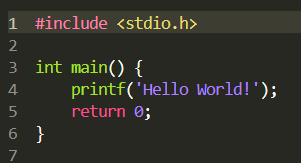

除了使用这种第三方整合实现的扩展库，也可以直接使用对应语言的语法高亮扩展库，仅安装对应语言的语法高亮扩展库，可以让部署所需的体积小一些。

这样的话，上面的代码就只需使用`tree_sitter_c`：

```python3
from tree_sitter import Language
from tree_sitter_c import language as c_lang

# 特定语言的库需要与tree_sitter匹配
# tree_sitter==0.24.*时，兼容的LANGUAGE_VERSION为13、14
# tree_sitter_c==0.23.4的LANGUAGE_VERSION为14
# tree_sitter_c==0.23.5的LANGUAGE_VERSION为15
# 因此需要安装tree_sitter_c==0.23.4
# 命令行为 pip install tree-sitter-c==0.23.4

from textual.app import App
from textual.widgets import TextArea

lang = Language(c_lang())
# 可以从文件中读取高亮定义
# from pathlib import Path
# query = (Path(__file__).parent / "c_highlights.scm").read_text()
# 也可以直接嵌入源代码中（字符串中内容同c_highlights.scm）
query = '''\
(identifier) @variable

((identifier) @constant
 (#match? @constant "^[A-Z][A-Z\\d_]*$"))

"break" @keyword
"case" @keyword
"const" @keyword
"continue" @keyword
"default" @keyword
"do" @keyword
"else" @keyword
"enum" @keyword
"extern" @keyword
"for" @keyword
"if" @keyword
"inline" @keyword
"return" @keyword
"sizeof" @keyword
"static" @keyword
"struct" @keyword
"switch" @keyword
"typedef" @keyword
"union" @keyword
"volatile" @keyword
"while" @keyword

"#define" @keyword
"#elif" @keyword
"#else" @keyword
"#endif" @keyword
"#if" @keyword
"#ifdef" @keyword
"#ifndef" @keyword
"#include" @keyword
(preproc_directive) @keyword

"--" @operator
"-" @operator
"-=" @operator
"->" @operator
"=" @operator
"!=" @operator
"*" @operator
"&" @operator
"&&" @operator
"+" @operator
"++" @operator
"+=" @operator
"<" @operator
"==" @operator
">" @operator
"||" @operator

"." @delimiter
";" @delimiter

(string_literal) @string
(system_lib_string) @string

(null) @constant
(number_literal) @number
(char_literal) @number

(field_identifier) @property
(statement_identifier) @label
(type_identifier) @type
(primitive_type) @type
(sized_type_specifier) @type

(call_expression
  function: (identifier) @function)
(call_expression
  function: (field_expression
    field: (field_identifier) @function))
(function_declarator
  declarator: (identifier) @function)
(preproc_function_def
  name: (identifier) @function.special)

(comment) @comment
'''

code = '''\
#include <stdio.h>

int main() {
    printf('Hello World!');
    return 0;
}
'''
class MyApp(App):
    def on_mount(self):
        self.widgets = [
            TextArea.code_editor(text=code)
        ]
        self.mount_all(self.widgets)
        text_area = self.query_one(TextArea)
        text_area.register_language('c_lang', lang, query)
        text_area.language = 'c_lang'

if __name__ == '__main__':
    app = MyApp()
    app.run()
```

当然，如果读者学有余力，也可以研究一下两种库都支持的兼容代码，权衡一下用哪个库更好：

```python3
try:
    from tree_sitter import Language
    from tree_sitter_c import language as c_lang
    tree_sitter = True
except ImportError:
    try:
        from tree_sitter_language_pack import get_language
    except ImportError:
        raise Exception('No method to parse language.')
    tree_sitter = False

# 特定语言的库需要与tree_sitter匹配
# tree_sitter==0.24.*时，兼容的LANGUAGE_VERSION为13、14
# tree_sitter_c==0.23.4的LANGUAGE_VERSION为14
# tree_sitter_c==0.23.5的LANGUAGE_VERSION为15
# 因此需要安装tree_sitter_c==0.23.4
# 命令行为 pip install tree-sitter-c==0.23.4

from textual.app import App
from textual.widgets import TextArea

lang = Language(c_lang()) if tree_sitter else get_language('c')
# 可以从文件中读取高亮定义
# from pathlib import Path
# query = (Path(__file__).parent / "c_highlights.scm").read_text()
# 也可以直接嵌入源代码中（字符串中内容同c_highlights.scm）
query = '''\
(identifier) @variable

((identifier) @constant
 (#match? @constant "^[A-Z][A-Z\\d_]*$"))

"break" @keyword
"case" @keyword
"const" @keyword
"continue" @keyword
"default" @keyword
"do" @keyword
"else" @keyword
"enum" @keyword
"extern" @keyword
"for" @keyword
"if" @keyword
"inline" @keyword
"return" @keyword
"sizeof" @keyword
"static" @keyword
"struct" @keyword
"switch" @keyword
"typedef" @keyword
"union" @keyword
"volatile" @keyword
"while" @keyword

"#define" @keyword
"#elif" @keyword
"#else" @keyword
"#endif" @keyword
"#if" @keyword
"#ifdef" @keyword
"#ifndef" @keyword
"#include" @keyword
(preproc_directive) @keyword

"--" @operator
"-" @operator
"-=" @operator
"->" @operator
"=" @operator
"!=" @operator
"*" @operator
"&" @operator
"&&" @operator
"+" @operator
"++" @operator
"+=" @operator
"<" @operator
"==" @operator
">" @operator
"||" @operator

"." @delimiter
";" @delimiter

(string_literal) @string
(system_lib_string) @string

(null) @constant
(number_literal) @number
(char_literal) @number

(field_identifier) @property
(statement_identifier) @label
(type_identifier) @type
(primitive_type) @type
(sized_type_specifier) @type

(call_expression
  function: (identifier) @function)
(call_expression
  function: (field_expression
    field: (field_identifier) @function))
(function_declarator
  declarator: (identifier) @function)
(preproc_function_def
  name: (identifier) @function.special)

(comment) @comment
'''

code = '''\
#include <stdio.h>

int main() {
    printf('Hello World!');
    return 0;
}
'''
class MyApp(App):
    def on_mount(self):
        self.widgets = [
            TextArea.code_editor(text=code)
        ]
        self.mount_all(self.widgets)
        text_area = self.query_one(TextArea)
        text_area.register_language('c_lang', lang, query)
        text_area.language = 'c_lang'

if __name__ == '__main__':
    app = MyApp()
    app.run()
```

如果不想自己下载语法高亮定义，或者觉得这种显示C语言代码的方式有点啰嗦，可以尝试使用Rich的`Syntax`（使用`from rich.syntax import Syntax`导入，完整用法参考[官网文档](https://rich.readthedocs.io/en/latest/reference/syntax.html)），在支持可渲染对象的组件中显示C语言代码。只需在创建`Syntax`对象时传入代码内容和语言别名（支持的语言别名可以参考[文档](https://pygments.org/docs/lexers/)中的`Short names`）即可。

注意，文本区域组件不支持可渲染对象，因此下面的实例使用静态文本组件显示`Syntax`对象。

示例如下：

```python3
from textual.app import App
from textual.widgets import Static
from rich.syntax import Syntax

code = '''\
#include <stdio.h>

int main() {
    printf('Hello World!');
    return 0;
}
'''
syntax = Syntax(code,'c')

class MyApp(App):
    def on_mount(self):
        self.widgets = [
            Static(syntax)
        ]
        self.mount_all(self.widgets)

if __name__ == '__main__':
    app = MyApp()
    app.run()
```

代码看上去简洁不少，效果也不差：

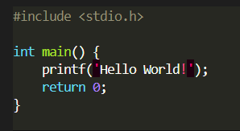

对于想要知道支持语言的别名但不方便查阅文档的读者，也可以参考下面的内容，找到对应支持的语言（格式为`{语言}:({对应的别名})`）：

```python3
'ABAP':('abap',)
'AMDGPU':('amdgpu',)
'APL':('apl',)
'ABNF':('abnf',)
'ActionScript 3':('actionscript3', 'as3')
'ActionScript':('actionscript', 'as')
'Ada':('ada', 'ada95', 'ada2005')
'ADL':('adl',)
'Agda':('agda',)
'Aheui':('aheui',)
'Alloy':('alloy',)
'AmbientTalk':('ambienttalk', 'ambienttalk/2', 'at')
'Ampl':('ampl',)
'HTML + Angular2':('html+ng2',)
'Angular2':('ng2',)
'ANTLR With ActionScript Target':('antlr-actionscript', 'antlr-as')
'ANTLR With C# Target':('antlr-csharp', 'antlr-c#')
'ANTLR With CPP Target':('antlr-cpp',)
'ANTLR With Java Target':('antlr-java',)
'ANTLR':('antlr',)
'ANTLR With ObjectiveC Target':('antlr-objc',)
'ANTLR With Perl Target':('antlr-perl',)
'ANTLR With Python Target':('antlr-python',)
'ANTLR With Ruby Target':('antlr-ruby', 'antlr-rb')
'ApacheConf':('apacheconf', 'aconf', 'apache')
'AppleScript':('applescript',)
'Arduino':('arduino',)
'Arrow':('arrow',)
'Arturo':('arturo', 'art')
'ASCII armored':('asc', 'pem')
'ASN.1':('asn1',)
'AspectJ':('aspectj',)
'Asymptote':('asymptote', 'asy')
'Augeas':('augeas',)
'AutoIt':('autoit',)
'autohotkey':('autohotkey', 'ahk')
'Awk':('awk', 'gawk', 'mawk', 'nawk')
'BBC Basic':('bbcbasic',)
'BBCode':('bbcode',)
'BC':('bc',)
'BQN':('bqn',)
'BST':('bst', 'bst-pybtex')
'BARE':('bare',)
'Base Makefile':('basemake',)
'Bash':('bash', 'sh', 'ksh', 'zsh', 'shell', 'openrc')
'Bash Session':('console', 'shell-session')
'Batchfile':('batch', 'bat', 'dosbatch', 'winbatch')
'Bdd':('bdd',)
'Befunge':('befunge',)
'Berry':('berry', 'be')
'BibTeX':('bibtex', 'bib')
'BlitzBasic':('blitzbasic', 'b3d', 'bplus')
'BlitzMax':('blitzmax', 'bmax')
'Blueprint':('blueprint',)
'BNF':('bnf',)
'Boa':('boa',)
'Boo':('boo',)
'Boogie':('boogie',)
'Brainfuck':('brainfuck', 'bf')
'BUGS':('bugs', 'winbugs', 'openbugs')
'CAmkES':('camkes', 'idl4')
'C':('c',)
'CMake':('cmake',)
'c-objdump':('c-objdump',)
'CPSA':('cpsa',)
'CSS+UL4':('css+ul4',)
'aspx-cs':('aspx-cs',)
'C#':('csharp', 'c#', 'cs')
'ca65 assembler':('ca65',)
'cADL':('cadl',)
'CapDL':('capdl',)
'Cap'n Proto':('capnp',)
'Carbon':('carbon',)
'CBM BASIC V2':('cbmbas',)
'CDDL':('cddl',)
'Ceylon':('ceylon',)
'CFEngine3':('cfengine3', 'cf3')
'ChaiScript':('chaiscript', 'chai')
'Chapel':('chapel', 'chpl')
'Charmci':('charmci',)
'HTML+Cheetah':('html+cheetah', 'html+spitfire', 'htmlcheetah')
'JavaScript+Cheetah':('javascript+cheetah', 'js+cheetah', 'javascript+spitfire', 'js+spitfire')
'Cheetah':('cheetah', 'spitfire')
'XML+Cheetah':('xml+cheetah', 'xml+spitfire')
'Cirru':('cirru',)
'Clay':('clay',)
'Clean':('clean',)
'Clojure':('clojure', 'clj')
'ClojureScript':('clojurescript', 'cljs')
'COBOLFree':('cobolfree',)
'COBOL':('cobol',)
'CodeQL':('codeql', 'ql')
'CoffeeScript':('coffeescript', 'coffee-script', 'coffee')
'Coldfusion CFC':('cfc',)
'Coldfusion HTML':('cfm',)
'cfstatement':('cfs',)
'COMAL-80':('comal', 'comal80')
'Common Lisp':('common-lisp', 'cl', 'lisp')
'Component Pascal':('componentpascal', 'cp')
'Coq':('coq',)
'cplint':('cplint',)
'C++':('cpp', 'c++')
'cpp-objdump':('cpp-objdump', 'c++-objdumb', 'cxx-objdump')
'Crmsh':('crmsh', 'pcmk')
'Croc':('croc',)
'Cryptol':('cryptol', 'cry')
'Crystal':('cr', 'crystal')
'Csound Document':('csound-document', 'csound-csd')
'Csound Orchestra':('csound', 'csound-orc')
'Csound Score':('csound-score', 'csound-sco')
'CSS+Django/Jinja':('css+django', 'css+jinja')
'CSS+Ruby':('css+ruby', 'css+erb')
'CSS+Genshi Text':('css+genshitext', 'css+genshi')
'CSS':('css',)
'CSS+PHP':('css+php',)
'CSS+Smarty':('css+smarty',)
'CUDA':('cuda', 'cu')
'Cypher':('cypher',)
'Cython':('cython', 'pyx', 'pyrex')
'D':('d',)
'd-objdump':('d-objdump',)
'Darcs Patch':('dpatch',)
'Dart':('dart',)
'DASM16':('dasm16',)
'Dax':('dax',)
'Debian Control file':('debcontrol', 'control')
'Debian Sources file':('debian.sources',)
'Delphi':('delphi', 'pas', 'pascal', 'objectpascal')
'Desktop file':('desktop',)
'Devicetree':('devicetree', 'dts')
'dg':('dg',)
'Diff':('diff', 'udiff')
'Django/Jinja':('django', 'jinja')
'Zone':('zone',)
'Docker':('docker', 'dockerfile')
'DTD':('dtd',)
'Duel':('duel', 'jbst', 'jsonml+bst')
'Dylan session':('dylan-console', 'dylan-repl')
'Dylan':('dylan',)
'DylanLID':('dylan-lid', 'lid')
'ECL':('ecl',)
'eC':('ec',)
'Earl Grey':('earl-grey', 'earlgrey', 'eg')
'Easytrieve':('easytrieve',)
'EBNF':('ebnf',)
'Eiffel':('eiffel',)
'Elixir iex session':('iex',)
'Elixir':('elixir', 'ex', 'exs')
'Elm':('elm',)
'Elpi':('elpi',)
'EmacsLisp':('emacs-lisp', 'elisp', 'emacs')
'E-mail':('email', 'eml')
'ERB':('erb',)
'Erlang':('erlang',)
'Erlang erl session':('erl',)
'HTML+Evoque':('html+evoque',)
'Evoque':('evoque',)
'XML+Evoque':('xml+evoque',)
'execline':('execline',)
'Ezhil':('ezhil',)
'F#':('fsharp', 'f#')
'FStar':('fstar',)
'Factor':('factor',)
'Fancy':('fancy', 'fy')
'Fantom':('fan',)
'Felix':('felix', 'flx')
'Fennel':('fennel', 'fnl')
'Fift':('fift', 'fif')
'Fish':('fish', 'fishshell')
'Flatline':('flatline',)
'FloScript':('floscript', 'flo')
'Forth':('forth',)
'FortranFixed':('fortranfixed',)
'Fortran':('fortran', 'f90')
'FoxPro':('foxpro', 'vfp', 'clipper', 'xbase')
'Freefem':('freefem',)
'FunC':('func', 'fc')
'Futhark':('futhark',)
'GAP session':('gap-console', 'gap-repl')
'GAP':('gap',)
'GDScript':('gdscript', 'gd')
'GLSL':('glsl',)
'GSQL':('gsql',)
'GAS':('gas', 'asm')
'g-code':('gcode',)
'Genshi':('genshi', 'kid', 'xml+genshi', 'xml+kid')
'Genshi Text':('genshitext',)
'Gettext Catalog':('pot', 'po')
'Gherkin':('gherkin', 'cucumber')
'Gleam':('gleam',)
'Gnuplot':('gnuplot',)
'Go':('go', 'golang')
'Golo':('golo',)
'GoodData-CL':('gooddata-cl',)
'GoogleSQL':('googlesql', 'zetasql')
'Gosu':('gosu',)
'Gosu Template':('gst',)
'GraphQL':('graphql',)
'Graphviz':('graphviz', 'dot')
'Groff':('groff', 'nroff', 'man')
'Groovy':('groovy',)
'HLSL':('hlsl',)
'HTML+UL4':('html+ul4',)
'Haml':('haml',)
'HTML+Handlebars':('html+handlebars',)
'Handlebars':('handlebars',)
'Hare':('hare',)
'Haskell':('haskell', 'hs')
'Haxe':('haxe', 'hxsl', 'hx')
'Hexdump':('hexdump',)
'HSAIL':('hsail', 'hsa')
'Hspec':('hspec',)
'HTML+Django/Jinja':('html+django', 'html+jinja', 'htmldjango')
'HTML+Genshi':('html+genshi', 'html+kid')
'HTML':('html',)
'HTML+PHP':('html+php',)
'HTML+Smarty':('html+smarty',)
'HTTP':('http',)
'Hxml':('haxeml', 'hxml')
'Hy':('hylang', 'hy')
'Hybris':('hybris',)
'IDL':('idl',)
'Icon':('icon',)
'Idris':('idris', 'idr')
'Igor':('igor', 'igorpro')
'Inform 6':('inform6', 'i6')
'Inform 6 template':('i6t',)
'Inform 7':('inform7', 'i7')
'INI':('ini', 'cfg', 'dosini')
'Io':('io',)
'Ioke':('ioke', 'ik')
'IRC logs':('irc',)
'Isabelle':('isabelle',)
'J':('j',)
'JMESPath':('jmespath', 'jp')
'JSLT':('jslt',)
'JAGS':('jags',)
'Janet':('janet',)
'Jasmin':('jasmin', 'jasminxt')
'Java':('java',)
'JavaScript+Django/Jinja':('javascript+django', 'js+django', 'javascript+jinja', 'js+jinja')
'JavaScript+Ruby':('javascript+ruby', 'js+ruby', 'javascript+erb', 'js+erb')
'JavaScript+Genshi Text':('js+genshitext', 'js+genshi', 'javascript+genshitext', 'javascript+genshi')
'JavaScript':('javascript', 'js')
'JavaScript+PHP':('javascript+php', 'js+php')
'JavaScript+Smarty':('javascript+smarty', 'js+smarty')
'Javascript+UL4':('js+ul4',)
'JCL':('jcl',)
'JSGF':('jsgf',)
'JSON5':('json5',)
'JSON-LD':('jsonld', 'json-ld')
'JSON':('json', 'json-object')
'Jsonnet':('jsonnet',)
'Java Server Page':('jsp',)
'JSX':('jsx', 'react')
'Julia console':('jlcon', 'julia-repl')
'Julia':('julia', 'jl')
'Juttle':('juttle',)
'K':('k',)
'Kal':('kal',)
'Kconfig':('kconfig', 'menuconfig', 'linux-config', 'kernel-config')
'Kernel log':('kmsg', 'dmesg')
'Koka':('koka',)
'Kotlin':('kotlin',)
'Kuin':('kuin',)
'Kusto':('kql', 'kusto')
'LSL':('lsl',)
'CSS+Lasso':('css+lasso',)
'HTML+Lasso':('html+lasso',)
'JavaScript+Lasso':('javascript+lasso', 'js+lasso')
'Lasso':('lasso', 'lassoscript')
'XML+Lasso':('xml+lasso',)
'LDAP configuration file':('ldapconf', 'ldaprc')
'LDIF':('ldif',)
'Lean':('lean', 'lean3')
'Lean4':('lean4',)
'LessCss':('less',)
'Lighttpd configuration file':('lighttpd', 'lighty')
'LilyPond':('lilypond',)
'Limbo':('limbo',)
'liquid':('liquid',)
'Literate Agda':('literate-agda', 'lagda')
'Literate Cryptol':('literate-cryptol', 'lcryptol', 'lcry')
'Literate Haskell':('literate-haskell', 'lhaskell', 'lhs')
'Literate Idris':('literate-idris', 'lidris', 'lidr')
'LiveScript':('livescript', 'live-script')
'LLVM':('llvm',)
'LLVM-MIR Body':('llvm-mir-body',)
'LLVM-MIR':('llvm-mir',)
'Logos':('logos',)
'Logtalk':('logtalk',)
'Lua':('lua',)
'Luau':('luau',)
'MCFunction':('mcfunction', 'mcf')
'MCSchema':('mcschema',)
'MIME':('mime',)
'MIPS':('mips',)
'MOOCode':('moocode', 'moo')
'MSDOS Session':('doscon',)
'Macaulay2':('macaulay2',)
'Makefile':('make', 'makefile', 'mf', 'bsdmake')
'CSS+Mako':('css+mako',)
'HTML+Mako':('html+mako',)
'JavaScript+Mako':('javascript+mako', 'js+mako')
'Mako':('mako',)
'XML+Mako':('xml+mako',)
'Maple':('maple',)
'MAQL':('maql',)
'Markdown':('markdown', 'md')
'Mask':('mask',)
'Mason':('mason',)
'Mathematica':('mathematica', 'mma', 'nb')
'Matlab':('matlab',)
'Matlab session':('matlabsession',)
'Maxima':('maxima', 'macsyma')
'Meson':('meson', 'meson.build')
'MiniD':('minid',)
'MiniScript':('miniscript', 'ms')
'Modelica':('modelica',)
'Modula-2':('modula2', 'm2')
'MoinMoin/Trac Wiki markup':('trac-wiki', 'moin')
'Mojo':('mojo', '🔥')
'Monkey':('monkey',)
'Monte':('monte',)
'MoonScript':('moonscript', 'moon')
'Mosel':('mosel',)
'CSS+mozpreproc':('css+mozpreproc',)
'mozhashpreproc':('mozhashpreproc',)
'Javascript+mozpreproc':('javascript+mozpreproc',)
'mozpercentpreproc':('mozpercentpreproc',)
'XUL+mozpreproc':('xul+mozpreproc',)
'MQL':('mql', 'mq4', 'mq5', 'mql4', 'mql5')
'Mscgen':('mscgen', 'msc')
'MuPAD':('mupad',)
'MXML':('mxml',)
'MySQL':('mysql',)
'CSS+Myghty':('css+myghty',)
'HTML+Myghty':('html+myghty',)
'JavaScript+Myghty':('javascript+myghty', 'js+myghty')
'Myghty':('myghty',)
'XML+Myghty':('xml+myghty',)
'NCL':('ncl',)
'NSIS':('nsis', 'nsi', 'nsh')
'NASM':('nasm',)
'objdump-nasm':('objdump-nasm',)
'Nemerle':('nemerle',)
'nesC':('nesc',)
'NestedText':('nestedtext', 'nt')
'NewLisp':('newlisp',)
'Newspeak':('newspeak',)
'Nginx configuration file':('nginx',)
'Nimrod':('nimrod', 'nim')
'Nit':('nit',)
'Nix':('nixos', 'nix')
'Node.js REPL console session':('nodejsrepl',)
'Notmuch':('notmuch',)
'NuSMV':('nusmv',)
'NumPy':('numpy',)
'Numba_IR':('numba_ir', 'numbair')
'objdump':('objdump',)
'Objective-C':('objective-c', 'objectivec', 'obj-c', 'objc')
'Objective-C++':('objective-c++', 'objectivec++', 'obj-c++', 'objc++')
'Objective-J':('objective-j', 'objectivej', 'obj-j', 'objj')
'OCaml':('ocaml',)
'Octave':('octave',)
'ODIN':('odin',)
'OMG Interface Definition Language':('omg-idl',)
'Ooc':('ooc',)
'Opa':('opa',)
'OpenEdge ABL':('openedge', 'abl', 'progress')
'OpenSCAD':('openscad',)
'Org Mode':('org', 'orgmode', 'org-mode')
'Text output':('output',)
'PacmanConf':('pacmanconf',)
'Pan':('pan',)
'ParaSail':('parasail',)
'Pawn':('pawn',)
'PDDL':('pddl',)
'PEG':('peg',)
'Perl6':('perl6', 'pl6', 'raku')
'Perl':('perl', 'pl')
'Phix':('phix',)
'PHP':('php', 'php3', 'php4', 'php5')
'Pig':('pig',)
'Pike':('pike',)
'PkgConfig':('pkgconfig',)
'PL/pgSQL':('plpgsql',)
'Pointless':('pointless',)
'Pony':('pony',)
'Portugol':('portugol',)
'PostScript':('postscript', 'postscr')
'PostgreSQL console (psql)':('psql', 'postgresql-console', 'postgres-console')
'PostgreSQL EXPLAIN dialect':('postgres-explain',)
'PostgreSQL SQL dialect':('postgresql', 'postgres')
'POVRay':('pov',)
'PowerShell':('powershell', 'pwsh', 'posh', 'ps1', 'psm1')
'PowerShell Session':('pwsh-session', 'ps1con')
'Praat':('praat',)
'Procfile':('procfile',)
'Prolog':('prolog',)
'PromQL':('promql',)
'Promela':('promela',)
'Properties':('properties', 'jproperties')
'Protocol Buffer':('protobuf', 'proto')
'PRQL':('prql',)
'PsySH console session for PHP':('psysh',)
'PTX':('ptx',)
'Pug':('pug', 'jade')
'Puppet':('puppet',)
'PyPy Log':('pypylog', 'pypy')
'Python 2.x':('python2', 'py2')
'Python 2.x Traceback':('py2tb',)
'Python console session':('pycon', 'python-console')
'Python':('python', 'py', 'sage', 'python3', 'py3', 'bazel', 'starlark', 'pyi')
'Python Traceback':('pytb', 'py3tb')
'Python+UL4':('py+ul4',)
'QBasic':('qbasic', 'basic')
'Q':('q',)
'QVTO':('qvto', 'qvt')
'Qlik':('qlik', 'qlikview', 'qliksense', 'qlikscript')
'QML':('qml', 'qbs')
'RConsole':('rconsole', 'rout')
'Relax-NG Compact':('rng-compact', 'rnc')
'RPMSpec':('spec',)
'Racket':('racket', 'rkt')
'Ragel in C Host':('ragel-c',)
'Ragel in CPP Host':('ragel-cpp',)
'Ragel in D Host':('ragel-d',)
'Embedded Ragel':('ragel-em',)
'Ragel in Java Host':('ragel-java',)
'Ragel':('ragel',)
'Ragel in Objective C Host':('ragel-objc',)
'Ragel in Ruby Host':('ragel-ruby', 'ragel-rb')
'Rd':('rd',)
'ReasonML':('reasonml', 'reason')
'REBOL':('rebol',)
'Red':('red', 'red/system')
'Redcode':('redcode',)
'reg':('registry',)
'Rego':('rego',)
'ResourceBundle':('resourcebundle', 'resource')
'Rexx':('rexx', 'arexx')
'RHTML':('rhtml', 'html+erb', 'html+ruby')
'Ride':('ride',)
'Rita':('rita',)
'Roboconf Graph':('roboconf-graph',)
'Roboconf Instances':('roboconf-instances',)
'RobotFramework':('robotframework',)
'RQL':('rql',)
'RSL':('rsl',)
'reStructuredText':('restructuredtext', 'rst', 'rest')
'TrafficScript':('trafficscript', 'rts')
'Ruby irb session':('rbcon', 'irb')
'Ruby':('ruby', 'rb', 'duby')
'Rust':('rust', 'rs')
'SAS':('sas',)
'S':('splus', 's', 'r')
'Standard ML':('sml',)
'SNBT':('snbt',)
'SARL':('sarl',)
'Sass':('sass',)
'Savi':('savi',)
'Scala':('scala',)
'Scaml':('scaml',)
'scdoc':('scdoc', 'scd')
'Scheme':('scheme', 'scm')
'Scilab':('scilab',)
'SCSS':('scss',)
'Sed':('sed', 'gsed', 'ssed')
'ShExC':('shexc', 'shex')
'Shen':('shen',)
'Sieve':('sieve',)
'Silver':('silver',)
'Singularity':('singularity',)
'Slash':('slash',)
'Slim':('slim',)
'Slurm':('slurm', 'sbatch')
'Smali':('smali',)
'Smalltalk':('smalltalk', 'squeak', 'st')
'SmartGameFormat':('sgf',)
'Smarty':('smarty',)
'Smithy':('smithy',)
'Snobol':('snobol',)
'Snowball':('snowball',)
'Solidity':('solidity',)
'Soong':('androidbp', 'bp', 'soong')
'Sophia':('sophia',)
'SourcePawn':('sp',)
'Debian Sourcelist':('debsources', 'sourceslist', 'sources.list')
'SPARQL':('sparql',)
'Spice':('spice', 'spicelang')
'SQL+Jinja':('sql+jinja',)
'SQL':('sql',)
'sqlite3con':('sqlite3',)
'SquidConf':('squidconf', 'squid.conf', 'squid')
'Srcinfo':('srcinfo',)
'Scalate Server Page':('ssp',)
'Stan':('stan',)
'Stata':('stata', 'do')
'SuperCollider':('supercollider', 'sc')
'Swift':('swift',)
'SWIG':('swig',)
'systemverilog':('systemverilog', 'sv')
'Systemd':('systemd',)
'TAP':('tap',)
'Typographic Number Theory':('tnt',)
'TOML':('toml',)
'TableGen':('tablegen', 'td')
'Tact':('tact',)
'TADS 3':('tads3',)
'Tal':('tal', 'uxntal')
'TASM':('tasm',)
'Tcl':('tcl',)
'Tcsh':('tcsh', 'csh')
'Tcsh Session':('tcshcon',)
'Tea':('tea',)
'teal':('teal',)
'Tera Term macro':('teratermmacro', 'teraterm', 'ttl')
'Termcap':('termcap',)
'Terminfo':('terminfo',)
'Terraform':('terraform', 'tf', 'hcl')
'TeX':('tex', 'latex')
'Text only':('text',)
'ThingsDB':('ti', 'thingsdb')
'Thrift':('thrift',)
'tiddler':('tid',)
'Tl-b':('tlb',)
'TLS Presentation Language':('tls',)
'Todotxt':('todotxt',)
'Transact-SQL':('tsql', 't-sql')
'Treetop':('treetop',)
'TSX':('tsx',)
'Turtle':('turtle',)
'HTML+Twig':('html+twig',)
'Twig':('twig',)
'TypeScript':('typescript', 'ts')
'TypoScriptCssData':('typoscriptcssdata',)
'TypoScriptHtmlData':('typoscripthtmldata',)
'TypoScript':('typoscript',)
'Typst':('typst',)
'UL4':('ul4',)
'ucode':('ucode',)
'Unicon':('unicon',)
'Unix/Linux config files':('unixconfig', 'linuxconfig')
'UrbiScript':('urbiscript',)
'urlencoded':('urlencoded',)
'USD':('usd', 'usda')
'VBScript':('vbscript',)
'VCL':('vcl',)
'VCLSnippets':('vclsnippets', 'vclsnippet')
'VCTreeStatus':('vctreestatus',)
'VGL':('vgl',)
'Vala':('vala', 'vapi')
'aspx-vb':('aspx-vb',)
'VB.net':('vb.net', 'vbnet', 'lobas', 'oobas', 'sobas', 'visual-basic', 'visualbasic')
'HTML+Velocity':('html+velocity',)
'Velocity':('velocity',)
'XML+Velocity':('xml+velocity',)
'Verifpal':('verifpal',)
'verilog':('verilog', 'v')
'vhdl':('vhdl',)
'VimL':('vim',)
'Visual Prolog Grammar':('visualprologgrammar',)
'Visual Prolog':('visualprolog',)
'Vue':('vue',)
'Vyper':('vyper',)
'WDiff':('wdiff',)
'WebAssembly':('wast', 'wat')
'Web IDL':('webidl',)
'WebGPU Shading Language':('wgsl',)
'Whiley':('whiley',)
'Wikitext':('wikitext', 'mediawiki')
'World of Warcraft TOC':('wowtoc',)
'Wren':('wren',)
'X10':('x10', 'xten')
'XML+UL4':('xml+ul4',)
'XQuery':('xquery', 'xqy', 'xq', 'xql', 'xqm')
'XML+Django/Jinja':('xml+django', 'xml+jinja')
'XML+Ruby':('xml+ruby', 'xml+erb')
'XML':('xml',)
'XML+PHP':('xml+php',)
'XML+Smarty':('xml+smarty',)
'Xorg':('xorg.conf',)
'X++':('xpp', 'x++')
'XSLT':('xslt',)
'Xtend':('xtend',)
'xtlang':('extempore',)
'YAML+Jinja':('yaml+jinja', 'salt', 'sls')
'YAML':('yaml',)
'YANG':('yang',)
'YARA':('yara', 'yar')
'Zeek':('zeek', 'bro')
'Zephir':('zephir',)
'Zig':('zig',)
'ANSYS parametric design language':('ansys', 'apdl')
```

## 后记

相比于WebUI和桌面程序，TUI确实有点简陋，但胜在性能开销更小（表格较大和后台任务较多的情况除外），信息密度更高。不过，TUI程序对于开发者来说，需要考虑的问题比WebUI和桌面程序多一些，各个平台的终端多种多样，指令响应、样式表现也不尽相同。

在写本教程的期间，考虑到Textual框架对Rich框架的依赖，便同时开始Rich教程的编写。虽然Rich的官方文档很简单，但考虑到没有中文，框架的示例较少且存在潜在的坑，便还是打算写一下，并排期到另一款桌面程序框架教程之前。

至此，Textual的中文入门教程完结，后续将根据Textual框架更新情况择机添加更新内容，根据框架的使用情况，增加Textual常见问题解答（含示例代码）。

敬请期待后续新的内容。
