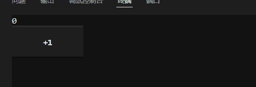

# Textual的中文入门教程

[TOC]

## 0 前言

Textual是一个用于Python的TUI（文本用户界面）库，是Rich的姐妹项目，也依赖于Rich。它支持Rich的Renderable类，同时有自己的互动性组件Widget类。通过使用简单的Python API构建复杂的用户界面，在shell工具或浏览器上运行。

什么是TUI？

之前的《NiceGUI的中文入门教程》中介绍的NiceGUI是一个GUI框架、WebUI框架，基于它实现的界面可以运行在桌面和浏览器中，对应的，可以称之为GUI程序、WebUI程序。TUI程序则是运行在用户终端（或者叫命令行）中，以终端支持的显示方式提供的图形化程序，因此TUI可以解释为终端用户界面（Terminal User Interface），而终端能提供的显示方式一般是可打印字符，可以通过特定字符的组合使用，实现GUI中组件的类似效果，因此，TUI也可以被解释为基于文本的用户界面（Text-based User Interface）。

相比于NiceGUI的框架用法简单，组件用法繁多，Textual的框架用法硬核不少，需要了解一些Python之外的Web知识（样式、布局），再加上Textual官网不提供中文教程，本教程由此诞生。本教程将基于Textual的官网教程，整合官网教程内容，系统性地提供中文版学习教程，补充官网没有详细说明的用法，方便中文开发者入门使用。

## 1 环境准备

《NiceGUI的中文入门教程》已经详细介绍了基本环境的准备过程，这里不再赘述，直接说使用的工具和命令。

开发工具选用的是VSCode，安装Python开发使用的插件。

环境管理工具选用PDM，Python版本选用3.12。注意，3.13版本也可以，但为了保证框架稳定运行，推荐使用上一个大版本的Python。

为了确保VSCode的终端可以正常运行Textual程序，使用浏览器访问下面地址，将VSCode的该项设置启用，确保终端不会冻结：

```shell
vscode://settings/terminal.integrated.experimental.windowsUseConptyDll
```

基础环境的初始化同样参考《NiceGUI的中文入门教程》，在初始化完成之后，添加`textual`、`textual-serve`、`textual-dev`三个包，命令如下：

```shell
pdm add textual textual-serve textual-dev
```

其中，`textual`是框架的主体包，`textual-serve`是一个让Textual程序在网页中运行的扩展包，`textual-dev`是一个调试Textual程序的开发调试工具。扩展包和开发调试工具的用法将在后面介绍，这里只是提前准备好。

如果不使用PDM管理虚拟环境，而是使用全局pip安装，直接调用全局Python解释器来开发Textual程序，可以使用下面的pip命令安装：

```shell
pip install textual textual-serve textual-dev
```

打开VSCode的终端，分别运行`textual`和`python -m textual`，输出以下内容和Textual的演示程序，则表示环境没有问题：

```shell
Usage: textual [OPTIONS] COMMAND [ARGS]...

Options:
  --version  Show the version and exit.
  --help     Show this message and exit.

Commands:
  borders   Explore the border styles available in Textual.
  colors    Explore the design system.
  console   Run the Textual Devtools console.
  diagnose  Print information about the Textual environment.
  easing    Explore the animation easing functions available in Textual.
  keys      Show key events.
  run       Run a Textual app.
  serve     Run a local web server to serve the application.
```


因为Textual还在活跃开发中，版本发布比较频繁，可以使用`pdm update textual textual-serve textual-dev`（PDM）或者`pip install -U textual textual-serve textual-dev`（pip）来更新包，确保问题及时修复，可以使用最新的功能。

## 2 入门基础

### 2.1 认识Textual

[Textual](https://textual.textualize.io/)，一款颇具Web风格的TUI框架。这是在系统性看完Textual这个框架的教程之后，留下的第一印象。

在正式开始Textual的学习之前，有必要讲一讲Textual的设计哲学。在《NiceGUI的中文入门教程》中，介绍了图形界面的三个基本概念——控件、布局和交互。但这些对于简陋的TUI来说，想要实现同等的效果，需要付出更多的代码成本。C语言的ncurses太过底层，需要自己完全实现组件、交互。可以使用脚本调用的whiptail，虽然提供了不少组件，但是纯向导式交互，也不支持直接点击操作，用途有限。尽管dialog在whiptail基础上支持点击，但也是‌因循守旧‌，并没有青出于蓝的表现。

因此，Textual借助Python的易学性，结合了Web中CSS样式的灵活美观，创新性地设计出基于CSS样式设计TUI程序的方式。当然，GUI中的组件和交互也没有落下。只不过受限于终端的表现形式，动画、色彩、布局等表现只能算差强人意，并不能做到媲美。

### 2.2 基础知识

本节主要内容源于官网的[guide页](https://textual.textualize.io/guide/)。

#### 2.2.1 Hello World

正如编程语言的学习始于输出“Hello World!”，先看一下Textual程序的“Hello World!”代码是什么样子：

```python3
from textual.app import App
from textual.widgets import Static

class MyApp(App):
    def compose(self):
        yield Static('Hello World!')

if __name__ == '__main__':
    app = MyApp()
    app.run()
```

将代码保存到名为`myapp.py`的文件，点击运行或者在终端中使用`python myapp.py`命令运行，可以看到终端显示下面的内容：


上面的代码可以在终端输出一句话，只不过，这句话不同于直接在终端回显的文字，这句话是显示在Textual程序中的静态文本。

如果需要退出的话，按下`ctrl`+`c`，即可退出。

注意，Textual在1.0.0版本修改`ctrl`+`c`快捷键为复制功能，默认的退出快捷键变成了`ctrl`+`q`。而`ctrl`+`q`在VSCode中会启动`workbench.action.quickOpenView`，因此，需要修改此命令的快捷键为其他按键，或者启用`terminal.integrated.sendKeybindingsToShell`；也可以在`terminal.integrated.commandsToSkipShell`中添加`-workbench.action.quickOpenView`（注意前面有个减号，推荐此方法，影响最小）。但是，如果使用下节介绍的开发者工具运行Textual程序，退出快捷键依然是`ctrl`+`c`。

需要注意的是，因为pdm初始化项目会产生`src\{项目名}`目录，标准操作是将源代码放到该目录下，而VSCode的打开终端只是到项目根目录，通过命令行运行的话，需要cd到`src\{项目名}`目录，即源代码文件的同级目录，后续的命令行操作之前皆需要执行此操作，就不再赘述，读者实操之前请不要忘了这一步。

相比于NiceGUI最短三行的“Hello World!”，Textual的代码显得臃肿不少，结构上也复杂得多。不过不用担心，这里只是简单看一下Textual程序的代码和运行效果，不需要细究每一行代码的作用，在学习Textual代码的作用之前，还需要学习一些代码之外的知识。

#### 2.2.2 开发者工具

前面环境准备中安装了`textual-dev`之后，可以在终端执行`textual`得到一系列输出，此工具就是本节要介绍的开发者工具，完整介绍可以参考[官网文档](https://textual.textualize.io/guide/devtools/)。

##### 2.2.2.1 `run`命令

运行Textual程序有千百种姿势，前面介绍了Textual程序的“Hello World!”代码，采用的运行方式是直接运行，本质上就是`python main.py`这种直接运行Python源代码文件的常规方法。但是，Textual的开发者工具`textual`的`run`命令也可以运行Textual程序。

最常规的方法：

```shell
textual run myapp.py
```

此方法等同于`python myapp.py`，后面直接跟可运行的Python源代码文件。

`run`命令还支持运行模块中的`App`类或者实例。想要测试这种运行方法的话，需要对前面的Textual程序的“Hello World!”代码做一点小小的改动。

改动后的代码如下：

```python3
from textual.app import App
from textual.widgets import Static

class MyApp(App):
    def compose(self):
        yield Static('Hello World!')

app = MyApp()
```

改动后的代码将`app = MyApp()`移动到最左端的缩进，同时去掉了对`__name__ == "__main__"`的判断和`app.run()`，这就意味着，该Python源代码文件在当作模块导入（`from . import myapp`）时，不会运行`app.run()`，同时可以导入`app`和`MyApp`这两个模块的成员。

接下来，新建文件夹`test`，将`myapp.py`放到`test`文件夹，并在文件夹中创建空白的`__init__.py`文件，用于表明test是个包。那么，将得到以下文件结构：

```shell
test
├─__init__.py
└─myapp.py
```

执行以下命令，将看到熟悉的输出：

```shell
textual run test.myapp
```


聪明的读者肯定想到，前面的`myapp.py`既可以直接运行，也可以当做模块导入。这里很复杂的操作只为构建一个包，如果不做包，直接执行模块文件，行不行？

当然可以，假如当前目录下的`myapp.py`是前面改动后的代码，下面的命令可以运行单文件模块：

```shell
textual run myapp
```

不过很可惜，上面的命令并不能成功，它只得到以下输出：

```shell
Unable to import 'app' from module 'myapp'
```

因为当前目录下的`myapp.py`是最开始的Textual程序的“Hello World!”代码，当做模块导入的话，没有`app`这个成员，只有`MyApp`这个成员，因此默认不能执行。想要成功执行的话，要么像上面的改动一样，添加`app = MyApp()`到最左端的缩进，要么就用下面的命令指定`App`类的继承类来执行：

```shell
textual run myapp:MyApp
```

然后，就能看到熟悉的输出：


当然，上面费劲构建出来的包也支持指定继承类来执行：

```shell
textual run test.myapp:MyApp
```

`run`命令还支持一些额外的选项，进而解锁Textual程序的其他能力。

`run`命令加上`--dev`选项，可以开启调试模式，能让Textual程序的样式修改可以实时生效，也能将Textual程序的终端输出和日志消息输出到console（提前在另一个终端中运行`textual console`可以开启console界面）中。关于样式和console，后面会介绍到，这里只需记住`--dev`选项是一个方便的调试选项即可。示例如下：

```shell
textual run --dev myapp.py
```

`run`命令还支持`-c`选项，与Python的`-c`选项可以执行Python代码字符串类似，此选项后可以跟任意可通过“运行”执行的命令，比如`notepad`。字符串或者直接裸命令都可以。示例如下：

```shell
textual run -c notepad
textual run -c 'notepad'
```

当然，使用`-c`选项也可以执行运行Textual程序的命令，不过，嵌套在`run`命令下执行原本可以运行Textual程序的命令，就有点多此一举。示例如下：

```shell
textual run -c python myapp.py
```

注意，某些命令（如`dir`、`ls`）不是可以通过“运行”执行的可执行文件，而是终端或者shell提供的内建命令，则无法使用`-c`选项执行。

此外，部分命令（如`python`、`textual`）也支持`-c`选项的话，不能重复添加`-c`选项到裸命令后来让被执行的命令接收，只能使用字符串的形式间接让被执行的命令接收。比如：

```shell
textual run -c python -c "print('abc')"
# 上面的命令会报错，被执行命令的-c选项会被`textual`接收，进而把print('abc')传递给终端
# 可以把被执行命令的-c选项连同被执行命令，一起放到字符串内，如下面所示
textual run -c 'python -c "print(''abc'')" '
```

至此，在终端运行textual程序的所有方法都解锁完毕，最后用一个表格总结一下`run`命令的用法：

| 命令行示例                                                   | 运行目标                                                     | 命令说明                                                     |
| ------------------------------------------------------------ | ------------------------------------------------------------ | ------------------------------------------------------------ |
| `textual run myapp.py`                                       | Python源代码。                                               | 和`python myapp.py`一样。                                    |
| `textual run myapp`<br>`textual run test.myapp`              | 包的模块文件或者单模块文件的`app`成员                        | `app`必须是`App`类（来自`textual.app`）的子类的实例，<br>并且在可以从模块中导出。 |
| `textual run myapp:MyApp`<br/>`textual run test.myapp:MyApp` | 包的模块文件或者单模块文件的指定类。                         | 指定的类必须是`App`类（来自`textual.app`）的子类，<br/>并且在可以从模块中导出。 |
| `textual run --dev myapp.py`<br>`textual run --dev myapp`    | Python源代码，<br>包的模块文件或者单模块文件的`app`成员，<br>包的模块文件或者单模块文件的指定类。 | 开启调试模式，<br>样式修改可以实时生效，<br>终端输出和日志消息会输出到console。 |
| `textual run -c notepad`<br/>`textual run -c 'notepad'`<br>`textual run -c python myapp.py`<br>`textual run -c 'python -c "print(''abc'')" '` | 可在终端运行的可执行程序名，<br>基于上一目标添加的、不包括`-c`、`--dev`的选项和参数，<br>使用字符串表示的上面两种目标。 | 如果想给被运行的命令传入`-c`、`--dev`选项，<br>必须用字符串表示运行目标。 |

`run`命令支持的参数和用法还有很多，不过在前期基础学习阶段用不上，这里就不引入了。等到后面需要使用时再扩展这部分内容。

##### 2.2.2.2 `serve`命令

前言中介绍过，Textual程序可以在浏览器中运行，这话并不是说Textual是一个WebUI框架。起码从它在浏览器中运行的表现来看，Textual不同于常规的WebUI框架。Textual程序在浏览器中运行，更像是在浏览器中模拟出一个终端，让程序在正常终端中的输出，全部在浏览器中原样呈现。

环境准备中提到，`textual-serve`是一个让Textual程序在网页中运行的扩展包，后续可以基于此扩展包，编写出将普通Textual程序转化为网页的Python脚本。在正式学习`textual-serve`之前，读者可以使用`textual`的`serve`命令，快捷运行Textual程序，让其呈现在浏览器中。

以下面的命令为例：

```shell
textual serve myapp.py
```

执行命令之后，可以看到终端有如下输出：

```shelll
___ ____ _  _ ___ _  _ ____ _       ____ ____ ____ _  _ ____ 
 |  |___  \/   |  |  | |__| |    __ [__  |___ |__/ |  | |___ 
 |  |___ _/\_  |  |__| |  | |___    ___] |___ |  \  \/  |___ v1.1.1

Serving 'python myapp.py' on http://localhost:8000

Press Ctrl+C to quit
```

在浏览器中访问`http://localhost:8000`，即可看到网页运行的效果：


`serve`命令不仅支持所有`run`命令的格式，还比`run`命令支持更多功能。

首先，`serve`命令默认支持等同于`-c`选项的参数。尽管`serve`命令可以通过添加`-c`选项实现和`run`命令一样的效果，但`serve`命令依旧可以不使用该选项的情况下，直接支持`-c`选项的参数。比如，上面的示例就可以变成下面这种格式：

```shell
textual serve python myapp.py
```

需要特别注意的是，`serve`命令本质上是将Textual程序在终端的输出传递给`textual-serve`扩展包，让其在浏览器中显示。因此，`serve`命令运行`-c`选项的参数必须输出的是Textual程序，这一点与`run`命令不同：

```shell
textual serve 'python myapp.py'
```

`serve`命令支持的参数和用法还有很多，不过在前期基础学习阶段用不上，这里就不引入了。等到后面需要使用时再扩展这部分内容。

#### 2.2.3 Textual程序的基本概念

前面讲了一堆Textual程序之外的命令，这一节重点讲一下Textual程序本身。

##### 2.2.3.1 `App`类

以下面的代码为例，了解一下Textual程序的基本结构：

```python3
from textual.app import App
from textual.widgets import Static

class MyApp(App):
    def compose(self):
        yield Static('Hello World!')

if __name__ == '__main__':
    app = MyApp()
    app.run()
```

`textual.app`中的`App`类，是一个预先定义好的模板类，开发者可以通过继承此类，快速实现一个可以实例化的标准Textual程序中的`App`子类。一般来说，Textual程序，就是调用`App`类或者其子类的实例的`run`方法，来让消息循环占据终端的输入输出，显示出预先设计的界面。因此，代码中必须要有类的实例化和调用`run`方法的过程。当然，如果是采用其他方法运行，比如`textual run myapp`或者`textual run myapp:MyApp`，`textual`命令会自动寻找模块中名为`app`的实例来调用其`run`方法，或者基于提供的子类类名，自动完成实例化和调用`run`方法的过程。

代码中的`__name__ == "__main__"`条件判断，是针对该文件不是当做模块调用，而是直接运行时的选择，因为`app.run()`在导入时被运行的话，会导致程序进入Textual的消息循环，无法正常导入其成员。当然，导入一般是导入类或者方法，`app = MyApp()`这句是实例化一个对象，一般不会当做导入的成员，自然需要放到判断分支内。

关于`App`类，还有两点需要补充，以下面的代码为例：

```python3
from textual.app import App
from textual.widgets import Static

class MyApp(App):
    def __init__(self,*args,**kwargs):
        super().__init__(*args,**kwargs)
        self.ansi_color = False
    def compose(self):
        yield Static('Hello World!')

if __name__ == '__main__':
    app = MyApp()
    app.run(inline=False)
```

代码中，在初始化方法中设置了一个属性`ansi_color`的值为`False`（默认值），在run方法中设置了一个参数`inline`的值为`False`（默认值）。

其中，`ansi_color`表示Textual程序是否启用终端的ansi颜色的转义序列。表示的是，如果终端支持颜色主题切换，Textual程序的默认颜色就会随终端主题走，而不是替换为Textual自己设定的默认颜色。此颜色仅指没有经过样式、主题指定的显示颜色，如果颜色被指定，则不受影响。

`ansi_color`的值为`False`时终端的显示效果：


`ansi_color`的值为`True`时终端的显示效果：


可以看到，当启用ansi颜色，原本与终端背景颜色略有区别的黑色，变成了与终端背景一样的黑色。

`inline`参数表示是否启用Textual程序的行内模式。一般的，此参数不设置为`True`的话，Textual程序会以应用模式运行，Textual程序的界面会占据终端全部的显示区域。如果此参数设置为`True`，则Textual程序会以行内模式运行，程序界面显示为固定大小，甚至能看到程序上面显示着之前输入的命令。

注意，行内模式目前不支持Windows的终端，下面的演示截图来自Linux的终端。

还是上面提供的代码，在只修改`inline`参数为`True`的情况下，效果如图：


##### 2.2.3.2 事件

Textual有一套自己的事件响应系统（[官网文档](https://textual.textualize.io/events/)），它可以响应键盘按键、鼠标按键、组件状态变化等事件。事件的响应方法是一系列以'on\_'为前缀的方法，比如下面代码中的`on_mount`和`on_key`，就是响应程序加载和键盘按键的方法。

```python3
from textual.app import App
from textual import events

class EventApp(App):
    COLORS = [
        'white',
        'maroon',
        'red',
        'purple',
        'fuchsia',
        'olive',
        'yellow',
        'navy',
        'teal',
        'aqua',
    ]
    def on_mount(self) -> None:
        self.screen.styles.background = 'darkblue'
    def on_key(self, event: events.Key) -> None:
        if event.key.isdecimal():
            self.screen.styles.background = self.COLORS[int(event.key)]

if __name__ == '__main__':
    app = EventApp()
    app.run()
```

运行上面代码，可以看到终端显示如下：


这是因为响应程序加载的`on_mount`方法中，将`self.screen.styles.background`（主屏幕背景色）设置为"darkblue"，表示程序加载完成时的背景色。如果按下数字键0-9中的任意数字，可以看到背景色会随着按键的按下而变化。这是因为响应键盘按键的`on_key`方法中，会基于事件中按键的值，到`COLORS`这个预先定义了一系列颜色名字的列表中取值，赋给`self.screen.styles.background`（主屏幕背景色），让背景颜色随之变化。

当然，读者并不需要细究到底有多少事件响应方法，也不需要细究背景色支持哪些名字，只需要记住'on\_'为前缀的方法是Textual的事件响应方法。至于具体用法，将会在后面用到时细讲，同时也可以查阅官网文档手册，这里只是介绍一下事件系统。

##### 2.2.3.3 组件

组件，在其他UI框架中也可以称之为控件，是用户界面上重要的组成部分。组件是一个或者一组预先定义好的内容，可以在终端中（在Textual中称之为当前屏幕）显示出来，用来构成用户界面。和其他UI框架中的控件类似，Textual的组件包括静态文本（之前代码中的`Static`）、按钮、输入框等官方实现的组件，方便开发者组合定义自己想要的组件。

想必聪明的读者在学习前面的代码时已经注意到，`MyApp`类中除了介绍过的'on\_'开头的事件响应方法，还包含着一个名为`compose`的方法，需要显示的静态文本就放在这个方法内。

没错，不同于其他框架（比如之前学习的NiceGUI）调用控件代码就会直接显示控件，Textual显示控件的方法，有点类似使用布局定义好控件之后，统一调用显示方法来显示控件。在Textual中，这个统一的显示方法，就是`App`子类中的`compose`方法。在`compose`方法中，使用`yield`关键字（类似`return`）返回要显示的组件，使`compose`方法变成一个生成器，Textual框架就会将`compose`方法中返回的组件显示到终端中。不同于`return`只能返回一次，多次使用`yield`可以返回多个组件，这样的话，终端上可以显示多个组件。

在`compose`方法中定义需要显示的组件是简单好用的方法，一般推荐读者这样操作。但是，在此方法中显示组件是随着Textual程序运行一同进行的，如果需要在执行交互之后才显示组件，那就要用到`App`类的`mount`方法。调用此方法，并给此方法传入组件，即可在需要的时候显示组件。

以下面的代码为例，对比一下两种显示组件的方法。代码中，`compose`方法使用了两次`yield`，使得终端里可以显示两个静态文本。因为这里没有设置控件的布局，因此第二个静态文本`'Please input:'`是以默认的垂直布局——相当于终端的换行显示，显示在第一个静态文本之后。

在`on_key`方法中，当按键为数字键时，通过调用`self.mount`方法，并传入静态文本控件，可以实现基于按键操作显示新的静态文本。

代码和效果图如下：

```python3
from textual.app import App
from textual.widgets import Static

class MyApp(App):
    def compose(self):
        yield Static('Hello World!')
        yield Static('Please input:')
    def on_key(self, event):
        if event.key.isdecimal():
            self.mount( Static(f'Hello {event.key}!') )

if __name__ == '__main__':
    app = MyApp()
    app.run()
```


##### 2.2.3.4 退出

退出程序的方法，不止`ctrl`+`c`。

一开始介绍Textual的代码时，只说了退出程序使用组合键`ctrl`+`c`。其实，这样说没错，一般运行终端命令，想要强制结束程序的时候，就是使用这个组合键。但是，如果细细思考，这个说法似乎有问题。组合键是强制结束时候使用，正常结束的话，有没有编程执行的结束方法？总不能模拟组合键吧？如果想要添加个退出按钮呢？该如何让按钮执行退出操作？

上面几个问题的答案，就在下面的代码中。当然，代码中涉及到后面才会讲到的知识点，这里不会细讲，本节只讲`self.exit()`这种退出方法。如果读者有兴趣并且学有余力，可以自行对照官网文档学习。若是读者不着急，可以期待后面相关的章节中，再次回顾这里的代码，那时会细讲一次。

```python3
from textual.app import App
from textual.widgets import Static,Button

class MyApp(App):
    def compose(self):
        yield Static('Hello World!')
        yield Static('Press q or click buttons to quit:')
        yield Button('Exit',action='app.exit_app()')
        yield Button('Quit',action='app.quit()')
    def on_key(self, event):
        if event.key == 'q':
            self.exit()
    def action_exit_app(self):
        self.exit()

if __name__ == '__main__':
    app = MyApp()
    app.run()
```


代码实现了三种退出程序的方法，其中，使用点击按钮的方法是后面的知识点，这里仅供读者体验，不要求掌握，暂时也不细讲。此外，还有一种方法，就是结合前面讲过的事件，在响应按键的方法中，通过识别当前按键是不是`q`键，来决定是否执行`self.exit()`。其中，`self`就是后面实例化的`App`子类，也就是子类的实例。该实例有`exit`方法，调用此方法就可以退出Textual程序。

##### 2.2.3.5 CSS

前面提到过Textual支持CSS样式，可教程直到现在，用于演示的代码既没有布局设计，也没有一点CSS美化的痕迹，不写一个相关示例来展示一下，读者恐怕要失去对Textual的兴趣了。

别急，示例这就来了。虽然Textual的CSS样式不是标准Web的CSS，但是语法类似，如果有NiceGUI入门教程的基础，哪怕直接上手Textual的CSS，也没什么难度。

就以上一节的代码为例，通过设置CSS样式，让界面变得好看一些。

以下是程序要用的CSS样式代码。在上面的`myapp.py`文件同目录下创建`myapp.tcss`，将代码存到文件中。

```css
Screen {
    layout: grid;
    grid-size: 2;
    grid-gutter: 2;
    padding: 2;
}
Static {
    width: 100%;
    height: 100%;
    column-span: 2;
    content-align: center bottom;
    text-style: bold;
}
Button {
    width: 100%;
}
```

将`myapp.py`文件内容修改如下，主要是添加`CSS_PATH = 'myapp.tcss'`。

```python3
from textual.app import App
from textual.widgets import Static,Button

class MyApp(App):
    CSS_PATH = 'myapp.tcss'
    def compose(self):
        yield Static('Hello World!')
        yield Static('Press q or click buttons to quit:')
        yield Button('Exit',action='app.exit_app()')
        yield Button('Quit',action='app.quit()')
    def on_key(self, event):
        if event.key == 'q':
            self.exit()
    def action_exit_app(self):
        self.exit()

if __name__ == '__main__':
    app = MyApp()
    app.run()
```

运行代码，即可看到效果如图：


给类设置`CSS_PATH`的值为tcss文件的路径，即可给该`App`子类的组件设置样式。具体的样式用法会在后面的样式章节专门讲，这里只是介绍一下应用样式的方法。值得注意的是，这里的样式文件使用'.tcss'为扩展名，并不是说一定要用这个扩展名才行。这里是为了与Web中的CSS文件区分，不使用常规的'.css'为扩展名，而是采用了含义为TextualCSS的'.tcss'。当然，如果读者有其他偏好，使用其他扩展名也可以。不过，如果想要使用官方提供的[CSS语法高亮扩展](https://marketplace.visualstudio.com/items?itemName=Textualize.textual-syntax-highlighter)，最好使用'.tcss'后缀，否则只能手动选择语法高亮方案为TextualCSS。VSCode用户可以安装此扩展，在打开tcss文件之后看到对应的语法高亮。

采用单独文件保存样式的话，如果是用调试模式运行程序，在样式文件中修改样式，修改效果会实时显示到终端中。

如果不太喜欢这种将样式放到单独文件中的形式，可以参考下面的代码，给类设置`CSS`的值为完整的样式内容，即可将样式嵌入到Python源代码中。

需要注意的是，为了样式美观，代码中的样式采用缩进形式换行，因此使用的是三引号的多行文本。在实际使用过程中，样式可以去掉换行，成为一行内容，那就可以只用单引号的字符串。

另外，将样式嵌入到Python源代码中，会使样式实时显示修改的功能失效，这也算有得有失吧。

```python3
from textual.app import App
from textual.widgets import Static,Button

class MyApp(App):
    CSS = '''
    Screen {
        layout: grid;
        grid-size: 2;
        grid-gutter: 2;
        padding: 2;
    }
    Static {
        width: 100%;
        height: 100%;
        column-span: 2;
        content-align: center bottom;
        text-style: bold;
    }
    Button {
        width: 100%;
    }
    '''
    def compose(self):
        yield Static('Hello World!')
        yield Static('Press q or click buttons to quit:')
        yield Button('Exit',action='app.exit_app()')
        yield Button('Quit',action='app.quit()')
    def on_key(self, event):
        if event.key == 'q':
            self.exit()
    def action_exit_app(self):
        self.exit()

if __name__ == '__main__':
    app = MyApp()
    app.run()
```

##### 2.2.3.6 标题与副标题

Textual的类除了`CSS_PATH`和`CSS`这两个设置样式的属性之外，还有`TITLE`和`SUB_TITLE`这两个属性，分别表示程序的标题和副标题。为了显示标题和副标题，需要添加`Header`标题栏。代码如下：

```python3
from textual.app import App
from textual.widgets import Static,Button,Header

class MyApp(App):
    TITLE = 'MyApp'
    SUB_TITLE = 'Best App'
    def compose(self):
        yield Header()
        yield Static('Hello World!')

if __name__ == '__main__':
    app = MyApp()
    app.run()
```

显示效果如图：


当然，这两个是类属性，如果想在创建实例之后动态修改，就不能使用这两个纯大写的属性，而是使用纯小写的属性代替。参考下面的代码，代码中没有在类中设置标题和副标题，而是在`App`子类实例化之后，使用实例的属性设置标题和副标题，这样得到的显示效果和上图一样。此外，此操作方法也可用于事件的响应代码中，实现动态修改标题和副标题。在代码中，通过判断按键是数字还是字母，来将标题修改为数字，将副标题修改为字母。

```python3
from textual.app import App
from textual.widgets import Static,Button,Header

class MyApp(App):
    def compose(self):
        yield Header()
        yield Static('Hello World!')
    def on_key(self, event):
        if event.key.isdecimal():
            self.title = event.key
        if event.key.isalpha():
            self.sub_title = event.key

if __name__ == '__main__':
    app = MyApp()
    app.title = 'MyApp'
    app.sub_title = 'Best App'
    app.run()
```

#### 2.2.4 样式

##### 2.2.4.1 样式接口

上一节中，介绍了Textual程序的基本组成和用法，那些是后续开发中常用的功能。其中，CSS这一节还介绍了加载CSS文件样式的两种方法。不过，在正式学习Textual的CSS语法之前，还有必要介绍一个应用样式的接口。相比于记住语法规则和编写完整的CSS文件，直接使用组件的接口设置组件的样式，更简单快捷。

组件有一个名为`styles`的属性，该属性代表组件的样式接口。通过调用此属性下的子属性，可以快速设置对应属性代表的样式。

下面的代码展示了如何使用此接口设置`screen`（一个代表当前屏幕的特殊组件，屏幕的用法和更多知识后面会细讲）和普通组件静态文本的样式，修改它们的颜色和其他样式。

```python3
from textual.app import App
from textual.widgets import Static

class MyApp(App):
    def compose(self):
        text = Static('Hello World!')
        text.styles.color = 'red'
        yield text
    def on_mount(self):
        self.screen.styles.background = 'darkblue'
        self.screen.styles.border = ('heavy', 'white')

if __name__ == '__main__':
    app = MyApp()
    app.run()
```

效果如图：


代码中，`text.styles.color = 'red'`是设置静态文本的颜色为红色，对于文本而言，颜色（更多用法参考[官网文档](https://textual.textualize.io/styles/color/)）就是指文字的颜色，如果是其他具有前景颜色属性的组件，则颜色表示前景色。`self.screen.styles.background = 'darkblue'`是把当前屏幕的背景色（更多用法参考[官网文档](https://textual.textualize.io/styles/background/)）设置为深蓝色。对于屏幕而言，其前景色表示显示在上面的、没有指定颜色的文本的颜色，而上面的静态文本已经指定颜色，这里指定颜色的优先级比上面的指定低，因此这里是设置了背景色来表明效果。此外，`self.screen.styles.border = ('heavy', 'white')`还设定了当前屏幕的边框粗细和边框颜色（更多用法参考[官网文档](https://textual.textualize.io/styles/border/)，或者看后面详细讲解的内容）。

##### 2.2.4.2 颜色

相信读者已经注意到一点，上面代码中用到的颜色都是含义通俗易懂的字符串，而不是使用十六进制数字或者三元组数字等量化表示颜色的方法。其实，Textual支持那些有点神秘的数字表示法，只是为了更易懂一些，代码中特地使用了Textual预先定义好的颜色名字。具体名字可以参考[官网文档](https://textual.textualize.io/api/color/#textual.color--named-colors)或者下图：


至于量化表示颜色的方法，Textual支持这几种表示方法：

-   RGB颜色，以`#`开头，六位十六进制数字，每两位代表一种颜色的分量值，依次代表红色、绿色、蓝色，例如`#ff0000`（红色）。对于代表颜色分量的两位数字一样的情况，可以简写为一位数字，那原来`#`后的六位数字就可以变成三位数字，例如前面表示红色的示例可以写成`#f00`。
-   RGB颜色，以`rgb`开头，形式类似调用函数（用来表示的字符串不能含空格，否则会报错），有三个参数，都是十进制数字（也就是上一种表达方式中的十六进制数字对应的十进制值），分别是代表红色、绿色、蓝色，例如`rgb(255,0,0)`
-   HSL颜色，以`hsl`开头，形式类似调用函数（用来表示的字符串不能含空格，否则会报错），有三个参数，分别是色相、饱和度、亮度。其中，色相是取值0-360的角度，饱和度和亮度是取值0%-100%的百分比，例如`hsl(0,100%,50%)`（红色）。

除了上面的颜色表达方式，`color`属性和`background`属性还接受`Color`对象作为动态的颜色。`Color`对象支持的方法和更多用法可以参考[官网文档](https://textual.textualize.io/api/color/)，这里只简单介绍一下需要用的方法。

想要使用`Color`对象，需要从`textual.color`模块中导入。使用`from textual.color import Color`导入之后，就和前面介绍的第二种RGB颜色表达方法一样，`Color`对象的实例化需要三个对应的十进制参数。

下面的代码中，使用了上面提到的五种颜色表示方法，来将静态文本的背景颜色设置为红色：

```python3
from textual.app import App
from textual.widgets import Static
from textual.color import Color

class MyApp(App):
    def compose(self):
        text = [Static('Hello World!') for _ in range(5)]
        text[0].styles.background = 'red' 
        text[1].styles.background = '#ff0000' # 或者#f00
        text[2].styles.background = 'rgb(255,0,0)'
        text[3].styles.background = 'hsl(0,100%,50%)'
        text[4].styles.background = Color(255,0,0)
        for i in text:
            yield i

if __name__ == '__main__':
    app = MyApp()
    app.run()
```


在颜色的表达方式中，除了上面提到的几种分量之外，Textual还支持另一个分量——透明度Alpha。改变颜色透明度，可以让当前颜色与其下面的颜色混合，如组件的前景和背景或者组件的背景与另一组件的背景。透明度的范围是0%到100%，0%表示该颜色完全没有，即完全透明，100%表示该颜色完全不透明， 即显示该颜色原本的样子。

Textual支持三种设置颜色透明度的方式：

-   在表达颜色的字符串中，以空格分隔的形式添加百分比表示的透明度值，例如`'red 20%'`。此方法支持通俗的颜色名称和量化表达。
-   在构建`Color`对象时，传入与百分数等值的小数给参数`a`，例如`Color(255,0,0,a=0.2)`。
-   使用`Color.parse`方法，将包含透明度的量化颜色（RGBA颜色和HSLA颜色）表达转换为Color对象，例如`Color.parse('#ff000033')`。

关于包含透明度的量化颜色方法，Textual支持这几种：

-   RGBA颜色，以`#`开头，八位十六进制数字，每两位代表一种颜色的分量值，依次代表红色、绿色、蓝色、透明度，例如`#ff000033`（红色，20%透明度）。对于代表颜色分量的两位数字一样的情况，可以简写为一位数字，那原来`#`后的八位数字就可以变成四位数字，例如前面表示红色的示例可以写成`#f003`。
-   RGBA颜色，以`rgba`开头，形式类似调用函数（用来表示的字符串不能含空格，否则会报错），有四个参数，都是十进制数字（也就是上一种表达方式中的十六进制数字对应的十进制值），最后一个是小数，分别是代表红色、绿色、蓝色、透明度，例如`rgb(255,0,0,0.2)`
-   HSLA颜色，以`hsla`开头，形式类似调用函数（用来表示的字符串不能含空格，否则会报错），有四个参数，分别是色相、饱和度、亮度、透明度。其中，色相是取值0-360的角度，饱和度和亮度是取值0%-100%的百分比，透明度是小数，例如`hsl(0,100%,50%,0.2)`（红色，20%透明度）。

下面的代码中，使用了上面提到的三种设置透明度的形式，共七个示例，来将静态文本的背景颜色设置为20%透明度红色：

```python3
from textual.app import App
from textual.widgets import Static
from textual.color import Color

class MyApp(App):
    def compose(self):
        text = [Static('Hello World!') for _ in range(7)]
        text[0].styles.background = 'red 20%' # 常规颜色表达加空格，后接表示透明度的百分数
        text[1].styles.background = 'rgb(255,0,0) 20%' # 使用量化的颜色表达也可以
        text[2].styles.background = Color(255,0,0,a=0.2) # 可以在构建Color对象时传入Alpha的值
        text[3].styles.background = Color.parse('#ff000033') # 也可以使用Color.parse解析含透明度的颜色表达，rgba或者hsla
        text[4].styles.background = Color.parse('#f003') # #开头的rgba表达同样支持长度变成一半的短格式，等同于#ff000033
        text[5].styles.background = Color.parse('rgba(255,0,0,0.2)') # 类似函数调用的表达，第四个参数是Alpha值，是小数而不是百分数
        text[6].styles.background = Color.parse('hsla(0,100%,50%,0.2)') # 对于hsla来说，Alpha值一样是小数，不要和前面的百分数混淆
        for i in text:
            yield i

if __name__ == '__main__':
    app = MyApp()
    app.run()
```


##### 2.2.4.3 盒子模型

如果有CSS基础的话，就能轻易想象到CSS中的盒子模型。没有基础也没关系，这里会再讲一遍。

Textual组件通常占据一个矩形区域，就像一个盒子一样。这个盒子最小可以到一个字符大小，最大可以到整个屏幕。当然，如果样式中启用了[滚动](https://textual.textualize.io/styles/overflow/)，还能更大。

对于组件这个盒子而言，以下几种相关的样式会影响到组件的大小表现：

-   [宽度（`width`）](https://textual.textualize.io/styles/width/)和[高度（`height`）](https://textual.textualize.io/styles/height/)决定了组件的显示大小。
-   [内边距（`padding`）](https://textual.textualize.io/styles/padding/)决定了组件内包含的内容（如文字或者其他组件）到组件可视边界的距离。
-   [边框（`border`）](https://textual.textualize.io/styles/border/)则让组件的可视边界变得突出，边框可以设置样式和粗细，内边距则是在边框粗细的基础上计算距离。

其实，除了上面几个与组件显著相关的尺寸样式之外，[外边距（`margin`）](https://textual.textualize.io/styles/margin/)也是属于组件的尺寸样式，只不过外边距不会影响组件的大小和内容表现，只会在与其他组件一起参与布局时，表现为其他组件距离组件可视边界的远近。

具体几个尺寸样式的关系，下图表现得很直观：


##### 2.2.4.4 宽度、高度和比例单位

设置组件的宽度（`width`）会限制组件的所使用的列数，设置组件的高度（`height`）会限制组件的所使用的行数。以下面的代码为例，在设置了宽度为30、高度为10之后（紫色区域的大小即组件的宽度和高度），原本多行的内容会被限制在很小的区域内，宽度小于内容宽度会导致内容换行，高度小于内容高度会导致超过指定高度的内容被裁剪，不会完整显示。

```python3
from textual.app import App
from textual.widgets import Static

TEXT = '''The Zen of Python, by Tim Peters

Beautiful is better than ugly.
Explicit is better than implicit.
Simple is better than complex.
Complex is better than complicated.
Flat is better than nested.
Sparse is better than dense.
Readability counts.
Special cases aren't special enough to break the rules.
Although practicality beats purity.
Errors should never pass silently.
Unless explicitly silenced.
In the face of ambiguity, refuse the temptation to guess.
There should be one-- and preferably only one --obvious way to do it.
Although that way may not be obvious at first unless you're Dutch.
Now is better than never.
Although never is often better than *right* now.
If the implementation is hard to explain, it's a bad idea.
If the implementation is easy to explain, it may be a good idea.
Namespaces are one honking great idea -- let's do more of those!'''


class MyApp(App):
    def compose(self):
        self.widget = Static(TEXT)
        yield self.widget

    def on_mount(self) -> None:
        self.widget.styles.background = 'purple'
        self.widget.styles.width = 30
        self.widget.styles.height = 10

if __name__ == '__main__':
    app = MyApp()
    app.run()
```


但是，更多时候需要设置组件的宽度为固定值，而让高度随内容变化。这时，可以设置高度为`'auto'`，这样的话，高度就会基于内容多少而变化，始终确保全部内容显示出来，代码如下：

```python3
from textual.app import App
from textual.widgets import Static

TEXT = '''The Zen of Python, by Tim Peters

Beautiful is better than ugly.
Explicit is better than implicit.
Simple is better than complex.
Complex is better than complicated.
Flat is better than nested.
Sparse is better than dense.
Readability counts.
Special cases aren't special enough to break the rules.
Although practicality beats purity.
Errors should never pass silently.
Unless explicitly silenced.
In the face of ambiguity, refuse the temptation to guess.
There should be one-- and preferably only one --obvious way to do it.
Although that way may not be obvious at first unless you're Dutch.
Now is better than never.
Although never is often better than *right* now.
If the implementation is hard to explain, it's a bad idea.
If the implementation is easy to explain, it may be a good idea.
Namespaces are one honking great idea -- let's do more of those!'''


class MyApp(App):
    def compose(self):
        self.widget = Static(TEXT)
        yield self.widget

    def on_mount(self) -> None:
        self.widget.styles.background = 'purple'
        self.widget.styles.width = 30
        self.widget.styles.height = 'auto'

if __name__ == '__main__':
    app = MyApp()
    app.run()
```


除了设置为固定值和基于内容变化的自动，Textual还支持以下几种基于屏幕或者容器的比例单位：

-   `%`为后缀、前面是数字表示百分比的字符串，代表组件的宽度或者高度是容器的百分之多少，例如`'50%'`。
-   `vw`和`vh`为后缀、前面是数字表示百分比的字符串，代表组件的宽度或者高度是可视区域（即终端）的百分之多少，`vw`表示可视区域的宽度，`vh`表示可视区域的高度，例如`'50vw'`。
-   `w`和`h`为后缀、前面是数字表示百分比的字符串，其用法与`%`后缀单位一样，只不过，`w`表示容器的宽度，`h`表示容器的高度。如果想要让宽度为容器的固定比例值，同时自身还要保持宽高比，不会随着容器的大小变化而比例变化，就可以将宽度和高度都设置为一样的单位，例如，设置宽度为`'50w'`，高度为`'150w'`。

下面的代码中，三个静态文本被放到宽度只有终端宽度一半的容器中，它们的宽度分别被设置为`'50%'`、`'50vw'`、`'50w'`。可以从动态图中看到终端尺寸变化时，三者的效果区别：

```python3
from textual.app import App
from textual.widgets import Static
from textual.containers import Container

class MyApp(App):
    def compose(self):
        self.widgets = [ Static() for _ in range(3) ]
        self.container = Container(*self.widgets)
        yield self.container

    def on_mount(self) -> None:
        self.container.styles.width = '50%'
        self.container.styles.height = 'auto'
        for widget in self.widgets:
            index = self.widgets.index(widget)
            widget.styles.height = 5
            widget.styles.background = ['purple','green','blue'][index]
            widget.styles.width = ['50%','50vw','50w'][index]
            widget.update(f'The widget\'s width is {['50%','50vw','50w'][index]}.')

if __name__ == '__main__':
    app = MyApp()
    app.run()
```


百分制的比例单位很好用，同时也带来另一个问题——如果想要让组件占据容器的三分之一，怎么写？

100的三分之一，是33.3333……好吧，想要完美的三分之一的话，几乎不可能，只能用精度比较高的小数实现，让近似值显示效果等同于三分之一。不过，还有一个单位可以完美实现此效果，那就是分数单位`fr`（即fraction），一个为解决三等分而生（也许不是）的单位。

想要完美使用分数单位，就要让使用该单位的组件在某一方向上完全占据容器。为什么要这样做呢？那就要从分数单位的特性说起。假定在一个方向上，有三个组件，每个组件的长度（对应实际就是宽度或者高度）都是`'1fr'`，那实际显示时，这个长度就会变成总长的三分之一。每个组件的长度是一份，总长是三份。实际上，分数单位的英文fr，就是单词fraction（分数）的意思。下面的代码正好展示了这个特性：

```python3
from textual.app import App
from textual.widgets import Static
from textual.containers import Container

class MyApp(App):
    def compose(self):
        self.widgets = [ Static() for _ in range(3) ]
        self.container = Container(*self.widgets)
        yield self.container

    def on_mount(self) -> None:
        self.container.styles.width = '50%'
        self.container.styles.height = 'auto'
        for widget in self.widgets:
            index = self.widgets.index(widget)
            widget.styles.width = 50
            widget.styles.background = ['purple','green','blue'][index]
            widget.styles.height = '1fr'
            widget.update('The widget\'s height is 1fr.')

if __name__ == '__main__':
    app = MyApp()
    app.run()
```


需要注意的是，读者在实际使用中可能会发现，上面几种比例单位的显示效果并不完美，应该是三分之一或者50%的组件，和同样宽高的组件差一点。这是因为终端显示单个字符必须是完整的最小宽高，不会做缩放也没法继续分割。组件的大小组成又是基于字符而来，因此，在调整终端大小的时候，会出现终端或者容器大小没法被整除，部分组件就会比同样数值的组件少一行或者一列。TUI程序受限于终端显示，这也是没有办法的。

上面用于宽度和高度的单位，也适用于组件的[最小宽度（`min_width`）](https://textual.textualize.io/styles/min_width/)、[最大宽度（`max_width`）](https://textual.textualize.io/styles/max_width/)、[最小高度（`min_height`）](https://textual.textualize.io/styles/min_height/)、[最大高度（`max_height`）](https://textual.textualize.io/styles/max_height/)。这几个属性用于设置终端大小变化时，组件显示大小的上下限。

##### 2.2.4.5 内边距

内边距（`padding`）是指组件边界距离内部内容的远近，完整的用法可以参考[官网文档](https://textual.textualize.io/styles/padding/)。

以下面的代码为例，将内边距设置为`2`之后，内容到上下左右边界的距离都是2个单位（字高或者字宽）：

```python3
from textual.app import App
from textual.widgets import Static

class MyApp(App):
    def compose(self):
        self.widget = Static()
        yield self.widget

    def on_mount(self) -> None:
        self.widget.styles.width = 30
        self.widget.styles.padding = 2
        self.widget.styles.background = 'purple'
        self.widget.update('The widget\'s padding is 2.')

if __name__ == '__main__':
    app = MyApp()
    app.run()
```


如果读者看过内边距的官网文档（实际上是样式手册），肯定很好奇，文档中写明内边距支持设置两个值或者四个值，使用样式接口实现的话，代码怎么写？

给没时间看文档的读者解释一下，上面的代码中，内边距只设置一个值，那么四个方向上的内边距就都用此值。如果想要单独定义某个方向的内边距，就要给内边距传递两个值或者四个值。两个值表示上下方向上的内边距使用第一个值，左右方向上的内边距使用第二个值；四个值表示上边的内边距使用第一个值，右边的内边距使用第二个值，下边的内边距使用第三个值，左边的内边距使用第四个值。

传递多个值给内边距，需要使用元组将多个值包起来，如`(1,2)`，具体见下面的代码示例：

```python3
from textual.app import App
from textual.widgets import Static

class MyApp(App):
    def compose(self):
        self.widget = Static()
        yield self.widget

    def on_mount(self) -> None:
        self.widget.styles.width = 30
        padding = (1,2) #上下为1，左右为2
        # (1,2,1,2)的话，就是对应上、右、下、左
        self.widget.styles.padding = padding
        self.widget.styles.background = 'purple'
        self.widget.update(f'The widget\'s padding is {padding}.')

if __name__ == '__main__':
    app = MyApp()
    app.run()
```


##### 2.2.4.6 边框

如盒子模型一节中的图片所示，边框（`border`）是包含在组件内、用于表示组件边界的突出性显示元素。想要设置边框的话，就要设置`styles.border`属性为一个描述边框样式、包含两个字符串的元组，如` ('heavy','yellow')`。元组的第一个元素是边框样式（更多样式参考[官网文档](https://textual.textualize.io/styles/border/#all-border-types)），元组的第二个元素是边框颜色，支持颜色名字、量化颜色表达（RGB颜色或者HSL颜色）。

不过，如果读者看了[官网文档](https://textual.textualize.io/styles/border/)，就会看到最上面介绍的用法，可能会有个疑问：页面里写着可以额外添加一个百分比数字来设置颜色透明度，但在样式接口没有这个用法，如何给样式接口中的颜色设置透明度？

接口不提供直接的方法，但可以用Alpha颜色代替，间接实现，即使用Color.parse可以识别的带透明度的颜色（RGBA颜色或者HSLA颜色），也可以直接用`Color`对象，构建时传入透明度信息。

一般的用法：

```python3
from textual.app import App
from textual.widgets import Static

class MyApp(App):
    def compose(self):
        self.widget = Static()
        yield self.widget

    def on_mount(self) -> None:
        self.widget.styles.width = 50
        border = ('heavy','yellow')
        self.widget.styles.border = border
        self.widget.styles.background = 'purple'
        self.widget.update(f'The widget\'s border is {border}.')

if __name__ == '__main__':
    app = MyApp()
    app.run()
```


设置边框的透明度：

```python3
from textual.app import App
from textual.widgets import Static
from textual.color import Color

class MyApp(App):
    def compose(self):
        self.widget = Static()
        yield self.widget

    def on_mount(self) -> None:
        self.widget.styles.width = 50
        border = ('heavy',Color(255,255,0,a=0.5))
        self.widget.styles.border = border
        self.widget.styles.background = 'purple'
        self.widget.update(f'The widget\'s border is {border}.')

if __name__ == '__main__':
    app = MyApp()
    app.run()
```


和内边距支持1个、2个、4个值类似，边框样式也支持一样的数量，并且概念相同。当值是2个时，第一个值设置的是上下边框的样式，第二个值设置的是左右边框的样式。当值是4个时，第一个值设置的是上边框的样式，第二个值设置的是右边框的样式，第三个值设置的是下边框的样式，第四个值设置的是左边框的样式。

给边框设置多个值，需要将样式元组放到列表里，如` [('heavy','yellow'),('heavy','blue')]`。

代码示例如下：

```python3
from textual.app import App
from textual.widgets import Static

class MyApp(App):
    def compose(self):
        self.widget = Static()
        yield self.widget

    def on_mount(self) -> None:
        self.widget.styles.width = 50
        border = [('heavy','yellow'),('heavy','blue')]
        # 2个表示上下、左右的样式，四个表示上、右、下、左的样式
        self.widget.styles.border = border
        self.widget.styles.background = 'purple'
        self.widget.update(f'The widget\'s border is {border}.')

if __name__ == '__main__':
    app = MyApp()
    app.run()
```


##### 2.2.4.7 边框标题和边框副标题的对齐方向

组件有两个和边框有关的属性，只有组件的边框显示（需要设置了边框的样式且不为`'hidden'`或者`'none'`）时才会显示，那就是边框标题（`border_title`）和边框副标题（`border_subtitle`）。边框标题显示在上边框上，默认在左边；设置了边框标题之后，边框就会变得和winform的分组框（GroupBox）一样，可以用来概述组件内的内容或者组件内其他组件的分类。边框副标题显示在下边框，默认在右边；边框副标题可以看作是显示在下边框上的边框标题，或者当作对边框标题的补充解释。

如果想修改边框标题或者边框副标题的对齐方向，就要设置样式接口中的边框标题对齐（`border_title_align`）或者边框副标题对齐（`border_subtitle_align`）。对齐方向支持`'left'`（向左）、`'center'`（居中）、`'right'`（向右）。

完整内容可以参考官网文档：

https://textual.textualize.io/styles/border_title_align/

https://textual.textualize.io/styles/border_subtitle_align/

下面的代码中，就是添加了边框标题和边框副标题之后，将边框标题设置为居中：

```python3
from textual.app import App
from textual.widgets import Static

class MyApp(App):
    def compose(self):
        self.widget = Static()
        yield self.widget

    def on_mount(self) -> None:
        self.widget.styles.width = 50
        border = ('heavy','yellow')
        self.widget.styles.border = border
        self.widget.styles.background = 'purple'
        self.widget.update(f'The widget\'s border is {border}.')
        self.widget.border_title = 'border_title'
        self.widget.border_subtitle = 'border_subtitle'
        self.widget.styles.border_title_align = 'center'

if __name__ == '__main__':
    app = MyApp()
    app.run()
```


##### 2.2.4.8 轮廓

轮廓（`outline`）与边框用法相同，甚至把边框示例代码中的`border`全部替换为`outline`，都没问题。不过，真要是完全替换而不做一点修改，那绝对不行，比如下面的代码：

```python3
from textual.app import App
from textual.widgets import Static

class MyApp(App):
    def compose(self):
        self.widget = Static()
        yield self.widget

    def on_mount(self) -> None:
        self.widget.styles.width = 50
        outline = ('heavy','yellow')
        self.widget.styles.outline = outline
        self.widget.styles.background = 'purple'
        self.widget.update(
            f'''
The widget\'s outline is {outline}.
'''
        )

if __name__ == '__main__':
    app = MyApp()
    app.run()
```


看上去只是把代码里的`border`全换成了`outline`，不过代码还是有些不同，比如：`self.widget.update`下面，原本是显示在组件内的内容，用的只是普通的f字符串，这里却变成了f多行字符串；代码执行的效果也与边框不同，倒不是说内容里的`border`变成`outline`，而是内容的开头，`'The'`变成了`'he'`。

原来，轮廓还是与边框有区别的，那就是对内容的遮挡。因为轮廓不属于组件的一部分，并不会参与组件大小的组成，加在组件上的轮廓，就像是不透明的幻灯片一样盖在组件之上，会遮挡住靠边的内容。而边框是组件的一部分，增加的边框也算组件大小的一部分。因此，增加边框之后，组件的内容会被边框挤占控件，内容会重新排版。

这也是为什么要把原来的单行字符串换成多行字符串，字符串内给内容开头和结尾都增加了一行。内容最左边没有加空格，因此内容的第一个字符就被轮廓挡住了。另外，虽然这里挡住的是第一个字符，但是，如果内容的第一个字是汉字的话，汉字一个字在终端显示里是两个字符的宽度（以笔者的测试环境而言），实际执行时也是第一个字被遮挡而不显示，不会出现显示半个汉字的情况。不过，此时会出现额外一个字符宽度的空白，读者在实际使用时可以注意一下。

轮廓还有一点与边框不同，轮廓不支持标题。上一节提到的边框（副）标题，没法与轮廓组合使用。组件没有轮廓（副）标题这种属性；只设置边框（副）标题和轮廓的话，边框（副）标题会因为边框样式没设置而不显示，而轮廓也会盖住边框（副）标题；同时设置边框（副）标题、边框和轮廓的话，轮廓会盖住边框。

更多轮廓的用法，可以参考[官网文档](https://textual.textualize.io/styles/outline/)。

当然，想要让没有标题的边框变成轮廓的话，也不是没有办法，只需增加一个单位宽的内边距即可。如下面代码中的`self.widget.styles.padding = 1`，就可以让上面的怪异代码就可以变成和原来一样整齐的代码：

```python3
from textual.app import App
from textual.widgets import Static

class MyApp(App):
    def compose(self):
        self.widget = Static()
        yield self.widget

    def on_mount(self) -> None:
        self.widget.styles.width = 50
        outline = ('heavy','yellow')
        self.widget.styles.outline = outline
        self.widget.styles.background = 'purple'
        self.widget.styles.padding = 1
        self.widget.update(f'The widget\'s outline is {outline}.')

if __name__ == '__main__':
    app = MyApp()
    app.run()
```


##### 2.2.4.9 盒子尺寸类型

不知道各位读者有没有发现，上面几节讲组件的边框和内边距，如果组件的宽度或者高度确定，在设置这些样式时，组件内的内容会随之重新排版，不会改变设定好的宽度或者高度。一般来说，这样的表现是没问题的，因为设计边框或者内边距的时候，不会希望组件的大小变化而导致整体的排布产生变化。不过，也有例外。倘若内容区域已经确定，不想设计边框或者内边距的时候影响内容排版，那就要改变这个行为，将盒子尺寸类型（`box_sizing`）设置为`'content-box'`即可，完整用法参见[官网文档](https://textual.textualize.io/styles/box_sizing/)。

将盒子尺寸类型设置为`'content-box'`的话，组件的宽度和高度就变成了内容的宽度和高度，相关尺寸样式的关系如下图：


默认盒子尺寸类型是`'border-box'`，相关尺寸样式的关系如下图：


下面的代码示例可以让这两种盒子尺寸类型的对比更加明显：

```python3
from textual.app import App
from textual.widgets import Static

class MyApp(App):
    def on_mount(self):
        self.widgets = [Static(),Static()]
        self.mount_all(self.widgets)
        for widget in self.widgets:
            index = self.widgets.index(widget)
            widget.styles.width = 30
            widget.styles.height = 6
            widget.styles.padding = 1
            widget.styles.border = ('heavy','white')
            widget.styles.background = ['purple','green'][index]
            box_sizing = ['border-box','content-box'][index]
            widget.styles.box_sizing = box_sizing
            widget.update(f'The widget\'s box_sizing is {box_sizing}.')

if __name__ == '__main__':
    app = MyApp()
    app.run()
```


##### 2.2.4.10 外边距

外边距（`margin`）是指组件的边界距离其他组件的远近。外边距的用法和内边距类似，支持1个、2个、4个值，完整用法参考[官网文档](https://textual.textualize.io/styles/margin/)。

代码示例如下：

```python3
from textual.app import App
from textual.widgets import Static

class MyApp(App):
    def on_mount(self):
        self.widgets = [Static(),Static()]
        self.mount_all(self.widgets)
        for widget in self.widgets:
            index = self.widgets.index(widget)
            widget.styles.width = 30
            widget.styles.height = 6
            widget.styles.padding = 1
            widget.styles.border = ('heavy','white')
            widget.styles.background = ['purple','green'][index]
            margin = 2 # (1,2)的话上下为1，左右为2
            # (1,2,1,2)的话，就是对应上、右、下、左
            widget.styles.margin = margin
            widget.update(f'The widget\'s margin is {margin}.')

if __name__ == '__main__':
    app = MyApp()
    app.run()
```


外边距用法上没什么难度，但肯定有聪明的读者发现了问题：两个组件的外边距都是2，但在图片中，应该距离4行的两个组件，中间只有两行的距离，是不是有问题？

其实并不是。当相邻的两个组件都设置了外边距时，这两个组件之间的距离就取外边距较大的。

##### 2.2.4.11 更多样式

上面介绍了样式接口中常用的几个样式和基本概念，其实Textual支持的样式还有很多。受限于篇幅，这里便不再赘述，有兴趣的读者可以自行查阅[官网文档](https://textual.textualize.io/styles/)。

样式接口虽然方便，如果把所有的样式都写到Python代码里，则会让Python代码变得太过冗长。此外，将样式写到单独的样式文件中的话，调试样式会方便不少，可以实时查看样式效果；还可以重复使用已经设计好的样式，不需要给每一个组件设置一遍相同的样式，也不用在另一个程序中给需要同样样式的组件做重复的工作。所以，下一节，将重点介绍Textual的CSS。样式接口不支持的功能，CSS可以实现：比如边框一节中，让边框颜色和普通颜色一样使用百分比表示透明度；一些没有暴露样式接口的，CSS中全都可以设置；样式接口需要设置每种组合情况的样式，CSS中可以简化组合情况的样式设置。

敬请期待下一节——Textual的CSS。

#### 2.2.5 Textual的CSS

其实本节要讲的内容和上节的内容都是一类，都属于样式。只不过，上节的样式是用Python的接口调用，而本节是纯CSS语法的样式。相信很多读者自己查阅文中的官网文档链接时也发现了：文档中相关样式的用法说明，主要是CSS语法，而且Python接口不一定全部支持，Python接口的用法示例不一定有。官网文档确实如此，这也是为什么本教程要做类似翻译一样的“重复”工作：官网的文档看似全面，但不详细；而官网教程看似详细，却又不全面。

扯远了，按理来说，本节的内容比较偏向CSS基础，应该放在上一节之前。不过，一上来就假定读者没有CSS基础而端上主食，怕是读者难以下咽，这才先介绍了简单易用的样式接口，也方便那些学过CSS的读者。话说回来，如果读者有CSS基础，本节内容学起来简直易如反掌，毕竟Textual的CSS概念就是源于Web的CSS，语法基本一致，只是根据Textual的功能和特性做了部分修改。当然，倘若读者没有相关基础或者基础尚未扎实，也不要紧，本节会带着读者重新学习一遍，在熟悉CSS语法的同时，了解一下Textual的CSS有什么特点。

使用VSCode的读者，别忘了安装官方提供的[CSS语法高亮扩展](https://marketplace.visualstudio.com/items?itemName=Textualize.textual-syntax-highlighter)，可以方便看到正确的语法高亮。Textual的CSS虽然灵感源自Web的CSS，但实际上支持的样式有限，具体参考[官网文档](https://textual.textualize.io/styles/)；样式中涉及到的CSS类型，则参考[这一份文档](https://textual.textualize.io/css_types/)。

废话不多说，正式开始。

##### 2.2.5.1 样式表

CSS的全称是'Cascading Stylesheet'，翻译过来的话，就是层叠样式表。层叠指的是CSS应用、显示方式，就像一层一层叠起来一样，上面的内容会盖住下面的。但是在编程中的话，就是最后设置样式会覆盖到前面设置的样式上 ，因此显示的就是最后设置的样式，很形象。样式表，就是指其语法特点，就像一个指明样式的表格一样。当然，这个表格并不是Excel那种表格，而是纯文本形式的`样式类型:样式名`这样冒号间隔的表格。

照本宣科学习CSS实在无趣，不如先看个CSS代码示例，对照着学习CSS的基本结构：

```css
Header {
  dock: top;
  height: 3;
  content-align: center middle;
  background: blue;
  color: white 50%;
}
```

这是一个给Header组件应用样式的CSS示例。正如前面所讲，大括号内就是样式规则。规则中的冒号分隔了样式类型和样式名，以`dock: top;`为例：`dock`是停靠位置，就是这个组件往哪里靠，就像船停泊一样，是靠在这边还是那边；`top`表示最上面的位置，结合样式类型是停靠位置，则此条规则这样解释——停靠位置是最上面。

下面的几条样式类似，都是样式类型是样式名。听起来是不是有点奇怪？好像缺了主语。不急，示例还没解释完。这些都是大括号里的内容，大括号外面还有内容呢。大括号之前的部分是选择器，表示大括号内的样式规则给谁应用，即样式的应用范围。选择器也有复杂的语法规则，这边暂时不延伸，只当做一个组件（示例中的Header确实是个组件）来看，示例的意思就可以解释为：`Header`组件的停靠位置是最上面，下面几条规则均用于`Header`组件，就不一一重复了。

所以，样式规则的解释通常是这样的：选择器表示样式的应用范围；选择器后的大括号内表示应用哪些样式；每条样式规则是样式类型和样式名的配对组合。

需要注意的是，可能教程是讲Python框架的话，读者会自然认为CSS的语法规则也有缩进要求。实则不然，这里的示例采用严格的缩进只是为了方便分析和美观，并不会影响CSS的解析和使用。在CSS中，如果有标点符号（括号、分号、冒号等）分隔，不需要在意缩进、空格和换行。但是，没有被标点分隔的完整部分，如果语法要求有空格或者没有空格，不可增删空格而导致空格分隔的部分变化，比如`color: white 50%;`中，`white 50%`的空格将这部分分为两部分，两部分中间的空格（两头没有空格的地方也行）可以增加或者换行，但不能省略；同时也不能增加空格或则换行使得两部分变成三部分。

##### 2.2.5.2 文档对象模型

按理来说，接下来应该介绍选择器的语法规则，但是，在此之前，需要了解一下文档对象模型，对于选择器的学习很有帮助。

文档对象模型，即'Document Object Model'，简称DOM，是HTML中的概念，是说HTML的结构就像树一样，不断分支。学习这个概念，有助于理解CSS中的选择器语法，因为选择器的含义就是匹配特定的分支规则，来应用样式。

当然，Textual程序是TUI程序，本身没有文档的概念，但其对组件的排布结构，和树的结构一样。此外，Textual中的CSS也与Web的CSS类似，所以这里才借用这个概念，方便理解Textual程序的结构，也有助于学习Textual的CSS。

为了方便理解，下面用一个可以运行的代码示例，辅助解释：

```python3
from textual.app import App
from textual.containers import Container, Horizontal
from textual.widgets import Header, Footer, Static, Button

class MyApp(App):
    def on_mount(self):
        self.widgets = [
            Header(),
            Container(
                Static('Do you like Textual?'),
                Horizontal(
                    Button('Yes'),
                    Button('Maybe'),
                ),
            ),
            Footer(),
        ]
        self.mount_all(self.widgets)

if __name__ == '__main__':
    app = MyApp()
    app.run()
```

程序的结构模型如图：


代码不长，但为了方便区分，里面引入一些后面才讲的功能，这里先简单介绍一下。

`from textual.containers import Container, Horizontal`中，`textual.containers`是容器模块，从模块里导入了`Container`和`Horizontal`。前者其实在前面学习比例单位时候已经用过，就是一个普通的容器组件，可以理解为一个篮子；后者则是一个将组件水平排序的容器，放在里面的组件会横向排成一行，而不是容器或者无容器时的默认竖向排布。

`from textual.widgets import Header, Footer, Static, Button`中， `Static`和`Button`前面用了很多次，就是静态文本和按钮，这里只作简单演示，具体的交互功能，后面的组件介绍中会细讲。`Header`和`Footer`是直译的话是页眉和页脚，但其用法更像是GUI中的标题栏和状态栏，所以称之为标题栏和状态栏更合适。只不过Textual为了节约空间占用，标题栏和状态栏还有一些交互功能。

相信读者还注意到，示例代码中并没有将组件布局放到compose方法里，而是使用了`self.mount_all(self.widgets)`。倒不是组件布局非要这样才能实现，而是`mount_all`方法支持一个包含组件列表的迭代器，可以一次性将迭代器内的所有组件显示出来。这个操作放到`on_mount`方法内，操作很方便，但不是唯一方法。

如果读者习惯在`compose`方法中使用`yield`显示组件，则代码如下：

```python3
from textual.app import App
from textual.containers import Container, Horizontal
from textual.widgets import Header, Footer, Static, Button

class MyApp(App):
    def compose(self):
        yield Header()
        yield Container(
            Static('Do you like Textual?'),
            Horizontal(
                Button('Yes'),
                Button('Maybe'),
            ),
        )
        yield Footer()

if __name__ == '__main__':
    app = MyApp()
    app.run()
```

若是喜欢之前示例中，定义好组件布局之后再显示，代码也可以写成这样：

```python3
from textual.app import App
from textual.containers import Container, Horizontal
from textual.widgets import Header, Footer, Static, Button

class MyApp(App):
    def compose(self):
        self.widgets = [
            Header(),
            Container(
                Static('Do you like Textual?'),
                Horizontal(
                    Button('Yes'),
                    Button('Maybe'),
                ),
            ),
            Footer(),
        ]
        for widget in self.widgets:
            yield widget

if __name__ == '__main__':
    app = MyApp()
    app.run()
```

三种风格的显示结果和结构是一样的，并不影响下面内容的理解和学习，读者可以按需选用。

回到程序的结构模型图，只看里面的`MyApp`和`Screen`：


代码中，`app = MyApp()`产生了MyApp类的实例，对应图中就是菱形的`MyApp`。此时，程序还不能显示，因此图形是与其他组件不同的。只有运行了`app.run()`之后，进入Textual的内部循环，才会产生`Screen`这个可以显示的根组件。

从关系上来说，先有`MyApp`实例，它才能产生`Screen`组件，后面才能在`Screen`上显示其他组件。因此，关系如上图所示。

然后，顺着图往下看，就看到了`Screen`直接产生的三个组件：


代码中，虽然`Container`里面还包含着其他组件，但对`Screen`来说，第一层或者说最上层中，就是这三个组件与其连接。因此，对于程序结构这棵树而言，`Screen`分支出这三个组件。

再往下就是`Container`分支出两个组件，其中的`Horizontal`再分支出两个组件，对应到代码中，就是对应组件的参数是分支出来的组件对象，也就不难理解了：


##### 2.2.5.3 CSS文件

这一大节主要讲的是Textual的CSS，上一小节却没有一点CSS的迹象，而是讲了文档对象模型，这又怎么和CSS有什么关系？

先别急，在下面剖析选择器语法之前，还需要学习一下，如何给上一小节的示例代码，增加CSS文件的引用，以及方便调试的运行方法。

其实，再往前的内容已经介绍过方法，就是App子类里的`CSS`和`CSS_PATH`。前者是直接使用CSS文件内容，后者是CSS文件的路径。

为了方便学习下面的内容，读者需要在代码文件的同目录下，创建'.tcss'后缀的CSS文件（示例中是`myapp.tcss`），然后将包含后缀的完整文件名，赋予`CSS_PATH`。那么，代码就变成下面的样子：

```python3
from textual.app import App
from textual.containers import Container, Horizontal
from textual.widgets import Header, Footer, Static, Button

class MyApp(App):
    CSS_PATH = 'myapp.tcss'
    def on_mount(self):
        self.widgets = [
            Header(),
            Container(
                Static('Do you like Textual?'),
                Horizontal(
                    Button('Yes'),
                    Button('Maybe'),
                ),
            ),
            Footer(),
        ]
        self.mount_all(self.widgets)

if __name__ == '__main__':
    app = MyApp()
    app.run()
```

很多时候，为了方便设计的样式重复使用，也是为了减少CSS文件的体积，不同程序使用的样式如果有重复部分，会把重复内容提取到单独的CSS文件中，方便组合CSS文件来实现更多可能。此时，一个程序就会使用几个CSS文件才能实现完整的样式效果。`CSS_PATH`也支持使用多个CSS文件的路径，只需将多个文件路径放到列表中即可。假如上面的程序使用`myapp.tcss`和`myapp_ext.tcss`这两个CSS文件，代码就要写成`CSS_PATH = ['myapp.tcss','myapp_ext.tcss']`。示例如下：

```python3
from textual.app import App
from textual.containers import Container, Horizontal
from textual.widgets import Header, Footer, Static, Button

class MyApp(App):
    CSS_PATH = ['myapp.tcss','myapp_ext.tcss']
    def on_mount(self):
        self.widgets = [
            Header(),
            Container(
                Static('Do you like Textual?'),
                Horizontal(
                    Button('Yes'),
                    Button('Maybe'),
                ),
            ),
            Footer(),
        ]
        self.mount_all(self.widgets)

if __name__ == '__main__':
    app = MyApp()
    app.run()
```

样式接口、App子类里的`CSS`和`CSS_PATH`都可以给组件设置样式，到底用哪种方法调试CSS最合适？

答案就是`App`子类里的`CSS_PATH`。

当完成上面的步骤之后，后面运行程序就不能使用直接点击或者`python myapp.py`这种了，而是要用`textual run --dev myapp.py`。这个时候，只需在编辑器中打开添加到程序中的CSS文件，编写样式。保存文件之后，终端内的程序会实时显示样式。不像其他两种方法需要反复结束程序、运行程序，这种调试方法简单快捷，很适合程序结构基本完成的情况下，设计更加美观的样式。

说到调试，编写样式的时候，难免需要添加一些解释性说明或者注释内容，这里不得不说一下CSS中注释的写法。

因为CSS支持删减没必要空格和一切换行来压缩CSS文件大小，因此没有其他语言中的行注释，只有块注释。块注释是以`/*`开始，遇到`*/`结束，就像括号一样。能和括号一样合法配对的块注释符号中间，都是注释内容。比如下面的示例，只在一行内注释：

```css
Header {
    dock: top;/* one line */
    height: 3;
    content-align: center middle;
    background: blue;
    color: white 50%;
  }
```

也可以多行注释，让不需要生效的内容失效：

```css
Header {
    dock: top;/* multi lines
    height: 3;
    content-align: center middle;
    background: blue;
    color: white 50%;
    */
  }
```

需要注意一点，CSS的注释支持中文，但直接使用中文注释可能会报错。不同于Textual程序显示中文时会自动处理，CSS文件中的中文不会自动处理。因为程序内使用Python的`open`方法打开CSS文件时时没有指定编码，而代码文件的编码一般是UTF-8，在CSS文件中添加中文注释可能会报错（主要是Windows）。如果英文不佳，不想注释里只用英文，需要使用下面的方法解决：

1.   修改CSS文件保存时的编码与终端编码一致，使用`chcp`命令获取终端编码（一般是活动代码页），转换为标准编码。比如，中文环境下，一般是`活动代码页936`，即`cp936`，也就是GBK编码。那么，可以点击编辑器右下角的编码来选择编码，通过编码保存，选择GBK编码。或者按下`Ctrl + Shift + p`，搜索`workbench.action.editor.changeEncoding`，也可以设置编码。

2.   为了让Python的`open`方法默认使用UTF-8编码，需要在电脑的环境变量中增加`PYTHONUTF8`，值为1。然后使用下面的命令检查，如果没有生效，重启终端或者系统之后再看：

     ```shell
     #powershell终端使用这个检查
     Get-ChildItem Env:PYTHONUTF8
     #cmd终端使用这个检查
     echo %PYTHONUTF8%
     ```


3.   也可以在Python源码的开头添加以下代码（最新动态：给官方提了issue之后，官方已经修复次问题，除了需要特别指定编码的情况，一般不需要添加下面的代码）：

     ```python3
     import os
     from textual.css.stylesheet import Stylesheet, CssSource
     from pathlib import PurePath
     from textual.css.errors import StylesheetError
     def read(self, filename: str | PurePath) -> None:
         """Read Textual CSS file.
     
         Args:
             filename: Filename of CSS.
     
         Raises:
             StylesheetError: If the CSS could not be read.
             StylesheetParseError: If the CSS is invalid.
         """
         filename = os.path.expanduser(filename)
         try:
             with open(filename, "rt", encoding="utf-8") as css_file:
                 css = css_file.read()
             path = os.path.abspath(filename)
         except Exception:
             raise StylesheetError(f"unable to read CSS file {
                                   filename!r}") from None
         self.source[(str(path), "")] = CssSource(css, False, 0)
         self._require_parse = True
     Stylesheet.read = read
     ```
     

##### 2.2.5.4 选择器

终于要说选择器了。从这一小节开始，代码示例将包含Python代码和代码中使用的CSS文件，同时将在Python代码同目录下使用`textual run --dev myapp.py`来运行程序，方便调试CSS时看到实时效果。

首先要介绍的是类型选择器。在Web的CSS中，有个类似的选择器叫标签选择器。虽然Textual程序的文档对象模型和HTML的标签树很像，但在Textual中，这个类似的选择器叫类型选择器，原本对应的标签名则变成了对应组件的类名。记住，只是基本用法类似，Textual的CSS并不支持Web的CSS的所有特性，一旦读者理解Textual的CSS之后，请不要将二者混为一谈。

类型选择器的基本结构是这样的：

```css
组件类名 {
    样式类型: 样式名;
}
```

为了方便理解类型选择器，一起来看一个示例。

`myapp.py`文件的内容如下：

```python3
from textual.app import App
from textual.containers import Container, Horizontal
from textual.widgets import Header, Footer, Static, Button

class Alert(Static):
    pass

class MyApp(App):
    CSS_PATH = 'myapp.tcss'
    def on_mount(self):
        self.widgets = [
            Header(),
            Container(
                Alert('Question:'),
                Static('Do you like Textual?'),
                Horizontal(
                    Button('Yes'),
                    Button('Maybe'),
                ),
            ),
            Footer(),
        ]
        self.mount_all(self.widgets)

if __name__ == '__main__':
    app = MyApp()
    app.run()
```

`myapp.tcss`文件的内容如下：

```css
Alert {
  color: red;
}
```

在Python代码中，通过继承`Static`类，得到一个`Alert`类。`Alert`类没有任何内容，只有继承操作，可以理解为`Alert`类和`Static`类的功能一样，只不过`Alert`类是`Static`类的子类。

代码中，还有两个类对应的组件实例：`Alert('Question:')`和`Static('Do you like Textual?')`。因此，如果在CSS中定义了一个类型选择器，则程序中该类名的所有实例都会应用此选择器的样式。如图所示：


刚才说了，类型选择器会让该类所有的实例应用样式，所以，假如将子类的类型选择器改为基类的类型选择器，那该类和其子类的全部实例都会应用样式：

```css
Static {
  color: blue;
}
```


那么问题来了，子类的类型选择器和基类的类型选择器同时存在的情况下，会有什么样的效果？

答案是，如样式表的含义所说，越靠近组件的定义越优先。

听起来有点不明所以，实际上很好理解。CSS文件的读取顺序是从上到下，也就是说，下面的定义会覆盖上面的定义。

也就是说，对于CSS文件内的每个选择器来说，从上到下，依次对符合条件的组件设置样式。假如下面的选择器与上面的匹配结果相同，相同的样式类型会被覆盖，没有的样式类型会新增，已有但不相同的样式类型不会处理。

以下面两个CSS文件内容为例，相同的颜色样式会被下面的覆盖，假如存在上面有但下面没有的样式类型，则会同时保留：

子类在上：

```css
Alert {
  color: red;
}
Static {
  color: blue;
}
```


基类在上：

```css
Static {
  color: blue;
}
Alert {
  color: red;
}
```


除了类型选择器匹配组件之外，还有一种用星号（`*`）匹配所有组件的特殊选择器——通用选择器，基本结构如下所示：

```css
* {
    样式类型: 样式名;
}
```

任何没有对应类型选择器匹配的组件，都会应用通用选择器的样式。

需要注意的是，虽然通用选择器和类型选择器都可以匹配组件，但类型选择器比通用选择器优先，哪怕通用选择器写在类型选择器之后。

类名选择器听起来和类型选择器很像，但二者不一样。类名选择器在CSS中是一种以英文句号（`.`）开头、后接类名（用数字、大小写字母、下划线和连字符任意组合，但不能以数字和`-`开头）的选择器，其优先级比类型选择器高。其基本结构如下所示：

```css
.类名 {
    样式类型: 样式名;
}
```

切勿把类名选择器的类名与组件的类混淆。想要应用类名选择器的话，需要给组件的`classes`参数传入类名，就是类名选择器的类名。`classes`参数是一个字符串类型参数，参数支持多个类名，在字符串内使用空格分隔即可，表示组件同时应用两个类。比如：

```python3
# 应用alert类
Alert('Question:',classes='alert')
# 应用alert类和attention类
Alert('Question:',classes='alert attention')
```

不同于类型选择器只适用于一种组件，类名选择器可以被应用于不同种类的组件，下面看一下示例。

`myapp.py`文件的内容如下：

```python3
from textual.app import App
from textual.containers import Container, Horizontal
from textual.widgets import Header, Footer, Static, Button

class Alert(Static):
    pass

class MyApp(App):
    CSS_PATH = 'myapp.tcss'
    def on_mount(self):
        self.widgets = [
            Header(),
            Container(
                Alert('Question:',classes='alert'),
                Static('Do you like Textual?',classes='alert attention'),
                Horizontal(
                    Button('Yes'),
                    Button('Maybe'),
                ),
            ),
            Footer(),
        ]
        self.mount_all(self.widgets)


if __name__ == '__main__':
    app = MyApp()
    app.run()
```

`myapp.tcss`文件的内容如下：

```css
.alert {
  color: red;
}
.attention {
  background: blue 50%;
}
```

效果如图：


如果想要对同时应用多个类的组件添加额外的样式，而不想单独修改每个类的样式，可以使用英文句号（`.`）连接同时应用的样式（比如`.alert.attention`），得到新的类名选择器。在新的选择器中设置样式，不会影响到单独的每个类。示例如下：

```css
.alert.attention {
  color: yellow;
  background: green 50%;
}
.alert {
  color: red;
}
.attention {
  background: blue 50%;
}
```


一般来说，英文句号连接两个类，以补充样式为主，上面示例里覆盖了单独类的用法不常见，这样的做法会混淆单个类的含义。不过，示例中的用法引出了新的问题：类型选择器中，下面的选择器会覆盖上面的选择器，但在类名选择器中，为什么写在最上面的选择器却优先生效了？

这就涉及到选择器的优先级问题。除了上面提到的下面的选择器比上面的选择器优先，类名选择器比类型选择器优先，在类名选择器内部，还有一个优先规则：一个选择器包含的类名越多越优先。

比如，`.alert.attention`包含两个类名，就比只有一个类名的类名选择器优先。当然，选择器的优先级规则还有很多，等介绍完所有的选择器和组合器，会汇总讲解优先级，这里不做太详细的展开。

除了在创建组件实例时给`classes`参数传入类名选择器，组件还有几种方法操作类名选择器：

-   [`add_class`方法](https://textual.textualize.io/api/dom_node/#textual.dom.DOMNode.add_class)：给组件添加一个或者多个类名，用法是`Static('Do you like Textual?').add_class('attention','alert',update=True)`。方法返回示例本身，布尔类型参数`update`表示是否更新组件样式。
-   [`remove_class`方法](https://textual.textualize.io/api/dom_node/#textual.dom.DOMNode.remove_class)：删除组件的一个或者多个类名，用法是`Static('Do you like Textual?').remove_class('attention','alert',update=True)`。方法返回示例本身，布尔类型参数`update`表示是否更新组件样式。
-   [`toggle_class`方法](https://textual.textualize.io/api/dom_node/#textual.dom.DOMNode.toggle_class)：切换组件的一个或者多个类名的有无，即如果存在该类名则删除，不存在则添加，用法是`Static('Do you like Textual?').toggle_class('attention','alert',update=True)`，方法返回示例本身。
-   [`has_class`方法](https://textual.textualize.io/api/dom_node/#textual.dom.DOMNode.has_class)：检查组件是否有一个或者多个类名，方法返回检查结果，只有组件的样式类包含全部提供的类名才返回`True`。
-   [`classes`属性](https://textual.textualize.io/api/dom_node/#textual.dom.DOMNode.classes)：是一个组件当前样式类的冻结合集，可以通过给其赋予和`classes`参数一样要求的字符串来覆盖组件的样式类。

伪类选择器是指在原有的选择器后使用英文冒号（`:`）连接的表示交互状态的类名选择器。比如下面代码中的`hover`就是表示鼠标悬停时的交互状态：

```css
Static:hover {
  color: red;
}
```

当鼠标悬停到静态文本上时，静态文本会变色：


Textual支持以下伪类选择器：

-   `:blur`：表示组件没有获得焦点（获得焦点是指被点击、切换、进入输入状态等，没有获得焦点即不是前面提到的状态）时，组件的状态。
-   `:dark`：表示程序主题切换为黑暗主题时，组件的状态（即`App.theme.dark == True`时的状态）。
-   `:disabled`：表示组件被禁用时的状态。
-   `:enabled`：表示组件被启用时的状态。
-   `:even`：表示符合伪类前面选择器条件的组件中，给处在文档对象模型同级别的组件按次序标号（从1开始），组件的标号是偶数的状态。
-   `:first-of-type`：表示符合伪类前面选择器条件的组件中，给处在文档对象模型同级别的组件按次序标号（从1开始），组件的标号是1（即第一个）的状态。
-   `:focus-within`：表示组件或者子组件（文档对象模型子级别的组件）获得焦点（被点击、切换、进入输入状态等）时，组件的状态。
-   `:focus`：表示组件获得焦点（被点击、切换、进入输入状态等）时，组件的状态。
-   `:hover`：表示鼠标悬停在组件上时，组件的状态。
-   `:inline`：表示程序以行内模式运行时，组件的状态。
-   `:last-of-type`：表示符合伪类前面选择器条件的组件中，给处在文档对象模型同级别的组件按次序标号（从1开始），组件的标号是-1（即最后一个）的状态。
-   `:light`：表示程序主题切换为明亮主题时，组件的状态（即`App.theme.dark == False`时的状态）。
-   `:odd`：表示符合伪类前面选择器条件的组件中，给处在文档对象模型同级别的组件按次序标号（从1开始），组件的标号是奇数的状态。

ID选择器是以井号（`#`）开头、后接ID名（用数字、大小写字母、下划线和连字符任意组合，但不能以数字和`-`开头）的选择器。基本结构如下：

```css
#ID名 {
    样式类型: 样式名;
}
```

不同于类名选择器，ID选择器具有唯一性，一个组件只能设置一个ID，因此ID选择器只能给一个组件设置样式。ID选择器的优先级也比类名选择器高，也就是说，如果一个组件同时匹配了类名选择器和ID选择器，ID选择器优先生效。另外，不像类名选择器有方法修改，ID选择器只能在创建实例时添加，后续不能修改。

`myapp.py`文件的内容如下：

```python3
from textual.app import App
from textual.containers import Container, Horizontal
from textual.widgets import Header, Footer, Static, Button

class Alert(Static):
    pass

class MyApp(App):
    CSS_PATH = 'myapp.tcss'
    def on_mount(self):
        self.widgets = [
            Header(),
            Container(
                Alert('Question:',id='alert'),
                Static('Do you like Textual?',id='attention'),
                Horizontal(
                    Button('Yes'),
                    Button('Maybe'),
                ),
            ),
            Footer(),
        ]
        self.mount_all(self.widgets)

if __name__ == '__main__':
    app = MyApp()
    app.run()
```

`myapp.tcss`文件的内容如下：

```css
#alert {
    color: red;
}
#attention {
    color: blue;
}
```

输出如下：


##### 2.2.5.5 组合器

除了使用单一的选择器来设计样式之外，还可以组合任意数量的选择器，形成新的“选择器”——组合器来给特定条件下的组件设计样式。组合器匹配的是最后一个选择器，前面被组合的选择器都是最后一个选择器的前提条件。

Textual支持的组合器只有两种：后代组合器和子代组合器。

后代组合器是指使用空格间隔两个选择器，表示空格后的选择器所匹配的组件是空格前的后代。从文档对象模型中看，以空格前的选择器所匹配的组件为原点（下图中的`Container`为例），凡是向上溯源时能经过原点的，都算原点的后代（`Static`、`Horizontal`、两个`Button`都是）。

基本结构如下：

```css
选择器1 选择器2 {
    样式类型: 样式名;
}
```


子代组合器就是把后代组合器中用来间隔两个选择器的空格换成大于号（`>`），表示大于号后的选择器所匹配的组件是大于号前的直接后代。从文档对象模型中看，以大于号前的选择器所匹配的组件为原点（上图中的`Container`为例），凡是向上溯源一级就能回到原点的，都算原点的直接后代（`Static`、`Horizontal`）。

基本结构如下：

```css
选择器1>选择器2 {
    样式类型: 样式名;
}
```

还有一种其实前面已经在类名选择器里提过——并列组合器——使用与号（`&`）连接两个选择器，表示两个选择器是并列关系，与号也可以叫做并列关系符号。

基本结构如下：

```css
选择器1&选择器2 {
    样式类型: 样式名;
}
```

什么是并列关系？这里的并列关系不是说文档对象模型中在同一层级，而是同时具备的意思。回顾一下类名选择器一节，说过在一个类名选择器后，使用英文句号连接另一个类名（`.alert.attention`），用于表示同时具备两个类名的组件。其实，这里就已经说的是并列组合器了，只是这里省略了一个并列关系符号，它完整的形式是`.alert&.attention`。并列关系常用于修饰两个（及以上）类名选择器、两个（及以上）不同类别的选择器。但需要注意的是：ID选择器具有唯一性，不能并列两个ID选择器；类型选择器涉及到继承关系，同级类不能同时具备，类和子类虽然可以同时具备但没有意义，一般也不会并列两个类型选择器。

比如，想要选择样式类名为`attention`的静态文本设置样式，可以这样写：

```css
Static&.attention {
    color: red;
    background: green 50%;
}
```

与并列组合器类似但严格来说算选择器的，是分组组合器——使用英文逗号（`,`）连接两个选择器或者组合器。和Web的CSS同名选择器作用类似，分组组合器就像是一个使用英文逗号（`,`）分隔的数组，每个元素所代表的匹配条件都是并列的。需要注意的是，这里的并列并不是上面同时具备的并列，而是任意一个条件符合都会应用样式的并列。

基本结构如下：

```css
条件1,条件2 {
    样式类型: 样式名;
}
```

等同于：

```css
条件1 {
    样式类型: 样式名;
}
条件2 {
    样式类型: 样式名;
}
```

组合器中的条件可以是前面提到的任意选择器或者组合器。

组合器可以让不同种类的选择器组合使用，同样的，组合器也可以混合起来，进一步组合，比如：

```css
选择器1 选择器2>选择器3&选择器4,选择器5 {
    样式类型: 样式名;
}
```

下面看一下组合器应用的实际代码。

myapp.py文件的内容如下：

```python3
from textual.app import App
from textual.containers import Container, Horizontal
from textual.widgets import Header, Footer, Static, Button

class Alert(Static):
    pass

class MyApp(App):
    CSS_PATH = 'myapp.tcss'
    def on_mount(self):
        self.widgets = [
            Header(),
            Container(
                Alert('Question:'),
                Static('Do you like Textual?'),
                Horizontal(
                    Button('Yes'),
                    Button('Maybe'),
                ),
            ),
            Footer(),
        ]
        self.mount_all(self.widgets)

if __name__ == '__main__':
    app = MyApp()
    app.run()
```

`myapp.tcss`文件的内容如下：

```css
Screen Static {
    color: red;
}
Container>Static {
    background: yellow 20%;
}
```

效果如图：


##### 2.2.5.6 优先级

不管是单个选择器还是多个选择器组合形成的组合器，难免会遇到不同条件下匹配到同一个组件的情况。此时，组件的样式会是什么样子，就取决于选择器、组合器的优先级情况。选择器的优先级在前面已经介绍过：ID选择器 > 伪类选择器 > 类名选择器 > 类型选择器 > 通用选择器；相同优先级的条件下，写在下面的比写在上面的优先。注意，伪类本身的优先级和类名选择器一样，但因为需要附加在其他选择器之后，所以比单个类名选择器优先。

单个选择器还有思绪分清优先级，有无数组合可能的组合器，优先级又是怎么确定的？难道是遵循下面优先？那这样就太难确定哪个组合器优先生效，光是排序这个步骤就要浪费很多时间。

其实，组合器的优先级也有规律，就和选择器的优先级类似，遵循以下规律：

-   ID选择器多的优先。如果数量相同，则看下一条规则。
-   类名选择器多的优先。伪类选择器等于类名选择器，即如果选择器中包含伪类，相当于类名选择器的数量加一。如果数量相同，则看下一条规则。
-   类型选择器多的优先。如果数量相同，则遵循写在下面的优先。

除了上面的优先级规则外，在样式名的最后添加重要标记——`!important`会让该样式成为CSS文件里最优先生效的样式，比如：

```css
.attention {
    background: blue 50% !important;
}
.alert.attention {
    color: yellow;
    background: green 50%;
}
```

虽然单个类名选择器被放在最上面，但重要标记还是会让这条样式强制生效。

注意，重要标记只是针对单条样式，选择器内其他样式没有添加重要标记的话，依然遵循优先级规则。此外，重要标记只在CSS文件内优先级最高，同时使用CSS文件和样式接口的话，样式接口的优先级高于所有CSS文件内的样式（包括带有重要标记的样式）。分组组合器的条件需要拆分成单个组合器或者选择器之后再与其他组合器对比优先级，不能直接当作普通组合器来参与优先级排序。

##### 2.2.5.7 变量与初始值

如果在CSS文件中一样的样式很多，使用CSS变量定义，并在后面使用该变量当做样式名，可以减少不少重复工作，也减少了后续修改时的工作量。

使用美元符号（`$`）开头后接变量名，就是CSS中的变量。变量后用英文冒号（`:`）接变量要代替的样式名，后续就可以使用`$变量名`的形式代替样式名。示例如下：

```css
$border: wide green;
Static {
    border: $border;
}
```

注意，变量只能用在样式名中，不可用于样式类型和选择器中。

定义变量时也可以嵌入其他变量：

```css
$success: green;
$border: wide $success;
Static {
    border: $border;
}
```

所有的样式类型都支持一个名为`initial`的特殊样式名。该样式名等同于默认值，使用该样式名，会让样式类型的值变成默认CSS（用法含义参考[官网文档](https://textual.textualize.io/guide/widgets/#default-css)，这里不细讲，后续再讲）中的值。

注意，如果在默认CSS中使用`initial`会让样式变成完全无样式。

以下面的代码为例，使用`initial`会让设置好的颜色变成默认颜色：

```css
Static {
    color: green;
}
Static {
    color: initial ;
}
```

##### 2.2.5.8 嵌套

Textual的CSS还支持嵌套使用。

前面已经学过后代组合器，是一种用空格间隔选择器表示其从属关系、匹配复杂层次组件的方法。基本结构如下：

```css
选择器1 选择器2 {
    样式类型: 样式名;
}
```

其实，这种从属关系也可以在CSS文件中体现，只需将上面的样式变成嵌套形式：

```css
选择器1 {
    选择器2 {
    	样式类型: 样式名;
    }
}
```

这样，选择器2就被嵌入选择器1内。这样写的好处是，假如选择器1有特定的样式，就不需要单独写一份选择器1的样式，只需在嵌套形式中，直属于选择器1的部分添加即可。而且，可以在CSS文件中直观展示组合器生效的规则。假如组合器的规则比较复杂，嵌套可以减少前置条件的重复次数，更加清晰地展现选择器之间的关系。

以下是一个CSS嵌套的实际实例：

`myapp.py`文件的内容如下：

```python3
from textual.app import App
from textual.containers import Container, Horizontal
from textual.widgets import Header, Footer, Static, Button

class Alert(Static):
    pass

class MyApp(App):
    CSS_PATH = 'myapp.tcss'
    def on_mount(self):
        self.widgets = [
            Header(),
            Container(
                Alert('Question:',classes='alert'),
                Static('Do you like Textual?',classes='alert attention'),
                Horizontal(
                    Button('Yes'),
                    Button('Maybe'),
                ),
            ),
            Footer(),
        ]
        self.mount_all(self.widgets)

if __name__ == '__main__':
    app = MyApp()
    app.run()
```

`myapp.tcss`文件的内容如下：

```css
Screen {
    background:yellow 20%;
}
Screen .alert {
    color: red;
}
Screen .alert.attention {
    color: yellow;
    background: green 50%;
}
```

输出如下：


myapp.tcss文件转换成嵌套形式的话如下：

```css
Screen {
    background:yellow 20%;
    .alert {
        color: red;
        &.attention {
            color: yellow;
            background: green 50%;
        }
    }
}
```

在嵌套转换中，想必读者已经注意到一个特殊的符号——与号（`&`）。这个符号是并列关系符号，组合器一节已经说过，表示该符号两边的选择器的关系是并列的。

但在嵌套的CSS中，将并列关系符号当做前缀，没有另一个并列的选择器，看上去有点不符合语法。其实，这里隐藏了符号前的选择器——其所属的选择器，表示该选择器与其所属的选择器是并列关系。比如，嵌套的CSS中，`&.attention`表示的是`.attention`与其所属的`.alert`并列，等于`.alert&.attention`或者`.alert.attention`。

#### 2.2.6 主题

上一节讲了很多CSS的知识，尤其是变量，对于自定义组件特别有用。假如需要自定义组件的话，需要写不少新的样式，来确保自定义的组件与原生组件外观基本一致。幸好Textual提供预定义的基础色变量，可以很方便地用在自定义的组件中，和主题颜色保持一致。之后，更是在0.86.0版本中添加了主题功能，使用Python接口也能很方便地创建、修改主题颜色。

##### 2.2.6.1 基础色变量

在正式学习主题功能之前，需要先了解一下基础色变量——构成主题的基本要素。除了设计主题需要了解，如果需要在CSS中给自定义组件设置跟随主题的颜色，下面的内容也会很有帮助。

基础色变量是组成主题的一系列颜色的统称，它们是以CSS变量的形式存在。不同的基础色变量用于不同的位置，主题通过设置这些变量的值（除了主要色，都可以在CSS文件中覆盖默认值），来让程序界面呈现出不同的颜色风格。

基础颜色变量和其含义可以参考下表：

| 颜色变量      | 含义                                                         |
| :------------ | :----------------------------------------------------------- |
| `$primary`    | 主要色，也可以看作是品牌色，常用于标题和表示强调时的背景。   |
| `$secondary`  | 次要色，也可以当做第二品牌色，用途和主要色差不多，但常用于与主要色同时使用但需要区分的场景。 |
| `$foreground` | 前景色，也是默认的文本颜色，应该在`$background`、`$surface`、`$panel`上清晰可见。 |
| `$background` | 背景色，用于没有内容的背景的颜色，也是屏幕组件的默认背景色。 |
| `$surface`    | 组件的默认背景色，通常覆盖在`$background`之上。              |
| `$panel`      | 用于区分内容部分和其他部分的颜色，可以理解为专用于内容的背景色，但在文本中很少使用。 |
| `$boost`      | 带有透明度的颜色，用于在背景上创建新的图层。                 |
| `$warning`    | 表示警告的背景色，`$text-warning`是表示警告的前景色。        |
| `$error`      | 表示错误的背景色，`$text-error`是表示错误的前景色。          |
| `$success`    | 表示成功的背景色，`$text-success`是表示成功的前景色。        |
| `$accent`     | 用以引起注意的颜色，不过很少使用。通常在需要与`$primary`、`$secondary`形成对比时使用。 |

##### 2.2.6.2 颜色深浅度

前一节提到的基础色变量，可以添加后缀，使颜色变得更浅或者更深：

-   在基础色变量后添加`-lighten-1`、`-lighten-2`、`-lighten-3`可以让颜色变浅，最后的数字越大越浅，一共三级，比如：`$error-lighten-3`。
-   在基础色变量后添加`-darken-1`、`-darken-2`、`-darken-3`可以让颜色变深，最后的数字越大越深，一共三级，比如：`$error-darken-3`。

##### 2.2.6.3 文本颜色

如基础色变量一节中所讲，`$foreground`是默认的文本颜色，为的是确保该颜色在`$background`、`$surface`、`$panel`上清晰可见。

除此以外，还有两个和文本颜色有关的变量：`$foreground-muted`和`$foreground-disabled`。前者颜色柔和一些，适用于文本不太重要的场景，比如副标题；后者颜色比前者更浅，适用于文本内容所属的组件被禁用的场景，表示组件或者内容的禁用状态。

有时候，文本的背景颜色不好预测，并且也不想文本颜色和前景色关联，可以将`foreground`替换为`text`，得到`$text`、`$text-muted`、`$text-disabled`，使文本颜色脱离前景色，通过自动计算背景色来生成，同样可以确保文本清晰可见。

和基础色变量类似，文本的颜色也支持一些基础文本色变量，这些颜色是基于基础颜色变量生成的，可以设置不同场景下的文本颜色：

-   `$text-primary`
-   `$text-secondary`
-   `$text-accent`
-   `$text-warning`
-   `$text-error`
-   `$text-success`

效果如图：


##### 2.2.6.4 柔和颜色

上一节里介绍了`$foreground-muted`，其后缀表示该颜色是柔和版本，其实就是给原本颜色设置了70%的透明度。

除了`$foreground-muted`之外，还有以下几种柔和版本的颜色变量，即基础柔和色变量：

-   `$primary-muted`
-   `$secondary-muted`
-   `$accent-muted`
-   `$warning-muted`
-   `$error-muted`
-   `$success-muted`

效果如图：


##### 2.2.6.5 其他样式变量

除了前几节介绍的与颜色相关的变量，Textual还内置了一些和组件有关的样式变量（主要是颜色）。

边框：

| 变量名            | 用途                                             | 默认值                   |
| :---------------- | :----------------------------------------------- | :----------------------- |
| `$border`         | 添加了边框且获得焦点的组件，该组件的边框颜色     | `$primary`               |
| `$border-blurred` | 添加了边框且没有获得焦点的组件，该组件的边框颜色 | 稍微加深一点的`$surface` |

光标：

| 变量名                             | 用途                                       | 默认值                |
| :--------------------------------- | :----------------------------------------- | :-------------------- |
| `$block-cursor-foreground`         | 光标块的文本颜色（比如在选项列表中的光标） | `$text`               |
| `$block-cursor-background`         | 光标块的背景颜色                           | `$primary`            |
| `$block-cursor-text-style`         | 光标块的文本样式                           | `"bold"`              |
| `$block-cursor-blurred-foreground` | 没有获得焦点的光标块颜色                   | `$text`               |
| `$block-cursor-blurred-background` | 没有获得焦点的光标块背景颜色               | 30%透明度的`$primary` |
| `$block-cursor-blurred-text-style` | 没有获得焦点的光标块文本样式               | `"none"`              |
| `$block-hover-background`          | 当鼠标悬停在光标块时的背景颜色             | 5%透明度的`$boost`    |

输入框：

| 变量名                        | 用途                 | 默认值                          |
| :---------------------------- | :------------------- | :------------------------------ |
| `$input-cursor-background`    | 输入框光标的背景颜色 | `$foreground`                   |
| `$input-cursor-foreground`    | 输入框光标的文本颜色 | `$background`                   |
| `$input-cursor-text-style`    | 输入框光标的文本样式 | `"none"`                        |
| `$input-selection-background` | 被选择文本的背景颜色 | 40%透明度的`$primary-lighten-1` |
| `$input-selection-foreground` | 被选择文本的文本颜色 | `$background`                   |

滚动条：

| 变量名                         | 用途                                       | 默认值                        |
| :----------------------------- | :----------------------------------------- | :---------------------------- |
| `$scrollbar`                   | 滚动条的颜色                               | `$panel`                      |
| `$scrollbar-hover`             | 鼠标悬停在滚动条上时的滚动条颜色           | `$panel-lighten-1`            |
| `$scrollbar-active`            | 鼠标开始激活（拖动）滚动条时的滚动条颜色   | `$panel-lighten-2`            |
| `$scrollbar-background`        | 滚动条轨道的颜色                           | `$background-darken-1`        |
| `$scrollbar-corner-color`      | 滚动条边角的颜色                           | 和`$scrollbar-background`相同 |
| `$scrollbar-background-hover`  | 当鼠标悬停在滚动条区域时，滚动条轨道的颜色 | 和`$scrollbar-background`相同 |
| `$scrollbar-background-active` | 当滚动条激活时，滚动条轨道的颜色           | 和`$scrollbar-background`相同 |

链接：

| 变量名                   | 用途                               | 默认值                 |
| :----------------------- | :--------------------------------- | :--------------------- |
| `$link-background`       | 链接的背景颜色                     | `"initial"`            |
| `$link-background-hover` | 鼠标悬停在链接上时，链接的背景颜色 | `$primary`             |
| `$link-color`            | 链接的文本颜色                     | `$text`                |
| `$link-style`            | 链接的文本样式                     | `"underline"`          |
| `$link-color-hover`      | 鼠标悬停在链接上时，链接的文本颜色 | `$text`                |
| `$link-style-hover`      | 鼠标悬停在链接上时，链接的文本样式 | `"bold not underline"` |

页脚：

| 变量名                           | 用途                       | 默认值          |
| :------------------------------- | :------------------------- | :-------------- |
| `$footer-foreground`             | 页脚的文本颜色             | `$foreground`   |
| `$footer-background`             | 页脚的背景颜色             | `$panel`        |
| `$footer-key-foreground`         | 页脚内快捷键文本的颜色     | `$accent`       |
| `$footer-key-background`         | 页脚内快捷键文本的背景颜色 | `"transparent"` |
| `$footer-description-foreground` | 页脚内描述文本的颜色       | `$foreground`   |
| `$footer-description-background` | 页脚内描述文本的背景颜色   | `"transparent"` |
| `$footer-item-background`        | 页脚内项目的背景颜色       | `"transparent"` |

按钮：

| 变量名                     | 用途                     | 默认值           |
| :------------------------- | :----------------------- | :--------------- |
| `$button-foreground`       | 标准按钮的前景色         | `$foreground`    |
| `$button-color-foreground` | 带色按钮的前景色         | `$text`          |
| `$button-focus-text-style` | 获得焦点的按钮的文本样式 | `"bold reverse"` |

##### 2.2.6.6 主题

铺垫了那么多，终于要说到Textual的主题功能了。

Textual内置了一些预设主题：`'textual-dark'`、`'textual-light'`、`'nord'`、`'gruvbox'`、`'catppuccin-mocha'`、`'textual-ansi'`、`'dracula'`、`'tokyo-night'`、`'monokai'`、`'flexoki'`、`'catppuccin-latte'`、`'solarized-light'`。

在App子类中设置`theme`属性为任一主题，即可将Textual的主题切换。也可以设置子类实例的`theme`属性，不过这个方法只能在类的初始化方法、`compose`方法、`on_mount`方法中使用，不能在类内直接使用。

示例如下：

```python3
from textual.app import App
from textual.widgets import Static
from textual.theme import Theme,BUILTIN_THEMES

class MyApp(App):
    theme = 'nord' # 方法一
    def on_mount(self):
        self.theme = 'nord' # 方法二
        self.widgets = [ Static(f'{name}') for name in BUILTIN_THEMES.keys()]
        self.mount_all(self.widgets)

if __name__ == '__main__':
    app = MyApp()
    app.run()
```


除了这些内置主题，还可以使用`Theme`对象创建新的主题。不过，创建新主题之后，需要使用`register_theme`方法将主题对象注册到`App`的子类中，才能将其应用。

使用下面的代码导入`Theme`类：

```python3
from textual.theme import Theme
```

构建`Theme`对象时，需要传入一些参数：

```python3
arctic_theme = Theme(
    name='arctic',
    primary='#88C0D0',
    secondary='#81A1C1',
    accent='#B48EAD',
    foreground='#D8DEE9',
    background='#2E3440',
    success='#A3BE8C',
    warning='#EBCB8B',
    error='#BF616A',
    surface='#3B4252',
    panel='#434C5E',
    boost='#434C5E',
    dark=True,
    variables={
        'block-cursor-text-style': 'none',
        'footer-key-foreground': '#88C0D0',
        'input-selection-background': '#81a1c1 35%',
    },
)
```

参数含义如下：

`name`参数是字符串类型，就是该主题的名字，在切换、设置主题时，使用的名字就是这个参数的值。

从`primary`参数开始，直到`boost`参数，这些就是前面讲过的基础色变量，在构建对象时传入颜色值，Textual会生成相应的CSS变量。可能有的读者觉得，每个基础色都要写，还要花时间研究对应颜色应该取什么值，还是有点麻烦。其实，除了`primary`参数是必填的，其余颜色都可以自己生成，如果嫌麻烦，可以用自动生成的值。当然，自动生成有时候可能不如预期好看，可以给部分基础色参数传入想要的值，让其他值自动生成。

`dark`参数是布尔类型，用于表明该主题是明亮主题还是黑暗主题。如果主题是黑暗主题，其他颜色会基于黑暗主题的规则生成，内置的组件也会显示对应黑暗主题的样式。如果自定义样式中有`:dark`伪类，那该样式会随之应用。

`variables`参数是字典类型，用于传入上一节中其他样式变量里想要指定的样式变量。字典的键是样式变量名，字典的值就是样式变量的值。

创建完对象之后，需要使用`register_theme`方法在`App`子类内注册。需要在子类的初始化方法、`compose`方法、`on_mount`方法中执行下面的代码：

```python3
self.register_theme(arctic_theme) # 注册主题
self.theme = arctic_theme.name # 设置主题
```

完整代码如下：

```python3
from textual.app import App
from textual.widgets import Static
from textual.theme import Theme,BUILTIN_THEMES

arctic_theme = Theme(
    name='arctic',
    primary='#88C0D0',
    secondary='#81A1C1',
    accent='#B48EAD',
    foreground='#D8DEE9',
    background='#2E3440',
    success='#A3BE8C',
    warning='#EBCB8B',
    error='#BF616A',
    surface='#3B4252',
    panel='#434C5E',
    boost='#434C5E',
    dark=True,
    variables={
        'block-cursor-text-style': 'none',
        'footer-key-foreground': '#88C0D0',
        'input-selection-background': '#81a1c1 35%',
    },
)

class MyApp(App):
    def on_mount(self):
        self.register_theme(arctic_theme)
        self.theme = arctic_theme.name
        self.widgets = [ Static(f'{name}') for name in BUILTIN_THEMES.keys()]
        self.mount_all(self.widgets)

if __name__ == '__main__':
    app = MyApp()
    app.run()
```

可能读者会有新的想法：除了Textual提供的样式变量，还想自定义一些样式变量给组件使用。

如果想自定义样式变量，就要在`App`子类内实现`get_theme_variable_defaults`方法。该方法返回的是和`Theme`对象的`variables`参数一样的字典，字典的键是样式变量名，字典的值就是样式变量的*默认值*。实现此方法之后，就可以在`App`子类内的CSS、CSS文件内、`Theme`对象中使用自定义的样式变量。

`myapp.py`文件的内容如下：

```python3
from textual.app import App
from textual.widgets import Static
from textual.theme import Theme,BUILTIN_THEMES

arctic_theme = Theme(
    name='arctic',
    primary='#88C0D0',
    secondary='#81A1C1',
    accent='#B48EAD',
    foreground='#D8DEE9',
    background='#2E3440',
    success='#A3BE8C',
    warning='#EBCB8B',
    error='#BF616A',
    surface='#3B4252',
    panel='#434C5E',
    boost='#434C5E',
    dark=True,
    variables={
        'my-color':'green',
        'my-bgcolor':'blue'
    },
)

class MyApp(App):
    CSS = '''
    Static {
        color:$my-color;
    }
    '''
    CSS_PATH = 'myapp.tcss'
    def get_theme_variable_defaults(self):
        return {'my-color':'red','my-bgcolor':'green'}
    def on_mount(self):
        self.register_theme(arctic_theme)
        self.theme = arctic_theme.name
        self.widgets = [ Static(f'{name}') for name in BUILTIN_THEMES.keys()]
        self.mount_all(self.widgets)

if __name__ == '__main__':
    app = MyApp()
    app.run()
```

`myapp.tcss`文件的内容如下：

```css
Static {
    background:$my-bgcolor 20%;
}
```

效果如图：


#### 2.2.7 DOM查询

前面的章节中介绍了DOM，也介绍了CSS的选择器。选择器可以在CSS中很方便地给符合条件的组件设置样式，是个非常有用的功能。当然，除了设置样式，在Python中还能使用选择器语法筛选、查找组件，方便对那些没有赋值给变量的无名组件，设置样式或者执行其他操作。

需要注意的是，下面提到的`'query'`开头的查询方法都是`App`类、`Screen`类、组件的方法，只有在`App`的子类内使用时才能正确查询。不在`App`的子类内查询，是没法读取DOM的，也没法返回正确的结果。查询方法的完整用法可以参考[官网文档](https://textual.textualize.io/api/dom_node/)，教程中只介绍基本用法。

##### 2.2.7.1 `query`方法

`query`方法可以查询符合条件的组件，如果没有传入选择器，则返回调用对象的所有子组件（其实是`DOMQuery`对象，一个可迭代对象，具体见[官网文档](https://textual.textualize.io/api/query/#textual.css.query.DOMQuery)，后面会细讲）。以代码为例，调用`query`方法的是`self`，即`App`子类。根据前面介绍的文档对象模型，`App`子类下是`Screen`，`Screen`下是子类内创建的各个组件。因此，代码中使用迭代方法将查询的结果再次输出到`Screen`里新增的静态文本中时，就可以看到App子类下的所有组件：

```python3
from textual.app import App
from textual.widgets import Static,Button

class MyApp(App):
    def on_mount(self):
        self.widgets = [ Static('one'),Static('two'),Button('three')]
        self.mount_all(self.widgets)
        for widget in self.query():
            self.mount(Static(str(widget)))

if __name__ == '__main__':
    app = MyApp()
    app.run()
```


如果传入选择器语法给`query`方法，则会得到符合选择器语法的结果：

```python3
from textual.app import App
from textual.widgets import Static,Button

class MyApp(App):
    def on_mount(self):
        self.widgets = [ Static('one'),Static('two'),Button('three')]
        self.mount_all(self.widgets)
        for widget in self.query('Static'):
            self.mount(Static(str(widget)))

if __name__ == '__main__':
    app = MyApp()
    app.run()
```


除了传入选择器语法给`query`方法，也可以传入组件类型，等同于类型选择器，比如代码中的`self.query('Static')`就可以改为`self.query(Static)`。

通过前面的代码示例，相信读者已经猜到，`query`方法返回的`DOMQuery`对象就像Python内部的`list`对象一样。没错，`DOMQuery`对象除了可以迭代遍历之外，也支持list对象的其他操作，比如：索引（`query[0]`）、计算长度（`len(query)`）、反转结果排序（`reverse(query)`）等。除此以外，`DOMQuery`对象还支持一些特有方法：

-   [`results`方法](https://textual.textualize.io/api/query/#textual.css.query.DOMQuery.results)，返回匹配的结果。不过，此方法返回的结果不同于`DOMQuery`对象，该方法的返回值是生成器，也就是说不支持list对象一样的方法（比如索引）。此外，此方法也能传入一个参数，用于在`DOMQuery`对象中筛选特定类型的组件（如果结果为空不报错，只会返回空白）。比如，`self.query().results(Button)`就是在结果中筛选Button类型的组件，得到只有`Button`组件的生成器。

-   [`first`方法](https://textual.textualize.io/api/query/#textual.css.query.DOMQuery.first)、[`last`方法](https://textual.textualize.io/api/query/#textual.css.query.DOMQuery.last)，返回结果的第一个、最后一个组件。这两个方法和`results`方法一样支持传入参数来进一步筛选结果中特定类型的组件，表示只有结果中第一个、最后一个组件是该类型的组件才正常返回（如果结果为空会报错）。这两个方法因为返回的是确定的结果，所以返回值的类型是组件，而不是生成器，因此不能对这两个方法的返回值进行迭代。

-   [`filter`方法](https://textual.textualize.io/api/query/#textual.css.query.DOMQuery.filter)，可以在`DOMQuery`对象的基础上，使用另一个选择器进行筛选，表示结果中符合该筛选条件的组件。不过，不同于`query`方法不传入参数表示筛选全部，`filter`方法必须传入选择器，否则会报错。当然，如果传入的是空字符串，则结果也会变成空。

-   [`exclude`方法](https://textual.textualize.io/api/query/#textual.css.query.DOMQuery.exclude)，可以在`DOMQuery`对象的基础上，使用另一个选择器进行排除，表示结果中除了符合选择器条件之外的组件。同`filter`方法一样，参数必须是有效的选择器，不传入参数会报错，空字符串会导致结果为空。

-   可以对结果统一执行的无需循环的方法。在此需要解释一下什么叫无需循环的方法。前面介绍的查询结果中，如果结果是可迭代的，想要设置结果中的组件的样式，需要先迭代遍历结果（`DOMQuery`对象），得到每个元素，才能执行元素的方法。比如：

    ```python3
    for widget in self.query('Static'):
        widget.add_class('alert')
    ```

    如果该方法是无需循环的方法，则可以直接让`DOMQuery`对象调用，不需要单独迭代遍历一次。那么，上面的代码就可以这样写：

    ```python3
    self.query('Static').add_class('alert')
    ```

    可以对结果统一执行的无需循环的方法有：

    -   [`add_class`方法](https://textual.textualize.io/api/query/#textual.css.query.DOMQuery.add_class)，给结果中的每个组件添加一个或多个样式类，参数支持传入多个样式类名，如`self.query('Static').add_class('alert','attention')`。
    -   [`blur`方法](https://textual.textualize.io/api/query/#textual.css.query.DOMQuery.focus)，让结果中的每个组件失去焦点。注意，此方法会让焦点回归到默认，即第一个可以获取焦点的组件（焦点序号为1的组件）。
    -   [`focus`方法](https://textual.textualize.io/api/query/#textual.css.query.DOMQuery.focus)，让结果中第一个组件获得焦点。
    -   [`refresh`方法](https://textual.textualize.io/api/query/#textual.css.query.DOMQuery.refresh)，刷新结果中的每个组件的显示。常用于设置了结果的样式相关属性之后，需要确保显示样式和当前属性一致的情况。
    -   [`remove_class`方法](https://textual.textualize.io/api/query/#textual.css.query.DOMQuery.remove_class)，给结果中的每个组件删除一个或多个样式类，参数支持传入多个样式类名，如`self.query('Static').remove_class('alert','attention')`。
    -   [`remove`方法](https://textual.textualize.io/api/query/#textual.css.query.DOMQuery.remove)， 从DOM中删掉结果中的每个组件。
    -   [`set_class`方法](https://textual.textualize.io/api/query/#textual.css.query.DOMQuery.set_class)，给结果中的每个组件设置一个或多个样式类，参数支持传入多个样式类名，如`self.query('Static').set_class('alert','attention')`。不同于`add_class`方法只是添加，该方法会先清除掉组件原本设置的样式类。
    -   [`set`方法](https://textual.textualize.io/api/query/#textual.css.query.DOMQuery.set)，设置结果中的每个组件的公共属性（显示状态`display`、可视性`visible`、禁用状态`disabled`、载入状态`loading`），只需给方法传入对应的关键字参数即可，比如`self.query('Button').set(display=False,visible=False,disabled=False,loading=False)`。需要注意的是，显示状态`display`和可视性`visible`虽然都是控制组件是否显示，前者会同时隐藏组件的占位空间，后者只是让组件不显示，但原位还是会有组件大小的占位空间。另外，`set`方法不同于其他方法，迭代遍历`DOMQuery`对象时，每个元素没有`set`方法，只有`DOMQuery`对象才能执行`set`方法。
    -   [`toggle_class`方法](https://textual.textualize.io/api/query/#textual.css.query.DOMQuery.toggle_class)，给结果中的每个组件切换一个或多个样式类，即如果存在该类名则删除，不存在则添加。

    除了`remove`方法，其余方法都是返回`DOMQuery`对象，也就是说其他方法可以串联执行，比如`self.query('Static').add_class('alert','attention').refresh()`，就是添加样式类之后刷新组件的显示。当然，`remove`方法也可以串联进去，只能放到最后执行。

综合上面用法，写一段简单的示例代码：

```python3
from textual.app import App
from textual.widgets import Static,Button

class MyApp(App):
    def on_mount(self):
        self.widgets = [ 
            Static('one'),
            Static('two'),
            Button('three'),
            Button('four',classes='yes')]
        self.mount_all(self.widgets)
        self.query('Button').set(display=False) # 隐藏所有按钮
        for static in self.query('Static'):
            static.styles.color = 'red' # 将所有静态文本的颜色改为红色
        for button in self.query('Button').filter('.yes'):
            button.display = True # 显示class为yes的按钮
            button.label = 'three' # 修改class为yes的按钮的标签为three
       
if __name__ == '__main__':
    app = MyApp()
    app.run()
```


##### 2.2.7.2 其他query方法

除了强大的`query`方法，Textual还提供了一些细化的查询方法。不同于`query`方法返回`DOMQuery`对象，支持比较规整的子方法，这些细化的查询方法适用于特定场景，有的返回的是具体组件，不需要迭代；有的只查询直接子级，不会返回全部子级。读者可以按需选用，也可以`query`方法全解决。

[`query_one`方法](https://textual.textualize.io/api/dom_node/#textual.dom.DOMNode.query_one)：

和`query`方法一样使用选择器语法来筛选组件，只是该方法如其名，只会返回一个结果。哪怕能匹配到多个，也只返回第一个结果，因此，方法返回的是组件，不是可迭代的`DOMQuery`对象。需要注意的是，不同于`query`方法，此方法如果找不到结果会报错，所以不能省略选择器或者传入空字符串。

第一个参数除了用选择器语法字符串之外，还可以使用组件的类名，比如`self.query_one(Static)`。

看到这里，读者可能会想起来，`query`方法的`results`子方法就可以传入组件类型当参数，来筛选结果，`query_one`是否也可以？

`query_one`方法当然也可以，只不过，`query_one`方法不需要调用`results`子方法，而是传入第二个参数即可。比如`self.query_one('.yes',Static)`。

示例代码如下：

```python3
from textual.app import App
from textual.widgets import Static,Button

class MyApp(App):
    def on_mount(self):
        self.widgets = [ 
            Static('one'),
            Static('two',classes='yes'),
            Button('three'),
            Button('four',classes='yes')]
        self.mount_all(self.widgets)
        self.query_one('.yes',Static).styles.color = 'red'

if __name__ == '__main__':
    app = MyApp()
    app.run()
```


[`query_exactly_one`方法](https://textual.textualize.io/api/dom_node/#textual.dom.DOMNode.query_exactly_one)：

和`query_one`方法几乎一样，只是`query_exactly_one`方法的选择器语法只能匹配一个结果，一旦匹配得到多个结果就会报错。其他的报错和参数支持情况一样。

示例代码如下：

```python3
from textual.app import App
from textual.widgets import Static,Button

class MyApp(App):
    def on_mount(self):
        self.widgets = [ 
            Static('one'),
            Static('two',classes='yes'),
            Button('three'),
            Button('four',classes='yes')]
        self.mount_all(self.widgets)
        self.query_exactly_one('.yes&Static',Static).styles.color = 'red'

if __name__ == '__main__':
    app = MyApp()
    app.run()
```


[`query_children`方法](https://textual.textualize.io/api/dom_node/#textual.dom.DOMNode.query_children)：

`query_children`方法用法和`query`方法基本一样，唯一不同的是，`query_children`方法只能查询调用该方法的组件的直接子级（即文档对象模型中组件的对外箭头，直接指向的其他组件）。所以，下面的示例中，调用该方法的不是`self`，而是`self.screen`（屏幕组件）：

```python3
from textual.app import App
from textual.widgets import Static,Button

class MyApp(App):
    def on_mount(self):
        self.widgets = [ 
            Static('one'),
            Static('two',classes='yes'),
            Button('three'),
            Button('four',classes='yes')]
        self.mount_all(self.widgets)
        for static in self.screen.query_children('.yes').results(Static):
            static.styles.color = 'red'
        for static in self.screen.query_children(Static).filter('.yes'):
            static.styles.background = 'green 20%'

if __name__ == '__main__':
    app = MyApp()
    app.run()
```


因为该方法返回的是`DOMQuery`对象，那些`DOMQuery`对象支持的方法一样可以用。

#### 2.2.8 布局

其实前面已经涉及过布局组件，只是当时主要介绍其他内容，而不是介绍布局。

比如`from textual.containers import Container, Horizontal`，就是导入了布局组件`Horizontal`。

Textual支持多种布局，最常用的是水平、垂直、网格布局。当然，前面的很多示例其实已经有了布局的雏形，只是Textual默认垂直布局，除非需要其他布局，才需要特别设置（比如上文提到的`Horizontal`，就是为了让组件水平布局）。

在正式学习布局之前，需要先创建一下用于演示布局的示例代码，后续可以方便对比布局的区别。

`myapp.py`文件的内容如下：

```python3
from textual.app import App
from textual.widgets import Static
from textual.containers import Container

class MyApp(App):
    CSS_PATH = 'myapp.tcss'
    def on_mount(self):
        self.widgets = [ 
            Container(
            Static('one'),
            Static('two'),
            Static('three'),
            )
        ]
        self.mount_all(self.widgets)

if __name__ == '__main__':
    app = MyApp()
    app.run()
```

`myapp.tcss`文件的内容如下：

```css
Static {
    height: 1fr;
    width: 1fr;
    border: solid green;
}
```

为了方便测试样式的效果，后面请使用`textual run --dev myapp.py`来运行示例代码，也可以每次修改之后重启程序。

##### 2.2.8.1 垂直布局

如[官网文档](https://textual.textualize.io/styles/layout/)所写，垂直布局是默认的布局样式，而Textual的容器（`Screen`组件可以看作`App`下的容器）也遵循这个原则，默认以垂直布局的方式排布容器内的组件。

何为垂直布局？

如下图所示，在容器内新增的组件会按照从上到下的顺序排在已有组件的下面：


在示例代码中，三个静态文本都在容器组件`Container`中，所以，需要设置`Container`的布局才能看到效果（默认就是垂直布局，其实不设置也一样）。

设置布局的方法有两种：一是使用前面介绍过的样式接口（将`styles.layout`设置为`'vertical'`），直接在Python代码中设置；二是在CSS文件中设置（给容器添加样式`layout: vertical`）。

使用样式接口，需要修改`myapp.py`文件的内容如下：

```python3
from textual.app import App
from textual.widgets import Static
from textual.containers import Container,Horizontal,Vertical

class MyApp(App):
    CSS_PATH = 'myapp.tcss'
    def on_mount(self):
        self.widgets = [ 
            Container(
            Static('one'),
            Static('two'),
            Static('three'),
            )
        ]
        self.widgets[0].styles.layout = 'vertical'
        self.mount_all(self.widgets)

if __name__ == '__main__':
    app = MyApp()
    app.run()
```

在CSS中设置布局，需要修改`myapp.tcss`文件的内容如下：

```css
Static {
    height: 1fr;
    width: 1fr;
    border: solid green;
}
Container {
    layout: vertical;
}
```


需要注意一点，示例中的代码，将静态文本的宽度和高度设置为`1fr`，使得宽度和高度都可以均匀等分`Screen`组件，不存在宽度和高度超过可显示区域的情况。如果高度设置为固定数值，所有组件的高度和超过可显示区域，会导致没法查看未显示的部分。

比如，在CSS文件的基础上做以下修改：

```css
Static {
    height: 10;
    width: 1fr;
    border: solid green;
}
Container {
    layout: vertical;
}
```

会看到：


原本能显示全部三个静态文本的终端，因为静态文本高度之和超过终端高度，而不能全部显示。

这个时候，需要给容器设置溢出样式为自动，让终端显示出滚动条，滚动显示剩余内容。

溢出样式`overflow`参考[官网文档](https://textual.textualize.io/styles/overflow/)，两个方向都设置为自动`auto`（含义参考[官网文档](https://textual.textualize.io/css_types/overflow/)），即`overflow: auto auto`；也可以值设置一个方向`overflow-y: auto`（垂直方向对应的是y轴，`Screen`组件默认添加了此样式，如果容器是`Screen`，则不用单独设置）。

以下是修改后的结果：

```css
Static {
    height: 10;
    width: 1fr;
    border: solid green;
}
Container {
    layout: vertical;
    overflow: auto auto;
}
```


##### 2.2.8.2 水平布局

水平布局则与垂直布局的方向不同，从上下方向的排布，变成左右方向的排布。如下图所示，在容器内新增的组件会按照从左到右的顺序排在已有组件的右侧：


与垂直布局类似，设置水平布局的方法一样有两种：一是使用前面介绍过的样式接口（将`styles.layout`设置为`'horizontal'`），直接在Python代码中设置；二是在CSS文件中设置（给容器添加样式`layout: horizontal`）。

使用样式接口，需要修改`myapp.py`文件的内容如下：

```python3
from textual.app import App
from textual.widgets import Static
from textual.containers import Container,Horizontal,Vertical

class MyApp(App):
    CSS_PATH = 'myapp.tcss'
    def on_mount(self):
        self.widgets = [ 
            Container(
            Static('one'),
            Static('two'),
            Static('three'),
            )
        ]
        self.widgets[0].styles.layout = 'horizontal'
        self.mount_all(self.widgets)

if __name__ == '__main__':
    app = MyApp()
    app.run()
```

在CSS中设置布局，需要修改`myapp.tcss`文件的内容如下：

```css
Static {
    height: 1fr;
    width: 1fr;
    border: solid green;
}
Container {
    layout: horizontal;
}
```


如果静态文本的宽度设置为固定数值，会遇到与垂直布局类似的问题，宽度之和超过终端宽度，会导致没法查看未显示的部分。

同样的，容器的溢出样式设置为自动可以解决。和垂直布局类似，水平布局也可以单独设置x轴方向的溢出样式`overflow-x: auto`。不过，`Screen`组件没有设置水平方向的溢出样式，如果容器是`Screen`组件，则需要给`Screen`组件设置x轴方向的溢出样式。

以下是修改后的结果：

```css
Static {
    height: 1fr;
    width: 100;
    border: solid green;
}
Container {
    layout: horizontal;
    overflow:auto auto;
}
```

##### 2.2.8.3 布局容器组件与上下文管理器语法

有心的读者可能已经发现了，示例代码中，除了导入`Container`组件，还导入了`Horizontal`组件和`Vertical`组件，可几个示例都没有使用这两个组件。没错，使用样式设置布局，总归是要在写了样式之后才能看到效果。在设计布局的阶段，写出布局样式之前，看不出`Container`组件究竟是水平布局还是垂直布局。好在`Horizontal`组件和`Vertical`组件提供了预设的布局，只要使用这两个组件，其内部组件的布局就是如它们的名字般确定。

布局容器的用法很简单，前面需要什么样式的布局，只需将原来的`Container`换成对应的名字即可。比如，想要水平布局的三个静态文本，只需将代码修改如下：

```python3
from textual.app import App
from textual.widgets import Static
from textual.containers import Container,Horizontal,Vertical

class MyApp(App):
    CSS_PATH = 'myapp.tcss'
    def on_mount(self):
        self.widgets = [ 
            Horizontal(
            Static('one'),
            Static('two'),
            Static('three'),
            )
        ]
        self.mount_all(self.widgets)

if __name__ == '__main__':
    app = MyApp()
    app.run()
```

`myapp.tcss`文件的内容如下：

```css
Static {
    height: 1fr;
    width: 1fr;
    border: solid green;
}
```


布局容器组件除了可以省略写布局样式的步骤，还支持使用上下文管理器`with`来代替函数调用式设计布局的方式。使用上下文管理器进入布容器局组件的上下文之后，在上下文内`yield`的组件会自动出现在布局容器内部。因此，此语法只能在`compose`方法内使用：

```python3
from textual.app import App
from textual.widgets import Static
from textual.containers import Container,Horizontal,Vertical

class MyApp(App):
    CSS_PATH = 'myapp.tcss'
    def compose(self):
        with Horizontal():
            yield Static('one')
            yield Static('two')
            yield Static('three')

if __name__ == '__main__':
    app = MyApp()
    app.run()
```

此写法和上面的Python代码效果一样，只是使用上下文管理器语法会让布局设计更加直观，甚至可以将函数调用式布局与上下文管理器语法混合使用：

```python3
from textual.app import App
from textual.widgets import Static
from textual.containers import Container,Horizontal,Vertical

class MyApp(App):
    CSS_PATH = 'myapp.tcss'
    def compose(self):
        with Horizontal(Static('one'), Static('two')):
            yield Static('three')

if __name__ == '__main__':
    app = MyApp()
    app.run()
```

读者可以根据喜好自由选择布局语法，这里没有特别推荐的。

##### 2.2.8.4 网格布局

除了垂直布局和水平布局，还有一种常用的布局，那就是网格布局。网格布局和办公软件中的表格类似，最小可以是一个单元格，最大可以扩展成连续的大单元格（就像是合并之后的单元格）。如下图所示，网格布局的灵活性比单个方向的布局高：


但是，相比于垂直布局、水平布局的简单，网格布局既灵活又复杂。若要了解网格布局的复杂性，需要先看一下示例代码。

`myapp.py`文件的内容如下：

```python3
from textual.app import App
from textual.widgets import Static
from textual.containers import Container,Horizontal,Vertical,Grid

class MyApp(App):
    CSS_PATH = 'myapp.tcss'
    def on_mount(self):
        self.widgets = [ 
            Container(
            Static('one'),
            Static('two'),
            Static('three'),
            )
        ]
        self.mount_all(self.widgets)

if __name__ == '__main__':
    app = MyApp()
    app.run()
```

`myapp.tcss`文件的内容如下：

```css
Static {
    height: 1fr;
    width: 1fr;
    border: solid green;
}
Container {
    layout: grid;
}
```

看上去和垂直布局的示例类似，只是这里的布局换成了网格布局——`grid`。然而，运行结果却让人匪夷所思：


看起来和垂直布局一样，难道是写错代码了？

非也，其实，这就是网格布局，只是看起来有点像垂直布局而已。如果想要让二者产生区别，需要引入另一样式——`grid-size`。

只修改布局的话，网格布局就会产生这样的效果，想要完整体验网格布局，还需要了解网格布局相关的其他样式，具体可以参考[官网文档](https://textual.textualize.io/styles/grid/)。在众多相关样式中，第一个需要了解的，就是网格尺寸样式——`grid-size`（完整用法参考[官网文档](https://textual.textualize.io/styles/grid/grid_size/)）。

该样式支持一个或者两个非负整数。只设置一个非负整数时，表示网格的列数；设置两个非负整数时，第二个非负整数表示行数。在没有设置此样式时，默认网格的列数是1，行数是0（表示无限）。默认情况下，网格布局就只有一列的网格，所以看上去和垂直布局一样。

接下来，给网格尺寸设置为2列2行看看效果。

在CSS文件中设置的话，要修改成这样：

```css
Static {
    height: 1fr;
    width: 1fr;
    border: solid green;
}
Container {
    layout: grid;
    grid-size: 2 2;
}
```

在Python代码中使用样式接口设置，则需要单独设置列（`grid_size_columns`）、行（`grid_size_rows`）的数值：

```python3
from textual.app import App
from textual.widgets import Static
from textual.containers import Container,Horizontal,Vertical,Grid

class MyApp(App):
    CSS_PATH = 'myapp.tcss'
    def on_mount(self):
        self.widgets = [ 
            Container(
            Static('one'),
            Static('two'),
            Static('three'),
            )
        ]
        self.widgets[0].styles.layout = 'grid'
        self.widgets[0].styles.grid_size_columns = 2
        self.widgets[0].styles.grid_size_rows = 2
        self.mount_all(self.widgets)

if __name__ == '__main__':
    app = MyApp()
    app.run()
```

结果如下：


这次，网格布局和垂直布局就有区别了。

就像表格中调整行高、列宽一样，网格布局中，行、列的大小可以使用样式单独设置。需要注意的是，调整行、列的大小只是针对网格布局中的每个格子，格子内的组件的最大宽高会被限制为格子大小，来确保格子内的组件可以完整显示。因此，格子内组件的宽高可以在小于格子大小的范围内自由调整。为了确保行、列的大小的调整效果直观，不受组件大小的变化影响，示例中组件的宽高设置为`1fr`或者`100%`，并不是说格子内的组件必须这样设置。

设置列的宽度（[官网文档](https://textual.textualize.io/styles/grid/grid_columns/)），需要在容器中添加`grid-columns`样式。该样式接受多个长度（长度的单位含义参考宽度、高度和比例单位一节），每个长度代表对应列的宽度。比如，设置的样式为`grid-columns: 1fr 2fr`，表示第一列的宽度是`1fr`，第二列的宽度是`2fr`。而网格的尺寸是2列2行，则第一列的宽度是三分一，第二列的宽度是三分之二。

对应的样式接口是`styles.grid_columns`，样式接口中的长度均为字符串类型，想要传入的多个长度必须包装成元组类型。比如，`self.widgets[0].styles.grid_columns = ('1fr','2fr')`。假如只传入一个长度，则既可以用元组类型`self.widgets[0].styles.grid_columns = ('1fr',)`，也可以直接使用字符串类型`self.widgets[0].styles.grid_columns = '1fr'`。

设置行的高度（[官网文档](https://textual.textualize.io/styles/grid/grid_rows/)）则对应的是`grid-rows`，对应的样式接口是`styles.grid_rows`，数值含义类似，只是对应的值是行的高度。

长度支持固定数值、分数、百分数。如果百分数之和超过100%，需要设置溢出样式，否则，超过最大宽高的部分就会被遮挡，无法显示。

前面出现过传入的长度数量小于列数的情况，对于此情况，程序遵循以下原则：如果提供的每列、每行的长度数量小于列数、行数，那不足的部分会重复前面提供的长度，循环使用提供的长度。比如：列数是5，`grid-columns`设置为`10 20 30`，那么，程序就会自动重复前面已经提供的长度，实际得到的`grid-columns`是`10 20 30 10 20`。

示例如下：

`myapp.py`文件的内容如下，对应样式接口的设置方法：

```python3
from textual.app import App
from textual.widgets import Static
from textual.containers import Container,Horizontal,Vertical,Grid

class MyApp(App):
    CSS_PATH = 'myapp.tcss'
    def on_mount(self):
        self.widgets = [ 
            Container(
            Static('one'),
            Static('two'),
            Static('three'),
            )
        ]
        self.widgets[0].styles.layout = 'grid'
        self.widgets[0].styles.grid_size_columns = 2
        self.widgets[0].styles.grid_size_rows = 2
        self.widgets[0].styles.grid_columns = ('1fr','2fr')
        self.widgets[0].styles.grid_rows = ('1fr','2fr')
        self.mount_all(self.widgets)

if __name__ == '__main__':
    app = MyApp()
    app.run()
```

`myapp.tcss`文件的内容如下，对应CSS中的设置方法：

```css
Static {
    height: 1fr;
    width: 100%;
    border: solid green;
}
Container {
    layout: grid;
    grid-size: 2 2;
    grid-columns: 1fr 2fr;
    grid-rows: 1fr 2fr;
}
```

输出如下：


既然用的是长度单位，网格布局的行高列宽自然也支持设根据内容调整大小的`'auto'`。

```python3
from textual.app import App
from textual.widgets import Static
from textual.containers import Container,Horizontal,Vertical,Grid

class MyApp(App):
    CSS_PATH = 'myapp.tcss'
    def on_mount(self):
        self.widgets = [ 
            Container(
            Static('one'),
            Static('two'),
            Static('three'),
            )
        ]
        self.widgets[0].styles.layout = 'grid'
        self.widgets[0].styles.grid_size_columns = 2
        self.widgets[0].styles.grid_size_rows = 2
        self.widgets[0].styles.grid_columns = ('auto','2fr')
        self.widgets[0].styles.grid_rows = ('auto','2fr')
        self.mount_all(self.widgets)

if __name__ == '__main__':
    app = MyApp()
    app.run()
```


当然，像表格一样实现合并单元格的效果也可以做到，需要给网格内顶层组件设置列扩展样式（完整用法参考[官网文档](https://textual.textualize.io/styles/grid/column_span/)）、行扩展样式（完整用法参考[官网文档](https://textual.textualize.io/styles/grid/row_span/)）。

为了方便解释，需要用到下面的基础示例代码：

`myapp.py`文件的内容如下：

```python3
from textual.app import App
from textual.widgets import Static
from textual.containers import Container,Horizontal,Vertical,Grid

class MyApp(App):
    CSS_PATH = 'myapp.tcss'
    def on_mount(self):
        s1 = Static('one',classes='span')
        self.widgets = [ 
            Container(
            s1,
            Static('two'),
            Static('three'),
            )
        ]
        self.widgets[0].styles.layout = 'grid'
        self.widgets[0].styles.grid_size_columns = 3
        self.widgets[0].styles.grid_size_rows = 3
        self.widgets[0].styles.grid_columns = '1fr'
        self.widgets[0].styles.grid_rows = '1fr'
        self.mount_all(self.widgets)

if __name__ == '__main__':
    app = MyApp()
    app.run()
```

`myapp.tcss`文件的内容如下：

```css
Static {
    height: 1fr;
    width: 100%;
    border: solid green;
}
Container {
    layout: grid;
    grid-size: 3 3;
    grid-columns: 1fr;
    grid-rows: 1fr;
}
```

每个网格内的组件默认占据的是一行一列，一个单元格。假如设置行扩展为二，那组件占据的大小就变成了两行一列——两个单元格。同理，单独设置列扩展为二，占据大小也变成了两个单元格。但是，如果行扩展和列扩展都设置为二，就变成了二乘二——四个单元格。


列扩展的样式名是`column-span`，对应的样式接口是`styles.column_span`。行扩展的样式名是`row-span`，对应的样式接口是`styles.row_span`。这两个样式接受整数作为值，表示其扩展的目标大小。

以设置列扩展为例，示例代码如下：

`myapp.py`文件的内容如下，对应样式接口的设置方法：

```python3
from textual.app import App
from textual.widgets import Static
from textual.containers import Container,Horizontal,Vertical,Grid

class MyApp(App):
    CSS_PATH = 'myapp.tcss'
    def on_mount(self):
        s1 = Static('one',classes='span')
        self.widgets = [ 
            Container(
            s1,
            Static('two'),
            Static('three'),
            )
        ]
        self.widgets[0].styles.layout = 'grid'
        self.widgets[0].styles.grid_size_columns = 3
        self.widgets[0].styles.grid_size_rows = 3
        self.widgets[0].styles.grid_columns = '1fr'
        self.widgets[0].styles.grid_rows = '1fr'
        s1.styles.column_span = 2
        self.mount_all(self.widgets)

if __name__ == '__main__':
    app = MyApp()
    app.run()
```

`myapp.tcss`文件的内容如下，对应CSS中的设置方法：

```css
Static {
    height: 1fr;
    width: 100%;
    border: solid green;
}
Container {
    layout: grid;
    grid-size: 3 3;
    grid-columns: 1fr;
    grid-rows: 1fr;
}
.span {
    column-span: 2;
}
```

结果如下：


因为设置行扩展、列扩展只能针对网格内顶层组件，所以代码中给组件添加了一个样式类`'span'`，在CSS中设置列扩展时，使用的是类名选择器。

为了让每个静态文本的边界看得清楚，上面的几个示例中，都给静态文本加了边框。边框让静态文本的边界变得清晰，但也让读者一直误解了一件事——网格布局内的每个网格之间都有间隔。其实不是这样的，每个网格之间都是紧密相邻的。为了让读者清楚看到，现在，代码中静态文本的边框将被去除，用背景颜色代替。同时为了能看清网格之间是紧密相邻还是有间隔，静态文本的父容器，将使用另一种背景颜色。

就使用上面列扩展的示例代码，只修改CSS文件：

```css
Static {
    height: 1fr;
    width: 100%;
    background: darkmagenta;
}
Container {
    layout: grid;
    grid-size: 3 3;
    grid-columns: 1fr;
    grid-rows: 1fr;
    background: lightgreen;
}
.span {
    column-span: 2;
}
```


从前面一路学过来的读者肯定自信满满，想让网格之间有间隔那还不简单，外边距`margin`就是干这个的：

```css
Static {
    height: 1fr;
    width: 100%;
    background: darkmagenta;
    margin: 1;
}
Container {
    layout: grid;
    grid-size: 3 3;
    grid-columns: 1fr;
    grid-rows: 1fr;
    background: lightgreen;
}
.span {
    column-span: 2;
}
```


效果很显著，也很完美，代码也不复杂。不过，若是想要网格之间有间隔，网格容器的边界和网格之间没有间隔，需要怎么做？

也许，单独设置每个边界网格内组件的四个方向的外边距可以实现，但代码上会变得很复杂，有没有更加简单的方法？

想要简单实现，网格间距（完整用法参见[官网文档](https://textual.textualize.io/styles/grid/grid_gutter/)）正是最好的选择。

网格间距的样式名是`grid-gutter`，支持一个或者两个非负整数值。传递一个非负整数，表示行间距、列间距都是这个值。如果传入两个非负整数，则第一个整数表示行间距，第二个整数表示列间距。

比如，设置行间距为`1`、列间距为`5`：

```css
Static {
    height: 1fr;
    width: 100%;
    background: darkmagenta;
}
Container {
    layout: grid;
    grid-size: 3 3;
    grid-columns: 1fr;
    grid-rows: 1fr;
    background: lightgreen;
    grid-gutter: 1 5;
}
.span {
    column-span: 2;
}
```


读者可能要好奇，网格间距是不是没有样式接口？前面几个样式，介绍的时候会同时说一下对应的样式，这个样式怎么没有？

先别急，网格间距的样式接口与CSS样式使用的方式不太一样。CSS样式中可以传递一个或者两个整数到同一个名字中，来调整不同的效果。想要在样式接口中实现同样的效果，则必须使用两个样式接口。

网格间距中行间距，样式接口是`styles.grid_gutter_horizontal`。网格间距中列间距，样式接口是`styles.grid_gutter_vertical`。看上去是不是与垂直布局、水平布局的方向相反？明明行间距是垂直方向上行与行之间的间隔，英文里用的却是水平一词。为了方便理解，这里建议读者这样想：行表示水平排布，所以行间距水平的行之间的距离；列是垂直的，对应的间距就是垂直。

去掉上面CSS文件中的`grid-gutter`样式，使用样式接口实现的话，`myapp.py`文件的内容如下：

```python3
from textual.app import App
from textual.widgets import Static
from textual.containers import Container,Horizontal,Vertical,Grid

class MyApp(App):
    CSS_PATH = 'myapp.tcss'
    def on_mount(self):
        s1 = Static('one',classes='span')
        self.widgets = [ 
            Container(
            s1,
            Static('two'),
            Static('three'),
            )
        ]
        self.widgets[0].styles.layout = 'grid'
        self.widgets[0].styles.grid_size_columns = 3
        self.widgets[0].styles.grid_size_rows = 3
        self.widgets[0].styles.grid_columns = '1fr'
        self.widgets[0].styles.grid_rows = '1fr'
        self.widgets[0].styles.grid_gutter_horizontal = 1
        self.widgets[0].styles.grid_gutter_vertical = 5
        self.mount_all(self.widgets)

if __name__ == '__main__':
    app = MyApp()
    app.run()
```


因为终端字符的字高通常是字宽的两倍，为了让行间距、列间距的视觉效果相近，建议将列间距设置为行间距的两倍。


##### 2.2.8.5 停靠

除了上面提到的垂直布局、水平布局、网格布局这些布局中组件排序基本固定的布局，还有一种可以打乱排序的布局——停靠。停靠严格来说不算一种布局，因为其样式不属于`layout`，而是单独的`dock`。何为停靠？停靠可以理解为让组件脱离容器的原有布局，变成靠边、固定在某个位置（支持上、下、左、右四个位置）的船坞，不随其他同级组件一起活动。停靠样式常用于设计标题栏、状态栏、侧边栏，可以让内容固定显示在特定区域。

如下图所示，设置了停靠的组件会被固定到特定为止，哪怕其他同级组件可以上下滚动，该组件也不会随之滚动：


停靠的样式名是`dock`，样式接口是`styles.dock`，停靠支持`'bottom'`、`'left'`、`'right'`、`'top'`四个位置，完整说明可以参考[官网文档](https://textual.textualize.io/styles/dock/)。

以下面的代码为例：

`myapp.py`文件的内容如下：

```python3
from textual.app import App
from textual.widgets import Static

class MyApp(App):
    CSS_PATH = 'myapp.tcss'
    def on_mount(self):
        s1 = Static('dock',classes='dock')
        self.widgets = [
            Static('one'),
            Static('two'),
            Static('three'),
            s1,
        ]
        self.screen.styles.layout = 'horizontal'
        s1.styles.width = '15%'
        s1.styles.height = '100%'
        s1.styles.background = 'lightgreen'
        self.mount_all(self.widgets)

if __name__ == '__main__':
    app = MyApp()
    app.run()
```

`myapp.tcss`文件的内容如下：

```css
Static {
    height: auto;
    width: 10;
}
```

上面的代码，将得到以下结果：


可以看到，写有`'dock'`的静态文本如代码中的顺序，在第四位。

然后，给静态文本设置停靠样式为`'left'`之后，将看到该静态文本固定显示在左边：

`myapp.py`文件的内容如下，对应样式接口的设置方法：

```python3
from textual.app import App
from textual.widgets import Static

class MyApp(App):
    CSS_PATH = 'myapp.tcss'
    def on_mount(self):
        s1 = Static('dock',classes='dock')
        self.widgets = [
            Static('one'),
            Static('two'),
            Static('three'),
            s1,
        ]
        self.screen.styles.layout = 'horizontal'
        s1.styles.width = '15%'
        s1.styles.height = '100%'
        s1.styles.background = 'lightgreen'
        s1.styles.dock = 'left' # 设置dock样式
        self.mount_all(self.widgets)

if __name__ == '__main__':
    app = MyApp()
    app.run()
```

`myapp.tcss`文件的内容如下，对应CSS中的设置方法：

```css
Static {
    height: auto;
    width: 10;
}
.dock {
    dock: left;
}
```

输出如下：


需要特别注意的是，如果多个组件设置了同一个方向上的停靠样式，根据组件的顺序，后设置停靠的组件会覆盖在先前设置停靠的组件的上面。

示例如下：

`myapp.py`文件的内容如下：

```python3
from textual.app import App
from textual.widgets import Static

class MyApp(App):
    CSS_PATH = 'myapp.tcss'
    def on_mount(self):
        s1 = Static('dock',classes='dock')
        s2 = Static('dock',classes='dock2')
        self.widgets = [
            Static('one'),
            Static('two'),
            Static('three'),
            s1,
            s2,
        ]
        self.screen.styles.layout = 'horizontal'
        s1.styles.width = '15%'
        s1.styles.height = '100%'
        s1.styles.background = 'lightgreen'
        s1.styles.dock = 'left'
        s2.styles.width = '10%'
        s2.styles.height = '100%'
        s2.styles.background = 'lightpink'
        s2.styles.dock = 'left'
        self.mount_all(self.widgets)

if __name__ == '__main__':
    app = MyApp()
    app.run()
```

结果如下：


##### 2.2.8.6 图层与偏移

上一节中，同时设置一个方向的停靠，会让后设置的组件重叠到先前的组件上。这就引出一个Textual的特性——图层。Textual的绘制顺序是先低后高，这也解释了上一节中排在后面的停靠组件为什么会覆盖住先前停靠组件：停靠实际上是把组件的图层提高到已有组件之上，后添加停靠的组件会把先前停靠的组件当做已有组件，进而提高到更高一层。在此之前的布局（垂直、水平、网格），实际上都是在同一图层上绘制，哪怕是停靠，也只是因为默认渲染顺序，表现出图层的效果，并不是因为设置了图层。

在Textual中，没有Web中那样的z-index来区分一个组件的z轴顺序，却有一个类似的功能——图层。就像PS中的图层，Textual的图层可以让不同的组件区分其位置，哪怕是后面有新的组件，也能让先前的组件处于最上层。想要给组件设置图层，需要先理解两个样式的含义：图层顺序（`layers`）和所属图层（`layer`）。

`layers`是图层顺序，需要在容器中设定。该样式采用空格分隔每个图层名，组成一个图层名的顺序列表。其中，最左边表示最低层，最右边表示最高层，比如`layers: box2 box1`中，`box2`最低，`box1`最高。如果是采用样式接口的形式，则需要把表示图层顺序的列表变成字符串元组，上面的样式示例就变成了`styles.layers = ('box2','box1')`。完整用法可以参考[官网文档](https://textual.textualize.io/styles/layers/)。

所属图层`layer`是各个图层的命名，需要在对应的组件中设置，图层的名字来源于图层顺序。CSS中的样式名是`layer`，样式接口是`styles.layer`，完整用法可以参考[官网文档](https://textual.textualize.io/styles/layer/)。

示例如下：

`myapp.py`文件的内容如下：

```python3
from textual.app import App
from textual.widgets import Static

class MyApp(App):
    CSS_PATH = 'myapp.tcss'
    def on_mount(self):
        self.widgets = [
            Static('box1', classes='box1'),
            Static('box2', classes='box2'),
        ]
        self.mount_all(self.widgets)

if __name__ == '__main__':
    app = MyApp()
    app.run()
```

`myapp.tcss`文件的内容如下：

```css
Static {
    width: 30;
    height: 8;
    color: auto;
    content-align: center middle;
}
Screen {
    layers: box2 box1;
}
.box1 {
    layer: box1;
    background: lightgreen;
}
.box2 {
    layer: box2;
    background: lightpink;
    offset: 15 6;
}
```

结果如下：


因为该示例涉及的CSS比较复杂，故示例只演示CSS中的写法，对应的样式接口写法就省略了。

为了方便区分两个静态文本，代码将静态文本的内容居中，并给不同的静态文本组件设置了不同的背景颜色，这样就能看出哪个静态文本在上，哪个在下。需要注意的是，如果两个静态文本不在同一图层的话，它们在各自图层的位置是相同的（都在左上角）。因此，需要给在下面的静态文本设置偏移，使其与上面的静态文本错开，方便看到效果。

说到偏移，这里就一并讲一下。

偏移的样式名是`offset`，样式接口是`styles.offset`。偏移支持两个整数数字，分别表示水平方向（X轴方向）、垂直方向（Y轴方向）的偏移量。向右、向下为正，反之为负。在CSS中，这两个数字根据空格分隔来区分；在样式接口中，这两个数字需要组成整数元组，如`styles.offset = (5,2)`。

需要注意的是，CSS中还支持`offset-x`和`offset-y`这两种对X轴（水平方向）、Y轴（垂直方向）单独设置偏移的样式，样式接口中则没有这两种属性，完整用法参考[官网文档](https://textual.textualize.io/styles/offset/)。另外，偏移除了支持固定的数字，还支持比例单位，但只能在对应方向上使用比例单位（`w`和`vw`只能用在X轴方向，`h`和`vh`只能用在Y轴方向），否则会导致单位计算出错。并且，偏移中的`w`和`h`含义将与`%`一样，都是表示以组件自身的大小为100%的长度。分数单位不支持，而且也没有合法含义。使用分数单位的效果，和没有单位的裸数字一样。

设置了偏移的组件可以脱离原先的位置，平移到所在图层的其他位置，如下图所示：


#### 2.2.9 事件与消息

前面在Textual程序的基本概念-事件一节中，提到了'on_'为前缀的事件响应方法是程序的基本组成。这一节，将详细介绍textual框架的消息系统。不过，在此之前，需要解释一下事件和消息的含义。

很多时候，事件和消息被混在一起说，比如：消息的响应函数，事件的响应函数，指的是同一个响应函数。然而，事件和消息却是不同的概念，将响应函数与其关联可能结果一致，但还是有细微的差别。

事件是是一个动作发生的事实。点击按钮，会有按钮的点击事件发生；在文本框输入，会有输入事件发生。

消息则是消息系统中其他成员知道一个动作的发生。听上去消息和事件差不多，其实是因为事件的发生往往伴随着消息的传播，所以二者不太容易分开说。如果涉及到响应操作，就能看出二者的区分了。

假如要给一个事件设置一个响应操作，可以在创建组件时，同时给组件的特定事件关联响应操作。虽然这样的触发操作还是离不开消息，但可以将响应与具体组件直接关联。

如果是给消息设置一个响应操作，则不需要等待组件创建，只需要结合消息系统的规定，创建一个对特定消息响应的操作即可。

##### 2.2.9.1 消息队列

Textual对于消息的处理，采取的是消息队列机制，即先发出的消息先处理，按照排序处理，确保全部处理。

结合下面的图片，可以很方便理解。

假如用户在输入框内，按下一系列按键`T`、`e`、`x`、`t`，那输入框的按键事件响应函数（`on_key`）就会依次接收到这几个按键事件的消息：


然后，输入框的按键事件响应函数（`on_key`）就会依次处理这些信息，让输入框的内容依次增加按键内容，并显示出来：


直到消息队列被清空，响应函数停止运行，继续等待新的消息出现。当然，这个操作实际上很快，并没有描述中一步一步执行的感觉。

##### 2.2.9.2 处理消息

说到消息的处理程序——响应函数，就不得不讲一下Textual的响应函数的写法。虽然读者已经在前面惊鸿一瞥，但函数的写法还是有门道的，并没有看上去那么简单。

想要给一个消息或者事件编写响应函数，第一步要做的就是理解命名。前面说了事件和消息的区别，虽说开发过程中很容易混淆，但在这里还是要再次强调一下二者的差异，因为在Textual中，给事件和消息创建响应函数，命名上有些许差异。

以下图为例：


`on_key`是事件的响应函数，`on_button_pressed`则是消息的响应函数。从命名上就能看出事件和消息的区别。以下划线为分界点，事件的响应函数分为两部分：表示响应的前缀'on\_'和事件名称。消息的响应函数则是三部分：表示响应的前缀'on\_'、发出消息的组件类名和消息名称。

需要注意的是，消息和事件的响应函数，需要将消息、事件、发出消息的组件类名全部转化为小写，并用下划线分隔才行。有些组件类名、消息、事件是大写每个字段首字母的驼峰命名，在响应函数中则需要改成以下划线划分字段的蛇形命名，比如：`ButtonA`（继承自`Button`的自定义类）的`Pressed`消息的响应函数，则要写成`on_button_a_pressed`。这里的`button_a`是对`ButtonA`的转化，里面的下划线并不参与响应函数的整体划分。

虽然命名上事件的响应函数和消息的响应函数有所区别，但实际使用时二者差别不大。因为事件也是消息的派生类，下面几节要讲的消息特性，事件也一般具备（部分组件会防止特定事件的冒泡，比如`Button`的`on_click`响应函数，因此要具体组件具体分析）。

事件和消息会基于继承关系向上传递，让父类一并响应（可以理解为事件和消息在继承体系中包含本身，向上传播，逐级响应）。

事件和消息还会经过消息系统发送到外部，让没有派生关系的DOM上级组件的响应（可以理解为事件和消息在DOM结构中包含自身，向上传播，逐级响应，也就是后续要讲的冒泡机制）。

Textual支持的事件可以参考[官网文档](https://textual.textualize.io/events/)。消息则需要查询对应组件内部的消息类才能知道，比如：`Button`的[消息](https://textual.textualize.io/widgets/button/#messages)。

以下是一个常规的响应函数的示例，其中的`on_mount`是`App`子类的事件响应函数，`on_button_pressed`则是`App`子类对DOM下级`Button`组件的消息响应函数。点击按钮，按钮的文字会变成`'button pressed'`：

```python3
from textual.app import App
from textual.widgets import Static,Button

class MyApp(App):
    def on_mount(self):
        self.widgets = [
            Static('Events'),
            Button('Press')
        ]
        self.mount_all(self.widgets)

    def on_button_pressed(self):
        self.widgets[1].label = 'button pressed'

if __name__ == '__main__':
    app = MyApp()
    app.run()
```


响应函数除了只带一个表示实例对象的`self`参数，还可以额外带一个代表具体消息的消息参数。消息参数就是该响应函数所响应的消息，比如`on_button_pressed`，就可以再带一个`Button.Pressed`类型的消息参数，该类型参数支持一些属性，具体可以参考[官网文档](https://textual.textualize.io/widgets/button/#textual.widgets.Button.Pressed)，这里使用了代表按钮本身的`button`属性，这样，上个例子中原本要索引之后才能获取的按钮控件，就可以使用这个属性代替：

```python3
from textual.app import App
from textual.widgets import Static,Button

class MyApp(App):
    def on_mount(self):
        self.widgets = [
            Static('Events'),
            Button('Press')
        ]
        self.mount_all(self.widgets)

    def on_button_pressed(self,e:Button.Pressed):
        e.button.label = 'button pressed'

if __name__ == '__main__':
    app = MyApp()
    app.run()
```


除了上面这种'on_'开头，只能使用规定函数名的响应函数，Textual还提供了一种装饰器`on`，可以把任意函数包装为响应函数。

使用`from textual import on`导入`on`装饰器。`on`装饰器的第一个位置参数是被包装函数响应的消息。比如，想要给`Button.Pressed`消息写一个响应函数，使用`on`装饰器的话，代码是这样的：

```python3
@on(Button.Pressed)
def handle_button_pressed(self):
    self.widgets[1].label = 'button pressed'
```

需要注意的是，`on`装饰器修饰的函数可以是任何与现有函数不重名的函数，这里的`handle_button_pressed`也不是规定的名称，只是为了方便理解而约定俗成的名称。

以下示例展示了如何使用`on`装饰器定义不带参数的响应函数：

```python3
from textual.app import App
from textual.widgets import Static,Button
from textual import on

class MyApp(App):
    def on_mount(self):
        self.widgets = [
            Static('Events'),
            Button('Press')
        ]
        self.mount_all(self.widgets)

    @on(Button.Pressed)
    def handle_button_pressed(self):
        self.widgets[1].label = 'button pressed'

if __name__ == '__main__':
    app = MyApp()
    app.run()
```


如果想给装饰器包装的响应函数带上消息参数，消息参数则要写到被包装的函数中，而不是`on`装饰器中：

```python3
from textual.app import App
from textual.widgets import Static,Button
from textual import on

class MyApp(App):
    def on_mount(self):
        self.widgets = [
            Static('Events'),
            Button('Press')
        ]
        self.mount_all(self.widgets)

    @on(Button.Pressed)
    def handle_button_pressed(self,e:Button.Pressed):
        e.button.label = 'button pressed'

if __name__ == '__main__':
    app = MyApp()
    app.run()
```


`on`装饰器的第二个位置参数是使用选择器语法的筛选参数，支持通过选择器来筛选特定组件。

以下面的代码为例，筛选参数指定了选择器`'.a'`，只响应样式类中有`'a'`的组件的`Button.Pressed`消息：

```python3
from textual.app import App
from textual.widgets import Static,Button
from textual import on

class MyApp(App):
    def on_mount(self):
        self.widgets = [
            Static('Events'),
            Button('Press A',classes='a'),
            Button('Press B',classes='b')
        ]
        self.mount_all(self.widgets)

    @on(Button.Pressed,'.a')
    def handle_button_pressed(self,e:Button.Pressed):
        e.button.label = 'button pressed'

if __name__ == '__main__':
    app = MyApp()
    app.run()
```


##### 2.2.9.3 默认行为

上一节说事件和消息会基于继承关系向上传递，实际上是指事件和消息的响应函数被子类继承，哪怕子类再次定义了同名响应函数，也不会覆盖父类的响应函数。在子类执行响应函数之后，还会默认执行父类的响应函数。就和Python中手动执行`super().__init__()`一样，只不过在Textual中，这个操作是默认的，不需要手动、显式执行。

下面的示例中，通过编写有继承关系的子类，展示了这个特性。需要注意的是，自定义的类、组件首字母要大写，否则会报错。事件响应函数的示例如下：

```python3
from textual.app import App
from textual.widgets import Static,Button

class ButtonA(Button):
    def on_click(self,e:Button.Pressed):
        self.label += ' A'

class ButtonB(ButtonA):
    def on_click(self,e:Button.Pressed):
        self.label += ' B'

class MyApp(App):
    def on_mount(self):
        self.widgets = [
            Static('Events'),
            ButtonA('ButtonA'),
            ButtonB('ButtonB')
        ]
        self.mount_all(self.widgets)

if __name__ == '__main__':
    app = MyApp()
    app.run()
```


消息响应函数的示例如下：

```python3
from textual.app import App
from textual.widgets import Static,Button

class ButtonA(Button):
    def on_button_pressed(self,e:Button.Pressed):
        self.label += ' A'

class ButtonB(ButtonA):
    def on_button_pressed(self,e:Button.Pressed):
        self.label += ' B'

class MyApp(App):
    def on_mount(self):
        self.widgets = [
            Static('Events'),
            ButtonA('ButtonA'),
            ButtonB('ButtonB')
        ]
        self.mount_all(self.widgets)

if __name__ == '__main__':
    app = MyApp()
    app.run()
```


可以看到，`ButtonA`继承了`Button`之后，定义了一个在按钮文本追加字母'A'的操作；`ButtonB`继承了`ButtonA`之后，定义了一个在按钮文本追加字母'B'的操作。但在实际运行时，点击按钮`ButtonB`，却追加了字母'B'和'A'，这就是默认运行了父类`ButtonA`的响应操作。

子类响应函数的默认行为很方便，可以免得继承父类之后，忘了调用父类方法，但同时也很烦人，尤其是父类已经实现响应函数的时候，想要修改一些父类的操作，会不可避免地再次执行父类的操作，无法真正覆盖父类方法。这时，就需要了解一下如何防止默认行为，来避免这个烦人的特性。

运行消息参数的子方法`prevent_default`可以防止这个默认行为执行，该方法的完整用法可以参考[官网文档](https://textual.textualize.io/api/message/#textual.message.Message.prevent_default)。

事件响应函数的示例如下：

```python3
from textual.app import App
from textual.widgets import Static,Button

class ButtonA(Button):
    def on_click(self,e:Button.Pressed):
        self.label += ' A'

class ButtonB(ButtonA):
    def on_click(self,e:Button.Pressed):
        e.prevent_default(True)
        self.label += ' B'

class MyApp(App):
    def on_mount(self):
        self.widgets = [
            Static('Events'),
            ButtonA('ButtonA'),
            ButtonB('ButtonB')
        ]
        self.mount_all(self.widgets)

if __name__ == '__main__':
    app = MyApp()
    app.run()
```


消息响应函数的示例如下：

```python3
from textual.app import App
from textual.widgets import Static,Button

class ButtonA(Button):
    def on_button_pressed(self,e:Button.Pressed):
        self.label += ' A'

class ButtonB(ButtonA):
    def on_button_pressed(self,e:Button.Pressed):
        e.prevent_default(True)
        self.label += ' B'

class MyApp(App):
    def on_mount(self):
        self.widgets = [
            Static('Events'),
            ButtonA('ButtonA'),
            ButtonB('ButtonB')
        ]
        self.mount_all(self.widgets)

if __name__ == '__main__':
    app = MyApp()
    app.run()
```


##### 2.2.9.4 冒泡机制

事件和消息有一个名为`bubble`的属性，该属性设置为`True`的话，事件和消息会在响应函数执行完之后，传递给DOM中的上级组件，让上级组件响应事件和消息。这个过程就好像水下的气泡慢慢往上冒，所以也叫冒泡机制。

以下面的代码为例，详解一下冒泡机制：

```python3
from textual.app import App
from textual.widgets import Static,Button

class ButtonA(Button):
    def on_button_pressed(self,e:Button.Pressed):
        self.label += ' A'

class ButtonB(ButtonA):
    def on_button_pressed(self,e:Button.Pressed):
        e.prevent_default(True)
        self.label += ' B'

class MyApp(App):
    def on_mount(self):
        self.widgets = [
            Static('Events'),
            ButtonA('ButtonA'),
            ButtonB('ButtonB')
        ]
        self.mount_all(self.widgets)

    def on_button_pressed(self,e:Button.Pressed):
        self.widgets[0].update(e.button.label)

if __name__ == '__main__':
    app = MyApp()
    app.run()
```


`Button.Pressed`消息的`bubble`属性为默认值`True`，因此该消息会沿着下图的DOM路径，一直冒泡到最上面的`App`子类`MyApp`。因此，在`MyApp`类中定义的响应函数`on_button_pressed`才会在`ButtonA`点击之后执行，将静态文本的内容设置为按钮的文本。


恰如有默认行为就有防止默认行为的方法，有冒泡自然也有防止冒泡的方法。防止冒泡有两种方法：

-   如冒泡的定义所讲，将消息的`bubble`属性设置为`False`。
-   消息的`stop`子方法可以防止消息冒泡，`stop`方法的完整用法可以参考[官网文档](https://textual.textualize.io/api/message/#textual.message.Message.stop)。

两种方法的示例如下，通过在`ButtonA`的消息响应函数中防止消息冒泡，让`MyApp`中的响应函数不在响应`ButtonA`的消息：

设置消息的`bubble`属性：

```python3
from textual.app import App
from textual.widgets import Static,Button

class ButtonA(Button):
    def on_button_pressed(self,e:Button.Pressed):
        e.bubble = False
        self.label += ' A'

class ButtonB(ButtonA):
    def on_button_pressed(self,e:Button.Pressed):
        e.prevent_default(True)
        self.label += ' B'

class MyApp(App):
    def on_mount(self):
        self.widgets = [
            Static('Events'),
            ButtonA('ButtonA'),
            ButtonB('ButtonB')
        ]
        self.mount_all(self.widgets)

    def on_button_pressed(self,e:Button.Pressed):
        self.widgets[0].update(e.button.label)

if __name__ == '__main__':
    app = MyApp()
    app.run()
```

使用消息的`stop`方法：

```python3
from textual.app import App
from textual.widgets import Static,Button

class ButtonA(Button):
    def on_button_pressed(self,e:Button.Pressed):
        e.stop()
        self.label += ' A'

class ButtonB(ButtonA):
    def on_button_pressed(self,e:Button.Pressed):
        e.prevent_default(True)
        self.label += ' B'

class MyApp(App):
    def on_mount(self):
        self.widgets = [
            Static('Events'),
            ButtonA('ButtonA'),
            ButtonB('ButtonB')
        ]
        self.mount_all(self.widgets)

    def on_button_pressed(self,e:Button.Pressed):
        self.widgets[0].update(e.button.label)

if __name__ == '__main__':
    app = MyApp()
    app.run()
```

结果如下：


读者可能觉得冒泡有点像上一节讲到的默认行为——子类的响应函数也会执行父类的响应函数，其实二者还是有区别的：冒泡只是对DOM生效，DOM中的上级会响应下级的消息；父类和子类之间没有冒泡，只有子类执行父类响应函数的默认行为。如果将防止默认行为的代码换成防止冒泡的代码，就会发现父类的响应函数依然会在子类中执行：

```python3
from textual.app import App
from textual.widgets import Static,Button

class ButtonA(Button):
    def on_button_pressed(self,e:Button.Pressed):
        e.stop()
        self.label += ' A'

class ButtonB(ButtonA):
    def on_button_pressed(self,e:Button.Pressed):
        e.stop()
        self.label += ' B'

class MyApp(App):
    def on_mount(self):
        self.widgets = [
            Static('Events'),
            ButtonA('ButtonA'),
            ButtonB('ButtonB')
        ]
        self.mount_all(self.widgets)

    def on_button_pressed(self,e:Button.Pressed):
        self.widgets[0].update(e.button.label)

if __name__ == '__main__':
    app = MyApp()
    app.run()
```

##### 2.2.9.5 自定义消息

预定义的消息和事件总归是数量有限的，功能上不一定满足需求。所以，Textual还支持自定义消息。

想要自定义消息，最简单的方法就是继承Textual的消息类。先用`from textual.message import Message`导入消息类，在自定义的组件类内，创建一个内部类来继承消息类。

需要注意的是，自定义的消息类首字母要大写，否则会报错。

此时，代码如下：

```python3
class ButtonA(Button):
    class ClickedOnce(Message):
		pass
```

一个简单的自定义消息类已经创建好，下一步就是将自定义消息发送到消息系统。发送消息的方法是组件类子方法`post_message`，该方法的参数是消息类的实例对象，完整用法参考[官网文档](https://textual.textualize.io/api/message_pump/#textual.message_pump.MessagePump.post_message)。为了能让发送消息的操作响应点击操作，需要将该方法的执行代码放到点击事件（完整用法参考[官网文档](https://textual.textualize.io/events/click/)）的响应函数中，现在，代码如下：

```python3
class ButtonA(Button):
    class ClickedOnce(Message):
        pass
    def on_click(self):
        self.post_message(self.ClickedOnce())
```

至此，一个发送自定义消息的自定义组件类已经完成。

接下来，就是检验自定义消息能不能正常响应的时候。为了方便验证自定义消息有没有被发送到消息系统中，该消息的响应函数写在`MyApp`类内，只有自定义消息正常冒泡，响应函数才能执行。

需要注意的是，响应函数需要对使用驼峰命名法（大写每个字段首字母）的消息名进行转换，改用蛇形命名法（全小写，使用下划线分隔字段）。所以，响应函数的名字是`on_button_a_clicked_once`。完整示例代码如下：

```python3
from textual.app import App
from textual.widgets import Static,Button
from textual.message import Message

class ButtonA(Button):
    class ClickedOnce(Message):
        pass
    def on_click(self):
        self.post_message(self.ClickedOnce())

class MyApp(App):
    def on_mount(self):
        self.widgets = [
            Static('Events'),
            ButtonA('ButtonA')
        ]
        self.mount_all(self.widgets)

    def on_button_a_clicked_once(self,e:ButtonA.ClickedOnce):
        self.widgets[0].update('customed message')

if __name__ == '__main__':
    app = MyApp()
    app.run()
```

如果代码无误，点击按钮之后，静态文本的内容会更新：


自定义消息也支持传入额外的参数，此时自定义消息可以传递一些信息给响应函数：

```python3
class ButtonA(Button):
    class ClickedOnce(Message):
        def __init__(self, text:str):
            self.text = text
            super().__init__()
    def on_click(self):
        self.post_message(self.ClickedOnce(f'{self.label} posted customed message.'))
```

需要注意的是，因为发送消息时传入额外的参数实际上是给消息类的初始化函数传入额外的参数，因此需要在自定义消息类中创建支持额外参数的初始化参数。消息类的初始化函数不支持默认调用父类的初始化函数，因此需要手动调用父类的初始化函数。至于额外的参数，上面的代码只是传递给消息对象的text属性。

这样，在响应函数中就可以使用消息参数的`text`属性：

```python3
from textual.app import App
from textual.widgets import Static,Button
from textual.message import Message

class ButtonA(Button):
    class ClickedOnce(Message):
        def __init__(self, text:str):
            self.text = text
            super().__init__()
    def on_click(self):
        self.post_message(self.ClickedOnce(f'{self.label} posted customed message.'))

class MyApp(App):
    def on_mount(self):
        self.widgets = [
            Static('Events'),
            ButtonA('ButtonA')
        ]
        self.mount_all(self.widgets)

    def on_button_a_clicked_once(self,e:ButtonA.ClickedOnce):
        self.widgets[0].update(e.text)

if __name__ == '__main__':
    app = MyApp()
    app.run()
```


##### 2.2.9.5 阻止消息

前面介绍了如何防止DOM上级执行响应函数（防止消息冒泡），也介绍了防止子类默认执行父类的响应函数。但是，如果响应函数的操作导致另一个组件的响应函数执行，该如何防止？

先看下面的问题示例：

```python3
from textual.app import App
from textual.widgets import Static,Button,Input

class MyApp(App):
    def on_mount(self):
        self.widgets = [
            Static('Events'),
            Input(placeholder='Input here'),
            Button('Press')
        ]
        self.mount_all(self.widgets)

    def on_button_pressed(self):
        self.widgets[1].value = 'button pressed'

    def on_input_changed(self):
        self.widgets[0].update('input changed')

if __name__ == '__main__':
    app = MyApp()
    app.run()
```


正常来说，只要输入框的内容改变时，静态文本就会改变。因此，通过点击按钮改变输入框的内容，也会让静态文本改变，这是正常现象。

但是，现在就是不想点击按钮也触发输入框的响应函数，同时还要让在输入框正常输入时可以触发响应函数，该怎么办？

设置一个中间变量，当按钮改变输入框内容时设置为`True`，输入框的响应函数执行时，判断这个变量不为`True`才正常执行？

听起来很靠谱，那就写一下代码：

```python3
from textual.app import App
from textual.widgets import Static,Button,Input

class MyApp(App):
    button_change = False
    def on_mount(self):
        self.widgets = [
            Static('Events'),
            Input(placeholder='Input here'),
            Button('Press')
        ]
        self.mount_all(self.widgets)

    def on_button_pressed(self):
        self.button_change = True
        self.widgets[1].value = 'button pressed'

    def on_input_changed(self):
        if not self.button_change:
            self.widgets[0].update('input changed')
        self.button_change = False

if __name__ == '__main__':
    app = MyApp()
    app.run()
```


方案可行，不过，操作就伴随着事件，也就会发出消息，有时候还想这种复合操作的解决方案更简单点。那么，组件的`prevent`方法就可以让这种操作变得更加直观。给该方法传入消息类型作为参数，返回的是阻止消息的上下文，使用Python的关键字`with`进入该上下文，就可以避免触发指定消息。

这样，上面的解决方案就可以变得更加优雅，不需要让两个响应函数都去关注一个状态变量。这也是Textual官方推荐的做法：

```python3
from textual.app import App
from textual.widgets import Static,Button,Input

class MyApp(App):
    def on_mount(self):
        self.widgets = [
            Static('Events'),
            Input(placeholder='Input here'),
            Button('Press')
        ]
        self.mount_all(self.widgets)

    def on_button_pressed(self):
        input = self.query_one(Input)
        with input.prevent(Input.Changed):
            input.value = 'button pressed'

    def on_input_changed(self):
        self.widgets[0].update('input changed')

if __name__ == '__main__':
    app = MyApp()
    app.run()
```


#### 2.2.10 输入

和Textual程序相关的交互外设是键盘和鼠标，对程序来说，如何正确处理它们产生的输入事件就是如何正确处理用户的交互行为。因此，本节主要学习的就是键盘和鼠标事件——也可以理解为用户的输入事件。

##### 2.2.10.1 键盘输入

为了配合学习Textual的按键事件，下面的演示程序将会帮助到读者：

```python3
from textual.app import App
from textual.widgets import RichLog
from textual import events

class MyApp(App):
    def on_mount(self):
        self.widgets = [
            RichLog()
        ]
        self.mount_all(self.widgets)
    
    def on_key(self,e:events.Key):
        self.query_one(RichLog).write(e)

if __name__ == '__main__':
    app = MyApp()
    app.run()
```

运行上面的程序之后，依次按下`q`、`ctrl`+`w`和`tab`，将会看到终端输出以下内容：


`RichLog`组件可以将给定的内容输出到终端并让内容按指定的语法高亮，很适合直观分析输出到终端的内容。程序将按键事件（按键事件的完整文档参考[官网](https://textual.textualize.io/api/events/#textual.events.Key)）的内容传递给`RichLog`，这样就可以在终端中看到按键事件的具体格式。

除了上面要求的按键，读者也可以自己尝试更多按键，学习更多按键的属性。需要注意的是，终端类型的不同，可以生效的按键也不同：有的终端会拦截部分快捷键，有些组合按键可能不会在程序中显示或者生效，不代表Textual框架不处理那些组合按键。

一般来说，一个按键事件会包含以下部分属性：

-   `key`属性，字符串类型，表示被按下的按键的标识符。如果是常规的字符（字母的大小写、数字、符号），这个属性就是对应的字符，比如上面的`'q'`；如果是组合按键（`f1`到`f12`、`ctrl`、`alt`、`shift`及其与其他可以单次组合使用的任意组合），这个属性就是组合按键的表示名字，比如`'ctrl+w'`；如果是功能按键，就是功能按键的名字，比如`'tab'`。

-   `character`属性，字符串类型，如果按下的按键可以用一个unicode字符表示（常规可打印的字符和转义字符），那该属性就是这个字符，否则（没有对应转义字符的组合键和功能键）该属性就是`None`。需要注意的是，很多按键代表的转义字符也是一个字符（比如`'\t'`和`'\x17'`，不能光看表示出来的字符个数），但不能打印出来，所以下面要讲的`is_printable`属性为`False`的，不一定没有`character`属性。

-   `name`属性，字符串类型，有点像`key`属性，但`key`属性那种字符串在Python中不能全部用于变量表示，所以`name`属性可以理解为转化为Python中合法变量名的`key`属性（即将加号替换为下划线，大写字母用'upper\_'加小写字母表示）。`name`属性在下面定义按键事件的响应方法（'key\_'为前缀，加对应按键或组合键的`name`属性，表示响应该按键或组合键的响应函数）时会用到。

-   `is_printable`属性，布尔类型，表示该按键或组合键的`character`属性是不是可打印的。即`character`属性能不能打印出来，`None`和转义字符为不可打印的类型，也可以在Python中调用对应字符的`isprintable`方法，根据返回的布尔值来判断，比如`'\t'.isprintable()`。

-   `aliases`属性，字符串列表类型，表示按键的别名（`key`属性不同但实际上是一个按键的其他按键）。如上面图片所示，有些按键还有别名属性，表示该按键和列表中代表其他`key`属性的按键无法区分，在程序中实际上被当成同一个按键处理，其别名按键的`key`属性以该别名所属的按键事件的`key`属性为唯一值。其`name`属性则可以基于别名转化，`name`属性只能出现其中一个或者优先使用该别名所属的按键事件的`name`属性。下表中脱出字符表示法表示的按键只需两个按键（`'^'`表示`ctrl`键；大写字母表示的是键盘按键，不是指使用`shift`加对应字母输入的大写英文；部分符号需要同时按下`shift`的，则表示`shift`键加对应按键）、其意义有专门按键的，一般都有别名属性（表中的退格和删除没有别名属性，而是被当成同一个按键`backspace`，但`character`属性分别为`'\x08'`和`'\x7f'`）：

    | 二进制    | 十进制 | 十六进制 | 缩写 | Unicode 表示法 | 脱出字符 表示法 | 名称／意义                          |
    | --------- | ------ | -------- | ---- | -------------- | --------------- | ----------------------------------- |
    | 0000 0000 | 0      | 00       | NUL  | ␀              | ^@              | 空字符（Null）                      |
    | 0000 0001 | 1      | 01       | SOH  | ␁              | ^A              | 标题开始                            |
    | 0000 0010 | 2      | 02       | STX  | ␂              | ^B              | 本文开始                            |
    | 0000 0011 | 3      | 03       | ETX  | ␃              | ^C              | 本文结束                            |
    | 0000 0100 | 4      | 04       | EOT  | ␄              | ^D              | 传输结束                            |
    | 0000 0101 | 5      | 05       | ENQ  | ␅              | ^E              | 请求                                |
    | 0000 0110 | 6      | 06       | ACK  | ␆              | ^F              | 确认回应                            |
    | 0000 0111 | 7      | 07       | BEL  | ␇              | ^G              | 响铃                                |
    | 0000 1000 | 8      | 08       | BS   | ␈              | ^H              | 退格                                |
    | 0000 1001 | 9      | 09       | HT   | ␉              | ^I              | 水平定位符号                        |
    | 0000 1010 | 10     | 0A       | LF   | ␊              | ^J              | 换行键                              |
    | 0000 1011 | 11     | 0B       | VT   | ␋              | ^K              | 垂直定位符号                        |
    | 0000 1100 | 12     | 0C       | FF   | ␌              | ^L              | 换页键                              |
    | 0000 1101 | 13     | 0D       | CR   | ␍              | ^M              | Enter键                             |
    | 0000 1110 | 14     | 0E       | SO   | ␎              | ^N              | 取消变换（Shift out）               |
    | 0000 1111 | 15     | 0F       | SI   | ␏              | ^O              | 启用变换（Shift in）                |
    | 0001 0000 | 16     | 10       | DLE  | ␐              | ^P              | 跳出数据通讯                        |
    | 0001 0001 | 17     | 11       | DC1  | ␑              | ^Q              | 设备控制一（XON 激活软件速度控制）  |
    | 0001 0010 | 18     | 12       | DC2  | ␒              | ^R              | 设备控制二                          |
    | 0001 0011 | 19     | 13       | DC3  | ␓              | ^S              | 设备控制三（XOFF 停用软件速度控制） |
    | 0001 0100 | 20     | 14       | DC4  | ␔              | ^T              | 设备控制四                          |
    | 0001 0101 | 21     | 15       | NAK  | ␕              | ^U              | 确认失败回应                        |
    | 0001 0110 | 22     | 16       | SYN  | ␖              | ^V              | 同步用暂停                          |
    | 0001 0111 | 23     | 17       | ETB  | ␗              | ^W              | 区块传输结束                        |
    | 0001 1000 | 24     | 18       | CAN  | ␘              | ^X              | 取消                                |
    | 0001 1001 | 25     | 19       | EM   | ␙              | ^Y              | 连接介质中断                        |
    | 0001 1010 | 26     | 1A       | SUB  | ␚              | ^Z              | 替换                                |
    | 0001 1011 | 27     | 1B       | ESC  | ␛              | ^[              | 退出键                              |
    | 0001 1100 | 28     | 1C       | FS   | ␜              | ^\              | 文件分区符                          |
    | 0001 1101 | 29     | 1D       | GS   | ␝              | ^]              | 组群分隔符                          |
    | 0001 1110 | 30     | 1E       | RS   | ␞              | ^^              | 记录分隔符                          |
    | 0001 1111 | 31     | 1F       | US   | ␟              | ^_              | 单元分隔符                          |
    | 0111 1111 | 127    | 7F       | DEL  | ␡              | ^?              | 删除（Backspace）                   |

    可能读者对表格中脱出字符的表达比较好奇，其实脱出字符的英文是escape code，对应的相关知识可以参考这个[链接](https://handwiki.org/wiki/ANSI_escape_code)，这里就不做扩展解释了。

除了前面提到过的`on_key`方法可以响应按键事件，Textual还提供了一种'key_'开头、后接按键`name`属性的按键响应方法。

'key_'开头的响应方法和一般的事件响应方法一样，支持的参数也一样，因此，将上面示例中的`on_key`替换为`key_space`之后，原本可以响应任何按键的程序，就变成只响应空格键的程序：

```python3
from textual.app import App
from textual.widgets import RichLog
from textual import events

class MyApp(App):
    def on_mount(self):
        self.widgets = [
            RichLog()
        ]
        self.mount_all(self.widgets)
    
    def key_space(self,e:events.Key):
        self.query_one(RichLog).write(e)

if __name__ == '__main__':
    app = MyApp()
    app.run()
```


虽然指定按键名的响应函数简单、方便，但在学了快捷键[绑定](https://textual.textualize.io/guide/input/#bindings)和[动作](https://textual.textualize.io/guide/actions/)之后，使用绑定来指定快捷键功能会更直观、好用。后续有快捷键需求的地方，也推荐读者优先使用绑定。

##### 2.2.10.2 输入焦点

能获得焦点（`can_focus`属性为`True`）的组件，在获得焦点（非禁用状态下，按`tab`键切换或者被点击）时，会独占按键事件。使用组件的[`focus`方法](https://textual.textualize.io/api/widget/#textual.widget.Widget.focus)可以切换焦点到当前组件。组件在获得、失去焦点时，会有[`focus`事件](https://textual.textualize.io/events/focus/)、[`blur`事件](https://textual.textualize.io/events/blur/)发生，可以按需创建对应事件的响应函数。

以下面的代码为例，通过让`KeyLogger`类继承`RichLog`类，并在子类内创建`on_key`响应函数，这样响应函数就变成了自定义组件的内部函数，只有自定义组件获得焦点时才能响应按键操作。而在`App`子类内，通过给自定义组件的`:focus`伪类设置边框，让组件的激活（获得焦点）状态变得明显。这样，就可以清楚看到，只有组件获得焦点时才能响应按键，没有焦点时无法响应：

```python3
from textual.app import App
from textual.widgets import RichLog
from textual import events

class KeyLogger(RichLog):
    def on_key(self, e:events.Key):
        self.write(e)

class MyApp(App):
    CSS = '''
    KeyLogger:focus {
        border: solid yellow;
    }
    '''
    def on_mount(self):
        self.widgets = [
            KeyLogger(),
            KeyLogger(),
            KeyLogger(),
        ]
        self.mount_all(self.widgets)

if __name__ == '__main__':
    app = MyApp()
    app.run()
```


##### 2.2.10.3 快捷键绑定

前面在介绍指定按键的响应函数时，提到过快捷键绑定更直观、好用，本节要学习的就是快捷键绑定。和前面介绍的在`App`子类中嵌入CSS类似，快捷键绑定也是通过给`App`子类或者自定义组件类添加`BINDINGS`属性来实现。该属性是一个列表，列表的每个元素都是一个快捷键绑定定义或者绑定对象。当按下一个按键或者按键组合，程序就会在依次当前获得焦点的组件、DOM上层组件中由下至上、`App`子类的`BINDINGS`属性中匹配的快捷键绑定。

先说快捷键绑定定义。绑定定义很简单，是一个三元素或者两元素的元组，其中两元素元组就是三元素元组省略了第三个元素。三元素元组的三个元素分别是：

-   表示快捷键的字符串，使用按键触发的按键事件的`key`属性表示对应的按键，比如`'ctrl+w'`，就是`ctrl`键加上`w`键。除了绑定单个按键或者按键组合，用英文逗号分隔的话，可以绑定多个按键或者按键组合，比如`'ctrl+w, ctrl+e'`。
-   快捷键所要执行动作的字符串，比如`'write_something("ctrl+w from binding tuple")'`。字符串看起来像是Python代码，实际上也是。其中的函数名是[动作](https://textual.textualize.io/guide/actions/)函数的函数名去掉其'action_'前缀之后的名字，表示按下快捷键会执行该动作函数。下一节会详细介绍动作的定义和用法，这里不展开介绍。
-   表示快捷键含义的字符串，比如`'write something in RichLog'`，可以省略，但省略之后，该快捷键不会在页脚显示。

这样，只需定义好动作，就很简单地用绑定定义创建一个快捷键绑定：

```python3
from textual.app import App
from textual.widgets import RichLog, Footer

class MyApp(App):
    BINDINGS = [
        ('ctrl+w', 'write_something("ctrl+w from binding tuple")', 'write something in RichLog'),
    ]

    def on_mount(self):
        self.widgets = [
            RichLog(),
            Footer()
        ]
        self.mount_all(self.widgets)

    def action_write_something(self, text: str = 'None'):
        self.query_one(RichLog).write(text)

if __name__ == '__main__':
    app = MyApp()
    app.run()
```


上面的示例除了之前演示按键事件内容用的`RichLog`，还加了一个页脚组件。其中，页脚组件会显示当前`App`子类中定义的快捷键。当然，如果绑定定义用的不是三元素元组而是两元素元组，页脚上就不会显示定义的快捷键绑定，但该快捷键依然有效：

```python3
from textual.app import App
from textual.widgets import RichLog, Footer

class MyApp(App):
    BINDINGS = [
        ('ctrl+w', 'write_something("ctrl+w from binding tuple")'),
    ]

    def on_mount(self):
        self.widgets = [
            RichLog(),
            Footer()
        ]
        self.mount_all(self.widgets)

    def action_write_something(self, text: str = 'None'):
        self.query_one(RichLog).write(text)

if __name__ == '__main__':
    app = MyApp()
    app.run()
```


相比于绑定定义只有最多三个可以定义的元素，绑定对象比绑定定义支持更多功能，如果有更多快捷键定义的需求，可以使用绑定对象代替绑定定义，绑定对象的完整用法可以参考[官网文档](https://textual.textualize.io/api/binding/#textual.binding.Binding)。

使用绑定对象之前，需要先导入绑定类：

```python3
from textual.binding import Binding
```

绑定类支持的参数比较多，前三个参数和绑定定义一致，可以不使用关键字的形式传入，只需将绑定定义解包或者按照位置对应传入即可，以下是用绑定对象完全实现绑定定义同等效果的示例：

```python3
from textual.app import App
from textual.widgets import RichLog, Footer
from textual.binding import Binding

class MyApp(App):
    BINDINGS = [
        Binding('ctrl+w', 'write_something("ctrl+w from binding tuple")', 'write something in RichLog')
        # 或者 Binding(*('ctrl+w', 'write_something("ctrl+w from binding tuple")', 'write something in RichLog'))
    ]

    def on_mount(self):
        self.widgets = [
            RichLog(),
            Footer()
        ]
        self.mount_all(self.widgets)

    def action_write_something(self, text: str = 'None'):
        self.query_one(RichLog).write(text)

if __name__ == '__main__':
    app = MyApp()
    app.run()
```

当然，既然绑定对象支持的参数很多，功能更强大，那就有必要使用关键字传入每一个参数，依次讲解。先看示例：

```python3
from textual.app import App
from textual.widgets import RichLog, Footer
from textual.binding import Binding

class MyApp(App):
    BINDINGS = [
        Binding(
            key='ctrl+w',
            action='write_something("ctrl+w from binding class")',
            description='write something in RichLog',
            show=True,
            key_display='^w',
            priority=False,
            tooltip='press ctrl with w',
            id=None,
            system=False
        )
    ]

    def on_mount(self):
        self.widgets = [
            RichLog(),
            Footer()
        ]
        self.mount_all(self.widgets)

    def action_write_something(self, text: str):
        self.query_one(RichLog).write(text)

if __name__ == '__main__':
    app = MyApp()
    app.run()
```

绑定对象支持以下参数：

-   `key`参数，字符串类型，表示绑定的快捷键，可以是单个按键或者按键组合，也可以是多个按键或者按键组合，使用英文逗号分隔。比如`'ctrl+w'`、`'ctrl+w, ctrl+e'`。

-   `action`参数，字符串类型，表示该快捷键执行的动作。比如`'write_something("ctrl+w from binding tuple")'`。字符串看起来像是Python代码，实际上也是。其中的函数名是[动作](https://textual.textualize.io/guide/actions/)函数的函数名去掉其'action_'前缀之后的名字，表示按下快捷键会执行该动作函数。下一节会详细介绍动作的定义和用法，这里不展开介绍。

-   `description`参数，字符串类型，表示该快捷键的含义。比如`'write something in RichLog'`。可以不指定或者设置为`None`，但这样操作之后，该快捷键不会在页脚显示。

-   `show`参数，布尔类型，表示该快捷键是否在页脚内显示，默认为`True`。

-   `key_display`参数，字符串类型，表示该快捷键在页脚内显示的按键是什么，默认是`'^'`表示`ctrl`键，可以用其他内容替换默认的符号表示。参数示例为`'^w'`或者`'Ctrl W'`，默认值为`None`，即取`App.get_key_display`方法（参数是绑定对象）的返回结果。如果指定了`id`参数和`App`子类的`keymap`映射，且映射会修改绑定对象的`key`参数，那`key_display`参数会被忽略。

-   `priority`参数，布尔类型，表示该快捷键是不是优先生效的。对于不同DOM层级组件内定义的同名快捷键，遵循离组件越近越优先生效的原则。如果该参数为`True`，则优先级比该参数为`False`（默认值）的高。该参数都为`True`的，则遵循近者优先的原则。

-   `tooltip`参数，字符串类型，表示该快捷键的工具提示，鼠标悬停在页脚可以弹出。打开按键面板的话，该内容会低亮显示在按键含义后。参数示例为`'press ctrl with w'`。

-   `id`参数，字符串类型，默认为`None`，表示keymap的ID，用于`App`子类的keymap映射。该ID建议是唯一的，即一个快捷键对应一个ID，但不强制要求唯一性。如果`App`子类设置了keymap（使用`set_keymap`方法或者`update_keymap`方法设置），则会使用该ID当做keymap的键（key），获取到的值（value）当作新的快捷键，用来代替原来设置的`key`参数。keymap映射其实就是字典，字典的键（key）是ID，字典的值（value）是对应ID的新的快捷键。keymap相关的参数和方法可用于动态修改快捷键。示例如下，通过设置keymap将快捷键`'ctrl+w'`修改为`'ctrl+e'`：

    ```python3
    from textual.app import App
    from textual.widgets import RichLog, Footer
    from textual.binding import Binding
    
    class MyApp(App):
        BINDINGS = [
            Binding(
                key='ctrl+w',
                action='write_something("ctrl+w from binding class")',
                description='write something in RichLog',
                id='id_w',
            )
        ]
    
        def on_mount(self):
            self.set_keymap({'id_w':'ctrl+e'})
            self.widgets = [
                RichLog(),
                Footer()
            ]
            self.mount_all(self.widgets)
    
        def action_write_something(self, text: str):
            self.query_one(RichLog).write(text)
    
    if __name__ == '__main__':
        app = MyApp()
        app.run()
    ```

-   `system`参数，布尔类型，默认为`False`，表示该快捷键是不是系统快捷键（即不需要特别提示就知道怎么用的快捷键）。如果为`True`，该快捷键会从按键面板（按`ctrl`+`p`调出快捷命令面板后，再点击`'Show keys and help panel'`即可看到）中移除。但还是会在页脚中显示，建议同时设置`show`参数为`False`。

##### 2.2.10.4 鼠标输入

虽然Textual是个TUI框架，但它还是提供了处理鼠标输入的方法。因此，在Textual中，有多种鼠标事件可以响应，来满足程序处理鼠标输入的要求。

不过，在正式学习鼠标事件之前，需要先了解一下鼠标事件的重要属性——鼠标位置。在Textual中，与鼠标位置相关的坐标系有两种：绝对坐标系和相对坐标系。两种坐标系的X轴和Y轴的方向一致，向右为X轴正方向，向下为Y轴正方向。其中，绝对坐标系就是以`Screen`组件左上角为原点，来确定鼠标位置的方式；相对坐标系就是以鼠标激活的组件左上角为原点，来确定鼠标位置的方式。原点所在的字符坐标为`(0,0)`，沿着正方向每增加一个字符，对应方向的坐标加一，即可得到鼠标所在位置的字符的坐标，也就是鼠标的位置。如下图所示：


Textual支持以下基本鼠标事件：

-   `Click`事件，当鼠标按键完成一次点击（按下然后松开）时触发。完整介绍可以参考[官网文档](https://textual.textualize.io/events/click/)。该事件除了具备基本鼠标事件属性（下面会详细介绍，这里不展开）外，还有一个`chain`属性。`chain`属性是整数类型，表示在能够检测到连续点击的间隔内，有多少次点击操作是连续的。该属性的值就是连击的数量，也就是常说的双击、三击甚至更多的连击。
-   `MouseDown`事件，当鼠标按键按下时触发，完整介绍可以参考[官网文档](https://textual.textualize.io/events/mouse_down/)。该事件具备基本鼠标事件属性（下面会详细介绍，这里不展开），没有额外属性。但是该事件的`widget`属性、`control`属性不会显示为鼠标下的组件，而是`Screen`组件，即`None`。
-   `MouseUp`事件，当鼠标按键松开时触发，完整介绍可以参考[官网文档](https://textual.textualize.io/events/mouse_up/)。该事件具备基本鼠标事件属性（下面会详细介绍，这里不展开），没有额外属性。但是该事件的`widget`属性、`control`属性不会显示为鼠标下的组件，而是`Screen`组件，即`None`。
-   `MouseMove`事件，当鼠标移动时触发，完整介绍可以参考[官网文档](https://textual.textualize.io/events/mouse_move/)。该事件具备基本鼠标事件属性（下面会详细介绍，这里不展开），没有额外属性。
-   `Enter`事件，当鼠标进入组件时触发，完整介绍可以参考[官网文档](https://textual.textualize.io/events/enter/)。该事件不具备基本鼠标事件属性（因为继承自`Event`类，而不是其他鼠标事件的基类——`MouseEvent`类），只具备`node`属性和`node`属性的别名——`control`属性（这里的`control`属性与基本鼠标事件属性中的`control`属性不同，不要混淆）。大部分情况下`node`属性和基本鼠标事件属性的`control`属性相同，表示鼠标下的组件；但滚动条、命令面板等会在`node`属性中显示，并且`Screen`会在`node`属性中显示为`Screen(id='_default')`而不是基本鼠标事件属性中`control`属性的`None`。
-   `Leave`事件，当鼠标离开组件时触发，完整介绍可以参考[官网文档](https://textual.textualize.io/events/leave/)。该事件不具备基本鼠标事件属性，具备的属性和`Enter`事件相同。
-   `MouseScrollDown`事件，当鼠标滚轮向下滚动时触发，完整介绍可以参考[官网文档](https://textual.textualize.io/events/mouse_scroll_down/)。该事件具备基本鼠标事件属性（下面会详细介绍，这里不展开），没有额外属性。但是该事件的`widget`属性、`control`属性不会显示为鼠标下的组件，而是`Screen`组件，即`None`。
-   `MouseScrollUp`事件，当鼠标滚轮向上滚动时触发，完整介绍可以参考[官网文档](https://textual.textualize.io/events/mouse_scroll_up/)。该事件具备基本鼠标事件属性（下面会详细介绍，这里不展开），没有额外属性。但是该事件的`widget`属性、`control`属性不会显示为鼠标下的组件，而是`Screen`组件，即`None`。

基本鼠标事件（`MouseEvent`类）的属性有：

-   `widget`属性，组件类实例，表示鼠标下的组件。
-   `control`属性，同`widget`属性。
-   `x`属性，整数类型，表示相对坐标系（原点为`widget`属性指代的组件的原点）中鼠标位置的x坐标。
-   `y`属性，整数类型，表示相对坐标系（原点为`widget`属性指代的组件的原点）中鼠标位置的y坐标。
-   `offset`属性，由整数类型的子成员`x`和整数类型的子成员`y`组成的命名元组，可以通过`offset.x`得到`x`属性的值，可以通过`offset.y`得到`y`属性的值。该属性也可以赋予给样式接口的`offset`属性或者与整数元组进行四则运算再赋予。
-   `screen_x`属性，整数类型，表示绝对坐标系（原点为`Screen`组件的原点）中鼠标位置的x坐标。
-   `screen_y`属性，整数类型，表示绝对坐标系（原点为`Screen`组件的原点）中鼠标位置的y坐标。
-   `screen_offset`属性，由整数类型的子成员`x`和整数类型的子成员`y`组成的命名元组，可以通过`screen_offset.x`得到`screen_x`属性的值，可以通过`screen_offset.y`得到`screen_y`属性的值。该属性也可以赋予给样式接口的`offset`属性或者与整数元组进行四则运算再赋予。
-   `delta_x`属性，整数类型，表示当前消息中鼠标位置的x坐标相较于上条消息中鼠标位置的x坐标的变化量。
-   `delta_y`属性，整数类型，表示当前消息中鼠标位置的y坐标相较于上条消息中鼠标位置的y坐标的变化量。
-   `delta`属性，由整数类型的子成员`x`和整数类型的子成员`y`组成的命名元组，可以通过`delta.x`得到`delta_x`属性的值，可以通过`delta.y`得到`delta_y`属性的值。该属性也可以赋予给样式接口的`offset`属性或者与整数元组进行四则运算再赋予。
-   `button`属性，整数类型，表示鼠标当前按下的按钮。`0`为没有按钮按下，`1`为左键，`2`为中键，`3`为右键。
-   `shift`属性，布尔类型，表示在当前鼠标事件发生时，`shift`键是否被按下，`True`表示被按下。需要注意的是，`shift`键加鼠标按键可能会被终端优先级更高的响应捕获，不一定在Textual中生效。
-   `meta`属性，布尔类型，表示在当前鼠标事件发生时，`meta`键（Mac的`meta`键也就是Win的`alt`键）是否被按下，`True`表示被按下。
-   `ctrl`属性，布尔类型，表示在当前鼠标事件发生时，`ctrl`键是否被按下，`True`表示被按下。
-   `style`属性，Rich框架的`Style`类实例，表示鼠标下内容的Rich样式（Textual基于Rich框架，因此终端显示样式就是Rich样式，该样式主要指颜色、字体等内容）。

Textual提供的鼠标事件繁多，除了`Click`事件前面有过使用，其他事件基本没有示例。这里只提供`MouseMove`事件的示例，其余事件的用法，读者可以参考教程自行摸索，这里就不一一介绍了。示例中，通过将`MouseMove`事件的`screen_offset`属性，通过样式接口赋予给原本位置在`(0,0)`的静态文本的`offset`属性，实现了静态文本跟随鼠标的效果。同时，`MouseMove`事件的消息参数也会原本展示在`RichLog`中：

```python3
from textual.app import App
from textual.widgets import RichLog,Static
from textual import events

class MyApp(App):
    def on_mount(self):
        self.widgets = [
            Static('Textual'),
            RichLog(),
        ]
        self.mount_all(self.widgets)
        self.query_one(RichLog).styles.height = '50%'

    def on_mouse_move(self, e: events.MouseMove):
        self.query_one(RichLog).write(e)
        self.query_one(Static).offset = e.screen_offset

if __name__ == '__main__':
    app = MyApp()
    app.run()
```


除了基本鼠标事件外，组件还有两个与鼠标相关的事件——`MouseCapture`事件和`MouseRelease`事件。与之相关的是组件的两个与鼠标焦点相关的方法——`capture_mouse`（捕获鼠标，完整用法参考[官网文档](https://textual.textualize.io/api/widget/#textual.widget.Widget.capture_mouse)）与`release_mouse`（释放鼠标，完整用法参考[官网文档](https://textual.textualize.io/api/widget/#textual.widget.Widget.release_mouse)）。捕获鼠标可以让鼠标锁定到调用捕获方法的组件上，相当于让组件强制获得鼠标焦点；释放鼠标则可以让鼠标恢复，不再锁定到特定组件。

捕获鼠标与释放鼠标时会触发对应的事件：

-   `MouseCapture`事件，当组件执行参数为`True`的`capture_mouse`方法时触发，完整介绍可以参考[官网文档](https://textual.textualize.io/events/mouse_capture/)。
-   `MouseRelease`事件，当组件执行执行参数为`False`的`capture_mouse`方法或者`release_mouse`方法时触发，完整介绍可以参考[官网文档](https://textual.textualize.io/events/mouse_release/)。

`MouseCapture`事件和`MouseRelease`事件常用的属性是`mouse_position`（鼠标位置）属性，即鼠标被捕获时或者被释放时的鼠标位置（相对坐标，但其当做原点的组件被固定为`Screen`组件，所以该位置可以理解为绝对坐标。），是由整数类型的子成员`x`和整数类型的子成员`y`组成的命名元组，可以通过`mouse_position.x`获取到x坐标的值，可以通过`mouse_position.y`获取到y坐标的值。

以下示例中，按下`c`键，`MouseLog`（继承自`RichLog`，增加了`MouseCapture`事件和`MouseRelease`事件的响应函数）会执行捕获方法；按下`r`键，`MouseLog`会执行释放方法。按下不同的按键，可以看到`MouseLog`输出不同的内容：

```python3
from textual.app import App
from textual.widgets import RichLog,Static
from textual import events

class MouseLog(RichLog):
    def on_mouse_capture(self,e:events.MouseCapture):
        self.write(e)
    def on_mouse_release(self,e:events.MouseRelease):
        self.write(e)

class MyApp(App):
    def on_mount(self):
        self.widgets = [
            Static('Textual'),
            MouseLog(),
        ]
        self.mount_all(self.widgets)
    
    def on_key(self,e:events.Key):
        if e.key == 'c':
            self.query_one(MouseLog).capture_mouse()
        if e.key == 'r':
            self.query_one(MouseLog).release_mouse()

if __name__ == '__main__':
    app = MyApp()
    app.run()
```


#### 2.2.11 动作

前面的章节已经或多或少提到过、用过动作——以'action_'开头的函数，本节将详细介绍一下动作的创建与使用。

##### 2.2.11.1 创建动作函数

创建动作函数没有什么特别，只是函数名上需要使用'action_'为前缀，只有这样，前缀之后的内容才能用在快捷键绑定和嵌入链接中。

和普通函数一样，动作函数虽然是以'action_'为前缀，但其依然可以当作普通函数使用。只是普通函数不能像动作函数一样用于快捷键绑定和嵌入链接中。下面的示例就展示了动作函数当作普通函数使用时，与普通函数一样：

```python3
from datetime import datetime
from textual.app import App
from textual.widgets import Static,Digits
from textual import events

class MyApp(App):
    def on_mount(self):
        self.widgets = [
            Static('press n to update time'),
            Digits(f'{datetime.now().time():%T}')
        ]
        self.mount_all(self.widgets)

    def action_now(self):
        self.query_one(Digits).update(f'{datetime.now().time():%T}')
    
    def on_key(self,e:events.Key):
        if e.key == 'n':
            self.action_now()

if __name__ == '__main__':
    app = MyApp()
    app.run()
```


按下`n`键，数字时钟会更新为当前时间。

##### 2.2.11.2 使用动作函数——`run_action`

只是把动作函数当成普通函数使用的话，那就没必要创建动作函数了。多了个'action_'前缀，命名上不自由，还浪费敲击键盘的时间。所以，既然创建了动作函数，那就要学习Textual中动作函数的正确用途。

不过，在此之前，需要学习一下使用动作函数时的语法规则。

先看示例：

```python3
from datetime import datetime
from textual.app import App
from textual.widgets import Static,Digits
from textual import events

class MyApp(App):
    def on_mount(self):
        self.widgets = [
            Static('press n to update time'),
            Digits(f'{datetime.now().time():%T}')
        ]
        self.mount_all(self.widgets)

    def action_now(self,text:str=''):
        self.query_one(Digits).update(f'{text} {datetime.now().time():%T}')
    
    async def on_key(self,e:events.Key):
        if e.key == 'n':
            await self.run_action('app.now("Time is")')

if __name__ == '__main__':
    app = MyApp()
    app.run()
```

示例基于上节的实例，使用了`run_action`方法来运行动作，而不是直接调用动作函数。不过，该方法是一个异步方法，因此响应函数需要加上`async`关键字，并在调用此方法的代码前加上`await`关键字，这样代码才能成功运行。

相信读者已经看到，用来运行动作的方法的参数是一个字符串，而这个字符串很像是Python代码。没错，这就是正确执行动作的方式，在前面介绍快捷键绑定时已经有过惊鸿一瞥。在Textual中，动作就是像这样被放在字符串中按需执行。就以上面示例中的字符串为例，介绍一下执行动作时的基本语法：


英文句号分隔、放在最前面的是命名空间，表明要执行的动作是在哪里定义的。其实，这里不加命名空间也可以正常运行，不加命名空间的话就是在动作的定义位置找，示例中执行的动作是在当前`App`类或者子类中定义的，相当于命名空间是`app`。加了命名空间的话，执行动作时就会去对应的命名空间中找动作。

命名空间有三种：

-   `app`表示动作在当前`App`类（或者子类）中定义。
-   `screen` 表示动作在当前`Screen`组件中定义。
-   `focused` 表示动作在当前获得焦点的组件中定义。需要注意的是，也有可能当前没有获得焦点的组件，那么在此命名空间下执行动作就不会成功。
-   无表示动作在动作执行处所属的类中定义。

紧接着命名空间（如果有的话）的就是动作名。动作名很简单，就是动作函数名去掉'action_'前缀，用于表示执行的是哪个动作函数。

动作函数除了表示实例对象的`self`参数外，还会定义其他参数，那在执行时，就可以传入额外的参数。不过，需要注意的是，因为传入的参数是在字符串内，所以对传入的参数类型有限制：不能传入变量，只能传入基本Python数据类型的常量，即字符串、字典、列表、元组、数字等。另外，如果执行动作时不需要传入参数，那执行动作字符串可以省略动作名之后的括号，上面的字符串就可以变成`'app.now'`，效果等同于`'app.now()'`。

##### 2.2.11.3 使用动作函数——快捷键绑定

既然是使用按键，那就不得不提前面学过的快捷键绑定。前面介绍过，绑定定义的第二元素和绑定对象的`action`参数就是要执行的动作。因此`'app.now("Time is")'`这个要执行的动作，是要和`n`键绑定，那定义一个快捷键绑定也是轻车熟路。快捷键绑定也是动作最常用的方式：

```python3
from datetime import datetime
from textual.app import App
from textual.widgets import Static,Digits

class MyApp(App):
    BINDINGS = [
        ('n','app.now("Time is")','Update time')
    ]
    def on_mount(self):
        self.widgets = [
            Static('press n to update time'),
            Digits(f'{datetime.now().time():%T}')
        ]
        self.mount_all(self.widgets)

    def action_now(self,text:str=''):
        self.query_one(Digits).update(f'{text} {datetime.now().time():%T}')

if __name__ == '__main__':
    app = MyApp()
    app.run()
```


##### 2.2.11.4 使用动作函数——`Button`的`action`参数

前面介绍消息的时候，通过扩展`Button`类，实现了自定义消息的按钮，并通过响应自定义消息来响应按钮的操作。其实，按钮的使用并不需要那么复杂，哪怕不扩展按钮，直接响应按钮的点击消息（`Button.Clicked`）也比本节要介绍的方法复杂。

在创建按钮的时候，给按钮的action参数传入动作，即可实现点击按钮时，执行特定的动作。

比如上两节的例子，可以完全抛弃按键响应函数和快捷键绑定，将`'app.now("Time is")'`传给按钮的`action`参数，这样就不用添加额外的文本来解释快捷键了：

```python3
from datetime import datetime
from textual.app import App
from textual.widgets import Digits,Button

class MyApp(App):
    def on_mount(self):
        self.widgets = [
            Digits(f'{datetime.now().time():%T}'),
            Button('Update',action='app.now("Time is")'),
        ]
        self.mount_all(self.widgets)

    def action_now(self,text:str=''):
        self.query_one(Digits).update(f'{text} {datetime.now().time():%T}')

if __name__ == '__main__':
    app = MyApp()
    app.run()
```


需要注意的是，传动作给`Button`的`action`参数时，不带命名空间的话，默认命名空间并不是`Button`，而是其DOM上级组件。下面示例中，点击第一个按钮，执行动作的是`Screen`组件，因此`Screen`组件下的所有按钮都被禁用了。如果先点击第二个按钮，那只有第二个按钮被禁用。读者需要注意差异：

```python3
from textual.app import App
from textual.widgets import Button

class MyApp(App):
    def on_mount(self):
        self.widgets = [
            Button('No namespace',action='toggle("disabled")'),# 注意，这里执行的toggle实际上是DOM上级组件即Screen组件的toggle，因为Button的默认命名空间是DOM上级组件
            Button('Focused namespace',action='focused.toggle("disabled")'),
        ]
        self.mount_all(self.widgets)

if __name__ == '__main__':
    app = MyApp()
    app.run()
```

##### 2.2.11.5 使用动作函数——嵌入链接

在介绍嵌入链接前，先看示例代码：

```python3
from datetime import datetime
from textual.app import App
from textual.widgets import Static,Digits

class MyApp(App):
    def on_mount(self):
        self.widgets = [
            Static('[b]click[/b] [@click=app.now("Time is")]me[/] to update time'),
            Digits(f'{datetime.now().time():%T}')
        ]
        self.mount_all(self.widgets)

    def action_now(self,text:str=''):
        self.query_one(Digits).update(f'{text} {datetime.now().time():%T}')

if __name__ == '__main__':
    app = MyApp()
    app.run()
```


示例中，静态文本的部分文字变得像网页中的超链接一样可以点击，这种可以点击的文字就叫嵌入链接。嵌入链接可以在任何文字中创建，哪怕是已经支持点击的按钮也可以创建嵌入链接。

嵌入链接也是执行动作的一种方式，就好像HTML标签语言，Textual的文本可以使用类似的标记标签（功能源自Rich框架，完整用法参考[官网文档](https://rich.readthedocs.io/en/latest/markup.html)）。不过，Textual对标记标签进行了扩展，使得原本只是改变文本样式的标记标签可以点击。

在下面的代码中，字符串内的`[b]`相当于HTML中的`<b>`标签，因此，标签需要对应的闭合标签，才能让配对的标签之间的内容变成对应的样式：

```python3
Static('[b]click[/b] [@click=app.now("Time is")]me[/] to update time')
```

同样的，`[@click=app.now("Time is")]me[/]`中也有配对的标签，不过此标签是一个可以点击的标签，就好像HTML中的超链接一样，其中的`@click`就是接收鼠标点击操作的意思，与之类似的还有`@mouse.up`、`@mouse.down`，则分别接收鼠标按键抬起、按下的操作。标签内的等号之后，对应的就是鼠标点击时执行的动作，也就是真正使用动作函数的部分。这里使用的执行动作的语法与`run_action`中支持的语法一致，就不详细介绍了。

不过需要注意的是，嵌入链接不是组件，没法获取焦点，与获取焦点有关的动作或者事件，嵌入链接本身并不支持；而静态文本和部分组件也不能获取焦点，点击其中的嵌入链接不会让其获得焦点。因此，嵌入链接中的`focused`命名空间不是指嵌入链接所在的组件，依然是焦点实际所在的组件。

说一个与动作无关的内容，那就是嵌入链接的样式。嵌入链接是Textual的特性功能，不能与Rich框架的标记标签混用，也就是说不支持通过标记标签改变嵌入链接的样式（比如颜色）。如果想要改变某个组件内的嵌入链接的样式，只能通过CSS（完整文档参考[官网](https://textual.textualize.io/styles/links/)）修改。嵌入链接主要支持以下样式：

| 样式类型                                                     | 含义                                                    |
| :----------------------------------------------------------- | :------------------------------------------------------ |
| [`link-background`](https://textual.textualize.io/styles/links/link_background/) | 链接文本的背景颜色。                                    |
| [`link-background-hover`](https://textual.textualize.io/styles/links/link_background_hover/) | 鼠标悬停在链接文本上时的背景颜色。                      |
| [`link-color`](https://textual.textualize.io/styles/links/link_color/) | 链接文本的文本颜色。                                    |
| [`link-color-hover`](https://textual.textualize.io/styles/links/link_color_hover/) | 鼠标悬停在链接文本上时的文本颜色。                      |
| [`link-style`](https://textual.textualize.io/styles/links/link_style/) | 链接文本上的文本样式，比如设置underline就是添加下划线。 |
| [`link-style-hover`](https://textual.textualize.io/styles/links/link_style_hover/) | 鼠标悬停在链接文本上时的文本样式。                      |

下面的示例演示了如何修改嵌入链接的文本颜色：

```python3
from datetime import datetime
from textual.app import App
from textual.widgets import Static,Digits

class MyApp(App):
    CSS='''
    Static{
        link-color: ansi_red;
    }
    '''
    def on_mount(self):
        self.widgets = [
            Static(' [b red]click[/b red] [@click=app.now("Time is")]me[/] to update time'),
            Digits(f'{datetime.now().time():%T}')
        ]
        self.mount_all(self.widgets)

    def action_now(self,text:str=''):
        self.query_one(Digits).update(f'{text} {datetime.now().time():%T}')

if __name__ == '__main__':
    app = MyApp()
    app.run()
```


##### 2.2.11.6 使用动作函数——预定义的动作函数

除了自己定义动作函数，Textual还在部分类内预先定义了一些可以直接使用的动作函数。以`App`类为例，类内定义了不少动作函数（完整列表可以参考[官网文档](https://textual.textualize.io/api/app/)），可以直接使用，常用的有这些：

-   [`action_add_class`](https://textual.textualize.io/api/app/#textual.app.App.action_add_class)，给选择器匹配的组件添加指定的样式类。函数有两个参数：字符串类型的`selector`参数，表示选择器；字符串类型的`class_name`参数，表示样式类名。
-   [`action_back`](https://textual.textualize.io/api/app/#textual.app.App.action_back)，返回之前的屏幕，并弹出当前屏幕。如果之前的屏幕被弹出，则无法返回之前的屏幕。并且这个弹出操作不会导致问题（下面介绍的`action_pop_screen`在弹出最后一个屏幕时会报错）。屏幕的用法会在后面的章节介绍，这里不详细解释。
-   [`action_bell`](https://textual.textualize.io/api/app/#textual.app.App.action_bell)，让终端播放一次提示音（就是那种命令出现问题时的提示音）。
-   [`action_focus_next`](https://textual.textualize.io/api/app/#textual.app.App.action_focus_next)，让按照获取焦点的顺序、应该下一个获得焦点的组件获得焦点。
-   [`action_focus_previous`](https://textual.textualize.io/api/app/#textual.app.App.action_focus_previous)，让按照获取焦点的顺序、上一个获得焦点的组件获得焦点，如果当前焦点在第一个组件上，那执行此动作会变成排在最后的组件获得焦点。
-   [`action_focus`](https://textual.textualize.io/api/app/#textual.app.App.action_focus)，让与给定ID匹配的组件获得焦点。函数只有一个字符串类型`widget_id`参数，表示组件的ID，也就是创建组件时传入的id参数。
-   [`action_pop_screen`](https://textual.textualize.io/api/app/#textual.app.App.action_pop_screen)，弹出当前屏幕，并激活当前屏幕下的屏幕。需要注意的是，此动作在弹出最后一个屏幕时会报错。
-   [`action_push_screen`](https://textual.textualize.io/api/app/#textual.app.App.action_push_screen)，在当前屏幕上放置新的屏幕，并激活新的屏幕。函数支持一个字符串类型的`screen`参数，表示要新屏幕的名字（执行`install_screen`方法时`name`参数的值，或者`SCREENS`属性字典中对应屏幕对象的键值）。
-   [`action_quit`](https://textual.textualize.io/api/app/#textual.app.App.action_quit)，退出程序。
-   [`action_remove_class`](https://textual.textualize.io/api/app/#textual.app.App.action_remove_class)，从选择器匹配的组件中移除指定的样式类。函数有两个参数：字符串类型的`selector`参数，表示选择器；字符串类型的`class_name`参数，表示样式类名。
-   [`action_screenshot`](https://textual.textualize.io/api/app/#textual.app.App.action_screenshot)，将当前屏幕的显示内容保存为SVG格式的图片。函数有两个参数：字符串类型的`filename`参数，表示图片文件的文件名，默认是自动生成的值（`程序的标题_时间.svg`）；字符串类型的`path`参数，表示图片文件所在目录的路径，默认是系统定义的用户下载目录
-   [`action_simulate_key`](https://textual.textualize.io/api/app/#textual.app.App.action_simulate_key)，模拟按下特定的按键。函数有一个字符串类型的`key`参数，传入对应按键触发的按键事件的`key`属性表示要模拟的按键。
-   [`action_suspend_process`](https://textual.textualize.io/api/app/#textual.app.App.action_suspend_process)，挂起当前程序的进程并放到后台。需要注意的是，只有Linux和Unix类系统支持挂起操作，Windows和Textual Web（Textual提供的将Textual程序云端化的服务）运行的Textual程序不支持此操作。
-   [`action_switch_mode`](https://textual.textualize.io/api/app/#textual.app.App.action_switch_mode)，切换到指定模式。函数有一个字符串类型的`mode`参数，表示要切换到的模式名。模式名是`MODES`属性字典中对应屏幕对象的键值。模式是互不影响的、保存当前屏幕堆叠状态的快照，`MODES`属性字典中对应模式名的屏幕对象表示对应模式的初始屏幕。
-   [`action_switch_screen`](https://textual.textualize.io/api/app/#textual.app.App.action_switch_screen)，切换到指定屏幕。函数支持一个字符串类型的`screen`参数，表示切换到的屏幕的名字。
-   [`action_toggle_class`](https://textual.textualize.io/api/app/#textual.app.App.action_toggle_class)，给选择器匹配的组件切换指定的样式类的状态（没有就添加，有就删除）。函数有两个参数：字符串类型的`selector`参数，表示选择器；字符串类型的`class_name`参数，表示样式类名。
-   [`action_toggle_dark`](https://textual.textualize.io/api/app/#textual.app.App.action_toggle_dark)，在内置的黑暗主题（`'textual-dark'`）、明亮主题（`'textual-light'`）之间切换。需要注意的是，不管当前主题是什么主题，此动作只会根据当前主题的`dark`属性（是否为黑暗主题），切换到内置的黑暗主题（当前主题不为黑暗主题时切换）、明亮主题（当前主题为黑暗主题时切换），不会切换回原来设置的其他主题。如果需要切换为自定义的黑暗主题、明亮主题，请不要使用此动作，并自定义切换的动作函数或者方法。

`Screen`组件预定义的动作可以参考[接口文档](https://textual.textualize.io/api/screen/)；其他组件如`Button`的预定义动作，则需要参考对应的[组件文档](https://textual.textualize.io/widgets/button/)。

了解了预定义的动作之后，前面[退出](#2.2.3.4 退出)中示例代码终于能看懂了：

```python3
from textual.app import App
from textual.widgets import Static,Button

class MyApp(App):
    def compose(self):
        yield Static('Hello World!')
        yield Static('Press q or click buttons to quit:')
        yield Button('Exit',action='app.exit_app()')
        yield Button('Quit',action='app.quit()')
    def on_key(self, event):
        if event.key == 'q':
            self.exit()
    def action_exit_app(self):
        self.exit()

if __name__ == '__main__':
    app = MyApp()
    app.run()
```

显然，代码中用来退出的动作，一个是通过自定义的动作来执行`self.exit()`，另一个就是预定义的退出动作。

##### 2.2.11.7 动态管理动作

在介绍本节内容前，先看以下示例：

```python3
from datetime import datetime
from textual.app import App
from textual.widgets import Static,Digits,Footer

class MyApp(App):
    BINDINGS = [
        ('n','app.now("Running")','Turn on'),
        ('m','app.now("Paused")','Turn off'),
    ]
    def on_mount(self):
        self.widgets = [
            Static('Paused'),
            Digits(f'{datetime.now().time():%T}'),
            Footer()
        ]
        self.mount_all(self.widgets)

    def action_now(self,text:str=''):
        self.query_one(Static).update(f'{text}')
        self.query_one(Digits).update(f'{datetime.now().time():%T}')

if __name__ == '__main__':
    app = MyApp()
    app.run()
```

示例代码基于前面的示例修改。前面的示例是按下按键才会更新时间显示，有点不太方便，可要是一直让时间更新显示，又有点分散注意力。因此，代码中设置了两个快捷键：`n`键让时间持续更新显示，相当于打开时钟；`m`键让时间暂停更新显示，相当于关闭时钟。

当然，这一节不会完整实现此功能，只是将静态文本更新为`"Running"`、`"Paused"`来表明时钟的运行状态，方便下一节添加定时器时使用。

代码看上去没有问题，不过，在实际操作的时候，程序的表现有点瑕疵：


虽然已经是`'Running'`的时候再点开启不会出问题，但两个快捷键都亮着，难免让用户摸不着头脑。要是可以点击开启之后，让开启的快捷键禁用，用户就不会点错、误解了。

在Textual中，不用费心单独调用禁用快捷键的方法，只需实现[`check_action`](https://textual.textualize.io/api/dom_node/#textual.dom.DOMNode.check_action)方法，并根据需求返回特定的值，就可以让指定的动作和快捷键处于需要的状态。

实现`check_action`方法时，方法会接收三个参数：

-   `self`参数，表示实例对象。
-   `action`参数，字符串类型，表示被检查的动作名（即动作函数去掉前缀后的部分）。
-   `parameters`参数，元组，表示执行动作时传给动作函数的额外参数。

`check_action`方法会在动作执行时，对该动作进行检查，按照参数的要求传入动作名和传给动作的额外参数。根据此时函数返回的值，该方法会让对应的动作和绑定该动作的快捷键变成特定状态：

-   返回`True`，页脚正常显示快捷键，快捷键可以响应。
-   返回`False`，页脚隐藏快捷键，并且快捷键无法响应。
-   返回`None`，页脚禁用快捷键（即快捷键显示的颜色变淡），并且快捷键无法响应。

知道`check_action`方法的作用之后，那只需在`App`子类内实现此方法，让动作名为`'now'`时，判断传递动作函数的额外参数：与当前静态文本的内容不同就返回`True`；相同则返回`False`或者`None`。如果动作名不是`'now'`，一律返回`True`。这样就可以实现当前可用快捷键只能切换状态。

按这个思路走，代码如下：

```python3
from datetime import datetime
from textual.app import App
from textual.widgets import Static,Digits,Footer

class MyApp(App):
    BINDINGS = [
        ('n','app.now("Running")','Turn on'),
        ('m','app.now("Paused")','Turn off'),
    ]
    def on_mount(self):
        self.widgets = [
            Static('Paused'),
            Digits(f'{datetime.now().time():%T}'),
            Footer()
        ]
        self.mount_all(self.widgets)

    def action_now(self,text:str=''):
        self.query_one(Static).update(f'{text}')
        self.query_one(Digits).update(f'{datetime.now().time():%T}')

    def check_action(self, action, parameters):
        if action == 'now':
            return parameters[0] != self.query_one(Static).renderable
            # 或者return parameters[0] != self.query_one(Static).renderable or None
        return True

if __name__ == '__main__':
    app = MyApp()
    app.run()
```


功能是实现了，但操作起来有点不对劲，需要不停切换来刷新出正确的快捷键。

这个时候可以调用[`refresh_bindings`方法](https://textual.textualize.io/api/dom_node/#textual.dom.DOMNode.refresh_bindings)立刻刷新绑定，不然页脚的快捷键只有在触发界面更新时才能更新显示：

```python3
from datetime import datetime
from textual.app import App
from textual.widgets import Static,Digits,Footer

class MyApp(App):
    BINDINGS = [
        ('n','app.now("Running")','Turn on'),
        ('m','app.now("Paused")','Turn off'),
    ]
    def on_mount(self):
        self.widgets = [
            Static('Paused'),
            Digits(f'{datetime.now().time():%T}'),
            Footer()
        ]
        self.mount_all(self.widgets)

    def action_now(self,text:str=''):
        self.refresh_bindings()
        self.query_one(Static).update(f'{text}')
        self.query_one(Digits).update(f'{datetime.now().time():%T}')

    def check_action(self, action, parameters):
        if action == 'now':
            return parameters[0] != self.query_one(Static).renderable
        return True

if __name__ == '__main__':
    app = MyApp()
    app.run()
```


前面的例子中就可以使用此方法实现动态替换快捷键：

```python3
from textual.app import App
from textual.widgets import RichLog, Footer
from textual.binding import Binding

class MyApp(App):
    BINDINGS = [
        Binding(
            key='ctrl+w',
            action='write_something("ctrl+w from binding class")',
            description='write something in RichLog',
            id='id_w',
        )
    ]

    def on_mount(self):
        self.widgets = [
            RichLog(),
            Footer()
        ]
        self.mount_all(self.widgets)

    def action_write_something(self, text: str):
        self.set_keymap({'id_w':'ctrl+e'})
        self.refresh_bindings()
        self.query_one(RichLog).write(text)

if __name__ == '__main__':
    app = MyApp()
    app.run()
```

#### 2.2.12 定时器

上节中想要通过按钮切换时间的暂停、运行状态，可是，不设置定时器更新时间的话，就没法真的实现此功能。因此，特地去官网找了一下定时器的用法，可惜官网没有单独设置章节，只提供了API文档。但定时器功能在UI程序中很常用，所以单独开辟此章节，整合Textual中定时器的使用教程。

定时器对象支持的用法参考[官网文档](https://textual.textualize.io/api/timer/)，定时器对象常用的方法有：`pause`（暂停）、`reset`（复位）、`resume`（继续）、`stop`（通知）。都是简单直观的方法，就不做太多介绍。

不过，创建定时器对象一般不用导入定时器类来自己创建，而是调用`App`子类对象或者组件的`set_timer`方法（完整用法参考[官网文档](https://textual.textualize.io/api/message_pump/#textual.message_pump.MessagePump.set_timer)）或者`set_interval`方法（完整用法参考[官网文档](https://textual.textualize.io/api/message_pump/#textual.message_pump.MessagePump.set_interval)）。这两个方法都会返回定时器对象，并且都在创建完定时器对象之后立刻启动定时器，但二者的用途、支持参数略有差异。

先说用途。`set_timer`方法返回的定时器只能运行一次，不会一直按时间间隔要求运行。`set_interval`方法返回的定时器会一直按时间间隔要求运行，只有达到指定的重复次数才会停止；如果没有指定重复次数、重复次数为`None`、`0`、任意等效为`False`的值，则定时器会一直循环执行。

`set_timer`方法支持的参数：

-   `self`参数，表示调用此方法的实例，不需要传入。因此方法是由实例对象调用，因此这个参数实际上只在定义中有。只有在扩展组件类或者`App`类时，才会接触到此参数，只是直接使用方法不需要关注。
-   `delay`参数，浮点类型，表示过多长时间之后执行定时器指定的操作，单位秒。
-   `callback`参数，可调用类型，表示定时器要执行的操作。如果要执行的操作需要带上参数，则要用lambda表达式代替，比如`lambda :do("something")`。
-   `name`参数，字符串类型，表示定时器的名字，一般用于调试。从这个参数开始（包括这个参数），参数就全是关键字参数了。也就是只能通过关键字传入，不能缺少参数名而按照位置对应。
-   `pause`参数，布尔类型，表示创建完定时器，是否让定时器立即开始计时，即创建完的定时器是不是暂停状态。默认为`False`，即创建完就开始计时。

`set_interval`方法支持的参数：

-   `self`参数，表示调用此方法的实例，不需要传入。因此方法是由实例对象调用，因此这个参数实际上只在定义中有。只有在扩展组件类或者`App`类时，才会接触到此参数，只是直接使用方法不需要关注。
-   `interval`参数，浮点类型，表示每过多长时间执行一次定时器指定的操作，单位秒。
-   `callback`参数，可调用类型，表示定时器要执行的操作。如果要执行的操作需要带上参数，则要用lambda表达式代替，比如`lambda :do("something")`。
-   `name`参数，字符串类型，表示定时器的名字，一般用于调试。从这个参数开始（包括这个参数），参数就全是关键字参数了。也就是只能通过关键字传入，不能缺少参数名而按照位置对应。
-   `repeat`参数，整数类型，表示定时器重复的次数。默认为`0`，即无数次。如果该参数指定为`None`或者等效为`False`的值，都表示定时器重复无数次。
-   `pause`参数，布尔类型，表示创建完定时器，是否让定时器立即开始计时，即创建完的定时器是不是暂停状态。默认为`False`，即创建完就开始计时。

回到本节的开头，本节是为了让时间自动更新而生，所以，本节的示例代码就是实现这一目标，补全缺失的功能。

为了让开关时间更新功能的操作不再割裂，这里将开关操作的快捷键统一为`n`键。当然，定时器需要循环执行更新时间的操作，为了不让这个操作消耗太多性能，就单独定义一个更新时间的函数——`update_time`。原本更新静态文本的动作有切换开关状态的作用，这里就把动作函数改名为`action_switch_time`（快捷键绑定、`check_action`中的动作名也要修改），并在函数中增加判断当前状态，然后启停定时器的代码。最关键的添加定时器的代码则放在`on_mount`中，并且让定时器默认为暂停状态。成品代码如下：

```python3
from datetime import datetime
from textual.app import App
from textual.widgets import Static,Digits,Footer

class MyApp(App):
    BINDINGS = [
        ('n','app.switch_time("Running")','Turn on'),
        ('n','app.switch_time("Paused")','Turn off'),
    ]
    def on_mount(self):
        self.widgets = [
            Static('Paused'),
            Digits(f'{datetime.now().time():%T}'),
            Footer()
        ]
        self.mount_all(self.widgets)
        self.timer = self.set_interval(1,self.update_time,pause=True,repeat=0)

    def action_switch_time(self,text:str=''):
        self.refresh_bindings()
        self.query_one(Static).update(f'{text}')
        self.query_one(Digits).update(f'{datetime.now().time():%T}')
        if text == 'Running':
            self.timer.resume()
        else:
            self.timer.pause()

    def update_time(self):
        self.query_one(Digits).update(f'{datetime.now().time():%T}')

    def check_action(self, action, parameters):
        if action == 'switch_time':
            return parameters[0] != self.query_one(Static).renderable
        return True

if __name__ == '__main__':
    app = MyApp()
    app.run()
```


最后补充一个不推荐但可能需要的用法，就是使用`Timer`类来创建定时器。此用法需要手动调用开始方法——`_start`方法，而且需要通过关键字传递要执行的操作和`repeat`参数（为`None`表示循环执行）：

```python3
from datetime import datetime
from textual.app import App
from textual.widgets import Static,Digits,Footer
from textual.timer import Timer

class MyApp(App):
    BINDINGS = [
        ('n','app.switch_time("Running")','Turn on'),
        ('n','app.switch_time("Paused")','Turn off'),
    ]
    def on_mount(self):
        self.widgets = [
            Static('Paused'),
            Digits(f'{datetime.now().time():%T}'),
            Footer()
        ]
        self.mount_all(self.widgets)
        self.timer = Timer(self,1,self.update_time,pause=True,repeat=None)
        self.timer._start()

    def action_switch_time(self,text:str=''):
        self.refresh_bindings()
        self.query_one(Static).update(f'{text}')
        self.query_one(Digits).update(f'{datetime.now().time():%T}')
        if text == 'Running':
            self.timer.resume()
        else:
            self.timer.pause()

    def update_time(self):
        self.query_one(Digits).update(f'{datetime.now().time():%T}')

    def check_action(self, action, parameters):
        if action == 'switch_time':
            return parameters[0] != self.query_one(Static).renderable
        return True

if __name__ == '__main__':
    app = MyApp()
    app.run()
```

### 2.3 组件一览（慢慢更新，三天一个组件）

常用组件和组件的常用功能、示例

https://textual.textualize.io/widgets/


#### 2.3.1 Button按钮

简单示例


参数


属性


消息及消息参数、属性


快捷键及作用


子组件的样式类


#### 2.3.2 Checkbox复选框


toast


## 3 高阶技巧

官方参考手册：https://textual.textualize.io/reference/

官方API手册：https://textual.textualize.io/api/

### 3.1 高阶知识

本节主要介绍前面介绍过的模块中，一些没有提及的高阶知识。

#### 3.1.1 开发者工具的高阶知识

##### 3.1.1.1 `console`命令的选项

在入门基础中介绍过开发者工具的`run`命令配合`--dev`选项，可以开启调试模式，能将Textual程序的终端输出和日志消息输出到console。为什么要这样做呢？

因为在Textual中，常规将调试内容输出到终端的`print`函数（`sys.stdout.write`效果一样，下面就只说最常用的`print`函数）或是在终端输出日志信息都是是没法用的。Textual程序本身就是在终端渲染的，任何输出到终端的内容都会破坏程序的显示，所以，需要一种新的调试方式，console就是这样的工具。console除了可以显示那些要输出到终端的内容，还有一些方便调试的特色功能，可以让开发调试更轻松。

开启console的方法很简单，只需运行下面的命令，就能看到下图的console界面：

```shell
textual console
```


开启了console之后是没有任何调试信息的，想要输出调试信息，就要用带着`--dev`选项的`run`命令运行程序。不过，为了方便读者看到Textual程序中的`print`函数输出的内容，下面提供了一个简单的示例：

```python3
from textual.app import App
from textual.widgets import Button

class MyApp(App):
    def on_mount(self):
        self.widgets = [
            Button('output in console',action='app.debug')
        ]
        self.mount_all(self.widgets)

    def action_debug(self):
        print('something')

if __name__ == '__main__':
    app = MyApp()
    app.run()
```

将代码保存到`myapp.py`中，创建一个新的终端，切换到该文件所在目录，使用`textual run --dev myapp.py`运行该程序，点击按钮，就能在console中看到输出的调试信息。


可以看见，示例中`print('something')`输出的内容，显示在console中。

当运行`textual console`时，console会监听`127.0.0.1:8081`，如果有程序开启了调试模式，程序就会把对应的调试内容输出到这个地址，这样就能在console中看到对应程序的调试信息。既然console在监听端口，那就不可避免地遇到一个问题——如果端口被占用怎么办？

`run`命令（带有`--dev`选项的时候）和`console`命令都支持给`--port`选项传入整数来修改调试模式的端口号。当遇到8081端口被占用或者被防火墙阻挡的时候，可以用这种方法修改。

说到防火墙，那就不得不提`--host`选项。一般来说，显示console的终端和开启调试模式的程序都在一台机器上，console监听的自然是`127.0.0.1`这种本地ip。但是，如果显示console的终端在其他机器或者子网中，那就要给`run`命令的`--host`选项传入console所监听的ip，来让调试信息正确输出到console。比如`textual run --dev myapp.py --host 127.0.0.2`，实际上也可以输出到本地的console（`127.0.0.2`也是本地地址）。

除了上面提到的选项，`console`的选项还有可以开启冗长日志的`-v`和可以排除指定类型日志信息的`-x`。

前面那些输出到console的调试信息，其实就是日志信息。在程序中触发事件等都会让程序写入日志信息，只不过在开启console之后，这些原本不显示出来的日志信息，就会输出到console中。当Textual程序开始运行，用户与程序交互，就会在短时间内触发大量事件。如果Textual把这些日志信息全部输出，console中短时间内就会充斥大量信息，不利于排查问题。因此，Textual将一些不太重要的日志信息标记为"verbose"（冗长的），表明这类日志信息一般不需要在意，并且默认将这类日志信息排除，不向console输出。当然，要是默认的日志信息看不到问题，需要更加详细的信息来排查复杂的问题，可以在执行`console`命令时添加`-v`选项，

觉得日志信息不够详细可以用`-v`选项，若是觉得日志信息太多而不容易找到想要找的信息，就可以用`-x`来排除特定类型的日志信息。

如输出结果的图片所示：


可以看到输出了`'something'`的上一行、写有时间的那一行中，有`'PRINT'`字样，这就是日志的类型。

Textual的日志类型包括这几类（下节会介绍如何输出这几类日志信息）：`EVENT`、`DEBUG`、`INFO`、`WARNING`、`ERROR`、`PRINT`、`SYSTEM`、`LOGGING`、`WORKER`。

如果想要排除特定类型的日志信息，可以给`-x`选项传入日志类型，比如`textual console -x EVENT`。

需要注意的是，该选项每次只能传入一个日志类型，即一个`-x`对应一个日志类型。如果想要一次性排除多个类型的日志信息，就要使用多个`-x`选项，比如`textual console -x EVENT -x DEBUG -x INFO -x WARNING -x ERROR -x SYSTEM -x LOGGING -x WORKER`，就是排除掉除了`PRINT`之外的所有日志：


##### 3.1.1.2 console与日志

上一节中提到了如何排除特定类型的日志信息，但`print`只能输出`PRINT`类型的日志信息，其他类型的日志信息如何输出？

介绍输出特定类型的日志信息之前，先说说如何输出日志到console。

在Textual中，想要输出日志到console，除了上节中使用的Python的`print`函数，还可以使用支持Rich框架可渲染对象的`log`对象和虽然不支持可渲染对象但兼容标准日志模块`logging`的`TextualHandler`对象。

`log`对象有子方法，也支持直接调用（该对象是实现了`__call__`方法的`Logger`类的实例，所以可以当函数一样调用），先说简单直的直接调用，子方法下面细讲。调用`log`对象的方式有两种：

-   直接单独调用，使用`from textual import log`导入，完整用法参考[官网文档](https://textual.textualize.io/api/logger/#textual.log)，导入之后调用即可。支持输出字符串、变量、关键字参数（直接给方法传入任意关键字和值）、Rich框架的可渲染对象等，比如：

    ```python3
    def action_debug(self):
        log("Hello, World")  # 输出字符串
        log(locals())  # 输出局部变量
        log(children=self.children, pi=3.141592)  # 输出关键字和值
        log(self.tree)  # 输出Rich框架的可渲染对象
    ```

-   调用组件类和App类的`log`对象，无需单独导入，直接调用即可，`log`对象就是实例对象的子属性。支持输出的内容和上面的调用方式一样，完整用法参考[官网文档](https://textual.textualize.io/api/app/#textual.app.App.log)。代码上基本没有区别，只是独立调用的代码变成实例对象的子属性而已：

    ```python3
    def action_debug(self):
        self.log("Hello, World")  # 输出字符串
        self.log(locals())  # 输出局部变量
        self.log(children=self.children, pi=3.141592)  # 输出关键字和值
        self.log(self.tree)  # 输出Rich框架的可渲染对象
    ```

完整的示例如下：

```python3
from textual.app import App
from textual.widgets import Button
from textual import log

class MyApp(App):
    def on_mount(self):
        self.widgets = [
            Button('output in console',action='app.debug')
        ]
        self.mount_all(self.widgets)

    def action_debug(self):
        log("Hello, World")  # 输出字符串
        log(locals())  # 输出局部变量
        log(children=self.children, pi=3.141592)  # 输出关键字和值
        log(self.tree)  # 输出Rich框架的可渲染对象

if __name__ == '__main__':
    app = MyApp()
    app.run()
```

```python3
from textual.app import App
from textual.widgets import Button

class MyApp(App):
    def on_mount(self):
        self.widgets = [
            Button('output in console',action='app.debug')
        ]
        self.mount_all(self.widgets)

    def action_debug(self):
        self.log("Hello, World")  # 输出字符串
        self.log(locals())  # 输出局部变量
        self.log(children=self.children, pi=3.141592)  # 输出关键字和值
        self.log(self.tree)  # 输出Rich框架的可渲染对象

if __name__ == '__main__':
    app = MyApp()
    app.run()
```


相比于简单易用的`log`方法，`TextualHandler`的用法（完整用法参考[官网文档](https://textual.textualize.io/api/logging/#textual.logging.TextualHandler)）就更加标准，需要的前置步骤也更多。

`TextualHandler`其实是一个Textual扩展了功能的，`logging`的`Handler`（完整用法参考[官网文档](https://docs.python.org/3/library/logging.html#logging.Handler)）。因此，前置步骤就是`logging`的配置过程，使用`import logging`导入之后，需要配置`logging`模块的基本信息，比如：日志级别，日志信息的处理器（`Handler`）等。

模块的`basicConfig`方法可以完成基本配置，其中`level`参数设置为`"NOTSET"`，就是不设定日志级别，输出所有级别的日志。而`handlers`参数是一个列表，列表中需要放置日志处理器对象，比如Textual的`TextualHandler`；当发送日志信息时，处理器会同时处理该日志信息，将日志信息输出到console中。因此，基本的配置代码如下：

```python3
import logging
from textual.logging import TextualHandler

logging.basicConfig(
    level="NOTSET",
    handlers=[TextualHandler()],
)
```

完成基本配置之后，就可以调用`logging`提供的日志方法，输出指定的日志信息到console中。千万别忘了，`logging`的日志方法不支持Rich框架的可渲染对象，不要用`logging`提供的日志方法输出这类对象。

完整代码如下：

```python3
from textual.app import App
from textual.widgets import Button
import logging
from textual.logging import TextualHandler

logging.basicConfig(
    level="NOTSET",
    handlers=[TextualHandler()],
)

class MyApp(App):
    def on_mount(self):
        self.widgets = [
            Button('output in console',action='app.debug')
        ]
        self.mount_all(self.widgets)

    def action_debug(self):
        logging.log(logging.INFO,'log via logging')

if __name__ == '__main__':
    app = MyApp()
    app.run()
```


想必读者也注意到了`logging`提供的日志方法也有类似console中日志分组的日志级别，但需要注意的是，`logging`的日志级别并不会影响日志分组，在console中，所有`logging`输出的日志信息都属于`LOGGING`分组：

```python3
from textual.app import App
from textual.widgets import Button
import logging
from textual.logging import TextualHandler

logging.basicConfig(
    level="NOTSET",
    handlers=[TextualHandler()],
)

class MyApp(App):
    def on_mount(self):
        self.widgets = [
            Button('output in console',action='app.debug')
        ]
        self.mount_all(self.widgets)

    def action_debug(self):
        for level in logging.getLevelNamesMapping().keys():
            logging.log(getattr(logging,level),f'level {level} of logging belongs to LOGGING')

if __name__ == '__main__':
    app = MyApp()
    app.run()
```


前面介绍过，Textual的日志类型包括这几类：`EVENT`、`DEBUG`、`INFO`、`WARNING`、`ERROR`、`PRINT`、`SYSTEM`、`LOGGING`、`WORKER`。

其中，输出信息属于`PRINT`分组的只有`print`函数和`sys.stdout.write`函数：

```python3
from textual.app import App
from textual.widgets import Button
import sys

class MyApp(App):
    def on_mount(self):
        self.widgets = [
            Button('output in console',action='app.debug')
        ]
        self.mount_all(self.widgets)

    def action_debug(self):
        print('print() belongs to PRINT')
        sys.stdout.write('sys.stdout.write() belongs to PRINT')

if __name__ == '__main__':
    app = MyApp()
    app.run()
```


直接调用`log`对象输出的信息属于`INFO`分组：

```python3
from textual.app import App
from textual.widgets import Button
from textual import log

class MyApp(App):
    def on_mount(self):
        self.widgets = [
            Button('output in console',action='app.debug')
        ]
        self.mount_all(self.widgets)

    def action_debug(self):
        log('log() belongs to INFO') # INFO
        self.log('self.log() belongs to INFO') # INFO

if __name__ == '__main__':
    app = MyApp()
    app.run()
```


除了`PRINT`分组外，其余分组都有对应小写名的`log`对象的子方法（比如`log.debug`，完整用法参考[官网文档](https://textual.textualize.io/api/logger/#textual.Logger)），可以输出对应分组的日志信息：

```python3
from textual.app import App
from textual.widgets import Button
from textual import log

class MyApp(App):
    def on_mount(self):
        self.widgets = [
            Button('output in console',action='app.debug')
        ]
        self.mount_all(self.widgets)

    def action_debug(self):
        groups = ['EVENT','DEBUG','INFO','WARNING','ERROR','SYSTEM','LOGGING','WORKER']
        for group in groups:
            getattr(log,group.lower())(f'log.{group.lower()}()  belongs to {group}')

if __name__ == '__main__':
    app = MyApp()
    app.run()
```

```python3
from textual.app import App
from textual.widgets import Button
from textual import log

class MyApp(App):
    def on_mount(self):
        self.widgets = [
            Button('output in console',action='app.debug')
        ]
        self.mount_all(self.widgets)

    def action_debug(self):
        groups = ['EVENT','DEBUG','INFO','WARNING','ERROR','SYSTEM','LOGGING','WORKER']
        for group in groups:
            getattr(self.log,group.lower())(f'log.{group.lower()}()  belongs to {group}')

if __name__ == '__main__':
    app = MyApp()
    app.run()
```


不同日志分组对应的日志方法比较多，简单用表格总结一下：

| 日志方法                             | 所属分组                                      | 示例                                                       |
| ------------------------------------ | --------------------------------------------- | ---------------------------------------------------------- |
| `logging`                            | `LOGGING`                                     | `logging.log('something')`                                 |
| `print`<br>`sys.stdout.write`        | `PRINT`                                       | `print('something')`<br/>`sys.stdout.write('something')`   |
| `log`<br/>`self.log`                 | `INFO`                                        | `log('something')`<br/>`self.log('something')`             |
| `log`的子方法<br/>`self.log`的子方法 | `{子方法名大写}`<br>仅限除了`PRINT`之外的分组 | `log.debug('something')`<br/>`self.log.debug('something')` |

除了输出日志到console外，将日志输出到日志文件，也是常用的记录日志的形式。

对于`logging`模块来说，输出日志到文件很简单，只需添加一个文件处理器（`FileHandler`）即可，该对象的参数就是日志文件的文件名（含路径）：

```python3
from textual.app import App
from textual.widgets import Button
import logging
from textual.logging import TextualHandler

logging.basicConfig(
    level="NOTSET",
    handlers=[logging.FileHandler(filename='./psf.log')],
)

class MyApp(App):
    def on_mount(self):
        self.widgets = [
            Button('output in console',action='app.debug')
        ]
        self.mount_all(self.widgets)

    def action_debug(self):
        for level in logging.getLevelNamesMapping().keys():
            logging.log(getattr(logging,level),f'level {level} of logging belongs to LOGGING')

if __name__ == '__main__':
    app = MyApp()
    app.run()
```

`log`方法想要输出日志到文件就要费点事，这个操作官方教程没有直接指明。操作很简单，只需设置`constants.LOG_FILE`为日志文件名（含路径）即可，设置前需要使用`from textual import constants`导入常量模块：

```python3
from textual.app import App
from textual.widgets import Button
from textual import log
from textual import constants

constants.LOG_FILE = f'./psf.log'

class MyApp(App):
    def on_mount(self):
        self.widgets = [
            Button('output in console',action='app.debug')
        ]
        self.mount_all(self.widgets)

    def action_debug(self):
        groups = ['EVENT','DEBUG','INFO','WARNING','ERROR','SYSTEM','LOGGING','WORKER']
        for group in groups:
            getattr(self.log,group.lower())(f'log.{group.lower()}()  belongs to {group}')

if __name__ == '__main__':
    app = MyApp()
    app.run()
```

##### 3.1.1.3 `run`命令与`serve`命令组合

`run`命令和`serve`命令都可以添加`--dev`来开启调试模式，让程序将调试内容输出到打开的console中。但是，`serve`命令中为了方便修改对外服务地址而做的选项让`serve`命令有些与众不同：`console`命令、`run`命令和`serve`命令都支持端口参数`--port`，`run`命令和`serve`命令都支持主机参数`--host`，然而同名不同义，这也就导致`serve`命令的调试端口和调试主机不能直接修改。

倒不是没有解决方案，首先要知道`run`命令和`serve`命令的`-c`选项支持嵌套子命令，`serve`命令不用此选项也支持嵌套子命令，而`serve`命令除了支持双中划线开头的长选项，还支持单中划线的短选项（`-p`和`-h`）。所以，利用嵌套子命令的方法将二者组合使用，让`run`命令修改调试端口和调试主机，可以间接实现修改`serve`命令的调试端口和调试主机。

以`serve`命令监听`127.0.0.2:8080`、console命令监听`127.0.0.1:8888`、程序文件为`main.py`为例，有以下方法：

-   `run`命令为主命令，`serve`命令为嵌套子命令：
    -   嵌套子命令为字符串的情况下，字符串内的参数与字符串外的参数互相完全不干扰。字符串外遵循`run`命令的要求，字符串内遵循`serve`命令的要求。则命令为`textual run --dev --host 127.0.0.1 --port 8888 -c 'textual serve main.py --host 127.0.0.2 --port 8080'`或者`textual run --dev --host 127.0.0.1 --port 8888 -c 'textual serve main.py -h 0127.0.0.2 -p 8080'`。
    -   嵌套子命令为裸命令（非字符串）的情况下，嵌套子命令的参数会被`run`命令优先使用，此时嵌套子命令只能使用短选项。则命令为`textual run --dev --host 127.0.0.1 --port 8888 -c textual serve main.py -h 127.0.0.2 -p 8080`或者`textual run --dev -c textual serve main.py -h 127.0.0.2 -p 8080 --host 127.0.0.1 --port 8888 `。
-   `serve`命令为主命令，`run`命令为嵌套子命令时，无论是否使用`-c`选项，嵌套子命令只能是字符串，所以，修改调试端口和调试主机的选项只能随`run`命令添加到字符串内，字符串外修改`serve`命令的端口和主机的选项可以基于`serve`命令要求自由放置，长选项短选项均可。则命令为`textual serve --port 8080 --host 127.0.0.2 -c 'textual run --dev main.py --host 127.0.0.1 --port 8888'`。

#### 3.1.2 基本概念中的高阶知识

##### 3.1.2.1 退出之后

前面几乎所有的Textual程序最后一行都是`app.run()`，而程序退出之后，整个程序也就结束了，没有后续操作。这段话听起来像是废话，程序结束，当然没法继续操作了。其实，这里要说的是，Textual的部分结束，不代表Python部分的结束。如果有其他需要Python执行的操作，还是能执行的。

以下面的代码为例，在`app.run()`之后添加了打印语句，这样Textual程序退出之后，就能在终端看到打印的内容：

```python3
from textual.app import App
from textual.widgets import Button, Label

class MyApp(App):
    def on_mount(self):
        self.widgets = [
            Label('Choose YES or NO :'),
            Button("Yes", id="yes", variant="primary"),
            Button("No", id="no", variant="error")
        ]
        self.mount_all(self.widgets)
    def on_button_pressed(self, e: Button.Pressed):
        self.exit()

if __name__ == '__main__':
    app = MyApp()
    app.run()
    print('program exited.')
```


除了这种在原本结束的代码之后添加额外的代码，`exit`方法本身支持三个参数，可以将Textual程序内部的对象、程序的返回码、退出信息传给该方法：

-   `result`参数，支持任何对象，传给该参数的对象会变成`run`方法的返回值，比如`result = app.run()`，这里的`result`的值对应的就是传给该参数的对象。
-   `return_code`参数，只支持整数，表示程序退出时的状态，在POSIX标准中，程序退出时的返回值为`0`表示正常退出，其他值表示异常退出。需要注意的是，给该参数传入非零整数，并不会让Python程序按照此标准返回对应的值，还需要使用`sys.exit(app.return_code)`来将该参数传给Python程序。其中`app.return_code`——`App`子类实例的`return_code`属性就是该参数的值。
-   `message`参数，支持Rich框架的可渲染对象（Python的字符串也是），用于在Textual程序退出之后，在终端输出内容。Textual程序退出之后不会独占终端输出，所以该参数的值可以正常输出到终端。

完整示例如下：

```python3
from textual.app import App
from textual.widgets import Button, Label

class MyApp(App):
    def on_mount(self):
        self.widgets = [
            Label('Choose YES or NO :'),
            Button("Yes", id="yes", variant="primary"),
            Button("No", id="no", variant="error")
        ]
        self.mount_all(self.widgets)

    def on_button_pressed(self, e: Button.Pressed):
        self.exit(result=e.button, return_code=4, message='no errors')

if __name__ == '__main__':
    app = MyApp()
    result = app.run()
    print(f'{result=}, {app.return_code=}.')
    import sys
    sys.exit(app.return_code or 0)
```


读者可以对比该示例和上个示例的输出结果中最左边的图标的颜色：红色表示异常退出（整个程序的返回值不为零），蓝色表示正常退出（整个程序的返回值为零）。

除了上面将`app.run()`的返回值赋给变量，来打印`exit`方法的`result`参数之外，如果导入了`textual.constants`，将`SHOW_RETURN`设置为`True`，程序退出时会自动打印返回值：

```python3
from textual.app import App
from textual.widgets import Button,Label
from textual import constants

constants.SHOW_RETURN = True

class MyApp(App):
    def on_mount(self):
        self.widgets = [
            Label('Choose YES or NO :'),
            Button("Yes", id="yes", variant="primary"),
            Button("No", id="no", variant="error")
        ]
        self.mount_all(self.widgets)

    def on_button_pressed(self, e: Button.Pressed):
        self.exit(result=e.button)

if __name__ == '__main__':
    app = MyApp()
    app.run()
```


##### 3.1.2.2 挂起

在介绍挂起操作之前，需要明确一点：挂起当前进程的操作不支持Windows和Textual Web平台，进入挂起上下文的操作不支持Textual Web平台。

什么是挂起？

在Linux和Unix类系统中，将当前正在运行的程序放到后台，而不是将其结束，并可以在想要恢复的时候将其再次放到前台，让程序执行过程不会因此中断，其中将程序放到后台的操作就叫挂起。

虽然Textual也是个终端程序，但并不会响应Linux和Unix类系统中挂起程序的快捷键`ctrl+z`。想要让Textual程序响应此快捷键，必须手动将快捷键绑定到`suspend_process`这个动作上才行。在前面介绍预定义的动作函数时，就说过这个动作（[官网文档](https://textual.textualize.io/api/app/#textual.app.App.action_suspend_process)），可以把当前程序挂起，效果和Linux和Unix类系统中挂起当前程序一样。

启用`ctrl+z`挂起当前Textual程序的示例：

```python3
from textual.app import App
from textual.widgets import Label

class MyApp(App):
    BINDINGS = [("ctrl+z", "suspend_process")]
    def on_mount(self):
        self.widgets = [
            Label("Press Ctrl+Z to suspend!"),
        ]
        self.mount_all(self.widgets)

if __name__ == '__main__':
    app = MyApp()
    app.run()
```

有相关经验的读者可以使用`jobs`查找被挂起的进程，用`fg`命令恢复Textual程序，这里就不演示了。

虽然Windows因为不是POSIX标准的操作系统，不支持挂起当前进程，但Textual提供的挂起上下文，Windows却可以使用。

什么是挂起上下文？

在`App`类或者子类的实例中，调用`suspend`方法会返回一个上下文，进入该上下文，Textual程序的消息循环就会被挂起，直到退出该上下文才会恢复。因此，该上下文支持Windows，因为这只是Textual框架挂起消息循环，并不是真的挂起程序。

不过，在使用挂起上下文时，需要注意以下几点，避免在操作时导致异常：在Linux和Unix类系统中，使用`ctrl+z`会导致程序卡住；在Windows系统中，使用`ctrl+c`会导致无法从当前终端程序恢复到Textual程序。

使用挂起上下文很简单，只需像下面的代码这样，使用`with`管理上下文，并在上下文中执行操作即可：

```python3
with self.suspend():  
    os.system("python")
```

一般来说，进入挂起上下文通常用于切换到另一个终端程序，并在另一个终端程序结束后恢复Textual程序。示例中的`self.refresh()`不是挂起上下文必须的，只是为了让部分组件显示的内容不会因为切换而变得异常，手动刷新一下显示。实际上，即使不刷新，切换焦点也会自动触发显示的刷新。

所有支持的系统都可以在挂起上下文中打开终端程序的示例：

```python3
from textual.app import App
from textual.widgets import Button
import os

class MyApp(App):
    def on_mount(self):
        self.widgets = [
            Button("python", variant="primary"),
        ]
        self.mount_all(self.widgets)

    def on_button_pressed(self, e: Button.Pressed):
        with self.suspend():  
            os.system("python")
        self.refresh()

if __name__ == '__main__':
    app = MyApp()
    app.run()
```

Windows下还可以在挂起上下文中打开桌面程序的示例：

```python3
from textual.app import App
from textual.widgets import Button
import os

class MyApp(App):
    def on_mount(self):
        self.widgets = [
            Button("notepad", variant="primary"),
        ]
        self.mount_all(self.widgets)

    def on_button_pressed(self, e: Button.Pressed):
        with self.suspend():  
            os.system(f"notepad {__file__}")
        self.refresh()

if __name__ == '__main__':
    app = MyApp()
    app.run()
```

需要额外注意的是，想要在组件类的子类中进入挂起上下文，需要使用`app`子属性的`suspend`方法才行，因为组件类没有此方法：

```python3
from textual.app import App
from textual.widgets import Button
import os

class ButtonA(Button):
    def on_click(self,e):
        e.prevent_default()
        with self.app.suspend():  
            os.system(f"notepad {__file__}")
        self.app.refresh()

class MyApp(App):
    def on_mount(self):
        self.widgets = [
            Button("notepad", variant="primary"),
            ButtonA("notepad", variant="primary"),
        ]
        self.mount_all(self.widgets)

    def on_button_pressed(self, e: Button.Pressed):
        with self.suspend():  
            os.system(f"notepad {__file__}")
        self.refresh()

if __name__ == '__main__':
    app = MyApp()
    app.run()
```

这里添加了阻止默认行为的代码，是因为不阻止默认行为的话，子类同样会触发`Button.Pressed`事件，会导致`App`子类里的挂起操作也被执行一次。

##### 3.1.2.3 `run`方法的参数

最开始的章节介绍过`run`方法的`inline`参数，其实该方法支持的参数很多，有些也很实用。

`run`方法（完整介绍可以参考[官网文档](https://textual.textualize.io/api/app/#textual.app.App.run)）的参数有：

-   `headless`参数，布尔类型，表示是否开启无头模式。所谓无头模式，即不在终端输出内容的模式，但程序的组件依然可以通过编程交互，通常在自动化测试时开启。默认为`False`，即不开启。

-   `inline`参数，布尔类型，表示是否开启行内模式。默认为`False`，即不开启。

-   `inline_no_clear`参数，布尔类型，表示退出开启行内模式的程序时是否清除显示在终端的内容（需要同时设置`inline`参数为`True`），本参数为`True`时不清除显示在终端的内容。默认为`False`，即退出开启行内模式的程序时清除显示在终端的内容。

-   `mouse`参数，布尔类型，表示是否开启程序的鼠标支持。默认为`True`，即程序默认支持鼠标。

-   `size`参数，整数元组类型，表示程序启动时的显示大小（即整个`Screen`组件的大小），拖动终端时会让显示大小重新调整。元组只有两个元素，第一个元素表示显示的宽度，第二个元素表示显示的高度。

-   `auto_pilot`参数，可调用类型，表示程序在开始运行之后，执行的自动化操作。传给该参数的函数会被传入一个`Pilot`类型的对象（`from textual.pilot import Pilot`导入，支持的操作参考[官网文档](https://textual.textualize.io/api/pilot/)）作为参数，并在函数内部定义一系列使用该对象的自动化操作，主要用于自动化测试。通常该参数的基本用法如下（非完整代码，只展示该参数相关的部分）：

    ```python3
    from textual.pilot import Pilot
    
    async def auto_pilot(pilot:Pilot):
        await pilot.pause() # 必须等pilot就位
        # 可以用 await pilot.wait_for_animation() 
        # 或者 await pilot.wait_for_scheduled_animations()
        for _ in range(9):
            await pilot.pause(0.5) # 两次点击之间最好暂停0.5秒以上，避免丢失操作
            await pilot.click('#plus') # 点击id为plus的组件
        pilot.app.exit() # 退出程序，测试时候需要，其他用途不用
        # await pilot.exit(0) 这种退出必须提供退出结果，且要用await修饰
        # await pilot.press('ctrl+q') 也可以模拟按键退出（旧版本需要模拟'ctrl+c'）
            
    app.run(headless=True,auto_pilot=auto_pilot) # pilot支持无头模式
    ```

    在常量模块中，有一个与该参数有关的常量——`constants.PRESS`，该常量为字符串类型，表示当`auto_pilot`为`None`时模拟的按键，比如`constants.PRESS = 'ctrl+c,ctrl+v'`。

`auto_pilot`参数的完整示例代码如下：

```python3
from textual.app import App
from textual.widgets import Button,Digits

class MyApp(App):
    num = 0
    def on_mount(self):
        self.widgets = [
            Digits(str(self.num)),
            Button("+1",id='plus', variant="primary"),
            Button("0",id='zero', variant="default"),
        ]
        self.mount_all(self.widgets)

    def on_button_pressed(self, e: Button.Pressed):
        if e.button.id == 'zero':
            self.num = 0
        else:
            self.num += 1
        self.query_one(Digits).update(str(self.num))
        print(self.query_one(Digits).value)

from textual.pilot import Pilot

async def auto_pilot(pilot:Pilot):
    await pilot.pause() # 必须等pilot就位
    # 可以用 await pilot.wait_for_animation() 
    # 或者 await pilot.wait_for_scheduled_animations()
    for _ in range(9):
        await pilot.pause(0.5) # 两次点击之间最好暂停0.5秒以上，避免丢失操作
        await pilot.click('#plus') # 点击id为plus的组件
    pilot.app.exit() # 退出程序，测试时候需要，其他用途不用
    # await pilot.exit(0) 这种退出必须提供退出结果，且要用await修饰
    # await pilot.press('ctrl+q') 也可以模拟按键退出（旧版本需要模拟'ctrl+c'）

if __name__ == '__main__':
    app = MyApp()
    app.run(headless=True,auto_pilot=auto_pilot) # pilot支持无头模式
```

#### 3.1.3 样式的高阶知识

##### 3.1.3.1 颜色的高阶知识

颜色类（`from textual.color import Color`）的`Color.parse`方法除了可以转换RGB之类的Web常用颜色，其实还可以转换ansi颜色，比如`Color.parse('ansi_red')`。不过，与前面讲到的ansi颜色不同，这里转换出来的是Rich框架中的ansi颜色，即下面列表中的颜色：

```python3
ANSI_COLORS = [
    "black",
    "red",
    "green",
    "yellow",
    "blue",
    "magenta",
    "cyan",
    "white",
    "bright_black",
    "bright_red",
    "bright_green",
    "bright_yellow",
    "bright_blue",
    "bright_magenta",
    "bright_cyan",
    "bright_white",
]
```

因此，下面代码中的`'ansi_red'`颜色和同名转换颜色，看起来很不一样：

```python3
from textual.app import App
from textual.widgets import Static
from textual.color import Color

class MyApp(App):
    def __init__(self,*args,**kwargs):
        super().__init__(*args,**kwargs)
        self.ansi_color = True
    def on_mount(self):
        self.widgets = [
            Static('regular_red',id='regular'),
            Static('ansi_red',id='ansi'),
        ]
        self.mount_all(self.widgets)
        self.query_one('#regular').styles.background = 'ansi_red'
        self.query_one('#ansi').styles.background = Color.parse('ansi_red')

if __name__ == '__main__':
    app = MyApp()
    app.run()
```


其实，这个转换出来的ansi颜色，对应的是`Color`类实例化时给`ansi`参数传入一个整数，这个整数就是'ansi_'为前缀的颜色名去掉前缀的名字在上面列表中的索引值。而这个得到的索引值，对应的就是Rich框架的`color.ANSI_COLOR_NAMES`字典（使用`from rich import color`导入）中，这个去掉前缀的颜色名字在字典中的值：

```python3
{'black': 0, 'red': 1, 'green': 2, 'yellow': 3, 'blue': 4, 'magenta': 5, 'cyan': 6, 'white': 7, 'bright_black': 8, 'bright_red': 9, 'bright_green': 10, 'bright_yellow': 11, 'bright_blue': 12, 'bright_magenta': 13, 'bright_cyan': 14, 'bright_white': 15, 'grey0': 16, 'gray0': 16, 'navy_blue': 17, 'dark_blue': 18, 'blue3': 20, 'blue1': 21, 'dark_green': 22, 'deep_sky_blue4': 25, 'dodger_blue3': 26, 'dodger_blue2': 27, 'green4': 28, 'spring_green4': 29, 'turquoise4': 30, 'deep_sky_blue3': 32, 'dodger_blue1': 33, 'green3': 40, 'spring_green3': 41, 'dark_cyan': 36, 'light_sea_green': 37, 'deep_sky_blue2': 38, 'deep_sky_blue1': 39, 'spring_green2': 47, 'cyan3': 43, 'dark_turquoise': 44, 'turquoise2': 45, 'green1': 46, 'spring_green1': 48, 'medium_spring_green': 49, 'cyan2': 50, 'cyan1': 51, 'dark_red': 88, 'deep_pink4': 125, 'purple4': 55, 'purple3': 56, 'blue_violet': 57, 'orange4': 94, 'grey37': 59, 'gray37': 59, 'medium_purple4': 60, 'slate_blue3': 62, 'royal_blue1': 63, 'chartreuse4': 64, 'dark_sea_green4': 71, 'pale_turquoise4': 66, 'steel_blue': 67, 'steel_blue3': 68, 'cornflower_blue': 69, 'chartreuse3': 76, 'cadet_blue': 73, 'sky_blue3': 74, 'steel_blue1': 81, 'pale_green3': 114, 'sea_green3': 78, 'aquamarine3': 79, 'medium_turquoise': 80, 'chartreuse2': 112, 'sea_green2': 83, 'sea_green1': 85, 'aquamarine1': 122, 'dark_slate_gray2': 87, 'dark_magenta': 91, 'dark_violet': 128, 'purple': 129, 'light_pink4': 95, 'plum4': 96, 'medium_purple3': 98, 'slate_blue1': 99, 'yellow4': 106, 'wheat4': 101, 'grey53': 102, 'gray53': 102, 'light_slate_grey': 103, 'light_slate_gray': 103, 'medium_purple': 104, 'light_slate_blue': 105, 'dark_olive_green3': 149, 'dark_sea_green': 108, 'light_sky_blue3': 110, 'sky_blue2': 111, 'dark_sea_green3': 150, 'dark_slate_gray3': 116, 'sky_blue1': 117, 'chartreuse1': 118, 'light_green': 120, 'pale_green1': 156, 'dark_slate_gray1': 123, 'red3': 160, 'medium_violet_red': 126, 'magenta3': 164, 'dark_orange3': 166, 'indian_red': 167, 'hot_pink3': 168, 'medium_orchid3': 133, 'medium_orchid': 134, 'medium_purple2': 140, 'dark_goldenrod': 136, 'light_salmon3': 173, 'rosy_brown': 138, 'grey63': 139, 'gray63': 139, 'medium_purple1': 141, 'gold3': 178, 'dark_khaki': 143, 'navajo_white3': 144, 'grey69': 145, 'gray69': 145, 'light_steel_blue3': 146, 'light_steel_blue': 147, 'yellow3': 184, 'dark_sea_green2': 157, 'light_cyan3': 152, 'light_sky_blue1': 153, 'green_yellow': 154, 'dark_olive_green2': 155, 'dark_sea_green1': 193, 'pale_turquoise1': 159, 'deep_pink3': 162, 'magenta2': 200, 'hot_pink2': 169, 'orchid': 170, 'medium_orchid1': 207, 'orange3': 172, 'light_pink3': 174, 'pink3': 175, 'plum3': 176, 'violet': 177, 'light_goldenrod3': 179, 'tan': 180, 'misty_rose3': 181, 'thistle3': 182, 'plum2': 183, 'khaki3': 185, 'light_goldenrod2': 222, 'light_yellow3': 187, 'grey84': 188, 'gray84': 188, 'light_steel_blue1': 189, 'yellow2': 190, 'dark_olive_green1': 192, 'honeydew2': 194, 'light_cyan1': 195, 'red1': 196, 'deep_pink2': 197, 'deep_pink1': 199, 'magenta1': 201, 'orange_red1': 202, 'indian_red1': 204, 'hot_pink': 206, 'dark_orange': 208, 'salmon1': 209, 'light_coral': 210, 'pale_violet_red1': 211, 'orchid2': 212, 'orchid1': 213, 'orange1': 214, 'sandy_brown': 215, 'light_salmon1': 216, 'light_pink1': 217, 'pink1': 218, 'plum1': 219, 'gold1': 220, 'navajo_white1': 223, 'misty_rose1': 224, 'thistle1': 225, 'yellow1': 226, 'light_goldenrod1': 227, 'khaki1': 228, 'wheat1': 229, 'cornsilk1': 230, 'grey100': 231, 'gray100': 231, 'grey3': 232, 'gray3': 232, 'grey7': 233, 'gray7': 233, 'grey11': 234, 'gray11': 234, 'grey15': 235, 'gray15': 235, 'grey19': 236, 'gray19': 236, 'grey23': 237, 'gray23': 237, 'grey27': 238, 'gray27': 238, 'grey30': 239, 'gray30': 239, 'grey35': 240, 'gray35': 240, 'grey39': 241, 'gray39': 241, 'grey42': 242, 'gray42': 242, 'grey46': 243, 'gray46': 243, 'grey50': 244, 'gray50': 244, 'grey54': 245, 'gray54': 245, 'grey58': 246, 'gray58': 246, 'grey62': 247, 'gray62': 247, 'grey66': 248, 'gray66': 248, 'grey70': 249, 'gray70': 249, 'grey74': 250, 'gray74': 250, 'grey78': 251, 'gray78': 251, 'grey82': 252, 'gray82': 252, 'grey85': 253, 'gray85': 253, 'grey89': 254, 'gray89': 254, 'grey93': 255, 'gray93': 255}
```

没错，这两个值是统一的，也就是说Textual框架为了对应Rich框架的这个值，而做了一点映射操作。不过，这里不是想说两个值为什么一样，而是要说颜色和转换颜色为什么看起来不一样。

上面的颜色转换出来之后，实际上得到的是`Color(128, 0, 0, ansi=1)`这个对象。注意其中的`ansi`参数，以及上面提到的索引值。这个对象，看起来和普通颜色对象一样，但额外的参数让其与众不同。没错，这个`ansi`参数会让颜色严格遵循ansi标准，之前所谓的ansi颜色并真的ansi颜色。假如上面的示例代码不用简单的颜色名，都用颜色对象的话，那两种颜色的实际对象就是`Color(128, 0, 0)`和`Color(128, 0, 0, ansi=1)`。

需要特别说明的是，`Color`类对象的`ansi`参数其实严格遵循Rich框架的定义，即使前面的几个参数都是`0`，只要`ansi`参数正确，输出的颜色就是标准的ansi颜色。如果读者后续在使用颜色类（`from textual.color import Color`）的`Color.parse`方法解析颜色，发现和不解析的颜色有差异时，一定要看看颜色名是不是有'ansi_'前缀。

在Textual中有一个特别的颜色——`'transparent'`（透明），看意思的话应该和没有颜色一样。但是，读者可不要误以为这个透明是前面提到的透明度为0%的透明（当前颜色完全没有，显示出下面组件的颜色），这个透明是黑色。想要真透明的话，还是要给这个颜色设置一下透明度。

##### 3.1.3.2 边框标题相关的其他样式

边框标题也支持一些样式：[`border-title-color`](https://textual.textualize.io/styles/border_subtitle_color/)（边框标题颜色）、[`border-title-background`](https://textual.textualize.io/styles/border_subtitle_background/)（边框标题背景颜色）、[`border-title-style`](https://textual.textualize.io/styles/border_subtitle_style/)（边框标题文字样式）、[`border-subtitle-color`](https://textual.textualize.io/styles/border_subtitle_color/)（边框副标题颜色）、[`border-subtitle-background`](https://textual.textualize.io/styles/border_subtitle_background/)（边框副标题背景颜色）、[`border-subtitle-style`](https://textual.textualize.io/styles/border_subtitle_style/)（边框副标题文字样式）。

示例代码如下：

```python3
from textual.app import App
from textual.widgets import Static

class MyApp(App):
    def compose(self):
        self.widget = Static()
        yield self.widget

    def on_mount(self) -> None:
        self.widget.styles.width = 50
        border = ('heavy','yellow')
        self.widget.styles.border = border
        self.widget.styles.background = 'purple'
        self.widget.update(f'The widget\'s border is {border}.')
        self.widget.border_title = 'border_title'
        self.widget.border_subtitle = 'border_subtitle'
        self.widget.styles.border_title_align = 'center'
        self.widget.styles.border_title_color = 'green'
        self.widget.styles.border_title_background = 'blue'
        self.widget.styles.border_title_style = 'bold'
        self.widget.styles.border_subtitle_color = "red"
        self.widget.styles.border_subtitle_background = 'white'
        self.widget.styles.border_subtitle_style = 'italic'

if __name__ == '__main__':
    app = MyApp()
    app.run()
```


#### 3.1.4 事件与消息的高阶知识

##### 3.1.4.1 `on`装饰器的高阶知识

`on`装饰器支持额外的关键字参数，该关键字就是消息的`ALLOW_SELECTOR_MATCH`属性（完整介绍参考[官网](https://textual.textualize.io/api/message/#textual.message.Message.ALLOW_SELECTOR_MATCH)）中的组件名。该组件名同时也是消息的属性，对应的是一个确定的子组件。因此，该关键字参数对应的值就是匹配子组件的选择器，用于从一样的子组件中匹配特定的子组件。

比如`RadioSet`的`Changed`消息支持`pressed`属性，该属性就在`ALLOW_SELECTOR_MATCH`属性中，装饰器可以这样写：`@on(RadioSet.Changed, pressed='.b')`。因为`pressed`属性只存在于`Changed`消息中，该装饰器就只会匹配到触发了`Changed`消息同时样式类有`'b'`的子组件。

可以当作关键字参数的消息属性：

-   `ListView`的`Highlighted`消息、`Selected`消息的`item`属性，表示触发对应消息的`ListItem`。
-   `RadioSet`的`Changed`消息的`pressed`属性，表示触发对应消息的`RadioButton`。
-   `TabbedContent`的`TabActivated`消息的`pane`属性，表示触发对应消息的`TabPane`。
-   `Tabs`的`TabMessage`继承消息（包括`TabActivated`消息、`TabDisabled`消息、`TabEnabled`消息、`TabHidden`消息、`TabShown`消息）的`tab`属性，表示触发对应消息的`Tab`。注意，`Tabs`支持直接传入字符串来生成`Tab`，这种会自动生成带`id`的`Tab`。如果传给`Tabs`的`Tab`组件没有`id`，也会按照规则生成`id`属性。按照传给`Tabs`的顺序排序，没有`id`的`Tab`和字符串生成的`Tab`，其`id`属性会依次被赋值为`'tab-1'`、`'tab-2'`……`'tab-n'`，可以依据这个规律来匹配对应的`Tab`。

以下示例使用了`RadioSet`的`Changed`消息的`pressed`属性（完整用法参考[官网文档](https://textual.textualize.io/widgets/radioset/#textual.widgets.RadioSet.Changed.ALLOW_SELECTOR_MATCH)），只有点击到特定的单选按钮，按钮文字才会改变：

```python3
from textual.app import App
from textual.widgets import Static, RadioSet, RadioButton
from textual import on

class MyApp(App):
    def on_mount(self):
        self.widgets = [
            Static('Events'),
            RadioSet(
                RadioButton('a', classes='a'),
                RadioButton('b', classes='b'),
                RadioButton('c', classes='c')
            ),
        ]
        self.mount_all(self.widgets)

    @on(RadioSet.Changed, pressed='.b')
    def handdle_radio_set_changed(self, e: RadioSet.Changed):
        e.pressed.label = 'button pressed'

if __name__ == '__main__':
    app = MyApp()
    app.run()
```


##### 3.1.4.2 `tab`键的隐形绑定

为什么不能在`App`子类成功执行`tab`键的响应函数？即无法让`App`子类的`key_tab`成功执行。

`Screen`绑定了`tab`键，所以在`App`子类中没法绑定`tab`键的响应事件，同时也不建议自己绑定`tab`键。但可以在更靠近组件的自定义类中创建`tab`键的响应函数。

```python3
from textual.app import App
from textual.widgets import RichLog
from textual import events

class KeyLogger(RichLog):
    def key_tab(self, e:events.Key):
        self.write(e)

class MyApp(App):
    CSS = '''
    KeyLogger:focus {
        border: solid yellow;
    }
    '''
    def on_mount(self):
        self.widgets = [
            KeyLogger(),
            KeyLogger(),
            KeyLogger(),
        ]
        self.mount_all(self.widgets)
    def key_tab(self, e:events.Key):
        self.write(e)

if __name__ == '__main__':
    app = MyApp()
    app.run()
```

##### 3.1.4.3 剪贴板操作——复制与粘贴

访问只读属性`self.app.clipboard`可以获取到程序内剪贴板的内容。

实现`on_paste`方法，可以响应`ctrl+v`的粘贴操作操作。消息参数的`text`属性就是（系统的剪贴板）粘贴的内容。`ctrl+v`是唯一可以获取到系统剪贴板的方法，没有其他非按键响应方法可以获取。

调用`self.app.copy_to_clipboard`方法，可以将字符串内容粘贴到剪贴板（程序内的和系统的）。

示例如下：

```python3
from textual.app import App
from textual.widgets import Button,Input

class ButtonA(Button):
    BINDINGS = [('ctrl+w','copy')]
    def on_paste(self,e):
        self.app.copy_to_clipboard( e.text if e.text else 'No Text' )
        self.notify(f'"{self.app.clipboard}" pasted!')
    def action_copy(self):
        self.app.copy_to_clipboard(str(self.label))
        self.notify(f'"{self.app.clipboard}" copied!')

class MyApp(App):
    def on_mount(self):
        self.widgets = [
            ButtonA('Copy/Paste',tooltip='ctrl+w to copy, ctrl+v to paste.'),
            Input(placeholder='Paste here')
        ]
        self.mount_all(self.widgets)

if __name__ == '__main__':
    app = MyApp()
    app.run()
```

### 3.2 高阶功能

本节主要介绍前面没有提到过的高阶功能。

#### 3.2.1 反应性属性

学过Python的都知道，如果在类内直接定义一个变量，这个变量会成为这个类的属性。通过类名可以访问此属性，通过类的实例也可以访问此属性。类的属性是共享的，示例的属性是隔离的。

在Textual中，为了方便`App`类的实例和组件可以更轻松地使用属性，特地创造出一种名叫反应性属性的包装属性。使用这种属性，很多Textual程序中的需求可以更加简单地实现，不需要自己从零开始创建代码。话不多说，这就揭开反应性属性的神秘面纱。如果读者等不及介绍，可以看官网的英文文档：https://textual.textualize.io/guide/reactivity/ 。

##### 3.2.1.1 创建反应性属性

创建一个反应性属性和给类创建属性一样，只不过反应性属性是Textual的一个定义好的类，创建反应性属性实际上是创建这个类的对象。因此，创建之前需要先导入：`from textual.reactive import reactive`。

导入之后，就可以创建反应性属性，在`App`子类或者组件类子类内都可以：

```python3
from textual.app import App
from textual.reactive import reactive

class MyApp(App):
    num = reactive(0)
```

`reactive`类有很多初始化参数，除了第一个是位置参数，是必须值，其余都是关键字参数（完整用法参考[官网文档](https://textual.textualize.io/api/reactive/#textual.reactive.reactive)），都是可选值。必须值是反应性属性的默认值，可以是常量，也可以是变量，支持小数、整数、字符串等类型的值。其实也支持列表、字典、集合、元组这种带元素的包装数据类型或者对象，不过复杂的类型在使用时有一些注意事项，后面会细讲，前面先用简单的类型讲解。

##### 3.2.1.2 使用反应性属性——智能刷新

创建反应性属性看起来没什么特别的，就像是创建了一个对象当做属性。当然，使用反应性属性也和普通的属性差不多：

```python3
from textual.app import App
from textual.widgets import Static,Button
from textual.reactive import reactive

class MyApp(App):
    num = reactive(0)
    def on_mount(self):
        self.widgets = [
            Static(''),
            Button('+1',action='app.plus')
        ]
        self.mount_all(self.widgets)
        self.query_one(Static).update(str(self.num))

    def action_plus(self):
        self.num += 1
        self.query_one(Static).update(str(self.num))

if __name__ == '__main__':
    app = MyApp()
    app.run()
```



不过，如果只是把反应性属性当普通属性用，那换成普通属性也一样，就没有必要创建反应性属性了：

```python3
from textual.app import App
from textual.widgets import Static,Button

class MyApp(App):
    num = 0
    def on_mount(self):
        self.widgets = [
            Static(''),
            Button('+1',action='app.plus')
        ]
        self.mount_all(self.widgets)
        self.query_one(Static).update(str(self.num))

    def action_plus(self):
        self.num += 1
        self.query_one(Static).update(str(self.num))

if __name__ == '__main__':
    app = MyApp()
    app.run()
```

把反应性属性当成普通属性使用没有任何区别，反而更繁琐。但是，如果简单自定义一个组件，并在组件中定义一个反应性属性，然后在组件的`render`方法中使用反应性属性，效果就不一样了。一旦反应性属性的值变化，其所在的组件会自动刷新显示，不需要像上面示例一样手动调用刷新显示文本的代码（`Static`组件的`update`方法可以设置组件的显示文字）。

下面的代码中，通过继承`Widget`类（不具备任何功能的基础组件类）来实现一个自定义组件。自定义组件的方法后面会细讲，这里主要用来展示反应性属性在自定义中的效果。并且需要注意的是，只有在`render`方法中，反应性属性才会触发自动刷新。如果是前面那种继承Textual中现有组件的自定义组件方法，则需要覆盖原本实现好的`render`方法，可能会导致意外的问题。所以，这里是继承`Widget`类。在`render`方法中，返回Rich框架的可刷新对象，Textual就会将其处理为该组件的实际显示效果。当然，这里主要是展示反应性属性的特性，就只返回一个字符串，字符串中嵌入了反应性属性。

完整代码如下：

```python3
from textual.app import App
from textual.widgets import Button
from textual.reactive import reactive
from textual.widget import Widget

class Counter(Widget):
    num = reactive(0)
    def render(self):
        return f'{self.num}'

class MyApp(App):
    CSS='''
    Counter{
        height:auto;
        width:auto;
    }
    '''
    def on_mount(self):
        self.widgets = [
            Counter(),
            Button('+1',action='app.plus')
        ]
        self.mount_all(self.widgets)

    def action_plus(self):
        self.query_one(Counter).num += 1

if __name__ == '__main__':
    app = MyApp()
    app.run()
```

一般来说，组件类内会有一个默认的CSS，用于定义组件初始显示时的默认样式，但这部分内容后面会专门讲，这里就在`App`的子类内定义其CSS来代替。将宽度和高度设置为自动，组件的宽度和高度就不会默认占据整个屏幕，只会等于初始内容的宽度和高度（并不会因为内容改变而调整，这里卖个关子，下面马上解释）。可以看到，代码中没有任何主动刷新操作的情况下，组件的显示会随着反应性属性的变化而刷新：


作为对比，将反应性属性换成普通属性的话，需要手动调用组件的`refresh`方法才是刷新显示：

```python3
from textual.app import App
from textual.widgets import Button
from textual.reactive import reactive
from textual.widget import Widget

class Counter(Widget):
    num = 0
    def render(self):
        return f'{self.num}'

class MyApp(App):
    CSS='''
    Counter{
        height:auto;
        width:auto;
    }
    '''
    def on_mount(self):
        self.widgets = [
            Counter(),
            Button('+1',action='app.plus')
        ]
        self.mount_all(self.widgets)

    def action_plus(self):
        self.query_one(Counter).num += 1
        self.query_one(Counter).refresh()

if __name__ == '__main__':
    app = MyApp()
    app.run()
```


没错，反应性属性在值发生变化时，会让组件使用反应性属性的内容自动刷新显示，这就是反应性属性的智能刷新功能，也是其比普通属性更适合用在Textual的特点。

那上面提到过组件的宽度高度不会随内容变化是怎么回事？明明已经设置了自动样式，难道是bug？其实不是，问题出在构建反应性属性时的参数，默认情况下，反应性属性中的`layout`参数是`False`，即认为组件的宽度和高度是固定的，与之相关的布局不会发生变化。因此，即使组件高度和宽度设置为自动，组件也不会因为内容变化，而改变显示尺寸的。就像下图演示中，数字变成两位的时候，只能显示一位，看上去就像出bug一样：


如果显示的内容不是固定大小，在创建反应性属性时，务必将`layout`参数为`True`：

```python3
from textual.app import App
from textual.widgets import Button
from textual.reactive import reactive
from textual.widget import Widget

class Counter(Widget):
    num = reactive(0,layout=True)
    def render(self):
        return f'{self.num}'

class MyApp(App):
    CSS='''
    Counter{
        height:auto;
        width:auto;
    }
    '''
    def on_mount(self):
        self.widgets = [
            Counter(),
            Button('+1',action='app.plus')
        ]
        self.mount_all(self.widgets)

    def action_plus(self):
        self.query_one(Counter).num += 1

if __name__ == '__main__':
    app = MyApp()
    app.run()
```


##### 3.2.1.3 使用反应性属性——重新生成

与智能刷新类似的，是重新生成。如果想开启并使用反应性属性的重新生成，需要将`recompose`参数设置为`True`。此时，每次反应性属性的值变化（如果是后面提到的计算方法更新了反应性属性的值，则不会触发重新生成，原因会在介绍计算方法时解释），使用反应性属性的组件就会删掉组件的子组件并重新创建，因此使用反应性属性的内容和布局会随之更新，就不需要设置`layout`参数了。因为重新生成的刷新原理与智能刷新不同，想要让重新生成代替智能刷新来负责反应性属性相关的显示更新，就要将使用反应性属性的内容放到`compose`方法中。当然，不同于`render`方法直接返回可渲染对象，这里的`compose`方法，需要返回现成的组件，就和之前介绍的`App`子类的`compose`方法一样，使用`yield`关键字，代码如下：

```python3
from textual.app import App
from textual.widgets import Button,Static
from textual.reactive import reactive
from textual.widget import Widget

class Counter(Widget):
    num = reactive(0,recompose=True)
    def compose(self):
        yield Static(f'{self.num}')

class MyApp(App):
    CSS='''
    Counter,Static{
        height:auto;
        width:auto;
    }
    '''
    def on_mount(self):
        self.widgets = [
            Counter(),
            Button('+1',action='app.plus')
        ]
        self.mount_all(self.widgets)

    def action_plus(self):
        self.query_one(Counter).num += 1

if __name__ == '__main__':
    app = MyApp()
    app.run()
```


需要特别注意的是，因为重新生成是删掉子组件并重新创建，因此原来组件外面存储子组件的变量将会失效，除非第一时间更新变量的指向，否则将没法操作子组件。此外，部分组件不会存储临时数据（`Input`和`TextArea`输入的内容、`DataTable`的选择状态等），重新生成会让这些数据变成默认值，如果子组件是这些组件，建议不要使用重新生成的方式来更新显示。若是子组件较多，重新生成的性能开销会比智能刷新大，如果自定义组件比较复杂的话，务必参考上面提到的内容，慎重选择更新显示的方式。

##### 3.2.1.4 使用反应性属性——验证

在介绍本节内容前，先看一下下面的示例：

```python3
from textual.app import App
from textual.widgets import Button
from textual.reactive import reactive
from textual.widget import Widget

class Counter(Widget):
    num = reactive(0,layout=True)
    def render(self):
        return f'{self.num}'

class MyApp(App):
    CSS='''
    Counter{
        height:auto;
        width:auto;
    }
    '''
    def on_mount(self):
        self.widgets = [
            Counter(),
            Button('+1',action='app.plus'),
            Button('-1',action='app.minus')
        ]
        self.mount_all(self.widgets)

    def action_plus(self):
        self.query_one(Counter).num += 1
    def action_minus(self):
        self.query_one(Counter).num -= 1

if __name__ == '__main__':
    app = MyApp()
    app.run()
```

代码基于之前的示例修改，在原本只有加一按钮的基础上，添加了减一按钮，使得数字可以自由增减。那么，问题也随之而来，如果原本定义数字就是非负数，一开始要是点了减一按钮，会让数字变成负一。如果不希望数字变成负数，有没有办法限制一下呢？

在按钮执行的动作内添加额外的检查代码是一个简单直接的方法，但这种像是验证反应性属性合法性的代码，似乎放在组件内部更合适。于是，在内部定义一个验证方法，就成了一个更加合适的方法。

对于每一个反应性属性，都可以在反应性属性所在的类内定义一个'validate_'为前缀、后接属性名的方法，用来验证反应性属性的值。说是验证也不完全准确，因为此方法有一个额外的参数，用于接收反应性属性的当前值；而此方法还必须返回一个值，用于在验证值是否合适之后，将反应性属性设置为新的值。

添加了验证方法之后，代码如下：

```python3
from textual.app import App
from textual.widgets import Button
from textual.reactive import reactive
from textual.widget import Widget

class Counter(Widget):
    num = reactive(0,layout=True)
    def render(self):
        return f'{self.num}'
    def validate_num(self,new_value):
        if new_value < 0:
            return 0
        return new_value

class MyApp(App):
    CSS='''
    Counter{
        height:auto;
        width:auto;
    }
    '''
    def on_mount(self):
        self.widgets = [
            Counter(),
            Button('+1',action='app.plus'),
            Button('-1',action='app.minus')
        ]
        self.mount_all(self.widgets)

    def action_plus(self):
        self.query_one(Counter).num += 1
    def action_minus(self):
        self.query_one(Counter).num -= 1

if __name__ == '__main__':
    app = MyApp()
    app.run()
```


##### 3.2.1.5 使用反应性属性——监视

验证方法也可以用于监视反应性属性的值变化，但这样借用的方式和上节引入验证方法的原因一样，显得不太合适。此外，验证方法没法接收属性变化前的旧值。这样的话，如果反应性属性的值变化时，需要对比新旧值，就没法实现。这时，只需将验证方法的'validate\_'的前缀换成'watch\_'即可。这样，一个验证方法就变成了监视方法——'watch\_'为前缀、后接属性名的方法。监视方法会在反应性属性的值变化时执行；如果反应性属性的`always_update`参数为`True`（默认为`False`），则监视方法会在反应性属性被赋值（无论值是否变化）时执行。

但需要注意的是，如果反应性属性不是简单的数值类型（整数类型、浮点类型、字符串类型），而是包装类型（列表类型、字典类型、集合类型、元组类型）或者对象的话，修改其成员并不会执行反应性属性的监视方法，那就需要手动刷新了。手动刷新的方法会在下一节介绍，这里暂不展开说，本节重点学习监视方法。

当然，只是简单的改名，代码不会出错，但会失去防止负数的效果，还需要改一下方法内部的代码。监视方法不需要返回任何值，它只是简单接收反应性属性的新值作为参数。因此，需要在方法内部判断完新值是负数之后，将反应性属性设置为最小的`0`：

```python3
def watch_num(self,new_value):
    if new_value < 0:
        self.num = 0
```

前面提到过，想要对比新旧值的话，只能用监视方法，但上面只有一个新值，没法获取到旧值。这个时候，就要说明一下监视方法支持的参数数量和区别。除了上面传入一个额外参数、参数是新值的监视方法，还可以不传入额外参数，那上面的代码就变成了这样：

```python3
def watch_num(self,new_value):
    if self.num < 0:
        self.num = 0
```

还有两个额外参数的监视方法，则此时两个额外参数分别是反应性属性的旧值、新值。当然，上面的方法不需要关注旧值，所以，只需检查新值即可：

```python3
def watch_num(self,old_value,new_value):
    if new_value < 0:
        self.num = 0
```

除了通过定义指定前缀加上属性名的函数来监视属性，组件类和`App`类还支持通过`watch`方法（完整用法参考[官网文档](https://textual.textualize.io/api/dom_node/#textual.dom.DOMNode.watch)）来动态添加任意函数为监视方法，并根据方法支持的参数个数匹配上面的使用方法。以上面的监视方法为例，如果是放在完整可以执行的代码中的话，是这样的：

```python3
from textual.app import App
from textual.widgets import Button
from textual.reactive import reactive
from textual.widget import Widget

class Counter(Widget):
    num = reactive(0,layout=True)
    def render(self):
        return f'{self.num}'
    def watch_num(self,old_value,new_value):
        if new_value < 0:
            self.num = 0

class MyApp(App):
    CSS='''
    Counter{
        height:auto;
        width:auto;
    }
    '''
    def on_mount(self):
        self.widgets = [
            Counter(),
            Button('+1',action='app.plus'),
            Button('-1',action='app.minus')
        ]
        self.mount_all(self.widgets)

    def action_plus(self):
        self.query_one(Counter).num += 1
    def action_minus(self):
        self.query_one(Counter).num -= 1

if __name__ == '__main__':
    app = MyApp()
    app.run()
```

现在，将规定函数名前缀的监视方法修改为任意名字，则`Counter`类的代码会变成这样：

```python3
class Counter(Widget):
    num = reactive(0,layout=True)
    def render(self):
        return f'{self.num}'
    def check_num(self,old_value,new_value):
        if new_value < 0:
            self.num = 0
```

这个时候，完整的代码已经失效，因为`num`属性没有了对应的监视方法，也就没法检查、修改其值。所以，需要用`watch`方法将其添加为`num`属性的监视方法。添加代码只能执行一次，这里就将代码放到`on_mount`方法中。没错，自定义组件也支持`on_mount`方法，此方法会在组件被挂载的时候执行一次。`watch`方法支持四个参数：

-   `obj`参数，对象类型，表示监视哪个对象的反应性属性。
-   `attribute_name`参数，字符串类型，反应性属性的名字，表示监视哪个反应性属性。
-    `callback`参数，可调用类型，表示当监视方法应该执行的时候，要执行的操作。
-   `init`参数，布尔类型，表示是否在添加监视方法时执行一次监视方法，默认为`True`，即添加时会执行一次。

根据参数用途，那`Counter`类的代码要这样写：

```python3
class Counter(Widget):
    num = reactive(0,layout=True)
    def render(self):
        return f'{self.num}'
    def check_num(self,old_value,new_value):
        if new_value < 0:
            self.num = 0
    def on_mount(self):
        self.watch(self,'num',self.check_num,True)
```

如果其他反应性属性的需求也一样，这种类的方法，可以批量用在其他反应性属性的监视上。不过，定义了类的方法，很容易把方法暴露出去，导致被错误使用。虽然使用下划线当函数名前缀是约定俗成的私有方法，但那种方法不能从语法上禁止使用。因此，可以在`on_mount`中定义函数内的函数（也称为闭包），将其绑定给反应性属性的监视方法，从而避免此方法被外部错误使用：

```python3
from textual.app import App
from textual.widgets import Button
from textual.reactive import reactive
from textual.widget import Widget

class Counter(Widget):
    num = reactive(0,layout=True)
    def render(self):
        return f'{self.num}'
    def on_mount(self):
        def check_num(old_value,new_value):
            if new_value < 0:
                self.num = 0
        self.watch(self,'num',check_num,False)

class MyApp(App):
    CSS='''
    Counter{
        height:auto;
        width:auto;
    }
    '''
    def on_mount(self):
        self.widgets = [
            Counter(),
            Button('+1',action='app.plus'),
            Button('-1',action='app.minus')
        ]
        self.mount_all(self.widgets)

    def action_plus(self):
        self.query_one(Counter).num += 1
    def action_minus(self):
        self.query_one(Counter).num -= 1

if __name__ == '__main__':
    app = MyApp()
    app.run()
```

虽然上面的示例中使用反应性属性的监视方法没遇到什么问题，但要是在监视方法了与DOM有关的方法（比如前面介绍过的`query_one`方法）的话，就会出问题。

先上代码：

```python3
from textual.app import App
from textual.widgets import Button,Static,Digits
from textual.reactive import reactive
from textual.widget import Widget

class Counter(Widget):
    num = reactive(0)
    def compose(self):
        yield Static('old_value is 0.')
        yield Digits(f'{self.num}.')
    def watch_num(self,old_value,new_value):
        if new_value < 0:
            self.num = 0
        self.query_one(Static).update(f'old_value is {old_value}.')
        self.query_one(Digits).update( f'{self.num}')

class MyApp(App):
    CSS='''
    Counter{
        height:auto;
        width:auto;
    }
    '''
    def on_mount(self):
        self.widgets = [
            Counter(),
            Button('+1',action='app.plus'),
            Button('-1',action='app.minus')
        ]
        self.mount_all(self.widgets)

    def action_plus(self):
        self.query_one(Counter).num += 1
    def action_minus(self):
        self.query_one(Counter).num -= 1

if __name__ == '__main__':
    app = MyApp()
    app.run()
```

为了让监视方法中表示旧值的参数不再闲置，自定义组件使用`compose`方法显示两个组件——静态文本（`Static`）和数码显示组件（`Digits`），其中静态文本用来显示旧值，数码显示组件用来显示当前值。

当然，嵌入反应性属性的组件可以使用重新生成来实时刷新，但要想让旧值的显示始终保持在静态文本中，就不能使用重新生成（其实可以，这里为了引出下面要说的问题，所以只用“笨”办法解决）。因此，两个组件的显示内容将都使用各自的更新方法（都是`update`）来刷新。不过，在更新之前，要先用查询方法——`query_one`，找到这两个组件，才能调用`update`方法，进而更新显示内容。

代码看上去没什么问题，可偏偏执行时候直接报错，都没来得及点按钮：


报错看上去匪夷所思，没有找到静态文本？这是怎么回事？在探究问题的原因之前，先给各位测试示例同样出错但比较心急于解决的读者提供一下解决方法。

官方提供的解决方法是：在类的初始化方法（`__init__`）中，使用组件类或者`App`类的（完整用法参考[官网文档](https://textual.textualize.io/api/dom_node/#textual.dom.DOMNode.set_reactive)）设置一次反应性属性的默认值。

`set_reactive`方法支持两个参数：

-   `reactive`参数，表示要设置的反应性属性，这里要使用`{类名}.{反应性属性名}`这种格式，比如`Counter.num`。
-   `value`参数，要给反应性属性设置的默认值。

当然，别忘了调用父类的初始化方法。那`Counter`类的代码要这样写：

```python3
class Counter(Widget):
    num = reactive(0)
    def __init__(self, *args,**kwargs):
        super().__init__(*args, **kwargs)
        self.set_reactive(Counter.num,0)
    def compose(self):
        yield Static('old_value is 0.')
        yield Digits(f'{self.num}.')
    def watch_num(self,old_value,new_value):
        if new_value < 0:
            self.num = 0
        self.query_one(Static).update(f'old_value is {old_value}.')
        self.query_one(Digits).update( f'{self.num}')
```


除了官方的解决方法，还有非官方（官方没说但在示例中有效）的解决方法：给监视方法添加`async`关键字，使之成为异步方法；在反应性属性的值没有变化时直接返回。

使用异步关键字的话，那`Counter`类的代码要这样写（比较推荐）：

```python3
class Counter(Widget):
    num = reactive(0)
    def compose(self):
        yield Static('old_value is 0.')
        yield Digits(f'{self.num}.')
    async def watch_num(self,old_value,new_value):
        if new_value < 0:
            self.num = 0
        self.query_one(Static).update(f'old_value is {old_value}.')
        self.query_one(Digits).update( f'{self.num}')
```


若是判断值不变直接返回，那`Counter`类的代码要这样写（不太推荐，限制较多且容易出bug）：

```python3
class Counter(Widget):
    num = reactive(0)
    def compose(self):
        yield Static('old_value is 0.')
        yield Digits(f'{self.num}.')
    def watch_num(self,old_value,new_value):
        if old_value == new_value:
            return
        if new_value < 0:
            self.num = 0
        self.query_one(Static).update(f'old_value is {old_value}.')
        self.query_one(Digits).update( f'{self.num}')
```


其实，上面问题的本质是如果组件使用了反应性属性，默认其`init`参数值是`True`，即该属性会在所在类初始化时（此时组件还没有挂载）触发该反应性属性的监视方法。如果在监视方法中使用了DOM查询方法，就会报错。

那解决方法的原理是什么呢？若要说清楚解决的原理，需要先从类初始化时触发监视方法的来源说起。

如果反应性属性所在的类（组件类或者`App`类）挂载的组件使用了反应性属性，当类初始化时，会执行一次反应性属性的初始化方法。此初始化方法不是`__init__`魔法方法，而是一个内部定义的、将反应性属性（反应性属性的真实属性名是`f"_reactive_{name}"`）附在所在类的实例上的方法。反应性属性的初始化方法内部会在`init`参数值是`True`时触发一次监视方法。此时反应性属性的值其实没有变化，这个触发过程不会管`always_update`参数是不是`True`。默认`always_update`参数为`False`，即反应性属性的值不变时不触发监视方法，但这里是强制触发，不是代码中检查`always_update`参数来决定是否触发监视方法的部分，所以修改`always_update`参数也不能解决此问题。

说完触发的过程，那解决的原理是什么呢？

使用`set_reactive`方法给所在类设置反应性属性之后，反应性属性的初始化方法在检查到当前类、实例有此反应性属性之后，就直接返回了，不会执行判断`init`参数值是`True`才执行的部分，也就不会触发监视方法，而且在实例中依然可以正常使用反应性属性。

当然，转化为异步函数，会让监视方法的执行乖乖等待组件完成挂载之后，自然不会报错。

而判断值不变就返回的粗暴手动，也是直接规避了组件完成挂载前，会执行监视方法中DOM查询方法的可能。因为此时反应性属性的值实际上没有变化。但粗暴手段会让`always_update`参数失效，即使反应性属性的值不变也会完整执行监视方法了。而且，粗暴手段也不适用于复杂类型的反应性属性，因为复杂类型的数据，只是修改其成员的话，本身相当于没有变化。哪怕是下节介绍的`mutate_reactive`方法也不能正常执行。所以，只有不需要`always_update`参数的功能时才可以使用，不推荐使用此解决方法。

了解了问题触发的过程，那新的解决方法也就出来了：将反应性属性的`init`参数值设置为`False`，同样可以规避此问题。

那`Counter`类的代码要这样写：

```python3
class Counter(Widget):
    num = reactive(0,init=False)
    def compose(self):
        yield Static('old_value is 0.')
        yield Digits(f'{self.num}.')
    def watch_num(self,old_value,new_value):
        if new_value < 0:
            self.num = 0
        self.query_one(Static).update(f'old_value is {old_value}.')
        self.query_one(Digits).update( f'{self.num}')
```


根据上面的介绍，这里提出一个`set_reactive`方法的引申用法：使用`set_reactive`方法会同步修改实例的反应性属性，可以在不会触发实例的反应性属性监视方法前提下修改实例的反应性属性的值。

##### 3.2.1.6 使用反应性属性——刷新复杂类型

自定义的组件里有两个可以显示内容的子组件，只是用来显示当前值和旧值未免有点浪费。既然自定义组件是计数器，那除了记录当前数值，还可以记录按钮点了几次。

为了引出本节要介绍的方法，这里用于记录点击次数的，并不是增加的反应性属性，而是原来的反应性属性。将原本简单的整数类型，升级为数组，这样一个反应性属性就能记录两个值。

代码如下：

```python3
from textual.app import App
from textual.widgets import Button,Static,Digits
from textual.reactive import reactive
from textual.widget import Widget

class Counter(Widget):
    num = reactive([0,0],init=False,recompose=True)
    def compose(self):
        yield Static(f'You click {self.num[1]} time(s).')
        yield Digits(f'{self.num[0]}.')
    def watch_num(self,old_value,new_value):
        if new_value[0] < 0:
            self.num[0] = 0

class MyApp(App):
    CSS='''
    Counter{
        height:auto;
        width:auto;
    }
    '''
    def on_mount(self):
        self.widgets = [
            Counter(),
            Button('+1',action='app.plus'),
            Button('-1',action='app.minus')
        ]
        self.mount_all(self.widgets)

    def action_plus(self):
        widget = self.query_one(Counter)
        widget.num[0] += 1
        widget.num[1] += 1
    def action_minus(self):
        widget = self.query_one(Counter)
        widget.num[0] -= 1
        widget.num[1] += 1

if __name__ == '__main__':
    app = MyApp()
    app.run()
```

在自定义组件中，数组的两个元素分别代表当前值和点击次数，并嵌入了子组件中。因此，加一按钮和减一按钮除了要修改数组的第一个元素，还要添加一个给第二元素加一的操作。当然，两个子组件都嵌入了反应性元素，原本的查询方法就没有必要，使用重新生成即可。可是，上面的代码并不会出现预期的结果，点击两个按钮都不会让显示刷新这是为何？

这就不得不回顾一下前面说过的内容。在讲监视方法的时候说过：“如果反应性属性不是简单的数值类型（整数类型、浮点类型、字符串类型），而是包装类型（列表类型、字典类型、集合类型、元组类型）或者对象的话，修改其成员并不会执行反应性属性的监视方法。”因为修改成员并不会让反应性属性的值发生变化（值变化的本质是创建了新的对象，对象的地址发生变化），修改成员，并不会修改原本的对象地址。当然，如果每次都创建新的对象代替原来的对象，倒是可以和简单类型的反应性属性一样。但本节将介绍一个更加简单有效的方法——`mutate_reactive`方法（完整用法参考[官网文档](https://textual.textualize.io/api/dom_node/#textual.dom.DOMNode.mutate_reactive)）。

和`set_reactive`方法的参数类似，让类的实例调用此方法，参数为`{类名}.{反应性属性名}`，比如`Counter.num`，即可刷新此反应性属性。刷新时还会触发此属性的监视方法，所以此方法还可以用于强制触发反应性属性的刷新。

那上面的代码就只需在两个按钮的动作函数中添加`widget.mutate_reactive(Counter.num)`即可：

```python3
from textual.app import App
from textual.widgets import Button,Static,Digits
from textual.reactive import reactive
from textual.widget import Widget

class Counter(Widget):
    num = reactive([0,0],init=False,recompose=True)
    def compose(self):
        yield Static(f'You click {self.num[1]} time(s).')
        yield Digits(f'{self.num[0]}.')
    def watch_num(self,old_value,new_value):
        if new_value[0] < 0:
            self.num[0] = 0

class MyApp(App):
    CSS='''
    Counter{
        height:auto;
        width:auto;
    }
    '''
    def on_mount(self):
        self.widgets = [
            Counter(),
            Button('+1',action='app.plus'),
            Button('-1',action='app.minus')
        ]
        self.mount_all(self.widgets)

    def action_plus(self):
        widget = self.query_one(Counter)
        widget.num[0] += 1
        widget.num[1] += 1
        widget.mutate_reactive(Counter.num)
    def action_minus(self):
        widget = self.query_one(Counter)
        widget.num[0] -= 1
        widget.num[1] += 1
        widget.mutate_reactive(Counter.num)

if __name__ == '__main__':
    app = MyApp()
    app.run()
```


##### 3.2.1.7 使用反应性属性——计算

依照惯例，介绍新内容前先看示例：

```python3
from textual.app import App
from textual.widgets import Button,Static,Digits
from textual.reactive import reactive
from textual.widget import Widget

class Counter(Widget):
    num = reactive(0,recompose=True)
    price = reactive(0,recompose=True)
    def compose(self):
        yield Static(f'You buy {self.num} apple(s). The sum price is')
        yield Digits(f'{self.price:.2f}')
    def watch_num(self,old_value,new_value):
        if new_value < 0:
            self.num = 0
        self.price = self.num*3.95

class MyApp(App):
    CSS='''
    Counter{
        height:auto;
        width:auto;
    }
    '''
    def on_mount(self):
        self.widgets = [
            Counter(),
            Button('+1',action='app.plus'),
            Button('-1',action='app.minus')
        ]
        self.mount_all(self.widgets)

    def action_plus(self):
        widget = self.query_one(Counter)
        widget.num += 1
    def action_minus(self):
        widget = self.query_one(Counter)
        widget.num -= 1

if __name__ == '__main__':
    app = MyApp()
    app.run()
```

示例实现了一个简单计价系统，只需使用按钮调整购买数量，下面的数码显示组件就会显示总价：


自定义组件中使用了两个反应性属性，分别用来记录数量和总价。上面的代码没有什么问题，但Textual提供了一个更好的方法实现此功能，那就是'compute\_'为前缀、后接属性名的计算方法。

计算方法可用于返回基于其他反应性属性计算之后的该反应性属性的值，并且计算方法会在其他反应性属性发生变化或者组件生成时执行一次，更新该反应性属性的值。

那`Counter`类的代码可以这样写，实现同样的效果：

```python3
class Counter(Widget):
    num = reactive(0,recompose=True)
    price = reactive(0,recompose=True)
    def compose(self):
        yield Static(f'You buy {self.num} apple(s). The sum price is')
        yield Digits(f'{self.price:.2f}')
    def watch_num(self,old_value,new_value):
        if new_value < 0:
            self.num = 0
    def compute_price(self):
        return self.num*3.95
```

当然，如果还定义了监视方法，计算方法一样会触发监视方法。

需要额外注意的是，计算方法虽然更新了反应性属性的值，但这个过程不会触发组件的重新生成，哪怕反应性属性的`recompose`参数是`True`。因为Textual为了确保重新生成时有计算方法的反应性属性的值是准确的，会在组件生成（`compose`）时，执行一遍所有反应性属性的计算方法。如果计算方法再触发组件的重新生成，就会产生死循环。因此，计算方法更新反应性属性的值不会触发组件的重新生成。

##### 3.2.1.8 使用反应性属性——绑定

上一节的总价计算器将单价写到了自定义组件类内，想要修改单价的话，还需要每次修改源代码，有点不方便。因此，本节将结合反应性属性的功能，让单价可以轻松修改。

在自定义组件类内添加一个新的反应性属性——`unit_price`来记录单价，然后将`compute_price`方法中的固定单价替换为`self.unit_price`。这样，在`App`子类中需要修改单价时，就可以执行类似`self.query_one(Counter).unit_price = 4`这样的代码来实现：

```python3
from textual.app import App
from textual.widgets import Button,Static,Digits
from textual.reactive import reactive
from textual.widget import Widget

class Counter(Widget):
    num = reactive(0,recompose=True)
    price = reactive(0,recompose=True)
    unit_price = reactive(3.95,recompose=True)
    def compose(self):
        yield Static(f'You buy {self.num} apple(s). The sum price is')
        yield Digits(f'{self.price:.2f}')
    def watch_num(self,old_value,new_value):
        if new_value < 0:
            self.num = 0
    def compute_price(self):
        return self.num*self.unit_price

class MyApp(App):
    CSS='''
    Counter{
        height:auto;
        width:auto;
    }
    '''
    def on_mount(self):
        self.widgets = [
            Counter(),
            Button('+1',action='app.plus'),
            Button('-1',action='app.minus')
        ]
        self.mount_all(self.widgets)
        self.query_one(Counter).unit_price = 4

    def action_plus(self):
        widget = self.query_one(Counter)
        widget.num += 1
    def action_minus(self):
        widget = self.query_one(Counter)
        widget.num -= 1

if __name__ == '__main__':
    app = MyApp()
    app.run()
```

当然，和上一节类似，本节也要介绍一个平替方法——`data_bind`方法（完整用法参考[官方文档](https://textual.textualize.io/api/dom_node/#textual.dom.DOMNode.data_bind)）。此方法可以将外面的反应性属性绑定到自定义组件的反应性属性，实现内外反应性属性的联动。

`data_bind`方法支持两种类型的参数：

-   直接传入位置参数，没有先后顺序，但要求传入`{当前代码所在类的类名}.{与被绑定反应性属性同名的反应性属性名}`。比如，想要将`MyApp`类的`unit_price`属性绑定到`Counter`类的`unit_price`属性，代码就是这样的：`Counter().data_bind(MyApp.unit_price)`。
-   传入关键字参数，没有先后顺序。参数值的格式和位置参数一样，但值所对应的关键字有规则，那就是被绑定的反应性属性名。没错，这种类型的参数不要求绑定的属性名与被绑定的属性名一致。比如，想要将`MyApp`类的`current_price`属性绑定到`Counter`类的`unit_price`属性，代码就是这样的：`Counter().data_bind(unit_price=MyApp.current_price)`。

如果在`MyApp`类中定义了一个反应性属性`unit_price= reactive(4)`，用于表示修改后的价格，那就可以调用自定义组件对象的`data_bind`方法，将组件对象的`unit_price`属性，与`MyApp.unit_price`绑定，这样就不需要单独修改组件对象的`unit_price`属性，只需修改`MyApp`类实例的`unit_price`属性即可。

因为是要给组件对象的反应性属性绑定，因此，需要调用组件对象的`data_bind`方法。此方法返回的是对象本身，所以可以在创建组件对象时调用：`Counter().data_bind(MyApp.unit_price)`。

传入位置参数的示例如下：

```python3
from textual.app import App
from textual.widgets import Button,Static,Digits
from textual.reactive import reactive,var
from textual.widget import Widget

class Counter(Widget):
    num = reactive(0,recompose=True)
    price = reactive(0,recompose=True)
    unit_price = reactive(3.95,recompose=True)
    def compose(self):
        yield Static(f'You buy {self.num} apple(s). The sum price is')
        yield Digits(f'{self.price:.2f}')
    def watch_num(self,old_value,new_value):
        if new_value < 0:
            self.num = 0
    def compute_price(self):
        return self.num*self.unit_price

class MyApp(App):
    CSS='''
    Counter{
        height:auto;
        width:auto;
    }
    '''
    unit_price = reactive(4)
    def on_mount(self):
        self.widgets = [
            Counter().data_bind(MyApp.unit_price),
            Button('+1',action='app.plus'),
            Button('-1',action='app.minus')
        ]
        self.mount_all(self.widgets)
        
    def action_plus(self):
        widget = self.query_one(Counter)
        widget.num += 1
    def action_minus(self):
        widget = self.query_one(Counter)
        widget.num -= 1

if __name__ == '__main__':
    app = MyApp()
    app.run()
```

传入关键字参数的示例如下：

```python3
from textual.app import App
from textual.widgets import Button,Static,Digits
from textual.reactive import reactive,var
from textual.widget import Widget

class Counter(Widget):
    num = reactive(0,recompose=True)
    price = reactive(0,recompose=True)
    unit_price = reactive(3.95,recompose=True)
    def compose(self):
        yield Static(f'You buy {self.num} apple(s). The sum price is')
        yield Digits(f'{self.price:.2f}')
    def watch_num(self,old_value,new_value):
        if new_value < 0:
            self.num = 0
    def compute_price(self):
        return self.num*self.unit_price

class MyApp(App):
    CSS='''
    Counter{
        height:auto;
        width:auto;
    }
    '''
    current_price = reactive(4)
    def on_mount(self):
        self.widgets = [
            Counter().data_bind(unit_price=MyApp.current_price),
            Button('+1',action='app.plus'),
            Button('-1',action='app.minus')
        ]
        self.mount_all(self.widgets)
        
    def action_plus(self):
        widget = self.query_one(Counter)
        widget.num += 1
    def action_minus(self):
        widget = self.query_one(Counter)
        widget.num -= 1

if __name__ == '__main__':
    app = MyApp()
    app.run()
```

既然是要在外面修改价格，让自定义组件接收，那就额外提供一个可以修改价格的示例：

```python3
from textual.app import App
from textual.widgets import Button,Static,Digits,Input
from textual.reactive import reactive,var
from textual.widget import Widget

class Counter(Widget):
    num = reactive(0,recompose=True)
    price = reactive(0,recompose=True)
    unit_price = reactive(3.95,recompose=True)
    def compose(self):
        yield Static(f'You buy {self.num} apple(s). The sum price is')
        yield Digits(f'{self.price:.2f}')
    def watch_num(self,old_value,new_value):
        if new_value < 0:
            self.num = 0
    def compute_price(self):
        return self.num*self.unit_price

class MyApp(App):
    CSS='''
    Counter{
        height:auto;
        width:auto;
    }
    '''
    current_price = reactive(4)
    def on_mount(self):
        self.widgets = [
            Counter().data_bind(unit_price=MyApp.current_price),
            Button('+1',action='app.plus'),
            Button('-1',action='app.minus'),
            Input(f'{self.current_price}',type='number',placeholder='Please input unit price')
        ]
        self.mount_all(self.widgets)

    def action_plus(self):
        widget = self.query_one(Counter)
        widget.num += 1
    def action_minus(self):
        widget = self.query_one(Counter)
        widget.num -= 1
    def on_input_changed(self,e:Input.Changed):
        try:
            ans = float(e.value)
        except:
            return
        self.current_price=ans

if __name__ == '__main__':
    app = MyApp()
    app.run()
```

代码中添加了一个输入框，让输入框在数值变化时修改`MyApp`类实例的`current_price`属性，这样`Counter`类实例内部就会接收到这个价格值，然后重新计算总价：


##### 3.2.1.9 使用反应性属性——不想刷新

上节最后提供的示例中，`MyApp`类的`current_price`属性用在了输入框中，用起来没啥问题。其实，这里的输入框是主动输出数据的，哪怕反应性不支持智能刷新也没问题。当然，如果在实际开发中不希望某个反应性属性用在组件中但又不希望其触发显示的智能刷新，或者只想用反应性属性的监视方法、验证方法、计算方法等但不喜欢看到额外的参数，那可以试试不触发智能刷新的反应性属性——`var`（完整用法参考[官网文档](https://textual.textualize.io/api/reactive/#textual.reactive.var)）。

因此，将`MyApp`类中的反应性属性替换为`current_price = var(4)`，并不会影响程序的执行结果：

```python3
from textual.app import App
from textual.widgets import Button,Static,Digits,Input
from textual.reactive import reactive,var
from textual.widget import Widget

class Counter(Widget):
    num = reactive(0,recompose=True)
    price = reactive(0,recompose=True)
    unit_price = reactive(3.95,recompose=True)
    def compose(self):
        yield Static(f'You buy {self.num} apple(s). The sum price is')
        yield Digits(f'{self.price:.2f}')
    def watch_num(self,old_value,new_value):
        if new_value < 0:
            self.num = 0
    def compute_price(self):
        return self.num*self.unit_price

class MyApp(App):
    CSS='''
    Counter{
        height:auto;
        width:auto;
    }
    '''
    current_price = var(4)
    def on_mount(self):
        self.widgets = [
            Counter().data_bind(unit_price=MyApp.current_price),
            Button('+1',action='app.plus'),
            Button('-1',action='app.minus'),
            Input(f'{self.current_price}',type='number',placeholder='Please input unit price')
        ]
        self.mount_all(self.widgets)

    def action_plus(self):
        widget = self.query_one(Counter)
        widget.num += 1
    def action_minus(self):
        widget = self.query_one(Counter)
        widget.num -= 1
    def on_input_changed(self,e:Input.Changed):
        try:
            ans = float(e.value)
        except:
            return
        self.current_price=ans

if __name__ == '__main__':
    app = MyApp()
    app.run()
```


#### 3.2.2 异步


https://textual.textualize.io/guide/workers/


#### 3.2.3 命令面板


快捷命令面板

给`Header`添加参数来隐藏`icon`：

```python3
from textual.widgets import Header
from textual.widgets._header import HeaderTitle, HeaderClock, HeaderClockSpace, HeaderIcon

class HeaderWithIcon(Header):
    def __init__(self, show_clock: bool = False, show_icon: bool = True, *, name: str | None = None, id: str | None = None, classes: str | None = None, icon: str | None = None, time_format: str | None = None):
        super().__init__(show_clock, name=name, id=id, classes=classes, icon=icon, time_format=time_format)
        self._show_icon = show_icon
        self.header_icon = HeaderIcon()
        self.header_icon.visible = self._show_icon    

    def compose(self):
        self.header_icon.data_bind(Header.icon)
        yield self.header_icon
        yield HeaderTitle()
        yield (
            HeaderClock().data_bind(Header.time_format)
            if self._show_clock
            else HeaderClockSpace()
        )
Header = HeaderWithIcon
```


#### 3.2.4 定制组件


https://textual.textualize.io/guide/widgets/


#### 3.2.5 动画


#### 3.2.6 屏幕


#### 3.2.7 Textual依赖的Rich

Rich相关的样式：https://rich.readthedocs.io/en/latest/markup.html 和 https://rich.readthedocs.io/en/latest/style.html#styles

（简单提一些Textual中会用到的功能，完整的学习单开一本书）

```python3
from rich import print
print("[bold red]alert![/bold red] Something happened")
```


