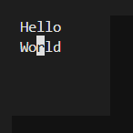
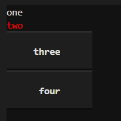
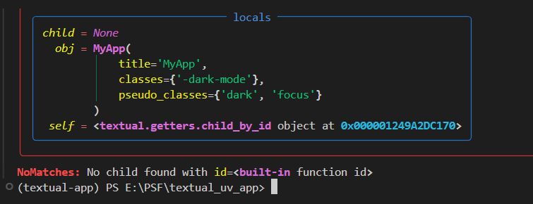

# Textual拾遗（2025）

## 0 为什么要写这个系列

《Textual的中文入门教程》完成后，Textual一直处于不断更新中，为了避免后续更新的内容导致需要不断修改已经完成的部分，特开设本系列，将每次更新的内容、常见问题的解决代码，按照创作的时间顺序单独写一节，并在标题中简要体现主要内容。这样的话，就可以让内容与时俱进。

简而言之，本系列教程可以看作是《Textual的中文入门教程》的续作，但是叙述上不再沿用系统性架构，而是采用类似于敏捷开发的叙述方式，随时补充新内容且不会在原始位置修改已发布的内容（但可能单开一节用于修订之前的内容）。

## 1 将`Markdown`标记文本组件中的代码块修改为自动换行

`Markdown`标记文本组件中的代码块默认不支持自动换行，如何修改为自动换行？

因为`MarkdownFence`类的`_block`方法返回的`Syntax`对象默认没有启用自动换行，在源码中修改是最简单的：

```python3
class MarkdownFence(MarkdownBlock):
    ... # 其他代码无需修改
    def _block(self) -> Syntax:
        return Syntax(
            self.code,
            lexer=self.lexer,
            word_wrap=True, # 只修改这里为True
            indent_guides=True,
            padding=(1, 2),
            theme=self.theme,
        )
```

然后在使用的时候，需要添加以下CSS样式：

```css
MarkdownFence > * {
    width: 100%;
}
```

如果不想每次更新Textual之后修改，可以在源代码开头添加以下补丁代码：

```python3
# patch is here
from textual.widgets import Markdown
from textual.widgets._markdown import (
    MarkdownFence,MarkdownBlock,HEADINGS,
    MarkdownBlockQuote,
    MarkdownBulletList,
    MarkdownHorizontalRule,
    MarkdownParagraph,
    MarkdownOrderedList,
    MarkdownOrderedListItem,
    MarkdownUnorderedListItem,
    MarkdownTable,
    MarkdownTD,MarkdownTBody,
    MarkdownTH,MarkdownTHead,
    MarkdownTR
)
from rich.syntax import Syntax
from textual.await_complete import AwaitComplete
import asyncio
from markdown_it import MarkdownIt
from typing import Iterable

class MarkdownFence(MarkdownFence):
    DEFAULT_CSS = """
    MarkdownFence {
        margin: 1 0;
        overflow: auto;
        width: 100%;
        height: auto;
        max-height: 20;
        color: rgb(210,210,210);
    }

    MarkdownFence > * {
        width: 100%; /* core of patch */
    }
    """
    def _block(self) -> Syntax:
        return Syntax(
            self.code,
            lexer=self.lexer,
            word_wrap=True, # core of patch
            indent_guides=True,
            padding=(1, 2),
            theme=self.theme,
        )
    
class Markdown(Markdown):
    def update(self, markdown: str) -> AwaitComplete:
        """Update the document with new Markdown.

        Args:
            markdown: A string containing Markdown.

        Returns:
            An optionally awaitable object. Await this to ensure that all children have been mounted.
        """
        parser = (
            MarkdownIt("gfm-like")
            if self._parser_factory is None
            else self._parser_factory()
        )

        table_of_contents = []

        def parse_markdown(tokens) -> Iterable[MarkdownBlock]:
            """Create a stream of MarkdownBlock widgets from markdown.

            Args:
                tokens: List of tokens

            Yields:
                Widgets for mounting.
            """

            stack: list[MarkdownBlock] = []
            stack_append = stack.append
            block_id: int = 0

            for token in tokens:
                token_type = token.type
                if token_type == "heading_open":
                    block_id += 1
                    stack_append(HEADINGS[token.tag](self, id=f"block{block_id}"))
                elif token_type == "hr":
                    yield MarkdownHorizontalRule(self)
                elif token_type == "paragraph_open":
                    stack_append(MarkdownParagraph(self))
                elif token_type == "blockquote_open":
                    stack_append(MarkdownBlockQuote(self))
                elif token_type == "bullet_list_open":
                    stack_append(MarkdownBulletList(self))
                elif token_type == "ordered_list_open":
                    stack_append(MarkdownOrderedList(self))
                elif token_type == "list_item_open":
                    if token.info:
                        stack_append(MarkdownOrderedListItem(self, token.info))
                    else:
                        item_count = sum(
                            1
                            for block in stack
                            if isinstance(block, MarkdownUnorderedListItem)
                        )
                        stack_append(
                            MarkdownUnorderedListItem(
                                self,
                                self.BULLETS[item_count % len(self.BULLETS)],
                            )
                        )
                elif token_type == "table_open":
                    stack_append(MarkdownTable(self))
                elif token_type == "tbody_open":
                    stack_append(MarkdownTBody(self))
                elif token_type == "thead_open":
                    stack_append(MarkdownTHead(self))
                elif token_type == "tr_open":
                    stack_append(MarkdownTR(self))
                elif token_type == "th_open":
                    stack_append(MarkdownTH(self))
                elif token_type == "td_open":
                    stack_append(MarkdownTD(self))
                elif token_type.endswith("_close"):
                    block = stack.pop()
                    if token.type == "heading_close":
                        heading = block._text.plain
                        level = int(token.tag[1:])
                        table_of_contents.append((level, heading, block.id))
                    if stack:
                        stack[-1]._blocks.append(block)
                    else:
                        yield block
                elif token_type == "inline":
                    stack[-1].build_from_token(token)
                elif token_type in ("fence", "code_block"):
                    fence = MarkdownFence(self, token.content.rstrip(), token.info)
                    if stack:
                        stack[-1]._blocks.append(fence)
                    else:
                        yield fence
                else:
                    external = self.unhandled_token(token)
                    if external is not None:
                        if stack:
                            stack[-1]._blocks.append(external)
                        else:
                            yield external

        markdown_block = self.query("MarkdownBlock")

        async def await_update() -> None:
            """Update in batches."""
            BATCH_SIZE = 200
            batch: list[MarkdownBlock] = []
            tokens = await asyncio.get_running_loop().run_in_executor(
                None, parser.parse, markdown
            )

            # Lock so that you can't update with more than one document simultaneously
            async with self.lock:
                # Remove existing blocks for the first batch only
                removed: bool = False

                async def mount_batch(batch: list[MarkdownBlock]) -> None:
                    """Mount a single match of blocks.

                    Args:
                        batch: A list of blocks to mount.
                    """
                    nonlocal removed
                    if removed:
                        await self.mount_all(batch)
                    else:
                        with self.app.batch_update():
                            await markdown_block.remove()
                            await self.mount_all(batch)
                        removed = True

                for block in parse_markdown(tokens):
                    batch.append(block)
                    if len(batch) == BATCH_SIZE:
                        await mount_batch(batch)
                        batch.clear()
                if batch:
                    await mount_batch(batch)
                if not removed:
                    await markdown_block.remove()

            self._table_of_contents = table_of_contents

            self.post_message(
                Markdown.TableOfContentsUpdated(
                    self, self._table_of_contents
                ).set_sender(self)
            )

        return AwaitComplete(await_update())
# patch is over
```

完整示例如下：

````python3
from textual.app import App
# patch is here
from textual.widgets import Markdown
from textual.widgets._markdown import (
    MarkdownFence,MarkdownBlock,HEADINGS,
    MarkdownBlockQuote,
    MarkdownBulletList,
    MarkdownHorizontalRule,
    MarkdownParagraph,
    MarkdownOrderedList,
    MarkdownOrderedListItem,
    MarkdownUnorderedListItem,
    MarkdownTable,
    MarkdownTD,MarkdownTBody,
    MarkdownTH,MarkdownTHead,
    MarkdownTR
)
from rich.syntax import Syntax
from textual.await_complete import AwaitComplete
import asyncio
from markdown_it import MarkdownIt
from typing import Iterable

class MarkdownFence(MarkdownFence):
    DEFAULT_CSS = """
    MarkdownFence {
        margin: 1 0;
        overflow: auto;
        width: 100%;
        height: auto;
        max-height: 20;
        color: rgb(210,210,210);
    }

    MarkdownFence > * {
        width: 100%; /* core of patch */
    }
    """
    def _block(self) -> Syntax:
        return Syntax(
            self.code,
            lexer=self.lexer,
            word_wrap=True, # core of patch
            indent_guides=True,
            padding=(1, 2),
            theme=self.theme,
        )
    
class Markdown(Markdown):
    def update(self, markdown: str) -> AwaitComplete:
        """Update the document with new Markdown.

        Args:
            markdown: A string containing Markdown.

        Returns:
            An optionally awaitable object. Await this to ensure that all children have been mounted.
        """
        parser = (
            MarkdownIt("gfm-like")
            if self._parser_factory is None
            else self._parser_factory()
        )

        table_of_contents = []

        def parse_markdown(tokens) -> Iterable[MarkdownBlock]:
            """Create a stream of MarkdownBlock widgets from markdown.

            Args:
                tokens: List of tokens

            Yields:
                Widgets for mounting.
            """

            stack: list[MarkdownBlock] = []
            stack_append = stack.append
            block_id: int = 0

            for token in tokens:
                token_type = token.type
                if token_type == "heading_open":
                    block_id += 1
                    stack_append(HEADINGS[token.tag](self, id=f"block{block_id}"))
                elif token_type == "hr":
                    yield MarkdownHorizontalRule(self)
                elif token_type == "paragraph_open":
                    stack_append(MarkdownParagraph(self))
                elif token_type == "blockquote_open":
                    stack_append(MarkdownBlockQuote(self))
                elif token_type == "bullet_list_open":
                    stack_append(MarkdownBulletList(self))
                elif token_type == "ordered_list_open":
                    stack_append(MarkdownOrderedList(self))
                elif token_type == "list_item_open":
                    if token.info:
                        stack_append(MarkdownOrderedListItem(self, token.info))
                    else:
                        item_count = sum(
                            1
                            for block in stack
                            if isinstance(block, MarkdownUnorderedListItem)
                        )
                        stack_append(
                            MarkdownUnorderedListItem(
                                self,
                                self.BULLETS[item_count % len(self.BULLETS)],
                            )
                        )
                elif token_type == "table_open":
                    stack_append(MarkdownTable(self))
                elif token_type == "tbody_open":
                    stack_append(MarkdownTBody(self))
                elif token_type == "thead_open":
                    stack_append(MarkdownTHead(self))
                elif token_type == "tr_open":
                    stack_append(MarkdownTR(self))
                elif token_type == "th_open":
                    stack_append(MarkdownTH(self))
                elif token_type == "td_open":
                    stack_append(MarkdownTD(self))
                elif token_type.endswith("_close"):
                    block = stack.pop()
                    if token.type == "heading_close":
                        heading = block._text.plain
                        level = int(token.tag[1:])
                        table_of_contents.append((level, heading, block.id))
                    if stack:
                        stack[-1]._blocks.append(block)
                    else:
                        yield block
                elif token_type == "inline":
                    stack[-1].build_from_token(token)
                elif token_type in ("fence", "code_block"):
                    fence = MarkdownFence(self, token.content.rstrip(), token.info)
                    if stack:
                        stack[-1]._blocks.append(fence)
                    else:
                        yield fence
                else:
                    external = self.unhandled_token(token)
                    if external is not None:
                        if stack:
                            stack[-1]._blocks.append(external)
                        else:
                            yield external

        markdown_block = self.query("MarkdownBlock")

        async def await_update() -> None:
            """Update in batches."""
            BATCH_SIZE = 200
            batch: list[MarkdownBlock] = []
            tokens = await asyncio.get_running_loop().run_in_executor(
                None, parser.parse, markdown
            )

            # Lock so that you can't update with more than one document simultaneously
            async with self.lock:
                # Remove existing blocks for the first batch only
                removed: bool = False

                async def mount_batch(batch: list[MarkdownBlock]) -> None:
                    """Mount a single match of blocks.

                    Args:
                        batch: A list of blocks to mount.
                    """
                    nonlocal removed
                    if removed:
                        await self.mount_all(batch)
                    else:
                        with self.app.batch_update():
                            await markdown_block.remove()
                            await self.mount_all(batch)
                        removed = True

                for block in parse_markdown(tokens):
                    batch.append(block)
                    if len(batch) == BATCH_SIZE:
                        await mount_batch(batch)
                        batch.clear()
                if batch:
                    await mount_batch(batch)
                if not removed:
                    await markdown_block.remove()

            self._table_of_contents = table_of_contents

            self.post_message(
                Markdown.TableOfContentsUpdated(
                    self, self._table_of_contents
                ).set_sender(self)
            )

        return AwaitComplete(await_update())
# patch is over

TEXT = '''\
```python3
from textual.widgets._markdown import (MarkdownFence,MarkdownBlock,HEADINGS, MarkdownBlockQuote, MarkdownBulletList,
    MarkdownHorizontalRule,
    MarkdownParagraph,
    MarkdownOrderedList,
    MarkdownOrderedListItem,
    MarkdownUnorderedListItem,
    MarkdownTable,
    MarkdownTD,MarkdownTBody,
    MarkdownTH,MarkdownTHead,
    MarkdownTR
)
```
'''

class MyApp(App):
    def on_mount(self):
        self.widgets = [
            Markdown(TEXT)
        ]
        self.mount_all(self.widgets)

if __name__ == '__main__':
    app = MyApp()
    app.run()
````

## 2 版本速览——3.2.0版本、3.6.0版本的新增内容

在Textual 3.2.0中，组件增加了反应性属性`compact`，通过设置此属性为`True`，即可让组件显示为非常紧凑的样式。除了按钮组件，后面要讲到的页脚组件、输入框组件、选项列表组件、单选集组件、下拉选择框组件、多选列表组件、模板化输入框组件、文本区域组件、复选框组件、单选按钮组件均支持反应性属性`compact`，也都添加了对应的参数`compact`。

在Textual 3.6.0中，文本区域组件增加了反应性属性`highlight_cursor_line`、对应的参数`highlight_cursor_line`（默认为`True`）。该参数、属性可以高亮光标所在行，对应的样式类为`text-area--cursor-line`。有了这个参数、属性之后，无需单独设置样式类，只需设置该参数、属性，即可禁用高亮光标所在行的行为。

以文本区域组件为例，新增内容的示例如下：

```python3
from textual.app import App
from textual.widgets import TextArea

TEXT = '''\
Hello
World
'''

class MyApp(App):
    CSS = '''
    TextArea {
        width: 12;
        height: 5;
    }
    .text-area--cursor-line {
      background: red;
    }
    '''
    def on_mount(self):
        self.widgets = [
            TextArea(
                TEXT,
                highlight_cursor_line=False,
                compact=True
            )
        ]
        self.mount_all(self.widgets)

if __name__ == '__main__':
    app = MyApp()
    app.run()
```



## 3 版本速览——3.7.0版本新增`textual.getter`模块

在Textual 3.7.0中，新增了`textual.getter`模块，该模块提供了两个新的类：

- `query_one`类，参数、效果类似组件的`query_one`方法。
- `child_by_id`类，参数、效果类似组件的`get_child_by_id`方法。

Textual为何要添加一个重复的功能呢？接下来，让笔者用代码演示一下新功能主要区别。

假如在代码中，创建了一个用于获取指定组件的属性（使用`property`装饰器装饰方法），用的是组件的`query_one`方法，那么代码如下：

```python3
from textual.app import App
from textual.widgets import Static,Button

class MyApp(App):
    def on_mount(self):
        self.widgets = [ 
            Static('one'),
            Static('two',classes='yes',id='yes'),
            Button('three'),
            Button('four',classes='yes')]
        self.mount_all(self.widgets)
    @property
    def yes_static(self):
        return self.query_one('.yes',Static)
    def on_click(self):
        self.yes_static.styles.color = 'red'
    
if __name__ == '__main__':
    app = MyApp()
    app.run()
```

在空白处点击，指定的组件内容就会变成红色：



代码很简单，没有什么特别。但是，如果使用`textual.getter`模块的`query_one`类，代码会更简单一些：

```python3
from textual.app import App
from textual.widgets import Static,Button
from textual import getters

class MyApp(App):
    def on_mount(self):
        self.widgets = [ 
            Static('one'),
            Static('two',classes='yes',id='yes'),
            Button('three'),
            Button('four',classes='yes')]
        self.mount_all(self.widgets)
    yes_static = getters.query_one('.yes',Static)
    def on_click(self):
        self.yes_static.styles.color = 'red'
    
if __name__ == '__main__':
    app = MyApp()
    app.run()
```

无需创建函数并用`property`装饰器装饰，直接创建成员即可。该成员就是`query_one`类对象，参数与组件的`query_one`方法相同，用起来和创建的属性（使用`property`装饰器装饰方法）一样。

`child_by_id`类的用法有点不一样，并且当前版本有一处笔误（不影响代码正常执行）和限制（适用范围和`query_one`类不一样），需要特别注意一下限制。

但在介绍`child_by_id`类之前，先来介绍一下组件的`get_child_by_id`方法，因为前面还没介绍过。

先看示例：

```python3
from textual.app import App
from textual.widgets import Static,Button

class MyApp(App):
    def on_mount(self):
        self.widgets = [ 
            Static('one'),
            Static('two',classes='yes',id='yes'),
            Button('three'),
            Button('four',classes='yes')
        ]
        self.mount_all(self.widgets)
    @property
    def yes_static(self):
        return self.get_child_by_id('yes',Static)
    def on_click(self):
        self.yes_static.styles.color = 'red'
    
if __name__ == '__main__':
    app = MyApp()
    app.run()
```

`get_child_by_id`方法用于获取直接子级中指定`id`的组件。注意，虽然`Screen`才是`App`的直接子级，但在实际使用时，`App`的`get_child_by_id`方法会调用`Screen`的`get_child_by_id`方法。

`get_child_by_id`方法支持以下参数：

- `id`参数，字符串类型，表示组件的`id`。
- `expect_type`参数，相关组件类，表示预期的组件类型。不过，每个组件的`id`都是唯一的，该参数更多用于`get_child_by_id`方法返回结果的智能提示，或者检查`id`是否与组件类型是否匹配。

不过，在`App`中使用时，`child_by_id`类会报错：

```python3
from textual.app import App
from textual.widgets import Static,Button
from textual import getters

class MyApp(App):
    def on_mount(self):
        self.widgets = [ 
            Static('one'),
            Static('two',classes='yes',id='yes'),
            Button('three'),
            Button('four',classes='yes')
        ]
        self.mount_all(self.widgets)
    yes_static = getters.child_by_id('yes',Static)
    def on_click(self):
        self.yes_static.styles.color = 'red'
    
if __name__ == '__main__':
    app = MyApp()
    app.run()
```

报错（同时还暴露出笔误）为：



当然，可以`query_one`类代替`child_by_id`类，只需将选择器替换为ID选择器即可解决：

```python3
from textual.app import App
from textual.widgets import Static,Button
from textual import getters

class MyApp(App):
    def on_mount(self):
        self.widgets = [ 
            Static('one'),
            Static('two',classes='yes',id='yes'),
            Button('three'),
            Button('four',classes='yes')
        ]
        self.mount_all(self.widgets)
    yes_static = getters.query_one('#yes',Static)
    def on_click(self):
        self.yes_static.styles.color = 'red'
    
if __name__ == '__main__':
    app = MyApp()
    app.run()
```

但是，`child_by_id`类出错并不意味着`child_by_id`类完全不能使用，只是因为其有所限制，不能在`App`中使用。如果是在`Screen`中或者自定义的组件类中，那就可以正常使用：

```python3
from textual.app import App
from textual.widgets import Static,Button
from textual import getters
from textual.screen import Screen

class Welcome(Screen):
    def on_mount(self):
        self.widgets = [ 
            Static('one'),
            Static('two',classes='yes',id='yes'),
            Button('three'),
            Button('four',classes='yes')
        ]
        self.mount_all(self.widgets)
    yes_static = getters.child_by_id('yes',Static)
    def on_click(self):
        self.yes_static.styles.color = 'red'

class MyApp(App):
    def on_mount(self):
        self.push_screen(Welcome())
    
if __name__ == '__main__':
    app = MyApp()
    app.run()
```

笔者翻阅了源码之后，发现`child_by_id`类的`__get__`方法中的关键代码就是`child = obj._nodes._get_by_id(self.child_id)`，而`App`的`_nodes`属性中只有`Screen`，所以在`App`中使用`child_by_id`类的话只能获取到`Screen`，`child_by_id`类的适用范围并不包括`App`，或者说`App`中没有针对`child_by_id`类的适配代码。当然，适配代码没法写在`App`中，只能写在`child_by_id`类的`__get__`方法。

为了能在`App`中使用`child_by_id`类，这里提供了一个简单的修复补丁，将`child_by_id`类的`__get__`方法中的关键代码替换为调用`get_child_by_id`方法，而非添加针对`App`的适配代码（添加适配代码的方式会导致补丁内容较多）。

修复补丁为：

```python3
from textual import getters
from textual.css.query import QueryType
from textual.dom import DOMNode
from textual.widget import Widget

# 如果是使用 from textual.getters import child_by_id 导入原child_by_id类
# 这里可以改为 class child_by_id(child_by_id): 直接替换原child_by_id类
# 或者是 class child_by_id2(child_by_id): 创建类似但解除限制的child_by_id2类
class child_by_id(getters.child_by_id):
    def __get__(
        self: 'child_by_id[QueryType]', obj: DOMNode | None, obj_type: type[DOMNode]
    ) -> QueryType | Widget | 'child_by_id':
        '''Get the widget matching the selector and/or type.'''
        if obj is None:
            return self
        child = obj.get_child_by_id(self.child_id,self.expect_type)
        return child
    
# 按照实际需求决定是否替换原child_by_id类
getters.child_by_id = child_by_id
```

回归在`App`中使用`child_by_id`类的示例，加上上面的修复补丁，报错完美解决：

```python3
from textual.app import App
from textual.widgets import Static,Button
from textual import getters
from textual.css.query import QueryType
from textual.dom import DOMNode
from textual.widget import Widget

# 如果是使用 from textual.getters import child_by_id 导入原child_by_id类
# 这里可以改为 class child_by_id(child_by_id): 直接替换原child_by_id类
# 或者是 class child_by_id2(child_by_id): 创建类似但解除限制的child_by_id2类
class child_by_id(getters.child_by_id):
    def __get__(
        self: 'child_by_id[QueryType]', obj: DOMNode | None, obj_type: type[DOMNode]
    ) -> QueryType | Widget | 'child_by_id':
        '''Get the widget matching the selector and/or type.'''
        if obj is None:
            return self
        child = obj.get_child_by_id(self.child_id,self.expect_type)
        return child
    
# 按照实际需求决定是否替换原child_by_id类
getters.child_by_id = child_by_id

class MyApp(App):
    def on_mount(self):
        self.widgets = [ 
            Static('one'),
            Static('two',classes='yes',id='yes'),
            Button('three'),
            Button('four',classes='yes')
        ]
        self.mount_all(self.widgets)
    yes_static = getters.child_by_id('yes',Static)
    def on_click(self):
        self.yes_static.styles.color = 'red'
    
if __name__ == '__main__':
    app = MyApp()
    app.run()
```


# Textual拾遗（2026）

## 0 2026版前言

NiceGUI不断更新，开发时遇到的问题也层出不穷，学习更是温故而知新。因此，2026年，笔者将继续本教程系列的更新，沿袭2025版的目标，添补NiceGUI学习中欠缺的知识。


## 1 版本速览——x.x.x版本新增内容（多个小功能合并讲解）


## 2 版本速览——x.x.x版本新增xxx（具体的单个功能）


## 1 （修正2025.13）

原内容存在错误，修正错误。

## 1 （补充2025.13）

原内容不全面，补充内容。

## 1 （扩展2025.13）

从原内容想到的其他内容，虽然可以作为独立的内容写标题，但这部分内容确实是看完原内容才有了创作契机。