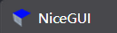
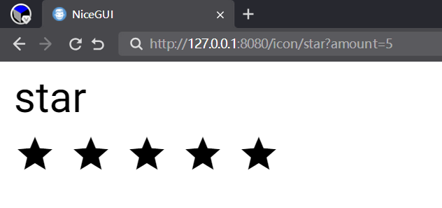
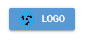
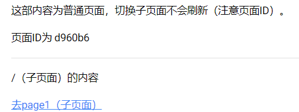
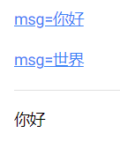
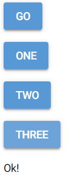
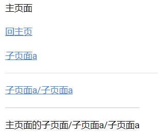
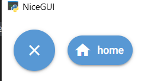
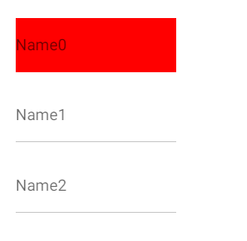
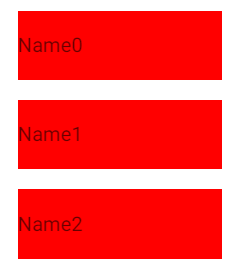

# NiceGUI拾遗（2025）

## 0 为什么要写这个系列

《NiceGUI的中文入门教程》完成后，NiceGUI一直处于不断更新中，同时《NiceGUI的中文入门教程》也不是完美的，需要不断补充、修改内容，这也导致该教程后续不断增补内容，影响教程的完整性，也不好写标题。为了和《NiceGUI的中文入门教程》的系统性教程做出区分，《NiceGUI拾遗》应运而生。《NiceGUI拾遗》采用线性编写原则，按照时间顺序编写《NiceGUI的中文入门教程》中的遗漏内容、NiceGUI的更新内容，采取想起哪些写哪些的原则，但是标题中会尽量简短地与内容关联，避免出现《NiceGUI的中文入门教程》中为了确保教程完整性不得不沿用原标题的情况。

此外，《NiceGUI的中文入门教程》中的具体示例也会放在这里继续更新，并在标题中体现示例的主要用途。

简而言之，本系列教程可以看作是《NiceGUI的中文入门教程》的续作，但是叙述上不再沿用系统性架构，而是采用类似于敏捷开发的叙述方式，随时补充新内容且不会在原始位置修改已发布的内容（但可能单开一节用于修订之前的内容）。

## 1 使用环境变量配置NiceGUI程序

原文参考自 https://nicegui.io/documentation/section_configuration_deployment#environment_variables 。

在NiceGUI中，有些设置项只能通过修改环境变量实现：

- `MATPLOTLIB`，默认为`'true'`，表示是否自动导入`matplotlib`(`ui.pyplot`和`ui.line_plot`依赖此库），可以将此环境变量设置为`'false'`来避免自动导入，减少导入`nicegui`所需的时间，同时也会导致`ui.pyplot`和`ui.line_plot`无法使用。

  以下为用于对比的示例，读者可以修改环境变量值，冷启动（完全退出再重新打开）看看导入所需的时间：

  ```python3
  import os
  os.environ['MATPLOTLIB'] = 'false'
  
  import time
  start_time = time.time()
  
  from nicegui import ui
  
  end_time = time.time()
  
  print(f'used {end_time- start_time}')
  
  ui.button('Test')
  
  ui.run(native=True)
  ```

- `NICEGUI_STORAGE_PATH`，默认为`'.nicegui'`，表示使用`app.storage`时，需要在服务器磁盘存储数据的空间，具体使用哪个位置，默认为运行命令时当前路径下的`.nicegui`文件夹。

- `NICEGUI_REDIS_URL`，默认未设置（即为`None`），表示使用`app.storage`时，相关数据存储在哪个Redis服务器中，该环境变量需要设置为包含Redis协议的完整地址，比如`'redis://redis_server_host:6379'`，如果不设置（即默认值），则表示相关数据存储在本地文件夹中。

- `NICEGUI_REDIS_KEY_PREFIX`，默认为`'nicegui'`，表示使用`app.storage`，相关数据存储在Redis服务器中时，相关数据的键使用什么作为前缀。

- `MARKDOWN_CONTENT_CACHE_SIZE`，默认为`'1000'`，表示`ui.markdown`在内存中缓存多少个内容片段，如果使用`ui.markdown`时，程序占用内存太高，可以调整该值。

- `RST_CONTENT_CACHE_SIZE`，默认为`'1000'`，表示`ui.restructured_text`在内存中缓存多少个内容片段，如果使用`ui.restructured_text`时，程序占用内存太高，可以调整该值。

  ```python3
  from nicegui import ui
  from nicegui.elements import markdown,restructured_text
  
  import os
  os.environ['MARKDOWN_CONTENT_CACHE_SIZE'] = '1'
  os.environ['RST_CONTENT_CACHE_SIZE'] = '1'
  
  ui.label(f'MARKDOWN_CONTENT_CACHE_SIZE is {markdown.prepare_content.cache_info().maxsize}')
  ui.label(f'RST_CONTENT_CACHE_SIZE is {restructured_text.prepare_content.cache_info().maxsize}')
  
  ui.run(native=True)
  ```

## 2 通过点击按钮来关闭NiceGUI程序

一般来说，关闭NiceGUI程序的正确操作是在终端按下`Ctrl`+`C`。但是，NiceGUI程序作为一个网站运行时，用户是接触不到终端的。假如需要通过网页关闭NiceGUI程序，可以使用`app.shutdown()`来关闭整个程序，代码如下：

```python3
from nicegui import ui,app

ui.button('shutdown',on_click=app.shutdown)

ui.run(native=True)
```

## 3 允许Native Mode的NiceGUI程序弹出下载对话框

默认情况下，在以Native Mode运行的NiceGUI程序中，`ui.download`是不能下载的，这是pywebview框架（Native Mode的依赖）默认的安全配置，这时需要使用`app.native.settings['ALLOW_DOWNLOADS'] = True`来修改pywebview的安全配置，代码如下：

```python3
from nicegui import ui, app

app.native.settings['ALLOW_DOWNLOADS'] = True
ui.button('Download', on_click=lambda: ui.download(b'Demo text','demo_file.txt'))

ui.run(native=True)
```

## 4 让Native Mode的NiceGUI程序使用Qt的QtWebEngine作为运行时

默认情况下，如果Windows系统安装了Webview2，哪怕添加了Qt6相关的Python包（PyQT6、PySide6），以Native Mode运行的NiceGUI程序还是优先采用Webview2当作浏览器运行时。如果想要以Native Mode运行的NiceGUI程序采用QtWebEngine当做浏览器运行时，需要手动指定pywebview框架的Web engine（参考文档见 https://pywebview.flowrl.com/guide/web_engine.html），代码如下：

```python3
from nicegui import ui, app

app.native.start_args['gui'] = 'qt'
app.native.start_args['icon'] = 'favicon.ico'
# For 'gui' arg,you needn't assign it usually,besides you want to change the render; 
#  'edgechromium' is best on Windows ;
# qt based is a litte heavy,but it can be used on Windows/Linux/Mac;
# try to install qt libs by `pip install pywebview[qt]` or else:
#  'qt' needs ["QtPy", "PyQt6", "PyQt6-WebEngine"];
#  'qt6' needs ["QtPy", "PyQt6", "PyQt6-WebEngine"];
#  'pyside6' needs ["QtPy", "PySide6"];

ui.button('Say Hi',on_click=lambda :ui.notify('Hello World!'))

ui.run(native=True)
```

使用QtWebEngine当做浏览器运行时，窗口图标默认为Windows默认图标，而不是Python的图标，可以像代码中一样，使用`app.native.start_args['icon'] = 'favicon.ico'`指定，路径默认为源代码同目录，可以使用相对路径或者绝对路径。

## 5 让Native Mode的NiceGUI程序使用固定版本或者非系统自带的Webview2作为运行时

默认情况下，如果Windows系统安装了Webview2，以Native Mode运行的NiceGUI程序优先采用系统的Webview2当作浏览器运行时。但是，系统的Webview2更新很快，而且是自动更新，若是开发的程序与最新版Webview2不兼容或者想要避免系统Webview2版本更新导致的潜在问题，则可以设置环境变量`WEBVIEW2_BROWSER_EXECUTABLE_FOLDER`为指定版本Webview2解压之后的路径，让native mode运行时使用固定版本Webview2。

固定版本Webview2可以到Webview2官网（https://developer.microsoft.com/zh-cn/microsoft-edge/webview2）下载，本解决方案参考自微软开发者文档（https://learn.microsoft.com/zh-cn/microsoft-edge/webview2/concepts/distribution?tabs=dotnetcsharp#details-about-the-fixed-version-runtime-distribution-mode）。

代码如下：

```python3
from nicegui import ui
import os
import pathlib
os.environ['WEBVIEW2_BROWSER_EXECUTABLE_FOLDER'] = str(pathlib.Path(__file__).parent/'Microsoft.WebView2.FixedVersionRuntime.135.0.3179.98.x64')

ui.run(native=True)
```

这里是将固定版本Webview2解压之后，将包含可执行文件`msedgewebview2.exe`的文件夹（文件夹名字为`'Microsoft.WebView2.FixedVersionRuntime.135.0.3179.98.x64'`）放到源代码的同级目录中，读者在实际使用时可以自行变换路径。

## 6 修改网站在标题栏的logo（也就是favicon）

修改`ui.run()`的默认参数`favicon`为自己logo的地址（图片地址，注意图片的格式要求）或者字符（仅支持单个字符，可以是汉字或者emoji），例如：`ui.run(favicon='🚀')`。


favicon为图片时有以下要求：

- 像素不低于16x16。
- 图片格式支持`.ico`、`.png`、`.jpg`、`.svg`、`.gif`。注意，这里指的是图片格式，并不是后缀，哪怕后缀不是这些格式，但图片本身是这些格式，依然可以。

完整的favicon支持情况，可以参考 https://en.wikipedia.org/wiki/Favicon 。

以下为使用图片文件（图片文件与源代码在同一目录下）的示例：

```python3
from nicegui import ui
import pathlib

ui.run(favicon=str(pathlib.Path(__file__).parent/'LOGO.png'))
```



## 7 `ui.refreshable`刷新时不会刷新外部的控件

有的读者在使用`ui.refreshable`装饰器的时候，遇到了一个奇怪的问题，这里分享一下，那就是创建在`ui.refreshable`装饰的函数内的控件不会刷新。

以下面代码为例：

```python3
from nicegui import ui
from datetime import datetime

@ui.refreshable
def time_box(container:ui.element):
    with container:
        ui.label(datetime.now())

card1 = ui.card()
time_box(card1)

ui.button('refresh',on_click=time_box.refresh)

ui.run(native=True)
```

先创建了一个`ui.card`，然后给`refreshable`修饰的方法传入，在方法内部，想要通过`with container`进入`ui.card`的上下文，在其内部创建可以刷新的时间标签。然而，实际执行的时候就会发现，标签并没有如预期那样刷新，而是不断创建新的标签。

为什么？

其实，`refreshable`方法相当于创建了一个可刷新的控件，并将方法内部创建的控件的上下文指定为可刷新控件。每次调用刷新方法，实际上是先清空可刷新控件内的所有控件，然后执行一遍方法内创建控件的过程。但是，使用`with container`之后，接下来创建的控件的上下文是`container`——外部控件，而不是可刷新控件，此时创建的控件不属于可刷新控件的内部控件，而是外部控件的子控件。因此，每次调用刷新方法之后，方法中创建的控件非但不会被清空，反而因为执行了一遍方法内创建控件的过程，`container`下的控件会多一个。

如果想要实现借用已经创建的控件当容器，让内部控件可以刷新，就要在创建之前，模拟可刷新控件的清空操作：

```python3
from nicegui import ui
from datetime import datetime

@ui.refreshable
def time_box(container:ui.element):
    container.clear()
    with container:
        ui.label(datetime.now())

card1 = ui.card()
time_box(card1)

ui.button('refresh',on_click=time_box.refresh)

ui.run(native=True)
```

但需要注意的是，这种变通的操作仅限外部控件是空壳的容器，如果想要给已经有子控件的外部控件创建可刷新的部分，则不能这样操作，还是要套一个容器，或者直接使用可刷新控件作为上下文（相当于可刷新控件是容器）。

## 8 使用TailWindCSS样式定义按钮颜色

如果想要在定义按钮之后修改按钮的颜色，却发现`bg-*`的TailWindCSS样式没有用，该如何解决？

按钮的默认颜色由Quasar控制，而Quasar的颜色样式使用了最高优先级的`!important`，TailWindCSS的颜色样式默认比这个低，所以无法成功。如果想修改颜色，可以修改按钮的`color`属性。或者使用`!bg-*`来强制应用。代码如下：

```python3
from nicegui import ui

ui.button('button').props('color="red-10"')
#或者强制应用TailWindCSS
ui.button('button').classes('!bg-red-700')

ui.run(native=True)
```


注意：Quasar的颜色体系和TailWindCSS的颜色体系不同。Quasar中，使用`color-[1-14]`来表示颜色，数字表示颜色程度，可选。TailWindCSS中，使用`type-color-[50-950]`表示颜色，type为功能类别，数字表示颜色程度，可选。需要注意代码中不同方式使用的颜色体系。

## 9 在不使用CSS情况下实现一个 Floating Action Button

Floating Action Button可以简单理解为只有图标的圆形按钮，如果熟悉CSS样式的话，可以将普通的按钮改成类似样式，但是，`ui.button`自带一个`fab`属性（`props`），可以一步完成，这就省去了调整CSS的过程，代码如下：

```python3
from nicegui import ui

ui.button(icon='home', on_click=lambda: ui.notify('home')).props('fab')

ui.run(native=True)
```


## 10 使用异步等待实现一次性的向导功能

`ui.stepper`提供了功能完善的向导功能，但是，如果只是简单使用一次性、无需后退的向导功能，想要快速搭建的话，完全可以不用`ui.stepper`，按钮的`clicked`方法返回一个可以异步等待的对象，只有点击一次按钮，该异步对象才会完成一次。借助按钮的这个特性，可以只使用按钮，搭建一个一次性的向导页面：

```python3
from nicegui import ui

@ui.page('/')
async def index():
    b = ui.button('Go')
    await b.clicked()
    b.text = 'One'
    await b.clicked()
    b.text = 'Two'
    await b.clicked()
    b.text = 'Three'
    await b.clicked()
    b.text = 'Home'
    # 设置点击按钮的功能为刷新页面，相当于重置上面已经点击的次数
    b.on_click(ui.navigate.reload)

ui.run(native=True)
```


每次点击，按钮的文字都会改变，直到所有步骤完成，按钮的功能变成刷新页面，此时刷新页面就会重置之前的所有步骤，恢复到页面最初的状态。

注意，因为涉及到异步，因此所有内容需要放在异步函数内，同时也只能在`ui.page`中使用异步等待。

## 11 点击嵌入按钮的图标时不触发按钮的点击事件

如果在按钮的上下文中嵌入图标，给图标的点击事件设置单独的响应函数，点击图标的话，会同时触发按钮和图标的点击响应函数。这是因为HTML处理子级元素的事件时，会把该事件传播到父级元素中，同时触发父级元素的同类事件。

解决方法也很简单，只需给子级元素的响应函数中，添加JavaScript代码，执行对应事件的`stopPropagation()`方法，来阻止事件的传播即可：

```python3
from nicegui import ui

with ui.button('Item').classes('w-96') as button:
    button.on_click(lambda :ui.notify('button'))
    ui.space()
    icon = ui.icon('delete')
    icon.on('click',js_handler='(e)=>{e.stopPropagation()}')
    icon.on('click',lambda :ui.notify('icon'))
    
ui.run(native=True)
```


## 12 通过URL给NiceGUI程序传参

因为NiceGUI是基于FastAPI实现的，因此，FastAPI的参数注入（用法参考 https://fastapi.tiangolo.com/tutorial/path-params/ 、https://fastapi.tiangolo.com/tutorial/query-params/ 、https://fastapi.tiangolo.com/advanced/using-request-directly/ ）在NiceGUI程序中也能使用。

直接在URL中的路径参数（路径中的部分字段即为参数的值，比如`/icon/star`），需要通过定义通配路径来捕获，比如`'/icon/{icon}'`。在英文问号之后的查询参数（需要显式指明参数和对应的值，比如`/icon/star?amount=5`），则会自动捕获。两种参数都可以在`ui.page`装饰的函数中创建同名参数后，在函数内部使用：

```python3
from nicegui import ui

@ui.page('/icon/{icon}')
def icons(icon: str, amount: int = 1):
    ui.label(icon).classes('text-h3')
    with ui.row():
        [ui.icon(icon).classes('text-h3') for _ in range(amount)]
        
ui.link('Star', '/icon/star?amount=5')
ui.link('Home', '/icon/home')
ui.link('Water', '/icon/water_drop?amount=3')

ui.run()
```



## 13 使用其他控件模拟`ui.step`

给任意控件增加`.props['name']`和`.props['title']`属性，该控件就能当作`ui.step`来使用：

```python3
from nicegui import ui

with ui.stepper(
    value='First',
).classes('w-full') as stepper:
    with ui.element('h1') as first:
        first.props.update(dict(name='First', title='First step'))
        ui.label('Do it fisrt.')
        with ui.stepper_navigation(wrap=True):
            ui.button('Next', on_click=stepper.next)
    with ui.element('h3') as second:
        second.props.update(dict(name='Second', title='Second step'))
        ui.label('Do it second.')
        with ui.stepper_navigation(wrap=True):
            ui.button('Next', on_click=stepper.next)
            ui.button('Back', on_click=stepper.previous).props('flat')
    with ui.element('h5') as last:
        last.props.update(dict(name='last', title='Last step'))
        ui.label('Do it last.')
        with ui.stepper_navigation(wrap=True):
            ui.button('Done', on_click=lambda: ui.notify(
                'Done!', type='positive'))
            ui.button('Back', on_click=stepper.previous).props('flat')

ui.run(native=True)
```

## 14 将`ui.stepper`的控制按钮外置

除了在每一步中创建一组控制按钮，还可以在外面创建控制按钮。只不过，为了准确匹配第一步、最后一步和其他步骤中控制按钮的状态（第一步时只显示下一步按钮，中间步骤时显示上一步按钮、下一步按钮，最后一步只显示上一步按钮和完成按钮），需要将对应按钮的显示状态与相应步骤绑定：

```python3
from nicegui import ui

with ui.stepper(
    value='First',
    keep_alive=True
).classes('w-full') as stepper:
    with ui.step(name='First', title='First step', icon='home') as first:
        ui.label('Do it fisrt.')
    with ui.step(name='Second', title='Second step', icon='home') as second:
        ui.label('Do it second.')
    with ui.step(name='Last', title='Last step', icon='home') as last:
        ui.label('Do it last.')

with ui.stepper_navigation():
    next_btn = ui.button('Next', on_click=stepper.next)
    next_btn.bind_visibility_from(
        stepper,
        'value',
        lambda x: x != last.props['name']
    )
    last_btn = ui.button('Done')
    last_btn.bind_visibility_from(
        stepper,
        'value',
        lambda x: x == last.props['name']
    )
    last_btn.on_click(lambda: ui.notify('Done!', type='positive'))
    back_btn = ui.button('Back', on_click=stepper.previous).props('flat')
    back_btn.bind_visibility_from(
        stepper,
        'value',
        lambda x: x != first.props['name']
    )

ui.run(native=True)

```


在上面的代码中，下一步按钮只会在当前步骤不是最后一步时显示。完成按钮和下一步按钮在相同位置，条件完全相反，因此，完成按钮只会在当前步骤是最后一步时显示。上一步按钮只会在当前步骤不是第一步时显示。

判断当前步骤的方法很简单，`ui.stepper`的`value`属性表示当前步骤的名字，具体步骤对应的则是`props['name']`的值，二者相等时，就表示当前步骤为那一步。

## 15 给`icon`参数传入图片文件地址

`icon`参数除了可以接收图标名字，还可以接收图片文件（推荐使用SVG格式的矢量图）的地址，但是要在图片文件的地址前加上`'img:'`，用于表明图标将使用图片文件，比如`'img:https://cdn.quasar.dev/logo-v2/svg/logo.svg'`：

```python3
from nicegui import ui

ui.button(text='LOGO',icon='img:https://cdn.quasar.dev/logo-v2/svg/logo.svg')

ui.run(native=True)
```



## 16 自定义`ui.carousel`（轮播图）的控制控件

使用`ui.carousel`的`'control'`slot（`add_slot('control')`，具体用法参考 https://quasar.dev/vue-components/carousel#qcarouselcontrol-api ），可以在`ui.carousel`上添加其他内容，比如与之关联的控制按钮：

```python3
from nicegui import ui

with ui.carousel(animated=True, arrows=True, navigation=True).props('height=180px').classes('bg-green-400') as carousel:
    with ui.carousel_slide().classes('p-0'):
        ui.image('https://picsum.photos/id/30/270/180').classes('w-[270px]')
    with ui.carousel_slide().classes('p-0'):
        ui.image('https://picsum.photos/id/31/270/180').classes('w-[270px]')
    with ui.carousel_slide().classes('p-0'):
        ui.image('https://picsum.photos/id/32/270/180').classes('w-[270px]')
    with carousel.add_slot('control') ,ui.element('q-carousel-control').props('position="top-right"'):
        ui.button('<',on_click=carousel.previous)
        ui.button('>',on_click=carousel.next)

ui.run(native=True)
```


## 17 获取视频的播放进度

目前NiceGUI没有实现视频控件的播放进度（`currentTime`）属性，想要获取视频的播放进度，只能使用JavaScript代码获取控件的`currentTime`属性，并使用定时器实时刷新相关的标签。示例如下：

```python3
from nicegui import ui

@ui.page('/')
async def index():
    v = ui.video(src='https://test-videos.co.uk/vids/bigbuckbunny/mp4/h264/360/Big_Buck_Bunny_360_10s_1MB.mp4',
             controls=True, autoplay=False, muted=False, loop=False)
    
    label = ui.label(f'当前播放进度为 {0} 秒。')
    async def get_current_time():
        time = await ui.run_javascript(f'getHtmlElement({v.id}).currentTime')
        label.set_text(f'当前播放进度为 {int(time)} 秒。')
    timer = ui.timer(0.1,get_current_time,immediate=False)
    v.on('play', lambda _:setattr(timer,'active',True))
    v.on('pause', lambda _:setattr(timer,'active',False))
    v.on('ended', lambda _:setattr(timer,'active',False))

ui.run(native=True)
```


## 18 版本速览——2.20.0版本新增自定义程序内报错的响应页面

NiceGUI 2.20.0 新增自定义程序内报错的响应页面。与HTTP报错的自定义响应页面不同，该响应页面需要程序内触发异常，只是触发HTTP的错误状态码（比如文件不存在的404），是不会显示该响应页面的。

正好趁着介绍本次版本更新的内容，顺便补充一下如何自定义HTTP报错（状态码）的响应页面。

以下示例包含程序内报错和HTTP报错的自定义响应页面：

```python3
from nicegui import ui, app

# 自定义程序内报错的响应页面
@app.on_page_exception
def error_handler(exception: Exception) -> None:
    ui.label(f'触发的异常为 {exception}')

@ui.page('/')
def index():
    raise Exception('主动触发错误')

# 自定义HTTP报错的响应页面
from nicegui import ui, Client
from fastapi import Request

@app.exception_handler(404)
def exception_handler_404(request:Request, exception: Exception):
    from urllib.parse import urlparse
    with Client(ui.page('/404'),request=request) as client:
        ui.label(f'页面 {urlparse(str(request.url)).path[1:]} 不存在')
    return client.build_response(request, 404)

ui.run()
```


## 19 版本速览——2.21.0版本新增允许使用其他基于VUE的前端UI框架

是否厌倦了NiceGUI只能使用Quasar的控件，想要让NiceGUI使用其他UI的控件？

NiceGUI 2.21.0 新增`app.config.vue_config_script`属性，该属性主要用于初始化VUE应用，可以给该属性追加其他基于VUE的框架的初始化代码，从而可以在NiceGUI程序中，通过`ui.element`使用其他框架的控件。

以Element Plus框架（https://cn.element-plus.org/zh-CN/component/button.html）和Naive UI框架（https://www.naiveui.com/zh-CN/os-theme/components/button）为例，需要先使用`ui.add_body_html`添加框架所需的JavaScript文件和CSS文件，然后通过给`app.config.vue_config_script`追加初始化代码。

推荐追加初始化代码，直接替换的话，需要添加原始的初始化代码：

```javascript
app.use(Quasar, {config: vue_config});
Quasar.lang.set(Quasar.lang[language.replace('-', '')]);
Quasar.Dark.set(dark === None ? 'auto' : dark);
```

注意，该功能仅是实验性功能，不能确保NiceGUI默认使用的Quasar框架与其他基于VUE的框架百分百兼容，也无法保证使用其他框架之后，NiceGUI程序依然正常，请慎重使用该功能。

完整示例如下：

```python3
from nicegui import ui,app

ui.add_body_html('''
    <link rel='stylesheet' href='//unpkg.com/element-plus/dist/index.css' />
    <script defer src='https://unpkg.com/element-plus'></script>
    <script defer src='https://unpkg.com/naive-ui'></script>
''')
app.config.vue_config_script += '''
    app.use(ElementPlus);
    app.use(naive);
'''

with ui.element('el-button').props('type="primary"').on('click', lambda: ui.notify('Hi from ElementPlus')):
    ui.html('Element Plus button')

with ui.element('n-button').props('type="primary"').on('click', lambda: ui.notify('Hi from NaiveUI')):
    ui.html('Naive UI button')

ui.button('Quasar button', on_click=lambda: ui.notify('Hello from Quasar(NiceGUI)'))

ui.run(native=True)
```


## 20 在Native Mode的NiceGUI程序中打开对话框（不使用JavaScript）

在以Native Mode运行的NiceGUI程序中，除了使用JavaScript调用确认对话框、文件对话框，还可以基于pywebview，使用Python的接口调用这两种对话框。相比于使用JavaScript，直接使用Python的接口，操作更简单，支持的参数也更多。

### 20.1 确认对话框

使用`app.native.main_window.create_confirmation_dialog`方法即可创建确认对话框：

```python3
from nicegui import ui,app

async def open_dialog():
    # 确认对话框返回布尔值
    result =  await app.native.main_window.create_confirmation_dialog(
        title='选择',
        message='是否继续'
    )
    ui.notify(result)

ui.button('Open Dialog', on_click=open_dialog)

ui.run(native=True)
```


`app.native.main_window.create_confirmation_dialog`方法支持以下参数：

- `title`参数，字符串类型，表示对话框的标题。
- `message`参数，字符串类型，表示对话框的内容。

确认对话框会根据用户的选择返回布尔值，因此，需要使用异步等待获取返回值。

### 20.2 文件择对话框

使用`app.native.main_window.create_file_dialog`方法即可创建文件对话框：

```python3
from nicegui import ui,app

async def open_dialog():
    result =  await app.native.main_window.create_file_dialog()
    ui.notify(result)

ui.button('Open Dialog', on_click=open_dialog)

ui.run(native=True)
```


`app.native.main_window.create_file_dialog`方法支持以下参数：

- `dialog_type`参数，整数类型，表示文件对话框的类型，默认为`webview.OPEN_DIALOG`。仅支持`[10,20,30]`中的值，分别对应打开文件、打开目录、保存文件。其中保存文件并不会直接创建该文件，只是返回该文件的最终路径，后续需要基于此路径额外执行创建文件的过程，该方法并不负责创建文件。

  除了直接使用整数表示文件对话框的类型，`webview`库还提供了三个预定义常量（也就是该参数默认值的用法），可以根据变量名判断出不同值的含义：

  ```python3
  OPEN_DIALOG = 10
  FOLDER_DIALOG = 20
  SAVE_DIALOG = 30
  ```

  注意，`webview`库升级为6.0之后，这三个预定义常量已经标记为弃用，推荐改用`webview.FileDialog`的成员`LOAD`（对应`OPEN_DIALOG`）、`FOLDER`（对应`FOLDER_DIALOG`）和 `SAVE`（对应`SAVE_DIALOG`）。

  示例如下：

  ```python3
  from nicegui import ui,app
  
  async def open_dialog():
      import webview
      result =  await app.native.main_window.create_file_dialog(
          dialog_type = webview.SAVE_DIALOG
      )
      ui.notify(result)
  
  ui.button('Open Dialog', on_click=open_dialog)
  
  ui.run(native=True)
  ```

- `directory`参数，字符串类型，表示文件对话框的初始路径，默认为`''`，取决于上次打开文件对话框时的路径。

  注意，该参数不支持`r`前缀修饰字符串，也不支持斜杠`'/'`作为路径分隔，仅支持反斜杠`'\'`作为路径分隔，并且为了避免转义导致误解，需要使用双反斜杠代替单反斜杠。比如：

  ```python3
  from nicegui import ui,app
  
  async def open_dialog():
      result =  await app.native.main_window.create_file_dialog(
          directory='E:\\'
      )
      ui.notify(result)
  
  ui.button('Open Dialog', on_click=open_dialog)
  
  ui.run(native=True)
  ```

- `allow_multiple`参数，布尔类型，表示是否允许选择多个文件（按住`ctrl`键可以同时选择多个，仅限打开文件、打开目录），默认为`False`

- `save_filename`参数，字符串类型，表示保存文件时的默认文件名，默认为`''`。

- `file_types`参数，元素为字符串类型的元组，表示默认允许的文件后缀（仅限打开文件、保存文件）。

  在对话框的文件类型下拉框中，元组的每个元素表示一个文件类型选项。而每个元素对应的字符串，其格式为`'{文件类型的简短描述，支持空格} (*.{文件后缀1};*.{文件后缀2};...)'`。一个文件类型选项相当于一个文件格式筛选器，字符串中，英文括号内的文件后缀就是被筛选出来的文件后缀（支持多个，如果只筛选单个文件后缀，则不能添加英文分号）

  示例如下：

  ```python3
  from nicegui import ui,app
  
  async def open_dialog():
      result =  await app.native.main_window.create_file_dialog(
          file_types=('Python File (*.py)','CPP File (*.cpp)')
      )
      ui.notify(result)
  
  ui.button('Open Dialog', on_click=open_dialog)
  
  ui.run(native=True)
  ```

  

文件对话框会根据用户的选择返回文件路径，因此，需要使用异步等待获取返回值。

## 21 版本速览——2.22.0版本新增单页面应用控件以及其他

NiceGUI 2.22.0 新增内容不少，重点内容就是本次更新增加了单页面应用（SPA）专用的控件`ui.sub_pages`。

先说说什么是单页面应用（Single Page Application，SPA）。所谓单页面应用，就是可以将一部分内容划分为子路由的页面，即子页面。不同于普通页面，刷新子页面内容无需重新加载整个页面，即使路径变化，也只有子页面是变化的，非子页面的部分无需变化。单页面应用的基本结构如下图：


之前想要实现单页面应用（SPA）的话，需要单独写管理子路由的JavaScript代码，比较麻烦。好在本次版本更新，增加了`ui.sub_pages`控件，只需添加该控件，并映射子路由对应的页面生成器（也就是调用之后能创建内容的函数）即可。

注意，`ui.sub_pages`控件目前为实验性预览控件，API和具体用法尚未稳定，可能会因为后续更新而变动，如果使用该控件，请密切关注后续更新，以免相关变动导致项目出现问题。

先看基本用法：

```python3
from nicegui import ui
from uuid import uuid4

@ui.page('/')
@ui.page('/{_:path}')  # 不使用这个的话，刷新子路由时会变成对应的普通页面
def index():
    ui.label('这部内容为普通页面，切换子页面不会刷新（注意页面ID）。')
    ui.label(f'页面ID为 {str(uuid4())[:6]}')
    ui.separator()
    ui.sub_pages({'/': main, '/page1': page1})

def main():
    ui.label('/（子页面）的内容')
    ui.link('去page1（子页面）', '/page1')

def page1():
    ui.label('page1（子页面）的内容')
    ui.link('回到/（子页面）', '/')

ui.run(port=80)
```



控件支持以下参数：

- `routes`参数，字典类型（键为表示子路由的字符串，值为对应的页面生成器），表示子路由与具体页面生成器的对应关系。

  注意，如果普通页面中使用了子页面，子路由`'/'`和其对应的页面生成器是必须的，不定义的话，页面会报404错误。

- `root_path`参数，字符串类型，表示子页面所属普通页面的路径。当普通页面的路径非根路径时，必须给该参数传入普通页面对应的路径才能让子路由正常生效。比如：

  ```python3
  from nicegui import ui
  from uuid import uuid4
  
  @ui.page('/index')
  @ui.page('/index/{_:path}')  # 不使用这个的话，刷新子路由时会变成对应的普通页面
  def index():
      ui.label('这部内容为普通页面，切换子页面不会刷新（注意页面ID）。')
      ui.label(f'页面ID为 {str(uuid4())[:6]}')
      ui.separator()
      ui.sub_pages({'/': main, '/page1': page1},root_path='/index')
  
  def main():
      ui.label('/（子页面）的内容')
      ui.link('去page1（子页面）', '/index/page1')
      #ui.link('去pagex（子页面不存在）', '/pagex')
  
  def page1():
      ui.label('page1（子页面）的内容')
      ui.link('回到/（子页面）', '/index')
  
  ui.run(port=80)
  ```

  从此参数开始，只能通过关键字传入。

- `data`参数，字典类型（键为表示子路由页面生成器参数的字符串，值为参数对应的值），表示传给子路由页面生成器参数的值，以便子页面之间、子页面与普通页面之间共享变量、控件。比如：

  ```python3
  from nicegui import ui
  from uuid import uuid4
  
  @ui.page('/index')
  @ui.page('/index/{_:path}')  # 不使用这个的话，刷新子路由时会变成对应的普通页面
  def index():
      title = ui.label('主页面')
      ui.label('这部内容为普通页面，切换子页面不会刷新（注意页面ID）。')
      ui.label(f'页面ID为 {str(uuid4())[:6]}')
      ui.separator()
      ui.sub_pages(
          routes={'/': main, '/page1': page1},
          root_path='/index',
          data={'title':title}
      )
  
  def main(title:ui.label):
      title.text = '/（子页面）'
      ui.label('/（子页面）的内容')
      ui.link('去page1（子页面）', '/index/page1')
  
  def page1(title:ui.label):
      title.text = 'page1（子页面）'
      ui.label('page1（子页面）的内容')
      ui.link('回到/（子页面）', '/index')
  
  ui.run(port=80)
  ```

- `show_404`参数，布尔类型，表示如果子路由没有对应的页面生成器，是否显示一段展示该错误的简短字符串，默认为`True`。如果该参数为`False`，则没有任何提示内容。示例如下：

  ```python3
  from nicegui import ui
  from uuid import uuid4
  
  @ui.page('/index')
  @ui.page('/index/{_:path}')  # 不使用这个的话，刷新子路由时会变成对应的普通页面
  def index():
      title = ui.label('主页面')
      ui.label('这部内容为普通页面，切换子页面不会刷新（注意页面ID）。')
      ui.label(f'页面ID为 {str(uuid4())[:6]}')
      ui.separator()
      ui.sub_pages(
          routes={'/': main, '/page1': page1},
          root_path='/index',
          data={'title':title},
          show_404=True
      )
  
  def main(title:ui.label):
      title.text = '/（子页面）'
      ui.label('/（子页面）的内容')
      ui.link('去page1（子页面）', '/index/page1')
      ui.link('去pagex（子页面不存在）', '/index/pagex')
  
  def page1(title:ui.label):
      title.text = 'page1（子页面）'
      ui.label('page1（子页面）的内容')
      ui.link('回到/（子页面）', '/index')
  
  ui.run(port=80)
  ```

  

  如果此时刷新页面，将会自动跳转至默认的404的报错页面。

该控件支持以下方法：

- `add`方法，添加、更新子路由和其对应的页面生成器。该方法支持以下参数：

  - `path`参数，字符串类型，表示子路由。
  - `page`参数，可调用类型，表示子路由对应的页面生成器。

  示例如下：

  ```python3
  from nicegui import ui
  from uuid import uuid4
  
  @ui.page('/index')
  @ui.page('/index/{_:path}')  # 不使用这个的话，刷新子路由时会变成对应的普通页面
  def index():
      title = ui.label('主页面')
      ui.label('这部内容为普通页面，切换子页面不会刷新（注意页面ID）。')
      ui.label(f'页面ID为 {str(uuid4())[:6]}')
      ui.separator()
      pages = ui.sub_pages(
          routes={'/': main, '/page1': page1},
          root_path='/index',
          data={'title':title},
          show_404=True
      )
      pages.add('/page1',page1_x)
  
  def main(title:ui.label):
      title.text = '/（子页面）'
      ui.label('/（子页面）的内容')
      ui.link('去page1（子页面）', '/index/page1')
      ui.link('去pagex（子页面不存在）', '/index/pagex')
  
  def page1(title:ui.label):
      title.text = 'page1（子页面）'
      ui.label('page1（子页面）的内容')
      ui.link('回到/（子页面）', '/index')
  
  def page1_x(title:ui.label):
      title.text = 'page1_x（子页面）'
      ui.label('page1_x（子页面）的内容')
      ui.link('回到/（子页面）', '/index')
  
  ui.run(port=80)
  ```

  

需要注意的是，代码中，额外使用了`@ui.page('/index/{_:path}')`（`'/{_:path}'`前面的部分与子页面所属的普通页面的路径一致）装饰包含子页面的普通页面，用于捕获子路由相关的路径。如果不使用这行代码的话，当前路径为非根路由的子路由时，刷新当前页面会自动跳转至对应路径的普通页面，而非子页面。示例如下：

```python3
from nicegui import ui
from uuid import uuid4

@ui.page('/index')
#@ui.page('/index/{_:path}')  # 不使用这个的话，刷新子路由时会变成对应的普通页面
def index():
    title = ui.label('主页面')
    ui.label('这部内容为普通页面，切换子页面不会刷新（注意页面ID）。')
    ui.label(f'页面ID为 {str(uuid4())[:6]}')
    ui.separator()
    ui.sub_pages(
        routes={'/': main, '/page1': page1},
        root_path='/index',
        data={'title':title},
        show_404=True
    )

def main(title:ui.label):
    title.text = '/（子页面）'
    ui.label('/（子页面）的内容')
    ui.link('去page1（子页面）', '/index/page1')
    ui.link('去pagex（子页面不存在）', '/index/pagex')

def page1(title:ui.label):
    title.text = 'page1（子页面）'
    ui.label('page1（子页面）的内容')
    ui.link('回到/（子页面）', '/index')

@ui.page('/index/page1')
def _():
    ui.label('''这里是page1（普通页面），不使用@ui.page('/index/{_:path}')的话，刷新就会显示这个页面。''')
    ui.link('回到/（子页面）', '/index')

ui.run(port=80)
```

子页面同样支持参数注入，但需要给页面生成器的参数添加`PageArguments`类型注解：

```python3
from nicegui import ui,PageArguments

@ui.page('/index')
@ui.page('/index/{_:path}')  # 不使用这个的话，刷新子路由时会变成对应的普通页面
def index():
    ui.link('msg=你好', '/index?msg=你好')
    ui.link('msg=世界', '/index?msg=世界')
    ui.separator()
    ui.sub_pages(
        routes={'/': main},
        root_path='/index',
    )
    
def main(args:PageArguments):
    ui.label(args.query_parameters.get('msg','no value'))

ui.run(port=80)
```



如果不添加类型注解，程序会认为参数名与注入参数的名字一致，同样效果的代码只能这样写：

```python3
from nicegui import ui

@ui.page('/index')
@ui.page('/index/{_:path}')  # 不使用这个的话，刷新子路由时会变成对应的普通页面
def index():
    ui.link('msg=你好', '/index?msg=你好')
    ui.link('msg=世界', '/index?msg=世界')
    ui.separator()
    ui.sub_pages(
        routes={'/': main},
        root_path='/index',
    )

def main(msg='no value'):
    ui.label(msg)

ui.run(port=80)
```

和普通页面一样，子页面也支持使用异步但是要使用异步的页面生成器（即使普通页面不是异步的），：

```python3
from nicegui import ui

@ui.page('/index')
@ui.page('/index/{_:path}')  # 不使用这个的话，刷新子路由时会变成对应的普通页面
def index():
    ui.sub_pages(
        routes={'/': main},
        root_path='/index',
    )

async def main():
    await ui.button('Go').clicked()
    await ui.button('One').clicked()
    await ui.button('Two').clicked()
    await ui.button('Three').clicked()
    ui.label('Ok!')

ui.run(port=80)
```



当然，子页面同样支持嵌入子页面，但是结构会复杂一些：

```python3
from nicegui import ui

@ui.page('/')
@ui.page('/{_:path}')  # 不使用这个的话，刷新子路由时会变成对应的普通页面
def index():
    ui.label('主页面')
    ui.link('回主页','/')
    ui.link('子页面a','/a')
    ui.separator()
    ui.sub_pages(
        routes={'/': main},
    )

def main():
    ui.sub_pages(
        routes={
            '/': lambda:ui.label('主页面的子页面'),
            '/a': sub_a
        },
    )

def sub_a():
    ui.link('子页面a/子页面a','/a/a')
    ui.separator()
    ui.sub_pages(
        routes={
            '/': lambda:ui.label('主页面的子页面/子页面a'),
            '/a': lambda:ui.label('主页面的子页面/子页面a/子页面a'),
        },
    )

ui.run(port=80)
```



NiceGUI 2.22.0 的其他更新内容包括：

- 类似输入框但回车之后可以创建薄片控件的复合控件`ui.input_chips`：

  ```python3
  from nicegui import ui
  
  ui.input_chips('Hello',value='World')
  
  ui.run(native=True)
  ```

  

- 官方实现的Floating Action Button，一共两个控件：`ui.fab`——可以展开的FAB按钮，`ui.fab_action`——展开后的实际功能按钮。

  示例如下：

  ```python3
  from nicegui import ui
  
  with ui.fab('menu'):
      ui.fab_action('home',label='home')
  
  ui.run(native=True)
  ```

  

- `ui.dropdown_button`下拉按钮新增`on_click`方法，可以和`ui.button`按钮一样，先创建控件，再创建响应动作。

- 简化了FastAPI挂载NiceGUI程序的示例，以下为基于简化示例进一步简化的版本：

  ```python3
  import uvicorn
  from fastapi import FastAPI
  from nicegui import ui
  
  fast_app = FastAPI()
  
  @fast_app.get('/')
  def root():
      return '请访问 /gui 查看NiceGUI程序'
  
  # 这里的路径是相对挂载路径而言
  @ui.page('/')
  def index():
      ui.label('Hello, NiceGUI!')
  
  ui.run_with(
      app=fast_app,
      # 省略挂载路径的话，直接访问根路径（/）即可看到NiceGUI程序，但要注释掉@fast_app.get('/')和其装饰的函数
      mount_path='/gui' 
  )
  
  uvicorn.run(app=fast_app,host='0.0.0.0',port=80)
  ```

## 22 版本速览——2.23.0版本新增定时器可以取消正在执行的异步等待以及`props`方法支持字典和列表

NiceGUI 2.23.0 新增内容不多，值得关注的有两项。

### 22.1 定时器可以取消正在执行的异步等待

在2.22.2版本中，触发问题代码如下：

```python3
from nicegui import ui
import asyncio

counter = {'value': 0}
async def update():
    await asyncio.sleep(3)
    counter.update(value=counter['value'] + 1)

timer = ui.timer(1.0, update)
ui.label().bind_text_from(counter, 'value', lambda value: f'Count: {value}')
ui.button('cancel',on_click=timer.cancel)

ui.run(native=True)
```

虽然代码中添加了取消定时器的按钮，但是点击取消按钮的瞬间，如果程序还在执行异步等待（或者其他协程），定时器关联的操作不会完全停止，非协程部分会立即停止，但协程依然正常执行。

更新2.23.0版本之后，可以给取消方法的`with_current_invocation`参数（默认为`False`）传入`True`，同时取消相关的协程，避免协程依然执行、响应结果让用户误解的情况。

### 22.2 `props`方法支持字典和列表

在2.22.2版本中，使用`props`方法设置HTML标签的属性使，会存在属性为字典的情况（比如`ui.input`的`input-style`），此时不能通过`props`方法修改属性，只能使用`props`字典：

```python3
from nicegui import ui

ui.input('Name0').props.update(
    {
        'input-style':{
             'backgroundColor': 'red' 
        }
    }
)
ui.input('Name1').props('input-style={"backgroundColor":"red"}')
ui.input('Name2').props(f'input-style={{"backgroundColor":"red"}}')

ui.run(native=True)
```



如上图所示，给`props`方法传入字典或者等效的字符串都不会生效，只有更新`props`字典指定键对应的值才能生效。

好在更新2.23.0版本之后，`props`方法开始支持字典、列表或者等效的字符串，上面三种方法都可以正常使用：



操作简单不少。

## 23 版本速览——3.0.0版本有大量不兼容更新

NiceGUI 3.0.0 新增内容不少，正如其版本号大变化所表示的含义，该版本值得关注的就是大量不兼容旧代码的更新。

官方更新日志：https://github.com/zauberzeug/nicegui/releases/tag/v3.0.0rc1

### 23.1 `ui.run`方法的`root`参数——auto-index页面功能全面删除（简化单页面应用的使用）

`ui.run`方法新增`root`参数，该参数对应的值（可调用类型）的调用结果将替代auto-index页面，并自动捕获子路由，传给单页面应用（如果有的话）。并且，原auto-index页面全面删除，其内容将被自动打包到函数中，传给该参数。

其实，该功能主要是为了简化单页面应用的创建。比如前面章节的单页面应用可以改为：

```python3
from nicegui import ui
from uuid import uuid4

def main():
    ui.label('/（子页面）的内容')
    ui.link('去page1（子页面）', '/page1')

def page1():
    ui.label('page1（子页面）的内容')
    ui.link('回到/（子页面）', '/')

ui.label('这部内容为普通页面，切换子页面不会刷新（注意页面ID）。')
ui.label(f'页面ID为 {str(uuid4())[:6]}')
ui.separator()
ui.sub_pages({'/': main, '/page1': page1})

ui.run(port=80)
```

或者改得更加规整：

```python3
from nicegui import ui
from uuid import uuid4

def index():
    ui.label('这部内容为普通页面，切换子页面不会刷新（注意页面ID）。')
    ui.label(f'页面ID为 {str(uuid4())[:6]}')
    ui.separator()
    ui.sub_pages({'/': main, '/page1': page1})

def main():
    ui.label('/（子页面）的内容')
    ui.link('去page1（子页面）', '/page1')

def page1():
    ui.label('page1（子页面）的内容')
    ui.link('回到/（子页面）', '/')

index()
ui.run(port=80)
```

一般将打包的函数传给`ui.run`方法的`root`参数，而不是直接调用（这也是新版本简化后的结果）：

```python3
from nicegui import ui
from uuid import uuid4

def index():
    ui.label('这部内容为普通页面，切换子页面不会刷新（注意页面ID）。')
    ui.label(f'页面ID为 {str(uuid4())[:6]}')
    ui.separator()
    ui.sub_pages({'/': main, '/page1': page1})

def main():
    ui.label('/（子页面）的内容')
    ui.link('去page1（子页面）', '/page1')

def page1():
    ui.label('page1（子页面）的内容')
    ui.link('回到/（子页面）', '/')

ui.run(root=index,port=80)
```

虽然用法简化了，但该功能预示着auto-index页面功能全面删除，因此，新版本有以下**不兼容**：

1. 不兼容auto-index页面和私有的page页面（`ui.page`）中都创建了控件并同时使用的旧版本代码。比如下面这种**旧版本代码**，在新版本中将会**报错**：

   ```python3
   from nicegui import ui
   
   ui.link('到其他页面', '/other')
   
   @ui.page('/other')
   def other():
       ui.link('回到主页', '/')
   
   ui.run(port=80)
   ```

   **正确**用法应该是将原auto-index页面的内容包装到函数中，并将函数名传给`root`参数：

   ```python3
   from nicegui import ui
   
   def index():
       ui.link('到其他页面', '/other')
   
   @ui.page('/other')
   def other():
       ui.link('回到主页', '/')
   
   ui.run(root=index,port=80)
   ```

   相比于原auto-index页面，这样的变动虽然麻烦一点，但好处是可以使用在后面定义的函数。如果是**旧版本代码**，对应如下：

   ```python3
   from nicegui import ui
   
   def index():
       ui.link('到其他页面', '/other')
       main()
   
   @ui.page('/other')
   def other():
       main()
   
   def main():
       ui.link('回到主页', '/')
   
   index()
   
   ui.run(port=80)
   ```

   若是不使用包装函数，`main`方法的调用位置就只能放在其定义之后，否则会报错，相应的**旧版本代码**如下：

   ```python3
   from nicegui import ui
   
   @ui.page('/other')
   def other():
       main()
   
   def main():
       ui.link('回到主页', '/')
   
   ui.link('到其他页面', '/other')
   main()
   
   ui.run(port=80)
   ```

2. 原auto-index页面中共享状态的控件，在新版本中不再共享。因此，类似原auto-index页面的新用法（官方称之为NiceGUI脚本）变成了私有页面。不过，为了共享状态、同步不同页面之间的数据，新版本引入了`Event`类（类似于Qt的信号，完整用法参考后面的章节，这里不做展开）。

3. 访问不存在的地址，情况根据是否为单页面应用、是否为NiceGUI脚本而有所不同。

   非单页面应用的NiceGUI脚本不再显示404页面。因为新版本自动捕获子路由，访问不存在的地址，依然显示首页的内容。

   比如，下面的示例不显示404页面：

   ```python3
   from nicegui import ui
   
   ui.link('到其他页面（不存在）', '/other')
   
   ui.run(port=80)
   ```

   单页面应用的NiceGUI脚本，情况会有点复杂：

   ```python3
   from nicegui import ui
   
   def index():
       ui.link('到其他页面（不存在）', '/other')
       ui.separator()
       ui.sub_pages({'/': main, '/page1': page1})
   
   def main():
       ui.label('/（子页面）的内容')
       ui.link('去page1（子页面）', '/page1')
   
   def page1():
       ui.label('page1（子页面）的内容')
       ui.link('回到/（子页面）', '/')
   
   ui.run(root=index,port=80)
   ```

   结果如下表所示：

   | 当前地址             | 访问不存在的地址后           | 页面内容          | 刷新后内容      |
   | -------------------- | ---------------------------- | ----------------- | --------------- |
   | 根路由`/`            | 地址变为不存在的地址`/other` | 子页面显示404提示 | 页面显示500页面 |
   | 子路由`/page1`       | 地址不变                     | 子页面显示404提示 | 子页面          |
   | 不存在的地址`/other` | 无                           | 页面显示500页面   | 页面显示500页面 |

   如果不是NiceGUI脚本，所有页面都是使用`ui.page`定义的私有页面，则正常显示404页面，也可以自定义404页面。

   比如，下面的示例正常显示404页面：

   ```python3
   from nicegui import ui
   
   @ui.page('/')
   def _():
       ui.link('到其他页面（不存在）', '/other')
   
   ui.run(port=80)
   ```

   还可以自定义404页面：

   ```python3
   from nicegui import ui
   
   @ui.page('/')
   def _():
       ui.link('到其他页面（不存在）', '/other')
   
   # 自定义HTTP报错的响应页面
   from nicegui import app,Client
   from fastapi import Request
   
   @app.exception_handler(404)
   def exception_handler_404(request:Request, exception: Exception):
       from urllib.parse import urlparse
       with Client(ui.page(''),request=request) as client:
           ui.label(f'页面 {urlparse(str(request.url)).path[1:]} 不存在').classes('')
       return client.build_response(request, 404)
   
   ui.run(port=80)
   ```

   注意，自定义404页面**不支持**NiceGUI脚本，强行使用会导致NiceGUI脚本的自动捕获子路由无法正常使用。

   若是单页面应用，情况会有点复杂：

   ```python3
   from nicegui import ui
   
   @ui.page('/')
   @ui.page('/{_:path}')  # 不使用这个的话，刷新子路由时会变成对应的普通页面
   def _():
       ui.link('到其他页面（不存在）', '/other')
       ui.separator()
       ui.sub_pages({'/': main, '/page1': page1})
   
   def main():
       ui.label('/（子页面）的内容')
       ui.link('去page1（子页面）', '/page1')
   
   def page1():
       ui.label('page1（子页面）的内容')
       ui.link('回到/（子页面）', '/')
   
   ui.run(port=80)
   ```

   结果如下表所示：

   | 当前地址             | 访问不存在的地址后           | 页面内容          | 刷新后内容      |
   | -------------------- | ---------------------------- | ----------------- | --------------- |
   | 根路由`/`            | 地址变为不存在的地址`/other` | 子页面显示404提示 | 页面显示404页面 |
   | 子路由`/page1`       | 地址变为不存在的地址`/other` | 子页面显示404提示 | 页面显示404页面 |
   | 不存在的地址`/other` | 无                           | 页面显示404页面   | 页面显示404页面 |

### 23.2 `Event`类——NiceGUI版本的信号

为了解决auto-index页面全面删除之后，各个页面之间共享全局数据时，其他页面中使用该数据的控件不会自动同步的问题，是新版本引入了`Event`类（使用`from nicegui import Event`即可导入）。

`Event`类没有参数，主要使用以下方法：

- `emit`方法，发射数据改变的信号，通知其他订阅者。可传入任意数量参数，表示具体的数据，会同步传给其他订阅者。

- `call`方法，`emit`方法的异步版本，不同于`emit`方法不等待所有订阅者执行完毕，该方法可以使用异步等待，等待所有订阅者执行完毕再发射信号。

- `subscribe`方法，生成订阅者（不返回具体对象）。该方法的`callback`参数（可调用类型）表示接收到通知之后执行的操作，并且，该参数的值的参数个数必须与`emit`方法执行时传入的参数个数一致。

  注意，该方法必须放在打包函数或者私有页面中执行。

以下为同步NiceGUI脚本页面中控件的示例：

```python3
from nicegui import ui,Event

signal_obj = Event()
shared_value = ''
def update_shared_value(x):
    global shared_value
    shared_value=x

def index():
    # 订阅信号，更新全局变量，以便于新打开的页面自动使用该值作为初始值
    signal_obj.subscribe(update_shared_value)
    input = ui.input(value=shared_value)
    # 订阅信号
    signal_obj.subscribe(lambda x:input.set_value(x))
    # 发射信号
    input.on_value_change(lambda :signal_obj.emit(input.value))

ui.run(root=index,port=80)
```

打开多个页面的话，在任一页面中输入，其他页面的控件会自动同步。

上面的示例也可以改为装饰器，效果相同：

```python3
from nicegui import ui,Event

signal_obj = Event()
shared_value = ''

def index():
    # 订阅信号，更新全局变量，以便于新打开的页面自动使用该值作为初始值
    @signal_obj.subscribe
    def update_shared_value(x):
        global shared_value
        shared_value=x

    input = ui.input(value=shared_value)
    # 订阅信号
    signal_obj.subscribe(
        lambda x:input.set_value(x)
    )
    # 发射信号
    input.on_value_change(
        lambda :signal_obj.emit(input.value)
    )

ui.run(root=index,port=80)
```

### 23.3 几句话带过但同样重要的更新

NiceGUI 3.0.0 不再支持Python 3.8，使用该版本Python的基础环境，如果想要使用NiceGUI 3.0.0，必须升级Python版本到3.8以上。

绑定方法新增`strict`参数，用于增加属性是否存在的检查。因为之前属性名都是字符串，如果运行时检查属性不存在，就会默默失败（不报错），这种秘不发丧的情况对于开发者来说是不友好的。使用`strict`参数（设置为`True`），当属性不存在时，就会报错，以提醒开发者发生了绑定失败的问题。

TailWindCSS版本升级之后，控件的`tailwindcss`属性、`nicegui.tailwind`模块因为无法继续维护而移除，后续使用TailWindCSS的话，推荐使用VSCode扩展https://open-vsx.org/extension/DaelonSuzuka/nicegui。

`ui.aggrid`的`run_column_method`方法（使用`run_grid_method`方法替代）、`ui.open`方法（使用`ui.navigate.to`方法替代）已经移除，如果代码中存在相关调用，请改为替代方法。

调用控件的 `props`方法、`classes`方法、`style`方法之后，无需额外调用`update`方法刷新显示，因为这些方法相关的属性已经变成可以自动触发显示刷新的可观察类对象。

## 24 （待定）


## x 完结

随着《NiceGUI札记》的更新步入正轨，本教程终于进入尾声，可以宣布完结了。后续本教程的内容将在《NiceGUI札记》中继续更新。

《NiceGUI札记》创作之初，立足于NiceGUI的最新版本，重构了不兼容的基础内容，并采用敏捷开发架构，充分兼容后续版本变化带来的变动，并将持续更新。如果读者意犹未尽，或者想温习新版本的基础，可以移步《NiceGUI札记》，让学习之旅再次出发！
