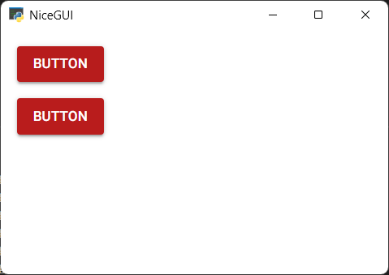
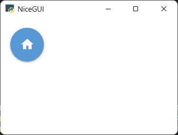
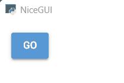
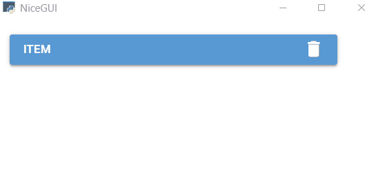
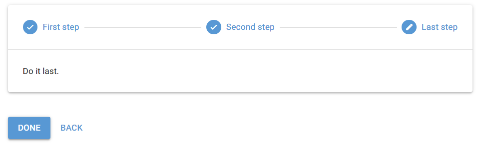
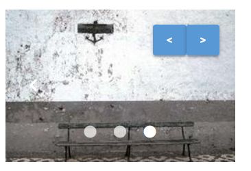
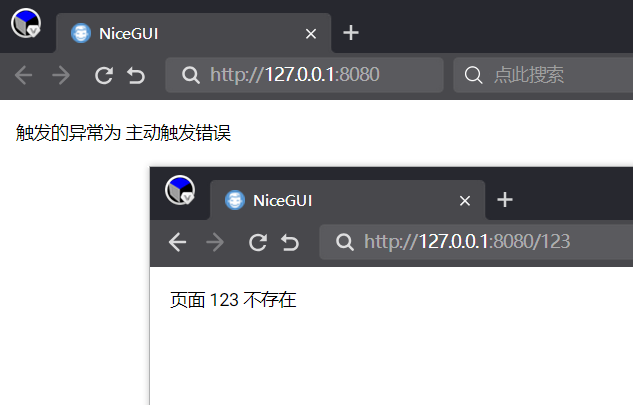
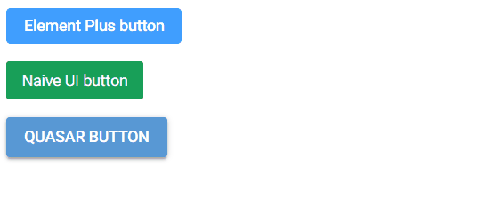

# NiceGUI拾遗（2025）

## 0 为什么要写这个系列

《NiceGUI的中文入门教程》完成后，NiceGUI一直处于不断更新中，同时《NiceGUI的中文入门教程》也不是完美的，需要不断补充、修改内容，这也导致该教程后续不断增补内容，影响教程的完整性，也不好写标题。为了和《NiceGUI的中文入门教程》的系统性教程做出区分，《NiceGUI拾遗》应运而生。《NiceGUI拾遗》采用线性编写原则，按照时间顺序编写《NiceGUI的中文入门教程》中的遗漏内容、NiceGUI的更新内容，采取想起哪些写哪些的原则，但是标题中会尽量简短地与内容关联，避免出现《NiceGUI的中文入门教程》中为了确保教程完整性不得不沿用原标题的情况。

此外，《NiceGUI的中文入门教程》中的具体示例也会放在这里继续更新，并在标题中体现示例的主要用途。

简而言之，本系列教程可以看作是《NiceGUI的中文入门教程》的续作，但是叙述上不再沿用系统性架构，而是采用类似于敏捷开发的叙述方式，随时补充新内容且不会在原始位置修改已发布的内容（但可能单开一节用于修订之前的内容）。

## 1 使用环境变量配置NiceGUI程序

原文参考自 https://nicegui.io/documentation/section_configuration_deployment#environment_variables 。

在NiceGUI中，有些设置项只能通过修改环境变量实现：

- `MATPLOTLIB`，默认为`'true'`，表示是否自动导入`matplotlib`(`ui.pyplot`和`ui.line_plot`依赖此库），可以将此环境变量设置为`'false'`来避免自动导入，减少导入`nicegui`所需的时间，同时也会导致`ui.pyplot`和`ui.line_plot`无法使用。

  以下为用于对比的示例，读者可以修改环境变量值，冷启动（完全退出再重新打开）看看导入所需的时间：

  ```python3
  import os
  os.environ['MATPLOTLIB'] = 'false'
  
  import time
  start_time = time.time()
  
  from nicegui import ui
  
  end_time = time.time()
  
  print(f'used {end_time- start_time}')
  
  ui.button('Test')
  
  ui.run(native=True)
  ```

- `NICEGUI_STORAGE_PATH`，默认为`'.nicegui'`，表示使用`app.storage`时，需要在服务器磁盘存储数据的空间，具体使用哪个位置，默认为运行命令时当前路径下的`.nicegui`文件夹。

- `NICEGUI_REDIS_URL`，默认未设置（即为`None`），表示使用`app.storage`时，相关数据存储在哪个Redis服务器中，该环境变量需要设置为包含Redis协议的完整地址，比如`'redis://redis_server_host:6379'`，如果不设置（即默认值），则表示相关数据存储在本地文件夹中。

- `NICEGUI_REDIS_KEY_PREFIX`，默认为`'nicegui'`，表示使用`app.storage`，相关数据存储在Redis服务器中时，相关数据的键使用什么作为前缀。

- `MARKDOWN_CONTENT_CACHE_SIZE`，默认为`'1000'`，表示`ui.markdown`在内存中缓存多少个内容片段，如果使用`ui.markdown`时，程序占用内存太高，可以调整该值。

- `RST_CONTENT_CACHE_SIZE`，默认为`'1000'`，表示`ui.restructured_text`在内存中缓存多少个内容片段，如果使用`ui.restructured_text`时，程序占用内存太高，可以调整该值。

  ```python3
  from nicegui import ui
  from nicegui.elements import markdown,restructured_text
  
  import os
  os.environ['MARKDOWN_CONTENT_CACHE_SIZE'] = '1'
  os.environ['RST_CONTENT_CACHE_SIZE'] = '1'
  
  ui.label(f'MARKDOWN_CONTENT_CACHE_SIZE is {markdown.prepare_content.cache_info().maxsize}')
  ui.label(f'RST_CONTENT_CACHE_SIZE is {restructured_text.prepare_content.cache_info().maxsize}')
  
  ui.run(native=True)
  ```

## 2 通过点击按钮来关闭NiceGUI程序

一般来说，关闭NiceGUI程序的正确操作是在终端按下`Ctrl`+`C`。但是，NiceGUI程序作为一个网站运行时，用户是接触不到终端的。假如需要通过网页关闭NiceGUI程序，可以使用`app.shutdown()`来关闭整个程序，代码如下：

```python3
from nicegui import ui,app

ui.button('shutdown',on_click=app.shutdown)

ui.run(native=True)
```

## 3 允许Native Mode的NiceGUI程序弹出下载对话框

默认情况下，在以Native Mode运行的NiceGUI程序中，`ui.download`是不能下载的，这是pywebview框架（Native Mode的依赖）默认的安全配置，这时需要使用`app.native.settings['ALLOW_DOWNLOADS'] = True`来修改pywebview的安全配置，代码如下：

```python3
from nicegui import ui, app

app.native.settings['ALLOW_DOWNLOADS'] = True
ui.button("Download", on_click=lambda: ui.download(b'Demo text','demo_file.txt'))

ui.run(native=True)
```

## 4 让Native Mode的NiceGUI程序使用Qt的QtWebEngine作为运行时

默认情况下，如果Windows系统安装了Webview2，哪怕添加了Qt6相关的Python包（PyQT6、PySide6），以Native Mode运行的NiceGUI程序还是优先采用Webview2当作浏览器运行时。如果想要以Native Mode运行的NiceGUI程序采用QtWebEngine当做浏览器运行时，需要手动指定pywebview框架的Web engine（参考文档见 https://pywebview.flowrl.com/guide/web_engine.html），代码如下：

```python3
from nicegui import ui, app

app.native.start_args['gui'] = 'qt'
app.native.start_args['icon'] = 'favicon.ico'
# For 'gui' arg,you needn't assign it usually,besides you want to change the render; 
#  'edgechromium' is best on Windows ;
# qt based is a litte heavy,but it can be used on Windows/Linux/Mac;
# try to install qt libs by `pip install pywebview[qt]` or else:
#  'qt' needs ["QtPy", "PyQt6", "PyQt6-WebEngine"];
#  'qt6' needs ["QtPy", "PyQt6", "PyQt6-WebEngine"];
#  'pyside6' needs ["QtPy", "PySide6"];

ui.button('Say Hi',on_click=lambda :ui.notify('Hello World!'))

ui.run(native=True)
```

使用QtWebEngine当做浏览器运行时，窗口图标默认为Windows默认图标，而不是Python的图标，可以像代码中一样，使用`app.native.start_args['icon'] = 'favicon.ico'`指定，路径默认为源代码同目录，可以使用相对路径或者绝对路径。

## 5 让Native Mode的NiceGUI程序使用固定版本或者非系统自带的Webview2作为运行时

默认情况下，如果Windows系统安装了Webview2，以Native Mode运行的NiceGUI程序优先采用系统的Webview2当作浏览器运行时。但是，系统的Webview2更新很快，而且是自动更新，若是开发的程序与最新版Webview2不兼容或者想要避免系统Webview2版本更新导致的潜在问题，则可以设置环境变量`WEBVIEW2_BROWSER_EXECUTABLE_FOLDER`为指定版本Webview2解压之后的路径，让native mode运行时使用固定版本Webview2。

固定版本Webview2可以到Webview2官网（https://developer.microsoft.com/zh-cn/microsoft-edge/webview2）下载，本解决方案参考自微软开发者文档（https://learn.microsoft.com/zh-cn/microsoft-edge/webview2/concepts/distribution?tabs=dotnetcsharp#details-about-the-fixed-version-runtime-distribution-mode）。

代码如下：

```python3
from nicegui import ui
import os
import pathlib
os.environ['WEBVIEW2_BROWSER_EXECUTABLE_FOLDER'] = str(pathlib.Path(__file__).parent/'Microsoft.WebView2.FixedVersionRuntime.135.0.3179.98.x64')

ui.run(native=True)
```

这里是将固定版本Webview2解压之后，将包含可执行文件`msedgewebview2.exe`的文件夹（文件夹名字为`'Microsoft.WebView2.FixedVersionRuntime.135.0.3179.98.x64'`）放到源代码的同级目录中，读者在实际使用时可以自行变换路径。

## 6 修改网站在标题栏的logo（也就是favicon）

修改`ui.run()`的默认参数`favicon`为自己logo的地址（图片地址，注意图片的格式要求）或者字符（仅支持单个字符，可以是汉字或者emoji），例如：`ui.run(favicon='🚀')`。


## 7 为什么有时候创建在`ui.refreshable`装饰的函数内的控件不会刷新？

有的读者在使用`ui.refreshable`装饰器的时候，遇到了一个奇怪的问题，这里分享一下，那就是创建在`ui.refreshable`装饰的函数内的控件不会刷新。

以下面代码为例：

```python3
from nicegui import ui
from datetime import datetime

@ui.refreshable
def time_box(container:ui.element):
    with container:
        ui.label(datetime.now())

card1 = ui.card()
time_box(card1)

ui.button('refresh1',on_click=time_box.refresh)

ui.run(native=True)
```

先创建了一个`ui.card`，然后给`refreshable`修饰的方法传入，在方法内部，想要通过`with container`的方法，在`ui.card`内部创建可以刷新的时间标签。然而，实际执行的时候就会发现，标签并没有如预期那样刷新，而是不断创建新的标签。

为什么？

其实，`refreshable`方法相当于创建了一个可刷新的元素，并将方法内部创建的元素的父元素指定为可刷新元素。每次调用刷新方法，实际上是先清空可刷新元素，然后执行一遍方法内部创建元素的过程。但是，使用`with container`之后，接下来创建的元素的父元素是`container`，而不是可刷新元素，因此，每次调用刷新方法之后，方法内部创建的元素不会被清空，反而因为重新创建了一遍元素，`container`下的元素会多一个。

如果想要实现借用已经创建的元素当容器，让内部元素可以刷新，就要在创建之前，模拟可刷新元素的清空操作：

```python3
from nicegui import ui
from datetime import datetime

@ui.refreshable
def time_box(container:ui.element):
    container.clear()
    with container:
        ui.label(datetime.now())

card1 =ui.card()
time_box(card1)

ui.button('refresh1',on_click=time_box.refresh)

ui.run(native=True)
```

## 8 使用TailWindCSS样式定义按钮颜色

如果想要在定义按钮之后修改按钮的颜色，却发现`bg-*`的TailWindCSS样式没有用，该如何解决？

按钮的默认颜色由Quasar控制，而Quasar的颜色样式使用了最高优先级的`!important`，TailWindCSS的颜色样式默认比这个低，所以无法成功。如果想修改颜色，可以修改按钮的`color`属性。或者使用`!bg-*`来强制应用。代码如下：

```python3
from nicegui import ui

ui.button('button').props('color="red-10"')
#或者强制应用TailWindCSS
ui.button('button').classes('!bg-red-700')

ui.run(native=True)
```



注意：Quasar的颜色体系和TailWindCSS的颜色体系不同。Quasar中，使用`color-[1-14]`来表示颜色，数字表示颜色程度，可选。TailWindCSS中，使用`type-color-[50-950]`表示颜色，type为功能类别，数字表示颜色程度，可选。需要注意代码中不同方式使用的颜色体系。

## 9 在不使用CSS情况下实现一个 Floating Action Button

Floating Action Button可以简单理解为只有图标的圆形按钮，如果熟悉CSS样式的话，可以将普通的按钮改成类似样式，但是，`ui.button`自带一个`fab`属性（`props`），可以一步完成，这就省去了调整CSS的过程，代码如下：

```python3
from nicegui import ui

ui.button(icon='home', on_click=lambda: ui.notify('home')).props('fab')

ui.run(native=True)
```



## 10 使用异步等待实现一次性的向导功能

`ui.stepper`提供了功能完善的向导功能，但是，如果只是简单使用一次性、无需后退的向导功能，想要快速搭建的话，完全可以不用`ui.stepper`，按钮的`clicked`方法返回一个可以异步等待的对象，只有点击一次按钮，该异步对象才会完成一次。借助按钮的这个特性，可以只使用按钮，搭建一个一次性的向导页面：

```python3
from nicegui import ui

@ui.page('/')
async def index():
    b = ui.button('Go')
    await b.clicked()
    b.text = 'One'
    await b.clicked()
    b.text = 'Two'
    await b.clicked()
    b.text = 'Three'
    await b.clicked()
    b.text = 'Home'
    # 设置点击按钮的功能为刷新页面，相当于重置上面已经点击的次数
    b.on_click(ui.navigate.reload)

ui.run(native=True)
```



每次点击，按钮的文字都会改变，直到所有步骤完成，按钮的功能变成刷新页面，此时刷新页面就会重置之前的所有步骤，恢复到页面最初的状态。

注意，因为涉及到异步，因此所有内容需要放在异步函数内，同时也只能在`ui.page`中使用异步等待。

## 11 点击嵌入按钮的图标时不触发按钮的点击事件

如果在按钮的上下文中嵌入图标，给图标的点击事件设置单独的响应函数，点击图标的话，会同时触发按钮和图标的点击响应函数。这是因为HTML处理子级元素的事件时，会把该事件传播到父级元素中，同时触发父级元素的同类事件。

解决方法也很简单，只需给子级元素的响应函数中，添加JavaScript代码，执行对应事件的`stopPropagation()`方法，来阻止事件的传播即可：

```python3
from nicegui import ui

with ui.button('Item').classes('w-96') as button:
    button.on_click(lambda :ui.notify('button'))
    ui.space()
    icon = ui.icon('delete')
    icon.on('click',js_handler='(e)=>{e.stopPropagation()}')
    icon.on('click',lambda :ui.notify('icon'))
    
ui.run(native=True)
```



## 12 通过URL给NiceGUI程序传参

因为NiceGUI是基于FastAPI实现的，因此，FastAPI的参数注入（用法参考 https://fastapi.tiangolo.com/tutorial/path-params/ 、https://fastapi.tiangolo.com/tutorial/query-params/ 、https://fastapi.tiangolo.com/advanced/using-request-directly/ ）在NiceGUI程序中也能使用。

直接在URL中的路径参数（路径中的部分字段即为参数的值，比如`/icon/star`），需要通过定义通配路径来捕获，比如`'/icon/{icon}'`。在英文问号之后的查询参数（需要显式指明参数和对应的值，比如`/icon/star?amount=5`），则会自动捕获。两种参数都可以在`ui.page`装饰的函数中创建同名参数后，在函数内部使用：

```python3
from nicegui import ui

@ui.page('/icon/{icon}')
def icons(icon: str, amount: int = 1):
    ui.label(icon).classes('text-h3')
    with ui.row():
        [ui.icon(icon).classes('text-h3') for _ in range(amount)]
        
ui.link('Star', '/icon/star?amount=5')
ui.link('Home', '/icon/home')
ui.link('Water', '/icon/water_drop?amount=3')

ui.run()
```

## 13 使用其他控件模拟`ui.step`

给任意控件增加`.props['name']`和`.props['title']`属性，该控件就能当作`ui.step`来使用：

```python3
from nicegui import ui

with ui.stepper(
    value='First',
).classes('w-full') as stepper:
    with ui.element('h1') as first:
        first.props.update(dict(name='First', title='First step'))
        ui.label('Do it fisrt.')
        with ui.stepper_navigation(wrap=True):
            ui.button('Next', on_click=stepper.next)
    with ui.element('h3') as second:
        second.props.update(dict(name='Second', title='Second step'))
        ui.label('Do it second.')
        with ui.stepper_navigation(wrap=True):
            ui.button('Next', on_click=stepper.next)
            ui.button('Back', on_click=stepper.previous).props('flat')
    with ui.element('h5') as last:
        last.props.update(dict(name='last', title='Last step'))
        ui.label('Do it last.')
        with ui.stepper_navigation(wrap=True):
            ui.button('Done', on_click=lambda: ui.notify(
                'Done!', type='positive'))
            ui.button('Back', on_click=stepper.previous).props('flat')

ui.run(native=True)
```

## 14 将`ui.stepper`的控制按钮外置

除了在每一步中创建一组控制按钮，还可以在外面创建控制按钮。只不过，为了准确匹配第一步、最后一步和其他步骤中控制按钮的状态（第一步时只显示下一步按钮，中间步骤时显示上一步按钮、下一步按钮，最后一步只显示上一步按钮和完成按钮），需要将对应按钮的显示状态与相应步骤绑定：

```python3
from nicegui import ui

with ui.stepper(
    value='First',
    keep_alive=True
).classes('w-full') as stepper:
    with ui.step(name='First', title='First step', icon='home') as first:
        ui.label('Do it fisrt.')
    with ui.step(name='Second', title='Second step', icon='home') as second:
        ui.label('Do it second.')
    with ui.step(name='Last', title='Last step', icon='home') as last:
        ui.label('Do it last.')

with ui.stepper_navigation():
    next_btn = ui.button('Next', on_click=stepper.next)
    next_btn.bind_visibility_from(
        stepper,
        'value',
        lambda x: x != last.props['name']
    )
    last_btn = ui.button('Done')
    last_btn.bind_visibility_from(
        stepper,
        'value',
        lambda x: x == last.props['name']
    )
    last_btn.on_click(lambda: ui.notify('Done!', type='positive'))
    back_btn = ui.button('Back', on_click=stepper.previous).props('flat')
    back_btn.bind_visibility_from(
        stepper,
        'value',
        lambda x: x != first.props['name']
    )

ui.run(native=True)

```



在上面的代码中，下一步按钮只会在当前步骤不是最后一步时显示。完成按钮和下一步按钮在相同位置，条件完全相反，因此，完成按钮只会在当前步骤是最后一步时显示。上一步按钮只会在当前步骤不是第一步时显示。

判断当前步骤的方法很简单，`ui.stepper`的`value`属性表示当前步骤的名字，具体步骤对应的则是``props['name']`的值，二者相等时，就表示当前步骤为那一步。

## 15 给`icon`参数传入图片文件地址

`icon`参数除了可以接收图标名字，还可以接收图片文件的地址，但是要在图片文件的地址前加上`'img:'`，用于表明图标将使用图片文件，比如`'img:https://cdn.quasar.dev/logo-v2/svg/logo.svg'`：

```python3
from nicegui import ui

ui.button(text='LOGO',icon='img:https://cdn.quasar.dev/logo-v2/svg/logo.svg')

ui.run(native=True)
```

## 16 自定义`ui.carousel`（轮播图）的控制控件

使用`ui.carousel`的`'control'`slot（`add_slot('control')`，具体用法参考 https://quasar.dev/vue-components/carousel#qcarouselcontrol-api ），可以在`ui.carousel`上添加其他内容，比如与之关联的控制按钮：

```python3
from nicegui import ui

with ui.carousel(animated=True, arrows=True, navigation=True).props('height=180px').classes('bg-green-400') as carousel:
    with ui.carousel_slide().classes('p-0'):
        ui.image('https://picsum.photos/id/30/270/180').classes('w-[270px]')
    with ui.carousel_slide().classes('p-0'):
        ui.image('https://picsum.photos/id/31/270/180').classes('w-[270px]')
    with ui.carousel_slide().classes('p-0'):
        ui.image('https://picsum.photos/id/32/270/180').classes('w-[270px]')
    with carousel.add_slot('control') ,ui.element('q-carousel-control').props('position="top-right"'):
        ui.button('<',on_click=carousel.previous)
        ui.button('>',on_click=carousel.next)

ui.run(native=True)
```



## 17 获取视频的播放进度

目前NiceGUI没有实现视频控件的播放进度（`currentTime`）属性，想要获取视频的播放进度，只能使用JavaScript代码获取控件的`currentTime`属性，并使用定时器实时刷新相关的标签。示例如下：

```python3
from nicegui import ui

@ui.page('/')
async def index():
    v = ui.video(src='https://test-videos.co.uk/vids/bigbuckbunny/mp4/h264/360/Big_Buck_Bunny_360_10s_1MB.mp4',
             controls=True, autoplay=False, muted=False, loop=False)
    
    label = ui.label(f'当前播放进度为 {0} 秒。')
    async def get_current_time():
        time = await ui.run_javascript(f'getHtmlElement({v.id}).currentTime')
        label.set_text(f'当前播放进度为 {int(time)} 秒。')
    timer = ui.timer(0.1,get_current_time,immediate=False)
    v.on('play', lambda _:setattr(timer,'active',True))
    v.on('pause', lambda _:setattr(timer,'active',False))
    v.on('ended', lambda _:setattr(timer,'active',False))

ui.run(native=True)
```


## 18 版本速览——2.20.0版本新增自定义程序内报错的响应页面

NiceGUI 2.20.0 新增自定义程序内报错的响应页面。与HTTP报错的自定义响应页面不同，该响应页面需要程序内触发异常，只是触发HTTP的错误状态码（比如文件不存在的404），是不会显示该响应页面的。

正好趁着介绍本次版本更新的内容，顺便补充一下如何自定义HTTP报错（状态码）的响应页面。

以下示例包含程序内报错和HTTP报错的自定义响应页面：

```python3
from nicegui import ui, app

# 自定义程序内报错的响应页面
@app.on_page_exception
def error_handler(exception: Exception) -> None:
    ui.label(f'触发的异常为 {exception}')

@ui.page('/')
def index():
    raise Exception('主动触发错误')

# 自定义HTTP报错的响应页面
from nicegui import ui, Client
from fastapi import Request

@app.exception_handler(404)
def exception_handler_404(request:Request, exception: Exception):
    from urllib.parse import urlparse
    with Client(ui.page('/404'),request=request) as client:
        ui.label(f'页面 {urlparse(str(request.url)).path[1:]} 不存在')
    return client.build_response(request, 404)

ui.run()
```



## 19 版本速览——2.21.0版本新增允许使用其他基于VUE的前端UI框架

是否厌倦了NiceGUI只能使用Quasar的控件，想要让NiceGUI使用其他UI的控件？

NiceGUI 2.21.0 新增`app.config.vue_config_script`属性，该属性主要用于初始化VUE应用，可以给该属性追加其他基于VUE的框架的初始化代码，从而可以在NiceGUI程序中，通过`ui.element`使用其他框架的控件。

以Element Plus框架（https://cn.element-plus.org/zh-CN/component/button.html）和Naive UI框架（https://www.naiveui.com/zh-CN/os-theme/components/button）为例，需要先使用`ui.add_body_html`添加框架所需的JavaScript文件和CSS文件，然后通过给`app.config.vue_config_script`追加初始化代码。

推荐追加初始化代码，直接替换的话，需要添加原始的初始化代码：

```javascript
app.use(Quasar, {config: vue_config});
Quasar.lang.set(Quasar.lang[language.replace('-', '')]);
Quasar.Dark.set(dark === None ? "auto" : dark);
```

注意，该功能仅是实验性功能，不能确保NiceGUI默认使用的Quasar框架与其他基于VUE的框架百分比兼容，也无法保证使用其他框架之后，NiceGUI程序依然正常，请慎重使用该功能。

完整示例如下：

```python3
from nicegui import ui,app

ui.add_body_html('''
    <link rel="stylesheet" href="//unpkg.com/element-plus/dist/index.css" />
    <script defer src="https://unpkg.com/element-plus"></script>
    <script defer src="https://unpkg.com/naive-ui"></script>
''')
app.config.vue_config_script += '''
    app.use(ElementPlus);
    app.use(naive);
'''

with ui.element('el-button').props('type="primary"').on('click', lambda: ui.notify('Hi from ElementPlus')):
    ui.html('Element Plus button')

with ui.element('n-button').props('type="primary"').on('click', lambda: ui.notify('Hi from NaiveUI')):
    ui.html('Naive UI button')

ui.button('Quasar button', on_click=lambda: ui.notify('Hello from Quasar(NiceGUI)'))

ui.run(native=True)
```



## 20 （待定）


（以上为2025年更新的部分）

（以下为2026年更新的部分，2025年的将会存档（保存在nicegui_plus_2025.md）或者折叠起来）

# NiceGUI拾遗（2026）

## 0 2026版前言

NiceGUI不断更新，开发时遇到的问题也层出不穷，学习更是温故而知新。因此，2026年，笔者将继续本教程系列的更新，沿袭2025版的目标，添补NiceGUI学习中欠缺的知识。

## 1 版本速览——x.x.x版本新增内容（多个小功能合并讲解）


## 2 版本速览——x.x.x版本新增xxx（具体的单个功能）


## 1 （修正2025.13）

原内容存在错误，修正错误。

## 1 （补充2025.13）

原内容不全面，补充内容。

## 1 （扩展2025.13）

从原内容想到的其他内容，虽然可以作为独立的内容写标题，但这部分内容确实是看完原内容才有了创作契机。
