# NiceGUI札记（2026）

[TOC]

## 0 为何而写

NiceGUI（官网https://nicegui.io/）是一款优秀的WebUI、GUI框架，只需学习一定量的前端知识，就能使用NiceGUI快速搭建出美观的UI界面。

但是，官方更新很快，加上笔者2024年开始创作的《NiceGUI的中文入门教程》受限于笔者当时的思路、水平，时至今日，很多内容已经不适合最新版本。

于是，笔者结合其他框架的敏捷式教程创作经验，决定为NiceGUI的最新版本创作新的入门教程，摒弃之前事无巨细的风格，采用按时间顺序、主要内容为补充官方教程、不断穿插实际示例的敏捷开发风格。

并且，为了节省读者的付费成本，适应读者的碎片化阅读习惯，本教程不再采用整本付费的方式，而是根据章节内容的质量、字数单章付费，让读者按需购买。

当然，对于喜欢一次看个爽、不想被免费章节广告打扰的读者，也有整本买断的方式（每年两次机会）。不过，笔者不推荐这种方式。因为内容一直在更新、追加，只能提供当前内容进度的整本。而且整本买断是完全基于字数（本地编辑器统计，非微信那边的字数，会少一些）计费，虽然部分章节没有质量溢价，但免费章节和预览部分也会计费，整体价格会比全部单买略高。

## 1 安装NiceGUI

之前《NiceGUI的中文入门教程》使用PDM作为环境管理工具，这一次，将使用uv管理环境。

为什么要用uv？

原因只有一个，那就是快！速度对比如下：

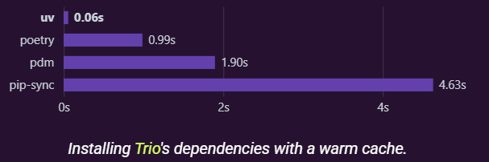

首先，新建一个空白文件夹，笔者这里新建了`nicegui_uv_app`文件夹。进入该文件夹，运行`uv init`，即可初始化该文件夹为项目文件夹（`uv`命令需要使用`pip install uv`安装）。

此时创建的项目是空白项目，没有添加任何依赖，还需要使用`uv add nicegui`添加依赖，并自动创建虚拟环境。

NiceGUI还提供了一些可选的依赖：

- `pywebview`库，以Native Mode（窗口模式）运行NiceGUI程序时依赖该库，使用`uv add nicegui[native]`命令添加。
- `plotly`库，`ui.plotly`控件依赖该库，使用`uv add nicegui[plotly]`命令添加。
- `matplotlib`库，`ui.matplotlib`控件、`ui.pyplot`控件和`ui.line_plot`控件依赖该库，使用`uv add nicegui[matplotlib]`命令添加。
- `nicegui-highcharts`库，`ui.highchart`控件依赖该库，使用`uv add nicegui[highcharts]`命令添加。
- `libsass`库，`ui.add_sass`方法和`ui.add_scss`方法依赖该库，使用`uv add nicegui[sass]`命令添加。
- `redis`库，使用Redis存储`app.storage`时（定义环境变量`NICEGUI_REDIS_URL`）依赖该库，使用`uv add nicegui[redis]`命令添加。

如果想要将虚拟环境中的所有库升级至最新稳定版，可以使用`uv sync -U`。

若是只想升级指定库，比如`nicegui`，则使用`uv sync -P nicegui`。

升级指定库至最新测试版。因为本章节创作时，NiceGUI的3.0.0版本尚未正式发布，需要升级至最新测试版才行，或者读者想要使用其他最新测试版的功能，则可以使用`uv sync -P nicegui --prerelease allow`命令，将指定库升级至最新测试版。

## 2 认识NiceGUI程序

### 2.1 基本结构

先看示例，简单了解一下NiceGUI程序的基本结构：

```python3
# 导入模块
from nicegui import ui
# 创建控件
ui.button('Hello')
# 运行程序
ui.run()
```

示例很简单，正好对应着NiceGUI程序的三个基本组成：

- 导入模块（对象）。NiceGUI的`ui`模块提供了创建控件和运行程序的基本功能。当然除了该模块，NiceGUI还提供了其他模块和魔术对象（无需实例化即可直接访问具体单一实例对象的特殊对象），具体模块和对象会在后续使用时详细介绍，这里暂不展开。
- 创建控件。导入了模块之后，控件并不会自动创建，还需要访问具体的控件类，将其实例化，才算真正创建。关于具体控件的用法和创建，将在单独的章节中详细介绍，本章暂不展开。
- 运行程序。完成前面的步骤之后，直接运行Python文件，并不会显示控件，因为NiceGUI程序需要通过特殊的方法运行。比如示例中的`ui.run`方法就是一种运行程序的方法，构建模式、显示模式不同，该方法使用的参数也有所不同。此外，运行程序的方法也不止这一种，还有与现有FastAPI应用组合运行使用的`ui.run_with`方法。

### 2.2 构建模式

NiceGUI程序用于构建界面的代码结构不同时，对应的构建过程（模式）也有所不同。

从NiceGUI 3.0.0开始，NiceGUI程序按照是否使用`ui.page`创建页面，可划分为三种构建模式：

- 脚本模式。不使用`ui.page`创建页面、不给`ui.run`的第一位置参数`root`传值的话，所有的控件都在全局作用域内创建，这样的构建模式就是脚本模式。此时，虽然每个访问者打开“主页面”（地址为网站的根路径）都能看到所有的控件，但多个“主页面”之间的内容互相独立。

  以下为示例：

  ```python3
  from nicegui import ui
  
  ui.button('Hello')
  
  ui.run()
  ```

  在使用脚本模式时，需要**注意**以下几点：

  - “主页面”**不是**真正意义上的主页面。因为脚本模式只支持一个页面（即“主页面”），并不支持多个页面（后面的单页面应用可以实现脚本模式下支持多个页面，但这里只是为了区分构建模式，暂不展开介绍）。没有其他页面，自然不存在真正意义上的主页面。

  - “主页面”**不是**完整的页面。脚本模式没法接收、传递页面参数，“主页面”自然没法处理，但页面特殊区域的布局控件依然可以使用。

  - “全局作用域”（脚本模式的全局作用域）**不是**真正意义上的全局作用域。因为所有在全局作用域内创建的对象都会被包装到“主页面”内，对于那些需要全局共享的对象，实际上只是在“主页面”的局部作用域内共享，并非在全局作用域内共享。因此，多个“主页面”之间的内容才会互相独立。对于真正需要在全局作用域内共享的对象，请**不要**使用脚本模式。

- 多页面模式。脚本模式只支持一个“主页面”，一旦想创建多个页面展示不同的内容，就只能使用`ui.page`创建其他页面，这样的构建模式就是多页面模式。

  `ui.page`是一个类，其参数`path`表示页面对应的网站路径。但是，这样直接构建出来的页面不包含控件，需要调用`ui.page`对象，并传入函数内创建控件的函数名：

  ```python3
  from nicegui import ui
  
  def index():
      ui.button('Hello')
  
  index_page = ui.page('/')
  index = index_page(index)
  
  ui.run()
  ```

  看起来有点复杂，但如果读者细心观察的话，就会发现，这段看似复杂的代码，其实就是一个装饰器：

  ```python3
  from nicegui import ui
  
  @ui.page('/')
  def index():
      ui.button('Hello')
  
  ui.run()
  ```

- 单页面模式、根页面模式。除了上面这种明显使用`ui.page`的多页面模式，还可以将所有创建控件的过程放在函数中用来构建页面，并将构建页面的函数名传给`ui.run`方法的第一位置参数`root`。这种构建模式也算多页面模式，但只能创建一个页面，所以叫单页面模式（与后面介绍的单页面应用不同，请注意区分）。因为单页面模式下的网站只有一个“主页面”（地址为网站的根路径），所以，单页面模式也可以被称为根页面模式。

  示例如下：

  ```python3
  from nicegui import ui
  
  def index():
      ui.button('Hello')
  
  ui.run(root=index)
  ```

  代码看上去有点像脚本模式，但是，相比于不用函数打包的脚本模式，单页面模式可以自由定义“主页面”其他部分的创建顺序。

  比如，想要在当前内容的前面添加一些文字作为标题，如果是脚本模式，只能这样写：

  ```python3
  from nicegui import ui
  
  ui.label('标题')
  ui.button('Hello')
  
  ui.run()
  ```

  单页面模式的话，可以将添加的部分打包到函数中，提前使用，最后定义具体内容：

  ```python3
  from nicegui import ui
  
  def index():
      title()
      ui.button('Hello')
  
  def title():
      ui.label('标题')
  
  ui.run(root=index)
  ```

  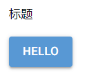

需要注意的是，三种构建模式，只能同时使用一种，不能同时使用两种。即一旦使用了`ui.page`创建页面（多页面模式），就不能在页面之外创建控件（脚本模式），也不能使用`ui.run`的`root`参数（单页面模式），否则会报错、代码异常、显示异常，其他构建模式亦是如此。

以上只是构建模式的简单介绍，其余参数和更多用法将在后面的章节中展开介绍。

### 2.3 单页面应用（SPA）

与多页面模式效果类似的是单页面应用（Single Page Application，简称SPA），单页面应用可以在不增加普通页面的前提下，增加多个子页面，让脚本模式、单页面模式实现多页面模式的效果。

单页面应用需要使用`ui.sub_pages`类，其第一位置参数`routes`是一个字典，网站路径为键，创建控件的函数的函数名为值，表示网站路径与具体内容的对应关系。

单页面模式的示例如下：

```python3
from nicegui import ui

def index():
    ui.label('Main')
    ui.separator()
    ui.sub_pages(
        {
            '/':main,
            '/a':a,
            '/b':b
        }
    )

def main():
    ui.link('Page A','/a')
    ui.link('Page B','/b')

def a():
    ui.link('Page Main','/')
    ui.link('Page B','/b')

def b():
    ui.link('Page Main','/')
    ui.link('Page A','/a')

ui.run(root=index)
```

可能读者实际运行代码之后，会产生一个疑问：既然效果与多页面模式相同，那为何不直接使用多页面模式？

这里就要说一下单页面应用的特殊之处：三种构建模式均可以设计为单页面应用。

上面单页面模式的示例，可以改为脚本模式的示例：

```python3
from nicegui import ui

def main():
    ui.link('Page A', '/a')
    ui.link('Page B', '/b')

def a():
    ui.link('Page Main', '/')
    ui.link('Page B', '/b')

def b():
    ui.link('Page Main', '/')
    ui.link('Page A', '/a')

ui.label('Main')
ui.separator()
ui.sub_pages(
    {
        '/': main,
        '/a': a,
        '/b': b
    }
)

ui.run()
```

至于将多页面模式设计为单页面应用，用法会更加复杂一些。

假如多页面模式中，有一个`/main`页面，可以将上面单页面模式的单页面应用套用到多页面模式中：

```python3
from nicegui import ui

@ui.page('/main')
def index():
    ui.label('Main')
    ui.separator()
    ui.sub_pages(
        routes={
            # 子页面的路径必须与实际路径一致
            '/main':main,
            '/main/a':a,
            '/main/b':b
        }
    )

def main():
    ui.link('Page A','/main/a')
    ui.link('Page B','/main/b')

def a():
    ui.link('Page Main','/main')
    ui.link('Page B','/main/b')

def b():
    ui.link('Page Main','/main')
    ui.link('Page A','/main/a')

ui.run()
```

但与单页面模式的单页面应用不同，多页面模式的单页面应用，除了将指定路径关联为子页面之外，还可以同时关联一个普通页面：

```python3
from nicegui import ui

@ui.page('/main')
def index():
    ui.label('Main')
    ui.separator()
    ui.sub_pages(
        routes={
            # 子页面的路径必须与实际路径一致
            '/main':main,
            '/main/a':a,
            '/main/b':b
        }
    )

def main():
    ui.link('Page A','/main/a')
    ui.link('Page B','/main/b')

def a():
    ui.link('Page Main','/main')
    ui.link('Page B','/main/b')

def b():
    ui.link('Page Main','/main')
    ui.link('Page A','/main/a')

@ui.page('/main/a')
def page_a():
    ui.label('Real Page A')

@ui.page('/main/b')
def page_b():
    ui.label('Real Page B')

ui.run()
```

通过点击`/main`页面的超链接跳转至`/main/a`的话，显示的只是单页面应用的子页面：


但是，此时刷新页面或者直接访问`/main/a`的话，则会显示`/main/a`页面：


以上只是单页面应用的简单介绍，其余参数和更多用法将在后面的章节中展开介绍。

单页面应用与不同的构建模式组合使用时，学习难度会陡然而升，容易遇到很多难以解决的问题。因此，这部分内容不太理解的话可以暂时跳过，等后续学习了其他基础之后再回过头学习。

### 2.4 显示模式

NiceGUI程序支持两种显示模式：

- 网页模式，可以将NiceGUI程序部署为网站。
- 窗口模式，可以将NiceGUI程序部署为桌面程序。

除了前面示例中以网页形式显示NiceGUI程序之外（即网页模式），还可以给`ui.run`方法的`native`参数传入`True`，以窗口形式显示NiceGUI程序（即窗口模式）。

注意，窗口模式依赖`pywebview`库，需要先安装`pywebview`库才能使用，可以参考安装NiceGUI一章，使用`uv add nicegui[native]`命令提前添加依赖库。

示例如下：

```python3
from nicegui import ui

def index():
    title()
    ui.button('Hello')

def title():
    ui.label('标题')

ui.run(root=index,native=True)
```

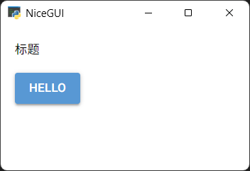

### 2.5 运行方法

NiceGUI有两种运行NiceGUI程序的方法：

- `ui.run`方法是前面介绍的，而且后续示例中一般使用该方法，支持网页模式和窗口模式。
- `ui.run_with`方法，则一般用于将NiceGUI程序挂载到现有的FastAPI程序中，仅支持网页模式。

以下为`ui.run_with`方法的示例：

```python3
import uvicorn
from fastapi import FastAPI
from nicegui import ui

fast_app = FastAPI()
  
@ui.page('/')
def index():
    title()
    ui.button('Hello')

def title():
    ui.label('标题')

ui.run_with(
    app=fast_app,
)

uvicorn.run(app=fast_app,host='127.0.0.1',port=80)
```

也可以将NiceGUI程序挂载到指定的子路由：

```python3
import uvicorn
from fastapi import FastAPI
from nicegui import ui

fast_app = FastAPI()

@fast_app.get('/')
def root():
    return '请访问 /gui 查看NiceGUI程序'

# 这里的路径是相对挂载路径而言
@ui.page('/')
def index():
    title()
    ui.button('Hello')

def title():
    ui.label('标题')

ui.run_with(
    app=fast_app,
    # 省略挂载路径的话，直接访问根路径（/）即可看到NiceGUI程序，但要注释掉@fast_app.get('/')和其装饰的函数
    mount_path='/gui' 
)

uvicorn.run(app=fast_app,host='127.0.0.1',port=80)
```

### 2.6 退出程序

NiceGUI程序一般是通过终端运行，关闭终端，程序自动退出。

此外，在终端按下`ctrl + c`键，也能强制退出NiceGUI程序。

如果需要通过代码退出NiceGUI程序，则要使用`app.shutdown()`。

## 3 创建控件

创建控件看似简单，只是了解一下具控件的参数、属性、方法，没有多少难点。但在实际使用时，具体参数、方法的使用，创建的技巧，远没有看上去那么简单。

### 3.1 实例化

实例化控件类，即可创建控件：

```python3
from nicegui import ui

def index():
    ui.label('标题')
    ui.button('Hello')

ui.run(root=index,native=True)
```

除了不分配变量的用法，对于某些需要重复使用的控件，想要在后续代码中访问这些控件的属性、方法的话，则要给这些控件分配变量。因为每次实例化都是创建一个控件，即使是相同类型的控件，重复实例化也是重复创建：

```python3
from nicegui import ui

def index():
    label = ui.label('标题')
    button = ui.button('Hello')
    ui.button('World')
    button.disable()

ui.run(root=index,native=True)
```

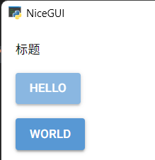

### 3.2 `with`的技巧

NiceGUI本质上是一个基于Quasar框架实现的网页框架，很多控件也都是网页控件。如果读者熟悉网页，知道网页的元素可以多重嵌套，进而实现复杂的效果。当然，读者不熟悉也没关系，可以将控件想象成一个盒子，盒子里可以装另一个盒子，控件也一样。

对于NiceGUI的控件来说，想要在控件中嵌入另一个控件，只需使用上下文管理器进入控件的上下文，在上下文中创建其他控件，相当于在控件内嵌入其他控件：

```python3
from nicegui import ui

def index():
    with ui.button('Hello'):
        ui.button('World')

ui.run(root=index,native=True)
```

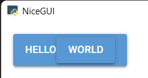

除了嵌套一层，还可以嵌套多层：

```python3
from nicegui import ui

def index():
    with ui.button('Hello'):
        with ui.button('World'):
            ui.button('!')

ui.run(root=index,native=True)
```

或者使用一个`with`，后接英文逗号分隔的多个对象，同样表示嵌套多层（和上个示例效果一样）：

```python3
from nicegui import ui

def index():
    with ui.button('Hello'), ui.button('World'):
        ui.button('!')
```

对于使用上下文管理器进入上下文的控件，如果想要访问该控件，可以使用`as`关键字，后接变量名，即可在控件的上下文，甚至与`with`同一缩进的作用域内，访问该控件。比如：

```python3
from nicegui import ui

def index():
    with ui.button('Hello') as button1:
        ui.button('World')
    with ui.button('Hello') as button2:
        with ui.button('World') as button3:
            ui.button('!')
    with ui.button('Hello') as button4, ui.button('World') as button5:
        ui.button('!')

ui.run(root=index,native=True)
```

请牢记这些技巧，后续使用具体控件时，这些都是基本操作。

### 3.3 控件的插槽（slot）

前面说了使用上下文管理器进入控件的上下文，进而在控件内嵌入其他控件。其实，这种操作就是进入了控件的`default`插槽（插槽的概念来自Quasar框架的控件，相关资料可以查看 https://quasar.dev/components ，具体控件支持的插槽有所不同）。

以`ui.input`输入框控件为例，下面示例中两种写法的效果是一样的：

```python3
from nicegui import ui

def index():
    with ui.input('Name'):
        ui.button('Ok')
    with ui.input('Name').add_slot('default'):
        ui.button('Ok')

ui.run(root=index,native=True)
```

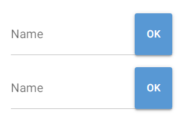

简单来说，插槽可以看作是一个控件中可以插入其他控件的位置，而不少控件有多个插槽，`default`插槽就是默认位置。如果想要在其他插槽中插入其他控件，则要使用`add_slot`方法，指定具体插槽。以输入框控件（具体参考https://quasar.dev/vue-components/input）为例：

```python3
from nicegui import ui

def index():
    my_input = ui.input('Name')
    with my_input.add_slot('before'):
        ui.button('Pre')
    with my_input.add_slot('after'):
        ui.button('Next')

ui.run(root=index,native=True)
```

可以在输入框控件前后分别添加不同的按钮：

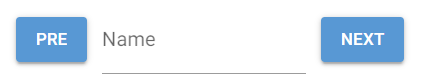

就是因为输入框控件前、后分别对应着不同的插槽。

### 3.4 `for`的技巧

需要创建多个有规律的控件时，熟悉Python的读者肯定第一时间想到了`for`，可以使用该关键字遍历可以迭代的对象，同时创建控件：

```python3
from nicegui import ui

def index():
    for i in range(4):
        ui.button(i)

ui.run(root=index,native=True)
```


看上去没什么问题，可是，一旦涉及到可调用对象，这个操作就会出现问题：

```python3
from nicegui import ui

def index():
    for i in range(4):
        ui.button(i,on_click=lambda :ui.notify(i))

ui.run(root=index,native=True)
```

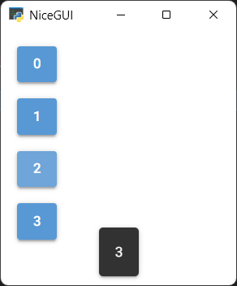

在创建控件的同时，给控件设置了对应的响应函数，让其在点击时，弹出对应数字的消息。不过，代码看似没有问题，点击第三个按钮时，却弹出来不一致的数字。

请读者不要着急寻找解决代码，在解决问题之前，需要先了解一下问题产生的原因：问题源于Python的延迟绑定。

简单来说，在遍历时定义函数（不限于lambda表达式）的话，如果函数直接使用遍历中间变量（即代码中的`i`），则该变量会在遍历结束时统一绑定，而非第一时间使用变量的当时值，这是函数的特性。

函数的这一特性其实在前面介绍构建模式的时候说过，就是在函数中可以使用在当前代码位置后定义的函数、对象，不会直接报错。

因此，将出错的代码中，NiceGUI的部分去掉的话，复现错误的核心代码为：

```python3
funcs = []

for i in range(4):
    funcs.append(lambda:print(i))

for func in funcs:
    func()
```

结果如下：

```shell
3
3
3
3
```

想要解决这个问题也很简单，就是让定义函数时使用该变量的值，而非该变量（为了避免混淆，lambda表达式的参数名改为`x`）：

```python3
funcs = []

for i in range(4):
    funcs.append(lambda x=i:print(x))

for func in funcs:
    func()
```

结果如下：

```shell
0
1
2
3
```

这一次，结果总算对了。

接下来，回到NiceGUI程序，执行类似的修改即可：

```python3
from nicegui import ui

def index():
    for i in range(4):
        ui.button(i,on_click=lambda x=i:ui.notify(x))

ui.run(root=index,native=True)
```

## 4 修改样式

NiceGUI提供了丰富美观的控件，但控件默认的样式是统一的，实际使用时总不能全用默认样式，肯定要美化一番。因此，如何修改控件的样式，值得读者认真学习。

### 4.1 修改样式的方法

在学习修改控件的样式之前，先了解一下NiceGUI的控件支持哪些修改样式的方法：

- `style`方法（属性），支持CSS，可以直接设置具体的Web样式，比如颜色、边距等。CSS的语法可参考 https://developer.mozilla.org/zh-CN/docs/Web/CSS。
- `classes`方法（属性），支持Tailwind CSS，可以设置Tailwind CSS框架定义的CSS变量或，也可以设置为CSS样式类，让控件应用这些变量或者CSS样式类对应的CSS样式。Tailwind CSS的语法可参考 https://tailwindcss.com/。
- `props`方法（属性），支持Quasar控件的属性，可以设置对应Quasar控件的属性，包括但不限于样式相关的属性。具体控件支持的属性可参考 https://quasar.dev/components。

可能读者看到上面的介绍有点疑惑，为何这些方法后，还用括号补充说明是属性？在NiceGUI最新版本中，这三种方法，可以通过调用的方式添加、修改样式。同时，控件还支持同名的字典（或者列表）属性，可以使用字典（或者列表支持的方式添加、修改样式，字典的键即为样式名。

### 4.2 `style`方法（属性）

示例如下：

```python3
from nicegui import ui

def index():
    button = ui.button('Hello')
    button.style('color:red!important')
    button.style['background'] = 'green!important'

ui.run(root=index,native=True)
```

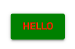

需要注意的是，默认控件的样式优先级较高，需要通过添加`!important`来提高自定义样式的优先级，否则不会生效。

部分样式支持使用`props`方法（属性）去掉，比如控件的背景色、前景色（文字颜色）。此时不用添加`!important`来提高自定义样式的优先级：

```python3
from nicegui import ui

def index():
    button = ui.button('Hello')
    button.props('color text-color')
    button.style('color:red')
    button.style['background'] = 'green'

ui.run(root=index,native=True)
```


### 4.3 `classes`方法（属性）

示例如下：

```python3
from nicegui import ui

def index():
    label = ui.label('Hello')
    label.classes('bg-yellow-400')
    label.classes.append('text-blue-600')

ui.run(root=index,native=True)
```


`classes`属性是一个列表，因此只能使用列表的方法。

NiceGUI的很多控件自带样式，其样式源于Quasar框架，而部分样式使用`!important`修饰，优先级高于没有使用`!important`修饰的普通样式。

虽然Tailwind CSS的普通样式默认优先级高于Quasar框架的普通样式，但添加“!”为前缀或者后缀（在Tailwind CSS中等效于使用`!important`修饰）的Tailwind CSS样式，遇到Quasar框架使用`!important`修饰的相同样式（比如背景颜色）时，优先级反而会比Quasar框架的低。

想要理解这个反常现象，需要先了解两个相关知识：

- 从NiceGUI 3.0.0开始，内部使用了级联层（`@layer`）决定样式的优先级，具体顺序如下：

  ```css
  theme, 
  base, 
  quasar(Quasar框架的预定义样式类类名在这一层), 
  nicegui, 
  components, 
  utilities(Tailwind CSS框架的预定义样式类类名在这一层), 
  overrides
  ```

  对于普通样式，越靠下的层级，优先级越高。

- 对于同样使用`!important`修饰的相同样式，则基于上面的级联层顺序，优先级则是相反的，具体可以参考 https://developer.mozilla.org/en-US/docs/Web/CSS/@layer#layer_order_and_the_!important_flag，完整的优先级顺序如下图所示：

  

那么，问题来了，默认控件的颜色样式就是使用`!important`修饰的，如果想要将其改为Tailwind CSS的颜色，怎么解决？

可以使用`props`方法（属性）去掉控件原本的背景色、前景色（文字颜色），再使用`classes`方法（属性）修改为指定的背景色、前景色（文字颜色），此时不用添加“!”为前缀或者后缀：

```python3
from nicegui import ui

def index():
    button = ui.button('Hello')
    button.props('color text-color')
    button.classes('bg-red-700 text-green-700')

ui.run(root=index,native=True)
```


从NiceGUI 3.0.0正式版开始，官方修复了添加“!”为前缀或者后缀（在Tailwind CSS中等效于使用`!important`修饰）的Tailwind CSS样式生效顺序，因此，下面的代码可以正常生效：

```python3
from nicegui import ui

def index():
    ui.button('Hello').classes('!bg-red-700 !text-green-700')
    ui.button('World').classes('bg-red-700! text-green-700!')

ui.run(root=index,native=True)
```


### 4.4 `props`方法（属性）

示例如下：

```python3
from nicegui import ui

def index():
    button = ui.button('Hello')
    button.props('text-color=green')
    button.props['color'] = 'red'

ui.run(root=index,native=True)
```


需要注意的是，Quasar控件的属性有两种类型，布尔类型和其他类型。如果是布尔类型的属性，可以不用赋值，添加该属性相当于给该属性赋值为`True`。

## 5 创建事件的响应函数

NiceGUI中，如果用户执行了动作（比如点击），会产生相应的事件，控件就会执行对应事件的响应函数。因此，想要根据用户的动作执行对应的函数，只需定义事件对应的响应函数即可。

### 5.1 响应控件的事件

 对于控件而言，定义事件的响应函数有三种方式：

- “on”开头的参数。比如`ui.button`按钮控件的`on_click`参数，支持可调用对象。

  示例如下：

  ```python3
  from nicegui import ui
  
  def index():
      ui.button(
          'Hello',
          on_click = lambda :ui.notify('Hello')
      )
  
  ui.run(root=index,native=True)
  ```

- “on”开头的方法。比如`ui.button`按钮控件的`on_click`方法，该方法的参数为可调用对象。

  示例如下：

  ```python3
  from nicegui import ui
  
  def index():
      ui.button(
          'Hello'
      ).on_click(
          lambda :ui.notify('Hello')
      )
  
  ui.run(root=index,native=True)
  ```

- `on`方法。效果类似“on”开头的方法，但该方法的第一个参数为事件类型，可以定义任意JavaScript中支持的事件类型。比如，`on_click`方法，效果等于`on`方法的第一个参数为`'click'`。

  示例如下：

  ```python3
  from nicegui import ui
  
  def index():
      ui.button(
          'Hello'
      ).on(
          'click',
          lambda :ui.notify('Hello')
      )
  
  ui.run(root=index,native=True)
  ```

### 5.2 响应NiceGUI程序的事件

除了可以定义控件的响应函数，NiceGUI程序也支持一些事件，可以定义这些事件的响应函数。

想要定义NiceGUI程序事件的响应函数，需要导入`app`对象，调用该对象的“on”开头的方法。比如，`on_startup`方法用于定义NiceGUI程序启动完成时的响应函数：

```python3
from nicegui import ui,app
app.on_disconnect(app.shutdown)

def index():
    ui.button(
        'Hello'
    ).on(
        'click',
        lambda :ui.notify('Hello')
    )

app.on_startup(lambda :print('程序已启动……'))
ui.run(root=index,native=True)
```

注意，因为在Windows下，直接关闭窗口不会自动退出NiceGUI程序，代码中使用了`app.on_disconnect(app.shutdown)`实现关闭窗口后自动退出程序，这是一个临时解决方法，且仅适用于窗口模式。如果后续示例中，读者想要实现同样效果，可以自行添加该代码，笔者写相关示例时不再特意添加。

### 5.3 响应信号（`Event`类）

事件类——`Event`类（使用`from nicegui import Event`导入）虽然从名字上看应该和事件、响应函数相关，但要是从用法看，该类被称作信号更合适。

信号是NiceGUI 3.0.0引入的新功能。之前版本中类似脚本模式的NiceGUI程序可以共享全局作用域内控件的状态、数据，但在NiceGUI 3.0.0版本中，全局作用域内的控件相当于放在单独的函数中，无法在全局作用域中共享其状态、数据。为了解决此需求，NiceGUI新增了具备信号功能的`Event`类。

先创建`Event`类对象，然后通过下面的方法使用`Event`类对象：

- `subscribe`方法，该方法用于将指定可调用对象绑定为信号的订阅者，当信号发射、呼叫时，会自动执行对应的可调用对象。
- `unsubscribe`方法，该方法用于给绑定为订阅者的可调用对象取消绑定。
- `emit`方法，该方法用于发射信号，可以传入额外参数。如果信号的订阅者支持额外的参数，那么这里传入的额外参数，就会传给订阅者。
- `emitted`方法，该方法是一个异步方法，可以使用异步等待来等待新的信号发射。
- `call`方法，该方法是一个异步方法，用于呼叫信号，作用等同于发射信号，但可以使用异步等待来确保信号订阅者执行完毕。

注意，如果需要`Event`类对象在全局作用域内生效，让其他页面通过信号共享控件的状态、数据，就**不能**在脚本模式中使用`Event`类对象，因为脚本模式没有真正意义上的全局作用域，都是局部作用域。但可以将脚本模式转换为单页面模式，划分出全局作用域后使用。

示例如下：

```python3
from nicegui import ui,Event

signal_obj = Event()
shared_value = ''
def update_shared_value(x):
    global shared_value
    shared_value=x

def index():
    # 订阅信号，更新全局变量，以便于新打开的页面自动使用该值作为初始值
    signal_obj.subscribe(update_shared_value)
    input = ui.input(value=shared_value)
    # 订阅信号
    signal_obj.subscribe(lambda x:input.set_value(x))
    # 发射信号
    input.on_value_change(lambda :signal_obj.emit(input.value))

ui.run(root=index,port=80)
```

在运行代码之后，可以在浏览器中打开多个标签页，地址为`http://127.0.0.1/`，在任意一个标签页中输入框内输入内容，其他标签页中输入框的内容会自动同步。

除了上面这种使用形式，对于需要在订阅时定义可调用对象的情况，还可以采取装饰器的形式，看上去更加简洁：

```python3
from nicegui import ui,Event

signal_obj = Event()
shared_value = ''

# 订阅信号，更新全局变量，以便于新打开的页面自动使用该值作为初始值
@signal_obj.subscribe
def update_shared_value(x):
    global shared_value
    shared_value=x

def index():
    input = ui.input(value=shared_value)
    # 订阅信号
    @signal_obj.subscribe
    def update(x):
        input.set_value(x)
    # 发射信号
    input.on_value_change(lambda :signal_obj.emit(input.value))

ui.run(root=index,port=80)
```

## 6 绑定属性

上一章介绍了如何同步脚本模式同一控件之间的状态、数据，但是，如果想要同步同一页面（脚本模式、多页面模式、单页面模式）中不同控件之间、控件与任意对象属性之间的状态、数据，则不用那么复杂，控件提供了简单的属性绑定方法，可以单向或者双向绑定控件的可绑定属性、对象的属性。

如果控件存在可绑定属性，则该控件会存在以下三种相关的属性绑定方法：

- `bind_{属性名}_from`方法，将该属性与其他对象的指定属性绑定，其他对象的指定属性发生改变，该控件的该属性同步发生变化，反之不会触发同步。
- `bind_{属性名}_to`方法，将该属性与其他对象的指定属性绑定，该控件的该属性发生改变，其他对象的指定属性同步发生变化，反之不会触发同步。
- `bind_{属性名}`方法，将该属性与其他对象的指定属性绑定，发起绑定和被绑定的属性中，只要一方发生变化，另一方同步发生变化。

示例如下：

```python3
from nicegui import ui

class data_class:
    value = 'no value'

def index():
    ui.input('输入').bind_value(
        data_class,
        'value'
    )
    ui.button(
        '显示',
        on_click = lambda :ui.notify(data_class.value)
    )

ui.run(root=index,native=True)
```

## 7 刷新控件

### 7.1 刷新方法

绑定属性可以单向或者双向绑定控件的可绑定属性、对象的属性，无需额外执行控件的刷新方法，即可刷新控件。

比如：

```python3
from nicegui import ui

def index():
    my_label = ui.label('')
    my_input = ui.input('输入')
    my_input.bind_value(my_label,'text')  

ui.run(root=index,native=True)
```


同样的，如果直接修改控件的这类属性，一般无需额外执行控件的刷新方法，也能刷新控件：

```python3
from nicegui import ui

def index():
    my_input = ui.input('输入')
    def update_input():
        my_input.value = 'Hello'
    ui.button(
        'update input',
        on_click=update_input
    )

ui.run(root=index,native=True)
```


但是，控件的部分属性需要刷新控件才能正确显示，就需要调用控件的刷新方法——`update`方法，比如：

```python3
from nicegui import ui

def index():
    my_ratio = ui.radio(
        ['a','b','c'],
        value='a'
    )
    def update_ratio():
        my_ratio.options += ['Hello']
        my_ratio.update()
    ui.button(
        'update ratio',
        on_click=update_ratio
    )

ui.run(root=index,native=True)
```


使用`ui.update`方法和直接调用控件的`update`方法的效果一样，但`ui.update`方法支持传入任意数量控件，可以同时刷新多个控件：

```python3
from nicegui import ui

def index():
    my_ratio = ui.radio(
        ['a','b','c'],
        value='a'
    )
    def update_ratio():
        my_ratio.options += ['Hello']
        ui.update(my_ratio)
    ui.button(
        'update ratio',
        on_click=update_ratio
    )

ui.run(root=index,native=True)
```

### 7.2 创建可刷新方法

控件的刷新方法不是万能的。

如果控件的个数与某个控件的属性相关，只是调用刷新方法的话，没法重新创建指定数量的控件。需要先清除原来的控件，再重新创建所有控件，才能实现想要的效果。

比如，想要字母的个数与输入框内的数字同步：

```python3
from nicegui import ui

count = 2
def index():
    my_input = ui.number(
        '个数',
        value=1,
        min=1,
        max=10,
        format='%d'
    )
    e = ui.element()
    def rebuild():
        e.clear()
        with e:
            for i in range(
                int(my_input.value)
            ):
                ui.label('A')
    rebuild()
    my_input.bind_value(
        globals(),
        'count',
    )
    my_input.on_value_change(rebuild)

ui.run(root=index,native=True)
```

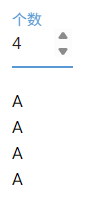

字母的个数与输入框内的数字是同步了，但需要使用全局变量存储个数，还需要借助额外的控件作为容器，容器内的多个控件比较紧凑，样式还要额外调整。

其实，可以使用NiceGUI提供的`refreshable`类（用于装饰函数）、`refreshable_method`类（用于装饰类的方法）创建可刷新方法（函数），直接调用其`refresh`方法，一步实现清除创建的控件、重新创建控件：

```python3
from nicegui import ui

def index():
    my_input = ui.number(
        '个数',
        value=1,
        min=1,
        max=10,
        format='%d'
    )
    @ui.refreshable
    def rebuild():
        for i in range(int(my_input.value)):
            ui.label('A')
    my_input.on_value_change(
        rebuild.refresh
    )
    rebuild()

ui.run(root=index,native=True)
```

代码简洁不少，但效果更好：


需要注意的是，在`refreshable`类、`refreshable_method`类装饰的函数（方法）内，所有创建的控件都会在调用`refresh`方法时重新创建，不会保存控件的状态：

```python3
from nicegui import ui

def index():
    @ui.refreshable
    def rebuild():
        my_input = ui.number(
            '个数',
            value=1,
            min=1,
            max=10,
            format='%d'
        )
        my_input.on_value_change(
            rebuild.refresh
        )
        for i in range(int(my_input.value)):
            ui.label('A')
    rebuild()

ui.run(root=index, native=True)
```

如果想要保存控件的状态，可以使用前面用过的绑定属性：

```python3
from nicegui import ui

count = 1
def index():
    @ui.refreshable
    def rebuild():
        my_input = ui.number(
            '个数',
            value=1,
            min=1,
            max=10,
            format='%d'
        )
        my_input.bind_value(
            globals(),
            'count',
        )
        my_input.on_value_change(
            rebuild.refresh
        )
        for i in range(int(my_input.value)):
            ui.label('A')
    rebuild()

ui.run(root=index, native=True)
```

也可以使用只与`refreshable`类、`refreshable_method`类配合使用的`ui.state`状态方法。

`ui.state`状态方法的参数为初始值，该方法返回一个元组。元组的第一个元素为调用`refresh`方法之后的保存值（第一次返回的是初始值），元组的第二个元素为修改保存值的赋值方法。

于是，将所有控件一股脑地塞入可刷新方法中之后，代码如下：

```python3
from nicegui import ui

def index():
    @ui.refreshable
    def rebuild():
        num,set_num = ui.state(1)
        my_input = ui.number(
            '个数',
            value=num,
            min=1,
            max=10,
            format='%d'
        )
        # 修改保存值
        my_input.on_value_change(
            lambda :set_num(my_input.value)
        )
        my_input.on_value_change(
            rebuild.refresh
        )
        for i in range(int(my_input.value)):
            ui.label('A')
    rebuild()

ui.run(root=index, native=True)
```

## 8 使用异步函数

### 8.1 NiceGUI中的异步函数

在Python中，有一种函数叫异步函数。与之相对的，就是同步函数。同步函数就是常见的函数，异步函数就是在定义函数时使用`async`修饰的函数。

一般来说，函数执行之后，就会立即得到结果。但是，如果函数执行的操作比较耗时，程序就会卡住，需要等函数执行完，程序才会恢复。这个就是同步函数的执行过程。

于是，异步函数为了解决卡住程序的问题，使用异步处理要执行的耗时操作。所谓异步，就是执行之后不会立即要求得到结果，而是按照顺序继续执行后续的代码，并按照完成顺序依次得到结果。

光说的话，不太直观，那就用代码对比一下。

先看同步函数的示例：

```python3
from nicegui import ui
import time

def do_something():
    ui.notify('start')
    time.sleep(3)
    ui.notify('ok')

def index():
    ui.button('Do Something',on_click=do_something)

ui.run(root=index,native=True)
```

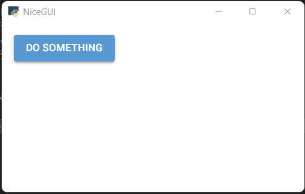

可以看到，虽然函数中，两个通知之间加入了延时，但两个通知还是同时弹出。

换成异步函数的话，结果就符合预期了：

```python3
from nicegui import ui
import asyncio

async def do_something():
    ui.notify('start')
    await asyncio.sleep(3)
    ui.notify('ok')

def index():
    ui.button('Do Something',on_click=do_something)

ui.run(root=index,native=True)
```

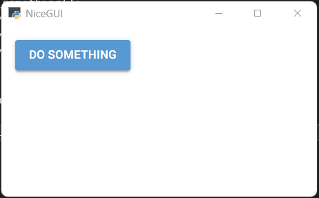

NiceGUI使用异步函数的情况如下：

- 响应函数可以是异步函数。

- 脚本模式、多页面模式、单页面模式、单页面应用创建页面的函数可以是异步函数。

  示例如下：

  ```python3
  from nicegui import ui
  import asyncio
  
  async def do_something():
      ui.notify('start')
      await asyncio.sleep(3)
      ui.notify('ok')
  
  async def index():
      ui.button('Do Something',on_click=do_something)
  
  ui.run(root=index,native=True)
  ```

- 部分控件、对象提供了可以异步等待的方法，用于实现在指定动作、状态之后才执行后续操作。

  比如，`ui.button`按钮控件的`clicked`方法就是一个异步函数，只有在点击按钮之后，该函数才会执行：
  
  ```python3
  from nicegui import ui
  
  async def index():
      await ui.button('Do Something One').clicked()
      await ui.button('Do Something Two').clicked()
      await ui.button('Do Something Three').clicked()
  
  ui.run(root=index,native=True)
  ```
  
  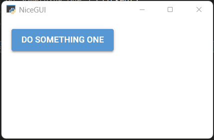

### 8.2 `Event`类的异步函数

部分控件、对象提供了可以异步等待的方法，用于实现在指定动作、状态之后才执行后续操作。这部分内容还有不少示例，所以单开一节，重点说一下。比如，前面介绍的`Event`类，就有两个可以异步等待的方法：`call`方法和`emitted`方法。

先说`call`方法。

如果信号的订阅者需要执行耗时的操作，想要等待操作完成再发射新的信号，使用`emit`方法就不合适，比如下面的代码：

```python3
from nicegui import ui,Event
import asyncio

signal_obj = Event()
shared_value = ''

# 订阅信号，更新全局变量，以便于新打开的页面自动使用该值作为初始值
@signal_obj.subscribe
async def update_shared_value(x):
    global shared_value
    shared_value=x

async def index():
    input = ui.input(value=shared_value)
    button = ui.button('submit')
    # 订阅信号
    @signal_obj.subscribe
    async def update(x):
        # 模拟耗时操作
        await asyncio.sleep(3)
        input.set_value(x)
    # 发射信号
    async def submit():
        button.disable()
        signal_obj.emit(input.value)
        button.enable()

    button.on_click(submit)

ui.run(root=index,port=80)
```

通过模拟耗时操作让其他页面输入框的内容延迟同步，笔者想让提交按钮在内容完成同步之前保持禁用状态，但实际执行时，提交按钮不会等待耗时操作执行完毕才恢复为可用状态，而是立即恢复为可用状态。这个很好理解，因为`emit`方法是同步方法，不支持异步等待，一旦执行就会立刻完成，随即执行后续的代码，将提交按钮恢复为可用状态。

因此，需要将`emit`方法替换为支持异步等待的`call`方法，并添加异步等待，让提交按钮在内容完成同步之前保持禁用状态，只有内容完成同步，才将提交按钮恢复为可用状态：

```python3
from nicegui import ui,Event
import asyncio

signal_obj = Event()
shared_value = ''

# 订阅信号，更新全局变量，以便于新打开的页面自动使用该值作为初始值
@signal_obj.subscribe
async def update_shared_value(x):
    global shared_value
    shared_value=x

async def index():
    input = ui.input(value=shared_value)
    button = ui.button('submit')
    # 订阅信号
    @signal_obj.subscribe
    async def update(x):
        # 模拟耗时操作
        await asyncio.sleep(3)
        input.set_value(x)
    # 发射信号
    async def submit():
        button.disable()
        await signal_obj.call(input.value)
        button.enable()
    button.on_click(submit)

ui.run(root=index,port=80)
```


至于`emitted`方法，可以实现类似`ui.button`按钮控件`clicked`方法的效果：

```python3
from nicegui import ui,Event

signal_obj = Event()

async def index():
    ui.button('Do Something One',on_click=signal_obj.emit)
    await signal_obj.emitted()
    ui.button('Do Something Two',on_click=signal_obj.emit)
    await signal_obj.emitted()
    ui.button('Do Something Three',on_click=signal_obj.emit)
    await signal_obj.emitted()

ui.run(root=index,native=True)
```


## 9 创建后台任务

上一章节介绍异步的时候，可以看到直接执行包含`time.sleep`的同步函数会导致问题，但是，如果在后台任务中执行同步函数，就不会有这样问题。

NiceGUI的`run`模块、`background_tasks`模块都提供了后台执行任务的方法。

其中，由`run`模块提供的是：

-   `run.cpu_bound`方法，常用于占用较多CPU资源的后台任务，该方法会创建新的进程操作，让进程池的进程数扩大。
-   `run.io_bound`方法，常用于占用较多IO资源的后台任务开，因为这类后台任务不会占用太多CPU资源，因此，该方法只是创建新的线程操作，操作完线程会关闭。

示例如下：

```python3
from nicegui import ui,run
import time

def sleep():
    time.sleep(3)

async def do_something():
    ui.notify('start')
    await run.cpu_bound(sleep)
    ui.notify('ok')

def index():
    ui.button('Do Something',on_click=do_something)

ui.run(root=index,native=True)
```


可以看到，虽然执行的是包含`time.sleep`的同步函数，但因为将其放在后台任务中执行，所以，结果符合预期。

而`background_tasks`模块提供的是：

- `background_tasks.create`方法，在后台运行一个协程任务，需要传入异步函数的调用结果。

-   `background_tasks.create_lazy`方法，在后台无重复地运行一个协程任务，需要传入异步函数的调用结果，还要指定任务名（给`name`参数传入字符串）。所谓无重复地运行，即相同任务名的后台任务没有完成之前，无法重复执行同名任务。

-   `background_tasks.await_on_shutdown`装饰器，如果某些任务需要确保即使程序结束也能顺利完成，则在定义函数时需要使用该装饰器装饰。

    注意，该装饰器无法在窗口模式中正常生效（但不会报错），只有网页模式可以正常使用该装饰器。

示例如下：

```python3
from nicegui import ui, background_tasks, app
import asyncio

@background_tasks.await_on_shutdown
async def do_something():
    print('start')
    await asyncio.sleep(10)
    print('ok')

def index():
    ui.button(
        'Do Something',
        on_click=lambda: background_tasks.create(
            do_something(),
            name='print'
        )
    )
    ui.button(
        'Do Something no repeat',
        on_click=lambda: background_tasks.create_lazy(
            do_something(),
            name='print'
        )
    )
    ui.button('shutdown', on_click=app.shutdown)

ui.run(root=index, native=False)
```

注意，与`run`模块不同的是，`background_tasks`模块提供的运行后台任务的方法不支持在后台任务中使用NiceGUI的控件。

## 10 使用定时器

上一章讲了在后台任务中执行函数，这一章说一下效果有点类似，但是常用于重复执行函数的定时器。

NiceGUI提供了两种定时器：

- `ui.timer`定时器，控件层级的定时器。
- `app.timer`定时器，程序层级的定时器。

`ui.timer`定时器和`app.timer`定时器基本用法相同，但使用场景有所差别。

先看基本用法：

```python3
from nicegui import ui

def index():
    button = ui.button('Do Something')
    def do_something():
        button.disable()
        ui.timer(3,lambda :ui.notify('ok'))
    button.on_click(do_something)

ui.run(root=index,native=True)
```

点击按钮之后，响应函数先禁用按钮，防止重复点击。然后创建一个定时器，每隔三秒弹出一条通知。

如果是`app.timer`定时器，则不能使用这种创建控件的操作：

```python3
from nicegui import ui,app

def index():
    button = ui.button('Do Something')
    def do_something():
        button.disable()
        app.timer(3,lambda :print('ok'))
    button.on_click(do_something)

ui.run(root=index,native=True)
```

除此以外，两种定时器还有一个区别：控件的响应函数创建了`ui.timer`定时器，那`ui.timer`定时器就属于这个控件的父控件（或者创建定时器位置所属上下文的控件）；一旦父控件清空所有子控件，`ui.timer`定时器也会随之清除。而`app.timer`定时器属于当前程序，不会因为这样的操作而被清除掉。

示例如下：

```python3
from nicegui import ui,app

def index():
    with ui.element() as element:
        ui.timer(3,lambda :print('ui is ok'))
        app.timer(3,lambda :print('app is ok'))
    ui.button('Clear Timers',on_click = element.clear)

ui.run(root=index,native=True)
```

点击按钮之后，终端只会输出`app is ok`，因为`app.timer`定时器属于当前程序，不受影响。

## 11 绑定快捷键

就像使用定时器需要添加一个定时器一样，想要绑定快捷键，也要添加一个`ui.keyborad`键盘响应器，用于响应指定快捷键。

注意，和`ui.timer`定时器类似，键盘响应器同样属于创建位置的父控件，一旦父控件清空所有子控件，键盘响应器也会随之清除。

`ui.keyborad`键盘响应器支持以下：

- `on_key`参数，可调用类型，表示按键的响应函数。
- `active`参数，布尔类型，表示是否激活该键盘响应器，默认为`True`。
- `repeating`参数，布尔类型，表示当按键持续按下的时候是否重复执行按键的响应函数，默认为`True`。
- `ignore`参数，元素为字符串的列表，表示当哪些控件激活时，不执行按键的响应函数，默认为`['input', 'select', 'button', 'textarea']`。

对于`on_key`参数对应响应函数，可以传递一个`KeyEventArguments`类型的响应对象，作为响应函数的参数。响应对象有以下属性：

-   `sender`属性，表示执行响应函数的键盘响应器。
-   `client`属性，表示客户端对象。
-   `action`属性，`KeyboardAction`类型，表示按键具体的动作，该属性有以下子属性：
    -   `keydown`属性，布尔类型，表示按键按下。
    -   `keyup`属性，布尔类型，表示按键松开。
    -   `repeat`属性，布尔类型，表示按键重复按下中。
-   `key`属性，`KeyboardKey`类型，表示当前按键具体是哪个键（如果是组合键，则表示除了修饰键之外的具体按键）。该属性有以下子属性：
    -   `name`属性，字符串类型，表示按键名。比如：`'a'`、`'Enter'`、`'ArrowLeft'`等。 可以参考 https://developer.mozilla.org/zh-CN/docs/Web/API/UI_Events/Keyboard_event_key_values 提供的按键名清单。
    -   `code`属性，字符串类型，表示按键的代号。比如：`'KeyA'`、`'Enter'`、`'ArrowLeft'`等。
    -   `location`属性，整数类型，表示按键的位置。`0`表示标准键盘区，`1`表示左边的按键（指的是`ctrl`键、`alt`键、`shift`键这种左右都有的按键），`2`表示右边的按键指的是`ctrl`键、`alt`键、`shift`键这种左右都有的按键），`3`表示数字键盘区。
-   `modifiers`属性，`KeyboardModifiers`类型，表示组合键中的修饰键（`ctrl`键、`alt`键、`shift`键、`win`键这种可以与字母键、数字键、功能键等组合使用的按键），该属性有以下子属性：
    -   `alt`属性，布尔类型，表示修饰键中是否有`Alt`键（Mac下的`opt`键）。
    -   `ctrl`属性，布尔类型，表示修饰键中是否有`ctrl`键。
    -   `meta`属性，布尔类型，表示修饰键中是否有`meta`键（Windows的`win`键或者Mac下的`cmd`键）。
    -   `shift`属性，布尔类型，表示修饰键中是否有`shift`键。

为了方便使用，`KeyboardKey`类支持以下属性：:

-   `is_cursorkey`属性，布尔类型，表示方向键是否被按下（数字键盘区的方向键不算）。
-   `number`属性，整数类型，表示按下了哪个主键盘区上方的数字键。`0`到`9`表示对应的数字键，`None` 没有按下上方的数字键。
-   `backspace`、`tab`、`enter`、`shift`、`control`、`alt`、`pause`、`caps_lock`、`escape`、`space`、`page_up`、`page_down`、`end`、`home`、`arrow_left`、`arrow_up`、`arrow_right`、`arrow_down`、`print_screen`、`insert`、`delete`、`meta`、`f1`、`f2`、`f3`、`f4`、`f5`、`f6`、`f7`、`f8`、`f9`、`f10`、`f11`、`f12`等属性，均为布尔类型，表示对应的按键是否被按下。

示例如下：

```python3
from nicegui import ui
from nicegui.events import KeyEventArguments

def handle_key_ctrl(e: KeyEventArguments):
    if e.modifiers.ctrl and not e.key.control:
        if e.action.keyup:
            ui.notify(f'松开了 ctrl+{e.key} 键')

def handle_key_alt(e: KeyEventArguments):
    if e.modifiers.alt and not e.key.alt:
        if e.action.keyup:
            ui.notify(f'松开了 alt+{e.key} 键')

def index():
    ui.label('按下ctrl键或者alt键与其他键的组合')
    with ui.element() as element:
        ui.keyboard(on_key=handle_key_ctrl,active=True)
        ui.keyboard(on_key=handle_key_alt,active=True)
    ui.button('清除快捷键',on_click = element.clear)

ui.run(root=index,native=True)
```

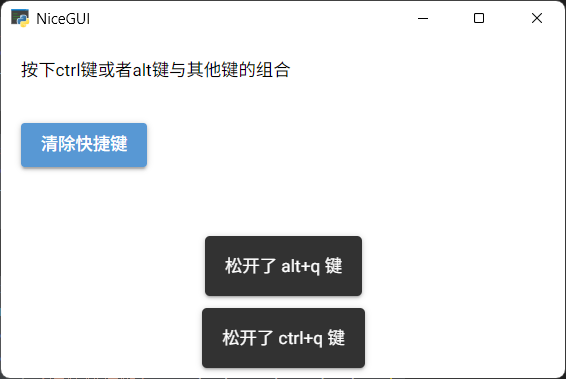

## 12 运行JavaScript代码

NiceGUI的页面本质上是网页，而网页的很多操作离不开JavaScript代码。因此，NiceGUI程序虽然是用Python写的，但支持运行JavaScript代码，只需调用`ui.run_javascript`方法即可：

```python3
from nicegui import ui

def index():
    ui.button(
        'Run JavaScript',
        on_click=lambda :ui.run_javascript(
            'alert("Hello World!")'
        )
    )

ui.run(root=index,native=True)
```

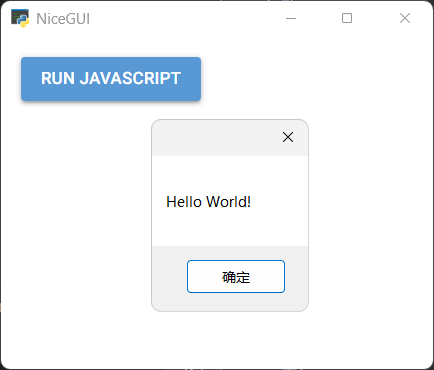

## 13 设计控件的布局

### 13.1 基本布局控件

在NiceGUI中，有以下三种基本布局，用于组合实现复杂的界面布局：

- 列（column）布局，所有的子控件排成一列。
- 行（row）布局，所有的子控件排成一行。
- 网格（gird）布局，所有的子控件都放在指定规格（默认为`1x1`）的单元格中。

三种基本布局的示意图如下：


默认情况下，直接创建控件的话，就和在`ui.column`列控件中添加子控件一样，都是列布局：

```python3
from nicegui import ui

def index():
    for i in range(4):
        ui.button(i)
    with ui.column().classes(
        'border-2 border-red-700 p-1'
    ):
        for i in range(4):
            ui.button(i)

ui.run(root=index,native=True)
```

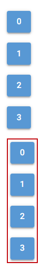

在`ui.row`行控件中添加子控件，则为行布局：

```python3
from nicegui import ui

def index():
    with ui.row().classes(
        'border-2 border-red-700 p-1'
    ):
        for i in range(4):
            ui.button(i)

ui.run(root=index,native=True)
```


在`ui.grid`网格控件中添加子控件，则为网格布局：

```python3
from nicegui import ui

def index():
    with ui.grid(columns=3,rows=2).classes(
        'border-2 border-red-700 p-1'
    ):
        ui.label('label 1').classes(
            'row-span-2 border-1 border-black p-1'
        )
        ui.label('label 2').classes(
            'col-span-2 border-1 border-black p-1'
        )
        ui.label('label 3').classes(
            'border-1 border-black p-1'
        )

ui.run(root=index,native=True)
```


### 13.2 布局辅助控件

只是使用基本布局控件的话，虽然能实现几乎所有常见的布局，但是，不使用下面的辅助控件的话，效果还是差点意思：

- `ui.space`空白控件，可以填充布局方向上可用的剩余空间，一般用于行布局、列布局中，让最后的控件可以紧贴父控件的边界：

  ```python3
  from nicegui import ui
  
  def index():
      with ui.column().classes(
          'border-2 border-red-700 p-1 h-72'
      ):
          for i in range(4):
              ui.button(i)
          ui.space()
          ui.button(4)
  
  ui.run(root=index,native=True)
  ```

  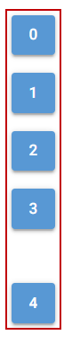

- `ui.separator`分隔控件，可以创建一个占用空间极小且不太明显的分隔符：

  ```python3
  from nicegui import ui
  
  def index():
      with ui.column().classes(
          'border-2 border-red-700 p-1'
      ):
          for i in range(4):
              ui.button(i)
          ui.space()
          ui.separator()
          ui.button(4)
  
  ui.run(root=index,native=True)
  ```

  

## 14 设计页面的特殊区域

页面除了主内容区域外，还有一些特殊的区域，可以自由添加控件。这些区域的位置都是固定的，并且创建（使用）这些区域并不会影响这些区域的实际位置。

特殊区域相关的控件与其对应位置为：

- `ui.header`页头控件，对应位置为页头，即主内容区域的上方。
- `ui.footer`页脚控件，对应位置为页脚，即主内容区域的下方。
- `ui.left_drawer`左抽屉控件，对应位置为左抽屉，即主内容区域的左边，该区域的隐藏状态支持动态切换。
- `ui.right_drawer`右抽屉控件，对应位置为右抽屉，即主内容区域的右边，该区域的隐藏状态支持动态切换。
- `ui.page_sticky`便签控件，对应位置在主内容区域的八个边角。

它们的位置关系如下：


示例如下：

```python3
from nicegui import ui

def index():
    ui.label('主内容')
    with ui.header():
        ui.label('页头')
    with ui.footer():
        ui.label('页脚')
    with ui.left_drawer().classes('bg-grey'):
        ui.label('左抽屉')
    with ui.right_drawer().classes('bg-grey'):
        ui.label('右抽屉')
    with ui.page_sticky():
        ui.button('便签')

ui.run(root=index,native=True)
```

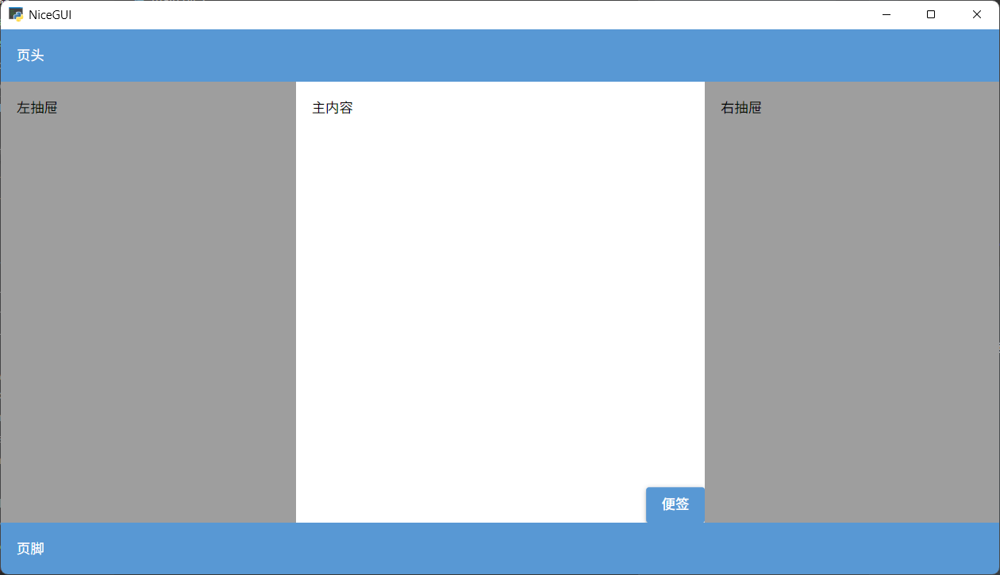

注意，如果窗口太小，左右抽屉默认为隐藏状态：

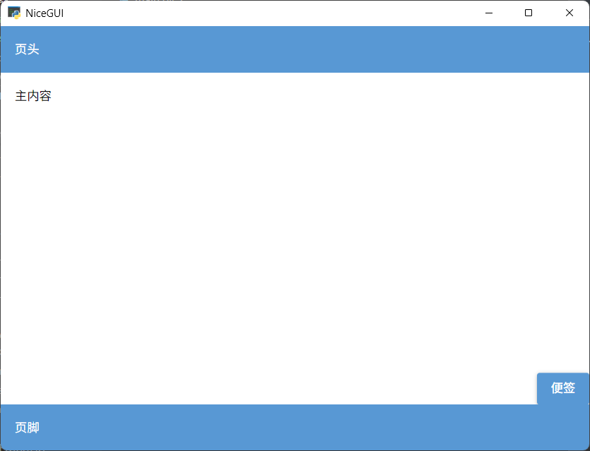

## 15 认识控件

NiceGUI的`ui`模块提供了程序所需的全部控件。不过控件数量较多、功能各异，为了方便读者快速了解，笔者将特点、用途类似的控件划分为一类，先按照类别简单介绍一下这些控件。

### 15.1 显示简单文本

想要在页面中显示一些简单文本的话，可以使用下面的控件：

- `ui.label`控件，直接显示文本。
- `ui.link`控件，将文本显示为超链接。
- `ui.link_target`控件，与超链接相关，用于创建一个锚点，但不显示任何文本。比如，`ui.link_target('link')`可以创建锚点`link`，使用`ui.link('link_target','#link')`可以创建指向该锚点的超链接，点击该超链接，页面会自动跳转到该控件所在位置。对于下面的示例，需要将页面高度调到无法看到全部控件，点击超链接才能看到跳转效果。
- `ui.chat_message`控件，将文本放入消息气泡。
- `ui.badge`控件，将文本放入类似按钮的紧凑容器中，常用于当作现有控件的角标。

示例如下：

```python3
from nicegui import ui

def index():
    ui.link('link','#link')
    ui.label('label')
    ui.chat_message('chat_message')
    with ui.button(
        'button'
    ).props(
        'no-caps'
    ):
        ui.badge(
            'badge',
            color='red'
        ).props(
            'floating'
        )
    ui.link_target('link')

ui.run(root=index,native=True)
```

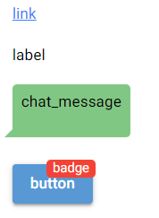

### 15.2 渲染格式文本

有些格式文本会在渲染之后显示，显示出来的不是文本原文，而是特定的内容，比如下面的控件：

- `ui.markdown`控件，可以渲染使用Markdown语法的文本。
- `ui.restructured_text`控件，可以渲染使用RST语法（规则类似Markdown，但比较复杂且不如Markdown应用范围广）的文本。
- `ui.mermaid`控件，可以将使用Mermaid语法的文本渲染为流程图。
- `ui.code`控件，可以渲染代码的语法高亮。
- `ui.log`控件，可以逐条显示日志内容。如果推送日志时额外指定了样式，则该条日志会被渲染为对应样式。

示例如下：

```python3
from nicegui import ui

def index():
    ui.markdown('*markdown*')
    ui.restructured_text(
        '*restructured_text*'
    )
    ui.mermaid(
        '''
        graph LR;
        A[NiceGUI] --> |Render| B{mermaid};
        '''
    )

ui.run(root=index,native=True)
```


```python3
from nicegui import ui

def index():
    ui.code('print("Python Code")')
    ui.log(3).push(
        'log',
        classes='text-red-700'
    )

ui.run(root=index,native=True)
```


### 15.3 使用任意HTML标签

NiceGUI的页面本质上是网页，很多控件也是通过底层的前端框架和HTML标签实现的。如果想要直接使用HTML标签，可以使用下面的控件或者模块：

- `ui.element`控件，可以创建指定的HTML标签，但是想要在标签内添加内容的话，需要进入控件的上下文。

- `ui.html`控件，可以创建指定的HTML标签，并在标签内添加内容。

  注意，从NiceGUI 3.0.0版本开始，`ui.html`控件额外添加了一个关键字参数`sanitize`，用于强制过滤`content`参数中的注入攻击。官方建议给该值传入`Sanitizer().sanitize`（使用`from html_sanitizer import Sanitizer`导入，需要安装`html-sanitizer`库），但本教程因为默认没有安装`html-sanitizer`库，所以给该参数传入了`False`，禁用了安全过滤功能。但读者在实际使用时，请**不要**这样做。

- `html`模块，提供了部分常用的HTML标签，直接调用该模块中标签名对应的方法即可。但是，想要在标签内添加内容的话，需要进入控件的上下文。

示例如下：

```python3
from nicegui import ui,html

def index():
    with ui.element('h1'):
        ui.label('element')
    ui.html('html',tag='h1',sanitize=False)
    with html.h1():
        ui.label(text='html')

ui.run(root=index,native=True)
```


### 15.4 创建各种按钮

在NiceGUI的所有控件，唯有按钮相关的控件最多，因此，这些控件在创建按钮时都有用：

- `ui.button`控件，就是普通的按钮。
- `ui.button_group`控件，用于将多个普通按钮组合成一个外观上是单个按钮、功能上每个按钮都可以点击的巨大按钮。
- `ui.dropdown_button`控件，本身具备按钮功能，还能在其上下文中嵌入其他内容。点击右侧图标，即可弹出嵌入的内容。
- `ui.fab`控件，本身具备按钮功能，还能在其上下文中嵌入其他内容（建议嵌入`ui.fab_action`控件）。点击控件，即可弹出嵌入的内容。
- `ui.chip`控件，本身具备按钮功能，还支持选择、删除自身。

示例如下：

```python3
from nicegui import ui

def index():
    ui.button('button')
    with ui.button_group():
        ui.button('button1')
        ui.button('button2')
    with ui.dropdown_button(
        'dropdown_button',
        auto_close=True
    ):
        ui.item('item1')
        ui.item('item2')
    with ui.fab('menu',label='fab'):
        ui.fab_action('home')
        ui.fab_action('replay')
    ui.chip('chip',selectable=True,removable=True)

ui.run(root=index,native=True)
```

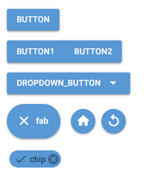

### 15.5 获取用户的选择

想要获取用户的选择，可以使用下面的控件：

- `ui.radio`控件，提供了只能单选的多个选项。
- `ui.toggle`控件，用法和`ui.radio`控件一样，不同的是，该控件看上去更像一个可以点击切换选项的按钮。
- `ui.select`控件，需要点击控件才能看到所有选项，允许单选、多选。
- `ui.checkbox`控件，点击之后可以切换选项选择状态，可用于组成多选的选项，也可以像一个开关一样单独使用。
- `ui.switch`控件，用法和`ui.checkbox`控件一样，不同的是，该控件看上去更像一个可以点击切换状态的开关。

示例如下：

```python3
from nicegui import ui

def index():
    ui.radio(['a','b','c'],value='a')
    ui.toggle(['a','b','c'],value='a')
    ui.select(
        ['a','b','c'],
        value='a',
        label='select'
    ).classes('w-32')
    ui.checkbox('checkbox',value=True)
    ui.switch('switch',value=True)

ui.run(root=index,native=True)
```


### 15.6 获取用户的直接输入

除了让用户点击控件，从给定的选项中选择，还可以使用下面的控件，让用户直接输入：

- `ui.input`控件，就是一个输入框，用户可以通过键盘输入任何内容。
- `ui.number`控件，外观、用法与`ui.input`控件基本相同，但该控件只允许输入数字，并提供了额外的按钮，用于快捷调整数字。
- `ui.input_chips`控件，外观、用法与`ui.input`控件基本相同，但该控件可以在按下`Enter`键之后将当前输入的内容转换为`ui.chip`控件，并支持继续转换后续输入的内容。当然，也可以在创建该控件时传入一个元素为字符串的列表，作为默认已经转换的`ui.chip`控件。
- `ui.color_input`控件，外观、用法与`ui.input`控件基本相同，但该控件主要用于获取具体颜色的表示方式，并提供了额外的按钮，用于弹出调色盘，用户的选择转换为颜色表达式。
- `ui.textarea`控件，允许用户输入多行内容。
- `ui.editor`控件，允许用户输入多行内容，同时该控件提供了一些设置内容格式的按钮。
- `ui.codemirror`控件，允许用户输入多行代码，并使用指定的编程语言语法高亮渲染输入的内容。
- `ui.json_editor`控件，允许用户输入JSON格式的内容，并自动验证输入的内容是否符合语法。

示例如下：

```python3
from nicegui import ui

def index():
    ui.input('input',value='a')
    ui.number('number',value=0)
    ui.input_chips(
        'input_chips',
        value=['a','b','c']
    )
    ui.color_input(
        'color_input',
        value='rgb(255,0,0)'
    )
    ui.textarea(
        'textarea',
        value='Hello'
    )
    ui.editor(
        value='Hello'
    ).classes('h-16')
    ui.codemirror(
        'print("hello")',
        language='python'
    ).classes('h-16 w-64')
    ui.json_editor(
        {
            'content': {
                'json': {
                    'name':'json_editor'
                }
            }
        }
    ).classes('h-16')

ui.run(root=index,native=True)
```

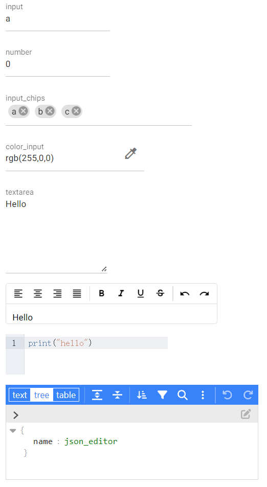

### 15.7 获取用户的间接输入

有些用户输入可以直接获取，有些用户“输入”则需要通过下面的控件转换之后才能获取：

- `ui.slider`控件，用户拖动滑块之后，将滑块位置转换为具体数值。
- `ui.range`控件，和`ui.slider`控件类似，用户拖动滑块之后，将滑块位置转换为具体数值。不过，与`ui.slider`控件不同的是，该控件有两个滑块，得到的是两个数值，即两个滑块所代表的范围值。
- `ui.knob`控件，用法上和`ui.slider`控件类似（参数不完全一样），只不过外观上是一个旋钮。
- `ui.rating`控件，用法上和`ui.slider`控件类似（参数不完全一样），但最小值是固定的，外观上就是常见的评分控件，通过点击确定具体数值。
- `ui.color_picker`控件，用于弹出调色盘，让用户选择颜色。
- `ui.upload`控件，让用户上传文件。
- `ui.joystick`控件，提供一个虚拟的摇杆，捕获用户操作摇杆的具体动作。
- `ui.date`控件，让用户选择日期。
- `ui.time`控件，让用户选择时间。

示例如下：

```python3
from nicegui import ui

def index():
    ui.slider(
        min=0,
        max=10,
        value=2
    )
    ui.range(
        min=0,
        max=10,
        value={
            'min':2,
            'max':4
        }
    )
    ui.knob(
        2,
        min=0,
        max=10
    )
    ui.rating(
        max=10,
        value=2
    )
    with ui.button('color_picker'):
        ui.color_picker()
    ui.upload()
    ui.joystick(
        on_move=lambda e:print(e)
    )
    ui.date('2026-01-01')
    ui.time('20:26')

ui.run(root=index,native=True)
```

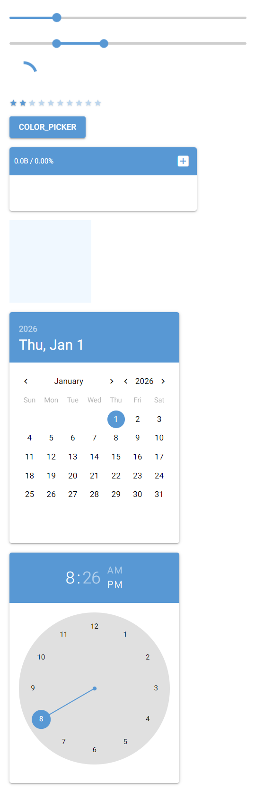

### 15.8 显示图片

在NiceGUI程序中，想要显示图形，通常使用下面的控件：

- `ui.image`控件，简单显示提供的图片。
- `ui.interactive_image`控件，在显示图片的基础上，提供了额外的内容和交互功能。

示例如下：

```python3
from nicegui import ui

def index():
    ui.image(
        'https://nicegui.io/static/logo.png'
    ).classes('w-64 h-64')
    ui.interactive_image(
        'https://nicegui.io/static/logo.png'
    ).classes('w-64 h-64')

ui.run(root=index,native=True)
```


默认情况下，两种控件的基本用法相同，但`ui.interactive_image`控件会自动调整图片的比例，让其适应控件本身的大小。`ui.interactive_image`控件还支持一些额外的交互和SVG内容：

```python3
from nicegui import ui

def index():
    ui.interactive_image(
        'https://nicegui.io/static/logo.png',
        size=(100,120),
        content=f'''
            <circle
                cx='120'
                cy='180' 
                r='10' 
                fill='green'
            />
        ''',
        on_mouse=lambda e:e\
        .sender.set_content(
            f'''
                <circle
                    cx='{e.image_x}'
                    cy='{e.image_y}' 
                    r='10' 
                    fill='red'
                />
            '''
        )
    )

ui.run(root=index,native=True)
```


### 15.9 播放音视频

在NiceGUI程序中，音频和视频对应的控件用法基本相同，只是外观有所不同：

- `ui.audio`控件，播放音频。
- `ui.video`控件，播放视频。

示例如下：

```python3
from nicegui import ui

def index():
    ui.audio('https://cdn.pixabay.com/download/audio/2022/02/22/audio_d1718ab41b.mp3')
    ui.video('https://test-videos.co.uk/vids/bigbuckbunny/mp4/h264/360/Big_Buck_Bunny_360_10s_1MB.mp4')

ui.run(root=index,native=True)
```


### 15.10 显示矢量图（SVG）

除了前面提到过的图片文件，NiceGUI还支持矢量图。所谓矢量图，即不是记录所有像素、而是记录图片元素绘制方法的图片，其内容不会因为缩放而变得模糊。

以下控件的内容都是矢量图：

- `ui.icon`控件，用于显示SVG格式或者PNG格式的图标。
- `ui.avatar`控件，和`ui.icon`控件支持的图标一样，但该控件默认套了一个边框，用于表示头像。
- `ui.spinner`控件，提供了一些使用SVG作为基础图形的加载动画。
- `ui.html`控件，没错，该控件也支持SVG，但是用法没有前面几个控件简单，需要传入SVG源代码，然后该控件会将其渲染为矢量图。

示例如下：

```python3
from nicegui import ui

def index():
    ui.icon(
        'home',
        size='6em'
    )
    ui.avatar(
        'home',
        size='6em'
    )
    ui.avatar(
        'img:https://nicegui.io/logo_square.png',
        size='6em'
    )
    ui.spinner(size='6em')
    ui.html(
        '''
        <svg viewBox='0 0 200 200' width='100' height='100'>
        <circle cx='100' cy='100' r='78' fill='#ffde34' stroke='black' stroke-width='3' />
        <circle cx='80' cy='85' r='8' />
        <circle cx='120' cy='85' r='8' />
        <path 
        d='m60,120 C75,150 125,150 140,120' 
        style='fill:none; stroke:black; stroke-width:8; stroke-linecap:round' 
        />
        </svg>
        ''',
        sanitize=False
    )

ui.run(root=index,native=True)
```

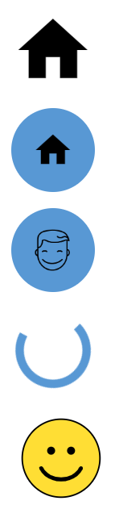

### 15.11 显示进度

下面的控件用于显示进度，都是进度条控件：

- `ui.linear_progress`控件，常见的直线进度条。
- `ui.circular_progress`控件，使用圆形表示进度的进度条。

示例如下：

```python3
from nicegui import ui

def index():
    ui.linear_progress(
        0.6
    )
    ui.circular_progress(
        0.6
    )

ui.run(root=index,native=True)
```

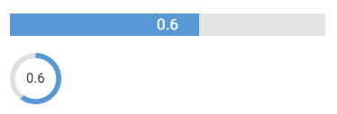

### 15.12 显示表格

NiceGUI提供了两种显示表格的控件：

- `ui.table`控件，为内置的表格实现，由Quasar框架提供，优点是用法简单，但很多功能不够强大。
- `ui.aggrid`控件，由AG Grid框架提供，功能强大，有付费的企业版本，同时用法也会复杂一些。

示例如下：

```python3
from nicegui import ui

def index():
    ui.table(
        columns=[
            {
                'label': 'Name', 
                'field': 'name'
            },
            {
                'label': 'Age', 
                'field': 'age'
            },
        ],
        rows=[
            {'name': 'Alice', 'age': 18},
            {'name': 'Bob', 'age': 21},
            {'name': 'Carol'},
        ]
    )
    ui.aggrid(
        {
            'columnDefs': [
                {
                    'headerName': 'Name', 
                    'field': 'name'
                },
                {
                    'headerName': 'Age', 
                    'field': 'age'
                },
            ],
            'rowData': [
                {'name': 'Alice', 'age': 18},
                {'name': 'Bob', 'age': 21},
                {'name': 'Carol'},
            ]
        }
    )

ui.run(root=index, native=True)
```


### 15.13 渲染线形图

以下控件可以将提供的数据渲染为线形图：

- `ui.matplotlib`控件，使用`matplotlib`库绘制线形图，可以使用`with`进入`figure`属性的上下文，调用上下文对象的子对象的`plot`方法绘制线形图。

  注意，`ui.matplotlib`控件依赖`matplotlib`库，需要先安装依赖库才能使用对应控件。可以参考安装NiceGUI一章，使用`uv add nicegui[matplotlib]`命令提前添加依赖库。

  示例如下：

  ```python3
  from nicegui import ui
  
  def index():
      with ui.matplotlib().classes('w-64 h-64').figure as fig:
          fig.gca().plot(
              [
                  0, 1, 2
              ],
              [
                  1, 2, 4
              ]
          )
      with ui.matplotlib().classes('w-64 h-64').figure as fig:
          fig.add_subplot().plot(
              [
                  0, 1, 2
              ],
              [
                  1, 2, 4
              ]
          )
  
  ui.run(root=index, native=True)
  ```

  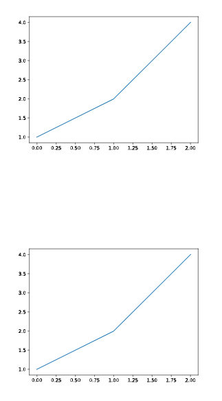

- `ui.pyplot`控件，使用`matplotlib`库绘制线形图，可以使用`with`进入控件的上下文，调用上下文对象`fig`属性的子对象的`plot`方法绘制线形图。除了在控件上下文中调用上下文对象`fig`属性的子对象的`plot`方法绘制线形图，也可以直接调用`matplotlib.pyplot`模块的`plot`方法绘制线形图。

  注意，`ui.pyplot`控件依赖`matplotlib`库，需要先安装依赖库才能使用对应控件。可以参考安装NiceGUI一章，使用`uv add nicegui[matplotlib]`命令提前添加依赖库。

  示例如下：

  ```python3
  from nicegui import ui
  
  def index():
      with ui.pyplot().classes('w-64 h-64') as plt:
          plt.fig.gca().plot(
              [
                  0, 1, 2
              ],
              [
                  1, 2, 4
              ]
          )
      with ui.pyplot().classes('w-64 h-64') as plt:
          plt.fig.add_subplot().plot(
              [
                  0, 1, 2
              ],
              [
                  1, 2, 4
              ]
          )
  
      from matplotlib import pyplot
      with ui.pyplot().classes('w-64 h-64'):
          pyplot.plot(
              [
                  0, 1, 2
              ],
              [
                  1, 2, 4
              ]
          )
  
  ui.run(root=index, native=True)
  ```

  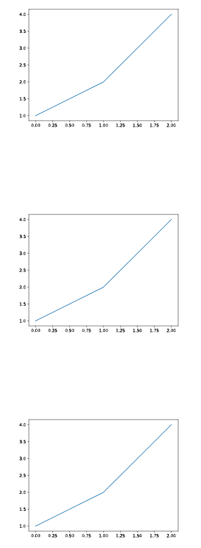

- `ui.line_plot`控件，使用`matplotlib`库绘制线形图，可以使用`with`进入控件的上下文，调用上下文对象`fig`属性的子对象的`plot`方法绘制线形图；也可以使用`with`进入控件的上下文或者不进入上下文，直接调用控件的`push`方法绘制线形图。此外，调用`with_legend`方法，还能添加图例。

  注意，`ui.line_plot`控件依赖`matplotlib`库，需要先安装依赖库才能使用对应控件。可以参考安装NiceGUI一章，使用`uv add nicegui[matplotlib]`命令提前添加依赖库。

  示例如下：

  ```python3
  from nicegui import ui
  
  def index():
      with ui.line_plot().classes('w-64 h-64') as lp:
          lp.fig.clear()
          lp.fig.gca().plot(
              [
                  0, 1, 2
              ],
              [
                  1, 2, 4
              ]
          )
          lp.with_legend(['number'])
  
      with ui.line_plot().classes('w-64 h-64') as lp:
          lp.fig.clear()
          lp.fig.add_subplot().plot(
              [
                  0, 1, 2
              ],
              [
                  1, 2, 4
              ]
          )
          lp.with_legend(['number'])
          
      with ui.line_plot().classes('w-64 h-64') as lp:
          lp.push(
              [
                  0, 1, 2
              ],
              [
                  [1, 2, 4]
              ]
          )
          lp.with_legend(['number'])
  
      ui.line_plot().classes('w-64 h-64').push(
              [
                  0, 1, 2
              ],
              [
                  [1, 2, 4]
              ]
          )
      
      ui.line_plot().classes('w-64 h-64').with_legend(['number']).push(
              [
                  0, 1, 2
              ],
              [
                  [1, 2, 4]
              ]
          )
  
  ui.run(root=index, native=True)
  ```

  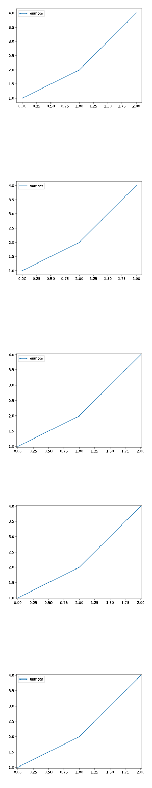

- `ui.plotly`控件，使用`plotly`库绘制线形图。

  注意，`ui.plotly`控件依赖`plotly`库，需要先安装依赖库才能使用对应控件。可以参考安装NiceGUI一章，使用`uv add nicegui[plotly]`命令提前添加依赖库。

  示例如下：

  ```python3
  from nicegui import ui
  
  def index():
      import plotly.graph_objects as go
      ui.plotly(
          go.Figure(
              go.Scatter(
                  x=[0, 1, 2],
                  y=[1, 2, 4]
              ),
              layout={
                  'margin': {
                      'l': 0,
                      'r': 0,
                      't': 0,
                      'b': 0
                  }
              }
          )
      ).classes('w-64 h-64')
      ui.plotly(
          {
              'data': [
                  {
                      'type': 'scatter',
                      'line': {'color': '#636EFA'},
                      'x': [0, 1, 2],
                      'y': [1, 2, 4],
                  }
              ],
              'layout': {
                  'margin': {
                      'l': 20,
                      'r': 0,
                      't': 0,
                      'b': 25
                  },
                  'plot_bgcolor': '#E5ECF6',
                  'xaxis': {
                      'gridcolor': 'white',
                      'dtick': '0.5',
                      'zeroline': False
                  },
                  'yaxis': {
                      'gridcolor': 'white',
                      'dtick': '0.5',
                      'zeroline': False
                  },
              }
          }
      ).classes('w-64 h-64')
  
  ui.run(root=index, native=True)
  ```

  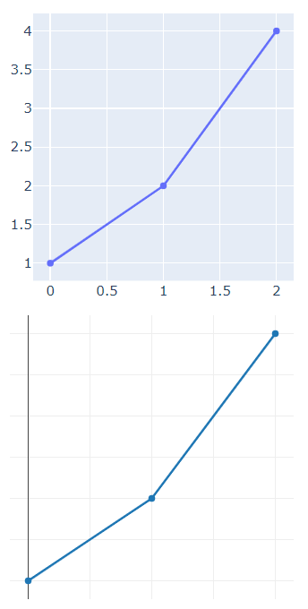

### 15.14 渲染图表

以下控件可以将提供的数据渲染为表格图形：

- `ui.highchart`控件，使用Highcharts框架渲染图表，支持多种类型的图表。但是，Highcharts框架商用需要付费。

  注意，`ui.highchart`控件依赖`nicegui-highcharts`库，需要先安装依赖库才能使用对应控件。可以参考安装NiceGUI一章，使用`uv add nicegui[highcharts]`命令提前添加依赖库。

- `ui.echart`控件，使用ECharts框架渲染图表，支持多种类型的图表，商用无需付费。

示例如下：

```python3
from nicegui import ui

def index():
    ui.highchart(
        {
            'title': {'text': 'A and B'},
            'chart': {'type': 'bar'},
            'xAxis': {
                'categories': ['A', 'B']
            },
            'yAxis': {
                'title': False,
            },
            'series': [
                {
                    'name': '2025',
                    'data': [0.1, 0.2]
                },
                {
                    'name': '2026',
                    'data': [0.3, 0.4]
                },
            ],
            'credits': {'enabled': False}
        }
    ).classes('w-64 h-64')
    ui.echart(
        {
            'title': {'text': 'A and B'},
            'xAxis': {'type': 'value'},
            'yAxis': {
                'type': 'category',
                'data': ['A', 'B'],
                'inverse': True
            },
            'legend': {'show': True},
            'series': [
                {
                    'type': 'bar',
                    'name': '2025',
                    'data': [0.1, 0.2]
                },
                {
                    'type': 'bar',
                    'name': '2026',
                    'data': [0.3, 0.4]
                },
            ],
        }
    ).classes('w-64 h-64')

ui.run(root=index, native=True)
```

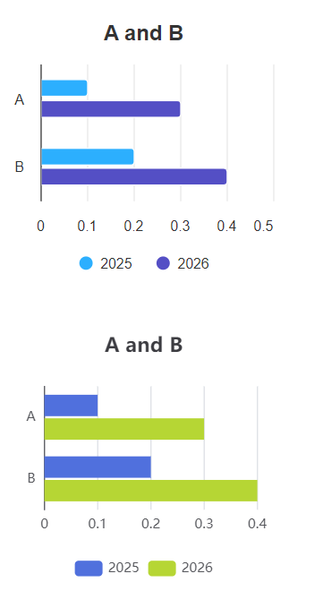

### 15.15 渲染复杂数据

除了前面提到的数据图形化展示方式之外，下面的控件提供了针对特定类型数据、文件的展示方式：

- `ui.tree`控件，用于渲染树类型的数据。

  示例如下：

  ```python3
  from nicegui import ui
  
  def index():
      ui.tree(
          nodes=[
              {
                  'id': 'lang',
                  'label': 'Language',
                  'icon': 'dashboard',
                  'children': [
                      {
                          'id': '1',
                          'label': 'Python'
                      },
                      {
                          'id': '2',
                          'label': 'JavaScript'
                      }
                  ]
              },
          ],
          node_key='id',
          label_key='label',
          children_key='children',
          on_select=lambda e: ui.notify(f'选择了 {e.value}'),
          on_expand=lambda e: ui.notify(f'展开了 {e.value}'),
          on_tick=lambda e: ui.notify(f'勾选了 {e.value}'),
      ).expand()
  
  ui.run(root=index, native=True)
  ```

  

- `ui.leaflet`控件，用于渲染地图数据。

  示例如下：

  ```python3
  from nicegui import ui
  
  def index():
      ui.leaflet(
          center=(39.9072, 116.3912),
          zoom=18,
          options={
              'attributionControl':False,
          }
      ).classes('w-64 h-64')\
      .marker(latlng=(39.9072, 116.3912))
  
  ui.run(root=index, native=True)
  ```

  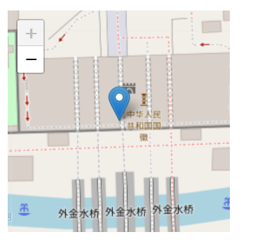

- `ui.scene`控件、`ui.scene_view`控件，使用ThreeJs框架渲染三维模型，前者为可以交换的3D视图，后者则是基于前者创建、不可交互的固定视角视图。

  示例如下：

  ```python3
  from nicegui import ui
  
  def index():
      scene = ui.scene().classes('w-64 h-64')
      scene.box().material('red')
      ui.scene_view(scene).classes('w-64 h-64')
      
  ui.run(root=index, native=True)
  ```
  
  

### 15.16 创建布局

尽管前面介绍布局的时候已经说了几种和布局相关的控件，但那些只是常用的控件，本节开始，将介绍所有和布局有关的控件。

以下是可以创建布局的控件：

- `ui.column`控件，在上下文中添加的控件排成一列。
- `ui.row`控件，在上下文中添加的控件排成一行。
- `ui.grid`控件，在上下文中添加的控件都放在指定规格（默认为`1x1`）的单元格中。
- `ui.list`控件，在上下文中添加的`ui.item`控件、`ui.menu_item`控件、`ui.slide_item`控件排成一列，看上去与`ui.column`控件类似，但该控件的子控件之间更加紧凑。
- `ui.card`控件、`ui.card_actions`控件、`ui.card_section`控件，`ui.card`控件表示卡片主体，在上下文中添加的控件会放在默认带边框的卡片中；`ui.card_actions`控件表示卡片的动作区域，只能在`ui.card`控件的上下文添加，一般在该控件上下文添加可以点击的控件，并且默认靠左对齐；`ui.card_section`控件表示内容分区，只能在`ui.card`控件的上下文添加，一般在该控件上下文添加只是显示内容的控件，并且默认居中对齐。
- `ui.item`控件、`ui.item_label`控件、`ui.item_section`控件，通常组合在一起使用，共同组成一个内容项目的整体，每个控件对应着内容的指定部分。

示例如下：

```python3
from nicegui import ui

def index():
    with ui.list().classes(
        'border-2 border-red-700'
    ):
        for i in range(4):
            ui.item(str(i))
    with ui.column().classes(
        'border-2 border-red-700'
    ):
        for i in range(4):
            ui.item(str(i))
    with ui.card():
        ui.label('card')
        with ui.card_section():
            ui.label('card section')
        with ui.card_actions():
            ui.button('Yes')
            ui.button('No')
    with ui.item('item'):
        with ui.item_section():
            ui.item_label('label1')
            ui.item_label('label2').props(
                'caption'
            )
        with ui.item_section().props(
            'side'
        ):
            ui.icon('home')

ui.run(root=index,native=True)
```

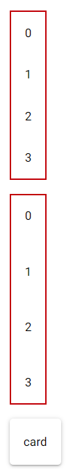

### 15.17 辅助设计布局

除了直接创建布局，还有一些控件可以让布局的设计更加灵活、美观、直观：

- `ui.separator`控件，创建一个占用空间极小且不太明显的分隔符。
- `ui.space`控件，填充布局方向上可用的剩余空间。
- `ui.skeleton`控件，创建一个代替控件的占位控件，通常在页面没有完全加载时表示页面的布局。

示例如下：

```python3
from nicegui import ui

def index():
    with ui.column().classes(
        'border-2 border-red-700 h-64 w-32'
    ):
        ui.skeleton('QBtn')
        ui.space()
        ui.separator()
        ui.skeleton('QChip')

ui.run(root=index,native=True)
```

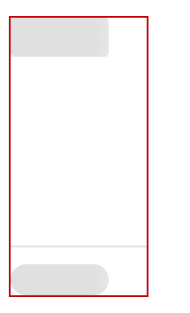

### 15.18 调整布局空间

前面控件创建的布局，所有子控件都是平铺展示，一旦控件较多，布局就会占据较多空间，甚至超出屏幕，只能滚动页面查看超出屏幕的部分。

不过，下面的控件可以调整布局占据的空间：

- `ui.expansion`控件，可以通过向下展开的方式扩展空间，显示原本隐藏的控件。

  示例如下：

  ```python3
  from nicegui import ui
  
  def index():
      with ui.card(),ui.expansion(
          'More',
          caption='info'
      ).props('header-class=bg-blue'):
          ui.button('Hello')
          ui.button('World')
      with ui.card(),ui.expansion(
          'More',
          caption='info',
          value=True
      ).props('header-class=bg-blue'):
          ui.button('Hello')
          ui.button('World')
  
  ui.run(root=index,native=True)
  ```

  

- `ui.scroll_area`控件，将原本固定大小的区域，变成可以无限扩展的滚动区域，确保可以容纳所有控件。

  示例如下：

  ```python3
  from nicegui import ui
  
  def index():
      with ui.card(),ui.scroll_area().classes('w-64 h-64'):
          for i in range(99):
              ui.button(str(i))
  
  ui.run(root=index,native=True)
  ```

  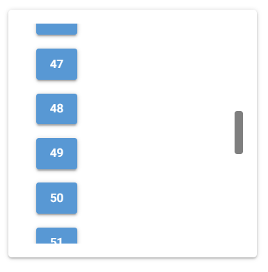

- `ui.slide_item`控件，创建一个可以四向滑动的固定区域，向对应方向的反方向滑动，会将当前区域变为对应方向的独立区域，所有区域都可以放置其他控件。

  示例如下：

  ```python3
  from nicegui import ui
  
  def index():
      with ui.list().classes('border-2 border-red-700'),ui.slide_item('center').classes('w-32') as slide:
          ui.label('center')
      with slide.left('left',on_slide=slide.reset):
          ui.label('left')
      with slide.right('right',on_slide=slide.reset):
          ui.label('right')
      with slide.top('top',on_slide=slide.reset):
          ui.label('top')
      with slide.bottom('bottom',on_slide=slide.reset):
          ui.label('bottom')
  
  ui.run(root=index,native=True)
  ```

  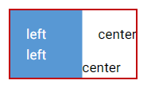

- `ui.splitter`控件，创建一个划分为左中右（或者上中下）三块区域的区域，可以通过拖动中间区域（实际上是一条间隔线）来改变其余两块区域的大小。

  示例如下：

  ```python3
  from nicegui import ui
  
  def index():
      with ui.card():
          splitter = ui.splitter(value=75).classes('w-64 h-64')
          with splitter.separator:
              ui.icon('lightbulb')
          with splitter.before:
              ui.card().classes('w-full h-full bg-red')
          with splitter.after:
              ui.card().classes('w-full h-full bg-blue')
  
  ui.run(root=index,native=True)
  ```

  

### 15.19 管理多页内容

对于内容多到需要分页的情况，下面的控件可以很好处理这种情况：

- `ui.tabs`控件、`ui.tab`控件、`ui.tab_panels`控件、`ui.tab_panel`控件，共同组成完整的选项卡控件。其中，`ui.tabs`控件为选项卡的页标签容器，用于容纳表示页标签的`ui.tab`控件。`ui.tab_panels`控件是标签页的容器，用于容纳表示标签页的`ui.tab_panel`控件。标签页用于容纳需要分页的内容，点击页标签，标签页容器也会切换到对应的标签页。

  示例如下：

  ```python3
  from nicegui import ui
  
  def index():
      with ui.tabs().props('no-caps') as tabs:
          ui.tab('a',label='标签a')
          ui.tab('b',label='标签b')
      with ui.tab_panels(
          tabs,
          value='a'
      ).classes('w-64 h-64 border'):
          with ui.tab_panel('a'):
              ui.label('标签页a')
          with ui.tab_panel('b'):
              ui.label('标签页b')
  
  ui.run(root=index,native=True)
  ```

  

- `ui.carousel`控件、`ui.carousel_slide`控件，共同组成轮播图控件，用法类似选项卡控件，只不过轮播图控件没有页标签，直接就是标签页。`ui.carousel`控件就是`ui.carousel_slide`控件的容器，`ui.carousel_slide`控件用于容纳需要分页的内容。

  示例如下：

  ```python3
  from nicegui import ui
  
  def index():
      with ui.carousel(
          arrows=True,
          navigation=True,
          animated=True
      ).classes('w-64 h-64 border'):
          with ui.carousel_slide().classes(
              'border bg-red'
          ):
              ui.label('内容a')
          with ui.carousel_slide().classes(
              'border bg-blue'
          ):
              ui.label('内容b')
  
  ui.run(root=index,native=True)
  ```

  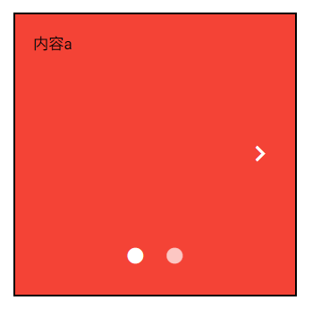

- `ui.pagination`控件，用于切换内容的分页，该控件提供了页码显示和调整功能。

  示例如下：

  ```python3
  from nicegui import ui
  
  def index():
      label = ui.label('当前页为第1页')
      ui.pagination(
          1,
          5,
          direction_links=True,
          value=1,
          on_change=lambda e:label.set_text(
              f'当前页为第{e.value}页'
          )
      )
  
  ui.run(root=index,native=True)
  ```

  

- `ui.stepper`控件、`ui.step`控件、`ui.stepper_navigation`控件，共同组成步骤控件，用于将需要分页的内容按步骤显示，具体结构如下图所示：

  

  其中，`ui.stepper`控件是所有步骤的容器；`ui.step`控件为具体的步骤，必须设置不重复的`name`参数；`ui.stepper_navigation`控件用于放置控制当前步骤的按钮。

  示例如下：

  ```python3
  from nicegui import ui
  
  def index():
      with ui.stepper() as stepper:
          with ui.step('first'):
              ui.label('first')
              with ui.stepper_navigation():
                  ui.button('next',on_click=stepper.next)
          with ui.step('second'):
              ui.label('second')
              with ui.stepper_navigation():
                  ui.button('next',on_click=stepper.next)
                  ui.button('back',on_click=stepper.previous).props('flat')
          with ui.step('third'):
              ui.label('third')
              with ui.stepper_navigation():
                  ui.button('done',on_click=lambda :ui.notify('done'))
                  ui.button('back',on_click=stepper.previous).props('flat')
  
  ui.run(root=index,native=True)
  ```

  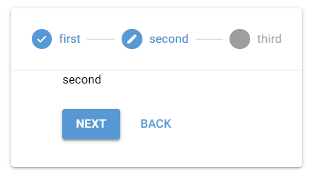

- `ui.timeline`控件、`ui.timeline_entry`控件，共同组成时间线控件，其中，`ui.timeline`控件是容器，`ui.timeline_entry`控件是具体时间点对应的内容。

  示例如下：

  ```python3
  from nicegui import ui
  
  def index():
      with ui.timeline(side='right'):
          ui.timeline_entry('first')
          ui.timeline_entry('second')
          ui.timeline_entry('third')
  
  ui.run(root=index,native=True)
  ```

  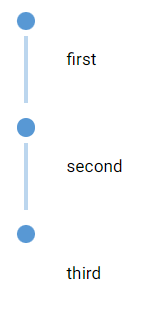

### 15.20 使用菜单

NiceGUI提供了两种菜单，分别是左键点击弹出的一般菜单和右键点击弹出上下文菜单。想要创建它们，会涉及到以下控件：

- `ui.menu_item`控件，用于创建一般的菜单项，只能用于一般菜单、上下文菜单中。

- `ui.menu`控件，用于创建一般菜单。如果是在其他控件的上下文中创建，则点击其他控件，自动弹出菜单。

  示例如下：

  ```python3
  from nicegui import ui
  
  def index():
      with ui.button(icon='menu'):
          with ui.menu() as menu:
              ui.menu_item('auto close')
              ui.menu_item('no auto close',auto_close=False)
              ui.separator()
              ui.menu_item('manual close',auto_close=False,on_click=menu.close)
  
  ui.run(root=index,native=True)
  ```

  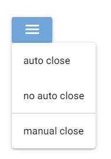

- `ui.context_menu`控件，用于创建上下文菜单。用法与`ui.menu`控件相同，但只能通过右键弹出菜单。

  示例如下：

  ```python3
  from nicegui import ui
  
  def index():
      with ui.button(icon='menu'):
          with ui.context_menu() as menu:
              ui.menu_item('auto close')
              ui.menu_item('no auto close',auto_close=False)
              ui.separator()
              ui.menu_item('manual close',auto_close=False,on_click=menu.close)
  
  ui.run(root=index,native=True)
  ```

  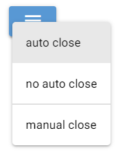

### 15.21 弹出提示信息（更新中）

NiceGUI还提供了一类弹出提示信息的控件，用于提醒用户：

- `ui.tooltip`控件，添加到任意控件的上下文，可以给其添加一个鼠标悬停后弹出的工具提示。比如：

  ```python3
  from nicegui import ui
  
  def index():
      with ui.button('tooltip'):
          ui.tooltip('Hello')
  
  ui.run(root=index,native=True)
  ```

  

  另外，大部分控件支持`tooltip`方法，可以实现同样的效果：

  ```python3
  from nicegui import ui
  
  def index():
      ui.button('tooltip').tooltip('Hello')
  
  ui.run(root=index,native=True)
  ```

- `ui.notify`控件，创建之后立马弹出一条文字消息。

  示例如下：

  ```python3
  from nicegui import ui
  
  def index():
      ui.button(
          'notify',
          on_click=lambda:ui.notify('Hello')
      )
  
  ui.run(root=index,native=True)
  ```

  

- `ui.notification`控件，用法和效果与`ui.notify`控件基本相同，但该控件允许更新消息的内容，也支持主动通过`dismiss`方法隐藏消息，一般用于提供实时更新的弹出消息。

  示例如下：

  ```python3
  from nicegui import ui
  import asyncio
  
  def index():
      async def notify():
          n = ui.notification(
              'Hello',
              timeout=None
          )
          await asyncio.sleep(2)
          n.message = 'World'
          await asyncio.sleep(1)
          n.dismiss()
      ui.button(
          'notification',
          on_click=notify
      )
  
  ui.run(root=index,native=True)
  ```

  

- `ui.dialog`控件，用于弹出一个基于控件设计界面、非系统原生的对话框。

  示例如下：

  ```python3
  from nicegui import ui
  
  def index():
      with ui.dialog() as dialog,ui.card():
          ui.label('dialog')
          ui.button('close',on_click=dialog.close)
      ui.button('dialog',on_click=dialog.open)
  
  ui.run(root=index,native=True)
  ```

  

## 16 使用环境变量

原文参考自 https://nicegui.io/documentation/section_configuration_deployment#environment_variables 。

在NiceGUI中，有些设置项只能通过修改环境变量实现：

- `MATPLOTLIB`，默认为`'true'`，表示是否自动导入`matplotlib`(`ui.matplotlib`控件、`ui.pyplot`控件和`ui.line_plot`控件依赖此库），可以将此环境变量设置为`'false'`来避免自动导入，减少导入`nicegui`所需的时间，同时也会导致`ui.matplotlib`控件、`ui.pyplot`控件和`ui.line_plot`控件无法使用。

  以下为用于对比的示例，读者可以修改环境变量值，冷启动（完全退出再重新打开）看看导入所需的时间：

  ```python3
  import os
  os.environ['MATPLOTLIB'] = 'false'
  
  import time
  start_time = time.time()
  
  from nicegui import ui
  
  end_time = time.time()
  
  print(f'used {end_time- start_time}')
  
  ui.button('Test')
  
  ui.run(native=True)
  ```

- `NICEGUI_STORAGE_PATH`，默认为`'.nicegui'`，表示使用`app.storage`时，需要在服务器磁盘存储数据的空间，具体使用哪个位置，默认为运行命令时当前路径下的`.nicegui`文件夹。

- `NICEGUI_REDIS_URL`，默认未设置（即为`None`），表示使用`app.storage`时，相关数据存储在哪个Redis服务器中，该环境变量需要设置为包含Redis协议的完整地址，比如`'redis://redis_server_host:6379'`，如果不设置（即默认值），则表示相关数据存储在本地文件夹中。

  注意，使用Redis存储`app.storage`时依赖`redis`库，需要先安装依赖库才能使用对应功能。可以参考安装NiceGUI一章，使用`uv add nicegui[redis]`命令提前添加依赖库。

- `NICEGUI_REDIS_KEY_PREFIX`，默认为`'nicegui'`，表示使用`app.storage`，相关数据存储在Redis服务器中时，相关数据的键使用什么作为前缀。

- `MARKDOWN_CONTENT_CACHE_SIZE`，默认为`'1000'`，表示`ui.markdown`在内存中缓存多少个内容片段，如果使用`ui.markdown`时，程序占用内存太高，可以调整该值。

- `RST_CONTENT_CACHE_SIZE`，默认为`'1000'`，表示`ui.restructured_text`在内存中缓存多少个内容片段，如果使用`ui.restructured_text`时，程序占用内存太高，可以调整该值。

  ```python3
  from nicegui import ui
  from nicegui.elements import markdown,restructured_text
  
  import os
  os.environ['MARKDOWN_CONTENT_CACHE_SIZE'] = '1'
  os.environ['RST_CONTENT_CACHE_SIZE'] = '1'
  
  ui.label(f'MARKDOWN_CONTENT_CACHE_SIZE is {markdown.prepare_content.cache_info().maxsize}')
  ui.label(f'RST_CONTENT_CACHE_SIZE is {restructured_text.prepare_content.cache_info().maxsize}')
  
  ui.run(native=True)
  ```

## 17 创建自定义控件

虽然NiceGUI内置了数量丰富的控件，但总会遇到控件功能无法满足需求的情况。此时，就可以创建自定义控件，来实现所需的功能。

在NiceGUI中，可以通过下面几种方法创建自定义控件：

- 继承现有控件。比较简单，只需了解原控件，有Python基础即可实现，推荐此方法。
- 使用Quasar框架或者其他基于VUE的前端UI框架的控件。稍微难一些，需要了解具体前端UI框架的用法，最好懂一些JavaScript、VUE基础，有一定基础的读者可以使用此方法。
- 创建VUE组件并在Python中创建对应的控件。比较困难，需要熟悉JavaScript、VUE语法，还要了解NiceGUI框架的实现原理，仅推荐有前端基础、熟悉NiceGUI框架的读者使用此方法。

### 17.1 继承现有控件

在Python中，通过继承来扩展现有类的功能很简单。只是对于NiceGUI控件而已，还要注意控件的外观变化需要额外调用刷新控件的方法。

假如，现在想要基于`ui.button`控件实现一个可以通过点击切换颜色的按钮，那么，可以这样做：

1. 继承现有类。因为是基于`ui.button`控件实现，所以需要先继承`ui.button`类。
2. 增加`state`属性，默认为`False`，用于保存状态。在`__init__`内初始化`state`属性，然后调用父类的初始化方法。注意，如果要新增自定义属性，必须在调用父类的初始化方法前声明。
3. 定义点击事件的响应函数为调用自身的`toggle`方法。`toggle`方法用于切换`state`属性的值。
4. 完成`toggle`方法的定义和`update`方法的修改。因为涉及到控件外观的变化，所以需要将基于`state`属性修改控件外观的代码写到`update`方法中。

代码如下：

```python3
from nicegui import ui

class ToggleButton(ui.button):
    def __init__(self, *args, **kwargs):
        self.state = False
        super().__init__(*args, **kwargs)
        self.on('click', self.toggle)
    def toggle(self):
        self.state = not self.state
        self.update()
    def update(self):
        if self.state:
            self.props('color=green')
        else:
            self.props('color=red')
        super().update()

def index():
    ToggleButton('Toggle')

ui.run(root=index,native=True)
```

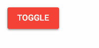

### 17.2 使用前端UI框架的控件

Quasar框架作为基于VUE的前端UI框架，提供了大量控件，但NiceGUI框架并没有实现全部的控件的Python端绑定。因此，可以使用`ui.element`控件，创建这些控件。

Quasar框架有一个浮动功能按钮（具体用法参考文档 https://quasar.dev/vue-components/floating-action-button#introduction），但NiceGUI没有实现（之前版本没有实现，当前版本已经实现，就是`ui.fab`控件，这里只是用来演示）。浮动功能按钮在前端中的使用代码是：

```html
<q-fab color="green" icon="navigation" >
    <q-fab-action color="green-5" icon="train" />
    <q-fab-action color="green-5" icon="sailing" />
    <q-fab-action color="green-5" icon="rocket" />
</q-fab>
```

上面的前端代码可以使用`ui.element`控件转换为Python代码：`q-fab`标签变为`ui.element('q-fab')`，`q-fab-action`标签变为`ui.element('q-fab-action')`，嵌套就是在对应控件的上下文中创建该控件。

完整代码如下：

```python3
from nicegui import ui

def index():
    with ui.element('q-fab').props(
        'icon=navigation color=green'
    ):
        ui.element('q-fab-action').props(
            'icon=train color=green-5'
        )
        ui.element('q-fab-action').props(
            'icon=sailing color=green-5'
        )
        ui.element('q-fab-action').props(
            'icon=rocket color=green-5'
        )

ui.run(root=index, native=True)
```


虽然可以使用原本深度绑定的Quasar框架提供的控件，但因为大部分控件已经在NiceGUI中实现，几乎很少没有（示例中的控件就已经实现了）。因此，NiceGUI框架提供了另一种扩展控件的途径——使用基于VUE的前端UI框架的控件。

以Element Plus框架（https://cn.element-plus.org/zh-CN/component/button.html）和Naive UI框架（https://www.naiveui.com/zh-CN/os-theme/components/button）为例，需要先使用`ui.add_body_html`方法（该方法的用法后面会介绍，并且只能使用该方法，且该方法所属的作用域会影响构建模式，只能与控件处于同一作用域）添加框架所需的JavaScript文件和CSS文件，然后给`app.config.vue_config_script`属性（该属性的作用域不会影响构建模式）追加其他框架的初始化代码。

如果不是给该属性追加初始化代码，而是直接替换的话，需要添加原始的初始化代码到新属性值的最前面：

```javascript
app.use(Quasar, {config: vue_config});
Quasar.lang.set(Quasar.lang[language.replace('-', '')]);
Quasar.Dark.set(dark === None ? 'auto' : dark);
app.use(ElementPlus);
app.use(naive);
```

注意，该功能仅是实验性功能，不能确保NiceGUI默认使用的Quasar框架与其他基于VUE的框架百分百兼容，也无法保证使用其他框架之后，NiceGUI程序依然正常，请慎重使用该功能。

示例如下：

```python3
from nicegui import ui, app

def index():
    ui.add_body_html(
        '''
        <link rel='stylesheet' href='//unpkg.com/element-plus/dist/index.css'/>
        <script defer src='https://unpkg.com/element-plus'></script>
        <script defer src='https://unpkg.com/naive-ui'></script>
        '''
    )
    app.config.vue_config_script += '''
        app.use(ElementPlus);
        app.use(naive);
    '''
    with ui.element('el-button').props('type=primary'):
        ui.label('Element Plus button')
    with ui.element('n-button').props('type=primary'):
        ui.label('Naive UI button')
    ui.button('Quasar button')

ui.run(root=index, native=True)
```


### 17.3 创建VUE组件

如果基于VUE的前端UI框架还是不能满足需求或者对于简单的一个控件来说负担太重（需要额外添加UI框架的JavaScript文件、CSS文件，确实不太轻松），那可以试试创建VUE组件，在VUE中定义界面和部分交互，比在Python中更自由。

不过，创建VUE组件需要熟悉JavaScript、VUE语法，还要了解NiceGUI框架的实现原理，由于笔者不擅长VUE，以下来自官方示例（https://github.com/zauberzeug/nicegui/tree/main/examples/custom_vue_component）的代码就不做详细的解释了，只简单说一下基本思路。

先创建`counter.js`，内容为：

```javascript
// NOTE: Make sure to reload the browser with cache disabled after making changes to this file.
export default {
  template: `
  <button @click="handle_click">
    <strong>{{title}}: {{value}}</strong>
  </button>`,
  data() {
    return {
      value: 0,
    };
  },
  methods: {
    handle_click() {
      this.value += 1;
      this.$emit("change", {value:this.value});
    },
    reset() {
      this.value = 0;
    },
  },
  props: {
    title: String,
  },
};
```

然后在`counter.js`同目录下创建`counter.py`，内容为：

```python3
from typing import Callable, Optional
from nicegui.element import Element

class Counter(Element, component='counter.js'):
    def __init__(self, title: str, *, on_change: Optional[Callable] = None) -> None:
        super().__init__()
        self.props['title'] = title
        self.on('change', on_change)
    def reset(self) -> None:
        self.run_method('reset')
```

`counter.js`同目录下的`main.py`中，使用自定义控件的代码为：

```python3
from nicegui import ui
# 导入代码取决于当前文件与counter.py的相对路径
from counter import Counter

def index():
    ui.markdown(
        '''
        #### 试试点击方框中的文本
        点击会让当前值加一
        '''
    )
    counter = Counter(
        '当前值为', 
        on_change=lambda e: ui.notify(
            f'当前值变为 {e.args['value']}'
        )
    ).classes('border')
    ui.button('复位', on_click=counter.reset)

ui.run(root=index, native=True)
```


自定义控件的核心在`counter.js`文件中，由VUE暴露需要用到的属性和JavaScript方法。在`counter.py`文件中，通过`props`属性接收和设置暴露的属性，使用`run_method`方法执行暴露出的JavaScript方法。如果在`counter.js`文件中发射（`$emit`）了事件，还可以在`counter.py`文件中使用`on`方法响应对应的事件。

## 18 管理静态文件、媒体文件

NiceGUI的页面本质上是网页，而网页中通常包含图片、音频、视频、JavaScript代码、CSS代码等文件。NiceGUI提供了一些方法，可以更好管理、使用这些文件：

- `app.add_static_file`方法和`app.add_static_files`方法，用于管理静态文件。
- `app.add_media_file`方法和`app.add_media_files`方法，用于管理媒体文件。

### 18.1 `app.add_static_file`方法和`app.add_static_files`方法

前面提到过`ui.image`控件、`ui.audio`控件、`ui.video`控件用于处理图片、音频、视频文件。不过，前面的示例中只用了网络地址，并没有使用本地地址，肯定有读者在尝试使用本地地址之后发现了异常，以为NiceGUI有bug。

以下面的代码为例，`os.path.dirname(os.path.abspath(__file__))`可以获取代码文件的当前目录，在代码文件的同目录下放一个图片文件`LOGO.png`，下面的代码就能显示这个图片。看起来没问题。但是，一旦复制这个图片的地址，将后面的文件名换成其他同目录下的文件名之后，粘贴到浏览器中访问，还是会自动跳转到“主页面”：

```python3
from nicegui import ui
import os

def index():
    ui.image(
        f'{os.path.dirname(os.path.abspath(__file__))}/LOGO.png'
    ).classes('w-64 h-64')

ui.run(root=index)
```

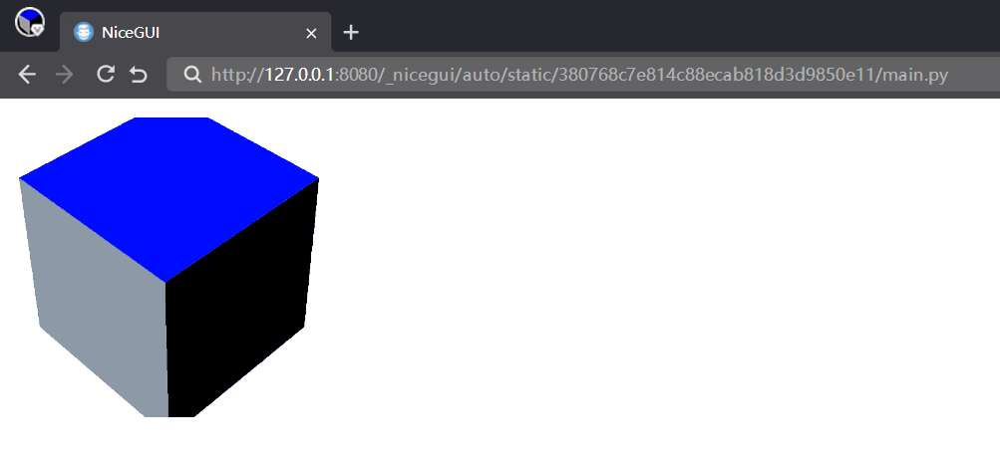

其实这不是NiceGUI的bug，而是默认的安全和缓存机制，只有代码中使用的静态文件才会生成地址映射，其他没有使用的文件即使存在，直接输入地址访问也无法访问。以上面的代码为例，图片文件的地址是`http://127.0.0.1:8080/_nicegui/auto/static/380768c7e814c88ecab818d3d9850e11/LOGO.png`，中间的`380768c7e814c88ecab818d3d9850e11`是图片的hash码，而不是真实存在的目录。之所以会变成这样，是因为NiceGUI会对小的静态文件进行缓存，提高访问速度。因为网页中通常包含大量图片、JavaScript代码、CSS代码等文件，使用缓存可以提高访问速度，不必每次刷新都要从服务器获取。此外，采用缓存机制，还能避免黑客恶意猜测服务器的文件目录，进而获取到影响安全的文件。

这个时候，理解这一切的读者想必已经恍然大悟。但不要高兴得太早，随之而来的是另一个问题——如果`ui.link`控件想使用图片的链接但图片会不定时修改怎么办？总不能每次都用`ui.image`控件生成一次图片地址，然后复制地址过去吧？倒不用那么笨拙，只需使用`ui.image`控件的`auto_route`属性即可：

```python3
from nicegui import ui
import os

def index():
    img = ui.image(
        f'{os.path.dirname(os.path.abspath(__file__))}/LOGO.png'
    ).classes('w-64 h-64')
    ui.link('pic',img.auto_route)

ui.run(root=index)
```

`ui.audio`控件、`ui.video`控件也有`auto_route`属性。

不过，这并不能解决文件变化会导致地址随之变化的问题，一旦非NiceGUI程序或者外部网站需要使用图片地址，还是需要一个可以获取或者固定图片地址的方法。

这时，就需要正式介绍一下本节要说的方法——`app.add_static_file`方法。`app.add_static_file`方法可以返回本地文件的服务器地址，也可以将本地文件映射为固定的服务器地址。

还是以代码为例：

```python3
from nicegui import ui, app
import os

def index():
    src = app.add_static_file(
        local_file=f'{os.path.dirname(os.path.abspath(__file__))}/LOGO.png',
        url_path=None,
        single_use=False
    )
    ui.link('pic', src)
    ui.label(src)
    ui.image(
        src
    ).classes('w-64 h-64')

ui.run(root=index)
```

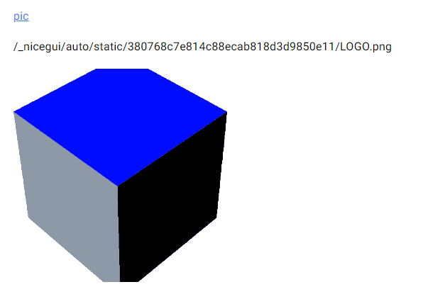

可以看到，给`app_add_static_file`方法的`local_file`参数传入本地文件地址之后，该方法返回的正是服务器地址，和`ui.image`控件的图片地址一致。这样的话，`ui.link`控件可以直接使用该地址，也可以将该地址直接传给其他需要的控件，无需通过特定控件中转。

不过，这只是`app_add_static_file`方法其中一个用法，该方法更好用的用法藏在其参数中。

`app_add_static_file`支持以下参数（部分）：

- `local_file`参数，字符串类型或者`Path`类型，表示本地文件地址。
- `url_path`参数，字符串类型，表示服务器地址，默认为`None`，即自动生成服务器地址，也可以传入参数，例如`'/logo.png'`，就是固定的服务器地址。
- `single_use`参数，布尔类型，表示文件是否在下载一次后移除服务器地址，默认为`False`。

没错，只需给`url_path`参数传入指定地址，就能将文件映射为固定地址：

```python3
from nicegui import ui, app
import os

def index():
    src = app.add_static_file(
        local_file=f'{os.path.dirname(os.path.abspath(__file__))}/LOGO.png',
        url_path='/logo.png',
        single_use=False
    )
    ui.link('pic', src)
    ui.label(src)
    ui.image(
        src
    ).classes('w-64 h-64')

ui.run(root=index)
```


假如要添加的图片比较多，但都在一个文件夹内，是不是还要一个一个添加？不用，`app_add_static_files`方法可以将本地文件夹映射为服务器地址。

`app_add_static_files`支持以下参数（部分）：

- `local_directory`参数，字符串类型或者`Path`类型，表示本地文件夹地址。
- `url_path`参数，字符串类型，表示服务器目录地址，必须传入'/'开头的字符串，例如`'/pic'`，同时不能为`'/'`，不然会报错。
- `follow_symlink`参数，布尔类型，表示是否追踪符号链接，即目录下如果存在符号链接的话，会将符号链接代表的实际路径连接到当前路径下，让服务器地址访问符号链接就和本地访问符号链接一样。这个参数默认为`False`，即不处理符号链接，服务器地址没法访问符号链接。注意，此参数为`True`并且在Windows平台下的话，代码中使用的`os.path.abspath(__file__)`会导致获取到文件路径中的磁盘符号为小写，将导致底层代码出错进而上报404错误。此时应该将`os.path.abspath(__file__)`换成`os.path.realpath(__file__)`。如果后续遇到Windows平台下开启`app_add_static_files`的追踪符号链接后，报404错误，可以按照这个思路检查一下传入的`local_directory`参数中，磁盘符号是不是小写。

### 18.2 `app.add_media_file`方法和`app.add_media_files`方法

前面介绍的`app.add_static_file`方法、`app.add_static_files`方法一般用于添加小的静态文件，本节要介绍的`app.add_media_file`方法、`app.add_media_files`方法则用于添加媒体文件。看名字的话，和前两者相似，一个是添加单个文件，一个是添加文件夹，那NiceGUI为何要设计重复的功能？为什么不能将媒体文件当作静态文件处理？

重复当然是不可能重复的，既然是用于媒体文件，肯定与静态文件不同。媒体文件通常是音视频等需要流式传输的文件，不会一下子全部加载，而是一点一点加载，这种加载方式就叫流式传输。这一点与静态文件不同。毕竟媒体文件通常比较大，一下子全部缓存，一不小心就会让缓存空间爆满。之所以采用流式传输，是因为媒体文件需要支持播放时跳转到指定时间点，如果是采用静态文件那种缓存全部再加载的机制，跳转到指定时间点的功能会失效，只有流式传输才支持跳转到指定时间点。

`app.add_media_file`方法、`app.add_media_files`方法得到的服务器地址就是采用流式传输，而不是缓存机制。

以下面的代码为例，可以看一下区别，因为此代码需要本地视频文件，这里就不提供直接运行的代码了，视频文件地址由读者自己修改：

```python3
from nicegui import ui, app

def index():
    video = r'mv.mp4'
    app.add_static_file(local_file=video,url_path='/video1')
    app.add_media_file(local_file=video,url_path='/video2')

    ui.video('/video1')
    ui.video('/video2')

ui.run(root=index)
```

通常情况下，`app.add_static_file`方法得到的视频文件地址，在播放器中没法自由拖动进度条，只能跳转到关键帧。`app.add_media_file`方法得到的视频文件地址，在播放器中和正常播放一样，可以自由拖动进度条。但是，大多数服务器、浏览器、播放器有优化，实际上两种方法得到的视频地址都可以正常播放、拖动进度条，只有某些要求严格的接口、播放程序才会有区别。一般建议读者使用`app.add_media_file`方法添加媒体文件，以免特定情况下出现不兼容的问题。

`app.add_media_file`方法的参数和`app.add_static_file`方法的一样，这里不再赘述。`app.add_media_files`方法则相比于`app.add_static_files`方法少了`follow_symlink`参数。

## 19 给页面添加额外的HTML、CSS代码

NiceGUI的页面本质上是网页，而网页有时候需要添加一些额外的HTML代码、CSS代码才能使用特定的功能。想要添加额外的外码，就要使用以下方法：

- `ui.add_head_html`方法和`ui.add_body_html`方法。
- `ui.add_css`方法、`ui.add_scss`方法和`ui.add_sass`方法。

#### 19.1 `ui.add_head_html`方法和`ui.add_body_html`方法

`ui.add_head_html`方法可以添加HTML代码到页面的`head`标签内，`ui.add_body_html`方法可以添加HTML代码到页面的`body`标签内。对于页面加载来说，`head`标签内的内容一般不显示，而且因为是从上到下加载，`head`标签内的内容会先被加载，这里通常放着需要第一时间执行的前置脚本和样式设置。`body`标签内放着页面显示内容的主体，使用`ui.add_body_html`方法会在NiceGUI其他控件加载前嵌入HTML代码，因此，使用`ui.add_body_html`方法通常是为了实现在NiceGUI其他内容显示之前放置内容，包括但不限于显示的内容、执行前置脚本和样式设置。

这两个方法都有两个参数字符串参数`code`和布尔参数`shared`。前者表示要嵌入的HTML代码，后者表示是否在所有页面执行嵌入操，即在所属页面执行一次嵌入操作，就能在所有页面上生效。

注意，单页面应用的子页面从属于主页面或者页面，因此，嵌入操作不会在子页面上生效。

前面的`ui.html`控件也可以添加HTML代码，那和`ui.add_head_html`方法、`ui.add_body_html`方法有什么区别？

`ui.html`控件是一个控件，可以使用控件的方法，`ui.add_head_html`方法和`ui.add_body_html`方法是直接将HTML代码嵌入页面，不会返回任何对象，没法调用空间的方法。不过，它们支持嵌入JavaScript代码，而`ui.html`控件只能是纯HTML。

示例如下：

```python3
from nicegui import ui

def index():
    ui.add_head_html(
        '<script>alert("head")</script>'
    )
    ui.add_head_html(
        '<h3>add_head_html</h3>'
    )
    ui.add_body_html(
        '<script>alert("body")</script>'
    )
    ui.add_body_html(
        '<h3>add_body_html</h3>'
    )
    ui.html(
        '<h3>ui.html</h3>',
        sanitize=False
    )

ui.run(root=index, native=True)
```

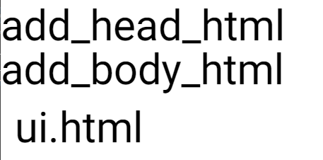

#### 19.2 `ui.add_css`方法、`ui.add_sass`方法和`ui.add_scss`方法

这三个方法都可以添加样式描述代码，只是对应代码的语法不同。

注意，`ui.add_sass`方法和`ui.add_scss`方法依赖`libsass`库，需要先安装依赖库才能使用对应方法。可以参考安装NiceGUI一章，使用`uv add nicegui[sass]`命令提前添加依赖库。

SASS是一种基于CSS语法实现、可以编译为CSS代码的样式描述语言，它在CSS语法的基础上增加了变量 (variables)、嵌套 (nested rules)、混合 (mixins)、导入 (inline imports) 等高级功能，这些拓展令SASS比CSS更加强大与优雅。简单一点理解的话，SASS是CSS扩展版本。SASS在具体代码中有两种语法：通常以`.scss`为后缀的SASS语法，和CSS语法一致，即采用大括号表示所属，用分号表示一句内容的结束；通常以`.sass`为后缀的SCSS语法，变成用缩进代替大括号、用换行代替分号。

`ui.add_css`方法、`ui.add_sass`方法、`ui.add_scss`方法分别用于添加标准CSS语法的代码、SASS语法的代码、SCSS语法的代码。因为SCSS语法和CSS语法一致，基本兼容CSS语法，所以，可以用`ui.add_scss`方法添加CSS代码，`ui.add_sass`方法则不行。另外，也不能用`ui.add_css`方法添加SCSS语法的SASS代码。

`ui.add_css`方法的示例：

```python3
from nicegui import ui

def index():
    ui.add_css(
        '''
        .red {
            color: red;
        }
        '''
    )
    ui.label('This is red with CSS.').classes('red')

ui.run(root=index, native=True)
```

`ui.add_sass`方法的示例：

```python3
from nicegui import ui

def index():
    ui.add_sass(
        '''
        .yellow
            background-color: yellow
            .purple
                color: purple
        '''
    )
    with ui.element().classes('yellow'):
        ui.label('This is purple on yellow with SASS.').classes('purple')

ui.run(root=index, native=True)
```

`ui.add_scss`方法的示例：

```python3
from nicegui import ui

def index():
    ui.add_scss(
        '''
        .green {
            background-color: lightgreen;
            .blue {
                color: blue;
            }
        }
        '''
    )
    with ui.element().classes('green'):
        ui.label('This is blue on green with SCSS.').classes('blue')

ui.run(root=index, native=True)
```

注意，NiceGUI的很多控件自带样式，其样式源于Quasar框架，而部分样式使用`!important`修饰，优先级高于没有使用`!important`修饰的普通样式。

从NiceGUI 3.0.0开始，内部使用了级联层（`@layer`）决定样式的优先级，具体顺序如下：

```css
theme, 
base, 
quasar(Quasar框架的预定义样式类类名在这一层), 
nicegui, 
components, 
utilities(Tailwind CSS框架的预定义样式类类名在这一层), 
overrides
```

对于普通样式，越靠下的层级，优先级越高。

因此，如果想要覆盖NiceGUI的很多控件自带样式，除了添加样式描述代码时需要使用`!important`修饰，还要正确设置级联层，默认使用`quasar`层即可：

```python3
from nicegui import ui

def index():
    ui.add_css(
        '''
        @layer quasar{
            .red {
                background: red!important;
            }
        }
        '''
    )
    ui.button('This is red with CSS.').classes('red')

ui.run(root=index, native=True)
```


## 20 使用`ui.query`方法修改指定HTML标签（更新中）


（优化引言，说明`ui.query`方法可以解决哪些痛点。）


在CSS中，有个非常重要的概念叫选择器。

每一条css样式定义由两部分组成，形式如下：

 ```css
选择器{样式}
 ```

在`{`之前的部分就是“选择器”。 “选择器”指明了`{样式}`中的“样式”的作用对象，也就是“样式”作用于网页中的哪些元素。

选择器有一套自己的[语法规则](https://developer.mozilla.org/en-US/docs/Learn/CSS/Building_blocks/Selectors)，通过合理设置选择器的规则，可以很精准地选择指定元素。

NiceGUI简化了不少CSS上的操作，但不代表不需要CSS的基础。如果读者掌握了CSS的选择器，与`ui.query`和`ui.teleport`结合使用，那就如同得到了屠龙宝刀，操作界面布局、美化界面将更加得心应手。

注意，前两小节要求读者具备CSS选择器基础，没有相应基础的读者可以搁置前两小节，直接看第三小节。


前面讲过如何美化控件，即在控件定义时使用`props`、`classes`、`style`等方法美化控件，也可以在控件定义好之后，通过给定的变量名调用相应方法。但是，如果想要美化的控件、元素根本就不是定义出来的，而是框架带出来的，想要美化就有点麻烦。当然，直接修改内置样式、源码很直观，但麻烦。要是有种方法能让想要修改的内容就像被定义为变量一样，后续直接使用，那就方便不少。正巧，`ui.query`就有这样的功能。

注意，`ui.query`的`props`方法修改的是HTML元素的属性（`attribute`），而不是`ui.element`或者Quasar组件的属性（`props`）。

`ui.query`只有一个字符串类型参数`selector`，顾名思义，就是前面提到的选择器。通过给`ui.query`传入选择器语法，`ui.query`将返回CSS选择器能够选择的元素，后续可以直接对该元素执行样式美化的方法。

下面的代码就是使用`ui.query`选择了`body`（网页的主体），并设置`body`的背景颜色：

```python3
from nicegui import ui

body = ui.query(selector='body')
body.classes('bg-blue-400')

ui.run(native=True)
```

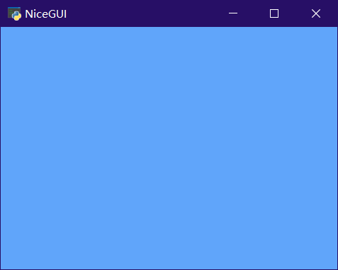

`ui.query`的用法很简单，难点在于确定CSS选择器的写法，这一部分属于CSS基础知识，这里就不再赘述，有能力的读者可以抽时间深入学习CSS选择器的语法。

## 21 使用`ui.teleport`方法传送（移动）控件（更新中）


先说控件的`move`方法可以移动控件的位置，

```python3
from nicegui import ui

def index():
    button = ui.button('ok')
    card = ui.card()
    button.move(card)

ui.run(root=index,native=True)
```

可以用teleport实现

```python3
from nicegui import ui

def index():
    card = ui.card()
    with ui.teleport(card):
        ui.button('ok')

ui.run(root=index,native=True)
```


其实teleport远比看上去强大，因为其支持选择器，所以可以做到类似query一样的查询效果。

比如，使用query查询到的控件、元素，没法在其上下文添加控件，teleport就可以。


肯定有读者在学了`ui.query`美化指定元素之后，突发奇想，想要给指定元素内部添加控件，比如，下面的代码：

```python3
from nicegui import ui

markdown = ui.markdown('Enter your **name**!')
with ui.query(f'#c{markdown.id} strong'):
    ui.input('name').classes('inline-flex').props('dense outlined')

ui.run(native=True)
```

然而，这段代码并不能成功运行，因为`ui.query`并不支持`add_slot`。如果想要实现类似效果，只需将`ui.query`换成`ui.teleport`即可，不过传递的参数名不是`selector`，而是`to`：

```python3
from nicegui import ui

markdown = ui.markdown('Enter your **name**!')
with ui.teleport(to=f'#c{markdown.id} strong'):
    ui.input('name').classes('inline-flex').props('dense outlined')

ui.run(native=True)
```

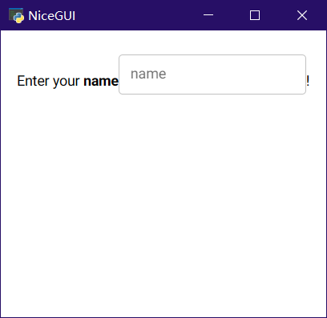

`ui.teleport`就是这样一个基于CSS选择器语法将任意控件传送至指定位置的控件。

## 22 使用`ElementFilter`类定位指定控件（更新中）


`ElementFilter`类 = `ui.query`方法 + `ui.teleport`方法

暂时不会CSS选择器语法的读者也不用着急，尽管CSS选择器语法很强大，但在Python中不够直观，想要快速确定选择器还要去网页中开启调试模式。好在NiceGUI提供了另一种不需要CSS选择器的定位指定元素工具，那就是`ElementFilter`。

`ElementFilter`和`ui`模块同级，使用`from nicegui import ElementFilter`来导入。

`ElementFilter`的功能等于`ui.query`加`ui.teleport`，既能设置指定元素的样式，又能将控件传送到指定位置。但与`ui.query`和`ui.teleport`使用CSS选择器语法不同，`ElementFilter`的筛选方式更pythonic，更直观，更契合Python编程习惯。

以下代码是用于匹配的模板内容，以下面的代码为例，分别看看`ElementFilter`不同参数、方法的用途：

```python3
from nicegui import ui,ElementFilter

with ui.card():
    ui.button('button A')
    ui.label('label A_A')
    ui.label('label A_B')

with ui.card():
    ui.button('button B')
    ui.label('label B_A')
    ui.label('label B_B')

ui.run(native=True)
```

##### 3.8.3.1 初始化方法

`ElementFilter`类需要初始化为对象实例才能使用。`ElementFilter`类的初始化方法有四个参数，分别是 `kind` 、`marker` 、`content` 、`local_scope`。

`kind`参数，NiceGUI的`ui`类型，表示筛选什么类型的控件。比如，在下面的代码中，传入的参数是`ui.label`，`ElementFilter`就会筛选`ui.label`，这样给`ElementFilter`对象设置背景颜色为红色的时候，页面内所有的`ui.label`的背景颜色就相应变成红色。

```python3
from nicegui import ui,ElementFilter

with ui.card():
    ui.button('button A')
    ui.label('label A_A')
    ui.label('label A_B')

with ui.card():
    ui.button('button B')
    ui.label('label B_A')
    ui.label('label B_B')

ElementFilter(kind=ui.label).classes('bg-red')

ui.run(native=True)
```

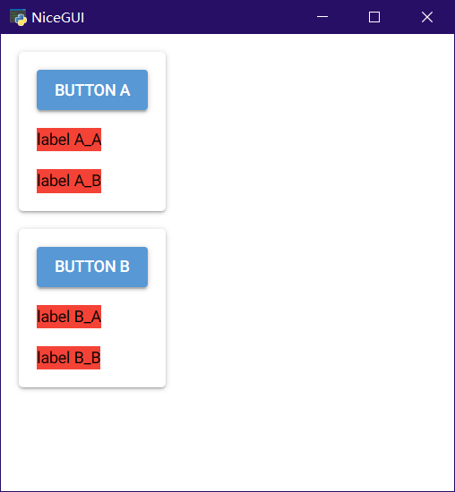

`marker`参数，字符串类型或者字符串列表类型，表示筛选包含指定marker或者指定marker列表的对象。

在此，需要额外介绍一下控件的`mark`方法，也就是如何给控件添加marker。对于每一个控件，都可以通过`mark`方法定义一组marker，用于`ElementFilter`的筛选。`mark`方法的参数是一个支持解包、分解的字符串类型参数`markers`。也就是说，传入`'A'` 、`'A','B','AB'`、`'B A BA'`、`'A','B BA'`都是可以的。本质上说，`mark`方法就是将传入的字符串转换为该对象的`_markers`列表。对于`'A','B','AB'`这样多个字符串，该方法会转化为`['B','A','AB']`这样的列表来使用。对于`'B A BA'`这样用空格划分的字符串，该方法会自动以空格为分隔符分解为`['B','A','BA']`这样的列表来使用。当然，两种方法混用也没问题，`'A','B BA'`这样的多个字符串，则会转化为`['A','B','BA']`这样的列表。注意，虽然`mark`方法支持串联、重复使用，但最好不要这样做，因为后执行的`mark`方法结果会覆盖先前`mark`方法的结果，如果是想清除之前的marker，倒是可以重复执行。

说完给控件添加marker，下面回归正题，说说如何筛选。`marker`参数和`mark`方法的`markers`参数类似，只不过`marker`参数没有解包过程，想要传入多个字符串，只能使用字符串列表。与`mark`方法的宽松不同，`marker`参数的要求比较严格，要么是纯字符串，带空格的会自动划分、转化为列表，要么是无空格的字符串组成列表，不支持正确解析内含带空格的字符串列表，所以，只有以下格式才是正确的用法：`'A'` 、`['A','B','AB']`、`'B A BA'`。

代码示例如下：

```python3
from nicegui import ui,ElementFilter

with ui.card():
    ui.button('button A')
    ui.label('label A_A').mark('A')
    ui.label('label A_B').mark('A','B','AB')

with ui.card():
    ui.button('button B')
    ui.label('label B_B').mark('B')
    ui.label('label B_A').mark('B A BA')
    
ElementFilter(marker='BA').classes('bg-red')
#ElementFilter(marker='A B').classes('bg-red')
#ElementFilter(marker=['A','B']).classes('bg-red')

ui.run(native=True)
```

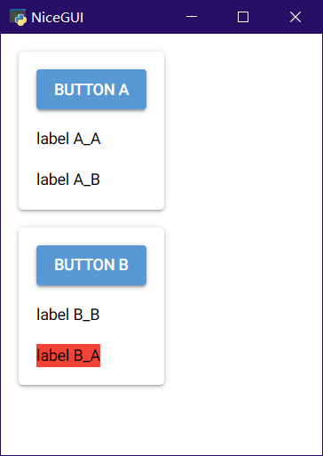

`content`参数，字符串类型或者字符串列表类型，表示筛选包含指定内容的对象。筛选范围包括对象的`value`、`text`、`label`、`icon`、`placeholder`等文本属性。匹配要求完全包含指定字符串或者字符串列表。

```python3
from nicegui import ui,ElementFilter

with ui.card():
    ui.button('button A')
    ui.label('label A_A').mark('A')
    ui.label('label A_B').mark('A','B','AB')

with ui.card():
    ui.button('button B')
    ui.label('label B_B').mark('B')
    ui.label('label B_A').mark('B A BA')
    
ElementFilter(content=['B','A']).classes('bg-red')

ui.run(native=True)
```

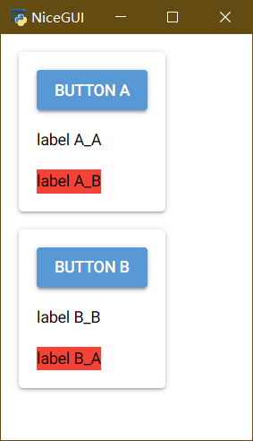

`local_scope`参数，布尔类型，表示`ElementFilter`匹配当前范围还是全局，默认为`False`，即匹配全局。如果设置为`True`，则只匹配当前上下文。可以看以下代码，修改了缩进并将此参数设置为`True`，ElementFilter对象就只能匹配同一缩进内的控件：

```python3
from nicegui import ui,ElementFilter

with ui.card():
    ui.button('button A')
    ui.label('label A_A').mark('A')
    ui.label('label A_B').mark('A','B','AB')

with ui.card():
    ui.button('button B')
    ui.label('label B_B').mark('B')
    ui.label('label B_A').mark('B A BA')
    ElementFilter(content=['B','A'],local_scope=True).classes('bg-red')

ui.run(native=True)
```

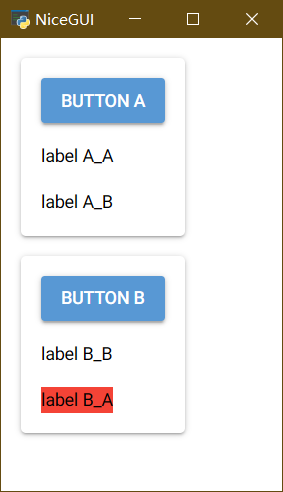

##### 3.8.3.2 `within`方法和`not_within`方法

顾名思义，这两个方法就是在`ElementFilter`初始化参数的筛选范围内进一步筛选指定的父级对象，得到在指定的父级对象上下文之内、不在指定的父级对象上下文之内的对象。对`within`方法而言，会得到符合该方法匹配条件的对象。对`not_within`方法而言，会排除符合该方法匹配条件的对象

两个方法的参数都一样，都是三个，分别是`kind`、`marker`、`instance`。

`kind`和`marker`与初始化方法的参数一样，这里不再赘述。只是，这里的`marker`不支持字符串列表。

`instance`参数，对象或者对象列表，指定具体对象的范围内是否筛选。以 `within`方法为例，给此参数传递具体对象，`ElementFilter`将只筛选在该对象之内的`ui.label`：

```python3
from nicegui import ui,ElementFilter

with ui.card() as card1:
    ui.button('button A')
    ui.label('label A_A').mark('A')
    ui.label('label A_B').mark('A','B','AB')

with ui.card() as card2:
    ui.button('button B')
    ui.label('label B_B').mark('B')
    ui.label('label B_A').mark('B A BA')

ElementFilter(kind=ui.label).within(instance=card2).classes('bg-red')

ui.run(native=True)
```


这两个方法支持串联调用，不过串联就和传递列表给参数一样，是扩展了对应筛选条件的内部列表。对于这两种筛选条件的内部列表，匹配规则是不一样的：对于`within`方法，筛选则是要求列表内元素全部匹配；对于`not_within`方法，筛选则是要求列表内元素任意一个匹配。

##### 3.8.3.3 `exclude`方法

该方法是在`ElementFilter`初始化参数的筛选范围内进一步排除指定的对象。

该方法有三个参数，`kind` 、`marker` 、`content` ，同初始化方法的参数一样，这里简单说一下示例代码，不做详解。不过，该方法的三个参数不支持传入列表，`marker`也不支持根据空格自动划分字符串，这一点需要注意。

```python3
from nicegui import ui,ElementFilter
from nicegui.elements.mixins.text_element import TextElement

with ui.card() as card1:
    ui.button('button A')
    ui.label('label A_A').mark('A')
    ui.label('label A_B').mark('A','B','AB')

with ui.card() as card2:
    ui.button('button B')
    ui.label('label B_B').mark('B')
    ui.label('label B_A').mark('B A BA')

ElementFilter(kind=TextElement).exclude(kind=ui.label).classes('bg-red')

ui.run(native=True)
```


`ui.label`和`ui.button`都继承了`TextElement`，因此匹配`TextElement`会同时匹配到这两种控件，因此，在`exclude`方法中指定`kind`为`ui.label`之后，匹配结果就排除了`ui.label`，只有`ui.button`的颜色变成红色。

##### 3.8.3.4 传送控件到匹配结果

对于`ElementFilter`，想要传送控件到结果也很简单，只需遍历`ElementFilter`对象，就能获取匹配结果。

如下面代码所示，使用`for`遍历`ElementFilter`对象，使用with进入每个元素的上下文，就和正常添加控件到对应slot一样：

```python3
from nicegui import ui,ElementFilter
from nicegui.elements.mixins.text_element import TextElement

with ui.card() as card1:
    ui.button('button A')
    ui.label('label A_A').mark('A')
    ui.label('label A_B').mark('A','B','AB')

with ui.card() as card2:
    ui.button('button B')
    ui.label('label B_B').mark('B')
    ui.label('label B_A').mark('B A BA')

for ele in ElementFilter(kind=TextElement).exclude(kind=ui.label).classes('bg-red'):
    with ele:
        ui.icon('home')

ui.run(native=True)
```


##### 3.8.3.5 总结

`ElementFilter`的方法、参数不多，但用法不统一，要是组合使用，需要一些时间思考其匹配模式。而有的读者看到文字太多就头疼，没关系，这里将上面的内容简化为一个表格方便查阅。详细看过一遍文字教程之后，后续开发中再次遇到，可以快速参阅表格来确定匹配模式。

对应参数的匹配模式：

| ElementFilter的方法 | `__init__` | `within` | `not_within` | `exclude` |
| ------------------- | ---------- | -------- | ------------ | --------- |
| `kind`参数          | 任意一个   | 全部匹配 | 任意一个     | 任意一个  |
| `content`参数       | 全部匹配   | 无此参数 | 无此参数     | 任意一个  |
| `instance`参数      | 无此参数   | 全部匹配 | 任意一个     | 无此参数  |
| `marker`参数        | 全部匹配   | 全部匹配 | 任意一个     | 任意一个  |

Match type for parameters in `ElementFilter`'s method:

| ElementFilter's method | `__init__` | `within` | `not_within` | `exclude` |
| ---------------------- | ---------- | -------- | ------------ | --------- |
| parameter `kind`       | any/or     | all/and  | any/or       | any/or    |
| parameter `content`    | all/and    | ----     | ----         | any/or    |
| parameter `instance`   | ----       | all/and  | any/or       | ----      |
| parameter `marker`     | all/and    | all/and  | any/or       | any/or    |


## 21 使用主题（更新中）

### NiceGUI支持的颜色

颜色表达式的语法


### 颜色主题

ui.colors

### 暗黑模式

ui.dark_mode


## 22 保存数据（更新中）

app.storage


## 2x 使用`ui.navigate`控制地址（更新中）


## 2x 使用`ui.fullscreen`控制全屏（更新中）


## 25 使用`ui.clipboard`读写剪贴板（更新中）

ui.clipboard


## 26 使用`ui.download`下载文件（更新中）


## 27 使用`ui.page_title`修改窗口标题（更新中）


## 28 使用`ui.on`响应自定义事件（更新中）


## 29 使用`ui.context`获取当前上下文（更新中）


client和slot

### 29.1 客户端

客户端：

```python3
from nicegui import ui

async def index():
    print(
        ui.context.client.has_socket_connection
    )
    ui.label('未连接')
    await ui.context.client.connected()
    print(
        ui.context.client.has_socket_connection
    )
    ui.label('已连接')

ui.run(root=index,reload=False,native=True)
```


在客户端侧（区别于直接在服务端运行Python代码）获取属性、修改属性、执行方法（JavaScript代码）：

- `ui.element.run_method()`: run a method on the client side
- `ui.element.get_computed_prop()`: get the value of a property that is computed on the client side
- [`ui.query`](https://nicegui.io/documentation/query): query HTML elements on the client side to modify props, classes and style definitions
- [`ui.run_javascript`](https://nicegui.io/documentation/run#run_custom_javascript_on_the_client_side): run custom JavaScript on the client side (can use `getElement()`, `getHtmlElement()`, and `emitEvent()`)
- `ui.element.on()`的`js_handler`参数，可以绑定客户端侧的JavaScript代码。
- `props`方法中，给属性名前添加英文冒号，可以启用客户端侧计算表达式的功能。


### 29.2 插槽

插槽：

```python3
from nicegui import ui

def index():
    slot = ui.context.slot
    with ui.button('my button'):
        with slot:
            ui.button('ok')

ui.run(root=index,native=True)
```

效果等同于：

```python3
from nicegui import ui

def index():
    with ui.button('my button'):
        button = ui.button('ok')
    button.move(ui.context.client.content)

ui.run(root=index,native=True)
```

或者

```python3
from nicegui import ui

def index():
    with ui.button('my button'):
        with ui.teleport('.nicegui-content'):
            ui.button('ok')

ui.run(root=index,native=True)
```


## 30 通过URL给NiceGUI程序传参

因为NiceGUI是基于FastAPI实现的，所以，FastAPI的URL参数注入（用法参考 https://fastapi.tiangolo.com/tutorial/path-params/ 、https://fastapi.tiangolo.com/tutorial/query-params/ 、https://fastapi.tiangolo.com/advanced/using-request-directly/ ）在NiceGUI程序中也能使用。

NiceGUI程序支持两种URL参数注入：

- 嵌在URL中的路径参数（路径中的部分字段即为参数的值，比如`/icon/star`中的`star`），需要通过定义通配路径来捕获参数的值：`'/icon/{icon}'`。
- 放在英文问号之后的查询参数（需要显式指明参数和对应的值，比如`/icon/star?amount=5`中的`amount=5`），则会自动捕获参数名和对应的值。

在`ui.page`装饰的函数、页面构建函数的参数列表中创建同名参数后，即可在函数内部使用上面提到的URL参数：

```python3
from nicegui import ui

@ui.page('/icon/{icon}')
def icons(icon: str, amount: int = 1):
    ui.label(icon).classes('text-h3')
    with ui.row():
        [
            ui.icon(icon).classes('text-h3') 
            for _ in range(amount)
        ]

@ui.page('/')
def index():
    ui.link('Star', '/icon/star?amount=5')
    ui.link('Home', '/icon/home')
    ui.link('Water', '/icon/water_drop?amount=3')

ui.run()
```

访问名为Star的超链接或者访问`http://127.0.0.1:8080/icon/star?amount=5`即可看到：


## 对话框背景模糊（更新中）


```python3
from nicegui import ui

with ui.dialog().props('backdrop-filter="blur(8px) brightness(40%)"') as dialog:
    ui.label('Press ESC to close').classes('text-3xl text-white')

dialog.on('show', lambda: ui.notify('Dialog opened'))
dialog.on('hide', lambda: ui.notify('Dialog closed'))
dialog.on('escape-key', lambda: ui.notify('ESC pressed'))
ui.button('Open', on_click=dialog.open)

ui.run()
```


## 点击嵌入按钮的图标时不触发按钮的点击事件

如果在按钮的上下文中嵌入图标，给图标的点击事件设置单独的响应函数，点击图标的话，会同时触发按钮和图标的点击响应函数。这是因为HTML处理子级元素的事件时，会把该事件传播到父级元素中，同时触发父级元素的同类事件。

解决方法也很简单，只需给子级元素的响应函数中，添加JavaScript代码，执行对应事件的`stopPropagation()`方法，来阻止事件的传播即可：

```python3
from nicegui import ui

with ui.button('Item').classes('w-96') as button:
    button.on_click(lambda :ui.notify('button'))
    ui.space()
    icon = ui.icon('delete')
    icon.on('click',js_handler='(e)=>{e.stopPropagation()}')
    icon.on('click',lambda :ui.notify('icon'))
    
ui.run(native=True)
```


## 自定义错误页面（更新中）


自定义HTTP错误码对应的页面


自定义Python异常对应的页面


## `ui.run`的参数（更新中）


## 窗口模式相关（更新中）


窗口模式相关的一些用法、示例，比如配置pywebview相关的配置，和pywebview版本相关的配置项，指定运行时为Qt还是Webview2，指定Webview2的版本等。


窗口的关闭、弹出、标题修改、窗口大小调整、窗口位置设置等。


### 3 允许Native Mode的NiceGUI程序弹出下载对话框

默认情况下，在以Native Mode运行的NiceGUI程序中，`ui.download`是不能下载的，这是pywebview框架（Native Mode的依赖）默认的安全配置，这时需要使用`app.native.settings['ALLOW_DOWNLOADS'] = True`来修改pywebview的安全配置，代码如下：

```python3
from nicegui import ui, app

app.native.settings['ALLOW_DOWNLOADS'] = True
ui.button('Download', on_click=lambda: ui.download(b'Demo text','demo_file.txt'))

ui.run(native=True)
```

### 4 让Native Mode的NiceGUI程序使用Qt的QtWebEngine作为运行时

默认情况下，如果Windows系统安装了Webview2，哪怕添加了Qt6相关的Python包（PyQT6、PySide6），以Native Mode运行的NiceGUI程序还是优先采用Webview2当作浏览器运行时。如果想要以Native Mode运行的NiceGUI程序采用QtWebEngine当做浏览器运行时，需要手动指定pywebview框架的Web engine（参考文档见 https://pywebview.flowrl.com/guide/web_engine.html），代码如下：

```python3
from nicegui import ui, app

app.native.start_args['gui'] = 'qt'
app.native.start_args['icon'] = 'favicon.ico'
# For 'gui' arg,you needn't assign it usually,besides you want to change the render; 
#  'edgechromium' is best on Windows ;
# qt based is a litte heavy,but it can be used on Windows/Linux/Mac;
# try to install qt libs by `pip install pywebview[qt]` or else:
#  'qt' needs ["QtPy", "PyQt6", "PyQt6-WebEngine"];
#  'qt6' needs ["QtPy", "PyQt6", "PyQt6-WebEngine"];
#  'pyside6' needs ["QtPy", "PySide6"];

ui.button('Say Hi',on_click=lambda :ui.notify('Hello World!'))

ui.run(native=True)
```

使用QtWebEngine当做浏览器运行时，窗口图标默认为Windows默认图标，而不是Python的图标，可以像代码中一样，使用`app.native.start_args['icon'] = 'favicon.ico'`指定，路径默认为源代码同目录，可以使用相对路径或者绝对路径。

### 5 让Native Mode的NiceGUI程序使用固定版本或者非系统自带的Webview2作为运行时

默认情况下，如果Windows系统安装了Webview2，以Native Mode运行的NiceGUI程序优先采用系统的Webview2当作浏览器运行时。但是，系统的Webview2更新很快，而且是自动更新，若是开发的程序与最新版Webview2不兼容或者想要避免系统Webview2版本更新导致的潜在问题，则可以设置环境变量`WEBVIEW2_BROWSER_EXECUTABLE_FOLDER`为指定版本Webview2解压之后的路径，让native mode运行时使用固定版本Webview2。

固定版本Webview2可以到Webview2官网（https://developer.microsoft.com/zh-cn/microsoft-edge/webview2）下载，本解决方案参考自微软开发者文档（https://learn.microsoft.com/zh-cn/microsoft-edge/webview2/concepts/distribution?tabs=dotnetcsharp#details-about-the-fixed-version-runtime-distribution-mode）。

代码如下：

```python3
from nicegui import ui
import os
import pathlib
os.environ['WEBVIEW2_BROWSER_EXECUTABLE_FOLDER'] = str(pathlib.Path(__file__).parent/'Microsoft.WebView2.FixedVersionRuntime.135.0.3179.98.x64')

ui.run(native=True)
```

这里是将固定版本Webview2解压之后，将包含可执行文件`msedgewebview2.exe`的文件夹（文件夹名字为`'Microsoft.WebView2.FixedVersionRuntime.135.0.3179.98.x64'`）放到源代码的同级目录中，读者在实际使用时可以自行变换路径。


### 20 在Native Mode的NiceGUI程序中打开对话框（不使用JavaScript）

在以Native Mode运行的NiceGUI程序中，除了使用JavaScript调用确认对话框、文件对话框，还可以基于pywebview，使用Python的接口调用这两种对话框。相比于使用JavaScript，直接使用Python的接口，操作更简单，支持的参数也更多。

#### 20.1 确认对话框

使用`app.native.main_window.create_confirmation_dialog`方法即可创建确认对话框：

```python3
from nicegui import ui,app

async def open_dialog():
    # 确认对话框返回布尔值
    result =  await app.native.main_window.create_confirmation_dialog(
        title='选择',
        message='是否继续'
    )
    ui.notify(result)

ui.button('Open Dialog', on_click=open_dialog)

ui.run(native=True)
```


`app.native.main_window.create_confirmation_dialog`方法支持以下参数：

- `title`参数，字符串类型，表示对话框的标题。
- `message`参数，字符串类型，表示对话框的内容。

确认对话框会根据用户的选择返回布尔值，因此，需要使用异步等待获取返回值。

#### 20.2 文件择对话框

使用`app.native.main_window.create_file_dialog`方法即可创建文件对话框：

```python3
from nicegui import ui,app

async def open_dialog():
    result =  await app.native.main_window.create_file_dialog()
    ui.notify(result)

ui.button('Open Dialog', on_click=open_dialog)

ui.run(native=True)
```


`app.native.main_window.create_file_dialog`方法支持以下参数：

- `dialog_type`参数，整数类型，表示文件对话框的类型，默认为`webview.OPEN_DIALOG`。仅支持`[10,20,30]`中的值，分别对应打开文件、打开目录、保存文件。其中保存文件并不会直接创建该文件，只是返回该文件的最终路径，后续需要基于此路径额外执行创建文件的过程，该方法并不负责创建文件。

  除了直接使用整数表示文件对话框的类型，`webview`库还提供了三个预定义常量（也就是该参数默认值的用法），可以根据变量名判断出不同值的含义：

  ```python3
  OPEN_DIALOG = 10
  FOLDER_DIALOG = 20
  SAVE_DIALOG = 30
  ```

  注意，`webview`库升级为6.0之后，这三个预定义常量已经标记为弃用，推荐改用`webview.FileDialog`的成员`LOAD`（对应`OPEN_DIALOG`）、`FOLDER`（对应`FOLDER_DIALOG`）和 `SAVE`（对应`SAVE_DIALOG`）。

  示例如下：

  ```python3
  from nicegui import ui,app
  
  async def open_dialog():
      import webview
      result =  await app.native.main_window.create_file_dialog(
          dialog_type = webview.SAVE_DIALOG
      )
      ui.notify(result)
  
  ui.button('Open Dialog', on_click=open_dialog)
  
  ui.run(native=True)
  ```

- `directory`参数，字符串类型，表示文件对话框的初始路径，默认为`''`，取决于上次打开文件对话框时的路径。

  注意，该参数不支持`r`前缀修饰字符串，也不支持斜杠`'/'`作为路径分隔，仅支持反斜杠`'\'`作为路径分隔，并且为了避免转义导致误解，需要使用双反斜杠代替单反斜杠。比如：

  ```python3
  from nicegui import ui,app
  
  async def open_dialog():
      result =  await app.native.main_window.create_file_dialog(
          directory='E:\\'
      )
      ui.notify(result)
  
  ui.button('Open Dialog', on_click=open_dialog)
  
  ui.run(native=True)
  ```

- `allow_multiple`参数，布尔类型，表示是否允许选择多个文件（按住`ctrl`键可以同时选择多个，仅限打开文件、打开目录），默认为`False`

- `save_filename`参数，字符串类型，表示保存文件时的默认文件名，默认为`''`。

- `file_types`参数，元素为字符串类型的元组，表示默认允许的文件后缀（仅限打开文件、保存文件）。

  在对话框的文件类型下拉框中，元组的每个元素表示一个文件类型选项。而每个元素对应的字符串，其格式为`'{文件类型的简短描述，支持空格} (*.{文件后缀1};*.{文件后缀2};...)'`。一个文件类型选项相当于一个文件格式筛选器，字符串中，英文括号内的文件后缀就是被筛选出来的文件后缀（支持多个，如果只筛选单个文件后缀，则不能添加英文分号）

  示例如下：

  ```python3
  from nicegui import ui,app
  
  async def open_dialog():
      result =  await app.native.main_window.create_file_dialog(
          file_types=('Python File (*.py)','CPP File (*.cpp)')
      )
      ui.notify(result)
  
  ui.button('Open Dialog', on_click=open_dialog)
  
  ui.run(native=True)
  ```

  

文件对话框会根据用户的选择返回文件路径，因此，需要使用异步等待获取返回值。


## x 单页面应用的扩展内容（更新中）

`ui.sub_pages`的`add`方法，

不同的404情况：


（根据本教程前面的概念定义需修改下面对应的概念名词，核实最新版本对应示例代码的执行情况是否相同）


访问不存在的地址，情况根据是否为单页面应用、是否为NiceGUI脚本而有所不同。

非单页面应用的NiceGUI脚本不再显示404页面。因为新版本自动捕获子路由，访问不存在的地址，依然显示首页的内容。

比如，下面的示例不显示404页面：

```python3
from nicegui import ui

ui.link('到其他页面（不存在）', '/other')

ui.run(port=80)
```

单页面应用的NiceGUI脚本，情况会有点复杂：

```python3
from nicegui import ui

def index():
    ui.link('到其他页面（不存在）', '/other')
    ui.separator()
    ui.sub_pages({'/': main, '/page1': page1})

def main():
    ui.label('/（子页面）的内容')
    ui.link('去page1（子页面）', '/page1')

def page1():
    ui.label('page1（子页面）的内容')
    ui.link('回到/（子页面）', '/')

ui.run(root=index,port=80)
```

结果如下表所示：

| 当前地址             | 访问不存在的地址后           | 页面内容          | 刷新后内容      |
| -------------------- | ---------------------------- | ----------------- | --------------- |
| 根路由`/`            | 地址变为不存在的地址`/other` | 子页面显示404提示 | 页面显示500页面 |
| 子路由`/page1`       | 地址不变                     | 子页面显示404提示 | 子页面          |
| 不存在的地址`/other` | 无                           | 页面显示500页面   | 页面显示500页面 |

如果不是NiceGUI脚本，所有页面都是使用`ui.page`定义的私有页面，则正常显示404页面，也可以自定义404页面。

比如，下面的示例正常显示404页面：

```python3
from nicegui import ui

@ui.page('/')
def _():
    ui.link('到其他页面（不存在）', '/other')

ui.run(port=80)
```

还可以自定义404页面：

```python3
from nicegui import ui

@ui.page('/')
def _():
    ui.link('到其他页面（不存在）', '/other')

# 自定义HTTP报错的响应页面
from nicegui import app,Client
from fastapi import Request

@app.exception_handler(404)
def exception_handler_404(request:Request, exception: Exception):
    from urllib.parse import urlparse
    with Client(ui.page(''),request=request) as client:
        ui.label(f'页面 {urlparse(str(request.url)).path[1:]} 不存在').classes('')
    return client.build_response(request, 404)

ui.run(port=80)
```

注意，自定义404页面**不支持**NiceGUI脚本，强行使用会导致NiceGUI脚本的自动捕获子路由无法正常使用。

若是单页面应用，情况会有点复杂：

```python3
from nicegui import ui

@ui.page('/')
@ui.page('/{_:path}')  # 不使用这个的话，刷新子路由时会变成对应的普通页面
def _():
    ui.link('到其他页面（不存在）', '/other')
    ui.separator()
    ui.sub_pages({'/': main, '/page1': page1})

def main():
    ui.label('/（子页面）的内容')
    ui.link('去page1（子页面）', '/page1')

def page1():
    ui.label('page1（子页面）的内容')
    ui.link('回到/（子页面）', '/')

ui.run(port=80)
```

结果如下表所示：

| 当前地址             | 访问不存在的地址后           | 页面内容          | 刷新后内容      |
| -------------------- | ---------------------------- | ----------------- | --------------- |
| 根路由`/`            | 地址变为不存在的地址`/other` | 子页面显示404提示 | 页面显示404页面 |
| 子路由`/page1`       | 地址变为不存在的地址`/other` | 子页面显示404提示 | 页面显示404页面 |
| 不存在的地址`/other` | 无                           | 页面显示404页面   | 页面显示404页面 |


## x 绑定属性的扩展内容（更新中）

### x.1 通用绑定方法

通用的绑定方法：

```python3
from nicegui.binding import bind_from,bind_to,bind
```


示例如下：

```python3
from nicegui import ui
from nicegui.binding import bind

class data_class:
    value = 'no value'

class data_class2:
    value = 'no value'

def index():
    my_input = ui.input('输入')
    bind(
        my_input,
        'value',
        data_class,
        'value'
    )
    bind(
        data_class,
        'value',
        data_class2,
        'value'
    )
    ui.button(
        '显示',
        on_click = lambda :ui.notify(data_class2.value)
    )

ui.run(root=index,native=True)
```


介绍绑定的技巧，字典、全局变量、性能优化

与字典绑定：

```python3
from nicegui import ui

data_dict = {'value':'no value'}

def index():
    ui.input('输入').bind_value(
        data_dict,
        'value'
    )
    ui.button(
        '显示',
        on_click = lambda :ui.notify(data_dict['value'])
    )

ui.run(root=index,native=True)
```

与全局变量绑定：

```python3
from nicegui import ui

value = 'no value'

def index():
    ui.input('输入').bind_value(
        globals(),
        'value'
    )
    ui.button(
        '显示',
        on_click = lambda :ui.notify(globals()['value'])
    )

ui.run(root=index,native=True)
```


（下面内容需要优化表达与示例）

在NiceGUI中有两种类型的绑定：

1.   "Bindable properties" （可绑定属性）会自动检测写入访问并触发值变动传播。大多数 NiceGUI 元素使用这种可绑定属性，例如`ui.input`的`value`或 `ui.label`的`text`。基本上所有带有`bind()`方法的属性都支持这种类型的绑定。
2.   另一种绑定"active links"（活动链接）不会自动检测写入访问并触发值变动传播。如果将标签文本绑定到字典或自定义数据模型的属性，NiceGUI 的绑定模块则需要主动检查值是否发生变化。这个主动检查是通过每 0.1 秒运行一次`refresh_loop()`来完成。主动检查间隔可以通过设置`ui.run()`的参数`binding_refresh_interval`来修改。

可绑定属性非常高效，只要值不变，就不会产生任何性能开销（相对而言比较小而已）。但活动链接需要每秒检查所有绑定值10 次。这可能会消耗比较多的性能，尤其是活动链接的绑定关系非常复杂、非常多的时候。

因为不能让主线程阻塞太久，所以如果太多主动检查导致运行`refresh_loop()`的耗时过长，程序会发出警告。当然，可以配置阈值`binding.MAX_PROPAGATION_TIME`（默认为 0.01 秒）来消除警告。但是，这个警告是有意义的，是在告诉开发者性能可能存在问题。比如，CPU在更新绑定花费太长时间的话，主线程就没法做别的事情，程序界面会因此卡住。

为了避免性能出问题，需要将活动链接改为可绑定属性之间的绑定，需要使用`binding.BindableProperty()`来创建可绑定属性。于是，基于第一小节的代码，将字典改为数据类，在数据类中定义两个可绑定属性，控件的绑定改为与数据类对象的绑定。代码如下：

```python3
from nicegui import ui, binding

class data_base:
    name = binding.BindableProperty()
    age = binding.BindableProperty()
    def __init__(self) -> None:
        self.name = 'Bob'
        self.age = 17

data =data_base()

ui.label().bind_text_from(data, 'name', backward=lambda n: f'Name: {n}')
ui.label().bind_text_from(data, 'age', backward=lambda a: f'Age: {a}')

ui.input(label='name:').bind_value(data,'name')
ui.number(label='age:').bind_value(data,'age',forward=lambda x:int(x))

ui.run(native=True)
```

因为代码中的绑定数量很少，因此差异不大，如果将绑定数量放大百倍，就能看出两种绑定的性能差异。


## x 学习控件——先导篇

NiceGUI的`ui`模块提供了程序所需的全部控件。不过，前面只是简单认识了这些控件，并没有介绍控件的用法。对于想要深入学习控件用法的读者来说，浅尝辄止显然没法满足胃口。

但是，本教程是敏捷式教程，事无巨细不符合本教程的风格，介绍控件的用法又需要全面且详细，还要补充大量示例，像前面一样按类别介绍控件用法，会让章节变得冗长。

于是，笔者思量再三，决定采用新的内容结构介绍控件的用法——期刊，每期只介绍一个控件的基本用法，至于难点和相关的实际问题，则放到单独的章节中。

本期为先导内容，不介绍具体控件。从下期开始，每期介绍一个控件的用法。

另外，《学习控件》的每一期不一定按照发布顺序连续发布，有可能穿插在其他内容中。例如，《学习控件》发布一期之后，下一章就是该控件的相关内容，或者其他内容。

## x 学习控件——`ui.button`控件（更新中）


（简单说一下控件的用途，提供一下NiceGUI框架和Quasar框架那边的文档地址，写个简单的示例，配上图片）


控件支持以下参数：


控件支持以下属性：


控件支持以下方法：


## x 灵感（待定）

更多内容参考 https://nicegui.io/documentation#map-of-nicegui ，看看有没有前面遗漏的。


#### `binding`

[Bind properties of objects to each other](https://nicegui.io/documentation/section_binding_properties).

- [`binding.BindableProperty`](https://nicegui.io/documentation/section_binding_properties#bindable_properties_for_maximum_performance): bindable properties for maximum performance
- [`binding.bindable_dataclass()`](https://nicegui.io/documentation/section_binding_properties#bindable_dataclass): create a dataclass with bindable properties
- `binding.bind()`, `binding.bind_from()`, `binding.bind_to()`: methods to bind two properties


#### `observables`

Observable collections that notify observers when their contents change.

- `ObservableCollection`: base class
- `ObservableDict`: an observable dictionary
- `ObservableList`: an observable list
- `ObservableSet`: an observable set


## x 创作要点

前面系统性介绍基础知识和相关概念，并附上简单的示例，免费发布。

后面针对相关方法、类的具体参数和用法收费发布，内容详细，至少一千字，收费1豆起，最多9豆。

后面具体问题的分析、解决代码大部分收费，少部分免费发布，用于维持热度。
